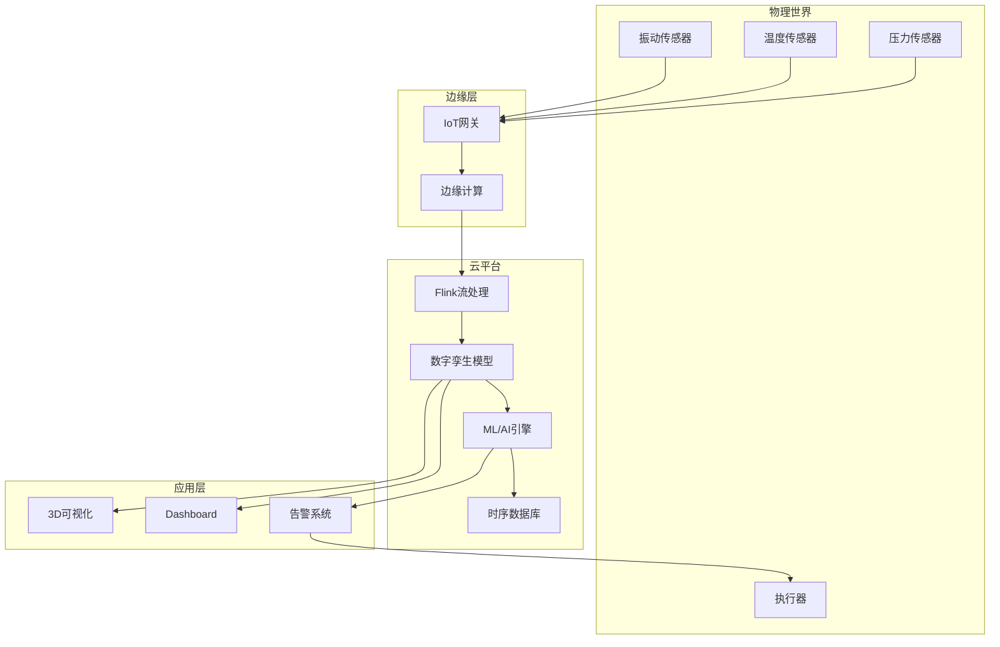
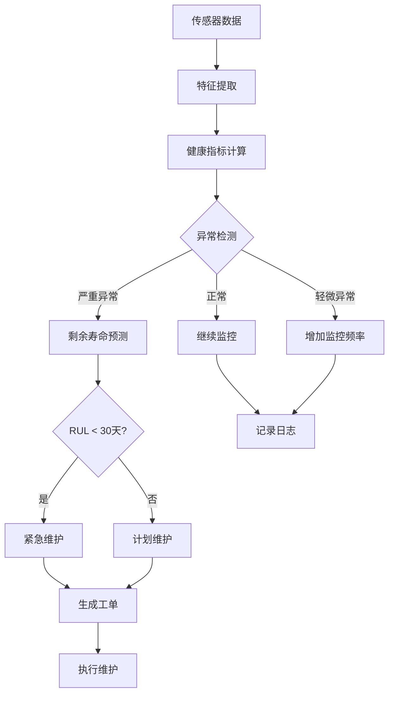
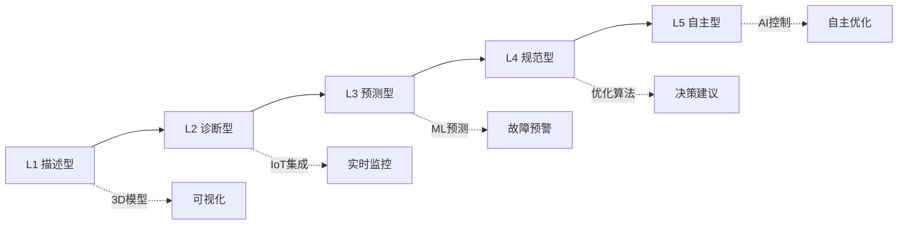

# 实时数字孪生与流处理集成架构

> 所属阶段: Knowledge/06-frontier | 前置依赖: [边缘流处理](edge-streaming-architecture.md), [IoT实时分析](../../Flink/09-practices/09.01-case-studies/case-iot-stream-processing.md) | 形式化等级: L3-L4

## 1. 概念定义 (Definitions)

### Def-K-06-250: Digital Twin (数字孪生)

**数字孪生** 是物理实体的动态虚拟复制品：

$$
\mathcal{DT} \triangleq \langle \mathcal{P}, \mathcal{M}, \mathcal{C}, \mathcal{S} \rangle
$$

其中：

- $\mathcal{P}$: Physical Entity (物理实体)
- $\mathcal{M}$: Virtual Model (虚拟模型)
- $\mathcal{C}$: Connection (数据连接)
- $\mathcal{S}$: Synchronization (实时同步)

**数字孪生类型分层**：

| 类型 | 范围 | 示例 | 刷新频率 |
|------|------|------|----------|
| **Component** | 组件级 | 涡轮叶片、轴承 | 毫秒级 |
| **Asset** | 资产级 | 整台风机、车辆 | 秒级 |
| **Process** | 流程级 | 生产线、工艺 | 分钟级 |
| **System** | 系统级 | 工厂、城市 | 小时级 |

**市场规模**: 2024年 $24.97B → 2030年 $155.84B (CAGR 35%+)

### Def-K-06-251: Real-time Digital Twin

**实时数字孪生** 通过流处理实现毫秒级同步：

$$
\text{RT-DT} = \mathcal{DT} \circ \mathcal{F}_{stream}
$$

**同步延迟约束**：

$$
\Delta t_{sync} = t_{virtual} - t_{physical} \leq \epsilon
$$

工业标准：

- 预测性维护: < 100ms
- 实时控制: < 10ms
- 可视化: < 1s

### Def-K-06-252: Twin State Synchronization

**孪生状态同步** 定义物理-虚拟映射：

```python
class TwinState:
    def __init__(self):
        self.physical_state = {}  # 来自IoT传感器
        self.virtual_state = {}   # 模型计算状态
        self.last_sync = 0

    def sync(self, sensor_data):
        # 卡尔曼滤波融合
        self.virtual_state = kalman_filter(
            prediction=self.model.predict(),
            measurement=sensor_data
        )
        self.last_sync = time.now()
```

### Def-K-06-253: Physics-informed ML

**物理信息机器学习** 结合物理约束与数据驱动：

$$
\mathcal{L}_{total} = \mathcal{L}_{data} + \lambda \mathcal{L}_{physics}
$$

其中：

- $\mathcal{L}_{data}$: 数据拟合损失 (MSE)
- $\mathcal{L}_{physics}$: 物理约束损失 (守恒定律)
- $\lambda$: 平衡系数

### Def-K-06-254: Predictive Maintenance Pipeline

**预测性维护流水线**：

```
传感器数据 → 特征工程 → 异常检测 → 剩余寿命预测 → 维护决策
    ↓              ↓            ↓              ↓              ↓
  实时流        滑动窗口      孤立森林       Weibull模型    成本优化
```

### Def-K-06-255: Digital Thread

**数字主线** 是贯穿产品全生命周期的数据流：

$$
\text{Digital Thread} = \{D_{design}, D_{manufacturing}, D_{operation}, D_{service}\}
$$

**与数字孪生关系**：

- 数字主线: 时间维度的数据连续性
- 数字孪生: 空间维度的实时同步

## 2. 属性推导 (Properties)

### Lemma-K-06-250: 同步精度与成本权衡

**引理**: 同步精度提升带来成本指数增长：

$$
\text{Cost} \propto \frac{1}{\epsilon^2}
$$

**工程建议**: 根据应用场景选择合适的精度阈值

### Prop-K-06-250: 预测准确率边界

**命题**: 预测性维护准确率受限于：

$$
\text{Accuracy} \leq 1 - \frac{\sigma_{noise}}{\sigma_{signal}}
$$

GE实测: 微裂纹预测提前3个月，准确率>85%

### Prop-K-06-251: 数字孪生保真度

**命题**: 孪生模型保真度与计算资源关系：

$$
Fidelity = 1 - e^{-\alpha \cdot Compute}
$$

**边际效应**: 超过临界点后，资源投入收益递减

### Lemma-K-06-251: 边缘-云协同延迟

**引理**: 边缘处理降低端到端延迟：

$$
L_{edge-cloud} = L_{edge} + L_{transmission} + L_{cloud}
$$

典型值：

- 纯云: 100-500ms
- 边缘-云: 10-50ms

## 3. 关系建立 (Relations)

### 3.1 数字孪生与流处理技术栈

```
┌─────────────────────────────────────────────────────────────────┐
│                    Digital Twin Technology Stack                │
├─────────────────────────────────────────────────────────────────┤
│  Visualization Layer                                            │
│  ├── 3D Rendering (Unity/Unreal)                                │
│  ├── AR/VR Interfaces                                           │
│  └── Dashboard (Grafana/Custom)                                 │
├─────────────────────────────────────────────────────────────────┤
│  Analytics Layer                                                │
│  ├── Physics Simulation (ANSYS/Matlab)                          │
│  ├── ML/AI Models (TensorFlow/PyTorch)                          │
│  └── Optimization Solvers                                       │
├─────────────────────────────────────────────────────────────────┤
│  Stream Processing Layer (Flink)                                │
│  ├── State Synchronization                                      │
│  ├── Complex Event Processing                                   │
│  └── Predictive Analytics                                       │
├─────────────────────────────────────────────────────────────────┤
│  Connectivity Layer                                             │
│  ├── IoT Gateway (MQTT/CoAP)                                    │
│  ├── Edge Computing                                             │
│  └── 5G/TSN Network                                             │
├─────────────────────────────────────────────────────────────────┤
│  Physical Layer                                                 │
│  ├── Sensors (Vibration/Temp/Pressure)                          │
│  ├── Actuators                                                  │
│  └── PLC/SCADA                                                  │
└─────────────────────────────────────────────────────────────────┘
```

### 3.2 工业4.0中的数字孪生

```
┌─────────────────────────────────────────────────────────────────┐
│                    Smart Factory Architecture                   │
│                                                                 │
│  ┌──────────────────────────────────────────────────────────┐  │
│  │              Enterprise Layer (ERP/MES)                   │  │
│  └───────────────────────┬──────────────────────────────────┘  │
│                          │                                     │
│  ┌───────────────────────▼──────────────────────────────────┐  │
│  │              Digital Twin Platform                        │  │
│  │  ┌──────────┐  ┌──────────┐  ┌──────────┐              │  │
│  │  │ Asset    │  │ Process  │  │ System   │              │  │
│  │  │ Twin     │  │ Twin     │  │ Twin     │              │  │
│  │  └────┬─────┘  └────┬─────┘  └────┬─────┘              │  │
│  └───────┼─────────────┼─────────────┼──────────────────────┘  │
│          │             │             │                         │
│  ┌───────▼─────────────▼─────────────▼──────────────────────┐  │
│  │              Flink Stream Processing                      │  │
│  │  - Real-time sync     - Anomaly detection               │  │
│  │  - Window aggregation - Predictive maintenance          │  │
│  └────────────────────────┬─────────────────────────────────┘  │
│                           │                                    │
│  ┌────────────────────────▼─────────────────────────────────┐  │
│  │              Industrial IoT                               │  │
│  │  Sensors ──► Edge Gateway ──► Kafka/Pulsar               │  │
│  └──────────────────────────────────────────────────────────┘  │
└─────────────────────────────────────────────────────────────────┘
```

### 3.3 数字孪生成熟度模型

| 级别 | 名称 | 特征 | 技术需求 |
|------|------|------|----------|
| **L1** | 描述型 | 3D可视化，手动更新 | CAD模型 |
| **L2** | 诊断型 | 实时数据接入，状态监控 | IoT, 时序DB |
| **L3** | 预测型 | 异常检测，故障预测 | ML, 流处理 |
| **L4** | 规范型 | 优化建议，决策支持 | 优化算法 |
| **L5** | 自主型 | 自动控制，自优化 | AI, 闭环控制 |

## 4. 论证过程 (Argumentation)

### 4.1 为什么需要实时数字孪生？

**传统方法局限**：

1. **批量分析**: 事后发现，损失已造成
2. **静态模型**: 无法反映设备老化
3. **孤立系统**: 数据孤岛，缺乏关联

**实时数字孪生优势**：

1. **预测性维护**: 提前30-90天预警
2. **实时优化**: 动态调整工艺参数
3. **全生命周期**: 设计→制造→运维闭环

**ROI案例**：

- BMW: 产线重构时间 4周→3天
- GE: 维护成本降低25%
- 新加坡: 全国数字孪生优化城市规划

### 4.2 反模式

**反模式1: 过度建模**

```python
# ❌ 错误：追求100%物理精度
model = CFD_Model(mesh_size=1mm, turbulence=k-epsilon)
# 计算耗时数小时，无法实时

# ✅ 正确：降阶模型 (ROM)
model = ReducedOrderModel(physics_constraints)
# 毫秒级响应，保持关键特征
```

**反模式2: 忽视数据质量**

```python
# ❌ 错误：直接使用原始传感器数据
prediction = model.predict(raw_sensor_data)
# 噪声导致误报

# ✅ 正确：数据预处理流水线
clean_data = pipeline(raw_sensor_data)
    .kalman_filter()
    .outlier_detection()
    .feature_engineering()
prediction = model.predict(clean_data)
```

**反模式3: 单点故障**

```yaml
# ❌ 错误：集中式孪生服务
twin_service: single_instance  # 故障即失联

# ✅ 正确：分布式孪生
edge_twins:
  - location: factory_a
    autonomy: high  # 离线自治
  - location: factory_b
    sync: eventual
cloud_twin:
  aggregation: global_view
```

## 5. 形式证明 / 工程论证

### Thm-K-06-160: 数字孪生同步一致性定理

**定理**: 在流处理保证下，数字孪生状态满足最终一致性：

$$
\lim_{t \to \infty} |State_{virtual}(t) - State_{physical}(t)| \leq \delta
$$

**证明要点**：

1. Flink的checkpoint保证状态持久化
2. Watermark机制处理乱序事件
3. 状态后端支持快速恢复

### Thm-K-06-161: 预测性维护成本节省定理

**定理**: 预测性维护相比计划维护的成本节省：

$$
\text{Savings} = C_{unplanned} \cdot P_{failure} - C_{monitoring}
$$

实测数据：避免非计划停机节省 $2.4M/年

### Thm-K-06-162: 边缘-云协同优化定理

**定理**: 边缘-云分层架构最小化延迟：

$$
\min_{\theta} \left( L_{compute}(\theta) + L_{transmission}(1-\theta) \right)
$$

其中 $\theta$ 是边缘计算比例

## 6. 实例验证 (Examples)

### 6.1 风力发电机数字孪生

```java

import org.apache.flink.api.common.state.ValueState;

public class WindTurbineTwin {

    // 物理参数
    private double bladeLength = 80.0; // meters
    private double ratedPower = 3000.0; // kW
    private int gearboxRatio = 97;

    // 实时状态
    private ValueState<TurbineState> currentState;
    private MapState<String, Deque<Measurement>> historicalData;

    // ML模型 (加载预训练)
    private transient RnnDamagePredictor damageModel;

    public void processMeasurement(Measurement m, Context ctx) {
        // 更新物理状态
        TurbineState state = currentState.value();
        state.update(m);

        // 特征工程
        FeatureVector features = extractFeatures(state, historicalData);

        // 异常检测
        AnomalyScore anomaly = detectAnomaly(features);
        if (anomaly.getScore() > 0.8) {
            ctx.output(alertStream, new Alert(
                "ANOMALY_DETECTED",
                anomaly.getDescription(),
                ctx.timestamp()
            ));
        }

        // 剩余寿命预测 (每1小时)
        if (ctx.timerService().currentProcessingTime() % 3600000 == 0) {
            RULPrediction rul = damageModel.predict(features);

            if (rul.getDaysRemaining() < 30) {
                ctx.output(maintenanceStream, new MaintenanceSchedule(
                    "BLADE_INSPECTION",
                    ctx.timestamp() + rul.getDaysRemaining() * 86400000,
                    rul.getConfidence()
                ));
            }
        }

        // 优化控制参数
        ControlParams optimized = optimizeControl(state);
        ctx.output(controlStream, optimized);

        currentState.update(state);
    }

    private FeatureVector extractFeatures(TurbineState state,
                                         MapState<String, Deque<Measurement>> history) {
        return new FeatureVector()
            // 时域特征
            .add("vibration_rms", calculateRMS(state.getVibration()))
            .add("temperature_gradient", state.getTempGradient())
            .add("power_efficiency", state.getPowerOutput() / state.getWindPower())
            // 频域特征 (FFT)
            .add("frequency_peaks", fftAnalysis(state.getVibration()))
            // 统计特征
            .add("vibration_trend", calculateTrend(history.get("vibration")))
            .add("operating_hours", state.getOperatingHours());
    }
}
```

### 6.2 智能工厂产线数字孪生

```python
from pyflink.datastream import StreamExecutionEnvironment
from pyflink.table import StreamTableEnvironment

# 创建表环境
env = StreamExecutionEnvironment.get_execution_environment()
t_env = StreamTableEnvironment.create(env)

# 定义数字孪生表
t_env.execute_sql("""
CREATE TABLE production_line_twin (
    line_id STRING,
    station_id STRING,
    -- 物理状态
    temperature DOUBLE,
    pressure DOUBLE,
    vibration ARRAY<DOUBLE>,
    -- 生产指标
    throughput INT,
    defect_rate DOUBLE,
    -- 时间属性
    event_time TIMESTAMP(3),
    WATERMARK FOR event_time AS event_time - INTERVAL '5' SECOND,
    -- 主键
    PRIMARY KEY (line_id, station_id) NOT ENFORCED
) WITH (
    'connector' = 'kafka',
    'topic' = 'production-line-telemetry',
    'properties.bootstrap.servers' = 'kafka:9092',
    'format' = 'json'
);
""")

# 创建预测性维护视图
t_env.execute_sql("""
CREATE TABLE maintenance_predictions (
    line_id STRING,
    station_id STRING,
    component STRING,
    -- 预测结果
    failure_probability DOUBLE,
    remaining_useful_life INT,  -- 天数
    recommended_action STRING,
    confidence_score DOUBLE,
    -- 时间
    prediction_time TIMESTAMP(3),
    PRIMARY KEY (line_id, station_id, component) NOT ENFORCED
) WITH (
    'connector' = 'jdbc',
    'url' = 'jdbc:postgresql://db:5432/digital_twin',
    'table-name' = 'maintenance_predictions'
);
""")

# 预测性维护SQL
t_env.execute_sql("""
INSERT INTO maintenance_predictions
SELECT
    line_id,
    station_id,
    'gearbox' as component,
    -- 使用ML_PREDICT调用预训练模型（实验性）
    ML_PREDICT(
        'gearbox_failure_model',
        temperature,
        vibration[1],
        vibration[2],
        vibration[3],
        throughput
    ) as failure_probability,

    -- 剩余寿命估计
    CASE
        WHEN failure_probability > 0.8 THEN 7
        WHEN failure_probability > 0.6 THEN 30
        WHEN failure_probability > 0.4 THEN 90
        ELSE 180
    END as remaining_useful_life,

    CASE
        WHEN failure_probability > 0.8 THEN 'URGENT_MAINTENANCE'
        WHEN failure_probability > 0.6 THEN 'SCHEDULE_MAINTENANCE'
        WHEN failure_probability > 0.4 THEN 'MONITOR_CLOSELY'
        ELSE 'NORMAL_OPERATION'
    END as recommended_action,

    0.85 as confidence_score,

    NOW() as prediction_time

FROM production_line_twin
WHERE event_time > NOW() - INTERVAL '1' HOUR
GROUP BY line_id, station_id,
         TUMBLE(event_time, INTERVAL '1' HOUR);
""")

# 实时优化控制
t_env.execute_sql("""
CREATE TABLE control_commands (
    line_id STRING,
    station_id STRING,
    parameter STRING,
    new_value DOUBLE,
    reason STRING,
    issued_at TIMESTAMP(3)
) WITH (
    'connector' = 'kafka',
    'topic' = 'control-commands',
    'format' = 'json'
);
""")

t_env.execute_sql("""
INSERT INTO control_commands
SELECT
    line_id,
    station_id,
    'feed_rate' as parameter,
    -- 动态调整进给速度
    CASE
        WHEN temperature > 85 THEN throughput * 0.9
        WHEN defect_rate > 0.05 THEN throughput * 0.85
        ELSE throughput * 1.05  -- 增产
    END as new_value,

    CASE
        WHEN temperature > 85 THEN 'COOLING_REQUIRED'
        WHEN defect_rate > 0.05 THEN 'QUALITY_OPTIMIZATION'
        ELSE 'EFFICIENCY_IMPROVEMENT'
    END as reason,

    NOW() as issued_at
FROM production_line_twin;
""")
```

### 6.3 城市级数字孪生 (新加坡案例)

```python
# 新加坡全国数字孪生架构
class CityDigitalTwin:
    def __init__(self):
        self.districts = {}  # 区域级孪生
        self.systems = {}    # 系统级孪生

    def create_district_twin(self, district_id):
        """创建区域级数字孪生"""
        return DistrictTwin(
            district_id=district_id,
            buildings=self.load_building_data(district_id),
            infrastructure=self.load_infrastructure(district_id),
            population=self.load_population_data(district_id)
        )

    def process_city_data(self, data_stream):
        """处理城市传感器数据流"""

        # 交通流量优化
        traffic_stream = data_stream \
            .filter(lambda x: x['type'] == 'traffic') \
            .key_by(lambda x: x['district_id']) \
            .window(TumblingEventTimeWindows.of(Time.minutes(5))) \
            .aggregate(TrafficFlowAggregator())

        # 能源网格优化
        energy_stream = data_stream \
            .filter(lambda x: x['type'] == 'energy') \
            .key_by(lambda x: x['grid_node']) \
            .process(EnergyOptimizationFunction())

        # 洪水模拟预警
        flood_stream = data_stream \
            .filter(lambda x: x['type'] == 'weather') \
            .key_by(lambda x: x['watershed']) \
            .process(FloodSimulationFunction(
                terrain_model=self.load_terrain_model(),
                drainage_model=self.load_drainage_model()
            ))

        return traffic_stream, energy_stream, flood_stream

class FloodSimulationFunction(ProcessFunction):
    """实时洪水模拟"""

    def __init__(self, terrain_model, drainage_model):
        self.terrain = terrain_model
        self.drainage = drainage_model
        self.simulation_engine = HydraulicSimulator()

    def process_element(self, weather_data, ctx):
        # 获取当前降雨数据
        rainfall = weather_data['precipitation_mm_hr']

        if rainfall > 50:  # 暴雨阈值
            # 运行实时洪水模拟
            flood_prediction = self.simulation_engine.simulate(
                rainfall=rainfall,
                terrain=self.terrain,
                drainage=self.drainage,
                duration_hours=6
            )

            # 识别风险区域
            risk_areas = flood_prediction.get_affected_areas(
                threshold_depth=0.3  # 30cm
            )

            yield Alert(
                type='FLOOD_WARNING',
                severity='HIGH' if rainfall > 100 else 'MEDIUM',
                affected_areas=risk_areas,
                estimated_time=flood_prediction.arrival_time,
                recommendations=[
                    'Activate flood barriers',
                    'Evacuate low-lying areas',
                    'Alert emergency services'
                ]
            )
```

### 6.4 数字孪生性能优化

```python
# 降阶模型 (ROM) 实现
class ReducedOrderModel:
    """
    使用POD (Proper Orthogonal Decomposition) 降阶
    将CFD模型从小时级降到毫秒级
    """

    def __init__(self, full_order_model, n_modes=20):
        self.fom = full_order_model
        self.n_modes = n_modes
        self.basis = None  # POD基

    def offline_training(self, training_data):
        """离线训练降阶模型"""
        # 收集快照
        snapshots = []
        for sample in training_data:
            snapshot = self.fom.solve(sample)
            snapshots.append(snapshot)

        # 计算POD基
        snapshot_matrix = np.array(snapshots)
        U, S, Vt = np.linalg.svd(snapshot_matrix, full_matrices=False)
        self.basis = U[:, :self.n_modes]

        # 训练 Galerkin 投影
        self.reduced_operator = self.project_operator()

    def project_state(self, full_state):
        """将全阶状态投影到低维空间"""
        return self.basis.T @ full_state

    def reconstruct_state(self, reduced_state):
        """从低维空间重建全阶状态"""
        return self.basis @ reduced_state

    def online_predict(self, input_params):
        """在线快速预测 (毫秒级)"""
        # 在低维空间求解
        reduced_solution = self.solve_reduced(input_params)
        # 重建全阶解
        return self.reconstruct_state(reduced_solution)

    def solve_reduced(self, input_params):
        """求解降阶系统"""
        # 从预计算的算子快速求解
        return np.linalg.solve(
            self.reduced_operator,
            self.project_input(input_params)
        )

# 使用示例
rom = ReducedOrderModel(full_cfd_model, n_modes=50)
rom.offline_training(training_dataset)

# 在线实时预测
while True:
    current_conditions = get_sensor_data()
    # 全阶模型需要2小时，ROM只需要50ms
    prediction = rom.online_predict(current_conditions)
    update_digital_twin(prediction)
```

## 7. 可视化 (Visualizations)

### 7.1 数字孪生架构图



### 7.2 预测性维护决策流程



### 7.3 数字孪生成熟度演进



## 8. 引用参考 (References)
