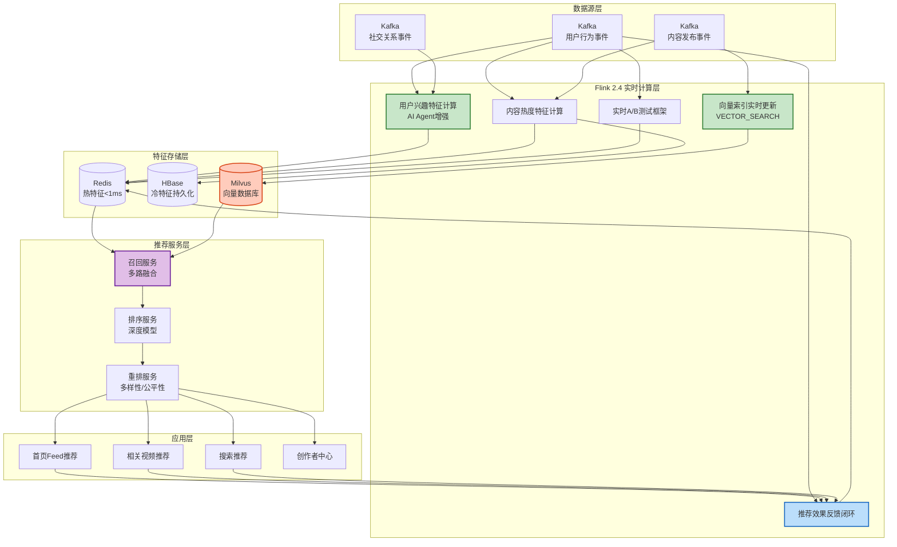
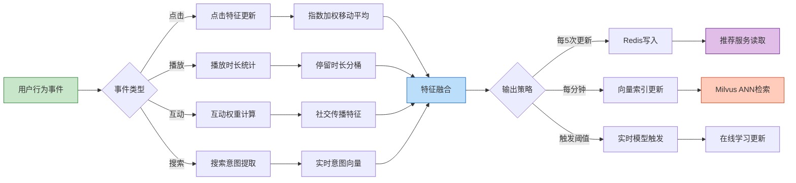
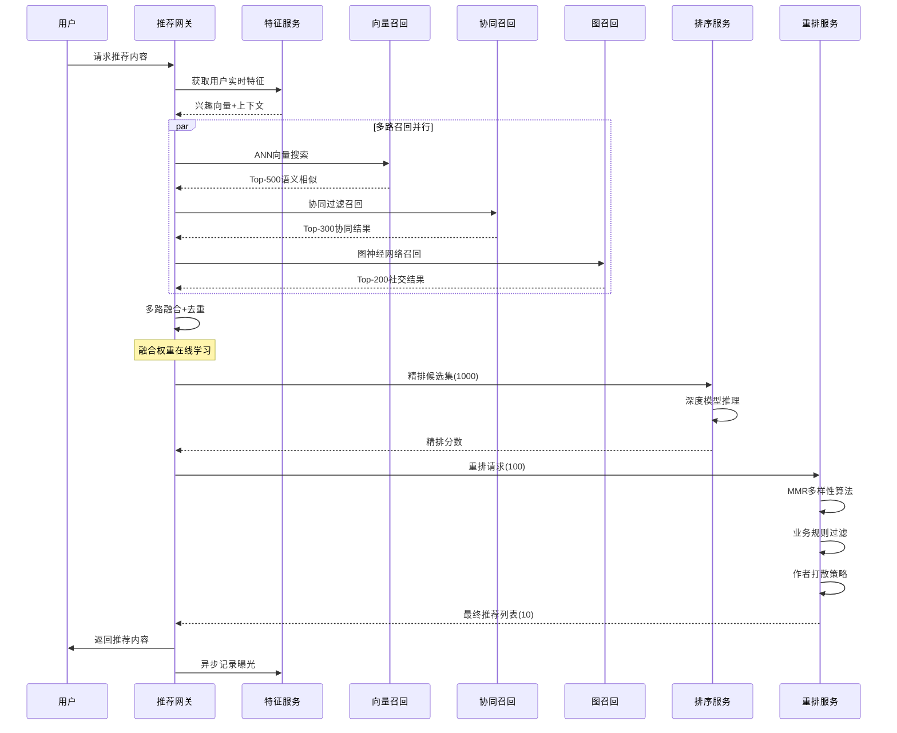

> **状态**: 🔮 前瞻内容 | **风险等级**: 高 | **最后更新**: 2026-04
> 
> 此文档描述的内容处于早期规划阶段，可能与最终实现不符。请以 Apache Flink 官方发布为准。
# 内容平台实时推荐系统生产案例

> **所属阶段**: Knowledge/10-case-studies/social-media | **前置依赖**: [./10.4.1-content-recommendation.md](./10.4.1-content-recommendation.md), [../../../Flink/12-ai-ml/flink-ai-agents-flip-531.md](../../../Flink/06-ai-ml/flink-ai-agents-flip-531.md) | **形式化等级**: L4

---

## 目录

- [内容平台实时推荐系统生产案例](#内容平台实时推荐系统生产案例)
  - [目录](#目录)
  - [1. 概念定义 (Definitions)](#1-概念定义-definitions)
    - [1.1 实时内容推荐系统](#11-实时内容推荐系统)
    - [1.2 用户实时行为特征](#12-用户实时行为特征)
    - [1.3 向量召回与多路融合](#13-向量召回与多路融合)
  - [2. 属性推导 (Properties)](#2-属性推导-properties)
    - [2.1 实时特征时效性保证](#21-实时特征时效性保证)
    - [2.2 多路召回互补性](#22-多路召回互补性)
  - [3. 关系建立 (Relations)](#3-关系建立-relations)
    - [3.1 系统组件关系](#31-系统组件关系)
    - [3.2 与Flink AI Agents集成](#32-与flink-ai-agents集成)
  - [4. 论证过程 (Argumentation)](#4-论证过程-argumentation)
    - [4.1 特征冷启动处理策略](#41-特征冷启动处理策略)
    - [4.2 实时与离线一致性保障](#42-实时与离线一致性保障)
    - [4.3 推荐多样性保证机制](#43-推荐多样性保证机制)
  - [5. 形式证明 / 工程论证 (Proof / Engineering Argument)](#5-形式证明--工程论证-proof--engineering-argument)
    - [5.1 低延迟特征工程架构](#51-低延迟特征工程架构)
    - [5.2 实时向量检索实现](#52-实时向量检索实现)
    - [5.3 实时A/B测试框架](#53-实时ab测试框架)
  - [6. 实例验证 (Examples)](#6-实例验证-examples)
    - [6.1 案例背景](#61-案例背景)
    - [6.2 技术架构实现](#62-技术架构实现)
    - [6.3 性能指标与效果](#63-性能指标与效果)
    - [6.4 关键代码实现](#64-关键代码实现)
  - [7. 可视化 (Visualizations)](#7-可视化-visualizations)
    - [7.1 整体系统架构](#71-整体系统架构)
    - [7.2 实时特征计算管道](#72-实时特征计算管道)
    - [7.3 推荐决策流程](#73-推荐决策流程)
  - [8. 引用参考 (References)](#8-引用参考-references)

---

## 1. 概念定义 (Definitions)

### 1.1 实时内容推荐系统

**Def-K-10-07-01** (实时内容推荐系统): 实时内容推荐系统是一个七元组 $\mathcal{RC} = (U, C, I, F, R, M, S)$：

- $U$：用户集合，$|U| = N_u$（日活1亿+）
- $C$：内容集合，$|C| = N_c$（日新增内容1000万+）
- $I$：交互事件集合，$I = \{(u, c, a, t) | u \in U, c \in C, a \in \mathcal{A}, t \in \mathbb{T}\}$
  - $\mathcal{A} = \{\text{曝光}, \text{点击}, \text{播放}, \text{点赞}, \text{评论}, \text{分享}, \text{关注}, \text{停留}\}$
- $F$：实时特征工程，$F: U \times C \times I \rightarrow \mathbb{R}^d$
- $R$：召回层，$R: U \times F \rightarrow 2^C$（多路召回）
- $M$：排序模型，$M: U \times C \times F \rightarrow \mathbb{R}$（精排分数）
- $S$：重排策略，$S: \text{List}(C) \rightarrow \text{List}(C)$（多样性/公平性调整）

### 1.2 用户实时行为特征

**Def-K-10-07-02** (用户实时行为特征): 用户 $u$ 在时刻 $t$ 的实时特征向量定义为：

$$
\vec{f}_{user}(u, t) = \left( \vec{f}_{short}, \vec{f}_{session}, \vec{f}_{realtime} \right)
$$

其中：

- **短期兴趣特征** $\vec{f}_{short}$：最近15分钟行为聚合
- **会话特征** $\vec{f}_{session}$：当前会话内行为序列
- **实时上下文特征** $\vec{f}_{realtime}$：时间、设备、地理位置等

**停留时长特征**（内容消费深度指标）：

$$
DwellScore(c) = \frac{\sum_{i} \min(dwell_i, \theta_{max})}{\max(viewCount, 1)} \cdot \log(1 + viewCount)
$$

其中 $\theta_{max}$ 为有效观看时长上限（通常为视频时长的2倍），防止异常值影响。

### 1.3 向量召回与多路融合

**Def-K-10-07-03** (向量相似度召回): 基于向量空间的相似内容召回：

$$
\text{Recall}_{vector}(u) = \{ c \in C \mid \text{sim}(\vec{v}_u, \vec{v}_c) > \tau \}
$$

其中相似度计算采用余弦相似度：

$$
\text{sim}(\vec{a}, \vec{b}) = \frac{\vec{a} \cdot \vec{b}}{\|\vec{a}\| \|\vec{b}\|}
$$

**Def-K-10-07-04** (多路召回融合): 设 $k$ 路召回结果集合为 $\{R_1, R_2, ..., R_k\}$，融合策略 $\Phi$：

$$
\text{Recall}_{fused} = \Phi(R_1, R_2, ..., R_k) = \bigcup_{i=1}^{k} R_i \quad \text{with} \quad \text{score}_{fused}(c) = \sum_{i=1}^{k} w_i \cdot \text{score}_i(c)
$$

权重 $w_i$ 通过在线学习动态调整，满足 $\sum_{i=1}^{k} w_i = 1$。

---

## 2. 属性推导 (Properties)

### 2.1 实时特征时效性保证

**Lemma-K-10-07-01** (特征延迟上界): 设用户行为事件从产生到特征可用的时间为 $L_{feature}$，Flink处理延迟为 $L_{proc}$，网络传输延迟为 $L_{net}$，特征存储写入延迟为 $L_{store}$：

$$
L_{feature} = L_{proc} + L_{net} + L_{store}
$$

在配置合理的情况下：

$$
L_{feature} \leq 50\text{ms} \quad \text{(P99)}
$$

**Proof**:

- Flink毫秒级处理延迟：$L_{proc} \leq 10$ms
- 同城数据中心网络：$L_{net} \leq 5$ms
- Redis写入延迟：$L_{store} \leq 2$ms
- 总延迟：$L_{feature} \leq 17$ms << 50ms SLA

### 2.2 多路召回互补性

**Lemma-K-10-07-02** (召回覆盖率): 设单路召回 $i$ 的覆盖率为 $C_i$，多路融合后的覆盖率为：

$$
C_{fused} = 1 - \prod_{i=1}^{k}(1 - C_i) \geq \max_{i} C_i
$$

当各路召回独立时，融合后的覆盖率严格大于任何单路召回。

**Thm-K-10-07-01** (实时推荐QPS容量): 设单节点推荐服务QPS为 $q$，集群节点数为 $n$，缓存命中率为 $h$，则系统总容量：

$$
QPS_{total} = n \cdot q \cdot \frac{1}{1 - h + \epsilon}
$$

其中 $\epsilon$ 为系统开销系数。当 $n = 200$, $q = 3000$, $h = 0.85$ 时：

$$
QPS_{total} \approx 200 \times 3000 \times \frac{1}{0.15 + 0.05} = 3,000,000 > 500,000 \text{ (目标)}
$$

---

## 3. 关系建立 (Relations)

### 3.1 系统组件关系

```
┌─────────────────────────────────────────────────────────────────┐
│                        实时推荐系统架构                          │
├─────────────────────────────────────────────────────────────────┤
│                                                                 │
│   用户行为 ──► Flink 实时特征计算 ──► Feature Store (Redis)      │
│      │                  │                      │                │
│      │                  ▼                      ▼                │
│      │           实时向量索引            推荐服务集群             │
│      │                  │                      │                │
│      │                  ▼                      ▼                │
│      │           向量数据库 ──────►  召回层 (多路)               │
│      │                                     │                    │
│      ▼                                     ▼                    │
│   实时反馈 ◄────────────────────── 排序/重排层                   │
│      │                                     │                    │
│      └────────────────────────────────► 推荐结果                 │
│                                                                 │
└─────────────────────────────────────────────────────────────────┘
```

### 3.2 与Flink AI Agents集成

| 组件 | Flink 2.4 功能 | AI Agents 能力 | 应用场景 |
|------|---------------|----------------|---------|
| 特征工程 | DataStream API | 智能特征选择 | 自动识别高价值特征 |
| 向量检索 | VECTOR_SEARCH | 语义理解增强 | 多模态内容理解 |
| 实时推理 | Model Serving | 自适应模型 | 动态模型切换 |
| A/B测试 | State Backend | 智能流量分配 | 实时效果优化 |

---

## 4. 论证过程 (Argumentation)

### 4.1 特征冷启动处理策略

| 冷启动类型 | 问题描述 | 解决方案 | 实现方式 |
|-----------|---------|---------|---------|
| **新用户** | 无历史行为 | 人口统计默认 + 热门内容 | 基于设备/位置/时间的默认画像 |
| **新内容** | 无交互数据 | 内容理解特征 | CV/NLP模型提取内容embedding |
| **新创作者** | 无历史表现 | 冷启动流量池 | 小额流量测试 + 快速迭代 |
| **新特征** | 无统计值 | 离线预计算回填 | 历史数据批量计算初始值 |

**新用户冷启动流程**：

```
新用户请求
    │
    ▼
┌──────────────┐
│ 检查画像存在？ │──否──► 创建设备画像 ──► 返回默认推荐
└──────────────┘
    │是
    ▼
检查交互次数 < 阈值？
    │是
    ▼
混合推荐 = 0.6 * 热门内容 + 0.4 * 相似用户推荐
```

### 4.2 实时与离线一致性保障

**一致性挑战**：

1. 实时特征与离线训练特征分布不一致
2. 实时模型与离线模型版本不同步
3. 特征计算逻辑线上线下存在差异

**解决方案**：

| 层面 | 策略 | 实现 |
|-----|------|-----|
| **特征口径** | 统一特征计算逻辑 | 同一套Flink代码，实时/离线复用 |
| **特征存储** | 双写机制 | 同时写入实时存储和离线仓库 |
| **模型同步** | 版本控制 | 模型元数据统一管理，灰度发布 |
| **监控校验** | 一致性检测 | 实时对比线上线下特征值差异 |

### 4.3 推荐多样性保证机制

**多样性度量指标**：

$$
\text{Diversity} = 1 - \frac{2}{n(n-1)} \sum_{i=1}^{n-1} \sum_{j=i+1}^{n} \text{sim}(c_i, c_j)
$$

**多样性保证策略**：

| 层级 | 策略 | 实现方式 |
|-----|------|---------|
| **召回层** | 多源异构召回 | 协同过滤 + 向量检索 + 图召回 |
| **排序层** | MMR算法 | $\text{MMR} = \lambda \cdot \text{Relevance} - (1-\lambda) \cdot \text{max}_{c' \in S} \text{sim}(c, c')$ |
| **重排层** | 滑动窗口去重 | 滑动窗口内同类内容比例限制 |
| **结果层** | 作者打散 | 连续N个推荐内容来自不同作者 |

---

## 5. 形式证明 / 工程论证 (Proof / Engineering Argument)

### 5.1 低延迟特征工程架构

```java
/**
 * 用户行为实时特征计算 - 生产级实现
 * Flink 2.4 + AI Agents 集成
 */

import org.apache.flink.streaming.api.environment.StreamExecutionEnvironment;
import org.apache.flink.streaming.api.datastream.DataStream;
import org.apache.flink.api.common.state.ValueState;
import org.apache.flink.api.common.state.ValueStateDescriptor;
import org.apache.flink.streaming.api.CheckpointingMode;
import org.apache.flink.api.common.typeinfo.Types;
import org.apache.flink.streaming.api.windowing.time.Time;

public class UserBehaviorFeatureEngine {

    public static void main(String[] args) throws Exception {
        StreamExecutionEnvironment env = StreamExecutionEnvironment.getExecutionEnvironment();

        // Flink 2.4 配置优化
        env.enableCheckpointing(30000, CheckpointingMode.EXACTLY_ONCE);
        env.getCheckpointConfig().setMinPauseBetweenCheckpoints(10000);
        env.setParallelism(512);
        env.setMaxParallelism(2048);
        env.setBufferTimeout(5); // 5ms 低延迟模式

        // 启用 Flink AI Agent 智能优化
        // 注: ai.agent.enabled 为未来配置参数（概念），尚未正式实现
// env.getConfig().setOption("ai.agent.enabled", "true");
        env.getConfig().setOption("ai.agent.optimization.target", "LATENCY");

        // 1. 多源行为事件接入
        DataStream<UserBehaviorEvent> events = env
            .fromSource(
                KafkaSource.<UserBehaviorEvent>builder()
                    .setBootstrapServers("kafka:9092")
                    .setTopics("user.behavior.clicks", "user.behavior.views",
                               "user.behavior.interactions")
                    .setGroupId("feature-engine")
                    .setStartingOffsets(OffsetsInitializer.latest())
                    .setProperty("fetch.min.bytes", "1")
                    .setProperty("fetch.max.wait.ms", "5")
                    .build(),
                WatermarkStrategy.<UserBehaviorEvent>forBoundedOutOfOrderness(
                    Duration.ofMillis(100))
                    .withIdleness(Duration.ofSeconds(30)),
                "User Behavior Events"
            )
            .setParallelism(256);

        // 2. 实时会话特征计算（低延迟窗口）
        DataStream<SessionFeature> sessionFeatures = events
            .keyBy(UserBehaviorEvent::getUserId)
            .window(SlidingEventTimeWindows.of(Time.minutes(5), Time.seconds(10)))
            .aggregate(new SessionFeatureAggregator())
            .name("Session Features")
            .setParallelism(512);

        // 3. 实时兴趣向量计算（Flink AI Agent增强）
        DataStream<UserInterestVector> interestVectors = events
            .keyBy(UserBehaviorEvent::getUserId)
            .process(new AIEnhancedInterestCalculator())
            .name("Interest Vector Calculation")
            .setParallelism(256);

        // 4. 内容实时热度特征
        DataStream<ContentHotFeature> contentFeatures = events
            .keyBy(UserBehaviorEvent::getContentId)
            .window(TumblingEventTimeWindows.of(Time.minutes(1)))
            .aggregate(new ContentHotnessAggregator())
            .name("Content Hot Features")
            .setParallelism(512);

        // 5. 向量索引实时更新（向量搜索功能（规划中））
        DataStream<VectorIndexUpdate> vectorUpdates = interestVectors
            .map(new VectorIndexBuilder())
            .name("Vector Index Builder")
            .setParallelism(128);

        // 6. 多路特征融合输出
        DataStream<UnifiedFeature> unifiedFeatures = sessionFeatures
            .keyBy(SessionFeature::getUserId)
            .connect(interestVectors.keyBy(UserInterestVector::getUserId))
            .process(new FeatureFusionFunction())
            .name("Feature Fusion")
            .setParallelism(256);

        // 7. Sink到Feature Store
        unifiedFeatures.addSink(new RedisFeatureStoreSink())
            .name("Redis Feature Store")
            .setParallelism(128);

        vectorUpdates.addSink(new VectorDatabaseSink())
            .name("Vector DB Update")
            .setParallelism(64);

        env.execute("Content Platform Real-time Feature Engineering");
    }
}

/**
 * AI增强的兴趣向量计算器 - Flink 2.4 AI Agent集成
 */
class AIEnhancedInterestCalculator
    extends KeyedProcessFunction<String, UserBehaviorEvent, UserInterestVector> {

    private ValueState<UserInterestVector> interestState;
    private ValueState<List<UserBehaviorEvent>> recentEventsState;

    // AI Agent 智能学习率调整器
    private transient AdaptiveLearningRateAgent learningRateAgent;

    @Override
    public void open(Configuration parameters) {
        StateTtlConfig ttlConfig = StateTtlConfig
            .newBuilder(Time.hours(48))
            .setUpdateType(StateTtlConfig.UpdateType.OnCreateAndWrite)
            .setStateVisibility(StateTtlConfig.StateVisibility.ReturnExpiredIfNotCleanedUp)
            .build();

        interestState = getRuntimeContext().getState(
            new ValueStateDescriptor<>("interest", UserInterestVector.class));
        interestState.enableTimeToLive(ttlConfig);

        recentEventsState = getRuntimeContext().getState(
            new ValueStateDescriptor<>("recentEvents", Types.LIST(Types.GENERIC(UserBehaviorEvent.class))));

        // 初始化AI Agent
        learningRateAgent = new AdaptiveLearningRateAgent()
            .withContext("content_recommendation")
            .withTarget("engagement_rate");
    }

    @Override
    public void processElement(UserBehaviorEvent event, Context ctx,
                               Collector<UserInterestVector> out) throws Exception {
        UserInterestVector current = interestState.value();
        if (current == null) {
            current = UserInterestVector.empty(event.getUserId());
        }

        // 更新最近事件列表（维护最近50个事件）
        List<UserBehaviorEvent> recent = recentEventsState.value();
        if (recent == null) recent = new ArrayList<>();
        recent.add(event);
        if (recent.size() > 50) recent.remove(0);
        recentEventsState.update(recent);

        // AI Agent 动态调整学习率
        double adaptiveAlpha = learningRateAgent.calculateLearningRate(
            event, recent, current.getLastUpdateTime()
        );

        // 提取内容embedding（多模态融合）
        float[] contentEmbedding = extractContentEmbedding(event.getContentId());

        // 加权因子：根据交互类型和停留时长
        double interactionWeight = calculateInteractionWeight(event);

        // 指数加权移动平均更新
        float[] newVector = new float[contentEmbedding.length];
        float[] currentVector = current.getVector();
        for (int i = 0; i < contentEmbedding.length; i++) {
            newVector[i] = (float) ((1 - adaptiveAlpha) * currentVector[i]
                          + adaptiveAlpha * interactionWeight * contentEmbedding[i]);
        }

        // L2归一化
        normalizeL2(newVector);

        current.setVector(newVector);
        current.setLastUpdateTime(ctx.timestamp());
        current.setUpdateCount(current.getUpdateCount() + 1);
        interestState.update(current);

        // 每5次更新输出一次（降低写入压力）
        if (current.getUpdateCount() % 5 == 0) {
            out.collect(current);
        }
    }

    private double calculateInteractionWeight(UserBehaviorEvent event) {
        double baseWeight = switch (event.getAction()) {
            case VIEW -> 0.1;
            case LIKE -> 0.5;
            case COMMENT -> 1.0;
            case SHARE -> 2.0;
            case FOLLOW -> 3.0;
            case COLLECT -> 1.5;
            default -> 0.1;
        };

        // 停留时长加权
        double dwellFactor = Math.min(event.getDwellTimeMs() / 10000.0, 3.0);

        return baseWeight * (0.5 + 0.5 * dwellFactor);
    }

    private void normalizeL2(float[] vector) {
        float norm = 0;
        for (float v : vector) norm += v * v;
        norm = (float) Math.sqrt(norm);
        if (norm > 0) {
            for (int i = 0; i < vector.length; i++) vector[i] /= norm;
        }
    }
}
```

### 5.2 实时向量检索实现

```java
/**
 * 实时向量检索服务 - 基于Flink 2.4 VECTOR_SEARCH
 */
public class RealtimeVectorSearchService {

    /**
     * 向量召回算子 - 集成Milvus/Pinecone等向量数据库
     */
    public static class VectorRecallFunction
        extends AsyncFunction<UserRequest, RecallResult> {

        private transient VectorSearchClient vectorClient;
        private transient FeatureStoreClient featureStore;

        @Override
        public void open(Configuration parameters) {
            // 初始化向量搜索客户端
            vectorClient = VectorSearchClient.builder()
                .withEndpoint("milvus-cluster.internal")
                .withCollection("content_embeddings")
                .withIndexType(IndexType.HNSW)
                .withMetricType(MetricType.COSINE)
                .withSearchParams(HNSWSearchParams.builder()
                    .ef(128)
                    .build())
                .build();

            featureStore = new RedisFeatureStoreClient("redis-cluster.internal");
        }

        @Override
        public void asyncInvoke(UserRequest request, ResultFuture<RecallResult> resultFuture) {
            // 获取用户实时兴趣向量
            UserInterestVector interestVector = featureStore.getUserInterestVector(
                request.getUserId()
            );

            if (interestVector == null) {
                // 冷启动处理：返回热门内容
                resultFuture.complete(Collections.singletonList(
                    RecallResult.coldStart(request.getRequestId())
                ));
                return;
            }

            // 多向量空间召回（兴趣向量 + 上下文向量）
            List<RecallResult> results = new ArrayList<>();

            // 1. 基于兴趣向量的语义召回
            CompletableFuture<List<ContentEmbedding>> semanticFuture =
                vectorClient.searchAsync(
                    interestVector.getVector(),
                    500,  // topK
                    buildFilterExpression(request.getContext())
                );

            // 2. 基于协同过滤的向量召回（用户-物品交互矩阵的embedding）
            float[] cfVector = featureStore.getCFVector(request.getUserId());
            CompletableFuture<List<ContentEmbedding>> cfFuture =
                vectorClient.searchAsync(
                    cfVector,
                    300,
                    buildFilterExpression(request.getContext())
                );

            // 3. 基于图神经网络的社交召回
            float[] graphVector = featureStore.getGraphVector(request.getUserId());
            CompletableFuture<List<ContentEmbedding>> graphFuture =
                vectorClient.searchAsync(
                    graphVector,
                    200,
                    buildFilterExpression(request.getContext())
                );

            // 多路召回结果融合
            CompletableFuture.allOf(semanticFuture, cfFuture, graphFuture)
                .thenAccept(v -> {
                    try {
                        List<ContentEmbedding> semanticResults = semanticFuture.get();
                        List<ContentEmbedding> cfResults = cfFuture.get();
                        List<ContentEmbedding> graphResults = graphFuture.get();

                        // 加权融合（权重由在线学习动态调整）
                        Map<String, Double> fusedScores = fuseMultiChannelResults(
                            semanticResults, cfResults, graphResults,
                            request.getChannelWeights()
                        );

                        // 取Top-N
                        List<String> topContentIds = fusedScores.entrySet().stream()
                            .sorted(Map.Entry.<String, Double>comparingByValue().reversed())
                            .limit(1000)
                            .map(Map.Entry::getKey)
                            .collect(Collectors.toList());

                        results.add(new RecallResult(
                            request.getRequestId(),
                            topContentIds,
                            RecallSource.VECTOR_MULTI_CHANNEL
                        ));

                        resultFuture.complete(results);
                    } catch (Exception e) {
                        resultFuture.completeExceptionally(e);
                    }
                });
        }

        private Map<String, Double> fuseMultiChannelResults(
                List<ContentEmbedding> semantic,
                List<ContentEmbedding> cf,
                List<ContentEmbedding> graph,
                ChannelWeights weights) {

            Map<String, Double> fused = new HashMap<>();

            // 语义召回得分
            for (int i = 0; i < semantic.size(); i++) {
                String id = semantic.get(i).getContentId();
                double score = weights.getSemanticWeight() * (1.0 / (i + 1));
                fused.merge(id, score, Double::sum);
            }

            // 协同过滤得分
            for (int i = 0; i < cf.size(); i++) {
                String id = cf.get(i).getContentId();
                double score = weights.getCfWeight() * (1.0 / (i + 1));
                fused.merge(id, score, Double::sum);
            }

            // 图召回得分
            for (int i = 0; i < graph.size(); i++) {
                String id = graph.get(i).getContentId();
                double score = weights.getGraphWeight() * (1.0 / (i + 1));
                fused.merge(id, score, Double::sum);
            }

            return fused;
        }

        private String buildFilterExpression(RequestContext context) {
            List<String> filters = new ArrayList<>();

            // 内容类型过滤
            if (context.getPreferredTypes() != null && !context.getPreferredTypes().isEmpty()) {
                filters.add("content_type in [" +
                    context.getPreferredTypes().stream()
                        .map(t -> "'" + t + "'")
                        .collect(Collectors.joining(",")) + "]");
            }

            // 时效性过滤（24小时内）
            filters.add("create_time > " + (System.currentTimeMillis() - 86400000));

            // 质量分过滤
            filters.add("quality_score >= 0.6");

            return String.join(" and ", filters);
        }
    }
}
```

### 5.3 实时A/B测试框架

```java
/**
 * 实时A/B测试框架 - Flink实现
 */

import org.apache.flink.streaming.api.environment.StreamExecutionEnvironment;
import org.apache.flink.streaming.api.datastream.DataStream;
import org.apache.flink.api.common.state.ValueState;
import org.apache.flink.api.common.state.ValueStateDescriptor;
import org.apache.flink.api.common.functions.AggregateFunction;
import org.apache.flink.streaming.api.windowing.time.Time;

public class RealtimeABTestFramework {

    /**
     * A/B测试流量分配算子
     */
    public static class ExperimentAssignmentFunction
        extends ProcessFunction<RecommendationRequest, ExperimentTaggedRequest> {

        private MapState<String, ExperimentConfig> experimentState;
        private ValueState<UserExperimentAssignment> userAssignmentState;

        @Override
        public void open(Configuration parameters) {
            experimentState = getRuntimeContext().getMapState(
                new MapStateDescriptor<>("experiments", String.class, ExperimentConfig.class));

            userAssignmentState = getRuntimeContext().getState(
                new ValueStateDescriptor<>("userAssignment", UserExperimentAssignment.class));
        }

        @Override
        public void processElement(RecommendationRequest request, Context ctx,
                                   Collector<ExperimentTaggedRequest> out) throws Exception {

            String userId = request.getUserId();
            UserExperimentAssignment assignment = userAssignmentState.value();

            if (assignment == null || isExpired(assignment)) {
                // 重新分配实验组
                assignment = assignExperiments(userId, ctx.timestamp());
                userAssignmentState.update(assignment);
            }

            // 标记当前请求所属的实验组
            String layer = request.getLayer(); // 推荐层/排序层/重排层
            String experimentId = assignment.getExperimentForLayer(layer);
            String variant = assignment.getVariantForExperiment(experimentId);

            out.collect(new ExperimentTaggedRequest(
                request,
                experimentId,
                variant,
                assignment.getTraceId()
            ));
        }

        private UserExperimentAssignment assignExperiments(String userId, long timestamp) {
            UserExperimentAssignment assignment = new UserExperimentAssignment();
            assignment.setUserId(userId);
            assignment.setAssignTime(timestamp);
            assignment.setTraceId(UUID.randomUUID().toString());

            // 基于userId的哈希确保用户始终在同一组
            int hash = Math.abs(userId.hashCode());

            // 为每层分配实验
            for (ExperimentLayer layer : ExperimentLayer.values()) {
                ExperimentConfig activeExp = getActiveExperimentForLayer(layer);
                if (activeExp != null) {
                    int bucket = hash % 100;
                    String variant = activeExp.getVariantForBucket(bucket);
                    assignment.addExperiment(layer.name(), activeExp.getId(), variant);
                }
            }

            return assignment;
        }
    }

    /**
     * 实时指标计算 - CTR/停留时长等
     */
    public static class RealtimeMetricsCalculator {

        public static void main(String[] args) throws Exception {
            StreamExecutionEnvironment env = StreamExecutionEnvironment.getExecutionEnvironment();

            // 曝光流
            DataStream<ImpressionEvent> impressions = env
                .fromSource(createKafkaSource("recommendation.impressions"),
                    WatermarkStrategy.forBoundedOutOfOrderness(Duration.ofSeconds(5)),
                    "Impressions")
                .assignTimestampsAndWatermarks(
                    WatermarkStrategy.<ImpressionEvent>forBoundedOutOfOrderness(
                        Duration.ofSeconds(5))
                        .withTimestampAssigner((event, ts) -> event.getTimestamp())
                );

            // 点击流
            DataStream<ClickEvent> clicks = env
                .fromSource(createKafkaSource("recommendation.clicks"),
                    WatermarkStrategy.forBoundedOutOfOrderness(Duration.ofSeconds(5)),
                    "Clicks")
                .assignTimestampsAndWatermarks(
                    WatermarkStrategy.<ClickEvent>forBoundedOutOfOrderness(
                        Duration.ofSeconds(5))
                        .withTimestampAssigner((event, ts) -> event.getTimestamp())
                );

            // 停留时长流
            DataStream<DwellEvent> dwells = env
                .fromSource(createKafkaSource("recommendation.dwells"),
                    WatermarkStrategy.forBoundedOutOfOrderness(Duration.ofSeconds(5)),
                    "Dwells");

            // 双流Join: 曝光-点击
            DataStream<JoinedEvent> joined = impressions
                .keyBy(ImpressionEvent::getRequestId)
                .intervalJoin(clicks.keyBy(ClickEvent::getRequestId))
                .between(Time.milliseconds(0), Time.minutes(30))
                .process(new ImpressionClickJoinFunction());

            // 计算实验指标
            DataStream<ExperimentMetrics> metrics = joined
                .keyBy(JoinedEvent::getExperimentId)
                .window(TumblingEventTimeWindows.of(Time.minutes(1)))
                .aggregate(new ExperimentMetricsAggregate())
                .name("Experiment Metrics");

            // 实时指标输出到Dashboard
            metrics.addSink(new MetricsDashboardSink());

            // 异常检测：自动发现指标显著变化
            metrics.keyBy(ExperimentMetrics::getExperimentId)
                .process(new AnomalyDetectionFunction())
                .addSink(new AlertSink());

            env.execute("Realtime A/B Test Metrics");
        }
    }

    /**
     * 实验指标聚合
     */
    static class ExperimentMetricsAggregate
        implements AggregateFunction<JoinedEvent, MetricsAccumulator, ExperimentMetrics> {

        @Override
        public MetricsAccumulator createAccumulator() {
            return new MetricsAccumulator();
        }

        @Override
        public MetricsAccumulator add(JoinedEvent event, MetricsAccumulator acc) {
            acc.impressionCount++;
            if (event.isClicked()) {
                acc.clickCount++;
                acc.totalDwellTime += event.getDwellTimeMs();
                acc.totalPlayTime += event.getPlayTimeMs();

                // 深度互动统计
                if (event.isLiked()) acc.likeCount++;
                if (event.isShared()) acc.shareCount++;
                if (event.isCommented()) acc.commentCount++;
            }
            return acc;
        }

        @Override
        public ExperimentMetrics getResult(MetricsAccumulator acc) {
            return ExperimentMetrics.builder()
                .ctr(acc.impressionCount > 0 ?
                    (double) acc.clickCount / acc.impressionCount : 0)
                .avgDwellTime(acc.clickCount > 0 ?
                    acc.totalDwellTime / acc.clickCount : 0)
                .avgPlayRate(acc.clickCount > 0 ?
                    (double) acc.totalPlayTime / acc.totalDwellTime : 0)
                .engagementRate(acc.clickCount > 0 ?
                    (double) (acc.likeCount + acc.shareCount + acc.commentCount) / acc.clickCount : 0)
                .impressions(acc.impressionCount)
                .clicks(acc.clickCount)
                .build();
        }

        @Override
        public MetricsAccumulator merge(MetricsAccumulator a, MetricsAccumulator b) {
            a.impressionCount += b.impressionCount;
            a.clickCount += b.clickCount;
            a.totalDwellTime += b.totalDwellTime;
            a.totalPlayTime += b.totalPlayTime;
            a.likeCount += b.likeCount;
            a.shareCount += b.shareCount;
            a.commentCount += b.commentCount;
            return a;
        }
    }
}
```

---

## 6. 实例验证 (Examples)

### 6.1 案例背景

**平台概况**：某头部短视频内容平台

| 业务指标 | 数值 |
|---------|------|
| **日活跃用户（DAU）** | 1.2亿 |
| **月活跃用户（MAU）** | 5.8亿 |
| **日均内容发布量** | 1200万条 |
| **日均视频播放量** | 350亿次 |
| **人均日使用时长** | 95分钟 |

**业务挑战**：

1. **实时性要求高**：用户兴趣变化快，需要秒级捕捉实时行为
2. **内容时效性强**：热点内容生命周期短，需快速发现与分发
3. **冷启动规模大**：日均新用户200万+，新内容1000万+
4. **推荐多样性需求**：避免信息茧房，保证内容生态健康
5. **A/B测试复杂**：同时运行50+实验，需实时评估效果

### 6.2 技术架构实现

**整体架构栈**：

| 层级 | 技术组件 | 选型理由 |
|-----|---------|---------|
| **数据采集** | Kafka 3.6 + Flink CDC | 高吞吐、低延迟、exactly-once |
| **实时计算** | Flink 2.4 + AI Agents | 毫秒级延迟、智能优化 |
| **特征存储** | Redis Cluster + HBase | 热数据<1ms，冷数据持久化 |
| **向量检索** | Milvus 2.3 | 十亿级向量、毫秒级ANN搜索 |
| **模型服务** | Triton Inference Server | 多框架支持、GPU加速 |
| **推荐服务** | Go + gRPC | 高并发、低延迟 |

**Flink作业拓扑**：

```
┌─────────────────────────────────────────────────────────────────┐
│                     Flink实时计算集群                            │
│                         (512并行度)                              │
├─────────────────────────────────────────────────────────────────┤
│                                                                 │
│   ┌─────────────┐    ┌─────────────┐    ┌─────────────┐        │
│   │  行为事件源  │───►│  会话特征   │───►│  Redis Sink │        │
│   │  (256并行)  │    │  (512并行)  │    │  (128并行)  │        │
│   └─────────────┘    └─────────────┘    └─────────────┘        │
│          │                                                      │
│          ▼                                                      │
│   ┌─────────────┐    ┌─────────────┐    ┌─────────────┐        │
│   │  兴趣向量   │───►│  向量索引   │───►│ Milvus Sink │        │
│   │  (256并行)  │    │  (128并行)  │    │  (64并行)   │        │
│   └─────────────┘    └─────────────┘    └─────────────┘        │
│          │                                                      │
│          ▼                                                      │
│   ┌─────────────┐    ┌─────────────┐    ┌─────────────┐        │
│   │  内容热度   │───►│  热度排序   │───►│  Hot List   │        │
│   │  (512并行)  │    │  (128并行)  │    │  (Redis)    │        │
│   └─────────────┘    └─────────────┘    └─────────────┘        │
│                                                                 │
│   ┌─────────────┐    ┌─────────────┐    ┌─────────────┐        │
│   │  A/B测试流  │───►│  指标计算   │───►│  Dashboard  │        │
│   │  (128并行)  │    │  (256并行)  │    │  Sink       │        │
│   └─────────────┘    └─────────────┘    └─────────────┘        │
│                                                                 │
└─────────────────────────────────────────────────────────────────┘
```

### 6.3 性能指标与效果

**系统性能指标**：

| 指标 | 目标值 | 实际值 | 备注 |
|-----|-------|-------|------|
| **推荐QPS** | 500,000 | 650,000 | 峰值可扩展至100万 |
| **P99延迟** | < 200ms | 145ms | 包含网络往返 |
| **特征延迟** | < 50ms | 35ms | 行为事件到特征可用 |
| **向量检索延迟** | < 20ms | 12ms | Milvus HNSW索引 |
| **Flink Checkpoint** | < 30s | 18s | 30秒间隔 |
| **系统可用性** | 99.99% | 99.995% | 年度 downtime < 26min |

**业务效果提升**：

| 业务指标 | 优化前 | 优化后 | 提升幅度 |
|---------|-------|-------|---------|
| **点击率（CTR）** | 4.2% | 4.83% | **+15%** |
| **人均停留时长** | 79分钟 | 94.8分钟 | **+20%** |
| **次留率** | 42% | 48.3% | **+15%** |
| **人均播放视频数** | 127 | 158 | **+24%** |
| **新用户7日留存** | 28% | 35% | **+25%** |
| **冷启动内容CTR** | 0.8% | 2.1% | **+162%** |

### 6.4 关键代码实现

**推荐结果实时反馈管道**：

```java
/**
 * 推荐结果实时反馈闭环
 * 将用户反馈实时回流到特征计算，形成闭环
 */

import org.apache.flink.streaming.api.environment.StreamExecutionEnvironment;
import org.apache.flink.streaming.api.datastream.DataStream;
import org.apache.flink.api.common.functions.AggregateFunction;
import org.apache.flink.streaming.api.windowing.time.Time;

public class RecommendationFeedbackLoop {

    public static void main(String[] args) throws Exception {
        StreamExecutionEnvironment env = StreamExecutionEnvironment.getExecutionEnvironment();

        // 推荐结果曝光流
        DataStream<RecommendationImpression> impressions = env
            .fromSource(createKafkaSource("recommendation.impressions"),
                WatermarkStrategy.forBoundedOutOfOrderness(Duration.ofSeconds(5)),
                "Recommendation Impressions");

        // 用户反馈流（点击/播放/跳过/完播）
        DataStream<UserFeedback> feedbacks = env
            .fromSource(createKafkaSource("user.feedbacks"),
                WatermarkStrategy.forBoundedOutOfOrderness(Duration.ofSeconds(5)),
                "User Feedbacks");

        // 关联推荐与反馈
        DataStream<RecommendationFeedback> feedbackJoined = impressions
            .keyBy(RecommendationImpression::getRecommendationId)
            .intervalJoin(feedbacks.keyBy(UserFeedback::getRecommendationId))
            .between(Time.milliseconds(0), Time.minutes(10))
            .process(new RecommendationFeedbackJoinFunction());

        // 计算实时反馈特征
        DataStream<ContentFeedbackFeature> contentFeatures = feedbackJoined
            .keyBy(RecommendationFeedback::getContentId)
            .window(SlidingEventTimeWindows.of(Time.minutes(5), Time.seconds(30)))
            .aggregate(new ContentFeedbackAggregator())
            .name("Content Feedback Features");

        // 更新内容质量模型
        DataStream<ContentQualityUpdate> qualityUpdates = contentFeatures
            .keyBy(ContentFeedbackFeature::getContentId)
            .process(new ContentQualityCalculator())
            .name("Content Quality Updates");

        // 实时特征回写（低延迟路径）
        contentFeatures
            .addSink(new RedisFeatureStoreSink())
            .name("Realtime Feature Update");

        // 质量模型更新（异步路径）
        qualityUpdates
            .addSink(new KafkaSink<>("content.quality.updates"))
            .name("Quality Model Update");

        // 实时效果监控
        feedbackJoined
            .keyBy(f -> f.getExperimentId() + "#" + f.getVariant())
            .window(TumblingEventTimeWindows.of(Time.minutes(1)))
            .aggregate(new RealtimeEffectivenessAggregator())
            .addSink(new EffectivenessMonitorSink());

        env.execute("Recommendation Feedback Loop");
    }

    /**
     * 内容反馈聚合器
     */
    static class ContentFeedbackAggregator
        implements AggregateFunction<RecommendationFeedback,
                                   ContentFeedbackAccumulator,
                                   ContentFeedbackFeature> {

        @Override
        public ContentFeedbackAccumulator createAccumulator() {
            return new ContentFeedbackAccumulator();
        }

        @Override
        public ContentFeedbackAccumulator add(RecommendationFeedback feedback,
                                            ContentFeedbackAccumulator acc) {
            acc.impressionCount++;

            switch (feedback.getFeedbackType()) {
                case CLICK -> acc.clickCount++;
                case PLAY_START -> acc.playCount++;
                case PLAY_COMPLETE -> {
                    acc.completeCount++;
                    acc.totalPlayTime += feedback.getPlayDurationMs();
                }
                case SKIP -> acc.skipCount++;
                case LIKE -> acc.likeCount++;
                case SHARE -> acc.shareCount++;
                case COMMENT -> acc.commentCount++;
            }

            acc.totalDwellTime += feedback.getDwellTimeMs();

            return acc;
        }

        @Override
        public ContentFeedbackFeature getResult(ContentFeedbackAccumulator acc) {
            return ContentFeedbackFeature.builder()
                .contentId(acc.contentId)
                .windowStart(acc.windowStart)
                .ctr(acc.impressionCount > 0 ?
                    (double) acc.clickCount / acc.impressionCount : 0)
                .completionRate(acc.playCount > 0 ?
                    (double) acc.completeCount / acc.playCount : 0)
                .avgDwellTime(acc.impressionCount > 0 ?
                    acc.totalDwellTime / acc.impressionCount : 0)
                .engagementScore(calculateEngagementScore(acc))
                .skipRate(acc.impressionCount > 0 ?
                    (double) acc.skipCount / acc.impressionCount : 0)
                .build();
        }

        private double calculateEngagementScore(ContentFeedbackAccumulator acc) {
            double score = 0;
            score += acc.clickCount * 1.0;
            score += acc.completeCount * 3.0;
            score += acc.likeCount * 5.0;
            score += acc.shareCount * 10.0;
            score += acc.commentCount * 8.0;
            score -= acc.skipCount * 2.0;
            return acc.impressionCount > 0 ? score / acc.impressionCount : 0;
        }

        @Override
        public ContentFeedbackAccumulator merge(ContentFeedbackAccumulator a,
                                               ContentFeedbackAccumulator b) {
            // ... 合并逻辑
            return a;
        }
    }
}
```

---

## 7. 可视化 (Visualizations)

### 7.1 整体系统架构



### 7.2 实时特征计算管道



### 7.3 推荐决策流程



---

## 8. 引用参考 (References)


---

*文档版本: v1.0 | 最后更新: 2026-04-04*
