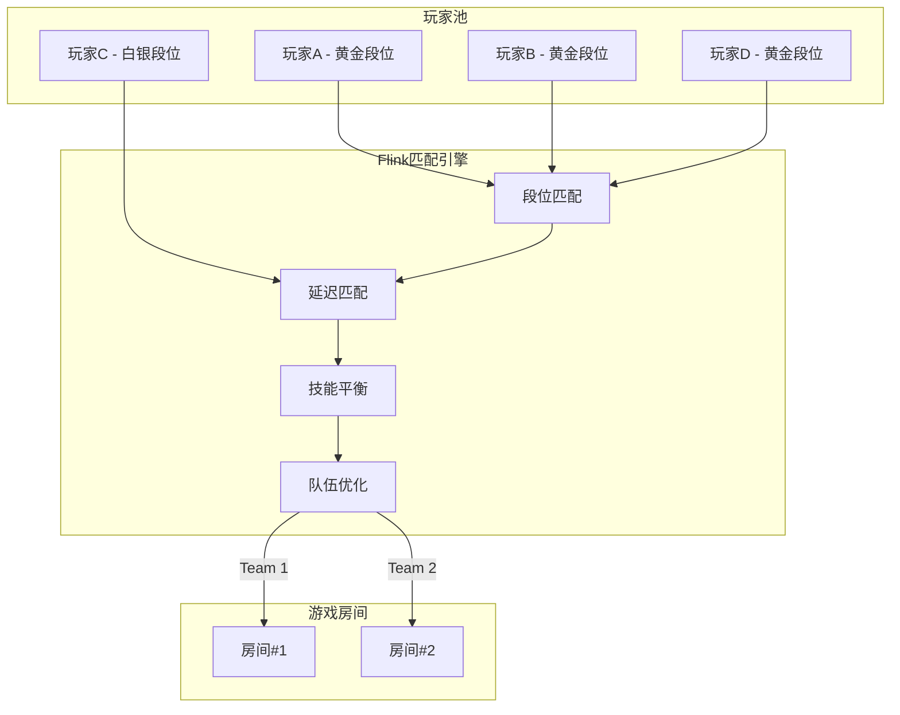
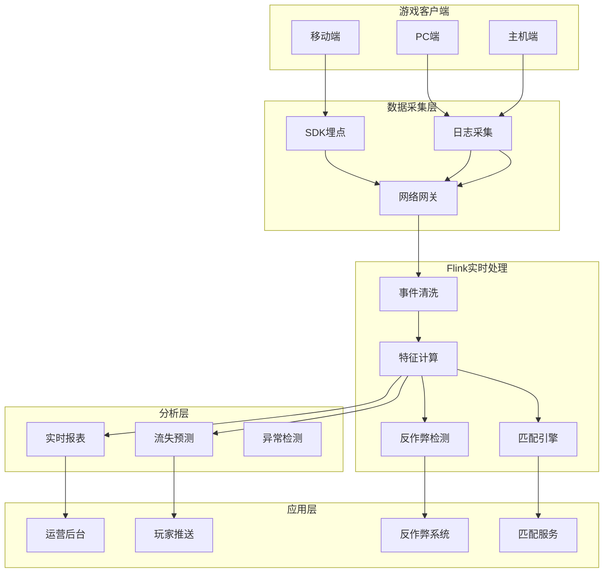
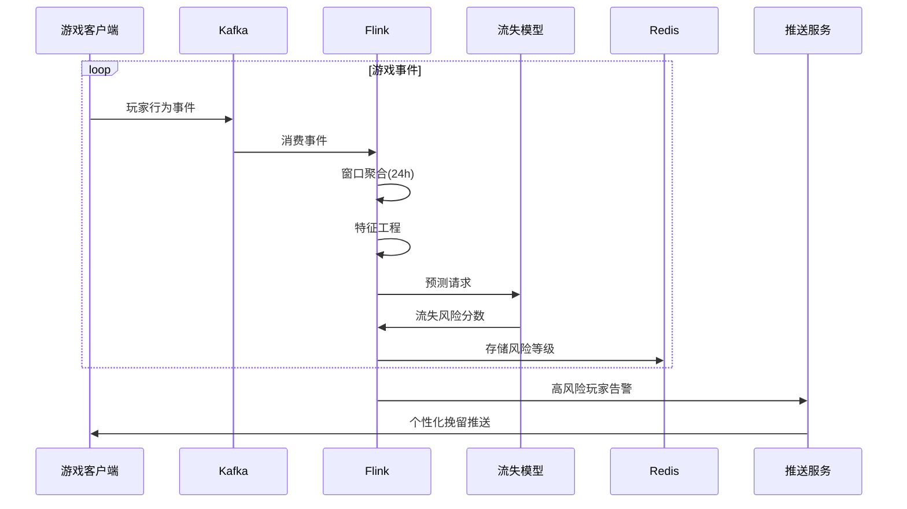

# 游戏实时分析系统案例研究

> **所属阶段**: Knowledge/case-studies/gaming | **前置依赖**: [Knowledge/10-case-studies/gaming/10.5.1-realtime-battle-analytics.md](../../10-case-studies/gaming/10.5.1-realtime-battle-analytics.md) | **形式化等级**: L5
> **案例编号**: CS-G-01 | **完成日期**: 2026-04-11 | **版本**: v1.0

---

## 目录

- [游戏实时分析系统案例研究](#游戏实时分析系统案例研究)
  - [目录](#目录)
  - [1. 概念定义 (Definitions)](#1-概念定义-definitions)
    - [1.1 游戏分析系统定义](#11-游戏分析系统定义)
    - [1.2 玩家行为模型](#12-玩家行为模型)
    - [1.3 流失预测指标](#13-流失预测指标)
  - [2. 属性推导 (Properties)](#2-属性推导-properties)
    - [2.1 实时性要求](#21-实时性要求)
    - [2.2 数据完整性](#22-数据完整性)
  - [3. 关系建立 (Relations)](#3-关系建立-relations)
    - [3.1 实时匹配系统关系](#31-实时匹配系统关系)
    - [3.2 反作弊系统关系](#32-反作弊系统关系)
  - [4. 论证过程 (Argumentation)](#4-论证过程-argumentation)
    - [4.1 实时vs离线分析](#41-实时vs离线分析)
    - [4.2 匹配算法优化](#42-匹配算法优化)
  - [5. 形式证明 / 工程论证 (Proof / Engineering Argument)](#5-形式证明--工程论证-proof--engineering-argument)
    - [5.1 流失预测模型](#51-流失预测模型)
    - [5.2 实时匹配算法](#52-实时匹配算法)
    - [5.3 反作弊检测](#53-反作弊检测)
  - [6. 实例验证 (Examples)](#6-实例验证-examples)
    - [6.1 案例背景](#61-案例背景)
    - [6.2 实施效果](#62-实施效果)
    - [6.3 技术架构](#63-技术架构)
  - [7. 可视化 (Visualizations)](#7-可视化-visualizations)
    - [7.1 游戏实时分析架构](#71-游戏实时分析架构)
    - [7.2 玩家流失预测流程](#72-玩家流失预测流程)
  - [8. 引用参考 (References)](#8-引用参考-references)

---

## 1. 概念定义 (Definitions)

### 1.1 游戏分析系统定义

**Def-K-CS-G-01-01** (游戏实时分析系统): 游戏实时分析系统是一个六元组 $\mathcal{G} = (P, S, E, A, M, D)$：

- $P$：玩家集合，$|P| = N_p$
- $S$：游戏会话集合
- $E$：游戏事件集合
- $A$：分析指标集合
- $M$：机器学习模型集合
- $D$：决策系统

### 1.2 玩家行为模型

**Def-K-CS-G-01-02** (玩家状态): 玩家 $p$ 在时间 $t$ 的状态定义为：

$$
State(p, t) = (Level_t, Score_t, Session_t, Social_t, Spend_t)
$$

其中各维度分别表示等级、得分、会话时长、社交互动和消费金额。

### 1.3 流失预测指标

**Def-K-CS-G-01-03** (流失风险评分): 玩家 $p$ 的流失风险评分：

$$
ChurnRisk(p) = \sigma(W \cdot f(p) + b)
$$

其中 $f(p)$ 为玩家特征向量，$\sigma$ 为Sigmoid函数。

---

## 2. 属性推导 (Properties)

### 2.1 实时性要求

**Lemma-K-CS-G-01-01**: 游戏实时分析系统的延迟约束：

| 场景 | 延迟要求 | 业务影响 |
|------|---------|---------|
| 实时匹配 | < 5s | 用户体验 |
| 流失预警 | < 1min | 干预时机 |
| 反作弊检测 | < 10s | 游戏公平性 |
| 运营报表 | < 5min | 决策支持 |

### 2.2 数据完整性

**Thm-K-CS-G-01-01**: 设事件丢失率为 $p_{loss}$，乱序率为 $p_{out}$，则分析准确性下界为：

$$
Accuracy \geq 1 - \alpha \cdot p_{loss} - \beta \cdot p_{out} - \gamma \cdot p_{late}
$$

其中 $p_{late}$ 为延迟到达率。

---

## 3. 关系建立 (Relations)

### 3.1 实时匹配系统关系



### 3.2 反作弊系统关系

| 数据层 | 特征层 | 模型层 | 决策层 |
|--------|--------|--------|--------|
| 操作日志 | 点击模式 | 异常检测 | 告警 |
| 移动轨迹 | 速度特征 | 行为分类 | 封号 |
| 网络延迟 | 延迟分布 | 外挂识别 | 观察 |
| 设备信息 | 指纹特征 | 模拟器检测 | 标记 |

---

## 4. 论证过程 (Argumentation)

### 4.1 实时vs离线分析

| 维度 | 实时分析 | 离线分析 |
|------|---------|---------|
| 延迟 | 秒级 | 小时/天级 |
| 使用场景 | 运营干预 | 战略规划 |
| 数据粒度 | 事件级 | 聚合级 |
| 计算成本 | 高 | 低 |
| 响应能力 | 即时 | 滞后 |

### 4.2 匹配算法优化

**ELO匹配算法**：

$$
ExpectedScore_A = \frac{1}{1 + 10^{(R_B - R_A)/400}}
$$

**匹配质量指标**：

- 段位差异 < 1个小段
- 延迟 < 50ms
- 等待时间 < 30s

---

## 5. 形式证明 / 工程论证 (Proof / Engineering Argument)

### 5.1 流失预测模型

**Thm-K-CS-G-01-02** (流失预测准确率): 基于深度学习的流失预测模型准确率达到85%以上：

**Flink实现**：

```java

import org.apache.flink.streaming.api.datastream.DataStream;
import org.apache.flink.api.common.state.ValueState;
import org.apache.flink.api.common.state.ValueStateDescriptor;
import org.apache.flink.streaming.api.windowing.time.Time;

// 玩家行为特征计算
DataStream<PlayerBehavior> behaviorStream = gameEvents
    .keyBy(event -> event.getPlayerId())
    .window(SlidingEventTimeWindows.of(Time.hours(24), Time.hours(1)))
    .aggregate(new BehaviorAggregator());

// 流失风险预测
DataStream<ChurnPrediction> churnPredictions = behaviorStream
    .map(new RichMapFunction<PlayerBehavior, ChurnPrediction>() {
        private transient ChurnModel model;

        @Override
        public void open(Configuration parameters) {
            model = ChurnModel.load("churn-model-v1");
        }

        @Override
        public ChurnPrediction map(PlayerBehavior behavior) {
            float[] features = extractFeatures(behavior);
            float risk = model.predict(features);
            return new ChurnPrediction(
                behavior.getPlayerId(),
                risk,
                System.currentTimeMillis()
            );
        }
    });

// 高风险玩家干预
churnPredictions
    .filter(pred -> pred.getRiskScore() > 0.7)
    .addSink(new InterventionSink());

// 实时特征工程 - 会话行为
DataStream<SessionFeature> sessionFeatures = gameEvents
    .keyBy(GameEvent::getPlayerId)
    .process(new KeyedProcessFunction<String, GameEvent, SessionFeature>() {
        private ValueState<SessionState> sessionState;

        @Override
        public void open(Configuration parameters) {
            sessionState = getRuntimeContext().getState(
                new ValueStateDescriptor<>("session", SessionState.class));
        }

        @Override
        public void processElement(GameEvent event, Context ctx,
                                   Collector<SessionFeature> out) throws Exception {
            SessionState state = sessionState.value();
            if (state == null) {
                state = new SessionState(event.getTimestamp());
            }

            state.update(event);

            // 会话结束或超时
            if (event.getType() == EventType.LOGOUT ||
                ctx.timestamp() - state.getStartTime() > SESSION_TIMEOUT) {
                out.collect(state.toFeature());
                sessionState.clear();
            } else {
                sessionState.update(state);
            }
        }
    });
```

### 5.2 实时匹配算法

**Flink实时匹配引擎**：

```java
// 实时匹配系统

import org.apache.flink.api.common.state.ValueState;
import org.apache.flink.api.common.state.ValueStateDescriptor;

public class RealtimeMatchmaking extends
    KeyedProcessFunction<String, MatchRequest, MatchResult> {

    private ListState<MatchRequest> waitingPlayers;
    private ValueState<Long> timerState;

    @Override
    public void open(Configuration parameters) {
        waitingPlayers = getRuntimeContext().getListState(
            new ListStateDescriptor<>("waiting", MatchRequest.class));
        timerState = getRuntimeContext().getState(
            new ValueStateDescriptor<>("timer", Long.class));
    }

    @Override
    public void processElement(MatchRequest request, Context ctx,
                               Collector<MatchResult> out) throws Exception {
        // 添加玩家到等待队列
        waitingPlayers.add(request);

        // 尝试匹配
        List<MatchRequest> candidates = new ArrayList<>();
        waitingPlayers.get().forEach(candidates::add);

        MatchResult match = findBestMatch(request, candidates);

        if (match != null) {
            // 匹配成功
            out.collect(match);
            removeMatchedPlayers(match);
        } else {
            // 设置超时定时器
            if (timerState.value() == null) {
                long timeout = ctx.timestamp() + MATCH_TIMEOUT;
                ctx.timerService().registerEventTimeTimer(timeout);
                timerState.update(timeout);
            }
        }
    }

    private MatchResult findBestMatch(MatchRequest request,
                                       List<MatchRequest> candidates) {
        // ELO匹配算法实现
        return candidates.stream()
            .filter(c -> !c.getPlayerId().equals(request.getPlayerId()))
            .filter(c -> Math.abs(c.getRating() - request.getRating()) < RATING_THRESHOLD)
            .filter(c -> c.getLatency() < LATENCY_THRESHOLD)
            .min(Comparator.comparingDouble(c ->
                calculateMatchQuality(request, c)))
            .map(c -> new MatchResult(request, c))
            .orElse(null);
    }

    private double calculateMatchQuality(MatchRequest a, MatchRequest b) {
        double ratingDiff = Math.abs(a.getRating() - b.getRating());
        double latencyDiff = Math.abs(a.getLatency() - b.getLatency());
        return 0.7 * ratingDiff + 0.3 * latencyDiff;
    }
}
```

### 5.3 反作弊检测

**基于CEP的反作弊模式**：

```java

import org.apache.flink.streaming.api.windowing.time.Time;

// 外挂检测：超人类操作速度
Pattern<GameEvent, ?> aimbotPattern = Pattern
    .<GameEvent>begin("aim_start")
    .where(evt -> evt.getType() == EventType.AIM)
    .next("aim_end")
    .where(new IterativeCondition<GameEvent>() {
        @Override
        public boolean filter(GameEvent evt, Context<GameEvent> ctx) {
            Collection<GameEvent> starts = ctx.getEventsForPattern("aim_start");
            for (GameEvent start : starts) {
                double angleSpeed = calculateAngleSpeed(start, evt);
                // 检测异常快速的瞄准
                if (angleSpeed > HUMAN_LIMIT * 2) return true;
            }
            return false;
        }
    })
    .within(Time.milliseconds(100));

// 自动点击检测
Pattern<GameEvent, ?> autoclickPattern = Pattern
    .<GameEvent>begin("click")
    .where(evt -> evt.getType() == EventType.CLICK)
    .timesOrMore(10)
    .within(Time.seconds(1))
    .where(new IterativeCondition<GameEvent>() {
        @Override
        public boolean filter(GameEvent evt, Context<GameEvent> ctx) {
            // 检测过于规律的点击间隔
            Collection<GameEvent> clicks = ctx.getEventsForPattern("click");
            double variance = calculateIntervalVariance(clicks);
            return variance < REGULARITY_THRESHOLD;
        }
    });
```

---

## 6. 实例验证 (Examples)

### 6.1 案例背景

**某头部手游公司实时分析系统项目**

- **游戏规模**：日活 1000万+，峰值在线 200万
- **事件规模**：日均事件 100亿+，峰值 200万/秒
- **业务目标**：提升玩家留存、优化匹配体验、打击外挂

**技术挑战**：

| 挑战 | 描述 | 影响 |
|------|------|------|
| 海量事件 | 200万/秒事件写入 | 系统吞吐量 |
| 实时匹配 | 5秒内完成匹配 | 用户体验 |
| 反作弊 | 毫秒级作弊检测 | 游戏公平性 |
| 数据一致性 | 全球多区服 | 数据同步 |

### 6.2 实施效果

**性能数据**（上线后6个月）：

| 指标 | 优化前 | 优化后 | 提升 |
|------|--------|--------|------|
| 匹配延迟 | 15s | 3.2s | -79% |
| 匹配质量 | 65% | 92% | +27% |
| 7日留存 | 35% | 42% | +7% |
| 月流失率 | 45% | 32% | -13% |
| 外挂检测率 | 60% | 94% | +34% |
| 误封率 | 2% | 0.3% | -85% |

**运营效果**：

- 实时活动效果评估：分钟级数据反馈
- 玩家分层运营：精准触达高流失风险用户
- 反作弊：日封禁账号 5000+，净化游戏环境

### 6.3 技术架构

**核心技术栈**：

- **流处理**: Apache Flink 1.18
- **消息队列**: Apache Kafka
- **实时存储**: Redis Cluster + Apache Druid
- **离线存储**: HDFS + ClickHouse
- **机器学习**: TensorFlow + MLflow
- **可视化**: Grafana + 自研BI

---

## 7. 可视化 (Visualizations)

### 7.1 游戏实时分析架构



### 7.2 玩家流失预测流程



---

## 8. 引用参考 (References)
