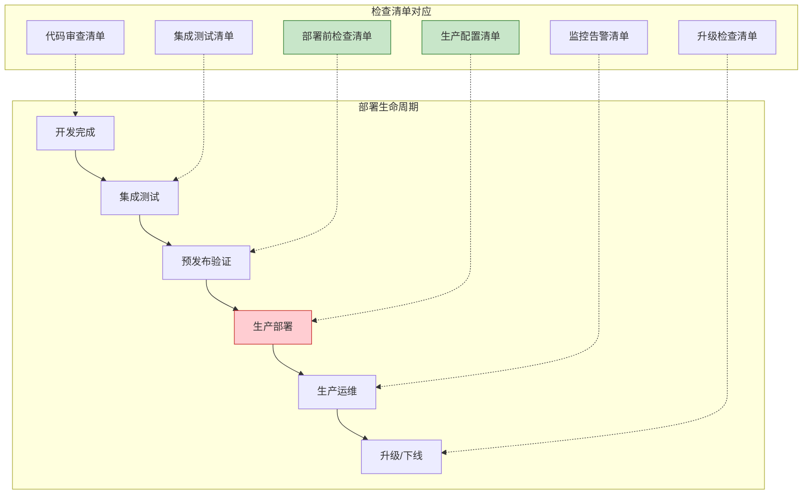
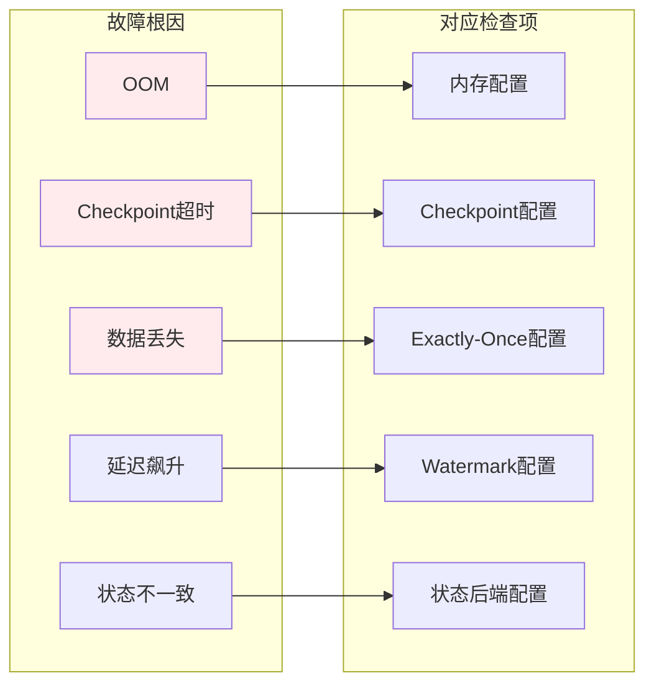
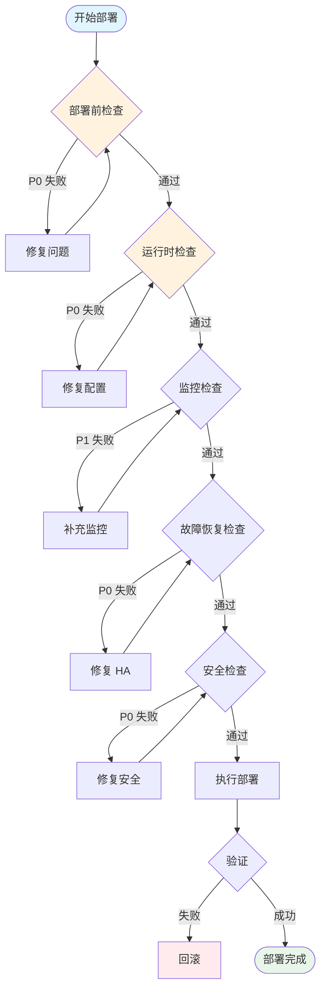
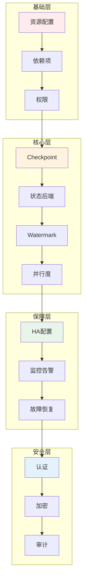

> **状态**: 🔮 前瞻内容 | **风险等级**: 高 | **最后更新**: 2026-04
> 
> 此文档描述的内容处于早期规划阶段，可能与最终实现不符。请以 Apache Flink 官方发布为准。
# Flink 生产环境部署检查清单 (Production Deployment Checklist)

> **所属阶段**: Knowledge/09-engineering | **前置依赖**: [3.10-flink-production-checklist.md](./3.10-flink-production-checklist.md), [Flink/3.9-state-backends-deep-comparison.md](../Flink/3.9-state-backends-deep-comparison.md) | **形式化等级**: L3-L4
> **版本**: 2026.04 | **适用版本**: Flink 1.16+ - 2.5+ | **文档类型**: 可打印检查清单

---

## 1. 概念定义 (Definitions)

### Def-K-Prod-Check-01: 生产就绪标准 (Production Readiness)

**生产就绪**定义为系统满足以下四维度的综合就绪状态：

$$
\text{ProductionReady} = (D_{pre} \land D_{runtime} \land D_{monitor} \land D_{recovery} \land D_{security})
$$

| 维度 | 符号 | 核心要求 |
|------|------|----------|
| **部署前检查** | $D_{pre}$ | 资源配置、依赖项、权限验证 |
| **运行时检查** | $D_{runtime}$ | Checkpoint、Watermark、并行度配置 |
| **监控告警** | $D_{monitor}$ | Metrics覆盖、日志、链路追踪 |
| **故障恢复** | $D_{recovery}$ | HA配置、状态恢复、升级策略 |
| **安全合规** | $D_{security}$ | 认证授权、加密、审计 |

### Def-K-Prod-Check-02: 检查项优先级分级

**优先级分级体系**:

```
Critical (P0) → High (P1) → Medium (P2) → Low (P3)
     ↓              ↓             ↓            ↓
  阻塞部署      严重影响      轻微影响      优化建议
  必须修复      计划修复      建议修复      可选处理
```

| 级别 | 说明 | 处理策略 | 示例 |
|------|------|----------|------|
| **P0 - Critical** | 阻塞部署 | 必须修复 | Checkpoint未启用、内存不足 |
| **P1 - High** | 严重影响 | 24h内修复 | 监控缺失、安全配置不完整 |
| **P2 - Medium** | 轻微影响 | 计划修复 | 日志级别不当、指标粒度粗 |
| **P3 - Low** | 优化建议 | 可选处理 | 配置调优、性能优化 |

### Def-K-Prod-Check-03: 检查清单分类

**检查清单分类体系**:

```
DeploymentChecklist
├── Pre-Deployment (部署前)
│   ├── Resources (资源配置)
│   ├── Dependencies (依赖项)
│   └── Permissions (权限)
├── Runtime (运行时)
│   ├── Checkpoint (Checkpoint配置)
│   ├── Watermark (Watermark配置)
│   └── Parallelism (并行度)
├── Monitoring (监控告警)
│   ├── Metrics (指标)
│   ├── Logging (日志)
│   └── Tracing (链路追踪)
├── Recovery (故障恢复)
│   ├── HA (高可用)
│   ├── StateRecovery (状态恢复)
│   └── Upgrade (升级策略)
└── Security (安全合规)
    ├── Authentication (认证)
    ├── Encryption (加密)
    └── Audit (审计)
```

---

## 2. 属性推导 (Properties)

### Lemma-K-Prod-Check-01: 检查完备性与故障率关系

**引理**: 检查清单的完备性与生产故障率呈负相关：

$$
P(\text{Failure}) \propto \frac{1}{\text{ChecklistCoverage}}
$$

**经验数据**:

| 检查覆盖度 | 首次部署成功率 | 生产事故率 | MTTR |
|-----------|---------------|-----------|------|
| 100% (完整) | > 95% | < 2% | < 15 min |
| 80% (部分) | 80-90% | 5-10% | 30-60 min |
| < 50% (缺失) | < 70% | > 20% | > 2 hours |

### Lemma-K-Prod-Check-02: 关键路径依赖

**引理**: 检查项之间存在依赖关系，必须按顺序执行：

```
资源配置检查 → 状态后端配置 → Checkpoint配置 → 重启策略配置
     ↓                                              ↓
依赖项检查 ──────────────────────────────────────→ 部署执行
     ↓                                              ↓
权限检查 ────────────────────────────────────────→ 监控配置
```

### Prop-K-Prod-Check-01: 监控覆盖度与 MTTR 关系

**命题**: 监控覆盖度与平均恢复时间 (MTTR) 满足：

$$
\text{MTTR} = \frac{k}{\text{Coverage}(\text{Metrics})} + \text{BaseTime}
$$

**监控覆盖度评分**:

| 覆盖度 | 监控范围 | MTTR |
|--------|----------|------|
| 基础 (30%) | CPU/内存/网络 | 30-60 min |
| 标准 (60%) | +Checkpoint/延迟 | 10-20 min |
| 完整 (90%+) | +JVM/RocksDB/业务 | 5-10 min |

---

## 3. 关系建立 (Relations)

### 3.1 检查清单与部署阶段关系



### 3.2 检查项与故障根因映射



### 3.3 检查清单与角色对应

| 角色 | 负责检查项 | 关键交付 |
|------|-----------|----------|
| **平台工程师** | 资源配置、HA配置、安全配置 | 基础设施就绪 |
| **开发工程师** | Checkpoint配置、业务逻辑、单元测试 | 代码质量 |
| **SRE** | 监控配置、告警规则、Runbook | 可观测性 |
| **安全工程师** | 认证授权、加密、审计 | 合规性 |

---

## 4. 论证过程 (Argumentation)

### 4.1 生产故障根因分析

基于业界 Flink 生产故障统计，主要根因分布：

```
┌─────────────────────────────────────────────────────────────┐
│                    Flink 生产故障根因分布                     │
├─────────────────────────────────────────────────────────────┤
│  资源配置不当   ████████████████████  28%  → 部署前检查      │
│  Checkpoint问题  ██████████████████  24%  → 运行时检查       │
│  状态后端配置   ████████████████    20%  → 运行时检查       │
│  网络/连接问题  ██████████          14%  → 部署前检查       │
│  依赖版本冲突   ██████               8%  → 部署前检查       │
│  安全配置缺失   ████                 6%  → 安全合规         │
└─────────────────────────────────────────────────────────────┘
```

### 4.2 检查清单 ROI 分析

| 检查阶段 | 投入时间 | 避免的典型故障 | ROI |
|---------|---------|---------------|-----|
| 部署前检查 | 30 min | OOM、资源不足 | 10-50x |
| 运行时检查 | 45 min | Checkpoint失败、状态不一致 | 20-100x |
| 监控检查 | 30 min | 故障发现延迟 | 5-20x |
| 安全检查 | 30 min | 数据泄露、未授权访问 | 极高 |

---

## 5. 形式证明 / 工程论证 (Proof / Engineering Argument)

### Thm-K-Prod-Check-01: 生产就绪充分条件

**定理**: Flink 作业达到生产就绪状态的充分条件：

$$
\text{ProductionReady}(J) \leftrightarrow
    \bigwedge_{i=1}^{n} \text{Check}_i(J) = \text{PASS}
$$

其中检查函数定义：

| 检查函数 | 关键项 | 通过标准 |
|---------|--------|----------|
| $PreDeployCheck$ | 资源/依赖/权限 | P0项100%通过 |
| $RuntimeCheck$ | Checkpoint/Watermark | P0项100%通过 |
| $MonitorCheck$ | Metrics/日志/追踪 | P1项100%通过 |
| $RecoveryCheck$ | HA/状态恢复 | P0项100%通过 |
| $SecurityCheck$ | 认证/加密/审计 | P0项100%通过 |

---

## 6. 实例验证 (Examples)

### 6.1 可打印检查清单表格

#### 6.1.1 部署前检查清单 (Pre-Deployment Checklist)

| 序号 | 检查项 | 优先级 | 检查方法 | 预期结果 | 实际结果 | 通过 | 负责人 |
|------|--------|--------|----------|----------|----------|------|--------|
| 1 | TaskManager 内存 ≥ 4GB | P0 | 查看 flink-conf.yaml | `taskmanager.memory.process.size: 4gb` | | □ | |
| 2 | JobManager 内存 ≥ 2GB | P0 | 查看 flink-conf.yaml | `jobmanager.memory.process.size: 2gb` | | □ | |
| 3 | Task Slot 数配置合理 | P1 | 查看 flink-conf.yaml | `taskmanager.numberOfTaskSlots: 2-4` | | □ | |
| 4 | 网络缓冲区充足 | P1 | 查看配置 | `taskmanager.memory.network.max: 256mb` | | □ | |
| 5 | 并行度已设置 | P0 | 查看代码/配置 | `parallelism.default >= 1` | | □ | |
| 6 | JVM 参数配置 | P1 | 查看 env.java.opts | 包含 GC 参数 | | □ | |
| 7 | 依赖项版本兼容 | P0 | 查看 pom.xml | 无版本冲突 | | □ | |
| 8 | Connector 版本匹配 | P0 | 查看依赖 | 与 Flink 版本匹配 | | □ | |
| 9 | 第三方库许可证检查 | P1 | 扫描依赖 | 无合规风险 | | □ | |
| 10 | Kerberos 认证配置 | P0 | 查看安全配置 | 认证已启用 | | □ | |
| 11 | 文件系统权限 | P0 | 测试写入 | Checkpoint 目录可写 | | □ | |
| 12 | 网络端口开放 | P0 | telnet 测试 | 所需端口已开放 | | □ | |
| 13 | 资源队列权限 | P0 | YARN/K8s 测试 | 可提交作业 | | □ | |

#### 6.1.2 运行时检查清单 (Runtime Checklist)

| 序号 | 检查项 | 优先级 | 检查方法 | 预期结果 | 实际结果 | 通过 | 负责人 |
|------|--------|--------|----------|----------|----------|------|--------|
| 1 | Checkpoint 已启用 | P0 | 查看配置 | `execution.checkpointing.enabled: true` | | □ | |
| 2 | Checkpoint 间隔合理 | P0 | 查看配置 | 30s-10min | | □ | |
| 3 | Checkpoint 超时设置 | P1 | 查看配置 | > 典型持续时间 × 2 | | □ | |
| 4 | 最大并发 Checkpoint | P1 | 查看配置 | `max-concurrent-checkpoints: 1` | | □ | |
| 5 | 外部化 Checkpoint | P1 | 查看配置 | `RETAIN_ON_CANCELLATION` | | □ | |
| 6 | 状态后端配置 | P0 | 查看配置 | RocksDB/Hashmap | | □ | |
| 7 | RocksDB 增量 Checkpoint | P1 | 查看配置 | `incremental: true` | | □ | |
| 8 | Watermark 策略配置 | P0 | 查看代码 | 使用 BoundedOutOfOrderness | | □ | |
| 9 | 允许乱序时间 | P1 | 查看代码 | 根据业务设置 | | □ | |
| 10 | 空闲超时配置 | P2 | 查看代码 | `withIdleness()` 已配置 | | □ | |
| 11 | 全局并行度 | P1 | 查看配置 | 与集群资源匹配 | | □ | |
| 12 | Operator 并行度 | P2 | 查看代码 | 热点 Operator 单独设置 | | □ | |
| 13 | 重启策略配置 | P0 | 查看配置 | fixed-delay/exponential-delay | | □ | |
| 14 | 最大重启次数 | P1 | 查看配置 | `restart-strategy.fixed-delay.attempts: 10` | | □ | |

#### 6.1.3 监控告警检查清单 (Monitoring Checklist)

| 序号 | 检查项 | 优先级 | 检查方法 | 预期结果 | 实际结果 | 通过 | 负责人 |
|------|--------|--------|----------|----------|----------|------|--------|
| 1 | Metrics Reporter 配置 | P0 | 查看配置 | Prometheus/InfluxDB 已配置 | | □ | |
| 2 | Checkpoint 指标 | P0 | 查看 Dashboard | 持续时间/大小/失败率 | | □ | |
| 3 | 延迟指标 | P0 | 查看 Dashboard | records-latency 可见 | | □ | |
| 4 | 吞吐量指标 | P1 | 查看 Dashboard | records-in/out 可见 | | □ | |
| 5 | JVM 指标 | P1 | 查看 Dashboard | GC/内存/线程 | | □ | |
| 6 | RocksDB 指标 | P2 | 查看 Dashboard | SST 文件/内存使用 | | □ | |
| 7 | 日志级别 | P1 | 查看 log4j | INFO 级别 | | □ | |
| 8 | 日志格式 | P2 | 查看日志输出 | 包含时间戳/线程/类名 | | □ | |
| 9 | 日志轮转 | P1 | 查看配置 | 按大小/时间轮转 | | □ | |
| 10 | 错误日志告警 | P0 | 测试告警 | ERROR 级别触发告警 | | □ | |
| 11 | 分布式追踪 | P2 | 查看配置 | Jaeger/Zipkin 集成 | | □ | |
| 12 | 关键路径追踪 | P2 | 查看代码 | 关键 Operator 标记 | | □ | |

#### 6.1.4 故障恢复检查清单 (Recovery Checklist)

| 序号 | 检查项 | 优先级 | 检查方法 | 预期结果 | 实际结果 | 通过 | 负责人 |
|------|--------|--------|----------|----------|----------|------|--------|
| 1 | HA 模式配置 | P0 | 查看配置 | ZK/K8s HA 已启用 | | □ | |
| 2 | HA 存储目录 | P0 | 查看配置 | HDFS/S3 路径可访问 | | □ | |
| 3 | JobManager 副本数 | P0 | 查看配置 | >= 2 (HA模式) | | □ | |
| 4 | 本地恢复启用 | P1 | 查看配置 | `local-recovery: true` | | □ | |
| 5 | 状态后端持久化 | P0 | 查看配置 | Checkpoint 目录配置 | | □ | |
| 6 | Savepoint 测试 | P0 | 手动触发 | 可成功创建/恢复 | | □ | |
| 7 | 恢复时间测试 | P1 | 模拟故障 | RTO < 5分钟 | | □ | |
| 8 | 数据丢失验证 | P0 | 对比测试 | RPO ≈ Checkpoint间隔 | | □ | |
| 9 | 升级策略文档 | P1 | 查看文档 | 存在升级 Runbook | | □ | |
| 10 | 蓝绿部署配置 | P2 | 查看配置 | Savepoint 切换流程 | | □ | |
| 11 | 版本兼容性检查 | P1 | 查看文档 | 升级路径已验证 | | □ | |
| 12 | 回滚策略 | P1 | 查看文档 | 回滚步骤已定义 | | □ | |

#### 6.1.5 安全合规检查清单 (Security Checklist)

| 序号 | 检查项 | 优先级 | 检查方法 | 预期结果 | 实际结果 | 通过 | 负责人 |
|------|--------|--------|----------|----------|----------|------|--------|
| 1 | Kerberos 认证 | P0 | 查看配置 | 已启用且配置正确 | | □ | |
| 2 | SSL/TLS 内部通信 | P0 | 查看配置 | `ssl.internal.enabled: true` | | □ | |
| 3 | REST API SSL | P1 | 查看配置 | REST 端点使用 HTTPS | | □ | |
| 4 | 密钥管理 | P0 | 查看配置 | 使用 KeyVault/KMS | | □ | |
| 5 | 敏感数据脱敏 | P0 | 查看代码 | 日志中无敏感信息 | | □ | |
| 6 | 数据加密传输 | P0 | 抓包测试 | 传输层加密 | | □ | |
| 7 | 静态数据加密 | P1 | 查看配置 | Checkpoint 加密存储 | | □ | |
| 8 | RBAC 配置 | P0 | 查看配置 | 角色权限已定义 | | □ | |
| 9 | 审计日志 | P1 | 查看配置 | 关键操作已记录 | | □ | |
| 10 | 访问日志 | P2 | 查看配置 | Web UI 访问记录 | | □ | |
| 11 | 合规认证 | P1 | 查看证书 | SOC2/ISO27001 等 | | □ | |
| 12 | 数据保留策略 | P1 | 查看文档 | 符合 GDPR/法规要求 | | □ | |

### 6.2 自动化检查脚本

```python
#!/usr/bin/env python3
"""
Flink 生产环境检查脚本
用法: python flink_production_check.py --config /path/to/flink-conf.yaml
"""

import yaml
import sys
import argparse
from typing import Dict, List, Tuple, Optional
from dataclasses import dataclass
from enum import Enum

class Priority(Enum):
    P0 = "Critical"
    P1 = "High"
    P2 = "Medium"
    P3 = "Low"

class Status(Enum):
    PASS = "✅ PASS"
    FAIL = "❌ FAIL"
    WARN = "⚠️ WARN"
    SKIP = "⏭️ SKIP"

@dataclass
class CheckResult:
    category: str
    item: str
    priority: Priority
    status: Status
    expected: str
    actual: Optional[str]
    message: str

class FlinkProductionChecker:
    def __init__(self, config_path: str):
        self.config = self._load_config(config_path)
        self.results: List[CheckResult] = []

    def _load_config(self, path: str) -> Dict:
        """加载 Flink 配置文件"""
        try:
            with open(path, 'r') as f:
                return yaml.safe_load(f) or {}
        except Exception as e:
            print(f"Error loading config: {e}")
            return {}

    def check_all(self) -> List[CheckResult]:
        """运行所有检查"""
        self.check_pre_deployment()
        self.check_runtime()
        self.check_monitoring()
        self.check_recovery()
        self.check_security()
        return self.results

    def check_pre_deployment(self):
        """部署前检查"""
        # 内存配置
        tm_memory = self.config.get('taskmanager.memory.process.size', '0')
        tm_memory_gb = self._parse_memory(tm_memory)
        self.results.append(CheckResult(
            category="Pre-Deployment",
            item="TaskManager Memory",
            priority=Priority.P0,
            status=Status.PASS if tm_memory_gb >= 4 else Status.FAIL,
            expected=">= 4GB",
            actual=f"{tm_memory_gb}GB",
            message="TaskManager memory should be at least 4GB"
        ))

        # JobManager 内存
        jm_memory = self.config.get('jobmanager.memory.process.size', '0')
        jm_memory_gb = self._parse_memory(jm_memory)
        self.results.append(CheckResult(
            category="Pre-Deployment",
            item="JobManager Memory",
            priority=Priority.P0,
            status=Status.PASS if jm_memory_gb >= 2 else Status.FAIL,
            expected=">= 2GB",
            actual=f"{jm_memory_gb}GB",
            message="JobManager memory should be at least 2GB"
        ))

        # 并行度配置
        parallelism = self.config.get('parallelism.default', 1)
        self.results.append(CheckResult(
            category="Pre-Deployment",
            item="Default Parallelism",
            priority=Priority.P0,
            status=Status.PASS if parallelism >= 1 else Status.FAIL,
            expected=">= 1",
            actual=str(parallelism),
            message="Default parallelism should be set"
        ))

    def check_runtime(self):
        """运行时检查"""
        # Checkpoint 配置
        checkpoint_enabled = self.config.get('execution.checkpointing.enabled', True)
        self.results.append(CheckResult(
            category="Runtime",
            item="Checkpoint Enabled",
            priority=Priority.P0,
            status=Status.PASS if checkpoint_enabled else Status.FAIL,
            expected="true",
            actual=str(checkpoint_enabled),
            message="Checkpoint must be enabled for production"
        ))

        # Checkpoint 间隔
        interval = self.config.get('execution.checkpointing.interval', 0)
        interval_sec = interval // 1000 if interval else 0
        self.results.append(CheckResult(
            category="Runtime",
            item="Checkpoint Interval",
            priority=Priority.P0,
            status=Status.PASS if 30 <= interval_sec <= 600 else Status.WARN,
            expected="30s-10min",
            actual=f"{interval_sec}s",
            message="Checkpoint interval should be between 30s and 10min"
        ))

        # 状态后端
        state_backend = self.config.get('state.backend', '')
        self.results.append(CheckResult(
            category="Runtime",
            item="State Backend",
            priority=Priority.P0,
            status=Status.PASS if state_backend in ['rocksdb', 'hashmap'] else Status.FAIL,
            expected="rocksdb or hashmap",
            actual=state_backend,
            message="State backend must be configured"
        ))

        # RocksDB 增量 Checkpoint
        if state_backend == 'rocksdb':
            incremental = self.config.get('state.backend.incremental', False)
            self.results.append(CheckResult(
                category="Runtime",
                item="RocksDB Incremental Checkpoint",
                priority=Priority.P1,
                status=Status.PASS if incremental else Status.WARN,
                expected="true",
                actual=str(incremental),
                message="Incremental checkpoint recommended for RocksDB"
            ))

        # 重启策略
        restart_strategy = self.config.get('restart-strategy', '')
        self.results.append(CheckResult(
            category="Runtime",
            item="Restart Strategy",
            priority=Priority.P0,
            status=Status.PASS if restart_strategy in ['fixed-delay', 'exponential-delay'] else Status.FAIL,
            expected="fixed-delay or exponential-delay",
            actual=restart_strategy,
            message="Restart strategy must be configured"
        ))

    def check_monitoring(self):
        """监控检查"""
        # Metrics Reporter
        reporters = self.config.get('metrics.reporters', '')
        self.results.append(CheckResult(
            category="Monitoring",
            item="Metrics Reporter",
            priority=Priority.P0,
            status=Status.PASS if reporters else Status.FAIL,
            expected="prometheus or influxdb",
            actual=reporters,
            message="Metrics reporter should be configured"
        ))

        # 日志级别
        log_level = self.config.get('log4j.rootLogger', 'INFO')
        self.results.append(CheckResult(
            category="Monitoring",
            item="Log Level",
            priority=Priority.P1,
            status=Status.PASS if 'INFO' in log_level else Status.WARN,
            expected="INFO",
            actual=log_level,
            message="INFO log level recommended for production"
        ))

    def check_recovery(self):
        """故障恢复检查"""
        # HA 配置
        ha_mode = self.config.get('high-availability', '')
        self.results.append(CheckResult(
            category="Recovery",
            item="High Availability",
            priority=Priority.P0,
            status=Status.PASS if ha_mode in ['zookeeper', 'kubernetes'] else Status.FAIL,
            expected="zookeeper or kubernetes",
            actual=ha_mode,
            message="HA mode must be configured for production"
        ))

        # 本地恢复
        local_recovery = self.config.get('state.backend.local-recovery', False)
        self.results.append(CheckResult(
            category="Recovery",
            item="Local Recovery",
            priority=Priority.P1,
            status=Status.PASS if local_recovery else Status.WARN,
            expected="true",
            actual=str(local_recovery),
            message="Local recovery recommended for faster restore"
        ))

    def check_security(self):
        """安全检查"""
        # SSL 内部通信
        ssl_enabled = self.config.get('security.ssl.internal.enabled', False)
        self.results.append(CheckResult(
            category="Security",
            item="SSL Internal",
            priority=Priority.P0,
            status=Status.PASS if ssl_enabled else Status.FAIL,
            expected="true",
            actual=str(ssl_enabled),
            message="Internal SSL should be enabled for production"
        ))

    def _parse_memory(self, memory_str: str) -> float:
        """解析内存字符串为 GB"""
        if not memory_str:
            return 0
        memory_str = str(memory_str).lower().strip()
        try:
            if memory_str.endswith('gb'):
                return float(memory_str[:-2])
            elif memory_str.endswith('mb'):
                return float(memory_str[:-2]) / 1024
            elif memory_str.endswith('g'):
                return float(memory_str[:-1])
            elif memory_str.endswith('m'):
                return float(memory_str[:-1]) / 1024
            else:
                return float(memory_str)
        except ValueError:
            return 0

    def generate_report(self) -> str:
        """生成检查报告"""
        lines = []
        lines.append("=" * 80)
        lines.append("Flink 生产环境检查报告")
        lines.append("=" * 80)
        lines.append("")

        # 按类别分组
        by_category = {}
        for r in self.results:
            by_category.setdefault(r.category, []).append(r)

        for category, results in by_category.items():
            lines.append(f"\n【{category}】")
            lines.append("-" * 80)

            for r in results:
                lines.append(f"  [{r.priority.value}] {r.item}")
                lines.append(f"    状态: {r.status.value}")
                lines.append(f"    预期: {r.expected}")
                lines.append(f"    实际: {r.actual}")
                lines.append(f"    说明: {r.message}")
                lines.append("")

        # 统计
        total = len(self.results)
        passed = sum(1 for r in self.results if r.status == Status.PASS)
        failed = sum(1 for r in self.results if r.status == Status.FAIL)
        warnings = sum(1 for r in self.results if r.status == Status.WARN)

        lines.append("\n" + "=" * 80)
        lines.append("检查统计")
        lines.append("=" * 80)
        lines.append(f"总计: {total} 项")
        lines.append(f"通过: {passed} 项")
        lines.append(f"失败: {failed} 项")
        lines.append(f"警告: {warnings} 项")
        lines.append(f"通过率: {passed/total*100:.1f}%" if total > 0 else "N/A")

        # 生产就绪判断
        p0_items = [r for r in self.results if r.priority == Priority.P0]
        p0_passed = all(r.status == Status.PASS for r in p0_items)

        lines.append("\n" + "=" * 80)
        if p0_passed:
            lines.append("✅ 生产就绪: 所有 P0 检查项通过")
        else:
            lines.append("❌ 未就绪: 存在未通过的 P0 检查项")
        lines.append("=" * 80)

        return "\n".join(lines)


def main():
    parser = argparse.ArgumentParser(description='Flink Production Readiness Checker')
    parser.add_argument('--config', required=True, help='Path to flink-conf.yaml')
    parser.add_argument('--output', help='Output file path (default: stdout)')
    args = parser.parse_args()

    checker = FlinkProductionChecker(args.config)
    checker.check_all()
    report = checker.generate_report()

    if args.output:
        with open(args.output, 'w') as f:
            f.write(report)
        print(f"Report written to: {args.output}")
    else:
        print(report)

    # 如果有 P0 失败，返回非零退出码
    p0_failed = any(r.priority == Priority.P0 and r.status == Status.FAIL
                    for r in checker.results)
    sys.exit(1 if p0_failed else 0)


if __name__ == '__main__':
    main()
```

### 6.3 配置模板

```yaml
# ============================================
# Flink 生产环境推荐配置模板
# 适用范围: Flink 1.16+ - 2.5+
# ============================================

# ========== 内存配置 ==========
taskmanager.memory.process.size: 8gb
taskmanager.memory.flink.size: 6gb
taskmanager.memory.managed.size: 2gb
taskmanager.memory.network.max: 256mb
taskmanager.numberOfTaskSlots: 4

jobmanager.memory.process.size: 2gb

# JVM 参数
env.java.opts.taskmanager: "-XX:+UseG1GC -XX:MaxGCPauseMillis=100 -XX:+UnlockExperimentalVMOptions"
env.java.opts.jobmanager: "-XX:+UseG1GC -XX:MaxGCPauseMillis=100"

# ========== Checkpoint 配置 ==========
execution.checkpointing.mode: EXACTLY_ONCE
execution.checkpointing.interval: 300s
execution.checkpointing.timeout: 600s
execution.checkpointing.min-pause: 300s
execution.checkpointing.max-concurrent-checkpoints: 1
execution.checkpointing.externalized-checkpoint-retention: RETAIN_ON_CANCELLATION
execution.checkpointing.unaligned.enabled: false

# ========== 状态后端配置 ==========
state.backend: rocksdb
state.backend.incremental: true
state.backend.local-recovery: true
state.backend.rocksdb.memory.fixed-per-slot: 256mb
state.backend.rocksdb.predefined-options: FLASH_SSD_OPTIMIZED
state.backend.rocksdb.threads.threads-number: 4

state.checkpoint-storage: filesystem
state.checkpoints.dir: hdfs:///flink/checkpoints

# ========== 重启策略 ==========
restart-strategy: exponential-delay
restart-strategy.exponential-delay.initial-backoff: 1s
restart-strategy.exponential-delay.max-backoff: 60s
restart-strategy.exponential-delay.backoff-multiplier: 2.0
restart-strategy.exponential-delay.reset-backoff-threshold: 300s
restart-strategy.exponential-delay.jitter-factor: 0.1

# ========== 网络配置 ==========
taskmanager.network.memory.fraction: 0.15
taskmanager.network.memory.min: 128mb
taskmanager.network.memory.max: 512mb

# ========== 高可用配置 ==========
high-availability: zookeeper
high-availability.storageDir: hdfs:///flink/ha
high-availability.zookeeper.quorum: zk1:2181,zk2:2181,zk3:2181
high-availability.zookeeper.path.root: /flink

# ========== 监控配置 ==========
metrics.reporters: prometheus
metrics.reporter.prometheus.port: 9249
metrics.reporter.prometheus.filter.includes: "*checkpoint*,*records*,*latency*,*jvm*"
metrics.latency.interval: 10000

# ========== 安全配置 ==========
security.ssl.internal.enabled: true
security.ssl.rest.enabled: true
security.ssl.truststore: /path/to/truststore.jks
security.ssl.truststore-password: ${TRUSTSTORE_PASSWORD}
security.ssl.keystore: /path/to/keystore.jks
security.ssl.keystore-password: ${KEYSTORE_PASSWORD}

# Kerberos 配置 (如需要)
# security.kerberos.login.keytab: /path/to/keytab
# security.kerberos.login.principal: flink@EXAMPLE.COM

# ========== Web UI 配置 ==========
webui.upload.dir: /tmp/flink-upload
webui.max-file-size: 104857600

# ========== 并行度配置 ==========
parallelism.default: 4
```

---

## 7. 可视化 (Visualizations)

### 7.1 检查流程图



### 7.2 检查优先级矩阵

```mermaid
quadrantChart
    title 检查项优先级矩阵
    x-axis 影响范围低 --> 影响范围高
    y-axis 发生概率低 --> 发生概率高

    quadrant-1 立即处理 (P0)
    quadrant-2 优先处理 (P1)
    quadrant-3 计划处理 (P2)
    quadrant-4 监控观察 (P3)

    "Checkpoint 未启用": [0.9, 0.8]
    "内存不足": [0.9, 0.7]
    "HA 未配置": [0.8, 0.6]
    "SSL 未启用": [0.7, 0.5]
    "监控缺失": [0.5, 0.6]
    "日志级别": [0.3, 0.3]
    "指标粒度": [0.2, 0.2]
    "审计日志": [0.6, 0.3]
```

### 7.3 生产就绪依赖图



---

## 8. 引用参考 (References)
