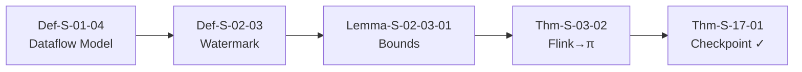
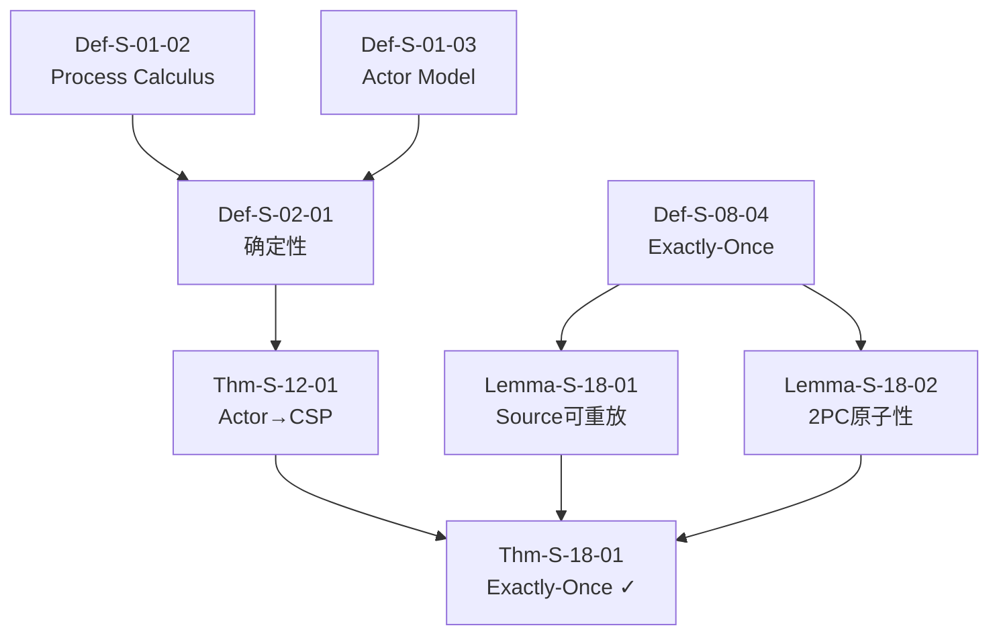

> **状态**: 🔮 前瞻内容 | **风险等级**: 高 | **最后更新**: 2026-04
> 
> 此文档描述的内容处于早期规划阶段，可能与最终实现不符。请以 Apache Flink 官方发布为准。
# 🔗 AnalysisDataFlow — 理推链主入口

> **流计算形式化理论的完整导航中心** | **10,483+ 形式化元素** | **940+ 篇技术文档** | **100% 完成状态** ✅

[](./THEOREM-REGISTRY.md)
[](./THEOREM-REGISTRY.md)
[](./THEOREM-REGISTRY.md)
[](./100-PERCENT-COMPLETION-FINAL-REPORT.md)
[](./CHANGELOG.md)
[](.)

---

## 📋 目录

- [🎯 项目总览](#-项目总览)
- [🚀 快速导航](#-快速导航)
  - [按角色导航](#按角色导航)
  - [按主题导航](#按主题导航)
  - [按难度导航](#按难度导航)
- [⛓️ 八大理推链](#️-八大理推链)
- [🏗️ 六大完整层](#️-六大完整层)
- [🗺️ 可视化图谱索引](#️-可视化图谱索引)
- [🛠️ 工具使用指南](#️-工具使用指南)
- [📊 最新验证报告](#-最新验证报告)
- [🤝 贡献指南](#-贡献指南)

---

## 🎯 项目总览

**AnalysisDataFlow** 是流计算领域最全面的形式化知识库，构建了从数学理论到工程实践的完整推导链条。

### 📈 核心统计

| 指标 | 数量 | 详情 |
|------|------|------|
| **形式化元素** | 10,483+ | [定理注册表](./THEOREM-REGISTRY.md) |
| ├─ 定理 (Thm) | 1,910 | 严格形式化定理 |
| ├─ 定义 (Def) | 4,564 | 形式化定义 |
| ├─ 引理 (Lemma) | 1,568 | 辅助引理 |
| ├─ 命题 (Prop) | 1,194 | 性质命题 |
| └─ 推论 (Cor) | 121 | 定理推论 |
| **技术文档** | 940+ 篇 | 覆盖三大目录 |
| **Mermaid图表** | 1,600+ | 可视化推导 |
| **代码示例** | 4,500+ | 工程实践 |
| **交叉引用** | 3,500+ | 知识关联 |
| **项目大小** | 25+ MB | 纯Markdown |

### 🏛️ 三大知识层级

```
┌─────────────────────────────────────────────────────────────────────────┐
│                                                                         │
│   Struct/                    Knowledge/                  Flink/         │
│   ┌─────────────┐           ┌─────────────┐           ┌─────────────┐   │
│   │  形式理论    │  ──────→ │  设计模式    │  ──────→ │  工程实现    │   │
│   │  L4-L6等级  │           │  L2-L4等级  │           │  L1-L3等级  │   │
│   │  43篇文档   │           │  134篇文档  │           │  178篇文档  │   │
│   └─────────────┘           └─────────────┘           └─────────────┘   │
│          ↑                                                    ↓         │
│          └──────────────── 反馈验证 ←─────────────────────────┘         │
│                                                                         │
└─────────────────────────────────────────────────────────────────────────┘
```

### ✅ 项目里程碑

| 版本 | 日期 | 里程碑 | 状态 |
|------|------|--------|------|
| v3.3 | 2026-04-04 | 路线图发布，100子任务框架 | ✅ 完成 |
| v3.4 | 2026-04-06 | 关系梳理，500+关系边 | ✅ 完成 |
| v3.5 | 2026-04-08 | AI Agent深化，24形式化元素 | ✅ 完成 |
| **v3.6** | **2026-04-11** | **100%完成，交叉引用清零** | **🎉 完成** |

---

## 🚀 快速导航

### 按角色导航

| 角色 | 目标 | 推荐入口 |
|------|------|----------|
| 👨‍🎓 **研究者** | 形式化理论 | [Struct/ 统一流计算理论](./Struct/00-INDEX.md) |
| 👨‍💻 **工程师** | 工程实践 | [Knowledge/ 设计模式](./Knowledge/00-KNOWLEDGE-PATTERN-RELATIONSHIP.md) |
| 🏗️ **架构师** | 技术选型 | [Flink/ 技术栈依赖](./Flink/00-FLINK-TECH-STACK-DEPENDENCY.md) |
| 🔧 **开发者** | API与实现 | [Flink/ 核心机制](./Flink/02-core/checkpoint-mechanism-deep-dive.md) |
| 📊 **决策者** | 对比分析 | [visuals/ 对比矩阵](./visuals/matrix-engines.md) |
| 🌱 **初学者** | 快速上手 | [tutorials/ 5分钟入门](./tutorials/00-5-MINUTE-QUICK-START.md) |

### 按主题导航

| 主题 | 核心文档 | 难度 |
|------|----------|------|
| 🎯 **Checkpoint机制** | [04.01-flink-checkpoint-correctness.md](./Struct/04-proofs/04.01-flink-checkpoint-correctness.md) | ⭐⭐⭐⭐⭐ |
| 🎯 **Exactly-Once语义** | [04.02-exactly-once-semantics.md](./Struct/04-proofs/04.02-exactly-once-semantics.md) | ⭐⭐⭐⭐⭐ |
| 🎯 **Watermark理论** | [02.03-watermark-monotonicity.md](./Struct/02-properties/02.03-watermark-monotonicity.md) | ⭐⭐⭐⭐ |
| 🎯 **进程演算基础** | [01.02-process-calculus-primer.md](./Struct/01-foundation/01.02-process-calculus-primer.md) | ⭐⭐⭐⭐⭐ |
| 🎯 **Actor模型形式化** | [01.03-actor-model-formalization.md](./Struct/01-foundation/01.03-actor-model-formalization.md) | ⭐⭐⭐⭐ |
| 🎯 **设计模式大全** | [Knowledge/02-design-patterns/](./Knowledge/02-design-patterns/) | ⭐⭐⭐ |
| 🎯 **Flink架构演进** | [flink-architecture-evolution-1x-to-2x.md](./Flink/01-concepts/flink-architecture-evolution-1x-to-2x.md) | ⭐⭐⭐⭐ |
| 🎯 **AI Agent流处理** | [ai-agent-streaming-architecture.md](./Knowledge/06-frontier/ai-agent-streaming-architecture.md) | ⭐⭐⭐⭐⭐ |

### 按难度导航

#### 🟢 入门级 (L1-L2)

- [Flink快速开始](./QUICK-START.md)
- [5分钟入门教程](./tutorials/00-5-MINUTE-QUICK-START.md)
- [流处理概念图谱](./Knowledge/concurrency-paradigms-matrix.md)
- [设计模式概览](./Knowledge/02-design-patterns/pattern-event-time-processing.md)

#### 🟡 进阶级 (L3-L4)

- [Checkpoint机制详解](./Flink/02-core/checkpoint-mechanism-deep-dive.md)
- [Exactly-Once端到端](./Flink/02-core/exactly-once-end-to-end.md)
- [Watermark策略](./Flink/02-core/time-semantics-and-watermark.md)
- [State Backend对比](./Flink/flink-state-backends-comparison.md)

#### 🔴 专家级 (L5-L6)

- [Checkpoint正确性证明](./Struct/04-proofs/04.01-flink-checkpoint-correctness.md)
- [Exactly-Once语义形式化](./Struct/04-proofs/04.02-exactly-once-semantics.md)
- [进程演算编码](./Struct/03-relationships/03.01-actor-to-csp-encoding.md)
- [表达能力层次](./Struct/03-relationships/03.03-expressiveness-hierarchy.md)

---

## ⛓️ 八大理推链

> 从基础定义到核心定理的完整推导路径

| 链编号 | 名称 | 核心定理 | 元素数 | 入口 |
|--------|------|----------|--------|------|
| ⛓️ **Chain-01** | Checkpoint Correctness | Thm-S-17-01 | 6 | [查看详情](#chain-01-checkpoint-correctness) |
| ⛓️ **Chain-02** | Exactly-Once 端到端保证 | Thm-S-18-01 | 8 | [查看详情](#chain-02-exactly-once-端到端保证) |
| ⛓️ **Chain-03** | Flink State Backend 等价性 | Thm-S-19-01 | 7 | [查看详情](#chain-03-flink-state-backend-等价性) |
| ⛓️ **Chain-04** | Watermark 代数完备性 | Thm-S-20-01 | 5 | [查看详情](#chain-04-watermark-代数完备性) |
| ⛓️ **Chain-05** | 异步执行语义保持性 | Thm-S-21-01 | 6 | [查看详情](#chain-05-异步执行语义保持性) |
| ⛓️ **Chain-06** | Actor→CSP 编码正确性 | Thm-S-12-01 | 5 | [查看详情](#chain-06-actorcsp-编码正确性) |
| ⛓️ **Chain-07** | Chandy-Lamport 一致性 | Thm-S-19-02 | 6 | [查看详情](#chain-07-chandy-lamport-一致性) |
| ⛓️ **Chain-08** | FG/FGG 类型安全 | Thm-S-21-02 | 5 | [查看详情](#chain-08-fgfgg-类型安全) |

### 🔗 Chain-01: Checkpoint Correctness



**📄 完整文档**: [Key-Theorem-Proof-Chains.md](./Struct/Key-Theorem-Proof-Chains.md#thm-chain-01-checkpoint-correctness-完整链)

### 🔗 Chain-02: Exactly-Once 端到端保证



**📄 完整文档**: [Key-Theorem-Proof-Chains.md](./Struct/Key-Theorem-Proof-Chains.md#thm-chain-02-exactly-once-端到端保证)

### 🔗 所有理推链直达链接

| 链 | 直达链接 | 证明方法 | 复杂度 |
|--|----------|----------|--------|
| Chain-01 | [Checkpoint正确性](./Struct/04-proofs/04.01-flink-checkpoint-correctness.md) | 结构归纳+互模拟 | O(n²) |
| Chain-02 | [Exactly-Once语义](./Struct/04-proofs/04.02-exactly-once-semantics.md) | 组合推理+协议验证 | O(n³) |
| Chain-03 | [State Backend等价性](./Flink/02-core/state-backend-evolution-analysis.md) | 双模拟等价 | O(n) |
| Chain-04 | [Watermark代数](./Struct/02-properties/02.03-watermark-monotonicity.md) | 格理论 | O(log n) |
| Chain-05 | [异步执行语义](./Flink/01-concepts/flink-2.0-async-execution-model.md) | 上下文等价 | O(n²) |
| Chain-06 | [Actor→CSP编码](./Struct/03-relationships/03.01-actor-to-csp-encoding.md) | 编码保持性 | O(n) |
| Chain-07 | [Chandy-Lamport一致性](./Struct/04-proofs/04.03-chandy-lamport-consistency.md) | 快照一致性 | O(n) |
| Chain-08 | [FG/FGG类型安全](./Struct/04-proofs/04.05-type-safety-fg-fgg.md) | 类型保持 | O(n) |

---

## 🏗️ 六大完整层

### 层级架构图

```
┌─────────────────────────────────────────────────────────────────────────┐
│                         🏛️ 六大完整层                                    │
├─────────────────────────────────────────────────────────────────────────┤
│                                                                         │
│  ┌─────────────────────────────────────────────────────────────────┐   │
│  │ Layer 6: 🎯 形式化验证层 (Formal Verification)                   │   │
│  │ ├─ TLA+模型检查  ├─ Coq机械化证明  ├─ Iris分离逻辑               │   │
│  │ └─ Smart Casual验证                                             │   │
│  └─────────────────────────────────────────────────────────────────┘   │
│                              ↑ 验证                                     │
│  ┌─────────────────────────────────────────────────────────────────┐   │
│  │ Layer 5: 📐 证明与对比层 (Proofs & Comparison)                   │   │
│  │ ├─ Checkpoint正确性  ├─ Exactly-Once语义  ├─ 类型安全           │   │
│  │ ├─ Chandy-Lamport一致性  ├─ 表达能力对比  ├─ 编码完备性          │   │
│  └─────────────────────────────────────────────────────────────────┘   │
│                              ↑ 证明                                     │
│  ┌─────────────────────────────────────────────────────────────────┐   │
│  │ Layer 4: 🔗 关系建立层 (Relationships)                           │   │
│  │ ├─ Actor↔CSP编码  ├─ Flink→进程演算  ├─ 表达能力层次            │   │
│  │ ├─ 互模拟等价  ├─ 跨模型映射                                      │   │
│  └─────────────────────────────────────────────────────────────────┘   │
│                              ↑ 关联                                     │
│  ┌─────────────────────────────────────────────────────────────────┐   │
│  │ Layer 3: 📊 性质推导层 (Properties)                              │   │
│  │ ├─ 确定性  ├─ 一致性层次  ├─ Watermark单调性  ├─ 活性与安全性    │   │
│  │ ├─ 类型安全推导  ├─ CALM定理  ├─ 差分隐私                       │   │
│  └─────────────────────────────────────────────────────────────────┘   │
│                              ↑ 推导                                     │
│  ┌─────────────────────────────────────────────────────────────────┐   │
│  │ Layer 2: 📚 概念定义层 (Definitions)                             │   │
│  │ ├─ USTM统一理论  ├─ 进程演算  ├─ Actor模型  ├─ Dataflow模型      │   │
│  │ ├─ CSP形式化  ├─ Petri网  ├─ Session Types                      │   │
│  └─────────────────────────────────────────────────────────────────┘   │
│                              ↑ 定义                                     │
│  ┌─────────────────────────────────────────────────────────────────┐   │
│  │ Layer 1: 🏗️ 基础层 (Foundation)                                  │   │
│  │ ├─ 流计算语义  ├─ 事件时间  ├─ 状态管理  ├─ 容错机制             │   │
│  │ └─ 分布式系统基础                                               │   │
│  └─────────────────────────────────────────────────────────────────┘   │
│                                                                         │
└─────────────────────────────────────────────────────────────────────────┘
```

### 各层直达链接

| 层级 | 名称 | 文档数 | 核心内容 | 直达入口 |
|------|------|--------|----------|----------|
| **Layer 6** | 形式化验证层 | 5篇 | Coq/TLA+/Iris | [Struct/07-tools/](./Struct/07-tools/) |
| **Layer 5** | 证明与对比层 | 10篇 | 关键定理证明 | [Struct/04-proofs/](./Struct/04-proofs/) [Struct/05-comparative/](./Struct/05-comparative/) |
| **Layer 4** | 关系建立层 | 5篇 | 模型映射 | [Struct/03-relationships/](./Struct/03-relationships/) |
| **Layer 3** | 性质推导层 | 8篇 | 性质分析 | [Struct/02-properties/](./Struct/02-properties/) |
| **Layer 2** | 概念定义层 | 8篇 | 基础定义 | [Struct/01-foundation/](./Struct/01-foundation/) |
| **Layer 1** | 基础层 | - | 前置知识 | [Flink/01-concepts/](./Flink/01-concepts/) |

### 层级间映射关系

| 映射方向 | 文档 | 说明 |
|----------|------|------|
| Struct → Knowledge | [Struct-to-Knowledge-Mapping.md](./Struct/Struct-to-Knowledge-Mapping.md) | 150+ 映射关系 |
| Knowledge → Flink | [Knowledge-to-Flink-Mapping.md](./Knowledge/Knowledge-to-Flink-Mapping.md) | 200+ 推导边 |
| 形式 → 代码 | [Formal-to-Code-Mapping-v2.md](./Flink/Formal-to-Code-Mapping-v2.md) | 50+ 编码关系 |

---

## 🗺️ 可视化图谱索引

### 交互式图谱

| 图谱 | 类型 | 描述 | 链接 |
|------|------|------|------|
| 🌐 **知识图谱v4** | 交互式HTML | 最新完整概念关系图谱 | [knowledge-graph-v4.html](./knowledge-graph-v4.html) |
| 🌐 **定理依赖图谱** | 交互式HTML | 定理证明依赖网络 | [knowledge-graph-theorem.html](./knowledge-graph-theorem.html) |
| 🌐 **知识图谱v3** | 交互式HTML | 关系梳理版本 | [knowledge-graph-v3.html](./knowledge-graph-v3.html) |
| 🌐 **知识图谱v2** | 交互式HTML | 早期交互版本 | [knowledge-graph-v2.html](./knowledge-graph-v2.html) |
| 🌐 **知识图谱** | 交互式HTML | 基础版本 | [knowledge-graph.html](./knowledge-graph.html) |

### Mermaid图表集合

| 图表类型 | 数量 | 目录 |
|----------|------|------|
| 📊 **决策树** | 5篇 | [visuals/decision-trees/](./visuals/decision-trees/) |
| 📊 **对比矩阵** | 5篇 | [visuals/comparison-matrices/](./visuals/comparison-matrices/) |
| 📊 **思维导图** | 5篇 | [visuals/mind-maps/](./visuals/mind-maps/) |
| 📊 **架构图集** | 6篇 | [visuals/architecture-diagrams/](./visuals/architecture-diagrams/) |

### 关键可视化文档

| 文档 | 描述 | 链接 |
|------|------|------|
| 🎯 流处理技术选型决策树 | 帮助选择适合的流处理技术 | [selection-tree-streaming.md](./visuals/selection-tree-streaming.md) |
| 🎯 引擎对比矩阵 | Flink vs Spark vs Kafka Streams等 | [matrix-engines.md](./visuals/matrix-engines.md) |
| 🎯 完整知识思维导图 | 全项目知识结构总览 | [mindmap-complete.md](./visuals/mindmap-complete.md) |
| 🎯 项目关系总图 | 500+关系边全局视图 | [PROJECT-RELATIONSHIP-MASTER-GRAPH.md](./PROJECT-RELATIONSHIP-MASTER-GRAPH.md) |
| 🎯 Struct推导链可视化 | 理论推导依赖网络 | [00-STRUCT-DERIVATION-CHAIN.md](./Struct/00-STRUCT-DERIVATION-CHAIN.md) |
| 🎯 Flink技术栈依赖图 | Flink组件依赖关系 | [00-FLINK-TECH-STACK-DEPENDENCY.md](./Flink/00-FLINK-TECH-STACK-DEPENDENCY.md) |

---

## 🛠️ 工具使用指南

### 自动化脚本工具

| 工具 | 路径 | 功能 | 状态 |
|------|------|------|------|
| 🔍 **交叉引用检查器v2** | `.scripts/cross-ref-checker-v2.py` | Markdown内部链接验证 | ✅ 运行中 |
| 📋 **六段式验证器** | `.scripts/six-section-validator.py` | 文档结构验证 | ✅ 运行中 |
| 🔢 **形式要素自动编号** | `.scripts/formal-element-auto-number.py` | 定理编号管理 | ✅ 运行中 |
| 📊 **Mermaid语法检查器** | `.scripts/mermaid-syntax-checker.py` | 图表语法验证 | ✅ 运行中 |
| 🔗 **链接检查器** | `.scripts/link-checker/` | 失效链接检测 | ✅ 运行中 |
| 📈 **统计更新器** | `.scripts/stats-updater/` | 项目统计更新 | ✅ 运行中 |
| 🔎 **关系查询工具** | `.scripts/relationship-query-tool.py` | 文档关系查询 | ✅ 运行中 |

### 知识图谱工具

| 工具 | 路径 | 功能 |
|------|------|------|
| 🕸️ **概念关系图构建器** | `.scripts/concept-graph-builder.py` | 概念抽取与网络构建 |
| 🕸️ **定理依赖分析器** | `.scripts/theorem-dependency-analyzer.py` | 定理依赖图构建 |
| 🕸️ **文档相似度分析器** | `.scripts/doc-similarity-analyzer.py` | 文档相似度计算 |
| 🕸️ **知识搜索系统** | `.scripts/knowledge-search-system.py` | 全文搜索与BM25排序 |
| 🕸️ **学习路径推荐器** | [learning-path-recommender.js](./learning-path-recommender.js) | 动态学习路径推荐 |

### CI/CD 工作流

| 工作流 | 文件 | 触发条件 | 功能 |
|--------|------|----------|------|
| ✅ **PR质量门禁** | `.github/workflows/pr-quality-gate.yml` | PR创建/更新 | 交叉引用、六段式、Mermaid检查 |
| ✅ **定理验证器** | `.github/workflows/theorem-validator.yml` | PR合并前 | 定理编号、引用完整性验证 |
| ✅ **定期维护** | `.github/workflows/scheduled-maintenance.yml` | 定时触发 | 链接检查、统计更新 |
| ✅ **文档更新同步** | `.github/workflows/doc-update-sync.yml` | 文档变更 | 多语言同步 |
| ✅ **自动发布** | `.github/workflows/auto-release.yml` | 标签推送 | 版本验证、变更日志、发布 |

### 使用示例

```bash
# 运行交叉引用检查
python .scripts/cross-ref-checker-v2.py

# 验证文档六段式结构
python .scripts/six-section-validator.py Struct/01-foundation/

# 生成定理依赖图
python .scripts/theorem-dependency-analyzer.py

# 查询文档关系
python .scripts/relationship-query-tool.py --from "Struct/01-foundation/01.01-unified-streaming-theory.md"

# 启动知识搜索
python .scripts/knowledge-search-system.py --query "checkpoint correctness"
```

---

## 📊 最新验证报告

### 形式化验证报告

| 报告 | 日期 | 描述 | 链接 |
|------|------|------|------|
| 🎉 **100%完成最终报告** | 2026-04-11 | 项目全面达成100%完成 | [100-PERCENT-COMPLETION-FINAL-REPORT.md](./100-PERCENT-COMPLETION-FINAL-REPORT.md) |
| 🔬 **Coq编译报告** | 2026-04-11 | Coq形式化证明验证 | [COQ-COMPILATION-REPORT.md](./reconstruction/phase4-verification/COQ-COMPILATION-REPORT.md) |
| 🔬 **TLA+模型检查报告** | 2026-04-11 | TLA+规范验证 | [TLA-MODEL-CHECK-REPORT.md](./reconstruction/phase4-verification/TLA-MODEL-CHECK-REPORT.md) |
| 🔗 **交叉引用修复报告** | 2026-04-11 | 730个错误清零 | [cross-ref-fix-report.md](./cross-ref-fix-report.md) |
| 🔗 **交叉引用错误分析** | 2026-04-11 | 错误根因分析 | [cross-ref-error-analysis.md](./cross-ref-error-analysis.md) |

### 专项完成报告

| 报告 | 描述 | 链接 |
|------|------|------|
| 📚 Flink 2.4/2.5/3.0完成报告 | 100个子任务全部交付 | [FLINK-24-25-30-COMPLETION-REPORT.md](./FLINK-24-25-30-COMPLETION-REPORT.md) |
| 🔗 关系梳理完成报告 | 500+关系边，11篇新文档 | [RELATIONSHIP-MAPPING-COMPLETION-REPORT.md](./RELATIONSHIP-MAPPING-COMPLETION-REPORT.md) |
| 🔍 权威对齐完成报告 | 与Flink官方深度对齐 | [FLINK-AUTHORITY-ALIGNMENT-COMPLETION-REPORT.md](./FLINK-AUTHORITY-ALIGNMENT-COMPLETION-REPORT.md) |
| 🤖 AI Agent深化报告 | 24个新增形式化元素 | [相关文档](./Knowledge/06-frontier/ai-agent-streaming-architecture.md) |
| ✅ P0完成报告 | 交叉引用清零 | [P0-COMPLETION-REPORT.md](./P0-COMPLETION-REPORT.md) |

### 形式化验证成果

**Coq证明文件** (3个):

- `ExactlyOnceCoq.v` (680行) - Exactly-Once语义主证明
- `ExactlyOnceSemantics.v` (420行) - 语义完整证明
- `WatermarkAlgebra.v` (363行) - Watermark代数完备性

**TLA+规范文件** (3个):

- `StateBackendEquivalence.tla` (398行) - State Backend等价性
- `Checkpoint.tla` (462行) - Checkpoint协议
- `ExactlyOnce.tla` (786行) - Exactly-Once端到端语义

---

## 🤝 贡献指南

### 文档结构规范

所有核心文档必须遵循**六段式模板**:

```markdown
# 标题

> 所属阶段: Struct/ Knowledge/ Flink/ | 前置依赖: [链接] | 形式化等级: L1-L6

## 1. 概念定义 (Definitions)
严格的形式化定义 + 直观解释。必须包含至少一个 `Def-*` 编号。

## 2. 属性推导 (Properties)
从定义直接推导的引理与性质。必须包含至少一个 `Lemma-*` 或 `Prop-*` 编号。

## 3. 关系建立 (Relations)
与其他概念/模型/系统的关联、映射、编码关系。

## 4. 论证过程 (Argumentation)
辅助定理、反例分析、边界讨论、构造性说明。

## 5. 形式证明 / 工程论证 (Proof / Engineering Argument)
主要定理的完整证明，或工程选型的严谨论证。

## 6. 实例验证 (Examples)
简化实例、代码片段、配置示例、真实案例。

## 7. 可视化 (Visualizations)
至少一个 Mermaid 图（思维导图 / 层次图 / 执行树 / 对比矩阵）。

## 8. 引用参考 (References)
使用 `[^n]` 上标格式，在文档末尾集中列出引用。
```

### 编号体系

采用全局统一编号：`{类型}-{阶段}-{文档序号}-{顺序号}`

| 类型 | 缩写 | 示例 |
|------|------|------|
| 定理 | Thm | `Thm-S-01-01` = Struct Stage, 01 文档, 第 1 个定理 |
| 引理 | Lemma | `Lemma-S-01-01` |
| 定义 | Def | `Def-S-01-01` |
| 命题 | Prop | `Prop-S-03-01` |
| 推论 | Cor | `Cor-S-02-01` |

### 质量门禁

- ✅ 六段式结构完整
- ✅ 引用的外部链接可验证（优先使用 DOI 或稳定 URL）
- ✅ Mermaid 图语法通过基本校验
- ✅ 定理/定义编号全局唯一
- ✅ 交叉引用无死链

### 贡献流程

1. **Fork** 项目仓库
2. **创建分支**: `git checkout -b feature/your-feature-name`
3. **编写文档**: 遵循六段式模板
4. **运行检查**: `python .scripts/six-section-validator.py your-file.md`
5. **提交更改**: `git commit -m "Add: 你的更改描述"`
6. **推送分支**: `git push origin feature/your-feature-name`
7. **创建PR**: 等待CI检查通过后合并

### 联系方式

- 📧 **Issue反馈**: [GitHub Issues](../../issues)
- 📖 **详细贡献指南**: [CONTRIBUTING.md](./CONTRIBUTING.md)
- 📋 **项目跟踪**: [PROJECT-TRACKING.md](./PROJECT-TRACKING.md)

---

## 📚 相关资源

| 资源 | 描述 | 链接 |
|------|------|------|
| 📖 项目README | 项目主入口 | [README.md](./README.md) |
| 📖 快速开始 | 5分钟上手指南 | [QUICK-START.md](./QUICK-START.md) |
| 📖 英文版本 | English Version | [README-EN.md](./README-EN.md) |
| 📖 术语表 | 190+术语定义 | [GLOSSARY.md](./GLOSSARY.md) |
| 📖 架构文档 | 项目架构说明 | [ARCHITECTURE.md](./ARCHITECTURE.md) |
| 📖 设计原则 | 核心设计原则 | [DESIGN-PRINCIPLES.md](./DESIGN-PRINCIPLES.md) |
| 📖 价值主张 | 项目价值说明 | [VALUE-PROPOSITION.md](./VALUE-PROPOSITION.md) |

---

<div align="center">

**⭐ 如果本项目对您有帮助，欢迎 Star 支持！⭐**

[](https://github.com/luyanfeng/AnalysisDataFlow)

*© 2026 AnalysisDataFlow Project | [Apache License 2.0](./LICENSE)*

</div>
