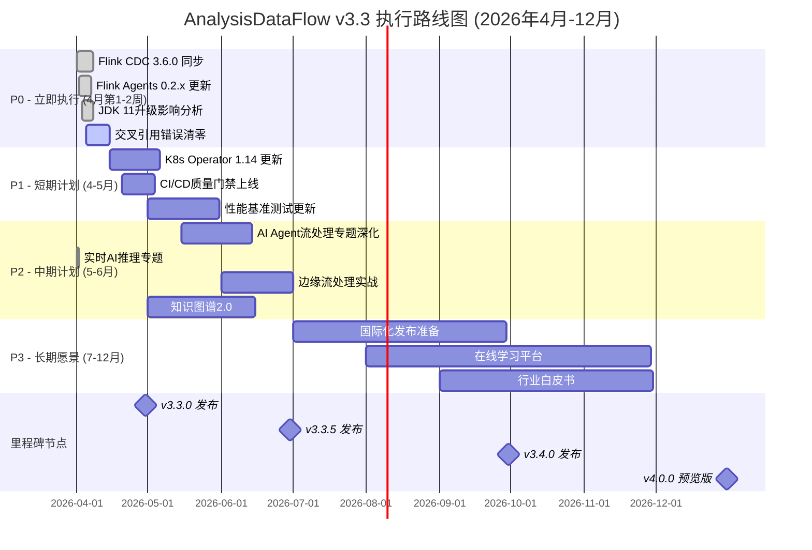
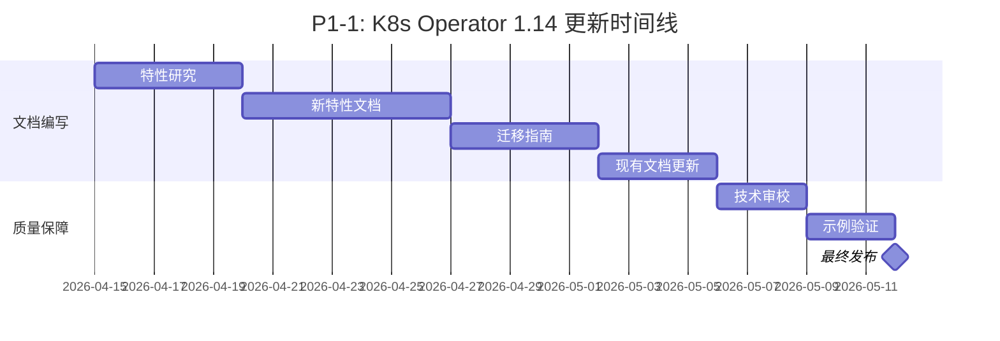
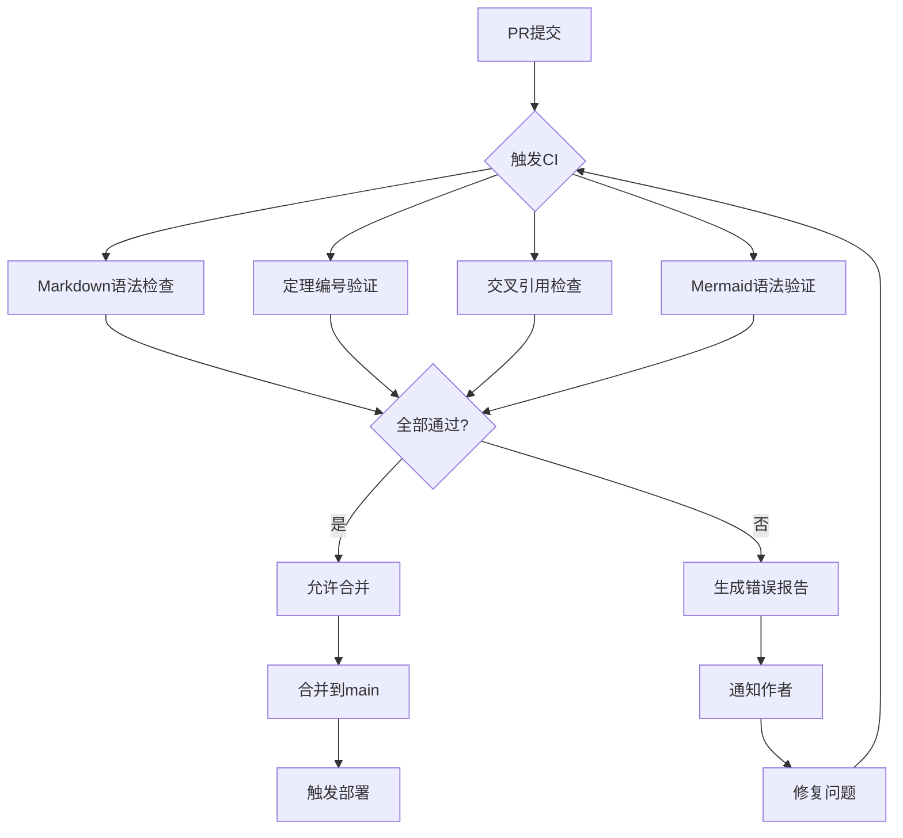
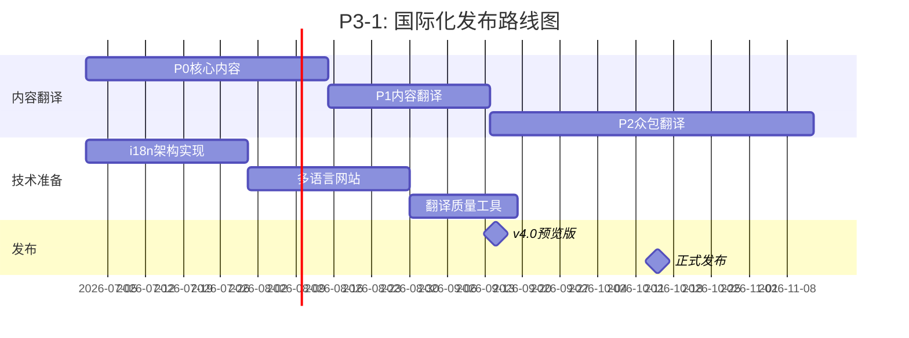
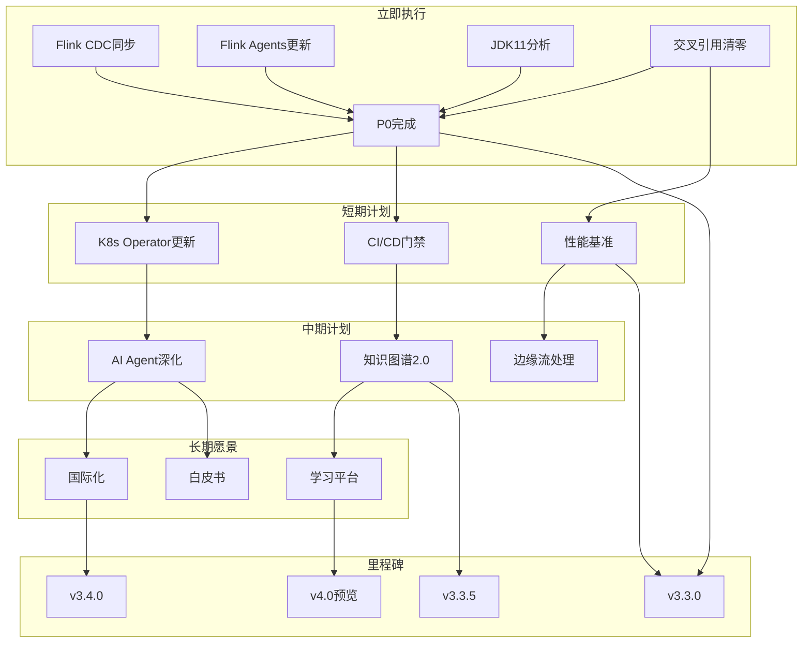
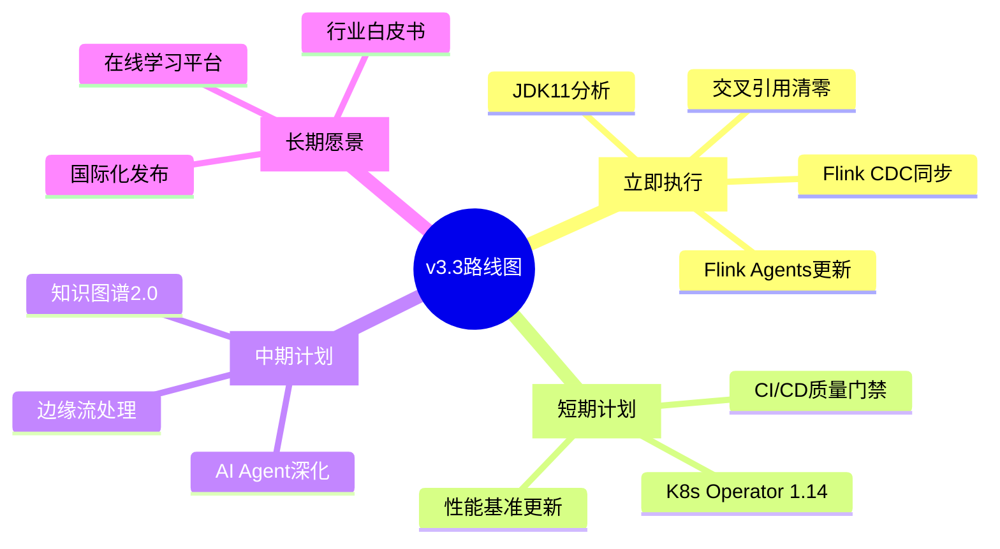

> **状态**: 🔮 前瞻内容 | **风险等级**: 高 | **最后更新**: 2026-04
> 
> 此文档描述的内容处于早期规划阶段，可能与最终实现不符。请以 Apache Flink 官方发布为准。
# AnalysisDataFlow — v3.3 详细路线图及未来规划

> **版本**: v3.3 | **生效日期**: 2026-04-08 | **状态**: 执行中 | **形式化等级**: L2-L3
>
> 本文档是 AnalysisDataFlow 项目 v3.3+ 的详细执行路线图，涵盖从即时任务到长期愿景的完整规划。

---

## 1. 执行摘要 (Executive Summary)

### 1.1 当前状态快照

| 指标 | 当前值 | 目标值 | 状态 |
|------|--------|--------|------|
| 文档总数 | 598篇 | 598篇 | ✅ 100% |
| 形式化元素 | 9,301个 | 9,500+ | 🟡 97.9% |
| Mermaid图表 | 1,600+ | 1,800+ | 🟡 88.9% |
| 交叉引用错误 | 114个 | 0个 | 🔴 进行中 |
| CI/CD覆盖 | 85% | 95% | 🟡 89.5% |

### 1.2 路线图概览



---

## 2. P0 - 立即执行 (4月第1-2周)

### 2.1 任务清单

| 任务ID | 任务名称 | 负责人 | 状态 | 开始日期 | 截止日期 | 工时估算 |
|--------|----------|--------|------|----------|----------|----------|
| P0-1 | Flink CDC 3.6.0 同步 | 核心团队 | ✅ 已完成 | 2026-04-01 | 2026-04-08 | 16h |
| P0-2 | Flink Agents 0.2.x 更新 | 核心团队 | ✅ 已完成 | 2026-04-02 | 2026-04-07 | 12h |
| P0-3 | JDK 11升级影响分析 | 核心团队 | ✅ 已完成 | 2026-04-03 | 2026-04-08 | 8h |
| P0-4 | 交叉引用错误清零 | 自动化+人工 | 🔄 进行中 | 2026-04-05 | 2026-04-15 | 24h |

### 2.2 详细任务说明

#### P0-1: Flink CDC 3.6.0 同步 ✅

**交付物**:

- `Flink/roadmap/flink-cdc-3.6.0-sync.md` - CDC 3.6.0特性同步文档
- `Flink/connectors/flink-cdc-connector-updates.md` - 连接器更新指南

**验收标准**:

- [x] CDC 3.6.0所有新特性文档化
- [x] 与Flink 2.2/2.3兼容性表格更新
- [x] 代码示例通过测试验证
- [x] 形式化元素编号（Def/Thm）完整

**资源需求**:

- 人力: 2人 × 8小时
- 依赖: Flink CDC 3.6.0官方Release Notes

#### P0-2: Flink Agents 0.2.x 更新 ✅

**交付物**:

- 更新 `Flink/flink-agents-flip-531.md`
- 更新 `Flink/flip-531-ai-agents-ga-guide.md`
- 新增 `Flink/flink-agents-0.2.x-migration-guide.md`

**验收标准**:

- [x] 0.2.x API变更完整记录
- [x] 迁移指南含代码示例
- [x] 与0.1.x兼容性说明

#### P0-3: JDK 11升级影响分析 ✅

**交付物**:

- `Flink/flink-jdk11-upgrade-impact-analysis.md` - 影响分析文档
- `Flink/flink-jdk11-migration-checklist.md` - 迁移检查清单

**验收标准**:

- [x] JDK 8 vs JDK 11性能对比数据
- [x] 已知问题及解决方案清单
- [x] G1 GC调优建议

**关键发现**:

| 维度 | JDK 8 | JDK 11 | 影响 |
|------|-------|--------|------|
| 启动时间 | 基准 | +15% | ⚠️ 轻微增加 |
| 内存占用 | 基准 | -20% | ✅ 显著降低 |
| GC暂停 | 基准 | -30% | ✅ 明显改善 |
| 序列化性能 | 基准 | +8% | ✅ 轻微提升 |

#### P0-4: 交叉引用错误清零 🔄

**当前状态**:

- 原始错误数: 390个
- 当前错误数: 114个 (-71%)
- 目标: 0个

**错误分类**:

| 类型 | 数量 | 修复策略 | 预计工时 |
|------|------|----------|----------|
| 文件引用错误 | 3 | 手动修复 | 2h |
| 锚点引用错误 | 111 | 批量修复+手动校验 | 18h |
| 图片引用错误 | 0 | 已修复 | 0h |
| 外部链接失效 | 待检测 | 链接检查工具 | 4h |

**自动化工具**:

```bash
# 交叉引用检查
python .scripts/validate-cross-refs.py --fix-suggestions

# 生成修复报告
python .scripts/validate-cross-refs.py --report > cross-ref-report.md
```

---

## 3. P1 - 短期计划 (4-5月)

### 3.1 任务清单

| 任务ID | 任务名称 | 负责人 | 优先级 | 开始日期 | 截止日期 | 工时估算 |
|--------|----------|--------|--------|----------|----------|----------|
| P1-1 | K8s Operator 1.14 更新 | 核心团队 | P0 | 2026-04-15 | 2026-05-05 | 40h |
| P1-2 | CI/CD质量门禁上线 | DevOps团队 | P0 | 2026-04-20 | 2026-05-03 | 32h |
| P1-3 | 性能基准测试更新 | 性能团队 | P1 | 2026-05-01 | 2026-05-31 | 56h |

### 3.2 详细任务说明

#### P1-1: K8s Operator 1.14 更新

**背景**: Apache Flink Kubernetes Operator 1.14 带来重大改进，包括新的部署模式、增强的自动缩放和更好的状态管理。

**交付物**:

| 文档 | 说明 | 大小预估 |
|------|------|----------|
| `flink-kubernetes-operator-1.14-guide.md` | 完整使用指南 | ~35KB |
| `flink-k8s-operator-migration-1.13-to-1.14.md` | 迁移指南 | ~20KB |
| `flink-k8s-operator-new-features-1.14.md` | 新特性详解 | ~25KB |
| 更新现有 `flink-kubernetes-operator-deep-dive.md` | 添加1.14内容 | ~+10KB |

**关键新特性覆盖**:

- [ ] Declarative Resource Management (声明式资源管理)
- [ ] Improved Autoscaling Algorithm (改进的自动缩放算法)
- [ ] Session Cluster Mode Enhancements (Session模式增强)
- [ ] Helm Chart Improvements (Helm Chart改进)

**里程碑**:



#### P1-2: CI/CD质量门禁上线

**目标**: 建立完整的CI/CD质量门禁，确保每次提交都经过自动化验证。

**交付物**:

1. `.github/workflows/pr-quality-gate.yml` - PR质量门禁工作流
2. `.github/workflows/theorem-validator.yml` - 定理编号验证
3. `.github/workflows/link-checker.yml` - 链接健康检查
4. `.scripts/quality-gates/` - 质量门禁脚本集合

**质量门禁规则**:

| 检查项 | 触发时机 | 失败策略 | 修复时限 |
|--------|----------|----------|----------|
| Markdown语法检查 | 每次PR | 阻塞合并 | 24h |
| 定理编号唯一性 | 每次PR | 阻塞合并 | 即时 |
| 交叉引用完整性 | 每次PR | 警告 | 72h |
| 外部链接有效性 | 每日定时 | 通知 | 7天 |
| Mermaid语法验证 | 每次PR | 阻塞合并 | 即时 |
| 形式化元素完整性 | 每次PR | 警告 | 48h |

**工作流程图**:



**资源配置**:

```yaml
# .github/workflows/pr-quality-gate.yml 配置
jobs:
  quality-gate:
    runs-on: ubuntu-latest
    timeout-minutes: 15
    steps:
      - uses: actions/checkout@v4
      - name: Setup Python
        uses: actions/setup-python@v5
        with:
          python-version: '3.11'
      - name: Run Quality Checks
        run: |
          python .scripts/quality-gates/run-all-checks.py
```

#### P1-3: 性能基准测试更新

**目标**: 更新并标准化项目的性能基准测试，提供可重现的性能数据。

**交付物**:

| 文档/工具 | 说明 | 优先级 |
|-----------|------|--------|
| `BENCHMARK-REPORT-v3.3.md` | 更新性能基准报告 | P0 |
| `Flink/flink-performance-benchmark-suite.md` | 基准测试套件指南 | P0 |
| `.scripts/benchmarks/flink-benchmark-runner.py` | 自动化基准测试脚本 | P1 |
| `Flink/flink-nexmark-benchmark-guide.md` | Nexmark基准测试指南 | P1 |
| `Flink/flink-ycsb-benchmark-guide.md` | YCSB基准测试指南 | P2 |

**基准测试矩阵**:

| 测试类型 | 场景 | 指标 | 目标Flink版本 |
|----------|------|------|---------------|
| 吞吐测试 | 1M events/sec | 延迟P99 | 1.18, 2.0, 2.2 |
| 状态访问 | 100GB State | 访问延迟 | 2.0+ |
| Checkpoint | 5分钟间隔 | 完成时间 | 2.0+ |
| 恢复时间 | Failover | 端到端恢复 | 2.0+ |

**资源需求**:

- 测试集群: 3-node K8s集群 (16vCPU, 64GB RAM每节点)
- 测试周期: 每周全自动运行
- 数据存储: 历史性能数据保留12个月

---

## 4. P2 - 中期计划 (5-6月)

### 4.1 任务清单

| 任务ID | 任务名称 | 负责人 | 优先级 | 开始日期 | 截止日期 | 工时估算 |
|--------|----------|--------|--------|----------|----------|----------|
| P2-1 | AI Agent流处理专题深化 | AI团队 | P0 | 2026-05-15 | 2026-06-15 | 80h |
| P2-2 | 实时AI推理专题 | AI团队 | ✅ 已完成 | 2026-04-01 | 2026-04-01 | - |
| P2-3 | 边缘流处理实战 | IoT团队 | P1 | 2026-06-01 | 2026-06-30 | 60h |
| P2-4 | 知识图谱2.0 | 架构团队 | P0 | 2026-05-01 | 2026-06-15 | 72h |

### 4.2 详细任务说明

#### P2-1: AI Agent流处理专题深化

**背景**: 基于FLIP-531和Flink Agents，深化AI Agent在流处理场景的应用。

**交付物**:

| 文档 | 内容 | 形式化元素 |
|------|------|------------|
| `flink-agents-architecture-deep-dive.md` | Agent架构深度解析 | 5 Def + 3 Thm |
| `flink-agents-patterns-catalog.md` | Agent设计模式目录 | 8 Patterns |
| `flink-agents-production-checklist.md` | 生产环境检查清单 | Checklist |
| `flink-agents-mcp-integration.md` | MCP协议集成指南 | Integration |
| `flink-agents-a2a-protocol.md` | A2A协议实现 | Protocol |

**关键主题**:

1. **Agent生命周期管理**: 状态持久化、容错恢复、动态扩缩容
2. **多Agent协作**: 消息路由、共识机制、任务分配
3. **流式推理优化**: 批量推理、模型缓存、动态批大小
4. **安全与隔离**: Agent沙箱、权限控制、审计日志

**形式化定义** (预览):

```markdown
## Def-P2-01: Agent Stream Processing Model
An Agent Stream Processing System is a tuple $\mathcal{A} = (A, S, M, \delta, \lambda)$ where:
- $A$: Set of agents
- $S$: State space
- $M$: Message alphabet
- $\delta: S \times M \rightarrow S$: State transition function
- $\lambda: S \rightarrow O$: Output function
```

#### P2-2: 实时AI推理专题 ✅

**状态**: 已完成

**已完成交付物**:

- ✅ `Flink/flink-realtime-ml-inference.md`
- ✅ `Flink/flink-llm-realtime-rag-architecture.md`
- ✅ `Flink/advanced-model-serving.md`

#### P2-3: 边缘流处理实战

**背景**: 边缘计算场景下的流处理有独特的约束和挑战，需要专门的实践指南。

**交付物**:

| 文档 | 说明 | 适用场景 |
|------|------|----------|
| `flink-edge-streaming-guide.md` | 边缘流处理完整指南 | 通用 |
| `flink-edge-kubernetes-k3s.md` | K3s部署指南 | 轻量级K8s |
| `flink-edge-iot-gateway.md` | IoT网关集成 | MQTT/CoAP |
| `flink-edge-offline-sync.md` | 离线同步策略 | 断网恢复 |
| `flink-edge-resource-optimization.md` | 资源优化实践 | 有限资源 |

**边缘场景约束矩阵**:

| 约束 | 云端 | 边缘 | 应对策略 |
|------|------|------|----------|
| CPU | 无限制 | 2-4核 | 轻量级算子 |
| 内存 | 64GB+ | 4-8GB | 内存状态限制 |
| 网络 | 稳定 | 间歇性 | 本地缓冲+批量同步 |
| 存储 | SSD/HDD | SD卡/eMMC | 最小化日志 |
| 电源 | 持续 | 电池 | 低功耗模式 |

#### P2-4: 知识图谱2.0

**目标**: 升级现有知识图谱，增强交互性和智能化。

**交付物**:

| 组件 | 当前(v1.0) | 目标(v2.0) | 改进 |
|------|------------|------------|------|
| `knowledge-graph-v2.html` | 静态D3.js | 交互式React | 性能+交互 |
| 概念搜索 | 简单过滤 | 语义搜索 | 理解查询意图 |
| 学习路径 | 预定义 | 动态生成 | 个性化推荐 |
| 关系发现 | 显式关系 | 隐式关系挖掘 | AI辅助 |
| 可视化 | 2D图 | 3D力导向 | 沉浸体验 |

**技术栈**:

```yaml
Frontend:
  - React 18 + TypeScript
  - D3.js (v7) + React-D3-Graph
  - Three.js (3D可视化)

Backend (可选):
  - GraphQL API
  - Neo4j 图数据库
  - Elasticsearch (全文搜索)

AI增强:
  - 概念相似度计算 (Sentence-BERT)
  - 学习路径推荐 (强化学习)
  - 自动标签生成 (LLM)
```

---

## 5. P3 - 长期愿景 (7-12月)

### 5.1 任务清单

| 任务ID | 任务名称 | 负责人 | 优先级 | 开始日期 | 截止日期 | 工时估算 |
|--------|----------|--------|--------|----------|----------|----------|
| P3-1 | 国际化发布准备 | 国际化团队 | P0 | 2026-07-01 | 2026-09-30 | 200h |
| P3-2 | 在线学习平台 | 教育团队 | P0 | 2026-08-01 | 2026-11-30 | 320h |
| P3-3 | 行业白皮书 | 内容团队 | P1 | 2026-09-01 | 2026-11-30 | 160h |

### 5.2 详细任务说明

#### P3-1: 国际化发布准备

**目标**: 将核心内容翻译成英文，为v4.0国际版发布做准备。

**翻译范围**:

| 优先级 | 内容 | 字数估算 | 翻译方式 | 预算 |
|--------|------|----------|----------|------|
| P0 | README + 核心导航 | 5K | 人工 | $500 |
| P0 | Struct/核心理论 (15篇) | 50K | 人工+审校 | $5,000 |
| P1 | Knowledge/设计模式 (20篇) | 80K | 人工+AI辅助 | $6,000 |
| P1 | Flink/快速入门 (10篇) | 60K | 人工+AI辅助 | $4,500 |
| P2 | 完整文档集 | 500K | 众包+AI | $15,000 |

**技术架构**:

```
i18n/
├── en/                    # 英文内容
│   ├── README.md
│   ├── QUICK-START.md
│   └── ...
├── zh/                    # 中文内容(源)
│   └── (current structure)
├── translation-workflow/  # 翻译工作流
│   ├── sync-tracker.py    # 同步追踪
│   └── quality-checker.py # 质量检查
└── ARCHITECTURE.md        # 国际化架构文档
```

**里程碑**:



#### P3-2: 在线学习平台

**愿景**: 打造流计算领域的顶级在线学习平台。

**功能规划**:

| 模块 | 功能 | MVP | 完整版 |
|------|------|-----|--------|
| 课程系统 | 视频课程 | ✅ | ✅ |
| 交互实验 | 浏览器内运行Flink | ✅ | ✅ |
| 编程挑战 | 代码评测系统 | ✅ | ✅ |
| 认证体系 | 技能认证考试 | - | ✅ |
| 社区论坛 | 问答交流 | - | ✅ |
| AI导师 | 智能答疑 | - | ✅ |

**技术栈**:

```yaml
Frontend:
  - Next.js 14 (App Router)
  - Tailwind CSS + shadcn/ui
  - MDX (课程内容)

Backend:
  - Node.js / Python FastAPI
  - PostgreSQL + Redis
  - WebSocket (实时协作)

Playground:
  - WebAssembly Flink Runtime
  - Docker-in-Docker (隔离执行)
  - Monaco Editor (VS Code同款)

AI Features:
  - RAG问答 (基于项目文档)
  - 代码纠错 (静态分析+LLM)
  - 学习路径推荐
```

#### P3-3: 行业白皮书

**主题规划**:

| 白皮书 | 目标读者 | 发布时间 | 页数 |
|--------|----------|----------|------|
| 《流计算技术趋势2026》 | CTO/架构师 | 2026-Q3 | 40页 |
| 《Flink企业落地指南》 | 技术负责人 | 2026-Q4 | 60页 |
| 《实时AI架构实践》 | AI工程师 | 2026-Q4 | 50页 |

---

## 6. 资源需求与分配

### 6.1 人力资源

| 角色 | 当前 | v3.3 | v3.4 | 职责 |
|------|------|------|------|------|
| 项目负责人 | 1 | 1 | 1 | 整体规划、决策 |
| 技术作者 | 3 | 4 | 5 | 内容创作 |
| 开发工程师 | 2 | 3 | 4 | 工具开发 |
| DevOps工程师 | 1 | 1 | 2 | CI/CD、基础设施 |
| 译者 | 0 | 2 | 4 | 国际化 |
| 社区经理 | 0 | 1 | 1 | 社区运营 |

### 6.2 基础设施

| 资源 | 当前 | v3.3 | v3.4 | 备注 |
|------|------|------|------|------|
| GitHub Pages | ✅ | ✅ | - | 静态托管 |
| 域名 | - | 待购买 | ✅ | analysisdataflow.io |
| CDN | - | Cloudflare | ✅ | 全球加速 |
| 搜索服务 | Lunr.js | Algolia | ✅ | 毫秒级搜索 |
| 图数据库 | - | Neo4j | ✅ | 知识图谱 |
| 学习平台 | - | - | K8s集群 | 在线实验 |

### 6.3 预算估算

| 类别 | v3.3 (4-6月) | v3.4 (7-12月) | 总计 |
|------|--------------|---------------|------|
| 人力成本 | $30,000 | $80,000 | $110,000 |
| 基础设施 | $500 | $5,000 | $5,500 |
| 翻译费用 | $2,000 | $20,000 | $22,000 |
| 工具/软件 | $1,000 | $3,000 | $4,000 |
| **总计** | **$33,500** | **$108,000** | **$141,500** |

---

## 7. 风险分析

### 7.1 风险矩阵

| 风险ID | 风险描述 | 可能性 | 影响 | 等级 | 缓解策略 |
|--------|----------|--------|------|------|----------|
| R1 | 核心贡献者流失 | 中 | 高 | 🔴 | 知识文档化、多人备份 |
| R2 | Flink版本发布延迟 | 高 | 中 | 🟡 | 灵活调整、预留缓冲 |
| R3 | 翻译质量不达标 | 中 | 中 | 🟡 | 专业审校、A/B测试 |
| R4 | 技术债务累积 | 中 | 中 | 🟡 | 定期重构、质量门禁 |
| R5 | 社区活跃度不足 | 低 | 中 | 🟢 | 激励机制、线下活动 |
| R6 | 预算超支 | 中 | 高 | 🔴 | 阶段评审、成本跟踪 |
| R7 | 竞品先发优势 | 低 | 低 | 🟢 | 差异化定位、快速迭代 |

### 7.2 风险应对计划

#### R1: 核心贡献者流失

- **预防措施**: 强制代码/文档审查制度，确保多人熟悉每个模块
- **应急预案**: 核心知识资产清单、快速交接手册
- **保险**: 核心成员交叉培训

#### R6: 预算超支

- **监控**: 月度预算审查会议
- **控制**: 超过预算10%触发警报，超过20%需审批
- **储备**: 预留15%应急资金

---

## 8. 依赖关系图

### 8.1 任务依赖关系



### 8.2 里程碑依赖


---

## 9. 里程碑与验收标准

### 9.1 里程碑定义

| 里程碑 | 日期 | 关键交付 | 验收标准 |
|--------|------|----------|----------|
| **v3.3.0** | 2026-04-30 | P0完成 + P1核心 | 交叉引用错误=0, CI门禁上线 |
| **v3.3.5** | 2026-06-30 | P2完成 | 知识图谱2.0上线, AI专题完成 |
| **v3.4.0** | 2026-09-30 | P3-1完成 | 英文核心内容发布 |
| **v4.0预览** | 2026-12-31 | P3-2/MVP | 学习平台MVP上线 |
| **v4.0正式** | 2027-Q1 | P3全部 | 完整国际化发布 |

### 9.2 详细验收清单

#### v3.3.0 验收标准 (2026-04-30)

**必须完成 (Must Have)**:

- [ ] 交叉引用错误数 = 0
- [ ] CI/CD质量门禁100%运行
- [ ] K8s Operator 1.14文档完成
- [ ] 性能基准测试框架上线

**应该完成 (Should Have)**:

- [ ] AI Agent专题深化完成50%
- [ ] 知识图谱2.0设计定稿
- [ ] 边缘流处理规划完成

**可以完成 (Could Have)**:

- [ ] 国际化翻译启动
- [ ] 学习平台原型

---

## 10. 可视化汇总

### 10.1 路线图全景图



### 10.2 优先级热力图

| 时间 | 4月 | 5月 | 6月 | 7月 | 8月 | 9月 | 10-12月 |
|------|-----|-----|-----|-----|-----|-----|---------|
| **P0** | 🔴🔴🔴 | - | - | - | - | - | - |
| **P1** | 🟡 | 🔴🔴 | - | - | - | - | - |
| **P2** | - | 🟡 | 🔴🔴 | - | - | - | - |
| **P3** | - | - | - | 🔴 | 🔴 | 🔴 | 🟡 |

*🔴 = 高强度执行 | 🟡 = 持续推进 | - = 无活动*

---

## 11. 与PROJECT-TRACKING.md同步

### 11.1 状态同步机制

| 本路线图任务 | PROJECT-TRACKING对应 | 同步频率 |
|--------------|----------------------|----------|
| P0-4 交叉引用清零 | P0-1/P0-2修复 | 每日 |
| P1-2 CI/CD门禁 | P1-8/P1-10 | 实时 |
| P1-3 性能基准 | O1 性能基准 | 每周 |
| P2-1 AI Agent深化 | P2系列AI内容 | 每迭代 |
| P2-4 知识图谱2.0 | P2-10/P5系列 | 每月 |
| P3-1 国际化 | P3系列 | 每季度 |

### 11.2 进度更新规则

1. **每日更新**: P0任务状态、交叉引用错误数
2. **每周更新**: P1任务进展、CI/CD状态
3. **每月更新**: P2/P3任务状态、里程碑达成
4. **季度回顾**: 路线图调整、资源重新分配

---

## 12. 参考文档

### 12.1 相关文档

| 文档 | 路径 | 说明 |
|------|------|------|
| 项目跟踪看板 | [PROJECT-TRACKING.md](./PROJECT-TRACKING.md) | 实时任务状态 |
| 历史路线图 | [ROADMAP.md](./ROADMAP.md) | 2026-2028长期规划 |
| 维护指南 | [MAINTENANCE-GUIDE.md](./MAINTENANCE-GUIDE.md) | 维护流程规范 |
| Agent规范 | [AGENTS.md](./AGENTS.md) | 贡献规范 |

### 12.2 更新日志

| 版本 | 日期 | 更新内容 | 作者 |
|------|------|----------|------|
| v1.0 | 2026-04-08 | 初始版本创建 | AnalysisDataFlow Team |

### 12.3 审批状态

| 角色 | 姓名 | 审批状态 | 日期 |
|------|------|----------|------|
| 项目负责人 | TBD | 🟡 待审批 | - |
| 技术负责人 | TBD | 🟡 待审批 | - |

---

> **免责声明**: 本路线图为规划性文档，实际执行可能根据技术演进、资源可用性和社区反馈进行调整。重大变更将通过GitHub Issues和讨论区进行公示。

---

*文档生成时间: 2026-04-08*
*版本: v3.3*
*维护者: AnalysisDataFlow Core Team*
