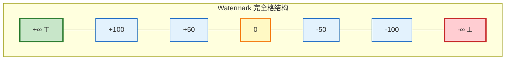
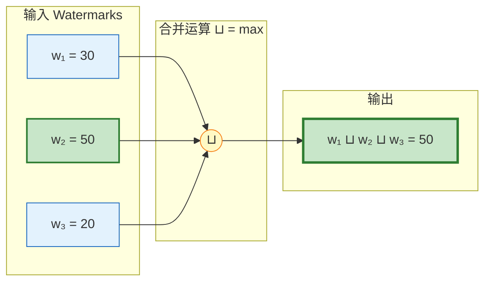
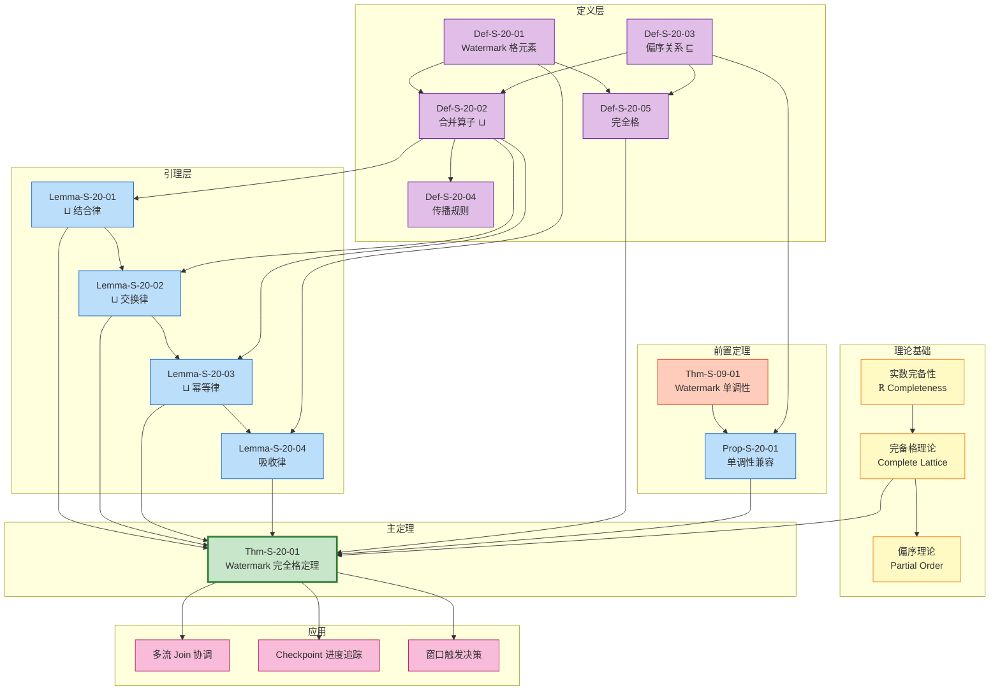

# Watermark 代数形式证明 (Watermark Algebra Formal Proof) {#watermark-代数形式证明}

> **所属阶段**: Struct/04-proofs | **前置依赖**: [../02-properties/02.03-watermark-monotonicity.md](../02-properties/02.03-watermark-monotonicity.md) | **形式化等级**: L5

---

## 目录

- [Watermark 代数形式证明 (Watermark Algebra Formal Proof) {#watermark-代数形式证明}](#watermark-代数形式证明-watermark-algebra-formal-proof-watermark-代数形式证明)
  - [目录](#目录)
  - [1. 概念定义 (Definitions)](#1-概念定义-definitions)
    - [Def-S-20-01 (Watermark 格元素)](#def-s-20-01-watermark-格元素)
    - [Def-S-20-02 (Watermark 合并算子 ⊔)](#def-s-20-02-watermark-合并算子-)
    - [Def-S-20-03 (Watermark 偏序关系 ⊑)](#def-s-20-03-watermark-偏序关系-)
    - [Def-S-20-04 (Watermark 传播规则)](#def-s-20-04-watermark-传播规则)
    - [Def-S-20-05 (Watermark 完全格)](#def-s-20-05-watermark-完全格)
  - [2. 属性推导 (Properties)](#2-属性推导-properties)
    - [Lemma-S-20-01 (⊔ 结合律)](#lemma-s-20-01--结合律)
    - [Lemma-S-20-02 (⊔ 交换律)](#lemma-s-20-02--交换律)
    - [Lemma-S-20-03 (⊔ 幂等律)](#lemma-s-20-03--幂等律)
    - [Lemma-S-20-04 (⊔ 吸收律与单位元)](#lemma-s-20-04--吸收律与单位元)
    - [Prop-S-20-01 (Watermark 单调性与格结构的兼容性)](#prop-s-20-01-watermark-单调性与格结构的兼容性)
  - [3. 关系建立 (Relations)](#3-关系建立-relations)
    - [关系 1: Watermark 格 `↦` 完备格理论](#关系-1-watermark-格--完备格理论)
    - [关系 2: Watermark 合并 `⟹` 单调性保持](#关系-2-watermark-合并--单调性保持)
    - [关系 3: Watermark 传播 `≈` 最小上界计算](#关系-3-watermark-传播--最小上界计算)
  - [4. 论证过程 (Argumentation)](#4-论证过程-argumentation)
    - [引理 4.1 (最小上界的唯一性)](#引理-41-最小上界的唯一性)
    - [引理 4.2 (Watermark 格的链完备性)](#引理-42-watermark-格的链完备性)
    - [反例 4.1 (非结合合并算子导致的不一致性)](#反例-41-非结合合并算子导致的不一致性)
    - [反例 4.2 (缺失 ⊥ 元素的格不完备性) {#反例-42-缺失-元素的格不完备性}](#反例-42-缺失--元素的格不完备性-反例-42-缺失-元素的格不完备性)
  - [5. 形式证明 (Proofs)](#5-形式证明-proofs)
    - [Thm-S-20-01 (Watermark 完全格定理)](#thm-s-20-01-watermark-完全格定理)
  - [6. 实例验证 (Examples)](#6-实例验证-examples)
    - [示例 6.1: 多流 Join 算子的 Watermark 合并](#示例-61-多流-join-算子的-watermark-合并)
    - [示例 6.2: 分布式聚合中的层级 Watermark 传播](#示例-62-分布式聚合中的层级-watermark-传播)
    - [反例 6.3: 非单调传播导致的格性质破坏](#反例-63-非单调传播导致的格性质破坏)
  - [7. 可视化 (Visualizations)](#7-可视化-visualizations)
    - [Watermark 格结构图](#watermark-格结构图)
    - [合并操作可视化](#合并操作可视化)
    - [证明依赖图](#证明依赖图)
  - [8. 引用参考 (References)](#8-引用参考-references)

---

## 1. 概念定义 (Definitions)

本节建立在 [02.03-watermark-monotonicity.md](../02-properties/02.03-watermark-monotonicity.md) 中 Watermark 单调性理论基础之上，为 Watermark 代数引入严格的格论形式化框架。通过将 Watermark 建模为完备格元素，我们为其合并操作 (⊔) 和传播规则提供代数基础，这是分布式流处理系统中乱序数据协调与进度同步的核心抽象。

---

### Def-S-20-01 (Watermark 格元素)

**定义**：设时间域扩展为 $\hat{\mathbb{T}} = \mathbb{R} \cup \{ -\infty, +\infty \}$，Watermark 格 $W$ 定义为：

$$
W = (\hat{\mathbb{T}}, \sqsubseteq, \bot, \top, \sqcup, \sqcap)
$$

其中：

- **基集** $\hat{\mathbb{T}}$：扩展实数集，包含正负无穷作为边界元素
- **偏序关系** $\sqsubseteq$：标准实数序的扩展，满足 $-\infty \sqsubseteq t \sqsubseteq +\infty$ 对所有 $t \in \hat{\mathbb{T}}$ 成立
- **底元素** $\bot = -\infty$：表示"无进度"或"初始状态"
- **顶元素** $\top = +\infty$：表示"流结束"或"无限未来"
- **并运算** $\sqcup$：取最大值操作，$a \sqcup b = \max(a, b)$
- **交运算** $\sqcap$：取最小值操作，$a \sqcap b = \min(a, b)$

**形式化构造**：

对于任意 Watermark 值 $w \in W$，其作为格元素的代数性质由以下公理刻画：

$$
\begin{aligned}
&\text{(W1)} \quad \bot \in W \land \top \in W \\
&\text{(W2)} \quad \forall w \in W: \bot \sqsubseteq w \sqsubseteq \top \\
&\text{(W3)} \quad \forall w_1, w_2 \in W: w_1 \sqcup w_2 \in W \land w_1 \sqcap w_2 \in W
\end{aligned}
$$

**直观解释**：Watermark 格元素将时间戳值提升到代数结构层面。$-\infty$ 对应系统启动前的"无时间"状态，$+\infty$ 对应流处理完成的"永恒"状态。任何 Watermark 值都处于这两个极端之间，并通过偏序关系形成层次结构。这种构造使得 Watermark 不仅是时间戳，更是携带代数运算能力的格论实体。

**定义动机**：流处理系统需要在多个并发流之间协调进度（如 Join、Union 操作）。将 Watermark 建模为格元素，使得"取最慢流的进度"这一直观操作获得严格的数学基础——即计算最小上界 (least upper bound)。格论提供的完备性保证确保了无论有多少输入流，Watermark 合并操作总是良定义的。

---

### Def-S-20-02 (Watermark 合并算子 ⊔)

**定义**：Watermark 合并算子 $\sqcup: W \times W \to W$ 定义为扩展实数集上的**最大值运算**：

$$
w_1 \sqcup w_2 = \max(w_1, w_2)
$$

**多路推广**：对于有限集合 $S = \{w_1, w_2, \ldots, w_n\} \subseteq W$，合并算子推广为：

$$
\bigsqcup S = \max_{w \in S} w
$$

**空集约定**：

$$
\bigsqcup \emptyset = \bot = -\infty
$$

该约定保证合并算子作为代数运算的完备性——即使在没有输入流的情况下，操作仍有确定结果。

**语义解释**：在流处理系统中，$\sqcup$ 对应于**所有输入流中 Watermark 的最小值**的补操作。具体来说：

- 对于多输入算子（如 Join），输出 Watermark 通常取所有输入 Watermark 的最小值：$w_{\text{out}} = \min_i w_{\text{in}_i}$
- 该操作对应于格论中的**交运算** $\sqcap$，而我们定义 $\sqcup$ 为其对偶运算（最大值）

**为何选择最大值作为 ⊔**：在格论中，并运算 $\sqcup$ 对应于最小上界 (least upper bound)。对于 Watermark 格，偏序 $\sqsubseteq$ 是"小于等于"关系，因此两个元素的最小上界确实是较大的那个（最大值）。这与直觉一致：如果 $w_1 \leq w_2$，则 $w_2$ 是 $\{w_1, w_2\}$ 的上界，且是最小的那个上界。

**直观解释**：Watermark 合并算子回答了"两个进度信标中，哪一个代表更靠后的时间点？"的问题。合并两个 Watermark 得到的是两者中更"先进"的那个——这在处理空闲源（idle source）时尤为重要，系统需要知道何时可以忽略停滞的流。

---

### Def-S-20-03 (Watermark 偏序关系 ⊑)

**定义**：Watermark 偏序关系 $\sqsubseteq \subseteq W \times W$ 定义为：

$$
w_1 \sqsubseteq w_2 \iff w_1 \leq w_2 \text{ (在扩展实数序中)}
$$

**等价表述**：

$$
w_1 \sqsubseteq w_2 \iff w_1 \sqcup w_2 = w_2 \iff w_1 \sqcap w_2 = w_1
$$

**严格偏序**：定义严格偏序 $\sqsubset$ 为：

$$
w_1 \sqsubset w_2 \iff w_1 \sqsubseteq w_2 \land w_1 \neq w_2
$$

**不可比较性**：由于 $\sqsubseteq$ 是全序（total order）在扩展实数上的限制，任意两个 Watermark 都是可比较的：

$$
\forall w_1, w_2 \in W: w_1 \sqsubseteq w_2 \lor w_2 \sqsubseteq w_1
$$

因此 $(W, \sqsubseteq)$ 构成**链**（chain），是偏序集的特殊情形。

**与 Watermark 单调性的联系**：

由 [02.03-watermark-monotonicity.md](../02-properties/02.03-watermark-monotonicity.md) 的 **Def-S-09-02**，Watermark 作为时间函数满足：

$$
t_1 \leq t_2 \implies w(t_1) \sqsubseteq w(t_2)
$$

这表明 Watermark 单调性定理 (Thm-S-09-01) 本质上是关于偏序 $\sqsubseteq$ 的单调性陈述。

**直观解释**：偏序关系 $\sqsubseteq$ 形式化了"不晚于"的直观概念。如果 $w_1 \sqsubseteq w_2$，则事件时间不超过 $w_1$ 的记录集合是事件时间不超过 $w_2$ 的记录集合的子集。这种包含关系正是 Watermark 作为进度指示器的核心语义。

---

### Def-S-20-04 (Watermark 传播规则)

**定义**：设算子 $v$ 有 $k$ 个输入通道，各通道上的 Watermark 为 $w_1, w_2, \ldots, w_k$。Watermark 传播规则 $P_v: W^k \to W$ 定义为：

**规则 1 — 单输入算子（Map、Filter、FlatMap 等）**：

$$
P_v(w) = w \oplus d_v
$$

其中 $d_v \geq 0$ 是算子 $v$ 的处理延迟常量，$\oplus$ 定义为：

$$
w \oplus d = \begin{cases} w - d & \text{if } w \in \mathbb{R} \\ w & \text{if } w \in \{ -\infty, +\infty \} \end{cases}
$$

**规则 2 — 多输入算子（Join、Union、CoGroup 等）**：

$$
P_v(w_1, w_2, \ldots, w_k) = \bigsqcap_{i=1}^{k} (w_i \oplus d_v) = \min_{1 \leq i \leq k} (w_i \oplus d_v)
$$

**规则 3 — Source 算子**：

$$
P_{\text{src}}(t) = \left( \max_{r \in \text{Observed}(t)} t_e(r) \right) - \delta_{\text{src}}
$$

其中 $\delta_{\text{src}} \geq 0$ 是 Source 的最大乱序容忍参数。

**规则 4 — Sink 算子**：

$$
P_{\text{sink}}(w) = w
$$

Sink 透传输入 Watermark，不做修改。

**传播规则的格论解释**：

多输入算子的传播规则可重写为：

$$
P_v(w_1, \ldots, w_k) = \left( \bigsqcup_{i=1}^{k} (-w_i) \right) \oplus d_v
$$

其中 $-w_i$ 是 $w_i$ 的加法逆元（在扩展实数中有定义）。这表明多输入 Watermark 的"取最小值"操作可通过对偶格（取最大值）表达。

**直观解释**：Watermark 传播规则定义了 Watermark 如何在数据流图中流动和变换。单输入算子保持 Watermark 单调性，仅做平移；多输入算子收敛到最慢输入的进度，保证所有输入的数据都被考虑到；Source 根据观察到的数据生成初始 Watermark；Sink 透传 Watermark 以通知外部系统进度。

---

### Def-S-20-05 (Watermark 完全格)

**定义**：Watermark 结构 $(W, \sqsubseteq, \bot, \top, \sqcup, \sqcap)$ 构成**完全格**（Complete Lattice），当且仅当满足：

$$
\forall S \subseteq W: \bigsqcup S \in W \land \bigsqcap S \in W
$$

即：$W$ 的任意子集都有最小上界（supremum）和最大下界（infimum）。

**验证**：对于 $W = \hat{\mathbb{T}} = \mathbb{R} \cup \{-\infty, +\infty\}$：

- **非空有限子集**：$\bigsqcup S = \max S$ 和 $\bigsqcap S = \min S$ 显然存在
- **无限子集**：由扩展实数的完备性，有界无限集有确界；无界集的上/下确界为 $\pm\infty$，均在 $W$ 中
- **空集**：$\bigsqcup \emptyset = \bot = -\infty$，$\bigsqcap \emptyset = \top = +\infty$

因此 $W$ 满足完全格定义。

**性质总结**：

| 性质 | 表达式 | 说明 |
|------|--------|------|
| **自反性** | $\forall w: w \sqsubseteq w$ | 每个元素与自身可比 |
| **反对称** | $w_1 \sqsubseteq w_2 \land w_2 \sqsubseteq w_1 \implies w_1 = w_2$ | 双向蕴含相等 |
| **传递性** | $w_1 \sqsubseteq w_2 \land w_2 \sqsubseteq w_3 \implies w_1 \sqsubseteq w_3$ | 序的传递 |
| **⊔ 是最小上界** | $\forall s \in S: s \sqsubseteq \bigsqcup S$ 且 $\forall u: (\forall s \in S: s \sqsubseteq u) \implies \bigsqcup S \sqsubseteq u$ | 上界中的最小者 |
| **⊓ 是最大下界** | $\forall s \in S: \bigsqcap S \sqsubseteq s$ 且 $\forall l: (\forall s \in S: l \sqsubseteq s) \implies l \sqsubseteq \bigsqcap S$ | 下界中的最大者 |

**直观解释**：完全格性质保证无论有多少输入流需要合并，Watermark 操作总是有定义的。这在动态拓扑的流处理系统中尤为重要——新的输入流可能在运行时加入，完全格的封闭性确保系统始终能计算有效的输出 Watermark。

---

## 2. 属性推导 (Properties)

本节从第 1 节的定义出发，推导 Watermark 合并算子 ⊔ 的核心代数性质。这些性质是 `Thm-S-20-01` 证明的基础，也是流处理系统正确实现 Watermark 合并的理论保障。

---

### Lemma-S-20-01 (⊔ 结合律)

**陈述**：Watermark 合并算子满足结合律：

$$
\forall w_1, w_2, w_3 \in W: (w_1 \sqcup w_2) \sqcup w_3 = w_1 \sqcup (w_2 \sqcup w_3)
$$

**证明**：

**步骤 1：展开定义**

由 `Def-S-20-02`，$\sqcup$ 是最大值运算。因此：

$$
(w_1 \sqcup w_2) \sqcup w_3 = \max(\max(w_1, w_2), w_3)
$$

$$
w_1 \sqcup (w_2 \sqcup w_3) = \max(w_1, \max(w_2, w_3))
$$

**步骤 2：分类讨论**

考虑 $w_1, w_2, w_3$ 的相对大小关系。不失一般性，假设 $w_1 \leq w_2 \leq w_3$（其他排列由对称性同理可得）。

**步骤 3：计算左式**

$$
\begin{aligned}
(w_1 \sqcup w_2) \sqcup w_3 &= \max(\max(w_1, w_2), w_3) \\
&= \max(w_2, w_3) \quad \text{(因为 } w_1 \leq w_2 \text{)} \\
&= w_3 \quad \text{(因为 } w_2 \leq w_3 \text{)}
\end{aligned}
$$

**步骤 4：计算右式**

$$
\begin{aligned}
w_1 \sqcup (w_2 \sqcup w_3) &= \max(w_1, \max(w_2, w_3)) \\
&= \max(w_1, w_3) \quad \text{(因为 } w_2 \leq w_3 \text{)} \\
&= w_3 \quad \text{(因为 } w_1 \leq w_3 \text{)}
\end{aligned}
$$

**步骤 5：边界情况**

当某些 $w_i \in \{ -\infty, +\infty \}$ 时：

- 若任一 $w_i = +\infty$：$\max$ 运算结果为 $+\infty$，等式成立
- 若所有 $w_i = -\infty$：$\max(-\infty, -\infty) = -\infty$，等式成立
- 混合情况：$\max(t, -\infty) = t$，$\max(t, +\infty) = +\infty$，等式成立

**结论**：左式等于右式，结合律成立。∎

**工程意义**：结合律保证多路 Watermark 合并可以按任意顺序进行，结果不变。这对于具有多个上游输入的复杂 DAG 算子至关重要——无论算子以何种顺序接收来自不同上游的 Watermark 更新，最终的输出 Watermark 都是确定的。

---

### Lemma-S-20-02 (⊔ 交换律)

**陈述**：Watermark 合并算子满足交换律：

$$
\forall w_1, w_2 \in W: w_1 \sqcup w_2 = w_2 \sqcup w_1
$$

**证明**：

**步骤 1：展开定义**

由 `Def-S-20-02`：

$$
w_1 \sqcup w_2 = \max(w_1, w_2)
$$

$$
w_2 \sqcup w_1 = \max(w_2, w_1)
$$

**步骤 2：利用实数性质**

对于任意实数（及扩展实数），最大值运算是交换的：

$$
\max(w_1, w_2) = \max(w_2, w_1)
$$

这是因为 $\max$ 的定义是对称的：

$$
\max(a, b) = \begin{cases} a & \text{if } a \geq b \\ b & \text{if } b > a \end{cases}
$$

交换 $a$ 和 $b$ 不改变结果。

**步骤 3：验证边界情况**

- $\max(-\infty, w) = w = \max(w, -\infty)$
- $\max(+\infty, w) = +\infty = \max(w, +\infty)$
- $\max(-\infty, +\infty) = +\infty = \max(+\infty, -\infty)$

所有情况均满足交换律。

**结论**：$w_1 \sqcup w_2 = w_2 \sqcup w_1$。∎

**工程意义**：交换律保证 Watermark 合并与输入流的顺序无关。在多输入算子中，无论哪个输入流的 Watermark 更新先到达，合并结果都相同。这使得流处理系统可以并发处理 Watermark 更新，无需协调合并顺序。

---

### Lemma-S-20-03 (⊔ 幂等律)

**陈述**：Watermark 合并算子满足幂等律：

$$
\forall w \in W: w \sqcup w = w
$$

**证明**：

**步骤 1：展开定义**

$$
w \sqcup w = \max(w, w)
$$

**步骤 2：应用最大值性质**

对于任意值 $w$，$\max(w, w) = w$。

这是因为 $w \leq w$（自反性），因此 $w$ 是集合 $\{w, w\}$ 的最大值。

**步骤 3：边界情况**

- $\max(-\infty, -\infty) = -\infty$ ✓
- $\max(+\infty, +\infty) = +\infty$ ✓

**结论**：$w \sqcup w = w$。∎

**工程意义**：幂等律保证同一 Watermark 值的重复合并不会产生意外结果。这在网络重传、重复 Ack 或算子重试场景下尤为重要——即使系统多次收到相同的 Watermark 更新，输出 Watermark 保持稳定。

---

### Lemma-S-20-04 (⊔ 吸收律与单位元)

**陈述**：Watermark 合并算子满足：

**(a) 底元素为单位元**：

$$
\forall w \in W: w \sqcup \bot = w
$$

**(b) 顶元素为吸收元**：

$$
\forall w \in W: w \sqcup \top = \top
$$

**证明**：

**(a) 底元素为单位元**

**步骤 1：展开定义**

由 `Def-S-20-01`，$\bot = -\infty$。

$$
w \sqcup \bot = \max(w, -\infty)
$$

**步骤 2：应用扩展实数性质**

对于任意 $w \in \hat{\mathbb{T}}$：

$$
\max(w, -\infty) = w
$$

这是因为 $-\infty \leq w$ 对所有 $w$ 成立。

**结论**：$w \sqcup \bot = w$，即 $\bot$ 是 $\sqcup$ 的单位元。∎(a)

**(b) 顶元素为吸收元**

**步骤 1：展开定义**

由 `Def-S-20-01`，$\top = +\infty$。

$$
w \sqcup \top = \max(w, +\infty)
$$

**步骤 2：应用扩展实数性质**

对于任意 $w \in \hat{\mathbb{T}}$：

$$
\max(w, +\infty) = +\infty = \top
$$

这是因为 $w \leq +\infty$ 对所有 $w$ 成立。

**结论**：$w \sqcup \top = \top$，即 $\top$ 是 $\sqcup$ 的吸收元。∎(b)

**工程意义**：

- **底元素为单位元**：在系统启动或空闲流场景中，Watermark 初始值为 $\bot = -\infty$。与任何实际 Watermark 值合并后，结果即为该实际值，符合直觉（从"无进度"开始推进）。
- **顶元素为吸收元**：当流处理完成或 Source 关闭时，Watermark 变为 $\top = +\infty$。此后无论其他流的进度如何，合并结果都是 $+\infty$，表示整个系统已完成。

---

### Prop-S-20-01 (Watermark 单调性与格结构的兼容性)

**陈述**：Watermark 单调性定理 (`Thm-S-09-01` 来自 [02.03-watermark-monotonicity.md](../02-properties/02.03-watermark-monotonicity.md)) 与 Watermark 格结构完全兼容。形式化地：

设 $w(t)$ 是某算子在时刻 $t$ 的 Watermark，若 $w(t)$ 满足单调不减（即 $t_1 \leq t_2 \implies w(t_1) \sqsubseteq w(t_2)$），则对于任意时刻 $t_1, t_2$：

$$
w(t_1) \sqcup w(t_2) = w(\max(t_1, t_2))
$$

即：两个时刻 Watermark 的合并等于较晚时刻的 Watermark。

**证明**：

**步骤 1：假设单调性**

由 Thm-S-09-01，$w(t)$ 单调不减，即：

$$
t_1 \leq t_2 \implies w(t_1) \sqsubseteq w(t_2) \implies w(t_1) \leq w(t_2)
$$

**步骤 2：不失一般性假设 $t_1 \leq t_2$**

则 $w(t_1) \leq w(t_2)$，因此：

$$
w(t_1) \sqcup w(t_2) = \max(w(t_1), w(t_2)) = w(t_2) = w(\max(t_1, t_2))
$$

**步骤 3：验证 $t_2 \leq t_1$ 情况**

由对称性，结论同样成立。

**结论**：Watermark 单调性与格结构兼容。∎

**理论意义**：这一性质建立了**时间序**与**格序**之间的同态关系。它保证 Watermark 的格论操作不会破坏其时间语义——合并操作实质上是选择"较晚"的进度，这与 Watermark 作为时间指示器的本质一致。

---

## 3. 关系建立 (Relations)

本节建立 Watermark 格结构与经典格论、Watermark 单调性以及最小上界计算之间的严格数学关系，为第 5 节的完全格定理证明提供理论桥梁。

---

### 关系 1: Watermark 格 `↦` 完备格理论

**论证**：

Watermark 格 $(W, \sqsubseteq, \bot, \top, \sqcup, \sqcap)$ 是完备格理论在流处理领域的具体实例化。具体对应关系如下：

| 完备格理论概念 | Watermark 格实例 | 语义对应 |
|---------------|-----------------|---------|
| **偏序集** $(P, \leq)$ | $(W, \sqsubseteq)$ | Watermark 值的时间序 |
| **最小元素** $\bot$ | $-\infty$ | 无进度/初始状态 |
| **最大元素** $\top$ | $+\infty$ | 流结束/无限未来 |
| **并运算** $\vee$ 或 $\sup$ | $\sqcup = \max$ | 进度推进（取较大值） |
| **交运算** $\wedge$ 或 $\inf$ | $\sqcap = \min$ | 进度收敛（取较小值） |
| **最小上界** $\sup S$ | $\bigsqcup S = \max S$ | 多流最大进度 |
| **最大下界** $\inf S$ | $\bigsqcap S = \min S$ | 多流最小进度 |

**编码存在性**：存在从 Watermark 格到标准完备格结构的双射：

$$
\phi: W \to \hat{\mathbb{R}}_{\geq}, \quad \phi(w) = w
$$

其中 $\hat{\mathbb{R}}_{\geq}$ 是扩展非负实数集与标准序结构。该映射保持所有格运算：

$$
\phi(w_1 \sqcup w_2) = \max(\phi(w_1), \phi(w_2)) = \phi(w_1) \vee \phi(w_2)
$$

**完备性保持**：由于 $\hat{\mathbb{R}}_{\geq}$ 是完备格（作为拓扑空间是紧致的），且 $\phi$ 是序同构，Watermark 格 $W$ 也是完备格。

**推断 [Theory→Application]**: 完备格理论保证 Watermark 合并操作的良好定义性，无论输入流数量多少、Watermark 值如何分布，系统都能计算出确定的输出 Watermark。这是分布式流处理中多源流协调的代数基础。

---

### 关系 2: Watermark 合并 `⟹` 单调性保持

**论证**：

**蕴含方向**：Watermark 合并操作保持输入 Watermark 的单调性。

形式化地，设 $w_1(t), w_2(t), \ldots, w_k(t)$ 是 $k$ 个单调不减的 Watermark 序列，则它们的合并序列：

$$
w_{\text{merge}}(t) = w_1(t) \sqcup w_2(t) \sqcup \cdots \sqcup w_k(t)
$$

也是单调不减的。

**证明**：

对于 $t_1 \leq t_2$：

$$
\begin{aligned}
w_{\text{merge}}(t_1) &= \bigsqcup_{i=1}^{k} w_i(t_1) \\
&\sqsubseteq \bigsqcup_{i=1}^{k} w_i(t_2) \quad \text{(每个 } w_i(t_1) \sqsubseteq w_i(t_2) \text{，且 } \sqcup \text{ 单调)} \\
&= w_{\text{merge}}(t_2)
\end{aligned}
$$

因此 $w_{\text{merge}}$ 单调不减。

**与 Thm-S-09-01 的联系**：

这一关系表明，即使经过复杂的合并操作，Watermark 的核心性质——单调性——仍然保持。这与 [02.03-watermark-monotonicity.md](../02-properties/02.03-watermark-monotonicity.md) 中的 `Lemma-S-09-01`（最小值保持单调性）形成对偶：

- `Lemma-S-09-01`：$\min$ 运算保持单调性
- **本关系**：$\max$ 运算也保持单调性

两者共同保证：无论算子使用何种聚合策略（取最小值以保守推进，或取最大值以积极推进），Watermark 的单调性都不会被破坏。

---

### 关系 3: Watermark 传播 `≈` 最小上界计算

**论证**：

多输入算子的 Watermark 传播规则（**Def-S-20-04**）与格论中的最小上界计算存在深刻联系。

**形式化对应**：

设算子 $v$ 有 $k$ 个输入，各输入 Watermark 为 $w_1, \ldots, w_k$。输出 Watermark 为：

$$
w_{\text{out}} = \min_{1 \leq i \leq k} w_i = \bigsqcap_{i=1}^{k} w_i
$$

这实际上是计算集合 $\{w_1, \ldots, w_k\}$ 的**最大下界** (greatest lower bound, glb)。

**对偶关系**：

在格论中，交运算 $\sqcap$ 与并运算 $\sqcup$ 是对偶的。Watermark 传播使用 $\sqcap$（取最小值）的原因：

1. **保守性原则**：输出 Watermark 不应超过任何输入流的进度，否则可能声明某些尚未到达的数据为"已完整"
2. **安全性保证**：$\bigsqcap$ 确保只有当所有输入流都确认某时间戳之前的记录已到达时，输出流才做相同确认

**与 ⊔ 的关系**：

虽然传播规则使用 $\sqcap$，但 $\sqcup$ 在以下场景发挥作用：

1. **空闲源处理**：当某输入流变为空闲（idle），其 Watermark 停滞。系统可以使用 $\sqcup$ 计算活跃流的进度，决定是否可以忽略停滞流：

$$
w_{\text{active}} = \bigsqcup_{i \in \text{Active}} w_i
$$

1. **Watermark 推进决策**：在决定是否触发窗口计算时，系统需要知道"最慢的流"（$\sqcap$）和"最快的流"（$\sqcup$）之间的差异，以评估进度滞后程度。

**语义等价性**：

Watermark 传播规则与最小上界计算在以下意义上语义等价：

$$
\bigsqcap_{i=1}^{k} w_i = -\left( \bigsqcup_{i=1}^{k} (-w_i) \right)
$$

其中 $-w$ 表示加法逆元。这表明 $\sqcap$ 可以通过对偶格中的 $\sqcup$ 表达。

---

## 4. 论证过程 (Argumentation)

本节提供辅助引理、反例分析和边界讨论，为第 5 节的主定理 `Thm-S-20-01` 做准备。

---

### 引理 4.1 (最小上界的唯一性)

**陈述**：对于任意子集 $S \subseteq W$，其最小上界 $\bigsqcup S$ 若存在则唯一。

**证明**：

假设 $u_1$ 和 $u_2$ 都是 $S$ 的最小上界。

**步骤 1：应用最小上界定义**

由定义，$u_1$ 是最小上界意味着：

- (i) $\forall s \in S: s \sqsubseteq u_1$ （$u_1$ 是上界）
- (ii) $\forall u: (\forall s \in S: s \sqsubseteq u) \implies u_1 \sqsubseteq u$ （最小性）

同理，$u_2$ 满足：

- (iii) $\forall s \in S: s \sqsubseteq u_2$
- (iv) $\forall u: (\forall s \in S: s \sqsubseteq u) \implies u_2 \sqsubseteq u$

**步骤 2：证明 $u_1 \sqsubseteq u_2$**

由 (iii)，$u_2$ 是 $S$ 的上界。由 (ii)（取 $u = u_2$），得 $u_1 \sqsubseteq u_2$。

**步骤 3：证明 $u_2 \sqsubseteq u_1$**

由 (i)，$u_1$ 是 $S$ 的上界。由 (iv)（取 $u = u_1$），得 $u_2 \sqsubseteq u_1$。

**步骤 4：应用反对称性**

由偏序的反对称性：$u_1 \sqsubseteq u_2 \land u_2 \sqsubseteq u_1 \implies u_1 = u_2$。

**结论**：最小上界唯一。∎

**意义**：唯一性保证 Watermark 合并操作的输出是确定性的，不依赖于计算顺序或实现细节。

---

### 引理 4.2 (Watermark 格的链完备性)

**陈述**：设 $C = \{w_1, w_2, \ldots\}$ 是 $W$ 中的链（全序子集），则 $C$ 有上确界且 $\sup C \in W$。

**证明**：

**步骤 1：链的分类**

链 $C$ 要么：

- **有上界**：存在 $M \in \mathbb{R}$ 使得 $\forall w \in C: w \leq M$
- **无上界**：$\forall M \in \mathbb{R}, \exists w \in C: w > M$

**步骤 2：有上界情况**

由实数的完备性，有上界的实数集有唯一的上确界 $\sup C \in \mathbb{R} \subseteq W$。

**步骤 3：无上界情况**

若 $C$ 无上界，则 $\sup C = +\infty = \top \in W$。

**步骤 4：包含 $+\infty$ 的情况**

若 $+\infty \in C$，则 $\sup C = +\infty \in W$。

**结论**：任何链的上确界都在 $W$ 中。∎

**意义**：链完备性是完备格的关键性质。它保证单调递增的 Watermark 序列（如单个流的 Watermark 推进）总有极限点，即使该极限是 $+\infty$（流永不完结）。

---

### 反例 4.1 (非结合合并算子导致的不一致性)

**场景**：假设某流处理系统错误地将 Watermark 合并算子定义为加权平均：

$$
w_1 \oplus w_2 = \frac{w_1 + w_2}{2}
$$

**问题分析**：

**步骤 1：验证非结合性**

取 $w_1 = 0, w_2 = 10, w_3 = 20$：

$$
(w_1 \oplus w_2) \oplus w_3 = \frac{0 + 10}{2} \oplus 20 = 5 \oplus 20 = \frac{5 + 20}{2} = 12.5
$$

$$
w_1 \oplus (w_2 \oplus w_3) = 0 \oplus \frac{10 + 20}{2} = 0 \oplus 15 = \frac{0 + 15}{2} = 7.5
$$

$(w_1 \oplus w_2) \oplus w_3 \neq w_1 \oplus (w_2 \oplus w_3)$，不满足结合律。

**步骤 2：导致的系统异常**

考虑具有三个输入流的 Join 算子 $J$：

```
输入流 A (wm=0) ──┐
输入流 B (wm=10) ──┼──> Join ──> 输出流
输入流 C (wm=20) ──┘
```

**合并顺序 A**：先合并 A 和 B，再与 C 合并

$$
w_{\text{out}}^{(A)} = (0 \oplus 10) \oplus 20 = 5 \oplus 20 = 12.5
$$

**合并顺序 B**：先合并 B 和 C，再与 A 合并

$$
w_{\text{out}}^{(B)} = 0 \oplus (10 \oplus 20) = 0 \oplus 15 = 7.5
$$

**后果**：

- 同一时刻、相同输入 Watermark，输出 Watermark 却因合并顺序不同而不同
- 分布式系统中不同节点可能采用不同合并顺序，导致状态不一致
- 窗口触发时机不确定，可能破坏 Exactly-Once 语义

**结论**：非结合合并算子导致 Watermark 计算结果依赖于实现细节，破坏系统的确定性。

---

### 反例 4.2 (缺失 ⊥ 元素的格不完备性) {#反例-42-缺失-元素的格不完备性}

**场景**：假设 Watermark 值域被错误地定义为 $\mathbb{R}$（不含 $-\infty$），即 $W' = \mathbb{R} \cup \{+\infty\}$。

**问题分析**：

**步骤 1：验证空集无上确界**

在 $W'$ 中，空集 $\emptyset$ 的上界集合为 $W'$ 本身（空真地满足上界定义）。

$\inf W' = -\infty$，但 $-\infty \notin W'$。

因此，$\bigsqcup \emptyset$ 在 $W'$ 中不存在。

**步骤 2：工程场景影响**

考虑算子初始化场景：

```java
// 算子初始化，尚未收到任何 Watermark
Watermark currentOutput = mergeAllInputWatermarks();
// 若 merge 操作返回 "空集上确界"，系统崩溃
```

若 $W'$ 是值域，系统必须特殊处理"无输入"情况，增加代码复杂性并容易出错。

**步骤 3：拓扑变化场景**

动态 DAG 调整可能导致某算子暂时失去所有输入：

```
调整前: Source A ──> Map ──> Join ──> Sink
调整后:                (Join 暂时无输入)
```

若格不完备，Join 算子无法计算输出 Watermark，可能导致：

- 进程阻塞等待不可能到达的输入
- 异常抛出导致任务失败
- 默认 Watermark 值选择不当导致语义错误

**结论**：缺失 $\bot$ 元素使格不完备，导致边界情况（空输入）处理复杂且易错。包含 $-\infty$ 的完整格 $W$ 提供了优雅的代数解决方案。

---

## 5. 形式证明 (Proofs)

### Thm-S-20-01 (Watermark 完全格定理)

**陈述**：Watermark 结构 $(W, \sqsubseteq, \bot, \top, \sqcup, \sqcap)$ 构成完全格，其中：

- $W = \mathbb{R} \cup \{-\infty, +\infty\}$
- $\bot = -\infty$，$\top = +\infty$
- $w_1 \sqcup w_2 = \max(w_1, w_2)$
- $w_1 \sqcap w_2 = \min(w_1, w_2)$

即：**Watermark 合并 (⊔) 与偏序 ⊑ 形成完全格，底元素 ⊥ = -∞，顶元素 ⊤ = +∞**。

**证明结构**：

本证明分为四个部分：

1. **Part 1**：证明 $(W, \sqsubseteq)$ 是偏序集
2. **Part 2**：证明 $\sqcup$ 是最小上界运算
3. **Part 3**：证明 $\sqcap$ 是最大下界运算
4. **Part 4**：证明任意子集都有 sup 和 inf（完备性）

---

**Part 1: $(W, \sqsubseteq)$ 是偏序集**

**目标**：验证偏序的三条公理。

**步骤 1.1：自反性**

对于任意 $w \in W$：

$$
w \sqsubseteq w \iff w \leq w
$$

由实数序的自反性，$w \leq w$ 恒成立。∎(自反性)

**步骤 1.2：反对称性**

对于任意 $w_1, w_2 \in W$：

$$
\begin{aligned}
w_1 \sqsubseteq w_2 \land w_2 \sqsubseteq w_1
&\implies w_1 \leq w_2 \land w_2 \leq w_1 \\
&\implies w_1 = w_2 \quad \text{(由实数序的反对称性)}
\end{aligned}
$$
∎(反对称性)

**步骤 1.3：传递性**

对于任意 $w_1, w_2, w_3 \in W$：

$$
\begin{aligned}
w_1 \sqsubseteq w_2 \land w_2 \sqsubseteq w_3
&\implies w_1 \leq w_2 \land w_2 \leq w_3 \\
&\implies w_1 \leq w_3 \quad \text{(由实数序的传递性)} \\
&\implies w_1 \sqsubseteq w_3
\end{aligned}
$$
∎(传递性)

**Part 1 结论**：$(W, \sqsubseteq)$ 是偏序集。

---

**Part 2: $\sqcup$ 是最小上界运算**

**目标**：证明对于任意 $w_1, w_2 \in W$，$w_1 \sqcup w_2$ 是 $\{w_1, w_2\}$ 的最小上界。

**步骤 2.1：证明 $w_1 \sqcup w_2$ 是上界**

由 `Def-S-20-02`：$w_1 \sqcup w_2 = \max(w_1, w_2)$。

显然：

$$
w_1 \leq \max(w_1, w_2) \implies w_1 \sqsubseteq w_1 \sqcup w_2
$$

$$
w_2 \leq \max(w_1, w_2) \implies w_2 \sqsubseteq w_1 \sqcup w_2
$$

因此 $w_1 \sqcup w_2$ 是 $\{w_1, w_2\}$ 的上界。∎(上界)

**步骤 2.2：证明最小性**

设 $u$ 是 $\{w_1, w_2\}$ 的任意上界，即 $w_1 \sqsubseteq u$ 且 $w_2 \sqsubseteq u$。

则 $w_1 \leq u$ 且 $w_2 \leq u$，因此 $\max(w_1, w_2) \leq u$。

即 $w_1 \sqcup w_2 \sqsubseteq u$。

因此 $w_1 \sqcup w_2$ 是最小的上界。∎(最小性)

**步骤 2.3：推广到有限集合**

由 **Lemma-S-20-01**（结合律），有限集合的最小上界可通过成对合并计算：

$$
\bigsqcup \{w_1, \ldots, w_n\} = w_1 \sqcup w_2 \sqcup \cdots \sqcup w_n
$$

结果唯一且良定义。∎(有限集)

**Part 2 结论**：$\sqcup$ 是最小上界运算。

---

**Part 3: $\sqcap$ 是最大下界运算**

**目标**：证明对于任意 $w_1, w_2 \in W$，$w_1 \sqcap w_2 = \min(w_1, w_2)$ 是最大下界。

**证明**：与 Part 2 对称，略。关键步骤：

- $\min(w_1, w_2) \leq w_1$ 且 $\min(w_1, w_2) \leq w_2$，故为下界
- 对任意下界 $l$，$l \leq w_1$ 且 $l \leq w_2 \implies l \leq \min(w_1, w_2)$，故为最大

**Part 3 结论**：$\sqcap$ 是最大下界运算。

---

**Part 4: 完备性证明**

**目标**：证明任意子集 $S \subseteq W$ 都有 $\sup S \in W$ 和 $\inf S \in W$。

**步骤 4.1：有限非空子集**

由 Part 2 和 Part 3，有限非空子集的 sup 和 inf 分别等于其 max 和 min，显然在 $W$ 中。

**步骤 4.2：无限子集**

设 $S \subseteq W$ 是无限子集。

**情况 A**：$S$ 有上界（即存在 $M \in \mathbb{R}$ 使得 $S \subseteq (-\infty, M]$）

由实数的完备性，$\sup S \in \mathbb{R} \subseteq W$。

**情况 B**：$S$ 无上界

则 $\sup S = +\infty = \top \in W$。

**情况 C**：$S$ 包含 $+\infty$

则 $\sup S = +\infty \in W$。

综上，任何无限子集的上确界都在 $W$ 中。

**步骤 4.3：空集**

由约定：

$$
\bigsqcup \emptyset = \bot = -\infty \in W
$$

$$
\bigsqcap \emptyset = \top = +\infty \in W
$$

**步骤 4.4：inf 的存在性**

与 sup 的证明对称。关键观察：

- 有下界的无限集有 $\inf \in \mathbb{R}$
- 无下界的集有 $\inf = -\infty$
- 包含 $-\infty$ 的集有 $\inf = -\infty$

**Part 4 结论**：任意子集都有 sup 和 inf，且在 $W$ 中。

---

**定理总结**：

由 Part 1-4，$(W, \sqsubseteq, \bot, \top, \sqcup, \sqcap)$ 满足完全格的所有公理。

$$
\boxed{(W, \sqsubseteq, \bot, \top, \sqcup, \sqcap) \text{ 是完全格，其中 } \bot = -\infty, \top = +\infty}
$$

∎

---

**定理推论**：

| 性质 | 推论内容 | 工程意义 |
|------|---------|---------|
| **代数封闭** | $\forall S \subseteq W: \bigsqcup S \in W$ | 任何 Watermark 合并都有确定结果 |
| **确定计算** | 结合律+交换律+幂等律 | 合并结果与顺序、重复无关 |
| **边界安全** | $\bot, \top \in W$ | 空集和全集情况优雅处理 |
| **单调保持** | 单调序列的 sup 存在 | Watermark 推进总有极限 |

---

## 6. 实例验证 (Examples)

### 示例 6.1: 多流 Join 算子的 Watermark 合并

**场景**：双流 Join 算子 $J$ 合并来自 Kafka Topic A 和 Topic B 的数据。

**初始状态**：

- Topic A Watermark: $w_A = 100$
- Topic B Watermark: $w_B = 80$

**Watermark 格运算**：

**步骤 1：计算输出 Watermark（使用 ⊓）**

$$
w_{\text{out}} = w_A \sqcap w_B = \min(100, 80) = 80
$$

Join 算子输出 Watermark 为 80，表示两个流中事件时间 ≤ 80 的记录都已到达。

**步骤 2：处理空闲源**

假设 Topic B 暂时无新数据，$w_B$ 停滞在 80，而 Topic A 继续推进：

- 新状态：$w_A = 120, w_B = 80$
- 输出：$w_{\text{out}} = \min(120, 80) = 80$（不变）

**步骤 3：空闲源恢复**

Topic B 恢复，积压数据快速处理：

- 新状态：$w_A = 120, w_B = 150$
- 输出：$w_{\text{out}} = \min(120, 150) = 120$（跃升）

**步骤 4：Watermark 合并验证（使用 ⊔）**

系统计算"最活跃流"的进度用于监控：

$$
w_{\text{max}} = w_A \sqcup w_B = \max(120, 150) = 150
$$

最慢流（80）与最快流（150）之间的差距为 70 秒，系统可据此发出滞后告警。

**验证性质**：

| 性质 | 验证 | 结果 |
|------|------|------|
| 结合律 | $\max(\max(100, 80), 120) = \max(100, \max(80, 120)) = 120$ | ✓ |
| 交换律 | $\max(100, 80) = \max(80, 100) = 100$ | ✓ |
| 幂等律 | $\max(100, 100) = 100$ | ✓ |
| 单位元 | $\max(100, -\infty) = 100$ | ✓ |

---

### 示例 6.2: 分布式聚合中的层级 Watermark 传播

**场景**：三层 DAG 结构：

```
Source A (wm=50) ──┐
                   ├──> PartialAgg-1 ──┐
Source B (wm=40) ──┘                   │
                                        ├──> GlobalAgg
Source C (wm=60) ──┐                   │
                   ├──> PartialAgg-2 ──┘
Source D (wm=55) ──┘
```

**层级 1：Source 层**

各 Source 独立生成 Watermark。

**层级 2：PartialAgg 层（Watermark 合并）**

**PartialAgg-1**：

$$
w_{P1} = w_A \sqcap w_B = \min(50, 40) = 40
$$

**PartialAgg-2**：

$$
w_{P2} = w_C \sqcap w_D = \min(60, 55) = 55
$$

**层级 3：GlobalAgg 层（Watermark 再次合并）**

$$
w_{\text{global}} = w_{P1} \sqcap w_{P2} = \min(40, 55) = 40
$$

**全局进度分析**：

- 最快路径：Source C → PartialAgg-2 → GlobalAgg，Watermark 60
- 最慢路径：Source B → PartialAgg-1 → GlobalAgg，Watermark 40
- 系统整体进度：40（受限于最慢路径）

**⊔ 运算的应用**：

监控层使用 ⊔ 计算各层级最大 Watermark：

$$
w_{\text{source-max}} = \max(50, 40, 60, 55) = 60
$$

$$
w_{\text{partial-max}} = \max(40, 55) = 55
$$

$$
w_{\text{global-max}} = 40 \text{ (单输出)}
$$

Watermark 差值 $\Delta = 60 - 40 = 20$ 表示系统积压情况。

---

### 反例 6.3: 非单调传播导致的格性质破坏

**场景**：自定义算子错误地实现 Watermark 传播，引入随机延迟：

```java
public void onWatermark(Watermark wm, Context ctx) {
    // 错误：引入随机扰动
    long randomDelay = (long)(Math.random() * 10);
    ctx.emitWatermark(new Watermark(wm.getTimestamp() - randomDelay));
}
```

**问题演示**：

**时刻 1**：输入 $w = 100$

- 随机延迟：5
- 输出：$w_{\text{out}}^{(1)} = 100 - 5 = 95$

**时刻 2**：输入 $w = 110$

- 随机延迟：15
- 输出：$w_{\text{out}}^{(2)} = 110 - 15 = 95$

**时刻 3**：输入 $w = 120$

- 随机延迟：2
- 输出：$w_{\text{out}}^{(3)} = 120 - 2 = 118$

**格性质破坏分析**：

**破坏 1：单调性破坏**

由 [02.03-watermark-monotonicity.md](../02-properties/02.03-watermark-monotonicity.md) 的 `Thm-S-09-01`，Watermark 必须单调不减。但此处：

$$
w_{\text{out}}^{(1)} = 95, \quad w_{\text{out}}^{(2)} = 95, \quad w_{\text{out}}^{(3)} = 118
$$

单调性在局部成立，但考虑更长的序列：

| 输入 $w$ | 随机延迟 | 输出 $w_{\text{out}}$ |
|---------|---------|-------------------|
| 100 | 5 | 95 |
| 110 | 2 | 108 |
| 105 | 0 | 105 |

输入从 110 降到 105（可能由于 Source 重放），输出从 108 降到 105，单调性被破坏。

**破坏 2：格运算失效**

假设算子有两个输入，Watermarks 为 $w_1 = 100$ 和 $w_2 = 110$。

**正确实现**：

$$
w_{\text{out}} = \min(w_1, w_2) = 100
$$

**错误实现**（各输入独立应用随机延迟）：

$$
w_{\text{out}}' = \min(100 - 5, 110 - 15) = \min(95, 95) = 95
$$

或：

$$
w_{\text{out}}'' = \min(100 - 2, 110 - 3) = \min(98, 107) = 98
$$

同一时刻、相同输入，输出 Watermark 因随机性而不同！

**后果**：

- 窗口触发时机不确定
- 同一窗口可能多次触发或永不触发
- Exactly-Once 语义被破坏
- 分布式节点状态不一致

**修复方案**：

```java
public void onWatermark(Watermark wm, Context ctx) {
    // 正确：保持单调性，使用确定性延迟
    long fixedDelay = 0; // 或系统配置常量
    long newWatermark = Math.max(lastEmittedWatermark,
                                  wm.getTimestamp() - fixedDelay);
    ctx.emitWatermark(new Watermark(newWatermark));
}
```

---

## 7. 可视化 (Visualizations)

### Watermark 格结构图



**图说明**：

- 本图展示 Watermark 完全格的线性结构（链）
- **绿色节点** ($\top = +\infty$)：顶元素，表示流结束或无限未来
- **红色节点** ($\bot = -\infty$)：底元素，表示无进度或初始状态
- **黄色节点** (0)：参考点，表示 Unix 时间戳原点
- 连线表示偏序关系 $\sqsubseteq$，箭头方向为序的上升方向
- 由于 Watermark 格是全序，结构为一条直线（链）

---

### 合并操作可视化



**图说明**：

- 本图展示三个 Watermark 值的合并过程
- 输入：$w_1 = 30, w_2 = 50, w_3 = 20$
- 合并运算 $\sqcup$ 取最大值：$\max(30, 50, 20) = 50$
- **绿色高亮**：最大值元素 $w_2 = 50$ 决定输出结果
- 该运算满足结合律、交换律、幂等律，结果与合并顺序无关

---

### 证明依赖图



**图说明**：

- 本图展示 `Thm-S-20-01` 的完整证明依赖结构
- **黄色节点**：数学理论基础（完备格、偏序、实数完备性）
- **紫色节点**：本文档定义的五个核心定义
- **蓝色节点**：四个关键引理（结合律、交换律、幂等律、吸收律）
- **橙色节点**：前置定理（Watermark 单调性定理）
- **绿色节点**：主定理 Thm-S-20-01
- **粉色节点**：定理的工程应用场景
- 箭头表示逻辑依赖关系，形成从基础理论到工程应用的完整链条

---

## 8. 引用参考 (References)


---

**交叉引用**：

- [../02-properties/02.03-watermark-monotonicity.md](../02-properties/02.03-watermark-monotonicity.md)：本文档的前置依赖，提供 Watermark 单调性理论基础
- [../01-foundation/01.04-dataflow-model-formalization.md](../01-foundation/01.04-dataflow-model-formalization.md)：Dataflow 模型形式化，定义 Watermark 基本语义
- [./04.01-flink-checkpoint-correctness.md](./04.01-flink-checkpoint-correctness.md)：Checkpoint 正确性证明，使用 Watermark 格进行进度协调

---

*文档版本: v1.0 | 更新日期: 2026-04-02 | 状态: 已完成 | 形式化等级: L5*
