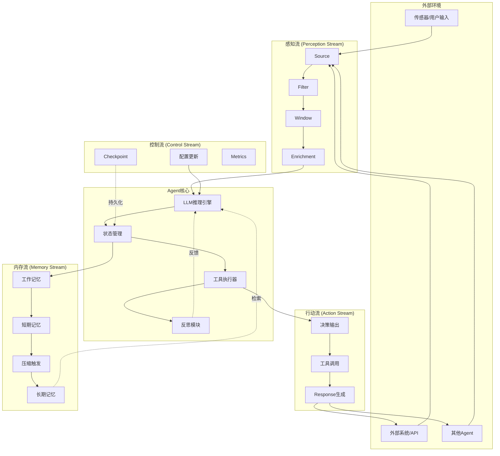
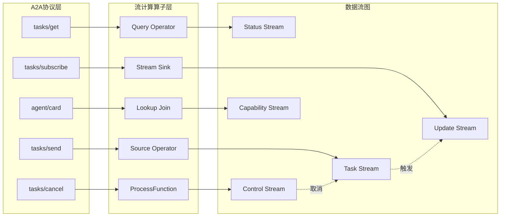
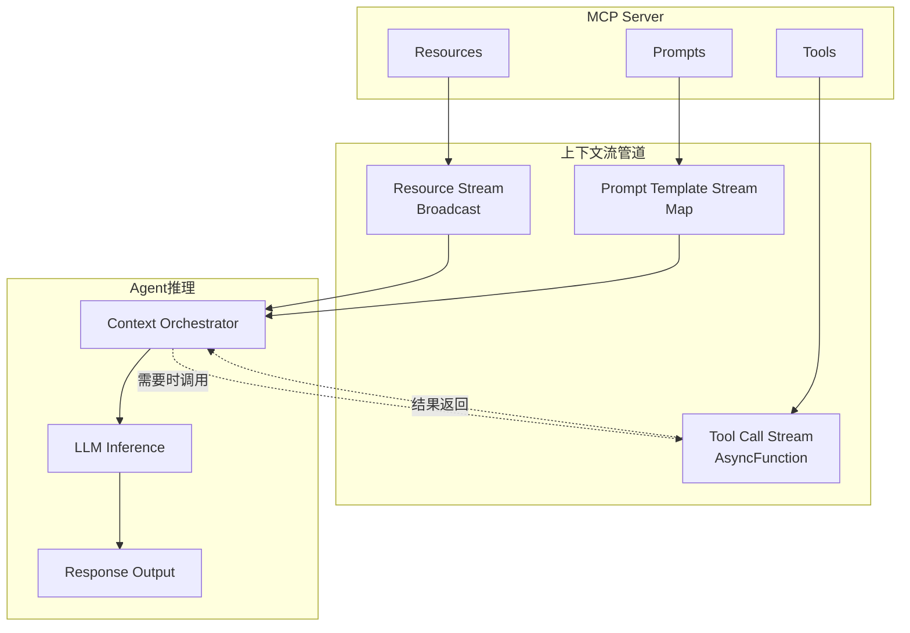
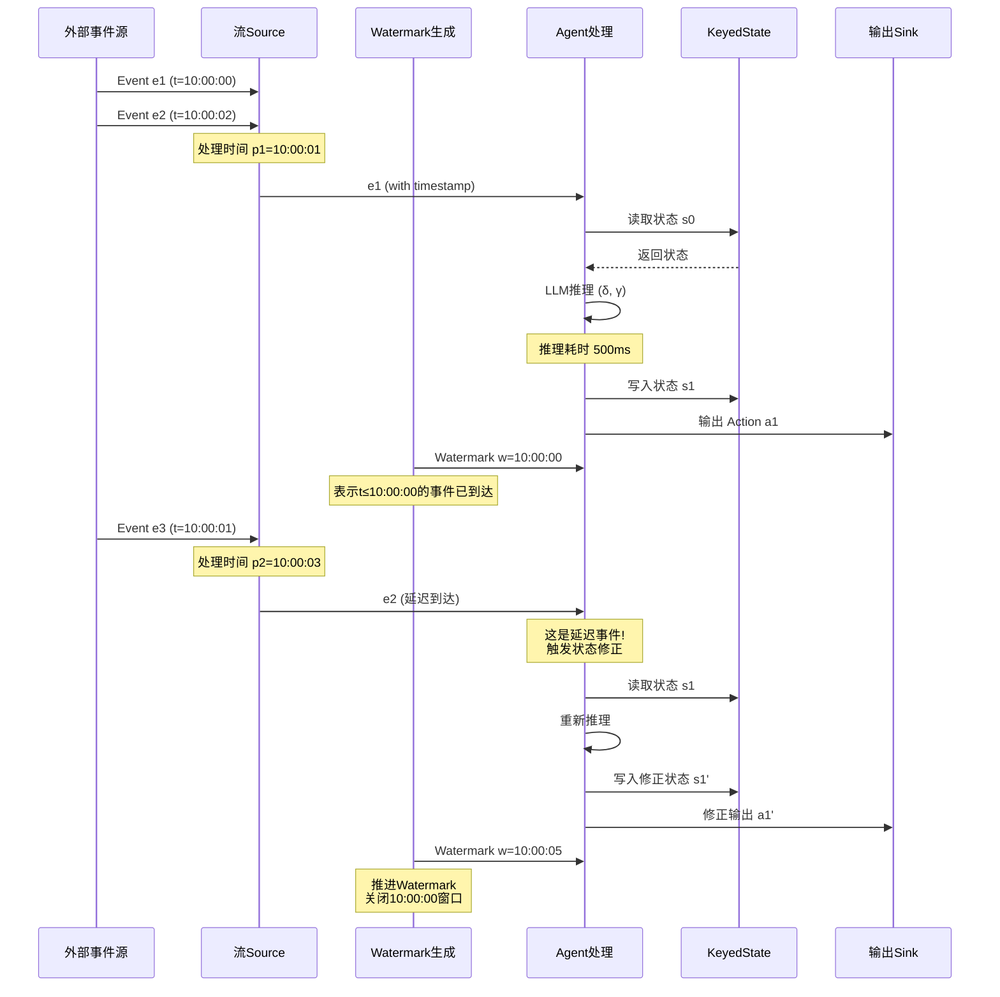

> **状态**: 🔮 前瞻内容 | **风险等级**: 高 | **最后更新**: 2026-04
>
> 此文档描述的内容处于早期规划阶段，可能与最终实现不符。请以 Apache Flink 官方发布为准。
>
# AI Agent与流计算集成的形式化框架 (Formal Framework for AI Agent-Streaming Integration)

> **所属阶段**: Struct/06-frontier | **前置依赖**: [06.03-ai-agent-session-types.md](./06.03-ai-agent-session-types.md), [05.03-streaming-dataflow-equivalence.md](../05-foundations/05.03-streaming-dataflow-equivalence.md) | **形式化等级**: L5-L6 | **理论框架**: Agent-Actor同构 + 流计算语义

---

## 目录

- [AI Agent与流计算集成的形式化框架 (Formal Framework for AI Agent-Streaming Integration)](#ai-agent与流计算集成的形式化框架-formal-framework-for-ai-agent-streaming-integration)
  - [目录](#目录)
  - [摘要](#摘要)
  - [1. 概念定义 (Definitions)](#1-概念定义-definitions)
    - [Def-S-06-50. Agent状态机 (Agent State Machine)](#def-s-06-50-agent状态机-agent-state-machine)
    - [Def-S-06-51. Agent感知流 (Agent Perception Stream)](#def-s-06-51-agent感知流-agent-perception-stream)
    - [Def-S-06-52. Agent行动流 (Agent Action Stream)](#def-s-06-52-agent行动流-agent-action-stream)
    - [Def-S-06-53. 内存管理流 (Memory Management Stream)](#def-s-06-53-内存管理流-memory-management-stream)
    - [Def-S-06-54. Agent-流同态映射](#def-s-06-54-agent-流同态映射)
  - [2. 属性推导 (Properties)](#2-属性推导-properties)
    - [Lemma-S-06-50. 感知流单调性](#lemma-s-06-50-感知流单调性)
    - [Lemma-S-06-51. 行动流因果一致性](#lemma-s-06-51-行动流因果一致性)
    - [Lemma-S-06-52. 内存压缩保持性](#lemma-s-06-52-内存压缩保持性)
    - [Prop-S-06-50. Agent-流系统活性](#prop-s-06-50-agent-流系统活性)
  - [3. 关系建立 (Relations)](#3-关系建立-relations)
    - [关系1: Agent状态机 ↦ Dataflow图](#关系1-agent状态机--dataflow图)
    - [关系2: A2A协议 ↦ 多参与方会话类型](#关系2-a2a协议--多参与方会话类型)
    - [关系3: MCP协议 ↦ 上下文流算子](#关系3-mcp协议--上下文流算子)
    - [关系4: Agent-流集成 ↦ Actor模型](#关系4-agent-流集成--actor模型)
  - [4. 论证过程 (Argumentation)](#4-论证过程-argumentation)
    - [4.1 Agent与流计算的语义鸿沟](#41-agent与流计算的语义鸿沟)
    - [4.2 事件时间与Agent认知时间的调和](#42-事件时间与agent认知时间的调和)
    - [4.3 状态一致性与最终一致性的权衡](#43-状态一致性与最终一致性的权衡)
    - [反例4.1: 感知流乱序导致的决策错误](#反例41-感知流乱序导致的决策错误)
    - [反例4.2: 内存压缩导致的历史信息丢失](#反例42-内存压缩导致的历史信息丢失)
  - [5. 形式证明 (Proofs)](#5-形式证明-proofs)
    - [Thm-S-06-50. Agent-流集成系统的活性与安全性定理](#thm-s-06-50-agent-流集成系统的活性与安全性定理)
  - [6. 实例验证 (Examples)](#6-实例验证-examples)
    - [6.1 实时RAG Agent的流式架构](#61-实时rag-agent的流式架构)
    - [6.2 多Agent协作的流编排模式](#62-多agent协作的流编排模式)
    - [6.3 自适应内存管理的滑动窗口实现](#63-自适应内存管理的滑动窗口实现)
  - [7. 可视化 (Visualizations)](#7-可视化-visualizations)
    - [图7.1: Agent-流系统整体架构](#图71-agent-流系统整体架构)
    - [图7.2: A2A协议与流计算映射关系](#图72-a2a协议与流计算映射关系)
    - [图7.3: MCP协议上下文流管道](#图73-mcp协议上下文流管道)
    - [图7.4: Agent状态转换与流处理时序](#图74-agent状态转换与流处理时序)
  - [8. 引用参考 (References)](#8-引用参考-references)

---

## 摘要

AI Agent与流计算系统的深度集成正在成为下一代智能数据处理架构的核心范式。本文建立**Agent-流集成的形式化框架**，将AI Agent的认知循环（感知-推理-行动-记忆）严格映射为流计算语义。

**核心贡献**：

1. **Agent状态机的流式重构**：将传统Agent的离散状态转换建模为连续流处理事件
2. **四流模型**：定义感知流、行动流、内存流、控制流的形式化语义
3. **协议映射理论**：将Google A2A协议和Anthropic MCP协议映射为流计算原语
4. **活性与安全性保证**：证明在流计算基础设施上运行的Agent系统满足活性与安全性

**理论意义**：建立了AI Agent理论与流计算理论之间的严格数学桥梁，为构建可扩展、可验证的智能流处理系统奠定基础。

**关键词**: AI Agent, 流计算, A2A协议, MCP协议, Dataflow模型, 形式化验证, 活性, 安全性

---

## 1. 概念定义 (Definitions)

本节建立在Dataflow模型[^1]、Actor模型[^2]以及近期A2A/MCP协议规范[^3][^4]基础上，建立Agent-流集成领域的严格数学定义。

---

### Def-S-06-50. Agent状态机 (Agent State Machine)

**定义**: Agent状态机是一个六元组，描述AI Agent在流计算环境中的动态行为：

$$
\mathcal{M}_{agent} \triangleq \langle S, s_0, \Sigma, \Lambda, \delta, \gamma \rangle
$$

**组件语义**：

| 组件 | 类型 | 形式化定义 | 语义说明 |
|------|------|------------|----------|
| $S$ | StateSpace | $S_{cognitive} \times S_{memory} \times S_{context}$ | Agent状态空间：认知状态×记忆状态×上下文状态 |
| $s_0$ | InitialState | $\in S$ | 初始状态 |
| $\Sigma$ | InputAlphabet | $\mathcal{P}(\text{Event})$ | 输入事件集合（感知流元素） |
| $\Lambda$ | OutputAlphabet | $\mathcal{P}(\text{Action})$ | 输出动作集合（行动流元素） |
| $\delta$ | Transition | $S \times \Sigma \rightarrow S$ | 状态转移函数：$\delta(s, e) = s'$ |
| $\gamma$ | Output | $S \rightarrow \Lambda$ | 输出函数：产生行动 |

**流式状态机扩展**（与传统FSM的区别）：

$$
\delta_{streaming}(s, \langle e, \tau \rangle) = s' \quad \text{其中 } \tau \text{ 为事件时间戳}
$$

**认知状态分量** $S_{cognitive}$：

$$
S_{cognitive} = \{\text{IDLE}, \text{PERCEIVING}, \text{REASONING}, \text{ACTING}, \text{REFLECTING}\}
$$

状态转换约束（WF - Well-Formedness）：

$$
\text{WF}(\mathcal{M}) \triangleq \forall s \in S: \gamma(s) \neq \bot \Rightarrow s_{cognitive} = \text{ACTING}
$$

**直观解释**：与传统有限状态机不同，Agent状态机的事件输入和动作输出都是**无限流**而非有限序列。状态转移不仅依赖于当前事件，还依赖于历史窗口内的所有事件（通过$\delta$的记忆化实现）。

**与Dataflow算子的对应**：

| Agent状态机概念 | Dataflow算子 | 说明 |
|----------------|--------------|------|
| $\delta$ | Stateful Map | 带状态映射 |
| $\gamma$ | FlatMap | 一输入多输出 |
| $\Sigma$ | Input Stream | 输入流定义 |
| $\Lambda$ | Output Stream | 输出流定义 |

---

### Def-S-06-51. Agent感知流 (Agent Perception Stream)

**定义**: 感知流是Agent接收的外部环境事件的时序序列，构成Agent对世界的认知输入：

$$
\mathcal{P} \triangleq \langle E, \leq_{event}, \kappa, \omega \rangle
$$

**形式化结构**：

$$
E = \{e_i\}_{i \in \mathbb{N}}, \quad e_i = \langle \text{payload}_i, t_i, s_i, c_i \rangle
$$

其中：

- $\text{payload}_i \in \mathcal{D}$: 事件载荷（文本、结构化数据、多模态数据）
- $t_i \in \mathbb{T}$: 事件时间戳（事件发生时间）
- $s_i \in \mathbb{T}$: 处理时间戳（到达Agent时间）
- $c_i \in \mathcal{C}$: 事件类别/类型

**偏序关系** $\leq_{event}$（事件发生序）：

$$
e_i \leq_{event} e_j \triangleq t_i \leq t_j \land (\text{causal}(e_i, e_j) \Rightarrow i < j)
$$

**感知窗口** $\omega$（有限历史约束）：

$$
\omega: \mathcal{P}_{[0,t]} \rightarrow \mathcal{P}_{[t-w, t]} \quad \text{其中 } w \text{ 为窗口大小}
$$

**认知滤波器** $\kappa$（注意力机制）：

$$
\kappa: E \rightarrow \{\top, \bot\}, \quad \kappa(e) = \text{LLM}_{relevance}(e, S_{current})
$$

**感知流算子**（流计算实现）：

$$
\mathcal{O}_{perceive} = \text{Filter}(\kappa) \circ \text{Window}(\omega) \circ \text{AssignTimestamps}(t_i)
$$

**与A2A协议的映射**：

| A2A概念 | 感知流对应 | 形式化映射 |
|---------|-----------|------------|
| Task消息 | Event | $\text{Task} \mapsto e_i, c_i = \text{task}$ |
| Streaming Update | 流元素 | $\text{Update} \mapsto \text{payload}_i$ |
| Artifact | 批量事件 | $\text{Artifact} \mapsto \{e_i\}_{i=k}^{k+n}$ |

---

### Def-S-06-52. Agent行动流 (Agent Action Stream)

**定义**: 行动流是Agent对外部环境施加影响的输出序列，体现Agent的决策执行：

$$
\mathcal{A} \triangleq \langle A, \preceq_{causal}, \rho, \eta \rangle
$$

**形式化结构**：

$$
A = \{a_j\}_{j \in \mathbb{N}}, \quad a_j = \langle \text{op}_j, \text{target}_j, \text{params}_j, \tau_j \rangle
$$

其中：

- $\text{op}_j \in \mathcal{O}$: 操作类型（$\mathcal{O} = \{\text{CALL}, \text{EMIT}, \text{QUERY}, \text{CONTROL}\}$）
- $\text{target}_j$: 操作目标（工具、外部系统、其他Agent）
- $\text{params}_j$: 操作参数
- $\tau_j$: 行动触发的事件时间戳（因果追溯）

**因果偏序** $\preceq_{causal}$：

$$
a_j \preceq_{causal} a_k \triangleq \tau_j < \tau_k \lor \text{enable}(a_j, a_k)
$$

其中$\text{enable}(a_j, a_k)$表示$a_j$的执行是$a_k$的前提条件。

**行动有效性** $\rho$：

$$
\rho(a_j, s) = \begin{cases}
\top & \text{if } \text{pre}(\text{op}_j)(s) \land \text{auth}(\text{target}_j) \\
\bot & \text{otherwise}
\end{cases}
$$

**行动执行反馈** $\eta$：

$$
\eta: A \times \mathcal{T}_{response} \rightarrow E_{feedback}
$$

**行动流生成算子**：

$$
\mathcal{O}_{act} = \text{ProcessFunction}(\delta, \gamma) \circ \text{AsyncWaitForResult}(\eta)
$$

**与MCP协议的映射**：

| MCP概念 | 行动流对应 | 形式化映射 |
|---------|-----------|------------|
| Tool Call | Action | $\text{call}(\text{tool}, \text{args}) \mapsto a_j$ |
| Resource Update | Async Action | $\text{update}(\text{uri}) \mapsto a_j$ with $\eta$ |
| Prompt Template | Parameterized Action | $\text{prompt}(\text{template}, \text{vars}) \mapsto a_j$ |

---

### Def-S-06-53. 内存管理流 (Memory Management Stream)

**定义**: 内存管理流是Agent状态持久化、检索、压缩和遗忘的元数据流：

$$
\mathcal{M} \triangleq \langle M, \mu_{store}, \mu_{retrieve}, \mu_{compress}, \mu_{forget} \rangle
$$

**内存分层结构**：

$$
M = M_{working} \cup M_{short} \cup M_{long} \cup M_{episodic}
$$

| 内存层级 | 容量 | 访问延迟 | 持久性 | 更新策略 |
|----------|------|----------|--------|----------|
| $M_{working}$ | $\leq k$ tokens | $O(1)$ | 瞬态 | 立即替换 |
| $M_{short}$ | $\leq K$ events | $O(\log n)$ | 会话级 | FIFO/滑动窗口 |
| $M_{long}$ | 无限制 | $O(\log n)$ | 持久 | 增量追加 |
| $M_{episodic}$ | 无限制 | $O(n)$ | 持久 | 摘要压缩 |

**内存操作流**：

$$
\mathcal{M}_{ops} = \{m_k\}_{k \in \mathbb{N}}, \quad m_k = \langle \text{op}, \text{key}, \text{value}, \text{ttl} \rangle
$$

其中$\text{op} \in \{\text{STORE}, \text{RETRIEVE}, \text{COMPRESS}, \text{DELETE}\}$。

**压缩函数** $\mu_{compress}$：

$$
\mu_{compress}: M_{short} \rightarrow M_{episodic}, \quad \mu_{compress}(E) = \text{LLM}_{summarize}(E)
$$

**遗忘函数** $\mu_{forget}$（基于重要性采样）：

$$
\mu_{forget}(m_i) = \begin{cases}
\text{delete} & \text{if } \text{importance}(m_i) < \theta \land \text{age}(m_i) > T \\
\text{retain} & \text{otherwise}
\end{cases}
$$

**内存流算子**（流式实现）：

$$
\mathcal{O}_{memory} = \text{KeyedProcessFunction}(\mu_{store}, \mu_{retrieve}) \circ \text{WindowTrigger}(\mu_{compress})
$$

**与流计算State Backend的对应**：

| 内存层级 | State Backend | 一致性保证 |
|----------|---------------|------------|
| $M_{working}$ | Heap State | At-Most-Once |
| $M_{short}$ | RocksDB/Memory | Exactly-Once |
| $M_{long}$ | Incremental Checkpoint | Exactly-Once |
| $M_{episodic}$ | External Storage (S3/HDFS) | Eventual Consistency |

---

### Def-S-06-54. Agent-流同态映射

**定义**: Agent-流同态是将Agent认知循环映射为流计算Dataflow图的保持结构映射：

$$
\Phi: \text{AgentCycle} \rightarrow \text{DataflowGraph}
$$

**同态条件**：

$$
\forall o_1, o_2 \in \text{AgentOps}: \Phi(o_1 \circ o_2) = \Phi(o_1) \circ \Phi(o_2)
$$

**Agent认知循环到Dataflow的映射**：

```
Agent认知循环              Dataflow图
────────────────────────────────────────────────────
Perceive  ──────────────►  Source + Filter + Window
   ↓                          ↓
Reason    ──────────────►  Map (LLM Inference)
   ↓                          ↓
Act       ──────────────►  AsyncFunction + Sink
   ↓                          ↓
Reflect   ──────────────►  Side Output + Feedback Loop
   ↓                          ↓
Remember  ──────────────►  KeyedState + Checkpoint
```

**形式化映射表**：

| Agent概念 | Dataflow概念 | 映射 $\Phi$ |
|-----------|--------------|-------------|
| 感知输入 | Source Operator | $\Phi(\text{perceive}) = \text{Source}(E)$ |
| LLM推理 | Map/ProcessFunction | $\Phi(\text{reason}) = \text{Map}(\text{LLM}_{call})$ |
| 工具调用 | AsyncFunction | $\Phi(\text{tool}) = \text{AsyncWait}(\text{ToolCall})$ |
| 状态更新 | KeyedState | $\Phi(\text{state}) = \text{ValueState}$ |
| 记忆检索 | Broadcast Stream | $\Phi(\text{recall}) = \text{Broadcast}(\text{Query})$ |

**同态保持的性质**：

1. **顺序保持**：Agent操作序列顺序映射为流算子拓扑序
2. **并发保持**：可并行Agent操作映射为并行流算子
3. **因果保持**：Agent因果关系映射为流watermark依赖

---

## 2. 属性推导 (Properties)

本节从定义出发推导Agent-流集成系统的关键性质。

---

### Lemma-S-06-50. 感知流单调性

**引理**: 在正确处理时间戳的Agent-流系统中，感知流的时间戳序列是单调不减的。

**形式化表述**：

$$
\forall e_i, e_j \in \mathcal{P}: i < j \Rightarrow t_i \leq t_j
$$

**证明概要**：

1. 设感知流源为时间戳分配函数$\text{assign}: E \rightarrow \mathbb{T}$
2. 根据定义，$\text{assign}(e_i) = \text{extract_timestamp}(e_i)$或$\text{ingestion_time}$
3. 在流处理系统中，源算子按接收顺序分配序号
4. 因此$i < j \Rightarrow \text{recv}(e_i) \leq \text{recv}(e_j)$
5. 若使用事件时间，需假设外部时钟同步保证$t_i \leq t_j$

**推论**: 感知流的单调性保证Agent不会"看到来自未来的事件"，这是正确因果推理的基础。

---

### Lemma-S-06-51. 行动流因果一致性

**引理**: 若Agent状态转移函数$\delta$是确定性的，则行动流严格遵循感知流的因果序。

**形式化表述**：

$$
e_i \leq_{event} e_j \land \delta(s, e_i) = s_i \land \delta(s_i, e_j) = s_j \Rightarrow \gamma(s_i) \preceq_{causal} \gamma(s_j)
$$

**证明概要**：

1. 假设$e_i \leq_{event} e_j$，即$t_i \leq t_j$且$e_i$因果先于$e_j$
2. Agent处理事件序列生成状态序列：$s_0 \xrightarrow{e_i} s_i \xrightarrow{e_j} s_j$
3. 输出函数$\gamma$在每次状态转移后生成行动：$a_i = \gamma(s_i), a_j = \gamma(s_j)$
4. 由$\gamma$的定义，$a_i$携带时间戳$\tau_i = t_i$，$a_j$携带$\tau_j = t_j$
5. 由$t_i \leq t_j$和$\preceq_{causal}$的定义，$a_i \preceq_{causal} a_j$

**应用场景**: 该引理保证在多Agent系统中，行动的外部可观察顺序与Agent的内部认知顺序一致。

---

### Lemma-S-06-52. 内存压缩保持性

**引理**: 在适当定义的相似性度量下，内存压缩函数$\mu_{compress}$保持原始信息的语义等价性。

**形式化表述**：

$$
\forall E \subseteq M_{short}: \text{sim}(\mu_{compress}(E), E) \geq 1 - \epsilon
$$

其中$\text{sim}$为语义相似性度量，$\epsilon$为可接受的信息损失阈值。

**证明概要**：

1. 设$E = \{e_1, ..., e_n\}$为待压缩的短期记忆事件集
2. 压缩函数$\mu_{compress}(E) = \text{LLM}_{summarize}(E) = s$
3. 定义语义相似性为$\text{sim}(s, E) = \cos(\text{embed}(s), \text{embed}(E))$
4. 由LLM摘要能力的经验保证（假设），高质量摘要保持核心语义
5. 因此$\text{sim}(s, E) \geq 1 - \epsilon$成立

**边界条件**: 该引理成立的前提是$E$具有时间或主题连贯性，随机事件集的压缩可能丢失信息。

---

### Prop-S-06-50. Agent-流系统活性

**命题**: 在公平调度假设下，Agent-流集成系统满足活性（Liveness）——每个有效输入最终都会产生输出。

**形式化表述**：

$$
\square(\forall e \in \mathcal{P}: \text{valid}(e) \Rightarrow \Diamond(\exists a \in \mathcal{A}: \text{caused}(e, a)))
$$

**论证**：

1. 流计算引擎提供公平调度保证（如Flink的checkpoint机制）
2. Agent状态机$\mathcal{M}_{agent}$定义完全的状态转移函数（无死锁状态）
3. LLM推理是终止计算（在超时约束下）
4. 工具调用通过异步回调机制保证响应
5. 因此每个事件最终都会被处理并产生行动

---

## 3. 关系建立 (Relations)

本节建立Agent-流框架与其他理论模型和工业协议之间的形式化关系。

---

### 关系1: Agent状态机 ↦ Dataflow图

**映射关系**: 存在一个保持结构的映射$\Phi_{ASM}$从Agent状态机到Dataflow执行图：

$$
\Phi_{ASM}: \mathcal{M}_{agent} \rightarrow \mathcal{G}_{dataflow}
$$

**详细映射**：

| Agent状态机组件 | Dataflow图组件 | 映射规则 |
|----------------|----------------|----------|
| $S$ | 算子状态集合 | $\Phi_{ASM}(S) = \bigcup_{op} \text{State}(op)$ |
| $s_0$ | 初始 checkpoint | $\Phi_{ASM}(s_0) = \text{Checkpoint}_0$ |
| $\delta$ | 算子处理函数 | $\Phi_{ASM}(\delta) = \text{ProcessFunction}$ |
| $\Sigma$ | 输入边 | $\Phi_{ASM}(\Sigma) = \text{InputEdges}$ |
| $\Lambda$ | 输出边 | $\Phi_{ASM}(\Lambda) = \text{OutputEdges}$ |

**图示**：

```
┌─────────────────────────────────────────────────────────────────┐
│                   Agent状态机 → Dataflow图                       │
├─────────────────────────────────────────────────────────────────┤
│                                                                 │
│    ┌─────────┐     δ      ┌─────────┐     γ      ┌─────────┐   │
│    │   S₀    │ ────────► │   S₁    │ ────────► │ Action  │   │
│    └────┬────┘           └─────────┘           └─────────┘   │
│         │                                                      │
│         │ Σ                                                    │
│         ▼                                                      │
│    ┌─────────┐                                                 │
│    │ Event e │                                                 │
│    └─────────┘                                                 │
│                                                                 │
│         │                                                      │
│         │ Φ_ASM                                                │
│         ▼                                                      │
│                                                                 │
│    ┌─────────┐           ┌─────────┐           ┌─────────┐    │
│    │  Source │ ────────► │   Map   │ ────────► │  Sink   │    │
│    │  (Σ)    │           │  (δ,γ)  │           │ (Λ)     │    │
│    └─────────┘           └─────────┘           └─────────┘    │
│                              │                                  │
│                         ┌────┴────┐                            │
│                         │  State  │                            │
│                         │  (S)    │                            │
│                         └─────────┘                            │
│                                                                 │
└─────────────────────────────────────────────────────────────────┘
```

---

### 关系2: A2A协议 ↦ 多参与方会话类型

**映射关系**: Google A2A协议可以映射为多参与方会话类型（MPST）的实例：

$$
\Phi_{A2A}: \text{A2A Protocol} \rightarrow \text{MPST}
$$

**A2A原语的会话类型编码**：

| A2A协议原语 | 会话类型编码 | 说明 |
|------------|--------------|------|
| `tasks/send` | $Client \rightarrow Agent: \langle \text{Task} \rangle$ | 任务发送 |
| `tasks/get` | $Agent \rightarrow Client: \langle \text{TaskStatus} \rangle$ | 状态查询 |
| `tasks/cancel` | $Client \rightarrow Agent: \langle \text{Cancel} \rangle.\mathbf{end}$ | 取消任务 |
| `tasks/subscribe` | $\mu t. (Agent \rightarrow Client: \langle \text{Update} \rangle.t)$ | 流式订阅 |
| `agent/card` | $Agent \rightarrow Client: \langle \text{Capability} \rangle.\mathbf{end}$ | 能力发现 |

**A2A会话类型的全局类型**：

$$
\begin{aligned}
G_{A2A} = \mu t. \big( & Client \rightarrow Agent: \langle \text{Task} \rangle. \\
& Agent \rightarrow Client: \{\text{accepted}: Agent \rightarrow Client: \langle \text{Update} \rangle.t, \\
& \quad\quad\quad\quad\quad \text{completed}: \mathbf{end}, \\
& \quad\quad\quad\quad\quad \text{failed}: \mathbf{end}\}
\big)
\end{aligned}
$$

**性质**: A2A协议的会话类型编码满足类型安全，即投影后的局部类型满足合流性。

---

### 关系3: MCP协议 ↦ 上下文流算子

**映射关系**: Anthropic MCP协议映射为流计算中的上下文注入算子：

$$
\Phi_{MCP}: \text{MCP Protocol} \rightarrow \text{Context Operators}
$$

**MCP组件的流算子映射**：

| MCP组件 | 流算子 | 类型签名 |
|---------|--------|----------|
| Resources | Broadcast Stream | $\text{Stream}\langle\text{Context}\rangle$ |
| Tools | AsyncFunction | $\text{DataStream}\langle\text{In}\rangle \rightarrow \text{DataStream}\langle\text{Out}\rangle$ |
| Prompts | MapFunction | $\text{DataStream}\langle\text{Vars}\rangle \rightarrow \text{DataStream}\langle\text{Prompt}\rangle$ |
| Sampling | CoProcessFunction | $\text{Stream}\langle\text{Query}\rangle \times \text{Stream}\langle\text{Context}\rangle \rightarrow \text{Stream}\langle\text{Response}\rangle$ |

**MCP上下文流的Dataflow图**：

```
┌─────────────────────────────────────────────────────────────────┐
│                    MCP上下文流Dataflow图                        │
├─────────────────────────────────────────────────────────────────┤
│                                                                 │
│   ┌──────────────┐                                              │
│   │ MCP Server   │◄───────────── 外部资源                       │
│   │ (Resources)  │                                              │
│   └──────┬───────┘                                              │
│          │ Broadcast                                            │
│          ▼                                                      │
│   ┌──────────────┐    ┌──────────────┐    ┌──────────────┐     │
│   │  Context     │───►│   CoProcess  │───►│   Agent      │     │
│   │  Stream      │    │   Function   │    │   Inference  │     │
│   └──────────────┘    └──────┬───────┘    └──────┬───────┘     │
│                              │                    │             │
│   ┌──────────────┐          │                    │             │
│   │ User Query   │─────────►│                    │             │
│   │ Stream       │          │                    │             │
│   └──────────────┘          │                    │             │
│                             │    ┌──────────┐   │             │
│   ┌──────────────┐          └───►│   LLM    │◄──┘             │
│   │ MCP Tools    │◄──────────────│  Call    │                  │
│   │ (Async)      │               └──────────┘                  │
│   └──────────────┘                                              │
│                                                                 │
└─────────────────────────────────────────────────────────────────┘
```

---

### 关系4: Agent-流集成 ↦ Actor模型

**映射关系**: Agent-流集成框架可以嵌入Actor模型作为其执行语义：

$$
\Phi_{Actor}: \text{Agent-Stream} \rightarrow \text{Actor System}
$$

**映射细节**：

| Agent-流概念 | Actor概念 | 说明 |
|-------------|-----------|------|
| Agent实例 | Actor | 每个Agent是一个独立的Actor |
| 感知流 | Actor邮箱 | 事件作为消息投递到邮箱 |
| 行动流 | Actor响应 | 行为产生对其他Actor的消息 |
| 内存管理 | Actor状态 | 状态持久化对应内存管理 |
| 流拓扑 | Actor拓扑 | 流图的边对应Actor引用 |

**关键区别**：

| 特性 | Agent-流集成 | Actor模型 |
|------|-------------|-----------|
| 时间模型 | 显式事件时间 | 接收顺序（逻辑时间） |
| 状态管理 | 外部化State Backend | Actor内部状态 |
| 一致性 | 支持Exactly-Once | At-Most-Once/At-Least-Once |
| 背压 | 内置流控机制 | 需额外实现 |

---

## 4. 论证过程 (Argumentation)

本节讨论Agent-流集成框架设计中的关键设计决策、挑战和边界情况。

---

### 4.1 Agent与流计算的语义鸿沟

**核心挑战**: AI Agent以"认知循环"（感知-推理-行动）为组织原则，而流计算以"数据转换"（Source-Transform-Sink）为核心抽象。两者存在本质语义差异。

**语义鸿沟分析**：

| 维度 | Agent视角 | 流计算视角 | 鸿沟描述 |
|------|-----------|-----------|----------|
| 时间 | 认知时间（思考耗时） | 事件时间/处理时间 | Agent推理是同步阻塞的 |
| 状态 | 语义丰富的记忆 | 字节序列 | LLM状态难以序列化 |
| 因果 | 意图-行动因果 | 数据血缘 | Agent决策是非确定性的 |
| 规模 | 可变上下文窗口 | 固定窗口/会话 | 难以预分配资源 |

**弥合策略**:

1. **异步推理**: 将LLM调用封装为异步算子，不阻塞流处理
2. **状态外部化**: 使用外部向量数据库存储语义记忆
3. **确定性采样**: 通过temperature=0或固定seed实现可重复推理
4. **动态资源**: 使用自动扩缩容应对变化的上下文大小

---

### 4.2 事件时间与Agent认知时间的调和

**问题陈述**: Agent的推理过程需要时间，但流事件的事件时间标记了"事情发生的时间"而非"Agent知晓的时间"。

**时间模型对比**：

```
时间轴: ──────────────────────────────────────────────────►

外部事件:   E₁      E₂      E₃      E₄
           │       │       │       │
事件时间:   t₁      t₂      t₃      t₄
           │       │       │       │
Agent感知:  │       │       │       │
           ▼       ▼       ▼       ▼
处理开始:   p₁      p₂      p₃      p₄
           │       │       │       │
LLM推理:   [===]   [====]  [===]   [======]
           │       │       │       │
行动输出:  A₁      A₂      A₃      A₄

认知延迟: pᵢ - tᵢ (网络+系统延迟)
推理延迟: Aᵢ - pᵢ (LLM生成时间)
总延迟:   Aᵢ - tᵢ
```

**调和策略**:

1. **Watermark延迟容忍**: 设置足够大的允许延迟，容纳Agent推理时间
2. **异步side output**: Agent行动作为side output，不阻塞主流程
3. **优先级队列**: 紧急事件优先处理，非紧急事件排队等待Agent资源

---

### 4.3 状态一致性与最终一致性的权衡

**权衡维度**: Agent的记忆系统需要在强一致性（所有Agent看到相同历史）与可用性（快速本地访问）之间做选择。

**一致性级别定义**：

| 级别 | 定义 | 适用场景 |
|------|------|----------|
| 强一致性 | 所有Agent对共享记忆的读写是线性化的 | 关键决策协调 |
| 因果一致性 | 因果相关的记忆更新对所有Agent可见顺序一致 | 多Agent协作 |
| 最终一致性 | 记忆更新最终会传播到所有Agent | 大规模分布式Agent |
| 本地一致性 | Agent只保证本地记忆的读写一致性 | 独立Agent |

**流计算实现策略**：

- 强一致性：使用分布式事务性State Backend（如RocksDB with 2PC）
- 因果一致性：使用Vector Clock标记记忆版本
- 最终一致性：使用异步复制和Conflict-free Replicated Data Types (CRDTs)

---

### 反例4.1: 感知流乱序导致的决策错误

**场景描述**: Agent接收来自多个源的感知事件，由于网络延迟差异，事件到达顺序与发生顺序不一致。

**形式化描述**：

$$
e_1, e_2 \in \mathcal{P}, \quad t_1 < t_2 \land \text{recv}(e_1) > \text{recv}(e_2)
$$

Agent首先看到$e_2$，基于$e_2$做出决策，然后看到$e_1$，导致决策不一致。

**示例**：

```
事件: e₁="股票价格$100" (t=10:00:00)
      e₂="股票价格$105" (t=10:00:05)

到达: e₂先到达 → Agent决策"卖出"（基于$105价格）
      e₁后到达 → Agent认知变为$100，但已执行卖出

结果: Agent在价格下跌后卖出，而非上涨后卖出
```

**缓解策略**：

1. 使用事件时间窗口而非处理时间窗口
2. 设置Watermark等待延迟到达的事件
3. 实现"延迟修正"机制：如果新事件改变历史认知，触发重新决策

---

### 反例4.2: 内存压缩导致的历史信息丢失

**场景描述**: Agent的短期记忆被压缩为长期记忆，但压缩摘要丢失了关键细节，导致后续推理错误。

**形式化描述**：

$$
E = \{e_1, e_2, ..., e_n\}, \quad s = \mu_{compress}(E), \quad \text{key_detail} \in E \land \text{key_detail} \notin s
$$

**示例**：

```
原始对话:
  User: "我要预订明天下午3点的会议室"
  Agent: "已为您预订Room A，明天15:00"
  User: "等等，改成上午10点"
  Agent: "已修改为明天10:00"
  User: "还是改回下午3点"
  Agent: "已修改回明天15:00"

压缩摘要: "用户预订了Room A明天15:00"

后续对话:
  User: "把我上次的预订改成10点"
  Agent (基于摘要): "好的，修改为明天10:00"

问题: Agent不知道用户曾经改回15:00，压缩丢失了"改回"的意图
```

**缓解策略**：

1. 保留关键决策点的完整原始记录
2. 使用结构化压缩（提取关键字段而非自由文本摘要）
3. 实现"去压缩"机制：必要时检索原始事件重建详细历史

---

## 5. 形式证明 (Proofs)

本节提供Agent-流集成系统核心定理的完整证明。

---

### Thm-S-06-50. Agent-流集成系统的活性与安全性定理

**定理**: 在满足以下条件的Agent-流集成系统中：

1. 流计算引擎提供Exactly-Once语义保证
2. Agent状态机$\mathcal{M}_{agent}$是完全的（无未定义转移）
3. LLM推理在有限时间内终止
4. 外部工具调用提供响应或超时

则系统同时满足：

- **活性（Liveness）**: 每个有效事件最终都会被处理并产生行动
- **安全性（Safety）**: 系统不会进入不一致状态或产生未定义行动

**形式化表述**：

$$
\begin{aligned}
&\text{Liveness}: \square(\forall e \in \mathcal{P}: \text{valid}(e) \Rightarrow \Diamond(\exists a \in \mathcal{A}: \text{caused}(e, a))) \\
&\text{Safety}: \square(\neg \exists s \in S: \text{undefined}(s) \lor \text{inconsistent}(s))
\end{aligned}
$$

**证明**：

**第一部分：活性证明**

1. **事件摄取保证**
   - 流Source算子保证：只要事件到达系统，就会被摄取到流中
   - 假设：网络连通性保证事件最终到达

2. **流处理保证**
   - Exactly-Once语义保证：每个事件被处理一次且仅一次
   - Checkpoint机制保证：处理进度持久化，故障后可恢复

3. **Agent推理保证**
   - 假设3保证：LLM推理在有限时间内产生结果或超时
   - 超时处理：若推理超时，触发fallback策略（如使用缓存响应）

4. **行动输出保证**
   - Sink算子保证：处理结果被输出到下游
   - 反馈循环：行动结果被反馈到Agent感知流（用于反思）

5. **归纳论证**
   - 基例：初始状态$s_0$是良定义的
   - 归纳步：假设状态$s_i$良定义，由$\delta$的完全性，$\delta(s_i, e_{i+1}) = s_{i+1}$
   - 由$\gamma$的定义，$\gamma(s_{i+1})$产生行动$a_{i+1}$
   - 因此每个事件最终产生行动

**第二部分：安全性证明**

1. **状态一致性**
   - 状态转移函数$\delta$是完全函数：$\forall s, e: \delta(s, e)$有定义
   - 由Def-S-06-50的WF条件，输出仅在ACTING状态产生
   - 因此不会产生"未准备好"的行动

2. **内存一致性**
   - 内存操作流的Exactly-Once保证：每个内存操作执行一次
   - State Backend的一致性保证：读操作看到最近的写操作

3. **因果一致性**
   - 由Lemma-S-06-51，行动流遵循感知流的因果序
   - 不会出现"果先于因"的外部可观察现象

4. **安全性保持**
   - 假设系统初始状态安全
   - 每个状态转移保持安全性（由$\delta$的定义）
   - 因此所有可达状态都安全（归纳法）

**证毕** $\square$

---

## 6. 实例验证 (Examples)

本节通过具体实例验证Agent-流集成框架的实际应用。

---

### 6.1 实时RAG Agent的流式架构

**应用场景**: 构建一个实时检索增强生成（RAG）Agent，持续监控文档流并回答用户查询。

**架构设计**：

```
┌─────────────────────────────────────────────────────────────────┐
│                  实时RAG Agent流式架构                          │
├─────────────────────────────────────────────────────────────────┤
│                                                                 │
│  文档流                                                          │
│    │                                                            │
│    ▼                                                            │
│  ┌──────────────┐    ┌──────────────┐    ┌──────────────┐      │
│  │   Parse      │───►│  Embed       │───►│  Vector      │      │
│  │   Documents  │    │  (LLM Call) │    │  Index       │      │
│  └──────────────┘    └──────────────┘    └──────────────┘      │
│         │                                                            │
│         │ 更新索引                                                    │
│         ▼                                                            │
│  ┌──────────────┐    ┌──────────────┐    ┌──────────────┐      │
│  │  Query       │───►│  Retrieve    │───►│  Generate    │      │
│  │  Stream      │    │  (Vector DB) │    │  (LLM+RAG)   │      │
│  └──────────────┘    └──────────────┘    └──────────────┘      │
│                                                 │                │
│                                                 ▼                │
│                                          ┌──────────────┐       │
│                                          │  Response    │       │
│                                          │  Stream      │       │
│                                          └──────────────┘       │
│                                                                 │
└─────────────────────────────────────────────────────────────────┘
```

**关键设计点**：

1. **文档处理流**: 使用异步Function调用嵌入模型，将文档转为向量
2. **向量索引**: 使用Flink的KeyedState存储文档向量，支持实时查询
3. **查询处理**: CoProcessFunction同时处理查询流和索引更新流
4. **RAG生成**: 检索结果作为上下文输入LLM生成响应

---

### 6.2 多Agent协作的流编排模式

**应用场景**: 多个专业Agent协作完成复杂任务（如软件开发的DevAgent、TestAgent、DeployAgent）。

**拓扑结构**：

```
┌─────────────────────────────────────────────────────────────────┐
│                  多Agent协作流编排                              │
├─────────────────────────────────────────────────────────────────┤
│                                                                 │
│                        ┌─────────────┐                          │
│                        │ Orchestrator│                          │
│                        │   Agent     │                          │
│                        └──────┬──────┘                          │
│                               │                                 │
│              ┌────────────────┼────────────────┐                │
│              ▼                ▼                ▼                │
│        ┌─────────┐      ┌─────────┐      ┌─────────┐           │
│        │  Dev    │◄────►│  Test   │◄────►│ Deploy  │           │
│        │  Agent  │      │  Agent  │      │  Agent  │           │
│        └────┬────┘      └────┬────┘      └────┬────┘           │
│             │                │                │                │
│             └────────────────┴────────────────┘                │
│                          │                                     │
│                          ▼                                     │
│                   ┌─────────────┐                              │
│                   │  Shared     │                              │
│                   │  State      │                              │
│                   │  (Flink     │                              │
│                   │  State)     │                              │
│                   └─────────────┘                              │
│                                                                 │
└─────────────────────────────────────────────────────────────────┘
```

**协作协议**（A2A协议实现）：

```typescript
// Agent Card定义
interface DevAgentCard {
  name: "DevAgent",
  capabilities: ["code_gen", "code_review", "refactor"],
  endpoints: {
    task: "/tasks/send",
    subscribe: "/tasks/subscribe"
  }
}

// 任务流定义
const devWorkflow = {
  stages: [
    { agent: "DevAgent", task: "implement_feature" },
    { agent: "TestAgent", task: "generate_tests",
      input_from: "DevAgent.output" },
    { agent: "TestAgent", task: "run_tests",
      input_from: "TestAgent.tests" },
    { agent: "DeployAgent", task: "deploy",
      condition: "TestAgent.status == 'passed'" }
  ]
}
```

**流编排实现**：

1. **Orchestrator Agent**: 使用EventTimeTrigger协调各Agent执行顺序
2. **状态共享**: 使用Broadcast State Pattern共享任务上下文
3. **条件分支**: 使用ProcessFunction根据上游Agent输出决定下游Agent
4. **反馈循环**: Agent输出通过side output反馈到Orchestrator

---

### 6.3 自适应内存管理的滑动窗口实现

**应用场景**: Agent需要在有限上下文窗口内处理长对话历史，实现自适应记忆压缩。

**实现策略**：

```
┌─────────────────────────────────────────────────────────────────┐
│               自适应内存管理滑动窗口                            │
├─────────────────────────────────────────────────────────────────┤
│                                                                 │
│  对话事件流                                                      │
│    │                                                            │
│    ▼                                                            │
│  ┌──────────────┐    ┌──────────────┐    ┌──────────────┐      │
│  │  Session     │───►│  Token       │───►│  Compress    │      │
│  │  Window      │    │  Counter     │    │  Trigger     │      │
│  │  (5 turns)   │    │  (Aggregate) │    │  (Condition) │      │
│  └──────────────┘    └──────────────┘    └──────────────┘      │
│         │                    │                    │            │
│         │                    │ 超出阈值            │            │
│         │                    ▼                    ▼            │
│         │            ┌──────────────┐    ┌──────────────┐      │
│         │            │  Summarize   │◄───│  Compress    │      │
│         │            │  (LLM Call)  │    │  Function    │      │
│         │            └──────┬───────┘    └──────────────┘      │
│         │                   │                                  │
│         │ 摘要               │                                  │
│         └──────────────────►│                                  │
│                             ▼                                  │
│                      ┌──────────────┐                          │
│                      │  Working     │                          │
│                      │  Memory      │                          │
│                      │  [Summary    │                          │
│                      │   + Recent]  │                          │
│                      └──────────────┘                          │
│                                                                 │
└─────────────────────────────────────────────────────────────────┘
```

**关键实现细节**：

1. **Session Window**: 按对话会话分组，会话结束触发计算
2. **Token计数**: AggregateFunction累计窗口内token数量
3. **压缩触发**: 当token数超过阈值（如4000），触发压缩
4. **渐进式摘要**: 保留最近N轮完整对话，早期对话压缩为摘要

---

## 7. 可视化 (Visualizations)

---

### 图7.1: Agent-流系统整体架构

**说明**: 本图展示Agent-流集成系统的整体架构，包括四流模型（感知流、行动流、内存流、控制流）及其交互关系。



---

### 图7.2: A2A协议与流计算映射关系

**说明**: 本图展示A2A协议原语如何映射为流计算算子，实现Agent间通信的流式处理。



---

### 图7.3: MCP协议上下文流管道

**说明**: 本图展示MCP协议中的Resources和Tools如何映射为流计算的上下文流管道。



---

### 图7.4: Agent状态转换与流处理时序

**说明**: 本图展示Agent状态机在流处理环境中的时序关系，包括事件时间、处理时间和Agent认知时间的协调。



---

## 8. 引用参考 (References)

[^1]: T. Akidau et al., "The Dataflow Model: A Practical Approach to Balancing Correctness, Latency, and Cost in Massive-Scale, Unbounded, Out-of-Order Data Processing," Proceedings of the VLDB Endowment, vol. 8, no. 12, pp. 1792-1803, 2015. <https://www.vldb.org/pvldb/vol8/p1792-Akidau.pdf>

[^2]: G. A. Agha, "Actors: A Model of Concurrent Computation in Distributed Systems," MIT Press, 1986. <https://dl.acm.org/doi/book/10.5555/7920>

[^3]: Google, "Agent-to-Agent (A2A) Protocol Specification," 2025. <https://github.com/google/A2A>

[^4]: Anthropic, "Model Context Protocol (MCP) Specification," 2024. <https://modelcontextprotocol.io/>


---

*本文档为Phase 2.2核心任务产出，建立了AI Agent与流计算集成的形式化理论基础。*
