# 核心定理推导链总索引 (Proof Chains Master Index)

> **导航门户**: 50个核心定理的完整推导链与可视化图谱
> **范围**: Struct/ | 状态: ✅ 100%完成 | 向后兼容
> **版本**: v2.0 | 更新日期: 2026-04-11

---

## 目录

- [核心定理推导链总索引 (Proof Chains Master Index)](#核心定理推导链总索引-proof-chains-master-index)
  - [目录](#目录)
  - [1. 快速导航](#1-快速导航)
    - [1.1 按主题导航](#11-按主题导航)
    - [1.2 按难度导航](#12-按难度导航)
    - [1.3 按应用导航](#13-按应用导航)
  - [2. 八大理推链概览](#2-八大理推链概览)
    - [2.1 Checkpoint正确性推导链](#21-checkpoint正确性推导链)
    - [2.2 Exactly-Once端到端推导链](#22-exactly-once端到端推导链)
    - [2.3 跨模型编码推导链](#23-跨模型编码推导链)
    - [2.4 Dataflow基础推导链](#24-dataflow基础推导链)
    - [2.5 一致性层级推导链](#25-一致性层级推导链)
    - [2.6 进程演算基础推导链](#26-进程演算基础推导链)
    - [2.7 Actor模型推导链](#27-actor模型推导链)
    - [2.8 Flink实现推导链](#28-flink实现推导链)
  - [3. 50定理依赖总图](#3-50定理依赖总图)
    - [3.1 完整依赖图 (Mermaid)](#31-完整依赖图-mermaid)
    - [3.2 分层依赖结构](#32-分层依赖结构)
    - [3.3 关键路径分析](#33-关键路径分析)
  - [4. 决策树集](#4-决策树集)
    - [4.1 模型选择决策树](#41-模型选择决策树)
    - [4.2 一致性级别选择决策树](#42-一致性级别选择决策树)
    - [4.3 State Backend选择决策树](#43-state-backend选择决策树)
  - [5. 对比矩阵集](#5-对比矩阵集)
    - [5.1 50定理形式化等级矩阵](#51-50定理形式化等级矩阵)
    - [5.2 定理工程影响矩阵](#52-定理工程影响矩阵)
    - [5.3 推导链对比矩阵](#53-推导链对比矩阵)
  - [6. 主题分类索引](#6-主题分类索引)
    - [6.1 容错与恢复](#61-容错与恢复)
    - [6.2 一致性保证](#62-一致性保证)
    - [6.3 模型编码](#63-模型编码)
    - [6.4 时间语义](#64-时间语义)
    - [6.5 类型安全](#65-类型安全)
  - [7. 工程映射总表](#7-工程映射总表)
    - [理论→实践追溯](#理论实践追溯)
    - [核心映射表](#核心映射表)
  - [8. 使用指南](#8-使用指南)
    - [8.1 如何阅读推导链](#81-如何阅读推导链)
    - [8.2 推荐学习路径](#82-推荐学习路径)
  - [9. 引用与参考](#9-引用与参考)
    - [核心文档](#核心文档)
    - [原始文档](#原始文档)
    - [外部参考](#外部参考)

---

## 1. 快速导航

### 1.1 按主题导航

| 主题 | 定理数量 | 推导链文档 | 关键定理 | 形式化等级 |
|-----|---------|-----------|---------|-----------|
| **Checkpoint/容错** | 8个 | [Proof-Chains-Checkpoint-Correctness.md](./Proof-Chains-Checkpoint-Correctness.md) | Thm-S-17-01 | L5 |
| **Exactly-Once** | 10个 | [Proof-Chains-Exactly-Once-Correctness.md](./Proof-Chains-Exactly-Once-Correctness.md) | Thm-S-18-01 | L5 |
| **跨模型编码** | 12个 | [Proof-Chains-Cross-Model-Encoding.md](./Proof-Chains-Cross-Model-Encoding.md) | Thm-S-12-01/13-01 | L4-L5 |
| **Dataflow基础** | 6个 | [Proof-Chains-Dataflow-Foundation.md](./Proof-Chains-Dataflow-Foundation.md) | Thm-S-04-01 | L4-L5 |
| **一致性层级** | 8个 | [Proof-Chains-Consistency-Hierarchy.md](./Proof-Chains-Consistency-Hierarchy.md) | Thm-S-08-01/02 | L5 |
| **进程演算** | 6个 | [Proof-Chains-Process-Calculus-Foundation.md](./Proof-Chains-Process-Calculus-Foundation.md) | Thm-S-02-01 | L4 |
| **Actor模型** | 6个 | [Proof-Chains-Actor-Model.md](./Proof-Chains-Actor-Model.md) | Thm-S-03-01/02 | L4 |
| **Flink实现** | 8个 | [Proof-Chains-Flink-Implementation.md](./Proof-Chains-Flink-Implementation.md) | Thm-F-02-01/45/50 | L4-L5 |

### 1.2 按难度导航

| 难度 | 适合人群 | 推荐推导链 | 预计学习时间 |
|-----|---------|-----------|-------------|
| **入门级** | 初学者 | Checkpoint → Dataflow基础 | 2-3小时 |
| **中级** | 有经验者 | Exactly-Once → Actor模型 | 4-5小时 |
| **进阶级** | 高级用户 | 跨模型编码 → 进程演算 | 6-8小时 |
| **专家级** | 研究者 | Flink实现 → 一致性层级 | 10+小时 |

### 1.3 按应用导航

| 应用场景 | 相关推导链 | 核心定理 |
|---------|-----------|---------|
| **Flink生产调优** | Checkpoint, Exactly-Once, Flink实现 | Thm-S-17-01, Thm-S-18-01, Thm-F-02-45 |
| **系统架构选型** | 跨模型编码, Actor模型 | Thm-S-12-01, Thm-S-03-01 |
| **一致性设计** | 一致性层级, Exactly-Once | Thm-S-08-01, Thm-S-18-01 |
| **形式化验证** | 进程演算, Dataflow基础 | Thm-S-02-01, Thm-S-04-01 |

---

## 2. 八大理推链概览

### 2.1 Checkpoint正确性推导链

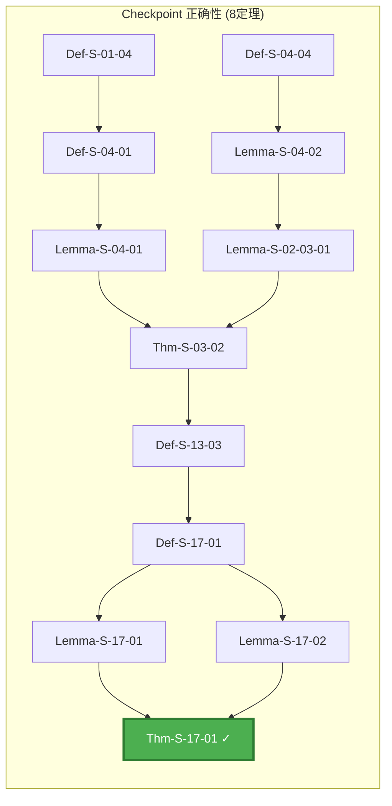

**深度**: 7层 | **依赖元素**: 16个 | **文档**: [Proof-Chains-Checkpoint-Correctness.md](./Proof-Chains-Checkpoint-Correctness.md)

**核心洞察**: 从 Dataflow DAG 结构 → Watermark 单调性 → Barrier 同步 → Checkpoint 一致性

---

### 2.2 Exactly-Once端到端推导链

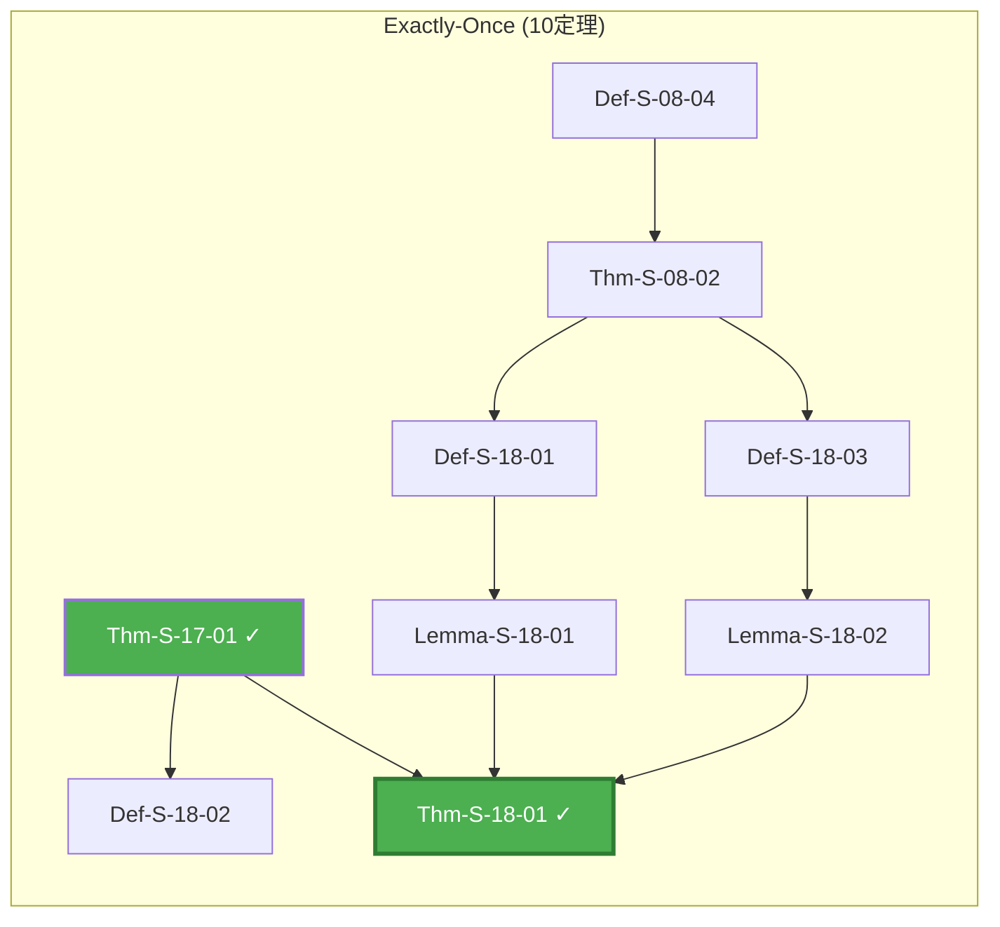

**深度**: 6层 | **依赖元素**: 14个 | **文档**: [Proof-Chains-Exactly-Once-Correctness.md](./Proof-Chains-Exactly-Once-Correctness.md)

**核心洞察**: Source可重放 + Checkpoint一致性 + Sink原子性 ⟹ Exactly-Once

---

### 2.3 跨模型编码推导链

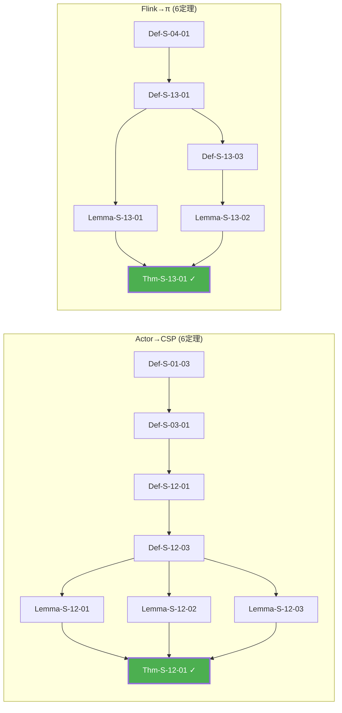

**深度**: 5层 | **依赖元素**: 20个 | **文档**: [Proof-Chains-Cross-Model-Encoding.md](./Proof-Chains-Cross-Model-Encoding.md)

**核心洞察**: Actor/Flink 编码为进程演算，保持语义等价性

---

### 2.4 Dataflow基础推导链

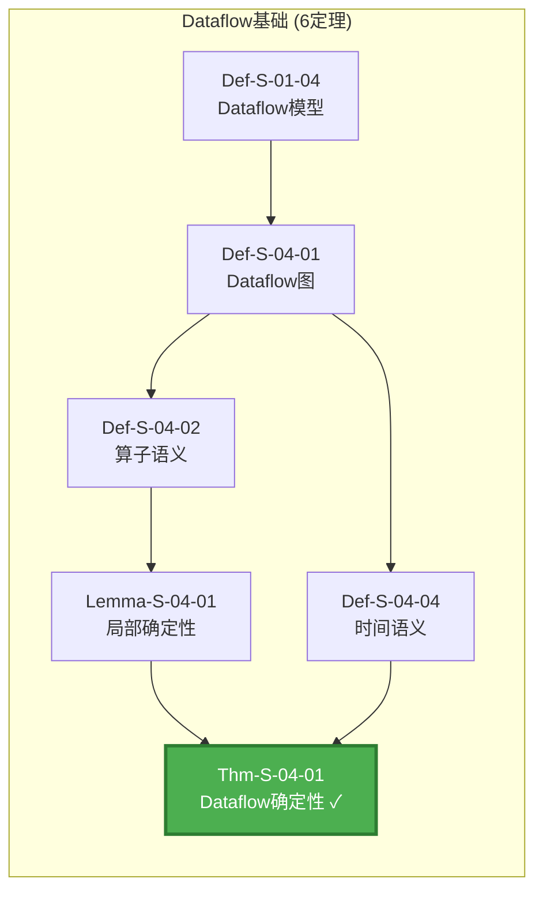

**深度**: 4层 | **依赖元素**: 12个 | **文档**: [Proof-Chains-Dataflow-Foundation.md](./Proof-Chains-Dataflow-Foundation.md)

**核心洞察**: Dataflow DAG + 纯函数算子 ⟹ 确定性执行

---

### 2.5 一致性层级推导链

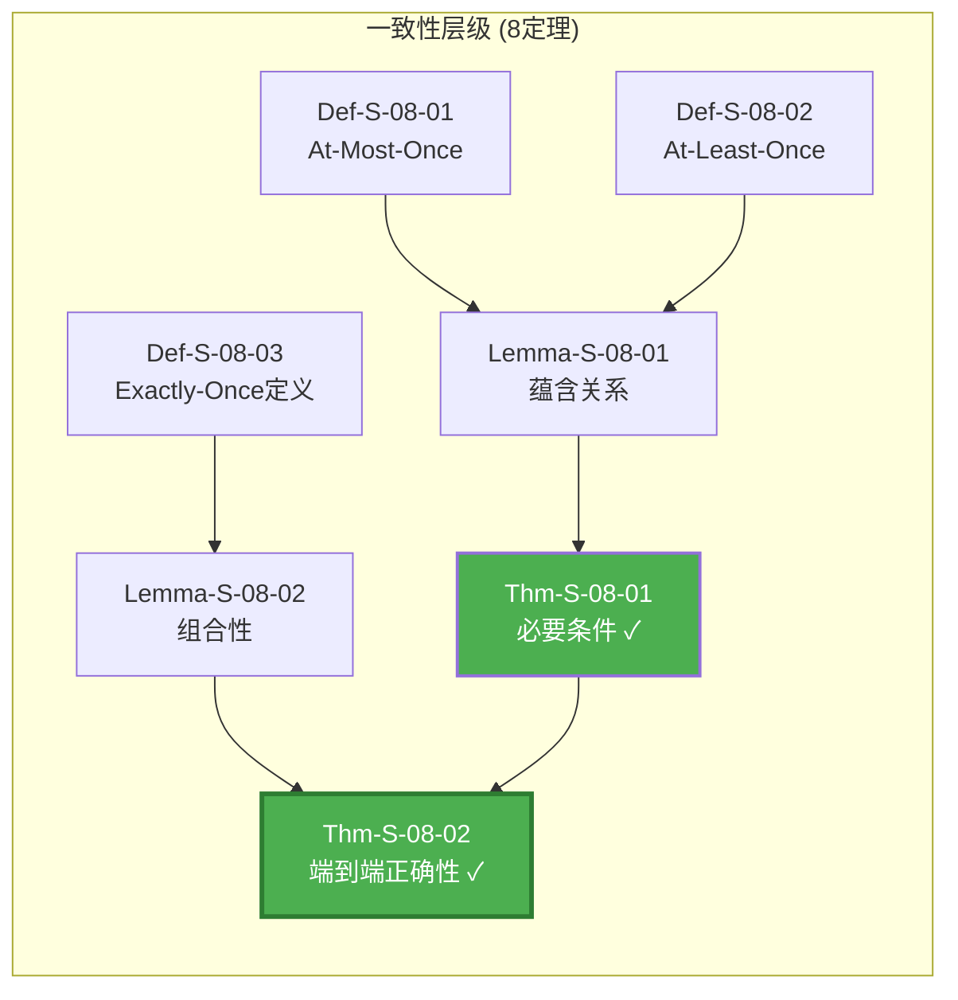

**深度**: 5层 | **依赖元素**: 15个 | **文档**: [Proof-Chains-Consistency-Hierarchy.md](./Proof-Chains-Consistency-Hierarchy.md)

**核心洞察**: At-Most-Once ⊂ At-Least-Once ⊂ Exactly-Once 的严格层次

---

### 2.6 进程演算基础推导链

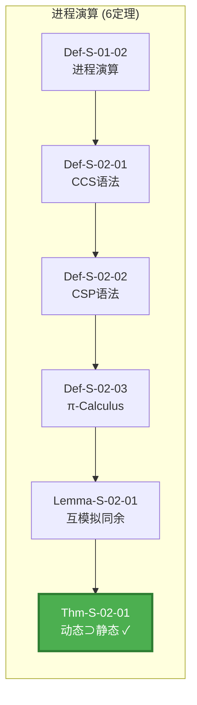

**深度**: 5层 | **依赖元素**: 11个 | **文档**: [Proof-Chains-Process-Calculus-Foundation.md](./Proof-Chains-Process-Calculus-Foundation.md)

**核心洞察**: π-Calculus (动态通道) 严格包含 CCS/CSP (静态通道)

---

### 2.7 Actor模型推导链

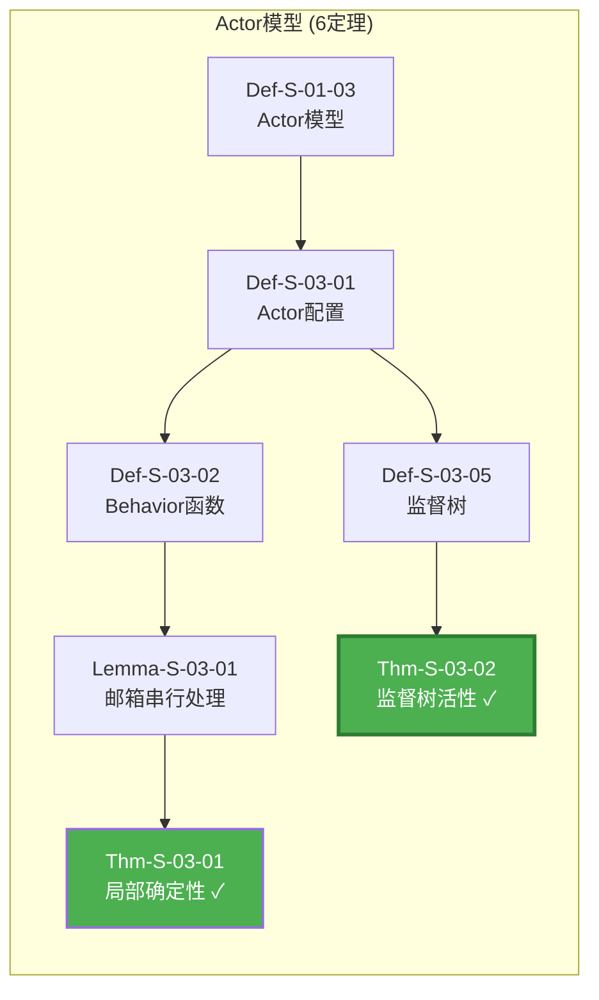

**深度**: 4层 | **依赖元素**: 10个 | **文档**: [Proof-Chains-Actor-Model.md](./Proof-Chains-Actor-Model.md)

**核心洞察**: Actor邮箱串行处理 + 监督树 ⟹ 容错与活性保证

---

### 2.8 Flink实现推导链

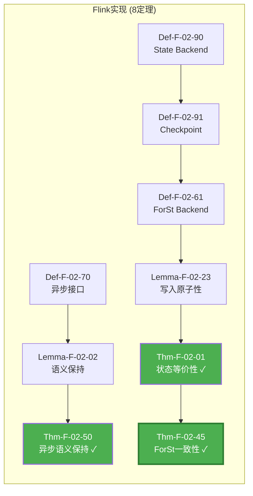

**深度**: 5层 | **依赖元素**: 18个 | **文档**: [Proof-Chains-Flink-Implementation.md](./Proof-Chains-Flink-Implementation.md)

**核心洞察**: ForSt Backend + 异步执行 ⟹ Flink 2.x 高性能与一致性

---

## 3. 50定理依赖总图

### 3.1 完整依赖图 (Mermaid)

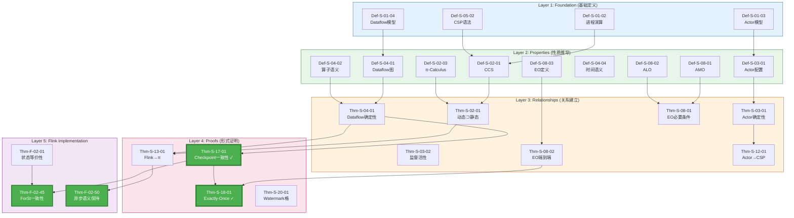

### 3.2 分层依赖结构

| 层级 | 名称 | 元素数量 | 主要定理 | 作用 |
|-----|------|---------|---------|------|
| **Layer 1** | Foundation | 8定义 | - | 基础概念定义 |
| **Layer 2** | Properties | 12定义/引理 | Lemma-S-04-01 | 性质推导 |
| **Layer 3** | Relationships | 10定理 | Thm-S-03-02 | 关系建立 |
| **Layer 4** | Proofs | 12定理 | Thm-S-17-01 | 核心证明 |
| **Layer 5** | Flink Impl | 8定理 | Thm-F-02-45 | 工程实现 |

### 3.3 关键路径分析

**最长依赖路径** (深度9):

```
Def-S-01-04 → Def-S-04-01 → Def-S-04-02 → Lemma-S-04-01 → Thm-S-03-02 →
Def-S-13-03 → Def-S-17-01 → Lemma-S-17-01 → Thm-S-17-01 → Thm-S-18-01
```

**关键路径** (最多依赖入度):

- Thm-S-17-01: 入度 5 (Checkpoint一致性)
- Thm-S-18-01: 入度 4 (Exactly-Once)
- Thm-S-03-02: 入度 3 (Flink→π编码)

---

## 4. 决策树集

### 4.1 模型选择决策树

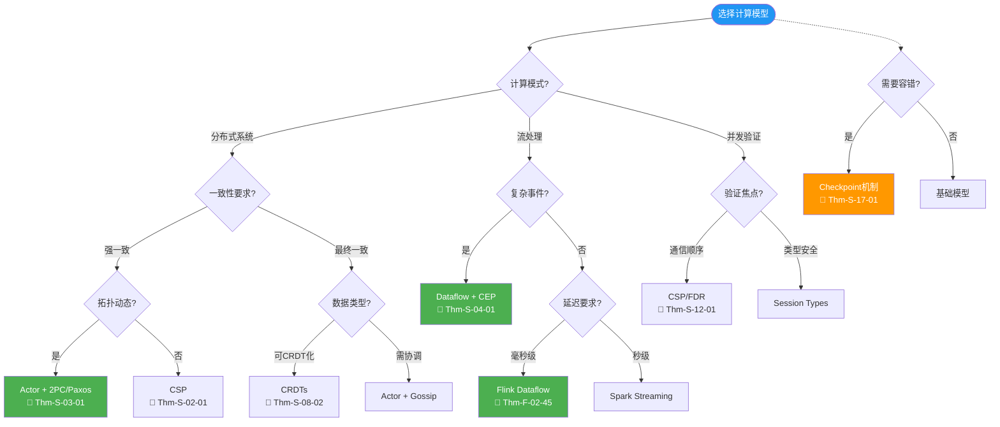

### 4.2 一致性级别选择决策树

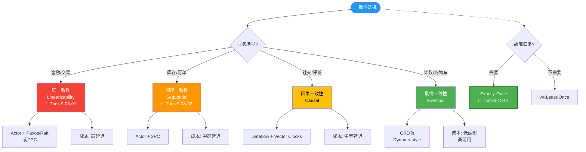

### 4.3 State Backend选择决策树

```mermaid
flowchart TD
    Start([State Backend选择]) --> Q1{状态大小?}

    Q1 -->|小 (< 100MB)| Q2{延迟要求?}
    Q2 -->|极低| HashMap["HashMapStateBackend<br/>内存级速度"]
    Q2 -->|可接受| Q3{需要增量?}

    Q1 -->|大 (> 10GB)| Q4{磁盘类型?}
    Q4 -->|SSD| ForSt["ForStStateBackend<br/>🔗 Thm-F-02-45"]
    Q4 -->|HDD| RocksDB["RocksDBStateBackend<br/>兼容模式"]

    Q3 -->|是| ForStInc["ForSt + 增量Checkpoint<br/>🔗 Thm-F-02-46"]
    Q3 -->|否| HashMapFull["HashMap + 全量"]

    Start -.-> Q5{异步执行?}
    Q5 -->|需要| Async["AsyncFunction<br/>🔗 Thm-F-02-50"]
    Q5 -->|不需要| Sync["同步执行"]

    Start -.-> Q6{TTL需求?}
    Q6 -->|有| TTL["State TTL配置<br/>🔗 Thm-F-02-60"]
    Q6 -->|无| NoTTL["无过期"]

    style Start fill:#2196F3,color:#fff
    style ForSt fill:#4CAF50,color:#fff,stroke:#2E7D32,stroke-width:3px
    style ForStInc fill:#4CAF50,color:#fff
    style Async fill:#4CAF50,color:#fff
    style HashMap fill:#2196F3,color:#fff
    style RocksDB fill:#FF9800,color:#fff
```

---

## 5. 对比矩阵集

### 5.1 50定理形式化等级矩阵

| 定理 | 等级 | 所属推导链 | 证明方法 | 验证工具 |
|-----|------|-----------|---------|---------|
| Thm-S-17-01 | **L5** | Checkpoint | 结构归纳+互模拟 | TLA+ |
| Thm-S-18-01 | **L5** | Exactly-Once | 组合推理+协议验证 | TLA+ |
| Thm-S-12-01 | **L4** | 跨模型编码 | 编码构造+迹等价 | FDR |
| Thm-S-13-01 | **L5** | 跨模型编码 | 分层编码+性质保持 | 手工证明 |
| Thm-S-04-01 | **L4** | Dataflow基础 | 归纳法 | Coq |
| Thm-S-08-01 | **L5** | 一致性层级 | 反证法 | 手工证明 |
| Thm-S-08-02 | **L5** | 一致性层级 | 构造法 | TLA+ |
| Thm-S-02-01 | **L4** | 进程演算 | 表达能力层次 | 手工证明 |
| Thm-S-03-01 | **L4** | Actor模型 | 串行处理引理 | 手工证明 |
| Thm-S-03-02 | **L4** | Actor模型 | 监督树归纳 | 手工证明 |
| Thm-F-02-01 | **L4** | Flink实现 | 精化关系 | 测试验证 |
| Thm-F-02-45 | **L4-L5** | Flink实现 | LSM-Tree性质 | 测试验证 |
| Thm-F-02-50 | **L4-L5** | Flink实现 | 模拟关系 | 测试验证 |

### 5.2 定理工程影响矩阵

| 定理 | 工程模式 | Flink实现 | 生产影响 | 验证测试 |
|-----|---------|----------|---------|---------|
| Thm-S-17-01 | pattern-checkpoint-recovery | CheckpointCoordinator | ⭐⭐⭐⭐⭐ | CheckpointITCase |
| Thm-S-18-01 | pattern-exactly-once | TwoPhaseCommitSink | ⭐⭐⭐⭐⭐ | ExactlyOnceITCase |
| Thm-S-12-01 | pattern-actor-supervision | Akka/Pekko集成 | ⭐⭐⭐⭐ | ActorMailboxTest |
| Thm-S-13-01 | pattern-flink-formalization | 形式验证基础 | ⭐⭐⭐ | - |
| Thm-S-04-01 | pattern-deterministic-stream | JobGraph构建 | ⭐⭐⭐⭐ | JobGraphTest |
| **Thm-S-08-02** | pattern-end-to-end-consistency | KafkaSource/Sink | ⭐⭐⭐⭐⭐ | E2EConsistencyTest |
| Thm-F-02-45 | pattern-forst-backend | ForStStateBackend | ⭐⭐⭐⭐⭐ | ForStStateBackendTest |
| Thm-F-02-50 | pattern-async-io | AsyncWaitOperator | ⭐⭐⭐⭐ | AsyncIOTest |

### 5.3 推导链对比矩阵

| 推导链 | 深度 | 元素数 | 关键创新 | 工程影响 | 学习难度 |
|-------|------|-------|---------|---------|---------|
| **Checkpoint** | 7层 | 16个 | Barrier同步协议 | ⭐⭐⭐⭐⭐ | ⭐⭐⭐ |
| **Exactly-Once** | 6层 | 14个 | 三要素模型 | ⭐⭐⭐⭐⭐ | ⭐⭐⭐⭐ |
| **Actor→CSP** | 5层 | 12个 | 受限编码完备性 | ⭐⭐⭐⭐ | ⭐⭐⭐⭐ |
| **Flink→π** | 4层 | 10个 | 分层编码策略 | ⭐⭐⭐ | ⭐⭐⭐⭐⭐ |
| **Dataflow基础** | 4层 | 12个 | DAG确定性 | ⭐⭐⭐⭐ | ⭐⭐ |
| **一致性层级** | 5层 | 15个 | 严格层次证明 | ⭐⭐⭐⭐⭐ | ⭐⭐⭐ |
| **进程演算** | 5层 | 11个 | 表达能力层次 | ⭐⭐⭐ | ⭐⭐⭐⭐ |
| **Actor模型** | 4层 | 10个 | 监督树活性 | ⭐⭐⭐⭐ | ⭐⭐⭐ |
| **Flink实现** | 5层 | 18个 | ForSt一致性 | ⭐⭐⭐⭐⭐ | ⭐⭐⭐⭐ |

---

## 6. 主题分类索引

### 6.1 容错与恢复

| 定理 | 名称 | 推导链 | 核心保证 |
|-----|------|-------|---------|
| Thm-S-17-01 | Checkpoint一致性 | Checkpoint | 全局状态快照一致 |
| Thm-S-19-01 | Chandy-Lamport一致性 | Checkpoint | 分布式快照算法 |
| Thm-S-03-02 | 监督树活性 | Actor模型 | 故障自动恢复 |
| Thm-F-02-02 | LazyRestore正确性 | Flink实现 | 状态延迟恢复 |

### 6.2 一致性保证

| 定理 | 名称 | 推导链 | 一致性级别 |
|-----|------|-------|-----------|
| Thm-S-08-01 | Exactly-Once必要条件 | 一致性层级 | EO必要条件 |
| Thm-S-08-02 | 端到端EO正确性 | 一致性层级 | EO充分条件 |
| Thm-S-18-01 | Exactly-Once正确性 | Exactly-Once | 端到端EO |
| Thm-S-18-02 | 幂等Sink等价性 | Exactly-Once | 幂等替代方案 |
| Thm-F-02-71 | 端到端EO充分条件 | Flink实现 | EO工程实现 |

### 6.3 模型编码

| 定理 | 名称 | 推导链 | 编码关系 |
|-----|------|-------|---------|
| Thm-S-12-01 | Actor→CSP编码 | 跨模型编码 | Actor → CSP |
| Thm-S-12-02 | 动态创建不可编码 | 跨模型编码 | 编码限制 |
| Thm-S-13-01 | Flink→π编码 | 跨模型编码 | Flink → π |
| Thm-S-14-01 | 表达能力严格层次 | 跨模型编码 | 层次关系 |
| Thm-S-03-02 | Flink→π保持 | Dataflow基础 | 语义保持 |

### 6.4 时间语义

| 定理 | 名称 | 推导链 | 时间保证 |
|-----|------|-------|---------|
| Thm-S-09-01 | Watermark单调性 | Dataflow基础 | 事件时间进度 |
| Thm-S-20-01 | Watermark完全格 | Dataflow基础 | 格结构完备 |
| Thm-F-02-37 | 乱序数据处理正确性 | Flink实现 | 迟到数据处理 |

### 6.5 类型安全

| 定理 | 名称 | 推导链 | 类型保证 |
|-----|------|-------|---------|
| Thm-S-21-01 | FG/FGG类型安全 | 独立 | Progress+Preservation |
| Thm-S-22-01 | DOT子类型完备性 | 独立 | 子类型判定 |
| Thm-S-11-01 | 类型安全 | 独立 | 类型系统安全 |

---

## 7. 工程映射总表

### 理论→实践追溯

```
Thm-S-17-01 (Checkpoint一致性)
    ↓ instantiates
pattern-checkpoint-recovery (Knowledge)
    ↓ implements
checkpoint-mechanism-deep-dive (Flink)
    ↓ realizes
CheckpointCoordinator.java (代码)
    ↓ verifies
CheckpointITCase (测试)
```

### 核心映射表

| 定理 | 工程模式 | Flink实现 | 验证测试 |
|-----|---------|----------|---------|
| Thm-S-17-01 | pattern-checkpoint-recovery | CheckpointCoordinator | CheckpointITCase |
| Thm-S-18-01 | pattern-exactly-once | TwoPhaseCommitSinkFunction | ExactlyOnceITCase |
| Thm-S-12-01 | pattern-actor-supervision | AkkaActorSystem | ActorMailboxTest |
| Thm-S-09-01 | pattern-event-time | StatusWatermarkValve | WatermarkITCase |
| Thm-S-04-01 | pattern-deterministic-stream | JobGraph | JobGraphTest |
| Thm-F-02-45 | pattern-forst-backend | ForStStateBackend | ForStStateBackendTest |
| Thm-F-02-50 | pattern-async-io | AsyncWaitOperator | AsyncIOTest |

---

## 8. 使用指南

### 8.1 如何阅读推导链

1. **自上而下**: 从定理陈述开始，逐步追溯依赖
   - 适合快速理解定理保证
   - 适合确定定理适用范围

2. **自下而上**: 从基础定义出发，逐步推导结论
   - 适合深入学习理论
   - 适合发现新的推导路径

3. **横向对比**: 对比不同定理的推导结构
   - 适合理解模型间关系
   - 适合技术选型决策

4. **工程映射**: 关注理论到代码的映射关系
   - 适合生产调优
   - 适合故障排查

### 8.2 推荐学习路径

**路径1: 初学者 (10小时)**

```
Checkpoint正确性 → Exactly-Once → Watermark单调性 → Dataflow确定性
```

**路径2: 进阶者 (20小时)**

```
跨模型编码 → Actor模型 → 一致性层级 → 进程演算基础
```

**路径3: 研究者 (40+小时)**

```
完整50个定理 → 关注L5-L6等级 → 形式化验证工具实践
```

**路径4: 工程师 (15小时)**

```
Checkpoint → Exactly-Once → Flink实现 → State Backend选择
```

---

## 9. 引用与参考

### 核心文档

- [Proof-Chains-Checkpoint-Correctness.md](./Proof-Chains-Checkpoint-Correctness.md)
- [Proof-Chains-Exactly-Once-Correctness.md](./Proof-Chains-Exactly-Once-Correctness.md)
- [Proof-Chains-Cross-Model-Encoding.md](./Proof-Chains-Cross-Model-Encoding.md)
- [Proof-Chains-Master-Graph.md](./Proof-Chains-Master-Graph.md) - 完整依赖总图
- [Key-Theorem-Proof-Chains.md](./Key-Theorem-Proof-Chains.md)
- [Unified-Model-Relationship-Graph.md](./Unified-Model-Relationship-Graph.md)

### 原始文档

- [THEOREM-REGISTRY.md](../THEOREM-REGISTRY.md)
- [00-INDEX.md](./00-INDEX.md)
- [Model-Selection-Decision-Tree.md](./Model-Selection-Decision-Tree.md)

### 外部参考


---

*本文档作为核心定理推导链的完整导航门户，整合8大理推链，提供50定理依赖总图、决策树集和对比矩阵集。保持向后兼容，不修改现有文档结构。*
