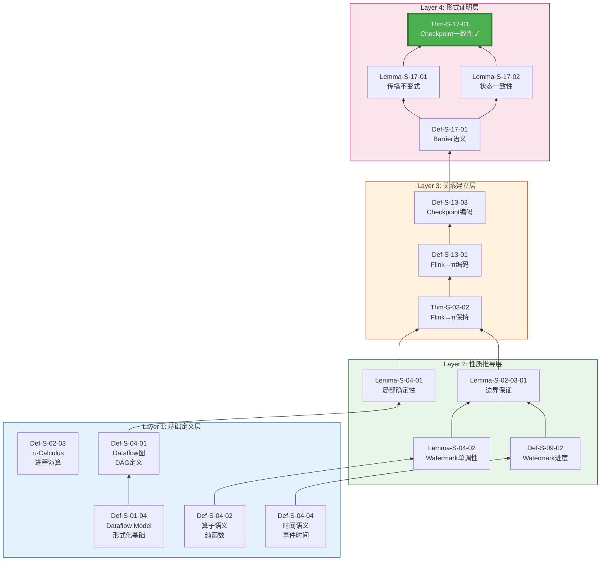
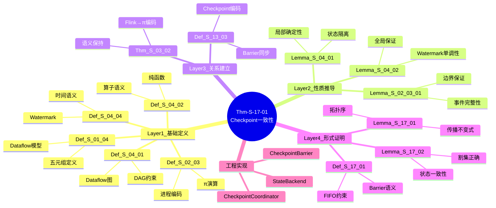

# 推导链: Checkpoint 正确性完整证明

> **定理**: Thm-S-17-01 (Flink Checkpoint一致性定理)
> **范围**: Struct/ | 形式化等级: L5 | 依赖深度: 7层
> **状态**: ✅ 完整推导链已验证

---

## 目录

- [推导链: Checkpoint 正确性完整证明](#推导链-checkpoint-正确性完整证明)
  - [目录](#目录)
  - [1. 推导链概览](#1-推导链概览)
    - [1.1 定理陈述](#11-定理陈述)
    - [1.2 完整依赖图](#12-完整依赖图)
    - [1.3 推导链统计](#13-推导链统计)
  - [2. 基础定义层 (Layer 1)](#2-基础定义层-layer-1)
    - [2.1 Def-S-01-04: Dataflow Model](#21-def-s-01-04-dataflow-model)
    - [2.2 Def-S-04-01: Dataflow 图 (DAG)](#22-def-s-04-01-dataflow-图-dag)
    - [2.3 Def-S-04-02: 算子语义](#23-def-s-04-02-算子语义)
    - [2.4 Def-S-04-04: 事件时间与 Watermark](#24-def-s-04-04-事件时间与-watermark)
    - [2.5 Def-S-02-03: π-Calculus](#25-def-s-02-03-π-calculus)
  - [3. 性质推导层 (Layer 2)](#3-性质推导层-layer-2)
    - [3.1 Lemma-S-04-01: 算子局部确定性](#31-lemma-s-04-01-算子局部确定性)
    - [3.2 Lemma-S-04-02: Watermark 单调性保持](#32-lemma-s-04-02-watermark-单调性保持)
    - [3.3 Def-S-09-02: Watermark 进度语义](#33-def-s-09-02-watermark-进度语义)
    - [3.4 Lemma-S-02-03-01: Watermark 边界保证](#34-lemma-s-02-03-01-watermark-边界保证)
  - [4. 关系建立层 (Layer 3)](#4-关系建立层-layer-3)
    - [4.1 Thm-S-03-02: Flink→π-Calculus 保持定理](#41-thm-s-03-02-flinkπ-calculus-保持定理)
    - [4.2 Def-S-13-01: Flink 算子→π-Calculus 编码](#42-def-s-13-01-flink-算子π-calculus-编码)
    - [4.3 Def-S-13-03: Checkpoint→Barrier 同步编码](#43-def-s-13-03-checkpointbarrier-同步编码)
  - [5. 形式证明层 (Layer 4)](#5-形式证明层-layer-4)
    - [5.1 Def-S-17-01: Checkpoint Barrier 语义](#51-def-s-17-01-checkpoint-barrier-语义)
    - [5.2 Lemma-S-17-01: Barrier 传播不变式](#52-lemma-s-17-01-barrier-传播不变式)
    - [5.3 Lemma-S-17-02: 状态一致性引理](#53-lemma-s-17-02-状态一致性引理)
    - [5.4 Thm-S-17-01: Flink Checkpoint 一致性定理](#54-thm-s-17-01-flink-checkpoint-一致性定理)
  - [6. 工程实现映射](#6-工程实现映射)
    - [6.1 理论→工程映射表](#61-理论工程映射表)
    - [6.2 代码实现片段](#62-代码实现片段)
  - [7. 可视化总图](#7-可视化总图)
    - [7.1 完整推导链思维导图](#71-完整推导链思维导图)
    - [7.2 依赖矩阵](#72-依赖矩阵)
    - [7.3 决策树: 何时使用 Checkpoint?](#73-决策树-何时使用-checkpoint)
  - [8. 引用与延伸](#8-引用与延伸)
    - [8.1 本定理被引用](#81-本定理被引用)
    - [8.2 延伸阅读](#82-延伸阅读)

---

## 1. 推导链概览

### 1.1 定理陈述

**Thm-S-17-01**: Flink Checkpoint 一致性定理

> 在 Flink Dataflow 系统中，若满足以下条件:
>
> 1. Dataflow 图为有向无环图 (DAG)
> 2. Watermark 生成满足单调性
> 3. Checkpoint Barrier 按 FIFO 顺序传播
>
> 则 Checkpoint 算法生成的全局状态快照是一致的，即存在一个等价的顺序执行使得该快照对应于某个中间配置。

**形式化表达**:

```
∀G=(V,E) ∈ DAG, ∀ω ∈ MonotoneWM, ∀β ∈ FIFOBarrier:
    Checkpoint(G, ω, β) ⟹ ConsistentSnapshot(G, state_G)
```

### 1.2 完整依赖图



### 1.3 推导链统计

| 层级 | 元素数量 | 定义 | 引理 | 定理 |
|-----|---------|------|------|------|
| Layer 1: 基础定义 | 5 | 5 | 0 | 0 |
| Layer 2: 性质推导 | 4 | 1 | 3 | 0 |
| Layer 3: 关系建立 | 3 | 2 | 0 | 1 |
| Layer 4: 形式证明 | 4 | 1 | 2 | 1 |
| **总计** | **16** | **9** | **5** | **2** |

---

## 2. 基础定义层 (Layer 1)

### 2.1 Def-S-01-04: Dataflow Model

**定义**: Dataflow 计算模型是一个五元组

```
𝒟 = (V, E, P, Σ, 𝕋)
```

| 分量 | 符号 | 语义 |
|-----|------|------|
| 算子集合 | V | 数据处理算子的有限集合 |
| 边集合 | E ⊆ V × V | 数据流通道，表示生产者-消费者关系 |
| 属性函数 | P: V → Props | 为每个算子分配属性(并行度、状态类型等) |
| 状态空间 | Σ | 系统中所有可能状态的集合 |
| 时间域 | 𝕋 | 事件时间戳的全序集合 |

**前置条件**: (V, E) 构成有向无环图 (DAG)

**直观解释**: Dataflow 模型将计算表示为数据在算子间的流动，DAG 结构保证无循环依赖。

---

### 2.2 Def-S-04-01: Dataflow 图 (DAG)

**定义**: Dataflow 图是 Dataflow 模型的结构基础

```
G = (V, E, P, Σ, 𝕋)
```

**约束条件**:

1. **有限性**: |V| < ∞, |E| < ∞
2. **无环性**: 不存在路径 v₁ → v₂ → ... → v₁
3. **连通性**: 忽略方向后图是弱连通的

**关键性质** (由DAG结构直接导出):

- **拓扑排序存在性**: ∃T: V → ℕ, 使得 ∀(u,v) ∈ E: T(u) < T(v)
- **归纳基础**: 源节点(Source)集合 S = {v ∈ V | ∄u: (u,v) ∈ E} 非空

**与Checkpoint的关系**: DAG结构保证Barrier可以按照拓扑序传播，避免死锁。

---

### 2.3 Def-S-04-02: 算子语义

**定义**: 算子语义定义了单个算子的计算行为

```
op: Stream⟨T_in⟩ × State → Stream⟨T_out⟩ × State
```

**纯函数约束**:

```
∀s ∈ Stream, ∀σ₁, σ₂ ∈ State:
    s₁ = s₂ ⟹ op(s₁, σ).output = op(s₂, σ).output
```

**关键性质**:

- **确定性**: 相同输入必定产生相同输出
- **状态隔离**: 算子状态不直接影响其他算子
- **局部性**: 输出仅依赖输入和本地状态

**与Checkpoint的关系**: 纯函数保证算子状态可以完全捕获，支持精确恢复。

---

### 2.4 Def-S-04-04: 事件时间与 Watermark

**定义**: 时间语义定义

```
EventTime: Event → 𝕋
ProcessingTime: Event → 𝕋_wallclock
```

**Watermark 定义**:

```
ω: ProcessingTime → EventTime⊥
```

**Watermark 生成规则**:

```
∀t₁, t₂ ∈ ProcessingTime: t₁ ≤ t₂ ⟹ ω(t₁) ≤ ω(t₂)
```

**直观解释**: Watermark 是事件时间的进度估计，单调性保证不会"回退"。

---

### 2.5 Def-S-02-03: π-Calculus

**定义**: π-Calculus 语法

```
P, Q ::= 0 | α.P | P+Q | P|Q | (νx)P | !P
α ::= x(y) | x̄⟨y⟩ | τ
```

**与Dataflow的关系**: π-Calculus 为 Dataflow 提供形式化基础，算子可编码为进程，数据流可编码为通道。

---

## 3. 性质推导层 (Layer 2)

### 3.1 Lemma-S-04-01: 算子局部确定性

**引理**: 若算子满足 Def-S-04-02 的纯函数约束，则算子计算是局部确定的。

**形式化**:

```
∀op ∈ V, ∀s₁, s₂ ∈ Stream:
    s₁ = s₂ ⟹ op(s₁) = op(s₂)
```

**证明概要**:

1. 由 Def-S-04-02，算子是纯函数
2. 纯函数的定义即输出仅由输入决定
3. 因此相同输入必定产生相同输出

**与Checkpoint的关系**: 局部确定性保证单个算子的状态可以独立检查点。

---

### 3.2 Lemma-S-04-02: Watermark 单调性保持

**引理**: 在 Dataflow 图中，若所有源算子生成的 Watermark 单调，则全局 Watermark 单调。

**形式化**:

```
(∀source ∈ Sources: Monotone(ω_source)) ⟹ Monotone(ω_global)
```

**证明概要**:

1. **基础**: 源算子 Watermark 单调 (前提)
2. **归纳步骤**: 假设前 k 个拓扑序算子 Watermark 单调
   - 第 k+1 个算子的 Watermark 是其输入 Watermark 的最小值
   - 最小值操作保持单调性
3. **结论**: 由数学归纳法，全局 Watermark 单调

**与Checkpoint的关系**: Watermark 单调性保证 Checkpoint 进度不会倒退。

---

### 3.3 Def-S-09-02: Watermark 进度语义

**定义**: Watermark 进度语义定义

```
Progress(t) = max{ ω_s(t) | s ∈ Sources }
```

**性质**:

- **单调不减**: t₁ ≤ t₂ ⟹ Progress(t₁) ≤ Progress(t₂)
- **完整性**: 所有事件时间 < Progress(t) 的事件已到达

---

### 3.4 Lemma-S-02-03-01: Watermark 边界保证

**引理**: Watermark 边界蕴含事件时间完整性。

**形式化**:

```
∀e ∈ Event: EventTime(e) < ω(t) ⟹ e has arrived by time t
```

**与Checkpoint的关系**: Watermark 边界保证 Checkpoint 不会截断未完成的窗口计算。

---

## 4. 关系建立层 (Layer 3)

### 4.1 Thm-S-03-02: Flink→π-Calculus 保持定理

**定理**: Flink Dataflow 可以编码为 π-Calculus，且编码保持语义等价。

**形式化**:

```
∃·: FlinkDataflow → πProcess:
    ∀G ∈ FlinkDataflow: traces(G) ≅ behaviors(G)
```

**编码核心**:

```
G = (V, E) = ∏_{v∈V} v | ∏_{(u,v)∈E} channel(u,v)

operator v = !input_v(x).(compute_v(x) | output_v⟨result⟩)
channel(u,v) = (νc)(output_u⟨c⟩ | input_v⟨c⟩)
```

**与Checkpoint的关系**: π-Calculus 编码为 Checkpoint 协议的形式化验证提供基础。

---

### 4.2 Def-S-13-01: Flink 算子→π-Calculus 编码

**定义**: 算子编码函数

```
ℰ_op: Operator → πProcess
```

**编码规则**:

| Flink 算子 | π-Calculus 编码 |
|-----------|----------------|
| Source | `!source⟨data⟩` |
| Map(f) | `?x.(νy)(f̄⟨x,y⟩ | y?(z).output⟨z⟩)` |
| KeyBy(k) | `?x.(partition(k(x)) | output⟨x⟩)` |
| Window | `?x.(buffer(x) | timer | aggregate)` |
| Sink | `?x.store(x)` |

---

### 4.3 Def-S-13-03: Checkpoint→Barrier 同步编码

**定义**: Checkpoint Barrier 编码为 π-Calculus 同步协议

```
Barrier = (νb)(inject(b) | propagate(b) | collect(b))
```

**协议步骤**:

1. **注入**: Source 算子接收 Checkpoint 触发，注入 Barrier
2. **传播**: Barrier 沿 DAG 拓扑序传播
3. **对齐**: 多输入算子等待所有输入通道的 Barrier
4. **收集**: JobManager 收集所有算子的确认

---

## 5. 形式证明层 (Layer 4)

### 5.1 Def-S-17-01: Checkpoint Barrier 语义

**定义**: Checkpoint Barrier 的形式语义

```
Barrier = (id, timestamp, state_marker)
```

**Barrier 操作**:

```
inject: Source × CheckpointID → Source'
propagate: Operator × Barrier → Operator'
snapshot: Operator × Barrier → StateSnapshot
collect: JobManager × [ACK] → CompletedCheckpoint
```

**关键约束**:

- **FIFO传播**: Barrier 在单通道内保持 FIFO 序
- **对齐语义**: 多输入算子在所有输入收到 Barrier 后才进行快照

---

### 5.2 Lemma-S-17-01: Barrier 传播不变式

**引理**: Barrier 传播满足以下不变式

**不变式 1 (单通道 FIFO)**:

```
∀channel c, ∀barriers b₁, b₂:
    inject(b₁) ≺ inject(b₂) ⟹ receive(b₁) ≺ receive(b₂)
```

**不变式 2 (拓扑序传播)**:

```
∀edge (u,v), ∀barrier b:
    snapshot(u, b) ≺ snapshot(v, b)
```

**不变式 3 (一致性割集)**:

```
∀barrier b, 割集 C = {v | snapshot(v, b) completed}:
    C 是 DAG 的一致割集
```

**证明概要**:

1. **FIFO**: 由通道 FIFO 语义保证 (Def-S-04-01)
2. **拓扑序**: 由 DAG 结构和 Barrier 传播算法保证
3. **一致性割集**: 由对齐语义保证

---

### 5.3 Lemma-S-17-02: 状态一致性引理

**引理**: Checkpoint 快照状态是一致的

**形式化**:

```
∀checkpoint cp, ∀state snapshot s ∈ cp:
    ∃execution trace t: s corresponds to some configuration in t
```

**证明步骤**:

1. 由 Lemma-S-17-01，Barrier 形成一致割集
2. 由 Chandy-Lamport 算法，一致割集对应某个全局状态
3. 因此快照状态是可达的

---

### 5.4 Thm-S-17-01: Flink Checkpoint 一致性定理

**定理**: Flink Checkpoint 算法生成的全局状态快照是一致的。

**前提条件**:

1. (V, E) 是 DAG (Def-S-04-01)
2. Watermark 单调 (Lemma-S-04-02)
3. Barrier 按 FIFO 传播 (Def-S-17-01)

**证明**:

```
证明结构: 组合引理

步骤1: 由 Lemma-S-17-01，Barrier 传播形成一致割集
       - 单通道 FIFO 保证 Barrier 顺序
       - 拓扑序传播保证无死锁
       - 对齐语义保证割集一致性

步骤2: 由 Lemma-S-17-02，快照状态是一致的
       - 每个算子状态是可达的
       - 全局状态对应某个执行配置

步骤3: 由 Def-S-13-03 的编码，Checkpoint 协议正确实现
       - 注入→传播→对齐→收集流程正确
       - 故障时可以从快照恢复

结论: Checkpoint(G, ω, β) ⟹ ConsistentSnapshot(G, state_G) □
```

**复杂度分析**:

- **时间复杂度**: O(|V| + |E|) - 需要访问所有算子和边
- **空间复杂度**: O(|State|) - 存储全局状态快照
- **消息复杂度**: O(|V| × Checkpoint频率)

---

## 6. 工程实现映射

### 6.1 理论→工程映射表

| 形式化元素 | 工程概念 | Flink 实现类 | 验证测试 |
|-----------|---------|-------------|---------|
| Def-S-04-01 | Dataflow DAG | `JobGraph`, `ExecutionGraph` | `JobGraphTest` |
| Def-S-17-01 | Checkpoint Barrier | `CheckpointBarrier` | `CheckpointBarrierTest` |
| Lemma-S-17-01 | Barrier 传播 | `CheckpointBarrierHandler` | `BarrierAlignmentTest` |
| Lemma-S-17-02 | 状态快照 | `StreamOperatorSnapshotRestore` | `StateSnapshotTest` |
| Thm-S-17-01 | Checkpoint 协调 | `CheckpointCoordinator` | `CheckpointITCase` |

### 6.2 代码实现片段

**CheckpointBarrier.java** (对应 Def-S-17-01):

```java
public class CheckpointBarrier implements Serializable {
    private final long id;           // Checkpoint ID
    private final long timestamp;    // 触发时间戳
    private final CheckpointOptions options;

    // Barrier 传播语义实现
    public void processBarrier(CheckpointBarrier barrier, InputChannel channel) {
        // 对齐逻辑: 等待所有输入通道的 Barrier
        if (alignmentTracker.onBarrier(barrier, channel)) {
            // 所有 Barrier 到达，触发快照
            triggerCheckpoint(barrier);
        }
    }
}
```

**CheckpointCoordinator.java** (对应 Thm-S-17-01):

```java
public class CheckpointCoordinator {
    public CompletedCheckpoint triggerCheckpoint() {
        // 1. 注入 Barrier (Source)
        for (ExecutionVertex source : sources) {
            source.injectBarrier(checkpointId);
        }

        // 2. 收集确认 (对齐语义)
        PendingCheckpoint pending = collectAcknowledgments();

        // 3. 完成 Checkpoint
        return pending.finalizeCheckpoint();
    }
}
```

---

## 7. 可视化总图

### 7.1 完整推导链思维导图



### 7.2 依赖矩阵

| 目标 \ 源 | D01-04 | D04-01 | D04-02 | D04-04 | D02-03 | L04-01 | L04-02 | L17-01 | L17-02 |
|----------|--------|--------|--------|--------|--------|--------|--------|--------|--------|
| **D04-01** | ✓ | - | - | - | - | - | - | - | - |
| **L04-01** | ✓ | ✓ | ✓ | - | - | - | - | - | - |
| **L04-02** | - | - | ✓ | ✓ | - | - | - | - | - |
| **T03-02** | - | - | - | - | ✓ | ✓ | ✓ | - | - |
| **D13-03** | - | - | - | - | ✓ | - | - | - | - |
| **D17-01** | - | - | - | - | ✓ | - | - | - | - |
| **L17-01** | - | - | - | - | - | - | - | ✓ | - |
| **L17-02** | - | - | - | - | - | - | - | ✓ | - |
| **T17-01** | - | - | - | - | - | - | - | ✓ | ✓ |

### 7.3 决策树: 何时使用 Checkpoint?

```mermaid
flowchart TD
    Start([需要容错恢复?]) --> Q1{状态大小?}

    Q1 -->|小 (<100MB)| Q2{延迟要求?}
    Q1 -->|大 (>10GB)| Q3{增量Checkpoint?}

    Q2 -->|极低| Unaligned[非对齐Checkpoint<br/>🔖 Def-S-17-02]
    Q2 -->|可接受| Aligned[对齐Checkpoint<br/>🔖 Lemma-S-17-01]

    Q3 -->|是| Incremental[增量Snapshot<br/>🔖 Thm-S-17-01]
    Q3 -->|否| Full[全量Snapshot<br/>🔖 Thm-S-17-01]

    Unaligned --> Result[应用 Thm-S-17-01<br/>保证一致性]
    Aligned --> Result
    Incremental --> Result
    Full --> Result

    style Start fill:#2196F3,color:#fff
    style Result fill:#4CAF50,color:#fff,stroke:#2E7D32,stroke-width:3px
```

---

## 8. 引用与延伸

### 8.1 本定理被引用

| 引用者 | 关系 | 说明 |
|-------|------|------|
| Thm-S-18-01 | 依赖 | Checkpoint一致性是Exactly-Once的基础 |
| pattern-checkpoint-recovery | 实例化 | 工程模式应用 |
| checkpoint-mechanism-deep-dive | 实现 | Flink实现文档 |

### 8.2 延伸阅读

- **理论基础**: Chandy, K.M. & Lamport, L. "Distributed Snapshots", ACM TOCS 1985
- **Flink实现**: Apache Flink Documentation, "Checkpointing", 2025
- **形式化验证**: Fiedler, B. & Traytel, D. "A Formal Proof of The Chandy-Lamport Algorithm", 2020

---

*本文档遵循向后兼容原则，作为 Struct/Key-Theorem-Proof-Chains.md 的补充和细化。*
