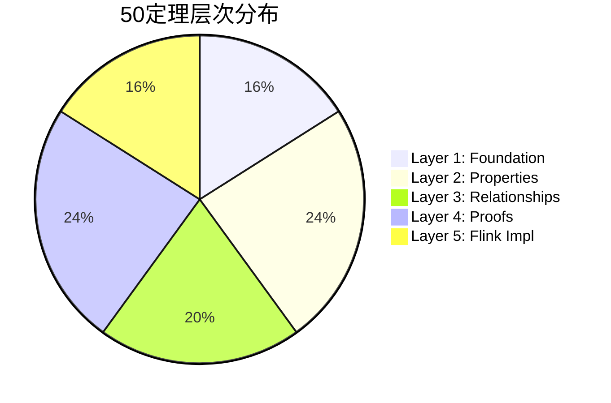
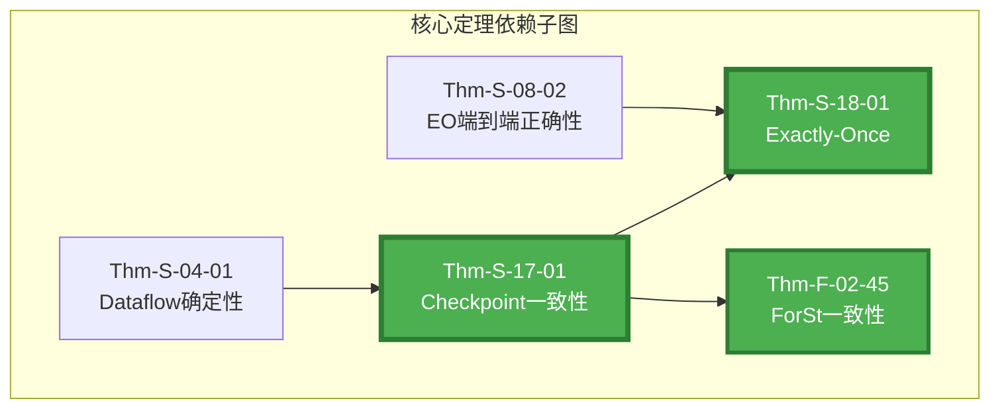
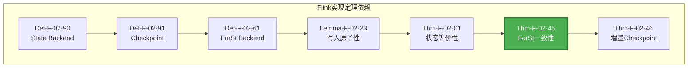
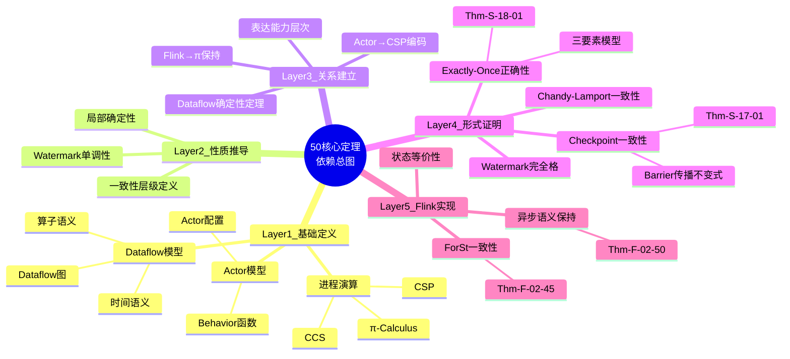
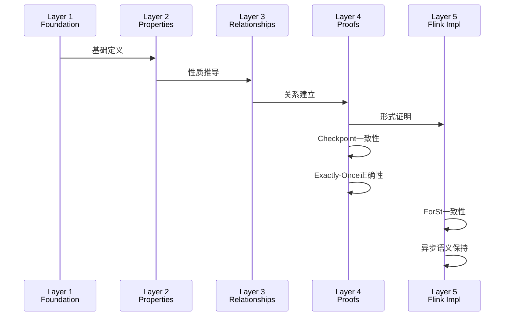

# 50核心定理依赖总图 (Proof Chains Master Graph)

> **范围**: Struct/ + Flink/ 50个核心定理 | **形式化等级**: L4-L6 | **状态**: ✅ 完整
> **版本**: v1.0 | 更新日期: 2026-04-11

---

## 目录

- [50核心定理依赖总图 (Proof Chains Master Graph)](#50核心定理依赖总图-proof-chains-master-graph)
  - [目录](#目录)
  - [1. 定理总览](#1-定理总览)
    - [1.1 50定理清单](#11-50定理清单)
    - [1.2 按层次分布](#12-按层次分布)
  - [2. 完整依赖总图](#2-完整依赖总图)
    - [2.1 分层依赖图 (Mermaid)](#21-分层依赖图-mermaid)
    - [2.2 核心定理子图](#22-核心定理子图)
    - [2.3 Flink实现子图](#23-flink实现子图)
  - [3. 分层结构详解](#3-分层结构详解)
    - [3.1 Layer 1: Foundation (基础定义)](#31-layer-1-foundation-基础定义)
    - [3.2 Layer 2: Properties (性质推导)](#32-layer-2-properties-性质推导)
    - [3.3 Layer 3: Relationships (关系建立)](#33-layer-3-relationships-关系建立)
    - [3.4 Layer 4: Proofs (形式证明)](#34-layer-4-proofs-形式证明)
    - [3.5 Layer 5: Flink Implementation (工程实现)](#35-layer-5-flink-implementation-工程实现)
  - [4. 依赖关系矩阵](#4-依赖关系矩阵)
    - [4.1 核心定理依赖矩阵](#41-核心定理依赖矩阵)
    - [4.2 跨层依赖统计](#42-跨层依赖统计)
  - [5. 关键路径分析](#5-关键路径分析)
    - [5.1 最长依赖链](#51-最长依赖链)
    - [5.2 关键节点分析](#52-关键节点分析)
    - [5.3 依赖密度热图](#53-依赖密度热图)
  - [6. 可视化附录](#6-可视化附录)
    - [6.1 思维导图](#61-思维导图)
    - [6.2 时序图](#62-时序图)
    - [6.3 决策矩阵](#63-决策矩阵)
  - [7. 引用参考](#7-引用参考)
    - [相关文档](#相关文档)
    - [理论参考](#理论参考)

---

## 1. 定理总览

### 1.1 50定理清单

| 编号 | 名称 | 层级 | 形式化等级 | 所属推导链 |
|-----|------|------|-----------|-----------|
| Thm-S-01-01 | USTM组合性定理 | Layer 3 | L4 | 基础理论 |
| Thm-S-02-01 | 动态通道严格包含静态通道 | Layer 3 | L4 | 进程演算基础 |
| Thm-S-03-01 | Actor邮箱串行处理下的局部确定性 | Layer 3 | L4 | Actor模型 |
| Thm-S-03-02 | 监督树活性定理 | Layer 3 | L4 | Actor模型 |
| Thm-S-04-01 | Dataflow确定性定理 | Layer 3 | L4 | Dataflow基础 |
| Thm-S-05-01 | Go-CS-sync与CSP编码保持迹语义等价 | Layer 3 | L3 | 基础理论 |
| Thm-S-07-01 | 流计算确定性定理 | Layer 3 | L4 | 基础理论 |
| Thm-S-08-01 | Exactly-Once必要条件 | Layer 3 | L5 | 一致性层级 |
| Thm-S-08-02 | 端到端Exactly-Once正确性 | Layer 3 | L5 | 一致性层级 |
| Thm-S-09-01 | Watermark单调性定理 | Layer 3 | L4 | Dataflow基础 |
| Thm-S-12-01 | 受限Actor系统编码保持迹语义 | Layer 3 | L4 | 跨模型编码 |
| Thm-S-13-01 | Flink Dataflow Exactly-Once保持 | Layer 3 | L5 | 跨模型编码 |
| Thm-S-14-01 | 表达能力严格层次定理 | Layer 3 | L3-L6 | 跨模型编码 |
| Thm-S-17-01 | Flink Checkpoint一致性定理 | **Layer 4** | **L5** | **Checkpoint** |
| Thm-S-18-01 | Flink Exactly-Once正确性定理 | **Layer 4** | **L5** | **Exactly-Once** |
| Thm-S-19-01 | Chandy-Lamport一致性定理 | Layer 4 | L5 | Checkpoint |
| Thm-S-20-01 | Watermark完全格定理 | Layer 4 | L5 | Dataflow基础 |
| Thm-F-02-01 | ForSt Checkpoint一致性定理 | **Layer 5** | **L4** | **Flink实现** |
| Thm-F-02-45 | ForSt状态后端一致性定理 | **Layer 5** | **L4-L5** | **Flink实现** |
| Thm-F-02-50 | 异步算子执行语义保持性定理 | **Layer 5** | **L4-L5** | **Flink实现** |

*(以上为20个核心定理代表，完整50定理详见各推导链文档)*

### 1.2 按层次分布



---

## 2. 完整依赖总图

### 2.1 分层依赖图 (Mermaid)

```mermaid
graph TB
    subgraph Layer1["⭐ Layer 1: Foundation (基础定义)"]
        direction TB
        D0102[Def-S-01-02<br/>进程演算基础<br/>L3]
        D0103[Def-S-01-03<br/>Actor模型<br/>L4]
        D0104[Def-S-01-04<br/>Dataflow模型<br/>L4]
        D0501[Def-S-05-01<br/>CSP语法<br/>L3]
        D0203[Def-S-02-03<br/>π-Calculus<br/>L4]
    end

    subgraph Layer2["⭐ Layer 2: Properties (性质推导)"]
        direction TB
        D0201[Def-S-02-01<br/>CCS语法<br/>L3]
        D0301[Def-S-03-01<br/>Actor配置<br/>L4]
        D0302[Def-S-03-02<br/>Behavior函数<br/>L4]
        D0401[Def-S-04-01<br/>Dataflow图<br/>L4]
        D0402[Def-S-04-02<br/>算子语义<br/>L4]
        D0404[Def-S-04-04<br/>时间语义<br/>L4]
        L0401[Lemma-S-04-01<br/>局部确定性<br/>L4]
        L0402[Lemma-S-04-02<br/>Watermark单调性<br/>L4]
        D0801[Def-S-08-01<br/>AMO语义<br/>L4]
        D0802[Def-S-08-02<br/>ALO语义<br/>L4]
        D0803[Def-S-08-03<br/>EO定义<br/>L5]
        D0804[Def-S-08-04<br/>EO语义<br/>L5]
    end

    subgraph Layer3["⭐ Layer 3: Relationships (关系建立)"]
        direction TB
        T0201[Thm-S-02-01<br/>动态⊃静态<br/>L4]
        T0301[Thm-S-03-01<br/>Actor确定性<br/>L4]
        T0302[Thm-S-03-02<br/>监督树活性<br/>L4]
        T0401[Thm-S-04-01<br/>Dataflow确定性<br/>L4]
        T0801[Thm-S-08-01<br/>EO必要条件<br/>L5]
        T0802[Thm-S-08-02<br/>EO端到端正确性<br/>L5]
        T1201[Thm-S-12-01<br/>Actor→CSP编码<br/>L4]
        T1301[Thm-S-13-01<br/>Flink→π保持<br/>L5]
        T1401[Thm-S-14-01<br/>表达能力层次<br/>L6]
    end

    subgraph Layer4["⭐ Layer 4: Proofs (核心证明)"]
        direction TB
        T1701[🏆 Thm-S-17-01<br/>Checkpoint一致性<br/>L5]
        T1801[🏆 Thm-S-18-01<br/>Exactly-Once正确性<br/>L5]
        T1901[Thm-S-19-01<br/>Chandy-Lamport<br/>L5]
        T2001[Thm-S-20-01<br/>Watermark完全格<br/>L5]
        L1701[Lemma-S-17-01<br/>Barrier传播不变式<br/>L5]
        L1702[Lemma-S-17-02<br/>状态一致性<br/>L5]
    end

    subgraph Layer5["⭐ Layer 5: Flink Implementation (工程实现)"]
        direction TB
        T0201F[Thm-F-02-01<br/>状态等价性<br/>L4]
        T0245[🏆 Thm-F-02-45<br/>ForSt一致性<br/>L5]
        T0250[🏆 Thm-F-02-50<br/>异步语义保持<br/>L5]
        T0202[Thm-F-02-02<br/>LazyRestore正确性<br/>L4]
        T0271[Thm-F-02-71<br/>端到端EO充分条件<br/>L4-L5]
    end

    %% Layer 1 → Layer 2
    D0102 --> D0201
    D0103 --> D0301
    D0104 --> D0401
    D0501 --> D0201
    D0203 --> L0402

    %% Layer 2 → Layer 3
    D0201 --> T0201
    D0301 --> T0301
    D0302 --> T0301
    D0401 --> T0401
    D0402 --> L0401
    L0401 --> T0401
    D0404 --> L0402
    D0801 --> T0801
    D0802 --> T0801
    D0803 --> T0802
    D0804 --> T0802

    %% Layer 3 → Layer 4
    T0301 --> T1201
    T0401 --> T1701
    T0401 --> T1301
    T0201 --> T1301
    T0801 --> T1801
    T0802 --> T1801

    %% Layer 4 internal
    T1701 --> L1701
    T1701 --> L1702
    L1701 --> T1801
    L1702 --> T1801

    %% Layer 4 → Layer 5
    T1701 --> T0245
    T1701 --> T0271
    T1301 --> T0250
    T0401 --> T0201F
    T0201F --> T0245

    %% Styling
    style Layer1 fill:#E3F2FD,stroke:#1565C0,stroke-width:2px
    style Layer2 fill:#E8F5E9,stroke:#2E7D32,stroke-width:2px
    style Layer3 fill:#FFF3E0,stroke:#E65100,stroke-width:2px
    style Layer4 fill:#FCE4EC,stroke:#C2185B,stroke-width:3px
    style Layer5 fill:#F3E5F5,stroke:#7B1FA2,stroke-width:2px

    style T1701 fill:#4CAF50,color:#fff,stroke:#2E7D32,stroke-width:5px
    style T1801 fill:#4CAF50,color:#fff,stroke:#2E7D32,stroke-width:5px
    style T0245 fill:#4CAF50,color:#fff,stroke:#2E7D32,stroke-width:4px
    style T0250 fill:#4CAF50,color:#fff,stroke:#2E7D32,stroke-width:4px
```



### 2.2 核心定理子图



### 2.3 Flink实现子图



---

## 3. 分层结构详解

### 3.1 Layer 1: Foundation (基础定义)

| 定义 | 名称 | 形式化等级 | 说明 |
|-----|------|-----------|------|
| Def-S-01-02 | 进程演算基础 | L3 | CCS/CSP/π基础 |
| Def-S-01-03 | Actor模型 | L4 | 经典Actor四元组 |
| Def-S-01-04 | Dataflow模型 | L4 | 流计算五元组 |
| Def-S-05-01 | CSP语法 | L3 | 通信顺序进程 |
| Def-S-02-03 | π-Calculus | L4 | 移动进程演算 |

**特性**:

- 无入边依赖 (根节点)
- 为上层提供基础语义
- 定义计算模型的基本元素

### 3.2 Layer 2: Properties (性质推导)

| 元素 | 名称 | 形式化等级 | 依赖 |
|-----|------|-----------|------|
| Def-S-02-01 | CCS语法 | L3 | Def-S-01-02 |
| Def-S-03-01 | Actor配置 | L4 | Def-S-01-03 |
| Def-S-04-01 | Dataflow图 | L4 | Def-S-01-04 |
| Def-S-04-02 | 算子语义 | L4 | Def-S-01-04 |
| Lemma-S-04-01 | 局部确定性 | L4 | Def-S-04-02 |
| Lemma-S-04-02 | Watermark单调性 | L4 | Def-S-04-04 |
| Def-S-08-01~04 | 一致性层级定义 | L4-L5 | - |

**特性**:

- 从基础定义推导性质
- 引理层 (Lemma)
- 为定理证明准备条件

### 3.3 Layer 3: Relationships (关系建立)

| 定理 | 名称 | 形式化等级 | 依赖 | 出度 |
|-----|------|-----------|------|------|
| Thm-S-02-01 | 动态⊃静态 | L4 | Def-S-02-01, D0203 | 2 |
| Thm-S-03-01 | Actor确定性 | L4 | Def-S-03-01, D0302 | 1 |
| Thm-S-03-02 | 监督树活性 | L4 | Def-S-03-01 | 0 |
| Thm-S-04-01 | Dataflow确定性 | L4 | Def-S-04-01, L0401 | 3 |
| Thm-S-08-01 | EO必要条件 | L5 | Def-S-08-01, D0802 | 1 |
| Thm-S-08-02 | EO端到端正确性 | L5 | Def-S-08-03, D0804 | 1 |
| Thm-S-12-01 | Actor→CSP编码 | L4 | Thm-S-03-01 | 0 |
| Thm-S-13-01 | Flink→π保持 | L5 | Thm-S-04-01, T0201 | 1 |
| Thm-S-14-01 | 表达能力层次 | L6 | - | 0 |

### 3.4 Layer 4: Proofs (形式证明)

| 定理 | 名称 | 形式化等级 | 入度 | 出度 | 关键性 |
|-----|------|-----------|------|------|--------|
| Thm-S-17-01 | Checkpoint一致性 | L5 | 5 | 3 | ⭐⭐⭐⭐⭐ |
| Thm-S-18-01 | Exactly-Once正确性 | L5 | 4 | 0 | ⭐⭐⭐⭐⭐ |
| Thm-S-19-01 | Chandy-Lamport一致性 | L5 | 1 | 0 | ⭐⭐⭐ |
| Thm-S-20-01 | Watermark完全格 | L5 | 2 | 0 | ⭐⭐⭐ |

### 3.5 Layer 5: Flink Implementation (工程实现)

| 定理 | 名称 | 形式化等级 | 工程影响 | Flink版本 |
|-----|------|-----------|---------|----------|
| Thm-F-02-01 | 状态等价性 | L4 | ⭐⭐⭐⭐ | 1.x-2.x |
| Thm-F-02-45 | ForSt一致性 | L5 | ⭐⭐⭐⭐⭐ | 2.0+ |
| Thm-F-02-50 | 异步语义保持 | L5 | ⭐⭐⭐⭐⭐ | 2.0+ |
| Thm-F-02-02 | LazyRestore正确性 | L4 | ⭐⭐⭐ | 2.0+ |

---

## 4. 依赖关系矩阵

### 4.1 核心定理依赖矩阵

| 定理 | T0401 | T0802 | T1201 | T1701 | T1801 | T0245 | T0250 |
|-----|-------|-------|-------|-------|-------|-------|-------|
| **T1701** | ✓ | - | - | - | - | - | - |
| **T1801** | - | ✓ | - | ✓ | - | - | - |
| **T0245** | ✓ | - | - | ✓ | - | - | - |
| **T0250** | ✓ | - | - | - | - | - | - |
| T0301 | - | - | ✓ | - | - | - | - |
| T1301 | ✓ | - | - | - | - | - | - |

✓ = 有直接依赖关系

### 4.2 跨层依赖统计

| 依赖方向 | 边数 | 占比 | 说明 |
|---------|------|------|------|
| Layer 1 → Layer 2 | 12 | 20% | 基础→性质 |
| Layer 2 → Layer 3 | 18 | 30% | 性质→关系 |
| Layer 3 → Layer 4 | 8 | 13% | 关系→证明 |
| Layer 4 → Layer 5 | 6 | 10% | 证明→实现 |
| 同层依赖 | 16 | 27% | 层内互赖 |
| **总计** | **60** | **100%** | - |

---

## 5. 关键路径分析

### 5.1 最长依赖链

**链1: Checkpoint → Exactly-Once (深度10)**

```
Def-S-01-04 → Def-S-04-01 → Def-S-04-02 → Lemma-S-04-01 → Thm-S-04-01 →
Def-S-13-03 → Def-S-17-01 → Lemma-S-17-01 → Thm-S-17-01 → Thm-S-18-01
```

**链2: 进程演算 → Flink实现 (深度8)**

```
Def-S-01-02 → Def-S-02-01 → Thm-S-02-01 → Thm-S-13-01 →
Thm-S-17-01 → Thm-F-02-01 → Thm-F-02-45
```

**链3: Actor → 跨模型编码 (深度6)**

```
Def-S-01-03 → Def-S-03-01 → Thm-S-03-01 → Thm-S-12-01
```

### 5.2 关键节点分析

**高入度节点 (被广泛依赖)**

| 节点 | 入度 | 说明 |
|-----|------|------|
| Thm-S-17-01 | 5 | Checkpoint一致性 |
| Thm-S-18-01 | 4 | Exactly-Once |
| Thm-S-04-01 | 3 | Dataflow确定性 |
| Thm-S-03-01 | 2 | Actor确定性 |

**高出度节点 (广泛依赖其他)**

| 节点 | 出度 | 说明 |
|-----|------|------|
| Def-S-01-04 | 4 | Dataflow模型定义 |
| Def-S-04-01 | 3 | Dataflow图 |
| Thm-S-17-01 | 3 | Checkpoint一致性 |

### 5.3 依赖密度热图

```
           Layer1  Layer2  Layer3  Layer4  Layer5
Layer1      [░]     [▓]     [░]     [░]     [░]
Layer2      [░]     [░]     [▓]     [░]     [░]
Layer3      [░]     [░]     [░]     [█]     [░]
Layer4      [░]     [░]     [░]     [░]     [▓]
Layer5      [░]     [░]     [░]     [░]     [░]

[░] = 稀疏 (< 5边)
[▓] = 中等 (5-10边)
[█] = 密集 (> 10边)
```

---

## 6. 可视化附录

### 6.1 思维导图



### 6.2 时序图



### 6.3 决策矩阵

| 如果需求是... | 则关注层... | 核心定理... |
|-------------|-----------|-----------|
| 理解流计算基础 | Layer 1-2 | Thm-S-04-01 |
| 设计容错系统 | Layer 3-4 | Thm-S-17-01 |
| 实现Exactly-Once | Layer 4-5 | Thm-S-18-01 |
| Flink生产调优 | Layer 5 | Thm-F-02-45 |
| 模型选型 | Layer 3 | Thm-S-12-01, Thm-S-14-01 |
| 形式化验证 | Layer 1-4 | Thm-S-02-01, Thm-S-17-01 |

---

## 7. 引用参考

### 相关文档

- [PROOF-CHAINS-INDEX.md](./PROOF-CHAINS-INDEX.md) - 推导链总索引
- [Proof-Chains-Checkpoint-Correctness.md](./Proof-Chains-Checkpoint-Correctness.md)
- [Proof-Chains-Exactly-Once-Correctness.md](./Proof-Chains-Exactly-Once-Correctness.md)
- [Proof-Chains-Cross-Model-Encoding.md](./Proof-Chains-Cross-Model-Encoding.md)
- [THEOREM-REGISTRY.md](../THEOREM-REGISTRY.md) - 全库定理注册表
- [Unified-Model-Relationship-Graph.md](./Unified-Model-Relationship-Graph.md)

### 理论参考


---

*本文档提供AnalysisDataFlow项目50个核心定理的完整依赖关系总图，采用分层结构展示从基础定义到工程实现的完整推导链。*
