> **状态**: 🔮 前瞻内容 | **风险等级**: 高 | **最后更新**: 2026-04
> 
> 此文档描述的内容处于早期规划阶段，可能与最终实现不符。请以 Apache Flink 官方发布为准。
# 交叉引用分析报告

生成时间: 2026-04-08T11:26:55.095972
文档总数: 49
建议链接数: 0

---

## 链接建议

---

## 孤立文档

以下文档没有链接也没有被链接，建议检查：

✅ 未发现孤立文档

---

## 文档关系图

```mermaid
graph TD
    doc0["Struct/ 形式理论文档索引"]
    doc1["Struct/ 推导链全景图"]
    doc2["关键定理证明链"]
    doc3["并发与分布式计算模型选择决策树"]
    doc4["Struct-to-Knowledge 层级映射"]
    doc5["统一模型关系图谱"]
    doc6["统一流计算理论 (Unified Streaming The"]
    doc7["进程演算基础 (Process Calculus Prime"]
    doc8["Actor 模型形式化 (Actor Model Forma"]
    doc9["Dataflow 模型形式化 (Dataflow Model"]
    doc10["CSP 形式化 (CSP Formalization)"]
    doc11["Petri 网形式化 (Petri Net Formaliz"]
    doc12["1.7 会话类型 (Session Types)"]
    doc13["流处理语义学形式化理论"]
    doc14["流计算确定性定理 (Determinism in Strea"]
    doc15["流计算一致性层级 (Consistency Hierarch"]
    doc16["Watermark 单调性定理 (Watermark Mon"]
    doc17["活性与安全性形式化 (Liveness and Safety"]
    doc18["类型安全性推导 (Type Safety Derivatio"]
    doc19["CALM定理：一致性即逻辑单调性"]
    doc20["加密流处理 - 同态加密与安全计算"]
    doc21["流式差分隐私 - 实时数据隐私保护"]
    doc22["Actor 到 CSP 编码 (Actor-to-CSP E"]
    doc23["Flink 到进程演算编码 (Flink-to-Proces"]
    doc24["表达能力层级补充：扩展模型与验证框架"]
    doc25["表达能力层次定理 (Expressiveness Hiera"]
    doc26["互模拟等价关系 (Bisimulation Equivale"]
    doc27["跨模型统一映射框架 (Cross-Model Unified"]
    doc28["Flink Checkpoint 正确性证明 (Flink "]
    doc29["Flink Exactly-Once 正确性证明 (Flin"]
    doc30["Chandy-Lamport 快照一致性证明 (Chandy"]
    doc31["Watermark 代数形式证明 (Watermark Al"]
    doc32["FG/FGG 类型安全证明 (FG/FGG Type Saf"]
    doc33["DOT 子类型完备性证明 (DOT Subtyping Co"]
    doc34["Choreographic 死锁自由证明 (Choreogr"]
    doc35["Go vs Scala 表达能力对比 (Go vs Scal"]
    doc36["表达能力与可判定性权衡 (Expressiveness vs"]
    doc37["编码完备性分析 (Encoding Completeness"]
    doc38["流计算验证开放问题 (Open Problems in St"]
    doc39["Choreographic 流编程前沿 (Choreogra"]
    doc40["AI Agent 与会话类型 (AI Agent and S"]
    doc41["pDOT - 完全路径依赖类型（DOT演算扩展） {#pdo"]
    doc42["First-Person Choreographic Pro"]
    doc43["Coq证明助手：流计算性质的机械化证明"]
    doc44["Iris - 高阶并发分离逻辑"]
    doc45["模型检查在流计算验证中的应用"]
    doc46["Smart Casual Verification（智能轻量"]
    doc47["TLA+形式化验证在Flink中的应用"]
    doc48["流式SQL标准 - SQL:2011/2023与扩展"]

    doc0 --> doc6
    doc0 --> doc7
    doc0 --> doc8
    doc0 --> doc9
    doc0 --> doc10
    doc0 --> doc11
    doc0 --> doc12
    doc0 --> doc13
    doc0 --> doc14
    doc0 --> doc15
    doc0 --> doc16
    doc0 --> doc17
    doc0 --> doc18
    doc0 --> doc19
    doc0 --> doc20
    doc0 --> doc21
    doc0 --> doc22
    doc0 --> doc23
    doc0 --> doc25
    doc0 --> doc26
    doc0 --> doc27
    doc0 --> doc28
    doc0 --> doc29
    doc0 --> doc30
    doc0 --> doc31
    doc0 --> doc32
    doc0 --> doc33
    doc0 --> doc34
    doc0 --> doc35
    doc0 --> doc36
    doc0 --> doc37
    doc0 --> doc38
    doc0 --> doc39
    doc0 --> doc40
    doc0 --> doc41
    doc0 --> doc42
    doc0 --> doc43
    doc0 --> doc44
    doc0 --> doc45
    doc0 --> doc46
    doc0 --> doc47
    doc0 --> doc48
    doc0 --> doc5
    doc1 --> doc0
    doc3 --> doc25
    doc3 --> doc24
    doc3 --> doc25
    doc3 --> doc24
    doc3 --> doc7
    doc3 --> doc8
    doc4 --> doc0
    doc4 --> doc9
    doc4 --> doc10
    doc4 --> doc11
    doc4 --> doc15
    doc4 --> doc16
    doc4 --> doc17
    doc4 --> doc22
    doc4 --> doc23
    doc4 --> doc25
    doc4 --> doc28
    doc4 --> doc28
    doc4 --> doc29
    doc4 --> doc30
    doc5 --> doc6
    doc5 --> doc25
    doc5 --> doc26
    doc5 --> doc22
    doc5 --> doc23
    doc5 --> doc23
    doc5 --> doc11
    doc5 --> doc9
    doc6 --> doc7
    doc6 --> doc8
    doc6 --> doc9
    doc6 --> doc10
    doc6 --> doc11
    doc6 --> doc14
    doc8 --> doc7
    doc8 --> doc7
    doc8 --> doc7
    doc9 --> doc6
    doc10 --> doc7
    doc10 --> doc7
    doc10 --> doc7
    doc11 --> doc7
    doc11 --> doc7
    doc12 --> doc10
    doc12 --> doc8
    doc13 --> doc0
    doc13 --> doc0
    doc14 --> doc9
    doc14 --> doc9
    doc15 --> doc9
    doc15 --> doc9
    doc15 --> doc9
    doc15 --> doc30
    doc16 --> doc9
    doc16 --> doc9
    doc16 --> doc9
    doc17 --> doc8
    doc17 --> doc8
    doc17 --> doc8
    doc17 --> doc8
    doc17 --> doc8
    doc17 --> doc0
    doc17 --> doc0
    doc18 --> doc8
    doc18 --> doc10
    doc18 --> doc8
    doc18 --> doc10
    doc18 --> doc8
    doc18 --> doc10
    doc19 --> doc17
    doc19 --> doc18
    doc20 --> doc0
    doc20 --> doc8
    doc21 --> doc6
    doc21 --> doc0
    doc22 --> doc8
    doc22 --> doc10
    doc22 --> doc8
    doc22 --> doc10
    doc22 --> doc0
    doc23 --> doc9
    doc23 --> doc7
    doc24 --> doc25
    doc24 --> doc25
    doc24 --> doc7
    doc24 --> doc8
    doc24 --> doc3
    doc25 --> doc6
    doc25 --> doc7
    doc25 --> doc7
    doc25 --> doc7
    doc25 --> doc7
    doc25 --> doc6
    doc25 --> doc7
    doc25 --> doc8
    doc25 --> doc22
    doc25 --> doc23
    doc26 --> doc7
    doc26 --> doc7
    doc26 --> doc25
    doc26 --> doc7
    doc27 --> doc6
    doc27 --> doc6
    doc27 --> doc7
    doc27 --> doc8
    doc27 --> doc10
    doc27 --> doc22
    doc27 --> doc25
    doc28 --> doc15
    doc28 --> doc15
    doc28 --> doc15
    doc28 --> doc15
    doc29 --> doc28
    doc29 --> doc15
    doc29 --> doc15
    doc29 --> doc28
    doc29 --> doc28
    doc29 --> doc28
    doc29 --> doc28
    doc29 --> doc15
    doc30 --> doc28
    doc30 --> doc28
    doc30 --> doc28
    doc30 --> doc28
    doc31 --> doc16
    doc31 --> doc16
    doc31 --> doc16
    doc31 --> doc16
    doc31 --> doc16
    doc31 --> doc16
    doc31 --> doc16
    doc31 --> doc9
    doc31 --> doc28
    doc32 --> doc18
    doc32 --> doc18
    doc32 --> doc18
    doc33 --> doc18
    doc33 --> doc18
    doc33 --> doc18
    doc34 --> doc26
    doc34 --> doc26
    doc34 --> doc26
    doc34 --> doc26
    doc34 --> doc26
    doc34 --> doc26
    doc34 --> doc26
    doc34 --> doc26
    doc34 --> doc26
    doc34 --> doc26
    doc34 --> doc7
    doc34 --> doc10
    doc35 --> doc18
    doc35 --> doc0
    doc35 --> doc0
    doc35 --> doc0
    doc35 --> doc0
    doc36 --> doc25
    doc36 --> doc25
    doc36 --> doc7
    doc36 --> doc25
    doc36 --> doc22
    doc36 --> doc17
    doc36 --> doc30
    doc37 --> doc22
    doc37 --> doc23
    doc37 --> doc22
    doc37 --> doc7
    doc37 --> doc23
    doc37 --> doc8
    doc37 --> doc8
    doc37 --> doc22
    doc37 --> doc23
    doc37 --> doc25
    doc37 --> doc7
    doc37 --> doc8
    doc38 --> doc28
    doc38 --> doc29
    doc38 --> doc25
    doc38 --> doc15
    doc38 --> doc15
    doc38 --> doc29
    doc38 --> doc29
    doc38 --> doc16
    doc38 --> doc6
    doc38 --> doc15
    doc38 --> doc25
    doc38 --> doc28
    doc38 --> doc29
    doc38 --> doc30
    doc39 --> doc7
    doc39 --> doc23
    doc39 --> doc14
    doc39 --> doc34
    doc39 --> doc7
    doc39 --> doc9
    doc39 --> doc23
    doc39 --> doc34
    doc39 --> doc14
    doc40 --> doc34
    doc40 --> doc39
    doc40 --> doc34
    doc40 --> doc39
    doc40 --> doc34
    doc40 --> doc34
    doc41 --> doc9
    doc42 --> doc0
    doc43 --> doc0
    doc43 --> doc0
    doc44 --> doc0
    doc45 --> doc0
    doc46 --> doc47
    doc46 --> doc45
    doc46 --> doc43
    doc47 --> doc0
    doc48 --> doc0
```

