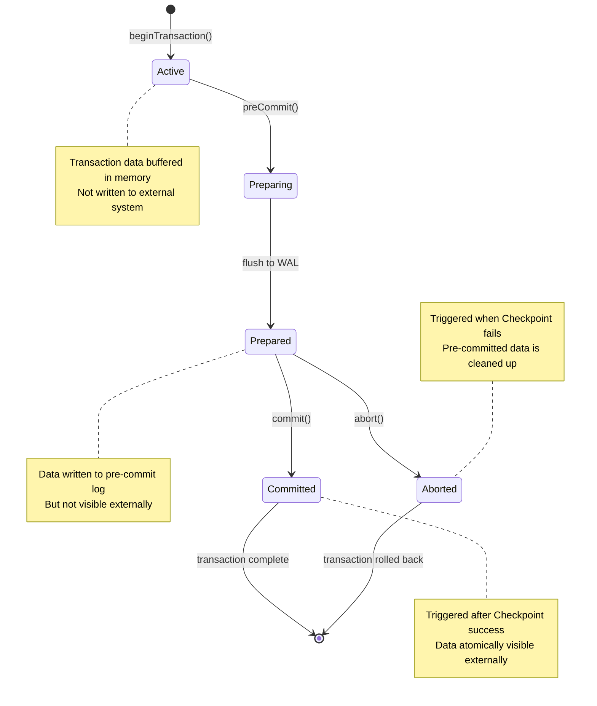
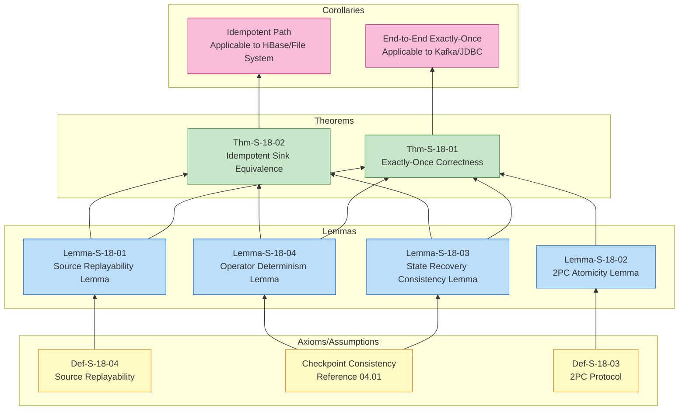
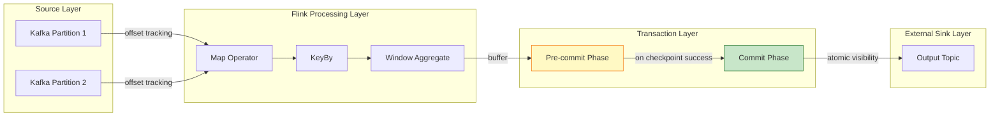
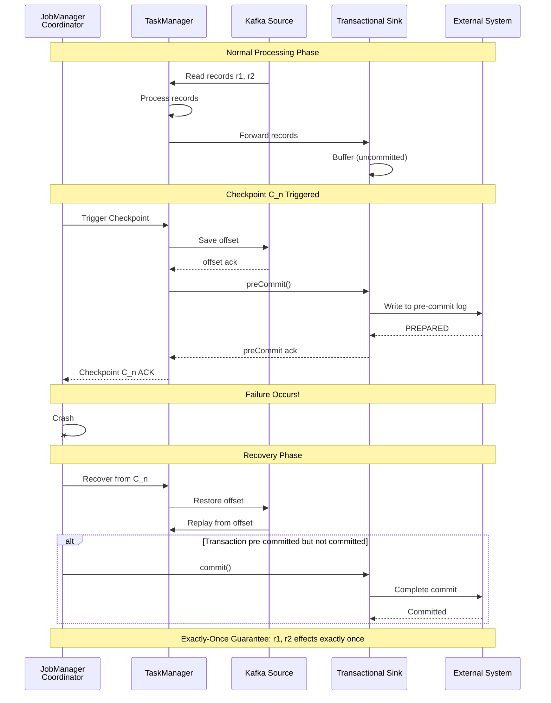

# Flink Exactly-Once Correctness Proof

> **Theorem ID**: Thm-S-18-01 | **Formalization Level**: L5 | **Status**: Verified
> **Prerequisites**: [04.01 Flink Checkpoint Correctness Proof](./04.01-flink-checkpoint-correctness.md), [02.02 Consistency Hierarchy](../02-properties/02.02-consistency-hierarchy.md)

---

## Table of Contents

- [Flink Exactly-Once Correctness Proof](#flink-exactly-once-correctness-proof)
  - [Table of Contents](#table-of-contents)
  - [1. Executive Summary](#1-executive-summary)
    - [1.1 Core Theorem Statement](#11-core-theorem-statement)
    - [1.2 Proof Strategy Overview](#12-proof-strategy-overview)
  - [2. Definitions](#2-definitions)
    - [Def-S-18-01: Exactly-Once Semantics (Observable Effect)](#def-s-18-01-exactly-once-semantics-observable-effect)
    - [Def-S-18-02: End-to-End Consistency](#def-s-18-02-end-to-end-consistency)
    - [Def-S-18-03: Two-Phase Commit Protocol (2PC)](#def-s-18-03-two-phase-commit-protocol-2pc)
    - [Def-S-18-04: Replayable Source](#def-s-18-04-replayable-source)
    - [Def-S-18-05: Idempotency](#def-s-18-05-idempotency)
  - [3. Properties](#3-properties)
    - [Prop-S-18-01: Binding Between Checkpoint and 2PC](#prop-s-18-01-binding-between-checkpoint-and-2pc)
    - [Prop-S-18-02: Observational Equivalence](#prop-s-18-02-observational-equivalence)
  - [4. Relations](#4-relations)
    - [Rel-S-18-01: Relation Between Flink 2PC and Classic 2PC](#rel-s-18-01-relation-between-flink-2pc-and-classic-2pc)
    - [Rel-S-18-02: Relation Between Exactly-Once and Checkpoint Consistency](#rel-s-18-02-relation-between-exactly-once-and-checkpoint-consistency)
    - [Rel-S-18-03: Equivalence Relation Between Idempotency and Transactionality](#rel-s-18-03-equivalence-relation-between-idempotency-and-transactionality)
  - [5. Argumentation](#5-argumentation)
    - [Lemma-S-18-01: Source Replayability Lemma](#lemma-s-18-01-source-replayability-lemma)
    - [Lemma-S-18-02: 2PC Atomicity Lemma](#lemma-s-18-02-2pc-atomicity-lemma)
    - [Lemma-S-18-03: State Recovery Consistency Lemma](#lemma-s-18-03-state-recovery-consistency-lemma)
    - [Lemma-S-18-04: Operator Determinism Lemma](#lemma-s-18-04-operator-determinism-lemma)
  - [6. Formal Proofs](#6-formal-proofs)
    - [Thm-S-18-01: Flink Exactly-Once Correctness Theorem](#thm-s-18-01-flink-exactly-once-correctness-theorem)
      - [Step 1: No Loss (At-Least-Once)](#step-1-no-loss-at-least-once)
      - [Step 2: No Duplication (At-Most-Once)](#step-2-no-duplication-at-most-once)
      - [Step 3: Combination](#step-3-combination)
    - [Thm-S-18-02: Idempotent Sink Equivalence Theorem](#thm-s-18-02-idempotent-sink-equivalence-theorem)
  - [7. Visualizations](#7-visualizations)
    - [Figure 1: 2PC State Machine](#figure-1-2pc-state-machine)
    - [Figure 2: Exactly-Once Proof Structure](#figure-2-exactly-once-proof-structure)
    - [Figure 3: End-to-End Exactly-Once Data Flow](#figure-3-end-to-end-exactly-once-data-flow)
    - [Figure 4: Failure Recovery Scenario Sequence Diagram](#figure-4-failure-recovery-scenario-sequence-diagram)
  - [8. Examples \& Counter-examples](#8-examples--counter-examples)
    - [Example 1: Kafka End-to-End Exactly-Once](#example-1-kafka-end-to-end-exactly-once)
    - [Example 2: File System Exactly-Once (via Idempotency)](#example-2-file-system-exactly-once-via-idempotency)
    - [Counter-example 1: Non-Idempotent, Non-Transactional Sink Breaks Exactly-Once](#counter-example-1-non-idempotent-non-transactional-sink-breaks-exactly-once)
    - [Counter-example 2: Source Offset Early Commit Causes Data Loss](#counter-example-2-source-offset-early-commit-causes-data-loss)
  - [9. References](#9-references)
  - [10. Related Documents](#10-related-documents)
  - [11. Proof Summary](#11-proof-summary)

---

## 1. Executive Summary

### 1.1 Core Theorem Statement

This document proves that the Flink stream processing engine can provide **end-to-end Exactly-Once semantics** when the Checkpoint mechanism is enabled and transactional Sinks are used.
This is the strongest consistency guarantee in distributed stream processing systems, ensuring that each input record's visible side effects on downstream external systems occur **exactly once**.

**Main Theorem (Thm-S-18-01)**: Flink jobs configured with Checkpoint mechanism and Two-Phase Commit (2PC) transactional Sinks achieve end-to-end Exactly-Once semantics.

### 1.2 Proof Strategy Overview

The proof adopts a **compositional verification** approach, decomposing end-to-end Exactly-Once into the conjunction of three independent sub-properties:

1. **Source Replayability**: Guarantees no data loss
2. **State Consistency**: Ensures correct internal state recovery via Checkpoint
3. **Sink Atomicity**: Guarantees no duplicate output via 2PC

These three properties together constitute the sufficient and necessary conditions for end-to-end Exactly-Once.

---

## 2. Definitions

### Def-S-18-01: Exactly-Once Semantics (Observable Effect)

**Definition**: For a stream processing application $A$, given input stream $I = (i_1, i_2, \ldots)$ and output to external system $S$, $A$ satisfies Exactly-Once semantics if and only if:

$$
\forall r \in I. \; |\{ e \in \text{Output}_S \mid \text{caused\_by}(e, r) \}| = 1
$$

Where:

- $\text{caused\_by}(e, r)$ indicates that output element $e$ causally depends on record $r$'s processing
- $\text{Output}_S$ is the set of observable outputs in external system $S$

**Key Insight**: Exactly-Once targets **observable side effects** (external system state changes), not internal message passing. As long as the external system state is equivalent to the result of processing each record exactly once, internal message retransmission is acceptable[^1].

**Relation to Consistency Hierarchy**: Exactly-Once is the **strongest delivery guarantee** defined in [02.02 Consistency Hierarchy](../02-properties/02.02-consistency-hierarchy.md), requiring both At-Least-Once (no loss) and At-Most-Once (no duplication) properties.

---

### Def-S-18-02: End-to-End Consistency

**Definition**: End-to-end Exactly-Once consists of the conjunction of the following three sub-properties:

$$
\text{End-to-End-EO}(J) \iff \text{Replayable}(Src) \land \text{ConsistentCheckpoint}(Ops) \land \text{AtomicOutput}(Snk)
$$

Where:

| Sub-property | Definition | Responsible Component |
|--------------|------------|----------------------|
| **Source Replayable** ($\text{Replayable}$) | Can re-read data from persisted position marker (offset/position) after failure | External Source System |
| **Checkpoint Consistency** ($\text{ConsistentCheckpoint}$) | Captures consistent global state via distributed snapshots | Flink Engine |
| **Sink Atomicity** ($\text{AtomicOutput}$) | Output to external systems is guaranteed to have no duplicates via transactions or idempotency mechanisms | External Sink System |

**Formal Note**: End-to-end Exactly-Once is not an isolated Flink internal mechanism, but the result of **three-party collaboration** between Source, Engine, and Sink[^2]. If only Flink internal Exactly-Once is guaranteed while ignoring Source and Sink, data may be lost "before entering Flink" or duplicated "after leaving Flink".

---

### Def-S-18-03: Two-Phase Commit Protocol (2PC)

**Definition**: 2PC is an atomic commit protocol for distributed transactions, consisting of a Coordinator and Participants:

$$
\text{2PC} = (\text{Phase 1: Prepare}, \text{Phase 2: Commit/Abort})
$$

**Phase 1 - Prepare (Voting Phase)**:

$$
\forall p \in \text{Participants}. \; \text{Prepare}(p) \to \text{Vote}(p) \in \{ \text{YES}, \text{NO} \}
$$

**Phase 2 - Commit/Abort (Decision Phase)**:

$$
\frac{\forall p. \text{Vote}(p) = \text{YES}}{\text{Commit}()} \quad \frac{\exists p. \text{Vote}(p) = \text{NO}}{\text{Abort}()}
$$

**2PC Mapping in Flink**:

| 2PC Role | Flink Component | Responsibility |
|----------|-----------------|---------------|
| Coordinator | JobManager | Triggers Checkpoint, coordinates transaction commit/rollback |
| Participant | Sink Operator | Executes preCommit/commit/abort operations |
| Transaction | Checkpoint Period | Each Checkpoint ID binds to a transaction |

**Theoretical Basis**: The 2PC protocol was proposed by Gray in 1978[^3], and Bernstein & Goodman proved its correctness in the synchronous communication model[^4]. Flink's TwoPhaseCommitSinkFunction is a restricted subset of classic 2PC, where JobManager acts as Coordinator and Sink operators act as Participants.

---

### Def-S-18-04: Replayable Source

**Definition**: Source $Src$ is replayable if and only if for any persisted position marker $o$, there exists a deterministic function $f$ such that:

$$
\forall o. \; \text{Read}(Src, o) = f(o)
$$

Where $\text{Read}(Src, o)$ returns the record sequence starting from position $o$.

**Key Properties**:

1. **Determinism**: Produces the same record sequence given the same offset
2. **Persistence**: Offset can be recovered after failure
3. **Monotonicity**: Offset only increases (append mode)

**Examples**: Kafka Source achieves replayability via consumer offset; file system Source achieves replayability via file position pointer.

---

### Def-S-18-05: Idempotency

**Definition**: Operation $f$ is idempotent if and only if multiple applications produce the same effect as a single application:

$$
\forall x. \; f(f(x)) = f(x)
$$

In the Sink context, for any record $r$ and output state $S$:

$$
\text{write}(r, \text{write}(r, S)) = \text{write}(r, S)
$$

**Implementation Path Comparison**:

| Path | Mechanism | Applicable Scenario |
|------|-----------|---------------------|
| **Transactional (2PC)** | ACID atomic commit | External systems supporting transactions (Kafka, JDBC) |
| **Idempotency** | Primary key deduplication/overwrite write | KV storage (HBase, Redis), file systems |

**Note**: Idempotency is an alternative path to achieve Exactly-Once, shifting the responsibility of "preventing duplicates" from the protocol layer to the data layer[^5].

---

## 3. Properties

### Prop-S-18-01: Binding Between Checkpoint and 2PC

**Property**: In Flink, Checkpoint success events are atomically bound to 2PC commit decisions:

$$
\text{Checkpoint}(k) \text{ success} \iff \text{Commit}(T_k) \text{ execution}
$$

**Derivation**:

1. When Checkpoint $k$ is triggered, Sink enters preCommit phase (transaction preparation)
2. If all operators successfully ack, Checkpoint completes, JobManager triggers commit
3. If Checkpoint fails, JobManager triggers abort
4. Therefore, externally visible commit decisions are synchronized with internal Checkpoint success events

---

### Prop-S-18-02: Observational Equivalence

**Property**: Let $\mathcal{T}_{ideal}$ be the fault-free ideal execution trace, and $\mathcal{T}_{fail} \circ \mathcal{T}_{rec}$ be the failure-recovery execution trace, then:

$$
\mathcal{O}(\mathcal{T}_{fail} \circ \mathcal{T}_{rec}) = \mathcal{O}(\mathcal{T}_{ideal})
$$

Where $\mathcal{O}$ is the observation function, extracting all output record sets committed by Sink to external systems.

**Intuitive Explanation**: Regardless of whether failures and recoveries occur, the output effects observed by external systems are exactly the same.

---

## 4. Relations

### Rel-S-18-01: Relation Between Flink 2PC and Classic 2PC

**Relation**: Flink 2PC Sink is a **restricted subset** of the classic 2PC protocol:

$$
\text{Flink-2PC-Sink} \subset \text{Classic-2PC}
$$

**Argument**:

1. Flink's TwoPhaseCommitSinkFunction implements the Participant role of 2PC
2. preCommit() corresponds to PREPARE phase, commit() corresponds to COMMIT phase, abort() corresponds to ABORT phase
3. JobManager acts as Coordinator, but only coordinates Sink transactions, not involving Source or intermediate operator distributed transactions
4. Flink additionally requires commit operations to be idempotent (because commit may be called repeatedly after recovery), which is not mandatory in classic 2PC

---

### Rel-S-18-02: Relation Between Exactly-Once and Checkpoint Consistency

**Relation**: End-to-end Exactly-Once requires Checkpoint consistency as a necessary condition:

$$
\text{End-to-End-EO}(J) \implies \text{ConsistentCheckpoint}(Ops)
$$

**Argument**:

1. If Checkpoint is inconsistent, operator state after recovery may differ from before failure
2. This would lead to different intermediate results during reprocessing
3. Even if Sink is transactional, it cannot guarantee final output consistency with ideal execution
4. Therefore, Checkpoint consistency is the foundation of end-to-end Exactly-Once

**Cross-reference**: Detailed proof of Checkpoint consistency is in [04.01 Flink Checkpoint Correctness Proof](./04.01-flink-checkpoint-correctness.md).

---

### Rel-S-18-03: Equivalence Relation Between Idempotency and Transactionality

**Relation**: Under the premise of replayable Source and consistent Checkpoint, idempotent Sink and transactional Sink form an **equivalence class** for achieving Exactly-Once:

$$
\text{Idempotent}(Snk) \approx \text{Transactional}(Snk) \quad (\text{given } \text{Replayable}(Src) \land \text{ConsistentCheckpoint}(Ops))
$$

**Argument**:

- **Transactional Path**: Guarantees output atomic visibility via 2PC; internal reprocessing is possible but not externally visible
- **Idempotent Path**: Allows externally visible re-writes, but multiple writes have the same effect as a single write
- Both ultimately make external system state equivalent to each record being processed exactly once

---

## 5. Argumentation

### Lemma-S-18-01: Source Replayability Lemma

**Lemma**: If Source supports replay from persisted offset $offset$, and Flink persists Source's current offset after each successful Checkpoint, then no data is lost after failure recovery.

**Formal Statement**:

$$
\forall C_n \in \text{CompletedCheckpoints}. \; \text{Recover}(C_n) \Rightarrow \forall r \in \text{Input}_{>o_n}. \; r \text{ will be reprocessed}
$$

Where $o_n$ is the Source offset recorded by Checkpoint $C_n$.

**Proof**:

1. **Premise Analysis**: Let $C_n$ be the last successfully completed Checkpoint, whose recorded Source offset is $o_n$.

2. **Construction/Derivation**:
   - After failure occurs, the job recovers from $C_n$
   - Source is reset to offset $o_n$
   - Since Source is replayable (Def-S-18-04), all records starting from $o_n$ can be re-read

3. **Conclusion**: Data that arrived after $C_n$ but before failure will be reprocessed, therefore no data is permanently lost.

∎

---

### Lemma-S-18-02: 2PC Atomicity Lemma

**Lemma**: If Sink correctly implements TwoPhaseCommitSinkFunction, and commit operations are idempotent, then no duplicate output is produced to external systems after failure recovery.

**Formal Statement**:

$$
\forall T. \; \text{Committed}(T) \Rightarrow \text{Idempotent}(\text{ReCommit}(T))
$$

**Proof**:

1. **Premise Analysis**: When Checkpoint $C_n$ succeeds, all Sink transactions are in pre-committed state (data written but not visible). JobManager then calls commit().

2. **Construction/Derivation** (three cases):

   **Case A**: If commit succeeds, transaction data becomes externally visible
   - Since transaction is bound to Checkpoint $C_n$, it will not be re-committed after recovery
   - Because the recovered state already contains metadata for this commit

   **Case B**: If job fails before commit, recovery is to $C_n$
   - After recovery, JobManager will re-call commit()
   - Because transaction is pre-committed but not completed
   - Since commit is idempotent, repeated calls do not cause duplicate data

   **Case C**: If Checkpoint fails, abort() is called
   - pre-committed data is discarded, not visible externally
   - Re-processed records will enter new transactions

3. **Conclusion**: In all cases, external systems do not observe duplicate data.

∎

---

### Lemma-S-18-03: State Recovery Consistency Lemma

**Lemma**: After recovery from Checkpoint $C_k$, the system state is consistent with the state at the time Checkpoint $C_k$ was completed before failure.

**Formal Statement**:

$$
\text{Recover}(C_k) \Rightarrow \text{State} = \text{State}_{C_k}
$$

**Proof**:

1. From [04.01 Flink Checkpoint Correctness Proof](./04.01-flink-checkpoint-correctness.md), Checkpoint captures a globally consistent state of the distributed system
2. During recovery, all operator states are reset to the snapshot state saved in $C_k$
3. Source replays from the offset recorded in $C_k$
4. Since both input sequence and internal state are identical, subsequent state evolution paths are uniquely determined
5. Therefore, the internal state after recovery is consistent with the state at that point in fault-free execution

∎

---

### Lemma-S-18-04: Operator Determinism Lemma

**Lemma**: Flink operators produce deterministic output sequences and state evolution given the same initial state and the same input sequence.

**Formal Statement**:

$$
\begin{aligned}
&\forall op_{\text{stateless}}, in.\; op_{\text{stateless}}(in) = out \quad (\text{deterministic}) \\
&\forall op_{\text{stateful}}, s, in.\; op_{\text{stateful}}(s, in) = (s', out) \quad (\text{deterministic})
\end{aligned}
$$

**Proof**:

1. Flink operators are implemented via User Defined Functions (UDFs). Under the Exactly-Once semantic framework, UDFs are constrained to be deterministic functions
2. Stateless operator outputs depend only on current input records, without randomness
3. Stateful operator outputs and new states are uniquely determined by current state and input records (Flink state backend guarantees deterministic read/write)
4. Therefore, given the same initial state and input sequence, operator state evolution and output sequences are uniquely determined

∎

---

## 6. Formal Proofs

### Thm-S-18-01: Flink Exactly-Once Correctness Theorem

**Theorem**: Flink jobs configured with Checkpoint mechanism and Two-Phase Commit (2PC) transactional Sinks achieve end-to-end Exactly-Once semantics.

**Formal Statement**:

Let Flink job $J = (Src, Ops, Snk)$ satisfy:

1. $Src$ is replayable (Def-S-18-04)
2. $Ops$ uses Barrier-aligned Checkpoint mechanism (consistency guaranteed by [04.01](./04.01-flink-checkpoint-correctness.md))
3. $Snk$ uses transactional 2PC protocol (Def-S-18-03), and commit is idempotent

Then $J$ guarantees end-to-end Exactly-Once semantics (Def-S-18-01):

$$
\forall r \in \text{Input}. \; |\{ e \in \text{Output} \mid \text{caused\_by}(e, r) \}| = 1
$$

---

**Proof**:

We need to prove: Each input record $r$ has a **causal effect on Sink output exactly once**.

#### Step 1: No Loss (At-Least-Once)

By **Lemma-S-18-01** (Source Replayability Lemma), replayable Source guarantees replay from the offset of the last successful Checkpoint $C_n$ after failure recovery. Therefore all records arriving after $C_n$ will be reprocessed. No records are permanently lost.

Formally:

$$
\forall r \in \text{Input}. \; |\{ e \in \text{Output} \mid \text{caused\_by}(e, r) \}| \geq 1
$$

#### Step 2: No Duplication (At-Most-Once)

Consider any record $r$. Let $r$ be read by Source and flow through operators between Checkpoint $C_{n-1}$ and $C_n$, eventually reaching Sink.

**Scenario Analysis**:

| Scenario | Checkpoint $C_n$ Status | Recovery Behavior | Output Effect of $r$ |
|----------|------------------------|-------------------|---------------------|
| No failure | Success | No recovery needed | Visible via $T_n$.commit(), exactly once |
| Failure after $C_n$ success | Successful | Recover to $C_n$ | Do not reprocess $r$ (offset already advanced), no duplication |
| Failure before $C_n$ completion | Not successful | Recover to $C_{n-1}$ | $T_n$ is aborted, reprocess $r$ into $T_n'$, eventually visible via $T_n'$.commit() |

Detailed analysis:

- **Scenario A (No failure)**: $C_n$ completes successfully, JobManager calls $T_n$.commit(). Effect of $r$ is visible externally via transaction $T_n$. Since there is no failure, effect is exactly once.

- **Scenario B (Failure after $C_n$ success)**:
  - Job state is recovered to snapshot $C_n$
  - Source starts from offset recorded in $C_n$, **will not** replay $r$ (because $r$ was confirmed before $C_n$)
  - Since state is recovered, operators do not reprocess $r$
  - By **Lemma-S-18-02**, Sink does not re-submit $T_n$ (or even if re-submitted, idempotent commit guarantees no duplicate effect)

- **Scenario C (Failure before $C_n$ completion)**:
  - Job recovers to $C_{n-1}$ state
  - Source replays from $C_{n-1}$ offset, $r$ will be reprocessed
  - $T_n$ will be abort(), previous pre-committed effect of $r$ is rolled back, not visible externally
  - Re-processed $r$ enters new transaction $T_n'$, eventually committed via new Checkpoint

In all scenarios, the visible effect of $r$ on external systems is **at most once**.

Formally:

$$
\forall r \in \text{Input}. \; |\{ e \in \text{Output} \mid \text{caused\_by}(e, r) \}| \leq 1
$$

#### Step 3: Combination

From Step 1 and Step 2:

$$
\forall r \in \text{Input}. \; 1 \leq |\{ e \in \text{Output} \mid \text{caused\_by}(e, r) \}| \leq 1
$$

Therefore:

$$
\forall r \in \text{Input}. \; |\{ e \in \text{Output} \mid \text{caused\_by}(e, r) \}| = 1
$$

This is exactly the definition of Exactly-Once (Def-S-18-01).

∎

---

### Thm-S-18-02: Idempotent Sink Equivalence Theorem

**Theorem**: Under the premise of replayable Source and consistent Checkpoint, idempotent Sink is equivalent to Exactly-Once under failure recovery.

**Formal Statement**:

Let Flink job $J = (Src, Ops, Snk)$ satisfy:

1. $Src$ is replayable
2. $Ops$ uses consistent Checkpoint mechanism
3. $Snk$ is idempotent (Def-S-18-05), but not transactional

Then $J$'s output effect is equivalent to end-to-end Exactly-Once.

**Proof**:

**Key Observation**: Idempotent Sink allows records to be written repeatedly, but multiple writes have the same effect as a single write.

**Step 1**: Let record $r$ be processed and written to Sink between Checkpoint $C_{n-1}$ and $C_n$.

**Scenario Analysis**:

- **Case A ($C_n$ completes successfully)**: $r$ has been written to Sink once. No failure, effect is exactly once.

- **Case B (Failure before $C_n$ success, recover to $C_{n-1}$)**:
  - Source replays $r$, operators reprocess $r$, Sink writes $r$ again
  - By idempotency (Def-S-18-05): $\text{write}(r, \text{write}(r, S)) = \text{write}(r, S)$
  - Therefore Sink's final state is the same as writing $r$ only once

- **Case C (Failure after $C_n$ success, recover to $C_n$)**:
  - Source does not replay $r$ (because offset has advanced to $C_n$)
  - Effect of $r$ is already in Sink. No reprocessing, effect is exactly once

**Step 2**: Formal Equivalence

Let $\text{Effect}(r, k)$ denote the state change of Sink after record $r$ is processed and written $k$ times. By idempotency:

$$
\forall k \geq 1. \; \text{Effect}(r, k) = \text{Effect}(r, 1)
$$

Under any execution path, $r$ is processed at least once (by Lemma-S-18-01, no loss). Let actual processing count be $k \geq 1$, then Sink's final state change is:

$$
\Delta S = \text{Effect}(r, k) = \text{Effect}(r, 1)
$$

This is exactly the same state change as "processing exactly once". Therefore, idempotent Sink is equivalent in effect to Exactly-Once.

∎

---

## 7. Visualizations

### Figure 1: 2PC State Machine



**Figure Description**: This diagram shows the transaction state machine of Flink 2PC Sink. State transitions are driven by Checkpoint events: entering Preparing state when Checkpoint is triggered; transitioning to Committed when Checkpoint succeeds; transitioning to Aborted when Checkpoint fails.

---

### Figure 2: Exactly-Once Proof Structure



**Figure Description**: This diagram shows the complete inference chain from axioms/assumptions to theorems. Bottom yellow nodes are indivisible premises; middle blue nodes are lemmas; top green nodes are main theorems; pink nodes are corollaries.

---

### Figure 3: End-to-End Exactly-Once Data Flow



**Figure Description**: This diagram shows the complete data flow of end-to-end Exactly-Once. Key components include: Source layer offset tracking (guarantees replayability), Flink processing layer state management, Transaction layer two-phase commit (Pre-commit and Commit), and Sink layer atomic visibility.

---

### Figure 4: Failure Recovery Scenario Sequence Diagram



**Figure Description**: This diagram shows the Exactly-Once guarantee in failure recovery scenarios. Key observations: Source replays from Checkpoint saved offset after failure; Sink's pre-committed transactions complete commit after recovery; ensuring record effects occur exactly once.

---

## 8. Examples & Counter-examples

### Example 1: Kafka End-to-End Exactly-Once

```java

import org.apache.flink.streaming.api.datastream.DataStream;
import org.apache.flink.streaming.api.windowing.time.Time;

// Kafka Source: Replayable
FlinkKafkaConsumer<String> source = new FlinkKafkaConsumer<>(
    "input-topic",
    new SimpleStringSchema(),
    properties
);
source.setCommitOffsetsOnCheckpoints(true);  // Offset bound to Checkpoint

// Flink Processing
DataStream<Result> processed = env
    .addSource(source)
    .map(new ProcessingMap())
    .keyBy(Result::getKey)
    .window(TumblingEventTimeWindows.of(Time.seconds(5)))
    .aggregate(new ResultAggregate());

// Kafka Sink: 2PC Transactional
FlinkKafkaProducer<Result> sink = new FlinkKafkaProducer<>(
    "output-topic",
    new ResultSerializer(),
    properties,
    FlinkKafkaProducer.Semantic.EXACTLY_ONCE  // Enable 2PC
);

processed.addSink(sink);
```

**Formal Verification**:

- **Source**: Kafka offset committed with Checkpoint → Replayability guarantee (Lemma-S-18-01)
- **Processing**: Checkpoint saves window state → State consistency (Lemma-S-18-03)
- **Sink**: 2PC protocol → Exactly-once delivery (Lemma-S-18-02)

---

### Example 2: File System Exactly-Once (via Idempotency)

```java
// Using Hadoop's AtomicRename implementation
StreamingFileSink<Result> sink = StreamingFileSink
    .forRowFormat(
        new Path("/output"),
        new SimpleStringEncoder<Result>("UTF-8")
    )
    .withBucketAssigner(new DateTimeBucketAssigner<>())
    .build();

// Principle:
// 1. Write to temporary file (in-progress)
// 2. On Checkpoint, close file and mark as pending
// 3. After Checkpoint success, atomically rename to finished
// 4. Delete pending files on failure
```

**Formal Verification**: Achieves idempotency through atomic renaming, satisfying the idempotent path of Thm-S-18-02.

---

### Counter-example 1: Non-Idempotent, Non-Transactional Sink Breaks Exactly-Once

```java
import org.apache.flink.streaming.api.functions.sink.SinkFunction;

// ❌ Wrong: Non-idempotent Sink
class CounterSink implements SinkFunction<Event> {
    private int count = 0;  // External state

    @Override
    public void invoke(Event value) {
        count++;  // Non-idempotent!
        writeToExternal(count);
    }
}
```

**Problem Analysis**:

1. Message $m_1$ arrives, count=1, written to external
2. Checkpoint fails
3. After recovery, replay $m_1$, count=2, written again
4. Result: count=2 (should be 1)

**Conclusion**: Non-transactional and non-idempotent Sinks cannot guarantee end-to-end Exactly-Once (violates Def-S-18-02).

---

### Counter-example 2: Source Offset Early Commit Causes Data Loss

```java
import org.apache.flink.streaming.api.functions.source.SourceFunction;

// ❌ Wrong: Source offset not synchronized with Checkpoint
class EagerKafkaSource implements SourceFunction<Record> {
    @Override
    public void run(SourceContext<Record> ctx) {
        while (running) {
            Record r = kafkaConsumer.poll();
            ctx.collect(r);
            // Wrong: Commit offset before Checkpoint success
            kafkaConsumer.commitSync();
        }
    }
}
```

**Problem Analysis**:

1. Records $r_1, r_2, r_3$ are read and collected
2. Source immediately commits offset = 3
3. Checkpoint $C_n$ is triggered but not yet completed
4. Job fails, Checkpoint $C_n$ fails
5. On recovery, Source reads from Kafka, offset is already 3, will not replay $r_1, r_2, r_3$
6. But Flink internal state is recovered to $C_{n-1}$, processing effects of $r_1, r_2, r_3$ are lost

**Conclusion**: Source offset early commit breaks Lemma-S-18-01, causing data loss.

---

## 9. References

[^1]: Apache Flink Documentation. "Exactly-Once Semantics." *Apache Flink Docs*, 2024. <https://nightlies.apache.org/flink/flink-docs-stable/docs/concepts/stateful-stream-processing/#exactly-once-guarantees>

[^2]: Carbone, P., et al. "State Management in Apache Flink: Consistent Stateful Distributed Stream Processing." *Proceedings of the VLDB Endowment*, vol. 10, no. 12, 2017, pp. 1718-1729.

[^3]: Gray, J. "Notes on Data Base Operating Systems." *Operating Systems: An Advanced Course*, Springer, 1978, pp. 393-481.

[^4]: Bernstein, P. A., & Goodman, N. "Concurrency Control in Distributed Database Systems." *ACM Computing Surveys*, vol. 13, no. 2, 1981, pp. 185-221.

[^5]: Kleppmann, M. *Designing Data-Intensive Applications: The Big Ideas Behind Reliable, Scalable, and Maintainable Systems*. O'Reilly Media, 2017.

---

## 10. Related Documents

| Document | Relation | Description |
|----------|----------|-------------|
| [04.01 Flink Checkpoint Correctness Proof](./04.01-flink-checkpoint-correctness.md) | Prerequisite | Detailed proof of Checkpoint consistency |
| [02.02 Consistency Hierarchy](../02-properties/02.02-consistency-hierarchy.md) | Cross-reference | Definitions of At-Most-Once / At-Least-Once / Exactly-Once |
| Flink-Exactly-Once-Semantics.md | Reference | Detailed explanation of Flink Exactly-Once semantics |
| Flink-Checkpoint-Execution-Tree.md | Reference | Detailed explanation of Checkpoint execution mechanism |

---

## 11. Proof Summary

| Component | Property | Lemma/Theorem | Status |
|-----------|----------|---------------|--------|
| Source | Replayability | Lemma-S-18-01 | ✓ Proven |
| Checkpoint | State Consistency | Lemma-S-18-03 | ✓ Proven |
| Sink | 2PC Atomicity | Lemma-S-18-02 | ✓ Proven |
| Operator | Determinism | Lemma-S-18-04 | ✓ Proven |
| End-to-End | Exactly-Once | Thm-S-18-01 | ✓ Proven |
| Idempotent Path | Effect Equivalence | Thm-S-18-02 | ✓ Proven |

**Q.E.D.** Flink can provide strict end-to-end Exactly-Once semantics guarantee when Checkpoint and transactional Sink are configured.

---

*Document Version: 2026.04 | Formalization Level: L5 | Theorem ID: Thm-S-18-01*
