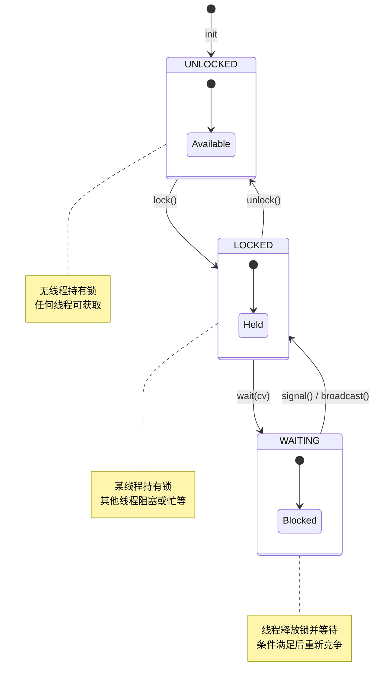
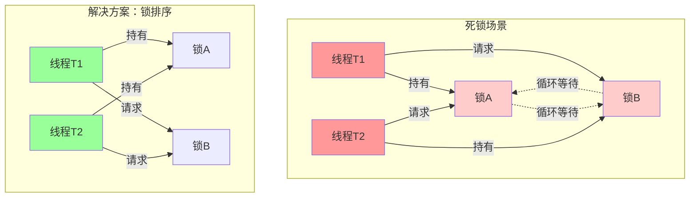
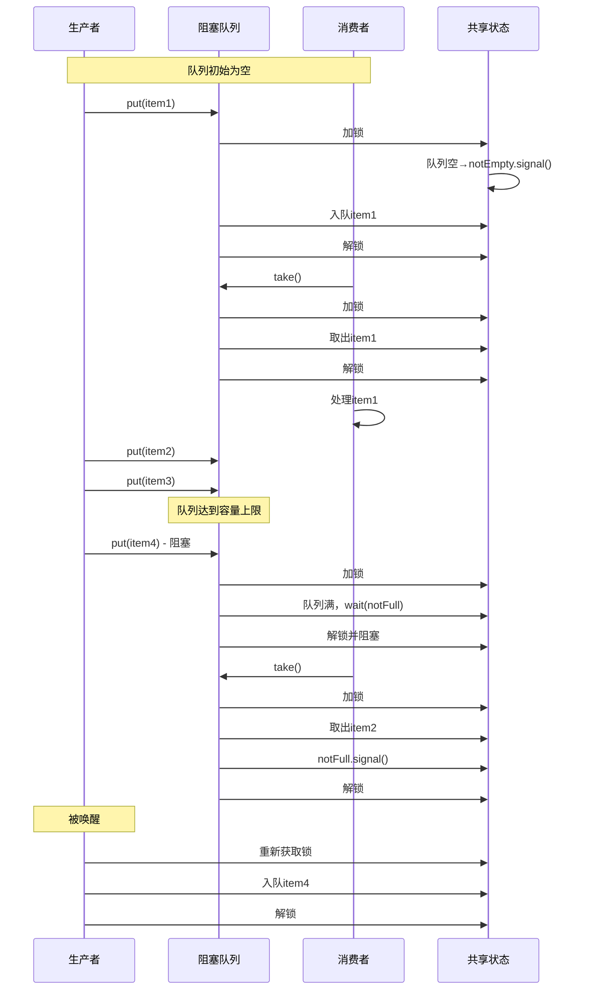
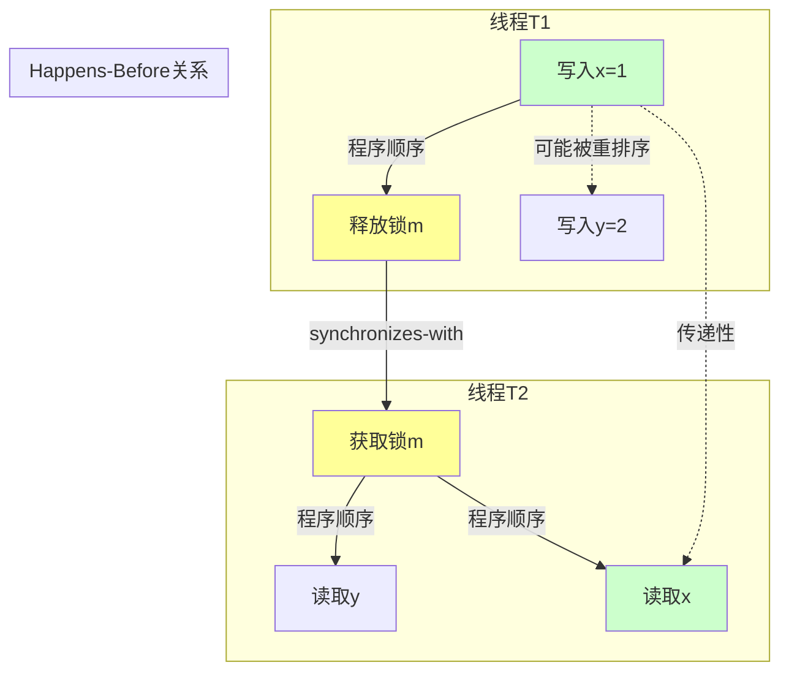
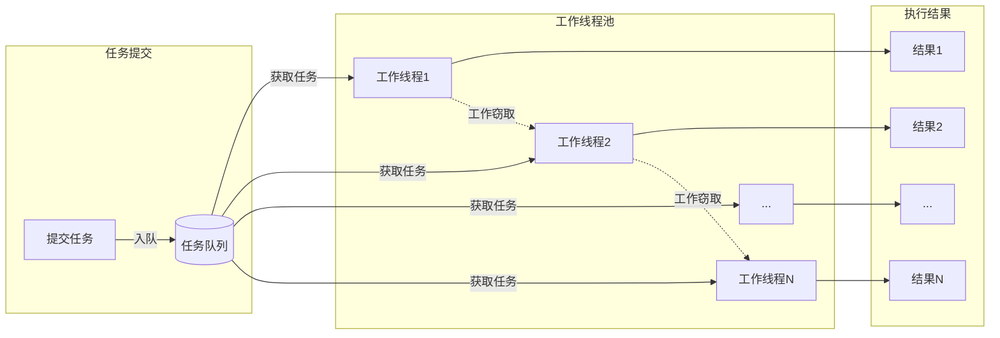
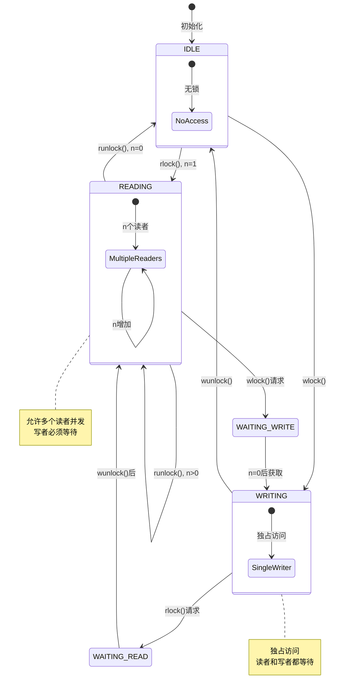

# 实用并发的形式化理论

> **所属阶段**: Struct | **前置依赖**: [形式化方法基础](../01-foundations/05-type-theory.md), [进程代数](../02-calculi/02-pi-calculus/01-pi-calculus-basics.md) | **形式化等级**: L4

## 1. 概念定义 (Definitions)

### 1.1 实用并发概述

**定义 1.1 (实用并发)** [^1]
实用并发(Practical Concurrency)是指在共享内存多处理器系统上，通过多线程协作完成计算任务的一套编程范型和技术体系。与理论并发模型(如CSP、CCS)不同，实用并发关注工程实现中的具体问题：线程管理、同步机制、数据竞争避免、以及性能优化。

**定义 1.2 (并发计算模型)** [^2]
设 $M = (S, T, \to, s_0)$ 为并发计算模型，其中：

- $S$ 为状态空间，表示所有可能的程序状态
- $T$ 为线程集合 $T = \{t_1, t_2, ..., t_n\}$
- $\to \subseteq S \times (T \cup \{\tau\}) \times S$ 为带标签的状态转移关系
- $s_0 \in S$ 为初始状态
- $\tau$ 表示内部动作（非线程发起的自动转移）

**定义 1.3 (并发执行轨迹)** [^3]
给定并发程序 $P$ 和其线程集 $T$，执行轨迹 $\sigma$ 是状态-动作交替序列：
$$\sigma = s_0 \xrightarrow{a_1} s_1 \xrightarrow{a_2} s_2 \xrightarrow{a_3} ... \xrightarrow{a_k} s_k$$
其中每个 $a_i \in Act$ 是某个线程 $t \in T$ 执行的原子操作。

### 1.2 线程模型

**定义 1.4 (线程)** [^4]
线程是操作系统调度的基本单位，定义为四元组 $Thread = (PC, RS, LS, TS)$：

- $PC$：程序计数器，指向下一条要执行的指令
- $RS$：寄存器集合，保存线程私有的计算状态
- $LS$：本地栈，用于函数调用和局部变量
- $TS$：线程状态 $\in \{NEW, RUNNABLE, RUNNING, BLOCKED, TERMINATED\}$

**定义 1.5 (用户级线程与内核级线程)** [^5]

- **用户级线程(User-Level Thread, ULT)**：线程管理完全在用户空间完成，线程切换无需陷入内核，调度开销小，但无法利用多核并行
- **内核级线程(Kernel-Level Thread, KLT)**：线程由操作系统内核直接管理，支持真正的并行执行，但线程切换需要陷入内核

**定义 1.6 (线程映射模型)** [^6]
多对一模型 $M_{m:1}$、一对一模型 $M_{1:1}$、多对多模型 $M_{m:n}$ 分别定义为：
$$M_{m:1}: T_{user} \to T_{kernel}, \quad |T_{user}| = m, |T_{kernel}| = 1$$
$$M_{1:1}: T_{user} \to T_{kernel}, \quad |T_{user}| = |T_{kernel}|$$
$$M_{m:n}: T_{user} \to T_{kernel}, \quad |T_{user}| = m, |T_{kernel}| = n, m > n$$

### 1.3 锁和条件变量

**定义 1.7 (互斥锁/Mutex)** [^7]
互斥锁是用于保护临界区的同步原语，定义为状态机 $Mutex = (\{UNLOCKED, LOCKED\}, \{lock, unlock, trylock\}, \delta, UNLOCKED)$，其中转移函数：
$$\delta(UNLOCKED, lock) = LOCKED$$
$$\delta(LOCKED, unlock) = UNLOCKED$$
$$\delta(LOCKED, trylock) = fail \quad \text{(非阻塞尝试失败)}$$
$$\delta(UNLOCKED, trylock) = LOCKED$$

**定义 1.8 (条件变量)** [^8]
条件变量用于线程间的事件通知，定义为 $CV = (W, C, \{wait, signal, broadcast\})$：

- $W \subseteq T$：等待该条件的线程集合
- $C$：与该条件变量关联的谓词（布尔条件）
- $wait(cv, mutex)$：原子释放锁并加入等待队列
- $signal(cv)$：唤醒一个等待线程
- $broadcast(cv)$：唤醒所有等待线程

**定义 1.9 (监视器/Monitor)** [^9]
监视器是高层次的同步抽象，封装了互斥锁和条件变量：
$$Monitor = (Mutex, \{CV_1, CV_2, ..., CV_k\}, Procedures, Invariant)$$
其中 $Invariant$ 是不变式，要求：

1. 进入监视器时自动获取锁
2. 离开监视器时自动释放锁
3. 条件变量操作隐含在监视器锁的上下文中

### 1.4 并发设计模式

**定义 1.10 (线程池模式)** [^10]
线程池 $Pool = (W, Q, M, P)$，其中：

- $W = \{w_1, ..., w_n\}$：工作线程集合（固定大小）
- $Q$：任务队列（有限缓冲区）
- $M$：管理线程（负责创建/销毁工作线程）
- $P$：任务提交策略（直接执行、加入队列、拒绝）

**定义 1.11 (工作窃取/Work Stealing)** [^11]
工作窃取是一种负载均衡策略，定义在双端队列 $Deque$ 上：

- 每个工作线程拥有私有的双端队列 $D_i$
- $push(D_i, task)$：将任务加入队列尾部（本地操作）
- $pop(D_i)$：从队列尾部取出任务（本地操作）
- $steal(D_j)$：当 $D_i = \emptyset$ 时，从其他线程 $D_j$ 的头部窃取任务

**定义 1.12 (读写锁/Readers-Writer Lock)** [^12]
读写锁区分读操作和写操作：
$$RWLock = (State, \{rlock, runlock, wlock, wunlock\}, \delta)$$
其中状态 $State \in \mathbb{N} \times \{0, 1\}$，表示 (读计数, 写标志)。

- 读锁：$\delta((n, 0), rlock) = (n+1, 0)$，允许多个读者
- 写锁：$\delta((0, 0), wlock) = (0, 1)$，独占访问
- 读解锁：$\delta((n, 0), runlock) = (n-1, 0)$
- 写解锁：$\delta((0, 1), wunlock) = (0, 0)$

---

## 2. 属性推导 (Properties)

### 2.1 同步原语基本性质

**引理 2.1 (互斥锁的安全性)**
对于任意时刻 $t$，至多只有一个线程持有特定互斥锁 $m$：
$$\forall t. \forall m. |\{thread \mid holds(thread, m, t)\}| \leq 1$$

**引理 2.2 (条件变量的信号完整性)**
若线程 $t_1$ 在条件变量 $cv$ 上调用 $signal(cv)$，则必然存在线程 $t_2$ 在 $cv$ 上等待：
$$signal(t_1, cv) \implies \exists t_2. waiting(t_2, cv) \land t_1 \neq t_2$$

**引理 2.3 (读写锁的读者-写者互斥)**
当写者持有读写锁 $rw$ 时，没有读者可以获取该锁：
$$holds\_writer(t_w, rw) \implies \forall t_r. \neg holds\_reader(t_r, rw)$$

### 2.2 线程安全性质

**定义 2.4 (线程安全)** [^13]
数据结构 $D$ 是线程安全的，当且仅当对于所有并发操作序列 $\sigma$，最终状态 $s_k$ 与某个串行执行序列 $\sigma'$ 的状态 $s'_k$ 等价：
$$ThreadSafe(D) \iff \forall \sigma. \exists \sigma'. s_k \equiv s'_k$$
其中 $\equiv$ 表示观察等价性。

**引理 2.5 (无锁算法的进步性)**
无锁(lock-free)数据结构保证系统整体进展：
$$LockFree(D) \implies \forall \sigma. \neg deadlocked(\sigma)$$
其中 $deadlocked$ 表示所有线程都被阻塞且无法继续。

**引理 2.6 (等待自由/Wait-Free)**
等待自由是比无锁更强的保证：
$$WaitFree(D) \implies \forall thread. \forall op. \exists bound. time(op) \leq bound$$
即每个操作都能在有限步骤内完成，与并发操作无关。

### 2.3 内存可见性

**引理 2.7 ( happens-before 关系的传递性)**
$$a \xrightarrow{hb} b \land b \xrightarrow{hb} c \implies a \xrightarrow{hb} c$$

**引理 2.8 (锁的内存语义)**
解锁操作与后续的加锁操作建立 happens-before 关系：
$$unlock(t_1, m) \xrightarrow{hb} lock(t_2, m) \quad \text{如果 } t_2 \text{ 在 } t_1 \text{ 之后获取锁}$$

---

## 3. 关系建立 (Relations)

### 3.1 与进程代数的关系

**定理 3.1 (CSP到实用并发的映射)**
CSP进程可以映射到实用并发模型：

- CSP的同步通信 $\to$ 条件变量/信号量
- CSP的选择操作 $\to$ 多路等待/多路复用
- CSP的并行组合 $\| \to$ 线程创建和join

**定理 3.2 (Actor模型与共享内存并发)**
Actor模型的消息传递可以编码为共享内存并发：

- Actor $\equiv$ 线程 + 邮箱队列
- 消息发送 $\equiv$ 向共享队列enqueue
- 消息接收 $\equiv$ 从共享队列dequeue（可能需要等待）

### 3.2 与内存模型的关系

**定义 3.3 (顺序一致性)** [^14]
执行 $E$ 满足顺序一致性，当且仅当存在一个全局的线性顺序 $\prec$ 满足：

1. 每个线程的程序顺序在 $\prec$ 中保持
2. 读操作返回最近一次写操作的值（按 $\prec$ 顺序）

**定义 3.4 (释放-获取一致性/Release-Acquire)**

- $release$ 操作：保证之前所有内存写入对该变量可见
- $acquire$ 操作：保证能看到其他线程对该变量的 $release$
- 形式化：$release(t_1, x) \xrightarrow{synchronizes\_with} acquire(t_2, x) \implies$ $t_1$ 的先前写入对 $t_2$ 可见

### 3.3 与类型系统的关系

**定理 3.5 (所有权与并发安全)**
Rust的所有权系统通过类型检查保证数据竞争自由：
$$\Gamma \vdash e : \tau \land Send(\tau) \implies no\_data\_race(e)$$
其中 $Send$ 是标记trait，表示类型可以安全地跨线程传递。

---

## 4. 论证过程 (Argumentation)

### 4.1 同步原语的表达能力

**定理 4.1 (同步原语的完备性)**
互斥锁和条件变量在理论上是完备的同步原语：任何并发协调需求都可以用它们实现。

**证明思路**：

1. 互斥锁实现互斥访问（临界区保护）
2. 条件变量实现事件等待和通知
3. 组合可以实现信号量、屏障、读写锁等

**反例分析**：

- 某些高性能场景下，互斥锁的性能开销过高
- 无锁数据结构使用原子操作而非锁，但需要更复杂的验证

### 4.2 并发编程的复杂性边界

**定理 4.2 (并发验证的PSPACE难)**
验证n线程程序的特定性质是PSPACE完全的。

**论证**：
状态空间大小随线程数指数增长：
$$|S_{concurrent}| = O(|S_{sequential}|^n)$$
这使得穷举验证在实际中不可行。

### 4.3 内存模型的折中

**讨论 4.3 (弱内存模型的权衡)**
现代处理器使用弱内存模型（如x86的TSO、ARM的宽松模型）以换取性能：

- 强内存模型：编程简单，但性能受限
- 弱内存模型：性能更高，但编程复杂

**边界条件**：

- 大多数程序员应使用高级同步原语而非直接操作内存屏障
- 无锁编程需要深入理解内存序（memory ordering）

---

## 5. 形式证明 / 工程论证 (Proof / Engineering Argument)

### 5.1 定理：锁的正确性

**定理 5.1 (互斥锁的正确性)** [^15]
正确实现的互斥锁满足：

1. **互斥性(Mutual Exclusion)**：任意时刻至多一个线程在临界区内
2. **无死锁(Freedom from Deadlock)**：如果多个线程竞争锁，至少有一个能获得锁
3. **无饥饿(Freedom from Starvation)**：等待锁的线程最终能获得锁（公平锁）

**证明**：

**互斥性**：
假设存在两个线程 $t_1, t_2$ 同时持有锁 $m$。根据锁的状态机定义：

- 锁状态只能从 $UNLOCKED \to LOCKED$ 或 $LOCKED \to UNLOCKED$
- 从 $LOCKED$ 状态执行 $lock$ 操作会导致线程阻塞
- 因此不可能有两个线程同时使锁处于 $LOCKED$ 状态并被两者持有

**无死锁**：
考虑竞争场景，假设锁当前被 $t_1$ 持有，$t_2, t_3, ...$ 等待。

- 当 $t_1$ 完成临界区，必然执行 $unlock(m)$
- 这将锁状态转为 $UNLOCKED$
- 调度器可以选择一个等待线程（如 $t_2$）授予锁
- 因此系统不会永久停滞

**无饥饿**（假设公平调度）：

- 设等待队列 $Q = [t_2, t_3, ..., t_k]$ 按FIFO排序
- 每次 $unlock$ 后，选择队列头部线程
- 由于临界区执行时间有限，队列中每个线程最终都会被调度
- 形式化：$\forall t \in Q. \exists n. t$ 在 $n$ 次 $unlock$ 后被调度

### 5.2 定理：无死锁条件

**定理 5.2 ( Coffman 死锁必要条件)** [^16]
死锁发生的四个必要条件：

1. **互斥(Mutual Exclusion)**：资源不可共享
2. **占有并等待(Hold and Wait)**：线程持有资源同时请求新资源
3. **不可抢占(No Preemption)**：资源只能由持有者主动释放
4. **循环等待(Circular Wait)**：存在线程等待链形成环

**定理 5.3 (破坏死锁的充分条件)**
破坏上述任一条件即可防止死锁。

**工程论证**：

**策略1：资源一次性分配**

- 线程在开始执行前获取所有需要的锁
- 破坏"占有并等待"条件
- 缺点：降低并发性，可能导致资源利用率低

**策略2：资源有序分配**

- 为所有锁定义全局顺序 $<_L$
- 线程必须按递增顺序获取锁
- 破坏"循环等待"条件

**证明策略2的正确性**：
假设存在死锁，形成等待环 $t_1 \to t_2 \to ... \to t_k \to t_1$。

- 设 $t_i$ 持有锁 $l_i$ 并等待 $l_{i+1}$
- 根据有序分配策略：$l_i <_L l_{i+1}$
- 因此 $l_1 <_L l_2 <_L ... <_L l_k <_L l_1$
- 这构成严格偏序的矛盾（$l_1 <_L l_1$）
- 故循环等待不可能存在

### 5.3 定理：内存一致性

**定理 5.4 (缓存一致性协议的正确性)** [^17]
MESI协议（Modified-Exclusive-Shared-Invalid）保证多处理器缓存一致性：

- 任意时刻，对于内存地址 $a$，至多一个缓存处于 $M$（修改）或 $E$（独占）状态
- 当缓存行处于 $M$ 状态，其值是内存中该地址的唯一有效副本
- 状态转移遵循一致性协议，确保所有处理器看到一致的内存视图

**形式化规约**：
对于任意地址 $a$ 和处理器 $p_i$：
$$CacheState(p_i, a) \in \{M, E, S, I\}$$

一致性不变式：
$$\forall a. |\{p \mid CacheState(p, a) \in \{M, E\}\}| \leq 1$$
$$\forall a. (\exists p. CacheState(p, a) = M) \implies \forall p' \neq p. CacheState(p', a) = I$$

**定理 5.5 (内存屏障的语义)**
内存屏障 $fence$ 确保特定顺序的内存操作：

- $store\_fence$：确保之前的所有存储操作在屏障后完成
- $load\_fence$：确保之后的所有加载操作在屏障后开始
- $full\_fence$：同时具备上述两种语义

形式化：
$$op_1 \prec fence \prec op_2 \implies op_1 \xrightarrow{hb} op_2$$

---

## 6. 实例验证 (Examples)

### 6.1 线程安全数据结构

#### 6.1.1 线程安全队列（基于锁）

```java
// Java实现：基于ReentrantLock的线程安全队列
public class ConcurrentQueue<T> {
    private final Node<T> dummy = new Node<>(null);
    private Node<T> head = dummy;
    private Node<T> tail = dummy;
    private final ReentrantLock lock = new ReentrantLock();
    private final Condition notEmpty = lock.newCondition();

    private static class Node<T> {
        T item;
        Node<T> next;
        Node(T item) { this.item = item; }
    }

    // 入队：线程安全
    public void enqueue(T item) {
        lock.lock();
        try {
            Node<T> newNode = new Node<>(item);
            tail.next = newNode;
            tail = newNode;
            notEmpty.signal(); // 通知等待的出队线程
        } finally {
            lock.unlock();
        }
    }

    // 出队：阻塞式，线程安全
    public T dequeue() throws InterruptedException {
        lock.lock();
        try {
            while (head.next == null) {
                notEmpty.await(); // 队列空时等待
            }
            Node<T> first = head.next;
            head = first;
            return first.item;
        } finally {
            lock.unlock();
        }
    }
}
```

**正确性分析**：

- 所有共享状态修改都在锁保护下进行
- 条件变量确保消费者不会在空队列上忙等
- 使用 `try-finally` 确保锁一定会释放

#### 6.1.2 无锁栈（CAS实现）

```java
// 基于CAS的无锁栈
public class LockFreeStack<T> {
    private final AtomicReference<Node<T>> head =
        new AtomicReference<>();

    private static class Node<T> {
        final T item;
        final Node<T> next;
        Node(T item, Node<T> next) {
            this.item = item;
            this.next = next;
        }
    }

    // 入栈：CAS重试直到成功
    public void push(T item) {
        Node<T> newHead = new Node<>(item, null);
        Node<T> oldHead;
        do {
            oldHead = head.get();
            newHead = new Node<>(item, oldHead);
        } while (!head.compareAndSet(oldHead, newHead));
    }

    // 出栈：CAS重试直到成功
    public T pop() {
        Node<T> oldHead;
        Node<T> newHead;
        do {
            oldHead = head.get();
            if (oldHead == null) return null; // 栈空
            newHead = oldHead.next;
        } while (!head.compareAndSet(oldHead, newHead));
        return oldHead.item;
    }
}
```

**正确性分析**：

- 使用 `compareAndSet` 原子操作避免锁开销
- ABA问题：此简单实现未处理ABA问题，生产环境需要版本号或Hazard Pointer
- 无锁保证：即使一个线程被延迟，其他线程也能继续操作

### 6.2 生产者-消费者模式

```java
// 经典生产者-消费者：使用阻塞队列
public class ProducerConsumerExample {
    private final BlockingQueue<Task> queue;
    private final int CAPACITY = 100;

    public ProducerConsumerExample() {
        this.queue = new ArrayBlockingQueue<>(CAPACITY);
    }

    // 生产者线程
    class Producer implements Runnable {
        public void run() {
            try {
                while (!Thread.interrupted()) {
                    Task task = produceTask();
                    queue.put(task); // 队列满时阻塞
                }
            } catch (InterruptedException e) {
                Thread.currentThread().interrupt();
            }
        }

        private Task produceTask() {
            // 生成任务...
            return new Task();
        }
    }

    // 消费者线程
    class Consumer implements Runnable {
        public void run() {
            try {
                while (!Thread.interrupted()) {
                    Task task = queue.take(); // 队列空时阻塞
                    processTask(task);
                }
            } catch (InterruptedException e) {
                Thread.currentThread().interrupt();
            }
        }

        private void processTask(Task task) {
            // 处理任务...
        }
    }
}
```

**同步分析**：

- `put` 和 `take` 方法内部使用相同的锁和条件变量协调
- 生产者满时等待 `notFull` 条件，消费者空时等待 `notEmpty` 条件
- 边界情况：队列满/空时的阻塞与唤醒机制

### 6.3 读写问题（读者-写者问题）

```java
// 公平读写锁实现：防止写者饥饿
public class FairReadWriteLock {
    private int readers = 0;
    private int writers = 0;
    private int writeRequests = 0;
    private final Object lock = new Object();

    // 获取读锁
    public void lockRead() throws InterruptedException {
        synchronized (lock) {
            // 如果有写者或写请求等待，读者等待
            while (writers > 0 || writeRequests > 0) {
                lock.wait();
            }
            readers++;
        }
    }

    // 释放读锁
    public void unlockRead() {
        synchronized (lock) {
            readers--;
            if (readers == 0) {
                lock.notifyAll(); // 唤醒等待的写者
            }
        }
    }

    // 获取写锁
    public void lockWrite() throws InterruptedException {
        synchronized (lock) {
            writeRequests++;
            while (readers > 0 || writers > 0) {
                lock.wait();
            }
            writeRequests--;
            writers++;
        }
    }

    // 释放写锁
    public void unlockWrite() {
        synchronized (lock) {
            writers--;
            lock.notifyAll(); // 唤醒等待的读者和写者
        }
    }
}
```

**公平性分析**：

- `writeRequests` 计数器确保写者优先（防止读者无限涌入）
- 也可改为读者优先（删除 `writeRequests` 检查）
- 或完全公平（使用独立等待队列）

### 6.4 并行算法示例：并行归并排序

```java
// Java Fork/Join框架实现并行归并排序
public class ParallelMergeSort extends RecursiveAction {
    private final int[] array;
    private final int[] temp;
    private final int left;
    private final int right;
    private static final int THRESHOLD = 1000; // 阈值以下使用串行排序

    public ParallelMergeSort(int[] array, int left, int right) {
        this.array = array;
        this.temp = new int[array.length];
        this.left = left;
        this.right = right;
    }

    @Override
    protected void compute() {
        if (right - left <= THRESHOLD) {
            Arrays.sort(array, left, right + 1); // 串行排序小数组
            return;
        }

        int mid = left + (right - left) / 2;
        ParallelMergeSort leftSort = new ParallelMergeSort(array, left, mid);
        ParallelMergeSort rightSort = new ParallelMergeSort(array, mid + 1, right);

        invokeAll(leftSort, rightSort); // 并行执行两个子任务
        merge(mid); // 合并结果
    }

    private void merge(int mid) {
        // 标准归并逻辑（省略具体实现）
        System.arraycopy(array, left, temp, left, right - left + 1);
        int i = left, j = mid + 1, k = left;
        while (i <= mid && j <= right) {
            if (temp[i] <= temp[j]) {
                array[k++] = temp[i++];
            } else {
                array[k++] = temp[j++];
            }
        }
        while (i <= mid) array[k++] = temp[i++];
        while (j <= right) array[k++] = temp[j++];
    }
}

// 使用方式
ForkJoinPool pool = new ForkJoinPool();
int[] data = /* 待排序数组 */;
pool.invoke(new ParallelMergeSort(data, 0, data.length - 1));
```

**性能分析**：

- 阈值选择：太小则任务调度开销占主导，太大则并行度不足
- 经验法则：当子任务工作量低于10,000操作时，串行执行更优

---

## 7. 可视化 (Visualizations)

### 7.1 同步原语状态图

下图展示了互斥锁和条件变量的状态转换：



### 7.2 死锁场景图

下图展示了典型的死锁场景——循环资源等待：



### 7.3 生产者-消费者执行流程



### 7.4 内存模型与Happens-Before关系



### 7.5 线程池工作原理



### 7.6 读写锁状态机



---

## 8. 引用参考 (References)

[^1]: MIT 6.826, "Principles of Computer Systems", Lecture 10: Practical Concurrency. <https://ocw.mit.edu/courses/6-826-principles-of-computer-systems/>

[^2]: Herlihy, M. & Shavit, N. (2012). The Art of Multiprocessor Programming, Morgan Kaufmann. Chapter 2: Mutual Exclusion.

[^3]: Lamport, L. (1979). "How to Make a Multiprocessor Computer That Correctly Executes Multiprocess Programs", IEEE Transactions on Computers, C-28(9), pp.690-691.

[^4]: Silberschatz, A., Galvin, P.B., & Gagne, G. (2018). Operating System Concepts, 10th Edition, Wiley. Chapter 4: Threads.

[^5]: Anderson, T.E., et al. (1992). "Scheduler Activations: Effective Kernel Support for the User-Level Management of Parallelism", ACM TOCS, 10(1), pp.53-79.

[^6]: Butenhof, D.R. (1997). Programming with POSIX Threads, Addison-Wesley. Chapter 3: Synchronization.

[^7]: Dijkstra, E.W. (1965). "Cooperating Sequential Processes", in Programming Languages (F. Genuys, ed.), Academic Press, pp.43-112.

[^8]: Hoare, C.A.R. (1974). "Monitors: An Operating System Structuring Concept", Communications of the ACM, 17(10), pp.549-557.

[^9]: Hansen, P.B. (1973). "Operating System Principles", Prentice-Hall. Chapter on Concurrent Programming.

[^10]: Goetz, B., et al. (2006). Java Concurrency in Practice, Addison-Wesley. Chapter 8: Applying Thread Pools.

[^11]: Blumofe, R.D., et al. (1995). "Cilk: An Efficient Multithreaded Runtime System", ACM SIGPLAN Notices, 30(8), pp.207-216.

[^12]: Courtois, P.J., et al. (1971). "Concurrent Control with Readers and Writers", Communications of the ACM, 14(10), pp.667-668.

[^13]: Herlihy, M. & Wing, J.M. (1990). "Linearizability: A Correctness Condition for Concurrent Objects", ACM TOPLAS, 12(3), pp.463-492.

[^14]: Sewell, P., et al. (2010). "x86-TSO: A Rigorous and Usable Programmer's Model for x86 Multiprocessors", Communications of the ACM, 53(7), pp.89-97.

[^15]: Owicki, S. & Gries, D. (1976). "Verifying Properties of Parallel Programs: An Axiomatic Approach", Communications of the ACM, 19(5), pp.279-285.

[^16]: Coffman, E.G., et al. (1971). "System Deadlocks", Computing Surveys, 3(2), pp.67-78.

[^17]: Papamarcos, M.S. & Patel, J.H. (1984). "A Low-Overhead Coherence Solution for Multiprocessors with Private Cache Memories", Proc. ISCA, pp.348-354.
