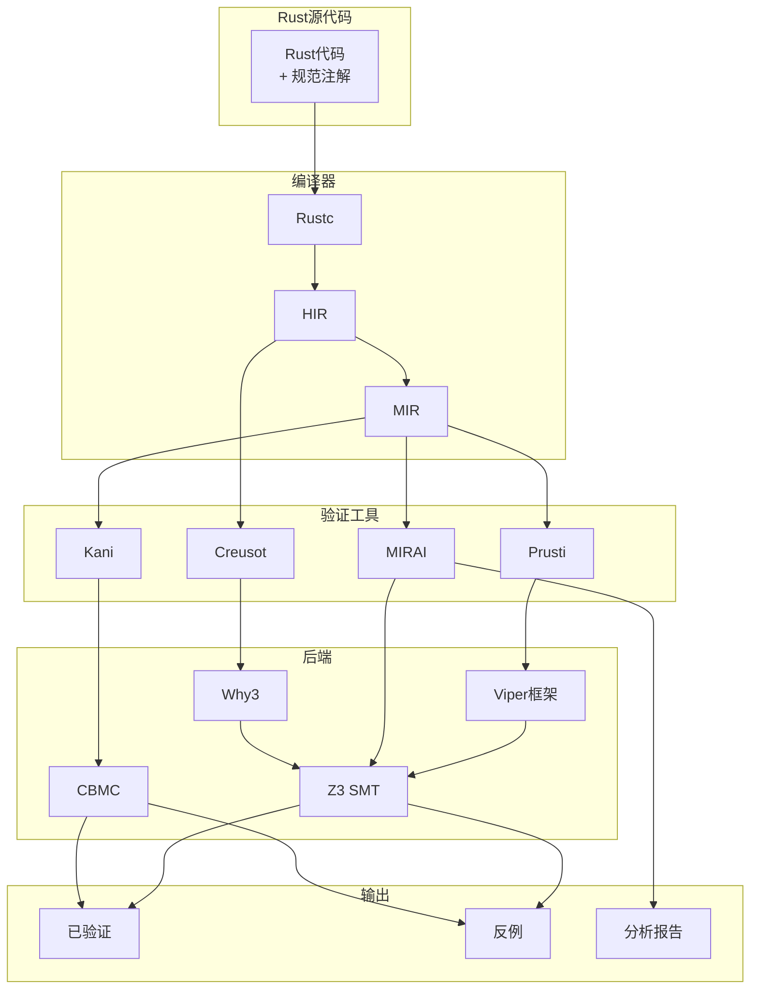
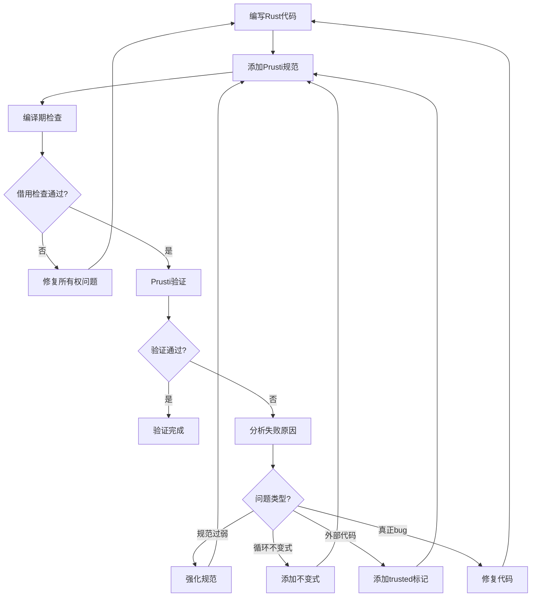
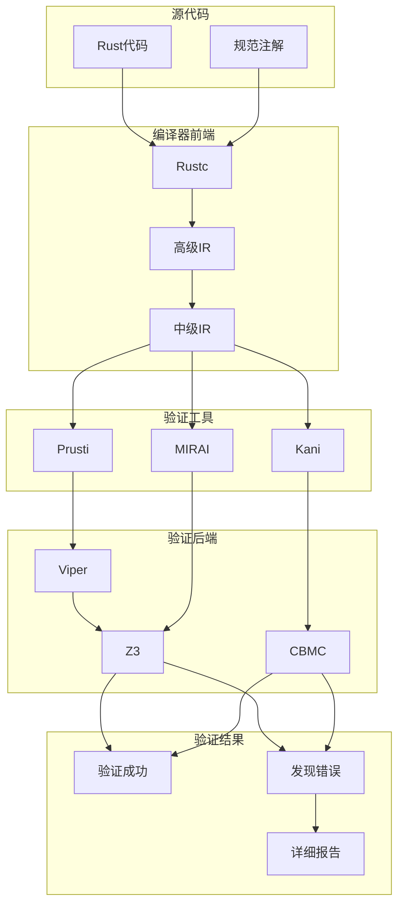
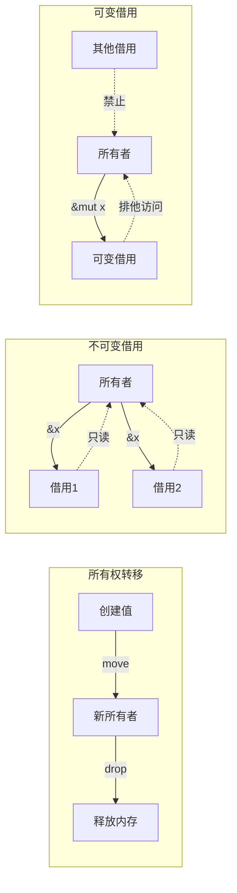
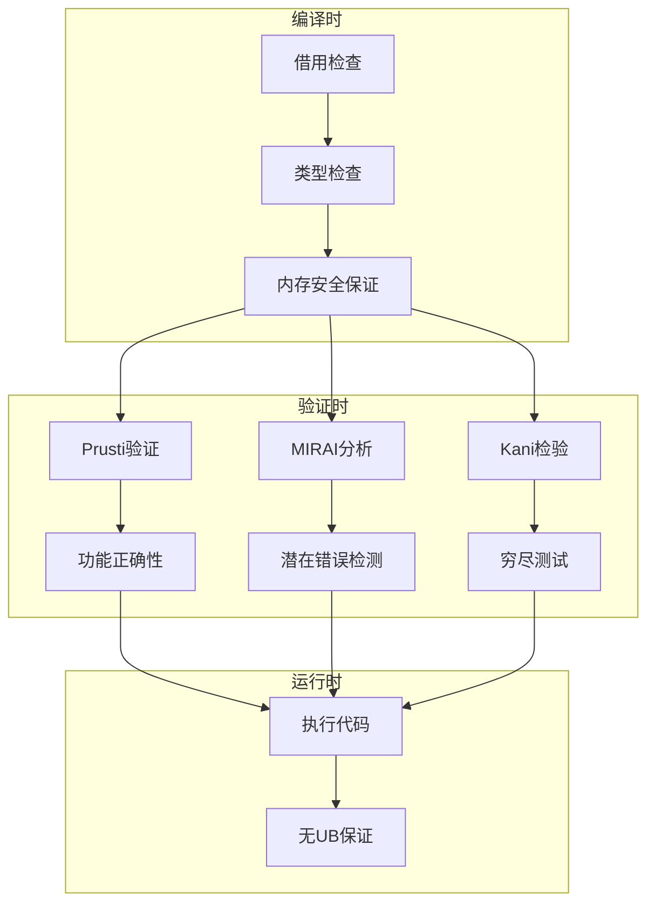

> **状态**: 🔮 前瞻内容 | **风险等级**: 高 | **最后更新**: 2026-04
> 
> 此文档描述的内容处于早期规划阶段，可能与最终实现不符。请以 Apache Flink 官方发布为准。
# Rust形式化验证

> **所属单元**: Tools/Industrial | **前置依赖**: [类型系统理论](../../03-foundation/02-types/01-type-systems.md) | **形式化等级**: L4

## 1. 概念定义 (Definitions)

### 1.1 Rust所有权系统

**Def-T-09-01** (所有权定义)。Rust的所有权系统通过类型规则保证内存安全：

$$\text{Ownership} = \text{Unique ownership} + \text{Borrowing} + \text{Lifetime parameters}$$

**所有权规则**：

1. 每个值有唯一的所有者
2. 当所有者离开作用域，值被释放
3. 所有权可转移（move）或借用（borrow）

**Def-T-09-02** (借用规则)。借用检查器的核心规则：

$$\frac{\Gamma \vdash x : T}{\Gamma \vdash \&x : \&T} \quad \frac{\Gamma \vdash x : T}{\Gamma \vdash \&mut\ x : \&mut\ T}$$

**借用约束**：

- 任意时刻，只能有一个可变引用或多个不可变引用
- 引用必须始终有效

**Def-T-09-03** (生命周期)。Rust使用生命周期参数追踪引用有效性：

$$\text{fn foo<'a, 'b>(x: \&'a T, y: \&'b U) \rightarrow \&'a V \quad \text{where } 'a: 'b}$$

### 1.2 形式化验证工具

**Def-T-09-04** (Rust验证工具链)。Rust形式化验证生态系统：

$$\text{Rust Verification} = \text{Prusti} + \text{MIRAI} + \text{Kani} + \text{Creusot} + \text{Aeneas}$$

| 工具 | 技术 | 验证目标 | 自动化 |
|------|------|----------|--------|
| Prusti | Viper框架 | 功能正确性 | 自动 |
| MIRAI | 抽象解释 | 错误检测 | 自动 |
| Kani | 模型检测 | 安全性 | 自动 |
| Creusot | Why3 | 功能正确性 | 半自动 |
| Aeneas | 特征化 | 功能正确性 | 自动 |

### 1.3 Prusti验证器

**Def-T-09-05** (Prusti定义)。Prusti是基于Viper的Rust验证器：

$$\text{Prusti} = \text{Rust MIR} + \text{Viper中间语言} + \text{分离逻辑验证}$$

**规范语法**：

```rust
#[requires(...)]    // 前置条件
#[ensures(...)]     // 后置条件
#[invariant(...)]   // 循环不变式
#[pure]             // 纯函数标记
#[trusted]          // 信任外部代码
```

**Def-T-09-06** (Viper中间表示)。Viper是验证基础设施：

$$\text{Viper} = \text{Silver语言} + \text{符号执行} + \text{分离逻辑} + \text{SMT后端}$$

### 1.4 MIRAI分析器

**Def-T-09-07** (MIRAI定义)。MIRAI是Rust抽象解释器：

$$\text{MIRAI} = \text{常量传播} + \text{区间分析} + \text{路径敏感分析}$$

**分析目标**：

- 潜在运行时panic（数组越界、溢出等）
- 不可达代码
- 常量求值
- 条件验证

## 2. 属性推导 (Properties)

### 2.1 所有权保证

**Lemma-T-09-01** (内存安全)。Rust类型系统保证：

$$\vdash_{Rust} P \Rightarrow P \text{ is memory-safe (no UAF, no double-free)}$$

**Lemma-T-09-02** (数据竞争自由)。通过借用规则：

$$\text{Safe Rust} \Rightarrow \text{Data-race freedom}$$

### 2.2 验证复杂度

**Def-T-09-08** (验证开销)。Rust形式化验证的时间开销：

$$T_{verify} = T_{rustc} + T_{translation} + T_{Viper/Z3}$$

通常$T_{Viper/Z3}$占主导，对于复杂规范可能需要数分钟。

## 3. 关系建立 (Relations)

### 3.1 Rust验证生态系统



### 3.2 验证工具对比

| 特性 | Prusti | MIRAI | Kani | Creusot |
|------|--------|-------|------|---------|
| 技术 | Viper/SL | 抽象解释 | 模型检测 | Why3 |
| 规范语言 | 过程宏 | 断言/assume | 断言 | Pearlite |
| 自动化 | 全自动 | 全自动 | 全自动 | 半自动 |
| 功能正确性 | 是 | 否 | 部分 | 是 |
| 并发验证 | 是 | 否 | 是 | 否 |
| 易用性 | 高 | 高 | 中 | 中 |
| 维护状态 | 积极 | Facebook | AWS | 积极 |

## 4. 论证过程 (Argumentation)

### 4.1 验证工作流



### 4.2 验证策略选择

| 目标 | 推荐工具 | 理由 |
|------|----------|------|
| 功能正确性 | Prusti/Creusot | 完整规范支持 |
| 安全检查 | MIRAI/Kani | 轻量、快速 |
| 并发协议 | Prusti/Kani | 支持并发推理 |
| 教学演示 | Prusti | 易于上手 |

## 5. 形式证明 / 工程论证 (Proof / Engineering Argument)

### 5.1 Rust类型安全定理

**Thm-T-09-01** (Rust类型安全)。良好类型的Rust程序不会触发未定义行为：

$$\vdash_{Rust} e : T \Rightarrow e \text{ does not exhibit undefined behavior}$$

**证明概要**（基于Stacked Borrows）：

1. 借用创建临时权限
2. 权限检查所有内存访问
3. 违反权限时程序panic而非UB

### 5.2 Prusti可靠性

**Thm-T-09-02** (Prusti可靠性)。若Prusti验证通过，Rust程序满足规范：

$$(\text{Prusti} \vdash P : \{\phi\} C \{\psi\}) \Rightarrow \models \{\phi\} C \{\psi\}$$

**依赖**：Viper验证正确、MIR到Viper翻译正确。

## 6. 实例验证 (Examples)

### 6.1 Prusti安装配置

**安装要求**：

- Rust 1.70+
- Java 11+
- VS Code (推荐)

**安装步骤**：

```bash
# 安装Rust
rustup update

# 安装Prusti
rustup component add rustc-dev llvm-tools-preview

# 使用cargo-prusti
cargo install --git https://github.com/viperproject/prusti-dev.git cargo-prusti

# VS Code扩展
# 安装 "Prusti Assistant" 扩展
```

**基本使用**：

```bash
# 验证单个文件
prusti-rustc file.rs

# 验证整个项目
cargo prusti

# 生成详细报告
prusti-rustc --verbose file.rs
```

### 6.2 基础验证示例：二分查找

```rust
use prusti_contracts::*;

// 纯函数：检查数组已排序
#[pure]
fn is_sorted(arr: &[i32]) -> bool {
    forall(|i: usize, j: usize|
        (i < j && j < arr.len()) ==> arr[i] <= arr[j]
    )
}

// 纯函数：元素在数组中
#[pure]
fn contains(arr: &[i32], key: i32) -> bool {
    exists(|i: usize| i < arr.len() && arr[i] == key)
}

#[requires(is_sorted(arr))]
#[ensures(result.is_some() ==>
    arr[result.unwrap()] == key)]
#[ensures(result.is_none() ==>
    !contains(arr, key))]
pub fn binary_search(arr: &[i32], key: i32) -> Option<usize> {
    let mut lo = 0;
    let mut hi = arr.len();

    while lo < hi {
        body_invariant!(lo <= hi);
        body_invariant!(hi <= arr.len());
        body_invariant!(forall(|i: usize|
            (i < lo) ==> arr[i] < key
        ));
        body_invariant!(forall(|i: usize|
            (hi <= i && i < arr.len()) ==> arr[i] > key
        ));

        let mid = lo + (hi - lo) / 2;

        if arr[mid] < key {
            lo = mid + 1;
        } else if arr[mid] > key {
            hi = mid;
        } else {
            return Some(mid);
        }
    }

    None
}
```

### 6.3 数据结构验证：智能指针

```rust
use prusti_contracts::*;
use std::ops::{Deref, DerefMut};

pub struct UniquePtr<T> {
    ptr: *mut T,
}

impl<T> UniquePtr<T> {
    #[ensures(result.deref() === value)]
    pub fn new(value: T) -> Self {
        UniquePtr {
            ptr: Box::into_raw(Box::new(value)),
        }
    }

    #[pure]
    pub fn is_null(&self) -> bool {
        self.ptr.is_null()
    }

    #[requires(!self.is_null())]
    #[ensures(result === old(self.deref()))]
    pub fn get(&self) -> &T {
        unsafe { &*self.ptr }
    }

    #[requires(!self.is_null())]
    #[ensures(result === old(self.deref_mut()))]
    pub fn get_mut(&mut self) -> &mut T {
        unsafe { &mut *self.ptr }
    }

    #[requires(!self.is_null())]
    #[ensures(result === *old(self.deref()))]
    pub fn into_inner(mut self) -> T {
        let value = unsafe { Box::from_raw(self.ptr) };
        self.ptr = std::ptr::null_mut();
        *value
    }
}

impl<T> Deref for UniquePtr<T> {
    type Target = T;

    #[requires(!self.is_null())]
    fn deref(&self) -> &T {
        self.get()
    }
}

impl<T> DerefMut for UniquePtr<T> {
    #[requires(!self.is_null())]
    fn deref_mut(&mut self) -> &mut T {
        self.get_mut()
    }
}

impl<T> Drop for UniquePtr<T> {
    fn drop(&mut self) {
        if !self.ptr.is_null() {
            unsafe {
                drop(Box::from_raw(self.ptr));
            }
        }
    }
}
```

### 6.4 MIRAI使用示例

**安装**：

```bash
cargo install mirai
```

**示例代码**（`analysis.rs`）：

```rust
use mirai_annotations::*;

fn safe_divide(x: i32, y: i32) -> i32 {
    checked_precondition!(y != 0);  // MIRAI检查
    x / y
}

fn bounded_add(x: i32, y: i32) -> i32 {
    checked_precondition!(x >= 0 && x <= 1000);
    checked_precondition!(y >= 0 && y <= 1000);
    let result = x + y;
    checked_verify!(result >= 0 && result <= 2000);  // MIRAI验证
    result
}

fn get_element(arr: &[i32], idx: usize) -> i32 {
    checked_precondition!(idx < arr.len());  // 数组边界检查
    arr[idx]
}

fn main() {
    // 安全调用
    let result = safe_divide(10, 2);
    verify!(result == 5);

    // 边界检查
    let sum = bounded_add(100, 200);
    verify!(sum == 300);

    // 数组访问
    let arr = [1, 2, 3];
    let elem = get_element(&arr, 1);
    verify!(elem == 2);
}
```

**运行MIRAI**：

```bash
cargo mirai
```

### 6.5 Kani模型检测

**安装**：

```bash
cargo install --locked kani-verifier
cargo kani setup
```

**示例**（`verification.rs`）：

```rust
// 使用Kani进行属性检验
#[cfg(kani)]
mod verification {
    use super::*;

    #[kani::proof]
    fn test_bounded_add() {
        let x: u32 = kani::any();
        let y: u32 = kani::any();

        // 限制输入范围
        kani::assume(x <= 1000);
        kani::assume(y <= 1000);

        let result = bounded_add(x, y);

        // 验证性质
        assert!(result >= x);  // 单调性
        assert!(result >= y);
        assert!(result <= 2000);  // 上界
    }

    #[kani::proof]
    fn test_divide_by_zero() {
        let x: i32 = kani::any();
        let y: i32 = kani::any();

        kani::assume(y != 0);  // 避免除零

        let result = safe_divide(x, y);
        assert!(result * y == x || (result == x / y));
    }

    #[kani::proof]
    fn test_array_bounds() {
        let arr: [i32; 5] = kani::any();
        let idx: usize = kani::any();

        kani::assume(idx < 5);  // 确保索引有效

        let elem = arr[idx];
        // 验证读取不会panic
    }
}
```

**运行Kani**：

```bash
# 运行所有证明
cargo kani

# 运行特定证明
cargo kani --function test_bounded_add

# 生成覆盖率报告
cargo kani --coverage

# 可视化结果
cargo kani --visualize
```

### 6.6 并发验证示例

```rust
use prusti_contracts::*;
use std::sync::{Arc, Mutex};

pub struct ThreadSafeCounter {
    count: Mutex<i32>,
}

impl ThreadSafeCounter {
    #[ensures(result.count.into_inner() === 0)]
    pub fn new() -> Self {
        ThreadSafeCounter {
            count: Mutex::new(0),
        }
    }

    #[ensures(self.count.into_inner() === old(self.count.into_inner()) + 1)]
    pub fn increment(&self) {
        let mut guard = self.count.lock().unwrap();
        *guard += 1;
    }

    #[ensures(self.count.into_inner() === old(self.count.into_inner()) - 1)]
    pub fn decrement(&self) {
        let mut guard = self.count.lock().unwrap();
        *guard -= 1;
    }

    #[pure]
    pub fn get(&self) -> i32 {
        *self.count.lock().unwrap()
    }
}

// 使用示例
#[requires(n >= 0)]
#[ensures(result.get() === n)]
pub fn create_with_value(n: i32) -> ThreadSafeCounter {
    let counter = ThreadSafeCounter::new();
    for i in 0..n {
        body_invariant!(counter.get() === i);
        counter.increment();
    }
    counter
}
```

## 7. 可视化 (Visualizations)

### 7.1 Rust验证工具链



### 7.2 所有权与借用生命周期



### 7.3 验证流程对比



## 8. 引用参考 (References)
