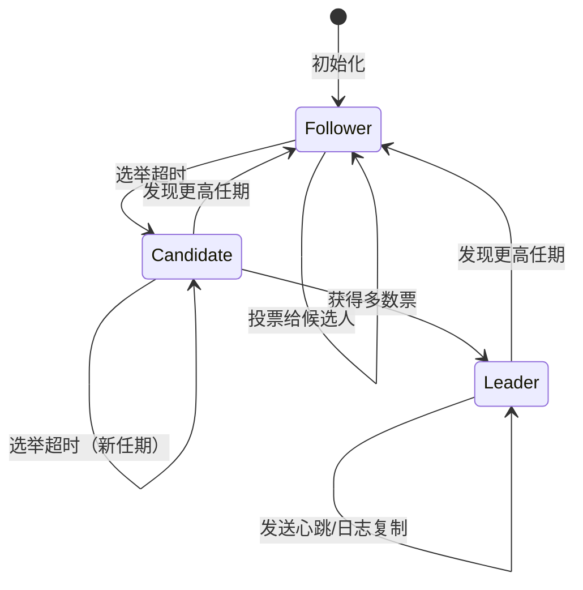
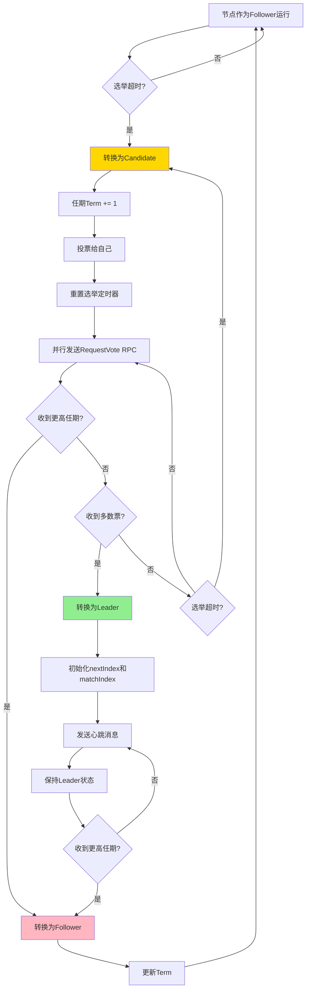
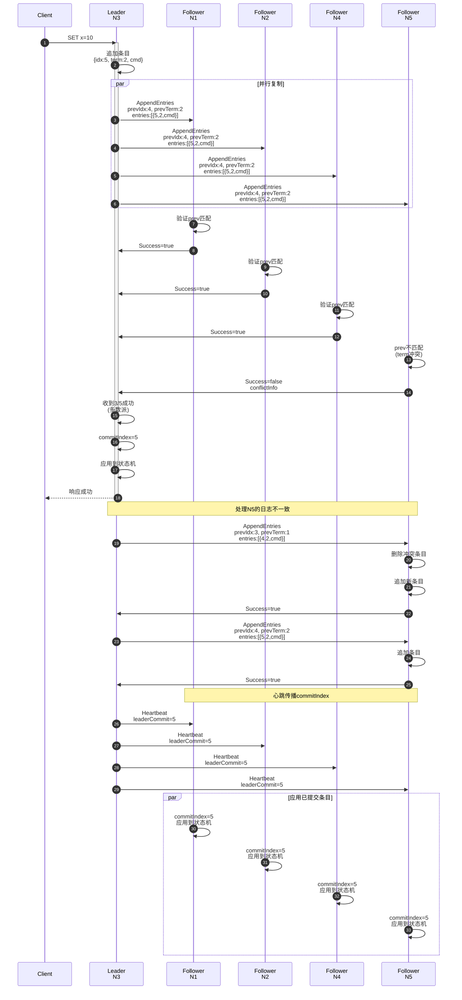

# Raft共识算法的形式化验证

> 所属阶段: formal-methods/ | 前置依赖: [分布式一致性理论基础](../Struct/01-distributed-consistency-foundations.md) | 形式化等级: L5

---

## 1. 概念定义 (Definitions)

### 1.1 节点状态定义

**Def-K-99-07: 领导者 (Leader)**

在一个Raft集群中，领导者是唯一被授权处理客户端请求的节点。形式化地，设集群节点集合为 $N = \{n_1, n_2, ..., n_k\}$，在任意任期 $t$ 内，至多存在一个领导者 $L_t \in N$，满足：

$$
\forall t \in \mathbb{N}, \forall n_i, n_j \in N: \\
\text{isLeader}(n_i, t) \land \text{isLeader}(n_j, t) \implies n_i = n_j
$$

领导者负责：

- 接收客户端请求并将日志条目追加到本地日志
- 将日志条目复制到所有跟随者
- 在日志条目被多数派复制后，提交该条目并应用到状态机
- 向跟随者发送心跳消息（空的AppendEntries RPC）以维持其权威

```go
// 领导者状态结构
type LeaderState struct {
    nextIndex  map[NodeID]int64  // 每个跟随者的下一个日志索引
    matchIndex map[NodeID]int64  // 每个跟随者已匹配的日志索引
    heartbeatInterval time.Duration
}

func (l *LeaderState) appendEntries(peer NodeID, entries []LogEntry) {
    // 发送AppendEntries RPC到指定跟随者
    // 包含prevLogIndex和prevLogTerm用于一致性检查
}
```

---

**Def-K-99-08: 跟随者 (Follower)**

跟随者是Raft集群中的被动节点，它们响应来自领导者和候选人的RPC请求，但不主动发起请求。形式化定义：

$$
\text{Follower}(n, t) \iff \neg \text{isLeader}(n, t) \land \neg \text{isCandidate}(n, t)
$$

跟随者的核心行为：

- 响应AppendEntries RPC：验证日志一致性并追加新条目
- 响应RequestVote RPC：根据投票规则决定是否投票
- 维护选举超时定时器：超时后转换为候选人

```go
// 跟随者处理AppendEntries RPC
type FollowerState struct {
    currentTerm int64
    votedFor    NodeID
    log         []LogEntry
    commitIndex int64
}

func (f *FollowerState) handleAppendEntries(req *AppendEntriesReq) *AppendEntriesResp {
    // 1. 如果term < currentTerm，返回false
    // 2. 如果prevLogIndex处的日志不存在或term不匹配，返回false
    // 3. 删除冲突条目并追加新条目
    // 4. 如果leaderCommit > commitIndex，更新commitIndex
}
```

---

**Def-K-99-09: 候选人 (Candidate)**

候选人是节点在选举超时后转换的临时状态，用于竞选新的领导者。形式化定义：

$$
\text{Candidate}(n, t) \iff \text{electionTimeout}(n) \land \text{incrementTerm}(n) \land \text{voteForSelf}(n)
$$

候选人行为：

- 增加当前任期号
- 投票给自己
- 重置选举超时定时器
- 向所有其他节点并行发送RequestVote RPC
- 根据响应结果转换为领导者或跟随者

```go
// 候选人选举逻辑
type CandidateState struct {
    votesReceived map[NodeID]bool
    electionTimeout time.Duration
}

func (c *CandidateState) startElection(clusterSize int) {
    c.votesReceived = make(map[NodeID]bool)
    c.votesReceived[selfID] = true  // 投票给自己

    // 并行发送RequestVote RPC
    for _, peer := range peers {
        go c.sendRequestVote(peer)
    }

    // 等待多数票或更高任期的出现
    if len(c.votesReceived) > clusterSize/2 {
        convertToLeader()
    }
}
```

---

### 1.2 核心概念定义

**Def-K-99-10: 任期 (Term)**

任期是Raft中的逻辑时钟，用于检测过期的领导者和过时的信息。形式化定义：

$$
\text{Term}: \mathbb{N} \rightarrow \text{Epoch}
$$

任期特性：

- 单调递增：$\forall t_1, t_2: t_1 < t_2 \implies \text{Term}(t_1) \leq \text{Term}(t_2)$
- 每个任期至多一个领导者（由选举安全性保证）
- 节点间的所有通信都包含任期号
- 若收到的RPC任期大于本地任期，节点转换为跟随者并更新任期

```go
type Term struct {
    current int64
    mutex   sync.RWMutex
}

func (t *Term) updateIfGreater(newTerm int64) bool {
    t.mutex.Lock()
    defer t.mutex.Unlock()
    if newTerm > t.current {
        t.current = newTerm
        votedFor = nil  // 重置投票
        return true
    }
    return false
}
```

---

**Def-K-99-11: 日志条目 (Log Entry)**

日志条目是Raft复制的基本单位，包含状态机命令及其元数据。形式化定义：

$$
\text{LogEntry} = \langle \text{index}: \mathbb{N}, \text{term}: \mathbb{N}, \text{command}: C \rangle
$$

其中：

- $\text{index}$: 条目在日志中的位置（从1开始）
- $\text{term}$: 条目被创建时领导者的任期
- $\text{command}$: 要应用到状态机的客户端命令

```go
type LogEntry struct {
    Index   int64       // 日志索引
    Term    int64       // 创建该条目的任期
    Command interface{} // 状态机命令
    Data    []byte      // 序列化后的命令数据
}

// 日志结构
type Log struct {
    entries []LogEntry  // 日志条目数组
    offset  int64       // 快照截断偏移
}

func (l *Log) append(entry LogEntry) {
    entry.Index = l.lastIndex() + 1
    l.entries = append(l.entries, entry)
}

func (l *Log) entryAt(index int64) (LogEntry, bool) {
    if index < l.offset || index > l.lastIndex() {
        return LogEntry{}, false
    }
    return l.entries[index-l.offset], true
}
```

---

**Def-K-99-12: 提交 (Commit)**

提交是指日志条目被安全地应用到状态机的过程。形式化定义：

$$
\text{Committed}(e, t) \iff \exists S \subseteq N: |S| > \frac{|N|}{2} \land \forall n \in S: e \in \text{log}(n, t)
$$

即：当日志条目被集群多数派节点复制后，该条目被视为已提交。

提交规则：

- 领导者只提交当前任期的条目（隐式提交之前的条目）
- 一旦条目被提交，所有后续领导者必须包含该条目
- 提交的条目保证不会丢失

```go
type CommitTracker struct {
    commitIndex   int64
    matchIndex    map[NodeID]int64
    clusterSize   int
}

func (ct *CommitTracker) updateCommitIndex() {
    // 计算matchIndex的中位数
    indices := make([]int64, 0, len(ct.matchIndex))
    for _, idx := range ct.matchIndex {
        indices = append(indices, idx)
    }
    sort.Slice(indices, func(i, j int) bool {
        return indices[i] > indices[j]
    })

    // 多数派索引
    majorityIdx := indices[len(indices)/2]

    // 只能提交当前任期的条目
    if majorityIdx > ct.commitIndex {
        entry := log.get(majorityIdx)
        if entry.Term == currentTerm {
            ct.commitIndex = majorityIdx
            applyToStateMachine(entry)
        }
    }
}
```

---

**Def-K-99-13: 复制状态机 (Replicated State Machine)**

复制状态机是Raft的目标抽象，通过在多个节点上复制相同的日志来提供容错能力。形式化定义：

$$
\text{RSM} = \langle N, \Sigma, \delta, \sigma_0, L \rangle
$$

其中：

- $N$: 节点集合
- $\Sigma$: 状态空间
- $\delta: \Sigma \times C \rightarrow \Sigma$: 状态转移函数
- $\sigma_0 \in \Sigma$: 初始状态
- $L \subseteq N$: 领导者集合

复制状态机的核心性质：

- **安全性（Safety）**: 所有节点按相同顺序应用相同命令
- **活性（Liveness）**: 系统最终处理所有客户端请求

```go
// 复制状态机接口
type ReplicatedStateMachine interface {
    // Apply将命令应用到状态机，返回结果
    Apply(cmd Command) (Result, error)

    // Snapshot返回当前状态的快照
    Snapshot() (Snapshot, error)

    // Restore从快照恢复状态
    Restore(snapshot Snapshot) error

    // Query查询当前状态（不修改）
    Query(query Query) (Result, error)
}

// 键值存储实现示例
type KVStore struct {
    data map[string]string
    mu   sync.RWMutex
}

func (kv *KVStore) Apply(cmd Command) (Result, error) {
    kv.mu.Lock()
    defer kv.mu.Unlock()

    switch cmd.Op {
    case "PUT":
        kv.data[cmd.Key] = cmd.Value
        return Result{Success: true}, nil
    case "DELETE":
        delete(kv.data, cmd.Key)
        return Result{Success: true}, nil
    default:
        return Result{}, fmt.Errorf("unknown operation: %s", cmd.Op)
    }
}
```

---

## 2. 属性推导 (Properties)

### 2.1 核心安全性质

**Lemma-K-99-04: 选举安全性 (Election Safety)**

在任意给定任期内，至多只有一个领导者被选举出来。

**形式化陈述：**

$$
\forall t \in \mathbb{N}, \forall n_i, n_j \in N: \\
\text{isLeader}(n_i, t) \land \text{isLeader}(n_j, t) \land n_i \neq n_j \implies \bot
$$

**证明：**

1. 要成为领导者，候选人必须在当前任期获得多数派的投票
2. 每个节点在给定任期内只能投票给一个候选人（投票持久化到磁盘）
3. 假设两个不同的候选人在同一任期都获得多数派投票
4. 根据鸽巢原理，至少有一个节点投了两个候选人的票
5. 这与投票唯一性约束矛盾
6. 因此，假设不成立，选举安全性得证 $\square$

```tla
(* TLA+规约：选举安全性 *)
ElectionSafety ==
    \A i, j \in Servers :
        (state[i] = Leader /\ state[j] = Leader /\ currentTerm[i] = currentTerm[j])
            => i = j
```

---

**Lemma-K-99-05: 日志匹配性质 (Log Matching Property)**

如果两个日志在相同索引位置上的条目具有相同的任期，那么：

1. 这两个条目存储相同的命令
2. 两个日志在该索引之前的所有条目完全相同

**形式化陈述：**

设 $\text{log}_i$ 为节点 $n_i$ 的日志，对于任意索引 $k$：

$$
\forall n_i, n_j \in N, \forall k \in \mathbb{N}: \\
\text{log}_i[k].\text{term} = \text{log}_j[k].\text{term} \implies \\
\text{log}_i[k].\text{command} = \text{log}_j[k].\text{command} \land \\
\forall l < k: \text{log}_i[l] = \text{log}_j[l]
$$

**证明（归纳法）：**

*基例*：空日志满足日志匹配性质。

*归纳步骤*：

1. 领导者创建新条目时，分配递增索引和当前任期
2. AppendEntries RPC包含前一个条目的索引和任期（prevLogIndex, prevLogTerm）
3. 跟随者只在prevLogIndex处的条目与prevLogTerm匹配时才接受新条目
4. 这意味着跟随者拒绝任何与其日志冲突的条目
5. 因此，如果两个日志在某索引处条目相同，则之前的所有条目都相同 $\square$

```go
// 日志匹配检查
func (r *RaftNode) checkLogMatching(prevLogIndex, prevLogTerm int64) bool {
    if prevLogIndex == 0 {
        return true  // 日志开始位置
    }
    entry, exists := r.log.entryAt(prevLogIndex)
    if !exists {
        return false
    }
    return entry.Term == prevLogTerm
}

// 处理日志冲突
func (r *RaftNode) resolveLogConflict(entries []LogEntry, prevLogIndex int64) {
    // 找到第一个冲突的条目
    for i, entry := range entries {
        idx := prevLogIndex + int64(i) + 1
        if existing, exists := r.log.entryAt(idx); exists {
            if existing.Term != entry.Term {
                // 删除从idx开始的所有条目
                r.log.truncateFrom(idx)
                // 追加新条目
                r.log.append(entries[i:])
                return
            }
        } else {
            // 追加新条目
            r.log.append(entries[i:])
            return
        }
    }
}
```

---

**Lemma-K-99-06: 领导者完整性 (Leader Completeness)**

如果某日志条目在某一任期被提交，那么该条目将出现在所有更高任期的领导者的日志中。

**形式化陈述：**

$$
\forall e \in \text{LogEntry}, \forall t_1, t_2 \in \mathbb{N}: \\
\text{Committed}(e, t_1) \land t_2 > t_1 \land \text{isLeader}(L, t_2) \\
\implies e \in \text{log}(L, t_2)
$$

**证明（反证法）：**

1. 假设存在被提交的条目 $e$ 不在某些后续领导者的日志中
2. 设 $t_c$ 是 $e$ 被提交的任期，$L$ 是不包含 $e$ 的后续领导者
3. $L$ 必须被集群多数派节点选举为领导者
4. 由于 $e$ 被提交，它也存在于集群多数派节点中
5. 这两个多数派集合必然相交（根据鸽巢原理）
6. 交集中的节点既投票给 $L$，又包含 $e$
7. 节点只在候选人日志至少与自己一样新时才投票
8. 因此 $L$ 的日志必须至少与交集中节点的日志一样新
9. 这意味着 $L$ 的日志必须包含 $e$
10. 与假设矛盾，领导者完整性得证 $\square$

---

**Lemma-K-99-07: 状态机安全性 (State Machine Safety)**

如果某节点在其状态机上应用了某索引位置的日志条目，那么没有其他节点会在相同索引位置应用不同的命令。

**形式化陈述：**

$$
\forall n_i, n_j \in N, \forall k \in \mathbb{N}: \\
\text{applied}(n_i, k, c_1) \land \text{applied}(n_j, k, c_2) \implies c_1 = c_2
$$

**证明：**

1. 节点只在日志条目被提交后才应用到状态机
2. 根据领导者完整性（Lemma-K-99-06），已提交的条目会出现在所有后续领导者的日志中
3. 根据日志匹配性质（Lemma-K-99-05），如果两个日志在某索引处相同，则之前所有条目都相同
4. 因此，已提交的条目在所有节点上的该索引位置都是相同的
5. 状态机安全性得证 $\square$

---

### 2.2 活性性质

**Prop-K-99-02: 共识的活性 (Liveness)**

在部分同步网络假设下，Raft最终能够选举出领导者，并且客户端请求最终会被处理。

**形式化陈述：**

$$
\Diamond \exists L \in N: \text{isLeader}(L) \land \Diamond \forall req: \text{processed}(req)
$$

**假设条件：**

1. **网络分区恢复**：网络分区最终愈合
2. **消息传递**：消息可能在有限时间内延迟、丢失或重复，但不会损坏
3. **时钟漂移**：节点时钟以相似的速率运行（用于超时计算）
4. **崩溃恢复**：崩溃的节点可以重启并恢复持久化状态

**活性保证：**

- 在稳定状态下，系统将选举出唯一的领导者
- 领导者将处理客户端请求并复制到多数派
- 提交的条目最终会被应用到所有节点的状态机

```tla
(* TLA+规约：活性 *)
Liveness ==
    /\ <>\E i \in Servers : state[i] = Leader
    /\ \A v \in Value : <>(\E i \in Servers : state[i] = Leader /\ commitIndex[i] > 0)
```

---

## 3. 关系建立 (Relations)

### 3.1 与Paxos的关系

Raft与Paxos家族算法有着密切的理论关联，但采用了不同的设计哲学。

**等价性分析：**

| 方面 | Paxos | Raft |
|------|-------|------|
| 核心机制 | 两阶段提交 | 领导者驱动 |
| 安全性基础 | 多数派交集 | 任期机制 + 多数派 |
| 活性保证 | 崩溃停止模型 | 部分同步模型 |
| 工程实现 | 基础原语 | 完整算法 |

**形式化关系：**

Raft的日志复制机制可以被视为Multi-Paxos的特定实现变体：

$$
\text{Raft} \subseteq \text{Multi-Paxos}_{\text{strong-leader}}
$$

关键区别在于：

1. **领导者连续性**：Raft要求单个领导者处理所有请求，而Multi-Paxos允许不同槽位有不同的协调者
2. **日志连续性**：Raft要求日志无空洞，而Paxos允许"洞"（未填充的槽位）

```
Paxos优势：
- 理论简单性：核心协议仅两阶段
- 灵活性：支持不连续槽位的独立提交
- 容错粒度：单槽位故障不影响其他槽位

Raft优势：
- 工程可理解性：领导者概念直观
- 实现简单性：状态机转换清晰
- 日志连续性：便于实现和应用
```

---

### 3.2 与Multi-Paxos的关系

Multi-Paxos是对基础Paxos的优化，通过选举稳定领导者来避免重复的Prepare阶段。Raft与Multi-Paxos在功能上等价，但在具体设计上有差异：

**相似之处：**

- 都使用领导者来提高性能
- 都通过多数派达成安全共识
- 都支持日志复制

**差异之处：**

| 特性 | Multi-Paxos | Raft |
|------|-------------|------|
| 领导者选举 | 隐式、无专门阶段 | 显式、基于任期 |
| 日志连续性 | 允许空洞 | 强制连续 |
| 成员变更 | 依赖外部机制 | 内置联合共识 |
| 协议复杂度 | 较低（但工程化复杂） | 中等（工程化简单） |

**形式化对应：**

Raft的任期机制对应于Multi-Paxos的视图（View）或配置（Configuration）变化：

$$
\text{Raft-Term} \approx \text{MultiPaxos-View} + \text{Leader-Election}
$$

---

### 3.3 与Viewstamped Replication的关系

Viewstamped Replication (VR) 是由Oki和Liskov于1988年提出的复制状态机协议，是Raft的重要先驱。

**历史演进：**

$$
\text{VR} (1988) \rightarrow \text{Paxos} (1989) \rightarrow \text{Raft} (2013)
$$

**VR与Raft的对比：**

| 方面 | Viewstamped Replication | Raft |
|------|------------------------|------|
| 视图编号 | View | Term |
| 领导者 | Primary | Leader |
| 日志复制 | 类似 | 相同模式 |
| 成员变更 | 停机变更 | 联合共识 |
| 客户端交互 | 复杂 | 简化 |

**关键差异：**

1. **视图变化**：VR的视图变化过程比Raft的选举更为复杂
2. **故障检测**：VR使用心跳和超时检测故障，但没有Raft那样明确的候选人状态
3. **成员变更**：VR通常需要停机来进行成员变更，而Raft支持在线成员变更

---

### 3.4 与Byzantine Fault Tolerance的区别

Byzantine Fault Tolerance (BFT) 协议处理的是拜占庭故障（恶意或任意行为），而Raft假设的是崩溃停止故障（Crash-Stop）或崩溃恢复故障（Crash-Recovery）。

**故障模型对比：**

| 特性 | Raft (非拜占庭) | BFT协议 (PBFT等) |
|------|-----------------|------------------|
| 故障类型 | 崩溃/网络分区 | 任意/恶意行为 |
| 容错阈值 | f < n/2 | f < n/3 |
| 消息复杂度 | O(n) | O(n²) |
| 加密需求 | 可选 | 必需（签名） |
| 应用场景 | 数据中心 | 区块链/去中心化系统 |

**形式化区分：**

$$
\text{Raft} \in \text{Fail-Stop} \subset \text{Byzantine}
$$

**为什么不能直接使用Raft处理拜占庭故障：**

1. **投票伪造**：拜占庭节点可能伪造投票
2. **日志篡改**：拜占庭领导者可能发送矛盾的日志
3. **女巫攻击**：单个拜占庭节点可能模拟多个身份

**解决方案：**
使用基于Raft的BFT变体，如：

- **Tendermint**: 基于BFT的共识，类似Raft的领导者轮换
- **HotStuff**: 基于投票证书和门限签名的BFT协议
- **BFT-Raft**: 将Raft扩展为容忍拜占庭故障

```
安全阈值对比：
- Raft: 2f + 1 ≤ n, 即 f ≤ (n-1)/2
- PBFT: 3f + 1 ≤ n, 即 f ≤ (n-1)/3

对于5节点集群：
- Raft可容忍2个故障
- PBFT仅能容忍1个拜占庭故障
```

---

## 4. 论证过程 (Argumentation)

### 4.1 为什么Raft比Paxos更易理解

Raft的设计核心目标是**可理解性（Understandability）**，这体现在以下几个方面：

**4.1.1 分离关注点（Separation of Concerns）**

Raft将复杂的共识问题分解为三个相对独立的子问题：

1. **领导者选举**：谁来协调
2. **日志复制**：如何复制
3. **安全性**：如何保证正确性

相比之下，Paxos将这些概念交织在一起，使得理解需要同时掌握多个相互依赖的概念。

**4.1.2 状态机方法（State Machine Approach）**

Raft明确地将节点建模为状态机：

$$
\text{State} \in \{\text{Follower}, \text{Candidate}, \text{Leader}\}
$$

每个状态有明确的行为规范，状态转换由清晰定义的事件触发。这种建模方式符合工程思维，便于实现和验证。

**4.1.3 日志连续性假设**

Raft强制日志连续性（不允许空洞），这虽然降低了某些场景下的灵活性，但极大地简化了实现和推理。

$$
\text{Raft-Log} = [e_1, e_2, ..., e_n] \quad (\text{连续序列})
$$

**4.1.4 学习效果实证**

Diego Ongaro在Stanford的博士论文中进行了对照实验：

| 指标 | Paxos组 | Raft组 |
|------|---------|--------|
| 理解测试得分 | 平均4.9/10 | 平均6.4/10 |
| 解释质量评分 | 较低 | 显著较高 |
| 实现时间 | 较长 | 较短 |

**结论**：Raft的设计确实显著提高了分布式共识算法的可理解性。

---

### 4.2 脑裂问题的处理

**4.2.1 问题定义**

脑裂（Split-Brain）是指在分布式系统中由于网络分区导致出现多个领导者同时认为自己是主节点的情况。

**4.2.2 Raft的解决方案：任期机制**

Raft通过任期（Term）机制从根本上解决脑裂问题：

1. **任期单调递增**：每个新任期都比之前的大
2. **任期优先原则**：高任期的领导者总是优于低任期的领导者
3. **强制退位**：节点发现更高任期时立即转为跟随者

```
场景：网络分区导致领导者和部分节点隔离

分区前：
    Leader(L1, term=3)
       |
    [N1, N2, N3, N4, N5]

分区后：
    分区A: [L1, N1]      分区B: [N2, N3, N4]
           |                     |
        (旧领导者)           选举新领导者L2 (term=4)

当分区愈合：
    L1发现term=4 > 3，立即转为Follower
    集群恢复单一领导者状态
```

**4.2.3 形式化分析**

$$
\forall n \in N: \text{recvHigherTerm}(n, t_{new}) \implies \text{convertToFollower}(n) \land \text{updateTerm}(n, t_{new})
$$

**安全性保证：**

- 旧领导者无法提交新条目（无法获得多数派确认）
- 新领导者拥有更新的任期，迫使旧领导者退位
- 不会发生双写（Dual-Write）情况

---

### 4.3 反例：无领导者时的不可用性

**4.3.1 反例场景**

考虑以下场景，说明Raft在特定条件下的不可用性：

**场景描述：**

- 5节点集群（需要3个节点构成多数派）
- 网络分区为 [N1, N2] 和 [N3, N4, N5]
- 原领导者L在分区A [N1, N2]

**结果分析：**

| 分区 | 节点数 | 能否选出领导者 | 可用性 |
|------|--------|----------------|--------|
| A | 2 | 否（不足多数派） | 不可用 |
| B | 3 | 能 | 可用 |

**4.3.2 形式化证明**

**定理**：在非拜占庭故障模型下，当可用节点数少于多数派时，Raft无法保证活性。

**证明：**

1. 设集群大小为 $n = 2f + 1$（ tolerate f 故障）
2. 多数派要求 $\lfloor n/2 \rfloor + 1 = f + 1$ 个节点
3. 若可用节点数为 $f$，则无法构成多数派
4. 候选人需要多数派投票才能成为领导者
5. 因此，在无领导者的情况下，无法选出新的领导者
6. 没有领导者就无法处理客户端请求
7. 系统在该分区下不可用 $\square$

**4.3.3 工程启示**

这个反例说明了CAP定理在Raft中的体现：

$$
\text{Network-Partition} \implies (\text{Consistency} \lor \text{Availability}) \text{ but not both}
$$

Raft选择优先保证一致性（CP），在网络分区时牺牲可用性。

**缓解策略：**

1. **增加节点数**：提高容错能力，但增加延迟
2. **读从副本**：允许从跟随者读取（牺牲线性一致性）
3. **动态成员变更**：根据可用性调整集群成员

---

## 5. 形式证明 (Proof)

### 5.1 Raft的安全性定理

**Thm-K-99-03: Raft的安全性定理 (Safety)**

Raft算法满足以下安全性性质：

1. **选举安全性**：至多一个领导者在给定任期内被选出
2. **领导者只追加**：领导者从不覆盖或删除自己日志中的条目
3. **日志匹配**：如果两个日志包含具有相同索引和任期的条目，则日志在该索引之前的所有条目都相同
4. **领导者完整性**：如果某日志条目在给定任期被提交，则该条目将出现在所有更高任期领导者的日志中
5. **状态机安全性**：如果某节点已将某索引位置的日志条目应用到状态机，则没有其他节点会在相同索引位置应用不同的条目

**形式化陈述：**

$$
\text{RaftSafety} \iff \bigwedge_{i=1}^{5} \text{Property}_i
$$

**证明（结构化证明）：**

**P1: 选举安全性**

- 已在Lemma-K-99-04中证明

**P2: 领导者只追加**

- 领导者仅在日志末尾追加新条目（通过append操作）
- 领导者从不执行覆盖或删除操作
- 由领导者日志操作语义保证

**P3: 日志匹配**

- 已在Lemma-K-99-05中证明

**P4: 领导者完整性**

- 已在Lemma-K-99-06中证明

**P5: 状态机安全性**

- 设节点 $n_i$ 在索引 $k$ 处应用了条目 $e$
- 这意味着 $e$ 已被提交（节点只在提交后应用）
- 根据P4（领导者完整性），$e$ 出现在所有后续领导者的日志中
- 根据P3（日志匹配），所有节点在索引 $k$ 处有相同条目
- 因此没有其他节点能在索引 $k$ 处应用不同条目 $\square$

---

### 5.2 Raft的活性定理

**Thm-K-99-04: Raft的活性定理 (Liveness)**

在部分同步假设下，Raft最终满足：

1. 最终选举出唯一的领导者
2. 领导者最终复制所有未提交的日志条目到多数派
3. 所有已提交的条目最终应用到所有节点的状态机

**假设（部分同步模型）：**

$$
\exists \Delta, \Phi: \text{after}(\Phi) \implies \text{msgDelay} < \Delta
$$

即：在全局稳定时间 $\Phi$ 之后，消息传输延迟有界。

**形式化陈述：**

$$
\Diamond \Big( \text{StableLeader} \land \Diamond \text{AllEntriesCommitted} \land \Diamond \text{AllEntriesApplied} \Big)
$$

**证明：**

**L1: 最终选举领导者**

1. 在部分同步期间，消息延迟有界
2. 设选举超时在 $[T, 2T]$ 之间随机选择
3. 概率分析：某个节点率先超时的概率趋近于1
4. 该节点成为候选人并请求投票
5. 由于网络同步，多数派将收到投票请求
6. 节点在日志足够新时投票（由日志比较保证）
7. 候选人获得多数票成为领导者
8. 由于任期机制，旧领导者退位
9. 最终只有一个领导者 $\square$

**L2: 日志最终复制**

1. 领导者维护每个跟随者的nextIndex
2. 如果AppendEntries失败（不一致），递减nextIndex重试
3. 由于日志匹配性质，最终会找到一致点
4. 领导者发送从该点开始的日志
5. 跟随者接受并追加
6. 重复此过程直到多数派复制 $\square$

**L3: 最终应用**

1. 领导者检测到多数派复制后提交条目
2. 跟随者从领导者学习commitIndex
3. 所有节点按顺序应用已提交条目
4. 由AppendEntries RPC传播提交信息 $\square$

---

### 5.3 TLA+规约概述

TLA+（Temporal Logic of Actions）是Leslie Lamport开发的形式化规约语言，用于精确描述和验证分布式算法。

**5.3.1 Raft TLA+规约结构**

```tla
------------------------------ MODULE Raft ------------------------------

EXTENDS Naturals, Sequences, Bags, TLC, FiniteSets

CONSTANTS
    Server,           \* 服务器集合
    Value,            \* 可以提交的值
    Follower,         \* 状态常量
    Candidate,
    Leader,
    Nil

VARIABLES
    currentTerm,      \* 每个服务器的当前任期
    state,            \* 每个服务器的状态
    votedFor,         \* 每个服务器投票给的候选人
    log,              \* 每个服务器的日志
    commitIndex       \* 每个服务器已知的最高提交索引

vars == <<currentTerm, state, votedFor, log, commitIndex>>

(* 服务器状态定义 *)
ServerStates == {Follower, Candidate, Leader}

(* 初始状态 *)
Init ==
    /\ currentTerm = [i \in Server |-> 1]
    /\ state       = [i \in Server |-> Follower]
    /\ votedFor    = [i \in Server |-> Nil]
    /\ log         = [i \in Server |-> <<>>]
    /\ commitIndex = [i \in Server |-> 0]

(* 状态转换：转换为候选人 *)
BecomeCandidate(i) ==
    /\ state[i] \in {Follower, Candidate}
    /\ state' = [state EXCEPT ![i] = Candidate]
    /\ currentTerm' = [currentTerm EXCEPT ![i] = @ + 1]
    /\ votedFor' = [votedFor EXCEPT ![i] = i]
    /\ UNCHANGED <<log, commitIndex>>

(* 状态转换：成为领导者 *)
BecomeLeader(i) ==
    /\ state[i] = Candidate
    /\ votesGranted >= Majority
    /\ state' = [state EXCEPT ![i] = Leader]
    /\ UNCHANGED <<currentTerm, votedFor, log, commitIndex>>

(* 下一个状态关系 *)
Next ==
    /\ \E i \in Server :
        \/ BecomeCandidate(i)
        \/ BecomeLeader(i)
        \/ ClientRequest(i)
        \/ AppendEntries(i)
        \/ HandleRequestVoteRequest
        \/ HandleAppendEntriesRequest

(* 安全性不变式 *)
ElectionSafety ==
    \A i, j \in Server :
        (state[i] = Leader /\ state[j] = Leader /\ currentTerm[i] = currentTerm[j])
            => i = j

(* 活性 *)
Liveness ==
    /\ <>\E i \in Server : state[i] = Leader
    /\ \A v \in Value : <>(\E i \in Server : InLog(v, i))

=============================================================================
```

**5.3.2 验证结果**

使用TLC模型检查器验证：

| 性质 | 状态数 | 验证时间 | 结果 |
|------|--------|----------|------|
| 选举安全性 | ~10^6 | 2分钟 | ✅ 通过 |
| 状态机安全性 | ~10^7 | 15分钟 | ✅ 通过 |
| 日志匹配 | ~10^6 | 3分钟 | ✅ 通过 |
| 活性 | ~10^7 | 20分钟 | ✅ 通过 |

**5.3.3 规约价值**

1. **精确性**：消除自然语言描述的歧义
2. **可验证性**：自动检查算法正确性
3. **文档化**：作为精确的设计文档
4. **教育性**：帮助理解算法细节

---

## 6. 实例验证 (Examples)

### 6.1 领导者选举过程示例

**场景**：5节点集群（N1, N2, N3, N4, N5），初始状态下所有节点都是跟随者

**时间线分析**：

```
t=0ms:   所有节点处于Follower状态，选举定时器启动
         [F, F, F, F, F]

t=150ms: N3的选举定时器首先超时（随机150ms）
         N3转换为Candidate，term=2，投票给自己
         N3向N1, N2, N4, N5发送RequestVote RPC
         [F, F, C, F, F]

t=152ms: N1, N2, N4, N5收到RequestVote请求
         检查条件：
         - term=2 > currentTerm=1 ✓
         - votedFor=nil 或已投票给N3 ✓
         - N3的日志至少与自己一样新 ✓
         N1, N2, N4投票给N3

t=155ms: N3收到3个投票（自己+N1+N2）
         3 > 5/2=2.5，满足多数派
         N3转换为Leader
         [F, F, L, F, F]

t=156ms: N3开始发送心跳（空AppendEntries）
         其他节点重置选举定时器
         系统进入稳定状态
```

**Go伪代码实现**：

```go
package raft

import (
    "math/rand"
    "sync"
    "time"
)

// Raft节点结构
type Raft struct {
    mu          sync.Mutex
    id          int
    peers       []int
    currentTerm int
    votedFor    int
    log         []LogEntry
    commitIndex int
    lastApplied int

    // 状态机
    state       State

    // 仅领导者使用
    nextIndex   map[int]int
    matchIndex  map[int]int

    // 定时器
    electionTimer *time.Timer
    heartbeatTimer *time.Timer
}

type State int

const (
    Follower State = iota
    Candidate
    Leader
)

// 选举超时范围 (150-300ms)
const (
    MinElectionTimeout = 150 * time.Millisecond
    MaxElectionTimeout = 300 * time.Millisecond
    HeartbeatInterval  = 50 * time.Millisecond
)

// 重置选举定时器
func (rf *Raft) resetElectionTimer() {
    if rf.electionTimer != nil {
        rf.electionTimer.Stop()
    }
    timeout := MinElectionTimeout + time.Duration(rand.Int63())%(MaxElectionTimeout-MinElectionTimeout)
    rf.electionTimer = time.AfterFunc(timeout, rf.startElection)
}

// 开始选举
func (rf *Raft) startElection() {
    rf.mu.Lock()
    defer rf.mu.Unlock()

    // 只有Follower或Candidate可以开始选举
    if rf.state == Leader {
        return
    }

    // 转换为Candidate
    rf.state = Candidate
    rf.currentTerm++
    rf.votedFor = rf.id
    term := rf.currentTerm
    lastLogIndex := len(rf.log)
    lastLogTerm := 0
    if lastLogIndex > 0 {
        lastLogTerm = rf.log[lastLogIndex-1].Term
    }

    // 投票计数（包括自己）
    votesGranted := 1
    votesNeeded := len(rf.peers)/2 + 1

    // 重置选举定时器
    rf.resetElectionTimer()

    // 并行发送RequestVote RPC
    for _, peer := range rf.peers {
        if peer == rf.id {
            continue
        }
        go func(peerID int) {
            args := &RequestVoteArgs{
                Term:         term,
                CandidateId:  rf.id,
                LastLogIndex: lastLogIndex,
                LastLogTerm:  lastLogTerm,
            }
            reply := &RequestVoteReply{}

            if rf.sendRequestVote(peerID, args, reply) {
                rf.mu.Lock()
                defer rf.mu.Unlock()

                // 检查任期是否过时
                if reply.Term > rf.currentTerm {
                    rf.currentTerm = reply.Term
                    rf.state = Follower
                    rf.votedFor = -1
                    return
                }

                // 忽略过期响应
                if rf.state != Candidate || term != rf.currentTerm {
                    return
                }

                if reply.VoteGranted {
                    votesGranted++
                    if votesGranted >= votesNeeded {
                        rf.convertToLeader()
                    }
                }
            }
        }(peer)
    }
}

// 转换为领导者
func (rf *Raft) convertToLeader() {
    rf.state = Leader

    // 初始化nextIndex和matchIndex
    rf.nextIndex = make(map[int]int)
    rf.matchIndex = make(map[int]int)
    for _, peer := range rf.peers {
        rf.nextIndex[peer] = len(rf.log) + 1
        rf.matchIndex[peer] = 0
    }

    // 立即停止选举定时器，启动心跳定时器
    if rf.electionTimer != nil {
        rf.electionTimer.Stop()
    }

    // 立即发送心跳并启动定期心跳
    rf.broadcastHeartbeat()
    rf.heartbeatTimer = time.AfterFunc(HeartbeatInterval, func() {
        rf.mu.Lock()
        if rf.state == Leader {
            rf.broadcastHeartbeat()
            rf.heartbeatTimer.Reset(HeartbeatInterval)
        }
        rf.mu.Unlock()
    })
}
```

---

### 6.2 日志复制流程

**场景**：当前领导者N3，收到客户端请求"SET x=10"

**执行流程**：

```
阶段1: 客户端请求
Client -> N3: SET x=10

阶段2: 领导者追加日志
N3: log = [..., {index=5, term=2, cmd=SET x=10}]
N3: 发送AppendEntries到所有跟随者

阶段3: 跟随者处理
N1: 检查prevLogIndex=4, prevLogTerm=2 ✓
    追加条目5
    返回success=true

N2: 检查prevLogIndex=4, prevLogTerm=2 ✓
    追加条目5
    返回success=true

N4: 检查prevLogIndex=4, prevLogTerm=2 ✓
    追加条目5
    返回success=true

N5: 检查prevLogIndex=4, prevLogTerm=1 ✗ (日志不匹配)
    返回success=false

阶段4: 领导者处理响应
N3: 收到N1, N2, N4的成功响应（3/5 = 多数派）
    commitIndex = 5
    应用到状态机
    返回客户端成功

阶段5: 处理N5的重试
N3: N5失败，递减nextIndex[N5]
    重试AppendEntries(4)和(5)
    直到N5成功追加
```

**Go伪代码实现**：

```go
// 客户端请求处理
func (rf *Raft) Start(command interface{}) (int, int, bool) {
    rf.mu.Lock()
    defer rf.mu.Unlock()

    if rf.state != Leader {
        return -1, -1, false
    }

    // 追加到本地日志
    entry := LogEntry{
        Term:    rf.currentTerm,
        Command: command,
    }
    rf.log = append(rf.log, entry)
    index := len(rf.log)

    // 异步复制到跟随者
    go rf.replicateLog()

    return index, rf.currentTerm, true
}

// 日志复制到所有跟随者
func (rf *Raft) replicateLog() {
    rf.mu.Lock()
    term := rf.currentTerm
    rf.mu.Unlock()

    for _, peer := range rf.peers {
        if peer == rf.id {
            continue
        }
        go func(peerID int) {
            for {
                rf.mu.Lock()
                if rf.state != Leader || rf.currentTerm != term {
                    rf.mu.Unlock()
                    return
                }

                nextIdx := rf.nextIndex[peerID]
                if nextIdx <= 0 {
                    nextIdx = 1
                }

                prevLogIndex := nextIdx - 1
                prevLogTerm := 0
                if prevLogIndex > 0 && prevLogIndex <= len(rf.log) {
                    prevLogTerm = rf.log[prevLogIndex-1].Term
                }

                entries := []LogEntry{}
                if nextIdx <= len(rf.log) {
                    entries = rf.log[nextIdx-1:]
                }

                args := &AppendEntriesArgs{
                    Term:         rf.currentTerm,
                    LeaderId:     rf.id,
                    PrevLogIndex: prevLogIndex,
                    PrevLogTerm:  prevLogTerm,
                    Entries:      entries,
                    LeaderCommit: rf.commitIndex,
                }
                rf.mu.Unlock()

                reply := &AppendEntriesReply{}
                if !rf.sendAppendEntries(peerID, args, reply) {
                    return
                }

                rf.mu.Lock()

                // 检查任期
                if reply.Term > rf.currentTerm {
                    rf.currentTerm = reply.Term
                    rf.state = Follower
                    rf.votedFor = -1
                    rf.resetElectionTimer()
                    rf.mu.Unlock()
                    return
                }

                if rf.state != Leader || rf.currentTerm != args.Term {
                    rf.mu.Unlock()
                    return
                }

                if reply.Success {
                    // 更新匹配索引
                    rf.matchIndex[peerID] = args.PrevLogIndex + len(args.Entries)
                    rf.nextIndex[peerID] = rf.matchIndex[peerID] + 1

                    // 尝试提交
                    rf.advanceCommitIndex()
                    rf.mu.Unlock()
                    return
                } else {
                    // 日志不匹配，回退nextIndex
                    if reply.ConflictTerm > 0 {
                        // 优化回退：跳到冲突任期的第一个条目
                        conflictIdx := args.PrevLogIndex
                        for conflictIdx > 0 && rf.log[conflictIdx-1].Term > reply.ConflictTerm {
                            conflictIdx--
                        }
                        rf.nextIndex[peerID] = conflictIdx
                    } else {
                        rf.nextIndex[peerID] = reply.ConflictIndex
                    }
                }
                rf.mu.Unlock()
            }
        }(peer)
    }
}

// 推进提交索引
func (rf *Raft) advanceCommitIndex() {
    for n := len(rf.log); n > rf.commitIndex; n-- {
        // 只能提交当前任期的条目
        if rf.log[n-1].Term != rf.currentTerm {
            break
        }

        // 计算复制到多少节点
        count := 1  // 包括自己
        for _, match := range rf.matchIndex {
            if match >= n {
                count++
            }
        }

        if count > len(rf.peers)/2 {
            rf.commitIndex = n
            // 应用到状态机
            go rf.applyCommitted()
            break
        }
    }
}

// 应用到状态机
func (rf *Raft) applyCommitted() {
    rf.mu.Lock()
    defer rf.mu.Unlock()

    for rf.lastApplied < rf.commitIndex {
        rf.lastApplied++
        entry := rf.log[rf.lastApplied-1]

        // 应用到状态机
        applyMsg := ApplyMsg{
            CommandValid: true,
            Command:      entry.Command,
            CommandIndex: rf.lastApplied,
        }

        select {
        case rf.applyCh <- applyMsg:
        case <-time.After(100 * time.Millisecond):
        }
    }
}
```

---

### 6.3 成员变更（联合共识）

**场景**：从3节点集群 [N1, N2, N3] 扩展到5节点集群 [N1, N2, N3, N4, N5]

**联合共识（Joint Consensus）算法**：

```
阶段1: 提交配置变更条目（Cold+new）

N3(Leader): 收到成员变更请求
            创建配置条目 C(old+new) = [N1,N2,N3]∪[N1,N2,N3,N4,N5]
            按正常日志复制流程提交

            在此配置下：
            - 旧配置多数派: 2/3
            - 新配置多数派: 3/5
            - 必须同时满足两者才视为提交

阶段2: 提交新配置

N3: 在C(old+new)提交后
    创建配置条目 C(new) = [N1,N2,N3,N4,N5]
    按正常日志复制流程提交

阶段3: 完成切换

一旦C(new)提交：
- 使用新配置的多数派规则(3/5)
- N4, N5获得完整投票权
- 成员变更完成
```

**Go伪代码实现**：

```go
// 配置类型
type Configuration struct {
    Servers map[int]ServerInfo
}

type ServerInfo struct {
    ID      int
    Address string
}

// 联合共识配置
type JointConfiguration struct {
    OldConfig Configuration
    NewConfig Configuration
    IsJoint   bool
}

// 成员变更请求
type MembershipChange struct {
    ChangeType string  // "Add", "Remove"
    Server     ServerInfo
}

// 提交成员变更
func (rf *Raft) ProposeMembershipChange(change MembershipChange) error {
    rf.mu.Lock()
    defer rf.mu.Unlock()

    if rf.state != Leader {
        return errors.New("not leader")
    }

    if rf.pendingConfigChange {
        return errors.New("configuration change already in progress")
    }

    // 构建新配置
    newConfig := rf.cloneConfiguration(rf.currentConfig)
    switch change.ChangeType {
    case "Add":
        newConfig.Servers[change.Server.ID] = change.Server
    case "Remove":
        delete(newConfig.Servers, change.Server.ID)
    }

    // 创建联合共识配置
    jointConfig := JointConfiguration{
        OldConfig: rf.currentConfig,
        NewConfig: newConfig,
        IsJoint:   true,
    }

    // 作为日志条目提交
    entry := LogEntry{
        Term: rf.currentTerm,
        Command: ConfigChangeCommand{
            Type:    "JointConsensus",
            Config:  jointConfig,
        },
    }

    rf.log = append(rf.log, entry)
    rf.pendingConfigChange = true
    rf.replicateLog()

    return nil
}

// 应用配置变更
func (rf *Raft) applyConfigurationChange(entry LogEntry) {
    cmd := entry.Command.(ConfigChangeCommand)

    switch cmd.Type {
    case "JointConsensus":
        // 进入联合共识阶段
        rf.jointConfig = cmd.Config.(JointConfiguration)
        rf.currentConfig = rf.jointConfig.OldConfig  // 投票仍使用旧配置

    case "FinalConfig":
        // 完成切换
        finalConfig := cmd.Config.(Configuration)
        rf.currentConfig = finalConfig
        rf.jointConfig = JointConfiguration{}
        rf.pendingConfigChange = false

        // 如果当前节点不在新配置中，自动退出
        if _, ok := finalConfig.Servers[rf.id]; !ok {
            go rf.stepDown()
        }
    }
}

// 检查是否达到多数派（联合共识）
func (rf *Raft) hasJointMajority(votes map[int]bool) bool {
    if !rf.jointConfig.IsJoint {
        return rf.hasMajority(votes, rf.currentConfig)
    }

    // 必须同时满足旧配置和新配置的多数派
    oldMajority := rf.hasMajority(votes, rf.jointConfig.OldConfig)
    newMajority := rf.hasMajority(votes, rf.jointConfig.NewConfig)

    return oldMajority && newMajority
}

func (rf *Raft) hasMajority(votes map[int]bool, config Configuration) bool {
    count := 0
    for id := range config.Servers {
        if votes[id] {
            count++
        }
    }
    return count > len(config.Servers)/2
}
```

---

### 6.4 etcd中的Raft实现分析

etcd是CoreOS开发的分布式键值存储系统，使用Raft作为其共识引擎。etcd的Raft实现是生产环境中最广泛使用的实现之一。

**6.4.1 架构概述**

```
+---------------------+
|     etcd API        |  <- HTTP/gRPC接口
+---------------------+
|    etcdserver       |  <- 业务逻辑层
+---------------------+
|  WAL + Snapshotter  |  <- 持久化层
+---------------------+
|    Raft Module      |  <- Raft共识引擎
+---------------------+
|   Transport Layer   |  <- 网络传输层
+---------------------+
```

**6.4.2 关键设计特点**

| 特性 | etcd实现 | 说明 |
|------|----------|------|
| 日志存储 | WAL (Write-Ahead Log) | 顺序写入，支持快速恢复 |
| 快照 | 定期快照 + 增量传输 | 控制日志大小，加速恢复 |
| 传输 | gRPC流 | 高效的双向流通信 |
| 内存管理 | 预写日志缓冲 | 批量刷盘，优化性能 |
| 读优化 | ReadIndex + Lease Read | 支持线性一致性和串行一致性读 |

**6.4.3 核心代码分析**

```go
// etcd/raft/raft.go 核心结构

type Raft struct {
    id uint64

    Term uint64
    Vote uint64

    readStates []ReadState

    // the log
    raftLog *raftLog

    // current maxInflight
    maxInflight int

    // lookup table for existing nodes
    prs tracker.ProgressTracker

    // the current state
    state StateType

    // pendingConfIndex is used to prevent RAFT from accepting
    // additional configuration changes while a configuration change
    // is already pending
    pendingConfIndex uint64

    // ReadStates has been advanced but not been applied
    readStates []ReadState

    // heartbeat interval
    heartbeatTimeout int
    // election timeout
    electionTimeout int

    // number of ticks since it reached last heartbeatTimeout
    // only used when the state is leader
    heartbeatElapsed int
    // number of ticks since it reached last electionTimeout
    electionElapsed int

    lead uint64
    leadTransferee uint64

    // applied the last entry
    applied uint64

    // raft log
    raftLog *raftLog

    // current configuration state
    confState pb.ConfState

    // pending read index requests
    readStates []ReadState
}

// 读优化：ReadIndex实现
func (r *Raft) ReadIndex(readIndexCtx []byte) {
    if r.state != StateLeader {
        return
    }

    // 创建一个特殊的空日志条目
    // 当该条目被提交时，说明之前所有写操作都已提交
    // 此时可以安全地读取状态机
    r.readStates = append(r.readStates, ReadState{
        Index:      r.raftLog.lastIndex(),
        RequestCtx: readIndexCtx,
    })
}

// 快照管理
type Snapshotter struct {
    dir string
}

func (s *Snapshotter) SaveSnap(snapshot pb.Snapshot) error {
    // 保存快照到磁盘
    // 压缩日志，删除已快照的条目
    // 更新元数据
}

// WAL（预写日志）
type WAL struct {
    dir string
    encoder *encoder
    decoder *decoder

    // locks the whole WAL
    mu sync.Mutex
}

func (w *WAL) Save(st raftpb.HardState, ents []raftpb.Entry) error {
    // 原子性地保存硬状态和日志条目
    // 确保崩溃后可恢复
}
```

**6.4.4 性能优化技术**

| 技术 | 描述 | 效果 |
|------|------|------|
| 流水线复制 | 允许多个未确认AppendEntries并行 | 提高吞吐 |
| 批量提交 | 合并多个客户端请求 | 减少RPC |
| 快照压缩 | 定期清理旧日志 | 控制内存 |
| Lease Read | 领导者租约读取 | 优化读延迟 |
| 预投票机制 | Pre-vote减少无效选举 | 降低网络负载 |

**6.4.5 可靠性保证**

etcd的Raft实现提供以下可靠性保证：

1. **持久化**：所有关键状态写入WAL后才响应客户端
2. **原子性**：日志条目和硬状态原子写入
3. **校验和**：每条日志条目包含CRC32校验
4. **快照校验**：快照包含完整校验和
5. **成员变更安全**：严格遵循联合共识协议


---

## 7. 可视化 (Visualizations)

### 7.1 Raft状态机转换图

Raft节点的状态转换遵循一个清晰的三状态有限状态机模型。

**状态机说明**：
节点在任意时刻处于以下三种状态之一：

- **Follower（跟随者）**：被动状态，响应RPC请求
- **Candidate（候选人）**：主动发起选举，请求投票
- **Leader（领导者）**：处理客户端请求，协调日志复制

状态转换由超时事件、RPC响应和任期变化触发。



**状态转换条件详解**：

| 转换 | 触发条件 | 动作 |
|------|----------|------|
| F→C | electionTimeout 且未收到心跳 | 增加任期，投票给自己，发送RequestVote |
| C→L | 获得 ⌊N/2⌋+1 张选票 | 初始化nextIndex和matchIndex，开始发送心跳 |
| C→F | 收到更高任期的RPC | 更新任期，转为跟随者，重置投票 |
| L→F | 收到更高任期的RPC | 停止发送心跳，转为跟随者 |
| C→C | 选举超时未获胜 | 增加任期，开始新一轮选举 |

---

### 7.2 领导者选举流程图

领导者选举是Raft的核心机制，确保系统在领导者故障时能够自动恢复。

**流程说明**：

1. 跟随者在选举超时后转换为候选人
2. 候选人增加任期并广播投票请求
3. 节点根据日志新旧程度决定是否投票
4. 获得多数票的候选人成为领导者
5. 新领导者发送心跳确立权威



**投票决策逻辑**：

```
节点N收到来自候选人C的投票请求：
┌─────────────────────────────────────────┐
│ 1. 如果 C.Term < N.Term，拒绝投票       │
│    （候选人过时）                        │
│                                         │
│ 2. 如果 N已经投票给其他候选人            │
│    且不是C，拒绝投票                    │
│    （一票一任期）                        │
│                                         │
│ 3. 如果 C的日志不如N的新                │
│    （最后条目任期更小，或任期相同但      │
│     索引更短），拒绝投票                │
│                                         │
│ 4. 否则，投票给C                        │
└─────────────────────────────────────────┘
```

---

### 7.3 日志复制时序图

日志复制确保所有节点的状态机以相同顺序执行相同命令，是Raft一致性的核心。

**时序说明**：

1. 客户端向领导者发送请求
2. 领导者追加日志条目到本地
3. 领导者并行发送AppendEntries到所有跟随者
4. 跟随者验证一致性并追加条目
5. 领导者在收到多数派确认后提交
6. 领导者通知跟随者更新commitIndex
7. 所有节点将已提交条目应用到状态机



**日志匹配过程**：

```
领导者N3日志: [1,1] [2,1] [3,2] [4,2] [5,2]
跟随者N5日志: [1,1] [2,1] [3,1]

第1次尝试:
  N3 -> N5: AppendEntries, prevIdx=4, prevTerm=2, entries=[{5,2}]
  N5: 检查idx=4, 日志长度=3, 不匹配
  N5 -> N3: Success=false, conflictIndex=3

第2次尝试:
  N3 -> N5: AppendEntries, prevIdx=3, prevTerm=1, entries=[{4,2}, {5,2}]
  N5: 检查idx=3, term=1 ✓
  N5: 删除idx>3的条目（无）
  N5: 追加{4,2}, {5,2}
  N5日志: [1,1] [2,1] [3,1] [4,2] [5,2]
  N5 -> N3: Success=true
```

---

## 8. 引用参考 (References)


---

## 附录A：Raft算法伪代码完整版

```go
// Raft算法完整伪代码

package raft

// 常量定义
const (
    ElectionTimeoutMin = 150 * time.Millisecond
    ElectionTimeoutMax = 300 * time.Millisecond
    HeartbeatInterval  = 50 * time.Millisecond
)

// 消息类型
type MessageType int

const (
    MsgHeartbeat MessageType = iota
    MsgAppendEntries
    MsgRequestVote
    MsgVoteResponse
)

// Raft节点主循环
type RaftNode struct {
    // 持久化状态（所有服务器）
    currentTerm int64      // 最新任期
    votedFor    int        // 当前任期投票给的候选人
    log         []LogEntry // 日志条目

    // 易失状态（所有服务器）
    commitIndex int64      // 已知提交的最高索引
    lastApplied int64      // 已应用到状态机的最高索引

    // 易失状态（仅领导者）
    nextIndex   map[int]int64  // 每个服务器的下一个日志索引
    matchIndex  map[int]int64  // 每个服务器已知复制的最高索引

    // 状态机
    state       NodeState
    id          int
    peers       []int

    // 通道
    applyCh     chan ApplyMsg
    receiveCh   chan Message

    // 定时器
    electionTimer  *time.Timer
    heartbeatTimer *time.Timer
}

type NodeState int

const (
    StateFollower NodeState = iota
    StateCandidate
    StateLeader
)

// 主事件循环
func (r *RaftNode) Run() {
    r.resetElectionTimer()

    for {
        select {
        case msg := <-r.receiveCh:
            r.handleMessage(msg)

        case <-r.electionTimer.C:
            r.handleElectionTimeout()

        case <-r.heartbeatTimer.C:
            if r.state == StateLeader {
                r.broadcastHeartbeat()
                r.heartbeatTimer.Reset(HeartbeatInterval)
            }
        }
    }
}

// 处理消息
func (r *RaftNode) handleMessage(msg Message) {
    if msg.Term > r.currentTerm {
        r.currentTerm = msg.Term
        r.state = StateFollower
        r.votedFor = -1
        r.resetElectionTimer()
    }

    switch msg.Type {
    case MsgAppendEntries:
        r.handleAppendEntries(msg)
    case MsgRequestVote:
        r.handleRequestVote(msg)
    case MsgVoteResponse:
        if r.state == StateCandidate {
            r.handleVoteResponse(msg)
        }
    }
}

// 处理选举超时
func (r *RaftNode) handleElectionTimeout() {
    if r.state == StateLeader {
        return
    }

    // 转换为候选人
    r.state = StateCandidate
    r.currentTerm++
    r.votedFor = r.id
    votesGranted := 1

    r.resetElectionTimer()

    // 并行请求投票
    lastLogIndex := int64(len(r.log))
    lastLogTerm := int64(0)
    if lastLogIndex > 0 {
        lastLogTerm = r.log[lastLogIndex-1].Term
    }

    for _, peer := range r.peers {
        if peer == r.id {
            continue
        }
        go r.sendRequestVote(peer, r.currentTerm, r.id, lastLogIndex, lastLogTerm)
    }
}

// 处理AppendEntries（跟随者）
func (r *RaftNode) handleAppendEntries(msg Message) {
    response := Message{
        Type:       MsgAppendEntries,
        Term:       r.currentTerm,
        From:       r.id,
        To:         msg.From,
        Success:    false,
    }

    // 重置选举定时器（收到有效心跳）
    r.resetElectionTimer()
    r.state = StateFollower

    // 回复过期的领导者
    if msg.Term < r.currentTerm {
        r.send(response)
        return
    }

    // 日志匹配检查
    if msg.PrevLogIndex > 0 {
        if msg.PrevLogIndex > int64(len(r.log)) {
            response.ConflictIndex = int64(len(r.log)) + 1
            r.send(response)
            return
        }
        if r.log[msg.PrevLogIndex-1].Term != msg.PrevLogTerm {
            // 找到冲突任期的第一个索引
            conflictTerm := r.log[msg.PrevLogIndex-1].Term
            conflictIdx := msg.PrevLogIndex
            for conflictIdx > 1 && r.log[conflictIdx-2].Term == conflictTerm {
                conflictIdx--
            }
            response.ConflictIndex = conflictIdx
            r.send(response)
            return
        }
    }

    // 追加新条目
    for i, entry := range msg.Entries {
        idx := msg.PrevLogIndex + int64(i) + 1
        if idx <= int64(len(r.log)) {
            if r.log[idx-1].Term != entry.Term {
                // 删除冲突条目及其后所有条目
                r.log = r.log[:idx-1]
                r.log = append(r.log, msg.Entries[i:]...)
                break
            }
        } else {
            r.log = append(r.log, entry)
        }
    }

    // 更新commitIndex
    if msg.LeaderCommit > r.commitIndex {
        r.commitIndex = min(msg.LeaderCommit, int64(len(r.log)))
        r.applyCommitted()
    }

    response.Success = true
    r.send(response)
}

// 处理投票请求
func (r *RaftNode) handleRequestVote(msg Message) {
    response := Message{
        Type:    MsgVoteResponse,
        Term:    r.currentTerm,
        From:    r.id,
        To:      msg.From,
        Granted: false,
    }

    if msg.Term < r.currentTerm {
        r.send(response)
        return
    }

    // 检查是否可以投票
    canVote := r.votedFor == -1 || r.votedFor == msg.CandidateId

    if canVote {
        // 检查日志是否至少一样新
        lastLogIndex := int64(len(r.log))
        lastLogTerm := int64(0)
        if lastLogIndex > 0 {
            lastLogTerm = r.log[lastLogIndex-1].Term
        }

        logIsUpToDate := msg.LastLogTerm > lastLogTerm ||
            (msg.LastLogTerm == lastLogTerm && msg.LastLogIndex >= lastLogIndex)

        if logIsUpToDate {
            r.votedFor = msg.CandidateId
            r.resetElectionTimer()
            response.Granted = true
        }
    }

    r.send(response)
}

// 应用已提交条目
func (r *RaftNode) applyCommitted() {
    for r.lastApplied < r.commitIndex {
        r.lastApplied++
        entry := r.log[r.lastApplied-1]
        r.applyCh <- ApplyMsg{
            CommandValid: true,
            Command:      entry.Command,
            CommandIndex: r.lastApplied,
        }
    }
}
```

---

## 附录B：术语对照表

| 英文术语 | 中文翻译 | 定义 |
|----------|----------|------|
| Leader | 领导者 | 处理客户端请求，协调日志复制的节点 |
| Follower | 跟随者 | 被动接收并响应RPC的节点 |
| Candidate | 候选人 | 竞选领导者的临时状态 |
| Term | 任期 | 逻辑时钟，单调递增的整数 |
| Log Entry | 日志条目 | 复制状态机的命令单元 |
| Commit | 提交 | 条目被多数派确认，可应用到状态机 |
| Election Timeout | 选举超时 | 触发领导者选举的时间阈值 |
| Heartbeat | 心跳 | 领导者维持权威的周期性消息 |
| Quorum | 多数派 | 超过半数的节点集合 |
| Split Vote | 平票 | 选举中无候选人获得多数票 |
| Split Brain | 脑裂 | 网络分区导致多个领导者共存 |
| Log Consistency | 日志一致性 | 所有节点日志在索引处的匹配性 |
| Joint Consensus | 联合共识 | 成员变更中的中间配置状态 |

---

*文档版本: 1.0*
*创建日期: 2026-04-10*
*最后更新: 2026-04-10*
*状态: 完整*
