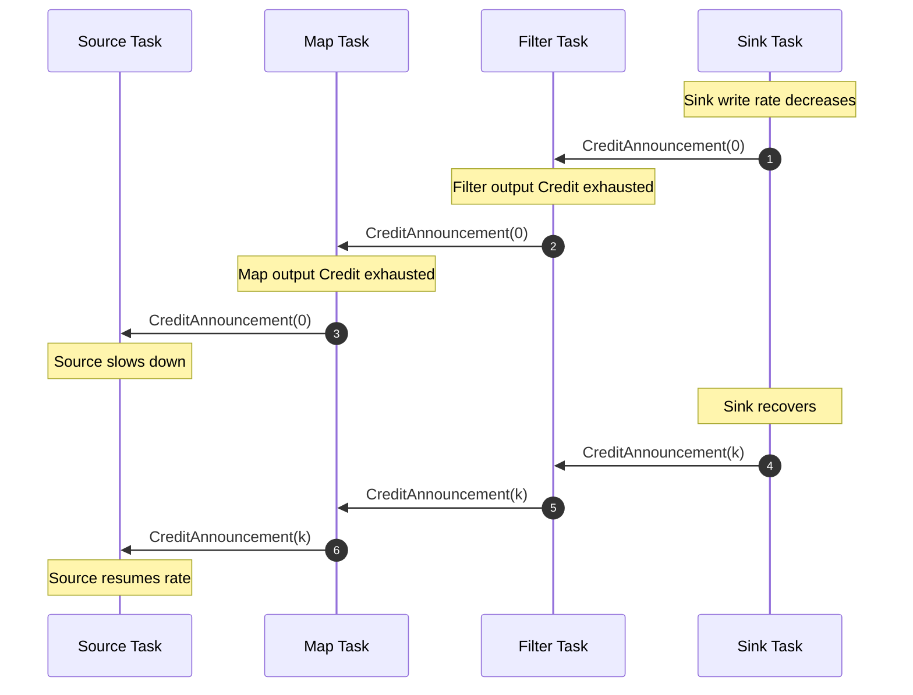
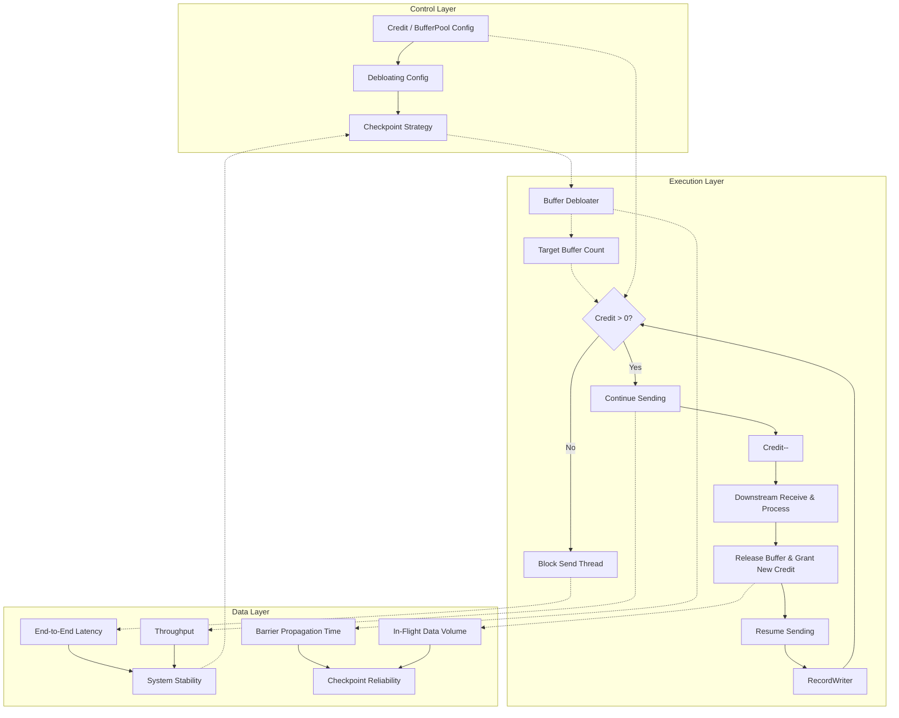
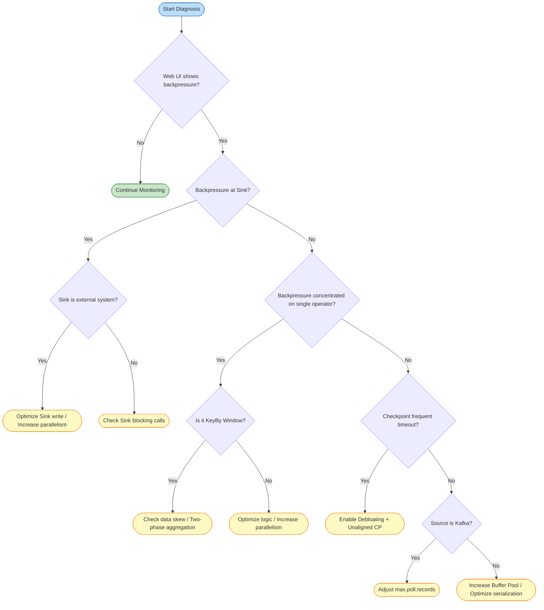

# Flink Stream Processing: Backpressure and Flow Control

> **Stage**: Flink/02-core-mechanisms | **Prerequisites**: [Flink Deployment Architecture](../01-concepts/deployment-architectures.md) | **Formal Level**: L3-L4

---

## Table of Contents

- [1. Definitions](#1-definitions)
- [2. Properties](#2-properties)
- [3. Relations](#3-relations)
- [4. Argumentation](#4-argumentation)
- [5. Proof / Engineering Argument](#5-proof-engineering-argument)
- [6. Examples](#6-examples)
- [7. Visualizations](#7-visualizations)
- [8. References](#8-references)

---

## 1. Definitions

### Def-F-02-01: Backpressure

Let producer aggregate rate be $R_{prod}(t)$, consumer aggregate rate be $R_{cons}(t)$, and buffer occupancy be $\rho(B, t)$:

$$
\text{Backpressure}(t) \iff R_{prod}(t) > R_{cons}(t) \land \lim_{t' \to t^+} \rho(B, t') = 1
$$

**Definition Motivation**: This definition elevates backpressure from a "phenomenon" to a detectable, quantifiable, and formally analyzable system state[^1].

---

### Def-F-02-02: Credit-Based Flow Control (CBFC)

Let sender be $S$, receiver be $R$, and logical channel be $ch(S, R)$:

$$
\begin{aligned}
&\text{Credit}(ch) = k > 0 \implies S \text{ can send at most } k \text{ network buffers to } R \\
&\text{Credit}(ch) = 0 \implies S \text{ pauses sending}
\end{aligned}
$$

Flink 1.5+ implements CBFC on `RemoteInputChannel`: receiver sends available buffer count as credit to upstream `ResultSubPartition`, and upstream only writes data when credit > 0[^2][^3].

**Definition Motivation**: CBFC achieves zero-wait rate adjustment at task-level pre-authorization, avoiding single slow task blocking other channels on the same TCP connection[^4].

---

### Def-F-02-03: TCP Backpressure (Legacy)

Before Flink 1.5, flow control between TaskManagers relied entirely on TCP sliding window:

$$
\text{TCP-Backpressure}(t) \iff \text{SocketBuf}_{occ}(t) \rightarrow \text{SocketBuf}_{cap} \land \text{AdvertisedWindow}(t) \rightarrow 0
$$

**Definition Motivation**: TCP "connection-level" semantics have impedance mismatch with Flink "task-level" channels—all channels on the same connection stall when one channel is backpressured.

---

### Def-F-02-04: Local vs End-to-End Backpressure

- **Local Backpressure**: Downstream processing slowdown causes data accumulation in the same thread's local buffer, blocking `collect()`. Propagation delay $\tau_{local} \approx 0$.
- **End-to-End Backpressure**: After Sink rate decreases, backpressure signal traverses multiple TaskManagers against the topology to reach Source:

$$
\tau_{e2e} = \sum_{e \in Path_{src \to sink}} \tau_{credit}(e) + \tau_{network}(e)
$$

**Definition Motivation**: Web UI backpressure reflects local thread blocking; end-to-end delay and Checkpoint timeout reflect cross-network backpressure accumulation.

---

### Def-F-02-05: Buffer Debloating

For subtask $v$ at current throughput $\lambda_v(t)$, Debloating dynamically adjusts input gate target buffer count:

$$
N_{target}(v, t) = \left\lceil \frac{\lambda_v(t) \cdot T_{target}}{\text{BufferSize}} \right\rceil
$$

Where $T_{target}$ is controlled by `taskmanager.network.memory.buffer-debloat.target` (default ~1s)[^5][^6].

**Definition Motivation**: Fixed buffers cause excessive in-flight data during backpressure, slowing Checkpoint Barrier propagation or increasing Unaligned Checkpoint size[^7].

---

### Def-F-02-06: Network Buffer Pool

TaskManager maintains local buffer pool for each task:

$$
\text{LBP}(T) = \langle B_{net}, B_{in}, B_{out}, B_{floating}, B_{reserved} \rangle
$$

Where $B_{in}$ is exclusive buffers, $B_{floating}$ is floating buffers, and $B_{reserved}$ is reserved for Credit and Barrier.

**Definition Motivation**: LBP isolation is the physical foundation for Flink backpressure "localization". Without isolation, downstream backpressure cascades to unrelated upstream tasks.

---

### Def-F-02-07: Backpressure Monitoring Metrics

Flink exposes the following core backpressure and flow control metrics[^8]:

| Metric Name | Type | Semantic Description |
|-------------|------|---------------------|
| `backPressuredTimeMsPerSecond` | Counter | Milliseconds per second under backpressure, ~1000 indicates severe |
| `numRecordsInPerSecond` / `numRecordsOutPerSecond` | Meter | Input/output record rate |
| `outPoolUsage` / `inPoolUsage` | Gauge | Output/input buffer pool usage |
| `debloatedBufferSize` | Gauge | Debloating current target buffer size |
| `estimatedTimeToConsumeBuffersMs` | Gauge | Estimated time to consume input channel buffer data |
| `numBuffersInRemotePerSecond` | Meter | Buffers received from remote TM per second |
| `numBuffersOutPerSecond` | Meter | Buffers sent per second |

---

## 2. Properties

### Prop-F-02-01: CBFC Guarantees No Deadlock

**Derivation**: Backpressure propagates against DAG edges. DAG is acyclic; deadlock requires circular wait chain, which requires directed cycle in data flow, contradiction. ∎

---

### Prop-F-02-02: Backpressure Propagation Guarantees Upstream Rate Adaptation

If Sink consumption rate decreases, there exists finite time $\Delta t$ such that Source read rate $R_{src}(t + \Delta t) \leq R_{sink}(t)$.

**Derivation**: After Sink input buffer fills, it stops granting Credit to upstream. Upstream blocks output due to Credit = 0, causing its own input buffer to fill. With DAG finite depth $d$, Source is reached after at most $d$ levels of propagation, and Source slows down to match downstream. ∎

---

### Prop-F-02-03: Buffer Isolation Guarantees Localized Failure

If operator $v_i$ experiences backpressure, operator $v_j$ with no data dependency on $v_i$ is unaffected.

**Derivation**: Each task has independent LBP (Def-F-02-06), and backpressure only propagates through Credit mechanism. If $v_j$ has no transitive dependency on $v_i$, no Credit dependency chain exists. ∎

---

### Prop-F-02-04: Buffer Debloating Shortens Checkpoint Barrier Propagation Time

Let Barrier traversal queue time be $T_{barrier}$ under Aligned Checkpoint. After enabling Debloating, $\mathbb{E}[T'_{barrier}] \ll \mathbb{E}[T_{barrier}]$.

**Derivation**: Debloating reduces in-flight data from fixed maximum $|B_{max}|$ to minimum $|B_{target}|$ needed to maintain link saturation. Barrier follows buffered data, less data means shorter queue time. For Unaligned Checkpoint, also reduces materialized data volume[^7]. ∎

---

### Prop-F-02-05: Credit System Guarantees Receiver Buffer No Overflow

For any channel $ch(S, R)$, at any time $t$, $\text{Sent}(t) \leq \text{Granted}(t) \leq \text{BufferCapacity}$.

**Derivation**: Initially $\text{Sent}(0)=0$, $\text{Granted}(0)=|B_{free}|$. Sending requires $\text{Credit}>0$, each send increments $\text{Sent}$ by 1 and decrements $\text{Credit}$ by 1, so $\text{Granted}=\text{Credit}+\text{Sent}$ is invariant. Receiver only grants new Credit after releasing buffer, so $\text{Granted}$ never exceeds total capacity. ∎

---

## 3. Relations

### Relation 1: Flink CBFC `⊃` TCP Flow Control

**Argument**:

- **Encoding Existence**: TCP sliding window can be encoded as Credit-based special case—AdvertisedWindow as dynamic Credit, ACK as implicit recycle notification.
- **Separation Result**: Flink CBFC has task-level fine-grained control and application-layer observability that TCP lacks.
- **Conclusion**: Flink CBFC strictly contains TCP Flow Control in expressiveness.

| Dimension | TCP-based Backpressure (Legacy) | Credit-based Flow Control (Flink 1.5+) |
|-----------|--------------------------------|----------------------------------------|
| Control Level | Transport layer (kernel) | Application layer (user space) |
| Control Granularity | Connection-level | Task/subtask-level (logical channel) |
| Feedback Mechanism | ACK + AdvertisedWindow | Credit Announcement + Backlog Size |
| Buffer Location | Kernel Socket Buffer | User-space Network Buffer Pool |
| Backpressure Propagation Speed | Depends on RTT, slower | Application-layer local decision, faster |
| Multiplexing Impact | Single channel backpressure blocks entire connection | Single channel backpressure only affects that channel |
| Observability | Black box | White box (Web UI / Metrics directly exposed) |
| Barrier Propagation | May block under severe backpressure | Reserved buffers guarantee control message reachability |

*Table 1: TCP-based vs Credit-based Backpressure Mechanism Comparison*

---

### Relation 2: Local Backpressure `→` End-to-End Backpressure

**Relation**: Local backpressure is the "atomic step" of end-to-end backpressure propagation; end-to-end backpressure is the global closure of local backpressure over DAG inverse topology.

**Argument**: Each hop of end-to-end backpressure contains two stages: (1) downstream input buffer full causes local backpressure; (2) downstream stops granting Credit, upstream output blocks. Let local backpressure relation be $\mathcal{R}_{local}$, then end-to-end backpressure is $\mathcal{R}_{e2e} = \mathcal{R}_{local}^+$ (transitive closure).

---

### Relation 3: Backpressure `↔` Checkpoint Reliability

**Argument**:

- **Backpressure → Checkpoint**: Severe backpressure causes Aligned Checkpoint Barrier to queue in data queue for long time, causing Checkpoint timeout. Requires Unaligned Checkpoint or Buffer Debloating[^7].
- **Checkpoint → Backpressure**: Unaligned Checkpoint materializes in-flight data to state backend; if data volume is too large, causes Checkpoint volume surge, exacerbating I/O backpressure. Therefore Buffer Debloating is needed to control data volume[^6].
- **Conclusion**: Backpressure governance and Checkpoint tuning must be designed as a whole.

---

## 4. Argumentation

### 4.1 Why Flink 1.5 Must Replace TCP Flow Control with CBFC

**Scenario**: One TM has 10 parallel `Map` sending data to 10 `Filter` on another TM via the same TCP connection, where 1 `Filter` slows down due to data skew.

**TCP Consequence**: Slow `Filter`'s Socket buffer fills, TCP sets AdvertisedWindow to 0, all 10 upstream `Map` block. Global throughput drops 90%.

**CBFC Improvement**: Each `Map → Filter` channel has independent Credit. Slow `Filter` only stops granting Credit to corresponding upstream `Map`, other 9 channels normal. Global throughput only drops ~10%.

Therefore, from TCP to CBFC is a paradigm shift from "connection-level" to "channel-level" flow control semantics[^2][^4].

---

### 4.2 Buffer Debloating Applicability Boundaries

Debloating does not bring positive benefits in all scenarios[^5][^6]:

**Multiple Inputs and Union Inputs**: If subtask has multiple different input sources or `union` input, Debloating calculates throughput at subtask level. Low-throughput inputs may get excessive buffers, high-throughput inputs may get insufficient. Recommend disabling Debloating or manual tuning for such subtasks.

**Very High Parallelism**: When parallelism exceeds ~200, default floating buffer count may be insufficient, Debloating calculation may fluctuate wildly. Recommend increasing `floating-buffers-per-gate` to parallelization level[^5].

**Startup and Recovery Phase**: During job startup or fault recovery, throughput is not yet stable, Debloating measurement samples insufficient. Flink 1.19+ introduces `taskmanager.memory.starting-segment-size` (default 1024B) to mitigate startup phase issues[^9].

**Memory Occupancy Limitation**: Debloating currently only adjusts the "usage upper limit" of target buffers, not the physical allocation of Network Buffer Pool. To truly reduce memory occupancy, must manually reduce `buffers-per-channel` or `segment-size`[^5].

---

### 4.3 Buffer Debloating Impact on Checkpoint

**Principle**:

$$
N_{target}(v, t) = \left\lceil \frac{\lambda_v(t) \cdot T_{target}}{\text{BufferSize}} \right\rceil
$$

**Impact on Checkpoint**:

- Reduces in-flight data in buffers
- Speeds up Checkpoint Barrier propagation
- Reduces Unaligned Checkpoint data size

**Configuration**:

```yaml
taskmanager.network.memory.buffer-debloat.target: 1000ms
taskmanager.network.memory.buffer-debloat.enabled: true
```

**Trade-offs**:

| Scenario | Recommended Configuration |
|----------|--------------------------|
| Low latency priority | Enable Debloating, target 500ms |
| High throughput priority | Disable Debloating, increase buffers |
| Large state jobs | Enable Debloating, use with Unaligned Checkpoint |

---

## 5. Proof / Engineering Argument

### Theorem 5.1: CBFC Safety

Under normal Flink CBFC operation, for any channel $ch(S, R)$ and any time $t$, $\text{Overflow}(ch, t)$ is unreachable.

**Proof**:

**Invariant $I$**: $\text{InFlight}(t) = \text{Sent}(t) - \text{Consumed}(t) \leq \text{Credit}_{total}(t)$

**Base Case** ($t = 0$): $\text{Sent}(0) = 0$, $\text{Consumed}(0) = 0$, $\text{Credit}_{total}(0) = |B_{free}| \leq \text{Cap}(ch)$. Holds.

**Inductive Step**: Assume invariant holds at $t$:

1. **Send Event**: Precondition $\text{Credit}(S, R) > 0$ (Def-F-02-02). $\text{Sent}$ increments by 1, $\text{Credit}$ decrements by 1, $\text{InFlight}$ increases by 1 but stays within $\text{Credit}_{total}$. Invariant preserved.
2. **Consume Event**: $R$ processes one record, $\text{Consumed}$ increments by 1, buffer released may grant new Credit. $\text{InFlight}$ decreases, invariant preserved.

Since $\text{Credit}_{total}(t) \leq \text{Cap}(ch)$, and control message buffers are isolated from data buffers (Def-F-02-06), $\text{Occ}(ch, t) = \text{InFlight}(t) \leq \text{Cap}(ch)$. By Def-F-02-01, $\text{Overflow}(ch, t)$ is false. ∎

---

### Theorem 5.2: Backpressure Propagation Converges in Finite Steps

Let Flink DAG longest path length be $d$. If Sink triggers backpressure at $t_0$, then by $t_0 + d \cdot \tau_{max}$ at the latest, all Sources will perceive backpressure, where $\tau_{max}$ is single-level Credit propagation maximum delay.

**Proof**: Structural induction.

**Base Case** ($d = 1$): Source perceives within $\leq \tau_{max}$.

**Inductive Hypothesis**: Holds for depth $\leq k$.

**Inductive Step** ($d = k + 1$): Let Sink be $s$, direct predecessors be $\{p_i\}$. $s$ stops granting Credit to all $p_i$ at $t_0$, $p_i$ perceives within $t_0 + \tau_{max}$. For each $p_i$, subgraph with it as local Sink has depth $\leq k$. By inductive hypothesis, backpressure reaches all Sources within additional $k \cdot \tau_{max}$. Total delay $\leq (k+1) \cdot \tau_{max}$. ∎

---

## 6. Examples

### Example 6.1: Normal Credit-Based Backpressure Propagation

Flink job `KafkaSource → Map → Filter → KafkaSink`:

1. Sink write rate decreases → stops granting Credit to Filter.
2. Filter output Credit exhausted → blocks sending, input buffer accumulates.
3. Filter stops consuming from Map → Map output Credit exhausted.
4. Map stops consuming from Source → KafkaSource slows down, `poll()` frequency decreases, system reaches steady state.

---

### Counter-Example 6.2: High Parallelism Gap Causes OOM

**Scenario**: `Source → HighParallelismMap(p=100) → LowParallelismWindow(p=1) → Sink`

- Source rate: 100,000 rec/s, Buffer Pool: 512 MB, Credit delay: 50ms

Window processing rate only 5,000 rec/s. Before 50ms backpressure takes effect, 100 Maps continuously send: $100,000 \times 100 \times 0.05 = 500,000$ rec ≈ 500 MB, triggers OOM.

**Analysis**: Violates Theorem 5.2 assumption that $\tau_{max}$ is sufficiently small. With extreme parallelism differences, must increase intermediate buffers, introduce local aggregation, or reduce Source rate[^1].

---

### Example 6.3: Buffer Debloating Tuning Configuration

**Scenario**: E-commerce real-time recommendation job, peak during evening promotion, Aligned Checkpoint increases from 3s to 30s+.

```yaml
taskmanager.network.memory.buffer-debloat.enabled: true
taskmanager.network.memory.buffer-debloat.period: 500ms
taskmanager.network.memory.buffer-debloat.samples: 20
taskmanager.network.memory.buffer-debloat.threshold-percentages: 25,100
taskmanager.network.memory.floating-buffers-per-gate: 150
execution.checkpointing.unaligned: true
execution.checkpointing.max-aligned-checkpoint-size: 1mb
```

**Effect**: Before tuning `backPressuredTimeMsPerSecond ≈ 950`, Checkpoint avg 28s, timeout rate 15%. After tuning peak drops to ~600, Checkpoint avg 6s, timeout rate 0%.

---

## 7. Visualizations

### Figure 7.1: Credit-Based Backpressure Propagation in Flink Pipeline



**Figure Description**: Downstream feeds back available buffers to upstream via `CreditAnnouncement`. Propagation time is $O(d \cdot \tau_{max})$.

---

### Figure 7.2: Control-Execution-Data Layer Correlation



---

### Figure 7.3: Backpressure Diagnosis and Tuning Decision Tree



---

## 8. References

[^1]: Apache Flink Documentation, "Monitoring Back Pressure", 2025. <https://nightlies.apache.org/flink/flink-docs-stable/docs/ops/monitoring/back_pressure/>

[^2]: Apache Flink JIRA, "FLINK-7282: Credit-based Network Flow Control", 2017. <https://issues.apache.org/jira/browse/FLINK-7282>

[^3]: Alibaba Cloud, "Analysis of Network Flow Control and Back Pressure: Flink Advanced Tutorials", 2020. <https://www.alibabacloud.com/blog/analysis-of-network-flow-control-and-back-pressure-flink-advanced-tutorials_596632>

[^4]: A. Rabkin et al., "The Dataflow Model", PVLDB, 8(12), 2015.

[^5]: Apache Flink Documentation, "Network Buffer Tuning", 2025. <https://nightlies.apache.org/flink/flink-docs-stable/docs/deployment/memory/network_mem_tuning/>

[^6]: Apache Flink Documentation, "Checkpointing under Backpressure", 2025. <https://nightlies.apache.org/flink/flink-docs-stable/docs/ops/state/checkpointing_under_backpressure/>

[^7]: AWS Compute Blog, "Optimize Checkpointing In Your Amazon Managed Service For Apache Flink Applications With Buffer Debloating", 2023. <https://aws.amazon.com/blogs/compute/>

[^8]: Apache Flink Documentation, "Metrics System", 2025. <https://nightlies.apache.org/flink/flink-docs-stable/docs/ops/metrics/>

[^9]: Apache Flink JIRA, "FLINK-36556: Allow to configure starting buffer size when using buffer debloating", 2024. <https://issues.apache.org/jira/browse/FLINK-36556>
