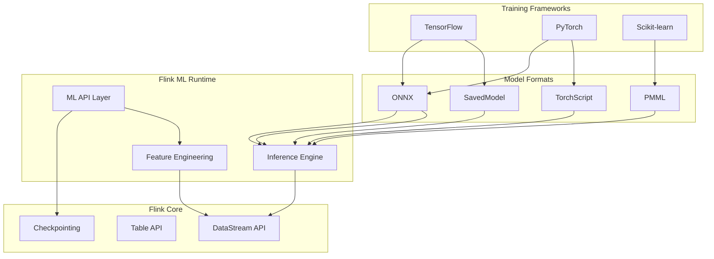
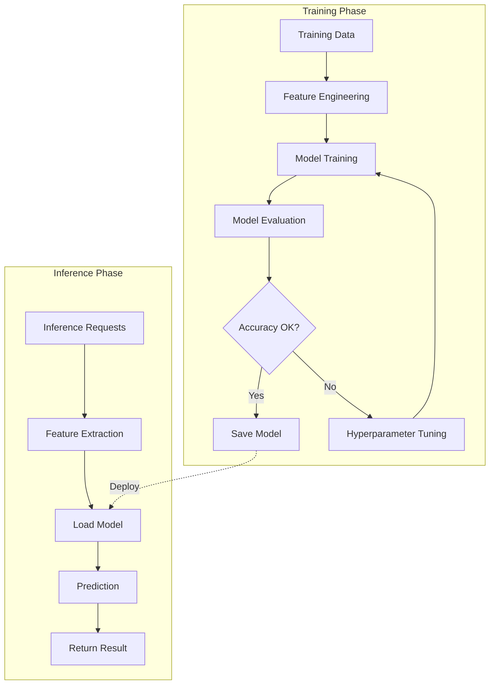
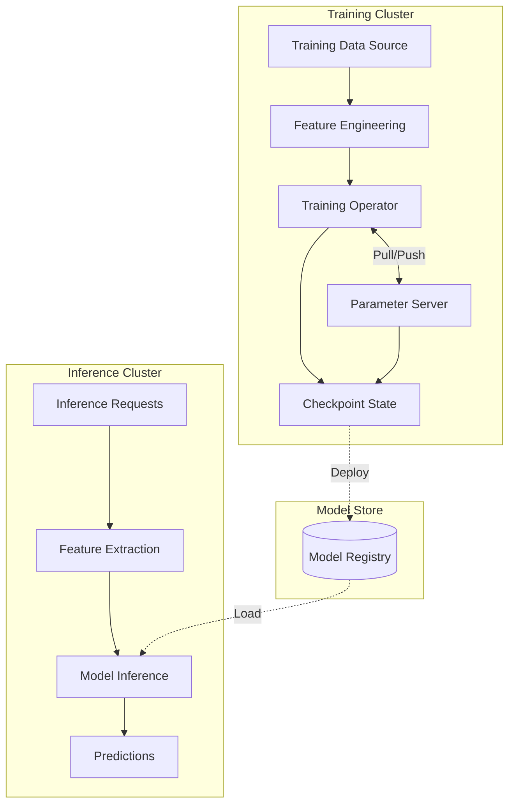
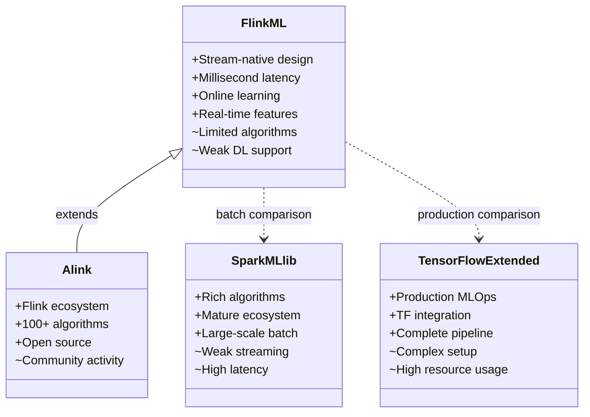

> **状态**: 🔮 前瞻内容 | **风险等级**: 高 | **最后更新**: 2026-04
> 
> 此文档描述的内容处于早期规划阶段，可能与最终实现不符。请以 Apache Flink 官方发布为准。
# Flink ML Pipeline: Stream-Based Machine Learning Architecture

> **Stage**: Flink/ML | **Prerequisites**: [Flink Architecture Overview](./01-architecture-overview.md), [State Management](./04-state-backends.md) | **Formal Level**: L3-L4

---

## 1. Definitions

### Def-F-12-01: Flink ML Architecture

**Definition**: Flink ML is a layered streaming machine learning framework that enables real-time model training and inference on unbounded data streams.

**Formal Model**:

$$
\text{FlinkML} = \langle \text{API}, \text{Algo}, \text{Runtime} \rangle
$$

Where:

- $\text{API}$: Type-safe ML operator interfaces (`Estimator`, `Transformer`, `Model`, `Pipeline`)
- $\text{Algo}$: Algorithm implementations satisfying $\text{Algo} \subseteq \text{API}^*$
- $\text{Runtime}$: Flink DataStream execution engine with iterative computation

---

### Def-F-12-02: ML Pipeline Stages

**Definition**: A pipeline is a sequence of ML stages where the output of one stage becomes the input to the next.

**Formal Specification**:

$$
\text{Pipeline} = [S_1, S_2, ..., S_n] \quad \text{where} \quad S_i \in \{\text{Estimator}, \text{Transformer}\}
$$

**Stage Types**:

| Type | Function | Method |
|------|----------|--------|
| `Transformer` | Feature transformation | `transform(Table)` |
| `Estimator` | Model training | `fit(Table) → Model` |
| `Model` | Trained model with inference | `transform(Table)` |
| `Pipeline` | Stage composition | Chained execution |

---

### Def-F-12-03: Online Learning

**Definition**: Online learning updates model parameters continuously as new training data arrives, without requiring full retraining.

**Update Rule**:

$$
\theta_{t+1} = \theta_t - \eta \cdot \nabla L(\theta_t; x_t, y_t)
$$

Where:

- $\theta_t$: Model parameters at time $t$
- $\eta$: Learning rate
- $\nabla L$: Gradient of loss function
- $(x_t, y_t)$: Training sample at time $t$

**Synchronous Modes**:

| Mode | Description | Convergence | Throughput |
|------|-------------|-------------|------------|
| BSP | Bulk Synchronous Parallel | Guaranteed | Lower |
| ASP | Asynchronous Parallel | Probabilistic | Higher |
| SSP | Stale Synchronous Parallel | Bounded error | Balanced |

---

### Def-F-12-04: Parameter Server Integration

**Definition**: Distributed parameter synchronization protocol for scaling ML training across multiple workers.

**Formal Model**:

$$
\text{PS-Integration} = \langle P, W, R, \mathcal{C}, \mathcal{S} \rangle
$$

Where:

- $P = \{p_1, ..., p_m\}$: Parameter partitions
- $W = \{w_1, ..., w_n\}$: Worker nodes
- $R = \{r_1, ..., r_k\}$: Parameter server nodes
- $\mathcal{C}$: Pull communication function
- $\mathcal{S}$: Push synchronization function

---

## 2. Properties

### Prop-F-12-01: Inference Latency Bound

**Proposition**: Single prediction latency $L_{\text{infer}}$ in Flink ML satisfies:

$$
L_{\text{infer}} \leq L_{\text{network}} + L_{\text{feature}} + L_{\text{compute}} + L_{\text{serialize}}
$$

**Optimization Strategies**:

| Component | Optimization | Typical Value |
|-----------|--------------|---------------|
| $L_{\text{network}}$ | Local model caching | < 1ms |
| $L_{\text{feature}}$ | Inlined ProcessFunction | 1-5ms |
| $L_{\text{compute}}$ | Vectorized operations | 1-10ms |
| $L_{\text{serialize}}$ | Arrow format | < 1ms |

**Total**: $L_{\text{infer}} \approx$ 5-20ms (p99)

---

### Prop-F-12-02: Iterative Convergence

**Proposition**: For Lipschitz-continuous objective functions, BSP-synchronized iterations converge in finite steps:

$$
\exists T < \theta: \|\nabla f(\theta_T)\| < \epsilon
$$

**Convergence Rate**:

For convex objectives with learning rate $\eta = O(1/\sqrt{T})$:

$$
f(\theta_T) - f(\theta^*) \leq O\left(\frac{1}{\sqrt{T}}\right)
$$

---

### Lemma-F-12-01: Parameter Consistency Bound

**Lemma**: In ASP mode, the expected staleness of worker parameters is bounded by:

$$
\mathbb{E}[v_{\text{global}} - v_i] \leq \frac{\lambda}{\mu} \cdot \frac{n_{\text{worker}}}{n_{\text{ps}}}
$$

Where $\lambda$ is update arrival rate and $\mu$ is PS processing capacity.

$$\square$$

---

## 3. Relations

### 3.1 Flink ML Ecosystem Integration



### 3.2 ML Pipeline Execution Flow



---

## 4. Argumentation

### 4.1 Algorithm Selection Decision Matrix

| Algorithm Category | Flink ML Support | Use Case | Alternative |
|-------------------|------------------|----------|-------------|
| Linear Models | ✅ Native | Real-time classification | - |
| Tree Ensembles | ✅ Native | Feature-rich prediction | - |
| Clustering | ✅ Limited | Streaming segmentation | Spark MLlib |
| Deep Learning | ❌ Not supported | Complex patterns | TensorFlow/PyTorch |
| NLP | ⚠️ Via ONNX | Text processing | Hugging Face |

### 4.2 Stream Processing vs Batch ML

| Aspect | Stream ML (Flink) | Batch ML (Spark) |
|--------|-------------------|------------------|
| Latency | Milliseconds | Minutes/Hours |
| Model Updates | Continuous | Periodic |
| Data Freshness | Real-time | Stale (last batch) |
| Resource Usage | Continuous | Bursty |
| Use Case | Online recommendation | Offline training |

---

## 5. Engineering Argument

### Thm-F-12-01: Online Learning Correctness

**Theorem**: With proper learning rate scheduling, online SGD in Flink ML converges to the optimal solution for convex objectives.

**Proof Sketch**:

1. Online SGD update: $\theta_{t+1} = \theta_t - \eta_t g_t$
2. With learning rate $\eta_t = O(1/\sqrt{t})$:
3. Regret bound: $R(T) = \sum_{t=1}^{T} [f_t(\theta_t) - f_t(\theta^*)] \leq O(\sqrt{T})$
4. Average regret: $R(T)/T \rightarrow 0$ as $T \rightarrow \infty$

$$\therefore \lim_{T \rightarrow \infty} \frac{1}{T}\sum_{t=1}^{T} f_t(\theta_t) = f(\theta^*) \quad \square$$

### 5.1 Production Architecture

**Real-time Recommendation Pipeline**:

```
User Events Stream
      ↓
┌─────────────────┐
│ Feature Engineering│
│ - User profile    │
│ - Item features   │
│ - Context features│
└────────┬────────┘
         ↓
┌─────────────────┐
│ Model Inference │
│ (Cached Model)  │
└────────┬────────┘
         ↓
┌─────────────────┐
│ Ranking & Filter│
└────────┬────────┘
         ↓
    Recommendations
```

**Model Version Management**:

```
Training Pipeline:
┌──────────┐    ┌──────────┐    ┌──────────┐    ┌──────────┐
│ Training │───►│ Staging  │───►│  Canary  │───►│Production│
│  (训练)   │    │ (验证集) │    │ (1%流量) │    │(100%流量)│
└──────────┘    └──────────┘    └──────────┘    └──────────┘
                         │
                         ▼
                  ┌──────────┐
                  │Rollback  │
                  │(回滚策略) │
                  └──────────┘
```

---

## 6. Examples

### 6.1 Complete ML Pipeline

```java
import org.apache.flink.ml.classification.logisticregression.*;
import org.apache.flink.ml.feature.standardscaler.*;
import org.apache.flink.ml.pipeline.*;

import org.apache.flink.streaming.api.environment.StreamExecutionEnvironment;
import org.apache.flink.table.api.TableEnvironment;


public class MLPipelineExample {
    public static void main(String[] args) {
        StreamExecutionEnvironment env =
            StreamExecutionEnvironment.getExecutionEnvironment();
        StreamTableEnvironment tEnv =
            StreamTableEnvironment.create(env);

        // 1. Feature engineering pipeline
        Pipeline featurePipeline = new Pipeline()
            .addStage("scaler", new StandardScaler())
            .addStage("hasher", new FeatureHasher().setNumFeatures(1000));

        // 2. Classification model
        LogisticRegression classifier = new LogisticRegression()
            .setLearningRate(0.01)
            .setRegularization(0.1)
            .setMaxIter(100);

        // 3. Complete pipeline
        Pipeline modelPipeline = new Pipeline()
            .addStages(featurePipeline)
            .addStage("classifier", classifier);

        // 4. Training
        Table trainingData = tEnv.fromDataStream(
            env.addSource(new UserBehaviorSource()));

        PipelineModel model = modelPipeline.fit(trainingData);

        // 5. Inference
        Table inferenceData = tEnv.fromDataStream(
            env.addSource(new InferenceRequestSource()));
        Table predictions = model.transform(inferenceData)[0];

        env.execute("ML Pipeline Example");
    }
}
```

### 6.2 Online Learning Configuration

```java
// Online learning with periodic model updates
OnlineLogisticRegression onlineLearner = new OnlineLogisticRegression()
    .setLearningRate(0.01)
    .setGlobalBatchSize(100)  // Update every 100 samples
    .setRegularization(0.1);

// Configure parameter server
Configuration conf = new Configuration();
conf.setString("flink.ml.ps.partition-num", "4");
conf.setString("flink.ml.ps.sync-mode", "SSP");
conf.setString("flink.ml.ps.staleness", "10");
```

### 6.3 A/B Testing Framework

```java

import org.apache.flink.api.common.state.ValueState;

public class ModelRouter extends ProcessFunction<Features, Prediction> {
    private ValueState<ModelVersion> modelState;
    private MapState<String, Model> modelCache;

    @Override
    public void processElement(Features features, Context ctx,
                               Collector<Prediction> out) {
        // Traffic split by user ID hash
        int bucket = Math.abs(features.userId.hashCode()) % 100;

        ModelVersion version;
        if (bucket < 10) {
            version = ModelVersion.V2_EXPERIMENTAL;
        } else if (bucket < 20) {
            version = ModelVersion.V1_5;
        } else {
            version = ModelVersion.V1_CURRENT;
        }

        Model model = modelCache.get(version.name());
        Prediction result = model.predict(features);

        // Tag prediction with experiment info
        out.collect(new Prediction(result.score, version, bucket));
    }
}
```

---

## 7. Visualizations

### 7.1 Flink ML Architecture

```mermaid
graph TB
    subgraph "ML API Layer"
        A1[Estimator<br/>fit()]
        A2[Transformer<br/>transform()]
        A3[Model<br/>predict()]
        A4[Pipeline<br/>compose()]
    end

    subgraph "Algorithm Library"
        B1[Classification<br/>LR / SVM]
        B2[Regression<br/>Linear / Tree]
        B3[Clustering<br/>K-Means]
        B4[Feature Engineering]
    end

    subgraph "Runtime Layer"
        C1[Iteration Engine]
        C2[Parameter Server]
        C3[Broadcast State]
        C4[Operator Fusion]
    end

    subgraph "Flink Core"
        D1[DataStream API]
        D2[Table API]
        D3[Checkpointing]
    end

    A1 --> B1
    A2 --> B4
    A3 --> B1
    A4 --> B1
    A4 --> B4

    B1 --> C1
    B1 --> C2
    B4 --> C3
    B4 --> C4

    C1 --> D1
    C2 --> D1
    C3 --> D3
    C4 --> D1
```

### 7.2 Training vs Inference Architecture



### 7.3 ML Framework Comparison



---

## 8. References


---

*Document Version: 2026.04-001 | Formal Level: L3-L4 | Last Updated: 2026-04-10*

**Related Documents**:

- [Flink Architecture Overview](./01-architecture-overview.md)
- [State Backends](./04-state-backends.md)
- [AI Agent Flink Integration](../Flink/06-ai-ml/flink-ai-ml-integration-complete-guide.md)
