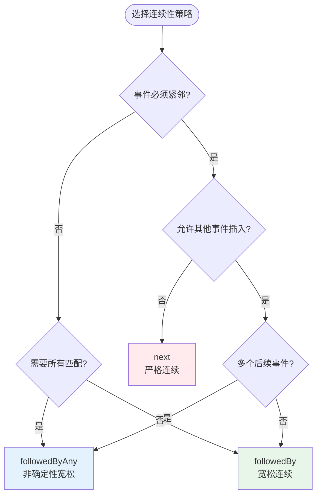

<!-- AI Translation Template - Replace <!-- TRANSLATE --> markers with actual translation -->

<!-- TRANSLATE: # Flink CEP 完整教程 (Complete Tutorial) -->

<!-- TRANSLATE: > **所属阶段**: Flink/03-sql-table-api | **前置依赖**: [flink-cep-complete-guide.md](03-api/03.02-table-sql-api/flink-cep-complete-guide.md), [time-semantics-and-watermark.md](02-core/time-semantics-and-watermark.md) | **形式化等级**: L3-L4 -->
<!-- TRANSLATE: > **版本**: Flink 1.13-2.2+ | **难度**: 中级-高级 | **预计阅读时间**: 90分钟 -->


<!-- TRANSLATE: ## 2. 属性推导 (Properties) -->

<!-- TRANSLATE: ### Lemma-F-CEP-Tutorial-01: Pattern API 的闭包性质 -->

<!-- TRANSLATE: **引理**: Pattern API 在组合操作下保持闭包性质。 -->

<!-- TRANSLATE: **证明概要**: -->

<!-- TRANSLATE: 1. **顺序组合**: `P1.next(P2)` 仍是有效 Pattern -->
<!-- TRANSLATE: 2. **选择组合**: `P1.or(P2)` 仍是有效 Pattern -->
<!-- TRANSLATE: 3. **循环组合**: `P1.times(n,m)` 仍是有效 Pattern -->

$$
<!-- TRANSLATE: \forall P_1, P_2 \in \text{Pattern}: P_1 \oplus P_2 \in \text{Pattern} -->
$$

<!-- TRANSLATE: ### Lemma-F-CEP-Tutorial-02: 时间窗口的状态剪枝 -->

**引理**: 时间窗口约束 `within(T)` 将 NFA 的活跃状态数上限从 $O(|E|)$ 降为 $O(T/\bar{\delta})$。

<!-- TRANSLATE: **推导**: -->

```
无时间窗口:
  每个事件可能启动新匹配
  活跃状态数 ∝ 事件总数 |E|

有时间窗口 T:
  只保留窗口内的事件
  活跃状态数 ∝ T / 平均事件间隔
```

<!-- TRANSLATE: ### Prop-F-CEP-Tutorial-01: 连续性策略的匹配集合关系 -->

<!-- TRANSLATE: **命题**: 三种连续性策略的匹配集合满足包含关系： -->

$$
<!-- TRANSLATE: \text{Matches}_{\text{next}} \subseteq \text{Matches}_{\text{followedBy}} \subseteq \text{Matches}_{\text{followedByAny}} -->
$$

<!-- TRANSLATE: **示例验证**: -->

```
事件流: [A, X, A, B, B, C]

Pattern: A → B → C

next():            无匹配 (A后无紧邻B)
followedBy():      匹配 [A(3), B(4), C(6)]
followedByAny():   匹配 [A(3), B(4), C(6)] 和 [A(3), B(5), C(6)]
```


<!-- TRANSLATE: ## 4. 论证过程 (Argumentation) -->

<!-- TRANSLATE: ### 4.1 连续性策略选择决策树 -->



<!-- TRANSLATE: ### 4.2 时间窗口设计权衡 -->

<!-- TRANSLATE: | 窗口大小 | 优点 | 缺点 | 适用场景 | -->
<!-- TRANSLATE: |----------|------|------|----------| -->
<!-- TRANSLATE: | **小 (<1分钟)** | 低延迟、少误报、低状态 | 可能漏慢速攻击 | 高频交易、实时风控 | -->
<!-- TRANSLATE: | **中 (1-10分钟)** | 平衡延迟与覆盖率 | 中等状态开销 | 常规业务监控 | -->
<!-- TRANSLATE: | **大 (>10分钟)** | 捕获长期模式 | 高状态、高延迟 | 业务流程分析 | -->

<!-- TRANSLATE: ### 4.3 消耗策略选择指南 -->

<!-- TRANSLATE: | 策略 | 输出匹配数 | 适用场景 | -->
<!-- TRANSLATE: |------|-----------|----------| -->
<!-- TRANSLATE: | `NO_SKIP` | 最多 | 需要所有可能匹配 | -->
<!-- TRANSLATE: | `SKIP_TO_NEXT` | 中等 | 从下一个起始事件开始 | -->
<!-- TRANSLATE: | `SKIP_PAST_LAST_EVENT` | 最少 | 避免重叠匹配 | -->
<!-- TRANSLATE: | `SKIP_TO_FIRST` | 可控 | 跳转到指定模式起点 | -->


<!-- TRANSLATE: ## 6. 实例验证 (Examples) -->

<!-- TRANSLATE: ### 6.1 Maven 依赖配置 -->

```xml
<!-- Flink CEP 依赖 -->
<dependency>
    <groupId>org.apache.flink</groupId>
    <artifactId>flink-cep</artifactId>
    <version>1.17.0</version>
</dependency>

<!-- Scala API (可选) -->
<dependency>
    <groupId>org.apache.flink</groupId>
    <artifactId>flink-cep-scala_2.12</artifactId>
    <version>1.17.0</version>
</dependency>
```

<!-- TRANSLATE: ### 6.2 基础 Pattern API 详解 -->

<!-- TRANSLATE: #### 6.2.1 Java API 完整示例 -->

```java
import org.apache.flink.cep.CEP;
import org.apache.flink.cep.PatternStream;
import org.apache.flink.cep.pattern.Pattern;
import org.apache.flink.cep.pattern.conditions.SimpleCondition;
import org.apache.flink.cep.pattern.conditions.IterativeCondition;
import org.apache.flink.streaming.api.datastream.DataStream;
import org.apache.flink.streaming.api.windowing.time.Time;

public class CEPCompleteTutorial {

    // ========== 1. 基础模式定义 ==========

    /**
     * 示例 1: 简单序列模式
     * 检测：登录后 5 分钟内完成支付
     */
    public static Pattern<LoginEvent, ?> loginThenPayPattern() {
        return Pattern.<LoginEvent>begin("login")
            .where(new SimpleCondition<LoginEvent>() {
                @Override
                public boolean filter(LoginEvent event) {
                    return event.getType().equals("LOGIN");
                }
            })
            .followedBy("payment")
            .where(new SimpleCondition<LoginEvent>() {
                @Override
                public boolean filter(LoginEvent event) {
                    return event.getType().equals("PAYMENT");
                }
            })
            .within(Time.minutes(5));
    }

    /**
     * 示例 2: 循环模式
     * 检测：5 分钟内 3 次以上失败登录
     */
    public static Pattern<LoginEvent, ?> bruteForcePattern() {
        return Pattern.<LoginEvent>begin("failed")
            .where(new SimpleCondition<LoginEvent>() {
                @Override
                public boolean filter(LoginEvent event) {
                    return event.getType().equals("LOGIN") && !event.isSuccess();
                }
            })
            .timesOrMore(3)  // 3次或更多
            .greedy()        // 贪婪模式，尽可能多匹配
            .within(Time.minutes(5));
    }

    /**
     * 示例 3: 否定模式
     * 检测：下单后 30 分钟内未支付
     */
    public static Pattern<OrderEvent, ?> orderNotPaidPattern() {
        return Pattern.<OrderEvent>begin("order")
            .where(new SimpleCondition<OrderEvent>() {
                @Override
                public boolean filter(OrderEvent event) {
                    return event.getType().equals("ORDER_CREATED");
                }
            })
            .notFollowedBy("payment")
            .where(new SimpleCondition<OrderEvent>() {
                @Override
                public boolean filter(OrderEvent event) {
                    return event.getType().equals("PAYMENT");
                }
            })
            .within(Time.minutes(30));
    }

    // ========== 2. 复杂条件模式 ==========

    /**
     * 示例 4: 迭代条件（访问前面匹配的事件）
     * 检测：温度持续上升超过阈值
     */
    public static Pattern<SensorReading, ?> temperatureRisingPattern() {
        return Pattern.<SensorReading>begin("first")
            .where(new SimpleCondition<SensorReading>() {
                @Override
                public boolean filter(SensorReading reading) {
                    return reading.getTemperature() > 80.0;
                }
            })
            .next("second")
            .where(new IterativeCondition<SensorReading>() {
                @Override
                public boolean filter(SensorReading reading, Context<SensorReading> ctx) {
                    // 访问前面匹配的事件
                    double firstTemp = ctx.getEventsForPattern("first")
                        .get(0).getTemperature();
                    return reading.getTemperature() > firstTemp + 5.0;
                }
            })
            .next("third")
            .where(new IterativeCondition<SensorReading>() {
                @Override
                public boolean filter(SensorReading reading, Context<SensorReading> ctx) {
                    double secondTemp = ctx.getEventsForPattern("second")
                        .get(0).getTemperature();
                    return reading.getTemperature() > secondTemp + 5.0;
                }
            })
            .within(Time.minutes(10));
    }

    // ========== 3. 组合模式 ==========

    /**
     * 示例 5: 或组合模式
     * 检测：VIP用户的高额交易 或 普通用户的异常交易
     */
    public static Pattern<Transaction, ?> fraudPattern() {
        Pattern<Transaction, ?> vipPattern = Pattern.<Transaction>begin("vip")
            .where(new SimpleCondition<Transaction>() {
                @Override
                public boolean filter(Transaction tx) {
                    return tx.getUserType().equals("VIP") && tx.getAmount() > 50000;
                }
            });

        Pattern<Transaction, ?> normalPattern = Pattern.<Transaction>begin("normal")
            .where(new SimpleCondition<Transaction>() {
                @Override
                public boolean filter(Transaction tx) {
                    return tx.getUserType().equals("NORMAL") && tx.getAmount() > 10000;
                }
            });

        return Pattern.<Transaction>begin("start")
            .where(new SimpleCondition<Transaction>() {
                @Override
                public boolean filter(Transaction tx) {
                    return tx.getAmount() < 10;  // 小额试探
                }
            })
            .next("suspicious")
            .where(new SimpleCondition<Transaction>() {
                @Override
                public boolean filter(Transaction tx) {
                    return tx.getAmount() > 5000;
                }
            })
            .or(vipPattern)  // 或组合
            .within(Time.minutes(10));
    }
}
```

<!-- TRANSLATE: #### 6.2.2 Scala API 完整示例 -->

```scala
import org.apache.flink.cep.scala.CEP
import org.apache.flink.cep.scala.pattern.Pattern
import org.apache.flink.streaming.api.scala._
import org.apache.flink.streaming.api.windowing.time.Time

object CEPScalaTutorial {

  // 示例 1: 简单模式
  val loginPattern = Pattern.begin[LoginEvent]("login")
    .where(_.eventType == "LOGIN")
    .followedBy("payment")
    .where(_.eventType == "PAYMENT")
    .within(Time.minutes(5))

  // 示例 2: 循环模式
  val bruteForcePattern = Pattern.begin[LoginEvent]("failed")
    .where(evt => evt.eventType == "LOGIN" && !evt.success)
    .timesOrMore(3)
    .greedy()
    .within(Time.minutes(5))

  // 示例 3: 迭代条件
  val temperatureRisingPattern = Pattern.begin[SensorReading]("first")
    .where(_.temperature > 80.0)
    .next("second")
    .where((reading, ctx) => {
      val firstTemp = ctx.getEventsForPattern("first").head.temperature
      reading.temperature > firstTemp + 5.0
    })
    .next("third")
    .where((reading, ctx) => {
      val secondTemp = ctx.getEventsForPattern("second").head.temperature
      reading.temperature > secondTemp + 5.0
    })
    .within(Time.minutes(10))

  // 应用到流
  def applyPattern[T](stream: DataStream[T], pattern: Pattern[T, _]): Unit = {
    val patternStream = CEP.pattern(stream, pattern)

    patternStream.select(pattern => {
      // 处理匹配结果
      pattern.toString
    })
  }
}
```

<!-- TRANSLATE: ### 6.3 实际案例详解 -->

<!-- TRANSLATE: #### 6.3.1 欺诈检测完整实现 -->

```java
/**
 * 案例：信用卡欺诈检测
 * 模式：小额测试 → 大额交易（5分钟内）
 */

import org.apache.flink.streaming.api.environment.StreamExecutionEnvironment;
import org.apache.flink.streaming.api.datastream.DataStream;
import org.apache.flink.streaming.api.windowing.time.Time;

public class FraudDetectionCEP {

    public static void main(String[] args) throws Exception {
        StreamExecutionEnvironment env =
            StreamExecutionEnvironment.getExecutionEnvironment();
        env.setParallelism(4);

        // 1. 创建事件流
        DataStream<Transaction> transactions = env
            .addSource(new TransactionSource())
            .assignTimestampsAndWatermarks(
                WatermarkStrategy.<Transaction>forBoundedOutOfOrderness(
                    Duration.ofSeconds(5))
                    .withIdleness(Duration.ofMinutes(1))
            );

        // 2. 定义欺诈检测模式
        Pattern<Transaction, ?> fraudPattern = Pattern
            .<Transaction>begin("small-amount")
            .where(new SimpleCondition<Transaction>() {
                @Override
                public boolean filter(Transaction tx) {
                    // 小额试探交易
                    return tx.getAmount() > 0 && tx.getAmount() < 10.0;
                }
            })
            .followedBy("large-amount")
            .where(new IterativeCondition<Transaction>() {
                @Override
                public boolean filter(Transaction tx, Context<Transaction> ctx) {
                    // 大额交易（大于5000）
                    if (tx.getAmount() <= 5000.0) {
                        return false;
                    }

                    // 同一用户
                    String userId = ctx.getEventsForPattern("small-amount")
                        .get(0).getUserId();
                    return tx.getUserId().equals(userId);
                }
            })
            .within(Time.minutes(5));

        // 3. 应用模式到流
        PatternStream<Transaction> patternStream = CEP.pattern(
            transactions.keyBy(Transaction::getUserId),  // 按用户分区
            fraudPattern
        );

        // 4. 处理匹配结果
        DataStream<Alert> alerts = patternStream
            .select(new PatternSelectFunction<Transaction, Alert>() {
                @Override
                public Alert select(Map<String, List<Transaction>> pattern) {
                    Transaction small = pattern.get("small-amount").get(0);
                    Transaction large = pattern.get("large-amount").get(0);

                    return new Alert(
                        small.getUserId(),
                        "FRAUD_PATTERN_DETECTED",
                        String.format("Small: $%.2f at %s, Large: $%.2f at %s",
                            small.getAmount(), small.getTimestamp(),
                            large.getAmount(), large.getTimestamp()),
                        System.currentTimeMillis()
                    );
                }
            });

        // 5. 输出告警
        alerts.addSink(new AlertSink());

        env.execute("Fraud Detection with CEP");
    }
}
```

<!-- TRANSLATE: #### 6.3.2 登录异常检测 -->

```java
/**
 * 案例：异常登录检测
 * 模式1: 5分钟内 3 次失败登录 → 成功登录（暴力破解）
 * 模式2: 异地登录（地理位置突变）
 */

import org.apache.flink.streaming.api.environment.StreamExecutionEnvironment;
import org.apache.flink.streaming.api.datastream.DataStream;
import org.apache.flink.streaming.api.windowing.time.Time;

public class LoginAnomalyDetection {

    // 模式 1: 暴力破解检测
    public static Pattern<LoginEvent, ?> bruteForcePattern() {
        return Pattern.<LoginEvent>begin("failed-logins")
            .where(new SimpleCondition<LoginEvent>() {
                @Override
                public boolean filter(LoginEvent event) {
                    return !event.isSuccess();
                }
            })
            .timesOrMore(3)
            .greedy()
            .followedBy("success-login")
            .where(new SimpleCondition<LoginEvent>() {
                @Override
                public boolean filter(LoginEvent event) {
                    return event.isSuccess();
                }
            })
            .within(Time.minutes(5));
    }

    // 模式 2: 异地登录检测
    public static Pattern<LoginEvent, ?> geoAnomalyPattern() {
        return Pattern.<LoginEvent>begin("first-login")
            .where(new SimpleCondition<LoginEvent>() {
                @Override
                public boolean filter(LoginEvent event) {
                    return event.isSuccess();
                }
            })
            .next("second-login")
            .where(new IterativeCondition<LoginEvent>() {
                @Override
                public boolean filter(LoginEvent event, Context<LoginEvent> ctx) {
                    if (!event.isSuccess()) return false;

                    LoginEvent first = ctx.getEventsForPattern("first-login").get(0);

                    // 同一用户，不同城市，时间间隔小于 2 小时
                    return event.getUserId().equals(first.getUserId())
                        && !event.getCity().equals(first.getCity())
                        && (event.getTimestamp() - first.getTimestamp()) < Time.hours(2).toMilliseconds();
                }
            })
            .within(Time.hours(2));
    }

    public static void main(String[] args) throws Exception {
        StreamExecutionEnvironment env =
            StreamExecutionEnvironment.getExecutionEnvironment();

        DataStream<LoginEvent> logins = env
            .addSource(new LoginEventSource())
            .assignTimestampsAndWatermarks(
                WatermarkStrategy.<LoginEvent>forBoundedOutOfOrderness(
                    Duration.ofSeconds(10))
            );

        // 应用多个模式
        Pattern<LoginEvent, ?> pattern = bruteForcePattern();

        PatternStream<LoginEvent> patternStream = CEP.pattern(
            logins.keyBy(LoginEvent::getUserId),
            pattern
        );

        // 处理匹配和超时
        DataStream<Alert> alerts = patternStream
            .process(new PatternProcessFunction<LoginEvent, Alert>() {
                @Override
                public void processMatch(
                        Map<String, List<LoginEvent>> match,
                        Context ctx,
                        Collector<Alert> out) {

                    // 正常匹配处理：暴力破解成功
                    List<LoginEvent> failed = match.get("failed-logins");
                    LoginEvent success = match.get("success-login").get(0);

                    out.collect(new Alert(
                        success.getUserId(),
                        "BRUTE_FORCE_SUCCESS",
                        String.format("%d failed attempts followed by success", failed.size()),
                        success.getTimestamp()
                    ));
                }

                @Override
                public void processTimedOutMatch(
                        Map<String, List<LoginEvent>> match,
                        Context ctx,
                        Collector<Alert> out) {

                    // 超时处理：多次失败但未成功（仍在尝试）
                    List<LoginEvent> failed = match.get("failed-logins");

                    out.collect(new Alert(
                        failed.get(0).getUserId(),
                        "BRUTE_FORCE_ATTEMPT",
                        String.format("%d failed attempts without success", failed.size()),
                        System.currentTimeMillis()
                    ));
                }
            });

        alerts.print();
        env.execute("Login Anomaly Detection");
    }
}
```

<!-- TRANSLATE: #### 6.3.3 业务流程监控 -->

```java
/**
 * 案例：业务流程超时监控
 * 监控订单流程：创建 → 支付 → 发货 → 签收
 * 检测各环节超时
 */

import org.apache.flink.streaming.api.environment.StreamExecutionEnvironment;
import org.apache.flink.streaming.api.datastream.DataStream;
import org.apache.flink.streaming.api.windowing.time.Time;

public class BusinessProcessMonitor {

    // 完整订单流程监控
    public static Pattern<OrderEvent, ?> orderProcessPattern() {
        return Pattern.<OrderEvent>begin("created")
            .where(evt -> evt.getType().equals("ORDER_CREATED"))
            .followedBy("paid")
            .where(evt -> evt.getType().equals("ORDER_PAID"))
            .followedBy("shipped")
            .where(evt -> evt.getType().equals("ORDER_SHIPPED"))
            .followedBy("delivered")
            .where(evt -> evt.getType().equals("ORDER_DELIVERED"))
            .within(Time.hours(72));  // 72小时完整流程
    }

    // 支付超时检测
    public static Pattern<OrderEvent, ?> paymentTimeoutPattern() {
        return Pattern.<OrderEvent>begin("created")
            .where(evt -> evt.getType().equals("ORDER_CREATED"))
            .notFollowedBy("paid")
            .where(evt -> evt.getType().equals("ORDER_PAID"))
            .within(Time.minutes(30));  // 30分钟未支付
    }

    // 发货超时检测
    public static Pattern<OrderEvent, ?> shippingTimeoutPattern() {
        return Pattern.<OrderEvent>begin("paid")
            .where(evt -> evt.getType().equals("ORDER_PAID"))
            .notFollowedBy("shipped")
            .where(evt -> evt.getType().equals("ORDER_SHIPPED"))
            .within(Time.hours(24));  // 24小时未发货
    }

    public static void main(String[] args) throws Exception {
        StreamExecutionEnvironment env =
            StreamExecutionEnvironment.getExecutionEnvironment();

        DataStream<OrderEvent> orders = env
            .addSource(new OrderEventSource())
            .assignTimestampsAndWatermarks(
                WatermarkStrategy.<OrderEvent>forBoundedOutOfOrderness(
                    Duration.ofSeconds(30))
            );

        // 检测支付超时
        PatternStream<OrderEvent> timeoutStream = CEP.pattern(
            orders.keyBy(OrderEvent::getOrderId),
            paymentTimeoutPattern()
        );

        DataStream<TimeoutAlert> alerts = timeoutStream
            .process(new PatternProcessFunction<OrderEvent, TimeoutAlert>() {
                @Override
                public void processMatch(
                        Map<String, List<OrderEvent>> match,
                        Context ctx,
                        Collector<TimeoutAlert> out) {
                    // 正常匹配不会触发（notFollowedBy）
                }

                @Override
                public void processTimedOutMatch(
                        Map<String, List<OrderEvent>> match,
                        Context ctx,
                        Collector<TimeoutAlert> out) {

                    OrderEvent created = match.get("created").get(0);
                    long elapsed = System.currentTimeMillis() - created.getTimestamp();

                    out.collect(new TimeoutAlert(
                        created.getOrderId(),
                        "PAYMENT_TIMEOUT",
                        String.format("Order not paid within %d minutes", elapsed / 60000),
                        created.getTimestamp()
                    ));
                }
            });

        alerts.addSink(new AlertSink());
        env.execute("Business Process Monitor");
    }
}
```

<!-- TRANSLATE: ### 6.4 时间处理详解 -->

<!-- TRANSLATE: #### 6.4.1 Event Time vs Processing Time -->

```java
/**
 * CEP 时间语义详解
 */

import org.apache.flink.streaming.api.environment.StreamExecutionEnvironment;
import org.apache.flink.streaming.api.datastream.DataStream;
import org.apache.flink.streaming.api.windowing.time.Time;

public class CEPTimeSemantics {

    public static void main(String[] args) throws Exception {
        StreamExecutionEnvironment env =
            StreamExecutionEnvironment.getExecutionEnvironment();

        DataStream<Event> stream = env.addSource(new EventSource());

        // ========== Event Time 处理（推荐用于生产） ==========
        DataStream<Event> eventTimeStream = stream
            .assignTimestampsAndWatermarks(
                WatermarkStrategy.<Event>forBoundedOutOfOrderness(
                    Duration.ofSeconds(30))  // 允许30秒乱序
                    .withIdleness(Duration.ofMinutes(5))  // 5分钟无数据标记为空闲
            );

        // Event Time 模式下，within() 使用事件时间戳
        Pattern<Event, ?> pattern = Pattern.<Event>begin("start")
            .where(evt -> evt.getType().equals("A"))
            .followedBy("end")
            .where(evt -> evt.getType().equals("B"))
            .within(Time.minutes(5));  // 基于 Event Time 的 5 分钟窗口

        // ========== Processing Time 处理（低延迟场景） ==========
        // Processing Time 模式下，within() 使用机器时间
        // 适用于：实时性要求高，可容忍少数迟到事件丢失

        PatternStream<Event> patternStream = CEP.pattern(
            eventTimeStream.keyBy(Event::getKey),
            pattern
        );

        // 处理结果
        patternStream.select(match -> {
            // 匹配处理
            return match;
        });
    }
}
```

<!-- TRANSLATE: #### 6.4.2 Watermark 与迟到事件处理 -->

```java
/**
 * CEP 中 Watermark 策略配置
 */

import org.apache.flink.api.common.eventtime.WatermarkStrategy;

public class CEPWatermarkConfig {

    /**
     * 推荐配置：Bounded Out Of Orderness
     * 适用于：大多数生产场景
     */
    public static WatermarkStrategy<Event> boundedOutOfOrdernessStrategy() {
        return WatermarkStrategy.<Event>forBoundedOutOfOrderness(
                Duration.ofSeconds(30))
            .withTimestampAssigner((event, timestamp) -> event.getEventTime())
            .withIdleness(Duration.ofMinutes(1));
    }

    /**
     * 严格有序场景
     * 适用于：数据源本身有序（如 Kafka 单分区）
     */
    public static WatermarkStrategy<Event> monotonousStrategy() {
        return WatermarkStrategy.<Event>forMonotonousTimestamps()
            .withTimestampAssigner((event, timestamp) -> event.getEventTime());
    }

    /**
     * 自定义 Watermark 生成
     * 适用于：特殊乱序场景
     */
    public static WatermarkStrategy<Event> customWatermarkStrategy() {
        return new WatermarkStrategy<Event>() {
            @Override
            public WatermarkGenerator<Event> createWatermarkGenerator(
                    WatermarkGeneratorSupplier.Context context) {
                return new WatermarkGenerator<Event>() {
                    private long maxTimestamp = Long.MIN_VALUE;
                    private final long outOfOrdernessMillis = 30000;  // 30秒

                    @Override
                    public void onEvent(Event event, long eventTimestamp, WatermarkOutput output) {
                        maxTimestamp = Math.max(maxTimestamp, eventTimestamp);
                    }

                    @Override
                    public void onPeriodicEmit(WatermarkOutput output) {
                        output.emitWatermark(
                            new Watermark(maxTimestamp - outOfOrdernessMillis - 1));
                    }
                };
            }
        }.withTimestampAssigner((event, timestamp) -> event.getEventTime());
    }
}
```

<!-- TRANSLATE: ### 6.5 高级模式技巧 -->

<!-- TRANSLATE: #### 6.5.1 动态模式生成 -->

```java
/**
 * 基于配置动态生成 CEP 模式
 */

import org.apache.flink.streaming.api.windowing.time.Time;

public class DynamicPatternBuilder {

    public static <T> Pattern<T, ?> buildPatternFromConfig(
            PatternConfig config,
            Class<T> eventClass) {

        Pattern<T, ?> pattern = Pattern.begin(config.getStartName());

        // 添加起始条件
        pattern = pattern.where(createCondition(config.getStartCondition()));

        // 添加后续模式阶段
        for (PatternStage stage : config.getStages()) {
            switch (stage.getContiguity()) {
                case NEXT:
                    pattern = pattern.next(stage.getName());
                    break;
                case FOLLOWED_BY:
                    pattern = pattern.followedBy(stage.getName());
                    break;
                case FOLLOWED_BY_ANY:
                    pattern = pattern.followedByAny(stage.getName());
                    break;
            }

            pattern = pattern.where(createCondition(stage.getCondition()));

            // 添加量词
            if (stage.getMinTimes() > 1 || stage.getMaxTimes() != null) {
                pattern = pattern.times(stage.getMinTimes(), stage.getMaxTimes());
            }

            if (stage.isOptional()) {
                pattern = pattern.optional();
            }
        }

        // 添加时间窗口
        pattern = pattern.within(Time.milliseconds(config.getWindowMillis()));

        return pattern;
    }

    private static <T> SimpleCondition<T> createCondition(ConditionConfig config) {
        return new SimpleCondition<T>() {
            @Override
            public boolean filter(T event) {
                // 根据配置解析条件
                return evaluateCondition(event, config);
            }
        };
    }
}
```

<!-- TRANSLATE: #### 6.5.2 多模式并行检测 -->

```java
/**
 * 同时检测多个 CEP 模式
 */

import org.apache.flink.streaming.api.environment.StreamExecutionEnvironment;
import org.apache.flink.streaming.api.datastream.DataStream;
import org.apache.flink.streaming.api.windowing.time.Time;

public class MultiPatternDetection {

    public static void main(String[] args) throws Exception {
        StreamExecutionEnvironment env =
            StreamExecutionEnvironment.getExecutionEnvironment();

        DataStream<Transaction> transactions = env.addSource(new TransactionSource());

        // 定义多个检测模式
        Pattern<Transaction, ?> fraudPattern1 = Pattern.<Transaction>begin("small")
            .where(tx -> tx.getAmount() < 10)
            .followedBy("large")
            .where(tx -> tx.getAmount() > 10000)
            .within(Time.minutes(5));

        Pattern<Transaction, ?> fraudPattern2 = Pattern.<Transaction>begin("rapid")
            .where(tx -> tx.getAmount() > 1000)
            .timesOrMore(3)
            .within(Time.minutes(1));

        // 并行应用多个模式
        DataStream<Alert> alerts1 = CEP.pattern(transactions, fraudPattern1)
            .select(match -> new Alert("FRAUD_PATTERN_1", match));

        DataStream<Alert> alerts2 = CEP.pattern(transactions, fraudPattern2)
            .select(match -> new Alert("FRAUD_PATTERN_2", match));

        // 合并告警流
        DataStream<Alert> allAlerts = alerts1.union(alerts2);

        allAlerts.addSink(new AlertSink());
        env.execute("Multi-Pattern Detection");
    }
}
```


<!-- TRANSLATE: ## 8. 故障排查 -->

<!-- TRANSLATE: ### 8.1 常见问题与解决方案 -->

<!-- TRANSLATE: | 问题 | 症状 | 原因 | 解决方案 | -->
<!-- TRANSLATE: |------|------|------|----------| -->
<!-- TRANSLATE: | **状态过大** | OOM、Checkpoint 超时 | 时间窗口过大 | 缩小 `within()` 窗口 | -->
<!-- TRANSLATE: | **匹配延迟** | 事件匹配不及时 | Watermark 延迟 | 调整 Watermark 策略 | -->
<!-- TRANSLATE: | **漏匹配** | 预期匹配未触发 | 连续性策略不当 | 检查 `next()` vs `followedBy()` | -->
<!-- TRANSLATE: | **重复匹配** | 同一事件多次匹配 | 消耗策略配置 | 设置 `SkipStrategy` | -->
<!-- TRANSLATE: | **性能下降** | 吞吐量降低 | Key 热点 | 优化 KeyBy 策略 | -->

<!-- TRANSLATE: ### 8.2 调试技巧 -->

```java
/**
 * CEP 调试工具
 */

import org.apache.flink.streaming.api.datastream.DataStream;

public class CEPDebugging {

    /**
     * 调试 1: 打印所有事件
     */
    public static void debugEvents(DataStream<Event> stream) {
        stream.map(event -> {
            System.out.println("[DEBUG] Event: " + event +
                " @ " + System.currentTimeMillis());
            return event;
        });
    }

    /**
     * 调试 2: 监控 Watermark 进度
     */
    public static void debugWatermarks(DataStream<Event> stream) {
        stream.assignTimestampsAndWatermarks(
            WatermarkStrategy.<Event>forBoundedOutOfOrderness(Duration.ofSeconds(5))
                .withTimestampAssigner((event, ts) -> event.getTimestamp())
        ).map(event -> {
            // 打印当前 Watermark
            return event;
        });
    }

    /**
     * 调试 3: 模式匹配详情
     */
    public static void debugPatternMatches(
            PatternStream<Event> patternStream) {

        patternStream.select(new PatternSelectFunction<Event, String>() {
            @Override
            public String select(Map<String, List<Event>> pattern) {
                StringBuilder sb = new StringBuilder();
                sb.append("=== Pattern Match ===\n");

                for (Map.Entry<String, List<Event>> entry : pattern.entrySet()) {
                    sb.append("Stage: ").append(entry.getKey()).append("\n");
                    for (Event e : entry.getValue()) {
                        sb.append("  - ").append(e).append("\n");
                    }
                }

                System.out.println(sb.toString());
                return sb.toString();
            }
        });
    }
}
```


<!-- TRANSLATE: ## 10. 引用参考 (References) -->
