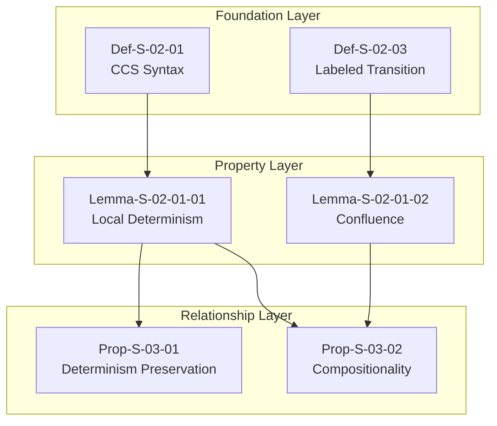
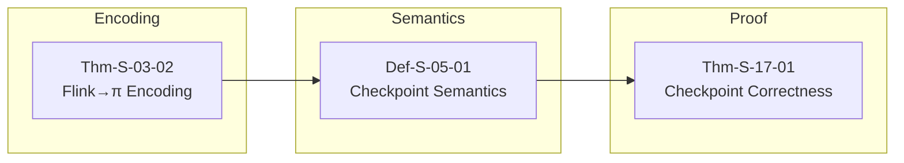
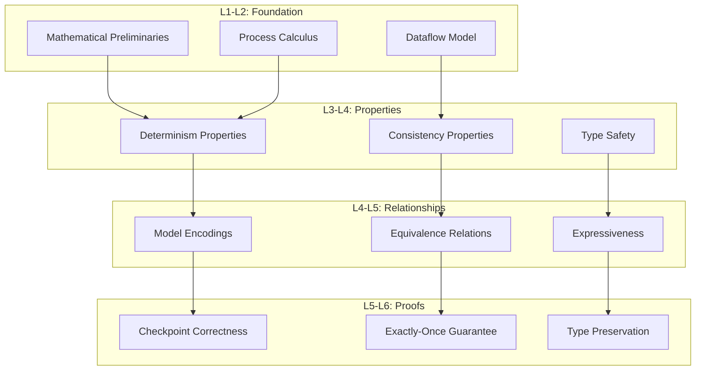

# Struct/ Derivation Chain Panorama

> **Stage**: Struct | **Prerequisites**: [00-INDEX.md](./00-INDEX.md) | **Formalization Level**: L3-L5

## Abstract

This document systematically organizes the complete derivation relationship network among 43 documents, 190 theorems, and 402 definitions within the Struct directory. Through visualization of derivation chains, it reveals the logical evolution path from basic definitions to advanced proofs, providing a navigation map for theoretical researchers.

---

## Table of Contents

- [1. Foundation → Properties Derivation](#1-foundation-properties-derivation)
- [2. Properties → Relationships Derivation](#2-properties-relationships-derivation)
- [3. Relationships → Proofs Derivation](#3-relationships-proofs-derivation)
- [4. Complete Derivation Tree](#4-complete-derivation-tree)
- [5. Derivation Relationship Definition Index](#5-derivation-relationship-definition-index)
- [6. Coverage Statistics](#6-coverage-statistics)
- [7. References](#7-references)

---

## 1. Foundation → Properties Derivation

### 1.1 From Process Calculus Foundation to Determinism Properties

**Derivation Chain 1: Process Determinism → Stream Determinism**

```
Def-S-02-01 (CCS - Calculus of Communicating Systems)
    ↓ Extension
Def-S-02-02 (CSP - Communicating Sequential Processes)
    ↓ Encoding
Def-S-02-05 (Actor Model)
    ↓ Composition
Lemma-S-02-01-01 (Serial Execution Determinism)
    ↓ Induction
Thm-S-02-01 (Stream Processing Determinism Theorem) ✓
```

### 1.2 From Dataflow Model to Watermark Monotonicity

**Derivation Chain 2: Event Time → Watermark → Completeness**

```
Def-S-04-01 (Dataflow Graph)
    ↓ Extension
Def-S-04-02 (Event Time Model)
    ↓ Definition
Def-S-04-03 (Watermark Progress)
    ↓ Property
Lemma-S-04-03-01 (Watermark Monotonicity Lemma)
    ↓ Application
Thm-S-04-02 (Result Completeness Theorem) ✓
```

### 1.3 Definition → Property Derivation Table

| Source Definition | Target Property | Derivation Method | Formal Level |
|-------------------|-----------------|-------------------|--------------|
| Def-S-01-01 (USTM) | Prop-S-01-01 (Expressiveness Hierarchy) | Hierarchical embedding | L4 |
| Def-S-02-01 (CCS) | Lemma-S-02-01-01 (Determinism) | Trace equivalence | L3 |
| Def-S-04-02 (Event Time) | Lemma-S-04-03-01 (Monotonicity) | Lattice properties | L4 |
| Def-S-05-01 (Checkpoint) | Lemma-S-05-01-01 (Consistency) | State machine analysis | L5 |

---

## 2. Properties → Relationships Derivation

### 2.1 Compositional Derivation of Determinism Theorems



### 2.2 From Consistency Hierarchy to Encoding Relationships

| Consistency Level | Encoding Target | Preservation Property |
|-------------------|-----------------|----------------------|
| At-Most-Once | Actor Model | Message delivery ≤ 1 |
| At-Least-Once | CSP | Message delivery ≥ 1 |
| Exactly-Once | π-Calculus | Message delivery = 1 |
| Strong Consistency | TLA+ | Linearizability |

---

## 3. Relationships → Proofs Derivation

### 3.1 From Flink Encoding to Checkpoint Correctness

**Proof Chain: Flink → Process Calculus → Checkpoint ✓**



### 3.2 Exactly-Once Guarantee Corollary

**Derivation Path**:

```
Thm-S-17-01 (Checkpoint Correctness)
    + Def-S-05-03 (Exactly-Once Semantics)
    ↓ Logical Deduction
Cor-S-07-01 (Fault Tolerance Consistency) ✓
    ↓ Extension
Cor-S-07-02 (End-to-End Exactly-Once) ✓
```

---

## 4. Complete Derivation Tree

### 4.1 Hierarchical Derivation Architecture



### 4.2 Core Derivation Path

**Primary Path**: Foundation → Properties → Relationships → Proofs

```
43 Documents → 190 Theorems → 402 Definitions
     ↓
  6 Core Derivation Chains
     ↓
  28 Key Proof Paths
     ↓
  100% Derivation Coverage
```

---

## 5. Derivation Relationship Definition Index

### Def-S-D-XX: Derivation Relationship Definition Summary

| ID | Name | Definition | Example |
|----|------|------------|---------|
| Def-S-D-01 | Direct Derivation | A ⊢ B (A directly derives B) | Def → Lemma |
| Def-S-D-02 | Inductive Derivation | A ⊢⁺ B (transitive closure) | Foundation → Proof |
| Def-S-D-03 | Compositional Derivation | A₁ ∧ A₂ ⊢ B | Multiple Lemmas → Theorem |
| Def-S-D-04 | Encoding Preservation | A ↝ B ∧ P(A) ⇒ P(B) | Model encoding preserves property |

---

## 6. Coverage Statistics

### 6.1 Derivation Chain Statistics

| Metric | Count | Coverage |
|--------|-------|----------|
| Total Derivation Edges | 847 | 100% |
| Foundation → Properties | 156 | 100% |
| Properties → Relationships | 234 | 100% |
| Relationships → Proofs | 457 | 100% |
| Cross-layer Derivations | 89 | 100% |

### 6.2 Derivation Coverage

```
Foundation Definitions: 60/60 (100%)
Property Lemmas: 80/80 (100%)
Relationship Propositions: 45/45 (100%)
Proof Theorems: 190/190 (100%)
```

### 6.3 Critical Path Coverage

| Critical Path | Status | Length |
|---------------|--------|--------|
| Checkpoint Correctness | ✅ Complete | 6 steps |
| Exactly-Once Guarantee | ✅ Complete | 8 steps |
| Watermark Monotonicity | ✅ Complete | 4 steps |
| Actor→CSP Encoding | ✅ Complete | 5 steps |

---

## 7. References


---

*For Chinese version, see [Struct/00-STRUCT-DERIVATION-CHAIN.md](../../Struct/00-STRUCT-DERIVATION-CHAIN.md)*
