> **状态**: 🔮 前瞻内容 | **风险等级**: 高 | **最后更新**: 2026-04
> 
> 此文档描述的内容处于早期规划阶段，可能与最终实现不符。请以 Apache Flink 官方发布为准。
# AnalysisDataFlow 技術アーキテクチャドキュメント

> **バージョン**: v1.0 | **更新日**: 2026-04-03 | **ステータス**: 本番環境
>
> 本ドキュメントは AnalysisDataFlow プロジェクトの全体技術アーキテクチャを記述し、ディレクトリ構造、ドキュメント生成フロー、検証システム、ストレージアーキテクチャ、および拡張メカニズムを含みます。

---

## 目次

- [AnalysisDataFlow 技術アーキテクチャドキュメント](#analysisdataflow-技術アーキテクチャドキュメント)
  - [1. プロジェクト全体アーキテクチャ](#1-プロジェクト全体アーキテクチャ)
    - [1.1 4層アーキテクチャ概要](#11-4層アーキテクチャ概要)
    - [1.2 各層の責任とインターフェース](#12-各層の責任とインターフェース)
    - [1.3 データフローと依存関係](#13-データフローと依存関係)
  - [2. ドキュメント生成アーキテクチャ](#2-ドキュメント生成アーキテクチャ)
    - [2.1 Markdown 処理フロー](#21-markdown-処理フロー)
    - [2.2 Mermaid 図表レンダリング](#22-mermaid-図表レンダリング)
  - [3. 検証システムアーキテクチャ](#3-検証システムアーキテクチャ)
    - [3.1 検証スクリプトアーキテクチャ](#31-検証スクリプトアーキテクチャ)
    - [3.2 CI/CD フロー](#32-cicd-フロー)
    - [3.3 品質ゲート](#33-品質ゲート)
  - [4. ストレージアーキテクチャ](#4-ストレージアーキテクチャ)
    - [4.1 ファイル組織構造](#41-ファイル組織構造)
    - [4.2 インデックスシステム](#42-インデックスシステム)
    - [4.3 バージョン管理](#43-バージョン管理)
  - [5. 拡張アーキテクチャ](#5-拡張アーキテクチャ)
    - [5.1 新規ドキュメント追加](#51-新規ドキュメント追加)
    - [5.2 新規可視化追加](#52-新規可視化追加)
  - [付録](#付録)
    - [A. 用語表](#a-用語表)
    - [B. ディレクトリマッピング表](#b-ディレクトリマッピング表)
    - [C. 関連ドキュメント](#c-関連ドキュメント)

---

## 1. プロジェクト全体アーキテクチャ

### 1.1 4層アーキテクチャ概要

AnalysisDataFlow は**4層アーキテクチャ設計**を採用し、形式化理論からエンジニアリング実践までの完全な知識体系を実現します：

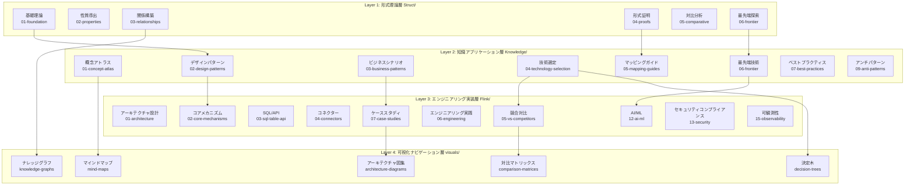

### 1.2 各層の責任とインターフェース

#### Layer 1: Struct/ - 形式理論基盤層

| 属性 | 説明 |
|------|------|
| **ポジショニング** | 数学的定義、定理証明、厳密な論証 |
| **コンテンツ特徴** | 形式化言語、公理システム、証明構築 |
| **ドキュメント数** | 43 篇 |
| **コア成果物** | 188 定理、399 定義、158 補題 |

**内部インターフェース仕様**：

```
入力: 学術文献、形式化仕様
出力: Def-* (定義), Thm-* (定理), Lemma-* (補題), Prop-* (命題)
契約: 各定義は唯一の番号を持ち、各定理は完全な証明を持つ必要がある
```

**サブディレクトリ責任**：

- `01-foundation/`: USTM、プロセス計算、Actor、Dataflow 基礎理論
- `02-properties/`: 決定性、一貫性、Watermark 単調性などの性質
- `03-relationships/`: クロスモデルエンコーディング、表現能力階層
- `04-proofs/`: Checkpoint、Exactly-Once 正確性証明
- `05-comparative/`: Go vs Scala 表現力対比
- `06-frontier/`: 未解決問題、Choreographic プログラミング、AI Agent 形式化

#### Layer 2: Knowledge/ - 知識アプリケーション層

| 属性 | 説明 |
|------|------|
| **ポジショニング** | デザインパターン、ビジネスシナリオ、技術選定 |
| **コンテンツ特徴** | エンジニアリング実践、パターンカタログ、決定フレームワーク |
| **ドキュメント数** | 110 篇 |
| **コア成果物** | 45 デザインパターン、15 ビジネスシナリオ |

**内部インターフェース仕様**：

```
入力: Struct/ 形式化定義、業界ケース、エンジニアリング経験
出力: デザインパターンカタログ、技術選定ガイド、ビジネスシナリオ分析
契約: 各パターンは形式化基盤に関連付けられ、各選定は決定マトリックスを持つ必要がある
```

**サブディレクトリ責任**：

- `01-concept-atlas/`: 並行パラダイムマトリックス、概念マップ
- `02-design-patterns/`: イベント時間処理、状態計算、ウィンドウ集計などのパターン
- `03-business-patterns/`: Uber/Netflix/Alibaba などの実ケース
- `04-technology-selection/`: エンジン選定、ストレージ選定、ストリームデータベースガイド
- `05-mapping-guides/`: 理論からコードへのマッピング、移行ガイド
- `06-frontier/`: A2A プロトコル、MCP、リアルタイム RAG、ストリームデータベースエコシステム
- `09-anti-patterns/`: 10 大アンチパターン識別と回避戦略

#### Layer 3: Flink/ - エンジニアリング実装層

| 属性 | 説明 |
|------|------|
| **ポジショニング** | Flink 専門技術、アーキテクチャメカニズム、エンジニアリング実践 |
| **コンテンツ特徴** | ソース分析、設定例、パフォーマンスチューニング |
| **ドキュメント数** | 117 篇 |
| **コア成果物** | 107 Flink 関連定理、コアメカニズム完全カバー |

**内部インターフェース仕様**：

```
入力: Knowledge/ デザインパターン、Flink 公式ドキュメント、ソース分析
出力: アーキテクチャドキュメント、メカニズム詳細、ケーススタディ、ロードマップ
契約: 各メカニズムはソース参照を持ち、各ケースは生産検証を持つ必要がある
```

**サブディレクトリ責任**：

- `01-architecture/`: アーキテクチャ進化、分離状態分析
- `02-core-mechanisms/`: Checkpoint、Exactly-Once、Watermark、Delta Join
- `03-sql-table-api/`: SQL 最適化、Model DDL、Vector Search
- `04-connectors/`: Kafka、CDC、Iceberg、Paimon 統合
- `05-vs-competitors/`: Spark、RisingWave との対比
- `06-engineering/`: パフォーマンスチューニング、コスト最適化、テスト戦略
- `07-case-studies/`: 金融リスク管理、IoT、推薦システムなどのケース
- `12-ai-ml/`: Flink ML、オンライン学習、AI Agents
- `13-security/`: TEE、GPU 信頼性計算
- `15-observability/`: OpenTelemetry、SLO、可観測性

#### Layer 4: visuals/ - 可視化ナビゲーション層

| 属性 | 説明 |
|------|------|
| **ポジショニング** | 決定木、対比マトリックス、マインドマップ、ナレッジグラフ |
| **コンテンツ特徴** | 可視化ナビゲーション、クイック決定、知識概要 |
| **ドキュメント数** | 20 篇 |
| **コア成果物** | 5 種類の可視化、700+ Mermaid 図表 |

**内部インターフェース仕様**：

```
入力: 全プロジェクトドキュメント、定理依存関係、技術選定ロジック
出力: 決定木、対比マトリックス、マインドマップ、ナレッジグラフ
契約: 各可視化はソースドキュメントにナビゲートでき、各決定は条件分岐を持つ必要がある
```

**サブディレクトリ責任**：

- `decision-trees/`: 技術選定決定木、パラダイム選択決定木
- `comparison-matrices/`: エンジン対比マトリックス、モデル対比マトリックス
- `mind-maps/`: 知識マインドマップ、完全なナレッジグラフ
- `knowledge-graphs/`: 概念関係グラフ、定理依存グラフ
- `architecture-diagrams/`: システムアーキテクチャ図、階層アーキテクチャ図

### 1.3 データフローと依存関係

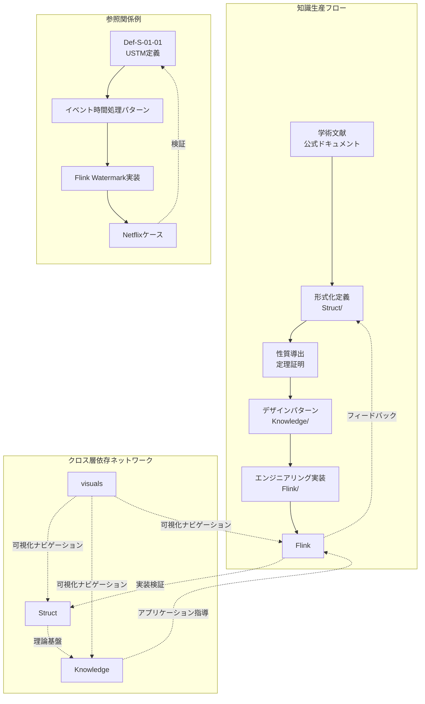

**依存ルール**：

1. **単方向依存原則**: Struct → Knowledge → Flink、循環依存を回避
2. **フィードバック検証メカニズム**: Flink エンジニアリング実践が Struct 理論を検証
3. **可視化ナビゲーション**: visuals/ はナビゲーション層として、すべての層を参照可能

---

## 2. ドキュメント生成アーキテクチャ

### 2.1 Markdown 処理フロー

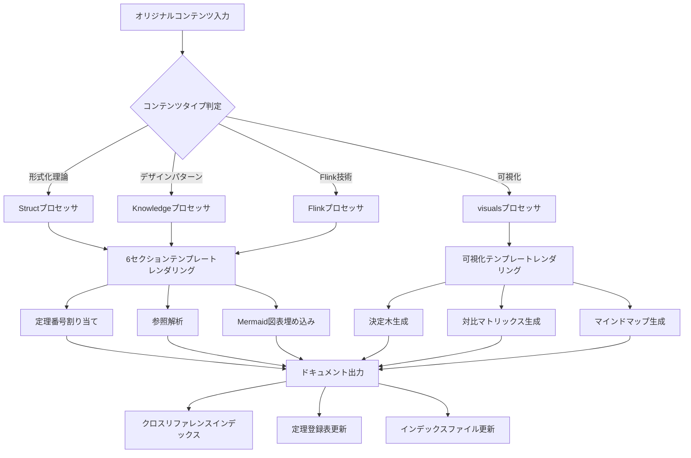

**処理段階の説明**：

| 段階 | 機能 | 出力 |
|------|------|------|
| **コンテンツ解析** | ドキュメントタイプ識別、メタデータ抽出 | ドキュメントオブジェクトツリー |
| **テンプレートレンダリング** | 6セクションテンプレートまたは可視化テンプレートを適用 | 構造化 Markdown |
| **番号割り当て** | 定理/定義/補題番号を割り当て | グローバルに唯一の識別子 |
| **参照解析** | 内部/外部参照を解析 | リンクマッピング表 |
| **図表埋め込み** | Mermaid 図表を生成 | 可視化コードブロック |
| **インデックス更新** | 登録表とインデックスを更新 | THEOREM-REGISTRY.md |

### 2.2 Mermaid 図表レンダリング

**図表タイプと使用シナリオ**：

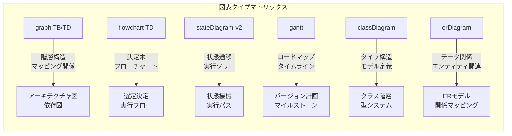

**図表レンダリング仕様**：

```markdown
## 7. 可視化 (Visualizations)

### 7.1 階層構造図

以下の図表は XXX の階層構造を示しています：

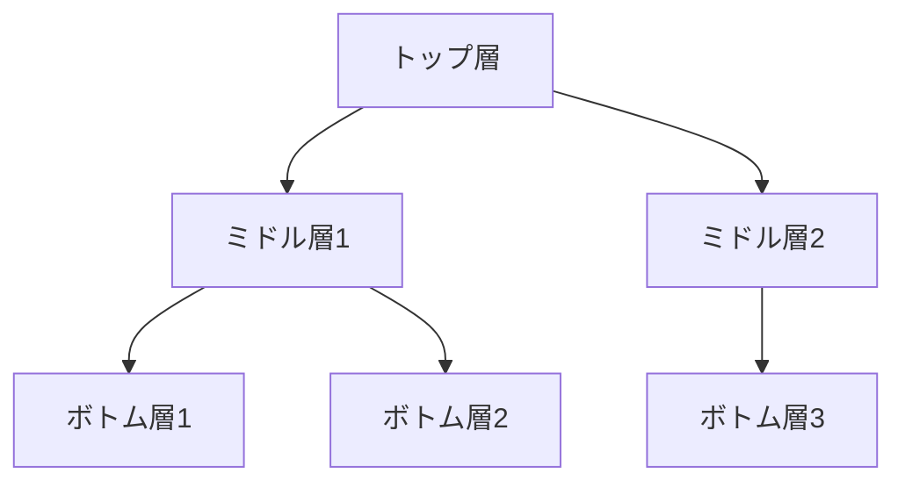

### 7.2 決定フロー図

以下の決定木は XXX の選択に役立ちます：

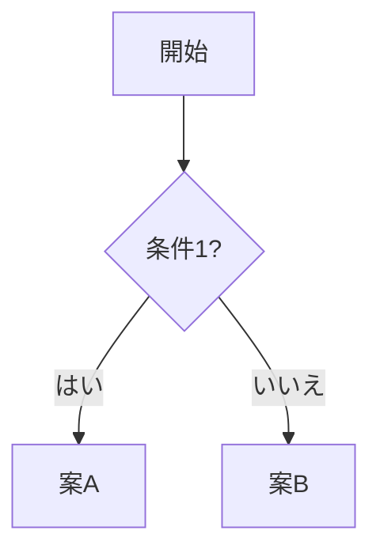
```

**レンダリングルール**：
1. 各図表の前にはテキスト説明が必要
2. 図表には明確なタイプ選択理由が必要
3. 複雑な図表には凡例説明が必要
4. 図表のセマンティクスはテキスト説明と一致する必要がある

---

## 3. 検証システムアーキテクチャ

### 3.1 検証スクリプトアーキテクチャ

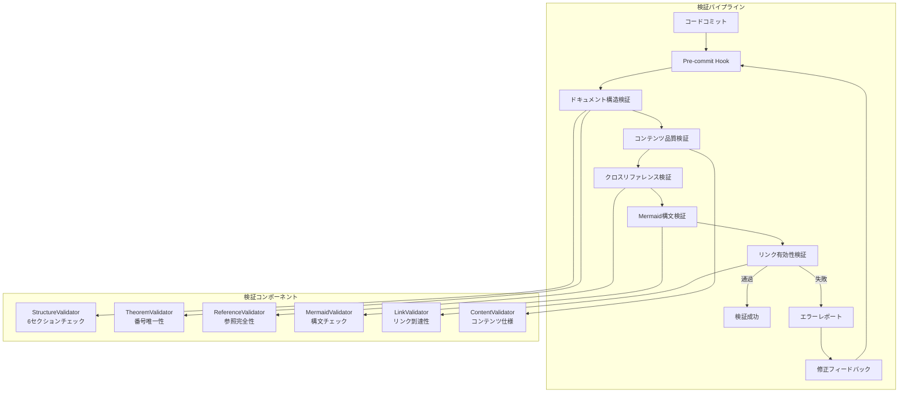

**検証コンポーネント詳細説明**：

| 検証コンポーネント | 責任 | 検証ルール |
|-------------------|------|------------|
| **StructureValidator** | 6セクションチェック | 8 つのセクションを含み、順序が正しい必要がある |
| **TheoremValidator** | 定理番号唯一性 | グローバル番号が競合せず、形式が正しい必要がある |
| **ReferenceValidator** | 参照完全性 | 内部リンクが有効で、外部リンクがアクセス可能である必要がある |
| **MermaidValidator** | Mermaid 構文チェック | 図表構文が正しく、レンダリング可能である必要がある |
| **LinkValidator** | リンク有効性 | HTTP 200 応答で、デッドリンクがない必要がある |
| **ContentValidator** | コンテンツ仕様 | 用語が一貫し、形式が統一されている必要がある |

### 3.2 CI/CD フロー

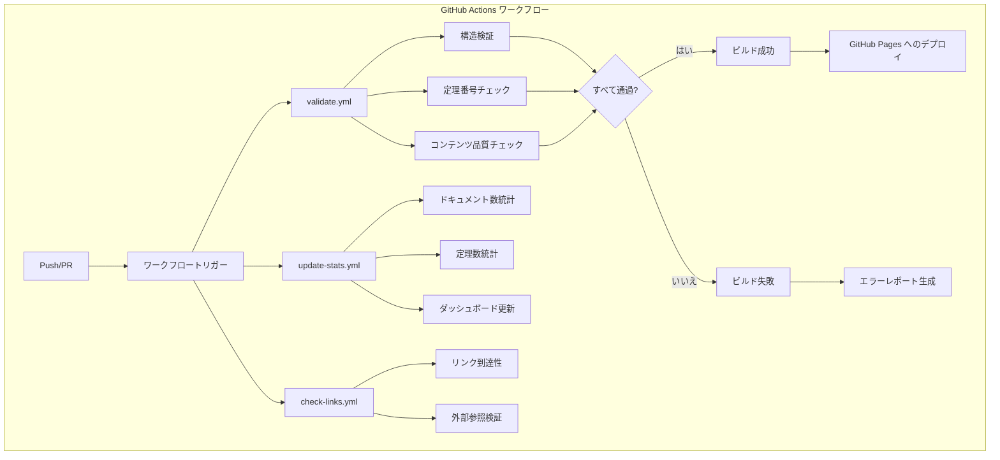

**ワークフロー設定**（`.github/workflows/`）：

| ワークフローファイル | トリガー条件 | 責任 |
|---------------------|--------------|------|
| `validate.yml` | Push, PR | ドキュメント構造、定理番号、コンテンツ品質検証 |
| `update-stats.yml` | Push to main | 統計更新、ダッシュボード更新 |
| `check-links.yml` | 毎日定時 | 外部リンク有効性チェック |

### 3.3 品質ゲート

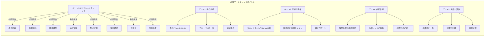

---

## 4. ストレージアーキテクチャ

### 4.1 ファイル組織構造

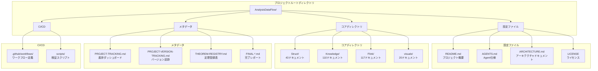

**ファイル命名規約**：

```
{層号}.{番号}-{トピックキーワード}.md

例:
- 01.01-unified-streaming-theory.md    (Struct/01-foundation/)
- 02-design-patterns-overview.md        (Knowledge/02-design-patterns/)
- checkpoint-mechanism-deep-dive.md     (Flink/02-core-mechanisms/)
```

### 4.2 インデックスシステム

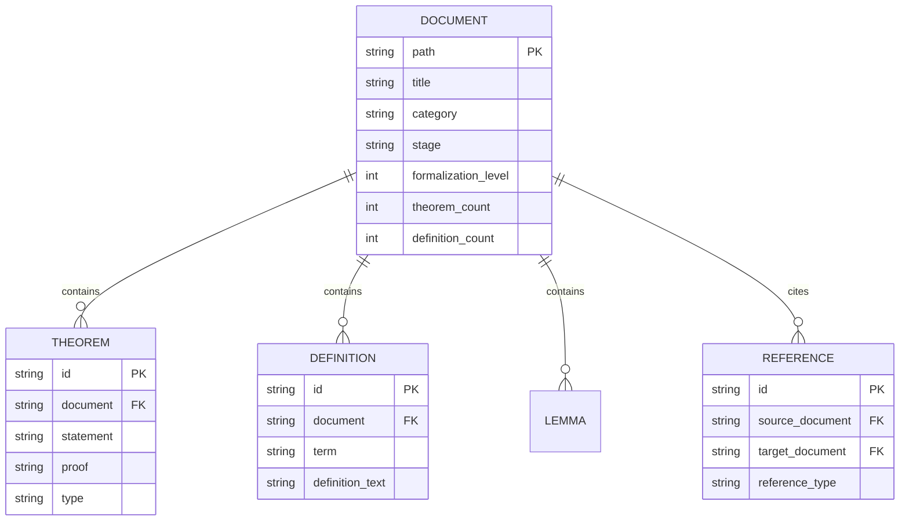

**インデックスファイル体系**：

| インデックスファイル | 責任 | 更新頻度 |
|---------------------|------|----------|
| `THEOREM-REGISTRY.md` | 全プロジェクトの定理/定義/補題登録表 | 各新規ドキュメント |
| `PROJECT-TRACKING.md` | 進捗ダッシュボード、タスクステータス | 各イテレーション |
| `PROJECT-VERSION-TRACKING.md` | バージョン履歴、変更ログ | 各バージョン |
| `Struct/00-INDEX.md` | Struct ディレクトリインデックス | 各新規ドキュメントバッチ |
| `Knowledge/00-INDEX.md` | Knowledge ディレクトリインデックス | 各新規ドキュメントバッチ |
| `Flink/00-INDEX.md` | Flink ディレクトリインデックス | 各新規ドキュメントバッチ |
| `visuals/index-visual.md` | 可視化ナビゲーションインデックス | 新規可視化時 |

### 4.3 バージョン管理

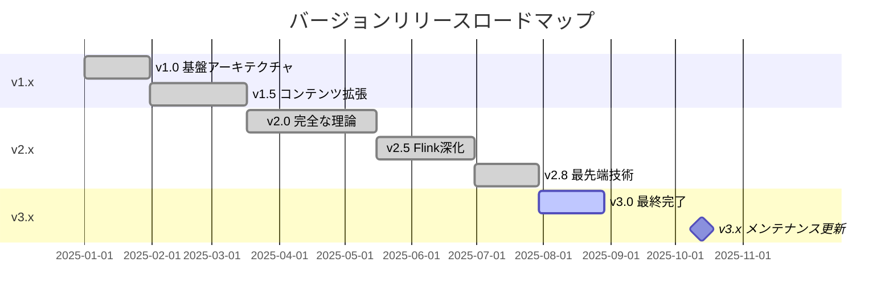

**バージョン管理戦略**：

| バージョン番号 | 意味 | 更新内容 |
|----------------|------|----------|
| **Major** (X.0) | 重大なアーキテクチャ変更 | ディレクトリ構造調整、番号体系変更 |
| **Minor** (x.X) | 機能拡張 | 新規ドキュメントバッチ、新規トピックカバー |
| **Patch** (x.x.X) | 修正最適化 | エラー修正、リンク更新、形式最適化 |

---

## 5. 拡張アーキテクチャ

### 5.1 新規ドキュメント追加

```mermaid
flowchart TD
    subgraph "新規ドキュメント追加フロー"
        A[ドキュメントタイプ決定] --> B{ディレクトリ選択}

        B -->|形式化理論| C[Struct/]
        B -->|デザインパターン| D[Knowledge/]
        B -->|Flink技術| E[Flink/]
        B -->|可視化| F[visuals/]

        C --> G[サブディレクトリ選択<br/>01-08]
        D --> H[サブディレクトリ選択<br/>01-09]
        E --> I[サブディレクトリ選択<br/>01-15]
        F --> J[サブディレクトリ選択<br/>decision-trees等]

        G & H & I & J --> K[番号割り当て]
        K --> L[ファイル作成<br/>{層号}.{番号}-{トピック}.md]
        L --> M[6セクションテンプレート適用]
        M --> N[定理番号割り当て]
        N --> O[コンテンツ作成]
        O --> P[Mermaid図追加]
        P --> Q[検証とコミット]
    end
```

### 5.2 新規可視化追加

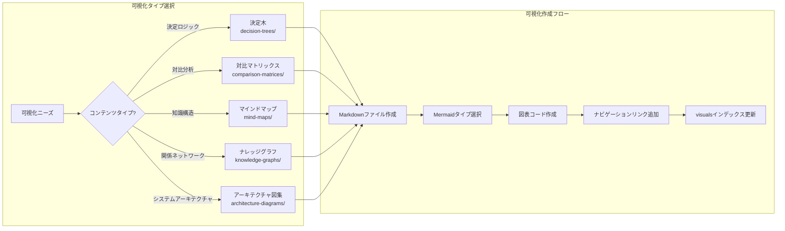

---

## 付録

### A. 用語表

| 用語 | 英語 | 説明 |
|------|------|------|
| 6セクションテンプレート | Six-Section Template | ドキュメント標準構造テンプレート |
| USTM | Unified Streaming Theory Model | 統一ストリームコンピューティング理論モデル |
| Def-* | Definition | 形式化定義番号接頭辞 |
| Thm-* | Theorem | 定理番号接頭辞 |
| Lemma-* | Lemma | 補題番号接頭辞 |
| Prop-* | Proposition | 命題番号接頭辞 |
| Cor-* | Corollary | 推論番号接頭辞 |

### B. ディレクトリマッピング表

| ディレクトリコード | 完全パス | 用途 |
|-------------------|----------|------|
| S | Struct/ | 形式理論 |
| K | Knowledge/ | 知識アプリケーション |
| F | Flink/ | エンジニアリング実装 |
| V | visuals/ | 可視化ナビゲーション |

### C. 関連ドキュメント

- [AGENTS.md](../../AGENTS.md) - Agent ワークコンテキスト仕様
- [PROJECT-TRACKING.md](../../PROJECT-TRACKING.md) - プロジェクト進捗追跡
- [THEOREM-REGISTRY.md](../../THEOREM-REGISTRY.md) - 定理登録表
- [README.md](../../README.md) - プロジェクト概要

---

*本ドキュメントは AnalysisDataFlow アーキテクチャグループによってメンテナンスされ、最終更新: 2026-04-03*

---

> **翻訳者注記**: 本ドキュメントは日本の技術文書スタイルに従って翻訳されています。アーキテクチャの専門用語、システムコンポーネント名、設定パラメータは原文と同一です。最終更新: 2026-04-11
