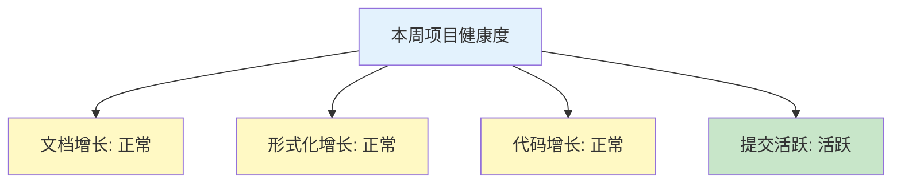
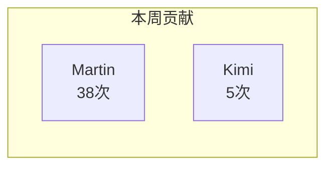

# 📊 AnalysisDataFlow 项目周报

> **报告周期**: 2026年03月30日 - 2026年04月05日  
> **第14周** | **自动生成**: 2026-04-04 10:44

---

## 目录

- [📈 本周概览](#本周概览)
- [🆕 新增内容](#新增内容)
- [👥 贡献者](#贡献者)
- [📝 变更摘要](#变更摘要)
- [📊 趋势分析](#趋势分析)
- [🎯 下周计划](#下周计划)

---

---

## 本周概览

### 核心指标

| 指标 | 当前值 | 本周变化 | 趋势 |
|------|--------|----------|------|
| 📚 文档总数 | 378 | +0 | ➡️ |
| 🔬 形式化元素 | 7,634 | +0 | ➡️ |
| 💻 代码示例 | 2,508 | +0 | ➡️ |
| 📈 Mermaid图表 | 1553 | - | ➡️ |

### Git活动

| 指标 | 数值 |
|------|------|
| 📝 提交次数 | 43 |
| 👥 活跃贡献者 | 2 |
| 📁 变更文件 | 770 |
| ➕ 新增行数 | 401078 |
| ➖ 删除行数 | 13188 |
| 📊 净变更 | +387890 |

### 项目健康度



---

## 新增内容

> ℹ️ 本周无新增文档或形式化元素。

### 当前各目录状态

| 目录 | 文档数 | 形式化元素 | 代码示例 | 图表 |
|------|--------|------------|----------|------|
| Flink/ | 140 | 3226 | 1471 | 727 |
| Knowledge/ | 129 | 2113 | 725 | 514 |
| Learning_paths/ | 22 | 0 | 59 | 14 |
| Struct/ | 43 | 1877 | 89 | 144 |
| Tutorials/ | 24 | 0 | 145 | 31 |
| Visuals/ | 20 | 418 | 19 | 123 |

---

## 贡献者

### 本周活跃贡献者 (2人)

| 排名 | 贡献者 | 提交数 | 徽章 |
|------|--------|--------|------|
| 1 | Martin | 38 | ⭐ |
| 2 | Kimi | 5 | 👍 |

### 贡献分布



### 累计贡献

- 本周提交总数: **{commits}** 次
- 活跃贡献者: **{len(authors)}** 人
- 人均提交: **{commits / len(authors) if authors else 0:.1f}** 次

---

## 变更摘要

### 代码变更统计

| 指标 | 数值 | 说明 |
|------|------|------|
| 变更文件 | 770 | 涉及文件数量 |
| 新增行数 | +401,078 | 新增代码/文档 |
| 删除行数 | -13,188 | 删除代码/文档 |
| 净变更 | +387890 | 总体变化 |

### 变更类型分析

- **变更特征**: 以新增内容为主, 大规模变更
- **变更强度**: 高
- **净增长**: 正增长

### 变更趋势图

```mermaid
xychart-beta
    title "本周变更趋势"
    x-axis [新增, 删除, 净变更]
    y-axis "行数"
    bar [401078, 13188, 387890]
```

---

## 趋势分析

> ℹ️ 历史数据不足，无法生成趋势分析。需要至少2周的数据。

---

## 下周计划

### 计划任务

| 优先级 | 任务 | 目标 | 负责人 |
|--------|------|------|--------|
| P0 | 内容审核 | 确保文档质量 | 核心团队 |
| P1 | 形式化完善 | 补充定理证明 | 形式化团队 |
| P2 | 代码示例 | 增加可运行示例 | 工程团队 |
| P3 | 可视化优化 | 完善Mermaid图表 | 文档团队 |

### 目标指标

| 指标 | 本周基线 | 下周目标 | 增长预期 |
|------|----------|----------|----------|
| 文档数 | 基准值 | +2~5篇 | 稳定增长 |
| 形式化元素 | 基准值 | +10~20个 | 持续完善 |
| 代码示例 | 基准值 | +20~50个 | 丰富实践 |

### 风险提醒

- [ ] 关注外部链接有效性
- [ ] 检查定理编号唯一性
- [ ] 验证Mermaid语法正确性
- [ ] 更新依赖版本信息

---

**注**: 下周计划为自动生成模板，实际计划请根据项目情况调整。

---

---

## 报告说明

- 📊 本报告由 `weekly-report.py` 自动生成
- 📅 生成时间: 2026-04-04 10:44:13
- 📁 报告位置: `E:\_src\AnalysisDataFlow\reports\weekly`
- 🔄 更新频率: 每周日自动生成

### 数据来源

- 统计数据: `.stats/project-stats.json`
- 历史数据: `.stats/stats-history.json`
- Git数据: `git log` 命令输出

---

*AnalysisDataFlow Weekly Report v1.0*