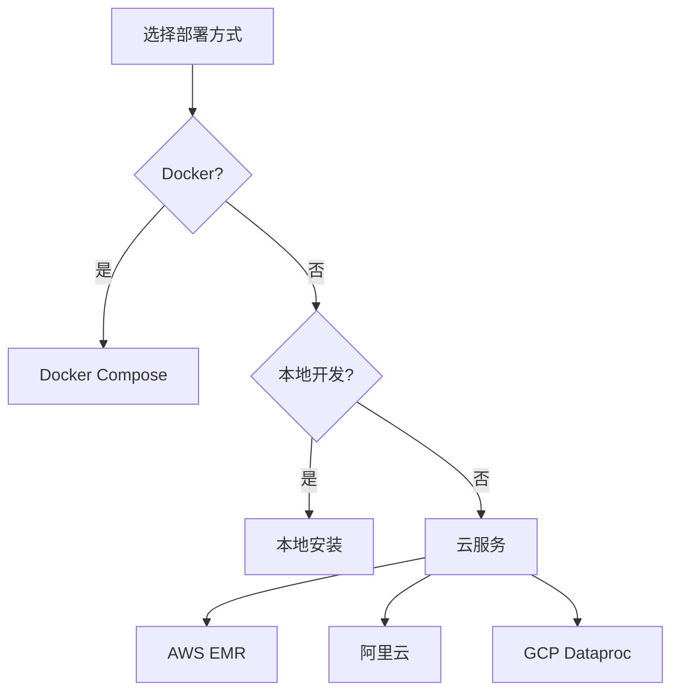
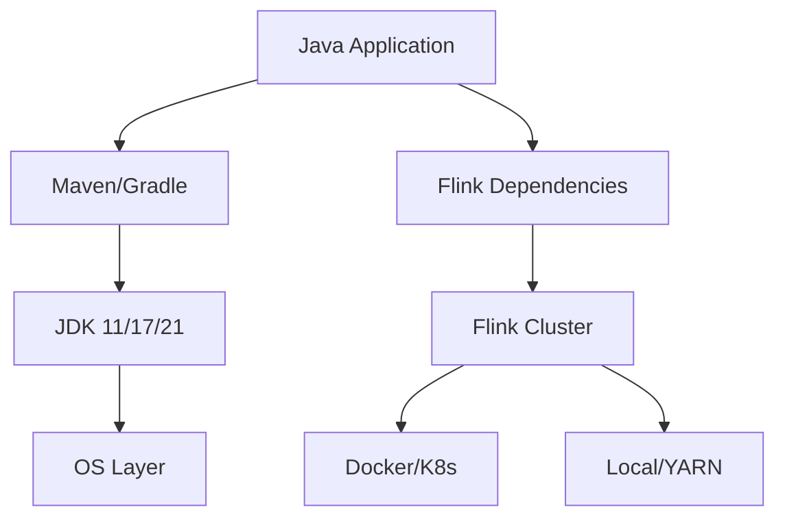
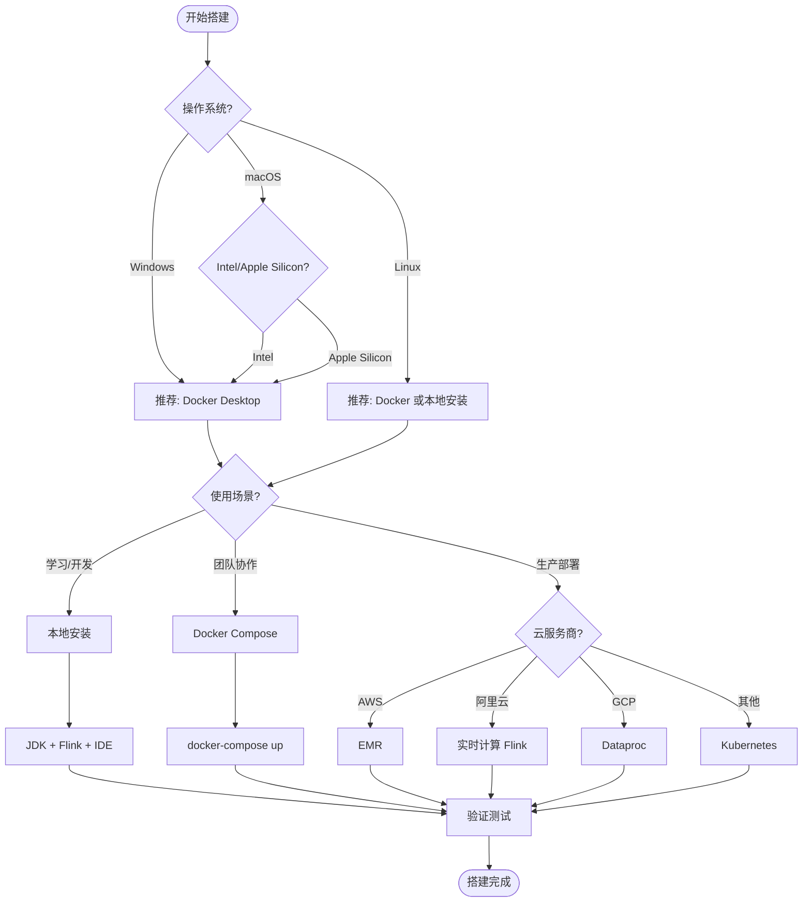
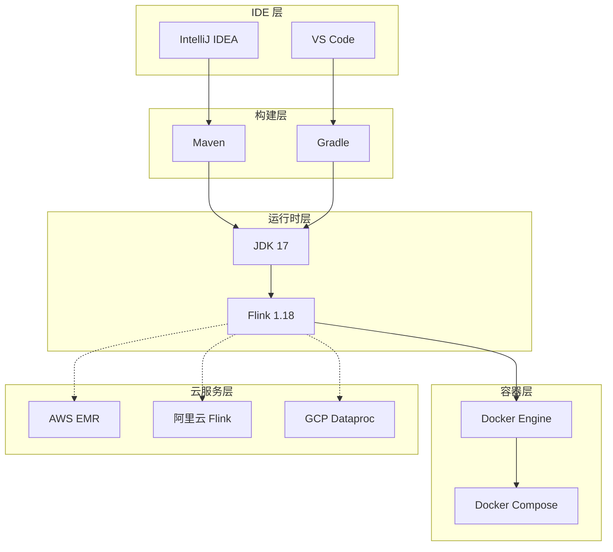

# 环境搭建指南

> **所属阶段**: tutorials | **前置依赖**: 无 | **形式化等级**: L3 (工程实践) | **预计阅读时间**: 45分钟

---

## 1. 概念定义 (Definitions)

### Def-T-01-01: Flink 运行环境

Flink 运行环境是指支持 Apache Flink 应用程序开发、测试和部署所需的软硬件基础设施集合，包括 Java 运行时、Flink 分发包、依赖管理工具和可选的容器化平台。

### Def-T-01-02: 部署模式矩阵

| 模式 | 适用场景 | 复杂度 | 资源隔离 | 扩展性 |
|------|----------|--------|----------|--------|
| Docker | 开发/测试/生产 | 低 | 高 | 中 |
| 本地安装 | 开发/学习 | 低 | 低 | 低 |
| 云服务 | 生产 | 中 | 高 | 高 |

### Def-T-01-03: 开发环境组件栈

```
┌─────────────────────────────────────────┐
│         IDE (IntelliJ/VS Code)          │
├─────────────────────────────────────────┤
│     Build Tool (Maven/Gradle)           │
├─────────────────────────────────────────┤
│      JDK (11/17/21)                     │
├─────────────────────────────────────────┤
│      Flink Distribution                 │
├─────────────────────────────────────────┤
│   Container Runtime (Docker)            │
└─────────────────────────────────────────┘
```

---

## 2. 属性推导 (Properties)

### Prop-T-01-01: JDK 兼容性约束

Flink 1.18+ 版本对 JDK 的支持矩阵：

| Flink 版本 | 最低 JDK | 推荐 JDK | 最高 JDK |
|-----------|---------|---------|---------|
| 1.16.x    | 8       | 11      | 11      |
| 1.17.x    | 8       | 11      | 17      |
| 1.18.x    | 11      | 17      | 21      |
| 1.19.x    | 11      | 17      | 21      |
| 1.20.x    | 11      | 21      | 21      |

### Prop-T-01-02: 资源需求基准

- **开发模式**: 2 CPU, 4GB RAM, 10GB 磁盘
- **单机模式**: 4 CPU, 8GB RAM, 50GB 磁盘
- **集群模式**: 8+ CPU, 16+ GB RAM, 100+ GB 磁盘

### Prop-T-01-03: 网络端口分配

| 组件 | 默认端口 | 用途 |
|------|---------|------|
| JobManager | 8081 | Web UI |
| JobManager | 6123 | RPC 通信 |
| TaskManager | 6121-6125 | 数据传输 |
| HistoryServer | 8082 | 历史任务查看 |

---

## 3. 关系建立 (Relations)

### 3.1 部署模式对比



### 3.2 工具链依赖图



---

## 4. 论证过程 (Argumentation)

### 4.1 部署方式选择决策树

| 场景 | 推荐方式 | 理由 |
|------|---------|------|
| 快速体验 Flink | Docker | 零配置，5分钟启动 |
| 本地开发调试 | 本地安装 + IDE | 断点调试方便 |
| 团队协作 | Docker Compose | 环境一致性保证 |
| 生产部署 | 云服务/K8s | 弹性伸缩，高可用 |
| 学习/教学 | 本地安装 | 理解内部机制 |

### 4.2 端口冲突解决方案

当默认端口被占用时，修改 `conf/flink-conf.yaml`：

```yaml
# JobManager Web UI 端口
rest.port: 8082

# JobManager RPC 端口
jobmanager.rpc.port: 6124

# TaskManager 数据端口范围
taskmanager.data.port: 6126-6130
```

---

## 5. 形式证明 / 工程论证 (Proof / Engineering Argument)

### 5.1 Docker 方式（推荐）

#### 5.1.1 Docker Compose 配置

创建 `docker-compose.yml`：

```yaml
version: '3.8'

services: 
  jobmanager: 
    image: flink:1.18-scala_2.12
    container_name: flink-jobmanager
    hostname: jobmanager
    ports: 
      - "8081:8081"
      - "6123:6123"
    command: jobmanager
    environment: 
      - JOB_MANAGER_RPC_ADDRESS=jobmanager
      - FLINK_PROPERTIES=
          jobmanager.memory.process.size: 2048m
          jobmanager.memory.jvm-heap.size: 1536m
    volumes: 
      - flink-checkpoints:/opt/flink/checkpoints
      - flink-savepoints:/opt/flink/savepoints
      - ./conf:/opt/flink/conf
    networks: 
      - flink-network
    healthcheck: 
      test: ["CMD", "curl", "-f", "http://localhost:8081"]
      interval: 30s
      timeout: 10s
      retries: 3

  taskmanager: 
    image: flink:1.18-scala_2.12
    container_name: flink-taskmanager
    hostname: taskmanager
    depends_on: 
      jobmanager: 
        condition: service_healthy
    command: taskmanager
    environment: 
      - JOB_MANAGER_RPC_ADDRESS=jobmanager
      - FLINK_PROPERTIES=
          taskmanager.memory.process.size: 4096m
          taskmanager.memory.flink.size: 3072m
          taskmanager.numberOfTaskSlots: 4
          taskmanager.memory.network.min: 256m
          taskmanager.memory.network.max: 512m
    volumes: 
      - flink-checkpoints:/opt/flink/checkpoints
      - flink-savepoints:/opt/flink/savepoints
    networks: 
      - flink-network
    deploy: 
      resources: 
        limits: 
          cpus: '2'
          memory: 4G
        reservations: 
          cpus: '1'
          memory: 2G

  sql-gateway: 
    image: flink:1.18-scala_2.12
    container_name: flink-sql-gateway
    depends_on: 
      - jobmanager
    command: >
      bash -c "
        /opt/flink/bin/sql-gateway.sh start-foreground
        -Dsql-gateway.endpoint.rest.address=0.0.0.0
        -Dsql-gateway.endpoint.rest.port=8083
      "
    ports: 
      - "8083:8083"
    environment: 
      - JOB_MANAGER_RPC_ADDRESS=jobmanager
    networks: 
      - flink-network

volumes: 
  flink-checkpoints: 
    driver: local
  flink-savepoints: 
    driver: local

networks: 
  flink-network: 
    driver: bridge
```

#### 5.1.2 一键启动脚本

**Linux/macOS** (`start-flink.sh`):

```bash
#!/bin/bash
# Flink Docker 一键启动脚本

set -e

SCRIPT_DIR="$(cd "$(dirname "${BASH_SOURCE[0]}")" && pwd)"
cd "$SCRIPT_DIR"

echo "🚀 启动 Flink 集群..."

# 检查 Docker
if ! command -v docker &> /dev/null; then
    echo "❌ Docker 未安装，请先安装 Docker"
    exit 1
fi

if ! command -v docker-compose &> /dev/null; then
    echo "❌ Docker Compose 未安装，请先安装 Docker Compose"
    exit 1
fi

# 创建必要目录
mkdir -p checkpoints savepoints logs conf

# 拉取最新镜像
echo "📦 拉取 Flink 镜像..."
docker-compose pull

# 启动服务
echo "▶️ 启动 Flink 服务..."
docker-compose up -d

# 等待服务就绪
echo "⏳ 等待服务启动..."
sleep 5

# 检查健康状态
MAX_RETRIES=30
RETRY_COUNT=0

while [ $RETRY_COUNT -lt $MAX_RETRIES ]; do
    if curl -s http://localhost:8081 > /dev/null; then
        echo "✅ Flink JobManager 已就绪"
        break
    fi
    echo "  等待 JobManager 启动... ($RETRY_COUNT/$MAX_RETRIES)"
    sleep 2
    RETRY_COUNT=$((RETRY_COUNT + 1))
done

if [ $RETRY_COUNT -eq $MAX_RETRIES ]; then
    echo "❌ 服务启动超时，请检查日志: docker-compose logs"
    exit 1
fi

echo ""
echo "🎉 Flink 集群启动成功！"
echo "━━━━━━━━━━━━━━━━━━━━━━━━━━━━━━━━"
echo "📊 Web UI:    http://localhost:8081"
echo "📝 SQL Gateway: http://localhost:8083"
echo "💾 Checkpoints: ./checkpoints"
echo "💾 Savepoints:  ./savepoints"
echo "━━━━━━━━━━━━━━━━━━━━━━━━━━━━━━━━"
echo ""
echo "常用命令:"
echo "  查看日志:  docker-compose logs -f"
echo "  停止集群:  docker-compose down"
echo "  完全清理:  docker-compose down -v"
```

**Windows** (`start-flink.ps1`):

```powershell
# Flink Docker 一键启动脚本 (PowerShell)

$ErrorActionPreference = "Stop"

Write-Host "🚀 启动 Flink 集群..." -ForegroundColor Green

# 检查 Docker
if (!(Get-Command docker -ErrorAction SilentlyContinue)) {
    Write-Host "❌ Docker 未安装，请先安装 Docker" -ForegroundColor Red
    exit 1
}

# 创建必要目录
@("checkpoints", "savepoints", "logs", "conf") | ForEach-Object {
    New-Item -ItemType Directory -Force -Path $_ | Out-Null
}

# 拉取镜像
Write-Host "📦 拉取 Flink 镜像..." -ForegroundColor Cyan
docker-compose pull

# 启动服务
Write-Host "▶️ 启动 Flink 服务..." -ForegroundColor Cyan
docker-compose up -d

# 等待服务就绪
Write-Host "⏳ 等待服务启动..." -ForegroundColor Yellow
$maxRetries = 30
$retryCount = 0

while ($retryCount -lt $maxRetries) {
    try {
        $response = Invoke-WebRequest -Uri "http://localhost:8081" -UseBasicParsing -ErrorAction Stop
        if ($response.StatusCode -eq 200) {
            Write-Host "✅ Flink JobManager 已就绪" -ForegroundColor Green
            break
        }
    } catch {
        Write-Host "  等待 JobManager 启动... ($retryCount/$maxRetries)" -ForegroundColor Gray
        Start-Sleep -Seconds 2
        $retryCount++
    }
}

if ($retryCount -eq $maxRetries) {
    Write-Host "❌ 服务启动超时，请检查日志: docker-compose logs" -ForegroundColor Red
    exit 1
}

Write-Host ""
Write-Host "🎉 Flink 集群启动成功！" -ForegroundColor Green
Write-Host "━━━━━━━━━━━━━━━━━━━━━━━━━━━━━━━━" -ForegroundColor Cyan
Write-Host "📊 Web UI:      http://localhost:8081"
Write-Host "📝 SQL Gateway: http://localhost:8083"
Write-Host "💾 Checkpoints: .\checkpoints"
Write-Host "💾 Savepoints:  .\savepoints"
Write-Host "━━━━━━━━━━━━━━━━━━━━━━━━━━━━━━━━" -ForegroundColor Cyan
Write-Host ""
Write-Host "常用命令:"
Write-Host "  查看日志:  docker-compose logs -f"
Write-Host "  停止集群:  docker-compose down"
Write-Host "  完全清理:  docker-compose down -v"
```

#### 5.1.3 持久化配置

创建 `conf/flink-conf.yaml`：

```yaml
# =============================================================================
# Flink 配置文件 - Docker 环境专用
# =============================================================================

# -----------------------------------------------------------------------------
# 基础配置
# -----------------------------------------------------------------------------
jobmanager.rpc.address: jobmanager
jobmanager.rpc.port: 6123
jobmanager.memory.process.size: 2048m
jobmanager.memory.jvm-heap.size: 1536m
jobmanager.memory.jvm-metaspace.size: 256m

# TaskManager 配置
taskmanager.memory.process.size: 4096m
taskmanager.memory.flink.size: 3072m
taskmanager.numberOfTaskSlots: 4

# -----------------------------------------------------------------------------
# Web UI 配置
# -----------------------------------------------------------------------------
rest.port: 8081
rest.bind-address: 0.0.0.0
rest.address: 0.0.0.0

# 启用历史服务器
jobmanager.archive.fs.dir: file:///opt/flink/savepoints/completed-jobs
historyserver.web.address: 0.0.0.0
historyserver.web.port: 8082
historyserver.archive.fs.dir: file:///opt/flink/savepoints/completed-jobs
historyserver.archive.fs.refresh-interval: 10000

# -----------------------------------------------------------------------------
# Checkpoint 配置
# -----------------------------------------------------------------------------
state.checkpoints.dir: file:///opt/flink/checkpoints
state.savepoints.dir: file:///opt/flink/savepoints
state.checkpoints.num-retained: 10

# 启用增量 Checkpoint
state.backend.incremental: true
state.backend: hashmap

# -----------------------------------------------------------------------------
# 网络配置
# -----------------------------------------------------------------------------
taskmanager.memory.network.min: 256m
taskmanager.memory.network.max: 512m
taskmanager.memory.network.fraction: 0.15

# -----------------------------------------------------------------------------
# 高可用配置 (单节点开发环境可禁用)
# -----------------------------------------------------------------------------
high-availability: none

# -----------------------------------------------------------------------------
# 类加载配置
# -----------------------------------------------------------------------------
classloader.resolve-order: parent-first
classloader.check-leaked-classloader: true

# -----------------------------------------------------------------------------
# 日志配置
# -----------------------------------------------------------------------------
log4j.configuration: file:/opt/flink/conf/log4j-console.properties
```

---

### 5.2 本地安装方式

#### 5.2.1 JDK 要求

**安装 OpenJDK 17（推荐）**：

**Ubuntu/Debian：**

```bash
# 更新包索引
sudo apt update

# 安装 OpenJDK 17
sudo apt install -y openjdk-17-jdk

# 验证安装
java -version
# 预期输出: openjdk version "17.0.x"

# 设置 JAVA_HOME
echo 'export JAVA_HOME=/usr/lib/jvm/java-17-openjdk-amd64' >> ~/.bashrc
echo 'export PATH=$JAVA_HOME/bin:$PATH' >> ~/.bashrc
source ~/.bashrc
```

**CentOS/RHEL/Fedora：**

```bash
# 安装 OpenJDK 17
sudo yum install -y java-17-openjdk-devel

# 或 Fedora
sudo dnf install -y java-17-openjdk-devel

# 验证安装
java -version

# 设置 JAVA_HOME
echo 'export JAVA_HOME=/usr/lib/jvm/java-17-openjdk' >> ~/.bashrc
source ~/.bashrc
```

**macOS：**

```bash
# 使用 Homebrew 安装
brew install openjdk@17

# 链接到系统
sudo ln -sfn /opt/homebrew/opt/openjdk@17/libexec/openjdk.jdk /Library/Java/JavaVirtualMachines/openjdk-17.jdk

# 验证安装
java -version

# 设置环境变量
echo 'export JAVA_HOME=/opt/homebrew/opt/openjdk@17' >> ~/.zshrc
echo 'export PATH=$JAVA_HOME/bin:$PATH' >> ~/.zshrc
source ~/.zshrc
```

**Windows：**

1. 下载 [OpenJDK 17](https://adoptium.net/temurin/releases/?version=17)
2. 运行安装程序
3. 设置环境变量：

   ```powershell
   # PowerShell 管理员权限
   [Environment]::SetEnvironmentVariable("JAVA_HOME", "C:\Program Files\Eclipse Adoptium\jdk-17", "Machine")
   [Environment]::SetEnvironmentVariable("Path", $env:JAVA_HOME + "\bin;" + $env:Path, "Machine")
```

#### 5.2.2 Flink 下载和配置

```bash
# 创建安装目录
mkdir -p ~/tools
cd ~/tools

# 下载 Flink 1.18.1
wget https://archive.apache.org/dist/flink/flink-1.18.1/flink-1.18.1-bin-scala_2.12.tgz

# 解压
tar -xzf flink-1.18.1-bin-scala_2.12.tgz

# 创建软链接
ln -s flink-1.18.1 flink

# 设置环境变量
echo 'export FLINK_HOME=$HOME/tools/flink' >> ~/.bashrc
echo 'export PATH=$FLINK_HOME/bin:$PATH' >> ~/.bashrc
source ~/.bashrc

# 验证安装
flink --version
```

#### 5.2.3 环境变量设置

**完整环境变量配置**（`~/.bashrc` 或 `~/.zshrc`）：

```bash
# =============================================================================
# Flink 开发环境配置
# =============================================================================

# Java 配置
export JAVA_HOME=/usr/lib/jvm/java-17-openjdk-amd64  # 根据实际路径调整
export PATH=$JAVA_HOME/bin:$PATH

# Flink 配置
export FLINK_HOME=$HOME/tools/flink
export PATH=$FLINK_HOME/bin:$PATH

# Flink 常用别名
alias flink-start='$FLINK_HOME/bin/start-cluster.sh'
alias flink-stop='$FLINK_HOME/bin/stop-cluster.sh'
alias flink-ui='open http://localhost:8081'  # macOS
# alias flink-ui='xdg-open http://localhost:8081'  # Linux

# Maven 配置（如需要）
export MAVEN_OPTS="-Xmx2048m -Xms1024m -XX:MaxMetaspaceSize=512m"

# Flink 调试配置
export FLINK_DEBUG=true
export FLINK_LOG_LEVEL=DEBUG
```

#### 5.2.4 验证安装

```bash
# 1. 检查 Flink 版本
flink --version
# 预期: Version: 1.18.1, Commit ID: xxx

# 2. 启动本地集群
start-cluster.sh

# 3. 检查进程
jps
# 预期看到: TaskManagerRunner, StandaloneSessionClusterEntrypoint

# 4. 访问 Web UI
curl http://localhost:8081
# 预期返回 HTML 内容

# 5. 运行 WordCount 示例
flink run $FLINK_HOME/examples/streaming/WordCount.jar

# 6. 停止集群
stop-cluster.sh
```

---

### 5.3 IDE 配置

#### 5.3.1 IntelliJ IDEA 配置

**步骤 1: 安装插件**

1. 打开 **Settings** → **Plugins**
2. 搜索并安装：
   - **Scala** (如果使用 Scala API)
   - **Big Data Tools** (Flink 支持)
   - **Mermaid** (查看文档图表)

**步骤 2: 项目导入**

1. **File** → **New** → **Project from Existing Sources**
2. 选择 `pom.xml` (Maven) 或 `build.gradle` (Gradle)
3. 选择 **Auto Import**

**步骤 3: 代码风格配置**

```xml
<!-- .idea/codeStyles/Project.xml -->
<code_scheme name="Flink Style" version="173">
  <JavaCodeStyleSettings>
    <option name="CLASS_COUNT_TO_USE_IMPORT_ON_DEMAND" value="999" />
    <option name="NAMES_COUNT_TO_USE_IMPORT_ON_DEMAND" value="999" />
    <option name="IMPORT_LAYOUT_TABLE">
      <value>
        <package name="" withSubpackages="true" static="true" />
        <emptyLine />
        <package name="java" withSubpackages="true" static="false" />
        <package name="javax" withSubpackages="true" static="false" />
        <emptyLine />
        <package name="org.apache.flink" withSubpackages="true" static="false" />
        <emptyLine />
        <package name="" withSubpackages="true" static="false" />
      </value>
    </option>
  </JavaCodeStyleSettings>
</code_scheme>
```

**步骤 4: 调试配置**

```xml
<!-- .idea/runConfigurations/Flink_Local_Debug.xml -->
<component name="ProjectRunConfigurationManager">
  <configuration default="false" name="Flink Local Debug" type="Application" factoryName="Application">
    <option name="MAIN_CLASS_NAME" value="org.apache.flink.streaming.examples.wordcount.WordCount" />
    <module name="flink-examples" />
    <option name="VM_PARAMETERS" value="-Xmx2048m -Xms1024m -Dlog4j.configuration=file://$PROJECT_DIR$/log4j-debug.properties" />
    <option name="PROGRAM_PARAMETERS" value="--input file://$PROJECT_DIR$/input.txt --output file://$PROJECT_DIR$/output" />
    <method v="2">
      <option name="Make" enabled="true" />
    </method>
  </configuration>
</component>
```

**步骤 5: 实时模板配置**

```java
// 创建 Live Template: flink-main
public class $NAME$ {
    public static void main(String[] args) throws Exception {
        StreamExecutionEnvironment env = StreamExecutionEnvironment.getExecutionEnvironment();

        $END$

        env.execute("$JOB_NAME$");
    }
}
```

#### 5.3.2 VS Code 配置

**步骤 1: 安装扩展**

```json
// .vscode/extensions.json
{
  "recommendations": [
    "vscjava.vscode-java-pack",
    "scala-lang.scala",
    "redhat.vscode-xml",
    "vscjava.vscode-maven",
    "GitHub.copilot",
    "mermaid-chart.mermaid-chart"
  ]
}
```

**步骤 2: 工作区配置**

```json
// .vscode/settings.json
{
  "java.configuration.updateBuildConfiguration": "automatic",
  "java.compile.nullAnalysis.mode": "automatic",
  "java.format.settings.url": ".vscode/eclipse-formatter.xml",
  "java.format.settings.profile": "Flink",
  "editor.formatOnSave": true,
  "files.exclude": {
    "**/target": true,
    "**/.idea": true,
    "**/*.iml": true
  },
  "java.dependency.syncWithFolderExplorer": true
}
```

**步骤 3: 启动配置**

```json
// .vscode/launch.json
{
  "version": "0.2.0",
  "configurations": [
    {
      "type": "java",
      "name": "Flink Local Debug",
      "request": "launch",
      "mainClass": "${file}",
      "vmArgs": "-Xmx2048m -Xms1024m",
      "env": {
        "FLINK_CONF_DIR": "${workspaceFolder}/conf"
      }
    },
    {
      "type": "java",
      "name": "WordCount Example",
      "request": "launch",
      "mainClass": "org.apache.flink.streaming.examples.wordcount.WordCount",
      "projectName": "flink-examples",
      "args": "--input ${workspaceFolder}/input.txt --output ${workspaceFolder}/output"
    }
  ]
}
```

#### 5.3.3 Maven 配置

**完整 `pom.xml` 模板**：

```xml
<?xml version="1.0" encoding="UTF-8"?>
<project xmlns="http://maven.apache.org/POM/4.0.0"
         xmlns:xsi="http://www.w3.org/2001/XMLSchema-instance"
         xsi:schemaLocation="http://maven.apache.org/POM/4.0.0
                             http://maven.apache.org/xsd/maven-4.0.0.xsd">
    <modelVersion>4.0.0</modelVersion>

    <groupId>com.example</groupId>
    <artifactId>flink-quickstart</artifactId>
    <version>1.0-SNAPSHOT</version>
    <packaging>jar</packaging>

    <name>Flink Quickstart Job</name>
    <description>Flink 快速入门项目</description>

    <properties>
        <project.build.sourceEncoding>UTF-8</project.build.sourceEncoding>
        <maven.compiler.source>17</maven.compiler.source>
        <maven.compiler.target>17</maven.compiler.target>

        <!-- Flink 版本 -->
        <flink.version>1.18.1</flink.version>
        <scala.binary.version>2.12</scala.binary.version>

        <!-- 其他依赖版本 -->
        <log4j.version>2.17.1</log4j.version>
        <junit.version>5.9.2</junit.version>
    </properties>

    <dependencies>
        <!-- ============================================ -->
        <!-- Flink 核心依赖 -->
        <!-- ============================================ -->

        <!-- DataStream API -->
        <dependency>
            <groupId>org.apache.flink</groupId>
            <artifactId>flink-streaming-java</artifactId>
            <version>${flink.version}</version>
            <scope>provided</scope>
        </dependency>

        <!-- Table API -->
        <dependency>
            <groupId>org.apache.flink</groupId>
            <artifactId>flink-table-api-java-bridge</artifactId>
            <version>${flink.version}</version>
            <scope>provided</scope>
        </dependency>

        <!-- Table Planner -->
        <dependency>
            <groupId>org.apache.flink</groupId>
            <artifactId>flink-table-planner-loader</artifactId>
            <version>${flink.version}</version>
            <scope>provided</scope>
        </dependency>

        <!-- Scala API (可选) -->
        <dependency>
            <groupId>org.apache.flink</groupId>
            <artifactId>flink-scala_${scala.binary.version}</artifactId>
            <version>${flink.version}</version>
            <scope>provided</scope>
        </dependency>

        <!-- Streaming Scala -->
        <dependency>
            <groupId>org.apache.flink</groupId>
            <artifactId>flink-streaming-scala_${scala.binary.version}</artifactId>
            <version>${flink.version}</version>
            <scope>provided</scope>
        </dependency>

        <!-- ============================================ -->
        <!-- 连接器依赖 -->
        <!-- ============================================ -->

        <!-- Kafka Connector -->
        <dependency>
            <groupId>org.apache.flink</groupId>
            <artifactId>flink-connector-kafka</artifactId>
            <version>3.1.0-1.18</version>
        </dependency>

        <!-- JDBC Connector -->
        <dependency>
            <groupId>org.apache.flink</groupId>
            <artifactId>flink-connector-jdbc</artifactId>
            <version>3.1.2-1.18</version>
        </dependency>

        <!-- Filesystem Connector -->
        <dependency>
            <groupId>org.apache.flink</groupId>
            <artifactId>flink-connector-files</artifactId>
            <version>${flink.version}</version>
            <scope>provided</scope>
        </dependency>

        <!-- ============================================ -->
        <!-- 日志依赖 -->
        <!-- ============================================ -->
        <dependency>
            <groupId>org.apache.logging.log4j</groupId>
            <artifactId>log4j-slf4j-impl</artifactId>
            <version>${log4j.version}</version>
            <scope>runtime</scope>
        </dependency>
        <dependency>
            <groupId>org.apache.logging.log4j</groupId>
            <artifactId>log4j-api</artifactId>
            <version>${log4j.version}</version>
            <scope>runtime</scope>
        </dependency>
        <dependency>
            <groupId>org.apache.logging.log4j</groupId>
            <artifactId>log4j-core</artifactId>
            <version>${log4j.version}</version>
            <scope>runtime</scope>
        </dependency>

        <!-- ============================================ -->
        <!-- 测试依赖 -->
        <!-- ============================================ -->
        <dependency>
            <groupId>org.apache.flink</groupId>
            <artifactId>flink-test-utils</artifactId>
            <version>${flink.version}</version>
            <scope>test</scope>
        </dependency>
        <dependency>
            <groupId>org.junit.jupiter</groupId>
            <artifactId>junit-jupiter</artifactId>
            <version>${junit.version}</version>
            <scope>test</scope>
        </dependency>
    </dependencies>

    <build>
        <plugins>
            <!-- 编译插件 -->
            <plugin>
                <groupId>org.apache.maven.plugins</groupId>
                <artifactId>maven-compiler-plugin</artifactId>
                <version>3.11.0</version>
                <configuration>
                    <source>${maven.compiler.source}</source>
                    <target>${maven.compiler.target}</target>
                    <compilerArgs>
                        <arg>-Xlint:unchecked</arg>
                        <arg>-Xlint:deprecation</arg>
                    </compilerArgs>
                </configuration>
            </plugin>

            <!-- Shade 插件 - 打包 Fat JAR -->
            <plugin>
                <groupId>org.apache.maven.plugins</groupId>
                <artifactId>maven-shade-plugin</artifactId>
                <version>3.5.0</version>
                <executions>
                    <execution>
                        <phase>package</phase>
                        <goals>
                            <goal>shade</goal>
                        </goals>
                        <configuration>
                            <createDependencyReducedPom>false</createDependencyReducedPom>
                            <transformers>
                                <transformer implementation="org.apache.maven.plugins.shade.resource.ManifestResourceTransformer">
                                    <mainClass>com.example.StreamingJob</mainClass>
                                </transformer>
                                <transformer implementation="org.apache.maven.plugins.shade.resource.ServicesResourceTransformer"/>
                            </transformers>
                            <filters>
                                <filter>
                                    <artifact>*:*</artifact>
                                    <excludes>
                                        <exclude>META-INF/*.SF</exclude>
                                        <exclude>META-INF/*.DSA</exclude>
                                        <exclude>META-INF/*.RSA</exclude>
                                    </excludes>
                                </filter>
                            </filters>
                        </configuration>
                    </execution>
                </executions>
            </plugin>

            <!-- Scala 插件 (如果使用 Scala) -->
            <plugin>
                <groupId>net.alchim31.maven</groupId>
                <artifactId>scala-maven-plugin</artifactId>
                <version>4.8.1</version>
                <executions>
                    <execution>
                        <goals>
                            <goal>compile</goal>
                            <goal>testCompile</goal>
                        </goals>
                    </execution>
                </executions>
                <configuration>
                    <scalaVersion>2.12.17</scalaVersion>
                </configuration>
            </plugin>
        </plugins>
    </build>

    <profiles>
        <!-- 本地开发配置 -->
        <profile>
            <id>local</id>
            <activation>
                <activeByDefault>true</activeByDefault>
            </activation>
            <dependencies>
                <dependency>
                    <groupId>org.apache.flink</groupId>
                    <artifactId>flink-streaming-java</artifactId>
                    <version>${flink.version}</version>
                    <scope>compile</scope>
                </dependency>
            </dependencies>
        </profile>

        <!-- 集群部署配置 -->
        <profile>
            <id>cluster</id>
            <dependencies>
                <dependency>
                    <groupId>org.apache.flink</groupId>
                    <artifactId>flink-streaming-java</artifactId>
                    <version>${flink.version}</version>
                    <scope>provided</scope>
                </dependency>
            </dependencies>
        </profile>
    </profiles>
</project>
```

#### 5.3.4 Gradle 配置

**`build.gradle` 模板**：

```gradle
plugins {
    id 'java'
    id 'application'
    id 'com.github.johnrengelman.shadow' version '8.1.1'
}

group = 'com.example'
version = '1.0-SNAPSHOT'

java {
    sourceCompatibility = JavaVersion.VERSION_17
    targetCompatibility = JavaVersion.VERSION_17
}

repositories {
    mavenCentral()
    maven { url "https://repository.apache.org/content/repositories/snapshots/" }
}

ext {
    flinkVersion = '1.18.1'
    scalaBinaryVersion = '2.12'
    log4jVersion = '2.17.1'
}

dependencies {
    // Flink Core
    implementation "org.apache.flink:flink-streaming-java:${flinkVersion}"
    implementation "org.apache.flink:flink-table-api-java-bridge:${flinkVersion}"

    // Connectors
    implementation 'org.apache.flink:flink-connector-kafka:3.1.0-1.18'
    implementation 'org.apache.flink:flink-connector-jdbc:3.1.2-1.18'

    // Logging
    runtimeOnly "org.apache.logging.log4j:log4j-slf4j-impl:${log4jVersion}"
    runtimeOnly "org.apache.logging.log4j:log4j-api:${log4jVersion}"
    runtimeOnly "org.apache.logging.log4j:log4j-core:${log4jVersion}"

    // Testing
    testImplementation "org.apache.flink:flink-test-utils:${flinkVersion}"
    testImplementation 'org.junit.jupiter:junit-jupiter:5.9.2'
}

// Shadow JAR 配置
shadowJar {
    archiveClassifier.set('')
    manifest {
        attributes 'Main-Class': 'com.example.StreamingJob'
    }
}

application {
    mainClass = 'com.example.StreamingJob'
}

test {
    useJUnitPlatform()
    testLogging {
        events "passed", "skipped", "failed"
    }
}

// 本地运行任务
task runLocal(type: JavaExec) {
    classpath = sourceSets.main.runtimeClasspath
    mainClass = application.mainClass
    args = ['--input', 'input.txt', '--output', 'output']
    jvmArgs = ['-Xmx2048m', '-Xms1024m']
}
```

---

### 5.4 云服务方式

#### 5.4.1 AWS EMR 快速启动

**使用 AWS CLI：**

```bash
# 创建 EMR 集群（包含 Flink）
aws emr create-cluster \
    --name "Flink-Cluster" \
    --release-label emr-7.0.0 \
    --applications Name=Flink \
    --ec2-attributes KeyName=my-key-pair \
    --instance-type m5.xlarge \
    --instance-count 3 \
    --use-default-roles \
    --log-uri s3://my-bucket/emr-logs/

# 提交 Flink 作业
aws emr add-steps \
    --cluster-id j-xxxxxxxx \
    --steps Type=CUSTOM_JAR,\
Name="Flink Job",\
ActionOnFailure=CONTINUE,\
Jar=command-runner.jar,\
Args="flink","run","-m","yarn-cluster","-yn","2","s3://my-bucket/jobs/my-job.jar"
```

**使用 Terraform：**

```hcl
# main.tf
provider "aws" {
  region = "us-west-2"
}

resource "aws_emr_cluster" "flink" {
  name          = "flink-emr-cluster"
  release_label = "emr-7.0.0"
  applications  = ["Flink", "Hadoop", "Spark"]

  ec2_attributes {
    subnet_id                         = aws_subnet.main.id
    emr_managed_master_security_group = aws_security_group.emr_master.id
    emr_managed_slave_security_group  = aws_security_group.emr_slave.id
    instance_profile                  = aws_iam_instance_profile.emr.arn
    key_name                          = "my-key-pair"
  }

  master_instance_group {
    instance_type  = "m5.xlarge"
    instance_count = 1
  }

  core_instance_group {
    instance_type  = "m5.xlarge"
    instance_count = 2
  }

  log_uri = "s3://my-bucket/emr-logs/"

  configurations_json = jsonencode([
    {
      Classification = "flink-conf"
      Properties = {
        "jobmanager.memory.process.size"   = "2048m"
        "taskmanager.memory.process.size"  = "4096m"
        "taskmanager.numberOfTaskSlots"    = "4"
      }
    }
  ])
}
```

#### 5.4.2 阿里云实时计算 Flink 版

**使用控制台：**

1. 登录 [阿里云控制台](https://www.aliyun.com/)
2. 搜索并进入 **实时计算 Flink 版**
3. 点击 **创建集群**
4. 选择版本（VVR 6.x / VVR 8.x）
5. 配置资源：
   - JobManager: 2 CU
   - TaskManager: 4 CU × 2
   - 存储: OSS
6. 提交作业（支持 JAR/SQL/Python）

**使用阿里云 CLI：**

```bash
# 配置阿里云 CLI
aliyun configure

# 创建 Flink 集群
aliyun streamanalytics CreateCluster \
  --RegionId cn-beijing \
  --ClusterName "my-flink-cluster" \
  --EngineVersion "vvr-6.0.2-flink-1.15" \
  --ResourceSpec "{
    \"JobManager\": {\"Cpu\": 2, \"MemoryGB\": 4},
    \"TaskManager\": {\"Cpu\": 4, \"MemoryGB\": 8, \"Count\": 2}
  }"

# 部署作业
aliyun streamanalytics DeployJob \
  --ClusterId "c-xxxxxxxx" \
  --JobName "WordCount" \
  --JobType JAR \
  --JarUrl "oss://my-bucket/jobs/wordcount.jar" \
  --MainClass "com.example.WordCount"
```

**阿里云 Flink 特性：**

- **VVR 引擎**: 阿里优化版 Flink，性能提升 30%+
- **Auto Scaling**: 自动扩缩容
- **智能诊断**: 内置问题诊断工具
- **数据湖集成**: 原生支持 Paimon、Hudi、Iceberg

#### 5.4.3 GCP Dataproc

**使用 gcloud CLI：**

```bash
# 创建 Dataproc 集群（启用 Flink）
gcloud dataproc clusters create flink-cluster \
    --region=us-central1 \
    --zone=us-central1-a \
    --master-machine-type=n1-standard-4 \
    --worker-machine-type=n1-standard-4 \
    --num-workers=2 \
    --image-version=2.2-debian12 \
    --optional-components=FLINK \
    --enable-component-gateway

# 提交 Flink 作业
gcloud dataproc jobs submit flink \
    --cluster=flink-cluster \
    --region=us-central1 \
    --jar=gs://my-bucket/jobs/my-job.jar \
    -- arg1 arg2
```

**使用 Terraform：**

```hcl
# main.tf
provider "google" {
  project = "my-project-id"
  region  = "us-central1"
}

resource "google_dataproc_cluster" "flink" {
  name   = "flink-cluster"
  region = "us-central1"

  cluster_config {
    master_config {
      num_instances = 1
      machine_type  = "n1-standard-4"
    }

    worker_config {
      num_instances = 2
      machine_type  = "n1-standard-4"
    }

    software_config {
      image_version       = "2.2-debian12"
      optional_components = ["FLINK", "DOCKER"]

      override_properties = {
        "flink:flink.jobmanager.memory.process.size"  = "2048m"
        "flink:flink.taskmanager.memory.process.size" = "4096m"
      }
    }

    endpoint_config {
      enable_http_port_access = true
    }
  }
}
```

---

## 6. 实例验证 (Examples)

### 6.1 启动检查清单

#### Def-T-01-04: 启动前检查表

| 检查项 | 命令 | 预期结果 |
|--------|------|---------|
| Java 版本 | `java -version` | OpenJDK 11/17/21 |
| 内存可用 | `free -h` | > 4GB 可用 |
| 磁盘空间 | `df -h` | > 10GB 可用 |
| 端口占用 | `netstat -tlnp \| grep 8081` | 无占用 |
| Flink 版本 | `flink --version` | 1.18.x |
| Docker 状态 | `docker info` | Server Running |

#### 启动检查脚本

```bash
#!/bin/bash
# flink-preflight-check.sh

echo "🔍 Flink 启动前检查..."

# 检查 Java
if ! command -v java &> /dev/null; then
    echo "❌ Java 未安装"
    exit 1
fi

JAVA_VERSION=$(java -version 2>&1 | awk -F '"' '/version/ {print $2}')
echo "✅ Java 版本: $JAVA_VERSION"

# 检查内存
TOTAL_MEM=$(free -g | awk '/^Mem:/{print $2}')
if [ $TOTAL_MEM -lt 4 ]; then
    echo "⚠️  内存不足: ${TOTAL_MEM}GB (建议至少 4GB)"
else
    echo "✅ 内存: ${TOTAL_MEM}GB"
fi

# 检查端口
for port in 8081 6123 6124; do
    if netstat -tlnp 2>/dev/null | grep -q ":$port "; then
        echo "⚠️  端口 $port 已被占用"
    else
        echo "✅ 端口 $port 可用"
    fi
done

# 检查目录
if [ ! -d "$FLINK_HOME" ]; then
    echo "❌ FLINK_HOME 目录不存在"
    exit 1
fi
echo "✅ FLINK_HOME: $FLINK_HOME"

echo ""
echo "🎉 检查完成，可以启动 Flink！"
```

### 6.2 运行示例作业

#### 示例 1: WordCount (DataStream API)

```java
package com.example;

import org.apache.flink.api.common.eventtime.WatermarkStrategy;
import org.apache.flink.api.common.functions.FlatMapFunction;
import org.apache.flink.api.java.tuple.Tuple2;
import org.apache.flink.streaming.api.datastream.DataStream;
import org.apache.flink.streaming.api.environment.StreamExecutionEnvironment;
import org.apache.flink.streaming.api.windowing.assigners.TumblingProcessingTimeWindows;
import org.apache.flink.streaming.api.windowing.time.Time;
import org.apache.flink.util.Collector;

public class WordCount {
    public static void main(String[] args) throws Exception {
        // 创建执行环境
        StreamExecutionEnvironment env =
            StreamExecutionEnvironment.getExecutionEnvironment();

        // 设置并行度
        env.setParallelism(2);

        // 创建数据源（从 Socket）
        DataStream<String> source = env
            .socketTextStream("localhost", 9999);

        // 数据处理
        DataStream<Tuple2<String, Integer>> wordCounts = source
            .flatMap(new Tokenizer())
            .keyBy(value -> value.f0)
            .window(TumblingProcessingTimeWindows.of(Time.seconds(5)))
            .sum(1);

        // 输出结果
        wordCounts.print();

        // 启动作业
        env.execute("Socket Window WordCount");
    }

    // 分词器
    public static class Tokenizer implements FlatMapFunction<String, Tuple2<String, Integer>> {
        @Override
        public void flatMap(String value, Collector<Tuple2<String, Integer>> out) {
            for (String word : value.toLowerCase().split("\\W+")) {
                if (word.length() > 0) {
                    out.collect(new Tuple2<>(word, 1));
                }
            }
        }
    }
}
```

**运行步骤：**

```bash
# 1. 启动 netcat 数据源
nc -lk 9999

# 2. 编译打包
mvn clean package -Pcluster

# 3. 提交作业
flink run target/flink-quickstart-1.0-SNAPSHOT.jar

# 4. 在 nc 中输入文本测试
hello world
hello flink
flink streaming
```

#### 示例 2: Table API/SQL 作业

```java
package com.example;

import org.apache.flink.streaming.api.environment.StreamExecutionEnvironment;
import org.apache.flink.table.api.bridge.java.StreamTableEnvironment;

public class TableWordCount {
    public static void main(String[] args) throws Exception {
        StreamExecutionEnvironment env =
            StreamExecutionEnvironment.getExecutionEnvironment();
        StreamTableEnvironment tableEnv = StreamTableEnvironment.create(env);

        // 创建临时表
        tableEnv.executeSql("""
            CREATE TABLE socket_source (
                word STRING
            ) WITH (
                'connector' = 'socket',
                'hostname' = 'localhost',
                'port' = '9999',
                'format' = 'raw'
            )
            """);

        // 创建结果表
        tableEnv.executeSql("""
            CREATE TABLE print_sink (
                word STRING,
                count BIGINT
            ) WITH (
                'connector' = 'print'
            )
            """);

        // 执行 SQL
        tableEnv.executeSql("""
            INSERT INTO print_sink
            SELECT word, COUNT(*) as count
            FROM socket_source
            GROUP BY word
            """);
    }
}
```

---

## 7. 可视化 (Visualizations)

### 7.1 环境搭建决策流程



### 7.2 开发环境架构图



### 7.3 问题排查决策树


---

## 8. 常见问题排查 (Troubleshooting)

### 8.1 问题诊断矩阵

| 症状 | 可能原因 | 解决方案 |
|------|---------|---------|
| `java.lang.UnsupportedClassVersionError` | JDK 版本不匹配 | 升级至 JDK 11+ |
| `Address already in use: 8081` | 端口被占用 | 修改 `rest.port` |
| `Could not build the program from JAR file` | JAR 打包问题 | 使用 shade 插件打包 |
| `Insufficient number of network buffers` | 网络内存不足 | 增加 `taskmanager.memory.network.max` |
| `OutOfMemoryError: Metaspace` | 元空间不足 | 增加 `-XX:MaxMetaspaceSize` |
| `ClassNotFoundException` | 依赖缺失 | 检查 scope，使用 fat-jar |
| `Connection refused: localhost/127.0.0.1:6123` | JobManager 未启动 | 检查日志，确认服务状态 |
| `NoResourceAvailableException` | 资源不足 | 增加 slot 数或 TaskManager |

### 8.2 Docker 特有问题

| 问题 | 诊断命令 | 解决方案 |
|------|---------|---------|
| 容器启动失败 | `docker-compose logs` | 检查配置语法，端口占用 |
| 内存不足 | `docker stats` | 增加 Docker Desktop 内存限制 |
| 权限错误 | `docker ps` | 将用户加入 docker 组 |
| 网络不通 | `docker network ls` | 检查网络配置，重启 Docker |
| 磁盘空间满 | `docker system df` | `docker system prune -a` |

### 8.3 调试技巧

**启用 DEBUG 日志：**

```bash
# log4j-debug.properties
rootLogger.level = DEBUG
logger.flink.name = org.apache.flink
logger.flink.level = DEBUG
```

**JVM 调试参数：**

```bash
# 开启远程调试
export JVM_ARGS="-agentlib:jdwp=transport=dt_socket,server=y,suspend=n,address=5005"
flink run -m localhost:8081 my-job.jar
```

**查看 GC 日志：**

```bash
export JVM_ARGS="-Xlog:gc*:file=/tmp/gc.log:time,uptime:filecount=5,filesize=100m"
```

---

## 9. 引用参考 (References)


---

## 附录

### A. 快速命令参考卡

```bash
# ===== Docker 方式 =====
docker-compose up -d              # 启动集群
docker-compose down               # 停止集群
docker-compose logs -f jobmanager # 查看日志
docker exec -it flink-jobmanager bash  # 进入容器

# ===== 本地方式 =====
start-cluster.sh                  # 启动本地集群
stop-cluster.sh                   # 停止本地集群
flink run <jar>                   # 提交作业
flink list                        # 查看运行中作业
flink cancel <job-id>             # 取消作业

# ===== Maven =====
mvn clean package -Pcluster       # 打包生产版本
mvn clean package -Plocal         # 打包本地版本
mvn exec:java -Dexec.mainClass=   # 本地运行

# ===== 调试 =====
jps                               # 查看 Java 进程
netstat -tlnp | grep 8081        # 检查端口
journalctl -u flink -f           # 查看系统日志
```

### B. 资源配额建议

| 场景 | JobManager | TaskManager | Slot | 内存 |
|------|-----------|-------------|------|------|
| 本地开发 | 1GB | 2GB | 2 | 4GB |
| 功能测试 | 2GB | 4GB | 4 | 16GB |
| 性能测试 | 4GB | 8GB | 8 | 64GB |
| 生产环境 | 8GB+ | 16GB+ | 16+ | 256GB+ |

---

> 📌 **文档信息**
>
> - 版本: v1.0
> - 更新日期: 2026-04-04
> - 适用 Flink 版本: 1.18.x - 1.20.x
> - 维护者: AnalysisDataFlow Team
