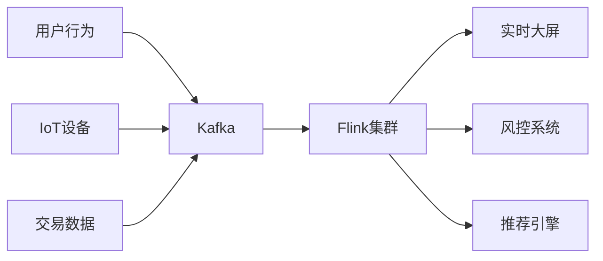
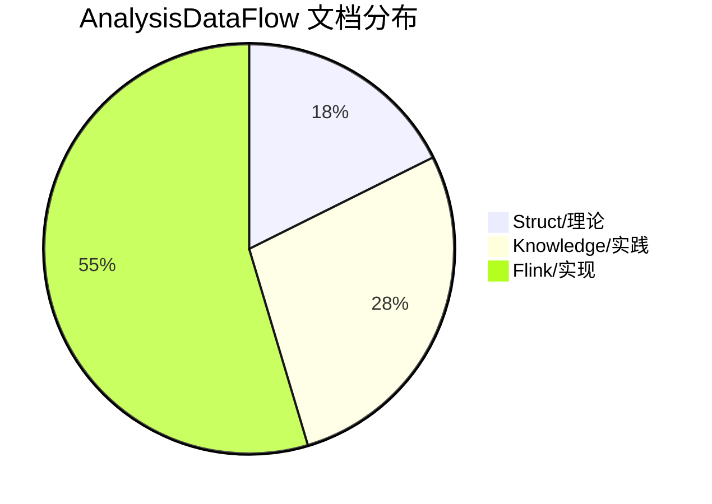
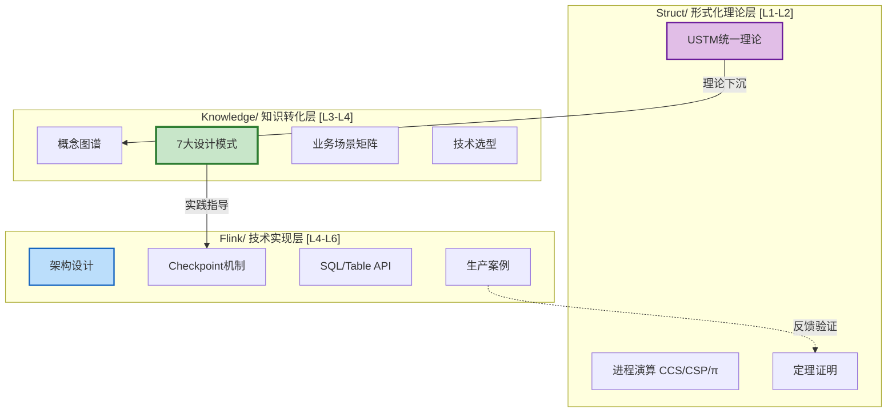
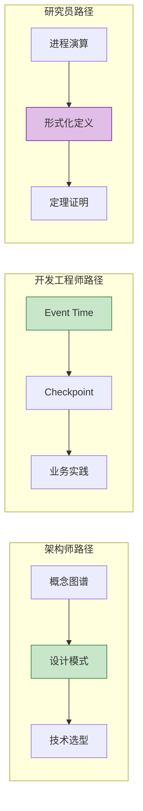

# 视频教程脚本 01：项目介绍

> **视频标题**: AnalysisDataFlow — 流计算知识体系导览
> **目标受众**: 流计算初学者、架构师、技术决策者
> **视频时长**: 5分钟
> **难度等级**: L1 (入门级)

---

## 📋 脚本概览

| 章节 | 时间戳 | 时长 | 内容要点 |
|------|--------|------|----------|
| 开场 | 00:00-00:30 | 30秒 | 引入流计算的重要性 |
| 项目介绍 | 00:30-02:00 | 90秒 | AnalysisDataFlow是什么 |
| 三层架构 | 02:00-03:30 | 90秒 | Struct/Knowledge/Flink三层 |
| 学习路径 | 03:30-04:30 | 60秒 | 不同角色的阅读路径 |
| 结尾 | 04:30-05:00 | 30秒 | 预告下一集内容 |

---

## 分镜 1: 开场 (00:00-00:30)

### 🎬 画面描述

- **镜头**: 全屏代码编辑器 + 数据流可视化动画
- **动画**: 数据流从Kafka流向Flink，再流向各种Sink
- **背景音乐**: 轻快科技感

### 🎤 讲解文字

```
【00:00-00:15】
大家好！欢迎来到 AnalysisDataFlow 视频教程系列。

在这个数据驱动的时代，实时数据处理已经成为企业竞争力的核心。
每天，数万亿条数据通过流计算系统被实时处理——
从金融交易风控，到电商实时推荐，再到IoT设备监控，
流计算无处不在。

【00:15-00:30】
但流计算领域知识点繁多，从理论模型到工程实现，
从时间语义到容错机制，学习曲线陡峭。
今天，我将带你走进 AnalysisDataFlow——
一个全面、系统、可导航的流计算知识体系。
```

### 📊 图表展示



---

## 分镜 2: 项目介绍 (00:30-02:00)

### 🎬 画面描述

- **镜头**: 项目文档展示 + 层级结构图
- **动画**: 逐层展开三层架构
- **高亮**: 关键数字和统计信息

### 🎤 讲解文字

```
【00:30-00:55】
AnalysisDataFlow 是什么？

它是一个涵盖流计算理论、工程实践和技术实现的完整知识库。
截至目前，项目包含：
- 42篇形式化理论文档
- 66篇工程实践知识文档
- 130篇Flink技术实现文档
- 总计超过870个形式化定义和定理

【00:55-01:20】
项目的核心理念是「从形式化理论到工程实践的转化路径」。
我们不只是告诉你「怎么做」，更重要的是告诉你「为什么」。
每一行代码背后，都有严格的数学定义支撑；
每一个设计模式，都对应着形式化的定理证明。

【01:20-02:00】
无论你是一名：
- 架构师——需要技术选型和系统设计方法论
- 开发工程师——需要模式实现细节和最佳实践
- 研究员——需要理解理论基础和形式化证明
- 技术负责人——需要建立团队知识体系

这里都有适合你的学习路径。
```

### 📊 图表展示



---

## 分镜 3: 三层架构 (02:00-03:30)

### 🎬 画面描述

- **镜头**: 三层架构图，每层点击展开详情
- **动画**: 层间关系连线流动效果
- **配色**:
  - Struct层: 紫色 (#e1bee7)
  - Knowledge层: 绿色 (#c8e6c9)
  - Flink层: 蓝色 (#bbdefb)

### 🎤 讲解文字

```
【02:00-02:25】
AnalysisDataFlow 采用三层架构设计：

第一层是 Struct/ —— 形式化理论层。
这里包含严格的数学定义、定理和证明。
比如 Dataflow 模型的形式化定义、
Watermark 单调性定理、
Checkpoint 正确性证明等。

【02:25-02:50】
第二层是 Knowledge/ —— 知识转化层。
这是连接理论与工程的桥梁，
包含概念图谱、7大设计模式、业务场景矩阵、技术选型决策树。

核心设计模式包括：
- 事件时间处理 (Pattern 01)
- 窗口聚合 (Pattern 02)
- 复杂事件处理 (Pattern 03)
- 异步I/O (Pattern 04)
- 状态管理 (Pattern 05)
- 侧输出 (Pattern 06)
- Checkpoint与恢复 (Pattern 07)

【02:50-03:30】
第三层是 Flink/ —— 技术实现层。
这是 Apache Flink 的深度技术解析，
涵盖架构设计、核心机制、SQL API、连接器、性能调优等。

三层之间的关系是：
理论下沉 → 模式提炼 → 实践映射
形成完整的知识闭环。
```

### 📊 图表展示



---

## 分镜 4: 学习路径 (03:30-04:30)

### 🎬 画面描述

- **镜头**: 四个角色的学习路线图
- **动画**: 路径高亮，关键节点闪烁
- **分屏**: 左右对比不同路径

### 🎤 讲解文字

```
【03:30-03:50】
针对不同角色，我们设计了专属的学习路径：

如果你是一名架构师，
建议从概念图谱开始，掌握并发范式对比和选型矩阵，
然后深入学习7大设计模式，
最后研究技术选型决策树。
预计学习周期：1-2周。

【03:50-04:10】
如果你是一名开发工程师，
快速通道是：先掌握事件时间处理模式，
然后学习Checkpoint机制，
最后根据业务需求深入特定模式。
预计学习周期：3-5天。

【04:10-04:30】
研究员路径侧重于理论基础，
从进程演算入手，理解Dataflow形式化模型，
最后探索前沿技术方向。
技术负责人则需要建立团队知识体系，
制定编码规范和架构评审标准。
```

### 📊 图表展示



---

## 分镜 5: 结尾 (04:30-05:00)

### 🎬 画面描述

- **镜头**: 项目Logo + 二维码
- **动画**: 下一集预告缩略图轮播
- **音乐**: 渐弱

### 🎤 讲解文字

```
【04:30-04:50】
好了，这就是 AnalysisDataFlow 项目的第一期介绍。
在接下来的系列教程中，我们将深入探讨：
- 流计算基础：时间语义、Watermark、窗口
- Flink快速上手：环境搭建、第一个程序
- 7大设计模式代码实战
- 生产环境部署与监控
- 高级主题：状态管理、Checkpoint调优

【04:50-05:00】
如果你喜欢这个系列，欢迎点赞、收藏、关注！
项目代码和文档全部开源，GitHub搜索 AnalysisDataFlow。
我们下期再见！
```

### 📊 图表展示

```
下期预告：
┌─────────────────────────────────────────┐
│                                         │
│   EP02: 流计算基础 (15分钟)              │
│   - 时间语义详解                         │
│   - Watermark机制原理                    │
│   - 窗口类型与触发器                     │
│                                         │
│   [缩略图预览]                           │
│                                         │
└─────────────────────────────────────────┘
```

---

## 📝 制作备注

### 视觉风格

- **主色调**: 深蓝 (#1976d2) + 科技绿 (#388e3c)
- **字体**: 标题用思源黑体 Bold，正文用思源黑体 Regular
- **代码高亮**: 使用 Monokai 配色方案
- **动画速度**: 适中，确保观众能跟上节奏

### 音效提示

- `🔔` 重要概念出现
- `🎵` 章节切换过渡
- `✨` 知识点强调

### 附加资源

- 项目GitHub: <https://github.com/AnalysisDataFlow>
- 在线文档: <https://analysisdataflow.github.io/docs>
- 示例代码: tutorials/code/episode01/

---

## 🔗 相关文档

- [项目README](../README.md)
- [Knowledge/00-INDEX.md](../Knowledge/00-INDEX.md)
- [Flink/00-INDEX.md](../Flink/00-INDEX.md)

---

*脚本版本: v1.0*
*创建日期: 2026-04-03*
*预计制作时长: 5分钟*
