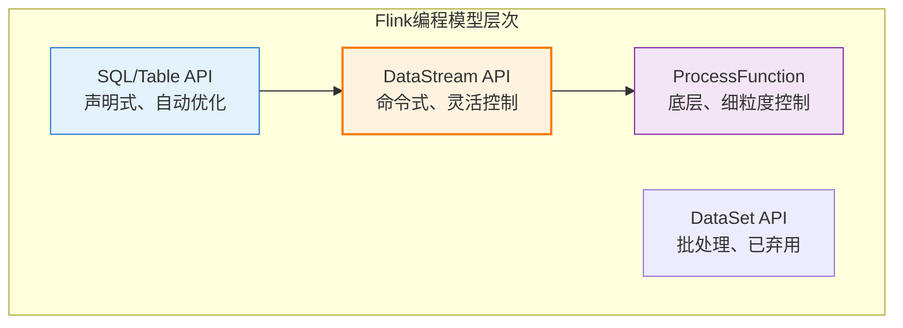
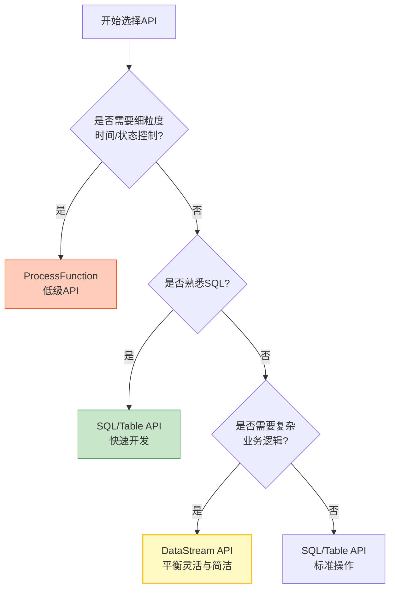
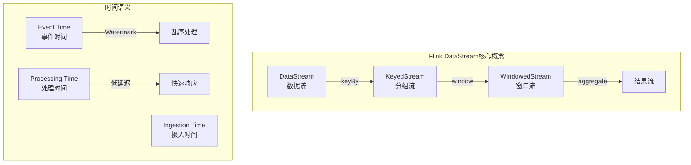
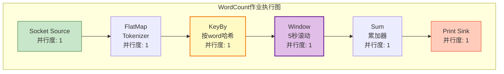
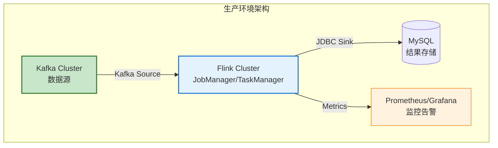
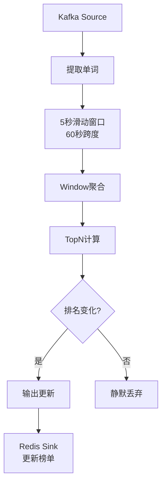

# 你的第一个Flink作业

> **所属阶段**: tutorials | **前置依赖**: [01-introduction-script.md](./01-introduction-script.md) | **形式化等级**: L2-L3
> **目标**: 从零开始编写并运行第一个Flink流处理作业，掌握核心概念与开发流程

---

## 1. 概念定义 (Definitions)

### Def-T-02-01: Flink程序基本结构

一个完整的Flink流处理程序由以下核心组件构成：

| 组件 | 职责 | 对应API |
|------|------|---------|
| **执行环境** (Execution Environment) | 配置作业参数、创建数据流 | `StreamExecutionEnvironment` |
| **数据源** (Source) | 从外部系统读取数据 | `DataStreamSource<T>` |
| **转换操作** (Transformation) | 对数据进行计算处理 | `map`, `filter`, `flatMap`, `keyBy`, `window` 等 |
| **数据输出** (Sink) | 将结果写入外部系统 | `DataStreamSink<T>` |
| **作业执行** (Execution) | 触发作业提交与运行 | `env.execute()` |

### Def-T-02-02: DataStream API

DataStream API是Flink提供的**类型安全**的流处理编程接口，核心特征：

- **强类型**: 每个DataStream都有明确的元素类型 `DataStream<T>`
- **不可变性**: 数据流转换后返回新流，原流保持不变
- **延迟执行**: 所有转换操作仅构建执行图，直到调用 `execute()` 才真正执行
- **并行处理**: 每个算子可配置独立的并行度

### Def-T-02-03: 时间语义

Flink支持三种时间语义用于处理乱序事件：

| 时间类型 | 定义 | 适用场景 |
|----------|------|----------|
| **Event Time** | 事件创建的时间戳 | 需要精确按业务时间统计的场景 |
| **Ingestion Time** | 数据进入Flink Source的时间 | 需要近似有序但无法获取事件时间的场景 |
| **Processing Time** | 算子处理数据的机器本地时间 | 低延迟要求、容忍近似结果的场景 |

### Def-T-02-04: 窗口 (Window)

窗口是将无限流切分为有限块进行聚合计算的机制：

| 窗口类型 | 特征 | 适用场景 |
|----------|------|----------|
| **滚动窗口** (Tumbling) | 固定大小、不重叠 | 定期统计，如每秒PV |
| **滑动窗口** (Sliding) | 固定大小、可重叠 | 平滑统计，如最近5分钟每10秒统计 |
| **会话窗口** (Session) | 动态大小、活动间隙触发 | 用户行为分析 |
| **全局窗口** (Global) | 全局统一、需自定义触发 | 自定义触发条件场景 |

---

## 2. 属性推导 (Properties)

### Lemma-T-02-01: 算子链优化

**命题**: Flink默认将相邻的、没有数据重分区的算子串联在同一个线程中执行。

**推导**:

1. 算子之间不需要序列化/反序列化和网络传输
2. 减少线程切换开销
3. 可以通过 `disableChaining()` 或 `slotSharingGroup()` 手动控制

```java
// 算子链示例：flatMap -> map -> filter 会被优化为一条链
dataStream
    .flatMap(tokenizer)  // 链内
    .map(word -> word.toLowerCase())  // 链内
    .filter(word -> word.length() > 0)  // 链内
    .keyBy(word -> word)  // 数据重分区，链断开
    .sum(1);
```

### Lemma-T-02-02: KeyBy与并行度

**命题**: `keyBy` 操作后，相同key的数据一定会被路由到同一个并行子任务。

**推导**:

1. Flink使用key的哈希值对并行度取模确定目标子任务
2. 这保证了keyed state的正确性
3. key分布不均会导致数据倾斜

---

## 3. 关系建立 (Relations)

### 概念层次图



### API选择决策树



---

## 4. 论证过程 (Argumentation)

### 为什么从WordCount开始？

WordCount被称为"流计算的Hello World"，原因如下：

1. **覆盖核心概念**: Source → Transformation → Sink 完整流程
2. **展示状态使用**: 累加计数需要维护状态
3. **体现窗口思想**: 无限流聚合需要窗口切分
4. **易于验证**: 输入输出直观，便于调试理解

### 不同实现方式对比

| 实现方式 | 优点 | 缺点 | 适用场景 |
|----------|------|------|----------|
| **Java DataStream** | 类型安全、IDE支持好、生产主流 | 代码量多 | 生产开发 |
| **Python PyFlink** | 简洁、AI生态集成好 | 性能略低、类型检查弱 | 数据分析、原型 |
| **SQL** | 声明式、自动优化 | 复杂逻辑受限 | 标准ETL、报表 |

---

## 5. 形式证明 / 工程论证 (Proof / Engineering Argument)

### 完整Java实现：Socket WordCount

```java
package com.example;

import org.apache.flink.api.common.eventtime.WatermarkStrategy;
import org.apache.flink.api.common.functions.FlatMapFunction;
import org.apache.flink.api.java.tuple.Tuple2;
import org.apache.flink.streaming.api.datastream.DataStream;
import org.apache.flink.streaming.api.environment.StreamExecutionEnvironment;
import org.apache.flink.streaming.api.windowing.assigners.TumblingProcessingTimeWindows;
import org.apache.flink.streaming.api.windowing.time.Time;
import org.apache.flink.util.Collector;

/**
 * Socket Window WordCount
 *
 * 从Socket读取文本流，每5秒统计一次单词出现次数
 *
 * 运行步骤：
 * 1. 终端执行: nc -lk 9999
 * 2. 运行本程序
 * 3. 在nc终端输入文本
 */
public class SocketWindowWordCount {

    public static void main(String[] args) throws Exception {
        // ===== 步骤1: 创建执行环境 =====
        final StreamExecutionEnvironment env =
            StreamExecutionEnvironment.getExecutionEnvironment();

        // 设置并行度（本地开发建议设为1便于调试）
        env.setParallelism(1);

        // ===== 步骤2: 创建数据源 =====
        // 从localhost:9999的Socket读取数据，以换行符分隔
        DataStream<String> text = env.socketTextStream("localhost", 9999, "\n");

        // ===== 步骤3: 数据转换处理 =====
        DataStream<Tuple2<String, Integer>> wordCounts = text
            // 3.1 flatMap: 将每行切分为单词，输出 (word, 1)
            .flatMap(new Tokenizer())

            // 3.2 keyBy: 按单词分组，相同单词进入同一分区
            .keyBy(value -> value.f0)

            // 3.3 window: 定义5秒滚动窗口
            .window(TumblingProcessingTimeWindows.of(Time.seconds(5)))

            // 3.4 sum: 对每个窗口内的同key值累加
            .sum(1);

        // ===== 步骤4: 结果输出 =====
        wordCounts.print();

        // ===== 步骤5: 启动作业 =====
        // execute() 是阻塞调用，作业终止时才返回
        env.execute("Socket Window WordCount");
    }

    /**
     * 自定义FlatMapFunction: 将文本行切分为单词
     */
    public static class Tokenizer implements
        FlatMapFunction<String, Tuple2<String, Integer>> {

        @Override
        public void flatMap(String value, Collector<Tuple2<String, Integer>> out) {
            // 转小写并按非单词字符分割
            String[] words = value.toLowerCase().split("\\W+");

            for (String word : words) {
                if (word.length() > 0) {
                    // 收集 (word, 1) 元组
                    out.collect(new Tuple2<>(word, 1));
                }
            }
        }
    }
}
```

#### 代码逐步解释

| 代码段 | 作用 | 关键概念 |
|--------|------|----------|
| `getExecutionEnvironment()` | 获取执行环境，自动识别本地/集群模式 | Execution Environment |
| `socketTextStream()` | 创建Socket数据源 | Source |
| `flatMap()` | 一对多转换，切分单词 | Transformation |
| `keyBy()` | 按key分组，触发数据重分区 | Keyed Stream |
| `window()` | 定义窗口策略 | Window Assigner |
| `sum()` | 聚合计算 | Window Function |
| `print()` | 输出到控制台 | Sink |
| `execute()` | 提交作业执行 | Job Execution |

### 完整Python实现：PyFlink WordCount

```python
from pyflink.datastream import StreamExecutionEnvironment
from pyflink.datastream.functions import FlatMapFunction
from pyflink.common.typeinfo import Types

class Tokenizer(FlatMapFunction):
    """自定义FlatMap函数：切分单词"""

    def flat_map(self, value, collector):
        # 转小写并按非单词字符分割
        words = value.lower().split()
        for word in words:
            if word:
                # 收集 (word, 1)
                collector.collect((word, 1))


def main():
    # ===== 步骤1: 创建执行环境 =====
    env = StreamExecutionEnvironment.get_execution_environment()
    env.set_parallelism(1)

    # ===== 步骤2: 创建数据源 =====
    # 从Socket读取数据
    text = env.socket_text_stream("localhost", 9999)

    # ===== 步骤3: 数据转换处理 =====
    word_counts = (
        text
        # 3.1 切分单词
        .flat_map(Tokenizer(),
                  result_type=Types.TUPLE([Types.STRING(), Types.INT()]))
        # 3.2 按单词分组
        .key_by(lambda x: x[0])
        # 3.3 5秒滚动窗口
        .window(TumblingProcessingTimeWindows.of(Time.seconds(5)))
        # 3.4 累加计数
        .sum(1)
    )

    # ===== 步骤4: 结果输出 =====
    word_counts.print()

    # ===== 步骤5: 启动作业 =====
    env.execute("Socket Window WordCount Python")


if __name__ == "__main__":
    main()
```

### SQL方式实现：Table API + SQL

```java
import org.apache.flink.table.api.EnvironmentSettings;
import org.apache.flink.table.api.Table;
import org.apache.flink.table.api.TableEnvironment;
import org.apache.flink.table.api.bridge.java.StreamTableEnvironment;
import static org.apache.flink.table.api.Expressions.*;

public class SQLWordCount {
    public static void main(String[] args) {
        // 创建Table环境
        EnvironmentSettings settings = EnvironmentSettings
            .newInstance()
            .inStreamingMode()
            .build();

        TableEnvironment tableEnv = TableEnvironment.create(settings);

        // 使用DDL创建Socket Source表
        String createSourceTable = "CREATE TABLE socket_source (\n" +
            "  line STRING\n" +
            ") WITH (\n" +
            "  'connector' = 'socket',\n" +
            "  'hostname' = 'localhost',\n" +
            "  'port' = '9999',\n" +
            "  'format' = 'raw'\n" +
            ")";

        tableEnv.executeSql(createSourceTable);

        // 使用SQL进行WordCount统计
        String wordCountSql =
            "SELECT word, COUNT(*) as cnt FROM (" +
            "  SELECT TRIM(word) as word FROM socket_source, " +
            "  LATERAL TABLE(UNNEST(SPLIT(LOWER(line), ' '))) AS T(word)" +
            ") WHERE word <> '' " +
            "GROUP BY word, TUMBLE(PROCTIME(), INTERVAL '5' SECOND)";

        Table result = tableEnv.sqlQuery(wordCountSql);

        // 打印结果
        result.execute().print();
    }
}
```

### 实时数据处理：完整Socket示例

```java
import org.apache.flink.api.common.eventtime.WatermarkStrategy;
import org.apache.flink.api.common.functions.AggregateFunction;
import org.apache.flink.api.java.tuple.Tuple2;
import org.apache.flink.streaming.api.datastream.DataStream;
import org.apache.flink.streaming.api.environment.StreamExecutionEnvironment;
import org.apache.flink.streaming.api.windowing.assigners.SlidingProcessingTimeWindows;
import org.apache.flink.streaming.api.windowing.time.Time;

/**
 * 实时数据流处理演示
 * 使用滑动窗口展示更丰富的窗口操作
 */
public class RealTimeProcessingDemo {

    public static void main(String[] args) throws Exception {
        StreamExecutionEnvironment env =
            StreamExecutionEnvironment.getExecutionEnvironment();
        env.setParallelism(1);

        // 从Socket读取数据
        DataStream<String> stream = env.socketTextStream("localhost", 9999);

        // 实时处理流水线
        stream
            // 1. 数据清洗与转换
            .filter(line -> !line.trim().isEmpty())
            .map(line -> line.toLowerCase())

            // 2. 切分单词并标记
            .flatMap((String line, Collector<Tuple2<String, Integer>> out) -> {
                for (String word : line.split("\\W+")) {
                    if (word.length() > 2) {  // 过滤短词
                        out.collect(new Tuple2<>(word, 1));
                    }
                }
            })
            .returns(TypeInformation.of(new TypeHint<Tuple2<String, Integer>>() {}))

            // 3. 按单词分组
            .keyBy(value -> value.f0)

            // 4. 滑动窗口：每10秒计算过去30秒的统计
            .window(SlidingProcessingTimeWindows.of(Time.seconds(30), Time.seconds(10)))

            // 5. 使用自定义聚合函数
            .aggregate(new WordCountAggregate())

            // 6. 输出结果
            .print();

        env.execute("Real-time Processing Demo");
    }

    /**
     * 自定义聚合函数
     */
    public static class WordCountAggregate implements
        AggregateFunction<Tuple2<String, Integer>, Integer, Integer> {

        @Override
        public Integer createAccumulator() {
            return 0;
        }

        @Override
        public Integer add(Tuple2<String, Integer> value, Integer accumulator) {
            return accumulator + value.f1;
        }

        @Override
        public Integer getResult(Integer accumulator) {
            return accumulator;
        }

        @Override
        public Integer merge(Integer a, Integer b) {
            return a + b;
        }
    }
}
```

### 扩展到生产：Kafka集成版

```java
import org.apache.flink.connector.kafka.source.KafkaSource;
import org.apache.flink.connector.kafka.source.enumerator.initializer.OffsetsInitializer;
import org.apache.flink.connector.kafka.source.reader.deserializer.KafkaRecordDeserializationSchema;
import org.apache.flink.api.common.serialization.SimpleStringSchema;
import org.apache.flink.streaming.api.checkpoint.CheckpointingMode;

import org.apache.flink.streaming.api.environment.StreamExecutionEnvironment;
import org.apache.flink.streaming.api.datastream.DataStream;
import org.apache.flink.streaming.api.CheckpointingMode;
import org.apache.flink.streaming.api.windowing.time.Time;


/**
 * 生产级Kafka WordCount
 * 包含Checkpoint、Watermark、监控等生产必备配置
 */
public class ProductionKafkaWordCount {

    public static void main(String[] args) throws Exception {
        StreamExecutionEnvironment env =
            StreamExecutionEnvironment.getExecutionEnvironment();

        // ===== 生产级配置 =====

        // 1. 开启Checkpoint（精确一次语义）
        env.enableCheckpointing(60000);  // 每60秒触发一次
        env.getCheckpointConfig().setCheckpointingMode(
            CheckpointingMode.EXACTLY_ONCE
        );
        env.getCheckpointConfig().setMinPauseBetweenCheckpoints(30000);
        env.getCheckpointConfig().setCheckpointTimeout(600000);
        env.getCheckpointConfig().setMaxConcurrentCheckpoints(1);
        env.getCheckpointConfig().enableExternalizedCheckpoints(
            ExternalizedCheckpointCleanup.RETAIN_ON_CANCELLATION
        );

        // 2. 配置状态后端（生产建议使用RocksDB）
        EmbeddedRocksDBStateBackend rocksDbBackend =
            new EmbeddedRocksDBStateBackend(true);
        env.setStateBackend(rocksDbBackend);
        env.getCheckpointConfig().setCheckpointStorage("file:///tmp/flink-checkpoints");

        // 3. 配置重启策略
        env.setRestartStrategy(RestartStrategies.fixedDelayRestart(
            3,              // 最多重启3次
            Time.of(10, TimeUnit.SECONDS)  // 每次间隔10秒
        ));

        // ===== Kafka Source配置 =====
        KafkaSource<String> kafkaSource = KafkaSource.<String>builder()
            .setBootstrapServers("kafka-broker1:9092,kafka-broker2:9092")
            .setTopics("input-topic")
            .setGroupId("flink-wordcount-consumer-group")
            .setStartingOffsets(OffsetsInitializer.earliest())
            .setValueOnlyDeserializer(new SimpleStringSchema())
            .build();

        DataStream<String> stream = env.fromSource(
            kafkaSource,
            WatermarkStrategy.forBoundedOutOfOrderness(
                Duration.ofSeconds(5)  // 允许5秒乱序
            ),
            "Kafka Source"
        );

        // ===== 业务处理 =====
        SingleOutputStreamOperator<Tuple2<String, Integer>> wordCounts = stream
            .flatMap(new Tokenizer())
            .keyBy(value -> value.f0)
            .window(TumblingEventTimeWindows.of(Time.minutes(1)))
            .allowedLateness(Time.seconds(10))  // 允许10秒延迟
            .sideOutputLateData(lateDataTag)     // 迟到数据侧输出
            .sum(1);

        // ===== 输出到数据库 =====
        wordCounts.addSink(new JdbcSinkFunction());

        // 迟到数据处理
        wordCounts.getSideOutput(lateDataTag)
            .addSink(new LateDataSinkFunction());

        env.execute("Production Kafka WordCount");
    }

    /**
     * JDBC Sink示例：写入MySQL
     */
    public static class JdbcSinkFunction extends
        RichSinkFunction<Tuple2<String, Integer>> {

        private Connection conn;
        private PreparedStatement stmt;

        @Override
        public void open(Configuration parameters) throws Exception {
            super.open(parameters);
            conn = DriverManager.getConnection(
                "jdbc:mysql://localhost:3306/flink_db",
                "user", "password"
            );
            stmt = conn.prepareStatement(
                "INSERT INTO word_count (word, count, window_time) " +
                "VALUES (?, ?, ?) ON DUPLICATE KEY UPDATE count = ?"
            );
        }

        @Override
        public void invoke(Tuple2<String, Integer> value, Context context)
            throws Exception {
            stmt.setString(1, value.f0);
            stmt.setInt(2, value.f1);
            stmt.setTimestamp(3, new Timestamp(context.currentProcessingTime()));
            stmt.setInt(4, value.f1);
            stmt.executeUpdate();
        }

        @Override
        public void close() throws Exception {
            if (stmt != null) stmt.close();
            if (conn != null) conn.close();
            super.close();
        }
    }
}
```

### 核心概念详解



---

## 6. 实例验证 (Examples)

### 完整运行步骤

```bash
# 步骤1: 启动Socket服务器（终端1）
nc -lk 9999

# 步骤2: 编译并运行Flink程序（终端2）
cd flink-quickstart
mvn clean compile exec:java -Dexec.mainClass="com.example.SocketWindowWordCount"

# 步骤3: 在Socket终端输入测试数据
hello world
hello flink
flink is awesome
real time processing
hello world

# 步骤4: 观察Flink输出（每5秒输出一次窗口结果）
(hello, 2)
(world, 1)
(flink, 2)
(is, 1)
(awesome, 1)
```

### Maven项目完整pom.xml

```xml
<?xml version="1.0" encoding="UTF-8"?>
<project xmlns="http://maven.apache.org/POM/4.0.0"
         xmlns:xsi="http://www.w3.org/2001/XMLSchema-instance"
         xsi:schemaLocation="http://maven.apache.org/POM/4.0.0
                             http://maven.apache.org/xsd/maven-4.0.0.xsd">
    <modelVersion>4.0.0</modelVersion>

    <groupId>com.example</groupId>
    <artifactId>flink-first-job</artifactId>
    <version>1.0-SNAPSHOT</version>
    <packaging>jar</packaging>

    <properties>
        <maven.compiler.source>11</maven.compiler.source>
        <maven.compiler.target>11</maven.compiler.target>
        <project.build.sourceEncoding>UTF-8</project.build.sourceEncoding>
        <flink.version>1.18.0</flink.version>
        <scala.binary.version>2.12</scala.binary.version>
    </properties>

    <dependencies>
        <!-- Flink Streaming Core -->
        <dependency>
            <groupId>org.apache.flink</groupId>
            <artifactId>flink-streaming-java</artifactId>
            <version>${flink.version}</version>
            <scope>provided</scope>
        </dependency>

        <!-- Flink Client for local execution -->
        <dependency>
            <groupId>org.apache.flink</groupId>
            <artifactId>flink-clients</artifactId>
            <version>${flink.version}</version>
            <scope>provided</scope>
        </dependency>

        <!-- Kafka Connector -->
        <dependency>
            <groupId>org.apache.flink</groupId>
            <artifactId>flink-connector-kafka</artifactId>
            <version>3.0.2-1.18</version>
        </dependency>

        <!-- JDBC Connector for database sink -->
        <dependency>
            <groupId>org.apache.flink</groupId>
            <artifactId>flink-connector-jdbc</artifactId>
            <version>3.1.2-1.18</version>
        </dependency>

        <!-- MySQL Driver -->
        <dependency>
            <groupId>mysql</groupId>
            <artifactId>mysql-connector-java</artifactId>
            <version>8.0.33</version>
        </dependency>

        <!-- RocksDB State Backend -->
        <dependency>
            <groupId>org.apache.flink</groupId>
            <artifactId>flink-statebackend-rocksdb</artifactId>
            <version>${flink.version}</version>
            <scope>provided</scope>
        </dependency>

        <!-- Logging -->
        <dependency>
            <groupId>org.slf4j</groupId>
            <artifactId>slf4j-simple</artifactId>
            <version>1.7.36</version>
        </dependency>
    </dependencies>

    <build>
        <plugins>
            <!-- Maven Shade Plugin for uber-jar -->
            <plugin>
                <groupId>org.apache.maven.plugins</groupId>
                <artifactId>maven-shade-plugin</artifactId>
                <version>3.2.4</version>
                <executions>
                    <execution>
                        <phase>package</phase>
                        <goals>
                            <goal>shade</goal>
                        </goals>
                        <configuration>
                            <artifactSet>
                                <excludes>
                                    <exclude>org.apache.flink:*</exclude>
                                </excludes>
                            </artifactSet>
                        </configuration>
                    </execution>
                </executions>
            </plugin>
        </plugins>
    </build>
</project>
```

---

## 7. 可视化 (Visualizations)

### 作业执行数据流图



### 窗口数据切分示意

```mermaid
gantt
    title 滚动窗口数据切分示例（5秒窗口）
    dateFormat X
    axisFormat %s

    section 时间线
    输入数据       :a1, 0, 1s
    输入数据       :a2, after a1, 1s
    输入数据       :a3, after a2, 3s
    输入数据       :a4, after a3, 2s
    输入数据       :a5, after a4, 4s

    section 窗口1 [0-5s]
    统计a1,a2,a3 :crit, w1, 0, 5s

    section 窗口2 [5-10s]
    统计a4,a5    :crit, w2, 5, 5s
```



### 生产环境部署架构



---

## 8. 练习和挑战 (Exercises)

### 练习1: 过滤停用词

**题目**: 修改WordCount程序，过滤常见的停用词（如 "the", "a", "is", "of"）。

**提示**:

```java
// 在flatMap中添加过滤逻辑
Set<String> stopWords = new HashSet<>(Arrays.asList("the", "a", "is", "of"));

for (String word : words) {
    if (word.length() > 0 && !stopWords.contains(word)) {
        out.collect(new Tuple2<>(word, 1));
    }
}
```

---

### 练习2: Top-N热门单词

**题目**: 使用ProcessFunction实现每30秒输出出现次数最多的3个单词。

**参考答案框架**:

```java

import org.apache.flink.streaming.api.windowing.time.Time;

public class TopNWordCount {
    public static void main(String[] args) throws Exception {
        // ... 环境设置 ...

        stream
            .flatMap(new Tokenizer())
            .keyBy(value -> value.f0)
            .window(TumblingProcessingTimeWindows.of(Time.seconds(30)))
            .sum(1)
            .windowAll(TumblingProcessingTimeWindows.of(Time.seconds(30)))
            .process(new TopNFunction(3))
            .print();
    }

    // 实现TopNFunction
    public static class TopNFunction extends ProcessAllWindowFunction<
        Tuple2<String, Integer>, String, TimeWindow> {

        private final int n;

        public TopNFunction(int n) {
            this.n = n;
        }

        @Override
        public void process(Context context, Iterable<Tuple2<String, Integer>> elements,
                           Collector<String> out) {
            // 1. 收集所有单词计数
            // 2. 排序取Top N
            // 3. 输出结果
        }
    }
}
```

---

### 练习3: 单词长度分布统计

**题目**: 统计不同长度单词的分布情况（如1-3字母、4-6字母、7+字母的词频）。

**提示**:

```java
// 使用自定义key selector按长度分组
stream
    .flatMap(new Tokenizer())
    .map(word -> {
        int len = word.f0.length();
        String category = len <= 3 ? "short" : (len <= 6 ? "medium" : "long");
        return new Tuple2<>(category, 1);
    })
    .keyBy(value -> value.f0)
    .sum(1)
    .print();
```

---

### 进阶挑战: 实时热搜排行榜

**挑战目标**: 实现类似微博热搜的实时Top10单词排行榜，要求：

1. **滑动窗口**: 每5秒更新，统计过去60秒的数据
2. **增量更新**: 只输出排名变化的单词
3. **状态管理**: 使用KeyedState保存历史排名
4. **迟到数据处理**: 配置Watermark处理乱序数据
5. **输出优化**: 排名变化时输出，未变化时静默

**技术要点**:



**参考实现思路**:

```java
// 1. 定义POJO存储单词和其计数
public class WordCount implements Comparable<WordCount> {
    public String word;
    public long count;
    public int rank;

    @Override
    public int compareTo(WordCount other) {
        return Long.compare(other.count, this.count); // 降序
    }
}

// 2. 使用ProcessFunction维护TopN状态
public class RankTrackingFunction extends KeyedProcessFunction<
    String, WordCount, String> {

    // 使用ListState保存当前TopN
    private ListState<WordCount> topNState;

    // 使用MapState保存单词到排名的映射
    private MapState<String, Integer> rankState;

    @Override
    public void open(Configuration parameters) {
        topNState = getRuntimeContext().getListState(
            new ListStateDescriptor<>("top-n", WordCount.class)
        );
        rankState = getRuntimeContext().getMapState(
            new MapStateDescriptor<>("ranks", String.class, Integer.class)
        );
    }

    @Override
    public void processElement(WordCount value, Context ctx, Collector<String> out)
        throws Exception {
        // 更新TopN列表
        // 对比新旧排名
        // 有变化时输出
    }
}
```

---

## 9. 常见问题排查 (Troubleshooting)

| 问题现象 | 可能原因 | 解决方案 |
|----------|----------|----------|
| `ClassNotFoundException` | `provided` scope依赖在本地运行 | 移除scope或添加IDE运行配置 |
| 程序启动后无输出 | Socket未启动或端口错误 | 检查`nc -lk 9999`命令 |
| 窗口没有触发 | 使用Event Time但没有数据 | 确认Watermark生成 |
| 数据倾斜 | 某些key数据量过大 | 添加随机前缀重新分区 |
| 内存溢出 | 状态过大 | 启用RocksDB状态后端 |

---

## 10. 引用参考 (References)


---

*教程版本: v1.0*
*创建日期: 2026-04-04*
*适用Flink版本: 1.18+ / 2.0+*
*难度等级: L2-L3 (入门到进阶)*
