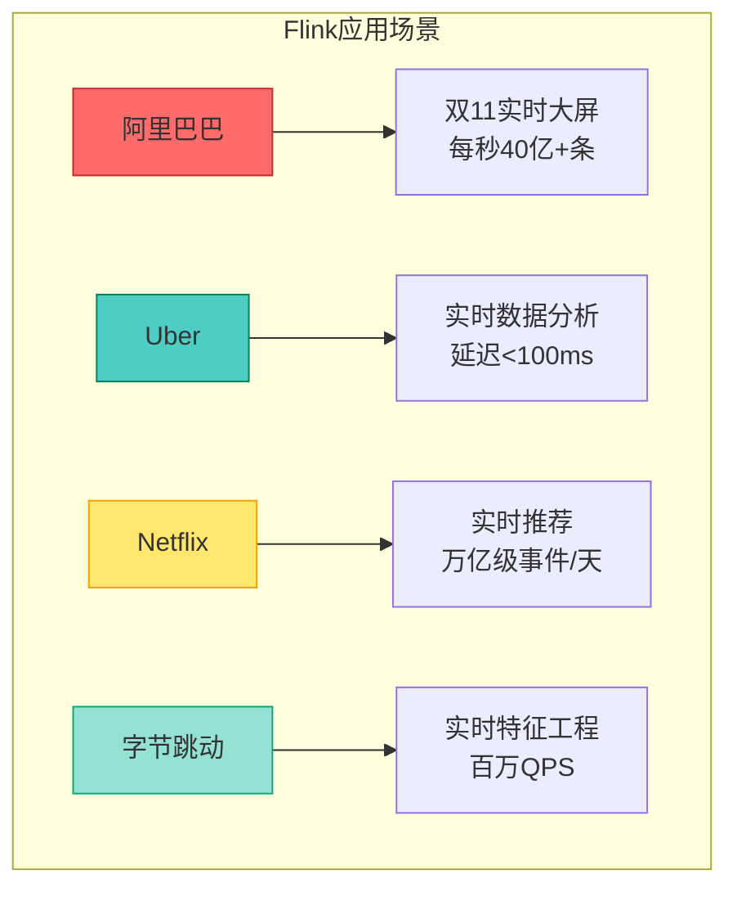
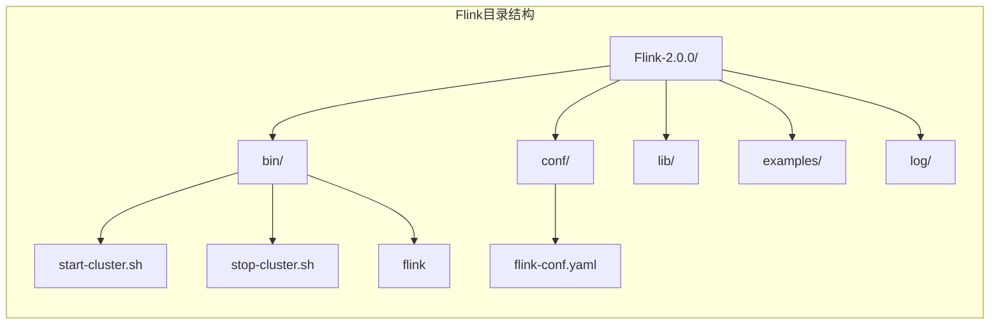
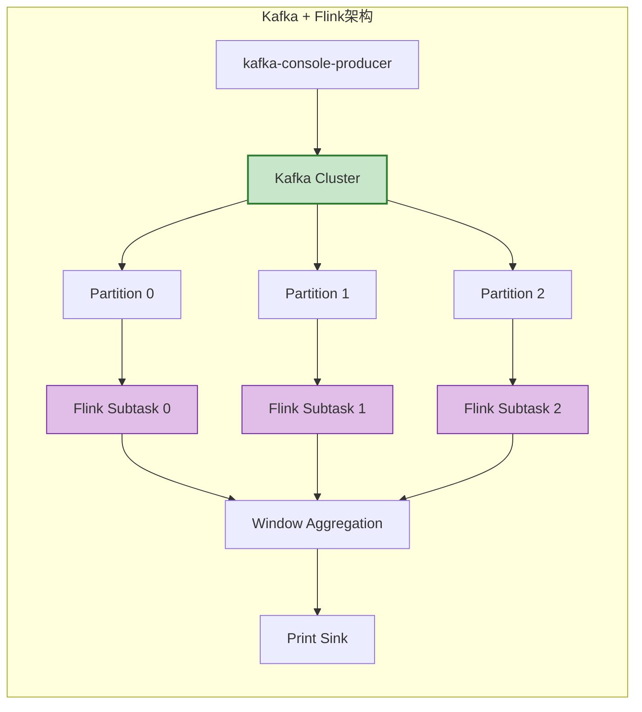
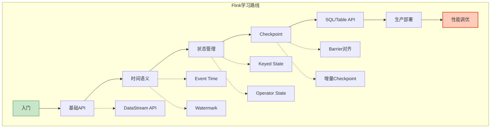

# 视频教程脚本 03：Flink快速上手

> **视频标题**: Flink快速上手——环境搭建与第一个程序
> **目标受众**: Flink初学者、Java/Scala开发者
> **视频时长**: 20分钟
> **难度等级**: L2-L3 (基础到进阶)

---

## 📋 脚本概览

| 章节 | 时间戳 | 时长 | 内容要点 |
|------|--------|------|----------|
| 开场 | 00:00-01:00 | 1分钟 | Flink简介与版本选择 |
| 环境搭建 | 01:00-06:00 | 5分钟 | JDK、Maven、Flink安装配置 |
| 项目创建 | 06:00-09:00 | 3分钟 | Maven项目结构与依赖配置 |
| WordCount程序 | 09:00-14:00 | 5分钟 | 完整代码开发与讲解 |
| 运行调试 | 14:00-17:00 | 3分钟 | 本地运行与Web UI监控 |
| Kafka集成 | 17:00-19:00 | 2分钟 | 连接Kafka实时处理 |
| 总结 | 19:00-20:00 | 1分钟 | 学习路线与资源 |

---

## 分镜 1: 开场 - Flink简介 (00:00-01:00)

### 🎬 画面描述

- **镜头**: Flink Logo + 架构全景图
- **动画**: Flink吉祥物（小松鼠）引导
- **数据**: 各大公司使用Flink的案例展示

### 🎤 讲解文字

```
【00:00-00:30】
大家好！欢迎来到第三集：Flink快速上手。

Apache Flink 是一个开源的流处理框架，
以其低延迟、高吞吐和精确一次(Exactly-Once)语义著称。

从阿里巴巴的双十一实时大屏，
到Uber的实时数据分析平台，
再到Netflix的推荐系统，
Flink都在背后支撑着海量数据的实时处理。

【00:30-01:00】
目前Flink的最新稳定版本是2.0，
相比1.x版本，2.0引入了分离状态存储、异步执行等重大改进。

对于初学者，我建议从1.18或2.0版本开始，
这两个版本的API相对稳定，文档也更完善。

今天，我将带你从零开始，
搭建Flink开发环境，编写并运行你的第一个流处理程序。
```

### 📊 图表展示



---

## 分镜 2: 环境搭建 (01:00-06:00)

### 🎬 画面描述

- **镜头**: 终端窗口录屏
- **分屏**: 左侧终端，右侧文档说明
- **高亮**: 关键命令和配置参数

### 🎤 讲解文字

```
【01:00-02:00】
首先，我们来安装Flink开发所需的环境。

你需要准备：
1. JDK 11 或更高版本（推荐JDK 17）
2. Maven 3.8+ 或 Gradle
3. IntelliJ IDEA 或其他IDE

我先来检查JDK版本。
在终端输入 java -version。

【02:00-03:30】
好的，JDK已经安装好了。
接下来我们下载Flink。

有两种方式：
1. 下载二进制包，用于本地测试和运行
2. 在Maven项目中添加依赖，用于开发

我们先下载二进制包。
访问 Flink 官网下载页面，
选择 Scala 2.12 版本，下载后解压即可。

【03:30-05:00】
解压完成后，进入Flink目录，
我们可以看到几个重要的目录：

- bin/：启动脚本
- conf/：配置文件
- lib/：依赖库
- examples/：示例程序

我们先来启动Flink本地集群。
执行 bin/start-cluster.sh。

【05:00-06:00】
启动成功后，打开浏览器访问 localhost:8081，
这就是Flink的Web UI。

在这里，你可以：
- 查看集群状态
- 提交和管理作业
- 监控作业运行状态
- 查看日志和指标

现在我们的环境就搭建好了。
```

### 💻 代码演示

```bash
# 1. 检查JDK版本
java -version
# openjdk version "17.0.8" 2023-07-18

# 2. 下载Flink (以2.0.0为例)
wget https://dlcdn.apache.org/flink/flink-2.0.0/flink-2.0.0-bin-scala_2.12.tgz

# 3. 解压
tar -xzf flink-2.0.0-bin-scala_2.12.tgz
cd flink-2.0.0

# 4. 启动本地集群
./bin/start-cluster.sh
# Starting cluster.
# Starting standalonesession daemon on host localhost.
# Starting taskexecutor daemon on host localhost.

# 5. 查看进程
jps
# 12345 StandaloneSessionClusterEntrypoint
# 12346 TaskManagerRunner

# 6. 停止集群
./bin/stop-cluster.sh
```

### 📊 图表展示



---

## 分镜 3: 项目创建 (06:00-09:00)

### 🎬 画面描述

- **镜头**: IntelliJ IDEA录屏
- **操作**: 创建Maven项目，添加依赖
- **分屏**: pom.xml文件和项目结构

### 🎤 讲解文字

```
【06:00-07:00】
现在我们来创建一个Flink Maven项目。

打开IntelliJ IDEA，
选择 New Project -> Maven Archetype。

或者更简单的方式：
使用Flink官方提供的Maven命令直接创建项目骨架。

【07:00-08:00】
项目创建完成后，
我们需要在pom.xml中添加Flink依赖。

核心依赖有三个：
1. flink-streaming-java：流处理核心
2. flink-clients：用于本地提交作业
3. flink-connector-kafka：Kafka连接器

注意scope的设置：
provided表示集群已提供，打包时不包含；
默认scope在本地运行时需要。

【08:00-09:00】
依赖添加完成后，
执行mvn clean install下载依赖。

现在项目结构应该是这样的：
- src/main/java/：Java源码
- src/main/resources/：配置文件
- pom.xml：Maven配置

一切准备就绪，我们开始编写代码。
```

### 💻 代码演示

```xml
<!-- pom.xml -->
<project xmlns="http://maven.apache.org/POM/4.0.0"
         xmlns:xsi="http://www.w3.org/2001/XMLSchema-instance"
         xsi:schemaLocation="http://maven.apache.org/POM/4.0.0
                             http://maven.apache.org/xsd/maven-4.0.0.xsd">
    <modelVersion>4.0.0</modelVersion>

    <groupId>com.example</groupId>
    <artifactId>flink-quickstart</artifactId>
    <version>1.0-SNAPSHOT</version>
    <packaging>jar</packaging>

    <properties>
        <maven.compiler.source>11</maven.compiler.source>
        <maven.compiler.target>11</maven.compiler.target>
        <flink.version>2.0.0</flink.version>
        <scala.binary.version>2.12</scala.binary.version>
    </properties>

    <dependencies>
        <!-- Flink 流处理核心 -->
        <dependency>
            <groupId>org.apache.flink</groupId>
            <artifactId>flink-streaming-java</artifactId>
            <version>${flink.version}</version>
            <scope>provided</scope>
        </dependency>

        <!-- Flink 客户端 -->
        <dependency>
            <groupId>org.apache.flink</groupId>
            <artifactId>flink-clients</artifactId>
            <version>${flink.version}</version>
            <scope>provided</scope>
        </dependency>

        <!-- Kafka连接器 -->
        <dependency>
            <groupId>org.apache.flink</groupId>
            <artifactId>flink-connector-kafka</artifactId>
            <version>3.2.0-1.19</version>
        </dependency>

        <!-- 日志 -->
        <dependency>
            <groupId>org.slf4j</groupId>
            <artifactId>slf4j-simple</artifactId>
            <version>1.7.36</version>
        </dependency>
    </dependencies>

    <build>
        <plugins>
            <!-- 打包插件 -->
            <plugin>
                <groupId>org.apache.maven.plugins</groupId>
                <artifactId>maven-shade-plugin</artifactId>
                <version>3.2.4</version>
                <executions>
                    <execution>
                        <phase>package</phase>
                        <goals>
                            <goal>shade</goal>
                        </goals>
                    </execution>
                </executions>
            </plugin>
        </plugins>
    </build>
</project>
```

---

## 分镜 4: WordCount程序开发 (09:00-14:00)

### 🎬 画面描述

- **镜头**: IDE全屏代码编辑
- **分步骤**: 逐段编写和讲解
- **可视化**: 右侧显示数据流图

### 🎤 讲解文字

```
【09:00-10:00】
现在我们来编写经典的WordCount程序。

这是流计算领域的Hello World，
虽然简单，但涵盖了流处理的核心概念。

程序的目标很简单：
从Socket读取文本流，
实时统计每个单词出现的次数。

【10:00-11:30】
代码分为几个部分：

1. 创建执行环境
   StreamExecutionEnvironment是Flink程序的入口
   它负责配置作业参数、创建数据流

2. 创建数据流
   使用socketTextStream从Socket读取数据
   生产环境中通常使用KafkaSource

3. 数据处理
   flatMap：将每行文本切分成单词
   filter：过滤空字符串
   map：将单词转换为(word, 1)元组
   keyBy：按单词分组
   sum：累加计数

4. 输出结果
   print将结果输出到控制台

5. 启动作业
   execute是触发实际执行的入口

【11:30-13:00】
让我们详细看看核心算子：

flatMap是一个一对一或一对多的转换，
这里我们将一行文本映射为多个单词。

keyBy是分组操作，
它决定了哪些数据会被分到同一个组进行聚合。
Flink使用Key Selector函数提取分组的key。

sum是一个聚合操作，
它对同一key的所有值进行累加。

【13:00-14:00】
在运行之前，我们需要先启动一个Socket服务器
来模拟数据源。

在终端执行 nc -lk 9999
然后运行我们的Flink程序。

在nc终端输入一些文本，
就能看到Flink实时输出的统计结果。
```

### 💻 完整代码演示

```java
package com.example;

import org.apache.flink.api.common.eventtime.WatermarkStrategy;
import org.apache.flink.api.common.functions.FlatMapFunction;
import org.apache.flink.api.java.tuple.Tuple2;
import org.apache.flink.streaming.api.datastream.DataStream;
import org.apache.flink.streaming.api.environment.StreamExecutionEnvironment;
import org.apache.flink.streaming.api.windowing.assigners.TumblingProcessingTimeWindows;
import org.apache.flink.streaming.api.windowing.time.Time;
import org.apache.flink.util.Collector;

public class SocketWindowWordCount {

    public static void main(String[] args) throws Exception {
        // 1. 创建执行环境
        final StreamExecutionEnvironment env =
            StreamExecutionEnvironment.getExecutionEnvironment();

        // 设置并行度
        env.setParallelism(1);

        // 2. 创建数据流 - 从Socket读取
        DataStream<String> text = env
            .socketTextStream("localhost", 9999, "\n");

        // 3. 数据处理
        DataStream<Tuple2<String, Integer>> wordCounts = text
            // 3.1 切分单词
            .flatMap(new Tokenizer())
            // 3.2 按单词分组
            .keyBy(value -> value.f0)
            // 3.3 5秒滚动窗口
            .window(TumblingProcessingTimeWindows.of(Time.seconds(5)))
            // 3.4 累加计数
            .sum(1);

        // 4. 输出结果
        wordCounts.print();

        // 5. 启动作业
        env.execute("Socket Window WordCount");
    }

    // 自定义FlatMap函数：切分单词
    public static class Tokenizer implements
        FlatMapFunction<String, Tuple2<String, Integer>> {

        @Override
        public void flatMap(String value, Collector<Tuple2<String, Integer>> out) {
            // 统一转小写，按非单词字符分割
            String[] words = value.toLowerCase().split("\\W+");

            for (String word : words) {
                if (word.length() > 0) {
                    // 输出 (word, 1)
                    out.collect(new Tuple2<>(word, 1));
                }
            }
        }
    }
}
```

### 📊 图表展示

```mermaid
graph LR
    subgraph "WordCount数据流图"
        A[Socket Source] --> B[FlatMap<br/>Tokenizer]
        B --> C[Filter<br/>非空]
        C --> D[Map<br/>(word, 1)]
        D --> E[KeyBy<br/>word]
        E --> F[Window<br/>5秒滚动]
        F --> G[Sum<br/>累加]
        G --> H[Print Sink]
    end

    style A fill:#c8e6c9,stroke:#2e7d32
    style E fill:#fff9c4,stroke:#f57f17,stroke-width:2px
    style F fill:#e1bee7,stroke:#6a1b9a,stroke-width:2px
```

---

## 分镜 5: 运行调试 (14:00-17:00)

### 🎬 画面描述

- **镜头**: 分屏显示终端、IDE、Web UI
- **操作**: 实际运行程序，展示结果
- **高亮**: Web UI中的关键指标

### 🎤 讲解文字

```
【14:00-15:00】
现在让我们运行这个程序，
看看实际效果。

首先启动Socket服务器：
nc -lk 9999

然后在IDE中运行WordCount程序。

程序启动后，在nc终端输入一些文本，比如：
"hello world hello flink"

就能看到控制台输出每个单词的计数。

【15:00-16:00】
如果启动了Flink本地集群，
我们还可以通过Web UI查看作业状态。

访问 localhost:8081，
点击 Running Jobs，
可以看到我们的WordCount作业正在运行。

点击作业名进入详情页，
可以看到数据流图、任务状态、指标等信息。

【16:00-17:00】
这里有几个重要的指标需要关注：

1. Records Received/Sent：数据收发量
2. Backpressure：背压情况
3. Checkpoint：检查点状态
4. Watermark：水位线进度

在开发阶段，如果遇到问题，
可以查看TaskManager日志进行排查。
```

### 💻 运行演示

```bash
# 1. 启动Socket服务器
nc -lk 9999

# 2. 在另一个终端输入文本
hello world
hello flink
flink is awesome
streaming processing

# 3. Flink控制台输出
(hello, 2)
(world, 1)
(flink, 2)
(is, 1)
(awesome, 1)
(streaming, 1)
(processing, 1)
```

### 📊 Web UI关键指标

```
┌─────────────────────────────────────────────────────┐
│  Flink Web UI - Job Overview                        │
├─────────────────────────────────────────────────────┤
│  Job: Socket Window WordCount                       │
│  Status: RUNNING                                    │
│  Uptime: 00:05:32                                   │
│                                                     │
│  ┌─────────┐    ┌─────────┐    ┌─────────┐         │
│  │ Source  │───→│ FlatMap │───→│  Window │         │
│  │  1/1   │    │  1/1   │    │  1/1   │         │
│  └─────────┘    └─────────┘    └─────────┘         │
│     1.2K rec       3.5K rec       850 rec          │
│                                                     │
│  Metrics:                                           │
│  - Records In:  5,420 /sec                        │
│  - Records Out: 3,200 /sec                        │
│  - Backpressure: OK                               │
│  - Last Checkpoint: 12s ago ✅                    │
└─────────────────────────────────────────────────────┘
```

---

## 分镜 6: Kafka集成 (17:00-19:00)

### 🎬 画面描述

- **镜头**: Kafka和Flink架构图
- **代码**: 展示Kafka Source配置
- **终端**: 使用kafka-console-producer发送测试数据

### 🎤 讲解文字

```
【17:00-17:45】
在实际生产环境中，
我们很少直接从Socket读取数据，
而是使用消息队列作为数据源。

Kafka是最常用的选择。
现在让我们把数据源从Socket换成Kafka。

【17:45-18:30】
代码修改很简单：

1. 添加Kafka连接器依赖（已在pom.xml中添加）
2. 使用KafkaSource替代socketTextStream
3. 配置Kafka连接参数：
   - bootstrap.servers: Kafka地址
   - group.id: 消费者组ID
   - topics: 订阅的主题

【18:30-19:00】
Flink的Kafka连接器有很多高级特性：

- 自动发现新分区
- 精确一次消费（结合Checkpoint）
- 动态分区分配
- 自定义反序列化器

在生产环境中，
建议开启Checkpoint来保证数据的Exactly-Once语义。
```

### 💻 代码演示

```java
// Kafka集成版本
import org.apache.flink.connector.kafka.source.KafkaSource;
import org.apache.flink.connector.kafka.source.enumerator.initializer.OffsetsInitializer;

public class KafkaWordCount {

    public static void main(String[] args) throws Exception {
        final StreamExecutionEnvironment env =
            StreamExecutionEnvironment.getExecutionEnvironment();

        // 开启Checkpoint（保证Exactly-Once）
        env.enableCheckpointing(5000);
        env.getCheckpointConfig().setCheckpointingMode(
            CheckpointingMode.EXACTLY_ONCE
        );

        // 创建Kafka Source
        KafkaSource<String> kafkaSource = KafkaSource.<String>builder()
            .setBootstrapServers("localhost:9092")
            .setTopics("input-topic")
            .setGroupId("flink-wordcount-group")
            .setStartingOffsets(OffsetsInitializer.latest())
            .setValueOnlyDeserializer(new SimpleStringSchema())
            .build();

        // 添加Source
        DataStream<String> stream = env
            .fromSource(kafkaSource,
                WatermarkStrategy.noWatermarks(),
                "Kafka Source");

        // 后续处理逻辑相同...
        stream
            .flatMap(new Tokenizer())
            .keyBy(value -> value.f0)
            .window(TumblingProcessingTimeWindows.of(Time.seconds(5)))
            .sum(1)
            .print();

        env.execute("Kafka WordCount");
    }
}
```

### 📊 图表展示



---

## 分镜 7: 总结 (19:00-20:00)

### 🎬 画面描述

- **镜头**: 学习路线思维导图
- **资源**: GitHub链接、文档链接展示
- **预告**: 下一集内容缩略图

### 🎤 讲解文字

```
【19:00-19:30】
今天我们学习了Flink快速上手的完整流程：

1. 环境搭建：JDK、Maven、Flink安装配置
2. 项目创建：Maven依赖配置
3. WordCount开发：Source、Transformation、Sink
4. 运行调试：本地运行和Web UI监控
5. Kafka集成：生产级数据源配置

【19:30-20:00】
接下来的学习路线建议：

1. 深入理解DataStream API的各种算子
2. 学习状态管理和Checkpoint机制
3. 掌握时间语义和窗口计算
4. 了解SQL/Table API
5. 研究生产环境的部署和调优

推荐学习资源：
- Flink官方文档：https://nightlies.apache.org/flink/
- AnalysisDataFlow项目：Struct/理论和Knowledge/模式
- Flink中文社区：https://flink-learning.org.cn/

下一集，我们将深入学习
「流处理7大设计模式实战」，
敬请期待！
```

### 📊 图表展示



---

## 📝 制作备注

### 环境准备清单

- JDK 11+ 已安装
- Maven 3.8+ 已安装
- Flink 2.0.0 二进制包
- IntelliJ IDEA 社区版
- nc (netcat) 命令可用

### 关键截图点

1. `java -version` 输出
2. Flink Web UI 首页
3. WordCount运行结果
4. Kafka topic列表

### 常见问题提示

- `provided` scope导致本地ClassNotFound
- Socket端口被占用
- Kafka消费者组未消费到数据

---

## 🔗 相关文档

- [Flink/01-architecture/deployment-architectures.md](../Flink/01-architecture/deployment-architectures.md)
- [Flink/04-connectors/kafka-integration-patterns.md](../Flink/04-connectors/kafka-integration-patterns.md)
- [Knowledge/02-design-patterns/pattern-event-time-processing.md](../Knowledge/02-design-patterns/pattern-event-time-processing.md)

---

*脚本版本: v1.0*
*创建日期: 2026-04-03*
*预计制作时长: 20分钟*
