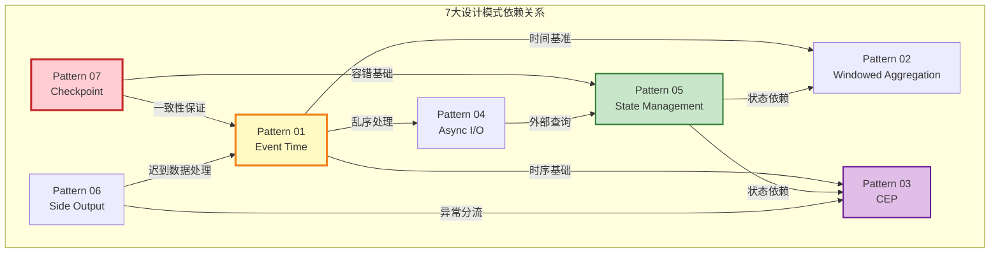

# 视频教程脚本 04：设计模式实战

> **视频标题**: 流处理7大设计模式实战
> **目标受众**: 中级Flink开发者、架构师
> **视频时长**: 25分钟
> **难度等级**: L3-L4 (进阶)

---

## 📋 脚本概览

| 章节 | 时间戳 | 时长 | 内容要点 |
|------|--------|------|----------|
| 开场 | 00:00-01:00 | 1分钟 | 设计模式概述与依赖关系 |
| Pattern 01 | 01:00-04:30 | 3分30秒 | 事件时间处理 |
| Pattern 02 | 04:30-07:30 | 3分钟 | 窗口聚合模式 |
| Pattern 03 | 07:30-10:30 | 3分钟 | 复杂事件处理(CEP) |
| Pattern 04 | 10:30-13:30 | 3分钟 | 异步I/O扩展 |
| Pattern 05 | 13:30-16:30 | 3分钟 | 状态管理 |
| Pattern 06 | 16:30-19:00 | 2分30秒 | 侧输出模式 |
| Pattern 07 | 19:00-22:00 | 3分钟 | Checkpoint与恢复 |
| 组合实战 | 22:00-24:00 | 2分钟 | 多模式组合案例 |
| 总结 | 24:00-25:00 | 1分钟 | 模式选型矩阵 |

---

## 分镜 1: 开场 (00:00-01:00)

### 🎬 画面描述

- **镜头**: 7大模式全景图
- **动画**: 模式依赖关系连线动画
- **高亮**: Pattern 01和Pattern 07作为核心基础设施

### 🎤 讲解文字

```
【00:00-00:30】
大家好！欢迎来到第四集：流处理7大设计模式实战。

在上一集中，我们学习了Flink的基础使用。
但在实际生产中，流处理面临的问题要复杂得多：
乱序数据怎么处理？
外部数据如何关联？
故障如何恢复？

【00:30-01:00】
AnalysisDataFlow项目总结了7大核心设计模式，
这些模式覆盖了流处理领域的核心问题：

P01 事件时间处理 - 解决乱序和迟到数据
P02 窗口聚合 - 无界流的有界计算
P03 复杂事件处理 - 时序模式匹配
P04 异步I/O - 外部数据关联
P05 状态管理 - 分布式有状态计算
P06 侧输出 - 多路输出和异常处理
P07 Checkpoint - 故障恢复与一致性

P01和P07是其他模式的基础设施，
掌握这两个模式，其他模式的学习会事半功倍。
```

### 📊 图表展示



---

## 分镜 2: Pattern 01 - 事件时间处理 (01:00-04:30)

### 🎬 画面描述

- **镜头**: 乱序数据可视化动画
- **分屏**: Watermark生成策略对比
- **代码**: 完整的Watermark配置示例

### 🎤 讲解文字

```
【01:00-01:45】
首先是Pattern 01：事件时间处理。

这是流处理中最基础也最重要的模式。
核心问题是：数据产生的顺序和到达的顺序不一致，
也就是「乱序」问题。

想象一下快递物流：
先发出的包裹，可能因为中转站不同，
后到达目的地。
数据在网络中传输也是如此。

【01:45-02:45】
解决方案是Watermark机制。

Watermark是一种特殊的时间戳标记，
它告诉系统：「所有时间早于Watermark的事件都已经到达」。

Flink提供了三种Watermark生成策略：

1. 单调递增：数据基本有序，无乱序
2. 固定延迟：数据有一定乱序，允许延迟
3. 自定义：根据业务特点定制

【02:45-04:00】
对于迟到数据，Flink提供了三种处理方式：

1. 丢弃：默认行为，简单但可能丢失数据
2. 允许迟到：延长窗口生命周期，更新结果
3. 侧输出：将迟到数据发送到单独的流

在生产环境中，我推荐组合使用允许迟到和侧输出：
- 设置合理的allowedLateness
- 侧输出监控迟到情况
- 根据监控结果调整Watermark策略

【04:00-04:30】
看代码示例：
我们配置了一个允许5秒乱序的Watermark策略，
窗口允许2分钟的迟到，
迟到数据会被发送到侧输出流。
```

### 💻 代码演示

```java
// Pattern 01: 事件时间处理完整示例

public class EventTimeProcessingPattern {

    public static void main(String[] args) throws Exception {
        StreamExecutionEnvironment env =
            StreamExecutionEnvironment.getExecutionEnvironment();
        env.setStreamTimeCharacteristic(TimeCharacteristic.EventTime);

        // 1. 定义迟到数据的侧输出标签
        final OutputTag<SensorReading> lateDataTag =
            new OutputTag<SensorReading>("late-data"){};

        // 2. 配置Watermark策略
        WatermarkStrategy<SensorReading> watermarkStrategy =
            WatermarkStrategy
                // 允许5秒乱序
                .<SensorReading>forBoundedOutOfOrderness(
                    Duration.ofSeconds(5)
                )
                // 空闲数据源处理
                .withIdleness(Duration.ofMinutes(1))
                // 从事件提取时间戳
                .withTimestampAssigner(
                    (event, timestamp) -> event.getTimestamp()
                );

        SingleOutputStreamOperator<AggregatedResult> result = env
            // 3. 读取数据并分配Watermark
            .addSource(new KafkaSource<>())
            .assignTimestampsAndWatermarks(watermarkStrategy)

            // 4. 按传感器ID分组
            .keyBy(SensorReading::getSensorId)

            // 5. 定义窗口
            .window(TumblingEventTimeWindows.of(Time.minutes(1)))

            // 6. 允许迟到（窗口结束后2分钟内仍可更新）
            .allowedLateness(Time.minutes(2))

            // 7. 迟到数据侧输出
            .sideOutputLateData(lateDataTag)

            // 8. 聚合计算
            .aggregate(new SensorAggregate());

        // 9. 输出主结果
        result.print("正常数据");

        // 10. 输出迟到数据（用于监控）
        result.getSideOutput(lateDataTag)
              .addSink(new LateDataMonitoringSink());

        env.execute("Event Time Processing Pattern");
    }
}
```

---

## 分镜 3: Pattern 02 - 窗口聚合 (04:30-07:30)

### 🎬 画面描述

- **镜头**: 四种窗口类型的可视化对比
- **动画**: 数据落入窗口的过程演示
- **代码**: 自定义Trigger和Evictor示例

### 🎤 讲解文字

```
【04:30-05:15】
Pattern 02：窗口聚合。

流数据是无界的，但计算需要边界。
窗口就是「无界到有界」的抽象。

Flink提供了四种类型的窗口：

1. 滚动窗口：固定大小，不重叠，适合周期性统计
2. 滑动窗口：固定大小，可重叠，适合移动平均
3. 会话窗口：动态大小，根据活动间隙划分，适合用户行为分析
4. 全局窗口：只有一个窗口，需要自定义触发器

【05:15-06:30】
窗口的生命周期有三个阶段：

1. 分配(Assign)：数据到达时，决定它属于哪个窗口
2. 触发(Trigger)：决定何时计算窗口结果
3. 驱逐(Evict)：决定何时清除窗口状态

默认情况下，Watermark超过窗口结束时间时触发，
计算完成后清除状态。

但我们可以通过自定义Trigger实现更复杂的逻辑：
比如数据量达到阈值时提前触发，
或收到特定控制消息时触发。

【06:30-07:30】
看一个电商场景的实战例子：
实时统计每分钟的GMV（成交总额），
但当GMV超过100万时提前触发告警。

这需要自定义Trigger：
在Watermark触发的基础上，
增加一个基于数据量的条件触发。
```

### 💻 代码演示

```java
// Pattern 02: 窗口聚合模式 - 自定义Trigger示例

public class WindowedAggregationPattern {

    public static void main(String[] args) throws Exception {
        StreamExecutionEnvironment env =
            StreamExecutionEnvironment.getExecutionEnvironment();

        DataStream<Order> orders = env
            .addSource(new KafkaSource<>())
            .assignTimestampsAndWatermarks(
                WatermarkStrategy
                    .<Order>forBoundedOutOfOrderness(Duration.ofSeconds(5))
                    .withTimestampAssigner((order, ts) -> order.getOrderTime())
            );

        // 滚动窗口 + 自定义Trigger
        DataStream<GMVResult> gmvResult = orders
            .keyBy(Order::getCategory)
            .window(TumblingEventTimeWindows.of(Time.minutes(1)))
            .trigger(new EarlyTriggerOnHighValue(1000000))  // GMV超100万提前触发
            .aggregate(new GMVAggregate());

        gmvResult.print();
        env.execute();
    }

    // 自定义Trigger：GMV超过阈值时提前触发
    public static class EarlyTriggerOnHighValue extends Trigger<Order, TimeWindow> {

        private final double threshold;
        private final ValueStateDescriptor<Double> sumStateDesc =
            new ValueStateDescriptor<>("gmv-sum", Types.DOUBLE);

        public EarlyTriggerOnHighValue(double threshold) {
            this.threshold = threshold;
        }

        @Override
        public TriggerResult onElement(Order order, long timestamp,
                TimeWindow window, TriggerContext ctx) throws Exception {

            ValueState<Double> sumState = ctx.getPartitionedState(sumStateDesc);
            Double currentSum = sumState.value();
            if (currentSum == null) currentSum = 0.0;

            currentSum += order.getAmount();
            sumState.update(currentSum);

            // 超过阈值，触发计算
            if (currentSum >= threshold) {
                return TriggerResult.FIRE;  // 触发但不清除
            }

            return TriggerResult.CONTINUE;
        }

        @Override
        public TriggerResult onProcessingTime(long time, TimeWindow window,
                TriggerContext ctx) {
            return TriggerResult.CONTINUE;
        }

        @Override
        public TriggerResult onEventTime(long time, TimeWindow window,
                TriggerContext ctx) {
            return time == window.maxTimestamp() ?
                TriggerResult.FIRE_AND_PURGE : TriggerResult.CONTINUE;
        }

        @Override
        public void clear(TimeWindow window, TriggerContext ctx) {
            ctx.getPartitionedState(sumStateDesc).clear();
        }
    }
}
```

---

## 分镜 4: Pattern 03 - 复杂事件处理(CEP) (07:30-10:30)

### 🎬 画面描述

- **镜头**: CEP模式匹配状态机动画
- **分屏**: 欺诈检测规则的可视化
- **代码**: 完整的CEP模式定义

### 🎤 讲解文字

```
【07:30-08:30】
Pattern 03：复杂事件处理(CEP)。

CEP用于在事件流中检测复杂的事件模式。
比如：用户登录失败3次后成功登录，
可能意味着账号被盗用。

Flink CEP的核心概念是：
- 模式(Pattern)：要匹配的事件序列规则
- NFA(非确定有限自动机)：模式匹配引擎
- 匹配结果：符合模式的事件序列

【08:30-09:45】
CEP模式定义使用类正则表达式的API：

- begin("start")：定义模式的起始状态
- next("middle")：紧跟着的下一个事件
- followedBy("end")：之后出现的某个事件
- within(Time)：模式匹配的时间窗口

还可以添加条件：
- where：基本过滤条件
- subtype：事件子类型
- oneOrMore：重复次数
- times(n)：恰好n次

【09:45-10:30】
看一个金融风控的实战例子：
检测「短时间内多笔小额交易后单笔大额交易」
这可能是信用卡盗刷的典型模式。

我们定义一个3阶段的模式：
1. 小额交易（金额<100）
2. 重复3次以上
3. 之后1分钟内出现大额交易（金额>5000）

匹配到这个模式就触发风控告警。
```

### 💻 代码演示

```java
// Pattern 03: 复杂事件处理(CEP) - 金融风控示例

import org.apache.flink.cep.CEP;
import org.apache.flink.cep.PatternStream;
import org.apache.flink.cep.pattern.Pattern;
import org.apache.flink.cep.pattern.conditions.SimpleCondition;

public class CEPPattern {

    public static void main(String[] args) throws Exception {
        StreamExecutionEnvironment env =
            StreamExecutionEnvironment.getExecutionEnvironment();

        DataStream<Transaction> transactions = env
            .addSource(new KafkaSource<>())
            .assignTimestampsAndWatermarks(
                WatermarkStrategy
                    .<Transaction>forBoundedOutOfOrderness(Duration.ofSeconds(5))
                    .withTimestampAssigner((txn, ts) -> txn.getTimestamp())
            );

        // 定义CEP模式
        Pattern<Transaction, ?> fraudPattern = Pattern
            // 阶段1：小额交易开始
            .<Transaction>begin("small-txns")
            .where(new SimpleCondition<Transaction>() {
                @Override
                public boolean filter(Transaction txn) {
                    return txn.getAmount() < 100.0;
                }
            })
            // 阶段2：重复3次或以上
            .timesOrMore(3)
            .within(Time.minutes(5))
            // 阶段3：之后紧跟大额交易
            .next("large-txn")
            .where(new SimpleCondition<Transaction>() {
                @Override
                public boolean filter(Transaction txn) {
                    return txn.getAmount() > 5000.0;
                }
            })
            .within(Time.minutes(1));

        // 应用模式
        PatternStream<Transaction> patternStream = CEP.pattern(
            transactions.keyBy(Transaction::getCardId),
            fraudPattern
        );

        // 处理匹配结果
        patternStream
            .process(new PatternProcessFunction<Transaction, FraudAlert>() {
                @Override
                public void processMatch(
                    Map<String, List<Transaction>> match,
                    Context ctx,
                    Collector<FraudAlert> out) {

                    List<Transaction> smallTxns = match.get("small-txns");
                    Transaction largeTxn = match.get("large-txn").get(0);

                    out.collect(new FraudAlert(
                        largeTxn.getCardId(),
                        "SUSPICIOUS_PATTERN",
                        String.format("检测到可疑交易：%d笔小额后大额%.2f",
                            smallTxns.size(), largeTxn.getAmount())
                    ));
                }
            })
            .addSink(new AlertSink());

        env.execute("CEP Fraud Detection");
    }
}
```

---

## 分镜 5: Pattern 04 - 异步I/O (10:30-13:30)

### 🎬 画面描述

- **镜头**: 同步vs异步对比动画
- **分屏**: 线程池和异步回调的可视化
- **代码**: AsyncFunction实现

### 🎤 讲解文字

```
【10:30-11:15】
Pattern 04：异步I/O扩展。

在流处理中，我们经常需要关联外部数据：
查询用户画像、补全地理位置信息、获取商品详情等。

如果同步调用外部服务，
整个数据流都会被阻塞，
吞吐率会急剧下降。

【11:15-12:15】
异步I/O模式的解决方案是：

1. 发送异步请求后不等待响应
2. 继续处理下一条数据
3. 响应到达后通过回调处理结果

Flink的AsyncFunction抽象了这种模式。
它内部维护了一个请求队列，
支持设置并发请求数和超时时间。

【12:15-13:30】
看一个实时推荐的实战例子：
用户点击流需要关联用户画像和商品特征，
这些数据存储在Redis和特征服务中。

使用异步I/O，我们可以：
- 并发查询多个外部服务
- 设置超时避免无限等待
- 处理请求失败和重试

代码中我们实现了AsyncFunction接口，
使用Java的CompletableFuture进行异步编程。
```

### 💻 代码演示

```java
// Pattern 04: 异步I/O模式 - 实时推荐特征补全

import org.apache.flink.streaming.api.functions.async.AsyncFunction;
import org.apache.flink.streaming.api.functions.async.ResultFuture;

public class AsyncIOPattern {

    public static void main(String[] args) throws Exception {
        StreamExecutionEnvironment env =
            StreamExecutionEnvironment.getExecutionEnvironment();

        DataStream<UserClick> clicks = env
            .addSource(new KafkaSource<>())
            .assignTimestampsAndWatermarks(...);

        // 异步查询用户画像
        DataStream<EnrichedClick> enriched = AsyncDataStream
            .unorderedWait(
                clicks,                          // 输入流
                new AsyncUserProfileLookup(),    // 异步函数
                1000,                            // 超时时间(ms)
                TimeUnit.MILLISECONDS,           // 时间单位
                100                              // 并发请求数
            );

        enriched.print();
        env.execute();
    }

    // 异步用户画像查询
    public static class AsyncUserProfileLookup
        implements AsyncFunction<UserClick, EnrichedClick> {

        private transient RedisAsyncClient redisClient;

        @Override
        public void open(Configuration parameters) {
            // 初始化异步Redis客户端
            this.redisClient = new RedisAsyncClient(
                "localhost", 6379
            );
        }

        @Override
        public void asyncInvoke(
            UserClick click,
            ResultFuture<EnrichedClick> resultFuture) {

            // 异步查询用户画像
            CompletableFuture<UserProfile> profileFuture =
                redisClient.getAsync(click.getUserId());

            // 异步查询商品特征
            CompletableFuture<ItemFeature> featureFuture =
                fetchItemFeatureAsync(click.getItemId());

            // 组合两个异步结果
            CompletableFuture.allOf(profileFuture, featureFuture)
                .thenCompose(v -> {
                    try {
                        UserProfile profile = profileFuture.get();
                        ItemFeature feature = featureFuture.get();

                        EnrichedClick enriched = new EnrichedClick(
                            click, profile, feature
                        );
                        return CompletableFuture.completedFuture(enriched);
                    } catch (Exception e) {
                        throw new CompletionException(e);
                    }
                })
                .whenComplete((result, error) -> {
                    if (error != null) {
                        // 失败处理
                        resultFuture.completeExceptionally(error);
                    } else {
                        // 成功返回
                        resultFuture.complete(Collections.singletonList(result));
                    }
                });
        }

        @Override
        public void timeout(
            UserClick click,
            ResultFuture<EnrichedClick> resultFuture) {
            // 超时处理：返回原始数据或默认值
            resultFuture.complete(Collections.singletonList(
                new EnrichedClick(click, UserProfile.empty(), ItemFeature.empty())
            ));
        }
    }
}
```

---

## 分镜 6: Pattern 05 - 状态管理 (13:30-16:30)

### 🎬 画面描述

- **镜头**: 状态后端架构图
- **分屏**: KeyedState和OperatorState对比
- **代码**: 完整的状态操作示例

### 🎤 讲解文字

```
【13:30-14:15】
Pattern 05：状态管理。

有状态计算是流处理的核心能力。
我们需要状态来：
- 聚合计算（累加计数、求和平均）
- 去重判断（基于ID的去重）
- 模式匹配（CEP中的状态机）
- 会话维护（用户会话窗口）

Flink提供了两种状态类型：

1. KeyedState：每个Key独立的的状态
   适用于按Key分组的场景

2. OperatorState：算子级别的状态
   适用于Source、Sink等不分Key的场景

【14:15-15:30】
状态后端决定了状态如何存储：

1. MemoryStateBackend：内存存储，适合测试
2. FsStateBackend：文件系统，适合小状态
3. RocksDBStateBackend：本地RocksDB，适合大状态

生产环境推荐使用RocksDB：
- 状态大小只受磁盘限制
- 支持增量Checkpoint
- 可以开启TTL自动清理

【15:30-16:30】
看一个去重的实战例子：
实时统计独立访客(UV)，
需要维护已访问的用户ID集合。

使用ValueState存储布隆过滤器，
可以高效地判断用户是否已访问，
同时节省内存空间。

代码中我们实现了RichFlatMapFunction，
使用ValueState来维护布隆过滤器状态。
```

### 💻 代码演示

```java
// Pattern 05: 状态管理 - UV去重统计

public class StateManagementPattern {

    public static void main(String[] args) throws Exception {
        StreamExecutionEnvironment env =
            StreamExecutionEnvironment.getExecutionEnvironment();

        // 配置状态后端
        env.setStateBackend(new RocksDBStateBackend(
            "hdfs://namenode:8020/flink/checkpoints",
            true  // 增量Checkpoint
        ));

        DataStream<PageView> pageViews = env
            .addSource(new KafkaSource<>())
            .assignTimestampsAndWatermarks(...);

        // UV去重统计
        DataStream<UVResult> uvStats = pageViews
            .keyBy(PageView::getPageId)
            .flatMap(new UVCountFunction());

        uvStats.print();
        env.execute();
    }

    // UV统计函数
    public static class UVCountFunction extends
        RichFlatMapFunction<PageView, UVResult> {

        private ValueState<BloomFilter<String>> bloomFilterState;
        private ValueState<Long> uvCountState;

        @Override
        public void open(Configuration parameters) {
            StateTtlConfig ttlConfig = StateTtlConfig
                .newBuilder(Time.hours(24))
                .setUpdateType(StateTtlConfig.UpdateType.OnCreateAndWrite)
                .setStateVisibility(
                    StateTtlConfig.StateVisibility.NeverReturnExpired
                )
                .cleanupIncrementally(10, true)
                .build();

            ValueStateDescriptor<BloomFilter<String>> bloomDesc =
                new ValueStateDescriptor<>("user-bloom-filter",
                    TypeInformation.of(new TypeHint<BloomFilter<String>>() {}));
            bloomDesc.enableTimeToLive(ttlConfig);

            ValueStateDescriptor<Long> countDesc =
                new ValueStateDescriptor<>("uv-count", Types.LONG);

            bloomFilterState = getRuntimeContext().getState(bloomDesc);
            uvCountState = getRuntimeContext().getState(countDesc);
        }

        @Override
        public void flatMap(PageView view, Collector<UVResult> out)
            throws Exception {

            BloomFilter<String> bloomFilter = bloomFilterState.value();
            Long uvCount = uvCountState.value();

            if (bloomFilter == null) {
                // 初始化布隆过滤器
                bloomFilter = BloomFilter.create(
                    Funnels.stringFunnel(),
                    1000000,  // 预期数据量
                    0.01      // 误判率
                );
                uvCount = 0L;
            }

            String userId = view.getUserId();

            // 布隆过滤器判断
            if (!bloomFilter.mightContain(userId)) {
                bloomFilter.put(userId);
                uvCount++;

                bloomFilterState.update(bloomFilter);
                uvCountState.update(uvCount);
            }

            out.collect(new UVResult(
                view.getPageId(),
                uvCount,
                view.getTimestamp()
            ));
        }
    }
}
```

---

## 分镜 7: Pattern 06 - 侧输出 (16:30-19:00)

### 🎬 画面描述

- **镜头**: 数据分流示意图
- **动画**: 主输出和侧输出的流向
- **代码**: 多路输出的完整配置

### 🎤 讲解文字

```
【16:30-17:15】
Pattern 06：侧输出模式。

有时候我们需要将数据发送到多个目的地：
- 正常数据到主Sink
- 异常数据到告警系统
- 迟到数据到补全任务
- 不同分类到不同存储

侧输出(Side Output)就是解决这个问题的。

【17:15-18:15】
侧输出使用OutputTag来标识不同的输出流。

在ProcessFunction中，
使用context.output(tag, value)发送数据到侧输出。
在主流程中，使用getSideOutput(tag)获取侧输出流。

一个算子可以有多个侧输出，
实现复杂的数据分流逻辑。

【18:15-19:00】
看一个数据清洗的实战例子：
原始日志流需要分成三路：
1. 正常数据 -> 数仓
2. 异常数据 -> 告警系统
3. 格式错误 -> 死信队列

使用ProcessFunction和侧输出，
可以清晰地实现这个需求。
```

### 💻 代码演示

```java
// Pattern 06: 侧输出模式 - 数据清洗与分流

public class SideOutputPattern {

    public static void main(String[] args) throws Exception {
        StreamExecutionEnvironment env =
            StreamExecutionEnvironment.getExecutionEnvironment();

        // 定义侧输出标签
        final OutputTag<LogEvent> malformedLogTag =
            new OutputTag<LogEvent>("malformed"){};
        final OutputTag<LogEvent> errorLogTag =
            new OutputTag<LogEvent>("error"){};
        final OutputTag<LogEvent> slowQueryTag =
            new OutputTag<LogEvent>("slow-query"){};

        DataStream<String> rawLogs = env
            .addSource(new KafkaSource<>());

        // 数据清洗与分流
        SingleOutputStreamOperator<LogEvent> processed = rawLogs
            .process(new LogParserProcessFunction(
                malformedLogTag, errorLogTag, slowQueryTag
            ));

        // 主输出：正常日志 -> 数仓
        processed.addSink(new DataWarehouseSink());

        // 侧输出1：格式错误 -> 死信队列
        processed.getSideOutput(malformedLogTag)
            .addSink(new DeadLetterQueueSink());

        // 侧输出2：ERROR级别 -> 实时告警
        processed.getSideOutput(errorLogTag)
            .addSink(new AlertSink());

        // 侧输出3：慢查询 -> 性能分析
        processed.getSideOutput(slowQueryTag)
            .addSink(new SlowQueryAnalysisSink());

        env.execute("Log Processing with Side Outputs");
    }

    // 日志解析ProcessFunction
    public static class LogParserProcessFunction extends
        ProcessFunction<String, LogEvent> {

        private final OutputTag<LogEvent> malformedTag;
        private final OutputTag<LogEvent> errorTag;
        private final OutputTag<LogEvent> slowQueryTag;

        public LogParserProcessFunction(
            OutputTag<LogEvent> malformedTag,
            OutputTag<LogEvent> errorTag,
            OutputTag<LogEvent> slowQueryTag) {
            this.malformedTag = malformedTag;
            this.errorTag = errorTag;
            this.slowQueryTag = slowQueryTag;
        }

        @Override
        public void processElement(
            String rawLog,
            Context ctx,
            Collector<LogEvent> out) {

            try {
                LogEvent event = parseLog(rawLog);

                // 检查格式有效性
                if (!isValid(event)) {
                    ctx.output(malformedTag, event);
                    return;
                }

                // 检查是否为ERROR级别
                if ("ERROR".equals(event.getLevel())) {
                    ctx.output(errorTag, event);
                }

                // 检查是否为慢查询（响应时间>1s）
                if (event.getResponseTime() > 1000) {
                    ctx.output(slowQueryTag, event);
                }

                // 正常数据输出到主流程
                out.collect(event);

            } catch (ParseException e) {
                // 解析失败也发送到死信队列
                ctx.output(malformedTag,
                    new LogEvent("PARSE_ERROR", rawLog));
            }
        }

        private LogEvent parseLog(String rawLog) throws ParseException {
            // 解析逻辑...
        }

        private boolean isValid(LogEvent event) {
            return event != null &&
                   event.getTimestamp() > 0 &&
                   event.getLevel() != null;
        }
    }
}
```

---

## 分镜 8: Pattern 07 - Checkpoint与恢复 (19:00-22:00)

### 🎬 画面描述

- **镜头**: Checkpoint过程动画
- **分屏**: Barrier对齐机制可视化
- **代码**: Checkpoint配置最佳实践

### 🎤 讲解文字

```
【19:00-20:00】
Pattern 07：Checkpoint与恢复。

这是保证容错和Exactly-Once语义的核心机制。

Checkpoint是分布式快照，
定期保存所有算子的状态。
当故障发生时，
可以从最近的Checkpoint恢复，
保证数据不丢失、不重复。

【20:00-21:00】
Checkpoint的过程是这样的：

1. JobManager向所有Source发送Barrier
2. Source收到Barrier后，保存自身状态并向下游传播
3. 每个算子收到所有输入流的Barrier后，保存状态并继续传播
4. 当所有Sink都确认后，Checkpoint完成

这个过程叫做「Barrier对齐」。
如果在一定时间内Barrier没有对齐，
可以选择使用Unaligned Checkpoint。

【21:00-22:00】
Checkpoint配置需要根据业务调整：

- 间隔：平衡容错开销和恢复粒度
- 超时：考虑状态大小和网络状况
- 并发：控制同时进行的最大Checkpoint数
- 增量：只保存状态变化，减少开销

看代码中的最佳实践配置。
```

### 💻 代码演示

```java
// Pattern 07: Checkpoint与恢复配置

public class CheckpointPattern {

    public static void main(String[] args) throws Exception {
        StreamExecutionEnvironment env =
            StreamExecutionEnvironment.getExecutionEnvironment();

        // ==================== Checkpoint配置 ====================

        // 1. 启用Checkpoint，每60秒触发一次
        env.enableCheckpointing(60000);

        // 2. 模式：EXACTLY_ONCE 或 AT_LEAST_ONCE
        env.getCheckpointConfig().setCheckpointingMode(
            CheckpointingMode.EXACTLY_ONCE
        );

        // 3. Checkpoint超时时间（10分钟）
        env.getCheckpointConfig().setCheckpointTimeout(600000);

        // 4. 最大并发Checkpoint数
        env.getCheckpointConfig().setMaxConcurrentCheckpoints(1);

        // 5. 两次Checkpoint之间的最小间隔
        env.getCheckpointConfig().setMinPauseBetweenCheckpoints(30000);

        // 6. 取消作业时是否保留Checkpoint
        env.getCheckpointConfig().enableExternalizedCheckpoints(
            ExternalizedCheckpointCleanup.RETAIN_ON_CANCELLATION
        );

        // 7. 允许Unaligned Checkpoint（应对背压）
        env.getCheckpointConfig().enableUnalignedCheckpoints();
        env.getCheckpointConfig().setAlignmentTimeout(Duration.ofSeconds(30));

        // ==================== 状态后端配置 ====================

        // 使用RocksDB状态后端
        EmbeddedRocksDBStateBackend rocksDbBackend =
            new EmbeddedRocksDBStateBackend(true);  // 增量Checkpoint

        rocksDbBackend.setPredefinedOptions(
            PredefinedOptions.FLASH_SSD_OPTIMIZED
        );

        env.setStateBackend(rocksDbBackend);

        // Checkpoint存储路径
        env.getCheckpointConfig().setCheckpointStorage(
            new FileSystemCheckpointStorage(
                "hdfs://namenode:8020/flink/checkpoints"
            )
        );

        // ==================== 重启策略 ====================

        // 固定延迟重启策略
        env.setRestartStrategy(RestartStrategies.fixedDelayRestart(
            10,                    // 最大重启次数
            Time.of(10, TimeUnit.SECONDS)  // 重启间隔
        ));

        // 或指数延迟策略
        env.setRestartStrategy(RestartStrategies.exponentialDelayRestart(
            Time.milliseconds(100),     // 初始延迟
            Time.milliseconds(10000),   // 最大延迟
            1.5,                         // 指数倍数
            Time.milliseconds(200),     // 抖动
            Time.hours(1)               // 重置延迟的间隔
        ));

        // ==================== 作业逻辑 ====================

        DataStream<Event> stream = env
            .addSource(new FlinkKafkaConsumer<>(...))
            // ... 处理逻辑
            .addSink(new TwoPhaseCommitSink());  // Exactly-Once Sink

        env.execute("Checkpoint Pattern");
    }
}

// Exactly-Once Sink实现（两阶段提交）
public class TwoPhaseCommitSink extends
    TwoPhaseCommitSinkFunction<Event, Transaction, Transaction> {

    private transient DatabaseClient client;

    public TwoPhaseCommitSink() {
        super(
            TypeInformation.of(Event.class).createSerializer(new ExecutionConfig()),
            TypeInformation.of(Transaction.class).createSerializer(new ExecutionConfig())
        );
    }

    @Override
    protected void invoke(Transaction transaction, Event value, Context context) {
        transaction.write(value);
    }

    @Override
    protected Transaction beginTransaction() {
        return client.beginTransaction();
    }

    @Override
    protected void preCommit(Transaction transaction) {
        transaction.preCommit();
    }

    @Override
    protected void commit(Transaction transaction) {
        transaction.commit();
    }

    @Override
    protected void abort(Transaction transaction) {
        transaction.rollback();
    }
}
```

---

## 分镜 9: 组合实战 (22:00-24:00)

### 🎬 画面描述

- **镜头**: 完整的数据流架构图
- **分屏**: 各模式在架构中的位置标注
- **代码**: 多模式组合的核心片段

### 🎤 讲解文字

```
【22:00-22:45】
在实际生产中，往往需要组合使用多个模式。

看一个完整的实时风控架构：
数据源是交易流水，
目标是实时识别可疑交易并告警。

【22:45-23:30】
架构中使用了以下模式组合：

1. P01 Event Time：处理乱序交易数据
2. P03 CEP：识别复杂欺诈模式
3. P04 Async I/O：查询用户风险画像
4. P05 State Management：维护风控规则状态
5. P06 Side Output：分流不同风险等级的告警
6. P07 Checkpoint：保证Exactly-Once告警

【23:30-24:00】
这种组合架构能够：
- 准确识别时序欺诈模式
- 低延迟响应（<200ms）
- 不丢不重（Exactly-Once）
- 灵活配置风控规则

代码中展示了核心部分的组合方式。
```

### 💻 代码演示

```java
// 多模式组合实战 - 实时风控架构

public class CombinedPatterns {

    public static void main(String[] args) throws Exception {
        StreamExecutionEnvironment env =
            StreamExecutionEnvironment.getExecutionEnvironment();

        // P07: Checkpoint配置
        env.enableCheckpointing(30000);
        env.getCheckpointConfig().setCheckpointingMode(
            CheckpointingMode.EXACTLY_ONCE
        );

        // P06: 定义侧输出标签
        final OutputTag<Alert> lowRiskAlertTag =
            new OutputTag<Alert>("low-risk"){};
        final OutputTag<Alert> highRiskAlertTag =
            new OutputTag<Alert>("high-risk"){};

        // P01: 事件时间处理 + Watermark
        DataStream<Transaction> transactions = env
            .addSource(new KafkaSource<>())
            .assignTimestampsAndWatermarks(
                WatermarkStrategy
                    .<Transaction>forBoundedOutOfOrderness(Duration.ofSeconds(5))
                    .withTimestampAssigner((txn, ts) -> txn.getTimestamp())
            );

        // P04: 异步查询用户风险画像
        DataStream<EnrichedTransaction> enriched = AsyncDataStream
            .unorderedWait(
                transactions,
                new AsyncRiskProfileLookup(),
                500, TimeUnit.MILLISECONDS, 100
            );

        // P03: CEP模式匹配
        Pattern<EnrichedTransaction, ?> fraudPattern = Pattern
            .<EnrichedTransaction>begin("start")
            .where(txn -> txn.getAmount() > 10000)
            .next("middle")
            .where(txn -> txn.getLocation().equals("abnormal"))
            .within(Time.minutes(5));

        PatternStream<EnrichedTransaction> patternStream =
            CEP.pattern(enriched.keyBy(EnrichedTransaction::getUserId), fraudPattern);

        // P05: 有状态告警处理 + P06: 侧输出
        SingleOutputStreamOperator<Alert> alerts = patternStream
            .process(new StatefulAlertHandler(lowRiskAlertTag, highRiskAlertTag));

        // 主输出：中等风险告警
        alerts.addSink(new AlertSink("medium"));

        // 侧输出1：低风险告警（日志记录）
        alerts.getSideOutput(lowRiskAlertTag)
            .addSink(new LogSink());

        // 侧输出2：高风险告警（实时通知）
        alerts.getSideOutput(highRiskAlertTag)
            .addSink(new UrgentAlertSink());

        env.execute("Real-time Fraud Detection");
    }
}
```

---

## 分镜 10: 总结 (24:00-25:00)

### 🎬 画面描述

- **镜头**: 模式选型矩阵表格
- **高亮**: 不同业务场景推荐的模式组合
- **过渡**: 下一集预告

### 🎤 讲解文字

```
【24:00-24:40】
最后，我们来看模式选型矩阵。

根据业务需求选择合适的模式组合：

- 实时风控：P01 + P03 + P07
- IoT数据处理：P01 + P05 + P07
- 实时推荐：P02 + P04 + P05
- 日志分析：P02 + P06 + P07
- 支付处理：P01 + P05 + P07（必须Exactly-Once）

【24:40-25:00】
7大设计模式覆盖了流处理的核心问题。
掌握这些模式，你就能应对大多数流处理场景。

下一集，我们将进入生产环境，
学习「生产部署与监控配置」。
包括K8s部署、Prometheus监控、Grafana仪表盘等。

我们下期再见！
```

### 📊 图表展示

```mermaid
| 业务需求 | P01 | P02 | P03 | P04 | P05 | P06 | P07 |
|----------|:---:|:---:|:---:|:---:|:---:|:---:|:---:|
| 乱序数据处理 | ✅ | ⚪ | ✅ | ✅ | ⚪ | ✅ | ⚪ |
| 窗口聚合计算 | ✅ | ✅ | ⚪ | ⚪ | ✅ | ⚪ | ⚪ |
| 复杂事件匹配 | ✅ | ✅ | ✅ | ⚪ | ✅ | ✅ | ⚪ |
| 外部数据关联 | ⚪ | ⚪ | ⚪ | ✅ | ⚪ | ⚪ | ⚪ |
| 有状态计算 | ⚪ | ✅ | ✅ | ✅ | ✅ | ⚪ | ✅ |
| 故障容错 | ⚪ | ⚪ | ⚪ | ⚪ | ✅ | ⚪ | ✅ |
| 数据分流 | ⚪ | ⚪ | ✅ | ⚪ | ⚪ | ✅ | ⚪ |
| Exactly-Once | ⚪ | ⚪ | ⚪ | ⚪ | ✅ | ⚪ | ✅ |

*图例: ✅ 核心依赖 | ⚪ 可选增强*
```

---

## 📝 制作备注

### 模式重点强调

- P01和P07用金色边框突出
- 代码片段控制在30行以内展示
- 复杂模式用动画演示

### 配色方案

- P01 (Event Time): 黄色 (#fff9c4)
- P03 (CEP): 紫色 (#e1bee7)
- P05 (State): 绿色 (#c8e6c9)
- P07 (Checkpoint): 红色 (#ffcdd2)

---

## 🔗 相关文档

- [Knowledge/02-design-patterns/](../Knowledge/02-design-patterns/)
- [Flink/02-core-mechanisms/checkpoint-mechanism-deep-dive.md](../Flink/02-core-mechanisms/checkpoint-mechanism-deep-dive.md)
- [Flink/02-core-mechanisms/time-semantics-and-watermark.md](../Flink/02-core-mechanisms/time-semantics-and-watermark.md)

---

*脚本版本: v1.0*
*创建日期: 2026-04-03*
*预计制作时长: 25分钟*
