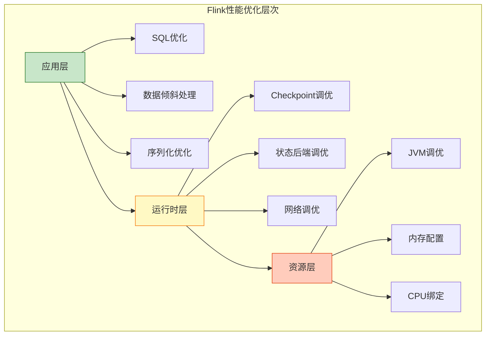
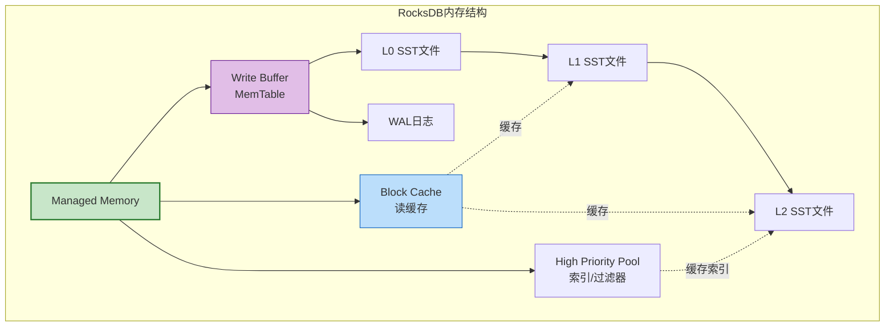
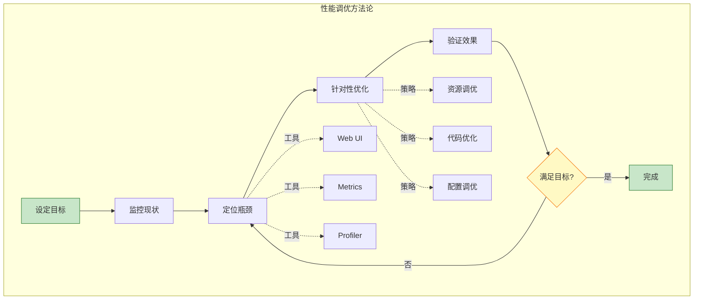
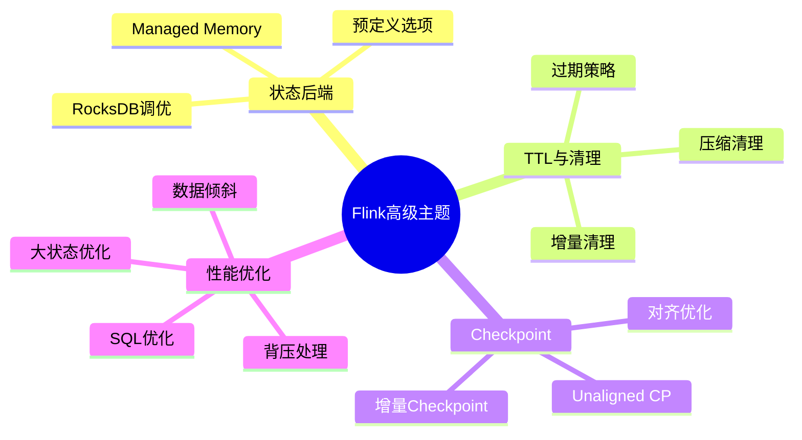

# 视频教程脚本 06：高级主题

> **视频标题**: Flink高级主题——状态管理、Checkpoint调优与性能优化
> **目标受众**: 高级开发者、性能工程师、架构师
> **视频时长**: 30分钟
> **难度等级**: L4-L5 (高级)

---

## 📋 脚本概览

| 章节 | 时间戳 | 时长 | 内容要点 |
|------|--------|------|----------|
| 开场 | 00:00-01:00 | 1分钟 | 高级主题概览 |
| 状态后端深度解析 | 01:00-05:00 | 4分钟 | RocksDB调优与选型 |
| 状态TTL与清理 | 05:00-08:00 | 3分钟 | 过期策略与增量清理 |
| Checkpoint调优 | 08:00-13:00 | 5分钟 | 对齐、增量、超时优化 |
| 背压处理 | 13:00-16:30 | 3分30秒 | 背压诊断与流控优化 |
| 数据倾斜处理 | 16:30-20:00 | 3分30秒 | 倾斜检测与优化方案 |
| SQL优化 | 20:00-23:30 | 3分30秒 | 查询计划与优化器 |
| 大状态优化 | 23:30-26:30 | 3分钟 | 状态分区与远程存储 |
| 性能调优实战 | 26:30-29:00 | 2分30秒 | 调优方法论与工具 |
| 总结 | 29:00-30:00 | 1分钟 | 知识回顾与进阶路径 |

---

## 分镜 1: 开场 (00:00-01:00)

### 🎬 画面描述

- **镜头**: 性能优化漏斗图
- **高亮**: 从资源层到应用层的优化层次
- **过渡**: 各主题快速预览

### 🎤 讲解文字

```
【00:00-00:30】
大家好！欢迎来到第六集，也是最后一集：Flink高级主题。

在前面的教程中，我们学习了Flink的基础知识、
设计模式和部署运维。这一集，我们将深入Flink的内部，
学习状态管理、Checkpoint调优和性能优化的核心技术。

【00:30-01:00】
本集内容包括：
1. 状态后端深度解析与RocksDB调优
2. 状态TTL与增量清理策略
3. Checkpoint调优：对齐、增量、超时
4. 背压诊断与流控优化
5. 数据倾斜处理方案
6. SQL查询优化
7. 大状态优化策略
8. 性能调优方法论

这些内容是构建高性能、高可用流处理系统的关键。
```

### 📊 图表展示



---

## 分镜 2: 状态后端深度解析 (01:00-05:00)

### 🎬 画面描述

- **镜头**: 三种状态后端架构对比
- **动画**: RocksDB读写路径
- **代码**: 状态后端配置与调优

### 🎤 讲解文字

```
【01:00-02:00】
Flink支持三种状态后端：

1. MemoryStateBackend：状态存储在JVM Heap
   优点：速度快
   缺点：大小受限于内存，不适合大状态

2. FsStateBackend：状态存储在内存，异步快照到文件系统
   优点：状态大小不受限制
   缺点：大状态时GC压力大

3. RocksDBStateBackend：状态存储在本地RocksDB
   优点：状态大小只受磁盘限制，支持增量Checkpoint
   缺点：序列化开销

生产环境推荐RocksDB。

【02:00-03:30】
RocksDB调优的核心参数：

1. 内存分配：
   - write-buffer-size：每个Column Family的写缓冲
   - max-write-buffer-number：最大写缓冲数量
   - block-cache-size：读缓存大小

2. 压缩配置：
   - compression-type：LZ4、Snappy、Zstd
   - target-file-size-base：基础文件大小
   - level0-file-num-compaction-trigger：L0触发压缩的阈值

3. 线程配置：
   - max-background-jobs：后台线程数
   - max-subcompactions：子压缩线程数

【03:30-05:00】
Flink对RocksDB的封装提供了简化配置：

预定义选项：
- DEFAULT：默认配置
- SPINNING_DISK_OPTIMIZED：机械硬盘优化
- FLASH_SSD_OPTIMIZED：SSD优化

Managed Memory是Flink 1.10+引入的特性，
让Flink自动管理RocksDB内存，
无需手动配置Column Family选项。

建议开启Managed Memory，
并根据状态大小设置合适的内存比例。
```

### 💻 代码演示

```java
// 状态后端深度配置

public class StateBackendTuning {

    public static void main(String[] args) throws Exception {
        StreamExecutionEnvironment env =
            StreamExecutionEnvironment.getExecutionEnvironment();

        // ========== 基础配置 ==========

        // 创建RocksDB状态后端
        EmbeddedRocksDBStateBackend rocksDbBackend =
            new EmbeddedRocksDBStateBackend(true);  // 启用增量Checkpoint

        // 设置预定义选项
        rocksDbBackend.setPredefinedOptions(
            PredefinedOptions.FLASH_SSD_OPTIMIZED
        );

        env.setStateBackend(rocksDbBackend);

        // ========== RocksDB详细调优 ==========

        // 通过RocksDBOptionsFactory自定义配置
        DefaultConfigurableOptionsFactory optionsFactory =
            new DefaultConfigurableOptionsFactory();

        // 写缓冲配置
        optionsFactory.setRocksDBOptions("write-buffer-size", "64MB");
        optionsFactory.setRocksDBOptions("max-write-buffer-number", "4");
        optionsFactory.setRocksDBOptions("min-write-buffer-number-to-merge", "2");

        // 压缩配置
        optionsFactory.setRocksDBOptions("compression-type", "LZ4");
        optionsFactory.setRocksDBOptions("compaction-style", "LEVEL");

        // 线程配置
        optionsFactory.setRocksDBOptions("max-background-jobs", "4");
        optionsFactory.setRocksDBOptions("max-subcompactions", "2");

        // 文件大小配置
        optionsFactory.setRocksDBOptions("target-file-size-base", "64MB");
        optionsFactory.setRocksDBOptions("max-bytes-for-level-base", "256MB");

        rocksDbBackend.setRocksDBOptions(optionsFactory);

        // ========== Managed Memory配置 ==========

        Configuration config = new Configuration();

        // 开启Managed Memory
        config.setBoolean(
            RocksDBOptions.USE_MANAGED_MEMORY,
            true
        );

        // Managed Memory占总内存的比例
        config.setDouble(
            RocksDBOptions.FIXED_PER_SLOT_MEMORY_SIZE,
            512 * 1024 * 1024L  // 512MB per slot
        );

        // 高优先级池比例（用于索引和过滤器）
        config.setDouble(
            RocksDBOptions.HIGH_PRIORITY_POOL_RATIO,
            0.1
        );

        env.configure(config);

        // ========== TaskManager内存配置 ==========

        // Managed Memory大小
        env.getConfig().setTaskManagerMemoryFraction(0.5);

        // 作业逻辑...

        env.execute("State Backend Tuning");
    }
}
```

### 📊 图表展示



---

## 分镜 3: 状态TTL与清理 (05:00-08:00)

### 🎬 画面描述

- **镜头**: TTL过期策略动画
- **分屏**: 三种清理策略对比
- **代码**: TTL配置完整示例

### 🎤 讲解文字

```
【05:00-06:00】
状态会不断增长，最终耗尽资源。
TTL(Time To Live)是控制状态生命周期的机制。

TTL策略：
1. 创建时更新：每次创建或写入时重置过期时间
2. 读写时更新：每次读取时也重置过期时间
3. 只创建时更新：只在创建时设置，后续不更新

状态可见性：
1. 不返回过期：读取时过滤掉过期数据
2. 返回过期但不清除：用于延迟清理场景

【06:00-07:00】
过期状态的清理策略：

1. 全量清理：查询时检查过期，适合小状态
2. 增量清理：每次处理记录时清理部分过期数据
3. RocksDB压缩清理：利用RocksDB的压缩过程清理

RocksDB压缩清理是最高效的，
但需要等待压缩触发。

【07:00-08:00】
清理参数调优：

- cleanupIncrementally：增量清理的步数和是否基于运行时间
- cleanupInRocksdbCompactFilter：压缩过滤器配置

建议：
- 大状态优先使用RocksDB压缩清理
- 小状态可以使用增量清理
- 根据过期数据比例调整清理频率
```

### 💻 代码演示

```java
// 状态TTL与清理配置

public class StateTTLConfiguration {

    public static void main(String[] args) throws Exception {
        StreamExecutionEnvironment env =
            StreamExecutionEnvironment.getExecutionEnvironment();

        // ========== TTL配置 ==========

        StateTtlConfig ttlConfig = StateTtlConfig
            .newBuilder(Time.hours(24))  // 24小时过期

            // 更新类型：创建或写入时更新
            .setUpdateType(
                StateTtlConfig.UpdateType.OnCreateAndWrite
            )

            // 状态可见性：不返回过期数据
            .setStateVisibility(
                StateTtlConfig.StateVisibility.NeverReturnExpired
            )

            // ========== 清理策略 ==========

            // 1. 增量清理策略
            .cleanupIncrementally(10, true)
            // 参数1：每次清理时检查的状态条目数
            // 参数2：是否在状态访问时触发清理

            // 2. RocksDB压缩清理策略
            .cleanupInRocksdbCompactFilter(1000)
            // 参数：每次处理的状态条目数后触发检查

            // 3. 全量快照清理（默认启用）
            .cleanupFullSnapshot()

            .build();

        // ========== 应用TTL配置 ==========

        DataStream<Event> stream = env.addSource(...);

        stream.keyBy(Event::getKey)
            .process(new KeyedProcessFunction<String, Event, Output>() {

                private ValueState<AggregatedData> state;

                @Override
                public void open(Configuration parameters) {
                    StateDescriptor<AggregatedData> descriptor =
                        new ValueStateDescriptor<>("aggregated",
                            TypeInformation.of(AggregatedData.class));

                    // 启用TTL
                    descriptor.enableTimeToLive(ttlConfig);

                    state = getRuntimeContext().getState(descriptor);
                }

                @Override
                public void processElement(Event value, Context ctx,
                        Collector<Output> out) throws Exception {

                    AggregatedData current = state.value();
                    if (current == null) {
                        current = new AggregatedData();
                    }

                    current.add(value);
                    state.update(current);

                    // 设置Timer用于定期输出
                    ctx.timerService().registerEventTimeTimer(
                        ctx.timestamp() + Time.minutes(5).toMilliseconds()
                    );
                }

                @Override
                public void onTimer(long timestamp, OnTimerContext ctx,
                        Collector<Output> out) throws Exception {

                    AggregatedData data = state.value();
                    if (data != null) {
                        out.collect(new Output(data));
                        // 可选：清空状态
                        // state.clear();
                    }
                }
            });

        env.execute();
    }
}
```

---

## 分镜 4: Checkpoint调优 (08:00-13:00)

### 🎬 画面描述

- **镜头**: Checkpoint生命周期动画
- **分屏**: 对齐与非对齐Checkpoint对比
- **代码**: Checkpoint配置最佳实践

### 🎤 讲解文字

```
【08:00-09:00】
Checkpoint是Flink容错的核心。
调优Checkpoint需要理解其生命周期：

1. 触发：JM发起，发送Barrier
2. 对齐：算子等待所有输入Barrier
3. 快照：保存状态到存储
4. 确认：JM确认所有任务完成
5. 完成：通知任务清理

【09:00-10:30】
Checkpoint常见问题及解决方案：

问题1：Checkpoint超时
原因：状态过大、网络慢、存储慢
解决：增量Checkpoint、压缩、优化存储

问题2：对齐时间长
原因：背压、数据倾斜
解决：Unaligned Checkpoint、调整Buffer大小

问题3：频繁失败
原因：资源不足、存储不可达
解决：增加超时、检查网络/存储

【10:30-12:00】
Unaligned Checkpoint是Flink 1.11引入的新特性，
它可以在不等待Barrier对齐的情况下进行Checkpoint。

适用场景：
- 存在持续背压
- 对齐时间经常超过超时

注意事项：
- 会增加存储开销（存储Buffer中的数据）
- 适合状态小的作业
- 需要足够高的网络带宽

【12:00-13:00】
增量Checkpoint只保存状态变化，
大幅减少Checkpoint时间和存储空间。

对于RocksDB后端，
增量Checkpoint基于SST文件级别。

建议：
- 大状态作业必须启用增量Checkpoint
- 定期进行全量Checkpoint（清理过期增量）
```

### 💻 代码演示

```java
// Checkpoint调优完整配置

public class CheckpointTuning {

    public static void main(String[] args) throws Exception {
        StreamExecutionEnvironment env =
            StreamExecutionEnvironment.getExecutionEnvironment();

        // ========== 基础Checkpoint配置 ==========

        // Checkpoint间隔：平衡容错和性能
        env.enableCheckpointing(
            TimeUnit.MINUTES.toMillis(1),  // 1分钟
            CheckpointingMode.EXACTLY_ONCE
        );

        CheckpointConfig checkpointConfig = env.getCheckpointConfig();

        // 超时时间：根据状态大小调整
        checkpointConfig.setCheckpointTimeout(
            TimeUnit.MINUTES.toMillis(10)
        );

        // 并发Checkpoint数：一般设为1
        checkpointConfig.setMaxConcurrentCheckpoints(1);

        // 两次Checkpoint最小间隔
        checkpointConfig.setMinPauseBetweenCheckpoints(
            TimeUnit.SECONDS.toMillis(30)
        );

        // 取消作业时保留Checkpoint
        checkpointConfig.enableExternalizedCheckpoints(
            ExternalizedCheckpointCleanup.RETAIN_ON_CANCELLATION
        );

        // ========== Unaligned Checkpoint ==========

        // 启用Unaligned Checkpoint
        checkpointConfig.enableUnalignedCheckpoints();

        // 对齐超时：超过此时间切换到Unaligned模式
        checkpointConfig.setAlignmentTimeout(
            Duration.ofSeconds(30)
        );

        // 最大对齐数据量：超过此值切换到Unaligned
        checkpointConfig.setMaxAlignedCheckSize(
            SizeUnit.MEBIBYTES.toBytes(10)
        );

        // ========== 增量Checkpoint ==========

        // 增量Checkpoint间隔（每N次全量Checkpoint后做一次全量）
        checkpointConfig.setIncrementalCheckpointInterval(
            Duration.ofMinutes(30)
        );

        // ========== 失败处理 ==========

        // Checkpoint失败容忍次数
        checkpointConfig.setTolerableCheckpointFailureNumber(3);

        // ========== 存储配置 ==========

        // Checkpoint存储
        env.getCheckpointConfig().setCheckpointStorage(
            new FileSystemCheckpointStorage(
                "s3p://flink-checkpoints/my-job"
            )
        );

        // 启用Checkpoint压缩
        env.getConfig().setUseSnapshotCompression(true);

        // ========== 网络配置（影响对齐） ==========

        Configuration config = new Configuration();

        // 网络Buffer大小
        config.setInteger(
            TaskManagerOptions.NETWORK_MEMORY_BUFFER_SIZE,
            32768  // 32KB
        );

        // 每个通道的Buffer数
        config.setInteger(
            TaskManagerOptions.NETWORK_MEMORY_BUFFERS_PER_CHANNEL,
            2
        );

        // 浮动Buffer数
        config.setInteger(
            TaskManagerOptions.NETWORK_MEMORY_BUFFERS_PER_GATE,
            8
        );

        // 启用Buffer Debloating
        config.setBoolean(
            TaskManagerOptions.NETWORK_MEMORY_BUFFER_DEBLOAT_ENABLED,
            true
        );

        // Debloating目标
        config.setInteger(
            TaskManagerOptions.NETWORK_MEMORY_BUFFER_DEBLOAT_TARGET,
            1000  // 1秒
        );

        env.configure(config);

        // ========== 重启策略 ==========

        // 失败率重启策略
        env.setRestartStrategy(RestartStrategies.failureRateRestart(
            3,                               // 最大失败次数
            Time.of(5, TimeUnit.MINUTES),   // 时间窗口
            Time.of(10, TimeUnit.SECONDS)   // 重试间隔
        ));

        env.execute("Checkpoint Tuning");
    }
}
```

---

## 分镜 5: 背压处理 (13:00-16:30)

### 🎬 画面描述

- **镜头**: 背压传播动画
- **分屏**: Web UI背压指标展示
- **代码**: 背压诊断与优化

### 🎤 讲解文字

```
【13:00-14:00】
背压(Backpressure)是流处理中的常见问题。
当下游处理速度慢于上游时，
压力会向上游传播，最终影响整个系统。

Flink使用Credit-based流控机制，
下游通过反馈Credit控制上游发送速度。

【14:00-15:00】
背压诊断步骤：

1. Web UI查看Backpressure Tab
   - OK：无背压
   - LOW：轻度背压
   - HIGH：严重背压

2. 定位背压源头
   - 从Source开始向下检查
   - 第一个非OK的Subtask就是瓶颈

3. 分析背压原因
   - CPU密集型？增加并行度
   - I/O密集型？异步化或批量处理
   - GC？调整JVM参数
   - 数据倾斜？重新分区

【15:00-16:30】
背压优化方案：

1. 增加并行度
2. 优化算子逻辑
3. 使用AsyncFunction异步化
4. 启用Object Reuse减少GC
5. 调整网络Buffer
6. 使用Broadcast State减少shuffle

Buffer Debloating是Flink 1.14引入的特性，
可以自动调整Buffer大小，
减少背压时的延迟。
```

### 💻 代码演示

```java
// 背压优化示例

public class BackpressureOptimization {

    public static void main(String[] args) throws Exception {
        StreamExecutionEnvironment env =
            StreamExecutionEnvironment.getExecutionEnvironment();

        // ========== 基础优化配置 ==========

        // 启用对象复用，减少GC压力
        env.getConfig().enableObjectReuse();

        // 禁用自动类型提取（如果不需要）
        env.getConfig().disableAutoTypeRegistration();

        // ========== 优化后的作业 ==========

        DataStream<Event> source = env
            .addSource(new KafkaSource<>())
            .setParallelism(4);  // 根据Kafka分区数设置

        // 优化1：异步I/O替代同步查询
        DataStream<EnrichedEvent> enriched = AsyncDataStream
            .unorderedWait(
                source,
                new AsyncEnrichmentFunction(),
                1000, TimeUnit.MILLISECONDS,
                100  // 并发数
            );

        // 优化2：批量处理替代单条处理
        DataStream<AggregatedResult> aggregated = enriched
            .keyBy(EnrichedEvent::getKey)
            .process(new BatchProcessFunction(100));  // 批量100条

        // 优化3：优化Sink
        aggregated
            .addSink(new OptimizedSink())
            .setParallelism(4);

        env.execute();
    }

    // 批量处理函数
    public static class BatchProcessFunction extends
        KeyedProcessFunction<String, EnrichedEvent, AggregatedResult> {

        private final int batchSize;
        private ListState<EnrichedEvent> bufferState;
        private ValueState<Long> timerState;

        public BatchProcessFunction(int batchSize) {
            this.batchSize = batchSize;
        }

        @Override
        public void open(Configuration parameters) {
            bufferState = getRuntimeContext().getListState(
                new ListStateDescriptor<>("buffer", EnrichedEvent.class)
            );
            timerState = getRuntimeContext().getState(
                new ValueStateDescriptor<>("timer", Long.class)
            );
        }

        @Override
        public void processElement(EnrichedEvent value, Context ctx,
                Collector<AggregatedResult> out) throws Exception {

            bufferState.add(value);

            // 批量达到阈值，触发处理
            Iterable<EnrichedEvent> buffer = bufferState.get();
            int count = 0;
            for (EnrichedEvent e : buffer) {
                count++;
            }

            if (count >= batchSize) {
                processBatch(out);
                // 清理Timer
                Long timer = timerState.value();
                if (timer != null) {
                    ctx.timerService().deleteEventTimeTimer(timer);
                    timerState.clear();
                }
            } else if (timerState.value() == null) {
                // 设置超时Timer
                long timerTime = ctx.timestamp() + 1000;  // 1秒超时
                ctx.timerService().registerEventTimeTimer(timerTime);
                timerState.update(timerTime);
            }
        }

        @Override
        public void onTimer(long timestamp, OnTimerContext ctx,
                Collector<AggregatedResult> out) throws Exception {
            processBatch(out);
            timerState.clear();
        }

        private void processBatch(Collector<AggregatedResult> out)
            throws Exception {

            List<EnrichedEvent> batch = new ArrayList<>();
            bufferState.get().forEach(batch::add);

            if (!batch.isEmpty()) {
                // 批量处理逻辑
                AggregatedResult result = aggregateBatch(batch);
                out.collect(result);

                bufferState.clear();
            }
        }

        private AggregatedResult aggregateBatch(List<EnrichedEvent> batch) {
            // 聚合逻辑...
            return new AggregatedResult();
        }
    }
}
```

---

## 分镜 6: 数据倾斜处理 (16:30-20:00)

### 🎬 画面描述

- **镜头**: 数据倾斜可视化
- **分屏**: 解决前后对比
- **代码**: 多种解决方案

### 🎤 讲解文字

```
【16:30-17:30】
数据倾斜是分布式计算的常见问题。
当某个Key的数据量远大于其他Key时，
会导致部分Subtask过载，
影响整体吞吐和延迟。

倾斜的表现：
- Web UI中某些Subtask的Records Received远超其他
- 某些Subtask的Backpressure严重
- Checkpoint时间不一致

【17:30-18:30】
解决方案1：两阶段聚合

第一阶段：预聚合 + 随机前缀
将热点Key加上随机前缀分散到多个分区，
进行局部聚合。

第二阶段：去掉前缀，全局聚合
将局部聚合结果去掉前缀，
再进行最终的聚合。

【18:30-19:30】
解决方案2：自定义分区器

实现Partitioner接口，
根据Key的分布情况动态分配分区。

解决方案3：Local-KeyBy
在全局聚合前先进行本地聚合，
减少网络传输和Shuffle。

【19:30-20:00】
解决方案4：动态调整并行度

对于Flink 2.0+，
可以使用Adaptive Scheduler动态调整。

对于无法避免的倾斜，
考虑使用广播状态或Side Input避免Shuffle。
```

### 💻 代码演示

```java
// 数据倾斜处理方案

public class SkewHandling {

    public static void main(String[] args) throws Exception {
        StreamExecutionEnvironment env =
            StreamExecutionEnvironment.getExecutionEnvironment();

        DataStream<Event> source = env.addSource(...);

        // ========== 方案1：两阶段聚合 ==========

        // 热点Key加随机前缀
        SingleOutputStreamOperator<Tuple2<String, Long>> prefixed = source
            .map(new RichMapFunction<Event, Tuple2<String, Long>>() {
                private Random random;

                @Override
                public void open(Configuration parameters) {
                    random = new Random();
                }

                @Override
                public Tuple2<String, Long> map(Event value) {
                    String key = value.getKey();
                    // 热点Key加随机前缀
                    if (isHotKey(key)) {
                        key = random.nextInt(10) + "_" + key;
                    }
                    return Tuple2.of(key, 1L);
                }
            });

        // 第一阶段：局部聚合
        DataStream<Tuple2<String, Long>> localAgg = prefixed
            .keyBy(value -> value.f0)
            .sum(1);

        // 去掉前缀，全局聚合
        DataStream<Tuple2<String, Long>> globalAgg = localAgg
            .map(value -> {
                String key = value.f0;
                if (key.contains("_")) {
                    key = key.substring(key.indexOf("_") + 1);
                }
                return Tuple2.of(key, value.f1);
            })
            .returns(Types.TUPLE(Types.STRING, Types.LONG))
            .keyBy(value -> value.f0)
            .sum(1);

        // ========== 方案2：自定义分区器 ==========

        DataStream<Event> repartitioned = source
            .partitionCustom(new SkewAwarePartitioner(), Event::getKey);

        // ========== 方案3：Local-KeyBy ==========

        DataStream<AggregatedResult> localKeyByResult = source
            .map(new LocalKeyByFunction(1000))  // 缓冲1000条
            .keyBy(Event::getKey)
            .window(TumblingProcessingTimeWindows.of(Time.seconds(5)))
            .aggregate(new AggregateFunction<>() {
                // 聚合逻辑...
            });

        env.execute();
    }

    // 自定义分区器
    public static class SkewAwarePartitioner implements Partitioner<String> {

        private final Map<String, Integer> keyDistribution = new HashMap<>();

        @Override
        public int partition(String key, int numPartitions) {
            // 记录Key分布
            keyDistribution.merge(key, 1, Integer::sum);

            // 热点Key分散到多个分区
            if (keyDistribution.get(key) > 10000) {
                return (key.hashCode() + ThreadLocalRandom.current().nextInt(10))
                    % numPartitions;
            }

            return key.hashCode() % numPartitions;
        }
    }

    // Local-KeyBy实现
    public static class LocalKeyByFunction extends
        RichMapFunction<Event, Event> {

        private final int bufferSize;
        private Map<String, List<Event>> localBuffer;
        private Map<String, AggregatedResult> localAgg;

        public LocalKeyByFunction(int bufferSize) {
            this.bufferSize = bufferSize;
        }

        @Override
        public void open(Configuration parameters) {
            localBuffer = new HashMap<>();
            localAgg = new HashMap<>();
        }

        @Override
        public Event map(Event value) throws Exception {
            String key = value.getKey();

            localBuffer.computeIfAbsent(key, k -> new ArrayList<>()).add(value);

            // 局部聚合
            AggregatedResult agg = localAgg.computeIfAbsent(key, k -> new AggregatedResult());
            agg.add(value);

            // 缓冲区满，输出聚合结果
            if (localBuffer.get(key).size() >= bufferSize) {
                Event aggregatedEvent = new Event(key, agg.getCount());
                localBuffer.get(key).clear();
                localAgg.put(key, new AggregatedResult());
                return aggregatedEvent;
            }

            return null;  // 过滤掉
        }
    }
}
```

---

## 分镜 7: SQL优化 (20:00-23:30)

### 🎬 画面描述

- **镜头**: 查询计划可视化
- **分屏**: 优化前后的执行计划对比
- **代码**: SQL和Table API优化

### 🎤 讲解文字

```
【20:00-21:00】
Flink SQL是快速开发流处理应用的首选。
但不当的SQL写法会导致性能问题。

SQL优化的核心是理解执行计划。
使用EXPLAIN查看查询计划，
分析是否存在以下问题：
- 全表扫描
- 不合理的Join顺序
- 缺少分区裁剪
- 过多的Shuffle

【21:00-22:30】
常见SQL优化技巧：

1. 谓词下推
   将过滤条件下推到数据源，
   减少数据传输。

2. 投影下推
   只查询需要的列，
   减少I/O开销。

3. 分区裁剪
   利用分区字段过滤，
   减少扫描数据量。

4. Join优化
   - 小表Broadcast Join
   - 大表Shuffle Hash Join
   - 避免笛卡尔积

【22:30-23:30】
MiniBatch是Flink SQL的重要优化手段，
它将微批处理和流处理结合，
在牺牲少量延迟的情况下大幅提升吞吐。

适合场景：
- 聚合查询
- Join操作
- 窗口计算

配置参数：
- table.exec.mini-batch.enabled
- table.exec.mini-batch.allow-latency
- table.exec.mini-batch.size
```

### 💻 代码演示

```java
// SQL优化示例

public class SQLOptimization {

    public static void main(String[] args) throws Exception {
        StreamExecutionEnvironment env =
            StreamExecutionEnvironment.getExecutionEnvironment();
        StreamTableEnvironment tableEnv =
            StreamTableEnvironment.create(env);

        // ========== 优化配置 ==========

        // 启用MiniBatch
        tableEnv.getConfig().getConfiguration().setBoolean(
            TableConfigOptions.TABLE_EXEC_MINIBATCH_ENABLED,
            true
        );

        // MiniBatch允许的最大延迟
        tableEnv.getConfig().getConfiguration().setString(
            TableConfigOptions.TABLE_EXEC_MINIBATCH_ALLOW_LATENCY,
            "1s"
        );

        // MiniBatch大小
        tableEnv.getConfig().getConfiguration().setLong(
            TableConfigOptions.TABLE_EXEC_MINIBATCH_SIZE,
            1000
        );

        // 启用Local-Global聚合
        tableEnv.getConfig().getConfiguration().setBoolean(
            TableConfigOptions.TABLE_EXEC_LOCAL_AGG_ENABLED,
            true
        );

        // 启用Distinct聚合优化
        tableEnv.getConfig().getConfiguration().setBoolean(
            TableConfigOptions.TABLE_EXEC_DISTINCT_AGG_SPLIT_ENABLED,
            true
        );

        // ========== 创建表 ==========

        // 优化后的订单表定义
        String createOrdersTable = "CREATE TABLE orders (\n" +
            "  order_id STRING,\n" +
            "  user_id STRING,\n" +
            "  amount DECIMAL(10,2),\n" +
            "  order_time TIMESTAMP(3),\n" +
            "  WATERMARK FOR order_time AS order_time - INTERVAL '5' SECOND\n" +
            ") WITH (\n" +
            "  'connector' = 'kafka',\n" +
            "  'topic' = 'orders',\n" +
            "  'properties.bootstrap.servers' = 'localhost:9092',\n" +
            "  'format' = 'json',\n" +
            "  'json.ignore-parse-errors' = 'true'\n" +
            ")";

        tableEnv.executeSql(createOrdersTable);

        // 优化后的用户表定义
        String createUsersTable = "CREATE TABLE users (\n" +
            "  user_id STRING,\n" +
            "  user_name STRING,\n" +
            "  user_level INT\n" +
            ") WITH (\n" +
            "  'connector' = 'jdbc',\n" +
            "  'url' = 'jdbc:mysql://localhost:3306/mydb',\n" +
            "  'table-name' = 'users',\n" +
            "  'username' = 'user',\n" +
            "  'password' = 'pass',\n" +
            "  'lookup.cache.max-rows' = '10000',\n" +
            "  'lookup.cache.ttl' = '10 min'\n" +
            ")";

        tableEnv.executeSql(createUsersTable);

        // ========== 优化后的查询 ==========

        String optimizedQuery =
            "SELECT\n" +
            "  u.user_level,\n" +
            "  TUMBLE_START(o.order_time, INTERVAL '1' HOUR) as window_start,\n" +
            "  COUNT(*) as order_count,\n" +
            "  SUM(o.amount) as total_amount\n" +
            "FROM orders o\n" +
            // 使用Lookup Join，小表广播
            "LEFT JOIN users FOR SYSTEM_TIME AS OF o.order_time u\n" +
            "  ON o.user_id = u.user_id\n" +
            "WHERE o.amount > 0\n" +  // 谓词下推
            "GROUP BY\n" +
            "  u.user_level,\n" +
            "  TUMBLE(o.order_time, INTERVAL '1' HOUR)";

        // 查看执行计划
        String explainQuery = "EXPLAIN " + optimizedQuery;
        TableResult explainResult = tableEnv.executeSql(explainQuery);
        explainResult.print();

        // 执行查询
        TableResult result = tableEnv.executeSql(optimizedQuery);
        result.print();

        env.execute();
    }
}
```

---

## 分镜 8: 大状态优化 (23:30-26:30)

### 🎬 画面描述

- **镜头**: 状态增长趋势图
- **分屏**: 本地存储 vs 远程存储
- **代码**: 大状态处理方案

### 🎤 讲解文字

```
【23:30-24:30】
大状态是生产环境的常见挑战。
当状态超过单节点内存容量时，
需要特殊的优化策略。

问题表现：
- Checkpoint时间过长
- 恢复时间过长
- TaskManager OOM
- GC时间过长

【24:30-25:30】
优化策略：

1. 状态分区
   使用更细粒度的Key，
   让状态分散到更多Slot。

2. 增量Checkpoint
   只保存变化的部分，
   减少Checkpoint开销。

3. 状态压缩
   使用Snappy或LZ4压缩状态，
   减少存储和网络传输。

4. 远程状态存储
   将状态存储在远程分布式存储，
   如RocksDB with S3。

【25:30-26:30】
Flink 2.0引入了Disaggregated State架构，
将状态存储与计算分离，
这是大状态优化的终极解决方案。

优势：
- 状态大小不受限于本地磁盘
- 快速扩缩容（无需状态迁移）
- 独立优化存储和计算资源

但目前还是预览特性，
生产环境使用需谨慎。
```

### 💻 代码演示

```java
// 大状态优化方案

public class LargeStateOptimization {

    public static void main(String[] args) throws Exception {
        StreamExecutionEnvironment env =
            StreamExecutionEnvironment.getExecutionEnvironment();

        // ========== 基础优化配置 ==========

        // 启用增量Checkpoint
        env.setStateBackend(
            new EmbeddedRocksDBStateBackend(true)
        );

        // 启用Checkpoint压缩
        env.getConfig().setUseSnapshotCompression(true);

        // 增加Checkpoint超时
        env.getCheckpointConfig().setCheckpointTimeout(30 * 60 * 1000);

        // ========== 状态分区优化 ==========

        // 使用复合Key分散状态
        DataStream<Event> source = env.addSource(...);

        // 复合Key: userId + hash(eventId) % 100
        source
            .keyBy(event ->
                event.getUserId() + "_" + (event.getEventId().hashCode() % 100)
            )
            .window(TumblingEventTimeWindows.of(Time.minutes(5)))
            .aggregate(new AggregateFunction<>() {
                // 聚合逻辑...
            });

        // ========== 状态清理优化 ==========

        // 使用MapState存储大量小Key
        source.keyBy(Event::getUserId)
            .process(new KeyedProcessFunction<>() {

                private MapState<String, EventData> eventState;

                @Override
                public void open(Configuration parameters) {
                    StateTtlConfig ttlConfig = StateTtlConfig
                        .newBuilder(Time.hours(24))
                        .setUpdateType(StateTtlConfig.UpdateType.OnCreateAndWrite)
                        .cleanupInRocksdbCompactFilter(1000)
                        .build();

                    MapStateDescriptor<String, EventData> descriptor =
                        new MapStateDescriptor<>("events", String.class, EventData.class);
                    descriptor.enableTimeToLive(ttlConfig);

                    eventState = getRuntimeContext().getMapState(descriptor);
                }

                @Override
                public void processElement(Event value, Context ctx,
                        Collector<Object> out) throws Exception {

                    // 只保留必要数据
                    EventData compactData = new EventData(
                        value.getKey(),
                        value.getTimestamp(),
                        value.getValue()
                    );

                    eventState.put(value.getEventId(), compactData);

                    // 定期清理过期Key
                    if (ctx.timestamp() % 10000 == 0) {
                        cleanupExpiredKeys();
                    }
                }

                private void cleanupExpiredKeys() throws Exception {
                    // 主动清理逻辑...
                }
            });

        // ========== 状态大小监控 ==========

        // 使用Flink Metric监控状态大小
        source.keyBy(Event::getUserId)
            .process(new KeyedProcessFunction<>() {

                private transient Meter stateSizeGauge;
                private ValueState<byte[]> largeState;

                @Override
                public void open(Configuration parameters) {
                    getRuntimeContext()
                        .getMetricGroup()
                        .gauge("stateSizeBytes", new Gauge<Long>() {
                            @Override
                            public Long getValue() {
                                try {
                                    byte[] value = largeState.value();
                                    return value == null ? 0L : (long) value.length;
                                } catch (Exception e) {
                                    return 0L;
                                }
                            }
                        });
                }

                // ...
            });

        env.execute();
    }
}
```

---

## 分镜 9: 性能调优实战 (26:30-29:00)

### 🎬 画面描述

- **镜头**: 性能分析工具界面
- **分屏**: 调优前后的指标对比
- **流程图**: 调优方法论

### 🎤 讲解文字

```
【26:30-27:30】
性能调优是一个系统性的过程。

调优方法论：
1. 设定目标：吞吐、延迟、资源利用率
2. 监控现状：收集基线指标
3. 定位瓶颈：找到限制因素
4. 针对性优化：应用优化策略
5. 验证效果：对比调优前后
6. 迭代优化：重复直到满足目标

【27:30-28:15】
常用性能分析工具：

1. Flink Web UI
   查看吞吐量、延迟、背压

2. Metrics系统
   Prometheus + Grafana长期监控

3. JVM工具
   jstat、jmap、jstack、async-profiler

4. 火焰图
   定位CPU热点

5. Heap Dump
   分析内存使用

【28:15-29:00】
调优检查清单：

资源层：
☑️ TaskManager内存配置合理
☑️ JVM GC配置优化
☑️ 网络Buffer配置合适

应用层：
☑️ 序列化器选择合适
☑️ 对象复用已启用
☑️ 数据倾斜已处理
☑️ 状态后端调优完成

运行时：
☑️ Checkpoint配置合理
☑️ 背压在可控范围
☑️ Watermark正常推进
```

### 📊 图表展示



---

## 分镜 10: 总结 (29:00-30:00)

### 🎬 画面描述

- **镜头**: 知识回顾思维导图
- **高亮**: 关键优化点
- **过渡**: 系列总结和进阶路径

### 🎤 讲解文字

```
【29:00-29:40】
让我们回顾本集的要点：

1. 状态后端：RocksDB调优 + Managed Memory
2. 状态TTL：过期策略 + 增量清理
3. Checkpoint：对齐优化 + 增量 + Unaligned
4. 背压处理：诊断 + 异步化 + Batch处理
5. 数据倾斜：两阶段聚合 + 自定义分区
6. SQL优化：MiniBatch + 执行计划分析
7. 大状态：分区 + 压缩 + 远程存储
8. 调优方法：系统化流程 + 工具使用

【29:40-30:00】
至此，AnalysisDataFlow Flink视频教程系列全部完成。

我们从零开始，
学习了流计算基础、Flink快速上手、
7大设计模式、生产部署、以及本集的高级主题。

要深入学习，建议阅读：
- AnalysisDataFlow项目文档
- Flink官方文档
- 参与社区讨论

感谢观看，祝你在流计算领域取得成功！
```

### 📊 图表展示



---

## 📝 制作备注

### 关键图表

- 性能优化层次图
- RocksDB内存结构图
- Checkpoint生命周期图
- 调优方法论流程图

### 代码展示原则

- 每个主题只展示核心配置
- 复杂代码分段讲解
- 高亮关键参数

### 时间控制

- 每个分镜严格控制时间
- 预留30秒缓冲
- 复杂概念用动画辅助理解

---

## 🔗 相关文档

- [Flink/02-core-mechanisms/checkpoint-mechanism-deep-dive.md](../Flink/02-core-mechanisms/checkpoint-mechanism-deep-dive.md)
- [Flink/06-engineering/performance-tuning-guide.md](../Flink/06-engineering/performance-tuning-guide.md)
- [Flink/03-sql-table-api/query-optimization-analysis.md](../Flink/03-sql-table-api/query-optimization-analysis.md)
- [Struct/04-proofs/04.01-flink-checkpoint-correctness.md](../Struct/04-proofs/04.01-flink-checkpoint-correctness.md)

---

*脚本版本: v1.0*
*创建日期: 2026-04-03*
*预计制作时长: 30分钟*
