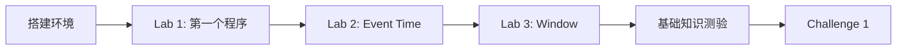
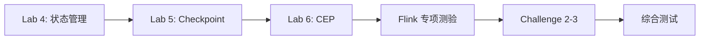

# AnalysisDataFlow 交互式教程

> 欢迎来到 AnalysisDataFlow 交互式学习平台！

## 教程结构

```
tutorials/interactive/
├── README.md                    # 本文件
├── flink-playground/            # Flink 实验环境
│   ├── docker-compose.yml       # Docker 环境配置
│   ├── conf/
│   ├── data/                    # 示例数据集
│   └── README.md
├── hands-on-labs/               # 6个动手实验
│   ├── lab-01-first-flink-program.md
│   ├── lab-02-event-time.md
│   ├── lab-03-window-aggregation.md
│   ├── lab-04-state-management.md
│   ├── lab-05-checkpoint.md
│   └── lab-06-cep.md
├── quizzes/                     # 测验
│   ├── stream-processing-fundamentals.md
│   ├── flink-specialized.md
│   ├── design-patterns.md
│   └── comprehensive-test.md
└── coding-challenges/           # 编程挑战
    ├── README.md
    ├── challenge-01-hot-items.md
    ├── challenge-02-login-detection.md
    ├── challenge-03-order-timeout.md
    ├── challenge-04-recommendation.md
    └── challenge-05-data-pipeline.md
```

## 学习路径

### 路径一：初学者 (预计 2-3 周)



### 路径二：进阶开发者 (预计 1-2 周)



### 路径三：专家 (预计 1 周)


## 快速开始

### 1. 启动实验环境

```bash
cd tutorials/interactive/flink-playground
docker-compose up -d

# 验证环境
curl http://localhost:8081/overview
```

### 2. 完成实验

按顺序完成 6 个 Hands-on Labs，每个实验包含：

- 实验目标
- 详细步骤
- 代码示例
- 验证方法
- 扩展练习

### 3. 参加测验

- 基础知识测验：20题，30分钟
- Flink 专项测验：20题，30分钟
- 设计模式测验：20题，30分钟
- 综合测试：30题，45分钟

### 4. 编程挑战

5 个实战编程挑战，难度递增：

| 挑战 | 难度 | 描述 |
|------|------|------|
| Challenge 1 | 初级 | 实时热门商品统计 |
| Challenge 2 | 中级 | 恶意登录检测 |
| Challenge 3 | 中级 | 订单超时处理 |
| Challenge 4 | 高级 | 实时推荐系统 |
| Challenge 5 | 高级 | 实时数据清洗管道 |

## 学习资源

### 文档

- [Struct索引](../../Struct/00-INDEX.md) - 理论形式化
- [Knowledge索引](../../Knowledge/00-INDEX.md) - 知识体系
- [Flink索引](../../Flink/00-INDEX.md) - Flink 专项

### 外部资源

- [Apache Flink 官方文档](https://nightlies.apache.org/flink/flink-docs-stable/)
- [Flink 中文文档](https://flink.apache.org/zh/)
- [Streaming Systems 书籍](https://www.oreilly.com/library/view/streaming-systems/9781491983874/)

## 认证证书

完成所有内容后，获得 AnalysisDataFlow 流计算学习认证：

```
┌─────────────────────────────────────────────────────┐
│                                                     │
│              AnalysisDataFlow                       │
│         流计算学习认证证书                          │
│                                                     │
│  完成者: _________________                          │
│  完成日期: _______________                          │
│  综合评分: _______________                          │
│                                                     │
│  认证技能:                                          │
│  ✓ Flink DataStream API                            │
│  ✓ Event Time 处理                                 │
│  ✓ Window 聚合                                     │
│  ✓ 状态管理                                        │
│  ✓ Checkpoint & Exactly-Once                       │
│  ✓ CEP 复杂事件处理                                │
│                                                     │
└─────────────────────────────────────────────────────┘
```

## 贡献指南

欢迎改进教程内容：

1. 发现错误请提交 Issue
2. 改进实验内容请提交 PR
3. 分享学习心得

## 获取帮助

- 查阅 [AGENTS.md](../../AGENTS.md) 项目规范
- 参考 [PROJECT-TRACKING.md](../../PROJECT-TRACKING.md) 进度
- 查看各目录 README 详细说明

---

**开始你的流计算学习之旅吧！**
