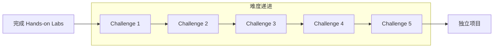

# 编程挑战

> 所属阶段: 实践 | 前置依赖: 完成所有 Hands-on Labs | 预计时间: 每个挑战 2-4 小时

## 挑战列表

| 挑战 | 难度 | 主题 | 预计时间 |
|------|------|------|---------|
| [Challenge 1: 实时热门商品统计](./challenge-01-hot-items.md) | 初级 | Window、Aggregate | 2h |
| [Challenge 2: 恶意登录检测](./challenge-02-login-detection.md) | 中级 | CEP、Pattern | 3h |
| [Challenge 3: 订单超时处理](./challenge-03-order-timeout.md) | 中级 | Timer、State | 3h |
| [Challenge 4: 实时推荐系统](./challenge-04-recommendation.md) | 高级 | Async IO、Join | 4h |
| [Challenge 5: 实时数据清洗管道](./challenge-05-data-pipeline.md) | 高级 | Side Output、CDC | 4h |

## 评分标准

每个挑战按照以下标准评分：

| 维度 | 权重 | 说明 |
|------|------|------|
| 功能正确性 | 40% | 程序能否正确实现需求 |
| 代码质量 | 25% | 可读性、结构、注释 |
| 性能优化 | 20% | 是否考虑了性能和资源使用 |
| 测试覆盖 | 15% | 单元测试和集成测试 |

### 等级划分

- **S级 (90-100分)**：优秀实现，考虑边界情况和性能优化
- **A级 (80-89分)**：良好实现，功能完整，代码清晰
- **B级 (70-79分)**：基本功能实现，有改进空间
- **C级 (60-69分)**：部分功能实现，需要大量改进
- **D级 (<60分)**：未通过，需要重新学习

## 提交规范

每个挑战需要提交：

```
challenge-XX-name/
├── src/
│   ├── main/
│   │   ├── java/com/example/
│   │   │   ├── Main.java              # 入口类
│   │   │   ├── model/                 # 数据模型
│   │   │   ├── source/                # 自定义 Source
│   │   │   ├── sink/                  # 自定义 Sink
│   │   │   └── function/              # 处理函数
│   │   └── resources/
│   │       └── log4j.properties
│   └── test/
│       └── java/com/example/
│           └── *Test.java             # 单元测试
├── docker-compose.yml                 # 本地测试环境
├── README.md                          # 设计文档
├── SOLUTION.md                        # 解决方案说明
└── pom.xml                            # Maven 配置
```

## 环境准备

```bash
# 使用 Flink Playground 作为测试环境
cd tutorials/interactive/flink-playground
docker-compose up -d

# 创建挑战目录
mkdir -p tutorials/interactive/coding-challenges/challenge-01-hot-items/src/main/java/com/example
```

## 挑战详解

### Challenge 1: 实时热门商品统计

**需求:**

- 实时统计最近1小时内的热门商品（按浏览量排序）
- 每5分钟更新一次排行榜
- 输出Top 10商品

**学习要点:**

- Sliding Window 使用
- AggregateFunction 增量计算
- ProcessWindowFunction 获取 Top N

### Challenge 2: 恶意登录检测

**需求:**

- 检测5分钟内连续3次登录失败的账户
- 检测异地登录（地理位置变化）
- 将异常账户加入黑名单

**学习要点:**

- Flink CEP 模式定义
- 迭代条件使用
- Side Output 处理异常

### Challenge 3: 订单超时处理

**需求:**

- 创建订单后15分钟内未支付则自动取消
- 支付成功后发货
- 支持订单状态查询

**学习要点:**

- ProcessFunction + Timer
- State 存储订单状态
- 状态 TTL 配置

### Challenge 4: 实时推荐系统

**需求:**

- 根据用户实时行为推荐商品
- 异步获取用户画像和商品信息
- 实现用户-商品协同过滤

**学习要点:**

- AsyncFunction 异步 IO
- Broadcast State 存储特征
- 双流 Join 处理

### Challenge 5: 实时数据清洗管道

**需求:**

- 从 MySQL CDC 读取数据变更
- 数据验证和清洗（格式、完整性）
- 异常数据进入 Dead Letter Queue
- 清洗后数据写入 Data Lake

**学习要点:**

- Flink CDC Connector
- Side Output 异常处理
- FileSystem Sink  exactly-once

## 参考答案

每个挑战提供：

1. **参考实现** - 一种可能的解决方案
2. **优化建议** - 性能优化思路
3. **常见错误** - 容易犯的错误
4. **扩展思考** - 进阶改进方向

参考实现位于各挑战目录的 `reference/` 子目录中。

## 学习路径建议



## 交流与反馈

完成挑战后：

1. 自我评估代码质量
2. 对比参考答案学习
3. 思考可能的改进方向
4. 尝试扩展功能

## 引用参考
