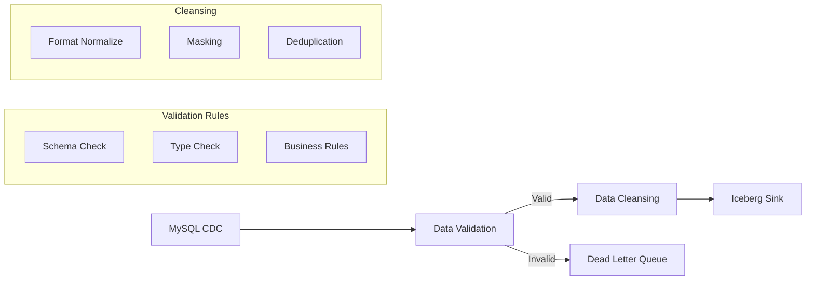

# Challenge 5: 实时数据清洗管道

> 难度: 高级 | 预计时间: 4小时 | 主题: CDC、Side Output、Exactly-Once

## 需求描述

实现一个企业级实时数据清洗管道，从多个数据源捕获变更，进行数据质量验证，清洗后写入数据湖。

### 功能需求

1. **数据采集**
   - MySQL CDC 捕获表变更
   - 支持全量+增量模式
   - 多表同步

2. **数据验证**
   - Schema 验证
   - 数据类型检查
   - 必填字段检查
   - 业务规则验证

3. **数据清洗**
   - 格式标准化
   - 敏感数据脱敏
   - 缺失值处理
   - 重复数据去重

4. **异常处理**
   - 异常数据进入 Dead Letter Queue
   - 支持错误分类和统计
   - 可配置的重试策略

5. **数据输出**
   - 清洗后数据写入 Iceberg/Paimon
   - Exactly-Once 保证
   - 分区写入

## 系统架构



## 实现步骤

### Step 1: CDC Source 配置

```java
public class CDCSourceConfig {

    public static MySqlSource<String> createMySqlSource() {
        return MySqlSource.<String>builder()
            .hostname("mysql")
            .port(3306)
            .databaseList("ecommerce")
            .tableList("ecommerce.orders", "ecommerce.users", "ecommerce.products")
            .username("cdc_user")
            .password("cdc_password")
            .deserializer(new JsonDebeziumDeserializationSchema())
            .startupOptions(StartupOptions.initial())  // 全量+增量
            .build();
    }
}

// 主程序中使用
DataStream<String> cdcStream = env
    .fromSource(
        CDCSourceConfig.createMySqlSource(),
        WatermarkStrategy.noWatermarks(),
        "MySQL CDC Source"
    )
    .setParallelism(4);
```

### Step 2: Schema 定义和验证

```java
public class SchemaValidator extends ProcessFunction<String, CleanRecord> {

    // 表结构定义
    private static final Map<String, TableSchema> SCHEMAS = new HashMap<>();

    static {
        SCHEMAS.put("orders", new TableSchema()
            .addField("order_id", String.class, true)
            .addField("user_id", String.class, true)
            .addField("amount", BigDecimal.class, true)
            .addField("status", String.class, true)
            .addField("created_at", Timestamp.class, true));

        SCHEMAS.put("users", new TableSchema()
            .addField("user_id", String.class, true)
            .addField("email", String.class, true)
            .addField("phone", String.class, false)
            .addField("created_at", Timestamp.class, true));
    }

    // 侧输出标签
    private final OutputTag<ErrorRecord> errorTag =
        new OutputTag<ErrorRecord>("validation-errors"){};

    @Override
    public void processElement(
            String jsonRecord,
            Context ctx,
            Collector<CleanRecord> out) {

        try {
            JsonNode root = objectMapper.readTree(jsonRecord);
            String table = root.get("source").get("table").asText();
            JsonNode data = root.get("after");  // 变更后的数据

            if (data == null) {
                // DELETE 操作，没有 after
                data = root.get("before");
            }

            TableSchema schema = SCHEMAS.get(table);
            if (schema == null) {
                ctx.output(errorTag, new ErrorRecord(
                    jsonRecord, "UNKNOWN_TABLE", "Table not configured: " + table
                ));
                return;
            }

            // 验证每个字段
            List<String> errors = new ArrayList<>();
            Map<String, Object> validated = new HashMap<>();

            for (FieldSchema field : schema.getFields()) {
                JsonNode fieldValue = data.get(field.getName());

                // 必填检查
                if (field.isRequired() && (fieldValue == null || fieldValue.isNull())) {
                    errors.add("Missing required field: " + field.getName());
                    continue;
                }

                // 类型转换和验证
                try {
                    Object converted = convertType(fieldValue, field.getType());
                    validated.put(field.getName(), converted);
                } catch (Exception e) {
                    errors.add("Type error for " + field.getName() + ": " + e.getMessage());
                }
            }

            if (!errors.isEmpty()) {
                ctx.output(errorTag, new ErrorRecord(
                    jsonRecord, "VALIDATION_ERROR", String.join("; ", errors)
                ));
                return;
            }

            // 添加元数据
            CleanRecord clean = new CleanRecord();
            clean.table = table;
            clean.op = root.get("op").asText();  // c/u/d
            clean.data = validated;
            clean.sourceTs = root.get("ts_ms").asLong();
            clean.processTs = System.currentTimeMillis();

            out.collect(clean);

        } catch (Exception e) {
            ctx.output(errorTag, new ErrorRecord(
                jsonRecord, "PARSE_ERROR", e.getMessage()
            ));
        }
    }

    private Object convertType(JsonNode value, Class<?> targetType) {
        if (targetType == String.class) {
            return value.asText();
        } else if (targetType == Integer.class || targetType == int.class) {
            return value.asInt();
        } else if (targetType == Long.class || targetType == long.class) {
            return value.asLong();
        } else if (targetType == BigDecimal.class) {
            return new BigDecimal(value.asText());
        } else if (targetType == Timestamp.class) {
            return Timestamp.from(Instant.parse(value.asText()));
        }
        return value.asText();
    }
}
```

### Step 3: 数据清洗

```java
public class DataCleansing extends RichMapFunction<CleanRecord, CleanRecord> {

    private transient MaskingUtil masker;
    private transient DuplicateFilter dedupFilter;

    @Override
    public void open(Configuration parameters) {
        masker = new MaskingUtil();
        dedupFilter = new DuplicateFilter();
    }

    @Override
    public CleanRecord map(CleanRecord record) {
        Map<String, Object> data = record.data;

        // 1. 格式标准化
        normalizeFormat(data);

        // 2. 敏感数据脱敏
        if (record.table.equals("users")) {
            maskSensitiveData(data);
        }

        // 3. 缺失值填充
        fillMissingValues(data, record.table);

        // 4. 去重（基于业务键）
        if (isDuplicate(record)) {
            return null;  // 过滤掉重复数据
        }

        record.data = data;
        return record;
    }

    private void normalizeFormat(Map<String, Object> data) {
        // 邮箱统一小写
        if (data.containsKey("email")) {
            String email = (String) data.get("email");
            data.put("email", email.toLowerCase().trim());
        }

        // 手机号统一格式
        if (data.containsKey("phone")) {
            String phone = (String) data.get("phone");
            data.put("phone", phone.replaceAll("[^0-9]", ""));
        }

        // 金额统一为 BigDecimal
        if (data.containsKey("amount")) {
            Object amount = data.get("amount");
            if (!(amount instanceof BigDecimal)) {
                data.put("amount", new BigDecimal(amount.toString()));
            }
        }
    }

    private void maskSensitiveData(Map<String, Object> data) {
        // 邮箱脱敏: a***@example.com
        if (data.containsKey("email")) {
            String email = (String) data.get("email");
            data.put("email", masker.maskEmail(email));
        }

        // 手机号脱敏: 138****8888
        if (data.containsKey("phone")) {
            String phone = (String) data.get("phone");
            data.put("phone", masker.maskPhone(phone));
        }
    }

    private void fillMissingValues(Map<String, Object> data, String table) {
        // 根据表配置填充默认值
        if (table.equals("orders") && !data.containsKey("status")) {
            data.put("status", "PENDING");
        }
    }

    private boolean isDuplicate(CleanRecord record) {
        // 基于主键和时间窗口去重
        String dedupKey = record.table + ":" + getPrimaryKey(record);
        return !dedupFilter.addIfAbsent(dedupKey, record.sourceTs);
    }
}
```

### Step 4: Exactly-Once Iceberg Sink

```java
public class IcebergSink extends TwoPhaseCommitSinkFunction<CleanRecord, IcebergTransaction, Void> {

    private transient Table table;
    private transient Transaction transaction;

    public IcebergSink() {
        super(
            TypeInformation.of(CleanRecord.class).createSerializer(new ExecutionConfig()),
            TypeInformation.of(IcebergTransaction.class).createSerializer(new ExecutionConfig())
        );
    }

    @Override
    protected void invoke(
            IcebergTransaction transaction,
            CleanRecord value,
            Context context) {

        // 转换为 Iceberg GenericRecord
        GenericRecord record = GenericRecord.create(table.schema());

        value.data.forEach((k, v) -> {
            record.setField(k, v);
        });

        // 添加分区字段
        record.setField("dt", LocalDate.now().toString());
        record.setField("hour", LocalDateTime.now().getHour());

        // 添加到当前事务
        transaction.append(record);
    }

    @Override
    protected IcebergTransaction beginTransaction() {
        return table.newTransaction();
    }

    @Override
    protected void preCommit(IcebergTransaction transaction) {
        // 预提交，不真正提交
        transaction.prepareCommit();
    }

    @Override
    protected void commit(IcebergTransaction transaction) {
        // Checkpoint 成功后提交
        transaction.commitTransaction();
    }

    @Override
    protected void abort(IcebergTransaction transaction) {
        // Checkpoint 失败，回滚
        transaction.rollback();
    }
}
```

### Step 5: 错误处理和监控

```java
public class ErrorHandler extends ProcessFunction<ErrorRecord, Void> {

    private transient Meter errorMeter;
    private transient MapState<String, Long> errorCounts;

    @Override
    public void open(Configuration parameters) {
        errorMeter = getRuntimeContext()
            .getMetricGroup()
            .meter("validation.errors", new MeterView(60));

        errorCounts = getRuntimeContext().getMapState(
            new MapStateDescriptor<>("errorCounts", String.class, Long.class)
        );
    }

    @Override
    public void processElement(ErrorRecord error, Context ctx, Collector<Void> out)
            throws Exception {

        // 记录指标
        errorMeter.markEvent();

        // 按错误类型统计
        errorCounts.merge(error.errorType, 1L, Long::sum);

        // 分类处理
        switch (error.errorType) {
            case "SCHEMA_MISMATCH":
                // 严重的 Schema 错误，立即告警
                sendAlert(error);
                break;
            case "VALIDATION_ERROR":
                // 可重试的错误
                if (shouldRetry(error)) {
                    ctx.output(retryTag, error);
                }
                break;
            case "PARSE_ERROR":
                // 解析错误，记录日志
                logError(error);
                break;
        }

        // 写入 DLQ
        dlqSink.invoke(error);
    }

    @Override
    public void onTimer(long timestamp, OnTimerContext ctx, Collector<Void> out)
            throws Exception {

        // 定期输出错误统计
        System.out.println("=== Error Statistics ===");
        for (Map.Entry<String, Long> entry : errorCounts.entries()) {
            System.out.println(entry.getKey() + ": " + entry.getValue());
        }
    }
}
```

### Step 6: 主程序

```java
public class DataPipelineJob {

    public static void main(String[] args) throws Exception {
        StreamExecutionEnvironment env =
            StreamExecutionEnvironment.getExecutionEnvironment();

        // 启用 Checkpoint 保证 Exactly-Once
        env.enableCheckpointing(60000);
        env.getCheckpointConfig().setCheckpointingMode(
            CheckpointingMode.EXACTLY_ONCE
        );

        // 1. CDC Source
        DataStream<String> cdcStream = env.fromSource(
            CDCSourceConfig.createMySqlSource(),
            WatermarkStrategy.noWatermarks(),
            "MySQL CDC"
        );

        // 2. Schema 验证
        SingleOutputStreamOperator<CleanRecord> validated = cdcStream
            .process(new SchemaValidator());

        // 获取验证错误
        DataStream<ErrorRecord> validationErrors = validated
            .getSideOutput(new OutputTag<ErrorRecord>("validation-errors"){});

        // 3. 数据清洗
        DataStream<CleanRecord> cleansed = validated
            .map(new DataCleansing())
            .filter(Objects::nonNull);

        // 4. 写入 Iceberg
        cleansed.addSink(new IcebergSink());

        // 5. 错误处理
        validationErrors
            .keyBy(e -> e.errorType)
            .process(new ErrorHandler());

        env.execute("Data Cleansing Pipeline");
    }
}
```

## 评分标准

| 维度 | 权重 | 要求 |
|------|------|------|
| CDC 集成 | 25% | 正确配置和使用 CDC Source |
| 数据验证 | 20% | 完整的 Schema 和规则验证 |
| 清洗逻辑 | 20% | 实现脱敏、标准化、去重 |
| Exactly-Once | 20% | 正确使用两阶段提交 |
| 监控告警 | 15% | 完善的错误处理和监控 |

## 扩展练习

### 扩展 1: Schema Registry 集成

```java
// 从 Confluent Schema Registry 获取 Schema
public class SchemaRegistryValidator extends SchemaValidator {

    private transient SchemaRegistryClient registryClient;

    @Override
    public void open(Configuration parameters) {
        registryClient = new CachedSchemaRegistryClient(
            "http://schema-registry:8081", 100
        );
    }

    private Schema getSchemaFromRegistry(String table) {
        return registryClient.getLatestSchema(table + "-value");
    }
}
```

### 扩展 2: 实时数据质量仪表板

```java
// 输出质量指标到 Prometheus
public class QualityMetrics extends ProcessFunction<CleanRecord, Void> {

    private transient Counter recordsCounter;
    private transient Histogram latencyHistogram;

    @Override
    public void open(Configuration parameters) {
        recordsCounter = getRuntimeContext()
            .getMetricGroup()
            .counter("records.processed");

        latencyHistogram = getRuntimeContext()
            .getMetricGroup()
            .histogram("processing.latency", new DropwizardHistogramWrapper(
                new com.codahale.metrics.Histogram(
                    new SlidingWindowReservoir(500)
                )
            ));
    }

    @Override
    public void processElement(CleanRecord record, Context ctx, Collector<Void> out) {
        recordsCounter.inc();

        long latency = ctx.timestamp() - record.sourceTs;
        latencyHistogram.update(latency);
    }
}
```

## 参考解答

完整参考实现位于 `reference/challenge-05-data-pipeline/` 目录。

## 总结

完成本挑战后，您将掌握：

- CDC 数据捕获技术
- 复杂的数据验证和清洗流程
- 企业级的异常处理机制
- Exactly-Once 数据管道实现
