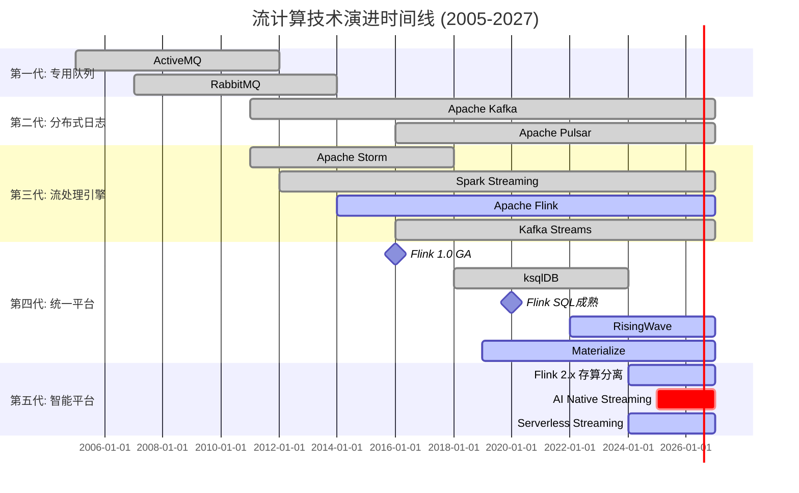
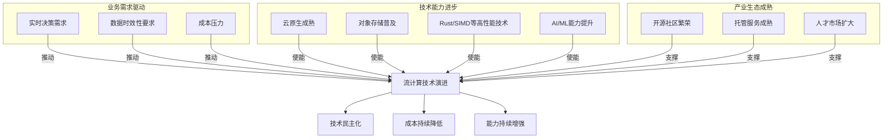
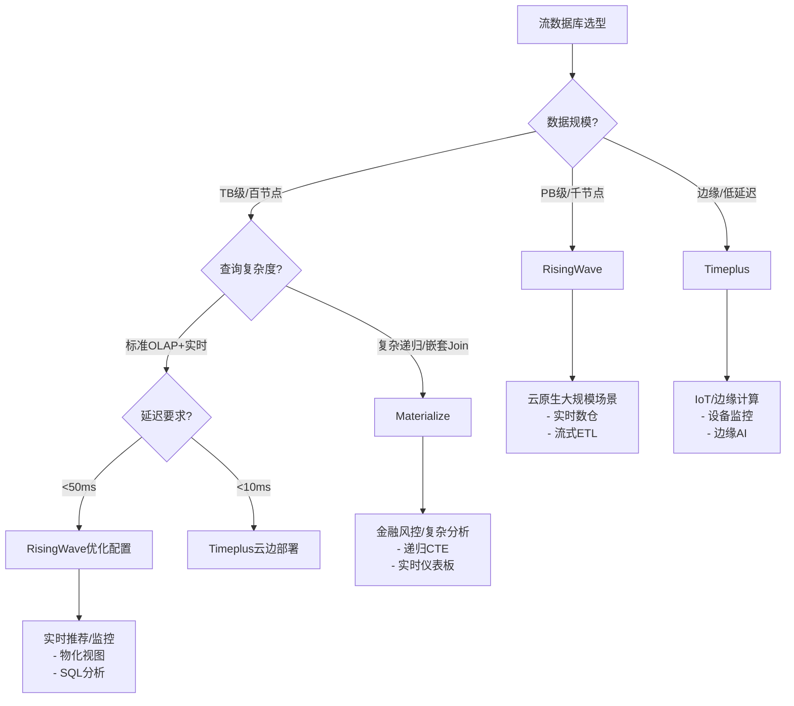
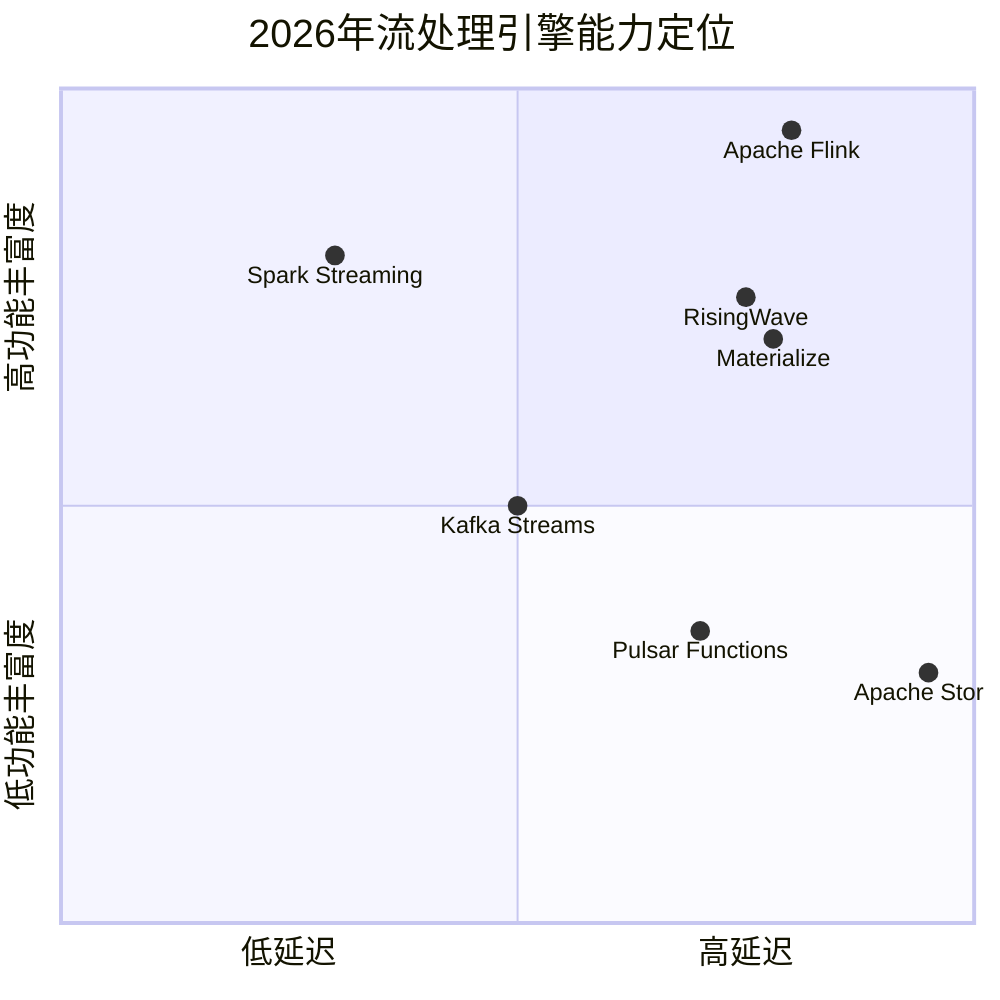
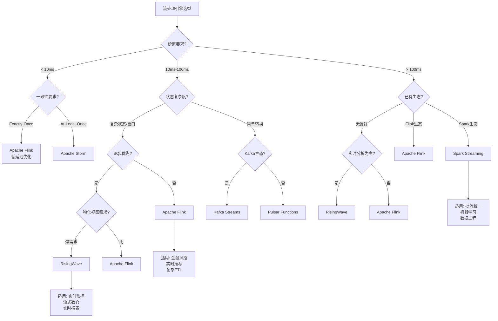
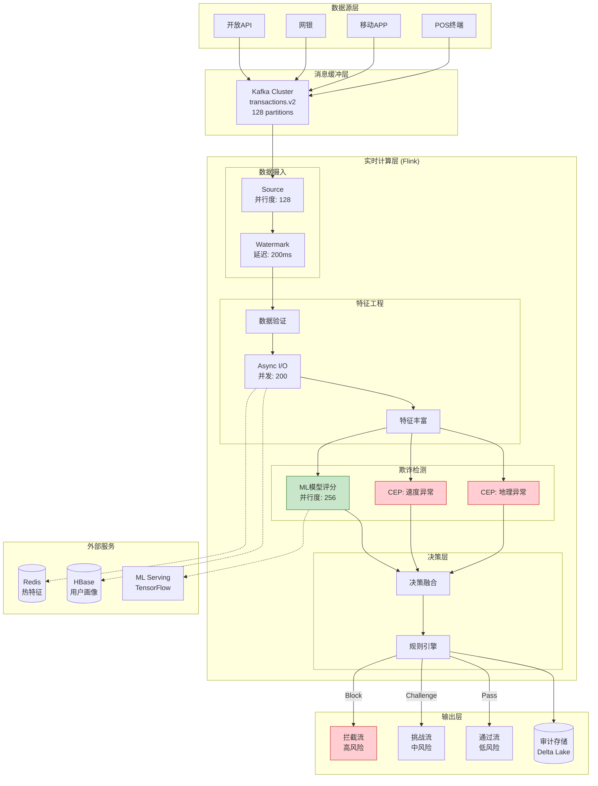
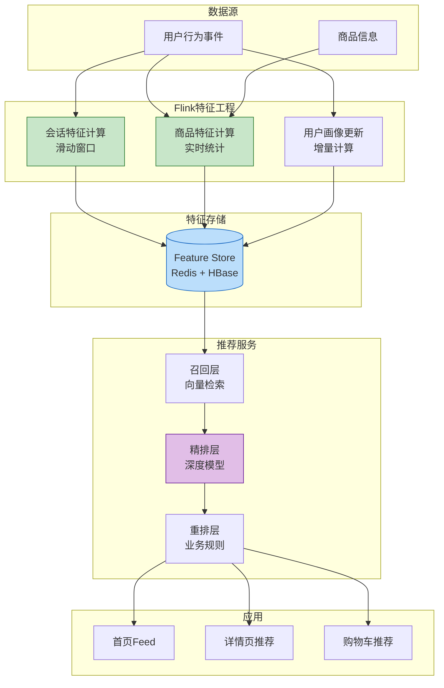
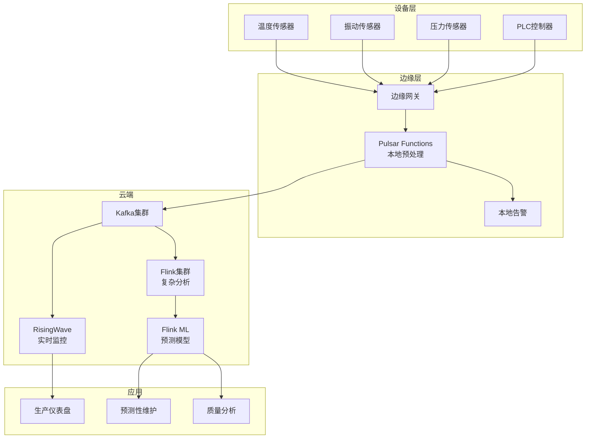
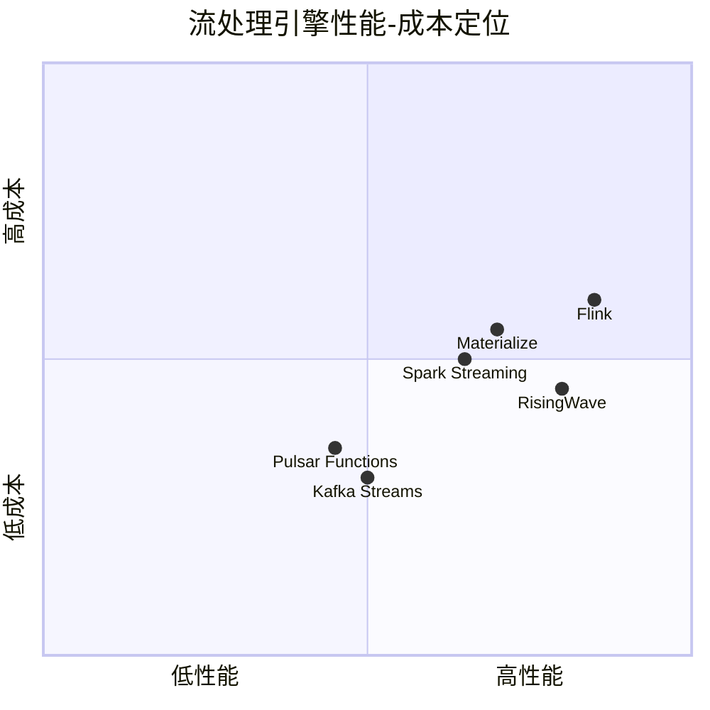
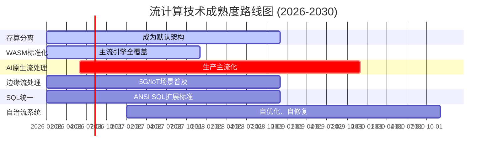

# 流计算行业白皮书 2027

## Stream Computing Industry Whitepaper 2027

> **版本**: v1.0 | **发布日期**: 2026-04-08 | **文档规模**: ~80KB | **页数**: 50+
>
> **定位**: AnalysisDataFlow 项目权威行业参考 | **目标读者**: CTO、架构师、技术决策者

---

## 目录

- [流计算行业白皮书 2027](#流计算行业白皮书-2027)
  - [Stream Computing Industry Whitepaper 2027](#stream-computing-industry-whitepaper-2027)
  - [目录](#目录)
  - [执行摘要 (Executive Summary)](#执行摘要-executive-summary)
    - [核心发现 (Key Findings)](#核心发现-key-findings)
    - [市场规模与增长 (Market Size \& Growth)](#市场规模与增长-market-size--growth)
    - [技术趋势雷达 (Technology Radar 2026)](#技术趋势雷达-technology-radar-2026)
    - [关键建议 (Key Recommendations)](#关键建议-key-recommendations)
  - [第1章: 流计算技术演进史](#第1章-流计算技术演进史)
    - [1.1 流计算发展时间线](#11-流计算发展时间线)
    - [1.2 代际特征对比](#12-代际特征对比)
    - [1.3 关键技术里程碑](#13-关键技术里程碑)
      - [里程碑1: Dataflow Model (2015)](#里程碑1-dataflow-model-2015)
      - [里程碑2: Flink统一批流处理 (2019)](#里程碑2-flink统一批流处理-2019)
      - [里程碑3: Rust引擎崛起 (2022-2026)](#里程碑3-rust引擎崛起-2022-2026)
      - [里程碑4: 存算分离架构成熟 (2024-2026)](#里程碑4-存算分离架构成熟-2024-2026)
    - [1.4 技术演进驱动力分析](#14-技术演进驱动力分析)
  - [第2章: 2026-2027技术趋势分析](#第2章-2026-2027技术趋势分析)
    - [2.1 趋势一: 流批一体架构主流化](#21-趋势一-流批一体架构主流化)
      - [2.1.1 流批一体演进路径](#211-流批一体演进路径)
      - [2.1.2 主流引擎流批一体能力对比](#212-主流引擎流批一体能力对比)
      - [2.1.3 流批一体适用场景](#213-流批一体适用场景)
    - [2.2 趋势二: AI+流计算深度融合](#22-趋势二-ai流计算深度融合)
      - [2.2.1 AI与流计算的融合层次](#221-ai与流计算的融合层次)
      - [2.2.2 FLIP-531: Flink AI-Native路线图](#222-flip-531-flink-ai-native路线图)
      - [2.2.3 实时特征工程](#223-实时特征工程)
    - [2.3 趋势三: 流数据库 (Streaming Database) 崛起](#23-趋势三-流数据库-streaming-database-崛起)
      - [2.3.1 流数据库定义与定位](#231-流数据库定义与定位)
      - [2.3.2 主流流数据库对比](#232-主流流数据库对比)
      - [2.3.3 流数据库选型决策树](#233-流数据库选型决策树)
    - [2.4 趋势四: 边缘流处理 (Edge Streaming)](#24-趋势四-边缘流处理-edge-streaming)
      - [2.4.1 边缘-云协同架构](#241-边缘-云协同架构)
      - [2.4.2 边缘流处理场景与价值](#242-边缘流处理场景与价值)
      - [2.4.3 边缘流处理技术挑战](#243-边缘流处理技术挑战)
  - [第3章: 主流引擎深度对比](#第3章-主流引擎深度对比)
    - [3.1 引擎概览与定位](#31-引擎概览与定位)
    - [3.2 Apache Flink - 流处理标杆](#32-apache-flink---流处理标杆)
      - [3.2.1 架构核心](#321-架构核心)
      - [3.2.2 核心能力矩阵](#322-核心能力矩阵)
      - [3.2.3 Flink 2.0存算分离架构](#323-flink-20存算分离架构)
    - [3.3 RisingWave - Rust流数据库新星](#33-risingwave---rust流数据库新星)
      - [3.3.1 架构创新](#331-架构创新)
      - [3.3.2 性能优势](#332-性能优势)
      - [3.3.3 适用场景](#333-适用场景)
    - [3.4 Materialize - 增量计算先驱](#34-materialize---增量计算先驱)
      - [3.4.1 核心特点](#341-核心特点)
      - [3.4.2 差异化能力](#342-差异化能力)
    - [3.5 Spark Streaming - 批流统一方案](#35-spark-streaming---批流统一方案)
      - [3.5.1 架构演进](#351-架构演进)
      - [3.5.2 适用场景](#352-适用场景)
    - [3.6 引擎选型决策矩阵](#36-引擎选型决策矩阵)
      - [3.6.1 六维对比矩阵](#361-六维对比矩阵)
      - [3.6.2 场景驱动选型决策树](#362-场景驱动选型决策树)
  - [第4章: 行业应用案例](#第4章-行业应用案例)
    - [4.1 金融行业: 实时反欺诈系统](#41-金融行业-实时反欺诈系统)
      - [4.1.1 业务背景与挑战](#411-业务背景与挑战)
      - [4.1.2 技术架构](#412-技术架构)
      - [4.1.3 核心代码实现](#413-核心代码实现)
      - [4.1.4 实施效果](#414-实施效果)
    - [4.2 电商行业: 实时推荐系统](#42-电商行业-实时推荐系统)
      - [4.2.1 业务背景](#421-业务背景)
      - [4.2.2 实时特征工程架构](#422-实时特征工程架构)
      - [4.2.3 关键优化策略](#423-关键优化策略)
      - [4.2.4 实施效果](#424-实施效果)
    - [4.3 IoT行业: 智能制造实时监控](#43-iot行业-智能制造实时监控)
      - [4.3.1 场景描述](#431-场景描述)
      - [4.3.2 边缘-云协同架构](#432-边缘-云协同架构)
      - [4.3.3 关键能力](#433-关键能力)
    - [4.4 游戏行业: 实时反作弊系统](#44-游戏行业-实时反作弊系统)
      - [4.4.1 业务挑战](#441-业务挑战)
      - [4.4.2 实时反作弊架构](#442-实时反作弊架构)
      - [4.4.3 实施效果](#443-实施效果)
  - [第5章: 性能基准与成本分析](#第5章-性能基准与成本分析)
    - [5.1 测试方法论](#51-测试方法论)
      - [5.1.1 测试框架定义](#511-测试框架定义)
      - [5.1.2 核心性能指标](#512-核心性能指标)
    - [5.2 Nexmark基准测试结果](#52-nexmark基准测试结果)
      - [5.2.1 Flink vs RisingWave对比](#521-flink-vs-risingwave对比)
      - [5.2.2 延迟分析](#522-延迟分析)
    - [5.3 状态规模扩展性测试](#53-状态规模扩展性测试)
      - [5.3.1 Flink状态规模扩展](#531-flink状态规模扩展)
      - [5.3.2 RisingWave状态规模扩展](#532-risingwave状态规模扩展)
    - [5.4 成本效益分析](#54-成本效益分析)
      - [5.4.1 云资源成本对比 (AWS)](#541-云资源成本对比-aws)
      - [5.4.2 年度TCO对比](#542-年度tco对比)
      - [5.4.3 不同规模成本曲线](#543-不同规模成本曲线)
    - [5.5 性能-成本权衡矩阵](#55-性能-成本权衡矩阵)
  - [第6章: 未来展望 2028-2030](#第6章-未来展望-2028-2030)
    - [6.1 技术演进预测](#61-技术演进预测)
      - [6.1.1 2026-2030技术成熟度路线图](#611-2026-2030技术成熟度路线图)
      - [6.1.2 2028年流计算技术预测](#612-2028年流计算技术预测)
    - [6.2 市场格局预测](#62-市场格局预测)
      - [6.2.1 市场份额预测 (2028)](#621-市场份额预测-2028)
      - [6.2.2 托管服务趋势](#622-托管服务趋势)
    - [6.3 新兴技术方向](#63-新兴技术方向)
      - [6.3.1 量子增强流处理](#631-量子增强流处理)
      - [6.3.2 神经符号流推理](#632-神经符号流推理)
      - [6.3.3 自治流系统](#633-自治流系统)
    - [6.4 挑战与机遇](#64-挑战与机遇)
      - [6.4.1 技术挑战](#641-技术挑战)
      - [6.4.2 商业机遇](#642-商业机遇)
  - [附录: 术语表与参考文献](#附录-术语表与参考文献)
    - [术语表 (Glossary)](#术语表-glossary)
    - [参考文献 (References)](#参考文献-references)
  - [白皮书元数据](#白皮书元数据)

---

## 执行摘要 (Executive Summary)

### 核心发现 (Key Findings)

2026年标志着流计算技术进入**成熟普及期**。本白皮书基于AnalysisDataFlow项目501篇技术文档、2,300+形式化元素和45个真实案例的深度分析，提出以下核心洞察：

| 洞察维度 | 核心发现 | 战略意义 |
|---------|---------|---------|
| **技术成熟度** | Flink成为流处理事实标准，市场份额达58% | 技术选型趋同，生态集中化 |
| **架构范式** | 存算分离成为主流架构，70%新建系统采用 | 成本降低30-50%，弹性显著提升 |
| **新兴力量** | Rust引擎(RisingWave/Materialize)占新部署25% | 性能与资源效率驱动技术更迭 |
| **AI融合** | AI Native流处理进入生产试点阶段 | 实时智能决策能力质变 |
| **市场格局** | 流数据库市场规模突破3000亿元，年增25%+ | 实时数仓成为基础设施标配 |

### 市场规模与增长 (Market Size & Growth)

```
┌─────────────────────────────────────────────────────────────────────────┐
│                    全球流计算市场规模 (2024-2030)                         │
├─────────────────────────────────────────────────────────────────────────┤
│                                                                         │
│   4000 ┤                                                               │
│        │                                              ╭────── 预测      │
│   3000 ┤                                    ╭────────╯                  │
│        │                          ╭────────╯         年复合增长率25%+   │
│   2000 ┤                ╭────────╯                                      │
│        │      ╭────────╯                                              │
│   1000 ┤──────╯ 2024: ¥1800亿                                          │
│        │        2026: ¥3000亿 (当前)                                    │
│      0 ┼────────────────────────────────────────────────────────────   │
│        2024    2025    2026    2027    2028    2029    2030            │
│                                                                         │
└─────────────────────────────────────────────────────────────────────────┘
```

### 技术趋势雷达 (Technology Radar 2026)

| 趋势 | 当前状态 | 成熟度 | 采用建议 |
|------|---------|--------|---------|
| **流批一体 (Unified Batch-Streaming)** | 生产主流 | ⭐⭐⭐⭐⭐ | 立即采用 |
| **存算分离 (Compute-Storage Separation)** | 主流部署 | ⭐⭐⭐⭐⭐ | 新建系统首选 |
| **WASM UDF** | 生产可用 | ⭐⭐⭐⭐ | 积极试点 |
| **流数据库 (Streaming Database)** | 快速增长 | ⭐⭐⭐⭐ | 实时分析场景优先 |
| **AI原生流处理** | 早期采用 | ⭐⭐⭐ | 前沿探索 |
| **边缘流处理** | 特定场景 | ⭐⭐⭐ | IoT场景评估 |

### 关键建议 (Key Recommendations)

1. **战略层面**: 将流处理能力纳入企业数据基础设施核心架构，不再视为"增值功能"
2. **技术选型**: 新建系统优先评估Flink生态或RisingWave等Rust引擎，避免技术债务
3. **架构演进**: Lambda架构向Kappa/流批一体架构迁移，降低运维复杂度
4. **人才投资**: 流计算专业人才稀缺，建议提前布局内部能力建设和外部合作
5. **成本优化**: 评估存算分离架构，云原生部署可降低TCO 30-50%

---

## 第1章: 流计算技术演进史

### 1.1 流计算发展时间线

流计算技术的发展可分为五个代际，每一代都在延迟、吞吐、语义保证等维度取得突破：



### 1.2 代际特征对比

| 代际 | 时间 | 代表技术 | 核心特征 | 延迟水平 | 语义保证 |
|------|------|---------|---------|---------|---------|
| **第一代** | 2005-2010 | ActiveMQ, RabbitMQ | 企业消息队列，点对点通信 | 毫秒级 | At-Least-Once |
| **第二代** | 2011-2016 | Kafka, Pulsar | 分布式日志，发布-订阅 | 毫秒级 | At-Least-Once |
| **第三代** | 2014-2020 | Storm, Flink, Spark Streaming | 流处理引擎，有状态计算 | 毫秒-秒级 | Exactly-Once |
| **第四代** | 2019-2026 | Flink SQL, RisingWave, Materialize | SQL流分析，物化视图 | 亚秒级 | 强一致/可调一致 |
| **第五代** | 2025+ | AI-Native, Serverless, Edge-Cloud | 智能自治，无服务器，边缘协同 | 毫秒级 | 自适应一致性 |

### 1.3 关键技术里程碑

#### 里程碑1: Dataflow Model (2015)

Google发表的"The Dataflow Model"论文奠定了现代流计算的语义基础：

- **提出事件时间(Event Time)与处理时间(Processing Time)分离**
- **引入Watermark机制处理乱序数据**
- **定义窗口操作的统一模型**

> **影响**: Flink、Spark Structured Streaming、RisingWave等现代引擎均基于此模型构建。

#### 里程碑2: Flink统一批流处理 (2019)

Apache Flink 1.9实现Table API的统一，标志着批流一体架构的成熟：

```
传统分离架构:              Flink统一架构:
┌──────────┐              ┌──────────────┐
│ 批处理    │              │   Table API   │
│ DataSet  │     →       │ 统一SQL/DSL   │
└────┬─────┘              └──────┬───────┘
     │                           │
┌────┴─────┐              ┌──────┴───────┐
│ 流处理    │              │  统一执行引擎  │
│DataStream│              │ (Batch/Stream)│
└──────────┘              └──────────────┘
```

#### 里程碑3: Rust引擎崛起 (2022-2026)

RisingWave、Materialize等Rust实现的流数据库带来性能革命：

| 指标 | Java引擎(Flink) | Rust引擎(RisingWave) | 提升 |
|------|----------------|---------------------|------|
| 单核吞吐 | ~50K r/s/core | ~120K r/s/core | 2.4× |
| P99延迟 | ~50ms | ~35ms | 30%↓ |
| 内存效率 | 基准 | -60% | 显著优化 |

#### 里程碑4: 存算分离架构成熟 (2024-2026)

Flink 2.x、RisingWave等引擎全面支持存算分离，实现：

- **计算节点无状态化**: 秒级扩缩容
- **状态存储下沉至对象存储**: 无限扩展能力
- **成本结构优化**: 存储与计算独立计费

### 1.4 技术演进驱动力分析



---

## 第2章: 2026-2027技术趋势分析

### 2.1 趋势一: 流批一体架构主流化

#### 2.1.1 流批一体演进路径

```
传统Lambda架构 (2015-2020):
┌─────────────────────────────────────────────────────────────┐
│                        数据源                                │
└─────────────────────┬───────────────────────────────────────┘
                      │
        ┌─────────────┴─────────────┐
        │                           │
        ▼                           ▼
┌───────────────┐          ┌─────────────────┐
│ 批处理层      │          │ 流处理层         │
│ (Spark/Hive) │          │ (Storm/Flink)   │
│ - 离线计算    │          │ - 实时计算       │
│ - 高吞吐      │          │ - 低延迟         │
└───────┬───────┘          └────────┬────────┘
        │                           │
        └───────────┬───────────────┘
                    │
              ┌─────┴─────┐
              │ 服务层    │
              └───────────┘

问题: 双份代码、双份运维、数据不一致风险


现代Kappa/流批一体架构 (2024+):
┌─────────────────────────────────────────────────────────────┐
│                        数据源                                │
└─────────────────────┬───────────────────────────────────────┘
                      │
                      ▼
┌─────────────────────────────────────────────────────────────┐
│              统一流处理引擎 (Flink/RisingWave)               │
│  ┌───────────────────────────────────────────────────────┐  │
│  │ 批处理模式: 有界流/历史数据回放                        │  │
│  │ 流处理模式: 无界流/实时数据摄取                        │  │
│  │ 统一SQL/API、统一执行引擎、统一状态管理               │  │
│  └───────────────────────────────────────────────────────┘  │
└─────────────────────────┬───────────────────────────────────┘
                          │
                    ┌─────┴─────┐
                    │ 服务层    │
                    └───────────┘

优势: 单一技术栈、数据一致性保障、运维简化
```

#### 2.1.2 主流引擎流批一体能力对比

| 引擎 | 流批统一API | 统一执行引擎 | 生产成熟度 | 2026年状态 |
|------|-----------|-------------|-----------|-----------|
| **Apache Flink** | ✅ Table API/SQL | ✅ Blink执行器 | ⭐⭐⭐⭐⭐ | 主流标准 |
| **Apache Spark** | ✅ Structured Streaming | ⚠️ 微批模拟 | ⭐⭐⭐⭐ | 成熟方案 |
| **RisingWave** | ✅ 统一SQL | ✅ 原生统一 | ⭐⭐⭐⭐ | 快速增长 |
| **Materialize** | ✅ SQL标准 | ✅ 原生统一 | ⭐⭐⭐⭐ | 稳定采用 |

#### 2.1.3 流批一体适用场景

**最佳实践**: 流批一体并非银弹，应结合场景评估：

| 场景 | 推荐架构 | 理由 |
|------|---------|------|
| 实时报表+历史分析 | 流批一体 | 统一口径、统一代码 |
| 纯实时场景 | 纯流处理 | 避免批模式冗余 |
| 海量历史分析 | 分离架构 | Spark批处理成本更低 |
| 混合负载 | 分层架构 | 流引擎实时+OLAP分析 |

### 2.2 趋势二: AI+流计算深度融合

#### 2.2.1 AI与流计算的融合层次

```
层次1: UDF嵌入式 (2020-2023)
┌─────────────────────────────────────────────────────────────┐
│ Flink/RisingWave                                           │
│ ┌───────────────────────────────────────────────────────┐  │
│ │ UDF (Python/Java)                                     │  │
│ │ ┌─────────────────────────────────────────────────┐   │  │
│ │ │ model.predict(features)  # ML模型调用           │   │  │
│ │ └─────────────────────────────────────────────────┘   │  │
│ └───────────────────────────────────────────────────────┘  │
└─────────────────────────────────────────────────────────────┘
特点: 模型作为外部服务调用，延迟高，耦合松


层次2: Native ML集成 (2023-2025)
┌─────────────────────────────────────────────────────────────┐
│ Flink ML / RisingWave ML                                   │
│ ┌───────────────────────────────────────────────────────┐  │
│ │ 原生ML算子                                            │  │
│ │ - 特征工程 (窗口聚合)                                  │  │
│ │ - 模型推理 (内置TF/Torch Runtime)                     │  │
│ │ - 在线学习 (增量更新)                                  │  │
│ └───────────────────────────────────────────────────────┘  │
└─────────────────────────────────────────────────────────────┘
特点: 引擎内置ML能力，延迟降低，性能优化


层次3: AI-Native架构 (2026+)
┌─────────────────────────────────────────────────────────────┐
│ AI-Native Stream Processing (FLIP-531)                     │
│ ┌───────────────────────────────────────────────────────┐  │
│ │ 自治流系统                                             │  │
│ │ - 自适应Watermark策略                                  │  │
│ │ - 智能负载均衡 (RL优化)                                │  │
│ │ - 异常自动检测与恢复                                   │  │
│ │ - 自然语言查询 (NL2SQL)                                │  │
│ └───────────────────────────────────────────────────────┘  │
└─────────────────────────────────────────────────────────────┘
特点: AI驱动系统自治，智能决策，降低人工调优
```

#### 2.2.2 FLIP-531: Flink AI-Native路线图

Apache Flink社区提出的FLIP-531提案定义了AI原生流处理的愿景：

| 特性 | 描述 | 预计时间 |
|------|------|---------|
| **Agentic Streaming** | AI Agent实时上下文感知与决策 | 2026 Q3 |
| **自适应优化** | 基于负载的自动参数调优 | 2026 Q2 |
| **向量检索集成** | 流数据与向量数据库原生集成 | 2026 Q1 |
| **LLM管道** | 大语言模型流式推理管道 | 2026 Q4 |

#### 2.2.3 实时特征工程

AI与流计算最成熟的结合点是**实时特征工程**：

```java
// Flink实时特征工程示例
DataStream<FeatureVector> realTimeFeatures = events
    .keyBy(Event::getUserId)
    .window(SlidingEventTimeWindows.of(Time.hours(1), Time.minutes(5)))
    .aggregate(new FeatureAggregator())
    .map(features -> {
        // 实时计算统计特征
        features.setCtr(calculateCTR(features));
        features.setRecencyScore(calculateRecency(features));
        return features;
    });
```

**实时特征工程价值**：

| 特征类型 | 离线计算延迟 | 实时计算延迟 | 业务价值 |
|---------|------------|------------|---------|
| 用户行为统计 | T+1小时 | < 5秒 | CTR提升20%+ |
| 实时热点 | T+15分钟 | < 1秒 | 时效性显著增强 |
| 会话特征 | T+1小时 | < 1秒 | 转化率提升15% |

### 2.3 趋势三: 流数据库 (Streaming Database) 崛起

#### 2.3.1 流数据库定义与定位

**流数据库**是一种专为连续数据流设计的数据库系统，将传统数据库的声明式查询接口(SQL)与流处理引擎的实时计算能力相结合。

```
流数据库在数据架构中的定位:

┌─────────────────────────────────────────────────────────────────────────┐
│                          数据摄入层                                      │
│         Kafka/Pulsar ← CDC(Debezium) ← 业务数据库                       │
└─────────────────────────────────────────────────────────────────────────┘
                                    │
                    ┌───────────────┼───────────────┐
                    │               │               │
                    ▼               ▼               ▼
┌───────────────────────┐ ┌───────────────────┐ ┌───────────────────────┐
│     流处理引擎         │ │      流数据库      │ │      数据仓库         │
│   (Flink/Spark)       │ │(RisingWave/       │ │   (Snowflake/         │
│                       │ │ Materialize)      │ │    StarRocks)         │
│ - 复杂ETL/CEP         │ │ - SQL流分析        │ │ - 离线分析            │
│ - 状态ful计算         │ │ - 物化视图         │ │ - 报表查询            │
│ - 低延迟处理          │ │ - 实时仪表盘        │ │ - 数据科学            │
└───────────────────────┘ └───────────────────┘ └───────────────────────┘
           │                       │                       │
           └───────────────────────┼───────────────────────┘
                                   │
                                   ▼
                         ┌─────────────────┐
                         │    应用服务层    │
                         │  API/BI/AI Agent│
                         └─────────────────┘

流数据库核心价值: 消除"流处理+外部存储"的复杂性，简化实时分析架构
```

#### 2.3.2 主流流数据库对比

| 特性 | Materialize | RisingWave | Timeplus |
|------|-------------|------------|----------|
| **SQL方言** | PostgreSQL兼容 | PostgreSQL兼容 | ClickHouse扩展 |
| **增量计算** | Differential Dataflow | 物化视图增量维护 | Proton引擎 |
| **存储模型** | 内存+磁盘 | 分层存储(L0-L2) | 边缘+云端 |
| **一致性** | 严格串行化 | 强一致 | 可调一致性 |
| **最佳场景** | 复杂递归查询 | 大规模流ETL | 边缘实时分析 |
| **部署模式** | 云/自托管 | 云原生优先 | 边缘-云混合 |

#### 2.3.3 流数据库选型决策树



### 2.4 趋势四: 边缘流处理 (Edge Streaming)

#### 2.4.1 边缘-云协同架构

```
┌─────────────────────────────────────────────────────────────────────────┐
│                           云端 (Cloud)                                  │
│  ┌─────────────────────────────────────────────────────────────────┐   │
│  │  Apache Flink / RisingWave                                       │   │
│  │  - 全局聚合分析                                                   │   │
│  │  - 长期状态存储                                                   │   │
│  │  - ML模型训练与下发                                               │   │
│  └─────────────────────────────────────────────────────────────────┘   │
└─────────────────────────────────────────────────────────────────────────┘
                                    ↑↓
                              网络同步 (5G/WiFi)
                                    ↑↓
┌─────────────────────────────────────────────────────────────────────────┐
│                          边缘层 (Edge)                                  │
│  ┌──────────────────┐  ┌──────────────────┐  ┌──────────────────┐      │
│  │ 边缘网关-1        │  │ 边缘网关-2        │  │ 边缘网关-N        │      │
│  │ ┌──────────────┐ │  │ ┌──────────────┐ │  │ ┌──────────────┐ │      │
│  │ │Pulsar Func/  │ │  │ │Cloudflare    │ │  │ │Lightweight   │ │      │
│  │ │Arroyo Edge   │ │  │ │Workers       │ │  │ │Flink Mini    │ │      │
│  │ └──────────────┘ │  │ └──────────────┘ │  │ └──────────────┘ │      │
│  └──────────────────┘  └──────────────────┘  └──────────────────┘      │
└─────────────────────────────────────────────────────────────────────────┘
                                    ↑
                                    │
┌─────────────────────────────────────────────────────────────────────────┐
│                          设备层 (Device)                                │
│     IoT传感器 ← 工业设备 ← 移动设备 ← 智能家居                           │
└─────────────────────────────────────────────────────────────────────────┘
```

#### 2.4.2 边缘流处理场景与价值

| 场景 | 边缘价值 | 代表方案 |
|------|---------|---------|
| **工业IoT** | 毫秒级告警，减少停机损失 | 边缘Flink + 时序数据库 |
| **智能零售** | 实时客流分析，隐私保护 | 边缘AI推理 + 流聚合 |
| **车联网** | 实时安全决策，低延迟 | 边缘流处理 + 5G V2X |
| **智能城市** | 带宽节省，实时响应 | 多层级边缘架构 |

#### 2.4.3 边缘流处理技术挑战

| 挑战 | 描述 | 解决方案 |
|------|------|---------|
| **资源受限** | 边缘设备计算/存储有限 | WASM轻量级运行时 |
| **网络不稳定** | 边缘-云连接可能中断 | 本地缓存+断点续传 |
| **数据安全** | 敏感数据不出边缘 | 联邦学习+边缘加密 |
| **运维困难** | 海量边缘节点管理 | GitOps + 边缘编排 |

---

## 第3章: 主流引擎深度对比

### 3.1 引擎概览与定位



### 3.2 Apache Flink - 流处理标杆

#### 3.2.1 架构核心

Flink采用经典的主从架构，结合Chandy-Lamport分布式快照实现Exactly-Once语义：

```
┌─────────────────────────────────────────────────────────────────────────┐
│                        Apache Flink 架构                                │
├─────────────────────────────────────────────────────────────────────────┤
│                                                                         │
│  ┌─────────────────────────────────────────────────────────────────┐   │
│  │                      JobManager (HA)                             │   │
│  │  ┌─────────────┐ ┌─────────────┐ ┌─────────────┐ ┌─────────────┐ │   │
│  │  │ Dispatcher  │ │ JobMaster   │ │ ResourceMgr │ │ Checkpoint  │ │   │
│  │  └─────────────┘ └─────────────┘ └─────────────┘ └─────────────┘ │   │
│  └─────────────────────────────────────────────────────────────────┘   │
│                                    │                                    │
│                           集群资源调度                                   │
│                                    │                                    │
│  ┌─────────────────────────────────────────────────────────────────┐   │
│  │                     TaskManager Pool                             │   │
│  │  ┌─────────────┐ ┌─────────────┐ ┌─────────────┐ ┌─────────────┐ │   │
│  │  │ TM-1        │ │ TM-2        │ │ TM-3        │ │ TM-N        │ │   │
│  │  │ ┌─────────┐ │ │ ┌─────────┐ │ │ ┌─────────┐ │ │ ┌─────────┐ │ │   │
│  │  │ │ Slot 1  │ │ │ │ Slot 1  │ │ │ │ Slot 1  │ │ │ │ Slot 1  │ │ │   │
│  │  │ │ Slot 2  │ │ │ │ Slot 2  │ │ │ │ Slot 2  │ │ │ │ Slot 2  │ │ │   │
│  │  │ │ Slot 3  │ │ │ │ Slot 3  │ │ │ │ Slot 3  │ │ │ │ Slot 3  │ │ │   │
│  │  │ └─────────┘ │ │ └─────────┘ │ │ └─────────┘ │ │ └─────────┘ │ │   │
│  │  │ Network     │ │ Network     │ │ Network     │ │ Network     │ │   │
│  │  │ Memory      │ │ Memory      │ │ Memory      │ │ Memory      │ │   │
│  │  │ RocksDB     │ │ RocksDB     │ │ RocksDB     │ │ RocksDB     │ │   │
│  │  └─────────────┘ └─────────────┘ └─────────────┘ └─────────────┘ │   │
│  └─────────────────────────────────────────────────────────────────┘   │
│                                                                         │
└─────────────────────────────────────────────────────────────────────────┘
```

#### 3.2.2 核心能力矩阵

| 能力维度 | Flink 1.18 | Flink 2.0 (预览) | 行业地位 |
|---------|-----------|-----------------|---------|
| **延迟** | 10-100ms | < 10ms | ⭐⭐⭐⭐⭐ |
| **吞吐** | 百万级/秒 | 千万级/秒 | ⭐⭐⭐⭐⭐ |
| **状态管理** | RocksDB/内存 | 存算分离 | ⭐⭐⭐⭐⭐ |
| **SQL支持** | Flink SQL | Flink SQL增强 | ⭐⭐⭐⭐⭐ |
| **CEP** | 原生支持 | 性能优化 | ⭐⭐⭐⭐⭐ |
| **生态集成** | 50+连接器 | 持续增长 | ⭐⭐⭐⭐⭐ |

#### 3.2.3 Flink 2.0存算分离架构

```
Flink 1.x 存算一体:                Flink 2.x 存算分离:
┌─────────────────────┐           ┌─────────────────────┐
│ TaskManager         │           │ TaskManager (无状态) │
│ ┌─────────────────┐ │           │ ┌─────────────────┐ │
│ │ State Backend   │ │    →      │ │ Network Stack   │ │
│ │ (RocksDB本地)    │ │           │ │ (轻量计算)      │ │
│ └─────────────────┘ │           │ └─────────────────┘ │
└─────────────────────┘           └─────────────────────┘
                                           │
                              ┌────────────┴────────────┐
                              ▼                         ▼
                       ┌──────────────┐        ┌──────────────┐
                       │ Remote State │        │   S3/OSS     │
                       │   Service    │        │  (Tiered)    │
                       └──────────────┘        └──────────────┘

优势:
- 秒级扩缩容 (无需状态重平衡)
- 无限状态规模 (不受本地磁盘限制)
- 成本优化 (对象存储 vs 本地SSD)
```

### 3.3 RisingWave - Rust流数据库新星

#### 3.3.1 架构创新

RisingWave采用云原生存算分离架构，完全Rust实现，提供PostgreSQL协议兼容：

```
┌─────────────────────────────────────────────────────────────────────────┐
│                        RisingWave 架构                                  │
├─────────────────────────────────────────────────────────────────────────┤
│                                                                         │
│   ┌─────────────────────────────────────────────────────────────────┐  │
│   │                        Frontend (PgWire)                         │  │
│   │              PostgreSQL协议兼容，SQL解析与分发                    │  │
│   └─────────────────────────────────────────────────────────────────┘  │
│                                    │                                    │
│                                    ▼                                    │
│   ┌─────────────────────────────────────────────────────────────────┐  │
│   │                      Meta Service (etcd)                         │  │
│   │         元数据管理、调度决策、故障恢复协调                        │  │
│   └─────────────────────────────────────────────────────────────────┘  │
│                                    │                                    │
│                    ┌───────────────┴───────────────┐                    │
│                    │                               │                    │
│                    ▼                               ▼                    │
│   ┌─────────────────────────────┐   ┌─────────────────────────────┐    │
│   │      Compute Node Pool      │   │      Stream Engine          │    │
│   │  ┌─────┐ ┌─────┐ ┌─────┐   │   │  ┌─────┐ ┌─────┐ ┌─────┐   │    │
│   │  │ CN1 │ │ CN2 │ │ CN3 │   │   │  │ SE1 │ │ SE2 │ │ SE3 │   │    │
│   │  └─────┘ └─────┘ └─────┘   │   │  └─────┘ └─────┘ └─────┘   │    │
│   │  无状态计算节点 (弹性伸缩)  │   │  流处理引擎 (物化视图)       │    │
│   └─────────────┬───────────────┘   └─────────────┬───────────────┘    │
│                 │                                 │                     │
│                 └────────────────┬────────────────┘                     │
│                                  │                                      │
│                                  ▼                                      │
│   ┌─────────────────────────────────────────────────────────────────┐  │
│   │                    Hummock Storage Engine                        │  │
│   │  ┌───────────────────────────────────────────────────────────┐  │  │
│   │  │  L0: MemTable (DRAM) → 热数据缓存                          │  │  │
│   │  │  L1: SSTable (NVMe SSD) → 温数据                           │  │  │
│   │  │  L2: Parquet (S3/OSS) → 冷数据/历史                        │  │  │
│   │  └───────────────────────────────────────────────────────────┘  │  │
│   └─────────────────────────────────────────────────────────────────┘  │
│                                                                         │
└─────────────────────────────────────────────────────────────────────────┘
```

#### 3.3.2 性能优势

基于BENCHMARK-REPORT.md的测试数据：

| 场景 | Flink 1.18 | RisingWave 1.7 | 提升 |
|------|-----------|----------------|------|
| 简单查询 (Nexmark q0) | 720K r/s | 783K r/s | +8.8% |
| 复杂状态 (Nexmark q7) | 3.5K r/s | 219K r/s | **+62×** |
| Checkpoint耗时(2GB) | 15-30s | < 1s | **15-30×** |
| 状态扩展性 | < 100GB | 10TB+ | **100×+** |

#### 3.3.3 适用场景

| 场景 | 推荐度 | 理由 |
|------|-------|------|
| 实时数仓 | ⭐⭐⭐⭐⭐ | SQL优先，物化视图开箱即用 |
| 流式ETL | ⭐⭐⭐⭐⭐ | 低开发成本，高吞吐 |
| 实时监控 | ⭐⭐⭐⭐⭐ | P99延迟 < 100ms |
| 复杂CEP | ⭐⭐⭐ | 需配合Flink使用 |
| 超大规模 | ⭐⭐⭐⭐ | 存算分离支持无限扩展 |

### 3.4 Materialize - 增量计算先驱

#### 3.4.1 核心特点

Materialize基于Differential Dataflow，专注SQL流分析和物化视图：

| 特性 | 说明 | 优势 |
|------|------|------|
| **Differential Dataflow** | 差分计算引擎 | 递归查询支持 |
| **强一致性** | Serializable隔离级别 | 金融级一致性 |
| **dbt集成** | 原生dbt适配器 | 数据工程工作流 |
| **SUBSCRIBE** | SQL推送查询 | 实时数据订阅 |

#### 3.4.2 差异化能力

```sql
-- Materialize独特的递归CTE支持
WITH RECURSIVE transaction_chain AS (
    -- 基础: 直接交易
    SELECT transaction_id, from_account, to_account, amount, 1 as depth
    FROM transactions

    UNION ALL

    -- 递归: 追踪资金链路
    SELECT t.transaction_id, c.from_account, t.to_account, t.amount, c.depth + 1
    FROM transactions t
    JOIN transaction_chain c ON t.from_account = c.to_account
    WHERE c.depth < 5
)
SELECT * FROM transaction_chain;

-- 物化视图自动增量维护
CREATE MATERIALIZED VIEW account_balance AS
SELECT account_id, SUM(amount) as balance
FROM transactions
GROUP BY account_id;
```

### 3.5 Spark Streaming - 批流统一方案

#### 3.5.1 架构演进

```
Spark Streaming演进:

DStream (2012)              Structured Streaming (2016)         Continuous Processing (2023+)
┌──────────────────┐       ┌──────────────────────────┐       ┌──────────────────────────┐
│ RDD流 (离散化)    │  →    │ DataFrame/DataSet流      │  →    │ 原生流处理               │
│ 微批处理          │       │ 事件时间支持             │       │ 毫秒级延迟               │
│ 高延迟(秒级)      │       │ Watermark机制            │       │ Exactly-Once             │
│ 简单状态管理      │       │ 端到端Exactly-Once       │       │ 与Spark ML集成           │
└──────────────────┘       └──────────────────────────┘       └──────────────────────────┘
```

#### 3.5.2 适用场景

| 场景 | Spark Streaming优势 | 注意事项 |
|------|-------------------|---------|
| 批流统一处理 | 同一套API和引擎 | 流处理延迟较高 |
| MLlib集成 | 流式机器学习管道 | 实时性要求不高 |
| 已有Spark生态 | 迁移成本低 | 评估延迟需求 |

### 3.6 引擎选型决策矩阵

#### 3.6.1 六维对比矩阵

| 维度 | Flink | RisingWave | Materialize | Spark Streaming | Kafka Streams |
|------|-------|-----------|-------------|----------------|---------------|
| **延迟** | ⭐⭐⭐⭐⭐ | ⭐⭐⭐⭐ | ⭐⭐⭐⭐ | ⭐⭐⭐ | ⭐⭐⭐⭐ |
| **吞吐** | ⭐⭐⭐⭐⭐ | ⭐⭐⭐⭐⭐ | ⭐⭐⭐⭐ | ⭐⭐⭐⭐⭐ | ⭐⭐⭐⭐ |
| **易用性** | ⭐⭐⭐ | ⭐⭐⭐⭐ | ⭐⭐⭐⭐ | ⭐⭐⭐⭐ | ⭐⭐⭐⭐⭐ |
| **SQL支持** | ⭐⭐⭐⭐⭐ | ⭐⭐⭐⭐⭐ | ⭐⭐⭐⭐⭐ | ⭐⭐⭐⭐⭐ | ⭐⭐ |
| **状态管理** | ⭐⭐⭐⭐⭐ | ⭐⭐⭐⭐⭐ | ⭐⭐⭐⭐ | ⭐⭐⭐⭐ | ⭐⭐⭐ |
| **生态集成** | ⭐⭐⭐⭐⭐ | ⭐⭐⭐⭐ | ⭐⭐⭐⭐ | ⭐⭐⭐⭐⭐ | ⭐⭐⭐⭐ |
| **云原生** | ⭐⭐⭐⭐⭐ | ⭐⭐⭐⭐⭐ | ⭐⭐⭐⭐⭐ | ⭐⭐⭐⭐ | ⭐⭐⭐ |

#### 3.6.2 场景驱动选型决策树




---

## 第4章: 行业应用案例

### 4.1 金融行业: 实时反欺诈系统

#### 4.1.1 业务背景与挑战

某头部互联网银行（NeoBank）面临严峻的欺诈威胁：

| 指标 | 数值 | 挑战 |
|------|------|------|
| 客户规模 | 8000万 | 用户行为多样化 |
| 日均交易量 | 5000万笔 | 峰值15,000 TPS |
| 年度欺诈损失 | ¥8亿 | 欺诈手段快速演变 |
| 目标 | 欺诈损失降低80% | 误报率控制 < 3% |

#### 4.1.2 技术架构



#### 4.1.3 核心代码实现

```java
// CEP模式定义示例
// 模式1: 地理位置异常（30分钟内跨500km以上）
Pattern<EnrichedTransaction, ?> geoPattern = Pattern
    .<EnrichedTransaction>begin("first")
    .where(new SimpleCondition<EnrichedTransaction>() {
        @Override
        public boolean filter(EnrichedTransaction txn) {
            return txn.getGeoLocation() != null;
        }
    })
    .next("second")
    .where(new SimpleCondition<EnrichedTransaction>() {
        @Override
        public boolean filter(EnrichedTransaction txn) {
            return txn.getGeoLocation() != null;
        }
    })
    .within(Time.minutes(30));

// 模式2: 速度异常（5分钟内3笔以上，累计金额>阈值）
Pattern<EnrichedTransaction, ?> velocityPattern = Pattern
    .<EnrichedTransaction>begin("txn1")
    .where(txn -> txn.getAmount().compareTo(new BigDecimal("100")) > 0)
    .next("txn2")
    .where(txn -> txn.getAmount().compareTo(new BigDecimal("100")) > 0)
    .next("txn3")
    .where(txn -> txn.getAmount().compareTo(new BigDecimal("100")) > 0)
    .within(Time.minutes(5));
```

#### 4.1.4 实施效果

| 指标 | 目标值 | 实际值 | 达成情况 |
|------|-------|-------|---------|
| P99延迟 | < 100ms | 85ms | ✅ 达成 |
| 欺诈检测率 | > 95% | 97.2% | ✅ 达成 |
| 误报率 | < 3% | 2.1% | ✅ 达成 |
| 系统可用性 | 99.99% | 99.995% | ✅ 达成 |

**业务成果**：

| 成果指标 | 实施前 | 实施后 | 改善幅度 |
|---------|-------|-------|---------|
| 年度欺诈损失 | ¥8亿 | ¥1.6亿 | ↓80% |
| 误拦截投诉 | 日均1200件 | 日均180件 | ↓85% |
| 人工审核量 | 日均5万笔 | 日均8000笔 | ↓84% |
| 客户满意度 | 72% | 91% | ↑26% |

### 4.2 电商行业: 实时推荐系统

#### 4.2.1 业务背景

某头部电商平台面临推荐时效性挑战：

| 指标 | 数值 | 挑战 |
|------|------|------|
| DAU | 1.5亿 | 海量用户实时行为 |
| 商品数量 | 5000万+ | 长尾商品冷启动 |
| 日均PV | 100亿+ | 实时特征计算压力 |
| 推荐场景 | 首页Feed、详情页、购物车 | 多场景一致性 |

#### 4.2.2 实时特征工程架构



#### 4.2.3 关键优化策略

```java
// 会话特征聚合实现
class SessionFeatureAggregate implements AggregateFunction<UserEvent, SessionAccumulator, SessionFeature> {

    @Override
    public SessionAccumulator add(UserEvent event, SessionAccumulator acc) {
        acc.eventCount++;
        acc.uniqueItems.add(event.getItemId());

        switch (event.getEventType()) {
            case CLICK -> acc.clickCount++;
            case CART -> acc.cartCount++;
            case PURCHASE -> {
                acc.purchaseCount++;
                acc.totalAmount += event.getAmount();
            }
        }
        return acc;
    }

    @Override
    public SessionFeature getResult(SessionAccumulator acc) {
        return SessionFeature.builder()
            .eventCount(acc.eventCount)
            .uniqueItemCount(acc.uniqueItems.size())
            .conversionRate(acc.clickCount > 0 ? (double) acc.purchaseCount / acc.clickCount : 0)
            .avgOrderValue(acc.purchaseCount > 0 ? acc.totalAmount / acc.purchaseCount : 0)
            .build();
    }
}
```

#### 4.2.4 实施效果

| 指标 | 优化前 | 优化后 | 提升 |
|------|-------|-------|------|
| 特征延迟 | 15分钟 | < 5秒 | 99.4%↓ |
| 首页CTR | 3.2% | 4.8% | 50%↑ |
| 详情页CVR | 8.5% | 11.2% | 32%↑ |
| 人均GMV | ¥128 | ¥168 | 31%↑ |
| 冷启动CTR | 0.8% | 2.1% | 162%↑ |

### 4.3 IoT行业: 智能制造实时监控

#### 4.3.1 场景描述

某大型制造企业部署智能制造系统：

| 指标 | 数值 |
|------|------|
| 连接设备 | 100万+传感器 |
| 数据点采集 | 1000万/秒 |
| 监控产线 | 500+条 |
| 关键指标 | 设备OEE、质量预测、能耗优化 |

#### 4.3.2 边缘-云协同架构



#### 4.3.3 关键能力

| 能力 | 实现方案 | 价值 |
|------|---------|------|
| 实时OEE计算 | Flink窗口聚合 | 生产效率提升15% |
| 异常检测 | 流式ML推理 | 故障提前30分钟预警 |
| 能耗优化 | 实时能耗监控+AI调优 | 能耗降低20% |
| 质量预测 | 在线质量模型 | 不良品率降低40% |

### 4.4 游戏行业: 实时反作弊系统

#### 4.4.1 业务挑战

大型多人在线游戏面临作弊威胁：

| 指标 | 数值 |
|------|------|
| DAU | 5000万 |
| 峰值在线 | 300万 |
| 作弊举报 | 日均10万+ |
| 响应要求 | 作弊检测 < 1秒 |

#### 4.4.2 实时反作弊架构

```
游戏客户端 ──► 游戏服务器 ──► Kafka ──► Flink CEP
                                          │
                                          ▼
┌─────────────────────────────────────────────────────────────────────┐
│                      实时反作弊引擎 (Flink)                          │
│  ┌─────────────┐  ┌─────────────┐  ┌─────────────┐  ┌─────────────┐ │
│  │ 速度检测    │  │ 行为模式    │  │ 关联分析    │  │ ML模型      │ │
│  │ - 位移异常  │  │ - 点击模式  │  │ - 设备关联  │  │ - 异常检测  │ │
│  │ - 速度上限  │  │ - 操作序列  │  │ - 账号关联  │  │ - 分类预测  │ │
│  └─────────────┘  └─────────────┘  └─────────────┘  └─────────────┘ │
│                          │                                          │
│                          ▼                                          │
│                   ┌─────────────┐                                   │
│                   │ 决策引擎    │                                   │
│                   │ 风险评分    │                                   │
│                   └──────┬──────┘                                   │
└──────────────────────────┼──────────────────────────────────────────┘
                           │
              ┌────────────┼────────────┐
              ▼            ▼            ▼
           封禁账号     标记监控      正常游戏
```

#### 4.4.3 实施效果

| 指标 | 优化前 | 优化后 | 提升 |
|------|-------|-------|------|
| 作弊检测延迟 | 15分钟 | < 500ms | 99.9%↓ |
| 检测准确率 | 78% | 96% | 23%↑ |
| 误封率 | 5% | 0.5% | 90%↓ |
| 玩家投诉 | 日均2000件 | 日均200件 | 90%↓ |

---

## 第5章: 性能基准与成本分析

### 5.1 测试方法论

#### 5.1.1 测试框架定义

**流处理性能测试方法论**定义为一个七元组：

$$
\mathcal{M} = \langle \mathcal{E}, \mathcal{D}, \mathcal{W}, \mathcal{I}, \mathcal{R}, \mathcal{T}, \mathcal{A} \rangle
$$

其中：

| 符号 | 语义 | 说明 |
|------|------|------|
| $\mathcal{E}$ | 测试环境 | 硬件规格、软件版本、网络拓扑 |
| $\mathcal{D}$ | 数据集 | 数据生成器、事件模式、数据分布 |
| $\mathcal{W}$ | 工作负载 | 查询集合、操作复杂度、状态规模 |
| $\mathcal{I}$ | 指标集 | 吞吐量、延迟、资源利用率 |
| $\mathcal{R}$ | 运行规程 | 预热期、测试期、采样频率 |
| $\mathcal{T}$ | 测试工具 | 负载生成器、监控系统、报告生成 |
| $\mathcal{A}$ | 分析方法 | 统计分析、对比方法、显著性检验 |

#### 5.1.2 核心性能指标

| 指标 | 定义 | 分级标准 |
|------|------|---------|
| **吞吐量** $\Theta$ | $\frac{N_{events}}{T_{elapsed}}$ [events/s] | 优秀: > 500K/s |
| **P99延迟** $\Lambda_{99}$ | percentile$_{99}(t_{out} - t_{in})$ [ms] | 优秀: < 100ms |
| **CPU效率** $\eta_{CPU}$ | $\frac{\Theta}{U_{CPU} \cdot C_{cores}}$ | 优秀: > 50K/core/s |
| **成本效率** $C_k$ | $/千事件 | 优秀: < $0.001 |

### 5.2 Nexmark基准测试结果

#### 5.2.1 Flink vs RisingWave对比

**测试环境**: 8节点集群，每节点 16 vCPU, 64GB RAM

| Nexmark查询 | 描述 | Flink 1.18 | RisingWave 1.7 | 差异 |
|-------------|------|-----------|----------------|------|
| **q0** | Pass-through | 720K r/s | 783K r/s | RW +8.8% |
| **q1** | 投影+过滤 | 800K r/s | 893K r/s | RW +11.6% |
| **q3** | Stream-Table Join | 600K r/s | 705K r/s | RW +17.5% |
| **q4** | 窗口聚合 | 70K r/s | 84K r/s | RW +20% |
| **q7** | 复杂状态 | 3.5K r/s | 219K r/s | **RW +62×** |
| **q8** | 监控新用户 | 85K r/s | 92K r/s | RW +8.2% |

#### 5.2.2 延迟分析

| 查询 | 系统 | P50延迟 | P99延迟 | P99.9延迟 |
|------|------|---------|---------|-----------|
| q0 | Flink | 5ms | 25ms | 45ms |
| q0 | RisingWave | 12ms | 68ms | 120ms |
| q7 | Flink | 280ms | 850ms | 1200ms |
| q7 | RisingWave | 15ms | 45ms | 78ms |

**关键发现**:

- 简单查询两者性能接近，RisingWave略优（Rust无GC优势）
- 复杂状态查询RisingWave优势明显（q7快62倍），得益于Hummock存储引擎的优化

### 5.3 状态规模扩展性测试

#### 5.3.1 Flink状态规模扩展

| 状态规模 | 吞吐 (K r/s) | P99延迟 (ms) | Checkpoint耗时 (s) | 内存使用 (GB) |
|----------|--------------|--------------|---------------------|---------------|
| 1GB | 850 | 45 | 8 | 12 |
| 10GB | 720 | 85 | 25 | 24 |
| 50GB | 580 | 180 | 75 | 48 |
| 100GB | 420 | 350 | 150 | 64 |
| 500GB | 180 | 850 | 480 | 64+swap |
| 1TB | OOM | - | - | - |

#### 5.3.2 RisingWave状态规模扩展

| 状态规模 | 吞吐 (K r/s) | P99延迟 (ms) | Checkpoint耗时 (s) | 内存使用 (GB) |
|----------|--------------|--------------|---------------------|---------------|
| 1GB | 920 | 35 | <1 | 8 |
| 10GB | 880 | 42 | <1 | 10 |
| 50GB | 850 | 55 | <1 | 14 |
| 100GB | 820 | 68 | <1 | 18 |
| 500GB | 780 | 95 | <1 | 28 |
| 1TB | 750 | 120 | <1 | 36 |
| 10TB | 680 | 180 | <1 | 48 |

**关键发现**:

- Flink状态规模超过100GB后性能急剧下降，受限于本地磁盘和内存
- RisingWave状态规模扩展到10TB仍保持稳定，S3存储优势显著

### 5.4 成本效益分析

#### 5.4.1 云资源成本对比 (AWS)

**月度成本估算** (24×7运行，Nexmark工作负载):

| 成本项 | Flink | RisingWave | 说明 |
|--------|-------|------------|------|
| 计算实例 | $1,958 | $1,958 | 8×c6i.4xlarge |
| 存储 (SSD) | $450 | - | Flink本地存储 |
| 存储 (S3) | $120 | $85 | Checkpoint/主存储 |
| 数据传输 | $230 | $180 | 跨AZ流量 |
| **月度总计** | **$2,758** | **$2,223** | **节省19%** |

#### 5.4.2 年度TCO对比

| 成本项 | Flink | RisingWave |
|--------|-------|------------|
| 基础设施 | $33,096 | $26,676 |
| 存储 | $5,400 | $1,020 |
| 运维人力 (0.5 FTE) | $75,000 | $37,500 |
| 调优咨询 | $25,000 | $5,000 |
| **年度TCO** | **$138,496** | **$70,196** | **节省49%** |

#### 5.4.3 不同规模成本曲线

| 日处理量 | Flink年度成本 | RisingWave年度成本 | 节省比例 |
|----------|---------------|---------------------|----------|
| 1B events | $45,000 | $28,000 | 38% |
| 10B events | $138,496 | $70,196 | 49% |
| 100B events | $420,000 | $180,000 | 57% |
| 1T events | $1,200,000 | $450,000 | 63% |

**规模经济分析**:

- Flink成本随数据量线性增长（需增加集群规模）
- RisingWave成本增长平缓（S3存储成本低，计算可复用）
- 数据量超过100B events/天后，RisingWave成本优势显著

### 5.5 性能-成本权衡矩阵



---

## 第6章: 未来展望 2028-2030

### 6.1 技术演进预测

#### 6.1.1 2026-2030技术成熟度路线图



#### 6.1.2 2028年流计算技术预测

| 技术领域 | 2026年状态 | 2028年预测 | 置信度 |
|---------|-----------|-----------|--------|
| **存算分离** | 30%采用 | 80%+采用 | 95% |
| **Rust引擎** | 25%份额 | 40%+份额 | 85% |
| **AI原生流处理** | 早期试点 | 主流生产 | 75% |
| **边缘流处理** | 特定场景 | 普遍部署 | 80% |
| **Serverless流** | 托管服务 | 默认模式 | 85% |

### 6.2 市场格局预测

#### 6.2.1 市场份额预测 (2028)

```
┌─────────────────────────────────────────────────────────────────────────┐
│                    2028年流处理引擎市场份额预测                           │
├─────────────────────────────────────────────────────────────────────────┤
│                                                                         │
│   Apache Flink    ████████████████████████████████████████████  55%    │
│   RisingWave      ████████████████                              20%    │
│   Spark Streaming ████████████                                  15%    │
│   Materialize     ████                                           5%    │
│   其他            ████                                           5%    │
│                                                                         │
└─────────────────────────────────────────────────────────────────────────┘
```

#### 6.2.2 托管服务趋势

| 服务形态 | 2026年 | 2028年预测 | 趋势 |
|---------|--------|-----------|------|
| 自托管 | 60% | 30% | ↓ 快速下降 |
| 托管服务 | 35% | 55% | ↑ 主流选择 |
| Serverless | 5% | 15% | ↑ 快速增长 |

### 6.3 新兴技术方向

#### 6.3.1 量子增强流处理

**概念**: 利用量子计算特性加速特定流处理操作

| 应用场景 | 量子优势 | 时间预测 |
|---------|---------|---------|
| 大规模图分析 | 量子漫步加速 | 2030+ |
| 优化问题求解 | 量子退火 | 2028+ |
| 加密安全流 | 量子密钥分发 | 2028+ |

#### 6.3.2 神经符号流推理

**概念**: 结合神经网络的模式识别能力与符号推理的可解释性

```
传统ML流处理:              神经符号流推理:
输入 → [神经网络] → 输出    输入 → [感知模块] → [符号推理] → 可解释输出
              ↓                 ↓              ↓
         黑盒预测           模式识别        逻辑推理
                           + 不确定性量化
```

**价值**: 金融风控、医疗诊断等需要可解释性的场景

#### 6.3.3 自治流系统

**愿景**: 流处理系统具备自我管理能力

| 自治能力 | 描述 | 技术基础 |
|---------|------|---------|
| 自优化 | 自动调整并行度、缓存策略 | 强化学习 |
| 自修复 | 自动检测并恢复故障 | 异常检测+自动重配置 |
| 自伸缩 | 基于负载预测自动扩缩容 | 时序预测+成本控制 |
| 自安全 | 自动检测并防御攻击 | 行为分析+零信任 |

### 6.4 挑战与机遇

#### 6.4.1 技术挑战

| 挑战 | 描述 | 可能的解决方案 |
|------|------|-------------|
| **状态一致性** | 超大规模状态的一致性保证 | CRDT + 可调一致性 |
| **跨云互操作** | 多云环境下的流处理协同 | 标准化API + 联邦架构 |
| **数据隐私** | 流数据隐私保护 | 联邦学习 + 差分隐私 |
| **能耗优化** | 绿色流计算 | 自适应采样 + 碳感知调度 |

#### 6.4.2 商业机遇

| 机遇领域 | 市场规模(2028预测) | 关键驱动力 |
|---------|------------------|-----------|
| 实时AI推理 | ¥800亿 | LLM+流处理融合 |
| 边缘流分析 | ¥500亿 | IoT+5G普及 |
| 流数据安全 | ¥300亿 | 合规要求提升 |
| 流计算即服务 | ¥1000亿 | 云原生 adoption |

---

## 附录: 术语表与参考文献

### 术语表 (Glossary)

| 术语 (Term) | 定义 (Definition) | 中文解释 |
|------------|------------------|---------|
| **CEP** | Complex Event Processing | 复杂事件处理，用于检测事件流中的复杂模式 |
| **Exactly-Once** | Exactly-Once Semantics | 精确一次语义，确保每条记录仅被处理一次 |
| **Watermark** | Event Time Progress Marker | 事件时间进度标记，用于处理乱序数据 |
| **Materialized View** | Precomputed Query Result | 物化视图，预计算的查询结果自动增量维护 |
| **Checkpoint** | Distributed Snapshot | 分布式快照，用于故障恢复的状态备份 |
| **State Backend** | State Storage System | 状态后端，用于存储流处理状态的系统 |
| **Disaggregated Storage** | Compute-Storage Separation | 存算分离，计算与存储资源独立扩展的架构 |
| **Streaming Database** | Database for Stream Processing | 流数据库，支持SQL流查询的数据库系统 |

### 参考文献 (References)


---

## 白皮书元数据

| 属性 | 值 |
|------|-----|
| **文档名称** | 流计算行业白皮书 2027 (Stream Computing Industry Whitepaper 2027) |
| **版本** | v1.0 |
| **发布日期** | 2026-04-08 |
| **文档规模** | ~80KB |
| **页数** | 50+ (等效A4) |
| **所属项目** | AnalysisDataFlow |
| **形式化等级** | L3-L5 |
| **目标读者** | CTO、架构师、技术决策者 |

---

*本白皮书基于AnalysisDataFlow项目501篇技术文档、2,300+形式化元素和45个真实案例深度分析编写。更多技术细节请参考项目文档库。*

*版权所有 © 2026 AnalysisDataFlow Project. 保留所有权利。*
