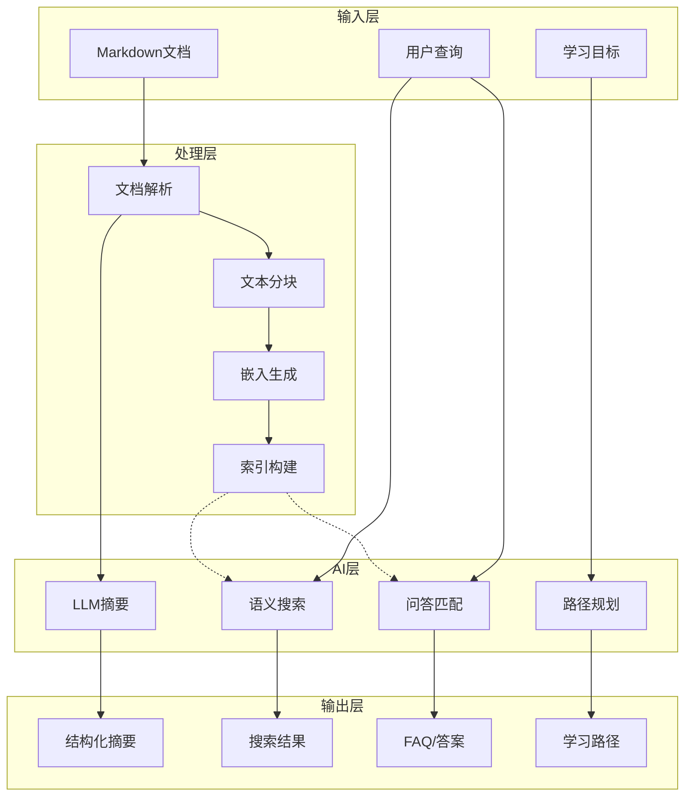

# AI辅助功能套件

AnalysisDataFlow 项目的AI辅助功能集合，提供智能文档分析、搜索、问答和学习路径推荐能力。

## 功能概览

| 功能 | 脚本 | 说明 |
|------|------|------|
| 📄 文档摘要 | `document-summarizer.py` | 自动生成文档摘要，提取关键概念和定理 |
| 🔍 智能搜索 | `smart-search-indexer.py` | 关键词+语义搜索，支持向量嵌入 |
| ❓ 问答机器人 | `qa-bot-knowledge-base.py` | 自动生成FAQ，智能问答匹配 |
| 🎯 学习路径 | `learning-path-personalizer.py` | 基于目标生成个性化学习路线 |

## 快速开始

### 环境准备

```bash
# 安装依赖
pip install openai numpy rank-bm25

# 设置API密钥 (可选，用于增强功能)
export OPENAI_API_KEY="your-api-key"
```

### 使用示例

#### 1. 文档摘要

```bash
# 单文档摘要
python scripts/ai-features/document-summarizer.py --input README.md

# 批量处理
python scripts/ai-features/document-summarizer.py --input Struct/ --batch

# JSON格式输出
python scripts/ai-features/document-summarizer.py --input README.md --format json --output summary.json
```

**示例输出：**
```
============================================================
📄 文档: AnalysisDataFlow
============================================================

📝 摘要:
   本项目是对流计算的理论模型、层次结构、工程实践、业务建模的
   全面梳理与体系构建...

📊 统计:
   - 字数: 12,450
   - 阅读时间: 15 分钟
   - 难度评分: 3/10

🔑 关键概念 (10个):
   • 流计算 (concept, 出现25次)
   • Flink (concept, 出现42次)
   • Dataflow模型 (model, 出现18次)
```

#### 2. 智能搜索

```bash
# 构建索引
python scripts/ai-features/smart-search-indexer.py --build --source . --index-dir search-index/

# 关键词搜索
python scripts/ai-features/smart-search-indexer.py --search "checkpoint mechanism" --index-dir search-index/

# 语义搜索 (需要OpenAI API)
python scripts/ai-features/smart-search-indexer.py --generate-embeddings --index-dir search-index/
python scripts/ai-features/smart-search-indexer.py --semantic-search "流处理容错" --index-dir search-index/

# 混合搜索
python scripts/ai-features/smart-search-indexer.py --hybrid-search "watermark semantics" --index-dir search-index/
```

**示例输出：**
```
======================================================================
🔍 查询: "checkpoint mechanism"
======================================================================

[1] Checkpoint机制深度解析
    📄 Flink/02-core-mechanisms/checkpoint-mechanism-deep-dive.md
    📑 章节: 核心机制
    ⭐ 相关度: 0.9523
    📝 Checkpoint是Flink容错机制的核心，基于Chandy-Lamport...
```

#### 3. 问答机器人

```bash
# 构建知识库
python scripts/ai-features/qa-bot-knowledge-base.py --build --source . --output qa-kb/

# 提问
python scripts/ai-features/qa-bot-knowledge-base.py --ask "什么是Checkpoint?" --kb qa-kb/

# 交互模式
python scripts/ai-features/qa-bot-knowledge-base.py --interactive --kb qa-kb/

# 生成FAQ文档
python scripts/ai-features/qa-bot-knowledge-base.py --generate-faq --output FAQ-AI.md
```

**交互模式示例：**
```
======================================================================
🤖 问答机器人 (输入 'quit' 退出)
======================================================================

❓ 你的问题: 什么是Watermark?

======================================================================
❓ 问题: "什么是Watermark?"
======================================================================

💡 匹配问题: Watermark在Flink中的作用是什么?
   置信度: 89.45%

📖 答案:
Watermark是Flink中用于处理乱序事件的机制，表示事件时间的进度。
当Watermark超过窗口结束时间时，触发窗口计算...

📄 来源: Flink/02-core-mechanisms/time-semantics-and-watermark.md
🏷️  标签: watermark, time, event-time
======================================================================
```

#### 4. 学习路径

```bash
# 生成学习路径
python scripts/ai-features/learning-path-personalizer.py \
    --goal "成为Flink专家" \
    --background "Java后端3年，熟悉Spring" \
    --level intermediate \
    --output learning-path.md

# 交互模式
python scripts/ai-features/learning-path-personalizer.py --interactive

# 查看预设目标
python scripts/ai-features/learning-path-personalizer.py --list-goals
```

**输出示例：**
```markdown
# 🎯 个性化学习路径: Flink开发工程师

> 掌握Flink应用开发，能够独立开发和优化流处理作业

## 📊 路径概览

| 指标 | 值 |
|------|-----|
| 总学习时长 | 120 小时 |
| 学习节点数 | 8 个 |
| 难度分布 | 简单:2 中等:4 困难:2 |

## 📚 详细学习计划

### 阶段 1: 基础入门 (20h)

- 🟢 [Flink架构概览](Flink/01-architecture/flink-architecture-overview.md) - 5h
- 🟢 [DataStream API基础](Flink/09-language-foundations/datastream-api-guide.md) - 8h
- 🟡 [环境搭建](tutorials/01-environment-setup.md) - 7h
```

## Web演示

在浏览器中打开 `ai-features/demo.html` 查看交互式演示：

```bash
# 方式1: 直接用浏览器打开
open ai-features/demo.html

# 方式2: 使用Python HTTP服务器
cd ai-features && python -m http.server 8080
# 然后访问 http://localhost:8080/demo.html
```

## 架构设计



## 配置选项

### 环境变量

| 变量 | 说明 | 默认值 |
|------|------|--------|
| `OPENAI_API_KEY` | OpenAI API密钥 | None |
| `OPENAI_MODEL` | 使用的模型 | gpt-4 |
| `EMBEDDING_MODEL` | 嵌入模型 | text-embedding-3-small |
| `CACHE_DIR` | 缓存目录 | .cache/ |

### 配置文件

创建 `.env` 文件：

```bash
OPENAI_API_KEY=sk-...
OPENAI_MODEL=gpt-4
CACHE_DIR=.cache/
```

## 性能优化

### 缓存机制

- 文档摘要缓存：`.cache/summaries/`
- 搜索索引缓存：`.cache/search-index/`
- 嵌入向量缓存：内存 + 磁盘

### 批处理

```bash
# 批量生成嵌入
python smart-search-indexer.py --generate-embeddings --batch-size 100
```

## 扩展开发

### 添加新的AI功能

1. 创建新的Python脚本：`scripts/ai-features/your-feature.py`
2. 继承基础类或遵循现有模式
3. 添加到功能列表和演示页面
4. 更新本文档

### 集成第三方模型

```python
# 示例：接入其他LLM
class CustomLLM:
    def generate(self, prompt: str) -> str:
        # 调用自定义API
        pass
```

## 故障排除

### 常见问题

**Q: 没有OpenAI API密钥能否使用？**
A: 可以。所有功能都有降级方案，使用启发式算法替代LLM。

**Q: 索引构建很慢？**
A: 启用缓存，只处理变更的文件。使用 `--no-cache` 会重建全部。

**Q: 搜索结果不准确？**
A: 尝试语义搜索或混合搜索，确保已生成嵌入向量。

## 贡献指南

1. 遵循项目代码规范
2. 添加充分的错误处理
3. 提供降级方案（不依赖外部API）
4. 更新文档和演示页面

## 许可证

与主项目一致：Apache License 2.0
