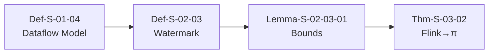
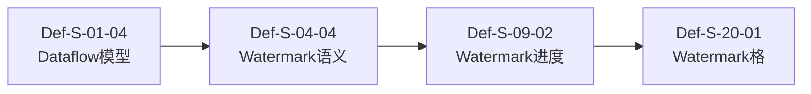
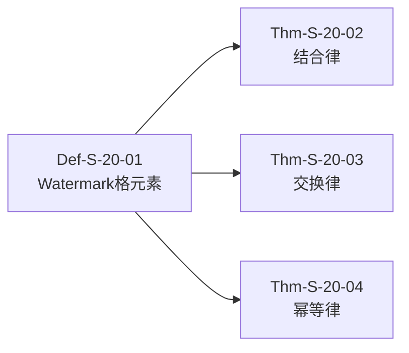
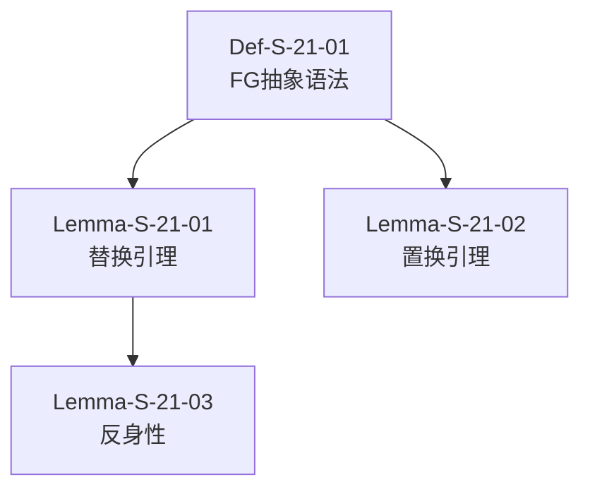
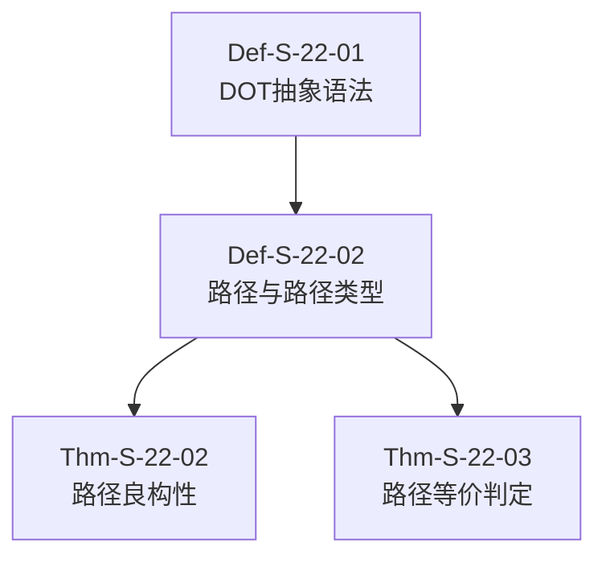

> **状态**: 🔮 前瞻内容 | **风险等级**: 高 | **最后更新**: 2026-04
> 
> 此文档描述的内容处于早期规划阶段，可能与最终实现不符。请以 Apache Flink 官方发布为准。
# Theorem Uniqueness Check Report

**Generated**: 2026-04-11T21:18:11.268386

## Summary

| Metric | Count |
|--------|-------|
| Total Theorems | 9422 |
| Unique IDs | 2414 |
| Duplicates | 1581 |
| Sequential Gaps | 309 |

## ❌ Duplicate Theorem IDs

| ID | Count | Files |
|----|-------|-------|
| `Cor-F-09-05` | 15 | Flink/09-practices/09.05-edge/flink-edge-resource-optimization.md, Flink/09-practices/09.05-edge/flink-edge-iot-gateway.md, Flink/09-practices/09.05-edge/flink-edge-kubernetes-k3s.md, Flink/09-practices/09.05-edge/flink-edge-streaming-guide.md, Flink/09-practices/09.05-edge/flink-edge-offline-sync.md |
| `Cor-F-12-05` | 2 | Struct/Key-Theorem-Proof-Chains.md |
| `Cor-S-02-01` | 6 | Struct/Proof-Chains-Foundation-Complete.md, Struct/01-foundation/01.02-process-calculus-primer.md, Struct/03-relationships/03.03-expressiveness-hierarchy.md |
| `Cor-S-07-01` | 5 | Struct/02-properties/02.01-determinism-in-streaming.md, Struct/Proof-Chains-Properties-Complete.md, Struct/Key-Theorem-Proof-Chains.md |
| `Cor-S-07-02` | 2 | Struct/02-properties/02.01-determinism-in-streaming.md |
| `Cor-S-14-01` | 4 | Struct/Proof-Chains-Relationships-Complete.md, Struct/06-frontier/06.01-open-problems-streaming-verification.md, Struct/03-relationships/03.03-expressiveness-hierarchy.md |
| `Cor-S-15-01` | 2 | Struct/03-relationships/03.04-bisimulation-equivalences.md |
| `Cor-S-18-01` | 3 | Struct/Proof-Chains-Exactly-Once-Correctness.md, Struct/00-STRUCT-DERIVATION-CHAIN.md |
| `Cor-S-22-01` | 2 | Struct/04-proofs/04.06-dot-subtyping-completeness.md |
| `Cor-S-23-01` | 2 | Struct/04-proofs/04.07-deadlock-freedom-choreographic.md |
| `Cor-S-25-01` | 2 | Struct/05-comparative-analysis/05.02-expressiveness-vs-decidability.md |
| `Cor-S-25-02` | 2 | Struct/05-comparative-analysis/05.02-expressiveness-vs-decidability.md |
| `Def-F-01-01` | 5 | Flink/01-concepts/disaggregated-state-analysis.md, Flink/flink-data-types-reference.md, Flink/01-concepts/datastream-v2-semantics.md |
| `Def-F-01-02` | 5 | Flink/01-concepts/disaggregated-state-analysis.md, Flink/flink-data-types-reference.md, Flink/01-concepts/datastream-v2-semantics.md |
| `Def-F-01-03` | 5 | Flink/01-concepts/disaggregated-state-analysis.md, Flink/flink-data-types-reference.md, Flink/01-concepts/datastream-v2-semantics.md |
| `Def-F-01-04` | 5 | Flink/01-concepts/disaggregated-state-analysis.md, Flink/flink-data-types-reference.md, Flink/01-concepts/datastream-v2-semantics.md |
| `Def-F-01-05` | 3 | Flink/flink-data-types-reference.md, Flink/01-concepts/datastream-v2-semantics.md |
| `Def-F-01-06` | 4 | Flink/flink-data-types-reference.md, Flink/01-concepts/datastream-v2-semantics.md |
| `Def-F-02-01` | 23 | Flink/02-core/time-semantics-and-watermark.md, Flink/flink-built-in-functions-reference.md, Flink/Formal-to-Code-Mapping-v2.md, Flink/02-core/checkpoint-mechanism-deep-dive.md, Flink/FORMAL-TO-CODE-MAPPING.md, Flink/02-core/backpressure-and-flow-control.md |
| `Def-F-02-02` | 11 | Flink/02-core/time-semantics-and-watermark.md, Flink/flink-built-in-functions-reference.md, Flink/02-core/checkpoint-mechanism-deep-dive.md, Flink/FORMAL-TO-CODE-MAPPING.md, Flink/02-core/backpressure-and-flow-control.md |
| `Def-F-02-03` | 10 | Flink/02-core/time-semantics-and-watermark.md, Flink/flink-built-in-functions-reference.md, Flink/02-core/checkpoint-mechanism-deep-dive.md, Flink/FORMAL-TO-CODE-MAPPING.md, Flink/02-core/backpressure-and-flow-control.md |
| `Def-F-02-04` | 12 | Flink/02-core/time-semantics-and-watermark.md, Flink/flink-built-in-functions-reference.md, Flink/02-core/checkpoint-mechanism-deep-dive.md, Flink/FORMAL-TO-CODE-MAPPING.md, Flink/09-practices/09.01-case-studies/case-iot-stream-processing.md, Flink/02-core/backpressure-and-flow-control.md |
| `Def-F-02-05` | 11 | Flink/02-core/time-semantics-and-watermark.md, Flink/02-core/async-execution-model.md, Flink/02-core/checkpoint-mechanism-deep-dive.md, Flink/FORMAL-TO-CODE-MAPPING.md, Flink/09-practices/09.01-case-studies/case-iot-stream-processing.md, Flink/02-core/backpressure-and-flow-control.md |
| `Def-F-02-06` | 17 | Flink/02-core/time-semantics-and-watermark.md, Flink/02-core/async-execution-model.md, Flink/00-FLINK-TECH-STACK-DEPENDENCY.md, Flink/02-core/checkpoint-mechanism-deep-dive.md, Flink/FORMAL-TO-CODE-MAPPING.md, Flink/09-practices/09.01-case-studies/case-iot-stream-processing.md, Flink/02-core/backpressure-and-flow-control.md |
| `Def-F-02-07` | 10 | Flink/02-core/checkpoint-mechanism-deep-dive.md, Flink/02-core/backpressure-and-flow-control.md, Flink/02-core/async-execution-model.md, Flink/FORMAL-TO-CODE-MAPPING.md |
| `Def-F-02-08` | 9 | Flink/Formal-to-Code-Mapping-v2.md, Flink/02-core/checkpoint-mechanism-deep-dive.md, Flink/02-core/async-execution-model.md, Flink/FORMAL-TO-CODE-MAPPING.md |
| `Def-F-02-09` | 2 | Flink/02-core/forst-state-backend.md |
| `Def-F-02-10` | 6 | Flink/02-core/flink-state-management-complete-guide.md, Flink/02-core/forst-state-backend.md |
| `Def-F-02-11` | 27 | Flink/02-core/smart-checkpointing-strategies.md, Flink/02-core/forst-state-backend.md |
| `Def-F-02-13` | 2 | Flink/02-core/forst-state-backend.md |
| `Def-F-02-14` | 2 | Flink/02-core/state-backends-deep-comparison.md |
| `Def-F-02-15` | 2 | Flink/02-core/state-backends-deep-comparison.md |
| `Def-F-02-16` | 2 | Flink/02-core/state-backends-deep-comparison.md |
| `Def-F-02-17` | 2 | Flink/02-core/state-backends-deep-comparison.md |
| `Def-F-02-18` | 2 | Flink/02-core/state-backends-deep-comparison.md |
| `Def-F-02-19` | 2 | Flink/02-core/state-backends-deep-comparison.md |
| `Def-F-02-20` | 3 | Flink/02-core/delta-join.md, Flink/02-core/state-backends-deep-comparison.md |
| `Def-F-02-21` | 2 | Flink/02-core/delta-join.md, Flink/02-core/state-backend-evolution-analysis.md |
| `Def-F-02-22` | 2 | Flink/02-core/delta-join.md, Flink/02-core/state-backend-evolution-analysis.md |
| `Def-F-02-23` | 2 | Flink/02-core/state-backend-evolution-analysis.md, Flink/02-core/flink-2.2-frontier-features.md |
| `Def-F-02-24` | 2 | Flink/02-core/state-backend-evolution-analysis.md, Flink/02-core/flink-2.2-frontier-features.md |
| `Def-F-02-25` | 2 | Flink/02-core/state-backend-evolution-analysis.md, Flink/02-core/flink-2.2-frontier-features.md |
| `Def-F-02-26` | 2 | Flink/02-core/flink-2.2-frontier-features.md, Flink/02-core/network-stack-evolution.md |
| `Def-F-02-27` | 2 | Flink/02-core/flink-2.2-frontier-features.md, Flink/02-core/network-stack-evolution.md |
| `Def-F-02-28` | 2 | Flink/02-core/flink-2.2-frontier-features.md, Flink/02-core/network-stack-evolution.md |
| `Def-F-02-29` | 2 | Flink/02-core/flink-2.2-frontier-features.md, Flink/02-core/network-stack-evolution.md |
| `Def-F-02-30` | 5 | Flink/Formal-to-Code-Mapping-v2.md, Flink/FORMAL-TO-CODE-MAPPING.md, Flink/02-core/flink-2.2-frontier-features.md, Flink/02-core/network-stack-evolution.md |
| `Def-F-02-31` | 5 | Flink/Formal-to-Code-Mapping-v2.md, Flink/FORMAL-TO-CODE-MAPPING.md, Flink/02-core/flink-2.2-frontier-features.md, Flink/02-core/network-stack-evolution.md |
| `Def-F-02-40` | 2 | Flink/02-core/streaming-etl-best-practices.md, Flink/02-core/delta-join-production-guide.md |
| `Def-F-02-41` | 2 | Flink/02-core/streaming-etl-best-practices.md, Flink/02-core/delta-join-production-guide.md |
| `Def-F-02-42` | 2 | Flink/02-core/streaming-etl-best-practices.md, Flink/02-core/delta-join-production-guide.md |
| `Def-F-02-43` | 2 | Flink/02-core/streaming-etl-best-practices.md, Flink/02-core/delta-join-production-guide.md |
| `Def-F-02-44` | 2 | Flink/02-core/streaming-etl-best-practices.md, Flink/02-core/delta-join-production-guide.md |
| `Def-F-02-50` | 2 | Flink/02-core/multi-way-join-optimization.md, Flink/02-core/streaming-etl-best-practices.md |
| `Def-F-02-51` | 2 | Flink/02-core/multi-way-join-optimization.md, Flink/02-core/streaming-etl-best-practices.md |
| `Def-F-02-52` | 2 | Flink/02-core/multi-way-join-optimization.md, Flink/02-core/streaming-etl-best-practices.md |
| `Def-F-02-53` | 2 | Flink/02-core/multi-way-join-optimization.md, Flink/02-core/streaming-etl-best-practices.md |
| `Def-F-02-54` | 2 | Flink/02-core/multi-way-join-optimization.md, Flink/02-core/streaming-etl-best-practices.md |
| `Def-F-02-61` | 9 | Struct/PROOF-CHAINS-INDEX.md, Struct/Proof-Chains-Master-Graph.md, Flink/02-core/flink-2.0-forst-state-backend.md, Struct/Proof-Chains-Flink-Complete.md, Struct/Key-Theorem-Proof-Chains.md, Struct/Proof-Chains-Flink-Implementation.md |
| `Def-F-02-62` | 2 | Flink/02-core/flink-2.0-forst-state-backend.md, Struct/Proof-Chains-Flink-Complete.md |
| `Def-F-02-63` | 3 | Struct/Proof-Chains-Flink-Implementation.md, Flink/02-core/flink-2.0-forst-state-backend.md |
| `Def-F-02-65` | 2 | Flink/02-core/flink-2.0-forst-state-backend.md |
| `Def-F-02-70` | 8 | Struct/PROOF-CHAINS-INDEX.md, Flink/02-core/flink-2.0-async-execution-model.md, Flink/FORMAL-TO-CODE-MAPPING.md, Struct/Proof-Chains-Flink-Complete.md, Struct/Key-Theorem-Proof-Chains.md, Struct/Proof-Chains-Flink-Implementation.md |
| `Def-F-02-73` | 5 | Flink/02-core/flink-2.0-async-execution-model.md, Flink/FORMAL-TO-CODE-MAPPING.md, Struct/Proof-Chains-Flink-Complete.md, Struct/Key-Theorem-Proof-Chains.md |
| `Def-F-02-74` | 6 | Flink/02-core/flink-2.0-async-execution-model.md, Struct/Proof-Chains-Flink-Implementation.md, Flink/FORMAL-TO-CODE-MAPPING.md, Struct/Key-Theorem-Proof-Chains.md |
| `Def-F-02-75` | 4 | Flink/02-core/flink-2.0-async-execution-model.md, Struct/Proof-Chains-Flink-Implementation.md, Struct/Key-Theorem-Proof-Chains.md |
| `Def-F-02-76` | 2 | Flink/02-core/flink-2.0-async-execution-model.md, Flink/FORMAL-TO-CODE-MAPPING.md |
| `Def-F-02-77` | 7 | Flink/02-core/flink-2.0-async-execution-model.md, Flink/FORMAL-TO-CODE-MAPPING.md, Struct/Proof-Chains-Flink-Complete.md, Struct/Key-Theorem-Proof-Chains.md, Struct/Proof-Chains-Flink-Implementation.md |
| `Def-F-02-78` | 3 | Flink/02-core/flink-2.0-async-execution-model.md, Flink/FORMAL-TO-CODE-MAPPING.md |
| `Def-F-02-79` | 2 | Flink/02-core/flink-2.0-async-execution-model.md, Flink/FORMAL-TO-CODE-MAPPING.md |
| `Def-F-02-80` | 4 | Flink/02-core/flink-state-ttl-best-practices.md, Flink/02-core/flink-2.0-async-execution-model.md, Flink/FORMAL-TO-CODE-MAPPING.md |
| `Def-F-02-81` | 3 | Flink/02-core/flink-state-ttl-best-practices.md, Flink/02-core/flink-2.0-async-execution-model.md |
| `Def-F-02-82` | 2 | Flink/02-core/flink-state-ttl-best-practices.md, Flink/02-core/flink-2.0-async-execution-model.md |
| `Def-F-02-83` | 2 | Flink/02-core/flink-state-ttl-best-practices.md, Flink/02-core/flink-2.0-async-execution-model.md |
| `Def-F-02-84` | 2 | Flink/02-core/flink-state-ttl-best-practices.md, Flink/02-core/flink-2.0-async-execution-model.md |
| `Def-F-02-85` | 2 | Flink/02-core/flink-state-ttl-best-practices.md, Flink/02-core/flink-2.0-async-execution-model.md |
| `Def-F-02-86` | 2 | Flink/02-core/flink-state-ttl-best-practices.md, Flink/02-core/flink-2.0-async-execution-model.md |
| `Def-F-02-87` | 3 | Flink/02-core/flink-state-ttl-best-practices.md, Flink/02-core/adaptive-execution-engine-v2.md |
| `Def-F-02-88` | 3 | Flink/02-core/flink-state-ttl-best-practices.md, Flink/02-core/adaptive-execution-engine-v2.md |
| `Def-F-02-89` | 2 | Flink/02-core/adaptive-execution-engine-v2.md |
| `Def-F-02-90` | 10 | Struct/PROOF-CHAINS-INDEX.md, Struct/Proof-Chains-Master-Graph.md, Flink/02-core/flink-state-management-complete-guide.md, Struct/Proof-Chains-Flink-Complete.md, Struct/Key-Theorem-Proof-Chains.md, Flink/02-core/adaptive-execution-engine-v2.md |
| `Def-F-02-91` | 20 | Struct/PROOF-CHAINS-INDEX.md, Struct/Proof-Chains-Master-Graph.md, Flink/02-core/exactly-once-semantics-deep-dive.md, Flink/Formal-to-Code-Mapping-v2.md, Flink/02-core/flink-state-management-complete-guide.md, Flink/FORMAL-TO-CODE-MAPPING.md, Struct/Proof-Chains-Flink-Complete.md, Struct/Key-Theorem-Proof-Chains.md, Struct/Proof-Chains-Flink-Implementation.md, Flink/02-core/adaptive-execution-engine-v2.md |
| `Def-F-02-92` | 7 | Flink/02-core/adaptive-execution-engine-v2.md, Flink/02-core/flink-state-management-complete-guide.md, Flink/02-core/exactly-once-semantics-deep-dive.md, Flink/FORMAL-TO-CODE-MAPPING.md |
| `Def-F-02-93` | 5 | Flink/02-core/adaptive-execution-engine-v2.md, Flink/02-core/flink-state-management-complete-guide.md, Flink/02-core/exactly-once-semantics-deep-dive.md, Flink/FORMAL-TO-CODE-MAPPING.md |
| `Def-F-02-94` | 4 | Flink/02-core/flink-state-management-complete-guide.md, Flink/02-core/exactly-once-semantics-deep-dive.md, Flink/FORMAL-TO-CODE-MAPPING.md |
| `Def-F-02-95` | 4 | Flink/02-core/flink-state-management-complete-guide.md, Flink/02-core/exactly-once-semantics-deep-dive.md, Flink/FORMAL-TO-CODE-MAPPING.md |
| `Def-F-02-96` | 2 | Flink/02-core/flink-state-management-complete-guide.md |
| `Def-F-02-97` | 2 | Flink/02-core/flink-state-management-complete-guide.md |
| `Def-F-02-98` | 3 | Flink/02-core/flink-state-management-complete-guide.md |
| `Def-F-03-01` | 8 | Flink/03-api/03.02-table-sql-api/sql-functions-cheatsheet.md, Flink/03-api/03.02-table-sql-api/sql-vs-datastream-comparison.md, Flink/03-api/03.02-table-sql-api/data-types-complete-reference.md, Flink/00-FLINK-TECH-STACK-DEPENDENCY.md, Flink/03-api/03.02-table-sql-api/built-in-functions-complete-list.md, Flink/03-api/03.02-table-sql-api/flink-table-sql-complete-guide.md |
| `Def-F-03-02` | 7 | Flink/03-api/03.02-table-sql-api/sql-functions-cheatsheet.md, Flink/03-api/03.02-table-sql-api/sql-vs-datastream-comparison.md, Flink/03-api/03.02-table-sql-api/data-types-complete-reference.md, Flink/03-api/03.02-table-sql-api/built-in-functions-complete-list.md, Flink/03-api/03.02-table-sql-api/flink-table-sql-complete-guide.md |
| `Def-F-03-03` | 9 | Flink/03-api/03.02-table-sql-api/materialized-tables.md, Flink/03-api/03.02-table-sql-api/sql-vs-datastream-comparison.md, Flink/03-api/03.02-table-sql-api/data-types-complete-reference.md, Flink/03-api/03.02-table-sql-api/flink-table-sql-complete-guide.md |
| `Def-F-03-04` | 4 | Flink/03-api/03.02-table-sql-api/materialized-tables.md, Flink/03-api/03.02-table-sql-api/data-types-complete-reference.md, Flink/03-api/03.02-table-sql-api/flink-table-sql-complete-guide.md |
| `Def-F-03-05` | 4 | Flink/03-api/03.02-table-sql-api/materialized-tables.md, Flink/03-api/03.02-table-sql-api/data-types-complete-reference.md, Flink/03-api/03.02-table-sql-api/flink-table-sql-complete-guide.md |
| `Def-F-03-06` | 4 | Flink/03-api/03.02-table-sql-api/materialized-tables.md, Flink/03-api/03.02-table-sql-api/data-types-complete-reference.md, Flink/03-api/03.02-table-sql-api/flink-table-sql-complete-guide.md |
| `Def-F-03-07` | 4 | Flink/03-api/03.02-table-sql-api/materialized-tables.md, Flink/03-api/03.02-table-sql-api/data-types-complete-reference.md, Flink/03-api/03.02-table-sql-api/flink-table-sql-complete-guide.md |
| `Def-F-03-08` | 4 | Flink/03-api/03.02-table-sql-api/materialized-tables.md, Flink/03-api/03.02-table-sql-api/data-types-complete-reference.md, Flink/03-api/03.02-table-sql-api/flink-table-sql-complete-guide.md |
| `Def-F-03-09` | 4 | Flink/03-api/03.02-table-sql-api/materialized-tables.md, Flink/03-api/03.02-table-sql-api/data-types-complete-reference.md, Flink/03-api/03.02-table-sql-api/flink-table-sql-complete-guide.md |
| `Def-F-03-10` | 13 | Flink/03-api/03.02-table-sql-api/materialized-tables.md, Flink/03-api/03.02-table-sql-api/ansi-sql-2023-compliance-guide.md, Flink/03-api/03.02-table-sql-api/data-types-complete-reference.md, Flink/03-api/03.02-table-sql-api/flink-table-sql-complete-guide.md |
| `Def-F-03-11` | 3 | Flink/03-api/03.02-table-sql-api/data-types-complete-reference.md, Flink/03-api/03.02-table-sql-api/flink-table-sql-complete-guide.md |
| `Def-F-03-12` | 3 | Flink/03-api/03.02-table-sql-api/data-types-complete-reference.md, Flink/03-api/03.02-table-sql-api/flink-table-sql-complete-guide.md |
| `Def-F-03-13` | 3 | Flink/03-api/03.02-table-sql-api/data-types-complete-reference.md, Flink/03-api/03.02-table-sql-api/flink-table-sql-complete-guide.md |
| `Def-F-03-14` | 3 | Flink/03-api/03.02-table-sql-api/data-types-complete-reference.md, Flink/03-api/03.02-table-sql-api/flink-table-sql-complete-guide.md |
| `Def-F-03-15` | 4 | Flink/03-api/03.02-table-sql-api/model-ddl-and-ml-predict.md, Flink/03-api/03.02-table-sql-api/data-types-complete-reference.md, Flink/03-api/03.02-table-sql-api/flink-table-sql-complete-guide.md |
| `Def-F-03-16` | 4 | Flink/03-api/03.02-table-sql-api/model-ddl-and-ml-predict.md, Flink/03-api/03.02-table-sql-api/data-types-complete-reference.md, Flink/03-api/03.02-table-sql-api/flink-table-sql-complete-guide.md |
| `Def-F-03-17` | 4 | Flink/03-api/03.02-table-sql-api/model-ddl-and-ml-predict.md, Flink/03-api/03.02-table-sql-api/data-types-complete-reference.md, Flink/03-api/03.02-table-sql-api/flink-table-sql-complete-guide.md |
| `Def-F-03-18` | 4 | Flink/03-api/03.02-table-sql-api/model-ddl-and-ml-predict.md, Flink/03-api/03.02-table-sql-api/data-types-complete-reference.md, Flink/03-api/03.02-table-sql-api/flink-table-sql-complete-guide.md |
| `Def-F-03-19` | 6 | Flink/03-api/03.02-table-sql-api/vector-search.md, Flink/03-api/03.02-table-sql-api/data-types-complete-reference.md, Flink/03-api/03.02-table-sql-api/flink-table-sql-complete-guide.md |
| `Def-F-03-20` | 9 | Flink/03-api/03.02-table-sql-api/vector-search.md, Flink/03-api/03.02-table-sql-api/flink-table-sql-complete-guide.md, Flink/03-api/03.02-table-sql-api/data-types-complete-reference.md, Flink/03-api/03.02-table-sql-api/flink-python-udf.md |
| `Def-F-03-21` | 7 | Flink/03-api/03.02-table-sql-api/vector-search.md, Flink/03-api/03.02-table-sql-api/flink-table-sql-complete-guide.md, Flink/03-api/03.02-table-sql-api/data-types-complete-reference.md, Flink/03-api/03.02-table-sql-api/flink-python-udf.md |
| `Def-F-03-22` | 3 | Flink/03-api/03.02-table-sql-api/flink-table-sql-complete-guide.md, Flink/03-api/03.02-table-sql-api/flink-python-udf.md |
| `Def-F-03-30` | 3 | Flink/03-api/03.02-table-sql-api/flink-sql-calcite-optimizer-deep-dive.md, Flink/03-api/03.02-table-sql-api/flink-process-table-functions.md |
| `Def-F-03-31` | 2 | Flink/03-api/03.02-table-sql-api/flink-sql-calcite-optimizer-deep-dive.md, Flink/03-api/03.02-table-sql-api/flink-process-table-functions.md |
| `Def-F-03-32` | 2 | Flink/03-api/03.02-table-sql-api/flink-sql-calcite-optimizer-deep-dive.md, Flink/03-api/03.02-table-sql-api/flink-process-table-functions.md |
| `Def-F-03-33` | 2 | Flink/03-api/03.02-table-sql-api/flink-sql-calcite-optimizer-deep-dive.md, Flink/03-api/03.02-table-sql-api/flink-process-table-functions.md |
| `Def-F-03-34` | 2 | Flink/03-api/03.02-table-sql-api/flink-sql-calcite-optimizer-deep-dive.md, Flink/03-api/03.02-table-sql-api/flink-process-table-functions.md |
| `Def-F-03-35` | 2 | Flink/03-api/03.02-table-sql-api/flink-sql-calcite-optimizer-deep-dive.md, Flink/03-api/03.02-table-sql-api/flink-process-table-functions.md |
| `Def-F-03-36` | 2 | Flink/03-api/03.02-table-sql-api/flink-sql-calcite-optimizer-deep-dive.md, Flink/03-api/03.02-table-sql-api/flink-process-table-functions.md |
| `Def-F-03-37` | 2 | Flink/03-api/03.02-table-sql-api/flink-sql-calcite-optimizer-deep-dive.md, Flink/03-api/03.02-table-sql-api/flink-process-table-functions.md |
| `Def-F-03-38` | 2 | Flink/03-api/03.02-table-sql-api/flink-sql-calcite-optimizer-deep-dive.md, Flink/03-api/03.02-table-sql-api/flink-process-table-functions.md |
| `Def-F-03-50` | 3 | Flink/03-api/03.02-table-sql-api/flink-sql-calcite-optimizer-deep-dive.md, Flink/03-api/03.02-table-sql-api/flink-sql-window-functions-deep-dive.md |
| `Def-F-03-51` | 3 | Flink/03-api/03.02-table-sql-api/flink-sql-calcite-optimizer-deep-dive.md, Flink/03-api/03.02-table-sql-api/flink-sql-window-functions-deep-dive.md |
| `Def-F-03-52` | 3 | Flink/03-api/03.02-table-sql-api/flink-sql-calcite-optimizer-deep-dive.md, Flink/03-api/03.02-table-sql-api/flink-sql-window-functions-deep-dive.md |
| `Def-F-03-53` | 3 | Flink/03-api/03.02-table-sql-api/flink-sql-calcite-optimizer-deep-dive.md, Flink/03-api/03.02-table-sql-api/flink-sql-window-functions-deep-dive.md |
| `Def-F-03-54` | 3 | Flink/03-api/03.02-table-sql-api/flink-sql-calcite-optimizer-deep-dive.md, Flink/03-api/03.02-table-sql-api/flink-sql-window-functions-deep-dive.md |
| `Def-F-03-55` | 3 | Flink/03-api/03.02-table-sql-api/flink-sql-calcite-optimizer-deep-dive.md, Flink/03-api/03.02-table-sql-api/flink-sql-window-functions-deep-dive.md |
| `Def-F-03-56` | 3 | Flink/03-api/03.02-table-sql-api/flink-sql-calcite-optimizer-deep-dive.md, Flink/03-api/03.02-table-sql-api/flink-sql-window-functions-deep-dive.md |
| `Def-F-03-57` | 6 | Flink/Formal-to-Code-Mapping-v2.md, Flink/03-api/03.02-table-sql-api/flink-sql-calcite-optimizer-deep-dive.md, Flink/FORMAL-TO-CODE-MAPPING.md, Flink/03-api/03.02-table-sql-api/flink-sql-window-functions-deep-dive.md |
| `Def-F-03-58` | 3 | Flink/03-api/03.02-table-sql-api/flink-sql-calcite-optimizer-deep-dive.md, Flink/03-api/03.02-table-sql-api/flink-sql-window-functions-deep-dive.md |
| `Def-F-03-59` | 3 | Flink/03-api/03.02-table-sql-api/flink-sql-calcite-optimizer-deep-dive.md, Flink/03-api/03.02-table-sql-api/flink-sql-window-functions-deep-dive.md |
| `Def-F-03-60` | 3 | Flink/03-api/03.02-table-sql-api/flink-sql-calcite-optimizer-deep-dive.md, Flink/03-api/03.02-table-sql-api/flink-sql-window-functions-deep-dive.md |
| `Def-F-03-65` | 2 | Flink/03-api/03.02-table-sql-api/flink-sql-calcite-optimizer-deep-dive.md |
| `Def-F-03-81` | 4 | Flink/03-api/03.02-table-sql-api/flink-vector-search-rag.md |
| `Def-F-03-82` | 4 | Flink/03-api/03.02-table-sql-api/flink-vector-search-rag.md |
| `Def-F-03-83` | 3 | Flink/03-api/03.02-table-sql-api/flink-vector-search-rag.md |
| `Def-F-03-84` | 3 | Flink/03-api/03.02-table-sql-api/flink-vector-search-rag.md |
| `Def-F-03-85` | 3 | Flink/03-api/03.02-table-sql-api/flink-vector-search-rag.md |
| `Def-F-03-92` | 5 | Flink/03-api/03.02-table-sql-api/flink-sql-hints-optimization.md |
| `Def-F-03-94` | 5 | Flink/03-api/03.02-table-sql-api/flink-sql-hints-optimization.md |
| `Def-F-04-01` | 4 | Flink/05-ecosystem/05.01-connectors/kafka-integration-patterns.md, Flink/05-ecosystem/05.01-connectors/pulsar-integration-guide.md, Flink/05-ecosystem/05.01-connectors/elasticsearch-connector-complete-guide.md |
| `Def-F-04-02` | 4 | Flink/05-ecosystem/05.01-connectors/kafka-integration-patterns.md, Flink/05-ecosystem/05.01-connectors/pulsar-integration-guide.md, Flink/05-ecosystem/05.01-connectors/elasticsearch-connector-complete-guide.md |
| `Def-F-04-03` | 4 | Flink/05-ecosystem/05.01-connectors/kafka-integration-patterns.md, Flink/05-ecosystem/05.01-connectors/pulsar-integration-guide.md, Flink/05-ecosystem/05.01-connectors/elasticsearch-connector-complete-guide.md |
| `Def-F-04-04` | 3 | Flink/05-ecosystem/05.01-connectors/kafka-integration-patterns.md, Flink/05-ecosystem/05.01-connectors/elasticsearch-connector-complete-guide.md |
| `Def-F-04-05` | 2 | Flink/05-ecosystem/05.01-connectors/kafka-integration-patterns.md |
| `Def-F-04-06` | 2 | Flink/05-ecosystem/05.01-connectors/mongodb-connector-complete-guide.md |
| `Def-F-04-07` | 2 | Flink/05-ecosystem/05.01-connectors/mongodb-connector-complete-guide.md |
| `Def-F-04-08` | 2 | Flink/05-ecosystem/05.01-connectors/mongodb-connector-complete-guide.md |
| `Def-F-04-09` | 2 | Flink/05-ecosystem/05.01-connectors/mongodb-connector-complete-guide.md |
| `Def-F-04-10` | 13 | Flink/05-ecosystem/05.01-connectors/mongodb-connector-complete-guide.md, Flink/05-ecosystem/05.01-connectors/flink-connectors-ecosystem-complete-guide.md, Flink/05-ecosystem/05.01-connectors/fluss-integration.md |
| `Def-F-04-20` | 29 | Flink/04-runtime/04.01-deployment/flink-k8s-operator-1.14-guide.md, Flink/05-ecosystem/05.01-connectors/cloudevents-integration-guide.md, Flink/05-ecosystem/05.01-connectors/jdbc-connector-complete-guide.md, Flink/05-ecosystem/05.01-connectors/flink-24-connectors-guide.md, Flink/05-ecosystem/05.01-connectors/diskless-kafka-cloud-native.md |
| `Def-F-04-21` | 5 | Flink/04-runtime/04.01-deployment/flink-k8s-operator-1.14-guide.md, Flink/05-ecosystem/05.01-connectors/cloudevents-integration-guide.md, Flink/05-ecosystem/05.01-connectors/diskless-kafka-cloud-native.md |
| `Def-F-04-22` | 5 | Flink/04-runtime/04.01-deployment/flink-k8s-operator-1.14-guide.md, Flink/05-ecosystem/05.01-connectors/cloudevents-integration-guide.md, Flink/05-ecosystem/05.01-connectors/diskless-kafka-cloud-native.md |
| `Def-F-04-23` | 4 | Flink/04-runtime/04.01-deployment/flink-k8s-operator-1.14-guide.md, Flink/05-ecosystem/05.01-connectors/cloudevents-integration-guide.md |
| `Def-F-04-24` | 2 | Flink/04-runtime/04.01-deployment/flink-k8s-operator-1.14-guide.md |
| `Def-F-04-25` | 2 | Flink/04-runtime/04.01-deployment/flink-k8s-operator-1.14-guide.md |
| `Def-F-04-30` | 2 | Flink/05-ecosystem/05.01-connectors/04.04-cdc-debezium-integration.md |
| `Def-F-04-31` | 2 | Flink/05-ecosystem/05.01-connectors/04.04-cdc-debezium-integration.md |
| `Def-F-04-32` | 2 | Flink/05-ecosystem/05.01-connectors/04.04-cdc-debezium-integration.md |
| `Def-F-04-33` | 2 | Flink/05-ecosystem/05.01-connectors/04.04-cdc-debezium-integration.md |
| `Def-F-04-34` | 2 | Flink/05-ecosystem/05.01-connectors/04.04-cdc-debezium-integration.md |
| `Def-F-04-40` | 2 | Flink/05-ecosystem/05.01-connectors/flink-delta-lake-integration.md |
| `Def-F-04-41` | 2 | Flink/05-ecosystem/05.01-connectors/flink-delta-lake-integration.md |
| `Def-F-04-42` | 2 | Flink/05-ecosystem/05.01-connectors/flink-delta-lake-integration.md |
| `Def-F-04-43` | 2 | Flink/05-ecosystem/05.01-connectors/flink-delta-lake-integration.md |
| `Def-F-04-44` | 2 | Flink/05-ecosystem/05.01-connectors/flink-delta-lake-integration.md |
| `Def-F-04-45` | 2 | Flink/05-ecosystem/05.01-connectors/flink-delta-lake-integration.md |
| `Def-F-04-46` | 2 | Flink/05-ecosystem/05.01-connectors/flink-delta-lake-integration.md |
| `Def-F-04-47` | 2 | Flink/05-ecosystem/05.01-connectors/flink-delta-lake-integration.md |
| `Def-F-04-50` | 2 | Flink/05-ecosystem/05.01-connectors/flink-cdc-3.0-data-integration.md, Flink/05-ecosystem/05.01-connectors/flink-iceberg-integration.md |
| `Def-F-04-51` | 2 | Flink/05-ecosystem/05.01-connectors/flink-cdc-3.0-data-integration.md, Flink/05-ecosystem/05.01-connectors/flink-iceberg-integration.md |
| `Def-F-04-52` | 2 | Flink/05-ecosystem/05.01-connectors/flink-cdc-3.0-data-integration.md, Flink/05-ecosystem/05.01-connectors/flink-iceberg-integration.md |
| `Def-F-04-53` | 2 | Flink/05-ecosystem/05.01-connectors/flink-cdc-3.0-data-integration.md, Flink/05-ecosystem/05.01-connectors/flink-iceberg-integration.md |
| `Def-F-05-01` | 6 | Flink/09-practices/09.03-performance-tuning/05-vs-competitors/flink-vs-spark-streaming.md, Flink/09-practices/09.03-performance-tuning/05-vs-competitors/flink-vs-kafka-streams.md, Flink/05-ecosystem/05.01-connectors/flink-cdc-3.6.0-guide.md, Flink/04-runtime/04.02-operations/production-checklist.md |
| `Def-F-05-02` | 6 | Flink/09-practices/09.03-performance-tuning/05-vs-competitors/flink-vs-spark-streaming.md, Flink/09-practices/09.03-performance-tuning/05-vs-competitors/flink-vs-kafka-streams.md, Flink/05-ecosystem/05.01-connectors/flink-cdc-3.6.0-guide.md, Flink/04-runtime/04.02-operations/production-checklist.md |
| `Def-F-05-03` | 5 | Flink/04-runtime/04.02-operations/production-checklist.md, Flink/09-practices/09.03-performance-tuning/05-vs-competitors/flink-vs-kafka-streams.md, Flink/05-ecosystem/05.01-connectors/flink-cdc-3.6.0-guide.md, Flink/09-practices/09.03-performance-tuning/05-vs-competitors/linkedin-samza-deep-dive.md |
| `Def-F-05-04` | 4 | Flink/05-ecosystem/05.01-connectors/flink-cdc-3.6.0-guide.md, Flink/09-practices/09.03-performance-tuning/05-vs-competitors/linkedin-samza-deep-dive.md |
| `Def-F-05-05` | 4 | Flink/05-ecosystem/05.01-connectors/flink-cdc-3.6.0-guide.md, Flink/09-practices/09.03-performance-tuning/05-vs-competitors/linkedin-samza-deep-dive.md |
| `Def-F-06-01` | 4 | Flink/09-practices/09.03-performance-tuning/performance-tuning-guide.md, Flink/09-practices/09.03-performance-tuning/state-backend-selection.md |
| `Def-F-06-02` | 4 | Flink/09-practices/09.03-performance-tuning/performance-tuning-guide.md, Flink/09-practices/09.03-performance-tuning/state-backend-selection.md |
| `Def-F-06-03` | 4 | Flink/09-practices/09.03-performance-tuning/performance-tuning-guide.md, Flink/09-practices/09.03-performance-tuning/state-backend-selection.md |
| `Def-F-06-04` | 4 | Flink/09-practices/09.03-performance-tuning/performance-tuning-guide.md, Flink/09-practices/09.03-performance-tuning/state-backend-selection.md |
| `Def-F-06-05` | 4 | Flink/09-practices/09.03-performance-tuning/06.02-performance-optimization-complete.md, Flink/09-practices/09.03-performance-tuning/state-backend-selection.md |
| `Def-F-06-06` | 4 | Flink/09-practices/09.03-performance-tuning/06.02-performance-optimization-complete.md, Flink/09-practices/09.03-performance-tuning/state-backend-selection.md |
| `Def-F-06-07` | 2 | Flink/09-practices/09.03-performance-tuning/06.02-performance-optimization-complete.md |
| `Def-F-06-08` | 2 | Flink/09-practices/09.03-performance-tuning/06.02-performance-optimization-complete.md |
| `Def-F-06-09` | 2 | Flink/09-practices/09.03-performance-tuning/06.02-performance-optimization-complete.md |
| `Def-F-06-10` | 9 | Flink/09-practices/09.03-performance-tuning/flink-tco-cost-optimization-guide.md, Flink/06-ai-ml/flip-531-ai-agents-ga-guide.md |
| `Def-F-06-11` | 2 | Flink/09-practices/09.03-performance-tuning/flink-tco-cost-optimization-guide.md |
| `Def-F-06-12` | 2 | Flink/09-practices/09.03-performance-tuning/flink-tco-cost-optimization-guide.md |
| `Def-F-06-13` | 2 | Flink/09-practices/09.03-performance-tuning/flink-tco-cost-optimization-guide.md |
| `Def-F-06-14` | 2 | Flink/09-practices/09.03-performance-tuning/flink-tco-cost-optimization-guide.md |
| `Def-F-06-20` | 2 | Flink/09-practices/09.03-performance-tuning/flink-dbt-integration.md |
| `Def-F-06-21` | 2 | Flink/09-practices/09.03-performance-tuning/flink-dbt-integration.md |
| `Def-F-06-22` | 2 | Flink/09-practices/09.03-performance-tuning/flink-dbt-integration.md |
| `Def-F-06-23` | 2 | Flink/09-practices/09.03-performance-tuning/flink-dbt-integration.md |
| `Def-F-06-24` | 2 | Flink/09-practices/09.03-performance-tuning/flink-dbt-integration.md |
| `Def-F-06-30` | 6 | Flink/09-practices/09.03-performance-tuning/stream-processing-testing-strategies.md, Flink/06-ai-ml/flink-agent-workflow-engine.md |
| `Def-F-06-40` | 2 | Flink/09-practices/09.03-performance-tuning/stream-processing-cost-optimization.md |
| `Def-F-06-41` | 2 | Flink/09-practices/09.03-performance-tuning/stream-processing-cost-optimization.md |
| `Def-F-06-42` | 2 | Flink/09-practices/09.03-performance-tuning/stream-processing-cost-optimization.md |
| `Def-F-06-43` | 2 | Flink/09-practices/09.03-performance-tuning/stream-processing-cost-optimization.md |
| `Def-F-06-50` | 2 | Flink/06-ai-ml/flink-llm-realtime-inference-guide.md, Flink/09-practices/09.03-performance-tuning/flink-24-performance-improvements.md |
| `Def-F-06-51` | 2 | Flink/06-ai-ml/flink-llm-realtime-inference-guide.md, Flink/09-practices/09.03-performance-tuning/flink-24-performance-improvements.md |
| `Def-F-06-52` | 2 | Flink/06-ai-ml/flink-llm-realtime-inference-guide.md, Flink/09-practices/09.03-performance-tuning/flink-24-performance-improvements.md |
| `Def-F-06-53` | 2 | Flink/06-ai-ml/flink-llm-realtime-inference-guide.md, Flink/09-practices/09.03-performance-tuning/flink-24-performance-improvements.md |
| `Def-F-06-54` | 2 | Flink/06-ai-ml/flink-llm-realtime-inference-guide.md, Flink/09-practices/09.03-performance-tuning/flink-24-performance-improvements.md |
| `Def-F-07-01` | 4 | Flink/04-runtime/04.02-operations/rest-api-complete-reference.md, Flink/09-practices/09.01-case-studies/case-ecommerce-realtime-recommendation.md, Flink/09-practices/09.01-case-studies/case-realtime-analytics.md |
| `Def-F-07-02` | 4 | Flink/04-runtime/04.02-operations/rest-api-complete-reference.md, Flink/09-practices/09.01-case-studies/case-ecommerce-realtime-recommendation.md, Flink/09-practices/09.01-case-studies/case-realtime-analytics.md |
| `Def-F-07-03` | 3 | Flink/09-practices/09.01-case-studies/case-ecommerce-realtime-recommendation.md, Flink/09-practices/09.01-case-studies/case-realtime-analytics.md |
| `Def-F-07-05` | 10 | Flink/07-rust-native/edge-wasm-runtime/05-production-deployment-guide.md |
| `Def-F-07-06` | 8 | Flink/07-rust-native/edge-wasm-runtime/06-5g-mec-integration-guide.md |
| `Def-F-07-21` | 5 | Flink/09-practices/09.01-case-studies/case-social-media-analytics.md |
| `Def-F-07-22` | 5 | Flink/09-practices/09.01-case-studies/case-fraud-detection-advanced.md |
| `Def-F-07-23` | 5 | Flink/09-practices/09.01-case-studies/case-supply-chain-optimization.md |
| `Def-F-07-24` | 5 | Flink/09-practices/09.01-case-studies/case-smart-city-iot.md |
| `Def-F-07-25` | 5 | Flink/09-practices/09.01-case-studies/case-healthcare-monitoring.md |
| `Def-F-07-26` | 5 | Flink/09-practices/09.01-case-studies/case-energy-grid-optimization.md |
| `Def-F-07-40` | 3 | Flink/09-practices/09.01-case-studies/case-logistics-realtime-tracking.md |
| `Def-F-07-42` | 4 | Flink/09-practices/09.01-case-studies/case-logistics-realtime-tracking.md |
| `Def-F-07-43` | 3 | Flink/09-practices/09.01-case-studies/case-logistics-realtime-tracking.md |
| `Def-F-07-45` | 2 | Flink/09-practices/09.01-case-studies/case-logistics-realtime-tracking.md |
| `Def-F-08-01` | 2 | Flink/08-roadmap/08.01-flink-24/release-checklist-template.md, Flink/08-roadmap/08.01-flink-24/2026-q2-flink-tasks.md |
| `Def-F-08-02` | 2 | Flink/08-roadmap/08.01-flink-24/release-checklist-template.md, Flink/08-roadmap/08.01-flink-24/2026-q2-flink-tasks.md |
| `Def-F-08-03` | 2 | Flink/08-roadmap/08.01-flink-24/release-checklist-template.md, Flink/08-roadmap/08.01-flink-24/2026-q2-flink-tasks.md |
| `Def-F-08-50` | 5 | Flink/08-roadmap/08.01-flink-24/flink-version-evolution-complete-guide.md, Flink/08-roadmap/08.01-flink-24/FLIP-TRACKING-SYSTEM.md, Flink/08-roadmap/08.01-flink-24/flink-2.5-preview.md |
| `Def-F-08-51` | 4 | Flink/08-roadmap/08.01-flink-24/flink-version-evolution-complete-guide.md, Flink/08-roadmap/08.01-flink-24/FLIP-TRACKING-SYSTEM.md, Flink/08-roadmap/08.01-flink-24/flink-2.5-preview.md |
| `Def-F-08-52` | 4 | Flink/08-roadmap/08.01-flink-24/flink-version-evolution-complete-guide.md, Flink/08-roadmap/08.01-flink-24/FLIP-TRACKING-SYSTEM.md, Flink/08-roadmap/08.01-flink-24/flink-2.5-preview.md |
| `Def-F-08-53` | 4 | Flink/08-roadmap/08.01-flink-24/flink-version-evolution-complete-guide.md, Flink/08-roadmap/08.01-flink-24/FLIP-TRACKING-SYSTEM.md, Flink/08-roadmap/08.01-flink-24/flink-2.5-preview.md |
| `Def-F-08-54` | 3 | Flink/08-roadmap/08.01-flink-24/flink-version-evolution-complete-guide.md, Flink/08-roadmap/08.01-flink-24/flink-2.5-preview.md |
| `Def-F-08-55` | 3 | Flink/08-roadmap/08.01-flink-24/flink-version-evolution-complete-guide.md, Flink/08-roadmap/08.01-flink-24/flink-2.5-preview.md |
| `Def-F-08-56` | 4 | Flink/08-roadmap/08.01-flink-24/flink-version-evolution-complete-guide.md, Flink/08-roadmap/08.01-flink-24/flink-25-stream-batch-unification.md |
| `Def-F-08-57` | 4 | Flink/08-roadmap/08.01-flink-24/flink-version-evolution-complete-guide.md, Flink/08-roadmap/08.01-flink-24/flink-25-stream-batch-unification.md |
| `Def-F-08-58` | 3 | Flink/08-roadmap/08.01-flink-24/flink-version-evolution-complete-guide.md, Flink/08-roadmap/08.01-flink-24/flink-25-stream-batch-unification.md |
| `Def-F-08-59` | 3 | Flink/08-roadmap/08.01-flink-24/flink-version-evolution-complete-guide.md, Flink/08-roadmap/08.01-flink-24/flink-25-stream-batch-unification.md |
| `Def-F-08-60` | 5 | Flink/08-roadmap/08.01-flink-24/flink-version-evolution-complete-guide.md, Flink/08-roadmap/08.01-flink-24/flink-25-stream-batch-unification.md, Flink/08-roadmap/08.01-flink-24/flink-30-architecture-redesign.md |
| `Def-F-08-61` | 5 | Flink/08-roadmap/08.01-flink-24/flink-version-evolution-complete-guide.md, Flink/08-roadmap/08.01-flink-24/flink-25-stream-batch-unification.md, Flink/08-roadmap/08.01-flink-24/flink-30-architecture-redesign.md |
| `Def-F-08-62` | 4 | Flink/08-roadmap/08.01-flink-24/flink-version-evolution-complete-guide.md, Flink/08-roadmap/08.01-flink-24/flink-30-architecture-redesign.md |
| `Def-F-08-63` | 4 | Flink/08-roadmap/08.01-flink-24/flink-version-evolution-complete-guide.md, Flink/08-roadmap/08.01-flink-24/flink-30-architecture-redesign.md |
| `Def-F-08-64` | 5 | Flink/08-roadmap/08.01-flink-24/flink-version-evolution-complete-guide.md, Flink/08-roadmap/08.01-flink-24/flink-30-architecture-redesign.md |
| `Def-F-08-65` | 4 | Flink/08-roadmap/08.01-flink-24/flink-version-comparison-matrix.md, Flink/08-roadmap/08.01-flink-24/flink-30-architecture-redesign.md |
| `Def-F-08-69` | 2 | Flink/08-roadmap/08.01-flink-24/flink-version-comparison-matrix.md |
| `Def-F-09-01` | 11 | Flink/03-api/09-language-foundations/03.01-migration-guide.md, Flink/09-practices/09.03-performance-tuning/jdk-11-migration-guide.md, Flink/09-practices/09.04-deployment/flink-kubernetes-operator-1.14-guide.md, Flink/03-api/09-language-foundations/flink-language-support-complete-guide.md, Flink/03-api/09-language-foundations/01.01-scala-types-for-streaming.md, Flink/09-practices/09.03-performance-tuning/05-vs-competitors/flink-vs-risingwave-deep-dive.md |
| `Def-F-09-02` | 10 | Flink/03-api/09-language-foundations/03.01-migration-guide.md, Flink/09-practices/09.03-performance-tuning/jdk-11-migration-guide.md, Flink/09-practices/09.04-deployment/flink-kubernetes-operator-1.14-guide.md, Flink/03-api/09-language-foundations/flink-language-support-complete-guide.md, Flink/03-api/09-language-foundations/01.01-scala-types-for-streaming.md, Flink/09-practices/09.03-performance-tuning/05-vs-competitors/flink-vs-risingwave-deep-dive.md |
| `Def-F-09-03` | 21 | Flink/03-api/09-language-foundations/03.01-migration-guide.md, Flink/09-practices/09.03-performance-tuning/jdk-11-migration-guide.md, Flink/09-practices/09.03-performance-tuning/production-config-templates.md, Flink/09-practices/09.04-deployment/flink-kubernetes-operator-1.14-guide.md, Flink/03-api/09-language-foundations/flink-language-support-complete-guide.md, Flink/03-api/09-language-foundations/01.01-scala-types-for-streaming.md, Flink/09-practices/09.03-performance-tuning/troubleshooting-handbook.md |
| `Def-F-09-04` | 9 | Flink/09-practices/09.03-performance-tuning/jdk-11-migration-guide.md, Flink/09-practices/09.04-deployment/flink-kubernetes-operator-1.14-guide.md, Flink/03-api/09-language-foundations/flink-language-support-complete-guide.md, Flink/03-api/09-language-foundations/01.02-typeinformation-derivation.md, Flink/03-api/09-language-foundations/09-wasm-udf-frameworks.md |
| `Def-F-09-05` | 47 | Flink/09-practices/09.05-edge/flink-edge-resource-optimization.md, Flink/09-practices/09.04-deployment/flink-kubernetes-operator-1.14-guide.md, Flink/03-api/09-language-foundations/flink-language-support-complete-guide.md, Flink/09-practices/09.05-edge/flink-edge-iot-gateway.md, Flink/09-practices/09.05-edge/flink-edge-kubernetes-k3s.md, Flink/03-api/09-language-foundations/01.02-typeinformation-derivation.md, Flink/09-practices/09.05-edge/flink-edge-streaming-guide.md, Flink/03-api/09-language-foundations/09-wasm-udf-frameworks.md, Flink/09-practices/09.05-edge/flink-edge-offline-sync.md |
| `Def-F-09-06` | 8 | Flink/03-api/09-language-foundations/09-wasm-udf-frameworks.md, Flink/09-practices/09.04-deployment/flink-kubernetes-operator-1.14-guide.md, Flink/03-api/09-language-foundations/flink-language-support-complete-guide.md, Flink/03-api/09-language-foundations/01.02-typeinformation-derivation.md |
| `Def-F-09-07` | 9 | Flink/03-api/09-language-foundations/flink-language-support-complete-guide.md, Flink/09-practices/09.04-deployment/flink-k8s-operator-migration-1.13-to-1.14.md, Flink/03-api/09-language-foundations/07-rust-streaming-landscape.md, Flink/03-api/09-language-foundations/01.02-typeinformation-derivation.md, Flink/03-api/09-language-foundations/09-wasm-udf-frameworks.md |
| `Def-F-09-08` | 9 | Flink/03-api/09-language-foundations/09-wasm-udf-frameworks.md, Flink/03-api/09-language-foundations/flink-language-support-complete-guide.md, Flink/09-practices/09.04-deployment/flink-k8s-operator-migration-1.13-to-1.14.md, Flink/03-api/09-language-foundations/07-rust-streaming-landscape.md, Flink/03-api/09-language-foundations/02.01-java-api-from-scala.md |
| `Def-F-09-09` | 9 | Flink/03-api/09-language-foundations/09-wasm-udf-frameworks.md, Flink/03-api/09-language-foundations/flink-language-support-complete-guide.md, Flink/09-practices/09.04-deployment/flink-k8s-operator-migration-1.13-to-1.14.md, Flink/03-api/09-language-foundations/07-rust-streaming-landscape.md, Flink/03-api/09-language-foundations/02.01-java-api-from-scala.md |
| `Def-F-09-10` | 5 | Flink/03-api/09-language-foundations/02.02-flink-scala-api-community.md, Flink/09-practices/09.04-deployment/flink-k8s-operator-migration-1.13-to-1.14.md, Flink/03-api/09-language-foundations/flink-language-support-complete-guide.md |
| `Def-F-09-11` | 5 | Flink/03-api/09-language-foundations/02.02-flink-scala-api-community.md, Flink/09-practices/09.04-deployment/flink-k8s-operator-migration-1.13-to-1.14.md, Flink/03-api/09-language-foundations/flink-language-support-complete-guide.md |
| `Def-F-09-12` | 4 | Flink/03-api/09-language-foundations/02.02-flink-scala-api-community.md, Flink/09-practices/09.04-deployment/flink-k8s-operator-new-features-1.14.md |
| `Def-F-09-13` | 5 | Flink/03-api/09-language-foundations/04-streaming-lakehouse.md, Flink/03-api/09-language-foundations/02.02-flink-scala-api-community.md, Flink/09-practices/09.04-deployment/flink-k8s-operator-new-features-1.14.md |
| `Def-F-09-14` | 5 | Flink/03-api/09-language-foundations/04-streaming-lakehouse.md, Flink/03-api/09-language-foundations/02.02-flink-scala-api-community.md, Flink/09-practices/09.04-deployment/flink-k8s-operator-new-features-1.14.md |
| `Def-F-09-15` | 3 | Flink/03-api/09-language-foundations/04-streaming-lakehouse.md, Flink/09-practices/09.04-deployment/flink-k8s-operator-new-features-1.14.md |
| `Def-F-09-16` | 3 | Flink/03-api/09-language-foundations/04-streaming-lakehouse.md, Flink/09-practices/09.04-deployment/flink-k8s-operator-new-features-1.14.md |
| `Def-F-09-20` | 3 | Flink/09-practices/09.02-benchmarking/flink-24-25-benchmark-results.md, Flink/03-api/09-language-foundations/02-python-api.md, Flink/03-api/09-language-foundations/03-rust-native.md |
| `Def-F-09-21` | 3 | Flink/09-practices/09.02-benchmarking/flink-24-25-benchmark-results.md, Flink/03-api/09-language-foundations/02-python-api.md, Flink/03-api/09-language-foundations/03-rust-native.md |
| `Def-F-09-22` | 4 | Flink/09-practices/09.02-benchmarking/flink-24-25-benchmark-results.md, Flink/03-api/09-language-foundations/03-rust-native.md, Flink/03-api/09-language-foundations/pyflink-complete-guide.md |
| `Def-F-09-23` | 3 | Flink/09-practices/09.02-benchmarking/flink-24-25-benchmark-results.md, Flink/03-api/09-language-foundations/pyflink-complete-guide.md |
| `Def-F-09-24` | 2 | Flink/03-api/09-language-foundations/pyflink-complete-guide.md |
| `Def-F-09-25` | 2 | Flink/03-api/09-language-foundations/pyflink-complete-guide.md |
| `Def-F-09-26` | 2 | Flink/03-api/09-language-foundations/pyflink-complete-guide.md |
| `Def-F-09-27` | 2 | Flink/03-api/09-language-foundations/pyflink-complete-guide.md |
| `Def-F-09-28` | 2 | Flink/03-api/09-language-foundations/pyflink-complete-guide.md |
| `Def-F-09-30` | 7 | Flink/09-practices/09.02-benchmarking/nexmark-2026-benchmark.md, Flink/03-api/09-language-foundations/08-flink-rust-connector-dev.md, Flink/03-api/09-language-foundations/05-datastream-v2-api.md, Flink/03-api/09-language-foundations/10-wasi-component-model.md |
| `Def-F-09-31` | 7 | Flink/09-practices/09.02-benchmarking/nexmark-2026-benchmark.md, Flink/03-api/09-language-foundations/08-flink-rust-connector-dev.md, Flink/03-api/09-language-foundations/05-datastream-v2-api.md, Flink/03-api/09-language-foundations/10-wasi-component-model.md |
| `Def-F-09-32` | 8 | Flink/09-practices/09.02-benchmarking/nexmark-2026-benchmark.md, Flink/03-api/09-language-foundations/08-flink-rust-connector-dev.md, Flink/03-api/09-language-foundations/flink-datastream-api-complete-guide.md, Flink/03-api/09-language-foundations/05-datastream-v2-api.md, Flink/03-api/09-language-foundations/10-wasi-component-model.md |
| `Def-F-09-33` | 6 | Flink/03-api/09-language-foundations/08-flink-rust-connector-dev.md, Flink/03-api/09-language-foundations/05-datastream-v2-api.md, Flink/03-api/09-language-foundations/10-wasi-component-model.md |
| `Def-F-09-34` | 7 | Flink/03-api/09-language-foundations/10-wasi-component-model.md, Flink/03-api/09-language-foundations/08-flink-rust-connector-dev.md, Flink/03-api/09-language-foundations/01.03-scala3-type-system-formalization.md |
| `Def-F-09-35` | 2 | Flink/03-api/09-language-foundations/01.03-scala3-type-system-formalization.md |
| `Def-F-09-36` | 2 | Flink/03-api/09-language-foundations/01.03-scala3-type-system-formalization.md |
| `Def-F-09-37` | 2 | Flink/03-api/09-language-foundations/01.03-scala3-type-system-formalization.md |
| `Def-F-09-38` | 3 | Flink/03-api/09-language-foundations/01.03-scala3-type-system-formalization.md |
| `Def-F-09-39` | 2 | Flink/03-api/09-language-foundations/06-risingwave-deep-dive.md |
| `Def-F-09-40` | 3 | Flink/09-practices/09.02-benchmarking/tco-analysis-2026.md, Flink/03-api/09-language-foundations/06-risingwave-deep-dive.md |
| `Def-F-09-41` | 3 | Flink/09-practices/09.02-benchmarking/tco-analysis-2026.md, Flink/03-api/09-language-foundations/06-risingwave-deep-dive.md |
| `Def-F-09-45` | 3 | Flink/03-api/09-language-foundations/06-risingwave-deep-dive.md |
| `Def-F-09-46` | 2 | Flink/03-api/09-language-foundations/06-risingwave-deep-dive.md |
| `Def-F-09-47` | 3 | Flink/03-api/09-language-foundations/06-risingwave-deep-dive.md |
| `Def-F-09-48` | 3 | Flink/03-api/09-language-foundations/06-risingwave-deep-dive.md |
| `Def-F-09-49` | 2 | Flink/03-api/09-language-foundations/06-risingwave-deep-dive.md |
| `Def-F-09-50` | 5 | Flink/03-api/09-language-foundations/flink-25-wasm-udf-ga.md, Flink/03-api/09-language-foundations/06-risingwave-deep-dive.md, Flink/03-api/09-language-foundations/07.01-timely-dataflow-optimization.md |
| `Def-F-09-51` | 3 | Flink/03-api/09-language-foundations/flink-25-wasm-udf-ga.md, Flink/03-api/09-language-foundations/07.01-timely-dataflow-optimization.md |
| `Def-F-09-52` | 3 | Flink/03-api/09-language-foundations/flink-25-wasm-udf-ga.md, Flink/03-api/09-language-foundations/07.01-timely-dataflow-optimization.md |
| `Def-F-09-53` | 3 | Flink/03-api/09-language-foundations/flink-25-wasm-udf-ga.md, Flink/03-api/09-language-foundations/07.01-timely-dataflow-optimization.md |
| `Def-F-09-54` | 3 | Flink/03-api/09-language-foundations/flink-25-wasm-udf-ga.md, Flink/03-api/09-language-foundations/07.01-timely-dataflow-optimization.md |
| `Def-F-09-55` | 3 | Flink/03-api/09-language-foundations/flink-25-wasm-udf-ga.md, Flink/03-api/09-language-foundations/07.01-timely-dataflow-optimization.md |
| `Def-F-09-60` | 2 | Flink/03-api/09-language-foundations/02.03-python-async-api.md |
| `Def-F-09-61` | 2 | Flink/03-api/09-language-foundations/02.03-python-async-api.md |
| `Def-F-09-62` | 2 | Flink/03-api/09-language-foundations/02.03-python-async-api.md |
| `Def-F-09-63` | 2 | Flink/03-api/09-language-foundations/02.03-python-async-api.md |
| `Def-F-09-64` | 2 | Flink/03-api/09-language-foundations/02.03-python-async-api.md |
| `Def-F-09-65` | 3 | Flink/03-api/09-language-foundations/flink-datastream-api-complete-guide.md |
| `Def-F-09-66` | 2 | Flink/03-api/09-language-foundations/flink-datastream-api-complete-guide.md |
| `Def-F-09-67` | 2 | Flink/03-api/09-language-foundations/flink-datastream-api-complete-guide.md |
| `Def-F-09-68` | 2 | Flink/03-api/09-language-foundations/flink-datastream-api-complete-guide.md |
| `Def-F-09-69` | 2 | Flink/03-api/09-language-foundations/flink-datastream-api-complete-guide.md |
| `Def-F-09-70` | 2 | Flink/03-api/09-language-foundations/flink-datastream-api-complete-guide.md |
| `Def-F-09-71` | 2 | Flink/03-api/09-language-foundations/flink-datastream-api-complete-guide.md |
| `Def-F-09-72` | 2 | Flink/03-api/09-language-foundations/flink-datastream-api-complete-guide.md |
| `Def-F-09-73` | 2 | Flink/03-api/09-language-foundations/flink-datastream-api-complete-guide.md |
| `Def-F-09-74` | 2 | Flink/03-api/09-language-foundations/flink-datastream-api-complete-guide.md |
| `Def-F-09-75` | 3 | Flink/03-api/09-language-foundations/flink-datastream-api-complete-guide.md |
| `Def-F-10-01` | 4 | Flink/04-runtime/04.01-deployment/multi-cloud-deployment-templates.md, Flink/04-runtime/04.01-deployment/kubernetes-deployment.md, Flink/04-runtime/04.01-deployment/cost-optimization-calculator.md |
| `Def-F-10-02` | 4 | Flink/04-runtime/04.01-deployment/multi-cloud-deployment-templates.md, Flink/04-runtime/04.01-deployment/kubernetes-deployment.md, Flink/04-runtime/04.01-deployment/cost-optimization-calculator.md |
| `Def-F-10-03` | 4 | Flink/04-runtime/04.01-deployment/multi-cloud-deployment-templates.md, Flink/04-runtime/04.01-deployment/kubernetes-deployment.md, Flink/04-runtime/04.01-deployment/cost-optimization-calculator.md |
| `Def-F-10-10` | 2 | Flink/04-runtime/04.01-deployment/kubernetes-deployment-production-guide.md |
| `Def-F-10-11` | 2 | Flink/04-runtime/04.01-deployment/kubernetes-deployment-production-guide.md |
| `Def-F-10-12` | 2 | Flink/04-runtime/04.01-deployment/kubernetes-deployment-production-guide.md |
| `Def-F-10-13` | 2 | Flink/04-runtime/04.01-deployment/kubernetes-deployment-production-guide.md |
| `Def-F-10-20` | 2 | Flink/04-runtime/04.01-deployment/flink-kubernetes-operator-deep-dive.md |
| `Def-F-10-21` | 2 | Flink/04-runtime/04.01-deployment/flink-kubernetes-operator-deep-dive.md |
| `Def-F-10-22` | 2 | Flink/04-runtime/04.01-deployment/flink-kubernetes-operator-deep-dive.md |
| `Def-F-10-23` | 2 | Flink/04-runtime/04.01-deployment/flink-kubernetes-operator-deep-dive.md |
| `Def-F-10-24` | 2 | Flink/04-runtime/04.01-deployment/flink-kubernetes-operator-deep-dive.md |
| `Def-F-10-25` | 2 | Flink/04-runtime/04.01-deployment/flink-kubernetes-operator-deep-dive.md |
| `Def-F-10-26` | 2 | Flink/04-runtime/04.01-deployment/flink-kubernetes-operator-deep-dive.md |
| `Def-F-10-27` | 2 | Flink/04-runtime/04.01-deployment/flink-kubernetes-operator-deep-dive.md |
| `Def-F-10-31` | 2 | Flink/04-runtime/04.01-deployment/flink-kubernetes-autoscaler-deep-dive.md |
| `Def-F-10-32` | 2 | Flink/04-runtime/04.01-deployment/flink-kubernetes-autoscaler-deep-dive.md |
| `Def-F-10-33` | 2 | Flink/04-runtime/04.01-deployment/flink-kubernetes-autoscaler-deep-dive.md |
| `Def-F-10-34` | 2 | Flink/04-runtime/04.01-deployment/flink-kubernetes-autoscaler-deep-dive.md |
| `Def-F-10-35` | 2 | Flink/04-runtime/04.01-deployment/flink-kubernetes-autoscaler-deep-dive.md |
| `Def-F-10-40` | 3 | Flink/04-runtime/04.01-deployment/flink-serverless-architecture.md, Flink/04-runtime/04.01-deployment/flink-deployment-ops-complete-guide.md |
| `Def-F-10-41` | 3 | Flink/04-runtime/04.01-deployment/flink-serverless-architecture.md, Flink/04-runtime/04.01-deployment/flink-deployment-ops-complete-guide.md |
| `Def-F-10-42` | 3 | Flink/04-runtime/04.01-deployment/flink-serverless-architecture.md, Flink/04-runtime/04.01-deployment/flink-deployment-ops-complete-guide.md |
| `Def-F-10-43` | 3 | Flink/04-runtime/04.01-deployment/flink-serverless-architecture.md, Flink/04-runtime/04.01-deployment/flink-deployment-ops-complete-guide.md |
| `Def-F-10-44` | 3 | Flink/04-runtime/04.01-deployment/flink-serverless-architecture.md, Flink/04-runtime/04.01-deployment/flink-deployment-ops-complete-guide.md |
| `Def-F-10-45` | 3 | Flink/04-runtime/04.01-deployment/flink-serverless-architecture.md, Flink/04-runtime/04.01-deployment/flink-deployment-ops-complete-guide.md |
| `Def-F-10-50` | 3 | Flink/04-runtime/04.01-deployment/serverless-flink-ga-guide.md, Flink/04-runtime/04.01-deployment/flink-24-deployment-improvements.md |
| `Def-F-10-51` | 3 | Flink/04-runtime/04.01-deployment/serverless-flink-ga-guide.md, Flink/04-runtime/04.01-deployment/flink-24-deployment-improvements.md |
| `Def-F-10-52` | 3 | Flink/04-runtime/04.01-deployment/serverless-flink-ga-guide.md, Flink/04-runtime/04.01-deployment/flink-24-deployment-improvements.md |
| `Def-F-10-53` | 3 | Flink/04-runtime/04.01-deployment/serverless-flink-ga-guide.md, Flink/04-runtime/04.01-deployment/flink-24-deployment-improvements.md |
| `Def-F-10-54` | 3 | Flink/04-runtime/04.01-deployment/serverless-flink-ga-guide.md, Flink/04-runtime/04.01-deployment/flink-24-deployment-improvements.md |
| `Def-F-10-55` | 3 | Flink/04-runtime/04.01-deployment/serverless-flink-ga-guide.md, Flink/04-runtime/04.01-deployment/flink-24-deployment-improvements.md |
| `Def-F-10-56` | 2 | Flink/04-runtime/04.01-deployment/flink-24-deployment-improvements.md |
| `Def-F-10-57` | 2 | Flink/04-runtime/04.01-deployment/flink-24-deployment-improvements.md |
| `Def-F-10-58` | 2 | Flink/04-runtime/04.01-deployment/flink-24-deployment-improvements.md |
| `Def-F-10-59` | 2 | Flink/04-runtime/04.01-deployment/flink-24-deployment-improvements.md |
| `Def-F-11-01` | 2 | Flink/09-practices/09.02-benchmarking/performance-benchmarking-guide.md, Flink/09-practices/09.02-benchmarking/streaming-benchmarks.md |
| `Def-F-11-02` | 2 | Flink/09-practices/09.02-benchmarking/performance-benchmarking-guide.md, Flink/09-practices/09.02-benchmarking/streaming-benchmarks.md |
| `Def-F-11-03` | 2 | Flink/09-practices/09.02-benchmarking/performance-benchmarking-guide.md, Flink/09-practices/09.02-benchmarking/streaming-benchmarks.md |
| `Def-F-11-04` | 2 | Flink/09-practices/09.02-benchmarking/performance-benchmarking-guide.md, Flink/09-practices/09.02-benchmarking/performance-benchmark-suite.md |
| `Def-F-12-04` | 2 | Flink/06-ai-ml/online-learning-algorithms.md |
| `Def-F-12-05` | 2 | Flink/06-ai-ml/online-learning-algorithms.md |
| `Def-F-12-06` | 2 | Flink/06-ai-ml/online-learning-algorithms.md |
| `Def-F-12-07` | 3 | Flink/06-ai-ml/online-learning-algorithms.md, Flink/06-ai-ml/model-serving-streaming.md |
| `Def-F-12-10` | 28 | Flink/06-ai-ml/vector-database-integration.md, Flink/06-ai-ml/online-learning-production.md, Flink/06-ai-ml/flink-ai-ml-integration-complete-guide.md |
| `Def-F-12-11` | 7 | Flink/06-ai-ml/vector-database-integration.md, Flink/06-ai-ml/online-learning-production.md, Flink/06-ai-ml/flink-ai-ml-integration-complete-guide.md |
| `Def-F-12-12` | 2 | Flink/06-ai-ml/vector-database-integration.md, Flink/06-ai-ml/online-learning-production.md |
| `Def-F-12-21` | 2 | Flink/06-ai-ml/rag-streaming-architecture.md |
| `Def-F-12-22` | 2 | Flink/06-ai-ml/rag-streaming-architecture.md |
| `Def-F-12-23` | 4 | Flink/06-ai-ml/rag-streaming-architecture.md |
| `Def-F-12-30` | 4 | Flink/06-ai-ml/flink-agents-flip-531.md, Flink/06-ai-ml/flink-realtime-ml-inference.md |
| `Def-F-12-31` | 6 | Flink/06-ai-ml/flink-agents-flip-531.md, Flink/06-ai-ml/flink-realtime-ml-inference.md |
| `Def-F-12-32` | 3 | Flink/06-ai-ml/flink-agents-flip-531.md, Flink/06-ai-ml/flink-realtime-ml-inference.md |
| `Def-F-12-33` | 5 | Flink/06-ai-ml/flink-agents-flip-531.md, Flink/06-ai-ml/flink-realtime-ml-inference.md |
| `Def-F-12-34` | 5 | Flink/06-ai-ml/flink-agents-flip-531.md, Flink/06-ai-ml/flink-realtime-ml-inference.md |
| `Def-F-12-35` | 3 | Flink/06-ai-ml/flink-agents-flip-531.md, Flink/06-ai-ml/flink-realtime-ml-inference.md |
| `Def-F-12-40` | 2 | Flink/06-ai-ml/flink-llm-integration.md |
| `Def-F-12-41` | 3 | Flink/06-ai-ml/flink-llm-integration.md |
| `Def-F-12-42` | 2 | Flink/06-ai-ml/flink-llm-integration.md |
| `Def-F-12-43` | 3 | Flink/06-ai-ml/flink-llm-integration.md |
| `Def-F-12-44` | 2 | Flink/06-ai-ml/flink-llm-integration.md |
| `Def-F-12-45` | 2 | Flink/06-ai-ml/flink-llm-integration.md |
| `Def-F-12-50` | 2 | Flink/06-ai-ml/flink-mcp-protocol-integration.md, Flink/06-ai-ml/flink-25-gpu-acceleration.md |
| `Def-F-12-51` | 2 | Flink/06-ai-ml/flink-mcp-protocol-integration.md, Flink/06-ai-ml/flink-25-gpu-acceleration.md |
| `Def-F-12-52` | 6 | Flink/06-ai-ml/flink-mcp-protocol-integration.md, Flink/06-ai-ml/flink-25-gpu-acceleration.md |
| `Def-F-12-53` | 2 | Flink/06-ai-ml/flink-mcp-protocol-integration.md, Flink/06-ai-ml/flink-25-gpu-acceleration.md |
| `Def-F-12-54` | 2 | Flink/06-ai-ml/flink-mcp-protocol-integration.md, Flink/06-ai-ml/flink-25-gpu-acceleration.md |
| `Def-F-13-01` | 3 | Flink/09-practices/09.04-security/security-hardening-guide.md, Flink/09-practices/09.04-security/streaming-security-best-practices.md, Flink/05-ecosystem/05.03-wasm-udf/wasm-streaming.md |
| `Def-F-13-02` | 3 | Flink/09-practices/09.04-security/security-hardening-guide.md, Flink/09-practices/09.04-security/streaming-security-best-practices.md, Flink/05-ecosystem/05.03-wasm-udf/wasm-streaming.md |
| `Def-F-13-03` | 3 | Flink/09-practices/09.04-security/security-hardening-guide.md, Flink/09-practices/09.04-security/streaming-security-best-practices.md, Flink/05-ecosystem/05.03-wasm-udf/wasm-streaming.md |
| `Def-F-13-04` | 4 | Flink/09-practices/09.04-security/security-hardening-guide.md, Flink/05-ecosystem/05.03-wasm-udf/wasm-streaming.md, Flink/09-practices/09.04-security/trusted-execution-flink.md, Flink/09-practices/09.04-security/flink-security-complete-guide.md |
| `Def-F-13-05` | 2 | Flink/05-ecosystem/05.03-wasm-udf/wasm-streaming.md, Flink/09-practices/09.04-security/trusted-execution-flink.md |
| `Def-F-13-10` | 3 | Flink/05-ecosystem/05.03-wasm-udf/wasi-0.3-async-preview.md, Flink/09-practices/09.04-security/gpu-confidential-computing.md |
| `Def-F-13-11` | 3 | Flink/05-ecosystem/05.03-wasm-udf/wasi-0.3-async-preview.md, Flink/09-practices/09.04-security/gpu-confidential-computing.md |
| `Def-F-13-12` | 3 | Flink/05-ecosystem/05.03-wasm-udf/wasi-0.3-async-preview.md, Flink/09-practices/09.04-security/gpu-confidential-computing.md |
| `Def-F-13-13` | 3 | Flink/05-ecosystem/05.03-wasm-udf/wasi-0.3-async-preview.md, Flink/09-practices/09.04-security/gpu-confidential-computing.md |
| `Def-F-13-14` | 3 | Flink/05-ecosystem/05.03-wasm-udf/wasi-0.3-async-preview.md, Flink/09-practices/09.04-security/flink-security-complete-guide.md |
| `Def-F-13-15` | 3 | Flink/05-ecosystem/05.03-wasm-udf/wasi-0.3-async-preview.md, Flink/09-practices/09.04-security/flink-security-complete-guide.md |
| `Def-F-14-01` | 6 | Flink/07-rust-native/flink-rust-ecosystem-trends-2026.md, Flink/07-rust-native/iron-functions-complete-guide.md, Flink/05-ecosystem/05.04-graph/flink-gelly.md, Flink/05-ecosystem/05.02-lakehouse/flink-paimon-integration.md, Flink/05-ecosystem/05.02-lakehouse/flink-iceberg-integration.md |
| `Def-F-14-02` | 5 | Flink/07-rust-native/flink-rust-ecosystem-trends-2026.md, Flink/07-rust-native/iron-functions-complete-guide.md, Flink/05-ecosystem/05.04-graph/flink-gelly.md, Flink/05-ecosystem/05.02-lakehouse/flink-paimon-integration.md, Flink/05-ecosystem/05.02-lakehouse/flink-iceberg-integration.md |
| `Def-F-14-03` | 5 | Flink/07-rust-native/flink-rust-ecosystem-trends-2026.md, Flink/07-rust-native/iron-functions-complete-guide.md, Flink/05-ecosystem/05.04-graph/flink-gelly.md, Flink/05-ecosystem/05.02-lakehouse/flink-paimon-integration.md, Flink/05-ecosystem/05.02-lakehouse/flink-iceberg-integration.md |
| `Def-F-14-04` | 2 | Flink/05-ecosystem/05.02-lakehouse/flink-paimon-integration.md, Flink/05-ecosystem/05.02-lakehouse/flink-iceberg-integration.md |
| `Def-F-14-05` | 4 | Flink/05-ecosystem/05.02-lakehouse/README.md, Flink/05-ecosystem/05.02-lakehouse/streaming-lakehouse-architecture.md, Flink/05-ecosystem/05.02-lakehouse/flink-paimon-integration.md, Flink/05-ecosystem/05.02-lakehouse/flink-iceberg-integration.md |
| `Def-F-14-06` | 4 | Flink/05-ecosystem/05.02-lakehouse/README.md, Flink/05-ecosystem/05.02-lakehouse/streaming-lakehouse-architecture.md, Flink/05-ecosystem/05.02-lakehouse/flink-paimon-integration.md, Flink/05-ecosystem/05.02-lakehouse/flink-iceberg-integration.md |
| `Def-F-14-07` | 2 | Flink/05-ecosystem/05.02-lakehouse/README.md, Flink/05-ecosystem/05.02-lakehouse/streaming-lakehouse-architecture.md |
| `Def-F-14-08` | 2 | Flink/05-ecosystem/05.02-lakehouse/README.md, Flink/05-ecosystem/05.02-lakehouse/streaming-lakehouse-architecture.md |
| `Def-F-14-09` | 2 | Flink/05-ecosystem/05.02-lakehouse/README.md, Flink/05-ecosystem/05.02-lakehouse/streaming-lakehouse-architecture.md |
| `Def-F-14-21` | 2 | Flink/05-ecosystem/05.02-lakehouse/README.md, Flink/05-ecosystem/05.02-lakehouse/streaming-lakehouse-deep-dive-2026.md |
| `Def-F-14-22` | 2 | Flink/05-ecosystem/05.02-lakehouse/README.md, Flink/05-ecosystem/05.02-lakehouse/streaming-lakehouse-deep-dive-2026.md |
| `Def-F-14-23` | 2 | Flink/05-ecosystem/05.02-lakehouse/README.md, Flink/05-ecosystem/05.02-lakehouse/streaming-lakehouse-deep-dive-2026.md |
| `Def-F-14-24` | 2 | Flink/05-ecosystem/05.02-lakehouse/README.md, Flink/05-ecosystem/05.02-lakehouse/streaming-lakehouse-deep-dive-2026.md |
| `Def-F-14-25` | 2 | Flink/05-ecosystem/05.02-lakehouse/README.md, Flink/05-ecosystem/05.02-lakehouse/streaming-lakehouse-deep-dive-2026.md |
| `Def-F-15-01` | 5 | Flink/04-runtime/04.03-observability/metrics-and-monitoring.md |
| `Def-F-15-02` | 6 | Flink/04-runtime/04.03-observability/metrics-and-monitoring.md |
| `Def-F-15-03` | 5 | Flink/04-runtime/04.03-observability/metrics-and-monitoring.md |
| `Def-F-15-05` | 2 | Flink/04-runtime/04.03-observability/distributed-tracing.md |
| `Def-F-15-06` | 3 | Flink/04-runtime/04.03-observability/distributed-tracing.md |
| `Def-F-15-07` | 2 | Flink/04-runtime/04.03-observability/distributed-tracing.md |
| `Def-F-15-08` | 2 | Flink/04-runtime/04.03-observability/distributed-tracing.md |
| `Def-F-15-10` | 5 | Flink/04-runtime/04.03-observability/opentelemetry-streaming-observability.md, Flink/04-runtime/04.03-observability/split-level-watermark-metrics.md |
| `Def-F-15-11` | 4 | Flink/04-runtime/04.03-observability/opentelemetry-streaming-observability.md, Flink/04-runtime/04.03-observability/split-level-watermark-metrics.md |
| `Def-F-15-12` | 4 | Flink/04-runtime/04.03-observability/event-reporting.md, Flink/04-runtime/04.03-observability/opentelemetry-streaming-observability.md |
| `Def-F-15-13` | 6 | Flink/04-runtime/04.03-observability/event-reporting.md, Flink/04-runtime/04.03-observability/opentelemetry-streaming-observability.md |
| `Def-F-15-14` | 7 | Flink/04-runtime/04.03-observability/event-reporting.md, Flink/04-runtime/04.03-observability/opentelemetry-streaming-observability.md |
| `Def-F-15-17` | 2 | Flink/04-runtime/04.03-observability/opentelemetry-streaming-observability.md |
| `Def-F-15-20` | 2 | Flink/04-runtime/04.03-observability/realtime-data-quality-monitoring.md |
| `Def-F-15-21` | 3 | Flink/04-runtime/04.03-observability/realtime-data-quality-monitoring.md |
| `Def-F-15-22` | 3 | Flink/04-runtime/04.03-observability/realtime-data-quality-monitoring.md |
| `Def-F-15-23` | 3 | Flink/04-runtime/04.03-observability/realtime-data-quality-monitoring.md |
| `Def-F-15-24` | 2 | Flink/04-runtime/04.03-observability/realtime-data-quality-monitoring.md |
| `Def-F-15-25` | 5 | Flink/04-runtime/04.03-observability/realtime-data-quality-monitoring.md |
| `Def-F-15-26` | 2 | Flink/04-runtime/04.03-observability/realtime-data-quality-monitoring.md |
| `Def-F-15-27` | 3 | Flink/04-runtime/04.03-observability/realtime-data-quality-monitoring.md |
| `Def-F-15-28` | 2 | Flink/04-runtime/04.03-observability/realtime-data-quality-monitoring.md |
| `Def-F-15-40` | 2 | Flink/04-runtime/04.03-observability/streaming-metrics-monitoring-slo.md |
| `Def-F-15-41` | 5 | Flink/04-runtime/04.03-observability/streaming-metrics-monitoring-slo.md |
| `Def-F-15-42` | 5 | Flink/04-runtime/04.03-observability/streaming-metrics-monitoring-slo.md |
| `Def-F-15-44` | 4 | Flink/04-runtime/04.03-observability/streaming-metrics-monitoring-slo.md |
| `Def-F-15-45` | 2 | Flink/04-runtime/04.03-observability/streaming-metrics-monitoring-slo.md |
| `Def-F-15-51` | 5 | Flink/04-runtime/04.03-observability/flink-observability-complete-guide.md |
| `Def-K-01-01` | 10 | Knowledge/Flink-Scala-Rust-Comprehensive/99-appendix/cross-reference-index.md, Struct/Struct-to-Knowledge-Mapping.md, Knowledge/01-concept-atlas/concurrency-paradigms-matrix.md, Knowledge/Flink-Scala-Rust-Comprehensive/01-scala-ecosystem/01.01-scala-streaming-landscape.md, Knowledge/01-concept-atlas/streaming-models-mindmap.md, Knowledge/98-exercises/exercise-01-process-calculus.md |
| `Def-K-01-02` | 10 | Knowledge/Flink-Scala-Rust-Comprehensive/99-appendix/cross-reference-index.md, Struct/Struct-to-Knowledge-Mapping.md, Knowledge/01-concept-atlas/concurrency-paradigms-matrix.md, Knowledge/Flink-Scala-Rust-Comprehensive/01-scala-ecosystem/01.01-scala-streaming-landscape.md, Knowledge/01-concept-atlas/streaming-models-mindmap.md, Knowledge/98-exercises/exercise-01-process-calculus.md |
| `Def-K-01-03` | 10 | Knowledge/Flink-Scala-Rust-Comprehensive/99-appendix/cross-reference-index.md, Struct/Struct-to-Knowledge-Mapping.md, Knowledge/01-concept-atlas/concurrency-paradigms-matrix.md, Knowledge/Flink-Scala-Rust-Comprehensive/01-scala-ecosystem/01.01-scala-streaming-landscape.md, Knowledge/01-concept-atlas/streaming-models-mindmap.md, Knowledge/98-exercises/exercise-01-process-calculus.md |
| `Def-K-01-04` | 5 | Knowledge/98-exercises/exercise-01-process-calculus.md, Knowledge/01-concept-atlas/streaming-models-mindmap.md, Knowledge/01-concept-atlas/concurrency-paradigms-matrix.md |
| `Def-K-01-05` | 4 | Knowledge/01-concept-atlas/streaming-models-mindmap.md, Knowledge/01-concept-atlas/concurrency-paradigms-matrix.md |
| `Def-K-01-06` | 4 | Knowledge/01-concept-atlas/streaming-models-mindmap.md, Knowledge/01-concept-atlas/concurrency-paradigms-matrix.md |
| `Def-K-01-07` | 4 | Knowledge/01-concept-atlas/streaming-models-mindmap.md, Knowledge/01-concept-atlas/concurrency-paradigms-matrix.md |
| `Def-K-01-08` | 2 | Knowledge/01-concept-atlas/concurrency-paradigms-matrix.md |
| `Def-K-01-09` | 2 | Knowledge/01-concept-atlas/concurrency-paradigms-matrix.md |
| `Def-K-01-10` | 2 | Knowledge/01-concept-atlas/concurrency-paradigms-matrix.md |
| `Def-K-01-11` | 2 | Knowledge/01-concept-atlas/concurrency-paradigms-matrix.md |
| `Def-K-01-40` | 2 | Knowledge/01-concept-atlas/data-streaming-landscape-2026-complete.md |
| `Def-K-01-41` | 2 | Knowledge/01-concept-atlas/data-streaming-landscape-2026-complete.md |
| `Def-K-01-42` | 2 | Knowledge/01-concept-atlas/data-streaming-landscape-2026-complete.md |
| `Def-K-01-43` | 2 | Knowledge/01-concept-atlas/data-streaming-landscape-2026-complete.md |
| `Def-K-01-44` | 2 | Knowledge/01-concept-atlas/data-streaming-landscape-2026-complete.md |
| `Def-K-01-45` | 2 | Knowledge/01-concept-atlas/data-streaming-landscape-2026-complete.md |
| `Def-K-01-46` | 2 | Knowledge/01-concept-atlas/data-streaming-landscape-2026-complete.md |
| `Def-K-01-47` | 2 | Knowledge/01-concept-atlas/data-streaming-landscape-2026-complete.md |
| `Def-K-01-48` | 2 | Knowledge/01-concept-atlas/data-streaming-landscape-2026-complete.md |
| `Def-K-02-01` | 11 | Knowledge/Flink-Scala-Rust-Comprehensive/99-appendix/cross-reference-index.md, Knowledge/02-design-patterns/pattern-log-analysis.md, Knowledge/Flink-Scala-Rust-Comprehensive/01-scala-ecosystem/01.02-flink-scala-api-analysis.md, Knowledge/Flink-Scala-Rust-Comprehensive/02-flink-system/02.01-flink-2x-architecture.md, Knowledge/02-design-patterns/pattern-windowed-aggregation.md, Knowledge/98-exercises/exercise-02-flink-basics.md |
| `Def-K-02-02` | 12 | Knowledge/Flink-Scala-Rust-Comprehensive/99-appendix/cross-reference-index.md, Knowledge/Flink-Scala-Rust-Comprehensive/01-scala-ecosystem/01.02-flink-scala-api-analysis.md, Knowledge/Flink-Scala-Rust-Comprehensive/02-flink-system/02.01-flink-2x-architecture.md, Knowledge/02-design-patterns/pattern-windowed-aggregation.md, Knowledge/98-exercises/exercise-02-flink-basics.md |
| `Def-K-02-03` | 9 | Knowledge/Flink-Scala-Rust-Comprehensive/99-appendix/cross-reference-index.md, Knowledge/Flink-Scala-Rust-Comprehensive/01-scala-ecosystem/01.02-flink-scala-api-analysis.md, Knowledge/Flink-Scala-Rust-Comprehensive/02-flink-system/02.01-flink-2x-architecture.md, Knowledge/02-design-patterns/pattern-windowed-aggregation.md, Knowledge/98-exercises/exercise-02-flink-basics.md |
| `Def-K-02-04` | 6 | Knowledge/Flink-Scala-Rust-Comprehensive/99-appendix/cross-reference-index.md, Knowledge/Flink-Scala-Rust-Comprehensive/02-flink-system/02.01-flink-2x-architecture.md, Knowledge/02-design-patterns/pattern-windowed-aggregation.md, Knowledge/98-exercises/exercise-02-flink-basics.md |
| `Def-K-02-05` | 11 | Knowledge/Flink-Scala-Rust-Comprehensive/99-appendix/cross-reference-index.md, Knowledge/02-design-patterns/pattern-log-analysis.md, Knowledge/02-design-patterns/pattern-async-io-enrichment.md, Knowledge/02-design-patterns/pattern-windowed-aggregation.md, Knowledge/Flink-Scala-Rust-Comprehensive/02-flink-system/02.02-flink-runtime-deep-dive.md |
| `Def-K-02-06` | 6 | Knowledge/02-design-patterns/pattern-side-output.md, Knowledge/Flink-Scala-Rust-Comprehensive/02-flink-system/02.02-flink-runtime-deep-dive.md, Knowledge/02-design-patterns/pattern-async-io-enrichment.md |
| `Def-K-02-07` | 16 | Knowledge/02-design-patterns/pattern-side-output.md, Knowledge/02-design-patterns/pattern-checkpoint-recovery.md, Knowledge/02-design-patterns/pattern-async-io-enrichment.md, Knowledge/Flink-Scala-Rust-Comprehensive/02-flink-system/02.02-flink-runtime-deep-dive.md |
| `Def-K-02-08` | 8 | Knowledge/02-design-patterns/pattern-side-output.md, Knowledge/Flink-Scala-Rust-Comprehensive/02-flink-system/02.02-flink-runtime-deep-dive.md, Knowledge/02-design-patterns/pattern-async-io-enrichment.md |
| `Def-K-02-09` | 5 | Knowledge/02-design-patterns/pattern-side-output.md, Knowledge/Flink-Scala-Rust-Comprehensive/02-flink-system/02.02-flink-runtime-deep-dive.md |
| `Def-K-02-10` | 2 | Knowledge/Flink-Scala-Rust-Comprehensive/02-flink-system/02.03-flink-state-backends.md, Knowledge/02-design-patterns/pattern-realtime-feature-engineering.md |
| `Def-K-02-11` | 2 | Knowledge/Flink-Scala-Rust-Comprehensive/02-flink-system/02.03-flink-state-backends.md, Knowledge/02-design-patterns/pattern-realtime-feature-engineering.md |
| `Def-K-02-12` | 2 | Knowledge/Flink-Scala-Rust-Comprehensive/02-flink-system/02.03-flink-state-backends.md, Knowledge/02-design-patterns/pattern-realtime-feature-engineering.md |
| `Def-K-02-13` | 3 | Knowledge/02-design-patterns/pattern-log-analysis.md, Knowledge/Flink-Scala-Rust-Comprehensive/02-flink-system/02.03-flink-state-backends.md |
| `Def-K-02-14` | 3 | Knowledge/Flink-Scala-Rust-Comprehensive/02-flink-system/02.04-flink-sql-table-api.md, Knowledge/02-design-patterns/pattern-log-analysis.md |
| `Def-K-02-15` | 3 | Knowledge/Flink-Scala-Rust-Comprehensive/02-flink-system/02.04-flink-sql-table-api.md, Knowledge/02-design-patterns/pattern-log-analysis.md |
| `Def-K-03-01` | 5 | Knowledge/Flink-Scala-Rust-Comprehensive/01-scala-ecosystem/01.03-scala-java-api-interop.md, Knowledge/03-business-patterns/iot-stream-processing.md, Knowledge/98-exercises/exercise-03-checkpoint-analysis.md |
| `Def-K-03-02` | 7 | Knowledge/Flink-Scala-Rust-Comprehensive/01-scala-ecosystem/01.03-scala-java-api-interop.md, Knowledge/03-business-patterns/iot-stream-processing.md, Knowledge/98-exercises/exercise-03-checkpoint-analysis.md, Knowledge/03-business-patterns/real-time-recommendation.md |
| `Def-K-03-03` | 9 | Knowledge/03-business-patterns/real-time-recommendation.md, Knowledge/03-business-patterns/gaming-analytics.md, Knowledge/Flink-Scala-Rust-Comprehensive/01-scala-ecosystem/01.03-scala-java-api-interop.md, Knowledge/03-business-patterns/iot-stream-processing.md, Knowledge/98-exercises/exercise-03-checkpoint-analysis.md |
| `Def-K-03-04` | 9 | Knowledge/98-exercises/exercise-03-checkpoint-analysis.md, Knowledge/03-business-patterns/real-time-recommendation.md, Knowledge/03-business-patterns/log-monitoring.md, Knowledge/03-business-patterns/iot-stream-processing.md, Knowledge/03-business-patterns/gaming-analytics.md |
| `Def-K-03-05` | 8 | Knowledge/03-business-patterns/log-monitoring.md, Knowledge/03-business-patterns/real-time-recommendation.md, Knowledge/03-business-patterns/gaming-analytics.md, Knowledge/03-business-patterns/uber-realtime-platform.md |
| `Def-K-03-06` | 6 | Knowledge/03-business-patterns/log-monitoring.md, Knowledge/03-business-patterns/uber-realtime-platform.md, Knowledge/03-business-patterns/gaming-analytics.md |
| `Def-K-03-07` | 2 | Knowledge/03-business-patterns/uber-realtime-platform.md |
| `Def-K-03-08` | 2 | Knowledge/03-business-patterns/netflix-streaming-pipeline.md |
| `Def-K-03-09` | 2 | Knowledge/03-business-patterns/netflix-streaming-pipeline.md |
| `Def-K-03-10` | 2 | Knowledge/03-business-patterns/netflix-streaming-pipeline.md |
| `Def-K-03-11` | 2 | Knowledge/03-business-patterns/alibaba-double11-flink.md |
| `Def-K-03-12` | 2 | Knowledge/03-business-patterns/alibaba-double11-flink.md |
| `Def-K-03-13` | 2 | Knowledge/03-business-patterns/alibaba-double11-flink.md |
| `Def-K-03-14` | 2 | Knowledge/03-business-patterns/stripe-payment-processing.md |
| `Def-K-03-15` | 2 | Knowledge/03-business-patterns/stripe-payment-processing.md |
| `Def-K-03-16` | 2 | Knowledge/03-business-patterns/stripe-payment-processing.md |
| `Def-K-03-17` | 2 | Knowledge/03-business-patterns/spotify-music-recommendation.md |
| `Def-K-03-18` | 2 | Knowledge/03-business-patterns/spotify-music-recommendation.md |
| `Def-K-03-19` | 2 | Knowledge/03-business-patterns/spotify-music-recommendation.md |
| `Def-K-03-20` | 2 | Knowledge/03-business-patterns/airbnb-marketplace-dynamics.md |
| `Def-K-03-21` | 2 | Knowledge/03-business-patterns/airbnb-marketplace-dynamics.md |
| `Def-K-03-22` | 2 | Knowledge/03-business-patterns/airbnb-marketplace-dynamics.md |
| `Def-K-04-01` | 7 | Knowledge/Flink-Scala-Rust-Comprehensive/01-scala-ecosystem/01.04-fs2-pekko-streams.md, Knowledge/98-exercises/exercise-04-consistency-models.md, Knowledge/04-technology-selection/paradigm-selection-guide.md, Knowledge/04-technology-selection/engine-selection-guide.md |
| `Def-K-04-02` | 7 | Knowledge/Flink-Scala-Rust-Comprehensive/01-scala-ecosystem/01.04-fs2-pekko-streams.md, Knowledge/98-exercises/exercise-04-consistency-models.md, Knowledge/04-technology-selection/paradigm-selection-guide.md, Knowledge/04-technology-selection/engine-selection-guide.md |
| `Def-K-04-03` | 7 | Knowledge/Flink-Scala-Rust-Comprehensive/01-scala-ecosystem/01.04-fs2-pekko-streams.md, Knowledge/98-exercises/exercise-04-consistency-models.md, Knowledge/04-technology-selection/paradigm-selection-guide.md, Knowledge/04-technology-selection/engine-selection-guide.md |
| `Def-K-04-04` | 5 | Knowledge/98-exercises/exercise-04-consistency-models.md, Knowledge/04-technology-selection/paradigm-selection-guide.md, Knowledge/04-technology-selection/engine-selection-guide.md |
| `Def-K-04-05` | 2 | Knowledge/04-technology-selection/engine-selection-guide.md |
| `Def-K-04-06` | 2 | Knowledge/04-technology-selection/engine-selection-guide.md |
| `Def-K-04-07` | 2 | Knowledge/04-technology-selection/engine-selection-guide.md |
| `Def-K-04-08` | 2 | Knowledge/04-technology-selection/engine-selection-guide.md |
| `Def-K-04-09` | 4 | Knowledge/04-technology-selection/storage-selection-guide.md, Knowledge/04-technology-selection/engine-selection-guide.md |
| `Def-K-04-10` | 6 | Knowledge/04-technology-selection/flink-vs-risingwave.md, Knowledge/04-technology-selection/streaming-database-guide.md, Knowledge/04-technology-selection/storage-selection-guide.md |
| `Def-K-04-11` | 6 | Knowledge/04-technology-selection/flink-vs-risingwave.md, Knowledge/04-technology-selection/streaming-database-guide.md, Knowledge/04-technology-selection/storage-selection-guide.md |
| `Def-K-04-12` | 6 | Knowledge/04-technology-selection/flink-vs-risingwave.md, Knowledge/04-technology-selection/streaming-database-guide.md, Knowledge/04-technology-selection/storage-selection-guide.md |
| `Def-K-04-13` | 2 | Knowledge/04-technology-selection/streaming-database-guide.md |
| `Def-K-04-14` | 2 | Knowledge/04-technology-selection/streaming-database-guide.md |
| `Def-K-04-15` | 2 | Knowledge/04-technology-selection/streaming-database-guide.md |
| `Def-K-04-16` | 2 | Knowledge/04-technology-selection/streaming-database-guide.md |
| `Def-K-04-17` | 2 | Knowledge/04-technology-selection/streaming-database-guide.md |
| `Def-K-04-18` | 2 | Knowledge/04-technology-selection/streaming-database-guide.md |
| `Def-K-04-19` | 2 | Knowledge/04-technology-selection/streaming-database-guide.md |
| `Def-K-04-20` | 4 | Knowledge/04-technology-selection/streaming-database-guide.md, Knowledge/04-technology-selection/streaming-databases-2026-comparison.md |
| `Def-K-04-21` | 4 | Knowledge/04-technology-selection/streaming-database-guide.md, Knowledge/04-technology-selection/streaming-databases-2026-comparison.md |
| `Def-K-04-22` | 2 | Knowledge/04-technology-selection/streaming-databases-2026-comparison.md |
| `Def-K-04-23` | 2 | Knowledge/04-technology-selection/streaming-databases-2026-comparison.md |
| `Def-K-05-01` | 13 | Knowledge/05-mapping-guides/theory-to-code-patterns.md, Knowledge/98-exercises/exercise-05-pattern-implementation.md, Knowledge/05-mapping-guides/migration-guides/05.1-spark-streaming-to-flink-migration.md, Knowledge/05-mapping-guides/struct-to-flink-mapping.md, Knowledge/Flink-Scala-Rust-Comprehensive/01-scala-ecosystem/01.05-scala-type-system-streaming.md, Knowledge/Flink-Scala-Rust-Comprehensive/05-architecture-patterns/COMPLETION-REPORT.md, Knowledge/Flink-Scala-Rust-Comprehensive/05-architecture-patterns/05.01-hybrid-architecture-patterns.md |
| `Def-K-05-02` | 12 | Knowledge/05-mapping-guides/migration-guides/05.2-kafka-streams-to-flink-migration.md, Knowledge/05-mapping-guides/theory-to-code-patterns.md, Knowledge/98-exercises/exercise-05-pattern-implementation.md, Knowledge/05-mapping-guides/struct-to-flink-mapping.md, Knowledge/Flink-Scala-Rust-Comprehensive/01-scala-ecosystem/01.05-scala-type-system-streaming.md, Knowledge/Flink-Scala-Rust-Comprehensive/05-architecture-patterns/COMPLETION-REPORT.md, Knowledge/Flink-Scala-Rust-Comprehensive/05-architecture-patterns/05.01-hybrid-architecture-patterns.md |
| `Def-K-05-03` | 12 | Knowledge/05-mapping-guides/theory-to-code-patterns.md, Knowledge/98-exercises/exercise-05-pattern-implementation.md, Knowledge/05-mapping-guides/struct-to-flink-mapping.md, Knowledge/Flink-Scala-Rust-Comprehensive/01-scala-ecosystem/01.05-scala-type-system-streaming.md, Knowledge/05-mapping-guides/migration-guides/05.3-storm-to-flink-migration.md, Knowledge/Flink-Scala-Rust-Comprehensive/05-architecture-patterns/05.01-hybrid-architecture-patterns.md |
| `Def-K-05-04` | 9 | Knowledge/Flink-Scala-Rust-Comprehensive/05-architecture-patterns/05.02-migration-strategies.md, Knowledge/05-mapping-guides/theory-to-code-patterns.md, Knowledge/98-exercises/exercise-05-pattern-implementation.md, Knowledge/05-mapping-guides/migration-guides/05.4-flink-1x-to-2x-migration.md, Knowledge/Flink-Scala-Rust-Comprehensive/01-scala-ecosystem/01.05-scala-type-system-streaming.md, Knowledge/Flink-Scala-Rust-Comprehensive/05-architecture-patterns/COMPLETION-REPORT.md |
| `Def-K-05-05` | 6 | Knowledge/Flink-Scala-Rust-Comprehensive/05-architecture-patterns/05.02-migration-strategies.md, Knowledge/05-mapping-guides/migration-guides/05.5-batch-to-streaming-migration.md, Knowledge/Flink-Scala-Rust-Comprehensive/05-architecture-patterns/COMPLETION-REPORT.md |
| `Def-K-05-07` | 2 | Knowledge/Flink-Scala-Rust-Comprehensive/05-architecture-patterns/COMPLETION-REPORT.md, Knowledge/Flink-Scala-Rust-Comprehensive/05-architecture-patterns/05.03-cloud-deployment.md |
| `Def-K-05-08` | 2 | Knowledge/Flink-Scala-Rust-Comprehensive/05-architecture-patterns/COMPLETION-REPORT.md, Knowledge/Flink-Scala-Rust-Comprehensive/05-architecture-patterns/05.03-cloud-deployment.md |
| `Def-K-05-10` | 2 | Knowledge/Flink-Scala-Rust-Comprehensive/05-architecture-patterns/COMPLETION-REPORT.md, Knowledge/Flink-Scala-Rust-Comprehensive/05-architecture-patterns/05.04-edge-computing.md |
| `Def-K-05-11` | 3 | Knowledge/Flink-Scala-Rust-Comprehensive/05-architecture-patterns/COMPLETION-REPORT.md, Knowledge/Flink-Scala-Rust-Comprehensive/05-architecture-patterns/05.04-edge-computing.md |
| `Def-K-05-13` | 4 | Knowledge/05-migrations/kafka-streams-to-flink-guide.md |
| `Def-K-06-01` | 5 | Knowledge/06-frontier/stateful-serverless.md, Knowledge/06-frontier/risingwave-deep-dive.md, Knowledge/Flink-Scala-Rust-Comprehensive/06-trends-2026/06.01-2026-trends.md, Knowledge/98-exercises/exercise-06-tla-practice.md |
| `Def-K-06-02` | 6 | Knowledge/06-frontier/stateful-serverless.md, Knowledge/06-frontier/risingwave-deep-dive.md, Knowledge/Flink-Scala-Rust-Comprehensive/06-trends-2026/06.01-2026-trends.md, Knowledge/98-exercises/exercise-06-tla-practice.md |
| `Def-K-06-03` | 5 | Knowledge/06-frontier/stateful-serverless.md, Knowledge/06-frontier/risingwave-deep-dive.md, Knowledge/Flink-Scala-Rust-Comprehensive/06-trends-2026/06.01-2026-trends.md, Knowledge/98-exercises/exercise-06-tla-practice.md |
| `Def-K-06-04` | 5 | Knowledge/06-frontier/stateful-serverless.md, Knowledge/Flink-Scala-Rust-Comprehensive/06-trends-2026/06.02-adoption-roadmap.md, Knowledge/06-frontier/risingwave-deep-dive.md, Knowledge/98-exercises/exercise-06-tla-practice.md |
| `Def-K-06-05` | 6 | Knowledge/06-frontier/faas-dataflow.md, Knowledge/Flink-Scala-Rust-Comprehensive/06-trends-2026/06.02-adoption-roadmap.md, Knowledge/06-frontier/risingwave-deep-dive.md, Knowledge/06-frontier/temporal-flink-layered-architecture.md |
| `Def-K-06-06` | 6 | Knowledge/06-frontier/faas-dataflow.md, Knowledge/Flink-Scala-Rust-Comprehensive/06-trends-2026/06.02-adoption-roadmap.md, Knowledge/06-frontier/risingwave-deep-dive.md, Knowledge/06-frontier/temporal-flink-layered-architecture.md |
| `Def-K-06-07` | 5 | Knowledge/06-frontier/faas-dataflow.md, Knowledge/06-frontier/risingwave-deep-dive.md, Knowledge/06-frontier/temporal-flink-layered-architecture.md |
| `Def-K-06-08` | 6 | Knowledge/06-frontier/risingwave-integration-guide.md, Knowledge/06-frontier/cloud-edge-continuum.md, Knowledge/06-frontier/temporal-flink-layered-architecture.md |
| `Def-K-06-09` | 4 | Knowledge/06-frontier/risingwave-integration-guide.md, Knowledge/06-frontier/cloud-edge-continuum.md |
| `Def-K-06-10` | 8 | Knowledge/06-frontier/realtime-data-product-architecture.md, Knowledge/06-frontier/risingwave-integration-guide.md, Knowledge/06-frontier/cloud-edge-continuum.md |
| `Def-K-06-11` | 12 | Knowledge/06-frontier/risingwave-integration-guide.md, Knowledge/06-frontier/ai-agent-streaming-architecture.md, Knowledge/06-frontier/cloud-edge-continuum.md |
| `Def-K-06-12` | 12 | Knowledge/01-concept-atlas/data-streaming-landscape-2026-complete.md, Knowledge/06-frontier/streaming-data-mesh-architecture.md, Knowledge/06-frontier/wasm-dataflow-patterns.md, Knowledge/06-frontier/edge-streaming-patterns.md, Knowledge/06-frontier/streaming-databases.md |
| `Def-K-06-13` | 12 | Knowledge/06-frontier/edge-streaming-patterns.md, Knowledge/06-frontier/wasm-dataflow-patterns.md, Knowledge/06-frontier/serverless-streaming-architecture.md, Knowledge/06-frontier/streaming-databases.md |
| `Def-K-06-14` | 23 | Knowledge/06-frontier/serverless-streaming-cost-optimization.md, Knowledge/06-frontier/wasm-dataflow-patterns.md, Knowledge/06-frontier/edge-streaming-patterns.md, Knowledge/06-frontier/realtime-data-quality-validation.md, Knowledge/06-frontier/streaming-databases.md |
| `Def-K-06-15` | 13 | Knowledge/06-frontier/edge-streaming-patterns.md, Knowledge/06-frontier/streaming-access-control.md, Knowledge/06-frontier/multi-cloud-streaming-architecture.md, Knowledge/06-frontier/wasm-dataflow-patterns.md |
| `Def-K-06-16` | 10 | Knowledge/06-frontier/edge-streaming-patterns.md, Knowledge/06-frontier/streaming-access-control.md, Knowledge/06-frontier/streaming-security-compliance.md |
| `Def-K-06-17` | 8 | Knowledge/06-frontier/streaming-access-control.md, Knowledge/06-frontier/streaming-materialized-view-architecture.md |
| `Def-K-06-18` | 14 | Knowledge/06-frontier/streaming-access-control.md, Knowledge/06-frontier/streaming-database-ecosystem-comparison.md |
| `Def-K-06-19` | 8 | Knowledge/06-frontier/edge-streaming-architecture.md, Knowledge/06-frontier/streaming-slo-definition.md |
| `Def-K-06-20` | 14 | Knowledge/06-frontier/materialize-comparison-guide.md, Knowledge/06-frontier/multi-agent-streaming-orchestration.md, Knowledge/06-frontier/realtime-data-mesh-practice.md, Knowledge/06-frontier/streaming-slo-definition.md |
| `Def-K-06-21` | 10 | Knowledge/06-frontier/realtime-feature-store-architecture.md, Knowledge/06-frontier/materialize-comparison-guide.md, Knowledge/06-frontier/streaming-slo-definition.md |
| `Def-K-06-22` | 10 | Knowledge/06-frontier/materialize-comparison-guide.md, Knowledge/06-frontier/streaming-slo-definition.md, Knowledge/06-frontier/mcp-protocol-agent-streaming.md |
| `Def-K-06-23` | 21 | Knowledge/06-frontier/a2a-protocol-agent-communication.md, Knowledge/06-frontier/realtime-graph-streaming-tgnn.md, Knowledge/06-frontier/materialize-comparison-guide.md, Knowledge/06-frontier/streaming-graph-processing-tgn.md, Knowledge/06-frontier/streaming-lakehouse-iceberg-delta.md |
| `Def-K-06-24` | 12 | Knowledge/06-frontier/multimodal-streaming-architecture.md, Knowledge/06-frontier/streaming-lakehouse-iceberg-delta.md, Knowledge/06-frontier/ai-agent-a2a-protocol.md |
| `Def-K-06-25` | 13 | Knowledge/06-frontier/realtime-digital-twin-streaming.md, Knowledge/06-frontier/streaming-lakehouse-iceberg-delta.md, Knowledge/06-frontier/data-streaming-landscape-2025.md |
| `Def-K-06-26` | 7 | Knowledge/06-frontier/real-time-rag-architecture.md, Knowledge/06-frontier/web3-streaming-analytics-defi.md |
| `Def-K-06-40` | 2 | Knowledge/06-frontier/rust-streaming-comparison.md, Knowledge/06-frontier/realtime-ai-streaming-2026.md |
| `Def-K-06-41` | 2 | Knowledge/06-frontier/rust-streaming-comparison.md, Knowledge/06-frontier/realtime-ai-streaming-2026.md |
| `Def-K-06-42` | 2 | Knowledge/06-frontier/rust-streaming-comparison.md, Knowledge/06-frontier/realtime-ai-streaming-2026.md |
| `Def-K-06-43` | 2 | Knowledge/06-frontier/rust-streaming-comparison.md, Knowledge/06-frontier/realtime-ai-streaming-2026.md |
| `Def-K-06-50` | 3 | Knowledge/06-frontier/ai-agent-database-workloads.md, Knowledge/06-frontier/realtime-ai-inference-architecture.md, Knowledge/06-frontier/rust-streaming-ecosystem.md |
| `Def-K-06-51` | 3 | Knowledge/06-frontier/ai-agent-database-workloads.md, Knowledge/06-frontier/realtime-ai-inference-architecture.md, Knowledge/06-frontier/rust-streaming-ecosystem.md |
| `Def-K-06-52` | 3 | Knowledge/06-frontier/ai-agent-database-workloads.md, Knowledge/06-frontier/realtime-ai-inference-architecture.md, Knowledge/06-frontier/rust-streaming-ecosystem.md |
| `Def-K-06-53` | 2 | Knowledge/06-frontier/realtime-ai-inference-architecture.md, Knowledge/06-frontier/rust-streaming-ecosystem.md |
| `Def-K-06-54` | 2 | Knowledge/06-frontier/realtime-ai-inference-architecture.md, Knowledge/06-frontier/rust-streaming-ecosystem.md |
| `Def-K-06-60` | 2 | Knowledge/06-frontier/edge-llm-realtime-inference.md |
| `Def-K-06-61` | 2 | Knowledge/06-frontier/edge-llm-realtime-inference.md |
| `Def-K-06-62` | 2 | Knowledge/06-frontier/edge-llm-realtime-inference.md |
| `Def-K-06-63` | 2 | Knowledge/06-frontier/edge-llm-realtime-inference.md |
| `Def-K-06-64` | 2 | Knowledge/06-frontier/edge-llm-realtime-inference.md |
| `Def-K-07-01` | 2 | Knowledge/07-best-practices/07.07-testing-strategies-complete.md, Knowledge/07-best-practices/07.01-flink-production-checklist.md |
| `Def-K-07-02` | 2 | Knowledge/07-best-practices/07.07-testing-strategies-complete.md, Knowledge/07-best-practices/07.02-performance-tuning-patterns.md |
| `Def-K-07-03` | 2 | Knowledge/07-best-practices/07.03-troubleshooting-guide.md, Knowledge/07-best-practices/07.07-testing-strategies-complete.md |
| `Def-K-07-04` | 2 | Knowledge/07-best-practices/07.07-testing-strategies-complete.md, Knowledge/07-best-practices/07.04-cost-optimization-patterns.md |
| `Def-K-08-30` | 2 | Knowledge/08-standards/streaming-security-compliance.md, Knowledge/08-standards/streaming-data-governance-quality.md |
| `Def-K-08-31` | 10 | Knowledge/08-standards/streaming-security-compliance.md, Knowledge/08-standards/streaming-data-governance-quality.md |
| `Def-K-08-32` | 4 | Knowledge/08-standards/streaming-security-compliance.md, Knowledge/08-standards/streaming-data-governance-quality.md |
| `Def-K-08-33` | 4 | Knowledge/08-standards/streaming-security-compliance.md, Knowledge/08-standards/streaming-data-governance-quality.md |
| `Def-K-08-34` | 5 | Knowledge/08-standards/streaming-security-compliance.md, Knowledge/08-standards/streaming-data-governance-quality.md |
| `Def-K-09-01` | 2 | Knowledge/09-anti-patterns/anti-pattern-01-global-state-abuse.md, Knowledge/09-anti-patterns/README.md |
| `Def-K-10-01` | 3 | Knowledge/10-case-studies/finance/10.1.1-realtime-anti-fraud-system.md |
| `Def-K-10-02` | 3 | Knowledge/10-case-studies/finance/10.1.2-transaction-monitoring-compliance.md |
| `Def-K-10-03` | 2 | Knowledge/10-case-studies/finance/10.1.3-realtime-risk-decision.md |
| `Def-K-10-04` | 7 | Knowledge/10-case-studies/ecommerce/10.2.1-realtime-recommendation.md, Knowledge/10-case-studies/finance/10.1.4-realtime-payment-risk-control.md |
| `Def-K-10-05` | 10 | Knowledge/10-case-studies/iot/10.3.1-smart-manufacturing.md, Knowledge/10-case-studies/finance/10.1.5-realtime-risk-control-platform.md |
| `Def-K-10-06` | 3 | Knowledge/10-case-studies/social-media/10.4.1-content-recommendation.md |
| `Def-K-10-07` | 7 | Knowledge/10-case-studies/gaming/10.5.1-realtime-battle-analytics.md, Knowledge/10-case-studies/social-media/10.4.2-realtime-recommendation-content.md |
| `Def-K-10-08` | 4 | Knowledge/10-case-studies/gaming/10.5.2-anti-cheat-system.md, Knowledge/10-case-studies/ecommerce/10.2.2-inventory-sync.md |
| `Def-K-10-13` | 4 | Knowledge/10-case-studies/iot/10.3.3-predictive-maintenance-manufacturing.md |
| `Def-K-10-20` | 6 | Knowledge/case-studies/ecommerce-realtime-recommendation-v2.md |
| `Def-K-10-21` | 5 | Knowledge/case-studies/iot-smart-grid-case-study.md |
| `Def-K-10-22` | 5 | Knowledge/case-studies/fraud-detection-production-case.md |
| `Def-K-10-23` | 8 | Knowledge/case-studies/gaming-analytics-platform-case.md |
| `Def-K-10-34` | 8 | Knowledge/10-case-studies/iot/10.3.4-edge-manufacturing-case.md |
| `Def-K-10-35` | 6 | Knowledge/10-case-studies/iot/10.3.5-smart-manufacturing-iot.md |
| `Def-S-01-01` | 12 | Struct/Proof-Chains-Foundation-Complete.md |
| `Def-S-01-02` | 23 | Struct/Proof-Chains-Exactly-Once-Correctness.md, Struct/PROOF-CHAINS-INDEX.md, Struct/Proof-Chains-Master-Graph.md, Flink/Formal-to-Code-Mapping-v2.md, Struct/01-foundation/01.01-unified-streaming-theory.md, Flink/FORMAL-TO-CODE-MAPPING.md, Struct/Key-Theorem-Proof-Chains.md, Struct/Proof-Chains-Foundation-Complete.md |
| `Def-S-01-03` | 28 | Struct/Proof-Chains-Exactly-Once-Correctness.md, Struct/PROOF-CHAINS-INDEX.md, Struct/Proof-Chains-Master-Graph.md, Struct/Proof-Chains-Cross-Model-Encoding.md, Struct/Proof-Chains-Relationships-Complete.md, Struct/Proof-Chains-Actor-Model.md, Struct/Key-Theorem-Proof-Chains.md, Struct/Proof-Chains-Foundation-Complete.md |
| `Def-S-01-04` | 39 | Struct/PROOF-CHAINS-INDEX.md, Struct/Proof-Chains-Master-Graph.md, Flink/Formal-to-Code-Mapping-v2.md, Struct/Proof-Chains-Checkpoint-Correctness.md, Flink/FORMAL-TO-CODE-MAPPING.md, Struct/Key-Theorem-Proof-Chains.md, Struct/Proof-Chains-Foundation-Complete.md, Struct/Proof-Chains-Proofs-Remaining.md |
| `Def-S-01-05` | 5 | Struct/Proof-Chains-Foundation-Complete.md |
| `Def-S-01-06` | 6 | Struct/Proof-Chains-Foundation-Complete.md |
| `Def-S-01-07` | 4 | Struct/Proof-Chains-Foundation-Complete.md, Struct/01-foundation/01.01-unified-streaming-theory.md |
| `Def-S-01-08` | 8 | Struct/01-foundation/01.07-session-types.md, Struct/Proof-Chains-Foundation-Complete.md |
| `Def-S-01-09` | 4 | Struct/01-foundation/01.07-session-types.md, Struct/Proof-Chains-Foundation-Complete.md |
| `Def-S-01-10` | 4 | Struct/01-foundation/01.07-session-types.md, Struct/Proof-Chains-Foundation-Complete.md |
| `Def-S-01-11` | 4 | Struct/01-foundation/01.07-session-types.md, Struct/Proof-Chains-Foundation-Complete.md |
| `Def-S-01-50` | 2 | Struct/01-foundation/stream-processing-semantics-formalization.md |
| `Def-S-01-64` | 2 | Struct/01-foundation/stream-processing-semantics-formalization.md |
| `Def-S-01-80` | 2 | Struct/01-foundation/01.08-streaming-database-formalization.md |
| `Def-S-01-81` | 2 | Struct/01-foundation/01.08-streaming-database-formalization.md |
| `Def-S-01-82` | 3 | Struct/01-foundation/01.08-streaming-database-formalization.md |
| `Def-S-01-83` | 3 | Struct/01-foundation/01.08-streaming-database-formalization.md |
| `Def-S-01-84` | 2 | Struct/01-foundation/01.08-streaming-database-formalization.md |
| `Def-S-01-85` | 2 | Struct/01-foundation/01.08-streaming-database-formalization.md |
| `Def-S-01-86` | 2 | Struct/01-foundation/01.08-streaming-database-formalization.md |
| `Def-S-01-91` | 9 | Struct/01-foundation/01.09-edge-streaming-semantics.md |
| `Def-S-01-92` | 7 | Struct/01-foundation/01.09-edge-streaming-semantics.md |
| `Def-S-01-93` | 11 | Struct/01-foundation/01.09-edge-streaming-semantics.md |
| `Def-S-01-94` | 6 | Struct/01-foundation/01.09-edge-streaming-semantics.md |
| `Def-S-01-96` | 3 | Struct/01-foundation/01.10-schema-evolution-formalization.md |
| `Def-S-01-97` | 3 | Struct/01-foundation/01.10-schema-evolution-formalization.md |
| `Def-S-01-98` | 4 | Struct/01-foundation/01.10-schema-evolution-formalization.md |
| `Def-S-01-99` | 3 | Struct/01-foundation/01.10-schema-evolution-formalization.md |
| `Def-S-02-01` | 31 | Struct/PROOF-CHAINS-INDEX.md, Struct/00-STRUCT-DERIVATION-CHAIN.md, Struct/Proof-Chains-Master-Graph.md, Struct/Proof-Chains-Process-Calculus-Foundation.md, Struct/Struct-to-Knowledge-Mapping.md, Struct/Proof-Chains-Relationships-Complete.md, Struct/01-foundation/01.02-process-calculus-primer.md, Struct/Key-Theorem-Proof-Chains.md, Struct/Proof-Chains-Foundation-Complete.md |
| `Def-S-02-02` | 15 | Struct/PROOF-CHAINS-INDEX.md, Struct/00-STRUCT-DERIVATION-CHAIN.md, Struct/Proof-Chains-Process-Calculus-Foundation.md, Struct/Proof-Chains-Foundation-Complete.md, Struct/01-foundation/01.02-process-calculus-primer.md |
| `Def-S-02-03` | 32 | Struct/PROOF-CHAINS-INDEX.md, Struct/00-STRUCT-DERIVATION-CHAIN.md, Struct/Proof-Chains-Master-Graph.md, Struct/Proof-Chains-Process-Calculus-Foundation.md, Flink/Formal-to-Code-Mapping-v2.md, Struct/01-foundation/01.05-csp-formalization.md, Struct/Proof-Chains-Cross-Model-Encoding.md, Struct/Proof-Chains-Checkpoint-Correctness.md, Struct/01-foundation/01.02-process-calculus-primer.md, Flink/FORMAL-TO-CODE-MAPPING.md, Struct/Key-Theorem-Proof-Chains.md, Struct/Proof-Chains-Foundation-Complete.md |
| `Def-S-02-04` | 12 | Struct/Proof-Chains-Process-Calculus-Foundation.md, Struct/Proof-Chains-Foundation-Complete.md, Struct/01-foundation/01.02-process-calculus-primer.md, Struct/Proof-Chains-Cross-Model-Encoding.md |
| `Def-S-02-23` | 4 | Struct/02-properties/02.08-differential-privacy-streaming.md |
| `Def-S-02-24` | 4 | Struct/02-properties/02.08-differential-privacy-streaming.md |
| `Def-S-03-01` | 47 | Struct/PROOF-CHAINS-INDEX.md, Struct/Proof-Chains-Master-Graph.md, Struct/Struct-to-Knowledge-Mapping.md, Knowledge/01-concept-atlas/concurrency-paradigms-matrix.md, Struct/01-foundation/01.03-actor-model-formalization.md, Knowledge/02-design-patterns/pattern-stateful-computation.md, Struct/Proof-Chains-Cross-Model-Encoding.md, Knowledge/05-mapping-guides/struct-to-flink-mapping.md, Struct/Proof-Chains-Actor-Model.md, Struct/Proof-Chains-Foundation-Complete.md |
| `Def-S-03-02` | 16 | Struct/PROOF-CHAINS-INDEX.md, Struct/Proof-Chains-Master-Graph.md, Struct/01-foundation/01.03-actor-model-formalization.md, Struct/Proof-Chains-Cross-Model-Encoding.md, Struct/Proof-Chains-Actor-Model.md, Struct/Proof-Chains-Foundation-Complete.md |
| `Def-S-03-03` | 15 | Struct/01-foundation/01.03-actor-model-formalization.md, Struct/Proof-Chains-Foundation-Complete.md, Struct/Proof-Chains-Actor-Model.md |
| `Def-S-03-04` | 12 | Struct/Proof-Chains-Relationships-Complete.md, Struct/Proof-Chains-Foundation-Complete.md, Struct/Proof-Chains-Actor-Model.md, Struct/01-foundation/01.03-actor-model-formalization.md |
| `Def-S-03-05` | 23 | Struct/PROOF-CHAINS-INDEX.md, Knowledge/01-concept-atlas/concurrency-paradigms-matrix.md, Struct/01-foundation/01.03-actor-model-formalization.md, Struct/Proof-Chains-Relationships-Complete.md, Knowledge/05-mapping-guides/struct-to-flink-mapping.md, Struct/Proof-Chains-Actor-Model.md, Struct/Proof-Chains-Foundation-Complete.md |
| `Def-S-04-01` | 77 | Struct/PROOF-CHAINS-INDEX.md, Struct/02-properties/02.01-determinism-in-streaming.md, Struct/00-STRUCT-DERIVATION-CHAIN.md, Struct/Proof-Chains-Master-Graph.md, Struct/Struct-to-Knowledge-Mapping.md, Knowledge/01-concept-atlas/concurrency-paradigms-matrix.md, Flink/09-practices/09.03-performance-tuning/05-vs-competitors/flink-vs-spark-streaming.md, Knowledge/02-design-patterns/pattern-stateful-computation.md, Flink/09-practices/09.01-case-studies/case-realtime-analytics.md, Struct/Proof-Chains-Dataflow-Foundation.md, Struct/Proof-Chains-Cross-Model-Encoding.md, Struct/Proof-Chains-Checkpoint-Correctness.md, Struct/02-properties/02.03-watermark-monotonicity.md, Knowledge/05-mapping-guides/struct-to-flink-mapping.md, Struct/01-foundation/01.04-dataflow-model-formalization.md, Struct/02-properties/02.02-consistency-hierarchy.md, Struct/Proof-Chains-Foundation-Complete.md, Struct/Proof-Chains-Properties-Complete.md |
| `Def-S-04-02` | 46 | Struct/PROOF-CHAINS-INDEX.md, Struct/02-properties/02.01-determinism-in-streaming.md, Struct/00-STRUCT-DERIVATION-CHAIN.md, Struct/Proof-Chains-Master-Graph.md, Flink/09-practices/09.03-performance-tuning/05-vs-competitors/flink-vs-spark-streaming.md, Struct/Proof-Chains-Dataflow-Foundation.md, Struct/Proof-Chains-Cross-Model-Encoding.md, Struct/Proof-Chains-Checkpoint-Correctness.md, Struct/02-properties/02.03-watermark-monotonicity.md, Knowledge/05-mapping-guides/struct-to-flink-mapping.md, Struct/01-foundation/01.04-dataflow-model-formalization.md, Struct/Proof-Chains-Foundation-Complete.md, Struct/Proof-Chains-Properties-Complete.md |
| `Def-S-04-03` | 14 | Struct/01-foundation/01.04-dataflow-model-formalization.md, Struct/Proof-Chains-Foundation-Complete.md, Struct/Proof-Chains-Dataflow-Foundation.md |
| `Def-S-04-04` | 63 | Struct/00-STRUCT-DERIVATION-CHAIN.md, Knowledge/02-design-patterns/pattern-async-io-enrichment.md, Knowledge/02-design-patterns/pattern-windowed-aggregation.md, Struct/Key-Theorem-Proof-Chains.md, Struct/PROOF-CHAINS-INDEX.md, Knowledge/02-design-patterns/pattern-cep-complex-event.md, Knowledge/05-mapping-guides/struct-to-flink-mapping.md, Knowledge/02-design-patterns/pattern-side-output.md, Struct/Proof-Chains-Foundation-Complete.md, Struct/02-properties/02.01-determinism-in-streaming.md, Struct/Proof-Chains-Dataflow-Foundation.md, Struct/01-foundation/01.04-dataflow-model-formalization.md, Struct/Proof-Chains-Properties-Complete.md, Struct/Proof-Chains-Proofs-Remaining.md, Struct/Proof-Chains-Master-Graph.md, Knowledge/01-concept-atlas/concurrency-paradigms-matrix.md, Struct/Proof-Chains-Checkpoint-Correctness.md, Struct/02-properties/02.03-watermark-monotonicity.md, Knowledge/02-design-patterns/pattern-event-time-processing.md |
| `Def-S-04-05` | 34 | Struct/02-properties/02.01-determinism-in-streaming.md, Knowledge/01-concept-atlas/concurrency-paradigms-matrix.md, Flink/01-concepts/datastream-v2-semantics.md, Flink/09-practices/09.01-case-studies/case-realtime-analytics.md, Struct/Proof-Chains-Dataflow-Foundation.md, Knowledge/02-design-patterns/pattern-windowed-aggregation.md, Knowledge/05-mapping-guides/struct-to-flink-mapping.md, Struct/01-foundation/01.04-dataflow-model-formalization.md, Struct/Proof-Chains-Foundation-Complete.md, Struct/Proof-Chains-Properties-Complete.md |
| `Def-S-05-01` | 20 | Struct/Struct-to-Knowledge-Mapping.md, Struct/Proof-Chains-Master-Graph.md, Struct/01-foundation/01.05-csp-formalization.md, Struct/Proof-Chains-Cross-Model-Encoding.md, Struct/Proof-Chains-Relationships-Complete.md, Struct/Proof-Chains-Foundation-Complete.md |
| `Def-S-05-02` | 16 | Struct/PROOF-CHAINS-INDEX.md, Struct/01-foundation/01.05-csp-formalization.md, Struct/Proof-Chains-Cross-Model-Encoding.md, Struct/Proof-Chains-Relationships-Complete.md, Struct/Proof-Chains-Actor-Model.md, Struct/Key-Theorem-Proof-Chains.md, Struct/Proof-Chains-Foundation-Complete.md |
| `Def-S-05-03` | 8 | Struct/01-foundation/01.05-csp-formalization.md, Struct/Proof-Chains-Foundation-Complete.md |
| `Def-S-05-04` | 5 | Struct/01-foundation/01.05-csp-formalization.md, Struct/Proof-Chains-Foundation-Complete.md |
| `Def-S-05-05` | 8 | Struct/01-foundation/01.05-csp-formalization.md, Struct/Proof-Chains-Foundation-Complete.md |
| `Def-S-06-01` | 15 | Struct/Struct-to-Knowledge-Mapping.md, Struct/01-foundation/01.06-petri-net-formalization.md, Struct/Proof-Chains-Foundation-Complete.md |
| `Def-S-06-02` | 8 | Struct/01-foundation/01.06-petri-net-formalization.md, Struct/Proof-Chains-Foundation-Complete.md |
| `Def-S-06-03` | 8 | Struct/01-foundation/01.06-petri-net-formalization.md, Struct/Proof-Chains-Foundation-Complete.md |
| `Def-S-06-04` | 7 | Struct/01-foundation/01.06-petri-net-formalization.md, Struct/Proof-Chains-Foundation-Complete.md |
| `Def-S-06-05` | 6 | Struct/01-foundation/01.06-petri-net-formalization.md, Struct/Proof-Chains-Foundation-Complete.md |
| `Def-S-06-06` | 4 | Struct/01-foundation/01.06-petri-net-formalization.md |
| `Def-S-06-07` | 2 | Struct/06-frontier/06.04-pdot-path-dependent-types.md |
| `Def-S-06-08` | 2 | Struct/06-frontier/06.04-pdot-path-dependent-types.md |
| `Def-S-06-09` | 2 | Struct/06-frontier/06.04-pdot-path-dependent-types.md |
| `Def-S-06-10` | 3 | Struct/06-frontier/first-person-choreographies.md, Struct/06-frontier/06.04-pdot-path-dependent-types.md |
| `Def-S-06-50` | 3 | Struct/06-frontier/06.05-ai-agent-streaming-formalization.md |
| `Def-S-06-51` | 3 | Struct/06-frontier/academic-frontier-2024-2026.md, Struct/06-frontier/06.05-ai-agent-streaming-formalization.md |
| `Def-S-06-52` | 2 | Struct/06-frontier/06.05-ai-agent-streaming-formalization.md |
| `Def-S-06-53` | 2 | Struct/06-frontier/06.05-ai-agent-streaming-formalization.md |
| `Def-S-06-54` | 3 | Struct/06-frontier/academic-frontier-2024-2026.md, Struct/06-frontier/06.05-ai-agent-streaming-formalization.md |
| `Def-S-07-01` | 39 | Struct/07-tools/iris-separation-logic.md, Struct/02-properties/02.01-determinism-in-streaming.md, Struct/Struct-to-Knowledge-Mapping.md, Struct/00-STRUCT-DERIVATION-CHAIN.md, Struct/Proof-Chains-Consistency-Hierarchy.md, Struct/07-tools/tla-for-flink.md, Struct/Proof-Chains-Dataflow-Foundation.md, Knowledge/02-design-patterns/pattern-windowed-aggregation.md, Knowledge/02-design-patterns/pattern-event-time-processing.md, Struct/Proof-Chains-Properties-Complete.md |
| `Def-S-07-02` | 15 | Struct/07-tools/iris-separation-logic.md, Struct/02-properties/02.01-determinism-in-streaming.md, Struct/Proof-Chains-Consistency-Hierarchy.md, Struct/07-tools/tla-for-flink.md, Struct/Proof-Chains-Dataflow-Foundation.md, Struct/Proof-Chains-Properties-Complete.md |
| `Def-S-07-03` | 6 | Struct/07-tools/iris-separation-logic.md, Struct/02-properties/02.01-determinism-in-streaming.md, Struct/07-tools/tla-for-flink.md, Struct/Proof-Chains-Properties-Complete.md |
| `Def-S-07-04` | 8 | Struct/07-tools/iris-separation-logic.md, Struct/02-properties/02.01-determinism-in-streaming.md, Struct/07-tools/tla-for-flink.md, Struct/Proof-Chains-Properties-Complete.md |
| `Def-S-07-05` | 2 | Struct/07-tools/iris-separation-logic.md, Struct/07-tools/tla-for-flink.md |
| `Def-S-07-10` | 2 | Struct/07-tools/coq-mechanization.md, Struct/07-tools/model-checking-practice.md |
| `Def-S-07-11` | 2 | Struct/07-tools/proof-automation-guide.md, Struct/07-tools/model-checking-practice.md |
| `Def-S-07-12` | 2 | Struct/07-tools/proof-automation-guide.md, Struct/07-tools/model-checking-practice.md |
| `Def-S-07-13` | 2 | Struct/07-tools/proof-automation-guide.md, Struct/07-tools/smart-casual-verification.md |
| `Def-S-08-01` | 19 | Struct/Proof-Chains-Exactly-Once-Correctness.md, Struct/PROOF-CHAINS-INDEX.md, Struct/Proof-Chains-Master-Graph.md, Struct/Struct-to-Knowledge-Mapping.md, Struct/Proof-Chains-Consistency-Hierarchy.md, Knowledge/05-mapping-guides/theory-to-code-patterns.md, Struct/06-frontier/06.01-open-problems-streaming-verification.md, Knowledge/02-design-patterns/pattern-side-output.md, Struct/02-properties/02.02-consistency-hierarchy.md, Struct/Proof-Chains-Foundation-Complete.md, Struct/08-standards/streaming-sql-standard.md, Struct/Proof-Chains-Properties-Complete.md |
| `Def-S-08-02` | 19 | Struct/Proof-Chains-Exactly-Once-Correctness.md, Struct/PROOF-CHAINS-INDEX.md, Struct/00-STRUCT-DERIVATION-CHAIN.md, Struct/Proof-Chains-Master-Graph.md, Struct/Proof-Chains-Consistency-Hierarchy.md, Struct/06-frontier/06.01-open-problems-streaming-verification.md, Knowledge/02-design-patterns/pattern-side-output.md, Struct/02-properties/02.02-consistency-hierarchy.md, Struct/08-standards/streaming-sql-standard.md, Struct/Proof-Chains-Properties-Complete.md |
| `Def-S-08-03` | 18 | Struct/Proof-Chains-Exactly-Once-Correctness.md, Struct/PROOF-CHAINS-INDEX.md, Struct/00-STRUCT-DERIVATION-CHAIN.md, Struct/Proof-Chains-Master-Graph.md, Struct/Proof-Chains-Consistency-Hierarchy.md, Struct/Key-Theorem-Proof-Chains.md, Struct/02-properties/02.02-consistency-hierarchy.md, Struct/08-standards/streaming-sql-standard.md, Struct/Proof-Chains-Properties-Complete.md |
| `Def-S-08-04` | 27 | Struct/Proof-Chains-Exactly-Once-Correctness.md, Struct/PROOF-CHAINS-INDEX.md, Struct/00-STRUCT-DERIVATION-CHAIN.md, Struct/Proof-Chains-Master-Graph.md, Struct/Proof-Chains-Consistency-Hierarchy.md, Knowledge/02-design-patterns/pattern-cep-complex-event.md, Knowledge/02-design-patterns/pattern-event-time-processing.md, Struct/Key-Theorem-Proof-Chains.md, Struct/02-properties/02.02-consistency-hierarchy.md, Struct/Proof-Chains-Foundation-Complete.md, Struct/Proof-Chains-Properties-Complete.md |
| `Def-S-08-05` | 9 | Struct/00-STRUCT-DERIVATION-CHAIN.md, Knowledge/02-design-patterns/pattern-side-output.md, Struct/02-properties/02.02-consistency-hierarchy.md, Flink/05-ecosystem/05.01-connectors/kafka-integration-patterns.md, Struct/Proof-Chains-Properties-Complete.md |
| `Def-S-08-06` | 6 | Flink/02-core/checkpoint-mechanism-deep-dive.md, Struct/02-properties/02.02-consistency-hierarchy.md |
| `Def-S-08-07` | 5 | Struct/02-properties/02.02-consistency-hierarchy.md, Struct/Proof-Chains-Properties-Complete.md |
| `Def-S-08-08` | 8 | Struct/02-properties/02.02-consistency-hierarchy.md, Struct/Proof-Chains-Properties-Complete.md |
| `Def-S-08-09` | 5 | Struct/02-properties/02.02-consistency-hierarchy.md, Struct/Proof-Chains-Properties-Complete.md |
| `Def-S-09-01` | 11 | Struct/Struct-to-Knowledge-Mapping.md, Struct/00-STRUCT-DERIVATION-CHAIN.md, Struct/02-properties/02.03-watermark-monotonicity.md, Struct/Proof-Chains-Consistency-Hierarchy.md |
| `Def-S-09-02` | 25 | Struct/00-STRUCT-DERIVATION-CHAIN.md, Struct/Proof-Chains-Consistency-Hierarchy.md, Knowledge/02-design-patterns/pattern-async-io-enrichment.md, Struct/04-proofs/04.04-watermark-algebra-formal-proof.md, Struct/Proof-Chains-Checkpoint-Correctness.md, Struct/02-properties/02.03-watermark-monotonicity.md, Knowledge/02-design-patterns/pattern-event-time-processing.md, Struct/Key-Theorem-Proof-Chains.md, Struct/Proof-Chains-Proofs-Remaining.md |
| `Def-S-10-01` | 4 | Struct/02-properties/02.04-liveness-and-safety.md, Knowledge/02-design-patterns/pattern-cep-complex-event.md, Struct/Proof-Chains-Actor-Model.md |
| `Def-S-10-02` | 4 | Struct/02-properties/02.04-liveness-and-safety.md, Knowledge/02-design-patterns/pattern-cep-complex-event.md, Struct/Proof-Chains-Actor-Model.md |
| `Def-S-10-03` | 3 | Struct/02-properties/02.04-liveness-and-safety.md, Struct/Proof-Chains-Actor-Model.md |
| `Def-S-11-01` | 4 | Struct/Proof-Chains-Relationships-Complete.md, Struct/02-properties/02.05-type-safety-derivation.md, Knowledge/05-mapping-guides/theory-to-code-patterns.md |
| `Def-S-11-02` | 5 | Struct/04-proofs/04.05-type-safety-fg-fgg.md, Knowledge/05-mapping-guides/struct-to-flink-mapping.md, Struct/02-properties/02.05-type-safety-derivation.md, Struct/Proof-Chains-Proofs-Remaining.md |
| `Def-S-11-03` | 4 | Struct/04-proofs/04.05-type-safety-fg-fgg.md, Knowledge/05-mapping-guides/struct-to-flink-mapping.md, Struct/02-properties/02.05-type-safety-derivation.md, Struct/Proof-Chains-Proofs-Remaining.md |
| `Def-S-11-04` | 2 | Struct/02-properties/02.05-type-safety-derivation.md, Struct/Proof-Chains-Proofs-Remaining.md |
| `Def-S-11-05` | 2 | Struct/02-properties/02.05-type-safety-derivation.md |
| `Def-S-12-01` | 10 | Struct/PROOF-CHAINS-INDEX.md, Struct/00-STRUCT-DERIVATION-CHAIN.md, Struct/Proof-Chains-Cross-Model-Encoding.md, Struct/Proof-Chains-Relationships-Complete.md, Struct/Proof-Chains-Actor-Model.md, Struct/Key-Theorem-Proof-Chains.md |
| `Def-S-12-02` | 2 | Struct/Proof-Chains-Relationships-Complete.md, Struct/Proof-Chains-Cross-Model-Encoding.md |
| `Def-S-12-03` | 10 | Struct/PROOF-CHAINS-INDEX.md, Struct/Proof-Chains-Cross-Model-Encoding.md, Struct/Proof-Chains-Relationships-Complete.md, Struct/Proof-Chains-Actor-Model.md, Struct/Key-Theorem-Proof-Chains.md |
| `Def-S-12-05` | 2 | Struct/Proof-Chains-Relationships-Complete.md |
| `Def-S-12-06` | 2 | Struct/Proof-Chains-Relationships-Complete.md |
| `Def-S-13-01` | 18 | Struct/PROOF-CHAINS-INDEX.md, Struct/00-STRUCT-DERIVATION-CHAIN.md, Struct/03-relationships/03.02-flink-to-process-calculus.md, Struct/Proof-Chains-Cross-Model-Encoding.md, Struct/Proof-Chains-Relationships-Complete.md, Struct/Proof-Chains-Checkpoint-Correctness.md |
| `Def-S-13-02` | 8 | Struct/03-relationships/03.02-flink-to-process-calculus.md, Struct/Proof-Chains-Relationships-Complete.md, Struct/Proof-Chains-Cross-Model-Encoding.md |
| `Def-S-13-03` | 18 | Struct/PROOF-CHAINS-INDEX.md, Struct/00-STRUCT-DERIVATION-CHAIN.md, Struct/Proof-Chains-Master-Graph.md, Struct/03-relationships/03.02-flink-to-process-calculus.md, Struct/Proof-Chains-Cross-Model-Encoding.md, Struct/Proof-Chains-Checkpoint-Correctness.md, Struct/Proof-Chains-Relationships-Complete.md |
| `Def-S-13-04` | 7 | Struct/03-relationships/03.02-flink-to-process-calculus.md, Struct/Proof-Chains-Relationships-Complete.md |
| `Def-S-13-06` | 2 | Struct/Proof-Chains-Relationships-Complete.md |
| `Def-S-13-07` | 2 | Struct/Proof-Chains-Relationships-Complete.md |
| `Def-S-14-01` | 5 | Struct/Proof-Chains-Relationships-Complete.md, Struct/03-relationships/03.03-expressiveness-hierarchy.md |
| `Def-S-14-02` | 3 | Struct/Proof-Chains-Relationships-Complete.md, Struct/03-relationships/03.03-expressiveness-hierarchy.md |
| `Def-S-14-03` | 6 | Struct/Proof-Chains-Relationships-Complete.md, Struct/06-frontier/06.01-open-problems-streaming-verification.md, Struct/03-relationships/03.03-expressiveness-hierarchy.md |
| `Def-S-14-05` | 2 | Struct/Proof-Chains-Relationships-Complete.md |
| `Def-S-14-06` | 2 | Struct/Proof-Chains-Relationships-Complete.md |
| `Def-S-14-07` | 2 | Struct/Proof-Chains-Relationships-Complete.md |
| `Def-S-15-01` | 11 | Struct/Proof-Chains-Relationships-Complete.md, Struct/03-relationships/03.03-expressiveness-hierarchy-supplement.md, Struct/04-proofs/04.07-deadlock-freedom-choreographic.md, Struct/03-relationships/03.04-bisimulation-equivalences.md |
| `Def-S-15-02` | 6 | Struct/Proof-Chains-Relationships-Complete.md, Struct/03-relationships/03.03-expressiveness-hierarchy-supplement.md, Struct/04-proofs/04.07-deadlock-freedom-choreographic.md, Struct/03-relationships/03.04-bisimulation-equivalences.md |
| `Def-S-15-03` | 7 | Struct/Proof-Chains-Relationships-Complete.md, Struct/03-relationships/03.03-expressiveness-hierarchy-supplement.md, Struct/03-relationships/03.04-bisimulation-equivalences.md |
| `Def-S-15-04` | 6 | Struct/Proof-Chains-Relationships-Complete.md, Struct/03-relationships/03.03-expressiveness-hierarchy-supplement.md, Struct/04-proofs/04.07-deadlock-freedom-choreographic.md, Struct/03-relationships/03.04-bisimulation-equivalences.md |
| `Def-S-15-05` | 4 | Struct/Proof-Chains-Relationships-Complete.md, Struct/03-relationships/03.03-expressiveness-hierarchy-supplement.md |
| `Def-S-15-06` | 2 | Struct/Proof-Chains-Relationships-Complete.md |
| `Def-S-15-07` | 2 | Struct/Proof-Chains-Relationships-Complete.md |
| `Def-S-15-08` | 2 | Struct/Proof-Chains-Relationships-Complete.md |
| `Def-S-15-09` | 2 | Struct/Proof-Chains-Relationships-Complete.md |
| `Def-S-16-01` | 10 | Struct/Model-Selection-Decision-Tree.md, Struct/Proof-Chains-Relationships-Complete.md, Struct/03-relationships/03.05-cross-model-mappings.md |
| `Def-S-16-02` | 7 | Struct/Model-Selection-Decision-Tree.md, Struct/Proof-Chains-Relationships-Complete.md, Struct/03-relationships/03.05-cross-model-mappings.md |
| `Def-S-16-03` | 6 | Struct/Model-Selection-Decision-Tree.md, Struct/Proof-Chains-Relationships-Complete.md, Struct/03-relationships/03.05-cross-model-mappings.md |
| `Def-S-16-04` | 5 | Struct/Proof-Chains-Relationships-Complete.md, Struct/03-relationships/03.05-cross-model-mappings.md |
| `Def-S-16-05` | 2 | Struct/Proof-Chains-Relationships-Complete.md |
| `Def-S-16-06` | 2 | Struct/Proof-Chains-Relationships-Complete.md |
| `Def-S-16-07` | 2 | Struct/Proof-Chains-Relationships-Complete.md |
| `Def-S-16-08` | 2 | Struct/Proof-Chains-Relationships-Complete.md |
| `Def-S-16-09` | 2 | Struct/Proof-Chains-Relationships-Complete.md |
| `Def-S-17-01` | 31 | Struct/PROOF-CHAINS-INDEX.md, Struct/Proof-Chains-Exactly-Once-Correctness.md, Struct/00-STRUCT-DERIVATION-CHAIN.md, Struct/Proof-Chains-Master-Graph.md, Struct/Struct-to-Knowledge-Mapping.md, Struct/04-proofs/04.01-flink-checkpoint-correctness.md, Struct/Proof-Chains-Cross-Model-Encoding.md, Struct/Proof-Chains-Checkpoint-Correctness.md, Knowledge/02-design-patterns/pattern-checkpoint-recovery.md, Knowledge/05-mapping-guides/struct-to-flink-mapping.md, Struct/Proof-Chains-Properties-Complete.md |
| `Def-S-17-02` | 19 | Knowledge/02-design-patterns/pattern-stateful-computation.md, Knowledge/02-design-patterns/pattern-async-io-enrichment.md, Struct/04-proofs/04.01-flink-checkpoint-correctness.md, Struct/Proof-Chains-Checkpoint-Correctness.md, Knowledge/02-design-patterns/pattern-checkpoint-recovery.md, Knowledge/05-mapping-guides/struct-to-flink-mapping.md, Knowledge/02-design-patterns/pattern-side-output.md |
| `Def-S-17-03` | 20 | Knowledge/02-design-patterns/pattern-checkpoint-recovery.md, Knowledge/05-mapping-guides/struct-to-flink-mapping.md, Struct/04-proofs/04.01-flink-checkpoint-correctness.md |
| `Def-S-17-04` | 11 | Knowledge/05-mapping-guides/struct-to-flink-mapping.md, Struct/04-proofs/04.01-flink-checkpoint-correctness.md |
| `Def-S-18-01` | 16 | Struct/Proof-Chains-Exactly-Once-Correctness.md, Struct/PROOF-CHAINS-INDEX.md, Struct/00-STRUCT-DERIVATION-CHAIN.md, Struct/Proof-Chains-Consistency-Hierarchy.md, Struct/04-proofs/04.02-flink-exactly-once-correctness.md, Knowledge/05-mapping-guides/struct-to-flink-mapping.md |
| `Def-S-18-02` | 6 | Struct/04-proofs/04.02-flink-exactly-once-correctness.md, Struct/Proof-Chains-Exactly-Once-Correctness.md, Knowledge/02-design-patterns/pattern-async-io-enrichment.md, Struct/PROOF-CHAINS-INDEX.md |
| `Def-S-18-03` | 15 | Struct/Proof-Chains-Exactly-Once-Correctness.md, Struct/PROOF-CHAINS-INDEX.md, Struct/00-STRUCT-DERIVATION-CHAIN.md, Struct/04-proofs/04.02-flink-exactly-once-correctness.md, Knowledge/02-design-patterns/pattern-checkpoint-recovery.md, Knowledge/05-mapping-guides/struct-to-flink-mapping.md |
| `Def-S-18-04` | 6 | Struct/04-proofs/04.02-flink-exactly-once-correctness.md, Knowledge/02-design-patterns/pattern-checkpoint-recovery.md |
| `Def-S-18-05` | 5 | Struct/04-proofs/04.02-flink-exactly-once-correctness.md, Knowledge/02-design-patterns/pattern-stateful-computation.md |
| `Def-S-19-01` | 4 | Struct/04-proofs/04.03-chandy-lamport-consistency.md |
| `Def-S-19-02` | 8 | Struct/04-proofs/04.03-chandy-lamport-consistency.md, Knowledge/02-design-patterns/pattern-checkpoint-recovery.md |
| `Def-S-19-03` | 4 | Struct/04-proofs/04.03-chandy-lamport-consistency.md |
| `Def-S-19-04` | 5 | Struct/04-proofs/04.03-chandy-lamport-consistency.md |
| `Def-S-19-05` | 6 | Struct/04-proofs/04.03-chandy-lamport-consistency.md |
| `Def-S-20-01` | 10 | Struct/06-frontier/06.02-choreographic-streaming-programming.md, Struct/04-proofs/04.04-watermark-algebra-formal-proof.md, Struct/Key-Theorem-Proof-Chains.md, Struct/Proof-Chains-Proofs-Remaining.md |
| `Def-S-20-02` | 9 | Struct/06-frontier/06.02-choreographic-streaming-programming.md, Struct/04-proofs/04.04-watermark-algebra-formal-proof.md |
| `Def-S-20-03` | 6 | Struct/06-frontier/06.02-choreographic-streaming-programming.md, Struct/06-frontier/06.03-ai-agent-session-types.md, Struct/04-proofs/04.04-watermark-algebra-formal-proof.md |
| `Def-S-20-04` | 8 | Struct/06-frontier/06.02-choreographic-streaming-programming.md, Struct/04-proofs/04.04-watermark-algebra-formal-proof.md |
| `Def-S-20-05` | 5 | Struct/06-frontier/06.02-choreographic-streaming-programming.md, Struct/04-proofs/04.04-watermark-algebra-formal-proof.md |
| `Def-S-20-06` | 2 | Struct/06-frontier/06.02-choreographic-streaming-programming.md |
| `Def-S-21-01` | 4 | Struct/04-proofs/04.05-type-safety-fg-fgg.md, Struct/Proof-Chains-Proofs-Remaining.md |
| `Def-S-21-02` | 2 | Struct/04-proofs/04.05-type-safety-fg-fgg.md |
| `Def-S-21-04` | 2 | Struct/04-proofs/04.05-type-safety-fg-fgg.md |
| `Def-S-22-01` | 5 | Struct/04-proofs/04.06-dot-subtyping-completeness.md, Struct/Proof-Chains-Proofs-Remaining.md |
| `Def-S-22-02` | 2 | Struct/04-proofs/04.06-dot-subtyping-completeness.md, Struct/Proof-Chains-Proofs-Remaining.md |
| `Def-S-22-05` | 2 | Struct/04-proofs/04.06-dot-subtyping-completeness.md |
| `Def-S-23-01` | 7 | Struct/04-proofs/04.07-deadlock-freedom-choreographic.md, Struct/Proof-Chains-Proofs-Remaining.md |
| `Def-S-23-02` | 8 | Struct/06-frontier/06.03-ai-agent-session-types.md, Struct/04-proofs/04.07-deadlock-freedom-choreographic.md, Struct/Proof-Chains-Proofs-Remaining.md |
| `Def-S-23-03` | 8 | Struct/06-frontier/06.03-ai-agent-session-types.md, Struct/04-proofs/04.07-deadlock-freedom-choreographic.md, Struct/Proof-Chains-Proofs-Remaining.md |
| `Def-S-23-04` | 5 | Struct/06-frontier/06.03-ai-agent-session-types.md, Struct/04-proofs/04.07-deadlock-freedom-choreographic.md |
| `Def-S-23-05` | 2 | Struct/04-proofs/04.07-deadlock-freedom-choreographic.md |
| `Def-S-23-06` | 3 | Struct/04-proofs/04.07-deadlock-freedom-choreographic.md |
| `Def-S-25-01` | 4 | Struct/06-frontier/06.01-open-problems-streaming-verification.md, Struct/05-comparative-analysis/05.02-expressiveness-vs-decidability.md |
| `Def-S-25-02` | 4 | Struct/06-frontier/06.01-open-problems-streaming-verification.md, Struct/05-comparative-analysis/05.02-expressiveness-vs-decidability.md |
| `Def-S-25-03` | 4 | Struct/06-frontier/06.01-open-problems-streaming-verification.md, Struct/05-comparative-analysis/05.02-expressiveness-vs-decidability.md |
| `Def-S-25-04` | 4 | Struct/06-frontier/06.01-open-problems-streaming-verification.md, Struct/05-comparative-analysis/05.02-expressiveness-vs-decidability.md |
| `Def-S-26-01` | 8 | Struct/Proof-Chains-Relationships-Complete.md, Struct/05-comparative-analysis/05.03-encoding-completeness-analysis.md, Struct/06-frontier/project-supplementation-plan.md, Struct/06-frontier/academic-frontier-2024-2026.md |
| `Def-S-26-02` | 7 | Struct/Proof-Chains-Relationships-Complete.md, Struct/05-comparative-analysis/05.03-encoding-completeness-analysis.md, Struct/06-frontier/project-supplementation-plan.md, Struct/06-frontier/academic-frontier-2024-2026.md |
| `Def-S-26-03` | 6 | Struct/Proof-Chains-Relationships-Complete.md, Struct/05-comparative-analysis/05.03-encoding-completeness-analysis.md, Struct/06-frontier/project-supplementation-plan.md, Struct/06-frontier/academic-frontier-2024-2026.md |
| `Def-S-26-04` | 6 | Struct/Proof-Chains-Relationships-Complete.md, Struct/05-comparative-analysis/05.03-encoding-completeness-analysis.md, Struct/06-frontier/project-supplementation-plan.md, Struct/06-frontier/academic-frontier-2024-2026.md |
| `Def-S-26-05` | 2 | Struct/Proof-Chains-Relationships-Complete.md, Struct/06-frontier/academic-frontier-2024-2026.md |
| `Def-S-26-06` | 3 | Struct/Proof-Chains-Relationships-Complete.md, Struct/06-frontier/project-supplementation-plan.md, Struct/06-frontier/academic-frontier-2024-2026.md |
| `Def-S-26-07` | 2 | Struct/06-frontier/project-supplementation-plan.md, Struct/06-frontier/academic-frontier-2024-2026.md |
| `Def-S-29-01` | 4 | Struct/06-frontier/06.03-ai-agent-session-types.md |
| `Def-S-29-02` | 10 | Struct/06-frontier/06.03-ai-agent-session-types.md |
| `Def-S-29-03` | 2 | Struct/06-frontier/06.03-ai-agent-session-types.md |
| `Def-S-29-04` | 4 | Struct/06-frontier/06.03-ai-agent-session-types.md |
| `Def-S-29-05` | 2 | Struct/06-frontier/06.03-ai-agent-session-types.md |
| `Def-S-29-06` | 7 | Struct/06-frontier/06.03-ai-agent-session-types.md |
| `Lemma-F-01-01` | 5 | Flink/01-concepts/disaggregated-state-analysis.md, Flink/flink-data-types-reference.md, Flink/01-concepts/datastream-v2-semantics.md |
| `Lemma-F-01-02` | 6 | Flink/01-concepts/disaggregated-state-analysis.md, Flink/flink-data-types-reference.md, Flink/02-core/async-execution-model.md, Flink/01-concepts/datastream-v2-semantics.md |
| `Lemma-F-02-01` | 17 | Flink/02-core/time-semantics-and-watermark.md, Flink/flink-built-in-functions-reference.md, Flink/02-core/async-execution-model.md, Flink/09-practices/09.01-case-studies/case-realtime-analytics.md, Flink/02-core/checkpoint-mechanism-deep-dive.md, Flink/FORMAL-TO-CODE-MAPPING.md |
| `Lemma-F-02-02` | 14 | Struct/PROOF-CHAINS-INDEX.md, Flink/02-core/time-semantics-and-watermark.md, Flink/flink-built-in-functions-reference.md, Flink/02-core/async-execution-model.md, Flink/02-core/checkpoint-mechanism-deep-dive.md, Flink/FORMAL-TO-CODE-MAPPING.md, Struct/Proof-Chains-Flink-Complete.md, Struct/Key-Theorem-Proof-Chains.md, Struct/Proof-Chains-Flink-Implementation.md |
| `Lemma-F-02-03` | 9 | Flink/02-core/time-semantics-and-watermark.md, Flink/02-core/async-execution-model.md, Flink/09-practices/09.01-case-studies/case-realtime-analytics.md, Flink/02-core/checkpoint-mechanism-deep-dive.md, Flink/FORMAL-TO-CODE-MAPPING.md |
| `Lemma-F-02-04` | 2 | Flink/02-core/adaptive-execution-engine-v2.md |
| `Lemma-F-02-05` | 4 | Flink/02-core/adaptive-execution-engine-v2.md, Flink/02-core/forst-state-backend.md |
| `Lemma-F-02-06` | 2 | Flink/02-core/state-backends-deep-comparison.md |
| `Lemma-F-02-07` | 2 | Flink/02-core/state-backends-deep-comparison.md |
| `Lemma-F-02-23` | 11 | Struct/PROOF-CHAINS-INDEX.md, Struct/Proof-Chains-Master-Graph.md, Flink/02-core/flink-2.0-forst-state-backend.md, Struct/Proof-Chains-Flink-Complete.md, Struct/Key-Theorem-Proof-Chains.md, Struct/Proof-Chains-Flink-Implementation.md |
| `Lemma-F-02-40` | 2 | Flink/02-core/multi-way-join-optimization.md, Struct/Proof-Chains-Flink-Complete.md |
| `Lemma-F-02-50` | 3 | Flink/02-core/smart-checkpointing-strategies.md |
| `Lemma-F-02-51` | 2 | Flink/02-core/smart-checkpointing-strategies.md |
| `Lemma-F-02-52` | 2 | Flink/02-core/smart-checkpointing-strategies.md |
| `Lemma-F-02-70` | 6 | Flink/02-core/flink-state-management-complete-guide.md, Struct/Proof-Chains-Flink-Implementation.md, Struct/Key-Theorem-Proof-Chains.md |
| `Lemma-F-02-71` | 4 | Flink/02-core/flink-state-management-complete-guide.md, Flink/02-core/exactly-once-semantics-deep-dive.md, Flink/FORMAL-TO-CODE-MAPPING.md |
| `Lemma-F-02-72` | 2 | Flink/02-core/exactly-once-semantics-deep-dive.md, Flink/FORMAL-TO-CODE-MAPPING.md |
| `Lemma-F-02-73` | 2 | Flink/02-core/exactly-once-semantics-deep-dive.md, Flink/FORMAL-TO-CODE-MAPPING.md |
| `Lemma-F-02-74` | 2 | Flink/02-core/exactly-once-semantics-deep-dive.md, Flink/FORMAL-TO-CODE-MAPPING.md |
| `Lemma-F-03-01` | 7 | Flink/03-api/03.02-table-sql-api/flink-sql-calcite-optimizer-deep-dive.md, Flink/03-api/03.02-table-sql-api/sql-vs-datastream-comparison.md, Flink/03-api/03.02-table-sql-api/data-types-complete-reference.md, Flink/03-api/03.02-table-sql-api/flink-table-sql-complete-guide.md |
| `Lemma-F-03-02` | 7 | Flink/03-api/03.02-table-sql-api/flink-sql-calcite-optimizer-deep-dive.md, Flink/03-api/03.02-table-sql-api/sql-vs-datastream-comparison.md, Flink/03-api/03.02-table-sql-api/data-types-complete-reference.md, Flink/03-api/03.02-table-sql-api/flink-table-sql-complete-guide.md |
| `Lemma-F-03-10` | 3 | Flink/03-api/03.02-table-sql-api/flink-vector-search-rag.md, Flink/03-api/03.02-table-sql-api/ansi-sql-2023-compliance-guide.md |
| `Lemma-F-03-70` | 3 | Flink/03-api/03.02-table-sql-api/flink-sql-hints-optimization.md |
| `Lemma-F-03-72` | 3 | Flink/03-api/03.02-table-sql-api/flink-sql-hints-optimization.md |
| `Lemma-F-04-01` | 5 | Flink/05-ecosystem/05.01-connectors/elasticsearch-connector-complete-guide.md, Flink/05-ecosystem/05.01-connectors/kafka-integration-patterns.md, Flink/05-ecosystem/05.01-connectors/pulsar-integration-guide.md, Flink/05-ecosystem/05.01-connectors/diskless-kafka-cloud-native.md |
| `Lemma-F-04-02` | 4 | Flink/05-ecosystem/05.01-connectors/kafka-integration-patterns.md, Flink/05-ecosystem/05.01-connectors/pulsar-integration-guide.md, Flink/05-ecosystem/05.01-connectors/diskless-kafka-cloud-native.md |
| `Lemma-F-04-03` | 2 | Flink/05-ecosystem/05.01-connectors/mongodb-connector-complete-guide.md |
| `Lemma-F-04-04` | 2 | Flink/05-ecosystem/05.01-connectors/mongodb-connector-complete-guide.md |
| `Lemma-F-04-09` | 2 | Flink/04-runtime/04.01-deployment/flink-k8s-operator-1.14-guide.md |
| `Lemma-F-04-10` | 7 | Flink/04-runtime/04.01-deployment/flink-k8s-operator-1.14-guide.md, Flink/05-ecosystem/05.01-connectors/flink-connectors-ecosystem-complete-guide.md |
| `Lemma-F-04-11` | 2 | Flink/04-runtime/04.01-deployment/flink-k8s-operator-1.14-guide.md |
| `Lemma-F-04-20` | 12 | Flink/05-ecosystem/05.01-connectors/04.04-cdc-debezium-integration.md, Flink/05-ecosystem/05.01-connectors/cloudevents-integration-guide.md, Flink/05-ecosystem/05.01-connectors/jdbc-connector-complete-guide.md, Flink/05-ecosystem/05.01-connectors/flink-24-connectors-guide.md |
| `Lemma-F-04-21` | 4 | Flink/05-ecosystem/05.01-connectors/04.04-cdc-debezium-integration.md, Flink/05-ecosystem/05.01-connectors/cloudevents-integration-guide.md |
| `Lemma-F-04-40` | 3 | Flink/05-ecosystem/05.01-connectors/flink-cdc-3.0-data-integration.md, Flink/05-ecosystem/05.01-connectors/flink-delta-lake-integration.md |
| `Lemma-F-04-41` | 3 | Flink/05-ecosystem/05.01-connectors/flink-cdc-3.0-data-integration.md, Flink/05-ecosystem/05.01-connectors/flink-delta-lake-integration.md |
| `Lemma-F-04-42` | 2 | Flink/05-ecosystem/05.01-connectors/flink-delta-lake-integration.md |
| `Lemma-F-04-50` | 2 | Flink/05-ecosystem/05.01-connectors/flink-paimon-integration.md, Flink/05-ecosystem/05.01-connectors/flink-iceberg-integration.md |
| `Lemma-F-04-51` | 2 | Flink/05-ecosystem/05.01-connectors/flink-paimon-integration.md, Flink/05-ecosystem/05.01-connectors/flink-iceberg-integration.md |
| `Lemma-F-05-01` | 8 | Flink/09-practices/09.03-performance-tuning/05-vs-competitors/flink-vs-spark-streaming.md, Flink/09-practices/09.03-performance-tuning/05-vs-competitors/flink-vs-kafka-streams.md, Flink/05-ecosystem/05.01-connectors/flink-cdc-3.6.0-guide.md, Flink/09-practices/09.03-performance-tuning/05-vs-competitors/linkedin-samza-deep-dive.md |
| `Lemma-F-05-02` | 7 | Flink/09-practices/09.03-performance-tuning/05-vs-competitors/flink-vs-spark-streaming.md, Flink/09-practices/09.03-performance-tuning/05-vs-competitors/flink-vs-kafka-streams.md, Flink/05-ecosystem/05.01-connectors/flink-cdc-3.6.0-guide.md, Flink/09-practices/09.03-performance-tuning/05-vs-competitors/linkedin-samza-deep-dive.md |
| `Lemma-F-06-01` | 5 | Flink/09-practices/09.03-performance-tuning/performance-tuning-guide.md, Flink/09-practices/09.03-performance-tuning/stream-processing-testing-strategies.md, Flink/09-practices/09.03-performance-tuning/state-backend-selection.md |
| `Lemma-F-06-02` | 5 | Flink/09-practices/09.03-performance-tuning/performance-tuning-guide.md, Flink/09-practices/09.03-performance-tuning/stream-processing-testing-strategies.md, Flink/09-practices/09.03-performance-tuning/state-backend-selection.md |
| `Lemma-F-06-03` | 5 | Flink/09-practices/09.03-performance-tuning/performance-tuning-guide.md, Flink/09-practices/09.03-performance-tuning/stream-processing-testing-strategies.md, Flink/09-practices/09.03-performance-tuning/state-backend-selection.md |
| `Lemma-F-06-04` | 2 | Flink/09-practices/09.03-performance-tuning/performance-tuning-guide.md |
| `Lemma-F-06-05` | 2 | Flink/09-practices/09.03-performance-tuning/06.02-performance-optimization-complete.md |
| `Lemma-F-06-06` | 2 | Flink/09-practices/09.03-performance-tuning/06.02-performance-optimization-complete.md |
| `Lemma-F-06-07` | 2 | Flink/09-practices/09.03-performance-tuning/06.02-performance-optimization-complete.md |
| `Lemma-F-06-08` | 2 | Flink/09-practices/09.03-performance-tuning/06.02-performance-optimization-complete.md |
| `Lemma-F-06-10` | 5 | Flink/09-practices/09.03-performance-tuning/flink-tco-cost-optimization-guide.md, Flink/06-ai-ml/flip-531-ai-agents-ga-guide.md |
| `Lemma-F-06-11` | 2 | Flink/09-practices/09.03-performance-tuning/flink-tco-cost-optimization-guide.md |
| `Lemma-F-06-20` | 2 | Flink/09-practices/09.03-performance-tuning/flink-dbt-integration.md |
| `Lemma-F-06-21` | 2 | Flink/09-practices/09.03-performance-tuning/flink-dbt-integration.md |
| `Lemma-F-06-30` | 2 | Flink/06-ai-ml/flink-agent-workflow-engine.md |
| `Lemma-F-06-40` | 2 | Flink/09-practices/09.03-performance-tuning/stream-processing-cost-optimization.md |
| `Lemma-F-06-41` | 2 | Flink/09-practices/09.03-performance-tuning/stream-processing-cost-optimization.md |
| `Lemma-F-07-01` | 3 | Flink/09-practices/09.01-case-studies/case-ecommerce-realtime-recommendation.md, Flink/09-practices/09.01-case-studies/case-realtime-analytics.md |
| `Lemma-F-07-02` | 3 | Flink/09-practices/09.01-case-studies/case-ecommerce-realtime-recommendation.md, Flink/09-practices/09.01-case-studies/case-realtime-analytics.md |
| `Lemma-F-07-08` | 2 | Flink/09-practices/09.01-case-studies/case-logistics-realtime-tracking.md |
| `Lemma-F-07-09` | 2 | Flink/09-practices/09.01-case-studies/case-logistics-realtime-tracking.md |
| `Lemma-F-07-21` | 3 | Flink/09-practices/09.01-case-studies/case-social-media-analytics.md |
| `Lemma-F-07-22` | 3 | Flink/09-practices/09.01-case-studies/case-fraud-detection-advanced.md |
| `Lemma-F-07-23` | 2 | Flink/09-practices/09.01-case-studies/case-supply-chain-optimization.md |
| `Lemma-F-07-24` | 3 | Flink/09-practices/09.01-case-studies/case-smart-city-iot.md |
| `Lemma-F-07-25` | 3 | Flink/09-practices/09.01-case-studies/case-healthcare-monitoring.md |
| `Lemma-F-07-26` | 3 | Flink/09-practices/09.01-case-studies/case-energy-grid-optimization.md |
| `Lemma-F-08-41` | 2 | Flink/08-roadmap/08.01-flink-24/community-dynamics-tracking.md |
| `Lemma-F-08-50` | 4 | Flink/08-roadmap/08.01-flink-24/flink-version-evolution-complete-guide.md, Flink/08-roadmap/08.01-flink-24/FLIP-TRACKING-SYSTEM.md |
| `Lemma-F-08-51` | 4 | Flink/08-roadmap/08.01-flink-24/flink-version-evolution-complete-guide.md, Flink/08-roadmap/08.01-flink-24/FLIP-TRACKING-SYSTEM.md |
| `Lemma-F-08-52` | 4 | Flink/08-roadmap/08.01-flink-24/flink-version-comparison-matrix.md, Flink/08-roadmap/08.01-flink-24/flink-25-stream-batch-unification.md |
| `Lemma-F-08-53` | 3 | Flink/08-roadmap/08.01-flink-24/flink-version-comparison-matrix.md, Flink/08-roadmap/08.01-flink-24/flink-25-stream-batch-unification.md |
| `Lemma-F-08-60` | 2 | Flink/08-roadmap/08.01-flink-24/flink-30-architecture-redesign.md |
| `Lemma-F-08-61` | 2 | Flink/08-roadmap/08.01-flink-24/flink-30-architecture-redesign.md |
| `Lemma-F-09-01` | 19 | Flink/03-api/09-language-foundations/03.01-migration-guide.md, Flink/03-api/09-language-foundations/02.02-flink-scala-api-community.md, Flink/09-practices/09.03-performance-tuning/jdk-11-migration-guide.md, Flink/09-practices/09.04-deployment/flink-kubernetes-operator-1.14-guide.md, Flink/03-api/09-language-foundations/08-flink-rust-connector-dev.md, Flink/03-api/09-language-foundations/flink-language-support-complete-guide.md, Flink/03-api/09-language-foundations/01.01-scala-types-for-streaming.md, Flink/03-api/09-language-foundations/07-rust-streaming-landscape.md, Flink/03-api/09-language-foundations/01.02-typeinformation-derivation.md, Flink/03-api/09-language-foundations/06-risingwave-deep-dive.md |
| `Lemma-F-09-02` | 13 | Flink/03-api/09-language-foundations/03.01-migration-guide.md, Flink/09-practices/09.03-performance-tuning/jdk-11-migration-guide.md, Flink/09-practices/09.04-deployment/flink-kubernetes-operator-1.14-guide.md, Flink/03-api/09-language-foundations/08-flink-rust-connector-dev.md, Flink/03-api/09-language-foundations/flink-language-support-complete-guide.md, Flink/03-api/09-language-foundations/01.01-scala-types-for-streaming.md, Flink/03-api/09-language-foundations/06-risingwave-deep-dive.md |
| `Lemma-F-09-03` | 12 | Flink/09-practices/09.03-performance-tuning/production-config-templates.md, Flink/09-practices/09.03-performance-tuning/troubleshooting-handbook.md, Flink/09-practices/09.04-deployment/flink-kubernetes-operator-1.14-guide.md, Flink/09-practices/09.03-performance-tuning/jdk-11-migration-guide.md |
| `Lemma-F-09-04` | 2 | Flink/09-practices/09.04-deployment/flink-k8s-operator-migration-1.13-to-1.14.md |
| `Lemma-F-09-05` | 22 | Flink/09-practices/09.05-edge/flink-edge-resource-optimization.md, Flink/09-practices/09.05-edge/flink-edge-iot-gateway.md, Flink/09-practices/09.04-deployment/flink-k8s-operator-migration-1.13-to-1.14.md, Flink/09-practices/09.05-edge/flink-edge-kubernetes-k3s.md, Flink/09-practices/09.05-edge/flink-edge-streaming-guide.md, Flink/09-practices/09.05-edge/flink-edge-offline-sync.md |
| `Lemma-F-09-06` | 2 | Flink/09-practices/09.04-deployment/flink-k8s-operator-migration-1.13-to-1.14.md |
| `Lemma-F-09-07` | 2 | Flink/09-practices/09.04-deployment/flink-k8s-operator-new-features-1.14.md |
| `Lemma-F-09-08` | 2 | Flink/09-practices/09.04-deployment/flink-k8s-operator-new-features-1.14.md |
| `Lemma-F-09-09` | 2 | Flink/09-practices/09.04-deployment/flink-k8s-operator-new-features-1.14.md |
| `Lemma-F-09-15` | 2 | Flink/03-api/09-language-foundations/05-datastream-v2-api.md |
| `Lemma-F-09-16` | 3 | Flink/03-api/09-language-foundations/01.03-scala3-type-system-formalization.md |
| `Lemma-F-09-30` | 2 | Flink/03-api/09-language-foundations/02.03-python-async-api.md |
| `Lemma-F-09-32` | 2 | Flink/03-api/09-language-foundations/flink-datastream-api-complete-guide.md |
| `Lemma-F-10-20` | 2 | Flink/04-runtime/04.01-deployment/flink-kubernetes-operator-deep-dive.md |
| `Lemma-F-10-21` | 2 | Flink/04-runtime/04.01-deployment/flink-kubernetes-operator-deep-dive.md |
| `Lemma-F-10-22` | 2 | Flink/04-runtime/04.01-deployment/flink-kubernetes-operator-deep-dive.md |
| `Lemma-F-10-40` | 3 | Flink/04-runtime/04.01-deployment/flink-serverless-architecture.md, Flink/04-runtime/04.01-deployment/flink-deployment-ops-complete-guide.md |
| `Lemma-F-10-41` | 3 | Flink/04-runtime/04.01-deployment/flink-serverless-architecture.md, Flink/04-runtime/04.01-deployment/flink-deployment-ops-complete-guide.md |
| `Lemma-F-10-50` | 3 | Flink/04-runtime/04.01-deployment/serverless-flink-ga-guide.md, Flink/04-runtime/04.01-deployment/flink-24-deployment-improvements.md |
| `Lemma-F-10-51` | 3 | Flink/04-runtime/04.01-deployment/serverless-flink-ga-guide.md, Flink/04-runtime/04.01-deployment/flink-24-deployment-improvements.md |
| `Lemma-F-10-52` | 2 | Flink/04-runtime/04.01-deployment/flink-24-deployment-improvements.md |
| `Lemma-F-10-53` | 2 | Flink/04-runtime/04.01-deployment/flink-24-deployment-improvements.md |
| `Lemma-F-12-01` | 4 | Flink/06-ai-ml/online-learning-algorithms.md, Flink/06-ai-ml/vector-database-integration.md, Flink/06-ai-ml/flink-ml-architecture.md |
| `Lemma-F-12-02` | 2 | Flink/06-ai-ml/online-learning-algorithms.md |
| `Lemma-F-12-10` | 2 | Flink/06-ai-ml/flink-ai-ml-integration-complete-guide.md |
| `Lemma-F-12-15` | 2 | Flink/06-ai-ml/flink-llm-integration.md |
| `Lemma-F-12-16` | 2 | Flink/06-ai-ml/flink-llm-integration.md |
| `Lemma-F-12-17` | 2 | Flink/06-ai-ml/flink-llm-integration.md |
| `Lemma-F-12-18` | 3 | Flink/06-ai-ml/flink-agents-flip-531.md, Flink/06-ai-ml/flink-mcp-protocol-integration.md |
| `Lemma-F-12-19` | 3 | Flink/06-ai-ml/flink-agents-flip-531.md, Flink/06-ai-ml/flink-mcp-protocol-integration.md |
| `Lemma-F-12-20` | 4 | Flink/06-ai-ml/flink-agents-flip-531.md, Flink/06-ai-ml/flink-mcp-protocol-integration.md, Flink/06-ai-ml/rag-streaming-architecture.md |
| `Lemma-F-13-01` | 3 | Flink/09-practices/09.04-security/security-hardening-guide.md, Flink/09-practices/09.04-security/streaming-security-best-practices.md, Flink/09-practices/09.04-security/trusted-execution-flink.md |
| `Lemma-F-13-02` | 3 | Flink/09-practices/09.04-security/security-hardening-guide.md, Flink/09-practices/09.04-security/streaming-security-best-practices.md, Flink/09-practices/09.04-security/gpu-confidential-computing.md |
| `Lemma-F-13-03` | 3 | Flink/09-practices/09.04-security/security-hardening-guide.md, Flink/09-practices/09.04-security/streaming-security-best-practices.md, Flink/09-practices/09.04-security/flink-security-complete-guide.md |
| `Lemma-F-14-01` | 5 | Flink/07-rust-native/flink-rust-ecosystem-trends-2026.md, Flink/07-rust-native/iron-functions-complete-guide.md, Flink/05-ecosystem/05.04-graph/flink-gelly.md, Flink/05-ecosystem/05.02-lakehouse/flink-paimon-integration.md, Flink/05-ecosystem/05.02-lakehouse/flink-iceberg-integration.md |
| `Lemma-F-14-02` | 5 | Flink/07-rust-native/flink-rust-ecosystem-trends-2026.md, Flink/07-rust-native/iron-functions-complete-guide.md, Flink/05-ecosystem/05.04-graph/flink-gelly.md, Flink/05-ecosystem/05.02-lakehouse/flink-paimon-integration.md |
| `Lemma-F-14-03` | 2 | Flink/05-ecosystem/05.02-lakehouse/streaming-lakehouse-architecture.md, Flink/05-ecosystem/05.04-graph/flink-gelly.md |
| `Lemma-F-15-01` | 2 | Flink/04-runtime/04.03-observability/distributed-tracing.md, Flink/04-runtime/04.03-observability/opentelemetry-streaming-observability.md |
| `Lemma-K-01-01` | 3 | Knowledge/Flink-Scala-Rust-Comprehensive/01-scala-ecosystem/01.01-scala-streaming-landscape.md, Knowledge/Flink-Scala-Rust-Comprehensive/99-appendix/cross-reference-index.md |
| `Lemma-K-01-02` | 3 | Knowledge/Flink-Scala-Rust-Comprehensive/01-scala-ecosystem/01.01-scala-streaming-landscape.md, Knowledge/Flink-Scala-Rust-Comprehensive/99-appendix/cross-reference-index.md |
| `Lemma-K-01-20` | 2 | Knowledge/01-concept-atlas/data-streaming-landscape-2026-complete.md |
| `Lemma-K-01-21` | 2 | Knowledge/01-concept-atlas/data-streaming-landscape-2026-complete.md |
| `Lemma-K-02-01` | 4 | Knowledge/Flink-Scala-Rust-Comprehensive/99-appendix/cross-reference-index.md, Knowledge/Flink-Scala-Rust-Comprehensive/02-flink-system/02.01-flink-2x-architecture.md, Knowledge/Flink-Scala-Rust-Comprehensive/01-scala-ecosystem/01.02-flink-scala-api-analysis.md |
| `Lemma-K-02-02` | 5 | Knowledge/Flink-Scala-Rust-Comprehensive/99-appendix/cross-reference-index.md, Knowledge/Flink-Scala-Rust-Comprehensive/02-flink-system/02.01-flink-2x-architecture.md, Knowledge/Flink-Scala-Rust-Comprehensive/01-scala-ecosystem/01.02-flink-scala-api-analysis.md |
| `Lemma-K-02-04` | 6 | Knowledge/02-design-patterns/pattern-side-output.md, Knowledge/Flink-Scala-Rust-Comprehensive/02-flink-system/02.02-flink-runtime-deep-dive.md, Knowledge/02-design-patterns/pattern-realtime-feature-engineering.md |
| `Lemma-K-02-05` | 5 | Knowledge/02-design-patterns/pattern-side-output.md, Knowledge/Flink-Scala-Rust-Comprehensive/02-flink-system/02.03-flink-state-backends.md, Knowledge/02-design-patterns/pattern-realtime-feature-engineering.md |
| `Lemma-K-02-06` | 5 | Knowledge/02-design-patterns/pattern-side-output.md, Knowledge/Flink-Scala-Rust-Comprehensive/02-flink-system/02.03-flink-state-backends.md, Knowledge/02-design-patterns/pattern-realtime-feature-engineering.md |
| `Lemma-K-02-07` | 5 | Knowledge/Flink-Scala-Rust-Comprehensive/02-flink-system/02.04-flink-sql-table-api.md, Knowledge/02-design-patterns/pattern-checkpoint-recovery.md |
| `Lemma-K-03-01` | 4 | Knowledge/Flink-Scala-Rust-Comprehensive/01-scala-ecosystem/01.03-scala-java-api-interop.md, Knowledge/03-business-patterns/uber-realtime-platform.md |
| `Lemma-K-03-02` | 4 | Knowledge/Flink-Scala-Rust-Comprehensive/01-scala-ecosystem/01.03-scala-java-api-interop.md, Knowledge/03-business-patterns/stripe-payment-processing.md |
| `Lemma-K-03-03` | 4 | Knowledge/03-business-patterns/gaming-analytics.md, Knowledge/03-business-patterns/spotify-music-recommendation.md |
| `Lemma-K-03-04` | 4 | Knowledge/03-business-patterns/gaming-analytics.md, Knowledge/03-business-patterns/airbnb-marketplace-dynamics.md |
| `Lemma-K-04-01` | 6 | Knowledge/Flink-Scala-Rust-Comprehensive/01-scala-ecosystem/01.04-fs2-pekko-streams.md, Knowledge/04-technology-selection/paradigm-selection-guide.md, Knowledge/04-technology-selection/engine-selection-guide.md |
| `Lemma-K-04-02` | 7 | Knowledge/Flink-Scala-Rust-Comprehensive/01-scala-ecosystem/01.04-fs2-pekko-streams.md, Knowledge/04-technology-selection/paradigm-selection-guide.md, Knowledge/04-technology-selection/engine-selection-guide.md |
| `Lemma-K-04-03` | 4 | Knowledge/04-technology-selection/flink-vs-risingwave.md, Knowledge/04-technology-selection/streaming-database-guide.md |
| `Lemma-K-04-04` | 4 | Knowledge/04-technology-selection/flink-vs-risingwave.md, Knowledge/04-technology-selection/streaming-database-guide.md |
| `Lemma-K-04-05` | 4 | Knowledge/04-technology-selection/storage-selection-guide.md, Knowledge/04-technology-selection/streaming-databases-2026-comparison.md |
| `Lemma-K-04-06` | 6 | Knowledge/04-technology-selection/streaming-database-guide.md, Knowledge/04-technology-selection/storage-selection-guide.md, Knowledge/04-technology-selection/streaming-databases-2026-comparison.md |
| `Lemma-K-05-01` | 9 | Knowledge/05-mapping-guides/struct-to-flink-mapping.md, Knowledge/05-mapping-guides/migration-guides/05.1-spark-streaming-to-flink-migration.md, Knowledge/Flink-Scala-Rust-Comprehensive/01-scala-ecosystem/01.05-scala-type-system-streaming.md, Knowledge/05-mapping-guides/theory-to-code-patterns.md |
| `Lemma-K-05-02` | 8 | Knowledge/05-mapping-guides/migration-guides/05.2-kafka-streams-to-flink-migration.md, Knowledge/05-mapping-guides/struct-to-flink-mapping.md, Knowledge/Flink-Scala-Rust-Comprehensive/01-scala-ecosystem/01.05-scala-type-system-streaming.md, Knowledge/05-mapping-guides/theory-to-code-patterns.md |
| `Lemma-K-05-03` | 3 | Knowledge/05-mapping-guides/migration-guides/05.3-storm-to-flink-migration.md, Knowledge/05-mapping-guides/theory-to-code-patterns.md |
| `Lemma-K-06-00` | 4 | Knowledge/06-frontier/realtime-data-quality-validation.md |
| `Lemma-K-06-01` | 6 | Knowledge/Flink-Scala-Rust-Comprehensive/06-trends-2026/06.01-2026-trends.md, Knowledge/06-frontier/faas-dataflow.md, Knowledge/06-frontier/risingwave-deep-dive.md, Knowledge/06-frontier/streaming-slo-definition.md |
| `Lemma-K-06-02` | 2 | Knowledge/Flink-Scala-Rust-Comprehensive/06-trends-2026/06.02-adoption-roadmap.md, Knowledge/06-frontier/risingwave-deep-dive.md |
| `Lemma-K-06-03` | 2 | Knowledge/06-frontier/streaming-access-control.md, Knowledge/06-frontier/risingwave-deep-dive.md |
| `Lemma-K-06-04` | 5 | Knowledge/06-frontier/streaming-access-control.md, Knowledge/06-frontier/risingwave-deep-dive.md, Knowledge/06-frontier/cloud-edge-continuum.md |
| `Lemma-K-06-05` | 5 | Knowledge/06-frontier/edge-streaming-patterns.md, Knowledge/06-frontier/wasm-dataflow-patterns.md, Knowledge/06-frontier/risingwave-deep-dive.md |
| `Lemma-K-06-06` | 3 | Knowledge/06-frontier/risingwave-integration-guide.md, Knowledge/06-frontier/risingwave-deep-dive.md |
| `Lemma-K-06-07` | 3 | Knowledge/06-frontier/real-time-rag-architecture.md, Knowledge/06-frontier/risingwave-integration-guide.md |
| `Lemma-K-06-10` | 3 | Knowledge/06-frontier/edge-llm-realtime-inference.md, Knowledge/06-frontier/rust-streaming-ecosystem.md |
| `Lemma-K-06-11` | 8 | Knowledge/06-frontier/streaming-security-compliance.md, Knowledge/06-frontier/rust-streaming-ecosystem.md, Knowledge/06-frontier/streaming-materialized-view-architecture.md |
| `Lemma-K-06-12` | 2 | Knowledge/06-frontier/rust-streaming-ecosystem.md, Knowledge/06-frontier/edge-streaming-architecture.md |
| `Lemma-K-06-16` | 4 | Knowledge/06-frontier/realtime-ai-inference-architecture.md, Knowledge/06-frontier/data-streaming-landscape-2025.md |
| `Lemma-K-06-20` | 8 | Knowledge/06-frontier/realtime-ai-streaming-2026.md, Knowledge/06-frontier/multi-agent-streaming-orchestration.md, Knowledge/06-frontier/realtime-data-mesh-practice.md, Knowledge/06-frontier/materialize-comparison-guide.md, Knowledge/06-frontier/realtime-feature-store-architecture.md |
| `Lemma-K-06-21` | 4 | Knowledge/06-frontier/materialize-comparison-guide.md, Knowledge/06-frontier/mcp-protocol-agent-streaming.md |
| `Lemma-K-06-22` | 4 | Knowledge/06-frontier/a2a-protocol-agent-communication.md, Knowledge/06-frontier/streaming-graph-processing-tgn.md |
| `Lemma-K-06-23` | 4 | Knowledge/06-frontier/multimodal-streaming-architecture.md, Knowledge/06-frontier/ai-agent-a2a-protocol.md |
| `Lemma-K-06-25` | 2 | Knowledge/06-frontier/realtime-digital-twin-streaming.md |
| `Lemma-K-06-26` | 2 | Knowledge/06-frontier/web3-streaming-analytics-defi.md |
| `Lemma-K-06-90` | 2 | Knowledge/06-frontier/streaming-data-mesh-architecture.md |
| `Lemma-K-06-97` | 2 | Knowledge/06-frontier/serverless-streaming-cost-optimization.md |
| `Lemma-K-06-98` | 2 | Knowledge/06-frontier/serverless-streaming-cost-optimization.md |
| `Lemma-K-07-01` | 2 | Knowledge/07-best-practices/07.07-testing-strategies-complete.md, Knowledge/07-best-practices/07.01-flink-production-checklist.md |
| `Lemma-K-10-01` | 2 | Knowledge/10-case-studies/finance/10.1.1-realtime-anti-fraud-system.md |
| `Lemma-K-10-02` | 2 | Knowledge/10-case-studies/finance/10.1.2-transaction-monitoring-compliance.md |
| `Lemma-K-10-03` | 2 | Knowledge/10-case-studies/finance/10.1.3-realtime-risk-decision.md |
| `Lemma-K-10-04` | 5 | Knowledge/10-case-studies/ecommerce/10.2.1-realtime-recommendation.md, Knowledge/10-case-studies/finance/10.1.4-realtime-payment-risk-control.md |
| `Lemma-K-10-05` | 6 | Knowledge/10-case-studies/iot/10.3.1-smart-manufacturing.md, Knowledge/10-case-studies/finance/10.1.5-realtime-risk-control-platform.md |
| `Lemma-K-10-06` | 2 | Knowledge/10-case-studies/social-media/10.4.1-content-recommendation.md |
| `Lemma-K-10-07` | 4 | Knowledge/10-case-studies/gaming/10.5.1-realtime-battle-analytics.md, Knowledge/10-case-studies/social-media/10.4.2-realtime-recommendation-content.md |
| `Lemma-K-10-08` | 4 | Knowledge/10-case-studies/gaming/10.5.2-anti-cheat-system.md, Knowledge/10-case-studies/ecommerce/10.2.2-inventory-sync.md |
| `Lemma-K-10-13` | 2 | Knowledge/10-case-studies/iot/10.3.3-predictive-maintenance-manufacturing.md |
| `Lemma-K-10-20` | 2 | Knowledge/case-studies/ecommerce-realtime-recommendation-v2.md |
| `Lemma-K-10-21` | 2 | Knowledge/case-studies/iot-smart-grid-case-study.md |
| `Lemma-K-10-22` | 2 | Knowledge/case-studies/fraud-detection-production-case.md |
| `Lemma-K-10-23` | 2 | Knowledge/case-studies/gaming-analytics-platform-case.md |
| `Lemma-K-10-34` | 4 | Knowledge/10-case-studies/iot/10.3.4-edge-manufacturing-case.md |
| `Lemma-K-10-35` | 4 | Knowledge/10-case-studies/iot/10.3.5-smart-manufacturing-iot.md |
| `Lemma-S-01-01` | 4 | Struct/Proof-Chains-Foundation-Complete.md, Struct/01-foundation/01.09-edge-streaming-semantics.md, Struct/01-foundation/stream-processing-semantics-formalization.md |
| `Lemma-S-01-80` | 2 | Struct/01-foundation/01.08-streaming-database-formalization.md |
| `Lemma-S-01-81` | 2 | Struct/01-foundation/01.08-streaming-database-formalization.md |
| `Lemma-S-01-82` | 2 | Struct/01-foundation/01.08-streaming-database-formalization.md |
| `Lemma-S-01-90` | 4 | Struct/01-foundation/01.10-schema-evolution-formalization.md |
| `Lemma-S-01-91` | 4 | Struct/01-foundation/01.10-schema-evolution-formalization.md |
| `Lemma-S-02-01` | 11 | Struct/PROOF-CHAINS-INDEX.md, Struct/Proof-Chains-Process-Calculus-Foundation.md, Struct/01-foundation/01.02-process-calculus-primer.md, Struct/Proof-Chains-Foundation-Complete.md, Struct/Proof-Chains-Properties-Complete.md, Struct/03-relationships/03.03-expressiveness-hierarchy.md |
| `Lemma-S-02-02` | 10 | Struct/Proof-Chains-Process-Calculus-Foundation.md, Struct/Proof-Chains-Foundation-Complete.md, Struct/01-foundation/01.02-process-calculus-primer.md, Struct/Proof-Chains-Properties-Complete.md |
| `Lemma-S-02-03` | 7 | Struct/Proof-Chains-Checkpoint-Correctness.md, Struct/Key-Theorem-Proof-Chains.md, Struct/PROOF-CHAINS-INDEX.md |
| `Lemma-S-02-12` | 2 | Struct/02-properties/02.08-differential-privacy-streaming.md, Struct/02-properties/02.06-calm-theorem.md |
| `Lemma-S-02-13` | 2 | Struct/02-properties/02.08-differential-privacy-streaming.md, Struct/02-properties/02.06-calm-theorem.md |
| `Lemma-S-03-01` | 23 | Struct/PROOF-CHAINS-INDEX.md, Struct/01-foundation/01.03-actor-model-formalization.md, Knowledge/02-design-patterns/pattern-stateful-computation.md, Knowledge/05-mapping-guides/struct-to-flink-mapping.md, Struct/Proof-Chains-Actor-Model.md, Struct/Proof-Chains-Foundation-Complete.md, Struct/Proof-Chains-Properties-Complete.md |
| `Lemma-S-03-02` | 13 | Knowledge/01-concept-atlas/concurrency-paradigms-matrix.md, Struct/01-foundation/01.03-actor-model-formalization.md, Struct/Proof-Chains-Actor-Model.md, Struct/Proof-Chains-Foundation-Complete.md, Struct/Proof-Chains-Properties-Complete.md |
| `Lemma-S-04-01` | 44 | Struct/PROOF-CHAINS-INDEX.md, Struct/02-properties/02.01-determinism-in-streaming.md, Struct/00-STRUCT-DERIVATION-CHAIN.md, Struct/Proof-Chains-Master-Graph.md, Struct/Proof-Chains-Dataflow-Foundation.md, Struct/Proof-Chains-Checkpoint-Correctness.md, Struct/02-properties/02.03-watermark-monotonicity.md, Knowledge/05-mapping-guides/struct-to-flink-mapping.md, Struct/01-foundation/01.04-dataflow-model-formalization.md, Struct/Proof-Chains-Foundation-Complete.md, Struct/Proof-Chains-Properties-Complete.md |
| `Lemma-S-04-02` | 41 | Struct/PROOF-CHAINS-INDEX.md, Struct/02-properties/02.01-determinism-in-streaming.md, Struct/00-STRUCT-DERIVATION-CHAIN.md, Struct/Proof-Chains-Master-Graph.md, Knowledge/02-design-patterns/pattern-async-io-enrichment.md, Knowledge/02-design-patterns/pattern-cep-complex-event.md, Struct/Proof-Chains-Dataflow-Foundation.md, Struct/Proof-Chains-Checkpoint-Correctness.md, Knowledge/02-design-patterns/pattern-windowed-aggregation.md, Struct/02-properties/02.03-watermark-monotonicity.md, Knowledge/02-design-patterns/pattern-event-time-processing.md, Knowledge/05-mapping-guides/struct-to-flink-mapping.md, Struct/01-foundation/01.04-dataflow-model-formalization.md, Struct/Proof-Chains-Foundation-Complete.md, Struct/Proof-Chains-Properties-Complete.md |
| `Lemma-S-04-03` | 10 | Struct/Proof-Chains-Dataflow-Foundation.md |
| `Lemma-S-04-04` | 9 | Struct/Proof-Chains-Dataflow-Foundation.md |
| `Lemma-S-05-01` | 6 | Struct/01-foundation/01.05-csp-formalization.md, Struct/Proof-Chains-Foundation-Complete.md, Struct/Proof-Chains-Properties-Complete.md |
| `Lemma-S-05-02` | 6 | Struct/01-foundation/01.05-csp-formalization.md, Struct/Proof-Chains-Foundation-Complete.md, Struct/Proof-Chains-Properties-Complete.md |
| `Lemma-S-06-01` | 6 | Struct/06-frontier/first-person-choreographies.md, Struct/01-foundation/01.06-petri-net-formalization.md, Struct/Proof-Chains-Foundation-Complete.md |
| `Lemma-S-06-02` | 6 | Struct/06-frontier/first-person-choreographies.md, Struct/01-foundation/01.06-petri-net-formalization.md, Struct/Proof-Chains-Foundation-Complete.md |
| `Lemma-S-06-03` | 3 | Struct/06-frontier/first-person-choreographies.md, Struct/06-frontier/06.04-pdot-path-dependent-types.md |
| `Lemma-S-06-04` | 3 | Struct/06-frontier/06.04-pdot-path-dependent-types.md |
| `Lemma-S-06-50` | 3 | Struct/06-frontier/academic-frontier-2024-2026.md, Struct/06-frontier/06.05-ai-agent-streaming-formalization.md |
| `Lemma-S-06-51` | 3 | Struct/06-frontier/06.05-ai-agent-streaming-formalization.md |
| `Lemma-S-06-52` | 2 | Struct/06-frontier/06.05-ai-agent-streaming-formalization.md |
| `Lemma-S-07-01` | 25 | Struct/07-tools/iris-separation-logic.md, Struct/02-properties/02.01-determinism-in-streaming.md, Struct/Struct-to-Knowledge-Mapping.md, Struct/Proof-Chains-Consistency-Hierarchy.md, Struct/07-tools/model-checking-practice.md, Struct/07-tools/tla-for-flink.md, Struct/Proof-Chains-Dataflow-Foundation.md, Struct/Proof-Chains-Properties-Complete.md |
| `Lemma-S-07-02` | 23 | Struct/07-tools/iris-separation-logic.md, Struct/02-properties/02.01-determinism-in-streaming.md, Struct/Proof-Chains-Consistency-Hierarchy.md, Struct/07-tools/model-checking-practice.md, Struct/Proof-Chains-Dataflow-Foundation.md, Struct/Proof-Chains-Properties-Complete.md |
| `Lemma-S-07-03` | 16 | Struct/07-tools/iris-separation-logic.md, Struct/02-properties/02.01-determinism-in-streaming.md, Flink/09-practices/09.03-performance-tuning/performance-tuning-guide.md, Struct/Proof-Chains-Dataflow-Foundation.md, Struct/Proof-Chains-Properties-Complete.md |
| `Lemma-S-07-04` | 11 | Struct/07-tools/iris-separation-logic.md, Struct/07-tools/coq-mechanization.md, Struct/02-properties/02.01-determinism-in-streaming.md, Struct/Proof-Chains-Properties-Complete.md |
| `Lemma-S-07-05` | 10 | Struct/07-tools/iris-separation-logic.md, Struct/02-properties/02.01-determinism-in-streaming.md, Struct/07-tools/proof-automation-guide.md, Struct/07-tools/smart-casual-verification.md, Struct/Proof-Chains-Properties-Complete.md |
| `Lemma-S-07-06` | 11 | Struct/07-tools/iris-separation-logic.md, Struct/02-properties/02.01-determinism-in-streaming.md, Struct/Proof-Chains-Properties-Complete.md, Struct/07-tools/smart-casual-verification.md |
| `Lemma-S-07-07` | 8 | Struct/02-properties/02.01-determinism-in-streaming.md, Struct/Proof-Chains-Properties-Complete.md |
| `Lemma-S-08-01` | 20 | Struct/Proof-Chains-Exactly-Once-Correctness.md, Struct/PROOF-CHAINS-INDEX.md, Struct/00-STRUCT-DERIVATION-CHAIN.md, Struct/Struct-to-Knowledge-Mapping.md, Struct/Proof-Chains-Consistency-Hierarchy.md, Struct/02-properties/02.02-consistency-hierarchy.md, Struct/08-standards/streaming-sql-standard.md, Struct/Proof-Chains-Properties-Complete.md |
| `Lemma-S-08-02` | 18 | Struct/Proof-Chains-Exactly-Once-Correctness.md, Struct/PROOF-CHAINS-INDEX.md, Struct/00-STRUCT-DERIVATION-CHAIN.md, Struct/Struct-to-Knowledge-Mapping.md, Struct/Proof-Chains-Consistency-Hierarchy.md, Struct/02-properties/02.02-consistency-hierarchy.md, Struct/08-standards/streaming-sql-standard.md, Struct/Proof-Chains-Properties-Complete.md |
| `Lemma-S-08-03` | 9 | Struct/02-properties/02.02-consistency-hierarchy.md, Struct/Proof-Chains-Properties-Complete.md |
| `Lemma-S-08-04` | 8 | Struct/02-properties/02.02-consistency-hierarchy.md, Struct/Proof-Chains-Properties-Complete.md |
| `Lemma-S-08-05` | 8 | Struct/02-properties/02.02-consistency-hierarchy.md, Struct/Proof-Chains-Properties-Complete.md |
| `Lemma-S-09-01` | 16 | Struct/Struct-to-Knowledge-Mapping.md, Struct/Proof-Chains-Consistency-Hierarchy.md, Struct/02-properties/02.03-watermark-monotonicity.md, Knowledge/05-mapping-guides/struct-to-flink-mapping.md, Struct/Proof-Chains-Properties-Complete.md, Struct/04-proofs/04.04-watermark-algebra-formal-proof.md |
| `Lemma-S-10-01` | 11 | Struct/02-properties/02.04-liveness-and-safety.md, Struct/Proof-Chains-Actor-Model.md, Struct/Proof-Chains-Properties-Complete.md |
| `Lemma-S-10-02` | 8 | Struct/02-properties/02.04-liveness-and-safety.md, Struct/Proof-Chains-Actor-Model.md, Struct/Proof-Chains-Properties-Complete.md |
| `Lemma-S-10-03` | 2 | Struct/02-properties/02.04-liveness-and-safety.md |
| `Lemma-S-11-01` | 3 | Struct/02-properties/02.05-type-safety-derivation.md |
| `Lemma-S-11-02` | 2 | Struct/02-properties/02.05-type-safety-derivation.md |
| `Lemma-S-11-03` | 3 | Struct/02-properties/02.05-type-safety-derivation.md |
| `Lemma-S-12-01` | 11 | Struct/PROOF-CHAINS-INDEX.md, Struct/Proof-Chains-Cross-Model-Encoding.md, Struct/Proof-Chains-Relationships-Complete.md, Struct/Proof-Chains-Actor-Model.md, Struct/Key-Theorem-Proof-Chains.md, Struct/03-relationships/03.01-actor-to-csp-encoding.md |
| `Lemma-S-12-02` | 9 | Struct/PROOF-CHAINS-INDEX.md, Struct/Proof-Chains-Cross-Model-Encoding.md, Struct/Proof-Chains-Relationships-Complete.md, Struct/Proof-Chains-Actor-Model.md, Struct/Key-Theorem-Proof-Chains.md, Struct/03-relationships/03.01-actor-to-csp-encoding.md |
| `Lemma-S-12-03` | 9 | Struct/PROOF-CHAINS-INDEX.md, Struct/Proof-Chains-Cross-Model-Encoding.md, Struct/Proof-Chains-Relationships-Complete.md, Struct/Proof-Chains-Actor-Model.md, Struct/Key-Theorem-Proof-Chains.md, Struct/03-relationships/03.01-actor-to-csp-encoding.md |
| `Lemma-S-13-01` | 11 | Struct/Proof-Chains-Relationships-Complete.md, Struct/PROOF-CHAINS-INDEX.md, Struct/03-relationships/03.02-flink-to-process-calculus.md, Struct/Proof-Chains-Cross-Model-Encoding.md |
| `Lemma-S-13-02` | 10 | Struct/Proof-Chains-Relationships-Complete.md, Struct/PROOF-CHAINS-INDEX.md, Struct/03-relationships/03.02-flink-to-process-calculus.md, Struct/Proof-Chains-Cross-Model-Encoding.md |
| `Lemma-S-13-03` | 2 | Struct/Proof-Chains-Relationships-Complete.md |
| `Lemma-S-14-01` | 3 | Struct/Proof-Chains-Relationships-Complete.md, Struct/03-relationships/03.03-expressiveness-hierarchy.md |
| `Lemma-S-14-02` | 4 | Struct/Proof-Chains-Relationships-Complete.md, Struct/03-relationships/03.03-expressiveness-hierarchy.md |
| `Lemma-S-15-01` | 12 | Struct/03-relationships/03.03-expressiveness-hierarchy-supplement.md, Struct/Proof-Chains-Relationships-Complete.md, Struct/Proof-Chains-Process-Calculus-Foundation.md, Struct/03-relationships/03.04-bisimulation-equivalences.md, Struct/Proof-Chains-Properties-Complete.md |
| `Lemma-S-15-02` | 13 | Struct/03-relationships/03.03-expressiveness-hierarchy-supplement.md, Struct/Proof-Chains-Relationships-Complete.md, Struct/Proof-Chains-Process-Calculus-Foundation.md, Struct/03-relationships/03.04-bisimulation-equivalences.md, Struct/Proof-Chains-Properties-Complete.md |
| `Lemma-S-15-03` | 3 | Struct/Proof-Chains-Process-Calculus-Foundation.md |
| `Lemma-S-15-04` | 4 | Struct/Proof-Chains-Process-Calculus-Foundation.md |
| `Lemma-S-16-01` | 6 | Struct/Model-Selection-Decision-Tree.md, Struct/Proof-Chains-Relationships-Complete.md, Struct/03-relationships/03.05-cross-model-mappings.md |
| `Lemma-S-16-02` | 8 | Struct/Model-Selection-Decision-Tree.md, Struct/Proof-Chains-Relationships-Complete.md, Struct/03-relationships/03.05-cross-model-mappings.md |
| `Lemma-S-17-01` | 30 | Struct/PROOF-CHAINS-INDEX.md, Struct/Proof-Chains-Exactly-Once-Correctness.md, Struct/00-STRUCT-DERIVATION-CHAIN.md, Struct/Proof-Chains-Master-Graph.md, Struct/Struct-to-Knowledge-Mapping.md, Struct/04-proofs/04.01-flink-checkpoint-correctness.md, Struct/Proof-Chains-Checkpoint-Correctness.md, Knowledge/02-design-patterns/pattern-checkpoint-recovery.md, Knowledge/05-mapping-guides/struct-to-flink-mapping.md, Struct/Proof-Chains-Properties-Complete.md |
| `Lemma-S-17-02` | 22 | Struct/PROOF-CHAINS-INDEX.md, Struct/Proof-Chains-Exactly-Once-Correctness.md, Struct/00-STRUCT-DERIVATION-CHAIN.md, Struct/Proof-Chains-Master-Graph.md, Struct/04-proofs/04.01-flink-checkpoint-correctness.md, Struct/Proof-Chains-Checkpoint-Correctness.md, Knowledge/02-design-patterns/pattern-checkpoint-recovery.md, Knowledge/05-mapping-guides/struct-to-flink-mapping.md, Struct/Proof-Chains-Properties-Complete.md |
| `Lemma-S-17-03` | 11 | Knowledge/02-design-patterns/pattern-checkpoint-recovery.md, Knowledge/05-mapping-guides/struct-to-flink-mapping.md, Struct/04-proofs/04.01-flink-checkpoint-correctness.md, Struct/Proof-Chains-Properties-Complete.md |
| `Lemma-S-17-04` | 12 | Knowledge/02-design-patterns/pattern-checkpoint-recovery.md, Knowledge/05-mapping-guides/struct-to-flink-mapping.md, Struct/04-proofs/04.01-flink-checkpoint-correctness.md, Struct/Proof-Chains-Properties-Complete.md |
| `Lemma-S-18-01` | 25 | Struct/Proof-Chains-Exactly-Once-Correctness.md, Struct/PROOF-CHAINS-INDEX.md, Struct/00-STRUCT-DERIVATION-CHAIN.md, Struct/04-proofs/04.02-flink-exactly-once-correctness.md, Knowledge/02-design-patterns/pattern-checkpoint-recovery.md, Knowledge/05-mapping-guides/struct-to-flink-mapping.md, Struct/Key-Theorem-Proof-Chains.md |
| `Lemma-S-18-02` | 23 | Struct/Proof-Chains-Exactly-Once-Correctness.md, Struct/PROOF-CHAINS-INDEX.md, Struct/00-STRUCT-DERIVATION-CHAIN.md, Struct/04-proofs/04.02-flink-exactly-once-correctness.md, Knowledge/02-design-patterns/pattern-checkpoint-recovery.md, Knowledge/05-mapping-guides/struct-to-flink-mapping.md, Struct/Key-Theorem-Proof-Chains.md |
| `Lemma-S-18-03` | 8 | Struct/04-proofs/04.02-flink-exactly-once-correctness.md, Knowledge/05-mapping-guides/struct-to-flink-mapping.md, Knowledge/02-design-patterns/pattern-checkpoint-recovery.md, Knowledge/02-design-patterns/pattern-stateful-computation.md |
| `Lemma-S-18-04` | 6 | Struct/04-proofs/04.02-flink-exactly-once-correctness.md, Knowledge/02-design-patterns/pattern-checkpoint-recovery.md, Knowledge/02-design-patterns/pattern-async-io-enrichment.md |
| `Lemma-S-19-01` | 5 | Struct/04-proofs/04.03-chandy-lamport-consistency.md |
| `Lemma-S-19-02` | 5 | Struct/04-proofs/04.03-chandy-lamport-consistency.md |
| `Lemma-S-19-03` | 8 | Struct/04-proofs/04.03-chandy-lamport-consistency.md |
| `Lemma-S-19-04` | 6 | Struct/04-proofs/04.03-chandy-lamport-consistency.md |
| `Lemma-S-20-01` | 8 | Struct/06-frontier/06.02-choreographic-streaming-programming.md, Struct/Key-Theorem-Proof-Chains.md, Struct/04-proofs/04.04-watermark-algebra-formal-proof.md |
| `Lemma-S-20-02` | 7 | Struct/06-frontier/06.02-choreographic-streaming-programming.md, Struct/Key-Theorem-Proof-Chains.md, Struct/04-proofs/04.04-watermark-algebra-formal-proof.md |
| `Lemma-S-20-03` | 7 | Struct/06-frontier/06.02-choreographic-streaming-programming.md, Struct/Key-Theorem-Proof-Chains.md, Struct/04-proofs/04.04-watermark-algebra-formal-proof.md |
| `Lemma-S-20-04` | 7 | Struct/06-frontier/06.02-choreographic-streaming-programming.md, Struct/Key-Theorem-Proof-Chains.md, Struct/04-proofs/04.04-watermark-algebra-formal-proof.md |
| `Lemma-S-21-01` | 5 | Struct/04-proofs/04.05-type-safety-fg-fgg.md, Struct/Proof-Chains-Proofs-Remaining.md |
| `Lemma-S-21-02` | 4 | Struct/04-proofs/04.05-type-safety-fg-fgg.md, Struct/Proof-Chains-Proofs-Remaining.md |
| `Lemma-S-21-03` | 4 | Struct/04-proofs/04.05-type-safety-fg-fgg.md, Struct/Proof-Chains-Proofs-Remaining.md |
| `Lemma-S-21-04` | 3 | Struct/04-proofs/04.05-type-safety-fg-fgg.md |
| `Lemma-S-21-05` | 3 | Struct/04-proofs/04.05-type-safety-fg-fgg.md |
| `Lemma-S-21-06` | 4 | Struct/04-proofs/04.05-type-safety-fg-fgg.md |
| `Lemma-S-22-01` | 2 | Struct/04-proofs/04.06-dot-subtyping-completeness.md |
| `Lemma-S-22-05` | 2 | Struct/04-proofs/04.06-dot-subtyping-completeness.md |
| `Lemma-S-22-06` | 2 | Struct/04-proofs/04.06-dot-subtyping-completeness.md |
| `Lemma-S-22-07` | 2 | Struct/04-proofs/04.06-dot-subtyping-completeness.md |
| `Lemma-S-23-01` | 7 | Struct/04-proofs/04.07-deadlock-freedom-choreographic.md |
| `Lemma-S-23-02` | 7 | Struct/04-proofs/04.07-deadlock-freedom-choreographic.md |
| `Lemma-S-23-03` | 5 | Struct/04-proofs/04.07-deadlock-freedom-choreographic.md |
| `Lemma-S-25-01` | 2 | Struct/06-frontier/06.01-open-problems-streaming-verification.md |
| `Lemma-S-25-02` | 2 | Struct/06-frontier/06.01-open-problems-streaming-verification.md |
| `Lemma-S-26-01` | 4 | Struct/05-comparative-analysis/05.03-encoding-completeness-analysis.md, Struct/06-frontier/project-supplementation-plan.md |
| `Lemma-S-26-02` | 5 | Struct/05-comparative-analysis/05.03-encoding-completeness-analysis.md, Struct/06-frontier/project-supplementation-plan.md |
| `Lemma-S-29-01` | 3 | Struct/06-frontier/06.03-ai-agent-session-types.md |
| `Lemma-S-29-02` | 4 | Struct/06-frontier/06.03-ai-agent-session-types.md |
| `Lemma-S-29-03` | 2 | Struct/06-frontier/06.03-ai-agent-session-types.md |
| `Lemma-S-29-04` | 2 | Struct/06-frontier/06.03-ai-agent-session-types.md |
| `Prop-F-01-01` | 5 | Flink/01-concepts/disaggregated-state-analysis.md, Flink/flink-data-types-reference.md, Flink/01-concepts/datastream-v2-semantics.md |
| `Prop-F-02-01` | 8 | Flink/flink-built-in-functions-reference.md, Flink/02-core/async-execution-model.md, Flink/02-core/checkpoint-mechanism-deep-dive.md, Flink/FORMAL-TO-CODE-MAPPING.md, Flink/02-core/backpressure-and-flow-control.md |
| `Prop-F-02-02` | 4 | Flink/02-core/backpressure-and-flow-control.md, Flink/02-core/adaptive-execution-engine-v2.md |
| `Prop-F-02-03` | 6 | Flink/02-core/backpressure-and-flow-control.md, Flink/02-core/adaptive-execution-engine-v2.md, Flink/02-core/forst-state-backend.md |
| `Prop-F-02-04` | 4 | Flink/02-core/backpressure-and-flow-control.md, Flink/02-core/forst-state-backend.md |
| `Prop-F-02-05` | 4 | Flink/02-core/backpressure-and-flow-control.md, Flink/02-core/state-backends-deep-comparison.md |
| `Prop-F-02-06` | 2 | Flink/02-core/state-backends-deep-comparison.md |
| `Prop-F-02-07` | 2 | Flink/02-core/state-backend-evolution-analysis.md, Flink/02-core/flink-2.2-frontier-features.md |
| `Prop-F-02-08` | 2 | Flink/02-core/flink-2.2-frontier-features.md, Flink/02-core/network-stack-evolution.md |
| `Prop-F-02-20` | 2 | Flink/02-core/flink-2.0-async-execution-model.md, Flink/02-core/delta-join-production-guide.md |
| `Prop-F-02-21` | 3 | Flink/02-core/flink-2.0-forst-state-backend.md, Flink/02-core/delta-join-production-guide.md |
| `Prop-F-02-22` | 2 | Flink/02-core/flink-2.0-forst-state-backend.md, Flink/02-core/delta-join-production-guide.md |
| `Prop-F-02-24` | 2 | Flink/02-core/flink-2.0-forst-state-backend.md |
| `Prop-F-02-50` | 2 | Flink/02-core/smart-checkpointing-strategies.md |
| `Prop-F-02-51` | 2 | Flink/02-core/smart-checkpointing-strategies.md |
| `Prop-F-02-70` | 2 | Flink/02-core/flink-state-management-complete-guide.md |
| `Prop-F-02-71` | 2 | Flink/02-core/flink-state-management-complete-guide.md |
| `Prop-F-03-01` | 9 | Flink/03-api/03.02-table-sql-api/flink-sql-calcite-optimizer-deep-dive.md, Flink/03-api/03.02-table-sql-api/materialized-tables.md, Flink/03-api/03.02-table-sql-api/sql-vs-datastream-comparison.md, Flink/03-api/03.02-table-sql-api/data-types-complete-reference.md, Flink/03-api/03.02-table-sql-api/built-in-functions-complete-list.md, Flink/03-api/03.02-table-sql-api/flink-table-sql-complete-guide.md |
| `Prop-F-03-02` | 7 | Flink/03-api/03.02-table-sql-api/flink-sql-calcite-optimizer-deep-dive.md, Flink/03-api/03.02-table-sql-api/materialized-tables.md, Flink/03-api/03.02-table-sql-api/data-types-complete-reference.md, Flink/03-api/03.02-table-sql-api/built-in-functions-complete-list.md, Flink/03-api/03.02-table-sql-api/flink-table-sql-complete-guide.md |
| `Prop-F-03-03` | 4 | Flink/03-api/03.02-table-sql-api/materialized-tables.md, Flink/03-api/03.02-table-sql-api/built-in-functions-complete-list.md, Flink/03-api/03.02-table-sql-api/flink-sql-window-functions-deep-dive.md |
| `Prop-F-03-04` | 4 | Flink/03-api/03.02-table-sql-api/materialized-tables.md, Flink/03-api/03.02-table-sql-api/flink-sql-window-functions-deep-dive.md, Flink/03-api/03.02-table-sql-api/model-ddl-and-ml-predict.md |
| `Prop-F-03-05` | 5 | Flink/03-api/03.02-table-sql-api/materialized-tables.md, Flink/03-api/03.02-table-sql-api/vector-search.md, Flink/03-api/03.02-table-sql-api/flink-sql-window-functions-deep-dive.md, Flink/03-api/03.02-table-sql-api/model-ddl-and-ml-predict.md |
| `Prop-F-03-06` | 5 | Flink/03-api/03.02-table-sql-api/materialized-tables.md, Flink/03-api/03.02-table-sql-api/vector-search.md, Flink/03-api/03.02-table-sql-api/flink-sql-window-functions-deep-dive.md, Flink/03-api/03.02-table-sql-api/model-ddl-and-ml-predict.md |
| `Prop-F-03-07` | 3 | Flink/03-api/03.02-table-sql-api/flink-sql-window-functions-deep-dive.md, Flink/03-api/03.02-table-sql-api/flink-python-udf.md |
| `Prop-F-03-10` | 2 | Flink/03-api/03.02-table-sql-api/ansi-sql-2023-compliance-guide.md |
| `Prop-F-04-01` | 5 | Flink/05-ecosystem/05.01-connectors/kafka-integration-patterns.md, Flink/05-ecosystem/05.01-connectors/fluss-integration.md, Flink/05-ecosystem/05.01-connectors/pulsar-integration-guide.md, Flink/05-ecosystem/05.01-connectors/elasticsearch-connector-complete-guide.md |
| `Prop-F-04-02` | 4 | Flink/05-ecosystem/05.01-connectors/mongodb-connector-complete-guide.md, Flink/05-ecosystem/05.01-connectors/fluss-integration.md, Flink/05-ecosystem/05.01-connectors/elasticsearch-connector-complete-guide.md |
| `Prop-F-04-10` | 4 | Flink/05-ecosystem/05.01-connectors/flink-connectors-ecosystem-complete-guide.md |
| `Prop-F-04-20` | 12 | Flink/05-ecosystem/05.01-connectors/04.04-cdc-debezium-integration.md, Flink/05-ecosystem/05.01-connectors/cloudevents-integration-guide.md, Flink/05-ecosystem/05.01-connectors/jdbc-connector-complete-guide.md, Flink/05-ecosystem/05.01-connectors/flink-24-connectors-guide.md |
| `Prop-F-04-40` | 3 | Flink/05-ecosystem/05.01-connectors/flink-cdc-3.0-data-integration.md, Flink/05-ecosystem/05.01-connectors/flink-delta-lake-integration.md |
| `Prop-F-04-50` | 2 | Flink/05-ecosystem/05.01-connectors/flink-paimon-integration.md, Flink/05-ecosystem/05.01-connectors/flink-iceberg-integration.md |
| `Prop-F-04-51` | 2 | Flink/05-ecosystem/05.01-connectors/flink-paimon-integration.md, Flink/05-ecosystem/05.01-connectors/flink-iceberg-integration.md |
| `Prop-F-05-01` | 8 | Flink/09-practices/09.03-performance-tuning/05-vs-competitors/linkedin-samza-deep-dive.md, Flink/09-practices/09.03-performance-tuning/05-vs-competitors/flink-vs-spark-streaming.md, Flink/04-runtime/04.02-operations/production-checklist.md, Flink/05-ecosystem/05.01-connectors/flink-cdc-3.6.0-guide.md, Flink/09-practices/09.03-performance-tuning/05-vs-competitors/flink-vs-kafka-streams.md |
| `Prop-F-06-01` | 3 | Flink/09-practices/09.03-performance-tuning/stream-processing-testing-strategies.md, Flink/09-practices/09.03-performance-tuning/state-backend-selection.md |
| `Prop-F-06-10` | 4 | Flink/09-practices/09.03-performance-tuning/flink-tco-cost-optimization-guide.md, Flink/06-ai-ml/flip-531-ai-agents-ga-guide.md |
| `Prop-F-06-20` | 3 | Flink/09-practices/09.03-performance-tuning/flink-dbt-integration.md, Flink/06-ai-ml/flink-llm-realtime-inference-guide.md |
| `Prop-F-06-30` | 3 | Flink/06-ai-ml/flink-agent-workflow-engine.md |
| `Prop-F-06-40` | 2 | Flink/09-practices/09.03-performance-tuning/stream-processing-cost-optimization.md |
| `Prop-F-07-01` | 4 | Flink/04-runtime/04.02-operations/rest-api-complete-reference.md, Flink/09-practices/09.01-case-studies/case-ecommerce-realtime-recommendation.md, Flink/09-practices/09.01-case-studies/case-realtime-analytics.md |
| `Prop-F-07-05` | 10 | Flink/07-rust-native/edge-wasm-runtime/05-production-deployment-guide.md, Flink/09-practices/09.01-case-studies/case-logistics-realtime-tracking.md |
| `Prop-F-07-06` | 7 | Flink/09-practices/09.01-case-studies/case-logistics-realtime-tracking.md, Flink/07-rust-native/edge-wasm-runtime/06-5g-mec-integration-guide.md |
| `Prop-F-07-23` | 2 | Flink/09-practices/09.01-case-studies/case-supply-chain-optimization.md |
| `Prop-F-08-01` | 2 | Flink/08-roadmap/08.01-flink-24/release-checklist-template.md, Flink/08-roadmap/08.01-flink-24/2026-q2-flink-tasks.md |
| `Prop-F-08-02` | 2 | Flink/08-roadmap/08.01-flink-24/release-checklist-template.md, Flink/08-roadmap/08.01-flink-24/flink-2.1-frontier-tracking.md |
| `Prop-F-08-03` | 2 | Flink/08-roadmap/08.01-flink-24/release-checklist-template.md, Flink/08-roadmap/08.01-flink-24/flink-2.1-frontier-tracking.md |
| `Prop-F-08-50` | 5 | Flink/08-roadmap/08.01-flink-24/flink-version-evolution-complete-guide.md, Flink/08-roadmap/08.01-flink-24/FLIP-TRACKING-SYSTEM.md, Flink/08-roadmap/08.01-flink-24/flink-2.5-preview.md |
| `Prop-F-08-51` | 5 | Flink/08-roadmap/08.01-flink-24/flink-version-evolution-complete-guide.md, Flink/08-roadmap/08.01-flink-24/FLIP-TRACKING-SYSTEM.md, Flink/08-roadmap/08.01-flink-24/flink-2.5-preview.md |
| `Prop-F-08-52` | 5 | Flink/08-roadmap/08.01-flink-24/flink-version-comparison-matrix.md, Flink/08-roadmap/08.01-flink-24/flink-25-stream-batch-unification.md, Flink/08-roadmap/08.01-flink-24/flink-2.5-preview.md |
| `Prop-F-08-53` | 3 | Flink/08-roadmap/08.01-flink-24/flink-version-comparison-matrix.md, Flink/08-roadmap/08.01-flink-24/flink-25-stream-batch-unification.md |
| `Prop-F-08-60` | 2 | Flink/08-roadmap/08.01-flink-24/flink-30-architecture-redesign.md |
| `Prop-F-08-61` | 2 | Flink/08-roadmap/08.01-flink-24/flink-30-architecture-redesign.md |
| `Prop-F-08-62` | 2 | Flink/08-roadmap/08.01-flink-24/flink-30-architecture-redesign.md |
| `Prop-F-09-01` | 16 | Flink/03-api/09-language-foundations/03.01-migration-guide.md, Flink/03-api/09-language-foundations/02-python-api.md, Flink/03-api/09-language-foundations/02.02-flink-scala-api-community.md, Flink/09-practices/09.04-deployment/flink-kubernetes-operator-1.14-guide.md, Flink/03-api/09-language-foundations/08-flink-rust-connector-dev.md, Flink/03-api/09-language-foundations/flink-language-support-complete-guide.md, Flink/03-api/09-language-foundations/03-rust-native.md, Flink/03-api/09-language-foundations/04-streaming-lakehouse.md, Flink/03-api/09-language-foundations/01.02-typeinformation-derivation.md, Flink/03-api/09-language-foundations/06-risingwave-deep-dive.md |
| `Prop-F-09-02` | 14 | Flink/03-api/09-language-foundations/02-python-api.md, Flink/03-api/09-language-foundations/02.02-flink-scala-api-community.md, Flink/03-api/09-language-foundations/08-flink-rust-connector-dev.md, Flink/03-api/09-language-foundations/flink-language-support-complete-guide.md, Flink/09-practices/09.04-deployment/flink-k8s-operator-migration-1.13-to-1.14.md, Flink/03-api/09-language-foundations/03-rust-native.md, Flink/03-api/09-language-foundations/04-streaming-lakehouse.md, Flink/03-api/09-language-foundations/01.02-typeinformation-derivation.md, Flink/03-api/09-language-foundations/06-risingwave-deep-dive.md |
| `Prop-F-09-03` | 12 | Flink/03-api/09-language-foundations/02-python-api.md, Flink/03-api/09-language-foundations/02.02-flink-scala-api-community.md, Flink/09-practices/09.03-performance-tuning/production-config-templates.md, Flink/03-api/09-language-foundations/flink-language-support-complete-guide.md, Flink/09-practices/09.03-performance-tuning/troubleshooting-handbook.md, Flink/03-api/09-language-foundations/03-rust-native.md, Flink/03-api/09-language-foundations/04-streaming-lakehouse.md, Flink/09-practices/09.04-deployment/flink-k8s-operator-new-features-1.14.md |
| `Prop-F-09-04` | 7 | Flink/03-api/09-language-foundations/07-rust-streaming-landscape.md, Flink/03-api/09-language-foundations/09-wasm-udf-frameworks.md, Flink/03-api/09-language-foundations/02-python-api.md, Flink/03-api/09-language-foundations/10-wasi-component-model.md |
| `Prop-F-09-05` | 17 | Flink/09-practices/09.05-edge/flink-edge-resource-optimization.md, Flink/03-api/09-language-foundations/02-python-api.md, Flink/03-api/09-language-foundations/10-wasi-component-model.md, Flink/09-practices/09.05-edge/flink-edge-iot-gateway.md, Flink/09-practices/09.05-edge/flink-edge-kubernetes-k3s.md, Flink/03-api/09-language-foundations/07-rust-streaming-landscape.md, Flink/09-practices/09.05-edge/flink-edge-streaming-guide.md, Flink/03-api/09-language-foundations/09-wasm-udf-frameworks.md, Flink/09-practices/09.05-edge/flink-edge-offline-sync.md |
| `Prop-F-09-06` | 5 | Flink/03-api/09-language-foundations/09-wasm-udf-frameworks.md, Flink/03-api/09-language-foundations/02-python-api.md, Flink/03-api/09-language-foundations/10-wasi-component-model.md |
| `Prop-F-09-08` | 2 | Flink/03-api/09-language-foundations/02.01-java-api-from-scala.md |
| `Prop-F-09-09` | 2 | Flink/03-api/09-language-foundations/02.01-java-api-from-scala.md |
| `Prop-F-09-20` | 3 | Flink/09-practices/09.02-benchmarking/flink-24-25-benchmark-results.md, Flink/03-api/09-language-foundations/05-datastream-v2-api.md |
| `Prop-F-09-21` | 4 | Flink/09-practices/09.02-benchmarking/flink-24-25-benchmark-results.md, Flink/03-api/09-language-foundations/01.03-scala3-type-system-formalization.md |
| `Prop-F-09-31` | 3 | Flink/03-api/09-language-foundations/flink-datastream-api-complete-guide.md, Flink/09-practices/09.02-benchmarking/nexmark-2026-benchmark.md |
| `Prop-F-09-50` | 4 | Flink/03-api/09-language-foundations/flink-25-wasm-udf-ga.md, Flink/03-api/09-language-foundations/02.03-python-async-api.md |
| `Prop-F-09-51` | 4 | Flink/03-api/09-language-foundations/flink-25-wasm-udf-ga.md, Flink/03-api/09-language-foundations/02.03-python-async-api.md |
| `Prop-F-09-52` | 2 | Flink/03-api/09-language-foundations/flink-25-wasm-udf-ga.md |
| `Prop-F-10-01` | 4 | Flink/04-runtime/04.01-deployment/multi-cloud-deployment-templates.md, Flink/04-runtime/04.01-deployment/kubernetes-deployment.md, Flink/04-runtime/04.01-deployment/cost-optimization-calculator.md |
| `Prop-F-10-02` | 4 | Flink/04-runtime/04.01-deployment/multi-cloud-deployment-templates.md, Flink/04-runtime/04.01-deployment/kubernetes-deployment.md, Flink/04-runtime/04.01-deployment/cost-optimization-calculator.md |
| `Prop-F-10-03` | 4 | Flink/04-runtime/04.01-deployment/multi-cloud-deployment-templates.md, Flink/04-runtime/04.01-deployment/kubernetes-deployment.md, Flink/04-runtime/04.01-deployment/cost-optimization-calculator.md |
| `Prop-F-10-10` | 2 | Flink/04-runtime/04.01-deployment/kubernetes-deployment-production-guide.md |
| `Prop-F-10-11` | 2 | Flink/04-runtime/04.01-deployment/kubernetes-deployment-production-guide.md |
| `Prop-F-10-12` | 2 | Flink/04-runtime/04.01-deployment/kubernetes-deployment-production-guide.md |
| `Prop-F-10-15` | 2 | Flink/04-runtime/04.01-deployment/flink-kubernetes-autoscaler-deep-dive.md |
| `Prop-F-10-16` | 2 | Flink/04-runtime/04.01-deployment/flink-kubernetes-autoscaler-deep-dive.md |
| `Prop-F-10-17` | 2 | Flink/04-runtime/04.01-deployment/flink-kubernetes-autoscaler-deep-dive.md |
| `Prop-F-10-40` | 3 | Flink/04-runtime/04.01-deployment/flink-serverless-architecture.md, Flink/04-runtime/04.01-deployment/flink-deployment-ops-complete-guide.md |
| `Prop-F-10-41` | 3 | Flink/04-runtime/04.01-deployment/flink-serverless-architecture.md, Flink/04-runtime/04.01-deployment/flink-deployment-ops-complete-guide.md |
| `Prop-F-10-50` | 3 | Flink/04-runtime/04.01-deployment/serverless-flink-ga-guide.md, Flink/04-runtime/04.01-deployment/flink-24-deployment-improvements.md |
| `Prop-F-11-01` | 2 | Flink/09-practices/09.02-benchmarking/performance-benchmarking-guide.md, Flink/09-practices/09.02-benchmarking/streaming-benchmarks.md |
| `Prop-F-12-01` | 5 | Flink/06-ai-ml/online-learning-algorithms.md, Flink/06-ai-ml/vector-database-integration.md, Flink/06-ai-ml/flink-ml-architecture.md |
| `Prop-F-12-02` | 2 | Flink/06-ai-ml/vector-database-integration.md, Flink/06-ai-ml/flink-ml-architecture.md |
| `Prop-F-12-03` | 2 | Flink/06-ai-ml/flink-agents-flip-531.md |
| `Prop-F-12-04` | 3 | Flink/06-ai-ml/flink-agents-flip-531.md, Flink/06-ai-ml/model-serving-streaming.md |
| `Prop-F-12-10` | 5 | Flink/06-ai-ml/flink-ai-ml-integration-complete-guide.md |
| `Prop-F-12-21` | 2 | Flink/06-ai-ml/flink-mcp-protocol-integration.md, Flink/06-ai-ml/rag-streaming-architecture.md |
| `Prop-F-13-01` | 2 | Flink/09-practices/09.04-security/security-hardening-guide.md, Flink/05-ecosystem/05.03-wasm-udf/wasm-streaming.md |
| `Prop-F-13-02` | 2 | Flink/05-ecosystem/05.03-wasm-udf/wasm-streaming.md, Flink/09-practices/09.04-security/trusted-execution-flink.md |
| `Prop-F-13-03` | 2 | Flink/05-ecosystem/05.03-wasm-udf/wasm-streaming.md, Flink/09-practices/09.04-security/trusted-execution-flink.md |
| `Prop-F-13-04` | 3 | Flink/05-ecosystem/05.03-wasm-udf/wasi-0.3-async-preview.md, Flink/09-practices/09.04-security/gpu-confidential-computing.md |
| `Prop-F-13-05` | 3 | Flink/05-ecosystem/05.03-wasm-udf/wasi-0.3-async-preview.md, Flink/09-practices/09.04-security/gpu-confidential-computing.md |
| `Prop-F-13-06` | 3 | Flink/05-ecosystem/05.03-wasm-udf/wasi-0.3-async-preview.md, Flink/09-practices/09.04-security/gpu-confidential-computing.md |
| `Prop-F-14-01` | 5 | Flink/07-rust-native/flink-rust-ecosystem-trends-2026.md, Flink/07-rust-native/iron-functions-complete-guide.md, Flink/05-ecosystem/05.04-graph/flink-gelly.md, Flink/05-ecosystem/05.02-lakehouse/flink-paimon-integration.md, Flink/05-ecosystem/05.02-lakehouse/flink-iceberg-integration.md |
| `Prop-F-14-02` | 2 | Flink/05-ecosystem/05.02-lakehouse/flink-paimon-integration.md, Flink/05-ecosystem/05.02-lakehouse/flink-iceberg-integration.md |
| `Prop-F-15-01` | 3 | Flink/04-runtime/04.03-observability/distributed-tracing.md, Flink/04-runtime/04.03-observability/metrics-and-monitoring.md, Flink/04-runtime/04.03-observability/event-reporting.md |
| `Prop-F-15-02` | 3 | Flink/04-runtime/04.03-observability/distributed-tracing.md, Flink/04-runtime/04.03-observability/metrics-and-monitoring.md, Flink/04-runtime/04.03-observability/event-reporting.md |
| `Prop-F-15-03` | 2 | Flink/04-runtime/04.03-observability/event-reporting.md, Flink/04-runtime/04.03-observability/metrics-and-monitoring.md |
| `Prop-F-15-20` | 2 | Flink/04-runtime/04.03-observability/realtime-data-quality-monitoring.md |
| `Prop-F-15-21` | 2 | Flink/04-runtime/04.03-observability/realtime-data-quality-monitoring.md |
| `Prop-F-15-22` | 2 | Flink/04-runtime/04.03-observability/realtime-data-quality-monitoring.md |
| `Prop-F-15-23` | 2 | Flink/04-runtime/04.03-observability/realtime-data-quality-monitoring.md |
| `Prop-K-01-01` | 4 | Knowledge/01-concept-atlas/streaming-models-mindmap.md, Knowledge/01-concept-atlas/concurrency-paradigms-matrix.md |
| `Prop-K-01-02` | 4 | Knowledge/01-concept-atlas/streaming-models-mindmap.md, Knowledge/01-concept-atlas/concurrency-paradigms-matrix.md |
| `Prop-K-01-03` | 4 | Knowledge/01-concept-atlas/streaming-models-mindmap.md, Knowledge/01-concept-atlas/concurrency-paradigms-matrix.md |
| `Prop-K-01-04` | 2 | Knowledge/01-concept-atlas/streaming-models-mindmap.md |
| `Prop-K-01-05` | 2 | Knowledge/01-concept-atlas/streaming-models-mindmap.md |
| `Prop-K-01-20` | 2 | Knowledge/01-concept-atlas/data-streaming-landscape-2026-complete.md |
| `Prop-K-01-21` | 2 | Knowledge/01-concept-atlas/data-streaming-landscape-2026-complete.md |
| `Prop-K-01-22` | 2 | Knowledge/01-concept-atlas/data-streaming-landscape-2026-complete.md |
| `Prop-K-02-01` | 7 | Knowledge/Flink-Scala-Rust-Comprehensive/02-flink-system/02.01-flink-2x-architecture.md, Knowledge/02-design-patterns/pattern-windowed-aggregation.md, Knowledge/02-design-patterns/pattern-async-io-enrichment.md, Knowledge/Flink-Scala-Rust-Comprehensive/01-scala-ecosystem/01.02-flink-scala-api-analysis.md |
| `Prop-K-02-02` | 6 | Knowledge/Flink-Scala-Rust-Comprehensive/02-flink-system/02.01-flink-2x-architecture.md, Knowledge/02-design-patterns/pattern-windowed-aggregation.md, Knowledge/02-design-patterns/pattern-async-io-enrichment.md |
| `Prop-K-02-03` | 6 | Knowledge/02-design-patterns/pattern-side-output.md, Knowledge/02-design-patterns/pattern-log-analysis.md, Knowledge/Flink-Scala-Rust-Comprehensive/02-flink-system/02.02-flink-runtime-deep-dive.md |
| `Prop-K-02-04` | 4 | Knowledge/Flink-Scala-Rust-Comprehensive/02-flink-system/02.02-flink-runtime-deep-dive.md, Knowledge/02-design-patterns/pattern-log-analysis.md |
| `Prop-K-02-07` | 3 | Knowledge/Flink-Scala-Rust-Comprehensive/02-flink-system/02.04-flink-sql-table-api.md, Knowledge/02-design-patterns/pattern-checkpoint-recovery.md |
| `Prop-K-03-01` | 8 | Knowledge/Flink-Scala-Rust-Comprehensive/01-scala-ecosystem/01.03-scala-java-api-interop.md, Knowledge/03-business-patterns/iot-stream-processing.md, Knowledge/03-business-patterns/uber-realtime-platform.md, Knowledge/03-business-patterns/real-time-recommendation.md |
| `Prop-K-03-02` | 4 | Knowledge/03-business-patterns/iot-stream-processing.md, Knowledge/03-business-patterns/real-time-recommendation.md |
| `Prop-K-03-03` | 8 | Knowledge/03-business-patterns/iot-stream-processing.md, Knowledge/03-business-patterns/gaming-analytics.md, Knowledge/03-business-patterns/netflix-streaming-pipeline.md, Knowledge/03-business-patterns/real-time-recommendation.md |
| `Prop-K-03-04` | 6 | Knowledge/03-business-patterns/log-monitoring.md, Knowledge/03-business-patterns/iot-stream-processing.md, Knowledge/03-business-patterns/netflix-streaming-pipeline.md |
| `Prop-K-03-05` | 4 | Knowledge/03-business-patterns/log-monitoring.md, Knowledge/03-business-patterns/stripe-payment-processing.md |
| `Prop-K-03-06` | 2 | Knowledge/03-business-patterns/spotify-music-recommendation.md |
| `Prop-K-03-07` | 2 | Knowledge/03-business-patterns/airbnb-marketplace-dynamics.md |
| `Prop-K-03-11` | 2 | Knowledge/03-business-patterns/alibaba-double11-flink.md |
| `Prop-K-03-12` | 2 | Knowledge/03-business-patterns/alibaba-double11-flink.md |
| `Prop-K-04-01` | 7 | Knowledge/Flink-Scala-Rust-Comprehensive/01-scala-ecosystem/01.04-fs2-pekko-streams.md, Knowledge/04-technology-selection/paradigm-selection-guide.md, Knowledge/04-technology-selection/engine-selection-guide.md |
| `Prop-K-04-02` | 4 | Knowledge/04-technology-selection/paradigm-selection-guide.md, Knowledge/04-technology-selection/engine-selection-guide.md |
| `Prop-K-04-03` | 2 | Knowledge/04-technology-selection/flink-vs-risingwave.md |
| `Prop-K-04-04` | 6 | Knowledge/04-technology-selection/streaming-database-guide.md, Knowledge/04-technology-selection/storage-selection-guide.md, Knowledge/04-technology-selection/streaming-databases-2026-comparison.md |
| `Prop-K-04-05` | 4 | Knowledge/04-technology-selection/streaming-database-guide.md, Knowledge/04-technology-selection/storage-selection-guide.md |
| `Prop-K-05-01` | 8 | Knowledge/05-mapping-guides/migration-guides/05.1-spark-streaming-to-flink-migration.md, Knowledge/05-mapping-guides/struct-to-flink-mapping.md, Knowledge/Flink-Scala-Rust-Comprehensive/01-scala-ecosystem/01.05-scala-type-system-streaming.md, Knowledge/Flink-Scala-Rust-Comprehensive/05-architecture-patterns/COMPLETION-REPORT.md, Knowledge/Flink-Scala-Rust-Comprehensive/05-architecture-patterns/05.01-hybrid-architecture-patterns.md |
| `Prop-K-05-02` | 3 | Knowledge/05-mapping-guides/migration-guides/05.2-kafka-streams-to-flink-migration.md, Knowledge/Flink-Scala-Rust-Comprehensive/05-architecture-patterns/05.01-hybrid-architecture-patterns.md |
| `Prop-K-05-03` | 3 | Knowledge/05-mapping-guides/migration-guides/05.3-storm-to-flink-migration.md, Knowledge/Flink-Scala-Rust-Comprehensive/05-architecture-patterns/05.01-hybrid-architecture-patterns.md |
| `Prop-K-05-04` | 3 | Knowledge/Flink-Scala-Rust-Comprehensive/05-architecture-patterns/05.02-migration-strategies.md, Knowledge/05-mapping-guides/migration-guides/05.4-flink-1x-to-2x-migration.md |
| `Prop-K-05-05` | 3 | Knowledge/Flink-Scala-Rust-Comprehensive/05-architecture-patterns/05.02-migration-strategies.md, Knowledge/05-mapping-guides/migration-guides/05.5-batch-to-streaming-migration.md |
| `Prop-K-05-13` | 4 | Knowledge/05-migrations/kafka-streams-to-flink-guide.md, Knowledge/Flink-Scala-Rust-Comprehensive/05-architecture-patterns/COMPLETION-REPORT.md, Knowledge/Flink-Scala-Rust-Comprehensive/05-architecture-patterns/05.04-edge-computing.md |
| `Prop-K-06-00` | 2 | Knowledge/06-frontier/realtime-data-quality-validation.md |
| `Prop-K-06-01` | 9 | Knowledge/06-frontier/streaming-slo-definition.md, Knowledge/Flink-Scala-Rust-Comprehensive/06-trends-2026/06.01-2026-trends.md, Knowledge/06-frontier/faas-dataflow.md, Knowledge/06-frontier/stateful-serverless.md, Knowledge/06-frontier/streaming-databases.md |
| `Prop-K-06-02` | 10 | Knowledge/06-frontier/streaming-slo-definition.md, Knowledge/Flink-Scala-Rust-Comprehensive/06-trends-2026/06.01-2026-trends.md, Knowledge/06-frontier/faas-dataflow.md, Knowledge/06-frontier/stateful-serverless.md, Knowledge/06-frontier/streaming-databases.md |
| `Prop-K-06-03` | 7 | Knowledge/06-frontier/risingwave-integration-guide.md, Knowledge/06-frontier/stateful-serverless.md, Knowledge/Flink-Scala-Rust-Comprehensive/06-trends-2026/06.02-adoption-roadmap.md, Knowledge/06-frontier/streaming-databases.md |
| `Prop-K-06-04` | 3 | Knowledge/Flink-Scala-Rust-Comprehensive/06-trends-2026/06.02-adoption-roadmap.md, Knowledge/06-frontier/temporal-flink-layered-architecture.md |
| `Prop-K-06-05` | 5 | Knowledge/06-frontier/streaming-lakehouse-iceberg-delta.md, Knowledge/06-frontier/cloud-edge-continuum.md, Knowledge/06-frontier/temporal-flink-layered-architecture.md |
| `Prop-K-06-06` | 5 | Knowledge/06-frontier/streaming-lakehouse-iceberg-delta.md, Knowledge/06-frontier/cloud-edge-continuum.md, Knowledge/06-frontier/temporal-flink-layered-architecture.md |
| `Prop-K-06-07` | 3 | Knowledge/06-frontier/streaming-lakehouse-iceberg-delta.md, Knowledge/06-frontier/cloud-edge-continuum.md |
| `Prop-K-06-08` | 6 | Knowledge/06-frontier/edge-streaming-patterns.md, Knowledge/06-frontier/streaming-access-control.md, Knowledge/06-frontier/wasm-dataflow-patterns.md |
| `Prop-K-06-09` | 6 | Knowledge/06-frontier/edge-streaming-patterns.md, Knowledge/06-frontier/streaming-access-control.md, Knowledge/06-frontier/wasm-dataflow-patterns.md |
| `Prop-K-06-10` | 8 | Knowledge/06-frontier/edge-streaming-patterns.md, Knowledge/06-frontier/real-time-rag-architecture.md, Knowledge/06-frontier/multi-cloud-streaming-architecture.md, Knowledge/06-frontier/streaming-access-control.md |
| `Prop-K-06-11` | 4 | Knowledge/06-frontier/real-time-rag-architecture.md, Knowledge/06-frontier/streaming-security-compliance.md |
| `Prop-K-06-12` | 3 | Knowledge/06-frontier/vector-search-streaming-convergence.md, Knowledge/06-frontier/edge-streaming-architecture.md |
| `Prop-K-06-13` | 4 | Knowledge/06-frontier/vector-search-streaming-convergence.md, Knowledge/06-frontier/realtime-data-mesh-practice.md, Knowledge/06-frontier/rust-streaming-ecosystem.md |
| `Prop-K-06-15` | 2 | Knowledge/06-frontier/edge-llm-realtime-inference.md |
| `Prop-K-06-16` | 2 | Knowledge/06-frontier/edge-llm-realtime-inference.md |
| `Prop-K-06-17` | 2 | Knowledge/06-frontier/edge-llm-realtime-inference.md |
| `Prop-K-06-20` | 9 | Knowledge/06-frontier/realtime-ai-streaming-2026.md, Knowledge/06-frontier/realtime-ai-inference-architecture.md, Knowledge/06-frontier/multi-agent-streaming-orchestration.md, Knowledge/06-frontier/rust-streaming-comparison.md, Knowledge/06-frontier/materialize-comparison-guide.md, Knowledge/06-frontier/realtime-feature-store-architecture.md |
| `Prop-K-06-21` | 5 | Knowledge/06-frontier/rust-streaming-comparison.md, Knowledge/06-frontier/realtime-ai-streaming-2026.md, Knowledge/06-frontier/realtime-ai-inference-architecture.md, Knowledge/06-frontier/mcp-protocol-agent-streaming.md |
| `Prop-K-06-22` | 6 | Knowledge/06-frontier/a2a-protocol-agent-communication.md, Knowledge/06-frontier/realtime-ai-streaming-2026.md, Knowledge/06-frontier/streaming-graph-processing-tgn.md, Knowledge/06-frontier/rust-streaming-comparison.md |
| `Prop-K-06-23` | 4 | Knowledge/06-frontier/multimodal-streaming-architecture.md, Knowledge/06-frontier/ai-agent-a2a-protocol.md |
| `Prop-K-06-25` | 3 | Knowledge/06-frontier/realtime-digital-twin-streaming.md, Knowledge/06-frontier/ai-agent-database-workloads.md |
| `Prop-K-06-26` | 3 | Knowledge/06-frontier/ai-agent-database-workloads.md, Knowledge/06-frontier/web3-streaming-analytics-defi.md |
| `Prop-K-06-41` | 3 | Knowledge/06-frontier/streaming-database-ecosystem-comparison.md, Knowledge/06-frontier/multimodal-ai-streaming-architecture.md |
| `Prop-K-06-42` | 2 | Knowledge/06-frontier/streaming-database-ecosystem-comparison.md |
| `Prop-K-06-43` | 2 | Knowledge/06-frontier/streaming-database-ecosystem-comparison.md |
| `Prop-K-06-90` | 2 | Knowledge/06-frontier/streaming-data-mesh-architecture.md |
| `Prop-K-06-98` | 2 | Knowledge/06-frontier/serverless-streaming-cost-optimization.md |
| `Prop-K-07-01` | 2 | Knowledge/07-best-practices/07.07-testing-strategies-complete.md, Knowledge/07-best-practices/07.01-flink-production-checklist.md |
| `Prop-K-07-02` | 2 | Knowledge/07-best-practices/07.07-testing-strategies-complete.md, Knowledge/07-best-practices/07.02-performance-tuning-patterns.md |
| `Prop-K-07-03` | 2 | Knowledge/07-best-practices/07.03-troubleshooting-guide.md, Knowledge/07-best-practices/07.07-testing-strategies-complete.md |
| `Prop-K-10-13` | 2 | Knowledge/10-case-studies/iot/10.3.3-predictive-maintenance-manufacturing.md |
| `Prop-K-10-34` | 4 | Knowledge/10-case-studies/iot/10.3.4-edge-manufacturing-case.md |
| `Prop-K-10-35` | 2 | Knowledge/10-case-studies/iot/10.3.5-smart-manufacturing-iot.md |
| `Prop-S-01-80` | 2 | Struct/01-foundation/01.08-streaming-database-formalization.md |
| `Prop-S-01-90` | 3 | Struct/01-foundation/01.10-schema-evolution-formalization.md |
| `Prop-S-02-01` | 8 | Struct/00-STRUCT-DERIVATION-CHAIN.md, Struct/01-foundation/01.02-process-calculus-primer.md |
| `Prop-S-02-02` | 6 | Struct/00-STRUCT-DERIVATION-CHAIN.md, Struct/01-foundation/01.02-process-calculus-primer.md |
| `Prop-S-03-01` | 3 | Struct/01-foundation/01.03-actor-model-formalization.md, Struct/Proof-Chains-Foundation-Complete.md |
| `Prop-S-04-01` | 5 | Struct/01-foundation/01.04-dataflow-model-formalization.md, Struct/02-properties/02.01-determinism-in-streaming.md, Knowledge/02-design-patterns/pattern-windowed-aggregation.md |
| `Prop-S-06-02` | 3 | Struct/06-frontier/06.04-pdot-path-dependent-types.md |
| `Prop-S-06-50` | 2 | Struct/06-frontier/06.05-ai-agent-streaming-formalization.md |
| `Prop-S-07-01` | 3 | Struct/07-tools/iris-separation-logic.md, Struct/07-tools/tla-for-flink.md, Struct/07-tools/model-checking-practice.md |
| `Prop-S-07-02` | 2 | Struct/07-tools/iris-separation-logic.md, Struct/07-tools/tla-for-flink.md |
| `Prop-S-07-03` | 3 | Struct/07-tools/iris-separation-logic.md, Struct/07-tools/coq-mechanization.md, Struct/07-tools/tla-for-flink.md |
| `Prop-S-07-06` | 2 | Struct/07-tools/proof-automation-guide.md, Struct/07-tools/smart-casual-verification.md |
| `Prop-S-08-01` | 11 | Struct/00-STRUCT-DERIVATION-CHAIN.md, Struct/Proof-Chains-Consistency-Hierarchy.md, Knowledge/02-design-patterns/pattern-event-time-processing.md, Flink/05-ecosystem/05.01-connectors/kafka-integration-patterns.md, Struct/02-properties/02.02-consistency-hierarchy.md, Struct/08-standards/streaming-sql-standard.md, Struct/Proof-Chains-Properties-Complete.md |
| `Prop-S-13-01` | 3 | Struct/03-relationships/03.02-flink-to-process-calculus.md |
| `Prop-S-14-01` | 3 | Struct/03-relationships/03.03-expressiveness-hierarchy.md |
| `Prop-S-14-02` | 2 | Struct/03-relationships/03.03-expressiveness-hierarchy.md |
| `Prop-S-15-01` | 5 | Struct/03-relationships/03.03-expressiveness-hierarchy-supplement.md, Struct/03-relationships/03.04-bisimulation-equivalences.md |
| `Prop-S-15-02` | 2 | Struct/03-relationships/03.04-bisimulation-equivalences.md |
| `Prop-S-16-01` | 6 | Struct/Model-Selection-Decision-Tree.md, Struct/03-relationships/03.05-cross-model-mappings.md |
| `Prop-S-16-02` | 2 | Struct/03-relationships/03.05-cross-model-mappings.md |
| `Prop-S-16-03` | 3 | Struct/03-relationships/03.05-cross-model-mappings.md |
| `Prop-S-17-01` | 2 | Struct/04-proofs/04.01-flink-checkpoint-correctness.md |
| `Prop-S-18-01` | 3 | Struct/04-proofs/04.02-flink-exactly-once-correctness.md, Knowledge/05-mapping-guides/struct-to-flink-mapping.md |
| `Prop-S-18-02` | 2 | Struct/04-proofs/04.02-flink-exactly-once-correctness.md |
| `Prop-S-20-01` | 5 | Struct/Key-Theorem-Proof-Chains.md, Struct/04-proofs/04.04-watermark-algebra-formal-proof.md |
| `Prop-S-23-01` | 4 | Struct/04-proofs/04.07-deadlock-freedom-choreographic.md |
| `Prop-S-23-02` | 2 | Struct/04-proofs/04.07-deadlock-freedom-choreographic.md |
| `Prop-S-25-01` | 4 | Struct/06-frontier/06.01-open-problems-streaming-verification.md, Struct/05-comparative-analysis/05.02-expressiveness-vs-decidability.md |
| `Prop-S-25-02` | 2 | Struct/05-comparative-analysis/05.02-expressiveness-vs-decidability.md |
| `Prop-S-25-03` | 2 | Struct/05-comparative-analysis/05.02-expressiveness-vs-decidability.md |
| `Prop-S-25-04` | 2 | Struct/05-comparative-analysis/05.02-expressiveness-vs-decidability.md |
| `Prop-S-26-01` | 2 | Struct/05-comparative-analysis/05.03-encoding-completeness-analysis.md |
| `Prop-S-29-01` | 2 | Struct/06-frontier/06.03-ai-agent-session-types.md |
| `Prop-S-29-02` | 2 | Struct/06-frontier/06.03-ai-agent-session-types.md |
| `Thm-F-01-01` | 5 | Flink/01-concepts/disaggregated-state-analysis.md, Flink/flink-data-types-reference.md, Flink/01-concepts/datastream-v2-semantics.md |
| `Thm-F-01-02` | 5 | Flink/01-concepts/disaggregated-state-analysis.md, Flink/flink-data-types-reference.md, Flink/01-concepts/datastream-v2-semantics.md |
| `Thm-F-02-01` | 40 | Struct/PROOF-CHAINS-INDEX.md, Struct/Proof-Chains-Master-Graph.md, Flink/02-core/time-semantics-and-watermark.md, Flink/02-core/forst-state-backend.md, Flink/flink-built-in-functions-reference.md, Flink/09-practices/09.01-case-studies/case-realtime-analytics.md, Flink/00-FLINK-TECH-STACK-DEPENDENCY.md, Flink/02-core/checkpoint-mechanism-deep-dive.md, Flink/FORMAL-TO-CODE-MAPPING.md, Struct/Proof-Chains-Flink-Complete.md, Struct/Key-Theorem-Proof-Chains.md, Struct/Proof-Chains-Flink-Implementation.md |
| `Thm-F-02-02` | 19 | Struct/PROOF-CHAINS-INDEX.md, Struct/Proof-Chains-Master-Graph.md, Flink/02-core/time-semantics-and-watermark.md, Flink/02-core/forst-state-backend.md, Flink/flink-built-in-functions-reference.md, Flink/02-core/checkpoint-mechanism-deep-dive.md, Knowledge/05-mapping-guides/struct-to-flink-mapping.md, Flink/FORMAL-TO-CODE-MAPPING.md, Struct/Proof-Chains-Flink-Complete.md |
| `Thm-F-02-03` | 6 | Flink/02-core/async-execution-model.md, Struct/Proof-Chains-Flink-Complete.md, Flink/02-core/state-backends-deep-comparison.md |
| `Thm-F-02-04` | 2 | Flink/02-core/state-backends-deep-comparison.md |
| `Thm-F-02-10` | 4 | Flink/02-core/backpressure-and-flow-control.md, Struct/Proof-Chains-Flink-Complete.md |
| `Thm-F-02-13` | 2 | Struct/Proof-Chains-Flink-Complete.md |
| `Thm-F-02-14` | 3 | Struct/Proof-Chains-Flink-Complete.md |
| `Thm-F-02-30` | 4 | Flink/02-core/delta-join-production-guide.md, Struct/Proof-Chains-Flink-Complete.md |
| `Thm-F-02-32` | 2 | Flink/02-core/delta-join-production-guide.md, Struct/Proof-Chains-Flink-Complete.md |
| `Thm-F-02-35` | 5 | Flink/02-core/streaming-etl-best-practices.md, Struct/Proof-Chains-Flink-Complete.md |
| `Thm-F-02-36` | 3 | Flink/02-core/streaming-etl-best-practices.md, Struct/Proof-Chains-Flink-Complete.md |
| `Thm-F-02-37` | 5 | Struct/PROOF-CHAINS-INDEX.md, Flink/02-core/streaming-etl-best-practices.md, Struct/Proof-Chains-Flink-Complete.md |
| `Thm-F-02-40` | 4 | Flink/02-core/multi-way-join-optimization.md, Struct/Proof-Chains-Flink-Complete.md |
| `Thm-F-02-45` | 29 | Struct/PROOF-CHAINS-INDEX.md, Struct/Proof-Chains-Master-Graph.md, Flink/02-core/flink-2.0-forst-state-backend.md, Struct/Proof-Chains-Flink-Complete.md, Struct/Key-Theorem-Proof-Chains.md, Struct/Proof-Chains-Flink-Implementation.md |
| `Thm-F-02-46` | 7 | Struct/PROOF-CHAINS-INDEX.md, Flink/02-core/flink-2.0-forst-state-backend.md, Struct/Proof-Chains-Master-Graph.md, Struct/Proof-Chains-Flink-Complete.md |
| `Thm-F-02-47` | 3 | Struct/Proof-Chains-Flink-Implementation.md |
| `Thm-F-02-50` | 22 | Struct/PROOF-CHAINS-INDEX.md, Struct/Proof-Chains-Master-Graph.md, Flink/02-core/flink-2.0-async-execution-model.md, Struct/Proof-Chains-Flink-Complete.md, Struct/Key-Theorem-Proof-Chains.md, Struct/Proof-Chains-Flink-Implementation.md |
| `Thm-F-02-51` | 3 | Flink/02-core/flink-2.0-async-execution-model.md, Struct/Proof-Chains-Flink-Complete.md |
| `Thm-F-02-52` | 9 | Flink/02-core/flink-2.0-async-execution-model.md, Struct/Proof-Chains-Flink-Implementation.md, Struct/Proof-Chains-Flink-Complete.md, Struct/Key-Theorem-Proof-Chains.md |
| `Thm-F-02-53` | 3 | Flink/02-core/flink-2.0-async-execution-model.md, Struct/Proof-Chains-Flink-Complete.md |
| `Thm-F-02-54` | 3 | Flink/02-core/flink-2.0-async-execution-model.md, Struct/Proof-Chains-Flink-Complete.md |
| `Thm-F-02-55` | 2 | Flink/02-core/flink-2.0-async-execution-model.md, Struct/Proof-Chains-Flink-Complete.md |
| `Thm-F-02-56` | 5 | Flink/02-core/adaptive-execution-engine-v2.md, Struct/Proof-Chains-Flink-Complete.md |
| `Thm-F-02-57` | 4 | Flink/02-core/adaptive-execution-engine-v2.md, Struct/Proof-Chains-Flink-Complete.md |
| `Thm-F-02-60` | 9 | Flink/02-core/flink-state-ttl-best-practices.md, Struct/PROOF-CHAINS-INDEX.md, Flink/02-core/smart-checkpointing-strategies.md, Struct/Proof-Chains-Flink-Complete.md |
| `Thm-F-02-61` | 7 | Flink/02-core/flink-state-ttl-best-practices.md, Flink/02-core/smart-checkpointing-strategies.md, Struct/Proof-Chains-Flink-Complete.md |
| `Thm-F-02-62` | 5 | Flink/02-core/flink-state-ttl-best-practices.md, Flink/02-core/smart-checkpointing-strategies.md, Struct/Proof-Chains-Flink-Complete.md |
| `Thm-F-02-63` | 8 | Flink/02-core/flink-state-ttl-best-practices.md, Flink/02-core/smart-checkpointing-strategies.md, Struct/Proof-Chains-Flink-Complete.md |
| `Thm-F-02-64` | 4 | Flink/02-core/flink-state-ttl-best-practices.md, Struct/Proof-Chains-Flink-Complete.md |
| `Thm-F-02-71` | 8 | Struct/PROOF-CHAINS-INDEX.md, Struct/Proof-Chains-Master-Graph.md, Flink/02-core/exactly-once-semantics-deep-dive.md, Flink/FORMAL-TO-CODE-MAPPING.md, Struct/Proof-Chains-Flink-Complete.md |
| `Thm-F-02-72` | 7 | Flink/02-core/exactly-once-semantics-deep-dive.md, Flink/FORMAL-TO-CODE-MAPPING.md, Struct/Proof-Chains-Flink-Complete.md |
| `Thm-F-02-90` | 5 | Flink/02-core/flink-state-management-complete-guide.md, Struct/Proof-Chains-Flink-Complete.md |
| `Thm-F-02-91` | 5 | Flink/02-core/flink-state-management-complete-guide.md, Struct/Proof-Chains-Flink-Complete.md |
| `Thm-F-02-92` | 5 | Flink/02-core/flink-state-management-complete-guide.md, Struct/Proof-Chains-Flink-Complete.md |
| `Thm-F-03-01` | 9 | Flink/03-api/03.02-table-sql-api/sql-vs-datastream-comparison.md, Struct/Proof-Chains-Flink-Complete.md, Flink/03-api/03.02-table-sql-api/flink-table-sql-complete-guide.md |
| `Thm-F-03-02` | 5 | Flink/03-api/03.02-table-sql-api/vector-search.md, Struct/Proof-Chains-Flink-Complete.md, Flink/03-api/03.02-table-sql-api/flink-table-sql-complete-guide.md |
| `Thm-F-03-03` | 5 | Struct/Proof-Chains-Flink-Complete.md, Flink/03-api/03.02-table-sql-api/flink-table-sql-complete-guide.md |
| `Thm-F-03-10` | 11 | Flink/03-api/03.02-table-sql-api/ansi-sql-2023-compliance-guide.md, Struct/Proof-Chains-Flink-Complete.md |
| `Thm-F-03-15` | 4 | Struct/Proof-Chains-Flink-Complete.md, Flink/03-api/03.02-table-sql-api/flink-python-udf.md |
| `Thm-F-03-20` | 6 | Flink/03-api/03.02-table-sql-api/flink-sql-calcite-optimizer-deep-dive.md, Flink/03-api/03.02-table-sql-api/flink-process-table-functions.md, Struct/Proof-Chains-Flink-Complete.md |
| `Thm-F-03-29` | 2 | Flink/03-api/03.02-table-sql-api/flink-sql-calcite-optimizer-deep-dive.md |
| `Thm-F-03-50` | 6 | Flink/03-api/03.02-table-sql-api/flink-materialized-table-deep-dive.md, Struct/Proof-Chains-Flink-Complete.md |
| `Thm-F-03-51` | 3 | Flink/03-api/03.02-table-sql-api/flink-materialized-table-deep-dive.md, Struct/Proof-Chains-Flink-Complete.md |
| `Thm-F-03-52` | 4 | Flink/03-api/03.02-table-sql-api/flink-materialized-table-deep-dive.md, Struct/Proof-Chains-Flink-Complete.md |
| `Thm-F-03-60` | 4 | Flink/03-api/03.02-table-sql-api/flink-vector-search-rag.md, Struct/Proof-Chains-Flink-Complete.md |
| `Thm-F-03-61` | 3 | Flink/03-api/03.02-table-sql-api/flink-vector-search-rag.md, Struct/Proof-Chains-Flink-Complete.md |
| `Thm-F-03-62` | 4 | Flink/03-api/03.02-table-sql-api/flink-vector-search-rag.md, Struct/Proof-Chains-Flink-Complete.md |
| `Thm-F-03-70` | 5 | Flink/03-api/03.02-table-sql-api/flink-sql-hints-optimization.md, Struct/Proof-Chains-Flink-Complete.md |
| `Thm-F-03-71` | 3 | Flink/03-api/03.02-table-sql-api/flink-sql-hints-optimization.md, Struct/Proof-Chains-Flink-Complete.md |
| `Thm-F-03-72` | 4 | Flink/03-api/03.02-table-sql-api/flink-sql-hints-optimization.md, Struct/Proof-Chains-Flink-Complete.md |
| `Thm-F-03-92` | 4 | Struct/Proof-Chains-Flink-Complete.md |
| `Thm-F-04-01` | 5 | Flink/05-ecosystem/05.01-connectors/kafka-integration-patterns.md, Flink/05-ecosystem/05.01-connectors/fluss-integration.md, Flink/05-ecosystem/05.01-connectors/pulsar-integration-guide.md, Flink/05-ecosystem/05.01-connectors/elasticsearch-connector-complete-guide.md |
| `Thm-F-04-02` | 4 | Flink/05-ecosystem/05.01-connectors/kafka-integration-patterns.md, Flink/05-ecosystem/05.01-connectors/pulsar-integration-guide.md, Flink/05-ecosystem/05.01-connectors/elasticsearch-connector-complete-guide.md |
| `Thm-F-04-03` | 2 | Flink/05-ecosystem/05.01-connectors/mongodb-connector-complete-guide.md |
| `Thm-F-04-04` | 3 | Flink/04-runtime/04.01-deployment/evolution/scheduling-evolution.md, Flink/05-ecosystem/05.01-connectors/mongodb-connector-complete-guide.md |
| `Thm-F-04-05` | 2 | Flink/04-runtime/04.01-deployment/flink-k8s-operator-1.14-guide.md |
| `Thm-F-04-06` | 2 | Flink/04-runtime/04.01-deployment/flink-k8s-operator-1.14-guide.md |
| `Thm-F-04-10` | 10 | Flink/05-ecosystem/05.01-connectors/flink-connectors-ecosystem-complete-guide.md, Struct/Proof-Chains-Flink-Complete.md |
| `Thm-F-04-20` | 20 | Flink/05-ecosystem/05.01-connectors/cloudevents-integration-guide.md, Flink/05-ecosystem/05.01-connectors/jdbc-connector-complete-guide.md, Struct/Proof-Chains-Flink-Complete.md, Flink/05-ecosystem/05.01-connectors/flink-24-connectors-guide.md, Flink/05-ecosystem/05.01-connectors/04.04-cdc-debezium-integration.md |
| `Thm-F-04-21` | 4 | Flink/05-ecosystem/05.01-connectors/04.04-cdc-debezium-integration.md, Flink/05-ecosystem/05.01-connectors/cloudevents-integration-guide.md |
| `Thm-F-04-30` | 8 | Flink/05-ecosystem/05.01-connectors/flink-delta-lake-integration.md, Struct/Proof-Chains-Flink-Complete.md |
| `Thm-F-04-31` | 4 | Flink/05-ecosystem/05.01-connectors/flink-delta-lake-integration.md, Struct/Proof-Chains-Flink-Complete.md |
| `Thm-F-04-32` | 4 | Flink/05-ecosystem/05.01-connectors/flink-delta-lake-integration.md, Struct/Proof-Chains-Flink-Complete.md |
| `Thm-F-04-33` | 5 | Flink/05-ecosystem/05.01-connectors/flink-delta-lake-integration.md, Struct/Proof-Chains-Flink-Complete.md |
| `Thm-F-04-40` | 6 | Flink/05-ecosystem/05.01-connectors/flink-cdc-3.0-data-integration.md, Struct/Proof-Chains-Flink-Complete.md, Flink/05-ecosystem/05.01-connectors/flink-iceberg-integration.md |
| `Thm-F-04-41` | 4 | Flink/05-ecosystem/05.01-connectors/flink-cdc-3.0-data-integration.md, Struct/Proof-Chains-Flink-Complete.md, Flink/05-ecosystem/05.01-connectors/flink-iceberg-integration.md |
| `Thm-F-04-42` | 3 | Struct/Proof-Chains-Flink-Complete.md, Flink/05-ecosystem/05.01-connectors/flink-iceberg-integration.md |
| `Thm-F-04-43` | 4 | Struct/Proof-Chains-Flink-Complete.md, Flink/05-ecosystem/05.01-connectors/flink-iceberg-integration.md |
| `Thm-F-04-50` | 5 | Flink/05-ecosystem/05.01-connectors/flink-paimon-integration.md, Struct/Proof-Chains-Flink-Complete.md |
| `Thm-F-04-51` | 3 | Flink/05-ecosystem/05.01-connectors/flink-paimon-integration.md, Struct/Proof-Chains-Flink-Complete.md |
| `Thm-F-04-52` | 3 | Flink/05-ecosystem/05.01-connectors/flink-paimon-integration.md, Struct/Proof-Chains-Flink-Complete.md |
| `Thm-F-04-53` | 4 | Flink/05-ecosystem/05.01-connectors/flink-paimon-integration.md, Struct/Proof-Chains-Flink-Complete.md |
| `Thm-F-04-60` | 4 | Struct/Proof-Chains-Flink-Complete.md |
| `Thm-F-04-61` | 3 | Struct/Proof-Chains-Flink-Complete.md |
| `Thm-F-05-01` | 5 | Flink/09-practices/09.03-performance-tuning/05-vs-competitors/flink-vs-spark-streaming.md, Flink/09-practices/09.03-performance-tuning/05-vs-competitors/flink-vs-kafka-streams.md, Flink/05-ecosystem/05.01-connectors/flink-cdc-3.6.0-guide.md |
| `Thm-F-06-01` | 4 | Flink/09-practices/09.03-performance-tuning/performance-tuning-guide.md, Flink/09-practices/09.03-performance-tuning/state-backend-selection.md |
| `Thm-F-06-02` | 4 | Flink/09-practices/09.03-performance-tuning/performance-tuning-guide.md, Flink/09-practices/09.03-performance-tuning/state-backend-selection.md |
| `Thm-F-06-03` | 2 | Flink/09-practices/09.03-performance-tuning/06.02-performance-optimization-complete.md |
| `Thm-F-06-04` | 2 | Flink/09-practices/09.03-performance-tuning/06.02-performance-optimization-complete.md |
| `Thm-F-06-10` | 6 | Flink/09-practices/09.03-performance-tuning/flink-tco-cost-optimization-guide.md, Flink/06-ai-ml/flink-llm-realtime-inference-guide.md, Flink/06-ai-ml/flip-531-ai-agents-ga-guide.md |
| `Thm-F-06-11` | 3 | Flink/09-practices/09.03-performance-tuning/flink-tco-cost-optimization-guide.md, Flink/06-ai-ml/flink-llm-realtime-inference-guide.md |
| `Thm-F-06-12` | 3 | Flink/09-practices/09.03-performance-tuning/flink-tco-cost-optimization-guide.md, Flink/06-ai-ml/flink-llm-realtime-inference-guide.md |
| `Thm-F-06-20` | 5 | Flink/09-practices/09.03-performance-tuning/flink-dbt-integration.md, Struct/Proof-Chains-Flink-Complete.md |
| `Thm-F-06-21` | 5 | Flink/09-practices/09.03-performance-tuning/flink-dbt-integration.md, Struct/Proof-Chains-Flink-Complete.md |
| `Thm-F-06-30` | 4 | Flink/09-practices/09.03-performance-tuning/stream-processing-testing-strategies.md, Struct/Proof-Chains-Flink-Complete.md |
| `Thm-F-06-31` | 3 | Flink/09-practices/09.03-performance-tuning/stream-processing-testing-strategies.md, Struct/Proof-Chains-Flink-Complete.md |
| `Thm-F-06-32` | 4 | Flink/09-practices/09.03-performance-tuning/stream-processing-testing-strategies.md, Struct/Proof-Chains-Flink-Complete.md |
| `Thm-F-06-40` | 6 | Flink/09-practices/09.03-performance-tuning/stream-processing-cost-optimization.md, Struct/Proof-Chains-Flink-Complete.md |
| `Thm-F-06-41` | 4 | Flink/09-practices/09.03-performance-tuning/stream-processing-cost-optimization.md, Struct/Proof-Chains-Flink-Complete.md |
| `Thm-F-06-42` | 5 | Flink/09-practices/09.03-performance-tuning/stream-processing-cost-optimization.md, Struct/Proof-Chains-Flink-Complete.md |
| `Thm-F-06-50` | 4 | Flink/09-practices/09.03-performance-tuning/flink-24-performance-improvements.md, Struct/Proof-Chains-Flink-Complete.md |
| `Thm-F-06-51` | 3 | Flink/09-practices/09.03-performance-tuning/flink-24-performance-improvements.md, Struct/Proof-Chains-Flink-Complete.md |
| `Thm-F-06-52` | 3 | Flink/09-practices/09.03-performance-tuning/flink-24-performance-improvements.md, Struct/Proof-Chains-Flink-Complete.md |
| `Thm-F-06-53` | 3 | Flink/09-practices/09.03-performance-tuning/flink-24-performance-improvements.md, Struct/Proof-Chains-Flink-Complete.md |
| `Thm-F-06-54` | 3 | Flink/09-practices/09.03-performance-tuning/flink-24-performance-improvements.md, Struct/Proof-Chains-Flink-Complete.md |
| `Thm-F-06-55` | 3 | Flink/09-practices/09.03-performance-tuning/flink-24-performance-improvements.md, Struct/Proof-Chains-Flink-Complete.md |
| `Thm-F-06-56` | 3 | Flink/09-practices/09.03-performance-tuning/flink-24-performance-improvements.md, Struct/Proof-Chains-Flink-Complete.md |
| `Thm-F-06-57` | 3 | Flink/09-practices/09.03-performance-tuning/flink-24-performance-improvements.md, Struct/Proof-Chains-Flink-Complete.md |
| `Thm-F-06-58` | 3 | Flink/09-practices/09.03-performance-tuning/flink-24-performance-improvements.md, Struct/Proof-Chains-Flink-Complete.md |
| `Thm-F-06-59` | 4 | Flink/09-practices/09.03-performance-tuning/flink-24-performance-improvements.md, Struct/Proof-Chains-Flink-Complete.md |
| `Thm-F-07-01` | 5 | Flink/09-practices/09.01-case-studies/case-realtime-analytics.md, Struct/Proof-Chains-Flink-Complete.md |
| `Thm-F-07-08` | 5 | Flink/09-practices/09.01-case-studies/case-logistics-realtime-tracking.md, Struct/Proof-Chains-Flink-Complete.md |
| `Thm-F-07-09` | 3 | Flink/09-practices/09.01-case-studies/case-logistics-realtime-tracking.md, Struct/Proof-Chains-Flink-Complete.md |
| `Thm-F-07-10` | 3 | Flink/09-practices/09.01-case-studies/case-financial-realtime-risk-control.md, Struct/Proof-Chains-Flink-Complete.md |
| `Thm-F-07-11` | 3 | Flink/09-practices/09.01-case-studies/case-financial-realtime-risk-control.md, Struct/Proof-Chains-Flink-Complete.md |
| `Thm-F-07-12` | 2 | Flink/09-practices/09.01-case-studies/case-financial-realtime-risk-control.md, Struct/Proof-Chains-Flink-Complete.md |
| `Thm-F-07-30` | 4 | Struct/Proof-Chains-Flink-Complete.md, Flink/09-practices/09.01-case-studies/case-smart-manufacturing-iot.md |
| `Thm-F-07-31` | 3 | Struct/Proof-Chains-Flink-Complete.md, Flink/09-practices/09.01-case-studies/case-smart-manufacturing-iot.md |
| `Thm-F-07-32` | 5 | Struct/Proof-Chains-Flink-Complete.md, Flink/09-practices/09.01-case-studies/case-smart-manufacturing-iot.md |
| `Thm-F-07-61` | 4 | Flink/09-practices/09.01-case-studies/case-gaming-realtime-analytics.md, Struct/Proof-Chains-Flink-Complete.md |
| `Thm-F-07-62` | 4 | Flink/09-practices/09.01-case-studies/case-gaming-realtime-analytics.md, Struct/Proof-Chains-Flink-Complete.md |
| `Thm-F-07-71` | 4 | Struct/Proof-Chains-Flink-Complete.md, Flink/09-practices/09.01-case-studies/case-clickstream-user-behavior-analytics.md |
| `Thm-F-07-75` | 3 | Struct/Proof-Chains-Flink-Complete.md |
| `Thm-F-08-01` | 4 | Flink/08-roadmap/08.01-flink-24/2026-q2-flink-tasks.md, Struct/Proof-Chains-Flink-Complete.md |
| `Thm-F-08-02` | 4 | Flink/08-roadmap/08.01-flink-24/flink-2.1-frontier-tracking.md, Struct/Proof-Chains-Flink-Complete.md |
| `Thm-F-08-40` | 4 | Flink/08-roadmap/08.01-flink-24/flink-2.3-2.4-roadmap.md, Struct/Proof-Chains-Flink-Complete.md |
| `Thm-F-08-41` | 2 | Flink/08-roadmap/08.01-flink-24/flink-2.3-2.4-roadmap.md, Struct/Proof-Chains-Flink-Complete.md |
| `Thm-F-08-50` | 9 | Flink/08-roadmap/08.01-flink-24/flink-version-evolution-complete-guide.md, Flink/08-roadmap/08.01-flink-24/FLIP-TRACKING-SYSTEM.md, Flink/08-roadmap/08.01-flink-24/flink-2.5-preview.md, Struct/Proof-Chains-Flink-Complete.md |
| `Thm-F-08-51` | 7 | Flink/08-roadmap/08.01-flink-24/flink-version-evolution-complete-guide.md, Flink/08-roadmap/08.01-flink-24/FLIP-TRACKING-SYSTEM.md, Flink/08-roadmap/08.01-flink-24/flink-2.5-preview.md, Struct/Proof-Chains-Flink-Complete.md |
| `Thm-F-08-52` | 2 | Flink/08-roadmap/08.01-flink-24/flink-version-comparison-matrix.md |
| `Thm-F-08-53` | 5 | Flink/08-roadmap/08.01-flink-24/flink-version-comparison-matrix.md, Flink/08-roadmap/08.01-flink-24/flink-25-stream-batch-unification.md, Struct/Proof-Chains-Flink-Complete.md |
| `Thm-F-08-54` | 3 | Flink/08-roadmap/08.01-flink-24/flink-25-stream-batch-unification.md, Struct/Proof-Chains-Flink-Complete.md |
| `Thm-F-08-55` | 3 | Flink/08-roadmap/08.01-flink-24/flink-25-stream-batch-unification.md, Struct/Proof-Chains-Flink-Complete.md |
| `Thm-F-08-56` | 4 | Flink/08-roadmap/08.01-flink-24/flink-25-stream-batch-unification.md, Struct/Proof-Chains-Flink-Complete.md |
| `Thm-F-08-60` | 2 | Flink/08-roadmap/08.01-flink-24/flink-30-architecture-redesign.md |
| `Thm-F-08-61` | 2 | Flink/08-roadmap/08.01-flink-24/flink-30-architecture-redesign.md |
| `Thm-F-08-62` | 2 | Flink/08-roadmap/08.01-flink-24/flink-30-architecture-redesign.md |
| `Thm-F-08-63` | 2 | Flink/08-roadmap/08.01-flink-24/flink-30-architecture-redesign.md |
| `Thm-F-09-01` | 18 | Flink/09-practices/09.03-performance-tuning/jdk-11-migration-guide.md, Flink/03-api/09-language-foundations/02.02-flink-scala-api-community.md, Flink/09-practices/09.04-deployment/flink-kubernetes-operator-1.14-guide.md, Flink/03-api/09-language-foundations/flink-language-support-complete-guide.md, Flink/03-api/09-language-foundations/01.01-scala-types-for-streaming.md, Flink/03-api/09-language-foundations/04-streaming-lakehouse.md, Flink/03-api/09-language-foundations/01.02-typeinformation-derivation.md, Struct/Proof-Chains-Flink-Complete.md, Flink/03-api/09-language-foundations/09-wasm-udf-frameworks.md, Flink/03-api/09-language-foundations/10-wasi-component-model.md |
| `Thm-F-09-02` | 13 | Flink/03-api/09-language-foundations/02.02-flink-scala-api-community.md, Flink/09-practices/09.03-performance-tuning/jdk-11-migration-guide.md, Flink/03-api/09-language-foundations/flink-language-support-complete-guide.md, Flink/09-practices/09.04-deployment/flink-k8s-operator-migration-1.13-to-1.14.md, Flink/03-api/09-language-foundations/07-rust-streaming-landscape.md, Flink/03-api/09-language-foundations/04-streaming-lakehouse.md, Flink/03-api/09-language-foundations/01.02-typeinformation-derivation.md, Struct/Proof-Chains-Flink-Complete.md |
| `Thm-F-09-03` | 13 | Flink/09-practices/09.03-performance-tuning/production-config-templates.md, Flink/03-api/09-language-foundations/flink-language-support-complete-guide.md, Flink/09-practices/09.03-performance-tuning/troubleshooting-handbook.md, Struct/Proof-Chains-Flink-Complete.md, Flink/09-practices/09.04-deployment/flink-k8s-operator-new-features-1.14.md |
| `Thm-F-09-04` | 4 | Flink/03-api/09-language-foundations/flink-language-support-complete-guide.md, Struct/Proof-Chains-Flink-Complete.md |
| `Thm-F-09-05` | 10 | Flink/09-practices/09.05-edge/flink-edge-resource-optimization.md, Flink/09-practices/09.05-edge/flink-edge-iot-gateway.md, Flink/09-practices/09.05-edge/flink-edge-kubernetes-k3s.md, Flink/09-practices/09.05-edge/flink-edge-streaming-guide.md, Flink/09-practices/09.05-edge/flink-edge-offline-sync.md |
| `Thm-F-09-10` | 5 | Flink/03-api/09-language-foundations/05-datastream-v2-api.md, Struct/Proof-Chains-Flink-Complete.md |
| `Thm-F-09-11` | 8 | Struct/Proof-Chains-Flink-Complete.md, Flink/03-api/09-language-foundations/01.03-scala3-type-system-formalization.md |
| `Thm-F-09-12` | 6 | Struct/Proof-Chains-Flink-Complete.md, Flink/03-api/09-language-foundations/01.03-scala3-type-system-formalization.md |
| `Thm-F-09-13` | 5 | Flink/03-api/09-language-foundations/06-risingwave-deep-dive.md, Struct/Proof-Chains-Flink-Complete.md |
| `Thm-F-09-14` | 4 | Flink/03-api/09-language-foundations/06-risingwave-deep-dive.md, Struct/Proof-Chains-Flink-Complete.md |
| `Thm-F-09-15` | 5 | Flink/03-api/09-language-foundations/06-risingwave-deep-dive.md, Struct/Proof-Chains-Flink-Complete.md |
| `Thm-F-09-16` | 3 | Struct/Proof-Chains-Flink-Complete.md |
| `Thm-F-09-17` | 3 | Struct/Proof-Chains-Flink-Complete.md |
| `Thm-F-09-20` | 4 | Flink/03-api/09-language-foundations/07.01-timely-dataflow-optimization.md, Struct/Proof-Chains-Flink-Complete.md |
| `Thm-F-09-21` | 3 | Flink/03-api/09-language-foundations/07.01-timely-dataflow-optimization.md, Struct/Proof-Chains-Flink-Complete.md |
| `Thm-F-09-22` | 4 | Flink/03-api/09-language-foundations/07.01-timely-dataflow-optimization.md, Struct/Proof-Chains-Flink-Complete.md |
| `Thm-F-09-25` | 2 | Flink/03-api/09-language-foundations/02.03-python-async-api.md |
| `Thm-F-09-30` | 5 | Flink/03-api/09-language-foundations/flink-datastream-api-complete-guide.md, Struct/Proof-Chains-Flink-Complete.md |
| `Thm-F-09-50` | 4 | Flink/03-api/09-language-foundations/flink-25-wasm-udf-ga.md, Struct/Proof-Chains-Flink-Complete.md |
| `Thm-F-09-57` | 3 | Struct/Proof-Chains-Flink-Complete.md |
| `Thm-F-10-01` | 2 | Flink/04-runtime/04.01-deployment/multi-cloud-deployment-templates.md, Flink/04-runtime/04.01-deployment/cost-optimization-calculator.md |
| `Thm-F-10-10` | 2 | Flink/04-runtime/04.01-deployment/kubernetes-deployment-production-guide.md |
| `Thm-F-10-11` | 2 | Flink/04-runtime/04.01-deployment/kubernetes-deployment-production-guide.md |
| `Thm-F-10-12` | 2 | Flink/04-runtime/04.01-deployment/kubernetes-deployment-production-guide.md |
| `Thm-F-10-20` | 7 | Flink/04-runtime/04.01-deployment/flink-kubernetes-operator-deep-dive.md, Struct/Proof-Chains-Flink-Complete.md |
| `Thm-F-10-21` | 5 | Flink/04-runtime/04.01-deployment/flink-kubernetes-operator-deep-dive.md, Struct/Proof-Chains-Flink-Complete.md |
| `Thm-F-10-22` | 2 | Flink/04-runtime/04.01-deployment/flink-kubernetes-operator-deep-dive.md |
| `Thm-F-10-30` | 6 | Flink/04-runtime/04.01-deployment/flink-kubernetes-autoscaler-deep-dive.md, Struct/Proof-Chains-Flink-Complete.md |
| `Thm-F-10-31` | 4 | Flink/04-runtime/04.01-deployment/flink-kubernetes-autoscaler-deep-dive.md, Struct/Proof-Chains-Flink-Complete.md |
| `Thm-F-10-32` | 5 | Flink/04-runtime/04.01-deployment/flink-kubernetes-autoscaler-deep-dive.md, Struct/Proof-Chains-Flink-Complete.md |
| `Thm-F-10-40` | 7 | Flink/04-runtime/04.01-deployment/flink-serverless-architecture.md, Flink/04-runtime/04.01-deployment/flink-deployment-ops-complete-guide.md, Struct/Proof-Chains-Flink-Complete.md |
| `Thm-F-10-41` | 5 | Flink/04-runtime/04.01-deployment/flink-serverless-architecture.md, Flink/04-runtime/04.01-deployment/flink-deployment-ops-complete-guide.md, Struct/Proof-Chains-Flink-Complete.md |
| `Thm-F-10-42` | 6 | Flink/04-runtime/04.01-deployment/flink-serverless-architecture.md, Flink/04-runtime/04.01-deployment/flink-deployment-ops-complete-guide.md, Struct/Proof-Chains-Flink-Complete.md |
| `Thm-F-10-50` | 6 | Flink/04-runtime/04.01-deployment/serverless-flink-ga-guide.md, Struct/Proof-Chains-Flink-Complete.md, Flink/04-runtime/04.01-deployment/flink-24-deployment-improvements.md |
| `Thm-F-10-51` | 5 | Flink/04-runtime/04.01-deployment/serverless-flink-ga-guide.md, Struct/Proof-Chains-Flink-Complete.md, Flink/04-runtime/04.01-deployment/flink-24-deployment-improvements.md |
| `Thm-F-10-52` | 6 | Flink/04-runtime/04.01-deployment/serverless-flink-ga-guide.md, Struct/Proof-Chains-Flink-Complete.md, Flink/04-runtime/04.01-deployment/flink-24-deployment-improvements.md |
| `Thm-F-12-01` | 2 | Flink/06-ai-ml/online-learning-algorithms.md |
| `Thm-F-12-02` | 3 | Flink/06-ai-ml/online-learning-algorithms.md, Flink/06-ai-ml/model-serving-streaming.md |
| `Thm-F-12-10` | 32 | Flink/06-ai-ml/flink-ai-ml-integration-complete-guide.md, Struct/Proof-Chains-Flink-Complete.md |
| `Thm-F-12-15` | 4 | Struct/Proof-Chains-Flink-Complete.md |
| `Thm-F-12-16` | 2 | Struct/Proof-Chains-Flink-Complete.md |
| `Thm-F-12-17` | 3 | Struct/Proof-Chains-Flink-Complete.md |
| `Thm-F-12-30` | 6 | Flink/06-ai-ml/flink-agents-flip-531.md, Flink/06-ai-ml/flink-realtime-ml-inference.md, Struct/Proof-Chains-Flink-Complete.md |
| `Thm-F-12-31` | 5 | Flink/06-ai-ml/flink-agents-flip-531.md, Flink/06-ai-ml/flink-realtime-ml-inference.md, Struct/Proof-Chains-Flink-Complete.md |
| `Thm-F-12-32` | 6 | Flink/06-ai-ml/flink-agents-flip-531.md, Flink/06-ai-ml/flink-realtime-ml-inference.md, Struct/Proof-Chains-Flink-Complete.md |
| `Thm-F-12-35` | 5 | Flink/06-ai-ml/flink-llm-integration.md, Struct/Proof-Chains-Flink-Complete.md |
| `Thm-F-12-36` | 4 | Flink/06-ai-ml/flink-llm-integration.md, Struct/Proof-Chains-Flink-Complete.md |
| `Thm-F-12-37` | 5 | Flink/06-ai-ml/flink-llm-integration.md, Struct/Proof-Chains-Flink-Complete.md |
| `Thm-F-12-50` | 4 | Flink/06-ai-ml/flink-25-gpu-acceleration.md, Struct/Proof-Chains-Flink-Complete.md |
| `Thm-F-12-90` | 7 | Flink/06-ai-ml/flink-ai-agents-flip-531.md, Struct/Proof-Chains-Flink-Complete.md |
| `Thm-F-12-91` | 4 | Flink/06-ai-ml/flink-ai-agents-flip-531.md, Struct/Proof-Chains-Flink-Complete.md |
| `Thm-F-12-92` | 5 | Flink/06-ai-ml/flink-ai-agents-flip-531.md, Struct/Proof-Chains-Flink-Complete.md |
| `Thm-F-13-01` | 7 | Flink/09-practices/09.04-security/streaming-security-best-practices.md, Flink/05-ecosystem/05.03-wasm-udf/wasi-0.3-async-preview.md, Struct/Proof-Chains-Flink-Complete.md |
| `Thm-F-13-02` | 6 | Flink/09-practices/09.04-security/streaming-security-best-practices.md, Flink/05-ecosystem/05.03-wasm-udf/wasi-0.3-async-preview.md, Struct/Proof-Chains-Flink-Complete.md |
| `Thm-F-13-03` | 5 | Flink/09-practices/09.04-security/flink-security-complete-guide.md, Struct/Proof-Chains-Flink-Complete.md |
| `Thm-F-13-04` | 4 | Flink/09-practices/09.04-security/flink-security-complete-guide.md, Struct/Proof-Chains-Flink-Complete.md |
| `Thm-F-13-20` | 4 | Flink/09-practices/09.04-security/flink-24-security-enhancements.md, Struct/Proof-Chains-Flink-Complete.md |
| `Thm-F-13-21` | 4 | Flink/09-practices/09.04-security/flink-24-security-enhancements.md, Struct/Proof-Chains-Flink-Complete.md |
| `Thm-F-14-01` | 5 | Flink/07-rust-native/flink-rust-ecosystem-trends-2026.md, Flink/07-rust-native/iron-functions-complete-guide.md, Flink/05-ecosystem/05.04-graph/flink-gelly.md, Flink/05-ecosystem/05.02-lakehouse/flink-paimon-integration.md, Flink/05-ecosystem/05.02-lakehouse/flink-iceberg-integration.md |
| `Thm-F-14-02` | 3 | Flink/07-rust-native/flink-rust-ecosystem-trends-2026.md, Flink/05-ecosystem/05.02-lakehouse/flink-paimon-integration.md, Flink/05-ecosystem/05.02-lakehouse/flink-iceberg-integration.md |
| `Thm-F-14-03` | 2 | Flink/05-ecosystem/05.02-lakehouse/flink-paimon-integration.md, Flink/05-ecosystem/05.02-lakehouse/flink-iceberg-integration.md |
| `Thm-F-14-04` | 2 | Flink/05-ecosystem/05.02-lakehouse/README.md, Flink/05-ecosystem/05.02-lakehouse/streaming-lakehouse-architecture.md |
| `Thm-F-14-05` | 2 | Flink/05-ecosystem/05.02-lakehouse/README.md, Flink/05-ecosystem/05.02-lakehouse/streaming-lakehouse-architecture.md |
| `Thm-F-14-06` | 2 | Flink/05-ecosystem/05.02-lakehouse/README.md, Flink/05-ecosystem/05.02-lakehouse/streaming-lakehouse-architecture.md |
| `Thm-F-14-15` | 2 | Flink/05-ecosystem/05.02-lakehouse/README.md, Flink/05-ecosystem/05.02-lakehouse/streaming-lakehouse-deep-dive-2026.md |
| `Thm-F-14-16` | 2 | Flink/05-ecosystem/05.02-lakehouse/README.md, Flink/05-ecosystem/05.02-lakehouse/streaming-lakehouse-deep-dive-2026.md |
| `Thm-F-14-17` | 2 | Flink/05-ecosystem/05.02-lakehouse/README.md, Flink/05-ecosystem/05.02-lakehouse/streaming-lakehouse-deep-dive-2026.md |
| `Thm-F-14-18` | 2 | Flink/05-ecosystem/05.02-lakehouse/README.md, Flink/05-ecosystem/05.02-lakehouse/streaming-lakehouse-deep-dive-2026.md |
| `Thm-F-15-01` | 2 | Flink/04-runtime/04.03-observability/opentelemetry-streaming-observability.md |
| `Thm-F-15-10` | 6 | Flink/04-runtime/04.03-observability/realtime-data-quality-monitoring.md, Struct/Proof-Chains-Flink-Complete.md |
| `Thm-F-15-11` | 5 | Flink/04-runtime/04.03-observability/realtime-data-quality-monitoring.md, Struct/Proof-Chains-Flink-Complete.md |
| `Thm-F-15-30` | 4 | Flink/04-runtime/04.03-observability/flink-opentelemetry-observability.md, Struct/Proof-Chains-Flink-Complete.md |
| `Thm-F-15-31` | 3 | Flink/04-runtime/04.03-observability/flink-opentelemetry-observability.md, Struct/Proof-Chains-Flink-Complete.md |
| `Thm-F-15-32` | 4 | Flink/04-runtime/04.03-observability/flink-opentelemetry-observability.md, Struct/Proof-Chains-Flink-Complete.md |
| `Thm-F-15-35` | 5 | Flink/04-runtime/04.03-observability/streaming-metrics-monitoring-slo.md, Struct/Proof-Chains-Flink-Complete.md |
| `Thm-F-15-36` | 3 | Flink/04-runtime/04.03-observability/streaming-metrics-monitoring-slo.md, Struct/Proof-Chains-Flink-Complete.md |
| `Thm-F-15-37` | 5 | Flink/04-runtime/04.03-observability/streaming-metrics-monitoring-slo.md, Struct/Proof-Chains-Flink-Complete.md |
| `Thm-F-15-50` | 4 | Flink/04-runtime/04.03-observability/flink-observability-complete-guide.md, Struct/Proof-Chains-Flink-Complete.md |
| `Thm-F-15-51` | 3 | Flink/04-runtime/04.03-observability/flink-observability-complete-guide.md, Struct/Proof-Chains-Flink-Complete.md |
| `Thm-F-15-52` | 4 | Flink/04-runtime/04.03-observability/flink-observability-complete-guide.md, Struct/Proof-Chains-Flink-Complete.md |
| `Thm-K-01-01` | 4 | Knowledge/Flink-Scala-Rust-Comprehensive/01-scala-ecosystem/01.01-scala-streaming-landscape.md, Knowledge/Flink-Scala-Rust-Comprehensive/99-appendix/cross-reference-index.md |
| `Thm-K-01-20` | 2 | Knowledge/01-concept-atlas/data-streaming-landscape-2026-complete.md |
| `Thm-K-02-01` | 7 | Knowledge/Flink-Scala-Rust-Comprehensive/99-appendix/cross-reference-index.md, Knowledge/Flink-Scala-Rust-Comprehensive/02-flink-system/02.01-flink-2x-architecture.md, Knowledge/02-design-patterns/pattern-windowed-aggregation.md, Knowledge/Flink-Scala-Rust-Comprehensive/01-scala-ecosystem/01.02-flink-scala-api-analysis.md |
| `Thm-K-02-02` | 4 | Knowledge/Flink-Scala-Rust-Comprehensive/99-appendix/cross-reference-index.md, Knowledge/Flink-Scala-Rust-Comprehensive/02-flink-system/02.01-flink-2x-architecture.md, Knowledge/02-design-patterns/pattern-log-analysis.md |
| `Thm-K-03-01` | 2 | Knowledge/Flink-Scala-Rust-Comprehensive/01-scala-ecosystem/01.03-scala-java-api-interop.md |
| `Thm-K-03-02` | 2 | Knowledge/03-business-patterns/log-monitoring.md, Knowledge/03-business-patterns/netflix-streaming-pipeline.md |
| `Thm-K-04-01` | 4 | Knowledge/04-technology-selection/flink-vs-risingwave.md, Knowledge/Flink-Scala-Rust-Comprehensive/01-scala-ecosystem/01.04-fs2-pekko-streams.md |
| `Thm-K-04-02` | 2 | Knowledge/04-technology-selection/streaming-databases-2026-comparison.md |
| `Thm-K-05-01` | 8 | Knowledge/05-mapping-guides/migration-guides/05.1-spark-streaming-to-flink-migration.md, Knowledge/05-mapping-guides/struct-to-flink-mapping.md, Knowledge/Flink-Scala-Rust-Comprehensive/01-scala-ecosystem/01.05-scala-type-system-streaming.md, Knowledge/Flink-Scala-Rust-Comprehensive/05-architecture-patterns/COMPLETION-REPORT.md, Knowledge/Flink-Scala-Rust-Comprehensive/05-architecture-patterns/05.01-hybrid-architecture-patterns.md |
| `Thm-K-05-02` | 2 | Knowledge/05-mapping-guides/migration-guides/05.2-kafka-streams-to-flink-migration.md, Knowledge/Flink-Scala-Rust-Comprehensive/05-architecture-patterns/05.01-hybrid-architecture-patterns.md |
| `Thm-K-05-03` | 3 | Knowledge/Flink-Scala-Rust-Comprehensive/05-architecture-patterns/05.02-migration-strategies.md, Knowledge/Flink-Scala-Rust-Comprehensive/05-architecture-patterns/COMPLETION-REPORT.md, Knowledge/05-mapping-guides/migration-guides/05.3-storm-to-flink-migration.md |
| `Thm-K-05-04` | 3 | Knowledge/Flink-Scala-Rust-Comprehensive/05-architecture-patterns/COMPLETION-REPORT.md, Knowledge/05-mapping-guides/migration-guides/05.4-flink-1x-to-2x-migration.md, Knowledge/Flink-Scala-Rust-Comprehensive/05-architecture-patterns/05.03-cloud-deployment.md |
| `Thm-K-05-05` | 4 | Knowledge/05-mapping-guides/migration-guides/05.5-batch-to-streaming-migration.md, Knowledge/Flink-Scala-Rust-Comprehensive/05-architecture-patterns/COMPLETION-REPORT.md, Knowledge/Flink-Scala-Rust-Comprehensive/05-architecture-patterns/05.04-edge-computing.md |
| `Thm-K-06-01` | 3 | Knowledge/06-frontier/rust-streaming-ecosystem.md, Knowledge/06-frontier/risingwave-deep-dive.md, Knowledge/Flink-Scala-Rust-Comprehensive/06-trends-2026/06.01-2026-trends.md |
| `Thm-K-06-02` | 5 | Knowledge/06-frontier/risingwave-integration-guide.md, Knowledge/06-frontier/rust-streaming-ecosystem.md, Knowledge/06-frontier/risingwave-deep-dive.md, Knowledge/Flink-Scala-Rust-Comprehensive/06-trends-2026/06.01-2026-trends.md |
| `Thm-K-06-03` | 3 | Knowledge/Flink-Scala-Rust-Comprehensive/06-trends-2026/06.02-adoption-roadmap.md, Knowledge/06-frontier/rust-streaming-ecosystem.md, Knowledge/06-frontier/risingwave-deep-dive.md |
| `Thm-K-06-10` | 8 | Knowledge/06-frontier/multi-cloud-streaming-architecture.md, Knowledge/06-frontier/realtime-ai-inference-architecture.md, Knowledge/06-frontier/realtime-data-quality-validation.md |
| `Thm-K-06-11` | 7 | Knowledge/06-frontier/streaming-security-compliance.md, Knowledge/06-frontier/realtime-ai-inference-architecture.md, Knowledge/06-frontier/streaming-materialized-view-architecture.md |
| `Thm-K-06-12` | 10 | Knowledge/06-frontier/streaming-database-ecosystem-comparison.md, Knowledge/06-frontier/realtime-ai-inference-architecture.md, Knowledge/06-frontier/edge-streaming-architecture.md |
| `Thm-K-06-13` | 3 | Knowledge/06-frontier/realtime-data-mesh-practice.md |
| `Thm-K-06-14` | 6 | Knowledge/06-frontier/realtime-feature-store-architecture.md, Knowledge/06-frontier/mcp-protocol-agent-streaming.md |
| `Thm-K-06-15` | 12 | Knowledge/06-frontier/realtime-graph-streaming-tgnn.md, Knowledge/06-frontier/a2a-protocol-agent-communication.md, Knowledge/06-frontier/streaming-graph-processing-tgn.md, Knowledge/06-frontier/multimodal-streaming-architecture.md |
| `Thm-K-06-16` | 6 | Knowledge/06-frontier/realtime-digital-twin-streaming.md, Knowledge/06-frontier/data-streaming-landscape-2025.md |
| `Thm-K-06-17` | 3 | Knowledge/06-frontier/web3-streaming-analytics-defi.md |
| `Thm-K-06-20` | 2 | Knowledge/06-frontier/materialize-comparison-guide.md |
| `Thm-K-06-25` | 4 | Knowledge/06-frontier/ai-agent-database-workloads.md, Knowledge/06-frontier/ai-agent-a2a-protocol.md |
| `Thm-K-06-90` | 2 | Knowledge/06-frontier/streaming-data-mesh-architecture.md |
| `Thm-K-06-97` | 3 | Knowledge/06-frontier/serverless-streaming-cost-optimization.md, Knowledge/06-frontier/serverless-streaming-architecture.md |
| `Thm-K-06-98` | 2 | Knowledge/06-frontier/serverless-streaming-cost-optimization.md |
| `Thm-K-10-01` | 2 | Knowledge/10-case-studies/finance/10.1.1-realtime-anti-fraud-system.md |
| `Thm-K-10-04` | 4 | Knowledge/10-case-studies/ecommerce/10.2.1-realtime-recommendation.md, Knowledge/10-case-studies/finance/10.1.4-realtime-payment-risk-control.md |
| `Thm-K-10-05` | 4 | Knowledge/10-case-studies/iot/10.3.1-smart-manufacturing.md, Knowledge/10-case-studies/finance/10.1.5-realtime-risk-control-platform.md |
| `Thm-K-10-07` | 2 | Knowledge/10-case-studies/gaming/10.5.1-realtime-battle-analytics.md, Knowledge/10-case-studies/social-media/10.4.2-realtime-recommendation-content.md |
| `Thm-K-10-08` | 3 | Knowledge/10-case-studies/gaming/10.5.2-anti-cheat-system.md, Knowledge/10-case-studies/ecommerce/10.2.2-inventory-sync.md |
| `Thm-K-10-13` | 4 | Knowledge/10-case-studies/iot/10.3.3-predictive-maintenance-manufacturing.md |
| `Thm-K-10-20` | 2 | Knowledge/case-studies/ecommerce-realtime-recommendation-v2.md |
| `Thm-K-10-21` | 3 | Knowledge/case-studies/iot-smart-grid-case-study.md |
| `Thm-K-10-22` | 3 | Knowledge/case-studies/fraud-detection-production-case.md |
| `Thm-K-10-23` | 3 | Knowledge/case-studies/gaming-analytics-platform-case.md |
| `Thm-S-01-01` | 2 | Struct/Proof-Chains-Master-Graph.md, Struct/00-INDEX.md |
| `Thm-S-01-02` | 2 | Struct/Proof-Chains-Foundation-Complete.md |
| `Thm-S-01-30` | 2 | Struct/01-foundation/stream-processing-semantics-formalization.md |
| `Thm-S-01-36` | 2 | Struct/01-foundation/stream-processing-semantics-formalization.md |
| `Thm-S-01-80` | 2 | Struct/01-foundation/01.08-streaming-database-formalization.md |
| `Thm-S-01-90` | 3 | Struct/01-foundation/01.10-schema-evolution-formalization.md |
| `Thm-S-02-01` | 27 | Struct/PROOF-CHAINS-INDEX.md, Struct/00-STRUCT-DERIVATION-CHAIN.md, Struct/Proof-Chains-Master-Graph.md, Knowledge/01-concept-atlas/concurrency-paradigms-matrix.md, Struct/01-foundation/01.03-actor-model-formalization.md, Struct/01-foundation/01.05-csp-formalization.md, Struct/Proof-Chains-Foundation-Complete.md, Struct/01-foundation/01.06-petri-net-formalization.md, Struct/05-comparative-analysis/05.03-encoding-completeness-analysis.md, Struct/01-foundation/01.02-process-calculus-primer.md, Struct/Proof-Chains-Process-Calculus-Foundation.md, Struct/03-relationships/03.03-expressiveness-hierarchy.md |
| `Thm-S-02-02` | 3 | Struct/Proof-Chains-Process-Calculus-Foundation.md |
| `Thm-S-02-03` | 4 | Struct/Proof-Chains-Process-Calculus-Foundation.md |
| `Thm-S-03-01` | 38 | Struct/PROOF-CHAINS-INDEX.md, Struct/Proof-Chains-Master-Graph.md, Struct/01-foundation/01.03-actor-model-formalization.md, Knowledge/02-design-patterns/pattern-stateful-computation.md, Knowledge/02-design-patterns/pattern-cep-complex-event.md, Struct/Proof-Chains-Cross-Model-Encoding.md, Struct/Proof-Chains-Actor-Model.md, Struct/Proof-Chains-Foundation-Complete.md |
| `Thm-S-03-02` | 36 | Struct/PROOF-CHAINS-INDEX.md, Struct/Proof-Chains-Master-Graph.md, Struct/01-foundation/01.03-actor-model-formalization.md, Struct/Proof-Chains-Checkpoint-Correctness.md, Struct/Proof-Chains-Relationships-Complete.md, Knowledge/05-mapping-guides/struct-to-flink-mapping.md, Struct/Proof-Chains-Actor-Model.md, Struct/Key-Theorem-Proof-Chains.md, Struct/Proof-Chains-Foundation-Complete.md |
| `Thm-S-04-01` | 63 | Struct/PROOF-CHAINS-INDEX.md, Struct/02-properties/02.01-determinism-in-streaming.md, Struct/00-STRUCT-DERIVATION-CHAIN.md, Struct/Proof-Chains-Master-Graph.md, Flink/01-concepts/datastream-v2-semantics.md, Flink/Formal-to-Code-Mapping-v2.md, Flink/09-practices/09.01-case-studies/case-realtime-analytics.md, Struct/Proof-Chains-Dataflow-Foundation.md, Knowledge/02-design-patterns/pattern-windowed-aggregation.md, Struct/02-properties/02.03-watermark-monotonicity.md, Knowledge/05-mapping-guides/struct-to-flink-mapping.md, Flink/FORMAL-TO-CODE-MAPPING.md, Struct/01-foundation/01.04-dataflow-model-formalization.md, Struct/02-properties/02.02-consistency-hierarchy.md, Struct/Proof-Chains-Foundation-Complete.md |
| `Thm-S-04-02` | 15 | Flink/Formal-to-Code-Mapping-v2.md, Struct/Proof-Chains-Dataflow-Foundation.md |
| `Thm-S-05-01` | 10 | Struct/01-foundation/01.05-csp-formalization.md, Struct/Proof-Chains-Foundation-Complete.md, Struct/Proof-Chains-Master-Graph.md |
| `Thm-S-06-01` | 11 | Struct/06-frontier/first-person-choreographies.md, Struct/01-foundation/01.06-petri-net-formalization.md, Struct/Proof-Chains-Foundation-Complete.md, Struct/06-frontier/06.04-pdot-path-dependent-types.md |
| `Thm-S-06-50` | 5 | Struct/06-frontier/research-trends-analysis-2024-2026.md, Struct/06-frontier/academic-frontier-2024-2026.md, Struct/06-frontier/06.05-ai-agent-streaming-formalization.md |
| `Thm-S-07-01` | 64 | Struct/07-tools/iris-separation-logic.md, Struct/02-properties/02.01-determinism-in-streaming.md, Struct/00-STRUCT-DERIVATION-CHAIN.md, Struct/Proof-Chains-Master-Graph.md, Struct/Struct-to-Knowledge-Mapping.md, Struct/Proof-Chains-Consistency-Hierarchy.md, Knowledge/05-mapping-guides/theory-to-code-patterns.md, Struct/07-tools/tla-for-flink.md, Flink/09-practices/09.03-performance-tuning/performance-tuning-guide.md, Struct/Proof-Chains-Dataflow-Foundation.md, Struct/Proof-Chains-Relationships-Complete.md, Struct/07-tools/coq-mechanization.md, Knowledge/02-design-patterns/pattern-checkpoint-recovery.md, Knowledge/02-design-patterns/pattern-event-time-processing.md, Knowledge/02-design-patterns/pattern-windowed-aggregation.md, Struct/06-frontier/06.02-choreographic-streaming-programming.md, Struct/Proof-Chains-Properties-Complete.md |
| `Thm-S-07-02` | 4 | Struct/07-tools/iris-separation-logic.md, Struct/07-tools/coq-mechanization.md, Struct/07-tools/tla-for-flink.md |
| `Thm-S-07-03` | 3 | Struct/07-tools/coq-mechanization.md, Struct/07-tools/tla-for-flink.md |
| `Thm-S-07-04` | 3 | Struct/07-tools/coq-mechanization.md, Struct/07-tools/tla-for-flink.md |
| `Thm-S-07-05` | 2 | Struct/07-tools/tla-for-flink.md, Struct/07-tools/proof-automation-guide.md |
| `Thm-S-08-01` | 21 | Struct/Proof-Chains-Exactly-Once-Correctness.md, Struct/PROOF-CHAINS-INDEX.md, Struct/00-STRUCT-DERIVATION-CHAIN.md, Struct/Proof-Chains-Master-Graph.md, Struct/Proof-Chains-Consistency-Hierarchy.md, Struct/Proof-Chains-Relationships-Complete.md, Struct/02-properties/02.02-consistency-hierarchy.md, Struct/08-standards/streaming-sql-standard.md |
| `Thm-S-08-02` | 34 | Struct/Proof-Chains-Exactly-Once-Correctness.md, Struct/PROOF-CHAINS-INDEX.md, Struct/00-STRUCT-DERIVATION-CHAIN.md, Struct/Proof-Chains-Master-Graph.md, Struct/Proof-Chains-Consistency-Hierarchy.md, Struct/04-proofs/04.01-flink-checkpoint-correctness.md, Flink/02-core/checkpoint-mechanism-deep-dive.md, Struct/02-properties/02.02-consistency-hierarchy.md, Struct/Proof-Chains-Properties-Complete.md |
| `Thm-S-08-03` | 11 | Struct/Proof-Chains-Relationships-Complete.md, Struct/02-properties/02.02-consistency-hierarchy.md, Struct/Proof-Chains-Properties-Complete.md, Struct/Proof-Chains-Consistency-Hierarchy.md |
| `Thm-S-09-01` | 50 | Struct/PROOF-CHAINS-INDEX.md, Struct/00-STRUCT-DERIVATION-CHAIN.md, Struct/Proof-Chains-Master-Graph.md, Flink/02-core/time-semantics-and-watermark.md, Struct/Proof-Chains-Consistency-Hierarchy.md, Knowledge/05-mapping-guides/theory-to-code-patterns.md, Knowledge/02-design-patterns/pattern-cep-complex-event.md, Struct/06-frontier/06.01-open-problems-streaming-verification.md, Knowledge/02-design-patterns/pattern-windowed-aggregation.md, Struct/02-properties/02.03-watermark-monotonicity.md, Knowledge/02-design-patterns/pattern-event-time-processing.md, Knowledge/05-mapping-guides/struct-to-flink-mapping.md, Struct/Proof-Chains-Properties-Complete.md, Struct/04-proofs/04.04-watermark-algebra-formal-proof.md |
| `Thm-S-10-01` | 17 | Struct/02-properties/02.04-liveness-and-safety.md, Struct/Proof-Chains-Actor-Model.md, Struct/Proof-Chains-Properties-Complete.md, Knowledge/05-mapping-guides/theory-to-code-patterns.md |
| `Thm-S-11-01` | 13 | Struct/PROOF-CHAINS-INDEX.md, Struct/02-properties/02.05-type-safety-derivation.md, Struct/Proof-Chains-Relationships-Complete.md, Knowledge/05-mapping-guides/struct-to-flink-mapping.md, Struct/04-proofs/04.05-type-safety-fg-fgg.md, Flink/03-api/09-language-foundations/01.03-scala3-type-system-formalization.md |
| `Thm-S-12-01` | 50 | Struct/Proof-Chains-Exactly-Once-Correctness.md, Struct/PROOF-CHAINS-INDEX.md, Struct/00-STRUCT-DERIVATION-CHAIN.md, Struct/Proof-Chains-Master-Graph.md, Struct/Struct-to-Knowledge-Mapping.md, Knowledge/05-mapping-guides/theory-to-code-patterns.md, Struct/Proof-Chains-Cross-Model-Encoding.md, Struct/Proof-Chains-Relationships-Complete.md, Struct/Proof-Chains-Actor-Model.md, Struct/Key-Theorem-Proof-Chains.md, Struct/03-relationships/03.01-actor-to-csp-encoding.md |
| `Thm-S-12-02` | 19 | Struct/PROOF-CHAINS-INDEX.md, Struct/Struct-to-Knowledge-Mapping.md, Struct/Proof-Chains-Cross-Model-Encoding.md, Struct/Proof-Chains-Relationships-Complete.md, Struct/Proof-Chains-Actor-Model.md |
| `Thm-S-13-01` | 36 | Struct/PROOF-CHAINS-INDEX.md, Struct/00-STRUCT-DERIVATION-CHAIN.md, Struct/Proof-Chains-Master-Graph.md, Struct/Struct-to-Knowledge-Mapping.md, Struct/03-relationships/03.02-flink-to-process-calculus.md, Struct/Proof-Chains-Cross-Model-Encoding.md, Struct/Proof-Chains-Relationships-Complete.md, Struct/Proof-Chains-Process-Calculus-Foundation.md |
| `Thm-S-14-01` | 22 | Struct/PROOF-CHAINS-INDEX.md, Struct/Proof-Chains-Master-Graph.md, Struct/Struct-to-Knowledge-Mapping.md, Struct/Proof-Chains-Cross-Model-Encoding.md, Struct/Proof-Chains-Relationships-Complete.md, Struct/05-comparative-analysis/05.02-expressiveness-vs-decidability.md, Knowledge/04-technology-selection/paradigm-selection-guide.md, Knowledge/04-technology-selection/engine-selection-guide.md, Struct/03-relationships/03.03-expressiveness-hierarchy.md |
| `Thm-S-15-01` | 19 | Struct/03-relationships/03.03-expressiveness-hierarchy-supplement.md, Struct/Proof-Chains-Relationships-Complete.md, Struct/Proof-Chains-Process-Calculus-Foundation.md, Struct/03-relationships/03.04-bisimulation-equivalences.md, Struct/04-proofs/04.07-deadlock-freedom-choreographic.md, Struct/Proof-Chains-Properties-Complete.md |
| `Thm-S-15-02` | 3 | Struct/Proof-Chains-Relationships-Complete.md, Struct/03-relationships/03.03-expressiveness-hierarchy-supplement.md |
| `Thm-S-16-01` | 9 | Struct/Model-Selection-Decision-Tree.md, Struct/Proof-Chains-Relationships-Complete.md, Struct/03-relationships/03.05-cross-model-mappings.md |
| `Thm-S-16-02` | 3 | Struct/Model-Selection-Decision-Tree.md, Struct/Proof-Chains-Relationships-Complete.md |
| `Thm-S-17-01` | 117 | Struct/00-STRUCT-DERIVATION-CHAIN.md, Struct/Struct-to-Knowledge-Mapping.md, Knowledge/02-design-patterns/pattern-async-io-enrichment.md, Struct/Proof-Chains-Cross-Model-Encoding.md, Knowledge/02-design-patterns/pattern-windowed-aggregation.md, Struct/Key-Theorem-Proof-Chains.md, Struct/Proof-Chains-Exactly-Once-Correctness.md, Struct/PROOF-CHAINS-INDEX.md, Knowledge/05-mapping-guides/theory-to-code-patterns.md, Struct/04-proofs/04.01-flink-checkpoint-correctness.md, Knowledge/02-design-patterns/pattern-cep-complex-event.md, Knowledge/05-mapping-guides/struct-to-flink-mapping.md, Knowledge/02-design-patterns/pattern-side-output.md, Knowledge/02-design-patterns/pattern-stateful-computation.md, Struct/Proof-Chains-Relationships-Complete.md, Struct/Proof-Chains-Properties-Complete.md, Struct/Proof-Chains-Master-Graph.md, Struct/Proof-Chains-Consistency-Hierarchy.md, Struct/Proof-Chains-Checkpoint-Correctness.md, Knowledge/02-design-patterns/pattern-checkpoint-recovery.md |
| `Thm-S-18-01` | 74 | Struct/PROOF-CHAINS-INDEX.md, Struct/Proof-Chains-Exactly-Once-Correctness.md, Struct/00-STRUCT-DERIVATION-CHAIN.md, Struct/Proof-Chains-Master-Graph.md, Struct/Struct-to-Knowledge-Mapping.md, Struct/06-frontier/research-trends-analysis-2024-2026.md, Knowledge/05-mapping-guides/theory-to-code-patterns.md, Struct/04-proofs/04.02-flink-exactly-once-correctness.md, Knowledge/02-design-patterns/pattern-stateful-computation.md, Knowledge/02-design-patterns/pattern-async-io-enrichment.md, Struct/06-frontier/academic-frontier-2024-2026.md, Struct/Proof-Chains-Checkpoint-Correctness.md, Struct/Proof-Chains-Relationships-Complete.md, Struct/06-frontier/06.01-open-problems-streaming-verification.md, Knowledge/02-design-patterns/pattern-checkpoint-recovery.md, Knowledge/05-mapping-guides/struct-to-flink-mapping.md, Struct/Key-Theorem-Proof-Chains.md |
| `Thm-S-18-02` | 6 | Struct/PROOF-CHAINS-INDEX.md, Struct/04-proofs/04.02-flink-exactly-once-correctness.md |
| `Thm-S-19-01` | 13 | Struct/PROOF-CHAINS-INDEX.md, Struct/Struct-to-Knowledge-Mapping.md, Struct/Proof-Chains-Master-Graph.md, Struct/04-proofs/04.03-chandy-lamport-consistency.md, Knowledge/02-design-patterns/pattern-checkpoint-recovery.md |
| `Thm-S-20-01` | 23 | Struct/PROOF-CHAINS-INDEX.md, Struct/Proof-Chains-Master-Graph.md, Struct/Proof-Chains-Proofs-Remaining.md, Struct/Key-Theorem-Proof-Chains.md, Struct/06-frontier/06.02-choreographic-streaming-programming.md, Struct/04-proofs/04.04-watermark-algebra-formal-proof.md |
| `Thm-S-20-02` | 8 | Struct/06-frontier/06.02-choreographic-streaming-programming.md, Struct/Proof-Chains-Proofs-Remaining.md |
| `Thm-S-20-03` | 4 | Struct/Proof-Chains-Proofs-Remaining.md |
| `Thm-S-20-04` | 3 | Struct/Proof-Chains-Proofs-Remaining.md |
| `Thm-S-20-05` | 5 | Struct/Proof-Chains-Proofs-Remaining.md |
| `Thm-S-20-06` | 4 | Struct/Proof-Chains-Proofs-Remaining.md |
| `Thm-S-20-07` | 2 | Struct/Proof-Chains-Proofs-Remaining.md |
| `Thm-S-20-08` | 4 | Struct/Proof-Chains-Proofs-Remaining.md |
| `Thm-S-20-09` | 4 | Struct/Proof-Chains-Proofs-Remaining.md |
| `Thm-S-20-10` | 5 | Struct/Proof-Chains-Proofs-Remaining.md |
| `Thm-S-21-01` | 12 | Struct/PROOF-CHAINS-INDEX.md, Struct/04-proofs/04.05-type-safety-fg-fgg.md, Struct/Proof-Chains-Proofs-Remaining.md |
| `Thm-S-21-02` | 4 | Struct/Proof-Chains-Proofs-Remaining.md |
| `Thm-S-21-03` | 4 | Struct/Proof-Chains-Proofs-Remaining.md |
| `Thm-S-21-04` | 2 | Struct/Proof-Chains-Proofs-Remaining.md |
| `Thm-S-21-05` | 4 | Struct/Proof-Chains-Proofs-Remaining.md |
| `Thm-S-21-06` | 4 | Struct/Proof-Chains-Proofs-Remaining.md |
| `Thm-S-21-07` | 3 | Struct/Proof-Chains-Proofs-Remaining.md |
| `Thm-S-21-10` | 6 | Struct/Proof-Chains-Proofs-Remaining.md |
| `Thm-S-22-01` | 13 | Struct/PROOF-CHAINS-INDEX.md, Struct/04-proofs/04.06-dot-subtyping-completeness.md, Struct/Proof-Chains-Proofs-Remaining.md |
| `Thm-S-22-02` | 6 | Struct/Proof-Chains-Proofs-Remaining.md |
| `Thm-S-22-03` | 3 | Struct/Proof-Chains-Proofs-Remaining.md |
| `Thm-S-22-04` | 5 | Struct/Proof-Chains-Proofs-Remaining.md |
| `Thm-S-22-05` | 4 | Struct/Proof-Chains-Proofs-Remaining.md |
| `Thm-S-22-06` | 2 | Struct/Proof-Chains-Proofs-Remaining.md |
| `Thm-S-22-07` | 4 | Struct/Proof-Chains-Proofs-Remaining.md |
| `Thm-S-22-08` | 4 | Struct/Proof-Chains-Proofs-Remaining.md |
| `Thm-S-22-09` | 2 | Struct/Proof-Chains-Proofs-Remaining.md |
| `Thm-S-22-10` | 5 | Struct/Proof-Chains-Proofs-Remaining.md |
| `Thm-S-23-01` | 24 | Struct/06-frontier/06.03-ai-agent-session-types.md, Struct/04-proofs/04.07-deadlock-freedom-choreographic.md, Struct/Proof-Chains-Proofs-Remaining.md |
| `Thm-S-23-02` | 6 | Struct/Proof-Chains-Proofs-Remaining.md |
| `Thm-S-23-03` | 3 | Struct/Proof-Chains-Proofs-Remaining.md |
| `Thm-S-23-04` | 5 | Struct/Proof-Chains-Proofs-Remaining.md |
| `Thm-S-23-05` | 4 | Struct/Proof-Chains-Proofs-Remaining.md |
| `Thm-S-23-06` | 2 | Struct/Proof-Chains-Proofs-Remaining.md |
| `Thm-S-23-07` | 4 | Struct/Proof-Chains-Proofs-Remaining.md |
| `Thm-S-23-08` | 4 | Struct/Proof-Chains-Proofs-Remaining.md |
| `Thm-S-23-09` | 2 | Struct/Proof-Chains-Proofs-Remaining.md |
| `Thm-S-23-10` | 5 | Struct/Proof-Chains-Proofs-Remaining.md |
| `Thm-S-24-01` | 7 | Struct/05-comparative-analysis/05.01-go-vs-scala-expressiveness.md, Struct/Proof-Chains-Proofs-Remaining.md |
| `Thm-S-24-02` | 4 | Struct/Proof-Chains-Proofs-Remaining.md |
| `Thm-S-24-03` | 2 | Struct/Proof-Chains-Proofs-Remaining.md |
| `Thm-S-24-04` | 2 | Struct/Proof-Chains-Proofs-Remaining.md |
| `Thm-S-24-05` | 5 | Struct/Proof-Chains-Proofs-Remaining.md |
| `Thm-S-24-06` | 4 | Struct/Proof-Chains-Proofs-Remaining.md |
| `Thm-S-24-07` | 2 | Struct/Proof-Chains-Proofs-Remaining.md |
| `Thm-S-24-08` | 2 | Struct/Proof-Chains-Proofs-Remaining.md |
| `Thm-S-24-09` | 2 | Struct/Proof-Chains-Proofs-Remaining.md |
| `Thm-S-24-10` | 4 | Struct/Proof-Chains-Proofs-Remaining.md |
| `Thm-S-24-11` | 4 | Struct/Proof-Chains-Proofs-Remaining.md |
| `Thm-S-24-12` | 2 | Struct/Proof-Chains-Proofs-Remaining.md |
| `Thm-S-24-13` | 2 | Struct/Proof-Chains-Proofs-Remaining.md |
| `Thm-S-24-14` | 2 | Struct/Proof-Chains-Proofs-Remaining.md |
| `Thm-S-24-15` | 4 | Struct/Proof-Chains-Proofs-Remaining.md |
| `Thm-S-24-16` | 4 | Struct/Proof-Chains-Proofs-Remaining.md |
| `Thm-S-24-17` | 2 | Struct/Proof-Chains-Proofs-Remaining.md |
| `Thm-S-24-18` | 2 | Struct/Proof-Chains-Proofs-Remaining.md |
| `Thm-S-24-19` | 2 | Struct/Proof-Chains-Proofs-Remaining.md |
| `Thm-S-24-20` | 6 | Struct/Proof-Chains-Proofs-Remaining.md |
| `Thm-S-25-01` | 3 | Struct/05-comparative-analysis/05.02-expressiveness-vs-decidability.md |
| `Thm-S-26-01` | 14 | Struct/Proof-Chains-Relationships-Complete.md, Struct/05-comparative-analysis/05.03-encoding-completeness-analysis.md, Struct/06-frontier/project-supplementation-plan.md, Struct/06-frontier/academic-frontier-2024-2026.md |
| `Thm-S-26-02` | 10 | Struct/00-STRUCT-DERIVATION-CHAIN.md, Struct/06-frontier/project-supplementation-plan.md, Struct/06-frontier/academic-frontier-2024-2026.md, Struct/Proof-Chains-Relationships-Complete.md, Struct/05-comparative-analysis/05.03-encoding-completeness-analysis.md |
| `Thm-S-26-03` | 3 | Struct/Proof-Chains-Relationships-Complete.md, Struct/06-frontier/project-supplementation-plan.md, Struct/06-frontier/academic-frontier-2024-2026.md |
| `Thm-S-26-04` | 3 | Struct/Proof-Chains-Relationships-Complete.md, Struct/06-frontier/project-supplementation-plan.md, Struct/06-frontier/academic-frontier-2024-2026.md |
| `Thm-S-26-05` | 3 | Struct/Proof-Chains-Relationships-Complete.md, Struct/06-frontier/project-supplementation-plan.md, Struct/06-frontier/academic-frontier-2024-2026.md |
| `Thm-S-26-06` | 3 | Struct/Proof-Chains-Relationships-Complete.md, Struct/06-frontier/project-supplementation-plan.md, Struct/06-frontier/academic-frontier-2024-2026.md |
| `Thm-S-26-07` | 2 | Struct/Proof-Chains-Relationships-Complete.md, Struct/06-frontier/project-supplementation-plan.md |
| `Thm-S-26-08` | 2 | Struct/Proof-Chains-Relationships-Complete.md, Struct/06-frontier/project-supplementation-plan.md |
| `Thm-S-26-09` | 2 | Struct/Proof-Chains-Relationships-Complete.md, Struct/06-frontier/project-supplementation-plan.md |
| `Thm-S-26-10` | 2 | Struct/Proof-Chains-Relationships-Complete.md, Struct/06-frontier/project-supplementation-plan.md |
| `Thm-S-29-01` | 5 | Struct/06-frontier/06.03-ai-agent-session-types.md |

### Detailed Context

#### `Cor-F-09-05`

**File**: `Flink/09-practices/09.05-edge/flink-edge-iot-gateway.md`

```markdown
### 工程推论 (Engineering Corollaries)

**Cor-F-09-05-07 (协议适配器数量规划)**：

$$
```

**File**: `Flink/09-practices/09.05-edge/flink-edge-iot-gateway.md`

```markdown
### 工程推论 (Engineering Corollaries)

**Cor-F-09-05-07 (协议适配器数量规划)**：

$$
```

**File**: `Flink/09-practices/09.05-edge/flink-edge-iot-gateway.md`

```markdown
### 工程推论 (Engineering Corollaries)

**Cor-F-09-05-07 (协议适配器数量规划)**：

$$
```

**File**: `Flink/09-practices/09.05-edge/flink-edge-kubernetes-k3s.md`

```markdown
### 工程推论 (Engineering Corollaries)

**Cor-F-09-05-04 (边缘节点容量规划公式)**：

$$
```

**File**: `Flink/09-practices/09.05-edge/flink-edge-kubernetes-k3s.md`

```markdown
### 工程推论 (Engineering Corollaries)

**Cor-F-09-05-04 (边缘节点容量规划公式)**：

$$
```

**File**: `Flink/09-practices/09.05-edge/flink-edge-kubernetes-k3s.md`

```markdown
### 工程推论 (Engineering Corollaries)

**Cor-F-09-05-04 (边缘节点容量规划公式)**：

$$
```

**File**: `Flink/09-practices/09.05-edge/flink-edge-offline-sync.md`

```markdown
### 工程推论 (Engineering Corollaries)

**Cor-F-09-05-10 (缓冲区规划公式)**：

$$
```

**File**: `Flink/09-practices/09.05-edge/flink-edge-offline-sync.md`

```markdown
### 工程推论 (Engineering Corollaries)

**Cor-F-09-05-10 (缓冲区规划公式)**：

$$
```

**File**: `Flink/09-practices/09.05-edge/flink-edge-offline-sync.md`

```markdown
### 工程推论 (Engineering Corollaries)

**Cor-F-09-05-10 (缓冲区规划公式)**：

$$
```

**File**: `Flink/09-practices/09.05-edge/flink-edge-resource-optimization.md`

```markdown
### 工程推论 (Engineering Corollaries)

**Cor-F-09-05-13 (边缘并行度公式)**：

$$
```

**File**: `Flink/09-practices/09.05-edge/flink-edge-resource-optimization.md`

```markdown
### 工程推论 (Engineering Corollaries)

**Cor-F-09-05-13 (边缘并行度公式)**：

$$
```

**File**: `Flink/09-practices/09.05-edge/flink-edge-resource-optimization.md`

```markdown
### 工程推论 (Engineering Corollaries)

**Cor-F-09-05-13 (边缘并行度公式)**：

$$
```

**File**: `Flink/09-practices/09.05-edge/flink-edge-streaming-guide.md`

```markdown
### 工程推论 (Engineering Corollaries)

**Cor-F-09-05-01 (边缘算子选择原则)**：

$$
```

**File**: `Flink/09-practices/09.05-edge/flink-edge-streaming-guide.md`

```markdown
### 工程推论 (Engineering Corollaries)

**Cor-F-09-05-01 (边缘算子选择原则)**：

$$
```

**File**: `Flink/09-practices/09.05-edge/flink-edge-streaming-guide.md`

```markdown
### 工程推论 (Engineering Corollaries)

**Cor-F-09-05-01 (边缘算子选择原则)**：

$$
```

#### `Cor-F-12-05`

**File**: `Struct/Key-Theorem-Proof-Chains.md`

```markdown
    L020102 --> T020101[Thm-F-02-01<br/>状态等价性]
    T020101 --> T020102[Thm-F-02-45<br/>ForSt一致性]
    T020102 --> C020101[Cor-F-12-05<br/>物化视图一致性]
```

```

**File**: `Struct/Key-Theorem-Proof-Chains.md`

```markdown
    L020102 --> T020101[Thm-F-02-01<br/>状态等价性]
    T020101 --> T020102[Thm-F-02-45<br/>ForSt一致性]
    T020102 --> C020101[Cor-F-12-05<br/>物化视图一致性]
```

```

#### `Cor-S-02-01`

**File**: `Struct/Proof-Chains-Foundation-Complete.md`

```markdown
**依赖前置**: Def-S-02-03

**导出推论**: Cor-S-02-01: 良类型会话进程无死锁

---
```

**File**: `Struct/01-foundation/01.02-process-calculus-primer.md`

```markdown
  - [5. 形式证明 (Proofs) {#5-形式证明-proofs}](#5-形式证明-proofs)
    - [Thm-S-02-01. 动态通道演算严格包含静态通道演算 {#thm-s-02-01-动态通道演算严格包含静态通道演算}](#thm-s-02-01-动态通道演算严格包含静态通道演算)
    - [Cor-S-02-01. 良类型会话进程无死锁 {#cor-s-02-01-良类型会话进程无死锁}](#cor-s-02-01-良类型会话进程无死锁)
  - [6. 实例验证 (Examples) {#6-实例验证-examples}](#6-实例验证-examples)
    - [示例 1：π-演算中的动态拓扑变化 {#示例-1π-演算中的动态拓扑变化}](#示例-1π-演算中的动态拓扑变化-示例-1π-演算中的动态拓扑变化)
```

**File**: `Struct/01-foundation/01.02-process-calculus-primer.md`

```markdown
  - [5. 形式证明 (Proofs) {#5-形式证明-proofs}](#5-形式证明-proofs)
    - [Thm-S-02-01. 动态通道演算严格包含静态通道演算 {#thm-s-02-01-动态通道演算严格包含静态通道演算}](#thm-s-02-01-动态通道演算严格包含静态通道演算)
    - [Cor-S-02-01. 良类型会话进程无死锁 {#cor-s-02-01-良类型会话进程无死锁}](#cor-s-02-01-良类型会话进程无死锁)
  - [6. 实例验证 (Examples) {#6-实例验证-examples}](#6-实例验证-examples)
    - [示例 1：π-演算中的动态拓扑变化 {#示例-1π-演算中的动态拓扑变化}](#示例-1π-演算中的动态拓扑变化-示例-1π-演算中的动态拓扑变化)
```

**File**: `Struct/01-foundation/01.02-process-calculus-primer.md`

```markdown
  - [5. 形式证明 (Proofs) {#5-形式证明-proofs}](#5-形式证明-proofs)
    - [Thm-S-02-01. 动态通道演算严格包含静态通道演算 {#thm-s-02-01-动态通道演算严格包含静态通道演算}](#thm-s-02-01-动态通道演算严格包含静态通道演算)
    - [Cor-S-02-01. 良类型会话进程无死锁 {#cor-s-02-01-良类型会话进程无死锁}](#cor-s-02-01-良类型会话进程无死锁)
  - [6. 实例验证 (Examples) {#6-实例验证-examples}](#6-实例验证-examples)
    - [示例 1：π-演算中的动态拓扑变化 {#示例-1π-演算中的动态拓扑变化}](#示例-1π-演算中的动态拓扑变化-示例-1π-演算中的动态拓扑变化)
```

**File**: `Struct/01-foundation/01.02-process-calculus-primer.md`

```markdown
  - [5. 形式证明 (Proofs) {#5-形式证明-proofs}](#5-形式证明-proofs)
    - [Thm-S-02-01. 动态通道演算严格包含静态通道演算 {#thm-s-02-01-动态通道演算严格包含静态通道演算}](#thm-s-02-01-动态通道演算严格包含静态通道演算)
    - [Cor-S-02-01. 良类型会话进程无死锁 {#cor-s-02-01-良类型会话进程无死锁}](#cor-s-02-01-良类型会话进程无死锁)
  - [6. 实例验证 (Examples) {#6-实例验证-examples}](#6-实例验证-examples)
    - [示例 1：π-演算中的动态拓扑变化 {#示例-1π-演算中的动态拓扑变化}](#示例-1π-演算中的动态拓扑变化-示例-1π-演算中的动态拓扑变化)
```

**File**: `Struct/03-relationships/03.03-expressiveness-hierarchy.md`

```markdown
**组合**：$(\nu c:S_{client})(P_{client} \mid P_{server})$ 是良类型的。

**验证**：由 Cor-S-02-01（见 [../01-foundation/01.02-process-calculus-primer.md](../01-foundation/01.02-process-calculus-primer.md)），该组合不会死锁。

---
```

#### `Cor-S-07-01`

**File**: `Struct/Key-Theorem-Proof-Chains.md`

```markdown
    L020301 --> T0302[Thm-S-03-02<br/>Flink→π]
    T0302 --> T0401[Thm-S-17-01<br/>Checkpoint ✓]
    T0401 --> C040101[Cor-S-07-01<br/>容错一致性]
```

```

**File**: `Struct/Key-Theorem-Proof-Chains.md`

```markdown
    L020301 --> T0302[Thm-S-03-02<br/>Flink→π]
    T0302 --> T0401[Thm-S-17-01<br/>Checkpoint ✓]
    T0401 --> C040101[Cor-S-07-01<br/>容错一致性]
```

```

**File**: `Struct/Proof-Chains-Properties-Complete.md`

```markdown
    subgraph "输出定理"
        T0701[Thm-S-07-01<br/>流计算确定性定理]
        C0701[Cor-S-07-01<br/>容错一致性推论]
    end

```

**File**: `Struct/02-properties/02.01-determinism-in-streaming.md`

```markdown
### 推论 (Corollaries)

**Cor-S-07-01 (容错一致性)**：满足 Thm-S-07-01 条件的流处理系统，在故障恢复后产生的输出与无故障连续执行的输出完全一致。

**Cor-S-07-02 (回溯一致性)**：对历史数据的重放（backfill）处理产生与原始处理相同的结果，支持结果版本化。
```

**File**: `Struct/02-properties/02.01-determinism-in-streaming.md`

```markdown
### 推论 (Corollaries)

**Cor-S-07-01 (容错一致性)**：满足 Thm-S-07-01 条件的流处理系统，在故障恢复后产生的输出与无故障连续执行的输出完全一致。

**Cor-S-07-02 (回溯一致性)**：对历史数据的重放（backfill）处理产生与原始处理相同的结果，支持结果版本化。
```

#### `Cor-S-07-02`

**File**: `Struct/02-properties/02.01-determinism-in-streaming.md`

```markdown
**Cor-S-07-01 (容错一致性)**：满足 Thm-S-07-01 条件的流处理系统，在故障恢复后产生的输出与无故障连续执行的输出完全一致。

**Cor-S-07-02 (回溯一致性)**：对历史数据的重放（backfill）处理产生与原始处理相同的结果，支持结果版本化。

**Cor-S-07-03 (并行度无关性)**：在保持 KeyBy 分区语义的前提下，改变算子并行度（通过 Savepoint 恢复）不改变最终输出。
```

**File**: `Struct/02-properties/02.01-determinism-in-streaming.md`

```markdown
**Cor-S-07-01 (容错一致性)**：满足 Thm-S-07-01 条件的流处理系统，在故障恢复后产生的输出与无故障连续执行的输出完全一致。

**Cor-S-07-02 (回溯一致性)**：对历史数据的重放（backfill）处理产生与原始处理相同的结果，支持结果版本化。

**Cor-S-07-03 (并行度无关性)**：在保持 KeyBy 分区语义的前提下，改变算子并行度（通过 Savepoint 恢复）不改变最终输出。
```

#### `Cor-S-14-01`

**File**: `Struct/Proof-Chains-Relationships-Complete.md`

```markdown
### 4.4 推论

**Cor-S-14-01** [可判定性递减推论]
> 若某性质在$L_i$不可判定，则在所有$L_j > L_i$均不可判定。

```

**File**: `Struct/03-relationships/03.03-expressiveness-hierarchy.md`

```markdown
  - [5. 形式证明 (Proofs)](#5-形式证明-proofs)
    - [Thm-S-14-01. 表达能力严格层次定理](#thm-s-14-01-表达能力严格层次定理)
    - [Cor-S-14-01. 可判定性递减推论](#cor-s-14-01-可判定性递减推论)
  - [6. 实例验证 (Examples)](#6-实例验证-examples)
    - [示例 1: $L\_3 \\to L\_4$ 分离——移动通道](#示例-1-l_3-to-l_4-分离移动通道)
```

**File**: `Struct/03-relationships/03.03-expressiveness-hierarchy.md`

```markdown
  - [5. 形式证明 (Proofs)](#5-形式证明-proofs)
    - [Thm-S-14-01. 表达能力严格层次定理](#thm-s-14-01-表达能力严格层次定理)
    - [Cor-S-14-01. 可判定性递减推论](#cor-s-14-01-可判定性递减推论)
  - [6. 实例验证 (Examples)](#6-实例验证-examples)
    - [示例 1: $L\_3 \\to L\_4$ 分离——移动通道](#示例-1-l_3-to-l_4-分离移动通道)
```

**File**: `Struct/06-frontier/06.01-open-problems-streaming-verification.md`

```markdown
定义**可判定性边界**为表达能力层次上的谓词序列 $\mathcal{DF} = \{\mathcal{D}_i\}_{i=1}^{6}$，其中每个 $\mathcal{D}_i: \mathcal{P} \times \mathcal{F} \rightarrow \{\text{Decidable}, \text{Undecidable}, \text{SemiDecidable}\}$。

**可判定性层次**（参考 [Cor-S-14-01](../03-relationships/03.03-expressiveness-hierarchy.md#cor-s-14-01-可判定性递减推论)）：

| 层次 | 表达能力 | 安全性 (Safety) | 活性 (Liveness) | 一致性 (Consistency) |
```

#### `Cor-S-15-01`

**File**: `Struct/03-relationships/03.04-bisimulation-equivalences.md`

```markdown
  - [5. 形式证明 (Proofs)](#5-形式证明-proofs)
    - [Thm-S-15-01. 互模拟同余定理](#thm-s-15-01-互模拟同余定理)
    - [Cor-S-15-01. 互模拟等价类构成商 LTS](#cor-s-15-01-互模拟等价类构成商-lts)
  - [6. 实例验证 (Examples)](#6-实例验证-examples)
    - [示例 1: 迹等价但不互模拟的经典反例](#示例-1-迹等价但不互模拟的经典反例)
```

**File**: `Struct/03-relationships/03.04-bisimulation-equivalences.md`

```markdown
  - [5. 形式证明 (Proofs)](#5-形式证明-proofs)
    - [Thm-S-15-01. 互模拟同余定理](#thm-s-15-01-互模拟同余定理)
    - [Cor-S-15-01. 互模拟等价类构成商 LTS](#cor-s-15-01-互模拟等价类构成商-lts)
  - [6. 实例验证 (Examples)](#6-实例验证-examples)
    - [示例 1: 迹等价但不互模拟的经典反例](#示例-1-迹等价但不互模拟的经典反例)
```

#### `Cor-S-18-01`

**File**: `Struct/00-STRUCT-DERIVATION-CHAIN.md`

```markdown
Thm-S-18-01 (Flink Exactly-Once 正确性)
    ↓ 推论
Cor-S-18-01 (端到端 Exactly-Once 保证)
```

```

**File**: `Struct/Proof-Chains-Exactly-Once-Correctness.md`

```markdown
    subgraph Theorem["Layer 5: 核心定理"]
        T1801[Thm-S-18-01<br/>Exactly-Once正确性 ✓]
        C1801[Cor-S-18-01<br/>容错一致性推论]
    end

```

**File**: `Struct/Proof-Chains-Exactly-Once-Correctness.md`

```markdown
    subgraph Theorem["Layer 5: 核心定理"]
        T1801[Thm-S-18-01<br/>Exactly-Once正确性 ✓]
        C1801[Cor-S-18-01<br/>容错一致性推论]
    end

```

#### `Cor-S-22-01`

**File**: `Struct/04-proofs/04.06-dot-subtyping-completeness.md`

```markdown
---

**推论 Cor-S-22-01 (类型安全保证)**:

由 DOT 子类型完备性，结合 DOT 的类型安全定理（参见 [`../02-properties/02.05-type-safety-derivation.md`](../02-properties/02.05-type-safety-derivation.md) 第 5.5 节），可得：
```

**File**: `Struct/04-proofs/04.06-dot-subtyping-completeness.md`

```markdown
---

**推论 Cor-S-22-01 (类型安全保证)**:

由 DOT 子类型完备性，结合 DOT 的类型安全定理（参见 [`../02-properties/02.05-type-safety-derivation.md`](../02-properties/02.05-type-safety-derivation.md) 第 5.5 节），可得：
```

#### `Cor-S-23-01`

**File**: `Struct/04-proofs/04.07-deadlock-freedom-choreographic.md`

```markdown
| **死锁自由** | 反证法 + 合成还原 | Lemma-S-23-02, Part 3 |

**推论 Cor-S-23-01**：良类型 Choreography 的投影满足**进展性质**（Progress）：

$$
```

**File**: `Struct/04-proofs/04.07-deadlock-freedom-choreographic.md`

```markdown
| **死锁自由** | 反证法 + 合成还原 | Lemma-S-23-02, Part 3 |

**推论 Cor-S-23-01**：良类型 Choreography 的投影满足**进展性质**（Progress）：

$$
```

#### `Cor-S-25-01`

**File**: `Struct/05-comparative-analysis/05.02-expressiveness-vs-decidability.md`

```markdown
  - [5. 形式证明 (Proofs)](#5-形式证明-proofs)
    - [Thm-S-25-01. 表达能力与可判定性权衡定理](#thm-s-25-01-表达能力与可判定性权衡定理)
    - [Cor-S-25-01. 完全可判定性消失边界](#cor-s-25-01-完全可判定性消失边界)
    - [Cor-S-25-02. 模型检验可行层次](#cor-s-25-02-模型检验可行层次)
  - [6. 实例验证 (Examples)](#6-实例验证-examples)
```

**File**: `Struct/05-comparative-analysis/05.02-expressiveness-vs-decidability.md`

```markdown
  - [5. 形式证明 (Proofs)](#5-形式证明-proofs)
    - [Thm-S-25-01. 表达能力与可判定性权衡定理](#thm-s-25-01-表达能力与可判定性权衡定理)
    - [Cor-S-25-01. 完全可判定性消失边界](#cor-s-25-01-完全可判定性消失边界)
    - [Cor-S-25-02. 模型检验可行层次](#cor-s-25-02-模型检验可行层次)
  - [6. 实例验证 (Examples)](#6-实例验证-examples)
```

#### `Cor-S-25-02`

**File**: `Struct/05-comparative-analysis/05.02-expressiveness-vs-decidability.md`

```markdown
    - [Thm-S-25-01. 表达能力与可判定性权衡定理](#thm-s-25-01-表达能力与可判定性权衡定理)
    - [Cor-S-25-01. 完全可判定性消失边界](#cor-s-25-01-完全可判定性消失边界)
    - [Cor-S-25-02. 模型检验可行层次](#cor-s-25-02-模型检验可行层次)
  - [6. 实例验证 (Examples)](#6-实例验证-examples)
    - [示例 1: $L\_3$ CSP死锁检测的可判定性](#示例-1-l_3-csp死锁检测的可判定性)
```

**File**: `Struct/05-comparative-analysis/05.02-expressiveness-vs-decidability.md`

```markdown
    - [Thm-S-25-01. 表达能力与可判定性权衡定理](#thm-s-25-01-表达能力与可判定性权衡定理)
    - [Cor-S-25-01. 完全可判定性消失边界](#cor-s-25-01-完全可判定性消失边界)
    - [Cor-S-25-02. 模型检验可行层次](#cor-s-25-02-模型检验可行层次)
  - [6. 实例验证 (Examples)](#6-实例验证-examples)
    - [示例 1: $L\_3$ CSP死锁检测的可判定性](#示例-1-l_3-csp死锁检测的可判定性)
```

#### `Def-F-01-01`

**File**: `Flink/flink-data-types-reference.md`

```markdown
## 1. 概念定义 (Definitions)

### Def-F-01-01: 数据类型系统

**定义**: Flink SQL 数据类型系统是类型理论在流计算领域的工程实现，定义为五元组：
```

**File**: `Flink/01-concepts/datastream-v2-semantics.md`

```markdown
  - [目录](#目录)
  - [1. 概念定义 (Definitions)](#1-概念定义-definitions)
    - [Def-F-01-01 (DataStream V2 类型抽象)](#def-f-01-01-datastream-v2-类型抽象)
    - [Def-F-01-02 (Source API V2)](#def-f-01-02-source-api-v2)
    - [Def-F-01-03 (ProcessFunction V2)](#def-f-01-03-processfunction-v2)
```

**File**: `Flink/01-concepts/datastream-v2-semantics.md`

```markdown
  - [目录](#目录)
  - [1. 概念定义 (Definitions)](#1-概念定义-definitions)
    - [Def-F-01-01 (DataStream V2 类型抽象)](#def-f-01-01-datastream-v2-类型抽象)
    - [Def-F-01-02 (Source API V2)](#def-f-01-02-source-api-v2)
    - [Def-F-01-03 (ProcessFunction V2)](#def-f-01-03-processfunction-v2)
```

**File**: `Flink/01-concepts/disaggregated-state-analysis.md`

```markdown
  - [目录](#目录)
  - [1. 概念定义 (Definitions)](#1-概念定义-definitions)
    - [Def-F-01-01 (分离状态存储)](#def-f-01-01-分离状态存储)
    - [Def-F-01-02 (状态后端演进)](#def-f-01-02-状态后端演进)
    - [Def-F-01-03 (同步策略)](#def-f-01-03-同步策略)
```

**File**: `Flink/01-concepts/disaggregated-state-analysis.md`

```markdown
  - [目录](#目录)
  - [1. 概念定义 (Definitions)](#1-概念定义-definitions)
    - [Def-F-01-01 (分离状态存储)](#def-f-01-01-分离状态存储)
    - [Def-F-01-02 (状态后端演进)](#def-f-01-02-状态后端演进)
    - [Def-F-01-03 (同步策略)](#def-f-01-03-同步策略)
```

#### `Def-F-01-02`

**File**: `Flink/flink-data-types-reference.md`

```markdown
- $\prec$: 类型偏序关系（隐式转换方向）

### Def-F-01-02: 原子类型 (Atomic Types)

**定义**: 原子类型是不可再分的数据类型，其值在语义上被视为单一单元：
```

**File**: `Flink/01-concepts/datastream-v2-semantics.md`

```markdown
  - [1. 概念定义 (Definitions)](#1-概念定义-definitions)
    - [Def-F-01-01 (DataStream V2 类型抽象)](#def-f-01-01-datastream-v2-类型抽象)
    - [Def-F-01-02 (Source API V2)](#def-f-01-02-source-api-v2)
    - [Def-F-01-03 (ProcessFunction V2)](#def-f-01-03-processfunction-v2)
    - [Def-F-01-04 (Async State Access)](#def-f-01-04-async-state-access)
```

**File**: `Flink/01-concepts/datastream-v2-semantics.md`

```markdown
  - [1. 概念定义 (Definitions)](#1-概念定义-definitions)
    - [Def-F-01-01 (DataStream V2 类型抽象)](#def-f-01-01-datastream-v2-类型抽象)
    - [Def-F-01-02 (Source API V2)](#def-f-01-02-source-api-v2)
    - [Def-F-01-03 (ProcessFunction V2)](#def-f-01-03-processfunction-v2)
    - [Def-F-01-04 (Async State Access)](#def-f-01-04-async-state-access)
```

**File**: `Flink/01-concepts/disaggregated-state-analysis.md`

```markdown
  - [1. 概念定义 (Definitions)](#1-概念定义-definitions)
    - [Def-F-01-01 (分离状态存储)](#def-f-01-01-分离状态存储)
    - [Def-F-01-02 (状态后端演进)](#def-f-01-02-状态后端演进)
    - [Def-F-01-03 (同步策略)](#def-f-01-03-同步策略)
    - [Def-F-01-04 (一致性级别)](#def-f-01-04-一致性级别)
```

**File**: `Flink/01-concepts/disaggregated-state-analysis.md`

```markdown
  - [1. 概念定义 (Definitions)](#1-概念定义-definitions)
    - [Def-F-01-01 (分离状态存储)](#def-f-01-01-分离状态存储)
    - [Def-F-01-02 (状态后端演进)](#def-f-01-02-状态后端演进)
    - [Def-F-01-03 (同步策略)](#def-f-01-03-同步策略)
    - [Def-F-01-04 (一致性级别)](#def-f-01-04-一致性级别)
```

#### `Def-F-01-03`

**File**: `Flink/flink-data-types-reference.md`

```markdown
| | `BYTES` | 无限制 | 原始字节 | NULL |

### Def-F-01-03: 数值类型 (Numeric Types)

**定义**: 数值类型是有序的标量数值集合：
```

**File**: `Flink/01-concepts/datastream-v2-semantics.md`

```markdown
    - [Def-F-01-01 (DataStream V2 类型抽象)](#def-f-01-01-datastream-v2-类型抽象)
    - [Def-F-01-02 (Source API V2)](#def-f-01-02-source-api-v2)
    - [Def-F-01-03 (ProcessFunction V2)](#def-f-01-03-processfunction-v2)
    - [Def-F-01-04 (Async State Access)](#def-f-01-04-async-state-access)
    - [Def-F-01-05 (Sink V2)](#def-f-01-05-sink-v2)
```

**File**: `Flink/01-concepts/datastream-v2-semantics.md`

```markdown
    - [Def-F-01-01 (DataStream V2 类型抽象)](#def-f-01-01-datastream-v2-类型抽象)
    - [Def-F-01-02 (Source API V2)](#def-f-01-02-source-api-v2)
    - [Def-F-01-03 (ProcessFunction V2)](#def-f-01-03-processfunction-v2)
    - [Def-F-01-04 (Async State Access)](#def-f-01-04-async-state-access)
    - [Def-F-01-05 (Sink V2)](#def-f-01-05-sink-v2)
```

**File**: `Flink/01-concepts/disaggregated-state-analysis.md`

```markdown
    - [Def-F-01-01 (分离状态存储)](#def-f-01-01-分离状态存储)
    - [Def-F-01-02 (状态后端演进)](#def-f-01-02-状态后端演进)
    - [Def-F-01-03 (同步策略)](#def-f-01-03-同步策略)
    - [Def-F-01-04 (一致性级别)](#def-f-01-04-一致性级别)
  - [2. 属性推导 (Properties)](#2-属性推导-properties)
```

**File**: `Flink/01-concepts/disaggregated-state-analysis.md`

```markdown
    - [Def-F-01-01 (分离状态存储)](#def-f-01-01-分离状态存储)
    - [Def-F-01-02 (状态后端演进)](#def-f-01-02-状态后端演进)
    - [Def-F-01-03 (同步策略)](#def-f-01-03-同步策略)
    - [Def-F-01-04 (一致性级别)](#def-f-01-04-一致性级别)
  - [2. 属性推导 (Properties)](#2-属性推导-properties)
```

#### `Def-F-01-04`

**File**: `Flink/flink-data-types-reference.md`

```markdown
| `NUMERIC(p,s)` | 同 DECIMAL | 变长 | `BigDecimal` | SQL标准兼容 |

### Def-F-01-04: 复合类型 (Composite Types)

**定义**: 复合类型是由其他类型组合而成的结构化类型：
```

**File**: `Flink/01-concepts/datastream-v2-semantics.md`

```markdown
    - [Def-F-01-02 (Source API V2)](#def-f-01-02-source-api-v2)
    - [Def-F-01-03 (ProcessFunction V2)](#def-f-01-03-processfunction-v2)
    - [Def-F-01-04 (Async State Access)](#def-f-01-04-async-state-access)
    - [Def-F-01-05 (Sink V2)](#def-f-01-05-sink-v2)
    - [Def-F-01-06 (Record Attributes)](#def-f-01-06-record-attributes)
```

**File**: `Flink/01-concepts/datastream-v2-semantics.md`

```markdown
    - [Def-F-01-02 (Source API V2)](#def-f-01-02-source-api-v2)
    - [Def-F-01-03 (ProcessFunction V2)](#def-f-01-03-processfunction-v2)
    - [Def-F-01-04 (Async State Access)](#def-f-01-04-async-state-access)
    - [Def-F-01-05 (Sink V2)](#def-f-01-05-sink-v2)
    - [Def-F-01-06 (Record Attributes)](#def-f-01-06-record-attributes)
```

**File**: `Flink/01-concepts/disaggregated-state-analysis.md`

```markdown
    - [Def-F-01-02 (状态后端演进)](#def-f-01-02-状态后端演进)
    - [Def-F-01-03 (同步策略)](#def-f-01-03-同步策略)
    - [Def-F-01-04 (一致性级别)](#def-f-01-04-一致性级别)
  - [2. 属性推导 (Properties)](#2-属性推导-properties)
    - [Lemma-F-01-01 (分离存储的位置无关性)](#lemma-f-01-01-分离存储的位置无关性)
```

**File**: `Flink/01-concepts/disaggregated-state-analysis.md`

```markdown
    - [Def-F-01-02 (状态后端演进)](#def-f-01-02-状态后端演进)
    - [Def-F-01-03 (同步策略)](#def-f-01-03-同步策略)
    - [Def-F-01-04 (一致性级别)](#def-f-01-04-一致性级别)
  - [2. 属性推导 (Properties)](#2-属性推导-properties)
    - [Lemma-F-01-01 (分离存储的位置无关性)](#lemma-f-01-01-分离存储的位置无关性)
```

#### `Def-F-01-05`

**File**: `Flink/flink-data-types-reference.md`

```markdown
| `ROW<...>` | 字段名唯一 | 任意类型 | 100 |

### Def-F-01-05: 时间类型 (Temporal Types)

**定义**: Flink 时间类型是流计算场景特化的时间表示：
```

**File**: `Flink/01-concepts/datastream-v2-semantics.md`

```markdown
    - [Def-F-01-03 (ProcessFunction V2)](#def-f-01-03-processfunction-v2)
    - [Def-F-01-04 (Async State Access)](#def-f-01-04-async-state-access)
    - [Def-F-01-05 (Sink V2)](#def-f-01-05-sink-v2)
    - [Def-F-01-06 (Record Attributes)](#def-f-01-06-record-attributes)
  - [2. 属性推导 (Properties)](#2-属性推导-properties)
```

**File**: `Flink/01-concepts/datastream-v2-semantics.md`

```markdown
    - [Def-F-01-03 (ProcessFunction V2)](#def-f-01-03-processfunction-v2)
    - [Def-F-01-04 (Async State Access)](#def-f-01-04-async-state-access)
    - [Def-F-01-05 (Sink V2)](#def-f-01-05-sink-v2)
    - [Def-F-01-06 (Record Attributes)](#def-f-01-06-record-attributes)
  - [2. 属性推导 (Properties)](#2-属性推导-properties)
```

#### `Def-F-01-06`

**File**: `Flink/flink-data-types-reference.md`

```markdown
| Kafka 集成 | 需时区转换 | 直接映射 |

### Def-F-01-06: 类型转换关系

**定义**: 类型转换关系 $\prec$ 定义类型间的隐式转换方向：
```

**File**: `Flink/01-concepts/datastream-v2-semantics.md`

```markdown
    - [Def-F-01-04 (Async State Access)](#def-f-01-04-async-state-access)
    - [Def-F-01-05 (Sink V2)](#def-f-01-05-sink-v2)
    - [Def-F-01-06 (Record Attributes)](#def-f-01-06-record-attributes)
  - [2. 属性推导 (Properties)](#2-属性推导-properties)
    - [Lemma-F-01-01 (V2 状态访问类型安全性)](#lemma-f-01-01-v2-状态访问类型安全性)
```

**File**: `Flink/01-concepts/datastream-v2-semantics.md`

```markdown
    - [Def-F-01-04 (Async State Access)](#def-f-01-04-async-state-access)
    - [Def-F-01-05 (Sink V2)](#def-f-01-05-sink-v2)
    - [Def-F-01-06 (Record Attributes)](#def-f-01-06-record-attributes)
  - [2. 属性推导 (Properties)](#2-属性推导-properties)
    - [Lemma-F-01-01 (V2 状态访问类型安全性)](#lemma-f-01-01-v2-状态访问类型安全性)
```

**File**: `Flink/01-concepts/datastream-v2-semantics.md`

```markdown
    - [Def-F-01-04 (Async State Access)](#def-f-01-04-async-state-access)
    - [Def-F-01-05 (Sink V2)](#def-f-01-05-sink-v2)
    - [Def-F-01-06 (Record Attributes)](#def-f-01-06-record-attributes)
  - [2. 属性推导 (Properties)](#2-属性推导-properties)
    - [Lemma-F-01-01 (V2 状态访问类型安全性)](#lemma-f-01-01-v2-状态访问类型安全性)
```

#### `Def-F-02-01`

**File**: `Flink/flink-built-in-functions-reference.md`

```markdown
## 1. 概念定义 (Definitions)

### Def-F-02-01: 内置函数体系

**定义**: Flink SQL 内置函数体系是 SQL 标准函数在流计算环境下的形式化实现：
```

**File**: `Flink/Formal-to-Code-Mapping-v2.md`

```markdown
| Flink形式定义 | 定义文档 | 源码类 | 包路径 | 行号范围 | 验证状态 |
|--------------|---------|--------|--------|---------|---------|
| Def-F-02-01 (Checkpoint) | `checkpoint-mechanism-deep-dive.md` | `CheckpointCoordinator` | `flink-runtime/checkpoint` | 77-99 | ✅ |
| Def-F-02-08 (Changelog State Backend) | `checkpoint-mechanism-deep-dive.md` | `ChangelogStateBackend` | `flink-state-backends` | 195-230 | ✅ |

```

**File**: `Flink/Formal-to-Code-Mapping-v2.md`

```markdown
| Flink形式定义 | 定义文档 | 源码类 | 包路径 | 行号范围 | 验证状态 |
|--------------|---------|--------|--------|---------|---------|
| Def-F-02-01 (Checkpoint) | `checkpoint-mechanism-deep-dive.md` | `CheckpointCoordinator` | `flink-runtime/checkpoint` | 77-99 | ✅ |
| Def-F-02-08 (Changelog State Backend) | `checkpoint-mechanism-deep-dive.md` | `ChangelogStateBackend` | `flink-state-backends` | 195-230 | ✅ |

```

**File**: `Flink/Formal-to-Code-Mapping-v2.md`

```markdown
| Flink形式定义 | 定义文档 | 源码类 | 包路径 | 行号范围 | 验证状态 |
|--------------|---------|--------|--------|---------|---------|
| Def-F-02-01 (Checkpoint) | `checkpoint-mechanism-deep-dive.md` | `CheckpointCoordinator` | `flink-runtime/checkpoint` | 77-99 | ✅ |
| Def-F-02-08 (Changelog State Backend) | `checkpoint-mechanism-deep-dive.md` | `ChangelogStateBackend` | `flink-state-backends` | 195-230 | ✅ |

```

**File**: `Flink/Formal-to-Code-Mapping-v2.md`

```markdown
| Flink形式定义 | 定义文档 | 源码类 | 包路径 | 行号范围 | 验证状态 |
|--------------|---------|--------|--------|---------|---------|
| Def-F-02-01 (Checkpoint) | `checkpoint-mechanism-deep-dive.md` | `CheckpointCoordinator` | `flink-runtime/checkpoint` | 77-99 | ✅ |
| Def-F-02-08 (Changelog State Backend) | `checkpoint-mechanism-deep-dive.md` | `ChangelogStateBackend` | `flink-state-backends` | 195-230 | ✅ |

```

**File**: `Flink/Formal-to-Code-Mapping-v2.md`

```markdown
| Flink形式定义 | 定义文档 | 源码类 | 包路径 | 行号范围 | 验证状态 |
|--------------|---------|--------|--------|---------|---------|
| Def-F-02-01 (Checkpoint) | `checkpoint-mechanism-deep-dive.md` | `CheckpointCoordinator` | `flink-runtime/checkpoint` | 77-99 | ✅ |
| Def-F-02-08 (Changelog State Backend) | `checkpoint-mechanism-deep-dive.md` | `ChangelogStateBackend` | `flink-state-backends` | 195-230 | ✅ |

```

**File**: `Flink/Formal-to-Code-Mapping-v2.md`

```markdown
| Flink形式定义 | 定义文档 | 源码类 | 包路径 | 行号范围 | 验证状态 |
|--------------|---------|--------|--------|---------|---------|
| Def-F-02-01 (Checkpoint) | `checkpoint-mechanism-deep-dive.md` | `CheckpointCoordinator` | `flink-runtime/checkpoint` | 77-99 | ✅ |
| Def-F-02-08 (Changelog State Backend) | `checkpoint-mechanism-deep-dive.md` | `ChangelogStateBackend` | `flink-state-backends` | 195-230 | ✅ |

```

**File**: `Flink/Formal-to-Code-Mapping-v2.md`

```markdown
| Flink形式定义 | 定义文档 | 源码类 | 包路径 | 行号范围 | 验证状态 |
|--------------|---------|--------|--------|---------|---------|
| Def-F-02-01 (Checkpoint) | `checkpoint-mechanism-deep-dive.md` | `CheckpointCoordinator` | `flink-runtime/checkpoint` | 77-99 | ✅ |
| Def-F-02-08 (Changelog State Backend) | `checkpoint-mechanism-deep-dive.md` | `ChangelogStateBackend` | `flink-state-backends` | 195-230 | ✅ |

```

**File**: `Flink/Formal-to-Code-Mapping-v2.md`

```markdown
| Flink形式定义 | 定义文档 | 源码类 | 包路径 | 行号范围 | 验证状态 |
|--------------|---------|--------|--------|---------|---------|
| Def-F-02-01 (Checkpoint) | `checkpoint-mechanism-deep-dive.md` | `CheckpointCoordinator` | `flink-runtime/checkpoint` | 77-99 | ✅ |
| Def-F-02-08 (Changelog State Backend) | `checkpoint-mechanism-deep-dive.md` | `ChangelogStateBackend` | `flink-state-backends` | 195-230 | ✅ |

```

**File**: `Flink/FORMAL-TO-CODE-MAPPING.md`

```markdown
| 形式化定义 | 定义位置 | 源码类 | 源码位置 | 验证状态 |
|-----------|---------|--------|----------|----------|
| Def-F-02-01 Checkpoint | checkpoint-mechanism-deep-dive.md | `CheckpointCoordinator` | `org.apache.flink.runtime.checkpoint.CheckpointCoordinator` | ✅ 已验证 |
| Def-F-02-02 Barrier | checkpoint-mechanism-deep-dive.md | `CheckpointBarrier` | `org.apache.flink.runtime.checkpoint.CheckpointBarrier` | ✅ 已验证 |
| Def-F-02-03 Aligned Checkpoint | checkpoint-mechanism-deep-dive.md | `CheckpointBarrierAligner` | `org.apache.flink.streaming.runtime.io.CheckpointBarrierAligner` | ✅ 已验证 |
```

**File**: `Flink/FORMAL-TO-CODE-MAPPING.md`

```markdown
| 形式化定义 | 定义位置 | 源码类 | 源码位置 | 验证状态 |
|-----------|---------|--------|----------|----------|
| Def-F-02-01 Checkpoint | checkpoint-mechanism-deep-dive.md | `CheckpointCoordinator` | `org.apache.flink.runtime.checkpoint.CheckpointCoordinator` | ✅ 已验证 |
| Def-F-02-02 Barrier | checkpoint-mechanism-deep-dive.md | `CheckpointBarrier` | `org.apache.flink.runtime.checkpoint.CheckpointBarrier` | ✅ 已验证 |
| Def-F-02-03 Aligned Checkpoint | checkpoint-mechanism-deep-dive.md | `CheckpointBarrierAligner` | `org.apache.flink.streaming.runtime.io.CheckpointBarrierAligner` | ✅ 已验证 |
```

**File**: `Flink/FORMAL-TO-CODE-MAPPING.md`

```markdown
| 形式化定义 | 定义位置 | 源码类 | 源码位置 | 验证状态 |
|-----------|---------|--------|----------|----------|
| Def-F-02-01 Checkpoint | checkpoint-mechanism-deep-dive.md | `CheckpointCoordinator` | `org.apache.flink.runtime.checkpoint.CheckpointCoordinator` | ✅ 已验证 |
| Def-F-02-02 Barrier | checkpoint-mechanism-deep-dive.md | `CheckpointBarrier` | `org.apache.flink.runtime.checkpoint.CheckpointBarrier` | ✅ 已验证 |
| Def-F-02-03 Aligned Checkpoint | checkpoint-mechanism-deep-dive.md | `CheckpointBarrierAligner` | `org.apache.flink.streaming.runtime.io.CheckpointBarrierAligner` | ✅ 已验证 |
```

**File**: `Flink/FORMAL-TO-CODE-MAPPING.md`

```markdown
| 形式化定义 | 定义位置 | 源码类 | 源码位置 | 验证状态 |
|-----------|---------|--------|----------|----------|
| Def-F-02-01 Checkpoint | checkpoint-mechanism-deep-dive.md | `CheckpointCoordinator` | `org.apache.flink.runtime.checkpoint.CheckpointCoordinator` | ✅ 已验证 |
| Def-F-02-02 Barrier | checkpoint-mechanism-deep-dive.md | `CheckpointBarrier` | `org.apache.flink.runtime.checkpoint.CheckpointBarrier` | ✅ 已验证 |
| Def-F-02-03 Aligned Checkpoint | checkpoint-mechanism-deep-dive.md | `CheckpointBarrierAligner` | `org.apache.flink.streaming.runtime.io.CheckpointBarrierAligner` | ✅ 已验证 |
```

**File**: `Flink/FORMAL-TO-CODE-MAPPING.md`

```markdown
| 形式化定义 | 定义位置 | 源码类 | 源码位置 | 验证状态 |
|-----------|---------|--------|----------|----------|
| Def-F-02-01 Checkpoint | checkpoint-mechanism-deep-dive.md | `CheckpointCoordinator` | `org.apache.flink.runtime.checkpoint.CheckpointCoordinator` | ✅ 已验证 |
| Def-F-02-02 Barrier | checkpoint-mechanism-deep-dive.md | `CheckpointBarrier` | `org.apache.flink.runtime.checkpoint.CheckpointBarrier` | ✅ 已验证 |
| Def-F-02-03 Aligned Checkpoint | checkpoint-mechanism-deep-dive.md | `CheckpointBarrierAligner` | `org.apache.flink.streaming.runtime.io.CheckpointBarrierAligner` | ✅ 已验证 |
```

**File**: `Flink/02-core/backpressure-and-flow-control.md`

```markdown
  - [目录](#目录)
  - [1. 概念定义 (Definitions)](#1-概念定义-definitions)
    - [Def-F-02-01 背压 (Backpressure)](#def-f-02-01-背压-backpressure)
    - [Def-F-02-02 基于信用的流控 (Credit-based Flow Control, CBFC)](#def-f-02-02-基于信用的流控-credit-based-flow-control-cbfc)
    - [Def-F-02-03 TCP 背压 (Legacy TCP-based Backpressure)](#def-f-02-03-tcp-背压-legacy-tcp-based-backpressure)
```

**File**: `Flink/02-core/backpressure-and-flow-control.md`

```markdown
  - [目录](#目录)
  - [1. 概念定义 (Definitions)](#1-概念定义-definitions)
    - [Def-F-02-01 背压 (Backpressure)](#def-f-02-01-背压-backpressure)
    - [Def-F-02-02 基于信用的流控 (Credit-based Flow Control, CBFC)](#def-f-02-02-基于信用的流控-credit-based-flow-control-cbfc)
    - [Def-F-02-03 TCP 背压 (Legacy TCP-based Backpressure)](#def-f-02-03-tcp-背压-legacy-tcp-based-backpressure)
```

**File**: `Flink/02-core/backpressure-and-flow-control.md`

```markdown
  - [目录](#目录)
  - [1. 概念定义 (Definitions)](#1-概念定义-definitions)
    - [Def-F-02-01 背压 (Backpressure)](#def-f-02-01-背压-backpressure)
    - [Def-F-02-02 基于信用的流控 (Credit-based Flow Control, CBFC)](#def-f-02-02-基于信用的流控-credit-based-flow-control-cbfc)
    - [Def-F-02-03 TCP 背压 (Legacy TCP-based Backpressure)](#def-f-02-03-tcp-背压-legacy-tcp-based-backpressure)
```

**File**: `Flink/02-core/backpressure-and-flow-control.md`

```markdown
  - [目录](#目录)
  - [1. 概念定义 (Definitions)](#1-概念定义-definitions)
    - [Def-F-02-01 背压 (Backpressure)](#def-f-02-01-背压-backpressure)
    - [Def-F-02-02 基于信用的流控 (Credit-based Flow Control, CBFC)](#def-f-02-02-基于信用的流控-credit-based-flow-control-cbfc)
    - [Def-F-02-03 TCP 背压 (Legacy TCP-based Backpressure)](#def-f-02-03-tcp-背压-legacy-tcp-based-backpressure)
```

**File**: `Flink/02-core/checkpoint-mechanism-deep-dive.md`

```markdown
  - [目录 {#目录}](#目录)
  - [1. 概念定义 (Definitions) {#1-概念定义-definitions}](#1-概念定义-definitions)
    - [Def-F-02-01 (Checkpoint 核心抽象) {#def-f-02-01-checkpoint-核心抽象}](#def-f-02-01-checkpoint-核心抽象)
    - [Def-F-02-02 (Checkpoint Barrier) {#def-f-02-02-checkpoint-barrier}](#def-f-02-02-checkpoint-barrier)
    - [Def-F-02-03 (Aligned Checkpoint) {#def-f-02-03-aligned-checkpoint}](#def-f-02-03-aligned-checkpoint)
```

**File**: `Flink/02-core/checkpoint-mechanism-deep-dive.md`

```markdown
  - [目录 {#目录}](#目录)
  - [1. 概念定义 (Definitions) {#1-概念定义-definitions}](#1-概念定义-definitions)
    - [Def-F-02-01 (Checkpoint 核心抽象) {#def-f-02-01-checkpoint-核心抽象}](#def-f-02-01-checkpoint-核心抽象)
    - [Def-F-02-02 (Checkpoint Barrier) {#def-f-02-02-checkpoint-barrier}](#def-f-02-02-checkpoint-barrier)
    - [Def-F-02-03 (Aligned Checkpoint) {#def-f-02-03-aligned-checkpoint}](#def-f-02-03-aligned-checkpoint)
```

**File**: `Flink/02-core/time-semantics-and-watermark.md`

```markdown
  - [目录](#目录)
  - [1. 概念定义 (Definitions)](#1-概念定义-definitions)
    - [Def-F-02-01: Event Time (事件时间)](#def-f-02-01-event-time-事件时间)
    - [Def-F-02-02: Processing Time (处理时间)](#def-f-02-02-processing-time-处理时间)
    - [Def-F-02-03: Ingestion Time (摄取时间)](#def-f-02-03-ingestion-time-摄取时间)
```

**File**: `Flink/02-core/time-semantics-and-watermark.md`

```markdown
  - [目录](#目录)
  - [1. 概念定义 (Definitions)](#1-概念定义-definitions)
    - [Def-F-02-01: Event Time (事件时间)](#def-f-02-01-event-time-事件时间)
    - [Def-F-02-02: Processing Time (处理时间)](#def-f-02-02-processing-time-处理时间)
    - [Def-F-02-03: Ingestion Time (摄取时间)](#def-f-02-03-ingestion-time-摄取时间)
```

**File**: `Flink/02-core/time-semantics-and-watermark.md`

```markdown
  - [目录](#目录)
  - [1. 概念定义 (Definitions)](#1-概念定义-definitions)
    - [Def-F-02-01: Event Time (事件时间)](#def-f-02-01-event-time-事件时间)
    - [Def-F-02-02: Processing Time (处理时间)](#def-f-02-02-processing-time-处理时间)
    - [Def-F-02-03: Ingestion Time (摄取时间)](#def-f-02-03-ingestion-time-摄取时间)
```

#### `Def-F-02-02`

**File**: `Flink/flink-built-in-functions-reference.md`

```markdown
- $\Delta$: 确定性标记（确定性/非确定性）

### Def-F-02-02: 标量函数 (Scalar Functions)

**定义**: 标量函数将单行输入映射为单行输出：
```

**File**: `Flink/FORMAL-TO-CODE-MAPPING.md`

```markdown
|-----------|---------|--------|----------|----------|
| Def-F-02-01 Checkpoint | checkpoint-mechanism-deep-dive.md | `CheckpointCoordinator` | `org.apache.flink.runtime.checkpoint.CheckpointCoordinator` | ✅ 已验证 |
| Def-F-02-02 Barrier | checkpoint-mechanism-deep-dive.md | `CheckpointBarrier` | `org.apache.flink.runtime.checkpoint.CheckpointBarrier` | ✅ 已验证 |
| Def-F-02-03 Aligned Checkpoint | checkpoint-mechanism-deep-dive.md | `CheckpointBarrierAligner` | `org.apache.flink.streaming.runtime.io.CheckpointBarrierAligner` | ✅ 已验证 |
| Def-F-02-04 Unaligned Checkpoint | checkpoint-mechanism-deep-dive.md | `CheckpointBarrierUnaligner` | `org.apache.flink.streaming.runtime.io.CheckpointBarrierUnaligner` | ✅ 已验证 |
```

**File**: `Flink/FORMAL-TO-CODE-MAPPING.md`

```markdown
|-----------|---------|--------|----------|----------|
| Def-F-02-01 Checkpoint | checkpoint-mechanism-deep-dive.md | `CheckpointCoordinator` | `org.apache.flink.runtime.checkpoint.CheckpointCoordinator` | ✅ 已验证 |
| Def-F-02-02 Barrier | checkpoint-mechanism-deep-dive.md | `CheckpointBarrier` | `org.apache.flink.runtime.checkpoint.CheckpointBarrier` | ✅ 已验证 |
| Def-F-02-03 Aligned Checkpoint | checkpoint-mechanism-deep-dive.md | `CheckpointBarrierAligner` | `org.apache.flink.streaming.runtime.io.CheckpointBarrierAligner` | ✅ 已验证 |
| Def-F-02-04 Unaligned Checkpoint | checkpoint-mechanism-deep-dive.md | `CheckpointBarrierUnaligner` | `org.apache.flink.streaming.runtime.io.CheckpointBarrierUnaligner` | ✅ 已验证 |
```

**File**: `Flink/02-core/backpressure-and-flow-control.md`

```markdown
  - [1. 概念定义 (Definitions)](#1-概念定义-definitions)
    - [Def-F-02-01 背压 (Backpressure)](#def-f-02-01-背压-backpressure)
    - [Def-F-02-02 基于信用的流控 (Credit-based Flow Control, CBFC)](#def-f-02-02-基于信用的流控-credit-based-flow-control-cbfc)
    - [Def-F-02-03 TCP 背压 (Legacy TCP-based Backpressure)](#def-f-02-03-tcp-背压-legacy-tcp-based-backpressure)
    - [Def-F-02-04 本地背压 vs 端到端背压](#def-f-02-04-本地背压-vs-端到端背压)
```

**File**: `Flink/02-core/backpressure-and-flow-control.md`

```markdown
  - [1. 概念定义 (Definitions)](#1-概念定义-definitions)
    - [Def-F-02-01 背压 (Backpressure)](#def-f-02-01-背压-backpressure)
    - [Def-F-02-02 基于信用的流控 (Credit-based Flow Control, CBFC)](#def-f-02-02-基于信用的流控-credit-based-flow-control-cbfc)
    - [Def-F-02-03 TCP 背压 (Legacy TCP-based Backpressure)](#def-f-02-03-tcp-背压-legacy-tcp-based-backpressure)
    - [Def-F-02-04 本地背压 vs 端到端背压](#def-f-02-04-本地背压-vs-端到端背压)
```

**File**: `Flink/02-core/backpressure-and-flow-control.md`

```markdown
  - [1. 概念定义 (Definitions)](#1-概念定义-definitions)
    - [Def-F-02-01 背压 (Backpressure)](#def-f-02-01-背压-backpressure)
    - [Def-F-02-02 基于信用的流控 (Credit-based Flow Control, CBFC)](#def-f-02-02-基于信用的流控-credit-based-flow-control-cbfc)
    - [Def-F-02-03 TCP 背压 (Legacy TCP-based Backpressure)](#def-f-02-03-tcp-背压-legacy-tcp-based-backpressure)
    - [Def-F-02-04 本地背压 vs 端到端背压](#def-f-02-04-本地背压-vs-端到端背压)
```

**File**: `Flink/02-core/checkpoint-mechanism-deep-dive.md`

```markdown
  - [1. 概念定义 (Definitions) {#1-概念定义-definitions}](#1-概念定义-definitions)
    - [Def-F-02-01 (Checkpoint 核心抽象) {#def-f-02-01-checkpoint-核心抽象}](#def-f-02-01-checkpoint-核心抽象)
    - [Def-F-02-02 (Checkpoint Barrier) {#def-f-02-02-checkpoint-barrier}](#def-f-02-02-checkpoint-barrier)
    - [Def-F-02-03 (Aligned Checkpoint) {#def-f-02-03-aligned-checkpoint}](#def-f-02-03-aligned-checkpoint)
    - [Def-F-02-04 (Unaligned Checkpoint) {#def-f-02-04-unaligned-checkpoint}](#def-f-02-04-unaligned-checkpoint)
```

**File**: `Flink/02-core/checkpoint-mechanism-deep-dive.md`

```markdown
  - [1. 概念定义 (Definitions) {#1-概念定义-definitions}](#1-概念定义-definitions)
    - [Def-F-02-01 (Checkpoint 核心抽象) {#def-f-02-01-checkpoint-核心抽象}](#def-f-02-01-checkpoint-核心抽象)
    - [Def-F-02-02 (Checkpoint Barrier) {#def-f-02-02-checkpoint-barrier}](#def-f-02-02-checkpoint-barrier)
    - [Def-F-02-03 (Aligned Checkpoint) {#def-f-02-03-aligned-checkpoint}](#def-f-02-03-aligned-checkpoint)
    - [Def-F-02-04 (Unaligned Checkpoint) {#def-f-02-04-unaligned-checkpoint}](#def-f-02-04-unaligned-checkpoint)
```

**File**: `Flink/02-core/checkpoint-mechanism-deep-dive.md`

```markdown
  - [1. 概念定义 (Definitions) {#1-概念定义-definitions}](#1-概念定义-definitions)
    - [Def-F-02-01 (Checkpoint 核心抽象) {#def-f-02-01-checkpoint-核心抽象}](#def-f-02-01-checkpoint-核心抽象)
    - [Def-F-02-02 (Checkpoint Barrier) {#def-f-02-02-checkpoint-barrier}](#def-f-02-02-checkpoint-barrier)
    - [Def-F-02-03 (Aligned Checkpoint) {#def-f-02-03-aligned-checkpoint}](#def-f-02-03-aligned-checkpoint)
    - [Def-F-02-04 (Unaligned Checkpoint) {#def-f-02-04-unaligned-checkpoint}](#def-f-02-04-unaligned-checkpoint)
```

**File**: `Flink/02-core/time-semantics-and-watermark.md`

```markdown
  - [1. 概念定义 (Definitions)](#1-概念定义-definitions)
    - [Def-F-02-01: Event Time (事件时间)](#def-f-02-01-event-time-事件时间)
    - [Def-F-02-02: Processing Time (处理时间)](#def-f-02-02-processing-time-处理时间)
    - [Def-F-02-03: Ingestion Time (摄取时间)](#def-f-02-03-ingestion-time-摄取时间)
    - [Def-F-02-04: Watermark (水位线)](#def-f-02-04-watermark-水位线)
```

**File**: `Flink/02-core/time-semantics-and-watermark.md`

```markdown
  - [1. 概念定义 (Definitions)](#1-概念定义-definitions)
    - [Def-F-02-01: Event Time (事件时间)](#def-f-02-01-event-time-事件时间)
    - [Def-F-02-02: Processing Time (处理时间)](#def-f-02-02-processing-time-处理时间)
    - [Def-F-02-03: Ingestion Time (摄取时间)](#def-f-02-03-ingestion-time-摄取时间)
    - [Def-F-02-04: Watermark (水位线)](#def-f-02-04-watermark-水位线)
```

#### `Def-F-02-03`

**File**: `Flink/flink-built-in-functions-reference.md`

```markdown
| **其他函数** | 20+ | 辅助功能 | UUID, MD5, SHA256 |

### Def-F-02-03: 聚合函数 (Aggregate Functions)

**定义**: 聚合函数将多行输入聚合为单一值：
```

**File**: `Flink/FORMAL-TO-CODE-MAPPING.md`

```markdown
| Def-F-02-01 Checkpoint | checkpoint-mechanism-deep-dive.md | `CheckpointCoordinator` | `org.apache.flink.runtime.checkpoint.CheckpointCoordinator` | ✅ 已验证 |
| Def-F-02-02 Barrier | checkpoint-mechanism-deep-dive.md | `CheckpointBarrier` | `org.apache.flink.runtime.checkpoint.CheckpointBarrier` | ✅ 已验证 |
| Def-F-02-03 Aligned Checkpoint | checkpoint-mechanism-deep-dive.md | `CheckpointBarrierAligner` | `org.apache.flink.streaming.runtime.io.CheckpointBarrierAligner` | ✅ 已验证 |
| Def-F-02-04 Unaligned Checkpoint | checkpoint-mechanism-deep-dive.md | `CheckpointBarrierUnaligner` | `org.apache.flink.streaming.runtime.io.CheckpointBarrierUnaligner` | ✅ 已验证 |
| Def-F-02-05 Incremental Checkpoint | checkpoint-mechanism-deep-dive.md | `IncrementalCheckpoint` (内部) | `org.apache.flink.runtime.state.IncrementalLocalKeyedStateHandle` | ✅ 已验证 |
```

**File**: `Flink/FORMAL-TO-CODE-MAPPING.md`

```markdown
| Def-F-02-01 Checkpoint | checkpoint-mechanism-deep-dive.md | `CheckpointCoordinator` | `org.apache.flink.runtime.checkpoint.CheckpointCoordinator` | ✅ 已验证 |
| Def-F-02-02 Barrier | checkpoint-mechanism-deep-dive.md | `CheckpointBarrier` | `org.apache.flink.runtime.checkpoint.CheckpointBarrier` | ✅ 已验证 |
| Def-F-02-03 Aligned Checkpoint | checkpoint-mechanism-deep-dive.md | `CheckpointBarrierAligner` | `org.apache.flink.streaming.runtime.io.CheckpointBarrierAligner` | ✅ 已验证 |
| Def-F-02-04 Unaligned Checkpoint | checkpoint-mechanism-deep-dive.md | `CheckpointBarrierUnaligner` | `org.apache.flink.streaming.runtime.io.CheckpointBarrierUnaligner` | ✅ 已验证 |
| Def-F-02-05 Incremental Checkpoint | checkpoint-mechanism-deep-dive.md | `IncrementalCheckpoint` (内部) | `org.apache.flink.runtime.state.IncrementalLocalKeyedStateHandle` | ✅ 已验证 |
```

**File**: `Flink/02-core/backpressure-and-flow-control.md`

```markdown
    - [Def-F-02-01 背压 (Backpressure)](#def-f-02-01-背压-backpressure)
    - [Def-F-02-02 基于信用的流控 (Credit-based Flow Control, CBFC)](#def-f-02-02-基于信用的流控-credit-based-flow-control-cbfc)
    - [Def-F-02-03 TCP 背压 (Legacy TCP-based Backpressure)](#def-f-02-03-tcp-背压-legacy-tcp-based-backpressure)
    - [Def-F-02-04 本地背压 vs 端到端背压](#def-f-02-04-本地背压-vs-端到端背压)
    - [Def-F-02-05 缓冲区消胀 (Buffer Debloating)](#def-f-02-05-缓冲区消胀-buffer-debloating)
```

**File**: `Flink/02-core/backpressure-and-flow-control.md`

```markdown
    - [Def-F-02-01 背压 (Backpressure)](#def-f-02-01-背压-backpressure)
    - [Def-F-02-02 基于信用的流控 (Credit-based Flow Control, CBFC)](#def-f-02-02-基于信用的流控-credit-based-flow-control-cbfc)
    - [Def-F-02-03 TCP 背压 (Legacy TCP-based Backpressure)](#def-f-02-03-tcp-背压-legacy-tcp-based-backpressure)
    - [Def-F-02-04 本地背压 vs 端到端背压](#def-f-02-04-本地背压-vs-端到端背压)
    - [Def-F-02-05 缓冲区消胀 (Buffer Debloating)](#def-f-02-05-缓冲区消胀-buffer-debloating)
```

**File**: `Flink/02-core/checkpoint-mechanism-deep-dive.md`

```markdown
    - [Def-F-02-01 (Checkpoint 核心抽象) {#def-f-02-01-checkpoint-核心抽象}](#def-f-02-01-checkpoint-核心抽象)
    - [Def-F-02-02 (Checkpoint Barrier) {#def-f-02-02-checkpoint-barrier}](#def-f-02-02-checkpoint-barrier)
    - [Def-F-02-03 (Aligned Checkpoint) {#def-f-02-03-aligned-checkpoint}](#def-f-02-03-aligned-checkpoint)
    - [Def-F-02-04 (Unaligned Checkpoint) {#def-f-02-04-unaligned-checkpoint}](#def-f-02-04-unaligned-checkpoint)
    - [Def-F-02-05 (Incremental Checkpoint) {#def-f-02-05-incremental-checkpoint}](#def-f-02-05-incremental-checkpoint)
```

**File**: `Flink/02-core/checkpoint-mechanism-deep-dive.md`

```markdown
    - [Def-F-02-01 (Checkpoint 核心抽象) {#def-f-02-01-checkpoint-核心抽象}](#def-f-02-01-checkpoint-核心抽象)
    - [Def-F-02-02 (Checkpoint Barrier) {#def-f-02-02-checkpoint-barrier}](#def-f-02-02-checkpoint-barrier)
    - [Def-F-02-03 (Aligned Checkpoint) {#def-f-02-03-aligned-checkpoint}](#def-f-02-03-aligned-checkpoint)
    - [Def-F-02-04 (Unaligned Checkpoint) {#def-f-02-04-unaligned-checkpoint}](#def-f-02-04-unaligned-checkpoint)
    - [Def-F-02-05 (Incremental Checkpoint) {#def-f-02-05-incremental-checkpoint}](#def-f-02-05-incremental-checkpoint)
```

**File**: `Flink/02-core/checkpoint-mechanism-deep-dive.md`

```markdown
    - [Def-F-02-01 (Checkpoint 核心抽象) {#def-f-02-01-checkpoint-核心抽象}](#def-f-02-01-checkpoint-核心抽象)
    - [Def-F-02-02 (Checkpoint Barrier) {#def-f-02-02-checkpoint-barrier}](#def-f-02-02-checkpoint-barrier)
    - [Def-F-02-03 (Aligned Checkpoint) {#def-f-02-03-aligned-checkpoint}](#def-f-02-03-aligned-checkpoint)
    - [Def-F-02-04 (Unaligned Checkpoint) {#def-f-02-04-unaligned-checkpoint}](#def-f-02-04-unaligned-checkpoint)
    - [Def-F-02-05 (Incremental Checkpoint) {#def-f-02-05-incremental-checkpoint}](#def-f-02-05-incremental-checkpoint)
```

**File**: `Flink/02-core/time-semantics-and-watermark.md`

```markdown
    - [Def-F-02-01: Event Time (事件时间)](#def-f-02-01-event-time-事件时间)
    - [Def-F-02-02: Processing Time (处理时间)](#def-f-02-02-processing-time-处理时间)
    - [Def-F-02-03: Ingestion Time (摄取时间)](#def-f-02-03-ingestion-time-摄取时间)
    - [Def-F-02-04: Watermark (水位线)](#def-f-02-04-watermark-水位线)
    - [Def-F-02-05: Allowed Lateness (允许延迟)](#def-f-02-05-allowed-lateness-允许延迟)
```

**File**: `Flink/02-core/time-semantics-and-watermark.md`

```markdown
    - [Def-F-02-01: Event Time (事件时间)](#def-f-02-01-event-time-事件时间)
    - [Def-F-02-02: Processing Time (处理时间)](#def-f-02-02-processing-time-处理时间)
    - [Def-F-02-03: Ingestion Time (摄取时间)](#def-f-02-03-ingestion-time-摄取时间)
    - [Def-F-02-04: Watermark (水位线)](#def-f-02-04-watermark-水位线)
    - [Def-F-02-05: Allowed Lateness (允许延迟)](#def-f-02-05-allowed-lateness-允许延迟)
```

#### `Def-F-02-04`

**File**: `Flink/flink-built-in-functions-reference.md`

```markdown
| `LISTAGG(expr)` | `LISTAGG(str, delimiter)` | STRING | ❌ 否 | 字符串 |

### Def-F-02-04: 窗口函数 (Window Functions)

**定义**: 窗口函数在窗口分区上执行计算，不改变行数：
```

**File**: `Flink/FORMAL-TO-CODE-MAPPING.md`

```markdown
| Def-F-02-02 Barrier | checkpoint-mechanism-deep-dive.md | `CheckpointBarrier` | `org.apache.flink.runtime.checkpoint.CheckpointBarrier` | ✅ 已验证 |
| Def-F-02-03 Aligned Checkpoint | checkpoint-mechanism-deep-dive.md | `CheckpointBarrierAligner` | `org.apache.flink.streaming.runtime.io.CheckpointBarrierAligner` | ✅ 已验证 |
| Def-F-02-04 Unaligned Checkpoint | checkpoint-mechanism-deep-dive.md | `CheckpointBarrierUnaligner` | `org.apache.flink.streaming.runtime.io.CheckpointBarrierUnaligner` | ✅ 已验证 |
| Def-F-02-05 Incremental Checkpoint | checkpoint-mechanism-deep-dive.md | `IncrementalCheckpoint` (内部) | `org.apache.flink.runtime.state.IncrementalLocalKeyedStateHandle` | ✅ 已验证 |
| Def-F-02-06 State Backend | checkpoint-mechanism-deep-dive.md | `StateBackend` | `org.apache.flink.runtime.state.StateBackend` | ✅ 已验证 |
```

**File**: `Flink/FORMAL-TO-CODE-MAPPING.md`

```markdown
| Def-F-02-02 Barrier | checkpoint-mechanism-deep-dive.md | `CheckpointBarrier` | `org.apache.flink.runtime.checkpoint.CheckpointBarrier` | ✅ 已验证 |
| Def-F-02-03 Aligned Checkpoint | checkpoint-mechanism-deep-dive.md | `CheckpointBarrierAligner` | `org.apache.flink.streaming.runtime.io.CheckpointBarrierAligner` | ✅ 已验证 |
| Def-F-02-04 Unaligned Checkpoint | checkpoint-mechanism-deep-dive.md | `CheckpointBarrierUnaligner` | `org.apache.flink.streaming.runtime.io.CheckpointBarrierUnaligner` | ✅ 已验证 |
| Def-F-02-05 Incremental Checkpoint | checkpoint-mechanism-deep-dive.md | `IncrementalCheckpoint` (内部) | `org.apache.flink.runtime.state.IncrementalLocalKeyedStateHandle` | ✅ 已验证 |
| Def-F-02-06 State Backend | checkpoint-mechanism-deep-dive.md | `StateBackend` | `org.apache.flink.runtime.state.StateBackend` | ✅ 已验证 |
```

**File**: `Flink/02-core/backpressure-and-flow-control.md`

```markdown
    - [Def-F-02-02 基于信用的流控 (Credit-based Flow Control, CBFC)](#def-f-02-02-基于信用的流控-credit-based-flow-control-cbfc)
    - [Def-F-02-03 TCP 背压 (Legacy TCP-based Backpressure)](#def-f-02-03-tcp-背压-legacy-tcp-based-backpressure)
    - [Def-F-02-04 本地背压 vs 端到端背压](#def-f-02-04-本地背压-vs-端到端背压)
    - [Def-F-02-05 缓冲区消胀 (Buffer Debloating)](#def-f-02-05-缓冲区消胀-buffer-debloating)
    - [Def-F-02-06 网络缓冲区池 (Network Buffer Pool)](#def-f-02-06-网络缓冲区池-network-buffer-pool)
```

**File**: `Flink/02-core/backpressure-and-flow-control.md`

```markdown
    - [Def-F-02-02 基于信用的流控 (Credit-based Flow Control, CBFC)](#def-f-02-02-基于信用的流控-credit-based-flow-control-cbfc)
    - [Def-F-02-03 TCP 背压 (Legacy TCP-based Backpressure)](#def-f-02-03-tcp-背压-legacy-tcp-based-backpressure)
    - [Def-F-02-04 本地背压 vs 端到端背压](#def-f-02-04-本地背压-vs-端到端背压)
    - [Def-F-02-05 缓冲区消胀 (Buffer Debloating)](#def-f-02-05-缓冲区消胀-buffer-debloating)
    - [Def-F-02-06 网络缓冲区池 (Network Buffer Pool)](#def-f-02-06-网络缓冲区池-network-buffer-pool)
```

**File**: `Flink/02-core/checkpoint-mechanism-deep-dive.md`

```markdown
    - [Def-F-02-02 (Checkpoint Barrier) {#def-f-02-02-checkpoint-barrier}](#def-f-02-02-checkpoint-barrier)
    - [Def-F-02-03 (Aligned Checkpoint) {#def-f-02-03-aligned-checkpoint}](#def-f-02-03-aligned-checkpoint)
    - [Def-F-02-04 (Unaligned Checkpoint) {#def-f-02-04-unaligned-checkpoint}](#def-f-02-04-unaligned-checkpoint)
    - [Def-F-02-05 (Incremental Checkpoint) {#def-f-02-05-incremental-checkpoint}](#def-f-02-05-incremental-checkpoint)
    - [Def-F-02-06 (State Backend) {#def-f-02-06-state-backend}](#def-f-02-06-state-backend)
```

**File**: `Flink/02-core/checkpoint-mechanism-deep-dive.md`

```markdown
    - [Def-F-02-02 (Checkpoint Barrier) {#def-f-02-02-checkpoint-barrier}](#def-f-02-02-checkpoint-barrier)
    - [Def-F-02-03 (Aligned Checkpoint) {#def-f-02-03-aligned-checkpoint}](#def-f-02-03-aligned-checkpoint)
    - [Def-F-02-04 (Unaligned Checkpoint) {#def-f-02-04-unaligned-checkpoint}](#def-f-02-04-unaligned-checkpoint)
    - [Def-F-02-05 (Incremental Checkpoint) {#def-f-02-05-incremental-checkpoint}](#def-f-02-05-incremental-checkpoint)
    - [Def-F-02-06 (State Backend) {#def-f-02-06-state-backend}](#def-f-02-06-state-backend)
```

**File**: `Flink/02-core/time-semantics-and-watermark.md`

```markdown
    - [Def-F-02-02: Processing Time (处理时间)](#def-f-02-02-processing-time-处理时间)
    - [Def-F-02-03: Ingestion Time (摄取时间)](#def-f-02-03-ingestion-time-摄取时间)
    - [Def-F-02-04: Watermark (水位线)](#def-f-02-04-watermark-水位线)
    - [Def-F-02-05: Allowed Lateness (允许延迟)](#def-f-02-05-allowed-lateness-允许延迟)
    - [Def-F-02-06: Window (窗口)](#def-f-02-06-window-窗口)
```

**File**: `Flink/02-core/time-semantics-and-watermark.md`

```markdown
    - [Def-F-02-02: Processing Time (处理时间)](#def-f-02-02-processing-time-处理时间)
    - [Def-F-02-03: Ingestion Time (摄取时间)](#def-f-02-03-ingestion-time-摄取时间)
    - [Def-F-02-04: Watermark (水位线)](#def-f-02-04-watermark-水位线)
    - [Def-F-02-05: Allowed Lateness (允许延迟)](#def-f-02-05-allowed-lateness-允许延迟)
    - [Def-F-02-06: Window (窗口)](#def-f-02-06-window-窗口)
```

**File**: `Flink/02-core/time-semantics-and-watermark.md`

```markdown
    - [Def-F-02-02: Processing Time (处理时间)](#def-f-02-02-processing-time-处理时间)
    - [Def-F-02-03: Ingestion Time (摄取时间)](#def-f-02-03-ingestion-time-摄取时间)
    - [Def-F-02-04: Watermark (水位线)](#def-f-02-04-watermark-水位线)
    - [Def-F-02-05: Allowed Lateness (允许延迟)](#def-f-02-05-allowed-lateness-允许延迟)
    - [Def-F-02-06: Window (窗口)](#def-f-02-06-window-窗口)
```

**File**: `Flink/02-core/time-semantics-and-watermark.md`

```markdown
    - [Def-F-02-02: Processing Time (处理时间)](#def-f-02-02-processing-time-处理时间)
    - [Def-F-02-03: Ingestion Time (摄取时间)](#def-f-02-03-ingestion-time-摄取时间)
    - [Def-F-02-04: Watermark (水位线)](#def-f-02-04-watermark-水位线)
    - [Def-F-02-05: Allowed Lateness (允许延迟)](#def-f-02-05-allowed-lateness-允许延迟)
    - [Def-F-02-06: Window (窗口)](#def-f-02-06-window-窗口)
```

**File**: `Flink/09-practices/09.01-case-studies/case-iot-stream-processing.md`

```markdown
```

**配置依据**（参见 [Def-F-02-04](../../02-core/time-semantics-and-watermark.md)）：

| 参数 | 值 | 理论依据 |
```

#### `Def-F-02-05`

**File**: `Flink/FORMAL-TO-CODE-MAPPING.md`

```markdown
| Def-F-02-03 Aligned Checkpoint | checkpoint-mechanism-deep-dive.md | `CheckpointBarrierAligner` | `org.apache.flink.streaming.runtime.io.CheckpointBarrierAligner` | ✅ 已验证 |
| Def-F-02-04 Unaligned Checkpoint | checkpoint-mechanism-deep-dive.md | `CheckpointBarrierUnaligner` | `org.apache.flink.streaming.runtime.io.CheckpointBarrierUnaligner` | ✅ 已验证 |
| Def-F-02-05 Incremental Checkpoint | checkpoint-mechanism-deep-dive.md | `IncrementalCheckpoint` (内部) | `org.apache.flink.runtime.state.IncrementalLocalKeyedStateHandle` | ✅ 已验证 |
| Def-F-02-06 State Backend | checkpoint-mechanism-deep-dive.md | `StateBackend` | `org.apache.flink.runtime.state.StateBackend` | ✅ 已验证 |
| Def-F-02-07 Checkpoint 协调器 | checkpoint-mechanism-deep-dive.md | `CheckpointCoordinator` | `org.apache.flink.runtime.checkpoint.CheckpointCoordinator` | ✅ 已验证 |
```

**File**: `Flink/FORMAL-TO-CODE-MAPPING.md`

```markdown
| Def-F-02-03 Aligned Checkpoint | checkpoint-mechanism-deep-dive.md | `CheckpointBarrierAligner` | `org.apache.flink.streaming.runtime.io.CheckpointBarrierAligner` | ✅ 已验证 |
| Def-F-02-04 Unaligned Checkpoint | checkpoint-mechanism-deep-dive.md | `CheckpointBarrierUnaligner` | `org.apache.flink.streaming.runtime.io.CheckpointBarrierUnaligner` | ✅ 已验证 |
| Def-F-02-05 Incremental Checkpoint | checkpoint-mechanism-deep-dive.md | `IncrementalCheckpoint` (内部) | `org.apache.flink.runtime.state.IncrementalLocalKeyedStateHandle` | ✅ 已验证 |
| Def-F-02-06 State Backend | checkpoint-mechanism-deep-dive.md | `StateBackend` | `org.apache.flink.runtime.state.StateBackend` | ✅ 已验证 |
| Def-F-02-07 Checkpoint 协调器 | checkpoint-mechanism-deep-dive.md | `CheckpointCoordinator` | `org.apache.flink.runtime.checkpoint.CheckpointCoordinator` | ✅ 已验证 |
```

**File**: `Flink/02-core/async-execution-model.md`

```markdown
  - [目录](#目录)
  - [1. 概念定义 (Definitions)](#1-概念定义-definitions)
    - [Def-F-02-05: 异步执行控制器 (AEC)](#def-f-02-05-异步执行控制器-aec)
    - [Def-F-02-06: 非阻塞状态访问](#def-f-02-06-非阻塞状态访问)
    - [Def-F-02-07: 按键有序性保持 (Per-key FIFO)](#def-f-02-07-按键有序性保持-per-key-fifo)
```

**File**: `Flink/02-core/async-execution-model.md`

```markdown
  - [目录](#目录)
  - [1. 概念定义 (Definitions)](#1-概念定义-definitions)
    - [Def-F-02-05: 异步执行控制器 (AEC)](#def-f-02-05-异步执行控制器-aec)
    - [Def-F-02-06: 非阻塞状态访问](#def-f-02-06-非阻塞状态访问)
    - [Def-F-02-07: 按键有序性保持 (Per-key FIFO)](#def-f-02-07-按键有序性保持-per-key-fifo)
```

**File**: `Flink/02-core/backpressure-and-flow-control.md`

```markdown
    - [Def-F-02-03 TCP 背压 (Legacy TCP-based Backpressure)](#def-f-02-03-tcp-背压-legacy-tcp-based-backpressure)
    - [Def-F-02-04 本地背压 vs 端到端背压](#def-f-02-04-本地背压-vs-端到端背压)
    - [Def-F-02-05 缓冲区消胀 (Buffer Debloating)](#def-f-02-05-缓冲区消胀-buffer-debloating)
    - [Def-F-02-06 网络缓冲区池 (Network Buffer Pool)](#def-f-02-06-网络缓冲区池-network-buffer-pool)
    - [Def-F-02-07 背压监控指标](#def-f-02-07-背压监控指标)
```

**File**: `Flink/02-core/backpressure-and-flow-control.md`

```markdown
    - [Def-F-02-03 TCP 背压 (Legacy TCP-based Backpressure)](#def-f-02-03-tcp-背压-legacy-tcp-based-backpressure)
    - [Def-F-02-04 本地背压 vs 端到端背压](#def-f-02-04-本地背压-vs-端到端背压)
    - [Def-F-02-05 缓冲区消胀 (Buffer Debloating)](#def-f-02-05-缓冲区消胀-buffer-debloating)
    - [Def-F-02-06 网络缓冲区池 (Network Buffer Pool)](#def-f-02-06-网络缓冲区池-network-buffer-pool)
    - [Def-F-02-07 背压监控指标](#def-f-02-07-背压监控指标)
```

**File**: `Flink/02-core/checkpoint-mechanism-deep-dive.md`

```markdown
    - [Def-F-02-03 (Aligned Checkpoint) {#def-f-02-03-aligned-checkpoint}](#def-f-02-03-aligned-checkpoint)
    - [Def-F-02-04 (Unaligned Checkpoint) {#def-f-02-04-unaligned-checkpoint}](#def-f-02-04-unaligned-checkpoint)
    - [Def-F-02-05 (Incremental Checkpoint) {#def-f-02-05-incremental-checkpoint}](#def-f-02-05-incremental-checkpoint)
    - [Def-F-02-06 (State Backend) {#def-f-02-06-state-backend}](#def-f-02-06-state-backend)
    - [Def-F-02-07 (Checkpoint 协调器) {#def-f-02-07-checkpoint-协调器}](#def-f-02-07-checkpoint-协调器)
```

**File**: `Flink/02-core/checkpoint-mechanism-deep-dive.md`

```markdown
    - [Def-F-02-03 (Aligned Checkpoint) {#def-f-02-03-aligned-checkpoint}](#def-f-02-03-aligned-checkpoint)
    - [Def-F-02-04 (Unaligned Checkpoint) {#def-f-02-04-unaligned-checkpoint}](#def-f-02-04-unaligned-checkpoint)
    - [Def-F-02-05 (Incremental Checkpoint) {#def-f-02-05-incremental-checkpoint}](#def-f-02-05-incremental-checkpoint)
    - [Def-F-02-06 (State Backend) {#def-f-02-06-state-backend}](#def-f-02-06-state-backend)
    - [Def-F-02-07 (Checkpoint 协调器) {#def-f-02-07-checkpoint-协调器}](#def-f-02-07-checkpoint-协调器)
```

**File**: `Flink/02-core/time-semantics-and-watermark.md`

```markdown
    - [Def-F-02-03: Ingestion Time (摄取时间)](#def-f-02-03-ingestion-time-摄取时间)
    - [Def-F-02-04: Watermark (水位线)](#def-f-02-04-watermark-水位线)
    - [Def-F-02-05: Allowed Lateness (允许延迟)](#def-f-02-05-allowed-lateness-允许延迟)
    - [Def-F-02-06: Window (窗口)](#def-f-02-06-window-窗口)
  - [2. 属性推导 (Properties)](#2-属性推导-properties)
```

**File**: `Flink/02-core/time-semantics-and-watermark.md`

```markdown
    - [Def-F-02-03: Ingestion Time (摄取时间)](#def-f-02-03-ingestion-time-摄取时间)
    - [Def-F-02-04: Watermark (水位线)](#def-f-02-04-watermark-水位线)
    - [Def-F-02-05: Allowed Lateness (允许延迟)](#def-f-02-05-allowed-lateness-允许延迟)
    - [Def-F-02-06: Window (窗口)](#def-f-02-06-window-窗口)
  - [2. 属性推导 (Properties)](#2-属性推导-properties)
```

**File**: `Flink/09-practices/09.01-case-studies/case-iot-stream-processing.md`

```markdown
| 乱序容忍 | 10s | 覆盖 99.9% 网络抖动 |
| 空闲检测 | 1min | 快速检测传感器离线 |
| 允许延迟 | 30s | [Def-F-02-05](../../02-core/time-semantics-and-watermark.md) |

**窗口触发条件**（参见 [Def-F-02-06](../../02-core/time-semantics-and-watermark.md)）：
```

#### `Def-F-02-06`

**File**: `Flink/00-FLINK-TECH-STACK-DEPENDENCY.md`

```markdown
2. **状态管理** (State Management)
   - 由 Core 层的 State Backend 提供
   - 形式化：`state-backend-evolution-analysis.md` 定义了 Def-F-02-06

3. **编程接口** (Programming Interface)
```

**File**: `Flink/FORMAL-TO-CODE-MAPPING.md`

```markdown
| Def-F-02-04 Unaligned Checkpoint | checkpoint-mechanism-deep-dive.md | `CheckpointBarrierUnaligner` | `org.apache.flink.streaming.runtime.io.CheckpointBarrierUnaligner` | ✅ 已验证 |
| Def-F-02-05 Incremental Checkpoint | checkpoint-mechanism-deep-dive.md | `IncrementalCheckpoint` (内部) | `org.apache.flink.runtime.state.IncrementalLocalKeyedStateHandle` | ✅ 已验证 |
| Def-F-02-06 State Backend | checkpoint-mechanism-deep-dive.md | `StateBackend` | `org.apache.flink.runtime.state.StateBackend` | ✅ 已验证 |
| Def-F-02-07 Checkpoint 协调器 | checkpoint-mechanism-deep-dive.md | `CheckpointCoordinator` | `org.apache.flink.runtime.checkpoint.CheckpointCoordinator` | ✅ 已验证 |

```

**File**: `Flink/FORMAL-TO-CODE-MAPPING.md`

```markdown
| Def-F-02-04 Unaligned Checkpoint | checkpoint-mechanism-deep-dive.md | `CheckpointBarrierUnaligner` | `org.apache.flink.streaming.runtime.io.CheckpointBarrierUnaligner` | ✅ 已验证 |
| Def-F-02-05 Incremental Checkpoint | checkpoint-mechanism-deep-dive.md | `IncrementalCheckpoint` (内部) | `org.apache.flink.runtime.state.IncrementalLocalKeyedStateHandle` | ✅ 已验证 |
| Def-F-02-06 State Backend | checkpoint-mechanism-deep-dive.md | `StateBackend` | `org.apache.flink.runtime.state.StateBackend` | ✅ 已验证 |
| Def-F-02-07 Checkpoint 协调器 | checkpoint-mechanism-deep-dive.md | `CheckpointCoordinator` | `org.apache.flink.runtime.checkpoint.CheckpointCoordinator` | ✅ 已验证 |

```

**File**: `Flink/02-core/async-execution-model.md`

```markdown
  - [1. 概念定义 (Definitions)](#1-概念定义-definitions)
    - [Def-F-02-05: 异步执行控制器 (AEC)](#def-f-02-05-异步执行控制器-aec)
    - [Def-F-02-06: 非阻塞状态访问](#def-f-02-06-非阻塞状态访问)
    - [Def-F-02-07: 按键有序性保持 (Per-key FIFO)](#def-f-02-07-按键有序性保持-per-key-fifo)
    - [Def-F-02-08: 无序执行与 Watermark 协调](#def-f-02-08-无序执行与-watermark-协调)
```

**File**: `Flink/02-core/async-execution-model.md`

```markdown
  - [1. 概念定义 (Definitions)](#1-概念定义-definitions)
    - [Def-F-02-05: 异步执行控制器 (AEC)](#def-f-02-05-异步执行控制器-aec)
    - [Def-F-02-06: 非阻塞状态访问](#def-f-02-06-非阻塞状态访问)
    - [Def-F-02-07: 按键有序性保持 (Per-key FIFO)](#def-f-02-07-按键有序性保持-per-key-fifo)
    - [Def-F-02-08: 无序执行与 Watermark 协调](#def-f-02-08-无序执行与-watermark-协调)
```

**File**: `Flink/02-core/backpressure-and-flow-control.md`

```markdown
    - [Def-F-02-04 本地背压 vs 端到端背压](#def-f-02-04-本地背压-vs-端到端背压)
    - [Def-F-02-05 缓冲区消胀 (Buffer Debloating)](#def-f-02-05-缓冲区消胀-buffer-debloating)
    - [Def-F-02-06 网络缓冲区池 (Network Buffer Pool)](#def-f-02-06-网络缓冲区池-network-buffer-pool)
    - [Def-F-02-07 背压监控指标](#def-f-02-07-背压监控指标)
  - [2. 属性推导 (Properties)](#2-属性推导-properties)
```

**File**: `Flink/02-core/backpressure-and-flow-control.md`

```markdown
    - [Def-F-02-04 本地背压 vs 端到端背压](#def-f-02-04-本地背压-vs-端到端背压)
    - [Def-F-02-05 缓冲区消胀 (Buffer Debloating)](#def-f-02-05-缓冲区消胀-buffer-debloating)
    - [Def-F-02-06 网络缓冲区池 (Network Buffer Pool)](#def-f-02-06-网络缓冲区池-network-buffer-pool)
    - [Def-F-02-07 背压监控指标](#def-f-02-07-背压监控指标)
  - [2. 属性推导 (Properties)](#2-属性推导-properties)
```

**File**: `Flink/02-core/backpressure-and-flow-control.md`

```markdown
    - [Def-F-02-04 本地背压 vs 端到端背压](#def-f-02-04-本地背压-vs-端到端背压)
    - [Def-F-02-05 缓冲区消胀 (Buffer Debloating)](#def-f-02-05-缓冲区消胀-buffer-debloating)
    - [Def-F-02-06 网络缓冲区池 (Network Buffer Pool)](#def-f-02-06-网络缓冲区池-network-buffer-pool)
    - [Def-F-02-07 背压监控指标](#def-f-02-07-背压监控指标)
  - [2. 属性推导 (Properties)](#2-属性推导-properties)
```

**File**: `Flink/02-core/backpressure-and-flow-control.md`

```markdown
    - [Def-F-02-04 本地背压 vs 端到端背压](#def-f-02-04-本地背压-vs-端到端背压)
    - [Def-F-02-05 缓冲区消胀 (Buffer Debloating)](#def-f-02-05-缓冲区消胀-buffer-debloating)
    - [Def-F-02-06 网络缓冲区池 (Network Buffer Pool)](#def-f-02-06-网络缓冲区池-network-buffer-pool)
    - [Def-F-02-07 背压监控指标](#def-f-02-07-背压监控指标)
  - [2. 属性推导 (Properties)](#2-属性推导-properties)
```

**File**: `Flink/02-core/backpressure-and-flow-control.md`

```markdown
    - [Def-F-02-04 本地背压 vs 端到端背压](#def-f-02-04-本地背压-vs-端到端背压)
    - [Def-F-02-05 缓冲区消胀 (Buffer Debloating)](#def-f-02-05-缓冲区消胀-buffer-debloating)
    - [Def-F-02-06 网络缓冲区池 (Network Buffer Pool)](#def-f-02-06-网络缓冲区池-network-buffer-pool)
    - [Def-F-02-07 背压监控指标](#def-f-02-07-背压监控指标)
  - [2. 属性推导 (Properties)](#2-属性推导-properties)
```

**File**: `Flink/02-core/checkpoint-mechanism-deep-dive.md`

```markdown
    - [Def-F-02-04 (Unaligned Checkpoint) {#def-f-02-04-unaligned-checkpoint}](#def-f-02-04-unaligned-checkpoint)
    - [Def-F-02-05 (Incremental Checkpoint) {#def-f-02-05-incremental-checkpoint}](#def-f-02-05-incremental-checkpoint)
    - [Def-F-02-06 (State Backend) {#def-f-02-06-state-backend}](#def-f-02-06-state-backend)
    - [Def-F-02-07 (Checkpoint 协调器) {#def-f-02-07-checkpoint-协调器}](#def-f-02-07-checkpoint-协调器)
    - [Def-F-02-08 (Changelog State Backend) {#def-f-02-08-changelog-state-backend}](#def-f-02-08-changelog-state-backend)
```

**File**: `Flink/02-core/checkpoint-mechanism-deep-dive.md`

```markdown
    - [Def-F-02-04 (Unaligned Checkpoint) {#def-f-02-04-unaligned-checkpoint}](#def-f-02-04-unaligned-checkpoint)
    - [Def-F-02-05 (Incremental Checkpoint) {#def-f-02-05-incremental-checkpoint}](#def-f-02-05-incremental-checkpoint)
    - [Def-F-02-06 (State Backend) {#def-f-02-06-state-backend}](#def-f-02-06-state-backend)
    - [Def-F-02-07 (Checkpoint 协调器) {#def-f-02-07-checkpoint-协调器}](#def-f-02-07-checkpoint-协调器)
    - [Def-F-02-08 (Changelog State Backend) {#def-f-02-08-changelog-state-backend}](#def-f-02-08-changelog-state-backend)
```

**File**: `Flink/02-core/checkpoint-mechanism-deep-dive.md`

```markdown
    - [Def-F-02-04 (Unaligned Checkpoint) {#def-f-02-04-unaligned-checkpoint}](#def-f-02-04-unaligned-checkpoint)
    - [Def-F-02-05 (Incremental Checkpoint) {#def-f-02-05-incremental-checkpoint}](#def-f-02-05-incremental-checkpoint)
    - [Def-F-02-06 (State Backend) {#def-f-02-06-state-backend}](#def-f-02-06-state-backend)
    - [Def-F-02-07 (Checkpoint 协调器) {#def-f-02-07-checkpoint-协调器}](#def-f-02-07-checkpoint-协调器)
    - [Def-F-02-08 (Changelog State Backend) {#def-f-02-08-changelog-state-backend}](#def-f-02-08-changelog-state-backend)
```

**File**: `Flink/02-core/time-semantics-and-watermark.md`

```markdown
    - [Def-F-02-04: Watermark (水位线)](#def-f-02-04-watermark-水位线)
    - [Def-F-02-05: Allowed Lateness (允许延迟)](#def-f-02-05-allowed-lateness-允许延迟)
    - [Def-F-02-06: Window (窗口)](#def-f-02-06-window-窗口)
  - [2. 属性推导 (Properties)](#2-属性推导-properties)
    - [Lemma-F-02-01: Watermark 单调性](#lemma-f-02-01-watermark-单调性)
```

**File**: `Flink/02-core/time-semantics-and-watermark.md`

```markdown
    - [Def-F-02-04: Watermark (水位线)](#def-f-02-04-watermark-水位线)
    - [Def-F-02-05: Allowed Lateness (允许延迟)](#def-f-02-05-allowed-lateness-允许延迟)
    - [Def-F-02-06: Window (窗口)](#def-f-02-06-window-窗口)
  - [2. 属性推导 (Properties)](#2-属性推导-properties)
    - [Lemma-F-02-01: Watermark 单调性](#lemma-f-02-01-watermark-单调性)
```

**File**: `Flink/02-core/time-semantics-and-watermark.md`

```markdown
    - [Def-F-02-04: Watermark (水位线)](#def-f-02-04-watermark-水位线)
    - [Def-F-02-05: Allowed Lateness (允许延迟)](#def-f-02-05-allowed-lateness-允许延迟)
    - [Def-F-02-06: Window (窗口)](#def-f-02-06-window-窗口)
  - [2. 属性推导 (Properties)](#2-属性推导-properties)
    - [Lemma-F-02-01: Watermark 单调性](#lemma-f-02-01-watermark-单调性)
```

**File**: `Flink/09-practices/09.01-case-studies/case-iot-stream-processing.md`

```markdown
| 允许延迟 | 30s | [Def-F-02-05](../../02-core/time-semantics-and-watermark.md) |

**窗口触发条件**（参见 [Def-F-02-06](../../02-core/time-semantics-and-watermark.md)）：

```
```

#### `Def-F-02-07`

**File**: `Flink/FORMAL-TO-CODE-MAPPING.md`

```markdown
| Def-F-02-05 Incremental Checkpoint | checkpoint-mechanism-deep-dive.md | `IncrementalCheckpoint` (内部) | `org.apache.flink.runtime.state.IncrementalLocalKeyedStateHandle` | ✅ 已验证 |
| Def-F-02-06 State Backend | checkpoint-mechanism-deep-dive.md | `StateBackend` | `org.apache.flink.runtime.state.StateBackend` | ✅ 已验证 |
| Def-F-02-07 Checkpoint 协调器 | checkpoint-mechanism-deep-dive.md | `CheckpointCoordinator` | `org.apache.flink.runtime.checkpoint.CheckpointCoordinator` | ✅ 已验证 |

### 1.2 属性引理映射
```

**File**: `Flink/02-core/async-execution-model.md`

```markdown
    - [Def-F-02-05: 异步执行控制器 (AEC)](#def-f-02-05-异步执行控制器-aec)
    - [Def-F-02-06: 非阻塞状态访问](#def-f-02-06-非阻塞状态访问)
    - [Def-F-02-07: 按键有序性保持 (Per-key FIFO)](#def-f-02-07-按键有序性保持-per-key-fifo)
    - [Def-F-02-08: 无序执行与 Watermark 协调](#def-f-02-08-无序执行与-watermark-协调)
  - [2. 属性推导 (Properties)](#2-属性推导-properties)
```

**File**: `Flink/02-core/async-execution-model.md`

```markdown
    - [Def-F-02-05: 异步执行控制器 (AEC)](#def-f-02-05-异步执行控制器-aec)
    - [Def-F-02-06: 非阻塞状态访问](#def-f-02-06-非阻塞状态访问)
    - [Def-F-02-07: 按键有序性保持 (Per-key FIFO)](#def-f-02-07-按键有序性保持-per-key-fifo)
    - [Def-F-02-08: 无序执行与 Watermark 协调](#def-f-02-08-无序执行与-watermark-协调)
  - [2. 属性推导 (Properties)](#2-属性推导-properties)
```

**File**: `Flink/02-core/async-execution-model.md`

```markdown
    - [Def-F-02-05: 异步执行控制器 (AEC)](#def-f-02-05-异步执行控制器-aec)
    - [Def-F-02-06: 非阻塞状态访问](#def-f-02-06-非阻塞状态访问)
    - [Def-F-02-07: 按键有序性保持 (Per-key FIFO)](#def-f-02-07-按键有序性保持-per-key-fifo)
    - [Def-F-02-08: 无序执行与 Watermark 协调](#def-f-02-08-无序执行与-watermark-协调)
  - [2. 属性推导 (Properties)](#2-属性推导-properties)
```

**File**: `Flink/02-core/async-execution-model.md`

```markdown
    - [Def-F-02-05: 异步执行控制器 (AEC)](#def-f-02-05-异步执行控制器-aec)
    - [Def-F-02-06: 非阻塞状态访问](#def-f-02-06-非阻塞状态访问)
    - [Def-F-02-07: 按键有序性保持 (Per-key FIFO)](#def-f-02-07-按键有序性保持-per-key-fifo)
    - [Def-F-02-08: 无序执行与 Watermark 协调](#def-f-02-08-无序执行与-watermark-协调)
  - [2. 属性推导 (Properties)](#2-属性推导-properties)
```

**File**: `Flink/02-core/async-execution-model.md`

```markdown
    - [Def-F-02-05: 异步执行控制器 (AEC)](#def-f-02-05-异步执行控制器-aec)
    - [Def-F-02-06: 非阻塞状态访问](#def-f-02-06-非阻塞状态访问)
    - [Def-F-02-07: 按键有序性保持 (Per-key FIFO)](#def-f-02-07-按键有序性保持-per-key-fifo)
    - [Def-F-02-08: 无序执行与 Watermark 协调](#def-f-02-08-无序执行与-watermark-协调)
  - [2. 属性推导 (Properties)](#2-属性推导-properties)
```

**File**: `Flink/02-core/backpressure-and-flow-control.md`

```markdown
    - [Def-F-02-05 缓冲区消胀 (Buffer Debloating)](#def-f-02-05-缓冲区消胀-buffer-debloating)
    - [Def-F-02-06 网络缓冲区池 (Network Buffer Pool)](#def-f-02-06-网络缓冲区池-network-buffer-pool)
    - [Def-F-02-07 背压监控指标](#def-f-02-07-背压监控指标)
  - [2. 属性推导 (Properties)](#2-属性推导-properties)
    - [Prop-F-02-01 CBFC 保证无死锁](#prop-f-02-01-cbfc-保证无死锁)
```

**File**: `Flink/02-core/backpressure-and-flow-control.md`

```markdown
    - [Def-F-02-05 缓冲区消胀 (Buffer Debloating)](#def-f-02-05-缓冲区消胀-buffer-debloating)
    - [Def-F-02-06 网络缓冲区池 (Network Buffer Pool)](#def-f-02-06-网络缓冲区池-network-buffer-pool)
    - [Def-F-02-07 背压监控指标](#def-f-02-07-背压监控指标)
  - [2. 属性推导 (Properties)](#2-属性推导-properties)
    - [Prop-F-02-01 CBFC 保证无死锁](#prop-f-02-01-cbfc-保证无死锁)
```

**File**: `Flink/02-core/checkpoint-mechanism-deep-dive.md`

```markdown
    - [Def-F-02-05 (Incremental Checkpoint) {#def-f-02-05-incremental-checkpoint}](#def-f-02-05-incremental-checkpoint)
    - [Def-F-02-06 (State Backend) {#def-f-02-06-state-backend}](#def-f-02-06-state-backend)
    - [Def-F-02-07 (Checkpoint 协调器) {#def-f-02-07-checkpoint-协调器}](#def-f-02-07-checkpoint-协调器)
    - [Def-F-02-08 (Changelog State Backend) {#def-f-02-08-changelog-state-backend}](#def-f-02-08-changelog-state-backend)
  - [2. 属性推导 (Properties) {#2-属性推导-properties}](#2-属性推导-properties)
```

**File**: `Flink/02-core/checkpoint-mechanism-deep-dive.md`

```markdown
    - [Def-F-02-05 (Incremental Checkpoint) {#def-f-02-05-incremental-checkpoint}](#def-f-02-05-incremental-checkpoint)
    - [Def-F-02-06 (State Backend) {#def-f-02-06-state-backend}](#def-f-02-06-state-backend)
    - [Def-F-02-07 (Checkpoint 协调器) {#def-f-02-07-checkpoint-协调器}](#def-f-02-07-checkpoint-协调器)
    - [Def-F-02-08 (Changelog State Backend) {#def-f-02-08-changelog-state-backend}](#def-f-02-08-changelog-state-backend)
  - [2. 属性推导 (Properties) {#2-属性推导-properties}](#2-属性推导-properties)
```

#### `Def-F-02-08`

**File**: `Flink/Formal-to-Code-Mapping-v2.md`

```markdown
|--------------|---------|--------|--------|---------|---------|
| Def-F-02-01 (Checkpoint) | `checkpoint-mechanism-deep-dive.md` | `CheckpointCoordinator` | `flink-runtime/checkpoint` | 77-99 | ✅ |
| Def-F-02-08 (Changelog State Backend) | `checkpoint-mechanism-deep-dive.md` | `ChangelogStateBackend` | `flink-state-backends` | 195-230 | ✅ |

### 3.2 网络栈与流控映射
```

**File**: `Flink/Formal-to-Code-Mapping-v2.md`

```markdown
|--------------|---------|--------|--------|---------|---------|
| Def-F-02-01 (Checkpoint) | `checkpoint-mechanism-deep-dive.md` | `CheckpointCoordinator` | `flink-runtime/checkpoint` | 77-99 | ✅ |
| Def-F-02-08 (Changelog State Backend) | `checkpoint-mechanism-deep-dive.md` | `ChangelogStateBackend` | `flink-state-backends` | 195-230 | ✅ |

### 3.2 网络栈与流控映射
```

**File**: `Flink/FORMAL-TO-CODE-MAPPING.md`

```markdown
| Knowledge | pattern-stateful-computation | ValueState/MapState | flink-runtime/state | 45-120 | ✅ |
| Knowledge | pattern-windowed-aggregation | WindowOperator | flink-streaming-java/windowing | 180-320 | ✅ |
| Flink | Def-F-02-08 (Changelog State Backend) | ChangelogStateBackend | flink-state-backends | 195-230 | ✅ |
| Flink | Def-F-02-30 (Netty PooledByteBufAllocator) | NettyBufferPool | flink-runtime/io/network | 87-102 | ✅ |
| Flink | Def-F-02-31 (Credit-based Flow Control) | CreditBasedFlowControl | flink-runtime/io/network | 106-120 | ✅ |
```

**File**: `Flink/02-core/async-execution-model.md`

```markdown
    - [Def-F-02-06: 非阻塞状态访问](#def-f-02-06-非阻塞状态访问)
    - [Def-F-02-07: 按键有序性保持 (Per-key FIFO)](#def-f-02-07-按键有序性保持-per-key-fifo)
    - [Def-F-02-08: 无序执行与 Watermark 协调](#def-f-02-08-无序执行与-watermark-协调)
  - [2. 属性推导 (Properties)](#2-属性推导-properties)
    - [Lemma-F-02-01: AEC 状态机完备性](#lemma-f-02-01-aec-状态机完备性)
```

**File**: `Flink/02-core/async-execution-model.md`

```markdown
    - [Def-F-02-06: 非阻塞状态访问](#def-f-02-06-非阻塞状态访问)
    - [Def-F-02-07: 按键有序性保持 (Per-key FIFO)](#def-f-02-07-按键有序性保持-per-key-fifo)
    - [Def-F-02-08: 无序执行与 Watermark 协调](#def-f-02-08-无序执行与-watermark-协调)
  - [2. 属性推导 (Properties)](#2-属性推导-properties)
    - [Lemma-F-02-01: AEC 状态机完备性](#lemma-f-02-01-aec-状态机完备性)
```

**File**: `Flink/02-core/async-execution-model.md`

```markdown
    - [Def-F-02-06: 非阻塞状态访问](#def-f-02-06-非阻塞状态访问)
    - [Def-F-02-07: 按键有序性保持 (Per-key FIFO)](#def-f-02-07-按键有序性保持-per-key-fifo)
    - [Def-F-02-08: 无序执行与 Watermark 协调](#def-f-02-08-无序执行与-watermark-协调)
  - [2. 属性推导 (Properties)](#2-属性推导-properties)
    - [Lemma-F-02-01: AEC 状态机完备性](#lemma-f-02-01-aec-状态机完备性)
```

**File**: `Flink/02-core/async-execution-model.md`

```markdown
    - [Def-F-02-06: 非阻塞状态访问](#def-f-02-06-非阻塞状态访问)
    - [Def-F-02-07: 按键有序性保持 (Per-key FIFO)](#def-f-02-07-按键有序性保持-per-key-fifo)
    - [Def-F-02-08: 无序执行与 Watermark 协调](#def-f-02-08-无序执行与-watermark-协调)
  - [2. 属性推导 (Properties)](#2-属性推导-properties)
    - [Lemma-F-02-01: AEC 状态机完备性](#lemma-f-02-01-aec-状态机完备性)
```

**File**: `Flink/02-core/checkpoint-mechanism-deep-dive.md`

```markdown
    - [Def-F-02-06 (State Backend) {#def-f-02-06-state-backend}](#def-f-02-06-state-backend)
    - [Def-F-02-07 (Checkpoint 协调器) {#def-f-02-07-checkpoint-协调器}](#def-f-02-07-checkpoint-协调器)
    - [Def-F-02-08 (Changelog State Backend) {#def-f-02-08-changelog-state-backend}](#def-f-02-08-changelog-state-backend)
  - [2. 属性推导 (Properties) {#2-属性推导-properties}](#2-属性推导-properties)
    - [Lemma-F-02-01 (Barrier 对齐保证状态一致性) {#lemma-f-02-01-barrier-对齐保证状态一致性}](#lemma-f-02-01-barrier-对齐保证状态一致性)
```

**File**: `Flink/02-core/checkpoint-mechanism-deep-dive.md`

```markdown
    - [Def-F-02-06 (State Backend) {#def-f-02-06-state-backend}](#def-f-02-06-state-backend)
    - [Def-F-02-07 (Checkpoint 协调器) {#def-f-02-07-checkpoint-协调器}](#def-f-02-07-checkpoint-协调器)
    - [Def-F-02-08 (Changelog State Backend) {#def-f-02-08-changelog-state-backend}](#def-f-02-08-changelog-state-backend)
  - [2. 属性推导 (Properties) {#2-属性推导-properties}](#2-属性推导-properties)
    - [Lemma-F-02-01 (Barrier 对齐保证状态一致性) {#lemma-f-02-01-barrier-对齐保证状态一致性}](#lemma-f-02-01-barrier-对齐保证状态一致性)
```

#### `Def-F-02-09`

**File**: `Flink/02-core/forst-state-backend.md`

```markdown
## 1. 概念定义 (Definitions)

### Def-F-02-09: ForSt存储引擎 (ForSt Storage Engine)

**定义**: ForSt (For Streaming) 是 Apache Flink 2.0 引入的**分离式状态存储引擎** (Disaggregated State Backend)，专为流计算场景设计，将计算节点的本地存储与持久化存储解耦。
```

**File**: `Flink/02-core/forst-state-backend.md`

```markdown
## 1. 概念定义 (Definitions)

### Def-F-02-09: ForSt存储引擎 (ForSt Storage Engine)

**定义**: ForSt (For Streaming) 是 Apache Flink 2.0 引入的**分离式状态存储引擎** (Disaggregated State Backend)，专为流计算场景设计，将计算节点的本地存储与持久化存储解耦。
```

#### `Def-F-02-10`

**File**: `Flink/02-core/flink-state-management-complete-guide.md`

```markdown
```java
// [伪代码片段 - 不可直接运行] 仅展示核心逻辑
/**
 * Def-F-02-100: 用户行为计数器 - MapState 应用
 */
public class UserBehaviorCounter extends KeyedProcessFunction<String, UserEvent, Metrics> {
```

**File**: `Flink/02-core/flink-state-management-complete-guide.md`

```markdown
```java
/**
 * Def-F-02-100: 用户行为计数器 - MapState 应用
 */
public class UserBehaviorCounter extends KeyedProcessFunction<String, UserEvent, Metrics> {
```

**File**: `Flink/02-core/flink-state-management-complete-guide.md`

```markdown
```java
// [伪代码片段 - 不可直接运行] 仅展示核心逻辑
/**
 * Def-F-02-100: 用户行为计数器 - MapState 应用
 */
public class UserBehaviorCounter extends KeyedProcessFunction<String, UserEvent, Metrics> {
```

**File**: `Flink/02-core/flink-state-management-complete-guide.md`

```markdown
```java
/**
 * Def-F-02-100: 用户行为计数器 - MapState 应用
 */
public class UserBehaviorCounter extends KeyedProcessFunction<String, UserEvent, Metrics> {
```

**File**: `Flink/02-core/flink-state-management-complete-guide.md`

```markdown
```java
// [伪代码片段 - 不可直接运行] 仅展示核心逻辑
/**
 * Def-F-02-100: 用户行为计数器 - MapState 应用
 */
public class UserBehaviorCounter extends KeyedProcessFunction<String, UserEvent, Metrics> {
```

**File**: `Flink/02-core/forst-state-backend.md`

```markdown
- Flink 官方文档: <https://nightlies.apache.org/flink/flink-docs-stable/docs/ops/state/state_backends/>

### Def-F-02-10: Unified File System (UFS)层

**定义**: UFS 是 ForSt 的统一文件系统抽象层，提供跨不同存储后端（HDFS、S3、GCS、Azure Blob）的统一访问接口。
```

#### `Def-F-02-11`

**File**: `Flink/02-core/forst-state-backend.md`

```markdown
**关键特性**: UFS 保证文件操作的**原子可见性** —— 一旦写操作完成，所有并发读取者要么看到完整新数据，要么看到旧数据，不存在中间状态。

### Def-F-02-11: Active State 与 Remote State

**定义**: ForSt 将状态数据区分为两个层级：
```

**File**: `Flink/02-core/smart-checkpointing-strategies.md`

```markdown
  - [目录](#目录)
  - [1. 概念定义 (Definitions)](#1-概念定义-definitions)
    - [Def-F-02-110: 智能检查点 (Smart Checkpointing)](#def-f-02-110-智能检查点-smart-checkpointing)
    - [Def-F-02-111: 自适应检查点间隔 (Adaptive Checkpoint Interval)](#def-f-02-111-自适应检查点间隔-adaptive-checkpoint-interval)
    - [Def-F-02-112: 负载感知调度 (Load-Aware Scheduling)](#def-f-02-112-负载感知调度-load-aware-scheduling)
```

**File**: `Flink/02-core/smart-checkpointing-strategies.md`

```markdown
  - [目录](#目录)
  - [1. 概念定义 (Definitions)](#1-概念定义-definitions)
    - [Def-F-02-110: 智能检查点 (Smart Checkpointing)](#def-f-02-110-智能检查点-smart-checkpointing)
    - [Def-F-02-111: 自适应检查点间隔 (Adaptive Checkpoint Interval)](#def-f-02-111-自适应检查点间隔-adaptive-checkpoint-interval)
    - [Def-F-02-112: 负载感知调度 (Load-Aware Scheduling)](#def-f-02-112-负载感知调度-load-aware-scheduling)
```

**File**: `Flink/02-core/smart-checkpointing-strategies.md`

```markdown
  - [目录](#目录)
  - [1. 概念定义 (Definitions)](#1-概念定义-definitions)
    - [Def-F-02-110: 智能检查点 (Smart Checkpointing)](#def-f-02-110-智能检查点-smart-checkpointing)
    - [Def-F-02-111: 自适应检查点间隔 (Adaptive Checkpoint Interval)](#def-f-02-111-自适应检查点间隔-adaptive-checkpoint-interval)
    - [Def-F-02-112: 负载感知调度 (Load-Aware Scheduling)](#def-f-02-112-负载感知调度-load-aware-scheduling)
```

**File**: `Flink/02-core/smart-checkpointing-strategies.md`

```markdown
  - [目录](#目录)
  - [1. 概念定义 (Definitions)](#1-概念定义-definitions)
    - [Def-F-02-110: 智能检查点 (Smart Checkpointing)](#def-f-02-110-智能检查点-smart-checkpointing)
    - [Def-F-02-111: 自适应检查点间隔 (Adaptive Checkpoint Interval)](#def-f-02-111-自适应检查点间隔-adaptive-checkpoint-interval)
    - [Def-F-02-112: 负载感知调度 (Load-Aware Scheduling)](#def-f-02-112-负载感知调度-load-aware-scheduling)
```

**File**: `Flink/02-core/smart-checkpointing-strategies.md`

```markdown
  - [目录](#目录)
  - [1. 概念定义 (Definitions)](#1-概念定义-definitions)
    - [Def-F-02-110: 智能检查点 (Smart Checkpointing)](#def-f-02-110-智能检查点-smart-checkpointing)
    - [Def-F-02-111: 自适应检查点间隔 (Adaptive Checkpoint Interval)](#def-f-02-111-自适应检查点间隔-adaptive-checkpoint-interval)
    - [Def-F-02-112: 负载感知调度 (Load-Aware Scheduling)](#def-f-02-112-负载感知调度-load-aware-scheduling)
```

**File**: `Flink/02-core/smart-checkpointing-strategies.md`

```markdown
  - [目录](#目录)
  - [1. 概念定义 (Definitions)](#1-概念定义-definitions)
    - [Def-F-02-110: 智能检查点 (Smart Checkpointing)](#def-f-02-110-智能检查点-smart-checkpointing)
    - [Def-F-02-111: 自适应检查点间隔 (Adaptive Checkpoint Interval)](#def-f-02-111-自适应检查点间隔-adaptive-checkpoint-interval)
    - [Def-F-02-112: 负载感知调度 (Load-Aware Scheduling)](#def-f-02-112-负载感知调度-load-aware-scheduling)
```

**File**: `Flink/02-core/smart-checkpointing-strategies.md`

```markdown
  - [目录](#目录)
  - [1. 概念定义 (Definitions)](#1-概念定义-definitions)
    - [Def-F-02-110: 智能检查点 (Smart Checkpointing)](#def-f-02-110-智能检查点-smart-checkpointing)
    - [Def-F-02-111: 自适应检查点间隔 (Adaptive Checkpoint Interval)](#def-f-02-111-自适应检查点间隔-adaptive-checkpoint-interval)
    - [Def-F-02-112: 负载感知调度 (Load-Aware Scheduling)](#def-f-02-112-负载感知调度-load-aware-scheduling)
```

**File**: `Flink/02-core/smart-checkpointing-strategies.md`

```markdown
  - [目录](#目录)
  - [1. 概念定义 (Definitions)](#1-概念定义-definitions)
    - [Def-F-02-110: 智能检查点 (Smart Checkpointing)](#def-f-02-110-智能检查点-smart-checkpointing)
    - [Def-F-02-111: 自适应检查点间隔 (Adaptive Checkpoint Interval)](#def-f-02-111-自适应检查点间隔-adaptive-checkpoint-interval)
    - [Def-F-02-112: 负载感知调度 (Load-Aware Scheduling)](#def-f-02-112-负载感知调度-load-aware-scheduling)
```

**File**: `Flink/02-core/smart-checkpointing-strategies.md`

```markdown
  - [目录](#目录)
  - [1. 概念定义 (Definitions)](#1-概念定义-definitions)
    - [Def-F-02-110: 智能检查点 (Smart Checkpointing)](#def-f-02-110-智能检查点-smart-checkpointing)
    - [Def-F-02-111: 自适应检查点间隔 (Adaptive Checkpoint Interval)](#def-f-02-111-自适应检查点间隔-adaptive-checkpoint-interval)
    - [Def-F-02-112: 负载感知调度 (Load-Aware Scheduling)](#def-f-02-112-负载感知调度-load-aware-scheduling)
```

**File**: `Flink/02-core/smart-checkpointing-strategies.md`

```markdown
  - [目录](#目录)
  - [1. 概念定义 (Definitions)](#1-概念定义-definitions)
    - [Def-F-02-110: 智能检查点 (Smart Checkpointing)](#def-f-02-110-智能检查点-smart-checkpointing)
    - [Def-F-02-111: 自适应检查点间隔 (Adaptive Checkpoint Interval)](#def-f-02-111-自适应检查点间隔-adaptive-checkpoint-interval)
    - [Def-F-02-112: 负载感知调度 (Load-Aware Scheduling)](#def-f-02-112-负载感知调度-load-aware-scheduling)
```

**File**: `Flink/02-core/smart-checkpointing-strategies.md`

```markdown
  - [目录](#目录)
  - [1. 概念定义 (Definitions)](#1-概念定义-definitions)
    - [Def-F-02-110: 智能检查点 (Smart Checkpointing)](#def-f-02-110-智能检查点-smart-checkpointing)
    - [Def-F-02-111: 自适应检查点间隔 (Adaptive Checkpoint Interval)](#def-f-02-111-自适应检查点间隔-adaptive-checkpoint-interval)
    - [Def-F-02-112: 负载感知调度 (Load-Aware Scheduling)](#def-f-02-112-负载感知调度-load-aware-scheduling)
```

**File**: `Flink/02-core/smart-checkpointing-strategies.md`

```markdown
  - [目录](#目录)
  - [1. 概念定义 (Definitions)](#1-概念定义-definitions)
    - [Def-F-02-110: 智能检查点 (Smart Checkpointing)](#def-f-02-110-智能检查点-smart-checkpointing)
    - [Def-F-02-111: 自适应检查点间隔 (Adaptive Checkpoint Interval)](#def-f-02-111-自适应检查点间隔-adaptive-checkpoint-interval)
    - [Def-F-02-112: 负载感知调度 (Load-Aware Scheduling)](#def-f-02-112-负载感知调度-load-aware-scheduling)
```

**File**: `Flink/02-core/smart-checkpointing-strategies.md`

```markdown
  - [目录](#目录)
  - [1. 概念定义 (Definitions)](#1-概念定义-definitions)
    - [Def-F-02-110: 智能检查点 (Smart Checkpointing)](#def-f-02-110-智能检查点-smart-checkpointing)
    - [Def-F-02-111: 自适应检查点间隔 (Adaptive Checkpoint Interval)](#def-f-02-111-自适应检查点间隔-adaptive-checkpoint-interval)
    - [Def-F-02-112: 负载感知调度 (Load-Aware Scheduling)](#def-f-02-112-负载感知调度-load-aware-scheduling)
```

**File**: `Flink/02-core/smart-checkpointing-strategies.md`

```markdown
  - [目录](#目录)
  - [1. 概念定义 (Definitions)](#1-概念定义-definitions)
    - [Def-F-02-110: 智能检查点 (Smart Checkpointing)](#def-f-02-110-智能检查点-smart-checkpointing)
    - [Def-F-02-111: 自适应检查点间隔 (Adaptive Checkpoint Interval)](#def-f-02-111-自适应检查点间隔-adaptive-checkpoint-interval)
    - [Def-F-02-112: 负载感知调度 (Load-Aware Scheduling)](#def-f-02-112-负载感知调度-load-aware-scheduling)
```

**File**: `Flink/02-core/smart-checkpointing-strategies.md`

```markdown
  - [目录](#目录)
  - [1. 概念定义 (Definitions)](#1-概念定义-definitions)
    - [Def-F-02-110: 智能检查点 (Smart Checkpointing)](#def-f-02-110-智能检查点-smart-checkpointing)
    - [Def-F-02-111: 自适应检查点间隔 (Adaptive Checkpoint Interval)](#def-f-02-111-自适应检查点间隔-adaptive-checkpoint-interval)
    - [Def-F-02-112: 负载感知调度 (Load-Aware Scheduling)](#def-f-02-112-负载感知调度-load-aware-scheduling)
```

**File**: `Flink/02-core/smart-checkpointing-strategies.md`

```markdown
  - [目录](#目录)
  - [1. 概念定义 (Definitions)](#1-概念定义-definitions)
    - [Def-F-02-110: 智能检查点 (Smart Checkpointing)](#def-f-02-110-智能检查点-smart-checkpointing)
    - [Def-F-02-111: 自适应检查点间隔 (Adaptive Checkpoint Interval)](#def-f-02-111-自适应检查点间隔-adaptive-checkpoint-interval)
    - [Def-F-02-112: 负载感知调度 (Load-Aware Scheduling)](#def-f-02-112-负载感知调度-load-aware-scheduling)
```

**File**: `Flink/02-core/smart-checkpointing-strategies.md`

```markdown
  - [目录](#目录)
  - [1. 概念定义 (Definitions)](#1-概念定义-definitions)
    - [Def-F-02-110: 智能检查点 (Smart Checkpointing)](#def-f-02-110-智能检查点-smart-checkpointing)
    - [Def-F-02-111: 自适应检查点间隔 (Adaptive Checkpoint Interval)](#def-f-02-111-自适应检查点间隔-adaptive-checkpoint-interval)
    - [Def-F-02-112: 负载感知调度 (Load-Aware Scheduling)](#def-f-02-112-负载感知调度-load-aware-scheduling)
```

**File**: `Flink/02-core/smart-checkpointing-strategies.md`

```markdown
  - [目录](#目录)
  - [1. 概念定义 (Definitions)](#1-概念定义-definitions)
    - [Def-F-02-110: 智能检查点 (Smart Checkpointing)](#def-f-02-110-智能检查点-smart-checkpointing)
    - [Def-F-02-111: 自适应检查点间隔 (Adaptive Checkpoint Interval)](#def-f-02-111-自适应检查点间隔-adaptive-checkpoint-interval)
    - [Def-F-02-112: 负载感知调度 (Load-Aware Scheduling)](#def-f-02-112-负载感知调度-load-aware-scheduling)
```

**File**: `Flink/02-core/smart-checkpointing-strategies.md`

```markdown
  - [目录](#目录)
  - [1. 概念定义 (Definitions)](#1-概念定义-definitions)
    - [Def-F-02-110: 智能检查点 (Smart Checkpointing)](#def-f-02-110-智能检查点-smart-checkpointing)
    - [Def-F-02-111: 自适应检查点间隔 (Adaptive Checkpoint Interval)](#def-f-02-111-自适应检查点间隔-adaptive-checkpoint-interval)
    - [Def-F-02-112: 负载感知调度 (Load-Aware Scheduling)](#def-f-02-112-负载感知调度-load-aware-scheduling)
```

**File**: `Flink/02-core/smart-checkpointing-strategies.md`

```markdown
  - [目录](#目录)
  - [1. 概念定义 (Definitions)](#1-概念定义-definitions)
    - [Def-F-02-110: 智能检查点 (Smart Checkpointing)](#def-f-02-110-智能检查点-smart-checkpointing)
    - [Def-F-02-111: 自适应检查点间隔 (Adaptive Checkpoint Interval)](#def-f-02-111-自适应检查点间隔-adaptive-checkpoint-interval)
    - [Def-F-02-112: 负载感知调度 (Load-Aware Scheduling)](#def-f-02-112-负载感知调度-load-aware-scheduling)
```

**File**: `Flink/02-core/smart-checkpointing-strategies.md`

```markdown
  - [目录](#目录)
  - [1. 概念定义 (Definitions)](#1-概念定义-definitions)
    - [Def-F-02-110: 智能检查点 (Smart Checkpointing)](#def-f-02-110-智能检查点-smart-checkpointing)
    - [Def-F-02-111: 自适应检查点间隔 (Adaptive Checkpoint Interval)](#def-f-02-111-自适应检查点间隔-adaptive-checkpoint-interval)
    - [Def-F-02-112: 负载感知调度 (Load-Aware Scheduling)](#def-f-02-112-负载感知调度-load-aware-scheduling)
```

**File**: `Flink/02-core/smart-checkpointing-strategies.md`

```markdown
  - [目录](#目录)
  - [1. 概念定义 (Definitions)](#1-概念定义-definitions)
    - [Def-F-02-110: 智能检查点 (Smart Checkpointing)](#def-f-02-110-智能检查点-smart-checkpointing)
    - [Def-F-02-111: 自适应检查点间隔 (Adaptive Checkpoint Interval)](#def-f-02-111-自适应检查点间隔-adaptive-checkpoint-interval)
    - [Def-F-02-112: 负载感知调度 (Load-Aware Scheduling)](#def-f-02-112-负载感知调度-load-aware-scheduling)
```

**File**: `Flink/02-core/smart-checkpointing-strategies.md`

```markdown
  - [目录](#目录)
  - [1. 概念定义 (Definitions)](#1-概念定义-definitions)
    - [Def-F-02-110: 智能检查点 (Smart Checkpointing)](#def-f-02-110-智能检查点-smart-checkpointing)
    - [Def-F-02-111: 自适应检查点间隔 (Adaptive Checkpoint Interval)](#def-f-02-111-自适应检查点间隔-adaptive-checkpoint-interval)
    - [Def-F-02-112: 负载感知调度 (Load-Aware Scheduling)](#def-f-02-112-负载感知调度-load-aware-scheduling)
```

**File**: `Flink/02-core/smart-checkpointing-strategies.md`

```markdown
  - [目录](#目录)
  - [1. 概念定义 (Definitions)](#1-概念定义-definitions)
    - [Def-F-02-110: 智能检查点 (Smart Checkpointing)](#def-f-02-110-智能检查点-smart-checkpointing)
    - [Def-F-02-111: 自适应检查点间隔 (Adaptive Checkpoint Interval)](#def-f-02-111-自适应检查点间隔-adaptive-checkpoint-interval)
    - [Def-F-02-112: 负载感知调度 (Load-Aware Scheduling)](#def-f-02-112-负载感知调度-load-aware-scheduling)
```

**File**: `Flink/02-core/smart-checkpointing-strategies.md`

```markdown
  - [目录](#目录)
  - [1. 概念定义 (Definitions)](#1-概念定义-definitions)
    - [Def-F-02-110: 智能检查点 (Smart Checkpointing)](#def-f-02-110-智能检查点-smart-checkpointing)
    - [Def-F-02-111: 自适应检查点间隔 (Adaptive Checkpoint Interval)](#def-f-02-111-自适应检查点间隔-adaptive-checkpoint-interval)
    - [Def-F-02-112: 负载感知调度 (Load-Aware Scheduling)](#def-f-02-112-负载感知调度-load-aware-scheduling)
```

**File**: `Flink/02-core/smart-checkpointing-strategies.md`

```markdown
  - [目录](#目录)
  - [1. 概念定义 (Definitions)](#1-概念定义-definitions)
    - [Def-F-02-110: 智能检查点 (Smart Checkpointing)](#def-f-02-110-智能检查点-smart-checkpointing)
    - [Def-F-02-111: 自适应检查点间隔 (Adaptive Checkpoint Interval)](#def-f-02-111-自适应检查点间隔-adaptive-checkpoint-interval)
    - [Def-F-02-112: 负载感知调度 (Load-Aware Scheduling)](#def-f-02-112-负载感知调度-load-aware-scheduling)
```

#### `Def-F-02-13`

**File**: `Flink/02-core/forst-state-backend.md`

```markdown
**优势**: 故障恢复时间从 $O(|S|)$ 降至 $O(|M|)$，其中 $|M| \ll |S|$。

### Def-F-02-13: 远程 Compaction

**定义**: 远程 Compaction 是 ForSt 将 LSM-Tree 的 Compaction 操作卸载到独立服务执行的机制，避免 Compaction 消耗 TaskManager 的 CPU 和 I/O 资源。
```

**File**: `Flink/02-core/forst-state-backend.md`

```markdown
**优势**: 故障恢复时间从 $O(|S|)$ 降至 $O(|M|)$，其中 $|M| \ll |S|$。

### Def-F-02-13: 远程 Compaction

**定义**: 远程 Compaction 是 ForSt 将 LSM-Tree 的 Compaction 操作卸载到独立服务执行的机制，避免 Compaction 消耗 TaskManager 的 CPU 和 I/O 资源。
```

#### `Def-F-02-14`

**File**: `Flink/02-core/state-backends-deep-comparison.md`

```markdown
  - [目录](#目录)
  - [1. 概念定义 (Definitions)](#1-概念定义-definitions)
    - [Def-F-02-14: State Backend（状态后端）](#def-f-02-14-state-backend状态后端)
    - [Def-F-02-15: MemoryStateBackend（内存状态后端）](#def-f-02-15-memorystatebackend内存状态后端)
    - [Def-F-02-16: FsStateBackend（文件系统状态后端）](#def-f-02-16-fsstatebackend文件系统状态后端)
```

**File**: `Flink/02-core/state-backends-deep-comparison.md`

```markdown
  - [目录](#目录)
  - [1. 概念定义 (Definitions)](#1-概念定义-definitions)
    - [Def-F-02-14: State Backend（状态后端）](#def-f-02-14-state-backend状态后端)
    - [Def-F-02-15: MemoryStateBackend（内存状态后端）](#def-f-02-15-memorystatebackend内存状态后端)
    - [Def-F-02-16: FsStateBackend（文件系统状态后端）](#def-f-02-16-fsstatebackend文件系统状态后端)
```

#### `Def-F-02-15`

**File**: `Flink/02-core/state-backends-deep-comparison.md`

```markdown
  - [1. 概念定义 (Definitions)](#1-概念定义-definitions)
    - [Def-F-02-14: State Backend（状态后端）](#def-f-02-14-state-backend状态后端)
    - [Def-F-02-15: MemoryStateBackend（内存状态后端）](#def-f-02-15-memorystatebackend内存状态后端)
    - [Def-F-02-16: FsStateBackend（文件系统状态后端）](#def-f-02-16-fsstatebackend文件系统状态后端)
    - [Def-F-02-17: HashMapStateBackend（哈希映射状态后端）](#def-f-02-17-hashmapstatebackend哈希映射状态后端)
```

**File**: `Flink/02-core/state-backends-deep-comparison.md`

```markdown
  - [1. 概念定义 (Definitions)](#1-概念定义-definitions)
    - [Def-F-02-14: State Backend（状态后端）](#def-f-02-14-state-backend状态后端)
    - [Def-F-02-15: MemoryStateBackend（内存状态后端）](#def-f-02-15-memorystatebackend内存状态后端)
    - [Def-F-02-16: FsStateBackend（文件系统状态后端）](#def-f-02-16-fsstatebackend文件系统状态后端)
    - [Def-F-02-17: HashMapStateBackend（哈希映射状态后端）](#def-f-02-17-hashmapstatebackend哈希映射状态后端)
```

#### `Def-F-02-16`

**File**: `Flink/02-core/state-backends-deep-comparison.md`

```markdown
    - [Def-F-02-14: State Backend（状态后端）](#def-f-02-14-state-backend状态后端)
    - [Def-F-02-15: MemoryStateBackend（内存状态后端）](#def-f-02-15-memorystatebackend内存状态后端)
    - [Def-F-02-16: FsStateBackend（文件系统状态后端）](#def-f-02-16-fsstatebackend文件系统状态后端)
    - [Def-F-02-17: HashMapStateBackend（哈希映射状态后端）](#def-f-02-17-hashmapstatebackend哈希映射状态后端)
    - [Def-F-02-18: RocksDBStateBackend（RocksDB 状态后端）](#def-f-02-18-rocksdbstatebackendrocksdb-状态后端)
```

**File**: `Flink/02-core/state-backends-deep-comparison.md`

```markdown
    - [Def-F-02-14: State Backend（状态后端）](#def-f-02-14-state-backend状态后端)
    - [Def-F-02-15: MemoryStateBackend（内存状态后端）](#def-f-02-15-memorystatebackend内存状态后端)
    - [Def-F-02-16: FsStateBackend（文件系统状态后端）](#def-f-02-16-fsstatebackend文件系统状态后端)
    - [Def-F-02-17: HashMapStateBackend（哈希映射状态后端）](#def-f-02-17-hashmapstatebackend哈希映射状态后端)
    - [Def-F-02-18: RocksDBStateBackend（RocksDB 状态后端）](#def-f-02-18-rocksdbstatebackendrocksdb-状态后端)
```

#### `Def-F-02-17`

**File**: `Flink/02-core/state-backends-deep-comparison.md`

```markdown
    - [Def-F-02-15: MemoryStateBackend（内存状态后端）](#def-f-02-15-memorystatebackend内存状态后端)
    - [Def-F-02-16: FsStateBackend（文件系统状态后端）](#def-f-02-16-fsstatebackend文件系统状态后端)
    - [Def-F-02-17: HashMapStateBackend（哈希映射状态后端）](#def-f-02-17-hashmapstatebackend哈希映射状态后端)
    - [Def-F-02-18: RocksDBStateBackend（RocksDB 状态后端）](#def-f-02-18-rocksdbstatebackendrocksdb-状态后端)
    - [Def-F-02-19: ForStStateBackend（ForSt 状态后端）](#def-f-02-19-forststatebackendforst-状态后端)
```

**File**: `Flink/02-core/state-backends-deep-comparison.md`

```markdown
    - [Def-F-02-15: MemoryStateBackend（内存状态后端）](#def-f-02-15-memorystatebackend内存状态后端)
    - [Def-F-02-16: FsStateBackend（文件系统状态后端）](#def-f-02-16-fsstatebackend文件系统状态后端)
    - [Def-F-02-17: HashMapStateBackend（哈希映射状态后端）](#def-f-02-17-hashmapstatebackend哈希映射状态后端)
    - [Def-F-02-18: RocksDBStateBackend（RocksDB 状态后端）](#def-f-02-18-rocksdbstatebackendrocksdb-状态后端)
    - [Def-F-02-19: ForStStateBackend（ForSt 状态后端）](#def-f-02-19-forststatebackendforst-状态后端)
```

#### `Def-F-02-18`

**File**: `Flink/02-core/state-backends-deep-comparison.md`

```markdown
    - [Def-F-02-16: FsStateBackend（文件系统状态后端）](#def-f-02-16-fsstatebackend文件系统状态后端)
    - [Def-F-02-17: HashMapStateBackend（哈希映射状态后端）](#def-f-02-17-hashmapstatebackend哈希映射状态后端)
    - [Def-F-02-18: RocksDBStateBackend（RocksDB 状态后端）](#def-f-02-18-rocksdbstatebackendrocksdb-状态后端)
    - [Def-F-02-19: ForStStateBackend（ForSt 状态后端）](#def-f-02-19-forststatebackendforst-状态后端)
    - [Def-F-02-20: 增量 Checkpoint（Incremental Checkpointing）](#def-f-02-20-增量-checkpointincremental-checkpointing)
```

**File**: `Flink/02-core/state-backends-deep-comparison.md`

```markdown
    - [Def-F-02-16: FsStateBackend（文件系统状态后端）](#def-f-02-16-fsstatebackend文件系统状态后端)
    - [Def-F-02-17: HashMapStateBackend（哈希映射状态后端）](#def-f-02-17-hashmapstatebackend哈希映射状态后端)
    - [Def-F-02-18: RocksDBStateBackend（RocksDB 状态后端）](#def-f-02-18-rocksdbstatebackendrocksdb-状态后端)
    - [Def-F-02-19: ForStStateBackend（ForSt 状态后端）](#def-f-02-19-forststatebackendforst-状态后端)
    - [Def-F-02-20: 增量 Checkpoint（Incremental Checkpointing）](#def-f-02-20-增量-checkpointincremental-checkpointing)
```

#### `Def-F-02-19`

**File**: `Flink/02-core/state-backends-deep-comparison.md`

```markdown
    - [Def-F-02-17: HashMapStateBackend（哈希映射状态后端）](#def-f-02-17-hashmapstatebackend哈希映射状态后端)
    - [Def-F-02-18: RocksDBStateBackend（RocksDB 状态后端）](#def-f-02-18-rocksdbstatebackendrocksdb-状态后端)
    - [Def-F-02-19: ForStStateBackend（ForSt 状态后端）](#def-f-02-19-forststatebackendforst-状态后端)
    - [Def-F-02-20: 增量 Checkpoint（Incremental Checkpointing）](#def-f-02-20-增量-checkpointincremental-checkpointing)
  - [2. 属性推导 (Properties)](#2-属性推导-properties)
```

**File**: `Flink/02-core/state-backends-deep-comparison.md`

```markdown
    - [Def-F-02-17: HashMapStateBackend（哈希映射状态后端）](#def-f-02-17-hashmapstatebackend哈希映射状态后端)
    - [Def-F-02-18: RocksDBStateBackend（RocksDB 状态后端）](#def-f-02-18-rocksdbstatebackendrocksdb-状态后端)
    - [Def-F-02-19: ForStStateBackend（ForSt 状态后端）](#def-f-02-19-forststatebackendforst-状态后端)
    - [Def-F-02-20: 增量 Checkpoint（Incremental Checkpointing）](#def-f-02-20-增量-checkpointincremental-checkpointing)
  - [2. 属性推导 (Properties)](#2-属性推导-properties)
```

#### `Def-F-02-20`

**File**: `Flink/02-core/delta-join.md`

```markdown
## 1. 概念定义 (Definitions)

**Def-F-02-20: Delta Join算子**

Delta Join是一种专门针对大状态流式Join优化的执行算子，其核心思想是通过**增量查找**替代**物化中间结果**。
```

**File**: `Flink/02-core/state-backends-deep-comparison.md`

```markdown
    - [Def-F-02-18: RocksDBStateBackend（RocksDB 状态后端）](#def-f-02-18-rocksdbstatebackendrocksdb-状态后端)
    - [Def-F-02-19: ForStStateBackend（ForSt 状态后端）](#def-f-02-19-forststatebackendforst-状态后端)
    - [Def-F-02-20: 增量 Checkpoint（Incremental Checkpointing）](#def-f-02-20-增量-checkpointincremental-checkpointing)
  - [2. 属性推导 (Properties)](#2-属性推导-properties)
    - [Lemma-F-02-06: 状态后端访问延迟排序](#lemma-f-02-06-状态后端访问延迟排序)
```

**File**: `Flink/02-core/state-backends-deep-comparison.md`

```markdown
    - [Def-F-02-18: RocksDBStateBackend（RocksDB 状态后端）](#def-f-02-18-rocksdbstatebackendrocksdb-状态后端)
    - [Def-F-02-19: ForStStateBackend（ForSt 状态后端）](#def-f-02-19-forststatebackendforst-状态后端)
    - [Def-F-02-20: 增量 Checkpoint（Incremental Checkpointing）](#def-f-02-20-增量-checkpointincremental-checkpointing)
  - [2. 属性推导 (Properties)](#2-属性推导-properties)
    - [Lemma-F-02-06: 状态后端访问延迟排序](#lemma-f-02-06-状态后端访问延迟排序)
```

#### `Def-F-02-21`

**File**: `Flink/02-core/delta-join.md`

```markdown
**直观解释**：传统Stream Join需要同时维护两路输入的缓冲状态（Hash Table或RocksDB），状态随数据持续增长。Delta Join仅缓存其中一侧（通常是小表或维表），另一侧流数据到来时直接进行点查，将Join状态从$O(|S_1| + |S_2|)$降至$O(|T|)$。

**Def-F-02-21: 双向查找Join语义**

双向查找Join是Delta Join的扩展形式，允许两侧流均通过外部查找完成Join，无需任何中间状态物化。
```

**File**: `Flink/02-core/state-backend-evolution-analysis.md`

```markdown
## 1. 概念定义 (Definitions)

### Def-F-02-21: MemoryStateBackend

**定义**: Flink 1.0 引入的初代状态后端，状态数据完全存储于 TaskManager JVM 堆内存：
```

#### `Def-F-02-22`

**File**: `Flink/02-core/delta-join.md`

```markdown
- Lakehouse表（Iceberg、Paimon）

**Def-F-02-22: 零中间状态策略**

零中间状态策略（Zero Intermediate State Policy）是Delta Join的核心执行原则，要求：
```

**File**: `Flink/02-core/state-backend-evolution-analysis.md`

```markdown
---

### Def-F-02-22: FsStateBackend

**定义**: Flink 1.1 引入的扩展，状态存储于内存，快照异步写入文件系统：
```

#### `Def-F-02-23`

**File**: `Flink/02-core/flink-2.2-frontier-features.md`

```markdown
## 1. 概念定义 (Definitions)

### Def-F-02-23: Delta Join V2 - 增强型增量Join算子

**定义**: Delta Join V2 是 Flink 2.2 对 Delta Join 算子的重大增强版本，支持 CDC 源消费（无DELETE操作）、投影/过滤下推、以及多级缓存机制。
```

**File**: `Flink/02-core/state-backend-evolution-analysis.md`

```markdown
---

### Def-F-02-23: RocksDBStateBackend / EmbeddedRocksDBStateBackend

**定义**: Flink 1.2 引入 (1.13+ 更名为 EmbeddedRocksDBStateBackend)，使用内嵌 RocksDB 存储状态：
```

#### `Def-F-02-24`

**File**: `Flink/02-core/flink-2.2-frontier-features.md`

```markdown
---

### Def-F-02-24: Delta Join 缓存层级架构

**定义**: Delta Join V2 引入多级缓存架构，用于减少外部存储访问频率。
```

**File**: `Flink/02-core/state-backend-evolution-analysis.md`

```markdown
---

### Def-F-02-24: ForStStateBackend

**定义**: Flink 2.0 引入的分离式状态后端，专为云原生场景设计：
```

#### `Def-F-02-25`

**File**: `Flink/02-core/flink-2.2-frontier-features.md`

```markdown
---

### Def-F-02-25: VECTOR_SEARCH 向量搜索算子（规划中）

<!-- 注: VECTOR_SEARCH 为向量搜索功能（规划中），尚未正式发布 -->
```

**File**: `Flink/02-core/state-backend-evolution-analysis.md`

```markdown
---

### Def-F-02-25: 增量 Checkpoint (Incremental Checkpointing)

**定义**: 仅持久化自上次 Checkpoint 以来的状态变更部分：
```

#### `Def-F-02-26`

**File**: `Flink/02-core/flink-2.2-frontier-features.md`

```markdown
---

### Def-F-02-26: Materialized Table V2 - 可选FRESHNESS与智能推断

**定义**: Materialized Table V2 是 Flink 2.2 对物化表语义的扩展，引入可选 FRESHNESS 子句和 `MaterializedTableEnricher` 扩展接口。
```

**File**: `Flink/02-core/network-stack-evolution.md`

```markdown
## 1. 概念定义 (Definitions)

### Def-F-02-26: TCP-based Backpressure

**定义**: Flink 1.4 及之前版本使用的背压机制，完全依赖 TCP 滑动窗口进行流控：
```

#### `Def-F-02-27`

**File**: `Flink/02-core/flink-2.2-frontier-features.md`

```markdown
---

### Def-F-02-27: MaterializedTableEnricher 扩展接口

**定义**: `MaterializedTableEnricher` 是 Flink 2.2 引入的 SPI 扩展点，允许高级用户和厂商实现自定义的物化表属性推断逻辑。
```

**File**: `Flink/02-core/network-stack-evolution.md`

```markdown
---

### Def-F-02-27: Credit-based Flow Control (CBFC)

**定义**: Flink 1.5+ 引入的基于信用的流控机制，实现任务级细粒度流控：
```

#### `Def-F-02-28`

**File**: `Flink/02-core/flink-2.2-frontier-features.md`

```markdown
---

### Def-F-02-28: DISTRIBUTED BY/INTO 分桶语义

**定义**: `DISTRIBUTED BY` 和 `DISTRIBUTED INTO` 是 Flink 2.2 物化表的物理分布策略声明子句。
```

**File**: `Flink/02-core/network-stack-evolution.md`

```markdown
---

### Def-F-02-28: Network Buffer Pool

**定义**: TaskManager 级别管理的网络缓冲区池，为 CBFC 提供物理资源基础：
```

#### `Def-F-02-29`

**File**: `Flink/02-core/flink-2.2-frontier-features.md`

```markdown
---

### Def-F-02-29: SinkUpsertMaterializer V2

**定义**: SinkUpsertMaterializer V2 是 Flink 2.2 针对乱序变更事件协调的优化实现，解决 V1 版本在高乱序度下的指数级性能退化问题。
```

**File**: `Flink/02-core/network-stack-evolution.md`

```markdown
---

### Def-F-02-29: Buffer Debloating

**定义**: Flink 1.14+ 引入的动态缓冲区调整机制，减少飞行中数据量：
```

#### `Def-F-02-30`

**File**: `Flink/Formal-to-Code-Mapping-v2.md`

```markdown
| Flink形式定义 | 定义文档 | 源码类 | 包路径 | 行号范围 | 验证状态 |
|--------------|---------|--------|--------|---------|---------|
| Def-F-02-30 (Netty PooledByteBufAllocator) | `network-stack-evolution.md` | `NettyBufferPool` | `flink-runtime/io/network` | 87-102 | ✅ |
| Def-F-02-31 (Credit-based Flow Control) | `network-stack-evolution.md` | `CreditBasedFlowControl` | `flink-runtime/io/network` | 106-120 | ✅ |

```

**File**: `Flink/Formal-to-Code-Mapping-v2.md`

```markdown
| Flink形式定义 | 定义文档 | 源码类 | 包路径 | 行号范围 | 验证状态 |
|--------------|---------|--------|--------|---------|---------|
| Def-F-02-30 (Netty PooledByteBufAllocator) | `network-stack-evolution.md` | `NettyBufferPool` | `flink-runtime/io/network` | 87-102 | ✅ |
| Def-F-02-31 (Credit-based Flow Control) | `network-stack-evolution.md` | `CreditBasedFlowControl` | `flink-runtime/io/network` | 106-120 | ✅ |

```

**File**: `Flink/FORMAL-TO-CODE-MAPPING.md`

```markdown
| Knowledge | pattern-windowed-aggregation | WindowOperator | flink-streaming-java/windowing | 180-320 | ✅ |
| Flink | Def-F-02-08 (Changelog State Backend) | ChangelogStateBackend | flink-state-backends | 195-230 | ✅ |
| Flink | Def-F-02-30 (Netty PooledByteBufAllocator) | NettyBufferPool | flink-runtime/io/network | 87-102 | ✅ |
| Flink | Def-F-02-31 (Credit-based Flow Control) | CreditBasedFlowControl | flink-runtime/io/network | 106-120 | ✅ |
| Flink | Def-F-03-57 (VolcanoPlanner) | FlinkOptimizer | flink-table-planner | 200-300 | ✅ |
```

**File**: `Flink/02-core/flink-2.2-frontier-features.md`

```markdown
---

### Def-F-02-30: Python Async DataStream API

**定义**: Python Async DataStream API 是 Flink 2.2 在 PyFlink 中引入的异步函数支持，允许 Python UDF 高效地查询外部服务（如部署在 GPU 集群的 LLM）。
```

**File**: `Flink/02-core/network-stack-evolution.md`

```markdown
---

### Def-F-02-30: Netty PooledByteBufAllocator

**定义**: Flink 网络栈底层使用的 Netty 内存分配器，基于 jemalloc 算法实现：
```

#### `Def-F-02-31`

**File**: `Flink/Formal-to-Code-Mapping-v2.md`

```markdown
|--------------|---------|--------|--------|---------|---------|
| Def-F-02-30 (Netty PooledByteBufAllocator) | `network-stack-evolution.md` | `NettyBufferPool` | `flink-runtime/io/network` | 87-102 | ✅ |
| Def-F-02-31 (Credit-based Flow Control) | `network-stack-evolution.md` | `CreditBasedFlowControl` | `flink-runtime/io/network` | 106-120 | ✅ |

### 3.3 SQL优化器映射
```

**File**: `Flink/Formal-to-Code-Mapping-v2.md`

```markdown
|--------------|---------|--------|--------|---------|---------|
| Def-F-02-30 (Netty PooledByteBufAllocator) | `network-stack-evolution.md` | `NettyBufferPool` | `flink-runtime/io/network` | 87-102 | ✅ |
| Def-F-02-31 (Credit-based Flow Control) | `network-stack-evolution.md` | `CreditBasedFlowControl` | `flink-runtime/io/network` | 106-120 | ✅ |

### 3.3 SQL优化器映射
```

**File**: `Flink/FORMAL-TO-CODE-MAPPING.md`

```markdown
| Flink | Def-F-02-08 (Changelog State Backend) | ChangelogStateBackend | flink-state-backends | 195-230 | ✅ |
| Flink | Def-F-02-30 (Netty PooledByteBufAllocator) | NettyBufferPool | flink-runtime/io/network | 87-102 | ✅ |
| Flink | Def-F-02-31 (Credit-based Flow Control) | CreditBasedFlowControl | flink-runtime/io/network | 106-120 | ✅ |
| Flink | Def-F-03-57 (VolcanoPlanner) | FlinkOptimizer | flink-table-planner | 200-300 | ✅ |

```

**File**: `Flink/02-core/flink-2.2-frontier-features.md`

```markdown
---

### Def-F-02-31: Source RateLimiter

**定义**: Source RateLimiter 是 Flink 2.2 引入的 Scan Source 限流接口，允许连接器开发者实现自定义的读取速率限制策略。
```

**File**: `Flink/02-core/network-stack-evolution.md`

```markdown
---

### Def-F-02-31: Credit-based Flow Control 实现细节

**定义**: CBFC 在 Netty 层的具体实现机制：
```

#### `Def-F-02-40`

**File**: `Flink/02-core/delta-join-production-guide.md`

```markdown
## 1. 概念定义 (Definitions)

### Def-F-02-40: Delta Join V2 生产就绪定义

**定义**: Delta Join V2 是 Flink 2.2 引入的生产级增强型增量Join算子，在 V1 基础上增加了 CDC 源支持（无DELETE操作）、投影/过滤下推、多级缓存机制和完整的监控指标体系。
```

**File**: `Flink/02-core/streaming-etl-best-practices.md`

```markdown
### 1.1 ETL 形式化定义

**定义 Def-F-02-40 (Streaming ETL 系统)**:

一个流式 ETL 系统是一个五元组 $\mathcal{E} = (S, T, L, \Sigma, \mathcal{P})$，其中：
```

#### `Def-F-02-41`

**File**: `Flink/02-core/delta-join-production-guide.md`

```markdown
---

### Def-F-02-41: CDC 源无DELETE约束

**定义**: Delta Join V2 要求输入 CDC 源满足无 DELETE 操作约束 $C_{no-del}$，即源事件流仅包含 INSERT 和 UPDATE AFTER 类型事件。
```

**File**: `Flink/02-core/streaming-etl-best-practices.md`

```markdown
$$

**定义 Def-F-02-41 (ETL 管道语义)**:

给定输入流 $I(t)$ 和输出流 $O(t)$，ETL 管道的语义定义为状态转移函数：
```

#### `Def-F-02-42`

**File**: `Flink/02-core/delta-join-production-guide.md`

```markdown
---

### Def-F-02-42: 投影/过滤下推语义

**定义**: 投影下推（Projection Pushdown）和过滤下推（Filter Pushdown）是 Delta Join V2 的查询优化技术，将 SELECT 字段和 WHERE 条件传递给外部存储，减少 IO 传输量。
```

**File**: `Flink/02-core/streaming-etl-best-practices.md`

```markdown
### 1.2 ETL vs ELT vs EtLT 模式

**定义 Def-F-02-42 (ETL 模式)**:

传统 ETL 模式在加载前完成所有转换：
```

#### `Def-F-02-43`

**File**: `Flink/02-core/delta-join-production-guide.md`

```markdown
---

### Def-F-02-43: 多级缓存架构（生产级）

**定义**: Delta Join V2 生产级缓存架构采用三级缓存策略，平衡一致性保证与查询性能。
```

**File**: `Flink/02-core/streaming-etl-best-practices.md`

```markdown
**特点**: 转换在专用引擎中完成，目标系统仅需存储能力。

**定义 Def-F-02-43 (ELT 模式)**:

ELT 模式先加载原始数据，再在目标系统中转换：
```

#### `Def-F-02-44`

**File**: `Flink/02-core/delta-join-production-guide.md`

```markdown
---

### Def-F-02-44: Delta Join 与 Regular Join 决策边界

**定义**: 生产环境中 Delta Join 与 Regular Join 的选择依赖于状态复杂度、数据分布和外部存储可用性的综合评估。
```

**File**: `Flink/02-core/streaming-etl-best-practices.md`

```markdown
**特点**: 利用目标系统的计算能力（如数仓的 SQL 引擎），适合大规模分析。

**定义 Def-F-02-44 (EtLT 模式)**:

EtLT（微 ETL）是流场景的折中方案：
```

#### `Def-F-02-50`

**File**: `Flink/02-core/multi-way-join-optimization.md`

```markdown
### 1.1 多路Join形式化定义

**Def-F-02-50** (多路Join): 设流集合 $\mathcal{S} = \{S_1, S_2, \ldots, S_n\}$，其中每个流 $S_i$ 包含记录 $(k, v_i, t_i)$，$k$ 为Join Key，$v_i$ 为值，$t_i$ 为事件时间。多路Join操作 $\text{MultiJoin}_{\theta}$ 定义为：

$$\text{MultiJoin}_{\theta}(S_1, S_2, \ldots, S_n) = \{(k, (v_1, v_2, \ldots, v_n), t_{max}) \mid \forall i: (k, v_i, t_i) \in S_i \land \theta(k, t_1, \ldots, t_n)\}$$
```

**File**: `Flink/02-core/streaming-etl-best-practices.md`

```markdown
### 3.3 与流批一体的关系

**定义 Def-F-02-50 (流批一体语义)**:

流批一体指使用统一的 API 和引擎同时处理流数据和批量历史数据：
```

#### `Def-F-02-51`

**File**: `Flink/02-core/multi-way-join-optimization.md`

```markdown
其中 $\theta$ 为Join条件谓词，$t_{max} = \max(t_1, \ldots, t_n)$ 为合并后记录的时间戳。

**Def-F-02-51** (Join链): 二Join的序列组合称为Join链，记为：

$$\text{JoinChain} = S_1 \bowtie_{\theta_1} S_2 \bowtie_{\theta_2} \ldots \bowtie_{\theta_{n-1}} S_n$$
```

**File**: `Flink/02-core/streaming-etl-best-practices.md`

```markdown
#### 5.1.1 变更数据捕获 (CDC)

**定义 Def-F-02-51 (CDC 形式化)**:

CDC 是一种捕获数据库变更事件的技术，将 DML 操作 (INSERT/UPDATE/DELETE) 转换为事件流：
```

#### `Def-F-02-52`

**File**: `Flink/02-core/multi-way-join-optimization.md`

```markdown
其中每个 $\bowtie_{\theta_i}$ 为二Join算子，输出中间结果流 $M_i$。

**Def-F-02-52** (状态膨胀因子): 对于Join链，定义状态膨胀因子为：

$$\eta = \frac{\sum_{i=1}^{n-1} |M_i|}{|\text{MultiJoin}_{\theta}(S_1, \ldots, S_n)|}$$
```

**File**: `Flink/02-core/streaming-etl-best-practices.md`

```markdown
#### 5.2.1 状态ful转换

**定义 Def-F-02-52 (状态ful算子)**:

状态ful算子是指在处理元素时需要维护和更新状态的算子：
```

#### `Def-F-02-53`

**File**: `Flink/02-core/multi-way-join-optimization.md`

```markdown
| 延迟累积 | 多跳处理增加端到端延迟 | 线性增长 |

**Def-F-02-53** (状态存储复杂度): 对于 $n$ 路Join，传统Join链的状态空间复杂度为：

$$\mathcal{O}_{\text{chain}} = \sum_{i=1}^{n-1} \mathcal{O}(|S_i| \times |S_{i+1}'|)$$
```

**File**: `Flink/02-core/streaming-etl-best-practices.md`

```markdown
#### 5.2.4 查找增强 (Lookup Enrichment)

**定义 Def-F-02-53 (Lookup Join)**:

Lookup Join 是一种异步维表关联模式，用于增强流数据：
```

#### `Def-F-02-54`

**File**: `Flink/02-core/multi-way-join-optimization.md`

```markdown
#### 5.1.1 支持的Join类型

**Def-F-02-54** (MultiJoin支持矩阵):

| Join类型 | INNER | LEFT | RIGHT | FULL | SEMI | ANTI |
```

**File**: `Flink/02-core/streaming-etl-best-practices.md`

```markdown
#### 5.3.1 幂等写入

**定义 Def-F-02-54 (幂等性)**:

操作 $f$ 是幂等的，当且仅当：
```

#### `Def-F-02-61`

**File**: `Struct/Key-Theorem-Proof-Chains.md`

```markdown
graph LR
    D0201[Def-F-02-90<br/>State Backend] --> D0202[Def-F-02-91<br/>Checkpoint]
    D0202 --> D0203[Def-F-02-61<br/>ForSt Backend]
    D0203 --> L020101[Lemma-F-02-23<br/>写入原子性]
    L020101 --> L020102[Lemma-F-02-70<br/>延迟特性]
```

**File**: `Struct/Key-Theorem-Proof-Chains.md`

```markdown
graph LR
    D0201[Def-F-02-90<br/>State Backend] --> D0202[Def-F-02-91<br/>Checkpoint]
    D0202 --> D0203[Def-F-02-61<br/>ForSt Backend]
    D0203 --> L020101[Lemma-F-02-23<br/>写入原子性]
    L020101 --> L020102[Lemma-F-02-70<br/>延迟特性]
```

**File**: `Struct/Proof-Chains-Flink-Complete.md`

```markdown
**Flink 特性对应**: ForSt StateBackend (Flink 2.0+ 默认)

**依赖元素**: Def-F-02-61, Def-F-02-62, Lemma-F-02-23

---
```

**File**: `Struct/Proof-Chains-Flink-Implementation.md`

```markdown
### 2.3 ForStStateBackend

**Def-F-02-61**: ForStStateBackend 是 Flink 2.0 引入的云原生分离式状态后端

```
```

**File**: `Struct/Proof-Chains-Flink-Implementation.md`

```markdown
### 2.3 ForStStateBackend

**Def-F-02-61**: ForStStateBackend 是 Flink 2.0 引入的云原生分离式状态后端

```
```

**File**: `Struct/PROOF-CHAINS-INDEX.md`

```markdown
    subgraph Chain9["Flink实现 (8定理)"]
        D0290[Def-F-02-90<br/>State Backend] --> D0291[Def-F-02-91<br/>Checkpoint]
        D0291 --> D0261[Def-F-02-61<br/>ForSt Backend]
        D0261 --> L0223[Lemma-F-02-23<br/>写入原子性]
        D0270[Def-F-02-70<br/>异步接口] --> L0202[Lemma-F-02-02<br/>语义保持]
```

**File**: `Struct/Proof-Chains-Master-Graph.md`

```markdown
        D0290[Def-F-02-90<br/>State Backend]
        D0291[Def-F-02-91<br/>Checkpoint]
        D0261[Def-F-02-61<br/>ForSt Backend]
        L0223[Lemma-F-02-23<br/>写入原子性]
        T0201[Thm-F-02-01<br/>状态等价性]
```

**File**: `Flink/02-core/flink-2.0-forst-state-backend.md`

```markdown
## 1. 概念定义 (Definitions)

### Def-F-02-61: ForSt 存储引擎 (ForSt Storage Engine)

**定义**: ForSt (For Streaming) 是 Apache Flink 2.0 引入的**分离式状态后端** (Disaggregated State Backend)，专为大规模流处理场景设计，将计算与存储彻底解耦，实现"计算节点无状态、状态远程集中存储"的架构范式。
```

**File**: `Flink/02-core/flink-2.0-forst-state-backend.md`

```markdown
## 1. 概念定义 (Definitions)

### Def-F-02-61: ForSt 存储引擎 (ForSt Storage Engine)

**定义**: ForSt (For Streaming) 是 Apache Flink 2.0 引入的**分离式状态后端** (Disaggregated State Backend)，专为大规模流处理场景设计，将计算与存储彻底解耦，实现"计算节点无状态、状态远程集中存储"的架构范式。
```

#### `Def-F-02-62`

**File**: `Struct/Proof-Chains-Flink-Complete.md`

```markdown
**Flink 特性对应**: ForSt StateBackend (Flink 2.0+ 默认)

**依赖元素**: Def-F-02-61, Def-F-02-62, Lemma-F-02-23

---
```

**File**: `Flink/02-core/flink-2.0-forst-state-backend.md`

```markdown
- FLIP 论文: VLDB 2025 "ForSt: A Disaggregated State Backend for Stream Processing"

### Def-F-02-62: 统一文件系统层 (UFS - Unified File System)

**定义**: UFS 是 ForSt 的统一存储抽象层，提供跨 S3、GCS、Azure Blob、HDFS 的一致访问接口，支持原子操作和多版本管理。
```

#### `Def-F-02-63`

**File**: `Struct/Proof-Chains-Flink-Implementation.md`

```markdown
### 2.2 RocksDBStateBackend

**Def-F-02-63**: RocksDBStateBackend 是嵌入式磁盘状态后端的形式化定义

```
```

**File**: `Struct/Proof-Chains-Flink-Implementation.md`

```markdown
### 2.2 RocksDBStateBackend

**Def-F-02-63**: RocksDBStateBackend 是嵌入式磁盘状态后端的形式化定义

```
```

**File**: `Flink/02-core/flink-2.0-forst-state-backend.md`

```markdown
这使得 Checkpoint 仅需要持久化变更文件的引用，而非完整数据复制。

### Def-F-02-63: 分离式存储架构 (Disaggregated Storage Architecture)

**定义**: 分离式存储是一种将计算节点的本地存储与持久化存储解耦的架构模式，远程存储作为主存储，本地仅作为性能加速层。
```

#### `Def-F-02-65`

**File**: `Flink/02-core/flink-2.0-forst-state-backend.md`

```markdown
$$

### Def-F-02-65: 远程 Compaction 服务 (Remote Compaction Service)

**定义**: 远程 Compaction 是将 LSM-Tree 的 Compaction 操作卸载到独立计算集群执行的机制，释放 TaskManager 的 CPU 和 I/O 资源。
```

**File**: `Flink/02-core/flink-2.0-forst-state-backend.md`

```markdown
$$

### Def-F-02-65: 远程 Compaction 服务 (Remote Compaction Service)

**定义**: 远程 Compaction 是将 LSM-Tree 的 Compaction 操作卸载到独立计算集群执行的机制，释放 TaskManager 的 CPU 和 I/O 资源。
```

#### `Def-F-02-70`

**File**: `Struct/Key-Theorem-Proof-Chains.md`

```markdown
graph TD
    subgraph Foundation
        D0270[Def-F-02-70<br/>异步算子接口]
        D0273[Def-F-02-73<br/>异步超时]
        D0277[Def-F-02-77<br/>完成回调]
```

**File**: `Struct/Key-Theorem-Proof-Chains.md`

```markdown
graph TD
    subgraph Foundation
        D0270[Def-F-02-70<br/>异步算子接口]
        D0273[Def-F-02-73<br/>异步超时]
        D0277[Def-F-02-77<br/>完成回调]
```

**File**: `Struct/Proof-Chains-Flink-Complete.md`

```markdown
outputmode = ORDERED ⇒ ∀e_i, e_j: i < j ⇒ out(e_i) ≺ out(e_j)

**依赖元素**: Def-F-02-70, Def-F-02-73, Def-F-02-77, Lemma-F-02-02

---
```

**File**: `Struct/Proof-Chains-Flink-Implementation.md`

```markdown
### 4.1 异步算子接口

**Def-F-02-70**: 异步算子接口定义

```
```

**File**: `Struct/Proof-Chains-Flink-Implementation.md`

```markdown
### 4.1 异步算子接口

**Def-F-02-70**: 异步算子接口定义

```
```

**File**: `Struct/PROOF-CHAINS-INDEX.md`

```markdown
        D0291 --> D0261[Def-F-02-61<br/>ForSt Backend]
        D0261 --> L0223[Lemma-F-02-23<br/>写入原子性]
        D0270[Def-F-02-70<br/>异步接口] --> L0202[Lemma-F-02-02<br/>语义保持]
        L0223 --> T0201[Thm-F-02-01<br/>状态等价性 ✓]
        L0202 --> T0250[Thm-F-02-50<br/>异步语义保持 ✓]
```

**File**: `Flink/FORMAL-TO-CODE-MAPPING.md`

```markdown
| 形式化定义 | 定义位置 | 源码类 | 源码位置 | 验证状态 |
|-----------|---------|--------|----------|----------|
| Def-F-02-70 异步执行模型 (AEM) | flink-2.0-async-execution-model.md | `AsyncExecutionController` | `org.apache.flink.runtime.asyncprocessing.AsyncExecutionController` | ✅ 已验证 |
| Def-F-02-73 AEC | flink-2.0-async-execution-model.md | `AsyncExecutionController` | 同上 | ✅ 已验证 |
| Def-F-02-74 非阻塞状态访问 | flink-2.0-async-execution-model.md | `StateFuture` | `org.apache.flink.runtime.state.StateFuture` | ✅ 已验证 |
```

**File**: `Flink/02-core/flink-2.0-async-execution-model.md`

```markdown
### 1.1 异步执行概述

**定义 Def-F-02-70**: **异步执行模型 (Asynchronous Execution Model, AEM)**

异步执行模型是Flink 2.0引入的流计算执行范式，允许算子在等待远程状态访问（Remote State Access）时释放任务线程，从而并发处理其他输入记录。
```

#### `Def-F-02-73`

**File**: `Struct/Key-Theorem-Proof-Chains.md`

```markdown
    subgraph Foundation
        D0270[Def-F-02-70<br/>异步算子接口]
        D0273[Def-F-02-73<br/>异步超时]
        D0277[Def-F-02-77<br/>完成回调]
    end
```

**File**: `Struct/Key-Theorem-Proof-Chains.md`

```markdown
    subgraph Foundation
        D0270[Def-F-02-70<br/>异步算子接口]
        D0273[Def-F-02-73<br/>异步超时]
        D0277[Def-F-02-77<br/>完成回调]
    end
```

**File**: `Struct/Proof-Chains-Flink-Complete.md`

```markdown
outputmode = ORDERED ⇒ ∀e_i, e_j: i < j ⇒ out(e_i) ≺ out(e_j)

**依赖元素**: Def-F-02-70, Def-F-02-73, Def-F-02-77, Lemma-F-02-02

---
```

**File**: `Flink/FORMAL-TO-CODE-MAPPING.md`

```markdown
|-----------|---------|--------|----------|----------|
| Def-F-02-70 异步执行模型 (AEM) | flink-2.0-async-execution-model.md | `AsyncExecutionController` | `org.apache.flink.runtime.asyncprocessing.AsyncExecutionController` | ✅ 已验证 |
| Def-F-02-73 AEC | flink-2.0-async-execution-model.md | `AsyncExecutionController` | 同上 | ✅ 已验证 |
| Def-F-02-74 非阻塞状态访问 | flink-2.0-async-execution-model.md | `StateFuture` | `org.apache.flink.runtime.state.StateFuture` | ✅ 已验证 |
| Def-F-02-76 三阶段处理生命周期 | flink-2.0-async-execution-model.md | `RecordProcessor` | `org.apache.flink.runtime.asyncprocessing.RecordProcessor` | ✅ 已验证 |
```

**File**: `Flink/02-core/flink-2.0-async-execution-model.md`

```markdown
### 1.2 架构设计

**定义 Def-F-02-73**: **异步执行控制器 (Async Execution Controller, AEC)**

AEC是异步执行的核心协调组件：
```

#### `Def-F-02-74`

**File**: `Struct/Key-Theorem-Proof-Chains.md`

```markdown

    subgraph Properties
        D0274[Def-F-02-74<br/>顺序保持]
        D0275[Def-F-02-75<br/>资源池]
    end
```

**File**: `Struct/Key-Theorem-Proof-Chains.md`

```markdown

    subgraph Properties
        D0274[Def-F-02-74<br/>顺序保持]
        D0275[Def-F-02-75<br/>资源池]
    end
```

**File**: `Struct/Proof-Chains-Flink-Implementation.md`

```markdown
### 4.2 顺序保证机制

**Def-F-02-74**: 顺序保持模式

```
```

**File**: `Struct/Proof-Chains-Flink-Implementation.md`

```markdown
### 4.2 顺序保证机制

**Def-F-02-74**: 顺序保持模式

```
```

**File**: `Flink/FORMAL-TO-CODE-MAPPING.md`

```markdown
| Def-F-02-70 异步执行模型 (AEM) | flink-2.0-async-execution-model.md | `AsyncExecutionController` | `org.apache.flink.runtime.asyncprocessing.AsyncExecutionController` | ✅ 已验证 |
| Def-F-02-73 AEC | flink-2.0-async-execution-model.md | `AsyncExecutionController` | 同上 | ✅ 已验证 |
| Def-F-02-74 非阻塞状态访问 | flink-2.0-async-execution-model.md | `StateFuture` | `org.apache.flink.runtime.state.StateFuture` | ✅ 已验证 |
| Def-F-02-76 三阶段处理生命周期 | flink-2.0-async-execution-model.md | `RecordProcessor` | `org.apache.flink.runtime.asyncprocessing.RecordProcessor` | ✅ 已验证 |
| Def-F-02-77 Per-Key FIFO | flink-2.0-async-execution-model.md | `KeyExecutionQueue` | `org.apache.flink.runtime.asyncprocessing.keyed.KeyExecutionQueue` | ✅ 已验证 |
```

**File**: `Flink/02-core/flink-2.0-async-execution-model.md`

```markdown
```

**定义 Def-F-02-74**: **非阻塞状态访问 (Non-Blocking State Access)**

状态访问操作不阻塞任务线程，而是立即返回一个`StateFuture`对象：
```

#### `Def-F-02-75`

**File**: `Struct/Key-Theorem-Proof-Chains.md`

```markdown
    subgraph Properties
        D0274[Def-F-02-74<br/>顺序保持]
        D0275[Def-F-02-75<br/>资源池]
    end

```

**File**: `Struct/Key-Theorem-Proof-Chains.md`

```markdown
    subgraph Properties
        D0274[Def-F-02-74<br/>顺序保持]
        D0275[Def-F-02-75<br/>资源池]
    end

```

**File**: `Struct/Proof-Chains-Flink-Implementation.md`

```markdown
### 4.3 资源管理

**Def-F-02-75**: 异步资源池

```
```

**File**: `Flink/02-core/flink-2.0-async-execution-model.md`

```markdown
$$\text{StateAccess}(k, op) \rightarrow \text{StateFuture}\langle V \rangle$$

**定义 Def-F-02-75**: **乱序执行 (Out-of-Order Execution, OoOE)**

在保持Per-Key FIFO的前提下，允许不同Key之间的记录乱序处理：
```

#### `Def-F-02-76`

**File**: `Flink/FORMAL-TO-CODE-MAPPING.md`

```markdown
| Def-F-02-73 AEC | flink-2.0-async-execution-model.md | `AsyncExecutionController` | 同上 | ✅ 已验证 |
| Def-F-02-74 非阻塞状态访问 | flink-2.0-async-execution-model.md | `StateFuture` | `org.apache.flink.runtime.state.StateFuture` | ✅ 已验证 |
| Def-F-02-76 三阶段处理生命周期 | flink-2.0-async-execution-model.md | `RecordProcessor` | `org.apache.flink.runtime.asyncprocessing.RecordProcessor` | ✅ 已验证 |
| Def-F-02-77 Per-Key FIFO | flink-2.0-async-execution-model.md | `KeyExecutionQueue` | `org.apache.flink.runtime.asyncprocessing.keyed.KeyExecutionQueue` | ✅ 已验证 |
| Def-F-02-78 Watermark 正确性 | flink-2.0-async-execution-model.md | `AsyncExecutionController#processWatermark` | Watermark 处理 | ✅ 已验证 |
```

**File**: `Flink/02-core/flink-2.0-async-execution-model.md`

```markdown
### 1.3 执行模型

**定义 Def-F-02-76**: **三阶段处理生命周期 (Three-Stage Processing Lifecycle)**

每个记录的处理分为三个阶段：
```

#### `Def-F-02-77`

**File**: `Struct/Key-Theorem-Proof-Chains.md`

```markdown
        D0270[Def-F-02-70<br/>异步算子接口]
        D0273[Def-F-02-73<br/>异步超时]
        D0277[Def-F-02-77<br/>完成回调]
    end

```

**File**: `Struct/Key-Theorem-Proof-Chains.md`

```markdown
        D0270[Def-F-02-70<br/>异步算子接口]
        D0273[Def-F-02-73<br/>异步超时]
        D0277[Def-F-02-77<br/>完成回调]
    end

```

**File**: `Struct/Proof-Chains-Flink-Complete.md`

```markdown
outputmode = ORDERED ⇒ ∀e_i, e_j: i < j ⇒ out(e_i) ≺ out(e_j)

**依赖元素**: Def-F-02-70, Def-F-02-73, Def-F-02-77, Lemma-F-02-02

---
```

**File**: `Struct/Proof-Chains-Flink-Implementation.md`

```markdown
```

**Def-F-02-77**: 完成回调机制

```
```

**File**: `Flink/FORMAL-TO-CODE-MAPPING.md`

```markdown
| Def-F-02-74 非阻塞状态访问 | flink-2.0-async-execution-model.md | `StateFuture` | `org.apache.flink.runtime.state.StateFuture` | ✅ 已验证 |
| Def-F-02-76 三阶段处理生命周期 | flink-2.0-async-execution-model.md | `RecordProcessor` | `org.apache.flink.runtime.asyncprocessing.RecordProcessor` | ✅ 已验证 |
| Def-F-02-77 Per-Key FIFO | flink-2.0-async-execution-model.md | `KeyExecutionQueue` | `org.apache.flink.runtime.asyncprocessing.keyed.KeyExecutionQueue` | ✅ 已验证 |
| Def-F-02-78 Watermark 正确性 | flink-2.0-async-execution-model.md | `AsyncExecutionController#processWatermark` | Watermark 处理 | ✅ 已验证 |
| Def-F-02-79 容错保证 | flink-2.0-async-execution-model.md | `AsyncSnapshotStrategy` | Checkpoint 集成 | ✅ 已验证 |
```

**File**: `Flink/02-core/flink-2.0-async-execution-model.md`

```markdown
| Stage 3: Post-State Callback | CPU密集型 | 基于状态结果的处理、输出 | 任务线程（回调）|

**定义 Def-F-02-77**: **Per-Key FIFO保证**

对于同一Key的所有记录，处理顺序与到达顺序一致：
```

**File**: `Flink/02-core/flink-2.0-async-execution-model.md`

```markdown
| Stage 3: Post-State Callback | CPU密集型 | 基于状态结果的处理、输出 | 任务线程（回调）|

**定义 Def-F-02-77**: **Per-Key FIFO保证**

对于同一Key的所有记录，处理顺序与到达顺序一致：
```

#### `Def-F-02-78`

**File**: `Flink/FORMAL-TO-CODE-MAPPING.md`

```markdown
| Def-F-02-76 三阶段处理生命周期 | flink-2.0-async-execution-model.md | `RecordProcessor` | `org.apache.flink.runtime.asyncprocessing.RecordProcessor` | ✅ 已验证 |
| Def-F-02-77 Per-Key FIFO | flink-2.0-async-execution-model.md | `KeyExecutionQueue` | `org.apache.flink.runtime.asyncprocessing.keyed.KeyExecutionQueue` | ✅ 已验证 |
| Def-F-02-78 Watermark 正确性 | flink-2.0-async-execution-model.md | `AsyncExecutionController#processWatermark` | Watermark 处理 | ✅ 已验证 |
| Def-F-02-79 容错保证 | flink-2.0-async-execution-model.md | `AsyncSnapshotStrategy` | Checkpoint 集成 | ✅ 已验证 |
| Def-F-02-80 AsyncValueState | flink-2.0-async-execution-model.md | `ValueState` (v2) | `org.apache.flink.runtime.state.v2.ValueState` | ✅ 已验证 |
```

**File**: `Flink/02-core/flink-2.0-async-execution-model.md`

```markdown
$$\forall k, \forall i < j: \text{Process}(r_i^k) \prec \text{Process}(r_j^k)$$

**定义 Def-F-02-78**: **Watermark正确性 (Watermark Correctness)**

异步执行不改变Watermark的语义：
```

**File**: `Flink/02-core/flink-2.0-async-execution-model.md`

```markdown
$$\forall k, \forall i < j: \text{Process}(r_i^k) \prec \text{Process}(r_j^k)$$

**定义 Def-F-02-78**: **Watermark正确性 (Watermark Correctness)**

异步执行不改变Watermark的语义：
```

#### `Def-F-02-79`

**File**: `Flink/FORMAL-TO-CODE-MAPPING.md`

```markdown
| Def-F-02-77 Per-Key FIFO | flink-2.0-async-execution-model.md | `KeyExecutionQueue` | `org.apache.flink.runtime.asyncprocessing.keyed.KeyExecutionQueue` | ✅ 已验证 |
| Def-F-02-78 Watermark 正确性 | flink-2.0-async-execution-model.md | `AsyncExecutionController#processWatermark` | Watermark 处理 | ✅ 已验证 |
| Def-F-02-79 容错保证 | flink-2.0-async-execution-model.md | `AsyncSnapshotStrategy` | Checkpoint 集成 | ✅ 已验证 |
| Def-F-02-80 AsyncValueState | flink-2.0-async-execution-model.md | `ValueState` (v2) | `org.apache.flink.runtime.state.v2.ValueState` | ✅ 已验证 |

```

**File**: `Flink/02-core/flink-2.0-async-execution-model.md`

```markdown
$$\text{Watermark}(t) \Rightarrow \forall r \text{ with } t_r \leq t: \text{already processed}$$

**定义 Def-F-02-79**: **容错保证 (Fault Tolerance Guarantee)**

异步执行支持完全相同的容错语义：
```

#### `Def-F-02-80`

**File**: `Flink/FORMAL-TO-CODE-MAPPING.md`

```markdown
| Def-F-02-78 Watermark 正确性 | flink-2.0-async-execution-model.md | `AsyncExecutionController#processWatermark` | Watermark 处理 | ✅ 已验证 |
| Def-F-02-79 容错保证 | flink-2.0-async-execution-model.md | `AsyncSnapshotStrategy` | Checkpoint 集成 | ✅ 已验证 |
| Def-F-02-80 AsyncValueState | flink-2.0-async-execution-model.md | `ValueState` (v2) | `org.apache.flink.runtime.state.v2.ValueState` | ✅ 已验证 |

### 3.2 State V2 API 映射
```

**File**: `Flink/02-core/flink-2.0-async-execution-model.md`

```markdown
### 1.4 State V2 API

**定义 Def-F-02-80**: **异步状态原语 (Async State Primitives)**

```java
```

**File**: `Flink/02-core/flink-2.0-async-execution-model.md`

```markdown
### 1.4 State V2 API

**定义 Def-F-02-80**: **异步状态原语 (Async State Primitives)**

```java
```

**File**: `Flink/02-core/flink-state-ttl-best-practices.md`

```markdown
## 1. 概念定义 (Definitions)

### Def-F-02-80: State TTL (Time-To-Live)

**定义 1.1** 设状态 $s$ 为键值对 $(k, v)$，其创建时刻为 $t_c$，则 TTL 定义为状态可存活的最大时长 $ au \in \mathbb{R}^+$：
```

#### `Def-F-02-81`

**File**: `Flink/02-core/flink-2.0-async-execution-model.md`

```markdown
- Flink 官方文档: <https://nightlies.apache.org/flink/flink-docs-stable/api/java/org/apache/flink/runtime/state/v2/package-summary.html>

**定义 Def-F-02-81**: **StateFuture与回调链**

```java
```

**File**: `Flink/02-core/flink-2.0-async-execution-model.md`

```markdown
- Flink 官方文档: <https://nightlies.apache.org/flink/flink-docs-stable/api/java/org/apache/flink/runtime/state/v2/package-summary.html>

**定义 Def-F-02-81**: **StateFuture与回调链**

```java
```

**File**: `Flink/02-core/flink-state-ttl-best-practices.md`

```markdown
**直观解释**: TTL 是状态的生命周期管理机制，当状态超过指定时间未被访问时，系统自动将其标记为过期并清理，防止状态无限增长导致内存/磁盘压力。

### Def-F-02-81: TTL 更新类型 (Update Type)

**定义 1.2** 设状态最后访问时间为 $t_{last}$，则 TTL 时钟更新策略有三种：
```

#### `Def-F-02-82`

**File**: `Flink/02-core/flink-2.0-async-execution-model.md`

```markdown
- Flink 官方文档: <https://nightlies.apache.org/flink/flink-docs-stable/api/java/org/apache/flink/core/state/StateFuture.html>

**定义 Def-F-02-82**: **thenXXX方法链**

回调链的组合规则：
```

**File**: `Flink/02-core/flink-state-ttl-best-practices.md`

```markdown
| Disabled | $U_{\emptyset}$ | 禁用 TTL 更新 |

### Def-F-02-82: 状态可见性 (State Visibility)

**定义 1.3** 设过期状态集合为 $S_{exp} = \{ s \mid t - t_{last} > \tau \}$，状态可见性 $V$ 定义用户访问时能否读取过期状态：
```

#### `Def-F-02-83`

**File**: `Flink/02-core/flink-2.0-async-execution-model.md`

```markdown

```java
// Def-F-02-83: 异步ValueState完整示例
import org.apache.flink.api.common.state.AsyncValueState;
import org.apache.flink.api.common.state.StateFuture;
```

**File**: `Flink/02-core/flink-state-ttl-best-practices.md`

```markdown
$$V(s) = \begin{cases} \text{NeverReturnExpired} & s \in S_{exp} \Rightarrow \text{read}(s) = \bot \\ \text{ReturnExpiredIfNotCleanedUp} & s \in S_{exp} \land \neg\text{cleaned}(s) \Rightarrow \text{read}(s) = v \end{cases}$$

### Def-F-02-83: 清理策略 (Cleanup Strategy)

**定义 1.4** 设状态后端为 $B \in \{\text{Heap}, \text{RocksDB}\}$，清理策略 $C$ 定义为：
```

#### `Def-F-02-84`

**File**: `Flink/02-core/flink-2.0-async-execution-model.md`

```markdown

```java
// [伪代码片段 - 不可直接运行] 仅展示核心逻辑
// Def-F-02-84: 异步ListState窗口示例

import org.apache.flink.api.common.functions.AggregateFunction;

public class AsyncWindowAggregateFunction extends KeyedProcessFunction<String, Event, WindowResult> {

```

**File**: `Flink/02-core/flink-state-ttl-best-practices.md`

```markdown
import org.apache.flink.api.common.time.Time;

// Def-F-02-84: 标准 TTL 配置模板
StateTtlConfig ttlConfig = StateTtlConfig
    .newBuilder(Time.hours(24))           // TTL 时长: 24小时
```

#### `Def-F-02-85`

**File**: `Flink/02-core/flink-2.0-async-execution-model.md`

```markdown

```java
// Def-F-02-85: 异步MapState会话窗口示例
public class AsyncSessionWindowFunction extends KeyedProcessFunction<String, Event, SessionResult> {

```

**File**: `Flink/02-core/flink-state-ttl-best-practices.md`

```markdown

```java

// [伪代码片段 - 不可直接运行] 仅展示核心逻辑
import org.apache.flink.streaming.api.windowing.time.Time;

// Def-F-02-85: 增量清理配置
StateTtlConfig incrementalCleanup = StateTtlConfig
    .newBuilder(Time.hours(12))
```

#### `Def-F-02-86`

**File**: `Flink/02-core/flink-2.0-async-execution-model.md`

```markdown

```java
// Def-F-02-86: DataStream启用异步状态完整示例
import org.apache.flink.streaming.api.datastream.AsyncDataStream;
import org.apache.flink.streaming.api.datastream.DataStream;
```

**File**: `Flink/02-core/flink-state-ttl-best-practices.md`

```markdown

```java
// [伪代码片段 - 不可直接运行] 仅展示核心逻辑
// Def-F-02-86: RocksDB Compaction Filter 配置
StateTtlConfig rocksdbCleanup = StateTtlConfig
    .newBuilder(Time.days(7))
```

#### `Def-F-02-87`

**File**: `Flink/02-core/adaptive-execution-engine-v2.md`

```markdown
  - [目录](#目录)
  - [1. 概念定义 (Definitions)](#1-概念定义-definitions)
    - [Def-F-02-87: 自适应执行引擎 (Adaptive Execution Engine, AEE)](#def-f-02-87-自适应执行引擎-adaptive-execution-engine-aee)
    - [Def-F-02-88: 智能执行计划优化器 (Intelligent Execution Plan Optimizer, IEPO)](#def-f-02-88-智能执行计划优化器-intelligent-execution-plan-optimizer-iepo)
    - [Def-F-02-89: 运行时自适应调整器 (Runtime Adaptive Adjuster, RAA)](#def-f-02-89-运行时自适应调整器-runtime-adaptive-adjuster-raa)
```

**File**: `Flink/02-core/adaptive-execution-engine-v2.md`

```markdown
  - [目录](#目录)
  - [1. 概念定义 (Definitions)](#1-概念定义-definitions)
    - [Def-F-02-87: 自适应执行引擎 (Adaptive Execution Engine, AEE)](#def-f-02-87-自适应执行引擎-adaptive-execution-engine-aee)
    - [Def-F-02-88: 智能执行计划优化器 (Intelligent Execution Plan Optimizer, IEPO)](#def-f-02-88-智能执行计划优化器-intelligent-execution-plan-optimizer-iepo)
    - [Def-F-02-89: 运行时自适应调整器 (Runtime Adaptive Adjuster, RAA)](#def-f-02-89-运行时自适应调整器-runtime-adaptive-adjuster-raa)
```

**File**: `Flink/02-core/flink-state-ttl-best-practices.md`

```markdown
```java
/**
 * Def-F-02-87: 生产级会话状态 TTL 配置
 * 场景：用户会话跟踪，30分钟无活动视为会话结束
 */
```

#### `Def-F-02-88`

**File**: `Flink/02-core/adaptive-execution-engine-v2.md`

```markdown
  - [1. 概念定义 (Definitions)](#1-概念定义-definitions)
    - [Def-F-02-87: 自适应执行引擎 (Adaptive Execution Engine, AEE)](#def-f-02-87-自适应执行引擎-adaptive-execution-engine-aee)
    - [Def-F-02-88: 智能执行计划优化器 (Intelligent Execution Plan Optimizer, IEPO)](#def-f-02-88-智能执行计划优化器-intelligent-execution-plan-optimizer-iepo)
    - [Def-F-02-89: 运行时自适应调整器 (Runtime Adaptive Adjuster, RAA)](#def-f-02-89-运行时自适应调整器-runtime-adaptive-adjuster-raa)
    - [Def-F-02-90: 数据倾斜检测器 (Skew Detector, SD)](#def-f-02-90-数据倾斜检测器-skew-detector-sd)
```

**File**: `Flink/02-core/adaptive-execution-engine-v2.md`

```markdown
  - [1. 概念定义 (Definitions)](#1-概念定义-definitions)
    - [Def-F-02-87: 自适应执行引擎 (Adaptive Execution Engine, AEE)](#def-f-02-87-自适应执行引擎-adaptive-execution-engine-aee)
    - [Def-F-02-88: 智能执行计划优化器 (Intelligent Execution Plan Optimizer, IEPO)](#def-f-02-88-智能执行计划优化器-intelligent-execution-plan-optimizer-iepo)
    - [Def-F-02-89: 运行时自适应调整器 (Runtime Adaptive Adjuster, RAA)](#def-f-02-89-运行时自适应调整器-runtime-adaptive-adjuster-raa)
    - [Def-F-02-90: 数据倾斜检测器 (Skew Detector, SD)](#def-f-02-90-数据倾斜检测器-skew-detector-sd)
```

**File**: `Flink/02-core/flink-state-ttl-best-practices.md`

```markdown
```java
/**
 * Def-F-02-88: 生产级聚合状态 TTL 配置
 * 场景：日级用户行为聚合，保留 7 天
 */
```

#### `Def-F-02-89`

**File**: `Flink/02-core/adaptive-execution-engine-v2.md`

```markdown
    - [Def-F-02-87: 自适应执行引擎 (Adaptive Execution Engine, AEE)](#def-f-02-87-自适应执行引擎-adaptive-execution-engine-aee)
    - [Def-F-02-88: 智能执行计划优化器 (Intelligent Execution Plan Optimizer, IEPO)](#def-f-02-88-智能执行计划优化器-intelligent-execution-plan-optimizer-iepo)
    - [Def-F-02-89: 运行时自适应调整器 (Runtime Adaptive Adjuster, RAA)](#def-f-02-89-运行时自适应调整器-runtime-adaptive-adjuster-raa)
    - [Def-F-02-90: 数据倾斜检测器 (Skew Detector, SD)](#def-f-02-90-数据倾斜检测器-skew-detector-sd)
    - [Def-F-02-91: 资源自适应分配器 (Resource Adaptive Allocator, RAA)](#def-f-02-91-资源自适应分配器-resource-adaptive-allocator-raa)
```

**File**: `Flink/02-core/adaptive-execution-engine-v2.md`

```markdown
    - [Def-F-02-87: 自适应执行引擎 (Adaptive Execution Engine, AEE)](#def-f-02-87-自适应执行引擎-adaptive-execution-engine-aee)
    - [Def-F-02-88: 智能执行计划优化器 (Intelligent Execution Plan Optimizer, IEPO)](#def-f-02-88-智能执行计划优化器-intelligent-execution-plan-optimizer-iepo)
    - [Def-F-02-89: 运行时自适应调整器 (Runtime Adaptive Adjuster, RAA)](#def-f-02-89-运行时自适应调整器-runtime-adaptive-adjuster-raa)
    - [Def-F-02-90: 数据倾斜检测器 (Skew Detector, SD)](#def-f-02-90-数据倾斜检测器-skew-detector-sd)
    - [Def-F-02-91: 资源自适应分配器 (Resource Adaptive Allocator, RAA)](#def-f-02-91-资源自适应分配器-resource-adaptive-allocator-raa)
```

#### `Def-F-02-90`

**File**: `Struct/Key-Theorem-Proof-Chains.md`

```markdown


**File**: `Struct/Key-Theorem-Proof-Chains.md`

```markdown


**File**: `Struct/Proof-Chains-Flink-Complete.md`

```markdown
**性能影响**: 增量 Checkpoint 减少 I/O 开销 60-80%，状态越大收益越显著

**依赖元素**: Def-F-02-90, Def-F-02-91, Lemma-F-02-23

**证明概要**:
```

**File**: `Struct/PROOF-CHAINS-INDEX.md`

```markdown
graph LR
    subgraph Chain9["Flink实现 (8定理)"]
        D0290[Def-F-02-90<br/>State Backend] --> D0291[Def-F-02-91<br/>Checkpoint]
        D0291 --> D0261[Def-F-02-61<br/>ForSt Backend]
        D0261 --> L0223[Lemma-F-02-23<br/>写入原子性]
```

**File**: `Struct/Proof-Chains-Master-Graph.md`

```markdown
graph TB
    subgraph Flink["Flink实现定理依赖"]
        D0290[Def-F-02-90<br/>State Backend]
        D0291[Def-F-02-91<br/>Checkpoint]
        D0261[Def-F-02-61<br/>ForSt Backend]
```

**File**: `Flink/02-core/adaptive-execution-engine-v2.md`

```markdown
    - [Def-F-02-88: 智能执行计划优化器 (Intelligent Execution Plan Optimizer, IEPO)](#def-f-02-88-智能执行计划优化器-intelligent-execution-plan-optimizer-iepo)
    - [Def-F-02-89: 运行时自适应调整器 (Runtime Adaptive Adjuster, RAA)](#def-f-02-89-运行时自适应调整器-runtime-adaptive-adjuster-raa)
    - [Def-F-02-90: 数据倾斜检测器 (Skew Detector, SD)](#def-f-02-90-数据倾斜检测器-skew-detector-sd)
    - [Def-F-02-91: 资源自适应分配器 (Resource Adaptive Allocator, RAA)](#def-f-02-91-资源自适应分配器-resource-adaptive-allocator-raa)
    - [Def-F-02-92: Adaptive Scheduler 集成接口](#def-f-02-92-adaptive-scheduler-集成接口)
```

**File**: `Flink/02-core/adaptive-execution-engine-v2.md`

```markdown
    - [Def-F-02-88: 智能执行计划优化器 (Intelligent Execution Plan Optimizer, IEPO)](#def-f-02-88-智能执行计划优化器-intelligent-execution-plan-optimizer-iepo)
    - [Def-F-02-89: 运行时自适应调整器 (Runtime Adaptive Adjuster, RAA)](#def-f-02-89-运行时自适应调整器-runtime-adaptive-adjuster-raa)
    - [Def-F-02-90: 数据倾斜检测器 (Skew Detector, SD)](#def-f-02-90-数据倾斜检测器-skew-detector-sd)
    - [Def-F-02-91: 资源自适应分配器 (Resource Adaptive Allocator, RAA)](#def-f-02-91-资源自适应分配器-resource-adaptive-allocator-raa)
    - [Def-F-02-92: Adaptive Scheduler 集成接口](#def-f-02-92-adaptive-scheduler-集成接口)
```

**File**: `Flink/02-core/adaptive-execution-engine-v2.md`

```markdown
    - [Def-F-02-88: 智能执行计划优化器 (Intelligent Execution Plan Optimizer, IEPO)](#def-f-02-88-智能执行计划优化器-intelligent-execution-plan-optimizer-iepo)
    - [Def-F-02-89: 运行时自适应调整器 (Runtime Adaptive Adjuster, RAA)](#def-f-02-89-运行时自适应调整器-runtime-adaptive-adjuster-raa)
    - [Def-F-02-90: 数据倾斜检测器 (Skew Detector, SD)](#def-f-02-90-数据倾斜检测器-skew-detector-sd)
    - [Def-F-02-91: 资源自适应分配器 (Resource Adaptive Allocator, RAA)](#def-f-02-91-资源自适应分配器-resource-adaptive-allocator-raa)
    - [Def-F-02-92: Adaptive Scheduler 集成接口](#def-f-02-92-adaptive-scheduler-集成接口)
```

**File**: `Flink/02-core/flink-state-management-complete-guide.md`

```markdown
  - [目录](#目录)
  - [1. 概念定义 (Definitions)](#1-概念定义-definitions)
    - [Def-F-02-90: State Backend（状态后端）](#def-f-02-90-state-backend状态后端)
    - [Def-F-02-91: HashMapStateBackend](#def-f-02-91-hashmapstatebackend)
    - [Def-F-02-92: EmbeddedRocksDBStateBackend](#def-f-02-92-embeddedrocksdbstatebackend)
```

**File**: `Flink/02-core/flink-state-management-complete-guide.md`

```markdown
  - [目录](#目录)
  - [1. 概念定义 (Definitions)](#1-概念定义-definitions)
    - [Def-F-02-90: State Backend（状态后端）](#def-f-02-90-state-backend状态后端)
    - [Def-F-02-91: HashMapStateBackend](#def-f-02-91-hashmapstatebackend)
    - [Def-F-02-92: EmbeddedRocksDBStateBackend](#def-f-02-92-embeddedrocksdbstatebackend)
```

#### `Def-F-02-91`

**File**: `Struct/Key-Theorem-Proof-Chains.md`

```markdown


**File**: `Struct/Key-Theorem-Proof-Chains.md`

```markdown


**File**: `Struct/Proof-Chains-Flink-Complete.md`

```markdown
**性能影响**: 增量 Checkpoint 减少 I/O 开销 60-80%，状态越大收益越显著

**依赖元素**: Def-F-02-90, Def-F-02-91, Lemma-F-02-23

**证明概要**:
```

**File**: `Struct/Proof-Chains-Flink-Implementation.md`

```markdown
### 2.1 HashMapStateBackend

**Def-F-02-91**: HashMapStateBackend 是内存状态后端的形式化定义

```
```

**File**: `Struct/Proof-Chains-Flink-Implementation.md`

```markdown
### 2.1 HashMapStateBackend

**Def-F-02-91**: HashMapStateBackend 是内存状态后端的形式化定义

```
```

**File**: `Struct/PROOF-CHAINS-INDEX.md`

```markdown
graph LR
    subgraph Chain9["Flink实现 (8定理)"]
        D0290[Def-F-02-90<br/>State Backend] --> D0291[Def-F-02-91<br/>Checkpoint]
        D0291 --> D0261[Def-F-02-61<br/>ForSt Backend]
        D0261 --> L0223[Lemma-F-02-23<br/>写入原子性]
```

**File**: `Struct/Proof-Chains-Master-Graph.md`

```markdown
    subgraph Flink["Flink实现定理依赖"]
        D0290[Def-F-02-90<br/>State Backend]
        D0291[Def-F-02-91<br/>Checkpoint]
        D0261[Def-F-02-61<br/>ForSt Backend]
        L0223[Lemma-F-02-23<br/>写入原子性]
```

**File**: `Flink/Formal-to-Code-Mapping-v2.md`

```markdown
    subgraph "抽象层 Flink"
        F1[Def-F-02-01<br/>Checkpoint定义]
        F2[Def-F-02-91<br/>Exactly-Once语义]
    end

```

**File**: `Flink/Formal-to-Code-Mapping-v2.md`

```markdown
    subgraph "抽象层 Flink"
        F1[Def-F-02-01<br/>Checkpoint定义]
        F2[Def-F-02-91<br/>Exactly-Once语义]
    end

```

**File**: `Flink/Formal-to-Code-Mapping-v2.md`

```markdown
    subgraph "抽象层 Flink"
        F1[Def-F-02-01<br/>Checkpoint定义]
        F2[Def-F-02-91<br/>Exactly-Once语义]
    end

```

**File**: `Flink/FORMAL-TO-CODE-MAPPING.md`

```markdown
| 形式化定义 | 定义位置 | 源码类 | 源码位置 | 验证状态 |
|-----------|---------|--------|----------|----------|
| Def-F-02-91 Exactly-Once | exactly-once-semantics-deep-dive.md | `CheckpointingMode.EXACTLY_ONCE` | `org.apache.flink.streaming.api.CheckpointingMode` | ✅ 已验证 |
| Def-F-02-92 端到端 Exactly-Once | exactly-once-semantics-deep-dive.md | `TwoPhaseCommitSinkFunction` | `org.apache.flink.streaming.api.functions.sink.TwoPhaseCommitSinkFunction` | ✅ 已验证 |
| Def-F-02-93 一致性语义分类 | exactly-once-semantics-deep-dive.md | `CheckpointingMode` (枚举) | 同上 | ✅ 已验证 |
```

**File**: `Flink/FORMAL-TO-CODE-MAPPING.md`

```markdown
| 形式化定义 | 定义位置 | 源码类 | 源码位置 | 验证状态 |
|-----------|---------|--------|----------|----------|
| Def-F-02-91 Exactly-Once | exactly-once-semantics-deep-dive.md | `CheckpointingMode.EXACTLY_ONCE` | `org.apache.flink.streaming.api.CheckpointingMode` | ✅ 已验证 |
| Def-F-02-92 端到端 Exactly-Once | exactly-once-semantics-deep-dive.md | `TwoPhaseCommitSinkFunction` | `org.apache.flink.streaming.api.functions.sink.TwoPhaseCommitSinkFunction` | ✅ 已验证 |
| Def-F-02-93 一致性语义分类 | exactly-once-semantics-deep-dive.md | `CheckpointingMode` (枚举) | 同上 | ✅ 已验证 |
```

**File**: `Flink/FORMAL-TO-CODE-MAPPING.md`

```markdown
| 形式化定义 | 定义位置 | 源码类 | 源码位置 | 验证状态 |
|-----------|---------|--------|----------|----------|
| Def-F-02-91 Exactly-Once | exactly-once-semantics-deep-dive.md | `CheckpointingMode.EXACTLY_ONCE` | `org.apache.flink.streaming.api.CheckpointingMode` | ✅ 已验证 |
| Def-F-02-92 端到端 Exactly-Once | exactly-once-semantics-deep-dive.md | `TwoPhaseCommitSinkFunction` | `org.apache.flink.streaming.api.functions.sink.TwoPhaseCommitSinkFunction` | ✅ 已验证 |
| Def-F-02-93 一致性语义分类 | exactly-once-semantics-deep-dive.md | `CheckpointingMode` (枚举) | 同上 | ✅ 已验证 |
```

**File**: `Flink/FORMAL-TO-CODE-MAPPING.md`

```markdown
| 形式化定义 | 定义位置 | 源码类 | 源码位置 | 验证状态 |
|-----------|---------|--------|----------|----------|
| Def-F-02-91 Exactly-Once | exactly-once-semantics-deep-dive.md | `CheckpointingMode.EXACTLY_ONCE` | `org.apache.flink.streaming.api.CheckpointingMode` | ✅ 已验证 |
| Def-F-02-92 端到端 Exactly-Once | exactly-once-semantics-deep-dive.md | `TwoPhaseCommitSinkFunction` | `org.apache.flink.streaming.api.functions.sink.TwoPhaseCommitSinkFunction` | ✅ 已验证 |
| Def-F-02-93 一致性语义分类 | exactly-once-semantics-deep-dive.md | `CheckpointingMode` (枚举) | 同上 | ✅ 已验证 |
```

**File**: `Flink/02-core/adaptive-execution-engine-v2.md`

```markdown
    - [Def-F-02-89: 运行时自适应调整器 (Runtime Adaptive Adjuster, RAA)](#def-f-02-89-运行时自适应调整器-runtime-adaptive-adjuster-raa)
    - [Def-F-02-90: 数据倾斜检测器 (Skew Detector, SD)](#def-f-02-90-数据倾斜检测器-skew-detector-sd)
    - [Def-F-02-91: 资源自适应分配器 (Resource Adaptive Allocator, RAA)](#def-f-02-91-资源自适应分配器-resource-adaptive-allocator-raa)
    - [Def-F-02-92: Adaptive Scheduler 集成接口](#def-f-02-92-adaptive-scheduler-集成接口)
  - [2. 属性推导 (Properties)](#2-属性推导-properties)
```

**File**: `Flink/02-core/adaptive-execution-engine-v2.md`

```markdown
    - [Def-F-02-89: 运行时自适应调整器 (Runtime Adaptive Adjuster, RAA)](#def-f-02-89-运行时自适应调整器-runtime-adaptive-adjuster-raa)
    - [Def-F-02-90: 数据倾斜检测器 (Skew Detector, SD)](#def-f-02-90-数据倾斜检测器-skew-detector-sd)
    - [Def-F-02-91: 资源自适应分配器 (Resource Adaptive Allocator, RAA)](#def-f-02-91-资源自适应分配器-resource-adaptive-allocator-raa)
    - [Def-F-02-92: Adaptive Scheduler 集成接口](#def-f-02-92-adaptive-scheduler-集成接口)
  - [2. 属性推导 (Properties)](#2-属性推导-properties)
```

**File**: `Flink/02-core/exactly-once-semantics-deep-dive.md`

```markdown
### 1.1 一致性语义的形式化定义

**定义 Def-F-02-91 (Exactly-Once语义)**

给定流处理系统 $S = (I, O, T, \Sigma)$，其中 $I$ 为输入事件流，$O$ 为输出事件流，$T$ 为转换算子集合，$\Sigma$ 为状态空间。
```

**File**: `Flink/02-core/exactly-once-semantics-deep-dive.md`

```markdown
### 1.1 一致性语义的形式化定义

**定义 Def-F-02-91 (Exactly-Once语义)**

给定流处理系统 $S = (I, O, T, \Sigma)$，其中 $I$ 为输入事件流，$O$ 为输出事件流，$T$ 为转换算子集合，$\Sigma$ 为状态空间。
```

**File**: `Flink/02-core/flink-state-management-complete-guide.md`

```markdown
  - [1. 概念定义 (Definitions)](#1-概念定义-definitions)
    - [Def-F-02-90: State Backend（状态后端）](#def-f-02-90-state-backend状态后端)
    - [Def-F-02-91: HashMapStateBackend](#def-f-02-91-hashmapstatebackend)
    - [Def-F-02-92: EmbeddedRocksDBStateBackend](#def-f-02-92-embeddedrocksdbstatebackend)
    - [Def-F-02-93: ForStStateBackend (Flink 2.0+)](#def-f-02-93-forststatebackend-flink-20)
```

**File**: `Flink/02-core/flink-state-management-complete-guide.md`

```markdown
  - [1. 概念定义 (Definitions)](#1-概念定义-definitions)
    - [Def-F-02-90: State Backend（状态后端）](#def-f-02-90-state-backend状态后端)
    - [Def-F-02-91: HashMapStateBackend](#def-f-02-91-hashmapstatebackend)
    - [Def-F-02-92: EmbeddedRocksDBStateBackend](#def-f-02-92-embeddedrocksdbstatebackend)
    - [Def-F-02-93: ForStStateBackend (Flink 2.0+)](#def-f-02-93-forststatebackend-flink-20)
```

#### `Def-F-02-92`

**File**: `Flink/FORMAL-TO-CODE-MAPPING.md`

```markdown
|-----------|---------|--------|----------|----------|
| Def-F-02-91 Exactly-Once | exactly-once-semantics-deep-dive.md | `CheckpointingMode.EXACTLY_ONCE` | `org.apache.flink.streaming.api.CheckpointingMode` | ✅ 已验证 |
| Def-F-02-92 端到端 Exactly-Once | exactly-once-semantics-deep-dive.md | `TwoPhaseCommitSinkFunction` | `org.apache.flink.streaming.api.functions.sink.TwoPhaseCommitSinkFunction` | ✅ 已验证 |
| Def-F-02-93 一致性语义分类 | exactly-once-semantics-deep-dive.md | `CheckpointingMode` (枚举) | 同上 | ✅ 已验证 |
| Def-F-02-94 屏障对齐与非对齐 | exactly-once-semantics-deep-dive.md | `CheckpointBarrierAligner` / `Unaligner` | `flink-streaming-java` 模块 | ✅ 已验证 |
```

**File**: `Flink/02-core/adaptive-execution-engine-v2.md`

```markdown
    - [Def-F-02-90: 数据倾斜检测器 (Skew Detector, SD)](#def-f-02-90-数据倾斜检测器-skew-detector-sd)
    - [Def-F-02-91: 资源自适应分配器 (Resource Adaptive Allocator, RAA)](#def-f-02-91-资源自适应分配器-resource-adaptive-allocator-raa)
    - [Def-F-02-92: Adaptive Scheduler 集成接口](#def-f-02-92-adaptive-scheduler-集成接口)
  - [2. 属性推导 (Properties)](#2-属性推导-properties)
    - [Lemma-F-02-04: 自适应收敛性](#lemma-f-02-04-自适应收敛性)
```

**File**: `Flink/02-core/adaptive-execution-engine-v2.md`

```markdown
    - [Def-F-02-90: 数据倾斜检测器 (Skew Detector, SD)](#def-f-02-90-数据倾斜检测器-skew-detector-sd)
    - [Def-F-02-91: 资源自适应分配器 (Resource Adaptive Allocator, RAA)](#def-f-02-91-资源自适应分配器-resource-adaptive-allocator-raa)
    - [Def-F-02-92: Adaptive Scheduler 集成接口](#def-f-02-92-adaptive-scheduler-集成接口)
  - [2. 属性推导 (Properties)](#2-属性推导-properties)
    - [Lemma-F-02-04: 自适应收敛性](#lemma-f-02-04-自适应收敛性)
```

**File**: `Flink/02-core/adaptive-execution-engine-v2.md`

```markdown
    - [Def-F-02-90: 数据倾斜检测器 (Skew Detector, SD)](#def-f-02-90-数据倾斜检测器-skew-detector-sd)
    - [Def-F-02-91: 资源自适应分配器 (Resource Adaptive Allocator, RAA)](#def-f-02-91-资源自适应分配器-resource-adaptive-allocator-raa)
    - [Def-F-02-92: Adaptive Scheduler 集成接口](#def-f-02-92-adaptive-scheduler-集成接口)
  - [2. 属性推导 (Properties)](#2-属性推导-properties)
    - [Lemma-F-02-04: 自适应收敛性](#lemma-f-02-04-自适应收敛性)
```

**File**: `Flink/02-core/exactly-once-semantics-deep-dive.md`

```markdown
其中 $\text{committed}(o)$ 表示输出 $o$ 已被持久化确认。即每个输入事件在故障恢复后**恰好产生一次**持久化输出。

**定义 Def-F-02-92 (端到端Exactly-Once)**

端到端Exactly-Once要求处理链路满足三要素：
```

**File**: `Flink/02-core/flink-state-management-complete-guide.md`

```markdown
    - [Def-F-02-90: State Backend（状态后端）](#def-f-02-90-state-backend状态后端)
    - [Def-F-02-91: HashMapStateBackend](#def-f-02-91-hashmapstatebackend)
    - [Def-F-02-92: EmbeddedRocksDBStateBackend](#def-f-02-92-embeddedrocksdbstatebackend)
    - [Def-F-02-93: ForStStateBackend (Flink 2.0+)](#def-f-02-93-forststatebackend-flink-20)
    - [Def-F-02-94: Keyed State（键控状态）](#def-f-02-94-keyed-state键控状态)
```

**File**: `Flink/02-core/flink-state-management-complete-guide.md`

```markdown
    - [Def-F-02-90: State Backend（状态后端）](#def-f-02-90-state-backend状态后端)
    - [Def-F-02-91: HashMapStateBackend](#def-f-02-91-hashmapstatebackend)
    - [Def-F-02-92: EmbeddedRocksDBStateBackend](#def-f-02-92-embeddedrocksdbstatebackend)
    - [Def-F-02-93: ForStStateBackend (Flink 2.0+)](#def-f-02-93-forststatebackend-flink-20)
    - [Def-F-02-94: Keyed State（键控状态）](#def-f-02-94-keyed-state键控状态)
```

#### `Def-F-02-93`

**File**: `Flink/FORMAL-TO-CODE-MAPPING.md`

```markdown
| Def-F-02-91 Exactly-Once | exactly-once-semantics-deep-dive.md | `CheckpointingMode.EXACTLY_ONCE` | `org.apache.flink.streaming.api.CheckpointingMode` | ✅ 已验证 |
| Def-F-02-92 端到端 Exactly-Once | exactly-once-semantics-deep-dive.md | `TwoPhaseCommitSinkFunction` | `org.apache.flink.streaming.api.functions.sink.TwoPhaseCommitSinkFunction` | ✅ 已验证 |
| Def-F-02-93 一致性语义分类 | exactly-once-semantics-deep-dive.md | `CheckpointingMode` (枚举) | 同上 | ✅ 已验证 |
| Def-F-02-94 屏障对齐与非对齐 | exactly-once-semantics-deep-dive.md | `CheckpointBarrierAligner` / `Unaligner` | `flink-streaming-java` 模块 | ✅ 已验证 |
| Def-F-02-95 2PC 协议状态机 | exactly-once-semantics-deep-dive.md | `TwoPhaseCommitSinkFunction` | 内部状态管理 | ✅ 已验证 |
```

**File**: `Flink/02-core/adaptive-execution-engine-v2.md`

```markdown

```java
// Def-F-02-93: 基于 PID 的资源自适应控制器
public class PIDResourceController {

```

**File**: `Flink/02-core/exactly-once-semantics-deep-dive.md`

```markdown
   $$\forall B \in \text{Batches}: \quad \text{commit}(B) \iff \text{checkpoint}(C_k) \land B \in C_k$$

**定义 Def-F-02-93 (一致性语义分类)**

| 语义级别 | 形式化定义 | 输出保证 |
```

**File**: `Flink/02-core/flink-state-management-complete-guide.md`

```markdown
    - [Def-F-02-91: HashMapStateBackend](#def-f-02-91-hashmapstatebackend)
    - [Def-F-02-92: EmbeddedRocksDBStateBackend](#def-f-02-92-embeddedrocksdbstatebackend)
    - [Def-F-02-93: ForStStateBackend (Flink 2.0+)](#def-f-02-93-forststatebackend-flink-20)
    - [Def-F-02-94: Keyed State（键控状态）](#def-f-02-94-keyed-state键控状态)
    - [Def-F-02-95: Operator State（算子状态）](#def-f-02-95-operator-state算子状态)
```

**File**: `Flink/02-core/flink-state-management-complete-guide.md`

```markdown
    - [Def-F-02-91: HashMapStateBackend](#def-f-02-91-hashmapstatebackend)
    - [Def-F-02-92: EmbeddedRocksDBStateBackend](#def-f-02-92-embeddedrocksdbstatebackend)
    - [Def-F-02-93: ForStStateBackend (Flink 2.0+)](#def-f-02-93-forststatebackend-flink-20)
    - [Def-F-02-94: Keyed State（键控状态）](#def-f-02-94-keyed-state键控状态)
    - [Def-F-02-95: Operator State（算子状态）](#def-f-02-95-operator-state算子状态)
```

#### `Def-F-02-94`

**File**: `Flink/FORMAL-TO-CODE-MAPPING.md`

```markdown
| Def-F-02-92 端到端 Exactly-Once | exactly-once-semantics-deep-dive.md | `TwoPhaseCommitSinkFunction` | `org.apache.flink.streaming.api.functions.sink.TwoPhaseCommitSinkFunction` | ✅ 已验证 |
| Def-F-02-93 一致性语义分类 | exactly-once-semantics-deep-dive.md | `CheckpointingMode` (枚举) | 同上 | ✅ 已验证 |
| Def-F-02-94 屏障对齐与非对齐 | exactly-once-semantics-deep-dive.md | `CheckpointBarrierAligner` / `Unaligner` | `flink-streaming-java` 模块 | ✅ 已验证 |
| Def-F-02-95 2PC 协议状态机 | exactly-once-semantics-deep-dive.md | `TwoPhaseCommitSinkFunction` | 内部状态管理 | ✅ 已验证 |

```

**File**: `Flink/02-core/exactly-once-semantics-deep-dive.md`

```markdown
其中 $O_e = \{ o \in O \mid o \text{ derived from } e \}$ 表示事件 $e$ 产生的输出集合。

**定义 Def-F-02-94 (屏障对齐与非对齐)**

- **对齐Checkpoint (Aligned Checkpoint)**:
```

**File**: `Flink/02-core/flink-state-management-complete-guide.md`

```markdown
    - [Def-F-02-92: EmbeddedRocksDBStateBackend](#def-f-02-92-embeddedrocksdbstatebackend)
    - [Def-F-02-93: ForStStateBackend (Flink 2.0+)](#def-f-02-93-forststatebackend-flink-20)
    - [Def-F-02-94: Keyed State（键控状态）](#def-f-02-94-keyed-state键控状态)
    - [Def-F-02-95: Operator State（算子状态）](#def-f-02-95-operator-state算子状态)
    - [Def-F-02-96: Checkpoint（检查点）](#def-f-02-96-checkpoint检查点)
```

**File**: `Flink/02-core/flink-state-management-complete-guide.md`

```markdown
    - [Def-F-02-92: EmbeddedRocksDBStateBackend](#def-f-02-92-embeddedrocksdbstatebackend)
    - [Def-F-02-93: ForStStateBackend (Flink 2.0+)](#def-f-02-93-forststatebackend-flink-20)
    - [Def-F-02-94: Keyed State（键控状态）](#def-f-02-94-keyed-state键控状态)
    - [Def-F-02-95: Operator State（算子状态）](#def-f-02-95-operator-state算子状态)
    - [Def-F-02-96: Checkpoint（检查点）](#def-f-02-96-checkpoint检查点)
```

#### `Def-F-02-95`

**File**: `Flink/FORMAL-TO-CODE-MAPPING.md`

```markdown
| Def-F-02-93 一致性语义分类 | exactly-once-semantics-deep-dive.md | `CheckpointingMode` (枚举) | 同上 | ✅ 已验证 |
| Def-F-02-94 屏障对齐与非对齐 | exactly-once-semantics-deep-dive.md | `CheckpointBarrierAligner` / `Unaligner` | `flink-streaming-java` 模块 | ✅ 已验证 |
| Def-F-02-95 2PC 协议状态机 | exactly-once-semantics-deep-dive.md | `TwoPhaseCommitSinkFunction` | 内部状态管理 | ✅ 已验证 |

### 2.2 属性引理映射
```

**File**: `Flink/02-core/exactly-once-semantics-deep-dive.md`

```markdown
### 1.2 两阶段提交协议形式化

**定义 Def-F-02-95 (2PC协议状态机)**

两阶段提交协议状态转移系统 $M_{2PC} = (S, S_0, \Sigma, \delta)$，其中：
```

**File**: `Flink/02-core/flink-state-management-complete-guide.md`

```markdown
    - [Def-F-02-93: ForStStateBackend (Flink 2.0+)](#def-f-02-93-forststatebackend-flink-20)
    - [Def-F-02-94: Keyed State（键控状态）](#def-f-02-94-keyed-state键控状态)
    - [Def-F-02-95: Operator State（算子状态）](#def-f-02-95-operator-state算子状态)
    - [Def-F-02-96: Checkpoint（检查点）](#def-f-02-96-checkpoint检查点)
    - [Def-F-02-97: State TTL（状态生存时间）](#def-f-02-97-state-ttl状态生存时间)
```

**File**: `Flink/02-core/flink-state-management-complete-guide.md`

```markdown
    - [Def-F-02-93: ForStStateBackend (Flink 2.0+)](#def-f-02-93-forststatebackend-flink-20)
    - [Def-F-02-94: Keyed State（键控状态）](#def-f-02-94-keyed-state键控状态)
    - [Def-F-02-95: Operator State（算子状态）](#def-f-02-95-operator-state算子状态)
    - [Def-F-02-96: Checkpoint（检查点）](#def-f-02-96-checkpoint检查点)
    - [Def-F-02-97: State TTL（状态生存时间）](#def-f-02-97-state-ttl状态生存时间)
```

#### `Def-F-02-96`

**File**: `Flink/02-core/flink-state-management-complete-guide.md`

```markdown
    - [Def-F-02-94: Keyed State（键控状态）](#def-f-02-94-keyed-state键控状态)
    - [Def-F-02-95: Operator State（算子状态）](#def-f-02-95-operator-state算子状态)
    - [Def-F-02-96: Checkpoint（检查点）](#def-f-02-96-checkpoint检查点)
    - [Def-F-02-97: State TTL（状态生存时间）](#def-f-02-97-state-ttl状态生存时间)
    - [Def-F-02-98: Changelog State Backend (Flink 1.15+)](#def-f-02-98-changelog-state-backend-flink-115)
```

**File**: `Flink/02-core/flink-state-management-complete-guide.md`

```markdown
    - [Def-F-02-94: Keyed State（键控状态）](#def-f-02-94-keyed-state键控状态)
    - [Def-F-02-95: Operator State（算子状态）](#def-f-02-95-operator-state算子状态)
    - [Def-F-02-96: Checkpoint（检查点）](#def-f-02-96-checkpoint检查点)
    - [Def-F-02-97: State TTL（状态生存时间）](#def-f-02-97-state-ttl状态生存时间)
    - [Def-F-02-98: Changelog State Backend (Flink 1.15+)](#def-f-02-98-changelog-state-backend-flink-115)
```

#### `Def-F-02-97`

**File**: `Flink/02-core/flink-state-management-complete-guide.md`

```markdown
    - [Def-F-02-95: Operator State（算子状态）](#def-f-02-95-operator-state算子状态)
    - [Def-F-02-96: Checkpoint（检查点）](#def-f-02-96-checkpoint检查点)
    - [Def-F-02-97: State TTL（状态生存时间）](#def-f-02-97-state-ttl状态生存时间)
    - [Def-F-02-98: Changelog State Backend (Flink 1.15+)](#def-f-02-98-changelog-state-backend-flink-115)
  - [2. 属性推导 (Properties)](#2-属性推导-properties)
```

**File**: `Flink/02-core/flink-state-management-complete-guide.md`

```markdown
    - [Def-F-02-95: Operator State（算子状态）](#def-f-02-95-operator-state算子状态)
    - [Def-F-02-96: Checkpoint（检查点）](#def-f-02-96-checkpoint检查点)
    - [Def-F-02-97: State TTL（状态生存时间）](#def-f-02-97-state-ttl状态生存时间)
    - [Def-F-02-98: Changelog State Backend (Flink 1.15+)](#def-f-02-98-changelog-state-backend-flink-115)
  - [2. 属性推导 (Properties)](#2-属性推导-properties)
```

#### `Def-F-02-98`

**File**: `Flink/02-core/flink-state-management-complete-guide.md`

```markdown
    - [Def-F-02-96: Checkpoint（检查点）](#def-f-02-96-checkpoint检查点)
    - [Def-F-02-97: State TTL（状态生存时间）](#def-f-02-97-state-ttl状态生存时间)
    - [Def-F-02-98: Changelog State Backend (Flink 1.15+)](#def-f-02-98-changelog-state-backend-flink-115)
  - [2. 属性推导 (Properties)](#2-属性推导-properties)
    - [Lemma-F-02-70: State Backend 延迟特性](#lemma-f-02-70-state-backend-延迟特性)
```

**File**: `Flink/02-core/flink-state-management-complete-guide.md`

```markdown
    - [Def-F-02-96: Checkpoint（检查点）](#def-f-02-96-checkpoint检查点)
    - [Def-F-02-97: State TTL（状态生存时间）](#def-f-02-97-state-ttl状态生存时间)
    - [Def-F-02-98: Changelog State Backend (Flink 1.15+)](#def-f-02-98-changelog-state-backend-flink-115)
  - [2. 属性推导 (Properties)](#2-属性推导-properties)
    - [Lemma-F-02-70: State Backend 延迟特性](#lemma-f-02-70-state-backend-延迟特性)
```

**File**: `Flink/02-core/flink-state-management-complete-guide.md`

```markdown
    - [Def-F-02-96: Checkpoint（检查点）](#def-f-02-96-checkpoint检查点)
    - [Def-F-02-97: State TTL（状态生存时间）](#def-f-02-97-state-ttl状态生存时间)
    - [Def-F-02-98: Changelog State Backend (Flink 1.15+)](#def-f-02-98-changelog-state-backend-flink-115)
  - [2. 属性推导 (Properties)](#2-属性推导-properties)
    - [Lemma-F-02-70: State Backend 延迟特性](#lemma-f-02-70-state-backend-延迟特性)
```

#### `Def-F-03-01`

**File**: `Flink/00-FLINK-TECH-STACK-DEPENDENCY.md`

```markdown
3. **编程接口** (Programming Interface)
   - 由 API 层的 DataStream/Table API 提供
   - 形式化：`flink-table-sql-complete-guide.md` 定义了 Def-F-03-01

4. **部署执行** (Deployment & Execution)
```

**File**: `Flink/03-api/03.02-table-sql-api/built-in-functions-complete-list.md`

```markdown
## 1. 概念定义 (Definitions)

### Def-F-03-01: 内置函数体系 (Built-in Function System)

Flink SQL 内置函数体系是一个**分层组织的函数集合**，定义为：
```

**File**: `Flink/03-api/03.02-table-sql-api/data-types-complete-reference.md`

```markdown
## 1. 概念定义 (Definitions)

### Def-F-03-01: 数据类型 (Data Type)

数据类型是SQL/Table API中对值的分类系统，定义了值的存储格式、有效范围、可执行操作以及与其他类型的关系。
```

**File**: `Flink/03-api/03.02-table-sql-api/flink-table-sql-complete-guide.md`

```markdown
## 1. 概念定义 (Definitions)

### Def-F-03-01: Flink SQL 语义模型

**定义**: Flink SQL 是 Apache Flink 提供的**声明式查询语言**，基于 ANSI SQL 标准扩展，支持流处理和批处理的统一语义。
```

**File**: `Flink/03-api/03.02-table-sql-api/flink-table-sql-complete-guide.md`

```markdown
## 1. 概念定义 (Definitions)

### Def-F-03-01: Flink SQL 语义模型

**定义**: Flink SQL 是 Apache Flink 提供的**声明式查询语言**，基于 ANSI SQL 标准扩展，支持流处理和批处理的统一语义。
```

**File**: `Flink/03-api/03.02-table-sql-api/sql-functions-cheatsheet.md`

```markdown
## 1. 概念定义 (Definitions)

### Def-F-03-01: SQL内置函数分类

Flink SQL内置函数按功能可分为以下类别：
```

**File**: `Flink/03-api/03.02-table-sql-api/sql-vs-datastream-comparison.md`

```markdown
  - [目录](#目录)
  - [1. 概念定义 (Definitions)](#1-概念定义-definitions)
    - [Def-F-03-01 (SQL API 抽象)](#def-f-03-01-sql-api-抽象)
    - [Def-F-03-02 (DataStream API 抽象)](#def-f-03-02-datastream-api-抽象)
    - [Def-F-03-03 (表达力关系)](#def-f-03-03-表达力关系)
```

**File**: `Flink/03-api/03.02-table-sql-api/sql-vs-datastream-comparison.md`

```markdown
  - [目录](#目录)
  - [1. 概念定义 (Definitions)](#1-概念定义-definitions)
    - [Def-F-03-01 (SQL API 抽象)](#def-f-03-01-sql-api-抽象)
    - [Def-F-03-02 (DataStream API 抽象)](#def-f-03-02-datastream-api-抽象)
    - [Def-F-03-03 (表达力关系)](#def-f-03-03-表达力关系)
```

#### `Def-F-03-02`

**File**: `Flink/03-api/03.02-table-sql-api/built-in-functions-complete-list.md`

```markdown
- $\mathcal{V}$: 版本兼容性标记 $\mathcal{V}: f \mapsto \{v_{min}, v_{max}, \text{deprecated}\}$

### Def-F-03-02: 函数分类层级

```
```

**File**: `Flink/03-api/03.02-table-sql-api/data-types-complete-reference.md`

```markdown
- $C$: 转换规则 (Conversion Rules) - 与其他类型的转换关系

### Def-F-03-02: 逻辑类型 vs 物理类型

**逻辑类型 (Logical Type)** 是SQL层面的抽象类型定义，不依赖于具体实现语言：
```

**File**: `Flink/03-api/03.02-table-sql-api/flink-table-sql-complete-guide.md`

```markdown
- $\mathcal{S}$: 流语义扩展 - 时间属性、窗口、水印、动态表

### Def-F-03-02: 动态表 (Dynamic Table)

**定义**: 动态表是随时间变化的表，是 Flink SQL 中流数据的核心抽象。
```

**File**: `Flink/03-api/03.02-table-sql-api/flink-table-sql-complete-guide.md`

```markdown
- $\mathcal{S}$: 流语义扩展 - 时间属性、窗口、水印、动态表

### Def-F-03-02: 动态表 (Dynamic Table)

**定义**: 动态表是随时间变化的表，是 Flink SQL 中流数据的核心抽象。
```

**File**: `Flink/03-api/03.02-table-sql-api/sql-functions-cheatsheet.md`

```markdown
| **窗口函数** | 时间/计数窗口操作 | 5+ |

### Def-F-03-02: 版本兼容性标记

| 标记 | 含义 | 说明 |
```

**File**: `Flink/03-api/03.02-table-sql-api/sql-vs-datastream-comparison.md`

```markdown
  - [1. 概念定义 (Definitions)](#1-概念定义-definitions)
    - [Def-F-03-01 (SQL API 抽象)](#def-f-03-01-sql-api-抽象)
    - [Def-F-03-02 (DataStream API 抽象)](#def-f-03-02-datastream-api-抽象)
    - [Def-F-03-03 (表达力关系)](#def-f-03-03-表达力关系)
  - [2. 属性推导 (Properties)](#2-属性推导-properties)
```

**File**: `Flink/03-api/03.02-table-sql-api/sql-vs-datastream-comparison.md`

```markdown
  - [1. 概念定义 (Definitions)](#1-概念定义-definitions)
    - [Def-F-03-01 (SQL API 抽象)](#def-f-03-01-sql-api-抽象)
    - [Def-F-03-02 (DataStream API 抽象)](#def-f-03-02-datastream-api-抽象)
    - [Def-F-03-03 (表达力关系)](#def-f-03-03-表达力关系)
  - [2. 属性推导 (Properties)](#2-属性推导-properties)
```

#### `Def-F-03-03`

**File**: `Flink/03-api/03.02-table-sql-api/data-types-complete-reference.md`

```markdown
| BOOLEAN | `Boolean` | `Boolean` |

### Def-F-03-03: 类型系统层次结构

$$\text{TypeSystem} = \text{AtomicTypes} \cup \text{CompositeTypes} \cup \text{TimeTypes}$$
```

**File**: `Flink/03-api/03.02-table-sql-api/flink-table-sql-complete-guide.md`

```markdown
| **语义保证** | 快照一致性 | 事件时间一致性 |

### Def-F-03-03: 时间属性 (Time Attributes)

**Def-F-03-03a: 事件时间 (Event Time)**
```

**File**: `Flink/03-api/03.02-table-sql-api/flink-table-sql-complete-guide.md`

```markdown
| **语义保证** | 快照一致性 | 事件时间一致性 |

### Def-F-03-03: 时间属性 (Time Attributes)

**Def-F-03-03a: 事件时间 (Event Time)**
```

**File**: `Flink/03-api/03.02-table-sql-api/flink-table-sql-complete-guide.md`

```markdown
| **语义保证** | 快照一致性 | 事件时间一致性 |

### Def-F-03-03: 时间属性 (Time Attributes)

**Def-F-03-03a: 事件时间 (Event Time)**
```

**File**: `Flink/03-api/03.02-table-sql-api/flink-table-sql-complete-guide.md`

```markdown
| **语义保证** | 快照一致性 | 事件时间一致性 |

### Def-F-03-03: 时间属性 (Time Attributes)

**Def-F-03-03a: 事件时间 (Event Time)**
```

**File**: `Flink/03-api/03.02-table-sql-api/flink-table-sql-complete-guide.md`

```markdown
| **语义保证** | 快照一致性 | 事件时间一致性 |

### Def-F-03-03: 时间属性 (Time Attributes)

**Def-F-03-03a: 事件时间 (Event Time)**
```

**File**: `Flink/03-api/03.02-table-sql-api/materialized-tables.md`

```markdown
## 1. 概念定义 (Definitions)

### Def-F-03-03: 物化表 (Materialized Table)

**定义**: 物化表是一种**预计算并持久化存储**的表结构，它在数据变更时自动刷新，为查询提供低延迟的读取性能。
```

**File**: `Flink/03-api/03.02-table-sql-api/sql-vs-datastream-comparison.md`

```markdown
    - [Def-F-03-01 (SQL API 抽象)](#def-f-03-01-sql-api-抽象)
    - [Def-F-03-02 (DataStream API 抽象)](#def-f-03-02-datastream-api-抽象)
    - [Def-F-03-03 (表达力关系)](#def-f-03-03-表达力关系)
  - [2. 属性推导 (Properties)](#2-属性推导-properties)
    - [Lemma-F-03-01 (SQL 优化的全局性)](#lemma-f-03-01-sql-优化的全局性)
```

**File**: `Flink/03-api/03.02-table-sql-api/sql-vs-datastream-comparison.md`

```markdown
    - [Def-F-03-01 (SQL API 抽象)](#def-f-03-01-sql-api-抽象)
    - [Def-F-03-02 (DataStream API 抽象)](#def-f-03-02-datastream-api-抽象)
    - [Def-F-03-03 (表达力关系)](#def-f-03-03-表达力关系)
  - [2. 属性推导 (Properties)](#2-属性推导-properties)
    - [Lemma-F-03-01 (SQL 优化的全局性)](#lemma-f-03-01-sql-优化的全局性)
```

#### `Def-F-03-04`

**File**: `Flink/03-api/03.02-table-sql-api/data-types-complete-reference.md`

```markdown
### 3.1 字符串类型

#### Def-F-03-04: STRING

**定义：** 可变长度Unicode字符串，最大长度2GB。
```

**File**: `Flink/03-api/03.02-table-sql-api/flink-table-sql-complete-guide.md`

```markdown
$$

### Def-F-03-04: 连续查询 (Continuous Query)

**定义**: 连续查询是在动态表上持续执行的查询，产生结果流的持续更新。
```

**File**: `Flink/03-api/03.02-table-sql-api/flink-table-sql-complete-guide.md`

```markdown
$$

### Def-F-03-04: 连续查询 (Continuous Query)

**定义**: 连续查询是在动态表上持续执行的查询，产生结果流的持续更新。
```

**File**: `Flink/03-api/03.02-table-sql-api/materialized-tables.md`

```markdown
```

### Def-F-03-04: 刷新模式 (Refresh Mode)

**定义**: 刷新模式定义了物化表如何与源数据同步的语义。
```

#### `Def-F-03-05`

**File**: `Flink/03-api/03.02-table-sql-api/data-types-complete-reference.md`

```markdown
| NULL表示 | SQL NULL |

#### Def-F-03-05: VARCHAR

**定义：** 指定最大长度的可变字符串。
```

**File**: `Flink/03-api/03.02-table-sql-api/flink-table-sql-complete-guide.md`

```markdown
| `-U` (UPDATE BEFORE) | 更新前 | 记录更新前的旧值 (撤回) |

### Def-F-03-05: Flink Table API 抽象层次

```
```

**File**: `Flink/03-api/03.02-table-sql-api/flink-table-sql-complete-guide.md`

```markdown
| `-U` (UPDATE BEFORE) | 更新前 | 记录更新前的旧值 (撤回) |

### Def-F-03-05: Flink Table API 抽象层次

```
```

**File**: `Flink/03-api/03.02-table-sql-api/materialized-tables.md`

```markdown
$$

### Def-F-03-05: 调度策略 (Scheduling Policy)

**定义**: 调度策略控制物化表刷新作业的执行时机、资源分配和并发控制。
```

#### `Def-F-03-06`

**File**: `Flink/03-api/03.02-table-sql-api/data-types-complete-reference.md`

```markdown
| 使用场景 | 已知最大长度 | 长度变化大 |

#### Def-F-03-06: CHAR

**定义：** 固定长度字符串，不足时右补空格。
```

**File**: `Flink/03-api/03.02-table-sql-api/flink-table-sql-complete-guide.md`

```markdown

```sql
-- Def-F-03-06: 基础表定义
CREATE TABLE user_events (
    -- 物理列
```

**File**: `Flink/03-api/03.02-table-sql-api/flink-table-sql-complete-guide.md`

```markdown

```sql
-- Def-F-03-06: 基础表定义
CREATE TABLE user_events (
    -- 物理列
```

**File**: `Flink/03-api/03.02-table-sql-api/materialized-tables.md`

```markdown
- **max-concurrent-refresh**: 最大并发刷新数

### Def-F-03-06: 一致性级别 (Consistency Level)

**定义**: 物化表查询结果与源数据状态的一致性保证程度。
```

#### `Def-F-03-07`

**File**: `Flink/03-api/03.02-table-sql-api/data-types-complete-reference.md`

```markdown
### 3.2 数值类型

#### Def-F-03-07: 整数类型族

| 类型 | 字节 | 范围 | Java映射 |
```

**File**: `Flink/03-api/03.02-table-sql-api/flink-table-sql-complete-guide.md`

```markdown

```sql
-- Def-F-03-07: MySQL CDC 源表 (Flink CDC 连接器)
CREATE TABLE mysql_users (
    id INT,
```

**File**: `Flink/03-api/03.02-table-sql-api/flink-table-sql-complete-guide.md`

```markdown

```sql
-- Def-F-03-07: MySQL CDC 源表 (Flink CDC 连接器)
CREATE TABLE mysql_users (
    id INT,
```

**File**: `Flink/03-api/03.02-table-sql-api/materialized-tables.md`

```markdown
| **会话一致性** | 同一会话内保证单调读 | 跨会话可能不一致 |

### Def-F-03-07: FRESHNESS 约束 (Flink 2.2+)

**定义**: FRESHNESS 定义了物化表数据相对于源数据的**最大允许延迟时间**，是数据新鲜度的量化约束。
```

#### `Def-F-03-08`

**File**: `Flink/03-api/03.02-table-sql-api/data-types-complete-reference.md`

```markdown
| BIGINT | 8 | $-2^{63}$ ~ $2^{63}-1$ | `long` / `Long` |

#### Def-F-03-08: DECIMAL/NUMERIC

**定义：** 精确小数类型，指定精度和标度。
```

**File**: `Flink/03-api/03.02-table-sql-api/flink-table-sql-complete-guide.md`

```markdown

```sql
-- Def-F-03-08: 创建临时视图
CREATE TEMPORARY VIEW hourly_user_stats AS
SELECT
```

**File**: `Flink/03-api/03.02-table-sql-api/flink-table-sql-complete-guide.md`

```markdown

```sql
-- Def-F-03-08: 创建临时视图
CREATE TEMPORARY VIEW hourly_user_stats AS
SELECT
```

**File**: `Flink/03-api/03.02-table-sql-api/materialized-tables.md`

```markdown
| **自动推断** | 省略或使用 `FRESHNESS = AUTO` | 从上游表自动推断（Flink 2.2+） |

### Def-F-03-08: MaterializedTableEnricher 接口 (Flink 2.2+)

**定义**: `MaterializedTableEnricher` 是 Flink 2.2 引入的扩展接口，用于在物化表创建时**自动推断和补充表属性**。
```

#### `Def-F-03-09`

**File**: `Flink/03-api/03.02-table-sql-api/data-types-complete-reference.md`

```markdown
- 存储使用 `BigDecimal` 保证精度

#### Def-F-03-09: 浮点类型

| 类型 | 字节 | 精度 | Java映射 | 使用场景 |
```

**File**: `Flink/03-api/03.02-table-sql-api/flink-table-sql-complete-guide.md`

```markdown

```sql
-- Def-F-03-09: 创建 AI 模型 (概念设计阶段，非正式语法)
-- CREATE MODEL sentiment_analyzer
-- WITH (
```

**File**: `Flink/03-api/03.02-table-sql-api/flink-table-sql-complete-guide.md`

```markdown

```sql
-- Def-F-03-09: 创建 AI 模型 (概念设计阶段，非正式语法)
-- CREATE MODEL sentiment_analyzer
-- WITH (
```

**File**: `Flink/03-api/03.02-table-sql-api/materialized-tables.md`

```markdown
```

### Def-F-03-09: 物化表分区 (Distributed By/Into)

**定义**: 物化表分区定义了数据在存储层的物理分布策略，通过 `DISTRIBUTED BY` 和 `DISTRIBUTED INTO` 子句声明。
```

#### `Def-F-03-10`

**File**: `Flink/03-api/03.02-table-sql-api/ansi-sql-2023-compliance-guide.md`

```markdown
## 1. 概念定义 (Definitions)

### Def-F-03-100: ANSI SQL 2023 标准

**定义**: ANSI SQL 2023（ISO/IEC 9075:2023）是关系数据库查询语言的最新国际标准，引入多项增强特性用于现代数据处理场景。
```

**File**: `Flink/03-api/03.02-table-sql-api/ansi-sql-2023-compliance-guide.md`

```markdown
## 1. 概念定义 (Definitions)

### Def-F-03-100: ANSI SQL 2023 标准

**定义**: ANSI SQL 2023（ISO/IEC 9075:2023）是关系数据库查询语言的最新国际标准，引入多项增强特性用于现代数据处理场景。
```

**File**: `Flink/03-api/03.02-table-sql-api/ansi-sql-2023-compliance-guide.md`

```markdown
## 1. 概念定义 (Definitions)

### Def-F-03-100: ANSI SQL 2023 标准

**定义**: ANSI SQL 2023（ISO/IEC 9075:2023）是关系数据库查询语言的最新国际标准，引入多项增强特性用于现代数据处理场景。
```

**File**: `Flink/03-api/03.02-table-sql-api/ansi-sql-2023-compliance-guide.md`

```markdown
## 1. 概念定义 (Definitions)

### Def-F-03-100: ANSI SQL 2023 标准

**定义**: ANSI SQL 2023（ISO/IEC 9075:2023）是关系数据库查询语言的最新国际标准，引入多项增强特性用于现代数据处理场景。
```

**File**: `Flink/03-api/03.02-table-sql-api/ansi-sql-2023-compliance-guide.md`

```markdown
## 1. 概念定义 (Definitions)

### Def-F-03-100: ANSI SQL 2023 标准

**定义**: ANSI SQL 2023（ISO/IEC 9075:2023）是关系数据库查询语言的最新国际标准，引入多项增强特性用于现代数据处理场景。
```

**File**: `Flink/03-api/03.02-table-sql-api/ansi-sql-2023-compliance-guide.md`

```markdown
## 1. 概念定义 (Definitions)

### Def-F-03-100: ANSI SQL 2023 标准

**定义**: ANSI SQL 2023（ISO/IEC 9075:2023）是关系数据库查询语言的最新国际标准，引入多项增强特性用于现代数据处理场景。
```

**File**: `Flink/03-api/03.02-table-sql-api/ansi-sql-2023-compliance-guide.md`

```markdown
## 1. 概念定义 (Definitions)

### Def-F-03-100: ANSI SQL 2023 标准

**定义**: ANSI SQL 2023（ISO/IEC 9075:2023）是关系数据库查询语言的最新国际标准，引入多项增强特性用于现代数据处理场景。
```

**File**: `Flink/03-api/03.02-table-sql-api/ansi-sql-2023-compliance-guide.md`

```markdown
## 1. 概念定义 (Definitions)

### Def-F-03-100: ANSI SQL 2023 标准

**定义**: ANSI SQL 2023（ISO/IEC 9075:2023）是关系数据库查询语言的最新国际标准，引入多项增强特性用于现代数据处理场景。
```

**File**: `Flink/03-api/03.02-table-sql-api/ansi-sql-2023-compliance-guide.md`

```markdown
## 1. 概念定义 (Definitions)

### Def-F-03-100: ANSI SQL 2023 标准

**定义**: ANSI SQL 2023（ISO/IEC 9075:2023）是关系数据库查询语言的最新国际标准，引入多项增强特性用于现代数据处理场景。
```

**File**: `Flink/03-api/03.02-table-sql-api/data-types-complete-reference.md`

```markdown
### 3.3 布尔类型

#### Def-F-03-10: BOOLEAN

```sql
```

**File**: `Flink/03-api/03.02-table-sql-api/flink-table-sql-complete-guide.md`

```markdown

```sql
-- Def-F-03-10: 创建物化表 (Flink 2.2+)
CREATE MATERIALIZED TABLE user_behavior_summary
DISTRIBUTED BY HASH(user_id) INTO 16 BUCKETS
```

**File**: `Flink/03-api/03.02-table-sql-api/flink-table-sql-complete-guide.md`

```markdown

```sql
-- Def-F-03-10: 创建物化表 (Flink 2.2+)
CREATE MATERIALIZED TABLE user_behavior_summary
DISTRIBUTED BY HASH(user_id) INTO 16 BUCKETS
```

**File**: `Flink/03-api/03.02-table-sql-api/materialized-tables.md`

```markdown
- $S$: 分桶策略（HASH / RANGE / ROUND-ROBIN）

### Def-F-03-10: SinkUpsertMaterializer V2 (Flink 2.2+)

**定义**: SinkUpsertMaterializer V2 是 Flink 2.2 对物化表 Sink 组件的重大升级，专门解决**乱序变更事件**的协调问题。
```

#### `Def-F-03-11`

**File**: `Flink/03-api/03.02-table-sql-api/data-types-complete-reference.md`

```markdown
### 3.4 二进制类型

#### Def-F-03-11: 二进制类型族

| 类型 | 定义 | 行为 |
```

**File**: `Flink/03-api/03.02-table-sql-api/flink-table-sql-complete-guide.md`

```markdown

```sql
-- Def-F-03-11: 基础查询
SELECT
    user_id,
```

**File**: `Flink/03-api/03.02-table-sql-api/flink-table-sql-complete-guide.md`

```markdown

```sql
-- Def-F-03-11: 基础查询
SELECT
    user_id,
```

#### `Def-F-03-12`

**File**: `Flink/03-api/03.02-table-sql-api/data-types-complete-reference.md`

```markdown
### 4.1 ARRAY类型

#### Def-F-03-12: ARRAY

**定义：** 同类型元素的有序集合。
```

**File**: `Flink/03-api/03.02-table-sql-api/flink-table-sql-complete-guide.md`

```markdown

```sql
-- Def-F-03-12: 流处理 Top-N (结果会持续更新)
SELECT *
FROM (
```

**File**: `Flink/03-api/03.02-table-sql-api/flink-table-sql-complete-guide.md`

```markdown

```sql
-- Def-F-03-12: 流处理 Top-N (结果会持续更新)
SELECT *
FROM (
```

#### `Def-F-03-13`

**File**: `Flink/03-api/03.02-table-sql-api/data-types-complete-reference.md`

```markdown
### 4.2 MAP类型

#### Def-F-03-13: MAP

**定义：** 键值对的集合，键唯一。
```

**File**: `Flink/03-api/03.02-table-sql-api/flink-table-sql-complete-guide.md`

```markdown
#### 6.4.1 窗口 TVF 语法

**Def-F-03-13: 四种窗口类型**

| 窗口类型 | SQL 语法 | 输出特点 | 状态成本 | 适用场景 |
```

**File**: `Flink/03-api/03.02-table-sql-api/flink-table-sql-complete-guide.md`

```markdown
#### 6.4.1 窗口 TVF 语法

**Def-F-03-13: 四种窗口类型**

| 窗口类型 | SQL 语法 | 输出特点 | 状态成本 | 适用场景 |
```

#### `Def-F-03-14`

**File**: `Flink/03-api/03.02-table-sql-api/data-types-complete-reference.md`

```markdown
### 4.3 ROW类型

#### Def-F-03-14: ROW

**定义：** 命名字段的记录类型。
```

**File**: `Flink/03-api/03.02-table-sql-api/flink-table-sql-complete-guide.md`

```markdown

```sql
-- Def-F-03-14: INNER JOIN
SELECT
    o.order_id,
```

**File**: `Flink/03-api/03.02-table-sql-api/flink-table-sql-complete-guide.md`

```markdown

```sql
-- Def-F-03-14: INNER JOIN
SELECT
    o.order_id,
```

#### `Def-F-03-15`

**File**: `Flink/03-api/03.02-table-sql-api/data-types-complete-reference.md`

```markdown
### 5.1 DATE类型

#### Def-F-03-15: DATE

**定义：** 日历日期，不包含时间信息。
```

**File**: `Flink/03-api/03.02-table-sql-api/flink-table-sql-complete-guide.md`

```markdown

/**
 * Def-F-03-15: 自定义加权平均 UDAF
 */
public class WeightedAvg extends AggregateFunction<Double, WeightedAvg.WeightedAvgAccumulator> {
```

**File**: `Flink/03-api/03.02-table-sql-api/flink-table-sql-complete-guide.md`

```markdown

/**
 * Def-F-03-15: 自定义加权平均 UDAF
 */
public class WeightedAvg extends AggregateFunction<Double, WeightedAvg.WeightedAvgAccumulator> {
```

**File**: `Flink/03-api/03.02-table-sql-api/model-ddl-and-ml-predict.md`

```markdown
## 1. 概念定义 (Definitions)

### Def-F-03-15: Model DDL 语法

**Model DDL** 是 Flink SQL 的扩展语法，用于声明式地定义机器学习模型及其推理接口。
```

#### `Def-F-03-16`

**File**: `Flink/03-api/03.02-table-sql-api/data-types-complete-reference.md`

```markdown
### 5.2 TIME类型

#### Def-F-03-16: TIME

**定义：** 一天中的时间，不包含日期。
```

**File**: `Flink/03-api/03.02-table-sql-api/flink-table-sql-complete-guide.md`

```markdown
### 6.7 模式匹配 (MATCH_RECOGNIZE)

**Def-F-03-16: 模式匹配语法**

```sql
```

**File**: `Flink/03-api/03.02-table-sql-api/flink-table-sql-complete-guide.md`

```markdown
### 6.7 模式匹配 (MATCH_RECOGNIZE)

**Def-F-03-16: 模式匹配语法**

```sql
```

**File**: `Flink/03-api/03.02-table-sql-api/model-ddl-and-ml-predict.md`

```markdown
---

### Def-F-03-16: ML_PREDICT 表值函数 (GA)

**状态更新**: ML_PREDICT 从 Flink 2.1 实验性 (Experimental) 状态升级为 Flink 2.2 GA (Generally Available) 状态[^1]。
```

#### `Def-F-03-17`

**File**: `Flink/03-api/03.02-table-sql-api/data-types-complete-reference.md`

```markdown
### 5.3 TIMESTAMP类型

#### Def-F-03-17: TIMESTAMP

**定义：** 不带时区的日期时间。
```

**File**: `Flink/03-api/03.02-table-sql-api/flink-table-sql-complete-guide.md`

```markdown

/**
 * Def-F-03-17: 标量 UDF - 解析 User-Agent
 */
public class ParseUserAgent extends ScalarFunction {
```

**File**: `Flink/03-api/03.02-table-sql-api/flink-table-sql-complete-guide.md`

```markdown

/**
 * Def-F-03-17: 标量 UDF - 解析 User-Agent
 */
public class ParseUserAgent extends ScalarFunction {
```

**File**: `Flink/03-api/03.02-table-sql-api/model-ddl-and-ml-predict.md`

```markdown
---

### Def-F-03-17: 模型提供者与自定义接口

**模型提供者（Model Provider）** 是 Flink 运行时与外部 ML 服务之间的桥接层。
```

#### `Def-F-03-18`

**File**: `Flink/03-api/03.02-table-sql-api/data-types-complete-reference.md`

```markdown
### 5.4 TIMESTAMP_LTZ类型

#### Def-F-03-18: TIMESTAMP WITH LOCAL TIME ZONE

**定义：** 带本地时区的日期时间，内部以UTC存储。
```

**File**: `Flink/03-api/03.02-table-sql-api/flink-table-sql-complete-guide.md`

```markdown

/**
 * Def-F-03-18: 表值 UDF - 展开 JSON 数组
 */
@FunctionHint(output = @DataTypeHint("ROW<element STRING, index INT>"))
```

**File**: `Flink/03-api/03.02-table-sql-api/flink-table-sql-complete-guide.md`

```markdown

/**
 * Def-F-03-18: 表值 UDF - 展开 JSON 数组
 */
@FunctionHint(output = @DataTypeHint("ROW<element STRING, index INT>"))
```

**File**: `Flink/03-api/03.02-table-sql-api/model-ddl-and-ml-predict.md`

```markdown
---

### Def-F-03-18: 实时推理管道

**实时推理管道（Real-time Inference Pipeline）** 是 Flink 中将流数据处理与 ML 推理集成的完整数据流。
```

#### `Def-F-03-19`

**File**: `Flink/03-api/03.02-table-sql-api/data-types-complete-reference.md`

```markdown
### 5.5 INTERVAL类型

#### Def-F-03-19: INTERVAL

**定义：** 时间差值，分为年月间隔和日期间隔。
```

**File**: `Flink/03-api/03.02-table-sql-api/flink-table-sql-complete-guide.md`

```markdown
### 6.9 SQL Hints 优化

**Def-F-03-19: Hint 分类**

| Hint 类型 | 语法 | 适用场景 | 版本 |
```

**File**: `Flink/03-api/03.02-table-sql-api/flink-table-sql-complete-guide.md`

```markdown
### 6.9 SQL Hints 优化

**Def-F-03-19: Hint 分类**

| Hint 类型 | 语法 | 适用场景 | 版本 |
```

**File**: `Flink/03-api/03.02-table-sql-api/vector-search.md`

```markdown
## 1. 概念定义 (Definitions)

### Def-F-03-19: 向量搜索语义 (Vector Search Semantics)

向量搜索是在高维向量空间中，基于相似度度量检索与查询向量最相似的向量子集的操作。
```

**File**: `Flink/03-api/03.02-table-sql-api/vector-search.md`

```markdown
## 1. 概念定义 (Definitions)

### Def-F-03-19: 向量搜索语义 (Vector Search Semantics)

向量搜索是在高维向量空间中，基于相似度度量检索与查询向量最相似的向量子集的操作。
```

**File**: `Flink/03-api/03.02-table-sql-api/vector-search.md`

```markdown
## 1. 概念定义 (Definitions)

### Def-F-03-19: 向量搜索语义 (Vector Search Semantics)

向量搜索是在高维向量空间中，基于相似度度量检索与查询向量最相似的向量子集的操作。
```

#### `Def-F-03-20`

**File**: `Flink/03-api/03.02-table-sql-api/data-types-complete-reference.md`

```markdown
### 6.1 隐式转换规则

#### Def-F-03-20: 隐式类型转换

当操作涉及不同类型时，Flink自动将较低精度类型提升为较高精度类型。
```

**File**: `Flink/03-api/03.02-table-sql-api/flink-python-udf.md`

```markdown
### 1.1 Python UDF 形式化定义

**Def-F-03-20** (Python UDF): 设 $\mathcal{D}$ 为Flink分布式执行环境，$P$ 为Python运行时进程，则Python UDF是一个四元组 $\mathcal{U}_{py} = (F, \tau, \Sigma, \Pi)$，其中：

- $F: \text{Dom}_P \rightarrow \text{Cod}_P$ 为用户定义的Python函数
```

**File**: `Flink/03-api/03.02-table-sql-api/flink-python-udf.md`

```markdown
### 1.1 Python UDF 形式化定义

**Def-F-03-20** (Python UDF): 设 $\mathcal{D}$ 为Flink分布式执行环境，$P$ 为Python运行时进程，则Python UDF是一个四元组 $\mathcal{U}_{py} = (F, \tau, \Sigma, \Pi)$，其中：

- $F: \text{Dom}_P \rightarrow \text{Cod}_P$ 为用户定义的Python函数
```

**File**: `Flink/03-api/03.02-table-sql-api/flink-table-sql-complete-guide.md`

```markdown
### 6.10 物化表 (Materialized Table)

**Def-F-03-20: 物化表语法**

```sql
```

**File**: `Flink/03-api/03.02-table-sql-api/flink-table-sql-complete-guide.md`

```markdown
### 6.10 物化表 (Materialized Table)

**Def-F-03-20: 物化表语法**

```sql
```

**File**: `Flink/03-api/03.02-table-sql-api/vector-search.md`

```markdown
---

### Def-F-03-20: 嵌入模型与向量空间 (Embedding Model and Vector Space)

**Def-F-03-20a: 嵌入模型**
```

**File**: `Flink/03-api/03.02-table-sql-api/vector-search.md`

```markdown
---

### Def-F-03-20: 嵌入模型与向量空间 (Embedding Model and Vector Space)

**Def-F-03-20a: 嵌入模型**
```

**File**: `Flink/03-api/03.02-table-sql-api/vector-search.md`

```markdown
---

### Def-F-03-20: 嵌入模型与向量空间 (Embedding Model and Vector Space)

**Def-F-03-20a: 嵌入模型**
```

**File**: `Flink/03-api/03.02-table-sql-api/vector-search.md`

```markdown
---

### Def-F-03-20: 嵌入模型与向量空间 (Embedding Model and Vector Space)

**Def-F-03-20a: 嵌入模型**
```

#### `Def-F-03-21`

**File**: `Flink/03-api/03.02-table-sql-api/data-types-complete-reference.md`

```markdown
### 6.2 显式CAST转换

#### Def-F-03-21: CAST表达式

```sql
```

**File**: `Flink/03-api/03.02-table-sql-api/flink-python-udf.md`

```markdown
- $\Pi = (\pi_{in}, \pi_{out})$ 为进程间通信管道对

**Def-F-03-21** (UDF类型分类): Python UDF根据输入输出基数划分为：

| 类型 | 符号 | 输入基数 | 输出基数 | 函数签名 |
```

**File**: `Flink/03-api/03.02-table-sql-api/flink-table-sql-complete-guide.md`

```markdown
<!-- 注: VECTOR_SEARCH 为向量搜索功能（规划中），尚未正式发布 -->

**Def-F-03-21: 向量搜索语法 (Flink 2.2+)**

```sql
```

**File**: `Flink/03-api/03.02-table-sql-api/flink-table-sql-complete-guide.md`

```markdown
<!-- 注: VECTOR_SEARCH 为向量搜索功能（规划中），尚未正式发布 -->

**Def-F-03-21: 向量搜索语法 (Flink 2.2+)**

```sql
```

**File**: `Flink/03-api/03.02-table-sql-api/vector-search.md`

```markdown
---

### Def-F-03-21: 实时上下文检索 (Real-time Contextual Retrieval)

**Def-F-03-21a: 上下文窗口**
```

**File**: `Flink/03-api/03.02-table-sql-api/vector-search.md`

```markdown
---

### Def-F-03-21: 实时上下文检索 (Real-time Contextual Retrieval)

**Def-F-03-21a: 上下文窗口**
```

**File**: `Flink/03-api/03.02-table-sql-api/vector-search.md`

```markdown
---

### Def-F-03-21: 实时上下文检索 (Real-time Contextual Retrieval)

**Def-F-03-21a: 上下文窗口**
```

#### `Def-F-03-22`

**File**: `Flink/03-api/03.02-table-sql-api/flink-python-udf.md`

```markdown
### 1.2 与Java/Scala UDF对比

**Def-F-03-22** (UDF执行模型差异): 设 $\mathcal{U}_{java}$ 为Java UDF，$\mathcal{U}_{py}$ 为Python UDF，则两者执行模型差异可定义为：

$$
```

**File**: `Flink/03-api/03.02-table-sql-api/flink-table-sql-complete-guide.md`

```markdown
<!-- 注: ML_PREDICT 为 ML预测函数（实验性），可能随版本变化 -->

**Def-F-03-22: 模型定义与推理**

```sql
```

**File**: `Flink/03-api/03.02-table-sql-api/flink-table-sql-complete-guide.md`

```markdown
<!-- 注: ML_PREDICT 为 ML预测函数（实验性），可能随版本变化 -->

**Def-F-03-22: 模型定义与推理**

```sql
```

#### `Def-F-03-30`

**File**: `Flink/03-api/03.02-table-sql-api/flink-process-table-functions.md`

```markdown
## 1. 概念定义 (Definitions)

### Def-F-03-30: Process Table Function (PTF)

**定义**: Process Table Function 是一种**有状态的表值函数**，允许在Flink SQL中直接实现需要维护状态和自定义处理逻辑的复杂流处理操作。
```

**File**: `Flink/03-api/03.02-table-sql-api/flink-sql-calcite-optimizer-deep-dive.md`

```markdown
### 1.1 Apache Calcite基础架构

**Def-F-03-30 (Apache Calcite)**: Apache Calcite是一个动态数据管理框架，提供SQL解析、验证、优化和查询执行的基础能力[^1]。其核心架构由以下层次组成：

```mermaid
```

**File**: `Flink/03-api/03.02-table-sql-api/flink-sql-calcite-optimizer-deep-dive.md`

```markdown
### 1.1 Apache Calcite基础架构

**Def-F-03-30 (Apache Calcite)**: Apache Calcite是一个动态数据管理框架，提供SQL解析、验证、优化和查询执行的基础能力[^1]。其核心架构由以下层次组成：

```mermaid
```

#### `Def-F-03-31`

**File**: `Flink/03-api/03.02-table-sql-api/flink-process-table-functions.md`

```markdown
- 实时ML推理的上下文维护

### Def-F-03-31: 托管状态 (Managed State)

**定义**: 托管状态是由Flink状态后端统一管理的键控状态（Keyed State），PTF通过声明式API访问，支持自动容错与一致性保证。
```

**File**: `Flink/03-api/03.02-table-sql-api/flink-sql-calcite-optimizer-deep-dive.md`

```markdown
| **Implement** | `RelImplementor` | `RelNode` | 可执行计划 | `FlinkPhysicalRel`生成 |

**Def-F-03-31 (Calcite版本演进)**: Flink与Calcite的集成历史：

| Flink版本 | Calcite版本 | 关键特性 | 集成里程碑 |
```

#### `Def-F-03-32`

**File**: `Flink/03-api/03.02-table-sql-api/flink-process-table-functions.md`

```markdown
| **AggregatingState** | `getAggregatingState(AggregatingStateDescriptor)` | 复杂聚合 |

### Def-F-03-32: 状态转换函数 (State Transition)

**定义**: 状态转换函数 $\tau$ 定义了PTF在接收到新输入时如何更新内部状态。
```

**File**: `Flink/03-api/03.02-table-sql-api/flink-sql-calcite-optimizer-deep-dive.md`

```markdown
### 1.2 关系代数形式化定义

**Def-F-03-32 (关系代数表达式)**: 设 $\mathcal{A}$ 为属性名集合，$\mathcal{D}$ 为域集合，关系模式 $R$ 为属性到域的映射 $R: \mathcal{A} \rightharpoonup \mathcal{D}$。关系代数表达式 $E$ 递归定义如下：

$$
```

#### `Def-F-03-33`

**File**: `Flink/03-api/03.02-table-sql-api/flink-process-table-functions.md`

```markdown
3. **键隔离**: 不同键的状态完全隔离

### Def-F-03-33: PTF与标准SQL函数对比

| 特性 | 标量函数 (Scalar UDF) | 表值函数 (TVF) | **Process Table Function** |
```

**File**: `Flink/03-api/03.02-table-sql-api/flink-sql-calcite-optimizer-deep-dive.md`

```markdown
- $\tau_{A}(E)$: 排序，按属性$A$排序

**Def-F-03-33 (Calcite RelNode)**: Calcite使用`RelNode`表示关系代数操作符，形成树形结构：

```
```

#### `Def-F-03-34`

**File**: `Flink/03-api/03.02-table-sql-api/flink-process-table-functions.md`

```markdown
| **复杂度** | 低 | 中 | **高** |

### Def-F-03-34: PTF设计目标

**目标1: SQL-First 有状态处理**
```

**File**: `Flink/03-api/03.02-table-sql-api/flink-sql-calcite-optimizer-deep-dive.md`

```markdown
```

**Def-F-03-34 (优化规则)**: 优化规则 $r$ 是一个二元组 $r = (P, T)$，其中：

- $P$: 模式（Pattern），描述可匹配的关系代数子树
```

#### `Def-F-03-35`

**File**: `Flink/03-api/03.02-table-sql-api/flink-process-table-functions.md`

```markdown

/**
 * Def-F-03-35: PTF基本接口结构
 *
 * 有状态会话分析PTF - 检测用户会话并输出会话统计
```

**File**: `Flink/03-api/03.02-table-sql-api/flink-sql-calcite-optimizer-deep-dive.md`

```markdown
### 1.3 查询计划形式化

**Def-F-03-35 (逻辑计划)**: 逻辑计划 $LP$ 是与执行引擎无关的关系代数表达式树，满足：

$$LP = (V_{logical}, E_{logical}, \lambda_{logical})$$
```

#### `Def-F-03-36`

**File**: `Flink/03-api/03.02-table-sql-api/flink-process-table-functions.md`

```markdown
    @Override
    public void open(FunctionContext context) throws Exception {
        // Def-F-03-36: 状态初始化
        ValueStateDescriptor<SessionState> descriptor =
            new ValueStateDescriptor<>("session", SessionState.class);
```

**File**: `Flink/03-api/03.02-table-sql-api/flink-sql-calcite-optimizer-deep-dive.md`

```markdown
- $\lambda_{logical}: V_{logical} \to \mathcal{O}_{logical}$: 算子类型标记函数

**Def-F-03-36 (物理计划)**: 物理计划 $PP$ 是绑定到特定执行引擎的计划，满足：

$$PP = (V_{physical}, E_{physical}, \lambda_{physical}, \delta_{physical})$$
```

#### `Def-F-03-37`

**File**: `Flink/03-api/03.02-table-sql-api/flink-process-table-functions.md`

```markdown
```java
/**
 * Def-F-03-37: 基于PTF的精确去重
 *
 * 使用MapState存储已见事件ID，支持TTL自动清理
```

**File**: `Flink/03-api/03.02-table-sql-api/flink-sql-calcite-optimizer-deep-dive.md`

```markdown
### 1.4 Flink SQL优化器架构定义

**Def-F-03-37 (Flink SQL优化流水线)**: Flink SQL优化器采用分层架构：

```mermaid
```

#### `Def-F-03-38`

**File**: `Flink/03-api/03.02-table-sql-api/flink-process-table-functions.md`

```markdown
```java
/**
 * Def-F-03-38: 实时ML推理PTF
 *
 * 维护模型特征状态，支持增量特征计算
```

**File**: `Flink/03-api/03.02-table-sql-api/flink-sql-calcite-optimizer-deep-dive.md`

```markdown
```

**Def-F-03-38 (Blink Planner架构)**: Blink Planner是Flink 1.9+引入的现代化优化器：

| 组件 | 旧Planner (Flink 1.8-) | Blink Planner (Flink 1.9+) |
```

#### `Def-F-03-50`

**File**: `Flink/03-api/03.02-table-sql-api/flink-sql-calcite-optimizer-deep-dive.md`

```markdown
#### 5.4.4 Retraction处理优化

**Def-F-03-50 (Retraction机制)**: 当聚合键值变化时，Flink需要发送撤回消息（-U）再发送新值（+U）。

**优化策略**：
```

**File**: `Flink/03-api/03.02-table-sql-api/flink-sql-window-functions-deep-dive.md`

```markdown
## 1. 概念定义 (Definitions)

### Def-F-03-50: 窗口TVF (Table-Valued Function)

**定义**: 窗口TVF是Flink SQL中用于**时间维度分组**的表值函数，将流数据按时间边界切分为有限集合进行聚合计算。
```

**File**: `Flink/03-api/03.02-table-sql-api/flink-sql-window-functions-deep-dive.md`

```markdown
## 1. 概念定义 (Definitions)

### Def-F-03-50: 窗口TVF (Table-Valued Function)

**定义**: 窗口TVF是Flink SQL中用于**时间维度分组**的表值函数，将流数据按时间边界切分为有限集合进行聚合计算。
```

#### `Def-F-03-51`

**File**: `Flink/03-api/03.02-table-sql-api/flink-sql-calcite-optimizer-deep-dive.md`

```markdown
#### 5.5.1 视图展开

**Def-F-03-51 (视图展开)**: 将视图定义内联到查询中，为后续优化提供完整上下文。

```sql
```

**File**: `Flink/03-api/03.02-table-sql-api/flink-sql-window-functions-deep-dive.md`

```markdown
```

### Def-F-03-51: 窗口与流处理的关系

**定义**: 窗口是**流处理与批处理之间的桥梁**，通过时间边界将无限流转化为可处理的有限批次。
```

**File**: `Flink/03-api/03.02-table-sql-api/flink-sql-window-functions-deep-dive.md`

```markdown
```

### Def-F-03-51: 窗口与流处理的关系

**定义**: 窗口是**流处理与批处理之间的桥梁**，通过时间边界将无限流转化为可处理的有限批次。
```

#### `Def-F-03-52`

**File**: `Flink/03-api/03.02-table-sql-api/flink-sql-calcite-optimizer-deep-dive.md`

```markdown
#### 5.5.2 子查询优化

**Def-F-03-52 (子查询去关联化)**: 将关联子查询转换为非关联形式，提升并行度。

**转换模式**：
```

**File**: `Flink/03-api/03.02-table-sql-api/flink-sql-window-functions-deep-dive.md`

```markdown
| **语义保证** | 精确 | 需特殊处理 | 精确（窗口内）|

### Def-F-03-52: 四种窗口类型对比

| 窗口类型 | SQL语法 | 核心参数 | 输出特性 | 状态成本 |
```

**File**: `Flink/03-api/03.02-table-sql-api/flink-sql-window-functions-deep-dive.md`

```markdown
| **语义保证** | 精确 | 需特殊处理 | 精确（窗口内）|

### Def-F-03-52: 四种窗口类型对比

| 窗口类型 | SQL语法 | 核心参数 | 输出特性 | 状态成本 |
```

#### `Def-F-03-53`

**File**: `Flink/03-api/03.02-table-sql-api/flink-sql-calcite-optimizer-deep-dive.md`

```markdown
#### 5.5.3 物化视图重写

**Def-F-03-53 (物化视图匹配)**: 若物化视图 $MV$ 包含查询 $Q$ 所需数据，可将 $Q$ 重写到 $MV$。

**匹配条件**：
```

**File**: `Flink/03-api/03.02-table-sql-api/flink-sql-window-functions-deep-dive.md`

```markdown
| **CUMULATE** | `CUMULATE(TABLE t, DESCRIPTOR(ts), INTERVAL '10' MINUTE, INTERVAL '1' HOUR)` | step, size | 累积扩展 | $O(size/step)$ |

### Def-F-03-53: TUMBLE窗口（滚动窗口）

**定义**: TUMBLE窗口将时间轴划分为**固定大小、不重叠、连续**的时间区间。
```

**File**: `Flink/03-api/03.02-table-sql-api/flink-sql-window-functions-deep-dive.md`

```markdown
| **CUMULATE** | `CUMULATE(TABLE t, DESCRIPTOR(ts), INTERVAL '10' MINUTE, INTERVAL '1' HOUR)` | step, size | 累积扩展 | $O(size/step)$ |

### Def-F-03-53: TUMBLE窗口（滚动窗口）

**定义**: TUMBLE窗口将时间轴划分为**固定大小、不重叠、连续**的时间区间。
```

#### `Def-F-03-54`

**File**: `Flink/03-api/03.02-table-sql-api/flink-sql-calcite-optimizer-deep-dive.md`

```markdown
#### 5.6.1 EXPLAIN分析

**Def-F-03-54 (EXPLAIN模式)**: Flink提供多级执行计划展示：

| 模式 | 命令 | 输出内容 | 用途 |
```

**File**: `Flink/03-api/03.02-table-sql-api/flink-sql-window-functions-deep-dive.md`

```markdown
$$

### Def-F-03-54: HOP窗口（滑动窗口）

**定义**: HOP窗口以固定**滑动间隔**生成可能重叠的固定大小窗口。
```

**File**: `Flink/03-api/03.02-table-sql-api/flink-sql-window-functions-deep-dive.md`

```markdown
$$

### Def-F-03-54: HOP窗口（滑动窗口）

**定义**: HOP窗口以固定**滑动间隔**生成可能重叠的固定大小窗口。
```

#### `Def-F-03-55`

**File**: `Flink/03-api/03.02-table-sql-api/flink-sql-calcite-optimizer-deep-dive.md`

```markdown
#### 5.6.2 提示(Hints)使用

**Def-F-03-55 (SQL Hints)**: Flink支持通过Hints影响优化器决策[^5]：

| Hint类别 | 语法 | 作用 | 示例 |
```

**File**: `Flink/03-api/03.02-table-sql-api/flink-sql-window-functions-deep-dive.md`

```markdown
**特殊情形**：当 $\sigma = \delta$ 时，HOP退化为TUMBLE。

### Def-F-03-55: SESSION窗口（会话窗口）

**定义**: SESSION窗口根据**活动间隙**动态合并连续事件，形成可变大小的会话区间。
```

**File**: `Flink/03-api/03.02-table-sql-api/flink-sql-window-functions-deep-dive.md`

```markdown
**特殊情形**：当 $\sigma = \delta$ 时，HOP退化为TUMBLE。

### Def-F-03-55: SESSION窗口（会话窗口）

**定义**: SESSION窗口根据**活动间隙**动态合并连续事件，形成可变大小的会话区间。
```

#### `Def-F-03-56`

**File**: `Flink/03-api/03.02-table-sql-api/flink-sql-calcite-optimizer-deep-dive.md`

```markdown
#### 5.6.3 统计信息收集

**Def-F-03-56 (统计信息类型)**: Flink CBO依赖的统计信息：

| 统计项 | 描述 | 收集方式 | 影响 |
```

**File**: `Flink/03-api/03.02-table-sql-api/flink-sql-window-functions-deep-dive.md`

```markdown
**动态特性**: SESSION窗口大小和数量**完全由数据驱动**，无法预先计算。

### Def-F-03-56: CUMULATE窗口（累积窗口）

**定义**: CUMULATE窗口在固定大小的基础上，按**步长**逐步累积，输出多个阶段的中间结果。
```

**File**: `Flink/03-api/03.02-table-sql-api/flink-sql-window-functions-deep-dive.md`

```markdown
**动态特性**: SESSION窗口大小和数量**完全由数据驱动**，无法预先计算。

### Def-F-03-56: CUMULATE窗口（累积窗口）

**定义**: CUMULATE窗口在固定大小的基础上，按**步长**逐步累积，输出多个阶段的中间结果。
```

#### `Def-F-03-57`

**File**: `Flink/Formal-to-Code-Mapping-v2.md`

```markdown
| Flink形式定义 | 定义文档 | 源码类 | 包路径 | 行号范围 | 验证状态 |
|--------------|---------|--------|--------|---------|---------|
| Def-F-03-57 (VolcanoPlanner) | `flink-sql-calcite-optimizer-deep-dive.md` | `FlinkOptimizer` | `flink-table-planner` | 200-300 | ✅ |

### 3.4 详细映射说明
```

**File**: `Flink/Formal-to-Code-Mapping-v2.md`

```markdown
| Flink形式定义 | 定义文档 | 源码类 | 包路径 | 行号范围 | 验证状态 |
|--------------|---------|--------|--------|---------|---------|
| Def-F-03-57 (VolcanoPlanner) | `flink-sql-calcite-optimizer-deep-dive.md` | `FlinkOptimizer` | `flink-table-planner` | 200-300 | ✅ |

### 3.4 详细映射说明
```

**File**: `Flink/FORMAL-TO-CODE-MAPPING.md`

```markdown
| Flink | Def-F-02-30 (Netty PooledByteBufAllocator) | NettyBufferPool | flink-runtime/io/network | 87-102 | ✅ |
| Flink | Def-F-02-31 (Credit-based Flow Control) | CreditBasedFlowControl | flink-runtime/io/network | 106-120 | ✅ |
| Flink | Def-F-03-57 (VolcanoPlanner) | FlinkOptimizer | flink-table-planner | 200-300 | ✅ |

---
```

**File**: `Flink/03-api/03.02-table-sql-api/flink-sql-calcite-optimizer-deep-dive.md`

```markdown
### 5.1 VolcanoPlanner CBO详细实现

**Def-F-03-57 (VolcanoPlanner)**: VolcanoPlanner是Apache Calcite实现的基于代价的优化器(CBO)，采用Cascades框架的Top-down搜索策略，通过动态规划和分支限界算法在关系代数表达式的搜索空间中寻找最优物理执行计划[^6]。

#### 5.1.1 核心组件
```

**File**: `Flink/03-api/03.02-table-sql-api/flink-sql-window-functions-deep-dive.md`

```markdown
- CUMULATE窗口：同一周期内结果是**累积**的，后续包含前面所有数据

### Def-F-03-57: 窗口时间属性

Flink窗口TVF输出包含三个标准时间列：
```

**File**: `Flink/03-api/03.02-table-sql-api/flink-sql-window-functions-deep-dive.md`

```markdown
- CUMULATE窗口：同一周期内结果是**累积**的，后续包含前面所有数据

### Def-F-03-57: 窗口时间属性

Flink窗口TVF输出包含三个标准时间列：
```

#### `Def-F-03-58`

**File**: `Flink/03-api/03.02-table-sql-api/flink-sql-calcite-optimizer-deep-dive.md`

```markdown
#### 5.1.1 核心组件

**Def-F-03-58 (MEMO结构)**: MEMO是VolcanoPlanner内部用于存储等价关系表达式组的数据结构，采用组(Group)和表达式(Expression)两级组织：

$$
```

**File**: `Flink/03-api/03.02-table-sql-api/flink-sql-window-functions-deep-dive.md`

```markdown
## 3. 关系建立 (Relations)

### Def-F-03-58: 窗口与DataStream API关系

Flink SQL窗口TVF与底层DataStream API的映射关系：
```

**File**: `Flink/03-api/03.02-table-sql-api/flink-sql-window-functions-deep-dive.md`

```markdown
## 3. 关系建立 (Relations)

### Def-F-03-58: 窗口与DataStream API关系

Flink SQL窗口TVF与底层DataStream API的映射关系：
```

#### `Def-F-03-59`

**File**: `Flink/03-api/03.02-table-sql-api/flink-sql-calcite-optimizer-deep-dive.md`

```markdown
```

**Def-F-03-59 (RelTraitDef)**: RelTraitDef定义了物理算子所需满足的物理属性约束：

| 属性类型 | 定义 | Flink实现 | 作用 |
```

**File**: `Flink/03-api/03.02-table-sql-api/flink-sql-window-functions-deep-dive.md`

```markdown
```

### Def-F-03-59: 窗口与Watermark关系

**定义**: 窗口触发决策依赖Watermark推进，形成**时间推进→窗口触发→结果输出**的因果链。
```

**File**: `Flink/03-api/03.02-table-sql-api/flink-sql-window-functions-deep-dive.md`

```markdown
```

### Def-F-03-59: 窗口与Watermark关系

**定义**: 窗口触发决策依赖Watermark推进，形成**时间推进→窗口触发→结果输出**的因果链。
```

#### `Def-F-03-60`

**File**: `Flink/03-api/03.02-table-sql-api/flink-sql-calcite-optimizer-deep-dive.md`

```markdown
| **Partitioning** | 分区属性 | `RelPartitioning` | 优化数据局部性 |

**Def-F-03-60 (CostFactory)**: CostFactory定义多维代价计算模型：

$$
```

**File**: `Flink/03-api/03.02-table-sql-api/flink-sql-window-functions-deep-dive.md`

```markdown
- `idleness-timeout`: 处理空闲分区Watermark停滞

### Def-F-03-60: 窗口与Changelog语义

Flink SQL窗口操作在流上产生**Changelog流**：
```

**File**: `Flink/03-api/03.02-table-sql-api/flink-sql-window-functions-deep-dive.md`

```markdown
- `idleness-timeout`: 处理空闲分区Watermark停滞

### Def-F-03-60: 窗口与Changelog语义

Flink SQL窗口操作在流上产生**Changelog流**：
```

#### `Def-F-03-65`

**File**: `Flink/03-api/03.02-table-sql-api/flink-sql-calcite-optimizer-deep-dive.md`

```markdown
#### 5.3.4 Join优化规则

**Def-F-03-65 (Flink Join优化规则组)**: Flink实现针对流/批场景的Join算法选择规则[^8]：

| 规则名称 | 触发条件 | 算法选择 | 适用场景 |
```

**File**: `Flink/03-api/03.02-table-sql-api/flink-sql-calcite-optimizer-deep-dive.md`

```markdown
#### 5.3.4 Join优化规则

**Def-F-03-65 (Flink Join优化规则组)**: Flink实现针对流/批场景的Join算法选择规则[^8]：

| 规则名称 | 触发条件 | 算法选择 | 适用场景 |
```

#### `Def-F-03-81`

**File**: `Flink/03-api/03.02-table-sql-api/flink-vector-search-rag.md`

```markdown
---

### Def-F-03-81: 向量嵌入 (Vector Embeddings)

**Def-F-03-81a: 嵌入函数**
```

**File**: `Flink/03-api/03.02-table-sql-api/flink-vector-search-rag.md`

```markdown
---

### Def-F-03-81: 向量嵌入 (Vector Embeddings)

**Def-F-03-81a: 嵌入函数**
```

**File**: `Flink/03-api/03.02-table-sql-api/flink-vector-search-rag.md`

```markdown
---

### Def-F-03-81: 向量嵌入 (Vector Embeddings)

**Def-F-03-81a: 嵌入函数**
```

**File**: `Flink/03-api/03.02-table-sql-api/flink-vector-search-rag.md`

```markdown
---

### Def-F-03-81: 向量嵌入 (Vector Embeddings)

**Def-F-03-81a: 嵌入函数**
```

#### `Def-F-03-82`

**File**: `Flink/03-api/03.02-table-sql-api/flink-vector-search-rag.md`

```markdown
---

### Def-F-03-82: 相似度度量 (Similarity Metrics)

**Def-F-03-82a: 余弦相似度 (Cosine Similarity)**
```

**File**: `Flink/03-api/03.02-table-sql-api/flink-vector-search-rag.md`

```markdown
---

### Def-F-03-82: 相似度度量 (Similarity Metrics)

**Def-F-03-82a: 余弦相似度 (Cosine Similarity)**
```

**File**: `Flink/03-api/03.02-table-sql-api/flink-vector-search-rag.md`

```markdown
---

### Def-F-03-82: 相似度度量 (Similarity Metrics)

**Def-F-03-82a: 余弦相似度 (Cosine Similarity)**
```

**File**: `Flink/03-api/03.02-table-sql-api/flink-vector-search-rag.md`

```markdown
---

### Def-F-03-82: 相似度度量 (Similarity Metrics)

**Def-F-03-82a: 余弦相似度 (Cosine Similarity)**
```

#### `Def-F-03-83`

**File**: `Flink/03-api/03.02-table-sql-api/flink-vector-search-rag.md`

```markdown
---

### Def-F-03-83: 检索增强生成 (RAG)

**Def-F-03-83a: RAG 管道定义**
```

**File**: `Flink/03-api/03.02-table-sql-api/flink-vector-search-rag.md`

```markdown
---

### Def-F-03-83: 检索增强生成 (RAG)

**Def-F-03-83a: RAG 管道定义**
```

**File**: `Flink/03-api/03.02-table-sql-api/flink-vector-search-rag.md`

```markdown
---

### Def-F-03-83: 检索增强生成 (RAG)

**Def-F-03-83a: RAG 管道定义**
```

#### `Def-F-03-84`

**File**: `Flink/03-api/03.02-table-sql-api/flink-vector-search-rag.md`

```markdown
---

### Def-F-03-84: 向量数据库集成

**Def-F-03-84a: 连接器类型**
```

**File**: `Flink/03-api/03.02-table-sql-api/flink-vector-search-rag.md`

```markdown
---

### Def-F-03-84: 向量数据库集成

**Def-F-03-84a: 连接器类型**
```

**File**: `Flink/03-api/03.02-table-sql-api/flink-vector-search-rag.md`

```markdown
---

### Def-F-03-84: 向量数据库集成

**Def-F-03-84a: 连接器类型**
```

#### `Def-F-03-85`

**File**: `Flink/03-api/03.02-table-sql-api/flink-vector-search-rag.md`

```markdown
---

### Def-F-03-85: 向量索引算法

**Def-F-03-85a: HNSW (Hierarchical Navigable Small World)**
```

**File**: `Flink/03-api/03.02-table-sql-api/flink-vector-search-rag.md`

```markdown
---

### Def-F-03-85: 向量索引算法

**Def-F-03-85a: HNSW (Hierarchical Navigable Small World)**
```

**File**: `Flink/03-api/03.02-table-sql-api/flink-vector-search-rag.md`

```markdown
---

### Def-F-03-85: 向量索引算法

**Def-F-03-85a: HNSW (Hierarchical Navigable Small World)**
```

#### `Def-F-03-92`

**File**: `Flink/03-api/03.02-table-sql-api/flink-sql-hints-optimization.md`

```markdown
| Aggregation Hints | `MINIBATCH` | 聚合优化 | 1.12+ |

### Def-F-03-92: Join Hint 语义

**Def-F-03-92a**: `BROADCAST_HASH` - 将小表广播到所有并行实例，在内存中构建哈希表进行本地JOIN，消除网络Shuffle。
```

**File**: `Flink/03-api/03.02-table-sql-api/flink-sql-hints-optimization.md`

```markdown
| Aggregation Hints | `MINIBATCH` | 聚合优化 | 1.12+ |

### Def-F-03-92: Join Hint 语义

**Def-F-03-92a**: `BROADCAST_HASH` - 将小表广播到所有并行实例，在内存中构建哈希表进行本地JOIN，消除网络Shuffle。
```

**File**: `Flink/03-api/03.02-table-sql-api/flink-sql-hints-optimization.md`

```markdown
| Aggregation Hints | `MINIBATCH` | 聚合优化 | 1.12+ |

### Def-F-03-92: Join Hint 语义

**Def-F-03-92a**: `BROADCAST_HASH` - 将小表广播到所有并行实例，在内存中构建哈希表进行本地JOIN，消除网络Shuffle。
```

**File**: `Flink/03-api/03.02-table-sql-api/flink-sql-hints-optimization.md`

```markdown
| Aggregation Hints | `MINIBATCH` | 聚合优化 | 1.12+ |

### Def-F-03-92: Join Hint 语义

**Def-F-03-92a**: `BROADCAST_HASH` - 将小表广播到所有并行实例，在内存中构建哈希表进行本地JOIN，消除网络Shuffle。
```

**File**: `Flink/03-api/03.02-table-sql-api/flink-sql-hints-optimization.md`

```markdown
| Aggregation Hints | `MINIBATCH` | 聚合优化 | 1.12+ |

### Def-F-03-92: Join Hint 语义

**Def-F-03-92a**: `BROADCAST_HASH` - 将小表广播到所有并行实例，在内存中构建哈希表进行本地JOIN，消除网络Shuffle。
```

#### `Def-F-03-94`

**File**: `Flink/03-api/03.02-table-sql-api/flink-sql-hints-optimization.md`

```markdown
其中TTL(Time-To-Live)定义了状态在最后一次更新后保留的时长，过期状态将被清理。

### Def-F-03-94: JSON函数族（Flink 2.2增强）

**Def-F-03-94a**: `JSON_PATH(json, path)` - 使用JSONPath表达式从JSON字符串中提取值。
```

**File**: `Flink/03-api/03.02-table-sql-api/flink-sql-hints-optimization.md`

```markdown
其中TTL(Time-To-Live)定义了状态在最后一次更新后保留的时长，过期状态将被清理。

### Def-F-03-94: JSON函数族（Flink 2.2增强）

**Def-F-03-94a**: `JSON_PATH(json, path)` - 使用JSONPath表达式从JSON字符串中提取值。
```

**File**: `Flink/03-api/03.02-table-sql-api/flink-sql-hints-optimization.md`

```markdown
其中TTL(Time-To-Live)定义了状态在最后一次更新后保留的时长，过期状态将被清理。

### Def-F-03-94: JSON函数族（Flink 2.2增强）

**Def-F-03-94a**: `JSON_PATH(json, path)` - 使用JSONPath表达式从JSON字符串中提取值。
```

**File**: `Flink/03-api/03.02-table-sql-api/flink-sql-hints-optimization.md`

```markdown
其中TTL(Time-To-Live)定义了状态在最后一次更新后保留的时长，过期状态将被清理。

### Def-F-03-94: JSON函数族（Flink 2.2增强）

**Def-F-03-94a**: `JSON_PATH(json, path)` - 使用JSONPath表达式从JSON字符串中提取值。
```

**File**: `Flink/03-api/03.02-table-sql-api/flink-sql-hints-optimization.md`

```markdown
其中TTL(Time-To-Live)定义了状态在最后一次更新后保留的时长，过期状态将被清理。

### Def-F-03-94: JSON函数族（Flink 2.2增强）

**Def-F-03-94a**: `JSON_PATH(json, path)` - 使用JSONPath表达式从JSON字符串中提取值。
```

#### `Def-F-04-01`

**File**: `Flink/05-ecosystem/05.01-connectors/elasticsearch-connector-complete-guide.md`

```markdown
## 1. 概念定义 (Definitions)

### Def-F-04-01: Elasticsearch Sink

**定义**: Elasticsearch Sink 是 Flink DataStream API 提供的输出算子，用于将流式数据写入 Elasticsearch 集群，支持近实时索引、批量写入和容错语义。
```

**File**: `Flink/05-ecosystem/05.01-connectors/kafka-integration-patterns.md`

```markdown
  - [目录](#目录)
  - [1. 概念定义 (Definitions)](#1-概念定义-definitions)
    - [Def-F-04-01 (Kafka Source 可重放性)](#def-f-04-01-kafka-source-可重放性)
    - [Def-F-04-02 (事务性生产者语义)](#def-f-04-02-事务性生产者语义)
    - [Def-F-04-03 (幂等性生产者语义)](#def-f-04-03-幂等性生产者语义)
```

**File**: `Flink/05-ecosystem/05.01-connectors/kafka-integration-patterns.md`

```markdown
  - [目录](#目录)
  - [1. 概念定义 (Definitions)](#1-概念定义-definitions)
    - [Def-F-04-01 (Kafka Source 可重放性)](#def-f-04-01-kafka-source-可重放性)
    - [Def-F-04-02 (事务性生产者语义)](#def-f-04-02-事务性生产者语义)
    - [Def-F-04-03 (幂等性生产者语义)](#def-f-04-03-幂等性生产者语义)
```

**File**: `Flink/05-ecosystem/05.01-connectors/pulsar-integration-guide.md`

```markdown
### 1.1 Pulsar 基础定义

**Def-F-04-01 (Pulsar 集群拓扑)**
Apache Pulsar 采用**分层架构**，由三层组成：

```

#### `Def-F-04-02`

**File**: `Flink/05-ecosystem/05.01-connectors/elasticsearch-connector-complete-guide.md`

```markdown
```

### Def-F-04-02: 索引与文档模型

**定义**: Elasticsearch 采用倒排索引结构，数据组织层级为：
```

**File**: `Flink/05-ecosystem/05.01-connectors/kafka-integration-patterns.md`

```markdown
  - [1. 概念定义 (Definitions)](#1-概念定义-definitions)
    - [Def-F-04-01 (Kafka Source 可重放性)](#def-f-04-01-kafka-source-可重放性)
    - [Def-F-04-02 (事务性生产者语义)](#def-f-04-02-事务性生产者语义)
    - [Def-F-04-03 (幂等性生产者语义)](#def-f-04-03-幂等性生产者语义)
    - [Def-F-04-04 (事务围栏 - Transaction Fencing)](#def-f-04-04-事务围栏---transaction-fencing)
```

**File**: `Flink/05-ecosystem/05.01-connectors/kafka-integration-patterns.md`

```markdown
  - [1. 概念定义 (Definitions)](#1-概念定义-definitions)
    - [Def-F-04-01 (Kafka Source 可重放性)](#def-f-04-01-kafka-source-可重放性)
    - [Def-F-04-02 (事务性生产者语义)](#def-f-04-02-事务性生产者语义)
    - [Def-F-04-03 (幂等性生产者语义)](#def-f-04-03-幂等性生产者语义)
    - [Def-F-04-04 (事务围栏 - Transaction Fencing)](#def-f-04-04-事务围栏---transaction-fencing)
```

**File**: `Flink/05-ecosystem/05.01-connectors/pulsar-integration-guide.md`

```markdown
$$

**Def-F-04-02 (命名空间与主题)**
Pulsar 的主题层级组织为：

```

#### `Def-F-04-03`

**File**: `Flink/05-ecosystem/05.01-connectors/elasticsearch-connector-complete-guide.md`

```markdown
```

### Def-F-04-03: 批量写入机制 (Bulk API)

**定义**: Flink ES Connector 使用 Elasticsearch Bulk API 将多条记录打包成一个请求发送，减少网络往返开销。
```

**File**: `Flink/05-ecosystem/05.01-connectors/kafka-integration-patterns.md`

```markdown
    - [Def-F-04-01 (Kafka Source 可重放性)](#def-f-04-01-kafka-source-可重放性)
    - [Def-F-04-02 (事务性生产者语义)](#def-f-04-02-事务性生产者语义)
    - [Def-F-04-03 (幂等性生产者语义)](#def-f-04-03-幂等性生产者语义)
    - [Def-F-04-04 (事务围栏 - Transaction Fencing)](#def-f-04-04-事务围栏---transaction-fencing)
    - [Def-F-04-05 (Schema 兼容性契约)](#def-f-04-05-schema-兼容性契约)
```

**File**: `Flink/05-ecosystem/05.01-connectors/kafka-integration-patterns.md`

```markdown
    - [Def-F-04-01 (Kafka Source 可重放性)](#def-f-04-01-kafka-source-可重放性)
    - [Def-F-04-02 (事务性生产者语义)](#def-f-04-02-事务性生产者语义)
    - [Def-F-04-03 (幂等性生产者语义)](#def-f-04-03-幂等性生产者语义)
    - [Def-F-04-04 (事务围栏 - Transaction Fencing)](#def-f-04-04-事务围栏---transaction-fencing)
    - [Def-F-04-05 (Schema 兼容性契约)](#def-f-04-05-schema-兼容性契约)
```

**File**: `Flink/05-ecosystem/05.01-connectors/pulsar-integration-guide.md`

```markdown
$$

**Def-F-04-03 (统一消息模型)**
Pulsar 同时支持：

```

#### `Def-F-04-04`

**File**: `Flink/05-ecosystem/05.01-connectors/elasticsearch-connector-complete-guide.md`

```markdown
- `bulk.flush.interval`: 批量刷新间隔（默认 null）

### Def-F-04-04: 幂等写入语义

**定义**: 通过指定文档 ID 和版本控制，ES Sink 可实现 Exactly-Once 语义：
```

**File**: `Flink/05-ecosystem/05.01-connectors/kafka-integration-patterns.md`

```markdown
    - [Def-F-04-02 (事务性生产者语义)](#def-f-04-02-事务性生产者语义)
    - [Def-F-04-03 (幂等性生产者语义)](#def-f-04-03-幂等性生产者语义)
    - [Def-F-04-04 (事务围栏 - Transaction Fencing)](#def-f-04-04-事务围栏---transaction-fencing)
    - [Def-F-04-05 (Schema 兼容性契约)](#def-f-04-05-schema-兼容性契约)
  - [2. 属性推导 (Properties)](#2-属性推导-properties)
```

**File**: `Flink/05-ecosystem/05.01-connectors/kafka-integration-patterns.md`

```markdown
    - [Def-F-04-02 (事务性生产者语义)](#def-f-04-02-事务性生产者语义)
    - [Def-F-04-03 (幂等性生产者语义)](#def-f-04-03-幂等性生产者语义)
    - [Def-F-04-04 (事务围栏 - Transaction Fencing)](#def-f-04-04-事务围栏---transaction-fencing)
    - [Def-F-04-05 (Schema 兼容性契约)](#def-f-04-05-schema-兼容性契约)
  - [2. 属性推导 (Properties)](#2-属性推导-properties)
```

#### `Def-F-04-05`

**File**: `Flink/05-ecosystem/05.01-connectors/kafka-integration-patterns.md`

```markdown
    - [Def-F-04-03 (幂等性生产者语义)](#def-f-04-03-幂等性生产者语义)
    - [Def-F-04-04 (事务围栏 - Transaction Fencing)](#def-f-04-04-事务围栏---transaction-fencing)
    - [Def-F-04-05 (Schema 兼容性契约)](#def-f-04-05-schema-兼容性契约)
  - [2. 属性推导 (Properties)](#2-属性推导-properties)
    - [Lemma-F-04-01 (Kafka Source 偏移量绑定保证)](#lemma-f-04-01-kafka-source-偏移量绑定保证)
```

**File**: `Flink/05-ecosystem/05.01-connectors/kafka-integration-patterns.md`

```markdown
    - [Def-F-04-03 (幂等性生产者语义)](#def-f-04-03-幂等性生产者语义)
    - [Def-F-04-04 (事务围栏 - Transaction Fencing)](#def-f-04-04-事务围栏---transaction-fencing)
    - [Def-F-04-05 (Schema 兼容性契约)](#def-f-04-05-schema-兼容性契约)
  - [2. 属性推导 (Properties)](#2-属性推导-properties)
    - [Lemma-F-04-01 (Kafka Source 偏移量绑定保证)](#lemma-f-04-01-kafka-source-偏移量绑定保证)
```

#### `Def-F-04-06`

**File**: `Flink/05-ecosystem/05.01-connectors/mongodb-connector-complete-guide.md`

```markdown
  - [目录](#目录)
  - [1. 概念定义 (Definitions)](#1-概念定义-definitions)
    - [Def-F-04-06 (MongoDB Source 定义)](#def-f-04-06-mongodb-source-定义)
    - [Def-F-04-07 (MongoDB Sink 定义)](#def-f-04-07-mongodb-sink-定义)
    - [Def-F-04-08 (集合/文档模型)](#def-f-04-08-集合文档模型)
```

**File**: `Flink/05-ecosystem/05.01-connectors/mongodb-connector-complete-guide.md`

```markdown
  - [目录](#目录)
  - [1. 概念定义 (Definitions)](#1-概念定义-definitions)
    - [Def-F-04-06 (MongoDB Source 定义)](#def-f-04-06-mongodb-source-定义)
    - [Def-F-04-07 (MongoDB Sink 定义)](#def-f-04-07-mongodb-sink-定义)
    - [Def-F-04-08 (集合/文档模型)](#def-f-04-08-集合文档模型)
```

#### `Def-F-04-07`

**File**: `Flink/05-ecosystem/05.01-connectors/mongodb-connector-complete-guide.md`

```markdown
  - [1. 概念定义 (Definitions)](#1-概念定义-definitions)
    - [Def-F-04-06 (MongoDB Source 定义)](#def-f-04-06-mongodb-source-定义)
    - [Def-F-04-07 (MongoDB Sink 定义)](#def-f-04-07-mongodb-sink-定义)
    - [Def-F-04-08 (集合/文档模型)](#def-f-04-08-集合文档模型)
    - [Def-F-04-09 (Change Streams CDC)](#def-f-04-09-change-streams-cdc)
```

**File**: `Flink/05-ecosystem/05.01-connectors/mongodb-connector-complete-guide.md`

```markdown
  - [1. 概念定义 (Definitions)](#1-概念定义-definitions)
    - [Def-F-04-06 (MongoDB Source 定义)](#def-f-04-06-mongodb-source-定义)
    - [Def-F-04-07 (MongoDB Sink 定义)](#def-f-04-07-mongodb-sink-定义)
    - [Def-F-04-08 (集合/文档模型)](#def-f-04-08-集合文档模型)
    - [Def-F-04-09 (Change Streams CDC)](#def-f-04-09-change-streams-cdc)
```

#### `Def-F-04-08`

**File**: `Flink/05-ecosystem/05.01-connectors/mongodb-connector-complete-guide.md`

```markdown
    - [Def-F-04-06 (MongoDB Source 定义)](#def-f-04-06-mongodb-source-定义)
    - [Def-F-04-07 (MongoDB Sink 定义)](#def-f-04-07-mongodb-sink-定义)
    - [Def-F-04-08 (集合/文档模型)](#def-f-04-08-集合文档模型)
    - [Def-F-04-09 (Change Streams CDC)](#def-f-04-09-change-streams-cdc)
    - [Def-F-04-10 (MongoDB 幂等写入语义)](#def-f-04-10-mongodb-幂等写入语义)
```

**File**: `Flink/05-ecosystem/05.01-connectors/mongodb-connector-complete-guide.md`

```markdown
    - [Def-F-04-06 (MongoDB Source 定义)](#def-f-04-06-mongodb-source-定义)
    - [Def-F-04-07 (MongoDB Sink 定义)](#def-f-04-07-mongodb-sink-定义)
    - [Def-F-04-08 (集合/文档模型)](#def-f-04-08-集合文档模型)
    - [Def-F-04-09 (Change Streams CDC)](#def-f-04-09-change-streams-cdc)
    - [Def-F-04-10 (MongoDB 幂等写入语义)](#def-f-04-10-mongodb-幂等写入语义)
```

#### `Def-F-04-09`

**File**: `Flink/05-ecosystem/05.01-connectors/mongodb-connector-complete-guide.md`

```markdown
    - [Def-F-04-07 (MongoDB Sink 定义)](#def-f-04-07-mongodb-sink-定义)
    - [Def-F-04-08 (集合/文档模型)](#def-f-04-08-集合文档模型)
    - [Def-F-04-09 (Change Streams CDC)](#def-f-04-09-change-streams-cdc)
    - [Def-F-04-10 (MongoDB 幂等写入语义)](#def-f-04-10-mongodb-幂等写入语义)
  - [2. 属性推导 (Properties)](#2-属性推导-properties)
```

**File**: `Flink/05-ecosystem/05.01-connectors/mongodb-connector-complete-guide.md`

```markdown
    - [Def-F-04-07 (MongoDB Sink 定义)](#def-f-04-07-mongodb-sink-定义)
    - [Def-F-04-08 (集合/文档模型)](#def-f-04-08-集合文档模型)
    - [Def-F-04-09 (Change Streams CDC)](#def-f-04-09-change-streams-cdc)
    - [Def-F-04-10 (MongoDB 幂等写入语义)](#def-f-04-10-mongodb-幂等写入语义)
  - [2. 属性推导 (Properties)](#2-属性推导-properties)
```

#### `Def-F-04-10`

**File**: `Flink/05-ecosystem/05.01-connectors/flink-connectors-ecosystem-complete-guide.md`

```markdown
  - [目录](#目录)
  - [1. 概念定义 (Definitions)](#1-概念定义-definitions)
    - [Def-F-04-100 (Flink 连接器形式化定义)](#def-f-04-100-flink-连接器形式化定义)
    - [Def-F-04-101 (连接器交付保证语义)](#def-f-04-101-连接器交付保证语义)
    - [Def-F-04-102 (Source 连接器接口契约)](#def-f-04-102-source-连接器接口契约)
```

**File**: `Flink/05-ecosystem/05.01-connectors/flink-connectors-ecosystem-complete-guide.md`

```markdown
  - [目录](#目录)
  - [1. 概念定义 (Definitions)](#1-概念定义-definitions)
    - [Def-F-04-100 (Flink 连接器形式化定义)](#def-f-04-100-flink-连接器形式化定义)
    - [Def-F-04-101 (连接器交付保证语义)](#def-f-04-101-连接器交付保证语义)
    - [Def-F-04-102 (Source 连接器接口契约)](#def-f-04-102-source-连接器接口契约)
```

**File**: `Flink/05-ecosystem/05.01-connectors/flink-connectors-ecosystem-complete-guide.md`

```markdown
  - [目录](#目录)
  - [1. 概念定义 (Definitions)](#1-概念定义-definitions)
    - [Def-F-04-100 (Flink 连接器形式化定义)](#def-f-04-100-flink-连接器形式化定义)
    - [Def-F-04-101 (连接器交付保证语义)](#def-f-04-101-连接器交付保证语义)
    - [Def-F-04-102 (Source 连接器接口契约)](#def-f-04-102-source-连接器接口契约)
```

**File**: `Flink/05-ecosystem/05.01-connectors/flink-connectors-ecosystem-complete-guide.md`

```markdown
  - [目录](#目录)
  - [1. 概念定义 (Definitions)](#1-概念定义-definitions)
    - [Def-F-04-100 (Flink 连接器形式化定义)](#def-f-04-100-flink-连接器形式化定义)
    - [Def-F-04-101 (连接器交付保证语义)](#def-f-04-101-连接器交付保证语义)
    - [Def-F-04-102 (Source 连接器接口契约)](#def-f-04-102-source-连接器接口契约)
```

**File**: `Flink/05-ecosystem/05.01-connectors/flink-connectors-ecosystem-complete-guide.md`

```markdown
  - [目录](#目录)
  - [1. 概念定义 (Definitions)](#1-概念定义-definitions)
    - [Def-F-04-100 (Flink 连接器形式化定义)](#def-f-04-100-flink-连接器形式化定义)
    - [Def-F-04-101 (连接器交付保证语义)](#def-f-04-101-连接器交付保证语义)
    - [Def-F-04-102 (Source 连接器接口契约)](#def-f-04-102-source-连接器接口契约)
```

**File**: `Flink/05-ecosystem/05.01-connectors/flink-connectors-ecosystem-complete-guide.md`

```markdown
  - [目录](#目录)
  - [1. 概念定义 (Definitions)](#1-概念定义-definitions)
    - [Def-F-04-100 (Flink 连接器形式化定义)](#def-f-04-100-flink-连接器形式化定义)
    - [Def-F-04-101 (连接器交付保证语义)](#def-f-04-101-连接器交付保证语义)
    - [Def-F-04-102 (Source 连接器接口契约)](#def-f-04-102-source-连接器接口契约)
```

**File**: `Flink/05-ecosystem/05.01-connectors/flink-connectors-ecosystem-complete-guide.md`

```markdown
  - [目录](#目录)
  - [1. 概念定义 (Definitions)](#1-概念定义-definitions)
    - [Def-F-04-100 (Flink 连接器形式化定义)](#def-f-04-100-flink-连接器形式化定义)
    - [Def-F-04-101 (连接器交付保证语义)](#def-f-04-101-连接器交付保证语义)
    - [Def-F-04-102 (Source 连接器接口契约)](#def-f-04-102-source-连接器接口契约)
```

**File**: `Flink/05-ecosystem/05.01-connectors/flink-connectors-ecosystem-complete-guide.md`

```markdown
  - [目录](#目录)
  - [1. 概念定义 (Definitions)](#1-概念定义-definitions)
    - [Def-F-04-100 (Flink 连接器形式化定义)](#def-f-04-100-flink-连接器形式化定义)
    - [Def-F-04-101 (连接器交付保证语义)](#def-f-04-101-连接器交付保证语义)
    - [Def-F-04-102 (Source 连接器接口契约)](#def-f-04-102-source-连接器接口契约)
```

**File**: `Flink/05-ecosystem/05.01-connectors/flink-connectors-ecosystem-complete-guide.md`

```markdown
  - [目录](#目录)
  - [1. 概念定义 (Definitions)](#1-概念定义-definitions)
    - [Def-F-04-100 (Flink 连接器形式化定义)](#def-f-04-100-flink-连接器形式化定义)
    - [Def-F-04-101 (连接器交付保证语义)](#def-f-04-101-连接器交付保证语义)
    - [Def-F-04-102 (Source 连接器接口契约)](#def-f-04-102-source-连接器接口契约)
```

**File**: `Flink/05-ecosystem/05.01-connectors/flink-connectors-ecosystem-complete-guide.md`

```markdown
  - [目录](#目录)
  - [1. 概念定义 (Definitions)](#1-概念定义-definitions)
    - [Def-F-04-100 (Flink 连接器形式化定义)](#def-f-04-100-flink-连接器形式化定义)
    - [Def-F-04-101 (连接器交付保证语义)](#def-f-04-101-连接器交付保证语义)
    - [Def-F-04-102 (Source 连接器接口契约)](#def-f-04-102-source-连接器接口契约)
```

**File**: `Flink/05-ecosystem/05.01-connectors/fluss-integration.md`

```markdown
## 1. 概念定义 (Definitions)

### Def-F-04-10: Fluss架构

**Fluss** 是 Apache 软件基金会孵化中的分布式流存储系统，专为流分析场景原生设计。其架构由以下核心组件构成：
```

**File**: `Flink/05-ecosystem/05.01-connectors/mongodb-connector-complete-guide.md`

```markdown
    - [Def-F-04-08 (集合/文档模型)](#def-f-04-08-集合文档模型)
    - [Def-F-04-09 (Change Streams CDC)](#def-f-04-09-change-streams-cdc)
    - [Def-F-04-10 (MongoDB 幂等写入语义)](#def-f-04-10-mongodb-幂等写入语义)
  - [2. 属性推导 (Properties)](#2-属性推导-properties)
    - [Lemma-F-04-03 (Change Streams 有序性保证)](#lemma-f-04-03-change-streams-有序性保证)
```

**File**: `Flink/05-ecosystem/05.01-connectors/mongodb-connector-complete-guide.md`

```markdown
    - [Def-F-04-08 (集合/文档模型)](#def-f-04-08-集合文档模型)
    - [Def-F-04-09 (Change Streams CDC)](#def-f-04-09-change-streams-cdc)
    - [Def-F-04-10 (MongoDB 幂等写入语义)](#def-f-04-10-mongodb-幂等写入语义)
  - [2. 属性推导 (Properties)](#2-属性推导-properties)
    - [Lemma-F-04-03 (Change Streams 有序性保证)](#lemma-f-04-03-change-streams-有序性保证)
```

#### `Def-F-04-20`

**File**: `Flink/05-ecosystem/05.01-connectors/cloudevents-integration-guide.md`

```markdown
  - [目录](#目录)
  - [1. 概念定义 (Definitions)](#1-概念定义-definitions)
    - [Def-F-04-20 (CloudEvents 规范)](#def-f-04-20-cloudevents-规范)
    - [Def-F-04-21 (CloudEvents 核心属性)](#def-f-04-21-cloudevents-核心属性)
    - [Def-F-04-22 (CloudEvents 序列化格式)](#def-f-04-22-cloudevents-序列化格式)
```

**File**: `Flink/05-ecosystem/05.01-connectors/cloudevents-integration-guide.md`

```markdown
  - [目录](#目录)
  - [1. 概念定义 (Definitions)](#1-概念定义-definitions)
    - [Def-F-04-20 (CloudEvents 规范)](#def-f-04-20-cloudevents-规范)
    - [Def-F-04-21 (CloudEvents 核心属性)](#def-f-04-21-cloudevents-核心属性)
    - [Def-F-04-22 (CloudEvents 序列化格式)](#def-f-04-22-cloudevents-序列化格式)
```

**File**: `Flink/05-ecosystem/05.01-connectors/diskless-kafka-cloud-native.md`

```markdown
### 1.1 Diskless Kafka 核心概念

**Def-F-04-20 (Diskless Kafka 形式化定义)**

Diskless Kafka 是一种将 Kafka Broker 的本地存储职责完全卸载到云对象存储（如 S3、GCS、Azure Blob）的架构范式。形式化地，定义 Diskless Kafka 为三元组：
```

**File**: `Flink/05-ecosystem/05.01-connectors/flink-24-connectors-guide.md`

```markdown
  - [目录](#目录)
  - [1. 概念定义 (Definitions)](#1-概念定义-definitions)
    - [Def-F-04-200: Flink 2.4 连接器生态定义](#def-f-04-200-flink-24-连接器生态定义)
    - [Def-F-04-201: 原生连接器与外部连接器分类](#def-f-04-201-原生连接器与外部连接器分类)
    - [Def-F-04-202: Kafka 3.x 原生协议支持](#def-f-04-202-kafka-3x-原生协议支持)
```

**File**: `Flink/05-ecosystem/05.01-connectors/flink-24-connectors-guide.md`

```markdown
  - [目录](#目录)
  - [1. 概念定义 (Definitions)](#1-概念定义-definitions)
    - [Def-F-04-200: Flink 2.4 连接器生态定义](#def-f-04-200-flink-24-连接器生态定义)
    - [Def-F-04-201: 原生连接器与外部连接器分类](#def-f-04-201-原生连接器与外部连接器分类)
    - [Def-F-04-202: Kafka 3.x 原生协议支持](#def-f-04-202-kafka-3x-原生协议支持)
```

**File**: `Flink/05-ecosystem/05.01-connectors/flink-24-connectors-guide.md`

```markdown
  - [目录](#目录)
  - [1. 概念定义 (Definitions)](#1-概念定义-definitions)
    - [Def-F-04-200: Flink 2.4 连接器生态定义](#def-f-04-200-flink-24-连接器生态定义)
    - [Def-F-04-201: 原生连接器与外部连接器分类](#def-f-04-201-原生连接器与外部连接器分类)
    - [Def-F-04-202: Kafka 3.x 原生协议支持](#def-f-04-202-kafka-3x-原生协议支持)
```

**File**: `Flink/05-ecosystem/05.01-connectors/flink-24-connectors-guide.md`

```markdown
  - [目录](#目录)
  - [1. 概念定义 (Definitions)](#1-概念定义-definitions)
    - [Def-F-04-200: Flink 2.4 连接器生态定义](#def-f-04-200-flink-24-连接器生态定义)
    - [Def-F-04-201: 原生连接器与外部连接器分类](#def-f-04-201-原生连接器与外部连接器分类)
    - [Def-F-04-202: Kafka 3.x 原生协议支持](#def-f-04-202-kafka-3x-原生协议支持)
```

**File**: `Flink/05-ecosystem/05.01-connectors/flink-24-connectors-guide.md`

```markdown
  - [目录](#目录)
  - [1. 概念定义 (Definitions)](#1-概念定义-definitions)
    - [Def-F-04-200: Flink 2.4 连接器生态定义](#def-f-04-200-flink-24-连接器生态定义)
    - [Def-F-04-201: 原生连接器与外部连接器分类](#def-f-04-201-原生连接器与外部连接器分类)
    - [Def-F-04-202: Kafka 3.x 原生协议支持](#def-f-04-202-kafka-3x-原生协议支持)
```

**File**: `Flink/05-ecosystem/05.01-connectors/flink-24-connectors-guide.md`

```markdown
  - [目录](#目录)
  - [1. 概念定义 (Definitions)](#1-概念定义-definitions)
    - [Def-F-04-200: Flink 2.4 连接器生态定义](#def-f-04-200-flink-24-连接器生态定义)
    - [Def-F-04-201: 原生连接器与外部连接器分类](#def-f-04-201-原生连接器与外部连接器分类)
    - [Def-F-04-202: Kafka 3.x 原生协议支持](#def-f-04-202-kafka-3x-原生协议支持)
```

**File**: `Flink/05-ecosystem/05.01-connectors/flink-24-connectors-guide.md`

```markdown
  - [目录](#目录)
  - [1. 概念定义 (Definitions)](#1-概念定义-definitions)
    - [Def-F-04-200: Flink 2.4 连接器生态定义](#def-f-04-200-flink-24-连接器生态定义)
    - [Def-F-04-201: 原生连接器与外部连接器分类](#def-f-04-201-原生连接器与外部连接器分类)
    - [Def-F-04-202: Kafka 3.x 原生协议支持](#def-f-04-202-kafka-3x-原生协议支持)
```

**File**: `Flink/05-ecosystem/05.01-connectors/flink-24-connectors-guide.md`

```markdown
  - [目录](#目录)
  - [1. 概念定义 (Definitions)](#1-概念定义-definitions)
    - [Def-F-04-200: Flink 2.4 连接器生态定义](#def-f-04-200-flink-24-连接器生态定义)
    - [Def-F-04-201: 原生连接器与外部连接器分类](#def-f-04-201-原生连接器与外部连接器分类)
    - [Def-F-04-202: Kafka 3.x 原生协议支持](#def-f-04-202-kafka-3x-原生协议支持)
```

**File**: `Flink/05-ecosystem/05.01-connectors/flink-24-connectors-guide.md`

```markdown
  - [目录](#目录)
  - [1. 概念定义 (Definitions)](#1-概念定义-definitions)
    - [Def-F-04-200: Flink 2.4 连接器生态定义](#def-f-04-200-flink-24-连接器生态定义)
    - [Def-F-04-201: 原生连接器与外部连接器分类](#def-f-04-201-原生连接器与外部连接器分类)
    - [Def-F-04-202: Kafka 3.x 原生协议支持](#def-f-04-202-kafka-3x-原生协议支持)
```

**File**: `Flink/05-ecosystem/05.01-connectors/flink-24-connectors-guide.md`

```markdown
  - [目录](#目录)
  - [1. 概念定义 (Definitions)](#1-概念定义-definitions)
    - [Def-F-04-200: Flink 2.4 连接器生态定义](#def-f-04-200-flink-24-连接器生态定义)
    - [Def-F-04-201: 原生连接器与外部连接器分类](#def-f-04-201-原生连接器与外部连接器分类)
    - [Def-F-04-202: Kafka 3.x 原生协议支持](#def-f-04-202-kafka-3x-原生协议支持)
```

**File**: `Flink/05-ecosystem/05.01-connectors/flink-24-connectors-guide.md`

```markdown
  - [目录](#目录)
  - [1. 概念定义 (Definitions)](#1-概念定义-definitions)
    - [Def-F-04-200: Flink 2.4 连接器生态定义](#def-f-04-200-flink-24-连接器生态定义)
    - [Def-F-04-201: 原生连接器与外部连接器分类](#def-f-04-201-原生连接器与外部连接器分类)
    - [Def-F-04-202: Kafka 3.x 原生协议支持](#def-f-04-202-kafka-3x-原生协议支持)
```

**File**: `Flink/05-ecosystem/05.01-connectors/flink-24-connectors-guide.md`

```markdown
  - [目录](#目录)
  - [1. 概念定义 (Definitions)](#1-概念定义-definitions)
    - [Def-F-04-200: Flink 2.4 连接器生态定义](#def-f-04-200-flink-24-连接器生态定义)
    - [Def-F-04-201: 原生连接器与外部连接器分类](#def-f-04-201-原生连接器与外部连接器分类)
    - [Def-F-04-202: Kafka 3.x 原生协议支持](#def-f-04-202-kafka-3x-原生协议支持)
```

**File**: `Flink/05-ecosystem/05.01-connectors/flink-24-connectors-guide.md`

```markdown
  - [目录](#目录)
  - [1. 概念定义 (Definitions)](#1-概念定义-definitions)
    - [Def-F-04-200: Flink 2.4 连接器生态定义](#def-f-04-200-flink-24-连接器生态定义)
    - [Def-F-04-201: 原生连接器与外部连接器分类](#def-f-04-201-原生连接器与外部连接器分类)
    - [Def-F-04-202: Kafka 3.x 原生协议支持](#def-f-04-202-kafka-3x-原生协议支持)
```

**File**: `Flink/05-ecosystem/05.01-connectors/flink-24-connectors-guide.md`

```markdown
  - [目录](#目录)
  - [1. 概念定义 (Definitions)](#1-概念定义-definitions)
    - [Def-F-04-200: Flink 2.4 连接器生态定义](#def-f-04-200-flink-24-连接器生态定义)
    - [Def-F-04-201: 原生连接器与外部连接器分类](#def-f-04-201-原生连接器与外部连接器分类)
    - [Def-F-04-202: Kafka 3.x 原生协议支持](#def-f-04-202-kafka-3x-原生协议支持)
```

**File**: `Flink/05-ecosystem/05.01-connectors/flink-24-connectors-guide.md`

```markdown
  - [目录](#目录)
  - [1. 概念定义 (Definitions)](#1-概念定义-definitions)
    - [Def-F-04-200: Flink 2.4 连接器生态定义](#def-f-04-200-flink-24-连接器生态定义)
    - [Def-F-04-201: 原生连接器与外部连接器分类](#def-f-04-201-原生连接器与外部连接器分类)
    - [Def-F-04-202: Kafka 3.x 原生协议支持](#def-f-04-202-kafka-3x-原生协议支持)
```

**File**: `Flink/05-ecosystem/05.01-connectors/flink-24-connectors-guide.md`

```markdown
  - [目录](#目录)
  - [1. 概念定义 (Definitions)](#1-概念定义-definitions)
    - [Def-F-04-200: Flink 2.4 连接器生态定义](#def-f-04-200-flink-24-连接器生态定义)
    - [Def-F-04-201: 原生连接器与外部连接器分类](#def-f-04-201-原生连接器与外部连接器分类)
    - [Def-F-04-202: Kafka 3.x 原生协议支持](#def-f-04-202-kafka-3x-原生协议支持)
```

**File**: `Flink/05-ecosystem/05.01-connectors/jdbc-connector-complete-guide.md`

```markdown
  - [目录](#目录)
  - [1. 概念定义 (Definitions)](#1-概念定义-definitions)
    - [Def-F-04-200 (JDBC Source 形式化定义)](#def-f-04-200-jdbc-source-形式化定义)
    - [Def-F-04-201 (JDBC Sink 形式化定义)](#def-f-04-201-jdbc-sink-形式化定义)
    - [Def-F-04-202 (连接池管理模型)](#def-f-04-202-连接池管理模型)
```

**File**: `Flink/05-ecosystem/05.01-connectors/jdbc-connector-complete-guide.md`

```markdown
  - [目录](#目录)
  - [1. 概念定义 (Definitions)](#1-概念定义-definitions)
    - [Def-F-04-200 (JDBC Source 形式化定义)](#def-f-04-200-jdbc-source-形式化定义)
    - [Def-F-04-201 (JDBC Sink 形式化定义)](#def-f-04-201-jdbc-sink-形式化定义)
    - [Def-F-04-202 (连接池管理模型)](#def-f-04-202-连接池管理模型)
```

**File**: `Flink/05-ecosystem/05.01-connectors/jdbc-connector-complete-guide.md`

```markdown
  - [目录](#目录)
  - [1. 概念定义 (Definitions)](#1-概念定义-definitions)
    - [Def-F-04-200 (JDBC Source 形式化定义)](#def-f-04-200-jdbc-source-形式化定义)
    - [Def-F-04-201 (JDBC Sink 形式化定义)](#def-f-04-201-jdbc-sink-形式化定义)
    - [Def-F-04-202 (连接池管理模型)](#def-f-04-202-连接池管理模型)
```

**File**: `Flink/05-ecosystem/05.01-connectors/jdbc-connector-complete-guide.md`

```markdown
  - [目录](#目录)
  - [1. 概念定义 (Definitions)](#1-概念定义-definitions)
    - [Def-F-04-200 (JDBC Source 形式化定义)](#def-f-04-200-jdbc-source-形式化定义)
    - [Def-F-04-201 (JDBC Sink 形式化定义)](#def-f-04-201-jdbc-sink-形式化定义)
    - [Def-F-04-202 (连接池管理模型)](#def-f-04-202-连接池管理模型)
```

**File**: `Flink/05-ecosystem/05.01-connectors/jdbc-connector-complete-guide.md`

```markdown
  - [目录](#目录)
  - [1. 概念定义 (Definitions)](#1-概念定义-definitions)
    - [Def-F-04-200 (JDBC Source 形式化定义)](#def-f-04-200-jdbc-source-形式化定义)
    - [Def-F-04-201 (JDBC Sink 形式化定义)](#def-f-04-201-jdbc-sink-形式化定义)
    - [Def-F-04-202 (连接池管理模型)](#def-f-04-202-连接池管理模型)
```

**File**: `Flink/05-ecosystem/05.01-connectors/jdbc-connector-complete-guide.md`

```markdown
  - [目录](#目录)
  - [1. 概念定义 (Definitions)](#1-概念定义-definitions)
    - [Def-F-04-200 (JDBC Source 形式化定义)](#def-f-04-200-jdbc-source-形式化定义)
    - [Def-F-04-201 (JDBC Sink 形式化定义)](#def-f-04-201-jdbc-sink-形式化定义)
    - [Def-F-04-202 (连接池管理模型)](#def-f-04-202-连接池管理模型)
```

**File**: `Flink/05-ecosystem/05.01-connectors/jdbc-connector-complete-guide.md`

```markdown
  - [目录](#目录)
  - [1. 概念定义 (Definitions)](#1-概念定义-definitions)
    - [Def-F-04-200 (JDBC Source 形式化定义)](#def-f-04-200-jdbc-source-形式化定义)
    - [Def-F-04-201 (JDBC Sink 形式化定义)](#def-f-04-201-jdbc-sink-形式化定义)
    - [Def-F-04-202 (连接池管理模型)](#def-f-04-202-连接池管理模型)
```

**File**: `Flink/05-ecosystem/05.01-connectors/jdbc-connector-complete-guide.md`

```markdown
  - [目录](#目录)
  - [1. 概念定义 (Definitions)](#1-概念定义-definitions)
    - [Def-F-04-200 (JDBC Source 形式化定义)](#def-f-04-200-jdbc-source-形式化定义)
    - [Def-F-04-201 (JDBC Sink 形式化定义)](#def-f-04-201-jdbc-sink-形式化定义)
    - [Def-F-04-202 (连接池管理模型)](#def-f-04-202-连接池管理模型)
```

**File**: `Flink/04-runtime/04.01-deployment/flink-k8s-operator-1.14-guide.md`

```markdown
  - [目录](#目录)
  - [1. 概念定义 (Definitions)](#1-概念定义-definitions)
    - [Def-F-04-20: Blue/Green 部署模型](#def-f-04-20-bluegreen-部署模型)
    - [Def-F-04-21: 无状态流应用 (Stateless Streaming)](#def-f-04-21-无状态流应用-stateless-streaming)
    - [Def-F-04-22: FlinkBlueGreenDeployment CRD](#def-f-04-22-flinkbluegreendeployment-crd)
```

**File**: `Flink/04-runtime/04.01-deployment/flink-k8s-operator-1.14-guide.md`

```markdown
  - [目录](#目录)
  - [1. 概念定义 (Definitions)](#1-概念定义-definitions)
    - [Def-F-04-20: Blue/Green 部署模型](#def-f-04-20-bluegreen-部署模型)
    - [Def-F-04-21: 无状态流应用 (Stateless Streaming)](#def-f-04-21-无状态流应用-stateless-streaming)
    - [Def-F-04-22: FlinkBlueGreenDeployment CRD](#def-f-04-22-flinkbluegreendeployment-crd)
```

#### `Def-F-04-21`

**File**: `Flink/05-ecosystem/05.01-connectors/cloudevents-integration-guide.md`

```markdown
  - [1. 概念定义 (Definitions)](#1-概念定义-definitions)
    - [Def-F-04-20 (CloudEvents 规范)](#def-f-04-20-cloudevents-规范)
    - [Def-F-04-21 (CloudEvents 核心属性)](#def-f-04-21-cloudevents-核心属性)
    - [Def-F-04-22 (CloudEvents 序列化格式)](#def-f-04-22-cloudevents-序列化格式)
    - [Def-F-04-23 (事件网格适配器)](#def-f-04-23-事件网格适配器)
```

**File**: `Flink/05-ecosystem/05.01-connectors/cloudevents-integration-guide.md`

```markdown
  - [1. 概念定义 (Definitions)](#1-概念定义-definitions)
    - [Def-F-04-20 (CloudEvents 规范)](#def-f-04-20-cloudevents-规范)
    - [Def-F-04-21 (CloudEvents 核心属性)](#def-f-04-21-cloudevents-核心属性)
    - [Def-F-04-22 (CloudEvents 序列化格式)](#def-f-04-22-cloudevents-序列化格式)
    - [Def-F-04-23 (事件网格适配器)](#def-f-04-23-事件网格适配器)
```

**File**: `Flink/05-ecosystem/05.01-connectors/diskless-kafka-cloud-native.md`

```markdown
### 1.2 分层存储模型

**Def-F-04-21 (分层存储语义)**

分层存储模型 $\mathcal{T}$ 定义数据生命周期管理策略：
```

**File**: `Flink/04-runtime/04.01-deployment/flink-k8s-operator-1.14-guide.md`

```markdown
  - [1. 概念定义 (Definitions)](#1-概念定义-definitions)
    - [Def-F-04-20: Blue/Green 部署模型](#def-f-04-20-bluegreen-部署模型)
    - [Def-F-04-21: 无状态流应用 (Stateless Streaming)](#def-f-04-21-无状态流应用-stateless-streaming)
    - [Def-F-04-22: FlinkBlueGreenDeployment CRD](#def-f-04-22-flinkbluegreendeployment-crd)
    - [Def-F-04-23: 零停机升级 (Zero-Downtime Upgrade)](#def-f-04-23-零停机升级-zero-downtime-upgrade)
```

**File**: `Flink/04-runtime/04.01-deployment/flink-k8s-operator-1.14-guide.md`

```markdown
  - [1. 概念定义 (Definitions)](#1-概念定义-definitions)
    - [Def-F-04-20: Blue/Green 部署模型](#def-f-04-20-bluegreen-部署模型)
    - [Def-F-04-21: 无状态流应用 (Stateless Streaming)](#def-f-04-21-无状态流应用-stateless-streaming)
    - [Def-F-04-22: FlinkBlueGreenDeployment CRD](#def-f-04-22-flinkbluegreendeployment-crd)
    - [Def-F-04-23: 零停机升级 (Zero-Downtime Upgrade)](#def-f-04-23-零停机升级-zero-downtime-upgrade)
```

#### `Def-F-04-22`

**File**: `Flink/05-ecosystem/05.01-connectors/cloudevents-integration-guide.md`

```markdown
    - [Def-F-04-20 (CloudEvents 规范)](#def-f-04-20-cloudevents-规范)
    - [Def-F-04-21 (CloudEvents 核心属性)](#def-f-04-21-cloudevents-核心属性)
    - [Def-F-04-22 (CloudEvents 序列化格式)](#def-f-04-22-cloudevents-序列化格式)
    - [Def-F-04-23 (事件网格适配器)](#def-f-04-23-事件网格适配器)
  - [2. 属性推导 (Properties)](#2-属性推导-properties)
```

**File**: `Flink/05-ecosystem/05.01-connectors/cloudevents-integration-guide.md`

```markdown
    - [Def-F-04-20 (CloudEvents 规范)](#def-f-04-20-cloudevents-规范)
    - [Def-F-04-21 (CloudEvents 核心属性)](#def-f-04-21-cloudevents-核心属性)
    - [Def-F-04-22 (CloudEvents 序列化格式)](#def-f-04-22-cloudevents-序列化格式)
    - [Def-F-04-23 (事件网格适配器)](#def-f-04-23-事件网格适配器)
  - [2. 属性推导 (Properties)](#2-属性推导-properties)
```

**File**: `Flink/05-ecosystem/05.01-connectors/diskless-kafka-cloud-native.md`

```markdown
### 1.3 读取路径优化

**Def-F-04-22 (读取路径形式化)**

定义消费者读取请求的处理路径 $\pi_{read}$：
```

**File**: `Flink/04-runtime/04.01-deployment/flink-k8s-operator-1.14-guide.md`

```markdown
    - [Def-F-04-20: Blue/Green 部署模型](#def-f-04-20-bluegreen-部署模型)
    - [Def-F-04-21: 无状态流应用 (Stateless Streaming)](#def-f-04-21-无状态流应用-stateless-streaming)
    - [Def-F-04-22: FlinkBlueGreenDeployment CRD](#def-f-04-22-flinkbluegreendeployment-crd)
    - [Def-F-04-23: 零停机升级 (Zero-Downtime Upgrade)](#def-f-04-23-零停机升级-zero-downtime-upgrade)
    - [Def-F-04-24: 流量切换策略 (Traffic Switching Strategy)](#def-f-04-24-流量切换策略-traffic-switching-strategy)
```

**File**: `Flink/04-runtime/04.01-deployment/flink-k8s-operator-1.14-guide.md`

```markdown
    - [Def-F-04-20: Blue/Green 部署模型](#def-f-04-20-bluegreen-部署模型)
    - [Def-F-04-21: 无状态流应用 (Stateless Streaming)](#def-f-04-21-无状态流应用-stateless-streaming)
    - [Def-F-04-22: FlinkBlueGreenDeployment CRD](#def-f-04-22-flinkbluegreendeployment-crd)
    - [Def-F-04-23: 零停机升级 (Zero-Downtime Upgrade)](#def-f-04-23-零停机升级-zero-downtime-upgrade)
    - [Def-F-04-24: 流量切换策略 (Traffic Switching Strategy)](#def-f-04-24-流量切换策略-traffic-switching-strategy)
```

#### `Def-F-04-23`

**File**: `Flink/05-ecosystem/05.01-connectors/cloudevents-integration-guide.md`

```markdown
    - [Def-F-04-21 (CloudEvents 核心属性)](#def-f-04-21-cloudevents-核心属性)
    - [Def-F-04-22 (CloudEvents 序列化格式)](#def-f-04-22-cloudevents-序列化格式)
    - [Def-F-04-23 (事件网格适配器)](#def-f-04-23-事件网格适配器)
  - [2. 属性推导 (Properties)](#2-属性推导-properties)
    - [Lemma-F-04-20 (CloudEvents 与 Flink Schema 的兼容性)](#lemma-f-04-20-cloudevents-与-flink-schema-的兼容性)
```

**File**: `Flink/05-ecosystem/05.01-connectors/cloudevents-integration-guide.md`

```markdown
    - [Def-F-04-21 (CloudEvents 核心属性)](#def-f-04-21-cloudevents-核心属性)
    - [Def-F-04-22 (CloudEvents 序列化格式)](#def-f-04-22-cloudevents-序列化格式)
    - [Def-F-04-23 (事件网格适配器)](#def-f-04-23-事件网格适配器)
  - [2. 属性推导 (Properties)](#2-属性推导-properties)
    - [Lemma-F-04-20 (CloudEvents 与 Flink Schema 的兼容性)](#lemma-f-04-20-cloudevents-与-flink-schema-的兼容性)
```

**File**: `Flink/04-runtime/04.01-deployment/flink-k8s-operator-1.14-guide.md`

```markdown
    - [Def-F-04-21: 无状态流应用 (Stateless Streaming)](#def-f-04-21-无状态流应用-stateless-streaming)
    - [Def-F-04-22: FlinkBlueGreenDeployment CRD](#def-f-04-22-flinkbluegreendeployment-crd)
    - [Def-F-04-23: 零停机升级 (Zero-Downtime Upgrade)](#def-f-04-23-零停机升级-zero-downtime-upgrade)
    - [Def-F-04-24: 流量切换策略 (Traffic Switching Strategy)](#def-f-04-24-流量切换策略-traffic-switching-strategy)
    - [Def-F-04-25: 状态版本兼容性矩阵](#def-f-04-25-状态版本兼容性矩阵)
```

**File**: `Flink/04-runtime/04.01-deployment/flink-k8s-operator-1.14-guide.md`

```markdown
    - [Def-F-04-21: 无状态流应用 (Stateless Streaming)](#def-f-04-21-无状态流应用-stateless-streaming)
    - [Def-F-04-22: FlinkBlueGreenDeployment CRD](#def-f-04-22-flinkbluegreendeployment-crd)
    - [Def-F-04-23: 零停机升级 (Zero-Downtime Upgrade)](#def-f-04-23-零停机升级-zero-downtime-upgrade)
    - [Def-F-04-24: 流量切换策略 (Traffic Switching Strategy)](#def-f-04-24-流量切换策略-traffic-switching-strategy)
    - [Def-F-04-25: 状态版本兼容性矩阵](#def-f-04-25-状态版本兼容性矩阵)
```

#### `Def-F-04-24`

**File**: `Flink/04-runtime/04.01-deployment/flink-k8s-operator-1.14-guide.md`

```markdown
    - [Def-F-04-22: FlinkBlueGreenDeployment CRD](#def-f-04-22-flinkbluegreendeployment-crd)
    - [Def-F-04-23: 零停机升级 (Zero-Downtime Upgrade)](#def-f-04-23-零停机升级-zero-downtime-upgrade)
    - [Def-F-04-24: 流量切换策略 (Traffic Switching Strategy)](#def-f-04-24-流量切换策略-traffic-switching-strategy)
    - [Def-F-04-25: 状态版本兼容性矩阵](#def-f-04-25-状态版本兼容性矩阵)
  - [2. 属性推导 (Properties)](#2-属性推导-properties)
```

**File**: `Flink/04-runtime/04.01-deployment/flink-k8s-operator-1.14-guide.md`

```markdown
    - [Def-F-04-22: FlinkBlueGreenDeployment CRD](#def-f-04-22-flinkbluegreendeployment-crd)
    - [Def-F-04-23: 零停机升级 (Zero-Downtime Upgrade)](#def-f-04-23-零停机升级-zero-downtime-upgrade)
    - [Def-F-04-24: 流量切换策略 (Traffic Switching Strategy)](#def-f-04-24-流量切换策略-traffic-switching-strategy)
    - [Def-F-04-25: 状态版本兼容性矩阵](#def-f-04-25-状态版本兼容性矩阵)
  - [2. 属性推导 (Properties)](#2-属性推导-properties)
```

#### `Def-F-04-25`

**File**: `Flink/04-runtime/04.01-deployment/flink-k8s-operator-1.14-guide.md`

```markdown
    - [Def-F-04-23: 零停机升级 (Zero-Downtime Upgrade)](#def-f-04-23-零停机升级-zero-downtime-upgrade)
    - [Def-F-04-24: 流量切换策略 (Traffic Switching Strategy)](#def-f-04-24-流量切换策略-traffic-switching-strategy)
    - [Def-F-04-25: 状态版本兼容性矩阵](#def-f-04-25-状态版本兼容性矩阵)
  - [2. 属性推导 (Properties)](#2-属性推导-properties)
    - [Lemma-F-04-09: 蓝绿部署状态隔离性](#lemma-f-04-09-蓝绿部署状态隔离性)
```

**File**: `Flink/04-runtime/04.01-deployment/flink-k8s-operator-1.14-guide.md`

```markdown
    - [Def-F-04-23: 零停机升级 (Zero-Downtime Upgrade)](#def-f-04-23-零停机升级-zero-downtime-upgrade)
    - [Def-F-04-24: 流量切换策略 (Traffic Switching Strategy)](#def-f-04-24-流量切换策略-traffic-switching-strategy)
    - [Def-F-04-25: 状态版本兼容性矩阵](#def-f-04-25-状态版本兼容性矩阵)
  - [2. 属性推导 (Properties)](#2-属性推导-properties)
    - [Lemma-F-04-09: 蓝绿部署状态隔离性](#lemma-f-04-09-蓝绿部署状态隔离性)
```

#### `Def-F-04-30`

**File**: `Flink/05-ecosystem/05.01-connectors/04.04-cdc-debezium-integration.md`

```markdown
  - [目录](#目录)
  - [1. 概念定义 (Definitions)](#1-概念定义-definitions)
    - [Def-F-04-30 (CDC形式化定义)](#def-f-04-30-cdc形式化定义)
    - [Def-F-04-31 (日志型CDC语义)](#def-f-04-31-日志型cdc语义)
    - [Def-F-04-32 (Debezium架构形式化)](#def-f-04-32-debezium架构形式化)
```

**File**: `Flink/05-ecosystem/05.01-connectors/04.04-cdc-debezium-integration.md`

```markdown
  - [目录](#目录)
  - [1. 概念定义 (Definitions)](#1-概念定义-definitions)
    - [Def-F-04-30 (CDC形式化定义)](#def-f-04-30-cdc形式化定义)
    - [Def-F-04-31 (日志型CDC语义)](#def-f-04-31-日志型cdc语义)
    - [Def-F-04-32 (Debezium架构形式化)](#def-f-04-32-debezium架构形式化)
```

#### `Def-F-04-31`

**File**: `Flink/05-ecosystem/05.01-connectors/04.04-cdc-debezium-integration.md`

```markdown
  - [1. 概念定义 (Definitions)](#1-概念定义-definitions)
    - [Def-F-04-30 (CDC形式化定义)](#def-f-04-30-cdc形式化定义)
    - [Def-F-04-31 (日志型CDC语义)](#def-f-04-31-日志型cdc语义)
    - [Def-F-04-32 (Debezium架构形式化)](#def-f-04-32-debezium架构形式化)
    - [Def-F-04-33 (CDC事件结构)](#def-f-04-33-cdc事件结构)
```

**File**: `Flink/05-ecosystem/05.01-connectors/04.04-cdc-debezium-integration.md`

```markdown
  - [1. 概念定义 (Definitions)](#1-概念定义-definitions)
    - [Def-F-04-30 (CDC形式化定义)](#def-f-04-30-cdc形式化定义)
    - [Def-F-04-31 (日志型CDC语义)](#def-f-04-31-日志型cdc语义)
    - [Def-F-04-32 (Debezium架构形式化)](#def-f-04-32-debezium架构形式化)
    - [Def-F-04-33 (CDC事件结构)](#def-f-04-33-cdc事件结构)
```

#### `Def-F-04-32`

**File**: `Flink/05-ecosystem/05.01-connectors/04.04-cdc-debezium-integration.md`

```markdown
    - [Def-F-04-30 (CDC形式化定义)](#def-f-04-30-cdc形式化定义)
    - [Def-F-04-31 (日志型CDC语义)](#def-f-04-31-日志型cdc语义)
    - [Def-F-04-32 (Debezium架构形式化)](#def-f-04-32-debezium架构形式化)
    - [Def-F-04-33 (CDC事件结构)](#def-f-04-33-cdc事件结构)
    - [Def-F-04-34 (Schema变更事件)](#def-f-04-34-schema变更事件)
```

**File**: `Flink/05-ecosystem/05.01-connectors/04.04-cdc-debezium-integration.md`

```markdown
    - [Def-F-04-30 (CDC形式化定义)](#def-f-04-30-cdc形式化定义)
    - [Def-F-04-31 (日志型CDC语义)](#def-f-04-31-日志型cdc语义)
    - [Def-F-04-32 (Debezium架构形式化)](#def-f-04-32-debezium架构形式化)
    - [Def-F-04-33 (CDC事件结构)](#def-f-04-33-cdc事件结构)
    - [Def-F-04-34 (Schema变更事件)](#def-f-04-34-schema变更事件)
```

#### `Def-F-04-33`

**File**: `Flink/05-ecosystem/05.01-connectors/04.04-cdc-debezium-integration.md`

```markdown
    - [Def-F-04-31 (日志型CDC语义)](#def-f-04-31-日志型cdc语义)
    - [Def-F-04-32 (Debezium架构形式化)](#def-f-04-32-debezium架构形式化)
    - [Def-F-04-33 (CDC事件结构)](#def-f-04-33-cdc事件结构)
    - [Def-F-04-34 (Schema变更事件)](#def-f-04-34-schema变更事件)
  - [2. 属性推导 (Properties)](#2-属性推导-properties)
```

**File**: `Flink/05-ecosystem/05.01-connectors/04.04-cdc-debezium-integration.md`

```markdown
    - [Def-F-04-31 (日志型CDC语义)](#def-f-04-31-日志型cdc语义)
    - [Def-F-04-32 (Debezium架构形式化)](#def-f-04-32-debezium架构形式化)
    - [Def-F-04-33 (CDC事件结构)](#def-f-04-33-cdc事件结构)
    - [Def-F-04-34 (Schema变更事件)](#def-f-04-34-schema变更事件)
  - [2. 属性推导 (Properties)](#2-属性推导-properties)
```

#### `Def-F-04-34`

**File**: `Flink/05-ecosystem/05.01-connectors/04.04-cdc-debezium-integration.md`

```markdown
    - [Def-F-04-32 (Debezium架构形式化)](#def-f-04-32-debezium架构形式化)
    - [Def-F-04-33 (CDC事件结构)](#def-f-04-33-cdc事件结构)
    - [Def-F-04-34 (Schema变更事件)](#def-f-04-34-schema变更事件)
  - [2. 属性推导 (Properties)](#2-属性推导-properties)
    - [Lemma-F-04-20 (CDC延迟边界)](#lemma-f-04-20-cdc延迟边界)
```

**File**: `Flink/05-ecosystem/05.01-connectors/04.04-cdc-debezium-integration.md`

```markdown
    - [Def-F-04-32 (Debezium架构形式化)](#def-f-04-32-debezium架构形式化)
    - [Def-F-04-33 (CDC事件结构)](#def-f-04-33-cdc事件结构)
    - [Def-F-04-34 (Schema变更事件)](#def-f-04-34-schema变更事件)
  - [2. 属性推导 (Properties)](#2-属性推导-properties)
    - [Lemma-F-04-20 (CDC延迟边界)](#lemma-f-04-20-cdc延迟边界)
```

#### `Def-F-04-40`

**File**: `Flink/05-ecosystem/05.01-connectors/flink-delta-lake-integration.md`

```markdown
  - [目录](#目录)
  - [1. 概念定义 (Definitions)](#1-概念定义-definitions)
    - [Def-F-04-40 (Delta Lake 表格式形式化)](#def-f-04-40-delta-lake-表格式形式化)
    - [Def-F-04-41 (Lakehouse 架构定义)](#def-f-04-41-lakehouse-架构定义)
    - [Def-F-04-42 (ACID 事务协议)](#def-f-04-42-acid-事务协议)
```

**File**: `Flink/05-ecosystem/05.01-connectors/flink-delta-lake-integration.md`

```markdown
  - [目录](#目录)
  - [1. 概念定义 (Definitions)](#1-概念定义-definitions)
    - [Def-F-04-40 (Delta Lake 表格式形式化)](#def-f-04-40-delta-lake-表格式形式化)
    - [Def-F-04-41 (Lakehouse 架构定义)](#def-f-04-41-lakehouse-架构定义)
    - [Def-F-04-42 (ACID 事务协议)](#def-f-04-42-acid-事务协议)
```

#### `Def-F-04-41`

**File**: `Flink/05-ecosystem/05.01-connectors/flink-delta-lake-integration.md`

```markdown
  - [1. 概念定义 (Definitions)](#1-概念定义-definitions)
    - [Def-F-04-40 (Delta Lake 表格式形式化)](#def-f-04-40-delta-lake-表格式形式化)
    - [Def-F-04-41 (Lakehouse 架构定义)](#def-f-04-41-lakehouse-架构定义)
    - [Def-F-04-42 (ACID 事务协议)](#def-f-04-42-acid-事务协议)
    - [Def-F-04-43 (Time Travel 与版本控制)](#def-f-04-43-time-travel-与版本控制)
```

**File**: `Flink/05-ecosystem/05.01-connectors/flink-delta-lake-integration.md`

```markdown
  - [1. 概念定义 (Definitions)](#1-概念定义-definitions)
    - [Def-F-04-40 (Delta Lake 表格式形式化)](#def-f-04-40-delta-lake-表格式形式化)
    - [Def-F-04-41 (Lakehouse 架构定义)](#def-f-04-41-lakehouse-架构定义)
    - [Def-F-04-42 (ACID 事务协议)](#def-f-04-42-acid-事务协议)
    - [Def-F-04-43 (Time Travel 与版本控制)](#def-f-04-43-time-travel-与版本控制)
```

#### `Def-F-04-42`

**File**: `Flink/05-ecosystem/05.01-connectors/flink-delta-lake-integration.md`

```markdown
    - [Def-F-04-40 (Delta Lake 表格式形式化)](#def-f-04-40-delta-lake-表格式形式化)
    - [Def-F-04-41 (Lakehouse 架构定义)](#def-f-04-41-lakehouse-架构定义)
    - [Def-F-04-42 (ACID 事务协议)](#def-f-04-42-acid-事务协议)
    - [Def-F-04-43 (Time Travel 与版本控制)](#def-f-04-43-time-travel-与版本控制)
    - [Def-F-04-44 (Schema 演进机制)](#def-f-04-44-schema-演进机制)
```

**File**: `Flink/05-ecosystem/05.01-connectors/flink-delta-lake-integration.md`

```markdown
    - [Def-F-04-40 (Delta Lake 表格式形式化)](#def-f-04-40-delta-lake-表格式形式化)
    - [Def-F-04-41 (Lakehouse 架构定义)](#def-f-04-41-lakehouse-架构定义)
    - [Def-F-04-42 (ACID 事务协议)](#def-f-04-42-acid-事务协议)
    - [Def-F-04-43 (Time Travel 与版本控制)](#def-f-04-43-time-travel-与版本控制)
    - [Def-F-04-44 (Schema 演进机制)](#def-f-04-44-schema-演进机制)
```

#### `Def-F-04-43`

**File**: `Flink/05-ecosystem/05.01-connectors/flink-delta-lake-integration.md`

```markdown
    - [Def-F-04-41 (Lakehouse 架构定义)](#def-f-04-41-lakehouse-架构定义)
    - [Def-F-04-42 (ACID 事务协议)](#def-f-04-42-acid-事务协议)
    - [Def-F-04-43 (Time Travel 与版本控制)](#def-f-04-43-time-travel-与版本控制)
    - [Def-F-04-44 (Schema 演进机制)](#def-f-04-44-schema-演进机制)
    - [Def-F-04-45 (Flink-Delta Source 语义)](#def-f-04-45-flink-delta-source-语义)
```

**File**: `Flink/05-ecosystem/05.01-connectors/flink-delta-lake-integration.md`

```markdown
    - [Def-F-04-41 (Lakehouse 架构定义)](#def-f-04-41-lakehouse-架构定义)
    - [Def-F-04-42 (ACID 事务协议)](#def-f-04-42-acid-事务协议)
    - [Def-F-04-43 (Time Travel 与版本控制)](#def-f-04-43-time-travel-与版本控制)
    - [Def-F-04-44 (Schema 演进机制)](#def-f-04-44-schema-演进机制)
    - [Def-F-04-45 (Flink-Delta Source 语义)](#def-f-04-45-flink-delta-source-语义)
```

#### `Def-F-04-44`

**File**: `Flink/05-ecosystem/05.01-connectors/flink-delta-lake-integration.md`

```markdown
    - [Def-F-04-42 (ACID 事务协议)](#def-f-04-42-acid-事务协议)
    - [Def-F-04-43 (Time Travel 与版本控制)](#def-f-04-43-time-travel-与版本控制)
    - [Def-F-04-44 (Schema 演进机制)](#def-f-04-44-schema-演进机制)
    - [Def-F-04-45 (Flink-Delta Source 语义)](#def-f-04-45-flink-delta-source-语义)
    - [Def-F-04-46 (Flink-Delta Sink 语义)](#def-f-04-46-flink-delta-sink-语义)
```

**File**: `Flink/05-ecosystem/05.01-connectors/flink-delta-lake-integration.md`

```markdown
    - [Def-F-04-42 (ACID 事务协议)](#def-f-04-42-acid-事务协议)
    - [Def-F-04-43 (Time Travel 与版本控制)](#def-f-04-43-time-travel-与版本控制)
    - [Def-F-04-44 (Schema 演进机制)](#def-f-04-44-schema-演进机制)
    - [Def-F-04-45 (Flink-Delta Source 语义)](#def-f-04-45-flink-delta-source-语义)
    - [Def-F-04-46 (Flink-Delta Sink 语义)](#def-f-04-46-flink-delta-sink-语义)
```

#### `Def-F-04-45`

**File**: `Flink/05-ecosystem/05.01-connectors/flink-delta-lake-integration.md`

```markdown
    - [Def-F-04-43 (Time Travel 与版本控制)](#def-f-04-43-time-travel-与版本控制)
    - [Def-F-04-44 (Schema 演进机制)](#def-f-04-44-schema-演进机制)
    - [Def-F-04-45 (Flink-Delta Source 语义)](#def-f-04-45-flink-delta-source-语义)
    - [Def-F-04-46 (Flink-Delta Sink 语义)](#def-f-04-46-flink-delta-sink-语义)
    - [Def-F-04-47 (CDC Merge 语义)](#def-f-04-47-cdc-merge-语义)
```

**File**: `Flink/05-ecosystem/05.01-connectors/flink-delta-lake-integration.md`

```markdown
    - [Def-F-04-43 (Time Travel 与版本控制)](#def-f-04-43-time-travel-与版本控制)
    - [Def-F-04-44 (Schema 演进机制)](#def-f-04-44-schema-演进机制)
    - [Def-F-04-45 (Flink-Delta Source 语义)](#def-f-04-45-flink-delta-source-语义)
    - [Def-F-04-46 (Flink-Delta Sink 语义)](#def-f-04-46-flink-delta-sink-语义)
    - [Def-F-04-47 (CDC Merge 语义)](#def-f-04-47-cdc-merge-语义)
```

#### `Def-F-04-46`

**File**: `Flink/05-ecosystem/05.01-connectors/flink-delta-lake-integration.md`

```markdown
    - [Def-F-04-44 (Schema 演进机制)](#def-f-04-44-schema-演进机制)
    - [Def-F-04-45 (Flink-Delta Source 语义)](#def-f-04-45-flink-delta-source-语义)
    - [Def-F-04-46 (Flink-Delta Sink 语义)](#def-f-04-46-flink-delta-sink-语义)
    - [Def-F-04-47 (CDC Merge 语义)](#def-f-04-47-cdc-merge-语义)
  - [2. 属性推导 (Properties)](#2-属性推导-properties)
```

**File**: `Flink/05-ecosystem/05.01-connectors/flink-delta-lake-integration.md`

```markdown
    - [Def-F-04-44 (Schema 演进机制)](#def-f-04-44-schema-演进机制)
    - [Def-F-04-45 (Flink-Delta Source 语义)](#def-f-04-45-flink-delta-source-语义)
    - [Def-F-04-46 (Flink-Delta Sink 语义)](#def-f-04-46-flink-delta-sink-语义)
    - [Def-F-04-47 (CDC Merge 语义)](#def-f-04-47-cdc-merge-语义)
  - [2. 属性推导 (Properties)](#2-属性推导-properties)
```

#### `Def-F-04-47`

**File**: `Flink/05-ecosystem/05.01-connectors/flink-delta-lake-integration.md`

```markdown
    - [Def-F-04-45 (Flink-Delta Source 语义)](#def-f-04-45-flink-delta-source-语义)
    - [Def-F-04-46 (Flink-Delta Sink 语义)](#def-f-04-46-flink-delta-sink-语义)
    - [Def-F-04-47 (CDC Merge 语义)](#def-f-04-47-cdc-merge-语义)
  - [2. 属性推导 (Properties)](#2-属性推导-properties)
    - [Lemma-F-04-40 (Delta 写入原子性)](#lemma-f-04-40-delta-写入原子性)
```

**File**: `Flink/05-ecosystem/05.01-connectors/flink-delta-lake-integration.md`

```markdown
    - [Def-F-04-45 (Flink-Delta Source 语义)](#def-f-04-45-flink-delta-source-语义)
    - [Def-F-04-46 (Flink-Delta Sink 语义)](#def-f-04-46-flink-delta-sink-语义)
    - [Def-F-04-47 (CDC Merge 语义)](#def-f-04-47-cdc-merge-语义)
  - [2. 属性推导 (Properties)](#2-属性推导-properties)
    - [Lemma-F-04-40 (Delta 写入原子性)](#lemma-f-04-40-delta-写入原子性)
```

#### `Def-F-04-50`

**File**: `Flink/05-ecosystem/05.01-connectors/flink-cdc-3.0-data-integration.md`

```markdown
## 1. 概念定义 (Definitions)

### Def-F-04-50: CDC (Change Data Capture) 形式化定义

**变更数据捕获 (CDC)** 是一种识别并捕获数据库中数据变更的技术，使这些变更能够被实时传播到其他系统。
```

**File**: `Flink/05-ecosystem/05.01-connectors/flink-iceberg-integration.md`

```markdown
## 1. 概念定义 (Definitions)

### Def-F-04-50: Iceberg 表格式形式化定义

**定义**: Apache Iceberg 是一种**开放表格式 (Open Table Format)**，通过分层元数据架构实现大规模数据集的 ACID 事务管理、模式演进和时间旅行查询，设计目标为**引擎无关性**和**云原生存储优化**。
```

#### `Def-F-04-51`

**File**: `Flink/05-ecosystem/05.01-connectors/flink-cdc-3.0-data-integration.md`

```markdown
| **日志模式** | 解析数据库事务日志 (binlog/WAL) | 低延迟、无侵入 | 实现复杂、依赖数据库特性 |

### Def-F-04-51: Flink CDC 3.0 定义

**Flink CDC 3.0** 是基于Apache Flink的分布式数据集成框架，专注于提供端到端的实时数据同步能力。
```

**File**: `Flink/05-ecosystem/05.01-connectors/flink-iceberg-integration.md`

```markdown
---

### Def-F-04-51: Lakehouse 架构定义

**定义**: Lakehouse 是一种**统一数据架构范式**，将数据湖的低成本对象存储与数据仓库的 ACID 事务、数据质量管理能力结合，通过**开放表格式**实现存算分离。
```

#### `Def-F-04-52`

**File**: `Flink/05-ecosystem/05.01-connectors/flink-cdc-3.0-data-integration.md`

```markdown
> - $\mathcal{R}$: 路由规则集合（Route, Table Mapping）

### Def-F-04-52: Pipeline API 定义

**Pipeline API** 是Flink CDC 3.0引入的声明式数据集成DSL，使用YAML描述端到端的数据同步管道。
```

**File**: `Flink/05-ecosystem/05.01-connectors/flink-iceberg-integration.md`

```markdown
---

### Def-F-04-52: 隐藏分区 (Hidden Partitioning) 形式化

**定义**: Hidden Partitioning 是 Iceberg 的核心特性，允许数据按**派生列**分区，而无需用户显式创建分区列，实现分区策略的透明化和查询简化。
```

#### `Def-F-04-53`

**File**: `Flink/05-ecosystem/05.01-connectors/flink-cdc-3.0-data-integration.md`

```markdown
```

### Def-F-04-53: Schema Evolution 定义

**Schema Evolution** 是指在数据同步过程中，自动处理源端数据库Schema变更（加列、删列、改类型）并同步到目标端的能力。
```

**File**: `Flink/05-ecosystem/05.01-connectors/flink-iceberg-integration.md`

```markdown
---

### Def-F-04-53: 分区演化 (Partition Evolution) 形式化

**定义**: 分区演化允许在表生命周期内**动态修改分区策略**，新数据使用新策略分区，历史数据保持原有分区不变，通过分区规范版本管理实现向后兼容。
```

#### `Def-F-05-01`

**File**: `Flink/09-practices/09.03-performance-tuning/05-vs-competitors/flink-vs-kafka-streams.md`

```markdown
  - [目录](#目录)
  - [1. 概念定义 (Definitions)](#1-概念定义-definitions)
    - [Def-F-05-01 (流处理引擎部署架构模型)](#def-f-05-01-流处理引擎部署架构模型)
    - [Def-F-05-02 (嵌入式流处理与独立集群流处理)](#def-f-05-02-嵌入式流处理与独立集群流处理)
    - [Def-F-05-03 (Kafka Streams 拓扑与算子)](#def-f-05-03-kafka-streams-拓扑与算子)
```

**File**: `Flink/09-practices/09.03-performance-tuning/05-vs-competitors/flink-vs-kafka-streams.md`

```markdown
  - [目录](#目录)
  - [1. 概念定义 (Definitions)](#1-概念定义-definitions)
    - [Def-F-05-01 (流处理引擎部署架构模型)](#def-f-05-01-流处理引擎部署架构模型)
    - [Def-F-05-02 (嵌入式流处理与独立集群流处理)](#def-f-05-02-嵌入式流处理与独立集群流处理)
    - [Def-F-05-03 (Kafka Streams 拓扑与算子)](#def-f-05-03-kafka-streams-拓扑与算子)
```

**File**: `Flink/09-practices/09.03-performance-tuning/05-vs-competitors/flink-vs-spark-streaming.md`

```markdown
  - [目录](#目录)
  - [1. 概念定义 (Definitions)](#1-概念定义-definitions)
    - [Def-F-05-01 (流处理引擎执行模型)](#def-f-05-01-流处理引擎执行模型)
    - [Def-F-05-02 (延迟-吞吐量权衡空间)](#def-f-05-02-延迟-吞吐量权衡空间)
  - [2. 属性推导 (Properties)](#2-属性推导-properties)
```

**File**: `Flink/09-practices/09.03-performance-tuning/05-vs-competitors/flink-vs-spark-streaming.md`

```markdown
  - [目录](#目录)
  - [1. 概念定义 (Definitions)](#1-概念定义-definitions)
    - [Def-F-05-01 (流处理引擎执行模型)](#def-f-05-01-流处理引擎执行模型)
    - [Def-F-05-02 (延迟-吞吐量权衡空间)](#def-f-05-02-延迟-吞吐量权衡空间)
  - [2. 属性推导 (Properties)](#2-属性推导-properties)
```

**File**: `Flink/05-ecosystem/05.01-connectors/flink-cdc-3.6.0-guide.md`

```markdown
## 1. 概念定义 (Definitions)

### Def-F-05-01: Flink CDC 3.6.0 版本定义

**Flink CDC 3.6.0** 是Apache Flink CDC项目在2026年3月发布的重大版本更新，引入了对Flink 2.2.x的原生支持、JDK 11升级以及多项连接器增强。
```

**File**: `Flink/04-runtime/04.02-operations/production-checklist.md`

```markdown
本检查清单提供Flink生产环境上线前的全面验证标准，确保系统在功能、性能、安全、运维等方面达到生产就绪状态。

**Def-F-05-01**: **生产就绪(Production Ready)** — 系统具备在真实业务环境中稳定运行、可监控、可运维、可恢复的能力。

**Def-F-05-02**: **检查项(Check Item)** — 包含检查内容、检查方法、预期结果、不通过处理四个要素的验证单元。
```

#### `Def-F-05-02`

**File**: `Flink/09-practices/09.03-performance-tuning/05-vs-competitors/flink-vs-kafka-streams.md`

```markdown
  - [1. 概念定义 (Definitions)](#1-概念定义-definitions)
    - [Def-F-05-01 (流处理引擎部署架构模型)](#def-f-05-01-流处理引擎部署架构模型)
    - [Def-F-05-02 (嵌入式流处理与独立集群流处理)](#def-f-05-02-嵌入式流处理与独立集群流处理)
    - [Def-F-05-03 (Kafka Streams 拓扑与算子)](#def-f-05-03-kafka-streams-拓扑与算子)
  - [2. 属性推导 (Properties)](#2-属性推导-properties)
```

**File**: `Flink/09-practices/09.03-performance-tuning/05-vs-competitors/flink-vs-kafka-streams.md`

```markdown
  - [1. 概念定义 (Definitions)](#1-概念定义-definitions)
    - [Def-F-05-01 (流处理引擎部署架构模型)](#def-f-05-01-流处理引擎部署架构模型)
    - [Def-F-05-02 (嵌入式流处理与独立集群流处理)](#def-f-05-02-嵌入式流处理与独立集群流处理)
    - [Def-F-05-03 (Kafka Streams 拓扑与算子)](#def-f-05-03-kafka-streams-拓扑与算子)
  - [2. 属性推导 (Properties)](#2-属性推导-properties)
```

**File**: `Flink/09-practices/09.03-performance-tuning/05-vs-competitors/flink-vs-spark-streaming.md`

```markdown
  - [1. 概念定义 (Definitions)](#1-概念定义-definitions)
    - [Def-F-05-01 (流处理引擎执行模型)](#def-f-05-01-流处理引擎执行模型)
    - [Def-F-05-02 (延迟-吞吐量权衡空间)](#def-f-05-02-延迟-吞吐量权衡空间)
  - [2. 属性推导 (Properties)](#2-属性推导-properties)
    - [Lemma-F-05-01 (微批模型延迟下界)](#lemma-f-05-01-微批模型延迟下界)
```

**File**: `Flink/09-practices/09.03-performance-tuning/05-vs-competitors/flink-vs-spark-streaming.md`

```markdown
  - [1. 概念定义 (Definitions)](#1-概念定义-definitions)
    - [Def-F-05-01 (流处理引擎执行模型)](#def-f-05-01-流处理引擎执行模型)
    - [Def-F-05-02 (延迟-吞吐量权衡空间)](#def-f-05-02-延迟-吞吐量权衡空间)
  - [2. 属性推导 (Properties)](#2-属性推导-properties)
    - [Lemma-F-05-01 (微批模型延迟下界)](#lemma-f-05-01-微批模型延迟下界)
```

**File**: `Flink/05-ecosystem/05.01-connectors/flink-cdc-3.6.0-guide.md`

```markdown
> - $\mathcal{M}_{multi}$: 多表同步场景增强

### Def-F-05-02: Oracle Source Pipeline Connector 定义

**Oracle Source Pipeline Connector** 是Flink CDC 3.6.0新增的Pipeline级别Oracle数据库CDC连接器，支持LogMiner和XStream两种捕获模式。
```

**File**: `Flink/04-runtime/04.02-operations/production-checklist.md`

```markdown
**Def-F-05-01**: **生产就绪(Production Ready)** — 系统具备在真实业务环境中稳定运行、可监控、可运维、可恢复的能力。

**Def-F-05-02**: **检查项(Check Item)** — 包含检查内容、检查方法、预期结果、不通过处理四个要素的验证单元。

**Def-F-05-03**: **P0/P1/P2分级** — 按重要性划分的检查项等级：
```

#### `Def-F-05-03`

**File**: `Flink/09-practices/09.03-performance-tuning/05-vs-competitors/flink-vs-kafka-streams.md`

```markdown
    - [Def-F-05-01 (流处理引擎部署架构模型)](#def-f-05-01-流处理引擎部署架构模型)
    - [Def-F-05-02 (嵌入式流处理与独立集群流处理)](#def-f-05-02-嵌入式流处理与独立集群流处理)
    - [Def-F-05-03 (Kafka Streams 拓扑与算子)](#def-f-05-03-kafka-streams-拓扑与算子)
  - [2. 属性推导 (Properties)](#2-属性推导-properties)
    - [Lemma-F-05-01 (嵌入式架构的状态访问延迟上界)](#lemma-f-05-01-嵌入式架构的状态访问延迟上界)
```

**File**: `Flink/09-practices/09.03-performance-tuning/05-vs-competitors/flink-vs-kafka-streams.md`

```markdown
    - [Def-F-05-01 (流处理引擎部署架构模型)](#def-f-05-01-流处理引擎部署架构模型)
    - [Def-F-05-02 (嵌入式流处理与独立集群流处理)](#def-f-05-02-嵌入式流处理与独立集群流处理)
    - [Def-F-05-03 (Kafka Streams 拓扑与算子)](#def-f-05-03-kafka-streams-拓扑与算子)
  - [2. 属性推导 (Properties)](#2-属性推导-properties)
    - [Lemma-F-05-01 (嵌入式架构的状态访问延迟上界)](#lemma-f-05-01-嵌入式架构的状态访问延迟上界)
```

**File**: `Flink/09-practices/09.03-performance-tuning/05-vs-competitors/linkedin-samza-deep-dive.md`

```markdown
## 1. 概念定义 (Definitions)

### Def-F-05-03: Samza架构模型

**Samza（Streaming Application Manager for ZooKeeper Architecture）** 是LinkedIn开源的分布式流处理框架，其架构模型由三个核心抽象层构成：
```

**File**: `Flink/05-ecosystem/05.01-connectors/flink-cdc-3.6.0-guide.md`

```markdown
```

### Def-F-05-03: Apache Hudi Sink Pipeline Connector 定义

**Apache Hudi Sink Pipeline Connector** 是Flink CDC 3.6.0新增的Sink连接器，支持将CDC数据流直接写入Apache Hudi数据湖。
```

**File**: `Flink/04-runtime/04.02-operations/production-checklist.md`

```markdown
**Def-F-05-02**: **检查项(Check Item)** — 包含检查内容、检查方法、预期结果、不通过处理四个要素的验证单元。

**Def-F-05-03**: **P0/P1/P2分级** — 按重要性划分的检查项等级：

- P0: 阻塞性问题，不通过则禁止上线
```

#### `Def-F-05-04`

**File**: `Flink/09-practices/09.03-performance-tuning/05-vs-competitors/linkedin-samza-deep-dive.md`

```markdown
---

### Def-F-05-04: 本地状态与Kafka日志

Samza的状态管理采用**本地状态+远程日志**的混合架构：
```

**File**: `Flink/09-practices/09.03-performance-tuning/05-vs-competitors/linkedin-samza-deep-dive.md`

```markdown
---

### Def-F-05-04: 本地状态与Kafka日志

Samza的状态管理采用**本地状态+远程日志**的混合架构：
```

**File**: `Flink/09-practices/09.03-performance-tuning/05-vs-competitors/linkedin-samza-deep-dive.md`

```markdown
---

### Def-F-05-04: 本地状态与Kafka日志

Samza的状态管理采用**本地状态+远程日志**的混合架构：
```

**File**: `Flink/05-ecosystem/05.01-connectors/flink-cdc-3.6.0-guide.md`

```markdown
```

### Def-F-05-04: Fluss Pipeline Connector Lenient模式定义

**Fluss Lenient模式** 是Fluss Pipeline Connector在CDC 3.6.0中引入的Schema Evolution处理策略，允许在源端和目标端Schema不完全匹配时继续进行数据同步。
```

#### `Def-F-05-05`

**File**: `Flink/09-practices/09.03-performance-tuning/05-vs-competitors/linkedin-samza-deep-dive.md`

```markdown
---

### Def-F-05-05: YARN与Kubernetes部署

Samza支持两种资源管理器的部署模式：
```

**File**: `Flink/09-practices/09.03-performance-tuning/05-vs-competitors/linkedin-samza-deep-dive.md`

```markdown
---

### Def-F-05-05: YARN与Kubernetes部署

Samza支持两种资源管理器的部署模式：
```

**File**: `Flink/09-practices/09.03-performance-tuning/05-vs-competitors/linkedin-samza-deep-dive.md`

```markdown
---

### Def-F-05-05: YARN与Kubernetes部署

Samza支持两种资源管理器的部署模式：
```

**File**: `Flink/05-ecosystem/05.01-connectors/flink-cdc-3.6.0-guide.md`

```markdown
```

### Def-F-05-05: PostgreSQL Schema Evolution 支持定义

**PostgreSQL Schema Evolution** 是CDC 3.6.0中增强的PostgreSQL连接器能力，支持自动捕获和传播DDL变更事件。
```

#### `Def-F-06-01`

**File**: `Flink/09-practices/09.03-performance-tuning/performance-tuning-guide.md`

```markdown
  - [目录](#目录)
  - [1. 概念定义 (Definitions)](#1-概念定义-definitions)
    - [Def-F-06-01 (性能调优维度空间)](#def-f-06-01-性能调优维度空间)
    - [Def-F-06-02 (反压传播系数)](#def-f-06-02-反压传播系数)
    - [Def-F-06-03 (状态访问局部性)](#def-f-06-03-状态访问局部性)
```

**File**: `Flink/09-practices/09.03-performance-tuning/performance-tuning-guide.md`

```markdown
  - [目录](#目录)
  - [1. 概念定义 (Definitions)](#1-概念定义-definitions)
    - [Def-F-06-01 (性能调优维度空间)](#def-f-06-01-性能调优维度空间)
    - [Def-F-06-02 (反压传播系数)](#def-f-06-02-反压传播系数)
    - [Def-F-06-03 (状态访问局部性)](#def-f-06-03-状态访问局部性)
```

**File**: `Flink/09-practices/09.03-performance-tuning/state-backend-selection.md`

```markdown
  - [目录](#目录)
  - [1. 概念定义 (Definitions)](#1-概念定义-definitions)
    - [Def-F-06-01 (状态后端 State Backend)](#def-f-06-01-状态后端-state-backend)
    - [Def-F-06-02 (HeapStateBackend / MemoryStateBackend)](#def-f-06-02-heapstatebackend--memorystatebackend)
    - [Def-F-06-03 (RocksDBStateBackend)](#def-f-06-03-rocksdbstatebackend)
```

**File**: `Flink/09-practices/09.03-performance-tuning/state-backend-selection.md`

```markdown
  - [目录](#目录)
  - [1. 概念定义 (Definitions)](#1-概念定义-definitions)
    - [Def-F-06-01 (状态后端 State Backend)](#def-f-06-01-状态后端-state-backend)
    - [Def-F-06-02 (HeapStateBackend / MemoryStateBackend)](#def-f-06-02-heapstatebackend--memorystatebackend)
    - [Def-F-06-03 (RocksDBStateBackend)](#def-f-06-03-rocksdbstatebackend)
```

#### `Def-F-06-02`

**File**: `Flink/09-practices/09.03-performance-tuning/performance-tuning-guide.md`

```markdown
  - [1. 概念定义 (Definitions)](#1-概念定义-definitions)
    - [Def-F-06-01 (性能调优维度空间)](#def-f-06-01-性能调优维度空间)
    - [Def-F-06-02 (反压传播系数)](#def-f-06-02-反压传播系数)
    - [Def-F-06-03 (状态访问局部性)](#def-f-06-03-状态访问局部性)
    - [Def-F-06-04 (检查点同步开销)](#def-f-06-04-检查点同步开销)
```

**File**: `Flink/09-practices/09.03-performance-tuning/performance-tuning-guide.md`

```markdown
  - [1. 概念定义 (Definitions)](#1-概念定义-definitions)
    - [Def-F-06-01 (性能调优维度空间)](#def-f-06-01-性能调优维度空间)
    - [Def-F-06-02 (反压传播系数)](#def-f-06-02-反压传播系数)
    - [Def-F-06-03 (状态访问局部性)](#def-f-06-03-状态访问局部性)
    - [Def-F-06-04 (检查点同步开销)](#def-f-06-04-检查点同步开销)
```

**File**: `Flink/09-practices/09.03-performance-tuning/state-backend-selection.md`

```markdown
  - [1. 概念定义 (Definitions)](#1-概念定义-definitions)
    - [Def-F-06-01 (状态后端 State Backend)](#def-f-06-01-状态后端-state-backend)
    - [Def-F-06-02 (HeapStateBackend / MemoryStateBackend)](#def-f-06-02-heapstatebackend--memorystatebackend)
    - [Def-F-06-03 (RocksDBStateBackend)](#def-f-06-03-rocksdbstatebackend)
    - [Def-F-06-04 (HashMapStateBackend)](#def-f-06-04-hashmapstatebackend)
```

**File**: `Flink/09-practices/09.03-performance-tuning/state-backend-selection.md`

```markdown
  - [1. 概念定义 (Definitions)](#1-概念定义-definitions)
    - [Def-F-06-01 (状态后端 State Backend)](#def-f-06-01-状态后端-state-backend)
    - [Def-F-06-02 (HeapStateBackend / MemoryStateBackend)](#def-f-06-02-heapstatebackend--memorystatebackend)
    - [Def-F-06-03 (RocksDBStateBackend)](#def-f-06-03-rocksdbstatebackend)
    - [Def-F-06-04 (HashMapStateBackend)](#def-f-06-04-hashmapstatebackend)
```

#### `Def-F-06-03`

**File**: `Flink/09-practices/09.03-performance-tuning/performance-tuning-guide.md`

```markdown
    - [Def-F-06-01 (性能调优维度空间)](#def-f-06-01-性能调优维度空间)
    - [Def-F-06-02 (反压传播系数)](#def-f-06-02-反压传播系数)
    - [Def-F-06-03 (状态访问局部性)](#def-f-06-03-状态访问局部性)
    - [Def-F-06-04 (检查点同步开销)](#def-f-06-04-检查点同步开销)
  - [2. 属性推导 (Properties)](#2-属性推导-properties)
```

**File**: `Flink/09-practices/09.03-performance-tuning/performance-tuning-guide.md`

```markdown
    - [Def-F-06-01 (性能调优维度空间)](#def-f-06-01-性能调优维度空间)
    - [Def-F-06-02 (反压传播系数)](#def-f-06-02-反压传播系数)
    - [Def-F-06-03 (状态访问局部性)](#def-f-06-03-状态访问局部性)
    - [Def-F-06-04 (检查点同步开销)](#def-f-06-04-检查点同步开销)
  - [2. 属性推导 (Properties)](#2-属性推导-properties)
```

**File**: `Flink/09-practices/09.03-performance-tuning/state-backend-selection.md`

```markdown
    - [Def-F-06-01 (状态后端 State Backend)](#def-f-06-01-状态后端-state-backend)
    - [Def-F-06-02 (HeapStateBackend / MemoryStateBackend)](#def-f-06-02-heapstatebackend--memorystatebackend)
    - [Def-F-06-03 (RocksDBStateBackend)](#def-f-06-03-rocksdbstatebackend)
    - [Def-F-06-04 (HashMapStateBackend)](#def-f-06-04-hashmapstatebackend)
    - [Def-F-06-05 (EmbeddedRocksDBStateBackend)](#def-f-06-05-embeddedrocksdbstatebackend)
```

**File**: `Flink/09-practices/09.03-performance-tuning/state-backend-selection.md`

```markdown
    - [Def-F-06-01 (状态后端 State Backend)](#def-f-06-01-状态后端-state-backend)
    - [Def-F-06-02 (HeapStateBackend / MemoryStateBackend)](#def-f-06-02-heapstatebackend--memorystatebackend)
    - [Def-F-06-03 (RocksDBStateBackend)](#def-f-06-03-rocksdbstatebackend)
    - [Def-F-06-04 (HashMapStateBackend)](#def-f-06-04-hashmapstatebackend)
    - [Def-F-06-05 (EmbeddedRocksDBStateBackend)](#def-f-06-05-embeddedrocksdbstatebackend)
```

#### `Def-F-06-04`

**File**: `Flink/09-practices/09.03-performance-tuning/performance-tuning-guide.md`

```markdown
    - [Def-F-06-02 (反压传播系数)](#def-f-06-02-反压传播系数)
    - [Def-F-06-03 (状态访问局部性)](#def-f-06-03-状态访问局部性)
    - [Def-F-06-04 (检查点同步开销)](#def-f-06-04-检查点同步开销)
  - [2. 属性推导 (Properties)](#2-属性推导-properties)
    - [Lemma-F-06-01 (内存配置的约束传播)](#lemma-f-06-01-内存配置的约束传播)
```

**File**: `Flink/09-practices/09.03-performance-tuning/performance-tuning-guide.md`

```markdown
    - [Def-F-06-02 (反压传播系数)](#def-f-06-02-反压传播系数)
    - [Def-F-06-03 (状态访问局部性)](#def-f-06-03-状态访问局部性)
    - [Def-F-06-04 (检查点同步开销)](#def-f-06-04-检查点同步开销)
  - [2. 属性推导 (Properties)](#2-属性推导-properties)
    - [Lemma-F-06-01 (内存配置的约束传播)](#lemma-f-06-01-内存配置的约束传播)
```

**File**: `Flink/09-practices/09.03-performance-tuning/state-backend-selection.md`

```markdown
    - [Def-F-06-02 (HeapStateBackend / MemoryStateBackend)](#def-f-06-02-heapstatebackend--memorystatebackend)
    - [Def-F-06-03 (RocksDBStateBackend)](#def-f-06-03-rocksdbstatebackend)
    - [Def-F-06-04 (HashMapStateBackend)](#def-f-06-04-hashmapstatebackend)
    - [Def-F-06-05 (EmbeddedRocksDBStateBackend)](#def-f-06-05-embeddedrocksdbstatebackend)
    - [Def-F-06-06 (增量检查点 Incremental Checkpointing)](#def-f-06-06-增量检查点-incremental-checkpointing)
```

**File**: `Flink/09-practices/09.03-performance-tuning/state-backend-selection.md`

```markdown
    - [Def-F-06-02 (HeapStateBackend / MemoryStateBackend)](#def-f-06-02-heapstatebackend--memorystatebackend)
    - [Def-F-06-03 (RocksDBStateBackend)](#def-f-06-03-rocksdbstatebackend)
    - [Def-F-06-04 (HashMapStateBackend)](#def-f-06-04-hashmapstatebackend)
    - [Def-F-06-05 (EmbeddedRocksDBStateBackend)](#def-f-06-05-embeddedrocksdbstatebackend)
    - [Def-F-06-06 (增量检查点 Incremental Checkpointing)](#def-f-06-06-增量检查点-incremental-checkpointing)
```

#### `Def-F-06-05`

**File**: `Flink/09-practices/09.03-performance-tuning/06.02-performance-optimization-complete.md`

```markdown
  - [目录](#目录)
  - [1. 概念定义 (Definitions)](#1-概念定义-definitions)
    - [Def-F-06-05 (性能基准测试框架)](#def-f-06-05-性能基准测试框架)
    - [Def-F-06-06 (算子链效率系数)](#def-f-06-06-算子链效率系数)
    - [Def-F-06-07 (SQL查询执行效率指标)](#def-f-06-07-sql查询执行效率指标)
```

**File**: `Flink/09-practices/09.03-performance-tuning/06.02-performance-optimization-complete.md`

```markdown
  - [目录](#目录)
  - [1. 概念定义 (Definitions)](#1-概念定义-definitions)
    - [Def-F-06-05 (性能基准测试框架)](#def-f-06-05-性能基准测试框架)
    - [Def-F-06-06 (算子链效率系数)](#def-f-06-06-算子链效率系数)
    - [Def-F-06-07 (SQL查询执行效率指标)](#def-f-06-07-sql查询执行效率指标)
```

**File**: `Flink/09-practices/09.03-performance-tuning/state-backend-selection.md`

```markdown
    - [Def-F-06-03 (RocksDBStateBackend)](#def-f-06-03-rocksdbstatebackend)
    - [Def-F-06-04 (HashMapStateBackend)](#def-f-06-04-hashmapstatebackend)
    - [Def-F-06-05 (EmbeddedRocksDBStateBackend)](#def-f-06-05-embeddedrocksdbstatebackend)
    - [Def-F-06-06 (增量检查点 Incremental Checkpointing)](#def-f-06-06-增量检查点-incremental-checkpointing)
  - [2. 属性推导 (Properties)](#2-属性推导-properties)
```

**File**: `Flink/09-practices/09.03-performance-tuning/state-backend-selection.md`

```markdown
    - [Def-F-06-03 (RocksDBStateBackend)](#def-f-06-03-rocksdbstatebackend)
    - [Def-F-06-04 (HashMapStateBackend)](#def-f-06-04-hashmapstatebackend)
    - [Def-F-06-05 (EmbeddedRocksDBStateBackend)](#def-f-06-05-embeddedrocksdbstatebackend)
    - [Def-F-06-06 (增量检查点 Incremental Checkpointing)](#def-f-06-06-增量检查点-incremental-checkpointing)
  - [2. 属性推导 (Properties)](#2-属性推导-properties)
```

#### `Def-F-06-06`

**File**: `Flink/09-practices/09.03-performance-tuning/06.02-performance-optimization-complete.md`

```markdown
  - [1. 概念定义 (Definitions)](#1-概念定义-definitions)
    - [Def-F-06-05 (性能基准测试框架)](#def-f-06-05-性能基准测试框架)
    - [Def-F-06-06 (算子链效率系数)](#def-f-06-06-算子链效率系数)
    - [Def-F-06-07 (SQL查询执行效率指标)](#def-f-06-07-sql查询执行效率指标)
    - [Def-F-06-08 (连接器吞吐模型)](#def-f-06-08-连接器吞吐模型)
```

**File**: `Flink/09-practices/09.03-performance-tuning/06.02-performance-optimization-complete.md`

```markdown
  - [1. 概念定义 (Definitions)](#1-概念定义-definitions)
    - [Def-F-06-05 (性能基准测试框架)](#def-f-06-05-性能基准测试框架)
    - [Def-F-06-06 (算子链效率系数)](#def-f-06-06-算子链效率系数)
    - [Def-F-06-07 (SQL查询执行效率指标)](#def-f-06-07-sql查询执行效率指标)
    - [Def-F-06-08 (连接器吞吐模型)](#def-f-06-08-连接器吞吐模型)
```

**File**: `Flink/09-practices/09.03-performance-tuning/state-backend-selection.md`

```markdown
    - [Def-F-06-04 (HashMapStateBackend)](#def-f-06-04-hashmapstatebackend)
    - [Def-F-06-05 (EmbeddedRocksDBStateBackend)](#def-f-06-05-embeddedrocksdbstatebackend)
    - [Def-F-06-06 (增量检查点 Incremental Checkpointing)](#def-f-06-06-增量检查点-incremental-checkpointing)
  - [2. 属性推导 (Properties)](#2-属性推导-properties)
    - [Lemma-F-06-01 (状态后端与一致性语义的独立性)](#lemma-f-06-01-状态后端与一致性语义的独立性)
```

**File**: `Flink/09-practices/09.03-performance-tuning/state-backend-selection.md`

```markdown
    - [Def-F-06-04 (HashMapStateBackend)](#def-f-06-04-hashmapstatebackend)
    - [Def-F-06-05 (EmbeddedRocksDBStateBackend)](#def-f-06-05-embeddedrocksdbstatebackend)
    - [Def-F-06-06 (增量检查点 Incremental Checkpointing)](#def-f-06-06-增量检查点-incremental-checkpointing)
  - [2. 属性推导 (Properties)](#2-属性推导-properties)
    - [Lemma-F-06-01 (状态后端与一致性语义的独立性)](#lemma-f-06-01-状态后端与一致性语义的独立性)
```

#### `Def-F-06-07`

**File**: `Flink/09-practices/09.03-performance-tuning/06.02-performance-optimization-complete.md`

```markdown
    - [Def-F-06-05 (性能基准测试框架)](#def-f-06-05-性能基准测试框架)
    - [Def-F-06-06 (算子链效率系数)](#def-f-06-06-算子链效率系数)
    - [Def-F-06-07 (SQL查询执行效率指标)](#def-f-06-07-sql查询执行效率指标)
    - [Def-F-06-08 (连接器吞吐模型)](#def-f-06-08-连接器吞吐模型)
    - [Def-F-06-09 (端到端延迟分解)](#def-f-06-09-端到端延迟分解)
```

**File**: `Flink/09-practices/09.03-performance-tuning/06.02-performance-optimization-complete.md`

```markdown
    - [Def-F-06-05 (性能基准测试框架)](#def-f-06-05-性能基准测试框架)
    - [Def-F-06-06 (算子链效率系数)](#def-f-06-06-算子链效率系数)
    - [Def-F-06-07 (SQL查询执行效率指标)](#def-f-06-07-sql查询执行效率指标)
    - [Def-F-06-08 (连接器吞吐模型)](#def-f-06-08-连接器吞吐模型)
    - [Def-F-06-09 (端到端延迟分解)](#def-f-06-09-端到端延迟分解)
```

#### `Def-F-06-08`

**File**: `Flink/09-practices/09.03-performance-tuning/06.02-performance-optimization-complete.md`

```markdown
    - [Def-F-06-06 (算子链效率系数)](#def-f-06-06-算子链效率系数)
    - [Def-F-06-07 (SQL查询执行效率指标)](#def-f-06-07-sql查询执行效率指标)
    - [Def-F-06-08 (连接器吞吐模型)](#def-f-06-08-连接器吞吐模型)
    - [Def-F-06-09 (端到端延迟分解)](#def-f-06-09-端到端延迟分解)
  - [2. 属性推导 (Properties)](#2-属性推导-properties)
```

**File**: `Flink/09-practices/09.03-performance-tuning/06.02-performance-optimization-complete.md`

```markdown
    - [Def-F-06-06 (算子链效率系数)](#def-f-06-06-算子链效率系数)
    - [Def-F-06-07 (SQL查询执行效率指标)](#def-f-06-07-sql查询执行效率指标)
    - [Def-F-06-08 (连接器吞吐模型)](#def-f-06-08-连接器吞吐模型)
    - [Def-F-06-09 (端到端延迟分解)](#def-f-06-09-端到端延迟分解)
  - [2. 属性推导 (Properties)](#2-属性推导-properties)
```

#### `Def-F-06-09`

**File**: `Flink/09-practices/09.03-performance-tuning/06.02-performance-optimization-complete.md`

```markdown
    - [Def-F-06-07 (SQL查询执行效率指标)](#def-f-06-07-sql查询执行效率指标)
    - [Def-F-06-08 (连接器吞吐模型)](#def-f-06-08-连接器吞吐模型)
    - [Def-F-06-09 (端到端延迟分解)](#def-f-06-09-端到端延迟分解)
  - [2. 属性推导 (Properties)](#2-属性推导-properties)
    - [Lemma-F-06-05 (算子链合并的收益边界)](#lemma-f-06-05-算子链合并的收益边界)
```

**File**: `Flink/09-practices/09.03-performance-tuning/06.02-performance-optimization-complete.md`

```markdown
    - [Def-F-06-07 (SQL查询执行效率指标)](#def-f-06-07-sql查询执行效率指标)
    - [Def-F-06-08 (连接器吞吐模型)](#def-f-06-08-连接器吞吐模型)
    - [Def-F-06-09 (端到端延迟分解)](#def-f-06-09-端到端延迟分解)
  - [2. 属性推导 (Properties)](#2-属性推导-properties)
    - [Lemma-F-06-05 (算子链合并的收益边界)](#lemma-f-06-05-算子链合并的收益边界)
```

#### `Def-F-06-10`

**File**: `Flink/06-ai-ml/flip-531-ai-agents-ga-guide.md`

```markdown
## 1. 概念定义 (Definitions)

### Def-F-06-100: Flink Agents 0.2.x 版本定义

**Flink Agents 0.2.x** 是FLIP-531的里程碑版本，形式化定义为：
```

**File**: `Flink/06-ai-ml/flip-531-ai-agents-ga-guide.md`

```markdown
## 1. 概念定义 (Definitions)

### Def-F-06-100: Flink Agents 0.2.x 版本定义

**Flink Agents 0.2.x** 是FLIP-531的里程碑版本，形式化定义为：
```

**File**: `Flink/06-ai-ml/flip-531-ai-agents-ga-guide.md`

```markdown
## 1. 概念定义 (Definitions)

### Def-F-06-100: Flink Agents 0.2.x 版本定义

**Flink Agents 0.2.x** 是FLIP-531的里程碑版本，形式化定义为：
```

**File**: `Flink/06-ai-ml/flip-531-ai-agents-ga-guide.md`

```markdown
## 1. 概念定义 (Definitions)

### Def-F-06-100: Flink Agents 0.2.x 版本定义

**Flink Agents 0.2.x** 是FLIP-531的里程碑版本，形式化定义为：
```

**File**: `Flink/06-ai-ml/flip-531-ai-agents-ga-guide.md`

```markdown
## 1. 概念定义 (Definitions)

### Def-F-06-100: Flink Agents 0.2.x 版本定义

**Flink Agents 0.2.x** 是FLIP-531的里程碑版本，形式化定义为：
```

**File**: `Flink/06-ai-ml/flip-531-ai-agents-ga-guide.md`

```markdown
## 1. 概念定义 (Definitions)

### Def-F-06-100: Flink Agents 0.2.x 版本定义

**Flink Agents 0.2.x** 是FLIP-531的里程碑版本，形式化定义为：
```

**File**: `Flink/06-ai-ml/flip-531-ai-agents-ga-guide.md`

```markdown
## 1. 概念定义 (Definitions)

### Def-F-06-100: Flink Agents 0.2.x 版本定义

**Flink Agents 0.2.x** 是FLIP-531的里程碑版本，形式化定义为：
```

**File**: `Flink/09-practices/09.03-performance-tuning/flink-tco-cost-optimization-guide.md`

```markdown
  - [目录](#目录)
  - [1. 概念定义 (Definitions)](#1-概念定义-definitions)
    - [Def-F-06-10 (总体拥有成本 TCO)](#def-f-06-10-总体拥有成本-tco)
    - [Def-F-06-11 (Flink 成本模型)](#def-f-06-11-flink-成本模型)
    - [Def-F-06-12 (隐性成本)](#def-f-06-12-隐性成本)
```

**File**: `Flink/09-practices/09.03-performance-tuning/flink-tco-cost-optimization-guide.md`

```markdown
  - [目录](#目录)
  - [1. 概念定义 (Definitions)](#1-概念定义-definitions)
    - [Def-F-06-10 (总体拥有成本 TCO)](#def-f-06-10-总体拥有成本-tco)
    - [Def-F-06-11 (Flink 成本模型)](#def-f-06-11-flink-成本模型)
    - [Def-F-06-12 (隐性成本)](#def-f-06-12-隐性成本)
```

#### `Def-F-06-11`

**File**: `Flink/09-practices/09.03-performance-tuning/flink-tco-cost-optimization-guide.md`

```markdown
  - [1. 概念定义 (Definitions)](#1-概念定义-definitions)
    - [Def-F-06-10 (总体拥有成本 TCO)](#def-f-06-10-总体拥有成本-tco)
    - [Def-F-06-11 (Flink 成本模型)](#def-f-06-11-flink-成本模型)
    - [Def-F-06-12 (隐性成本)](#def-f-06-12-隐性成本)
    - [Def-F-06-13 (云资源单位成本)](#def-f-06-13-云资源单位成本)
```

**File**: `Flink/09-practices/09.03-performance-tuning/flink-tco-cost-optimization-guide.md`

```markdown
  - [1. 概念定义 (Definitions)](#1-概念定义-definitions)
    - [Def-F-06-10 (总体拥有成本 TCO)](#def-f-06-10-总体拥有成本-tco)
    - [Def-F-06-11 (Flink 成本模型)](#def-f-06-11-flink-成本模型)
    - [Def-F-06-12 (隐性成本)](#def-f-06-12-隐性成本)
    - [Def-F-06-13 (云资源单位成本)](#def-f-06-13-云资源单位成本)
```

#### `Def-F-06-12`

**File**: `Flink/09-practices/09.03-performance-tuning/flink-tco-cost-optimization-guide.md`

```markdown
    - [Def-F-06-10 (总体拥有成本 TCO)](#def-f-06-10-总体拥有成本-tco)
    - [Def-F-06-11 (Flink 成本模型)](#def-f-06-11-flink-成本模型)
    - [Def-F-06-12 (隐性成本)](#def-f-06-12-隐性成本)
    - [Def-F-06-13 (云资源单位成本)](#def-f-06-13-云资源单位成本)
    - [Def-F-06-14 (FinOps)](#def-f-06-14-finops)
```

**File**: `Flink/09-practices/09.03-performance-tuning/flink-tco-cost-optimization-guide.md`

```markdown
    - [Def-F-06-10 (总体拥有成本 TCO)](#def-f-06-10-总体拥有成本-tco)
    - [Def-F-06-11 (Flink 成本模型)](#def-f-06-11-flink-成本模型)
    - [Def-F-06-12 (隐性成本)](#def-f-06-12-隐性成本)
    - [Def-F-06-13 (云资源单位成本)](#def-f-06-13-云资源单位成本)
    - [Def-F-06-14 (FinOps)](#def-f-06-14-finops)
```

#### `Def-F-06-13`

**File**: `Flink/09-practices/09.03-performance-tuning/flink-tco-cost-optimization-guide.md`

```markdown
    - [Def-F-06-11 (Flink 成本模型)](#def-f-06-11-flink-成本模型)
    - [Def-F-06-12 (隐性成本)](#def-f-06-12-隐性成本)
    - [Def-F-06-13 (云资源单位成本)](#def-f-06-13-云资源单位成本)
    - [Def-F-06-14 (FinOps)](#def-f-06-14-finops)
  - [2. 属性推导 (Properties)](#2-属性推导-properties)
```

**File**: `Flink/09-practices/09.03-performance-tuning/flink-tco-cost-optimization-guide.md`

```markdown
    - [Def-F-06-11 (Flink 成本模型)](#def-f-06-11-flink-成本模型)
    - [Def-F-06-12 (隐性成本)](#def-f-06-12-隐性成本)
    - [Def-F-06-13 (云资源单位成本)](#def-f-06-13-云资源单位成本)
    - [Def-F-06-14 (FinOps)](#def-f-06-14-finops)
  - [2. 属性推导 (Properties)](#2-属性推导-properties)
```

#### `Def-F-06-14`

**File**: `Flink/09-practices/09.03-performance-tuning/flink-tco-cost-optimization-guide.md`

```markdown
    - [Def-F-06-12 (隐性成本)](#def-f-06-12-隐性成本)
    - [Def-F-06-13 (云资源单位成本)](#def-f-06-13-云资源单位成本)
    - [Def-F-06-14 (FinOps)](#def-f-06-14-finops)
  - [2. 属性推导 (Properties)](#2-属性推导-properties)
    - [Lemma-F-06-10 (规模经济效应)](#lemma-f-06-10-规模经济效应)
```

**File**: `Flink/09-practices/09.03-performance-tuning/flink-tco-cost-optimization-guide.md`

```markdown
    - [Def-F-06-12 (隐性成本)](#def-f-06-12-隐性成本)
    - [Def-F-06-13 (云资源单位成本)](#def-f-06-13-云资源单位成本)
    - [Def-F-06-14 (FinOps)](#def-f-06-14-finops)
  - [2. 属性推导 (Properties)](#2-属性推导-properties)
    - [Lemma-F-06-10 (规模经济效应)](#lemma-f-06-10-规模经济效应)
```

#### `Def-F-06-20`

**File**: `Flink/09-practices/09.03-performance-tuning/flink-dbt-integration.md`

```markdown
  - [目录](#目录)
  - [1. 概念定义 (Definitions)](#1-概念定义-definitions)
    - [Def-F-06-20 (dbt 核心抽象)](#def-f-06-20-dbt-核心抽象)
    - [Def-F-06-21 (流式 dbt 模型)](#def-f-06-21-流式-dbt-模型)
    - [Def-F-06-22 (物化策略语义)](#def-f-06-22-物化策略语义)
```

**File**: `Flink/09-practices/09.03-performance-tuning/flink-dbt-integration.md`

```markdown
  - [目录](#目录)
  - [1. 概念定义 (Definitions)](#1-概念定义-definitions)
    - [Def-F-06-20 (dbt 核心抽象)](#def-f-06-20-dbt-核心抽象)
    - [Def-F-06-21 (流式 dbt 模型)](#def-f-06-21-流式-dbt-模型)
    - [Def-F-06-22 (物化策略语义)](#def-f-06-22-物化策略语义)
```

#### `Def-F-06-21`

**File**: `Flink/09-practices/09.03-performance-tuning/flink-dbt-integration.md`

```markdown
  - [1. 概念定义 (Definitions)](#1-概念定义-definitions)
    - [Def-F-06-20 (dbt 核心抽象)](#def-f-06-20-dbt-核心抽象)
    - [Def-F-06-21 (流式 dbt 模型)](#def-f-06-21-流式-dbt-模型)
    - [Def-F-06-22 (物化策略语义)](#def-f-06-22-物化策略语义)
    - [Def-F-06-23 (dbt-Confluent 适配器架构)](#def-f-06-23-dbt-confluent-适配器架构)
```

**File**: `Flink/09-practices/09.03-performance-tuning/flink-dbt-integration.md`

```markdown
  - [1. 概念定义 (Definitions)](#1-概念定义-definitions)
    - [Def-F-06-20 (dbt 核心抽象)](#def-f-06-20-dbt-核心抽象)
    - [Def-F-06-21 (流式 dbt 模型)](#def-f-06-21-流式-dbt-模型)
    - [Def-F-06-22 (物化策略语义)](#def-f-06-22-物化策略语义)
    - [Def-F-06-23 (dbt-Confluent 适配器架构)](#def-f-06-23-dbt-confluent-适配器架构)
```

#### `Def-F-06-22`

**File**: `Flink/09-practices/09.03-performance-tuning/flink-dbt-integration.md`

```markdown
    - [Def-F-06-20 (dbt 核心抽象)](#def-f-06-20-dbt-核心抽象)
    - [Def-F-06-21 (流式 dbt 模型)](#def-f-06-21-流式-dbt-模型)
    - [Def-F-06-22 (物化策略语义)](#def-f-06-22-物化策略语义)
    - [Def-F-06-23 (dbt-Confluent 适配器架构)](#def-f-06-23-dbt-confluent-适配器架构)
    - [Def-F-06-24 (增量物化模式)](#def-f-06-24-增量物化模式)
```

**File**: `Flink/09-practices/09.03-performance-tuning/flink-dbt-integration.md`

```markdown
    - [Def-F-06-20 (dbt 核心抽象)](#def-f-06-20-dbt-核心抽象)
    - [Def-F-06-21 (流式 dbt 模型)](#def-f-06-21-流式-dbt-模型)
    - [Def-F-06-22 (物化策略语义)](#def-f-06-22-物化策略语义)
    - [Def-F-06-23 (dbt-Confluent 适配器架构)](#def-f-06-23-dbt-confluent-适配器架构)
    - [Def-F-06-24 (增量物化模式)](#def-f-06-24-增量物化模式)
```

#### `Def-F-06-23`

**File**: `Flink/09-practices/09.03-performance-tuning/flink-dbt-integration.md`

```markdown
    - [Def-F-06-21 (流式 dbt 模型)](#def-f-06-21-流式-dbt-模型)
    - [Def-F-06-22 (物化策略语义)](#def-f-06-22-物化策略语义)
    - [Def-F-06-23 (dbt-Confluent 适配器架构)](#def-f-06-23-dbt-confluent-适配器架构)
    - [Def-F-06-24 (增量物化模式)](#def-f-06-24-增量物化模式)
  - [2. 属性推导 (Properties)](#2-属性推导-properties)
```

**File**: `Flink/09-practices/09.03-performance-tuning/flink-dbt-integration.md`

```markdown
    - [Def-F-06-21 (流式 dbt 模型)](#def-f-06-21-流式-dbt-模型)
    - [Def-F-06-22 (物化策略语义)](#def-f-06-22-物化策略语义)
    - [Def-F-06-23 (dbt-Confluent 适配器架构)](#def-f-06-23-dbt-confluent-适配器架构)
    - [Def-F-06-24 (增量物化模式)](#def-f-06-24-增量物化模式)
  - [2. 属性推导 (Properties)](#2-属性推导-properties)
```

#### `Def-F-06-24`

**File**: `Flink/09-practices/09.03-performance-tuning/flink-dbt-integration.md`

```markdown
    - [Def-F-06-22 (物化策略语义)](#def-f-06-22-物化策略语义)
    - [Def-F-06-23 (dbt-Confluent 适配器架构)](#def-f-06-23-dbt-confluent-适配器架构)
    - [Def-F-06-24 (增量物化模式)](#def-f-06-24-增量物化模式)
  - [2. 属性推导 (Properties)](#2-属性推导-properties)
    - [Lemma-F-06-20 (物化策略的延迟边界)](#lemma-f-06-20-物化策略的延迟边界)
```

**File**: `Flink/09-practices/09.03-performance-tuning/flink-dbt-integration.md`

```markdown
    - [Def-F-06-22 (物化策略语义)](#def-f-06-22-物化策略语义)
    - [Def-F-06-23 (dbt-Confluent 适配器架构)](#def-f-06-23-dbt-confluent-适配器架构)
    - [Def-F-06-24 (增量物化模式)](#def-f-06-24-增量物化模式)
  - [2. 属性推导 (Properties)](#2-属性推导-properties)
    - [Lemma-F-06-20 (物化策略的延迟边界)](#lemma-f-06-20-物化策略的延迟边界)
```

#### `Def-F-06-30`

**File**: `Flink/06-ai-ml/flink-agent-workflow-engine.md`

```markdown
## 1. 概念定义 (Definitions)

### Def-F-06-300: Flink Agent工作流引擎

**定义**: Flink Agent工作流引擎是基于Apache Flink构建的、支持AI Agent编排与执行的分布式流处理系统，形式化为七元组：
```

**File**: `Flink/06-ai-ml/flink-agent-workflow-engine.md`

```markdown
## 1. 概念定义 (Definitions)

### Def-F-06-300: Flink Agent工作流引擎

**定义**: Flink Agent工作流引擎是基于Apache Flink构建的、支持AI Agent编排与执行的分布式流处理系统，形式化为七元组：
```

**File**: `Flink/06-ai-ml/flink-agent-workflow-engine.md`

```markdown
## 1. 概念定义 (Definitions)

### Def-F-06-300: Flink Agent工作流引擎

**定义**: Flink Agent工作流引擎是基于Apache Flink构建的、支持AI Agent编排与执行的分布式流处理系统，形式化为七元组：
```

**File**: `Flink/06-ai-ml/flink-agent-workflow-engine.md`

```markdown
## 1. 概念定义 (Definitions)

### Def-F-06-300: Flink Agent工作流引擎

**定义**: Flink Agent工作流引擎是基于Apache Flink构建的、支持AI Agent编排与执行的分布式流处理系统，形式化为七元组：
```

**File**: `Flink/06-ai-ml/flink-agent-workflow-engine.md`

```markdown
## 1. 概念定义 (Definitions)

### Def-F-06-300: Flink Agent工作流引擎

**定义**: Flink Agent工作流引擎是基于Apache Flink构建的、支持AI Agent编排与执行的分布式流处理系统，形式化为七元组：
```

**File**: `Flink/09-practices/09.03-performance-tuning/stream-processing-testing-strategies.md`

```markdown
### 1.1 流处理测试的本质挑战

**Def-F-06-30** (流处理测试复杂度): 流处理系统的测试复杂度 $C_{stream}$ 定义为：

$$C_{stream} = C_{logic} \times C_{time} \times C_{state} \times C_{distribution}$$
```

#### `Def-F-06-40`

**File**: `Flink/09-practices/09.03-performance-tuning/stream-processing-cost-optimization.md`

```markdown
  - [目录](#目录)
  - [1. 概念定义 (Definitions)](#1-概念定义-definitions)
    - [Def-F-06-40 (流处理成本模型)](#def-f-06-40-流处理成本模型)
    - [Def-F-06-41 (FinOps框架)](#def-f-06-41-finops框架)
    - [Def-F-06-42 (云成本分摊Unit Economics)](#def-f-06-42-云成本分摊unit-economics)
```

**File**: `Flink/09-practices/09.03-performance-tuning/stream-processing-cost-optimization.md`

```markdown
  - [目录](#目录)
  - [1. 概念定义 (Definitions)](#1-概念定义-definitions)
    - [Def-F-06-40 (流处理成本模型)](#def-f-06-40-流处理成本模型)
    - [Def-F-06-41 (FinOps框架)](#def-f-06-41-finops框架)
    - [Def-F-06-42 (云成本分摊Unit Economics)](#def-f-06-42-云成本分摊unit-economics)
```

#### `Def-F-06-41`

**File**: `Flink/09-practices/09.03-performance-tuning/stream-processing-cost-optimization.md`

```markdown
  - [1. 概念定义 (Definitions)](#1-概念定义-definitions)
    - [Def-F-06-40 (流处理成本模型)](#def-f-06-40-流处理成本模型)
    - [Def-F-06-41 (FinOps框架)](#def-f-06-41-finops框架)
    - [Def-F-06-42 (云成本分摊Unit Economics)](#def-f-06-42-云成本分摊unit-economics)
    - [Def-F-06-43 (自动扩缩容成本函数)](#def-f-06-43-自动扩缩容成本函数)
```

**File**: `Flink/09-practices/09.03-performance-tuning/stream-processing-cost-optimization.md`

```markdown
  - [1. 概念定义 (Definitions)](#1-概念定义-definitions)
    - [Def-F-06-40 (流处理成本模型)](#def-f-06-40-流处理成本模型)
    - [Def-F-06-41 (FinOps框架)](#def-f-06-41-finops框架)
    - [Def-F-06-42 (云成本分摊Unit Economics)](#def-f-06-42-云成本分摊unit-economics)
    - [Def-F-06-43 (自动扩缩容成本函数)](#def-f-06-43-自动扩缩容成本函数)
```

#### `Def-F-06-42`

**File**: `Flink/09-practices/09.03-performance-tuning/stream-processing-cost-optimization.md`

```markdown
    - [Def-F-06-40 (流处理成本模型)](#def-f-06-40-流处理成本模型)
    - [Def-F-06-41 (FinOps框架)](#def-f-06-41-finops框架)
    - [Def-F-06-42 (云成本分摊Unit Economics)](#def-f-06-42-云成本分摊unit-economics)
    - [Def-F-06-43 (自动扩缩容成本函数)](#def-f-06-43-自动扩缩容成本函数)
  - [2. 属性推导 (Properties)](#2-属性推导-properties)
```

**File**: `Flink/09-practices/09.03-performance-tuning/stream-processing-cost-optimization.md`

```markdown
    - [Def-F-06-40 (流处理成本模型)](#def-f-06-40-流处理成本模型)
    - [Def-F-06-41 (FinOps框架)](#def-f-06-41-finops框架)
    - [Def-F-06-42 (云成本分摊Unit Economics)](#def-f-06-42-云成本分摊unit-economics)
    - [Def-F-06-43 (自动扩缩容成本函数)](#def-f-06-43-自动扩缩容成本函数)
  - [2. 属性推导 (Properties)](#2-属性推导-properties)
```

#### `Def-F-06-43`

**File**: `Flink/09-practices/09.03-performance-tuning/stream-processing-cost-optimization.md`

```markdown
    - [Def-F-06-41 (FinOps框架)](#def-f-06-41-finops框架)
    - [Def-F-06-42 (云成本分摊Unit Economics)](#def-f-06-42-云成本分摊unit-economics)
    - [Def-F-06-43 (自动扩缩容成本函数)](#def-f-06-43-自动扩缩容成本函数)
  - [2. 属性推导 (Properties)](#2-属性推导-properties)
    - [Lemma-F-06-40 (成本边界效应)](#lemma-f-06-40-成本边界效应)
```

**File**: `Flink/09-practices/09.03-performance-tuning/stream-processing-cost-optimization.md`

```markdown
    - [Def-F-06-41 (FinOps框架)](#def-f-06-41-finops框架)
    - [Def-F-06-42 (云成本分摊Unit Economics)](#def-f-06-42-云成本分摊unit-economics)
    - [Def-F-06-43 (自动扩缩容成本函数)](#def-f-06-43-自动扩缩容成本函数)
  - [2. 属性推导 (Properties)](#2-属性推导-properties)
    - [Lemma-F-06-40 (成本边界效应)](#lemma-f-06-40-成本边界效应)
```

#### `Def-F-06-50`

**File**: `Flink/06-ai-ml/flink-llm-realtime-inference-guide.md`

```markdown
## 1. 概念定义 (Definitions)

### Def-F-06-50: Flink LLM推理管道

**定义**: Flink LLM推理管道是一个流处理拓扑 $\mathcal{T}_{LLM} = (\mathcal{V}, \mathcal{E}, \mathcal{F}, \mathcal{C})$，其中：
```

**File**: `Flink/09-practices/09.03-performance-tuning/flink-24-performance-improvements.md`

```markdown
### 1.1 Flink 2.4 性能优化核心概念

**定义 Def-F-06-50 (2.4 性能优化维度)**

Flink 2.4 性能优化空间 $\mathcal{P}_{2.4}$ 定义为八元组：
```

#### `Def-F-06-51`

**File**: `Flink/06-ai-ml/flink-llm-realtime-inference-guide.md`

```markdown
---

### Def-F-06-51: 异步LLM推理算子

**定义**: 异步LLM推理算子 $\mathcal{A}_{llm}$ 使用 Flink AsyncFunction 实现非阻塞API调用：
```

**File**: `Flink/09-practices/09.03-performance-tuning/flink-24-performance-improvements.md`

```markdown
| 资源利用 | $\mathcal{U}$ | CPU/GPU/内存利用率 | 协程调度、GPU加速 |

**定义 Def-F-06-51 (性能基准度量)**

性能度量函数 $\Phi: \mathcal{P}_{2.4} \rightarrow \mathbb{R}^4$ 将优化维度映射到四元组指标：
```

#### `Def-F-06-52`

**File**: `Flink/06-ai-ml/flink-llm-realtime-inference-guide.md`

```markdown
---

### Def-F-06-52: 会话状态管理

**定义**: 会话状态管理器 $\mathcal{S}_{session}$ 维护多轮对话的上下文状态：
```

**File**: `Flink/09-practices/09.03-performance-tuning/flink-24-performance-improvements.md`

```markdown
### 1.2 网络层优化模型

**定义 Def-F-06-52 (信用值流控模型)**

Flink 2.4 网络信用值流控系统定义为五元组：
```

#### `Def-F-06-53`

**File**: `Flink/06-ai-ml/flink-llm-realtime-inference-guide.md`

```markdown
---

### Def-F-06-53: 模型路由策略

**定义**: 模型路由函数 $\mathcal{R}_{model}$ 根据请求特征选择最优模型：
```

**File**: `Flink/09-practices/09.03-performance-tuning/flink-24-performance-improvements.md`

```markdown
- $P_{priority}$: 数据优先级队列

**定义 Def-F-06-53 (零拷贝传输)**

零拷贝传输协议 $\mathcal{Z}_{copy}$ 消除用户态-内核态数据拷贝：
```

#### `Def-F-06-54`

**File**: `Flink/06-ai-ml/flink-llm-realtime-inference-guide.md`

```markdown
---

### Def-F-06-54: 流式响应处理

**定义**: 流式响应处理器 $\mathcal{H}_{stream}$ 将LLM的SSE流转换为Flink数据流：
```

**File**: `Flink/09-practices/09.03-performance-tuning/flink-24-performance-improvements.md`

```markdown
### 1.3 序列化优化模型

**定义 Def-F-06-54 (序列化效率度量)**

序列化操作效率 $\eta_{ser}$ 定义为：
```

#### `Def-F-07-01`

**File**: `Flink/09-practices/09.01-case-studies/case-ecommerce-realtime-recommendation.md`

```markdown
### 1.1 实时推荐系统形式化定义

**Def-F-07-01** (实时推荐系统 Real-time Recommendation System): 实时推荐系统是一个五元组 $\mathcal{R} = (\mathcal{U}, \mathcal{I}, \mathcal{C}, \mathcal{F}, \mathcal{P})$，其中：

- $\mathcal{U}$: 用户集合，每个用户 $u \in \mathcal{U}$ 具有时变特征 $\phi_u(t)$
```

**File**: `Flink/09-practices/09.01-case-studies/case-realtime-analytics.md`

```markdown
    - [3.4 集成系统矩阵](#34-集成系统矩阵)
  - [4. 概念定义 (Definitions)](#4-概念定义-definitions)
    - [Def-F-07-01 (实时分析作业拓扑)](#def-f-07-01-实时分析作业拓扑)
    - [Def-F-07-02 (多层窗口聚合语义)](#def-f-07-02-多层窗口聚合语义)
    - [Def-F-07-03 (延迟数据补偿机制)](#def-f-07-03-延迟数据补偿机制)
```

**File**: `Flink/09-practices/09.01-case-studies/case-realtime-analytics.md`

```markdown
    - [3.4 集成系统矩阵](#34-集成系统矩阵)
  - [4. 概念定义 (Definitions)](#4-概念定义-definitions)
    - [Def-F-07-01 (实时分析作业拓扑)](#def-f-07-01-实时分析作业拓扑)
    - [Def-F-07-02 (多层窗口聚合语义)](#def-f-07-02-多层窗口聚合语义)
    - [Def-F-07-03 (延迟数据补偿机制)](#def-f-07-03-延迟数据补偿机制)
```

**File**: `Flink/04-runtime/04.02-operations/rest-api-complete-reference.md`

```markdown
## 1. 概念定义 (Definitions)

### Def-F-07-01: REST API 端点

Flink REST API 是一组基于 HTTP 协议的接口，用于与 Flink 集群进行交互，包括作业管理、监控、配置查询和控制操作。
```

#### `Def-F-07-02`

**File**: `Flink/09-practices/09.01-case-studies/case-ecommerce-realtime-recommendation.md`

```markdown
### 1.2 协同过滤实时计算模型

**Def-F-07-02** (实时协同过滤 Real-time Collaborative Filtering): 基于隐语义模型的实时协同过滤定义为：

$$
```

**File**: `Flink/09-practices/09.01-case-studies/case-realtime-analytics.md`

```markdown
  - [4. 概念定义 (Definitions)](#4-概念定义-definitions)
    - [Def-F-07-01 (实时分析作业拓扑)](#def-f-07-01-实时分析作业拓扑)
    - [Def-F-07-02 (多层窗口聚合语义)](#def-f-07-02-多层窗口聚合语义)
    - [Def-F-07-03 (延迟数据补偿机制)](#def-f-07-03-延迟数据补偿机制)
  - [5. 属性推导 (Properties)](#5-属性推导-properties)
```

**File**: `Flink/09-practices/09.01-case-studies/case-realtime-analytics.md`

```markdown
  - [4. 概念定义 (Definitions)](#4-概念定义-definitions)
    - [Def-F-07-01 (实时分析作业拓扑)](#def-f-07-01-实时分析作业拓扑)
    - [Def-F-07-02 (多层窗口聚合语义)](#def-f-07-02-多层窗口聚合语义)
    - [Def-F-07-03 (延迟数据补偿机制)](#def-f-07-03-延迟数据补偿机制)
  - [5. 属性推导 (Properties)](#5-属性推导-properties)
```

**File**: `Flink/04-runtime/04.02-operations/rest-api-complete-reference.md`

```markdown
| Configuration API | `/config` | 配置查询 |

### Def-F-07-02: API 响应格式

```
```

#### `Def-F-07-03`

**File**: `Flink/09-practices/09.01-case-studies/case-ecommerce-realtime-recommendation.md`

```markdown
### 1.3 Data Mesh 域数据产品

**Def-F-07-03** (域数据产品 Domain Data Product): 在Data Mesh架构中，域数据产品是自包含的数据单元，定义为三元组 $\mathcal{D} = (\mathcal{S}, \mathcal{I}, \mathcal{O})$：

- $\mathcal{S}$: 数据源（领域事实）
```

**File**: `Flink/09-practices/09.01-case-studies/case-realtime-analytics.md`

```markdown
    - [Def-F-07-01 (实时分析作业拓扑)](#def-f-07-01-实时分析作业拓扑)
    - [Def-F-07-02 (多层窗口聚合语义)](#def-f-07-02-多层窗口聚合语义)
    - [Def-F-07-03 (延迟数据补偿机制)](#def-f-07-03-延迟数据补偿机制)
  - [5. 属性推导 (Properties)](#5-属性推导-properties)
    - [Lemma-F-07-01 (分层聚合的单调性保证)](#lemma-f-07-01-分层聚合的单调性保证)
```

**File**: `Flink/09-practices/09.01-case-studies/case-realtime-analytics.md`

```markdown
    - [Def-F-07-01 (实时分析作业拓扑)](#def-f-07-01-实时分析作业拓扑)
    - [Def-F-07-02 (多层窗口聚合语义)](#def-f-07-02-多层窗口聚合语义)
    - [Def-F-07-03 (延迟数据补偿机制)](#def-f-07-03-延迟数据补偿机制)
  - [5. 属性推导 (Properties)](#5-属性推导-properties)
    - [Lemma-F-07-01 (分层聚合的单调性保证)](#lemma-f-07-01-分层聚合的单调性保证)
```

#### `Def-F-07-05`

**File**: `Flink/07-rust-native/edge-wasm-runtime/05-production-deployment-guide.md`

```markdown
  - [目录](#目录)
  - [1. 概念定义 (Definitions)](#1-概念定义-definitions)
    - [Def-F-07-05-01: 生产部署拓扑 (Production Deployment Topology)](#def-f-07-05-01-生产部署拓扑-production-deployment-topology)
    - [Def-F-07-05-02: 边缘集群编排模型 (Edge Cluster Orchestration Model)](#def-f-07-05-02-边缘集群编排模型-edge-cluster-orchestration-model)
    - [Def-F-07-05-03: 灰度发布策略 (Canary Deployment Strategy)](#def-f-07-05-03-灰度发布策略-canary-deployment-strategy)
```

**File**: `Flink/07-rust-native/edge-wasm-runtime/05-production-deployment-guide.md`

```markdown
  - [目录](#目录)
  - [1. 概念定义 (Definitions)](#1-概念定义-definitions)
    - [Def-F-07-05-01: 生产部署拓扑 (Production Deployment Topology)](#def-f-07-05-01-生产部署拓扑-production-deployment-topology)
    - [Def-F-07-05-02: 边缘集群编排模型 (Edge Cluster Orchestration Model)](#def-f-07-05-02-边缘集群编排模型-edge-cluster-orchestration-model)
    - [Def-F-07-05-03: 灰度发布策略 (Canary Deployment Strategy)](#def-f-07-05-03-灰度发布策略-canary-deployment-strategy)
```

**File**: `Flink/07-rust-native/edge-wasm-runtime/05-production-deployment-guide.md`

```markdown
  - [目录](#目录)
  - [1. 概念定义 (Definitions)](#1-概念定义-definitions)
    - [Def-F-07-05-01: 生产部署拓扑 (Production Deployment Topology)](#def-f-07-05-01-生产部署拓扑-production-deployment-topology)
    - [Def-F-07-05-02: 边缘集群编排模型 (Edge Cluster Orchestration Model)](#def-f-07-05-02-边缘集群编排模型-edge-cluster-orchestration-model)
    - [Def-F-07-05-03: 灰度发布策略 (Canary Deployment Strategy)](#def-f-07-05-03-灰度发布策略-canary-deployment-strategy)
```

**File**: `Flink/07-rust-native/edge-wasm-runtime/05-production-deployment-guide.md`

```markdown
  - [目录](#目录)
  - [1. 概念定义 (Definitions)](#1-概念定义-definitions)
    - [Def-F-07-05-01: 生产部署拓扑 (Production Deployment Topology)](#def-f-07-05-01-生产部署拓扑-production-deployment-topology)
    - [Def-F-07-05-02: 边缘集群编排模型 (Edge Cluster Orchestration Model)](#def-f-07-05-02-边缘集群编排模型-edge-cluster-orchestration-model)
    - [Def-F-07-05-03: 灰度发布策略 (Canary Deployment Strategy)](#def-f-07-05-03-灰度发布策略-canary-deployment-strategy)
```

**File**: `Flink/07-rust-native/edge-wasm-runtime/05-production-deployment-guide.md`

```markdown
  - [目录](#目录)
  - [1. 概念定义 (Definitions)](#1-概念定义-definitions)
    - [Def-F-07-05-01: 生产部署拓扑 (Production Deployment Topology)](#def-f-07-05-01-生产部署拓扑-production-deployment-topology)
    - [Def-F-07-05-02: 边缘集群编排模型 (Edge Cluster Orchestration Model)](#def-f-07-05-02-边缘集群编排模型-edge-cluster-orchestration-model)
    - [Def-F-07-05-03: 灰度发布策略 (Canary Deployment Strategy)](#def-f-07-05-03-灰度发布策略-canary-deployment-strategy)
```

**File**: `Flink/07-rust-native/edge-wasm-runtime/05-production-deployment-guide.md`

```markdown
  - [目录](#目录)
  - [1. 概念定义 (Definitions)](#1-概念定义-definitions)
    - [Def-F-07-05-01: 生产部署拓扑 (Production Deployment Topology)](#def-f-07-05-01-生产部署拓扑-production-deployment-topology)
    - [Def-F-07-05-02: 边缘集群编排模型 (Edge Cluster Orchestration Model)](#def-f-07-05-02-边缘集群编排模型-edge-cluster-orchestration-model)
    - [Def-F-07-05-03: 灰度发布策略 (Canary Deployment Strategy)](#def-f-07-05-03-灰度发布策略-canary-deployment-strategy)
```

**File**: `Flink/07-rust-native/edge-wasm-runtime/05-production-deployment-guide.md`

```markdown
  - [目录](#目录)
  - [1. 概念定义 (Definitions)](#1-概念定义-definitions)
    - [Def-F-07-05-01: 生产部署拓扑 (Production Deployment Topology)](#def-f-07-05-01-生产部署拓扑-production-deployment-topology)
    - [Def-F-07-05-02: 边缘集群编排模型 (Edge Cluster Orchestration Model)](#def-f-07-05-02-边缘集群编排模型-edge-cluster-orchestration-model)
    - [Def-F-07-05-03: 灰度发布策略 (Canary Deployment Strategy)](#def-f-07-05-03-灰度发布策略-canary-deployment-strategy)
```

**File**: `Flink/07-rust-native/edge-wasm-runtime/05-production-deployment-guide.md`

```markdown
  - [目录](#目录)
  - [1. 概念定义 (Definitions)](#1-概念定义-definitions)
    - [Def-F-07-05-01: 生产部署拓扑 (Production Deployment Topology)](#def-f-07-05-01-生产部署拓扑-production-deployment-topology)
    - [Def-F-07-05-02: 边缘集群编排模型 (Edge Cluster Orchestration Model)](#def-f-07-05-02-边缘集群编排模型-edge-cluster-orchestration-model)
    - [Def-F-07-05-03: 灰度发布策略 (Canary Deployment Strategy)](#def-f-07-05-03-灰度发布策略-canary-deployment-strategy)
```

**File**: `Flink/07-rust-native/edge-wasm-runtime/05-production-deployment-guide.md`

```markdown
  - [目录](#目录)
  - [1. 概念定义 (Definitions)](#1-概念定义-definitions)
    - [Def-F-07-05-01: 生产部署拓扑 (Production Deployment Topology)](#def-f-07-05-01-生产部署拓扑-production-deployment-topology)
    - [Def-F-07-05-02: 边缘集群编排模型 (Edge Cluster Orchestration Model)](#def-f-07-05-02-边缘集群编排模型-edge-cluster-orchestration-model)
    - [Def-F-07-05-03: 灰度发布策略 (Canary Deployment Strategy)](#def-f-07-05-03-灰度发布策略-canary-deployment-strategy)
```

**File**: `Flink/07-rust-native/edge-wasm-runtime/05-production-deployment-guide.md`

```markdown
  - [目录](#目录)
  - [1. 概念定义 (Definitions)](#1-概念定义-definitions)
    - [Def-F-07-05-01: 生产部署拓扑 (Production Deployment Topology)](#def-f-07-05-01-生产部署拓扑-production-deployment-topology)
    - [Def-F-07-05-02: 边缘集群编排模型 (Edge Cluster Orchestration Model)](#def-f-07-05-02-边缘集群编排模型-edge-cluster-orchestration-model)
    - [Def-F-07-05-03: 灰度发布策略 (Canary Deployment Strategy)](#def-f-07-05-03-灰度发布策略-canary-deployment-strategy)
```

#### `Def-F-07-06`

**File**: `Flink/07-rust-native/edge-wasm-runtime/06-5g-mec-integration-guide.md`

```markdown
  - [目录](#目录)
  - [1. 概念定义 (Definitions)](#1-概念定义-definitions)
    - [Def-F-07-06-01: 5G MEC 服务化架构](#def-f-07-06-01-5g-mec-服务化架构)
    - [Def-F-07-06-02: 本地分流流量工程模型](#def-f-07-06-02-本地分流流量工程模型)
    - [Def-F-07-06-03: 边缘应用生命周期编排](#def-f-07-06-03-边缘应用生命周期编排)
```

**File**: `Flink/07-rust-native/edge-wasm-runtime/06-5g-mec-integration-guide.md`

```markdown
  - [目录](#目录)
  - [1. 概念定义 (Definitions)](#1-概念定义-definitions)
    - [Def-F-07-06-01: 5G MEC 服务化架构](#def-f-07-06-01-5g-mec-服务化架构)
    - [Def-F-07-06-02: 本地分流流量工程模型](#def-f-07-06-02-本地分流流量工程模型)
    - [Def-F-07-06-03: 边缘应用生命周期编排](#def-f-07-06-03-边缘应用生命周期编排)
```

**File**: `Flink/07-rust-native/edge-wasm-runtime/06-5g-mec-integration-guide.md`

```markdown
  - [目录](#目录)
  - [1. 概念定义 (Definitions)](#1-概念定义-definitions)
    - [Def-F-07-06-01: 5G MEC 服务化架构](#def-f-07-06-01-5g-mec-服务化架构)
    - [Def-F-07-06-02: 本地分流流量工程模型](#def-f-07-06-02-本地分流流量工程模型)
    - [Def-F-07-06-03: 边缘应用生命周期编排](#def-f-07-06-03-边缘应用生命周期编排)
```

**File**: `Flink/07-rust-native/edge-wasm-runtime/06-5g-mec-integration-guide.md`

```markdown
  - [目录](#目录)
  - [1. 概念定义 (Definitions)](#1-概念定义-definitions)
    - [Def-F-07-06-01: 5G MEC 服务化架构](#def-f-07-06-01-5g-mec-服务化架构)
    - [Def-F-07-06-02: 本地分流流量工程模型](#def-f-07-06-02-本地分流流量工程模型)
    - [Def-F-07-06-03: 边缘应用生命周期编排](#def-f-07-06-03-边缘应用生命周期编排)
```

**File**: `Flink/07-rust-native/edge-wasm-runtime/06-5g-mec-integration-guide.md`

```markdown
  - [目录](#目录)
  - [1. 概念定义 (Definitions)](#1-概念定义-definitions)
    - [Def-F-07-06-01: 5G MEC 服务化架构](#def-f-07-06-01-5g-mec-服务化架构)
    - [Def-F-07-06-02: 本地分流流量工程模型](#def-f-07-06-02-本地分流流量工程模型)
    - [Def-F-07-06-03: 边缘应用生命周期编排](#def-f-07-06-03-边缘应用生命周期编排)
```

**File**: `Flink/07-rust-native/edge-wasm-runtime/06-5g-mec-integration-guide.md`

```markdown
  - [目录](#目录)
  - [1. 概念定义 (Definitions)](#1-概念定义-definitions)
    - [Def-F-07-06-01: 5G MEC 服务化架构](#def-f-07-06-01-5g-mec-服务化架构)
    - [Def-F-07-06-02: 本地分流流量工程模型](#def-f-07-06-02-本地分流流量工程模型)
    - [Def-F-07-06-03: 边缘应用生命周期编排](#def-f-07-06-03-边缘应用生命周期编排)
```

**File**: `Flink/07-rust-native/edge-wasm-runtime/06-5g-mec-integration-guide.md`

```markdown
  - [目录](#目录)
  - [1. 概念定义 (Definitions)](#1-概念定义-definitions)
    - [Def-F-07-06-01: 5G MEC 服务化架构](#def-f-07-06-01-5g-mec-服务化架构)
    - [Def-F-07-06-02: 本地分流流量工程模型](#def-f-07-06-02-本地分流流量工程模型)
    - [Def-F-07-06-03: 边缘应用生命周期编排](#def-f-07-06-03-边缘应用生命周期编排)
```

**File**: `Flink/07-rust-native/edge-wasm-runtime/06-5g-mec-integration-guide.md`

```markdown
  - [目录](#目录)
  - [1. 概念定义 (Definitions)](#1-概念定义-definitions)
    - [Def-F-07-06-01: 5G MEC 服务化架构](#def-f-07-06-01-5g-mec-服务化架构)
    - [Def-F-07-06-02: 本地分流流量工程模型](#def-f-07-06-02-本地分流流量工程模型)
    - [Def-F-07-06-03: 边缘应用生命周期编排](#def-f-07-06-03-边缘应用生命周期编排)
```

#### `Def-F-07-21`

**File**: `Flink/09-practices/09.01-case-studies/case-social-media-analytics.md`

```markdown
### 1.1 社交媒体事件流形式化定义

**Def-F-07-211** (社交媒体事件流 Social Media Event Stream): 社交媒体事件流是用户生成内容的时序序列，定义为六元组 $\mathcal{S} = (\mathcal{U}, \mathcal{P}, \mathcal{C}, \mathcal{I}, \mathcal{T}, \mathcal{R})$，其中：

- $\mathcal{U}$: 用户集合，每个用户 $u \in \mathcal{U}$ 具有属性向量 $\phi_u = (\text{demographics}, \text{interests}, \text{influence})$
```

**File**: `Flink/09-practices/09.01-case-studies/case-social-media-analytics.md`

```markdown
### 1.1 社交媒体事件流形式化定义

**Def-F-07-211** (社交媒体事件流 Social Media Event Stream): 社交媒体事件流是用户生成内容的时序序列，定义为六元组 $\mathcal{S} = (\mathcal{U}, \mathcal{P}, \mathcal{C}, \mathcal{I}, \mathcal{T}, \mathcal{R})$，其中：

- $\mathcal{U}$: 用户集合，每个用户 $u \in \mathcal{U}$ 具有属性向量 $\phi_u = (\text{demographics}, \text{interests}, \text{influence})$
```

**File**: `Flink/09-practices/09.01-case-studies/case-social-media-analytics.md`

```markdown
### 1.1 社交媒体事件流形式化定义

**Def-F-07-211** (社交媒体事件流 Social Media Event Stream): 社交媒体事件流是用户生成内容的时序序列，定义为六元组 $\mathcal{S} = (\mathcal{U}, \mathcal{P}, \mathcal{C}, \mathcal{I}, \mathcal{T}, \mathcal{R})$，其中：

- $\mathcal{U}$: 用户集合，每个用户 $u \in \mathcal{U}$ 具有属性向量 $\phi_u = (\text{demographics}, \text{interests}, \text{influence})$
```

**File**: `Flink/09-practices/09.01-case-studies/case-social-media-analytics.md`

```markdown
### 1.1 社交媒体事件流形式化定义

**Def-F-07-211** (社交媒体事件流 Social Media Event Stream): 社交媒体事件流是用户生成内容的时序序列，定义为六元组 $\mathcal{S} = (\mathcal{U}, \mathcal{P}, \mathcal{C}, \mathcal{I}, \mathcal{T}, \mathcal{R})$，其中：

- $\mathcal{U}$: 用户集合，每个用户 $u \in \mathcal{U}$ 具有属性向量 $\phi_u = (\text{demographics}, \text{interests}, \text{influence})$
```

**File**: `Flink/09-practices/09.01-case-studies/case-social-media-analytics.md`

```markdown
### 1.1 社交媒体事件流形式化定义

**Def-F-07-211** (社交媒体事件流 Social Media Event Stream): 社交媒体事件流是用户生成内容的时序序列，定义为六元组 $\mathcal{S} = (\mathcal{U}, \mathcal{P}, \mathcal{C}, \mathcal{I}, \mathcal{T}, \mathcal{R})$，其中：

- $\mathcal{U}$: 用户集合，每个用户 $u \in \mathcal{U}$ 具有属性向量 $\phi_u = (\text{demographics}, \text{interests}, \text{influence})$
```

#### `Def-F-07-22`

**File**: `Flink/09-practices/09.01-case-studies/case-fraud-detection-advanced.md`

```markdown
### 1.1 金融交易图形式化定义

**Def-F-07-221** (金融交易图 Financial Transaction Graph): 金融交易图是动态异构图 $\mathcal{G}(t) = (\mathcal{V}, \mathcal{E}(t), \mathcal{X}, \mathcal{T})$，其中：

- $\mathcal{V} = \mathcal{U} \cup \mathcal{A} \cup \mathcal{D}$: 节点集合
```

**File**: `Flink/09-practices/09.01-case-studies/case-fraud-detection-advanced.md`

```markdown
### 1.1 金融交易图形式化定义

**Def-F-07-221** (金融交易图 Financial Transaction Graph): 金融交易图是动态异构图 $\mathcal{G}(t) = (\mathcal{V}, \mathcal{E}(t), \mathcal{X}, \mathcal{T})$，其中：

- $\mathcal{V} = \mathcal{U} \cup \mathcal{A} \cup \mathcal{D}$: 节点集合
```

**File**: `Flink/09-practices/09.01-case-studies/case-fraud-detection-advanced.md`

```markdown
### 1.1 金融交易图形式化定义

**Def-F-07-221** (金融交易图 Financial Transaction Graph): 金融交易图是动态异构图 $\mathcal{G}(t) = (\mathcal{V}, \mathcal{E}(t), \mathcal{X}, \mathcal{T})$，其中：

- $\mathcal{V} = \mathcal{U} \cup \mathcal{A} \cup \mathcal{D}$: 节点集合
```

**File**: `Flink/09-practices/09.01-case-studies/case-fraud-detection-advanced.md`

```markdown
### 1.1 金融交易图形式化定义

**Def-F-07-221** (金融交易图 Financial Transaction Graph): 金融交易图是动态异构图 $\mathcal{G}(t) = (\mathcal{V}, \mathcal{E}(t), \mathcal{X}, \mathcal{T})$，其中：

- $\mathcal{V} = \mathcal{U} \cup \mathcal{A} \cup \mathcal{D}$: 节点集合
```

**File**: `Flink/09-practices/09.01-case-studies/case-fraud-detection-advanced.md`

```markdown
### 1.1 金融交易图形式化定义

**Def-F-07-221** (金融交易图 Financial Transaction Graph): 金融交易图是动态异构图 $\mathcal{G}(t) = (\mathcal{V}, \mathcal{E}(t), \mathcal{X}, \mathcal{T})$，其中：

- $\mathcal{V} = \mathcal{U} \cup \mathcal{A} \cup \mathcal{D}$: 节点集合
```

#### `Def-F-07-23`

**File**: `Flink/09-practices/09.01-case-studies/case-supply-chain-optimization.md`

```markdown
### 1.1 供应链事件流形式化定义

**Def-F-07-231** (供应链事件流 Supply Chain Event Stream): 供应链事件流是物流、生产、库存状态的时序序列，定义为七元组 $\mathcal{S} = (\mathcal{E}, \mathcal{L}, \mathcal{T}, \mathcal{P}, \mathcal{I}, \mathcal{C}, \mathcal{W})$：

- $\mathcal{E}$: 事件类型集合 $\{\text{ORDER}, \text{SHIP}, \text{RECEIVE}, \text{PRODUCE}, \text{STOCK}\}$
```

**File**: `Flink/09-practices/09.01-case-studies/case-supply-chain-optimization.md`

```markdown
### 1.1 供应链事件流形式化定义

**Def-F-07-231** (供应链事件流 Supply Chain Event Stream): 供应链事件流是物流、生产、库存状态的时序序列，定义为七元组 $\mathcal{S} = (\mathcal{E}, \mathcal{L}, \mathcal{T}, \mathcal{P}, \mathcal{I}, \mathcal{C}, \mathcal{W})$：

- $\mathcal{E}$: 事件类型集合 $\{\text{ORDER}, \text{SHIP}, \text{RECEIVE}, \text{PRODUCE}, \text{STOCK}\}$
```

**File**: `Flink/09-practices/09.01-case-studies/case-supply-chain-optimization.md`

```markdown
### 1.1 供应链事件流形式化定义

**Def-F-07-231** (供应链事件流 Supply Chain Event Stream): 供应链事件流是物流、生产、库存状态的时序序列，定义为七元组 $\mathcal{S} = (\mathcal{E}, \mathcal{L}, \mathcal{T}, \mathcal{P}, \mathcal{I}, \mathcal{C}, \mathcal{W})$：

- $\mathcal{E}$: 事件类型集合 $\{\text{ORDER}, \text{SHIP}, \text{RECEIVE}, \text{PRODUCE}, \text{STOCK}\}$
```

**File**: `Flink/09-practices/09.01-case-studies/case-supply-chain-optimization.md`

```markdown
### 1.1 供应链事件流形式化定义

**Def-F-07-231** (供应链事件流 Supply Chain Event Stream): 供应链事件流是物流、生产、库存状态的时序序列，定义为七元组 $\mathcal{S} = (\mathcal{E}, \mathcal{L}, \mathcal{T}, \mathcal{P}, \mathcal{I}, \mathcal{C}, \mathcal{W})$：

- $\mathcal{E}$: 事件类型集合 $\{\text{ORDER}, \text{SHIP}, \text{RECEIVE}, \text{PRODUCE}, \text{STOCK}\}$
```

**File**: `Flink/09-practices/09.01-case-studies/case-supply-chain-optimization.md`

```markdown
### 1.1 供应链事件流形式化定义

**Def-F-07-231** (供应链事件流 Supply Chain Event Stream): 供应链事件流是物流、生产、库存状态的时序序列，定义为七元组 $\mathcal{S} = (\mathcal{E}, \mathcal{L}, \mathcal{T}, \mathcal{P}, \mathcal{I}, \mathcal{C}, \mathcal{W})$：

- $\mathcal{E}$: 事件类型集合 $\{\text{ORDER}, \text{SHIP}, \text{RECEIVE}, \text{PRODUCE}, \text{STOCK}\}$
```

#### `Def-F-07-24`

**File**: `Flink/09-practices/09.01-case-studies/case-smart-city-iot.md`

```markdown
### 1.1 城市IoT数据空间形式化定义

**Def-F-07-241** (城市IoT数据空间 Urban IoT Data Space): 城市IoT数据空间是异构数据源的联合空间，定义为八元组 $\mathcal{U} = (\mathcal{S}, \mathcal{L}, \mathcal{T}, \mathcal{M}, \mathcal{V}, \mathcal{E}, \mathcal{C}, \mathcal{R})$：

- $\mathcal{S}$: 传感器类型集合 $\{\text{traffic}, \text{env}, \text{energy}, \text{safety}, \text{waste}\}$
```

**File**: `Flink/09-practices/09.01-case-studies/case-smart-city-iot.md`

```markdown
### 1.1 城市IoT数据空间形式化定义

**Def-F-07-241** (城市IoT数据空间 Urban IoT Data Space): 城市IoT数据空间是异构数据源的联合空间，定义为八元组 $\mathcal{U} = (\mathcal{S}, \mathcal{L}, \mathcal{T}, \mathcal{M}, \mathcal{V}, \mathcal{E}, \mathcal{C}, \mathcal{R})$：

- $\mathcal{S}$: 传感器类型集合 $\{\text{traffic}, \text{env}, \text{energy}, \text{safety}, \text{waste}\}$
```

**File**: `Flink/09-practices/09.01-case-studies/case-smart-city-iot.md`

```markdown
### 1.1 城市IoT数据空间形式化定义

**Def-F-07-241** (城市IoT数据空间 Urban IoT Data Space): 城市IoT数据空间是异构数据源的联合空间，定义为八元组 $\mathcal{U} = (\mathcal{S}, \mathcal{L}, \mathcal{T}, \mathcal{M}, \mathcal{V}, \mathcal{E}, \mathcal{C}, \mathcal{R})$：

- $\mathcal{S}$: 传感器类型集合 $\{\text{traffic}, \text{env}, \text{energy}, \text{safety}, \text{waste}\}$
```

**File**: `Flink/09-practices/09.01-case-studies/case-smart-city-iot.md`

```markdown
### 1.1 城市IoT数据空间形式化定义

**Def-F-07-241** (城市IoT数据空间 Urban IoT Data Space): 城市IoT数据空间是异构数据源的联合空间，定义为八元组 $\mathcal{U} = (\mathcal{S}, \mathcal{L}, \mathcal{T}, \mathcal{M}, \mathcal{V}, \mathcal{E}, \mathcal{C}, \mathcal{R})$：

- $\mathcal{S}$: 传感器类型集合 $\{\text{traffic}, \text{env}, \text{energy}, \text{safety}, \text{waste}\}$
```

**File**: `Flink/09-practices/09.01-case-studies/case-smart-city-iot.md`

```markdown
### 1.1 城市IoT数据空间形式化定义

**Def-F-07-241** (城市IoT数据空间 Urban IoT Data Space): 城市IoT数据空间是异构数据源的联合空间，定义为八元组 $\mathcal{U} = (\mathcal{S}, \mathcal{L}, \mathcal{T}, \mathcal{M}, \mathcal{V}, \mathcal{E}, \mathcal{C}, \mathcal{R})$：

- $\mathcal{S}$: 传感器类型集合 $\{\text{traffic}, \text{env}, \text{energy}, \text{safety}, \text{waste}\}$
```

#### `Def-F-07-25`

**File**: `Flink/09-practices/09.01-case-studies/case-healthcare-monitoring.md`

```markdown
### 1.1 患者数据流形式化定义

**Def-F-07-251** (患者生理数据流 Patient Physiological Data Stream): 患者生理数据流是连续监测信号的时间序列，定义为五元组 $\mathcal{P} = (\mathcal{V}, \mathcal{M}, \mathcal{T}, \mathcal{F}, \mathcal{C})$：

- $\mathcal{V}$: 生命体征类型集合 $\{\text{HR}, \text{BP}, \text{SpO2}, \text{RR}, \text{Temp}\}$
```

**File**: `Flink/09-practices/09.01-case-studies/case-healthcare-monitoring.md`

```markdown
### 1.1 患者数据流形式化定义

**Def-F-07-251** (患者生理数据流 Patient Physiological Data Stream): 患者生理数据流是连续监测信号的时间序列，定义为五元组 $\mathcal{P} = (\mathcal{V}, \mathcal{M}, \mathcal{T}, \mathcal{F}, \mathcal{C})$：

- $\mathcal{V}$: 生命体征类型集合 $\{\text{HR}, \text{BP}, \text{SpO2}, \text{RR}, \text{Temp}\}$
```

**File**: `Flink/09-practices/09.01-case-studies/case-healthcare-monitoring.md`

```markdown
### 1.1 患者数据流形式化定义

**Def-F-07-251** (患者生理数据流 Patient Physiological Data Stream): 患者生理数据流是连续监测信号的时间序列，定义为五元组 $\mathcal{P} = (\mathcal{V}, \mathcal{M}, \mathcal{T}, \mathcal{F}, \mathcal{C})$：

- $\mathcal{V}$: 生命体征类型集合 $\{\text{HR}, \text{BP}, \text{SpO2}, \text{RR}, \text{Temp}\}$
```

**File**: `Flink/09-practices/09.01-case-studies/case-healthcare-monitoring.md`

```markdown
### 1.1 患者数据流形式化定义

**Def-F-07-251** (患者生理数据流 Patient Physiological Data Stream): 患者生理数据流是连续监测信号的时间序列，定义为五元组 $\mathcal{P} = (\mathcal{V}, \mathcal{M}, \mathcal{T}, \mathcal{F}, \mathcal{C})$：

- $\mathcal{V}$: 生命体征类型集合 $\{\text{HR}, \text{BP}, \text{SpO2}, \text{RR}, \text{Temp}\}$
```

**File**: `Flink/09-practices/09.01-case-studies/case-healthcare-monitoring.md`

```markdown
### 1.1 患者数据流形式化定义

**Def-F-07-251** (患者生理数据流 Patient Physiological Data Stream): 患者生理数据流是连续监测信号的时间序列，定义为五元组 $\mathcal{P} = (\mathcal{V}, \mathcal{M}, \mathcal{T}, \mathcal{F}, \mathcal{C})$：

- $\mathcal{V}$: 生命体征类型集合 $\{\text{HR}, \text{BP}, \text{SpO2}, \text{RR}, \text{Temp}\}$
```

#### `Def-F-07-26`

**File**: `Flink/09-practices/09.01-case-studies/case-energy-grid-optimization.md`

```markdown
### 1.1 电网数据空间形式化定义

**Def-F-07-261** (智能电网数据空间 Smart Grid Data Space): 电网数据空间是电力系统运行数据的联合空间，定义为七元组 $\mathcal{G} = (\mathcal{N}, \mathcal{L}, \mathcal{M}, \mathcal{T}, \mathcal{D}, \mathcal{G}, \mathcal{C})$：

- $\mathcal{N}$: 节点集合（发电厂、变电站、配电变压器、用户）
```

**File**: `Flink/09-practices/09.01-case-studies/case-energy-grid-optimization.md`

```markdown
### 1.1 电网数据空间形式化定义

**Def-F-07-261** (智能电网数据空间 Smart Grid Data Space): 电网数据空间是电力系统运行数据的联合空间，定义为七元组 $\mathcal{G} = (\mathcal{N}, \mathcal{L}, \mathcal{M}, \mathcal{T}, \mathcal{D}, \mathcal{G}, \mathcal{C})$：

- $\mathcal{N}$: 节点集合（发电厂、变电站、配电变压器、用户）
```

**File**: `Flink/09-practices/09.01-case-studies/case-energy-grid-optimization.md`

```markdown
### 1.1 电网数据空间形式化定义

**Def-F-07-261** (智能电网数据空间 Smart Grid Data Space): 电网数据空间是电力系统运行数据的联合空间，定义为七元组 $\mathcal{G} = (\mathcal{N}, \mathcal{L}, \mathcal{M}, \mathcal{T}, \mathcal{D}, \mathcal{G}, \mathcal{C})$：

- $\mathcal{N}$: 节点集合（发电厂、变电站、配电变压器、用户）
```

**File**: `Flink/09-practices/09.01-case-studies/case-energy-grid-optimization.md`

```markdown
### 1.1 电网数据空间形式化定义

**Def-F-07-261** (智能电网数据空间 Smart Grid Data Space): 电网数据空间是电力系统运行数据的联合空间，定义为七元组 $\mathcal{G} = (\mathcal{N}, \mathcal{L}, \mathcal{M}, \mathcal{T}, \mathcal{D}, \mathcal{G}, \mathcal{C})$：

- $\mathcal{N}$: 节点集合（发电厂、变电站、配电变压器、用户）
```

**File**: `Flink/09-practices/09.01-case-studies/case-energy-grid-optimization.md`

```markdown
### 1.1 电网数据空间形式化定义

**Def-F-07-261** (智能电网数据空间 Smart Grid Data Space): 电网数据空间是电力系统运行数据的联合空间，定义为七元组 $\mathcal{G} = (\mathcal{N}, \mathcal{L}, \mathcal{M}, \mathcal{T}, \mathcal{D}, \mathcal{G}, \mathcal{C})$：

- $\mathcal{N}$: 节点集合（发电厂、变电站、配电变压器、用户）
```

#### `Def-F-07-40`

**File**: `Flink/09-practices/09.01-case-studies/case-logistics-realtime-tracking.md`

```markdown
### 1.1 物流追踪核心形式化定义

**Def-F-07-40: 包裹追踪事件 (Package Tracking Event)**

一个包裹追踪事件 $\mathcal{E}_{pkg}$ 定义为五元组：
```

**File**: `Flink/09-practices/09.01-case-studies/case-logistics-realtime-tracking.md`

```markdown
### 1.1 物流追踪核心形式化定义

**Def-F-07-40: 包裹追踪事件 (Package Tracking Event)**

一个包裹追踪事件 $\mathcal{E}_{pkg}$ 定义为五元组：
```

**File**: `Flink/09-practices/09.01-case-studies/case-logistics-realtime-tracking.md`

```markdown
### 1.1 物流追踪核心形式化定义

**Def-F-07-40: 包裹追踪事件 (Package Tracking Event)**

一个包裹追踪事件 $\mathcal{E}_{pkg}$ 定义为五元组：
```

#### `Def-F-07-42`

**File**: `Flink/09-practices/09.01-case-studies/case-logistics-realtime-tracking.md`

```markdown
- $W_{cost}: E_{route} \rightarrow \mathbb{R}^+ \times \mathbb{R}^+$ — 边权重函数 $(距离, 时间)$

**Def-F-07-42: 预测性到达时间 ETA (Estimated Time of Arrival)**

ETA 定义为在给定历史轨迹 $\mathcal{T}_{hist}$ 和实时条件 $\mathcal{C}_{rt}$ 下的条件期望：
```

**File**: `Flink/09-practices/09.01-case-studies/case-logistics-realtime-tracking.md`

```markdown
- $W_{cost}: E_{route} \rightarrow \mathbb{R}^+ \times \mathbb{R}^+$ — 边权重函数 $(距离, 时间)$

**Def-F-07-42: 预测性到达时间 ETA (Estimated Time of Arrival)**

ETA 定义为在给定历史轨迹 $\mathcal{T}_{hist}$ 和实时条件 $\mathcal{C}_{rt}$ 下的条件期望：
```

**File**: `Flink/09-practices/09.01-case-studies/case-logistics-realtime-tracking.md`

```markdown
- $W_{cost}: E_{route} \rightarrow \mathbb{R}^+ \times \mathbb{R}^+$ — 边权重函数 $(距离, 时间)$

**Def-F-07-42: 预测性到达时间 ETA (Estimated Time of Arrival)**

ETA 定义为在给定历史轨迹 $\mathcal{T}_{hist}$ 和实时条件 $\mathcal{C}_{rt}$ 下的条件期望：
```

**File**: `Flink/09-practices/09.01-case-studies/case-logistics-realtime-tracking.md`

```markdown
- $W_{cost}: E_{route} \rightarrow \mathbb{R}^+ \times \mathbb{R}^+$ — 边权重函数 $(距离, 时间)$

**Def-F-07-42: 预测性到达时间 ETA (Estimated Time of Arrival)**

ETA 定义为在给定历史轨迹 $\mathcal{T}_{hist}$ 和实时条件 $\mathcal{C}_{rt}$ 下的条件期望：
```

#### `Def-F-07-43`

**File**: `Flink/09-practices/09.01-case-studies/case-logistics-realtime-tracking.md`

```markdown
- 配送站点负载状况

**Def-F-07-43: 地理围栏 (Geofence)**

地理围栏定义地理空间约束区域：
```

**File**: `Flink/09-practices/09.01-case-studies/case-logistics-realtime-tracking.md`

```markdown
- 配送站点负载状况

**Def-F-07-43: 地理围栏 (Geofence)**

地理围栏定义地理空间约束区域：
```

**File**: `Flink/09-practices/09.01-case-studies/case-logistics-realtime-tracking.md`

```markdown
- 配送站点负载状况

**Def-F-07-43: 地理围栏 (Geofence)**

地理围栏定义地理空间约束区域：
```

#### `Def-F-07-45`

**File**: `Flink/09-practices/09.01-case-studies/case-logistics-realtime-tracking.md`

```markdown
本案例目标：$\text{Acc}_{track} \geq 99.7\%$

**Def-F-07-45: 动态路由优化问题 (Dynamic Routing Optimization)**

给定车辆集合 $\mathcal{V} = \{v_1, ..., v_m\}$、订单集合 $\mathcal{O} = \{o_1, ..., o_n\}$、时变交通网络 $\mathcal{G}(t)$，求解：
```

**File**: `Flink/09-practices/09.01-case-studies/case-logistics-realtime-tracking.md`

```markdown
本案例目标：$\text{Acc}_{track} \geq 99.7\%$

**Def-F-07-45: 动态路由优化问题 (Dynamic Routing Optimization)**

给定车辆集合 $\mathcal{V} = \{v_1, ..., v_m\}$、订单集合 $\mathcal{O} = \{o_1, ..., o_n\}$、时变交通网络 $\mathcal{G}(t)$，求解：
```

#### `Def-F-08-01`

**File**: `Flink/08-roadmap/08.01-flink-24/2026-q2-flink-tasks.md`

```markdown
### 1.1 当前状态定义 (Current State)

**Def-F-08-01: Flink 2.0 当前状态 (Flink 2.0 Current State)**

$$
```

**File**: `Flink/08-roadmap/08.01-flink-24/release-checklist-template.md`

```markdown
## 1. 概念定义 (Definitions)

### Def-F-08-01: 版本发布类型 (Release Types)

| 类型 | 定义 | 版本号格式 | 示例 |
```

#### `Def-F-08-02`

**File**: `Flink/08-roadmap/08.01-flink-24/2026-q2-flink-tasks.md`

```markdown
### 1.2 目标状态定义 (Target State)

**Def-F-08-02: Q2 目标状态 (Q2 Target State)**

$$
```

**File**: `Flink/08-roadmap/08.01-flink-24/release-checklist-template.md`

```markdown
| **RC (Release Candidate)** | 发布候选版本，供社区验证 | x.y.0-RCn | 2.1.0-RC1 |

### Def-F-08-02: 发布角色定义 (Release Roles)

| 角色 | 职责 | 人员要求 |
```

#### `Def-F-08-03`

**File**: `Flink/08-roadmap/08.01-flink-24/2026-q2-flink-tasks.md`

```markdown
### 1.3 优先级定义 (Priority Levels)

**Def-F-08-03: 任务优先级级别 (Task Priority Levels)**

```
```

**File**: `Flink/08-roadmap/08.01-flink-24/release-checklist-template.md`

```markdown
| **Community Liaison** | 社区沟通、投票监督、公告发布 | 熟悉社区流程 |

### Def-F-08-03: 质量门禁指标 (Quality Gates)

```yaml
```

#### `Def-F-08-50`

**File**: `Flink/08-roadmap/08.01-flink-24/flink-2.5-preview.md`

```markdown
## 1. 概念定义 (Definitions)

### Def-F-08-50: Flink 2.5 Release Scope

**Flink 2.5** 是预计于2026年第三季度发布的重要版本，聚焦流批一体深化与云原生 Serverless 成熟：
```

**File**: `Flink/08-roadmap/08.01-flink-24/flink-version-evolution-complete-guide.md`

```markdown
  - [1. 概念定义 (Definitions)](#1-概念定义-definitions)
    - [1.1 版本演进框架](#11-版本演进框架)
      - [Def-F-08-50: Flink 版本演进模型](#def-f-08-50-flink-版本演进模型)
      - [Def-F-08-51: 发布火车模型 (Release Train Model)](#def-f-08-51-发布火车模型-release-train-model)
    - [1.2 Flink 1.x 系列定义](#12-flink-1x-系列定义)
```

**File**: `Flink/08-roadmap/08.01-flink-24/flink-version-evolution-complete-guide.md`

```markdown
  - [1. 概念定义 (Definitions)](#1-概念定义-definitions)
    - [1.1 版本演进框架](#11-版本演进框架)
      - [Def-F-08-50: Flink 版本演进模型](#def-f-08-50-flink-版本演进模型)
      - [Def-F-08-51: 发布火车模型 (Release Train Model)](#def-f-08-51-发布火车模型-release-train-model)
    - [1.2 Flink 1.x 系列定义](#12-flink-1x-系列定义)
```

**File**: `Flink/08-roadmap/08.01-flink-24/flink-version-evolution-complete-guide.md`

```markdown
  - [1. 概念定义 (Definitions)](#1-概念定义-definitions)
    - [1.1 版本演进框架](#11-版本演进框架)
      - [Def-F-08-50: Flink 版本演进模型](#def-f-08-50-flink-版本演进模型)
      - [Def-F-08-51: 发布火车模型 (Release Train Model)](#def-f-08-51-发布火车模型-release-train-model)
    - [1.2 Flink 1.x 系列定义](#12-flink-1x-系列定义)
```

**File**: `Flink/08-roadmap/08.01-flink-24/FLIP-TRACKING-SYSTEM.md`

```markdown
## 1. 概念定义 (Definitions)

### Def-F-08-50: Flink Improvement Proposal (FLIP)

**定义**: FLIP 是 Apache Flink 社区用于提议和跟踪重大改进的设计文档流程，形式化定义为四元组：
```

#### `Def-F-08-51`

**File**: `Flink/08-roadmap/08.01-flink-24/flink-2.5-preview.md`

```markdown
| WASM UDF GA | FLIP-448 | 🔄 实现中 | 2026-06 |

### Def-F-08-51: Unified Stream-Batch Execution (FLIP-435)

<!-- FLIP状态: Draft -->
```

**File**: `Flink/08-roadmap/08.01-flink-24/flink-version-evolution-complete-guide.md`

```markdown
    - [1.1 版本演进框架](#11-版本演进框架)
      - [Def-F-08-50: Flink 版本演进模型](#def-f-08-50-flink-版本演进模型)
      - [Def-F-08-51: 发布火车模型 (Release Train Model)](#def-f-08-51-发布火车模型-release-train-model)
    - [1.2 Flink 1.x 系列定义](#12-flink-1x-系列定义)
      - [Def-F-08-52: Flink 1.17 Release](#def-f-08-52-flink-117-release)
```

**File**: `Flink/08-roadmap/08.01-flink-24/flink-version-evolution-complete-guide.md`

```markdown
    - [1.1 版本演进框架](#11-版本演进框架)
      - [Def-F-08-50: Flink 版本演进模型](#def-f-08-50-flink-版本演进模型)
      - [Def-F-08-51: 发布火车模型 (Release Train Model)](#def-f-08-51-发布火车模型-release-train-model)
    - [1.2 Flink 1.x 系列定义](#12-flink-1x-系列定义)
      - [Def-F-08-52: Flink 1.17 Release](#def-f-08-52-flink-117-release)
```

**File**: `Flink/08-roadmap/08.01-flink-24/FLIP-TRACKING-SYSTEM.md`

```markdown
---

### Def-F-08-51: FLIP 生命周期 (FLIP Lifecycle)

**定义**: FLIP 生命周期是 FLIP 从提出到发布的完整状态转换过程：
```

#### `Def-F-08-52`

**File**: `Flink/08-roadmap/08.01-flink-24/flink-2.5-preview.md`

```markdown
| 资源调度 | 静态分配 | 动态自适应 + Serverless |

### Def-F-08-52: Serverless Flink GA (FLIP-442)

**云原生Serverless GA**（2026年4月状态更新）：
```

**File**: `Flink/08-roadmap/08.01-flink-24/flink-version-evolution-complete-guide.md`

```markdown
      - [Def-F-08-51: 发布火车模型 (Release Train Model)](#def-f-08-51-发布火车模型-release-train-model)
    - [1.2 Flink 1.x 系列定义](#12-flink-1x-系列定义)
      - [Def-F-08-52: Flink 1.17 Release](#def-f-08-52-flink-117-release)
      - [Def-F-08-53: Flink 1.18 Release](#def-f-08-53-flink-118-release)
      - [Def-F-08-54: Flink 1.19 Release](#def-f-08-54-flink-119-release)
```

**File**: `Flink/08-roadmap/08.01-flink-24/flink-version-evolution-complete-guide.md`

```markdown
      - [Def-F-08-51: 发布火车模型 (Release Train Model)](#def-f-08-51-发布火车模型-release-train-model)
    - [1.2 Flink 1.x 系列定义](#12-flink-1x-系列定义)
      - [Def-F-08-52: Flink 1.17 Release](#def-f-08-52-flink-117-release)
      - [Def-F-08-53: Flink 1.18 Release](#def-f-08-53-flink-118-release)
      - [Def-F-08-54: Flink 1.19 Release](#def-f-08-54-flink-119-release)
```

**File**: `Flink/08-roadmap/08.01-flink-24/FLIP-TRACKING-SYSTEM.md`

```markdown
---

### Def-F-08-52: FLIP 状态定义

**形式化状态定义**:
```

#### `Def-F-08-53`

**File**: `Flink/08-roadmap/08.01-flink-24/flink-2.5-preview.md`

```markdown
其中 $\alpha$ 是计算单价，$\beta$ 是存储单价，$\gamma$ 是网络传输成本，相比2.x固定集群模式成本降低40-70%。

### Def-F-08-53: AI/ML Inference Optimization (FLIP-531 演进)

**AI/ML推理优化**（2026年4月更新）：
```

**File**: `Flink/08-roadmap/08.01-flink-24/flink-version-evolution-complete-guide.md`

```markdown
    - [1.2 Flink 1.x 系列定义](#12-flink-1x-系列定义)
      - [Def-F-08-52: Flink 1.17 Release](#def-f-08-52-flink-117-release)
      - [Def-F-08-53: Flink 1.18 Release](#def-f-08-53-flink-118-release)
      - [Def-F-08-54: Flink 1.19 Release](#def-f-08-54-flink-119-release)
    - [1.3 Flink 2.x 系列定义](#13-flink-2x-系列定义)
```

**File**: `Flink/08-roadmap/08.01-flink-24/flink-version-evolution-complete-guide.md`

```markdown
    - [1.2 Flink 1.x 系列定义](#12-flink-1x-系列定义)
      - [Def-F-08-52: Flink 1.17 Release](#def-f-08-52-flink-117-release)
      - [Def-F-08-53: Flink 1.18 Release](#def-f-08-53-flink-118-release)
      - [Def-F-08-54: Flink 1.19 Release](#def-f-08-54-flink-119-release)
    - [1.3 Flink 2.x 系列定义](#13-flink-2x-系列定义)
```

**File**: `Flink/08-roadmap/08.01-flink-24/FLIP-TRACKING-SYSTEM.md`

```markdown
---

### Def-F-08-53: FLIP 优先级与影响度

**优先级定义** ($P$):
```

#### `Def-F-08-54`

**File**: `Flink/08-roadmap/08.01-flink-24/flink-2.5-preview.md`

```markdown
| 内存占用 | 4GB/model | 2GB/model | 50% |

### Def-F-08-54: Materialized Table GA (FLIP-516)

**物化表生产就绪**（2026年4月更新）：
```

**File**: `Flink/08-roadmap/08.01-flink-24/flink-version-evolution-complete-guide.md`

```markdown
      - [Def-F-08-52: Flink 1.17 Release](#def-f-08-52-flink-117-release)
      - [Def-F-08-53: Flink 1.18 Release](#def-f-08-53-flink-118-release)
      - [Def-F-08-54: Flink 1.19 Release](#def-f-08-54-flink-119-release)
    - [1.3 Flink 2.x 系列定义](#13-flink-2x-系列定义)
      - [Def-F-08-55: Flink 2.0 Release](#def-f-08-55-flink-20-release)
```

**File**: `Flink/08-roadmap/08.01-flink-24/flink-version-evolution-complete-guide.md`

```markdown
      - [Def-F-08-52: Flink 1.17 Release](#def-f-08-52-flink-117-release)
      - [Def-F-08-53: Flink 1.18 Release](#def-f-08-53-flink-118-release)
      - [Def-F-08-54: Flink 1.19 Release](#def-f-08-54-flink-119-release)
    - [1.3 Flink 2.x 系列定义](#13-flink-2x-系列定义)
      - [Def-F-08-55: Flink 2.0 Release](#def-f-08-55-flink-20-release)
```

#### `Def-F-08-55`

**File**: `Flink/08-roadmap/08.01-flink-24/flink-2.5-preview.md`

```markdown
```

### Def-F-08-55: WebAssembly UDF GA (FLIP-448)

**WebAssembly UDF 生产就绪**（2026年4月更新）：
```

**File**: `Flink/08-roadmap/08.01-flink-24/flink-version-evolution-complete-guide.md`

```markdown
      - [Def-F-08-54: Flink 1.19 Release](#def-f-08-54-flink-119-release)
    - [1.3 Flink 2.x 系列定义](#13-flink-2x-系列定义)
      - [Def-F-08-55: Flink 2.0 Release](#def-f-08-55-flink-20-release)
      - [Def-F-08-56: Flink 2.1 Release](#def-f-08-56-flink-21-release)
      - [Def-F-08-57: Flink 2.2 Release](#def-f-08-57-flink-22-release)
```

**File**: `Flink/08-roadmap/08.01-flink-24/flink-version-evolution-complete-guide.md`

```markdown
      - [Def-F-08-54: Flink 1.19 Release](#def-f-08-54-flink-119-release)
    - [1.3 Flink 2.x 系列定义](#13-flink-2x-系列定义)
      - [Def-F-08-55: Flink 2.0 Release](#def-f-08-55-flink-20-release)
      - [Def-F-08-56: Flink 2.1 Release](#def-f-08-56-flink-21-release)
      - [Def-F-08-57: Flink 2.2 Release](#def-f-08-57-flink-22-release)
```

#### `Def-F-08-56`

**File**: `Flink/08-roadmap/08.01-flink-24/flink-25-stream-batch-unification.md`

```markdown
## 1. 概念定义 (Definitions)

### Def-F-08-56: Stream-Batch Unification Architecture (流批一体架构)

**流批一体架构**是Flink 2.5的核心演进目标，旨在从架构层面彻底消除流处理与批处理的边界：
```

**File**: `Flink/08-roadmap/08.01-flink-24/flink-version-evolution-complete-guide.md`

```markdown
    - [1.3 Flink 2.x 系列定义](#13-flink-2x-系列定义)
      - [Def-F-08-55: Flink 2.0 Release](#def-f-08-55-flink-20-release)
      - [Def-F-08-56: Flink 2.1 Release](#def-f-08-56-flink-21-release)
      - [Def-F-08-57: Flink 2.2 Release](#def-f-08-57-flink-22-release)
      - [Def-F-08-58: Flink 2.3 Release (Current)](#def-f-08-58-flink-23-release-current)
```

**File**: `Flink/08-roadmap/08.01-flink-24/flink-version-evolution-complete-guide.md`

```markdown
    - [1.3 Flink 2.x 系列定义](#13-flink-2x-系列定义)
      - [Def-F-08-55: Flink 2.0 Release](#def-f-08-55-flink-20-release)
      - [Def-F-08-56: Flink 2.1 Release](#def-f-08-56-flink-21-release)
      - [Def-F-08-57: Flink 2.2 Release](#def-f-08-57-flink-22-release)
      - [Def-F-08-58: Flink 2.3 Release (Current)](#def-f-08-58-flink-23-release-current)
```

**File**: `Flink/08-roadmap/08.01-flink-24/flink-version-evolution-complete-guide.md`

```markdown
    - [1.3 Flink 2.x 系列定义](#13-flink-2x-系列定义)
      - [Def-F-08-55: Flink 2.0 Release](#def-f-08-55-flink-20-release)
      - [Def-F-08-56: Flink 2.1 Release](#def-f-08-56-flink-21-release)
      - [Def-F-08-57: Flink 2.2 Release](#def-f-08-57-flink-22-release)
      - [Def-F-08-58: Flink 2.3 Release (Current)](#def-f-08-58-flink-23-release-current)
```

#### `Def-F-08-57`

**File**: `Flink/08-roadmap/08.01-flink-24/flink-25-stream-batch-unification.md`

```markdown
$$

### Def-F-08-57: Unified Execution Engine (统一执行引擎)

<!-- FLIP状态: Draft/Under Discussion -->
```

**File**: `Flink/08-roadmap/08.01-flink-24/flink-version-evolution-complete-guide.md`

```markdown
      - [Def-F-08-55: Flink 2.0 Release](#def-f-08-55-flink-20-release)
      - [Def-F-08-56: Flink 2.1 Release](#def-f-08-56-flink-21-release)
      - [Def-F-08-57: Flink 2.2 Release](#def-f-08-57-flink-22-release)
      - [Def-F-08-58: Flink 2.3 Release (Current)](#def-f-08-58-flink-23-release-current)
      - [Def-F-08-59: Flink 2.4 Release (预期)](#def-f-08-59-flink-24-release-预期)
```

**File**: `Flink/08-roadmap/08.01-flink-24/flink-version-evolution-complete-guide.md`

```markdown
      - [Def-F-08-55: Flink 2.0 Release](#def-f-08-55-flink-20-release)
      - [Def-F-08-56: Flink 2.1 Release](#def-f-08-56-flink-21-release)
      - [Def-F-08-57: Flink 2.2 Release](#def-f-08-57-flink-22-release)
      - [Def-F-08-58: Flink 2.3 Release (Current)](#def-f-08-58-flink-23-release-current)
      - [Def-F-08-59: Flink 2.4 Release (预期)](#def-f-08-59-flink-24-release-预期)
```

**File**: `Flink/08-roadmap/08.01-flink-24/flink-version-evolution-complete-guide.md`

```markdown
      - [Def-F-08-55: Flink 2.0 Release](#def-f-08-55-flink-20-release)
      - [Def-F-08-56: Flink 2.1 Release](#def-f-08-56-flink-21-release)
      - [Def-F-08-57: Flink 2.2 Release](#def-f-08-57-flink-22-release)
      - [Def-F-08-58: Flink 2.3 Release (Current)](#def-f-08-58-flink-23-release-current)
      - [Def-F-08-59: Flink 2.4 Release (预期)](#def-f-08-59-flink-24-release-预期)
```

#### `Def-F-08-58`

**File**: `Flink/08-roadmap/08.01-flink-24/flink-25-stream-batch-unification.md`

```markdown
| Resource Negotiator | 资源协商 | TaskManager分配 |

### Def-F-08-58: Adaptive Mode Selection (自适应模式选择)

**自适应模式选择**机制根据数据源特性、作业特征和集群状态动态选择最优执行模式：
```

**File**: `Flink/08-roadmap/08.01-flink-24/flink-version-evolution-complete-guide.md`

```markdown
      - [Def-F-08-56: Flink 2.1 Release](#def-f-08-56-flink-21-release)
      - [Def-F-08-57: Flink 2.2 Release](#def-f-08-57-flink-22-release)
      - [Def-F-08-58: Flink 2.3 Release (Current)](#def-f-08-58-flink-23-release-current)
      - [Def-F-08-59: Flink 2.4 Release (预期)](#def-f-08-59-flink-24-release-预期)
      - [Def-F-08-60: Flink 2.5+ 长期路线图](#def-f-08-60-flink-25-长期路线图)
```

**File**: `Flink/08-roadmap/08.01-flink-24/flink-version-evolution-complete-guide.md`

```markdown
      - [Def-F-08-56: Flink 2.1 Release](#def-f-08-56-flink-21-release)
      - [Def-F-08-57: Flink 2.2 Release](#def-f-08-57-flink-22-release)
      - [Def-F-08-58: Flink 2.3 Release (Current)](#def-f-08-58-flink-23-release-current)
      - [Def-F-08-59: Flink 2.4 Release (预期)](#def-f-08-59-flink-24-release-预期)
      - [Def-F-08-60: Flink 2.5+ 长期路线图](#def-f-08-60-flink-25-长期路线图)
```

#### `Def-F-08-59`

**File**: `Flink/08-roadmap/08.01-flink-24/flink-25-stream-batch-unification.md`

```markdown
- $\alpha, \beta$ = 权重系数

### Def-F-08-59: Unified Fault Tolerance (统一容错机制)

**统一容错机制**将流处理的Checkpoint机制与批处理的容错机制统一为单一抽象：
```

**File**: `Flink/08-roadmap/08.01-flink-24/flink-version-evolution-complete-guide.md`

```markdown
      - [Def-F-08-57: Flink 2.2 Release](#def-f-08-57-flink-22-release)
      - [Def-F-08-58: Flink 2.3 Release (Current)](#def-f-08-58-flink-23-release-current)
      - [Def-F-08-59: Flink 2.4 Release (预期)](#def-f-08-59-flink-24-release-预期)
      - [Def-F-08-60: Flink 2.5+ 长期路线图](#def-f-08-60-flink-25-长期路线图)
    - [1.4 路线图规划框架](#14-路线图规划框架)
```

**File**: `Flink/08-roadmap/08.01-flink-24/flink-version-evolution-complete-guide.md`

```markdown
      - [Def-F-08-57: Flink 2.2 Release](#def-f-08-57-flink-22-release)
      - [Def-F-08-58: Flink 2.3 Release (Current)](#def-f-08-58-flink-23-release-current)
      - [Def-F-08-59: Flink 2.4 Release (预期)](#def-f-08-59-flink-24-release-预期)
      - [Def-F-08-60: Flink 2.5+ 长期路线图](#def-f-08-60-flink-25-长期路线图)
    - [1.4 路线图规划框架](#14-路线图规划框架)
```

#### `Def-F-08-60`

**File**: `Flink/08-roadmap/08.01-flink-24/flink-25-stream-batch-unification.md`

```markdown
其中 $f$ 为故障类型，$\forall f: \text{ExactlyOnce}(\text{UnifiedFT}(\Sigma, f))$。

### Def-F-08-60: Unified Storage Layer (统一存储层)

**统一存储层**抽象流状态存储与批处理Shuffle存储：
```

**File**: `Flink/08-roadmap/08.01-flink-24/flink-30-architecture-redesign.md`

```markdown
  - [目录](#目录)
  - [1. 概念定义 (Definitions)](#1-概念定义-definitions)
    - [Def-F-08-60: Flink 3.0 架构设计目标](#def-f-08-60-flink-30-架构设计目标)
    - [Def-F-08-61: Unified Execution Layer (统一执行层)](#def-f-08-61-unified-execution-layer-统一执行层)
    - [Def-F-08-62: Next-Gen State Management (下一代状态管理)](#def-f-08-62-next-gen-state-management-下一代状态管理)
```

**File**: `Flink/08-roadmap/08.01-flink-24/flink-30-architecture-redesign.md`

```markdown
  - [目录](#目录)
  - [1. 概念定义 (Definitions)](#1-概念定义-definitions)
    - [Def-F-08-60: Flink 3.0 架构设计目标](#def-f-08-60-flink-30-架构设计目标)
    - [Def-F-08-61: Unified Execution Layer (统一执行层)](#def-f-08-61-unified-execution-layer-统一执行层)
    - [Def-F-08-62: Next-Gen State Management (下一代状态管理)](#def-f-08-62-next-gen-state-management-下一代状态管理)
```

**File**: `Flink/08-roadmap/08.01-flink-24/flink-version-evolution-complete-guide.md`

```markdown
      - [Def-F-08-58: Flink 2.3 Release (Current)](#def-f-08-58-flink-23-release-current)
      - [Def-F-08-59: Flink 2.4 Release (预期)](#def-f-08-59-flink-24-release-预期)
      - [Def-F-08-60: Flink 2.5+ 长期路线图](#def-f-08-60-flink-25-长期路线图)
    - [1.4 路线图规划框架](#14-路线图规划框架)
      - [Def-F-08-61: FLIP (Flink Improvement Proposals)](#def-f-08-61-flip-flink-improvement-proposals)
```

**File**: `Flink/08-roadmap/08.01-flink-24/flink-version-evolution-complete-guide.md`

```markdown
      - [Def-F-08-58: Flink 2.3 Release (Current)](#def-f-08-58-flink-23-release-current)
      - [Def-F-08-59: Flink 2.4 Release (预期)](#def-f-08-59-flink-24-release-预期)
      - [Def-F-08-60: Flink 2.5+ 长期路线图](#def-f-08-60-flink-25-长期路线图)
    - [1.4 路线图规划框架](#14-路线图规划框架)
      - [Def-F-08-61: FLIP (Flink Improvement Proposals)](#def-f-08-61-flip-flink-improvement-proposals)
```

#### `Def-F-08-61`

**File**: `Flink/08-roadmap/08.01-flink-24/flink-25-stream-batch-unification.md`

```markdown
| Result Store | 输出缓冲 | 最终结果 | `OutputHandle<R>` |

### Def-F-08-61: Stream-Batch Hybrid Execution (流批混合执行)

**流批混合执行**允许同一作业内同时包含流算子和批算子：
```

**File**: `Flink/08-roadmap/08.01-flink-24/flink-30-architecture-redesign.md`

```markdown
  - [1. 概念定义 (Definitions)](#1-概念定义-definitions)
    - [Def-F-08-60: Flink 3.0 架构设计目标](#def-f-08-60-flink-30-架构设计目标)
    - [Def-F-08-61: Unified Execution Layer (统一执行层)](#def-f-08-61-unified-execution-layer-统一执行层)
    - [Def-F-08-62: Next-Gen State Management (下一代状态管理)](#def-f-08-62-next-gen-state-management-下一代状态管理)
    - [Def-F-08-63: Cloud-Native Architecture 2.0 (云原生架构2.0)](#def-f-08-63-cloud-native-architecture-20-云原生架构20)
```

**File**: `Flink/08-roadmap/08.01-flink-24/flink-30-architecture-redesign.md`

```markdown
  - [1. 概念定义 (Definitions)](#1-概念定义-definitions)
    - [Def-F-08-60: Flink 3.0 架构设计目标](#def-f-08-60-flink-30-架构设计目标)
    - [Def-F-08-61: Unified Execution Layer (统一执行层)](#def-f-08-61-unified-execution-layer-统一执行层)
    - [Def-F-08-62: Next-Gen State Management (下一代状态管理)](#def-f-08-62-next-gen-state-management-下一代状态管理)
    - [Def-F-08-63: Cloud-Native Architecture 2.0 (云原生架构2.0)](#def-f-08-63-cloud-native-architecture-20-云原生架构20)
```

**File**: `Flink/08-roadmap/08.01-flink-24/flink-version-evolution-complete-guide.md`

```markdown
      - [Def-F-08-60: Flink 2.5+ 长期路线图](#def-f-08-60-flink-25-长期路线图)
    - [1.4 路线图规划框架](#14-路线图规划框架)
      - [Def-F-08-61: FLIP (Flink Improvement Proposals)](#def-f-08-61-flip-flink-improvement-proposals)
  - [2. 属性推导 (Properties)](#2-属性推导-properties)
    - [2.1 版本间兼容性属性](#21-版本间兼容性属性)
```

**File**: `Flink/08-roadmap/08.01-flink-24/flink-version-evolution-complete-guide.md`

```markdown
      - [Def-F-08-60: Flink 2.5+ 长期路线图](#def-f-08-60-flink-25-长期路线图)
    - [1.4 路线图规划框架](#14-路线图规划框架)
      - [Def-F-08-61: FLIP (Flink Improvement Proposals)](#def-f-08-61-flip-flink-improvement-proposals)
  - [2. 属性推导 (Properties)](#2-属性推导-properties)
    - [2.1 版本间兼容性属性](#21-版本间兼容性属性)
```

#### `Def-F-08-62`

**File**: `Flink/08-roadmap/08.01-flink-24/flink-30-architecture-redesign.md`

```markdown
    - [Def-F-08-60: Flink 3.0 架构设计目标](#def-f-08-60-flink-30-架构设计目标)
    - [Def-F-08-61: Unified Execution Layer (统一执行层)](#def-f-08-61-unified-execution-layer-统一执行层)
    - [Def-F-08-62: Next-Gen State Management (下一代状态管理)](#def-f-08-62-next-gen-state-management-下一代状态管理)
    - [Def-F-08-63: Cloud-Native Architecture 2.0 (云原生架构2.0)](#def-f-08-63-cloud-native-architecture-20-云原生架构20)
    - [Def-F-08-64: Unified API Layer (统一API层)](#def-f-08-64-unified-api-layer-统一api层)
```

**File**: `Flink/08-roadmap/08.01-flink-24/flink-30-architecture-redesign.md`

```markdown
    - [Def-F-08-60: Flink 3.0 架构设计目标](#def-f-08-60-flink-30-架构设计目标)
    - [Def-F-08-61: Unified Execution Layer (统一执行层)](#def-f-08-61-unified-execution-layer-统一执行层)
    - [Def-F-08-62: Next-Gen State Management (下一代状态管理)](#def-f-08-62-next-gen-state-management-下一代状态管理)
    - [Def-F-08-63: Cloud-Native Architecture 2.0 (云原生架构2.0)](#def-f-08-63-cloud-native-architecture-20-云原生架构20)
    - [Def-F-08-64: Unified API Layer (统一API层)](#def-f-08-64-unified-api-layer-统一api层)
```

**File**: `Flink/08-roadmap/08.01-flink-24/flink-version-evolution-complete-guide.md`

```markdown
  - [3. 关系建立 (Relations)](#3-关系建立-relations)
    - [3.1 FLIP 与版本映射关系](#31-flip-与版本映射关系)
      - [Def-F-08-62: FLIP-版本映射表](#def-f-08-62-flip-版本映射表)
    - [3.2 依赖版本关系](#32-依赖版本关系)
      - [Def-F-08-63: 依赖版本矩阵](#def-f-08-63-依赖版本矩阵)
```

**File**: `Flink/08-roadmap/08.01-flink-24/flink-version-evolution-complete-guide.md`

```markdown
  - [3. 关系建立 (Relations)](#3-关系建立-relations)
    - [3.1 FLIP 与版本映射关系](#31-flip-与版本映射关系)
      - [Def-F-08-62: FLIP-版本映射表](#def-f-08-62-flip-版本映射表)
    - [3.2 依赖版本关系](#32-依赖版本关系)
      - [Def-F-08-63: 依赖版本矩阵](#def-f-08-63-依赖版本矩阵)
```

#### `Def-F-08-63`

**File**: `Flink/08-roadmap/08.01-flink-24/flink-30-architecture-redesign.md`

```markdown
    - [Def-F-08-61: Unified Execution Layer (统一执行层)](#def-f-08-61-unified-execution-layer-统一执行层)
    - [Def-F-08-62: Next-Gen State Management (下一代状态管理)](#def-f-08-62-next-gen-state-management-下一代状态管理)
    - [Def-F-08-63: Cloud-Native Architecture 2.0 (云原生架构2.0)](#def-f-08-63-cloud-native-architecture-20-云原生架构20)
    - [Def-F-08-64: Unified API Layer (统一API层)](#def-f-08-64-unified-api-layer-统一api层)
    - [Def-F-08-65: Compatibility Strategy (兼容性策略)](#def-f-08-65-compatibility-strategy-兼容性策略)
```

**File**: `Flink/08-roadmap/08.01-flink-24/flink-30-architecture-redesign.md`

```markdown
    - [Def-F-08-61: Unified Execution Layer (统一执行层)](#def-f-08-61-unified-execution-layer-统一执行层)
    - [Def-F-08-62: Next-Gen State Management (下一代状态管理)](#def-f-08-62-next-gen-state-management-下一代状态管理)
    - [Def-F-08-63: Cloud-Native Architecture 2.0 (云原生架构2.0)](#def-f-08-63-cloud-native-architecture-20-云原生架构20)
    - [Def-F-08-64: Unified API Layer (统一API层)](#def-f-08-64-unified-api-layer-统一api层)
    - [Def-F-08-65: Compatibility Strategy (兼容性策略)](#def-f-08-65-compatibility-strategy-兼容性策略)
```

**File**: `Flink/08-roadmap/08.01-flink-24/flink-version-evolution-complete-guide.md`

```markdown
      - [Def-F-08-62: FLIP-版本映射表](#def-f-08-62-flip-版本映射表)
    - [3.2 依赖版本关系](#32-依赖版本关系)
      - [Def-F-08-63: 依赖版本矩阵](#def-f-08-63-依赖版本矩阵)
    - [3.3 功能演进关系](#33-功能演进关系)
      - [Def-F-08-64: 功能演进映射](#def-f-08-64-功能演进映射)
```

**File**: `Flink/08-roadmap/08.01-flink-24/flink-version-evolution-complete-guide.md`

```markdown
      - [Def-F-08-62: FLIP-版本映射表](#def-f-08-62-flip-版本映射表)
    - [3.2 依赖版本关系](#32-依赖版本关系)
      - [Def-F-08-63: 依赖版本矩阵](#def-f-08-63-依赖版本矩阵)
    - [3.3 功能演进关系](#33-功能演进关系)
      - [Def-F-08-64: 功能演进映射](#def-f-08-64-功能演进映射)
```

#### `Def-F-08-64`

**File**: `Flink/08-roadmap/08.01-flink-24/flink-30-architecture-redesign.md`

```markdown
    - [Def-F-08-62: Next-Gen State Management (下一代状态管理)](#def-f-08-62-next-gen-state-management-下一代状态管理)
    - [Def-F-08-63: Cloud-Native Architecture 2.0 (云原生架构2.0)](#def-f-08-63-cloud-native-architecture-20-云原生架构20)
    - [Def-F-08-64: Unified API Layer (统一API层)](#def-f-08-64-unified-api-layer-统一api层)
    - [Def-F-08-65: Compatibility Strategy (兼容性策略)](#def-f-08-65-compatibility-strategy-兼容性策略)
  - [2. 属性推导 (Properties)](#2-属性推导-properties)
```

**File**: `Flink/08-roadmap/08.01-flink-24/flink-30-architecture-redesign.md`

```markdown
    - [Def-F-08-62: Next-Gen State Management (下一代状态管理)](#def-f-08-62-next-gen-state-management-下一代状态管理)
    - [Def-F-08-63: Cloud-Native Architecture 2.0 (云原生架构2.0)](#def-f-08-63-cloud-native-architecture-20-云原生架构20)
    - [Def-F-08-64: Unified API Layer (统一API层)](#def-f-08-64-unified-api-layer-统一api层)
    - [Def-F-08-65: Compatibility Strategy (兼容性策略)](#def-f-08-65-compatibility-strategy-兼容性策略)
  - [2. 属性推导 (Properties)](#2-属性推导-properties)
```

**File**: `Flink/08-roadmap/08.01-flink-24/flink-version-evolution-complete-guide.md`

```markdown
      - [Def-F-08-63: 依赖版本矩阵](#def-f-08-63-依赖版本矩阵)
    - [3.3 功能演进关系](#33-功能演进关系)
      - [Def-F-08-64: 功能演进映射](#def-f-08-64-功能演进映射)
  - [4. 论证过程 (Argumentation)](#4-论证过程-argumentation)
    - [4.1 2.0 重大重构必要性论证](#41-20-重大重构必要性论证)
```

**File**: `Flink/08-roadmap/08.01-flink-24/flink-version-evolution-complete-guide.md`

```markdown
      - [Def-F-08-63: 依赖版本矩阵](#def-f-08-63-依赖版本矩阵)
    - [3.3 功能演进关系](#33-功能演进关系)
      - [Def-F-08-64: 功能演进映射](#def-f-08-64-功能演进映射)
  - [4. 论证过程 (Argumentation)](#4-论证过程-argumentation)
    - [4.1 2.0 重大重构必要性论证](#41-20-重大重构必要性论证)
```

**File**: `Flink/08-roadmap/08.01-flink-24/flink-version-evolution-complete-guide.md`

```markdown
      - [Def-F-08-63: 依赖版本矩阵](#def-f-08-63-依赖版本矩阵)
    - [3.3 功能演进关系](#33-功能演进关系)
      - [Def-F-08-64: 功能演进映射](#def-f-08-64-功能演进映射)
  - [4. 论证过程 (Argumentation)](#4-论证过程-argumentation)
    - [4.1 2.0 重大重构必要性论证](#41-20-重大重构必要性论证)
```

#### `Def-F-08-65`

**File**: `Flink/08-roadmap/08.01-flink-24/flink-30-architecture-redesign.md`

```markdown
    - [Def-F-08-63: Cloud-Native Architecture 2.0 (云原生架构2.0)](#def-f-08-63-cloud-native-architecture-20-云原生架构20)
    - [Def-F-08-64: Unified API Layer (统一API层)](#def-f-08-64-unified-api-layer-统一api层)
    - [Def-F-08-65: Compatibility Strategy (兼容性策略)](#def-f-08-65-compatibility-strategy-兼容性策略)
  - [2. 属性推导 (Properties)](#2-属性推导-properties)
    - [Prop-F-08-60: 统一执行层性能特征](#prop-f-08-60-统一执行层性能特征)
```

**File**: `Flink/08-roadmap/08.01-flink-24/flink-30-architecture-redesign.md`

```markdown
    - [Def-F-08-63: Cloud-Native Architecture 2.0 (云原生架构2.0)](#def-f-08-63-cloud-native-architecture-20-云原生架构20)
    - [Def-F-08-64: Unified API Layer (统一API层)](#def-f-08-64-unified-api-layer-统一api层)
    - [Def-F-08-65: Compatibility Strategy (兼容性策略)](#def-f-08-65-compatibility-strategy-兼容性策略)
  - [2. 属性推导 (Properties)](#2-属性推导-properties)
    - [Prop-F-08-60: 统一执行层性能特征](#prop-f-08-60-统一执行层性能特征)
```

**File**: `Flink/08-roadmap/08.01-flink-24/flink-version-comparison-matrix.md`

```markdown
## 1. 概念定义 (Definitions)

### Def-F-08-65: Flink 版本对比矩阵 (Version Comparison Matrix)

**版本对比矩阵**是系统化的多维度版本评估框架：
```

**File**: `Flink/08-roadmap/08.01-flink-24/flink-version-comparison-matrix.md`

```markdown
## 1. 概念定义 (Definitions)

### Def-F-08-65: Flink 版本对比矩阵 (Version Comparison Matrix)

**版本对比矩阵**是系统化的多维度版本评估框架：
```

#### `Def-F-08-69`

**File**: `Flink/08-roadmap/08.01-flink-24/flink-version-comparison-matrix.md`

```markdown
$$

### Def-F-08-69: 升级复杂度 (Upgrade Complexity)

**升级复杂度**量化版本迁移的工作量：
```

**File**: `Flink/08-roadmap/08.01-flink-24/flink-version-comparison-matrix.md`

```markdown
$$

### Def-F-08-69: 升级复杂度 (Upgrade Complexity)

**升级复杂度**量化版本迁移的工作量：
```

#### `Def-F-09-01`

**File**: `Flink/09-practices/09.03-performance-tuning/jdk-11-migration-guide.md`

```markdown
  - [目录](#目录)
  - [1. 概念定义 (Definitions)](#1-概念定义-definitions)
    - [Def-F-09-01 (JDK 兼容性矩阵)](#def-f-09-01-jdk-兼容性矩阵)
    - [Def-F-09-02 (迁移风险等级)](#def-f-09-02-迁移风险等级)
    - [Def-F-09-03 (回滚窗口期)](#def-f-09-03-回滚窗口期)
```

**File**: `Flink/09-practices/09.03-performance-tuning/jdk-11-migration-guide.md`

```markdown
  - [目录](#目录)
  - [1. 概念定义 (Definitions)](#1-概念定义-definitions)
    - [Def-F-09-01 (JDK 兼容性矩阵)](#def-f-09-01-jdk-兼容性矩阵)
    - [Def-F-09-02 (迁移风险等级)](#def-f-09-02-迁移风险等级)
    - [Def-F-09-03 (回滚窗口期)](#def-f-09-03-回滚窗口期)
```

**File**: `Flink/09-practices/09.03-performance-tuning/jdk-11-migration-guide.md`

```markdown
  - [目录](#目录)
  - [1. 概念定义 (Definitions)](#1-概念定义-definitions)
    - [Def-F-09-01 (JDK 兼容性矩阵)](#def-f-09-01-jdk-兼容性矩阵)
    - [Def-F-09-02 (迁移风险等级)](#def-f-09-02-迁移风险等级)
    - [Def-F-09-03 (回滚窗口期)](#def-f-09-03-回滚窗口期)
```

**File**: `Flink/09-practices/09.04-deployment/flink-kubernetes-operator-1.14-guide.md`

```markdown
  - [目录](#目录)
  - [1. 概念定义 (Definitions)](#1-概念定义-definitions)
    - [Def-F-09-01: Declarative Resource Management (DRM)](#def-f-09-01-declarative-resource-management-drm)
    - [Def-F-09-02: Autoscaling Algorithm V2](#def-f-09-02-autoscaling-algorithm-v2)
    - [Def-F-09-03: Session Cluster Mode Enhancements](#def-f-09-03-session-cluster-mode-enhancements)
```

**File**: `Flink/09-practices/09.04-deployment/flink-kubernetes-operator-1.14-guide.md`

```markdown
  - [目录](#目录)
  - [1. 概念定义 (Definitions)](#1-概念定义-definitions)
    - [Def-F-09-01: Declarative Resource Management (DRM)](#def-f-09-01-declarative-resource-management-drm)
    - [Def-F-09-02: Autoscaling Algorithm V2](#def-f-09-02-autoscaling-algorithm-v2)
    - [Def-F-09-03: Session Cluster Mode Enhancements](#def-f-09-03-session-cluster-mode-enhancements)
```

**File**: `Flink/09-practices/09.03-performance-tuning/05-vs-competitors/flink-vs-risingwave-deep-dive.md`

```markdown
## 1. 概念定义 (Definitions)

### Def-F-09-01: 流处理器 (Stream Processor)

**定义**: 流处理器是专门处理无界数据流的计算引擎，关注事件转换、窗口聚合和状态管理，不内置持久化存储。
```

**File**: `Flink/03-api/09-language-foundations/01.01-scala-types-for-streaming.md`

```markdown
  - [目录](#目录)
  - [1. 概念定义 (Definitions)](#1-概念定义-definitions)
    - [Def-F-09-01: Scala Case Class 作为 DataType](#def-f-09-01-scala-case-class-作为-datatype)
    - [Def-F-09-02: 代数数据类型 (ADT) in Flink](#def-f-09-02-代数数据类型-adt-in-flink)
    - [Def-F-09-03: 路径依赖类型与 KeyedStream](#def-f-09-03-路径依赖类型与-keyedstream)
```

**File**: `Flink/03-api/09-language-foundations/01.01-scala-types-for-streaming.md`

```markdown
  - [目录](#目录)
  - [1. 概念定义 (Definitions)](#1-概念定义-definitions)
    - [Def-F-09-01: Scala Case Class 作为 DataType](#def-f-09-01-scala-case-class-作为-datatype)
    - [Def-F-09-02: 代数数据类型 (ADT) in Flink](#def-f-09-02-代数数据类型-adt-in-flink)
    - [Def-F-09-03: 路径依赖类型与 KeyedStream](#def-f-09-03-路径依赖类型与-keyedstream)
```

**File**: `Flink/03-api/09-language-foundations/03.01-migration-guide.md`

```markdown
  - [目录](#目录)
  - [1. 概念定义 (Definitions)](#1-概念定义-definitions)
    - [Def-F-09-01 (迁移路径空间)](#def-f-09-01-迁移路径空间)
    - [Def-F-09-02 (兼容性矩阵)](#def-f-09-02-兼容性矩阵)
    - [Def-F-09-03 (状态兼容性条件)](#def-f-09-03-状态兼容性条件)
```

**File**: `Flink/03-api/09-language-foundations/03.01-migration-guide.md`

```markdown
  - [目录](#目录)
  - [1. 概念定义 (Definitions)](#1-概念定义-definitions)
    - [Def-F-09-01 (迁移路径空间)](#def-f-09-01-迁移路径空间)
    - [Def-F-09-02 (兼容性矩阵)](#def-f-09-02-兼容性矩阵)
    - [Def-F-09-03 (状态兼容性条件)](#def-f-09-03-状态兼容性条件)
```

**File**: `Flink/03-api/09-language-foundations/flink-language-support-complete-guide.md`

```markdown
## 1. 概念定义 (Definitions)

### Def-F-09-01: 语言绑定 (Language Binding)

**定义**: 语言绑定 $\mathcal{B}_L = \langle \mathcal{S}_L, \mathcal{T}_L, \mathcal{R}_L \rangle$ 是一个三元组，其中：
```

#### `Def-F-09-02`

**File**: `Flink/09-practices/09.03-performance-tuning/jdk-11-migration-guide.md`

```markdown
  - [1. 概念定义 (Definitions)](#1-概念定义-definitions)
    - [Def-F-09-01 (JDK 兼容性矩阵)](#def-f-09-01-jdk-兼容性矩阵)
    - [Def-F-09-02 (迁移风险等级)](#def-f-09-02-迁移风险等级)
    - [Def-F-09-03 (回滚窗口期)](#def-f-09-03-回滚窗口期)
    - [Def-F-09-04 (性能回归系数)](#def-f-09-04-性能回归系数)
```

**File**: `Flink/09-practices/09.03-performance-tuning/jdk-11-migration-guide.md`

```markdown
  - [1. 概念定义 (Definitions)](#1-概念定义-definitions)
    - [Def-F-09-01 (JDK 兼容性矩阵)](#def-f-09-01-jdk-兼容性矩阵)
    - [Def-F-09-02 (迁移风险等级)](#def-f-09-02-迁移风险等级)
    - [Def-F-09-03 (回滚窗口期)](#def-f-09-03-回滚窗口期)
    - [Def-F-09-04 (性能回归系数)](#def-f-09-04-性能回归系数)
```

**File**: `Flink/09-practices/09.04-deployment/flink-kubernetes-operator-1.14-guide.md`

```markdown
  - [1. 概念定义 (Definitions)](#1-概念定义-definitions)
    - [Def-F-09-01: Declarative Resource Management (DRM)](#def-f-09-01-declarative-resource-management-drm)
    - [Def-F-09-02: Autoscaling Algorithm V2](#def-f-09-02-autoscaling-algorithm-v2)
    - [Def-F-09-03: Session Cluster Mode Enhancements](#def-f-09-03-session-cluster-mode-enhancements)
    - [Def-F-09-04: Helm Chart Values Schema](#def-f-09-04-helm-chart-values-schema)
```

**File**: `Flink/09-practices/09.04-deployment/flink-kubernetes-operator-1.14-guide.md`

```markdown
  - [1. 概念定义 (Definitions)](#1-概念定义-definitions)
    - [Def-F-09-01: Declarative Resource Management (DRM)](#def-f-09-01-declarative-resource-management-drm)
    - [Def-F-09-02: Autoscaling Algorithm V2](#def-f-09-02-autoscaling-algorithm-v2)
    - [Def-F-09-03: Session Cluster Mode Enhancements](#def-f-09-03-session-cluster-mode-enhancements)
    - [Def-F-09-04: Helm Chart Values Schema](#def-f-09-04-helm-chart-values-schema)
```

**File**: `Flink/09-practices/09.03-performance-tuning/05-vs-competitors/flink-vs-risingwave-deep-dive.md`

```markdown
**Flink 作为流处理器**: Flink 将存储职责外包给外部系统（RocksDB/ForSt 用于本地状态，S3 用于检查点），专注于计算层优化。

### Def-F-09-02: 流数据库 (Streaming Database)

**定义**: 流数据库是融合流处理能力与数据库查询能力的统一系统，内置存储层并支持物化视图。
```

**File**: `Flink/03-api/09-language-foundations/01.01-scala-types-for-streaming.md`

```markdown
  - [1. 概念定义 (Definitions)](#1-概念定义-definitions)
    - [Def-F-09-01: Scala Case Class 作为 DataType](#def-f-09-01-scala-case-class-作为-datatype)
    - [Def-F-09-02: 代数数据类型 (ADT) in Flink](#def-f-09-02-代数数据类型-adt-in-flink)
    - [Def-F-09-03: 路径依赖类型与 KeyedStream](#def-f-09-03-路径依赖类型与-keyedstream)
  - [2. 属性推导 (Properties)](#2-属性推导-properties)
```

**File**: `Flink/03-api/09-language-foundations/01.01-scala-types-for-streaming.md`

```markdown
  - [1. 概念定义 (Definitions)](#1-概念定义-definitions)
    - [Def-F-09-01: Scala Case Class 作为 DataType](#def-f-09-01-scala-case-class-作为-datatype)
    - [Def-F-09-02: 代数数据类型 (ADT) in Flink](#def-f-09-02-代数数据类型-adt-in-flink)
    - [Def-F-09-03: 路径依赖类型与 KeyedStream](#def-f-09-03-路径依赖类型与-keyedstream)
  - [2. 属性推导 (Properties)](#2-属性推导-properties)
```

**File**: `Flink/03-api/09-language-foundations/03.01-migration-guide.md`

```markdown
  - [1. 概念定义 (Definitions)](#1-概念定义-definitions)
    - [Def-F-09-01 (迁移路径空间)](#def-f-09-01-迁移路径空间)
    - [Def-F-09-02 (兼容性矩阵)](#def-f-09-02-兼容性矩阵)
    - [Def-F-09-03 (状态兼容性条件)](#def-f-09-03-状态兼容性条件)
  - [2. 属性推导 (Properties)](#2-属性推导-properties)
```

**File**: `Flink/03-api/09-language-foundations/03.01-migration-guide.md`

```markdown
  - [1. 概念定义 (Definitions)](#1-概念定义-definitions)
    - [Def-F-09-01 (迁移路径空间)](#def-f-09-01-迁移路径空间)
    - [Def-F-09-02 (兼容性矩阵)](#def-f-09-02-兼容性矩阵)
    - [Def-F-09-03 (状态兼容性条件)](#def-f-09-03-状态兼容性条件)
  - [2. 属性推导 (Properties)](#2-属性推导-properties)
```

**File**: `Flink/03-api/09-language-foundations/flink-language-support-complete-guide.md`

```markdown
**直观解释**: 语言绑定是将高级语言特性映射到Flink核心Java运行时的桥梁机制。

### Def-F-09-02: 类型擦除与恢复 (Type Erasure & Reification)

**定义**: 对于泛型类型 $T\langle A_1, ..., A_n \rangle$，类型擦除函数定义为：
```

#### `Def-F-09-03`

**File**: `Flink/09-practices/09.03-performance-tuning/jdk-11-migration-guide.md`

```markdown
    - [Def-F-09-01 (JDK 兼容性矩阵)](#def-f-09-01-jdk-兼容性矩阵)
    - [Def-F-09-02 (迁移风险等级)](#def-f-09-02-迁移风险等级)
    - [Def-F-09-03 (回滚窗口期)](#def-f-09-03-回滚窗口期)
    - [Def-F-09-04 (性能回归系数)](#def-f-09-04-性能回归系数)
  - [2. 属性推导 (Properties)](#2-属性推导-properties)
```

**File**: `Flink/09-practices/09.03-performance-tuning/jdk-11-migration-guide.md`

```markdown
    - [Def-F-09-01 (JDK 兼容性矩阵)](#def-f-09-01-jdk-兼容性矩阵)
    - [Def-F-09-02 (迁移风险等级)](#def-f-09-02-迁移风险等级)
    - [Def-F-09-03 (回滚窗口期)](#def-f-09-03-回滚窗口期)
    - [Def-F-09-04 (性能回归系数)](#def-f-09-04-性能回归系数)
  - [2. 属性推导 (Properties)](#2-属性推导-properties)
```

**File**: `Flink/09-practices/09.03-performance-tuning/production-config-templates.md`

```markdown
  - [目录](#目录)
  - [1. 概念定义 (Definitions)](#1-概念定义-definitions)
    - [Def-F-09-03-01 (生产配置模板 Production Configuration Template)](#def-f-09-03-01-生产配置模板-production-configuration-template)
    - [Def-F-09-03-02 (场景驱动配置 Scenario-Driven Configuration)](#def-f-09-03-02-场景驱动配置-scenario-driven-configuration)
    - [Def-F-09-03-03 (配置参数空间 Configuration Parameter Space)](#def-f-09-03-03-配置参数空间-configuration-parameter-space)
```

**File**: `Flink/09-practices/09.03-performance-tuning/production-config-templates.md`

```markdown
  - [目录](#目录)
  - [1. 概念定义 (Definitions)](#1-概念定义-definitions)
    - [Def-F-09-03-01 (生产配置模板 Production Configuration Template)](#def-f-09-03-01-生产配置模板-production-configuration-template)
    - [Def-F-09-03-02 (场景驱动配置 Scenario-Driven Configuration)](#def-f-09-03-02-场景驱动配置-scenario-driven-configuration)
    - [Def-F-09-03-03 (配置参数空间 Configuration Parameter Space)](#def-f-09-03-03-配置参数空间-configuration-parameter-space)
```

**File**: `Flink/09-practices/09.03-performance-tuning/production-config-templates.md`

```markdown
  - [目录](#目录)
  - [1. 概念定义 (Definitions)](#1-概念定义-definitions)
    - [Def-F-09-03-01 (生产配置模板 Production Configuration Template)](#def-f-09-03-01-生产配置模板-production-configuration-template)
    - [Def-F-09-03-02 (场景驱动配置 Scenario-Driven Configuration)](#def-f-09-03-02-场景驱动配置-scenario-driven-configuration)
    - [Def-F-09-03-03 (配置参数空间 Configuration Parameter Space)](#def-f-09-03-03-配置参数空间-configuration-parameter-space)
```

**File**: `Flink/09-practices/09.03-performance-tuning/production-config-templates.md`

```markdown
  - [目录](#目录)
  - [1. 概念定义 (Definitions)](#1-概念定义-definitions)
    - [Def-F-09-03-01 (生产配置模板 Production Configuration Template)](#def-f-09-03-01-生产配置模板-production-configuration-template)
    - [Def-F-09-03-02 (场景驱动配置 Scenario-Driven Configuration)](#def-f-09-03-02-场景驱动配置-scenario-driven-configuration)
    - [Def-F-09-03-03 (配置参数空间 Configuration Parameter Space)](#def-f-09-03-03-配置参数空间-configuration-parameter-space)
```

**File**: `Flink/09-practices/09.03-performance-tuning/production-config-templates.md`

```markdown
  - [目录](#目录)
  - [1. 概念定义 (Definitions)](#1-概念定义-definitions)
    - [Def-F-09-03-01 (生产配置模板 Production Configuration Template)](#def-f-09-03-01-生产配置模板-production-configuration-template)
    - [Def-F-09-03-02 (场景驱动配置 Scenario-Driven Configuration)](#def-f-09-03-02-场景驱动配置-scenario-driven-configuration)
    - [Def-F-09-03-03 (配置参数空间 Configuration Parameter Space)](#def-f-09-03-03-配置参数空间-configuration-parameter-space)
```

**File**: `Flink/09-practices/09.03-performance-tuning/production-config-templates.md`

```markdown
  - [目录](#目录)
  - [1. 概念定义 (Definitions)](#1-概念定义-definitions)
    - [Def-F-09-03-01 (生产配置模板 Production Configuration Template)](#def-f-09-03-01-生产配置模板-production-configuration-template)
    - [Def-F-09-03-02 (场景驱动配置 Scenario-Driven Configuration)](#def-f-09-03-02-场景驱动配置-scenario-driven-configuration)
    - [Def-F-09-03-03 (配置参数空间 Configuration Parameter Space)](#def-f-09-03-03-配置参数空间-configuration-parameter-space)
```

**File**: `Flink/09-practices/09.03-performance-tuning/troubleshooting-handbook.md`

```markdown
  - [目录](#目录)
  - [1. 概念定义 (Definitions)](#1-概念定义-definitions)
    - [Def-F-09-03-04 (故障症状 Fault Symptom)](#def-f-09-03-04-故障症状-fault-symptom)
    - [Def-F-09-03-05 (排查路径 Troubleshooting Path)](#def-f-09-03-05-排查路径-troubleshooting-path)
    - [Def-F-09-03-06 (根因定位 Root Cause Analysis)](#def-f-09-03-06-根因定位-root-cause-analysis)
```

**File**: `Flink/09-practices/09.03-performance-tuning/troubleshooting-handbook.md`

```markdown
  - [目录](#目录)
  - [1. 概念定义 (Definitions)](#1-概念定义-definitions)
    - [Def-F-09-03-04 (故障症状 Fault Symptom)](#def-f-09-03-04-故障症状-fault-symptom)
    - [Def-F-09-03-05 (排查路径 Troubleshooting Path)](#def-f-09-03-05-排查路径-troubleshooting-path)
    - [Def-F-09-03-06 (根因定位 Root Cause Analysis)](#def-f-09-03-06-根因定位-root-cause-analysis)
```

**File**: `Flink/09-practices/09.03-performance-tuning/troubleshooting-handbook.md`

```markdown
  - [目录](#目录)
  - [1. 概念定义 (Definitions)](#1-概念定义-definitions)
    - [Def-F-09-03-04 (故障症状 Fault Symptom)](#def-f-09-03-04-故障症状-fault-symptom)
    - [Def-F-09-03-05 (排查路径 Troubleshooting Path)](#def-f-09-03-05-排查路径-troubleshooting-path)
    - [Def-F-09-03-06 (根因定位 Root Cause Analysis)](#def-f-09-03-06-根因定位-root-cause-analysis)
```

**File**: `Flink/09-practices/09.03-performance-tuning/troubleshooting-handbook.md`

```markdown
  - [目录](#目录)
  - [1. 概念定义 (Definitions)](#1-概念定义-definitions)
    - [Def-F-09-03-04 (故障症状 Fault Symptom)](#def-f-09-03-04-故障症状-fault-symptom)
    - [Def-F-09-03-05 (排查路径 Troubleshooting Path)](#def-f-09-03-05-排查路径-troubleshooting-path)
    - [Def-F-09-03-06 (根因定位 Root Cause Analysis)](#def-f-09-03-06-根因定位-root-cause-analysis)
```

**File**: `Flink/09-practices/09.03-performance-tuning/troubleshooting-handbook.md`

```markdown
  - [目录](#目录)
  - [1. 概念定义 (Definitions)](#1-概念定义-definitions)
    - [Def-F-09-03-04 (故障症状 Fault Symptom)](#def-f-09-03-04-故障症状-fault-symptom)
    - [Def-F-09-03-05 (排查路径 Troubleshooting Path)](#def-f-09-03-05-排查路径-troubleshooting-path)
    - [Def-F-09-03-06 (根因定位 Root Cause Analysis)](#def-f-09-03-06-根因定位-root-cause-analysis)
```

**File**: `Flink/09-practices/09.03-performance-tuning/troubleshooting-handbook.md`

```markdown
  - [目录](#目录)
  - [1. 概念定义 (Definitions)](#1-概念定义-definitions)
    - [Def-F-09-03-04 (故障症状 Fault Symptom)](#def-f-09-03-04-故障症状-fault-symptom)
    - [Def-F-09-03-05 (排查路径 Troubleshooting Path)](#def-f-09-03-05-排查路径-troubleshooting-path)
    - [Def-F-09-03-06 (根因定位 Root Cause Analysis)](#def-f-09-03-06-根因定位-root-cause-analysis)
```

**File**: `Flink/09-practices/09.04-deployment/flink-kubernetes-operator-1.14-guide.md`

```markdown
    - [Def-F-09-01: Declarative Resource Management (DRM)](#def-f-09-01-declarative-resource-management-drm)
    - [Def-F-09-02: Autoscaling Algorithm V2](#def-f-09-02-autoscaling-algorithm-v2)
    - [Def-F-09-03: Session Cluster Mode Enhancements](#def-f-09-03-session-cluster-mode-enhancements)
    - [Def-F-09-04: Helm Chart Values Schema](#def-f-09-04-helm-chart-values-schema)
    - [Def-F-09-05: Resource Profile Template](#def-f-09-05-resource-profile-template)
```

**File**: `Flink/09-practices/09.04-deployment/flink-kubernetes-operator-1.14-guide.md`

```markdown
    - [Def-F-09-01: Declarative Resource Management (DRM)](#def-f-09-01-declarative-resource-management-drm)
    - [Def-F-09-02: Autoscaling Algorithm V2](#def-f-09-02-autoscaling-algorithm-v2)
    - [Def-F-09-03: Session Cluster Mode Enhancements](#def-f-09-03-session-cluster-mode-enhancements)
    - [Def-F-09-04: Helm Chart Values Schema](#def-f-09-04-helm-chart-values-schema)
    - [Def-F-09-05: Resource Profile Template](#def-f-09-05-resource-profile-template)
```

**File**: `Flink/03-api/09-language-foundations/01.01-scala-types-for-streaming.md`

```markdown
    - [Def-F-09-01: Scala Case Class 作为 DataType](#def-f-09-01-scala-case-class-作为-datatype)
    - [Def-F-09-02: 代数数据类型 (ADT) in Flink](#def-f-09-02-代数数据类型-adt-in-flink)
    - [Def-F-09-03: 路径依赖类型与 KeyedStream](#def-f-09-03-路径依赖类型与-keyedstream)
  - [2. 属性推导 (Properties)](#2-属性推导-properties)
    - [Lemma-F-09-01: Case Class 的序列化友好性](#lemma-f-09-01-case-class-的序列化友好性)
```

**File**: `Flink/03-api/09-language-foundations/01.01-scala-types-for-streaming.md`

```markdown
    - [Def-F-09-01: Scala Case Class 作为 DataType](#def-f-09-01-scala-case-class-作为-datatype)
    - [Def-F-09-02: 代数数据类型 (ADT) in Flink](#def-f-09-02-代数数据类型-adt-in-flink)
    - [Def-F-09-03: 路径依赖类型与 KeyedStream](#def-f-09-03-路径依赖类型与-keyedstream)
  - [2. 属性推导 (Properties)](#2-属性推导-properties)
    - [Lemma-F-09-01: Case Class 的序列化友好性](#lemma-f-09-01-case-class-的序列化友好性)
```

**File**: `Flink/03-api/09-language-foundations/03.01-migration-guide.md`

```markdown
    - [Def-F-09-01 (迁移路径空间)](#def-f-09-01-迁移路径空间)
    - [Def-F-09-02 (兼容性矩阵)](#def-f-09-02-兼容性矩阵)
    - [Def-F-09-03 (状态兼容性条件)](#def-f-09-03-状态兼容性条件)
  - [2. 属性推导 (Properties)](#2-属性推导-properties)
    - [Lemma-F-09-01 (迁移工作量下界)](#lemma-f-09-01-迁移工作量下界)
```

**File**: `Flink/03-api/09-language-foundations/03.01-migration-guide.md`

```markdown
    - [Def-F-09-01 (迁移路径空间)](#def-f-09-01-迁移路径空间)
    - [Def-F-09-02 (兼容性矩阵)](#def-f-09-02-兼容性矩阵)
    - [Def-F-09-03 (状态兼容性条件)](#def-f-09-03-状态兼容性条件)
  - [2. 属性推导 (Properties)](#2-属性推导-properties)
    - [Lemma-F-09-01 (迁移工作量下界)](#lemma-f-09-01-迁移工作量下界)
```

**File**: `Flink/03-api/09-language-foundations/flink-language-support-complete-guide.md`

```markdown
$$\text{reify}(\tau, v) = v^\tau \quad \text{s.t.} \quad \text{type}(v^\tau) = \tau$$

### Def-F-09-03: UDF 可移植性 (UDF Portability)

**定义**: UDF $f$ 在语言 $L_1$ 和 $L_2$ 之间可移植，当且仅当：
```

#### `Def-F-09-04`

**File**: `Flink/09-practices/09.03-performance-tuning/jdk-11-migration-guide.md`

```markdown
    - [Def-F-09-02 (迁移风险等级)](#def-f-09-02-迁移风险等级)
    - [Def-F-09-03 (回滚窗口期)](#def-f-09-03-回滚窗口期)
    - [Def-F-09-04 (性能回归系数)](#def-f-09-04-性能回归系数)
  - [2. 属性推导 (Properties)](#2-属性推导-properties)
    - [Lemma-F-09-01 (Flink CDC 版本约束)](#lemma-f-09-01-flink-cdc-版本约束)
```

**File**: `Flink/09-practices/09.03-performance-tuning/jdk-11-migration-guide.md`

```markdown
    - [Def-F-09-02 (迁移风险等级)](#def-f-09-02-迁移风险等级)
    - [Def-F-09-03 (回滚窗口期)](#def-f-09-03-回滚窗口期)
    - [Def-F-09-04 (性能回归系数)](#def-f-09-04-性能回归系数)
  - [2. 属性推导 (Properties)](#2-属性推导-properties)
    - [Lemma-F-09-01 (Flink CDC 版本约束)](#lemma-f-09-01-flink-cdc-版本约束)
```

**File**: `Flink/09-practices/09.04-deployment/flink-kubernetes-operator-1.14-guide.md`

```markdown
    - [Def-F-09-02: Autoscaling Algorithm V2](#def-f-09-02-autoscaling-algorithm-v2)
    - [Def-F-09-03: Session Cluster Mode Enhancements](#def-f-09-03-session-cluster-mode-enhancements)
    - [Def-F-09-04: Helm Chart Values Schema](#def-f-09-04-helm-chart-values-schema)
    - [Def-F-09-05: Resource Profile Template](#def-f-09-05-resource-profile-template)
    - [Def-F-09-06: FlinkDeploymentSet CRD](#def-f-09-06-flinkdeploymentset-crd)
```

**File**: `Flink/09-practices/09.04-deployment/flink-kubernetes-operator-1.14-guide.md`

```markdown
    - [Def-F-09-02: Autoscaling Algorithm V2](#def-f-09-02-autoscaling-algorithm-v2)
    - [Def-F-09-03: Session Cluster Mode Enhancements](#def-f-09-03-session-cluster-mode-enhancements)
    - [Def-F-09-04: Helm Chart Values Schema](#def-f-09-04-helm-chart-values-schema)
    - [Def-F-09-05: Resource Profile Template](#def-f-09-05-resource-profile-template)
    - [Def-F-09-06: FlinkDeploymentSet CRD](#def-f-09-06-flinkdeploymentset-crd)
```

**File**: `Flink/03-api/09-language-foundations/01.02-typeinformation-derivation.md`

```markdown
  - [目录](#目录)
  - [1. 概念定义 (Definitions)](#1-概念定义-definitions)
    - [Def-F-09-04: TypeInformation - Flink 类型描述符](#def-f-09-04-typeinformation---flink-类型描述符)
    - [Def-F-09-05: 宏派生 (Macro Derivation - Flink 1.14- 官方方式)](#def-f-09-05-宏派生-macro-derivation---flink-114--官方方式)
    - [Def-F-09-06: Magnolia 派生 (Magnolia Derivation - flink-scala-api 方式)](#def-f-09-06-magnolia-派生-magnolia-derivation---flink-scala-api-方式)
```

**File**: `Flink/03-api/09-language-foundations/01.02-typeinformation-derivation.md`

```markdown
  - [目录](#目录)
  - [1. 概念定义 (Definitions)](#1-概念定义-definitions)
    - [Def-F-09-04: TypeInformation - Flink 类型描述符](#def-f-09-04-typeinformation---flink-类型描述符)
    - [Def-F-09-05: 宏派生 (Macro Derivation - Flink 1.14- 官方方式)](#def-f-09-05-宏派生-macro-derivation---flink-114--官方方式)
    - [Def-F-09-06: Magnolia 派生 (Magnolia Derivation - flink-scala-api 方式)](#def-f-09-06-magnolia-派生-magnolia-derivation---flink-scala-api-方式)
```

**File**: `Flink/03-api/09-language-foundations/09-wasm-udf-frameworks.md`

```markdown
  - [目录](#目录)
  - [1. 概念定义 (Definitions)](#1-概念定义-definitions)
    - [Def-F-09-04: WASM UDF Framework](#def-f-09-04-wasm-udf-framework)
    - [Def-F-09-05: Iron Functions](#def-f-09-05-iron-functions)
    - [Def-F-09-06: Flink WASM UDF (Official)](#def-f-09-06-flink-wasm-udf-official)
```

**File**: `Flink/03-api/09-language-foundations/09-wasm-udf-frameworks.md`

```markdown
  - [目录](#目录)
  - [1. 概念定义 (Definitions)](#1-概念定义-definitions)
    - [Def-F-09-04: WASM UDF Framework](#def-f-09-04-wasm-udf-framework)
    - [Def-F-09-05: Iron Functions](#def-f-09-05-iron-functions)
    - [Def-F-09-06: Flink WASM UDF (Official)](#def-f-09-06-flink-wasm-udf-official)
```

**File**: `Flink/03-api/09-language-foundations/flink-language-support-complete-guide.md`

```markdown
其中 $\text{cost}$ 表示执行开销（时间/空间复杂度）。

### Def-F-09-04: 跨语言序列化兼容性 (Cross-Language Serialization Compatibility)

**定义**: 序列化器 $S_{L_1}$ 和 $S_{L_2}$ 兼容，当且仅当：
```

#### `Def-F-09-05`

**File**: `Flink/09-practices/09.04-deployment/flink-kubernetes-operator-1.14-guide.md`

```markdown
    - [Def-F-09-03: Session Cluster Mode Enhancements](#def-f-09-03-session-cluster-mode-enhancements)
    - [Def-F-09-04: Helm Chart Values Schema](#def-f-09-04-helm-chart-values-schema)
    - [Def-F-09-05: Resource Profile Template](#def-f-09-05-resource-profile-template)
    - [Def-F-09-06: FlinkDeploymentSet CRD](#def-f-09-06-flinkdeploymentset-crd)
  - [2. 属性推导 (Properties)](#2-属性推导-properties)
```

**File**: `Flink/09-practices/09.04-deployment/flink-kubernetes-operator-1.14-guide.md`

```markdown
    - [Def-F-09-03: Session Cluster Mode Enhancements](#def-f-09-03-session-cluster-mode-enhancements)
    - [Def-F-09-04: Helm Chart Values Schema](#def-f-09-04-helm-chart-values-schema)
    - [Def-F-09-05: Resource Profile Template](#def-f-09-05-resource-profile-template)
    - [Def-F-09-06: FlinkDeploymentSet CRD](#def-f-09-06-flinkdeploymentset-crd)
  - [2. 属性推导 (Properties)](#2-属性推导-properties)
```

**File**: `Flink/09-practices/09.05-edge/flink-edge-iot-gateway.md`

```markdown
  - [目录](#目录)
  - [1. 概念定义 (Definitions)](#1-概念定义-definitions)
    - [Def-F-09-05-09 (边缘IoT网关 Edge IoT Gateway)](#def-f-09-05-09-边缘iot网关-edge-iot-gateway)
    - [Def-F-09-05-10 (物联网协议适配层 IoT Protocol Adaptation Layer)](#def-f-09-05-10-物联网协议适配层-iot-protocol-adaptation-layer)
    - [Def-F-09-05-11 (消息路由拓扑 Message Routing Topology)](#def-f-09-05-11-消息路由拓扑-message-routing-topology)
```

**File**: `Flink/09-practices/09.05-edge/flink-edge-iot-gateway.md`

```markdown
  - [目录](#目录)
  - [1. 概念定义 (Definitions)](#1-概念定义-definitions)
    - [Def-F-09-05-09 (边缘IoT网关 Edge IoT Gateway)](#def-f-09-05-09-边缘iot网关-edge-iot-gateway)
    - [Def-F-09-05-10 (物联网协议适配层 IoT Protocol Adaptation Layer)](#def-f-09-05-10-物联网协议适配层-iot-protocol-adaptation-layer)
    - [Def-F-09-05-11 (消息路由拓扑 Message Routing Topology)](#def-f-09-05-11-消息路由拓扑-message-routing-topology)
```

**File**: `Flink/09-practices/09.05-edge/flink-edge-iot-gateway.md`

```markdown
  - [目录](#目录)
  - [1. 概念定义 (Definitions)](#1-概念定义-definitions)
    - [Def-F-09-05-09 (边缘IoT网关 Edge IoT Gateway)](#def-f-09-05-09-边缘iot网关-edge-iot-gateway)
    - [Def-F-09-05-10 (物联网协议适配层 IoT Protocol Adaptation Layer)](#def-f-09-05-10-物联网协议适配层-iot-protocol-adaptation-layer)
    - [Def-F-09-05-11 (消息路由拓扑 Message Routing Topology)](#def-f-09-05-11-消息路由拓扑-message-routing-topology)
```

**File**: `Flink/09-practices/09.05-edge/flink-edge-iot-gateway.md`

```markdown
  - [目录](#目录)
  - [1. 概念定义 (Definitions)](#1-概念定义-definitions)
    - [Def-F-09-05-09 (边缘IoT网关 Edge IoT Gateway)](#def-f-09-05-09-边缘iot网关-edge-iot-gateway)
    - [Def-F-09-05-10 (物联网协议适配层 IoT Protocol Adaptation Layer)](#def-f-09-05-10-物联网协议适配层-iot-protocol-adaptation-layer)
    - [Def-F-09-05-11 (消息路由拓扑 Message Routing Topology)](#def-f-09-05-11-消息路由拓扑-message-routing-topology)
```

**File**: `Flink/09-practices/09.05-edge/flink-edge-iot-gateway.md`

```markdown
  - [目录](#目录)
  - [1. 概念定义 (Definitions)](#1-概念定义-definitions)
    - [Def-F-09-05-09 (边缘IoT网关 Edge IoT Gateway)](#def-f-09-05-09-边缘iot网关-edge-iot-gateway)
    - [Def-F-09-05-10 (物联网协议适配层 IoT Protocol Adaptation Layer)](#def-f-09-05-10-物联网协议适配层-iot-protocol-adaptation-layer)
    - [Def-F-09-05-11 (消息路由拓扑 Message Routing Topology)](#def-f-09-05-11-消息路由拓扑-message-routing-topology)
```

**File**: `Flink/09-practices/09.05-edge/flink-edge-iot-gateway.md`

```markdown
  - [目录](#目录)
  - [1. 概念定义 (Definitions)](#1-概念定义-definitions)
    - [Def-F-09-05-09 (边缘IoT网关 Edge IoT Gateway)](#def-f-09-05-09-边缘iot网关-edge-iot-gateway)
    - [Def-F-09-05-10 (物联网协议适配层 IoT Protocol Adaptation Layer)](#def-f-09-05-10-物联网协议适配层-iot-protocol-adaptation-layer)
    - [Def-F-09-05-11 (消息路由拓扑 Message Routing Topology)](#def-f-09-05-11-消息路由拓扑-message-routing-topology)
```

**File**: `Flink/09-practices/09.05-edge/flink-edge-iot-gateway.md`

```markdown
  - [目录](#目录)
  - [1. 概念定义 (Definitions)](#1-概念定义-definitions)
    - [Def-F-09-05-09 (边缘IoT网关 Edge IoT Gateway)](#def-f-09-05-09-边缘iot网关-edge-iot-gateway)
    - [Def-F-09-05-10 (物联网协议适配层 IoT Protocol Adaptation Layer)](#def-f-09-05-10-物联网协议适配层-iot-protocol-adaptation-layer)
    - [Def-F-09-05-11 (消息路由拓扑 Message Routing Topology)](#def-f-09-05-11-消息路由拓扑-message-routing-topology)
```

**File**: `Flink/09-practices/09.05-edge/flink-edge-iot-gateway.md`

```markdown
  - [目录](#目录)
  - [1. 概念定义 (Definitions)](#1-概念定义-definitions)
    - [Def-F-09-05-09 (边缘IoT网关 Edge IoT Gateway)](#def-f-09-05-09-边缘iot网关-edge-iot-gateway)
    - [Def-F-09-05-10 (物联网协议适配层 IoT Protocol Adaptation Layer)](#def-f-09-05-10-物联网协议适配层-iot-protocol-adaptation-layer)
    - [Def-F-09-05-11 (消息路由拓扑 Message Routing Topology)](#def-f-09-05-11-消息路由拓扑-message-routing-topology)
```

**File**: `Flink/09-practices/09.05-edge/flink-edge-kubernetes-k3s.md`

```markdown
  - [目录](#目录)
  - [1. 概念定义 (Definitions)](#1-概念定义-definitions)
    - [Def-F-09-05-05 (轻量级Kubernetes集群 Lightweight Kubernetes Cluster)](#def-f-09-05-05-轻量级kubernetes集群-lightweight-kubernetes-cluster)
    - [Def-F-09-05-06 (边缘K8s资源配额 Edge K8s Resource Quota)](#def-f-09-05-06-边缘k8s资源配额-edge-k8s-resource-quota)
    - [Def-F-09-05-07 (容器化流处理部署 Containerized Stream Processing Deployment)](#def-f-09-05-07-容器化流处理部署-containerized-stream-processing-deployment)
```

**File**: `Flink/09-practices/09.05-edge/flink-edge-kubernetes-k3s.md`

```markdown
  - [目录](#目录)
  - [1. 概念定义 (Definitions)](#1-概念定义-definitions)
    - [Def-F-09-05-05 (轻量级Kubernetes集群 Lightweight Kubernetes Cluster)](#def-f-09-05-05-轻量级kubernetes集群-lightweight-kubernetes-cluster)
    - [Def-F-09-05-06 (边缘K8s资源配额 Edge K8s Resource Quota)](#def-f-09-05-06-边缘k8s资源配额-edge-k8s-resource-quota)
    - [Def-F-09-05-07 (容器化流处理部署 Containerized Stream Processing Deployment)](#def-f-09-05-07-容器化流处理部署-containerized-stream-processing-deployment)
```

**File**: `Flink/09-practices/09.05-edge/flink-edge-kubernetes-k3s.md`

```markdown
  - [目录](#目录)
  - [1. 概念定义 (Definitions)](#1-概念定义-definitions)
    - [Def-F-09-05-05 (轻量级Kubernetes集群 Lightweight Kubernetes Cluster)](#def-f-09-05-05-轻量级kubernetes集群-lightweight-kubernetes-cluster)
    - [Def-F-09-05-06 (边缘K8s资源配额 Edge K8s Resource Quota)](#def-f-09-05-06-边缘k8s资源配额-edge-k8s-resource-quota)
    - [Def-F-09-05-07 (容器化流处理部署 Containerized Stream Processing Deployment)](#def-f-09-05-07-容器化流处理部署-containerized-stream-processing-deployment)
```

**File**: `Flink/09-practices/09.05-edge/flink-edge-kubernetes-k3s.md`

```markdown
  - [目录](#目录)
  - [1. 概念定义 (Definitions)](#1-概念定义-definitions)
    - [Def-F-09-05-05 (轻量级Kubernetes集群 Lightweight Kubernetes Cluster)](#def-f-09-05-05-轻量级kubernetes集群-lightweight-kubernetes-cluster)
    - [Def-F-09-05-06 (边缘K8s资源配额 Edge K8s Resource Quota)](#def-f-09-05-06-边缘k8s资源配额-edge-k8s-resource-quota)
    - [Def-F-09-05-07 (容器化流处理部署 Containerized Stream Processing Deployment)](#def-f-09-05-07-容器化流处理部署-containerized-stream-processing-deployment)
```

**File**: `Flink/09-practices/09.05-edge/flink-edge-kubernetes-k3s.md`

```markdown
  - [目录](#目录)
  - [1. 概念定义 (Definitions)](#1-概念定义-definitions)
    - [Def-F-09-05-05 (轻量级Kubernetes集群 Lightweight Kubernetes Cluster)](#def-f-09-05-05-轻量级kubernetes集群-lightweight-kubernetes-cluster)
    - [Def-F-09-05-06 (边缘K8s资源配额 Edge K8s Resource Quota)](#def-f-09-05-06-边缘k8s资源配额-edge-k8s-resource-quota)
    - [Def-F-09-05-07 (容器化流处理部署 Containerized Stream Processing Deployment)](#def-f-09-05-07-容器化流处理部署-containerized-stream-processing-deployment)
```

**File**: `Flink/09-practices/09.05-edge/flink-edge-kubernetes-k3s.md`

```markdown
  - [目录](#目录)
  - [1. 概念定义 (Definitions)](#1-概念定义-definitions)
    - [Def-F-09-05-05 (轻量级Kubernetes集群 Lightweight Kubernetes Cluster)](#def-f-09-05-05-轻量级kubernetes集群-lightweight-kubernetes-cluster)
    - [Def-F-09-05-06 (边缘K8s资源配额 Edge K8s Resource Quota)](#def-f-09-05-06-边缘k8s资源配额-edge-k8s-resource-quota)
    - [Def-F-09-05-07 (容器化流处理部署 Containerized Stream Processing Deployment)](#def-f-09-05-07-容器化流处理部署-containerized-stream-processing-deployment)
```

**File**: `Flink/09-practices/09.05-edge/flink-edge-kubernetes-k3s.md`

```markdown
  - [目录](#目录)
  - [1. 概念定义 (Definitions)](#1-概念定义-definitions)
    - [Def-F-09-05-05 (轻量级Kubernetes集群 Lightweight Kubernetes Cluster)](#def-f-09-05-05-轻量级kubernetes集群-lightweight-kubernetes-cluster)
    - [Def-F-09-05-06 (边缘K8s资源配额 Edge K8s Resource Quota)](#def-f-09-05-06-边缘k8s资源配额-edge-k8s-resource-quota)
    - [Def-F-09-05-07 (容器化流处理部署 Containerized Stream Processing Deployment)](#def-f-09-05-07-容器化流处理部署-containerized-stream-processing-deployment)
```

**File**: `Flink/09-practices/09.05-edge/flink-edge-kubernetes-k3s.md`

```markdown
  - [目录](#目录)
  - [1. 概念定义 (Definitions)](#1-概念定义-definitions)
    - [Def-F-09-05-05 (轻量级Kubernetes集群 Lightweight Kubernetes Cluster)](#def-f-09-05-05-轻量级kubernetes集群-lightweight-kubernetes-cluster)
    - [Def-F-09-05-06 (边缘K8s资源配额 Edge K8s Resource Quota)](#def-f-09-05-06-边缘k8s资源配额-edge-k8s-resource-quota)
    - [Def-F-09-05-07 (容器化流处理部署 Containerized Stream Processing Deployment)](#def-f-09-05-07-容器化流处理部署-containerized-stream-processing-deployment)
```

**File**: `Flink/09-practices/09.05-edge/flink-edge-offline-sync.md`

```markdown
  - [目录](#目录)
  - [1. 概念定义 (Definitions)](#1-概念定义-definitions)
    - [Def-F-09-05-13 (间歇性网络连接 Intermittent Network Connection)](#def-f-09-05-13-间歇性网络连接-intermittent-network-connection)
    - [Def-F-09-05-14 (本地缓冲策略 Local Buffering Strategy)](#def-f-09-05-14-本地缓冲策略-local-buffering-strategy)
    - [Def-F-09-05-15 (批量同步协议 Batch Synchronization Protocol)](#def-f-09-05-15-批量同步协议-batch-synchronization-protocol)
```

**File**: `Flink/09-practices/09.05-edge/flink-edge-offline-sync.md`

```markdown
  - [目录](#目录)
  - [1. 概念定义 (Definitions)](#1-概念定义-definitions)
    - [Def-F-09-05-13 (间歇性网络连接 Intermittent Network Connection)](#def-f-09-05-13-间歇性网络连接-intermittent-network-connection)
    - [Def-F-09-05-14 (本地缓冲策略 Local Buffering Strategy)](#def-f-09-05-14-本地缓冲策略-local-buffering-strategy)
    - [Def-F-09-05-15 (批量同步协议 Batch Synchronization Protocol)](#def-f-09-05-15-批量同步协议-batch-synchronization-protocol)
```

**File**: `Flink/09-practices/09.05-edge/flink-edge-offline-sync.md`

```markdown
  - [目录](#目录)
  - [1. 概念定义 (Definitions)](#1-概念定义-definitions)
    - [Def-F-09-05-13 (间歇性网络连接 Intermittent Network Connection)](#def-f-09-05-13-间歇性网络连接-intermittent-network-connection)
    - [Def-F-09-05-14 (本地缓冲策略 Local Buffering Strategy)](#def-f-09-05-14-本地缓冲策略-local-buffering-strategy)
    - [Def-F-09-05-15 (批量同步协议 Batch Synchronization Protocol)](#def-f-09-05-15-批量同步协议-batch-synchronization-protocol)
```

**File**: `Flink/09-practices/09.05-edge/flink-edge-offline-sync.md`

```markdown
  - [目录](#目录)
  - [1. 概念定义 (Definitions)](#1-概念定义-definitions)
    - [Def-F-09-05-13 (间歇性网络连接 Intermittent Network Connection)](#def-f-09-05-13-间歇性网络连接-intermittent-network-connection)
    - [Def-F-09-05-14 (本地缓冲策略 Local Buffering Strategy)](#def-f-09-05-14-本地缓冲策略-local-buffering-strategy)
    - [Def-F-09-05-15 (批量同步协议 Batch Synchronization Protocol)](#def-f-09-05-15-批量同步协议-batch-synchronization-protocol)
```

**File**: `Flink/09-practices/09.05-edge/flink-edge-offline-sync.md`

```markdown
  - [目录](#目录)
  - [1. 概念定义 (Definitions)](#1-概念定义-definitions)
    - [Def-F-09-05-13 (间歇性网络连接 Intermittent Network Connection)](#def-f-09-05-13-间歇性网络连接-intermittent-network-connection)
    - [Def-F-09-05-14 (本地缓冲策略 Local Buffering Strategy)](#def-f-09-05-14-本地缓冲策略-local-buffering-strategy)
    - [Def-F-09-05-15 (批量同步协议 Batch Synchronization Protocol)](#def-f-09-05-15-批量同步协议-batch-synchronization-protocol)
```

**File**: `Flink/09-practices/09.05-edge/flink-edge-offline-sync.md`

```markdown
  - [目录](#目录)
  - [1. 概念定义 (Definitions)](#1-概念定义-definitions)
    - [Def-F-09-05-13 (间歇性网络连接 Intermittent Network Connection)](#def-f-09-05-13-间歇性网络连接-intermittent-network-connection)
    - [Def-F-09-05-14 (本地缓冲策略 Local Buffering Strategy)](#def-f-09-05-14-本地缓冲策略-local-buffering-strategy)
    - [Def-F-09-05-15 (批量同步协议 Batch Synchronization Protocol)](#def-f-09-05-15-批量同步协议-batch-synchronization-protocol)
```

**File**: `Flink/09-practices/09.05-edge/flink-edge-offline-sync.md`

```markdown
  - [目录](#目录)
  - [1. 概念定义 (Definitions)](#1-概念定义-definitions)
    - [Def-F-09-05-13 (间歇性网络连接 Intermittent Network Connection)](#def-f-09-05-13-间歇性网络连接-intermittent-network-connection)
    - [Def-F-09-05-14 (本地缓冲策略 Local Buffering Strategy)](#def-f-09-05-14-本地缓冲策略-local-buffering-strategy)
    - [Def-F-09-05-15 (批量同步协议 Batch Synchronization Protocol)](#def-f-09-05-15-批量同步协议-batch-synchronization-protocol)
```

**File**: `Flink/09-practices/09.05-edge/flink-edge-offline-sync.md`

```markdown
  - [目录](#目录)
  - [1. 概念定义 (Definitions)](#1-概念定义-definitions)
    - [Def-F-09-05-13 (间歇性网络连接 Intermittent Network Connection)](#def-f-09-05-13-间歇性网络连接-intermittent-network-connection)
    - [Def-F-09-05-14 (本地缓冲策略 Local Buffering Strategy)](#def-f-09-05-14-本地缓冲策略-local-buffering-strategy)
    - [Def-F-09-05-15 (批量同步协议 Batch Synchronization Protocol)](#def-f-09-05-15-批量同步协议-batch-synchronization-protocol)
```

**File**: `Flink/09-practices/09.05-edge/flink-edge-resource-optimization.md`

```markdown
  - [目录](#目录)
  - [1. 概念定义 (Definitions)](#1-概念定义-definitions)
    - [Def-F-09-05-17 (边缘资源约束 Edge Resource Constraint)](#def-f-09-05-17-边缘资源约束-edge-resource-constraint)
    - [Def-F-09-05-18 (资源效率度量 Resource Efficiency Metric)](#def-f-09-05-18-资源效率度量-resource-efficiency-metric)
    - [Def-F-09-05-19 (低功耗模式 Low Power Mode)](#def-f-09-05-19-低功耗模式-low-power-mode)
```

**File**: `Flink/09-practices/09.05-edge/flink-edge-resource-optimization.md`

```markdown
  - [目录](#目录)
  - [1. 概念定义 (Definitions)](#1-概念定义-definitions)
    - [Def-F-09-05-17 (边缘资源约束 Edge Resource Constraint)](#def-f-09-05-17-边缘资源约束-edge-resource-constraint)
    - [Def-F-09-05-18 (资源效率度量 Resource Efficiency Metric)](#def-f-09-05-18-资源效率度量-resource-efficiency-metric)
    - [Def-F-09-05-19 (低功耗模式 Low Power Mode)](#def-f-09-05-19-低功耗模式-low-power-mode)
```

**File**: `Flink/09-practices/09.05-edge/flink-edge-resource-optimization.md`

```markdown
  - [目录](#目录)
  - [1. 概念定义 (Definitions)](#1-概念定义-definitions)
    - [Def-F-09-05-17 (边缘资源约束 Edge Resource Constraint)](#def-f-09-05-17-边缘资源约束-edge-resource-constraint)
    - [Def-F-09-05-18 (资源效率度量 Resource Efficiency Metric)](#def-f-09-05-18-资源效率度量-resource-efficiency-metric)
    - [Def-F-09-05-19 (低功耗模式 Low Power Mode)](#def-f-09-05-19-低功耗模式-low-power-mode)
```

**File**: `Flink/09-practices/09.05-edge/flink-edge-resource-optimization.md`

```markdown
  - [目录](#目录)
  - [1. 概念定义 (Definitions)](#1-概念定义-definitions)
    - [Def-F-09-05-17 (边缘资源约束 Edge Resource Constraint)](#def-f-09-05-17-边缘资源约束-edge-resource-constraint)
    - [Def-F-09-05-18 (资源效率度量 Resource Efficiency Metric)](#def-f-09-05-18-资源效率度量-resource-efficiency-metric)
    - [Def-F-09-05-19 (低功耗模式 Low Power Mode)](#def-f-09-05-19-低功耗模式-low-power-mode)
```

**File**: `Flink/09-practices/09.05-edge/flink-edge-resource-optimization.md`

```markdown
  - [目录](#目录)
  - [1. 概念定义 (Definitions)](#1-概念定义-definitions)
    - [Def-F-09-05-17 (边缘资源约束 Edge Resource Constraint)](#def-f-09-05-17-边缘资源约束-edge-resource-constraint)
    - [Def-F-09-05-18 (资源效率度量 Resource Efficiency Metric)](#def-f-09-05-18-资源效率度量-resource-efficiency-metric)
    - [Def-F-09-05-19 (低功耗模式 Low Power Mode)](#def-f-09-05-19-低功耗模式-low-power-mode)
```

**File**: `Flink/09-practices/09.05-edge/flink-edge-resource-optimization.md`

```markdown
  - [目录](#目录)
  - [1. 概念定义 (Definitions)](#1-概念定义-definitions)
    - [Def-F-09-05-17 (边缘资源约束 Edge Resource Constraint)](#def-f-09-05-17-边缘资源约束-edge-resource-constraint)
    - [Def-F-09-05-18 (资源效率度量 Resource Efficiency Metric)](#def-f-09-05-18-资源效率度量-resource-efficiency-metric)
    - [Def-F-09-05-19 (低功耗模式 Low Power Mode)](#def-f-09-05-19-低功耗模式-low-power-mode)
```

**File**: `Flink/09-practices/09.05-edge/flink-edge-resource-optimization.md`

```markdown
  - [目录](#目录)
  - [1. 概念定义 (Definitions)](#1-概念定义-definitions)
    - [Def-F-09-05-17 (边缘资源约束 Edge Resource Constraint)](#def-f-09-05-17-边缘资源约束-edge-resource-constraint)
    - [Def-F-09-05-18 (资源效率度量 Resource Efficiency Metric)](#def-f-09-05-18-资源效率度量-resource-efficiency-metric)
    - [Def-F-09-05-19 (低功耗模式 Low Power Mode)](#def-f-09-05-19-低功耗模式-low-power-mode)
```

**File**: `Flink/09-practices/09.05-edge/flink-edge-resource-optimization.md`

```markdown
  - [目录](#目录)
  - [1. 概念定义 (Definitions)](#1-概念定义-definitions)
    - [Def-F-09-05-17 (边缘资源约束 Edge Resource Constraint)](#def-f-09-05-17-边缘资源约束-edge-resource-constraint)
    - [Def-F-09-05-18 (资源效率度量 Resource Efficiency Metric)](#def-f-09-05-18-资源效率度量-resource-efficiency-metric)
    - [Def-F-09-05-19 (低功耗模式 Low Power Mode)](#def-f-09-05-19-低功耗模式-low-power-mode)
```

**File**: `Flink/09-practices/09.05-edge/flink-edge-streaming-guide.md`

```markdown
  - [目录](#目录)
  - [1. 概念定义 (Definitions)](#1-概念定义-definitions)
    - [Def-F-09-05-01 (边缘流处理系统 Edge Stream Processing System)](#def-f-09-05-01-边缘流处理系统-edge-stream-processing-system)
    - [Def-F-09-05-02 (资源约束空间 Resource Constraint Space)](#def-f-09-05-02-资源约束空间-resource-constraint-space)
    - [Def-F-09-05-03 (边缘-云端协同模型 Edge-Cloud Collaboration Model)](#def-f-09-05-03-边缘-云端协同模型-edge-cloud-collaboration-model)
```

**File**: `Flink/09-practices/09.05-edge/flink-edge-streaming-guide.md`

```markdown
  - [目录](#目录)
  - [1. 概念定义 (Definitions)](#1-概念定义-definitions)
    - [Def-F-09-05-01 (边缘流处理系统 Edge Stream Processing System)](#def-f-09-05-01-边缘流处理系统-edge-stream-processing-system)
    - [Def-F-09-05-02 (资源约束空间 Resource Constraint Space)](#def-f-09-05-02-资源约束空间-resource-constraint-space)
    - [Def-F-09-05-03 (边缘-云端协同模型 Edge-Cloud Collaboration Model)](#def-f-09-05-03-边缘-云端协同模型-edge-cloud-collaboration-model)
```

**File**: `Flink/09-practices/09.05-edge/flink-edge-streaming-guide.md`

```markdown
  - [目录](#目录)
  - [1. 概念定义 (Definitions)](#1-概念定义-definitions)
    - [Def-F-09-05-01 (边缘流处理系统 Edge Stream Processing System)](#def-f-09-05-01-边缘流处理系统-edge-stream-processing-system)
    - [Def-F-09-05-02 (资源约束空间 Resource Constraint Space)](#def-f-09-05-02-资源约束空间-resource-constraint-space)
    - [Def-F-09-05-03 (边缘-云端协同模型 Edge-Cloud Collaboration Model)](#def-f-09-05-03-边缘-云端协同模型-edge-cloud-collaboration-model)
```

**File**: `Flink/09-practices/09.05-edge/flink-edge-streaming-guide.md`

```markdown
  - [目录](#目录)
  - [1. 概念定义 (Definitions)](#1-概念定义-definitions)
    - [Def-F-09-05-01 (边缘流处理系统 Edge Stream Processing System)](#def-f-09-05-01-边缘流处理系统-edge-stream-processing-system)
    - [Def-F-09-05-02 (资源约束空间 Resource Constraint Space)](#def-f-09-05-02-资源约束空间-resource-constraint-space)
    - [Def-F-09-05-03 (边缘-云端协同模型 Edge-Cloud Collaboration Model)](#def-f-09-05-03-边缘-云端协同模型-edge-cloud-collaboration-model)
```

**File**: `Flink/09-practices/09.05-edge/flink-edge-streaming-guide.md`

```markdown
  - [目录](#目录)
  - [1. 概念定义 (Definitions)](#1-概念定义-definitions)
    - [Def-F-09-05-01 (边缘流处理系统 Edge Stream Processing System)](#def-f-09-05-01-边缘流处理系统-edge-stream-processing-system)
    - [Def-F-09-05-02 (资源约束空间 Resource Constraint Space)](#def-f-09-05-02-资源约束空间-resource-constraint-space)
    - [Def-F-09-05-03 (边缘-云端协同模型 Edge-Cloud Collaboration Model)](#def-f-09-05-03-边缘-云端协同模型-edge-cloud-collaboration-model)
```

**File**: `Flink/09-practices/09.05-edge/flink-edge-streaming-guide.md`

```markdown
  - [目录](#目录)
  - [1. 概念定义 (Definitions)](#1-概念定义-definitions)
    - [Def-F-09-05-01 (边缘流处理系统 Edge Stream Processing System)](#def-f-09-05-01-边缘流处理系统-edge-stream-processing-system)
    - [Def-F-09-05-02 (资源约束空间 Resource Constraint Space)](#def-f-09-05-02-资源约束空间-resource-constraint-space)
    - [Def-F-09-05-03 (边缘-云端协同模型 Edge-Cloud Collaboration Model)](#def-f-09-05-03-边缘-云端协同模型-edge-cloud-collaboration-model)
```

**File**: `Flink/09-practices/09.05-edge/flink-edge-streaming-guide.md`

```markdown
  - [目录](#目录)
  - [1. 概念定义 (Definitions)](#1-概念定义-definitions)
    - [Def-F-09-05-01 (边缘流处理系统 Edge Stream Processing System)](#def-f-09-05-01-边缘流处理系统-edge-stream-processing-system)
    - [Def-F-09-05-02 (资源约束空间 Resource Constraint Space)](#def-f-09-05-02-资源约束空间-resource-constraint-space)
    - [Def-F-09-05-03 (边缘-云端协同模型 Edge-Cloud Collaboration Model)](#def-f-09-05-03-边缘-云端协同模型-edge-cloud-collaboration-model)
```

**File**: `Flink/09-practices/09.05-edge/flink-edge-streaming-guide.md`

```markdown
  - [目录](#目录)
  - [1. 概念定义 (Definitions)](#1-概念定义-definitions)
    - [Def-F-09-05-01 (边缘流处理系统 Edge Stream Processing System)](#def-f-09-05-01-边缘流处理系统-edge-stream-processing-system)
    - [Def-F-09-05-02 (资源约束空间 Resource Constraint Space)](#def-f-09-05-02-资源约束空间-resource-constraint-space)
    - [Def-F-09-05-03 (边缘-云端协同模型 Edge-Cloud Collaboration Model)](#def-f-09-05-03-边缘-云端协同模型-edge-cloud-collaboration-model)
```

**File**: `Flink/03-api/09-language-foundations/01.02-typeinformation-derivation.md`

```markdown
  - [1. 概念定义 (Definitions)](#1-概念定义-definitions)
    - [Def-F-09-04: TypeInformation - Flink 类型描述符](#def-f-09-04-typeinformation---flink-类型描述符)
    - [Def-F-09-05: 宏派生 (Macro Derivation - Flink 1.14- 官方方式)](#def-f-09-05-宏派生-macro-derivation---flink-114--官方方式)
    - [Def-F-09-06: Magnolia 派生 (Magnolia Derivation - flink-scala-api 方式)](#def-f-09-06-magnolia-派生-magnolia-derivation---flink-scala-api-方式)
    - [Def-F-09-07: 显式创建 (Explicit Creation - 通用方式)](#def-f-09-07-显式创建-explicit-creation---通用方式)
```

**File**: `Flink/03-api/09-language-foundations/01.02-typeinformation-derivation.md`

```markdown
  - [1. 概念定义 (Definitions)](#1-概念定义-definitions)
    - [Def-F-09-04: TypeInformation - Flink 类型描述符](#def-f-09-04-typeinformation---flink-类型描述符)
    - [Def-F-09-05: 宏派生 (Macro Derivation - Flink 1.14- 官方方式)](#def-f-09-05-宏派生-macro-derivation---flink-114--官方方式)
    - [Def-F-09-06: Magnolia 派生 (Magnolia Derivation - flink-scala-api 方式)](#def-f-09-06-magnolia-派生-magnolia-derivation---flink-scala-api-方式)
    - [Def-F-09-07: 显式创建 (Explicit Creation - 通用方式)](#def-f-09-07-显式创建-explicit-creation---通用方式)
```

**File**: `Flink/03-api/09-language-foundations/09-wasm-udf-frameworks.md`

```markdown
  - [1. 概念定义 (Definitions)](#1-概念定义-definitions)
    - [Def-F-09-04: WASM UDF Framework](#def-f-09-04-wasm-udf-framework)
    - [Def-F-09-05: Iron Functions](#def-f-09-05-iron-functions)
    - [Def-F-09-06: Flink WASM UDF (Official)](#def-f-09-06-flink-wasm-udf-official)
    - [Def-F-09-07: Extism](#def-f-09-07-extism)
```

**File**: `Flink/03-api/09-language-foundations/09-wasm-udf-frameworks.md`

```markdown
  - [1. 概念定义 (Definitions)](#1-概念定义-definitions)
    - [Def-F-09-04: WASM UDF Framework](#def-f-09-04-wasm-udf-framework)
    - [Def-F-09-05: Iron Functions](#def-f-09-05-iron-functions)
    - [Def-F-09-06: Flink WASM UDF (Official)](#def-f-09-06-flink-wasm-udf-official)
    - [Def-F-09-07: Extism](#def-f-09-07-extism)
```

**File**: `Flink/03-api/09-language-foundations/flink-language-support-complete-guide.md`

```markdown
即 $S_{L_1}$ 序列化的值可被 $S_{L_2}$ 正确反序列化。

### Def-F-09-05: 异步UDF (Asynchronous UDF)

**定义**: 异步UDF是一个四元组 $\mathcal{A} = \langle f_{async}, \mathcal{F}, \tau_{timeout}, \mathcal{C} \rangle$：
```

#### `Def-F-09-06`

**File**: `Flink/09-practices/09.04-deployment/flink-kubernetes-operator-1.14-guide.md`

```markdown
    - [Def-F-09-04: Helm Chart Values Schema](#def-f-09-04-helm-chart-values-schema)
    - [Def-F-09-05: Resource Profile Template](#def-f-09-05-resource-profile-template)
    - [Def-F-09-06: FlinkDeploymentSet CRD](#def-f-09-06-flinkdeploymentset-crd)
  - [2. 属性推导 (Properties)](#2-属性推导-properties)
    - [Lemma-F-09-01: 声明式资源收敛性](#lemma-f-09-01-声明式资源收敛性)
```

**File**: `Flink/09-practices/09.04-deployment/flink-kubernetes-operator-1.14-guide.md`

```markdown
    - [Def-F-09-04: Helm Chart Values Schema](#def-f-09-04-helm-chart-values-schema)
    - [Def-F-09-05: Resource Profile Template](#def-f-09-05-resource-profile-template)
    - [Def-F-09-06: FlinkDeploymentSet CRD](#def-f-09-06-flinkdeploymentset-crd)
  - [2. 属性推导 (Properties)](#2-属性推导-properties)
    - [Lemma-F-09-01: 声明式资源收敛性](#lemma-f-09-01-声明式资源收敛性)
```

**File**: `Flink/03-api/09-language-foundations/01.02-typeinformation-derivation.md`

```markdown
    - [Def-F-09-04: TypeInformation - Flink 类型描述符](#def-f-09-04-typeinformation---flink-类型描述符)
    - [Def-F-09-05: 宏派生 (Macro Derivation - Flink 1.14- 官方方式)](#def-f-09-05-宏派生-macro-derivation---flink-114--官方方式)
    - [Def-F-09-06: Magnolia 派生 (Magnolia Derivation - flink-scala-api 方式)](#def-f-09-06-magnolia-派生-magnolia-derivation---flink-scala-api-方式)
    - [Def-F-09-07: 显式创建 (Explicit Creation - 通用方式)](#def-f-09-07-显式创建-explicit-creation---通用方式)
  - [2. 属性推导 (Properties)](#2-属性推导-properties)
```

**File**: `Flink/03-api/09-language-foundations/01.02-typeinformation-derivation.md`

```markdown
    - [Def-F-09-04: TypeInformation - Flink 类型描述符](#def-f-09-04-typeinformation---flink-类型描述符)
    - [Def-F-09-05: 宏派生 (Macro Derivation - Flink 1.14- 官方方式)](#def-f-09-05-宏派生-macro-derivation---flink-114--官方方式)
    - [Def-F-09-06: Magnolia 派生 (Magnolia Derivation - flink-scala-api 方式)](#def-f-09-06-magnolia-派生-magnolia-derivation---flink-scala-api-方式)
    - [Def-F-09-07: 显式创建 (Explicit Creation - 通用方式)](#def-f-09-07-显式创建-explicit-creation---通用方式)
  - [2. 属性推导 (Properties)](#2-属性推导-properties)
```

**File**: `Flink/03-api/09-language-foundations/09-wasm-udf-frameworks.md`

```markdown
    - [Def-F-09-04: WASM UDF Framework](#def-f-09-04-wasm-udf-framework)
    - [Def-F-09-05: Iron Functions](#def-f-09-05-iron-functions)
    - [Def-F-09-06: Flink WASM UDF (Official)](#def-f-09-06-flink-wasm-udf-official)
    - [Def-F-09-07: Extism](#def-f-09-07-extism)
    - [Def-F-09-08: WasmEdge](#def-f-09-08-wasmedge)
```

**File**: `Flink/03-api/09-language-foundations/09-wasm-udf-frameworks.md`

```markdown
    - [Def-F-09-04: WASM UDF Framework](#def-f-09-04-wasm-udf-framework)
    - [Def-F-09-05: Iron Functions](#def-f-09-05-iron-functions)
    - [Def-F-09-06: Flink WASM UDF (Official)](#def-f-09-06-flink-wasm-udf-official)
    - [Def-F-09-07: Extism](#def-f-09-07-extism)
    - [Def-F-09-08: WasmEdge](#def-f-09-08-wasmedge)
```

**File**: `Flink/03-api/09-language-foundations/flink-language-support-complete-guide.md`

```markdown
### 3.3 类型系统映射

**Def-F-09-06: 跨语言类型同构**

对于类型 $\tau_1$（语言 $L_1$）和 $\tau_2$（语言 $L_2$），存在同构 $\tau_1 \cong \tau_2$ 当：
```

**File**: `Flink/03-api/09-language-foundations/flink-language-support-complete-guide.md`

```markdown
### 3.3 类型系统映射

**Def-F-09-06: 跨语言类型同构**

对于类型 $\tau_1$（语言 $L_1$）和 $\tau_2$（语言 $L_2$），存在同构 $\tau_1 \cong \tau_2$ 当：
```

#### `Def-F-09-07`

**File**: `Flink/09-practices/09.04-deployment/flink-k8s-operator-migration-1.13-to-1.14.md`

```markdown
  - [目录](#目录)
  - [1. 概念定义 (Definitions)](#1-概念定义-definitions)
    - [Def-F-09-07: 向后兼容性 (Backward Compatibility)](#def-f-09-07-向后兼容性-backward-compatibility)
    - [Def-F-09-08: 配置迁移 (Configuration Migration)](#def-f-09-08-配置迁移-configuration-migration)
    - [Def-F-09-09: CRD 版本升级](#def-f-09-09-crd-版本升级)
```

**File**: `Flink/09-practices/09.04-deployment/flink-k8s-operator-migration-1.13-to-1.14.md`

```markdown
  - [目录](#目录)
  - [1. 概念定义 (Definitions)](#1-概念定义-definitions)
    - [Def-F-09-07: 向后兼容性 (Backward Compatibility)](#def-f-09-07-向后兼容性-backward-compatibility)
    - [Def-F-09-08: 配置迁移 (Configuration Migration)](#def-f-09-08-配置迁移-configuration-migration)
    - [Def-F-09-09: CRD 版本升级](#def-f-09-09-crd-版本升级)
```

**File**: `Flink/03-api/09-language-foundations/01.02-typeinformation-derivation.md`

```markdown
    - [Def-F-09-05: 宏派生 (Macro Derivation - Flink 1.14- 官方方式)](#def-f-09-05-宏派生-macro-derivation---flink-114--官方方式)
    - [Def-F-09-06: Magnolia 派生 (Magnolia Derivation - flink-scala-api 方式)](#def-f-09-06-magnolia-派生-magnolia-derivation---flink-scala-api-方式)
    - [Def-F-09-07: 显式创建 (Explicit Creation - 通用方式)](#def-f-09-07-显式创建-explicit-creation---通用方式)
  - [2. 属性推导 (Properties)](#2-属性推导-properties)
    - [Prop-F-09-01: 派生完备性（Derivation Completeness）](#prop-f-09-01-派生完备性derivation-completeness)
```

**File**: `Flink/03-api/09-language-foundations/01.02-typeinformation-derivation.md`

```markdown
    - [Def-F-09-05: 宏派生 (Macro Derivation - Flink 1.14- 官方方式)](#def-f-09-05-宏派生-macro-derivation---flink-114--官方方式)
    - [Def-F-09-06: Magnolia 派生 (Magnolia Derivation - flink-scala-api 方式)](#def-f-09-06-magnolia-派生-magnolia-derivation---flink-scala-api-方式)
    - [Def-F-09-07: 显式创建 (Explicit Creation - 通用方式)](#def-f-09-07-显式创建-explicit-creation---通用方式)
  - [2. 属性推导 (Properties)](#2-属性推导-properties)
    - [Prop-F-09-01: 派生完备性（Derivation Completeness）](#prop-f-09-01-派生完备性derivation-completeness)
```

**File**: `Flink/03-api/09-language-foundations/07-rust-streaming-landscape.md`

```markdown
  - [目录](#目录)
  - [1. 概念定义 (Definitions)](#1-概念定义-definitions)
    - [Def-F-09-07: Rust 原生流处理系统](#def-f-09-07-rust-原生流处理系统)
    - [Def-F-09-08: Differential Dataflow 计算模型](#def-f-09-08-differential-dataflow-计算模型)
    - [Def-F-09-09: 流处理系统分类学](#def-f-09-09-流处理系统分类学)
```

**File**: `Flink/03-api/09-language-foundations/07-rust-streaming-landscape.md`

```markdown
  - [目录](#目录)
  - [1. 概念定义 (Definitions)](#1-概念定义-definitions)
    - [Def-F-09-07: Rust 原生流处理系统](#def-f-09-07-rust-原生流处理系统)
    - [Def-F-09-08: Differential Dataflow 计算模型](#def-f-09-08-differential-dataflow-计算模型)
    - [Def-F-09-09: 流处理系统分类学](#def-f-09-09-流处理系统分类学)
```

**File**: `Flink/03-api/09-language-foundations/09-wasm-udf-frameworks.md`

```markdown
    - [Def-F-09-05: Iron Functions](#def-f-09-05-iron-functions)
    - [Def-F-09-06: Flink WASM UDF (Official)](#def-f-09-06-flink-wasm-udf-official)
    - [Def-F-09-07: Extism](#def-f-09-07-extism)
    - [Def-F-09-08: WasmEdge](#def-f-09-08-wasmedge)
    - [Def-F-09-09: Fermyon Spin](#def-f-09-09-fermyon-spin)
```

**File**: `Flink/03-api/09-language-foundations/09-wasm-udf-frameworks.md`

```markdown
    - [Def-F-09-05: Iron Functions](#def-f-09-05-iron-functions)
    - [Def-F-09-06: Flink WASM UDF (Official)](#def-f-09-06-flink-wasm-udf-official)
    - [Def-F-09-07: Extism](#def-f-09-07-extism)
    - [Def-F-09-08: WasmEdge](#def-f-09-08-wasmedge)
    - [Def-F-09-09: Fermyon Spin](#def-f-09-09-fermyon-spin)
```

**File**: `Flink/03-api/09-language-foundations/flink-language-support-complete-guide.md`

```markdown
import java.math.BigDecimal;

// Def-F-09-07: Java TypeInformation 显式声明
public class JavaStreamingJob {

```

#### `Def-F-09-08`

**File**: `Flink/09-practices/09.04-deployment/flink-k8s-operator-migration-1.13-to-1.14.md`

```markdown
  - [1. 概念定义 (Definitions)](#1-概念定义-definitions)
    - [Def-F-09-07: 向后兼容性 (Backward Compatibility)](#def-f-09-07-向后兼容性-backward-compatibility)
    - [Def-F-09-08: 配置迁移 (Configuration Migration)](#def-f-09-08-配置迁移-configuration-migration)
    - [Def-F-09-09: CRD 版本升级](#def-f-09-09-crd-版本升级)
    - [Def-F-09-10: 滚动升级策略](#def-f-09-10-滚动升级策略)
```

**File**: `Flink/09-practices/09.04-deployment/flink-k8s-operator-migration-1.13-to-1.14.md`

```markdown
  - [1. 概念定义 (Definitions)](#1-概念定义-definitions)
    - [Def-F-09-07: 向后兼容性 (Backward Compatibility)](#def-f-09-07-向后兼容性-backward-compatibility)
    - [Def-F-09-08: 配置迁移 (Configuration Migration)](#def-f-09-08-配置迁移-configuration-migration)
    - [Def-F-09-09: CRD 版本升级](#def-f-09-09-crd-版本升级)
    - [Def-F-09-10: 滚动升级策略](#def-f-09-10-滚动升级策略)
```

**File**: `Flink/03-api/09-language-foundations/02.01-java-api-from-scala.md`

```markdown
  - [目录](#目录)
  - [1. 概念定义 (Definitions)](#1-概念定义-definitions)
    - [Def-F-09-08: Java/Scala互操作模式](#def-f-09-08-javascala互操作模式)
    - [Def-F-09-09: Scala语法糖 for Java API](#def-f-09-09-scala语法糖-for-java-api)
  - [2. 属性推导 (Properties)](#2-属性推导-properties)
```

**File**: `Flink/03-api/09-language-foundations/02.01-java-api-from-scala.md`

```markdown
  - [目录](#目录)
  - [1. 概念定义 (Definitions)](#1-概念定义-definitions)
    - [Def-F-09-08: Java/Scala互操作模式](#def-f-09-08-javascala互操作模式)
    - [Def-F-09-09: Scala语法糖 for Java API](#def-f-09-09-scala语法糖-for-java-api)
  - [2. 属性推导 (Properties)](#2-属性推导-properties)
```

**File**: `Flink/03-api/09-language-foundations/07-rust-streaming-landscape.md`

```markdown
  - [1. 概念定义 (Definitions)](#1-概念定义-definitions)
    - [Def-F-09-07: Rust 原生流处理系统](#def-f-09-07-rust-原生流处理系统)
    - [Def-F-09-08: Differential Dataflow 计算模型](#def-f-09-08-differential-dataflow-计算模型)
    - [Def-F-09-09: 流处理系统分类学](#def-f-09-09-流处理系统分类学)
  - [2. 属性推导 (Properties)](#2-属性推导-properties)
```

**File**: `Flink/03-api/09-language-foundations/07-rust-streaming-landscape.md`

```markdown
  - [1. 概念定义 (Definitions)](#1-概念定义-definitions)
    - [Def-F-09-07: Rust 原生流处理系统](#def-f-09-07-rust-原生流处理系统)
    - [Def-F-09-08: Differential Dataflow 计算模型](#def-f-09-08-differential-dataflow-计算模型)
    - [Def-F-09-09: 流处理系统分类学](#def-f-09-09-流处理系统分类学)
  - [2. 属性推导 (Properties)](#2-属性推导-properties)
```

**File**: `Flink/03-api/09-language-foundations/09-wasm-udf-frameworks.md`

```markdown
    - [Def-F-09-06: Flink WASM UDF (Official)](#def-f-09-06-flink-wasm-udf-official)
    - [Def-F-09-07: Extism](#def-f-09-07-extism)
    - [Def-F-09-08: WasmEdge](#def-f-09-08-wasmedge)
    - [Def-F-09-09: Fermyon Spin](#def-f-09-09-fermyon-spin)
  - [2. 属性推导 (Properties)](#2-属性推导-properties)
```

**File**: `Flink/03-api/09-language-foundations/09-wasm-udf-frameworks.md`

```markdown
    - [Def-F-09-06: Flink WASM UDF (Official)](#def-f-09-06-flink-wasm-udf-official)
    - [Def-F-09-07: Extism](#def-f-09-07-extism)
    - [Def-F-09-08: WasmEdge](#def-f-09-08-wasmedge)
    - [Def-F-09-09: Fermyon Spin](#def-f-09-09-fermyon-spin)
  - [2. 属性推导 (Properties)](#2-属性推导-properties)
```

**File**: `Flink/03-api/09-language-foundations/flink-language-support-complete-guide.md`

```markdown
import org.apache.flink.util.Collector

// Def-F-09-08: Scala 隐式 TypeInformation 推导
object ScalaStreamingJob {

```

#### `Def-F-09-09`

**File**: `Flink/09-practices/09.04-deployment/flink-k8s-operator-migration-1.13-to-1.14.md`

```markdown
    - [Def-F-09-07: 向后兼容性 (Backward Compatibility)](#def-f-09-07-向后兼容性-backward-compatibility)
    - [Def-F-09-08: 配置迁移 (Configuration Migration)](#def-f-09-08-配置迁移-configuration-migration)
    - [Def-F-09-09: CRD 版本升级](#def-f-09-09-crd-版本升级)
    - [Def-F-09-10: 滚动升级策略](#def-f-09-10-滚动升级策略)
    - [Def-F-09-11: 迁移验证点 (Migration Verification Point)](#def-f-09-11-迁移验证点-migration-verification-point)
```

**File**: `Flink/09-practices/09.04-deployment/flink-k8s-operator-migration-1.13-to-1.14.md`

```markdown
    - [Def-F-09-07: 向后兼容性 (Backward Compatibility)](#def-f-09-07-向后兼容性-backward-compatibility)
    - [Def-F-09-08: 配置迁移 (Configuration Migration)](#def-f-09-08-配置迁移-configuration-migration)
    - [Def-F-09-09: CRD 版本升级](#def-f-09-09-crd-版本升级)
    - [Def-F-09-10: 滚动升级策略](#def-f-09-10-滚动升级策略)
    - [Def-F-09-11: 迁移验证点 (Migration Verification Point)](#def-f-09-11-迁移验证点-migration-verification-point)
```

**File**: `Flink/03-api/09-language-foundations/02.01-java-api-from-scala.md`

```markdown
  - [1. 概念定义 (Definitions)](#1-概念定义-definitions)
    - [Def-F-09-08: Java/Scala互操作模式](#def-f-09-08-javascala互操作模式)
    - [Def-F-09-09: Scala语法糖 for Java API](#def-f-09-09-scala语法糖-for-java-api)
  - [2. 属性推导 (Properties)](#2-属性推导-properties)
    - [Prop-F-09-08: 类型推断的边界条件](#prop-f-09-08-类型推断的边界条件)
```

**File**: `Flink/03-api/09-language-foundations/02.01-java-api-from-scala.md`

```markdown
  - [1. 概念定义 (Definitions)](#1-概念定义-definitions)
    - [Def-F-09-08: Java/Scala互操作模式](#def-f-09-08-javascala互操作模式)
    - [Def-F-09-09: Scala语法糖 for Java API](#def-f-09-09-scala语法糖-for-java-api)
  - [2. 属性推导 (Properties)](#2-属性推导-properties)
    - [Prop-F-09-08: 类型推断的边界条件](#prop-f-09-08-类型推断的边界条件)
```

**File**: `Flink/03-api/09-language-foundations/07-rust-streaming-landscape.md`

```markdown
    - [Def-F-09-07: Rust 原生流处理系统](#def-f-09-07-rust-原生流处理系统)
    - [Def-F-09-08: Differential Dataflow 计算模型](#def-f-09-08-differential-dataflow-计算模型)
    - [Def-F-09-09: 流处理系统分类学](#def-f-09-09-流处理系统分类学)
  - [2. 属性推导 (Properties)](#2-属性推导-properties)
    - [Prop-F-09-04: Rust 系统的内存安全优势](#prop-f-09-04-rust-系统的内存安全优势)
```

**File**: `Flink/03-api/09-language-foundations/07-rust-streaming-landscape.md`

```markdown
    - [Def-F-09-07: Rust 原生流处理系统](#def-f-09-07-rust-原生流处理系统)
    - [Def-F-09-08: Differential Dataflow 计算模型](#def-f-09-08-differential-dataflow-计算模型)
    - [Def-F-09-09: 流处理系统分类学](#def-f-09-09-流处理系统分类学)
  - [2. 属性推导 (Properties)](#2-属性推导-properties)
    - [Prop-F-09-04: Rust 系统的内存安全优势](#prop-f-09-04-rust-系统的内存安全优势)
```

**File**: `Flink/03-api/09-language-foundations/09-wasm-udf-frameworks.md`

```markdown
    - [Def-F-09-07: Extism](#def-f-09-07-extism)
    - [Def-F-09-08: WasmEdge](#def-f-09-08-wasmedge)
    - [Def-F-09-09: Fermyon Spin](#def-f-09-09-fermyon-spin)
  - [2. 属性推导 (Properties)](#2-属性推导-properties)
    - [Prop-F-09-04: WASM 启动时间边界](#prop-f-09-04-wasm-启动时间边界)
```

**File**: `Flink/03-api/09-language-foundations/09-wasm-udf-frameworks.md`

```markdown
    - [Def-F-09-07: Extism](#def-f-09-07-extism)
    - [Def-F-09-08: WasmEdge](#def-f-09-08-wasmedge)
    - [Def-F-09-09: Fermyon Spin](#def-f-09-09-fermyon-spin)
  - [2. 属性推导 (Properties)](#2-属性推导-properties)
    - [Prop-F-09-04: WASM 启动时间边界](#prop-f-09-04-wasm-启动时间边界)
```

**File**: `Flink/03-api/09-language-foundations/flink-language-support-complete-guide.md`

```markdown
from datetime import datetime

# Def-F-09-09: Python DataClass 作为 POJO 类型
@dataclass
class Transaction:
```

#### `Def-F-09-10`

**File**: `Flink/09-practices/09.04-deployment/flink-k8s-operator-migration-1.13-to-1.14.md`

```markdown
    - [Def-F-09-08: 配置迁移 (Configuration Migration)](#def-f-09-08-配置迁移-configuration-migration)
    - [Def-F-09-09: CRD 版本升级](#def-f-09-09-crd-版本升级)
    - [Def-F-09-10: 滚动升级策略](#def-f-09-10-滚动升级策略)
    - [Def-F-09-11: 迁移验证点 (Migration Verification Point)](#def-f-09-11-迁移验证点-migration-verification-point)
  - [2. 属性推导 (Properties)](#2-属性推导-properties)
```

**File**: `Flink/09-practices/09.04-deployment/flink-k8s-operator-migration-1.13-to-1.14.md`

```markdown
    - [Def-F-09-08: 配置迁移 (Configuration Migration)](#def-f-09-08-配置迁移-configuration-migration)
    - [Def-F-09-09: CRD 版本升级](#def-f-09-09-crd-版本升级)
    - [Def-F-09-10: 滚动升级策略](#def-f-09-10-滚动升级策略)
    - [Def-F-09-11: 迁移验证点 (Migration Verification Point)](#def-f-09-11-迁移验证点-migration-verification-point)
  - [2. 属性推导 (Properties)](#2-属性推导-properties)
```

**File**: `Flink/03-api/09-language-foundations/02.02-flink-scala-api-community.md`

```markdown
  - [目录](#目录)
  - [1. 概念定义 (Definitions)](#1-概念定义-definitions)
    - [Def-F-09-10: flink-scala-api 项目](#def-f-09-10-flink-scala-api-项目)
    - [Def-F-09-11: Magnolia 序列化框架](#def-f-09-11-magnolia-序列化框架)
    - [Def-F-09-12: 编译时派生与运行时反射](#def-f-09-12-编译时派生与运行时反射)
```

**File**: `Flink/03-api/09-language-foundations/02.02-flink-scala-api-community.md`

```markdown
  - [目录](#目录)
  - [1. 概念定义 (Definitions)](#1-概念定义-definitions)
    - [Def-F-09-10: flink-scala-api 项目](#def-f-09-10-flink-scala-api-项目)
    - [Def-F-09-11: Magnolia 序列化框架](#def-f-09-11-magnolia-序列化框架)
    - [Def-F-09-12: 编译时派生与运行时反射](#def-f-09-12-编译时派生与运行时反射)
```

**File**: `Flink/03-api/09-language-foundations/flink-language-support-complete-guide.md`

```markdown
from typing import Iterator

# Def-F-09-10: Python UDF 类型声明
@udf(result_type=DataTypes.FLOAT(),
     func_type='pandas')  # 向量化UDF
```

#### `Def-F-09-11`

**File**: `Flink/09-practices/09.04-deployment/flink-k8s-operator-migration-1.13-to-1.14.md`

```markdown
    - [Def-F-09-09: CRD 版本升级](#def-f-09-09-crd-版本升级)
    - [Def-F-09-10: 滚动升级策略](#def-f-09-10-滚动升级策略)
    - [Def-F-09-11: 迁移验证点 (Migration Verification Point)](#def-f-09-11-迁移验证点-migration-verification-point)
  - [2. 属性推导 (Properties)](#2-属性推导-properties)
    - [Lemma-F-09-04: 配置向后兼容保证](#lemma-f-09-04-配置向后兼容保证)
```

**File**: `Flink/09-practices/09.04-deployment/flink-k8s-operator-migration-1.13-to-1.14.md`

```markdown
    - [Def-F-09-09: CRD 版本升级](#def-f-09-09-crd-版本升级)
    - [Def-F-09-10: 滚动升级策略](#def-f-09-10-滚动升级策略)
    - [Def-F-09-11: 迁移验证点 (Migration Verification Point)](#def-f-09-11-迁移验证点-migration-verification-point)
  - [2. 属性推导 (Properties)](#2-属性推导-properties)
    - [Lemma-F-09-04: 配置向后兼容保证](#lemma-f-09-04-配置向后兼容保证)
```

**File**: `Flink/03-api/09-language-foundations/02.02-flink-scala-api-community.md`

```markdown
  - [1. 概念定义 (Definitions)](#1-概念定义-definitions)
    - [Def-F-09-10: flink-scala-api 项目](#def-f-09-10-flink-scala-api-项目)
    - [Def-F-09-11: Magnolia 序列化框架](#def-f-09-11-magnolia-序列化框架)
    - [Def-F-09-12: 编译时派生与运行时反射](#def-f-09-12-编译时派生与运行时反射)
    - [Def-F-09-13: Flink 2.0 ForSt State Backend](#def-f-09-13-flink-20-forst-state-backend)
```

**File**: `Flink/03-api/09-language-foundations/02.02-flink-scala-api-community.md`

```markdown
  - [1. 概念定义 (Definitions)](#1-概念定义-definitions)
    - [Def-F-09-10: flink-scala-api 项目](#def-f-09-10-flink-scala-api-项目)
    - [Def-F-09-11: Magnolia 序列化框架](#def-f-09-11-magnolia-序列化框架)
    - [Def-F-09-12: 编译时派生与运行时反射](#def-f-09-12-编译时派生与运行时反射)
    - [Def-F-09-13: Flink 2.0 ForSt State Backend](#def-f-09-13-flink-20-forst-state-backend)
```

**File**: `Flink/03-api/09-language-foundations/flink-language-support-complete-guide.md`

```markdown
-- ============================================================

-- Def-F-09-11: Flink SQL DDL 完整语法

-- 1. 创建源表 (Source)
```

#### `Def-F-09-12`

**File**: `Flink/09-practices/09.04-deployment/flink-k8s-operator-new-features-1.14.md`

```markdown
  - [目录](#目录)
  - [1. 概念定义 (Definitions)](#1-概念定义-definitions)
    - [Def-F-09-12: Declarative Resource Management](#def-f-09-12-declarative-resource-management)
    - [Def-F-09-13: Autoscaling Algorithm V2](#def-f-09-13-autoscaling-algorithm-v2)
    - [Def-F-09-14: Session Cluster Enhancements](#def-f-09-14-session-cluster-enhancements)
```

**File**: `Flink/09-practices/09.04-deployment/flink-k8s-operator-new-features-1.14.md`

```markdown
  - [目录](#目录)
  - [1. 概念定义 (Definitions)](#1-概念定义-definitions)
    - [Def-F-09-12: Declarative Resource Management](#def-f-09-12-declarative-resource-management)
    - [Def-F-09-13: Autoscaling Algorithm V2](#def-f-09-13-autoscaling-algorithm-v2)
    - [Def-F-09-14: Session Cluster Enhancements](#def-f-09-14-session-cluster-enhancements)
```

**File**: `Flink/03-api/09-language-foundations/02.02-flink-scala-api-community.md`

```markdown
    - [Def-F-09-10: flink-scala-api 项目](#def-f-09-10-flink-scala-api-项目)
    - [Def-F-09-11: Magnolia 序列化框架](#def-f-09-11-magnolia-序列化框架)
    - [Def-F-09-12: 编译时派生与运行时反射](#def-f-09-12-编译时派生与运行时反射)
    - [Def-F-09-13: Flink 2.0 ForSt State Backend](#def-f-09-13-flink-20-forst-state-backend)
    - [Def-F-09-14: Scala 3 类型推导增强](#def-f-09-14-scala-3-类型推导增强)
```

**File**: `Flink/03-api/09-language-foundations/02.02-flink-scala-api-community.md`

```markdown
    - [Def-F-09-10: flink-scala-api 项目](#def-f-09-10-flink-scala-api-项目)
    - [Def-F-09-11: Magnolia 序列化框架](#def-f-09-11-magnolia-序列化框架)
    - [Def-F-09-12: 编译时派生与运行时反射](#def-f-09-12-编译时派生与运行时反射)
    - [Def-F-09-13: Flink 2.0 ForSt State Backend](#def-f-09-13-flink-20-forst-state-backend)
    - [Def-F-09-14: Scala 3 类型推导增强](#def-f-09-14-scala-3-类型推导增强)
```

#### `Def-F-09-13`

**File**: `Flink/09-practices/09.04-deployment/flink-k8s-operator-new-features-1.14.md`

```markdown
  - [1. 概念定义 (Definitions)](#1-概念定义-definitions)
    - [Def-F-09-12: Declarative Resource Management](#def-f-09-12-declarative-resource-management)
    - [Def-F-09-13: Autoscaling Algorithm V2](#def-f-09-13-autoscaling-algorithm-v2)
    - [Def-F-09-14: Session Cluster Enhancements](#def-f-09-14-session-cluster-enhancements)
    - [Def-F-09-15: Helm Chart Schema Validation](#def-f-09-15-helm-chart-schema-validation)
```

**File**: `Flink/09-practices/09.04-deployment/flink-k8s-operator-new-features-1.14.md`

```markdown
  - [1. 概念定义 (Definitions)](#1-概念定义-definitions)
    - [Def-F-09-12: Declarative Resource Management](#def-f-09-12-declarative-resource-management)
    - [Def-F-09-13: Autoscaling Algorithm V2](#def-f-09-13-autoscaling-algorithm-v2)
    - [Def-F-09-14: Session Cluster Enhancements](#def-f-09-14-session-cluster-enhancements)
    - [Def-F-09-15: Helm Chart Schema Validation](#def-f-09-15-helm-chart-schema-validation)
```

**File**: `Flink/03-api/09-language-foundations/02.02-flink-scala-api-community.md`

```markdown
    - [Def-F-09-11: Magnolia 序列化框架](#def-f-09-11-magnolia-序列化框架)
    - [Def-F-09-12: 编译时派生与运行时反射](#def-f-09-12-编译时派生与运行时反射)
    - [Def-F-09-13: Flink 2.0 ForSt State Backend](#def-f-09-13-flink-20-forst-state-backend)
    - [Def-F-09-14: Scala 3 类型推导增强](#def-f-09-14-scala-3-类型推导增强)
  - [2. 属性推导 (Properties)](#2-属性推导-properties)
```

**File**: `Flink/03-api/09-language-foundations/02.02-flink-scala-api-community.md`

```markdown
    - [Def-F-09-11: Magnolia 序列化框架](#def-f-09-11-magnolia-序列化框架)
    - [Def-F-09-12: 编译时派生与运行时反射](#def-f-09-12-编译时派生与运行时反射)
    - [Def-F-09-13: Flink 2.0 ForSt State Backend](#def-f-09-13-flink-20-forst-state-backend)
    - [Def-F-09-14: Scala 3 类型推导增强](#def-f-09-14-scala-3-类型推导增强)
  - [2. 属性推导 (Properties)](#2-属性推导-properties)
```

**File**: `Flink/03-api/09-language-foundations/04-streaming-lakehouse.md`

```markdown
## 1. 概念定义 (Definitions)

### Def-F-09-13: Streaming Lakehouse

**定义**: Streaming Lakehouse 是一种将流处理能力深度集成到 Lakehouse 架构中的数据系统范式，它通过**统一元数据层**和**开放表格式**实现流处理与批处理在单一存储系统上的无缝融合。
```

#### `Def-F-09-14`

**File**: `Flink/09-practices/09.04-deployment/flink-k8s-operator-new-features-1.14.md`

```markdown
    - [Def-F-09-12: Declarative Resource Management](#def-f-09-12-declarative-resource-management)
    - [Def-F-09-13: Autoscaling Algorithm V2](#def-f-09-13-autoscaling-algorithm-v2)
    - [Def-F-09-14: Session Cluster Enhancements](#def-f-09-14-session-cluster-enhancements)
    - [Def-F-09-15: Helm Chart Schema Validation](#def-f-09-15-helm-chart-schema-validation)
    - [Def-F-09-16: Blue/Green Deployment CRD](#def-f-09-16-bluegreen-deployment-crd)
```

**File**: `Flink/09-practices/09.04-deployment/flink-k8s-operator-new-features-1.14.md`

```markdown
    - [Def-F-09-12: Declarative Resource Management](#def-f-09-12-declarative-resource-management)
    - [Def-F-09-13: Autoscaling Algorithm V2](#def-f-09-13-autoscaling-algorithm-v2)
    - [Def-F-09-14: Session Cluster Enhancements](#def-f-09-14-session-cluster-enhancements)
    - [Def-F-09-15: Helm Chart Schema Validation](#def-f-09-15-helm-chart-schema-validation)
    - [Def-F-09-16: Blue/Green Deployment CRD](#def-f-09-16-bluegreen-deployment-crd)
```

**File**: `Flink/03-api/09-language-foundations/02.02-flink-scala-api-community.md`

```markdown
    - [Def-F-09-12: 编译时派生与运行时反射](#def-f-09-12-编译时派生与运行时反射)
    - [Def-F-09-13: Flink 2.0 ForSt State Backend](#def-f-09-13-flink-20-forst-state-backend)
    - [Def-F-09-14: Scala 3 类型推导增强](#def-f-09-14-scala-3-类型推导增强)
  - [2. 属性推导 (Properties)](#2-属性推导-properties)
    - [Prop-F-09-01: 显式类型信息派生](#prop-f-09-01-显式类型信息派生)
```

**File**: `Flink/03-api/09-language-foundations/02.02-flink-scala-api-community.md`

```markdown
    - [Def-F-09-12: 编译时派生与运行时反射](#def-f-09-12-编译时派生与运行时反射)
    - [Def-F-09-13: Flink 2.0 ForSt State Backend](#def-f-09-13-flink-20-forst-state-backend)
    - [Def-F-09-14: Scala 3 类型推导增强](#def-f-09-14-scala-3-类型推导增强)
  - [2. 属性推导 (Properties)](#2-属性推导-properties)
    - [Prop-F-09-01: 显式类型信息派生](#prop-f-09-01-显式类型信息派生)
```

**File**: `Flink/03-api/09-language-foundations/04-streaming-lakehouse.md`

```markdown
---

### Def-F-09-14: 统一元数据层

**定义**: 统一元数据层 (Unified Metadata Layer) 是 Lakehouse 架构中负责协调表结构、分区信息、统计信息和访问控制的抽象层，它为上层计算引擎提供一致的表元数据视图。
```

#### `Def-F-09-15`

**File**: `Flink/09-practices/09.04-deployment/flink-k8s-operator-new-features-1.14.md`

```markdown
    - [Def-F-09-13: Autoscaling Algorithm V2](#def-f-09-13-autoscaling-algorithm-v2)
    - [Def-F-09-14: Session Cluster Enhancements](#def-f-09-14-session-cluster-enhancements)
    - [Def-F-09-15: Helm Chart Schema Validation](#def-f-09-15-helm-chart-schema-validation)
    - [Def-F-09-16: Blue/Green Deployment CRD](#def-f-09-16-bluegreen-deployment-crd)
  - [2. 属性推导 (Properties)](#2-属性推导-properties)
```

**File**: `Flink/09-practices/09.04-deployment/flink-k8s-operator-new-features-1.14.md`

```markdown
    - [Def-F-09-13: Autoscaling Algorithm V2](#def-f-09-13-autoscaling-algorithm-v2)
    - [Def-F-09-14: Session Cluster Enhancements](#def-f-09-14-session-cluster-enhancements)
    - [Def-F-09-15: Helm Chart Schema Validation](#def-f-09-15-helm-chart-schema-validation)
    - [Def-F-09-16: Blue/Green Deployment CRD](#def-f-09-16-bluegreen-deployment-crd)
  - [2. 属性推导 (Properties)](#2-属性推导-properties)
```

**File**: `Flink/03-api/09-language-foundations/04-streaming-lakehouse.md`

```markdown
---

### Def-F-09-15: 开放表格式 (Open Table Format)

**定义**: 开放表格式是一种定义数据文件组织方式、元数据存储结构和事务协议的开放标准，它使多个计算引擎能够并发读写同一数据集而不产生数据不一致。
```

#### `Def-F-09-16`

**File**: `Flink/09-practices/09.04-deployment/flink-k8s-operator-new-features-1.14.md`

```markdown
    - [Def-F-09-14: Session Cluster Enhancements](#def-f-09-14-session-cluster-enhancements)
    - [Def-F-09-15: Helm Chart Schema Validation](#def-f-09-15-helm-chart-schema-validation)
    - [Def-F-09-16: Blue/Green Deployment CRD](#def-f-09-16-bluegreen-deployment-crd)
  - [2. 属性推导 (Properties)](#2-属性推导-properties)
    - [Lemma-F-09-07: 声明式资源优化效率](#lemma-f-09-07-声明式资源优化效率)
```

**File**: `Flink/09-practices/09.04-deployment/flink-k8s-operator-new-features-1.14.md`

```markdown
    - [Def-F-09-14: Session Cluster Enhancements](#def-f-09-14-session-cluster-enhancements)
    - [Def-F-09-15: Helm Chart Schema Validation](#def-f-09-15-helm-chart-schema-validation)
    - [Def-F-09-16: Blue/Green Deployment CRD](#def-f-09-16-bluegreen-deployment-crd)
  - [2. 属性推导 (Properties)](#2-属性推导-properties)
    - [Lemma-F-09-07: 声明式资源优化效率](#lemma-f-09-07-声明式资源优化效率)
```

**File**: `Flink/03-api/09-language-foundations/04-streaming-lakehouse.md`

```markdown
---

### Def-F-09-16: 流批统一存储

**定义**: 流批统一存储 (Unified Storage for Streaming & Batch) 是指底层存储层同时满足流处理的低延迟追加写入需求和批处理的高吞吐扫描需求的数据组织模式。
```

#### `Def-F-09-20`

**File**: `Flink/09-practices/09.02-benchmarking/flink-24-25-benchmark-results.md`

```markdown
## 1. 概念定义 (Definitions)

### Def-F-09-20: 性能基准测试框架 (Performance Benchmark Framework)

**形式化定义**: Flink性能基准测试框架定义为八元组 $\mathcal{B} = \langle H, S, W, D, M, T, R, C \rangle$:
```

**File**: `Flink/03-api/09-language-foundations/02-python-api.md`

```markdown
### 9.1 概念定义 (Definitions)

#### Def-F-09-20: PyFlink AsyncFunction

**形式化定义**
```

**File**: `Flink/03-api/09-language-foundations/03-rust-native.md`

```markdown
## 1. 概念定义 (Definitions)

### Def-F-09-20: Rust UDF架构

**Rust UDF架构** 是指在Apache Flink中利用Rust语言实现用户定义函数(UDF)的技术体系，通过特定的跨语言绑定机制将Rust的高性能计算能力暴露给Flink运行时。
```

#### `Def-F-09-21`

**File**: `Flink/09-practices/09.02-benchmarking/flink-24-25-benchmark-results.md`

```markdown
- $C$: 对比基线（历史版本, 竞品系统, 理论上限）

### Def-F-09-21: 标准化性能指标 (Standardized Performance Metrics)

**核心指标定义**:
```

**File**: `Flink/03-api/09-language-foundations/02-python-api.md`

```markdown
---

#### Def-F-09-21: 并发控制与背压 (Concurrency Control & Backpressure)

**形式化定义**
```

**File**: `Flink/03-api/09-language-foundations/03-rust-native.md`

```markdown
**直观解释**：Rust UDF架构允许开发者用Rust编写高性能计算逻辑，然后通过标准化接口接入Flink数据流处理管道，兼具Rust的内存安全与Flink的分布式处理能力。

### Def-F-09-21: WebAssembly桥梁

**WebAssembly桥梁**（Wasm Bridge）是一种基于WebAssembly标准的跨语言互操作机制，将Rust代码编译为Wasm模块，通过Flink的Wasm运行时加载执行。
```

#### `Def-F-09-22`

**File**: `Flink/09-practices/09.02-benchmarking/flink-24-25-benchmark-results.md`

```markdown
| GPU加速比 | $A_{gpu}$ | GPU vs CPU执行速度比 | 3-10x | 2.5+ |

### Def-F-09-22: 版本对比基线 (Version Comparison Baseline)

**Flink 2.3/2.4/2.5 对比维度**:
```

**File**: `Flink/03-api/09-language-foundations/03-rust-native.md`

```markdown
- **可移植性**：编译一次，跨平台运行

### Def-F-09-22: JNI vs Wasm对比

**JNI（Java Native Interface）桥梁** 是JVM与原生代码（包括Rust通过FFI）之间的标准互操作接口。
```

**File**: `Flink/03-api/09-language-foundations/pyflink-complete-guide.md`

```markdown
  - [目录](#目录)
  - [1. 环境配置](#1-环境配置)
    - [Def-F-09-22: PyFlink 环境配置](#def-f-09-22-pyflink-环境配置)
    - [1.1 Python 版本要求](#11-python-版本要求)
    - [1.2 PyFlink 安装](#12-pyflink-安装)
```

**File**: `Flink/03-api/09-language-foundations/pyflink-complete-guide.md`

```markdown
  - [目录](#目录)
  - [1. 环境配置](#1-环境配置)
    - [Def-F-09-22: PyFlink 环境配置](#def-f-09-22-pyflink-环境配置)
    - [1.1 Python 版本要求](#11-python-版本要求)
    - [1.2 PyFlink 安装](#12-pyflink-安装)
```

#### `Def-F-09-23`

**File**: `Flink/09-practices/09.02-benchmarking/flink-24-25-benchmark-results.md`

```markdown
```

### Def-F-09-23: 统计显著性指标 (Statistical Significance Metrics)

**形式化定义**: 性能测试结果必须经过统计检验：
```

**File**: `Flink/03-api/09-language-foundations/pyflink-complete-guide.md`

```markdown
    - [1.4 IDE 配置](#14-ide-配置)
  - [2. Table API 基础](#2-table-api-基础)
    - [Def-F-09-23: Table API 执行模型](#def-f-09-23-table-api-执行模型)
    - [2.1 Environment 创建](#21-environment-创建)
    - [2.2 Source/Sink 定义](#22-sourcesink-定义)
```

**File**: `Flink/03-api/09-language-foundations/pyflink-complete-guide.md`

```markdown
    - [1.4 IDE 配置](#14-ide-配置)
  - [2. Table API 基础](#2-table-api-基础)
    - [Def-F-09-23: Table API 执行模型](#def-f-09-23-table-api-执行模型)
    - [2.1 Environment 创建](#21-environment-创建)
    - [2.2 Source/Sink 定义](#22-sourcesink-定义)
```

#### `Def-F-09-24`

**File**: `Flink/03-api/09-language-foundations/pyflink-complete-guide.md`

```markdown
    - [2.4 DataStream 集成](#24-datastream-集成)
  - [3. UDF 开发](#3-udf-开发)
    - [Def-F-09-24: PyFlink UDF 分类](#def-f-09-24-pyflink-udf-分类)
    - [3.1 标量函数 (ScalarFunction)](#31-标量函数-scalarfunction)
    - [3.2 表函数 (TableFunction)](#32-表函数-tablefunction)
```

**File**: `Flink/03-api/09-language-foundations/pyflink-complete-guide.md`

```markdown
    - [2.4 DataStream 集成](#24-datastream-集成)
  - [3. UDF 开发](#3-udf-开发)
    - [Def-F-09-24: PyFlink UDF 分类](#def-f-09-24-pyflink-udf-分类)
    - [3.1 标量函数 (ScalarFunction)](#31-标量函数-scalarfunction)
    - [3.2 表函数 (TableFunction)](#32-表函数-tablefunction)
```

#### `Def-F-09-25`

**File**: `Flink/03-api/09-language-foundations/pyflink-complete-guide.md`

```markdown
    - [3.4 表值聚合函数](#34-表值聚合函数)
  - [4. 与 Pandas 集成](#4-与-pandas-集成)
    - [Def-F-09-25: PyFlink-Pandas 集成模型](#def-f-09-25-pyflink-pandas-集成模型)
    - [4.1 to\_pandas / from\_pandas](#41-to_pandas--from_pandas)
    - [4.2 Pandas UDF](#42-pandas-udf)
```

**File**: `Flink/03-api/09-language-foundations/pyflink-complete-guide.md`

```markdown
    - [3.4 表值聚合函数](#34-表值聚合函数)
  - [4. 与 Pandas 集成](#4-与-pandas-集成)
    - [Def-F-09-25: PyFlink-Pandas 集成模型](#def-f-09-25-pyflink-pandas-集成模型)
    - [4.1 to\_pandas / from\_pandas](#41-to_pandas--from_pandas)
    - [4.2 Pandas UDF](#42-pandas-udf)
```

#### `Def-F-09-26`

**File**: `Flink/03-api/09-language-foundations/pyflink-complete-guide.md`

```markdown
    - [4.3 向量化执行](#43-向量化执行)
  - [5. 机器学习](#5-机器学习)
    - [Def-F-09-26: PyFlink ML 集成架构](#def-f-09-26-pyflink-ml-集成架构)
    - [5.1 与 scikit-learn 集成](#51-与-scikit-learn-集成)
    - [5.2 在线学习](#52-在线学习)
```

**File**: `Flink/03-api/09-language-foundations/pyflink-complete-guide.md`

```markdown
    - [4.3 向量化执行](#43-向量化执行)
  - [5. 机器学习](#5-机器学习)
    - [Def-F-09-26: PyFlink ML 集成架构](#def-f-09-26-pyflink-ml-集成架构)
    - [5.1 与 scikit-learn 集成](#51-与-scikit-learn-集成)
    - [5.2 在线学习](#52-在线学习)
```

#### `Def-F-09-27`

**File**: `Flink/03-api/09-language-foundations/pyflink-complete-guide.md`

```markdown
    - [5.3 模型预测](#53-模型预测)
  - [6. 部署模式](#6-部署模式)
    - [Def-F-09-27: PyFlink 部署拓扑](#def-f-09-27-pyflink-部署拓扑)
    - [6.1 Local 模式](#61-local-模式)
    - [6.2 集群模式](#62-集群模式)
```

**File**: `Flink/03-api/09-language-foundations/pyflink-complete-guide.md`

```markdown
    - [5.3 模型预测](#53-模型预测)
  - [6. 部署模式](#6-部署模式)
    - [Def-F-09-27: PyFlink 部署拓扑](#def-f-09-27-pyflink-部署拓扑)
    - [6.1 Local 模式](#61-local-模式)
    - [6.2 集群模式](#62-集群模式)
```

#### `Def-F-09-28`

**File**: `Flink/03-api/09-language-foundations/pyflink-complete-guide.md`

```markdown
    - [7.2 Flink 2.2 新增特性](#72-flink-22-新增特性)
  - [8. 性能优化](#8-性能优化)
    - [Def-F-09-28: PyFlink 性能优化策略](#def-f-09-28-pyflink-性能优化策略)
    - [7.1 向量化执行](#71-向量化执行)
    - [7.2 Cython 加速](#72-cython-加速)
```

**File**: `Flink/03-api/09-language-foundations/pyflink-complete-guide.md`

```markdown
    - [7.2 Flink 2.2 新增特性](#72-flink-22-新增特性)
  - [8. 性能优化](#8-性能优化)
    - [Def-F-09-28: PyFlink 性能优化策略](#def-f-09-28-pyflink-性能优化策略)
    - [7.1 向量化执行](#71-向量化执行)
    - [7.2 Cython 加速](#72-cython-加速)
```

#### `Def-F-09-30`

**File**: `Flink/09-practices/09.02-benchmarking/nexmark-2026-benchmark.md`

```markdown
## 1. 概念定义 (Definitions)

### Def-F-09-30: Nexmark基准测试框架

**形式化定义**: Nexmark是一个面向流处理系统的标准化基准测试套件，定义为七元组 $N = \langle E, A, B, Q, D, M, S \rangle$：
```

**File**: `Flink/03-api/09-language-foundations/05-datastream-v2-api.md`

```markdown
  - [目录](#目录)
  - [1. 概念定义 (Definitions)](#1-概念定义-definitions)
    - [Def-F-09-30: DataStream V2 Architecture](#def-f-09-30-datastream-v2-architecture)
    - [Def-F-09-31: ProcessFunction V2](#def-f-09-31-processfunction-v2)
    - [Def-F-09-32: State V2](#def-f-09-32-state-v2)
```

**File**: `Flink/03-api/09-language-foundations/05-datastream-v2-api.md`

```markdown
  - [目录](#目录)
  - [1. 概念定义 (Definitions)](#1-概念定义-definitions)
    - [Def-F-09-30: DataStream V2 Architecture](#def-f-09-30-datastream-v2-architecture)
    - [Def-F-09-31: ProcessFunction V2](#def-f-09-31-processfunction-v2)
    - [Def-F-09-32: State V2](#def-f-09-32-state-v2)
```

**File**: `Flink/03-api/09-language-foundations/08-flink-rust-connector-dev.md`

```markdown
  - [目录](#目录)
  - [1. 概念定义 (Definitions)](#1-概念定义-definitions)
    - [Def-F-09-30: Flink 2.0 Source V2 API](#def-f-09-30-flink-20-source-v2-api)
    - [Def-F-09-31: Flink 2.0 Sink V2 API](#def-f-09-31-flink-20-sink-v2-api)
    - [Def-F-09-32: JNI 跨语言桥梁](#def-f-09-32-jni-跨语言桥梁)
```

**File**: `Flink/03-api/09-language-foundations/08-flink-rust-connector-dev.md`

```markdown
  - [目录](#目录)
  - [1. 概念定义 (Definitions)](#1-概念定义-definitions)
    - [Def-F-09-30: Flink 2.0 Source V2 API](#def-f-09-30-flink-20-source-v2-api)
    - [Def-F-09-31: Flink 2.0 Sink V2 API](#def-f-09-31-flink-20-sink-v2-api)
    - [Def-F-09-32: JNI 跨语言桥梁](#def-f-09-32-jni-跨语言桥梁)
```

**File**: `Flink/03-api/09-language-foundations/10-wasi-component-model.md`

```markdown
  - [目录](#目录)
  - [1. 概念定义 (Definitions)](#1-概念定义-definitions)
    - [Def-F-09-30: WASI 0.2 (Preview 2)](#def-f-09-30-wasi-02-preview-2)
    - [Def-F-09-31: WebAssembly Component Model](#def-f-09-31-webassembly-component-model)
    - [Def-F-09-32: WIT (Wasm Interface Types)](#def-f-09-32-wit-wasm-interface-types)
```

**File**: `Flink/03-api/09-language-foundations/10-wasi-component-model.md`

```markdown
  - [目录](#目录)
  - [1. 概念定义 (Definitions)](#1-概念定义-definitions)
    - [Def-F-09-30: WASI 0.2 (Preview 2)](#def-f-09-30-wasi-02-preview-2)
    - [Def-F-09-31: WebAssembly Component Model](#def-f-09-31-webassembly-component-model)
    - [Def-F-09-32: WIT (Wasm Interface Types)](#def-f-09-32-wit-wasm-interface-types)
```

#### `Def-F-09-31`

**File**: `Flink/09-practices/09.02-benchmarking/nexmark-2026-benchmark.md`

```markdown
| Bid | auction, bidder, price, dateTime | 80% | 出价事件 | 8K-800K/s |

### Def-F-09-31: Q0-Q23查询分类体系

**复杂度分层**:
```

**File**: `Flink/03-api/09-language-foundations/05-datastream-v2-api.md`

```markdown
  - [1. 概念定义 (Definitions)](#1-概念定义-definitions)
    - [Def-F-09-30: DataStream V2 Architecture](#def-f-09-30-datastream-v2-architecture)
    - [Def-F-09-31: ProcessFunction V2](#def-f-09-31-processfunction-v2)
    - [Def-F-09-32: State V2](#def-f-09-32-state-v2)
    - [Def-F-09-33: RecordAttributes V2](#def-f-09-33-recordattributes-v2)
```

**File**: `Flink/03-api/09-language-foundations/05-datastream-v2-api.md`

```markdown
  - [1. 概念定义 (Definitions)](#1-概念定义-definitions)
    - [Def-F-09-30: DataStream V2 Architecture](#def-f-09-30-datastream-v2-architecture)
    - [Def-F-09-31: ProcessFunction V2](#def-f-09-31-processfunction-v2)
    - [Def-F-09-32: State V2](#def-f-09-32-state-v2)
    - [Def-F-09-33: RecordAttributes V2](#def-f-09-33-recordattributes-v2)
```

**File**: `Flink/03-api/09-language-foundations/08-flink-rust-connector-dev.md`

```markdown
  - [1. 概念定义 (Definitions)](#1-概念定义-definitions)
    - [Def-F-09-30: Flink 2.0 Source V2 API](#def-f-09-30-flink-20-source-v2-api)
    - [Def-F-09-31: Flink 2.0 Sink V2 API](#def-f-09-31-flink-20-sink-v2-api)
    - [Def-F-09-32: JNI 跨语言桥梁](#def-f-09-32-jni-跨语言桥梁)
    - [Def-F-09-33: Arrow Flight 数据交换协议](#def-f-09-33-arrow-flight-数据交换协议)
```

**File**: `Flink/03-api/09-language-foundations/08-flink-rust-connector-dev.md`

```markdown
  - [1. 概念定义 (Definitions)](#1-概念定义-definitions)
    - [Def-F-09-30: Flink 2.0 Source V2 API](#def-f-09-30-flink-20-source-v2-api)
    - [Def-F-09-31: Flink 2.0 Sink V2 API](#def-f-09-31-flink-20-sink-v2-api)
    - [Def-F-09-32: JNI 跨语言桥梁](#def-f-09-32-jni-跨语言桥梁)
    - [Def-F-09-33: Arrow Flight 数据交换协议](#def-f-09-33-arrow-flight-数据交换协议)
```

**File**: `Flink/03-api/09-language-foundations/10-wasi-component-model.md`

```markdown
  - [1. 概念定义 (Definitions)](#1-概念定义-definitions)
    - [Def-F-09-30: WASI 0.2 (Preview 2)](#def-f-09-30-wasi-02-preview-2)
    - [Def-F-09-31: WebAssembly Component Model](#def-f-09-31-webassembly-component-model)
    - [Def-F-09-32: WIT (Wasm Interface Types)](#def-f-09-32-wit-wasm-interface-types)
    - [Def-F-09-33: Worlds 与 Capabilities](#def-f-09-33-worlds-与-capabilities)
```

**File**: `Flink/03-api/09-language-foundations/10-wasi-component-model.md`

```markdown
  - [1. 概念定义 (Definitions)](#1-概念定义-definitions)
    - [Def-F-09-30: WASI 0.2 (Preview 2)](#def-f-09-30-wasi-02-preview-2)
    - [Def-F-09-31: WebAssembly Component Model](#def-f-09-31-webassembly-component-model)
    - [Def-F-09-32: WIT (Wasm Interface Types)](#def-f-09-32-wit-wasm-interface-types)
    - [Def-F-09-33: Worlds 与 Capabilities](#def-f-09-33-worlds-与-capabilities)
```

#### `Def-F-09-32`

**File**: `Flink/09-practices/09.02-benchmarking/nexmark-2026-benchmark.md`

```markdown
| L5-高级特性 | q18-q23 | 增量计算、延迟处理、自定义UDF | 可变 | 可变 | 可变 |

### Def-F-09-32: 跨引擎性能指标标准化

**标准化度量框架**:
```

**File**: `Flink/03-api/09-language-foundations/05-datastream-v2-api.md`

```markdown
    - [Def-F-09-30: DataStream V2 Architecture](#def-f-09-30-datastream-v2-architecture)
    - [Def-F-09-31: ProcessFunction V2](#def-f-09-31-processfunction-v2)
    - [Def-F-09-32: State V2](#def-f-09-32-state-v2)
    - [Def-F-09-33: RecordAttributes V2](#def-f-09-33-recordattributes-v2)
  - [2. 属性推导 (Properties)](#2-属性推导-properties)
```

**File**: `Flink/03-api/09-language-foundations/05-datastream-v2-api.md`

```markdown
    - [Def-F-09-30: DataStream V2 Architecture](#def-f-09-30-datastream-v2-architecture)
    - [Def-F-09-31: ProcessFunction V2](#def-f-09-31-processfunction-v2)
    - [Def-F-09-32: State V2](#def-f-09-32-state-v2)
    - [Def-F-09-33: RecordAttributes V2](#def-f-09-33-recordattributes-v2)
  - [2. 属性推导 (Properties)](#2-属性推导-properties)
```

**File**: `Flink/03-api/09-language-foundations/08-flink-rust-connector-dev.md`

```markdown
    - [Def-F-09-30: Flink 2.0 Source V2 API](#def-f-09-30-flink-20-source-v2-api)
    - [Def-F-09-31: Flink 2.0 Sink V2 API](#def-f-09-31-flink-20-sink-v2-api)
    - [Def-F-09-32: JNI 跨语言桥梁](#def-f-09-32-jni-跨语言桥梁)
    - [Def-F-09-33: Arrow Flight 数据交换协议](#def-f-09-33-arrow-flight-数据交换协议)
    - [Def-F-09-34: WebAssembly 运行时桥梁](#def-f-09-34-webassembly-运行时桥梁)
```

**File**: `Flink/03-api/09-language-foundations/08-flink-rust-connector-dev.md`

```markdown
    - [Def-F-09-30: Flink 2.0 Source V2 API](#def-f-09-30-flink-20-source-v2-api)
    - [Def-F-09-31: Flink 2.0 Sink V2 API](#def-f-09-31-flink-20-sink-v2-api)
    - [Def-F-09-32: JNI 跨语言桥梁](#def-f-09-32-jni-跨语言桥梁)
    - [Def-F-09-33: Arrow Flight 数据交换协议](#def-f-09-33-arrow-flight-数据交换协议)
    - [Def-F-09-34: WebAssembly 运行时桥梁](#def-f-09-34-webassembly-运行时桥梁)
```

**File**: `Flink/03-api/09-language-foundations/10-wasi-component-model.md`

```markdown
    - [Def-F-09-30: WASI 0.2 (Preview 2)](#def-f-09-30-wasi-02-preview-2)
    - [Def-F-09-31: WebAssembly Component Model](#def-f-09-31-webassembly-component-model)
    - [Def-F-09-32: WIT (Wasm Interface Types)](#def-f-09-32-wit-wasm-interface-types)
    - [Def-F-09-33: Worlds 与 Capabilities](#def-f-09-33-worlds-与-capabilities)
    - [Def-F-09-34: Warg Registry](#def-f-09-34-warg-registry)
```

**File**: `Flink/03-api/09-language-foundations/10-wasi-component-model.md`

```markdown
    - [Def-F-09-30: WASI 0.2 (Preview 2)](#def-f-09-30-wasi-02-preview-2)
    - [Def-F-09-31: WebAssembly Component Model](#def-f-09-31-webassembly-component-model)
    - [Def-F-09-32: WIT (Wasm Interface Types)](#def-f-09-32-wit-wasm-interface-types)
    - [Def-F-09-33: Worlds 与 Capabilities](#def-f-09-33-worlds-与-capabilities)
    - [Def-F-09-34: Warg Registry](#def-f-09-34-warg-registry)
```

**File**: `Flink/03-api/09-language-foundations/flink-datastream-api-complete-guide.md`

```markdown
└─ 状态访问接口
   ├─ RuntimeContext          # V1 API 状态获取
   └─ StateDeclarations       # V2 API 声明式 (Def-F-09-32)
```

```

#### `Def-F-09-33`

**File**: `Flink/03-api/09-language-foundations/05-datastream-v2-api.md`

```markdown
    - [Def-F-09-31: ProcessFunction V2](#def-f-09-31-processfunction-v2)
    - [Def-F-09-32: State V2](#def-f-09-32-state-v2)
    - [Def-F-09-33: RecordAttributes V2](#def-f-09-33-recordattributes-v2)
  - [2. 属性推导 (Properties)](#2-属性推导-properties)
    - [Thm-F-09-10: V2 API Backward Compatibility Theorem](#thm-f-09-10-v2-api-backward-compatibility-theorem)
```

**File**: `Flink/03-api/09-language-foundations/05-datastream-v2-api.md`

```markdown
    - [Def-F-09-31: ProcessFunction V2](#def-f-09-31-processfunction-v2)
    - [Def-F-09-32: State V2](#def-f-09-32-state-v2)
    - [Def-F-09-33: RecordAttributes V2](#def-f-09-33-recordattributes-v2)
  - [2. 属性推导 (Properties)](#2-属性推导-properties)
    - [Thm-F-09-10: V2 API Backward Compatibility Theorem](#thm-f-09-10-v2-api-backward-compatibility-theorem)
```

**File**: `Flink/03-api/09-language-foundations/08-flink-rust-connector-dev.md`

```markdown
    - [Def-F-09-31: Flink 2.0 Sink V2 API](#def-f-09-31-flink-20-sink-v2-api)
    - [Def-F-09-32: JNI 跨语言桥梁](#def-f-09-32-jni-跨语言桥梁)
    - [Def-F-09-33: Arrow Flight 数据交换协议](#def-f-09-33-arrow-flight-数据交换协议)
    - [Def-F-09-34: WebAssembly 运行时桥梁](#def-f-09-34-webassembly-运行时桥梁)
  - [2. 属性推导 (Properties)](#2-属性推导-properties)
```

**File**: `Flink/03-api/09-language-foundations/08-flink-rust-connector-dev.md`

```markdown
    - [Def-F-09-31: Flink 2.0 Sink V2 API](#def-f-09-31-flink-20-sink-v2-api)
    - [Def-F-09-32: JNI 跨语言桥梁](#def-f-09-32-jni-跨语言桥梁)
    - [Def-F-09-33: Arrow Flight 数据交换协议](#def-f-09-33-arrow-flight-数据交换协议)
    - [Def-F-09-34: WebAssembly 运行时桥梁](#def-f-09-34-webassembly-运行时桥梁)
  - [2. 属性推导 (Properties)](#2-属性推导-properties)
```

**File**: `Flink/03-api/09-language-foundations/10-wasi-component-model.md`

```markdown
    - [Def-F-09-31: WebAssembly Component Model](#def-f-09-31-webassembly-component-model)
    - [Def-F-09-32: WIT (Wasm Interface Types)](#def-f-09-32-wit-wasm-interface-types)
    - [Def-F-09-33: Worlds 与 Capabilities](#def-f-09-33-worlds-与-capabilities)
    - [Def-F-09-34: Warg Registry](#def-f-09-34-warg-registry)
  - [2. 属性推导 (Properties)](#2-属性推导-properties)
```

**File**: `Flink/03-api/09-language-foundations/10-wasi-component-model.md`

```markdown
    - [Def-F-09-31: WebAssembly Component Model](#def-f-09-31-webassembly-component-model)
    - [Def-F-09-32: WIT (Wasm Interface Types)](#def-f-09-32-wit-wasm-interface-types)
    - [Def-F-09-33: Worlds 与 Capabilities](#def-f-09-33-worlds-与-capabilities)
    - [Def-F-09-34: Warg Registry](#def-f-09-34-warg-registry)
  - [2. 属性推导 (Properties)](#2-属性推导-properties)
```

#### `Def-F-09-34`

**File**: `Flink/03-api/09-language-foundations/01.03-scala3-type-system-formalization.md`

```markdown
  - [目录](#目录)
  - [1. 概念定义 (Definitions)](#1-概念定义-definitions)
    - [Def-F-09-34: Scala 3 Type System (DOT Calculus Extension)](#def-f-09-34-scala-3-type-system-dot-calculus-extension)
    - [Def-F-09-35: Path-Dependent Types in Streaming Context](#def-f-09-35-path-dependent-types-in-streaming-context)
    - [Def-F-09-36: Typeclass Derivation (Using Clauses)](#def-f-09-36-typeclass-derivation-using-clauses)
```

**File**: `Flink/03-api/09-language-foundations/01.03-scala3-type-system-formalization.md`

```markdown
  - [目录](#目录)
  - [1. 概念定义 (Definitions)](#1-概念定义-definitions)
    - [Def-F-09-34: Scala 3 Type System (DOT Calculus Extension)](#def-f-09-34-scala-3-type-system-dot-calculus-extension)
    - [Def-F-09-35: Path-Dependent Types in Streaming Context](#def-f-09-35-path-dependent-types-in-streaming-context)
    - [Def-F-09-36: Typeclass Derivation (Using Clauses)](#def-f-09-36-typeclass-derivation-using-clauses)
```

**File**: `Flink/03-api/09-language-foundations/01.03-scala3-type-system-formalization.md`

```markdown
  - [目录](#目录)
  - [1. 概念定义 (Definitions)](#1-概念定义-definitions)
    - [Def-F-09-34: Scala 3 Type System (DOT Calculus Extension)](#def-f-09-34-scala-3-type-system-dot-calculus-extension)
    - [Def-F-09-35: Path-Dependent Types in Streaming Context](#def-f-09-35-path-dependent-types-in-streaming-context)
    - [Def-F-09-36: Typeclass Derivation (Using Clauses)](#def-f-09-36-typeclass-derivation-using-clauses)
```

**File**: `Flink/03-api/09-language-foundations/08-flink-rust-connector-dev.md`

```markdown
    - [Def-F-09-32: JNI 跨语言桥梁](#def-f-09-32-jni-跨语言桥梁)
    - [Def-F-09-33: Arrow Flight 数据交换协议](#def-f-09-33-arrow-flight-数据交换协议)
    - [Def-F-09-34: WebAssembly 运行时桥梁](#def-f-09-34-webassembly-运行时桥梁)
  - [2. 属性推导 (Properties)](#2-属性推导-properties)
    - [Lemma-F-09-01: JNI 调用开销边界](#lemma-f-09-01-jni-调用开销边界)
```

**File**: `Flink/03-api/09-language-foundations/08-flink-rust-connector-dev.md`

```markdown
    - [Def-F-09-32: JNI 跨语言桥梁](#def-f-09-32-jni-跨语言桥梁)
    - [Def-F-09-33: Arrow Flight 数据交换协议](#def-f-09-33-arrow-flight-数据交换协议)
    - [Def-F-09-34: WebAssembly 运行时桥梁](#def-f-09-34-webassembly-运行时桥梁)
  - [2. 属性推导 (Properties)](#2-属性推导-properties)
    - [Lemma-F-09-01: JNI 调用开销边界](#lemma-f-09-01-jni-调用开销边界)
```

**File**: `Flink/03-api/09-language-foundations/10-wasi-component-model.md`

```markdown
    - [Def-F-09-32: WIT (Wasm Interface Types)](#def-f-09-32-wit-wasm-interface-types)
    - [Def-F-09-33: Worlds 与 Capabilities](#def-f-09-33-worlds-与-capabilities)
    - [Def-F-09-34: Warg Registry](#def-f-09-34-warg-registry)
  - [2. 属性推导 (Properties)](#2-属性推导-properties)
    - [Prop-F-09-04: 跨语言类型安全保证](#prop-f-09-04-跨语言类型安全保证)
```

**File**: `Flink/03-api/09-language-foundations/10-wasi-component-model.md`

```markdown
    - [Def-F-09-32: WIT (Wasm Interface Types)](#def-f-09-32-wit-wasm-interface-types)
    - [Def-F-09-33: Worlds 与 Capabilities](#def-f-09-33-worlds-与-capabilities)
    - [Def-F-09-34: Warg Registry](#def-f-09-34-warg-registry)
  - [2. 属性推导 (Properties)](#2-属性推导-properties)
    - [Prop-F-09-04: 跨语言类型安全保证](#prop-f-09-04-跨语言类型安全保证)
```

#### `Def-F-09-35`

**File**: `Flink/03-api/09-language-foundations/01.03-scala3-type-system-formalization.md`

```markdown
  - [1. 概念定义 (Definitions)](#1-概念定义-definitions)
    - [Def-F-09-34: Scala 3 Type System (DOT Calculus Extension)](#def-f-09-34-scala-3-type-system-dot-calculus-extension)
    - [Def-F-09-35: Path-Dependent Types in Streaming Context](#def-f-09-35-path-dependent-types-in-streaming-context)
    - [Def-F-09-36: Typeclass Derivation (Using Clauses)](#def-f-09-36-typeclass-derivation-using-clauses)
    - [Def-F-09-37: Opaque Types for Domain Modeling](#def-f-09-37-opaque-types-for-domain-modeling)
```

**File**: `Flink/03-api/09-language-foundations/01.03-scala3-type-system-formalization.md`

```markdown
  - [1. 概念定义 (Definitions)](#1-概念定义-definitions)
    - [Def-F-09-34: Scala 3 Type System (DOT Calculus Extension)](#def-f-09-34-scala-3-type-system-dot-calculus-extension)
    - [Def-F-09-35: Path-Dependent Types in Streaming Context](#def-f-09-35-path-dependent-types-in-streaming-context)
    - [Def-F-09-36: Typeclass Derivation (Using Clauses)](#def-f-09-36-typeclass-derivation-using-clauses)
    - [Def-F-09-37: Opaque Types for Domain Modeling](#def-f-09-37-opaque-types-for-domain-modeling)
```

#### `Def-F-09-36`

**File**: `Flink/03-api/09-language-foundations/01.03-scala3-type-system-formalization.md`

```markdown
    - [Def-F-09-34: Scala 3 Type System (DOT Calculus Extension)](#def-f-09-34-scala-3-type-system-dot-calculus-extension)
    - [Def-F-09-35: Path-Dependent Types in Streaming Context](#def-f-09-35-path-dependent-types-in-streaming-context)
    - [Def-F-09-36: Typeclass Derivation (Using Clauses)](#def-f-09-36-typeclass-derivation-using-clauses)
    - [Def-F-09-37: Opaque Types for Domain Modeling](#def-f-09-37-opaque-types-for-domain-modeling)
    - [Def-F-09-38: Inline Functions for Zero-cost Abstractions](#def-f-09-38-inline-functions-for-zero-cost-abstractions)
```

**File**: `Flink/03-api/09-language-foundations/01.03-scala3-type-system-formalization.md`

```markdown
    - [Def-F-09-34: Scala 3 Type System (DOT Calculus Extension)](#def-f-09-34-scala-3-type-system-dot-calculus-extension)
    - [Def-F-09-35: Path-Dependent Types in Streaming Context](#def-f-09-35-path-dependent-types-in-streaming-context)
    - [Def-F-09-36: Typeclass Derivation (Using Clauses)](#def-f-09-36-typeclass-derivation-using-clauses)
    - [Def-F-09-37: Opaque Types for Domain Modeling](#def-f-09-37-opaque-types-for-domain-modeling)
    - [Def-F-09-38: Inline Functions for Zero-cost Abstractions](#def-f-09-38-inline-functions-for-zero-cost-abstractions)
```

#### `Def-F-09-37`

**File**: `Flink/03-api/09-language-foundations/01.03-scala3-type-system-formalization.md`

```markdown
    - [Def-F-09-35: Path-Dependent Types in Streaming Context](#def-f-09-35-path-dependent-types-in-streaming-context)
    - [Def-F-09-36: Typeclass Derivation (Using Clauses)](#def-f-09-36-typeclass-derivation-using-clauses)
    - [Def-F-09-37: Opaque Types for Domain Modeling](#def-f-09-37-opaque-types-for-domain-modeling)
    - [Def-F-09-38: Inline Functions for Zero-cost Abstractions](#def-f-09-38-inline-functions-for-zero-cost-abstractions)
  - [2. 属性推导 (Properties)](#2-属性推导-properties)
```

**File**: `Flink/03-api/09-language-foundations/01.03-scala3-type-system-formalization.md`

```markdown
    - [Def-F-09-35: Path-Dependent Types in Streaming Context](#def-f-09-35-path-dependent-types-in-streaming-context)
    - [Def-F-09-36: Typeclass Derivation (Using Clauses)](#def-f-09-36-typeclass-derivation-using-clauses)
    - [Def-F-09-37: Opaque Types for Domain Modeling](#def-f-09-37-opaque-types-for-domain-modeling)
    - [Def-F-09-38: Inline Functions for Zero-cost Abstractions](#def-f-09-38-inline-functions-for-zero-cost-abstractions)
  - [2. 属性推导 (Properties)](#2-属性推导-properties)
```

#### `Def-F-09-38`

**File**: `Flink/03-api/09-language-foundations/01.03-scala3-type-system-formalization.md`

```markdown
    - [Def-F-09-36: Typeclass Derivation (Using Clauses)](#def-f-09-36-typeclass-derivation-using-clauses)
    - [Def-F-09-37: Opaque Types for Domain Modeling](#def-f-09-37-opaque-types-for-domain-modeling)
    - [Def-F-09-38: Inline Functions for Zero-cost Abstractions](#def-f-09-38-inline-functions-for-zero-cost-abstractions)
  - [2. 属性推导 (Properties)](#2-属性推导-properties)
    - [Thm-F-09-11: Type Safety of Scala 3 Flink Programs](#thm-f-09-11-type-safety-of-scala-3-flink-programs)
```

**File**: `Flink/03-api/09-language-foundations/01.03-scala3-type-system-formalization.md`

```markdown
    - [Def-F-09-36: Typeclass Derivation (Using Clauses)](#def-f-09-36-typeclass-derivation-using-clauses)
    - [Def-F-09-37: Opaque Types for Domain Modeling](#def-f-09-37-opaque-types-for-domain-modeling)
    - [Def-F-09-38: Inline Functions for Zero-cost Abstractions](#def-f-09-38-inline-functions-for-zero-cost-abstractions)
  - [2. 属性推导 (Properties)](#2-属性推导-properties)
    - [Thm-F-09-11: Type Safety of Scala 3 Flink Programs](#thm-f-09-11-type-safety-of-scala-3-flink-programs)
```

**File**: `Flink/03-api/09-language-foundations/01.03-scala3-type-system-formalization.md`

```markdown
    - [Def-F-09-36: Typeclass Derivation (Using Clauses)](#def-f-09-36-typeclass-derivation-using-clauses)
    - [Def-F-09-37: Opaque Types for Domain Modeling](#def-f-09-37-opaque-types-for-domain-modeling)
    - [Def-F-09-38: Inline Functions for Zero-cost Abstractions](#def-f-09-38-inline-functions-for-zero-cost-abstractions)
  - [2. 属性推导 (Properties)](#2-属性推导-properties)
    - [Thm-F-09-11: Type Safety of Scala 3 Flink Programs](#thm-f-09-11-type-safety-of-scala-3-flink-programs)
```

#### `Def-F-09-39`

**File**: `Flink/03-api/09-language-foundations/06-risingwave-deep-dive.md`

```markdown
  - [目录](#目录)
  - [1. 概念定义 (Definitions)](#1-概念定义-definitions)
    - [Def-F-09-39: RisingWave 系统架构](#def-f-09-39-risingwave-系统架构)
    - [Def-F-09-40: Materialized View 一致性模型](#def-f-09-40-materialized-view-一致性模型)
    - [Def-F-09-41: Hummock 云原生存储引擎](#def-f-09-41-hummock-云原生存储引擎)
```

**File**: `Flink/03-api/09-language-foundations/06-risingwave-deep-dive.md`

```markdown
  - [目录](#目录)
  - [1. 概念定义 (Definitions)](#1-概念定义-definitions)
    - [Def-F-09-39: RisingWave 系统架构](#def-f-09-39-risingwave-系统架构)
    - [Def-F-09-40: Materialized View 一致性模型](#def-f-09-40-materialized-view-一致性模型)
    - [Def-F-09-41: Hummock 云原生存储引擎](#def-f-09-41-hummock-云原生存储引擎)
```

#### `Def-F-09-40`

**File**: `Flink/09-practices/09.02-benchmarking/tco-analysis-2026.md`

```markdown
## 1. 概念定义 (Definitions)

### Def-F-09-40: TCO总拥有成本模型 (Total Cost of Ownership)

**形式化定义**: 流处理系统的TCO是一个七维成本向量：
```

**File**: `Flink/03-api/09-language-foundations/06-risingwave-deep-dive.md`

```markdown
  - [1. 概念定义 (Definitions)](#1-概念定义-definitions)
    - [Def-F-09-39: RisingWave 系统架构](#def-f-09-39-risingwave-系统架构)
    - [Def-F-09-40: Materialized View 一致性模型](#def-f-09-40-materialized-view-一致性模型)
    - [Def-F-09-41: Hummock 云原生存储引擎](#def-f-09-41-hummock-云原生存储引擎)
    - [Def-F-09-45: 计算-存储分离架构](#def-f-09-45-计算-存储分离架构)
```

**File**: `Flink/03-api/09-language-foundations/06-risingwave-deep-dive.md`

```markdown
  - [1. 概念定义 (Definitions)](#1-概念定义-definitions)
    - [Def-F-09-39: RisingWave 系统架构](#def-f-09-39-risingwave-系统架构)
    - [Def-F-09-40: Materialized View 一致性模型](#def-f-09-40-materialized-view-一致性模型)
    - [Def-F-09-41: Hummock 云原生存储引擎](#def-f-09-41-hummock-云原生存储引擎)
    - [Def-F-09-45: 计算-存储分离架构](#def-f-09-45-计算-存储分离架构)
```

#### `Def-F-09-41`

**File**: `Flink/09-practices/09.02-benchmarking/tco-analysis-2026.md`

```markdown
$$

### Def-F-09-41: 云资源定价模型

**标准化定价单位**:
```

**File**: `Flink/03-api/09-language-foundations/06-risingwave-deep-dive.md`

```markdown
    - [Def-F-09-39: RisingWave 系统架构](#def-f-09-39-risingwave-系统架构)
    - [Def-F-09-40: Materialized View 一致性模型](#def-f-09-40-materialized-view-一致性模型)
    - [Def-F-09-41: Hummock 云原生存储引擎](#def-f-09-41-hummock-云原生存储引擎)
    - [Def-F-09-45: 计算-存储分离架构](#def-f-09-45-计算-存储分离架构)
    - [Def-F-09-46: Native CDC 实现](#def-f-09-46-native-cdc-实现)
```

**File**: `Flink/03-api/09-language-foundations/06-risingwave-deep-dive.md`

```markdown
    - [Def-F-09-39: RisingWave 系统架构](#def-f-09-39-risingwave-系统架构)
    - [Def-F-09-40: Materialized View 一致性模型](#def-f-09-40-materialized-view-一致性模型)
    - [Def-F-09-41: Hummock 云原生存储引擎](#def-f-09-41-hummock-云原生存储引擎)
    - [Def-F-09-45: 计算-存储分离架构](#def-f-09-45-计算-存储分离架构)
    - [Def-F-09-46: Native CDC 实现](#def-f-09-46-native-cdc-实现)
```

#### `Def-F-09-45`

**File**: `Flink/03-api/09-language-foundations/06-risingwave-deep-dive.md`

```markdown
    - [Def-F-09-40: Materialized View 一致性模型](#def-f-09-40-materialized-view-一致性模型)
    - [Def-F-09-41: Hummock 云原生存储引擎](#def-f-09-41-hummock-云原生存储引擎)
    - [Def-F-09-45: 计算-存储分离架构](#def-f-09-45-计算-存储分离架构)
    - [Def-F-09-46: Native CDC 实现](#def-f-09-46-native-cdc-实现)
    - [Def-F-09-47: 向量数据类型与相似度算子](#def-f-09-47-向量数据类型与相似度算子)
```

**File**: `Flink/03-api/09-language-foundations/06-risingwave-deep-dive.md`

```markdown
    - [Def-F-09-40: Materialized View 一致性模型](#def-f-09-40-materialized-view-一致性模型)
    - [Def-F-09-41: Hummock 云原生存储引擎](#def-f-09-41-hummock-云原生存储引擎)
    - [Def-F-09-45: 计算-存储分离架构](#def-f-09-45-计算-存储分离架构)
    - [Def-F-09-46: Native CDC 实现](#def-f-09-46-native-cdc-实现)
    - [Def-F-09-47: 向量数据类型与相似度算子](#def-f-09-47-向量数据类型与相似度算子)
```

**File**: `Flink/03-api/09-language-foundations/06-risingwave-deep-dive.md`

```markdown
    - [Def-F-09-40: Materialized View 一致性模型](#def-f-09-40-materialized-view-一致性模型)
    - [Def-F-09-41: Hummock 云原生存储引擎](#def-f-09-41-hummock-云原生存储引擎)
    - [Def-F-09-45: 计算-存储分离架构](#def-f-09-45-计算-存储分离架构)
    - [Def-F-09-46: Native CDC 实现](#def-f-09-46-native-cdc-实现)
    - [Def-F-09-47: 向量数据类型与相似度算子](#def-f-09-47-向量数据类型与相似度算子)
```

#### `Def-F-09-46`

**File**: `Flink/03-api/09-language-foundations/06-risingwave-deep-dive.md`

```markdown
    - [Def-F-09-41: Hummock 云原生存储引擎](#def-f-09-41-hummock-云原生存储引擎)
    - [Def-F-09-45: 计算-存储分离架构](#def-f-09-45-计算-存储分离架构)
    - [Def-F-09-46: Native CDC 实现](#def-f-09-46-native-cdc-实现)
    - [Def-F-09-47: 向量数据类型与相似度算子](#def-f-09-47-向量数据类型与相似度算子)
    - [Def-F-09-48: 向量索引算法](#def-f-09-48-向量索引算法)
```

**File**: `Flink/03-api/09-language-foundations/06-risingwave-deep-dive.md`

```markdown
    - [Def-F-09-41: Hummock 云原生存储引擎](#def-f-09-41-hummock-云原生存储引擎)
    - [Def-F-09-45: 计算-存储分离架构](#def-f-09-45-计算-存储分离架构)
    - [Def-F-09-46: Native CDC 实现](#def-f-09-46-native-cdc-实现)
    - [Def-F-09-47: 向量数据类型与相似度算子](#def-f-09-47-向量数据类型与相似度算子)
    - [Def-F-09-48: 向量索引算法](#def-f-09-48-向量索引算法)
```

#### `Def-F-09-47`

**File**: `Flink/03-api/09-language-foundations/06-risingwave-deep-dive.md`

```markdown
    - [Def-F-09-45: 计算-存储分离架构](#def-f-09-45-计算-存储分离架构)
    - [Def-F-09-46: Native CDC 实现](#def-f-09-46-native-cdc-实现)
    - [Def-F-09-47: 向量数据类型与相似度算子](#def-f-09-47-向量数据类型与相似度算子)
    - [Def-F-09-48: 向量索引算法](#def-f-09-48-向量索引算法)
    - [Def-F-09-49: 实时 RAG 架构](#def-f-09-49-实时-rag-架构)
```

**File**: `Flink/03-api/09-language-foundations/06-risingwave-deep-dive.md`

```markdown
    - [Def-F-09-45: 计算-存储分离架构](#def-f-09-45-计算-存储分离架构)
    - [Def-F-09-46: Native CDC 实现](#def-f-09-46-native-cdc-实现)
    - [Def-F-09-47: 向量数据类型与相似度算子](#def-f-09-47-向量数据类型与相似度算子)
    - [Def-F-09-48: 向量索引算法](#def-f-09-48-向量索引算法)
    - [Def-F-09-49: 实时 RAG 架构](#def-f-09-49-实时-rag-架构)
```

**File**: `Flink/03-api/09-language-foundations/06-risingwave-deep-dive.md`

```markdown
    - [Def-F-09-45: 计算-存储分离架构](#def-f-09-45-计算-存储分离架构)
    - [Def-F-09-46: Native CDC 实现](#def-f-09-46-native-cdc-实现)
    - [Def-F-09-47: 向量数据类型与相似度算子](#def-f-09-47-向量数据类型与相似度算子)
    - [Def-F-09-48: 向量索引算法](#def-f-09-48-向量索引算法)
    - [Def-F-09-49: 实时 RAG 架构](#def-f-09-49-实时-rag-架构)
```

#### `Def-F-09-48`

**File**: `Flink/03-api/09-language-foundations/06-risingwave-deep-dive.md`

```markdown
    - [Def-F-09-46: Native CDC 实现](#def-f-09-46-native-cdc-实现)
    - [Def-F-09-47: 向量数据类型与相似度算子](#def-f-09-47-向量数据类型与相似度算子)
    - [Def-F-09-48: 向量索引算法](#def-f-09-48-向量索引算法)
    - [Def-F-09-49: 实时 RAG 架构](#def-f-09-49-实时-rag-架构)
    - [Def-F-09-50: 统一数据库架构](#def-f-09-50-统一数据库架构)
```

**File**: `Flink/03-api/09-language-foundations/06-risingwave-deep-dive.md`

```markdown
    - [Def-F-09-46: Native CDC 实现](#def-f-09-46-native-cdc-实现)
    - [Def-F-09-47: 向量数据类型与相似度算子](#def-f-09-47-向量数据类型与相似度算子)
    - [Def-F-09-48: 向量索引算法](#def-f-09-48-向量索引算法)
    - [Def-F-09-49: 实时 RAG 架构](#def-f-09-49-实时-rag-架构)
    - [Def-F-09-50: 统一数据库架构](#def-f-09-50-统一数据库架构)
```

**File**: `Flink/03-api/09-language-foundations/06-risingwave-deep-dive.md`

```markdown
    - [Def-F-09-46: Native CDC 实现](#def-f-09-46-native-cdc-实现)
    - [Def-F-09-47: 向量数据类型与相似度算子](#def-f-09-47-向量数据类型与相似度算子)
    - [Def-F-09-48: 向量索引算法](#def-f-09-48-向量索引算法)
    - [Def-F-09-49: 实时 RAG 架构](#def-f-09-49-实时-rag-架构)
    - [Def-F-09-50: 统一数据库架构](#def-f-09-50-统一数据库架构)
```

#### `Def-F-09-49`

**File**: `Flink/03-api/09-language-foundations/06-risingwave-deep-dive.md`

```markdown
    - [Def-F-09-47: 向量数据类型与相似度算子](#def-f-09-47-向量数据类型与相似度算子)
    - [Def-F-09-48: 向量索引算法](#def-f-09-48-向量索引算法)
    - [Def-F-09-49: 实时 RAG 架构](#def-f-09-49-实时-rag-架构)
    - [Def-F-09-50: 统一数据库架构](#def-f-09-50-统一数据库架构)
  - [2. 属性推导 (Properties)](#2-属性推导-properties)
```

**File**: `Flink/03-api/09-language-foundations/06-risingwave-deep-dive.md`

```markdown
    - [Def-F-09-47: 向量数据类型与相似度算子](#def-f-09-47-向量数据类型与相似度算子)
    - [Def-F-09-48: 向量索引算法](#def-f-09-48-向量索引算法)
    - [Def-F-09-49: 实时 RAG 架构](#def-f-09-49-实时-rag-架构)
    - [Def-F-09-50: 统一数据库架构](#def-f-09-50-统一数据库架构)
  - [2. 属性推导 (Properties)](#2-属性推导-properties)
```

#### `Def-F-09-50`

**File**: `Flink/03-api/09-language-foundations/06-risingwave-deep-dive.md`

```markdown
    - [Def-F-09-48: 向量索引算法](#def-f-09-48-向量索引算法)
    - [Def-F-09-49: 实时 RAG 架构](#def-f-09-49-实时-rag-架构)
    - [Def-F-09-50: 统一数据库架构](#def-f-09-50-统一数据库架构)
  - [2. 属性推导 (Properties)](#2-属性推导-properties)
    - [Lemma-F-09-01: 无状态计算节点弹性](#lemma-f-09-01-无状态计算节点弹性)
```

**File**: `Flink/03-api/09-language-foundations/06-risingwave-deep-dive.md`

```markdown
    - [Def-F-09-48: 向量索引算法](#def-f-09-48-向量索引算法)
    - [Def-F-09-49: 实时 RAG 架构](#def-f-09-49-实时-rag-架构)
    - [Def-F-09-50: 统一数据库架构](#def-f-09-50-统一数据库架构)
  - [2. 属性推导 (Properties)](#2-属性推导-properties)
    - [Lemma-F-09-01: 无状态计算节点弹性](#lemma-f-09-01-无状态计算节点弹性)
```

**File**: `Flink/03-api/09-language-foundations/07.01-timely-dataflow-optimization.md`

```markdown
### 1.1 Timely Dataflow 形式化模型

**Def-F-09-50: Timely Dataflow 系统定义**

Timely Dataflow 是一个基于有向图的数据流计算模型，形式化定义为三元组 $TD = (G, T, \mathcal{C})$，其中：
```

**File**: `Flink/03-api/09-language-foundations/flink-25-wasm-udf-ga.md`

```markdown
  - [目录](#目录)
  - [1. 概念定义 (Definitions)](#1-概念定义-definitions)
    - [Def-F-09-50: Flink 2.5 WASM UDF GA](#def-f-09-50-flink-25-wasm-udf-ga)
    - [Def-F-09-51: WASM UDF 架构分层](#def-f-09-51-wasm-udf-架构分层)
    - [Def-F-09-52: WASI 0.2/0.3 标准支持](#def-f-09-52-wasi-0203-标准支持)
```

**File**: `Flink/03-api/09-language-foundations/flink-25-wasm-udf-ga.md`

```markdown
  - [目录](#目录)
  - [1. 概念定义 (Definitions)](#1-概念定义-definitions)
    - [Def-F-09-50: Flink 2.5 WASM UDF GA](#def-f-09-50-flink-25-wasm-udf-ga)
    - [Def-F-09-51: WASM UDF 架构分层](#def-f-09-51-wasm-udf-架构分层)
    - [Def-F-09-52: WASI 0.2/0.3 标准支持](#def-f-09-52-wasi-0203-标准支持)
```

#### `Def-F-09-51`

**File**: `Flink/03-api/09-language-foundations/07.01-timely-dataflow-optimization.md`

```markdown
- $\mathcal{C}: V \times \mathbb{T} \rightarrow \mathbb{B}$ 是能力（Capability）持有关系

**Def-F-09-51: Timestamp Capability 语义**

Capability 是系统铸造的权限令牌，定义为一个二元组 $c = (v, t) \in V \times \mathbb{T}$，表示算子 $v$ 被授权在时间 $t$ 或更晚时间发送消息。Capability 满足以下代数规则：
```

**File**: `Flink/03-api/09-language-foundations/flink-25-wasm-udf-ga.md`

```markdown
  - [1. 概念定义 (Definitions)](#1-概念定义-definitions)
    - [Def-F-09-50: Flink 2.5 WASM UDF GA](#def-f-09-50-flink-25-wasm-udf-ga)
    - [Def-F-09-51: WASM UDF 架构分层](#def-f-09-51-wasm-udf-架构分层)
    - [Def-F-09-52: WASI 0.2/0.3 标准支持](#def-f-09-52-wasi-0203-标准支持)
    - [Def-F-09-53: 多语言 UDF 统一接口](#def-f-09-53-多语言-udf-统一接口)
```

**File**: `Flink/03-api/09-language-foundations/flink-25-wasm-udf-ga.md`

```markdown
  - [1. 概念定义 (Definitions)](#1-概念定义-definitions)
    - [Def-F-09-50: Flink 2.5 WASM UDF GA](#def-f-09-50-flink-25-wasm-udf-ga)
    - [Def-F-09-51: WASM UDF 架构分层](#def-f-09-51-wasm-udf-架构分层)
    - [Def-F-09-52: WASI 0.2/0.3 标准支持](#def-f-09-52-wasi-0203-标准支持)
    - [Def-F-09-53: 多语言 UDF 统一接口](#def-f-09-53-多语言-udf-统一接口)
```

#### `Def-F-09-52`

**File**: `Flink/03-api/09-language-foundations/07.01-timely-dataflow-optimization.md`

```markdown
### 1.2 进度跟踪模型

**Def-F-09-52: 系统级进度跟踪**

Timely Dataflow 的进度跟踪是系统级属性，定义为：
```

**File**: `Flink/03-api/09-language-foundations/flink-25-wasm-udf-ga.md`

```markdown
    - [Def-F-09-50: Flink 2.5 WASM UDF GA](#def-f-09-50-flink-25-wasm-udf-ga)
    - [Def-F-09-51: WASM UDF 架构分层](#def-f-09-51-wasm-udf-架构分层)
    - [Def-F-09-52: WASI 0.2/0.3 标准支持](#def-f-09-52-wasi-0203-标准支持)
    - [Def-F-09-53: 多语言 UDF 统一接口](#def-f-09-53-多语言-udf-统一接口)
    - [Def-F-09-54: 冷启动优化策略](#def-f-09-54-冷启动优化策略)
```

**File**: `Flink/03-api/09-language-foundations/flink-25-wasm-udf-ga.md`

```markdown
    - [Def-F-09-50: Flink 2.5 WASM UDF GA](#def-f-09-50-flink-25-wasm-udf-ga)
    - [Def-F-09-51: WASM UDF 架构分层](#def-f-09-51-wasm-udf-架构分层)
    - [Def-F-09-52: WASI 0.2/0.3 标准支持](#def-f-09-52-wasi-0203-标准支持)
    - [Def-F-09-53: 多语言 UDF 统一接口](#def-f-09-53-多语言-udf-统一接口)
    - [Def-F-09-54: 冷启动优化策略](#def-f-09-54-冷启动优化策略)
```

#### `Def-F-09-53`

**File**: `Flink/03-api/09-language-foundations/07.01-timely-dataflow-optimization.md`

```markdown
$$\text{Frontier} = \{t \in \mathbb{T} \mid \nexists t' \in \mathbb{T}: t' \prec t \land (t', \cdot) \in \mathcal{C}\}$$

**Def-F-09-53: 惰性算子调度策略**

算子 $v$ 对时间进度有三种响应模式：
```

**File**: `Flink/03-api/09-language-foundations/flink-25-wasm-udf-ga.md`

```markdown
    - [Def-F-09-51: WASM UDF 架构分层](#def-f-09-51-wasm-udf-架构分层)
    - [Def-F-09-52: WASI 0.2/0.3 标准支持](#def-f-09-52-wasi-0203-标准支持)
    - [Def-F-09-53: 多语言 UDF 统一接口](#def-f-09-53-多语言-udf-统一接口)
    - [Def-F-09-54: 冷启动优化策略](#def-f-09-54-冷启动优化策略)
    - [Def-F-09-55: 沙箱安全模型](#def-f-09-55-沙箱安全模型)
```

**File**: `Flink/03-api/09-language-foundations/flink-25-wasm-udf-ga.md`

```markdown
    - [Def-F-09-51: WASM UDF 架构分层](#def-f-09-51-wasm-udf-架构分层)
    - [Def-F-09-52: WASI 0.2/0.3 标准支持](#def-f-09-52-wasi-0203-标准支持)
    - [Def-F-09-53: 多语言 UDF 统一接口](#def-f-09-53-多语言-udf-统一接口)
    - [Def-F-09-54: 冷启动优化策略](#def-f-09-54-冷启动优化策略)
    - [Def-F-09-55: 沙箱安全模型](#def-f-09-55-沙箱安全模型)
```

#### `Def-F-09-54`

**File**: `Flink/03-api/09-language-foundations/07.01-timely-dataflow-optimization.md`

```markdown
### 1.3 REGION 算子形式化定义

**Def-F-09-54: REGION 算子**

REGION 是一个高阶算子，将子图封装为单一逻辑单元：
```

**File**: `Flink/03-api/09-language-foundations/flink-25-wasm-udf-ga.md`

```markdown
    - [Def-F-09-52: WASI 0.2/0.3 标准支持](#def-f-09-52-wasi-0203-标准支持)
    - [Def-F-09-53: 多语言 UDF 统一接口](#def-f-09-53-多语言-udf-统一接口)
    - [Def-F-09-54: 冷启动优化策略](#def-f-09-54-冷启动优化策略)
    - [Def-F-09-55: 沙箱安全模型](#def-f-09-55-沙箱安全模型)
  - [2. 属性推导 (Properties)](#2-属性推导-properties)
```

**File**: `Flink/03-api/09-language-foundations/flink-25-wasm-udf-ga.md`

```markdown
    - [Def-F-09-52: WASI 0.2/0.3 标准支持](#def-f-09-52-wasi-0203-标准支持)
    - [Def-F-09-53: 多语言 UDF 统一接口](#def-f-09-53-多语言-udf-统一接口)
    - [Def-F-09-54: 冷启动优化策略](#def-f-09-54-冷启动优化策略)
    - [Def-F-09-55: 沙箱安全模型](#def-f-09-55-沙箱安全模型)
  - [2. 属性推导 (Properties)](#2-属性推导-properties)
```

#### `Def-F-09-55`

**File**: `Flink/03-api/09-language-foundations/07.01-timely-dataflow-optimization.md`

```markdown
### 1.4 Differential Dataflow 基础

**Def-F-09-55: Differential Dataflow 更新模型**

Differential Dataflow (DD) 建立在 Timely Dataflow 之上，处理差分更新：
```

**File**: `Flink/03-api/09-language-foundations/flink-25-wasm-udf-ga.md`

```markdown
    - [Def-F-09-53: 多语言 UDF 统一接口](#def-f-09-53-多语言-udf-统一接口)
    - [Def-F-09-54: 冷启动优化策略](#def-f-09-54-冷启动优化策略)
    - [Def-F-09-55: 沙箱安全模型](#def-f-09-55-沙箱安全模型)
  - [2. 属性推导 (Properties)](#2-属性推导-properties)
    - [Prop-F-09-50: WASM UDF 性能边界](#prop-f-09-50-wasm-udf-性能边界)
```

**File**: `Flink/03-api/09-language-foundations/flink-25-wasm-udf-ga.md`

```markdown
    - [Def-F-09-53: 多语言 UDF 统一接口](#def-f-09-53-多语言-udf-统一接口)
    - [Def-F-09-54: 冷启动优化策略](#def-f-09-54-冷启动优化策略)
    - [Def-F-09-55: 沙箱安全模型](#def-f-09-55-沙箱安全模型)
  - [2. 属性推导 (Properties)](#2-属性推导-properties)
    - [Prop-F-09-50: WASM UDF 性能边界](#prop-f-09-50-wasm-udf-性能边界)
```

#### `Def-F-09-60`

**File**: `Flink/03-api/09-language-foundations/02.03-python-async-api.md`

```markdown
  - [目录](#目录)
  - [1. 概念定义 (Definitions)](#1-概念定义-definitions)
    - [Def-F-09-60: AsyncExecutionMode](#def-f-09-60-asyncexecutionmode)
    - [Def-F-09-61: ConcurrencyLimiter](#def-f-09-61-concurrencylimiter)
    - [Def-F-09-62: AsyncRetryStrategy](#def-f-09-62-asyncretrystrategy)
```

**File**: `Flink/03-api/09-language-foundations/02.03-python-async-api.md`

```markdown
  - [目录](#目录)
  - [1. 概念定义 (Definitions)](#1-概念定义-definitions)
    - [Def-F-09-60: AsyncExecutionMode](#def-f-09-60-asyncexecutionmode)
    - [Def-F-09-61: ConcurrencyLimiter](#def-f-09-61-concurrencylimiter)
    - [Def-F-09-62: AsyncRetryStrategy](#def-f-09-62-asyncretrystrategy)
```

#### `Def-F-09-61`

**File**: `Flink/03-api/09-language-foundations/02.03-python-async-api.md`

```markdown
  - [1. 概念定义 (Definitions)](#1-概念定义-definitions)
    - [Def-F-09-60: AsyncExecutionMode](#def-f-09-60-asyncexecutionmode)
    - [Def-F-09-61: ConcurrencyLimiter](#def-f-09-61-concurrencylimiter)
    - [Def-F-09-62: AsyncRetryStrategy](#def-f-09-62-asyncretrystrategy)
    - [Def-F-09-63: AsyncRichFunction](#def-f-09-63-asyncrichfunction)
```

**File**: `Flink/03-api/09-language-foundations/02.03-python-async-api.md`

```markdown
  - [1. 概念定义 (Definitions)](#1-概念定义-definitions)
    - [Def-F-09-60: AsyncExecutionMode](#def-f-09-60-asyncexecutionmode)
    - [Def-F-09-61: ConcurrencyLimiter](#def-f-09-61-concurrencylimiter)
    - [Def-F-09-62: AsyncRetryStrategy](#def-f-09-62-asyncretrystrategy)
    - [Def-F-09-63: AsyncRichFunction](#def-f-09-63-asyncrichfunction)
```

#### `Def-F-09-62`

**File**: `Flink/03-api/09-language-foundations/02.03-python-async-api.md`

```markdown
    - [Def-F-09-60: AsyncExecutionMode](#def-f-09-60-asyncexecutionmode)
    - [Def-F-09-61: ConcurrencyLimiter](#def-f-09-61-concurrencylimiter)
    - [Def-F-09-62: AsyncRetryStrategy](#def-f-09-62-asyncretrystrategy)
    - [Def-F-09-63: AsyncRichFunction](#def-f-09-63-asyncrichfunction)
    - [Def-F-09-64: ResultFuture](#def-f-09-64-resultfuture)
```

**File**: `Flink/03-api/09-language-foundations/02.03-python-async-api.md`

```markdown
    - [Def-F-09-60: AsyncExecutionMode](#def-f-09-60-asyncexecutionmode)
    - [Def-F-09-61: ConcurrencyLimiter](#def-f-09-61-concurrencylimiter)
    - [Def-F-09-62: AsyncRetryStrategy](#def-f-09-62-asyncretrystrategy)
    - [Def-F-09-63: AsyncRichFunction](#def-f-09-63-asyncrichfunction)
    - [Def-F-09-64: ResultFuture](#def-f-09-64-resultfuture)
```

#### `Def-F-09-63`

**File**: `Flink/03-api/09-language-foundations/02.03-python-async-api.md`

```markdown
    - [Def-F-09-61: ConcurrencyLimiter](#def-f-09-61-concurrencylimiter)
    - [Def-F-09-62: AsyncRetryStrategy](#def-f-09-62-asyncretrystrategy)
    - [Def-F-09-63: AsyncRichFunction](#def-f-09-63-asyncrichfunction)
    - [Def-F-09-64: ResultFuture](#def-f-09-64-resultfuture)
  - [2. 属性推导 (Properties)](#2-属性推导-properties)
```

**File**: `Flink/03-api/09-language-foundations/02.03-python-async-api.md`

```markdown
    - [Def-F-09-61: ConcurrencyLimiter](#def-f-09-61-concurrencylimiter)
    - [Def-F-09-62: AsyncRetryStrategy](#def-f-09-62-asyncretrystrategy)
    - [Def-F-09-63: AsyncRichFunction](#def-f-09-63-asyncrichfunction)
    - [Def-F-09-64: ResultFuture](#def-f-09-64-resultfuture)
  - [2. 属性推导 (Properties)](#2-属性推导-properties)
```

#### `Def-F-09-64`

**File**: `Flink/03-api/09-language-foundations/02.03-python-async-api.md`

```markdown
    - [Def-F-09-62: AsyncRetryStrategy](#def-f-09-62-asyncretrystrategy)
    - [Def-F-09-63: AsyncRichFunction](#def-f-09-63-asyncrichfunction)
    - [Def-F-09-64: ResultFuture](#def-f-09-64-resultfuture)
  - [2. 属性推导 (Properties)](#2-属性推导-properties)
    - [Thm-F-09-25: Async API Throughput Scaling Theorem](#thm-f-09-25-async-api-throughput-scaling-theorem)
```

**File**: `Flink/03-api/09-language-foundations/02.03-python-async-api.md`

```markdown
    - [Def-F-09-62: AsyncRetryStrategy](#def-f-09-62-asyncretrystrategy)
    - [Def-F-09-63: AsyncRichFunction](#def-f-09-63-asyncrichfunction)
    - [Def-F-09-64: ResultFuture](#def-f-09-64-resultfuture)
  - [2. 属性推导 (Properties)](#2-属性推导-properties)
    - [Thm-F-09-25: Async API Throughput Scaling Theorem](#thm-f-09-25-async-api-throughput-scaling-theorem)
```

#### `Def-F-09-65`

**File**: `Flink/03-api/09-language-foundations/flink-datastream-api-complete-guide.md`

```markdown
  - [目录](#目录)
  - [1. 概念定义 (Definitions)](#1-概念定义-definitions)
    - [Def-F-09-65: DataStream 类型层次](#def-f-09-65-datastream-类型层次)
    - [Def-F-09-66: 转换算子 (Transformations)](#def-f-09-66-转换算子-transformations)
    - [Def-F-09-67: 键控流 (KeyedStream)](#def-f-09-67-键控流-keyedstream)
```

**File**: `Flink/03-api/09-language-foundations/flink-datastream-api-complete-guide.md`

```markdown
  - [目录](#目录)
  - [1. 概念定义 (Definitions)](#1-概念定义-definitions)
    - [Def-F-09-65: DataStream 类型层次](#def-f-09-65-datastream-类型层次)
    - [Def-F-09-66: 转换算子 (Transformations)](#def-f-09-66-转换算子-transformations)
    - [Def-F-09-67: 键控流 (KeyedStream)](#def-f-09-67-键控流-keyedstream)
```

**File**: `Flink/03-api/09-language-foundations/flink-datastream-api-complete-guide.md`

```markdown
  - [目录](#目录)
  - [1. 概念定义 (Definitions)](#1-概念定义-definitions)
    - [Def-F-09-65: DataStream 类型层次](#def-f-09-65-datastream-类型层次)
    - [Def-F-09-66: 转换算子 (Transformations)](#def-f-09-66-转换算子-transformations)
    - [Def-F-09-67: 键控流 (KeyedStream)](#def-f-09-67-键控流-keyedstream)
```

#### `Def-F-09-66`

**File**: `Flink/03-api/09-language-foundations/flink-datastream-api-complete-guide.md`

```markdown
  - [1. 概念定义 (Definitions)](#1-概念定义-definitions)
    - [Def-F-09-65: DataStream 类型层次](#def-f-09-65-datastream-类型层次)
    - [Def-F-09-66: 转换算子 (Transformations)](#def-f-09-66-转换算子-transformations)
    - [Def-F-09-67: 键控流 (KeyedStream)](#def-f-09-67-键控流-keyedstream)
    - [Def-F-09-68: 状态原语 (State Primitives)](#def-f-09-68-状态原语-state-primitives)
```

**File**: `Flink/03-api/09-language-foundations/flink-datastream-api-complete-guide.md`

```markdown
  - [1. 概念定义 (Definitions)](#1-概念定义-definitions)
    - [Def-F-09-65: DataStream 类型层次](#def-f-09-65-datastream-类型层次)
    - [Def-F-09-66: 转换算子 (Transformations)](#def-f-09-66-转换算子-transformations)
    - [Def-F-09-67: 键控流 (KeyedStream)](#def-f-09-67-键控流-keyedstream)
    - [Def-F-09-68: 状态原语 (State Primitives)](#def-f-09-68-状态原语-state-primitives)
```

#### `Def-F-09-67`

**File**: `Flink/03-api/09-language-foundations/flink-datastream-api-complete-guide.md`

```markdown
    - [Def-F-09-65: DataStream 类型层次](#def-f-09-65-datastream-类型层次)
    - [Def-F-09-66: 转换算子 (Transformations)](#def-f-09-66-转换算子-transformations)
    - [Def-F-09-67: 键控流 (KeyedStream)](#def-f-09-67-键控流-keyedstream)
    - [Def-F-09-68: 状态原语 (State Primitives)](#def-f-09-68-状态原语-state-primitives)
    - [Def-F-09-69: 时间语义 (Time Semantics)](#def-f-09-69-时间语义-time-semantics)
```

**File**: `Flink/03-api/09-language-foundations/flink-datastream-api-complete-guide.md`

```markdown
    - [Def-F-09-65: DataStream 类型层次](#def-f-09-65-datastream-类型层次)
    - [Def-F-09-66: 转换算子 (Transformations)](#def-f-09-66-转换算子-transformations)
    - [Def-F-09-67: 键控流 (KeyedStream)](#def-f-09-67-键控流-keyedstream)
    - [Def-F-09-68: 状态原语 (State Primitives)](#def-f-09-68-状态原语-state-primitives)
    - [Def-F-09-69: 时间语义 (Time Semantics)](#def-f-09-69-时间语义-time-semantics)
```

#### `Def-F-09-68`

**File**: `Flink/03-api/09-language-foundations/flink-datastream-api-complete-guide.md`

```markdown
    - [Def-F-09-66: 转换算子 (Transformations)](#def-f-09-66-转换算子-transformations)
    - [Def-F-09-67: 键控流 (KeyedStream)](#def-f-09-67-键控流-keyedstream)
    - [Def-F-09-68: 状态原语 (State Primitives)](#def-f-09-68-状态原语-state-primitives)
    - [Def-F-09-69: 时间语义 (Time Semantics)](#def-f-09-69-时间语义-time-semantics)
    - [Def-F-09-70: Watermark 机制](#def-f-09-70-watermark-机制)
```

**File**: `Flink/03-api/09-language-foundations/flink-datastream-api-complete-guide.md`

```markdown
    - [Def-F-09-66: 转换算子 (Transformations)](#def-f-09-66-转换算子-transformations)
    - [Def-F-09-67: 键控流 (KeyedStream)](#def-f-09-67-键控流-keyedstream)
    - [Def-F-09-68: 状态原语 (State Primitives)](#def-f-09-68-状态原语-state-primitives)
    - [Def-F-09-69: 时间语义 (Time Semantics)](#def-f-09-69-时间语义-time-semantics)
    - [Def-F-09-70: Watermark 机制](#def-f-09-70-watermark-机制)
```

#### `Def-F-09-69`

**File**: `Flink/03-api/09-language-foundations/flink-datastream-api-complete-guide.md`

```markdown
    - [Def-F-09-67: 键控流 (KeyedStream)](#def-f-09-67-键控流-keyedstream)
    - [Def-F-09-68: 状态原语 (State Primitives)](#def-f-09-68-状态原语-state-primitives)
    - [Def-F-09-69: 时间语义 (Time Semantics)](#def-f-09-69-时间语义-time-semantics)
    - [Def-F-09-70: Watermark 机制](#def-f-09-70-watermark-机制)
    - [Def-F-09-71: 异步 I/O](#def-f-09-71-异步-io)
```

**File**: `Flink/03-api/09-language-foundations/flink-datastream-api-complete-guide.md`

```markdown
    - [Def-F-09-67: 键控流 (KeyedStream)](#def-f-09-67-键控流-keyedstream)
    - [Def-F-09-68: 状态原语 (State Primitives)](#def-f-09-68-状态原语-state-primitives)
    - [Def-F-09-69: 时间语义 (Time Semantics)](#def-f-09-69-时间语义-time-semantics)
    - [Def-F-09-70: Watermark 机制](#def-f-09-70-watermark-机制)
    - [Def-F-09-71: 异步 I/O](#def-f-09-71-异步-io)
```

#### `Def-F-09-70`

**File**: `Flink/03-api/09-language-foundations/flink-datastream-api-complete-guide.md`

```markdown
    - [Def-F-09-68: 状态原语 (State Primitives)](#def-f-09-68-状态原语-state-primitives)
    - [Def-F-09-69: 时间语义 (Time Semantics)](#def-f-09-69-时间语义-time-semantics)
    - [Def-F-09-70: Watermark 机制](#def-f-09-70-watermark-机制)
    - [Def-F-09-71: 异步 I/O](#def-f-09-71-异步-io)
    - [Def-F-09-72: ProcessFunction 家族](#def-f-09-72-processfunction-家族)
```

**File**: `Flink/03-api/09-language-foundations/flink-datastream-api-complete-guide.md`

```markdown
    - [Def-F-09-68: 状态原语 (State Primitives)](#def-f-09-68-状态原语-state-primitives)
    - [Def-F-09-69: 时间语义 (Time Semantics)](#def-f-09-69-时间语义-time-semantics)
    - [Def-F-09-70: Watermark 机制](#def-f-09-70-watermark-机制)
    - [Def-F-09-71: 异步 I/O](#def-f-09-71-异步-io)
    - [Def-F-09-72: ProcessFunction 家族](#def-f-09-72-processfunction-家族)
```

#### `Def-F-09-71`

**File**: `Flink/03-api/09-language-foundations/flink-datastream-api-complete-guide.md`

```markdown
    - [Def-F-09-69: 时间语义 (Time Semantics)](#def-f-09-69-时间语义-time-semantics)
    - [Def-F-09-70: Watermark 机制](#def-f-09-70-watermark-机制)
    - [Def-F-09-71: 异步 I/O](#def-f-09-71-异步-io)
    - [Def-F-09-72: ProcessFunction 家族](#def-f-09-72-processfunction-家族)
    - [Def-F-09-73: CEP 复杂事件处理](#def-f-09-73-cep-复杂事件处理)
```

**File**: `Flink/03-api/09-language-foundations/flink-datastream-api-complete-guide.md`

```markdown
    - [Def-F-09-69: 时间语义 (Time Semantics)](#def-f-09-69-时间语义-time-semantics)
    - [Def-F-09-70: Watermark 机制](#def-f-09-70-watermark-机制)
    - [Def-F-09-71: 异步 I/O](#def-f-09-71-异步-io)
    - [Def-F-09-72: ProcessFunction 家族](#def-f-09-72-processfunction-家族)
    - [Def-F-09-73: CEP 复杂事件处理](#def-f-09-73-cep-复杂事件处理)
```

#### `Def-F-09-72`

**File**: `Flink/03-api/09-language-foundations/flink-datastream-api-complete-guide.md`

```markdown
    - [Def-F-09-70: Watermark 机制](#def-f-09-70-watermark-机制)
    - [Def-F-09-71: 异步 I/O](#def-f-09-71-异步-io)
    - [Def-F-09-72: ProcessFunction 家族](#def-f-09-72-processfunction-家族)
    - [Def-F-09-73: CEP 复杂事件处理](#def-f-09-73-cep-复杂事件处理)
    - [Def-F-09-74: 广播状态模式](#def-f-09-74-广播状态模式)
```

**File**: `Flink/03-api/09-language-foundations/flink-datastream-api-complete-guide.md`

```markdown
    - [Def-F-09-70: Watermark 机制](#def-f-09-70-watermark-机制)
    - [Def-F-09-71: 异步 I/O](#def-f-09-71-异步-io)
    - [Def-F-09-72: ProcessFunction 家族](#def-f-09-72-processfunction-家族)
    - [Def-F-09-73: CEP 复杂事件处理](#def-f-09-73-cep-复杂事件处理)
    - [Def-F-09-74: 广播状态模式](#def-f-09-74-广播状态模式)
```

#### `Def-F-09-73`

**File**: `Flink/03-api/09-language-foundations/flink-datastream-api-complete-guide.md`

```markdown
    - [Def-F-09-71: 异步 I/O](#def-f-09-71-异步-io)
    - [Def-F-09-72: ProcessFunction 家族](#def-f-09-72-processfunction-家族)
    - [Def-F-09-73: CEP 复杂事件处理](#def-f-09-73-cep-复杂事件处理)
    - [Def-F-09-74: 广播状态模式](#def-f-09-74-广播状态模式)
    - [Def-F-09-75: 可查询状态](#def-f-09-75-可查询状态)
```

**File**: `Flink/03-api/09-language-foundations/flink-datastream-api-complete-guide.md`

```markdown
    - [Def-F-09-71: 异步 I/O](#def-f-09-71-异步-io)
    - [Def-F-09-72: ProcessFunction 家族](#def-f-09-72-processfunction-家族)
    - [Def-F-09-73: CEP 复杂事件处理](#def-f-09-73-cep-复杂事件处理)
    - [Def-F-09-74: 广播状态模式](#def-f-09-74-广播状态模式)
    - [Def-F-09-75: 可查询状态](#def-f-09-75-可查询状态)
```

#### `Def-F-09-74`

**File**: `Flink/03-api/09-language-foundations/flink-datastream-api-complete-guide.md`

```markdown
    - [Def-F-09-72: ProcessFunction 家族](#def-f-09-72-processfunction-家族)
    - [Def-F-09-73: CEP 复杂事件处理](#def-f-09-73-cep-复杂事件处理)
    - [Def-F-09-74: 广播状态模式](#def-f-09-74-广播状态模式)
    - [Def-F-09-75: 可查询状态](#def-f-09-75-可查询状态)
  - [2. 属性推导 (Properties)](#2-属性推导-properties)
```

**File**: `Flink/03-api/09-language-foundations/flink-datastream-api-complete-guide.md`

```markdown
    - [Def-F-09-72: ProcessFunction 家族](#def-f-09-72-processfunction-家族)
    - [Def-F-09-73: CEP 复杂事件处理](#def-f-09-73-cep-复杂事件处理)
    - [Def-F-09-74: 广播状态模式](#def-f-09-74-广播状态模式)
    - [Def-F-09-75: 可查询状态](#def-f-09-75-可查询状态)
  - [2. 属性推导 (Properties)](#2-属性推导-properties)
```

#### `Def-F-09-75`

**File**: `Flink/03-api/09-language-foundations/flink-datastream-api-complete-guide.md`

```markdown
    - [Def-F-09-73: CEP 复杂事件处理](#def-f-09-73-cep-复杂事件处理)
    - [Def-F-09-74: 广播状态模式](#def-f-09-74-广播状态模式)
    - [Def-F-09-75: 可查询状态](#def-f-09-75-可查询状态)
  - [2. 属性推导 (Properties)](#2-属性推导-properties)
    - [Thm-F-09-30: 算子链优化定理](#thm-f-09-30-算子链优化定理)
```

**File**: `Flink/03-api/09-language-foundations/flink-datastream-api-complete-guide.md`

```markdown
    - [Def-F-09-73: CEP 复杂事件处理](#def-f-09-73-cep-复杂事件处理)
    - [Def-F-09-74: 广播状态模式](#def-f-09-74-广播状态模式)
    - [Def-F-09-75: 可查询状态](#def-f-09-75-可查询状态)
  - [2. 属性推导 (Properties)](#2-属性推导-properties)
    - [Thm-F-09-30: 算子链优化定理](#thm-f-09-30-算子链优化定理)
```

**File**: `Flink/03-api/09-language-foundations/flink-datastream-api-complete-guide.md`

```markdown
    - [Def-F-09-73: CEP 复杂事件处理](#def-f-09-73-cep-复杂事件处理)
    - [Def-F-09-74: 广播状态模式](#def-f-09-74-广播状态模式)
    - [Def-F-09-75: 可查询状态](#def-f-09-75-可查询状态)
  - [2. 属性推导 (Properties)](#2-属性推导-properties)
    - [Thm-F-09-30: 算子链优化定理](#thm-f-09-30-算子链优化定理)
```

#### `Def-F-10-01`

**File**: `Flink/04-runtime/04.01-deployment/cost-optimization-calculator.md`

```markdown
## 1. 概念定义 (Definitions)

### Def-F-10-01: 流计算总拥有成本 (TCO)

流计算作业的总拥有成本 $\text{TCO}$ 定义为四个维度的成本之和：
```

**File**: `Flink/04-runtime/04.01-deployment/kubernetes-deployment.md`

```markdown
## 1. 概念定义 (Definitions)

### Def-F-10-01: Flink Kubernetes Operator

**定义**: Flink Kubernetes Operator 是一个基于 Kubernetes Operator 模式的控制平面组件，它通过监听自定义资源 (CRD) 的状态变化，自动化地管理 Flink 应用的生命周期。
```

**File**: `Flink/04-runtime/04.01-deployment/multi-cloud-deployment-templates.md`

```markdown
  - [目录](#目录)
  - [1. 概念定义 (Definitions)](#1-概念定义-definitions)
    - [Def-F-10-01: 多云部署 (Multi-Cloud Deployment)](#def-f-10-01-多云部署-multi-cloud-deployment)
    - [Def-F-10-02: 基础设施即代码 (IaC)](#def-f-10-02-基础设施即代码-iac)
    - [Def-F-10-03: 托管 Flink 服务 (Managed Flink Service)](#def-f-10-03-托管-flink-服务-managed-flink-service)
```

**File**: `Flink/04-runtime/04.01-deployment/multi-cloud-deployment-templates.md`

```markdown
  - [目录](#目录)
  - [1. 概念定义 (Definitions)](#1-概念定义-definitions)
    - [Def-F-10-01: 多云部署 (Multi-Cloud Deployment)](#def-f-10-01-多云部署-multi-cloud-deployment)
    - [Def-F-10-02: 基础设施即代码 (IaC)](#def-f-10-02-基础设施即代码-iac)
    - [Def-F-10-03: 托管 Flink 服务 (Managed Flink Service)](#def-f-10-03-托管-flink-服务-managed-flink-service)
```

#### `Def-F-10-02`

**File**: `Flink/04-runtime/04.01-deployment/cost-optimization-calculator.md`

```markdown
- $C_{\text{human}}$: 人工运维成本

### Def-F-10-02: 计算资源单位成本

定义计算资源的单位小时成本函数：
```

**File**: `Flink/04-runtime/04.01-deployment/kubernetes-deployment.md`

```markdown
| 故障恢复 | 自动检测并恢复失败的应用实例 |

### Def-F-10-02: 原生K8s集成模式

**定义**: 原生 K8s 集成模式指 Flink 直接使用 Kubernetes API 与集群交互，而非通过 YARN/Mesos 等传统资源管理器。
```

**File**: `Flink/04-runtime/04.01-deployment/multi-cloud-deployment-templates.md`

```markdown
  - [1. 概念定义 (Definitions)](#1-概念定义-definitions)
    - [Def-F-10-01: 多云部署 (Multi-Cloud Deployment)](#def-f-10-01-多云部署-multi-cloud-deployment)
    - [Def-F-10-02: 基础设施即代码 (IaC)](#def-f-10-02-基础设施即代码-iac)
    - [Def-F-10-03: 托管 Flink 服务 (Managed Flink Service)](#def-f-10-03-托管-flink-服务-managed-flink-service)
  - [2. 属性推导 (Properties)](#2-属性推导-properties)
```

**File**: `Flink/04-runtime/04.01-deployment/multi-cloud-deployment-templates.md`

```markdown
  - [1. 概念定义 (Definitions)](#1-概念定义-definitions)
    - [Def-F-10-01: 多云部署 (Multi-Cloud Deployment)](#def-f-10-01-多云部署-multi-cloud-deployment)
    - [Def-F-10-02: 基础设施即代码 (IaC)](#def-f-10-02-基础设施即代码-iac)
    - [Def-F-10-03: 托管 Flink 服务 (Managed Flink Service)](#def-f-10-03-托管-flink-服务-managed-flink-service)
  - [2. 属性推导 (Properties)](#2-属性推导-properties)
```

#### `Def-F-10-03`

**File**: `Flink/04-runtime/04.01-deployment/cost-optimization-calculator.md`

```markdown
- $r$: 资源配置向量

### Def-F-10-03: 状态存储成本模型

状态存储成本由活跃状态和检查点两部分组成：
```

**File**: `Flink/04-runtime/04.01-deployment/kubernetes-deployment.md`

```markdown
```

### Def-F-10-03: 自定义资源 (CRD)

**定义**: Flink Kubernetes Operator 引入的 Custom Resource Definitions，用于声明式地描述 Flink 部署配置。
```

**File**: `Flink/04-runtime/04.01-deployment/multi-cloud-deployment-templates.md`

```markdown
    - [Def-F-10-01: 多云部署 (Multi-Cloud Deployment)](#def-f-10-01-多云部署-multi-cloud-deployment)
    - [Def-F-10-02: 基础设施即代码 (IaC)](#def-f-10-02-基础设施即代码-iac)
    - [Def-F-10-03: 托管 Flink 服务 (Managed Flink Service)](#def-f-10-03-托管-flink-服务-managed-flink-service)
  - [2. 属性推导 (Properties)](#2-属性推导-properties)
    - [Prop-F-10-01: 云服务商功能对比](#prop-f-10-01-云服务商功能对比)
```

**File**: `Flink/04-runtime/04.01-deployment/multi-cloud-deployment-templates.md`

```markdown
    - [Def-F-10-01: 多云部署 (Multi-Cloud Deployment)](#def-f-10-01-多云部署-multi-cloud-deployment)
    - [Def-F-10-02: 基础设施即代码 (IaC)](#def-f-10-02-基础设施即代码-iac)
    - [Def-F-10-03: 托管 Flink 服务 (Managed Flink Service)](#def-f-10-03-托管-flink-服务-managed-flink-service)
  - [2. 属性推导 (Properties)](#2-属性推导-properties)
    - [Prop-F-10-01: 云服务商功能对比](#prop-f-10-01-云服务商功能对比)
```

#### `Def-F-10-10`

**File**: `Flink/04-runtime/04.01-deployment/kubernetes-deployment-production-guide.md`

```markdown
  - [目录](#目录)
  - [1. 概念定义 (Definitions)](#1-概念定义-definitions)
    - [Def-F-10-10: K8s部署模式形式化](#def-f-10-10-k8s部署模式形式化)
    - [Def-F-10-11: Native K8s集成](#def-f-10-11-native-k8s集成)
    - [Def-F-10-12: Flink K8s Operator架构](#def-f-10-12-flink-k8s-operator架构)
```

**File**: `Flink/04-runtime/04.01-deployment/kubernetes-deployment-production-guide.md`

```markdown
  - [目录](#目录)
  - [1. 概念定义 (Definitions)](#1-概念定义-definitions)
    - [Def-F-10-10: K8s部署模式形式化](#def-f-10-10-k8s部署模式形式化)
    - [Def-F-10-11: Native K8s集成](#def-f-10-11-native-k8s集成)
    - [Def-F-10-12: Flink K8s Operator架构](#def-f-10-12-flink-k8s-operator架构)
```

#### `Def-F-10-11`

**File**: `Flink/04-runtime/04.01-deployment/kubernetes-deployment-production-guide.md`

```markdown
  - [1. 概念定义 (Definitions)](#1-概念定义-definitions)
    - [Def-F-10-10: K8s部署模式形式化](#def-f-10-10-k8s部署模式形式化)
    - [Def-F-10-11: Native K8s集成](#def-f-10-11-native-k8s集成)
    - [Def-F-10-12: Flink K8s Operator架构](#def-f-10-12-flink-k8s-operator架构)
    - [Def-F-10-13: 多租户隔离模型](#def-f-10-13-多租户隔离模型)
```

**File**: `Flink/04-runtime/04.01-deployment/kubernetes-deployment-production-guide.md`

```markdown
  - [1. 概念定义 (Definitions)](#1-概念定义-definitions)
    - [Def-F-10-10: K8s部署模式形式化](#def-f-10-10-k8s部署模式形式化)
    - [Def-F-10-11: Native K8s集成](#def-f-10-11-native-k8s集成)
    - [Def-F-10-12: Flink K8s Operator架构](#def-f-10-12-flink-k8s-operator架构)
    - [Def-F-10-13: 多租户隔离模型](#def-f-10-13-多租户隔离模型)
```

#### `Def-F-10-12`

**File**: `Flink/04-runtime/04.01-deployment/kubernetes-deployment-production-guide.md`

```markdown
    - [Def-F-10-10: K8s部署模式形式化](#def-f-10-10-k8s部署模式形式化)
    - [Def-F-10-11: Native K8s集成](#def-f-10-11-native-k8s集成)
    - [Def-F-10-12: Flink K8s Operator架构](#def-f-10-12-flink-k8s-operator架构)
    - [Def-F-10-13: 多租户隔离模型](#def-f-10-13-多租户隔离模型)
  - [2. 属性推导 (Properties)](#2-属性推导-properties)
```

**File**: `Flink/04-runtime/04.01-deployment/kubernetes-deployment-production-guide.md`

```markdown
    - [Def-F-10-10: K8s部署模式形式化](#def-f-10-10-k8s部署模式形式化)
    - [Def-F-10-11: Native K8s集成](#def-f-10-11-native-k8s集成)
    - [Def-F-10-12: Flink K8s Operator架构](#def-f-10-12-flink-k8s-operator架构)
    - [Def-F-10-13: 多租户隔离模型](#def-f-10-13-多租户隔离模型)
  - [2. 属性推导 (Properties)](#2-属性推导-properties)
```

#### `Def-F-10-13`

**File**: `Flink/04-runtime/04.01-deployment/kubernetes-deployment-production-guide.md`

```markdown
    - [Def-F-10-11: Native K8s集成](#def-f-10-11-native-k8s集成)
    - [Def-F-10-12: Flink K8s Operator架构](#def-f-10-12-flink-k8s-operator架构)
    - [Def-F-10-13: 多租户隔离模型](#def-f-10-13-多租户隔离模型)
  - [2. 属性推导 (Properties)](#2-属性推导-properties)
    - [Prop-F-10-10: Application vs Session模式边界](#prop-f-10-10-application-vs-session模式边界)
```

**File**: `Flink/04-runtime/04.01-deployment/kubernetes-deployment-production-guide.md`

```markdown
    - [Def-F-10-11: Native K8s集成](#def-f-10-11-native-k8s集成)
    - [Def-F-10-12: Flink K8s Operator架构](#def-f-10-12-flink-k8s-operator架构)
    - [Def-F-10-13: 多租户隔离模型](#def-f-10-13-多租户隔离模型)
  - [2. 属性推导 (Properties)](#2-属性推导-properties)
    - [Prop-F-10-10: Application vs Session模式边界](#prop-f-10-10-application-vs-session模式边界)
```

#### `Def-F-10-20`

**File**: `Flink/04-runtime/04.01-deployment/flink-kubernetes-operator-deep-dive.md`

```markdown
  - [目录](#目录)
  - [1. 概念定义 (Definitions)](#1-概念定义-definitions)
    - [Def-F-10-20: Flink Kubernetes Operator](#def-f-10-20-flink-kubernetes-operator)
    - [Def-F-10-21: CRD (Custom Resource Definition)](#def-f-10-21-crd-custom-resource-definition)
    - [Def-F-10-22: 控制循环 (Control Loop)](#def-f-10-22-控制循环-control-loop)
```

**File**: `Flink/04-runtime/04.01-deployment/flink-kubernetes-operator-deep-dive.md`

```markdown
  - [目录](#目录)
  - [1. 概念定义 (Definitions)](#1-概念定义-definitions)
    - [Def-F-10-20: Flink Kubernetes Operator](#def-f-10-20-flink-kubernetes-operator)
    - [Def-F-10-21: CRD (Custom Resource Definition)](#def-f-10-21-crd-custom-resource-definition)
    - [Def-F-10-22: 控制循环 (Control Loop)](#def-f-10-22-控制循环-control-loop)
```

#### `Def-F-10-21`

**File**: `Flink/04-runtime/04.01-deployment/flink-kubernetes-operator-deep-dive.md`

```markdown
  - [1. 概念定义 (Definitions)](#1-概念定义-definitions)
    - [Def-F-10-20: Flink Kubernetes Operator](#def-f-10-20-flink-kubernetes-operator)
    - [Def-F-10-21: CRD (Custom Resource Definition)](#def-f-10-21-crd-custom-resource-definition)
    - [Def-F-10-22: 控制循环 (Control Loop)](#def-f-10-22-控制循环-control-loop)
    - [Def-F-10-23: 有状态升级 (Stateful Upgrade)](#def-f-10-23-有状态升级-stateful-upgrade)
```

**File**: `Flink/04-runtime/04.01-deployment/flink-kubernetes-operator-deep-dive.md`

```markdown
  - [1. 概念定义 (Definitions)](#1-概念定义-definitions)
    - [Def-F-10-20: Flink Kubernetes Operator](#def-f-10-20-flink-kubernetes-operator)
    - [Def-F-10-21: CRD (Custom Resource Definition)](#def-f-10-21-crd-custom-resource-definition)
    - [Def-F-10-22: 控制循环 (Control Loop)](#def-f-10-22-控制循环-control-loop)
    - [Def-F-10-23: 有状态升级 (Stateful Upgrade)](#def-f-10-23-有状态升级-stateful-upgrade)
```

#### `Def-F-10-22`

**File**: `Flink/04-runtime/04.01-deployment/flink-kubernetes-operator-deep-dive.md`

```markdown
    - [Def-F-10-20: Flink Kubernetes Operator](#def-f-10-20-flink-kubernetes-operator)
    - [Def-F-10-21: CRD (Custom Resource Definition)](#def-f-10-21-crd-custom-resource-definition)
    - [Def-F-10-22: 控制循环 (Control Loop)](#def-f-10-22-控制循环-control-loop)
    - [Def-F-10-23: 有状态升级 (Stateful Upgrade)](#def-f-10-23-有状态升级-stateful-upgrade)
    - [Def-F-10-24: Application Mode on K8s](#def-f-10-24-application-mode-on-k8s)
```

**File**: `Flink/04-runtime/04.01-deployment/flink-kubernetes-operator-deep-dive.md`

```markdown
    - [Def-F-10-20: Flink Kubernetes Operator](#def-f-10-20-flink-kubernetes-operator)
    - [Def-F-10-21: CRD (Custom Resource Definition)](#def-f-10-21-crd-custom-resource-definition)
    - [Def-F-10-22: 控制循环 (Control Loop)](#def-f-10-22-控制循环-control-loop)
    - [Def-F-10-23: 有状态升级 (Stateful Upgrade)](#def-f-10-23-有状态升级-stateful-upgrade)
    - [Def-F-10-24: Application Mode on K8s](#def-f-10-24-application-mode-on-k8s)
```

#### `Def-F-10-23`

**File**: `Flink/04-runtime/04.01-deployment/flink-kubernetes-operator-deep-dive.md`

```markdown
    - [Def-F-10-21: CRD (Custom Resource Definition)](#def-f-10-21-crd-custom-resource-definition)
    - [Def-F-10-22: 控制循环 (Control Loop)](#def-f-10-22-控制循环-control-loop)
    - [Def-F-10-23: 有状态升级 (Stateful Upgrade)](#def-f-10-23-有状态升级-stateful-upgrade)
    - [Def-F-10-24: Application Mode on K8s](#def-f-10-24-application-mode-on-k8s)
    - [Def-F-10-25: Session Mode on K8s](#def-f-10-25-session-mode-on-k8s)
```

**File**: `Flink/04-runtime/04.01-deployment/flink-kubernetes-operator-deep-dive.md`

```markdown
    - [Def-F-10-21: CRD (Custom Resource Definition)](#def-f-10-21-crd-custom-resource-definition)
    - [Def-F-10-22: 控制循环 (Control Loop)](#def-f-10-22-控制循环-control-loop)
    - [Def-F-10-23: 有状态升级 (Stateful Upgrade)](#def-f-10-23-有状态升级-stateful-upgrade)
    - [Def-F-10-24: Application Mode on K8s](#def-f-10-24-application-mode-on-k8s)
    - [Def-F-10-25: Session Mode on K8s](#def-f-10-25-session-mode-on-k8s)
```

#### `Def-F-10-24`

**File**: `Flink/04-runtime/04.01-deployment/flink-kubernetes-operator-deep-dive.md`

```markdown
    - [Def-F-10-22: 控制循环 (Control Loop)](#def-f-10-22-控制循环-control-loop)
    - [Def-F-10-23: 有状态升级 (Stateful Upgrade)](#def-f-10-23-有状态升级-stateful-upgrade)
    - [Def-F-10-24: Application Mode on K8s](#def-f-10-24-application-mode-on-k8s)
    - [Def-F-10-25: Session Mode on K8s](#def-f-10-25-session-mode-on-k8s)
  - [2. 属性推导 (Properties)](#2-属性推导-properties)
```

**File**: `Flink/04-runtime/04.01-deployment/flink-kubernetes-operator-deep-dive.md`

```markdown
    - [Def-F-10-22: 控制循环 (Control Loop)](#def-f-10-22-控制循环-control-loop)
    - [Def-F-10-23: 有状态升级 (Stateful Upgrade)](#def-f-10-23-有状态升级-stateful-upgrade)
    - [Def-F-10-24: Application Mode on K8s](#def-f-10-24-application-mode-on-k8s)
    - [Def-F-10-25: Session Mode on K8s](#def-f-10-25-session-mode-on-k8s)
  - [2. 属性推导 (Properties)](#2-属性推导-properties)
```

#### `Def-F-10-25`

**File**: `Flink/04-runtime/04.01-deployment/flink-kubernetes-operator-deep-dive.md`

```markdown
    - [Def-F-10-23: 有状态升级 (Stateful Upgrade)](#def-f-10-23-有状态升级-stateful-upgrade)
    - [Def-F-10-24: Application Mode on K8s](#def-f-10-24-application-mode-on-k8s)
    - [Def-F-10-25: Session Mode on K8s](#def-f-10-25-session-mode-on-k8s)
  - [2. 属性推导 (Properties)](#2-属性推导-properties)
    - [Lemma-F-10-20: 状态一致性保证](#lemma-f-10-20-状态一致性保证)
```

**File**: `Flink/04-runtime/04.01-deployment/flink-kubernetes-operator-deep-dive.md`

```markdown
    - [Def-F-10-23: 有状态升级 (Stateful Upgrade)](#def-f-10-23-有状态升级-stateful-upgrade)
    - [Def-F-10-24: Application Mode on K8s](#def-f-10-24-application-mode-on-k8s)
    - [Def-F-10-25: Session Mode on K8s](#def-f-10-25-session-mode-on-k8s)
  - [2. 属性推导 (Properties)](#2-属性推导-properties)
    - [Lemma-F-10-20: 状态一致性保证](#lemma-f-10-20-状态一致性保证)
```

#### `Def-F-10-26`

**File**: `Flink/04-runtime/04.01-deployment/flink-kubernetes-operator-deep-dive.md`

```markdown
  - [9. Flink Kubernetes Operator 1.14 新特性集成 (New in 1.14)](#9-flink-kubernetes-operator-114-新特性集成-new-in-114)
    - [9.1 1.14 核心新特性概述](#91-114-核心新特性概述)
    - [9.2 Def-F-10-26: Declarative Resource Management](#92-def-f-10-26-declarative-resource-management)
    - [9.3 Def-F-10-27: Autoscaling V2 集成](#93-def-f-10-27-autoscaling-v2-集成)
    - [9.4 Thm-F-10-22: 1.14 特性兼容性定理](#94-thm-f-10-22-114-特性兼容性定理)
```

**File**: `Flink/04-runtime/04.01-deployment/flink-kubernetes-operator-deep-dive.md`

```markdown
  - [9. Flink Kubernetes Operator 1.14 新特性集成 (New in 1.14)](#9-flink-kubernetes-operator-114-新特性集成-new-in-114)
    - [9.1 1.14 核心新特性概述](#91-114-核心新特性概述)
    - [9.2 Def-F-10-26: Declarative Resource Management](#92-def-f-10-26-declarative-resource-management)
    - [9.3 Def-F-10-27: Autoscaling V2 集成](#93-def-f-10-27-autoscaling-v2-集成)
    - [9.4 Thm-F-10-22: 1.14 特性兼容性定理](#94-thm-f-10-22-114-特性兼容性定理)
```

#### `Def-F-10-27`

**File**: `Flink/04-runtime/04.01-deployment/flink-kubernetes-operator-deep-dive.md`

```markdown
    - [9.1 1.14 核心新特性概述](#91-114-核心新特性概述)
    - [9.2 Def-F-10-26: Declarative Resource Management](#92-def-f-10-26-declarative-resource-management)
    - [9.3 Def-F-10-27: Autoscaling V2 集成](#93-def-f-10-27-autoscaling-v2-集成)
    - [9.4 Thm-F-10-22: 1.14 特性兼容性定理](#94-thm-f-10-22-114-特性兼容性定理)
    - [9.5 Session Cluster 增强集成](#95-session-cluster-增强集成)
```

**File**: `Flink/04-runtime/04.01-deployment/flink-kubernetes-operator-deep-dive.md`

```markdown
    - [9.1 1.14 核心新特性概述](#91-114-核心新特性概述)
    - [9.2 Def-F-10-26: Declarative Resource Management](#92-def-f-10-26-declarative-resource-management)
    - [9.3 Def-F-10-27: Autoscaling V2 集成](#93-def-f-10-27-autoscaling-v2-集成)
    - [9.4 Thm-F-10-22: 1.14 特性兼容性定理](#94-thm-f-10-22-114-特性兼容性定理)
    - [9.5 Session Cluster 增强集成](#95-session-cluster-增强集成)
```

#### `Def-F-10-31`

**File**: `Flink/04-runtime/04.01-deployment/flink-kubernetes-autoscaler-deep-dive.md`

```markdown
```

### Def-F-10-31: 背压 (Backpressure) 形式化定义

**Def-F-10-31**: 背压是数据生产者速率超过消费者处理能力时产生的**流控反馈机制**，形式化定义为：
```

**File**: `Flink/04-runtime/04.01-deployment/flink-kubernetes-autoscaler-deep-dive.md`

```markdown
```

### Def-F-10-31: 背压 (Backpressure) 形式化定义

**Def-F-10-31**: 背压是数据生产者速率超过消费者处理能力时产生的**流控反馈机制**，形式化定义为：
```

#### `Def-F-10-32`

**File**: `Flink/04-runtime/04.01-deployment/flink-kubernetes-autoscaler-deep-dive.md`

```markdown
| 算子级 | Web UI Backpressure Tab | Operator | ~5s |

### Def-F-10-32: 目标利用率 (Target Utilization) 定义

**Def-F-10-32**: 目标利用率是 Autoscaler 追求的**最优资源使用比例**，定义为：
```

**File**: `Flink/04-runtime/04.01-deployment/flink-kubernetes-autoscaler-deep-dive.md`

```markdown
| 算子级 | Web UI Backpressure Tab | Operator | ~5s |

### Def-F-10-32: 目标利用率 (Target Utilization) 定义

**Def-F-10-32**: 目标利用率是 Autoscaler 追求的**最优资源使用比例**，定义为：
```

#### `Def-F-10-33`

**File**: `Flink/04-runtime/04.01-deployment/flink-kubernetes-autoscaler-deep-dive.md`

```markdown
```

### Def-F-10-33: 顶点级别扩缩容 (Vertex-Level Scaling) 定义

**Def-F-10-33**: 顶点级别扩缩容允许**独立调整 JobGraph 中每个顶点的并行度**，形式化为：
```

**File**: `Flink/04-runtime/04.01-deployment/flink-kubernetes-autoscaler-deep-dive.md`

```markdown
```

### Def-F-10-33: 顶点级别扩缩容 (Vertex-Level Scaling) 定义

**Def-F-10-33**: 顶点级别扩缩容允许**独立调整 JobGraph 中每个顶点的并行度**，形式化为：
```

#### `Def-F-10-34`

**File**: `Flink/04-runtime/04.01-deployment/flink-kubernetes-autoscaler-deep-dive.md`

```markdown
| Processing | 完全可扩展 | 受 state 大小和恢复时间影响 |

### Def-F-10-34: 追赶容量 (Catch-up Capacity) 定义

**Def-F-10-34**: 追赶容量是系统处理**积压数据**所需的额外资源配额，定义为：
```

**File**: `Flink/04-runtime/04.01-deployment/flink-kubernetes-autoscaler-deep-dive.md`

```markdown
| Processing | 完全可扩展 | 受 state 大小和恢复时间影响 |

### Def-F-10-34: 追赶容量 (Catch-up Capacity) 定义

**Def-F-10-34**: 追赶容量是系统处理**积压数据**所需的额外资源配额，定义为：
```

#### `Def-F-10-35`

**File**: `Flink/04-runtime/04.01-deployment/flink-kubernetes-autoscaler-deep-dive.md`

```markdown
```

### Def-F-10-35: 稳定窗口 (Stabilization Window) 定义

**Def-F-10-35**: 稳定窗口是防止**抖动扩缩容**的时间缓冲机制：
```

**File**: `Flink/04-runtime/04.01-deployment/flink-kubernetes-autoscaler-deep-dive.md`

```markdown
```

### Def-F-10-35: 稳定窗口 (Stabilization Window) 定义

**Def-F-10-35**: 稳定窗口是防止**抖动扩缩容**的时间缓冲机制：
```

#### `Def-F-10-40`

**File**: `Flink/04-runtime/04.01-deployment/flink-deployment-ops-complete-guide.md`

```markdown
  - [目录](#目录)
  - [1. 概念定义 (Definitions)](#1-概念定义-definitions)
    - [Def-F-10-40: Flink 部署模式分类](#def-f-10-40-flink-部署模式分类)
    - [Def-F-10-41: Slot 与资源分配单元](#def-f-10-41-slot-与资源分配单元)
    - [Def-F-10-42: 细粒度资源管理 (Fine-Grained Resource Management)](#def-f-10-42-细粒度资源管理-fine-grained-resource-management)
```

**File**: `Flink/04-runtime/04.01-deployment/flink-deployment-ops-complete-guide.md`

```markdown
  - [目录](#目录)
  - [1. 概念定义 (Definitions)](#1-概念定义-definitions)
    - [Def-F-10-40: Flink 部署模式分类](#def-f-10-40-flink-部署模式分类)
    - [Def-F-10-41: Slot 与资源分配单元](#def-f-10-41-slot-与资源分配单元)
    - [Def-F-10-42: 细粒度资源管理 (Fine-Grained Resource Management)](#def-f-10-42-细粒度资源管理-fine-grained-resource-management)
```

**File**: `Flink/04-runtime/04.01-deployment/flink-serverless-architecture.md`

```markdown
## 1. 概念定义 (Definitions)

### Def-F-10-40: Serverless Flink

**Serverless Flink** 是将Flink部署为无服务器计算模型的架构：
```

#### `Def-F-10-41`

**File**: `Flink/04-runtime/04.01-deployment/flink-deployment-ops-complete-guide.md`

```markdown
  - [1. 概念定义 (Definitions)](#1-概念定义-definitions)
    - [Def-F-10-40: Flink 部署模式分类](#def-f-10-40-flink-部署模式分类)
    - [Def-F-10-41: Slot 与资源分配单元](#def-f-10-41-slot-与资源分配单元)
    - [Def-F-10-42: 细粒度资源管理 (Fine-Grained Resource Management)](#def-f-10-42-细粒度资源管理-fine-grained-resource-management)
    - [Def-F-10-43: 自适应调度器 (Adaptive Scheduler)](#def-f-10-43-自适应调度器-adaptive-scheduler)
```

**File**: `Flink/04-runtime/04.01-deployment/flink-deployment-ops-complete-guide.md`

```markdown
  - [1. 概念定义 (Definitions)](#1-概念定义-definitions)
    - [Def-F-10-40: Flink 部署模式分类](#def-f-10-40-flink-部署模式分类)
    - [Def-F-10-41: Slot 与资源分配单元](#def-f-10-41-slot-与资源分配单元)
    - [Def-F-10-42: 细粒度资源管理 (Fine-Grained Resource Management)](#def-f-10-42-细粒度资源管理-fine-grained-resource-management)
    - [Def-F-10-43: 自适应调度器 (Adaptive Scheduler)](#def-f-10-43-自适应调度器-adaptive-scheduler)
```

**File**: `Flink/04-runtime/04.01-deployment/flink-serverless-architecture.md`

```markdown
| 运维负担 | 高 | 零 |

### Def-F-10-41: Scale-to-Zero

**Scale-to-Zero** 允许Flink作业在没有负载时缩容到零实例：
```

#### `Def-F-10-42`

**File**: `Flink/04-runtime/04.01-deployment/flink-deployment-ops-complete-guide.md`

```markdown
    - [Def-F-10-40: Flink 部署模式分类](#def-f-10-40-flink-部署模式分类)
    - [Def-F-10-41: Slot 与资源分配单元](#def-f-10-41-slot-与资源分配单元)
    - [Def-F-10-42: 细粒度资源管理 (Fine-Grained Resource Management)](#def-f-10-42-细粒度资源管理-fine-grained-resource-management)
    - [Def-F-10-43: 自适应调度器 (Adaptive Scheduler)](#def-f-10-43-自适应调度器-adaptive-scheduler)
    - [Def-F-10-44: JobManager 高可用性模式](#def-f-10-44-jobmanager-高可用性模式)
```

**File**: `Flink/04-runtime/04.01-deployment/flink-deployment-ops-complete-guide.md`

```markdown
    - [Def-F-10-40: Flink 部署模式分类](#def-f-10-40-flink-部署模式分类)
    - [Def-F-10-41: Slot 与资源分配单元](#def-f-10-41-slot-与资源分配单元)
    - [Def-F-10-42: 细粒度资源管理 (Fine-Grained Resource Management)](#def-f-10-42-细粒度资源管理-fine-grained-resource-management)
    - [Def-F-10-43: 自适应调度器 (Adaptive Scheduler)](#def-f-10-43-自适应调度器-adaptive-scheduler)
    - [Def-F-10-44: JobManager 高可用性模式](#def-f-10-44-jobmanager-高可用性模式)
```

**File**: `Flink/04-runtime/04.01-deployment/flink-serverless-architecture.md`

```markdown
3. **定时触发**: Scheduler唤醒

### Def-F-10-42: Cold Start Optimization

**冷启动优化** 减少从无负载到就绪的延迟：
```

#### `Def-F-10-43`

**File**: `Flink/04-runtime/04.01-deployment/flink-deployment-ops-complete-guide.md`

```markdown
    - [Def-F-10-41: Slot 与资源分配单元](#def-f-10-41-slot-与资源分配单元)
    - [Def-F-10-42: 细粒度资源管理 (Fine-Grained Resource Management)](#def-f-10-42-细粒度资源管理-fine-grained-resource-management)
    - [Def-F-10-43: 自适应调度器 (Adaptive Scheduler)](#def-f-10-43-自适应调度器-adaptive-scheduler)
    - [Def-F-10-44: JobManager 高可用性模式](#def-f-10-44-jobmanager-高可用性模式)
    - [Def-F-10-45: 有状态作业升级策略](#def-f-10-45-有状态作业升级策略)
```

**File**: `Flink/04-runtime/04.01-deployment/flink-deployment-ops-complete-guide.md`

```markdown
    - [Def-F-10-41: Slot 与资源分配单元](#def-f-10-41-slot-与资源分配单元)
    - [Def-F-10-42: 细粒度资源管理 (Fine-Grained Resource Management)](#def-f-10-42-细粒度资源管理-fine-grained-resource-management)
    - [Def-F-10-43: 自适应调度器 (Adaptive Scheduler)](#def-f-10-43-自适应调度器-adaptive-scheduler)
    - [Def-F-10-44: JobManager 高可用性模式](#def-f-10-44-jobmanager-高可用性模式)
    - [Def-F-10-45: 有状态作业升级策略](#def-f-10-45-有状态作业升级策略)
```

**File**: `Flink/04-runtime/04.01-deployment/flink-serverless-architecture.md`

```markdown
| 热容器池 | 秒级就绪 | 通用批处理 |

### Def-F-10-43: Serverless Deployment Models

**Serverless部署模型分层**：
```

#### `Def-F-10-44`

**File**: `Flink/04-runtime/04.01-deployment/flink-deployment-ops-complete-guide.md`

```markdown
    - [Def-F-10-42: 细粒度资源管理 (Fine-Grained Resource Management)](#def-f-10-42-细粒度资源管理-fine-grained-resource-management)
    - [Def-F-10-43: 自适应调度器 (Adaptive Scheduler)](#def-f-10-43-自适应调度器-adaptive-scheduler)
    - [Def-F-10-44: JobManager 高可用性模式](#def-f-10-44-jobmanager-高可用性模式)
    - [Def-F-10-45: 有状态作业升级策略](#def-f-10-45-有状态作业升级策略)
  - [2. 属性推导 (Properties)](#2-属性推导-properties)
```

**File**: `Flink/04-runtime/04.01-deployment/flink-deployment-ops-complete-guide.md`

```markdown
    - [Def-F-10-42: 细粒度资源管理 (Fine-Grained Resource Management)](#def-f-10-42-细粒度资源管理-fine-grained-resource-management)
    - [Def-F-10-43: 自适应调度器 (Adaptive Scheduler)](#def-f-10-43-自适应调度器-adaptive-scheduler)
    - [Def-F-10-44: JobManager 高可用性模式](#def-f-10-44-jobmanager-高可用性模式)
    - [Def-F-10-45: 有状态作业升级策略](#def-f-10-45-有状态作业升级策略)
  - [2. 属性推导 (Properties)](#2-属性推导-properties)
```

**File**: `Flink/04-runtime/04.01-deployment/flink-serverless-architecture.md`

```markdown
```

### Def-F-10-44: GB-Second Billing

**GB-秒计费模型**：
```

#### `Def-F-10-45`

**File**: `Flink/04-runtime/04.01-deployment/flink-deployment-ops-complete-guide.md`

```markdown
    - [Def-F-10-43: 自适应调度器 (Adaptive Scheduler)](#def-f-10-43-自适应调度器-adaptive-scheduler)
    - [Def-F-10-44: JobManager 高可用性模式](#def-f-10-44-jobmanager-高可用性模式)
    - [Def-F-10-45: 有状态作业升级策略](#def-f-10-45-有状态作业升级策略)
  - [2. 属性推导 (Properties)](#2-属性推导-properties)
    - [Lemma-F-10-40: Slot 分配完备性](#lemma-f-10-40-slot-分配完备性)
```

**File**: `Flink/04-runtime/04.01-deployment/flink-deployment-ops-complete-guide.md`

```markdown
    - [Def-F-10-43: 自适应调度器 (Adaptive Scheduler)](#def-f-10-43-自适应调度器-adaptive-scheduler)
    - [Def-F-10-44: JobManager 高可用性模式](#def-f-10-44-jobmanager-高可用性模式)
    - [Def-F-10-45: 有状态作业升级策略](#def-f-10-45-有状态作业升级策略)
  - [2. 属性推导 (Properties)](#2-属性推导-properties)
    - [Lemma-F-10-40: Slot 分配完备性](#lemma-f-10-40-slot-分配完备性)
```

**File**: `Flink/04-runtime/04.01-deployment/flink-serverless-architecture.md`

```markdown
| **Serverless** | $/GB-秒 × 实际消耗 | **事件驱动** |

### Def-F-10-45: Event-Driven Scaling

**事件驱动扩展** 根据输入速率自动调整资源：
```

#### `Def-F-10-50`

**File**: `Flink/04-runtime/04.01-deployment/flink-24-deployment-improvements.md`

```markdown
  - [目录](#目录)
  - [1. 概念定义 (Definitions)](#1-概念定义-definitions)
    - [Def-F-10-50: Kubernetes Operator 1.12增强模式](#def-f-10-50-kubernetes-operator-112增强模式)
    - [Def-F-10-51: Helm Chart v2语义化部署](#def-f-10-51-helm-chart-v2语义化部署)
    - [Def-F-10-52: 配置热更新 (Hot Configuration Reload)](#def-f-10-52-配置热更新-hot-configuration-reload)
```

**File**: `Flink/04-runtime/04.01-deployment/flink-24-deployment-improvements.md`

```markdown
  - [目录](#目录)
  - [1. 概念定义 (Definitions)](#1-概念定义-definitions)
    - [Def-F-10-50: Kubernetes Operator 1.12增强模式](#def-f-10-50-kubernetes-operator-112增强模式)
    - [Def-F-10-51: Helm Chart v2语义化部署](#def-f-10-51-helm-chart-v2语义化部署)
    - [Def-F-10-52: 配置热更新 (Hot Configuration Reload)](#def-f-10-52-配置热更新-hot-configuration-reload)
```

**File**: `Flink/04-runtime/04.01-deployment/serverless-flink-ga-guide.md`

```markdown
## 1. 概念定义 (Definitions)

### Def-F-10-50: Serverless Flink GA 架构

**Serverless Flink GA** 是Apache Flink在Kubernetes上的生产级无服务器实现，其形式化定义为：
```

#### `Def-F-10-51`

**File**: `Flink/04-runtime/04.01-deployment/flink-24-deployment-improvements.md`

```markdown
  - [1. 概念定义 (Definitions)](#1-概念定义-definitions)
    - [Def-F-10-50: Kubernetes Operator 1.12增强模式](#def-f-10-50-kubernetes-operator-112增强模式)
    - [Def-F-10-51: Helm Chart v2语义化部署](#def-f-10-51-helm-chart-v2语义化部署)
    - [Def-F-10-52: 配置热更新 (Hot Configuration Reload)](#def-f-10-52-配置热更新-hot-configuration-reload)
    - [Def-F-10-53: 滚动升级优化 (Optimized Rolling Upgrade)](#def-f-10-53-滚动升级优化-optimized-rolling-upgrade)
```

**File**: `Flink/04-runtime/04.01-deployment/flink-24-deployment-improvements.md`

```markdown
  - [1. 概念定义 (Definitions)](#1-概念定义-definitions)
    - [Def-F-10-50: Kubernetes Operator 1.12增强模式](#def-f-10-50-kubernetes-operator-112增强模式)
    - [Def-F-10-51: Helm Chart v2语义化部署](#def-f-10-51-helm-chart-v2语义化部署)
    - [Def-F-10-52: 配置热更新 (Hot Configuration Reload)](#def-f-10-52-配置热更新-hot-configuration-reload)
    - [Def-F-10-53: 滚动升级优化 (Optimized Rolling Upgrade)](#def-f-10-53-滚动升级优化-optimized-rolling-upgrade)
```

**File**: `Flink/04-runtime/04.01-deployment/serverless-flink-ga-guide.md`

```markdown
| SLA保证 | 99.5% | 99.9% |

### Def-F-10-51: Scale-to-Zero 机制

**Scale-to-Zero** 允许Flink作业在无负载时将计算资源缩减至零，形式化定义为：
```

#### `Def-F-10-52`

**File**: `Flink/04-runtime/04.01-deployment/flink-24-deployment-improvements.md`

```markdown
    - [Def-F-10-50: Kubernetes Operator 1.12增强模式](#def-f-10-50-kubernetes-operator-112增强模式)
    - [Def-F-10-51: Helm Chart v2语义化部署](#def-f-10-51-helm-chart-v2语义化部署)
    - [Def-F-10-52: 配置热更新 (Hot Configuration Reload)](#def-f-10-52-配置热更新-hot-configuration-reload)
    - [Def-F-10-53: 滚动升级优化 (Optimized Rolling Upgrade)](#def-f-10-53-滚动升级优化-optimized-rolling-upgrade)
    - [Def-F-10-54: 蓝绿部署 (Blue-Green Deployment)](#def-f-10-54-蓝绿部署-blue-green-deployment)
```

**File**: `Flink/04-runtime/04.01-deployment/flink-24-deployment-improvements.md`

```markdown
    - [Def-F-10-50: Kubernetes Operator 1.12增强模式](#def-f-10-50-kubernetes-operator-112增强模式)
    - [Def-F-10-51: Helm Chart v2语义化部署](#def-f-10-51-helm-chart-v2语义化部署)
    - [Def-F-10-52: 配置热更新 (Hot Configuration Reload)](#def-f-10-52-配置热更新-hot-configuration-reload)
    - [Def-F-10-53: 滚动升级优化 (Optimized Rolling Upgrade)](#def-f-10-53-滚动升级优化-optimized-rolling-upgrade)
    - [Def-F-10-54: 蓝绿部署 (Blue-Green Deployment)](#def-f-10-54-蓝绿部署-blue-green-deployment)
```

**File**: `Flink/04-runtime/04.01-deployment/serverless-flink-ga-guide.md`

```markdown
```

### Def-F-10-52: 冷启动优化模型

**冷启动延迟**定义为从无负载到作业就绪的总时间：
```

#### `Def-F-10-53`

**File**: `Flink/04-runtime/04.01-deployment/flink-24-deployment-improvements.md`

```markdown
    - [Def-F-10-51: Helm Chart v2语义化部署](#def-f-10-51-helm-chart-v2语义化部署)
    - [Def-F-10-52: 配置热更新 (Hot Configuration Reload)](#def-f-10-52-配置热更新-hot-configuration-reload)
    - [Def-F-10-53: 滚动升级优化 (Optimized Rolling Upgrade)](#def-f-10-53-滚动升级优化-optimized-rolling-upgrade)
    - [Def-F-10-54: 蓝绿部署 (Blue-Green Deployment)](#def-f-10-54-蓝绿部署-blue-green-deployment)
    - [Def-F-10-55: 金丝雀发布 (Canary Release)](#def-f-10-55-金丝雀发布-canary-release)
```

**File**: `Flink/04-runtime/04.01-deployment/flink-24-deployment-improvements.md`

```markdown
    - [Def-F-10-51: Helm Chart v2语义化部署](#def-f-10-51-helm-chart-v2语义化部署)
    - [Def-F-10-52: 配置热更新 (Hot Configuration Reload)](#def-f-10-52-配置热更新-hot-configuration-reload)
    - [Def-F-10-53: 滚动升级优化 (Optimized Rolling Upgrade)](#def-f-10-53-滚动升级优化-optimized-rolling-upgrade)
    - [Def-F-10-54: 蓝绿部署 (Blue-Green Deployment)](#def-f-10-54-蓝绿部署-blue-green-deployment)
    - [Def-F-10-55: 金丝雀发布 (Canary Release)](#def-f-10-55-金丝雀发布-canary-release)
```

**File**: `Flink/04-runtime/04.01-deployment/serverless-flink-ga-guide.md`

```markdown
```

### Def-F-10-53: 按需计费模型

**Serverless Flink计费模型**基于实际资源消耗：
```

#### `Def-F-10-54`

**File**: `Flink/04-runtime/04.01-deployment/flink-24-deployment-improvements.md`

```markdown
    - [Def-F-10-52: 配置热更新 (Hot Configuration Reload)](#def-f-10-52-配置热更新-hot-configuration-reload)
    - [Def-F-10-53: 滚动升级优化 (Optimized Rolling Upgrade)](#def-f-10-53-滚动升级优化-optimized-rolling-upgrade)
    - [Def-F-10-54: 蓝绿部署 (Blue-Green Deployment)](#def-f-10-54-蓝绿部署-blue-green-deployment)
    - [Def-F-10-55: 金丝雀发布 (Canary Release)](#def-f-10-55-金丝雀发布-canary-release)
    - [Def-F-10-56: 多租户隔离 (Multi-Tenant Isolation)](#def-f-10-56-多租户隔离-multi-tenant-isolation)
```

**File**: `Flink/04-runtime/04.01-deployment/flink-24-deployment-improvements.md`

```markdown
    - [Def-F-10-52: 配置热更新 (Hot Configuration Reload)](#def-f-10-52-配置热更新-hot-configuration-reload)
    - [Def-F-10-53: 滚动升级优化 (Optimized Rolling Upgrade)](#def-f-10-53-滚动升级优化-optimized-rolling-upgrade)
    - [Def-F-10-54: 蓝绿部署 (Blue-Green Deployment)](#def-f-10-54-蓝绿部署-blue-green-deployment)
    - [Def-F-10-55: 金丝雀发布 (Canary Release)](#def-f-10-55-金丝雀发布-canary-release)
    - [Def-F-10-56: 多租户隔离 (Multi-Tenant Isolation)](#def-f-10-56-多租户隔离-multi-tenant-isolation)
```

**File**: `Flink/04-runtime/04.01-deployment/serverless-flink-ga-guide.md`

```markdown
| **Serverless Flink** | **$85** | 波动负载 |

### Def-F-10-54: 有状态Serverless作业

**有状态Serverless**在零实例时保持状态一致性：
```

#### `Def-F-10-55`

**File**: `Flink/04-runtime/04.01-deployment/flink-24-deployment-improvements.md`

```markdown
    - [Def-F-10-53: 滚动升级优化 (Optimized Rolling Upgrade)](#def-f-10-53-滚动升级优化-optimized-rolling-upgrade)
    - [Def-F-10-54: 蓝绿部署 (Blue-Green Deployment)](#def-f-10-54-蓝绿部署-blue-green-deployment)
    - [Def-F-10-55: 金丝雀发布 (Canary Release)](#def-f-10-55-金丝雀发布-canary-release)
    - [Def-F-10-56: 多租户隔离 (Multi-Tenant Isolation)](#def-f-10-56-多租户隔离-multi-tenant-isolation)
    - [Def-F-10-57: 资源配额管理 (Resource Quota Management)](#def-f-10-57-资源配额管理-resource-quota-management)
```

**File**: `Flink/04-runtime/04.01-deployment/flink-24-deployment-improvements.md`

```markdown
    - [Def-F-10-53: 滚动升级优化 (Optimized Rolling Upgrade)](#def-f-10-53-滚动升级优化-optimized-rolling-upgrade)
    - [Def-F-10-54: 蓝绿部署 (Blue-Green Deployment)](#def-f-10-54-蓝绿部署-blue-green-deployment)
    - [Def-F-10-55: 金丝雀发布 (Canary Release)](#def-f-10-55-金丝雀发布-canary-release)
    - [Def-F-10-56: 多租户隔离 (Multi-Tenant Isolation)](#def-f-10-56-多租户隔离-multi-tenant-isolation)
    - [Def-F-10-57: 资源配额管理 (Resource Quota Management)](#def-f-10-57-资源配额管理-resource-quota-management)
```

**File**: `Flink/04-runtime/04.01-deployment/serverless-flink-ga-guide.md`

```markdown
```

### Def-F-10-55: 自动扩缩容策略

**Serverless Autoscaler**定义多维度扩展决策函数：
```

#### `Def-F-10-56`

**File**: `Flink/04-runtime/04.01-deployment/flink-24-deployment-improvements.md`

```markdown
    - [Def-F-10-54: 蓝绿部署 (Blue-Green Deployment)](#def-f-10-54-蓝绿部署-blue-green-deployment)
    - [Def-F-10-55: 金丝雀发布 (Canary Release)](#def-f-10-55-金丝雀发布-canary-release)
    - [Def-F-10-56: 多租户隔离 (Multi-Tenant Isolation)](#def-f-10-56-多租户隔离-multi-tenant-isolation)
    - [Def-F-10-57: 资源配额管理 (Resource Quota Management)](#def-f-10-57-资源配额管理-resource-quota-management)
    - [Def-F-10-58: 部署安全检查 (Deployment Security Gate)](#def-f-10-58-部署安全检查-deployment-security-gate)
```

**File**: `Flink/04-runtime/04.01-deployment/flink-24-deployment-improvements.md`

```markdown
    - [Def-F-10-54: 蓝绿部署 (Blue-Green Deployment)](#def-f-10-54-蓝绿部署-blue-green-deployment)
    - [Def-F-10-55: 金丝雀发布 (Canary Release)](#def-f-10-55-金丝雀发布-canary-release)
    - [Def-F-10-56: 多租户隔离 (Multi-Tenant Isolation)](#def-f-10-56-多租户隔离-multi-tenant-isolation)
    - [Def-F-10-57: 资源配额管理 (Resource Quota Management)](#def-f-10-57-资源配额管理-resource-quota-management)
    - [Def-F-10-58: 部署安全检查 (Deployment Security Gate)](#def-f-10-58-部署安全检查-deployment-security-gate)
```

#### `Def-F-10-57`

**File**: `Flink/04-runtime/04.01-deployment/flink-24-deployment-improvements.md`

```markdown
    - [Def-F-10-55: 金丝雀发布 (Canary Release)](#def-f-10-55-金丝雀发布-canary-release)
    - [Def-F-10-56: 多租户隔离 (Multi-Tenant Isolation)](#def-f-10-56-多租户隔离-multi-tenant-isolation)
    - [Def-F-10-57: 资源配额管理 (Resource Quota Management)](#def-f-10-57-资源配额管理-resource-quota-management)
    - [Def-F-10-58: 部署安全检查 (Deployment Security Gate)](#def-f-10-58-部署安全检查-deployment-security-gate)
    - [Def-F-10-59: 声明式配置状态 (Desired Configuration State)](#def-f-10-59-声明式配置状态-desired-configuration-state)
```

**File**: `Flink/04-runtime/04.01-deployment/flink-24-deployment-improvements.md`

```markdown
    - [Def-F-10-55: 金丝雀发布 (Canary Release)](#def-f-10-55-金丝雀发布-canary-release)
    - [Def-F-10-56: 多租户隔离 (Multi-Tenant Isolation)](#def-f-10-56-多租户隔离-multi-tenant-isolation)
    - [Def-F-10-57: 资源配额管理 (Resource Quota Management)](#def-f-10-57-资源配额管理-resource-quota-management)
    - [Def-F-10-58: 部署安全检查 (Deployment Security Gate)](#def-f-10-58-部署安全检查-deployment-security-gate)
    - [Def-F-10-59: 声明式配置状态 (Desired Configuration State)](#def-f-10-59-声明式配置状态-desired-configuration-state)
```

#### `Def-F-10-58`

**File**: `Flink/04-runtime/04.01-deployment/flink-24-deployment-improvements.md`

```markdown
    - [Def-F-10-56: 多租户隔离 (Multi-Tenant Isolation)](#def-f-10-56-多租户隔离-multi-tenant-isolation)
    - [Def-F-10-57: 资源配额管理 (Resource Quota Management)](#def-f-10-57-资源配额管理-resource-quota-management)
    - [Def-F-10-58: 部署安全检查 (Deployment Security Gate)](#def-f-10-58-部署安全检查-deployment-security-gate)
    - [Def-F-10-59: 声明式配置状态 (Desired Configuration State)](#def-f-10-59-声明式配置状态-desired-configuration-state)
  - [2. 属性推导 (Properties)](#2-属性推导-properties)
```

**File**: `Flink/04-runtime/04.01-deployment/flink-24-deployment-improvements.md`

```markdown
    - [Def-F-10-56: 多租户隔离 (Multi-Tenant Isolation)](#def-f-10-56-多租户隔离-multi-tenant-isolation)
    - [Def-F-10-57: 资源配额管理 (Resource Quota Management)](#def-f-10-57-资源配额管理-resource-quota-management)
    - [Def-F-10-58: 部署安全检查 (Deployment Security Gate)](#def-f-10-58-部署安全检查-deployment-security-gate)
    - [Def-F-10-59: 声明式配置状态 (Desired Configuration State)](#def-f-10-59-声明式配置状态-desired-configuration-state)
  - [2. 属性推导 (Properties)](#2-属性推导-properties)
```

#### `Def-F-10-59`

**File**: `Flink/04-runtime/04.01-deployment/flink-24-deployment-improvements.md`

```markdown
    - [Def-F-10-57: 资源配额管理 (Resource Quota Management)](#def-f-10-57-资源配额管理-resource-quota-management)
    - [Def-F-10-58: 部署安全检查 (Deployment Security Gate)](#def-f-10-58-部署安全检查-deployment-security-gate)
    - [Def-F-10-59: 声明式配置状态 (Desired Configuration State)](#def-f-10-59-声明式配置状态-desired-configuration-state)
  - [2. 属性推导 (Properties)](#2-属性推导-properties)
    - [Lemma-F-10-50: 热更新原子性保证](#lemma-f-10-50-热更新原子性保证)
```

**File**: `Flink/04-runtime/04.01-deployment/flink-24-deployment-improvements.md`

```markdown
    - [Def-F-10-57: 资源配额管理 (Resource Quota Management)](#def-f-10-57-资源配额管理-resource-quota-management)
    - [Def-F-10-58: 部署安全检查 (Deployment Security Gate)](#def-f-10-58-部署安全检查-deployment-security-gate)
    - [Def-F-10-59: 声明式配置状态 (Desired Configuration State)](#def-f-10-59-声明式配置状态-desired-configuration-state)
  - [2. 属性推导 (Properties)](#2-属性推导-properties)
    - [Lemma-F-10-50: 热更新原子性保证](#lemma-f-10-50-热更新原子性保证)
```

#### `Def-F-11-01`

**File**: `Flink/09-practices/09.02-benchmarking/performance-benchmarking-guide.md`

```markdown
## 1. 概念定义 (Definitions)

### Def-F-11-01: 基准测试 (Benchmarking)

**定义**: 基准测试是通过标准化的工作负载和测量方法，对系统性能进行**可重复**、**可比较**的量化评估过程。
```

**File**: `Flink/09-practices/09.02-benchmarking/streaming-benchmarks.md`

```markdown
## 1. 概念定义 (Definitions)

### Def-F-11-01: 流处理Benchmark (Streaming Benchmark)

**形式化定义**: 流处理Benchmark是一个五元组 $B = \langle W, D, G, M, T \rangle$，其中：
```

#### `Def-F-11-02`

**File**: `Flink/09-practices/09.02-benchmarking/performance-benchmarking-guide.md`

```markdown
- $R$: 结果集 (Results) - 统计分析和可视化报告

### Def-F-11-02: 吞吐量 (Throughput)

**定义**: 单位时间内系统成功处理的数据量，通常以 **records/second** 或 **MB/second** 表示。
```

**File**: `Flink/09-practices/09.02-benchmarking/streaming-benchmarks.md`

```markdown
**直观解释**: Benchmark是评估流处理系统性能的**标准化实验框架**，通过控制输入、测量输出、对比基准，为技术选型和调优提供量化依据。

### Def-F-11-02: 吞吐 vs 延迟权衡 (Throughput-Latency Trade-off)

**形式化定义**: 对于给定的流处理系统 $S$ 和工作负载 $W$，定义：
```

#### `Def-F-11-03`

**File**: `Flink/09-practices/09.02-benchmarking/performance-benchmarking-guide.md`

```markdown
$$T = \frac{\sum_{i=1}^{n} |D_i|}{t_{end} - t_{start}}$$

### Def-F-11-03: 端到端延迟 (End-to-End Latency)

**定义**: 从事件生成时间到处理完成时间的最大时间跨度，包含:
```

**File**: `Flink/09-practices/09.02-benchmarking/streaming-benchmarks.md`

```markdown
**直观解释**: 当系统接近其最大处理能力时，内部缓冲队列增长，导致延迟上升。理解和量化这一权衡是性能调优的核心。

### Def-F-11-03: 基准工作负载 (Reference Workload)

**形式化定义**: 基准工作负载是一个三元组 $\langle Q, R, C \rangle$：
```

#### `Def-F-11-04`

**File**: `Flink/09-practices/09.02-benchmarking/performance-benchmark-suite.md`

```markdown
## 1. 概念定义 (Definitions)

### Def-F-11-04: Nexmark基准测试套件

**形式化定义**: Nexmark是一个面向流处理系统的标准化基准测试套件，定义为六元组 $N = \langle E, A, B, Q, D, M \rangle$：
```

**File**: `Flink/09-practices/09.02-benchmarking/performance-benchmarking-guide.md`

```markdown
$$L_{e2e} = \max_{e \in E}(t_{out}(e) - t_{in}(e))$$

### Def-F-11-04: 百分位延迟 (Percentile Latency)

**定义**: 将延迟样本排序后，对应百分位的值用于描述延迟分布:
```

#### `Def-F-12-04`

**File**: `Flink/06-ai-ml/online-learning-algorithms.md`

```markdown
  - [目录](#目录)
  - [1. 概念定义 (Definitions)](#1-概念定义-definitions)
    - [Def-F-12-04 (在线学习 Online Learning)](#def-f-12-04-在线学习-online-learning)
    - [Def-F-12-05 (随机梯度下降 SGD)](#def-f-12-05-随机梯度下降-sgd)
    - [Def-F-12-06 (概念漂移 Concept Drift)](#def-f-12-06-概念漂移-concept-drift)
```

**File**: `Flink/06-ai-ml/online-learning-algorithms.md`

```markdown
  - [目录](#目录)
  - [1. 概念定义 (Definitions)](#1-概念定义-definitions)
    - [Def-F-12-04 (在线学习 Online Learning)](#def-f-12-04-在线学习-online-learning)
    - [Def-F-12-05 (随机梯度下降 SGD)](#def-f-12-05-随机梯度下降-sgd)
    - [Def-F-12-06 (概念漂移 Concept Drift)](#def-f-12-06-概念漂移-concept-drift)
```

#### `Def-F-12-05`

**File**: `Flink/06-ai-ml/online-learning-algorithms.md`

```markdown
  - [1. 概念定义 (Definitions)](#1-概念定义-definitions)
    - [Def-F-12-04 (在线学习 Online Learning)](#def-f-12-04-在线学习-online-learning)
    - [Def-F-12-05 (随机梯度下降 SGD)](#def-f-12-05-随机梯度下降-sgd)
    - [Def-F-12-06 (概念漂移 Concept Drift)](#def-f-12-06-概念漂移-concept-drift)
    - [Def-F-12-07 (模型状态 Model State)](#def-f-12-07-模型状态-model-state)
```

**File**: `Flink/06-ai-ml/online-learning-algorithms.md`

```markdown
  - [1. 概念定义 (Definitions)](#1-概念定义-definitions)
    - [Def-F-12-04 (在线学习 Online Learning)](#def-f-12-04-在线学习-online-learning)
    - [Def-F-12-05 (随机梯度下降 SGD)](#def-f-12-05-随机梯度下降-sgd)
    - [Def-F-12-06 (概念漂移 Concept Drift)](#def-f-12-06-概念漂移-concept-drift)
    - [Def-F-12-07 (模型状态 Model State)](#def-f-12-07-模型状态-model-state)
```

#### `Def-F-12-06`

**File**: `Flink/06-ai-ml/online-learning-algorithms.md`

```markdown
    - [Def-F-12-04 (在线学习 Online Learning)](#def-f-12-04-在线学习-online-learning)
    - [Def-F-12-05 (随机梯度下降 SGD)](#def-f-12-05-随机梯度下降-sgd)
    - [Def-F-12-06 (概念漂移 Concept Drift)](#def-f-12-06-概念漂移-concept-drift)
    - [Def-F-12-07 (模型状态 Model State)](#def-f-12-07-模型状态-model-state)
  - [2. 属性推导 (Properties)](#2-属性推导-properties)
```

**File**: `Flink/06-ai-ml/online-learning-algorithms.md`

```markdown
    - [Def-F-12-04 (在线学习 Online Learning)](#def-f-12-04-在线学习-online-learning)
    - [Def-F-12-05 (随机梯度下降 SGD)](#def-f-12-05-随机梯度下降-sgd)
    - [Def-F-12-06 (概念漂移 Concept Drift)](#def-f-12-06-概念漂移-concept-drift)
    - [Def-F-12-07 (模型状态 Model State)](#def-f-12-07-模型状态-model-state)
  - [2. 属性推导 (Properties)](#2-属性推导-properties)
```

#### `Def-F-12-07`

**File**: `Flink/06-ai-ml/model-serving-streaming.md`

```markdown
## 1. 概念定义 (Definitions)

### Def-F-12-07: 模型服务 (Model Serving)

**定义**: 模型服务是将训练完成的机器学习模型部署为可通过网络协议访问的生产级推理服务的过程。
```

**File**: `Flink/06-ai-ml/online-learning-algorithms.md`

```markdown
    - [Def-F-12-05 (随机梯度下降 SGD)](#def-f-12-05-随机梯度下降-sgd)
    - [Def-F-12-06 (概念漂移 Concept Drift)](#def-f-12-06-概念漂移-concept-drift)
    - [Def-F-12-07 (模型状态 Model State)](#def-f-12-07-模型状态-model-state)
  - [2. 属性推导 (Properties)](#2-属性推导-properties)
    - [Lemma-F-12-01 (SGD 收敛性边界)](#lemma-f-12-01-sgd-收敛性边界)
```

**File**: `Flink/06-ai-ml/online-learning-algorithms.md`

```markdown
    - [Def-F-12-05 (随机梯度下降 SGD)](#def-f-12-05-随机梯度下降-sgd)
    - [Def-F-12-06 (概念漂移 Concept Drift)](#def-f-12-06-概念漂移-concept-drift)
    - [Def-F-12-07 (模型状态 Model State)](#def-f-12-07-模型状态-model-state)
  - [2. 属性推导 (Properties)](#2-属性推导-properties)
    - [Lemma-F-12-01 (SGD 收敛性边界)](#lemma-f-12-01-sgd-收敛性边界)
```

#### `Def-F-12-10`

**File**: `Flink/06-ai-ml/flink-ai-ml-integration-complete-guide.md`

```markdown
## 1. 概念定义 (Definitions)

### Def-F-12-100: Flink AI/ML 统一架构

**定义**: Flink AI/ML统一架构是一个七元组，整合流计算、机器学习推理、Agent智能体与向量检索的全栈AI能力：
```

**File**: `Flink/06-ai-ml/flink-ai-ml-integration-complete-guide.md`

```markdown
## 1. 概念定义 (Definitions)

### Def-F-12-100: Flink AI/ML 统一架构

**定义**: Flink AI/ML统一架构是一个七元组，整合流计算、机器学习推理、Agent智能体与向量检索的全栈AI能力：
```

**File**: `Flink/06-ai-ml/flink-ai-ml-integration-complete-guide.md`

```markdown
## 1. 概念定义 (Definitions)

### Def-F-12-100: Flink AI/ML 统一架构

**定义**: Flink AI/ML统一架构是一个七元组，整合流计算、机器学习推理、Agent智能体与向量检索的全栈AI能力：
```

**File**: `Flink/06-ai-ml/flink-ai-ml-integration-complete-guide.md`

```markdown
## 1. 概念定义 (Definitions)

### Def-F-12-100: Flink AI/ML 统一架构

**定义**: Flink AI/ML统一架构是一个七元组，整合流计算、机器学习推理、Agent智能体与向量检索的全栈AI能力：
```

**File**: `Flink/06-ai-ml/flink-ai-ml-integration-complete-guide.md`

```markdown
## 1. 概念定义 (Definitions)

### Def-F-12-100: Flink AI/ML 统一架构

**定义**: Flink AI/ML统一架构是一个七元组，整合流计算、机器学习推理、Agent智能体与向量检索的全栈AI能力：
```

**File**: `Flink/06-ai-ml/flink-ai-ml-integration-complete-guide.md`

```markdown
## 1. 概念定义 (Definitions)

### Def-F-12-100: Flink AI/ML 统一架构

**定义**: Flink AI/ML统一架构是一个七元组，整合流计算、机器学习推理、Agent智能体与向量检索的全栈AI能力：
```

**File**: `Flink/06-ai-ml/flink-ai-ml-integration-complete-guide.md`

```markdown
## 1. 概念定义 (Definitions)

### Def-F-12-100: Flink AI/ML 统一架构

**定义**: Flink AI/ML统一架构是一个七元组，整合流计算、机器学习推理、Agent智能体与向量检索的全栈AI能力：
```

**File**: `Flink/06-ai-ml/flink-ai-ml-integration-complete-guide.md`

```markdown
## 1. 概念定义 (Definitions)

### Def-F-12-100: Flink AI/ML 统一架构

**定义**: Flink AI/ML统一架构是一个七元组，整合流计算、机器学习推理、Agent智能体与向量检索的全栈AI能力：
```

**File**: `Flink/06-ai-ml/flink-ai-ml-integration-complete-guide.md`

```markdown
## 1. 概念定义 (Definitions)

### Def-F-12-100: Flink AI/ML 统一架构

**定义**: Flink AI/ML统一架构是一个七元组，整合流计算、机器学习推理、Agent智能体与向量检索的全栈AI能力：
```

**File**: `Flink/06-ai-ml/flink-ai-ml-integration-complete-guide.md`

```markdown
## 1. 概念定义 (Definitions)

### Def-F-12-100: Flink AI/ML 统一架构

**定义**: Flink AI/ML统一架构是一个七元组，整合流计算、机器学习推理、Agent智能体与向量检索的全栈AI能力：
```

**File**: `Flink/06-ai-ml/flink-ai-ml-integration-complete-guide.md`

```markdown
## 1. 概念定义 (Definitions)

### Def-F-12-100: Flink AI/ML 统一架构

**定义**: Flink AI/ML统一架构是一个七元组，整合流计算、机器学习推理、Agent智能体与向量检索的全栈AI能力：
```

**File**: `Flink/06-ai-ml/flink-ai-ml-integration-complete-guide.md`

```markdown
## 1. 概念定义 (Definitions)

### Def-F-12-100: Flink AI/ML 统一架构

**定义**: Flink AI/ML统一架构是一个七元组，整合流计算、机器学习推理、Agent智能体与向量检索的全栈AI能力：
```

**File**: `Flink/06-ai-ml/flink-ai-ml-integration-complete-guide.md`

```markdown
## 1. 概念定义 (Definitions)

### Def-F-12-100: Flink AI/ML 统一架构

**定义**: Flink AI/ML统一架构是一个七元组，整合流计算、机器学习推理、Agent智能体与向量检索的全栈AI能力：
```

**File**: `Flink/06-ai-ml/flink-ai-ml-integration-complete-guide.md`

```markdown
## 1. 概念定义 (Definitions)

### Def-F-12-100: Flink AI/ML 统一架构

**定义**: Flink AI/ML统一架构是一个七元组，整合流计算、机器学习推理、Agent智能体与向量检索的全栈AI能力：
```

**File**: `Flink/06-ai-ml/flink-ai-ml-integration-complete-guide.md`

```markdown
## 1. 概念定义 (Definitions)

### Def-F-12-100: Flink AI/ML 统一架构

**定义**: Flink AI/ML统一架构是一个七元组，整合流计算、机器学习推理、Agent智能体与向量检索的全栈AI能力：
```

**File**: `Flink/06-ai-ml/flink-ai-ml-integration-complete-guide.md`

```markdown
## 1. 概念定义 (Definitions)

### Def-F-12-100: Flink AI/ML 统一架构

**定义**: Flink AI/ML统一架构是一个七元组，整合流计算、机器学习推理、Agent智能体与向量检索的全栈AI能力：
```

**File**: `Flink/06-ai-ml/flink-ai-ml-integration-complete-guide.md`

```markdown
## 1. 概念定义 (Definitions)

### Def-F-12-100: Flink AI/ML 统一架构

**定义**: Flink AI/ML统一架构是一个七元组，整合流计算、机器学习推理、Agent智能体与向量检索的全栈AI能力：
```

**File**: `Flink/06-ai-ml/flink-ai-ml-integration-complete-guide.md`

```markdown
## 1. 概念定义 (Definitions)

### Def-F-12-100: Flink AI/ML 统一架构

**定义**: Flink AI/ML统一架构是一个七元组，整合流计算、机器学习推理、Agent智能体与向量检索的全栈AI能力：
```

**File**: `Flink/06-ai-ml/flink-ai-ml-integration-complete-guide.md`

```markdown
## 1. 概念定义 (Definitions)

### Def-F-12-100: Flink AI/ML 统一架构

**定义**: Flink AI/ML统一架构是一个七元组，整合流计算、机器学习推理、Agent智能体与向量检索的全栈AI能力：
```

**File**: `Flink/06-ai-ml/flink-ai-ml-integration-complete-guide.md`

```markdown
## 1. 概念定义 (Definitions)

### Def-F-12-100: Flink AI/ML 统一架构

**定义**: Flink AI/ML统一架构是一个七元组，整合流计算、机器学习推理、Agent智能体与向量检索的全栈AI能力：
```

**File**: `Flink/06-ai-ml/flink-ai-ml-integration-complete-guide.md`

```markdown
## 1. 概念定义 (Definitions)

### Def-F-12-100: Flink AI/ML 统一架构

**定义**: Flink AI/ML统一架构是一个七元组，整合流计算、机器学习推理、Agent智能体与向量检索的全栈AI能力：
```

**File**: `Flink/06-ai-ml/flink-ai-ml-integration-complete-guide.md`

```markdown
## 1. 概念定义 (Definitions)

### Def-F-12-100: Flink AI/ML 统一架构

**定义**: Flink AI/ML统一架构是一个七元组，整合流计算、机器学习推理、Agent智能体与向量检索的全栈AI能力：
```

**File**: `Flink/06-ai-ml/flink-ai-ml-integration-complete-guide.md`

```markdown
## 1. 概念定义 (Definitions)

### Def-F-12-100: Flink AI/ML 统一架构

**定义**: Flink AI/ML统一架构是一个七元组，整合流计算、机器学习推理、Agent智能体与向量检索的全栈AI能力：
```

**File**: `Flink/06-ai-ml/flink-ai-ml-integration-complete-guide.md`

```markdown
## 1. 概念定义 (Definitions)

### Def-F-12-100: Flink AI/ML 统一架构

**定义**: Flink AI/ML统一架构是一个七元组，整合流计算、机器学习推理、Agent智能体与向量检索的全栈AI能力：
```

**File**: `Flink/06-ai-ml/flink-ai-ml-integration-complete-guide.md`

```markdown
## 1. 概念定义 (Definitions)

### Def-F-12-100: Flink AI/ML 统一架构

**定义**: Flink AI/ML统一架构是一个七元组，整合流计算、机器学习推理、Agent智能体与向量检索的全栈AI能力：
```

**File**: `Flink/06-ai-ml/flink-ai-ml-integration-complete-guide.md`

```markdown
## 1. 概念定义 (Definitions)

### Def-F-12-100: Flink AI/ML 统一架构

**定义**: Flink AI/ML统一架构是一个七元组，整合流计算、机器学习推理、Agent智能体与向量检索的全栈AI能力：
```

**File**: `Flink/06-ai-ml/online-learning-production.md`

```markdown
## 1. 概念定义 (Definitions)

### Def-F-12-10: 在线学习范式 (Online Learning Paradigm)

**在线学习**是一种模型随数据流持续更新的机器学习范式，与批量学习形成对比。形式化定义为四元组：
```

**File**: `Flink/06-ai-ml/vector-database-integration.md`

```markdown
## 1. 概念定义 (Definitions)

### Def-F-12-10: 向量数据库连接器 (Vector Database Connector)

向量数据库连接器是Flink与向量数据库系统之间的双向数据交换抽象，支持高维向量数据的流式写入和相似度检索。
```

#### `Def-F-12-11`

**File**: `Flink/06-ai-ml/flink-ai-ml-integration-complete-guide.md`

```markdown
---

### Def-F-12-110: SQL Agent语法扩展

**定义**: Flink 2.3+ 引入的Agent/Tools原生SQL语法：
```

**File**: `Flink/06-ai-ml/flink-ai-ml-integration-complete-guide.md`

```markdown
---

### Def-F-12-110: SQL Agent语法扩展

**定义**: Flink 2.3+ 引入的Agent/Tools原生SQL语法：
```

**File**: `Flink/06-ai-ml/flink-ai-ml-integration-complete-guide.md`

```markdown
---

### Def-F-12-110: SQL Agent语法扩展

**定义**: Flink 2.3+ 引入的Agent/Tools原生SQL语法：
```

**File**: `Flink/06-ai-ml/flink-ai-ml-integration-complete-guide.md`

```markdown
---

### Def-F-12-110: SQL Agent语法扩展

**定义**: Flink 2.3+ 引入的Agent/Tools原生SQL语法：
```

**File**: `Flink/06-ai-ml/flink-ai-ml-integration-complete-guide.md`

```markdown
---

### Def-F-12-110: SQL Agent语法扩展

**定义**: Flink 2.3+ 引入的Agent/Tools原生SQL语法：
```

**File**: `Flink/06-ai-ml/online-learning-production.md`

```markdown
---

### Def-F-12-11: 增量学习 vs 批量学习 (Incremental vs Batch Learning)

**增量学习 (Incremental Learning)** 与 **批量学习 (Batch Learning)** 的本质区别：
```

**File**: `Flink/06-ai-ml/vector-database-integration.md`

```markdown
---

### Def-F-12-11: 嵌入流同步 (Embedding Stream Synchronization)

嵌入流同步是将结构化数据通过嵌入模型实时转换为向量表示，并保证与原始数据流的事务一致性。
```

#### `Def-F-12-12`

**File**: `Flink/06-ai-ml/online-learning-production.md`

```markdown
---

### Def-F-12-12: 模型持续训练架构 (Continuous Training Architecture)

**持续训练架构**是在线学习系统的核心工程实现，定义为六元组：
```

**File**: `Flink/06-ai-ml/vector-database-integration.md`

```markdown
---

### Def-F-12-12: 相似度搜索Sink (Similarity Search Sink)

相似度搜索Sink是支持实时向量检索查询的Flink输出端点，将向量数据库的ANN（Approximate Nearest Neighbor）能力暴露为流处理算子。
```

#### `Def-F-12-21`

**File**: `Flink/06-ai-ml/rag-streaming-architecture.md`

```markdown
---

### Def-F-12-21: Streaming Vector Retrieval Mechanism

**Definition**: A Streaming Vector Retrieval Mechanism is a retrieval system supporting incremental index updates and low-latency queries, defined by the following quadruple:
```

**File**: `Flink/06-ai-ml/rag-streaming-architecture.md`

```markdown
---

### Def-F-12-21: Streaming Vector Retrieval Mechanism

**Definition**: A Streaming Vector Retrieval Mechanism is a retrieval system supporting incremental index updates and low-latency queries, defined by the following quadruple:
```

#### `Def-F-12-22`

**File**: `Flink/06-ai-ml/rag-streaming-architecture.md`

```markdown
---

### Def-F-12-22: Real-time Feature Engineering Pipeline

**Definition**: A Real-time Feature Engineering Pipeline is a continuous processing pipeline that transforms raw data streams into model-usable feature representations:
```

**File**: `Flink/06-ai-ml/rag-streaming-architecture.md`

```markdown
---

### Def-F-12-22: Real-time Feature Engineering Pipeline

**Definition**: A Real-time Feature Engineering Pipeline is a continuous processing pipeline that transforms raw data streams into model-usable feature representations:
```

#### `Def-F-12-23`

**File**: `Flink/06-ai-ml/rag-streaming-architecture.md`

```markdown
---

### Def-F-12-23: LLM Inference Optimization Patterns

**Definition**: LLM Inference Optimization is a collection of techniques that reduce inference latency and increase throughput through batching, caching, and streaming strategies:
```

**File**: `Flink/06-ai-ml/rag-streaming-architecture.md`

```markdown
---

### Def-F-12-23: LLM Inference Optimization Patterns

**Definition**: LLM Inference Optimization is a collection of techniques that reduce inference latency and increase throughput through batching, caching, and streaming strategies:
```

**File**: `Flink/06-ai-ml/rag-streaming-architecture.md`

```markdown
---

### Def-F-12-23: LLM Inference Optimization Patterns

**Definition**: LLM Inference Optimization is a collection of techniques that reduce inference latency and increase throughput through batching, caching, and streaming strategies:
```

**File**: `Flink/06-ai-ml/rag-streaming-architecture.md`

```markdown
---

### Def-F-12-23: LLM Inference Optimization Patterns

**Definition**: LLM Inference Optimization is a collection of techniques that reduce inference latency and increase throughput through batching, caching, and streaming strategies:
```

#### `Def-F-12-30`

**File**: `Flink/06-ai-ml/flink-agents-flip-531.md`

```markdown
## 1. 概念定义 (Definitions)

### Def-F-12-30: Flink Agent

**定义**: Flink Agent 是一种基于流计算框架构建的自主智能体，形式化定义为六元组：
```

**File**: `Flink/06-ai-ml/flink-agents-flip-531.md`

```markdown
## 1. 概念定义 (Definitions)

### Def-F-12-30: Flink Agent

**定义**: Flink Agent 是一种基于流计算框架构建的自主智能体，形式化定义为六元组：
```

**File**: `Flink/06-ai-ml/flink-agents-flip-531.md`

```markdown
## 1. 概念定义 (Definitions)

### Def-F-12-30: Flink Agent

**定义**: Flink Agent 是一种基于流计算框架构建的自主智能体，形式化定义为六元组：
```

**File**: `Flink/06-ai-ml/flink-realtime-ml-inference.md`

```markdown
## 1. 概念定义 (Definitions)

### Def-F-12-30: 流式ML推理 (Streaming ML Inference)

流式ML推理是指在数据流处理过程中，对每个或每批数据事件应用预训练机器学习模型进行预测的机制。
```

#### `Def-F-12-31`

**File**: `Flink/06-ai-ml/flink-agents-flip-531.md`

```markdown
---

### Def-F-12-31: Agentic Workflow (智能体工作流)

**定义**: Agentic Workflow 是一种支持多步骤推理和工具调用的流处理模式，形式化为有向图：
```

**File**: `Flink/06-ai-ml/flink-agents-flip-531.md`

```markdown
---

### Def-F-12-31: Agentic Workflow (智能体工作流)

**定义**: Agentic Workflow 是一种支持多步骤推理和工具调用的流处理模式，形式化为有向图：
```

**File**: `Flink/06-ai-ml/flink-agents-flip-531.md`

```markdown
---

### Def-F-12-31: Agentic Workflow (智能体工作流)

**定义**: Agentic Workflow 是一种支持多步骤推理和工具调用的流处理模式，形式化为有向图：
```

**File**: `Flink/06-ai-ml/flink-realtime-ml-inference.md`

```markdown
---

### Def-F-12-31: 远程推理与嵌入式推理 (Remote vs Embedded Inference)

**Def-F-12-31a: 远程推理 (Remote Inference)**
```

**File**: `Flink/06-ai-ml/flink-realtime-ml-inference.md`

```markdown
---

### Def-F-12-31: 远程推理与嵌入式推理 (Remote vs Embedded Inference)

**Def-F-12-31a: 远程推理 (Remote Inference)**
```

**File**: `Flink/06-ai-ml/flink-realtime-ml-inference.md`

```markdown
---

### Def-F-12-31: 远程推理与嵌入式推理 (Remote vs Embedded Inference)

**Def-F-12-31a: 远程推理 (Remote Inference)**
```

#### `Def-F-12-32`

**File**: `Flink/06-ai-ml/flink-agents-flip-531.md`

```markdown
---

### Def-F-12-32: MCP (Model Context Protocol) 集成

**定义**: MCP 是 Anthropic 提出的开放协议，用于标准化 LLM 与外部工具的交互。Flink MCP 集成定义如下：
```

**File**: `Flink/06-ai-ml/flink-agents-flip-531.md`

```markdown
---

### Def-F-12-32: MCP (Model Context Protocol) 集成

**定义**: MCP 是 Anthropic 提出的开放协议，用于标准化 LLM 与外部工具的交互。Flink MCP 集成定义如下：
```

**File**: `Flink/06-ai-ml/flink-realtime-ml-inference.md`

```markdown
---

### Def-F-12-32: 异步推理 (Async Inference)

在Flink中使用Async I/O机制进行非阻塞远程推理，允许在等待响应时继续处理其他事件。
```

#### `Def-F-12-33`

**File**: `Flink/06-ai-ml/flink-agents-flip-531.md`

```markdown
---

### Def-F-12-33: A2A (Agent-to-Agent) 协议

**定义**: A2A 协议是 Google 提出的开放 Agent 互操作标准，Flink A2A 实现支持：
```

**File**: `Flink/06-ai-ml/flink-agents-flip-531.md`

```markdown
---

### Def-F-12-33: A2A (Agent-to-Agent) 协议

**定义**: A2A 协议是 Google 提出的开放 Agent 互操作标准，Flink A2A 实现支持：
```

**File**: `Flink/06-ai-ml/flink-realtime-ml-inference.md`

```markdown
---

### Def-F-12-33: 特征存储与训练-服务一致性 (Feature Store & Consistency)

**Def-F-12-33a: 特征存储 (Feature Store)**
```

**File**: `Flink/06-ai-ml/flink-realtime-ml-inference.md`

```markdown
---

### Def-F-12-33: 特征存储与训练-服务一致性 (Feature Store & Consistency)

**Def-F-12-33a: 特征存储 (Feature Store)**
```

**File**: `Flink/06-ai-ml/flink-realtime-ml-inference.md`

```markdown
---

### Def-F-12-33: 特征存储与训练-服务一致性 (Feature Store & Consistency)

**Def-F-12-33a: 特征存储 (Feature Store)**
```

#### `Def-F-12-34`

**File**: `Flink/06-ai-ml/flink-agents-flip-531.md`

```markdown
---

### Def-F-12-34: Agent 记忆管理

**定义**: Flink Agent 记忆管理是一种分层状态存储机制：
```

**File**: `Flink/06-ai-ml/flink-agents-flip-531.md`

```markdown
---

### Def-F-12-34: Agent 记忆管理

**定义**: Flink Agent 记忆管理是一种分层状态存储机制：
```

**File**: `Flink/06-ai-ml/flink-realtime-ml-inference.md`

```markdown
---

### Def-F-12-34: 影子模式与A/B测试 (Shadow Mode & A/B Testing)

**Def-F-12-34a: 影子模式 (Shadow Mode)**
```

**File**: `Flink/06-ai-ml/flink-realtime-ml-inference.md`

```markdown
---

### Def-F-12-34: 影子模式与A/B测试 (Shadow Mode & A/B Testing)

**Def-F-12-34a: 影子模式 (Shadow Mode)**
```

**File**: `Flink/06-ai-ml/flink-realtime-ml-inference.md`

```markdown
---

### Def-F-12-34: 影子模式与A/B测试 (Shadow Mode & A/B Testing)

**Def-F-12-34a: 影子模式 (Shadow Mode)**
```

#### `Def-F-12-35`

**File**: `Flink/06-ai-ml/flink-agents-flip-531.md`

```markdown
---

### Def-F-12-35: Replayability (可重放性)

**定义**: Replayability 是 Flink Agent 的核心特性，支持基于 Checkpoint 的完整执行历史重放：
```

**File**: `Flink/06-ai-ml/flink-agents-flip-531.md`

```markdown
---

### Def-F-12-35: Replayability (可重放性)

**定义**: Replayability 是 Flink Agent 的核心特性，支持基于 Checkpoint 的完整执行历史重放：
```

**File**: `Flink/06-ai-ml/flink-realtime-ml-inference.md`

```markdown
---

### Def-F-12-35: 模型漂移 (Model Drift)

模型性能随时间下降的现象，包括概念漂移(Concept Drift)和数据漂移(Data Drift):
```

#### `Def-F-12-40`

**File**: `Flink/06-ai-ml/flink-llm-integration.md`

```markdown
## 1. 概念定义 (Definitions)

### Def-F-12-40: 流式 LLM 推理架构 (Streaming LLM Inference Architecture)

**定义**: 流式 LLM 推理架构是一种将大型语言模型 (LLM) 的推理能力与流计算框架集成的分布式计算范式，形式化定义为五元组：
```

**File**: `Flink/06-ai-ml/flink-llm-integration.md`

```markdown
## 1. 概念定义 (Definitions)

### Def-F-12-40: 流式 LLM 推理架构 (Streaming LLM Inference Architecture)

**定义**: 流式 LLM 推理架构是一种将大型语言模型 (LLM) 的推理能力与流计算框架集成的分布式计算范式，形式化定义为五元组：
```

#### `Def-F-12-41`

**File**: `Flink/06-ai-ml/flink-llm-integration.md`

```markdown
**直观解释**: 该架构允许 Flink 将实时数据流（如用户消息、传感器数据、日志事件）作为输入，通过 LLM 进行智能处理，并输出结构化结果（如分类标签、生成文本、嵌入向量）。

### Def-F-12-41: Model DDL (模型定义语言)

**定义**: Model DDL 是 Flink SQL 的扩展语法，用于声明式地定义外部 AI/ML 模型连接：
```

**File**: `Flink/06-ai-ml/flink-llm-integration.md`

```markdown
**直观解释**: 该架构允许 Flink 将实时数据流（如用户消息、传感器数据、日志事件）作为输入，通过 LLM 进行智能处理，并输出结构化结果（如分类标签、生成文本、嵌入向量）。

### Def-F-12-41: Model DDL (模型定义语言)

**定义**: Model DDL 是 Flink SQL 的扩展语法，用于声明式地定义外部 AI/ML 模型连接：
```

**File**: `Flink/06-ai-ml/flink-llm-integration.md`

```markdown
**直观解释**: 该架构允许 Flink 将实时数据流（如用户消息、传感器数据、日志事件）作为输入，通过 LLM 进行智能处理，并输出结构化结果（如分类标签、生成文本、嵌入向量）。

### Def-F-12-41: Model DDL (模型定义语言)

**定义**: Model DDL 是 Flink SQL 的扩展语法，用于声明式地定义外部 AI/ML 模型连接：
```

#### `Def-F-12-42`

**File**: `Flink/06-ai-ml/flink-llm-integration.md`

```markdown
**语义**: Model DDL 将模型推理抽象为表函数 (Table Function)，支持 SQL 原生调用，屏蔽底层 API 差异。

### Def-F-12-42: ML_PREDICT 函数

**定义**: ML_PREDICT 是 Flink SQL 的内置表值函数 (TVF)，用于在 SQL 查询中调用已定义的模型：
```

**File**: `Flink/06-ai-ml/flink-llm-integration.md`

```markdown
**语义**: Model DDL 将模型推理抽象为表函数 (Table Function)，支持 SQL 原生调用，屏蔽底层 API 差异。

### Def-F-12-42: ML_PREDICT 函数

**定义**: ML_PREDICT 是 Flink SQL 的内置表值函数 (TVF)，用于在 SQL 查询中调用已定义的模型：
```

#### `Def-F-12-43`

**File**: `Flink/06-ai-ml/flink-llm-integration.md`

```markdown
**返回类型**: TABLE，包含模型输出字段（如 `response`, `embedding`, `confidence`, `tokens_used` 等）。

### Def-F-12-43: RAG 流式架构 (Retrieval-Augmented Generation Streaming)

**定义**: RAG 流式架构是一种结合向量检索与生成式模型的实时推理模式，形式化为：
```

**File**: `Flink/06-ai-ml/flink-llm-integration.md`

```markdown
**返回类型**: TABLE，包含模型输出字段（如 `response`, `embedding`, `confidence`, `tokens_used` 等）。

### Def-F-12-43: RAG 流式架构 (Retrieval-Augmented Generation Streaming)

**定义**: RAG 流式架构是一种结合向量检索与生成式模型的实时推理模式，形式化为：
```

**File**: `Flink/06-ai-ml/flink-llm-integration.md`

```markdown
**返回类型**: TABLE，包含模型输出字段（如 `response`, `embedding`, `confidence`, `tokens_used` 等）。

### Def-F-12-43: RAG 流式架构 (Retrieval-Augmented Generation Streaming)

**定义**: RAG 流式架构是一种结合向量检索与生成式模型的实时推理模式，形式化为：
```

#### `Def-F-12-44`

**File**: `Flink/06-ai-ml/flink-llm-integration.md`

```markdown
- $\oplus$: 上下文拼接操作

### Def-F-12-44: OpenAI API 兼容层

**定义**: OpenAI API 兼容层是 Flink 与 LLM 服务通信的标准化适配器，支持统一的 REST 接口调用：
```

**File**: `Flink/06-ai-ml/flink-llm-integration.md`

```markdown
- $\oplus$: 上下文拼接操作

### Def-F-12-44: OpenAI API 兼容层

**定义**: OpenAI API 兼容层是 Flink 与 LLM 服务通信的标准化适配器，支持统一的 REST 接口调用：
```

#### `Def-F-12-45`

**File**: `Flink/06-ai-ml/flink-llm-integration.md`

```markdown
| Completions | POST /v1/completions | ML_PREDICT with task='completion' |

### Def-F-12-45: 令牌预算管理 (Token Budget Management)

**定义**: 令牌预算管理是一种成本控制机制，定义为单位时间内的令牌消耗约束：
```

**File**: `Flink/06-ai-ml/flink-llm-integration.md`

```markdown
| Completions | POST /v1/completions | ML_PREDICT with task='completion' |

### Def-F-12-45: 令牌预算管理 (Token Budget Management)

**定义**: 令牌预算管理是一种成本控制机制，定义为单位时间内的令牌消耗约束：
```

#### `Def-F-12-50`

**File**: `Flink/06-ai-ml/flink-25-gpu-acceleration.md`

```markdown
## 1. 概念定义 (Definitions)

### Def-F-12-50: GPU加速流处理 (GPU-Accelerated Stream Processing)

GPU加速流处理是指利用GPU的大规模并行计算能力执行流处理算子，通过CUDA/OpenCL等异构计算框架将计算密集型操作从CPU卸载到GPU执行。
```

**File**: `Flink/06-ai-ml/flink-mcp-protocol-integration.md`

```markdown
| 检查点 | `resource://flink/checkpoint/{job_id}` | `resource://flink/checkpoint/job_123` |

### Def-F-12-50: Flink-MCP 桥接层 (Flink-MCP Bridge)

**定义**: Flink-MCP 桥接层是连接 Flink 流计算能力与 MCP 协议的适配组件，形式化为：
```

#### `Def-F-12-51`

**File**: `Flink/06-ai-ml/flink-25-gpu-acceleration.md`

```markdown
---

### Def-F-12-51: Flink-CUDA运行时架构 (Flink-CUDA Runtime Architecture)

Flink-CUDA运行时是将NVIDIA CUDA与Flink执行引擎集成的中间件层，提供GPU资源管理、内存池化和异构调度能力。
```

**File**: `Flink/06-ai-ml/flink-mcp-protocol-integration.md`

```markdown
$$

### Def-F-12-51: 工具调用语义 (Tool Call Semantics)

**定义**: MCP 工具调用的形式化语义定义为状态转换系统：
```

#### `Def-F-12-52`

**File**: `Flink/06-ai-ml/flink-25-gpu-acceleration.md`

```markdown
---

### Def-F-12-52: GPU算子库 (GPU Operator Library)

GPU算子库是Flink内置的CUDA加速算子集合，覆盖聚合、连接、排序、变换等核心流处理操作。
```

**File**: `Flink/06-ai-ml/flink-25-gpu-acceleration.md`

```markdown
---

### Def-F-12-52: GPU算子库 (GPU Operator Library)

GPU算子库是Flink内置的CUDA加速算子集合，覆盖聚合、连接、排序、变换等核心流处理操作。
```

**File**: `Flink/06-ai-ml/flink-25-gpu-acceleration.md`

```markdown
---

### Def-F-12-52: GPU算子库 (GPU Operator Library)

GPU算子库是Flink内置的CUDA加速算子集合，覆盖聚合、连接、排序、变换等核心流处理操作。
```

**File**: `Flink/06-ai-ml/flink-25-gpu-acceleration.md`

```markdown
---

### Def-F-12-52: GPU算子库 (GPU Operator Library)

GPU算子库是Flink内置的CUDA加速算子集合，覆盖聚合、连接、排序、变换等核心流处理操作。
```

**File**: `Flink/06-ai-ml/flink-25-gpu-acceleration.md`

```markdown
---

### Def-F-12-52: GPU算子库 (GPU Operator Library)

GPU算子库是Flink内置的CUDA加速算子集合，覆盖聚合、连接、排序、变换等核心流处理操作。
```

**File**: `Flink/06-ai-ml/flink-mcp-protocol-integration.md`

```markdown
$$

### Def-F-12-52: MCP v2.0 协议 (MCP Protocol v2.0)

**定义**: MCP v2.0 是 2025 年 3 月发布的协议升级版本，引入 OAuth 2.1 支持、Streamable HTTP Transport 和批量操作优化。
```

#### `Def-F-12-53`

**File**: `Flink/06-ai-ml/flink-25-gpu-acceleration.md`

```markdown
---

### Def-F-12-53: 异构计算调度 (Heterogeneous Computing Scheduler)

异构计算调度器是Flink中协调CPU和GPU任务执行的组件，根据数据特性和负载动态分配计算资源。
```

**File**: `Flink/06-ai-ml/flink-mcp-protocol-integration.md`

```markdown
| **会话管理** | 无状态 | 可选有状态 | 灵活性提升 |

### Def-F-12-53: OAuth 2.1 安全配置 (OAuth 2.1 Security)

**定义**: MCP v2.0 引入的 OAuth 2.1 认证框架，支持 PKCE (Proof Key for Code Exchange) 和设备授权流程。
```

#### `Def-F-12-54`

**File**: `Flink/06-ai-ml/flink-25-gpu-acceleration.md`

```markdown
---

### Def-F-12-54: GPU内存管理模型 (GPU Memory Management Model)

GPU内存管理模型定义Flink中GPU显存的分配、回收和数据生命周期管理策略。
```

**File**: `Flink/06-ai-ml/flink-mcp-protocol-integration.md`

```markdown
```

### Def-F-12-54: Streamable HTTP Transport

**定义**: MCP v2.0 引入的流式 HTTP 传输协议，替代原有的 HTTP+SSE 模式，支持双向流式通信。
```

#### `Def-F-13-01`

**File**: `Flink/09-practices/09.04-security/security-hardening-guide.md`

```markdown
## 1. 概念定义 (Definitions)

### Def-F-13-01: 安全加固 (Security Hardening)

安全加固是指通过系统性配置、策略实施和技术控制，降低系统攻击面、增强抗攻击能力的过程。
```

**File**: `Flink/09-practices/09.04-security/streaming-security-best-practices.md`

```markdown
## 1. 概念定义 (Definitions)

### Def-F-13-01: 流处理安全威胁模型

**流处理安全威胁模型** (Streaming Security Threat Model) 是描述流计算系统中潜在安全威胁、攻击向量和防御策略的形式化框架。
```

**File**: `Flink/05-ecosystem/05.03-wasm-udf/wasm-streaming.md`

```markdown
## 1. 概念定义 (Definitions)

### Def-F-13-01: WebAssembly (Wasm) 运行时

WebAssembly运行时是一个用于执行Wasm字节码的轻量级虚拟机环境，提供以下核心能力：
```

#### `Def-F-13-02`

**File**: `Flink/09-practices/09.04-security/security-hardening-guide.md`

```markdown
其中 $Risk$ 为风险评估函数，量化潜在安全威胁的影响。

### Def-F-13-02: 零信任架构 (Zero Trust Architecture)

零信任是一种安全模型，其核心原则为"永不信任，始终验证"，不区分内外网边界，对所有访问请求进行严格验证。
```

**File**: `Flink/09-practices/09.04-security/streaming-security-best-practices.md`

```markdown
| **权限提升** (Elevation) | K8s 逃逸、Flink 权限滥用 | 严重 |

### Def-F-13-02: 数据安全边界

**数据安全边界** (Data Security Boundary) 定义了流数据生命周期中的安全控制点：
```

**File**: `Flink/05-ecosystem/05.03-wasm-udf/wasm-streaming.md`

```markdown
**直观解释**: Wasm运行时如同一个"微型操作系统"，它在一个严格的沙箱中执行代码，与宿主系统隔离，同时通过明确的接口（WASI）进行受控的资源访问。

### Def-F-13-02: Wasm与Flink集成模式

Flink与Wasm的集成通过以下形式化映射定义：
```

#### `Def-F-13-03`

**File**: `Flink/09-practices/09.04-security/security-hardening-guide.md`

```markdown
$$\forall r \in Request: Verify(r, ctx) = Allow \iff Auth(r) \land AuthZ(r, ctx) \land \neg Threat(r)$$

### Def-F-13-03: 纵深防御 (Defense in Depth)

通过多层安全控制实现冗余保护，单点失效不会导致整体安全崩溃。
```

**File**: `Flink/09-practices/09.04-security/streaming-security-best-practices.md`

```markdown
$$

**Def-F-13-03: 纵深防御原则**

纵深防御 (Defense in Depth) 要求在每个安全边界部署**独立且冗余**的控制措施：
```

**File**: `Flink/05-ecosystem/05.03-wasm-udf/wasm-streaming.md`

```markdown
```

### Def-F-13-03: 边缘计算运行时

边缘计算运行时定义为分布式计算拓扑中的轻量级执行节点：
```

#### `Def-F-13-04`

**File**: `Flink/09-practices/09.04-security/flink-security-complete-guide.md`

```markdown
### Def-F-13-18: 可信执行环境 (TEE)

**形式化定义** (扩展 Def-F-13-04):

TEE 是提供以下保证的隔离执行环境：
```

**File**: `Flink/09-practices/09.04-security/security-hardening-guide.md`

```markdown
$$Secure(S) = \bigwedge_{i=1}^{n} L_i(S) \lor Redundant(L_i, L_{i+1})$$

### Def-F-13-04: 最小权限原则 (Principle of Least Privilege)

主体仅被授予完成其任务所必需的最小权限集合。
```

**File**: `Flink/09-practices/09.04-security/trusted-execution-flink.md`

```markdown
## 1. 概念定义 (Definitions)

### Def-F-13-04: 可信执行环境 (Trusted Execution Environment, TEE)

**形式化定义**:
```

**File**: `Flink/05-ecosystem/05.03-wasm-udf/wasm-streaming.md`

```markdown
WebAssembly Component Model 1.0定义了Wasm模块的跨语言组合标准[^8]：

**Def-F-13-04: 组件模型核心概念**

$$
```

#### `Def-F-13-05`

**File**: `Flink/09-practices/09.04-security/trusted-execution-flink.md`

```markdown
---

### Def-F-13-05: 飞地 (Enclave)

**形式化定义**:
```

**File**: `Flink/05-ecosystem/05.03-wasm-udf/wasm-streaming.md`

```markdown
JSPI解决了Wasm与JavaScript异步API互操作的核心问题[^11]：

**Def-F-13-05: JSPI机制**

JSPI允许同步编译的Wasm代码调用异步JavaScript API，无需复杂的状态机转换：
```

#### `Def-F-13-10`

**File**: `Flink/09-practices/09.04-security/gpu-confidential-computing.md`

```markdown
---

### Def-F-13-10: AMD MI300 Infinity Guard

**形式化定义**:
```

**File**: `Flink/05-ecosystem/05.03-wasm-udf/wasi-0.3-async-preview.md`

```markdown
  - [目录](#目录)
  - [1. 概念定义 (Definitions)](#1-概念定义-definitions)
    - [Def-F-13-10: WASI 0.3 (Preview 3)](#def-f-13-10-wasi-03-preview-3)
    - [Def-F-13-11: Canonical ABI Async](#def-f-13-11-canonical-abi-async)
    - [Def-F-13-12: Stream 类型](#def-f-13-12-stream-类型)
```

**File**: `Flink/05-ecosystem/05.03-wasm-udf/wasi-0.3-async-preview.md`

```markdown
  - [目录](#目录)
  - [1. 概念定义 (Definitions)](#1-概念定义-definitions)
    - [Def-F-13-10: WASI 0.3 (Preview 3)](#def-f-13-10-wasi-03-preview-3)
    - [Def-F-13-11: Canonical ABI Async](#def-f-13-11-canonical-abi-async)
    - [Def-F-13-12: Stream 类型](#def-f-13-12-stream-类型)
```

#### `Def-F-13-11`

**File**: `Flink/09-practices/09.04-security/gpu-confidential-computing.md`

```markdown
---

### Def-F-13-11: Intel TDX Connect for GPUs

**形式化定义**:
```

**File**: `Flink/05-ecosystem/05.03-wasm-udf/wasi-0.3-async-preview.md`

```markdown
  - [1. 概念定义 (Definitions)](#1-概念定义-definitions)
    - [Def-F-13-10: WASI 0.3 (Preview 3)](#def-f-13-10-wasi-03-preview-3)
    - [Def-F-13-11: Canonical ABI Async](#def-f-13-11-canonical-abi-async)
    - [Def-F-13-12: Stream 类型](#def-f-13-12-stream-类型)
    - [Def-F-13-13: Future 类型](#def-f-13-13-future-类型)
```

**File**: `Flink/05-ecosystem/05.03-wasm-udf/wasi-0.3-async-preview.md`

```markdown
  - [1. 概念定义 (Definitions)](#1-概念定义-definitions)
    - [Def-F-13-10: WASI 0.3 (Preview 3)](#def-f-13-10-wasi-03-preview-3)
    - [Def-F-13-11: Canonical ABI Async](#def-f-13-11-canonical-abi-async)
    - [Def-F-13-12: Stream 类型](#def-f-13-12-stream-类型)
    - [Def-F-13-13: Future 类型](#def-f-13-13-future-类型)
```

#### `Def-F-13-12`

**File**: `Flink/09-practices/09.04-security/gpu-confidential-computing.md`

```markdown
---

### Def-F-13-12: 硬件发展时间线 (2022-2025)

**GPU TEE 演进时间线**:
```

**File**: `Flink/05-ecosystem/05.03-wasm-udf/wasi-0.3-async-preview.md`

```markdown
    - [Def-F-13-10: WASI 0.3 (Preview 3)](#def-f-13-10-wasi-03-preview-3)
    - [Def-F-13-11: Canonical ABI Async](#def-f-13-11-canonical-abi-async)
    - [Def-F-13-12: Stream 类型](#def-f-13-12-stream-类型)
    - [Def-F-13-13: Future 类型](#def-f-13-13-future-类型)
    - [Def-F-13-14: 函数着色问题 (Function Coloring Problem)](#def-f-13-14-函数着色问题-function-coloring-problem)
```

**File**: `Flink/05-ecosystem/05.03-wasm-udf/wasi-0.3-async-preview.md`

```markdown
    - [Def-F-13-10: WASI 0.3 (Preview 3)](#def-f-13-10-wasi-03-preview-3)
    - [Def-F-13-11: Canonical ABI Async](#def-f-13-11-canonical-abi-async)
    - [Def-F-13-12: Stream 类型](#def-f-13-12-stream-类型)
    - [Def-F-13-13: Future 类型](#def-f-13-13-future-类型)
    - [Def-F-13-14: 函数着色问题 (Function Coloring Problem)](#def-f-13-14-函数着色问题-function-coloring-problem)
```

#### `Def-F-13-13`

**File**: `Flink/09-practices/09.04-security/gpu-confidential-computing.md`

```markdown
---

### Def-F-13-13: 安全流处理会话 (Secure Stream Processing Session)

**形式化定义**:
```

**File**: `Flink/05-ecosystem/05.03-wasm-udf/wasi-0.3-async-preview.md`

```markdown
    - [Def-F-13-11: Canonical ABI Async](#def-f-13-11-canonical-abi-async)
    - [Def-F-13-12: Stream 类型](#def-f-13-12-stream-类型)
    - [Def-F-13-13: Future 类型](#def-f-13-13-future-类型)
    - [Def-F-13-14: 函数着色问题 (Function Coloring Problem)](#def-f-13-14-函数着色问题-function-coloring-problem)
    - [Def-F-13-15: wasi:http@0.3.0](#def-f-13-15-wasihttp030)
```

**File**: `Flink/05-ecosystem/05.03-wasm-udf/wasi-0.3-async-preview.md`

```markdown
    - [Def-F-13-11: Canonical ABI Async](#def-f-13-11-canonical-abi-async)
    - [Def-F-13-12: Stream 类型](#def-f-13-12-stream-类型)
    - [Def-F-13-13: Future 类型](#def-f-13-13-future-类型)
    - [Def-F-13-14: 函数着色问题 (Function Coloring Problem)](#def-f-13-14-函数着色问题-function-coloring-problem)
    - [Def-F-13-15: wasi:http@0.3.0](#def-f-13-15-wasihttp030)
```

#### `Def-F-13-14`

**File**: `Flink/09-practices/09.04-security/flink-security-complete-guide.md`

```markdown
## 1. 概念定义 (Definitions)

### Def-F-13-14: Flink 安全模型 (Flink Security Model)

**形式化定义**:
```

**File**: `Flink/05-ecosystem/05.03-wasm-udf/wasi-0.3-async-preview.md`

```markdown
    - [Def-F-13-12: Stream 类型](#def-f-13-12-stream-类型)
    - [Def-F-13-13: Future 类型](#def-f-13-13-future-类型)
    - [Def-F-13-14: 函数着色问题 (Function Coloring Problem)](#def-f-13-14-函数着色问题-function-coloring-problem)
    - [Def-F-13-15: wasi:http@0.3.0](#def-f-13-15-wasihttp030)
  - [2. 属性推导 (Properties)](#2-属性推导-properties)
```

**File**: `Flink/05-ecosystem/05.03-wasm-udf/wasi-0.3-async-preview.md`

```markdown
    - [Def-F-13-12: Stream 类型](#def-f-13-12-stream-类型)
    - [Def-F-13-13: Future 类型](#def-f-13-13-future-类型)
    - [Def-F-13-14: 函数着色问题 (Function Coloring Problem)](#def-f-13-14-函数着色问题-function-coloring-problem)
    - [Def-F-13-15: wasi:http@0.3.0](#def-f-13-15-wasihttp030)
  - [2. 属性推导 (Properties)](#2-属性推导-properties)
```

#### `Def-F-13-15`

**File**: `Flink/09-practices/09.04-security/flink-security-complete-guide.md`

```markdown
---

### Def-F-13-15: 认证机制 (Authentication Mechanisms)

**形式化定义**:
```

**File**: `Flink/05-ecosystem/05.03-wasm-udf/wasi-0.3-async-preview.md`

```markdown
    - [Def-F-13-13: Future 类型](#def-f-13-13-future-类型)
    - [Def-F-13-14: 函数着色问题 (Function Coloring Problem)](#def-f-13-14-函数着色问题-function-coloring-problem)
    - [Def-F-13-15: wasi:http@0.3.0](#def-f-13-15-wasihttp030)
  - [2. 属性推导 (Properties)](#2-属性推导-properties)
    - [Prop-F-13-04: 无缝 async/sync 互操作](#prop-f-13-04-无缝-asyncsync-互操作)
```

**File**: `Flink/05-ecosystem/05.03-wasm-udf/wasi-0.3-async-preview.md`

```markdown
    - [Def-F-13-13: Future 类型](#def-f-13-13-future-类型)
    - [Def-F-13-14: 函数着色问题 (Function Coloring Problem)](#def-f-13-14-函数着色问题-function-coloring-problem)
    - [Def-F-13-15: wasi:http@0.3.0](#def-f-13-15-wasihttp030)
  - [2. 属性推导 (Properties)](#2-属性推导-properties)
    - [Prop-F-13-04: 无缝 async/sync 互操作](#prop-f-13-04-无缝-asyncsync-互操作)
```

#### `Def-F-14-01`

**File**: `Flink/07-rust-native/flink-rust-ecosystem-trends-2026.md`

```markdown
## 1. 概念定义 (Definitions)

### Def-F-14-01: WASM-Native Stream Processing (WASM 原生流处理)

**定义**: WASM-Native Stream Processing 是指在流处理引擎的核心执行路径中，将 WebAssembly 作为一等公民运行时环境，支持 UDF、算子和连接器以 WASM 模块形式加载执行，而非通过 FFI 桥接外部进程。
```

**File**: `Flink/07-rust-native/flink-rust-ecosystem-trends-2026.md`

```markdown
## 1. 概念定义 (Definitions)

### Def-F-14-01: WASM-Native Stream Processing (WASM 原生流处理)

**定义**: WASM-Native Stream Processing 是指在流处理引擎的核心执行路径中，将 WebAssembly 作为一等公民运行时环境，支持 UDF、算子和连接器以 WASM 模块形式加载执行，而非通过 FFI 桥接外部进程。
```

**File**: `Flink/07-rust-native/iron-functions-complete-guide.md`

```markdown
## 1. 概念定义 (Definitions)

### Def-F-14-01: Iron Functions 框架

**定义**: Iron Functions 是一个基于 WebAssembly 的 Flink UDF 执行框架，通过 Extism PDK (Plugin Development Kit) 提供安全的沙箱执行环境。
```

**File**: `Flink/05-ecosystem/05.02-lakehouse/flink-iceberg-integration.md`

```markdown
## 1. 概念定义 (Definitions)

### Def-F-14-01: Iceberg 表格式形式化定义

**定义**: Apache Iceberg 是一种**开放表格式 (Open Table Format)**，它通过分层元数据架构实现大规模数据集的 ACID 事务管理、模式演进和时间旅行查询。
```

**File**: `Flink/05-ecosystem/05.02-lakehouse/flink-paimon-integration.md`

```markdown
## 1. 概念定义 (Definitions)

### Def-F-14-01: Apache Paimon 形式化定义

**Apache Paimon** (原 Flink Table Store) 是一种为流批统一处理而设计的开放表格式，其形式化定义为：
```

**File**: `Flink/05-ecosystem/05.04-graph/flink-gelly.md`

```markdown
## 1. 概念定义 (Definitions)

**Def-F-14-01** (图数据模型). 设图数据模型为二元组 $G = (V, E)$，其中：

- $V$ 为顶点集合，每个顶点 $v ∈ V$ 具有唯一标识符 $id(v)$ 和属性值 $A_V(v): ℙ(V) → Σ^*$
```

#### `Def-F-14-02`

**File**: `Flink/07-rust-native/flink-rust-ecosystem-trends-2026.md`

```markdown
其中 $E$ 为流处理引擎，$\text{UDF}(E)$ 为引擎可执行的用户定义函数集合，$\text{WASM-Runtime}$ 为符合 WASI 标准的运行时（如 Wasmtime、WasmEdge）。

### Def-F-14-02: Vectorized Execution (向量化执行)

**定义**: Vectorized Execution 是一种数据处理方式，操作以列批（column batch）为单位而非逐行处理，利用 SIMD 指令在单条指令中并行处理多个数据元素。
```

**File**: `Flink/07-rust-native/iron-functions-complete-guide.md`

```markdown
| WASM Runtime | 沙箱执行 | Wasmtime/Extism |

### Def-F-14-02: WASM UDF 执行模型

**定义**: WASM UDF 执行模型描述了 Flink 如何将数据流转为 WASM 函数调用的语义映射。
```

**File**: `Flink/05-ecosystem/05.02-lakehouse/flink-iceberg-integration.md`

```markdown
---

### Def-F-14-02: Flink + Iceberg 流式读写语义

**定义**: Flink 与 Iceberg 的集成通过**两阶段提交协议**实现端到端的 Exactly-Once 语义，支持流式写入的增量可见性和流式读取的增量消费。
```

**File**: `Flink/05-ecosystem/05.02-lakehouse/flink-paimon-integration.md`

```markdown
---

### Def-F-14-02: 流批统一存储语义

**流批统一存储语义** (Unified Streaming-Batch Storage Semantics) 定义了单一存储层同时满足流处理和批处理访问需求的形式化契约：
```

**File**: `Flink/05-ecosystem/05.04-graph/flink-gelly.md`

```markdown
- `EV`: 边值类型

**Def-F-14-02** (迭代图算法 - BSP模型). BSP (Bulk Synchronous Parallel) 模型定义图算法的执行语义：

设第 $i$ 次迭代的计算状态为 $S_i = (V_i, E_i, M_i)$，其中 $M_i$ 为消息集合。BSP 执行过程为：
```

#### `Def-F-14-03`

**File**: `Flink/07-rust-native/flink-rust-ecosystem-trends-2026.md`

```markdown
其中 $N$ 为批大小，$T_{\text{batch}}$ 为批处理延迟，$T_{\text{row}_i}$ 为单行处理延迟。

### Def-F-14-03: Polyglot UDF Engine (多语言 UDF 引擎)

**定义**: Polyglot UDF Engine 支持使用多种编程语言编写 UDF，并通过统一的 ABI（Application Binary Interface）和类型系统实现跨语言互操作。
```

**File**: `Flink/07-rust-native/iron-functions-complete-guide.md`

```markdown
- **可序列化**: 所有输入输出必须通过 JSON 边界

### Def-F-14-03: UDF 类型注解系统

**定义**: UDF 类型注解系统用于在 Rust 类型与 Flink SQL 类型之间建立映射。
```

**File**: `Flink/05-ecosystem/05.02-lakehouse/flink-iceberg-integration.md`

```markdown
---

### Def-F-14-03: 增量快照与元数据管理

**定义**: 增量快照机制是 Iceberg 支持高效流式消费的核心，通过**不可变文件集合**和**快照 DAG**实现变更追踪，避免全量数据扫描。
```

**File**: `Flink/05-ecosystem/05.02-lakehouse/flink-paimon-integration.md`

```markdown
---

### Def-F-14-03: LSM-Tree 增量日志模型

**LSM-Tree 增量日志模型** (LSM-Tree Incremental Log Model) 是 Paimon 核心的存储抽象，形式化定义为：
```

**File**: `Flink/05-ecosystem/05.04-graph/flink-gelly.md`

```markdown
终止条件：当满足 $M_i = ∅$ 或达到最大迭代次数 $I_{max}$ 时停止。

**Def-F-14-03** (增量图更新). 设原始图为 $G_t = (V_t, E_t)$，增量更新为 $ΔG = (ΔV^+, ΔV^-, ΔE^+, ΔE^-)$，其中：

- $ΔV^+$: 新增顶点集合
```

#### `Def-F-14-04`

**File**: `Flink/05-ecosystem/05.02-lakehouse/flink-iceberg-integration.md`

```markdown
---

### Def-F-14-04: Time Travel 在流处理中的应用

**定义**: Time Travel 是 Iceberg 基于**不可变快照**实现的历史数据回溯能力，在流处理中支持**延迟数据处理**、**回溯重算**和**A/B 测试**。
```

**File**: `Flink/05-ecosystem/05.02-lakehouse/flink-paimon-integration.md`

```markdown
---

### Def-F-14-04: 快照与版本管理

**快照** (Snapshot) 是 Paimon 表在某一时刻的不可变状态视图，形式化定义为：
```

#### `Def-F-14-05`

**File**: `Flink/05-ecosystem/05.02-lakehouse/flink-iceberg-integration.md`

```markdown
---

### Def-F-14-05: Hidden Partitioning（隐藏分区）

**定义**: Hidden Partitioning 是 Iceberg 的核心特性，允许数据按**派生列**分区，而无需用户显式创建分区列，实现分区策略的透明化。
```

**File**: `Flink/05-ecosystem/05.02-lakehouse/flink-paimon-integration.md`

```markdown
---

### Def-F-14-05: Changelog Producer 类型详解

**Changelog Producer** 定义了 Paimon 如何生成变更日志，直接影响流式消费的数据完整性：
```

**File**: `Flink/05-ecosystem/05.02-lakehouse/README.md`

```markdown
### 架构设计文档

- **Def-F-14-05**: 流式湖仓架构形式化定义
- **Def-F-14-06**: Apache Iceberg 流式集成语义
- **Def-F-14-07**: Apache Paimon LSM-Tree 流批模型
```

**File**: `Flink/05-ecosystem/05.02-lakehouse/streaming-lakehouse-architecture.md`

```markdown
## 1. 概念定义 (Definitions)

### Def-F-14-05: 流式湖仓架构 (Streaming Lakehouse Architecture)

**定义**: 流式湖仓架构是一种将实时流处理能力与湖仓存储（Lakehouse）深度融合的数据架构范式，通过统一存储层支持流批一体的数据处理、分析和 serving。
```

#### `Def-F-14-06`

**File**: `Flink/05-ecosystem/05.02-lakehouse/flink-iceberg-integration.md`

```markdown
---

### Def-F-14-06: Snapshot Isolation（快照隔离）

**定义**: Snapshot Isolation 是 Iceberg 的 ACID 保证机制，确保读写操作在**快照级别**互不影响，实现无锁并发控制。
```

**File**: `Flink/05-ecosystem/05.02-lakehouse/flink-paimon-integration.md`

```markdown
---

### Def-F-14-06: Compaction 策略形式化定义

**Compaction** 是 LSM-Tree 的核心维护操作，Paimon 支持多种策略：
```

**File**: `Flink/05-ecosystem/05.02-lakehouse/README.md`

```markdown

- **Def-F-14-05**: 流式湖仓架构形式化定义
- **Def-F-14-06**: Apache Iceberg 流式集成语义
- **Def-F-14-07**: Apache Paimon LSM-Tree 流批模型
- **Def-F-14-08**: Delta Lake 流式架构
```

**File**: `Flink/05-ecosystem/05.02-lakehouse/streaming-lakehouse-architecture.md`

```markdown
---

### Def-F-14-06: Apache Iceberg 流式集成语义

**定义**: Apache Iceberg 通过**不可变快照**和**增量扫描**机制实现流式数据的可靠存储与消费。
```

#### `Def-F-14-07`

**File**: `Flink/05-ecosystem/05.02-lakehouse/README.md`

```markdown
- **Def-F-14-05**: 流式湖仓架构形式化定义
- **Def-F-14-06**: Apache Iceberg 流式集成语义
- **Def-F-14-07**: Apache Paimon LSM-Tree 流批模型
- **Def-F-14-08**: Delta Lake 流式架构
- **Def-F-14-09**: 统一批流处理语义
```

**File**: `Flink/05-ecosystem/05.02-lakehouse/streaming-lakehouse-architecture.md`

```markdown
---

### Def-F-14-07: Apache Paimon LSM-Tree 流批模型

**定义**: Apache Paimon 基于**日志结构合并树 (LSM-Tree)** 实现流批统一的存储引擎，通过分层存储和异步合并优化读写性能。
```

#### `Def-F-14-08`

**File**: `Flink/05-ecosystem/05.02-lakehouse/README.md`

```markdown
- **Def-F-14-06**: Apache Iceberg 流式集成语义
- **Def-F-14-07**: Apache Paimon LSM-Tree 流批模型
- **Def-F-14-08**: Delta Lake 流式架构
- **Def-F-14-09**: 统一批流处理语义
- **Thm-F-14-04**: 统一批流结果一致性定理
```

**File**: `Flink/05-ecosystem/05.02-lakehouse/streaming-lakehouse-architecture.md`

```markdown
---

### Def-F-14-08: Delta Lake 流式架构

**定义**: Delta Lake 是一种基于**事务日志 (Transaction Log)** 的开放存储格式，通过乐观并发控制实现 ACID 事务和流批统一访问。
```

#### `Def-F-14-09`

**File**: `Flink/05-ecosystem/05.02-lakehouse/README.md`

```markdown
- **Def-F-14-07**: Apache Paimon LSM-Tree 流批模型
- **Def-F-14-08**: Delta Lake 流式架构
- **Def-F-14-09**: 统一批流处理语义
- **Thm-F-14-04**: 统一批流结果一致性定理
- **Thm-F-14-05**: 湖仓格式端到端 Exactly-Once 语义定理
```

**File**: `Flink/05-ecosystem/05.02-lakehouse/streaming-lakehouse-architecture.md`

```markdown
---

### Def-F-14-09: 统一批流处理语义

**定义**: 统一批流处理 (Unified Batch-Stream Processing) 是指同一套代码/逻辑在批模式和流模式下产生一致结果的处理范式。
```

#### `Def-F-14-21`

**File**: `Flink/05-ecosystem/05.02-lakehouse/README.md`

```markdown
### 2026深度解析文档

- **Def-F-14-21**: Streaming-First Lakehouse Architecture 形式化定义
- **Def-F-14-22**: Open Table Format 2026 Maturity Model
- **Def-F-14-23**: Table Format 存储语义形式化
```

**File**: `Flink/05-ecosystem/05.02-lakehouse/streaming-lakehouse-deep-dive-2026.md`

```markdown
## 1. 概念定义 (Definitions)

### Def-F-14-21: Streaming-First Lakehouse Architecture (流优先湖仓架构)

**定义**: Streaming-First Lakehouse Architecture 是一种以实时流处理为核心设计原则的数据架构范式，通过统一存储层同时支持实时摄取、流处理、批处理和交互式分析，实现"实时即默认"的数据处理模式。
```

#### `Def-F-14-22`

**File**: `Flink/05-ecosystem/05.02-lakehouse/README.md`

```markdown

- **Def-F-14-21**: Streaming-First Lakehouse Architecture 形式化定义
- **Def-F-14-22**: Open Table Format 2026 Maturity Model
- **Def-F-14-23**: Table Format 存储语义形式化
- **Def-F-14-24**: Catalog 标准化与治理抽象
```

**File**: `Flink/05-ecosystem/05.02-lakehouse/streaming-lakehouse-deep-dive-2026.md`

```markdown
---

### Def-F-14-22: Open Table Format 2026 Maturity Model (开放表格式成熟度模型)

**定义**: 2026年，四大主流开放表格式（Iceberg、Delta Lake、Hudi、Paimon）均达到生产级成熟，形成差异化的能力谱系，共同推动Lakehouse标准化进程。
```

#### `Def-F-14-23`

**File**: `Flink/05-ecosystem/05.02-lakehouse/README.md`

```markdown
- **Def-F-14-21**: Streaming-First Lakehouse Architecture 形式化定义
- **Def-F-14-22**: Open Table Format 2026 Maturity Model
- **Def-F-14-23**: Table Format 存储语义形式化
- **Def-F-14-24**: Catalog 标准化与治理抽象
- **Def-F-14-25**: S3 Tables与Storage-First架构
```

**File**: `Flink/05-ecosystem/05.02-lakehouse/streaming-lakehouse-deep-dive-2026.md`

```markdown
---

### Def-F-14-23: Table Format 存储语义形式化

**定义**: 不同Table Format采用差异化的存储语义实现ACID事务、增量处理和流批统一访问。
```

#### `Def-F-14-24`

**File**: `Flink/05-ecosystem/05.02-lakehouse/README.md`

```markdown
- **Def-F-14-22**: Open Table Format 2026 Maturity Model
- **Def-F-14-23**: Table Format 存储语义形式化
- **Def-F-14-24**: Catalog 标准化与治理抽象
- **Def-F-14-25**: S3 Tables与Storage-First架构
- **Thm-F-14-15**: Streaming-First Lakehouse一致性定理
```

**File**: `Flink/05-ecosystem/05.02-lakehouse/streaming-lakehouse-deep-dive-2026.md`

```markdown
---

### Def-F-14-24: Catalog 标准化与治理抽象 (Apache Polaris / Unity Catalog / Gravitino)

**定义**: 2026年，Catalog层从单一元数据存储演进为统一治理抽象，通过标准化API实现跨格式、跨引擎的统一元数据管理。
```

#### `Def-F-14-25`

**File**: `Flink/05-ecosystem/05.02-lakehouse/README.md`

```markdown
- **Def-F-14-23**: Table Format 存储语义形式化
- **Def-F-14-24**: Catalog 标准化与治理抽象
- **Def-F-14-25**: S3 Tables与Storage-First架构
- **Thm-F-14-15**: Streaming-First Lakehouse一致性定理
- **Thm-F-14-16**: 多格式Catalog统一治理定理
```

**File**: `Flink/05-ecosystem/05.02-lakehouse/streaming-lakehouse-deep-dive-2026.md`

```markdown
---

### Def-F-14-25: S3 Tables与Storage-First架构

**定义**: S3 Tables是AWS推出的托管式Iceberg表服务，标志着Lakehouse架构进入"存储优先"（Storage-First）新阶段，将Table Format管理下沉到存储层。
```

#### `Def-F-15-01`

**File**: `Flink/04-runtime/04.03-observability/metrics-and-monitoring.md`

```markdown
## 1. 概念定义 (Definitions)

### Def-F-15-01: 系统指标 (System Metrics)

系统指标描述Flink集群运行所依赖的基础设施资源状态，包括但不限于：
```

**File**: `Flink/04-runtime/04.03-observability/metrics-and-monitoring.md`

```markdown
## 1. 概念定义 (Definitions)

### Def-F-15-01: 系统指标 (System Metrics)

系统指标描述Flink集群运行所依赖的基础设施资源状态，包括但不限于：
```

**File**: `Flink/04-runtime/04.03-observability/metrics-and-monitoring.md`

```markdown
## 1. 概念定义 (Definitions)

### Def-F-15-01: 系统指标 (System Metrics)

系统指标描述Flink集群运行所依赖的基础设施资源状态，包括但不限于：
```

**File**: `Flink/04-runtime/04.03-observability/metrics-and-monitoring.md`

```markdown
## 1. 概念定义 (Definitions)

### Def-F-15-01: 系统指标 (System Metrics)

系统指标描述Flink集群运行所依赖的基础设施资源状态，包括但不限于：
```

**File**: `Flink/04-runtime/04.03-observability/metrics-and-monitoring.md`

```markdown
## 1. 概念定义 (Definitions)

### Def-F-15-01: 系统指标 (System Metrics)

系统指标描述Flink集群运行所依赖的基础设施资源状态，包括但不限于：
```

#### `Def-F-15-02`

**File**: `Flink/04-runtime/04.03-observability/metrics-and-monitoring.md`

```markdown
系统指标由Flink的`SystemMetricsReporter`通过JMX或自定义Reporter采集，采样间隔默认为10秒。

### Def-F-15-02: Flink运行时指标 (Runtime Metrics)

Flink运行时指标反映流处理引擎的核心运行状态：
```

**File**: `Flink/04-runtime/04.03-observability/metrics-and-monitoring.md`

```markdown
系统指标由Flink的`SystemMetricsReporter`通过JMX或自定义Reporter采集，采样间隔默认为10秒。

### Def-F-15-02: Flink运行时指标 (Runtime Metrics)

Flink运行时指标反映流处理引擎的核心运行状态：
```

**File**: `Flink/04-runtime/04.03-observability/metrics-and-monitoring.md`

```markdown
系统指标由Flink的`SystemMetricsReporter`通过JMX或自定义Reporter采集，采样间隔默认为10秒。

### Def-F-15-02: Flink运行时指标 (Runtime Metrics)

Flink运行时指标反映流处理引擎的核心运行状态：
```

**File**: `Flink/04-runtime/04.03-observability/metrics-and-monitoring.md`

```markdown
系统指标由Flink的`SystemMetricsReporter`通过JMX或自定义Reporter采集，采样间隔默认为10秒。

### Def-F-15-02: Flink运行时指标 (Runtime Metrics)

Flink运行时指标反映流处理引擎的核心运行状态：
```

**File**: `Flink/04-runtime/04.03-observability/metrics-and-monitoring.md`

```markdown
系统指标由Flink的`SystemMetricsReporter`通过JMX或自定义Reporter采集，采样间隔默认为10秒。

### Def-F-15-02: Flink运行时指标 (Runtime Metrics)

Flink运行时指标反映流处理引擎的核心运行状态：
```

**File**: `Flink/04-runtime/04.03-observability/metrics-and-monitoring.md`

```markdown
系统指标由Flink的`SystemMetricsReporter`通过JMX或自定义Reporter采集，采样间隔默认为10秒。

### Def-F-15-02: Flink运行时指标 (Runtime Metrics)

Flink运行时指标反映流处理引擎的核心运行状态：
```

#### `Def-F-15-03`

**File**: `Flink/04-runtime/04.03-observability/metrics-and-monitoring.md`

```markdown
  - `numBytesOutPerSecond`: 每秒输出字节数

### Def-F-15-03: 业务指标 (Business Metrics)

业务指标与具体作业逻辑相关，通过自定义`MetricGroup`注册：
```

**File**: `Flink/04-runtime/04.03-observability/metrics-and-monitoring.md`

```markdown
  - `numBytesOutPerSecond`: 每秒输出字节数

### Def-F-15-03: 业务指标 (Business Metrics)

业务指标与具体作业逻辑相关，通过自定义`MetricGroup`注册：
```

**File**: `Flink/04-runtime/04.03-observability/metrics-and-monitoring.md`

```markdown
  - `numBytesOutPerSecond`: 每秒输出字节数

### Def-F-15-03: 业务指标 (Business Metrics)

业务指标与具体作业逻辑相关，通过自定义`MetricGroup`注册：
```

**File**: `Flink/04-runtime/04.03-observability/metrics-and-monitoring.md`

```markdown
  - `numBytesOutPerSecond`: 每秒输出字节数

### Def-F-15-03: 业务指标 (Business Metrics)

业务指标与具体作业逻辑相关，通过自定义`MetricGroup`注册：
```

**File**: `Flink/04-runtime/04.03-observability/metrics-and-monitoring.md`

```markdown
  - `numBytesOutPerSecond`: 每秒输出字节数

### Def-F-15-03: 业务指标 (Business Metrics)

业务指标与具体作业逻辑相关，通过自定义`MetricGroup`注册：
```

#### `Def-F-15-05`

**File**: `Flink/04-runtime/04.03-observability/distributed-tracing.md`

```markdown
## 1. 概念定义 (Definitions)

### Def-F-15-05: 分布式追踪 (Distributed Tracing)

分布式追踪是一种**跨进程边界追踪请求执行路径**的可观测性技术，用于捕获复杂分布式系统中端到端的请求生命周期。
```

**File**: `Flink/04-runtime/04.03-observability/distributed-tracing.md`

```markdown
## 1. 概念定义 (Definitions)

### Def-F-15-05: 分布式追踪 (Distributed Tracing)

分布式追踪是一种**跨进程边界追踪请求执行路径**的可观测性技术，用于捕获复杂分布式系统中端到端的请求生命周期。
```

#### `Def-F-15-06`

**File**: `Flink/04-runtime/04.03-observability/distributed-tracing.md`

```markdown
---

### Def-F-15-06: Span与Trace

**Span（跨度）**是分布式追踪的基本工作单位，表示一个操作的开始到结束。
```

**File**: `Flink/04-runtime/04.03-observability/distributed-tracing.md`

```markdown
---

### Def-F-15-06: Span与Trace

**Span（跨度）**是分布式追踪的基本工作单位，表示一个操作的开始到结束。
```

**File**: `Flink/04-runtime/04.03-observability/distributed-tracing.md`

```markdown
---

### Def-F-15-06: Span与Trace

**Span（跨度）**是分布式追踪的基本工作单位，表示一个操作的开始到结束。
```

#### `Def-F-15-07`

**File**: `Flink/04-runtime/04.03-observability/distributed-tracing.md`

```markdown
---

### Def-F-15-07: 上下文传播 (Context Propagation)

上下文传播是**在分布式系统组件间传递追踪上下文**的机制，确保跨进程边界的Span关联性。
```

**File**: `Flink/04-runtime/04.03-observability/distributed-tracing.md`

```markdown
---

### Def-F-15-07: 上下文传播 (Context Propagation)

上下文传播是**在分布式系统组件间传递追踪上下文**的机制，确保跨进程边界的Span关联性。
```

#### `Def-F-15-08`

**File**: `Flink/04-runtime/04.03-observability/distributed-tracing.md`

```markdown
---

### Def-F-15-08: 采样策略 (Sampling Strategy)

采样策略决定**哪些Trace被记录**，在完整观测性与系统开销间取得平衡。
```

**File**: `Flink/04-runtime/04.03-observability/distributed-tracing.md`

```markdown
---

### Def-F-15-08: 采样策略 (Sampling Strategy)

采样策略决定**哪些Trace被记录**，在完整观测性与系统开销间取得平衡。
```

#### `Def-F-15-10`

**File**: `Flink/04-runtime/04.03-observability/opentelemetry-streaming-observability.md`

```markdown
## 1. 概念定义 (Definitions)

### Def-F-15-10: OpenTelemetry统一可观测性模型

**OpenTelemetry (OTel)** 是CNCF主导的开放式可观测性框架，提供跨语言、跨平台的Telemetry数据统一采集、处理和导出标准。
```

**File**: `Flink/04-runtime/04.03-observability/opentelemetry-streaming-observability.md`

```markdown
## 1. 概念定义 (Definitions)

### Def-F-15-10: OpenTelemetry统一可观测性模型

**OpenTelemetry (OTel)** 是CNCF主导的开放式可观测性框架，提供跨语言、跨平台的Telemetry数据统一采集、处理和导出标准。
```

**File**: `Flink/04-runtime/04.03-observability/opentelemetry-streaming-observability.md`

```markdown
## 1. 概念定义 (Definitions)

### Def-F-15-10: OpenTelemetry统一可观测性模型

**OpenTelemetry (OTel)** 是CNCF主导的开放式可观测性框架，提供跨语言、跨平台的Telemetry数据统一采集、处理和导出标准。
```

**File**: `Flink/04-runtime/04.03-observability/opentelemetry-streaming-observability.md`

```markdown
## 1. 概念定义 (Definitions)

### Def-F-15-10: OpenTelemetry统一可观测性模型

**OpenTelemetry (OTel)** 是CNCF主导的开放式可观测性框架，提供跨语言、跨平台的Telemetry数据统一采集、处理和导出标准。
```

**File**: `Flink/04-runtime/04.03-observability/split-level-watermark-metrics.md`

```markdown
与传统Operator-level指标不同，Split-level指标能够揭示**单个分片**的行为特征，而非聚合后的平均值。

### Def-F-15-10: Watermark进度度量 (Watermark Progress Metrics)

Watermark进度度量描述事件时间(Event Time)在处理管道中的推进情况：
```

#### `Def-F-15-11`

**File**: `Flink/04-runtime/04.03-observability/opentelemetry-streaming-observability.md`

```markdown
---

### Def-F-15-11: 可观测性三支柱统一模型

OpenTelemetry 2026实现了传统APM三大支柱的深度统一：
```

**File**: `Flink/04-runtime/04.03-observability/opentelemetry-streaming-observability.md`

```markdown
---

### Def-F-15-11: 可观测性三支柱统一模型

OpenTelemetry 2026实现了传统APM三大支柱的深度统一：
```

**File**: `Flink/04-runtime/04.03-observability/split-level-watermark-metrics.md`

```markdown
**Flink 2.1新增指标**: `currentWatermark` 直接暴露每个分片的$WP(split_i, t)$值。

### Def-F-15-11: 活动时间/暂停时间/空闲时间 (Active/Paused/Idle Time)

**定义**: 分片生命周期状态的时间分布由三个互斥且完备的时间分量构成：
```

**File**: `Flink/04-runtime/04.03-observability/split-level-watermark-metrics.md`

```markdown
**Flink 2.1新增指标**: `currentWatermark` 直接暴露每个分片的$WP(split_i, t)$值。

### Def-F-15-11: 活动时间/暂停时间/空闲时间 (Active/Paused/Idle Time)

**定义**: 分片生命周期状态的时间分布由三个互斥且完备的时间分量构成：
```

#### `Def-F-15-12`

**File**: `Flink/04-runtime/04.03-observability/event-reporting.md`

```markdown
## 1. 概念定义 (Definitions)

### Def-F-15-12: EventReporter 接口

**EventReporter** 是 Flink 2.1+ 引入的扩展点接口，用于向外部系统报告结构化事件。
```

**File**: `Flink/04-runtime/04.03-observability/event-reporting.md`

```markdown
## 1. 概念定义 (Definitions)

### Def-F-15-12: EventReporter 接口

**EventReporter** 是 Flink 2.1+ 引入的扩展点接口，用于向外部系统报告结构化事件。
```

**File**: `Flink/04-runtime/04.03-observability/opentelemetry-streaming-observability.md`

```markdown
---

### Def-F-15-12: 流处理特定可观测性维度

流处理系统相比传统服务存在独特的可观测性挑战：
```

**File**: `Flink/04-runtime/04.03-observability/opentelemetry-streaming-observability.md`

```markdown
---

### Def-F-15-12: 流处理特定可观测性维度

流处理系统相比传统服务存在独特的可观测性挑战：
```

#### `Def-F-15-13`

**File**: `Flink/04-runtime/04.03-observability/event-reporting.md`

```markdown
---

### Def-F-15-13: 内置系统事件 (Built-in System Events)

**Def-F-15-13-01: CheckpointCompletedEvent**
```

**File**: `Flink/04-runtime/04.03-observability/event-reporting.md`

```markdown
---

### Def-F-15-13: 内置系统事件 (Built-in System Events)

**Def-F-15-13-01: CheckpointCompletedEvent**
```

**File**: `Flink/04-runtime/04.03-observability/event-reporting.md`

```markdown
---

### Def-F-15-13: 内置系统事件 (Built-in System Events)

**Def-F-15-13-01: CheckpointCompletedEvent**
```

**File**: `Flink/04-runtime/04.03-observability/event-reporting.md`

```markdown
---

### Def-F-15-13: 内置系统事件 (Built-in System Events)

**Def-F-15-13-01: CheckpointCompletedEvent**
```

**File**: `Flink/04-runtime/04.03-observability/opentelemetry-streaming-observability.md`

```markdown
---

### Def-F-15-13: 异步边界追踪 (Async Boundary Tracing)

流处理中最复杂的可观测性问题是跨越异步数据流边界的因果追踪。
```

**File**: `Flink/04-runtime/04.03-observability/opentelemetry-streaming-observability.md`

```markdown
---

### Def-F-15-13: 异步边界追踪 (Async Boundary Tracing)

流处理中最复杂的可观测性问题是跨越异步数据流边界的因果追踪。
```

#### `Def-F-15-14`

**File**: `Flink/04-runtime/04.03-observability/event-reporting.md`

```markdown
---

### Def-F-15-14: 自定义事件类型 (Custom Event Types)

**Def-F-15-14-01: BusinessEvent**
```

**File**: `Flink/04-runtime/04.03-observability/event-reporting.md`

```markdown
---

### Def-F-15-14: 自定义事件类型 (Custom Event Types)

**Def-F-15-14-01: BusinessEvent**
```

**File**: `Flink/04-runtime/04.03-observability/event-reporting.md`

```markdown
---

### Def-F-15-14: 自定义事件类型 (Custom Event Types)

**Def-F-15-14-01: BusinessEvent**
```

**File**: `Flink/04-runtime/04.03-observability/event-reporting.md`

```markdown
---

### Def-F-15-14: 自定义事件类型 (Custom Event Types)

**Def-F-15-14-01: BusinessEvent**
```

**File**: `Flink/04-runtime/04.03-observability/event-reporting.md`

```markdown
---

### Def-F-15-14: 自定义事件类型 (Custom Event Types)

**Def-F-15-14-01: BusinessEvent**
```

**File**: `Flink/04-runtime/04.03-observability/opentelemetry-streaming-observability.md`

```markdown
---

### Def-F-15-14: 采样策略形式化定义

生产环境中采样是控制可观测性成本的核心机制。
```

**File**: `Flink/04-runtime/04.03-observability/opentelemetry-streaming-observability.md`

```markdown
---

### Def-F-15-14: 采样策略形式化定义

生产环境中采样是控制可观测性成本的核心机制。
```

#### `Def-F-15-17`

**File**: `Flink/04-runtime/04.03-observability/opentelemetry-streaming-observability.md`

```markdown
```java
// [伪代码片段 - 不可直接运行] 仅展示核心逻辑
/**
 * Def-F-15-17: Flink Log Correlation with Traces
 *
 * 将TraceID/SpanID注入Flink日志，实现Logs→Traces关联
```

**File**: `Flink/04-runtime/04.03-observability/opentelemetry-streaming-observability.md`

```markdown
```java
/**
 * Def-F-15-17: Flink Log Correlation with Traces
 *
 * 将TraceID/SpanID注入Flink日志，实现Logs→Traces关联
```

#### `Def-F-15-20`

**File**: `Flink/04-runtime/04.03-observability/realtime-data-quality-monitoring.md`

```markdown
  - [目录](#目录)
  - [1. 概念定义 (Definitions)](#1-概念定义-definitions)
    - [Def-F-15-20: 数据质量 (Data Quality)](#def-f-15-20-数据质量-data-quality)
    - [Def-F-15-21: 准确性 (Accuracy)](#def-f-15-21-准确性-accuracy)
    - [Def-F-15-22: 完整性 (Completeness)](#def-f-15-22-完整性-completeness)
```

**File**: `Flink/04-runtime/04.03-observability/realtime-data-quality-monitoring.md`

```markdown
  - [目录](#目录)
  - [1. 概念定义 (Definitions)](#1-概念定义-definitions)
    - [Def-F-15-20: 数据质量 (Data Quality)](#def-f-15-20-数据质量-data-quality)
    - [Def-F-15-21: 准确性 (Accuracy)](#def-f-15-21-准确性-accuracy)
    - [Def-F-15-22: 完整性 (Completeness)](#def-f-15-22-完整性-completeness)
```

#### `Def-F-15-21`

**File**: `Flink/04-runtime/04.03-observability/realtime-data-quality-monitoring.md`

```markdown
  - [1. 概念定义 (Definitions)](#1-概念定义-definitions)
    - [Def-F-15-20: 数据质量 (Data Quality)](#def-f-15-20-数据质量-data-quality)
    - [Def-F-15-21: 准确性 (Accuracy)](#def-f-15-21-准确性-accuracy)
    - [Def-F-15-22: 完整性 (Completeness)](#def-f-15-22-完整性-completeness)
    - [Def-F-15-23: 一致性 (Consistency)](#def-f-15-23-一致性-consistency)
```

**File**: `Flink/04-runtime/04.03-observability/realtime-data-quality-monitoring.md`

```markdown
  - [1. 概念定义 (Definitions)](#1-概念定义-definitions)
    - [Def-F-15-20: 数据质量 (Data Quality)](#def-f-15-20-数据质量-data-quality)
    - [Def-F-15-21: 准确性 (Accuracy)](#def-f-15-21-准确性-accuracy)
    - [Def-F-15-22: 完整性 (Completeness)](#def-f-15-22-完整性-completeness)
    - [Def-F-15-23: 一致性 (Consistency)](#def-f-15-23-一致性-consistency)
```

**File**: `Flink/04-runtime/04.03-observability/realtime-data-quality-monitoring.md`

```markdown
  - [1. 概念定义 (Definitions)](#1-概念定义-definitions)
    - [Def-F-15-20: 数据质量 (Data Quality)](#def-f-15-20-数据质量-data-quality)
    - [Def-F-15-21: 准确性 (Accuracy)](#def-f-15-21-准确性-accuracy)
    - [Def-F-15-22: 完整性 (Completeness)](#def-f-15-22-完整性-completeness)
    - [Def-F-15-23: 一致性 (Consistency)](#def-f-15-23-一致性-consistency)
```

#### `Def-F-15-22`

**File**: `Flink/04-runtime/04.03-observability/realtime-data-quality-monitoring.md`

```markdown
    - [Def-F-15-20: 数据质量 (Data Quality)](#def-f-15-20-数据质量-data-quality)
    - [Def-F-15-21: 准确性 (Accuracy)](#def-f-15-21-准确性-accuracy)
    - [Def-F-15-22: 完整性 (Completeness)](#def-f-15-22-完整性-completeness)
    - [Def-F-15-23: 一致性 (Consistency)](#def-f-15-23-一致性-consistency)
    - [Def-F-15-24: 及时性 (Timeliness)](#def-f-15-24-及时性-timeliness)
```

**File**: `Flink/04-runtime/04.03-observability/realtime-data-quality-monitoring.md`

```markdown
    - [Def-F-15-20: 数据质量 (Data Quality)](#def-f-15-20-数据质量-data-quality)
    - [Def-F-15-21: 准确性 (Accuracy)](#def-f-15-21-准确性-accuracy)
    - [Def-F-15-22: 完整性 (Completeness)](#def-f-15-22-完整性-completeness)
    - [Def-F-15-23: 一致性 (Consistency)](#def-f-15-23-一致性-consistency)
    - [Def-F-15-24: 及时性 (Timeliness)](#def-f-15-24-及时性-timeliness)
```

**File**: `Flink/04-runtime/04.03-observability/realtime-data-quality-monitoring.md`

```markdown
    - [Def-F-15-20: 数据质量 (Data Quality)](#def-f-15-20-数据质量-data-quality)
    - [Def-F-15-21: 准确性 (Accuracy)](#def-f-15-21-准确性-accuracy)
    - [Def-F-15-22: 完整性 (Completeness)](#def-f-15-22-完整性-completeness)
    - [Def-F-15-23: 一致性 (Consistency)](#def-f-15-23-一致性-consistency)
    - [Def-F-15-24: 及时性 (Timeliness)](#def-f-15-24-及时性-timeliness)
```

#### `Def-F-15-23`

**File**: `Flink/04-runtime/04.03-observability/realtime-data-quality-monitoring.md`

```markdown
    - [Def-F-15-21: 准确性 (Accuracy)](#def-f-15-21-准确性-accuracy)
    - [Def-F-15-22: 完整性 (Completeness)](#def-f-15-22-完整性-completeness)
    - [Def-F-15-23: 一致性 (Consistency)](#def-f-15-23-一致性-consistency)
    - [Def-F-15-24: 及时性 (Timeliness)](#def-f-15-24-及时性-timeliness)
    - [Def-F-15-25: 有效性 (Validity)](#def-f-15-25-有效性-validity)
```

**File**: `Flink/04-runtime/04.03-observability/realtime-data-quality-monitoring.md`

```markdown
    - [Def-F-15-21: 准确性 (Accuracy)](#def-f-15-21-准确性-accuracy)
    - [Def-F-15-22: 完整性 (Completeness)](#def-f-15-22-完整性-completeness)
    - [Def-F-15-23: 一致性 (Consistency)](#def-f-15-23-一致性-consistency)
    - [Def-F-15-24: 及时性 (Timeliness)](#def-f-15-24-及时性-timeliness)
    - [Def-F-15-25: 有效性 (Validity)](#def-f-15-25-有效性-validity)
```

**File**: `Flink/04-runtime/04.03-observability/realtime-data-quality-monitoring.md`

```markdown
    - [Def-F-15-21: 准确性 (Accuracy)](#def-f-15-21-准确性-accuracy)
    - [Def-F-15-22: 完整性 (Completeness)](#def-f-15-22-完整性-completeness)
    - [Def-F-15-23: 一致性 (Consistency)](#def-f-15-23-一致性-consistency)
    - [Def-F-15-24: 及时性 (Timeliness)](#def-f-15-24-及时性-timeliness)
    - [Def-F-15-25: 有效性 (Validity)](#def-f-15-25-有效性-validity)
```

#### `Def-F-15-24`

**File**: `Flink/04-runtime/04.03-observability/realtime-data-quality-monitoring.md`

```markdown
    - [Def-F-15-22: 完整性 (Completeness)](#def-f-15-22-完整性-completeness)
    - [Def-F-15-23: 一致性 (Consistency)](#def-f-15-23-一致性-consistency)
    - [Def-F-15-24: 及时性 (Timeliness)](#def-f-15-24-及时性-timeliness)
    - [Def-F-15-25: 有效性 (Validity)](#def-f-15-25-有效性-validity)
    - [Def-F-15-26: 数据剖析 (Data Profiling)](#def-f-15-26-数据剖析-data-profiling)
```

**File**: `Flink/04-runtime/04.03-observability/realtime-data-quality-monitoring.md`

```markdown
    - [Def-F-15-22: 完整性 (Completeness)](#def-f-15-22-完整性-completeness)
    - [Def-F-15-23: 一致性 (Consistency)](#def-f-15-23-一致性-consistency)
    - [Def-F-15-24: 及时性 (Timeliness)](#def-f-15-24-及时性-timeliness)
    - [Def-F-15-25: 有效性 (Validity)](#def-f-15-25-有效性-validity)
    - [Def-F-15-26: 数据剖析 (Data Profiling)](#def-f-15-26-数据剖析-data-profiling)
```

#### `Def-F-15-25`

**File**: `Flink/04-runtime/04.03-observability/realtime-data-quality-monitoring.md`

```markdown
    - [Def-F-15-23: 一致性 (Consistency)](#def-f-15-23-一致性-consistency)
    - [Def-F-15-24: 及时性 (Timeliness)](#def-f-15-24-及时性-timeliness)
    - [Def-F-15-25: 有效性 (Validity)](#def-f-15-25-有效性-validity)
    - [Def-F-15-26: 数据剖析 (Data Profiling)](#def-f-15-26-数据剖析-data-profiling)
    - [Def-F-15-27: 质量检查算子 (Quality Check Operator)](#def-f-15-27-质量检查算子-quality-check-operator)
```

**File**: `Flink/04-runtime/04.03-observability/realtime-data-quality-monitoring.md`

```markdown
    - [Def-F-15-23: 一致性 (Consistency)](#def-f-15-23-一致性-consistency)
    - [Def-F-15-24: 及时性 (Timeliness)](#def-f-15-24-及时性-timeliness)
    - [Def-F-15-25: 有效性 (Validity)](#def-f-15-25-有效性-validity)
    - [Def-F-15-26: 数据剖析 (Data Profiling)](#def-f-15-26-数据剖析-data-profiling)
    - [Def-F-15-27: 质量检查算子 (Quality Check Operator)](#def-f-15-27-质量检查算子-quality-check-operator)
```

**File**: `Flink/04-runtime/04.03-observability/realtime-data-quality-monitoring.md`

```markdown
    - [Def-F-15-23: 一致性 (Consistency)](#def-f-15-23-一致性-consistency)
    - [Def-F-15-24: 及时性 (Timeliness)](#def-f-15-24-及时性-timeliness)
    - [Def-F-15-25: 有效性 (Validity)](#def-f-15-25-有效性-validity)
    - [Def-F-15-26: 数据剖析 (Data Profiling)](#def-f-15-26-数据剖析-data-profiling)
    - [Def-F-15-27: 质量检查算子 (Quality Check Operator)](#def-f-15-27-质量检查算子-quality-check-operator)
```

**File**: `Flink/04-runtime/04.03-observability/realtime-data-quality-monitoring.md`

```markdown
    - [Def-F-15-23: 一致性 (Consistency)](#def-f-15-23-一致性-consistency)
    - [Def-F-15-24: 及时性 (Timeliness)](#def-f-15-24-及时性-timeliness)
    - [Def-F-15-25: 有效性 (Validity)](#def-f-15-25-有效性-validity)
    - [Def-F-15-26: 数据剖析 (Data Profiling)](#def-f-15-26-数据剖析-data-profiling)
    - [Def-F-15-27: 质量检查算子 (Quality Check Operator)](#def-f-15-27-质量检查算子-quality-check-operator)
```

**File**: `Flink/04-runtime/04.03-observability/realtime-data-quality-monitoring.md`

```markdown
    - [Def-F-15-23: 一致性 (Consistency)](#def-f-15-23-一致性-consistency)
    - [Def-F-15-24: 及时性 (Timeliness)](#def-f-15-24-及时性-timeliness)
    - [Def-F-15-25: 有效性 (Validity)](#def-f-15-25-有效性-validity)
    - [Def-F-15-26: 数据剖析 (Data Profiling)](#def-f-15-26-数据剖析-data-profiling)
    - [Def-F-15-27: 质量检查算子 (Quality Check Operator)](#def-f-15-27-质量检查算子-quality-check-operator)
```

#### `Def-F-15-26`

**File**: `Flink/04-runtime/04.03-observability/realtime-data-quality-monitoring.md`

```markdown
    - [Def-F-15-24: 及时性 (Timeliness)](#def-f-15-24-及时性-timeliness)
    - [Def-F-15-25: 有效性 (Validity)](#def-f-15-25-有效性-validity)
    - [Def-F-15-26: 数据剖析 (Data Profiling)](#def-f-15-26-数据剖析-data-profiling)
    - [Def-F-15-27: 质量检查算子 (Quality Check Operator)](#def-f-15-27-质量检查算子-quality-check-operator)
    - [Def-F-15-28: 死信队列 (Dead Letter Queue, DLQ)](#def-f-15-28-死信队列-dead-letter-queue-dlq)
```

**File**: `Flink/04-runtime/04.03-observability/realtime-data-quality-monitoring.md`

```markdown
    - [Def-F-15-24: 及时性 (Timeliness)](#def-f-15-24-及时性-timeliness)
    - [Def-F-15-25: 有效性 (Validity)](#def-f-15-25-有效性-validity)
    - [Def-F-15-26: 数据剖析 (Data Profiling)](#def-f-15-26-数据剖析-data-profiling)
    - [Def-F-15-27: 质量检查算子 (Quality Check Operator)](#def-f-15-27-质量检查算子-quality-check-operator)
    - [Def-F-15-28: 死信队列 (Dead Letter Queue, DLQ)](#def-f-15-28-死信队列-dead-letter-queue-dlq)
```

#### `Def-F-15-27`

**File**: `Flink/04-runtime/04.03-observability/realtime-data-quality-monitoring.md`

```markdown
    - [Def-F-15-25: 有效性 (Validity)](#def-f-15-25-有效性-validity)
    - [Def-F-15-26: 数据剖析 (Data Profiling)](#def-f-15-26-数据剖析-data-profiling)
    - [Def-F-15-27: 质量检查算子 (Quality Check Operator)](#def-f-15-27-质量检查算子-quality-check-operator)
    - [Def-F-15-28: 死信队列 (Dead Letter Queue, DLQ)](#def-f-15-28-死信队列-dead-letter-queue-dlq)
  - [2. 属性推导 (Properties)](#2-属性推导-properties)
```

**File**: `Flink/04-runtime/04.03-observability/realtime-data-quality-monitoring.md`

```markdown
    - [Def-F-15-25: 有效性 (Validity)](#def-f-15-25-有效性-validity)
    - [Def-F-15-26: 数据剖析 (Data Profiling)](#def-f-15-26-数据剖析-data-profiling)
    - [Def-F-15-27: 质量检查算子 (Quality Check Operator)](#def-f-15-27-质量检查算子-quality-check-operator)
    - [Def-F-15-28: 死信队列 (Dead Letter Queue, DLQ)](#def-f-15-28-死信队列-dead-letter-queue-dlq)
  - [2. 属性推导 (Properties)](#2-属性推导-properties)
```

**File**: `Flink/04-runtime/04.03-observability/realtime-data-quality-monitoring.md`

```markdown
    - [Def-F-15-25: 有效性 (Validity)](#def-f-15-25-有效性-validity)
    - [Def-F-15-26: 数据剖析 (Data Profiling)](#def-f-15-26-数据剖析-data-profiling)
    - [Def-F-15-27: 质量检查算子 (Quality Check Operator)](#def-f-15-27-质量检查算子-quality-check-operator)
    - [Def-F-15-28: 死信队列 (Dead Letter Queue, DLQ)](#def-f-15-28-死信队列-dead-letter-queue-dlq)
  - [2. 属性推导 (Properties)](#2-属性推导-properties)
```

#### `Def-F-15-28`

**File**: `Flink/04-runtime/04.03-observability/realtime-data-quality-monitoring.md`

```markdown
    - [Def-F-15-26: 数据剖析 (Data Profiling)](#def-f-15-26-数据剖析-data-profiling)
    - [Def-F-15-27: 质量检查算子 (Quality Check Operator)](#def-f-15-27-质量检查算子-quality-check-operator)
    - [Def-F-15-28: 死信队列 (Dead Letter Queue, DLQ)](#def-f-15-28-死信队列-dead-letter-queue-dlq)
  - [2. 属性推导 (Properties)](#2-属性推导-properties)
    - [Prop-F-15-20: 质量维度独立性](#prop-f-15-20-质量维度独立性)
```

**File**: `Flink/04-runtime/04.03-observability/realtime-data-quality-monitoring.md`

```markdown
    - [Def-F-15-26: 数据剖析 (Data Profiling)](#def-f-15-26-数据剖析-data-profiling)
    - [Def-F-15-27: 质量检查算子 (Quality Check Operator)](#def-f-15-27-质量检查算子-quality-check-operator)
    - [Def-F-15-28: 死信队列 (Dead Letter Queue, DLQ)](#def-f-15-28-死信队列-dead-letter-queue-dlq)
  - [2. 属性推导 (Properties)](#2-属性推导-properties)
    - [Prop-F-15-20: 质量维度独立性](#prop-f-15-20-质量维度独立性)
```

#### `Def-F-15-40`

**File**: `Flink/04-runtime/04.03-observability/streaming-metrics-monitoring-slo.md`

```markdown
## 1. 概念定义 (Definitions)

### Def-F-15-40: 流处理监控特殊性

流处理系统与传统批处理系统在监控维度上存在本质差异，定义流监控空间为六元组：
```

**File**: `Flink/04-runtime/04.03-observability/streaming-metrics-monitoring-slo.md`

```markdown
## 1. 概念定义 (Definitions)

### Def-F-15-40: 流处理监控特殊性

流处理系统与传统批处理系统在监控维度上存在本质差异，定义流监控空间为六元组：
```

#### `Def-F-15-41`

**File**: `Flink/04-runtime/04.03-observability/streaming-metrics-monitoring-slo.md`

```markdown
$$\forall m \in \mathbb{M}, \exists \tau_{emit}: \mathcal{T}_{process} \rightarrow \mathbb{R}^+, \text{s.t. } m(t) \text{ 在 } t + \tau_{emit}(t) \text{ 内可观测}$$

### Def-F-15-41: 关键指标分类

流处理指标按语义层次分为四大类：
```

**File**: `Flink/04-runtime/04.03-observability/streaming-metrics-monitoring-slo.md`

```markdown
$$\forall m \in \mathbb{M}, \exists \tau_{emit}: \mathcal{T}_{process} \rightarrow \mathbb{R}^+, \text{s.t. } m(t) \text{ 在 } t + \tau_{emit}(t) \text{ 内可观测}$$

### Def-F-15-41: 关键指标分类

流处理指标按语义层次分为四大类：
```

**File**: `Flink/04-runtime/04.03-observability/streaming-metrics-monitoring-slo.md`

```markdown
$$\forall m \in \mathbb{M}, \exists \tau_{emit}: \mathcal{T}_{process} \rightarrow \mathbb{R}^+, \text{s.t. } m(t) \text{ 在 } t + \tau_{emit}(t) \text{ 内可观测}$$

### Def-F-15-41: 关键指标分类

流处理指标按语义层次分为四大类：
```

**File**: `Flink/04-runtime/04.03-observability/streaming-metrics-monitoring-slo.md`

```markdown
$$\forall m \in \mathbb{M}, \exists \tau_{emit}: \mathcal{T}_{process} \rightarrow \mathbb{R}^+, \text{s.t. } m(t) \text{ 在 } t + \tau_{emit}(t) \text{ 内可观测}$$

### Def-F-15-41: 关键指标分类

流处理指标按语义层次分为四大类：
```

**File**: `Flink/04-runtime/04.03-observability/streaming-metrics-monitoring-slo.md`

```markdown
$$\forall m \in \mathbb{M}, \exists \tau_{emit}: \mathcal{T}_{process} \rightarrow \mathbb{R}^+, \text{s.t. } m(t) \text{ 在 } t + \tau_{emit}(t) \text{ 内可观测}$$

### Def-F-15-41: 关键指标分类

流处理指标按语义层次分为四大类：
```

#### `Def-F-15-42`

**File**: `Flink/04-runtime/04.03-observability/streaming-metrics-monitoring-slo.md`

```markdown
- $b_{backpressure}$: 背压状态 (0=OK, 1=LOW, 2=HIGH)

### Def-F-15-42: SLO/SLI 分层模型

服务级别目标 (SLO) 基于服务级别指标 (SLI) 定义，采用三层结构：
```

**File**: `Flink/04-runtime/04.03-observability/streaming-metrics-monitoring-slo.md`

```markdown
- $b_{backpressure}$: 背压状态 (0=OK, 1=LOW, 2=HIGH)

### Def-F-15-42: SLO/SLI 分层模型

服务级别目标 (SLO) 基于服务级别指标 (SLI) 定义，采用三层结构：
```

**File**: `Flink/04-runtime/04.03-observability/streaming-metrics-monitoring-slo.md`

```markdown
- $b_{backpressure}$: 背压状态 (0=OK, 1=LOW, 2=HIGH)

### Def-F-15-42: SLO/SLI 分层模型

服务级别目标 (SLO) 基于服务级别指标 (SLI) 定义，采用三层结构：
```

**File**: `Flink/04-runtime/04.03-observability/streaming-metrics-monitoring-slo.md`

```markdown
- $b_{backpressure}$: 背压状态 (0=OK, 1=LOW, 2=HIGH)

### Def-F-15-42: SLO/SLI 分层模型

服务级别目标 (SLO) 基于服务级别指标 (SLI) 定义，采用三层结构：
```

**File**: `Flink/04-runtime/04.03-observability/streaming-metrics-monitoring-slo.md`

```markdown
- $b_{backpressure}$: 背压状态 (0=OK, 1=LOW, 2=HIGH)

### Def-F-15-42: SLO/SLI 分层模型

服务级别目标 (SLO) 基于服务级别指标 (SLI) 定义，采用三层结构：
```

#### `Def-F-15-44`

**File**: `Flink/04-runtime/04.03-observability/streaming-metrics-monitoring-slo.md`

```markdown
```

### Def-F-15-44: 背压指标量化

背压 (Backpressure) 是流处理特有的流量控制机制：
```

**File**: `Flink/04-runtime/04.03-observability/streaming-metrics-monitoring-slo.md`

```markdown
```

### Def-F-15-44: 背压指标量化

背压 (Backpressure) 是流处理特有的流量控制机制：
```

**File**: `Flink/04-runtime/04.03-observability/streaming-metrics-monitoring-slo.md`

```markdown
```

### Def-F-15-44: 背压指标量化

背压 (Backpressure) 是流处理特有的流量控制机制：
```

**File**: `Flink/04-runtime/04.03-observability/streaming-metrics-monitoring-slo.md`

```markdown
```

### Def-F-15-44: 背压指标量化

背压 (Backpressure) 是流处理特有的流量控制机制：
```

#### `Def-F-15-45`

**File**: `Flink/04-runtime/04.03-observability/streaming-metrics-monitoring-slo.md`

```markdown
其中 $G = (V, E)$ 为 JobGraph。

### Def-F-15-45: 监控仪表板分层

Grafana 仪表板采用分层设计模式：
```

**File**: `Flink/04-runtime/04.03-observability/streaming-metrics-monitoring-slo.md`

```markdown
其中 $G = (V, E)$ 为 JobGraph。

### Def-F-15-45: 监控仪表板分层

Grafana 仪表板采用分层设计模式：
```

#### `Def-F-15-51`

**File**: `Flink/04-runtime/04.03-observability/flink-observability-complete-guide.md`

```markdown
| **展示层** $\mathcal{L}_{visualization}$ | Grafana Dashboards, Flink Web UI | 人机交互界面 |

### Def-F-15-51: 指标类型分类体系

Flink 指标系统 $\mathcal{M}$ 按语义类型分为四类：
```

**File**: `Flink/04-runtime/04.03-observability/flink-observability-complete-guide.md`

```markdown
| **展示层** $\mathcal{L}_{visualization}$ | Grafana Dashboards, Flink Web UI | 人机交互界面 |

### Def-F-15-51: 指标类型分类体系

Flink 指标系统 $\mathcal{M}$ 按语义类型分为四类：
```

**File**: `Flink/04-runtime/04.03-observability/flink-observability-complete-guide.md`

```markdown
| **展示层** $\mathcal{L}_{visualization}$ | Grafana Dashboards, Flink Web UI | 人机交互界面 |

### Def-F-15-51: 指标类型分类体系

Flink 指标系统 $\mathcal{M}$ 按语义类型分为四类：
```

**File**: `Flink/04-runtime/04.03-observability/flink-observability-complete-guide.md`

```markdown
| **展示层** $\mathcal{L}_{visualization}$ | Grafana Dashboards, Flink Web UI | 人机交互界面 |

### Def-F-15-51: 指标类型分类体系

Flink 指标系统 $\mathcal{M}$ 按语义类型分为四类：
```

**File**: `Flink/04-runtime/04.03-observability/flink-observability-complete-guide.md`

```markdown
| **展示层** $\mathcal{L}_{visualization}$ | Grafana Dashboards, Flink Web UI | 人机交互界面 |

### Def-F-15-51: 指标类型分类体系

Flink 指标系统 $\mathcal{M}$ 按语义类型分为四类：
```

#### `Def-K-01-01`

**File**: `Struct/Struct-to-Knowledge-Mapping.md`

```markdown
**典型实例**：

- Def-S-02-01 (CCS) $\mapsto$ Def-K-01-01 (CSP in concurrency-paradigms-matrix.md)
- Def-S-03-01 (Actor) $\mapsto$ Def-K-01-02 (Actor Model in concurrency-paradigms-matrix.md)
- Def-S-04-01 (Dataflow) $\mapsto$ Def-K-01-03 (Dataflow Model in streaming-models-mindmap.md)
```

**File**: `Struct/Struct-to-Knowledge-Mapping.md`

```markdown
**典型实例**：

- Def-S-02-01 (CCS) $\mapsto$ Def-K-01-01 (CSP in concurrency-paradigms-matrix.md)
- Def-S-03-01 (Actor) $\mapsto$ Def-K-01-02 (Actor Model in concurrency-paradigms-matrix.md)
- Def-S-04-01 (Dataflow) $\mapsto$ Def-K-01-03 (Dataflow Model in streaming-models-mindmap.md)
```

**File**: `Knowledge/01-concept-atlas/concurrency-paradigms-matrix.md`

```markdown
    - [1.1 并发范式谱系](#11-并发范式谱系)
    - [1.2 各范式核心定义](#12-各范式核心定义)
      - [Def-K-01-01. CSP (Communicating Sequential Processes)](#def-k-01-01-csp-communicating-sequential-processes)
      - [Def-K-01-02. Actor Model](#def-k-01-02-actor-model)
      - [Def-K-01-03. Dataflow Model](#def-k-01-03-dataflow-model)
```

**File**: `Knowledge/01-concept-atlas/concurrency-paradigms-matrix.md`

```markdown
    - [1.1 并发范式谱系](#11-并发范式谱系)
    - [1.2 各范式核心定义](#12-各范式核心定义)
      - [Def-K-01-01. CSP (Communicating Sequential Processes)](#def-k-01-01-csp-communicating-sequential-processes)
      - [Def-K-01-02. Actor Model](#def-k-01-02-actor-model)
      - [Def-K-01-03. Dataflow Model](#def-k-01-03-dataflow-model)
```

**File**: `Knowledge/01-concept-atlas/streaming-models-mindmap.md`

```markdown
  - [目录](#目录)
  - [1. 概念定义 (Definitions)](#1-概念定义-definitions)
    - [Def-K-01-01 流计算模型 (Streaming Computation Model)](#def-k-01-01-流计算模型-streaming-computation-model)
    - [Def-K-01-02 Dataflow 模型](#def-k-01-02-dataflow-模型)
    - [Def-K-01-03 Actor 模型](#def-k-01-03-actor-模型)
```

**File**: `Knowledge/01-concept-atlas/streaming-models-mindmap.md`

```markdown
  - [目录](#目录)
  - [1. 概念定义 (Definitions)](#1-概念定义-definitions)
    - [Def-K-01-01 流计算模型 (Streaming Computation Model)](#def-k-01-01-流计算模型-streaming-computation-model)
    - [Def-K-01-02 Dataflow 模型](#def-k-01-02-dataflow-模型)
    - [Def-K-01-03 Actor 模型](#def-k-01-03-actor-模型)
```

**File**: `Knowledge/98-exercises/exercise-01-process-calculus.md`

```markdown
完成本练习后，你将能够：

- **Def-K-01-01**: 掌握 CCS/CSP/π-calculus 的基本语法与语义
- **Def-K-01-02**: 使用进程演算建模简单的并发系统
- **Def-K-01-03**: 理解互模拟等价的概念及其证明方法
```

**File**: `Knowledge/Flink-Scala-Rust-Comprehensive/01-scala-ecosystem/01.01-scala-streaming-landscape.md`

```markdown
  - [目录](#目录)
  - [1. 概念定义 (Definitions)](#1-概念定义-definitions)
    - [Def-K-01-01: Scala 流编程生态系统](#def-k-01-01-scala-流编程生态系统)
    - [Def-K-01-02: 函数式流处理 (Functional Stream Processing)](#def-k-01-02-函数式流处理-functional-stream-processing)
    - [Def-K-01-03: 流类型构造子 (Stream Type Constructor)](#def-k-01-03-流类型构造子-stream-type-constructor)
```

**File**: `Knowledge/Flink-Scala-Rust-Comprehensive/01-scala-ecosystem/01.01-scala-streaming-landscape.md`

```markdown
  - [目录](#目录)
  - [1. 概念定义 (Definitions)](#1-概念定义-definitions)
    - [Def-K-01-01: Scala 流编程生态系统](#def-k-01-01-scala-流编程生态系统)
    - [Def-K-01-02: 函数式流处理 (Functional Stream Processing)](#def-k-01-02-函数式流处理-functional-stream-processing)
    - [Def-K-01-03: 流类型构造子 (Stream Type Constructor)](#def-k-01-03-流类型构造子-stream-type-constructor)
```

**File**: `Knowledge/Flink-Scala-Rust-Comprehensive/99-appendix/cross-reference-index.md`

```markdown
| 编号 | 名称 | 位置 | 描述 |
|------|------|------|------|
| Def-K-01-01 | Scala 流编程生态系统 | 01.01 | 五元组形式化定义 |
| Def-K-01-02 | 函数式流处理 | 01.01 | 引用透明与惰性求值 |
| Def-K-01-03 | 流类型构造子 | 01.01 | HKT 形式化 |
```

#### `Def-K-01-02`

**File**: `Struct/Struct-to-Knowledge-Mapping.md`

```markdown

- Def-S-02-01 (CCS) $\mapsto$ Def-K-01-01 (CSP in concurrency-paradigms-matrix.md)
- Def-S-03-01 (Actor) $\mapsto$ Def-K-01-02 (Actor Model in concurrency-paradigms-matrix.md)
- Def-S-04-01 (Dataflow) $\mapsto$ Def-K-01-03 (Dataflow Model in streaming-models-mindmap.md)

```

**File**: `Struct/Struct-to-Knowledge-Mapping.md`

```markdown

- Def-S-02-01 (CCS) $\mapsto$ Def-K-01-01 (CSP in concurrency-paradigms-matrix.md)
- Def-S-03-01 (Actor) $\mapsto$ Def-K-01-02 (Actor Model in concurrency-paradigms-matrix.md)
- Def-S-04-01 (Dataflow) $\mapsto$ Def-K-01-03 (Dataflow Model in streaming-models-mindmap.md)

```

**File**: `Knowledge/01-concept-atlas/concurrency-paradigms-matrix.md`

```markdown
    - [1.2 各范式核心定义](#12-各范式核心定义)
      - [Def-K-01-01. CSP (Communicating Sequential Processes)](#def-k-01-01-csp-communicating-sequential-processes)
      - [Def-K-01-02. Actor Model](#def-k-01-02-actor-model)
      - [Def-K-01-03. Dataflow Model](#def-k-01-03-dataflow-model)
      - [Def-K-01-04. Shared Memory with Locks](#def-k-01-04-shared-memory-with-locks)
```

**File**: `Knowledge/01-concept-atlas/concurrency-paradigms-matrix.md`

```markdown
    - [1.2 各范式核心定义](#12-各范式核心定义)
      - [Def-K-01-01. CSP (Communicating Sequential Processes)](#def-k-01-01-csp-communicating-sequential-processes)
      - [Def-K-01-02. Actor Model](#def-k-01-02-actor-model)
      - [Def-K-01-03. Dataflow Model](#def-k-01-03-dataflow-model)
      - [Def-K-01-04. Shared Memory with Locks](#def-k-01-04-shared-memory-with-locks)
```

**File**: `Knowledge/01-concept-atlas/streaming-models-mindmap.md`

```markdown
  - [1. 概念定义 (Definitions)](#1-概念定义-definitions)
    - [Def-K-01-01 流计算模型 (Streaming Computation Model)](#def-k-01-01-流计算模型-streaming-computation-model)
    - [Def-K-01-02 Dataflow 模型](#def-k-01-02-dataflow-模型)
    - [Def-K-01-03 Actor 模型](#def-k-01-03-actor-模型)
    - [Def-K-01-04 CSP (Communicating Sequential Processes)](#def-k-01-04-csp-communicating-sequential-processes)
```

**File**: `Knowledge/01-concept-atlas/streaming-models-mindmap.md`

```markdown
  - [1. 概念定义 (Definitions)](#1-概念定义-definitions)
    - [Def-K-01-01 流计算模型 (Streaming Computation Model)](#def-k-01-01-流计算模型-streaming-computation-model)
    - [Def-K-01-02 Dataflow 模型](#def-k-01-02-dataflow-模型)
    - [Def-K-01-03 Actor 模型](#def-k-01-03-actor-模型)
    - [Def-K-01-04 CSP (Communicating Sequential Processes)](#def-k-01-04-csp-communicating-sequential-processes)
```

**File**: `Knowledge/98-exercises/exercise-01-process-calculus.md`

```markdown

- **Def-K-01-01**: 掌握 CCS/CSP/π-calculus 的基本语法与语义
- **Def-K-01-02**: 使用进程演算建模简单的并发系统
- **Def-K-01-03**: 理解互模拟等价的概念及其证明方法
- **Def-K-01-04**: 能够分析并发系统的死锁与活锁
```

**File**: `Knowledge/Flink-Scala-Rust-Comprehensive/01-scala-ecosystem/01.01-scala-streaming-landscape.md`

```markdown
  - [1. 概念定义 (Definitions)](#1-概念定义-definitions)
    - [Def-K-01-01: Scala 流编程生态系统](#def-k-01-01-scala-流编程生态系统)
    - [Def-K-01-02: 函数式流处理 (Functional Stream Processing)](#def-k-01-02-函数式流处理-functional-stream-processing)
    - [Def-K-01-03: 流类型构造子 (Stream Type Constructor)](#def-k-01-03-流类型构造子-stream-type-constructor)
  - [2. 属性推导 (Properties)](#2-属性推导-properties)
```

**File**: `Knowledge/Flink-Scala-Rust-Comprehensive/01-scala-ecosystem/01.01-scala-streaming-landscape.md`

```markdown
  - [1. 概念定义 (Definitions)](#1-概念定义-definitions)
    - [Def-K-01-01: Scala 流编程生态系统](#def-k-01-01-scala-流编程生态系统)
    - [Def-K-01-02: 函数式流处理 (Functional Stream Processing)](#def-k-01-02-函数式流处理-functional-stream-processing)
    - [Def-K-01-03: 流类型构造子 (Stream Type Constructor)](#def-k-01-03-流类型构造子-stream-type-constructor)
  - [2. 属性推导 (Properties)](#2-属性推导-properties)
```

**File**: `Knowledge/Flink-Scala-Rust-Comprehensive/99-appendix/cross-reference-index.md`

```markdown
|------|------|------|------|
| Def-K-01-01 | Scala 流编程生态系统 | 01.01 | 五元组形式化定义 |
| Def-K-01-02 | 函数式流处理 | 01.01 | 引用透明与惰性求值 |
| Def-K-01-03 | 流类型构造子 | 01.01 | HKT 形式化 |
| Def-K-SC-01 | Type Class 模型 | 01.05 | 类型类形式化 |
```

#### `Def-K-01-03`

**File**: `Struct/Struct-to-Knowledge-Mapping.md`

```markdown
- Def-S-02-01 (CCS) $\mapsto$ Def-K-01-01 (CSP in concurrency-paradigms-matrix.md)
- Def-S-03-01 (Actor) $\mapsto$ Def-K-01-02 (Actor Model in concurrency-paradigms-matrix.md)
- Def-S-04-01 (Dataflow) $\mapsto$ Def-K-01-03 (Dataflow Model in streaming-models-mindmap.md)

---
```

**File**: `Struct/Struct-to-Knowledge-Mapping.md`

```markdown
- Def-S-02-01 (CCS) $\mapsto$ Def-K-01-01 (CSP in concurrency-paradigms-matrix.md)
- Def-S-03-01 (Actor) $\mapsto$ Def-K-01-02 (Actor Model in concurrency-paradigms-matrix.md)
- Def-S-04-01 (Dataflow) $\mapsto$ Def-K-01-03 (Dataflow Model in streaming-models-mindmap.md)

---
```

**File**: `Knowledge/01-concept-atlas/concurrency-paradigms-matrix.md`

```markdown
      - [Def-K-01-01. CSP (Communicating Sequential Processes)](#def-k-01-01-csp-communicating-sequential-processes)
      - [Def-K-01-02. Actor Model](#def-k-01-02-actor-model)
      - [Def-K-01-03. Dataflow Model](#def-k-01-03-dataflow-model)
      - [Def-K-01-04. Shared Memory with Locks](#def-k-01-04-shared-memory-with-locks)
      - [Def-K-01-05. Software Transactional Memory (STM)](#def-k-01-05-software-transactional-memory-stm)
```

**File**: `Knowledge/01-concept-atlas/concurrency-paradigms-matrix.md`

```markdown
      - [Def-K-01-01. CSP (Communicating Sequential Processes)](#def-k-01-01-csp-communicating-sequential-processes)
      - [Def-K-01-02. Actor Model](#def-k-01-02-actor-model)
      - [Def-K-01-03. Dataflow Model](#def-k-01-03-dataflow-model)
      - [Def-K-01-04. Shared Memory with Locks](#def-k-01-04-shared-memory-with-locks)
      - [Def-K-01-05. Software Transactional Memory (STM)](#def-k-01-05-software-transactional-memory-stm)
```

**File**: `Knowledge/01-concept-atlas/streaming-models-mindmap.md`

```markdown
    - [Def-K-01-01 流计算模型 (Streaming Computation Model)](#def-k-01-01-流计算模型-streaming-computation-model)
    - [Def-K-01-02 Dataflow 模型](#def-k-01-02-dataflow-模型)
    - [Def-K-01-03 Actor 模型](#def-k-01-03-actor-模型)
    - [Def-K-01-04 CSP (Communicating Sequential Processes)](#def-k-01-04-csp-communicating-sequential-processes)
    - [Def-K-01-05 Pub/Sub (发布-订阅)](#def-k-01-05-pubsub-发布-订阅)
```

**File**: `Knowledge/01-concept-atlas/streaming-models-mindmap.md`

```markdown
    - [Def-K-01-01 流计算模型 (Streaming Computation Model)](#def-k-01-01-流计算模型-streaming-computation-model)
    - [Def-K-01-02 Dataflow 模型](#def-k-01-02-dataflow-模型)
    - [Def-K-01-03 Actor 模型](#def-k-01-03-actor-模型)
    - [Def-K-01-04 CSP (Communicating Sequential Processes)](#def-k-01-04-csp-communicating-sequential-processes)
    - [Def-K-01-05 Pub/Sub (发布-订阅)](#def-k-01-05-pubsub-发布-订阅)
```

**File**: `Knowledge/98-exercises/exercise-01-process-calculus.md`

```markdown
- **Def-K-01-01**: 掌握 CCS/CSP/π-calculus 的基本语法与语义
- **Def-K-01-02**: 使用进程演算建模简单的并发系统
- **Def-K-01-03**: 理解互模拟等价的概念及其证明方法
- **Def-K-01-04**: 能够分析并发系统的死锁与活锁

```

**File**: `Knowledge/Flink-Scala-Rust-Comprehensive/01-scala-ecosystem/01.01-scala-streaming-landscape.md`

```markdown
    - [Def-K-01-01: Scala 流编程生态系统](#def-k-01-01-scala-流编程生态系统)
    - [Def-K-01-02: 函数式流处理 (Functional Stream Processing)](#def-k-01-02-函数式流处理-functional-stream-processing)
    - [Def-K-01-03: 流类型构造子 (Stream Type Constructor)](#def-k-01-03-流类型构造子-stream-type-constructor)
  - [2. 属性推导 (Properties)](#2-属性推导-properties)
    - [Lemma-K-01-01: Scala 流库的组合性](#lemma-k-01-01-scala-流库的组合性)
```

**File**: `Knowledge/Flink-Scala-Rust-Comprehensive/01-scala-ecosystem/01.01-scala-streaming-landscape.md`

```markdown
    - [Def-K-01-01: Scala 流编程生态系统](#def-k-01-01-scala-流编程生态系统)
    - [Def-K-01-02: 函数式流处理 (Functional Stream Processing)](#def-k-01-02-函数式流处理-functional-stream-processing)
    - [Def-K-01-03: 流类型构造子 (Stream Type Constructor)](#def-k-01-03-流类型构造子-stream-type-constructor)
  - [2. 属性推导 (Properties)](#2-属性推导-properties)
    - [Lemma-K-01-01: Scala 流库的组合性](#lemma-k-01-01-scala-流库的组合性)
```

**File**: `Knowledge/Flink-Scala-Rust-Comprehensive/99-appendix/cross-reference-index.md`

```markdown
| Def-K-01-01 | Scala 流编程生态系统 | 01.01 | 五元组形式化定义 |
| Def-K-01-02 | 函数式流处理 | 01.01 | 引用透明与惰性求值 |
| Def-K-01-03 | 流类型构造子 | 01.01 | HKT 形式化 |
| Def-K-SC-01 | Type Class 模型 | 01.05 | 类型类形式化 |
| Def-K-SC-02 | Higher-Kinded Types | 01.05 | 高阶类型构造子 |
```

#### `Def-K-01-04`

**File**: `Knowledge/01-concept-atlas/concurrency-paradigms-matrix.md`

```markdown
      - [Def-K-01-02. Actor Model](#def-k-01-02-actor-model)
      - [Def-K-01-03. Dataflow Model](#def-k-01-03-dataflow-model)
      - [Def-K-01-04. Shared Memory with Locks](#def-k-01-04-shared-memory-with-locks)
      - [Def-K-01-05. Software Transactional Memory (STM)](#def-k-01-05-software-transactional-memory-stm)
    - [1.3 范式表达能力层次](#13-范式表达能力层次)
```

**File**: `Knowledge/01-concept-atlas/concurrency-paradigms-matrix.md`

```markdown
      - [Def-K-01-02. Actor Model](#def-k-01-02-actor-model)
      - [Def-K-01-03. Dataflow Model](#def-k-01-03-dataflow-model)
      - [Def-K-01-04. Shared Memory with Locks](#def-k-01-04-shared-memory-with-locks)
      - [Def-K-01-05. Software Transactional Memory (STM)](#def-k-01-05-software-transactional-memory-stm)
    - [1.3 范式表达能力层次](#13-范式表达能力层次)
```

**File**: `Knowledge/01-concept-atlas/streaming-models-mindmap.md`

```markdown
    - [Def-K-01-02 Dataflow 模型](#def-k-01-02-dataflow-模型)
    - [Def-K-01-03 Actor 模型](#def-k-01-03-actor-模型)
    - [Def-K-01-04 CSP (Communicating Sequential Processes)](#def-k-01-04-csp-communicating-sequential-processes)
    - [Def-K-01-05 Pub/Sub (发布-订阅)](#def-k-01-05-pubsub-发布-订阅)
    - [Def-K-01-06 CEP (Complex Event Processing)](#def-k-01-06-cep-complex-event-processing)
```

**File**: `Knowledge/01-concept-atlas/streaming-models-mindmap.md`

```markdown
    - [Def-K-01-02 Dataflow 模型](#def-k-01-02-dataflow-模型)
    - [Def-K-01-03 Actor 模型](#def-k-01-03-actor-模型)
    - [Def-K-01-04 CSP (Communicating Sequential Processes)](#def-k-01-04-csp-communicating-sequential-processes)
    - [Def-K-01-05 Pub/Sub (发布-订阅)](#def-k-01-05-pubsub-发布-订阅)
    - [Def-K-01-06 CEP (Complex Event Processing)](#def-k-01-06-cep-complex-event-processing)
```

**File**: `Knowledge/98-exercises/exercise-01-process-calculus.md`

```markdown
- **Def-K-01-02**: 使用进程演算建模简单的并发系统
- **Def-K-01-03**: 理解互模拟等价的概念及其证明方法
- **Def-K-01-04**: 能够分析并发系统的死锁与活锁

---
```

#### `Def-K-01-05`

**File**: `Knowledge/01-concept-atlas/concurrency-paradigms-matrix.md`

```markdown
      - [Def-K-01-03. Dataflow Model](#def-k-01-03-dataflow-model)
      - [Def-K-01-04. Shared Memory with Locks](#def-k-01-04-shared-memory-with-locks)
      - [Def-K-01-05. Software Transactional Memory (STM)](#def-k-01-05-software-transactional-memory-stm)
    - [1.3 范式表达能力层次](#13-范式表达能力层次)
  - [2. 属性/特征 (Properties)](#2-属性特征-properties)
```

**File**: `Knowledge/01-concept-atlas/concurrency-paradigms-matrix.md`

```markdown
      - [Def-K-01-03. Dataflow Model](#def-k-01-03-dataflow-model)
      - [Def-K-01-04. Shared Memory with Locks](#def-k-01-04-shared-memory-with-locks)
      - [Def-K-01-05. Software Transactional Memory (STM)](#def-k-01-05-software-transactional-memory-stm)
    - [1.3 范式表达能力层次](#13-范式表达能力层次)
  - [2. 属性/特征 (Properties)](#2-属性特征-properties)
```

**File**: `Knowledge/01-concept-atlas/streaming-models-mindmap.md`

```markdown
    - [Def-K-01-03 Actor 模型](#def-k-01-03-actor-模型)
    - [Def-K-01-04 CSP (Communicating Sequential Processes)](#def-k-01-04-csp-communicating-sequential-processes)
    - [Def-K-01-05 Pub/Sub (发布-订阅)](#def-k-01-05-pubsub-发布-订阅)
    - [Def-K-01-06 CEP (Complex Event Processing)](#def-k-01-06-cep-complex-event-processing)
    - [Def-K-01-07 微服务流 (Microservices Streaming)](#def-k-01-07-微服务流-microservices-streaming)
```

**File**: `Knowledge/01-concept-atlas/streaming-models-mindmap.md`

```markdown
    - [Def-K-01-03 Actor 模型](#def-k-01-03-actor-模型)
    - [Def-K-01-04 CSP (Communicating Sequential Processes)](#def-k-01-04-csp-communicating-sequential-processes)
    - [Def-K-01-05 Pub/Sub (发布-订阅)](#def-k-01-05-pubsub-发布-订阅)
    - [Def-K-01-06 CEP (Complex Event Processing)](#def-k-01-06-cep-complex-event-processing)
    - [Def-K-01-07 微服务流 (Microservices Streaming)](#def-k-01-07-微服务流-microservices-streaming)
```

#### `Def-K-01-06`

**File**: `Knowledge/01-concept-atlas/concurrency-paradigms-matrix.md`

```markdown
  - [2. 属性/特征 (Properties)](#2-属性特征-properties)
    - [2.1 核心维度定义](#21-核心维度定义)
      - [Def-K-01-06. 通信风格 (Communication Style)](#def-k-01-06-通信风格-communication-style)
      - [Def-K-01-07. 状态隔离 (State Isolation)](#def-k-01-07-状态隔离-state-isolation)
      - [Def-K-01-08. 容错能力 (Fault Tolerance)](#def-k-01-08-容错能力-fault-tolerance)
```

**File**: `Knowledge/01-concept-atlas/concurrency-paradigms-matrix.md`

```markdown
  - [2. 属性/特征 (Properties)](#2-属性特征-properties)
    - [2.1 核心维度定义](#21-核心维度定义)
      - [Def-K-01-06. 通信风格 (Communication Style)](#def-k-01-06-通信风格-communication-style)
      - [Def-K-01-07. 状态隔离 (State Isolation)](#def-k-01-07-状态隔离-state-isolation)
      - [Def-K-01-08. 容错能力 (Fault Tolerance)](#def-k-01-08-容错能力-fault-tolerance)
```

**File**: `Knowledge/01-concept-atlas/streaming-models-mindmap.md`

```markdown
    - [Def-K-01-04 CSP (Communicating Sequential Processes)](#def-k-01-04-csp-communicating-sequential-processes)
    - [Def-K-01-05 Pub/Sub (发布-订阅)](#def-k-01-05-pubsub-发布-订阅)
    - [Def-K-01-06 CEP (Complex Event Processing)](#def-k-01-06-cep-complex-event-processing)
    - [Def-K-01-07 微服务流 (Microservices Streaming)](#def-k-01-07-微服务流-microservices-streaming)
  - [2. 属性推导 (Properties)](#2-属性推导-properties)
```

**File**: `Knowledge/01-concept-atlas/streaming-models-mindmap.md`

```markdown
    - [Def-K-01-04 CSP (Communicating Sequential Processes)](#def-k-01-04-csp-communicating-sequential-processes)
    - [Def-K-01-05 Pub/Sub (发布-订阅)](#def-k-01-05-pubsub-发布-订阅)
    - [Def-K-01-06 CEP (Complex Event Processing)](#def-k-01-06-cep-complex-event-processing)
    - [Def-K-01-07 微服务流 (Microservices Streaming)](#def-k-01-07-微服务流-microservices-streaming)
  - [2. 属性推导 (Properties)](#2-属性推导-properties)
```

#### `Def-K-01-07`

**File**: `Knowledge/01-concept-atlas/concurrency-paradigms-matrix.md`

```markdown
    - [2.1 核心维度定义](#21-核心维度定义)
      - [Def-K-01-06. 通信风格 (Communication Style)](#def-k-01-06-通信风格-communication-style)
      - [Def-K-01-07. 状态隔离 (State Isolation)](#def-k-01-07-状态隔离-state-isolation)
      - [Def-K-01-08. 容错能力 (Fault Tolerance)](#def-k-01-08-容错能力-fault-tolerance)
      - [Def-K-01-09. 可扩展性 (Scalability)](#def-k-01-09-可扩展性-scalability)
```

**File**: `Knowledge/01-concept-atlas/concurrency-paradigms-matrix.md`

```markdown
    - [2.1 核心维度定义](#21-核心维度定义)
      - [Def-K-01-06. 通信风格 (Communication Style)](#def-k-01-06-通信风格-communication-style)
      - [Def-K-01-07. 状态隔离 (State Isolation)](#def-k-01-07-状态隔离-state-isolation)
      - [Def-K-01-08. 容错能力 (Fault Tolerance)](#def-k-01-08-容错能力-fault-tolerance)
      - [Def-K-01-09. 可扩展性 (Scalability)](#def-k-01-09-可扩展性-scalability)
```

**File**: `Knowledge/01-concept-atlas/streaming-models-mindmap.md`

```markdown
    - [Def-K-01-05 Pub/Sub (发布-订阅)](#def-k-01-05-pubsub-发布-订阅)
    - [Def-K-01-06 CEP (Complex Event Processing)](#def-k-01-06-cep-complex-event-processing)
    - [Def-K-01-07 微服务流 (Microservices Streaming)](#def-k-01-07-微服务流-microservices-streaming)
  - [2. 属性推导 (Properties)](#2-属性推导-properties)
    - [Prop-K-01-01 (Dataflow 的确定性保证)](#prop-k-01-01-dataflow-的确定性保证)
```

**File**: `Knowledge/01-concept-atlas/streaming-models-mindmap.md`

```markdown
    - [Def-K-01-05 Pub/Sub (发布-订阅)](#def-k-01-05-pubsub-发布-订阅)
    - [Def-K-01-06 CEP (Complex Event Processing)](#def-k-01-06-cep-complex-event-processing)
    - [Def-K-01-07 微服务流 (Microservices Streaming)](#def-k-01-07-微服务流-microservices-streaming)
  - [2. 属性推导 (Properties)](#2-属性推导-properties)
    - [Prop-K-01-01 (Dataflow 的确定性保证)](#prop-k-01-01-dataflow-的确定性保证)
```

#### `Def-K-01-08`

**File**: `Knowledge/01-concept-atlas/concurrency-paradigms-matrix.md`

```markdown
      - [Def-K-01-06. 通信风格 (Communication Style)](#def-k-01-06-通信风格-communication-style)
      - [Def-K-01-07. 状态隔离 (State Isolation)](#def-k-01-07-状态隔离-state-isolation)
      - [Def-K-01-08. 容错能力 (Fault Tolerance)](#def-k-01-08-容错能力-fault-tolerance)
      - [Def-K-01-09. 可扩展性 (Scalability)](#def-k-01-09-可扩展性-scalability)
      - [Def-K-01-10. 可组合性 (Composability)](#def-k-01-10-可组合性-composability)
```

**File**: `Knowledge/01-concept-atlas/concurrency-paradigms-matrix.md`

```markdown
      - [Def-K-01-06. 通信风格 (Communication Style)](#def-k-01-06-通信风格-communication-style)
      - [Def-K-01-07. 状态隔离 (State Isolation)](#def-k-01-07-状态隔离-state-isolation)
      - [Def-K-01-08. 容错能力 (Fault Tolerance)](#def-k-01-08-容错能力-fault-tolerance)
      - [Def-K-01-09. 可扩展性 (Scalability)](#def-k-01-09-可扩展性-scalability)
      - [Def-K-01-10. 可组合性 (Composability)](#def-k-01-10-可组合性-composability)
```

#### `Def-K-01-09`

**File**: `Knowledge/01-concept-atlas/concurrency-paradigms-matrix.md`

```markdown
      - [Def-K-01-07. 状态隔离 (State Isolation)](#def-k-01-07-状态隔离-state-isolation)
      - [Def-K-01-08. 容错能力 (Fault Tolerance)](#def-k-01-08-容错能力-fault-tolerance)
      - [Def-K-01-09. 可扩展性 (Scalability)](#def-k-01-09-可扩展性-scalability)
      - [Def-K-01-10. 可组合性 (Composability)](#def-k-01-10-可组合性-composability)
      - [Def-K-01-11. 形式化程度 (Formality)](#def-k-01-11-形式化程度-formality)
```

**File**: `Knowledge/01-concept-atlas/concurrency-paradigms-matrix.md`

```markdown
      - [Def-K-01-07. 状态隔离 (State Isolation)](#def-k-01-07-状态隔离-state-isolation)
      - [Def-K-01-08. 容错能力 (Fault Tolerance)](#def-k-01-08-容错能力-fault-tolerance)
      - [Def-K-01-09. 可扩展性 (Scalability)](#def-k-01-09-可扩展性-scalability)
      - [Def-K-01-10. 可组合性 (Composability)](#def-k-01-10-可组合性-composability)
      - [Def-K-01-11. 形式化程度 (Formality)](#def-k-01-11-形式化程度-formality)
```

#### `Def-K-01-10`

**File**: `Knowledge/01-concept-atlas/concurrency-paradigms-matrix.md`

```markdown
      - [Def-K-01-08. 容错能力 (Fault Tolerance)](#def-k-01-08-容错能力-fault-tolerance)
      - [Def-K-01-09. 可扩展性 (Scalability)](#def-k-01-09-可扩展性-scalability)
      - [Def-K-01-10. 可组合性 (Composability)](#def-k-01-10-可组合性-composability)
      - [Def-K-01-11. 形式化程度 (Formality)](#def-k-01-11-形式化程度-formality)
    - [2.2 属性推导](#22-属性推导)
```

**File**: `Knowledge/01-concept-atlas/concurrency-paradigms-matrix.md`

```markdown
      - [Def-K-01-08. 容错能力 (Fault Tolerance)](#def-k-01-08-容错能力-fault-tolerance)
      - [Def-K-01-09. 可扩展性 (Scalability)](#def-k-01-09-可扩展性-scalability)
      - [Def-K-01-10. 可组合性 (Composability)](#def-k-01-10-可组合性-composability)
      - [Def-K-01-11. 形式化程度 (Formality)](#def-k-01-11-形式化程度-formality)
    - [2.2 属性推导](#22-属性推导)
```

#### `Def-K-01-11`

**File**: `Knowledge/01-concept-atlas/concurrency-paradigms-matrix.md`

```markdown
      - [Def-K-01-09. 可扩展性 (Scalability)](#def-k-01-09-可扩展性-scalability)
      - [Def-K-01-10. 可组合性 (Composability)](#def-k-01-10-可组合性-composability)
      - [Def-K-01-11. 形式化程度 (Formality)](#def-k-01-11-形式化程度-formality)
    - [2.2 属性推导](#22-属性推导)
      - [Prop-K-01-01. 消息传递 vs 共享内存的复杂度分离](#prop-k-01-01-消息传递-vs-共享内存的复杂度分离)
```

**File**: `Knowledge/01-concept-atlas/concurrency-paradigms-matrix.md`

```markdown
      - [Def-K-01-09. 可扩展性 (Scalability)](#def-k-01-09-可扩展性-scalability)
      - [Def-K-01-10. 可组合性 (Composability)](#def-k-01-10-可组合性-composability)
      - [Def-K-01-11. 形式化程度 (Formality)](#def-k-01-11-形式化程度-formality)
    - [2.2 属性推导](#22-属性推导)
      - [Prop-K-01-01. 消息传递 vs 共享内存的复杂度分离](#prop-k-01-01-消息传递-vs-共享内存的复杂度分离)
```

#### `Def-K-01-40`

**File**: `Knowledge/01-concept-atlas/data-streaming-landscape-2026-complete.md`

```markdown
  - [1. 概念定义 (Definitions) {#1-概念定义-definitions}](#1-概念定义-definitions)
    - [1.1 数据流平台形式化定义 {#11-数据流平台形式化定义}](#11-数据流平台形式化定义)
      - [Def-K-01-40. 数据流平台 (Data Streaming Platform) {#def-k-01-40-数据流平台-data-streaming-platform}](#def-k-01-40-数据流平台-data-streaming-platform)
      - [Def-K-01-41. 流存储层 (Stream Storage Layer) {#def-k-01-41-流存储层-stream-storage-layer}](#def-k-01-41-流存储层-stream-storage-layer)
      - [Def-K-01-42. 流处理引擎 (Stream Processing Engine) {#def-k-01-42-流处理引擎-stream-processing-engine}](#def-k-01-42-流处理引擎-stream-processing-engine)
```

**File**: `Knowledge/01-concept-atlas/data-streaming-landscape-2026-complete.md`

```markdown
  - [1. 概念定义 (Definitions) {#1-概念定义-definitions}](#1-概念定义-definitions)
    - [1.1 数据流平台形式化定义 {#11-数据流平台形式化定义}](#11-数据流平台形式化定义)
      - [Def-K-01-40. 数据流平台 (Data Streaming Platform) {#def-k-01-40-数据流平台-data-streaming-platform}](#def-k-01-40-数据流平台-data-streaming-platform)
      - [Def-K-01-41. 流存储层 (Stream Storage Layer) {#def-k-01-41-流存储层-stream-storage-layer}](#def-k-01-41-流存储层-stream-storage-layer)
      - [Def-K-01-42. 流处理引擎 (Stream Processing Engine) {#def-k-01-42-流处理引擎-stream-processing-engine}](#def-k-01-42-流处理引擎-stream-processing-engine)
```

#### `Def-K-01-41`

**File**: `Knowledge/01-concept-atlas/data-streaming-landscape-2026-complete.md`

```markdown
    - [1.1 数据流平台形式化定义 {#11-数据流平台形式化定义}](#11-数据流平台形式化定义)
      - [Def-K-01-40. 数据流平台 (Data Streaming Platform) {#def-k-01-40-数据流平台-data-streaming-platform}](#def-k-01-40-数据流平台-data-streaming-platform)
      - [Def-K-01-41. 流存储层 (Stream Storage Layer) {#def-k-01-41-流存储层-stream-storage-layer}](#def-k-01-41-流存储层-stream-storage-layer)
      - [Def-K-01-42. 流处理引擎 (Stream Processing Engine) {#def-k-01-42-流处理引擎-stream-processing-engine}](#def-k-01-42-流处理引擎-stream-processing-engine)
      - [Def-K-01-43. 流数据库 (Streaming Database) {#def-k-01-43-流数据库-streaming-database}](#def-k-01-43-流数据库-streaming-database)
```

**File**: `Knowledge/01-concept-atlas/data-streaming-landscape-2026-complete.md`

```markdown
    - [1.1 数据流平台形式化定义 {#11-数据流平台形式化定义}](#11-数据流平台形式化定义)
      - [Def-K-01-40. 数据流平台 (Data Streaming Platform) {#def-k-01-40-数据流平台-data-streaming-platform}](#def-k-01-40-数据流平台-data-streaming-platform)
      - [Def-K-01-41. 流存储层 (Stream Storage Layer) {#def-k-01-41-流存储层-stream-storage-layer}](#def-k-01-41-流存储层-stream-storage-layer)
      - [Def-K-01-42. 流处理引擎 (Stream Processing Engine) {#def-k-01-42-流处理引擎-stream-processing-engine}](#def-k-01-42-流处理引擎-stream-processing-engine)
      - [Def-K-01-43. 流数据库 (Streaming Database) {#def-k-01-43-流数据库-streaming-database}](#def-k-01-43-流数据库-streaming-database)
```

#### `Def-K-01-42`

**File**: `Knowledge/01-concept-atlas/data-streaming-landscape-2026-complete.md`

```markdown
      - [Def-K-01-40. 数据流平台 (Data Streaming Platform) {#def-k-01-40-数据流平台-data-streaming-platform}](#def-k-01-40-数据流平台-data-streaming-platform)
      - [Def-K-01-41. 流存储层 (Stream Storage Layer) {#def-k-01-41-流存储层-stream-storage-layer}](#def-k-01-41-流存储层-stream-storage-layer)
      - [Def-K-01-42. 流处理引擎 (Stream Processing Engine) {#def-k-01-42-流处理引擎-stream-processing-engine}](#def-k-01-42-流处理引擎-stream-processing-engine)
      - [Def-K-01-43. 流数据库 (Streaming Database) {#def-k-01-43-流数据库-streaming-database}](#def-k-01-43-流数据库-streaming-database)
      - [Def-K-01-44. 托管流服务 (Managed Streaming Service) {#def-k-01-44-托管流服务-managed-streaming-service}](#def-k-01-44-托管流服务-managed-streaming-service)
```

**File**: `Knowledge/01-concept-atlas/data-streaming-landscape-2026-complete.md`

```markdown
      - [Def-K-01-40. 数据流平台 (Data Streaming Platform) {#def-k-01-40-数据流平台-data-streaming-platform}](#def-k-01-40-数据流平台-data-streaming-platform)
      - [Def-K-01-41. 流存储层 (Stream Storage Layer) {#def-k-01-41-流存储层-stream-storage-layer}](#def-k-01-41-流存储层-stream-storage-layer)
      - [Def-K-01-42. 流处理引擎 (Stream Processing Engine) {#def-k-01-42-流处理引擎-stream-processing-engine}](#def-k-01-42-流处理引擎-stream-processing-engine)
      - [Def-K-01-43. 流数据库 (Streaming Database) {#def-k-01-43-流数据库-streaming-database}](#def-k-01-43-流数据库-streaming-database)
      - [Def-K-01-44. 托管流服务 (Managed Streaming Service) {#def-k-01-44-托管流服务-managed-streaming-service}](#def-k-01-44-托管流服务-managed-streaming-service)
```

#### `Def-K-01-43`

**File**: `Knowledge/01-concept-atlas/data-streaming-landscape-2026-complete.md`

```markdown
      - [Def-K-01-41. 流存储层 (Stream Storage Layer) {#def-k-01-41-流存储层-stream-storage-layer}](#def-k-01-41-流存储层-stream-storage-layer)
      - [Def-K-01-42. 流处理引擎 (Stream Processing Engine) {#def-k-01-42-流处理引擎-stream-processing-engine}](#def-k-01-42-流处理引擎-stream-processing-engine)
      - [Def-K-01-43. 流数据库 (Streaming Database) {#def-k-01-43-流数据库-streaming-database}](#def-k-01-43-流数据库-streaming-database)
      - [Def-K-01-44. 托管流服务 (Managed Streaming Service) {#def-k-01-44-托管流服务-managed-streaming-service}](#def-k-01-44-托管流服务-managed-streaming-service)
    - [1.2 景观分类学 (Landscape Taxonomy) {#12-景观分类学-landscape-taxonomy}](#12-景观分类学-landscape-taxonomy)
```

**File**: `Knowledge/01-concept-atlas/data-streaming-landscape-2026-complete.md`

```markdown
      - [Def-K-01-41. 流存储层 (Stream Storage Layer) {#def-k-01-41-流存储层-stream-storage-layer}](#def-k-01-41-流存储层-stream-storage-layer)
      - [Def-K-01-42. 流处理引擎 (Stream Processing Engine) {#def-k-01-42-流处理引擎-stream-processing-engine}](#def-k-01-42-流处理引擎-stream-processing-engine)
      - [Def-K-01-43. 流数据库 (Streaming Database) {#def-k-01-43-流数据库-streaming-database}](#def-k-01-43-流数据库-streaming-database)
      - [Def-K-01-44. 托管流服务 (Managed Streaming Service) {#def-k-01-44-托管流服务-managed-streaming-service}](#def-k-01-44-托管流服务-managed-streaming-service)
    - [1.2 景观分类学 (Landscape Taxonomy) {#12-景观分类学-landscape-taxonomy}](#12-景观分类学-landscape-taxonomy)
```

#### `Def-K-01-44`

**File**: `Knowledge/01-concept-atlas/data-streaming-landscape-2026-complete.md`

```markdown
      - [Def-K-01-42. 流处理引擎 (Stream Processing Engine) {#def-k-01-42-流处理引擎-stream-processing-engine}](#def-k-01-42-流处理引擎-stream-processing-engine)
      - [Def-K-01-43. 流数据库 (Streaming Database) {#def-k-01-43-流数据库-streaming-database}](#def-k-01-43-流数据库-streaming-database)
      - [Def-K-01-44. 托管流服务 (Managed Streaming Service) {#def-k-01-44-托管流服务-managed-streaming-service}](#def-k-01-44-托管流服务-managed-streaming-service)
    - [1.2 景观分类学 (Landscape Taxonomy) {#12-景观分类学-landscape-taxonomy}](#12-景观分类学-landscape-taxonomy)
      - [Def-K-01-45. 平台整合度 (Platform Consolidation Level) {#def-k-01-45-平台整合度-platform-consolidation-level}](#def-k-01-45-平台整合度-platform-consolidation-level)
```

**File**: `Knowledge/01-concept-atlas/data-streaming-landscape-2026-complete.md`

```markdown
      - [Def-K-01-42. 流处理引擎 (Stream Processing Engine) {#def-k-01-42-流处理引擎-stream-processing-engine}](#def-k-01-42-流处理引擎-stream-processing-engine)
      - [Def-K-01-43. 流数据库 (Streaming Database) {#def-k-01-43-流数据库-streaming-database}](#def-k-01-43-流数据库-streaming-database)
      - [Def-K-01-44. 托管流服务 (Managed Streaming Service) {#def-k-01-44-托管流服务-managed-streaming-service}](#def-k-01-44-托管流服务-managed-streaming-service)
    - [1.2 景观分类学 (Landscape Taxonomy) {#12-景观分类学-landscape-taxonomy}](#12-景观分类学-landscape-taxonomy)
      - [Def-K-01-45. 平台整合度 (Platform Consolidation Level) {#def-k-01-45-平台整合度-platform-consolidation-level}](#def-k-01-45-平台整合度-platform-consolidation-level)
```

#### `Def-K-01-45`

**File**: `Knowledge/01-concept-atlas/data-streaming-landscape-2026-complete.md`

```markdown
      - [Def-K-01-44. 托管流服务 (Managed Streaming Service) {#def-k-01-44-托管流服务-managed-streaming-service}](#def-k-01-44-托管流服务-managed-streaming-service)
    - [1.2 景观分类学 (Landscape Taxonomy) {#12-景观分类学-landscape-taxonomy}](#12-景观分类学-landscape-taxonomy)
      - [Def-K-01-45. 平台整合度 (Platform Consolidation Level) {#def-k-01-45-平台整合度-platform-consolidation-level}](#def-k-01-45-平台整合度-platform-consolidation-level)
      - [Def-K-01-46. 无盘化架构 (Diskless Architecture) {#def-k-01-46-无盘化架构-diskless-architecture}](#def-k-01-46-无盘化架构-diskless-architecture)
      - [Def-K-01-47. 实时分析下沉 (Real-time Analytics下沉) {#def-k-01-47-实时分析下沉-real-time-analytics下沉}](#def-k-01-47-实时分析下沉-real-time-analytics下沉)
```

**File**: `Knowledge/01-concept-atlas/data-streaming-landscape-2026-complete.md`

```markdown
      - [Def-K-01-44. 托管流服务 (Managed Streaming Service) {#def-k-01-44-托管流服务-managed-streaming-service}](#def-k-01-44-托管流服务-managed-streaming-service)
    - [1.2 景观分类学 (Landscape Taxonomy) {#12-景观分类学-landscape-taxonomy}](#12-景观分类学-landscape-taxonomy)
      - [Def-K-01-45. 平台整合度 (Platform Consolidation Level) {#def-k-01-45-平台整合度-platform-consolidation-level}](#def-k-01-45-平台整合度-platform-consolidation-level)
      - [Def-K-01-46. 无盘化架构 (Diskless Architecture) {#def-k-01-46-无盘化架构-diskless-architecture}](#def-k-01-46-无盘化架构-diskless-architecture)
      - [Def-K-01-47. 实时分析下沉 (Real-time Analytics下沉) {#def-k-01-47-实时分析下沉-real-time-analytics下沉}](#def-k-01-47-实时分析下沉-real-time-analytics下沉)
```

#### `Def-K-01-46`

**File**: `Knowledge/01-concept-atlas/data-streaming-landscape-2026-complete.md`

```markdown
    - [1.2 景观分类学 (Landscape Taxonomy) {#12-景观分类学-landscape-taxonomy}](#12-景观分类学-landscape-taxonomy)
      - [Def-K-01-45. 平台整合度 (Platform Consolidation Level) {#def-k-01-45-平台整合度-platform-consolidation-level}](#def-k-01-45-平台整合度-platform-consolidation-level)
      - [Def-K-01-46. 无盘化架构 (Diskless Architecture) {#def-k-01-46-无盘化架构-diskless-architecture}](#def-k-01-46-无盘化架构-diskless-architecture)
      - [Def-K-01-47. 实时分析下沉 (Real-time Analytics下沉) {#def-k-01-47-实时分析下沉-real-time-analytics下沉}](#def-k-01-47-实时分析下沉-real-time-analytics下沉)
      - [Def-K-01-48. 数据主权部署 (Data Sovereignty Deployment) {#def-k-01-48-数据主权部署-data-sovereignty-deployment}](#def-k-01-48-数据主权部署-data-sovereignty-deployment)
```

**File**: `Knowledge/01-concept-atlas/data-streaming-landscape-2026-complete.md`

```markdown
    - [1.2 景观分类学 (Landscape Taxonomy) {#12-景观分类学-landscape-taxonomy}](#12-景观分类学-landscape-taxonomy)
      - [Def-K-01-45. 平台整合度 (Platform Consolidation Level) {#def-k-01-45-平台整合度-platform-consolidation-level}](#def-k-01-45-平台整合度-platform-consolidation-level)
      - [Def-K-01-46. 无盘化架构 (Diskless Architecture) {#def-k-01-46-无盘化架构-diskless-architecture}](#def-k-01-46-无盘化架构-diskless-architecture)
      - [Def-K-01-47. 实时分析下沉 (Real-time Analytics下沉) {#def-k-01-47-实时分析下沉-real-time-analytics下沉}](#def-k-01-47-实时分析下沉-real-time-analytics下沉)
      - [Def-K-01-48. 数据主权部署 (Data Sovereignty Deployment) {#def-k-01-48-数据主权部署-data-sovereignty-deployment}](#def-k-01-48-数据主权部署-data-sovereignty-deployment)
```

#### `Def-K-01-47`

**File**: `Knowledge/01-concept-atlas/data-streaming-landscape-2026-complete.md`

```markdown
      - [Def-K-01-45. 平台整合度 (Platform Consolidation Level) {#def-k-01-45-平台整合度-platform-consolidation-level}](#def-k-01-45-平台整合度-platform-consolidation-level)
      - [Def-K-01-46. 无盘化架构 (Diskless Architecture) {#def-k-01-46-无盘化架构-diskless-architecture}](#def-k-01-46-无盘化架构-diskless-architecture)
      - [Def-K-01-47. 实时分析下沉 (Real-time Analytics下沉) {#def-k-01-47-实时分析下沉-real-time-analytics下沉}](#def-k-01-47-实时分析下沉-real-time-analytics下沉)
      - [Def-K-01-48. 数据主权部署 (Data Sovereignty Deployment) {#def-k-01-48-数据主权部署-data-sovereignty-deployment}](#def-k-01-48-数据主权部署-data-sovereignty-deployment)
  - [2. 属性推导 (Properties) {#2-属性推导-properties}](#2-属性推导-properties)
```

**File**: `Knowledge/01-concept-atlas/data-streaming-landscape-2026-complete.md`

```markdown
      - [Def-K-01-45. 平台整合度 (Platform Consolidation Level) {#def-k-01-45-平台整合度-platform-consolidation-level}](#def-k-01-45-平台整合度-platform-consolidation-level)
      - [Def-K-01-46. 无盘化架构 (Diskless Architecture) {#def-k-01-46-无盘化架构-diskless-architecture}](#def-k-01-46-无盘化架构-diskless-architecture)
      - [Def-K-01-47. 实时分析下沉 (Real-time Analytics下沉) {#def-k-01-47-实时分析下沉-real-time-analytics下沉}](#def-k-01-47-实时分析下沉-real-time-analytics下沉)
      - [Def-K-01-48. 数据主权部署 (Data Sovereignty Deployment) {#def-k-01-48-数据主权部署-data-sovereignty-deployment}](#def-k-01-48-数据主权部署-data-sovereignty-deployment)
  - [2. 属性推导 (Properties) {#2-属性推导-properties}](#2-属性推导-properties)
```

#### `Def-K-01-48`

**File**: `Knowledge/01-concept-atlas/data-streaming-landscape-2026-complete.md`

```markdown
      - [Def-K-01-46. 无盘化架构 (Diskless Architecture) {#def-k-01-46-无盘化架构-diskless-architecture}](#def-k-01-46-无盘化架构-diskless-architecture)
      - [Def-K-01-47. 实时分析下沉 (Real-time Analytics下沉) {#def-k-01-47-实时分析下沉-real-time-analytics下沉}](#def-k-01-47-实时分析下沉-real-time-analytics下沉)
      - [Def-K-01-48. 数据主权部署 (Data Sovereignty Deployment) {#def-k-01-48-数据主权部署-data-sovereignty-deployment}](#def-k-01-48-数据主权部署-data-sovereignty-deployment)
  - [2. 属性推导 (Properties) {#2-属性推导-properties}](#2-属性推导-properties)
    - [Lemma-K-01-20. 平台生命周期与采用率关系 {#lemma-k-01-20-平台生命周期与采用率关系}](#lemma-k-01-20-平台生命周期与采用率关系)
```

**File**: `Knowledge/01-concept-atlas/data-streaming-landscape-2026-complete.md`

```markdown
      - [Def-K-01-46. 无盘化架构 (Diskless Architecture) {#def-k-01-46-无盘化架构-diskless-architecture}](#def-k-01-46-无盘化架构-diskless-architecture)
      - [Def-K-01-47. 实时分析下沉 (Real-time Analytics下沉) {#def-k-01-47-实时分析下沉-real-time-analytics下沉}](#def-k-01-47-实时分析下沉-real-time-analytics下沉)
      - [Def-K-01-48. 数据主权部署 (Data Sovereignty Deployment) {#def-k-01-48-数据主权部署-data-sovereignty-deployment}](#def-k-01-48-数据主权部署-data-sovereignty-deployment)
  - [2. 属性推导 (Properties) {#2-属性推导-properties}](#2-属性推导-properties)
    - [Lemma-K-01-20. 平台生命周期与采用率关系 {#lemma-k-01-20-平台生命周期与采用率关系}](#lemma-k-01-20-平台生命周期与采用率关系)
```

#### `Def-K-02-01`

**File**: `Knowledge/02-design-patterns/pattern-log-analysis.md`

```markdown
$$

其中 $W$ 是窗口分配器（Def-K-02-01），$f$ 是聚合函数。

---
```

**File**: `Knowledge/02-design-patterns/pattern-windowed-aggregation.md`

```markdown
  - [目录](#目录)
  - [1. 概念定义 (Definitions)](#1-概念定义-definitions)
    - [Def-K-02-01 (窗口分配器)](#def-k-02-01-窗口分配器)
    - [Def-K-02-02 (窗口类型分类)](#def-k-02-02-窗口类型分类)
    - [Def-K-02-03 (触发器)](#def-k-02-03-触发器)
```

**File**: `Knowledge/02-design-patterns/pattern-windowed-aggregation.md`

```markdown
  - [目录](#目录)
  - [1. 概念定义 (Definitions)](#1-概念定义-definitions)
    - [Def-K-02-01 (窗口分配器)](#def-k-02-01-窗口分配器)
    - [Def-K-02-02 (窗口类型分类)](#def-k-02-02-窗口类型分类)
    - [Def-K-02-03 (触发器)](#def-k-02-03-触发器)
```

**File**: `Knowledge/02-design-patterns/pattern-windowed-aggregation.md`

```markdown
  - [目录](#目录)
  - [1. 概念定义 (Definitions)](#1-概念定义-definitions)
    - [Def-K-02-01 (窗口分配器)](#def-k-02-01-窗口分配器)
    - [Def-K-02-02 (窗口类型分类)](#def-k-02-02-窗口类型分类)
    - [Def-K-02-03 (触发器)](#def-k-02-03-触发器)
```

**File**: `Knowledge/02-design-patterns/pattern-windowed-aggregation.md`

```markdown
  - [目录](#目录)
  - [1. 概念定义 (Definitions)](#1-概念定义-definitions)
    - [Def-K-02-01 (窗口分配器)](#def-k-02-01-窗口分配器)
    - [Def-K-02-02 (窗口类型分类)](#def-k-02-02-窗口类型分类)
    - [Def-K-02-03 (触发器)](#def-k-02-03-触发器)
```

**File**: `Knowledge/98-exercises/exercise-02-flink-basics.md`

```markdown
完成本练习后，你将能够：

- **Def-K-02-01**: 掌握 DataStream API 的核心操作（Transformation, Sink）
- **Def-K-02-02**: 理解 Flink 的并行度与分区策略
- **Def-K-02-03**: 能够设计简单的流处理拓扑
```

**File**: `Knowledge/Flink-Scala-Rust-Comprehensive/01-scala-ecosystem/01.02-flink-scala-api-analysis.md`

```markdown
  - [目录](#目录)
  - [1. 概念定义 (Definitions)](#1-概念定义-definitions)
    - [Def-K-02-01: flink-scala-api 项目结构](#def-k-02-01-flink-scala-api-项目结构)
    - [Def-K-02-02: Magnolia 编译时派生机制](#def-k-02-02-magnolia-编译时派生机制)
    - [Def-K-02-03: FLIP-265 弃用决策](#def-k-02-03-flip-265-弃用决策)
```

**File**: `Knowledge/Flink-Scala-Rust-Comprehensive/01-scala-ecosystem/01.02-flink-scala-api-analysis.md`

```markdown
  - [目录](#目录)
  - [1. 概念定义 (Definitions)](#1-概念定义-definitions)
    - [Def-K-02-01: flink-scala-api 项目结构](#def-k-02-01-flink-scala-api-项目结构)
    - [Def-K-02-02: Magnolia 编译时派生机制](#def-k-02-02-magnolia-编译时派生机制)
    - [Def-K-02-03: FLIP-265 弃用决策](#def-k-02-03-flip-265-弃用决策)
```

**File**: `Knowledge/Flink-Scala-Rust-Comprehensive/02-flink-system/02.01-flink-2x-architecture.md`

```markdown
## 1. 概念定义 (Definitions)

### Def-K-02-01: 存算分离架构 (Disaggregated Compute-Storage Architecture)

**定义**: Flink 2.x 引入的架构范式，将状态存储与计算节点彻底解耦，状态作为主存储存在于远程对象存储，计算节点仅维护本地缓存：
```

**File**: `Knowledge/Flink-Scala-Rust-Comprehensive/99-appendix/cross-reference-index.md`

```markdown
| 编号 | 名称 | 位置 | 描述 |
|------|------|------|------|
| Def-K-02-01 | 存算分离架构 | 02.01 | DisaggregatedArch 五元组 |
| Def-K-02-02 | 统一调度器 | 02.01 | Adaptive Scheduler 定义 |
| Def-K-02-03 | 异步检查点增强 | 02.01 | Checkpoint O(1) 复杂度 |
```

**File**: `Knowledge/Flink-Scala-Rust-Comprehensive/99-appendix/cross-reference-index.md`

```markdown
| 编号 | 名称 | 位置 | 描述 |
|------|------|------|------|
| Def-K-02-01 | 存算分离架构 | 02.01 | DisaggregatedArch 五元组 |
| Def-K-02-02 | 统一调度器 | 02.01 | Adaptive Scheduler 定义 |
| Def-K-02-03 | 异步检查点增强 | 02.01 | Checkpoint O(1) 复杂度 |
```

#### `Def-K-02-02`

**File**: `Knowledge/02-design-patterns/pattern-windowed-aggregation.md`

```markdown
  - [1. 概念定义 (Definitions)](#1-概念定义-definitions)
    - [Def-K-02-01 (窗口分配器)](#def-k-02-01-窗口分配器)
    - [Def-K-02-02 (窗口类型分类)](#def-k-02-02-窗口类型分类)
    - [Def-K-02-03 (触发器)](#def-k-02-03-触发器)
    - [Def-K-02-04 (驱逐器)](#def-k-02-04-驱逐器)
```

**File**: `Knowledge/02-design-patterns/pattern-windowed-aggregation.md`

```markdown
  - [1. 概念定义 (Definitions)](#1-概念定义-definitions)
    - [Def-K-02-01 (窗口分配器)](#def-k-02-01-窗口分配器)
    - [Def-K-02-02 (窗口类型分类)](#def-k-02-02-窗口类型分类)
    - [Def-K-02-03 (触发器)](#def-k-02-03-触发器)
    - [Def-K-02-04 (驱逐器)](#def-k-02-04-驱逐器)
```

**File**: `Knowledge/02-design-patterns/pattern-windowed-aggregation.md`

```markdown
  - [1. 概念定义 (Definitions)](#1-概念定义-definitions)
    - [Def-K-02-01 (窗口分配器)](#def-k-02-01-窗口分配器)
    - [Def-K-02-02 (窗口类型分类)](#def-k-02-02-窗口类型分类)
    - [Def-K-02-03 (触发器)](#def-k-02-03-触发器)
    - [Def-K-02-04 (驱逐器)](#def-k-02-04-驱逐器)
```

**File**: `Knowledge/02-design-patterns/pattern-windowed-aggregation.md`

```markdown
  - [1. 概念定义 (Definitions)](#1-概念定义-definitions)
    - [Def-K-02-01 (窗口分配器)](#def-k-02-01-窗口分配器)
    - [Def-K-02-02 (窗口类型分类)](#def-k-02-02-窗口类型分类)
    - [Def-K-02-03 (触发器)](#def-k-02-03-触发器)
    - [Def-K-02-04 (驱逐器)](#def-k-02-04-驱逐器)
```

**File**: `Knowledge/02-design-patterns/pattern-windowed-aggregation.md`

```markdown
  - [1. 概念定义 (Definitions)](#1-概念定义-definitions)
    - [Def-K-02-01 (窗口分配器)](#def-k-02-01-窗口分配器)
    - [Def-K-02-02 (窗口类型分类)](#def-k-02-02-窗口类型分类)
    - [Def-K-02-03 (触发器)](#def-k-02-03-触发器)
    - [Def-K-02-04 (驱逐器)](#def-k-02-04-驱逐器)
```

**File**: `Knowledge/02-design-patterns/pattern-windowed-aggregation.md`

```markdown
  - [1. 概念定义 (Definitions)](#1-概念定义-definitions)
    - [Def-K-02-01 (窗口分配器)](#def-k-02-01-窗口分配器)
    - [Def-K-02-02 (窗口类型分类)](#def-k-02-02-窗口类型分类)
    - [Def-K-02-03 (触发器)](#def-k-02-03-触发器)
    - [Def-K-02-04 (驱逐器)](#def-k-02-04-驱逐器)
```

**File**: `Knowledge/02-design-patterns/pattern-windowed-aggregation.md`

```markdown
  - [1. 概念定义 (Definitions)](#1-概念定义-definitions)
    - [Def-K-02-01 (窗口分配器)](#def-k-02-01-窗口分配器)
    - [Def-K-02-02 (窗口类型分类)](#def-k-02-02-窗口类型分类)
    - [Def-K-02-03 (触发器)](#def-k-02-03-触发器)
    - [Def-K-02-04 (驱逐器)](#def-k-02-04-驱逐器)
```

**File**: `Knowledge/98-exercises/exercise-02-flink-basics.md`

```markdown

- **Def-K-02-01**: 掌握 DataStream API 的核心操作（Transformation, Sink）
- **Def-K-02-02**: 理解 Flink 的并行度与分区策略
- **Def-K-02-03**: 能够设计简单的流处理拓扑
- **Def-K-02-04**: 掌握 Flink 本地开发与调试技巧
```

**File**: `Knowledge/Flink-Scala-Rust-Comprehensive/01-scala-ecosystem/01.02-flink-scala-api-analysis.md`

```markdown
  - [1. 概念定义 (Definitions)](#1-概念定义-definitions)
    - [Def-K-02-01: flink-scala-api 项目结构](#def-k-02-01-flink-scala-api-项目结构)
    - [Def-K-02-02: Magnolia 编译时派生机制](#def-k-02-02-magnolia-编译时派生机制)
    - [Def-K-02-03: FLIP-265 弃用决策](#def-k-02-03-flip-265-弃用决策)
  - [2. 属性推导 (Properties)](#2-属性推导-properties)
```

**File**: `Knowledge/Flink-Scala-Rust-Comprehensive/01-scala-ecosystem/01.02-flink-scala-api-analysis.md`

```markdown
  - [1. 概念定义 (Definitions)](#1-概念定义-definitions)
    - [Def-K-02-01: flink-scala-api 项目结构](#def-k-02-01-flink-scala-api-项目结构)
    - [Def-K-02-02: Magnolia 编译时派生机制](#def-k-02-02-magnolia-编译时派生机制)
    - [Def-K-02-03: FLIP-265 弃用决策](#def-k-02-03-flip-265-弃用决策)
  - [2. 属性推导 (Properties)](#2-属性推导-properties)
```

**File**: `Knowledge/Flink-Scala-Rust-Comprehensive/02-flink-system/02.01-flink-2x-architecture.md`

```markdown
---

### Def-K-02-02: 统一调度器 (Adaptive Scheduler)

**定义**: Flink 2.x 的自适应调度器，支持根据运行时指标动态调整并行度和资源分配：
```

**File**: `Knowledge/Flink-Scala-Rust-Comprehensive/99-appendix/cross-reference-index.md`

```markdown
|------|------|------|------|
| Def-K-02-01 | 存算分离架构 | 02.01 | DisaggregatedArch 五元组 |
| Def-K-02-02 | 统一调度器 | 02.01 | Adaptive Scheduler 定义 |
| Def-K-02-03 | 异步检查点增强 | 02.01 | Checkpoint O(1) 复杂度 |
| Def-K-02-04 | 异步执行模型 | 02.01 | 非阻塞状态访问 |
```

#### `Def-K-02-03`

**File**: `Knowledge/02-design-patterns/pattern-windowed-aggregation.md`

```markdown
    - [Def-K-02-01 (窗口分配器)](#def-k-02-01-窗口分配器)
    - [Def-K-02-02 (窗口类型分类)](#def-k-02-02-窗口类型分类)
    - [Def-K-02-03 (触发器)](#def-k-02-03-触发器)
    - [Def-K-02-04 (驱逐器)](#def-k-02-04-驱逐器)
    - [Def-K-02-05 (窗口聚合函数)](#def-k-02-05-窗口聚合函数)
```

**File**: `Knowledge/02-design-patterns/pattern-windowed-aggregation.md`

```markdown
    - [Def-K-02-01 (窗口分配器)](#def-k-02-01-窗口分配器)
    - [Def-K-02-02 (窗口类型分类)](#def-k-02-02-窗口类型分类)
    - [Def-K-02-03 (触发器)](#def-k-02-03-触发器)
    - [Def-K-02-04 (驱逐器)](#def-k-02-04-驱逐器)
    - [Def-K-02-05 (窗口聚合函数)](#def-k-02-05-窗口聚合函数)
```

**File**: `Knowledge/02-design-patterns/pattern-windowed-aggregation.md`

```markdown
    - [Def-K-02-01 (窗口分配器)](#def-k-02-01-窗口分配器)
    - [Def-K-02-02 (窗口类型分类)](#def-k-02-02-窗口类型分类)
    - [Def-K-02-03 (触发器)](#def-k-02-03-触发器)
    - [Def-K-02-04 (驱逐器)](#def-k-02-04-驱逐器)
    - [Def-K-02-05 (窗口聚合函数)](#def-k-02-05-窗口聚合函数)
```

**File**: `Knowledge/02-design-patterns/pattern-windowed-aggregation.md`

```markdown
    - [Def-K-02-01 (窗口分配器)](#def-k-02-01-窗口分配器)
    - [Def-K-02-02 (窗口类型分类)](#def-k-02-02-窗口类型分类)
    - [Def-K-02-03 (触发器)](#def-k-02-03-触发器)
    - [Def-K-02-04 (驱逐器)](#def-k-02-04-驱逐器)
    - [Def-K-02-05 (窗口聚合函数)](#def-k-02-05-窗口聚合函数)
```

**File**: `Knowledge/98-exercises/exercise-02-flink-basics.md`

```markdown
- **Def-K-02-01**: 掌握 DataStream API 的核心操作（Transformation, Sink）
- **Def-K-02-02**: 理解 Flink 的并行度与分区策略
- **Def-K-02-03**: 能够设计简单的流处理拓扑
- **Def-K-02-04**: 掌握 Flink 本地开发与调试技巧

```

**File**: `Knowledge/Flink-Scala-Rust-Comprehensive/01-scala-ecosystem/01.02-flink-scala-api-analysis.md`

```markdown
    - [Def-K-02-01: flink-scala-api 项目结构](#def-k-02-01-flink-scala-api-项目结构)
    - [Def-K-02-02: Magnolia 编译时派生机制](#def-k-02-02-magnolia-编译时派生机制)
    - [Def-K-02-03: FLIP-265 弃用决策](#def-k-02-03-flip-265-弃用决策)
  - [2. 属性推导 (Properties)](#2-属性推导-properties)
    - [Lemma-K-02-01: 编译时派生的完备性](#lemma-k-02-01-编译时派生的完备性)
```

**File**: `Knowledge/Flink-Scala-Rust-Comprehensive/01-scala-ecosystem/01.02-flink-scala-api-analysis.md`

```markdown
    - [Def-K-02-01: flink-scala-api 项目结构](#def-k-02-01-flink-scala-api-项目结构)
    - [Def-K-02-02: Magnolia 编译时派生机制](#def-k-02-02-magnolia-编译时派生机制)
    - [Def-K-02-03: FLIP-265 弃用决策](#def-k-02-03-flip-265-弃用决策)
  - [2. 属性推导 (Properties)](#2-属性推导-properties)
    - [Lemma-K-02-01: 编译时派生的完备性](#lemma-k-02-01-编译时派生的完备性)
```

**File**: `Knowledge/Flink-Scala-Rust-Comprehensive/02-flink-system/02.01-flink-2x-architecture.md`

```markdown
---

### Def-K-02-03: 异步检查点增强 (Asynchronous Checkpoint Enhancement)

**定义**: Flink 2.x 对 Checkpoint 机制的异步化改造，通过非阻塞快照和增量元数据管理实现检查点时间复杂度 $O(1)$：
```

**File**: `Knowledge/Flink-Scala-Rust-Comprehensive/99-appendix/cross-reference-index.md`

```markdown
| Def-K-02-01 | 存算分离架构 | 02.01 | DisaggregatedArch 五元组 |
| Def-K-02-02 | 统一调度器 | 02.01 | Adaptive Scheduler 定义 |
| Def-K-02-03 | 异步检查点增强 | 02.01 | Checkpoint O(1) 复杂度 |
| Def-K-02-04 | 异步执行模型 | 02.01 | 非阻塞状态访问 |
| Def-K-02-05 | ForSt State Backend | 02.03 | 云原生状态后端 |
```

#### `Def-K-02-04`

**File**: `Knowledge/02-design-patterns/pattern-windowed-aggregation.md`

```markdown
    - [Def-K-02-02 (窗口类型分类)](#def-k-02-02-窗口类型分类)
    - [Def-K-02-03 (触发器)](#def-k-02-03-触发器)
    - [Def-K-02-04 (驱逐器)](#def-k-02-04-驱逐器)
    - [Def-K-02-05 (窗口聚合函数)](#def-k-02-05-窗口聚合函数)
  - [2. 属性推导 (Properties)](#2-属性推导-properties)
```

**File**: `Knowledge/02-design-patterns/pattern-windowed-aggregation.md`

```markdown
    - [Def-K-02-02 (窗口类型分类)](#def-k-02-02-窗口类型分类)
    - [Def-K-02-03 (触发器)](#def-k-02-03-触发器)
    - [Def-K-02-04 (驱逐器)](#def-k-02-04-驱逐器)
    - [Def-K-02-05 (窗口聚合函数)](#def-k-02-05-窗口聚合函数)
  - [2. 属性推导 (Properties)](#2-属性推导-properties)
```

**File**: `Knowledge/98-exercises/exercise-02-flink-basics.md`

```markdown
- **Def-K-02-02**: 理解 Flink 的并行度与分区策略
- **Def-K-02-03**: 能够设计简单的流处理拓扑
- **Def-K-02-04**: 掌握 Flink 本地开发与调试技巧

---
```

**File**: `Knowledge/Flink-Scala-Rust-Comprehensive/02-flink-system/02.01-flink-2x-architecture.md`

```markdown
---

### Def-K-02-04: 异步执行模型 (Asynchronous Execution Model)

**定义**: Flink 2.x 引入的非阻塞状态访问模式，状态 I/O 与计算重叠执行：
```

**File**: `Knowledge/Flink-Scala-Rust-Comprehensive/99-appendix/cross-reference-index.md`

```markdown
| Def-K-02-02 | 统一调度器 | 02.01 | Adaptive Scheduler 定义 |
| Def-K-02-03 | 异步检查点增强 | 02.01 | Checkpoint O(1) 复杂度 |
| Def-K-02-04 | 异步执行模型 | 02.01 | 非阻塞状态访问 |
| Def-K-02-05 | ForSt State Backend | 02.03 | 云原生状态后端 |

```

**File**: `Knowledge/Flink-Scala-Rust-Comprehensive/99-appendix/cross-reference-index.md`

```markdown
| Def-K-02-02 | 统一调度器 | 02.01 | Adaptive Scheduler 定义 |
| Def-K-02-03 | 异步检查点增强 | 02.01 | Checkpoint O(1) 复杂度 |
| Def-K-02-04 | 异步执行模型 | 02.01 | 非阻塞状态访问 |
| Def-K-02-05 | ForSt State Backend | 02.03 | 云原生状态后端 |

```

#### `Def-K-02-05`

**File**: `Knowledge/02-design-patterns/pattern-async-io-enrichment.md`

```markdown
  - [目录](#目录)
  - [1. 概念定义 (Definitions)](#1-概念定义-definitions)
    - [Def-K-02-05 (异步 I/O 富化模式)](#def-k-02-05-异步-io-富化模式)
    - [Def-K-02-06 (AsyncFunction 接口)](#def-k-02-06-asyncfunction-接口)
    - [Def-K-02-07 (结果缓冲区)](#def-k-02-07-结果缓冲区)
```

**File**: `Knowledge/02-design-patterns/pattern-async-io-enrichment.md`

```markdown
  - [目录](#目录)
  - [1. 概念定义 (Definitions)](#1-概念定义-definitions)
    - [Def-K-02-05 (异步 I/O 富化模式)](#def-k-02-05-异步-io-富化模式)
    - [Def-K-02-06 (AsyncFunction 接口)](#def-k-02-06-asyncfunction-接口)
    - [Def-K-02-07 (结果缓冲区)](#def-k-02-07-结果缓冲区)
```

**File**: `Knowledge/02-design-patterns/pattern-async-io-enrichment.md`

```markdown
  - [目录](#目录)
  - [1. 概念定义 (Definitions)](#1-概念定义-definitions)
    - [Def-K-02-05 (异步 I/O 富化模式)](#def-k-02-05-异步-io-富化模式)
    - [Def-K-02-06 (AsyncFunction 接口)](#def-k-02-06-asyncfunction-接口)
    - [Def-K-02-07 (结果缓冲区)](#def-k-02-07-结果缓冲区)
```

**File**: `Knowledge/02-design-patterns/pattern-log-analysis.md`

```markdown
| 日志分析需求 | 窗口聚合模式 | 映射关系 |
|-------------|-------------|---------|
| 错误率统计 | 滚动窗口 + COUNT | 直接应用 Def-K-02-05 |
| 日志量趋势 | 滑动窗口 + SUM | 直接应用 Def-K-02-05 |
| 日志模式聚合 | 会话窗口 + 聚类 | 窗口大小 = 会话间隔 |
```

**File**: `Knowledge/02-design-patterns/pattern-log-analysis.md`

```markdown
| 日志分析需求 | 窗口聚合模式 | 映射关系 |
|-------------|-------------|---------|
| 错误率统计 | 滚动窗口 + COUNT | 直接应用 Def-K-02-05 |
| 日志量趋势 | 滑动窗口 + SUM | 直接应用 Def-K-02-05 |
| 日志模式聚合 | 会话窗口 + 聚类 | 窗口大小 = 会话间隔 |
```

**File**: `Knowledge/02-design-patterns/pattern-windowed-aggregation.md`

```markdown
    - [Def-K-02-03 (触发器)](#def-k-02-03-触发器)
    - [Def-K-02-04 (驱逐器)](#def-k-02-04-驱逐器)
    - [Def-K-02-05 (窗口聚合函数)](#def-k-02-05-窗口聚合函数)
  - [2. 属性推导 (Properties)](#2-属性推导-properties)
    - [Prop-K-02-01 (窗口时间覆盖完备性)](#prop-k-02-01-窗口时间覆盖完备性)
```

**File**: `Knowledge/02-design-patterns/pattern-windowed-aggregation.md`

```markdown
    - [Def-K-02-03 (触发器)](#def-k-02-03-触发器)
    - [Def-K-02-04 (驱逐器)](#def-k-02-04-驱逐器)
    - [Def-K-02-05 (窗口聚合函数)](#def-k-02-05-窗口聚合函数)
  - [2. 属性推导 (Properties)](#2-属性推导-properties)
    - [Prop-K-02-01 (窗口时间覆盖完备性)](#prop-k-02-01-窗口时间覆盖完备性)
```

**File**: `Knowledge/02-design-patterns/pattern-windowed-aggregation.md`

```markdown
    - [Def-K-02-03 (触发器)](#def-k-02-03-触发器)
    - [Def-K-02-04 (驱逐器)](#def-k-02-04-驱逐器)
    - [Def-K-02-05 (窗口聚合函数)](#def-k-02-05-窗口聚合函数)
  - [2. 属性推导 (Properties)](#2-属性推导-properties)
    - [Prop-K-02-01 (窗口时间覆盖完备性)](#prop-k-02-01-窗口时间覆盖完备性)
```

**File**: `Knowledge/02-design-patterns/pattern-windowed-aggregation.md`

```markdown
    - [Def-K-02-03 (触发器)](#def-k-02-03-触发器)
    - [Def-K-02-04 (驱逐器)](#def-k-02-04-驱逐器)
    - [Def-K-02-05 (窗口聚合函数)](#def-k-02-05-窗口聚合函数)
  - [2. 属性推导 (Properties)](#2-属性推导-properties)
    - [Prop-K-02-01 (窗口时间覆盖完备性)](#prop-k-02-01-窗口时间覆盖完备性)
```

**File**: `Knowledge/Flink-Scala-Rust-Comprehensive/02-flink-system/02.02-flink-runtime-deep-dive.md`

```markdown
## 1. 概念定义 (Definitions)

### Def-K-02-05: JobManager 运行时架构

**定义**: JobManager 是 Flink 集群的控制平面组件，负责作业生命周期管理、资源协调和故障恢复：
```

**File**: `Knowledge/Flink-Scala-Rust-Comprehensive/99-appendix/cross-reference-index.md`

```markdown
| Def-K-02-03 | 异步检查点增强 | 02.01 | Checkpoint O(1) 复杂度 |
| Def-K-02-04 | 异步执行模型 | 02.01 | 非阻塞状态访问 |
| Def-K-02-05 | ForSt State Backend | 02.03 | 云原生状态后端 |

#### WASM/WASI (Def-K-WSI-*)
```

#### `Def-K-02-06`

**File**: `Knowledge/02-design-patterns/pattern-async-io-enrichment.md`

```markdown
  - [1. 概念定义 (Definitions)](#1-概念定义-definitions)
    - [Def-K-02-05 (异步 I/O 富化模式)](#def-k-02-05-异步-io-富化模式)
    - [Def-K-02-06 (AsyncFunction 接口)](#def-k-02-06-asyncfunction-接口)
    - [Def-K-02-07 (结果缓冲区)](#def-k-02-07-结果缓冲区)
    - [Def-K-02-08 (超时控制)](#def-k-02-08-超时控制)
```

**File**: `Knowledge/02-design-patterns/pattern-async-io-enrichment.md`

```markdown
  - [1. 概念定义 (Definitions)](#1-概念定义-definitions)
    - [Def-K-02-05 (异步 I/O 富化模式)](#def-k-02-05-异步-io-富化模式)
    - [Def-K-02-06 (AsyncFunction 接口)](#def-k-02-06-asyncfunction-接口)
    - [Def-K-02-07 (结果缓冲区)](#def-k-02-07-结果缓冲区)
    - [Def-K-02-08 (超时控制)](#def-k-02-08-超时控制)
```

**File**: `Knowledge/02-design-patterns/pattern-side-output.md`

```markdown
  - [目录](#目录)
  - [1. 概念定义 (Definitions)](#1-概念定义-definitions)
    - [Def-K-02-06 (侧输出流)](#def-k-02-06-侧输出流)
    - [Def-K-02-07 (OutputTag 标签)](#def-k-02-07-outputtag-标签)
    - [Def-K-02-08 (侧输出匹配谓词)](#def-k-02-08-侧输出匹配谓词)
```

**File**: `Knowledge/02-design-patterns/pattern-side-output.md`

```markdown
  - [目录](#目录)
  - [1. 概念定义 (Definitions)](#1-概念定义-definitions)
    - [Def-K-02-06 (侧输出流)](#def-k-02-06-侧输出流)
    - [Def-K-02-07 (OutputTag 标签)](#def-k-02-07-outputtag-标签)
    - [Def-K-02-08 (侧输出匹配谓词)](#def-k-02-08-侧输出匹配谓词)
```

**File**: `Knowledge/02-design-patterns/pattern-side-output.md`

```markdown
  - [目录](#目录)
  - [1. 概念定义 (Definitions)](#1-概念定义-definitions)
    - [Def-K-02-06 (侧输出流)](#def-k-02-06-侧输出流)
    - [Def-K-02-07 (OutputTag 标签)](#def-k-02-07-outputtag-标签)
    - [Def-K-02-08 (侧输出匹配谓词)](#def-k-02-08-侧输出匹配谓词)
```

**File**: `Knowledge/Flink-Scala-Rust-Comprehensive/02-flink-system/02.02-flink-runtime-deep-dive.md`

```markdown
---

### Def-K-02-06: TaskManager 运行时架构

**定义**: TaskManager 是 Flink 集群的工作节点，负责执行具体计算任务和管理本地资源：
```

#### `Def-K-02-07`

**File**: `Knowledge/02-design-patterns/pattern-async-io-enrichment.md`

```markdown
    - [Def-K-02-05 (异步 I/O 富化模式)](#def-k-02-05-异步-io-富化模式)
    - [Def-K-02-06 (AsyncFunction 接口)](#def-k-02-06-asyncfunction-接口)
    - [Def-K-02-07 (结果缓冲区)](#def-k-02-07-结果缓冲区)
    - [Def-K-02-08 (超时控制)](#def-k-02-08-超时控制)
  - [2. 属性推导 (Properties)](#2-属性推导-properties)
```

**File**: `Knowledge/02-design-patterns/pattern-async-io-enrichment.md`

```markdown
    - [Def-K-02-05 (异步 I/O 富化模式)](#def-k-02-05-异步-io-富化模式)
    - [Def-K-02-06 (AsyncFunction 接口)](#def-k-02-06-asyncfunction-接口)
    - [Def-K-02-07 (结果缓冲区)](#def-k-02-07-结果缓冲区)
    - [Def-K-02-08 (超时控制)](#def-k-02-08-超时控制)
  - [2. 属性推导 (Properties)](#2-属性推导-properties)
```

**File**: `Knowledge/02-design-patterns/pattern-checkpoint-recovery.md`

```markdown
  - [目录](#目录)
  - [1. 概念定义 (Definitions)](#1-概念定义-definitions)
    - [Def-K-02-07-01 (Checkpoint 机制)](#def-k-02-07-01-checkpoint-机制)
    - [Def-K-02-07-02 (Checkpoint Barrier)](#def-k-02-07-02-checkpoint-barrier)
    - [Def-K-02-07-03 (Barrier 对齐)](#def-k-02-07-03-barrier-对齐)
```

**File**: `Knowledge/02-design-patterns/pattern-checkpoint-recovery.md`

```markdown
  - [目录](#目录)
  - [1. 概念定义 (Definitions)](#1-概念定义-definitions)
    - [Def-K-02-07-01 (Checkpoint 机制)](#def-k-02-07-01-checkpoint-机制)
    - [Def-K-02-07-02 (Checkpoint Barrier)](#def-k-02-07-02-checkpoint-barrier)
    - [Def-K-02-07-03 (Barrier 对齐)](#def-k-02-07-03-barrier-对齐)
```

**File**: `Knowledge/02-design-patterns/pattern-checkpoint-recovery.md`

```markdown
  - [目录](#目录)
  - [1. 概念定义 (Definitions)](#1-概念定义-definitions)
    - [Def-K-02-07-01 (Checkpoint 机制)](#def-k-02-07-01-checkpoint-机制)
    - [Def-K-02-07-02 (Checkpoint Barrier)](#def-k-02-07-02-checkpoint-barrier)
    - [Def-K-02-07-03 (Barrier 对齐)](#def-k-02-07-03-barrier-对齐)
```

**File**: `Knowledge/02-design-patterns/pattern-checkpoint-recovery.md`

```markdown
  - [目录](#目录)
  - [1. 概念定义 (Definitions)](#1-概念定义-definitions)
    - [Def-K-02-07-01 (Checkpoint 机制)](#def-k-02-07-01-checkpoint-机制)
    - [Def-K-02-07-02 (Checkpoint Barrier)](#def-k-02-07-02-checkpoint-barrier)
    - [Def-K-02-07-03 (Barrier 对齐)](#def-k-02-07-03-barrier-对齐)
```

**File**: `Knowledge/02-design-patterns/pattern-checkpoint-recovery.md`

```markdown
  - [目录](#目录)
  - [1. 概念定义 (Definitions)](#1-概念定义-definitions)
    - [Def-K-02-07-01 (Checkpoint 机制)](#def-k-02-07-01-checkpoint-机制)
    - [Def-K-02-07-02 (Checkpoint Barrier)](#def-k-02-07-02-checkpoint-barrier)
    - [Def-K-02-07-03 (Barrier 对齐)](#def-k-02-07-03-barrier-对齐)
```

**File**: `Knowledge/02-design-patterns/pattern-checkpoint-recovery.md`

```markdown
  - [目录](#目录)
  - [1. 概念定义 (Definitions)](#1-概念定义-definitions)
    - [Def-K-02-07-01 (Checkpoint 机制)](#def-k-02-07-01-checkpoint-机制)
    - [Def-K-02-07-02 (Checkpoint Barrier)](#def-k-02-07-02-checkpoint-barrier)
    - [Def-K-02-07-03 (Barrier 对齐)](#def-k-02-07-03-barrier-对齐)
```

**File**: `Knowledge/02-design-patterns/pattern-checkpoint-recovery.md`

```markdown
  - [目录](#目录)
  - [1. 概念定义 (Definitions)](#1-概念定义-definitions)
    - [Def-K-02-07-01 (Checkpoint 机制)](#def-k-02-07-01-checkpoint-机制)
    - [Def-K-02-07-02 (Checkpoint Barrier)](#def-k-02-07-02-checkpoint-barrier)
    - [Def-K-02-07-03 (Barrier 对齐)](#def-k-02-07-03-barrier-对齐)
```

**File**: `Knowledge/02-design-patterns/pattern-checkpoint-recovery.md`

```markdown
  - [目录](#目录)
  - [1. 概念定义 (Definitions)](#1-概念定义-definitions)
    - [Def-K-02-07-01 (Checkpoint 机制)](#def-k-02-07-01-checkpoint-机制)
    - [Def-K-02-07-02 (Checkpoint Barrier)](#def-k-02-07-02-checkpoint-barrier)
    - [Def-K-02-07-03 (Barrier 对齐)](#def-k-02-07-03-barrier-对齐)
```

**File**: `Knowledge/02-design-patterns/pattern-checkpoint-recovery.md`

```markdown
  - [目录](#目录)
  - [1. 概念定义 (Definitions)](#1-概念定义-definitions)
    - [Def-K-02-07-01 (Checkpoint 机制)](#def-k-02-07-01-checkpoint-机制)
    - [Def-K-02-07-02 (Checkpoint Barrier)](#def-k-02-07-02-checkpoint-barrier)
    - [Def-K-02-07-03 (Barrier 对齐)](#def-k-02-07-03-barrier-对齐)
```

**File**: `Knowledge/02-design-patterns/pattern-checkpoint-recovery.md`

```markdown
  - [目录](#目录)
  - [1. 概念定义 (Definitions)](#1-概念定义-definitions)
    - [Def-K-02-07-01 (Checkpoint 机制)](#def-k-02-07-01-checkpoint-机制)
    - [Def-K-02-07-02 (Checkpoint Barrier)](#def-k-02-07-02-checkpoint-barrier)
    - [Def-K-02-07-03 (Barrier 对齐)](#def-k-02-07-03-barrier-对齐)
```

**File**: `Knowledge/02-design-patterns/pattern-side-output.md`

```markdown
  - [1. 概念定义 (Definitions)](#1-概念定义-definitions)
    - [Def-K-02-06 (侧输出流)](#def-k-02-06-侧输出流)
    - [Def-K-02-07 (OutputTag 标签)](#def-k-02-07-outputtag-标签)
    - [Def-K-02-08 (侧输出匹配谓词)](#def-k-02-08-侧输出匹配谓词)
    - [Def-K-02-09 (多路输出拓扑)](#def-k-02-09-多路输出拓扑)
```

**File**: `Knowledge/02-design-patterns/pattern-side-output.md`

```markdown
  - [1. 概念定义 (Definitions)](#1-概念定义-definitions)
    - [Def-K-02-06 (侧输出流)](#def-k-02-06-侧输出流)
    - [Def-K-02-07 (OutputTag 标签)](#def-k-02-07-outputtag-标签)
    - [Def-K-02-08 (侧输出匹配谓词)](#def-k-02-08-侧输出匹配谓词)
    - [Def-K-02-09 (多路输出拓扑)](#def-k-02-09-多路输出拓扑)
```

**File**: `Knowledge/02-design-patterns/pattern-side-output.md`

```markdown
  - [1. 概念定义 (Definitions)](#1-概念定义-definitions)
    - [Def-K-02-06 (侧输出流)](#def-k-02-06-侧输出流)
    - [Def-K-02-07 (OutputTag 标签)](#def-k-02-07-outputtag-标签)
    - [Def-K-02-08 (侧输出匹配谓词)](#def-k-02-08-侧输出匹配谓词)
    - [Def-K-02-09 (多路输出拓扑)](#def-k-02-09-多路输出拓扑)
```

**File**: `Knowledge/Flink-Scala-Rust-Comprehensive/02-flink-system/02.02-flink-runtime-deep-dive.md`

```markdown
---

### Def-K-02-07: Credit-Based 流控机制

**定义**: Flink 基于信用值的流控机制，通过接收方反馈可用缓冲区数量控制发送速率：
```

#### `Def-K-02-08`

**File**: `Knowledge/02-design-patterns/pattern-async-io-enrichment.md`

```markdown
    - [Def-K-02-06 (AsyncFunction 接口)](#def-k-02-06-asyncfunction-接口)
    - [Def-K-02-07 (结果缓冲区)](#def-k-02-07-结果缓冲区)
    - [Def-K-02-08 (超时控制)](#def-k-02-08-超时控制)
  - [2. 属性推导 (Properties)](#2-属性推导-properties)
    - [Prop-K-02-01 (异步化吞吐量提升)](#prop-k-02-01-异步化吞吐量提升)
```

**File**: `Knowledge/02-design-patterns/pattern-async-io-enrichment.md`

```markdown
    - [Def-K-02-06 (AsyncFunction 接口)](#def-k-02-06-asyncfunction-接口)
    - [Def-K-02-07 (结果缓冲区)](#def-k-02-07-结果缓冲区)
    - [Def-K-02-08 (超时控制)](#def-k-02-08-超时控制)
  - [2. 属性推导 (Properties)](#2-属性推导-properties)
    - [Prop-K-02-01 (异步化吞吐量提升)](#prop-k-02-01-异步化吞吐量提升)
```

**File**: `Knowledge/02-design-patterns/pattern-async-io-enrichment.md`

```markdown
    - [Def-K-02-06 (AsyncFunction 接口)](#def-k-02-06-asyncfunction-接口)
    - [Def-K-02-07 (结果缓冲区)](#def-k-02-07-结果缓冲区)
    - [Def-K-02-08 (超时控制)](#def-k-02-08-超时控制)
  - [2. 属性推导 (Properties)](#2-属性推导-properties)
    - [Prop-K-02-01 (异步化吞吐量提升)](#prop-k-02-01-异步化吞吐量提升)
```

**File**: `Knowledge/02-design-patterns/pattern-side-output.md`

```markdown
    - [Def-K-02-06 (侧输出流)](#def-k-02-06-侧输出流)
    - [Def-K-02-07 (OutputTag 标签)](#def-k-02-07-outputtag-标签)
    - [Def-K-02-08 (侧输出匹配谓词)](#def-k-02-08-侧输出匹配谓词)
    - [Def-K-02-09 (多路输出拓扑)](#def-k-02-09-多路输出拓扑)
  - [2. 属性推导 (Properties)](#2-属性推导-properties)
```

**File**: `Knowledge/02-design-patterns/pattern-side-output.md`

```markdown
    - [Def-K-02-06 (侧输出流)](#def-k-02-06-侧输出流)
    - [Def-K-02-07 (OutputTag 标签)](#def-k-02-07-outputtag-标签)
    - [Def-K-02-08 (侧输出匹配谓词)](#def-k-02-08-侧输出匹配谓词)
    - [Def-K-02-09 (多路输出拓扑)](#def-k-02-09-多路输出拓扑)
  - [2. 属性推导 (Properties)](#2-属性推导-properties)
```

**File**: `Knowledge/02-design-patterns/pattern-side-output.md`

```markdown
    - [Def-K-02-06 (侧输出流)](#def-k-02-06-侧输出流)
    - [Def-K-02-07 (OutputTag 标签)](#def-k-02-07-outputtag-标签)
    - [Def-K-02-08 (侧输出匹配谓词)](#def-k-02-08-侧输出匹配谓词)
    - [Def-K-02-09 (多路输出拓扑)](#def-k-02-09-多路输出拓扑)
  - [2. 属性推导 (Properties)](#2-属性推导-properties)
```

**File**: `Knowledge/02-design-patterns/pattern-side-output.md`

```markdown
    - [Def-K-02-06 (侧输出流)](#def-k-02-06-侧输出流)
    - [Def-K-02-07 (OutputTag 标签)](#def-k-02-07-outputtag-标签)
    - [Def-K-02-08 (侧输出匹配谓词)](#def-k-02-08-侧输出匹配谓词)
    - [Def-K-02-09 (多路输出拓扑)](#def-k-02-09-多路输出拓扑)
  - [2. 属性推导 (Properties)](#2-属性推导-properties)
```

**File**: `Knowledge/Flink-Scala-Rust-Comprehensive/02-flink-system/02.02-flink-runtime-deep-dive.md`

```markdown
---

### Def-K-02-08: 内存管理模型

**定义**: Flink 的分层内存管理架构，区分 JVM Heap、Managed Memory 和 Network Memory：
```

#### `Def-K-02-09`

**File**: `Knowledge/02-design-patterns/pattern-side-output.md`

```markdown
    - [Def-K-02-07 (OutputTag 标签)](#def-k-02-07-outputtag-标签)
    - [Def-K-02-08 (侧输出匹配谓词)](#def-k-02-08-侧输出匹配谓词)
    - [Def-K-02-09 (多路输出拓扑)](#def-k-02-09-多路输出拓扑)
  - [2. 属性推导 (Properties)](#2-属性推导-properties)
    - [Lemma-K-02-04 (侧输出 Watermark 继承性)](#lemma-k-02-04-侧输出-watermark-继承性)
```

**File**: `Knowledge/02-design-patterns/pattern-side-output.md`

```markdown
    - [Def-K-02-07 (OutputTag 标签)](#def-k-02-07-outputtag-标签)
    - [Def-K-02-08 (侧输出匹配谓词)](#def-k-02-08-侧输出匹配谓词)
    - [Def-K-02-09 (多路输出拓扑)](#def-k-02-09-多路输出拓扑)
  - [2. 属性推导 (Properties)](#2-属性推导-properties)
    - [Lemma-K-02-04 (侧输出 Watermark 继承性)](#lemma-k-02-04-侧输出-watermark-继承性)
```

**File**: `Knowledge/02-design-patterns/pattern-side-output.md`

```markdown
    - [Def-K-02-07 (OutputTag 标签)](#def-k-02-07-outputtag-标签)
    - [Def-K-02-08 (侧输出匹配谓词)](#def-k-02-08-侧输出匹配谓词)
    - [Def-K-02-09 (多路输出拓扑)](#def-k-02-09-多路输出拓扑)
  - [2. 属性推导 (Properties)](#2-属性推导-properties)
    - [Lemma-K-02-04 (侧输出 Watermark 继承性)](#lemma-k-02-04-侧输出-watermark-继承性)
```

**File**: `Knowledge/02-design-patterns/pattern-side-output.md`

```markdown
    - [Def-K-02-07 (OutputTag 标签)](#def-k-02-07-outputtag-标签)
    - [Def-K-02-08 (侧输出匹配谓词)](#def-k-02-08-侧输出匹配谓词)
    - [Def-K-02-09 (多路输出拓扑)](#def-k-02-09-多路输出拓扑)
  - [2. 属性推导 (Properties)](#2-属性推导-properties)
    - [Lemma-K-02-04 (侧输出 Watermark 继承性)](#lemma-k-02-04-侧输出-watermark-继承性)
```

**File**: `Knowledge/Flink-Scala-Rust-Comprehensive/02-flink-system/02.02-flink-runtime-deep-dive.md`

```markdown
---

### Def-K-02-09: 反压机制 (Backpressure)

**定义**: Flink 的端到端反压机制，当消费速率低于生产速率时沿 DAG 向上游传播减速信号：
```

#### `Def-K-02-10`

**File**: `Knowledge/02-design-patterns/pattern-realtime-feature-engineering.md`

```markdown
## 1. 概念定义 (Definitions)

### Def-K-02-10: 特征新鲜度 (Feature Freshness)

**定义**: 特征新鲜度 $\mathcal{F}$ 定义为特征值计算时刻与当前时刻的最大允许时间偏差：
```

**File**: `Knowledge/Flink-Scala-Rust-Comprehensive/02-flink-system/02.03-flink-state-backends.md`

```markdown
## 1. 概念定义 (Definitions)

### Def-K-02-10: HashMapStateBackend

**定义**: 基于 JVM Heap 的内存状态后端，使用 HashMap 存储键值状态，提供最低延迟的访问性能：
```

#### `Def-K-02-11`

**File**: `Knowledge/02-design-patterns/pattern-realtime-feature-engineering.md`

```markdown
| 批处理 (Batch) | $\mathcal{F} \geq 5\text{min}$ | 离线分析、报表生成 |

### Def-K-02-11: 窗口特征聚合 (Windowed Feature Aggregation)

**定义**: 窗口特征聚合是在有界时间窗口 $\mathcal{W}$ 上对事件流 $\mathcal{S}$ 进行聚合运算的变换：
```

**File**: `Knowledge/Flink-Scala-Rust-Comprehensive/02-flink-system/02.03-flink-state-backends.md`

```markdown
---

### Def-K-02-11: EmbeddedRocksDBStateBackend

**定义**: 基于 RocksDB 的嵌入式状态后端，使用 LSM-Tree 结构存储状态于本地磁盘，支持大状态和高吞吐：
```

#### `Def-K-02-12`

**File**: `Knowledge/02-design-patterns/pattern-realtime-feature-engineering.md`

```markdown
- **会话窗口 (Session)**: $\mathcal{W}_i$ 由不活动间隙 $g$ 动态分割

### Def-K-02-12: 特征存储 (Feature Store)

**定义**: 特征存储是一个支持双模式访问的特征管理子系统 $\mathcal{FS}$：
```

**File**: `Knowledge/Flink-Scala-Rust-Comprehensive/02-flink-system/02.03-flink-state-backends.md`

```markdown
---

### Def-K-02-12: ForStStateBackend

**定义**: Flink 2.0 引入的分离式状态后端，将状态主存储置于远程对象存储，本地仅作为缓存层：
```

#### `Def-K-02-13`

**File**: `Knowledge/02-design-patterns/pattern-log-analysis.md`

```markdown
  - [目录](#目录)
  - [1. 概念定义 (Definitions)](#1-概念定义-definitions)
    - [Def-K-02-13 (日志流模式)](#def-k-02-13-日志流模式)
    - [Def-K-02-14 (日志结构化)](#def-k-02-14-日志结构化)
    - [Def-K-02-15 (日志聚合与关联)](#def-k-02-15-日志聚合与关联)
```

**File**: `Knowledge/02-design-patterns/pattern-log-analysis.md`

```markdown
  - [目录](#目录)
  - [1. 概念定义 (Definitions)](#1-概念定义-definitions)
    - [Def-K-02-13 (日志流模式)](#def-k-02-13-日志流模式)
    - [Def-K-02-14 (日志结构化)](#def-k-02-14-日志结构化)
    - [Def-K-02-15 (日志聚合与关联)](#def-k-02-15-日志聚合与关联)
```

**File**: `Knowledge/Flink-Scala-Rust-Comprehensive/02-flink-system/02.03-flink-state-backends.md`

```markdown
---

### Def-K-02-13: State Backend 选型决策空间

**定义**: 状态后端选型决策的形式化描述，基于状态大小、延迟要求、成本约束等维度：
```

#### `Def-K-02-14`

**File**: `Knowledge/02-design-patterns/pattern-log-analysis.md`

```markdown
  - [1. 概念定义 (Definitions)](#1-概念定义-definitions)
    - [Def-K-02-13 (日志流模式)](#def-k-02-13-日志流模式)
    - [Def-K-02-14 (日志结构化)](#def-k-02-14-日志结构化)
    - [Def-K-02-15 (日志聚合与关联)](#def-k-02-15-日志聚合与关联)
  - [2. 属性推导 (Properties)](#2-属性推导-properties)
```

**File**: `Knowledge/02-design-patterns/pattern-log-analysis.md`

```markdown
  - [1. 概念定义 (Definitions)](#1-概念定义-definitions)
    - [Def-K-02-13 (日志流模式)](#def-k-02-13-日志流模式)
    - [Def-K-02-14 (日志结构化)](#def-k-02-14-日志结构化)
    - [Def-K-02-15 (日志聚合与关联)](#def-k-02-15-日志聚合与关联)
  - [2. 属性推导 (Properties)](#2-属性推导-properties)
```

**File**: `Knowledge/Flink-Scala-Rust-Comprehensive/02-flink-system/02.04-flink-sql-table-api.md`

```markdown
## 1. 概念定义 (Definitions)

### Def-K-02-14: Table API 架构

**定义**: Flink Table API 是基于关系代数的高级流批统一 API，通过 Planner 将关系操作转换为优化的执行计划：
```

#### `Def-K-02-15`

**File**: `Knowledge/02-design-patterns/pattern-log-analysis.md`

```markdown
    - [Def-K-02-13 (日志流模式)](#def-k-02-13-日志流模式)
    - [Def-K-02-14 (日志结构化)](#def-k-02-14-日志结构化)
    - [Def-K-02-15 (日志聚合与关联)](#def-k-02-15-日志聚合与关联)
  - [2. 属性推导 (Properties)](#2-属性推导-properties)
    - [Prop-K-02-03 (解析完备性)](#prop-k-02-03-解析完备性)
```

**File**: `Knowledge/02-design-patterns/pattern-log-analysis.md`

```markdown
    - [Def-K-02-13 (日志流模式)](#def-k-02-13-日志流模式)
    - [Def-K-02-14 (日志结构化)](#def-k-02-14-日志结构化)
    - [Def-K-02-15 (日志聚合与关联)](#def-k-02-15-日志聚合与关联)
  - [2. 属性推导 (Properties)](#2-属性推导-properties)
    - [Prop-K-02-03 (解析完备性)](#prop-k-02-03-解析完备性)
```

**File**: `Knowledge/Flink-Scala-Rust-Comprehensive/02-flink-system/02.04-flink-sql-table-api.md`

```markdown
---

### Def-K-02-15: Calcite 优化器集成

**定义**: Flink 通过 Apache Calcite 实现 SQL 的标准解析、验证和优化，支持基于代价的优化 (CBO)：
```

#### `Def-K-03-01`

**File**: `Knowledge/03-business-patterns/iot-stream-processing.md`

```markdown
  - [目录](#目录)
  - [1. 概念定义 (Definitions)](#1-概念定义-definitions)
    - [Def-K-03-01: IoT 数据流 (IoT Data Stream)](#def-k-03-01-iot-数据流-iot-data-stream)
    - [Def-K-03-02: 设备会话 (Device Session)](#def-k-03-02-设备会话-device-session)
    - [Def-K-03-03: 乱序容忍度 (Out-of-Order Tolerance)](#def-k-03-03-乱序容忍度-out-of-order-tolerance)
```

**File**: `Knowledge/03-business-patterns/iot-stream-processing.md`

```markdown
  - [目录](#目录)
  - [1. 概念定义 (Definitions)](#1-概念定义-definitions)
    - [Def-K-03-01: IoT 数据流 (IoT Data Stream)](#def-k-03-01-iot-数据流-iot-data-stream)
    - [Def-K-03-02: 设备会话 (Device Session)](#def-k-03-02-设备会话-device-session)
    - [Def-K-03-03: 乱序容忍度 (Out-of-Order Tolerance)](#def-k-03-03-乱序容忍度-out-of-order-tolerance)
```

**File**: `Knowledge/98-exercises/exercise-03-checkpoint-analysis.md`

```markdown
完成本练习后，你将能够：

- **Def-K-03-01**: 深入理解 Checkpoint 的触发机制与执行流程
- **Def-K-03-02**: 掌握 Checkpoint 超时、失败的诊断方法
- **Def-K-03-03**: 能够配置与优化 Checkpoint 参数
```

**File**: `Knowledge/Flink-Scala-Rust-Comprehensive/01-scala-ecosystem/01.03-scala-java-api-interop.md`

```markdown
  - [目录](#目录)
  - [1. 概念定义 (Definitions)](#1-概念定义-definitions)
    - [Def-K-03-01: Java/Scala 互操作类型映射](#def-k-03-01-javascala-互操作类型映射)
    - [Def-K-03-02: SAM 转换 (Single Abstract Method)](#def-k-03-02-sam-转换-single-abstract-method)
    - [Def-K-03-03: 类型擦除与类型标签](#def-k-03-03-类型擦除与类型标签)
```

**File**: `Knowledge/Flink-Scala-Rust-Comprehensive/01-scala-ecosystem/01.03-scala-java-api-interop.md`

```markdown
  - [目录](#目录)
  - [1. 概念定义 (Definitions)](#1-概念定义-definitions)
    - [Def-K-03-01: Java/Scala 互操作类型映射](#def-k-03-01-javascala-互操作类型映射)
    - [Def-K-03-02: SAM 转换 (Single Abstract Method)](#def-k-03-02-sam-转换-single-abstract-method)
    - [Def-K-03-03: 类型擦除与类型标签](#def-k-03-03-类型擦除与类型标签)
```

#### `Def-K-03-02`

**File**: `Knowledge/03-business-patterns/iot-stream-processing.md`

```markdown
  - [1. 概念定义 (Definitions)](#1-概念定义-definitions)
    - [Def-K-03-01: IoT 数据流 (IoT Data Stream)](#def-k-03-01-iot-数据流-iot-data-stream)
    - [Def-K-03-02: 设备会话 (Device Session)](#def-k-03-02-设备会话-device-session)
    - [Def-K-03-03: 乱序容忍度 (Out-of-Order Tolerance)](#def-k-03-03-乱序容忍度-out-of-order-tolerance)
    - [Def-K-03-04: 设备 Actor (Device Actor)](#def-k-03-04-设备-actor-device-actor)
```

**File**: `Knowledge/03-business-patterns/iot-stream-processing.md`

```markdown
  - [1. 概念定义 (Definitions)](#1-概念定义-definitions)
    - [Def-K-03-01: IoT 数据流 (IoT Data Stream)](#def-k-03-01-iot-数据流-iot-data-stream)
    - [Def-K-03-02: 设备会话 (Device Session)](#def-k-03-02-设备会话-device-session)
    - [Def-K-03-03: 乱序容忍度 (Out-of-Order Tolerance)](#def-k-03-03-乱序容忍度-out-of-order-tolerance)
    - [Def-K-03-04: 设备 Actor (Device Actor)](#def-k-03-04-设备-actor-device-actor)
```

**File**: `Knowledge/03-business-patterns/real-time-recommendation.md`

```markdown
  - [目录](#目录)
  - [1. 概念定义 (Definitions)](#1-概念定义-definitions)
    - [Def-K-03-02: 实时推荐场景 (Real-time Recommendation Scenario)](#def-k-03-02-实时推荐场景-real-time-recommendation-scenario)
    - [Def-K-03-03: 特征新鲜度 (Feature Freshness)](#def-k-03-03-特征新鲜度-feature-freshness)
    - [Def-K-03-04: 用户行为反馈回路 (User Behavior Feedback Loop)](#def-k-03-04-用户行为反馈回路-user-behavior-feedback-loop)
```

**File**: `Knowledge/03-business-patterns/real-time-recommendation.md`

```markdown
  - [目录](#目录)
  - [1. 概念定义 (Definitions)](#1-概念定义-definitions)
    - [Def-K-03-02: 实时推荐场景 (Real-time Recommendation Scenario)](#def-k-03-02-实时推荐场景-real-time-recommendation-scenario)
    - [Def-K-03-03: 特征新鲜度 (Feature Freshness)](#def-k-03-03-特征新鲜度-feature-freshness)
    - [Def-K-03-04: 用户行为反馈回路 (User Behavior Feedback Loop)](#def-k-03-04-用户行为反馈回路-user-behavior-feedback-loop)
```

**File**: `Knowledge/98-exercises/exercise-03-checkpoint-analysis.md`

```markdown

- **Def-K-03-01**: 深入理解 Checkpoint 的触发机制与执行流程
- **Def-K-03-02**: 掌握 Checkpoint 超时、失败的诊断方法
- **Def-K-03-03**: 能够配置与优化 Checkpoint 参数
- **Def-K-03-04**: 理解 Exactly-Once 语义在 Checkpoint 中的实现
```

**File**: `Knowledge/Flink-Scala-Rust-Comprehensive/01-scala-ecosystem/01.03-scala-java-api-interop.md`

```markdown
  - [1. 概念定义 (Definitions)](#1-概念定义-definitions)
    - [Def-K-03-01: Java/Scala 互操作类型映射](#def-k-03-01-javascala-互操作类型映射)
    - [Def-K-03-02: SAM 转换 (Single Abstract Method)](#def-k-03-02-sam-转换-single-abstract-method)
    - [Def-K-03-03: 类型擦除与类型标签](#def-k-03-03-类型擦除与类型标签)
  - [2. 属性推导 (Properties)](#2-属性推导-properties)
```

**File**: `Knowledge/Flink-Scala-Rust-Comprehensive/01-scala-ecosystem/01.03-scala-java-api-interop.md`

```markdown
  - [1. 概念定义 (Definitions)](#1-概念定义-definitions)
    - [Def-K-03-01: Java/Scala 互操作类型映射](#def-k-03-01-javascala-互操作类型映射)
    - [Def-K-03-02: SAM 转换 (Single Abstract Method)](#def-k-03-02-sam-转换-single-abstract-method)
    - [Def-K-03-03: 类型擦除与类型标签](#def-k-03-03-类型擦除与类型标签)
  - [2. 属性推导 (Properties)](#2-属性推导-properties)
```

#### `Def-K-03-03`

**File**: `Knowledge/03-business-patterns/gaming-analytics.md`

```markdown
  - [目录](#目录)
  - [1. 概念定义 (Definitions)](#1-概念定义-definitions)
    - [Def-K-03-03: 游戏事件 (Game Event)](#def-k-03-03-游戏事件-game-event)
    - [Def-K-03-04: 实时排行榜 (Real-time Leaderboard)](#def-k-03-04-实时排行榜-real-time-leaderboard)
    - [Def-K-03-05: 反作弊检测 (Anti-Cheat Detection)](#def-k-03-05-反作弊检测-anti-cheat-detection)
```

**File**: `Knowledge/03-business-patterns/gaming-analytics.md`

```markdown
  - [目录](#目录)
  - [1. 概念定义 (Definitions)](#1-概念定义-definitions)
    - [Def-K-03-03: 游戏事件 (Game Event)](#def-k-03-03-游戏事件-game-event)
    - [Def-K-03-04: 实时排行榜 (Real-time Leaderboard)](#def-k-03-04-实时排行榜-real-time-leaderboard)
    - [Def-K-03-05: 反作弊检测 (Anti-Cheat Detection)](#def-k-03-05-反作弊检测-anti-cheat-detection)
```

**File**: `Knowledge/03-business-patterns/iot-stream-processing.md`

```markdown
    - [Def-K-03-01: IoT 数据流 (IoT Data Stream)](#def-k-03-01-iot-数据流-iot-data-stream)
    - [Def-K-03-02: 设备会话 (Device Session)](#def-k-03-02-设备会话-device-session)
    - [Def-K-03-03: 乱序容忍度 (Out-of-Order Tolerance)](#def-k-03-03-乱序容忍度-out-of-order-tolerance)
    - [Def-K-03-04: 设备 Actor (Device Actor)](#def-k-03-04-设备-actor-device-actor)
  - [2. 属性推导 (Properties)](#2-属性推导-properties)
```

**File**: `Knowledge/03-business-patterns/iot-stream-processing.md`

```markdown
    - [Def-K-03-01: IoT 数据流 (IoT Data Stream)](#def-k-03-01-iot-数据流-iot-data-stream)
    - [Def-K-03-02: 设备会话 (Device Session)](#def-k-03-02-设备会话-device-session)
    - [Def-K-03-03: 乱序容忍度 (Out-of-Order Tolerance)](#def-k-03-03-乱序容忍度-out-of-order-tolerance)
    - [Def-K-03-04: 设备 Actor (Device Actor)](#def-k-03-04-设备-actor-device-actor)
  - [2. 属性推导 (Properties)](#2-属性推导-properties)
```

**File**: `Knowledge/03-business-patterns/real-time-recommendation.md`

```markdown
  - [1. 概念定义 (Definitions)](#1-概念定义-definitions)
    - [Def-K-03-02: 实时推荐场景 (Real-time Recommendation Scenario)](#def-k-03-02-实时推荐场景-real-time-recommendation-scenario)
    - [Def-K-03-03: 特征新鲜度 (Feature Freshness)](#def-k-03-03-特征新鲜度-feature-freshness)
    - [Def-K-03-04: 用户行为反馈回路 (User Behavior Feedback Loop)](#def-k-03-04-用户行为反馈回路-user-behavior-feedback-loop)
    - [Def-K-03-05: 冷启动问题 (Cold Start Problem)](#def-k-03-05-冷启动问题-cold-start-problem)
```

**File**: `Knowledge/03-business-patterns/real-time-recommendation.md`

```markdown
  - [1. 概念定义 (Definitions)](#1-概念定义-definitions)
    - [Def-K-03-02: 实时推荐场景 (Real-time Recommendation Scenario)](#def-k-03-02-实时推荐场景-real-time-recommendation-scenario)
    - [Def-K-03-03: 特征新鲜度 (Feature Freshness)](#def-k-03-03-特征新鲜度-feature-freshness)
    - [Def-K-03-04: 用户行为反馈回路 (User Behavior Feedback Loop)](#def-k-03-04-用户行为反馈回路-user-behavior-feedback-loop)
    - [Def-K-03-05: 冷启动问题 (Cold Start Problem)](#def-k-03-05-冷启动问题-cold-start-problem)
```

**File**: `Knowledge/98-exercises/exercise-03-checkpoint-analysis.md`

```markdown
- **Def-K-03-01**: 深入理解 Checkpoint 的触发机制与执行流程
- **Def-K-03-02**: 掌握 Checkpoint 超时、失败的诊断方法
- **Def-K-03-03**: 能够配置与优化 Checkpoint 参数
- **Def-K-03-04**: 理解 Exactly-Once 语义在 Checkpoint 中的实现

```

**File**: `Knowledge/Flink-Scala-Rust-Comprehensive/01-scala-ecosystem/01.03-scala-java-api-interop.md`

```markdown
    - [Def-K-03-01: Java/Scala 互操作类型映射](#def-k-03-01-javascala-互操作类型映射)
    - [Def-K-03-02: SAM 转换 (Single Abstract Method)](#def-k-03-02-sam-转换-single-abstract-method)
    - [Def-K-03-03: 类型擦除与类型标签](#def-k-03-03-类型擦除与类型标签)
  - [2. 属性推导 (Properties)](#2-属性推导-properties)
    - [Lemma-K-03-01: SAM 转换的完备性](#lemma-k-03-01-sam-转换的完备性)
```

**File**: `Knowledge/Flink-Scala-Rust-Comprehensive/01-scala-ecosystem/01.03-scala-java-api-interop.md`

```markdown
    - [Def-K-03-01: Java/Scala 互操作类型映射](#def-k-03-01-javascala-互操作类型映射)
    - [Def-K-03-02: SAM 转换 (Single Abstract Method)](#def-k-03-02-sam-转换-single-abstract-method)
    - [Def-K-03-03: 类型擦除与类型标签](#def-k-03-03-类型擦除与类型标签)
  - [2. 属性推导 (Properties)](#2-属性推导-properties)
    - [Lemma-K-03-01: SAM 转换的完备性](#lemma-k-03-01-sam-转换的完备性)
```

#### `Def-K-03-04`

**File**: `Knowledge/03-business-patterns/gaming-analytics.md`

```markdown
  - [1. 概念定义 (Definitions)](#1-概念定义-definitions)
    - [Def-K-03-03: 游戏事件 (Game Event)](#def-k-03-03-游戏事件-game-event)
    - [Def-K-03-04: 实时排行榜 (Real-time Leaderboard)](#def-k-03-04-实时排行榜-real-time-leaderboard)
    - [Def-K-03-05: 反作弊检测 (Anti-Cheat Detection)](#def-k-03-05-反作弊检测-anti-cheat-detection)
    - [Def-K-03-06: 玩家会话 (Player Session)](#def-k-03-06-玩家会话-player-session)
```

**File**: `Knowledge/03-business-patterns/gaming-analytics.md`

```markdown
  - [1. 概念定义 (Definitions)](#1-概念定义-definitions)
    - [Def-K-03-03: 游戏事件 (Game Event)](#def-k-03-03-游戏事件-game-event)
    - [Def-K-03-04: 实时排行榜 (Real-time Leaderboard)](#def-k-03-04-实时排行榜-real-time-leaderboard)
    - [Def-K-03-05: 反作弊检测 (Anti-Cheat Detection)](#def-k-03-05-反作弊检测-anti-cheat-detection)
    - [Def-K-03-06: 玩家会话 (Player Session)](#def-k-03-06-玩家会话-player-session)
```

**File**: `Knowledge/03-business-patterns/iot-stream-processing.md`

```markdown
    - [Def-K-03-02: 设备会话 (Device Session)](#def-k-03-02-设备会话-device-session)
    - [Def-K-03-03: 乱序容忍度 (Out-of-Order Tolerance)](#def-k-03-03-乱序容忍度-out-of-order-tolerance)
    - [Def-K-03-04: 设备 Actor (Device Actor)](#def-k-03-04-设备-actor-device-actor)
  - [2. 属性推导 (Properties)](#2-属性推导-properties)
    - [Prop-K-03-01: 设备状态一致性](#prop-k-03-01-设备状态一致性)
```

**File**: `Knowledge/03-business-patterns/iot-stream-processing.md`

```markdown
    - [Def-K-03-02: 设备会话 (Device Session)](#def-k-03-02-设备会话-device-session)
    - [Def-K-03-03: 乱序容忍度 (Out-of-Order Tolerance)](#def-k-03-03-乱序容忍度-out-of-order-tolerance)
    - [Def-K-03-04: 设备 Actor (Device Actor)](#def-k-03-04-设备-actor-device-actor)
  - [2. 属性推导 (Properties)](#2-属性推导-properties)
    - [Prop-K-03-01: 设备状态一致性](#prop-k-03-01-设备状态一致性)
```

**File**: `Knowledge/03-business-patterns/log-monitoring.md`

```markdown
  - [目录](#目录)
  - [1. 概念定义 (Definitions)](#1-概念定义-definitions)
    - [Def-K-03-04: 日志监控场景 (Log Monitoring Scenario)](#def-k-03-04-日志监控场景-log-monitoring-scenario)
    - [Def-K-03-05: Schema-on-Read 解析 (Schema-on-Read Parsing)](#def-k-03-05-schema-on-read-解析-schema-on-read-parsing)
    - [Def-K-03-06: 告警风暴抑制 (Alert Storm Suppression)](#def-k-03-06-告警风暴抑制-alert-storm-suppression)
```

**File**: `Knowledge/03-business-patterns/log-monitoring.md`

```markdown
  - [目录](#目录)
  - [1. 概念定义 (Definitions)](#1-概念定义-definitions)
    - [Def-K-03-04: 日志监控场景 (Log Monitoring Scenario)](#def-k-03-04-日志监控场景-log-monitoring-scenario)
    - [Def-K-03-05: Schema-on-Read 解析 (Schema-on-Read Parsing)](#def-k-03-05-schema-on-read-解析-schema-on-read-parsing)
    - [Def-K-03-06: 告警风暴抑制 (Alert Storm Suppression)](#def-k-03-06-告警风暴抑制-alert-storm-suppression)
```

**File**: `Knowledge/03-business-patterns/real-time-recommendation.md`

```markdown
    - [Def-K-03-02: 实时推荐场景 (Real-time Recommendation Scenario)](#def-k-03-02-实时推荐场景-real-time-recommendation-scenario)
    - [Def-K-03-03: 特征新鲜度 (Feature Freshness)](#def-k-03-03-特征新鲜度-feature-freshness)
    - [Def-K-03-04: 用户行为反馈回路 (User Behavior Feedback Loop)](#def-k-03-04-用户行为反馈回路-user-behavior-feedback-loop)
    - [Def-K-03-05: 冷启动问题 (Cold Start Problem)](#def-k-03-05-冷启动问题-cold-start-problem)
  - [2. 属性推导 (Properties)](#2-属性推导-properties)
```

**File**: `Knowledge/03-business-patterns/real-time-recommendation.md`

```markdown
    - [Def-K-03-02: 实时推荐场景 (Real-time Recommendation Scenario)](#def-k-03-02-实时推荐场景-real-time-recommendation-scenario)
    - [Def-K-03-03: 特征新鲜度 (Feature Freshness)](#def-k-03-03-特征新鲜度-feature-freshness)
    - [Def-K-03-04: 用户行为反馈回路 (User Behavior Feedback Loop)](#def-k-03-04-用户行为反馈回路-user-behavior-feedback-loop)
    - [Def-K-03-05: 冷启动问题 (Cold Start Problem)](#def-k-03-05-冷启动问题-cold-start-problem)
  - [2. 属性推导 (Properties)](#2-属性推导-properties)
```

**File**: `Knowledge/98-exercises/exercise-03-checkpoint-analysis.md`

```markdown
- **Def-K-03-02**: 掌握 Checkpoint 超时、失败的诊断方法
- **Def-K-03-03**: 能够配置与优化 Checkpoint 参数
- **Def-K-03-04**: 理解 Exactly-Once 语义在 Checkpoint 中的实现

---
```

#### `Def-K-03-05`

**File**: `Knowledge/03-business-patterns/gaming-analytics.md`

```markdown
    - [Def-K-03-03: 游戏事件 (Game Event)](#def-k-03-03-游戏事件-game-event)
    - [Def-K-03-04: 实时排行榜 (Real-time Leaderboard)](#def-k-03-04-实时排行榜-real-time-leaderboard)
    - [Def-K-03-05: 反作弊检测 (Anti-Cheat Detection)](#def-k-03-05-反作弊检测-anti-cheat-detection)
    - [Def-K-03-06: 玩家会话 (Player Session)](#def-k-03-06-玩家会话-player-session)
  - [2. 属性推导 (Properties)](#2-属性推导-properties)
```

**File**: `Knowledge/03-business-patterns/gaming-analytics.md`

```markdown
    - [Def-K-03-03: 游戏事件 (Game Event)](#def-k-03-03-游戏事件-game-event)
    - [Def-K-03-04: 实时排行榜 (Real-time Leaderboard)](#def-k-03-04-实时排行榜-real-time-leaderboard)
    - [Def-K-03-05: 反作弊检测 (Anti-Cheat Detection)](#def-k-03-05-反作弊检测-anti-cheat-detection)
    - [Def-K-03-06: 玩家会话 (Player Session)](#def-k-03-06-玩家会话-player-session)
  - [2. 属性推导 (Properties)](#2-属性推导-properties)
```

**File**: `Knowledge/03-business-patterns/log-monitoring.md`

```markdown
  - [1. 概念定义 (Definitions)](#1-概念定义-definitions)
    - [Def-K-03-04: 日志监控场景 (Log Monitoring Scenario)](#def-k-03-04-日志监控场景-log-monitoring-scenario)
    - [Def-K-03-05: Schema-on-Read 解析 (Schema-on-Read Parsing)](#def-k-03-05-schema-on-read-解析-schema-on-read-parsing)
    - [Def-K-03-06: 告警风暴抑制 (Alert Storm Suppression)](#def-k-03-06-告警风暴抑制-alert-storm-suppression)
  - [2. 属性推导 (Properties)](#2-属性推导-properties)
```

**File**: `Knowledge/03-business-patterns/log-monitoring.md`

```markdown
  - [1. 概念定义 (Definitions)](#1-概念定义-definitions)
    - [Def-K-03-04: 日志监控场景 (Log Monitoring Scenario)](#def-k-03-04-日志监控场景-log-monitoring-scenario)
    - [Def-K-03-05: Schema-on-Read 解析 (Schema-on-Read Parsing)](#def-k-03-05-schema-on-read-解析-schema-on-read-parsing)
    - [Def-K-03-06: 告警风暴抑制 (Alert Storm Suppression)](#def-k-03-06-告警风暴抑制-alert-storm-suppression)
  - [2. 属性推导 (Properties)](#2-属性推导-properties)
```

**File**: `Knowledge/03-business-patterns/real-time-recommendation.md`

```markdown
    - [Def-K-03-03: 特征新鲜度 (Feature Freshness)](#def-k-03-03-特征新鲜度-feature-freshness)
    - [Def-K-03-04: 用户行为反馈回路 (User Behavior Feedback Loop)](#def-k-03-04-用户行为反馈回路-user-behavior-feedback-loop)
    - [Def-K-03-05: 冷启动问题 (Cold Start Problem)](#def-k-03-05-冷启动问题-cold-start-problem)
  - [2. 属性推导 (Properties)](#2-属性推导-properties)
    - [Prop-K-03-01: 实时特征时效性约束](#prop-k-03-01-实时特征时效性约束)
```

**File**: `Knowledge/03-business-patterns/real-time-recommendation.md`

```markdown
    - [Def-K-03-03: 特征新鲜度 (Feature Freshness)](#def-k-03-03-特征新鲜度-feature-freshness)
    - [Def-K-03-04: 用户行为反馈回路 (User Behavior Feedback Loop)](#def-k-03-04-用户行为反馈回路-user-behavior-feedback-loop)
    - [Def-K-03-05: 冷启动问题 (Cold Start Problem)](#def-k-03-05-冷启动问题-cold-start-problem)
  - [2. 属性推导 (Properties)](#2-属性推导-properties)
    - [Prop-K-03-01: 实时特征时效性约束](#prop-k-03-01-实时特征时效性约束)
```

**File**: `Knowledge/03-business-patterns/uber-realtime-platform.md`

```markdown
  - [目录](#目录)
  - [1. 概念定义 (Definitions)](#1-概念定义-definitions)
    - [Def-K-03-05: Uber流计算平台架构](#def-k-03-05-uber流计算平台架构)
    - [Def-K-03-06: 实时供需匹配](#def-k-03-06-实时供需匹配)
    - [Def-K-03-07: 动态定价 (Surge Pricing)](#def-k-03-07-动态定价-surge-pricing)
```

**File**: `Knowledge/03-business-patterns/uber-realtime-platform.md`

```markdown
  - [目录](#目录)
  - [1. 概念定义 (Definitions)](#1-概念定义-definitions)
    - [Def-K-03-05: Uber流计算平台架构](#def-k-03-05-uber流计算平台架构)
    - [Def-K-03-06: 实时供需匹配](#def-k-03-06-实时供需匹配)
    - [Def-K-03-07: 动态定价 (Surge Pricing)](#def-k-03-07-动态定价-surge-pricing)
```

#### `Def-K-03-06`

**File**: `Knowledge/03-business-patterns/gaming-analytics.md`

```markdown
    - [Def-K-03-04: 实时排行榜 (Real-time Leaderboard)](#def-k-03-04-实时排行榜-real-time-leaderboard)
    - [Def-K-03-05: 反作弊检测 (Anti-Cheat Detection)](#def-k-03-05-反作弊检测-anti-cheat-detection)
    - [Def-K-03-06: 玩家会话 (Player Session)](#def-k-03-06-玩家会话-player-session)
  - [2. 属性推导 (Properties)](#2-属性推导-properties)
    - [Lemma-K-03-03: 排行榜一致性边界](#lemma-k-03-03-排行榜一致性边界)
```

**File**: `Knowledge/03-business-patterns/gaming-analytics.md`

```markdown
    - [Def-K-03-04: 实时排行榜 (Real-time Leaderboard)](#def-k-03-04-实时排行榜-real-time-leaderboard)
    - [Def-K-03-05: 反作弊检测 (Anti-Cheat Detection)](#def-k-03-05-反作弊检测-anti-cheat-detection)
    - [Def-K-03-06: 玩家会话 (Player Session)](#def-k-03-06-玩家会话-player-session)
  - [2. 属性推导 (Properties)](#2-属性推导-properties)
    - [Lemma-K-03-03: 排行榜一致性边界](#lemma-k-03-03-排行榜一致性边界)
```

**File**: `Knowledge/03-business-patterns/log-monitoring.md`

```markdown
    - [Def-K-03-04: 日志监控场景 (Log Monitoring Scenario)](#def-k-03-04-日志监控场景-log-monitoring-scenario)
    - [Def-K-03-05: Schema-on-Read 解析 (Schema-on-Read Parsing)](#def-k-03-05-schema-on-read-解析-schema-on-read-parsing)
    - [Def-K-03-06: 告警风暴抑制 (Alert Storm Suppression)](#def-k-03-06-告警风暴抑制-alert-storm-suppression)
  - [2. 属性推导 (Properties)](#2-属性推导-properties)
    - [Prop-K-03-04: 高吞吐与低延迟的权衡](#prop-k-03-04-高吞吐与低延迟的权衡)
```

**File**: `Knowledge/03-business-patterns/log-monitoring.md`

```markdown
    - [Def-K-03-04: 日志监控场景 (Log Monitoring Scenario)](#def-k-03-04-日志监控场景-log-monitoring-scenario)
    - [Def-K-03-05: Schema-on-Read 解析 (Schema-on-Read Parsing)](#def-k-03-05-schema-on-read-解析-schema-on-read-parsing)
    - [Def-K-03-06: 告警风暴抑制 (Alert Storm Suppression)](#def-k-03-06-告警风暴抑制-alert-storm-suppression)
  - [2. 属性推导 (Properties)](#2-属性推导-properties)
    - [Prop-K-03-04: 高吞吐与低延迟的权衡](#prop-k-03-04-高吞吐与低延迟的权衡)
```

**File**: `Knowledge/03-business-patterns/uber-realtime-platform.md`

```markdown
  - [1. 概念定义 (Definitions)](#1-概念定义-definitions)
    - [Def-K-03-05: Uber流计算平台架构](#def-k-03-05-uber流计算平台架构)
    - [Def-K-03-06: 实时供需匹配](#def-k-03-06-实时供需匹配)
    - [Def-K-03-07: 动态定价 (Surge Pricing)](#def-k-03-07-动态定价-surge-pricing)
  - [2. 属性推导 (Properties)](#2-属性推导-properties)
```

**File**: `Knowledge/03-business-patterns/uber-realtime-platform.md`

```markdown
  - [1. 概念定义 (Definitions)](#1-概念定义-definitions)
    - [Def-K-03-05: Uber流计算平台架构](#def-k-03-05-uber流计算平台架构)
    - [Def-K-03-06: 实时供需匹配](#def-k-03-06-实时供需匹配)
    - [Def-K-03-07: 动态定价 (Surge Pricing)](#def-k-03-07-动态定价-surge-pricing)
  - [2. 属性推导 (Properties)](#2-属性推导-properties)
```

#### `Def-K-03-07`

**File**: `Knowledge/03-business-patterns/uber-realtime-platform.md`

```markdown
    - [Def-K-03-05: Uber流计算平台架构](#def-k-03-05-uber流计算平台架构)
    - [Def-K-03-06: 实时供需匹配](#def-k-03-06-实时供需匹配)
    - [Def-K-03-07: 动态定价 (Surge Pricing)](#def-k-03-07-动态定价-surge-pricing)
  - [2. 属性推导 (Properties)](#2-属性推导-properties)
    - [Prop-K-03-01: 地理分区扩展性定理](#prop-k-03-01-地理分区扩展性定理)
```

**File**: `Knowledge/03-business-patterns/uber-realtime-platform.md`

```markdown
    - [Def-K-03-05: Uber流计算平台架构](#def-k-03-05-uber流计算平台架构)
    - [Def-K-03-06: 实时供需匹配](#def-k-03-06-实时供需匹配)
    - [Def-K-03-07: 动态定价 (Surge Pricing)](#def-k-03-07-动态定价-surge-pricing)
  - [2. 属性推导 (Properties)](#2-属性推导-properties)
    - [Prop-K-03-01: 地理分区扩展性定理](#prop-k-03-01-地理分区扩展性定理)
```

#### `Def-K-03-08`

**File**: `Knowledge/03-business-patterns/netflix-streaming-pipeline.md`

```markdown
  - [目录](#目录)
  - [1. 概念定义 (Definitions)](#1-概念定义-definitions)
    - [Def-K-03-08: Netflix数据管道 (Netflix Data Pipeline)](#def-k-03-08-netflix数据管道-netflix-data-pipeline)
    - [Def-K-03-09: Keystone平台 (Keystone Platform)](#def-k-03-09-keystone平台-keystone-platform)
    - [Def-K-03-10: 实时推荐特征 (Real-time Recommendation Features)](#def-k-03-10-实时推荐特征-real-time-recommendation-features)
```

**File**: `Knowledge/03-business-patterns/netflix-streaming-pipeline.md`

```markdown
  - [目录](#目录)
  - [1. 概念定义 (Definitions)](#1-概念定义-definitions)
    - [Def-K-03-08: Netflix数据管道 (Netflix Data Pipeline)](#def-k-03-08-netflix数据管道-netflix-data-pipeline)
    - [Def-K-03-09: Keystone平台 (Keystone Platform)](#def-k-03-09-keystone平台-keystone-platform)
    - [Def-K-03-10: 实时推荐特征 (Real-time Recommendation Features)](#def-k-03-10-实时推荐特征-real-time-recommendation-features)
```

#### `Def-K-03-09`

**File**: `Knowledge/03-business-patterns/netflix-streaming-pipeline.md`

```markdown
  - [1. 概念定义 (Definitions)](#1-概念定义-definitions)
    - [Def-K-03-08: Netflix数据管道 (Netflix Data Pipeline)](#def-k-03-08-netflix数据管道-netflix-data-pipeline)
    - [Def-K-03-09: Keystone平台 (Keystone Platform)](#def-k-03-09-keystone平台-keystone-platform)
    - [Def-K-03-10: 实时推荐特征 (Real-time Recommendation Features)](#def-k-03-10-实时推荐特征-real-time-recommendation-features)
  - [2. 属性推导 (Properties)](#2-属性推导-properties)
```

**File**: `Knowledge/03-business-patterns/netflix-streaming-pipeline.md`

```markdown
  - [1. 概念定义 (Definitions)](#1-概念定义-definitions)
    - [Def-K-03-08: Netflix数据管道 (Netflix Data Pipeline)](#def-k-03-08-netflix数据管道-netflix-data-pipeline)
    - [Def-K-03-09: Keystone平台 (Keystone Platform)](#def-k-03-09-keystone平台-keystone-platform)
    - [Def-K-03-10: 实时推荐特征 (Real-time Recommendation Features)](#def-k-03-10-实时推荐特征-real-time-recommendation-features)
  - [2. 属性推导 (Properties)](#2-属性推导-properties)
```

#### `Def-K-03-10`

**File**: `Knowledge/03-business-patterns/netflix-streaming-pipeline.md`

```markdown
    - [Def-K-03-08: Netflix数据管道 (Netflix Data Pipeline)](#def-k-03-08-netflix数据管道-netflix-data-pipeline)
    - [Def-K-03-09: Keystone平台 (Keystone Platform)](#def-k-03-09-keystone平台-keystone-platform)
    - [Def-K-03-10: 实时推荐特征 (Real-time Recommendation Features)](#def-k-03-10-实时推荐特征-real-time-recommendation-features)
  - [2. 属性推导 (Properties)](#2-属性推导-properties)
    - [Prop-K-03-03: 事件处理延迟边界](#prop-k-03-03-事件处理延迟边界)
```

**File**: `Knowledge/03-business-patterns/netflix-streaming-pipeline.md`

```markdown
    - [Def-K-03-08: Netflix数据管道 (Netflix Data Pipeline)](#def-k-03-08-netflix数据管道-netflix-data-pipeline)
    - [Def-K-03-09: Keystone平台 (Keystone Platform)](#def-k-03-09-keystone平台-keystone-platform)
    - [Def-K-03-10: 实时推荐特征 (Real-time Recommendation Features)](#def-k-03-10-实时推荐特征-real-time-recommendation-features)
  - [2. 属性推导 (Properties)](#2-属性推导-properties)
    - [Prop-K-03-03: 事件处理延迟边界](#prop-k-03-03-事件处理延迟边界)
```

#### `Def-K-03-11`

**File**: `Knowledge/03-business-patterns/alibaba-double11-flink.md`

```markdown
  - [目录](#目录)
  - [1. 概念定义 (Definitions)](#1-概念定义-definitions)
    - [Def-K-03-11: 双11实时计算架构](#def-k-03-11-双11实时计算架构)
    - [Def-K-03-12: 每秒40亿+ TPS处理](#def-k-03-12-每秒40亿-tps处理)
    - [Def-K-03-13: 全球数据中心协同](#def-k-03-13-全球数据中心协同)
```

**File**: `Knowledge/03-business-patterns/alibaba-double11-flink.md`

```markdown
  - [目录](#目录)
  - [1. 概念定义 (Definitions)](#1-概念定义-definitions)
    - [Def-K-03-11: 双11实时计算架构](#def-k-03-11-双11实时计算架构)
    - [Def-K-03-12: 每秒40亿+ TPS处理](#def-k-03-12-每秒40亿-tps处理)
    - [Def-K-03-13: 全球数据中心协同](#def-k-03-13-全球数据中心协同)
```

#### `Def-K-03-12`

**File**: `Knowledge/03-business-patterns/alibaba-double11-flink.md`

```markdown
  - [1. 概念定义 (Definitions)](#1-概念定义-definitions)
    - [Def-K-03-11: 双11实时计算架构](#def-k-03-11-双11实时计算架构)
    - [Def-K-03-12: 每秒40亿+ TPS处理](#def-k-03-12-每秒40亿-tps处理)
    - [Def-K-03-13: 全球数据中心协同](#def-k-03-13-全球数据中心协同)
  - [2. 属性推导 (Properties)](#2-属性推导-properties)
```

**File**: `Knowledge/03-business-patterns/alibaba-double11-flink.md`

```markdown
  - [1. 概念定义 (Definitions)](#1-概念定义-definitions)
    - [Def-K-03-11: 双11实时计算架构](#def-k-03-11-双11实时计算架构)
    - [Def-K-03-12: 每秒40亿+ TPS处理](#def-k-03-12-每秒40亿-tps处理)
    - [Def-K-03-13: 全球数据中心协同](#def-k-03-13-全球数据中心协同)
  - [2. 属性推导 (Properties)](#2-属性推导-properties)
```

#### `Def-K-03-13`

**File**: `Knowledge/03-business-patterns/alibaba-double11-flink.md`

```markdown
    - [Def-K-03-11: 双11实时计算架构](#def-k-03-11-双11实时计算架构)
    - [Def-K-03-12: 每秒40亿+ TPS处理](#def-k-03-12-每秒40亿-tps处理)
    - [Def-K-03-13: 全球数据中心协同](#def-k-03-13-全球数据中心协同)
  - [2. 属性推导 (Properties)](#2-属性推导-properties)
    - [Prop-K-03-11: 超大规模流处理特性](#prop-k-03-11-超大规模流处理特性)
```

**File**: `Knowledge/03-business-patterns/alibaba-double11-flink.md`

```markdown
    - [Def-K-03-11: 双11实时计算架构](#def-k-03-11-双11实时计算架构)
    - [Def-K-03-12: 每秒40亿+ TPS处理](#def-k-03-12-每秒40亿-tps处理)
    - [Def-K-03-13: 全球数据中心协同](#def-k-03-13-全球数据中心协同)
  - [2. 属性推导 (Properties)](#2-属性推导-properties)
    - [Prop-K-03-11: 超大规模流处理特性](#prop-k-03-11-超大规模流处理特性)
```

#### `Def-K-03-14`

**File**: `Knowledge/03-business-patterns/stripe-payment-processing.md`

```markdown
  - [目录](#目录)
  - [1. 概念定义 (Definitions)](#1-概念定义-definitions)
    - [Def-K-03-14: Stripe支付事件流](#def-k-03-14-stripe支付事件流)
    - [Def-K-03-15: 实时风控决策系统](#def-k-03-15-实时风控决策系统)
    - [Def-K-03-16: 账单实时分析引擎](#def-k-03-16-账单实时分析引擎)
```

**File**: `Knowledge/03-business-patterns/stripe-payment-processing.md`

```markdown
  - [目录](#目录)
  - [1. 概念定义 (Definitions)](#1-概念定义-definitions)
    - [Def-K-03-14: Stripe支付事件流](#def-k-03-14-stripe支付事件流)
    - [Def-K-03-15: 实时风控决策系统](#def-k-03-15-实时风控决策系统)
    - [Def-K-03-16: 账单实时分析引擎](#def-k-03-16-账单实时分析引擎)
```

#### `Def-K-03-15`

**File**: `Knowledge/03-business-patterns/stripe-payment-processing.md`

```markdown
  - [1. 概念定义 (Definitions)](#1-概念定义-definitions)
    - [Def-K-03-14: Stripe支付事件流](#def-k-03-14-stripe支付事件流)
    - [Def-K-03-15: 实时风控决策系统](#def-k-03-15-实时风控决策系统)
    - [Def-K-03-16: 账单实时分析引擎](#def-k-03-16-账单实时分析引擎)
  - [2. 属性推导 (Properties)](#2-属性推导-properties)
```

**File**: `Knowledge/03-business-patterns/stripe-payment-processing.md`

```markdown
  - [1. 概念定义 (Definitions)](#1-概念定义-definitions)
    - [Def-K-03-14: Stripe支付事件流](#def-k-03-14-stripe支付事件流)
    - [Def-K-03-15: 实时风控决策系统](#def-k-03-15-实时风控决策系统)
    - [Def-K-03-16: 账单实时分析引擎](#def-k-03-16-账单实时分析引擎)
  - [2. 属性推导 (Properties)](#2-属性推导-properties)
```

#### `Def-K-03-16`

**File**: `Knowledge/03-business-patterns/stripe-payment-processing.md`

```markdown
    - [Def-K-03-14: Stripe支付事件流](#def-k-03-14-stripe支付事件流)
    - [Def-K-03-15: 实时风控决策系统](#def-k-03-15-实时风控决策系统)
    - [Def-K-03-16: 账单实时分析引擎](#def-k-03-16-账单实时分析引擎)
  - [2. 属性推导 (Properties)](#2-属性推导-properties)
    - [Prop-K-03-05: 风控决策延迟边界](#prop-k-03-05-风控决策延迟边界)
```

**File**: `Knowledge/03-business-patterns/stripe-payment-processing.md`

```markdown
    - [Def-K-03-14: Stripe支付事件流](#def-k-03-14-stripe支付事件流)
    - [Def-K-03-15: 实时风控决策系统](#def-k-03-15-实时风控决策系统)
    - [Def-K-03-16: 账单实时分析引擎](#def-k-03-16-账单实时分析引擎)
  - [2. 属性推导 (Properties)](#2-属性推导-properties)
    - [Prop-K-03-05: 风控决策延迟边界](#prop-k-03-05-风控决策延迟边界)
```

#### `Def-K-03-17`

**File**: `Knowledge/03-business-patterns/spotify-music-recommendation.md`

```markdown
  - [目录](#目录)
  - [1. 概念定义 (Definitions)](#1-概念定义-definitions)
    - [Def-K-03-17: 音乐播放事件流](#def-k-03-17-音乐播放事件流)
    - [Def-K-03-18: 实时会话分析引擎](#def-k-03-18-实时会话分析引擎)
    - [Def-K-03-19: 个性化播放列表生成器](#def-k-03-19-个性化播放列表生成器)
```

**File**: `Knowledge/03-business-patterns/spotify-music-recommendation.md`

```markdown
  - [目录](#目录)
  - [1. 概念定义 (Definitions)](#1-概念定义-definitions)
    - [Def-K-03-17: 音乐播放事件流](#def-k-03-17-音乐播放事件流)
    - [Def-K-03-18: 实时会话分析引擎](#def-k-03-18-实时会话分析引擎)
    - [Def-K-03-19: 个性化播放列表生成器](#def-k-03-19-个性化播放列表生成器)
```

#### `Def-K-03-18`

**File**: `Knowledge/03-business-patterns/spotify-music-recommendation.md`

```markdown
  - [1. 概念定义 (Definitions)](#1-概念定义-definitions)
    - [Def-K-03-17: 音乐播放事件流](#def-k-03-17-音乐播放事件流)
    - [Def-K-03-18: 实时会话分析引擎](#def-k-03-18-实时会话分析引擎)
    - [Def-K-03-19: 个性化播放列表生成器](#def-k-03-19-个性化播放列表生成器)
  - [2. 属性推导 (Properties)](#2-属性推导-properties)
```

**File**: `Knowledge/03-business-patterns/spotify-music-recommendation.md`

```markdown
  - [1. 概念定义 (Definitions)](#1-概念定义-definitions)
    - [Def-K-03-17: 音乐播放事件流](#def-k-03-17-音乐播放事件流)
    - [Def-K-03-18: 实时会话分析引擎](#def-k-03-18-实时会话分析引擎)
    - [Def-K-03-19: 个性化播放列表生成器](#def-k-03-19-个性化播放列表生成器)
  - [2. 属性推导 (Properties)](#2-属性推导-properties)
```

#### `Def-K-03-19`

**File**: `Knowledge/03-business-patterns/spotify-music-recommendation.md`

```markdown
    - [Def-K-03-17: 音乐播放事件流](#def-k-03-17-音乐播放事件流)
    - [Def-K-03-18: 实时会话分析引擎](#def-k-03-18-实时会话分析引擎)
    - [Def-K-03-19: 个性化播放列表生成器](#def-k-03-19-个性化播放列表生成器)
  - [2. 属性推导 (Properties)](#2-属性推导-properties)
    - [Prop-K-03-06: 实时推荐延迟边界](#prop-k-03-06-实时推荐延迟边界)
```

**File**: `Knowledge/03-business-patterns/spotify-music-recommendation.md`

```markdown
    - [Def-K-03-17: 音乐播放事件流](#def-k-03-17-音乐播放事件流)
    - [Def-K-03-18: 实时会话分析引擎](#def-k-03-18-实时会话分析引擎)
    - [Def-K-03-19: 个性化播放列表生成器](#def-k-03-19-个性化播放列表生成器)
  - [2. 属性推导 (Properties)](#2-属性推导-properties)
    - [Prop-K-03-06: 实时推荐延迟边界](#prop-k-03-06-实时推荐延迟边界)
```

#### `Def-K-03-20`

**File**: `Knowledge/03-business-patterns/airbnb-marketplace-dynamics.md`

```markdown
  - [目录](#目录)
  - [1. 概念定义 (Definitions)](#1-概念定义-definitions)
    - [Def-K-03-20: Airbnb双边市场事件流](#def-k-03-20-airbnb双边市场事件流)
    - [Def-K-03-21: 动态定价引擎](#def-k-03-21-动态定价引擎)
    - [Def-K-03-22: 实时搜索排序系统](#def-k-03-22-实时搜索排序系统)
```

**File**: `Knowledge/03-business-patterns/airbnb-marketplace-dynamics.md`

```markdown
  - [目录](#目录)
  - [1. 概念定义 (Definitions)](#1-概念定义-definitions)
    - [Def-K-03-20: Airbnb双边市场事件流](#def-k-03-20-airbnb双边市场事件流)
    - [Def-K-03-21: 动态定价引擎](#def-k-03-21-动态定价引擎)
    - [Def-K-03-22: 实时搜索排序系统](#def-k-03-22-实时搜索排序系统)
```

#### `Def-K-03-21`

**File**: `Knowledge/03-business-patterns/airbnb-marketplace-dynamics.md`

```markdown
  - [1. 概念定义 (Definitions)](#1-概念定义-definitions)
    - [Def-K-03-20: Airbnb双边市场事件流](#def-k-03-20-airbnb双边市场事件流)
    - [Def-K-03-21: 动态定价引擎](#def-k-03-21-动态定价引擎)
    - [Def-K-03-22: 实时搜索排序系统](#def-k-03-22-实时搜索排序系统)
  - [2. 属性推导 (Properties)](#2-属性推导-properties)
```

**File**: `Knowledge/03-business-patterns/airbnb-marketplace-dynamics.md`

```markdown
  - [1. 概念定义 (Definitions)](#1-概念定义-definitions)
    - [Def-K-03-20: Airbnb双边市场事件流](#def-k-03-20-airbnb双边市场事件流)
    - [Def-K-03-21: 动态定价引擎](#def-k-03-21-动态定价引擎)
    - [Def-K-03-22: 实时搜索排序系统](#def-k-03-22-实时搜索排序系统)
  - [2. 属性推导 (Properties)](#2-属性推导-properties)
```

#### `Def-K-03-22`

**File**: `Knowledge/03-business-patterns/airbnb-marketplace-dynamics.md`

```markdown
    - [Def-K-03-20: Airbnb双边市场事件流](#def-k-03-20-airbnb双边市场事件流)
    - [Def-K-03-21: 动态定价引擎](#def-k-03-21-动态定价引擎)
    - [Def-K-03-22: 实时搜索排序系统](#def-k-03-22-实时搜索排序系统)
  - [2. 属性推导 (Properties)](#2-属性推导-properties)
    - [Prop-K-03-07: 定价收敛性定理](#prop-k-03-07-定价收敛性定理)
```

**File**: `Knowledge/03-business-patterns/airbnb-marketplace-dynamics.md`

```markdown
    - [Def-K-03-20: Airbnb双边市场事件流](#def-k-03-20-airbnb双边市场事件流)
    - [Def-K-03-21: 动态定价引擎](#def-k-03-21-动态定价引擎)
    - [Def-K-03-22: 实时搜索排序系统](#def-k-03-22-实时搜索排序系统)
  - [2. 属性推导 (Properties)](#2-属性推导-properties)
    - [Prop-K-03-07: 定价收敛性定理](#prop-k-03-07-定价收敛性定理)
```

#### `Def-K-04-01`

**File**: `Knowledge/04-technology-selection/engine-selection-guide.md`

```markdown
    - [1.1 流处理引擎谱系 {#11-流处理引擎谱系}](#11-流处理引擎谱系)
    - [1.2 引擎核心定义 {#12-引擎核心定义}](#12-引擎核心定义)
      - [Def-K-04-01. Apache Flink {#def-k-04-01-apache-flink}](#def-k-04-01-apache-flink)
      - [Def-K-04-02. Kafka Streams {#def-k-04-02-kafka-streams}](#def-k-04-02-kafka-streams)
      - [Def-K-04-03. Spark Streaming (Structured Streaming) {#def-k-04-03-spark-streaming-structured-streaming}](#def-k-04-03-spark-streaming-structured-streaming)
```

**File**: `Knowledge/04-technology-selection/engine-selection-guide.md`

```markdown
    - [1.1 流处理引擎谱系 {#11-流处理引擎谱系}](#11-流处理引擎谱系)
    - [1.2 引擎核心定义 {#12-引擎核心定义}](#12-引擎核心定义)
      - [Def-K-04-01. Apache Flink {#def-k-04-01-apache-flink}](#def-k-04-01-apache-flink)
      - [Def-K-04-02. Kafka Streams {#def-k-04-02-kafka-streams}](#def-k-04-02-kafka-streams)
      - [Def-K-04-03. Spark Streaming (Structured Streaming) {#def-k-04-03-spark-streaming-structured-streaming}](#def-k-04-03-spark-streaming-structured-streaming)
```

**File**: `Knowledge/04-technology-selection/paradigm-selection-guide.md`

```markdown
  - [目录](#目录)
  - [1. 概念定义 (Definitions)](#1-概念定义-definitions)
    - [Def-K-04-01. 并发范式 (Concurrency Paradigm)](#def-k-04-01-并发范式-concurrency-paradigm)
    - [Def-K-04-02. 选型决策空间 (Selection Decision Space)](#def-k-04-02-选型决策空间-selection-decision-space)
    - [Def-K-04-03. 五大核心范式定义](#def-k-04-03-五大核心范式定义)
```

**File**: `Knowledge/04-technology-selection/paradigm-selection-guide.md`

```markdown
  - [目录](#目录)
  - [1. 概念定义 (Definitions)](#1-概念定义-definitions)
    - [Def-K-04-01. 并发范式 (Concurrency Paradigm)](#def-k-04-01-并发范式-concurrency-paradigm)
    - [Def-K-04-02. 选型决策空间 (Selection Decision Space)](#def-k-04-02-选型决策空间-selection-decision-space)
    - [Def-K-04-03. 五大核心范式定义](#def-k-04-03-五大核心范式定义)
```

**File**: `Knowledge/98-exercises/exercise-04-consistency-models.md`

```markdown
完成本练习后，你将能够：

- **Def-K-04-01**: 形式化定义多种一致性模型（线性一致性、顺序一致性、因果一致性、最终一致性）
- **Def-K-04-02**: 分析流计算系统中的一致性保障机制
- **Def-K-04-03**: 使用形式化方法证明一致性性质
```

**File**: `Knowledge/Flink-Scala-Rust-Comprehensive/01-scala-ecosystem/01.04-fs2-pekko-streams.md`

```markdown
  - [目录](#目录)
  - [1. 概念定义 (Definitions)](#1-概念定义-definitions)
    - [Def-K-04-01: fs2 (Functional Streams for Scala)](#def-k-04-01-fs2-functional-streams-for-scala)
    - [Def-K-04-02: Pekko Streams (Reactive Streams 实现)](#def-k-04-02-pekko-streams-reactive-streams-实现)
    - [Def-K-04-03: Pull-based vs Push-based 流模型](#def-k-04-03-pull-based-vs-push-based-流模型)
```

**File**: `Knowledge/Flink-Scala-Rust-Comprehensive/01-scala-ecosystem/01.04-fs2-pekko-streams.md`

```markdown
  - [目录](#目录)
  - [1. 概念定义 (Definitions)](#1-概念定义-definitions)
    - [Def-K-04-01: fs2 (Functional Streams for Scala)](#def-k-04-01-fs2-functional-streams-for-scala)
    - [Def-K-04-02: Pekko Streams (Reactive Streams 实现)](#def-k-04-02-pekko-streams-reactive-streams-实现)
    - [Def-K-04-03: Pull-based vs Push-based 流模型](#def-k-04-03-pull-based-vs-push-based-流模型)
```

#### `Def-K-04-02`

**File**: `Knowledge/04-technology-selection/engine-selection-guide.md`

```markdown
    - [1.2 引擎核心定义 {#12-引擎核心定义}](#12-引擎核心定义)
      - [Def-K-04-01. Apache Flink {#def-k-04-01-apache-flink}](#def-k-04-01-apache-flink)
      - [Def-K-04-02. Kafka Streams {#def-k-04-02-kafka-streams}](#def-k-04-02-kafka-streams)
      - [Def-K-04-03. Spark Streaming (Structured Streaming) {#def-k-04-03-spark-streaming-structured-streaming}](#def-k-04-03-spark-streaming-structured-streaming)
      - [Def-K-04-04. Apache Storm {#def-k-04-04-apache-storm}](#def-k-04-04-apache-storm)
```

**File**: `Knowledge/04-technology-selection/engine-selection-guide.md`

```markdown
    - [1.2 引擎核心定义 {#12-引擎核心定义}](#12-引擎核心定义)
      - [Def-K-04-01. Apache Flink {#def-k-04-01-apache-flink}](#def-k-04-01-apache-flink)
      - [Def-K-04-02. Kafka Streams {#def-k-04-02-kafka-streams}](#def-k-04-02-kafka-streams)
      - [Def-K-04-03. Spark Streaming (Structured Streaming) {#def-k-04-03-spark-streaming-structured-streaming}](#def-k-04-03-spark-streaming-structured-streaming)
      - [Def-K-04-04. Apache Storm {#def-k-04-04-apache-storm}](#def-k-04-04-apache-storm)
```

**File**: `Knowledge/04-technology-selection/paradigm-selection-guide.md`

```markdown
  - [1. 概念定义 (Definitions)](#1-概念定义-definitions)
    - [Def-K-04-01. 并发范式 (Concurrency Paradigm)](#def-k-04-01-并发范式-concurrency-paradigm)
    - [Def-K-04-02. 选型决策空间 (Selection Decision Space)](#def-k-04-02-选型决策空间-selection-decision-space)
    - [Def-K-04-03. 五大核心范式定义](#def-k-04-03-五大核心范式定义)
      - [Actor 模型](#actor-模型)
```

**File**: `Knowledge/04-technology-selection/paradigm-selection-guide.md`

```markdown
  - [1. 概念定义 (Definitions)](#1-概念定义-definitions)
    - [Def-K-04-01. 并发范式 (Concurrency Paradigm)](#def-k-04-01-并发范式-concurrency-paradigm)
    - [Def-K-04-02. 选型决策空间 (Selection Decision Space)](#def-k-04-02-选型决策空间-selection-decision-space)
    - [Def-K-04-03. 五大核心范式定义](#def-k-04-03-五大核心范式定义)
      - [Actor 模型](#actor-模型)
```

**File**: `Knowledge/98-exercises/exercise-04-consistency-models.md`

```markdown

- **Def-K-04-01**: 形式化定义多种一致性模型（线性一致性、顺序一致性、因果一致性、最终一致性）
- **Def-K-04-02**: 分析流计算系统中的一致性保障机制
- **Def-K-04-03**: 使用形式化方法证明一致性性质
- **Def-K-04-04**: 在实际系统设计中权衡一致性与性能
```

**File**: `Knowledge/Flink-Scala-Rust-Comprehensive/01-scala-ecosystem/01.04-fs2-pekko-streams.md`

```markdown
  - [1. 概念定义 (Definitions)](#1-概念定义-definitions)
    - [Def-K-04-01: fs2 (Functional Streams for Scala)](#def-k-04-01-fs2-functional-streams-for-scala)
    - [Def-K-04-02: Pekko Streams (Reactive Streams 实现)](#def-k-04-02-pekko-streams-reactive-streams-实现)
    - [Def-K-04-03: Pull-based vs Push-based 流模型](#def-k-04-03-pull-based-vs-push-based-流模型)
  - [2. 属性推导 (Properties)](#2-属性推导-properties)
```

**File**: `Knowledge/Flink-Scala-Rust-Comprehensive/01-scala-ecosystem/01.04-fs2-pekko-streams.md`

```markdown
  - [1. 概念定义 (Definitions)](#1-概念定义-definitions)
    - [Def-K-04-01: fs2 (Functional Streams for Scala)](#def-k-04-01-fs2-functional-streams-for-scala)
    - [Def-K-04-02: Pekko Streams (Reactive Streams 实现)](#def-k-04-02-pekko-streams-reactive-streams-实现)
    - [Def-K-04-03: Pull-based vs Push-based 流模型](#def-k-04-03-pull-based-vs-push-based-流模型)
  - [2. 属性推导 (Properties)](#2-属性推导-properties)
```

#### `Def-K-04-03`

**File**: `Knowledge/04-technology-selection/engine-selection-guide.md`

```markdown
      - [Def-K-04-01. Apache Flink {#def-k-04-01-apache-flink}](#def-k-04-01-apache-flink)
      - [Def-K-04-02. Kafka Streams {#def-k-04-02-kafka-streams}](#def-k-04-02-kafka-streams)
      - [Def-K-04-03. Spark Streaming (Structured Streaming) {#def-k-04-03-spark-streaming-structured-streaming}](#def-k-04-03-spark-streaming-structured-streaming)
      - [Def-K-04-04. Apache Storm {#def-k-04-04-apache-storm}](#def-k-04-04-apache-storm)
      - [Def-K-04-05. Pulsar Functions {#def-k-04-05-pulsar-functions}](#def-k-04-05-pulsar-functions)
```

**File**: `Knowledge/04-technology-selection/engine-selection-guide.md`

```markdown
      - [Def-K-04-01. Apache Flink {#def-k-04-01-apache-flink}](#def-k-04-01-apache-flink)
      - [Def-K-04-02. Kafka Streams {#def-k-04-02-kafka-streams}](#def-k-04-02-kafka-streams)
      - [Def-K-04-03. Spark Streaming (Structured Streaming) {#def-k-04-03-spark-streaming-structured-streaming}](#def-k-04-03-spark-streaming-structured-streaming)
      - [Def-K-04-04. Apache Storm {#def-k-04-04-apache-storm}](#def-k-04-04-apache-storm)
      - [Def-K-04-05. Pulsar Functions {#def-k-04-05-pulsar-functions}](#def-k-04-05-pulsar-functions)
```

**File**: `Knowledge/04-technology-selection/paradigm-selection-guide.md`

```markdown
    - [Def-K-04-01. 并发范式 (Concurrency Paradigm)](#def-k-04-01-并发范式-concurrency-paradigm)
    - [Def-K-04-02. 选型决策空间 (Selection Decision Space)](#def-k-04-02-选型决策空间-selection-decision-space)
    - [Def-K-04-03. 五大核心范式定义](#def-k-04-03-五大核心范式定义)
      - [Actor 模型](#actor-模型)
      - [CSP (Communicating Sequential Processes)](#csp-communicating-sequential-processes)
```

**File**: `Knowledge/04-technology-selection/paradigm-selection-guide.md`

```markdown
    - [Def-K-04-01. 并发范式 (Concurrency Paradigm)](#def-k-04-01-并发范式-concurrency-paradigm)
    - [Def-K-04-02. 选型决策空间 (Selection Decision Space)](#def-k-04-02-选型决策空间-selection-decision-space)
    - [Def-K-04-03. 五大核心范式定义](#def-k-04-03-五大核心范式定义)
      - [Actor 模型](#actor-模型)
      - [CSP (Communicating Sequential Processes)](#csp-communicating-sequential-processes)
```

**File**: `Knowledge/98-exercises/exercise-04-consistency-models.md`

```markdown
- **Def-K-04-01**: 形式化定义多种一致性模型（线性一致性、顺序一致性、因果一致性、最终一致性）
- **Def-K-04-02**: 分析流计算系统中的一致性保障机制
- **Def-K-04-03**: 使用形式化方法证明一致性性质
- **Def-K-04-04**: 在实际系统设计中权衡一致性与性能

```

**File**: `Knowledge/Flink-Scala-Rust-Comprehensive/01-scala-ecosystem/01.04-fs2-pekko-streams.md`

```markdown
    - [Def-K-04-01: fs2 (Functional Streams for Scala)](#def-k-04-01-fs2-functional-streams-for-scala)
    - [Def-K-04-02: Pekko Streams (Reactive Streams 实现)](#def-k-04-02-pekko-streams-reactive-streams-实现)
    - [Def-K-04-03: Pull-based vs Push-based 流模型](#def-k-04-03-pull-based-vs-push-based-流模型)
  - [2. 属性推导 (Properties)](#2-属性推导-properties)
    - [Lemma-K-04-01: fs2 流的组合性](#lemma-k-04-01-fs2-流的组合性)
```

**File**: `Knowledge/Flink-Scala-Rust-Comprehensive/01-scala-ecosystem/01.04-fs2-pekko-streams.md`

```markdown
    - [Def-K-04-01: fs2 (Functional Streams for Scala)](#def-k-04-01-fs2-functional-streams-for-scala)
    - [Def-K-04-02: Pekko Streams (Reactive Streams 实现)](#def-k-04-02-pekko-streams-reactive-streams-实现)
    - [Def-K-04-03: Pull-based vs Push-based 流模型](#def-k-04-03-pull-based-vs-push-based-流模型)
  - [2. 属性推导 (Properties)](#2-属性推导-properties)
    - [Lemma-K-04-01: fs2 流的组合性](#lemma-k-04-01-fs2-流的组合性)
```

#### `Def-K-04-04`

**File**: `Knowledge/04-technology-selection/engine-selection-guide.md`

```markdown
      - [Def-K-04-02. Kafka Streams {#def-k-04-02-kafka-streams}](#def-k-04-02-kafka-streams)
      - [Def-K-04-03. Spark Streaming (Structured Streaming) {#def-k-04-03-spark-streaming-structured-streaming}](#def-k-04-03-spark-streaming-structured-streaming)
      - [Def-K-04-04. Apache Storm {#def-k-04-04-apache-storm}](#def-k-04-04-apache-storm)
      - [Def-K-04-05. Pulsar Functions {#def-k-04-05-pulsar-functions}](#def-k-04-05-pulsar-functions)
    - [1.3 选型核心维度定义 {#13-选型核心维度定义}](#13-选型核心维度定义)
```

**File**: `Knowledge/04-technology-selection/engine-selection-guide.md`

```markdown
      - [Def-K-04-02. Kafka Streams {#def-k-04-02-kafka-streams}](#def-k-04-02-kafka-streams)
      - [Def-K-04-03. Spark Streaming (Structured Streaming) {#def-k-04-03-spark-streaming-structured-streaming}](#def-k-04-03-spark-streaming-structured-streaming)
      - [Def-K-04-04. Apache Storm {#def-k-04-04-apache-storm}](#def-k-04-04-apache-storm)
      - [Def-K-04-05. Pulsar Functions {#def-k-04-05-pulsar-functions}](#def-k-04-05-pulsar-functions)
    - [1.3 选型核心维度定义 {#13-选型核心维度定义}](#13-选型核心维度定义)
```

**File**: `Knowledge/04-technology-selection/paradigm-selection-guide.md`

```markdown
      - [Shared Memory](#shared-memory)
      - [STM (Software Transactional Memory)](#stm-software-transactional-memory)
    - [Def-K-04-04. 范式适配度 (Paradigm Fitness)](#def-k-04-04-范式适配度-paradigm-fitness)
  - [2. 属性推导 (Properties)](#2-属性推导-properties)
    - [Lemma-K-04-01. 表达能力层次与范式映射关系](#lemma-k-04-01-表达能力层次与范式映射关系)
```

**File**: `Knowledge/04-technology-selection/paradigm-selection-guide.md`

```markdown
      - [Shared Memory](#shared-memory)
      - [STM (Software Transactional Memory)](#stm-software-transactional-memory)
    - [Def-K-04-04. 范式适配度 (Paradigm Fitness)](#def-k-04-04-范式适配度-paradigm-fitness)
  - [2. 属性推导 (Properties)](#2-属性推导-properties)
    - [Lemma-K-04-01. 表达能力层次与范式映射关系](#lemma-k-04-01-表达能力层次与范式映射关系)
```

**File**: `Knowledge/98-exercises/exercise-04-consistency-models.md`

```markdown
- **Def-K-04-02**: 分析流计算系统中的一致性保障机制
- **Def-K-04-03**: 使用形式化方法证明一致性性质
- **Def-K-04-04**: 在实际系统设计中权衡一致性与性能

---
```

#### `Def-K-04-05`

**File**: `Knowledge/04-technology-selection/engine-selection-guide.md`

```markdown
      - [Def-K-04-03. Spark Streaming (Structured Streaming) {#def-k-04-03-spark-streaming-structured-streaming}](#def-k-04-03-spark-streaming-structured-streaming)
      - [Def-K-04-04. Apache Storm {#def-k-04-04-apache-storm}](#def-k-04-04-apache-storm)
      - [Def-K-04-05. Pulsar Functions {#def-k-04-05-pulsar-functions}](#def-k-04-05-pulsar-functions)
    - [1.3 选型核心维度定义 {#13-选型核心维度定义}](#13-选型核心维度定义)
      - [Def-K-04-06. 延迟特征 (Latency Profile) {#def-k-04-06-延迟特征-latency-profile}](#def-k-04-06-延迟特征-latency-profile)
```

**File**: `Knowledge/04-technology-selection/engine-selection-guide.md`

```markdown
      - [Def-K-04-03. Spark Streaming (Structured Streaming) {#def-k-04-03-spark-streaming-structured-streaming}](#def-k-04-03-spark-streaming-structured-streaming)
      - [Def-K-04-04. Apache Storm {#def-k-04-04-apache-storm}](#def-k-04-04-apache-storm)
      - [Def-K-04-05. Pulsar Functions {#def-k-04-05-pulsar-functions}](#def-k-04-05-pulsar-functions)
    - [1.3 选型核心维度定义 {#13-选型核心维度定义}](#13-选型核心维度定义)
      - [Def-K-04-06. 延迟特征 (Latency Profile) {#def-k-04-06-延迟特征-latency-profile}](#def-k-04-06-延迟特征-latency-profile)
```

#### `Def-K-04-06`

**File**: `Knowledge/04-technology-selection/engine-selection-guide.md`

```markdown
      - [Def-K-04-05. Pulsar Functions {#def-k-04-05-pulsar-functions}](#def-k-04-05-pulsar-functions)
    - [1.3 选型核心维度定义 {#13-选型核心维度定义}](#13-选型核心维度定义)
      - [Def-K-04-06. 延迟特征 (Latency Profile) {#def-k-04-06-延迟特征-latency-profile}](#def-k-04-06-延迟特征-latency-profile)
      - [Def-K-04-07. 状态管理能力 (State Management Capability) {#def-k-04-07-状态管理能力-state-management-capability}](#def-k-04-07-状态管理能力-state-management-capability)
      - [Def-K-04-08. 一致性保证级别 (Consistency Guarantee Level) {#def-k-04-08-一致性保证级别-consistency-guarantee-level}](#def-k-04-08-一致性保证级别-consistency-guarantee-level)
```

**File**: `Knowledge/04-technology-selection/engine-selection-guide.md`

```markdown
      - [Def-K-04-05. Pulsar Functions {#def-k-04-05-pulsar-functions}](#def-k-04-05-pulsar-functions)
    - [1.3 选型核心维度定义 {#13-选型核心维度定义}](#13-选型核心维度定义)
      - [Def-K-04-06. 延迟特征 (Latency Profile) {#def-k-04-06-延迟特征-latency-profile}](#def-k-04-06-延迟特征-latency-profile)
      - [Def-K-04-07. 状态管理能力 (State Management Capability) {#def-k-04-07-状态管理能力-state-management-capability}](#def-k-04-07-状态管理能力-state-management-capability)
      - [Def-K-04-08. 一致性保证级别 (Consistency Guarantee Level) {#def-k-04-08-一致性保证级别-consistency-guarantee-level}](#def-k-04-08-一致性保证级别-consistency-guarantee-level)
```

#### `Def-K-04-07`

**File**: `Knowledge/04-technology-selection/engine-selection-guide.md`

```markdown
    - [1.3 选型核心维度定义 {#13-选型核心维度定义}](#13-选型核心维度定义)
      - [Def-K-04-06. 延迟特征 (Latency Profile) {#def-k-04-06-延迟特征-latency-profile}](#def-k-04-06-延迟特征-latency-profile)
      - [Def-K-04-07. 状态管理能力 (State Management Capability) {#def-k-04-07-状态管理能力-state-management-capability}](#def-k-04-07-状态管理能力-state-management-capability)
      - [Def-K-04-08. 一致性保证级别 (Consistency Guarantee Level) {#def-k-04-08-一致性保证级别-consistency-guarantee-level}](#def-k-04-08-一致性保证级别-consistency-guarantee-level)
      - [Def-K-04-09. 表达能力层次映射 (Expressiveness Hierarchy Mapping) {#def-k-04-09-表达能力层次映射-expressiveness-hierarchy-mapping}](#def-k-04-09-表达能力层次映射-expressiveness-hierarchy-mapping)
```

**File**: `Knowledge/04-technology-selection/engine-selection-guide.md`

```markdown
    - [1.3 选型核心维度定义 {#13-选型核心维度定义}](#13-选型核心维度定义)
      - [Def-K-04-06. 延迟特征 (Latency Profile) {#def-k-04-06-延迟特征-latency-profile}](#def-k-04-06-延迟特征-latency-profile)
      - [Def-K-04-07. 状态管理能力 (State Management Capability) {#def-k-04-07-状态管理能力-state-management-capability}](#def-k-04-07-状态管理能力-state-management-capability)
      - [Def-K-04-08. 一致性保证级别 (Consistency Guarantee Level) {#def-k-04-08-一致性保证级别-consistency-guarantee-level}](#def-k-04-08-一致性保证级别-consistency-guarantee-level)
      - [Def-K-04-09. 表达能力层次映射 (Expressiveness Hierarchy Mapping) {#def-k-04-09-表达能力层次映射-expressiveness-hierarchy-mapping}](#def-k-04-09-表达能力层次映射-expressiveness-hierarchy-mapping)
```

#### `Def-K-04-08`

**File**: `Knowledge/04-technology-selection/engine-selection-guide.md`

```markdown
      - [Def-K-04-06. 延迟特征 (Latency Profile) {#def-k-04-06-延迟特征-latency-profile}](#def-k-04-06-延迟特征-latency-profile)
      - [Def-K-04-07. 状态管理能力 (State Management Capability) {#def-k-04-07-状态管理能力-state-management-capability}](#def-k-04-07-状态管理能力-state-management-capability)
      - [Def-K-04-08. 一致性保证级别 (Consistency Guarantee Level) {#def-k-04-08-一致性保证级别-consistency-guarantee-level}](#def-k-04-08-一致性保证级别-consistency-guarantee-level)
      - [Def-K-04-09. 表达能力层次映射 (Expressiveness Hierarchy Mapping) {#def-k-04-09-表达能力层次映射-expressiveness-hierarchy-mapping}](#def-k-04-09-表达能力层次映射-expressiveness-hierarchy-mapping)
  - [2. 属性推导 (Properties) {#2-属性推导-properties}](#2-属性推导-properties)
```

**File**: `Knowledge/04-technology-selection/engine-selection-guide.md`

```markdown
      - [Def-K-04-06. 延迟特征 (Latency Profile) {#def-k-04-06-延迟特征-latency-profile}](#def-k-04-06-延迟特征-latency-profile)
      - [Def-K-04-07. 状态管理能力 (State Management Capability) {#def-k-04-07-状态管理能力-state-management-capability}](#def-k-04-07-状态管理能力-state-management-capability)
      - [Def-K-04-08. 一致性保证级别 (Consistency Guarantee Level) {#def-k-04-08-一致性保证级别-consistency-guarantee-level}](#def-k-04-08-一致性保证级别-consistency-guarantee-level)
      - [Def-K-04-09. 表达能力层次映射 (Expressiveness Hierarchy Mapping) {#def-k-04-09-表达能力层次映射-expressiveness-hierarchy-mapping}](#def-k-04-09-表达能力层次映射-expressiveness-hierarchy-mapping)
  - [2. 属性推导 (Properties) {#2-属性推导-properties}](#2-属性推导-properties)
```

#### `Def-K-04-09`

**File**: `Knowledge/04-technology-selection/engine-selection-guide.md`

```markdown
      - [Def-K-04-07. 状态管理能力 (State Management Capability) {#def-k-04-07-状态管理能力-state-management-capability}](#def-k-04-07-状态管理能力-state-management-capability)
      - [Def-K-04-08. 一致性保证级别 (Consistency Guarantee Level) {#def-k-04-08-一致性保证级别-consistency-guarantee-level}](#def-k-04-08-一致性保证级别-consistency-guarantee-level)
      - [Def-K-04-09. 表达能力层次映射 (Expressiveness Hierarchy Mapping) {#def-k-04-09-表达能力层次映射-expressiveness-hierarchy-mapping}](#def-k-04-09-表达能力层次映射-expressiveness-hierarchy-mapping)
  - [2. 属性推导 (Properties) {#2-属性推导-properties}](#2-属性推导-properties)
    - [Lemma-K-04-01. 延迟与吞吐的权衡上界 {#lemma-k-04-01-延迟与吞吐的权衡上界}](#lemma-k-04-01-延迟与吞吐的权衡上界)
```

**File**: `Knowledge/04-technology-selection/engine-selection-guide.md`

```markdown
      - [Def-K-04-07. 状态管理能力 (State Management Capability) {#def-k-04-07-状态管理能力-state-management-capability}](#def-k-04-07-状态管理能力-state-management-capability)
      - [Def-K-04-08. 一致性保证级别 (Consistency Guarantee Level) {#def-k-04-08-一致性保证级别-consistency-guarantee-level}](#def-k-04-08-一致性保证级别-consistency-guarantee-level)
      - [Def-K-04-09. 表达能力层次映射 (Expressiveness Hierarchy Mapping) {#def-k-04-09-表达能力层次映射-expressiveness-hierarchy-mapping}](#def-k-04-09-表达能力层次映射-expressiveness-hierarchy-mapping)
  - [2. 属性推导 (Properties) {#2-属性推导-properties}](#2-属性推导-properties)
    - [Lemma-K-04-01. 延迟与吞吐的权衡上界 {#lemma-k-04-01-延迟与吞吐的权衡上界}](#lemma-k-04-01-延迟与吞吐的权衡上界)
```

**File**: `Knowledge/04-technology-selection/storage-selection-guide.md`

```markdown
  - [目录](#目录)
  - [1. 概念定义 (Definitions)](#1-概念定义-definitions)
    - [Def-K-04-09. 流计算存储分类 (Stream Processing Storage Taxonomy)](#def-k-04-09-流计算存储分类-stream-processing-storage-taxonomy)
    - [Def-K-04-10. 状态后端 (State Backend)](#def-k-04-10-状态后端-state-backend)
    - [Def-K-04-11. 存储一致性谱系 (Storage Consistency Spectrum)](#def-k-04-11-存储一致性谱系-storage-consistency-spectrum)
```

**File**: `Knowledge/04-technology-selection/storage-selection-guide.md`

```markdown
  - [目录](#目录)
  - [1. 概念定义 (Definitions)](#1-概念定义-definitions)
    - [Def-K-04-09. 流计算存储分类 (Stream Processing Storage Taxonomy)](#def-k-04-09-流计算存储分类-stream-processing-storage-taxonomy)
    - [Def-K-04-10. 状态后端 (State Backend)](#def-k-04-10-状态后端-state-backend)
    - [Def-K-04-11. 存储一致性谱系 (Storage Consistency Spectrum)](#def-k-04-11-存储一致性谱系-storage-consistency-spectrum)
```

#### `Def-K-04-10`

**File**: `Knowledge/04-technology-selection/flink-vs-risingwave.md`

```markdown
  - [目录](#目录)
  - [1. 概念定义 (Definitions)](#1-概念定义-definitions)
    - [Def-K-04-10 (流处理引擎架构模型)](#def-k-04-10-流处理引擎架构模型)
    - [Def-K-04-11 (状态存储架构分类)](#def-k-04-11-状态存储架构分类)
    - [Def-K-04-12 (流数据库定义)](#def-k-04-12-流数据库定义)
```

**File**: `Knowledge/04-technology-selection/flink-vs-risingwave.md`

```markdown
  - [目录](#目录)
  - [1. 概念定义 (Definitions)](#1-概念定义-definitions)
    - [Def-K-04-10 (流处理引擎架构模型)](#def-k-04-10-流处理引擎架构模型)
    - [Def-K-04-11 (状态存储架构分类)](#def-k-04-11-状态存储架构分类)
    - [Def-K-04-12 (流数据库定义)](#def-k-04-12-流数据库定义)
```

**File**: `Knowledge/04-technology-selection/storage-selection-guide.md`

```markdown
  - [1. 概念定义 (Definitions)](#1-概念定义-definitions)
    - [Def-K-04-09. 流计算存储分类 (Stream Processing Storage Taxonomy)](#def-k-04-09-流计算存储分类-stream-processing-storage-taxonomy)
    - [Def-K-04-10. 状态后端 (State Backend)](#def-k-04-10-状态后端-state-backend)
    - [Def-K-04-11. 存储一致性谱系 (Storage Consistency Spectrum)](#def-k-04-11-存储一致性谱系-storage-consistency-spectrum)
    - [Def-K-04-12. 存储成本模型 (Storage Cost Model)](#def-k-04-12-存储成本模型-storage-cost-model)
```

**File**: `Knowledge/04-technology-selection/storage-selection-guide.md`

```markdown
  - [1. 概念定义 (Definitions)](#1-概念定义-definitions)
    - [Def-K-04-09. 流计算存储分类 (Stream Processing Storage Taxonomy)](#def-k-04-09-流计算存储分类-stream-processing-storage-taxonomy)
    - [Def-K-04-10. 状态后端 (State Backend)](#def-k-04-10-状态后端-state-backend)
    - [Def-K-04-11. 存储一致性谱系 (Storage Consistency Spectrum)](#def-k-04-11-存储一致性谱系-storage-consistency-spectrum)
    - [Def-K-04-12. 存储成本模型 (Storage Cost Model)](#def-k-04-12-存储成本模型-storage-cost-model)
```

**File**: `Knowledge/04-technology-selection/streaming-database-guide.md`

```markdown
  - [1. 概念定义 (Definitions)](#1-概念定义-definitions)
    - [1.1 流数据库核心定义](#11-流数据库核心定义)
      - [Def-K-04-10. Streaming Database (流数据库)](#def-k-04-10-streaming-database-流数据库)
      - [Def-K-04-11. Materialized View on Stream (流上物化视图)](#def-k-04-11-materialized-view-on-stream-流上物化视图)
      - [Def-K-04-12. Continuous SQL (持续SQL)](#def-k-04-12-continuous-sql-持续sql)
```

**File**: `Knowledge/04-technology-selection/streaming-database-guide.md`

```markdown
  - [1. 概念定义 (Definitions)](#1-概念定义-definitions)
    - [1.1 流数据库核心定义](#11-流数据库核心定义)
      - [Def-K-04-10. Streaming Database (流数据库)](#def-k-04-10-streaming-database-流数据库)
      - [Def-K-04-11. Materialized View on Stream (流上物化视图)](#def-k-04-11-materialized-view-on-stream-流上物化视图)
      - [Def-K-04-12. Continuous SQL (持续SQL)](#def-k-04-12-continuous-sql-持续sql)
```

#### `Def-K-04-11`

**File**: `Knowledge/04-technology-selection/flink-vs-risingwave.md`

```markdown
  - [1. 概念定义 (Definitions)](#1-概念定义-definitions)
    - [Def-K-04-10 (流处理引擎架构模型)](#def-k-04-10-流处理引擎架构模型)
    - [Def-K-04-11 (状态存储架构分类)](#def-k-04-11-状态存储架构分类)
    - [Def-K-04-12 (流数据库定义)](#def-k-04-12-流数据库定义)
  - [2. 属性推导 (Properties)](#2-属性推导-properties)
```

**File**: `Knowledge/04-technology-selection/flink-vs-risingwave.md`

```markdown
  - [1. 概念定义 (Definitions)](#1-概念定义-definitions)
    - [Def-K-04-10 (流处理引擎架构模型)](#def-k-04-10-流处理引擎架构模型)
    - [Def-K-04-11 (状态存储架构分类)](#def-k-04-11-状态存储架构分类)
    - [Def-K-04-12 (流数据库定义)](#def-k-04-12-流数据库定义)
  - [2. 属性推导 (Properties)](#2-属性推导-properties)
```

**File**: `Knowledge/04-technology-selection/storage-selection-guide.md`

```markdown
    - [Def-K-04-09. 流计算存储分类 (Stream Processing Storage Taxonomy)](#def-k-04-09-流计算存储分类-stream-processing-storage-taxonomy)
    - [Def-K-04-10. 状态后端 (State Backend)](#def-k-04-10-状态后端-state-backend)
    - [Def-K-04-11. 存储一致性谱系 (Storage Consistency Spectrum)](#def-k-04-11-存储一致性谱系-storage-consistency-spectrum)
    - [Def-K-04-12. 存储成本模型 (Storage Cost Model)](#def-k-04-12-存储成本模型-storage-cost-model)
  - [2. 属性推导 (Properties)](#2-属性推导-properties)
```

**File**: `Knowledge/04-technology-selection/storage-selection-guide.md`

```markdown
    - [Def-K-04-09. 流计算存储分类 (Stream Processing Storage Taxonomy)](#def-k-04-09-流计算存储分类-stream-processing-storage-taxonomy)
    - [Def-K-04-10. 状态后端 (State Backend)](#def-k-04-10-状态后端-state-backend)
    - [Def-K-04-11. 存储一致性谱系 (Storage Consistency Spectrum)](#def-k-04-11-存储一致性谱系-storage-consistency-spectrum)
    - [Def-K-04-12. 存储成本模型 (Storage Cost Model)](#def-k-04-12-存储成本模型-storage-cost-model)
  - [2. 属性推导 (Properties)](#2-属性推导-properties)
```

**File**: `Knowledge/04-technology-selection/streaming-database-guide.md`

```markdown
    - [1.1 流数据库核心定义](#11-流数据库核心定义)
      - [Def-K-04-10. Streaming Database (流数据库)](#def-k-04-10-streaming-database-流数据库)
      - [Def-K-04-11. Materialized View on Stream (流上物化视图)](#def-k-04-11-materialized-view-on-stream-流上物化视图)
      - [Def-K-04-12. Continuous SQL (持续SQL)](#def-k-04-12-continuous-sql-持续sql)
    - [1.2 主流流数据库定义](#12-主流流数据库定义)
```

**File**: `Knowledge/04-technology-selection/streaming-database-guide.md`

```markdown
    - [1.1 流数据库核心定义](#11-流数据库核心定义)
      - [Def-K-04-10. Streaming Database (流数据库)](#def-k-04-10-streaming-database-流数据库)
      - [Def-K-04-11. Materialized View on Stream (流上物化视图)](#def-k-04-11-materialized-view-on-stream-流上物化视图)
      - [Def-K-04-12. Continuous SQL (持续SQL)](#def-k-04-12-continuous-sql-持续sql)
    - [1.2 主流流数据库定义](#12-主流流数据库定义)
```

#### `Def-K-04-12`

**File**: `Knowledge/04-technology-selection/flink-vs-risingwave.md`

```markdown
    - [Def-K-04-10 (流处理引擎架构模型)](#def-k-04-10-流处理引擎架构模型)
    - [Def-K-04-11 (状态存储架构分类)](#def-k-04-11-状态存储架构分类)
    - [Def-K-04-12 (流数据库定义)](#def-k-04-12-流数据库定义)
  - [2. 属性推导 (Properties)](#2-属性推导-properties)
    - [Lemma-K-04-03 (存储分离与恢复时间关系)](#lemma-k-04-03-存储分离与恢复时间关系)
```

**File**: `Knowledge/04-technology-selection/flink-vs-risingwave.md`

```markdown
    - [Def-K-04-10 (流处理引擎架构模型)](#def-k-04-10-流处理引擎架构模型)
    - [Def-K-04-11 (状态存储架构分类)](#def-k-04-11-状态存储架构分类)
    - [Def-K-04-12 (流数据库定义)](#def-k-04-12-流数据库定义)
  - [2. 属性推导 (Properties)](#2-属性推导-properties)
    - [Lemma-K-04-03 (存储分离与恢复时间关系)](#lemma-k-04-03-存储分离与恢复时间关系)
```

**File**: `Knowledge/04-technology-selection/storage-selection-guide.md`

```markdown
    - [Def-K-04-10. 状态后端 (State Backend)](#def-k-04-10-状态后端-state-backend)
    - [Def-K-04-11. 存储一致性谱系 (Storage Consistency Spectrum)](#def-k-04-11-存储一致性谱系-storage-consistency-spectrum)
    - [Def-K-04-12. 存储成本模型 (Storage Cost Model)](#def-k-04-12-存储成本模型-storage-cost-model)
  - [2. 属性推导 (Properties)](#2-属性推导-properties)
    - [Lemma-K-04-05. 状态后端延迟分层](#lemma-k-04-05-状态后端延迟分层)
```

**File**: `Knowledge/04-technology-selection/storage-selection-guide.md`

```markdown
    - [Def-K-04-10. 状态后端 (State Backend)](#def-k-04-10-状态后端-state-backend)
    - [Def-K-04-11. 存储一致性谱系 (Storage Consistency Spectrum)](#def-k-04-11-存储一致性谱系-storage-consistency-spectrum)
    - [Def-K-04-12. 存储成本模型 (Storage Cost Model)](#def-k-04-12-存储成本模型-storage-cost-model)
  - [2. 属性推导 (Properties)](#2-属性推导-properties)
    - [Lemma-K-04-05. 状态后端延迟分层](#lemma-k-04-05-状态后端延迟分层)
```

**File**: `Knowledge/04-technology-selection/streaming-database-guide.md`

```markdown
      - [Def-K-04-10. Streaming Database (流数据库)](#def-k-04-10-streaming-database-流数据库)
      - [Def-K-04-11. Materialized View on Stream (流上物化视图)](#def-k-04-11-materialized-view-on-stream-流上物化视图)
      - [Def-K-04-12. Continuous SQL (持续SQL)](#def-k-04-12-continuous-sql-持续sql)
    - [1.2 主流流数据库定义](#12-主流流数据库定义)
      - [Def-K-04-13. Apache Flink (Table/SQL 模式)](#def-k-04-13-apache-flink-tablesql-模式)
```

**File**: `Knowledge/04-technology-selection/streaming-database-guide.md`

```markdown
      - [Def-K-04-10. Streaming Database (流数据库)](#def-k-04-10-streaming-database-流数据库)
      - [Def-K-04-11. Materialized View on Stream (流上物化视图)](#def-k-04-11-materialized-view-on-stream-流上物化视图)
      - [Def-K-04-12. Continuous SQL (持续SQL)](#def-k-04-12-continuous-sql-持续sql)
    - [1.2 主流流数据库定义](#12-主流流数据库定义)
      - [Def-K-04-13. Apache Flink (Table/SQL 模式)](#def-k-04-13-apache-flink-tablesql-模式)
```

#### `Def-K-04-13`

**File**: `Knowledge/04-technology-selection/streaming-database-guide.md`

```markdown
      - [Def-K-04-12. Continuous SQL (持续SQL)](#def-k-04-12-continuous-sql-持续sql)
    - [1.2 主流流数据库定义](#12-主流流数据库定义)
      - [Def-K-04-13. Apache Flink (Table/SQL 模式)](#def-k-04-13-apache-flink-tablesql-模式)
      - [Def-K-04-14. RisingWave](#def-k-04-14-risingwave)
      - [Def-K-04-15. Materialize](#def-k-04-15-materialize)
```

**File**: `Knowledge/04-technology-selection/streaming-database-guide.md`

```markdown
      - [Def-K-04-12. Continuous SQL (持续SQL)](#def-k-04-12-continuous-sql-持续sql)
    - [1.2 主流流数据库定义](#12-主流流数据库定义)
      - [Def-K-04-13. Apache Flink (Table/SQL 模式)](#def-k-04-13-apache-flink-tablesql-模式)
      - [Def-K-04-14. RisingWave](#def-k-04-14-risingwave)
      - [Def-K-04-15. Materialize](#def-k-04-15-materialize)
```

#### `Def-K-04-14`

**File**: `Knowledge/04-technology-selection/streaming-database-guide.md`

```markdown
    - [1.2 主流流数据库定义](#12-主流流数据库定义)
      - [Def-K-04-13. Apache Flink (Table/SQL 模式)](#def-k-04-13-apache-flink-tablesql-模式)
      - [Def-K-04-14. RisingWave](#def-k-04-14-risingwave)
      - [Def-K-04-15. Materialize](#def-k-04-15-materialize)
      - [Def-K-04-16. ksqlDB](#def-k-04-16-ksqldb)
```

**File**: `Knowledge/04-technology-selection/streaming-database-guide.md`

```markdown
    - [1.2 主流流数据库定义](#12-主流流数据库定义)
      - [Def-K-04-13. Apache Flink (Table/SQL 模式)](#def-k-04-13-apache-flink-tablesql-模式)
      - [Def-K-04-14. RisingWave](#def-k-04-14-risingwave)
      - [Def-K-04-15. Materialize](#def-k-04-15-materialize)
      - [Def-K-04-16. ksqlDB](#def-k-04-16-ksqldb)
```

#### `Def-K-04-15`

**File**: `Knowledge/04-technology-selection/streaming-database-guide.md`

```markdown
      - [Def-K-04-13. Apache Flink (Table/SQL 模式)](#def-k-04-13-apache-flink-tablesql-模式)
      - [Def-K-04-14. RisingWave](#def-k-04-14-risingwave)
      - [Def-K-04-15. Materialize](#def-k-04-15-materialize)
      - [Def-K-04-16. ksqlDB](#def-k-04-16-ksqldb)
      - [Def-K-04-19. Timeplus (Proton Engine)](#def-k-04-19-timeplus-proton-engine)
```

**File**: `Knowledge/04-technology-selection/streaming-database-guide.md`

```markdown
      - [Def-K-04-13. Apache Flink (Table/SQL 模式)](#def-k-04-13-apache-flink-tablesql-模式)
      - [Def-K-04-14. RisingWave](#def-k-04-14-risingwave)
      - [Def-K-04-15. Materialize](#def-k-04-15-materialize)
      - [Def-K-04-16. ksqlDB](#def-k-04-16-ksqldb)
      - [Def-K-04-19. Timeplus (Proton Engine)](#def-k-04-19-timeplus-proton-engine)
```

#### `Def-K-04-16`

**File**: `Knowledge/04-technology-selection/streaming-database-guide.md`

```markdown
      - [Def-K-04-14. RisingWave](#def-k-04-14-risingwave)
      - [Def-K-04-15. Materialize](#def-k-04-15-materialize)
      - [Def-K-04-16. ksqlDB](#def-k-04-16-ksqldb)
      - [Def-K-04-19. Timeplus (Proton Engine)](#def-k-04-19-timeplus-proton-engine)
      - [Def-K-04-20. HStreamDB](#def-k-04-20-hstreamdb)
```

**File**: `Knowledge/04-technology-selection/streaming-database-guide.md`

```markdown
      - [Def-K-04-14. RisingWave](#def-k-04-14-risingwave)
      - [Def-K-04-15. Materialize](#def-k-04-15-materialize)
      - [Def-K-04-16. ksqlDB](#def-k-04-16-ksqldb)
      - [Def-K-04-19. Timeplus (Proton Engine)](#def-k-04-19-timeplus-proton-engine)
      - [Def-K-04-20. HStreamDB](#def-k-04-20-hstreamdb)
```

#### `Def-K-04-17`

**File**: `Knowledge/04-technology-selection/streaming-database-guide.md`

```markdown
      - [Def-K-04-20. HStreamDB](#def-k-04-20-hstreamdb)
    - [1.3 选型维度定义](#13-选型维度定义)
      - [Def-K-04-17. Consistency-Latency Spectrum (一致性-延迟谱系)](#def-k-04-17-consistency-latency-spectrum-一致性-延迟谱系)
      - [Def-K-04-18. Cost-Performance Trade-off Matrix (成本-性能权衡矩阵)](#def-k-04-18-cost-performance-trade-off-matrix-成本-性能权衡矩阵)
      - [Def-K-04-21. Lakehouse Integration Model (湖仓集成模型)](#def-k-04-21-lakehouse-integration-model-湖仓集成模型)
```

**File**: `Knowledge/04-technology-selection/streaming-database-guide.md`

```markdown
      - [Def-K-04-20. HStreamDB](#def-k-04-20-hstreamdb)
    - [1.3 选型维度定义](#13-选型维度定义)
      - [Def-K-04-17. Consistency-Latency Spectrum (一致性-延迟谱系)](#def-k-04-17-consistency-latency-spectrum-一致性-延迟谱系)
      - [Def-K-04-18. Cost-Performance Trade-off Matrix (成本-性能权衡矩阵)](#def-k-04-18-cost-performance-trade-off-matrix-成本-性能权衡矩阵)
      - [Def-K-04-21. Lakehouse Integration Model (湖仓集成模型)](#def-k-04-21-lakehouse-integration-model-湖仓集成模型)
```

#### `Def-K-04-18`

**File**: `Knowledge/04-technology-selection/streaming-database-guide.md`

```markdown
    - [1.3 选型维度定义](#13-选型维度定义)
      - [Def-K-04-17. Consistency-Latency Spectrum (一致性-延迟谱系)](#def-k-04-17-consistency-latency-spectrum-一致性-延迟谱系)
      - [Def-K-04-18. Cost-Performance Trade-off Matrix (成本-性能权衡矩阵)](#def-k-04-18-cost-performance-trade-off-matrix-成本-性能权衡矩阵)
      - [Def-K-04-21. Lakehouse Integration Model (湖仓集成模型)](#def-k-04-21-lakehouse-integration-model-湖仓集成模型)
  - [2. 属性推导 (Properties)](#2-属性推导-properties)
```

**File**: `Knowledge/04-technology-selection/streaming-database-guide.md`

```markdown
    - [1.3 选型维度定义](#13-选型维度定义)
      - [Def-K-04-17. Consistency-Latency Spectrum (一致性-延迟谱系)](#def-k-04-17-consistency-latency-spectrum-一致性-延迟谱系)
      - [Def-K-04-18. Cost-Performance Trade-off Matrix (成本-性能权衡矩阵)](#def-k-04-18-cost-performance-trade-off-matrix-成本-性能权衡矩阵)
      - [Def-K-04-21. Lakehouse Integration Model (湖仓集成模型)](#def-k-04-21-lakehouse-integration-model-湖仓集成模型)
  - [2. 属性推导 (Properties)](#2-属性推导-properties)
```

#### `Def-K-04-19`

**File**: `Knowledge/04-technology-selection/streaming-database-guide.md`

```markdown
      - [Def-K-04-15. Materialize](#def-k-04-15-materialize)
      - [Def-K-04-16. ksqlDB](#def-k-04-16-ksqldb)
      - [Def-K-04-19. Timeplus (Proton Engine)](#def-k-04-19-timeplus-proton-engine)
      - [Def-K-04-20. HStreamDB](#def-k-04-20-hstreamdb)
    - [1.3 选型维度定义](#13-选型维度定义)
```

**File**: `Knowledge/04-technology-selection/streaming-database-guide.md`

```markdown
      - [Def-K-04-15. Materialize](#def-k-04-15-materialize)
      - [Def-K-04-16. ksqlDB](#def-k-04-16-ksqldb)
      - [Def-K-04-19. Timeplus (Proton Engine)](#def-k-04-19-timeplus-proton-engine)
      - [Def-K-04-20. HStreamDB](#def-k-04-20-hstreamdb)
    - [1.3 选型维度定义](#13-选型维度定义)
```

#### `Def-K-04-20`

**File**: `Knowledge/04-technology-selection/streaming-database-guide.md`

```markdown
      - [Def-K-04-16. ksqlDB](#def-k-04-16-ksqldb)
      - [Def-K-04-19. Timeplus (Proton Engine)](#def-k-04-19-timeplus-proton-engine)
      - [Def-K-04-20. HStreamDB](#def-k-04-20-hstreamdb)
    - [1.3 选型维度定义](#13-选型维度定义)
      - [Def-K-04-17. Consistency-Latency Spectrum (一致性-延迟谱系)](#def-k-04-17-consistency-latency-spectrum-一致性-延迟谱系)
```

**File**: `Knowledge/04-technology-selection/streaming-database-guide.md`

```markdown
      - [Def-K-04-16. ksqlDB](#def-k-04-16-ksqldb)
      - [Def-K-04-19. Timeplus (Proton Engine)](#def-k-04-19-timeplus-proton-engine)
      - [Def-K-04-20. HStreamDB](#def-k-04-20-hstreamdb)
    - [1.3 选型维度定义](#13-选型维度定义)
      - [Def-K-04-17. Consistency-Latency Spectrum (一致性-延迟谱系)](#def-k-04-17-consistency-latency-spectrum-一致性-延迟谱系)
```

**File**: `Knowledge/04-technology-selection/streaming-databases-2026-comparison.md`

```markdown
  - [目录](#目录)
  - [1. 概念定义 (Definitions)](#1-概念定义-definitions)
    - [Def-K-04-20 (流数据库分类体系)](#def-k-04-20-流数据库分类体系)
    - [Def-K-04-21 (存算分离架构形式化定义)](#def-k-04-21-存算分离架构形式化定义)
    - [Def-K-04-22 (物化视图维护机制)](#def-k-04-22-物化视图维护机制)
```

**File**: `Knowledge/04-technology-selection/streaming-databases-2026-comparison.md`

```markdown
  - [目录](#目录)
  - [1. 概念定义 (Definitions)](#1-概念定义-definitions)
    - [Def-K-04-20 (流数据库分类体系)](#def-k-04-20-流数据库分类体系)
    - [Def-K-04-21 (存算分离架构形式化定义)](#def-k-04-21-存算分离架构形式化定义)
    - [Def-K-04-22 (物化视图维护机制)](#def-k-04-22-物化视图维护机制)
```

#### `Def-K-04-21`

**File**: `Knowledge/04-technology-selection/streaming-database-guide.md`

```markdown
      - [Def-K-04-17. Consistency-Latency Spectrum (一致性-延迟谱系)](#def-k-04-17-consistency-latency-spectrum-一致性-延迟谱系)
      - [Def-K-04-18. Cost-Performance Trade-off Matrix (成本-性能权衡矩阵)](#def-k-04-18-cost-performance-trade-off-matrix-成本-性能权衡矩阵)
      - [Def-K-04-21. Lakehouse Integration Model (湖仓集成模型)](#def-k-04-21-lakehouse-integration-model-湖仓集成模型)
  - [2. 属性推导 (Properties)](#2-属性推导-properties)
    - [Lemma-K-04-03. 物化视图一致性维护开销下界](#lemma-k-04-03-物化视图一致性维护开销下界)
```

**File**: `Knowledge/04-technology-selection/streaming-database-guide.md`

```markdown
      - [Def-K-04-17. Consistency-Latency Spectrum (一致性-延迟谱系)](#def-k-04-17-consistency-latency-spectrum-一致性-延迟谱系)
      - [Def-K-04-18. Cost-Performance Trade-off Matrix (成本-性能权衡矩阵)](#def-k-04-18-cost-performance-trade-off-matrix-成本-性能权衡矩阵)
      - [Def-K-04-21. Lakehouse Integration Model (湖仓集成模型)](#def-k-04-21-lakehouse-integration-model-湖仓集成模型)
  - [2. 属性推导 (Properties)](#2-属性推导-properties)
    - [Lemma-K-04-03. 物化视图一致性维护开销下界](#lemma-k-04-03-物化视图一致性维护开销下界)
```

**File**: `Knowledge/04-technology-selection/streaming-databases-2026-comparison.md`

```markdown
  - [1. 概念定义 (Definitions)](#1-概念定义-definitions)
    - [Def-K-04-20 (流数据库分类体系)](#def-k-04-20-流数据库分类体系)
    - [Def-K-04-21 (存算分离架构形式化定义)](#def-k-04-21-存算分离架构形式化定义)
    - [Def-K-04-22 (物化视图维护机制)](#def-k-04-22-物化视图维护机制)
    - [Def-K-04-23 (增量计算引擎)](#def-k-04-23-增量计算引擎)
```

**File**: `Knowledge/04-technology-selection/streaming-databases-2026-comparison.md`

```markdown
  - [1. 概念定义 (Definitions)](#1-概念定义-definitions)
    - [Def-K-04-20 (流数据库分类体系)](#def-k-04-20-流数据库分类体系)
    - [Def-K-04-21 (存算分离架构形式化定义)](#def-k-04-21-存算分离架构形式化定义)
    - [Def-K-04-22 (物化视图维护机制)](#def-k-04-22-物化视图维护机制)
    - [Def-K-04-23 (增量计算引擎)](#def-k-04-23-增量计算引擎)
```

#### `Def-K-04-22`

**File**: `Knowledge/04-technology-selection/streaming-databases-2026-comparison.md`

```markdown
    - [Def-K-04-20 (流数据库分类体系)](#def-k-04-20-流数据库分类体系)
    - [Def-K-04-21 (存算分离架构形式化定义)](#def-k-04-21-存算分离架构形式化定义)
    - [Def-K-04-22 (物化视图维护机制)](#def-k-04-22-物化视图维护机制)
    - [Def-K-04-23 (增量计算引擎)](#def-k-04-23-增量计算引擎)
  - [2. 属性推导 (Properties)](#2-属性推导-properties)
```

**File**: `Knowledge/04-technology-selection/streaming-databases-2026-comparison.md`

```markdown
    - [Def-K-04-20 (流数据库分类体系)](#def-k-04-20-流数据库分类体系)
    - [Def-K-04-21 (存算分离架构形式化定义)](#def-k-04-21-存算分离架构形式化定义)
    - [Def-K-04-22 (物化视图维护机制)](#def-k-04-22-物化视图维护机制)
    - [Def-K-04-23 (增量计算引擎)](#def-k-04-23-增量计算引擎)
  - [2. 属性推导 (Properties)](#2-属性推导-properties)
```

#### `Def-K-04-23`

**File**: `Knowledge/04-technology-selection/streaming-databases-2026-comparison.md`

```markdown
    - [Def-K-04-21 (存算分离架构形式化定义)](#def-k-04-21-存算分离架构形式化定义)
    - [Def-K-04-22 (物化视图维护机制)](#def-k-04-22-物化视图维护机制)
    - [Def-K-04-23 (增量计算引擎)](#def-k-04-23-增量计算引擎)
  - [2. 属性推导 (Properties)](#2-属性推导-properties)
    - [Lemma-K-04-05 (存算分离与成本关系)](#lemma-k-04-05-存算分离与成本关系)
```

**File**: `Knowledge/04-technology-selection/streaming-databases-2026-comparison.md`

```markdown
    - [Def-K-04-21 (存算分离架构形式化定义)](#def-k-04-21-存算分离架构形式化定义)
    - [Def-K-04-22 (物化视图维护机制)](#def-k-04-22-物化视图维护机制)
    - [Def-K-04-23 (增量计算引擎)](#def-k-04-23-增量计算引擎)
  - [2. 属性推导 (Properties)](#2-属性推导-properties)
    - [Lemma-K-04-05 (存算分离与成本关系)](#lemma-k-04-05-存算分离与成本关系)
```

#### `Def-K-05-01`

**File**: `Knowledge/05-mapping-guides/struct-to-flink-mapping.md`

```markdown
  - [目录](#目录)
  - [1. 概念定义 (Definitions)](#1-概念定义-definitions)
    - [Def-K-05-01: 形式化到实现映射](#def-k-05-01-形式化到实现映射)
    - [Def-K-05-02: 语义保持性 (Semantic Preservation)](#def-k-05-02-语义保持性-semantic-preservation)
    - [Def-K-05-03: 实现近似性 (Implementation Approximation)](#def-k-05-03-实现近似性-implementation-approximation)
```

**File**: `Knowledge/05-mapping-guides/struct-to-flink-mapping.md`

```markdown
  - [目录](#目录)
  - [1. 概念定义 (Definitions)](#1-概念定义-definitions)
    - [Def-K-05-01: 形式化到实现映射](#def-k-05-01-形式化到实现映射)
    - [Def-K-05-02: 语义保持性 (Semantic Preservation)](#def-k-05-02-语义保持性-semantic-preservation)
    - [Def-K-05-03: 实现近似性 (Implementation Approximation)](#def-k-05-03-实现近似性-implementation-approximation)
```

**File**: `Knowledge/05-mapping-guides/theory-to-code-patterns.md`

```markdown
  - [目录](#目录)
  - [1. 概念定义 (Definitions)](#1-概念定义-definitions)
    - [Def-K-05-01: 形式化→代码模式 (Formal-to-Code Pattern)](#def-k-05-01-形式化代码模式-formal-to-code-pattern)
    - [Def-K-05-02: 模式实例化 (Pattern Instantiation)](#def-k-05-02-模式实例化-pattern-instantiation)
    - [Def-K-05-03: 模式组合 (Pattern Composition)](#def-k-05-03-模式组合-pattern-composition)
```

**File**: `Knowledge/05-mapping-guides/theory-to-code-patterns.md`

```markdown
  - [目录](#目录)
  - [1. 概念定义 (Definitions)](#1-概念定义-definitions)
    - [Def-K-05-01: 形式化→代码模式 (Formal-to-Code Pattern)](#def-k-05-01-形式化代码模式-formal-to-code-pattern)
    - [Def-K-05-02: 模式实例化 (Pattern Instantiation)](#def-k-05-02-模式实例化-pattern-instantiation)
    - [Def-K-05-03: 模式组合 (Pattern Composition)](#def-k-05-03-模式组合-pattern-composition)
```

**File**: `Knowledge/98-exercises/exercise-05-pattern-implementation.md`

```markdown
完成本练习后，你将能够：

- **Def-K-05-01**: 掌握流计算中的核心设计模式
- **Def-K-05-02**: 实现复杂的窗口计算模式
- **Def-K-05-03**: 使用 CEP 库处理复杂事件
```

**File**: `Knowledge/Flink-Scala-Rust-Comprehensive/01-scala-ecosystem/01.05-scala-type-system-streaming.md`

```markdown
  - [目录](#目录)
  - [1. 概念定义 (Definitions)](#1-概念定义-definitions)
    - [Def-K-05-01: Higher-Kinded Types (HKT)](#def-k-05-01-higher-kinded-types-hkt)
    - [Def-K-05-02: Type Class 派生机制](#def-k-05-02-type-class-派生机制)
    - [Def-K-05-03: 路径依赖类型 (Path-Dependent Types)](#def-k-05-03-路径依赖类型-path-dependent-types)
```

**File**: `Knowledge/Flink-Scala-Rust-Comprehensive/01-scala-ecosystem/01.05-scala-type-system-streaming.md`

```markdown
  - [目录](#目录)
  - [1. 概念定义 (Definitions)](#1-概念定义-definitions)
    - [Def-K-05-01: Higher-Kinded Types (HKT)](#def-k-05-01-higher-kinded-types-hkt)
    - [Def-K-05-02: Type Class 派生机制](#def-k-05-02-type-class-派生机制)
    - [Def-K-05-03: 路径依赖类型 (Path-Dependent Types)](#def-k-05-03-路径依赖类型-path-dependent-types)
```

**File**: `Knowledge/Flink-Scala-Rust-Comprehensive/05-architecture-patterns/05.01-hybrid-architecture-patterns.md`

```markdown
## 1. 概念定义 (Definitions)

### Def-K-05-01: 混合流处理架构 (Hybrid Stream Processing Architecture)

**定义**: 混合流处理架构 $\mathcal{H}_{FSR}$ 是一种异构计算架构，整合 Apache Flink (Scala)、Rust UDF 和 WASM 运行时，发挥各自技术优势：
```

**File**: `Knowledge/Flink-Scala-Rust-Comprehensive/05-architecture-patterns/COMPLETION-REPORT.md`

```markdown
**关键内容**:

- `Def-K-05-01` 混合流处理架构的六元组定义
- `Def-K-05-02` 性能边界划分函数的量化决策公式
- **Thm-K-05-01**: 端到端延迟分析定理
```

**File**: `Knowledge/Flink-Scala-Rust-Comprehensive/05-architecture-patterns/COMPLETION-REPORT.md`

```markdown
**关键内容**:

- `Def-K-05-01` 混合流处理架构的六元组定义
- `Def-K-05-02` 性能边界划分函数的量化决策公式
- **Thm-K-05-01**: 端到端延迟分析定理
```

**File**: `Knowledge/05-mapping-guides/migration-guides/05.1-spark-streaming-to-flink-migration.md`

```markdown
## 1. 概念定义 (Definitions)

### Def-K-05-01-01: Spark Streaming 核心抽象

Spark Streaming 的核心抽象为 **DStream** (Discretized Stream)，其形式化定义为：
```

**File**: `Knowledge/05-mapping-guides/migration-guides/05.1-spark-streaming-to-flink-migration.md`

```markdown
## 1. 概念定义 (Definitions)

### Def-K-05-01-01: Spark Streaming 核心抽象

Spark Streaming 的核心抽象为 **DStream** (Discretized Stream)，其形式化定义为：
```

**File**: `Knowledge/05-mapping-guides/migration-guides/05.1-spark-streaming-to-flink-migration.md`

```markdown
## 1. 概念定义 (Definitions)

### Def-K-05-01-01: Spark Streaming 核心抽象

Spark Streaming 的核心抽象为 **DStream** (Discretized Stream)，其形式化定义为：
```

#### `Def-K-05-02`

**File**: `Knowledge/05-mapping-guides/struct-to-flink-mapping.md`

```markdown
  - [1. 概念定义 (Definitions)](#1-概念定义-definitions)
    - [Def-K-05-01: 形式化到实现映射](#def-k-05-01-形式化到实现映射)
    - [Def-K-05-02: 语义保持性 (Semantic Preservation)](#def-k-05-02-语义保持性-semantic-preservation)
    - [Def-K-05-03: 实现近似性 (Implementation Approximation)](#def-k-05-03-实现近似性-implementation-approximation)
  - [2. 属性推导 (Properties)](#2-属性推导-properties)
```

**File**: `Knowledge/05-mapping-guides/struct-to-flink-mapping.md`

```markdown
  - [1. 概念定义 (Definitions)](#1-概念定义-definitions)
    - [Def-K-05-01: 形式化到实现映射](#def-k-05-01-形式化到实现映射)
    - [Def-K-05-02: 语义保持性 (Semantic Preservation)](#def-k-05-02-语义保持性-semantic-preservation)
    - [Def-K-05-03: 实现近似性 (Implementation Approximation)](#def-k-05-03-实现近似性-implementation-approximation)
  - [2. 属性推导 (Properties)](#2-属性推导-properties)
```

**File**: `Knowledge/05-mapping-guides/theory-to-code-patterns.md`

```markdown
  - [1. 概念定义 (Definitions)](#1-概念定义-definitions)
    - [Def-K-05-01: 形式化→代码模式 (Formal-to-Code Pattern)](#def-k-05-01-形式化代码模式-formal-to-code-pattern)
    - [Def-K-05-02: 模式实例化 (Pattern Instantiation)](#def-k-05-02-模式实例化-pattern-instantiation)
    - [Def-K-05-03: 模式组合 (Pattern Composition)](#def-k-05-03-模式组合-pattern-composition)
  - [2. 属性推导 (Properties)](#2-属性推导-properties)
```

**File**: `Knowledge/05-mapping-guides/theory-to-code-patterns.md`

```markdown
  - [1. 概念定义 (Definitions)](#1-概念定义-definitions)
    - [Def-K-05-01: 形式化→代码模式 (Formal-to-Code Pattern)](#def-k-05-01-形式化代码模式-formal-to-code-pattern)
    - [Def-K-05-02: 模式实例化 (Pattern Instantiation)](#def-k-05-02-模式实例化-pattern-instantiation)
    - [Def-K-05-03: 模式组合 (Pattern Composition)](#def-k-05-03-模式组合-pattern-composition)
  - [2. 属性推导 (Properties)](#2-属性推导-properties)
```

**File**: `Knowledge/98-exercises/exercise-05-pattern-implementation.md`

```markdown

- **Def-K-05-01**: 掌握流计算中的核心设计模式
- **Def-K-05-02**: 实现复杂的窗口计算模式
- **Def-K-05-03**: 使用 CEP 库处理复杂事件
- **Def-K-05-04**: 设计可复用的流处理组件
```

**File**: `Knowledge/Flink-Scala-Rust-Comprehensive/01-scala-ecosystem/01.05-scala-type-system-streaming.md`

```markdown
  - [1. 概念定义 (Definitions)](#1-概念定义-definitions)
    - [Def-K-05-01: Higher-Kinded Types (HKT)](#def-k-05-01-higher-kinded-types-hkt)
    - [Def-K-05-02: Type Class 派生机制](#def-k-05-02-type-class-派生机制)
    - [Def-K-05-03: 路径依赖类型 (Path-Dependent Types)](#def-k-05-03-路径依赖类型-path-dependent-types)
    - [Def-K-05-04: DOT Calculus 基础](#def-k-05-04-dot-calculus-基础)
```

**File**: `Knowledge/Flink-Scala-Rust-Comprehensive/01-scala-ecosystem/01.05-scala-type-system-streaming.md`

```markdown
  - [1. 概念定义 (Definitions)](#1-概念定义-definitions)
    - [Def-K-05-01: Higher-Kinded Types (HKT)](#def-k-05-01-higher-kinded-types-hkt)
    - [Def-K-05-02: Type Class 派生机制](#def-k-05-02-type-class-派生机制)
    - [Def-K-05-03: 路径依赖类型 (Path-Dependent Types)](#def-k-05-03-路径依赖类型-path-dependent-types)
    - [Def-K-05-04: DOT Calculus 基础](#def-k-05-04-dot-calculus-基础)
```

**File**: `Knowledge/Flink-Scala-Rust-Comprehensive/05-architecture-patterns/05.01-hybrid-architecture-patterns.md`

```markdown
---

### Def-K-05-02: 性能边界划分函数 (Performance Boundary Partition Function)

**定义**: 性能边界划分函数 $\mathcal{P}$ 决定工作负载在各执行层之间的分配：
```

**File**: `Knowledge/Flink-Scala-Rust-Comprehensive/05-architecture-patterns/COMPLETION-REPORT.md`

```markdown

- `Def-K-05-01` 混合流处理架构的六元组定义
- `Def-K-05-02` 性能边界划分函数的量化决策公式
- **Thm-K-05-01**: 端到端延迟分析定理
- **三层架构**: Flink 层(状态管理) + Rust 层(SIMD 计算) + WASM 层(安全隔离)
```

**File**: `Knowledge/05-mapping-guides/migration-guides/05.2-kafka-streams-to-flink-migration.md`

```markdown
## 1. 概念定义 (Definitions)

### Def-K-05-02-01: Kafka Streams 核心抽象

Kafka Streams 建立在 **KStream** 和 **KTable** 两个核心抽象之上：
```

**File**: `Knowledge/05-mapping-guides/migration-guides/05.2-kafka-streams-to-flink-migration.md`

```markdown
## 1. 概念定义 (Definitions)

### Def-K-05-02-01: Kafka Streams 核心抽象

Kafka Streams 建立在 **KStream** 和 **KTable** 两个核心抽象之上：
```

**File**: `Knowledge/05-mapping-guides/migration-guides/05.2-kafka-streams-to-flink-migration.md`

```markdown
## 1. 概念定义 (Definitions)

### Def-K-05-02-01: Kafka Streams 核心抽象

Kafka Streams 建立在 **KStream** 和 **KTable** 两个核心抽象之上：
```

#### `Def-K-05-03`

**File**: `Knowledge/05-mapping-guides/struct-to-flink-mapping.md`

```markdown
    - [Def-K-05-01: 形式化到实现映射](#def-k-05-01-形式化到实现映射)
    - [Def-K-05-02: 语义保持性 (Semantic Preservation)](#def-k-05-02-语义保持性-semantic-preservation)
    - [Def-K-05-03: 实现近似性 (Implementation Approximation)](#def-k-05-03-实现近似性-implementation-approximation)
  - [2. 属性推导 (Properties)](#2-属性推导-properties)
    - [Lemma-K-05-01: 映射传递性引理](#lemma-k-05-01-映射传递性引理)
```

**File**: `Knowledge/05-mapping-guides/struct-to-flink-mapping.md`

```markdown
    - [Def-K-05-01: 形式化到实现映射](#def-k-05-01-形式化到实现映射)
    - [Def-K-05-02: 语义保持性 (Semantic Preservation)](#def-k-05-02-语义保持性-semantic-preservation)
    - [Def-K-05-03: 实现近似性 (Implementation Approximation)](#def-k-05-03-实现近似性-implementation-approximation)
  - [2. 属性推导 (Properties)](#2-属性推导-properties)
    - [Lemma-K-05-01: 映射传递性引理](#lemma-k-05-01-映射传递性引理)
```

**File**: `Knowledge/05-mapping-guides/theory-to-code-patterns.md`

```markdown
    - [Def-K-05-01: 形式化→代码模式 (Formal-to-Code Pattern)](#def-k-05-01-形式化代码模式-formal-to-code-pattern)
    - [Def-K-05-02: 模式实例化 (Pattern Instantiation)](#def-k-05-02-模式实例化-pattern-instantiation)
    - [Def-K-05-03: 模式组合 (Pattern Composition)](#def-k-05-03-模式组合-pattern-composition)
  - [2. 属性推导 (Properties)](#2-属性推导-properties)
    - [Lemma-K-05-01: 模式传递性](#lemma-k-05-01-模式传递性)
```

**File**: `Knowledge/05-mapping-guides/theory-to-code-patterns.md`

```markdown
    - [Def-K-05-01: 形式化→代码模式 (Formal-to-Code Pattern)](#def-k-05-01-形式化代码模式-formal-to-code-pattern)
    - [Def-K-05-02: 模式实例化 (Pattern Instantiation)](#def-k-05-02-模式实例化-pattern-instantiation)
    - [Def-K-05-03: 模式组合 (Pattern Composition)](#def-k-05-03-模式组合-pattern-composition)
  - [2. 属性推导 (Properties)](#2-属性推导-properties)
    - [Lemma-K-05-01: 模式传递性](#lemma-k-05-01-模式传递性)
```

**File**: `Knowledge/98-exercises/exercise-05-pattern-implementation.md`

```markdown
- **Def-K-05-01**: 掌握流计算中的核心设计模式
- **Def-K-05-02**: 实现复杂的窗口计算模式
- **Def-K-05-03**: 使用 CEP 库处理复杂事件
- **Def-K-05-04**: 设计可复用的流处理组件

```

**File**: `Knowledge/Flink-Scala-Rust-Comprehensive/01-scala-ecosystem/01.05-scala-type-system-streaming.md`

```markdown
    - [Def-K-05-01: Higher-Kinded Types (HKT)](#def-k-05-01-higher-kinded-types-hkt)
    - [Def-K-05-02: Type Class 派生机制](#def-k-05-02-type-class-派生机制)
    - [Def-K-05-03: 路径依赖类型 (Path-Dependent Types)](#def-k-05-03-路径依赖类型-path-dependent-types)
    - [Def-K-05-04: DOT Calculus 基础](#def-k-05-04-dot-calculus-基础)
  - [2. 属性推导 (Properties)](#2-属性推导-properties)
```

**File**: `Knowledge/Flink-Scala-Rust-Comprehensive/01-scala-ecosystem/01.05-scala-type-system-streaming.md`

```markdown
    - [Def-K-05-01: Higher-Kinded Types (HKT)](#def-k-05-01-higher-kinded-types-hkt)
    - [Def-K-05-02: Type Class 派生机制](#def-k-05-02-type-class-派生机制)
    - [Def-K-05-03: 路径依赖类型 (Path-Dependent Types)](#def-k-05-03-路径依赖类型-path-dependent-types)
    - [Def-K-05-04: DOT Calculus 基础](#def-k-05-04-dot-calculus-基础)
  - [2. 属性推导 (Properties)](#2-属性推导-properties)
```

**File**: `Knowledge/Flink-Scala-Rust-Comprehensive/05-architecture-patterns/05.01-hybrid-architecture-patterns.md`

```markdown
---

### Def-K-05-03: 数据流一致性契约 (Data Flow Consistency Contract)

**定义**: 数据流一致性契约 $\mathcal{C}_{consist}$ 定义跨引擎数据交换的语义保证：
```

**File**: `Knowledge/05-mapping-guides/migration-guides/05.3-storm-to-flink-migration.md`

```markdown
## 1. 概念定义 (Definitions)

### Def-K-05-03-01: Storm 核心抽象

Apache Storm 的核心抽象由 **Topology**、**Spout** 和 **Bolt** 组成：
```

**File**: `Knowledge/05-mapping-guides/migration-guides/05.3-storm-to-flink-migration.md`

```markdown
## 1. 概念定义 (Definitions)

### Def-K-05-03-01: Storm 核心抽象

Apache Storm 的核心抽象由 **Topology**、**Spout** 和 **Bolt** 组成：
```

**File**: `Knowledge/05-mapping-guides/migration-guides/05.3-storm-to-flink-migration.md`

```markdown
## 1. 概念定义 (Definitions)

### Def-K-05-03-01: Storm 核心抽象

Apache Storm 的核心抽象由 **Topology**、**Spout** 和 **Bolt** 组成：
```

**File**: `Knowledge/05-mapping-guides/migration-guides/05.3-storm-to-flink-migration.md`

```markdown
## 1. 概念定义 (Definitions)

### Def-K-05-03-01: Storm 核心抽象

Apache Storm 的核心抽象由 **Topology**、**Spout** 和 **Bolt** 组成：
```

#### `Def-K-05-04`

**File**: `Knowledge/05-mapping-guides/theory-to-code-patterns.md`

```markdown
由于代码层面的形式化验证成本极高，我们采用以下工程验证策略：

**Def-K-05-04: 验证金字塔**

```
```

**File**: `Knowledge/98-exercises/exercise-05-pattern-implementation.md`

```markdown
- **Def-K-05-02**: 实现复杂的窗口计算模式
- **Def-K-05-03**: 使用 CEP 库处理复杂事件
- **Def-K-05-04**: 设计可复用的流处理组件

---
```

**File**: `Knowledge/Flink-Scala-Rust-Comprehensive/01-scala-ecosystem/01.05-scala-type-system-streaming.md`

```markdown
    - [Def-K-05-02: Type Class 派生机制](#def-k-05-02-type-class-派生机制)
    - [Def-K-05-03: 路径依赖类型 (Path-Dependent Types)](#def-k-05-03-路径依赖类型-path-dependent-types)
    - [Def-K-05-04: DOT Calculus 基础](#def-k-05-04-dot-calculus-基础)
  - [2. 属性推导 (Properties)](#2-属性推导-properties)
    - [Lemma-K-05-01: HKT 的流操作封闭性](#lemma-k-05-01-hkt-的流操作封闭性)
```

**File**: `Knowledge/Flink-Scala-Rust-Comprehensive/01-scala-ecosystem/01.05-scala-type-system-streaming.md`

```markdown
    - [Def-K-05-02: Type Class 派生机制](#def-k-05-02-type-class-派生机制)
    - [Def-K-05-03: 路径依赖类型 (Path-Dependent Types)](#def-k-05-03-路径依赖类型-path-dependent-types)
    - [Def-K-05-04: DOT Calculus 基础](#def-k-05-04-dot-calculus-基础)
  - [2. 属性推导 (Properties)](#2-属性推导-properties)
    - [Lemma-K-05-01: HKT 的流操作封闭性](#lemma-k-05-01-hkt-的流操作封闭性)
```

**File**: `Knowledge/Flink-Scala-Rust-Comprehensive/05-architecture-patterns/05.02-migration-strategies.md`

```markdown
## 1. 概念定义 (Definitions)

### Def-K-05-04: 渐进式迁移策略 (Progressive Migration Strategy)

**定义**: 渐进式迁移策略 $\mathcal{M}_{prog}$ 是一种分阶段、低风险的工作负载迁移方法论，通过 Strangler Fig Pattern 逐步替代旧系统：
```

**File**: `Knowledge/Flink-Scala-Rust-Comprehensive/05-architecture-patterns/COMPLETION-REPORT.md`

```markdown
**关键内容**:

- `Def-K-05-04` 渐进式迁移五阶段模型（影子→金丝雀→蓝绿→完全→清理）
- **Def-K-05-05**: API 兼容性矩阵（Flink Scala → RisingWave）
- **Thm-K-05-03**: 迁移正确性证明（双写一致性保证）
```

**File**: `Knowledge/05-mapping-guides/migration-guides/05.4-flink-1x-to-2x-migration.md`

```markdown
## 1. 概念定义 (Definitions)

### Def-K-05-04-01: Flink 1.x 架构模型

Flink 1.x 采用经典 DataStream API 与批流统一（批作为流特例）：
```

**File**: `Knowledge/05-mapping-guides/migration-guides/05.4-flink-1x-to-2x-migration.md`

```markdown
## 1. 概念定义 (Definitions)

### Def-K-05-04-01: Flink 1.x 架构模型

Flink 1.x 采用经典 DataStream API 与批流统一（批作为流特例）：
```

**File**: `Knowledge/05-mapping-guides/migration-guides/05.4-flink-1x-to-2x-migration.md`

```markdown
## 1. 概念定义 (Definitions)

### Def-K-05-04-01: Flink 1.x 架构模型

Flink 1.x 采用经典 DataStream API 与批流统一（批作为流特例）：
```

#### `Def-K-05-05`

**File**: `Knowledge/Flink-Scala-Rust-Comprehensive/05-architecture-patterns/05.02-migration-strategies.md`

```markdown
---

### Def-K-05-05: API 兼容性矩阵 (API Compatibility Matrix)

**定义**: API 兼容性矩阵 $\mathcal{C}_{API}$ 描述源系统 API 与目标系统 API 之间的映射关系：
```

**File**: `Knowledge/Flink-Scala-Rust-Comprehensive/05-architecture-patterns/COMPLETION-REPORT.md`

```markdown

- `Def-K-05-04` 渐进式迁移五阶段模型（影子→金丝雀→蓝绿→完全→清理）
- **Def-K-05-05**: API 兼容性矩阵（Flink Scala → RisingWave）
- **Thm-K-05-03**: 迁移正确性证明（双写一致性保证）
- **Strangler Fig Pattern**: 逐步替代旧系统的实施步骤
```

**File**: `Knowledge/05-mapping-guides/migration-guides/05.5-batch-to-streaming-migration.md`

```markdown
## 1. 概念定义 (Definitions)

### Def-K-05-05-01: 批处理计算模型

批处理遵循 **有界数据集** 计算模型：
```

**File**: `Knowledge/05-mapping-guides/migration-guides/05.5-batch-to-streaming-migration.md`

```markdown
## 1. 概念定义 (Definitions)

### Def-K-05-05-01: 批处理计算模型

批处理遵循 **有界数据集** 计算模型：
```

**File**: `Knowledge/05-mapping-guides/migration-guides/05.5-batch-to-streaming-migration.md`

```markdown
## 1. 概念定义 (Definitions)

### Def-K-05-05-01: 批处理计算模型

批处理遵循 **有界数据集** 计算模型：
```

**File**: `Knowledge/05-mapping-guides/migration-guides/05.5-batch-to-streaming-migration.md`

```markdown
## 1. 概念定义 (Definitions)

### Def-K-05-05-01: 批处理计算模型

批处理遵循 **有界数据集** 计算模型：
```

#### `Def-K-05-07`

**File**: `Knowledge/Flink-Scala-Rust-Comprehensive/05-architecture-patterns/05.03-cloud-deployment.md`

```markdown
## 1. 概念定义 (Definitions)

### Def-K-05-07: 云原生流处理部署模型 (Cloud-Native Stream Processing Deployment Model)

**定义**: 云原生流处理部署模型 $\mathcal{D}_{cloud}$ 是基于 Kubernetes 的声明式部署架构：
```

**File**: `Knowledge/Flink-Scala-Rust-Comprehensive/05-architecture-patterns/COMPLETION-REPORT.md`

```markdown
**关键内容**:

- **Def-K-05-07**: 云原生流处理部署模型五元组
- **Def-K-05-08**: 自动扩缩容策略（HPA/VPA/Custom Metrics）
- **Thm-K-05-04**: 多可用区部署 99.9%+ 可用性证明
```

#### `Def-K-05-08`

**File**: `Knowledge/Flink-Scala-Rust-Comprehensive/05-architecture-patterns/05.03-cloud-deployment.md`

```markdown
---

### Def-K-05-08: 自动扩缩容策略 (Auto-scaling Policy)

**定义**: 自动扩缩容策略 $\mathcal{A}_{scale}$ 定义工作负载动态调整计算资源的规则：
```

**File**: `Knowledge/Flink-Scala-Rust-Comprehensive/05-architecture-patterns/COMPLETION-REPORT.md`

```markdown

- **Def-K-05-07**: 云原生流处理部署模型五元组
- **Def-K-05-08**: 自动扩缩容策略（HPA/VPA/Custom Metrics）
- **Thm-K-05-04**: 多可用区部署 99.9%+ 可用性证明
- **Flink Kubernetes Operator**: 声明式部署、自动升级、自愈能力
```

#### `Def-K-05-10`

**File**: `Knowledge/Flink-Scala-Rust-Comprehensive/05-architecture-patterns/05.04-edge-computing.md`

```markdown
## 1. 概念定义 (Definitions)

### Def-K-05-10: 边缘-云协同流处理架构 (Edge-Cloud Collaborative Stream Processing Architecture)

**定义**: 边缘-云协同流处理架构 $\mathcal{A}_{edge}$ 是一种分层计算架构，将数据处理任务根据延迟、带宽、隐私需求分布在边缘节点和云端：
```

**File**: `Knowledge/Flink-Scala-Rust-Comprehensive/05-architecture-patterns/COMPLETION-REPORT.md`

```markdown
**关键内容**:

- **Def-K-05-10**: 边缘-云协同架构六元组定义
- **Def-K-05-11**: 资源受限执行环境五维约束模型
- **Thm-K-05-05**: 边缘-云延迟分界点定理
```

#### `Def-K-05-11`

**File**: `Knowledge/Flink-Scala-Rust-Comprehensive/05-architecture-patterns/05.04-edge-computing.md`

```markdown
---

### Def-K-05-11: 资源受限执行环境 (Resource-Constrained Execution Environment)

**定义**: 资源受限执行环境 $\mathcal{R}_{constrained}$ 描述边缘设备的计算资源约束：
```

**File**: `Knowledge/Flink-Scala-Rust-Comprehensive/05-architecture-patterns/COMPLETION-REPORT.md`

```markdown

- **Def-K-05-10**: 边缘-云协同架构六元组定义
- **Def-K-05-11**: 资源受限执行环境五维约束模型
- **Thm-K-05-05**: 边缘-云延迟分界点定理
- **轻量级引擎选型**: Arroyo、Redpanda、WasmEdge 对比
```

**File**: `Knowledge/Flink-Scala-Rust-Comprehensive/05-architecture-patterns/COMPLETION-REPORT.md`

```markdown

- **Def-K-05-10**: 边缘-云协同架构六元组定义
- **Def-K-05-11**: 资源受限执行环境五维约束模型
- **Thm-K-05-05**: 边缘-云延迟分界点定理
- **轻量级引擎选型**: Arroyo、Redpanda、WasmEdge 对比
```

#### `Def-K-05-13`

**File**: `Knowledge/05-migrations/kafka-streams-to-flink-guide.md`

```markdown
## 1. 概念定义 (Definitions)

### Def-K-05-13-01: Kafka Streams 核心抽象

Kafka Streams 建立在 **KStream**、**KTable** 和 **GlobalKTable** 三个核心抽象之上：
```

**File**: `Knowledge/05-migrations/kafka-streams-to-flink-guide.md`

```markdown
## 1. 概念定义 (Definitions)

### Def-K-05-13-01: Kafka Streams 核心抽象

Kafka Streams 建立在 **KStream**、**KTable** 和 **GlobalKTable** 三个核心抽象之上：
```

**File**: `Knowledge/05-migrations/kafka-streams-to-flink-guide.md`

```markdown
## 1. 概念定义 (Definitions)

### Def-K-05-13-01: Kafka Streams 核心抽象

Kafka Streams 建立在 **KStream**、**KTable** 和 **GlobalKTable** 三个核心抽象之上：
```

**File**: `Knowledge/05-migrations/kafka-streams-to-flink-guide.md`

```markdown
## 1. 概念定义 (Definitions)

### Def-K-05-13-01: Kafka Streams 核心抽象

Kafka Streams 建立在 **KStream**、**KTable** 和 **GlobalKTable** 三个核心抽象之上：
```

#### `Def-K-06-01`

**File**: `Knowledge/06-frontier/risingwave-deep-dive.md`

```markdown
### 1.1 RisingWave 架构形式化定义

**Def-K-06-01** (RisingWave 系统架构). RisingWave 是一个分布式流处理数据库系统，其架构可形式化定义为五元组：

$$\mathcal{RW} = \langle \mathcal{N}, \mathcal{S}, \mathcal{G}, \mathcal{H}, \mathcal{C} \rangle$$
```

**File**: `Knowledge/06-frontier/stateful-serverless.md`

```markdown
  - [目录](#目录)
  - [1. 概念定义 (Definitions)](#1-概念定义-definitions)
    - [Def-K-06-01: Stateful Serverless (有状态无服务器计算)](#def-k-06-01-stateful-serverless-有状态无服务器计算)
    - [Def-K-06-02: SFaaS (Stateful Functions as a Service)](#def-k-06-02-sfaas-stateful-functions-as-a-service)
    - [Def-K-06-03: 函数编排 (Function Orchestration)](#def-k-06-03-函数编排-function-orchestration)
```

**File**: `Knowledge/06-frontier/stateful-serverless.md`

```markdown
  - [目录](#目录)
  - [1. 概念定义 (Definitions)](#1-概念定义-definitions)
    - [Def-K-06-01: Stateful Serverless (有状态无服务器计算)](#def-k-06-01-stateful-serverless-有状态无服务器计算)
    - [Def-K-06-02: SFaaS (Stateful Functions as a Service)](#def-k-06-02-sfaas-stateful-functions-as-a-service)
    - [Def-K-06-03: 函数编排 (Function Orchestration)](#def-k-06-03-函数编排-function-orchestration)
```

**File**: `Knowledge/98-exercises/exercise-06-tla-practice.md`

```markdown
完成本练习后，你将能够：

- `Def-K-06-01` 掌握 TLA+ 规范语言的基本语法
- `Def-K-06-02` 使用 TLA+ 建模并发系统
- `Def-K-06-03` 使用 TLC 模型检查器验证系统性质
```

**File**: `Knowledge/Flink-Scala-Rust-Comprehensive/06-trends-2026/06.01-2026-trends.md`

```markdown
## 1. 概念定义 (Definitions)

### Def-K-06-01: 技术成熟度曲线 (Technology Hype Cycle)

**定义**: 技术成熟度曲线是 Gartner 提出的描述技术从诞生到成熟全过程的模型，包含五个阶段：创新触发期、期望膨胀期、幻灭低谷期、复苏爬坡期、生产成熟期。
```

#### `Def-K-06-02`

**File**: `Knowledge/06-frontier/risingwave-deep-dive.md`

```markdown
| 存储引擎 | $\mathcal{H}$ | $\langle \mathcal{L}, \mathcal{T}, \mathcal{O}_{s3} \rangle$ | Hummock 云原生存储层 |

**Def-K-06-02** (无状态计算节点). 计算节点 $\mathcal{N}_{compute}$ 被定义为**逻辑无状态**的，当且仅当：

$$\forall n_c \in \mathcal{N}_{compute}, \forall t: State(n_c, t) = \emptyset \lor State(n_c, t) \subseteq Cache(t)$$
```

**File**: `Knowledge/06-frontier/risingwave-deep-dive.md`

```markdown
| 存储引擎 | $\mathcal{H}$ | $\langle \mathcal{L}, \mathcal{T}, \mathcal{O}_{s3} \rangle$ | Hummock 云原生存储层 |

**Def-K-06-02** (无状态计算节点). 计算节点 $\mathcal{N}_{compute}$ 被定义为**逻辑无状态**的，当且仅当：

$$\forall n_c \in \mathcal{N}_{compute}, \forall t: State(n_c, t) = \emptyset \lor State(n_c, t) \subseteq Cache(t)$$
```

**File**: `Knowledge/06-frontier/stateful-serverless.md`

```markdown
  - [1. 概念定义 (Definitions)](#1-概念定义-definitions)
    - [Def-K-06-01: Stateful Serverless (有状态无服务器计算)](#def-k-06-01-stateful-serverless-有状态无服务器计算)
    - [Def-K-06-02: SFaaS (Stateful Functions as a Service)](#def-k-06-02-sfaas-stateful-functions-as-a-service)
    - [Def-K-06-03: 函数编排 (Function Orchestration)](#def-k-06-03-函数编排-function-orchestration)
    - [Def-K-06-04: 轻量级虚拟化 (WebAssembly)](#def-k-06-04-轻量级虚拟化-webassembly)
```

**File**: `Knowledge/06-frontier/stateful-serverless.md`

```markdown
  - [1. 概念定义 (Definitions)](#1-概念定义-definitions)
    - [Def-K-06-01: Stateful Serverless (有状态无服务器计算)](#def-k-06-01-stateful-serverless-有状态无服务器计算)
    - [Def-K-06-02: SFaaS (Stateful Functions as a Service)](#def-k-06-02-sfaas-stateful-functions-as-a-service)
    - [Def-K-06-03: 函数编排 (Function Orchestration)](#def-k-06-03-函数编排-function-orchestration)
    - [Def-K-06-04: 轻量级虚拟化 (WebAssembly)](#def-k-06-04-轻量级虚拟化-webassembly)
```

**File**: `Knowledge/98-exercises/exercise-06-tla-practice.md`

```markdown

- `Def-K-06-01` 掌握 TLA+ 规范语言的基本语法
- `Def-K-06-02` 使用 TLA+ 建模并发系统
- `Def-K-06-03` 使用 TLC 模型检查器验证系统性质
- `Def-K-06-04` 使用 TLAPS 进行形式化证明
```

**File**: `Knowledge/Flink-Scala-Rust-Comprehensive/06-trends-2026/06.01-2026-trends.md`

```markdown
---

### Def-K-06-02: 存算分离架构 (Compute-Storage Disaggregation)

**定义**: 存算分离是一种分布式系统架构范式，将计算层与存储层解耦为独立扩展的单元，通过高速网络协议（如 S3、HDFS、对象存储）进行数据交换，实现资源的弹性伸缩和成本优化。
```

#### `Def-K-06-03`

**File**: `Knowledge/06-frontier/risingwave-deep-dive.md`

```markdown
其中 $Cache(t)$ 为可重建的临时缓存，系统持久状态仅驻留于 $\mathcal{H}$。

**Def-K-06-03** (有状态存储节点 - Hummock). Hummock 存储引擎是一个基于 LSM-Tree 的云原生键值存储，形式化为：

$$\mathcal{H} = \langle L_0, L_1, ..., L_k, \mathcal{M}_{meta}, \mathcal{O}_{obj} \rangle$$
```

**File**: `Knowledge/06-frontier/stateful-serverless.md`

```markdown
    - [Def-K-06-01: Stateful Serverless (有状态无服务器计算)](#def-k-06-01-stateful-serverless-有状态无服务器计算)
    - [Def-K-06-02: SFaaS (Stateful Functions as a Service)](#def-k-06-02-sfaas-stateful-functions-as-a-service)
    - [Def-K-06-03: 函数编排 (Function Orchestration)](#def-k-06-03-函数编排-function-orchestration)
    - [Def-K-06-04: 轻量级虚拟化 (WebAssembly)](#def-k-06-04-轻量级虚拟化-webassembly)
  - [2. 属性推导 (Properties)](#2-属性推导-properties)
```

**File**: `Knowledge/06-frontier/stateful-serverless.md`

```markdown
    - [Def-K-06-01: Stateful Serverless (有状态无服务器计算)](#def-k-06-01-stateful-serverless-有状态无服务器计算)
    - [Def-K-06-02: SFaaS (Stateful Functions as a Service)](#def-k-06-02-sfaas-stateful-functions-as-a-service)
    - [Def-K-06-03: 函数编排 (Function Orchestration)](#def-k-06-03-函数编排-function-orchestration)
    - [Def-K-06-04: 轻量级虚拟化 (WebAssembly)](#def-k-06-04-轻量级虚拟化-webassembly)
  - [2. 属性推导 (Properties)](#2-属性推导-properties)
```

**File**: `Knowledge/98-exercises/exercise-06-tla-practice.md`

```markdown
- `Def-K-06-01` 掌握 TLA+ 规范语言的基本语法
- `Def-K-06-02` 使用 TLA+ 建模并发系统
- `Def-K-06-03` 使用 TLC 模型检查器验证系统性质
- `Def-K-06-04` 使用 TLAPS 进行形式化证明

```

**File**: `Knowledge/Flink-Scala-Rust-Comprehensive/06-trends-2026/06.01-2026-trends.md`

```markdown
---

### Def-K-06-03: AI 原生流处理 (AI-Native Stream Processing)

**定义**: AI 原生流处理是指在流处理系统的架构设计、编程模型、执行引擎和运维体系中深度集成机器学习能力的范式，使流系统能够自动优化、自适应调整和智能决策，而非简单地将 ML 模型作为 UDF 嵌入。
```

#### `Def-K-06-04`

**File**: `Knowledge/06-frontier/risingwave-deep-dive.md`

```markdown
### 1.2 物化视图增量维护机制

**Def-K-06-04** (增量视图维护). 给定基础表 $B$ 和物化视图定义查询 $Q$，增量维护机制 $\mathcal{I}$ 定义为：

$$\mathcal{I}: \Delta B \times S_{t-1} \rightarrow \Delta V \times S_t$$
```

**File**: `Knowledge/06-frontier/stateful-serverless.md`

```markdown
    - [Def-K-06-02: SFaaS (Stateful Functions as a Service)](#def-k-06-02-sfaas-stateful-functions-as-a-service)
    - [Def-K-06-03: 函数编排 (Function Orchestration)](#def-k-06-03-函数编排-function-orchestration)
    - [Def-K-06-04: 轻量级虚拟化 (WebAssembly)](#def-k-06-04-轻量级虚拟化-webassembly)
  - [2. 属性推导 (Properties)](#2-属性推导-properties)
    - [Prop-K-06-01: 状态共置的收益界限](#prop-k-06-01-状态共置的收益界限)
```

**File**: `Knowledge/06-frontier/stateful-serverless.md`

```markdown
    - [Def-K-06-02: SFaaS (Stateful Functions as a Service)](#def-k-06-02-sfaas-stateful-functions-as-a-service)
    - [Def-K-06-03: 函数编排 (Function Orchestration)](#def-k-06-03-函数编排-function-orchestration)
    - [Def-K-06-04: 轻量级虚拟化 (WebAssembly)](#def-k-06-04-轻量级虚拟化-webassembly)
  - [2. 属性推导 (Properties)](#2-属性推导-properties)
    - [Prop-K-06-01: 状态共置的收益界限](#prop-k-06-01-状态共置的收益界限)
```

**File**: `Knowledge/98-exercises/exercise-06-tla-practice.md`

```markdown
- `Def-K-06-02` 使用 TLA+ 建模并发系统
- `Def-K-06-03` 使用 TLC 模型检查器验证系统性质
- `Def-K-06-04` 使用 TLAPS 进行形式化证明

---
```

**File**: `Knowledge/Flink-Scala-Rust-Comprehensive/06-trends-2026/06.02-adoption-roadmap.md`

```markdown
## 1. 概念定义 (Definitions)

### Def-K-06-04: 技术采纳生命周期 (Technology Adoption Lifecycle)

**定义**: 技术采纳生命周期描述了新技术从出现到被主流市场接受的完整过程，基于 Everett Rogers 的创新扩散理论，包含五类采纳者群体：创新者 (2.5%)、早期采纳者 (13.5%)、早期多数 (34%)、后期多数 (34%)、落后者 (16%)。
```

#### `Def-K-06-05`

**File**: `Knowledge/06-frontier/faas-dataflow.md`

```markdown
  - [目录](#目录)
  - [1. 概念定义 (Definitions)](#1-概念定义-definitions)
    - [Def-K-06-05: FaaS Dataflow](#def-k-06-05-faas-dataflow)
    - [Def-K-06-06: 云边端连续体 (Cloud-Edge-Device Continuum)](#def-k-06-06-云边端连续体-cloud-edge-device-continuum)
    - [Def-K-06-07: 自适应工作流放置](#def-k-06-07-自适应工作流放置)
```

**File**: `Knowledge/06-frontier/faas-dataflow.md`

```markdown
  - [目录](#目录)
  - [1. 概念定义 (Definitions)](#1-概念定义-definitions)
    - [Def-K-06-05: FaaS Dataflow](#def-k-06-05-faas-dataflow)
    - [Def-K-06-06: 云边端连续体 (Cloud-Edge-Device Continuum)](#def-k-06-06-云边端连续体-cloud-edge-device-continuum)
    - [Def-K-06-07: 自适应工作流放置](#def-k-06-07-自适应工作流放置)
```

**File**: `Knowledge/06-frontier/risingwave-deep-dive.md`

```markdown
- $\Delta V$: 物化视图增量更新

**Def-K-06-05** (变更传播框架). RisingWave 采用变更传播（Change Propagation）框架，对于查询执行计划 $G = (V, E)$，每个算子 $v \in V$ 满足：

$$\Delta out(v) = f_v(\Delta in(v), State(v))$$
```

**File**: `Knowledge/06-frontier/temporal-flink-layered-architecture.md`

```markdown
  - [目录](#目录)
  - [1. 概念定义 (Definitions)](#1-概念定义-definitions)
    - [Def-K-06-05: Durable Execution (持久化执行)](#def-k-06-05-durable-execution-持久化执行)
    - [Def-K-06-06: Temporal-Flink分层架构](#def-k-06-06-temporal-flink分层架构)
    - [Def-K-06-07: 准可判定性 (Quasi-Decidable)](#def-k-06-07-准可判定性-quasi-decidable)
```

**File**: `Knowledge/06-frontier/temporal-flink-layered-architecture.md`

```markdown
  - [目录](#目录)
  - [1. 概念定义 (Definitions)](#1-概念定义-definitions)
    - [Def-K-06-05: Durable Execution (持久化执行)](#def-k-06-05-durable-execution-持久化执行)
    - [Def-K-06-06: Temporal-Flink分层架构](#def-k-06-06-temporal-flink分层架构)
    - [Def-K-06-07: 准可判定性 (Quasi-Decidable)](#def-k-06-07-准可判定性-quasi-decidable)
```

**File**: `Knowledge/Flink-Scala-Rust-Comprehensive/06-trends-2026/06.02-adoption-roadmap.md`

```markdown
---

### Def-K-06-05: 技术债务 (Technical Debt)

**定义**: 技术债务是指为了短期交付速度而做出的技术妥协，导致长期维护成本增加的概念性负债。Ward Cunningham 提出此隐喻，类比金融债务的利息支付。
```

#### `Def-K-06-06`

**File**: `Knowledge/06-frontier/faas-dataflow.md`

```markdown
  - [1. 概念定义 (Definitions)](#1-概念定义-definitions)
    - [Def-K-06-05: FaaS Dataflow](#def-k-06-05-faas-dataflow)
    - [Def-K-06-06: 云边端连续体 (Cloud-Edge-Device Continuum)](#def-k-06-06-云边端连续体-cloud-edge-device-continuum)
    - [Def-K-06-07: 自适应工作流放置](#def-k-06-07-自适应工作流放置)
  - [2. 属性推导 (Properties)](#2-属性推导-properties)
```

**File**: `Knowledge/06-frontier/faas-dataflow.md`

```markdown
  - [1. 概念定义 (Definitions)](#1-概念定义-definitions)
    - [Def-K-06-05: FaaS Dataflow](#def-k-06-05-faas-dataflow)
    - [Def-K-06-06: 云边端连续体 (Cloud-Edge-Device Continuum)](#def-k-06-06-云边端连续体-cloud-edge-device-continuum)
    - [Def-K-06-07: 自适应工作流放置](#def-k-06-07-自适应工作流放置)
  - [2. 属性推导 (Properties)](#2-属性推导-properties)
```

**File**: `Knowledge/06-frontier/risingwave-deep-dive.md`

```markdown
### 1.3 快照一致性定义

**Def-K-06-06** (Barrier 与 Epoch). Barrier 是流处理中的全局同步标记，形式化为：

$$\mathcal{B} = \langle epoch, timestamp, frontier \rangle$$
```

**File**: `Knowledge/06-frontier/temporal-flink-layered-architecture.md`

```markdown
  - [1. 概念定义 (Definitions)](#1-概念定义-definitions)
    - [Def-K-06-05: Durable Execution (持久化执行)](#def-k-06-05-durable-execution-持久化执行)
    - [Def-K-06-06: Temporal-Flink分层架构](#def-k-06-06-temporal-flink分层架构)
    - [Def-K-06-07: 准可判定性 (Quasi-Decidable)](#def-k-06-07-准可判定性-quasi-decidable)
    - [Def-K-06-08: 半可判定性 (Semi-Decidable)](#def-k-06-08-半可判定性-semi-decidable)
```

**File**: `Knowledge/06-frontier/temporal-flink-layered-architecture.md`

```markdown
  - [1. 概念定义 (Definitions)](#1-概念定义-definitions)
    - [Def-K-06-05: Durable Execution (持久化执行)](#def-k-06-05-durable-execution-持久化执行)
    - [Def-K-06-06: Temporal-Flink分层架构](#def-k-06-06-temporal-flink分层架构)
    - [Def-K-06-07: 准可判定性 (Quasi-Decidable)](#def-k-06-07-准可判定性-quasi-decidable)
    - [Def-K-06-08: 半可判定性 (Semi-Decidable)](#def-k-06-08-半可判定性-semi-decidable)
```

**File**: `Knowledge/Flink-Scala-Rust-Comprehensive/06-trends-2026/06.02-adoption-roadmap.md`

```markdown
---

### Def-K-06-06: 投资回报率 (ROI) 模型

**定义**: 技术投资回报率衡量技术采纳带来的净收益与总投资成本的比率，用于量化技术决策的经济价值。
```

#### `Def-K-06-07`

**File**: `Knowledge/06-frontier/faas-dataflow.md`

```markdown
    - [Def-K-06-05: FaaS Dataflow](#def-k-06-05-faas-dataflow)
    - [Def-K-06-06: 云边端连续体 (Cloud-Edge-Device Continuum)](#def-k-06-06-云边端连续体-cloud-edge-device-continuum)
    - [Def-K-06-07: 自适应工作流放置](#def-k-06-07-自适应工作流放置)
  - [2. 属性推导 (Properties)](#2-属性推导-properties)
    - [Prop-K-06-01: 冷启动延迟与并发度的权衡](#prop-k-06-01-冷启动延迟与并发度的权衡)
```

**File**: `Knowledge/06-frontier/faas-dataflow.md`

```markdown
    - [Def-K-06-05: FaaS Dataflow](#def-k-06-05-faas-dataflow)
    - [Def-K-06-06: 云边端连续体 (Cloud-Edge-Device Continuum)](#def-k-06-06-云边端连续体-cloud-edge-device-continuum)
    - [Def-K-06-07: 自适应工作流放置](#def-k-06-07-自适应工作流放置)
  - [2. 属性推导 (Properties)](#2-属性推导-properties)
    - [Prop-K-06-01: 冷启动延迟与并发度的权衡](#prop-k-06-01-冷启动延迟与并发度的权衡)
```

**File**: `Knowledge/06-frontier/risingwave-deep-dive.md`

```markdown
即查询结果对应于不超过查询时刻的最近一次检查点的全局一致状态。

**Def-K-06-07** (检查点周期一致性). 设检查点间隔为 $\Delta_{ckpt}$（默认 1 秒），系统在任意时刻 $t$ 提供的一致性边界为：

$$\text{Staleness}(t) \leq \Delta_{ckpt}$$
```

**File**: `Knowledge/06-frontier/temporal-flink-layered-architecture.md`

```markdown
    - [Def-K-06-05: Durable Execution (持久化执行)](#def-k-06-05-durable-execution-持久化执行)
    - [Def-K-06-06: Temporal-Flink分层架构](#def-k-06-06-temporal-flink分层架构)
    - [Def-K-06-07: 准可判定性 (Quasi-Decidable)](#def-k-06-07-准可判定性-quasi-decidable)
    - [Def-K-06-08: 半可判定性 (Semi-Decidable)](#def-k-06-08-半可判定性-semi-decidable)
  - [2. 属性推导 (Properties)](#2-属性推导-properties)
```

**File**: `Knowledge/06-frontier/temporal-flink-layered-architecture.md`

```markdown
    - [Def-K-06-05: Durable Execution (持久化执行)](#def-k-06-05-durable-execution-持久化执行)
    - [Def-K-06-06: Temporal-Flink分层架构](#def-k-06-06-temporal-flink分层架构)
    - [Def-K-06-07: 准可判定性 (Quasi-Decidable)](#def-k-06-07-准可判定性-quasi-decidable)
    - [Def-K-06-08: 半可判定性 (Semi-Decidable)](#def-k-06-08-半可判定性-semi-decidable)
  - [2. 属性推导 (Properties)](#2-属性推导-properties)
```

#### `Def-K-06-08`

**File**: `Knowledge/06-frontier/cloud-edge-continuum.md`

```markdown
  - [目录](#目录)
  - [1. 概念定义 (Definitions)](#1-概念定义-definitions)
    - [Def-K-06-08: Cloud-Edge Continuum (云边端连续体)](#def-k-06-08-cloud-edge-continuum-云边端连续体)
    - [Def-K-06-09: 雾计算 (Fog Computing)](#def-k-06-09-雾计算-fog-computing)
    - [Def-K-06-10: 计算卸载 (Computation Offloading)](#def-k-06-10-计算卸载-computation-offloading)
```

**File**: `Knowledge/06-frontier/cloud-edge-continuum.md`

```markdown
  - [目录](#目录)
  - [1. 概念定义 (Definitions)](#1-概念定义-definitions)
    - [Def-K-06-08: Cloud-Edge Continuum (云边端连续体)](#def-k-06-08-cloud-edge-continuum-云边端连续体)
    - [Def-K-06-09: 雾计算 (Fog Computing)](#def-k-06-09-雾计算-fog-computing)
    - [Def-K-06-10: 计算卸载 (Computation Offloading)](#def-k-06-10-计算卸载-computation-offloading)
```

**File**: `Knowledge/06-frontier/risingwave-integration-guide.md`

```markdown
  - [目录](#目录)
  - [1. 概念定义 (Definitions)](#1-概念定义-definitions)
    - [Def-K-06-08: RisingWave 流数据库定义](#def-k-06-08-risingwave-流数据库定义)
    - [Def-K-06-09: 物化视图增量维护](#def-k-06-09-物化视图增量维护)
    - [Def-K-06-10: 计算-存储分离架构](#def-k-06-10-计算-存储分离架构)
```

**File**: `Knowledge/06-frontier/risingwave-integration-guide.md`

```markdown
  - [目录](#目录)
  - [1. 概念定义 (Definitions)](#1-概念定义-definitions)
    - [Def-K-06-08: RisingWave 流数据库定义](#def-k-06-08-risingwave-流数据库定义)
    - [Def-K-06-09: 物化视图增量维护](#def-k-06-09-物化视图增量维护)
    - [Def-K-06-10: 计算-存储分离架构](#def-k-06-10-计算-存储分离架构)
```

**File**: `Knowledge/06-frontier/temporal-flink-layered-architecture.md`

```markdown
    - [Def-K-06-06: Temporal-Flink分层架构](#def-k-06-06-temporal-flink分层架构)
    - [Def-K-06-07: 准可判定性 (Quasi-Decidable)](#def-k-06-07-准可判定性-quasi-decidable)
    - [Def-K-06-08: 半可判定性 (Semi-Decidable)](#def-k-06-08-半可判定性-semi-decidable)
  - [2. 属性推导 (Properties)](#2-属性推导-properties)
    - [Prop-K-06-04: 流计算与工作流的互补性](#prop-k-06-04-流计算与工作流的互补性)
```

**File**: `Knowledge/06-frontier/temporal-flink-layered-architecture.md`

```markdown
    - [Def-K-06-06: Temporal-Flink分层架构](#def-k-06-06-temporal-flink分层架构)
    - [Def-K-06-07: 准可判定性 (Quasi-Decidable)](#def-k-06-07-准可判定性-quasi-decidable)
    - [Def-K-06-08: 半可判定性 (Semi-Decidable)](#def-k-06-08-半可判定性-semi-decidable)
  - [2. 属性推导 (Properties)](#2-属性推导-properties)
    - [Prop-K-06-04: 流计算与工作流的互补性](#prop-k-06-04-流计算与工作流的互补性)
```

#### `Def-K-06-09`

**File**: `Knowledge/06-frontier/cloud-edge-continuum.md`

```markdown
  - [1. 概念定义 (Definitions)](#1-概念定义-definitions)
    - [Def-K-06-08: Cloud-Edge Continuum (云边端连续体)](#def-k-06-08-cloud-edge-continuum-云边端连续体)
    - [Def-K-06-09: 雾计算 (Fog Computing)](#def-k-06-09-雾计算-fog-computing)
    - [Def-K-06-10: 计算卸载 (Computation Offloading)](#def-k-06-10-计算卸载-computation-offloading)
    - [Def-K-06-11: 自适应放置策略 (Adaptive Placement Policy)](#def-k-06-11-自适应放置策略-adaptive-placement-policy)
```

**File**: `Knowledge/06-frontier/cloud-edge-continuum.md`

```markdown
  - [1. 概念定义 (Definitions)](#1-概念定义-definitions)
    - [Def-K-06-08: Cloud-Edge Continuum (云边端连续体)](#def-k-06-08-cloud-edge-continuum-云边端连续体)
    - [Def-K-06-09: 雾计算 (Fog Computing)](#def-k-06-09-雾计算-fog-computing)
    - [Def-K-06-10: 计算卸载 (Computation Offloading)](#def-k-06-10-计算卸载-computation-offloading)
    - [Def-K-06-11: 自适应放置策略 (Adaptive Placement Policy)](#def-k-06-11-自适应放置策略-adaptive-placement-policy)
```

**File**: `Knowledge/06-frontier/risingwave-integration-guide.md`

```markdown
  - [1. 概念定义 (Definitions)](#1-概念定义-definitions)
    - [Def-K-06-08: RisingWave 流数据库定义](#def-k-06-08-risingwave-流数据库定义)
    - [Def-K-06-09: 物化视图增量维护](#def-k-06-09-物化视图增量维护)
    - [Def-K-06-10: 计算-存储分离架构](#def-k-06-10-计算-存储分离架构)
    - [Def-K-06-11: RisingWave-Flink 集成拓扑](#def-k-06-11-risingwave-flink-集成拓扑)
```

**File**: `Knowledge/06-frontier/risingwave-integration-guide.md`

```markdown
  - [1. 概念定义 (Definitions)](#1-概念定义-definitions)
    - [Def-K-06-08: RisingWave 流数据库定义](#def-k-06-08-risingwave-流数据库定义)
    - [Def-K-06-09: 物化视图增量维护](#def-k-06-09-物化视图增量维护)
    - [Def-K-06-10: 计算-存储分离架构](#def-k-06-10-计算-存储分离架构)
    - [Def-K-06-11: RisingWave-Flink 集成拓扑](#def-k-06-11-risingwave-flink-集成拓扑)
```

#### `Def-K-06-10`

**File**: `Knowledge/06-frontier/cloud-edge-continuum.md`

```markdown
    - [Def-K-06-08: Cloud-Edge Continuum (云边端连续体)](#def-k-06-08-cloud-edge-continuum-云边端连续体)
    - [Def-K-06-09: 雾计算 (Fog Computing)](#def-k-06-09-雾计算-fog-computing)
    - [Def-K-06-10: 计算卸载 (Computation Offloading)](#def-k-06-10-计算卸载-computation-offloading)
    - [Def-K-06-11: 自适应放置策略 (Adaptive Placement Policy)](#def-k-06-11-自适应放置策略-adaptive-placement-policy)
  - [2. 属性推导 (Properties)](#2-属性推导-properties)
```

**File**: `Knowledge/06-frontier/cloud-edge-continuum.md`

```markdown
    - [Def-K-06-08: Cloud-Edge Continuum (云边端连续体)](#def-k-06-08-cloud-edge-continuum-云边端连续体)
    - [Def-K-06-09: 雾计算 (Fog Computing)](#def-k-06-09-雾计算-fog-computing)
    - [Def-K-06-10: 计算卸载 (Computation Offloading)](#def-k-06-10-计算卸载-computation-offloading)
    - [Def-K-06-11: 自适应放置策略 (Adaptive Placement Policy)](#def-k-06-11-自适应放置策略-adaptive-placement-policy)
  - [2. 属性推导 (Properties)](#2-属性推导-properties)
```

**File**: `Knowledge/06-frontier/realtime-data-product-architecture.md`

```markdown
## 1. 概念定义 (Definitions)

### Def-K-06-101: 实时数据产品 (Real-time Data Product)

实时数据产品是一个**自治的领域边界内**，以**流式接口**为核心暴露机制，具备**自描述契约**、**质量SLA保障**和**全生命周期可观测性**的数据资产单元。
```

**File**: `Knowledge/06-frontier/realtime-data-product-architecture.md`

```markdown
## 1. 概念定义 (Definitions)

### Def-K-06-101: 实时数据产品 (Real-time Data Product)

实时数据产品是一个**自治的领域边界内**，以**流式接口**为核心暴露机制，具备**自描述契约**、**质量SLA保障**和**全生命周期可观测性**的数据资产单元。
```

**File**: `Knowledge/06-frontier/realtime-data-product-architecture.md`

```markdown
## 1. 概念定义 (Definitions)

### Def-K-06-101: 实时数据产品 (Real-time Data Product)

实时数据产品是一个**自治的领域边界内**，以**流式接口**为核心暴露机制，具备**自描述契约**、**质量SLA保障**和**全生命周期可观测性**的数据资产单元。
```

**File**: `Knowledge/06-frontier/realtime-data-product-architecture.md`

```markdown
## 1. 概念定义 (Definitions)

### Def-K-06-101: 实时数据产品 (Real-time Data Product)

实时数据产品是一个**自治的领域边界内**，以**流式接口**为核心暴露机制，具备**自描述契约**、**质量SLA保障**和**全生命周期可观测性**的数据资产单元。
```

**File**: `Knowledge/06-frontier/risingwave-integration-guide.md`

```markdown
    - [Def-K-06-08: RisingWave 流数据库定义](#def-k-06-08-risingwave-流数据库定义)
    - [Def-K-06-09: 物化视图增量维护](#def-k-06-09-物化视图增量维护)
    - [Def-K-06-10: 计算-存储分离架构](#def-k-06-10-计算-存储分离架构)
    - [Def-K-06-11: RisingWave-Flink 集成拓扑](#def-k-06-11-risingwave-flink-集成拓扑)
  - [2. 属性推导 (Properties)](#2-属性推导-properties)
```

**File**: `Knowledge/06-frontier/risingwave-integration-guide.md`

```markdown
    - [Def-K-06-08: RisingWave 流数据库定义](#def-k-06-08-risingwave-流数据库定义)
    - [Def-K-06-09: 物化视图增量维护](#def-k-06-09-物化视图增量维护)
    - [Def-K-06-10: 计算-存储分离架构](#def-k-06-10-计算-存储分离架构)
    - [Def-K-06-11: RisingWave-Flink 集成拓扑](#def-k-06-11-risingwave-flink-集成拓扑)
  - [2. 属性推导 (Properties)](#2-属性推导-properties)
```

#### `Def-K-06-11`

**File**: `Knowledge/06-frontier/ai-agent-streaming-architecture.md`

```markdown
## 1. 概念定义 (Definitions)

### Def-K-06-110: AI Agent (人工智能代理)

**定义**: AI Agent是一个能够在环境中自主感知、推理、行动和学习的智能系统，形式化为五元组：
```

**File**: `Knowledge/06-frontier/ai-agent-streaming-architecture.md`

```markdown
## 1. 概念定义 (Definitions)

### Def-K-06-110: AI Agent (人工智能代理)

**定义**: AI Agent是一个能够在环境中自主感知、推理、行动和学习的智能系统，形式化为五元组：
```

**File**: `Knowledge/06-frontier/ai-agent-streaming-architecture.md`

```markdown
## 1. 概念定义 (Definitions)

### Def-K-06-110: AI Agent (人工智能代理)

**定义**: AI Agent是一个能够在环境中自主感知、推理、行动和学习的智能系统，形式化为五元组：
```

**File**: `Knowledge/06-frontier/ai-agent-streaming-architecture.md`

```markdown
## 1. 概念定义 (Definitions)

### Def-K-06-110: AI Agent (人工智能代理)

**定义**: AI Agent是一个能够在环境中自主感知、推理、行动和学习的智能系统，形式化为五元组：
```

**File**: `Knowledge/06-frontier/ai-agent-streaming-architecture.md`

```markdown
## 1. 概念定义 (Definitions)

### Def-K-06-110: AI Agent (人工智能代理)

**定义**: AI Agent是一个能够在环境中自主感知、推理、行动和学习的智能系统，形式化为五元组：
```

**File**: `Knowledge/06-frontier/ai-agent-streaming-architecture.md`

```markdown
## 1. 概念定义 (Definitions)

### Def-K-06-110: AI Agent (人工智能代理)

**定义**: AI Agent是一个能够在环境中自主感知、推理、行动和学习的智能系统，形式化为五元组：
```

**File**: `Knowledge/06-frontier/ai-agent-streaming-architecture.md`

```markdown
## 1. 概念定义 (Definitions)

### Def-K-06-110: AI Agent (人工智能代理)

**定义**: AI Agent是一个能够在环境中自主感知、推理、行动和学习的智能系统，形式化为五元组：
```

**File**: `Knowledge/06-frontier/ai-agent-streaming-architecture.md`

```markdown
## 1. 概念定义 (Definitions)

### Def-K-06-110: AI Agent (人工智能代理)

**定义**: AI Agent是一个能够在环境中自主感知、推理、行动和学习的智能系统，形式化为五元组：
```

**File**: `Knowledge/06-frontier/cloud-edge-continuum.md`

```markdown
    - [Def-K-06-09: 雾计算 (Fog Computing)](#def-k-06-09-雾计算-fog-computing)
    - [Def-K-06-10: 计算卸载 (Computation Offloading)](#def-k-06-10-计算卸载-computation-offloading)
    - [Def-K-06-11: 自适应放置策略 (Adaptive Placement Policy)](#def-k-06-11-自适应放置策略-adaptive-placement-policy)
  - [2. 属性推导 (Properties)](#2-属性推导-properties)
    - [Prop-K-06-05: 延迟分层递减性](#prop-k-06-05-延迟分层递减性)
```

**File**: `Knowledge/06-frontier/cloud-edge-continuum.md`

```markdown
    - [Def-K-06-09: 雾计算 (Fog Computing)](#def-k-06-09-雾计算-fog-computing)
    - [Def-K-06-10: 计算卸载 (Computation Offloading)](#def-k-06-10-计算卸载-computation-offloading)
    - [Def-K-06-11: 自适应放置策略 (Adaptive Placement Policy)](#def-k-06-11-自适应放置策略-adaptive-placement-policy)
  - [2. 属性推导 (Properties)](#2-属性推导-properties)
    - [Prop-K-06-05: 延迟分层递减性](#prop-k-06-05-延迟分层递减性)
```

**File**: `Knowledge/06-frontier/risingwave-integration-guide.md`

```markdown
    - [Def-K-06-09: 物化视图增量维护](#def-k-06-09-物化视图增量维护)
    - [Def-K-06-10: 计算-存储分离架构](#def-k-06-10-计算-存储分离架构)
    - [Def-K-06-11: RisingWave-Flink 集成拓扑](#def-k-06-11-risingwave-flink-集成拓扑)
  - [2. 属性推导 (Properties)](#2-属性推导-properties)
    - [Lemma-K-06-06: 集成场景下的延迟边界](#lemma-k-06-06-集成场景下的延迟边界)
```

**File**: `Knowledge/06-frontier/risingwave-integration-guide.md`

```markdown
    - [Def-K-06-09: 物化视图增量维护](#def-k-06-09-物化视图增量维护)
    - [Def-K-06-10: 计算-存储分离架构](#def-k-06-10-计算-存储分离架构)
    - [Def-K-06-11: RisingWave-Flink 集成拓扑](#def-k-06-11-risingwave-flink-集成拓扑)
  - [2. 属性推导 (Properties)](#2-属性推导-properties)
    - [Lemma-K-06-06: 集成场景下的延迟边界](#lemma-k-06-06-集成场景下的延迟边界)
```

#### `Def-K-06-12`

**File**: `Knowledge/01-concept-atlas/data-streaming-landscape-2026-complete.md`

```markdown
#### Def-K-01-43. 流数据库 (Streaming Database)

**形式化定义**（参见 [Def-K-06-12](../06-frontier/streaming-databases.md)）：

$$
```

**File**: `Knowledge/06-frontier/edge-streaming-patterns.md`

```markdown
  - [目录](#目录)
  - [1. 概念定义 (Definitions)](#1-概念定义-definitions)
    - [Def-K-06-12: 边缘计算 (Edge Computing)](#def-k-06-12-边缘计算-edge-computing)
    - [Def-K-06-13: 边缘流处理延迟层级 (Edge Latency Hierarchy)](#def-k-06-13-边缘流处理延迟层级-edge-latency-hierarchy)
    - [Def-K-06-14: WebAssembly 边缘运行时 (Wasm Edge Runtime)](#def-k-06-14-webassembly-边缘运行时-wasm-edge-runtime)
```

**File**: `Knowledge/06-frontier/edge-streaming-patterns.md`

```markdown
  - [目录](#目录)
  - [1. 概念定义 (Definitions)](#1-概念定义-definitions)
    - [Def-K-06-12: 边缘计算 (Edge Computing)](#def-k-06-12-边缘计算-edge-computing)
    - [Def-K-06-13: 边缘流处理延迟层级 (Edge Latency Hierarchy)](#def-k-06-13-边缘流处理延迟层级-edge-latency-hierarchy)
    - [Def-K-06-14: WebAssembly 边缘运行时 (Wasm Edge Runtime)](#def-k-06-14-webassembly-边缘运行时-wasm-edge-runtime)
```

**File**: `Knowledge/06-frontier/streaming-data-mesh-architecture.md`

```markdown
### 1.1 Data Mesh基础定义

**Def-K-06-120 (Data Mesh)**：Data Mesh是一种**去中心化的数据架构范式**，将数据视为由独立域团队拥有和运营的产品，通过自服务平台和联邦治理实现大规模数据价值交付。

**核心四原则形式化表述**：
```

**File**: `Knowledge/06-frontier/streaming-data-mesh-architecture.md`

```markdown
### 1.1 Data Mesh基础定义

**Def-K-06-120 (Data Mesh)**：Data Mesh是一种**去中心化的数据架构范式**，将数据视为由独立域团队拥有和运营的产品，通过自服务平台和联邦治理实现大规模数据价值交付。

**核心四原则形式化表述**：
```

**File**: `Knowledge/06-frontier/streaming-data-mesh-architecture.md`

```markdown
### 1.1 Data Mesh基础定义

**Def-K-06-120 (Data Mesh)**：Data Mesh是一种**去中心化的数据架构范式**，将数据视为由独立域团队拥有和运营的产品，通过自服务平台和联邦治理实现大规模数据价值交付。

**核心四原则形式化表述**：
```

**File**: `Knowledge/06-frontier/streaming-data-mesh-architecture.md`

```markdown
### 1.1 Data Mesh基础定义

**Def-K-06-120 (Data Mesh)**：Data Mesh是一种**去中心化的数据架构范式**，将数据视为由独立域团队拥有和运营的产品，通过自服务平台和联邦治理实现大规模数据价值交付。

**核心四原则形式化表述**：
```

**File**: `Knowledge/06-frontier/streaming-data-mesh-architecture.md`

```markdown
### 1.1 Data Mesh基础定义

**Def-K-06-120 (Data Mesh)**：Data Mesh是一种**去中心化的数据架构范式**，将数据视为由独立域团队拥有和运营的产品，通过自服务平台和联邦治理实现大规模数据价值交付。

**核心四原则形式化表述**：
```

**File**: `Knowledge/06-frontier/streaming-databases.md`

```markdown
  - [目录 {#目录}](#目录)
  - [1. 概念定义 (Definitions) {#1-概念定义-definitions}](#1-概念定义-definitions)
    - [Def-K-06-12: 流数据库 (Streaming Database) {#def-k-06-12-流数据库-streaming-database}](#def-k-06-12-流数据库-streaming-database)
    - [Def-K-06-13: 物化视图维护 (Materialized View Maintenance) {#def-k-06-13-物化视图维护-materialized-view-maintenance}](#def-k-06-13-物化视图维护-materialized-view-maintenance)
    - [Def-K-06-14: SQL流处理语义 (SQL Stream Processing Semantics) {#def-k-06-14-sql流处理语义-sql-stream-processing-semantics}](#def-k-06-14-sql流处理语义-sql-stream-processing-semantics)
```

**File**: `Knowledge/06-frontier/streaming-databases.md`

```markdown
  - [目录 {#目录}](#目录)
  - [1. 概念定义 (Definitions) {#1-概念定义-definitions}](#1-概念定义-definitions)
    - [Def-K-06-12: 流数据库 (Streaming Database) {#def-k-06-12-流数据库-streaming-database}](#def-k-06-12-流数据库-streaming-database)
    - [Def-K-06-13: 物化视图维护 (Materialized View Maintenance) {#def-k-06-13-物化视图维护-materialized-view-maintenance}](#def-k-06-13-物化视图维护-materialized-view-maintenance)
    - [Def-K-06-14: SQL流处理语义 (SQL Stream Processing Semantics) {#def-k-06-14-sql流处理语义-sql-stream-processing-semantics}](#def-k-06-14-sql流处理语义-sql-stream-processing-semantics)
```

**File**: `Knowledge/06-frontier/wasm-dataflow-patterns.md`

```markdown
  - [目录](#目录)
  - [1. 概念定义 (Definitions)](#1-概念定义-definitions)
    - [Def-K-06-12: WebAssembly 数据流 (Wasm-DF)](#def-k-06-12-webassembly-数据流-wasm-df)
    - [Def-K-06-13: 统一执行模型 (Unified Execution Model)](#def-k-06-13-统一执行模型-unified-execution-model)
    - [Def-K-06-14: Wasm 运行时抽象 (Wasm Runtime Abstraction)](#def-k-06-14-wasm-运行时抽象-wasm-runtime-abstraction)
```

**File**: `Knowledge/06-frontier/wasm-dataflow-patterns.md`

```markdown
  - [目录](#目录)
  - [1. 概念定义 (Definitions)](#1-概念定义-definitions)
    - [Def-K-06-12: WebAssembly 数据流 (Wasm-DF)](#def-k-06-12-webassembly-数据流-wasm-df)
    - [Def-K-06-13: 统一执行模型 (Unified Execution Model)](#def-k-06-13-统一执行模型-unified-execution-model)
    - [Def-K-06-14: Wasm 运行时抽象 (Wasm Runtime Abstraction)](#def-k-06-14-wasm-运行时抽象-wasm-runtime-abstraction)
```

#### `Def-K-06-13`

**File**: `Knowledge/06-frontier/edge-streaming-patterns.md`

```markdown
  - [1. 概念定义 (Definitions)](#1-概念定义-definitions)
    - [Def-K-06-12: 边缘计算 (Edge Computing)](#def-k-06-12-边缘计算-edge-computing)
    - [Def-K-06-13: 边缘流处理延迟层级 (Edge Latency Hierarchy)](#def-k-06-13-边缘流处理延迟层级-edge-latency-hierarchy)
    - [Def-K-06-14: WebAssembly 边缘运行时 (Wasm Edge Runtime)](#def-k-06-14-webassembly-边缘运行时-wasm-edge-runtime)
    - [Def-K-06-15: Flink 边缘部署模式 (Flink Edge Deployment)](#def-k-06-15-flink-边缘部署模式-flink-edge-deployment)
```

**File**: `Knowledge/06-frontier/edge-streaming-patterns.md`

```markdown
  - [1. 概念定义 (Definitions)](#1-概念定义-definitions)
    - [Def-K-06-12: 边缘计算 (Edge Computing)](#def-k-06-12-边缘计算-edge-computing)
    - [Def-K-06-13: 边缘流处理延迟层级 (Edge Latency Hierarchy)](#def-k-06-13-边缘流处理延迟层级-edge-latency-hierarchy)
    - [Def-K-06-14: WebAssembly 边缘运行时 (Wasm Edge Runtime)](#def-k-06-14-webassembly-边缘运行时-wasm-edge-runtime)
    - [Def-K-06-15: Flink 边缘部署模式 (Flink Edge Deployment)](#def-k-06-15-flink-边缘部署模式-flink-edge-deployment)
```

**File**: `Knowledge/06-frontier/serverless-streaming-architecture.md`

```markdown
## 1. 概念定义 (Definitions)

### Def-K-06-130: Serverless流处理系统

Serverless流处理系统是一个七元组 $\mathcal{S}_{serverless} = (F, E, S, T, C, \Lambda, \Omega)$，其中：
```

**File**: `Knowledge/06-frontier/serverless-streaming-architecture.md`

```markdown
## 1. 概念定义 (Definitions)

### Def-K-06-130: Serverless流处理系统

Serverless流处理系统是一个七元组 $\mathcal{S}_{serverless} = (F, E, S, T, C, \Lambda, \Omega)$，其中：
```

**File**: `Knowledge/06-frontier/serverless-streaming-architecture.md`

```markdown
## 1. 概念定义 (Definitions)

### Def-K-06-130: Serverless流处理系统

Serverless流处理系统是一个七元组 $\mathcal{S}_{serverless} = (F, E, S, T, C, \Lambda, \Omega)$，其中：
```

**File**: `Knowledge/06-frontier/serverless-streaming-architecture.md`

```markdown
## 1. 概念定义 (Definitions)

### Def-K-06-130: Serverless流处理系统

Serverless流处理系统是一个七元组 $\mathcal{S}_{serverless} = (F, E, S, T, C, \Lambda, \Omega)$，其中：
```

**File**: `Knowledge/06-frontier/serverless-streaming-architecture.md`

```markdown
## 1. 概念定义 (Definitions)

### Def-K-06-130: Serverless流处理系统

Serverless流处理系统是一个七元组 $\mathcal{S}_{serverless} = (F, E, S, T, C, \Lambda, \Omega)$，其中：
```

**File**: `Knowledge/06-frontier/serverless-streaming-architecture.md`

```markdown
## 1. 概念定义 (Definitions)

### Def-K-06-130: Serverless流处理系统

Serverless流处理系统是一个七元组 $\mathcal{S}_{serverless} = (F, E, S, T, C, \Lambda, \Omega)$，其中：
```

**File**: `Knowledge/06-frontier/streaming-databases.md`

```markdown
  - [1. 概念定义 (Definitions) {#1-概念定义-definitions}](#1-概念定义-definitions)
    - [Def-K-06-12: 流数据库 (Streaming Database) {#def-k-06-12-流数据库-streaming-database}](#def-k-06-12-流数据库-streaming-database)
    - [Def-K-06-13: 物化视图维护 (Materialized View Maintenance) {#def-k-06-13-物化视图维护-materialized-view-maintenance}](#def-k-06-13-物化视图维护-materialized-view-maintenance)
    - [Def-K-06-14: SQL流处理语义 (SQL Stream Processing Semantics) {#def-k-06-14-sql流处理语义-sql-stream-processing-semantics}](#def-k-06-14-sql流处理语义-sql-stream-processing-semantics)
  - [2. 属性推导 (Properties) {#2-属性推导-properties}](#2-属性推导-properties)
```

**File**: `Knowledge/06-frontier/streaming-databases.md`

```markdown
  - [1. 概念定义 (Definitions) {#1-概念定义-definitions}](#1-概念定义-definitions)
    - [Def-K-06-12: 流数据库 (Streaming Database) {#def-k-06-12-流数据库-streaming-database}](#def-k-06-12-流数据库-streaming-database)
    - [Def-K-06-13: 物化视图维护 (Materialized View Maintenance) {#def-k-06-13-物化视图维护-materialized-view-maintenance}](#def-k-06-13-物化视图维护-materialized-view-maintenance)
    - [Def-K-06-14: SQL流处理语义 (SQL Stream Processing Semantics) {#def-k-06-14-sql流处理语义-sql-stream-processing-semantics}](#def-k-06-14-sql流处理语义-sql-stream-processing-semantics)
  - [2. 属性推导 (Properties) {#2-属性推导-properties}](#2-属性推导-properties)
```

**File**: `Knowledge/06-frontier/wasm-dataflow-patterns.md`

```markdown
  - [1. 概念定义 (Definitions)](#1-概念定义-definitions)
    - [Def-K-06-12: WebAssembly 数据流 (Wasm-DF)](#def-k-06-12-webassembly-数据流-wasm-df)
    - [Def-K-06-13: 统一执行模型 (Unified Execution Model)](#def-k-06-13-统一执行模型-unified-execution-model)
    - [Def-K-06-14: Wasm 运行时抽象 (Wasm Runtime Abstraction)](#def-k-06-14-wasm-运行时抽象-wasm-runtime-abstraction)
      - [WASI (WebAssembly System Interface) 用于 I/O 操作](#wasi-webassembly-system-interface-用于-io-操作)
```

**File**: `Knowledge/06-frontier/wasm-dataflow-patterns.md`

```markdown
  - [1. 概念定义 (Definitions)](#1-概念定义-definitions)
    - [Def-K-06-12: WebAssembly 数据流 (Wasm-DF)](#def-k-06-12-webassembly-数据流-wasm-df)
    - [Def-K-06-13: 统一执行模型 (Unified Execution Model)](#def-k-06-13-统一执行模型-unified-execution-model)
    - [Def-K-06-14: Wasm 运行时抽象 (Wasm Runtime Abstraction)](#def-k-06-14-wasm-运行时抽象-wasm-runtime-abstraction)
      - [WASI (WebAssembly System Interface) 用于 I/O 操作](#wasi-webassembly-system-interface-用于-io-操作)
```

#### `Def-K-06-14`

**File**: `Knowledge/06-frontier/edge-streaming-patterns.md`

```markdown
    - [Def-K-06-12: 边缘计算 (Edge Computing)](#def-k-06-12-边缘计算-edge-computing)
    - [Def-K-06-13: 边缘流处理延迟层级 (Edge Latency Hierarchy)](#def-k-06-13-边缘流处理延迟层级-edge-latency-hierarchy)
    - [Def-K-06-14: WebAssembly 边缘运行时 (Wasm Edge Runtime)](#def-k-06-14-webassembly-边缘运行时-wasm-edge-runtime)
    - [Def-K-06-15: Flink 边缘部署模式 (Flink Edge Deployment)](#def-k-06-15-flink-边缘部署模式-flink-edge-deployment)
    - [Def-K-06-16: 边缘流处理模式 (Edge Streaming Patterns)](#def-k-06-16-边缘流处理模式-edge-streaming-patterns)
```

**File**: `Knowledge/06-frontier/edge-streaming-patterns.md`

```markdown
    - [Def-K-06-12: 边缘计算 (Edge Computing)](#def-k-06-12-边缘计算-edge-computing)
    - [Def-K-06-13: 边缘流处理延迟层级 (Edge Latency Hierarchy)](#def-k-06-13-边缘流处理延迟层级-edge-latency-hierarchy)
    - [Def-K-06-14: WebAssembly 边缘运行时 (Wasm Edge Runtime)](#def-k-06-14-webassembly-边缘运行时-wasm-edge-runtime)
    - [Def-K-06-15: Flink 边缘部署模式 (Flink Edge Deployment)](#def-k-06-15-flink-边缘部署模式-flink-edge-deployment)
    - [Def-K-06-16: 边缘流处理模式 (Edge Streaming Patterns)](#def-k-06-16-边缘流处理模式-edge-streaming-patterns)
```

**File**: `Knowledge/06-frontier/realtime-data-quality-validation.md`

```markdown
### 1.1 数据质量五大维度

**Def-K-06-140 (数据质量维度)**

数据质量维度是衡量数据满足业务需求程度的可测量属性。在流处理场景中，五个核心维度定义如下：
```

**File**: `Knowledge/06-frontier/realtime-data-quality-validation.md`

```markdown
### 1.1 数据质量五大维度

**Def-K-06-140 (数据质量维度)**

数据质量维度是衡量数据满足业务需求程度的可测量属性。在流处理场景中，五个核心维度定义如下：
```

**File**: `Knowledge/06-frontier/realtime-data-quality-validation.md`

```markdown
### 1.1 数据质量五大维度

**Def-K-06-140 (数据质量维度)**

数据质量维度是衡量数据满足业务需求程度的可测量属性。在流处理场景中，五个核心维度定义如下：
```

**File**: `Knowledge/06-frontier/realtime-data-quality-validation.md`

```markdown
### 1.1 数据质量五大维度

**Def-K-06-140 (数据质量维度)**

数据质量维度是衡量数据满足业务需求程度的可测量属性。在流处理场景中，五个核心维度定义如下：
```

**File**: `Knowledge/06-frontier/realtime-data-quality-validation.md`

```markdown
### 1.1 数据质量五大维度

**Def-K-06-140 (数据质量维度)**

数据质量维度是衡量数据满足业务需求程度的可测量属性。在流处理场景中，五个核心维度定义如下：
```

**File**: `Knowledge/06-frontier/realtime-data-quality-validation.md`

```markdown
### 1.1 数据质量五大维度

**Def-K-06-140 (数据质量维度)**

数据质量维度是衡量数据满足业务需求程度的可测量属性。在流处理场景中，五个核心维度定义如下：
```

**File**: `Knowledge/06-frontier/realtime-data-quality-validation.md`

```markdown
### 1.1 数据质量五大维度

**Def-K-06-140 (数据质量维度)**

数据质量维度是衡量数据满足业务需求程度的可测量属性。在流处理场景中，五个核心维度定义如下：
```

**File**: `Knowledge/06-frontier/realtime-data-quality-validation.md`

```markdown
### 1.1 数据质量五大维度

**Def-K-06-140 (数据质量维度)**

数据质量维度是衡量数据满足业务需求程度的可测量属性。在流处理场景中，五个核心维度定义如下：
```

**File**: `Knowledge/06-frontier/serverless-streaming-cost-optimization.md`

```markdown
  - [目录](#目录)
  - [1. 概念定义 (Definitions)](#1-概念定义-definitions)
    - [Def-K-06-140: Serverless流处理成本模型](#def-k-06-140-serverless流处理成本模型)
    - [Def-K-06-141: 云厂商定价模型对比](#def-k-06-141-云厂商定价模型对比)
      - [AWS Lambda + MSK Serverless](#aws-lambda--msk-serverless)
```

**File**: `Knowledge/06-frontier/serverless-streaming-cost-optimization.md`

```markdown
  - [目录](#目录)
  - [1. 概念定义 (Definitions)](#1-概念定义-definitions)
    - [Def-K-06-140: Serverless流处理成本模型](#def-k-06-140-serverless流处理成本模型)
    - [Def-K-06-141: 云厂商定价模型对比](#def-k-06-141-云厂商定价模型对比)
      - [AWS Lambda + MSK Serverless](#aws-lambda--msk-serverless)
```

**File**: `Knowledge/06-frontier/serverless-streaming-cost-optimization.md`

```markdown
  - [目录](#目录)
  - [1. 概念定义 (Definitions)](#1-概念定义-definitions)
    - [Def-K-06-140: Serverless流处理成本模型](#def-k-06-140-serverless流处理成本模型)
    - [Def-K-06-141: 云厂商定价模型对比](#def-k-06-141-云厂商定价模型对比)
      - [AWS Lambda + MSK Serverless](#aws-lambda--msk-serverless)
```

**File**: `Knowledge/06-frontier/serverless-streaming-cost-optimization.md`

```markdown
  - [目录](#目录)
  - [1. 概念定义 (Definitions)](#1-概念定义-definitions)
    - [Def-K-06-140: Serverless流处理成本模型](#def-k-06-140-serverless流处理成本模型)
    - [Def-K-06-141: 云厂商定价模型对比](#def-k-06-141-云厂商定价模型对比)
      - [AWS Lambda + MSK Serverless](#aws-lambda--msk-serverless)
```

**File**: `Knowledge/06-frontier/serverless-streaming-cost-optimization.md`

```markdown
  - [目录](#目录)
  - [1. 概念定义 (Definitions)](#1-概念定义-definitions)
    - [Def-K-06-140: Serverless流处理成本模型](#def-k-06-140-serverless流处理成本模型)
    - [Def-K-06-141: 云厂商定价模型对比](#def-k-06-141-云厂商定价模型对比)
      - [AWS Lambda + MSK Serverless](#aws-lambda--msk-serverless)
```

**File**: `Knowledge/06-frontier/serverless-streaming-cost-optimization.md`

```markdown
  - [目录](#目录)
  - [1. 概念定义 (Definitions)](#1-概念定义-definitions)
    - [Def-K-06-140: Serverless流处理成本模型](#def-k-06-140-serverless流处理成本模型)
    - [Def-K-06-141: 云厂商定价模型对比](#def-k-06-141-云厂商定价模型对比)
      - [AWS Lambda + MSK Serverless](#aws-lambda--msk-serverless)
```

**File**: `Knowledge/06-frontier/serverless-streaming-cost-optimization.md`

```markdown
  - [目录](#目录)
  - [1. 概念定义 (Definitions)](#1-概念定义-definitions)
    - [Def-K-06-140: Serverless流处理成本模型](#def-k-06-140-serverless流处理成本模型)
    - [Def-K-06-141: 云厂商定价模型对比](#def-k-06-141-云厂商定价模型对比)
      - [AWS Lambda + MSK Serverless](#aws-lambda--msk-serverless)
```

**File**: `Knowledge/06-frontier/serverless-streaming-cost-optimization.md`

```markdown
  - [目录](#目录)
  - [1. 概念定义 (Definitions)](#1-概念定义-definitions)
    - [Def-K-06-140: Serverless流处理成本模型](#def-k-06-140-serverless流处理成本模型)
    - [Def-K-06-141: 云厂商定价模型对比](#def-k-06-141-云厂商定价模型对比)
      - [AWS Lambda + MSK Serverless](#aws-lambda--msk-serverless)
```

**File**: `Knowledge/06-frontier/streaming-databases.md`

```markdown
    - [Def-K-06-12: 流数据库 (Streaming Database) {#def-k-06-12-流数据库-streaming-database}](#def-k-06-12-流数据库-streaming-database)
    - [Def-K-06-13: 物化视图维护 (Materialized View Maintenance) {#def-k-06-13-物化视图维护-materialized-view-maintenance}](#def-k-06-13-物化视图维护-materialized-view-maintenance)
    - [Def-K-06-14: SQL流处理语义 (SQL Stream Processing Semantics) {#def-k-06-14-sql流处理语义-sql-stream-processing-semantics}](#def-k-06-14-sql流处理语义-sql-stream-processing-semantics)
  - [2. 属性推导 (Properties) {#2-属性推导-properties}](#2-属性推导-properties)
    - [Prop-K-06-01: 流数据库的增量计算封闭性 {#prop-k-06-01-流数据库的增量计算封闭性}](#prop-k-06-01-流数据库的增量计算封闭性)
```

**File**: `Knowledge/06-frontier/streaming-databases.md`

```markdown
    - [Def-K-06-12: 流数据库 (Streaming Database) {#def-k-06-12-流数据库-streaming-database}](#def-k-06-12-流数据库-streaming-database)
    - [Def-K-06-13: 物化视图维护 (Materialized View Maintenance) {#def-k-06-13-物化视图维护-materialized-view-maintenance}](#def-k-06-13-物化视图维护-materialized-view-maintenance)
    - [Def-K-06-14: SQL流处理语义 (SQL Stream Processing Semantics) {#def-k-06-14-sql流处理语义-sql-stream-processing-semantics}](#def-k-06-14-sql流处理语义-sql-stream-processing-semantics)
  - [2. 属性推导 (Properties) {#2-属性推导-properties}](#2-属性推导-properties)
    - [Prop-K-06-01: 流数据库的增量计算封闭性 {#prop-k-06-01-流数据库的增量计算封闭性}](#prop-k-06-01-流数据库的增量计算封闭性)
```

**File**: `Knowledge/06-frontier/streaming-databases.md`

```markdown
    - [Def-K-06-12: 流数据库 (Streaming Database) {#def-k-06-12-流数据库-streaming-database}](#def-k-06-12-流数据库-streaming-database)
    - [Def-K-06-13: 物化视图维护 (Materialized View Maintenance) {#def-k-06-13-物化视图维护-materialized-view-maintenance}](#def-k-06-13-物化视图维护-materialized-view-maintenance)
    - [Def-K-06-14: SQL流处理语义 (SQL Stream Processing Semantics) {#def-k-06-14-sql流处理语义-sql-stream-processing-semantics}](#def-k-06-14-sql流处理语义-sql-stream-processing-semantics)
  - [2. 属性推导 (Properties) {#2-属性推导-properties}](#2-属性推导-properties)
    - [Prop-K-06-01: 流数据库的增量计算封闭性 {#prop-k-06-01-流数据库的增量计算封闭性}](#prop-k-06-01-流数据库的增量计算封闭性)
```

**File**: `Knowledge/06-frontier/wasm-dataflow-patterns.md`

```markdown
    - [Def-K-06-12: WebAssembly 数据流 (Wasm-DF)](#def-k-06-12-webassembly-数据流-wasm-df)
    - [Def-K-06-13: 统一执行模型 (Unified Execution Model)](#def-k-06-13-统一执行模型-unified-execution-model)
    - [Def-K-06-14: Wasm 运行时抽象 (Wasm Runtime Abstraction)](#def-k-06-14-wasm-运行时抽象-wasm-runtime-abstraction)
      - [WASI (WebAssembly System Interface) 用于 I/O 操作](#wasi-webassembly-system-interface-用于-io-操作)
      - [WebAssembly Component Model 用于数据流算子](#webassembly-component-model-用于数据流算子)
```

**File**: `Knowledge/06-frontier/wasm-dataflow-patterns.md`

```markdown
    - [Def-K-06-12: WebAssembly 数据流 (Wasm-DF)](#def-k-06-12-webassembly-数据流-wasm-df)
    - [Def-K-06-13: 统一执行模型 (Unified Execution Model)](#def-k-06-13-统一执行模型-unified-execution-model)
    - [Def-K-06-14: Wasm 运行时抽象 (Wasm Runtime Abstraction)](#def-k-06-14-wasm-运行时抽象-wasm-runtime-abstraction)
      - [WASI (WebAssembly System Interface) 用于 I/O 操作](#wasi-webassembly-system-interface-用于-io-操作)
      - [WebAssembly Component Model 用于数据流算子](#webassembly-component-model-用于数据流算子)
```

#### `Def-K-06-15`

**File**: `Knowledge/06-frontier/edge-streaming-patterns.md`

```markdown
    - [Def-K-06-13: 边缘流处理延迟层级 (Edge Latency Hierarchy)](#def-k-06-13-边缘流处理延迟层级-edge-latency-hierarchy)
    - [Def-K-06-14: WebAssembly 边缘运行时 (Wasm Edge Runtime)](#def-k-06-14-webassembly-边缘运行时-wasm-edge-runtime)
    - [Def-K-06-15: Flink 边缘部署模式 (Flink Edge Deployment)](#def-k-06-15-flink-边缘部署模式-flink-edge-deployment)
    - [Def-K-06-16: 边缘流处理模式 (Edge Streaming Patterns)](#def-k-06-16-边缘流处理模式-edge-streaming-patterns)
  - [2. 属性推导 (Properties)](#2-属性推导-properties)
```

**File**: `Knowledge/06-frontier/edge-streaming-patterns.md`

```markdown
    - [Def-K-06-13: 边缘流处理延迟层级 (Edge Latency Hierarchy)](#def-k-06-13-边缘流处理延迟层级-edge-latency-hierarchy)
    - [Def-K-06-14: WebAssembly 边缘运行时 (Wasm Edge Runtime)](#def-k-06-14-webassembly-边缘运行时-wasm-edge-runtime)
    - [Def-K-06-15: Flink 边缘部署模式 (Flink Edge Deployment)](#def-k-06-15-flink-边缘部署模式-flink-edge-deployment)
    - [Def-K-06-16: 边缘流处理模式 (Edge Streaming Patterns)](#def-k-06-16-边缘流处理模式-edge-streaming-patterns)
  - [2. 属性推导 (Properties)](#2-属性推导-properties)
```

**File**: `Knowledge/06-frontier/multi-cloud-streaming-architecture.md`

```markdown
## 1. 概念定义 (Definitions)

### Def-K-06-150: 多云流处理架构 (Multi-Cloud Streaming Architecture)

**定义**: 多云流处理架构是指在两个或更多公有云提供商（如AWS、Azure、GCP）之间分布式部署流处理组件，以实现数据连续处理、故障隔离和地理容错的系统架构。
```

**File**: `Knowledge/06-frontier/multi-cloud-streaming-architecture.md`

```markdown
## 1. 概念定义 (Definitions)

### Def-K-06-150: 多云流处理架构 (Multi-Cloud Streaming Architecture)

**定义**: 多云流处理架构是指在两个或更多公有云提供商（如AWS、Azure、GCP）之间分布式部署流处理组件，以实现数据连续处理、故障隔离和地理容错的系统架构。
```

**File**: `Knowledge/06-frontier/multi-cloud-streaming-architecture.md`

```markdown
## 1. 概念定义 (Definitions)

### Def-K-06-150: 多云流处理架构 (Multi-Cloud Streaming Architecture)

**定义**: 多云流处理架构是指在两个或更多公有云提供商（如AWS、Azure、GCP）之间分布式部署流处理组件，以实现数据连续处理、故障隔离和地理容错的系统架构。
```

**File**: `Knowledge/06-frontier/multi-cloud-streaming-architecture.md`

```markdown
## 1. 概念定义 (Definitions)

### Def-K-06-150: 多云流处理架构 (Multi-Cloud Streaming Architecture)

**定义**: 多云流处理架构是指在两个或更多公有云提供商（如AWS、Azure、GCP）之间分布式部署流处理组件，以实现数据连续处理、故障隔离和地理容错的系统架构。
```

**File**: `Knowledge/06-frontier/multi-cloud-streaming-architecture.md`

```markdown
## 1. 概念定义 (Definitions)

### Def-K-06-150: 多云流处理架构 (Multi-Cloud Streaming Architecture)

**定义**: 多云流处理架构是指在两个或更多公有云提供商（如AWS、Azure、GCP）之间分布式部署流处理组件，以实现数据连续处理、故障隔离和地理容错的系统架构。
```

**File**: `Knowledge/06-frontier/multi-cloud-streaming-architecture.md`

```markdown
## 1. 概念定义 (Definitions)

### Def-K-06-150: 多云流处理架构 (Multi-Cloud Streaming Architecture)

**定义**: 多云流处理架构是指在两个或更多公有云提供商（如AWS、Azure、GCP）之间分布式部署流处理组件，以实现数据连续处理、故障隔离和地理容错的系统架构。
```

**File**: `Knowledge/06-frontier/multi-cloud-streaming-architecture.md`

```markdown
## 1. 概念定义 (Definitions)

### Def-K-06-150: 多云流处理架构 (Multi-Cloud Streaming Architecture)

**定义**: 多云流处理架构是指在两个或更多公有云提供商（如AWS、Azure、GCP）之间分布式部署流处理组件，以实现数据连续处理、故障隔离和地理容错的系统架构。
```

**File**: `Knowledge/06-frontier/streaming-access-control.md`

```markdown
  - [目录](#目录)
  - [1. 概念定义 (Definitions)](#1-概念定义-definitions)
    - [Def-K-06-15: 流数据访问控制 (Streaming Data Access Control)](#def-k-06-15-流数据访问控制-streaming-data-access-control)
    - [Def-K-06-16: 基于属性的访问控制 (ABAC)](#def-k-06-16-基于属性的访问控制-abac)
    - [Def-K-06-17: 基于关系的访问控制 (ReBAC)](#def-k-06-17-基于关系的访问控制-rebac)
```

**File**: `Knowledge/06-frontier/streaming-access-control.md`

```markdown
  - [目录](#目录)
  - [1. 概念定义 (Definitions)](#1-概念定义-definitions)
    - [Def-K-06-15: 流数据访问控制 (Streaming Data Access Control)](#def-k-06-15-流数据访问控制-streaming-data-access-control)
    - [Def-K-06-16: 基于属性的访问控制 (ABAC)](#def-k-06-16-基于属性的访问控制-abac)
    - [Def-K-06-17: 基于关系的访问控制 (ReBAC)](#def-k-06-17-基于关系的访问控制-rebac)
```

**File**: `Knowledge/06-frontier/wasm-dataflow-patterns.md`

```markdown
      - [WASI (WebAssembly System Interface) 用于 I/O 操作](#wasi-webassembly-system-interface-用于-io-操作)
      - [WebAssembly Component Model 用于数据流算子](#webassembly-component-model-用于数据流算子)
    - [Def-K-06-15: 轻量级流处理函数 (Lightweight Stream Function)](#def-k-06-15-轻量级流处理函数-lightweight-stream-function)
  - [2. 属性推导 (Properties)](#2-属性推导-properties)
    - [Prop-K-06-08: 启动延迟与代码体积的次线性关系](#prop-k-06-08-启动延迟与代码体积的次线性关系)
```

**File**: `Knowledge/06-frontier/wasm-dataflow-patterns.md`

```markdown
      - [WASI (WebAssembly System Interface) 用于 I/O 操作](#wasi-webassembly-system-interface-用于-io-操作)
      - [WebAssembly Component Model 用于数据流算子](#webassembly-component-model-用于数据流算子)
    - [Def-K-06-15: 轻量级流处理函数 (Lightweight Stream Function)](#def-k-06-15-轻量级流处理函数-lightweight-stream-function)
  - [2. 属性推导 (Properties)](#2-属性推导-properties)
    - [Prop-K-06-08: 启动延迟与代码体积的次线性关系](#prop-k-06-08-启动延迟与代码体积的次线性关系)
```

#### `Def-K-06-16`

**File**: `Knowledge/06-frontier/edge-streaming-patterns.md`

```markdown
    - [Def-K-06-14: WebAssembly 边缘运行时 (Wasm Edge Runtime)](#def-k-06-14-webassembly-边缘运行时-wasm-edge-runtime)
    - [Def-K-06-15: Flink 边缘部署模式 (Flink Edge Deployment)](#def-k-06-15-flink-边缘部署模式-flink-edge-deployment)
    - [Def-K-06-16: 边缘流处理模式 (Edge Streaming Patterns)](#def-k-06-16-边缘流处理模式-edge-streaming-patterns)
  - [2. 属性推导 (Properties)](#2-属性推导-properties)
    - [Prop-K-06-08: 延迟分层递减性](#prop-k-06-08-延迟分层递减性)
```

**File**: `Knowledge/06-frontier/edge-streaming-patterns.md`

```markdown
    - [Def-K-06-14: WebAssembly 边缘运行时 (Wasm Edge Runtime)](#def-k-06-14-webassembly-边缘运行时-wasm-edge-runtime)
    - [Def-K-06-15: Flink 边缘部署模式 (Flink Edge Deployment)](#def-k-06-15-flink-边缘部署模式-flink-edge-deployment)
    - [Def-K-06-16: 边缘流处理模式 (Edge Streaming Patterns)](#def-k-06-16-边缘流处理模式-edge-streaming-patterns)
  - [2. 属性推导 (Properties)](#2-属性推导-properties)
    - [Prop-K-06-08: 延迟分层递减性](#prop-k-06-08-延迟分层递减性)
```

**File**: `Knowledge/06-frontier/streaming-access-control.md`

```markdown
  - [1. 概念定义 (Definitions)](#1-概念定义-definitions)
    - [Def-K-06-15: 流数据访问控制 (Streaming Data Access Control)](#def-k-06-15-流数据访问控制-streaming-data-access-control)
    - [Def-K-06-16: 基于属性的访问控制 (ABAC)](#def-k-06-16-基于属性的访问控制-abac)
    - [Def-K-06-17: 基于关系的访问控制 (ReBAC)](#def-k-06-17-基于关系的访问控制-rebac)
    - [Def-K-06-18: 数据血缘与策略传播 (Data Lineage \& Policy Propagation) {#def-k-06-18-数据血缘与策略传播-data-lineage--policy-propagation}](#def-k-06-18-数据血缘与策略传播-data-lineage--policy-propagation)
```

**File**: `Knowledge/06-frontier/streaming-access-control.md`

```markdown
  - [1. 概念定义 (Definitions)](#1-概念定义-definitions)
    - [Def-K-06-15: 流数据访问控制 (Streaming Data Access Control)](#def-k-06-15-流数据访问控制-streaming-data-access-control)
    - [Def-K-06-16: 基于属性的访问控制 (ABAC)](#def-k-06-16-基于属性的访问控制-abac)
    - [Def-K-06-17: 基于关系的访问控制 (ReBAC)](#def-k-06-17-基于关系的访问控制-rebac)
    - [Def-K-06-18: 数据血缘与策略传播 (Data Lineage \& Policy Propagation) {#def-k-06-18-数据血缘与策略传播-data-lineage--policy-propagation}](#def-k-06-18-数据血缘与策略传播-data-lineage--policy-propagation)
```

**File**: `Knowledge/06-frontier/streaming-security-compliance.md`

```markdown
## 1. 概念定义 (Definitions)

### Def-K-06-160: 流处理安全威胁模型 (Streaming Security Threat Model)

流处理安全威胁模型是一个四元组 $\mathcal{T}_{stream} = (A, V, T, I)$，其中：
```

**File**: `Knowledge/06-frontier/streaming-security-compliance.md`

```markdown
## 1. 概念定义 (Definitions)

### Def-K-06-160: 流处理安全威胁模型 (Streaming Security Threat Model)

流处理安全威胁模型是一个四元组 $\mathcal{T}_{stream} = (A, V, T, I)$，其中：
```

**File**: `Knowledge/06-frontier/streaming-security-compliance.md`

```markdown
## 1. 概念定义 (Definitions)

### Def-K-06-160: 流处理安全威胁模型 (Streaming Security Threat Model)

流处理安全威胁模型是一个四元组 $\mathcal{T}_{stream} = (A, V, T, I)$，其中：
```

**File**: `Knowledge/06-frontier/streaming-security-compliance.md`

```markdown
## 1. 概念定义 (Definitions)

### Def-K-06-160: 流处理安全威胁模型 (Streaming Security Threat Model)

流处理安全威胁模型是一个四元组 $\mathcal{T}_{stream} = (A, V, T, I)$，其中：
```

**File**: `Knowledge/06-frontier/streaming-security-compliance.md`

```markdown
## 1. 概念定义 (Definitions)

### Def-K-06-160: 流处理安全威胁模型 (Streaming Security Threat Model)

流处理安全威胁模型是一个四元组 $\mathcal{T}_{stream} = (A, V, T, I)$，其中：
```

**File**: `Knowledge/06-frontier/streaming-security-compliance.md`

```markdown
## 1. 概念定义 (Definitions)

### Def-K-06-160: 流处理安全威胁模型 (Streaming Security Threat Model)

流处理安全威胁模型是一个四元组 $\mathcal{T}_{stream} = (A, V, T, I)$，其中：
```

#### `Def-K-06-17`

**File**: `Knowledge/06-frontier/streaming-access-control.md`

```markdown
    - [Def-K-06-15: 流数据访问控制 (Streaming Data Access Control)](#def-k-06-15-流数据访问控制-streaming-data-access-control)
    - [Def-K-06-16: 基于属性的访问控制 (ABAC)](#def-k-06-16-基于属性的访问控制-abac)
    - [Def-K-06-17: 基于关系的访问控制 (ReBAC)](#def-k-06-17-基于关系的访问控制-rebac)
    - [Def-K-06-18: 数据血缘与策略传播 (Data Lineage \& Policy Propagation) {#def-k-06-18-数据血缘与策略传播-data-lineage--policy-propagation}](#def-k-06-18-数据血缘与策略传播-data-lineage--policy-propagation)
  - [2. 属性推导 (Properties)](#2-属性推导-properties)
```

**File**: `Knowledge/06-frontier/streaming-access-control.md`

```markdown
    - [Def-K-06-15: 流数据访问控制 (Streaming Data Access Control)](#def-k-06-15-流数据访问控制-streaming-data-access-control)
    - [Def-K-06-16: 基于属性的访问控制 (ABAC)](#def-k-06-16-基于属性的访问控制-abac)
    - [Def-K-06-17: 基于关系的访问控制 (ReBAC)](#def-k-06-17-基于关系的访问控制-rebac)
    - [Def-K-06-18: 数据血缘与策略传播 (Data Lineage \& Policy Propagation) {#def-k-06-18-数据血缘与策略传播-data-lineage--policy-propagation}](#def-k-06-18-数据血缘与策略传播-data-lineage--policy-propagation)
  - [2. 属性推导 (Properties)](#2-属性推导-properties)
```

**File**: `Knowledge/06-frontier/streaming-materialized-view-architecture.md`

```markdown
### 1.1 物化视图基础定义

**Def-K-06-170** (物化视图). 给定基础表集合 $\mathcal{B} = \{B_1, B_2, ..., B_n\}$ 和视图定义查询 $Q$，物化视图 $V$ 定义为：

$$V = Q(\mathcal{B}) = \{ t \mid \exists b_1 \in B_1, ..., b_n \in B_n: t = Q(b_1, ..., b_n) \}$$
```

**File**: `Knowledge/06-frontier/streaming-materialized-view-architecture.md`

```markdown
### 1.1 物化视图基础定义

**Def-K-06-170** (物化视图). 给定基础表集合 $\mathcal{B} = \{B_1, B_2, ..., B_n\}$ 和视图定义查询 $Q$，物化视图 $V$ 定义为：

$$V = Q(\mathcal{B}) = \{ t \mid \exists b_1 \in B_1, ..., b_n \in B_n: t = Q(b_1, ..., b_n) \}$$
```

**File**: `Knowledge/06-frontier/streaming-materialized-view-architecture.md`

```markdown
### 1.1 物化视图基础定义

**Def-K-06-170** (物化视图). 给定基础表集合 $\mathcal{B} = \{B_1, B_2, ..., B_n\}$ 和视图定义查询 $Q$，物化视图 $V$ 定义为：

$$V = Q(\mathcal{B}) = \{ t \mid \exists b_1 \in B_1, ..., b_n \in B_n: t = Q(b_1, ..., b_n) \}$$
```

**File**: `Knowledge/06-frontier/streaming-materialized-view-architecture.md`

```markdown
### 1.1 物化视图基础定义

**Def-K-06-170** (物化视图). 给定基础表集合 $\mathcal{B} = \{B_1, B_2, ..., B_n\}$ 和视图定义查询 $Q$，物化视图 $V$ 定义为：

$$V = Q(\mathcal{B}) = \{ t \mid \exists b_1 \in B_1, ..., b_n \in B_n: t = Q(b_1, ..., b_n) \}$$
```

**File**: `Knowledge/06-frontier/streaming-materialized-view-architecture.md`

```markdown
### 1.1 物化视图基础定义

**Def-K-06-170** (物化视图). 给定基础表集合 $\mathcal{B} = \{B_1, B_2, ..., B_n\}$ 和视图定义查询 $Q$，物化视图 $V$ 定义为：

$$V = Q(\mathcal{B}) = \{ t \mid \exists b_1 \in B_1, ..., b_n \in B_n: t = Q(b_1, ..., b_n) \}$$
```

**File**: `Knowledge/06-frontier/streaming-materialized-view-architecture.md`

```markdown
### 1.1 物化视图基础定义

**Def-K-06-170** (物化视图). 给定基础表集合 $\mathcal{B} = \{B_1, B_2, ..., B_n\}$ 和视图定义查询 $Q$，物化视图 $V$ 定义为：

$$V = Q(\mathcal{B}) = \{ t \mid \exists b_1 \in B_1, ..., b_n \in B_n: t = Q(b_1, ..., b_n) \}$$
```

#### `Def-K-06-18`

**File**: `Knowledge/06-frontier/streaming-access-control.md`

```markdown
    - [Def-K-06-16: 基于属性的访问控制 (ABAC)](#def-k-06-16-基于属性的访问控制-abac)
    - [Def-K-06-17: 基于关系的访问控制 (ReBAC)](#def-k-06-17-基于关系的访问控制-rebac)
    - [Def-K-06-18: 数据血缘与策略传播 (Data Lineage \& Policy Propagation) {#def-k-06-18-数据血缘与策略传播-data-lineage--policy-propagation}](#def-k-06-18-数据血缘与策略传播-data-lineage--policy-propagation)
  - [2. 属性推导 (Properties)](#2-属性推导-properties)
    - [Prop-K-06-08: ABAC在流场景的表达能力完备性](#prop-k-06-08-abac在流场景的表达能力完备性)
```

**File**: `Knowledge/06-frontier/streaming-access-control.md`

```markdown
    - [Def-K-06-16: 基于属性的访问控制 (ABAC)](#def-k-06-16-基于属性的访问控制-abac)
    - [Def-K-06-17: 基于关系的访问控制 (ReBAC)](#def-k-06-17-基于关系的访问控制-rebac)
    - [Def-K-06-18: 数据血缘与策略传播 (Data Lineage \& Policy Propagation) {#def-k-06-18-数据血缘与策略传播-data-lineage--policy-propagation}](#def-k-06-18-数据血缘与策略传播-data-lineage--policy-propagation)
  - [2. 属性推导 (Properties)](#2-属性推导-properties)
    - [Prop-K-06-08: ABAC在流场景的表达能力完备性](#prop-k-06-08-abac在流场景的表达能力完备性)
```

**File**: `Knowledge/06-frontier/streaming-database-ecosystem-comparison.md`

```markdown
  - [目录](#目录)
  - [1. 概念定义 (Definitions)](#1-概念定义-definitions)
    - [Def-K-06-180: 流数据库系统 (Streaming Database System)](#def-k-06-180-流数据库系统-streaming-database-system)
    - [Def-K-06-181: 计算-存储分离架构 (Compute-Storage Separation)](#def-k-06-181-计算-存储分离架构-compute-storage-separation)
    - [Def-K-06-182: 增量计算视图 (Incremental Computed View)](#def-k-06-182-增量计算视图-incremental-computed-view)
```

**File**: `Knowledge/06-frontier/streaming-database-ecosystem-comparison.md`

```markdown
  - [目录](#目录)
  - [1. 概念定义 (Definitions)](#1-概念定义-definitions)
    - [Def-K-06-180: 流数据库系统 (Streaming Database System)](#def-k-06-180-流数据库系统-streaming-database-system)
    - [Def-K-06-181: 计算-存储分离架构 (Compute-Storage Separation)](#def-k-06-181-计算-存储分离架构-compute-storage-separation)
    - [Def-K-06-182: 增量计算视图 (Incremental Computed View)](#def-k-06-182-增量计算视图-incremental-computed-view)
```

**File**: `Knowledge/06-frontier/streaming-database-ecosystem-comparison.md`

```markdown
  - [目录](#目录)
  - [1. 概念定义 (Definitions)](#1-概念定义-definitions)
    - [Def-K-06-180: 流数据库系统 (Streaming Database System)](#def-k-06-180-流数据库系统-streaming-database-system)
    - [Def-K-06-181: 计算-存储分离架构 (Compute-Storage Separation)](#def-k-06-181-计算-存储分离架构-compute-storage-separation)
    - [Def-K-06-182: 增量计算视图 (Incremental Computed View)](#def-k-06-182-增量计算视图-incremental-computed-view)
```

**File**: `Knowledge/06-frontier/streaming-database-ecosystem-comparison.md`

```markdown
  - [目录](#目录)
  - [1. 概念定义 (Definitions)](#1-概念定义-definitions)
    - [Def-K-06-180: 流数据库系统 (Streaming Database System)](#def-k-06-180-流数据库系统-streaming-database-system)
    - [Def-K-06-181: 计算-存储分离架构 (Compute-Storage Separation)](#def-k-06-181-计算-存储分离架构-compute-storage-separation)
    - [Def-K-06-182: 增量计算视图 (Incremental Computed View)](#def-k-06-182-增量计算视图-incremental-computed-view)
```

**File**: `Knowledge/06-frontier/streaming-database-ecosystem-comparison.md`

```markdown
  - [目录](#目录)
  - [1. 概念定义 (Definitions)](#1-概念定义-definitions)
    - [Def-K-06-180: 流数据库系统 (Streaming Database System)](#def-k-06-180-流数据库系统-streaming-database-system)
    - [Def-K-06-181: 计算-存储分离架构 (Compute-Storage Separation)](#def-k-06-181-计算-存储分离架构-compute-storage-separation)
    - [Def-K-06-182: 增量计算视图 (Incremental Computed View)](#def-k-06-182-增量计算视图-incremental-computed-view)
```

**File**: `Knowledge/06-frontier/streaming-database-ecosystem-comparison.md`

```markdown
  - [目录](#目录)
  - [1. 概念定义 (Definitions)](#1-概念定义-definitions)
    - [Def-K-06-180: 流数据库系统 (Streaming Database System)](#def-k-06-180-流数据库系统-streaming-database-system)
    - [Def-K-06-181: 计算-存储分离架构 (Compute-Storage Separation)](#def-k-06-181-计算-存储分离架构-compute-storage-separation)
    - [Def-K-06-182: 增量计算视图 (Incremental Computed View)](#def-k-06-182-增量计算视图-incremental-computed-view)
```

**File**: `Knowledge/06-frontier/streaming-database-ecosystem-comparison.md`

```markdown
  - [目录](#目录)
  - [1. 概念定义 (Definitions)](#1-概念定义-definitions)
    - [Def-K-06-180: 流数据库系统 (Streaming Database System)](#def-k-06-180-流数据库系统-streaming-database-system)
    - [Def-K-06-181: 计算-存储分离架构 (Compute-Storage Separation)](#def-k-06-181-计算-存储分离架构-compute-storage-separation)
    - [Def-K-06-182: 增量计算视图 (Incremental Computed View)](#def-k-06-182-增量计算视图-incremental-computed-view)
```

**File**: `Knowledge/06-frontier/streaming-database-ecosystem-comparison.md`

```markdown
  - [目录](#目录)
  - [1. 概念定义 (Definitions)](#1-概念定义-definitions)
    - [Def-K-06-180: 流数据库系统 (Streaming Database System)](#def-k-06-180-流数据库系统-streaming-database-system)
    - [Def-K-06-181: 计算-存储分离架构 (Compute-Storage Separation)](#def-k-06-181-计算-存储分离架构-compute-storage-separation)
    - [Def-K-06-182: 增量计算视图 (Incremental Computed View)](#def-k-06-182-增量计算视图-incremental-computed-view)
```

**File**: `Knowledge/06-frontier/streaming-database-ecosystem-comparison.md`

```markdown
  - [目录](#目录)
  - [1. 概念定义 (Definitions)](#1-概念定义-definitions)
    - [Def-K-06-180: 流数据库系统 (Streaming Database System)](#def-k-06-180-流数据库系统-streaming-database-system)
    - [Def-K-06-181: 计算-存储分离架构 (Compute-Storage Separation)](#def-k-06-181-计算-存储分离架构-compute-storage-separation)
    - [Def-K-06-182: 增量计算视图 (Incremental Computed View)](#def-k-06-182-增量计算视图-incremental-computed-view)
```

**File**: `Knowledge/06-frontier/streaming-database-ecosystem-comparison.md`

```markdown
  - [目录](#目录)
  - [1. 概念定义 (Definitions)](#1-概念定义-definitions)
    - [Def-K-06-180: 流数据库系统 (Streaming Database System)](#def-k-06-180-流数据库系统-streaming-database-system)
    - [Def-K-06-181: 计算-存储分离架构 (Compute-Storage Separation)](#def-k-06-181-计算-存储分离架构-compute-storage-separation)
    - [Def-K-06-182: 增量计算视图 (Incremental Computed View)](#def-k-06-182-增量计算视图-incremental-computed-view)
```

**File**: `Knowledge/06-frontier/streaming-database-ecosystem-comparison.md`

```markdown
  - [目录](#目录)
  - [1. 概念定义 (Definitions)](#1-概念定义-definitions)
    - [Def-K-06-180: 流数据库系统 (Streaming Database System)](#def-k-06-180-流数据库系统-streaming-database-system)
    - [Def-K-06-181: 计算-存储分离架构 (Compute-Storage Separation)](#def-k-06-181-计算-存储分离架构-compute-storage-separation)
    - [Def-K-06-182: 增量计算视图 (Incremental Computed View)](#def-k-06-182-增量计算视图-incremental-computed-view)
```

**File**: `Knowledge/06-frontier/streaming-database-ecosystem-comparison.md`

```markdown
  - [目录](#目录)
  - [1. 概念定义 (Definitions)](#1-概念定义-definitions)
    - [Def-K-06-180: 流数据库系统 (Streaming Database System)](#def-k-06-180-流数据库系统-streaming-database-system)
    - [Def-K-06-181: 计算-存储分离架构 (Compute-Storage Separation)](#def-k-06-181-计算-存储分离架构-compute-storage-separation)
    - [Def-K-06-182: 增量计算视图 (Incremental Computed View)](#def-k-06-182-增量计算视图-incremental-computed-view)
```

#### `Def-K-06-19`

**File**: `Knowledge/06-frontier/edge-streaming-architecture.md`

```markdown
### 1.1 边缘流处理 (Edge Stream Processing)

**Def-K-06-190** [边缘流处理]: 边缘流处理是指在数据源产生地或其邻近的计算节点上，对连续到达的数据流进行实时处理、过滤、聚合和推理的计算范式。形式上，边缘流处理系统可建模为六元组：

$$\mathcal{E} = \langle \mathcal{N}, \mathcal{S}, \mathcal{F}, \mathcal{C}, \mathcal{G}, \mathcal{Q} \rangle$$
```

**File**: `Knowledge/06-frontier/edge-streaming-architecture.md`

```markdown
### 1.1 边缘流处理 (Edge Stream Processing)

**Def-K-06-190** [边缘流处理]: 边缘流处理是指在数据源产生地或其邻近的计算节点上，对连续到达的数据流进行实时处理、过滤、聚合和推理的计算范式。形式上，边缘流处理系统可建模为六元组：

$$\mathcal{E} = \langle \mathcal{N}, \mathcal{S}, \mathcal{F}, \mathcal{C}, \mathcal{G}, \mathcal{Q} \rangle$$
```

**File**: `Knowledge/06-frontier/edge-streaming-architecture.md`

```markdown
### 1.1 边缘流处理 (Edge Stream Processing)

**Def-K-06-190** [边缘流处理]: 边缘流处理是指在数据源产生地或其邻近的计算节点上，对连续到达的数据流进行实时处理、过滤、聚合和推理的计算范式。形式上，边缘流处理系统可建模为六元组：

$$\mathcal{E} = \langle \mathcal{N}, \mathcal{S}, \mathcal{F}, \mathcal{C}, \mathcal{G}, \mathcal{Q} \rangle$$
```

**File**: `Knowledge/06-frontier/edge-streaming-architecture.md`

```markdown
### 1.1 边缘流处理 (Edge Stream Processing)

**Def-K-06-190** [边缘流处理]: 边缘流处理是指在数据源产生地或其邻近的计算节点上，对连续到达的数据流进行实时处理、过滤、聚合和推理的计算范式。形式上，边缘流处理系统可建模为六元组：

$$\mathcal{E} = \langle \mathcal{N}, \mathcal{S}, \mathcal{F}, \mathcal{C}, \mathcal{G}, \mathcal{Q} \rangle$$
```

**File**: `Knowledge/06-frontier/edge-streaming-architecture.md`

```markdown
### 1.1 边缘流处理 (Edge Stream Processing)

**Def-K-06-190** [边缘流处理]: 边缘流处理是指在数据源产生地或其邻近的计算节点上，对连续到达的数据流进行实时处理、过滤、聚合和推理的计算范式。形式上，边缘流处理系统可建模为六元组：

$$\mathcal{E} = \langle \mathcal{N}, \mathcal{S}, \mathcal{F}, \mathcal{C}, \mathcal{G}, \mathcal{Q} \rangle$$
```

**File**: `Knowledge/06-frontier/edge-streaming-architecture.md`

```markdown
### 1.1 边缘流处理 (Edge Stream Processing)

**Def-K-06-190** [边缘流处理]: 边缘流处理是指在数据源产生地或其邻近的计算节点上，对连续到达的数据流进行实时处理、过滤、聚合和推理的计算范式。形式上，边缘流处理系统可建模为六元组：

$$\mathcal{E} = \langle \mathcal{N}, \mathcal{S}, \mathcal{F}, \mathcal{C}, \mathcal{G}, \mathcal{Q} \rangle$$
```

**File**: `Knowledge/06-frontier/streaming-slo-definition.md`

```markdown
  - [目录](#目录)
  - [1. 概念定义 (Definitions)](#1-概念定义-definitions)
    - [Def-K-06-19: 服务水平指标 (Service Level Indicator, SLI)](#def-k-06-19-服务水平指标-service-level-indicator-sli)
    - [Def-K-06-20: 服务水平目标 (Service Level Objective, SLO)](#def-k-06-20-服务水平目标-service-level-objective-slo)
    - [Def-K-06-21: 错误预算 (Error Budget)](#def-k-06-21-错误预算-error-budget)
```

**File**: `Knowledge/06-frontier/streaming-slo-definition.md`

```markdown
  - [目录](#目录)
  - [1. 概念定义 (Definitions)](#1-概念定义-definitions)
    - [Def-K-06-19: 服务水平指标 (Service Level Indicator, SLI)](#def-k-06-19-服务水平指标-service-level-indicator-sli)
    - [Def-K-06-20: 服务水平目标 (Service Level Objective, SLO)](#def-k-06-20-服务水平目标-service-level-objective-slo)
    - [Def-K-06-21: 错误预算 (Error Budget)](#def-k-06-21-错误预算-error-budget)
```

#### `Def-K-06-20`

**File**: `Knowledge/06-frontier/materialize-comparison-guide.md`

```markdown
  - [目录](#目录)
  - [1. 概念定义 (Definitions)](#1-概念定义-definitions)
    - [Def-K-06-20 (Materialize系统架构)](#def-k-06-20-materialize系统架构)
    - [Def-K-06-21 (Differential Dataflow形式化定义)](#def-k-06-21-differential-dataflow形式化定义)
    - [Def-K-06-22 (严格序列化一致性)](#def-k-06-22-严格序列化一致性)
```

**File**: `Knowledge/06-frontier/materialize-comparison-guide.md`

```markdown
  - [目录](#目录)
  - [1. 概念定义 (Definitions)](#1-概念定义-definitions)
    - [Def-K-06-20 (Materialize系统架构)](#def-k-06-20-materialize系统架构)
    - [Def-K-06-21 (Differential Dataflow形式化定义)](#def-k-06-21-differential-dataflow形式化定义)
    - [Def-K-06-22 (严格序列化一致性)](#def-k-06-22-严格序列化一致性)
```

**File**: `Knowledge/06-frontier/multi-agent-streaming-orchestration.md`

```markdown
## 1. 概念定义 (Definitions)

### Def-K-06-200: 多Agent流式编排 (Multi-Agent Streaming Orchestration)

**定义**: 多Agent流式编排是协调多个AI Agent在流式数据环境中协同工作的系统化方法，形式化为六元组：
```

**File**: `Knowledge/06-frontier/multi-agent-streaming-orchestration.md`

```markdown
## 1. 概念定义 (Definitions)

### Def-K-06-200: 多Agent流式编排 (Multi-Agent Streaming Orchestration)

**定义**: 多Agent流式编排是协调多个AI Agent在流式数据环境中协同工作的系统化方法，形式化为六元组：
```

**File**: `Knowledge/06-frontier/multi-agent-streaming-orchestration.md`

```markdown
## 1. 概念定义 (Definitions)

### Def-K-06-200: 多Agent流式编排 (Multi-Agent Streaming Orchestration)

**定义**: 多Agent流式编排是协调多个AI Agent在流式数据环境中协同工作的系统化方法，形式化为六元组：
```

**File**: `Knowledge/06-frontier/multi-agent-streaming-orchestration.md`

```markdown
## 1. 概念定义 (Definitions)

### Def-K-06-200: 多Agent流式编排 (Multi-Agent Streaming Orchestration)

**定义**: 多Agent流式编排是协调多个AI Agent在流式数据环境中协同工作的系统化方法，形式化为六元组：
```

**File**: `Knowledge/06-frontier/multi-agent-streaming-orchestration.md`

```markdown
## 1. 概念定义 (Definitions)

### Def-K-06-200: 多Agent流式编排 (Multi-Agent Streaming Orchestration)

**定义**: 多Agent流式编排是协调多个AI Agent在流式数据环境中协同工作的系统化方法，形式化为六元组：
```

**File**: `Knowledge/06-frontier/realtime-data-mesh-practice.md`

```markdown
## 1. 概念定义 (Definitions)

### Def-K-06-201: 实时数据网格 (Real-time Data Mesh)

> **数据网格**是一种去中心化的数据架构范式，将数据视为产品，由领域团队拥有，通过自服务平台实现联邦式治理。实时数据网格特指以**事件流**为主要数据产品接口，支持低延迟数据消费的数据网格实现。
```

**File**: `Knowledge/06-frontier/realtime-data-mesh-practice.md`

```markdown
## 1. 概念定义 (Definitions)

### Def-K-06-201: 实时数据网格 (Real-time Data Mesh)

> **数据网格**是一种去中心化的数据架构范式，将数据视为产品，由领域团队拥有，通过自服务平台实现联邦式治理。实时数据网格特指以**事件流**为主要数据产品接口，支持低延迟数据消费的数据网格实现。
```

**File**: `Knowledge/06-frontier/realtime-data-mesh-practice.md`

```markdown
## 1. 概念定义 (Definitions)

### Def-K-06-201: 实时数据网格 (Real-time Data Mesh)

> **数据网格**是一种去中心化的数据架构范式，将数据视为产品，由领域团队拥有，通过自服务平台实现联邦式治理。实时数据网格特指以**事件流**为主要数据产品接口，支持低延迟数据消费的数据网格实现。
```

**File**: `Knowledge/06-frontier/realtime-data-mesh-practice.md`

```markdown
## 1. 概念定义 (Definitions)

### Def-K-06-201: 实时数据网格 (Real-time Data Mesh)

> **数据网格**是一种去中心化的数据架构范式，将数据视为产品，由领域团队拥有，通过自服务平台实现联邦式治理。实时数据网格特指以**事件流**为主要数据产品接口，支持低延迟数据消费的数据网格实现。
```

**File**: `Knowledge/06-frontier/realtime-data-mesh-practice.md`

```markdown
## 1. 概念定义 (Definitions)

### Def-K-06-201: 实时数据网格 (Real-time Data Mesh)

> **数据网格**是一种去中心化的数据架构范式，将数据视为产品，由领域团队拥有，通过自服务平台实现联邦式治理。实时数据网格特指以**事件流**为主要数据产品接口，支持低延迟数据消费的数据网格实现。
```

**File**: `Knowledge/06-frontier/streaming-slo-definition.md`

```markdown
  - [1. 概念定义 (Definitions)](#1-概念定义-definitions)
    - [Def-K-06-19: 服务水平指标 (Service Level Indicator, SLI)](#def-k-06-19-服务水平指标-service-level-indicator-sli)
    - [Def-K-06-20: 服务水平目标 (Service Level Objective, SLO)](#def-k-06-20-服务水平目标-service-level-objective-slo)
    - [Def-K-06-21: 错误预算 (Error Budget)](#def-k-06-21-错误预算-error-budget)
    - [Def-K-06-22: 可用性计算](#def-k-06-22-可用性计算)
```

**File**: `Knowledge/06-frontier/streaming-slo-definition.md`

```markdown
  - [1. 概念定义 (Definitions)](#1-概念定义-definitions)
    - [Def-K-06-19: 服务水平指标 (Service Level Indicator, SLI)](#def-k-06-19-服务水平指标-service-level-indicator-sli)
    - [Def-K-06-20: 服务水平目标 (Service Level Objective, SLO)](#def-k-06-20-服务水平目标-service-level-objective-slo)
    - [Def-K-06-21: 错误预算 (Error Budget)](#def-k-06-21-错误预算-error-budget)
    - [Def-K-06-22: 可用性计算](#def-k-06-22-可用性计算)
```

#### `Def-K-06-21`

**File**: `Knowledge/06-frontier/materialize-comparison-guide.md`

```markdown
  - [1. 概念定义 (Definitions)](#1-概念定义-definitions)
    - [Def-K-06-20 (Materialize系统架构)](#def-k-06-20-materialize系统架构)
    - [Def-K-06-21 (Differential Dataflow形式化定义)](#def-k-06-21-differential-dataflow形式化定义)
    - [Def-K-06-22 (严格序列化一致性)](#def-k-06-22-严格序列化一致性)
    - [Def-K-06-23 (SQL流处理方言分类)](#def-k-06-23-sql流处理方言分类)
```

**File**: `Knowledge/06-frontier/materialize-comparison-guide.md`

```markdown
  - [1. 概念定义 (Definitions)](#1-概念定义-definitions)
    - [Def-K-06-20 (Materialize系统架构)](#def-k-06-20-materialize系统架构)
    - [Def-K-06-21 (Differential Dataflow形式化定义)](#def-k-06-21-differential-dataflow形式化定义)
    - [Def-K-06-22 (严格序列化一致性)](#def-k-06-22-严格序列化一致性)
    - [Def-K-06-23 (SQL流处理方言分类)](#def-k-06-23-sql流处理方言分类)
```

**File**: `Knowledge/06-frontier/realtime-feature-store-architecture.md`

```markdown
## 1. 概念定义 (Definitions)

### Def-K-06-210: 特征平台 (Feature Store)

**特征平台**是MLOps基础设施中统一管理特征生命周期的核心组件，提供特征的标准化定义、计算、存储、发现和访问能力。
```

**File**: `Knowledge/06-frontier/realtime-feature-store-architecture.md`

```markdown
## 1. 概念定义 (Definitions)

### Def-K-06-210: 特征平台 (Feature Store)

**特征平台**是MLOps基础设施中统一管理特征生命周期的核心组件，提供特征的标准化定义、计算、存储、发现和访问能力。
```

**File**: `Knowledge/06-frontier/realtime-feature-store-architecture.md`

```markdown
## 1. 概念定义 (Definitions)

### Def-K-06-210: 特征平台 (Feature Store)

**特征平台**是MLOps基础设施中统一管理特征生命周期的核心组件，提供特征的标准化定义、计算、存储、发现和访问能力。
```

**File**: `Knowledge/06-frontier/realtime-feature-store-architecture.md`

```markdown
## 1. 概念定义 (Definitions)

### Def-K-06-210: 特征平台 (Feature Store)

**特征平台**是MLOps基础设施中统一管理特征生命周期的核心组件，提供特征的标准化定义、计算、存储、发现和访问能力。
```

**File**: `Knowledge/06-frontier/realtime-feature-store-architecture.md`

```markdown
## 1. 概念定义 (Definitions)

### Def-K-06-210: 特征平台 (Feature Store)

**特征平台**是MLOps基础设施中统一管理特征生命周期的核心组件，提供特征的标准化定义、计算、存储、发现和访问能力。
```

**File**: `Knowledge/06-frontier/realtime-feature-store-architecture.md`

```markdown
## 1. 概念定义 (Definitions)

### Def-K-06-210: 特征平台 (Feature Store)

**特征平台**是MLOps基础设施中统一管理特征生命周期的核心组件，提供特征的标准化定义、计算、存储、发现和访问能力。
```

**File**: `Knowledge/06-frontier/streaming-slo-definition.md`

```markdown
    - [Def-K-06-19: 服务水平指标 (Service Level Indicator, SLI)](#def-k-06-19-服务水平指标-service-level-indicator-sli)
    - [Def-K-06-20: 服务水平目标 (Service Level Objective, SLO)](#def-k-06-20-服务水平目标-service-level-objective-slo)
    - [Def-K-06-21: 错误预算 (Error Budget)](#def-k-06-21-错误预算-error-budget)
    - [Def-K-06-22: 可用性计算](#def-k-06-22-可用性计算)
  - [2. 属性推导 (Properties)](#2-属性推导-properties)
```

**File**: `Knowledge/06-frontier/streaming-slo-definition.md`

```markdown
    - [Def-K-06-19: 服务水平指标 (Service Level Indicator, SLI)](#def-k-06-19-服务水平指标-service-level-indicator-sli)
    - [Def-K-06-20: 服务水平目标 (Service Level Objective, SLO)](#def-k-06-20-服务水平目标-service-level-objective-slo)
    - [Def-K-06-21: 错误预算 (Error Budget)](#def-k-06-21-错误预算-error-budget)
    - [Def-K-06-22: 可用性计算](#def-k-06-22-可用性计算)
  - [2. 属性推导 (Properties)](#2-属性推导-properties)
```

#### `Def-K-06-22`

**File**: `Knowledge/06-frontier/materialize-comparison-guide.md`

```markdown
    - [Def-K-06-20 (Materialize系统架构)](#def-k-06-20-materialize系统架构)
    - [Def-K-06-21 (Differential Dataflow形式化定义)](#def-k-06-21-differential-dataflow形式化定义)
    - [Def-K-06-22 (严格序列化一致性)](#def-k-06-22-严格序列化一致性)
    - [Def-K-06-23 (SQL流处理方言分类)](#def-k-06-23-sql流处理方言分类)
  - [2. 属性推导 (Properties)](#2-属性推导-properties)
```

**File**: `Knowledge/06-frontier/materialize-comparison-guide.md`

```markdown
    - [Def-K-06-20 (Materialize系统架构)](#def-k-06-20-materialize系统架构)
    - [Def-K-06-21 (Differential Dataflow形式化定义)](#def-k-06-21-differential-dataflow形式化定义)
    - [Def-K-06-22 (严格序列化一致性)](#def-k-06-22-严格序列化一致性)
    - [Def-K-06-23 (SQL流处理方言分类)](#def-k-06-23-sql流处理方言分类)
  - [2. 属性推导 (Properties)](#2-属性推导-properties)
```

**File**: `Knowledge/06-frontier/mcp-protocol-agent-streaming.md`

```markdown
## 1. 概念定义 (Definitions)

### Def-K-06-220: Model Context Protocol (MCP)

**MCP** 是由 Anthropic 于 2024 年提出的开放协议标准，用于标准化 AI 模型与外部数据源、工具之间的上下文交互：
```

**File**: `Knowledge/06-frontier/mcp-protocol-agent-streaming.md`

```markdown
## 1. 概念定义 (Definitions)

### Def-K-06-220: Model Context Protocol (MCP)

**MCP** 是由 Anthropic 于 2024 年提出的开放协议标准，用于标准化 AI 模型与外部数据源、工具之间的上下文交互：
```

**File**: `Knowledge/06-frontier/mcp-protocol-agent-streaming.md`

```markdown
## 1. 概念定义 (Definitions)

### Def-K-06-220: Model Context Protocol (MCP)

**MCP** 是由 Anthropic 于 2024 年提出的开放协议标准，用于标准化 AI 模型与外部数据源、工具之间的上下文交互：
```

**File**: `Knowledge/06-frontier/mcp-protocol-agent-streaming.md`

```markdown
## 1. 概念定义 (Definitions)

### Def-K-06-220: Model Context Protocol (MCP)

**MCP** 是由 Anthropic 于 2024 年提出的开放协议标准，用于标准化 AI 模型与外部数据源、工具之间的上下文交互：
```

**File**: `Knowledge/06-frontier/mcp-protocol-agent-streaming.md`

```markdown
## 1. 概念定义 (Definitions)

### Def-K-06-220: Model Context Protocol (MCP)

**MCP** 是由 Anthropic 于 2024 年提出的开放协议标准，用于标准化 AI 模型与外部数据源、工具之间的上下文交互：
```

**File**: `Knowledge/06-frontier/mcp-protocol-agent-streaming.md`

```markdown
## 1. 概念定义 (Definitions)

### Def-K-06-220: Model Context Protocol (MCP)

**MCP** 是由 Anthropic 于 2024 年提出的开放协议标准，用于标准化 AI 模型与外部数据源、工具之间的上下文交互：
```

**File**: `Knowledge/06-frontier/streaming-slo-definition.md`

```markdown
    - [Def-K-06-20: 服务水平目标 (Service Level Objective, SLO)](#def-k-06-20-服务水平目标-service-level-objective-slo)
    - [Def-K-06-21: 错误预算 (Error Budget)](#def-k-06-21-错误预算-error-budget)
    - [Def-K-06-22: 可用性计算](#def-k-06-22-可用性计算)
  - [2. 属性推导 (Properties)](#2-属性推导-properties)
    - [Prop-K-06-01: SLI 选择准则](#prop-k-06-01-sli-选择准则)
```

**File**: `Knowledge/06-frontier/streaming-slo-definition.md`

```markdown
    - [Def-K-06-20: 服务水平目标 (Service Level Objective, SLO)](#def-k-06-20-服务水平目标-service-level-objective-slo)
    - [Def-K-06-21: 错误预算 (Error Budget)](#def-k-06-21-错误预算-error-budget)
    - [Def-K-06-22: 可用性计算](#def-k-06-22-可用性计算)
  - [2. 属性推导 (Properties)](#2-属性推导-properties)
    - [Prop-K-06-01: SLI 选择准则](#prop-k-06-01-sli-选择准则)
```

#### `Def-K-06-23`

**File**: `Knowledge/06-frontier/a2a-protocol-agent-communication.md`

```markdown
## 1. 概念定义 (Definitions)

### Def-K-06-230: Agent-to-Agent Protocol (A2A)

**A2A** 是由 Google 于 2025 年推出的开放协议标准，用于标准化 AI Agent 之间的通信与协作：
```

**File**: `Knowledge/06-frontier/a2a-protocol-agent-communication.md`

```markdown
## 1. 概念定义 (Definitions)

### Def-K-06-230: Agent-to-Agent Protocol (A2A)

**A2A** 是由 Google 于 2025 年推出的开放协议标准，用于标准化 AI Agent 之间的通信与协作：
```

**File**: `Knowledge/06-frontier/a2a-protocol-agent-communication.md`

```markdown
## 1. 概念定义 (Definitions)

### Def-K-06-230: Agent-to-Agent Protocol (A2A)

**A2A** 是由 Google 于 2025 年推出的开放协议标准，用于标准化 AI Agent 之间的通信与协作：
```

**File**: `Knowledge/06-frontier/a2a-protocol-agent-communication.md`

```markdown
## 1. 概念定义 (Definitions)

### Def-K-06-230: Agent-to-Agent Protocol (A2A)

**A2A** 是由 Google 于 2025 年推出的开放协议标准，用于标准化 AI Agent 之间的通信与协作：
```

**File**: `Knowledge/06-frontier/a2a-protocol-agent-communication.md`

```markdown
## 1. 概念定义 (Definitions)

### Def-K-06-230: Agent-to-Agent Protocol (A2A)

**A2A** 是由 Google 于 2025 年推出的开放协议标准，用于标准化 AI Agent 之间的通信与协作：
```

**File**: `Knowledge/06-frontier/a2a-protocol-agent-communication.md`

```markdown
## 1. 概念定义 (Definitions)

### Def-K-06-230: Agent-to-Agent Protocol (A2A)

**A2A** 是由 Google 于 2025 年推出的开放协议标准，用于标准化 AI Agent 之间的通信与协作：
```

**File**: `Knowledge/06-frontier/materialize-comparison-guide.md`

```markdown
    - [Def-K-06-21 (Differential Dataflow形式化定义)](#def-k-06-21-differential-dataflow形式化定义)
    - [Def-K-06-22 (严格序列化一致性)](#def-k-06-22-严格序列化一致性)
    - [Def-K-06-23 (SQL流处理方言分类)](#def-k-06-23-sql流处理方言分类)
  - [2. 属性推导 (Properties)](#2-属性推导-properties)
    - [Lemma-K-06-20 (差分计算复杂度边界)](#lemma-k-06-20-差分计算复杂度边界)
```

**File**: `Knowledge/06-frontier/materialize-comparison-guide.md`

```markdown
    - [Def-K-06-21 (Differential Dataflow形式化定义)](#def-k-06-21-differential-dataflow形式化定义)
    - [Def-K-06-22 (严格序列化一致性)](#def-k-06-22-严格序列化一致性)
    - [Def-K-06-23 (SQL流处理方言分类)](#def-k-06-23-sql流处理方言分类)
  - [2. 属性推导 (Properties)](#2-属性推导-properties)
    - [Lemma-K-06-20 (差分计算复杂度边界)](#lemma-k-06-20-差分计算复杂度边界)
```

**File**: `Knowledge/06-frontier/realtime-graph-streaming-tgnn.md`

```markdown
## 1. 概念定义 (Definitions)

### Def-K-06-230: 时序图 (Temporal Graph)

**定义**: 时序图是一个带时间戳的边序列构成的动态图结构 $\mathcal{G}_T = (V, E_T)$，其中：
```

**File**: `Knowledge/06-frontier/realtime-graph-streaming-tgnn.md`

```markdown
## 1. 概念定义 (Definitions)

### Def-K-06-230: 时序图 (Temporal Graph)

**定义**: 时序图是一个带时间戳的边序列构成的动态图结构 $\mathcal{G}_T = (V, E_T)$，其中：
```

**File**: `Knowledge/06-frontier/realtime-graph-streaming-tgnn.md`

```markdown
## 1. 概念定义 (Definitions)

### Def-K-06-230: 时序图 (Temporal Graph)

**定义**: 时序图是一个带时间戳的边序列构成的动态图结构 $\mathcal{G}_T = (V, E_T)$，其中：
```

**File**: `Knowledge/06-frontier/realtime-graph-streaming-tgnn.md`

```markdown
## 1. 概念定义 (Definitions)

### Def-K-06-230: 时序图 (Temporal Graph)

**定义**: 时序图是一个带时间戳的边序列构成的动态图结构 $\mathcal{G}_T = (V, E_T)$，其中：
```

**File**: `Knowledge/06-frontier/realtime-graph-streaming-tgnn.md`

```markdown
## 1. 概念定义 (Definitions)

### Def-K-06-230: 时序图 (Temporal Graph)

**定义**: 时序图是一个带时间戳的边序列构成的动态图结构 $\mathcal{G}_T = (V, E_T)$，其中：
```

**File**: `Knowledge/06-frontier/realtime-graph-streaming-tgnn.md`

```markdown
## 1. 概念定义 (Definitions)

### Def-K-06-230: 时序图 (Temporal Graph)

**定义**: 时序图是一个带时间戳的边序列构成的动态图结构 $\mathcal{G}_T = (V, E_T)$，其中：
```

**File**: `Knowledge/06-frontier/streaming-graph-processing-tgn.md`

```markdown
## 1. 概念定义 (Definitions)

### Def-K-06-230: Temporal Graph (时序图)

**时序图** 是带有时间戳的边序列：
```

**File**: `Knowledge/06-frontier/streaming-graph-processing-tgn.md`

```markdown
## 1. 概念定义 (Definitions)

### Def-K-06-230: Temporal Graph (时序图)

**时序图** 是带有时间戳的边序列：
```

**File**: `Knowledge/06-frontier/streaming-graph-processing-tgn.md`

```markdown
## 1. 概念定义 (Definitions)

### Def-K-06-230: Temporal Graph (时序图)

**时序图** 是带有时间戳的边序列：
```

**File**: `Knowledge/06-frontier/streaming-graph-processing-tgn.md`

```markdown
## 1. 概念定义 (Definitions)

### Def-K-06-230: Temporal Graph (时序图)

**时序图** 是带有时间戳的边序列：
```

**File**: `Knowledge/06-frontier/streaming-graph-processing-tgn.md`

```markdown
## 1. 概念定义 (Definitions)

### Def-K-06-230: Temporal Graph (时序图)

**时序图** 是带有时间戳的边序列：
```

**File**: `Knowledge/06-frontier/streaming-graph-processing-tgn.md`

```markdown
## 1. 概念定义 (Definitions)

### Def-K-06-230: Temporal Graph (时序图)

**时序图** 是带有时间戳的边序列：
```

**File**: `Knowledge/06-frontier/streaming-lakehouse-iceberg-delta.md`

```markdown
## 1. 概念定义 (Definitions)

### Def-K-06-23: Streaming Lakehouse 架构

**Streaming Lakehouse** 是一种将流计算能力与湖仓存储格式（Iceberg/Delta Lake/Paimon）深度融合的数据架构范式，其核心特征是通过**增量数据流**替代传统批量加载，实现存储层与计算层的流式统一。
```

#### `Def-K-06-24`

**File**: `Knowledge/06-frontier/ai-agent-a2a-protocol.md`

```markdown
## 1. 概念定义 (Definitions)

### Def-K-06-240: Agent-to-Agent Protocol (A2A) - 形式化定义

**A2A** 是由 Google 于 2025年4月 发布的开放协议标准，现由 Linux Foundation 托管，旨在实现异构 AI Agent 之间的互操作协作。其形式化定义为：
```

**File**: `Knowledge/06-frontier/ai-agent-a2a-protocol.md`

```markdown
## 1. 概念定义 (Definitions)

### Def-K-06-240: Agent-to-Agent Protocol (A2A) - 形式化定义

**A2A** 是由 Google 于 2025年4月 发布的开放协议标准，现由 Linux Foundation 托管，旨在实现异构 AI Agent 之间的互操作协作。其形式化定义为：
```

**File**: `Knowledge/06-frontier/ai-agent-a2a-protocol.md`

```markdown
## 1. 概念定义 (Definitions)

### Def-K-06-240: Agent-to-Agent Protocol (A2A) - 形式化定义

**A2A** 是由 Google 于 2025年4月 发布的开放协议标准，现由 Linux Foundation 托管，旨在实现异构 AI Agent 之间的互操作协作。其形式化定义为：
```

**File**: `Knowledge/06-frontier/ai-agent-a2a-protocol.md`

```markdown
## 1. 概念定义 (Definitions)

### Def-K-06-240: Agent-to-Agent Protocol (A2A) - 形式化定义

**A2A** 是由 Google 于 2025年4月 发布的开放协议标准，现由 Linux Foundation 托管，旨在实现异构 AI Agent 之间的互操作协作。其形式化定义为：
```

**File**: `Knowledge/06-frontier/ai-agent-a2a-protocol.md`

```markdown
## 1. 概念定义 (Definitions)

### Def-K-06-240: Agent-to-Agent Protocol (A2A) - 形式化定义

**A2A** 是由 Google 于 2025年4月 发布的开放协议标准，现由 Linux Foundation 托管，旨在实现异构 AI Agent 之间的互操作协作。其形式化定义为：
```

**File**: `Knowledge/06-frontier/multimodal-streaming-architecture.md`

```markdown
## 1. 概念定义 (Definitions)

### Def-K-06-240: Multimodal Data Stream

**多模态数据流** 定义为同时包含多种数据类型的流：
```

**File**: `Knowledge/06-frontier/multimodal-streaming-architecture.md`

```markdown
## 1. 概念定义 (Definitions)

### Def-K-06-240: Multimodal Data Stream

**多模态数据流** 定义为同时包含多种数据类型的流：
```

**File**: `Knowledge/06-frontier/multimodal-streaming-architecture.md`

```markdown
## 1. 概念定义 (Definitions)

### Def-K-06-240: Multimodal Data Stream

**多模态数据流** 定义为同时包含多种数据类型的流：
```

**File**: `Knowledge/06-frontier/multimodal-streaming-architecture.md`

```markdown
## 1. 概念定义 (Definitions)

### Def-K-06-240: Multimodal Data Stream

**多模态数据流** 定义为同时包含多种数据类型的流：
```

**File**: `Knowledge/06-frontier/multimodal-streaming-architecture.md`

```markdown
## 1. 概念定义 (Definitions)

### Def-K-06-240: Multimodal Data Stream

**多模态数据流** 定义为同时包含多种数据类型的流：
```

**File**: `Knowledge/06-frontier/multimodal-streaming-architecture.md`

```markdown
## 1. 概念定义 (Definitions)

### Def-K-06-240: Multimodal Data Stream

**多模态数据流** 定义为同时包含多种数据类型的流：
```

**File**: `Knowledge/06-frontier/streaming-lakehouse-iceberg-delta.md`

```markdown
---

### Def-K-06-24: 增量提交与 Changelog

**增量提交（Incremental Commit）** 是 Streaming Lakehouse 的核心机制，指数据以微批或逐条方式持续追加到表版本历史中，每个提交产生新的**快照（Snapshot）**。
```

#### `Def-K-06-25`

**File**: `Knowledge/06-frontier/data-streaming-landscape-2025.md`

```markdown
## 1. 概念定义 (Definitions)

### Def-K-06-250: 数据流平台 (Data Streaming Platform)

数据流平台是一种**以连续数据流为核心抽象**的分布式系统，提供实时数据的摄取、存储、处理和分发能力。
```

**File**: `Knowledge/06-frontier/data-streaming-landscape-2025.md`

```markdown
## 1. 概念定义 (Definitions)

### Def-K-06-250: 数据流平台 (Data Streaming Platform)

数据流平台是一种**以连续数据流为核心抽象**的分布式系统，提供实时数据的摄取、存储、处理和分发能力。
```

**File**: `Knowledge/06-frontier/data-streaming-landscape-2025.md`

```markdown
## 1. 概念定义 (Definitions)

### Def-K-06-250: 数据流平台 (Data Streaming Platform)

数据流平台是一种**以连续数据流为核心抽象**的分布式系统，提供实时数据的摄取、存储、处理和分发能力。
```

**File**: `Knowledge/06-frontier/data-streaming-landscape-2025.md`

```markdown
## 1. 概念定义 (Definitions)

### Def-K-06-250: 数据流平台 (Data Streaming Platform)

数据流平台是一种**以连续数据流为核心抽象**的分布式系统，提供实时数据的摄取、存储、处理和分发能力。
```

**File**: `Knowledge/06-frontier/data-streaming-landscape-2025.md`

```markdown
## 1. 概念定义 (Definitions)

### Def-K-06-250: 数据流平台 (Data Streaming Platform)

数据流平台是一种**以连续数据流为核心抽象**的分布式系统，提供实时数据的摄取、存储、处理和分发能力。
```

**File**: `Knowledge/06-frontier/data-streaming-landscape-2025.md`

```markdown
## 1. 概念定义 (Definitions)

### Def-K-06-250: 数据流平台 (Data Streaming Platform)

数据流平台是一种**以连续数据流为核心抽象**的分布式系统，提供实时数据的摄取、存储、处理和分发能力。
```

**File**: `Knowledge/06-frontier/realtime-digital-twin-streaming.md`

```markdown
## 1. 概念定义 (Definitions)

### Def-K-06-250: Digital Twin (数字孪生)

**数字孪生** 是物理实体的动态虚拟复制品：
```

**File**: `Knowledge/06-frontier/realtime-digital-twin-streaming.md`

```markdown
## 1. 概念定义 (Definitions)

### Def-K-06-250: Digital Twin (数字孪生)

**数字孪生** 是物理实体的动态虚拟复制品：
```

**File**: `Knowledge/06-frontier/realtime-digital-twin-streaming.md`

```markdown
## 1. 概念定义 (Definitions)

### Def-K-06-250: Digital Twin (数字孪生)

**数字孪生** 是物理实体的动态虚拟复制品：
```

**File**: `Knowledge/06-frontier/realtime-digital-twin-streaming.md`

```markdown
## 1. 概念定义 (Definitions)

### Def-K-06-250: Digital Twin (数字孪生)

**数字孪生** 是物理实体的动态虚拟复制品：
```

**File**: `Knowledge/06-frontier/realtime-digital-twin-streaming.md`

```markdown
## 1. 概念定义 (Definitions)

### Def-K-06-250: Digital Twin (数字孪生)

**数字孪生** 是物理实体的动态虚拟复制品：
```

**File**: `Knowledge/06-frontier/realtime-digital-twin-streaming.md`

```markdown
## 1. 概念定义 (Definitions)

### Def-K-06-250: Digital Twin (数字孪生)

**数字孪生** 是物理实体的动态虚拟复制品：
```

**File**: `Knowledge/06-frontier/streaming-lakehouse-iceberg-delta.md`

```markdown
---

### Def-K-06-25: 统一批流存储

**统一批流存储（Unified Batch-Stream Storage）** 指单一存储层同时满足批处理与流处理两种访问模式，消除传统 Lambda 架构中的存储冗余。
```

#### `Def-K-06-26`

**File**: `Knowledge/06-frontier/real-time-rag-architecture.md`

```markdown
## 1. 概念定义 (Definitions)

### Def-K-06-26: RAG管道 (RAG Pipeline)

**定义**: RAG管道是一个四元组 $\mathcal{P}_{RAG} = (\mathcal{D}, \mathcal{E}, \mathcal{V}, \mathcal{L})$，其中：
```

**File**: `Knowledge/06-frontier/web3-streaming-analytics-defi.md`

```markdown
## 1. 概念定义 (Definitions)

### Def-K-06-260: Web3 Streaming Data

**Web3流数据** 定义为区块链网络的实时事件流：
```

**File**: `Knowledge/06-frontier/web3-streaming-analytics-defi.md`

```markdown
## 1. 概念定义 (Definitions)

### Def-K-06-260: Web3 Streaming Data

**Web3流数据** 定义为区块链网络的实时事件流：
```

**File**: `Knowledge/06-frontier/web3-streaming-analytics-defi.md`

```markdown
## 1. 概念定义 (Definitions)

### Def-K-06-260: Web3 Streaming Data

**Web3流数据** 定义为区块链网络的实时事件流：
```

**File**: `Knowledge/06-frontier/web3-streaming-analytics-defi.md`

```markdown
## 1. 概念定义 (Definitions)

### Def-K-06-260: Web3 Streaming Data

**Web3流数据** 定义为区块链网络的实时事件流：
```

**File**: `Knowledge/06-frontier/web3-streaming-analytics-defi.md`

```markdown
## 1. 概念定义 (Definitions)

### Def-K-06-260: Web3 Streaming Data

**Web3流数据** 定义为区块链网络的实时事件流：
```

**File**: `Knowledge/06-frontier/web3-streaming-analytics-defi.md`

```markdown
## 1. 概念定义 (Definitions)

### Def-K-06-260: Web3 Streaming Data

**Web3流数据** 定义为区块链网络的实时事件流：
```

#### `Def-K-06-40`

**File**: `Knowledge/06-frontier/realtime-ai-streaming-2026.md`

```markdown
## 1. 概念定义 (Definitions)

### Def-K-06-40: Streaming AI系统 (Streaming AI System)

**定义**: Streaming AI系统是一个七元组 $\mathcal{S}_{AI} = (\mathcal{E}, \mathcal{F}, \mathcal{M}, \mathcal{K}, \mathcal{L}, \Delta, \Theta)$，其中：
```

**File**: `Knowledge/06-frontier/rust-streaming-comparison.md`

```markdown
## 1. 概念定义 (Definitions)

### Def-K-06-40: 流处理系统谱系分类

**定义**: 现代流处理系统可按架构哲学和技术实现划分为三个主要谱系：
```

#### `Def-K-06-41`

**File**: `Knowledge/06-frontier/realtime-ai-streaming-2026.md`

```markdown
---

### Def-K-06-41: 三层核心架构 (Three-Tier Architecture)

**定义**: Streaming AI的三层架构形式化为管道复合：
```

**File**: `Knowledge/06-frontier/rust-streaming-comparison.md`

```markdown
---

### Def-K-06-41: RisingWave (Rust 流数据库)

**形式化定义**:
```

#### `Def-K-06-42`

**File**: `Knowledge/06-frontier/realtime-ai-streaming-2026.md`

```markdown
---

### Def-K-06-42: 事件级处理 vs 批处理 (Event-Level vs Batch Processing)

**定义**: 设事件到达时间序列为 $\{t_1, t_2, ..., t_n\}$，则：
```

**File**: `Knowledge/06-frontier/rust-streaming-comparison.md`

```markdown
---

### Def-K-06-42: Materialize (差分数据流数据库)

**形式化定义**:
```

#### `Def-K-06-43`

**File**: `Knowledge/06-frontier/realtime-ai-streaming-2026.md`

```markdown
---

### Def-K-06-43: 实时RAG架构 (Real-Time RAG)

**定义**: 实时RAG是Streaming AI的检索增强生成模式，形式化为：
```

**File**: `Knowledge/06-frontier/rust-streaming-comparison.md`

```markdown
---

### Def-K-06-43: 一致性模型层级 (Consistency Model Hierarchy)

**定义**: 流处理系统的一致性保证可按强度划分为以下层级：
```

#### `Def-K-06-50`

**File**: `Knowledge/06-frontier/ai-agent-database-workloads.md`

```markdown
## 1. 概念定义 (Definitions)

### Def-K-06-50: Agent-Native Database (Agent原生数据库)

**定义**: Agent-Native Database 是指专为 AI Agent 工作负载设计的数据库系统，满足以下核心特征：
```

**File**: `Knowledge/06-frontier/realtime-ai-inference-architecture.md`

```markdown
## 1. 概念定义 (Definitions)

### Def-K-06-50: 流式LLM推理管道 (Streaming LLM Inference Pipeline)

**定义**: 流式LLM推理管道是一个七元组 $\mathcal{P}_{LLM} = (\mathcal{I}, \mathcal{F}, \mathcal{M}, \mathcal{L}, \mathcal{O}, \mathcal{C}, \mathcal{R})$，其中：
```

**File**: `Knowledge/06-frontier/rust-streaming-ecosystem.md`

```markdown
## 1. 概念定义 (Definitions)

### Def-K-06-50: Differential Dataflow (差分数据流)

**定义**: Differential Dataflow (DD) 是由 Frank McSherry 提出的一种增量计算框架，它扩展了传统的数据流计算模型，支持对**循环计算**和**嵌套递归**的增量更新。其核心形式化定义为：
```

#### `Def-K-06-51`

**File**: `Knowledge/06-frontier/ai-agent-database-workloads.md`

```markdown
- $C$: 成本模型，支持 scale-to-zero 和按使用付费

### Def-K-06-51: Ephemeral Database Pattern (瞬态数据库模式)

**定义**: Ephemeral Database Pattern 是一种生命周期与单个 Agent 任务绑定的数据库使用模式：
```

**File**: `Knowledge/06-frontier/realtime-ai-inference-architecture.md`

```markdown
---

### Def-K-06-51: 实时模型服务 (Real-time Model Serving)

**定义**: 实时模型服务是一个五元组 $\mathcal{S}_{model} = (\mathcal{P}, \mathcal{V}, \mathcal{B}, \mathcal{Q}, \mathcal{W})$：
```

**File**: `Knowledge/06-frontier/rust-streaming-ecosystem.md`

```markdown
---

### Def-K-06-51: Timely Dataflow ( timely 数据流)

**定义**: Timely Dataflow 是 Differential Dataflow 的底层执行引擎，是一种支持**有状态、有环数据流图**的分布式计算框架。其核心抽象为：
```

#### `Def-K-06-52`

**File**: `Knowledge/06-frontier/ai-agent-database-workloads.md`

```markdown
4. **成本归零**: 无活跃任务时成本趋近于零

### Def-K-06-52: Self-Driving Database Capability (自治数据库能力)

**定义**: Self-Driving Database Capability 是数据库系统自主管理其生命周期和资源配置的能力集合：
```

**File**: `Knowledge/06-frontier/realtime-ai-inference-architecture.md`

```markdown
---

### Def-K-06-52: 多模态流处理 (Multimodal Stream Processing)

**定义**: 多模态流处理算子 $\Phi_{multimodal}$ 将异构数据流统一编码为语义向量空间：
```

**File**: `Knowledge/06-frontier/rust-streaming-ecosystem.md`

```markdown
---

### Def-K-06-52: RisingWave 架构形式化

**定义**: RisingWave 是一个基于存算分离架构的云原生流数据库，其架构形式化为六元组：
```

#### `Def-K-06-53`

**File**: `Knowledge/06-frontier/realtime-ai-inference-architecture.md`

```markdown
---

### Def-K-06-53: 流式RAG (Streaming RAG)

**定义**: 流式RAG是实时RAG的增强形式，支持增量知识更新与连续查询流：
```

**File**: `Knowledge/06-frontier/rust-streaming-ecosystem.md`

```markdown
---

### Def-K-06-53: Materialize 严格串行化一致性

**定义**: Materialize 提供的严格串行化 (Strict Serializable) 一致性是最强的事务隔离级别，形式化定义为：
```

#### `Def-K-06-54`

**File**: `Knowledge/06-frontier/realtime-ai-inference-architecture.md`

```markdown
---

### Def-K-06-54: 低延迟推理优化 (Low-Latency Inference Optimization)

**定义**: 低延迟优化策略集合 $\mathcal{O}_{latency} = \{\text{量化}, \text{缓存}, \text{并行}, \text{预取}\}$：
```

**File**: `Knowledge/06-frontier/rust-streaming-ecosystem.md`

```markdown
---

### Def-K-06-54: 增量计算模型

**定义**: 增量计算模型是指当输入数据变化 $\Delta I$ 时，系统仅计算输出的变化 $\Delta O$，而非重新计算完整输出：
```

#### `Def-K-06-60`

**File**: `Knowledge/06-frontier/edge-llm-realtime-inference.md`

```markdown
  - [目录](#目录)
  - [1. 概念定义 (Definitions)](#1-概念定义-definitions)
    - [Def-K-06-60: 边缘LLM推理 (Edge LLM Inference)](#def-k-06-60-边缘llm推理-edge-llm-inference)
    - [Def-K-06-61: 实时推理延迟模型 (Realtime Inference Latency Model)](#def-k-06-61-实时推理延迟模型-realtime-inference-latency-model)
    - [Def-K-06-62: 边缘-云协同推理 (Edge-Cloud Collaborative Inference)](#def-k-06-62-边缘-云协同推理-edge-cloud-collaborative-inference)
```

**File**: `Knowledge/06-frontier/edge-llm-realtime-inference.md`

```markdown
  - [目录](#目录)
  - [1. 概念定义 (Definitions)](#1-概念定义-definitions)
    - [Def-K-06-60: 边缘LLM推理 (Edge LLM Inference)](#def-k-06-60-边缘llm推理-edge-llm-inference)
    - [Def-K-06-61: 实时推理延迟模型 (Realtime Inference Latency Model)](#def-k-06-61-实时推理延迟模型-realtime-inference-latency-model)
    - [Def-K-06-62: 边缘-云协同推理 (Edge-Cloud Collaborative Inference)](#def-k-06-62-边缘-云协同推理-edge-cloud-collaborative-inference)
```

#### `Def-K-06-61`

**File**: `Knowledge/06-frontier/edge-llm-realtime-inference.md`

```markdown
  - [1. 概念定义 (Definitions)](#1-概念定义-definitions)
    - [Def-K-06-60: 边缘LLM推理 (Edge LLM Inference)](#def-k-06-60-边缘llm推理-edge-llm-inference)
    - [Def-K-06-61: 实时推理延迟模型 (Realtime Inference Latency Model)](#def-k-06-61-实时推理延迟模型-realtime-inference-latency-model)
    - [Def-K-06-62: 边缘-云协同推理 (Edge-Cloud Collaborative Inference)](#def-k-06-62-边缘-云协同推理-edge-cloud-collaborative-inference)
    - [Def-K-06-63: 流式Token生成 (Streaming Token Generation)](#def-k-06-63-流式token生成-streaming-token-generation)
```

**File**: `Knowledge/06-frontier/edge-llm-realtime-inference.md`

```markdown
  - [1. 概念定义 (Definitions)](#1-概念定义-definitions)
    - [Def-K-06-60: 边缘LLM推理 (Edge LLM Inference)](#def-k-06-60-边缘llm推理-edge-llm-inference)
    - [Def-K-06-61: 实时推理延迟模型 (Realtime Inference Latency Model)](#def-k-06-61-实时推理延迟模型-realtime-inference-latency-model)
    - [Def-K-06-62: 边缘-云协同推理 (Edge-Cloud Collaborative Inference)](#def-k-06-62-边缘-云协同推理-edge-cloud-collaborative-inference)
    - [Def-K-06-63: 流式Token生成 (Streaming Token Generation)](#def-k-06-63-流式token生成-streaming-token-generation)
```

#### `Def-K-06-62`

**File**: `Knowledge/06-frontier/edge-llm-realtime-inference.md`

```markdown
    - [Def-K-06-60: 边缘LLM推理 (Edge LLM Inference)](#def-k-06-60-边缘llm推理-edge-llm-inference)
    - [Def-K-06-61: 实时推理延迟模型 (Realtime Inference Latency Model)](#def-k-06-61-实时推理延迟模型-realtime-inference-latency-model)
    - [Def-K-06-62: 边缘-云协同推理 (Edge-Cloud Collaborative Inference)](#def-k-06-62-边缘-云协同推理-edge-cloud-collaborative-inference)
    - [Def-K-06-63: 流式Token生成 (Streaming Token Generation)](#def-k-06-63-流式token生成-streaming-token-generation)
    - [Def-K-06-64: 模型量化与压缩 (Model Quantization \& Compression) {#def-k-06-64-模型量化与压缩-model-quantization--compression}](#def-k-06-64-模型量化与压缩-model-quantization--compression)
```

**File**: `Knowledge/06-frontier/edge-llm-realtime-inference.md`

```markdown
    - [Def-K-06-60: 边缘LLM推理 (Edge LLM Inference)](#def-k-06-60-边缘llm推理-edge-llm-inference)
    - [Def-K-06-61: 实时推理延迟模型 (Realtime Inference Latency Model)](#def-k-06-61-实时推理延迟模型-realtime-inference-latency-model)
    - [Def-K-06-62: 边缘-云协同推理 (Edge-Cloud Collaborative Inference)](#def-k-06-62-边缘-云协同推理-edge-cloud-collaborative-inference)
    - [Def-K-06-63: 流式Token生成 (Streaming Token Generation)](#def-k-06-63-流式token生成-streaming-token-generation)
    - [Def-K-06-64: 模型量化与压缩 (Model Quantization \& Compression) {#def-k-06-64-模型量化与压缩-model-quantization--compression}](#def-k-06-64-模型量化与压缩-model-quantization--compression)
```

#### `Def-K-06-63`

**File**: `Knowledge/06-frontier/edge-llm-realtime-inference.md`

```markdown
    - [Def-K-06-61: 实时推理延迟模型 (Realtime Inference Latency Model)](#def-k-06-61-实时推理延迟模型-realtime-inference-latency-model)
    - [Def-K-06-62: 边缘-云协同推理 (Edge-Cloud Collaborative Inference)](#def-k-06-62-边缘-云协同推理-edge-cloud-collaborative-inference)
    - [Def-K-06-63: 流式Token生成 (Streaming Token Generation)](#def-k-06-63-流式token生成-streaming-token-generation)
    - [Def-K-06-64: 模型量化与压缩 (Model Quantization \& Compression) {#def-k-06-64-模型量化与压缩-model-quantization--compression}](#def-k-06-64-模型量化与压缩-model-quantization--compression)
  - [2. 属性推导 (Properties)](#2-属性推导-properties)
```

**File**: `Knowledge/06-frontier/edge-llm-realtime-inference.md`

```markdown
    - [Def-K-06-61: 实时推理延迟模型 (Realtime Inference Latency Model)](#def-k-06-61-实时推理延迟模型-realtime-inference-latency-model)
    - [Def-K-06-62: 边缘-云协同推理 (Edge-Cloud Collaborative Inference)](#def-k-06-62-边缘-云协同推理-edge-cloud-collaborative-inference)
    - [Def-K-06-63: 流式Token生成 (Streaming Token Generation)](#def-k-06-63-流式token生成-streaming-token-generation)
    - [Def-K-06-64: 模型量化与压缩 (Model Quantization \& Compression) {#def-k-06-64-模型量化与压缩-model-quantization--compression}](#def-k-06-64-模型量化与压缩-model-quantization--compression)
  - [2. 属性推导 (Properties)](#2-属性推导-properties)
```

#### `Def-K-06-64`

**File**: `Knowledge/06-frontier/edge-llm-realtime-inference.md`

```markdown
    - [Def-K-06-62: 边缘-云协同推理 (Edge-Cloud Collaborative Inference)](#def-k-06-62-边缘-云协同推理-edge-cloud-collaborative-inference)
    - [Def-K-06-63: 流式Token生成 (Streaming Token Generation)](#def-k-06-63-流式token生成-streaming-token-generation)
    - [Def-K-06-64: 模型量化与压缩 (Model Quantization \& Compression) {#def-k-06-64-模型量化与压缩-model-quantization--compression}](#def-k-06-64-模型量化与压缩-model-quantization--compression)
  - [2. 属性推导 (Properties)](#2-属性推导-properties)
    - [Prop-K-06-15: 边缘推理延迟上界](#prop-k-06-15-边缘推理延迟上界)
```

**File**: `Knowledge/06-frontier/edge-llm-realtime-inference.md`

```markdown
    - [Def-K-06-62: 边缘-云协同推理 (Edge-Cloud Collaborative Inference)](#def-k-06-62-边缘-云协同推理-edge-cloud-collaborative-inference)
    - [Def-K-06-63: 流式Token生成 (Streaming Token Generation)](#def-k-06-63-流式token生成-streaming-token-generation)
    - [Def-K-06-64: 模型量化与压缩 (Model Quantization \& Compression) {#def-k-06-64-模型量化与压缩-model-quantization--compression}](#def-k-06-64-模型量化与压缩-model-quantization--compression)
  - [2. 属性推导 (Properties)](#2-属性推导-properties)
    - [Prop-K-06-15: 边缘推理延迟上界](#prop-k-06-15-边缘推理延迟上界)
```

#### `Def-K-07-01`

**File**: `Knowledge/07-best-practices/07.01-flink-production-checklist.md`

```markdown
## 1. 概念定义 (Definitions)

**定义 (Def-K-07-01)**: 生产环境上线检查清单

> 生产环境上线检查清单是一组系统化的验证步骤，用于确保 Flink 作业在部署到生产环境前满足稳定性、可靠性、安全性和性能要求。
```

**File**: `Knowledge/07-best-practices/07.07-testing-strategies-complete.md`

```markdown
## 1. 概念定义 (Definitions)

### Def-K-07-01: 流处理测试金字塔

流处理测试金字塔定义了不同层次测试的类型和比例：
```

#### `Def-K-07-02`

**File**: `Knowledge/07-best-practices/07.02-performance-tuning-patterns.md`

```markdown
## 1. 概念定义 (Definitions)

**定义 (Def-K-07-02)**: 性能调优模式

> 性能调优模式是针对流处理系统中常见性能瓶颈的可复用优化方案，通过减少计算、网络或存储开销来提升吞吐量和降低延迟。
```

**File**: `Knowledge/07-best-practices/07.07-testing-strategies-complete.md`

```markdown
其中各层比例遵循：**单元测试(70%) > 集成测试(20%) > 端到端测试(8%) > 性能测试(2%)**

### Def-K-07-02: TestHarness

`TestHarness` 是 Flink 提供的专门用于测试 DataStream API 的工具类，它允许在本地环境中模拟完整的流处理作业执行：
```

#### `Def-K-07-03`

**File**: `Knowledge/07-best-practices/07.03-troubleshooting-guide.md`

```markdown
## 1. 概念定义 (Definitions)

**定义 (Def-K-07-03)**: 问题诊断流程

> 问题诊断流程是一组系统化的步骤，用于定位、分析和解决 Flink 作业运行中的异常行为和性能问题。
```

**File**: `Knowledge/07-best-practices/07.07-testing-strategies-complete.md`

```markdown
```

### Def-K-07-03: 确定性测试

确定性测试指在相同输入和配置下，测试结果始终一致的测试：
```

#### `Def-K-07-04`

**File**: `Knowledge/07-best-practices/07.04-cost-optimization-patterns.md`

```markdown
## 1. 概念定义 (Definitions)

**定义 (Def-K-07-04)**: 云成本优化

> 云成本优化是通过合理配置资源、选择计费模式和优化架构设计，在保证服务质量的前提下最小化云资源支出的系统化方法。
```

**File**: `Knowledge/07-best-practices/07.07-testing-strategies-complete.md`

```markdown
其中 $i$ 为输入，$c$ 为配置，$\equiv$ 表示结果等价。

### Def-K-07-04: MiniCluster

`MiniCluster` 是 Flink 提供的轻量级集群实现，用于在单个 JVM 中模拟完整的 Flink 运行时环境：
```

#### `Def-K-08-30`

**File**: `Knowledge/08-standards/streaming-data-governance-quality.md`

```markdown
## 1. 概念定义 (Definitions)

### Def-K-08-30: 实时数据质量管理 (Real-time Data Quality Management)

实时数据质量管理是对流数据在**摄入、处理、输出**全链路中持续监控、度量和改善数据质量状态的系统性方法。
```

**File**: `Knowledge/08-standards/streaming-security-compliance.md`

```markdown
## 1. 概念定义 (Definitions)

### Def-K-08-30: 流数据安全威胁模型 (Streaming Data Threat Model)

流数据安全威胁模型是对实时数据流处理系统中潜在安全威胁的系统化分析框架，遵循 STRIDE 方法论 adapted for streaming contexts：
```

#### `Def-K-08-31`

**File**: `Knowledge/08-standards/streaming-data-governance-quality.md`

```markdown
- $A_{actions}$: 异常响应动作 {告警, 修正, 丢弃, 隔离}

### Def-K-08-31: 数据质量维度 (Data Quality Dimensions)

**Def-K-08-31a - 完整性 (Completeness)**:
```

**File**: `Knowledge/08-standards/streaming-data-governance-quality.md`

```markdown
- $A_{actions}$: 异常响应动作 {告警, 修正, 丢弃, 隔离}

### Def-K-08-31: 数据质量维度 (Data Quality Dimensions)

**Def-K-08-31a - 完整性 (Completeness)**:
```

**File**: `Knowledge/08-standards/streaming-data-governance-quality.md`

```markdown
- $A_{actions}$: 异常响应动作 {告警, 修正, 丢弃, 隔离}

### Def-K-08-31: 数据质量维度 (Data Quality Dimensions)

**Def-K-08-31a - 完整性 (Completeness)**:
```

**File**: `Knowledge/08-standards/streaming-data-governance-quality.md`

```markdown
- $A_{actions}$: 异常响应动作 {告警, 修正, 丢弃, 隔离}

### Def-K-08-31: 数据质量维度 (Data Quality Dimensions)

**Def-K-08-31a - 完整性 (Completeness)**:
```

**File**: `Knowledge/08-standards/streaming-data-governance-quality.md`

```markdown
- $A_{actions}$: 异常响应动作 {告警, 修正, 丢弃, 隔离}

### Def-K-08-31: 数据质量维度 (Data Quality Dimensions)

**Def-K-08-31a - 完整性 (Completeness)**:
```

**File**: `Knowledge/08-standards/streaming-data-governance-quality.md`

```markdown
- $A_{actions}$: 异常响应动作 {告警, 修正, 丢弃, 隔离}

### Def-K-08-31: 数据质量维度 (Data Quality Dimensions)

**Def-K-08-31a - 完整性 (Completeness)**:
```

**File**: `Knowledge/08-standards/streaming-security-compliance.md`

```markdown
---

### Def-K-08-31: 数据加密层次 (Data Encryption Hierarchy)

流数据系统的加密保护分为三个层次：
```

**File**: `Knowledge/08-standards/streaming-security-compliance.md`

```markdown
---

### Def-K-08-31: 数据加密层次 (Data Encryption Hierarchy)

流数据系统的加密保护分为三个层次：
```

**File**: `Knowledge/08-standards/streaming-security-compliance.md`

```markdown
---

### Def-K-08-31: 数据加密层次 (Data Encryption Hierarchy)

流数据系统的加密保护分为三个层次：
```

**File**: `Knowledge/08-standards/streaming-security-compliance.md`

```markdown
---

### Def-K-08-31: 数据加密层次 (Data Encryption Hierarchy)

流数据系统的加密保护分为三个层次：
```

#### `Def-K-08-32`

**File**: `Knowledge/08-standards/streaming-data-governance-quality.md`

```markdown
数据符合预定义格式、类型和取值范围的比率。

### Def-K-08-32: 流式数据血缘 (Streaming Data Lineage)

流式数据血缘是追踪数据元素在**时间维度**上的来源、变换和去向的元数据图谱，支持**字段级** (Column-level) 追踪。
```

**File**: `Knowledge/08-standards/streaming-security-compliance.md`

```markdown
---

### Def-K-08-32: 访问控制模型 (Access Control Models)

**Def-K-08-32a - 基于角色的访问控制 (RBAC)**：
```

**File**: `Knowledge/08-standards/streaming-security-compliance.md`

```markdown
---

### Def-K-08-32: 访问控制模型 (Access Control Models)

**Def-K-08-32a - 基于角色的访问控制 (RBAC)**：
```

**File**: `Knowledge/08-standards/streaming-security-compliance.md`

```markdown
---

### Def-K-08-32: 访问控制模型 (Access Control Models)

**Def-K-08-32a - 基于角色的访问控制 (RBAC)**：
```

#### `Def-K-08-33`

**File**: `Knowledge/08-standards/streaming-data-governance-quality.md`

```markdown
- $T_{temporal}$: 时间窗口约束

### Def-K-08-33: 流式主数据管理 (Streaming MDM)

流式主数据管理是在实时数据流中识别、匹配、合并**实体记录**以生成**黄金记录** (Golden Record) 的持续过程。
```

**File**: `Knowledge/08-standards/streaming-security-compliance.md`

```markdown
---

### Def-K-08-33: 数据血缘与审计 (Data Lineage & Audit)

**Def-K-08-33a - 流数据血缘 (Streaming Lineage)**：
```

**File**: `Knowledge/08-standards/streaming-security-compliance.md`

```markdown
---

### Def-K-08-33: 数据血缘与审计 (Data Lineage & Audit)

**Def-K-08-33a - 流数据血缘 (Streaming Lineage)**：
```

**File**: `Knowledge/08-standards/streaming-security-compliance.md`

```markdown
---

### Def-K-08-33: 数据血缘与审计 (Data Lineage & Audit)

**Def-K-08-33a - 流数据血缘 (Streaming Lineage)**：
```

#### `Def-K-08-34`

**File**: `Knowledge/08-standards/streaming-data-governance-quality.md`

```markdown
- $w(r)$: 记录源系统的信任权重

### Def-K-08-34: 实时数据剖析 (Streaming Data Profiling)

实时数据剖析是对流数据进行**增量式统计特征提取**的过程，包括分布、基数、异常值和模式识别。
```

**File**: `Knowledge/08-standards/streaming-security-compliance.md`

```markdown
---

### Def-K-08-34: 隐私保护技术 (Privacy-Preserving Techniques)

**Def-K-08-34a - 数据脱敏 (Data Masking)**：
```

**File**: `Knowledge/08-standards/streaming-security-compliance.md`

```markdown
---

### Def-K-08-34: 隐私保护技术 (Privacy-Preserving Techniques)

**Def-K-08-34a - 数据脱敏 (Data Masking)**：
```

**File**: `Knowledge/08-standards/streaming-security-compliance.md`

```markdown
---

### Def-K-08-34: 隐私保护技术 (Privacy-Preserving Techniques)

**Def-K-08-34a - 数据脱敏 (Data Masking)**：
```

**File**: `Knowledge/08-standards/streaming-security-compliance.md`

```markdown
---

### Def-K-08-34: 隐私保护技术 (Privacy-Preserving Techniques)

**Def-K-08-34a - 数据脱敏 (Data Masking)**：
```

#### `Def-K-09-01`

**File**: `Knowledge/09-anti-patterns/anti-pattern-01-global-state-abuse.md`

```markdown
## 1. 反模式定义 (Definition)

**定义 (Def-K-09-01)**:

> 全局状态滥用是指在 Flink 算子中使用**非 Keyed 的全局可变状态**（如静态变量、成员变量、外部共享存储）来维护跨记录或跨 Key 的上下文，而不是使用 Flink 提供的 KeyedState 或 OperatorState。
```

**File**: `Knowledge/09-anti-patterns/README.md`

```markdown
## 1. 什么是反模式？

**定义 (Def-K-09-01)**:

> 反模式（Anti-pattern）是指在特定上下文中**看似合理但实践中被证明低效或有害**的设计实践。它通常源于对系统机制的误解、短期便利优先于长期维护，或对边界条件的忽视。
```

#### `Def-K-10-01`

**File**: `Knowledge/10-case-studies/finance/10.1.1-realtime-anti-fraud-system.md`

```markdown
### 1.1 实时反欺诈系统定义

**Def-K-10-01-01** (实时反欺诈系统): 实时反欺诈系统是一个七元组 $\mathcal{F} = (E, R, M, \mathcal{D}, \mathcal{A}, \mathcal{S}, \tau)$，其中：

- $E$：事件流，$E = \{e_1, e_2, ..., e_n\}$，每个事件 $e_i = (t_i, a_i, c_i, v_i, m_i)$
```

**File**: `Knowledge/10-case-studies/finance/10.1.1-realtime-anti-fraud-system.md`

```markdown
### 1.1 实时反欺诈系统定义

**Def-K-10-01-01** (实时反欺诈系统): 实时反欺诈系统是一个七元组 $\mathcal{F} = (E, R, M, \mathcal{D}, \mathcal{A}, \mathcal{S}, \tau)$，其中：

- $E$：事件流，$E = \{e_1, e_2, ..., e_n\}$，每个事件 $e_i = (t_i, a_i, c_i, v_i, m_i)$
```

**File**: `Knowledge/10-case-studies/finance/10.1.1-realtime-anti-fraud-system.md`

```markdown
### 1.1 实时反欺诈系统定义

**Def-K-10-01-01** (实时反欺诈系统): 实时反欺诈系统是一个七元组 $\mathcal{F} = (E, R, M, \mathcal{D}, \mathcal{A}, \mathcal{S}, \tau)$，其中：

- $E$：事件流，$E = \{e_1, e_2, ..., e_n\}$，每个事件 $e_i = (t_i, a_i, c_i, v_i, m_i)$
```

#### `Def-K-10-02`

**File**: `Knowledge/10-case-studies/finance/10.1.2-transaction-monitoring-compliance.md`

```markdown
### 1.1 交易监控系统定义

**Def-K-10-02-01** (交易监控系统): 交易监控系统是一个六元组 $\mathcal{T} = (E, R, W, \mathcal{A}, \mathcal{O}, \tau)$，其中：

- $E$：交易事件流，$E = \{e_1, e_2, ..., e_n\}$
```

**File**: `Knowledge/10-case-studies/finance/10.1.2-transaction-monitoring-compliance.md`

```markdown
### 1.1 交易监控系统定义

**Def-K-10-02-01** (交易监控系统): 交易监控系统是一个六元组 $\mathcal{T} = (E, R, W, \mathcal{A}, \mathcal{O}, \tau)$，其中：

- $E$：交易事件流，$E = \{e_1, e_2, ..., e_n\}$
```

**File**: `Knowledge/10-case-studies/finance/10.1.2-transaction-monitoring-compliance.md`

```markdown
### 1.1 交易监控系统定义

**Def-K-10-02-01** (交易监控系统): 交易监控系统是一个六元组 $\mathcal{T} = (E, R, W, \mathcal{A}, \mathcal{O}, \tau)$，其中：

- $E$：交易事件流，$E = \{e_1, e_2, ..., e_n\}$
```

#### `Def-K-10-03`

**File**: `Knowledge/10-case-studies/finance/10.1.3-realtime-risk-decision.md`

```markdown
### 1.1 实时风控决策系统

**Def-K-10-03-01** (实时风控决策系统): 实时风控决策系统是一个决策支持系统 $\mathcal{D} = (I, F, M, R, O, \tau)$：

- $I$：输入事件集（交易、贷款申请、开户等）
```

**File**: `Knowledge/10-case-studies/finance/10.1.3-realtime-risk-decision.md`

```markdown
### 1.1 实时风控决策系统

**Def-K-10-03-01** (实时风控决策系统): 实时风控决策系统是一个决策支持系统 $\mathcal{D} = (I, F, M, R, O, \tau)$：

- $I$：输入事件集（交易、贷款申请、开户等）
```

#### `Def-K-10-04`

**File**: `Knowledge/10-case-studies/ecommerce/10.2.1-realtime-recommendation.md`

```markdown
### 1.1 实时推荐系统定义

**Def-K-10-04-01** (实时推荐系统): 实时推荐系统是一个五元组 $\mathcal{R} = (U, I, C, F, \mathcal{M})$：

- $U$：用户集合，$|U| = N_u$
```

**File**: `Knowledge/10-case-studies/ecommerce/10.2.1-realtime-recommendation.md`

```markdown
### 1.1 实时推荐系统定义

**Def-K-10-04-01** (实时推荐系统): 实时推荐系统是一个五元组 $\mathcal{R} = (U, I, C, F, \mathcal{M})$：

- $U$：用户集合，$|U| = N_u$
```

**File**: `Knowledge/10-case-studies/ecommerce/10.2.1-realtime-recommendation.md`

```markdown
### 1.1 实时推荐系统定义

**Def-K-10-04-01** (实时推荐系统): 实时推荐系统是一个五元组 $\mathcal{R} = (U, I, C, F, \mathcal{M})$：

- $U$：用户集合，$|U| = N_u$
```

**File**: `Knowledge/10-case-studies/finance/10.1.4-realtime-payment-risk-control.md`

```markdown
### 1.1 实时支付风控系统

**Def-K-10-04-01** (实时支付风控系统): 实时支付风控系统是一个八元组 $\mathcal{R} = (P, T, F, M, C, D, A, \tau)$，其中：

- $P$：支付事件流，$P = \{p_1, p_2, ..., p_n\}$，每个支付事件 $p_i = (t_i, u_i, m_i, a_i, d_i, r_i, c_i)$
```

**File**: `Knowledge/10-case-studies/finance/10.1.4-realtime-payment-risk-control.md`

```markdown
### 1.1 实时支付风控系统

**Def-K-10-04-01** (实时支付风控系统): 实时支付风控系统是一个八元组 $\mathcal{R} = (P, T, F, M, C, D, A, \tau)$，其中：

- $P$：支付事件流，$P = \{p_1, p_2, ..., p_n\}$，每个支付事件 $p_i = (t_i, u_i, m_i, a_i, d_i, r_i, c_i)$
```

**File**: `Knowledge/10-case-studies/finance/10.1.4-realtime-payment-risk-control.md`

```markdown
### 1.1 实时支付风控系统

**Def-K-10-04-01** (实时支付风控系统): 实时支付风控系统是一个八元组 $\mathcal{R} = (P, T, F, M, C, D, A, \tau)$，其中：

- $P$：支付事件流，$P = \{p_1, p_2, ..., p_n\}$，每个支付事件 $p_i = (t_i, u_i, m_i, a_i, d_i, r_i, c_i)$
```

**File**: `Knowledge/10-case-studies/finance/10.1.4-realtime-payment-risk-control.md`

```markdown
### 1.1 实时支付风控系统

**Def-K-10-04-01** (实时支付风控系统): 实时支付风控系统是一个八元组 $\mathcal{R} = (P, T, F, M, C, D, A, \tau)$，其中：

- $P$：支付事件流，$P = \{p_1, p_2, ..., p_n\}$，每个支付事件 $p_i = (t_i, u_i, m_i, a_i, d_i, r_i, c_i)$
```

#### `Def-K-10-05`

**File**: `Knowledge/10-case-studies/finance/10.1.5-realtime-risk-control-platform.md`

```markdown
  - [目录](#目录)
  - [1. 概念定义 (Definitions)](#1-概念定义-definitions)
    - [Def-K-10-05-01: 实时风控系统形式化模型](#def-k-10-05-01-实时风控系统形式化模型)
    - [Def-K-10-05-02: 超低延迟约束](#def-k-10-05-02-超低延迟约束)
    - [Def-K-10-05-03: 风险决策生命周期](#def-k-10-05-03-风险决策生命周期)
```

**File**: `Knowledge/10-case-studies/finance/10.1.5-realtime-risk-control-platform.md`

```markdown
  - [目录](#目录)
  - [1. 概念定义 (Definitions)](#1-概念定义-definitions)
    - [Def-K-10-05-01: 实时风控系统形式化模型](#def-k-10-05-01-实时风控系统形式化模型)
    - [Def-K-10-05-02: 超低延迟约束](#def-k-10-05-02-超低延迟约束)
    - [Def-K-10-05-03: 风险决策生命周期](#def-k-10-05-03-风险决策生命周期)
```

**File**: `Knowledge/10-case-studies/finance/10.1.5-realtime-risk-control-platform.md`

```markdown
  - [目录](#目录)
  - [1. 概念定义 (Definitions)](#1-概念定义-definitions)
    - [Def-K-10-05-01: 实时风控系统形式化模型](#def-k-10-05-01-实时风控系统形式化模型)
    - [Def-K-10-05-02: 超低延迟约束](#def-k-10-05-02-超低延迟约束)
    - [Def-K-10-05-03: 风险决策生命周期](#def-k-10-05-03-风险决策生命周期)
```

**File**: `Knowledge/10-case-studies/finance/10.1.5-realtime-risk-control-platform.md`

```markdown
  - [目录](#目录)
  - [1. 概念定义 (Definitions)](#1-概念定义-definitions)
    - [Def-K-10-05-01: 实时风控系统形式化模型](#def-k-10-05-01-实时风控系统形式化模型)
    - [Def-K-10-05-02: 超低延迟约束](#def-k-10-05-02-超低延迟约束)
    - [Def-K-10-05-03: 风险决策生命周期](#def-k-10-05-03-风险决策生命周期)
```

**File**: `Knowledge/10-case-studies/finance/10.1.5-realtime-risk-control-platform.md`

```markdown
  - [目录](#目录)
  - [1. 概念定义 (Definitions)](#1-概念定义-definitions)
    - [Def-K-10-05-01: 实时风控系统形式化模型](#def-k-10-05-01-实时风控系统形式化模型)
    - [Def-K-10-05-02: 超低延迟约束](#def-k-10-05-02-超低延迟约束)
    - [Def-K-10-05-03: 风险决策生命周期](#def-k-10-05-03-风险决策生命周期)
```

**File**: `Knowledge/10-case-studies/finance/10.1.5-realtime-risk-control-platform.md`

```markdown
  - [目录](#目录)
  - [1. 概念定义 (Definitions)](#1-概念定义-definitions)
    - [Def-K-10-05-01: 实时风控系统形式化模型](#def-k-10-05-01-实时风控系统形式化模型)
    - [Def-K-10-05-02: 超低延迟约束](#def-k-10-05-02-超低延迟约束)
    - [Def-K-10-05-03: 风险决策生命周期](#def-k-10-05-03-风险决策生命周期)
```

**File**: `Knowledge/10-case-studies/finance/10.1.5-realtime-risk-control-platform.md`

```markdown
  - [目录](#目录)
  - [1. 概念定义 (Definitions)](#1-概念定义-definitions)
    - [Def-K-10-05-01: 实时风控系统形式化模型](#def-k-10-05-01-实时风控系统形式化模型)
    - [Def-K-10-05-02: 超低延迟约束](#def-k-10-05-02-超低延迟约束)
    - [Def-K-10-05-03: 风险决策生命周期](#def-k-10-05-03-风险决策生命周期)
```

**File**: `Knowledge/10-case-studies/iot/10.3.1-smart-manufacturing.md`

```markdown
### 1.1 智能制造监控系统定义

**Def-K-10-05-01** (智能制造监控系统): 智能制造监控系统是一个六元组 $\mathcal{M} = (D, S, P, A, C, \mathcal{T})$：

- $D$：设备集合，$D = \{d_1, d_2, ..., d_n\}$
```

**File**: `Knowledge/10-case-studies/iot/10.3.1-smart-manufacturing.md`

```markdown
### 1.1 智能制造监控系统定义

**Def-K-10-05-01** (智能制造监控系统): 智能制造监控系统是一个六元组 $\mathcal{M} = (D, S, P, A, C, \mathcal{T})$：

- $D$：设备集合，$D = \{d_1, d_2, ..., d_n\}$
```

**File**: `Knowledge/10-case-studies/iot/10.3.1-smart-manufacturing.md`

```markdown
### 1.1 智能制造监控系统定义

**Def-K-10-05-01** (智能制造监控系统): 智能制造监控系统是一个六元组 $\mathcal{M} = (D, S, P, A, C, \mathcal{T})$：

- $D$：设备集合，$D = \{d_1, d_2, ..., d_n\}$
```

#### `Def-K-10-06`

**File**: `Knowledge/10-case-studies/social-media/10.4.1-content-recommendation.md`

```markdown
### 1.1 内容推荐系统定义

**Def-K-10-06-01** (内容推荐系统): 内容推荐系统是一个六元组 $\mathcal{C} = (U, P, I, F, M, O)$：

- $U$：用户集合
```

**File**: `Knowledge/10-case-studies/social-media/10.4.1-content-recommendation.md`

```markdown
### 1.1 内容推荐系统定义

**Def-K-10-06-01** (内容推荐系统): 内容推荐系统是一个六元组 $\mathcal{C} = (U, P, I, F, M, O)$：

- $U$：用户集合
```

**File**: `Knowledge/10-case-studies/social-media/10.4.1-content-recommendation.md`

```markdown
### 1.1 内容推荐系统定义

**Def-K-10-06-01** (内容推荐系统): 内容推荐系统是一个六元组 $\mathcal{C} = (U, P, I, F, M, O)$：

- $U$：用户集合
```

#### `Def-K-10-07`

**File**: `Knowledge/10-case-studies/gaming/10.5.1-realtime-battle-analytics.md`

```markdown
### 1.1 实时对战系统定义

**Def-K-10-07-01** (实时对战数据处理系统): 实时对战系统是一个七元组 $\mathcal{G} = (M, P, E, S, C, A, \tau)$：

- $M$：对局集合，$M = \{m_1, m_2, ..., m_n\}$
```

**File**: `Knowledge/10-case-studies/gaming/10.5.1-realtime-battle-analytics.md`

```markdown
### 1.1 实时对战系统定义

**Def-K-10-07-01** (实时对战数据处理系统): 实时对战系统是一个七元组 $\mathcal{G} = (M, P, E, S, C, A, \tau)$：

- $M$：对局集合，$M = \{m_1, m_2, ..., m_n\}$
```

**File**: `Knowledge/10-case-studies/gaming/10.5.1-realtime-battle-analytics.md`

```markdown
### 1.1 实时对战系统定义

**Def-K-10-07-01** (实时对战数据处理系统): 实时对战系统是一个七元组 $\mathcal{G} = (M, P, E, S, C, A, \tau)$：

- $M$：对局集合，$M = \{m_1, m_2, ..., m_n\}$
```

**File**: `Knowledge/10-case-studies/social-media/10.4.2-realtime-recommendation-content.md`

```markdown
### 1.1 实时内容推荐系统

**Def-K-10-07-01** (实时内容推荐系统): 实时内容推荐系统是一个七元组 $\mathcal{RC} = (U, C, I, F, R, M, S)$：

- $U$：用户集合，$|U| = N_u$（日活1亿+）
```

**File**: `Knowledge/10-case-studies/social-media/10.4.2-realtime-recommendation-content.md`

```markdown
### 1.1 实时内容推荐系统

**Def-K-10-07-01** (实时内容推荐系统): 实时内容推荐系统是一个七元组 $\mathcal{RC} = (U, C, I, F, R, M, S)$：

- $U$：用户集合，$|U| = N_u$（日活1亿+）
```

**File**: `Knowledge/10-case-studies/social-media/10.4.2-realtime-recommendation-content.md`

```markdown
### 1.1 实时内容推荐系统

**Def-K-10-07-01** (实时内容推荐系统): 实时内容推荐系统是一个七元组 $\mathcal{RC} = (U, C, I, F, R, M, S)$：

- $U$：用户集合，$|U| = N_u$（日活1亿+）
```

**File**: `Knowledge/10-case-studies/social-media/10.4.2-realtime-recommendation-content.md`

```markdown
### 1.1 实时内容推荐系统

**Def-K-10-07-01** (实时内容推荐系统): 实时内容推荐系统是一个七元组 $\mathcal{RC} = (U, C, I, F, R, M, S)$：

- $U$：用户集合，$|U| = N_u$（日活1亿+）
```

#### `Def-K-10-08`

**File**: `Knowledge/10-case-studies/ecommerce/10.2.2-inventory-sync.md`

```markdown
### 1.1 库存同步系统定义

**Def-K-10-08-01** (库存实时同步系统): 库存同步系统是一个五元组 $\mathcal{I} = (S, C, W, F, T)$：

- $S$：库存状态集，$S = \{s | s = (sku, warehouse, quantity, version)\}$
```

**File**: `Knowledge/10-case-studies/gaming/10.5.2-anti-cheat-system.md`

```markdown
### 1.1 反作弊系统定义

**Def-K-10-08-01** (实时反作弊系统): 实时反作弊系统是一个八元组 $\mathcal{A} = (E, P, C, W, M, D, B, \tau)$，其中：

- $E$：游戏事件流，$E = \{e_1, e_2, ..., e_n\}$，每个事件 $e_i = (t_i, p_i, m_i, a_i, d_i, s_i)$
```

**File**: `Knowledge/10-case-studies/gaming/10.5.2-anti-cheat-system.md`

```markdown
### 1.1 反作弊系统定义

**Def-K-10-08-01** (实时反作弊系统): 实时反作弊系统是一个八元组 $\mathcal{A} = (E, P, C, W, M, D, B, \tau)$，其中：

- $E$：游戏事件流，$E = \{e_1, e_2, ..., e_n\}$，每个事件 $e_i = (t_i, p_i, m_i, a_i, d_i, s_i)$
```

**File**: `Knowledge/10-case-studies/gaming/10.5.2-anti-cheat-system.md`

```markdown
### 1.1 反作弊系统定义

**Def-K-10-08-01** (实时反作弊系统): 实时反作弊系统是一个八元组 $\mathcal{A} = (E, P, C, W, M, D, B, \tau)$，其中：

- $E$：游戏事件流，$E = \{e_1, e_2, ..., e_n\}$，每个事件 $e_i = (t_i, p_i, m_i, a_i, d_i, s_i)$
```

#### `Def-K-10-13`

**File**: `Knowledge/10-case-studies/iot/10.3.3-predictive-maintenance-manufacturing.md`

```markdown
### 1.1 预测性维护系统定义

**Def-K-10-13-01** (预测性维护系统): 预测性维护系统是一个八元组 $\mathcal{P} = (E, S, F, M, \mathcal{H}, \mathcal{R}, \mathcal{A}, \mathcal{T})$：

- $E$：设备集合，$E = \{e_1, e_2, ..., e_n\}$，其中 $n \geq 1000$
```

**File**: `Knowledge/10-case-studies/iot/10.3.3-predictive-maintenance-manufacturing.md`

```markdown
### 1.1 预测性维护系统定义

**Def-K-10-13-01** (预测性维护系统): 预测性维护系统是一个八元组 $\mathcal{P} = (E, S, F, M, \mathcal{H}, \mathcal{R}, \mathcal{A}, \mathcal{T})$：

- $E$：设备集合，$E = \{e_1, e_2, ..., e_n\}$，其中 $n \geq 1000$
```

**File**: `Knowledge/10-case-studies/iot/10.3.3-predictive-maintenance-manufacturing.md`

```markdown
### 1.1 预测性维护系统定义

**Def-K-10-13-01** (预测性维护系统): 预测性维护系统是一个八元组 $\mathcal{P} = (E, S, F, M, \mathcal{H}, \mathcal{R}, \mathcal{A}, \mathcal{T})$：

- $E$：设备集合，$E = \{e_1, e_2, ..., e_n\}$，其中 $n \geq 1000$
```

**File**: `Knowledge/10-case-studies/iot/10.3.3-predictive-maintenance-manufacturing.md`

```markdown
### 1.1 预测性维护系统定义

**Def-K-10-13-01** (预测性维护系统): 预测性维护系统是一个八元组 $\mathcal{P} = (E, S, F, M, \mathcal{H}, \mathcal{R}, \mathcal{A}, \mathcal{T})$：

- $E$：设备集合，$E = \{e_1, e_2, ..., e_n\}$，其中 $n \geq 1000$
```

#### `Def-K-10-20`

**File**: `Knowledge/case-studies/ecommerce-realtime-recommendation-v2.md`

```markdown
### 1.1 实时推荐系统定义

**Def-K-10-201** (实时推荐系统): 实时推荐系统是一个九元组 $\mathcal{R} = (U, I, C, B, F, M, S, P, W)$：

- $U$：用户集合，$|U| = N_u$，典型规模 $10^8$ 级
```

**File**: `Knowledge/case-studies/ecommerce-realtime-recommendation-v2.md`

```markdown
### 1.1 实时推荐系统定义

**Def-K-10-201** (实时推荐系统): 实时推荐系统是一个九元组 $\mathcal{R} = (U, I, C, B, F, M, S, P, W)$：

- $U$：用户集合，$|U| = N_u$，典型规模 $10^8$ 级
```

**File**: `Knowledge/case-studies/ecommerce-realtime-recommendation-v2.md`

```markdown
### 1.1 实时推荐系统定义

**Def-K-10-201** (实时推荐系统): 实时推荐系统是一个九元组 $\mathcal{R} = (U, I, C, B, F, M, S, P, W)$：

- $U$：用户集合，$|U| = N_u$，典型规模 $10^8$ 级
```

**File**: `Knowledge/case-studies/ecommerce-realtime-recommendation-v2.md`

```markdown
### 1.1 实时推荐系统定义

**Def-K-10-201** (实时推荐系统): 实时推荐系统是一个九元组 $\mathcal{R} = (U, I, C, B, F, M, S, P, W)$：

- $U$：用户集合，$|U| = N_u$，典型规模 $10^8$ 级
```

**File**: `Knowledge/case-studies/ecommerce-realtime-recommendation-v2.md`

```markdown
### 1.1 实时推荐系统定义

**Def-K-10-201** (实时推荐系统): 实时推荐系统是一个九元组 $\mathcal{R} = (U, I, C, B, F, M, S, P, W)$：

- $U$：用户集合，$|U| = N_u$，典型规模 $10^8$ 级
```

**File**: `Knowledge/case-studies/ecommerce-realtime-recommendation-v2.md`

```markdown
### 1.1 实时推荐系统定义

**Def-K-10-201** (实时推荐系统): 实时推荐系统是一个九元组 $\mathcal{R} = (U, I, C, B, F, M, S, P, W)$：

- $U$：用户集合，$|U| = N_u$，典型规模 $10^8$ 级
```

#### `Def-K-10-21`

**File**: `Knowledge/case-studies/iot-smart-grid-case-study.md`

```markdown
### 1.1 智能电网系统定义

**Def-K-10-211** (智能电网IoT系统): 智能电网IoT系统是一个十元组 $\mathcal{G} = (D, M, E, C, N, F, P, A, S, R)$：

- $D$：智能电表设备集合，$|D| = N_d$，典型规模 $10^8$ 级
```

**File**: `Knowledge/case-studies/iot-smart-grid-case-study.md`

```markdown
### 1.1 智能电网系统定义

**Def-K-10-211** (智能电网IoT系统): 智能电网IoT系统是一个十元组 $\mathcal{G} = (D, M, E, C, N, F, P, A, S, R)$：

- $D$：智能电表设备集合，$|D| = N_d$，典型规模 $10^8$ 级
```

**File**: `Knowledge/case-studies/iot-smart-grid-case-study.md`

```markdown
### 1.1 智能电网系统定义

**Def-K-10-211** (智能电网IoT系统): 智能电网IoT系统是一个十元组 $\mathcal{G} = (D, M, E, C, N, F, P, A, S, R)$：

- $D$：智能电表设备集合，$|D| = N_d$，典型规模 $10^8$ 级
```

**File**: `Knowledge/case-studies/iot-smart-grid-case-study.md`

```markdown
### 1.1 智能电网系统定义

**Def-K-10-211** (智能电网IoT系统): 智能电网IoT系统是一个十元组 $\mathcal{G} = (D, M, E, C, N, F, P, A, S, R)$：

- $D$：智能电表设备集合，$|D| = N_d$，典型规模 $10^8$ 级
```

**File**: `Knowledge/case-studies/iot-smart-grid-case-study.md`

```markdown
### 1.1 智能电网系统定义

**Def-K-10-211** (智能电网IoT系统): 智能电网IoT系统是一个十元组 $\mathcal{G} = (D, M, E, C, N, F, P, A, S, R)$：

- $D$：智能电表设备集合，$|D| = N_d$，典型规模 $10^8$ 级
```

#### `Def-K-10-22`

**File**: `Knowledge/case-studies/fraud-detection-production-case.md`

```markdown
### 1.1 高性能反欺诈系统定义

**Def-K-10-221** (高性能反欺诈系统): 高性能反欺诈系统是一个十二元组 $\mathcal{F} = (T, U, D, R, C, G, F, M, E, P, S, A)$：

- $T$：交易事件流，峰值 50万笔/秒
```

**File**: `Knowledge/case-studies/fraud-detection-production-case.md`

```markdown
### 1.1 高性能反欺诈系统定义

**Def-K-10-221** (高性能反欺诈系统): 高性能反欺诈系统是一个十二元组 $\mathcal{F} = (T, U, D, R, C, G, F, M, E, P, S, A)$：

- $T$：交易事件流，峰值 50万笔/秒
```

**File**: `Knowledge/case-studies/fraud-detection-production-case.md`

```markdown
### 1.1 高性能反欺诈系统定义

**Def-K-10-221** (高性能反欺诈系统): 高性能反欺诈系统是一个十二元组 $\mathcal{F} = (T, U, D, R, C, G, F, M, E, P, S, A)$：

- $T$：交易事件流，峰值 50万笔/秒
```

**File**: `Knowledge/case-studies/fraud-detection-production-case.md`

```markdown
### 1.1 高性能反欺诈系统定义

**Def-K-10-221** (高性能反欺诈系统): 高性能反欺诈系统是一个十二元组 $\mathcal{F} = (T, U, D, R, C, G, F, M, E, P, S, A)$：

- $T$：交易事件流，峰值 50万笔/秒
```

**File**: `Knowledge/case-studies/fraud-detection-production-case.md`

```markdown
### 1.1 高性能反欺诈系统定义

**Def-K-10-221** (高性能反欺诈系统): 高性能反欺诈系统是一个十二元组 $\mathcal{F} = (T, U, D, R, C, G, F, M, E, P, S, A)$：

- $T$：交易事件流，峰值 50万笔/秒
```

#### `Def-K-10-23`

**File**: `Knowledge/case-studies/gaming-analytics-platform-case.md`

```markdown
### 1.1 游戏分析平台定义

**Def-K-10-231** (游戏实时分析平台): 游戏实时分析平台是一个十元组 $\mathcal{A} = (P, S, E, M, C, F, D, R, V, B)$：

- $P$：玩家集合，$|P| = N_p$，DAU 1000万+
```

**File**: `Knowledge/case-studies/gaming-analytics-platform-case.md`

```markdown
### 1.1 游戏分析平台定义

**Def-K-10-231** (游戏实时分析平台): 游戏实时分析平台是一个十元组 $\mathcal{A} = (P, S, E, M, C, F, D, R, V, B)$：

- $P$：玩家集合，$|P| = N_p$，DAU 1000万+
```

**File**: `Knowledge/case-studies/gaming-analytics-platform-case.md`

```markdown
### 1.1 游戏分析平台定义

**Def-K-10-231** (游戏实时分析平台): 游戏实时分析平台是一个十元组 $\mathcal{A} = (P, S, E, M, C, F, D, R, V, B)$：

- $P$：玩家集合，$|P| = N_p$，DAU 1000万+
```

**File**: `Knowledge/case-studies/gaming-analytics-platform-case.md`

```markdown
### 1.1 游戏分析平台定义

**Def-K-10-231** (游戏实时分析平台): 游戏实时分析平台是一个十元组 $\mathcal{A} = (P, S, E, M, C, F, D, R, V, B)$：

- $P$：玩家集合，$|P| = N_p$，DAU 1000万+
```

**File**: `Knowledge/case-studies/gaming-analytics-platform-case.md`

```markdown
### 1.1 游戏分析平台定义

**Def-K-10-231** (游戏实时分析平台): 游戏实时分析平台是一个十元组 $\mathcal{A} = (P, S, E, M, C, F, D, R, V, B)$：

- $P$：玩家集合，$|P| = N_p$，DAU 1000万+
```

**File**: `Knowledge/case-studies/gaming-analytics-platform-case.md`

```markdown
### 1.1 游戏分析平台定义

**Def-K-10-231** (游戏实时分析平台): 游戏实时分析平台是一个十元组 $\mathcal{A} = (P, S, E, M, C, F, D, R, V, B)$：

- $P$：玩家集合，$|P| = N_p$，DAU 1000万+
```

**File**: `Knowledge/case-studies/gaming-analytics-platform-case.md`

```markdown
### 1.1 游戏分析平台定义

**Def-K-10-231** (游戏实时分析平台): 游戏实时分析平台是一个十元组 $\mathcal{A} = (P, S, E, M, C, F, D, R, V, B)$：

- $P$：玩家集合，$|P| = N_p$，DAU 1000万+
```

**File**: `Knowledge/case-studies/gaming-analytics-platform-case.md`

```markdown
### 1.1 游戏分析平台定义

**Def-K-10-231** (游戏实时分析平台): 游戏实时分析平台是一个十元组 $\mathcal{A} = (P, S, E, M, C, F, D, R, V, B)$：

- $P$：玩家集合，$|P| = N_p$，DAU 1000万+
```

#### `Def-K-10-34`

**File**: `Knowledge/10-case-studies/iot/10.3.4-edge-manufacturing-case.md`

```markdown
  - [目录](#目录)
  - [1. 概念定义 (Definitions)](#1-概念定义-definitions)
    - [Def-K-10-34-01: 智能制造数字孪生模型 (Smart Manufacturing Digital Twin Model)](#def-k-10-34-01-智能制造数字孪生模型-smart-manufacturing-digital-twin-model)
    - [Def-K-10-34-02: 边缘质量检测流水线 (Edge Quality Inspection Pipeline)](#def-k-10-34-02-边缘质量检测流水线-edge-quality-inspection-pipeline)
    - [Def-K-10-34-03: 产线节拍优化模型 (Production Takt Time Optimization Model)](#def-k-10-34-03-产线节拍优化模型-production-takt-time-optimization-model)
```

**File**: `Knowledge/10-case-studies/iot/10.3.4-edge-manufacturing-case.md`

```markdown
  - [目录](#目录)
  - [1. 概念定义 (Definitions)](#1-概念定义-definitions)
    - [Def-K-10-34-01: 智能制造数字孪生模型 (Smart Manufacturing Digital Twin Model)](#def-k-10-34-01-智能制造数字孪生模型-smart-manufacturing-digital-twin-model)
    - [Def-K-10-34-02: 边缘质量检测流水线 (Edge Quality Inspection Pipeline)](#def-k-10-34-02-边缘质量检测流水线-edge-quality-inspection-pipeline)
    - [Def-K-10-34-03: 产线节拍优化模型 (Production Takt Time Optimization Model)](#def-k-10-34-03-产线节拍优化模型-production-takt-time-optimization-model)
```

**File**: `Knowledge/10-case-studies/iot/10.3.4-edge-manufacturing-case.md`

```markdown
  - [目录](#目录)
  - [1. 概念定义 (Definitions)](#1-概念定义-definitions)
    - [Def-K-10-34-01: 智能制造数字孪生模型 (Smart Manufacturing Digital Twin Model)](#def-k-10-34-01-智能制造数字孪生模型-smart-manufacturing-digital-twin-model)
    - [Def-K-10-34-02: 边缘质量检测流水线 (Edge Quality Inspection Pipeline)](#def-k-10-34-02-边缘质量检测流水线-edge-quality-inspection-pipeline)
    - [Def-K-10-34-03: 产线节拍优化模型 (Production Takt Time Optimization Model)](#def-k-10-34-03-产线节拍优化模型-production-takt-time-optimization-model)
```

**File**: `Knowledge/10-case-studies/iot/10.3.4-edge-manufacturing-case.md`

```markdown
  - [目录](#目录)
  - [1. 概念定义 (Definitions)](#1-概念定义-definitions)
    - [Def-K-10-34-01: 智能制造数字孪生模型 (Smart Manufacturing Digital Twin Model)](#def-k-10-34-01-智能制造数字孪生模型-smart-manufacturing-digital-twin-model)
    - [Def-K-10-34-02: 边缘质量检测流水线 (Edge Quality Inspection Pipeline)](#def-k-10-34-02-边缘质量检测流水线-edge-quality-inspection-pipeline)
    - [Def-K-10-34-03: 产线节拍优化模型 (Production Takt Time Optimization Model)](#def-k-10-34-03-产线节拍优化模型-production-takt-time-optimization-model)
```

**File**: `Knowledge/10-case-studies/iot/10.3.4-edge-manufacturing-case.md`

```markdown
  - [目录](#目录)
  - [1. 概念定义 (Definitions)](#1-概念定义-definitions)
    - [Def-K-10-34-01: 智能制造数字孪生模型 (Smart Manufacturing Digital Twin Model)](#def-k-10-34-01-智能制造数字孪生模型-smart-manufacturing-digital-twin-model)
    - [Def-K-10-34-02: 边缘质量检测流水线 (Edge Quality Inspection Pipeline)](#def-k-10-34-02-边缘质量检测流水线-edge-quality-inspection-pipeline)
    - [Def-K-10-34-03: 产线节拍优化模型 (Production Takt Time Optimization Model)](#def-k-10-34-03-产线节拍优化模型-production-takt-time-optimization-model)
```

**File**: `Knowledge/10-case-studies/iot/10.3.4-edge-manufacturing-case.md`

```markdown
  - [目录](#目录)
  - [1. 概念定义 (Definitions)](#1-概念定义-definitions)
    - [Def-K-10-34-01: 智能制造数字孪生模型 (Smart Manufacturing Digital Twin Model)](#def-k-10-34-01-智能制造数字孪生模型-smart-manufacturing-digital-twin-model)
    - [Def-K-10-34-02: 边缘质量检测流水线 (Edge Quality Inspection Pipeline)](#def-k-10-34-02-边缘质量检测流水线-edge-quality-inspection-pipeline)
    - [Def-K-10-34-03: 产线节拍优化模型 (Production Takt Time Optimization Model)](#def-k-10-34-03-产线节拍优化模型-production-takt-time-optimization-model)
```

**File**: `Knowledge/10-case-studies/iot/10.3.4-edge-manufacturing-case.md`

```markdown
  - [目录](#目录)
  - [1. 概念定义 (Definitions)](#1-概念定义-definitions)
    - [Def-K-10-34-01: 智能制造数字孪生模型 (Smart Manufacturing Digital Twin Model)](#def-k-10-34-01-智能制造数字孪生模型-smart-manufacturing-digital-twin-model)
    - [Def-K-10-34-02: 边缘质量检测流水线 (Edge Quality Inspection Pipeline)](#def-k-10-34-02-边缘质量检测流水线-edge-quality-inspection-pipeline)
    - [Def-K-10-34-03: 产线节拍优化模型 (Production Takt Time Optimization Model)](#def-k-10-34-03-产线节拍优化模型-production-takt-time-optimization-model)
```

**File**: `Knowledge/10-case-studies/iot/10.3.4-edge-manufacturing-case.md`

```markdown
  - [目录](#目录)
  - [1. 概念定义 (Definitions)](#1-概念定义-definitions)
    - [Def-K-10-34-01: 智能制造数字孪生模型 (Smart Manufacturing Digital Twin Model)](#def-k-10-34-01-智能制造数字孪生模型-smart-manufacturing-digital-twin-model)
    - [Def-K-10-34-02: 边缘质量检测流水线 (Edge Quality Inspection Pipeline)](#def-k-10-34-02-边缘质量检测流水线-edge-quality-inspection-pipeline)
    - [Def-K-10-34-03: 产线节拍优化模型 (Production Takt Time Optimization Model)](#def-k-10-34-03-产线节拍优化模型-production-takt-time-optimization-model)
```

#### `Def-K-10-35`

**File**: `Knowledge/10-case-studies/iot/10.3.5-smart-manufacturing-iot.md`

```markdown
  - [目录](#目录)
  - [1. 概念定义 (Definitions)](#1-概念定义-definitions)
    - [Def-K-10-35-01: 智能制造IoT平台形式化模型](#def-k-10-35-01-智能制造iot平台形式化模型)
    - [Def-K-10-35-02: 云边协同架构](#def-k-10-35-02-云边协同架构)
    - [Def-K-10-35-03: 间歇性网络模型](#def-k-10-35-03-间歇性网络模型)
```

**File**: `Knowledge/10-case-studies/iot/10.3.5-smart-manufacturing-iot.md`

```markdown
  - [目录](#目录)
  - [1. 概念定义 (Definitions)](#1-概念定义-definitions)
    - [Def-K-10-35-01: 智能制造IoT平台形式化模型](#def-k-10-35-01-智能制造iot平台形式化模型)
    - [Def-K-10-35-02: 云边协同架构](#def-k-10-35-02-云边协同架构)
    - [Def-K-10-35-03: 间歇性网络模型](#def-k-10-35-03-间歇性网络模型)
```

**File**: `Knowledge/10-case-studies/iot/10.3.5-smart-manufacturing-iot.md`

```markdown
  - [目录](#目录)
  - [1. 概念定义 (Definitions)](#1-概念定义-definitions)
    - [Def-K-10-35-01: 智能制造IoT平台形式化模型](#def-k-10-35-01-智能制造iot平台形式化模型)
    - [Def-K-10-35-02: 云边协同架构](#def-k-10-35-02-云边协同架构)
    - [Def-K-10-35-03: 间歇性网络模型](#def-k-10-35-03-间歇性网络模型)
```

**File**: `Knowledge/10-case-studies/iot/10.3.5-smart-manufacturing-iot.md`

```markdown
  - [目录](#目录)
  - [1. 概念定义 (Definitions)](#1-概念定义-definitions)
    - [Def-K-10-35-01: 智能制造IoT平台形式化模型](#def-k-10-35-01-智能制造iot平台形式化模型)
    - [Def-K-10-35-02: 云边协同架构](#def-k-10-35-02-云边协同架构)
    - [Def-K-10-35-03: 间歇性网络模型](#def-k-10-35-03-间歇性网络模型)
```

**File**: `Knowledge/10-case-studies/iot/10.3.5-smart-manufacturing-iot.md`

```markdown
  - [目录](#目录)
  - [1. 概念定义 (Definitions)](#1-概念定义-definitions)
    - [Def-K-10-35-01: 智能制造IoT平台形式化模型](#def-k-10-35-01-智能制造iot平台形式化模型)
    - [Def-K-10-35-02: 云边协同架构](#def-k-10-35-02-云边协同架构)
    - [Def-K-10-35-03: 间歇性网络模型](#def-k-10-35-03-间歇性网络模型)
```

**File**: `Knowledge/10-case-studies/iot/10.3.5-smart-manufacturing-iot.md`

```markdown
  - [目录](#目录)
  - [1. 概念定义 (Definitions)](#1-概念定义-definitions)
    - [Def-K-10-35-01: 智能制造IoT平台形式化模型](#def-k-10-35-01-智能制造iot平台形式化模型)
    - [Def-K-10-35-02: 云边协同架构](#def-k-10-35-02-云边协同架构)
    - [Def-K-10-35-03: 间歇性网络模型](#def-k-10-35-03-间歇性网络模型)
```

#### `Def-S-01-01`

**File**: `Struct/Proof-Chains-Foundation-Complete.md`

```markdown
    - [1.2 核心依赖关系图](#12-核心依赖关系图)
  - [2. USTM 核心定义簇 (Def-S-01-\*)](#2-ustm-核心定义簇-def-s-01-)
    - [Def-S-01-01: USTM 统一流计算元模型](#def-s-01-01-ustm-统一流计算元模型)
    - [Def-S-01-02: 六层表达能力层次](#def-s-01-02-六层表达能力层次)
    - [Def-S-01-03: Processor 处理器](#def-s-01-03-processor-处理器)
```

**File**: `Struct/Proof-Chains-Foundation-Complete.md`

```markdown
    - [1.2 核心依赖关系图](#12-核心依赖关系图)
  - [2. USTM 核心定义簇 (Def-S-01-\*)](#2-ustm-核心定义簇-def-s-01-)
    - [Def-S-01-01: USTM 统一流计算元模型](#def-s-01-01-ustm-统一流计算元模型)
    - [Def-S-01-02: 六层表达能力层次](#def-s-01-02-六层表达能力层次)
    - [Def-S-01-03: Processor 处理器](#def-s-01-03-processor-处理器)
```

**File**: `Struct/Proof-Chains-Foundation-Complete.md`

```markdown
    - [1.2 核心依赖关系图](#12-核心依赖关系图)
  - [2. USTM 核心定义簇 (Def-S-01-\*)](#2-ustm-核心定义簇-def-s-01-)
    - [Def-S-01-01: USTM 统一流计算元模型](#def-s-01-01-ustm-统一流计算元模型)
    - [Def-S-01-02: 六层表达能力层次](#def-s-01-02-六层表达能力层次)
    - [Def-S-01-03: Processor 处理器](#def-s-01-03-processor-处理器)
```

**File**: `Struct/Proof-Chains-Foundation-Complete.md`

```markdown
    - [1.2 核心依赖关系图](#12-核心依赖关系图)
  - [2. USTM 核心定义簇 (Def-S-01-\*)](#2-ustm-核心定义簇-def-s-01-)
    - [Def-S-01-01: USTM 统一流计算元模型](#def-s-01-01-ustm-统一流计算元模型)
    - [Def-S-01-02: 六层表达能力层次](#def-s-01-02-六层表达能力层次)
    - [Def-S-01-03: Processor 处理器](#def-s-01-03-processor-处理器)
```

**File**: `Struct/Proof-Chains-Foundation-Complete.md`

```markdown
    - [1.2 核心依赖关系图](#12-核心依赖关系图)
  - [2. USTM 核心定义簇 (Def-S-01-\*)](#2-ustm-核心定义簇-def-s-01-)
    - [Def-S-01-01: USTM 统一流计算元模型](#def-s-01-01-ustm-统一流计算元模型)
    - [Def-S-01-02: 六层表达能力层次](#def-s-01-02-六层表达能力层次)
    - [Def-S-01-03: Processor 处理器](#def-s-01-03-processor-处理器)
```

**File**: `Struct/Proof-Chains-Foundation-Complete.md`

```markdown
    - [1.2 核心依赖关系图](#12-核心依赖关系图)
  - [2. USTM 核心定义簇 (Def-S-01-\*)](#2-ustm-核心定义簇-def-s-01-)
    - [Def-S-01-01: USTM 统一流计算元模型](#def-s-01-01-ustm-统一流计算元模型)
    - [Def-S-01-02: 六层表达能力层次](#def-s-01-02-六层表达能力层次)
    - [Def-S-01-03: Processor 处理器](#def-s-01-03-processor-处理器)
```

**File**: `Struct/Proof-Chains-Foundation-Complete.md`

```markdown
    - [1.2 核心依赖关系图](#12-核心依赖关系图)
  - [2. USTM 核心定义簇 (Def-S-01-\*)](#2-ustm-核心定义簇-def-s-01-)
    - [Def-S-01-01: USTM 统一流计算元模型](#def-s-01-01-ustm-统一流计算元模型)
    - [Def-S-01-02: 六层表达能力层次](#def-s-01-02-六层表达能力层次)
    - [Def-S-01-03: Processor 处理器](#def-s-01-03-processor-处理器)
```

**File**: `Struct/Proof-Chains-Foundation-Complete.md`

```markdown
    - [1.2 核心依赖关系图](#12-核心依赖关系图)
  - [2. USTM 核心定义簇 (Def-S-01-\*)](#2-ustm-核心定义簇-def-s-01-)
    - [Def-S-01-01: USTM 统一流计算元模型](#def-s-01-01-ustm-统一流计算元模型)
    - [Def-S-01-02: 六层表达能力层次](#def-s-01-02-六层表达能力层次)
    - [Def-S-01-03: Processor 处理器](#def-s-01-03-processor-处理器)
```

**File**: `Struct/Proof-Chains-Foundation-Complete.md`

```markdown
    - [1.2 核心依赖关系图](#12-核心依赖关系图)
  - [2. USTM 核心定义簇 (Def-S-01-\*)](#2-ustm-核心定义簇-def-s-01-)
    - [Def-S-01-01: USTM 统一流计算元模型](#def-s-01-01-ustm-统一流计算元模型)
    - [Def-S-01-02: 六层表达能力层次](#def-s-01-02-六层表达能力层次)
    - [Def-S-01-03: Processor 处理器](#def-s-01-03-processor-处理器)
```

**File**: `Struct/Proof-Chains-Foundation-Complete.md`

```markdown
    - [1.2 核心依赖关系图](#12-核心依赖关系图)
  - [2. USTM 核心定义簇 (Def-S-01-\*)](#2-ustm-核心定义簇-def-s-01-)
    - [Def-S-01-01: USTM 统一流计算元模型](#def-s-01-01-ustm-统一流计算元模型)
    - [Def-S-01-02: 六层表达能力层次](#def-s-01-02-六层表达能力层次)
    - [Def-S-01-03: Processor 处理器](#def-s-01-03-processor-处理器)
```

**File**: `Struct/Proof-Chains-Foundation-Complete.md`

```markdown
    - [1.2 核心依赖关系图](#12-核心依赖关系图)
  - [2. USTM 核心定义簇 (Def-S-01-\*)](#2-ustm-核心定义簇-def-s-01-)
    - [Def-S-01-01: USTM 统一流计算元模型](#def-s-01-01-ustm-统一流计算元模型)
    - [Def-S-01-02: 六层表达能力层次](#def-s-01-02-六层表达能力层次)
    - [Def-S-01-03: Processor 处理器](#def-s-01-03-processor-处理器)
```

**File**: `Struct/Proof-Chains-Foundation-Complete.md`

```markdown
    - [1.2 核心依赖关系图](#12-核心依赖关系图)
  - [2. USTM 核心定义簇 (Def-S-01-\*)](#2-ustm-核心定义簇-def-s-01-)
    - [Def-S-01-01: USTM 统一流计算元模型](#def-s-01-01-ustm-统一流计算元模型)
    - [Def-S-01-02: 六层表达能力层次](#def-s-01-02-六层表达能力层次)
    - [Def-S-01-03: Processor 处理器](#def-s-01-03-processor-处理器)
```

#### `Def-S-01-02`

**File**: `Struct/Key-Theorem-Proof-Chains.md`

```markdown
graph TD
    subgraph Foundation
        D0102[Def-S-01-02<br/>Process Calculus]
        D0103[Def-S-01-03<br/>Actor Model]
        D0804[Def-S-08-04<br/>Exactly-Once语义]
```

**File**: `Struct/Key-Theorem-Proof-Chains.md`

```markdown
graph TD
    subgraph Foundation
        D0102[Def-S-01-02<br/>Process Calculus]
        D0103[Def-S-01-03<br/>Actor Model]
        D0804[Def-S-08-04<br/>Exactly-Once语义]
```

**File**: `Struct/Proof-Chains-Exactly-Once-Correctness.md`

```markdown
graph BT
    subgraph Foundation["Layer 1: 基础定义"]
        D0102[Def-S-01-02<br/>Process Calculus]
        D0103[Def-S-01-03<br/>Actor Model]
        D0801[Def-S-08-01<br/>At-Most-Once]
```

**File**: `Struct/Proof-Chains-Foundation-Complete.md`

```markdown
  - [2. USTM 核心定义簇 (Def-S-01-\*)](#2-ustm-核心定义簇-def-s-01-)
    - [Def-S-01-01: USTM 统一流计算元模型](#def-s-01-01-ustm-统一流计算元模型)
    - [Def-S-01-02: 六层表达能力层次](#def-s-01-02-六层表达能力层次)
    - [Def-S-01-03: Processor 处理器](#def-s-01-03-processor-处理器)
    - [Def-S-01-04: Channel 通道](#def-s-01-04-channel-通道)
```

**File**: `Struct/Proof-Chains-Foundation-Complete.md`

```markdown
  - [2. USTM 核心定义簇 (Def-S-01-\*)](#2-ustm-核心定义簇-def-s-01-)
    - [Def-S-01-01: USTM 统一流计算元模型](#def-s-01-01-ustm-统一流计算元模型)
    - [Def-S-01-02: 六层表达能力层次](#def-s-01-02-六层表达能力层次)
    - [Def-S-01-03: Processor 处理器](#def-s-01-03-processor-处理器)
    - [Def-S-01-04: Channel 通道](#def-s-01-04-channel-通道)
```

**File**: `Struct/Proof-Chains-Foundation-Complete.md`

```markdown
  - [2. USTM 核心定义簇 (Def-S-01-\*)](#2-ustm-核心定义簇-def-s-01-)
    - [Def-S-01-01: USTM 统一流计算元模型](#def-s-01-01-ustm-统一流计算元模型)
    - [Def-S-01-02: 六层表达能力层次](#def-s-01-02-六层表达能力层次)
    - [Def-S-01-03: Processor 处理器](#def-s-01-03-processor-处理器)
    - [Def-S-01-04: Channel 通道](#def-s-01-04-channel-通道)
```

**File**: `Struct/Proof-Chains-Foundation-Complete.md`

```markdown
  - [2. USTM 核心定义簇 (Def-S-01-\*)](#2-ustm-核心定义簇-def-s-01-)
    - [Def-S-01-01: USTM 统一流计算元模型](#def-s-01-01-ustm-统一流计算元模型)
    - [Def-S-01-02: 六层表达能力层次](#def-s-01-02-六层表达能力层次)
    - [Def-S-01-03: Processor 处理器](#def-s-01-03-processor-处理器)
    - [Def-S-01-04: Channel 通道](#def-s-01-04-channel-通道)
```

**File**: `Struct/Proof-Chains-Foundation-Complete.md`

```markdown
  - [2. USTM 核心定义簇 (Def-S-01-\*)](#2-ustm-核心定义簇-def-s-01-)
    - [Def-S-01-01: USTM 统一流计算元模型](#def-s-01-01-ustm-统一流计算元模型)
    - [Def-S-01-02: 六层表达能力层次](#def-s-01-02-六层表达能力层次)
    - [Def-S-01-03: Processor 处理器](#def-s-01-03-processor-处理器)
    - [Def-S-01-04: Channel 通道](#def-s-01-04-channel-通道)
```

**File**: `Struct/Proof-Chains-Foundation-Complete.md`

```markdown
  - [2. USTM 核心定义簇 (Def-S-01-\*)](#2-ustm-核心定义簇-def-s-01-)
    - [Def-S-01-01: USTM 统一流计算元模型](#def-s-01-01-ustm-统一流计算元模型)
    - [Def-S-01-02: 六层表达能力层次](#def-s-01-02-六层表达能力层次)
    - [Def-S-01-03: Processor 处理器](#def-s-01-03-processor-处理器)
    - [Def-S-01-04: Channel 通道](#def-s-01-04-channel-通道)
```

**File**: `Struct/Proof-Chains-Foundation-Complete.md`

```markdown
  - [2. USTM 核心定义簇 (Def-S-01-\*)](#2-ustm-核心定义簇-def-s-01-)
    - [Def-S-01-01: USTM 统一流计算元模型](#def-s-01-01-ustm-统一流计算元模型)
    - [Def-S-01-02: 六层表达能力层次](#def-s-01-02-六层表达能力层次)
    - [Def-S-01-03: Processor 处理器](#def-s-01-03-processor-处理器)
    - [Def-S-01-04: Channel 通道](#def-s-01-04-channel-通道)
```

**File**: `Struct/Proof-Chains-Foundation-Complete.md`

```markdown
  - [2. USTM 核心定义簇 (Def-S-01-\*)](#2-ustm-核心定义簇-def-s-01-)
    - [Def-S-01-01: USTM 统一流计算元模型](#def-s-01-01-ustm-统一流计算元模型)
    - [Def-S-01-02: 六层表达能力层次](#def-s-01-02-六层表达能力层次)
    - [Def-S-01-03: Processor 处理器](#def-s-01-03-processor-处理器)
    - [Def-S-01-04: Channel 通道](#def-s-01-04-channel-通道)
```

**File**: `Struct/PROOF-CHAINS-INDEX.md`

```markdown
graph LR
    subgraph Chain7["进程演算 (6定理)"]
        D0102[Def-S-01-02<br/>进程演算] --> D0201[Def-S-02-01<br/>CCS语法]
        D0201 --> D0202[Def-S-02-02<br/>CSP语法]
        D0202 --> D0203[Def-S-02-03<br/>π-Calculus]
```

**File**: `Struct/PROOF-CHAINS-INDEX.md`

```markdown
graph LR
    subgraph Chain7["进程演算 (6定理)"]
        D0102[Def-S-01-02<br/>进程演算] --> D0201[Def-S-02-01<br/>CCS语法]
        D0201 --> D0202[Def-S-02-02<br/>CSP语法]
        D0202 --> D0203[Def-S-02-03<br/>π-Calculus]
```

**File**: `Struct/Proof-Chains-Master-Graph.md`

```markdown
    subgraph Layer1["⭐ Layer 1: Foundation (基础定义)"]
        direction TB
        D0102[Def-S-01-02<br/>进程演算基础<br/>L3]
        D0103[Def-S-01-03<br/>Actor模型<br/>L4]
        D0104[Def-S-01-04<br/>Dataflow模型<br/>L4]
```

**File**: `Struct/Proof-Chains-Master-Graph.md`

```markdown
    subgraph Layer1["⭐ Layer 1: Foundation (基础定义)"]
        direction TB
        D0102[Def-S-01-02<br/>进程演算基础<br/>L3]
        D0103[Def-S-01-03<br/>Actor模型<br/>L4]
        D0104[Def-S-01-04<br/>Dataflow模型<br/>L4]
```

**File**: `Struct/Proof-Chains-Master-Graph.md`

```markdown
    subgraph Layer1["⭐ Layer 1: Foundation (基础定义)"]
        direction TB
        D0102[Def-S-01-02<br/>进程演算基础<br/>L3]
        D0103[Def-S-01-03<br/>Actor模型<br/>L4]
        D0104[Def-S-01-04<br/>Dataflow模型<br/>L4]
```

**File**: `Struct/Proof-Chains-Master-Graph.md`

```markdown
    subgraph Layer1["⭐ Layer 1: Foundation (基础定义)"]
        direction TB
        D0102[Def-S-01-02<br/>进程演算基础<br/>L3]
        D0103[Def-S-01-03<br/>Actor模型<br/>L4]
        D0104[Def-S-01-04<br/>Dataflow模型<br/>L4]
```

**File**: `Struct/01-foundation/01.01-unified-streaming-theory.md`

```markdown
| 组件 | 类型 | 语义 |
|------|------|------|
| $\mathcal{L}$ | $\{L_1, L_2, L_3, L_4, L_5, L_6\}$ | 六层表达能力层次 (见 Def-S-01-02) |
| $\mathcal{M}$ | $\text{Set}(\text{MetaModel})$ | 元模型集合：Actor, CSP, Dataflow, Petri |
| $\mathcal{P}$ | $\text{Set}(\text{Processor})$ | 处理器/进程集合 |
```

**File**: `Flink/Formal-to-Code-Mapping-v2.md`

```markdown
graph BT
    subgraph "理论层 Struct"
        S1[Def-S-01-02<br/>进程演算]
        S2[Def-S-01-04<br/>Dataflow模型]
        S3[Thm-S-04-01<br/>确定性定理]
```

**File**: `Flink/Formal-to-Code-Mapping-v2.md`

```markdown
graph BT
    subgraph "理论层 Struct"
        S1[Def-S-01-02<br/>进程演算]
        S2[Def-S-01-04<br/>Dataflow模型]
        S3[Thm-S-04-01<br/>确定性定理]
```

**File**: `Flink/Formal-to-Code-Mapping-v2.md`

```markdown
graph BT
    subgraph "理论层 Struct"
        S1[Def-S-01-02<br/>进程演算]
        S2[Def-S-01-04<br/>Dataflow模型]
        S3[Thm-S-04-01<br/>确定性定理]
```

**File**: `Flink/FORMAL-TO-CODE-MAPPING.md`

```markdown
graph BT
    subgraph "理论层 Struct"
        S1[Def-S-01-02<br/>进程演算]
        S2[Def-S-01-04<br/>Dataflow模型]
        S3[Thm-S-04-01<br/>确定性定理]
```

**File**: `Flink/FORMAL-TO-CODE-MAPPING.md`

```markdown
graph BT
    subgraph "理论层 Struct"
        S1[Def-S-01-02<br/>进程演算]
        S2[Def-S-01-04<br/>Dataflow模型]
        S3[Thm-S-04-01<br/>确定性定理]
```

#### `Def-S-01-03`

**File**: `Struct/Key-Theorem-Proof-Chains.md`

```markdown
    subgraph Foundation
        D0102[Def-S-01-02<br/>Process Calculus]
        D0103[Def-S-01-03<br/>Actor Model]
        D0804[Def-S-08-04<br/>Exactly-Once语义]
    end
```

**File**: `Struct/Key-Theorem-Proof-Chains.md`

```markdown
    subgraph Foundation
        D0102[Def-S-01-02<br/>Process Calculus]
        D0103[Def-S-01-03<br/>Actor Model]
        D0804[Def-S-08-04<br/>Exactly-Once语义]
    end
```

**File**: `Struct/Key-Theorem-Proof-Chains.md`

```markdown
    subgraph Foundation
        D0102[Def-S-01-02<br/>Process Calculus]
        D0103[Def-S-01-03<br/>Actor Model]
        D0804[Def-S-08-04<br/>Exactly-Once语义]
    end
```

**File**: `Struct/Key-Theorem-Proof-Chains.md`

```markdown
    subgraph Foundation
        D0102[Def-S-01-02<br/>Process Calculus]
        D0103[Def-S-01-03<br/>Actor Model]
        D0804[Def-S-08-04<br/>Exactly-Once语义]
    end
```

**File**: `Struct/Proof-Chains-Actor-Model.md`

```markdown
graph TD
    subgraph Foundation["基础定义"]
        D0103[Def-S-01-03<br/>Actor模型]
        D0502[Def-S-05-02<br/>CSP语法]
    end
```

**File**: `Struct/Proof-Chains-Actor-Model.md`

```markdown
graph TD
    subgraph Foundation["基础定义"]
        D0103[Def-S-01-03<br/>Actor模型]
        D0502[Def-S-05-02<br/>CSP语法]
    end
```

**File**: `Struct/Proof-Chains-Actor-Model.md`

```markdown
graph TD
    subgraph Foundation["基础定义"]
        D0103[Def-S-01-03<br/>Actor模型]
        D0502[Def-S-05-02<br/>CSP语法]
    end
```

**File**: `Struct/Proof-Chains-Actor-Model.md`

```markdown
graph TD
    subgraph Foundation["基础定义"]
        D0103[Def-S-01-03<br/>Actor模型]
        D0502[Def-S-05-02<br/>CSP语法]
    end
```

**File**: `Struct/Proof-Chains-Cross-Model-Encoding.md`

```markdown
graph BT
    subgraph Source["源模型: Actor"]
        D0103[Def-S-01-03<br/>经典Actor四元组]
        D0301[Def-S-03-01<br/>Actor配置γ]
        D0302[Def-S-03-02<br/>Behavior函数]
```

**File**: `Struct/Proof-Chains-Exactly-Once-Correctness.md`

```markdown
    subgraph Foundation["Layer 1: 基础定义"]
        D0102[Def-S-01-02<br/>Process Calculus]
        D0103[Def-S-01-03<br/>Actor Model]
        D0801[Def-S-08-01<br/>At-Most-Once]
        D0802[Def-S-08-02<br/>At-Least-Once]
```

**File**: `Struct/Proof-Chains-Foundation-Complete.md`

```markdown
    - [Def-S-01-01: USTM 统一流计算元模型](#def-s-01-01-ustm-统一流计算元模型)
    - [Def-S-01-02: 六层表达能力层次](#def-s-01-02-六层表达能力层次)
    - [Def-S-01-03: Processor 处理器](#def-s-01-03-processor-处理器)
    - [Def-S-01-04: Channel 通道](#def-s-01-04-channel-通道)
    - [Def-S-01-05: TimeModel 时间模型](#def-s-01-05-timemodel-时间模型)
```

**File**: `Struct/Proof-Chains-Foundation-Complete.md`

```markdown
    - [Def-S-01-01: USTM 统一流计算元模型](#def-s-01-01-ustm-统一流计算元模型)
    - [Def-S-01-02: 六层表达能力层次](#def-s-01-02-六层表达能力层次)
    - [Def-S-01-03: Processor 处理器](#def-s-01-03-processor-处理器)
    - [Def-S-01-04: Channel 通道](#def-s-01-04-channel-通道)
    - [Def-S-01-05: TimeModel 时间模型](#def-s-01-05-timemodel-时间模型)
```

**File**: `Struct/Proof-Chains-Foundation-Complete.md`

```markdown
    - [Def-S-01-01: USTM 统一流计算元模型](#def-s-01-01-ustm-统一流计算元模型)
    - [Def-S-01-02: 六层表达能力层次](#def-s-01-02-六层表达能力层次)
    - [Def-S-01-03: Processor 处理器](#def-s-01-03-processor-处理器)
    - [Def-S-01-04: Channel 通道](#def-s-01-04-channel-通道)
    - [Def-S-01-05: TimeModel 时间模型](#def-s-01-05-timemodel-时间模型)
```

**File**: `Struct/Proof-Chains-Foundation-Complete.md`

```markdown
    - [Def-S-01-01: USTM 统一流计算元模型](#def-s-01-01-ustm-统一流计算元模型)
    - [Def-S-01-02: 六层表达能力层次](#def-s-01-02-六层表达能力层次)
    - [Def-S-01-03: Processor 处理器](#def-s-01-03-processor-处理器)
    - [Def-S-01-04: Channel 通道](#def-s-01-04-channel-通道)
    - [Def-S-01-05: TimeModel 时间模型](#def-s-01-05-timemodel-时间模型)
```

**File**: `Struct/Proof-Chains-Foundation-Complete.md`

```markdown
    - [Def-S-01-01: USTM 统一流计算元模型](#def-s-01-01-ustm-统一流计算元模型)
    - [Def-S-01-02: 六层表达能力层次](#def-s-01-02-六层表达能力层次)
    - [Def-S-01-03: Processor 处理器](#def-s-01-03-processor-处理器)
    - [Def-S-01-04: Channel 通道](#def-s-01-04-channel-通道)
    - [Def-S-01-05: TimeModel 时间模型](#def-s-01-05-timemodel-时间模型)
```

**File**: `Struct/Proof-Chains-Foundation-Complete.md`

```markdown
    - [Def-S-01-01: USTM 统一流计算元模型](#def-s-01-01-ustm-统一流计算元模型)
    - [Def-S-01-02: 六层表达能力层次](#def-s-01-02-六层表达能力层次)
    - [Def-S-01-03: Processor 处理器](#def-s-01-03-processor-处理器)
    - [Def-S-01-04: Channel 通道](#def-s-01-04-channel-通道)
    - [Def-S-01-05: TimeModel 时间模型](#def-s-01-05-timemodel-时间模型)
```

**File**: `Struct/Proof-Chains-Foundation-Complete.md`

```markdown
    - [Def-S-01-01: USTM 统一流计算元模型](#def-s-01-01-ustm-统一流计算元模型)
    - [Def-S-01-02: 六层表达能力层次](#def-s-01-02-六层表达能力层次)
    - [Def-S-01-03: Processor 处理器](#def-s-01-03-processor-处理器)
    - [Def-S-01-04: Channel 通道](#def-s-01-04-channel-通道)
    - [Def-S-01-05: TimeModel 时间模型](#def-s-01-05-timemodel-时间模型)
```

**File**: `Struct/Proof-Chains-Foundation-Complete.md`

```markdown
    - [Def-S-01-01: USTM 统一流计算元模型](#def-s-01-01-ustm-统一流计算元模型)
    - [Def-S-01-02: 六层表达能力层次](#def-s-01-02-六层表达能力层次)
    - [Def-S-01-03: Processor 处理器](#def-s-01-03-processor-处理器)
    - [Def-S-01-04: Channel 通道](#def-s-01-04-channel-通道)
    - [Def-S-01-05: TimeModel 时间模型](#def-s-01-05-timemodel-时间模型)
```

**File**: `Struct/PROOF-CHAINS-INDEX.md`

```markdown
graph LR
    subgraph Chain3["Actor→CSP (6定理)"]
        D0103[Def-S-01-03] --> D0301[Def-S-03-01] --> D1201[Def-S-12-01]
        D1201 --> D1203[Def-S-12-03] --> L1201[Lemma-S-12-01]
        D1203 --> L1202[Lemma-S-12-02]
```

**File**: `Struct/PROOF-CHAINS-INDEX.md`

```markdown
graph LR
    subgraph Chain3["Actor→CSP (6定理)"]
        D0103[Def-S-01-03] --> D0301[Def-S-03-01] --> D1201[Def-S-12-01]
        D1201 --> D1203[Def-S-12-03] --> L1201[Lemma-S-12-01]
        D1203 --> L1202[Lemma-S-12-02]
```

**File**: `Struct/PROOF-CHAINS-INDEX.md`

```markdown
graph LR
    subgraph Chain3["Actor→CSP (6定理)"]
        D0103[Def-S-01-03] --> D0301[Def-S-03-01] --> D1201[Def-S-12-01]
        D1201 --> D1203[Def-S-12-03] --> L1201[Lemma-S-12-01]
        D1203 --> L1202[Lemma-S-12-02]
```

**File**: `Struct/Proof-Chains-Master-Graph.md`

```markdown
        direction TB
        D0102[Def-S-01-02<br/>进程演算基础<br/>L3]
        D0103[Def-S-01-03<br/>Actor模型<br/>L4]
        D0104[Def-S-01-04<br/>Dataflow模型<br/>L4]
        D0501[Def-S-05-01<br/>CSP语法<br/>L3]
```

**File**: `Struct/Proof-Chains-Master-Graph.md`

```markdown
        direction TB
        D0102[Def-S-01-02<br/>进程演算基础<br/>L3]
        D0103[Def-S-01-03<br/>Actor模型<br/>L4]
        D0104[Def-S-01-04<br/>Dataflow模型<br/>L4]
        D0501[Def-S-05-01<br/>CSP语法<br/>L3]
```

**File**: `Struct/Proof-Chains-Master-Graph.md`

```markdown
        direction TB
        D0102[Def-S-01-02<br/>进程演算基础<br/>L3]
        D0103[Def-S-01-03<br/>Actor模型<br/>L4]
        D0104[Def-S-01-04<br/>Dataflow模型<br/>L4]
        D0501[Def-S-05-01<br/>CSP语法<br/>L3]
```

**File**: `Struct/Proof-Chains-Master-Graph.md`

```markdown
        direction TB
        D0102[Def-S-01-02<br/>进程演算基础<br/>L3]
        D0103[Def-S-01-03<br/>Actor模型<br/>L4]
        D0104[Def-S-01-04<br/>Dataflow模型<br/>L4]
        D0501[Def-S-05-01<br/>CSP语法<br/>L3]
```

**File**: `Struct/Proof-Chains-Relationships-Complete.md`

```markdown
graph TB
    subgraph Foundation["01-foundation"]
        A1[Def-S-01-03<br/>Actor语义]
        A2[Def-S-02-01<br/>π-演算]
        A3[Def-S-05-01<br/>CSP语法]
```

**File**: `Struct/Proof-Chains-Relationships-Complete.md`

```markdown
graph TB
    subgraph Foundation["01-foundation"]
        A1[Def-S-01-03<br/>Actor语义]
        A2[Def-S-02-01<br/>π-演算]
        A3[Def-S-05-01<br/>CSP语法]
```

**File**: `Struct/Proof-Chains-Relationships-Complete.md`

```markdown
graph TB
    subgraph Foundation["01-foundation"]
        A1[Def-S-01-03<br/>Actor语义]
        A2[Def-S-02-01<br/>π-演算]
        A3[Def-S-05-01<br/>CSP语法]
```

#### `Def-S-01-04`

**File**: `Struct/Key-Theorem-Proof-Chains.md`

```markdown


**File**: `Struct/Key-Theorem-Proof-Chains.md`

```markdown


**File**: `Struct/Key-Theorem-Proof-Chains.md`

```markdown


**File**: `Struct/Key-Theorem-Proof-Chains.md`

```markdown


**File**: `Struct/Key-Theorem-Proof-Chains.md`

```markdown


**File**: `Struct/Key-Theorem-Proof-Chains.md`

```markdown


**File**: `Struct/Proof-Chains-Checkpoint-Correctness.md`

```markdown
    - [1.3 推导链统计](#13-推导链统计)
  - [2. 基础定义层 (Layer 1)](#2-基础定义层-layer-1)
    - [2.1 Def-S-01-04: Dataflow Model](#21-def-s-01-04-dataflow-model)
    - [2.2 Def-S-04-01: Dataflow 图 (DAG)](#22-def-s-04-01-dataflow-图-dag)
    - [2.3 Def-S-04-02: 算子语义](#23-def-s-04-02-算子语义)
```

**File**: `Struct/Proof-Chains-Checkpoint-Correctness.md`

```markdown
    - [1.3 推导链统计](#13-推导链统计)
  - [2. 基础定义层 (Layer 1)](#2-基础定义层-layer-1)
    - [2.1 Def-S-01-04: Dataflow Model](#21-def-s-01-04-dataflow-model)
    - [2.2 Def-S-04-01: Dataflow 图 (DAG)](#22-def-s-04-01-dataflow-图-dag)
    - [2.3 Def-S-04-02: 算子语义](#23-def-s-04-02-算子语义)
```

**File**: `Struct/Proof-Chains-Checkpoint-Correctness.md`

```markdown
    - [1.3 推导链统计](#13-推导链统计)
  - [2. 基础定义层 (Layer 1)](#2-基础定义层-layer-1)
    - [2.1 Def-S-01-04: Dataflow Model](#21-def-s-01-04-dataflow-model)
    - [2.2 Def-S-04-01: Dataflow 图 (DAG)](#22-def-s-04-01-dataflow-图-dag)
    - [2.3 Def-S-04-02: 算子语义](#23-def-s-04-02-算子语义)
```

**File**: `Struct/Proof-Chains-Foundation-Complete.md`

```markdown
    - [Def-S-01-02: 六层表达能力层次](#def-s-01-02-六层表达能力层次)
    - [Def-S-01-03: Processor 处理器](#def-s-01-03-processor-处理器)
    - [Def-S-01-04: Channel 通道](#def-s-01-04-channel-通道)
    - [Def-S-01-05: TimeModel 时间模型](#def-s-01-05-timemodel-时间模型)
    - [Def-S-01-06: Consistency Model 一致性模型](#def-s-01-06-consistency-model-一致性模型)
```

**File**: `Struct/Proof-Chains-Foundation-Complete.md`

```markdown
    - [Def-S-01-02: 六层表达能力层次](#def-s-01-02-六层表达能力层次)
    - [Def-S-01-03: Processor 处理器](#def-s-01-03-processor-处理器)
    - [Def-S-01-04: Channel 通道](#def-s-01-04-channel-通道)
    - [Def-S-01-05: TimeModel 时间模型](#def-s-01-05-timemodel-时间模型)
    - [Def-S-01-06: Consistency Model 一致性模型](#def-s-01-06-consistency-model-一致性模型)
```

**File**: `Struct/Proof-Chains-Foundation-Complete.md`

```markdown
    - [Def-S-01-02: 六层表达能力层次](#def-s-01-02-六层表达能力层次)
    - [Def-S-01-03: Processor 处理器](#def-s-01-03-processor-处理器)
    - [Def-S-01-04: Channel 通道](#def-s-01-04-channel-通道)
    - [Def-S-01-05: TimeModel 时间模型](#def-s-01-05-timemodel-时间模型)
    - [Def-S-01-06: Consistency Model 一致性模型](#def-s-01-06-consistency-model-一致性模型)
```

**File**: `Struct/Proof-Chains-Foundation-Complete.md`

```markdown
    - [Def-S-01-02: 六层表达能力层次](#def-s-01-02-六层表达能力层次)
    - [Def-S-01-03: Processor 处理器](#def-s-01-03-processor-处理器)
    - [Def-S-01-04: Channel 通道](#def-s-01-04-channel-通道)
    - [Def-S-01-05: TimeModel 时间模型](#def-s-01-05-timemodel-时间模型)
    - [Def-S-01-06: Consistency Model 一致性模型](#def-s-01-06-consistency-model-一致性模型)
```

**File**: `Struct/Proof-Chains-Foundation-Complete.md`

```markdown
    - [Def-S-01-02: 六层表达能力层次](#def-s-01-02-六层表达能力层次)
    - [Def-S-01-03: Processor 处理器](#def-s-01-03-processor-处理器)
    - [Def-S-01-04: Channel 通道](#def-s-01-04-channel-通道)
    - [Def-S-01-05: TimeModel 时间模型](#def-s-01-05-timemodel-时间模型)
    - [Def-S-01-06: Consistency Model 一致性模型](#def-s-01-06-consistency-model-一致性模型)
```

**File**: `Struct/Proof-Chains-Foundation-Complete.md`

```markdown
    - [Def-S-01-02: 六层表达能力层次](#def-s-01-02-六层表达能力层次)
    - [Def-S-01-03: Processor 处理器](#def-s-01-03-processor-处理器)
    - [Def-S-01-04: Channel 通道](#def-s-01-04-channel-通道)
    - [Def-S-01-05: TimeModel 时间模型](#def-s-01-05-timemodel-时间模型)
    - [Def-S-01-06: Consistency Model 一致性模型](#def-s-01-06-consistency-model-一致性模型)
```

**File**: `Struct/Proof-Chains-Foundation-Complete.md`

```markdown
    - [Def-S-01-02: 六层表达能力层次](#def-s-01-02-六层表达能力层次)
    - [Def-S-01-03: Processor 处理器](#def-s-01-03-processor-处理器)
    - [Def-S-01-04: Channel 通道](#def-s-01-04-channel-通道)
    - [Def-S-01-05: TimeModel 时间模型](#def-s-01-05-timemodel-时间模型)
    - [Def-S-01-06: Consistency Model 一致性模型](#def-s-01-06-consistency-model-一致性模型)
```

**File**: `Struct/Proof-Chains-Foundation-Complete.md`

```markdown
    - [Def-S-01-02: 六层表达能力层次](#def-s-01-02-六层表达能力层次)
    - [Def-S-01-03: Processor 处理器](#def-s-01-03-processor-处理器)
    - [Def-S-01-04: Channel 通道](#def-s-01-04-channel-通道)
    - [Def-S-01-05: TimeModel 时间模型](#def-s-01-05-timemodel-时间模型)
    - [Def-S-01-06: Consistency Model 一致性模型](#def-s-01-06-consistency-model-一致性模型)
```

**File**: `Struct/PROOF-CHAINS-INDEX.md`

```markdown
graph LR
    subgraph Chain1["Checkpoint 正确性 (8定理)"]
        D0104[Def-S-01-04] --> D0401[Def-S-04-01] --> L0401[Lemma-S-04-01]
        D0404[Def-S-04-04] --> L0402[Lemma-S-04-02] --> L020301[Lemma-S-02-03-01]
        L0401 --> T0302[Thm-S-03-02]
```

**File**: `Struct/PROOF-CHAINS-INDEX.md`

```markdown
graph LR
    subgraph Chain1["Checkpoint 正确性 (8定理)"]
        D0104[Def-S-01-04] --> D0401[Def-S-04-01] --> L0401[Lemma-S-04-01]
        D0404[Def-S-04-04] --> L0402[Lemma-S-04-02] --> L020301[Lemma-S-02-03-01]
        L0401 --> T0302[Thm-S-03-02]
```

**File**: `Struct/PROOF-CHAINS-INDEX.md`

```markdown
graph LR
    subgraph Chain1["Checkpoint 正确性 (8定理)"]
        D0104[Def-S-01-04] --> D0401[Def-S-04-01] --> L0401[Lemma-S-04-01]
        D0404[Def-S-04-04] --> L0402[Lemma-S-04-02] --> L020301[Lemma-S-02-03-01]
        L0401 --> T0302[Thm-S-03-02]
```

**File**: `Struct/PROOF-CHAINS-INDEX.md`

```markdown
graph LR
    subgraph Chain1["Checkpoint 正确性 (8定理)"]
        D0104[Def-S-01-04] --> D0401[Def-S-04-01] --> L0401[Lemma-S-04-01]
        D0404[Def-S-04-04] --> L0402[Lemma-S-04-02] --> L020301[Lemma-S-02-03-01]
        L0401 --> T0302[Thm-S-03-02]
```

**File**: `Struct/Proof-Chains-Master-Graph.md`

```markdown
        D0102[Def-S-01-02<br/>进程演算基础<br/>L3]
        D0103[Def-S-01-03<br/>Actor模型<br/>L4]
        D0104[Def-S-01-04<br/>Dataflow模型<br/>L4]
        D0501[Def-S-05-01<br/>CSP语法<br/>L3]
        D0203[Def-S-02-03<br/>π-Calculus<br/>L4]
```

**File**: `Struct/Proof-Chains-Master-Graph.md`

```markdown
        D0102[Def-S-01-02<br/>进程演算基础<br/>L3]
        D0103[Def-S-01-03<br/>Actor模型<br/>L4]
        D0104[Def-S-01-04<br/>Dataflow模型<br/>L4]
        D0501[Def-S-05-01<br/>CSP语法<br/>L3]
        D0203[Def-S-02-03<br/>π-Calculus<br/>L4]
```

**File**: `Struct/Proof-Chains-Master-Graph.md`

```markdown
        D0102[Def-S-01-02<br/>进程演算基础<br/>L3]
        D0103[Def-S-01-03<br/>Actor模型<br/>L4]
        D0104[Def-S-01-04<br/>Dataflow模型<br/>L4]
        D0501[Def-S-05-01<br/>CSP语法<br/>L3]
        D0203[Def-S-02-03<br/>π-Calculus<br/>L4]
```

**File**: `Struct/Proof-Chains-Master-Graph.md`

```markdown
        D0102[Def-S-01-02<br/>进程演算基础<br/>L3]
        D0103[Def-S-01-03<br/>Actor模型<br/>L4]
        D0104[Def-S-01-04<br/>Dataflow模型<br/>L4]
        D0501[Def-S-05-01<br/>CSP语法<br/>L3]
        D0203[Def-S-02-03<br/>π-Calculus<br/>L4]
```

**File**: `Struct/Proof-Chains-Master-Graph.md`

```markdown
        D0102[Def-S-01-02<br/>进程演算基础<br/>L3]
        D0103[Def-S-01-03<br/>Actor模型<br/>L4]
        D0104[Def-S-01-04<br/>Dataflow模型<br/>L4]
        D0501[Def-S-05-01<br/>CSP语法<br/>L3]
        D0203[Def-S-02-03<br/>π-Calculus<br/>L4]
```

**File**: `Struct/Proof-Chains-Master-Graph.md`

```markdown
        D0102[Def-S-01-02<br/>进程演算基础<br/>L3]
        D0103[Def-S-01-03<br/>Actor模型<br/>L4]
        D0104[Def-S-01-04<br/>Dataflow模型<br/>L4]
        D0501[Def-S-05-01<br/>CSP语法<br/>L3]
        D0203[Def-S-02-03<br/>π-Calculus<br/>L4]
```

**File**: `Struct/Proof-Chains-Proofs-Remaining.md`

```markdown
graph TB
    subgraph "Foundation"
        D0104[Def-S-01-04<br/>Dataflow]
        D1102[Def-S-11-02<br/>FG语法]
        D2201[Def-S-22-01<br/>DOT语法]
```

**File**: `Flink/Formal-to-Code-Mapping-v2.md`

```markdown
| 形式元素 | 定义文档 | 源码类 | 包路径 | 行号范围 | 验证状态 |
|---------|---------|--------|--------|---------|---------|
| Def-S-01-04 (Dataflow Model) | `01.04-dataflow-model-formalization.md` | `StreamGraph` | `flink-streaming-java/api/graph` | 80-200 | ✅ |
| Def-S-02-03 (Watermark Monotonicity) | `02.03-watermark-monotonicity.md` | `StatusWatermarkValve` | `flink-streaming-java/watermark` | 120-280 | ✅ |
| Thm-S-04-01 (Checkpoint Correctness) | `01.04-dataflow-model-formalization.md` | `CheckpointCoordinator` | `flink-runtime/checkpoint` | 340-380 | ✅ |
```

**File**: `Flink/Formal-to-Code-Mapping-v2.md`

```markdown
| 形式元素 | 定义文档 | 源码类 | 包路径 | 行号范围 | 验证状态 |
|---------|---------|--------|--------|---------|---------|
| Def-S-01-04 (Dataflow Model) | `01.04-dataflow-model-formalization.md` | `StreamGraph` | `flink-streaming-java/api/graph` | 80-200 | ✅ |
| Def-S-02-03 (Watermark Monotonicity) | `02.03-watermark-monotonicity.md` | `StatusWatermarkValve` | `flink-streaming-java/watermark` | 120-280 | ✅ |
| Thm-S-04-01 (Checkpoint Correctness) | `01.04-dataflow-model-formalization.md` | `CheckpointCoordinator` | `flink-runtime/checkpoint` | 340-380 | ✅ |
```

**File**: `Flink/Formal-to-Code-Mapping-v2.md`

```markdown
| 形式元素 | 定义文档 | 源码类 | 包路径 | 行号范围 | 验证状态 |
|---------|---------|--------|--------|---------|---------|
| Def-S-01-04 (Dataflow Model) | `01.04-dataflow-model-formalization.md` | `StreamGraph` | `flink-streaming-java/api/graph` | 80-200 | ✅ |
| Def-S-02-03 (Watermark Monotonicity) | `02.03-watermark-monotonicity.md` | `StatusWatermarkValve` | `flink-streaming-java/watermark` | 120-280 | ✅ |
| Thm-S-04-01 (Checkpoint Correctness) | `01.04-dataflow-model-formalization.md` | `CheckpointCoordinator` | `flink-runtime/checkpoint` | 340-380 | ✅ |
```

**File**: `Flink/Formal-to-Code-Mapping-v2.md`

```markdown
| 形式元素 | 定义文档 | 源码类 | 包路径 | 行号范围 | 验证状态 |
|---------|---------|--------|--------|---------|---------|
| Def-S-01-04 (Dataflow Model) | `01.04-dataflow-model-formalization.md` | `StreamGraph` | `flink-streaming-java/api/graph` | 80-200 | ✅ |
| Def-S-02-03 (Watermark Monotonicity) | `02.03-watermark-monotonicity.md` | `StatusWatermarkValve` | `flink-streaming-java/watermark` | 120-280 | ✅ |
| Thm-S-04-01 (Checkpoint Correctness) | `01.04-dataflow-model-formalization.md` | `CheckpointCoordinator` | `flink-runtime/checkpoint` | 340-380 | ✅ |
```

**File**: `Flink/Formal-to-Code-Mapping-v2.md`

```markdown
| 形式元素 | 定义文档 | 源码类 | 包路径 | 行号范围 | 验证状态 |
|---------|---------|--------|--------|---------|---------|
| Def-S-01-04 (Dataflow Model) | `01.04-dataflow-model-formalization.md` | `StreamGraph` | `flink-streaming-java/api/graph` | 80-200 | ✅ |
| Def-S-02-03 (Watermark Monotonicity) | `02.03-watermark-monotonicity.md` | `StatusWatermarkValve` | `flink-streaming-java/watermark` | 120-280 | ✅ |
| Thm-S-04-01 (Checkpoint Correctness) | `01.04-dataflow-model-formalization.md` | `CheckpointCoordinator` | `flink-runtime/checkpoint` | 340-380 | ✅ |
```

**File**: `Flink/Formal-to-Code-Mapping-v2.md`

```markdown
| 形式元素 | 定义文档 | 源码类 | 包路径 | 行号范围 | 验证状态 |
|---------|---------|--------|--------|---------|---------|
| Def-S-01-04 (Dataflow Model) | `01.04-dataflow-model-formalization.md` | `StreamGraph` | `flink-streaming-java/api/graph` | 80-200 | ✅ |
| Def-S-02-03 (Watermark Monotonicity) | `02.03-watermark-monotonicity.md` | `StatusWatermarkValve` | `flink-streaming-java/watermark` | 120-280 | ✅ |
| Thm-S-04-01 (Checkpoint Correctness) | `01.04-dataflow-model-formalization.md` | `CheckpointCoordinator` | `flink-runtime/checkpoint` | 340-380 | ✅ |
```

**File**: `Flink/Formal-to-Code-Mapping-v2.md`

```markdown
| 形式元素 | 定义文档 | 源码类 | 包路径 | 行号范围 | 验证状态 |
|---------|---------|--------|--------|---------|---------|
| Def-S-01-04 (Dataflow Model) | `01.04-dataflow-model-formalization.md` | `StreamGraph` | `flink-streaming-java/api/graph` | 80-200 | ✅ |
| Def-S-02-03 (Watermark Monotonicity) | `02.03-watermark-monotonicity.md` | `StatusWatermarkValve` | `flink-streaming-java/watermark` | 120-280 | ✅ |
| Thm-S-04-01 (Checkpoint Correctness) | `01.04-dataflow-model-formalization.md` | `CheckpointCoordinator` | `flink-runtime/checkpoint` | 340-380 | ✅ |
```

**File**: `Flink/FORMAL-TO-CODE-MAPPING.md`

```markdown
    subgraph "理论层 Struct"
        S1[Def-S-01-02<br/>进程演算]
        S2[Def-S-01-04<br/>Dataflow模型]
        S3[Thm-S-04-01<br/>确定性定理]
    end
```

**File**: `Flink/FORMAL-TO-CODE-MAPPING.md`

```markdown
    subgraph "理论层 Struct"
        S1[Def-S-01-02<br/>进程演算]
        S2[Def-S-01-04<br/>Dataflow模型]
        S3[Thm-S-04-01<br/>确定性定理]
    end
```

**File**: `Flink/FORMAL-TO-CODE-MAPPING.md`

```markdown
    subgraph "理论层 Struct"
        S1[Def-S-01-02<br/>进程演算]
        S2[Def-S-01-04<br/>Dataflow模型]
        S3[Thm-S-04-01<br/>确定性定理]
    end
```

**File**: `Flink/FORMAL-TO-CODE-MAPPING.md`

```markdown
    subgraph "理论层 Struct"
        S1[Def-S-01-02<br/>进程演算]
        S2[Def-S-01-04<br/>Dataflow模型]
        S3[Thm-S-04-01<br/>确定性定理]
    end
```

#### `Def-S-01-05`

**File**: `Struct/Proof-Chains-Foundation-Complete.md`

```markdown
    - [Def-S-01-03: Processor 处理器](#def-s-01-03-processor-处理器)
    - [Def-S-01-04: Channel 通道](#def-s-01-04-channel-通道)
    - [Def-S-01-05: TimeModel 时间模型](#def-s-01-05-timemodel-时间模型)
    - [Def-S-01-06: Consistency Model 一致性模型](#def-s-01-06-consistency-model-一致性模型)
    - [Def-S-01-07: UCM 统一并发模型](#def-s-01-07-ucm-统一并发模型)
```

**File**: `Struct/Proof-Chains-Foundation-Complete.md`

```markdown
    - [Def-S-01-03: Processor 处理器](#def-s-01-03-processor-处理器)
    - [Def-S-01-04: Channel 通道](#def-s-01-04-channel-通道)
    - [Def-S-01-05: TimeModel 时间模型](#def-s-01-05-timemodel-时间模型)
    - [Def-S-01-06: Consistency Model 一致性模型](#def-s-01-06-consistency-model-一致性模型)
    - [Def-S-01-07: UCM 统一并发模型](#def-s-01-07-ucm-统一并发模型)
```

**File**: `Struct/Proof-Chains-Foundation-Complete.md`

```markdown
    - [Def-S-01-03: Processor 处理器](#def-s-01-03-processor-处理器)
    - [Def-S-01-04: Channel 通道](#def-s-01-04-channel-通道)
    - [Def-S-01-05: TimeModel 时间模型](#def-s-01-05-timemodel-时间模型)
    - [Def-S-01-06: Consistency Model 一致性模型](#def-s-01-06-consistency-model-一致性模型)
    - [Def-S-01-07: UCM 统一并发模型](#def-s-01-07-ucm-统一并发模型)
```

**File**: `Struct/Proof-Chains-Foundation-Complete.md`

```markdown
    - [Def-S-01-03: Processor 处理器](#def-s-01-03-processor-处理器)
    - [Def-S-01-04: Channel 通道](#def-s-01-04-channel-通道)
    - [Def-S-01-05: TimeModel 时间模型](#def-s-01-05-timemodel-时间模型)
    - [Def-S-01-06: Consistency Model 一致性模型](#def-s-01-06-consistency-model-一致性模型)
    - [Def-S-01-07: UCM 统一并发模型](#def-s-01-07-ucm-统一并发模型)
```

**File**: `Struct/Proof-Chains-Foundation-Complete.md`

```markdown
    - [Def-S-01-03: Processor 处理器](#def-s-01-03-processor-处理器)
    - [Def-S-01-04: Channel 通道](#def-s-01-04-channel-通道)
    - [Def-S-01-05: TimeModel 时间模型](#def-s-01-05-timemodel-时间模型)
    - [Def-S-01-06: Consistency Model 一致性模型](#def-s-01-06-consistency-model-一致性模型)
    - [Def-S-01-07: UCM 统一并发模型](#def-s-01-07-ucm-统一并发模型)
```

#### `Def-S-01-06`

**File**: `Struct/Proof-Chains-Foundation-Complete.md`

```markdown
    - [Def-S-01-04: Channel 通道](#def-s-01-04-channel-通道)
    - [Def-S-01-05: TimeModel 时间模型](#def-s-01-05-timemodel-时间模型)
    - [Def-S-01-06: Consistency Model 一致性模型](#def-s-01-06-consistency-model-一致性模型)
    - [Def-S-01-07: UCM 统一并发模型](#def-s-01-07-ucm-统一并发模型)
  - [3. 进程演算定义簇 (Def-S-02-\*)](#3-进程演算定义簇-def-s-02-)
```

**File**: `Struct/Proof-Chains-Foundation-Complete.md`

```markdown
    - [Def-S-01-04: Channel 通道](#def-s-01-04-channel-通道)
    - [Def-S-01-05: TimeModel 时间模型](#def-s-01-05-timemodel-时间模型)
    - [Def-S-01-06: Consistency Model 一致性模型](#def-s-01-06-consistency-model-一致性模型)
    - [Def-S-01-07: UCM 统一并发模型](#def-s-01-07-ucm-统一并发模型)
  - [3. 进程演算定义簇 (Def-S-02-\*)](#3-进程演算定义簇-def-s-02-)
```

**File**: `Struct/Proof-Chains-Foundation-Complete.md`

```markdown
    - [Def-S-01-04: Channel 通道](#def-s-01-04-channel-通道)
    - [Def-S-01-05: TimeModel 时间模型](#def-s-01-05-timemodel-时间模型)
    - [Def-S-01-06: Consistency Model 一致性模型](#def-s-01-06-consistency-model-一致性模型)
    - [Def-S-01-07: UCM 统一并发模型](#def-s-01-07-ucm-统一并发模型)
  - [3. 进程演算定义簇 (Def-S-02-\*)](#3-进程演算定义簇-def-s-02-)
```

**File**: `Struct/Proof-Chains-Foundation-Complete.md`

```markdown
    - [Def-S-01-04: Channel 通道](#def-s-01-04-channel-通道)
    - [Def-S-01-05: TimeModel 时间模型](#def-s-01-05-timemodel-时间模型)
    - [Def-S-01-06: Consistency Model 一致性模型](#def-s-01-06-consistency-model-一致性模型)
    - [Def-S-01-07: UCM 统一并发模型](#def-s-01-07-ucm-统一并发模型)
  - [3. 进程演算定义簇 (Def-S-02-\*)](#3-进程演算定义簇-def-s-02-)
```

**File**: `Struct/Proof-Chains-Foundation-Complete.md`

```markdown
    - [Def-S-01-04: Channel 通道](#def-s-01-04-channel-通道)
    - [Def-S-01-05: TimeModel 时间模型](#def-s-01-05-timemodel-时间模型)
    - [Def-S-01-06: Consistency Model 一致性模型](#def-s-01-06-consistency-model-一致性模型)
    - [Def-S-01-07: UCM 统一并发模型](#def-s-01-07-ucm-统一并发模型)
  - [3. 进程演算定义簇 (Def-S-02-\*)](#3-进程演算定义簇-def-s-02-)
```

**File**: `Struct/Proof-Chains-Foundation-Complete.md`

```markdown
    - [Def-S-01-04: Channel 通道](#def-s-01-04-channel-通道)
    - [Def-S-01-05: TimeModel 时间模型](#def-s-01-05-timemodel-时间模型)
    - [Def-S-01-06: Consistency Model 一致性模型](#def-s-01-06-consistency-model-一致性模型)
    - [Def-S-01-07: UCM 统一并发模型](#def-s-01-07-ucm-统一并发模型)
  - [3. 进程演算定义簇 (Def-S-02-\*)](#3-进程演算定义簇-def-s-02-)
```

#### `Def-S-01-07`

**File**: `Struct/Proof-Chains-Foundation-Complete.md`

```markdown
    - [Def-S-01-05: TimeModel 时间模型](#def-s-01-05-timemodel-时间模型)
    - [Def-S-01-06: Consistency Model 一致性模型](#def-s-01-06-consistency-model-一致性模型)
    - [Def-S-01-07: UCM 统一并发模型](#def-s-01-07-ucm-统一并发模型)
  - [3. 进程演算定义簇 (Def-S-02-\*)](#3-进程演算定义簇-def-s-02-)
    - [Def-S-02-01: CCS (Calculus of Communicating Systems)](#def-s-02-01-ccs-calculus-of-communicating-systems)
```

**File**: `Struct/Proof-Chains-Foundation-Complete.md`

```markdown
    - [Def-S-01-05: TimeModel 时间模型](#def-s-01-05-timemodel-时间模型)
    - [Def-S-01-06: Consistency Model 一致性模型](#def-s-01-06-consistency-model-一致性模型)
    - [Def-S-01-07: UCM 统一并发模型](#def-s-01-07-ucm-统一并发模型)
  - [3. 进程演算定义簇 (Def-S-02-\*)](#3-进程演算定义簇-def-s-02-)
    - [Def-S-02-01: CCS (Calculus of Communicating Systems)](#def-s-02-01-ccs-calculus-of-communicating-systems)
```

**File**: `Struct/Proof-Chains-Foundation-Complete.md`

```markdown
    - [Def-S-01-05: TimeModel 时间模型](#def-s-01-05-timemodel-时间模型)
    - [Def-S-01-06: Consistency Model 一致性模型](#def-s-01-06-consistency-model-一致性模型)
    - [Def-S-01-07: UCM 统一并发模型](#def-s-01-07-ucm-统一并发模型)
  - [3. 进程演算定义簇 (Def-S-02-\*)](#3-进程演算定义簇-def-s-02-)
    - [Def-S-02-01: CCS (Calculus of Communicating Systems)](#def-s-02-01-ccs-calculus-of-communicating-systems)
```

**File**: `Struct/01-foundation/01.01-unified-streaming-theory.md`

```markdown
4. **Petri 网**: 通过库所/变迁分离 + 令牌触发机制

**论证**: 各模型的 UCM 特化 (Def-S-01-07) 证明了 USTM 的表达能力覆盖。

---
```

#### `Def-S-01-08`

**File**: `Struct/Proof-Chains-Foundation-Complete.md`

```markdown
    - [Def-S-06-05: 时间 Petri 网 (TPN)](#def-s-06-05-时间-petri-网-tpn)
  - [8. 会话类型定义簇 (Def-S-07-\*)](#8-会话类型定义簇-def-s-07-)
    - [Def-S-01-08: 二元会话类型语法](#def-s-01-08-二元会话类型语法)
    - [Def-S-01-09: 双寡规则 (Duality)](#def-s-01-09-双寡规则-duality)
    - [Def-S-01-10: 全局类型 (Global Types)](#def-s-01-10-全局类型-global-types)
```

**File**: `Struct/Proof-Chains-Foundation-Complete.md`

```markdown
    - [Def-S-06-05: 时间 Petri 网 (TPN)](#def-s-06-05-时间-petri-网-tpn)
  - [8. 会话类型定义簇 (Def-S-07-\*)](#8-会话类型定义簇-def-s-07-)
    - [Def-S-01-08: 二元会话类型语法](#def-s-01-08-二元会话类型语法)
    - [Def-S-01-09: 双寡规则 (Duality)](#def-s-01-09-双寡规则-duality)
    - [Def-S-01-10: 全局类型 (Global Types)](#def-s-01-10-全局类型-global-types)
```

**File**: `Struct/Proof-Chains-Foundation-Complete.md`

```markdown
    - [Def-S-06-05: 时间 Petri 网 (TPN)](#def-s-06-05-时间-petri-网-tpn)
  - [8. 会话类型定义簇 (Def-S-07-\*)](#8-会话类型定义簇-def-s-07-)
    - [Def-S-01-08: 二元会话类型语法](#def-s-01-08-二元会话类型语法)
    - [Def-S-01-09: 双寡规则 (Duality)](#def-s-01-09-双寡规则-duality)
    - [Def-S-01-10: 全局类型 (Global Types)](#def-s-01-10-全局类型-global-types)
```

**File**: `Struct/Proof-Chains-Foundation-Complete.md`

```markdown
    - [Def-S-06-05: 时间 Petri 网 (TPN)](#def-s-06-05-时间-petri-网-tpn)
  - [8. 会话类型定义簇 (Def-S-07-\*)](#8-会话类型定义簇-def-s-07-)
    - [Def-S-01-08: 二元会话类型语法](#def-s-01-08-二元会话类型语法)
    - [Def-S-01-09: 双寡规则 (Duality)](#def-s-01-09-双寡规则-duality)
    - [Def-S-01-10: 全局类型 (Global Types)](#def-s-01-10-全局类型-global-types)
```

**File**: `Struct/Proof-Chains-Foundation-Complete.md`

```markdown
    - [Def-S-06-05: 时间 Petri 网 (TPN)](#def-s-06-05-时间-petri-网-tpn)
  - [8. 会话类型定义簇 (Def-S-07-\*)](#8-会话类型定义簇-def-s-07-)
    - [Def-S-01-08: 二元会话类型语法](#def-s-01-08-二元会话类型语法)
    - [Def-S-01-09: 双寡规则 (Duality)](#def-s-01-09-双寡规则-duality)
    - [Def-S-01-10: 全局类型 (Global Types)](#def-s-01-10-全局类型-global-types)
```

**File**: `Struct/Proof-Chains-Foundation-Complete.md`

```markdown
    - [Def-S-06-05: 时间 Petri 网 (TPN)](#def-s-06-05-时间-petri-网-tpn)
  - [8. 会话类型定义簇 (Def-S-07-\*)](#8-会话类型定义簇-def-s-07-)
    - [Def-S-01-08: 二元会话类型语法](#def-s-01-08-二元会话类型语法)
    - [Def-S-01-09: 双寡规则 (Duality)](#def-s-01-09-双寡规则-duality)
    - [Def-S-01-10: 全局类型 (Global Types)](#def-s-01-10-全局类型-global-types)
```

**File**: `Struct/Proof-Chains-Foundation-Complete.md`

```markdown
    - [Def-S-06-05: 时间 Petri 网 (TPN)](#def-s-06-05-时间-petri-网-tpn)
  - [8. 会话类型定义簇 (Def-S-07-\*)](#8-会话类型定义簇-def-s-07-)
    - [Def-S-01-08: 二元会话类型语法](#def-s-01-08-二元会话类型语法)
    - [Def-S-01-09: 双寡规则 (Duality)](#def-s-01-09-双寡规则-duality)
    - [Def-S-01-10: 全局类型 (Global Types)](#def-s-01-10-全局类型-global-types)
```

**File**: `Struct/01-foundation/01.07-session-types.md`

```markdown

$$
\text{Def-S-01-08} \quad S ::=
\begin{cases}
!T.S & \text{(输出: 发送类型 } T \text{ 的值，继续会话 } S) \\
```

#### `Def-S-01-09`

**File**: `Struct/Proof-Chains-Foundation-Complete.md`

```markdown
  - [8. 会话类型定义簇 (Def-S-07-\*)](#8-会话类型定义簇-def-s-07-)
    - [Def-S-01-08: 二元会话类型语法](#def-s-01-08-二元会话类型语法)
    - [Def-S-01-09: 双寡规则 (Duality)](#def-s-01-09-双寡规则-duality)
    - [Def-S-01-10: 全局类型 (Global Types)](#def-s-01-10-全局类型-global-types)
    - [Def-S-01-11: 会话-进程编码](#def-s-01-11-会话-进程编码)
```

**File**: `Struct/Proof-Chains-Foundation-Complete.md`

```markdown
  - [8. 会话类型定义簇 (Def-S-07-\*)](#8-会话类型定义簇-def-s-07-)
    - [Def-S-01-08: 二元会话类型语法](#def-s-01-08-二元会话类型语法)
    - [Def-S-01-09: 双寡规则 (Duality)](#def-s-01-09-双寡规则-duality)
    - [Def-S-01-10: 全局类型 (Global Types)](#def-s-01-10-全局类型-global-types)
    - [Def-S-01-11: 会话-进程编码](#def-s-01-11-会话-进程编码)
```

**File**: `Struct/Proof-Chains-Foundation-Complete.md`

```markdown
  - [8. 会话类型定义簇 (Def-S-07-\*)](#8-会话类型定义簇-def-s-07-)
    - [Def-S-01-08: 二元会话类型语法](#def-s-01-08-二元会话类型语法)
    - [Def-S-01-09: 双寡规则 (Duality)](#def-s-01-09-双寡规则-duality)
    - [Def-S-01-10: 全局类型 (Global Types)](#def-s-01-10-全局类型-global-types)
    - [Def-S-01-11: 会话-进程编码](#def-s-01-11-会话-进程编码)
```

**File**: `Struct/01-foundation/01.07-session-types.md`

```markdown

$$
\text{Def-S-01-09} \quad
\begin{aligned}
\overline{!T.S} &= ?T.\overline{S} \\
```

#### `Def-S-01-10`

**File**: `Struct/Proof-Chains-Foundation-Complete.md`

```markdown
    - [Def-S-01-08: 二元会话类型语法](#def-s-01-08-二元会话类型语法)
    - [Def-S-01-09: 双寡规则 (Duality)](#def-s-01-09-双寡规则-duality)
    - [Def-S-01-10: 全局类型 (Global Types)](#def-s-01-10-全局类型-global-types)
    - [Def-S-01-11: 会话-进程编码](#def-s-01-11-会话-进程编码)
  - [9. 定义间依赖关系汇总](#9-定义间依赖关系汇总)
```

**File**: `Struct/Proof-Chains-Foundation-Complete.md`

```markdown
    - [Def-S-01-08: 二元会话类型语法](#def-s-01-08-二元会话类型语法)
    - [Def-S-01-09: 双寡规则 (Duality)](#def-s-01-09-双寡规则-duality)
    - [Def-S-01-10: 全局类型 (Global Types)](#def-s-01-10-全局类型-global-types)
    - [Def-S-01-11: 会话-进程编码](#def-s-01-11-会话-进程编码)
  - [9. 定义间依赖关系汇总](#9-定义间依赖关系汇总)
```

**File**: `Struct/Proof-Chains-Foundation-Complete.md`

```markdown
    - [Def-S-01-08: 二元会话类型语法](#def-s-01-08-二元会话类型语法)
    - [Def-S-01-09: 双寡规则 (Duality)](#def-s-01-09-双寡规则-duality)
    - [Def-S-01-10: 全局类型 (Global Types)](#def-s-01-10-全局类型-global-types)
    - [Def-S-01-11: 会话-进程编码](#def-s-01-11-会话-进程编码)
  - [9. 定义间依赖关系汇总](#9-定义间依赖关系汇总)
```

**File**: `Struct/01-foundation/01.07-session-types.md`

```markdown

$$
\text{Def-S-01-10} \quad G ::=
\begin{cases}
p \to q : \{l_i\langle T_i \rangle.G_i\}_{i \in I} & \text{(参与者 } p \text{ 向 } q \text{ 发送标签 } l_i \text{ 和值 } T_i) \\
```

#### `Def-S-01-11`

**File**: `Struct/Proof-Chains-Foundation-Complete.md`

```markdown
    - [Def-S-01-09: 双寡规则 (Duality)](#def-s-01-09-双寡规则-duality)
    - [Def-S-01-10: 全局类型 (Global Types)](#def-s-01-10-全局类型-global-types)
    - [Def-S-01-11: 会话-进程编码](#def-s-01-11-会话-进程编码)
  - [9. 定义间依赖关系汇总](#9-定义间依赖关系汇总)
    - [9.1 定义依赖图](#91-定义依赖图)
```

**File**: `Struct/Proof-Chains-Foundation-Complete.md`

```markdown
    - [Def-S-01-09: 双寡规则 (Duality)](#def-s-01-09-双寡规则-duality)
    - [Def-S-01-10: 全局类型 (Global Types)](#def-s-01-10-全局类型-global-types)
    - [Def-S-01-11: 会话-进程编码](#def-s-01-11-会话-进程编码)
  - [9. 定义间依赖关系汇总](#9-定义间依赖关系汇总)
    - [9.1 定义依赖图](#91-定义依赖图)
```

**File**: `Struct/Proof-Chains-Foundation-Complete.md`

```markdown
    - [Def-S-01-09: 双寡规则 (Duality)](#def-s-01-09-双寡规则-duality)
    - [Def-S-01-10: 全局类型 (Global Types)](#def-s-01-10-全局类型-global-types)
    - [Def-S-01-11: 会话-进程编码](#def-s-01-11-会话-进程编码)
  - [9. 定义间依赖关系汇总](#9-定义间依赖关系汇总)
    - [9.1 定义依赖图](#91-定义依赖图)
```

**File**: `Struct/01-foundation/01.07-session-types.md`

```markdown

$$
\text{Def-S-01-11} \quad
\begin{aligned}
\llbracket !T.S \rrbracket_x &= \overline{x}\langle y \rangle.(P_T \mid \llbracket S \rrbracket_x) \quad \text{其中 } y:T \\
```

#### `Def-S-01-50`

**File**: `Struct/01-foundation/stream-processing-semantics-formalization.md`

```markdown
### 1.1 流的形式化定义

#### Def-S-01-50: 流作为无限序列

**定义（流类型）**: 设 $\mathcal{D}$ 为数据域，$\mathcal{T}$ 为时间戳域（全序集），则**事件流** $\mathcal{S}$ 定义为带时间戳事件的无限序列：
```

**File**: `Struct/01-foundation/stream-processing-semantics-formalization.md`

```markdown
### 1.1 流的形式化定义

#### Def-S-01-50: 流作为无限序列

**定义（流类型）**: 设 $\mathcal{D}$ 为数据域，$\mathcal{T}$ 为时间戳域（全序集），则**事件流** $\mathcal{S}$ 定义为带时间戳事件的无限序列：
```

#### `Def-S-01-64`

**File**: `Struct/01-foundation/stream-processing-semantics-formalization.md`

```markdown
### 5.1 一致性模型的层次结构

#### Def-S-01-64: 一致性模型形式化

**定义（内部一致性）**: 流处理系统满足**内部一致性**当且仅当：
```

**File**: `Struct/01-foundation/stream-processing-semantics-formalization.md`

```markdown
### 5.1 一致性模型的层次结构

#### Def-S-01-64: 一致性模型形式化

**定义（内部一致性）**: 流处理系统满足**内部一致性**当且仅当：
```

#### `Def-S-01-80`

**File**: `Struct/01-foundation/01.08-streaming-database-formalization.md`

```markdown
  - [目录](#目录)
  - [1. 概念定义 (Definitions)](#1-概念定义-definitions)
    - [Def-S-01-80 (流数据库核心模型)](#def-s-01-80-流数据库核心模型)
    - [Def-S-01-81 (物化视图)](#def-s-01-81-物化视图)
    - [Def-S-01-82 (增量维护)](#def-s-01-82-增量维护)
```

**File**: `Struct/01-foundation/01.08-streaming-database-formalization.md`

```markdown
  - [目录](#目录)
  - [1. 概念定义 (Definitions)](#1-概念定义-definitions)
    - [Def-S-01-80 (流数据库核心模型)](#def-s-01-80-流数据库核心模型)
    - [Def-S-01-81 (物化视图)](#def-s-01-81-物化视图)
    - [Def-S-01-82 (增量维护)](#def-s-01-82-增量维护)
```

#### `Def-S-01-81`

**File**: `Struct/01-foundation/01.08-streaming-database-formalization.md`

```markdown
  - [1. 概念定义 (Definitions)](#1-概念定义-definitions)
    - [Def-S-01-80 (流数据库核心模型)](#def-s-01-80-流数据库核心模型)
    - [Def-S-01-81 (物化视图)](#def-s-01-81-物化视图)
    - [Def-S-01-82 (增量维护)](#def-s-01-82-增量维护)
    - [Def-S-01-83 (一致性级别：严格串行化)](#def-s-01-83-一致性级别严格串行化)
```

**File**: `Struct/01-foundation/01.08-streaming-database-formalization.md`

```markdown
  - [1. 概念定义 (Definitions)](#1-概念定义-definitions)
    - [Def-S-01-80 (流数据库核心模型)](#def-s-01-80-流数据库核心模型)
    - [Def-S-01-81 (物化视图)](#def-s-01-81-物化视图)
    - [Def-S-01-82 (增量维护)](#def-s-01-82-增量维护)
    - [Def-S-01-83 (一致性级别：严格串行化)](#def-s-01-83-一致性级别严格串行化)
```

#### `Def-S-01-82`

**File**: `Struct/01-foundation/01.08-streaming-database-formalization.md`

```markdown
    - [Def-S-01-80 (流数据库核心模型)](#def-s-01-80-流数据库核心模型)
    - [Def-S-01-81 (物化视图)](#def-s-01-81-物化视图)
    - [Def-S-01-82 (增量维护)](#def-s-01-82-增量维护)
    - [Def-S-01-83 (一致性级别：严格串行化)](#def-s-01-83-一致性级别严格串行化)
    - [Def-S-01-84 (一致性级别：快照隔离)](#def-s-01-84-一致性级别快照隔离)
```

**File**: `Struct/01-foundation/01.08-streaming-database-formalization.md`

```markdown
    - [Def-S-01-80 (流数据库核心模型)](#def-s-01-80-流数据库核心模型)
    - [Def-S-01-81 (物化视图)](#def-s-01-81-物化视图)
    - [Def-S-01-82 (增量维护)](#def-s-01-82-增量维护)
    - [Def-S-01-83 (一致性级别：严格串行化)](#def-s-01-83-一致性级别严格串行化)
    - [Def-S-01-84 (一致性级别：快照隔离)](#def-s-01-84-一致性级别快照隔离)
```

**File**: `Struct/01-foundation/01.08-streaming-database-formalization.md`

```markdown
    - [Def-S-01-80 (流数据库核心模型)](#def-s-01-80-流数据库核心模型)
    - [Def-S-01-81 (物化视图)](#def-s-01-81-物化视图)
    - [Def-S-01-82 (增量维护)](#def-s-01-82-增量维护)
    - [Def-S-01-83 (一致性级别：严格串行化)](#def-s-01-83-一致性级别严格串行化)
    - [Def-S-01-84 (一致性级别：快照隔离)](#def-s-01-84-一致性级别快照隔离)
```

#### `Def-S-01-83`

**File**: `Struct/01-foundation/01.08-streaming-database-formalization.md`

```markdown
    - [Def-S-01-81 (物化视图)](#def-s-01-81-物化视图)
    - [Def-S-01-82 (增量维护)](#def-s-01-82-增量维护)
    - [Def-S-01-83 (一致性级别：严格串行化)](#def-s-01-83-一致性级别严格串行化)
    - [Def-S-01-84 (一致性级别：快照隔离)](#def-s-01-84-一致性级别快照隔离)
    - [Def-S-01-85 (一致性级别：读已提交)](#def-s-01-85-一致性级别读已提交)
```

**File**: `Struct/01-foundation/01.08-streaming-database-formalization.md`

```markdown
    - [Def-S-01-81 (物化视图)](#def-s-01-81-物化视图)
    - [Def-S-01-82 (增量维护)](#def-s-01-82-增量维护)
    - [Def-S-01-83 (一致性级别：严格串行化)](#def-s-01-83-一致性级别严格串行化)
    - [Def-S-01-84 (一致性级别：快照隔离)](#def-s-01-84-一致性级别快照隔离)
    - [Def-S-01-85 (一致性级别：读已提交)](#def-s-01-85-一致性级别读已提交)
```

**File**: `Struct/01-foundation/01.08-streaming-database-formalization.md`

```markdown
    - [Def-S-01-81 (物化视图)](#def-s-01-81-物化视图)
    - [Def-S-01-82 (增量维护)](#def-s-01-82-增量维护)
    - [Def-S-01-83 (一致性级别：严格串行化)](#def-s-01-83-一致性级别严格串行化)
    - [Def-S-01-84 (一致性级别：快照隔离)](#def-s-01-84-一致性级别快照隔离)
    - [Def-S-01-85 (一致性级别：读已提交)](#def-s-01-85-一致性级别读已提交)
```

#### `Def-S-01-84`

**File**: `Struct/01-foundation/01.08-streaming-database-formalization.md`

```markdown
    - [Def-S-01-82 (增量维护)](#def-s-01-82-增量维护)
    - [Def-S-01-83 (一致性级别：严格串行化)](#def-s-01-83-一致性级别严格串行化)
    - [Def-S-01-84 (一致性级别：快照隔离)](#def-s-01-84-一致性级别快照隔离)
    - [Def-S-01-85 (一致性级别：读已提交)](#def-s-01-85-一致性级别读已提交)
    - [Def-S-01-86 (流SQL查询语义)](#def-s-01-86-流sql查询语义)
```

**File**: `Struct/01-foundation/01.08-streaming-database-formalization.md`

```markdown
    - [Def-S-01-82 (增量维护)](#def-s-01-82-增量维护)
    - [Def-S-01-83 (一致性级别：严格串行化)](#def-s-01-83-一致性级别严格串行化)
    - [Def-S-01-84 (一致性级别：快照隔离)](#def-s-01-84-一致性级别快照隔离)
    - [Def-S-01-85 (一致性级别：读已提交)](#def-s-01-85-一致性级别读已提交)
    - [Def-S-01-86 (流SQL查询语义)](#def-s-01-86-流sql查询语义)
```

#### `Def-S-01-85`

**File**: `Struct/01-foundation/01.08-streaming-database-formalization.md`

```markdown
    - [Def-S-01-83 (一致性级别：严格串行化)](#def-s-01-83-一致性级别严格串行化)
    - [Def-S-01-84 (一致性级别：快照隔离)](#def-s-01-84-一致性级别快照隔离)
    - [Def-S-01-85 (一致性级别：读已提交)](#def-s-01-85-一致性级别读已提交)
    - [Def-S-01-86 (流SQL查询语义)](#def-s-01-86-流sql查询语义)
  - [2. 属性推导 (Properties)](#2-属性推导-properties)
```

**File**: `Struct/01-foundation/01.08-streaming-database-formalization.md`

```markdown
    - [Def-S-01-83 (一致性级别：严格串行化)](#def-s-01-83-一致性级别严格串行化)
    - [Def-S-01-84 (一致性级别：快照隔离)](#def-s-01-84-一致性级别快照隔离)
    - [Def-S-01-85 (一致性级别：读已提交)](#def-s-01-85-一致性级别读已提交)
    - [Def-S-01-86 (流SQL查询语义)](#def-s-01-86-流sql查询语义)
  - [2. 属性推导 (Properties)](#2-属性推导-properties)
```

#### `Def-S-01-86`

**File**: `Struct/01-foundation/01.08-streaming-database-formalization.md`

```markdown
    - [Def-S-01-84 (一致性级别：快照隔离)](#def-s-01-84-一致性级别快照隔离)
    - [Def-S-01-85 (一致性级别：读已提交)](#def-s-01-85-一致性级别读已提交)
    - [Def-S-01-86 (流SQL查询语义)](#def-s-01-86-流sql查询语义)
  - [2. 属性推导 (Properties)](#2-属性推导-properties)
    - [Lemma-S-01-80 (物化视图更新单调性)](#lemma-s-01-80-物化视图更新单调性)
```

**File**: `Struct/01-foundation/01.08-streaming-database-formalization.md`

```markdown
    - [Def-S-01-84 (一致性级别：快照隔离)](#def-s-01-84-一致性级别快照隔离)
    - [Def-S-01-85 (一致性级别：读已提交)](#def-s-01-85-一致性级别读已提交)
    - [Def-S-01-86 (流SQL查询语义)](#def-s-01-86-流sql查询语义)
  - [2. 属性推导 (Properties)](#2-属性推导-properties)
    - [Lemma-S-01-80 (物化视图更新单调性)](#lemma-s-01-80-物化视图更新单调性)
```

#### `Def-S-01-91`

**File**: `Struct/01-foundation/01.09-edge-streaming-semantics.md`

```markdown
### 1.1 间歇性连接模型

**定义 Def-S-01-91: Intermittent Connection Model (间歇性连接模型)**

设边缘节点集合为 $\mathcal{E} = \{e_1, e_2, \ldots, e_n\}$，云端节点为 $c$。连接状态函数 $\gamma: \mathcal{E} \times \mathbb{T} \rightarrow \{0, 1\}$ 定义为：
```

**File**: `Struct/01-foundation/01.09-edge-streaming-semantics.md`

```markdown
### 1.1 间歇性连接模型

**定义 Def-S-01-91: Intermittent Connection Model (间歇性连接模型)**

设边缘节点集合为 $\mathcal{E} = \{e_1, e_2, \ldots, e_n\}$，云端节点为 $c$。连接状态函数 $\gamma: \mathcal{E} \times \mathbb{T} \rightarrow \{0, 1\}$ 定义为：
```

**File**: `Struct/01-foundation/01.09-edge-streaming-semantics.md`

```markdown
### 1.1 间歇性连接模型

**定义 Def-S-01-91: Intermittent Connection Model (间歇性连接模型)**

设边缘节点集合为 $\mathcal{E} = \{e_1, e_2, \ldots, e_n\}$，云端节点为 $c$。连接状态函数 $\gamma: \mathcal{E} \times \mathbb{T} \rightarrow \{0, 1\}$ 定义为：
```

**File**: `Struct/01-foundation/01.09-edge-streaming-semantics.md`

```markdown
### 1.1 间歇性连接模型

**定义 Def-S-01-91: Intermittent Connection Model (间歇性连接模型)**

设边缘节点集合为 $\mathcal{E} = \{e_1, e_2, \ldots, e_n\}$，云端节点为 $c$。连接状态函数 $\gamma: \mathcal{E} \times \mathbb{T} \rightarrow \{0, 1\}$ 定义为：
```

**File**: `Struct/01-foundation/01.09-edge-streaming-semantics.md`

```markdown
### 1.1 间歇性连接模型

**定义 Def-S-01-91: Intermittent Connection Model (间歇性连接模型)**

设边缘节点集合为 $\mathcal{E} = \{e_1, e_2, \ldots, e_n\}$，云端节点为 $c$。连接状态函数 $\gamma: \mathcal{E} \times \mathbb{T} \rightarrow \{0, 1\}$ 定义为：
```

**File**: `Struct/01-foundation/01.09-edge-streaming-semantics.md`

```markdown
### 1.1 间歇性连接模型

**定义 Def-S-01-91: Intermittent Connection Model (间歇性连接模型)**

设边缘节点集合为 $\mathcal{E} = \{e_1, e_2, \ldots, e_n\}$，云端节点为 $c$。连接状态函数 $\gamma: \mathcal{E} \times \mathbb{T} \rightarrow \{0, 1\}$ 定义为：
```

**File**: `Struct/01-foundation/01.09-edge-streaming-semantics.md`

```markdown
### 1.1 间歇性连接模型

**定义 Def-S-01-91: Intermittent Connection Model (间歇性连接模型)**

设边缘节点集合为 $\mathcal{E} = \{e_1, e_2, \ldots, e_n\}$，云端节点为 $c$。连接状态函数 $\gamma: \mathcal{E} \times \mathbb{T} \rightarrow \{0, 1\}$ 定义为：
```

**File**: `Struct/01-foundation/01.09-edge-streaming-semantics.md`

```markdown
### 1.1 间歇性连接模型

**定义 Def-S-01-91: Intermittent Connection Model (间歇性连接模型)**

设边缘节点集合为 $\mathcal{E} = \{e_1, e_2, \ldots, e_n\}$，云端节点为 $c$。连接状态函数 $\gamma: \mathcal{E} \times \mathbb{T} \rightarrow \{0, 1\}$ 定义为：
```

**File**: `Struct/01-foundation/01.09-edge-streaming-semantics.md`

```markdown
### 1.1 间歇性连接模型

**定义 Def-S-01-91: Intermittent Connection Model (间歇性连接模型)**

设边缘节点集合为 $\mathcal{E} = \{e_1, e_2, \ldots, e_n\}$，云端节点为 $c$。连接状态函数 $\gamma: \mathcal{E} \times \mathbb{T} \rightarrow \{0, 1\}$ 定义为：
```

#### `Def-S-01-92`

**File**: `Struct/01-foundation/01.09-edge-streaming-semantics.md`

```markdown
### 1.2 本地缓冲区语义

**定义 Def-S-01-92: Local Buffer Semantics (本地缓冲区语义)**

边缘节点 $e$ 的本地缓冲区 $B_e$ 是一个有限容量的优先队列：
```

**File**: `Struct/01-foundation/01.09-edge-streaming-semantics.md`

```markdown
### 1.2 本地缓冲区语义

**定义 Def-S-01-92: Local Buffer Semantics (本地缓冲区语义)**

边缘节点 $e$ 的本地缓冲区 $B_e$ 是一个有限容量的优先队列：
```

**File**: `Struct/01-foundation/01.09-edge-streaming-semantics.md`

```markdown
### 1.2 本地缓冲区语义

**定义 Def-S-01-92: Local Buffer Semantics (本地缓冲区语义)**

边缘节点 $e$ 的本地缓冲区 $B_e$ 是一个有限容量的优先队列：
```

**File**: `Struct/01-foundation/01.09-edge-streaming-semantics.md`

```markdown
### 1.2 本地缓冲区语义

**定义 Def-S-01-92: Local Buffer Semantics (本地缓冲区语义)**

边缘节点 $e$ 的本地缓冲区 $B_e$ 是一个有限容量的优先队列：
```

**File**: `Struct/01-foundation/01.09-edge-streaming-semantics.md`

```markdown
### 1.2 本地缓冲区语义

**定义 Def-S-01-92: Local Buffer Semantics (本地缓冲区语义)**

边缘节点 $e$ 的本地缓冲区 $B_e$ 是一个有限容量的优先队列：
```

**File**: `Struct/01-foundation/01.09-edge-streaming-semantics.md`

```markdown
### 1.2 本地缓冲区语义

**定义 Def-S-01-92: Local Buffer Semantics (本地缓冲区语义)**

边缘节点 $e$ 的本地缓冲区 $B_e$ 是一个有限容量的优先队列：
```

**File**: `Struct/01-foundation/01.09-edge-streaming-semantics.md`

```markdown
### 1.2 本地缓冲区语义

**定义 Def-S-01-92: Local Buffer Semantics (本地缓冲区语义)**

边缘节点 $e$ 的本地缓冲区 $B_e$ 是一个有限容量的优先队列：
```

#### `Def-S-01-93`

**File**: `Struct/01-foundation/01.09-edge-streaming-semantics.md`

```markdown
### 1.3 批量同步协议

**定义 Def-S-01-93: Batch Sync Protocol (批量同步协议)**

批量同步协议 $\mathcal{P}_{\text{sync}}$ 是一个五元组：
```

**File**: `Struct/01-foundation/01.09-edge-streaming-semantics.md`

```markdown
### 1.3 批量同步协议

**定义 Def-S-01-93: Batch Sync Protocol (批量同步协议)**

批量同步协议 $\mathcal{P}_{\text{sync}}$ 是一个五元组：
```

**File**: `Struct/01-foundation/01.09-edge-streaming-semantics.md`

```markdown
### 1.3 批量同步协议

**定义 Def-S-01-93: Batch Sync Protocol (批量同步协议)**

批量同步协议 $\mathcal{P}_{\text{sync}}$ 是一个五元组：
```

**File**: `Struct/01-foundation/01.09-edge-streaming-semantics.md`

```markdown
### 1.3 批量同步协议

**定义 Def-S-01-93: Batch Sync Protocol (批量同步协议)**

批量同步协议 $\mathcal{P}_{\text{sync}}$ 是一个五元组：
```

**File**: `Struct/01-foundation/01.09-edge-streaming-semantics.md`

```markdown
### 1.3 批量同步协议

**定义 Def-S-01-93: Batch Sync Protocol (批量同步协议)**

批量同步协议 $\mathcal{P}_{\text{sync}}$ 是一个五元组：
```

**File**: `Struct/01-foundation/01.09-edge-streaming-semantics.md`

```markdown
### 1.3 批量同步协议

**定义 Def-S-01-93: Batch Sync Protocol (批量同步协议)**

批量同步协议 $\mathcal{P}_{\text{sync}}$ 是一个五元组：
```

**File**: `Struct/01-foundation/01.09-edge-streaming-semantics.md`

```markdown
### 1.3 批量同步协议

**定义 Def-S-01-93: Batch Sync Protocol (批量同步协议)**

批量同步协议 $\mathcal{P}_{\text{sync}}$ 是一个五元组：
```

**File**: `Struct/01-foundation/01.09-edge-streaming-semantics.md`

```markdown
### 1.3 批量同步协议

**定义 Def-S-01-93: Batch Sync Protocol (批量同步协议)**

批量同步协议 $\mathcal{P}_{\text{sync}}$ 是一个五元组：
```

**File**: `Struct/01-foundation/01.09-edge-streaming-semantics.md`

```markdown
### 1.3 批量同步协议

**定义 Def-S-01-93: Batch Sync Protocol (批量同步协议)**

批量同步协议 $\mathcal{P}_{\text{sync}}$ 是一个五元组：
```

**File**: `Struct/01-foundation/01.09-edge-streaming-semantics.md`

```markdown
### 1.3 批量同步协议

**定义 Def-S-01-93: Batch Sync Protocol (批量同步协议)**

批量同步协议 $\mathcal{P}_{\text{sync}}$ 是一个五元组：
```

**File**: `Struct/01-foundation/01.09-edge-streaming-semantics.md`

```markdown
### 1.3 批量同步协议

**定义 Def-S-01-93: Batch Sync Protocol (批量同步协议)**

批量同步协议 $\mathcal{P}_{\text{sync}}$ 是一个五元组：
```

#### `Def-S-01-94`

**File**: `Struct/01-foundation/01.09-edge-streaming-semantics.md`

```markdown
### 1.4 离线执行语义

**定义 Def-S-01-94: Offline Execution (离线执行语义)**

离线执行模型 $\mathcal{X}_{\text{offline}}$ 定义为三元组：
```

**File**: `Struct/01-foundation/01.09-edge-streaming-semantics.md`

```markdown
### 1.4 离线执行语义

**定义 Def-S-01-94: Offline Execution (离线执行语义)**

离线执行模型 $\mathcal{X}_{\text{offline}}$ 定义为三元组：
```

**File**: `Struct/01-foundation/01.09-edge-streaming-semantics.md`

```markdown
### 1.4 离线执行语义

**定义 Def-S-01-94: Offline Execution (离线执行语义)**

离线执行模型 $\mathcal{X}_{\text{offline}}$ 定义为三元组：
```

**File**: `Struct/01-foundation/01.09-edge-streaming-semantics.md`

```markdown
### 1.4 离线执行语义

**定义 Def-S-01-94: Offline Execution (离线执行语义)**

离线执行模型 $\mathcal{X}_{\text{offline}}$ 定义为三元组：
```

**File**: `Struct/01-foundation/01.09-edge-streaming-semantics.md`

```markdown
### 1.4 离线执行语义

**定义 Def-S-01-94: Offline Execution (离线执行语义)**

离线执行模型 $\mathcal{X}_{\text{offline}}$ 定义为三元组：
```

**File**: `Struct/01-foundation/01.09-edge-streaming-semantics.md`

```markdown
### 1.4 离线执行语义

**定义 Def-S-01-94: Offline Execution (离线执行语义)**

离线执行模型 $\mathcal{X}_{\text{offline}}$ 定义为三元组：
```

#### `Def-S-01-96`

**File**: `Struct/01-foundation/01.10-schema-evolution-formalization.md`

```markdown
  - [目录](#目录)
  - [1. 概念定义 (Definitions)](#1-概念定义-definitions)
    - [Def-S-01-96 (Schema Version)](#def-s-01-96-schema-version)
    - [Def-S-01-97 (Compatibility Judgment)](#def-s-01-97-compatibility-judgment)
    - [Def-S-01-98 (Schema Migration Function)](#def-s-01-98-schema-migration-function)
```

**File**: `Struct/01-foundation/01.10-schema-evolution-formalization.md`

```markdown
  - [目录](#目录)
  - [1. 概念定义 (Definitions)](#1-概念定义-definitions)
    - [Def-S-01-96 (Schema Version)](#def-s-01-96-schema-version)
    - [Def-S-01-97 (Compatibility Judgment)](#def-s-01-97-compatibility-judgment)
    - [Def-S-01-98 (Schema Migration Function)](#def-s-01-98-schema-migration-function)
```

**File**: `Struct/01-foundation/01.10-schema-evolution-formalization.md`

```markdown
  - [目录](#目录)
  - [1. 概念定义 (Definitions)](#1-概念定义-definitions)
    - [Def-S-01-96 (Schema Version)](#def-s-01-96-schema-version)
    - [Def-S-01-97 (Compatibility Judgment)](#def-s-01-97-compatibility-judgment)
    - [Def-S-01-98 (Schema Migration Function)](#def-s-01-98-schema-migration-function)
```

#### `Def-S-01-97`

**File**: `Struct/01-foundation/01.10-schema-evolution-formalization.md`

```markdown
  - [1. 概念定义 (Definitions)](#1-概念定义-definitions)
    - [Def-S-01-96 (Schema Version)](#def-s-01-96-schema-version)
    - [Def-S-01-97 (Compatibility Judgment)](#def-s-01-97-compatibility-judgment)
    - [Def-S-01-98 (Schema Migration Function)](#def-s-01-98-schema-migration-function)
    - [Def-S-01-99 (Type Evolution)](#def-s-01-99-type-evolution)
```

**File**: `Struct/01-foundation/01.10-schema-evolution-formalization.md`

```markdown
  - [1. 概念定义 (Definitions)](#1-概念定义-definitions)
    - [Def-S-01-96 (Schema Version)](#def-s-01-96-schema-version)
    - [Def-S-01-97 (Compatibility Judgment)](#def-s-01-97-compatibility-judgment)
    - [Def-S-01-98 (Schema Migration Function)](#def-s-01-98-schema-migration-function)
    - [Def-S-01-99 (Type Evolution)](#def-s-01-99-type-evolution)
```

**File**: `Struct/01-foundation/01.10-schema-evolution-formalization.md`

```markdown
  - [1. 概念定义 (Definitions)](#1-概念定义-definitions)
    - [Def-S-01-96 (Schema Version)](#def-s-01-96-schema-version)
    - [Def-S-01-97 (Compatibility Judgment)](#def-s-01-97-compatibility-judgment)
    - [Def-S-01-98 (Schema Migration Function)](#def-s-01-98-schema-migration-function)
    - [Def-S-01-99 (Type Evolution)](#def-s-01-99-type-evolution)
```

#### `Def-S-01-98`

**File**: `Struct/01-foundation/01.10-schema-evolution-formalization.md`

```markdown
    - [Def-S-01-96 (Schema Version)](#def-s-01-96-schema-version)
    - [Def-S-01-97 (Compatibility Judgment)](#def-s-01-97-compatibility-judgment)
    - [Def-S-01-98 (Schema Migration Function)](#def-s-01-98-schema-migration-function)
    - [Def-S-01-99 (Type Evolution)](#def-s-01-99-type-evolution)
  - [2. 属性推导 (Properties)](#2-属性推导-properties)
```

**File**: `Struct/01-foundation/01.10-schema-evolution-formalization.md`

```markdown
    - [Def-S-01-96 (Schema Version)](#def-s-01-96-schema-version)
    - [Def-S-01-97 (Compatibility Judgment)](#def-s-01-97-compatibility-judgment)
    - [Def-S-01-98 (Schema Migration Function)](#def-s-01-98-schema-migration-function)
    - [Def-S-01-99 (Type Evolution)](#def-s-01-99-type-evolution)
  - [2. 属性推导 (Properties)](#2-属性推导-properties)
```

**File**: `Struct/01-foundation/01.10-schema-evolution-formalization.md`

```markdown
    - [Def-S-01-96 (Schema Version)](#def-s-01-96-schema-version)
    - [Def-S-01-97 (Compatibility Judgment)](#def-s-01-97-compatibility-judgment)
    - [Def-S-01-98 (Schema Migration Function)](#def-s-01-98-schema-migration-function)
    - [Def-S-01-99 (Type Evolution)](#def-s-01-99-type-evolution)
  - [2. 属性推导 (Properties)](#2-属性推导-properties)
```

**File**: `Struct/01-foundation/01.10-schema-evolution-formalization.md`

```markdown
    - [Def-S-01-96 (Schema Version)](#def-s-01-96-schema-version)
    - [Def-S-01-97 (Compatibility Judgment)](#def-s-01-97-compatibility-judgment)
    - [Def-S-01-98 (Schema Migration Function)](#def-s-01-98-schema-migration-function)
    - [Def-S-01-99 (Type Evolution)](#def-s-01-99-type-evolution)
  - [2. 属性推导 (Properties)](#2-属性推导-properties)
```

#### `Def-S-01-99`

**File**: `Struct/01-foundation/01.10-schema-evolution-formalization.md`

```markdown
    - [Def-S-01-97 (Compatibility Judgment)](#def-s-01-97-compatibility-judgment)
    - [Def-S-01-98 (Schema Migration Function)](#def-s-01-98-schema-migration-function)
    - [Def-S-01-99 (Type Evolution)](#def-s-01-99-type-evolution)
  - [2. 属性推导 (Properties)](#2-属性推导-properties)
    - [Lemma-S-01-90 (兼容性传递性)](#lemma-s-01-90-兼容性传递性)
```

**File**: `Struct/01-foundation/01.10-schema-evolution-formalization.md`

```markdown
    - [Def-S-01-97 (Compatibility Judgment)](#def-s-01-97-compatibility-judgment)
    - [Def-S-01-98 (Schema Migration Function)](#def-s-01-98-schema-migration-function)
    - [Def-S-01-99 (Type Evolution)](#def-s-01-99-type-evolution)
  - [2. 属性推导 (Properties)](#2-属性推导-properties)
    - [Lemma-S-01-90 (兼容性传递性)](#lemma-s-01-90-兼容性传递性)
```

**File**: `Struct/01-foundation/01.10-schema-evolution-formalization.md`

```markdown
    - [Def-S-01-97 (Compatibility Judgment)](#def-s-01-97-compatibility-judgment)
    - [Def-S-01-98 (Schema Migration Function)](#def-s-01-98-schema-migration-function)
    - [Def-S-01-99 (Type Evolution)](#def-s-01-99-type-evolution)
  - [2. 属性推导 (Properties)](#2-属性推导-properties)
    - [Lemma-S-01-90 (兼容性传递性)](#lemma-s-01-90-兼容性传递性)
```

#### `Def-S-02-01`

**File**: `Struct/00-STRUCT-DERIVATION-CHAIN.md`

```markdown

```
Def-S-02-01 (CCS - 通信系统演算)
    ↓ 扩展
Def-S-02-02 (CSP - 通信顺序进程)
```

**File**: `Struct/00-STRUCT-DERIVATION-CHAIN.md`

```markdown

```
Def-S-02-01 (CCS - 通信系统演算)
    ↓ 扩展
Def-S-02-02 (CSP - 通信顺序进程)
```

**File**: `Struct/00-STRUCT-DERIVATION-CHAIN.md`

```markdown

```
Def-S-02-01 (CCS - 通信系统演算)
    ↓ 扩展
Def-S-02-02 (CSP - 通信顺序进程)
```

**File**: `Struct/00-STRUCT-DERIVATION-CHAIN.md`

```markdown

```
Def-S-02-01 (CCS - 通信系统演算)
    ↓ 扩展
Def-S-02-02 (CSP - 通信顺序进程)
```

**File**: `Struct/Key-Theorem-Proof-Chains.md`

```markdown

    subgraph Properties
        D0201[Def-S-02-01<br/>确定性]
        D0803[Def-S-08-03<br/>幂等性]
    end
```

**File**: `Struct/Key-Theorem-Proof-Chains.md`

```markdown

    subgraph Properties
        D0201[Def-S-02-01<br/>确定性]
        D0803[Def-S-08-03<br/>幂等性]
    end
```

**File**: `Struct/Proof-Chains-Foundation-Complete.md`

```markdown
    - [Def-S-01-07: UCM 统一并发模型](#def-s-01-07-ucm-统一并发模型)
  - [3. 进程演算定义簇 (Def-S-02-\*)](#3-进程演算定义簇-def-s-02-)
    - [Def-S-02-01: CCS (Calculus of Communicating Systems)](#def-s-02-01-ccs-calculus-of-communicating-systems)
    - [Def-S-02-02: CSP 核心语法](#def-s-02-02-csp-核心语法)
    - [Def-S-02-03: π-Calculus](#def-s-02-03-π-calculus)
```

**File**: `Struct/Proof-Chains-Foundation-Complete.md`

```markdown
    - [Def-S-01-07: UCM 统一并发模型](#def-s-01-07-ucm-统一并发模型)
  - [3. 进程演算定义簇 (Def-S-02-\*)](#3-进程演算定义簇-def-s-02-)
    - [Def-S-02-01: CCS (Calculus of Communicating Systems)](#def-s-02-01-ccs-calculus-of-communicating-systems)
    - [Def-S-02-02: CSP 核心语法](#def-s-02-02-csp-核心语法)
    - [Def-S-02-03: π-Calculus](#def-s-02-03-π-calculus)
```

**File**: `Struct/Proof-Chains-Foundation-Complete.md`

```markdown
    - [Def-S-01-07: UCM 统一并发模型](#def-s-01-07-ucm-统一并发模型)
  - [3. 进程演算定义簇 (Def-S-02-\*)](#3-进程演算定义簇-def-s-02-)
    - [Def-S-02-01: CCS (Calculus of Communicating Systems)](#def-s-02-01-ccs-calculus-of-communicating-systems)
    - [Def-S-02-02: CSP 核心语法](#def-s-02-02-csp-核心语法)
    - [Def-S-02-03: π-Calculus](#def-s-02-03-π-calculus)
```

**File**: `Struct/Proof-Chains-Foundation-Complete.md`

```markdown
    - [Def-S-01-07: UCM 统一并发模型](#def-s-01-07-ucm-统一并发模型)
  - [3. 进程演算定义簇 (Def-S-02-\*)](#3-进程演算定义簇-def-s-02-)
    - [Def-S-02-01: CCS (Calculus of Communicating Systems)](#def-s-02-01-ccs-calculus-of-communicating-systems)
    - [Def-S-02-02: CSP 核心语法](#def-s-02-02-csp-核心语法)
    - [Def-S-02-03: π-Calculus](#def-s-02-03-π-calculus)
```

**File**: `Struct/Proof-Chains-Foundation-Complete.md`

```markdown
    - [Def-S-01-07: UCM 统一并发模型](#def-s-01-07-ucm-统一并发模型)
  - [3. 进程演算定义簇 (Def-S-02-\*)](#3-进程演算定义簇-def-s-02-)
    - [Def-S-02-01: CCS (Calculus of Communicating Systems)](#def-s-02-01-ccs-calculus-of-communicating-systems)
    - [Def-S-02-02: CSP 核心语法](#def-s-02-02-csp-核心语法)
    - [Def-S-02-03: π-Calculus](#def-s-02-03-π-calculus)
```

**File**: `Struct/Proof-Chains-Foundation-Complete.md`

```markdown
    - [Def-S-01-07: UCM 统一并发模型](#def-s-01-07-ucm-统一并发模型)
  - [3. 进程演算定义簇 (Def-S-02-\*)](#3-进程演算定义簇-def-s-02-)
    - [Def-S-02-01: CCS (Calculus of Communicating Systems)](#def-s-02-01-ccs-calculus-of-communicating-systems)
    - [Def-S-02-02: CSP 核心语法](#def-s-02-02-csp-核心语法)
    - [Def-S-02-03: π-Calculus](#def-s-02-03-π-calculus)
```

**File**: `Struct/Proof-Chains-Foundation-Complete.md`

```markdown
    - [Def-S-01-07: UCM 统一并发模型](#def-s-01-07-ucm-统一并发模型)
  - [3. 进程演算定义簇 (Def-S-02-\*)](#3-进程演算定义簇-def-s-02-)
    - [Def-S-02-01: CCS (Calculus of Communicating Systems)](#def-s-02-01-ccs-calculus-of-communicating-systems)
    - [Def-S-02-02: CSP 核心语法](#def-s-02-02-csp-核心语法)
    - [Def-S-02-03: π-Calculus](#def-s-02-03-π-calculus)
```

**File**: `Struct/PROOF-CHAINS-INDEX.md`

```markdown
graph LR
    subgraph Chain7["进程演算 (6定理)"]
        D0102[Def-S-01-02<br/>进程演算] --> D0201[Def-S-02-01<br/>CCS语法]
        D0201 --> D0202[Def-S-02-02<br/>CSP语法]
        D0202 --> D0203[Def-S-02-03<br/>π-Calculus]
```

**File**: `Struct/PROOF-CHAINS-INDEX.md`

```markdown
graph LR
    subgraph Chain7["进程演算 (6定理)"]
        D0102[Def-S-01-02<br/>进程演算] --> D0201[Def-S-02-01<br/>CCS语法]
        D0201 --> D0202[Def-S-02-02<br/>CSP语法]
        D0202 --> D0203[Def-S-02-03<br/>π-Calculus]
```

**File**: `Struct/Proof-Chains-Master-Graph.md`

```markdown
    subgraph Layer2["⭐ Layer 2: Properties (性质推导)"]
        direction TB
        D0201[Def-S-02-01<br/>CCS语法<br/>L3]
        D0301[Def-S-03-01<br/>Actor配置<br/>L4]
        D0302[Def-S-03-02<br/>Behavior函数<br/>L4]
```

**File**: `Struct/Proof-Chains-Master-Graph.md`

```markdown
    subgraph Layer2["⭐ Layer 2: Properties (性质推导)"]
        direction TB
        D0201[Def-S-02-01<br/>CCS语法<br/>L3]
        D0301[Def-S-03-01<br/>Actor配置<br/>L4]
        D0302[Def-S-03-02<br/>Behavior函数<br/>L4]
```

**File**: `Struct/Proof-Chains-Master-Graph.md`

```markdown
    subgraph Layer2["⭐ Layer 2: Properties (性质推导)"]
        direction TB
        D0201[Def-S-02-01<br/>CCS语法<br/>L3]
        D0301[Def-S-03-01<br/>Actor配置<br/>L4]
        D0302[Def-S-03-02<br/>Behavior函数<br/>L4]
```

**File**: `Struct/Proof-Chains-Master-Graph.md`

```markdown
    subgraph Layer2["⭐ Layer 2: Properties (性质推导)"]
        direction TB
        D0201[Def-S-02-01<br/>CCS语法<br/>L3]
        D0301[Def-S-03-01<br/>Actor配置<br/>L4]
        D0302[Def-S-03-02<br/>Behavior函数<br/>L4]
```

**File**: `Struct/Proof-Chains-Process-Calculus-Foundation.md`

```markdown
  - [目录](#目录)
  - [1. 概念定义 (Definitions)](#1-概念定义-definitions)
    - [Def-S-02-01: CCS 语法与操作语义](#def-s-02-01-ccs-语法与操作语义)
    - [Def-S-02-02: CSP 语法与语义](#def-s-02-02-csp-语法与语义)
    - [Def-S-02-03: π-Calculus 语法与移动性](#def-s-02-03-π-calculus-语法与移动性)
```

**File**: `Struct/Proof-Chains-Process-Calculus-Foundation.md`

```markdown
  - [目录](#目录)
  - [1. 概念定义 (Definitions)](#1-概念定义-definitions)
    - [Def-S-02-01: CCS 语法与操作语义](#def-s-02-01-ccs-语法与操作语义)
    - [Def-S-02-02: CSP 语法与语义](#def-s-02-02-csp-语法与语义)
    - [Def-S-02-03: π-Calculus 语法与移动性](#def-s-02-03-π-calculus-语法与移动性)
```

**File**: `Struct/Proof-Chains-Process-Calculus-Foundation.md`

```markdown
  - [目录](#目录)
  - [1. 概念定义 (Definitions)](#1-概念定义-definitions)
    - [Def-S-02-01: CCS 语法与操作语义](#def-s-02-01-ccs-语法与操作语义)
    - [Def-S-02-02: CSP 语法与语义](#def-s-02-02-csp-语法与语义)
    - [Def-S-02-03: π-Calculus 语法与移动性](#def-s-02-03-π-calculus-语法与移动性)
```

**File**: `Struct/Proof-Chains-Relationships-Complete.md`

```markdown
    subgraph Foundation["01-foundation"]
        A1[Def-S-01-03<br/>Actor语义]
        A2[Def-S-02-01<br/>π-演算]
        A3[Def-S-05-01<br/>CSP语法]
    end
```

**File**: `Struct/Proof-Chains-Relationships-Complete.md`

```markdown
    subgraph Foundation["01-foundation"]
        A1[Def-S-01-03<br/>Actor语义]
        A2[Def-S-02-01<br/>π-演算]
        A3[Def-S-05-01<br/>CSP语法]
    end
```

**File**: `Struct/Struct-to-Knowledge-Mapping.md`

```markdown
| 映射类型 | 符号 | 语义 |
|----------|------|------|
| 直接映射 | Direct | Struct 定义直接对应 Knowledge 概念（如 Def-S-02-01 → concurrency-paradigms） |
| 推导映射 | Derived | 从 Struct 定理推导 Knowledge 模式约束（如 Thm-S-17-01 → pattern-checkpoint） |
| 启发映射 | Inspired | Struct 理论启发 Knowledge 设计（如 Actor→CSP 编码启发异步 IO 模式） |
```

**File**: `Struct/Struct-to-Knowledge-Mapping.md`

```markdown
| 映射类型 | 符号 | 语义 |
|----------|------|------|
| 直接映射 | Direct | Struct 定义直接对应 Knowledge 概念（如 Def-S-02-01 → concurrency-paradigms） |
| 推导映射 | Derived | 从 Struct 定理推导 Knowledge 模式约束（如 Thm-S-17-01 → pattern-checkpoint） |
| 启发映射 | Inspired | Struct 理论启发 Knowledge 设计（如 Actor→CSP 编码启发异步 IO 模式） |
```

**File**: `Struct/Struct-to-Knowledge-Mapping.md`

```markdown
| 映射类型 | 符号 | 语义 |
|----------|------|------|
| 直接映射 | Direct | Struct 定义直接对应 Knowledge 概念（如 Def-S-02-01 → concurrency-paradigms） |
| 推导映射 | Derived | 从 Struct 定理推导 Knowledge 模式约束（如 Thm-S-17-01 → pattern-checkpoint） |
| 启发映射 | Inspired | Struct 理论启发 Knowledge 设计（如 Actor→CSP 编码启发异步 IO 模式） |
```

**File**: `Struct/Struct-to-Knowledge-Mapping.md`

```markdown
| 映射类型 | 符号 | 语义 |
|----------|------|------|
| 直接映射 | Direct | Struct 定义直接对应 Knowledge 概念（如 Def-S-02-01 → concurrency-paradigms） |
| 推导映射 | Derived | 从 Struct 定理推导 Knowledge 模式约束（如 Thm-S-17-01 → pattern-checkpoint） |
| 启发映射 | Inspired | Struct 理论启发 Knowledge 设计（如 Actor→CSP 编码启发异步 IO 模式） |
```

**File**: `Struct/Struct-to-Knowledge-Mapping.md`

```markdown
| 映射类型 | 符号 | 语义 |
|----------|------|------|
| 直接映射 | Direct | Struct 定义直接对应 Knowledge 概念（如 Def-S-02-01 → concurrency-paradigms） |
| 推导映射 | Derived | 从 Struct 定理推导 Knowledge 模式约束（如 Thm-S-17-01 → pattern-checkpoint） |
| 启发映射 | Inspired | Struct 理论启发 Knowledge 设计（如 Actor→CSP 编码启发异步 IO 模式） |
```

**File**: `Struct/01-foundation/01.02-process-calculus-primer.md`

```markdown
  - [目录 {#目录}](#目录)
  - [1. 概念定义 (Definitions) {#1-概念定义-definitions}](#1-概念定义-definitions)
    - [Def-S-02-01. CCS (Calculus of Communicating Systems) {#def-s-02-01-ccs-calculus-of-communicating-systems}](#def-s-02-01-ccs-calculus-of-communicating-systems)
    - [Def-S-02-02. CSP (Communicating Sequential Processes) {#def-s-02-02-csp-communicating-sequential-processes}](#def-s-02-02-csp-communicating-sequential-processes)
    - [Def-S-02-03. π-Calculus {#def-s-02-03-π-calculus}](#def-s-02-03-π-calculus-def-s-02-03-π-calculus)
```

**File**: `Struct/01-foundation/01.02-process-calculus-primer.md`

```markdown
  - [目录 {#目录}](#目录)
  - [1. 概念定义 (Definitions) {#1-概念定义-definitions}](#1-概念定义-definitions)
    - [Def-S-02-01. CCS (Calculus of Communicating Systems) {#def-s-02-01-ccs-calculus-of-communicating-systems}](#def-s-02-01-ccs-calculus-of-communicating-systems)
    - [Def-S-02-02. CSP (Communicating Sequential Processes) {#def-s-02-02-csp-communicating-sequential-processes}](#def-s-02-02-csp-communicating-sequential-processes)
    - [Def-S-02-03. π-Calculus {#def-s-02-03-π-calculus}](#def-s-02-03-π-calculus-def-s-02-03-π-calculus)
```

#### `Def-S-02-02`

**File**: `Struct/00-STRUCT-DERIVATION-CHAIN.md`

```markdown
Def-S-02-01 (CCS - 通信系统演算)
    ↓ 扩展
Def-S-02-02 (CSP - 通信顺序进程)
    ↓ 扩展
Def-S-02-03 (π-Calculus - 通道移动性)
```

**File**: `Struct/00-STRUCT-DERIVATION-CHAIN.md`

```markdown
Def-S-02-01 (CCS - 通信系统演算)
    ↓ 扩展
Def-S-02-02 (CSP - 通信顺序进程)
    ↓ 扩展
Def-S-02-03 (π-Calculus - 通道移动性)
```

**File**: `Struct/00-STRUCT-DERIVATION-CHAIN.md`

```markdown
Def-S-02-01 (CCS - 通信系统演算)
    ↓ 扩展
Def-S-02-02 (CSP - 通信顺序进程)
    ↓ 扩展
Def-S-02-03 (π-Calculus - 通道移动性)
```

**File**: `Struct/Proof-Chains-Foundation-Complete.md`

```markdown
  - [3. 进程演算定义簇 (Def-S-02-\*)](#3-进程演算定义簇-def-s-02-)
    - [Def-S-02-01: CCS (Calculus of Communicating Systems)](#def-s-02-01-ccs-calculus-of-communicating-systems)
    - [Def-S-02-02: CSP 核心语法](#def-s-02-02-csp-核心语法)
    - [Def-S-02-03: π-Calculus](#def-s-02-03-π-calculus)
    - [Def-S-02-04: 二进制会话类型 (Binary Session Types)](#def-s-02-04-二进制会话类型-binary-session-types)
```

**File**: `Struct/Proof-Chains-Foundation-Complete.md`

```markdown
  - [3. 进程演算定义簇 (Def-S-02-\*)](#3-进程演算定义簇-def-s-02-)
    - [Def-S-02-01: CCS (Calculus of Communicating Systems)](#def-s-02-01-ccs-calculus-of-communicating-systems)
    - [Def-S-02-02: CSP 核心语法](#def-s-02-02-csp-核心语法)
    - [Def-S-02-03: π-Calculus](#def-s-02-03-π-calculus)
    - [Def-S-02-04: 二进制会话类型 (Binary Session Types)](#def-s-02-04-二进制会话类型-binary-session-types)
```

**File**: `Struct/Proof-Chains-Foundation-Complete.md`

```markdown
  - [3. 进程演算定义簇 (Def-S-02-\*)](#3-进程演算定义簇-def-s-02-)
    - [Def-S-02-01: CCS (Calculus of Communicating Systems)](#def-s-02-01-ccs-calculus-of-communicating-systems)
    - [Def-S-02-02: CSP 核心语法](#def-s-02-02-csp-核心语法)
    - [Def-S-02-03: π-Calculus](#def-s-02-03-π-calculus)
    - [Def-S-02-04: 二进制会话类型 (Binary Session Types)](#def-s-02-04-二进制会话类型-binary-session-types)
```

**File**: `Struct/Proof-Chains-Foundation-Complete.md`

```markdown
  - [3. 进程演算定义簇 (Def-S-02-\*)](#3-进程演算定义簇-def-s-02-)
    - [Def-S-02-01: CCS (Calculus of Communicating Systems)](#def-s-02-01-ccs-calculus-of-communicating-systems)
    - [Def-S-02-02: CSP 核心语法](#def-s-02-02-csp-核心语法)
    - [Def-S-02-03: π-Calculus](#def-s-02-03-π-calculus)
    - [Def-S-02-04: 二进制会话类型 (Binary Session Types)](#def-s-02-04-二进制会话类型-binary-session-types)
```

**File**: `Struct/Proof-Chains-Foundation-Complete.md`

```markdown
  - [3. 进程演算定义簇 (Def-S-02-\*)](#3-进程演算定义簇-def-s-02-)
    - [Def-S-02-01: CCS (Calculus of Communicating Systems)](#def-s-02-01-ccs-calculus-of-communicating-systems)
    - [Def-S-02-02: CSP 核心语法](#def-s-02-02-csp-核心语法)
    - [Def-S-02-03: π-Calculus](#def-s-02-03-π-calculus)
    - [Def-S-02-04: 二进制会话类型 (Binary Session Types)](#def-s-02-04-二进制会话类型-binary-session-types)
```

**File**: `Struct/Proof-Chains-Foundation-Complete.md`

```markdown
  - [3. 进程演算定义簇 (Def-S-02-\*)](#3-进程演算定义簇-def-s-02-)
    - [Def-S-02-01: CCS (Calculus of Communicating Systems)](#def-s-02-01-ccs-calculus-of-communicating-systems)
    - [Def-S-02-02: CSP 核心语法](#def-s-02-02-csp-核心语法)
    - [Def-S-02-03: π-Calculus](#def-s-02-03-π-calculus)
    - [Def-S-02-04: 二进制会话类型 (Binary Session Types)](#def-s-02-04-二进制会话类型-binary-session-types)
```

**File**: `Struct/PROOF-CHAINS-INDEX.md`

```markdown
    subgraph Chain7["进程演算 (6定理)"]
        D0102[Def-S-01-02<br/>进程演算] --> D0201[Def-S-02-01<br/>CCS语法]
        D0201 --> D0202[Def-S-02-02<br/>CSP语法]
        D0202 --> D0203[Def-S-02-03<br/>π-Calculus]
        D0203 --> L0201[Lemma-S-02-01<br/>互模拟同余]
```

**File**: `Struct/Proof-Chains-Process-Calculus-Foundation.md`

```markdown
  - [1. 概念定义 (Definitions)](#1-概念定义-definitions)
    - [Def-S-02-01: CCS 语法与操作语义](#def-s-02-01-ccs-语法与操作语义)
    - [Def-S-02-02: CSP 语法与语义](#def-s-02-02-csp-语法与语义)
    - [Def-S-02-03: π-Calculus 语法与移动性](#def-s-02-03-π-calculus-语法与移动性)
    - [Def-S-02-04: 二进制会话类型](#def-s-02-04-二进制会话类型)
```

**File**: `Struct/Proof-Chains-Process-Calculus-Foundation.md`

```markdown
  - [1. 概念定义 (Definitions)](#1-概念定义-definitions)
    - [Def-S-02-01: CCS 语法与操作语义](#def-s-02-01-ccs-语法与操作语义)
    - [Def-S-02-02: CSP 语法与语义](#def-s-02-02-csp-语法与语义)
    - [Def-S-02-03: π-Calculus 语法与移动性](#def-s-02-03-π-calculus-语法与移动性)
    - [Def-S-02-04: 二进制会话类型](#def-s-02-04-二进制会话类型)
```

**File**: `Struct/Proof-Chains-Process-Calculus-Foundation.md`

```markdown
  - [1. 概念定义 (Definitions)](#1-概念定义-definitions)
    - [Def-S-02-01: CCS 语法与操作语义](#def-s-02-01-ccs-语法与操作语义)
    - [Def-S-02-02: CSP 语法与语义](#def-s-02-02-csp-语法与语义)
    - [Def-S-02-03: π-Calculus 语法与移动性](#def-s-02-03-π-calculus-语法与移动性)
    - [Def-S-02-04: 二进制会话类型](#def-s-02-04-二进制会话类型)
```

**File**: `Struct/01-foundation/01.02-process-calculus-primer.md`

```markdown
  - [1. 概念定义 (Definitions) {#1-概念定义-definitions}](#1-概念定义-definitions)
    - [Def-S-02-01. CCS (Calculus of Communicating Systems) {#def-s-02-01-ccs-calculus-of-communicating-systems}](#def-s-02-01-ccs-calculus-of-communicating-systems)
    - [Def-S-02-02. CSP (Communicating Sequential Processes) {#def-s-02-02-csp-communicating-sequential-processes}](#def-s-02-02-csp-communicating-sequential-processes)
    - [Def-S-02-03. π-Calculus {#def-s-02-03-π-calculus}](#def-s-02-03-π-calculus-def-s-02-03-π-calculus)
    - [Def-S-02-04. 二进制会话类型 (Binary Session Types) {#def-s-02-04-二进制会话类型-binary-session-types}](#def-s-02-04-二进制会话类型-binary-session-types)
```

**File**: `Struct/01-foundation/01.02-process-calculus-primer.md`

```markdown
  - [1. 概念定义 (Definitions) {#1-概念定义-definitions}](#1-概念定义-definitions)
    - [Def-S-02-01. CCS (Calculus of Communicating Systems) {#def-s-02-01-ccs-calculus-of-communicating-systems}](#def-s-02-01-ccs-calculus-of-communicating-systems)
    - [Def-S-02-02. CSP (Communicating Sequential Processes) {#def-s-02-02-csp-communicating-sequential-processes}](#def-s-02-02-csp-communicating-sequential-processes)
    - [Def-S-02-03. π-Calculus {#def-s-02-03-π-calculus}](#def-s-02-03-π-calculus-def-s-02-03-π-calculus)
    - [Def-S-02-04. 二进制会话类型 (Binary Session Types) {#def-s-02-04-二进制会话类型-binary-session-types}](#def-s-02-04-二进制会话类型-binary-session-types)
```

#### `Def-S-02-03`

**File**: `Struct/00-STRUCT-DERIVATION-CHAIN.md`

```markdown
Def-S-02-02 (CSP - 通信顺序进程)
    ↓ 扩展
Def-S-02-03 (π-Calculus - 通道移动性)
    ↓ 导出
Prop-S-02-01 (对偶性蕴含通信兼容)
```

**File**: `Struct/00-STRUCT-DERIVATION-CHAIN.md`

```markdown
Def-S-02-02 (CSP - 通信顺序进程)
    ↓ 扩展
Def-S-02-03 (π-Calculus - 通道移动性)
    ↓ 导出
Prop-S-02-01 (对偶性蕴含通信兼容)
```

**File**: `Struct/00-STRUCT-DERIVATION-CHAIN.md`

```markdown
Def-S-02-02 (CSP - 通信顺序进程)
    ↓ 扩展
Def-S-02-03 (π-Calculus - 通道移动性)
    ↓ 导出
Prop-S-02-01 (对偶性蕴含通信兼容)
```

**File**: `Struct/00-STRUCT-DERIVATION-CHAIN.md`

```markdown
Def-S-02-02 (CSP - 通信顺序进程)
    ↓ 扩展
Def-S-02-03 (π-Calculus - 通道移动性)
    ↓ 导出
Prop-S-02-01 (对偶性蕴含通信兼容)
```

**File**: `Struct/Key-Theorem-Proof-Chains.md`

```markdown


**File**: `Struct/Key-Theorem-Proof-Chains.md`

```markdown


**File**: `Struct/Key-Theorem-Proof-Chains.md`

```markdown


**File**: `Struct/Proof-Chains-Checkpoint-Correctness.md`

```markdown
    - [2.3 Def-S-04-02: 算子语义](#23-def-s-04-02-算子语义)
    - [2.4 Def-S-04-04: 事件时间与 Watermark](#24-def-s-04-04-事件时间与-watermark)
    - [2.5 Def-S-02-03: π-Calculus](#25-def-s-02-03-π-calculus)
  - [3. 性质推导层 (Layer 2)](#3-性质推导层-layer-2)
    - [3.1 Lemma-S-04-01: 算子局部确定性](#31-lemma-s-04-01-算子局部确定性)
```

**File**: `Struct/Proof-Chains-Checkpoint-Correctness.md`

```markdown
    - [2.3 Def-S-04-02: 算子语义](#23-def-s-04-02-算子语义)
    - [2.4 Def-S-04-04: 事件时间与 Watermark](#24-def-s-04-04-事件时间与-watermark)
    - [2.5 Def-S-02-03: π-Calculus](#25-def-s-02-03-π-calculus)
  - [3. 性质推导层 (Layer 2)](#3-性质推导层-layer-2)
    - [3.1 Lemma-S-04-01: 算子局部确定性](#31-lemma-s-04-01-算子局部确定性)
```

**File**: `Struct/Proof-Chains-Checkpoint-Correctness.md`

```markdown
    - [2.3 Def-S-04-02: 算子语义](#23-def-s-04-02-算子语义)
    - [2.4 Def-S-04-04: 事件时间与 Watermark](#24-def-s-04-04-事件时间与-watermark)
    - [2.5 Def-S-02-03: π-Calculus](#25-def-s-02-03-π-calculus)
  - [3. 性质推导层 (Layer 2)](#3-性质推导层-layer-2)
    - [3.1 Lemma-S-04-01: 算子局部确定性](#31-lemma-s-04-01-算子局部确定性)
```

**File**: `Struct/Proof-Chains-Cross-Model-Encoding.md`

```markdown

    subgraph Pi["目标模型: π-Calculus"]
        D0203[Def-S-02-03<br/>π语法]
        D0204[Def-S-02-04<br/>会话类型]
    end
```

**File**: `Struct/Proof-Chains-Cross-Model-Encoding.md`

```markdown

    subgraph Pi["目标模型: π-Calculus"]
        D0203[Def-S-02-03<br/>π语法]
        D0204[Def-S-02-04<br/>会话类型]
    end
```

**File**: `Struct/Proof-Chains-Foundation-Complete.md`

```markdown
    - [Def-S-02-01: CCS (Calculus of Communicating Systems)](#def-s-02-01-ccs-calculus-of-communicating-systems)
    - [Def-S-02-02: CSP 核心语法](#def-s-02-02-csp-核心语法)
    - [Def-S-02-03: π-Calculus](#def-s-02-03-π-calculus)
    - [Def-S-02-04: 二进制会话类型 (Binary Session Types)](#def-s-02-04-二进制会话类型-binary-session-types)
  - [4. Actor 模型定义簇 (Def-S-03-\*)](#4-actor-模型定义簇-def-s-03-)
```

**File**: `Struct/Proof-Chains-Foundation-Complete.md`

```markdown
    - [Def-S-02-01: CCS (Calculus of Communicating Systems)](#def-s-02-01-ccs-calculus-of-communicating-systems)
    - [Def-S-02-02: CSP 核心语法](#def-s-02-02-csp-核心语法)
    - [Def-S-02-03: π-Calculus](#def-s-02-03-π-calculus)
    - [Def-S-02-04: 二进制会话类型 (Binary Session Types)](#def-s-02-04-二进制会话类型-binary-session-types)
  - [4. Actor 模型定义簇 (Def-S-03-\*)](#4-actor-模型定义簇-def-s-03-)
```

**File**: `Struct/Proof-Chains-Foundation-Complete.md`

```markdown
    - [Def-S-02-01: CCS (Calculus of Communicating Systems)](#def-s-02-01-ccs-calculus-of-communicating-systems)
    - [Def-S-02-02: CSP 核心语法](#def-s-02-02-csp-核心语法)
    - [Def-S-02-03: π-Calculus](#def-s-02-03-π-calculus)
    - [Def-S-02-04: 二进制会话类型 (Binary Session Types)](#def-s-02-04-二进制会话类型-binary-session-types)
  - [4. Actor 模型定义簇 (Def-S-03-\*)](#4-actor-模型定义簇-def-s-03-)
```

**File**: `Struct/Proof-Chains-Foundation-Complete.md`

```markdown
    - [Def-S-02-01: CCS (Calculus of Communicating Systems)](#def-s-02-01-ccs-calculus-of-communicating-systems)
    - [Def-S-02-02: CSP 核心语法](#def-s-02-02-csp-核心语法)
    - [Def-S-02-03: π-Calculus](#def-s-02-03-π-calculus)
    - [Def-S-02-04: 二进制会话类型 (Binary Session Types)](#def-s-02-04-二进制会话类型-binary-session-types)
  - [4. Actor 模型定义簇 (Def-S-03-\*)](#4-actor-模型定义簇-def-s-03-)
```

**File**: `Struct/Proof-Chains-Foundation-Complete.md`

```markdown
    - [Def-S-02-01: CCS (Calculus of Communicating Systems)](#def-s-02-01-ccs-calculus-of-communicating-systems)
    - [Def-S-02-02: CSP 核心语法](#def-s-02-02-csp-核心语法)
    - [Def-S-02-03: π-Calculus](#def-s-02-03-π-calculus)
    - [Def-S-02-04: 二进制会话类型 (Binary Session Types)](#def-s-02-04-二进制会话类型-binary-session-types)
  - [4. Actor 模型定义簇 (Def-S-03-\*)](#4-actor-模型定义簇-def-s-03-)
```

**File**: `Struct/Proof-Chains-Foundation-Complete.md`

```markdown
    - [Def-S-02-01: CCS (Calculus of Communicating Systems)](#def-s-02-01-ccs-calculus-of-communicating-systems)
    - [Def-S-02-02: CSP 核心语法](#def-s-02-02-csp-核心语法)
    - [Def-S-02-03: π-Calculus](#def-s-02-03-π-calculus)
    - [Def-S-02-04: 二进制会话类型 (Binary Session Types)](#def-s-02-04-二进制会话类型-binary-session-types)
  - [4. Actor 模型定义簇 (Def-S-03-\*)](#4-actor-模型定义簇-def-s-03-)
```

**File**: `Struct/Proof-Chains-Foundation-Complete.md`

```markdown
    - [Def-S-02-01: CCS (Calculus of Communicating Systems)](#def-s-02-01-ccs-calculus-of-communicating-systems)
    - [Def-S-02-02: CSP 核心语法](#def-s-02-02-csp-核心语法)
    - [Def-S-02-03: π-Calculus](#def-s-02-03-π-calculus)
    - [Def-S-02-04: 二进制会话类型 (Binary Session Types)](#def-s-02-04-二进制会话类型-binary-session-types)
  - [4. Actor 模型定义簇 (Def-S-03-\*)](#4-actor-模型定义簇-def-s-03-)
```

**File**: `Struct/PROOF-CHAINS-INDEX.md`

```markdown
        D0102[Def-S-01-02<br/>进程演算] --> D0201[Def-S-02-01<br/>CCS语法]
        D0201 --> D0202[Def-S-02-02<br/>CSP语法]
        D0202 --> D0203[Def-S-02-03<br/>π-Calculus]
        D0203 --> L0201[Lemma-S-02-01<br/>互模拟同余]
        L0201 --> T0201[Thm-S-02-01<br/>动态⊃静态 ✓]
```

**File**: `Struct/PROOF-CHAINS-INDEX.md`

```markdown
        D0102[Def-S-01-02<br/>进程演算] --> D0201[Def-S-02-01<br/>CCS语法]
        D0201 --> D0202[Def-S-02-02<br/>CSP语法]
        D0202 --> D0203[Def-S-02-03<br/>π-Calculus]
        D0203 --> L0201[Lemma-S-02-01<br/>互模拟同余]
        L0201 --> T0201[Thm-S-02-01<br/>动态⊃静态 ✓]
```

**File**: `Struct/Proof-Chains-Master-Graph.md`

```markdown
        D0104[Def-S-01-04<br/>Dataflow模型<br/>L4]
        D0501[Def-S-05-01<br/>CSP语法<br/>L3]
        D0203[Def-S-02-03<br/>π-Calculus<br/>L4]
    end

```

**File**: `Struct/Proof-Chains-Master-Graph.md`

```markdown
        D0104[Def-S-01-04<br/>Dataflow模型<br/>L4]
        D0501[Def-S-05-01<br/>CSP语法<br/>L3]
        D0203[Def-S-02-03<br/>π-Calculus<br/>L4]
    end

```

**File**: `Struct/Proof-Chains-Process-Calculus-Foundation.md`

```markdown
    - [Def-S-02-01: CCS 语法与操作语义](#def-s-02-01-ccs-语法与操作语义)
    - [Def-S-02-02: CSP 语法与语义](#def-s-02-02-csp-语法与语义)
    - [Def-S-02-03: π-Calculus 语法与移动性](#def-s-02-03-π-calculus-语法与移动性)
    - [Def-S-02-04: 二进制会话类型](#def-s-02-04-二进制会话类型)
  - [2. 属性推导 (Properties)](#2-属性推导-properties)
```

**File**: `Struct/Proof-Chains-Process-Calculus-Foundation.md`

```markdown
    - [Def-S-02-01: CCS 语法与操作语义](#def-s-02-01-ccs-语法与操作语义)
    - [Def-S-02-02: CSP 语法与语义](#def-s-02-02-csp-语法与语义)
    - [Def-S-02-03: π-Calculus 语法与移动性](#def-s-02-03-π-calculus-语法与移动性)
    - [Def-S-02-04: 二进制会话类型](#def-s-02-04-二进制会话类型)
  - [2. 属性推导 (Properties)](#2-属性推导-properties)
```

**File**: `Struct/Proof-Chains-Process-Calculus-Foundation.md`

```markdown
    - [Def-S-02-01: CCS 语法与操作语义](#def-s-02-01-ccs-语法与操作语义)
    - [Def-S-02-02: CSP 语法与语义](#def-s-02-02-csp-语法与语义)
    - [Def-S-02-03: π-Calculus 语法与移动性](#def-s-02-03-π-calculus-语法与移动性)
    - [Def-S-02-04: 二进制会话类型](#def-s-02-04-二进制会话类型)
  - [2. 属性推导 (Properties)](#2-属性推导-properties)
```

**File**: `Struct/01-foundation/01.02-process-calculus-primer.md`

```markdown
    - [Def-S-02-01. CCS (Calculus of Communicating Systems) {#def-s-02-01-ccs-calculus-of-communicating-systems}](#def-s-02-01-ccs-calculus-of-communicating-systems)
    - [Def-S-02-02. CSP (Communicating Sequential Processes) {#def-s-02-02-csp-communicating-sequential-processes}](#def-s-02-02-csp-communicating-sequential-processes)
    - [Def-S-02-03. π-Calculus {#def-s-02-03-π-calculus}](#def-s-02-03-π-calculus-def-s-02-03-π-calculus)
    - [Def-S-02-04. 二进制会话类型 (Binary Session Types) {#def-s-02-04-二进制会话类型-binary-session-types}](#def-s-02-04-二进制会话类型-binary-session-types)
  - [2. 属性推导 (Properties) {#2-属性推导-properties}](#2-属性推导-properties)
```

**File**: `Struct/01-foundation/01.02-process-calculus-primer.md`

```markdown
    - [Def-S-02-01. CCS (Calculus of Communicating Systems) {#def-s-02-01-ccs-calculus-of-communicating-systems}](#def-s-02-01-ccs-calculus-of-communicating-systems)
    - [Def-S-02-02. CSP (Communicating Sequential Processes) {#def-s-02-02-csp-communicating-sequential-processes}](#def-s-02-02-csp-communicating-sequential-processes)
    - [Def-S-02-03. π-Calculus {#def-s-02-03-π-calculus}](#def-s-02-03-π-calculus-def-s-02-03-π-calculus)
    - [Def-S-02-04. 二进制会话类型 (Binary Session Types) {#def-s-02-04-二进制会话类型-binary-session-types}](#def-s-02-04-二进制会话类型-binary-session-types)
  - [2. 属性推导 (Properties) {#2-属性推导-properties}](#2-属性推导-properties)
```

**File**: `Struct/01-foundation/01.05-csp-formalization.md`

```markdown
### 关系 2: CSP 与 π-演算的表达能力包含关系

存在从 CSP 到 π-演算的迹保持编码，但 π-演算支持运行时名字创建 $(\nu a)$ 与名字传递，CSP 的静态命名无法模拟动态拓扑变化。因此 **CSP $\subset$ π-演算**（严格弱于），对应表达能力层次 L₃ $\subset$ L₄。详见 [01.02-process-calculus-primer.md](./01.02-process-calculus-primer.md) 中 Def-S-02-03 与 Thm-S-02-01 [^4][^5]。

### 关系 3: Go-CS-sync 与 CSP 的迹语义等价关系
```

**File**: `Flink/Formal-to-Code-Mapping-v2.md`

```markdown
|---------|---------|--------|--------|---------|---------|
| Def-S-01-04 (Dataflow Model) | `01.04-dataflow-model-formalization.md` | `StreamGraph` | `flink-streaming-java/api/graph` | 80-200 | ✅ |
| Def-S-02-03 (Watermark Monotonicity) | `02.03-watermark-monotonicity.md` | `StatusWatermarkValve` | `flink-streaming-java/watermark` | 120-280 | ✅ |
| Thm-S-04-01 (Checkpoint Correctness) | `01.04-dataflow-model-formalization.md` | `CheckpointCoordinator` | `flink-runtime/checkpoint` | 340-380 | ✅ |
| Thm-S-04-02 (Exactly-Once) | `02.02-consistency-hierarchy.md` | `TwoPhaseCommitSinkFunction` | `flink-streaming-java/sink` | 98-127 | ✅ |
```

**File**: `Flink/Formal-to-Code-Mapping-v2.md`

```markdown
|---------|---------|--------|--------|---------|---------|
| Def-S-01-04 (Dataflow Model) | `01.04-dataflow-model-formalization.md` | `StreamGraph` | `flink-streaming-java/api/graph` | 80-200 | ✅ |
| Def-S-02-03 (Watermark Monotonicity) | `02.03-watermark-monotonicity.md` | `StatusWatermarkValve` | `flink-streaming-java/watermark` | 120-280 | ✅ |
| Thm-S-04-01 (Checkpoint Correctness) | `01.04-dataflow-model-formalization.md` | `CheckpointCoordinator` | `flink-runtime/checkpoint` | 340-380 | ✅ |
| Thm-S-04-02 (Exactly-Once) | `02.02-consistency-hierarchy.md` | `TwoPhaseCommitSinkFunction` | `flink-streaming-java/sink` | 98-127 | ✅ |
```

**File**: `Flink/FORMAL-TO-CODE-MAPPING.md`

```markdown
|------|---------|--------|--------|---------|---------|
| Struct | Def-S-01-04 (Dataflow Model) | StreamGraph | flink-streaming-java/api/graph | 80-200 | ✅ |
| Struct | Def-S-02-03 (Watermark Monotonicity) | StatusWatermarkValve | flink-streaming-java/watermark | 120-280 | ✅ |
| Knowledge | pattern-checkpoint-recovery | CheckpointStorage | flink-runtime/checkpoint | 200-350 | ✅ |
| Knowledge | pattern-stateful-computation | ValueState/MapState | flink-runtime/state | 45-120 | ✅ |
```

#### `Def-S-02-04`

**File**: `Struct/Proof-Chains-Cross-Model-Encoding.md`

```markdown
    subgraph Pi["目标模型: π-Calculus"]
        D0203[Def-S-02-03<br/>π语法]
        D0204[Def-S-02-04<br/>会话类型]
    end

```

**File**: `Struct/Proof-Chains-Foundation-Complete.md`

```markdown
    - [Def-S-02-02: CSP 核心语法](#def-s-02-02-csp-核心语法)
    - [Def-S-02-03: π-Calculus](#def-s-02-03-π-calculus)
    - [Def-S-02-04: 二进制会话类型 (Binary Session Types)](#def-s-02-04-二进制会话类型-binary-session-types)
  - [4. Actor 模型定义簇 (Def-S-03-\*)](#4-actor-模型定义簇-def-s-03-)
    - [Def-S-03-01: Actor (经典 Actor 模型)](#def-s-03-01-actor-经典-actor-模型)
```

**File**: `Struct/Proof-Chains-Foundation-Complete.md`

```markdown
    - [Def-S-02-02: CSP 核心语法](#def-s-02-02-csp-核心语法)
    - [Def-S-02-03: π-Calculus](#def-s-02-03-π-calculus)
    - [Def-S-02-04: 二进制会话类型 (Binary Session Types)](#def-s-02-04-二进制会话类型-binary-session-types)
  - [4. Actor 模型定义簇 (Def-S-03-\*)](#4-actor-模型定义簇-def-s-03-)
    - [Def-S-03-01: Actor (经典 Actor 模型)](#def-s-03-01-actor-经典-actor-模型)
```

**File**: `Struct/Proof-Chains-Foundation-Complete.md`

```markdown
    - [Def-S-02-02: CSP 核心语法](#def-s-02-02-csp-核心语法)
    - [Def-S-02-03: π-Calculus](#def-s-02-03-π-calculus)
    - [Def-S-02-04: 二进制会话类型 (Binary Session Types)](#def-s-02-04-二进制会话类型-binary-session-types)
  - [4. Actor 模型定义簇 (Def-S-03-\*)](#4-actor-模型定义簇-def-s-03-)
    - [Def-S-03-01: Actor (经典 Actor 模型)](#def-s-03-01-actor-经典-actor-模型)
```

**File**: `Struct/Proof-Chains-Foundation-Complete.md`

```markdown
    - [Def-S-02-02: CSP 核心语法](#def-s-02-02-csp-核心语法)
    - [Def-S-02-03: π-Calculus](#def-s-02-03-π-calculus)
    - [Def-S-02-04: 二进制会话类型 (Binary Session Types)](#def-s-02-04-二进制会话类型-binary-session-types)
  - [4. Actor 模型定义簇 (Def-S-03-\*)](#4-actor-模型定义簇-def-s-03-)
    - [Def-S-03-01: Actor (经典 Actor 模型)](#def-s-03-01-actor-经典-actor-模型)
```

**File**: `Struct/Proof-Chains-Foundation-Complete.md`

```markdown
    - [Def-S-02-02: CSP 核心语法](#def-s-02-02-csp-核心语法)
    - [Def-S-02-03: π-Calculus](#def-s-02-03-π-calculus)
    - [Def-S-02-04: 二进制会话类型 (Binary Session Types)](#def-s-02-04-二进制会话类型-binary-session-types)
  - [4. Actor 模型定义簇 (Def-S-03-\*)](#4-actor-模型定义簇-def-s-03-)
    - [Def-S-03-01: Actor (经典 Actor 模型)](#def-s-03-01-actor-经典-actor-模型)
```

**File**: `Struct/Proof-Chains-Process-Calculus-Foundation.md`

```markdown
    - [Def-S-02-02: CSP 语法与语义](#def-s-02-02-csp-语法与语义)
    - [Def-S-02-03: π-Calculus 语法与移动性](#def-s-02-03-π-calculus-语法与移动性)
    - [Def-S-02-04: 二进制会话类型](#def-s-02-04-二进制会话类型)
  - [2. 属性推导 (Properties)](#2-属性推导-properties)
    - [Lemma-S-02-01: 静态通道模型的拓扑不变性](#lemma-s-02-01-静态通道模型的拓扑不变性)
```

**File**: `Struct/Proof-Chains-Process-Calculus-Foundation.md`

```markdown
    - [Def-S-02-02: CSP 语法与语义](#def-s-02-02-csp-语法与语义)
    - [Def-S-02-03: π-Calculus 语法与移动性](#def-s-02-03-π-calculus-语法与移动性)
    - [Def-S-02-04: 二进制会话类型](#def-s-02-04-二进制会话类型)
  - [2. 属性推导 (Properties)](#2-属性推导-properties)
    - [Lemma-S-02-01: 静态通道模型的拓扑不变性](#lemma-s-02-01-静态通道模型的拓扑不变性)
```

**File**: `Struct/Proof-Chains-Process-Calculus-Foundation.md`

```markdown
    - [Def-S-02-02: CSP 语法与语义](#def-s-02-02-csp-语法与语义)
    - [Def-S-02-03: π-Calculus 语法与移动性](#def-s-02-03-π-calculus-语法与移动性)
    - [Def-S-02-04: 二进制会话类型](#def-s-02-04-二进制会话类型)
  - [2. 属性推导 (Properties)](#2-属性推导-properties)
    - [Lemma-S-02-01: 静态通道模型的拓扑不变性](#lemma-s-02-01-静态通道模型的拓扑不变性)
```

**File**: `Struct/01-foundation/01.02-process-calculus-primer.md`

```markdown
    - [Def-S-02-02. CSP (Communicating Sequential Processes) {#def-s-02-02-csp-communicating-sequential-processes}](#def-s-02-02-csp-communicating-sequential-processes)
    - [Def-S-02-03. π-Calculus {#def-s-02-03-π-calculus}](#def-s-02-03-π-calculus-def-s-02-03-π-calculus)
    - [Def-S-02-04. 二进制会话类型 (Binary Session Types) {#def-s-02-04-二进制会话类型-binary-session-types}](#def-s-02-04-二进制会话类型-binary-session-types)
  - [2. 属性推导 (Properties) {#2-属性推导-properties}](#2-属性推导-properties)
    - [Lemma-S-02-01. 静态通道模型的拓扑不变性 {#lemma-s-02-01-静态通道模型的拓扑不变性}](#lemma-s-02-01-静态通道模型的拓扑不变性)
```

**File**: `Struct/01-foundation/01.02-process-calculus-primer.md`

```markdown
    - [Def-S-02-02. CSP (Communicating Sequential Processes) {#def-s-02-02-csp-communicating-sequential-processes}](#def-s-02-02-csp-communicating-sequential-processes)
    - [Def-S-02-03. π-Calculus {#def-s-02-03-π-calculus}](#def-s-02-03-π-calculus-def-s-02-03-π-calculus)
    - [Def-S-02-04. 二进制会话类型 (Binary Session Types) {#def-s-02-04-二进制会话类型-binary-session-types}](#def-s-02-04-二进制会话类型-binary-session-types)
  - [2. 属性推导 (Properties) {#2-属性推导-properties}](#2-属性推导-properties)
    - [Lemma-S-02-01. 静态通道模型的拓扑不变性 {#lemma-s-02-01-静态通道模型的拓扑不变性}](#lemma-s-02-01-静态通道模型的拓扑不变性)
```

**File**: `Struct/01-foundation/01.02-process-calculus-primer.md`

```markdown
    - [Def-S-02-02. CSP (Communicating Sequential Processes) {#def-s-02-02-csp-communicating-sequential-processes}](#def-s-02-02-csp-communicating-sequential-processes)
    - [Def-S-02-03. π-Calculus {#def-s-02-03-π-calculus}](#def-s-02-03-π-calculus-def-s-02-03-π-calculus)
    - [Def-S-02-04. 二进制会话类型 (Binary Session Types) {#def-s-02-04-二进制会话类型-binary-session-types}](#def-s-02-04-二进制会话类型-binary-session-types)
  - [2. 属性推导 (Properties) {#2-属性推导-properties}](#2-属性推导-properties)
    - [Lemma-S-02-01. 静态通道模型的拓扑不变性 {#lemma-s-02-01-静态通道模型的拓扑不变性}](#lemma-s-02-01-静态通道模型的拓扑不变性)
```

#### `Def-S-02-23`

**File**: `Struct/02-properties/02.08-differential-privacy-streaming.md`

```markdown
- 流式查询的敏感度可能随窗口大小变化

### Def-S-02-23: 隐私预算管理 (Privacy Budget Management)

**Def-S-02-23a - 整体隐私预算 (Total Privacy Budget)**：
```

**File**: `Struct/02-properties/02.08-differential-privacy-streaming.md`

```markdown
- 流式查询的敏感度可能随窗口大小变化

### Def-S-02-23: 隐私预算管理 (Privacy Budget Management)

**Def-S-02-23a - 整体隐私预算 (Total Privacy Budget)**：
```

**File**: `Struct/02-properties/02.08-differential-privacy-streaming.md`

```markdown
- 流式查询的敏感度可能随窗口大小变化

### Def-S-02-23: 隐私预算管理 (Privacy Budget Management)

**Def-S-02-23a - 整体隐私预算 (Total Privacy Budget)**：
```

**File**: `Struct/02-properties/02.08-differential-privacy-streaming.md`

```markdown
- 流式查询的敏感度可能随窗口大小变化

### Def-S-02-23: 隐私预算管理 (Privacy Budget Management)

**Def-S-02-23a - 整体隐私预算 (Total Privacy Budget)**：
```

#### `Def-S-02-24`

**File**: `Struct/02-properties/02.08-differential-privacy-streaming.md`

```markdown
定义隐私服务终止条件：当 $\varepsilon_{rem}(t) < \varepsilon_{min}$ 时，系统停止回答查询或切换至完全匿名化模式。

### Def-S-02-24: 流式噪声机制 (Streaming Noise Mechanisms)

**Def-S-02-24a - 事件级隐私 (Event-Level Privacy)**：
```

**File**: `Struct/02-properties/02.08-differential-privacy-streaming.md`

```markdown
定义隐私服务终止条件：当 $\varepsilon_{rem}(t) < \varepsilon_{min}$ 时，系统停止回答查询或切换至完全匿名化模式。

### Def-S-02-24: 流式噪声机制 (Streaming Noise Mechanisms)

**Def-S-02-24a - 事件级隐私 (Event-Level Privacy)**：
```

**File**: `Struct/02-properties/02.08-differential-privacy-streaming.md`

```markdown
定义隐私服务终止条件：当 $\varepsilon_{rem}(t) < \varepsilon_{min}$ 时，系统停止回答查询或切换至完全匿名化模式。

### Def-S-02-24: 流式噪声机制 (Streaming Noise Mechanisms)

**Def-S-02-24a - 事件级隐私 (Event-Level Privacy)**：
```

**File**: `Struct/02-properties/02.08-differential-privacy-streaming.md`

```markdown
定义隐私服务终止条件：当 $\varepsilon_{rem}(t) < \varepsilon_{min}$ 时，系统停止回答查询或切换至完全匿名化模式。

### Def-S-02-24: 流式噪声机制 (Streaming Noise Mechanisms)

**Def-S-02-24a - 事件级隐私 (Event-Level Privacy)**：
```

#### `Def-S-03-01`

**File**: `Struct/Proof-Chains-Actor-Model.md`

```markdown
    - [证明概要](#证明概要-4)
  - [1. 概念定义 (Definitions)](#1-概念定义-definitions)
    - [Def-S-03-01: Actor (经典 Actor 四元组)](#def-s-03-01-actor-经典-actor-四元组)
    - [Def-S-03-02: Behavior (行为)](#def-s-03-02-behavior-行为)
    - [Def-S-03-03: Mailbox (邮箱)](#def-s-03-03-mailbox-邮箱)
```

**File**: `Struct/Proof-Chains-Actor-Model.md`

```markdown
    - [证明概要](#证明概要-4)
  - [1. 概念定义 (Definitions)](#1-概念定义-definitions)
    - [Def-S-03-01: Actor (经典 Actor 四元组)](#def-s-03-01-actor-经典-actor-四元组)
    - [Def-S-03-02: Behavior (行为)](#def-s-03-02-behavior-行为)
    - [Def-S-03-03: Mailbox (邮箱)](#def-s-03-03-mailbox-邮箱)
```

**File**: `Struct/Proof-Chains-Actor-Model.md`

```markdown
    - [证明概要](#证明概要-4)
  - [1. 概念定义 (Definitions)](#1-概念定义-definitions)
    - [Def-S-03-01: Actor (经典 Actor 四元组)](#def-s-03-01-actor-经典-actor-四元组)
    - [Def-S-03-02: Behavior (行为)](#def-s-03-02-behavior-行为)
    - [Def-S-03-03: Mailbox (邮箱)](#def-s-03-03-mailbox-邮箱)
```

**File**: `Struct/Proof-Chains-Actor-Model.md`

```markdown
    - [证明概要](#证明概要-4)
  - [1. 概念定义 (Definitions)](#1-概念定义-definitions)
    - [Def-S-03-01: Actor (经典 Actor 四元组)](#def-s-03-01-actor-经典-actor-四元组)
    - [Def-S-03-02: Behavior (行为)](#def-s-03-02-behavior-行为)
    - [Def-S-03-03: Mailbox (邮箱)](#def-s-03-03-mailbox-邮箱)
```

**File**: `Struct/Proof-Chains-Actor-Model.md`

```markdown
    - [证明概要](#证明概要-4)
  - [1. 概念定义 (Definitions)](#1-概念定义-definitions)
    - [Def-S-03-01: Actor (经典 Actor 四元组)](#def-s-03-01-actor-经典-actor-四元组)
    - [Def-S-03-02: Behavior (行为)](#def-s-03-02-behavior-行为)
    - [Def-S-03-03: Mailbox (邮箱)](#def-s-03-03-mailbox-邮箱)
```

**File**: `Struct/Proof-Chains-Actor-Model.md`

```markdown
    - [证明概要](#证明概要-4)
  - [1. 概念定义 (Definitions)](#1-概念定义-definitions)
    - [Def-S-03-01: Actor (经典 Actor 四元组)](#def-s-03-01-actor-经典-actor-四元组)
    - [Def-S-03-02: Behavior (行为)](#def-s-03-02-behavior-行为)
    - [Def-S-03-03: Mailbox (邮箱)](#def-s-03-03-mailbox-邮箱)
```

**File**: `Struct/Proof-Chains-Actor-Model.md`

```markdown
    - [证明概要](#证明概要-4)
  - [1. 概念定义 (Definitions)](#1-概念定义-definitions)
    - [Def-S-03-01: Actor (经典 Actor 四元组)](#def-s-03-01-actor-经典-actor-四元组)
    - [Def-S-03-02: Behavior (行为)](#def-s-03-02-behavior-行为)
    - [Def-S-03-03: Mailbox (邮箱)](#def-s-03-03-mailbox-邮箱)
```

**File**: `Struct/Proof-Chains-Actor-Model.md`

```markdown
    - [证明概要](#证明概要-4)
  - [1. 概念定义 (Definitions)](#1-概念定义-definitions)
    - [Def-S-03-01: Actor (经典 Actor 四元组)](#def-s-03-01-actor-经典-actor-四元组)
    - [Def-S-03-02: Behavior (行为)](#def-s-03-02-behavior-行为)
    - [Def-S-03-03: Mailbox (邮箱)](#def-s-03-03-mailbox-邮箱)
```

**File**: `Struct/Proof-Chains-Actor-Model.md`

```markdown
    - [证明概要](#证明概要-4)
  - [1. 概念定义 (Definitions)](#1-概念定义-definitions)
    - [Def-S-03-01: Actor (经典 Actor 四元组)](#def-s-03-01-actor-经典-actor-四元组)
    - [Def-S-03-02: Behavior (行为)](#def-s-03-02-behavior-行为)
    - [Def-S-03-03: Mailbox (邮箱)](#def-s-03-03-mailbox-邮箱)
```

**File**: `Struct/Proof-Chains-Actor-Model.md`

```markdown
    - [证明概要](#证明概要-4)
  - [1. 概念定义 (Definitions)](#1-概念定义-definitions)
    - [Def-S-03-01: Actor (经典 Actor 四元组)](#def-s-03-01-actor-经典-actor-四元组)
    - [Def-S-03-02: Behavior (行为)](#def-s-03-02-behavior-行为)
    - [Def-S-03-03: Mailbox (邮箱)](#def-s-03-03-mailbox-邮箱)
```

**File**: `Struct/Proof-Chains-Actor-Model.md`

```markdown
    - [证明概要](#证明概要-4)
  - [1. 概念定义 (Definitions)](#1-概念定义-definitions)
    - [Def-S-03-01: Actor (经典 Actor 四元组)](#def-s-03-01-actor-经典-actor-四元组)
    - [Def-S-03-02: Behavior (行为)](#def-s-03-02-behavior-行为)
    - [Def-S-03-03: Mailbox (邮箱)](#def-s-03-03-mailbox-邮箱)
```

**File**: `Struct/Proof-Chains-Cross-Model-Encoding.md`

```markdown
    subgraph Source["源模型: Actor"]
        D0103[Def-S-01-03<br/>经典Actor四元组]
        D0301[Def-S-03-01<br/>Actor配置γ]
        D0302[Def-S-03-02<br/>Behavior函数]
    end
```

**File**: `Struct/Proof-Chains-Foundation-Complete.md`

```markdown
    - [Def-S-02-04: 二进制会话类型 (Binary Session Types)](#def-s-02-04-二进制会话类型-binary-session-types)
  - [4. Actor 模型定义簇 (Def-S-03-\*)](#4-actor-模型定义簇-def-s-03-)
    - [Def-S-03-01: Actor (经典 Actor 模型)](#def-s-03-01-actor-经典-actor-模型)
    - [Def-S-03-02: Behavior 行为](#def-s-03-02-behavior-行为)
    - [Def-S-03-03: Mailbox 邮箱](#def-s-03-03-mailbox-邮箱)
```

**File**: `Struct/Proof-Chains-Foundation-Complete.md`

```markdown
    - [Def-S-02-04: 二进制会话类型 (Binary Session Types)](#def-s-02-04-二进制会话类型-binary-session-types)
  - [4. Actor 模型定义簇 (Def-S-03-\*)](#4-actor-模型定义簇-def-s-03-)
    - [Def-S-03-01: Actor (经典 Actor 模型)](#def-s-03-01-actor-经典-actor-模型)
    - [Def-S-03-02: Behavior 行为](#def-s-03-02-behavior-行为)
    - [Def-S-03-03: Mailbox 邮箱](#def-s-03-03-mailbox-邮箱)
```

**File**: `Struct/Proof-Chains-Foundation-Complete.md`

```markdown
    - [Def-S-02-04: 二进制会话类型 (Binary Session Types)](#def-s-02-04-二进制会话类型-binary-session-types)
  - [4. Actor 模型定义簇 (Def-S-03-\*)](#4-actor-模型定义簇-def-s-03-)
    - [Def-S-03-01: Actor (经典 Actor 模型)](#def-s-03-01-actor-经典-actor-模型)
    - [Def-S-03-02: Behavior 行为](#def-s-03-02-behavior-行为)
    - [Def-S-03-03: Mailbox 邮箱](#def-s-03-03-mailbox-邮箱)
```

**File**: `Struct/Proof-Chains-Foundation-Complete.md`

```markdown
    - [Def-S-02-04: 二进制会话类型 (Binary Session Types)](#def-s-02-04-二进制会话类型-binary-session-types)
  - [4. Actor 模型定义簇 (Def-S-03-\*)](#4-actor-模型定义簇-def-s-03-)
    - [Def-S-03-01: Actor (经典 Actor 模型)](#def-s-03-01-actor-经典-actor-模型)
    - [Def-S-03-02: Behavior 行为](#def-s-03-02-behavior-行为)
    - [Def-S-03-03: Mailbox 邮箱](#def-s-03-03-mailbox-邮箱)
```

**File**: `Struct/Proof-Chains-Foundation-Complete.md`

```markdown
    - [Def-S-02-04: 二进制会话类型 (Binary Session Types)](#def-s-02-04-二进制会话类型-binary-session-types)
  - [4. Actor 模型定义簇 (Def-S-03-\*)](#4-actor-模型定义簇-def-s-03-)
    - [Def-S-03-01: Actor (经典 Actor 模型)](#def-s-03-01-actor-经典-actor-模型)
    - [Def-S-03-02: Behavior 行为](#def-s-03-02-behavior-行为)
    - [Def-S-03-03: Mailbox 邮箱](#def-s-03-03-mailbox-邮箱)
```

**File**: `Struct/Proof-Chains-Foundation-Complete.md`

```markdown
    - [Def-S-02-04: 二进制会话类型 (Binary Session Types)](#def-s-02-04-二进制会话类型-binary-session-types)
  - [4. Actor 模型定义簇 (Def-S-03-\*)](#4-actor-模型定义簇-def-s-03-)
    - [Def-S-03-01: Actor (经典 Actor 模型)](#def-s-03-01-actor-经典-actor-模型)
    - [Def-S-03-02: Behavior 行为](#def-s-03-02-behavior-行为)
    - [Def-S-03-03: Mailbox 邮箱](#def-s-03-03-mailbox-邮箱)
```

**File**: `Struct/Proof-Chains-Foundation-Complete.md`

```markdown
    - [Def-S-02-04: 二进制会话类型 (Binary Session Types)](#def-s-02-04-二进制会话类型-binary-session-types)
  - [4. Actor 模型定义簇 (Def-S-03-\*)](#4-actor-模型定义簇-def-s-03-)
    - [Def-S-03-01: Actor (经典 Actor 模型)](#def-s-03-01-actor-经典-actor-模型)
    - [Def-S-03-02: Behavior 行为](#def-s-03-02-behavior-行为)
    - [Def-S-03-03: Mailbox 邮箱](#def-s-03-03-mailbox-邮箱)
```

**File**: `Struct/Proof-Chains-Foundation-Complete.md`

```markdown
    - [Def-S-02-04: 二进制会话类型 (Binary Session Types)](#def-s-02-04-二进制会话类型-binary-session-types)
  - [4. Actor 模型定义簇 (Def-S-03-\*)](#4-actor-模型定义簇-def-s-03-)
    - [Def-S-03-01: Actor (经典 Actor 模型)](#def-s-03-01-actor-经典-actor-模型)
    - [Def-S-03-02: Behavior 行为](#def-s-03-02-behavior-行为)
    - [Def-S-03-03: Mailbox 邮箱](#def-s-03-03-mailbox-邮箱)
```

**File**: `Struct/Proof-Chains-Foundation-Complete.md`

```markdown
    - [Def-S-02-04: 二进制会话类型 (Binary Session Types)](#def-s-02-04-二进制会话类型-binary-session-types)
  - [4. Actor 模型定义簇 (Def-S-03-\*)](#4-actor-模型定义簇-def-s-03-)
    - [Def-S-03-01: Actor (经典 Actor 模型)](#def-s-03-01-actor-经典-actor-模型)
    - [Def-S-03-02: Behavior 行为](#def-s-03-02-behavior-行为)
    - [Def-S-03-03: Mailbox 邮箱](#def-s-03-03-mailbox-邮箱)
```

**File**: `Struct/Proof-Chains-Foundation-Complete.md`

```markdown
    - [Def-S-02-04: 二进制会话类型 (Binary Session Types)](#def-s-02-04-二进制会话类型-binary-session-types)
  - [4. Actor 模型定义簇 (Def-S-03-\*)](#4-actor-模型定义簇-def-s-03-)
    - [Def-S-03-01: Actor (经典 Actor 模型)](#def-s-03-01-actor-经典-actor-模型)
    - [Def-S-03-02: Behavior 行为](#def-s-03-02-behavior-行为)
    - [Def-S-03-03: Mailbox 邮箱](#def-s-03-03-mailbox-邮箱)
```

**File**: `Struct/Proof-Chains-Foundation-Complete.md`

```markdown
    - [Def-S-02-04: 二进制会话类型 (Binary Session Types)](#def-s-02-04-二进制会话类型-binary-session-types)
  - [4. Actor 模型定义簇 (Def-S-03-\*)](#4-actor-模型定义簇-def-s-03-)
    - [Def-S-03-01: Actor (经典 Actor 模型)](#def-s-03-01-actor-经典-actor-模型)
    - [Def-S-03-02: Behavior 行为](#def-s-03-02-behavior-行为)
    - [Def-S-03-03: Mailbox 邮箱](#def-s-03-03-mailbox-邮箱)
```

**File**: `Struct/Proof-Chains-Foundation-Complete.md`

```markdown
    - [Def-S-02-04: 二进制会话类型 (Binary Session Types)](#def-s-02-04-二进制会话类型-binary-session-types)
  - [4. Actor 模型定义簇 (Def-S-03-\*)](#4-actor-模型定义簇-def-s-03-)
    - [Def-S-03-01: Actor (经典 Actor 模型)](#def-s-03-01-actor-经典-actor-模型)
    - [Def-S-03-02: Behavior 行为](#def-s-03-02-behavior-行为)
    - [Def-S-03-03: Mailbox 邮箱](#def-s-03-03-mailbox-邮箱)
```

**File**: `Struct/PROOF-CHAINS-INDEX.md`

```markdown
graph LR
    subgraph Chain3["Actor→CSP (6定理)"]
        D0103[Def-S-01-03] --> D0301[Def-S-03-01] --> D1201[Def-S-12-01]
        D1201 --> D1203[Def-S-12-03] --> L1201[Lemma-S-12-01]
        D1203 --> L1202[Lemma-S-12-02]
```

**File**: `Struct/PROOF-CHAINS-INDEX.md`

```markdown
graph LR
    subgraph Chain3["Actor→CSP (6定理)"]
        D0103[Def-S-01-03] --> D0301[Def-S-03-01] --> D1201[Def-S-12-01]
        D1201 --> D1203[Def-S-12-03] --> L1201[Lemma-S-12-01]
        D1203 --> L1202[Lemma-S-12-02]
```

**File**: `Struct/PROOF-CHAINS-INDEX.md`

```markdown
graph LR
    subgraph Chain3["Actor→CSP (6定理)"]
        D0103[Def-S-01-03] --> D0301[Def-S-03-01] --> D1201[Def-S-12-01]
        D1201 --> D1203[Def-S-12-03] --> L1201[Lemma-S-12-01]
        D1203 --> L1202[Lemma-S-12-02]
```

**File**: `Struct/Proof-Chains-Master-Graph.md`

```markdown
        direction TB
        D0201[Def-S-02-01<br/>CCS语法<br/>L3]
        D0301[Def-S-03-01<br/>Actor配置<br/>L4]
        D0302[Def-S-03-02<br/>Behavior函数<br/>L4]
        D0401[Def-S-04-01<br/>Dataflow图<br/>L4]
```

**File**: `Struct/Proof-Chains-Master-Graph.md`

```markdown
        direction TB
        D0201[Def-S-02-01<br/>CCS语法<br/>L3]
        D0301[Def-S-03-01<br/>Actor配置<br/>L4]
        D0302[Def-S-03-02<br/>Behavior函数<br/>L4]
        D0401[Def-S-04-01<br/>Dataflow图<br/>L4]
```

**File**: `Struct/Proof-Chains-Master-Graph.md`

```markdown
        direction TB
        D0201[Def-S-02-01<br/>CCS语法<br/>L3]
        D0301[Def-S-03-01<br/>Actor配置<br/>L4]
        D0302[Def-S-03-02<br/>Behavior函数<br/>L4]
        D0401[Def-S-04-01<br/>Dataflow图<br/>L4]
```

**File**: `Struct/Proof-Chains-Master-Graph.md`

```markdown
        direction TB
        D0201[Def-S-02-01<br/>CCS语法<br/>L3]
        D0301[Def-S-03-01<br/>Actor配置<br/>L4]
        D0302[Def-S-03-02<br/>Behavior函数<br/>L4]
        D0401[Def-S-04-01<br/>Dataflow图<br/>L4]
```

**File**: `Struct/Proof-Chains-Master-Graph.md`

```markdown
        direction TB
        D0201[Def-S-02-01<br/>CCS语法<br/>L3]
        D0301[Def-S-03-01<br/>Actor配置<br/>L4]
        D0302[Def-S-03-02<br/>Behavior函数<br/>L4]
        D0401[Def-S-04-01<br/>Dataflow图<br/>L4]
```

**File**: `Struct/Struct-to-Knowledge-Mapping.md`

```markdown

- Def-S-02-01 (CCS) $\mapsto$ Def-K-01-01 (CSP in concurrency-paradigms-matrix.md)
- Def-S-03-01 (Actor) $\mapsto$ Def-K-01-02 (Actor Model in concurrency-paradigms-matrix.md)
- Def-S-04-01 (Dataflow) $\mapsto$ Def-K-01-03 (Dataflow Model in streaming-models-mindmap.md)

```

**File**: `Struct/Struct-to-Knowledge-Mapping.md`

```markdown

- Def-S-02-01 (CCS) $\mapsto$ Def-K-01-01 (CSP in concurrency-paradigms-matrix.md)
- Def-S-03-01 (Actor) $\mapsto$ Def-K-01-02 (Actor Model in concurrency-paradigms-matrix.md)
- Def-S-04-01 (Dataflow) $\mapsto$ Def-K-01-03 (Dataflow Model in streaming-models-mindmap.md)

```

**File**: `Struct/Struct-to-Knowledge-Mapping.md`

```markdown

- Def-S-02-01 (CCS) $\mapsto$ Def-K-01-01 (CSP in concurrency-paradigms-matrix.md)
- Def-S-03-01 (Actor) $\mapsto$ Def-K-01-02 (Actor Model in concurrency-paradigms-matrix.md)
- Def-S-04-01 (Dataflow) $\mapsto$ Def-K-01-03 (Dataflow Model in streaming-models-mindmap.md)

```

**File**: `Struct/Struct-to-Knowledge-Mapping.md`

```markdown

- Def-S-02-01 (CCS) $\mapsto$ Def-K-01-01 (CSP in concurrency-paradigms-matrix.md)
- Def-S-03-01 (Actor) $\mapsto$ Def-K-01-02 (Actor Model in concurrency-paradigms-matrix.md)
- Def-S-04-01 (Dataflow) $\mapsto$ Def-K-01-03 (Dataflow Model in streaming-models-mindmap.md)

```

**File**: `Struct/01-foundation/01.03-actor-model-formalization.md`

```markdown
  - [目录](#目录)
  - [1. 概念定义 (Definitions)](#1-概念定义-definitions)
    - [Def-S-03-01. Actor (经典 Actor 模型) {#def-s-03-01-actor-经典-actor-模型}](#def-s-03-01-actor-经典-actor-模型)
    - [Def-S-03-02. Behavior (行为)](#def-s-03-02-behavior-行为)
    - [Def-S-03-03. Mailbox (邮箱)](#def-s-03-03-mailbox-邮箱)
```

**File**: `Struct/01-foundation/01.03-actor-model-formalization.md`

```markdown
  - [目录](#目录)
  - [1. 概念定义 (Definitions)](#1-概念定义-definitions)
    - [Def-S-03-01. Actor (经典 Actor 模型) {#def-s-03-01-actor-经典-actor-模型}](#def-s-03-01-actor-经典-actor-模型)
    - [Def-S-03-02. Behavior (行为)](#def-s-03-02-behavior-行为)
    - [Def-S-03-03. Mailbox (邮箱)](#def-s-03-03-mailbox-邮箱)
```

**File**: `Struct/01-foundation/01.03-actor-model-formalization.md`

```markdown
  - [目录](#目录)
  - [1. 概念定义 (Definitions)](#1-概念定义-definitions)
    - [Def-S-03-01. Actor (经典 Actor 模型) {#def-s-03-01-actor-经典-actor-模型}](#def-s-03-01-actor-经典-actor-模型)
    - [Def-S-03-02. Behavior (行为)](#def-s-03-02-behavior-行为)
    - [Def-S-03-03. Mailbox (邮箱)](#def-s-03-03-mailbox-邮箱)
```

**File**: `Struct/01-foundation/01.03-actor-model-formalization.md`

```markdown
  - [目录](#目录)
  - [1. 概念定义 (Definitions)](#1-概念定义-definitions)
    - [Def-S-03-01. Actor (经典 Actor 模型) {#def-s-03-01-actor-经典-actor-模型}](#def-s-03-01-actor-经典-actor-模型)
    - [Def-S-03-02. Behavior (行为)](#def-s-03-02-behavior-行为)
    - [Def-S-03-03. Mailbox (邮箱)](#def-s-03-03-mailbox-邮箱)
```

**File**: `Struct/01-foundation/01.03-actor-model-formalization.md`

```markdown
  - [目录](#目录)
  - [1. 概念定义 (Definitions)](#1-概念定义-definitions)
    - [Def-S-03-01. Actor (经典 Actor 模型) {#def-s-03-01-actor-经典-actor-模型}](#def-s-03-01-actor-经典-actor-模型)
    - [Def-S-03-02. Behavior (行为)](#def-s-03-02-behavior-行为)
    - [Def-S-03-03. Mailbox (邮箱)](#def-s-03-03-mailbox-邮箱)
```

**File**: `Struct/01-foundation/01.03-actor-model-formalization.md`

```markdown
  - [目录](#目录)
  - [1. 概念定义 (Definitions)](#1-概念定义-definitions)
    - [Def-S-03-01. Actor (经典 Actor 模型) {#def-s-03-01-actor-经典-actor-模型}](#def-s-03-01-actor-经典-actor-模型)
    - [Def-S-03-02. Behavior (行为)](#def-s-03-02-behavior-行为)
    - [Def-S-03-03. Mailbox (邮箱)](#def-s-03-03-mailbox-邮箱)
```

**File**: `Struct/01-foundation/01.03-actor-model-formalization.md`

```markdown
  - [目录](#目录)
  - [1. 概念定义 (Definitions)](#1-概念定义-definitions)
    - [Def-S-03-01. Actor (经典 Actor 模型) {#def-s-03-01-actor-经典-actor-模型}](#def-s-03-01-actor-经典-actor-模型)
    - [Def-S-03-02. Behavior (行为)](#def-s-03-02-behavior-行为)
    - [Def-S-03-03. Mailbox (邮箱)](#def-s-03-03-mailbox-邮箱)
```

**File**: `Knowledge/01-concept-atlas/concurrency-paradigms-matrix.md`

```markdown
**论证**：

1. **故障隔离需求**：电信系统要求单点故障不影响整体服务。Actor 模型的完全状态隔离（Def-S-03-01）确保单个 Actor 崩溃不会破坏其他 Actor 的状态。

2. **监督树机制**：Erlang/OTP 的监督树（Def-S-03-05）提供了声明式容错策略，支持 one_for_one、one_for_all 等重启策略，故障恢复代码与业务代码正交分离。
```

**File**: `Knowledge/02-design-patterns/pattern-stateful-computation.md`

```markdown
| 定义编号 | 名称 | 来源 | 在本模式中的作用 |
|----------|------|------|-----------------|
| **Def-S-03-01** | 经典 Actor 四元组 | Struct/01.03 | Keyed State 的并发模型基础：⟨α, b, m, σ⟩ |
| Def-S-04-01 | Dataflow 图 (DAG) | Struct/01.04 | 状态算子作为带状态顶点 ⟨V, E, P, Σ, 𝕋⟩ |
| Def-S-17-02 | 一致全局状态 | Struct/04.01 | Checkpoint 捕获的状态必须构成一致割集 |
```

**File**: `Knowledge/05-mapping-guides/struct-to-flink-mapping.md`

```markdown
### 映射 6: Actor 模型 → Flink Actor 运行时

**形式化定义** ([Def-S-03-01](../../Struct/01-foundation/01.03-actor-model-formalization.md)):

$$
```

**File**: `Knowledge/05-mapping-guides/struct-to-flink-mapping.md`

```markdown
### 映射 6: Actor 模型 → Flink Actor 运行时

**形式化定义** ([Def-S-03-01](../../Struct/01-foundation/01.03-actor-model-formalization.md)):

$$
```

#### `Def-S-03-02`

**File**: `Struct/Proof-Chains-Actor-Model.md`

```markdown
  - [1. 概念定义 (Definitions)](#1-概念定义-definitions)
    - [Def-S-03-01: Actor (经典 Actor 四元组)](#def-s-03-01-actor-经典-actor-四元组)
    - [Def-S-03-02: Behavior (行为)](#def-s-03-02-behavior-行为)
    - [Def-S-03-03: Mailbox (邮箱)](#def-s-03-03-mailbox-邮箱)
    - [Def-S-03-04: ActorRef (Actor 不透明引用)](#def-s-03-04-actorref-actor-不透明引用)
```

**File**: `Struct/Proof-Chains-Actor-Model.md`

```markdown
  - [1. 概念定义 (Definitions)](#1-概念定义-definitions)
    - [Def-S-03-01: Actor (经典 Actor 四元组)](#def-s-03-01-actor-经典-actor-四元组)
    - [Def-S-03-02: Behavior (行为)](#def-s-03-02-behavior-行为)
    - [Def-S-03-03: Mailbox (邮箱)](#def-s-03-03-mailbox-邮箱)
    - [Def-S-03-04: ActorRef (Actor 不透明引用)](#def-s-03-04-actorref-actor-不透明引用)
```

**File**: `Struct/Proof-Chains-Actor-Model.md`

```markdown
  - [1. 概念定义 (Definitions)](#1-概念定义-definitions)
    - [Def-S-03-01: Actor (经典 Actor 四元组)](#def-s-03-01-actor-经典-actor-四元组)
    - [Def-S-03-02: Behavior (行为)](#def-s-03-02-behavior-行为)
    - [Def-S-03-03: Mailbox (邮箱)](#def-s-03-03-mailbox-邮箱)
    - [Def-S-03-04: ActorRef (Actor 不透明引用)](#def-s-03-04-actorref-actor-不透明引用)
```

**File**: `Struct/Proof-Chains-Actor-Model.md`

```markdown
  - [1. 概念定义 (Definitions)](#1-概念定义-definitions)
    - [Def-S-03-01: Actor (经典 Actor 四元组)](#def-s-03-01-actor-经典-actor-四元组)
    - [Def-S-03-02: Behavior (行为)](#def-s-03-02-behavior-行为)
    - [Def-S-03-03: Mailbox (邮箱)](#def-s-03-03-mailbox-邮箱)
    - [Def-S-03-04: ActorRef (Actor 不透明引用)](#def-s-03-04-actorref-actor-不透明引用)
```

**File**: `Struct/Proof-Chains-Actor-Model.md`

```markdown
  - [1. 概念定义 (Definitions)](#1-概念定义-definitions)
    - [Def-S-03-01: Actor (经典 Actor 四元组)](#def-s-03-01-actor-经典-actor-四元组)
    - [Def-S-03-02: Behavior (行为)](#def-s-03-02-behavior-行为)
    - [Def-S-03-03: Mailbox (邮箱)](#def-s-03-03-mailbox-邮箱)
    - [Def-S-03-04: ActorRef (Actor 不透明引用)](#def-s-03-04-actorref-actor-不透明引用)
```

**File**: `Struct/Proof-Chains-Cross-Model-Encoding.md`

```markdown
        D0103[Def-S-01-03<br/>经典Actor四元组]
        D0301[Def-S-03-01<br/>Actor配置γ]
        D0302[Def-S-03-02<br/>Behavior函数]
    end

```

**File**: `Struct/Proof-Chains-Foundation-Complete.md`

```markdown
  - [4. Actor 模型定义簇 (Def-S-03-\*)](#4-actor-模型定义簇-def-s-03-)
    - [Def-S-03-01: Actor (经典 Actor 模型)](#def-s-03-01-actor-经典-actor-模型)
    - [Def-S-03-02: Behavior 行为](#def-s-03-02-behavior-行为)
    - [Def-S-03-03: Mailbox 邮箱](#def-s-03-03-mailbox-邮箱)
    - [Def-S-03-04: ActorRef 不透明引用](#def-s-03-04-actorref-不透明引用)
```

**File**: `Struct/Proof-Chains-Foundation-Complete.md`

```markdown
  - [4. Actor 模型定义簇 (Def-S-03-\*)](#4-actor-模型定义簇-def-s-03-)
    - [Def-S-03-01: Actor (经典 Actor 模型)](#def-s-03-01-actor-经典-actor-模型)
    - [Def-S-03-02: Behavior 行为](#def-s-03-02-behavior-行为)
    - [Def-S-03-03: Mailbox 邮箱](#def-s-03-03-mailbox-邮箱)
    - [Def-S-03-04: ActorRef 不透明引用](#def-s-03-04-actorref-不透明引用)
```

**File**: `Struct/Proof-Chains-Foundation-Complete.md`

```markdown
  - [4. Actor 模型定义簇 (Def-S-03-\*)](#4-actor-模型定义簇-def-s-03-)
    - [Def-S-03-01: Actor (经典 Actor 模型)](#def-s-03-01-actor-经典-actor-模型)
    - [Def-S-03-02: Behavior 行为](#def-s-03-02-behavior-行为)
    - [Def-S-03-03: Mailbox 邮箱](#def-s-03-03-mailbox-邮箱)
    - [Def-S-03-04: ActorRef 不透明引用](#def-s-03-04-actorref-不透明引用)
```

**File**: `Struct/Proof-Chains-Foundation-Complete.md`

```markdown
  - [4. Actor 模型定义簇 (Def-S-03-\*)](#4-actor-模型定义簇-def-s-03-)
    - [Def-S-03-01: Actor (经典 Actor 模型)](#def-s-03-01-actor-经典-actor-模型)
    - [Def-S-03-02: Behavior 行为](#def-s-03-02-behavior-行为)
    - [Def-S-03-03: Mailbox 邮箱](#def-s-03-03-mailbox-邮箱)
    - [Def-S-03-04: ActorRef 不透明引用](#def-s-03-04-actorref-不透明引用)
```

**File**: `Struct/PROOF-CHAINS-INDEX.md`

```markdown
    subgraph Chain8["Actor模型 (6定理)"]
        D0103[Def-S-01-03<br/>Actor模型] --> D0301[Def-S-03-01<br/>Actor配置]
        D0301 --> D0302[Def-S-03-02<br/>Behavior函数]
        D0302 --> L0301[Lemma-S-03-01<br/>邮箱串行处理]
        D0301 --> D0305[Def-S-03-05<br/>监督树]
```

**File**: `Struct/Proof-Chains-Master-Graph.md`

```markdown
        D0201[Def-S-02-01<br/>CCS语法<br/>L3]
        D0301[Def-S-03-01<br/>Actor配置<br/>L4]
        D0302[Def-S-03-02<br/>Behavior函数<br/>L4]
        D0401[Def-S-04-01<br/>Dataflow图<br/>L4]
        D0402[Def-S-04-02<br/>算子语义<br/>L4]
```

**File**: `Struct/01-foundation/01.03-actor-model-formalization.md`

```markdown
  - [1. 概念定义 (Definitions)](#1-概念定义-definitions)
    - [Def-S-03-01. Actor (经典 Actor 模型) {#def-s-03-01-actor-经典-actor-模型}](#def-s-03-01-actor-经典-actor-模型)
    - [Def-S-03-02. Behavior (行为)](#def-s-03-02-behavior-行为)
    - [Def-S-03-03. Mailbox (邮箱)](#def-s-03-03-mailbox-邮箱)
    - [Def-S-03-04. ActorRef (Actor 不透明引用)](#def-s-03-04-actorref-actor-不透明引用)
```

**File**: `Struct/01-foundation/01.03-actor-model-formalization.md`

```markdown
  - [1. 概念定义 (Definitions)](#1-概念定义-definitions)
    - [Def-S-03-01. Actor (经典 Actor 模型) {#def-s-03-01-actor-经典-actor-模型}](#def-s-03-01-actor-经典-actor-模型)
    - [Def-S-03-02. Behavior (行为)](#def-s-03-02-behavior-行为)
    - [Def-S-03-03. Mailbox (邮箱)](#def-s-03-03-mailbox-邮箱)
    - [Def-S-03-04. ActorRef (Actor 不透明引用)](#def-s-03-04-actorref-actor-不透明引用)
```

**File**: `Struct/01-foundation/01.03-actor-model-formalization.md`

```markdown
  - [1. 概念定义 (Definitions)](#1-概念定义-definitions)
    - [Def-S-03-01. Actor (经典 Actor 模型) {#def-s-03-01-actor-经典-actor-模型}](#def-s-03-01-actor-经典-actor-模型)
    - [Def-S-03-02. Behavior (行为)](#def-s-03-02-behavior-行为)
    - [Def-S-03-03. Mailbox (邮箱)](#def-s-03-03-mailbox-邮箱)
    - [Def-S-03-04. ActorRef (Actor 不透明引用)](#def-s-03-04-actorref-actor-不透明引用)
```

**File**: `Struct/01-foundation/01.03-actor-model-formalization.md`

```markdown
  - [1. 概念定义 (Definitions)](#1-概念定义-definitions)
    - [Def-S-03-01. Actor (经典 Actor 模型) {#def-s-03-01-actor-经典-actor-模型}](#def-s-03-01-actor-经典-actor-模型)
    - [Def-S-03-02. Behavior (行为)](#def-s-03-02-behavior-行为)
    - [Def-S-03-03. Mailbox (邮箱)](#def-s-03-03-mailbox-邮箱)
    - [Def-S-03-04. ActorRef (Actor 不透明引用)](#def-s-03-04-actorref-actor-不透明引用)
```

#### `Def-S-03-03`

**File**: `Struct/Proof-Chains-Actor-Model.md`

```markdown
    - [Def-S-03-01: Actor (经典 Actor 四元组)](#def-s-03-01-actor-经典-actor-四元组)
    - [Def-S-03-02: Behavior (行为)](#def-s-03-02-behavior-行为)
    - [Def-S-03-03: Mailbox (邮箱)](#def-s-03-03-mailbox-邮箱)
    - [Def-S-03-04: ActorRef (Actor 不透明引用)](#def-s-03-04-actorref-actor-不透明引用)
    - [Def-S-03-05: Supervision Tree (监督树)](#def-s-03-05-supervision-tree-监督树)
```

**File**: `Struct/Proof-Chains-Actor-Model.md`

```markdown
    - [Def-S-03-01: Actor (经典 Actor 四元组)](#def-s-03-01-actor-经典-actor-四元组)
    - [Def-S-03-02: Behavior (行为)](#def-s-03-02-behavior-行为)
    - [Def-S-03-03: Mailbox (邮箱)](#def-s-03-03-mailbox-邮箱)
    - [Def-S-03-04: ActorRef (Actor 不透明引用)](#def-s-03-04-actorref-actor-不透明引用)
    - [Def-S-03-05: Supervision Tree (监督树)](#def-s-03-05-supervision-tree-监督树)
```

**File**: `Struct/Proof-Chains-Actor-Model.md`

```markdown
    - [Def-S-03-01: Actor (经典 Actor 四元组)](#def-s-03-01-actor-经典-actor-四元组)
    - [Def-S-03-02: Behavior (行为)](#def-s-03-02-behavior-行为)
    - [Def-S-03-03: Mailbox (邮箱)](#def-s-03-03-mailbox-邮箱)
    - [Def-S-03-04: ActorRef (Actor 不透明引用)](#def-s-03-04-actorref-actor-不透明引用)
    - [Def-S-03-05: Supervision Tree (监督树)](#def-s-03-05-supervision-tree-监督树)
```

**File**: `Struct/Proof-Chains-Actor-Model.md`

```markdown
    - [Def-S-03-01: Actor (经典 Actor 四元组)](#def-s-03-01-actor-经典-actor-四元组)
    - [Def-S-03-02: Behavior (行为)](#def-s-03-02-behavior-行为)
    - [Def-S-03-03: Mailbox (邮箱)](#def-s-03-03-mailbox-邮箱)
    - [Def-S-03-04: ActorRef (Actor 不透明引用)](#def-s-03-04-actorref-actor-不透明引用)
    - [Def-S-03-05: Supervision Tree (监督树)](#def-s-03-05-supervision-tree-监督树)
```

**File**: `Struct/Proof-Chains-Actor-Model.md`

```markdown
    - [Def-S-03-01: Actor (经典 Actor 四元组)](#def-s-03-01-actor-经典-actor-四元组)
    - [Def-S-03-02: Behavior (行为)](#def-s-03-02-behavior-行为)
    - [Def-S-03-03: Mailbox (邮箱)](#def-s-03-03-mailbox-邮箱)
    - [Def-S-03-04: ActorRef (Actor 不透明引用)](#def-s-03-04-actorref-actor-不透明引用)
    - [Def-S-03-05: Supervision Tree (监督树)](#def-s-03-05-supervision-tree-监督树)
```

**File**: `Struct/Proof-Chains-Foundation-Complete.md`

```markdown
    - [Def-S-03-01: Actor (经典 Actor 模型)](#def-s-03-01-actor-经典-actor-模型)
    - [Def-S-03-02: Behavior 行为](#def-s-03-02-behavior-行为)
    - [Def-S-03-03: Mailbox 邮箱](#def-s-03-03-mailbox-邮箱)
    - [Def-S-03-04: ActorRef 不透明引用](#def-s-03-04-actorref-不透明引用)
    - [Def-S-03-05: Supervision Tree 监督树](#def-s-03-05-supervision-tree-监督树)
```

**File**: `Struct/Proof-Chains-Foundation-Complete.md`

```markdown
    - [Def-S-03-01: Actor (经典 Actor 模型)](#def-s-03-01-actor-经典-actor-模型)
    - [Def-S-03-02: Behavior 行为](#def-s-03-02-behavior-行为)
    - [Def-S-03-03: Mailbox 邮箱](#def-s-03-03-mailbox-邮箱)
    - [Def-S-03-04: ActorRef 不透明引用](#def-s-03-04-actorref-不透明引用)
    - [Def-S-03-05: Supervision Tree 监督树](#def-s-03-05-supervision-tree-监督树)
```

**File**: `Struct/Proof-Chains-Foundation-Complete.md`

```markdown
    - [Def-S-03-01: Actor (经典 Actor 模型)](#def-s-03-01-actor-经典-actor-模型)
    - [Def-S-03-02: Behavior 行为](#def-s-03-02-behavior-行为)
    - [Def-S-03-03: Mailbox 邮箱](#def-s-03-03-mailbox-邮箱)
    - [Def-S-03-04: ActorRef 不透明引用](#def-s-03-04-actorref-不透明引用)
    - [Def-S-03-05: Supervision Tree 监督树](#def-s-03-05-supervision-tree-监督树)
```

**File**: `Struct/Proof-Chains-Foundation-Complete.md`

```markdown
    - [Def-S-03-01: Actor (经典 Actor 模型)](#def-s-03-01-actor-经典-actor-模型)
    - [Def-S-03-02: Behavior 行为](#def-s-03-02-behavior-行为)
    - [Def-S-03-03: Mailbox 邮箱](#def-s-03-03-mailbox-邮箱)
    - [Def-S-03-04: ActorRef 不透明引用](#def-s-03-04-actorref-不透明引用)
    - [Def-S-03-05: Supervision Tree 监督树](#def-s-03-05-supervision-tree-监督树)
```

**File**: `Struct/Proof-Chains-Foundation-Complete.md`

```markdown
    - [Def-S-03-01: Actor (经典 Actor 模型)](#def-s-03-01-actor-经典-actor-模型)
    - [Def-S-03-02: Behavior 行为](#def-s-03-02-behavior-行为)
    - [Def-S-03-03: Mailbox 邮箱](#def-s-03-03-mailbox-邮箱)
    - [Def-S-03-04: ActorRef 不透明引用](#def-s-03-04-actorref-不透明引用)
    - [Def-S-03-05: Supervision Tree 监督树](#def-s-03-05-supervision-tree-监督树)
```

**File**: `Struct/Proof-Chains-Foundation-Complete.md`

```markdown
    - [Def-S-03-01: Actor (经典 Actor 模型)](#def-s-03-01-actor-经典-actor-模型)
    - [Def-S-03-02: Behavior 行为](#def-s-03-02-behavior-行为)
    - [Def-S-03-03: Mailbox 邮箱](#def-s-03-03-mailbox-邮箱)
    - [Def-S-03-04: ActorRef 不透明引用](#def-s-03-04-actorref-不透明引用)
    - [Def-S-03-05: Supervision Tree 监督树](#def-s-03-05-supervision-tree-监督树)
```

**File**: `Struct/01-foundation/01.03-actor-model-formalization.md`

```markdown
    - [Def-S-03-01. Actor (经典 Actor 模型) {#def-s-03-01-actor-经典-actor-模型}](#def-s-03-01-actor-经典-actor-模型)
    - [Def-S-03-02. Behavior (行为)](#def-s-03-02-behavior-行为)
    - [Def-S-03-03. Mailbox (邮箱)](#def-s-03-03-mailbox-邮箱)
    - [Def-S-03-04. ActorRef (Actor 不透明引用)](#def-s-03-04-actorref-actor-不透明引用)
    - [Def-S-03-05. Supervision Tree (监督树)](#def-s-03-05-supervision-tree-监督树)
```

**File**: `Struct/01-foundation/01.03-actor-model-formalization.md`

```markdown
    - [Def-S-03-01. Actor (经典 Actor 模型) {#def-s-03-01-actor-经典-actor-模型}](#def-s-03-01-actor-经典-actor-模型)
    - [Def-S-03-02. Behavior (行为)](#def-s-03-02-behavior-行为)
    - [Def-S-03-03. Mailbox (邮箱)](#def-s-03-03-mailbox-邮箱)
    - [Def-S-03-04. ActorRef (Actor 不透明引用)](#def-s-03-04-actorref-actor-不透明引用)
    - [Def-S-03-05. Supervision Tree (监督树)](#def-s-03-05-supervision-tree-监督树)
```

**File**: `Struct/01-foundation/01.03-actor-model-formalization.md`

```markdown
    - [Def-S-03-01. Actor (经典 Actor 模型) {#def-s-03-01-actor-经典-actor-模型}](#def-s-03-01-actor-经典-actor-模型)
    - [Def-S-03-02. Behavior (行为)](#def-s-03-02-behavior-行为)
    - [Def-S-03-03. Mailbox (邮箱)](#def-s-03-03-mailbox-邮箱)
    - [Def-S-03-04. ActorRef (Actor 不透明引用)](#def-s-03-04-actorref-actor-不透明引用)
    - [Def-S-03-05. Supervision Tree (监督树)](#def-s-03-05-supervision-tree-监督树)
```

**File**: `Struct/01-foundation/01.03-actor-model-formalization.md`

```markdown
    - [Def-S-03-01. Actor (经典 Actor 模型) {#def-s-03-01-actor-经典-actor-模型}](#def-s-03-01-actor-经典-actor-模型)
    - [Def-S-03-02. Behavior (行为)](#def-s-03-02-behavior-行为)
    - [Def-S-03-03. Mailbox (邮箱)](#def-s-03-03-mailbox-邮箱)
    - [Def-S-03-04. ActorRef (Actor 不透明引用)](#def-s-03-04-actorref-actor-不透明引用)
    - [Def-S-03-05. Supervision Tree (监督树)](#def-s-03-05-supervision-tree-监督树)
```

#### `Def-S-03-04`

**File**: `Struct/Proof-Chains-Actor-Model.md`

```markdown
    - [Def-S-03-02: Behavior (行为)](#def-s-03-02-behavior-行为)
    - [Def-S-03-03: Mailbox (邮箱)](#def-s-03-03-mailbox-邮箱)
    - [Def-S-03-04: ActorRef (Actor 不透明引用)](#def-s-03-04-actorref-actor-不透明引用)
    - [Def-S-03-05: Supervision Tree (监督树)](#def-s-03-05-supervision-tree-监督树)
  - [2. 属性推导 (Properties)](#2-属性推导-properties)
```

**File**: `Struct/Proof-Chains-Actor-Model.md`

```markdown
    - [Def-S-03-02: Behavior (行为)](#def-s-03-02-behavior-行为)
    - [Def-S-03-03: Mailbox (邮箱)](#def-s-03-03-mailbox-邮箱)
    - [Def-S-03-04: ActorRef (Actor 不透明引用)](#def-s-03-04-actorref-actor-不透明引用)
    - [Def-S-03-05: Supervision Tree (监督树)](#def-s-03-05-supervision-tree-监督树)
  - [2. 属性推导 (Properties)](#2-属性推导-properties)
```

**File**: `Struct/Proof-Chains-Foundation-Complete.md`

```markdown
    - [Def-S-03-02: Behavior 行为](#def-s-03-02-behavior-行为)
    - [Def-S-03-03: Mailbox 邮箱](#def-s-03-03-mailbox-邮箱)
    - [Def-S-03-04: ActorRef 不透明引用](#def-s-03-04-actorref-不透明引用)
    - [Def-S-03-05: Supervision Tree 监督树](#def-s-03-05-supervision-tree-监督树)
  - [5. Dataflow 模型定义簇 (Def-S-04-\*)](#5-dataflow-模型定义簇-def-s-04-)
```

**File**: `Struct/Proof-Chains-Foundation-Complete.md`

```markdown
    - [Def-S-03-02: Behavior 行为](#def-s-03-02-behavior-行为)
    - [Def-S-03-03: Mailbox 邮箱](#def-s-03-03-mailbox-邮箱)
    - [Def-S-03-04: ActorRef 不透明引用](#def-s-03-04-actorref-不透明引用)
    - [Def-S-03-05: Supervision Tree 监督树](#def-s-03-05-supervision-tree-监督树)
  - [5. Dataflow 模型定义簇 (Def-S-04-\*)](#5-dataflow-模型定义簇-def-s-04-)
```

**File**: `Struct/Proof-Chains-Foundation-Complete.md`

```markdown
    - [Def-S-03-02: Behavior 行为](#def-s-03-02-behavior-行为)
    - [Def-S-03-03: Mailbox 邮箱](#def-s-03-03-mailbox-邮箱)
    - [Def-S-03-04: ActorRef 不透明引用](#def-s-03-04-actorref-不透明引用)
    - [Def-S-03-05: Supervision Tree 监督树](#def-s-03-05-supervision-tree-监督树)
  - [5. Dataflow 模型定义簇 (Def-S-04-\*)](#5-dataflow-模型定义簇-def-s-04-)
```

**File**: `Struct/Proof-Chains-Foundation-Complete.md`

```markdown
    - [Def-S-03-02: Behavior 行为](#def-s-03-02-behavior-行为)
    - [Def-S-03-03: Mailbox 邮箱](#def-s-03-03-mailbox-邮箱)
    - [Def-S-03-04: ActorRef 不透明引用](#def-s-03-04-actorref-不透明引用)
    - [Def-S-03-05: Supervision Tree 监督树](#def-s-03-05-supervision-tree-监督树)
  - [5. Dataflow 模型定义簇 (Def-S-04-\*)](#5-dataflow-模型定义簇-def-s-04-)
```

**File**: `Struct/Proof-Chains-Relationships-Complete.md`

```markdown
| Thm-S-12-07 | 错误内核编码保持故障隔离 | 📝 待完善 | Thm-S-03-02 |
| Thm-S-12-08 | 热代码升级编码 | 📝 待完善 | Def-S-12-05 |
| Thm-S-12-09 | Actor链接/监控关系编码 | 📝 待完善 | Def-S-03-04 |
| Thm-S-12-10 | 分布式Actor网络编码 | 📝 待完善 | Def-S-12-06 |
| Thm-S-12-11 | 基于位置的Actor路由编码 | 📝 待完善 | Def-S-12-07 |
```

**File**: `Struct/01-foundation/01.03-actor-model-formalization.md`

```markdown
    - [Def-S-03-02. Behavior (行为)](#def-s-03-02-behavior-行为)
    - [Def-S-03-03. Mailbox (邮箱)](#def-s-03-03-mailbox-邮箱)
    - [Def-S-03-04. ActorRef (Actor 不透明引用)](#def-s-03-04-actorref-actor-不透明引用)
    - [Def-S-03-05. Supervision Tree (监督树)](#def-s-03-05-supervision-tree-监督树)
  - [2. 属性推导 (Properties)](#2-属性推导-properties)
```

**File**: `Struct/01-foundation/01.03-actor-model-formalization.md`

```markdown
    - [Def-S-03-02. Behavior (行为)](#def-s-03-02-behavior-行为)
    - [Def-S-03-03. Mailbox (邮箱)](#def-s-03-03-mailbox-邮箱)
    - [Def-S-03-04. ActorRef (Actor 不透明引用)](#def-s-03-04-actorref-actor-不透明引用)
    - [Def-S-03-05. Supervision Tree (监督树)](#def-s-03-05-supervision-tree-监督树)
  - [2. 属性推导 (Properties)](#2-属性推导-properties)
```

**File**: `Struct/01-foundation/01.03-actor-model-formalization.md`

```markdown
    - [Def-S-03-02. Behavior (行为)](#def-s-03-02-behavior-行为)
    - [Def-S-03-03. Mailbox (邮箱)](#def-s-03-03-mailbox-邮箱)
    - [Def-S-03-04. ActorRef (Actor 不透明引用)](#def-s-03-04-actorref-actor-不透明引用)
    - [Def-S-03-05. Supervision Tree (监督树)](#def-s-03-05-supervision-tree-监督树)
  - [2. 属性推导 (Properties)](#2-属性推导-properties)
```

**File**: `Struct/01-foundation/01.03-actor-model-formalization.md`

```markdown
    - [Def-S-03-02. Behavior (行为)](#def-s-03-02-behavior-行为)
    - [Def-S-03-03. Mailbox (邮箱)](#def-s-03-03-mailbox-邮箱)
    - [Def-S-03-04. ActorRef (Actor 不透明引用)](#def-s-03-04-actorref-actor-不透明引用)
    - [Def-S-03-05. Supervision Tree (监督树)](#def-s-03-05-supervision-tree-监督树)
  - [2. 属性推导 (Properties)](#2-属性推导-properties)
```

**File**: `Struct/01-foundation/01.03-actor-model-formalization.md`

```markdown
    - [Def-S-03-02. Behavior (行为)](#def-s-03-02-behavior-行为)
    - [Def-S-03-03. Mailbox (邮箱)](#def-s-03-03-mailbox-邮箱)
    - [Def-S-03-04. ActorRef (Actor 不透明引用)](#def-s-03-04-actorref-actor-不透明引用)
    - [Def-S-03-05. Supervision Tree (监督树)](#def-s-03-05-supervision-tree-监督树)
  - [2. 属性推导 (Properties)](#2-属性推导-properties)
```

#### `Def-S-03-05`

**File**: `Struct/Proof-Chains-Actor-Model.md`

```markdown
    - [Def-S-03-03: Mailbox (邮箱)](#def-s-03-03-mailbox-邮箱)
    - [Def-S-03-04: ActorRef (Actor 不透明引用)](#def-s-03-04-actorref-actor-不透明引用)
    - [Def-S-03-05: Supervision Tree (监督树)](#def-s-03-05-supervision-tree-监督树)
  - [2. 属性推导 (Properties)](#2-属性推导-properties)
    - [Lemma-S-03-01: 邮箱串行处理引理](#lemma-s-03-01-邮箱串行处理引理)
```

**File**: `Struct/Proof-Chains-Actor-Model.md`

```markdown
    - [Def-S-03-03: Mailbox (邮箱)](#def-s-03-03-mailbox-邮箱)
    - [Def-S-03-04: ActorRef (Actor 不透明引用)](#def-s-03-04-actorref-actor-不透明引用)
    - [Def-S-03-05: Supervision Tree (监督树)](#def-s-03-05-supervision-tree-监督树)
  - [2. 属性推导 (Properties)](#2-属性推导-properties)
    - [Lemma-S-03-01: 邮箱串行处理引理](#lemma-s-03-01-邮箱串行处理引理)
```

**File**: `Struct/Proof-Chains-Actor-Model.md`

```markdown
    - [Def-S-03-03: Mailbox (邮箱)](#def-s-03-03-mailbox-邮箱)
    - [Def-S-03-04: ActorRef (Actor 不透明引用)](#def-s-03-04-actorref-actor-不透明引用)
    - [Def-S-03-05: Supervision Tree (监督树)](#def-s-03-05-supervision-tree-监督树)
  - [2. 属性推导 (Properties)](#2-属性推导-properties)
    - [Lemma-S-03-01: 邮箱串行处理引理](#lemma-s-03-01-邮箱串行处理引理)
```

**File**: `Struct/Proof-Chains-Actor-Model.md`

```markdown
    - [Def-S-03-03: Mailbox (邮箱)](#def-s-03-03-mailbox-邮箱)
    - [Def-S-03-04: ActorRef (Actor 不透明引用)](#def-s-03-04-actorref-actor-不透明引用)
    - [Def-S-03-05: Supervision Tree (监督树)](#def-s-03-05-supervision-tree-监督树)
  - [2. 属性推导 (Properties)](#2-属性推导-properties)
    - [Lemma-S-03-01: 邮箱串行处理引理](#lemma-s-03-01-邮箱串行处理引理)
```

**File**: `Struct/Proof-Chains-Actor-Model.md`

```markdown
    - [Def-S-03-03: Mailbox (邮箱)](#def-s-03-03-mailbox-邮箱)
    - [Def-S-03-04: ActorRef (Actor 不透明引用)](#def-s-03-04-actorref-actor-不透明引用)
    - [Def-S-03-05: Supervision Tree (监督树)](#def-s-03-05-supervision-tree-监督树)
  - [2. 属性推导 (Properties)](#2-属性推导-properties)
    - [Lemma-S-03-01: 邮箱串行处理引理](#lemma-s-03-01-邮箱串行处理引理)
```

**File**: `Struct/Proof-Chains-Actor-Model.md`

```markdown
    - [Def-S-03-03: Mailbox (邮箱)](#def-s-03-03-mailbox-邮箱)
    - [Def-S-03-04: ActorRef (Actor 不透明引用)](#def-s-03-04-actorref-actor-不透明引用)
    - [Def-S-03-05: Supervision Tree (监督树)](#def-s-03-05-supervision-tree-监督树)
  - [2. 属性推导 (Properties)](#2-属性推导-properties)
    - [Lemma-S-03-01: 邮箱串行处理引理](#lemma-s-03-01-邮箱串行处理引理)
```

**File**: `Struct/Proof-Chains-Actor-Model.md`

```markdown
    - [Def-S-03-03: Mailbox (邮箱)](#def-s-03-03-mailbox-邮箱)
    - [Def-S-03-04: ActorRef (Actor 不透明引用)](#def-s-03-04-actorref-actor-不透明引用)
    - [Def-S-03-05: Supervision Tree (监督树)](#def-s-03-05-supervision-tree-监督树)
  - [2. 属性推导 (Properties)](#2-属性推导-properties)
    - [Lemma-S-03-01: 邮箱串行处理引理](#lemma-s-03-01-邮箱串行处理引理)
```

**File**: `Struct/Proof-Chains-Foundation-Complete.md`

```markdown
    - [Def-S-03-03: Mailbox 邮箱](#def-s-03-03-mailbox-邮箱)
    - [Def-S-03-04: ActorRef 不透明引用](#def-s-03-04-actorref-不透明引用)
    - [Def-S-03-05: Supervision Tree 监督树](#def-s-03-05-supervision-tree-监督树)
  - [5. Dataflow 模型定义簇 (Def-S-04-\*)](#5-dataflow-模型定义簇-def-s-04-)
    - [Def-S-04-01: Dataflow 图 (DAG)](#def-s-04-01-dataflow-图-dag)
```

**File**: `Struct/Proof-Chains-Foundation-Complete.md`

```markdown
    - [Def-S-03-03: Mailbox 邮箱](#def-s-03-03-mailbox-邮箱)
    - [Def-S-03-04: ActorRef 不透明引用](#def-s-03-04-actorref-不透明引用)
    - [Def-S-03-05: Supervision Tree 监督树](#def-s-03-05-supervision-tree-监督树)
  - [5. Dataflow 模型定义簇 (Def-S-04-\*)](#5-dataflow-模型定义簇-def-s-04-)
    - [Def-S-04-01: Dataflow 图 (DAG)](#def-s-04-01-dataflow-图-dag)
```

**File**: `Struct/Proof-Chains-Foundation-Complete.md`

```markdown
    - [Def-S-03-03: Mailbox 邮箱](#def-s-03-03-mailbox-邮箱)
    - [Def-S-03-04: ActorRef 不透明引用](#def-s-03-04-actorref-不透明引用)
    - [Def-S-03-05: Supervision Tree 监督树](#def-s-03-05-supervision-tree-监督树)
  - [5. Dataflow 模型定义簇 (Def-S-04-\*)](#5-dataflow-模型定义簇-def-s-04-)
    - [Def-S-04-01: Dataflow 图 (DAG)](#def-s-04-01-dataflow-图-dag)
```

**File**: `Struct/Proof-Chains-Foundation-Complete.md`

```markdown
    - [Def-S-03-03: Mailbox 邮箱](#def-s-03-03-mailbox-邮箱)
    - [Def-S-03-04: ActorRef 不透明引用](#def-s-03-04-actorref-不透明引用)
    - [Def-S-03-05: Supervision Tree 监督树](#def-s-03-05-supervision-tree-监督树)
  - [5. Dataflow 模型定义簇 (Def-S-04-\*)](#5-dataflow-模型定义簇-def-s-04-)
    - [Def-S-04-01: Dataflow 图 (DAG)](#def-s-04-01-dataflow-图-dag)
```

**File**: `Struct/Proof-Chains-Foundation-Complete.md`

```markdown
    - [Def-S-03-03: Mailbox 邮箱](#def-s-03-03-mailbox-邮箱)
    - [Def-S-03-04: ActorRef 不透明引用](#def-s-03-04-actorref-不透明引用)
    - [Def-S-03-05: Supervision Tree 监督树](#def-s-03-05-supervision-tree-监督树)
  - [5. Dataflow 模型定义簇 (Def-S-04-\*)](#5-dataflow-模型定义簇-def-s-04-)
    - [Def-S-04-01: Dataflow 图 (DAG)](#def-s-04-01-dataflow-图-dag)
```

**File**: `Struct/PROOF-CHAINS-INDEX.md`

```markdown
        D0301 --> D0302[Def-S-03-02<br/>Behavior函数]
        D0302 --> L0301[Lemma-S-03-01<br/>邮箱串行处理]
        D0301 --> D0305[Def-S-03-05<br/>监督树]
        L0301 --> T0301[Thm-S-03-01<br/>局部确定性 ✓]
        D0305 --> T0302[Thm-S-03-02<br/>监督树活性 ✓]
```

**File**: `Struct/Proof-Chains-Relationships-Complete.md`

```markdown
| 定理编号 | 名称 | 状态 | 依赖 |
|---------|------|------|------|
| Thm-S-12-06 | Actor监督树编码 | 📝 待完善 | Def-S-03-05 |
| Thm-S-12-07 | 错误内核编码保持故障隔离 | 📝 待完善 | Thm-S-03-02 |
| Thm-S-12-08 | 热代码升级编码 | 📝 待完善 | Def-S-12-05 |
```

**File**: `Struct/01-foundation/01.03-actor-model-formalization.md`

```markdown
    - [Def-S-03-03. Mailbox (邮箱)](#def-s-03-03-mailbox-邮箱)
    - [Def-S-03-04. ActorRef (Actor 不透明引用)](#def-s-03-04-actorref-actor-不透明引用)
    - [Def-S-03-05. Supervision Tree (监督树)](#def-s-03-05-supervision-tree-监督树)
  - [2. 属性推导 (Properties)](#2-属性推导-properties)
    - [Lemma-S-03-01. 邮箱串行处理引理](#lemma-s-03-01-邮箱串行处理引理)
```

**File**: `Struct/01-foundation/01.03-actor-model-formalization.md`

```markdown
    - [Def-S-03-03. Mailbox (邮箱)](#def-s-03-03-mailbox-邮箱)
    - [Def-S-03-04. ActorRef (Actor 不透明引用)](#def-s-03-04-actorref-actor-不透明引用)
    - [Def-S-03-05. Supervision Tree (监督树)](#def-s-03-05-supervision-tree-监督树)
  - [2. 属性推导 (Properties)](#2-属性推导-properties)
    - [Lemma-S-03-01. 邮箱串行处理引理](#lemma-s-03-01-邮箱串行处理引理)
```

**File**: `Struct/01-foundation/01.03-actor-model-formalization.md`

```markdown
    - [Def-S-03-03. Mailbox (邮箱)](#def-s-03-03-mailbox-邮箱)
    - [Def-S-03-04. ActorRef (Actor 不透明引用)](#def-s-03-04-actorref-actor-不透明引用)
    - [Def-S-03-05. Supervision Tree (监督树)](#def-s-03-05-supervision-tree-监督树)
  - [2. 属性推导 (Properties)](#2-属性推导-properties)
    - [Lemma-S-03-01. 邮箱串行处理引理](#lemma-s-03-01-邮箱串行处理引理)
```

**File**: `Struct/01-foundation/01.03-actor-model-formalization.md`

```markdown
    - [Def-S-03-03. Mailbox (邮箱)](#def-s-03-03-mailbox-邮箱)
    - [Def-S-03-04. ActorRef (Actor 不透明引用)](#def-s-03-04-actorref-actor-不透明引用)
    - [Def-S-03-05. Supervision Tree (监督树)](#def-s-03-05-supervision-tree-监督树)
  - [2. 属性推导 (Properties)](#2-属性推导-properties)
    - [Lemma-S-03-01. 邮箱串行处理引理](#lemma-s-03-01-邮箱串行处理引理)
```

**File**: `Struct/01-foundation/01.03-actor-model-formalization.md`

```markdown
    - [Def-S-03-03. Mailbox (邮箱)](#def-s-03-03-mailbox-邮箱)
    - [Def-S-03-04. ActorRef (Actor 不透明引用)](#def-s-03-04-actorref-actor-不透明引用)
    - [Def-S-03-05. Supervision Tree (监督树)](#def-s-03-05-supervision-tree-监督树)
  - [2. 属性推导 (Properties)](#2-属性推导-properties)
    - [Lemma-S-03-01. 邮箱串行处理引理](#lemma-s-03-01-邮箱串行处理引理)
```

**File**: `Struct/01-foundation/01.03-actor-model-formalization.md`

```markdown
    - [Def-S-03-03. Mailbox (邮箱)](#def-s-03-03-mailbox-邮箱)
    - [Def-S-03-04. ActorRef (Actor 不透明引用)](#def-s-03-04-actorref-actor-不透明引用)
    - [Def-S-03-05. Supervision Tree (监督树)](#def-s-03-05-supervision-tree-监督树)
  - [2. 属性推导 (Properties)](#2-属性推导-properties)
    - [Lemma-S-03-01. 邮箱串行处理引理](#lemma-s-03-01-邮箱串行处理引理)
```

**File**: `Knowledge/01-concept-atlas/concurrency-paradigms-matrix.md`

```markdown
2. 共享内存模型的共享状态导致故障传播难以界定
3. Dataflow 模型的按键分区状态实现故障局部化
4. 监督树机制依赖于故障边界清晰（参见 Actor 形式化中的 Def-S-03-05）

---
```

**File**: `Knowledge/01-concept-atlas/concurrency-paradigms-matrix.md`

```markdown
2. 共享内存模型的共享状态导致故障传播难以界定
3. Dataflow 模型的按键分区状态实现故障局部化
4. 监督树机制依赖于故障边界清晰（参见 Actor 形式化中的 Def-S-03-05）

---
```

**File**: `Knowledge/05-mapping-guides/struct-to-flink-mapping.md`

```markdown
restart-strategy.fixed-delay.delay: 10s

# 等价于 Def-S-03-05 的 σ = (I=3, P=30s)
```

```

#### `Def-S-04-01`

**File**: `Struct/00-STRUCT-DERIVATION-CHAIN.md`

```markdown

```
Def-S-04-01 (Dataflow 图)
    ↓ 细化
Def-S-04-02 (算子语义)
```

**File**: `Struct/00-STRUCT-DERIVATION-CHAIN.md`

```markdown

```
Def-S-04-01 (Dataflow 图)
    ↓ 细化
Def-S-04-02 (算子语义)
```

**File**: `Struct/00-STRUCT-DERIVATION-CHAIN.md`

```markdown

```
Def-S-04-01 (Dataflow 图)
    ↓ 细化
Def-S-04-02 (算子语义)
```

**File**: `Struct/00-STRUCT-DERIVATION-CHAIN.md`

```markdown

```
Def-S-04-01 (Dataflow 图)
    ↓ 细化
Def-S-04-02 (算子语义)
```

**File**: `Struct/00-STRUCT-DERIVATION-CHAIN.md`

```markdown

```
Def-S-04-01 (Dataflow 图)
    ↓ 细化
Def-S-04-02 (算子语义)
```

**File**: `Struct/00-STRUCT-DERIVATION-CHAIN.md`

```markdown

```
Def-S-04-01 (Dataflow 图)
    ↓ 细化
Def-S-04-02 (算子语义)
```

**File**: `Struct/Proof-Chains-Checkpoint-Correctness.md`

```markdown
  - [2. 基础定义层 (Layer 1)](#2-基础定义层-layer-1)
    - [2.1 Def-S-01-04: Dataflow Model](#21-def-s-01-04-dataflow-model)
    - [2.2 Def-S-04-01: Dataflow 图 (DAG)](#22-def-s-04-01-dataflow-图-dag)
    - [2.3 Def-S-04-02: 算子语义](#23-def-s-04-02-算子语义)
    - [2.4 Def-S-04-04: 事件时间与 Watermark](#24-def-s-04-04-事件时间与-watermark)
```

**File**: `Struct/Proof-Chains-Checkpoint-Correctness.md`

```markdown
  - [2. 基础定义层 (Layer 1)](#2-基础定义层-layer-1)
    - [2.1 Def-S-01-04: Dataflow Model](#21-def-s-01-04-dataflow-model)
    - [2.2 Def-S-04-01: Dataflow 图 (DAG)](#22-def-s-04-01-dataflow-图-dag)
    - [2.3 Def-S-04-02: 算子语义](#23-def-s-04-02-算子语义)
    - [2.4 Def-S-04-04: 事件时间与 Watermark](#24-def-s-04-04-事件时间与-watermark)
```

**File**: `Struct/Proof-Chains-Checkpoint-Correctness.md`

```markdown
  - [2. 基础定义层 (Layer 1)](#2-基础定义层-layer-1)
    - [2.1 Def-S-01-04: Dataflow Model](#21-def-s-01-04-dataflow-model)
    - [2.2 Def-S-04-01: Dataflow 图 (DAG)](#22-def-s-04-01-dataflow-图-dag)
    - [2.3 Def-S-04-02: 算子语义](#23-def-s-04-02-算子语义)
    - [2.4 Def-S-04-04: 事件时间与 Watermark](#24-def-s-04-04-事件时间与-watermark)
```

**File**: `Struct/Proof-Chains-Checkpoint-Correctness.md`

```markdown
  - [2. 基础定义层 (Layer 1)](#2-基础定义层-layer-1)
    - [2.1 Def-S-01-04: Dataflow Model](#21-def-s-01-04-dataflow-model)
    - [2.2 Def-S-04-01: Dataflow 图 (DAG)](#22-def-s-04-01-dataflow-图-dag)
    - [2.3 Def-S-04-02: 算子语义](#23-def-s-04-02-算子语义)
    - [2.4 Def-S-04-04: 事件时间与 Watermark](#24-def-s-04-04-事件时间与-watermark)
```

**File**: `Struct/Proof-Chains-Checkpoint-Correctness.md`

```markdown
  - [2. 基础定义层 (Layer 1)](#2-基础定义层-layer-1)
    - [2.1 Def-S-01-04: Dataflow Model](#21-def-s-01-04-dataflow-model)
    - [2.2 Def-S-04-01: Dataflow 图 (DAG)](#22-def-s-04-01-dataflow-图-dag)
    - [2.3 Def-S-04-02: 算子语义](#23-def-s-04-02-算子语义)
    - [2.4 Def-S-04-04: 事件时间与 Watermark](#24-def-s-04-04-事件时间与-watermark)
```

**File**: `Struct/Proof-Chains-Checkpoint-Correctness.md`

```markdown
  - [2. 基础定义层 (Layer 1)](#2-基础定义层-layer-1)
    - [2.1 Def-S-01-04: Dataflow Model](#21-def-s-01-04-dataflow-model)
    - [2.2 Def-S-04-01: Dataflow 图 (DAG)](#22-def-s-04-01-dataflow-图-dag)
    - [2.3 Def-S-04-02: 算子语义](#23-def-s-04-02-算子语义)
    - [2.4 Def-S-04-04: 事件时间与 Watermark](#24-def-s-04-04-事件时间与-watermark)
```

**File**: `Struct/Proof-Chains-Cross-Model-Encoding.md`

```markdown
graph BT
    subgraph Flink["源模型: Flink"]
        D0401[Def-S-04-01<br/>Dataflow图]
        D0402[Def-S-04-02<br/>算子语义]
        D1301[Def-S-13-01<br/>算子编码ℰ_op]
```

**File**: `Struct/Proof-Chains-Cross-Model-Encoding.md`

```markdown
graph BT
    subgraph Flink["源模型: Flink"]
        D0401[Def-S-04-01<br/>Dataflow图]
        D0402[Def-S-04-02<br/>算子语义]
        D1301[Def-S-13-01<br/>算子编码ℰ_op]
```

**File**: `Struct/Proof-Chains-Dataflow-Foundation.md`

```markdown
    - [1.2 推导路径总览](#12-推导路径总览)
  - [2. 基础定义层 (Def-S-04-系列)](#2-基础定义层-def-s-04-系列)
    - [Def-S-04-01 (Dataflow 图)](#def-s-04-01-dataflow-图)
    - [Def-S-04-02 (算子语义)](#def-s-04-02-算子语义)
    - [Def-S-04-03 (流作为偏序多重集)](#def-s-04-03-流作为偏序多重集)
```

**File**: `Struct/Proof-Chains-Dataflow-Foundation.md`

```markdown
    - [1.2 推导路径总览](#12-推导路径总览)
  - [2. 基础定义层 (Def-S-04-系列)](#2-基础定义层-def-s-04-系列)
    - [Def-S-04-01 (Dataflow 图)](#def-s-04-01-dataflow-图)
    - [Def-S-04-02 (算子语义)](#def-s-04-02-算子语义)
    - [Def-S-04-03 (流作为偏序多重集)](#def-s-04-03-流作为偏序多重集)
```

**File**: `Struct/Proof-Chains-Dataflow-Foundation.md`

```markdown
    - [1.2 推导路径总览](#12-推导路径总览)
  - [2. 基础定义层 (Def-S-04-系列)](#2-基础定义层-def-s-04-系列)
    - [Def-S-04-01 (Dataflow 图)](#def-s-04-01-dataflow-图)
    - [Def-S-04-02 (算子语义)](#def-s-04-02-算子语义)
    - [Def-S-04-03 (流作为偏序多重集)](#def-s-04-03-流作为偏序多重集)
```

**File**: `Struct/Proof-Chains-Dataflow-Foundation.md`

```markdown
    - [1.2 推导路径总览](#12-推导路径总览)
  - [2. 基础定义层 (Def-S-04-系列)](#2-基础定义层-def-s-04-系列)
    - [Def-S-04-01 (Dataflow 图)](#def-s-04-01-dataflow-图)
    - [Def-S-04-02 (算子语义)](#def-s-04-02-算子语义)
    - [Def-S-04-03 (流作为偏序多重集)](#def-s-04-03-流作为偏序多重集)
```

**File**: `Struct/Proof-Chains-Dataflow-Foundation.md`

```markdown
    - [1.2 推导路径总览](#12-推导路径总览)
  - [2. 基础定义层 (Def-S-04-系列)](#2-基础定义层-def-s-04-系列)
    - [Def-S-04-01 (Dataflow 图)](#def-s-04-01-dataflow-图)
    - [Def-S-04-02 (算子语义)](#def-s-04-02-算子语义)
    - [Def-S-04-03 (流作为偏序多重集)](#def-s-04-03-流作为偏序多重集)
```

**File**: `Struct/Proof-Chains-Dataflow-Foundation.md`

```markdown
    - [1.2 推导路径总览](#12-推导路径总览)
  - [2. 基础定义层 (Def-S-04-系列)](#2-基础定义层-def-s-04-系列)
    - [Def-S-04-01 (Dataflow 图)](#def-s-04-01-dataflow-图)
    - [Def-S-04-02 (算子语义)](#def-s-04-02-算子语义)
    - [Def-S-04-03 (流作为偏序多重集)](#def-s-04-03-流作为偏序多重集)
```

**File**: `Struct/Proof-Chains-Dataflow-Foundation.md`

```markdown
    - [1.2 推导路径总览](#12-推导路径总览)
  - [2. 基础定义层 (Def-S-04-系列)](#2-基础定义层-def-s-04-系列)
    - [Def-S-04-01 (Dataflow 图)](#def-s-04-01-dataflow-图)
    - [Def-S-04-02 (算子语义)](#def-s-04-02-算子语义)
    - [Def-S-04-03 (流作为偏序多重集)](#def-s-04-03-流作为偏序多重集)
```

**File**: `Struct/Proof-Chains-Dataflow-Foundation.md`

```markdown
    - [1.2 推导路径总览](#12-推导路径总览)
  - [2. 基础定义层 (Def-S-04-系列)](#2-基础定义层-def-s-04-系列)
    - [Def-S-04-01 (Dataflow 图)](#def-s-04-01-dataflow-图)
    - [Def-S-04-02 (算子语义)](#def-s-04-02-算子语义)
    - [Def-S-04-03 (流作为偏序多重集)](#def-s-04-03-流作为偏序多重集)
```

**File**: `Struct/Proof-Chains-Dataflow-Foundation.md`

```markdown
    - [1.2 推导路径总览](#12-推导路径总览)
  - [2. 基础定义层 (Def-S-04-系列)](#2-基础定义层-def-s-04-系列)
    - [Def-S-04-01 (Dataflow 图)](#def-s-04-01-dataflow-图)
    - [Def-S-04-02 (算子语义)](#def-s-04-02-算子语义)
    - [Def-S-04-03 (流作为偏序多重集)](#def-s-04-03-流作为偏序多重集)
```

**File**: `Struct/Proof-Chains-Dataflow-Foundation.md`

```markdown
    - [1.2 推导路径总览](#12-推导路径总览)
  - [2. 基础定义层 (Def-S-04-系列)](#2-基础定义层-def-s-04-系列)
    - [Def-S-04-01 (Dataflow 图)](#def-s-04-01-dataflow-图)
    - [Def-S-04-02 (算子语义)](#def-s-04-02-算子语义)
    - [Def-S-04-03 (流作为偏序多重集)](#def-s-04-03-流作为偏序多重集)
```

**File**: `Struct/Proof-Chains-Dataflow-Foundation.md`

```markdown
    - [1.2 推导路径总览](#12-推导路径总览)
  - [2. 基础定义层 (Def-S-04-系列)](#2-基础定义层-def-s-04-系列)
    - [Def-S-04-01 (Dataflow 图)](#def-s-04-01-dataflow-图)
    - [Def-S-04-02 (算子语义)](#def-s-04-02-算子语义)
    - [Def-S-04-03 (流作为偏序多重集)](#def-s-04-03-流作为偏序多重集)
```

**File**: `Struct/Proof-Chains-Dataflow-Foundation.md`

```markdown
    - [1.2 推导路径总览](#12-推导路径总览)
  - [2. 基础定义层 (Def-S-04-系列)](#2-基础定义层-def-s-04-系列)
    - [Def-S-04-01 (Dataflow 图)](#def-s-04-01-dataflow-图)
    - [Def-S-04-02 (算子语义)](#def-s-04-02-算子语义)
    - [Def-S-04-03 (流作为偏序多重集)](#def-s-04-03-流作为偏序多重集)
```

**File**: `Struct/Proof-Chains-Dataflow-Foundation.md`

```markdown
    - [1.2 推导路径总览](#12-推导路径总览)
  - [2. 基础定义层 (Def-S-04-系列)](#2-基础定义层-def-s-04-系列)
    - [Def-S-04-01 (Dataflow 图)](#def-s-04-01-dataflow-图)
    - [Def-S-04-02 (算子语义)](#def-s-04-02-算子语义)
    - [Def-S-04-03 (流作为偏序多重集)](#def-s-04-03-流作为偏序多重集)
```

**File**: `Struct/Proof-Chains-Dataflow-Foundation.md`

```markdown
    - [1.2 推导路径总览](#12-推导路径总览)
  - [2. 基础定义层 (Def-S-04-系列)](#2-基础定义层-def-s-04-系列)
    - [Def-S-04-01 (Dataflow 图)](#def-s-04-01-dataflow-图)
    - [Def-S-04-02 (算子语义)](#def-s-04-02-算子语义)
    - [Def-S-04-03 (流作为偏序多重集)](#def-s-04-03-流作为偏序多重集)
```

**File**: `Struct/Proof-Chains-Dataflow-Foundation.md`

```markdown
    - [1.2 推导路径总览](#12-推导路径总览)
  - [2. 基础定义层 (Def-S-04-系列)](#2-基础定义层-def-s-04-系列)
    - [Def-S-04-01 (Dataflow 图)](#def-s-04-01-dataflow-图)
    - [Def-S-04-02 (算子语义)](#def-s-04-02-算子语义)
    - [Def-S-04-03 (流作为偏序多重集)](#def-s-04-03-流作为偏序多重集)
```

**File**: `Struct/Proof-Chains-Dataflow-Foundation.md`

```markdown
    - [1.2 推导路径总览](#12-推导路径总览)
  - [2. 基础定义层 (Def-S-04-系列)](#2-基础定义层-def-s-04-系列)
    - [Def-S-04-01 (Dataflow 图)](#def-s-04-01-dataflow-图)
    - [Def-S-04-02 (算子语义)](#def-s-04-02-算子语义)
    - [Def-S-04-03 (流作为偏序多重集)](#def-s-04-03-流作为偏序多重集)
```

**File**: `Struct/Proof-Chains-Dataflow-Foundation.md`

```markdown
    - [1.2 推导路径总览](#12-推导路径总览)
  - [2. 基础定义层 (Def-S-04-系列)](#2-基础定义层-def-s-04-系列)
    - [Def-S-04-01 (Dataflow 图)](#def-s-04-01-dataflow-图)
    - [Def-S-04-02 (算子语义)](#def-s-04-02-算子语义)
    - [Def-S-04-03 (流作为偏序多重集)](#def-s-04-03-流作为偏序多重集)
```

**File**: `Struct/Proof-Chains-Dataflow-Foundation.md`

```markdown
    - [1.2 推导路径总览](#12-推导路径总览)
  - [2. 基础定义层 (Def-S-04-系列)](#2-基础定义层-def-s-04-系列)
    - [Def-S-04-01 (Dataflow 图)](#def-s-04-01-dataflow-图)
    - [Def-S-04-02 (算子语义)](#def-s-04-02-算子语义)
    - [Def-S-04-03 (流作为偏序多重集)](#def-s-04-03-流作为偏序多重集)
```

**File**: `Struct/Proof-Chains-Foundation-Complete.md`

```markdown
    - [Def-S-03-05: Supervision Tree 监督树](#def-s-03-05-supervision-tree-监督树)
  - [5. Dataflow 模型定义簇 (Def-S-04-\*)](#5-dataflow-模型定义簇-def-s-04-)
    - [Def-S-04-01: Dataflow 图 (DAG)](#def-s-04-01-dataflow-图-dag)
    - [Def-S-04-02: 算子语义 (Operator)](#def-s-04-02-算子语义-operator)
    - [Def-S-04-03: 流作为偏序多重集](#def-s-04-03-流作为偏序多重集)
```

**File**: `Struct/Proof-Chains-Foundation-Complete.md`

```markdown
    - [Def-S-03-05: Supervision Tree 监督树](#def-s-03-05-supervision-tree-监督树)
  - [5. Dataflow 模型定义簇 (Def-S-04-\*)](#5-dataflow-模型定义簇-def-s-04-)
    - [Def-S-04-01: Dataflow 图 (DAG)](#def-s-04-01-dataflow-图-dag)
    - [Def-S-04-02: 算子语义 (Operator)](#def-s-04-02-算子语义-operator)
    - [Def-S-04-03: 流作为偏序多重集](#def-s-04-03-流作为偏序多重集)
```

**File**: `Struct/Proof-Chains-Foundation-Complete.md`

```markdown
    - [Def-S-03-05: Supervision Tree 监督树](#def-s-03-05-supervision-tree-监督树)
  - [5. Dataflow 模型定义簇 (Def-S-04-\*)](#5-dataflow-模型定义簇-def-s-04-)
    - [Def-S-04-01: Dataflow 图 (DAG)](#def-s-04-01-dataflow-图-dag)
    - [Def-S-04-02: 算子语义 (Operator)](#def-s-04-02-算子语义-operator)
    - [Def-S-04-03: 流作为偏序多重集](#def-s-04-03-流作为偏序多重集)
```

**File**: `Struct/Proof-Chains-Foundation-Complete.md`

```markdown
    - [Def-S-03-05: Supervision Tree 监督树](#def-s-03-05-supervision-tree-监督树)
  - [5. Dataflow 模型定义簇 (Def-S-04-\*)](#5-dataflow-模型定义簇-def-s-04-)
    - [Def-S-04-01: Dataflow 图 (DAG)](#def-s-04-01-dataflow-图-dag)
    - [Def-S-04-02: 算子语义 (Operator)](#def-s-04-02-算子语义-operator)
    - [Def-S-04-03: 流作为偏序多重集](#def-s-04-03-流作为偏序多重集)
```

**File**: `Struct/Proof-Chains-Foundation-Complete.md`

```markdown
    - [Def-S-03-05: Supervision Tree 监督树](#def-s-03-05-supervision-tree-监督树)
  - [5. Dataflow 模型定义簇 (Def-S-04-\*)](#5-dataflow-模型定义簇-def-s-04-)
    - [Def-S-04-01: Dataflow 图 (DAG)](#def-s-04-01-dataflow-图-dag)
    - [Def-S-04-02: 算子语义 (Operator)](#def-s-04-02-算子语义-operator)
    - [Def-S-04-03: 流作为偏序多重集](#def-s-04-03-流作为偏序多重集)
```

**File**: `Struct/Proof-Chains-Foundation-Complete.md`

```markdown
    - [Def-S-03-05: Supervision Tree 监督树](#def-s-03-05-supervision-tree-监督树)
  - [5. Dataflow 模型定义簇 (Def-S-04-\*)](#5-dataflow-模型定义簇-def-s-04-)
    - [Def-S-04-01: Dataflow 图 (DAG)](#def-s-04-01-dataflow-图-dag)
    - [Def-S-04-02: 算子语义 (Operator)](#def-s-04-02-算子语义-operator)
    - [Def-S-04-03: 流作为偏序多重集](#def-s-04-03-流作为偏序多重集)
```

**File**: `Struct/Proof-Chains-Foundation-Complete.md`

```markdown
    - [Def-S-03-05: Supervision Tree 监督树](#def-s-03-05-supervision-tree-监督树)
  - [5. Dataflow 模型定义簇 (Def-S-04-\*)](#5-dataflow-模型定义簇-def-s-04-)
    - [Def-S-04-01: Dataflow 图 (DAG)](#def-s-04-01-dataflow-图-dag)
    - [Def-S-04-02: 算子语义 (Operator)](#def-s-04-02-算子语义-operator)
    - [Def-S-04-03: 流作为偏序多重集](#def-s-04-03-流作为偏序多重集)
```

**File**: `Struct/PROOF-CHAINS-INDEX.md`

```markdown
graph LR
    subgraph Chain1["Checkpoint 正确性 (8定理)"]
        D0104[Def-S-01-04] --> D0401[Def-S-04-01] --> L0401[Lemma-S-04-01]
        D0404[Def-S-04-04] --> L0402[Lemma-S-04-02] --> L020301[Lemma-S-02-03-01]
        L0401 --> T0302[Thm-S-03-02]
```

**File**: `Struct/PROOF-CHAINS-INDEX.md`

```markdown
graph LR
    subgraph Chain1["Checkpoint 正确性 (8定理)"]
        D0104[Def-S-01-04] --> D0401[Def-S-04-01] --> L0401[Lemma-S-04-01]
        D0404[Def-S-04-04] --> L0402[Lemma-S-04-02] --> L020301[Lemma-S-02-03-01]
        L0401 --> T0302[Thm-S-03-02]
```

**File**: `Struct/PROOF-CHAINS-INDEX.md`

```markdown
graph LR
    subgraph Chain1["Checkpoint 正确性 (8定理)"]
        D0104[Def-S-01-04] --> D0401[Def-S-04-01] --> L0401[Lemma-S-04-01]
        D0404[Def-S-04-04] --> L0402[Lemma-S-04-02] --> L020301[Lemma-S-02-03-01]
        L0401 --> T0302[Thm-S-03-02]
```

**File**: `Struct/PROOF-CHAINS-INDEX.md`

```markdown
graph LR
    subgraph Chain1["Checkpoint 正确性 (8定理)"]
        D0104[Def-S-01-04] --> D0401[Def-S-04-01] --> L0401[Lemma-S-04-01]
        D0404[Def-S-04-04] --> L0402[Lemma-S-04-02] --> L020301[Lemma-S-02-03-01]
        L0401 --> T0302[Thm-S-03-02]
```

**File**: `Struct/PROOF-CHAINS-INDEX.md`

```markdown
graph LR
    subgraph Chain1["Checkpoint 正确性 (8定理)"]
        D0104[Def-S-01-04] --> D0401[Def-S-04-01] --> L0401[Lemma-S-04-01]
        D0404[Def-S-04-04] --> L0402[Lemma-S-04-02] --> L020301[Lemma-S-02-03-01]
        L0401 --> T0302[Thm-S-03-02]
```

**File**: `Struct/Proof-Chains-Master-Graph.md`

```markdown
        D0301[Def-S-03-01<br/>Actor配置<br/>L4]
        D0302[Def-S-03-02<br/>Behavior函数<br/>L4]
        D0401[Def-S-04-01<br/>Dataflow图<br/>L4]
        D0402[Def-S-04-02<br/>算子语义<br/>L4]
        D0404[Def-S-04-04<br/>时间语义<br/>L4]
```

**File**: `Struct/Proof-Chains-Master-Graph.md`

```markdown
        D0301[Def-S-03-01<br/>Actor配置<br/>L4]
        D0302[Def-S-03-02<br/>Behavior函数<br/>L4]
        D0401[Def-S-04-01<br/>Dataflow图<br/>L4]
        D0402[Def-S-04-02<br/>算子语义<br/>L4]
        D0404[Def-S-04-04<br/>时间语义<br/>L4]
```

**File**: `Struct/Proof-Chains-Master-Graph.md`

```markdown
        D0301[Def-S-03-01<br/>Actor配置<br/>L4]
        D0302[Def-S-03-02<br/>Behavior函数<br/>L4]
        D0401[Def-S-04-01<br/>Dataflow图<br/>L4]
        D0402[Def-S-04-02<br/>算子语义<br/>L4]
        D0404[Def-S-04-04<br/>时间语义<br/>L4]
```

**File**: `Struct/Proof-Chains-Master-Graph.md`

```markdown
        D0301[Def-S-03-01<br/>Actor配置<br/>L4]
        D0302[Def-S-03-02<br/>Behavior函数<br/>L4]
        D0401[Def-S-04-01<br/>Dataflow图<br/>L4]
        D0402[Def-S-04-02<br/>算子语义<br/>L4]
        D0404[Def-S-04-04<br/>时间语义<br/>L4]
```

**File**: `Struct/Proof-Chains-Master-Graph.md`

```markdown
        D0301[Def-S-03-01<br/>Actor配置<br/>L4]
        D0302[Def-S-03-02<br/>Behavior函数<br/>L4]
        D0401[Def-S-04-01<br/>Dataflow图<br/>L4]
        D0402[Def-S-04-02<br/>算子语义<br/>L4]
        D0404[Def-S-04-04<br/>时间语义<br/>L4]
```

**File**: `Struct/Proof-Chains-Properties-Complete.md`

```markdown
**依赖定义**：

- Def-S-04-01 (Dataflow 图)

**应用定理**：
```

**File**: `Struct/Struct-to-Knowledge-Mapping.md`

```markdown
- Def-S-02-01 (CCS) $\mapsto$ Def-K-01-01 (CSP in concurrency-paradigms-matrix.md)
- Def-S-03-01 (Actor) $\mapsto$ Def-K-01-02 (Actor Model in concurrency-paradigms-matrix.md)
- Def-S-04-01 (Dataflow) $\mapsto$ Def-K-01-03 (Dataflow Model in streaming-models-mindmap.md)

---
```

**File**: `Struct/Struct-to-Knowledge-Mapping.md`

```markdown
- Def-S-02-01 (CCS) $\mapsto$ Def-K-01-01 (CSP in concurrency-paradigms-matrix.md)
- Def-S-03-01 (Actor) $\mapsto$ Def-K-01-02 (Actor Model in concurrency-paradigms-matrix.md)
- Def-S-04-01 (Dataflow) $\mapsto$ Def-K-01-03 (Dataflow Model in streaming-models-mindmap.md)

---
```

**File**: `Struct/Struct-to-Knowledge-Mapping.md`

```markdown
- Def-S-02-01 (CCS) $\mapsto$ Def-K-01-01 (CSP in concurrency-paradigms-matrix.md)
- Def-S-03-01 (Actor) $\mapsto$ Def-K-01-02 (Actor Model in concurrency-paradigms-matrix.md)
- Def-S-04-01 (Dataflow) $\mapsto$ Def-K-01-03 (Dataflow Model in streaming-models-mindmap.md)

---
```

**File**: `Struct/Struct-to-Knowledge-Mapping.md`

```markdown
- Def-S-02-01 (CCS) $\mapsto$ Def-K-01-01 (CSP in concurrency-paradigms-matrix.md)
- Def-S-03-01 (Actor) $\mapsto$ Def-K-01-02 (Actor Model in concurrency-paradigms-matrix.md)
- Def-S-04-01 (Dataflow) $\mapsto$ Def-K-01-03 (Dataflow Model in streaming-models-mindmap.md)

---
```

**File**: `Struct/01-foundation/01.04-dataflow-model-formalization.md`

```markdown
  - [目录](#目录)
  - [1. 概念定义 (Definitions)](#1-概念定义-definitions)
    - [Def-S-04-01 (Dataflow 图)](#def-s-04-01-dataflow-图)
    - [Def-S-04-02 (算子语义)](#def-s-04-02-算子语义)
    - [Def-S-04-03 (流作为偏序多重集)](#def-s-04-03-流作为偏序多重集)
```

**File**: `Struct/01-foundation/01.04-dataflow-model-formalization.md`

```markdown
  - [目录](#目录)
  - [1. 概念定义 (Definitions)](#1-概念定义-definitions)
    - [Def-S-04-01 (Dataflow 图)](#def-s-04-01-dataflow-图)
    - [Def-S-04-02 (算子语义)](#def-s-04-02-算子语义)
    - [Def-S-04-03 (流作为偏序多重集)](#def-s-04-03-流作为偏序多重集)
```

**File**: `Struct/01-foundation/01.04-dataflow-model-formalization.md`

```markdown
  - [目录](#目录)
  - [1. 概念定义 (Definitions)](#1-概念定义-definitions)
    - [Def-S-04-01 (Dataflow 图)](#def-s-04-01-dataflow-图)
    - [Def-S-04-02 (算子语义)](#def-s-04-02-算子语义)
    - [Def-S-04-03 (流作为偏序多重集)](#def-s-04-03-流作为偏序多重集)
```

**File**: `Struct/01-foundation/01.04-dataflow-model-formalization.md`

```markdown
  - [目录](#目录)
  - [1. 概念定义 (Definitions)](#1-概念定义-definitions)
    - [Def-S-04-01 (Dataflow 图)](#def-s-04-01-dataflow-图)
    - [Def-S-04-02 (算子语义)](#def-s-04-02-算子语义)
    - [Def-S-04-03 (流作为偏序多重集)](#def-s-04-03-流作为偏序多重集)
```

**File**: `Struct/01-foundation/01.04-dataflow-model-formalization.md`

```markdown
  - [目录](#目录)
  - [1. 概念定义 (Definitions)](#1-概念定义-definitions)
    - [Def-S-04-01 (Dataflow 图)](#def-s-04-01-dataflow-图)
    - [Def-S-04-02 (算子语义)](#def-s-04-02-算子语义)
    - [Def-S-04-03 (流作为偏序多重集)](#def-s-04-03-流作为偏序多重集)
```

**File**: `Struct/01-foundation/01.04-dataflow-model-formalization.md`

```markdown
  - [目录](#目录)
  - [1. 概念定义 (Definitions)](#1-概念定义-definitions)
    - [Def-S-04-01 (Dataflow 图)](#def-s-04-01-dataflow-图)
    - [Def-S-04-02 (算子语义)](#def-s-04-02-算子语义)
    - [Def-S-04-03 (流作为偏序多重集)](#def-s-04-03-流作为偏序多重集)
```

**File**: `Struct/01-foundation/01.04-dataflow-model-formalization.md`

```markdown
  - [目录](#目录)
  - [1. 概念定义 (Definitions)](#1-概念定义-definitions)
    - [Def-S-04-01 (Dataflow 图)](#def-s-04-01-dataflow-图)
    - [Def-S-04-02 (算子语义)](#def-s-04-02-算子语义)
    - [Def-S-04-03 (流作为偏序多重集)](#def-s-04-03-流作为偏序多重集)
```

**File**: `Struct/02-properties/02.01-determinism-in-streaming.md`

```markdown
| 符号 | 类型 | 语义 |
|------|------|------|
| $\mathcal{G}$ | Dataflow 图 | 基础计算拓扑结构，满足 [Def-S-04-01](../01-foundation/01.04-dataflow-model-formalization.md#def-s-04-01-dataflow-图) 的定义 |
| $\mathcal{F}$ | 纯函数集合 | 所有算子 $op \in V_{op}$ 的计算函数 $f_{compute}$ 均为纯函数 |
| $\mathcal{C}$ | 通道约束 | 所有数据流边 $e \in E$ 满足 FIFO（先进先出）传输语义 |
```

**File**: `Struct/02-properties/02.01-determinism-in-streaming.md`

```markdown
| 符号 | 类型 | 语义 |
|------|------|------|
| $\mathcal{G}$ | Dataflow 图 | 基础计算拓扑结构，满足 [Def-S-04-01](../01-foundation/01.04-dataflow-model-formalization.md#def-s-04-01-dataflow-图) 的定义 |
| $\mathcal{F}$ | 纯函数集合 | 所有算子 $op \in V_{op}$ 的计算函数 $f_{compute}$ 均为纯函数 |
| $\mathcal{C}$ | 通道约束 | 所有数据流边 $e \in E$ 满足 FIFO（先进先出）传输语义 |
```

**File**: `Struct/02-properties/02.01-determinism-in-streaming.md`

```markdown
| 符号 | 类型 | 语义 |
|------|------|------|
| $\mathcal{G}$ | Dataflow 图 | 基础计算拓扑结构，满足 [Def-S-04-01](../01-foundation/01.04-dataflow-model-formalization.md#def-s-04-01-dataflow-图) 的定义 |
| $\mathcal{F}$ | 纯函数集合 | 所有算子 $op \in V_{op}$ 的计算函数 $f_{compute}$ 均为纯函数 |
| $\mathcal{C}$ | 通道约束 | 所有数据流边 $e \in E$ 满足 FIFO（先进先出）传输语义 |
```

**File**: `Struct/02-properties/02.02-consistency-hierarchy.md`

```markdown
### Def-S-08-01 (Dataflow 执行轨迹)

设 $\mathcal{G} = (V, E, P, \Sigma, \mathbb{T})$ 为一个 Dataflow 图（参见 Def-S-04-01），其**全局执行轨迹** $\mathcal{T}$ 定义为全局状态与系统事件的交替序列：

$$
```

**File**: `Struct/02-properties/02.03-watermark-monotonicity.md`

```markdown
### Thm-S-09-01 (Watermark 单调性定理)

设 $\mathcal{G} = (V, E, P, \Sigma, \mathbb{T})$ 为一个采用事件时间语义的 Dataflow 有向无环图（满足 [01.04-dataflow-model-formalization.md](../01-foundation/01.04-dataflow-model-formalization.md) 中 Def-S-04-01 的所有约束）。对于图中任意算子 $v \in V$，设其输出 Watermark 序列为 $\{w_v(t)\}_{t \in \mathbb{T}}$（其中 $t$ 为处理时间或离散的流前缀索引），则该序列满足单调不减：

$$
```

**File**: `Struct/02-properties/02.03-watermark-monotonicity.md`

```markdown
### Thm-S-09-01 (Watermark 单调性定理)

设 $\mathcal{G} = (V, E, P, \Sigma, \mathbb{T})$ 为一个采用事件时间语义的 Dataflow 有向无环图（满足 [01.04-dataflow-model-formalization.md](../01-foundation/01.04-dataflow-model-formalization.md) 中 Def-S-04-01 的所有约束）。对于图中任意算子 $v \in V$，设其输出 Watermark 序列为 $\{w_v(t)\}_{t \in \mathbb{T}}$（其中 $t$ 为处理时间或离散的流前缀索引），则该序列满足单调不减：

$$
```

**File**: `Knowledge/01-concept-atlas/concurrency-paradigms-matrix.md`

```markdown
2. **状态一致性**：Exactly-Once 语义（参见 [../../Struct/01-foundation/01.04-dataflow-model-formalization.md](../../Struct/01-foundation/01.04-dataflow-model-formalization.md)）通过 Checkpoint 机制保证，满足数据分析的准确性要求。

3. **水平扩展**：Dataflow 的并行度函数 $P: V \to \mathbb{N}^+$（Def-S-04-01）支持根据数据量动态调整并行度，实现弹性扩展。

4. **窗口抽象**：窗口算子（Def-S-04-05）将无限流切分为有限计算单元，支持 Tumbling、Sliding、Session 等多种窗口类型。
```

**File**: `Knowledge/02-design-patterns/pattern-stateful-computation.md`

```markdown
|----------|------|------|-----------------|
| **Def-S-03-01** | 经典 Actor 四元组 | Struct/01.03 | Keyed State 的并发模型基础：⟨α, b, m, σ⟩ |
| Def-S-04-01 | Dataflow 图 (DAG) | Struct/01.04 | 状态算子作为带状态顶点 ⟨V, E, P, Σ, 𝕋⟩ |
| Def-S-17-02 | 一致全局状态 | Struct/04.01 | Checkpoint 捕获的状态必须构成一致割集 |
| **Def-S-18-05** | 幂等性 | Struct/04.02 | 状态更新重放需满足幂等性 |
```

**File**: `Knowledge/05-mapping-guides/struct-to-flink-mapping.md`

```markdown
其中：

- $f \in \mathcal{F}$ 为形式化概念（如 Def-S-04-01 的 Dataflow 图）
- $i \in \mathcal{I}$ 为实现概念（如 Flink DataStream API 类）
- 映射是**偏函数**，因为部分理论概念在实现中无直接对应（如无限精度时间域）
```

**File**: `Knowledge/05-mapping-guides/struct-to-flink-mapping.md`

```markdown
其中：

- $f \in \mathcal{F}$ 为形式化概念（如 Def-S-04-01 的 Dataflow 图）
- $i \in \mathcal{I}$ 为实现概念（如 Flink DataStream API 类）
- 映射是**偏函数**，因为部分理论概念在实现中无直接对应（如无限精度时间域）
```

**File**: `Knowledge/05-mapping-guides/struct-to-flink-mapping.md`

```markdown
其中：

- $f \in \mathcal{F}$ 为形式化概念（如 Def-S-04-01 的 Dataflow 图）
- $i \in \mathcal{I}$ 为实现概念（如 Flink DataStream API 类）
- 映射是**偏函数**，因为部分理论概念在实现中无直接对应（如无限精度时间域）
```

**File**: `Knowledge/05-mapping-guides/struct-to-flink-mapping.md`

```markdown
其中：

- $f \in \mathcal{F}$ 为形式化概念（如 Def-S-04-01 的 Dataflow 图）
- $i \in \mathcal{I}$ 为实现概念（如 Flink DataStream API 类）
- 映射是**偏函数**，因为部分理论概念在实现中无直接对应（如无限精度时间域）
```

**File**: `Knowledge/05-mapping-guides/struct-to-flink-mapping.md`

```markdown
其中：

- $f \in \mathcal{F}$ 为形式化概念（如 Def-S-04-01 的 Dataflow 图）
- $i \in \mathcal{I}$ 为实现概念（如 Flink DataStream API 类）
- 映射是**偏函数**，因为部分理论概念在实现中无直接对应（如无限精度时间域）
```

**File**: `Flink/09-practices/09.01-case-studies/case-realtime-analytics.md`

```markdown
$$

其中 $(V, E, P, \Sigma, \mathbb{T})$ 为标准 Dataflow 图（参见 [Def-S-04-01](../../../Struct/01-foundation/01.04-dataflow-model-formalization.md)），而 $\mathcal{W}$ 为**窗口配置函数**：

$$
```

**File**: `Flink/09-practices/09.01-case-studies/case-realtime-analytics.md`

```markdown
$$

其中 $(V, E, P, \Sigma, \mathbb{T})$ 为标准 Dataflow 图（参见 [Def-S-04-01](../../../Struct/01-foundation/01.04-dataflow-model-formalization.md)），而 $\mathcal{W}$ 为**窗口配置函数**：

$$
```

**File**: `Flink/09-practices/09.03-performance-tuning/05-vs-competitors/flink-vs-spark-streaming.md`

```markdown
### 关系 1: Flink/Spark 实现 `↦` Dataflow 理论模型

根据 [Dataflow 模型形式化](../../../../Struct/01-foundation/01.04-dataflow-model-formalization.md) 的 Def-S-04-01 和 Def-S-04-02 [^1]：

| 形式化概念 | Flink 实现 | Spark Structured Streaming 实现 |
```

#### `Def-S-04-02`

**File**: `Struct/00-STRUCT-DERIVATION-CHAIN.md`

```markdown
Def-S-04-01 (Dataflow 图)
    ↓ 细化
Def-S-04-02 (算子语义)
    ↓ 实例化
Def-S-04-04 (事件时间与 Watermark)
```

**File**: `Struct/00-STRUCT-DERIVATION-CHAIN.md`

```markdown
Def-S-04-01 (Dataflow 图)
    ↓ 细化
Def-S-04-02 (算子语义)
    ↓ 实例化
Def-S-04-04 (事件时间与 Watermark)
```

**File**: `Struct/00-STRUCT-DERIVATION-CHAIN.md`

```markdown
Def-S-04-01 (Dataflow 图)
    ↓ 细化
Def-S-04-02 (算子语义)
    ↓ 实例化
Def-S-04-04 (事件时间与 Watermark)
```

**File**: `Struct/Proof-Chains-Checkpoint-Correctness.md`

```markdown
    - [2.1 Def-S-01-04: Dataflow Model](#21-def-s-01-04-dataflow-model)
    - [2.2 Def-S-04-01: Dataflow 图 (DAG)](#22-def-s-04-01-dataflow-图-dag)
    - [2.3 Def-S-04-02: 算子语义](#23-def-s-04-02-算子语义)
    - [2.4 Def-S-04-04: 事件时间与 Watermark](#24-def-s-04-04-事件时间与-watermark)
    - [2.5 Def-S-02-03: π-Calculus](#25-def-s-02-03-π-calculus)
```

**File**: `Struct/Proof-Chains-Checkpoint-Correctness.md`

```markdown
    - [2.1 Def-S-01-04: Dataflow Model](#21-def-s-01-04-dataflow-model)
    - [2.2 Def-S-04-01: Dataflow 图 (DAG)](#22-def-s-04-01-dataflow-图-dag)
    - [2.3 Def-S-04-02: 算子语义](#23-def-s-04-02-算子语义)
    - [2.4 Def-S-04-04: 事件时间与 Watermark](#24-def-s-04-04-事件时间与-watermark)
    - [2.5 Def-S-02-03: π-Calculus](#25-def-s-02-03-π-calculus)
```

**File**: `Struct/Proof-Chains-Checkpoint-Correctness.md`

```markdown
    - [2.1 Def-S-01-04: Dataflow Model](#21-def-s-01-04-dataflow-model)
    - [2.2 Def-S-04-01: Dataflow 图 (DAG)](#22-def-s-04-01-dataflow-图-dag)
    - [2.3 Def-S-04-02: 算子语义](#23-def-s-04-02-算子语义)
    - [2.4 Def-S-04-04: 事件时间与 Watermark](#24-def-s-04-04-事件时间与-watermark)
    - [2.5 Def-S-02-03: π-Calculus](#25-def-s-02-03-π-calculus)
```

**File**: `Struct/Proof-Chains-Checkpoint-Correctness.md`

```markdown
    - [2.1 Def-S-01-04: Dataflow Model](#21-def-s-01-04-dataflow-model)
    - [2.2 Def-S-04-01: Dataflow 图 (DAG)](#22-def-s-04-01-dataflow-图-dag)
    - [2.3 Def-S-04-02: 算子语义](#23-def-s-04-02-算子语义)
    - [2.4 Def-S-04-04: 事件时间与 Watermark](#24-def-s-04-04-事件时间与-watermark)
    - [2.5 Def-S-02-03: π-Calculus](#25-def-s-02-03-π-calculus)
```

**File**: `Struct/Proof-Chains-Checkpoint-Correctness.md`

```markdown
    - [2.1 Def-S-01-04: Dataflow Model](#21-def-s-01-04-dataflow-model)
    - [2.2 Def-S-04-01: Dataflow 图 (DAG)](#22-def-s-04-01-dataflow-图-dag)
    - [2.3 Def-S-04-02: 算子语义](#23-def-s-04-02-算子语义)
    - [2.4 Def-S-04-04: 事件时间与 Watermark](#24-def-s-04-04-事件时间与-watermark)
    - [2.5 Def-S-02-03: π-Calculus](#25-def-s-02-03-π-calculus)
```

**File**: `Struct/Proof-Chains-Cross-Model-Encoding.md`

```markdown
    subgraph Flink["源模型: Flink"]
        D0401[Def-S-04-01<br/>Dataflow图]
        D0402[Def-S-04-02<br/>算子语义]
        D1301[Def-S-13-01<br/>算子编码ℰ_op]
        D1302[Def-S-13-02<br/>边编码ℰ_edge]
```

**File**: `Struct/Proof-Chains-Cross-Model-Encoding.md`

```markdown
    subgraph Flink["源模型: Flink"]
        D0401[Def-S-04-01<br/>Dataflow图]
        D0402[Def-S-04-02<br/>算子语义]
        D1301[Def-S-13-01<br/>算子编码ℰ_op]
        D1302[Def-S-13-02<br/>边编码ℰ_edge]
```

**File**: `Struct/Proof-Chains-Dataflow-Foundation.md`

```markdown
  - [2. 基础定义层 (Def-S-04-系列)](#2-基础定义层-def-s-04-系列)
    - [Def-S-04-01 (Dataflow 图)](#def-s-04-01-dataflow-图)
    - [Def-S-04-02 (算子语义)](#def-s-04-02-算子语义)
    - [Def-S-04-03 (流作为偏序多重集)](#def-s-04-03-流作为偏序多重集)
    - [Def-S-04-04 (事件时间、处理时间与 Watermark)](#def-s-04-04-事件时间处理时间与-watermark)
```

**File**: `Struct/Proof-Chains-Dataflow-Foundation.md`

```markdown
  - [2. 基础定义层 (Def-S-04-系列)](#2-基础定义层-def-s-04-系列)
    - [Def-S-04-01 (Dataflow 图)](#def-s-04-01-dataflow-图)
    - [Def-S-04-02 (算子语义)](#def-s-04-02-算子语义)
    - [Def-S-04-03 (流作为偏序多重集)](#def-s-04-03-流作为偏序多重集)
    - [Def-S-04-04 (事件时间、处理时间与 Watermark)](#def-s-04-04-事件时间处理时间与-watermark)
```

**File**: `Struct/Proof-Chains-Dataflow-Foundation.md`

```markdown
  - [2. 基础定义层 (Def-S-04-系列)](#2-基础定义层-def-s-04-系列)
    - [Def-S-04-01 (Dataflow 图)](#def-s-04-01-dataflow-图)
    - [Def-S-04-02 (算子语义)](#def-s-04-02-算子语义)
    - [Def-S-04-03 (流作为偏序多重集)](#def-s-04-03-流作为偏序多重集)
    - [Def-S-04-04 (事件时间、处理时间与 Watermark)](#def-s-04-04-事件时间处理时间与-watermark)
```

**File**: `Struct/Proof-Chains-Dataflow-Foundation.md`

```markdown
  - [2. 基础定义层 (Def-S-04-系列)](#2-基础定义层-def-s-04-系列)
    - [Def-S-04-01 (Dataflow 图)](#def-s-04-01-dataflow-图)
    - [Def-S-04-02 (算子语义)](#def-s-04-02-算子语义)
    - [Def-S-04-03 (流作为偏序多重集)](#def-s-04-03-流作为偏序多重集)
    - [Def-S-04-04 (事件时间、处理时间与 Watermark)](#def-s-04-04-事件时间处理时间与-watermark)
```

**File**: `Struct/Proof-Chains-Dataflow-Foundation.md`

```markdown
  - [2. 基础定义层 (Def-S-04-系列)](#2-基础定义层-def-s-04-系列)
    - [Def-S-04-01 (Dataflow 图)](#def-s-04-01-dataflow-图)
    - [Def-S-04-02 (算子语义)](#def-s-04-02-算子语义)
    - [Def-S-04-03 (流作为偏序多重集)](#def-s-04-03-流作为偏序多重集)
    - [Def-S-04-04 (事件时间、处理时间与 Watermark)](#def-s-04-04-事件时间处理时间与-watermark)
```

**File**: `Struct/Proof-Chains-Dataflow-Foundation.md`

```markdown
  - [2. 基础定义层 (Def-S-04-系列)](#2-基础定义层-def-s-04-系列)
    - [Def-S-04-01 (Dataflow 图)](#def-s-04-01-dataflow-图)
    - [Def-S-04-02 (算子语义)](#def-s-04-02-算子语义)
    - [Def-S-04-03 (流作为偏序多重集)](#def-s-04-03-流作为偏序多重集)
    - [Def-S-04-04 (事件时间、处理时间与 Watermark)](#def-s-04-04-事件时间处理时间与-watermark)
```

**File**: `Struct/Proof-Chains-Dataflow-Foundation.md`

```markdown
  - [2. 基础定义层 (Def-S-04-系列)](#2-基础定义层-def-s-04-系列)
    - [Def-S-04-01 (Dataflow 图)](#def-s-04-01-dataflow-图)
    - [Def-S-04-02 (算子语义)](#def-s-04-02-算子语义)
    - [Def-S-04-03 (流作为偏序多重集)](#def-s-04-03-流作为偏序多重集)
    - [Def-S-04-04 (事件时间、处理时间与 Watermark)](#def-s-04-04-事件时间处理时间与-watermark)
```

**File**: `Struct/Proof-Chains-Dataflow-Foundation.md`

```markdown
  - [2. 基础定义层 (Def-S-04-系列)](#2-基础定义层-def-s-04-系列)
    - [Def-S-04-01 (Dataflow 图)](#def-s-04-01-dataflow-图)
    - [Def-S-04-02 (算子语义)](#def-s-04-02-算子语义)
    - [Def-S-04-03 (流作为偏序多重集)](#def-s-04-03-流作为偏序多重集)
    - [Def-S-04-04 (事件时间、处理时间与 Watermark)](#def-s-04-04-事件时间处理时间与-watermark)
```

**File**: `Struct/Proof-Chains-Dataflow-Foundation.md`

```markdown
  - [2. 基础定义层 (Def-S-04-系列)](#2-基础定义层-def-s-04-系列)
    - [Def-S-04-01 (Dataflow 图)](#def-s-04-01-dataflow-图)
    - [Def-S-04-02 (算子语义)](#def-s-04-02-算子语义)
    - [Def-S-04-03 (流作为偏序多重集)](#def-s-04-03-流作为偏序多重集)
    - [Def-S-04-04 (事件时间、处理时间与 Watermark)](#def-s-04-04-事件时间处理时间与-watermark)
```

**File**: `Struct/Proof-Chains-Dataflow-Foundation.md`

```markdown
  - [2. 基础定义层 (Def-S-04-系列)](#2-基础定义层-def-s-04-系列)
    - [Def-S-04-01 (Dataflow 图)](#def-s-04-01-dataflow-图)
    - [Def-S-04-02 (算子语义)](#def-s-04-02-算子语义)
    - [Def-S-04-03 (流作为偏序多重集)](#def-s-04-03-流作为偏序多重集)
    - [Def-S-04-04 (事件时间、处理时间与 Watermark)](#def-s-04-04-事件时间处理时间与-watermark)
```

**File**: `Struct/Proof-Chains-Dataflow-Foundation.md`

```markdown
  - [2. 基础定义层 (Def-S-04-系列)](#2-基础定义层-def-s-04-系列)
    - [Def-S-04-01 (Dataflow 图)](#def-s-04-01-dataflow-图)
    - [Def-S-04-02 (算子语义)](#def-s-04-02-算子语义)
    - [Def-S-04-03 (流作为偏序多重集)](#def-s-04-03-流作为偏序多重集)
    - [Def-S-04-04 (事件时间、处理时间与 Watermark)](#def-s-04-04-事件时间处理时间与-watermark)
```

**File**: `Struct/Proof-Chains-Foundation-Complete.md`

```markdown
  - [5. Dataflow 模型定义簇 (Def-S-04-\*)](#5-dataflow-模型定义簇-def-s-04-)
    - [Def-S-04-01: Dataflow 图 (DAG)](#def-s-04-01-dataflow-图-dag)
    - [Def-S-04-02: 算子语义 (Operator)](#def-s-04-02-算子语义-operator)
    - [Def-S-04-03: 流作为偏序多重集](#def-s-04-03-流作为偏序多重集)
    - [Def-S-04-04: Watermark 水印](#def-s-04-04-watermark-水印)
```

**File**: `Struct/Proof-Chains-Foundation-Complete.md`

```markdown
  - [5. Dataflow 模型定义簇 (Def-S-04-\*)](#5-dataflow-模型定义簇-def-s-04-)
    - [Def-S-04-01: Dataflow 图 (DAG)](#def-s-04-01-dataflow-图-dag)
    - [Def-S-04-02: 算子语义 (Operator)](#def-s-04-02-算子语义-operator)
    - [Def-S-04-03: 流作为偏序多重集](#def-s-04-03-流作为偏序多重集)
    - [Def-S-04-04: Watermark 水印](#def-s-04-04-watermark-水印)
```

**File**: `Struct/Proof-Chains-Foundation-Complete.md`

```markdown
  - [5. Dataflow 模型定义簇 (Def-S-04-\*)](#5-dataflow-模型定义簇-def-s-04-)
    - [Def-S-04-01: Dataflow 图 (DAG)](#def-s-04-01-dataflow-图-dag)
    - [Def-S-04-02: 算子语义 (Operator)](#def-s-04-02-算子语义-operator)
    - [Def-S-04-03: 流作为偏序多重集](#def-s-04-03-流作为偏序多重集)
    - [Def-S-04-04: Watermark 水印](#def-s-04-04-watermark-水印)
```

**File**: `Struct/Proof-Chains-Foundation-Complete.md`

```markdown
  - [5. Dataflow 模型定义簇 (Def-S-04-\*)](#5-dataflow-模型定义簇-def-s-04-)
    - [Def-S-04-01: Dataflow 图 (DAG)](#def-s-04-01-dataflow-图-dag)
    - [Def-S-04-02: 算子语义 (Operator)](#def-s-04-02-算子语义-operator)
    - [Def-S-04-03: 流作为偏序多重集](#def-s-04-03-流作为偏序多重集)
    - [Def-S-04-04: Watermark 水印](#def-s-04-04-watermark-水印)
```

**File**: `Struct/Proof-Chains-Foundation-Complete.md`

```markdown
  - [5. Dataflow 模型定义簇 (Def-S-04-\*)](#5-dataflow-模型定义簇-def-s-04-)
    - [Def-S-04-01: Dataflow 图 (DAG)](#def-s-04-01-dataflow-图-dag)
    - [Def-S-04-02: 算子语义 (Operator)](#def-s-04-02-算子语义-operator)
    - [Def-S-04-03: 流作为偏序多重集](#def-s-04-03-流作为偏序多重集)
    - [Def-S-04-04: Watermark 水印](#def-s-04-04-watermark-水印)
```

**File**: `Struct/Proof-Chains-Foundation-Complete.md`

```markdown
  - [5. Dataflow 模型定义簇 (Def-S-04-\*)](#5-dataflow-模型定义簇-def-s-04-)
    - [Def-S-04-01: Dataflow 图 (DAG)](#def-s-04-01-dataflow-图-dag)
    - [Def-S-04-02: 算子语义 (Operator)](#def-s-04-02-算子语义-operator)
    - [Def-S-04-03: 流作为偏序多重集](#def-s-04-03-流作为偏序多重集)
    - [Def-S-04-04: Watermark 水印](#def-s-04-04-watermark-水印)
```

**File**: `Struct/PROOF-CHAINS-INDEX.md`

```markdown
    subgraph Chain5["Dataflow基础 (6定理)"]
        D0104[Def-S-01-04<br/>Dataflow模型] --> D0401[Def-S-04-01<br/>Dataflow图]
        D0401 --> D0402[Def-S-04-02<br/>算子语义]
        D0402 --> L0401[Lemma-S-04-01<br/>局部确定性]
        D0401 --> D0404[Def-S-04-04<br/>时间语义]
```

**File**: `Struct/PROOF-CHAINS-INDEX.md`

```markdown
    subgraph Chain5["Dataflow基础 (6定理)"]
        D0104[Def-S-01-04<br/>Dataflow模型] --> D0401[Def-S-04-01<br/>Dataflow图]
        D0401 --> D0402[Def-S-04-02<br/>算子语义]
        D0402 --> L0401[Lemma-S-04-01<br/>局部确定性]
        D0401 --> D0404[Def-S-04-04<br/>时间语义]
```

**File**: `Struct/PROOF-CHAINS-INDEX.md`

```markdown
    subgraph Chain5["Dataflow基础 (6定理)"]
        D0104[Def-S-01-04<br/>Dataflow模型] --> D0401[Def-S-04-01<br/>Dataflow图]
        D0401 --> D0402[Def-S-04-02<br/>算子语义]
        D0402 --> L0401[Lemma-S-04-01<br/>局部确定性]
        D0401 --> D0404[Def-S-04-04<br/>时间语义]
```

**File**: `Struct/Proof-Chains-Master-Graph.md`

```markdown
        D0302[Def-S-03-02<br/>Behavior函数<br/>L4]
        D0401[Def-S-04-01<br/>Dataflow图<br/>L4]
        D0402[Def-S-04-02<br/>算子语义<br/>L4]
        D0404[Def-S-04-04<br/>时间语义<br/>L4]
        L0401[Lemma-S-04-01<br/>局部确定性<br/>L4]
```

**File**: `Struct/Proof-Chains-Master-Graph.md`

```markdown
        D0302[Def-S-03-02<br/>Behavior函数<br/>L4]
        D0401[Def-S-04-01<br/>Dataflow图<br/>L4]
        D0402[Def-S-04-02<br/>算子语义<br/>L4]
        D0404[Def-S-04-04<br/>时间语义<br/>L4]
        L0401[Lemma-S-04-01<br/>局部确定性<br/>L4]
```

**File**: `Struct/Proof-Chains-Master-Graph.md`

```markdown
        D0302[Def-S-03-02<br/>Behavior函数<br/>L4]
        D0401[Def-S-04-01<br/>Dataflow图<br/>L4]
        D0402[Def-S-04-02<br/>算子语义<br/>L4]
        D0404[Def-S-04-04<br/>时间语义<br/>L4]
        L0401[Lemma-S-04-01<br/>局部确定性<br/>L4]
```

**File**: `Struct/Proof-Chains-Master-Graph.md`

```markdown
        D0302[Def-S-03-02<br/>Behavior函数<br/>L4]
        D0401[Def-S-04-01<br/>Dataflow图<br/>L4]
        D0402[Def-S-04-02<br/>算子语义<br/>L4]
        D0404[Def-S-04-04<br/>时间语义<br/>L4]
        L0401[Lemma-S-04-01<br/>局部确定性<br/>L4]
```

**File**: `Struct/Proof-Chains-Properties-Complete.md`

```markdown
**证明概要**：

1. 由 Def-S-04-02，算子的输出依赖于输入记录和当前状态
2. 由 Def-S-07-01 的纯函数假设，$f$ 无外部副作用，对于相同的输入 $(r, s)$，输出 $(r', s')$ 必然相同
3. 由 FIFO 语义，输入序列的顺序是确定的——即使网络乱序，FIFO 通道保证接收顺序等于发送顺序
```

**File**: `Struct/Proof-Chains-Properties-Complete.md`

```markdown
**证明概要**：

1. 由 Def-S-04-02，算子的输出依赖于输入记录和当前状态
2. 由 Def-S-07-01 的纯函数假设，$f$ 无外部副作用，对于相同的输入 $(r, s)$，输出 $(r', s')$ 必然相同
3. 由 FIFO 语义，输入序列的顺序是确定的——即使网络乱序，FIFO 通道保证接收顺序等于发送顺序
```

**File**: `Struct/01-foundation/01.04-dataflow-model-formalization.md`

```markdown
  - [1. 概念定义 (Definitions)](#1-概念定义-definitions)
    - [Def-S-04-01 (Dataflow 图)](#def-s-04-01-dataflow-图)
    - [Def-S-04-02 (算子语义)](#def-s-04-02-算子语义)
    - [Def-S-04-03 (流作为偏序多重集)](#def-s-04-03-流作为偏序多重集)
    - [Def-S-04-04 (事件时间、处理时间与 Watermark)](#def-s-04-04-事件时间处理时间与-watermark)
```

**File**: `Struct/01-foundation/01.04-dataflow-model-formalization.md`

```markdown
  - [1. 概念定义 (Definitions)](#1-概念定义-definitions)
    - [Def-S-04-01 (Dataflow 图)](#def-s-04-01-dataflow-图)
    - [Def-S-04-02 (算子语义)](#def-s-04-02-算子语义)
    - [Def-S-04-03 (流作为偏序多重集)](#def-s-04-03-流作为偏序多重集)
    - [Def-S-04-04 (事件时间、处理时间与 Watermark)](#def-s-04-04-事件时间处理时间与-watermark)
```

**File**: `Struct/01-foundation/01.04-dataflow-model-formalization.md`

```markdown
  - [1. 概念定义 (Definitions)](#1-概念定义-definitions)
    - [Def-S-04-01 (Dataflow 图)](#def-s-04-01-dataflow-图)
    - [Def-S-04-02 (算子语义)](#def-s-04-02-算子语义)
    - [Def-S-04-03 (流作为偏序多重集)](#def-s-04-03-流作为偏序多重集)
    - [Def-S-04-04 (事件时间、处理时间与 Watermark)](#def-s-04-04-事件时间处理时间与-watermark)
```

**File**: `Struct/01-foundation/01.04-dataflow-model-formalization.md`

```markdown
  - [1. 概念定义 (Definitions)](#1-概念定义-definitions)
    - [Def-S-04-01 (Dataflow 图)](#def-s-04-01-dataflow-图)
    - [Def-S-04-02 (算子语义)](#def-s-04-02-算子语义)
    - [Def-S-04-03 (流作为偏序多重集)](#def-s-04-03-流作为偏序多重集)
    - [Def-S-04-04 (事件时间、处理时间与 Watermark)](#def-s-04-04-事件时间处理时间与-watermark)
```

**File**: `Struct/01-foundation/01.04-dataflow-model-formalization.md`

```markdown
  - [1. 概念定义 (Definitions)](#1-概念定义-definitions)
    - [Def-S-04-01 (Dataflow 图)](#def-s-04-01-dataflow-图)
    - [Def-S-04-02 (算子语义)](#def-s-04-02-算子语义)
    - [Def-S-04-03 (流作为偏序多重集)](#def-s-04-03-流作为偏序多重集)
    - [Def-S-04-04 (事件时间、处理时间与 Watermark)](#def-s-04-04-事件时间处理时间与-watermark)
```

**File**: `Struct/02-properties/02.01-determinism-in-streaming.md`

```markdown
**推导**：

1. 由 [Def-S-04-02](../01-foundation/01.04-dataflow-model-formalization.md#def-s-04-02-算子语义)，算子的输出依赖于输入记录和当前状态；
2. 由 Def-S-07-01 的纯函数假设，$f$ 无外部副作用，对于相同的输入 $(r, s)$，输出 $(r', s')$ 必然相同；
3. 由 FIFO 语义，输入序列的顺序是确定的——即使网络乱序，FIFO 通道保证接收顺序等于发送顺序；
```

**File**: `Struct/02-properties/02.01-determinism-in-streaming.md`

```markdown
**推导**：

1. 由 [Def-S-04-02](../01-foundation/01.04-dataflow-model-formalization.md#def-s-04-02-算子语义)，算子的输出依赖于输入记录和当前状态；
2. 由 Def-S-07-01 的纯函数假设，$f$ 无外部副作用，对于相同的输入 $(r, s)$，输出 $(r', s')$ 必然相同；
3. 由 FIFO 语义，输入序列的顺序是确定的——即使网络乱序，FIFO 通道保证接收顺序等于发送顺序；
```

**File**: `Struct/02-properties/02.03-watermark-monotonicity.md`

```markdown
#### 情况 A：单输入单输出算子（Map、Filter、FlatMap 等）

设 $v_k$ 的唯一上游输入为 $u$。根据 Def-S-04-02，此类算子不对记录进行时间重排，传播规则为 $w_{v_k}(t) = w_u(t) - d_{\text{proc}}$，其中 $d_{\text{proc}} \geq 0$ 为固定处理延迟。

由归纳假设，$w_u(t)$ 单调不减。对于任意 $t_1 \leq t_2$：$w_u(t_1) \leq w_u(t_2) \implies w_{v_k}(t_1) \leq w_{v_k}(t_2)$。
```

**File**: `Knowledge/05-mapping-guides/struct-to-flink-mapping.md`

```markdown
**推导**:

考虑 Def-S-04-02 (算子语义) 到 Flink `RichFunction` 的映射：

| 理论性质 | 形式化定义 | 实现保证 |
```

**File**: `Flink/09-practices/09.03-performance-tuning/05-vs-competitors/flink-vs-spark-streaming.md`

```markdown
### 关系 1: Flink/Spark 实现 `↦` Dataflow 理论模型

根据 [Dataflow 模型形式化](../../../../Struct/01-foundation/01.04-dataflow-model-formalization.md) 的 Def-S-04-01 和 Def-S-04-02 [^1]：

| 形式化概念 | Flink 实现 | Spark Structured Streaming 实现 |
```

#### `Def-S-04-03`

**File**: `Struct/Proof-Chains-Dataflow-Foundation.md`

```markdown
    - [Def-S-04-01 (Dataflow 图)](#def-s-04-01-dataflow-图)
    - [Def-S-04-02 (算子语义)](#def-s-04-02-算子语义)
    - [Def-S-04-03 (流作为偏序多重集)](#def-s-04-03-流作为偏序多重集)
    - [Def-S-04-04 (事件时间、处理时间与 Watermark)](#def-s-04-04-事件时间处理时间与-watermark)
  - [3. 性质推导层 (Lemma-S-04-系列)](#3-性质推导层-lemma-s-04-系列)
```

**File**: `Struct/Proof-Chains-Dataflow-Foundation.md`

```markdown
    - [Def-S-04-01 (Dataflow 图)](#def-s-04-01-dataflow-图)
    - [Def-S-04-02 (算子语义)](#def-s-04-02-算子语义)
    - [Def-S-04-03 (流作为偏序多重集)](#def-s-04-03-流作为偏序多重集)
    - [Def-S-04-04 (事件时间、处理时间与 Watermark)](#def-s-04-04-事件时间处理时间与-watermark)
  - [3. 性质推导层 (Lemma-S-04-系列)](#3-性质推导层-lemma-s-04-系列)
```

**File**: `Struct/Proof-Chains-Dataflow-Foundation.md`

```markdown
    - [Def-S-04-01 (Dataflow 图)](#def-s-04-01-dataflow-图)
    - [Def-S-04-02 (算子语义)](#def-s-04-02-算子语义)
    - [Def-S-04-03 (流作为偏序多重集)](#def-s-04-03-流作为偏序多重集)
    - [Def-S-04-04 (事件时间、处理时间与 Watermark)](#def-s-04-04-事件时间处理时间与-watermark)
  - [3. 性质推导层 (Lemma-S-04-系列)](#3-性质推导层-lemma-s-04-系列)
```

**File**: `Struct/Proof-Chains-Dataflow-Foundation.md`

```markdown
    - [Def-S-04-01 (Dataflow 图)](#def-s-04-01-dataflow-图)
    - [Def-S-04-02 (算子语义)](#def-s-04-02-算子语义)
    - [Def-S-04-03 (流作为偏序多重集)](#def-s-04-03-流作为偏序多重集)
    - [Def-S-04-04 (事件时间、处理时间与 Watermark)](#def-s-04-04-事件时间处理时间与-watermark)
  - [3. 性质推导层 (Lemma-S-04-系列)](#3-性质推导层-lemma-s-04-系列)
```

**File**: `Struct/Proof-Chains-Dataflow-Foundation.md`

```markdown
    - [Def-S-04-01 (Dataflow 图)](#def-s-04-01-dataflow-图)
    - [Def-S-04-02 (算子语义)](#def-s-04-02-算子语义)
    - [Def-S-04-03 (流作为偏序多重集)](#def-s-04-03-流作为偏序多重集)
    - [Def-S-04-04 (事件时间、处理时间与 Watermark)](#def-s-04-04-事件时间处理时间与-watermark)
  - [3. 性质推导层 (Lemma-S-04-系列)](#3-性质推导层-lemma-s-04-系列)
```

**File**: `Struct/Proof-Chains-Dataflow-Foundation.md`

```markdown
    - [Def-S-04-01 (Dataflow 图)](#def-s-04-01-dataflow-图)
    - [Def-S-04-02 (算子语义)](#def-s-04-02-算子语义)
    - [Def-S-04-03 (流作为偏序多重集)](#def-s-04-03-流作为偏序多重集)
    - [Def-S-04-04 (事件时间、处理时间与 Watermark)](#def-s-04-04-事件时间处理时间与-watermark)
  - [3. 性质推导层 (Lemma-S-04-系列)](#3-性质推导层-lemma-s-04-系列)
```

**File**: `Struct/Proof-Chains-Foundation-Complete.md`

```markdown
    - [Def-S-04-01: Dataflow 图 (DAG)](#def-s-04-01-dataflow-图-dag)
    - [Def-S-04-02: 算子语义 (Operator)](#def-s-04-02-算子语义-operator)
    - [Def-S-04-03: 流作为偏序多重集](#def-s-04-03-流作为偏序多重集)
    - [Def-S-04-04: Watermark 水印](#def-s-04-04-watermark-水印)
    - [Def-S-04-05: 窗口形式化 (Window)](#def-s-04-05-窗口形式化-window)
```

**File**: `Struct/Proof-Chains-Foundation-Complete.md`

```markdown
    - [Def-S-04-01: Dataflow 图 (DAG)](#def-s-04-01-dataflow-图-dag)
    - [Def-S-04-02: 算子语义 (Operator)](#def-s-04-02-算子语义-operator)
    - [Def-S-04-03: 流作为偏序多重集](#def-s-04-03-流作为偏序多重集)
    - [Def-S-04-04: Watermark 水印](#def-s-04-04-watermark-水印)
    - [Def-S-04-05: 窗口形式化 (Window)](#def-s-04-05-窗口形式化-window)
```

**File**: `Struct/Proof-Chains-Foundation-Complete.md`

```markdown
    - [Def-S-04-01: Dataflow 图 (DAG)](#def-s-04-01-dataflow-图-dag)
    - [Def-S-04-02: 算子语义 (Operator)](#def-s-04-02-算子语义-operator)
    - [Def-S-04-03: 流作为偏序多重集](#def-s-04-03-流作为偏序多重集)
    - [Def-S-04-04: Watermark 水印](#def-s-04-04-watermark-水印)
    - [Def-S-04-05: 窗口形式化 (Window)](#def-s-04-05-窗口形式化-window)
```

**File**: `Struct/Proof-Chains-Foundation-Complete.md`

```markdown
    - [Def-S-04-01: Dataflow 图 (DAG)](#def-s-04-01-dataflow-图-dag)
    - [Def-S-04-02: 算子语义 (Operator)](#def-s-04-02-算子语义-operator)
    - [Def-S-04-03: 流作为偏序多重集](#def-s-04-03-流作为偏序多重集)
    - [Def-S-04-04: Watermark 水印](#def-s-04-04-watermark-水印)
    - [Def-S-04-05: 窗口形式化 (Window)](#def-s-04-05-窗口形式化-window)
```

**File**: `Struct/Proof-Chains-Foundation-Complete.md`

```markdown
    - [Def-S-04-01: Dataflow 图 (DAG)](#def-s-04-01-dataflow-图-dag)
    - [Def-S-04-02: 算子语义 (Operator)](#def-s-04-02-算子语义-operator)
    - [Def-S-04-03: 流作为偏序多重集](#def-s-04-03-流作为偏序多重集)
    - [Def-S-04-04: Watermark 水印](#def-s-04-04-watermark-水印)
    - [Def-S-04-05: 窗口形式化 (Window)](#def-s-04-05-窗口形式化-window)
```

**File**: `Struct/01-foundation/01.04-dataflow-model-formalization.md`

```markdown
    - [Def-S-04-01 (Dataflow 图)](#def-s-04-01-dataflow-图)
    - [Def-S-04-02 (算子语义)](#def-s-04-02-算子语义)
    - [Def-S-04-03 (流作为偏序多重集)](#def-s-04-03-流作为偏序多重集)
    - [Def-S-04-04 (事件时间、处理时间与 Watermark)](#def-s-04-04-事件时间处理时间与-watermark)
    - [Def-S-04-05 (窗口形式化)](#def-s-04-05-窗口形式化)
```

**File**: `Struct/01-foundation/01.04-dataflow-model-formalization.md`

```markdown
    - [Def-S-04-01 (Dataflow 图)](#def-s-04-01-dataflow-图)
    - [Def-S-04-02 (算子语义)](#def-s-04-02-算子语义)
    - [Def-S-04-03 (流作为偏序多重集)](#def-s-04-03-流作为偏序多重集)
    - [Def-S-04-04 (事件时间、处理时间与 Watermark)](#def-s-04-04-事件时间处理时间与-watermark)
    - [Def-S-04-05 (窗口形式化)](#def-s-04-05-窗口形式化)
```

**File**: `Struct/01-foundation/01.04-dataflow-model-formalization.md`

```markdown
    - [Def-S-04-01 (Dataflow 图)](#def-s-04-01-dataflow-图)
    - [Def-S-04-02 (算子语义)](#def-s-04-02-算子语义)
    - [Def-S-04-03 (流作为偏序多重集)](#def-s-04-03-流作为偏序多重集)
    - [Def-S-04-04 (事件时间、处理时间与 Watermark)](#def-s-04-04-事件时间处理时间与-watermark)
    - [Def-S-04-05 (窗口形式化)](#def-s-04-05-窗口形式化)
```

#### `Def-S-04-04`

**File**: `Struct/00-STRUCT-DERIVATION-CHAIN.md`

```markdown
Def-S-04-02 (算子语义)
    ↓ 实例化
Def-S-04-04 (事件时间与 Watermark)
    ↓ 导出
Lemma-S-04-01 (算子局部确定性)
```

**File**: `Struct/00-STRUCT-DERIVATION-CHAIN.md`

```markdown
Def-S-04-02 (算子语义)
    ↓ 实例化
Def-S-04-04 (事件时间与 Watermark)
    ↓ 导出
Lemma-S-04-01 (算子局部确定性)
```

**File**: `Struct/00-STRUCT-DERIVATION-CHAIN.md`

```markdown
Def-S-04-02 (算子语义)
    ↓ 实例化
Def-S-04-04 (事件时间与 Watermark)
    ↓ 导出
Lemma-S-04-01 (算子局部确定性)
```

**File**: `Struct/00-STRUCT-DERIVATION-CHAIN.md`

```markdown
Def-S-04-02 (算子语义)
    ↓ 实例化
Def-S-04-04 (事件时间与 Watermark)
    ↓ 导出
Lemma-S-04-01 (算子局部确定性)
```

**File**: `Struct/00-STRUCT-DERIVATION-CHAIN.md`

```markdown
Def-S-04-02 (算子语义)
    ↓ 实例化
Def-S-04-04 (事件时间与 Watermark)
    ↓ 导出
Lemma-S-04-01 (算子局部确定性)
```

**File**: `Struct/Key-Theorem-Proof-Chains.md`

```markdown


**File**: `Struct/Key-Theorem-Proof-Chains.md`

```markdown


**File**: `Struct/Proof-Chains-Checkpoint-Correctness.md`

```markdown
    - [2.2 Def-S-04-01: Dataflow 图 (DAG)](#22-def-s-04-01-dataflow-图-dag)
    - [2.3 Def-S-04-02: 算子语义](#23-def-s-04-02-算子语义)
    - [2.4 Def-S-04-04: 事件时间与 Watermark](#24-def-s-04-04-事件时间与-watermark)
    - [2.5 Def-S-02-03: π-Calculus](#25-def-s-02-03-π-calculus)
  - [3. 性质推导层 (Layer 2)](#3-性质推导层-layer-2)
```

**File**: `Struct/Proof-Chains-Checkpoint-Correctness.md`

```markdown
    - [2.2 Def-S-04-01: Dataflow 图 (DAG)](#22-def-s-04-01-dataflow-图-dag)
    - [2.3 Def-S-04-02: 算子语义](#23-def-s-04-02-算子语义)
    - [2.4 Def-S-04-04: 事件时间与 Watermark](#24-def-s-04-04-事件时间与-watermark)
    - [2.5 Def-S-02-03: π-Calculus](#25-def-s-02-03-π-calculus)
  - [3. 性质推导层 (Layer 2)](#3-性质推导层-layer-2)
```

**File**: `Struct/Proof-Chains-Checkpoint-Correctness.md`

```markdown
    - [2.2 Def-S-04-01: Dataflow 图 (DAG)](#22-def-s-04-01-dataflow-图-dag)
    - [2.3 Def-S-04-02: 算子语义](#23-def-s-04-02-算子语义)
    - [2.4 Def-S-04-04: 事件时间与 Watermark](#24-def-s-04-04-事件时间与-watermark)
    - [2.5 Def-S-02-03: π-Calculus](#25-def-s-02-03-π-calculus)
  - [3. 性质推导层 (Layer 2)](#3-性质推导层-layer-2)
```

**File**: `Struct/Proof-Chains-Dataflow-Foundation.md`

```markdown
    - [Def-S-04-02 (算子语义)](#def-s-04-02-算子语义)
    - [Def-S-04-03 (流作为偏序多重集)](#def-s-04-03-流作为偏序多重集)
    - [Def-S-04-04 (事件时间、处理时间与 Watermark)](#def-s-04-04-事件时间处理时间与-watermark)
  - [3. 性质推导层 (Lemma-S-04-系列)](#3-性质推导层-lemma-s-04-系列)
    - [Lemma-S-04-01 (算子局部确定性)](#lemma-s-04-01-算子局部确定性)
```

**File**: `Struct/Proof-Chains-Dataflow-Foundation.md`

```markdown
    - [Def-S-04-02 (算子语义)](#def-s-04-02-算子语义)
    - [Def-S-04-03 (流作为偏序多重集)](#def-s-04-03-流作为偏序多重集)
    - [Def-S-04-04 (事件时间、处理时间与 Watermark)](#def-s-04-04-事件时间处理时间与-watermark)
  - [3. 性质推导层 (Lemma-S-04-系列)](#3-性质推导层-lemma-s-04-系列)
    - [Lemma-S-04-01 (算子局部确定性)](#lemma-s-04-01-算子局部确定性)
```

**File**: `Struct/Proof-Chains-Dataflow-Foundation.md`

```markdown
    - [Def-S-04-02 (算子语义)](#def-s-04-02-算子语义)
    - [Def-S-04-03 (流作为偏序多重集)](#def-s-04-03-流作为偏序多重集)
    - [Def-S-04-04 (事件时间、处理时间与 Watermark)](#def-s-04-04-事件时间处理时间与-watermark)
  - [3. 性质推导层 (Lemma-S-04-系列)](#3-性质推导层-lemma-s-04-系列)
    - [Lemma-S-04-01 (算子局部确定性)](#lemma-s-04-01-算子局部确定性)
```

**File**: `Struct/Proof-Chains-Dataflow-Foundation.md`

```markdown
    - [Def-S-04-02 (算子语义)](#def-s-04-02-算子语义)
    - [Def-S-04-03 (流作为偏序多重集)](#def-s-04-03-流作为偏序多重集)
    - [Def-S-04-04 (事件时间、处理时间与 Watermark)](#def-s-04-04-事件时间处理时间与-watermark)
  - [3. 性质推导层 (Lemma-S-04-系列)](#3-性质推导层-lemma-s-04-系列)
    - [Lemma-S-04-01 (算子局部确定性)](#lemma-s-04-01-算子局部确定性)
```

**File**: `Struct/Proof-Chains-Dataflow-Foundation.md`

```markdown
    - [Def-S-04-02 (算子语义)](#def-s-04-02-算子语义)
    - [Def-S-04-03 (流作为偏序多重集)](#def-s-04-03-流作为偏序多重集)
    - [Def-S-04-04 (事件时间、处理时间与 Watermark)](#def-s-04-04-事件时间处理时间与-watermark)
  - [3. 性质推导层 (Lemma-S-04-系列)](#3-性质推导层-lemma-s-04-系列)
    - [Lemma-S-04-01 (算子局部确定性)](#lemma-s-04-01-算子局部确定性)
```

**File**: `Struct/Proof-Chains-Dataflow-Foundation.md`

```markdown
    - [Def-S-04-02 (算子语义)](#def-s-04-02-算子语义)
    - [Def-S-04-03 (流作为偏序多重集)](#def-s-04-03-流作为偏序多重集)
    - [Def-S-04-04 (事件时间、处理时间与 Watermark)](#def-s-04-04-事件时间处理时间与-watermark)
  - [3. 性质推导层 (Lemma-S-04-系列)](#3-性质推导层-lemma-s-04-系列)
    - [Lemma-S-04-01 (算子局部确定性)](#lemma-s-04-01-算子局部确定性)
```

**File**: `Struct/Proof-Chains-Dataflow-Foundation.md`

```markdown
    - [Def-S-04-02 (算子语义)](#def-s-04-02-算子语义)
    - [Def-S-04-03 (流作为偏序多重集)](#def-s-04-03-流作为偏序多重集)
    - [Def-S-04-04 (事件时间、处理时间与 Watermark)](#def-s-04-04-事件时间处理时间与-watermark)
  - [3. 性质推导层 (Lemma-S-04-系列)](#3-性质推导层-lemma-s-04-系列)
    - [Lemma-S-04-01 (算子局部确定性)](#lemma-s-04-01-算子局部确定性)
```

**File**: `Struct/Proof-Chains-Dataflow-Foundation.md`

```markdown
    - [Def-S-04-02 (算子语义)](#def-s-04-02-算子语义)
    - [Def-S-04-03 (流作为偏序多重集)](#def-s-04-03-流作为偏序多重集)
    - [Def-S-04-04 (事件时间、处理时间与 Watermark)](#def-s-04-04-事件时间处理时间与-watermark)
  - [3. 性质推导层 (Lemma-S-04-系列)](#3-性质推导层-lemma-s-04-系列)
    - [Lemma-S-04-01 (算子局部确定性)](#lemma-s-04-01-算子局部确定性)
```

**File**: `Struct/Proof-Chains-Dataflow-Foundation.md`

```markdown
    - [Def-S-04-02 (算子语义)](#def-s-04-02-算子语义)
    - [Def-S-04-03 (流作为偏序多重集)](#def-s-04-03-流作为偏序多重集)
    - [Def-S-04-04 (事件时间、处理时间与 Watermark)](#def-s-04-04-事件时间处理时间与-watermark)
  - [3. 性质推导层 (Lemma-S-04-系列)](#3-性质推导层-lemma-s-04-系列)
    - [Lemma-S-04-01 (算子局部确定性)](#lemma-s-04-01-算子局部确定性)
```

**File**: `Struct/Proof-Chains-Dataflow-Foundation.md`

```markdown
    - [Def-S-04-02 (算子语义)](#def-s-04-02-算子语义)
    - [Def-S-04-03 (流作为偏序多重集)](#def-s-04-03-流作为偏序多重集)
    - [Def-S-04-04 (事件时间、处理时间与 Watermark)](#def-s-04-04-事件时间处理时间与-watermark)
  - [3. 性质推导层 (Lemma-S-04-系列)](#3-性质推导层-lemma-s-04-系列)
    - [Lemma-S-04-01 (算子局部确定性)](#lemma-s-04-01-算子局部确定性)
```

**File**: `Struct/Proof-Chains-Dataflow-Foundation.md`

```markdown
    - [Def-S-04-02 (算子语义)](#def-s-04-02-算子语义)
    - [Def-S-04-03 (流作为偏序多重集)](#def-s-04-03-流作为偏序多重集)
    - [Def-S-04-04 (事件时间、处理时间与 Watermark)](#def-s-04-04-事件时间处理时间与-watermark)
  - [3. 性质推导层 (Lemma-S-04-系列)](#3-性质推导层-lemma-s-04-系列)
    - [Lemma-S-04-01 (算子局部确定性)](#lemma-s-04-01-算子局部确定性)
```

**File**: `Struct/Proof-Chains-Foundation-Complete.md`

```markdown
    - [Def-S-04-02: 算子语义 (Operator)](#def-s-04-02-算子语义-operator)
    - [Def-S-04-03: 流作为偏序多重集](#def-s-04-03-流作为偏序多重集)
    - [Def-S-04-04: Watermark 水印](#def-s-04-04-watermark-水印)
    - [Def-S-04-05: 窗口形式化 (Window)](#def-s-04-05-窗口形式化-window)
  - [6. CSP 形式化定义簇 (Def-S-05-\*)](#6-csp-形式化定义簇-def-s-05-)
```

**File**: `Struct/Proof-Chains-Foundation-Complete.md`

```markdown
    - [Def-S-04-02: 算子语义 (Operator)](#def-s-04-02-算子语义-operator)
    - [Def-S-04-03: 流作为偏序多重集](#def-s-04-03-流作为偏序多重集)
    - [Def-S-04-04: Watermark 水印](#def-s-04-04-watermark-水印)
    - [Def-S-04-05: 窗口形式化 (Window)](#def-s-04-05-窗口形式化-window)
  - [6. CSP 形式化定义簇 (Def-S-05-\*)](#6-csp-形式化定义簇-def-s-05-)
```

**File**: `Struct/Proof-Chains-Foundation-Complete.md`

```markdown
    - [Def-S-04-02: 算子语义 (Operator)](#def-s-04-02-算子语义-operator)
    - [Def-S-04-03: 流作为偏序多重集](#def-s-04-03-流作为偏序多重集)
    - [Def-S-04-04: Watermark 水印](#def-s-04-04-watermark-水印)
    - [Def-S-04-05: 窗口形式化 (Window)](#def-s-04-05-窗口形式化-window)
  - [6. CSP 形式化定义簇 (Def-S-05-\*)](#6-csp-形式化定义簇-def-s-05-)
```

**File**: `Struct/Proof-Chains-Foundation-Complete.md`

```markdown
    - [Def-S-04-02: 算子语义 (Operator)](#def-s-04-02-算子语义-operator)
    - [Def-S-04-03: 流作为偏序多重集](#def-s-04-03-流作为偏序多重集)
    - [Def-S-04-04: Watermark 水印](#def-s-04-04-watermark-水印)
    - [Def-S-04-05: 窗口形式化 (Window)](#def-s-04-05-窗口形式化-window)
  - [6. CSP 形式化定义簇 (Def-S-05-\*)](#6-csp-形式化定义簇-def-s-05-)
```

**File**: `Struct/Proof-Chains-Foundation-Complete.md`

```markdown
    - [Def-S-04-02: 算子语义 (Operator)](#def-s-04-02-算子语义-operator)
    - [Def-S-04-03: 流作为偏序多重集](#def-s-04-03-流作为偏序多重集)
    - [Def-S-04-04: Watermark 水印](#def-s-04-04-watermark-水印)
    - [Def-S-04-05: 窗口形式化 (Window)](#def-s-04-05-窗口形式化-window)
  - [6. CSP 形式化定义簇 (Def-S-05-\*)](#6-csp-形式化定义簇-def-s-05-)
```

**File**: `Struct/Proof-Chains-Foundation-Complete.md`

```markdown
    - [Def-S-04-02: 算子语义 (Operator)](#def-s-04-02-算子语义-operator)
    - [Def-S-04-03: 流作为偏序多重集](#def-s-04-03-流作为偏序多重集)
    - [Def-S-04-04: Watermark 水印](#def-s-04-04-watermark-水印)
    - [Def-S-04-05: 窗口形式化 (Window)](#def-s-04-05-窗口形式化-window)
  - [6. CSP 形式化定义簇 (Def-S-05-\*)](#6-csp-形式化定义簇-def-s-05-)
```

**File**: `Struct/Proof-Chains-Foundation-Complete.md`

```markdown
    - [Def-S-04-02: 算子语义 (Operator)](#def-s-04-02-算子语义-operator)
    - [Def-S-04-03: 流作为偏序多重集](#def-s-04-03-流作为偏序多重集)
    - [Def-S-04-04: Watermark 水印](#def-s-04-04-watermark-水印)
    - [Def-S-04-05: 窗口形式化 (Window)](#def-s-04-05-窗口形式化-window)
  - [6. CSP 形式化定义簇 (Def-S-05-\*)](#6-csp-形式化定义簇-def-s-05-)
```

**File**: `Struct/Proof-Chains-Foundation-Complete.md`

```markdown
    - [Def-S-04-02: 算子语义 (Operator)](#def-s-04-02-算子语义-operator)
    - [Def-S-04-03: 流作为偏序多重集](#def-s-04-03-流作为偏序多重集)
    - [Def-S-04-04: Watermark 水印](#def-s-04-04-watermark-水印)
    - [Def-S-04-05: 窗口形式化 (Window)](#def-s-04-05-窗口形式化-window)
  - [6. CSP 形式化定义簇 (Def-S-05-\*)](#6-csp-形式化定义簇-def-s-05-)
```

**File**: `Struct/PROOF-CHAINS-INDEX.md`

```markdown
    subgraph Chain1["Checkpoint 正确性 (8定理)"]
        D0104[Def-S-01-04] --> D0401[Def-S-04-01] --> L0401[Lemma-S-04-01]
        D0404[Def-S-04-04] --> L0402[Lemma-S-04-02] --> L020301[Lemma-S-02-03-01]
        L0401 --> T0302[Thm-S-03-02]
        L020301 --> T0302
```

**File**: `Struct/PROOF-CHAINS-INDEX.md`

```markdown
    subgraph Chain1["Checkpoint 正确性 (8定理)"]
        D0104[Def-S-01-04] --> D0401[Def-S-04-01] --> L0401[Lemma-S-04-01]
        D0404[Def-S-04-04] --> L0402[Lemma-S-04-02] --> L020301[Lemma-S-02-03-01]
        L0401 --> T0302[Thm-S-03-02]
        L020301 --> T0302
```

**File**: `Struct/PROOF-CHAINS-INDEX.md`

```markdown
    subgraph Chain1["Checkpoint 正确性 (8定理)"]
        D0104[Def-S-01-04] --> D0401[Def-S-04-01] --> L0401[Lemma-S-04-01]
        D0404[Def-S-04-04] --> L0402[Lemma-S-04-02] --> L020301[Lemma-S-02-03-01]
        L0401 --> T0302[Thm-S-03-02]
        L020301 --> T0302
```

**File**: `Struct/Proof-Chains-Master-Graph.md`

```markdown
        D0401[Def-S-04-01<br/>Dataflow图<br/>L4]
        D0402[Def-S-04-02<br/>算子语义<br/>L4]
        D0404[Def-S-04-04<br/>时间语义<br/>L4]
        L0401[Lemma-S-04-01<br/>局部确定性<br/>L4]
        L0402[Lemma-S-04-02<br/>Watermark单调性<br/>L4]
```

**File**: `Struct/Proof-Chains-Master-Graph.md`

```markdown
        D0401[Def-S-04-01<br/>Dataflow图<br/>L4]
        D0402[Def-S-04-02<br/>算子语义<br/>L4]
        D0404[Def-S-04-04<br/>时间语义<br/>L4]
        L0401[Lemma-S-04-01<br/>局部确定性<br/>L4]
        L0402[Lemma-S-04-02<br/>Watermark单调性<br/>L4]
```

**File**: `Struct/Proof-Chains-Proofs-Remaining.md`

```markdown
## 2. Watermark 代数证明簇 (Thm-S-20-XX)

**基础依赖**: Def-S-04-04 (Watermark语义), Def-S-09-02 (Watermark进度)

### 2.1 完全格定理 Thm-S-20-01
```

**File**: `Struct/Proof-Chains-Properties-Complete.md`

```markdown
**引理陈述**：

在事件时间语义下，若 Watermark 生成策略满足单调不减（Def-S-04-04），则窗口触发时刻是确定的。

**证明概要**：
```

**File**: `Struct/Proof-Chains-Properties-Complete.md`

```markdown
**引理陈述**：

在事件时间语义下，若 Watermark 生成策略满足单调不减（Def-S-04-04），则窗口触发时刻是确定的。

**证明概要**：
```

**File**: `Struct/01-foundation/01.04-dataflow-model-formalization.md`

```markdown
    - [Def-S-04-02 (算子语义)](#def-s-04-02-算子语义)
    - [Def-S-04-03 (流作为偏序多重集)](#def-s-04-03-流作为偏序多重集)
    - [Def-S-04-04 (事件时间、处理时间与 Watermark)](#def-s-04-04-事件时间处理时间与-watermark)
    - [Def-S-04-05 (窗口形式化)](#def-s-04-05-窗口形式化)
  - [2. 属性推导 (Properties)](#2-属性推导-properties)
```

**File**: `Struct/01-foundation/01.04-dataflow-model-formalization.md`

```markdown
    - [Def-S-04-02 (算子语义)](#def-s-04-02-算子语义)
    - [Def-S-04-03 (流作为偏序多重集)](#def-s-04-03-流作为偏序多重集)
    - [Def-S-04-04 (事件时间、处理时间与 Watermark)](#def-s-04-04-事件时间处理时间与-watermark)
    - [Def-S-04-05 (窗口形式化)](#def-s-04-05-窗口形式化)
  - [2. 属性推导 (Properties)](#2-属性推导-properties)
```

**File**: `Struct/01-foundation/01.04-dataflow-model-formalization.md`

```markdown
    - [Def-S-04-02 (算子语义)](#def-s-04-02-算子语义)
    - [Def-S-04-03 (流作为偏序多重集)](#def-s-04-03-流作为偏序多重集)
    - [Def-S-04-04 (事件时间、处理时间与 Watermark)](#def-s-04-04-事件时间处理时间与-watermark)
    - [Def-S-04-05 (窗口形式化)](#def-s-04-05-窗口形式化)
  - [2. 属性推导 (Properties)](#2-属性推导-properties)
```

**File**: `Struct/01-foundation/01.04-dataflow-model-formalization.md`

```markdown
    - [Def-S-04-02 (算子语义)](#def-s-04-02-算子语义)
    - [Def-S-04-03 (流作为偏序多重集)](#def-s-04-03-流作为偏序多重集)
    - [Def-S-04-04 (事件时间、处理时间与 Watermark)](#def-s-04-04-事件时间处理时间与-watermark)
    - [Def-S-04-05 (窗口形式化)](#def-s-04-05-窗口形式化)
  - [2. 属性推导 (Properties)](#2-属性推导-properties)
```

**File**: `Struct/01-foundation/01.04-dataflow-model-formalization.md`

```markdown
    - [Def-S-04-02 (算子语义)](#def-s-04-02-算子语义)
    - [Def-S-04-03 (流作为偏序多重集)](#def-s-04-03-流作为偏序多重集)
    - [Def-S-04-04 (事件时间、处理时间与 Watermark)](#def-s-04-04-事件时间处理时间与-watermark)
    - [Def-S-04-05 (窗口形式化)](#def-s-04-05-窗口形式化)
  - [2. 属性推导 (Properties)](#2-属性推导-properties)
```

**File**: `Struct/01-foundation/01.04-dataflow-model-formalization.md`

```markdown
    - [Def-S-04-02 (算子语义)](#def-s-04-02-算子语义)
    - [Def-S-04-03 (流作为偏序多重集)](#def-s-04-03-流作为偏序多重集)
    - [Def-S-04-04 (事件时间、处理时间与 Watermark)](#def-s-04-04-事件时间处理时间与-watermark)
    - [Def-S-04-05 (窗口形式化)](#def-s-04-05-窗口形式化)
  - [2. 属性推导 (Properties)](#2-属性推导-properties)
```

**File**: `Struct/01-foundation/01.04-dataflow-model-formalization.md`

```markdown
    - [Def-S-04-02 (算子语义)](#def-s-04-02-算子语义)
    - [Def-S-04-03 (流作为偏序多重集)](#def-s-04-03-流作为偏序多重集)
    - [Def-S-04-04 (事件时间、处理时间与 Watermark)](#def-s-04-04-事件时间处理时间与-watermark)
    - [Def-S-04-05 (窗口形式化)](#def-s-04-05-窗口形式化)
  - [2. 属性推导 (Properties)](#2-属性推导-properties)
```

**File**: `Struct/02-properties/02.01-determinism-in-streaming.md`

```markdown
### Lemma-S-07-02 (Watermark 单调性保证触发确定性)

**陈述**：在事件时间语义下，若 Watermark 生成策略满足单调不减（Def-S-04-04），则窗口触发时刻是确定的。

**推导**：
```

**File**: `Struct/02-properties/02.01-determinism-in-streaming.md`

```markdown
### Lemma-S-07-02 (Watermark 单调性保证触发确定性)

**陈述**：在事件时间语义下，若 Watermark 生成策略满足单调不减（Def-S-04-04），则窗口触发时刻是确定的。

**推导**：
```

**File**: `Struct/02-properties/02.01-determinism-in-streaming.md`

```markdown
### Lemma-S-07-02 (Watermark 单调性保证触发确定性)

**陈述**：在事件时间语义下，若 Watermark 生成策略满足单调不减（Def-S-04-04），则窗口触发时刻是确定的。

**推导**：
```

**File**: `Struct/02-properties/02.03-watermark-monotonicity.md`

```markdown
### 关系 1: Watermark 单调性与 Dataflow 模型形式化的衔接

本文档的 Watermark 单调性定理是对 [01.04-dataflow-model-formalization.md](../01-foundation/01.04-dataflow-model-formalization.md) 中 `Def-S-04-04` 和 **Lemma-S-04-02** 的严格深化与独立证明。

- **编码存在性**：Def-S-04-04 将 Watermark 定义为进度信标 $w: \text{Stream} \to \mathbb{T} \cup \{+\infty\}$。本文档的 Def-S-09-02 在此基础上显式引入了迟到数据谓词和允许延迟参数，使语义断言更完备。
```

**File**: `Struct/02-properties/02.03-watermark-monotonicity.md`

```markdown
### 关系 1: Watermark 单调性与 Dataflow 模型形式化的衔接

本文档的 Watermark 单调性定理是对 [01.04-dataflow-model-formalization.md](../01-foundation/01.04-dataflow-model-formalization.md) 中 `Def-S-04-04` 和 **Lemma-S-04-02** 的严格深化与独立证明。

- **编码存在性**：Def-S-04-04 将 Watermark 定义为进度信标 $w: \text{Stream} \to \mathbb{T} \cup \{+\infty\}$。本文档的 Def-S-09-02 在此基础上显式引入了迟到数据谓词和允许延迟参数，使语义断言更完备。
```

**File**: `Struct/02-properties/02.03-watermark-monotonicity.md`

```markdown
### 关系 1: Watermark 单调性与 Dataflow 模型形式化的衔接

本文档的 Watermark 单调性定理是对 [01.04-dataflow-model-formalization.md](../01-foundation/01.04-dataflow-model-formalization.md) 中 `Def-S-04-04` 和 **Lemma-S-04-02** 的严格深化与独立证明。

- **编码存在性**：Def-S-04-04 将 Watermark 定义为进度信标 $w: \text{Stream} \to \mathbb{T} \cup \{+\infty\}$。本文档的 Def-S-09-02 在此基础上显式引入了迟到数据谓词和允许延迟参数，使语义断言更完备。
```

**File**: `Struct/02-properties/02.03-watermark-monotonicity.md`

```markdown
### 关系 1: Watermark 单调性与 Dataflow 模型形式化的衔接

本文档的 Watermark 单调性定理是对 [01.04-dataflow-model-formalization.md](../01-foundation/01.04-dataflow-model-formalization.md) 中 `Def-S-04-04` 和 **Lemma-S-04-02** 的严格深化与独立证明。

- **编码存在性**：Def-S-04-04 将 Watermark 定义为进度信标 $w: \text{Stream} \to \mathbb{T} \cup \{+\infty\}$。本文档的 Def-S-09-02 在此基础上显式引入了迟到数据谓词和允许延迟参数，使语义断言更完备。
```

**File**: `Knowledge/01-concept-atlas/concurrency-paradigms-matrix.md`

```markdown
**论证**：

1. **时间语义需求**：业务逻辑依赖事件发生时间而非处理时间。Dataflow 模型的事件时间语义（Def-S-04-04）和 Watermark 机制提供了乱序数据的正确处理能力。

2. **状态一致性**：Exactly-Once 语义（参见 [../../Struct/01-foundation/01.04-dataflow-model-formalization.md](../../Struct/01-foundation/01.04-dataflow-model-formalization.md)）通过 Checkpoint 机制保证，满足数据分析的准确性要求。
```

**File**: `Knowledge/02-design-patterns/pattern-async-io-enrichment.md`

```markdown
| 定义编号 | 名称 | 来源 | 在本模式中的作用 |
|----------|------|------|-----------------|
| Def-S-04-04 | Watermark 语义 | Struct/01.04 | 异步算子必须保持 Watermark 单调性 |
| Def-S-09-02 | Watermark 进度语义 | Struct/02.03 | 无序模式下 Watermark 推进约束 |
| **Def-S-17-02** | 一致全局状态 | Struct/04.01 | Checkpoint 捕获异步算子的全局状态 |
```

**File**: `Knowledge/02-design-patterns/pattern-cep-complex-event.md`

```markdown
| 定义编号 | 名称 | 来源 | 在本模式中的作用 |
|----------|------|------|-----------------|
| Def-S-04-04 | Watermark 语义 | Struct/01.04 | 定义 CEP 时间窗口的进度边界 |
| **Def-S-08-04** | Exactly-Once 语义 | Struct/02.02 | 复杂事件输出因果影响计数 = 1 |
| **Def-S-10-01** | 安全性 (Safety) | Struct/02.04 | 模式匹配不会产生假阳性 (可通过有限执行验证) |
```

**File**: `Knowledge/02-design-patterns/pattern-event-time-processing.md`

```markdown
| 定义编号 | 名称 | 来源 | 在本模式中的作用 |
|----------|------|------|-----------------|
| Def-S-04-04 | Watermark 语义 | Struct/01.04 | 定义 Watermark 为单调不减的进度指示器 ω(t) ≤ t，是本模式的核心抽象 |
| Def-S-09-02 | Watermark 进度语义 | Struct/02.03 | 形式化 Watermark 的推进规则与迟到数据判定条件 |
| **Def-S-07-01** | 确定性流计算系统 | Struct/02.01 | 事件时间是实现确定性处理的六元组组成部分 |
```

**File**: `Knowledge/02-design-patterns/pattern-event-time-processing.md`

```markdown
| 定义编号 | 名称 | 来源 | 在本模式中的作用 |
|----------|------|------|-----------------|
| Def-S-04-04 | Watermark 语义 | Struct/01.04 | 定义 Watermark 为单调不减的进度指示器 ω(t) ≤ t，是本模式的核心抽象 |
| Def-S-09-02 | Watermark 进度语义 | Struct/02.03 | 形式化 Watermark 的推进规则与迟到数据判定条件 |
| **Def-S-07-01** | 确定性流计算系统 | Struct/02.01 | 事件时间是实现确定性处理的六元组组成部分 |
```

**File**: `Knowledge/02-design-patterns/pattern-side-output.md`

```markdown
| **Def-S-08-01** | At-Most-Once 语义 | Struct/02.02 | 每条记录最多进入一个输出通道 |
| **Def-S-08-02** | At-Least-Once 语义 | Struct/02.02 | 记录至少被处理一次，不丢失 |
| Def-S-04-04 | Watermark 语义 | Struct/01.04 | 侧输出流继承输入 Watermark |
| Def-S-17-02 | 一致全局状态 | Struct/04.01 | Checkpoint 捕获包含侧输出的全局状态 |

```

**File**: `Knowledge/02-design-patterns/pattern-side-output.md`

```markdown
| **Def-S-08-01** | At-Most-Once 语义 | Struct/02.02 | 每条记录最多进入一个输出通道 |
| **Def-S-08-02** | At-Least-Once 语义 | Struct/02.02 | 记录至少被处理一次，不丢失 |
| Def-S-04-04 | Watermark 语义 | Struct/01.04 | 侧输出流继承输入 Watermark |
| Def-S-17-02 | 一致全局状态 | Struct/04.01 | Checkpoint 捕获包含侧输出的全局状态 |

```

**File**: `Knowledge/02-design-patterns/pattern-windowed-aggregation.md`

```markdown
**步骤 1：建立 Watermark 保证**

由 Def-S-04-04，Watermark $w$ 的语义保证：所有事件时间 $\leq w$ 的记录要么已到达，要么永远不会到达。

**步骤 2：确定窗口触发条件**
```

**File**: `Knowledge/02-design-patterns/pattern-windowed-aggregation.md`

```markdown
**步骤 1：建立 Watermark 保证**

由 Def-S-04-04，Watermark $w$ 的语义保证：所有事件时间 $\leq w$ 的记录要么已到达，要么永远不会到达。

**步骤 2：确定窗口触发条件**
```

**File**: `Knowledge/05-mapping-guides/struct-to-flink-mapping.md`

```markdown
### 映射 2: Watermark 单调性 → Flink WatermarkStrategy

**形式化定义** ([Def-S-04-04](../../Struct/01-foundation/01.04-dataflow-model-formalization.md), [Lemma-S-04-02](../../Struct/01-foundation/01.04-dataflow-model-formalization.md)):

$$
```

**File**: `Knowledge/05-mapping-guides/struct-to-flink-mapping.md`

```markdown
### 映射 2: Watermark 单调性 → Flink WatermarkStrategy

**形式化定义** ([Def-S-04-04](../../Struct/01-foundation/01.04-dataflow-model-formalization.md), [Lemma-S-04-02](../../Struct/01-foundation/01.04-dataflow-model-formalization.md)):

$$
```

**File**: `Knowledge/05-mapping-guides/struct-to-flink-mapping.md`

```markdown
### 映射 2: Watermark 单调性 → Flink WatermarkStrategy

**形式化定义** ([Def-S-04-04](../../Struct/01-foundation/01.04-dataflow-model-formalization.md), [Lemma-S-04-02](../../Struct/01-foundation/01.04-dataflow-model-formalization.md)):

$$
```

#### `Def-S-04-05`

**File**: `Struct/Proof-Chains-Dataflow-Foundation.md`

```markdown
**步骤 4：处理多输入算子的 Watermark**

对于多输入算子（如 Join、CoGroup），其输出 Watermark 为 $w_{out} = \min_i w_{in_i}$（Def-S-04-04）。由 Lemma-S-04-02，各输入 Watermark 单调不减，因此最小值也单调不减。Watermark 的确定性保证了窗口触发时刻的确定性（Def-S-04-05），进而保证了窗口算子输出多重集的确定性。

**步骤 5：结论**
```

**File**: `Struct/Proof-Chains-Foundation-Complete.md`

```markdown
    - [Def-S-04-03: 流作为偏序多重集](#def-s-04-03-流作为偏序多重集)
    - [Def-S-04-04: Watermark 水印](#def-s-04-04-watermark-水印)
    - [Def-S-04-05: 窗口形式化 (Window)](#def-s-04-05-窗口形式化-window)
  - [6. CSP 形式化定义簇 (Def-S-05-\*)](#6-csp-形式化定义簇-def-s-05-)
    - [Def-S-05-01: CSP 核心语法](#def-s-05-01-csp-核心语法)
```

**File**: `Struct/Proof-Chains-Foundation-Complete.md`

```markdown
    - [Def-S-04-03: 流作为偏序多重集](#def-s-04-03-流作为偏序多重集)
    - [Def-S-04-04: Watermark 水印](#def-s-04-04-watermark-水印)
    - [Def-S-04-05: 窗口形式化 (Window)](#def-s-04-05-窗口形式化-window)
  - [6. CSP 形式化定义簇 (Def-S-05-\*)](#6-csp-形式化定义簇-def-s-05-)
    - [Def-S-05-01: CSP 核心语法](#def-s-05-01-csp-核心语法)
```

**File**: `Struct/Proof-Chains-Foundation-Complete.md`

```markdown
    - [Def-S-04-03: 流作为偏序多重集](#def-s-04-03-流作为偏序多重集)
    - [Def-S-04-04: Watermark 水印](#def-s-04-04-watermark-水印)
    - [Def-S-04-05: 窗口形式化 (Window)](#def-s-04-05-窗口形式化-window)
  - [6. CSP 形式化定义簇 (Def-S-05-\*)](#6-csp-形式化定义簇-def-s-05-)
    - [Def-S-05-01: CSP 核心语法](#def-s-05-01-csp-核心语法)
```

**File**: `Struct/Proof-Chains-Foundation-Complete.md`

```markdown
    - [Def-S-04-03: 流作为偏序多重集](#def-s-04-03-流作为偏序多重集)
    - [Def-S-04-04: Watermark 水印](#def-s-04-04-watermark-水印)
    - [Def-S-04-05: 窗口形式化 (Window)](#def-s-04-05-窗口形式化-window)
  - [6. CSP 形式化定义簇 (Def-S-05-\*)](#6-csp-形式化定义簇-def-s-05-)
    - [Def-S-05-01: CSP 核心语法](#def-s-05-01-csp-核心语法)
```

**File**: `Struct/Proof-Chains-Foundation-Complete.md`

```markdown
    - [Def-S-04-03: 流作为偏序多重集](#def-s-04-03-流作为偏序多重集)
    - [Def-S-04-04: Watermark 水印](#def-s-04-04-watermark-水印)
    - [Def-S-04-05: 窗口形式化 (Window)](#def-s-04-05-窗口形式化-window)
  - [6. CSP 形式化定义簇 (Def-S-05-\*)](#6-csp-形式化定义簇-def-s-05-)
    - [Def-S-05-01: CSP 核心语法](#def-s-05-01-csp-核心语法)
```

**File**: `Struct/Proof-Chains-Foundation-Complete.md`

```markdown
    - [Def-S-04-03: 流作为偏序多重集](#def-s-04-03-流作为偏序多重集)
    - [Def-S-04-04: Watermark 水印](#def-s-04-04-watermark-水印)
    - [Def-S-04-05: 窗口形式化 (Window)](#def-s-04-05-窗口形式化-window)
  - [6. CSP 形式化定义簇 (Def-S-05-\*)](#6-csp-形式化定义簇-def-s-05-)
    - [Def-S-05-01: CSP 核心语法](#def-s-05-01-csp-核心语法)
```

**File**: `Struct/Proof-Chains-Foundation-Complete.md`

```markdown
    - [Def-S-04-03: 流作为偏序多重集](#def-s-04-03-流作为偏序多重集)
    - [Def-S-04-04: Watermark 水印](#def-s-04-04-watermark-水印)
    - [Def-S-04-05: 窗口形式化 (Window)](#def-s-04-05-窗口形式化-window)
  - [6. CSP 形式化定义簇 (Def-S-05-\*)](#6-csp-形式化定义簇-def-s-05-)
    - [Def-S-05-01: CSP 核心语法](#def-s-05-01-csp-核心语法)
```

**File**: `Struct/Proof-Chains-Properties-Complete.md`

```markdown
**证明概要**：

1. 由 Def-S-04-05，窗口触发条件为 $T(wid, w) = \text{FIRE} \iff w \geq t_{end} + F$
2. 由 Lemma-S-04-02（Watermark 单调性），任意算子实例的 Watermark 随处理时间单调不减
3. 对于给定的输入历史，Watermark 推进路径唯一确定——它完全依赖于已观察记录的最大事件时间
```

**File**: `Struct/Proof-Chains-Properties-Complete.md`

```markdown
**证明概要**：

1. 由 Def-S-04-05，窗口触发条件为 $T(wid, w) = \text{FIRE} \iff w \geq t_{end} + F$
2. 由 Lemma-S-04-02（Watermark 单调性），任意算子实例的 Watermark 随处理时间单调不减
3. 对于给定的输入历史，Watermark 推进路径唯一确定——它完全依赖于已观察记录的最大事件时间
```

**File**: `Struct/01-foundation/01.04-dataflow-model-formalization.md`

```markdown
    - [Def-S-04-03 (流作为偏序多重集)](#def-s-04-03-流作为偏序多重集)
    - [Def-S-04-04 (事件时间、处理时间与 Watermark)](#def-s-04-04-事件时间处理时间与-watermark)
    - [Def-S-04-05 (窗口形式化)](#def-s-04-05-窗口形式化)
  - [2. 属性推导 (Properties)](#2-属性推导-properties)
    - [Lemma-S-04-01 (算子局部确定性)](#lemma-s-04-01-算子局部确定性)
```

**File**: `Struct/01-foundation/01.04-dataflow-model-formalization.md`

```markdown
    - [Def-S-04-03 (流作为偏序多重集)](#def-s-04-03-流作为偏序多重集)
    - [Def-S-04-04 (事件时间、处理时间与 Watermark)](#def-s-04-04-事件时间处理时间与-watermark)
    - [Def-S-04-05 (窗口形式化)](#def-s-04-05-窗口形式化)
  - [2. 属性推导 (Properties)](#2-属性推导-properties)
    - [Lemma-S-04-01 (算子局部确定性)](#lemma-s-04-01-算子局部确定性)
```

**File**: `Struct/01-foundation/01.04-dataflow-model-formalization.md`

```markdown
    - [Def-S-04-03 (流作为偏序多重集)](#def-s-04-03-流作为偏序多重集)
    - [Def-S-04-04 (事件时间、处理时间与 Watermark)](#def-s-04-04-事件时间处理时间与-watermark)
    - [Def-S-04-05 (窗口形式化)](#def-s-04-05-窗口形式化)
  - [2. 属性推导 (Properties)](#2-属性推导-properties)
    - [Lemma-S-04-01 (算子局部确定性)](#lemma-s-04-01-算子局部确定性)
```

**File**: `Struct/01-foundation/01.04-dataflow-model-formalization.md`

```markdown
    - [Def-S-04-03 (流作为偏序多重集)](#def-s-04-03-流作为偏序多重集)
    - [Def-S-04-04 (事件时间、处理时间与 Watermark)](#def-s-04-04-事件时间处理时间与-watermark)
    - [Def-S-04-05 (窗口形式化)](#def-s-04-05-窗口形式化)
  - [2. 属性推导 (Properties)](#2-属性推导-properties)
    - [Lemma-S-04-01 (算子局部确定性)](#lemma-s-04-01-算子局部确定性)
```

**File**: `Struct/01-foundation/01.04-dataflow-model-formalization.md`

```markdown
    - [Def-S-04-03 (流作为偏序多重集)](#def-s-04-03-流作为偏序多重集)
    - [Def-S-04-04 (事件时间、处理时间与 Watermark)](#def-s-04-04-事件时间处理时间与-watermark)
    - [Def-S-04-05 (窗口形式化)](#def-s-04-05-窗口形式化)
  - [2. 属性推导 (Properties)](#2-属性推导-properties)
    - [Lemma-S-04-01 (算子局部确定性)](#lemma-s-04-01-算子局部确定性)
```

**File**: `Struct/02-properties/02.01-determinism-in-streaming.md`

```markdown
**推导**：

1. 由 Def-S-04-05，窗口触发条件为 $T(wid, w) = \text{FIRE} \iff w \geq t_{end} + F$；
2. 由 Lemma-S-04-02（[Watermark 单调性](../01-foundation/01.04-dataflow-model-formalization.md#lemma-s-04-02-watermark-单调性)），任意算子实例的 Watermark 随处理时间单调不减；
3. 对于给定的输入历史，Watermark 推进路径唯一确定——它完全依赖于已观察记录的最大事件时间；
```

**File**: `Struct/02-properties/02.01-determinism-in-streaming.md`

```markdown
**推导**：

1. 由 Def-S-04-05，窗口触发条件为 $T(wid, w) = \text{FIRE} \iff w \geq t_{end} + F$；
2. 由 Lemma-S-04-02（[Watermark 单调性](../01-foundation/01.04-dataflow-model-formalization.md#lemma-s-04-02-watermark-单调性)），任意算子实例的 Watermark 随处理时间单调不减；
3. 对于给定的输入历史，Watermark 推进路径唯一确定——它完全依赖于已观察记录的最大事件时间；
```

**File**: `Struct/02-properties/02.01-determinism-in-streaming.md`

```markdown
**推导**：

1. 由 Def-S-04-05，窗口触发条件为 $T(wid, w) = \text{FIRE} \iff w \geq t_{end} + F$；
2. 由 Lemma-S-04-02（[Watermark 单调性](../01-foundation/01.04-dataflow-model-formalization.md#lemma-s-04-02-watermark-单调性)），任意算子实例的 Watermark 随处理时间单调不减；
3. 对于给定的输入历史，Watermark 推进路径唯一确定——它完全依赖于已观察记录的最大事件时间；
```

**File**: `Knowledge/01-concept-atlas/concurrency-paradigms-matrix.md`

```markdown
3. **水平扩展**：Dataflow 的并行度函数 $P: V \to \mathbb{N}^+$（Def-S-04-01）支持根据数据量动态调整并行度，实现弹性扩展。

4. **窗口抽象**：窗口算子（Def-S-04-05）将无限流切分为有限计算单元，支持 Tumbling、Sliding、Session 等多种窗口类型。

5. **反例**：若使用 Actor 模型实现相同功能，需要自行实现时间语义、窗口管理和状态恢复，复杂度极高。
```

**File**: `Knowledge/02-design-patterns/pattern-windowed-aggregation.md`

```markdown
    - [Prop-K-02-02 (窗口分配确定性)](#prop-k-02-02-窗口分配确定性)
  - [3. 关系建立 (Relations)](#3-关系建立-relations)
    - [关系: Windowed Aggregation `↦` Def-S-04-05 {#关系-windowed-aggregation--def-s-04-05}](#关系-windowed-aggregation--def-s-04-05)
    - [关系: 窗口聚合与 Watermark](#关系-窗口聚合与-watermark)
  - [4. 论证过程 (Argumentation)](#4-论证过程-argumentation)
```

**File**: `Knowledge/02-design-patterns/pattern-windowed-aggregation.md`

```markdown
    - [Prop-K-02-02 (窗口分配确定性)](#prop-k-02-02-窗口分配确定性)
  - [3. 关系建立 (Relations)](#3-关系建立-relations)
    - [关系: Windowed Aggregation `↦` Def-S-04-05 {#关系-windowed-aggregation--def-s-04-05}](#关系-windowed-aggregation--def-s-04-05)
    - [关系: 窗口聚合与 Watermark](#关系-窗口聚合与-watermark)
  - [4. 论证过程 (Argumentation)](#4-论证过程-argumentation)
```

**File**: `Knowledge/02-design-patterns/pattern-windowed-aggregation.md`

```markdown
    - [Prop-K-02-02 (窗口分配确定性)](#prop-k-02-02-窗口分配确定性)
  - [3. 关系建立 (Relations)](#3-关系建立-relations)
    - [关系: Windowed Aggregation `↦` Def-S-04-05 {#关系-windowed-aggregation--def-s-04-05}](#关系-windowed-aggregation--def-s-04-05)
    - [关系: 窗口聚合与 Watermark](#关系-窗口聚合与-watermark)
  - [4. 论证过程 (Argumentation)](#4-论证过程-argumentation)
```

**File**: `Knowledge/02-design-patterns/pattern-windowed-aggregation.md`

```markdown
    - [Prop-K-02-02 (窗口分配确定性)](#prop-k-02-02-窗口分配确定性)
  - [3. 关系建立 (Relations)](#3-关系建立-relations)
    - [关系: Windowed Aggregation `↦` Def-S-04-05 {#关系-windowed-aggregation--def-s-04-05}](#关系-windowed-aggregation--def-s-04-05)
    - [关系: 窗口聚合与 Watermark](#关系-窗口聚合与-watermark)
  - [4. 论证过程 (Argumentation)](#4-论证过程-argumentation)
```

**File**: `Knowledge/02-design-patterns/pattern-windowed-aggregation.md`

```markdown
    - [Prop-K-02-02 (窗口分配确定性)](#prop-k-02-02-窗口分配确定性)
  - [3. 关系建立 (Relations)](#3-关系建立-relations)
    - [关系: Windowed Aggregation `↦` Def-S-04-05 {#关系-windowed-aggregation--def-s-04-05}](#关系-windowed-aggregation--def-s-04-05)
    - [关系: 窗口聚合与 Watermark](#关系-窗口聚合与-watermark)
  - [4. 论证过程 (Argumentation)](#4-论证过程-argumentation)
```

**File**: `Knowledge/02-design-patterns/pattern-windowed-aggregation.md`

```markdown
    - [Prop-K-02-02 (窗口分配确定性)](#prop-k-02-02-窗口分配确定性)
  - [3. 关系建立 (Relations)](#3-关系建立-relations)
    - [关系: Windowed Aggregation `↦` Def-S-04-05 {#关系-windowed-aggregation--def-s-04-05}](#关系-windowed-aggregation--def-s-04-05)
    - [关系: 窗口聚合与 Watermark](#关系-窗口聚合与-watermark)
  - [4. 论证过程 (Argumentation)](#4-论证过程-argumentation)
```

**File**: `Knowledge/02-design-patterns/pattern-windowed-aggregation.md`

```markdown
    - [Prop-K-02-02 (窗口分配确定性)](#prop-k-02-02-窗口分配确定性)
  - [3. 关系建立 (Relations)](#3-关系建立-relations)
    - [关系: Windowed Aggregation `↦` Def-S-04-05 {#关系-windowed-aggregation--def-s-04-05}](#关系-windowed-aggregation--def-s-04-05)
    - [关系: 窗口聚合与 Watermark](#关系-窗口聚合与-watermark)
  - [4. 论证过程 (Argumentation)](#4-论证过程-argumentation)
```

**File**: `Knowledge/02-design-patterns/pattern-windowed-aggregation.md`

```markdown
    - [Prop-K-02-02 (窗口分配确定性)](#prop-k-02-02-窗口分配确定性)
  - [3. 关系建立 (Relations)](#3-关系建立-relations)
    - [关系: Windowed Aggregation `↦` Def-S-04-05 {#关系-windowed-aggregation--def-s-04-05}](#关系-windowed-aggregation--def-s-04-05)
    - [关系: 窗口聚合与 Watermark](#关系-窗口聚合与-watermark)
  - [4. 论证过程 (Argumentation)](#4-论证过程-argumentation)
```

**File**: `Knowledge/02-design-patterns/pattern-windowed-aggregation.md`

```markdown
    - [Prop-K-02-02 (窗口分配确定性)](#prop-k-02-02-窗口分配确定性)
  - [3. 关系建立 (Relations)](#3-关系建立-relations)
    - [关系: Windowed Aggregation `↦` Def-S-04-05 {#关系-windowed-aggregation--def-s-04-05}](#关系-windowed-aggregation--def-s-04-05)
    - [关系: 窗口聚合与 Watermark](#关系-窗口聚合与-watermark)
  - [4. 论证过程 (Argumentation)](#4-论证过程-argumentation)
```

**File**: `Knowledge/02-design-patterns/pattern-windowed-aggregation.md`

```markdown
    - [Prop-K-02-02 (窗口分配确定性)](#prop-k-02-02-窗口分配确定性)
  - [3. 关系建立 (Relations)](#3-关系建立-relations)
    - [关系: Windowed Aggregation `↦` Def-S-04-05 {#关系-windowed-aggregation--def-s-04-05}](#关系-windowed-aggregation--def-s-04-05)
    - [关系: 窗口聚合与 Watermark](#关系-窗口聚合与-watermark)
  - [4. 论证过程 (Argumentation)](#4-论证过程-argumentation)
```

**File**: `Knowledge/02-design-patterns/pattern-windowed-aggregation.md`

```markdown
    - [Prop-K-02-02 (窗口分配确定性)](#prop-k-02-02-窗口分配确定性)
  - [3. 关系建立 (Relations)](#3-关系建立-relations)
    - [关系: Windowed Aggregation `↦` Def-S-04-05 {#关系-windowed-aggregation--def-s-04-05}](#关系-windowed-aggregation--def-s-04-05)
    - [关系: 窗口聚合与 Watermark](#关系-窗口聚合与-watermark)
  - [4. 论证过程 (Argumentation)](#4-论证过程-argumentation)
```

**File**: `Knowledge/05-mapping-guides/struct-to-flink-mapping.md`

```markdown
### 示例 6.2: 事件时间窗口映射实例

**理论模型** ([Def-S-04-05](../../Struct/01-foundation/01.04-dataflow-model-formalization.md)):

$$
```

**File**: `Flink/01-concepts/datastream-v2-semantics.md`

```markdown
| **Source** | `SourceV2[T]` | $\emptyset \rightarrow \text{Stream}\langle T \rangle$ |
| **ParDo** | `ProcessFunctionV2[T,R]` | $f: T \times \mathcal{S} \rightarrow R^* \times \mathcal{S}$ |
| **Window/Trigger** | `WindowOperator` + `Trigger` | Def-S-04-05 |
| **Watermark** | `WatermarkGenerator` | $wm: \text{Stream} \rightarrow \mathbb{T}$ |
| **Sink** | `SinkV2[T]` | $\text{Stream}\langle T \rangle \rightarrow \emptyset$ |
```

**File**: `Flink/09-practices/09.01-case-studies/case-realtime-analytics.md`

```markdown
**论证**：

本案例的多层窗口设计直接应用 [Def-S-04-05](../../../Struct/01-foundation/01.04-dataflow-model-formalization.md) 的窗口形式化定义：

$$
```

**File**: `Flink/09-practices/09.01-case-studies/case-realtime-analytics.md`

```markdown
**论证**：

本案例的多层窗口设计直接应用 [Def-S-04-05](../../../Struct/01-foundation/01.04-dataflow-model-formalization.md) 的窗口形式化定义：

$$
```

#### `Def-S-05-01`

**File**: `Struct/Proof-Chains-Cross-Model-Encoding.md`

```markdown

    subgraph Target["目标模型: CSP"]
        D0501[Def-S-05-01<br/>CSP语法]
        D0502[Def-S-05-02<br/>CSP操作语义]
        D1202[Def-S-12-02<br/>CSP目标子集]
```

**File**: `Struct/Proof-Chains-Foundation-Complete.md`

```markdown
    - [Def-S-04-05: 窗口形式化 (Window)](#def-s-04-05-窗口形式化-window)
  - [6. CSP 形式化定义簇 (Def-S-05-\*)](#6-csp-形式化定义簇-def-s-05-)
    - [Def-S-05-01: CSP 核心语法](#def-s-05-01-csp-核心语法)
    - [Def-S-05-02: CSP 结构化操作语义 (SOS)](#def-s-05-02-csp-结构化操作语义-sos)
    - [Def-S-05-03: CSP 迹/失败/发散语义](#def-s-05-03-csp-迹失败发散语义)
```

**File**: `Struct/Proof-Chains-Foundation-Complete.md`

```markdown
    - [Def-S-04-05: 窗口形式化 (Window)](#def-s-04-05-窗口形式化-window)
  - [6. CSP 形式化定义簇 (Def-S-05-\*)](#6-csp-形式化定义簇-def-s-05-)
    - [Def-S-05-01: CSP 核心语法](#def-s-05-01-csp-核心语法)
    - [Def-S-05-02: CSP 结构化操作语义 (SOS)](#def-s-05-02-csp-结构化操作语义-sos)
    - [Def-S-05-03: CSP 迹/失败/发散语义](#def-s-05-03-csp-迹失败发散语义)
```

**File**: `Struct/Proof-Chains-Foundation-Complete.md`

```markdown
    - [Def-S-04-05: 窗口形式化 (Window)](#def-s-04-05-窗口形式化-window)
  - [6. CSP 形式化定义簇 (Def-S-05-\*)](#6-csp-形式化定义簇-def-s-05-)
    - [Def-S-05-01: CSP 核心语法](#def-s-05-01-csp-核心语法)
    - [Def-S-05-02: CSP 结构化操作语义 (SOS)](#def-s-05-02-csp-结构化操作语义-sos)
    - [Def-S-05-03: CSP 迹/失败/发散语义](#def-s-05-03-csp-迹失败发散语义)
```

**File**: `Struct/Proof-Chains-Foundation-Complete.md`

```markdown
    - [Def-S-04-05: 窗口形式化 (Window)](#def-s-04-05-窗口形式化-window)
  - [6. CSP 形式化定义簇 (Def-S-05-\*)](#6-csp-形式化定义簇-def-s-05-)
    - [Def-S-05-01: CSP 核心语法](#def-s-05-01-csp-核心语法)
    - [Def-S-05-02: CSP 结构化操作语义 (SOS)](#def-s-05-02-csp-结构化操作语义-sos)
    - [Def-S-05-03: CSP 迹/失败/发散语义](#def-s-05-03-csp-迹失败发散语义)
```

**File**: `Struct/Proof-Chains-Foundation-Complete.md`

```markdown
    - [Def-S-04-05: 窗口形式化 (Window)](#def-s-04-05-窗口形式化-window)
  - [6. CSP 形式化定义簇 (Def-S-05-\*)](#6-csp-形式化定义簇-def-s-05-)
    - [Def-S-05-01: CSP 核心语法](#def-s-05-01-csp-核心语法)
    - [Def-S-05-02: CSP 结构化操作语义 (SOS)](#def-s-05-02-csp-结构化操作语义-sos)
    - [Def-S-05-03: CSP 迹/失败/发散语义](#def-s-05-03-csp-迹失败发散语义)
```

**File**: `Struct/Proof-Chains-Foundation-Complete.md`

```markdown
    - [Def-S-04-05: 窗口形式化 (Window)](#def-s-04-05-窗口形式化-window)
  - [6. CSP 形式化定义簇 (Def-S-05-\*)](#6-csp-形式化定义簇-def-s-05-)
    - [Def-S-05-01: CSP 核心语法](#def-s-05-01-csp-核心语法)
    - [Def-S-05-02: CSP 结构化操作语义 (SOS)](#def-s-05-02-csp-结构化操作语义-sos)
    - [Def-S-05-03: CSP 迹/失败/发散语义](#def-s-05-03-csp-迹失败发散语义)
```

**File**: `Struct/Proof-Chains-Foundation-Complete.md`

```markdown
    - [Def-S-04-05: 窗口形式化 (Window)](#def-s-04-05-窗口形式化-window)
  - [6. CSP 形式化定义簇 (Def-S-05-\*)](#6-csp-形式化定义簇-def-s-05-)
    - [Def-S-05-01: CSP 核心语法](#def-s-05-01-csp-核心语法)
    - [Def-S-05-02: CSP 结构化操作语义 (SOS)](#def-s-05-02-csp-结构化操作语义-sos)
    - [Def-S-05-03: CSP 迹/失败/发散语义](#def-s-05-03-csp-迹失败发散语义)
```

**File**: `Struct/Proof-Chains-Foundation-Complete.md`

```markdown
    - [Def-S-04-05: 窗口形式化 (Window)](#def-s-04-05-窗口形式化-window)
  - [6. CSP 形式化定义簇 (Def-S-05-\*)](#6-csp-形式化定义簇-def-s-05-)
    - [Def-S-05-01: CSP 核心语法](#def-s-05-01-csp-核心语法)
    - [Def-S-05-02: CSP 结构化操作语义 (SOS)](#def-s-05-02-csp-结构化操作语义-sos)
    - [Def-S-05-03: CSP 迹/失败/发散语义](#def-s-05-03-csp-迹失败发散语义)
```

**File**: `Struct/Proof-Chains-Foundation-Complete.md`

```markdown
    - [Def-S-04-05: 窗口形式化 (Window)](#def-s-04-05-窗口形式化-window)
  - [6. CSP 形式化定义簇 (Def-S-05-\*)](#6-csp-形式化定义簇-def-s-05-)
    - [Def-S-05-01: CSP 核心语法](#def-s-05-01-csp-核心语法)
    - [Def-S-05-02: CSP 结构化操作语义 (SOS)](#def-s-05-02-csp-结构化操作语义-sos)
    - [Def-S-05-03: CSP 迹/失败/发散语义](#def-s-05-03-csp-迹失败发散语义)
```

**File**: `Struct/Proof-Chains-Foundation-Complete.md`

```markdown
    - [Def-S-04-05: 窗口形式化 (Window)](#def-s-04-05-窗口形式化-window)
  - [6. CSP 形式化定义簇 (Def-S-05-\*)](#6-csp-形式化定义簇-def-s-05-)
    - [Def-S-05-01: CSP 核心语法](#def-s-05-01-csp-核心语法)
    - [Def-S-05-02: CSP 结构化操作语义 (SOS)](#def-s-05-02-csp-结构化操作语义-sos)
    - [Def-S-05-03: CSP 迹/失败/发散语义](#def-s-05-03-csp-迹失败发散语义)
```

**File**: `Struct/Proof-Chains-Master-Graph.md`

```markdown
        D0103[Def-S-01-03<br/>Actor模型<br/>L4]
        D0104[Def-S-01-04<br/>Dataflow模型<br/>L4]
        D0501[Def-S-05-01<br/>CSP语法<br/>L3]
        D0203[Def-S-02-03<br/>π-Calculus<br/>L4]
    end
```

**File**: `Struct/Proof-Chains-Master-Graph.md`

```markdown
        D0103[Def-S-01-03<br/>Actor模型<br/>L4]
        D0104[Def-S-01-04<br/>Dataflow模型<br/>L4]
        D0501[Def-S-05-01<br/>CSP语法<br/>L3]
        D0203[Def-S-02-03<br/>π-Calculus<br/>L4]
    end
```

**File**: `Struct/Proof-Chains-Relationships-Complete.md`

```markdown
        A1[Def-S-01-03<br/>Actor语义]
        A2[Def-S-02-01<br/>π-演算]
        A3[Def-S-05-01<br/>CSP语法]
    end

```

**File**: `Struct/Proof-Chains-Relationships-Complete.md`

```markdown
        A1[Def-S-01-03<br/>Actor语义]
        A2[Def-S-02-01<br/>π-演算]
        A3[Def-S-05-01<br/>CSP语法]
    end

```

**File**: `Struct/Struct-to-Knowledge-Mapping.md`

```markdown
        D2[Def-S-03-01<br/>Actor]
        D3[Def-S-04-01<br/>Dataflow]
        D4[Def-S-05-01<br/>CSP]
    end

```

**File**: `Struct/Struct-to-Knowledge-Mapping.md`

```markdown
        D2[Def-S-03-01<br/>Actor]
        D3[Def-S-04-01<br/>Dataflow]
        D4[Def-S-05-01<br/>CSP]
    end

```

**File**: `Struct/01-foundation/01.05-csp-formalization.md`

```markdown
  - [目录](#目录)
  - [1. 概念定义 (Definitions)](#1-概念定义-definitions)
    - [Def-S-05-01 (CSP 核心语法)](#def-s-05-01-csp-核心语法)
      - [图 1-1: CSP 进程组合层次结构](#图-1-1-csp-进程组合层次结构)
    - [Def-S-05-02 (CSP 结构化操作语义)](#def-s-05-02-csp-结构化操作语义)
```

**File**: `Struct/01-foundation/01.05-csp-formalization.md`

```markdown
  - [目录](#目录)
  - [1. 概念定义 (Definitions)](#1-概念定义-definitions)
    - [Def-S-05-01 (CSP 核心语法)](#def-s-05-01-csp-核心语法)
      - [图 1-1: CSP 进程组合层次结构](#图-1-1-csp-进程组合层次结构)
    - [Def-S-05-02 (CSP 结构化操作语义)](#def-s-05-02-csp-结构化操作语义)
```

**File**: `Struct/01-foundation/01.05-csp-formalization.md`

```markdown
  - [目录](#目录)
  - [1. 概念定义 (Definitions)](#1-概念定义-definitions)
    - [Def-S-05-01 (CSP 核心语法)](#def-s-05-01-csp-核心语法)
      - [图 1-1: CSP 进程组合层次结构](#图-1-1-csp-进程组合层次结构)
    - [Def-S-05-02 (CSP 结构化操作语义)](#def-s-05-02-csp-结构化操作语义)
```

#### `Def-S-05-02`

**File**: `Struct/Key-Theorem-Proof-Chains.md`

```markdown
    subgraph Foundation
        D0103[Def-S-01-03<br/>Actor模型]
        D0502[Def-S-05-02<br/>CSP语法]
    end

```

**File**: `Struct/Key-Theorem-Proof-Chains.md`

```markdown
    subgraph Foundation
        D0103[Def-S-01-03<br/>Actor模型]
        D0502[Def-S-05-02<br/>CSP语法]
    end

```

**File**: `Struct/Proof-Chains-Actor-Model.md`

```markdown
    subgraph Foundation["基础定义"]
        D0103[Def-S-01-03<br/>Actor模型]
        D0502[Def-S-05-02<br/>CSP语法]
    end

```

**File**: `Struct/Proof-Chains-Actor-Model.md`

```markdown
    subgraph Foundation["基础定义"]
        D0103[Def-S-01-03<br/>Actor模型]
        D0502[Def-S-05-02<br/>CSP语法]
    end

```

**File**: `Struct/Proof-Chains-Actor-Model.md`

```markdown
    subgraph Foundation["基础定义"]
        D0103[Def-S-01-03<br/>Actor模型]
        D0502[Def-S-05-02<br/>CSP语法]
    end

```

**File**: `Struct/Proof-Chains-Actor-Model.md`

```markdown
    subgraph Foundation["基础定义"]
        D0103[Def-S-01-03<br/>Actor模型]
        D0502[Def-S-05-02<br/>CSP语法]
    end

```

**File**: `Struct/Proof-Chains-Cross-Model-Encoding.md`

```markdown
    subgraph Target["目标模型: CSP"]
        D0501[Def-S-05-01<br/>CSP语法]
        D0502[Def-S-05-02<br/>CSP操作语义]
        D1202[Def-S-12-02<br/>CSP目标子集]
    end
```

**File**: `Struct/Proof-Chains-Cross-Model-Encoding.md`

```markdown
    subgraph Target["目标模型: CSP"]
        D0501[Def-S-05-01<br/>CSP语法]
        D0502[Def-S-05-02<br/>CSP操作语义]
        D1202[Def-S-12-02<br/>CSP目标子集]
    end
```

**File**: `Struct/Proof-Chains-Foundation-Complete.md`

```markdown
  - [6. CSP 形式化定义簇 (Def-S-05-\*)](#6-csp-形式化定义簇-def-s-05-)
    - [Def-S-05-01: CSP 核心语法](#def-s-05-01-csp-核心语法)
    - [Def-S-05-02: CSP 结构化操作语义 (SOS)](#def-s-05-02-csp-结构化操作语义-sos)
    - [Def-S-05-03: CSP 迹/失败/发散语义](#def-s-05-03-csp-迹失败发散语义)
    - [Def-S-05-04: CSP 通道与同步原语](#def-s-05-04-csp-通道与同步原语)
```

**File**: `Struct/Proof-Chains-Foundation-Complete.md`

```markdown
  - [6. CSP 形式化定义簇 (Def-S-05-\*)](#6-csp-形式化定义簇-def-s-05-)
    - [Def-S-05-01: CSP 核心语法](#def-s-05-01-csp-核心语法)
    - [Def-S-05-02: CSP 结构化操作语义 (SOS)](#def-s-05-02-csp-结构化操作语义-sos)
    - [Def-S-05-03: CSP 迹/失败/发散语义](#def-s-05-03-csp-迹失败发散语义)
    - [Def-S-05-04: CSP 通道与同步原语](#def-s-05-04-csp-通道与同步原语)
```

**File**: `Struct/Proof-Chains-Foundation-Complete.md`

```markdown
  - [6. CSP 形式化定义簇 (Def-S-05-\*)](#6-csp-形式化定义簇-def-s-05-)
    - [Def-S-05-01: CSP 核心语法](#def-s-05-01-csp-核心语法)
    - [Def-S-05-02: CSP 结构化操作语义 (SOS)](#def-s-05-02-csp-结构化操作语义-sos)
    - [Def-S-05-03: CSP 迹/失败/发散语义](#def-s-05-03-csp-迹失败发散语义)
    - [Def-S-05-04: CSP 通道与同步原语](#def-s-05-04-csp-通道与同步原语)
```

**File**: `Struct/Proof-Chains-Foundation-Complete.md`

```markdown
  - [6. CSP 形式化定义簇 (Def-S-05-\*)](#6-csp-形式化定义簇-def-s-05-)
    - [Def-S-05-01: CSP 核心语法](#def-s-05-01-csp-核心语法)
    - [Def-S-05-02: CSP 结构化操作语义 (SOS)](#def-s-05-02-csp-结构化操作语义-sos)
    - [Def-S-05-03: CSP 迹/失败/发散语义](#def-s-05-03-csp-迹失败发散语义)
    - [Def-S-05-04: CSP 通道与同步原语](#def-s-05-04-csp-通道与同步原语)
```

**File**: `Struct/PROOF-CHAINS-INDEX.md`

```markdown
        D0103[Def-S-01-03<br/>Actor模型]
        D0104[Def-S-01-04<br/>Dataflow模型]
        D0502[Def-S-05-02<br/>CSP语法]
    end

```

**File**: `Struct/Proof-Chains-Relationships-Complete.md`

```markdown
   - 由互模拟蕴含迹等价，得证

**依赖元素**: Def-S-01-03, Def-S-05-02, Def-S-12-01, Def-S-12-03, Lemma-S-12-01

**限制条件**:
```

**File**: `Struct/01-foundation/01.05-csp-formalization.md`

```markdown
    - [Def-S-05-01 (CSP 核心语法)](#def-s-05-01-csp-核心语法)
      - [图 1-1: CSP 进程组合层次结构](#图-1-1-csp-进程组合层次结构)
    - [Def-S-05-02 (CSP 结构化操作语义)](#def-s-05-02-csp-结构化操作语义)
    - [Def-S-05-03 (CSP 迹语义、失败语义与发散语义)](#def-s-05-03-csp-迹语义失败语义与发散语义)
      - [迹语义 (Trace Semantics)](#迹语义-trace-semantics)
```

**File**: `Struct/01-foundation/01.05-csp-formalization.md`

```markdown
    - [Def-S-05-01 (CSP 核心语法)](#def-s-05-01-csp-核心语法)
      - [图 1-1: CSP 进程组合层次结构](#图-1-1-csp-进程组合层次结构)
    - [Def-S-05-02 (CSP 结构化操作语义)](#def-s-05-02-csp-结构化操作语义)
    - [Def-S-05-03 (CSP 迹语义、失败语义与发散语义)](#def-s-05-03-csp-迹语义失败语义与发散语义)
      - [迹语义 (Trace Semantics)](#迹语义-trace-semantics)
```

#### `Def-S-05-03`

**File**: `Struct/Proof-Chains-Foundation-Complete.md`

```markdown
    - [Def-S-05-01: CSP 核心语法](#def-s-05-01-csp-核心语法)
    - [Def-S-05-02: CSP 结构化操作语义 (SOS)](#def-s-05-02-csp-结构化操作语义-sos)
    - [Def-S-05-03: CSP 迹/失败/发散语义](#def-s-05-03-csp-迹失败发散语义)
    - [Def-S-05-04: CSP 通道与同步原语](#def-s-05-04-csp-通道与同步原语)
    - [Def-S-05-05: Go-CS-sync 到 CSP 编码](#def-s-05-05-go-cs-sync-到-csp-编码)
```

**File**: `Struct/Proof-Chains-Foundation-Complete.md`

```markdown
    - [Def-S-05-01: CSP 核心语法](#def-s-05-01-csp-核心语法)
    - [Def-S-05-02: CSP 结构化操作语义 (SOS)](#def-s-05-02-csp-结构化操作语义-sos)
    - [Def-S-05-03: CSP 迹/失败/发散语义](#def-s-05-03-csp-迹失败发散语义)
    - [Def-S-05-04: CSP 通道与同步原语](#def-s-05-04-csp-通道与同步原语)
    - [Def-S-05-05: Go-CS-sync 到 CSP 编码](#def-s-05-05-go-cs-sync-到-csp-编码)
```

**File**: `Struct/Proof-Chains-Foundation-Complete.md`

```markdown
    - [Def-S-05-01: CSP 核心语法](#def-s-05-01-csp-核心语法)
    - [Def-S-05-02: CSP 结构化操作语义 (SOS)](#def-s-05-02-csp-结构化操作语义-sos)
    - [Def-S-05-03: CSP 迹/失败/发散语义](#def-s-05-03-csp-迹失败发散语义)
    - [Def-S-05-04: CSP 通道与同步原语](#def-s-05-04-csp-通道与同步原语)
    - [Def-S-05-05: Go-CS-sync 到 CSP 编码](#def-s-05-05-go-cs-sync-到-csp-编码)
```

**File**: `Struct/01-foundation/01.05-csp-formalization.md`

```markdown
      - [图 1-1: CSP 进程组合层次结构](#图-1-1-csp-进程组合层次结构)
    - [Def-S-05-02 (CSP 结构化操作语义)](#def-s-05-02-csp-结构化操作语义)
    - [Def-S-05-03 (CSP 迹语义、失败语义与发散语义)](#def-s-05-03-csp-迹语义失败语义与发散语义)
      - [迹语义 (Trace Semantics)](#迹语义-trace-semantics)
      - [失败语义 (Failures Semantics)](#失败语义-failures-semantics)
```

**File**: `Struct/01-foundation/01.05-csp-formalization.md`

```markdown
      - [图 1-1: CSP 进程组合层次结构](#图-1-1-csp-进程组合层次结构)
    - [Def-S-05-02 (CSP 结构化操作语义)](#def-s-05-02-csp-结构化操作语义)
    - [Def-S-05-03 (CSP 迹语义、失败语义与发散语义)](#def-s-05-03-csp-迹语义失败语义与发散语义)
      - [迹语义 (Trace Semantics)](#迹语义-trace-semantics)
      - [失败语义 (Failures Semantics)](#失败语义-failures-semantics)
```

**File**: `Struct/01-foundation/01.05-csp-formalization.md`

```markdown
      - [图 1-1: CSP 进程组合层次结构](#图-1-1-csp-进程组合层次结构)
    - [Def-S-05-02 (CSP 结构化操作语义)](#def-s-05-02-csp-结构化操作语义)
    - [Def-S-05-03 (CSP 迹语义、失败语义与发散语义)](#def-s-05-03-csp-迹语义失败语义与发散语义)
      - [迹语义 (Trace Semantics)](#迹语义-trace-semantics)
      - [失败语义 (Failures Semantics)](#失败语义-failures-semantics)
```

**File**: `Struct/01-foundation/01.05-csp-formalization.md`

```markdown
      - [图 1-1: CSP 进程组合层次结构](#图-1-1-csp-进程组合层次结构)
    - [Def-S-05-02 (CSP 结构化操作语义)](#def-s-05-02-csp-结构化操作语义)
    - [Def-S-05-03 (CSP 迹语义、失败语义与发散语义)](#def-s-05-03-csp-迹语义失败语义与发散语义)
      - [迹语义 (Trace Semantics)](#迹语义-trace-semantics)
      - [失败语义 (Failures Semantics)](#失败语义-failures-semantics)
```

**File**: `Struct/01-foundation/01.05-csp-formalization.md`

```markdown
      - [图 1-1: CSP 进程组合层次结构](#图-1-1-csp-进程组合层次结构)
    - [Def-S-05-02 (CSP 结构化操作语义)](#def-s-05-02-csp-结构化操作语义)
    - [Def-S-05-03 (CSP 迹语义、失败语义与发散语义)](#def-s-05-03-csp-迹语义失败语义与发散语义)
      - [迹语义 (Trace Semantics)](#迹语义-trace-semantics)
      - [失败语义 (Failures Semantics)](#失败语义-failures-semantics)
```

#### `Def-S-05-04`

**File**: `Struct/Proof-Chains-Foundation-Complete.md`

```markdown
    - [Def-S-05-02: CSP 结构化操作语义 (SOS)](#def-s-05-02-csp-结构化操作语义-sos)
    - [Def-S-05-03: CSP 迹/失败/发散语义](#def-s-05-03-csp-迹失败发散语义)
    - [Def-S-05-04: CSP 通道与同步原语](#def-s-05-04-csp-通道与同步原语)
    - [Def-S-05-05: Go-CS-sync 到 CSP 编码](#def-s-05-05-go-cs-sync-到-csp-编码)
  - [7. Petri 网定义簇 (Def-S-06-\*)](#7-petri-网定义簇-def-s-06-)
```

**File**: `Struct/Proof-Chains-Foundation-Complete.md`

```markdown
    - [Def-S-05-02: CSP 结构化操作语义 (SOS)](#def-s-05-02-csp-结构化操作语义-sos)
    - [Def-S-05-03: CSP 迹/失败/发散语义](#def-s-05-03-csp-迹失败发散语义)
    - [Def-S-05-04: CSP 通道与同步原语](#def-s-05-04-csp-通道与同步原语)
    - [Def-S-05-05: Go-CS-sync 到 CSP 编码](#def-s-05-05-go-cs-sync-到-csp-编码)
  - [7. Petri 网定义簇 (Def-S-06-\*)](#7-petri-网定义簇-def-s-06-)
```

**File**: `Struct/Proof-Chains-Foundation-Complete.md`

```markdown
    - [Def-S-05-02: CSP 结构化操作语义 (SOS)](#def-s-05-02-csp-结构化操作语义-sos)
    - [Def-S-05-03: CSP 迹/失败/发散语义](#def-s-05-03-csp-迹失败发散语义)
    - [Def-S-05-04: CSP 通道与同步原语](#def-s-05-04-csp-通道与同步原语)
    - [Def-S-05-05: Go-CS-sync 到 CSP 编码](#def-s-05-05-go-cs-sync-到-csp-编码)
  - [7. Petri 网定义簇 (Def-S-06-\*)](#7-petri-网定义簇-def-s-06-)
```

**File**: `Struct/01-foundation/01.05-csp-formalization.md`

```markdown
      - [失败语义 (Failures Semantics)](#失败语义-failures-semantics)
      - [发散语义 (Divergences Semantics)](#发散语义-divergences-semantics)
    - [Def-S-05-04 (CSP 通道与同步原语)](#def-s-05-04-csp-通道与同步原语)
    - [Def-S-05-05 (Go-CS-sync 到 CSP 的编码函数)](#def-s-05-05-go-cs-sync-到-csp-的编码函数)
  - [2. 属性推导 (Properties)](#2-属性推导-properties)
```

**File**: `Struct/01-foundation/01.05-csp-formalization.md`

```markdown
      - [失败语义 (Failures Semantics)](#失败语义-failures-semantics)
      - [发散语义 (Divergences Semantics)](#发散语义-divergences-semantics)
    - [Def-S-05-04 (CSP 通道与同步原语)](#def-s-05-04-csp-通道与同步原语)
    - [Def-S-05-05 (Go-CS-sync 到 CSP 的编码函数)](#def-s-05-05-go-cs-sync-到-csp-的编码函数)
  - [2. 属性推导 (Properties)](#2-属性推导-properties)
```

#### `Def-S-05-05`

**File**: `Struct/Proof-Chains-Foundation-Complete.md`

```markdown
    - [Def-S-05-03: CSP 迹/失败/发散语义](#def-s-05-03-csp-迹失败发散语义)
    - [Def-S-05-04: CSP 通道与同步原语](#def-s-05-04-csp-通道与同步原语)
    - [Def-S-05-05: Go-CS-sync 到 CSP 编码](#def-s-05-05-go-cs-sync-到-csp-编码)
  - [7. Petri 网定义簇 (Def-S-06-\*)](#7-petri-网定义簇-def-s-06-)
    - [Def-S-06-01: P/T 网 (Place/Transition Net)](#def-s-06-01-pt-网-placetransition-net)
```

**File**: `Struct/Proof-Chains-Foundation-Complete.md`

```markdown
    - [Def-S-05-03: CSP 迹/失败/发散语义](#def-s-05-03-csp-迹失败发散语义)
    - [Def-S-05-04: CSP 通道与同步原语](#def-s-05-04-csp-通道与同步原语)
    - [Def-S-05-05: Go-CS-sync 到 CSP 编码](#def-s-05-05-go-cs-sync-到-csp-编码)
  - [7. Petri 网定义簇 (Def-S-06-\*)](#7-petri-网定义簇-def-s-06-)
    - [Def-S-06-01: P/T 网 (Place/Transition Net)](#def-s-06-01-pt-网-placetransition-net)
```

**File**: `Struct/Proof-Chains-Foundation-Complete.md`

```markdown
    - [Def-S-05-03: CSP 迹/失败/发散语义](#def-s-05-03-csp-迹失败发散语义)
    - [Def-S-05-04: CSP 通道与同步原语](#def-s-05-04-csp-通道与同步原语)
    - [Def-S-05-05: Go-CS-sync 到 CSP 编码](#def-s-05-05-go-cs-sync-到-csp-编码)
  - [7. Petri 网定义簇 (Def-S-06-\*)](#7-petri-网定义簇-def-s-06-)
    - [Def-S-06-01: P/T 网 (Place/Transition Net)](#def-s-06-01-pt-网-placetransition-net)
```

**File**: `Struct/Proof-Chains-Foundation-Complete.md`

```markdown
    - [Def-S-05-03: CSP 迹/失败/发散语义](#def-s-05-03-csp-迹失败发散语义)
    - [Def-S-05-04: CSP 通道与同步原语](#def-s-05-04-csp-通道与同步原语)
    - [Def-S-05-05: Go-CS-sync 到 CSP 编码](#def-s-05-05-go-cs-sync-到-csp-编码)
  - [7. Petri 网定义簇 (Def-S-06-\*)](#7-petri-网定义簇-def-s-06-)
    - [Def-S-06-01: P/T 网 (Place/Transition Net)](#def-s-06-01-pt-网-placetransition-net)
```

**File**: `Struct/01-foundation/01.05-csp-formalization.md`

```markdown
      - [发散语义 (Divergences Semantics)](#发散语义-divergences-semantics)
    - [Def-S-05-04 (CSP 通道与同步原语)](#def-s-05-04-csp-通道与同步原语)
    - [Def-S-05-05 (Go-CS-sync 到 CSP 的编码函数)](#def-s-05-05-go-cs-sync-到-csp-的编码函数)
  - [2. 属性推导 (Properties)](#2-属性推导-properties)
    - [Property 1 (CSP 前缀的迹前缀闭包性)](#property-1-csp-前缀的迹前缀闭包性)
```

**File**: `Struct/01-foundation/01.05-csp-formalization.md`

```markdown
      - [发散语义 (Divergences Semantics)](#发散语义-divergences-semantics)
    - [Def-S-05-04 (CSP 通道与同步原语)](#def-s-05-04-csp-通道与同步原语)
    - [Def-S-05-05 (Go-CS-sync 到 CSP 的编码函数)](#def-s-05-05-go-cs-sync-到-csp-的编码函数)
  - [2. 属性推导 (Properties)](#2-属性推导-properties)
    - [Property 1 (CSP 前缀的迹前缀闭包性)](#property-1-csp-前缀的迹前缀闭包性)
```

**File**: `Struct/01-foundation/01.05-csp-formalization.md`

```markdown
      - [发散语义 (Divergences Semantics)](#发散语义-divergences-semantics)
    - [Def-S-05-04 (CSP 通道与同步原语)](#def-s-05-04-csp-通道与同步原语)
    - [Def-S-05-05 (Go-CS-sync 到 CSP 的编码函数)](#def-s-05-05-go-cs-sync-到-csp-的编码函数)
  - [2. 属性推导 (Properties)](#2-属性推导-properties)
    - [Property 1 (CSP 前缀的迹前缀闭包性)](#property-1-csp-前缀的迹前缀闭包性)
```

**File**: `Struct/01-foundation/01.05-csp-formalization.md`

```markdown
      - [发散语义 (Divergences Semantics)](#发散语义-divergences-semantics)
    - [Def-S-05-04 (CSP 通道与同步原语)](#def-s-05-04-csp-通道与同步原语)
    - [Def-S-05-05 (Go-CS-sync 到 CSP 的编码函数)](#def-s-05-05-go-cs-sync-到-csp-的编码函数)
  - [2. 属性推导 (Properties)](#2-属性推导-properties)
    - [Property 1 (CSP 前缀的迹前缀闭包性)](#property-1-csp-前缀的迹前缀闭包性)
```

#### `Def-S-06-01`

**File**: `Struct/Proof-Chains-Foundation-Complete.md`

```markdown
    - [Def-S-05-05: Go-CS-sync 到 CSP 编码](#def-s-05-05-go-cs-sync-到-csp-编码)
  - [7. Petri 网定义簇 (Def-S-06-\*)](#7-petri-网定义簇-def-s-06-)
    - [Def-S-06-01: P/T 网 (Place/Transition Net)](#def-s-06-01-pt-网-placetransition-net)
    - [Def-S-06-02: 变迁触发规则 (Firing Rule)](#def-s-06-02-变迁触发规则-firing-rule)
    - [Def-S-06-03: 可达性与可达图](#def-s-06-03-可达性与可达图)
```

**File**: `Struct/Proof-Chains-Foundation-Complete.md`

```markdown
    - [Def-S-05-05: Go-CS-sync 到 CSP 编码](#def-s-05-05-go-cs-sync-到-csp-编码)
  - [7. Petri 网定义簇 (Def-S-06-\*)](#7-petri-网定义簇-def-s-06-)
    - [Def-S-06-01: P/T 网 (Place/Transition Net)](#def-s-06-01-pt-网-placetransition-net)
    - [Def-S-06-02: 变迁触发规则 (Firing Rule)](#def-s-06-02-变迁触发规则-firing-rule)
    - [Def-S-06-03: 可达性与可达图](#def-s-06-03-可达性与可达图)
```

**File**: `Struct/Proof-Chains-Foundation-Complete.md`

```markdown
    - [Def-S-05-05: Go-CS-sync 到 CSP 编码](#def-s-05-05-go-cs-sync-到-csp-编码)
  - [7. Petri 网定义簇 (Def-S-06-\*)](#7-petri-网定义簇-def-s-06-)
    - [Def-S-06-01: P/T 网 (Place/Transition Net)](#def-s-06-01-pt-网-placetransition-net)
    - [Def-S-06-02: 变迁触发规则 (Firing Rule)](#def-s-06-02-变迁触发规则-firing-rule)
    - [Def-S-06-03: 可达性与可达图](#def-s-06-03-可达性与可达图)
```

**File**: `Struct/Proof-Chains-Foundation-Complete.md`

```markdown
    - [Def-S-05-05: Go-CS-sync 到 CSP 编码](#def-s-05-05-go-cs-sync-到-csp-编码)
  - [7. Petri 网定义簇 (Def-S-06-\*)](#7-petri-网定义簇-def-s-06-)
    - [Def-S-06-01: P/T 网 (Place/Transition Net)](#def-s-06-01-pt-网-placetransition-net)
    - [Def-S-06-02: 变迁触发规则 (Firing Rule)](#def-s-06-02-变迁触发规则-firing-rule)
    - [Def-S-06-03: 可达性与可达图](#def-s-06-03-可达性与可达图)
```

**File**: `Struct/Proof-Chains-Foundation-Complete.md`

```markdown
    - [Def-S-05-05: Go-CS-sync 到 CSP 编码](#def-s-05-05-go-cs-sync-到-csp-编码)
  - [7. Petri 网定义簇 (Def-S-06-\*)](#7-petri-网定义簇-def-s-06-)
    - [Def-S-06-01: P/T 网 (Place/Transition Net)](#def-s-06-01-pt-网-placetransition-net)
    - [Def-S-06-02: 变迁触发规则 (Firing Rule)](#def-s-06-02-变迁触发规则-firing-rule)
    - [Def-S-06-03: 可达性与可达图](#def-s-06-03-可达性与可达图)
```

**File**: `Struct/Proof-Chains-Foundation-Complete.md`

```markdown
    - [Def-S-05-05: Go-CS-sync 到 CSP 编码](#def-s-05-05-go-cs-sync-到-csp-编码)
  - [7. Petri 网定义簇 (Def-S-06-\*)](#7-petri-网定义簇-def-s-06-)
    - [Def-S-06-01: P/T 网 (Place/Transition Net)](#def-s-06-01-pt-网-placetransition-net)
    - [Def-S-06-02: 变迁触发规则 (Firing Rule)](#def-s-06-02-变迁触发规则-firing-rule)
    - [Def-S-06-03: 可达性与可达图](#def-s-06-03-可达性与可达图)
```

**File**: `Struct/Proof-Chains-Foundation-Complete.md`

```markdown
    - [Def-S-05-05: Go-CS-sync 到 CSP 编码](#def-s-05-05-go-cs-sync-到-csp-编码)
  - [7. Petri 网定义簇 (Def-S-06-\*)](#7-petri-网定义簇-def-s-06-)
    - [Def-S-06-01: P/T 网 (Place/Transition Net)](#def-s-06-01-pt-网-placetransition-net)
    - [Def-S-06-02: 变迁触发规则 (Firing Rule)](#def-s-06-02-变迁触发规则-firing-rule)
    - [Def-S-06-03: 可达性与可达图](#def-s-06-03-可达性与可达图)
```

**File**: `Struct/Proof-Chains-Foundation-Complete.md`

```markdown
    - [Def-S-05-05: Go-CS-sync 到 CSP 编码](#def-s-05-05-go-cs-sync-到-csp-编码)
  - [7. Petri 网定义簇 (Def-S-06-\*)](#7-petri-网定义簇-def-s-06-)
    - [Def-S-06-01: P/T 网 (Place/Transition Net)](#def-s-06-01-pt-网-placetransition-net)
    - [Def-S-06-02: 变迁触发规则 (Firing Rule)](#def-s-06-02-变迁触发规则-firing-rule)
    - [Def-S-06-03: 可达性与可达图](#def-s-06-03-可达性与可达图)
```

**File**: `Struct/Proof-Chains-Foundation-Complete.md`

```markdown
    - [Def-S-05-05: Go-CS-sync 到 CSP 编码](#def-s-05-05-go-cs-sync-到-csp-编码)
  - [7. Petri 网定义簇 (Def-S-06-\*)](#7-petri-网定义簇-def-s-06-)
    - [Def-S-06-01: P/T 网 (Place/Transition Net)](#def-s-06-01-pt-网-placetransition-net)
    - [Def-S-06-02: 变迁触发规则 (Firing Rule)](#def-s-06-02-变迁触发规则-firing-rule)
    - [Def-S-06-03: 可达性与可达图](#def-s-06-03-可达性与可达图)
```

**File**: `Struct/Proof-Chains-Foundation-Complete.md`

```markdown
    - [Def-S-05-05: Go-CS-sync 到 CSP 编码](#def-s-05-05-go-cs-sync-到-csp-编码)
  - [7. Petri 网定义簇 (Def-S-06-\*)](#7-petri-网定义簇-def-s-06-)
    - [Def-S-06-01: P/T 网 (Place/Transition Net)](#def-s-06-01-pt-网-placetransition-net)
    - [Def-S-06-02: 变迁触发规则 (Firing Rule)](#def-s-06-02-变迁触发规则-firing-rule)
    - [Def-S-06-03: 可达性与可达图](#def-s-06-03-可达性与可达图)
```

**File**: `Struct/Struct-to-Knowledge-Mapping.md`

```markdown
| [Def-S-04-01 Dataflow](./01-foundation/01.04-dataflow-model-formalization.md) | [streaming-models-mindmap.md](../Knowledge/01-concept-atlas/streaming-models-mindmap.md) | Direct | Dataflow 作为流计算基础模型，形式定义指导概念图谱构建 |
| [Def-S-05-01 CSP](./01-foundation/01.05-csp-formalization.md) | [concurrency-paradigms-matrix.md](../Knowledge/01-concept-atlas/concurrency-paradigms-matrix.md#def-k-01-01-csp-communicating-sequential-processes) | Direct | CSP 作为并发范式之一，进程代数语法映射到工程通信模式 |
| [Def-S-06-01 Petri Net](./01-foundation/01.06-petri-net-formalization.md) | [streaming-models-mindmap.md](../Knowledge/01-concept-atlas/streaming-models-mindmap.md) | Inspired | Petri 网用于工作流建模，启发流处理状态机设计 |

**跨层引用链**：
```

**File**: `Struct/01-foundation/01.06-petri-net-formalization.md`

```markdown
  - [目录](#目录)
  - [1. 概念定义 (Definitions)](#1-概念定义-definitions)
    - [Def-S-06-01 (Place/Transition Net - P/T 网)](#def-s-06-01-place-transition-net---pt-网)
      - [图 1-1: Petri 网结构示例](#def-s-06-05-时间-petri-网--timed-petri-net-tpn)
    - [Def-S-06-02 (变迁触发规则 - Firing Rule)](#def-s-06-02-变迁触发规则-firing-rule)
```

**File**: `Struct/01-foundation/01.06-petri-net-formalization.md`

```markdown
  - [目录](#目录)
  - [1. 概念定义 (Definitions)](#1-概念定义-definitions)
    - [Def-S-06-01 (Place/Transition Net - P/T 网)](#def-s-06-01-place-transition-net---pt-网)
      - [图 1-1: Petri 网结构示例](#def-s-06-05-时间-petri-网--timed-petri-net-tpn)
    - [Def-S-06-02 (变迁触发规则 - Firing Rule)](#def-s-06-02-变迁触发规则-firing-rule)
```

**File**: `Struct/01-foundation/01.06-petri-net-formalization.md`

```markdown
  - [目录](#目录)
  - [1. 概念定义 (Definitions)](#1-概念定义-definitions)
    - [Def-S-06-01 (Place/Transition Net - P/T 网)](#def-s-06-01-place-transition-net---pt-网)
      - [图 1-1: Petri 网结构示例](#def-s-06-05-时间-petri-网--timed-petri-net-tpn)
    - [Def-S-06-02 (变迁触发规则 - Firing Rule)](#def-s-06-02-变迁触发规则-firing-rule)
```

**File**: `Struct/01-foundation/01.06-petri-net-formalization.md`

```markdown
  - [目录](#目录)
  - [1. 概念定义 (Definitions)](#1-概念定义-definitions)
    - [Def-S-06-01 (Place/Transition Net - P/T 网)](#def-s-06-01-place-transition-net---pt-网)
      - [图 1-1: Petri 网结构示例](#def-s-06-05-时间-petri-网--timed-petri-net-tpn)
    - [Def-S-06-02 (变迁触发规则 - Firing Rule)](#def-s-06-02-变迁触发规则-firing-rule)
```

#### `Def-S-06-02`

**File**: `Struct/Proof-Chains-Foundation-Complete.md`

```markdown
  - [7. Petri 网定义簇 (Def-S-06-\*)](#7-petri-网定义簇-def-s-06-)
    - [Def-S-06-01: P/T 网 (Place/Transition Net)](#def-s-06-01-pt-网-placetransition-net)
    - [Def-S-06-02: 变迁触发规则 (Firing Rule)](#def-s-06-02-变迁触发规则-firing-rule)
    - [Def-S-06-03: 可达性与可达图](#def-s-06-03-可达性与可达图)
    - [Def-S-06-04: 着色 Petri 网 (CPN)](#def-s-06-04-着色-petri-网-cpn)
```

**File**: `Struct/Proof-Chains-Foundation-Complete.md`

```markdown
  - [7. Petri 网定义簇 (Def-S-06-\*)](#7-petri-网定义簇-def-s-06-)
    - [Def-S-06-01: P/T 网 (Place/Transition Net)](#def-s-06-01-pt-网-placetransition-net)
    - [Def-S-06-02: 变迁触发规则 (Firing Rule)](#def-s-06-02-变迁触发规则-firing-rule)
    - [Def-S-06-03: 可达性与可达图](#def-s-06-03-可达性与可达图)
    - [Def-S-06-04: 着色 Petri 网 (CPN)](#def-s-06-04-着色-petri-网-cpn)
```

**File**: `Struct/Proof-Chains-Foundation-Complete.md`

```markdown
  - [7. Petri 网定义簇 (Def-S-06-\*)](#7-petri-网定义簇-def-s-06-)
    - [Def-S-06-01: P/T 网 (Place/Transition Net)](#def-s-06-01-pt-网-placetransition-net)
    - [Def-S-06-02: 变迁触发规则 (Firing Rule)](#def-s-06-02-变迁触发规则-firing-rule)
    - [Def-S-06-03: 可达性与可达图](#def-s-06-03-可达性与可达图)
    - [Def-S-06-04: 着色 Petri 网 (CPN)](#def-s-06-04-着色-petri-网-cpn)
```

**File**: `Struct/Proof-Chains-Foundation-Complete.md`

```markdown
  - [7. Petri 网定义簇 (Def-S-06-\*)](#7-petri-网定义簇-def-s-06-)
    - [Def-S-06-01: P/T 网 (Place/Transition Net)](#def-s-06-01-pt-网-placetransition-net)
    - [Def-S-06-02: 变迁触发规则 (Firing Rule)](#def-s-06-02-变迁触发规则-firing-rule)
    - [Def-S-06-03: 可达性与可达图](#def-s-06-03-可达性与可达图)
    - [Def-S-06-04: 着色 Petri 网 (CPN)](#def-s-06-04-着色-petri-网-cpn)
```

**File**: `Struct/Proof-Chains-Foundation-Complete.md`

```markdown
  - [7. Petri 网定义簇 (Def-S-06-\*)](#7-petri-网定义簇-def-s-06-)
    - [Def-S-06-01: P/T 网 (Place/Transition Net)](#def-s-06-01-pt-网-placetransition-net)
    - [Def-S-06-02: 变迁触发规则 (Firing Rule)](#def-s-06-02-变迁触发规则-firing-rule)
    - [Def-S-06-03: 可达性与可达图](#def-s-06-03-可达性与可达图)
    - [Def-S-06-04: 着色 Petri 网 (CPN)](#def-s-06-04-着色-petri-网-cpn)
```

**File**: `Struct/01-foundation/01.06-petri-net-formalization.md`

```markdown
    - [Def-S-06-01 (Place/Transition Net - P/T 网)](#def-s-06-01-place-transition-net---pt-网)
      - [图 1-1: Petri 网结构示例](#def-s-06-05-时间-petri-网--timed-petri-net-tpn)
    - [Def-S-06-02 (变迁触发规则 - Firing Rule)](#def-s-06-02-变迁触发规则-firing-rule)
    - [Def-S-06-03 (可达性与可达图 - Reachability Graph)](#def-s-06-03-可达性与可达图-reachability-graph)
      - [图 1-2: 可达图示例](#图-1-2-可达图示例)
```

**File**: `Struct/01-foundation/01.06-petri-net-formalization.md`

```markdown
    - [Def-S-06-01 (Place/Transition Net - P/T 网)](#def-s-06-01-place-transition-net---pt-网)
      - [图 1-1: Petri 网结构示例](#def-s-06-05-时间-petri-网--timed-petri-net-tpn)
    - [Def-S-06-02 (变迁触发规则 - Firing Rule)](#def-s-06-02-变迁触发规则-firing-rule)
    - [Def-S-06-03 (可达性与可达图 - Reachability Graph)](#def-s-06-03-可达性与可达图-reachability-graph)
      - [图 1-2: 可达图示例](#图-1-2-可达图示例)
```

**File**: `Struct/01-foundation/01.06-petri-net-formalization.md`

```markdown
    - [Def-S-06-01 (Place/Transition Net - P/T 网)](#def-s-06-01-place-transition-net---pt-网)
      - [图 1-1: Petri 网结构示例](#def-s-06-05-时间-petri-网--timed-petri-net-tpn)
    - [Def-S-06-02 (变迁触发规则 - Firing Rule)](#def-s-06-02-变迁触发规则-firing-rule)
    - [Def-S-06-03 (可达性与可达图 - Reachability Graph)](#def-s-06-03-可达性与可达图-reachability-graph)
      - [图 1-2: 可达图示例](#图-1-2-可达图示例)
```

#### `Def-S-06-03`

**File**: `Struct/Proof-Chains-Foundation-Complete.md`

```markdown
    - [Def-S-06-01: P/T 网 (Place/Transition Net)](#def-s-06-01-pt-网-placetransition-net)
    - [Def-S-06-02: 变迁触发规则 (Firing Rule)](#def-s-06-02-变迁触发规则-firing-rule)
    - [Def-S-06-03: 可达性与可达图](#def-s-06-03-可达性与可达图)
    - [Def-S-06-04: 着色 Petri 网 (CPN)](#def-s-06-04-着色-petri-网-cpn)
    - [Def-S-06-05: 时间 Petri 网 (TPN)](#def-s-06-05-时间-petri-网-tpn)
```

**File**: `Struct/Proof-Chains-Foundation-Complete.md`

```markdown
    - [Def-S-06-01: P/T 网 (Place/Transition Net)](#def-s-06-01-pt-网-placetransition-net)
    - [Def-S-06-02: 变迁触发规则 (Firing Rule)](#def-s-06-02-变迁触发规则-firing-rule)
    - [Def-S-06-03: 可达性与可达图](#def-s-06-03-可达性与可达图)
    - [Def-S-06-04: 着色 Petri 网 (CPN)](#def-s-06-04-着色-petri-网-cpn)
    - [Def-S-06-05: 时间 Petri 网 (TPN)](#def-s-06-05-时间-petri-网-tpn)
```

**File**: `Struct/Proof-Chains-Foundation-Complete.md`

```markdown
    - [Def-S-06-01: P/T 网 (Place/Transition Net)](#def-s-06-01-pt-网-placetransition-net)
    - [Def-S-06-02: 变迁触发规则 (Firing Rule)](#def-s-06-02-变迁触发规则-firing-rule)
    - [Def-S-06-03: 可达性与可达图](#def-s-06-03-可达性与可达图)
    - [Def-S-06-04: 着色 Petri 网 (CPN)](#def-s-06-04-着色-petri-网-cpn)
    - [Def-S-06-05: 时间 Petri 网 (TPN)](#def-s-06-05-时间-petri-网-tpn)
```

**File**: `Struct/Proof-Chains-Foundation-Complete.md`

```markdown
    - [Def-S-06-01: P/T 网 (Place/Transition Net)](#def-s-06-01-pt-网-placetransition-net)
    - [Def-S-06-02: 变迁触发规则 (Firing Rule)](#def-s-06-02-变迁触发规则-firing-rule)
    - [Def-S-06-03: 可达性与可达图](#def-s-06-03-可达性与可达图)
    - [Def-S-06-04: 着色 Petri 网 (CPN)](#def-s-06-04-着色-petri-网-cpn)
    - [Def-S-06-05: 时间 Petri 网 (TPN)](#def-s-06-05-时间-petri-网-tpn)
```

**File**: `Struct/Proof-Chains-Foundation-Complete.md`

```markdown
    - [Def-S-06-01: P/T 网 (Place/Transition Net)](#def-s-06-01-pt-网-placetransition-net)
    - [Def-S-06-02: 变迁触发规则 (Firing Rule)](#def-s-06-02-变迁触发规则-firing-rule)
    - [Def-S-06-03: 可达性与可达图](#def-s-06-03-可达性与可达图)
    - [Def-S-06-04: 着色 Petri 网 (CPN)](#def-s-06-04-着色-petri-网-cpn)
    - [Def-S-06-05: 时间 Petri 网 (TPN)](#def-s-06-05-时间-petri-网-tpn)
```

**File**: `Struct/01-foundation/01.06-petri-net-formalization.md`

```markdown
      - [图 1-1: Petri 网结构示例](#def-s-06-05-时间-petri-网--timed-petri-net-tpn)
    - [Def-S-06-02 (变迁触发规则 - Firing Rule)](#def-s-06-02-变迁触发规则-firing-rule)
    - [Def-S-06-03 (可达性与可达图 - Reachability Graph)](#def-s-06-03-可达性与可达图-reachability-graph)
      - [图 1-2: 可达图示例](#图-1-2-可达图示例)
    - [Def-S-06-04 (着色 Petri 网 - Colored Petri Net, CPN)](#def-s-06-04-着色-petri-网--colored-petri-net-cpn)
```

**File**: `Struct/01-foundation/01.06-petri-net-formalization.md`

```markdown
      - [图 1-1: Petri 网结构示例](#def-s-06-05-时间-petri-网--timed-petri-net-tpn)
    - [Def-S-06-02 (变迁触发规则 - Firing Rule)](#def-s-06-02-变迁触发规则-firing-rule)
    - [Def-S-06-03 (可达性与可达图 - Reachability Graph)](#def-s-06-03-可达性与可达图-reachability-graph)
      - [图 1-2: 可达图示例](#图-1-2-可达图示例)
    - [Def-S-06-04 (着色 Petri 网 - Colored Petri Net, CPN)](#def-s-06-04-着色-petri-网--colored-petri-net-cpn)
```

**File**: `Struct/01-foundation/01.06-petri-net-formalization.md`

```markdown
      - [图 1-1: Petri 网结构示例](#def-s-06-05-时间-petri-网--timed-petri-net-tpn)
    - [Def-S-06-02 (变迁触发规则 - Firing Rule)](#def-s-06-02-变迁触发规则-firing-rule)
    - [Def-S-06-03 (可达性与可达图 - Reachability Graph)](#def-s-06-03-可达性与可达图-reachability-graph)
      - [图 1-2: 可达图示例](#图-1-2-可达图示例)
    - [Def-S-06-04 (着色 Petri 网 - Colored Petri Net, CPN)](#def-s-06-04-着色-petri-网--colored-petri-net-cpn)
```

#### `Def-S-06-04`

**File**: `Struct/Proof-Chains-Foundation-Complete.md`

```markdown
    - [Def-S-06-02: 变迁触发规则 (Firing Rule)](#def-s-06-02-变迁触发规则-firing-rule)
    - [Def-S-06-03: 可达性与可达图](#def-s-06-03-可达性与可达图)
    - [Def-S-06-04: 着色 Petri 网 (CPN)](#def-s-06-04-着色-petri-网-cpn)
    - [Def-S-06-05: 时间 Petri 网 (TPN)](#def-s-06-05-时间-petri-网-tpn)
  - [8. 会话类型定义簇 (Def-S-07-\*)](#8-会话类型定义簇-def-s-07-)
```

**File**: `Struct/Proof-Chains-Foundation-Complete.md`

```markdown
    - [Def-S-06-02: 变迁触发规则 (Firing Rule)](#def-s-06-02-变迁触发规则-firing-rule)
    - [Def-S-06-03: 可达性与可达图](#def-s-06-03-可达性与可达图)
    - [Def-S-06-04: 着色 Petri 网 (CPN)](#def-s-06-04-着色-petri-网-cpn)
    - [Def-S-06-05: 时间 Petri 网 (TPN)](#def-s-06-05-时间-petri-网-tpn)
  - [8. 会话类型定义簇 (Def-S-07-\*)](#8-会话类型定义簇-def-s-07-)
```

**File**: `Struct/Proof-Chains-Foundation-Complete.md`

```markdown
    - [Def-S-06-02: 变迁触发规则 (Firing Rule)](#def-s-06-02-变迁触发规则-firing-rule)
    - [Def-S-06-03: 可达性与可达图](#def-s-06-03-可达性与可达图)
    - [Def-S-06-04: 着色 Petri 网 (CPN)](#def-s-06-04-着色-petri-网-cpn)
    - [Def-S-06-05: 时间 Petri 网 (TPN)](#def-s-06-05-时间-petri-网-tpn)
  - [8. 会话类型定义簇 (Def-S-07-\*)](#8-会话类型定义簇-def-s-07-)
```

**File**: `Struct/Proof-Chains-Foundation-Complete.md`

```markdown
    - [Def-S-06-02: 变迁触发规则 (Firing Rule)](#def-s-06-02-变迁触发规则-firing-rule)
    - [Def-S-06-03: 可达性与可达图](#def-s-06-03-可达性与可达图)
    - [Def-S-06-04: 着色 Petri 网 (CPN)](#def-s-06-04-着色-petri-网-cpn)
    - [Def-S-06-05: 时间 Petri 网 (TPN)](#def-s-06-05-时间-petri-网-tpn)
  - [8. 会话类型定义簇 (Def-S-07-\*)](#8-会话类型定义簇-def-s-07-)
```

**File**: `Struct/01-foundation/01.06-petri-net-formalization.md`

```markdown
    - [Def-S-06-03 (可达性与可达图 - Reachability Graph)](#def-s-06-03-可达性与可达图-reachability-graph)
      - [图 1-2: 可达图示例](#图-1-2-可达图示例)
    - [Def-S-06-04 (着色 Petri 网 - Colored Petri Net, CPN)](#def-s-06-04-着色-petri-网--colored-petri-net-cpn)
    - [Def-S-06-05 (时间 Petri 网 - Timed Petri Net, TPN)](#def-s-06-05-时间-petri-网--timed-petri-net-tpn)
    - [Def-S-06-06 (Petri 网层次结构)](#def-s-06-06-petri-网层次结构)
```

**File**: `Struct/01-foundation/01.06-petri-net-formalization.md`

```markdown
    - [Def-S-06-03 (可达性与可达图 - Reachability Graph)](#def-s-06-03-可达性与可达图-reachability-graph)
      - [图 1-2: 可达图示例](#图-1-2-可达图示例)
    - [Def-S-06-04 (着色 Petri 网 - Colored Petri Net, CPN)](#def-s-06-04-着色-petri-网--colored-petri-net-cpn)
    - [Def-S-06-05 (时间 Petri 网 - Timed Petri Net, TPN)](#def-s-06-05-时间-petri-网--timed-petri-net-tpn)
    - [Def-S-06-06 (Petri 网层次结构)](#def-s-06-06-petri-网层次结构)
```

**File**: `Struct/01-foundation/01.06-petri-net-formalization.md`

```markdown
    - [Def-S-06-03 (可达性与可达图 - Reachability Graph)](#def-s-06-03-可达性与可达图-reachability-graph)
      - [图 1-2: 可达图示例](#图-1-2-可达图示例)
    - [Def-S-06-04 (着色 Petri 网 - Colored Petri Net, CPN)](#def-s-06-04-着色-petri-网--colored-petri-net-cpn)
    - [Def-S-06-05 (时间 Petri 网 - Timed Petri Net, TPN)](#def-s-06-05-时间-petri-网--timed-petri-net-tpn)
    - [Def-S-06-06 (Petri 网层次结构)](#def-s-06-06-petri-网层次结构)
```

#### `Def-S-06-05`

**File**: `Struct/Proof-Chains-Foundation-Complete.md`

```markdown
    - [Def-S-06-03: 可达性与可达图](#def-s-06-03-可达性与可达图)
    - [Def-S-06-04: 着色 Petri 网 (CPN)](#def-s-06-04-着色-petri-网-cpn)
    - [Def-S-06-05: 时间 Petri 网 (TPN)](#def-s-06-05-时间-petri-网-tpn)
  - [8. 会话类型定义簇 (Def-S-07-\*)](#8-会话类型定义簇-def-s-07-)
    - [Def-S-01-08: 二元会话类型语法](#def-s-01-08-二元会话类型语法)
```

**File**: `Struct/Proof-Chains-Foundation-Complete.md`

```markdown
    - [Def-S-06-03: 可达性与可达图](#def-s-06-03-可达性与可达图)
    - [Def-S-06-04: 着色 Petri 网 (CPN)](#def-s-06-04-着色-petri-网-cpn)
    - [Def-S-06-05: 时间 Petri 网 (TPN)](#def-s-06-05-时间-petri-网-tpn)
  - [8. 会话类型定义簇 (Def-S-07-\*)](#8-会话类型定义簇-def-s-07-)
    - [Def-S-01-08: 二元会话类型语法](#def-s-01-08-二元会话类型语法)
```

**File**: `Struct/Proof-Chains-Foundation-Complete.md`

```markdown
    - [Def-S-06-03: 可达性与可达图](#def-s-06-03-可达性与可达图)
    - [Def-S-06-04: 着色 Petri 网 (CPN)](#def-s-06-04-着色-petri-网-cpn)
    - [Def-S-06-05: 时间 Petri 网 (TPN)](#def-s-06-05-时间-petri-网-tpn)
  - [8. 会话类型定义簇 (Def-S-07-\*)](#8-会话类型定义簇-def-s-07-)
    - [Def-S-01-08: 二元会话类型语法](#def-s-01-08-二元会话类型语法)
```

**File**: `Struct/01-foundation/01.06-petri-net-formalization.md`

```markdown
      - [图 1-2: 可达图示例](#图-1-2-可达图示例)
    - [Def-S-06-04 (着色 Petri 网 - Colored Petri Net, CPN)](#def-s-06-04-着色-petri-网--colored-petri-net-cpn)
    - [Def-S-06-05 (时间 Petri 网 - Timed Petri Net, TPN)](#def-s-06-05-时间-petri-网--timed-petri-net-tpn)
    - [Def-S-06-06 (Petri 网层次结构)](#def-s-06-06-petri-网层次结构)
  - [2. 属性推导 (Properties)](#2-属性推导-properties)
```

**File**: `Struct/01-foundation/01.06-petri-net-formalization.md`

```markdown
      - [图 1-2: 可达图示例](#图-1-2-可达图示例)
    - [Def-S-06-04 (着色 Petri 网 - Colored Petri Net, CPN)](#def-s-06-04-着色-petri-网--colored-petri-net-cpn)
    - [Def-S-06-05 (时间 Petri 网 - Timed Petri Net, TPN)](#def-s-06-05-时间-petri-网--timed-petri-net-tpn)
    - [Def-S-06-06 (Petri 网层次结构)](#def-s-06-06-petri-网层次结构)
  - [2. 属性推导 (Properties)](#2-属性推导-properties)
```

**File**: `Struct/01-foundation/01.06-petri-net-formalization.md`

```markdown
      - [图 1-2: 可达图示例](#图-1-2-可达图示例)
    - [Def-S-06-04 (着色 Petri 网 - Colored Petri Net, CPN)](#def-s-06-04-着色-petri-网--colored-petri-net-cpn)
    - [Def-S-06-05 (时间 Petri 网 - Timed Petri Net, TPN)](#def-s-06-05-时间-petri-网--timed-petri-net-tpn)
    - [Def-S-06-06 (Petri 网层次结构)](#def-s-06-06-petri-网层次结构)
  - [2. 属性推导 (Properties)](#2-属性推导-properties)
```

#### `Def-S-06-06`

**File**: `Struct/01-foundation/01.06-petri-net-formalization.md`

```markdown
    - [Def-S-06-04 (着色 Petri 网 - Colored Petri Net, CPN)](#def-s-06-04-着色-petri-网--colored-petri-net-cpn)
    - [Def-S-06-05 (时间 Petri 网 - Timed Petri Net, TPN)](#def-s-06-05-时间-petri-网--timed-petri-net-tpn)
    - [Def-S-06-06 (Petri 网层次结构)](#def-s-06-06-petri-网层次结构)
  - [2. 属性推导 (Properties)](#2-属性推导-properties)
    - [Property 1 (有界性蕴含有限状态空间)](#property-1-有界性蕴含有限状态空间)
```

**File**: `Struct/01-foundation/01.06-petri-net-formalization.md`

```markdown
    - [Def-S-06-04 (着色 Petri 网 - Colored Petri Net, CPN)](#def-s-06-04-着色-petri-网--colored-petri-net-cpn)
    - [Def-S-06-05 (时间 Petri 网 - Timed Petri Net, TPN)](#def-s-06-05-时间-petri-网--timed-petri-net-tpn)
    - [Def-S-06-06 (Petri 网层次结构)](#def-s-06-06-petri-网层次结构)
  - [2. 属性推导 (Properties)](#2-属性推导-properties)
    - [Property 1 (有界性蕴含有限状态空间)](#property-1-有界性蕴含有限状态空间)
```

**File**: `Struct/01-foundation/01.06-petri-net-formalization.md`

```markdown
    - [Def-S-06-04 (着色 Petri 网 - Colored Petri Net, CPN)](#def-s-06-04-着色-petri-网--colored-petri-net-cpn)
    - [Def-S-06-05 (时间 Petri 网 - Timed Petri Net, TPN)](#def-s-06-05-时间-petri-网--timed-petri-net-tpn)
    - [Def-S-06-06 (Petri 网层次结构)](#def-s-06-06-petri-网层次结构)
  - [2. 属性推导 (Properties)](#2-属性推导-properties)
    - [Property 1 (有界性蕴含有限状态空间)](#property-1-有界性蕴含有限状态空间)
```

**File**: `Struct/01-foundation/01.06-petri-net-formalization.md`

```markdown
    - [Def-S-06-04 (着色 Petri 网 - Colored Petri Net, CPN)](#def-s-06-04-着色-petri-网--colored-petri-net-cpn)
    - [Def-S-06-05 (时间 Petri 网 - Timed Petri Net, TPN)](#def-s-06-05-时间-petri-网--timed-petri-net-tpn)
    - [Def-S-06-06 (Petri 网层次结构)](#def-s-06-06-petri-网层次结构)
  - [2. 属性推导 (Properties)](#2-属性推导-properties)
    - [Property 1 (有界性蕴含有限状态空间)](#property-1-有界性蕴含有限状态空间)
```

#### `Def-S-06-07`

**File**: `Struct/06-frontier/06.04-pdot-path-dependent-types.md`

```markdown
  - [目录](#目录)
  - [1. 概念定义 (Definitions)](#1-概念定义-definitions)
    - [Def-S-06-07 (pDOT Calculus)](#def-s-06-07-pdot-calculus)
    - [Def-S-06-08 (路径依赖类型 - 任意长度路径)](#def-s-06-08-路径依赖类型-任意长度路径)
    - [Def-S-06-09 (Singleton 类型 - 路径等价追踪)](#def-s-06-09-singleton-类型-路径等价追踪)
```

**File**: `Struct/06-frontier/06.04-pdot-path-dependent-types.md`

```markdown
  - [目录](#目录)
  - [1. 概念定义 (Definitions)](#1-概念定义-definitions)
    - [Def-S-06-07 (pDOT Calculus)](#def-s-06-07-pdot-calculus)
    - [Def-S-06-08 (路径依赖类型 - 任意长度路径)](#def-s-06-08-路径依赖类型-任意长度路径)
    - [Def-S-06-09 (Singleton 类型 - 路径等价追踪)](#def-s-06-09-singleton-类型-路径等价追踪)
```

#### `Def-S-06-08`

**File**: `Struct/06-frontier/06.04-pdot-path-dependent-types.md`

```markdown
  - [1. 概念定义 (Definitions)](#1-概念定义-definitions)
    - [Def-S-06-07 (pDOT Calculus)](#def-s-06-07-pdot-calculus)
    - [Def-S-06-08 (路径依赖类型 - 任意长度路径)](#def-s-06-08-路径依赖类型-任意长度路径)
    - [Def-S-06-09 (Singleton 类型 - 路径等价追踪)](#def-s-06-09-singleton-类型-路径等价追踪)
    - [Def-S-06-10 (精确对象类型 - Precise Object Typing)](#def-s-06-10-精确对象类型-precise-object-typing)
```

**File**: `Struct/06-frontier/06.04-pdot-path-dependent-types.md`

```markdown
  - [1. 概念定义 (Definitions)](#1-概念定义-definitions)
    - [Def-S-06-07 (pDOT Calculus)](#def-s-06-07-pdot-calculus)
    - [Def-S-06-08 (路径依赖类型 - 任意长度路径)](#def-s-06-08-路径依赖类型-任意长度路径)
    - [Def-S-06-09 (Singleton 类型 - 路径等价追踪)](#def-s-06-09-singleton-类型-路径等价追踪)
    - [Def-S-06-10 (精确对象类型 - Precise Object Typing)](#def-s-06-10-精确对象类型-precise-object-typing)
```

#### `Def-S-06-09`

**File**: `Struct/06-frontier/06.04-pdot-path-dependent-types.md`

```markdown
    - [Def-S-06-07 (pDOT Calculus)](#def-s-06-07-pdot-calculus)
    - [Def-S-06-08 (路径依赖类型 - 任意长度路径)](#def-s-06-08-路径依赖类型-任意长度路径)
    - [Def-S-06-09 (Singleton 类型 - 路径等价追踪)](#def-s-06-09-singleton-类型-路径等价追踪)
    - [Def-S-06-10 (精确对象类型 - Precise Object Typing)](#def-s-06-10-精确对象类型-precise-object-typing)
  - [2. 属性推导 (Properties)](#2-属性推导-properties)
```

**File**: `Struct/06-frontier/06.04-pdot-path-dependent-types.md`

```markdown
    - [Def-S-06-07 (pDOT Calculus)](#def-s-06-07-pdot-calculus)
    - [Def-S-06-08 (路径依赖类型 - 任意长度路径)](#def-s-06-08-路径依赖类型-任意长度路径)
    - [Def-S-06-09 (Singleton 类型 - 路径等价追踪)](#def-s-06-09-singleton-类型-路径等价追踪)
    - [Def-S-06-10 (精确对象类型 - Precise Object Typing)](#def-s-06-10-精确对象类型-precise-object-typing)
  - [2. 属性推导 (Properties)](#2-属性推导-properties)
```

#### `Def-S-06-10`

**File**: `Struct/06-frontier/06.04-pdot-path-dependent-types.md`

```markdown
    - [Def-S-06-08 (路径依赖类型 - 任意长度路径)](#def-s-06-08-路径依赖类型-任意长度路径)
    - [Def-S-06-09 (Singleton 类型 - 路径等价追踪)](#def-s-06-09-singleton-类型-路径等价追踪)
    - [Def-S-06-10 (精确对象类型 - Precise Object Typing)](#def-s-06-10-精确对象类型-precise-object-typing)
  - [2. 属性推导 (Properties)](#2-属性推导-properties)
    - [Lemma-S-06-03 (路径规范化)](#lemma-s-06-03-路径规范化)
```

**File**: `Struct/06-frontier/06.04-pdot-path-dependent-types.md`

```markdown
    - [Def-S-06-08 (路径依赖类型 - 任意长度路径)](#def-s-06-08-路径依赖类型-任意长度路径)
    - [Def-S-06-09 (Singleton 类型 - 路径等价追踪)](#def-s-06-09-singleton-类型-路径等价追踪)
    - [Def-S-06-10 (精确对象类型 - Precise Object Typing)](#def-s-06-10-精确对象类型-precise-object-typing)
  - [2. 属性推导 (Properties)](#2-属性推导-properties)
    - [Lemma-S-06-03 (路径规范化)](#lemma-s-06-03-路径规范化)
```

**File**: `Struct/06-frontier/first-person-choreographies.md`

```markdown
## 1. 概念定义 (Definitions)

### Def-S-06-10: 第一人称Choreographic编程 (First-Person Choreographic Programming, 1CP)

**形式化定义**：
```

#### `Def-S-06-50`

**File**: `Struct/06-frontier/06.05-ai-agent-streaming-formalization.md`

```markdown
  - [摘要](#摘要)
  - [1. 概念定义 (Definitions)](#1-概念定义-definitions)
    - [Def-S-06-50. Agent状态机 (Agent State Machine)](#def-s-06-50-agent状态机-agent-state-machine)
    - [Def-S-06-51. Agent感知流 (Agent Perception Stream)](#def-s-06-51-agent感知流-agent-perception-stream)
    - [Def-S-06-52. Agent行动流 (Agent Action Stream)](#def-s-06-52-agent行动流-agent-action-stream)
```

**File**: `Struct/06-frontier/06.05-ai-agent-streaming-formalization.md`

```markdown
  - [摘要](#摘要)
  - [1. 概念定义 (Definitions)](#1-概念定义-definitions)
    - [Def-S-06-50. Agent状态机 (Agent State Machine)](#def-s-06-50-agent状态机-agent-state-machine)
    - [Def-S-06-51. Agent感知流 (Agent Perception Stream)](#def-s-06-51-agent感知流-agent-perception-stream)
    - [Def-S-06-52. Agent行动流 (Agent Action Stream)](#def-s-06-52-agent行动流-agent-action-stream)
```

**File**: `Struct/06-frontier/06.05-ai-agent-streaming-formalization.md`

```markdown
  - [摘要](#摘要)
  - [1. 概念定义 (Definitions)](#1-概念定义-definitions)
    - [Def-S-06-50. Agent状态机 (Agent State Machine)](#def-s-06-50-agent状态机-agent-state-machine)
    - [Def-S-06-51. Agent感知流 (Agent Perception Stream)](#def-s-06-51-agent感知流-agent-perception-stream)
    - [Def-S-06-52. Agent行动流 (Agent Action Stream)](#def-s-06-52-agent行动流-agent-action-stream)
```

#### `Def-S-06-51`

**File**: `Struct/06-frontier/06.05-ai-agent-streaming-formalization.md`

```markdown
  - [1. 概念定义 (Definitions)](#1-概念定义-definitions)
    - [Def-S-06-50. Agent状态机 (Agent State Machine)](#def-s-06-50-agent状态机-agent-state-machine)
    - [Def-S-06-51. Agent感知流 (Agent Perception Stream)](#def-s-06-51-agent感知流-agent-perception-stream)
    - [Def-S-06-52. Agent行动流 (Agent Action Stream)](#def-s-06-52-agent行动流-agent-action-stream)
    - [Def-S-06-53. 内存管理流 (Memory Management Stream)](#def-s-06-53-内存管理流-memory-management-stream)
```

**File**: `Struct/06-frontier/06.05-ai-agent-streaming-formalization.md`

```markdown
  - [1. 概念定义 (Definitions)](#1-概念定义-definitions)
    - [Def-S-06-50. Agent状态机 (Agent State Machine)](#def-s-06-50-agent状态机-agent-state-machine)
    - [Def-S-06-51. Agent感知流 (Agent Perception Stream)](#def-s-06-51-agent感知流-agent-perception-stream)
    - [Def-S-06-52. Agent行动流 (Agent Action Stream)](#def-s-06-52-agent行动流-agent-action-stream)
    - [Def-S-06-53. 内存管理流 (Memory Management Stream)](#def-s-06-53-内存管理流-memory-management-stream)
```

**File**: `Struct/06-frontier/academic-frontier-2024-2026.md`

```markdown

- 建立LLM Agent认知循环（感知-推理-行动-记忆）与Dataflow算子的形式化映射
- 定义Agent感知流的单调性保证（见项目 [Def-S-06-51](./06.05-ai-agent-streaming-formalization.md#def-s-06-51-agent感知流-agent-perception-stream)）
- 提出Agent-流系统的活性与安全性定理证明框架

```

#### `Def-S-06-52`

**File**: `Struct/06-frontier/06.05-ai-agent-streaming-formalization.md`

```markdown
    - [Def-S-06-50. Agent状态机 (Agent State Machine)](#def-s-06-50-agent状态机-agent-state-machine)
    - [Def-S-06-51. Agent感知流 (Agent Perception Stream)](#def-s-06-51-agent感知流-agent-perception-stream)
    - [Def-S-06-52. Agent行动流 (Agent Action Stream)](#def-s-06-52-agent行动流-agent-action-stream)
    - [Def-S-06-53. 内存管理流 (Memory Management Stream)](#def-s-06-53-内存管理流-memory-management-stream)
    - [Def-S-06-54. Agent-流同态映射](#def-s-06-54-agent-流同态映射)
```

**File**: `Struct/06-frontier/06.05-ai-agent-streaming-formalization.md`

```markdown
    - [Def-S-06-50. Agent状态机 (Agent State Machine)](#def-s-06-50-agent状态机-agent-state-machine)
    - [Def-S-06-51. Agent感知流 (Agent Perception Stream)](#def-s-06-51-agent感知流-agent-perception-stream)
    - [Def-S-06-52. Agent行动流 (Agent Action Stream)](#def-s-06-52-agent行动流-agent-action-stream)
    - [Def-S-06-53. 内存管理流 (Memory Management Stream)](#def-s-06-53-内存管理流-memory-management-stream)
    - [Def-S-06-54. Agent-流同态映射](#def-s-06-54-agent-流同态映射)
```

#### `Def-S-06-53`

**File**: `Struct/06-frontier/06.05-ai-agent-streaming-formalization.md`

```markdown
    - [Def-S-06-51. Agent感知流 (Agent Perception Stream)](#def-s-06-51-agent感知流-agent-perception-stream)
    - [Def-S-06-52. Agent行动流 (Agent Action Stream)](#def-s-06-52-agent行动流-agent-action-stream)
    - [Def-S-06-53. 内存管理流 (Memory Management Stream)](#def-s-06-53-内存管理流-memory-management-stream)
    - [Def-S-06-54. Agent-流同态映射](#def-s-06-54-agent-流同态映射)
  - [2. 属性推导 (Properties)](#2-属性推导-properties)
```

**File**: `Struct/06-frontier/06.05-ai-agent-streaming-formalization.md`

```markdown
    - [Def-S-06-51. Agent感知流 (Agent Perception Stream)](#def-s-06-51-agent感知流-agent-perception-stream)
    - [Def-S-06-52. Agent行动流 (Agent Action Stream)](#def-s-06-52-agent行动流-agent-action-stream)
    - [Def-S-06-53. 内存管理流 (Memory Management Stream)](#def-s-06-53-内存管理流-memory-management-stream)
    - [Def-S-06-54. Agent-流同态映射](#def-s-06-54-agent-流同态映射)
  - [2. 属性推导 (Properties)](#2-属性推导-properties)
```

#### `Def-S-06-54`

**File**: `Struct/06-frontier/06.05-ai-agent-streaming-formalization.md`

```markdown
    - [Def-S-06-52. Agent行动流 (Agent Action Stream)](#def-s-06-52-agent行动流-agent-action-stream)
    - [Def-S-06-53. 内存管理流 (Memory Management Stream)](#def-s-06-53-内存管理流-memory-management-stream)
    - [Def-S-06-54. Agent-流同态映射](#def-s-06-54-agent-流同态映射)
  - [2. 属性推导 (Properties)](#2-属性推导-properties)
    - [Lemma-S-06-50. 感知流单调性](#lemma-s-06-50-感知流单调性)
```

**File**: `Struct/06-frontier/06.05-ai-agent-streaming-formalization.md`

```markdown
    - [Def-S-06-52. Agent行动流 (Agent Action Stream)](#def-s-06-52-agent行动流-agent-action-stream)
    - [Def-S-06-53. 内存管理流 (Memory Management Stream)](#def-s-06-53-内存管理流-memory-management-stream)
    - [Def-S-06-54. Agent-流同态映射](#def-s-06-54-agent-流同态映射)
  - [2. 属性推导 (Properties)](#2-属性推导-properties)
    - [Lemma-S-06-50. 感知流单调性](#lemma-s-06-50-感知流单调性)
```

**File**: `Struct/06-frontier/academic-frontier-2024-2026.md`

```markdown
**形式化需求**:

1. Agent状态机到Dataflow图的同态映射（[Def-S-06-54](./06.05-ai-agent-streaming-formalization.md#def-s-06-54-agent-流同态映射)）
2. 感知流、行动流、内存流的形式化定义
3. Agent-流系统的活性与安全性保证（[Thm-S-06-50](./06.05-ai-agent-streaming-formalization.md#thm-s-06-50-agent-流集成系统的活性与安全性定理)）
```

#### `Def-S-07-01`

**File**: `Struct/00-STRUCT-DERIVATION-CHAIN.md`

```markdown
Prop-S-02-02 (有限控制静态演算的可判定性)
    ↓ 导出
Def-S-07-01 (确定性流处理系统)
    ↓ 导出
Thm-S-07-01 (流计算确定性定理)
```

**File**: `Struct/00-STRUCT-DERIVATION-CHAIN.md`

```markdown
Prop-S-02-02 (有限控制静态演算的可判定性)
    ↓ 导出
Def-S-07-01 (确定性流处理系统)
    ↓ 导出
Thm-S-07-01 (流计算确定性定理)
```

**File**: `Struct/Proof-Chains-Consistency-Hierarchy.md`

```markdown
  - [目录](#目录)
  - [1. 概念定义 (Definitions)](#1-概念定义-definitions)
    - [Def-S-07-01: 确定性流计算系统](#def-s-07-01-确定性流计算系统)
    - [Def-S-07-02: 合流规约语义](#def-s-07-02-合流规约语义)
    - [Def-S-08-01: At-Most-Once 语义](#def-s-08-01-at-most-once-语义)
```

**File**: `Struct/Proof-Chains-Consistency-Hierarchy.md`

```markdown
  - [目录](#目录)
  - [1. 概念定义 (Definitions)](#1-概念定义-definitions)
    - [Def-S-07-01: 确定性流计算系统](#def-s-07-01-确定性流计算系统)
    - [Def-S-07-02: 合流规约语义](#def-s-07-02-合流规约语义)
    - [Def-S-08-01: At-Most-Once 语义](#def-s-08-01-at-most-once-语义)
```

**File**: `Struct/Proof-Chains-Consistency-Hierarchy.md`

```markdown
  - [目录](#目录)
  - [1. 概念定义 (Definitions)](#1-概念定义-definitions)
    - [Def-S-07-01: 确定性流计算系统](#def-s-07-01-确定性流计算系统)
    - [Def-S-07-02: 合流规约语义](#def-s-07-02-合流规约语义)
    - [Def-S-08-01: At-Most-Once 语义](#def-s-08-01-at-most-once-语义)
```

**File**: `Struct/Proof-Chains-Consistency-Hierarchy.md`

```markdown
  - [目录](#目录)
  - [1. 概念定义 (Definitions)](#1-概念定义-definitions)
    - [Def-S-07-01: 确定性流计算系统](#def-s-07-01-确定性流计算系统)
    - [Def-S-07-02: 合流规约语义](#def-s-07-02-合流规约语义)
    - [Def-S-08-01: At-Most-Once 语义](#def-s-08-01-at-most-once-语义)
```

**File**: `Struct/Proof-Chains-Consistency-Hierarchy.md`

```markdown
  - [目录](#目录)
  - [1. 概念定义 (Definitions)](#1-概念定义-definitions)
    - [Def-S-07-01: 确定性流计算系统](#def-s-07-01-确定性流计算系统)
    - [Def-S-07-02: 合流规约语义](#def-s-07-02-合流规约语义)
    - [Def-S-08-01: At-Most-Once 语义](#def-s-08-01-at-most-once-语义)
```

**File**: `Struct/Proof-Chains-Consistency-Hierarchy.md`

```markdown
  - [目录](#目录)
  - [1. 概念定义 (Definitions)](#1-概念定义-definitions)
    - [Def-S-07-01: 确定性流计算系统](#def-s-07-01-确定性流计算系统)
    - [Def-S-07-02: 合流规约语义](#def-s-07-02-合流规约语义)
    - [Def-S-08-01: At-Most-Once 语义](#def-s-08-01-at-most-once-语义)
```

**File**: `Struct/Proof-Chains-Dataflow-Foundation.md`

```markdown

    subgraph "扩展定义层 (Def-S-07)"
        D7[Def-S-07-01<br/>确定性流处理系统]
        D8[Def-S-07-02<br/>汇合归约]
    end
```

**File**: `Struct/Proof-Chains-Dataflow-Foundation.md`

```markdown

    subgraph "扩展定义层 (Def-S-07)"
        D7[Def-S-07-01<br/>确定性流处理系统]
        D8[Def-S-07-02<br/>汇合归约]
    end
```

**File**: `Struct/Proof-Chains-Dataflow-Foundation.md`

```markdown

    subgraph "扩展定义层 (Def-S-07)"
        D7[Def-S-07-01<br/>确定性流处理系统]
        D8[Def-S-07-02<br/>汇合归约]
    end
```

**File**: `Struct/Proof-Chains-Dataflow-Foundation.md`

```markdown

    subgraph "扩展定义层 (Def-S-07)"
        D7[Def-S-07-01<br/>确定性流处理系统]
        D8[Def-S-07-02<br/>汇合归约]
    end
```

**File**: `Struct/Proof-Chains-Dataflow-Foundation.md`

```markdown

    subgraph "扩展定义层 (Def-S-07)"
        D7[Def-S-07-01<br/>确定性流处理系统]
        D8[Def-S-07-02<br/>汇合归约]
    end
```

**File**: `Struct/Proof-Chains-Dataflow-Foundation.md`

```markdown

    subgraph "扩展定义层 (Def-S-07)"
        D7[Def-S-07-01<br/>确定性流处理系统]
        D8[Def-S-07-02<br/>汇合归约]
    end
```

**File**: `Struct/Proof-Chains-Dataflow-Foundation.md`

```markdown

    subgraph "扩展定义层 (Def-S-07)"
        D7[Def-S-07-01<br/>确定性流处理系统]
        D8[Def-S-07-02<br/>汇合归约]
    end
```

**File**: `Struct/Proof-Chains-Properties-Complete.md`

```markdown
graph TB
    subgraph "输入定义"
        D0701[Def-S-07-01<br/>确定性流处理系统]
        D0702[Def-S-07-02<br/>汇合归约]
        D0703[Def-S-07-03<br/>可观测确定性]
```

**File**: `Struct/Proof-Chains-Properties-Complete.md`

```markdown
graph TB
    subgraph "输入定义"
        D0701[Def-S-07-01<br/>确定性流处理系统]
        D0702[Def-S-07-02<br/>汇合归约]
        D0703[Def-S-07-03<br/>可观测确定性]
```

**File**: `Struct/Proof-Chains-Properties-Complete.md`

```markdown
graph TB
    subgraph "输入定义"
        D0701[Def-S-07-01<br/>确定性流处理系统]
        D0702[Def-S-07-02<br/>汇合归约]
        D0703[Def-S-07-03<br/>可观测确定性]
```

**File**: `Struct/Proof-Chains-Properties-Complete.md`

```markdown
graph TB
    subgraph "输入定义"
        D0701[Def-S-07-01<br/>确定性流处理系统]
        D0702[Def-S-07-02<br/>汇合归约]
        D0703[Def-S-07-03<br/>可观测确定性]
```

**File**: `Struct/Proof-Chains-Properties-Complete.md`

```markdown
graph TB
    subgraph "输入定义"
        D0701[Def-S-07-01<br/>确定性流处理系统]
        D0702[Def-S-07-02<br/>汇合归约]
        D0703[Def-S-07-03<br/>可观测确定性]
```

**File**: `Struct/Proof-Chains-Properties-Complete.md`

```markdown
graph TB
    subgraph "输入定义"
        D0701[Def-S-07-01<br/>确定性流处理系统]
        D0702[Def-S-07-02<br/>汇合归约]
        D0703[Def-S-07-03<br/>可观测确定性]
```

**File**: `Struct/Struct-to-Knowledge-Mapping.md`

```markdown
| Struct 性质 | Knowledge 设计模式 | 映射类型 | 映射说明 |
|------------|-------------------|----------|----------|
| [Def-S-07-01 确定性](./02-properties/02.01-determinism-in-streaming.md#def-s-07-01-确定性流处理系统) | [pattern-stateful-computation.md](../Knowledge/02-design-patterns/pattern-stateful-computation.md) | Derived | 确定性保证状态一致性，指导有状态算子设计 |
| [Def-S-08-01 一致性层级](./02-properties/02.02-consistency-hierarchy.md) | [pattern-event-time-processing.md](../Knowledge/02-design-patterns/pattern-event-time-processing.md) | Derived | 一致性级别影响事件处理语义，指导 Watermark 配置 |
| [Lemma-S-08-02 Watermark 单调性](./02-properties/02.03-watermark-monotonicity.md) | [pattern-event-time-processing.md](../Knowledge/02-design-patterns/pattern-event-time-processing.md) | Derived | Watermark 单调性 → 窗口触发确定性保证 |
```

**File**: `Struct/02-properties/02.01-determinism-in-streaming.md`

```markdown
  - [目录](#目录)
  - [1. 概念定义 (Definitions)](#1-概念定义-definitions)
    - [Def-S-07-01 (确定性流处理系统)](#def-s-07-01-确定性流处理系统)
    - [Def-S-07-02 (汇合归约, Confluent Reduction)](#def-s-07-02-汇合归约-confluent-reduction)
    - [Def-S-07-03 (可观测确定性)](#def-s-07-03-可观测确定性)
```

**File**: `Struct/02-properties/02.01-determinism-in-streaming.md`

```markdown
  - [目录](#目录)
  - [1. 概念定义 (Definitions)](#1-概念定义-definitions)
    - [Def-S-07-01 (确定性流处理系统)](#def-s-07-01-确定性流处理系统)
    - [Def-S-07-02 (汇合归约, Confluent Reduction)](#def-s-07-02-汇合归约-confluent-reduction)
    - [Def-S-07-03 (可观测确定性)](#def-s-07-03-可观测确定性)
```

**File**: `Struct/02-properties/02.01-determinism-in-streaming.md`

```markdown
  - [目录](#目录)
  - [1. 概念定义 (Definitions)](#1-概念定义-definitions)
    - [Def-S-07-01 (确定性流处理系统)](#def-s-07-01-确定性流处理系统)
    - [Def-S-07-02 (汇合归约, Confluent Reduction)](#def-s-07-02-汇合归约-confluent-reduction)
    - [Def-S-07-03 (可观测确定性)](#def-s-07-03-可观测确定性)
```

**File**: `Struct/02-properties/02.01-determinism-in-streaming.md`

```markdown
  - [目录](#目录)
  - [1. 概念定义 (Definitions)](#1-概念定义-definitions)
    - [Def-S-07-01 (确定性流处理系统)](#def-s-07-01-确定性流处理系统)
    - [Def-S-07-02 (汇合归约, Confluent Reduction)](#def-s-07-02-汇合归约-confluent-reduction)
    - [Def-S-07-03 (可观测确定性)](#def-s-07-03-可观测确定性)
```

**File**: `Struct/02-properties/02.01-determinism-in-streaming.md`

```markdown
  - [目录](#目录)
  - [1. 概念定义 (Definitions)](#1-概念定义-definitions)
    - [Def-S-07-01 (确定性流处理系统)](#def-s-07-01-确定性流处理系统)
    - [Def-S-07-02 (汇合归约, Confluent Reduction)](#def-s-07-02-汇合归约-confluent-reduction)
    - [Def-S-07-03 (可观测确定性)](#def-s-07-03-可观测确定性)
```

**File**: `Struct/02-properties/02.01-determinism-in-streaming.md`

```markdown
  - [目录](#目录)
  - [1. 概念定义 (Definitions)](#1-概念定义-definitions)
    - [Def-S-07-01 (确定性流处理系统)](#def-s-07-01-确定性流处理系统)
    - [Def-S-07-02 (汇合归约, Confluent Reduction)](#def-s-07-02-汇合归约-confluent-reduction)
    - [Def-S-07-03 (可观测确定性)](#def-s-07-03-可观测确定性)
```

**File**: `Struct/02-properties/02.01-determinism-in-streaming.md`

```markdown
  - [目录](#目录)
  - [1. 概念定义 (Definitions)](#1-概念定义-definitions)
    - [Def-S-07-01 (确定性流处理系统)](#def-s-07-01-确定性流处理系统)
    - [Def-S-07-02 (汇合归约, Confluent Reduction)](#def-s-07-02-汇合归约-confluent-reduction)
    - [Def-S-07-03 (可观测确定性)](#def-s-07-03-可观测确定性)
```

**File**: `Struct/02-properties/02.01-determinism-in-streaming.md`

```markdown
  - [目录](#目录)
  - [1. 概念定义 (Definitions)](#1-概念定义-definitions)
    - [Def-S-07-01 (确定性流处理系统)](#def-s-07-01-确定性流处理系统)
    - [Def-S-07-02 (汇合归约, Confluent Reduction)](#def-s-07-02-汇合归约-confluent-reduction)
    - [Def-S-07-03 (可观测确定性)](#def-s-07-03-可观测确定性)
```

**File**: `Struct/02-properties/02.01-determinism-in-streaming.md`

```markdown
  - [目录](#目录)
  - [1. 概念定义 (Definitions)](#1-概念定义-definitions)
    - [Def-S-07-01 (确定性流处理系统)](#def-s-07-01-确定性流处理系统)
    - [Def-S-07-02 (汇合归约, Confluent Reduction)](#def-s-07-02-汇合归约-confluent-reduction)
    - [Def-S-07-03 (可观测确定性)](#def-s-07-03-可观测确定性)
```

**File**: `Struct/02-properties/02.01-determinism-in-streaming.md`

```markdown
  - [目录](#目录)
  - [1. 概念定义 (Definitions)](#1-概念定义-definitions)
    - [Def-S-07-01 (确定性流处理系统)](#def-s-07-01-确定性流处理系统)
    - [Def-S-07-02 (汇合归约, Confluent Reduction)](#def-s-07-02-汇合归约-confluent-reduction)
    - [Def-S-07-03 (可观测确定性)](#def-s-07-03-可观测确定性)
```

**File**: `Struct/02-properties/02.01-determinism-in-streaming.md`

```markdown
  - [目录](#目录)
  - [1. 概念定义 (Definitions)](#1-概念定义-definitions)
    - [Def-S-07-01 (确定性流处理系统)](#def-s-07-01-确定性流处理系统)
    - [Def-S-07-02 (汇合归约, Confluent Reduction)](#def-s-07-02-汇合归约-confluent-reduction)
    - [Def-S-07-03 (可观测确定性)](#def-s-07-03-可观测确定性)
```

**File**: `Struct/02-properties/02.01-determinism-in-streaming.md`

```markdown
  - [目录](#目录)
  - [1. 概念定义 (Definitions)](#1-概念定义-definitions)
    - [Def-S-07-01 (确定性流处理系统)](#def-s-07-01-确定性流处理系统)
    - [Def-S-07-02 (汇合归约, Confluent Reduction)](#def-s-07-02-汇合归约-confluent-reduction)
    - [Def-S-07-03 (可观测确定性)](#def-s-07-03-可观测确定性)
```

**File**: `Struct/07-tools/iris-separation-logic.md`

```markdown
### 1.1 分离逻辑基础 (Separation Logic Foundation)

**Def-S-07-01: 分离逻辑断言语法**

分离逻辑断言 $P, Q$ 的语法定义：
```

**File**: `Struct/07-tools/tla-for-flink.md`

```markdown
## 1. 概念定义 (Definitions)

### Def-S-07-01: TLA+规格语言

**定义 (TLA+ Specification Language)**：
```

**File**: `Knowledge/02-design-patterns/pattern-event-time-processing.md`

```markdown
| Def-S-04-04 | Watermark 语义 | Struct/01.04 | 定义 Watermark 为单调不减的进度指示器 ω(t) ≤ t，是本模式的核心抽象 |
| Def-S-09-02 | Watermark 进度语义 | Struct/02.03 | 形式化 Watermark 的推进规则与迟到数据判定条件 |
| **Def-S-07-01** | 确定性流计算系统 | Struct/02.01 | 事件时间是实现确定性处理的六元组组成部分 |
| Def-S-08-04 | Exactly-Once 语义 | Struct/02.02 | 迟到数据处理不破坏端到端一致性 |

```

**File**: `Knowledge/02-design-patterns/pattern-event-time-processing.md`

```markdown
| Def-S-04-04 | Watermark 语义 | Struct/01.04 | 定义 Watermark 为单调不减的进度指示器 ω(t) ≤ t，是本模式的核心抽象 |
| Def-S-09-02 | Watermark 进度语义 | Struct/02.03 | 形式化 Watermark 的推进规则与迟到数据判定条件 |
| **Def-S-07-01** | 确定性流计算系统 | Struct/02.01 | 事件时间是实现确定性处理的六元组组成部分 |
| Def-S-08-04 | Exactly-Once 语义 | Struct/02.02 | 迟到数据处理不破坏端到端一致性 |

```

**File**: `Knowledge/02-design-patterns/pattern-windowed-aggregation.md`

```markdown
| **Def-S-04-05** | 窗口形式化 | Struct/01.04 | WindowOp = (W, A, T, F) 窗口算子四元组 |
| Def-S-04-04 | Watermark 语义 | Struct/01.04 | 窗口触发依赖 Watermark 单调性 |
| Def-S-07-01 | 确定性流计算系统 | Struct/02.01 | 窗口分配确定性保证结果可复现 |

### 8.2 满足的形式化性质
```

#### `Def-S-07-02`

**File**: `Struct/Proof-Chains-Consistency-Hierarchy.md`

```markdown
  - [1. 概念定义 (Definitions)](#1-概念定义-definitions)
    - [Def-S-07-01: 确定性流计算系统](#def-s-07-01-确定性流计算系统)
    - [Def-S-07-02: 合流规约语义](#def-s-07-02-合流规约语义)
    - [Def-S-08-01: At-Most-Once 语义](#def-s-08-01-at-most-once-语义)
    - [Def-S-08-02: At-Least-Once 语义](#def-s-08-02-at-least-once-语义)
```

**File**: `Struct/Proof-Chains-Consistency-Hierarchy.md`

```markdown
  - [1. 概念定义 (Definitions)](#1-概念定义-definitions)
    - [Def-S-07-01: 确定性流计算系统](#def-s-07-01-确定性流计算系统)
    - [Def-S-07-02: 合流规约语义](#def-s-07-02-合流规约语义)
    - [Def-S-08-01: At-Most-Once 语义](#def-s-08-01-at-most-once-语义)
    - [Def-S-08-02: At-Least-Once 语义](#def-s-08-02-at-least-once-语义)
```

**File**: `Struct/Proof-Chains-Consistency-Hierarchy.md`

```markdown
  - [1. 概念定义 (Definitions)](#1-概念定义-definitions)
    - [Def-S-07-01: 确定性流计算系统](#def-s-07-01-确定性流计算系统)
    - [Def-S-07-02: 合流规约语义](#def-s-07-02-合流规约语义)
    - [Def-S-08-01: At-Most-Once 语义](#def-s-08-01-at-most-once-语义)
    - [Def-S-08-02: At-Least-Once 语义](#def-s-08-02-at-least-once-语义)
```

**File**: `Struct/Proof-Chains-Consistency-Hierarchy.md`

```markdown
  - [1. 概念定义 (Definitions)](#1-概念定义-definitions)
    - [Def-S-07-01: 确定性流计算系统](#def-s-07-01-确定性流计算系统)
    - [Def-S-07-02: 合流规约语义](#def-s-07-02-合流规约语义)
    - [Def-S-08-01: At-Most-Once 语义](#def-s-08-01-at-most-once-语义)
    - [Def-S-08-02: At-Least-Once 语义](#def-s-08-02-at-least-once-语义)
```

**File**: `Struct/Proof-Chains-Dataflow-Foundation.md`

```markdown
    subgraph "扩展定义层 (Def-S-07)"
        D7[Def-S-07-01<br/>确定性流处理系统]
        D8[Def-S-07-02<br/>汇合归约]
    end

```

**File**: `Struct/Proof-Chains-Properties-Complete.md`

```markdown
    subgraph "输入定义"
        D0701[Def-S-07-01<br/>确定性流处理系统]
        D0702[Def-S-07-02<br/>汇合归约]
        D0703[Def-S-07-03<br/>可观测确定性]
        D0704[Def-S-07-04<br/>无竞争条件]
```

**File**: `Struct/Proof-Chains-Properties-Complete.md`

```markdown
    subgraph "输入定义"
        D0701[Def-S-07-01<br/>确定性流处理系统]
        D0702[Def-S-07-02<br/>汇合归约]
        D0703[Def-S-07-03<br/>可观测确定性]
        D0704[Def-S-07-04<br/>无竞争条件]
```

**File**: `Struct/Proof-Chains-Properties-Complete.md`

```markdown
    subgraph "输入定义"
        D0701[Def-S-07-01<br/>确定性流处理系统]
        D0702[Def-S-07-02<br/>汇合归约]
        D0703[Def-S-07-03<br/>可观测确定性]
        D0704[Def-S-07-04<br/>无竞争条件]
```

**File**: `Struct/02-properties/02.01-determinism-in-streaming.md`

```markdown
  - [1. 概念定义 (Definitions)](#1-概念定义-definitions)
    - [Def-S-07-01 (确定性流处理系统)](#def-s-07-01-确定性流处理系统)
    - [Def-S-07-02 (汇合归约, Confluent Reduction)](#def-s-07-02-汇合归约-confluent-reduction)
    - [Def-S-07-03 (可观测确定性)](#def-s-07-03-可观测确定性)
    - [Def-S-07-04 (无竞争条件)](#def-s-07-04-无竞争条件)
```

**File**: `Struct/02-properties/02.01-determinism-in-streaming.md`

```markdown
  - [1. 概念定义 (Definitions)](#1-概念定义-definitions)
    - [Def-S-07-01 (确定性流处理系统)](#def-s-07-01-确定性流处理系统)
    - [Def-S-07-02 (汇合归约, Confluent Reduction)](#def-s-07-02-汇合归约-confluent-reduction)
    - [Def-S-07-03 (可观测确定性)](#def-s-07-03-可观测确定性)
    - [Def-S-07-04 (无竞争条件)](#def-s-07-04-无竞争条件)
```

**File**: `Struct/02-properties/02.01-determinism-in-streaming.md`

```markdown
  - [1. 概念定义 (Definitions)](#1-概念定义-definitions)
    - [Def-S-07-01 (确定性流处理系统)](#def-s-07-01-确定性流处理系统)
    - [Def-S-07-02 (汇合归约, Confluent Reduction)](#def-s-07-02-汇合归约-confluent-reduction)
    - [Def-S-07-03 (可观测确定性)](#def-s-07-03-可观测确定性)
    - [Def-S-07-04 (无竞争条件)](#def-s-07-04-无竞争条件)
```

**File**: `Struct/02-properties/02.01-determinism-in-streaming.md`

```markdown
  - [1. 概念定义 (Definitions)](#1-概念定义-definitions)
    - [Def-S-07-01 (确定性流处理系统)](#def-s-07-01-确定性流处理系统)
    - [Def-S-07-02 (汇合归约, Confluent Reduction)](#def-s-07-02-汇合归约-confluent-reduction)
    - [Def-S-07-03 (可观测确定性)](#def-s-07-03-可观测确定性)
    - [Def-S-07-04 (无竞争条件)](#def-s-07-04-无竞争条件)
```

**File**: `Struct/02-properties/02.01-determinism-in-streaming.md`

```markdown
  - [1. 概念定义 (Definitions)](#1-概念定义-definitions)
    - [Def-S-07-01 (确定性流处理系统)](#def-s-07-01-确定性流处理系统)
    - [Def-S-07-02 (汇合归约, Confluent Reduction)](#def-s-07-02-汇合归约-confluent-reduction)
    - [Def-S-07-03 (可观测确定性)](#def-s-07-03-可观测确定性)
    - [Def-S-07-04 (无竞争条件)](#def-s-07-04-无竞争条件)
```

**File**: `Struct/07-tools/iris-separation-logic.md`

```markdown
- $l \mapsto v$：points-to 断言，位置 $l$ 存储值 $v$

**Def-S-07-02: 分离逻辑语义**

断言 $P$ 在堆 $h$ 上的满足关系 $h \vDash P$：
```

**File**: `Struct/07-tools/tla-for-flink.md`

```markdown
**直观解释**：TLA+将系统建模为状态机，通过数学公式精确描述"系统在任何时刻的状态是什么"以及"状态如何演化"。相比代码实现，TLA+规格在更高的抽象层次上捕捉系统本质行为，忽略实现细节如网络缓冲区大小、线程调度策略等。

### Def-S-07-02: PlusCal算法语言

**定义 (PlusCal Algorithm Language)**：
```

#### `Def-S-07-03`

**File**: `Struct/Proof-Chains-Properties-Complete.md`

```markdown
        D0701[Def-S-07-01<br/>确定性流处理系统]
        D0702[Def-S-07-02<br/>汇合归约]
        D0703[Def-S-07-03<br/>可观测确定性]
        D0704[Def-S-07-04<br/>无竞争条件]
    end
```

**File**: `Struct/02-properties/02.01-determinism-in-streaming.md`

```markdown
    - [Def-S-07-01 (确定性流处理系统)](#def-s-07-01-确定性流处理系统)
    - [Def-S-07-02 (汇合归约, Confluent Reduction)](#def-s-07-02-汇合归约-confluent-reduction)
    - [Def-S-07-03 (可观测确定性)](#def-s-07-03-可观测确定性)
    - [Def-S-07-04 (无竞争条件)](#def-s-07-04-无竞争条件)
  - [2. 属性推导 (Properties)](#2-属性推导-properties)
```

**File**: `Struct/02-properties/02.01-determinism-in-streaming.md`

```markdown
    - [Def-S-07-01 (确定性流处理系统)](#def-s-07-01-确定性流处理系统)
    - [Def-S-07-02 (汇合归约, Confluent Reduction)](#def-s-07-02-汇合归约-confluent-reduction)
    - [Def-S-07-03 (可观测确定性)](#def-s-07-03-可观测确定性)
    - [Def-S-07-04 (无竞争条件)](#def-s-07-04-无竞争条件)
  - [2. 属性推导 (Properties)](#2-属性推导-properties)
```

**File**: `Struct/02-properties/02.01-determinism-in-streaming.md`

```markdown
    - [Def-S-07-01 (确定性流处理系统)](#def-s-07-01-确定性流处理系统)
    - [Def-S-07-02 (汇合归约, Confluent Reduction)](#def-s-07-02-汇合归约-confluent-reduction)
    - [Def-S-07-03 (可观测确定性)](#def-s-07-03-可观测确定性)
    - [Def-S-07-04 (无竞争条件)](#def-s-07-04-无竞争条件)
  - [2. 属性推导 (Properties)](#2-属性推导-properties)
```

**File**: `Struct/07-tools/iris-separation-logic.md`

```markdown
### 1.2 Iris 核心断言 (Core Iris Assertions)

**Def-S-07-03: 分离逻辑断言 (Points-to, Own, Inv)**

Iris 扩展经典分离逻辑，引入高阶断言：
```

**File**: `Struct/07-tools/tla-for-flink.md`

```markdown
| `process p ∈ Proc` | $\forall p \in Proc: WF_{vars}(Next(p))$ | 多进程公平性 |

### Def-S-07-03: 状态机精化 (State Machine Refinement)

**定义 (精化关系 $\sqsubseteq$)**：
```

#### `Def-S-07-04`

**File**: `Struct/Proof-Chains-Properties-Complete.md`

```markdown
        D0702[Def-S-07-02<br/>汇合归约]
        D0703[Def-S-07-03<br/>可观测确定性]
        D0704[Def-S-07-04<br/>无竞争条件]
    end

```

**File**: `Struct/02-properties/02.01-determinism-in-streaming.md`

```markdown
    - [Def-S-07-02 (汇合归约, Confluent Reduction)](#def-s-07-02-汇合归约-confluent-reduction)
    - [Def-S-07-03 (可观测确定性)](#def-s-07-03-可观测确定性)
    - [Def-S-07-04 (无竞争条件)](#def-s-07-04-无竞争条件)
  - [2. 属性推导 (Properties)](#2-属性推导-properties)
    - [Lemma-S-07-01 (纯函数算子的局部确定性)](#lemma-s-07-01-纯函数算子的局部确定性)
```

**File**: `Struct/02-properties/02.01-determinism-in-streaming.md`

```markdown
    - [Def-S-07-02 (汇合归约, Confluent Reduction)](#def-s-07-02-汇合归约-confluent-reduction)
    - [Def-S-07-03 (可观测确定性)](#def-s-07-03-可观测确定性)
    - [Def-S-07-04 (无竞争条件)](#def-s-07-04-无竞争条件)
  - [2. 属性推导 (Properties)](#2-属性推导-properties)
    - [Lemma-S-07-01 (纯函数算子的局部确定性)](#lemma-s-07-01-纯函数算子的局部确定性)
```

**File**: `Struct/02-properties/02.01-determinism-in-streaming.md`

```markdown
    - [Def-S-07-02 (汇合归约, Confluent Reduction)](#def-s-07-02-汇合归约-confluent-reduction)
    - [Def-S-07-03 (可观测确定性)](#def-s-07-03-可观测确定性)
    - [Def-S-07-04 (无竞争条件)](#def-s-07-04-无竞争条件)
  - [2. 属性推导 (Properties)](#2-属性推导-properties)
    - [Lemma-S-07-01 (纯函数算子的局部确定性)](#lemma-s-07-01-纯函数算子的局部确定性)
```

**File**: `Struct/02-properties/02.01-determinism-in-streaming.md`

```markdown
    - [Def-S-07-02 (汇合归约, Confluent Reduction)](#def-s-07-02-汇合归约-confluent-reduction)
    - [Def-S-07-03 (可观测确定性)](#def-s-07-03-可观测确定性)
    - [Def-S-07-04 (无竞争条件)](#def-s-07-04-无竞争条件)
  - [2. 属性推导 (Properties)](#2-属性推导-properties)
    - [Lemma-S-07-01 (纯函数算子的局部确定性)](#lemma-s-07-01-纯函数算子的局部确定性)
```

**File**: `Struct/02-properties/02.01-determinism-in-streaming.md`

```markdown
    - [Def-S-07-02 (汇合归约, Confluent Reduction)](#def-s-07-02-汇合归约-confluent-reduction)
    - [Def-S-07-03 (可观测确定性)](#def-s-07-03-可观测确定性)
    - [Def-S-07-04 (无竞争条件)](#def-s-07-04-无竞争条件)
  - [2. 属性推导 (Properties)](#2-属性推导-properties)
    - [Lemma-S-07-01 (纯函数算子的局部确定性)](#lemma-s-07-01-纯函数算子的局部确定性)
```

**File**: `Struct/07-tools/iris-separation-logic.md`

```markdown
### 1.3 高阶幽灵状态 (Higher-Order Ghost State)

**Def-S-07-04: 高阶幽灵状态**

Iris 允许断言作为幽灵状态的一部分，定义**高阶资源代数**（Higher-Order Resource Algebra, HORA）：
```

**File**: `Struct/07-tools/tla-for-flink.md`

```markdown
```

### Def-S-07-04: Temporal Logic for Liveness

**定义 (时序逻辑活性属性)**：
```

#### `Def-S-07-05`

**File**: `Struct/07-tools/iris-separation-logic.md`

```markdown
### 1.4 资源代数 (Resource Algebra)

**Def-S-07-05: 资源代数 (Resource Algebra)**

资源代数 $(M, \cdot, \varepsilon, |\cdot|, \mvalid)$ 包含：
```

**File**: `Struct/07-tools/tla-for-flink.md`

```markdown
| 水印单调推进 | $\Box(\text{wm}_t \leq \text{wm}_{t+1})$ | 水印永不回退 |

### Def-S-07-05: Flink 2.x 新特性形式化定义

**定义 (Generic WAL - 通用预写日志)**：
```

#### `Def-S-07-10`

**File**: `Struct/07-tools/coq-mechanization.md`

```markdown
---

### Def-S-07-10: Stream 类型形式化定义

**定义：无限流 (Infinite Stream)**
```

**File**: `Struct/07-tools/model-checking-practice.md`

```markdown
## 1. 概念定义 (Definitions)

### Def-S-07-10: 模型检查 (Model Checking)

**定义**: 模型检查是一种自动化的形式化验证技术，用于检验有限状态系统是否满足给定的时序逻辑规范。给定一个系统模型 $M = (S, S_0, R, L)$，其中：
```

#### `Def-S-07-11`

**File**: `Struct/07-tools/model-checking-practice.md`

```markdown
**直观解释**: 模型检查将系统视为状态机，通过穷举或符号化遍历所有可能的状态空间，自动验证系统行为是否满足期望属性。与测试不同，它提供的是数学上的完备保证——如果模型检查通过，则在模型抽象层级上不存在违反规范的漏洞。

### Def-S-07-11: LTL/CTL时序逻辑

**定义**: 时序逻辑是描述系统随时间演化的形式化语言。
```

**File**: `Struct/07-tools/proof-automation-guide.md`

```markdown
## 1. 概念定义 (Definitions)

### Def-S-07-11: Ltac 策略语言

**定义 (Ltac - Lambda Tactics)**：
```

#### `Def-S-07-12`

**File**: `Struct/07-tools/model-checking-practice.md`

```markdown
**表达能力**: LTL 适合描述单一执行路径上的属性（如"请求最终总会被响应"），CTL 适合描述分支选择（如"存在一条路径使系统能恢复"）。二者表达能力不可比较。

### Def-S-07-12: 状态爆炸问题 (State Space Explosion)

**定义**: 状态爆炸是指待验证系统的状态空间大小随系统组件数量呈指数级增长的现象。对于由 $n$ 个并发组件构成的系统，若每个组件有 $k$ 个状态，则最坏情况下组合状态空间大小为 $k^n$。
```

**File**: `Struct/07-tools/proof-automation-guide.md`

```markdown
---

### Def-S-07-12: 证明模式 (Proof Patterns)

**定义**：证明模式是针对特定证明场景的重复策略组合。流计算证明中常见的模式包括：
```

#### `Def-S-07-13`

**File**: `Struct/07-tools/proof-automation-guide.md`

```markdown
---

### Def-S-07-13: 策略反射 (Proof by Reflection)

**定义**：策略反射是将证明搜索计算化的技术，通过将问题规约到可计算域，利用 Coq 的计算能力完成证明。
```

**File**: `Struct/07-tools/smart-casual-verification.md`

```markdown
## 1. 概念定义 (Definitions)

### Def-S-07-13: Smart Casual Verification（智能轻量验证）

**定义 (Smart Casual Verification)**:
```

#### `Def-S-08-01`

**File**: `Struct/Proof-Chains-Consistency-Hierarchy.md`

```markdown
    - [Def-S-07-01: 确定性流计算系统](#def-s-07-01-确定性流计算系统)
    - [Def-S-07-02: 合流规约语义](#def-s-07-02-合流规约语义)
    - [Def-S-08-01: At-Most-Once 语义](#def-s-08-01-at-most-once-语义)
    - [Def-S-08-02: At-Least-Once 语义](#def-s-08-02-at-least-once-语义)
    - [Def-S-08-03: 幂等性](#def-s-08-03-幂等性)
```

**File**: `Struct/Proof-Chains-Consistency-Hierarchy.md`

```markdown
    - [Def-S-07-01: 确定性流计算系统](#def-s-07-01-确定性流计算系统)
    - [Def-S-07-02: 合流规约语义](#def-s-07-02-合流规约语义)
    - [Def-S-08-01: At-Most-Once 语义](#def-s-08-01-at-most-once-语义)
    - [Def-S-08-02: At-Least-Once 语义](#def-s-08-02-at-least-once-语义)
    - [Def-S-08-03: 幂等性](#def-s-08-03-幂等性)
```

**File**: `Struct/Proof-Chains-Consistency-Hierarchy.md`

```markdown
    - [Def-S-07-01: 确定性流计算系统](#def-s-07-01-确定性流计算系统)
    - [Def-S-07-02: 合流规约语义](#def-s-07-02-合流规约语义)
    - [Def-S-08-01: At-Most-Once 语义](#def-s-08-01-at-most-once-语义)
    - [Def-S-08-02: At-Least-Once 语义](#def-s-08-02-at-least-once-语义)
    - [Def-S-08-03: 幂等性](#def-s-08-03-幂等性)
```

**File**: `Struct/Proof-Chains-Exactly-Once-Correctness.md`

```markdown
        D0102[Def-S-01-02<br/>Process Calculus]
        D0103[Def-S-01-03<br/>Actor Model]
        D0801[Def-S-08-01<br/>At-Most-Once]
        D0802[Def-S-08-02<br/>At-Least-Once]
        D0803[Def-S-08-03<br/>Exactly-Once定义]
```

**File**: `Struct/Proof-Chains-Exactly-Once-Correctness.md`

```markdown
        D0102[Def-S-01-02<br/>Process Calculus]
        D0103[Def-S-01-03<br/>Actor Model]
        D0801[Def-S-08-01<br/>At-Most-Once]
        D0802[Def-S-08-02<br/>At-Least-Once]
        D0803[Def-S-08-03<br/>Exactly-Once定义]
```

**File**: `Struct/Proof-Chains-Foundation-Complete.md`

```markdown
**依赖前置**: Def-S-01-01

**导出定义**: Def-S-08-01 ~ 08-04 (性质层一致性)

---
```

**File**: `Struct/PROOF-CHAINS-INDEX.md`

```markdown
graph LR
    subgraph Chain6["一致性层级 (8定理)"]
        D0801[Def-S-08-01<br/>At-Most-Once] --> L0801[Lemma-S-08-01<br/>蕴含关系]
        D0802[Def-S-08-02<br/>At-Least-Once] --> L0801
        D0803[Def-S-08-03<br/>Exactly-Once定义] --> L0802[Lemma-S-08-02<br/>组合性]
```

**File**: `Struct/PROOF-CHAINS-INDEX.md`

```markdown
graph LR
    subgraph Chain6["一致性层级 (8定理)"]
        D0801[Def-S-08-01<br/>At-Most-Once] --> L0801[Lemma-S-08-01<br/>蕴含关系]
        D0802[Def-S-08-02<br/>At-Least-Once] --> L0801
        D0803[Def-S-08-03<br/>Exactly-Once定义] --> L0802[Lemma-S-08-02<br/>组合性]
```

**File**: `Struct/Proof-Chains-Master-Graph.md`

```markdown
        L0401[Lemma-S-04-01<br/>局部确定性<br/>L4]
        L0402[Lemma-S-04-02<br/>Watermark单调性<br/>L4]
        D0801[Def-S-08-01<br/>AMO语义<br/>L4]
        D0802[Def-S-08-02<br/>ALO语义<br/>L4]
        D0803[Def-S-08-03<br/>EO定义<br/>L5]
```

**File**: `Struct/Proof-Chains-Master-Graph.md`

```markdown
        L0401[Lemma-S-04-01<br/>局部确定性<br/>L4]
        L0402[Lemma-S-04-02<br/>Watermark单调性<br/>L4]
        D0801[Def-S-08-01<br/>AMO语义<br/>L4]
        D0802[Def-S-08-02<br/>ALO语义<br/>L4]
        D0803[Def-S-08-03<br/>EO定义<br/>L5]
```

**File**: `Struct/Proof-Chains-Master-Graph.md`

```markdown
        L0401[Lemma-S-04-01<br/>局部确定性<br/>L4]
        L0402[Lemma-S-04-02<br/>Watermark单调性<br/>L4]
        D0801[Def-S-08-01<br/>AMO语义<br/>L4]
        D0802[Def-S-08-02<br/>ALO语义<br/>L4]
        D0803[Def-S-08-03<br/>EO定义<br/>L5]
```

**File**: `Struct/Proof-Chains-Properties-Complete.md`

```markdown
graph TB
    subgraph "一致性定义"
        D0801[Def-S-08-01<br/>Dataflow 执行轨迹]
        D0802[Def-S-08-02<br/>At-Most-Once 语义]
        D0803[Def-S-08-03<br/>At-Least-Once 语义]
```

**File**: `Struct/Struct-to-Knowledge-Mapping.md`

```markdown
|------------|-------------------|----------|----------|
| [Def-S-07-01 确定性](./02-properties/02.01-determinism-in-streaming.md#def-s-07-01-确定性流处理系统) | [pattern-stateful-computation.md](../Knowledge/02-design-patterns/pattern-stateful-computation.md) | Derived | 确定性保证状态一致性，指导有状态算子设计 |
| [Def-S-08-01 一致性层级](./02-properties/02.02-consistency-hierarchy.md) | [pattern-event-time-processing.md](../Knowledge/02-design-patterns/pattern-event-time-processing.md) | Derived | 一致性级别影响事件处理语义，指导 Watermark 配置 |
| [Lemma-S-08-02 Watermark 单调性](./02-properties/02.03-watermark-monotonicity.md) | [pattern-event-time-processing.md](../Knowledge/02-design-patterns/pattern-event-time-processing.md) | Derived | Watermark 单调性 → 窗口触发确定性保证 |
| [Def-S-09-01 活性/安全性](./02-properties/02.04-liveness-and-safety.md) | [pattern-checkpoint-recovery.md](../Knowledge/02-design-patterns/pattern-checkpoint-recovery.md) | Derived | 活性/安全性性质 → 容错设计模式约束 |
```

**File**: `Struct/02-properties/02.02-consistency-hierarchy.md`

```markdown
  - [目录](#目录)
  - [1. 概念定义 (Definitions)](#1-概念定义-definitions)
    - [Def-S-08-01 (Dataflow 执行轨迹)](#def-s-08-01-dataflow-执行轨迹)
    - [Def-S-08-02 (At-Most-Once 语义)](#def-s-08-02-at-most-once-语义)
    - [Def-S-08-03 (At-Least-Once 语义)](#def-s-08-03-at-least-once-语义)
```

**File**: `Struct/02-properties/02.02-consistency-hierarchy.md`

```markdown
  - [目录](#目录)
  - [1. 概念定义 (Definitions)](#1-概念定义-definitions)
    - [Def-S-08-01 (Dataflow 执行轨迹)](#def-s-08-01-dataflow-执行轨迹)
    - [Def-S-08-02 (At-Most-Once 语义)](#def-s-08-02-at-most-once-语义)
    - [Def-S-08-03 (At-Least-Once 语义)](#def-s-08-03-at-least-once-语义)
```

**File**: `Struct/06-frontier/06.01-open-problems-streaming-verification.md`

```markdown
| 一致性级别 | 验证复杂度 | 主要挑战 | 参考文档 |
|------------|-----------|----------|----------|
| **At-Most-Once** | P-完全 | 幂等性验证 | [Def-S-08-01](../02-properties/02.02-consistency-hierarchy.md) |
| **At-Least-Once** | PSPACE-完全 | 无丢失证明 | [Def-S-08-02](../02-properties/02.02-consistency-hierarchy.md) |
| **Exactly-Once** | EXPTIME-完全 | 分布式协调 | [Thm-S-18-01](../04-proofs/04.02-flink-exactly-once-correctness.md) |
```

**File**: `Struct/08-standards/streaming-sql-standard.md`

```markdown
## 1. 概念定义 (Definitions)

### Def-S-08-01: SQL:2011流扩展 (SQL:2011 Stream Extensions)

**形式化定义：**
```

**File**: `Knowledge/02-design-patterns/pattern-side-output.md`

```markdown
| 定义编号 | 名称 | 来源 | 在本模式中的作用 |
|----------|------|------|-----------------|
| **Def-S-08-01** | At-Most-Once 语义 | Struct/02.02 | 每条记录最多进入一个输出通道 |
| **Def-S-08-02** | At-Least-Once 语义 | Struct/02.02 | 记录至少被处理一次，不丢失 |
| Def-S-04-04 | Watermark 语义 | Struct/01.04 | 侧输出流继承输入 Watermark |
```

**File**: `Knowledge/05-mapping-guides/theory-to-code-patterns.md`

```markdown
| Thm-S-17-01: Checkpoint 一致性 | **状态快照模式** | `CheckpointedFunction` | 快照恢复测试 + 状态一致性校验 |
| Thm-S-18-01: Exactly-Once 语义 | **两阶段提交 Sink 模式** | `TwoPhaseCommitSinkFunction` | 故障注入测试 + 幂等性验证 |
| Def-S-08-01: 时间域分类 | **时间语义选择模式** | `TimeCharacteristic` 配置 | 时间戳提取验证 |
| Thm-S-10-01: 窗口正确性 | **窗口算子模式** | `WindowFunction` | 窗口边界测试 + 触发器验证 |
| Def-S-11-01: 状态类型 | **状态后端选择模式** | `StateBackend` 配置 | 状态访问模式分析 |
```

#### `Def-S-08-02`

**File**: `Struct/00-STRUCT-DERIVATION-CHAIN.md`

```markdown

```
Def-S-08-02 (At-Most-Once 语义)
Def-S-08-03 (At-Least-Once 语义)
Def-S-08-04 (Exactly-Once 语义)
```

**File**: `Struct/Proof-Chains-Consistency-Hierarchy.md`

```markdown
    - [Def-S-07-02: 合流规约语义](#def-s-07-02-合流规约语义)
    - [Def-S-08-01: At-Most-Once 语义](#def-s-08-01-at-most-once-语义)
    - [Def-S-08-02: At-Least-Once 语义](#def-s-08-02-at-least-once-语义)
    - [Def-S-08-03: 幂等性](#def-s-08-03-幂等性)
    - [Def-S-08-04: Exactly-Once 语义](#def-s-08-04-exactly-once-语义)
```

**File**: `Struct/Proof-Chains-Consistency-Hierarchy.md`

```markdown
    - [Def-S-07-02: 合流规约语义](#def-s-07-02-合流规约语义)
    - [Def-S-08-01: At-Most-Once 语义](#def-s-08-01-at-most-once-语义)
    - [Def-S-08-02: At-Least-Once 语义](#def-s-08-02-at-least-once-语义)
    - [Def-S-08-03: 幂等性](#def-s-08-03-幂等性)
    - [Def-S-08-04: Exactly-Once 语义](#def-s-08-04-exactly-once-语义)
```

**File**: `Struct/Proof-Chains-Consistency-Hierarchy.md`

```markdown
    - [Def-S-07-02: 合流规约语义](#def-s-07-02-合流规约语义)
    - [Def-S-08-01: At-Most-Once 语义](#def-s-08-01-at-most-once-语义)
    - [Def-S-08-02: At-Least-Once 语义](#def-s-08-02-at-least-once-语义)
    - [Def-S-08-03: 幂等性](#def-s-08-03-幂等性)
    - [Def-S-08-04: Exactly-Once 语义](#def-s-08-04-exactly-once-语义)
```

**File**: `Struct/Proof-Chains-Exactly-Once-Correctness.md`

```markdown
        D0103[Def-S-01-03<br/>Actor Model]
        D0801[Def-S-08-01<br/>At-Most-Once]
        D0802[Def-S-08-02<br/>At-Least-Once]
        D0803[Def-S-08-03<br/>Exactly-Once定义]
        D0804[Def-S-08-04<br/>Exactly-Once语义]
```

**File**: `Struct/Proof-Chains-Exactly-Once-Correctness.md`

```markdown
        D0103[Def-S-01-03<br/>Actor Model]
        D0801[Def-S-08-01<br/>At-Most-Once]
        D0802[Def-S-08-02<br/>At-Least-Once]
        D0803[Def-S-08-03<br/>Exactly-Once定义]
        D0804[Def-S-08-04<br/>Exactly-Once语义]
```

**File**: `Struct/PROOF-CHAINS-INDEX.md`

```markdown
    subgraph Chain6["一致性层级 (8定理)"]
        D0801[Def-S-08-01<br/>At-Most-Once] --> L0801[Lemma-S-08-01<br/>蕴含关系]
        D0802[Def-S-08-02<br/>At-Least-Once] --> L0801
        D0803[Def-S-08-03<br/>Exactly-Once定义] --> L0802[Lemma-S-08-02<br/>组合性]
        L0801 --> T0801[Thm-S-08-01<br/>必要条件 ✓]
```

**File**: `Struct/PROOF-CHAINS-INDEX.md`

```markdown
    subgraph Chain6["一致性层级 (8定理)"]
        D0801[Def-S-08-01<br/>At-Most-Once] --> L0801[Lemma-S-08-01<br/>蕴含关系]
        D0802[Def-S-08-02<br/>At-Least-Once] --> L0801
        D0803[Def-S-08-03<br/>Exactly-Once定义] --> L0802[Lemma-S-08-02<br/>组合性]
        L0801 --> T0801[Thm-S-08-01<br/>必要条件 ✓]
```

**File**: `Struct/Proof-Chains-Master-Graph.md`

```markdown
        L0402[Lemma-S-04-02<br/>Watermark单调性<br/>L4]
        D0801[Def-S-08-01<br/>AMO语义<br/>L4]
        D0802[Def-S-08-02<br/>ALO语义<br/>L4]
        D0803[Def-S-08-03<br/>EO定义<br/>L5]
        D0804[Def-S-08-04<br/>EO语义<br/>L5]
```

**File**: `Struct/Proof-Chains-Properties-Complete.md`

```markdown
    subgraph "一致性定义"
        D0801[Def-S-08-01<br/>Dataflow 执行轨迹]
        D0802[Def-S-08-02<br/>At-Most-Once 语义]
        D0803[Def-S-08-03<br/>At-Least-Once 语义]
        D0804[Def-S-08-04<br/>Exactly-Once 语义]
```

**File**: `Struct/Proof-Chains-Properties-Complete.md`

```markdown
    subgraph "一致性定义"
        D0801[Def-S-08-01<br/>Dataflow 执行轨迹]
        D0802[Def-S-08-02<br/>At-Most-Once 语义]
        D0803[Def-S-08-03<br/>At-Least-Once 语义]
        D0804[Def-S-08-04<br/>Exactly-Once 语义]
```

**File**: `Struct/Proof-Chains-Properties-Complete.md`

```markdown
    subgraph "一致性定义"
        D0801[Def-S-08-01<br/>Dataflow 执行轨迹]
        D0802[Def-S-08-02<br/>At-Most-Once 语义]
        D0803[Def-S-08-03<br/>At-Least-Once 语义]
        D0804[Def-S-08-04<br/>Exactly-Once 语义]
```

**File**: `Struct/02-properties/02.02-consistency-hierarchy.md`

```markdown
  - [1. 概念定义 (Definitions)](#1-概念定义-definitions)
    - [Def-S-08-01 (Dataflow 执行轨迹)](#def-s-08-01-dataflow-执行轨迹)
    - [Def-S-08-02 (At-Most-Once 语义)](#def-s-08-02-at-most-once-语义)
    - [Def-S-08-03 (At-Least-Once 语义)](#def-s-08-03-at-least-once-语义)
    - [Def-S-08-04 (Exactly-Once 语义)](#def-s-08-04-exactly-once-语义)
```

**File**: `Struct/02-properties/02.02-consistency-hierarchy.md`

```markdown
  - [1. 概念定义 (Definitions)](#1-概念定义-definitions)
    - [Def-S-08-01 (Dataflow 执行轨迹)](#def-s-08-01-dataflow-执行轨迹)
    - [Def-S-08-02 (At-Most-Once 语义)](#def-s-08-02-at-most-once-语义)
    - [Def-S-08-03 (At-Least-Once 语义)](#def-s-08-03-at-least-once-语义)
    - [Def-S-08-04 (Exactly-Once 语义)](#def-s-08-04-exactly-once-语义)
```

**File**: `Struct/02-properties/02.02-consistency-hierarchy.md`

```markdown
  - [1. 概念定义 (Definitions)](#1-概念定义-definitions)
    - [Def-S-08-01 (Dataflow 执行轨迹)](#def-s-08-01-dataflow-执行轨迹)
    - [Def-S-08-02 (At-Most-Once 语义)](#def-s-08-02-at-most-once-语义)
    - [Def-S-08-03 (At-Least-Once 语义)](#def-s-08-03-at-least-once-语义)
    - [Def-S-08-04 (Exactly-Once 语义)](#def-s-08-04-exactly-once-语义)
```

**File**: `Struct/06-frontier/06.01-open-problems-streaming-verification.md`

```markdown
|------------|-----------|----------|----------|
| **At-Most-Once** | P-完全 | 幂等性验证 | [Def-S-08-01](../02-properties/02.02-consistency-hierarchy.md) |
| **At-Least-Once** | PSPACE-完全 | 无丢失证明 | [Def-S-08-02](../02-properties/02.02-consistency-hierarchy.md) |
| **Exactly-Once** | EXPTIME-完全 | 分布式协调 | [Thm-S-18-01](../04-proofs/04.02-flink-exactly-once-correctness.md) |

```

**File**: `Struct/08-standards/streaming-sql-standard.md`

```markdown
---

### Def-S-08-02: 窗口函数标准语法 (Standard Window Function Syntax)

**形式化定义：**
```

**File**: `Knowledge/02-design-patterns/pattern-side-output.md`

```markdown
### 关系 1: 侧输出与 AM 语义的关联

侧输出模式与 Struct/02-properties/02.02-consistency-hierarchy.md 中定义的 **Def-S-08-02 (At-Most-Once 语义)** 存在关联：

**论证**：
```

**File**: `Knowledge/02-design-patterns/pattern-side-output.md`

```markdown
### 关系 1: 侧输出与 AM 语义的关联

侧输出模式与 Struct/02-properties/02.02-consistency-hierarchy.md 中定义的 **Def-S-08-02 (At-Most-Once 语义)** 存在关联：

**论证**：
```

#### `Def-S-08-03`

**File**: `Struct/00-STRUCT-DERIVATION-CHAIN.md`

```markdown
```
Def-S-08-02 (At-Most-Once 语义)
Def-S-08-03 (At-Least-Once 语义)
Def-S-08-04 (Exactly-Once 语义)
    ↓ 组合
```

**File**: `Struct/Key-Theorem-Proof-Chains.md`

```markdown
    subgraph Properties
        D0201[Def-S-02-01<br/>确定性]
        D0803[Def-S-08-03<br/>幂等性]
    end

```

**File**: `Struct/Proof-Chains-Consistency-Hierarchy.md`

```markdown
    - [Def-S-08-01: At-Most-Once 语义](#def-s-08-01-at-most-once-语义)
    - [Def-S-08-02: At-Least-Once 语义](#def-s-08-02-at-least-once-语义)
    - [Def-S-08-03: 幂等性](#def-s-08-03-幂等性)
    - [Def-S-08-04: Exactly-Once 语义](#def-s-08-04-exactly-once-语义)
    - [Def-S-09-01: Watermark 定义](#def-s-09-01-watermark-定义)
```

**File**: `Struct/Proof-Chains-Consistency-Hierarchy.md`

```markdown
    - [Def-S-08-01: At-Most-Once 语义](#def-s-08-01-at-most-once-语义)
    - [Def-S-08-02: At-Least-Once 语义](#def-s-08-02-at-least-once-语义)
    - [Def-S-08-03: 幂等性](#def-s-08-03-幂等性)
    - [Def-S-08-04: Exactly-Once 语义](#def-s-08-04-exactly-once-语义)
    - [Def-S-09-01: Watermark 定义](#def-s-09-01-watermark-定义)
```

**File**: `Struct/Proof-Chains-Consistency-Hierarchy.md`

```markdown
    - [Def-S-08-01: At-Most-Once 语义](#def-s-08-01-at-most-once-语义)
    - [Def-S-08-02: At-Least-Once 语义](#def-s-08-02-at-least-once-语义)
    - [Def-S-08-03: 幂等性](#def-s-08-03-幂等性)
    - [Def-S-08-04: Exactly-Once 语义](#def-s-08-04-exactly-once-语义)
    - [Def-S-09-01: Watermark 定义](#def-s-09-01-watermark-定义)
```

**File**: `Struct/Proof-Chains-Consistency-Hierarchy.md`

```markdown
    - [Def-S-08-01: At-Most-Once 语义](#def-s-08-01-at-most-once-语义)
    - [Def-S-08-02: At-Least-Once 语义](#def-s-08-02-at-least-once-语义)
    - [Def-S-08-03: 幂等性](#def-s-08-03-幂等性)
    - [Def-S-08-04: Exactly-Once 语义](#def-s-08-04-exactly-once-语义)
    - [Def-S-09-01: Watermark 定义](#def-s-09-01-watermark-定义)
```

**File**: `Struct/Proof-Chains-Exactly-Once-Correctness.md`

```markdown
        D0801[Def-S-08-01<br/>At-Most-Once]
        D0802[Def-S-08-02<br/>At-Least-Once]
        D0803[Def-S-08-03<br/>Exactly-Once定义]
        D0804[Def-S-08-04<br/>Exactly-Once语义]
    end
```

**File**: `Struct/PROOF-CHAINS-INDEX.md`

```markdown
        D0801[Def-S-08-01<br/>At-Most-Once] --> L0801[Lemma-S-08-01<br/>蕴含关系]
        D0802[Def-S-08-02<br/>At-Least-Once] --> L0801
        D0803[Def-S-08-03<br/>Exactly-Once定义] --> L0802[Lemma-S-08-02<br/>组合性]
        L0801 --> T0801[Thm-S-08-01<br/>必要条件 ✓]
        L0802 --> T0802[Thm-S-08-02<br/>端到端正确性 ✓]
```

**File**: `Struct/PROOF-CHAINS-INDEX.md`

```markdown
        D0801[Def-S-08-01<br/>At-Most-Once] --> L0801[Lemma-S-08-01<br/>蕴含关系]
        D0802[Def-S-08-02<br/>At-Least-Once] --> L0801
        D0803[Def-S-08-03<br/>Exactly-Once定义] --> L0802[Lemma-S-08-02<br/>组合性]
        L0801 --> T0801[Thm-S-08-01<br/>必要条件 ✓]
        L0802 --> T0802[Thm-S-08-02<br/>端到端正确性 ✓]
```

**File**: `Struct/Proof-Chains-Master-Graph.md`

```markdown
        D0801[Def-S-08-01<br/>AMO语义<br/>L4]
        D0802[Def-S-08-02<br/>ALO语义<br/>L4]
        D0803[Def-S-08-03<br/>EO定义<br/>L5]
        D0804[Def-S-08-04<br/>EO语义<br/>L5]
    end
```

**File**: `Struct/Proof-Chains-Master-Graph.md`

```markdown
        D0801[Def-S-08-01<br/>AMO语义<br/>L4]
        D0802[Def-S-08-02<br/>ALO语义<br/>L4]
        D0803[Def-S-08-03<br/>EO定义<br/>L5]
        D0804[Def-S-08-04<br/>EO语义<br/>L5]
    end
```

**File**: `Struct/Proof-Chains-Properties-Complete.md`

```markdown
        D0801[Def-S-08-01<br/>Dataflow 执行轨迹]
        D0802[Def-S-08-02<br/>At-Most-Once 语义]
        D0803[Def-S-08-03<br/>At-Least-Once 语义]
        D0804[Def-S-08-04<br/>Exactly-Once 语义]
        D0805[Def-S-08-05<br/>端到端一致性]
```

**File**: `Struct/Proof-Chains-Properties-Complete.md`

```markdown
        D0801[Def-S-08-01<br/>Dataflow 执行轨迹]
        D0802[Def-S-08-02<br/>At-Most-Once 语义]
        D0803[Def-S-08-03<br/>At-Least-Once 语义]
        D0804[Def-S-08-04<br/>Exactly-Once 语义]
        D0805[Def-S-08-05<br/>端到端一致性]
```

**File**: `Struct/Proof-Chains-Properties-Complete.md`

```markdown
        D0801[Def-S-08-01<br/>Dataflow 执行轨迹]
        D0802[Def-S-08-02<br/>At-Most-Once 语义]
        D0803[Def-S-08-03<br/>At-Least-Once 语义]
        D0804[Def-S-08-04<br/>Exactly-Once 语义]
        D0805[Def-S-08-05<br/>端到端一致性]
```

**File**: `Struct/02-properties/02.02-consistency-hierarchy.md`

```markdown
    - [Def-S-08-01 (Dataflow 执行轨迹)](#def-s-08-01-dataflow-执行轨迹)
    - [Def-S-08-02 (At-Most-Once 语义)](#def-s-08-02-at-most-once-语义)
    - [Def-S-08-03 (At-Least-Once 语义)](#def-s-08-03-at-least-once-语义)
    - [Def-S-08-04 (Exactly-Once 语义)](#def-s-08-04-exactly-once-语义)
    - [Def-S-08-05 (端到端一致性)](#def-s-08-05-端到端一致性)
```

**File**: `Struct/02-properties/02.02-consistency-hierarchy.md`

```markdown
    - [Def-S-08-01 (Dataflow 执行轨迹)](#def-s-08-01-dataflow-执行轨迹)
    - [Def-S-08-02 (At-Most-Once 语义)](#def-s-08-02-at-most-once-语义)
    - [Def-S-08-03 (At-Least-Once 语义)](#def-s-08-03-at-least-once-语义)
    - [Def-S-08-04 (Exactly-Once 语义)](#def-s-08-04-exactly-once-语义)
    - [Def-S-08-05 (端到端一致性)](#def-s-08-05-端到端一致性)
```

**File**: `Struct/02-properties/02.02-consistency-hierarchy.md`

```markdown
    - [Def-S-08-01 (Dataflow 执行轨迹)](#def-s-08-01-dataflow-执行轨迹)
    - [Def-S-08-02 (At-Most-Once 语义)](#def-s-08-02-at-most-once-语义)
    - [Def-S-08-03 (At-Least-Once 语义)](#def-s-08-03-at-least-once-语义)
    - [Def-S-08-04 (Exactly-Once 语义)](#def-s-08-04-exactly-once-语义)
    - [Def-S-08-05 (端到端一致性)](#def-s-08-05-端到端一致性)
```

**File**: `Struct/08-standards/streaming-sql-standard.md`

```markdown
---

### Def-S-08-03: 流表对偶性 (Stream-Table Duality)

**形式化定义：**
```

#### `Def-S-08-04`

**File**: `Struct/00-STRUCT-DERIVATION-CHAIN.md`

```markdown
Def-S-08-02 (At-Most-Once 语义)
Def-S-08-03 (At-Least-Once 语义)
Def-S-08-04 (Exactly-Once 语义)
    ↓ 组合
Thm-S-08-01 (Exactly-Once 网络分区必要条件)
```

**File**: `Struct/00-STRUCT-DERIVATION-CHAIN.md`

```markdown
Def-S-08-02 (At-Most-Once 语义)
Def-S-08-03 (At-Least-Once 语义)
Def-S-08-04 (Exactly-Once 语义)
    ↓ 组合
Thm-S-08-01 (Exactly-Once 网络分区必要条件)
```

**File**: `Struct/Key-Theorem-Proof-Chains.md`

```markdown
        D0102[Def-S-01-02<br/>Process Calculus]
        D0103[Def-S-01-03<br/>Actor Model]
        D0804[Def-S-08-04<br/>Exactly-Once语义]
    end

```

**File**: `Struct/Key-Theorem-Proof-Chains.md`

```markdown
        D0102[Def-S-01-02<br/>Process Calculus]
        D0103[Def-S-01-03<br/>Actor Model]
        D0804[Def-S-08-04<br/>Exactly-Once语义]
    end

```

**File**: `Struct/Proof-Chains-Consistency-Hierarchy.md`

```markdown
    - [Def-S-08-02: At-Least-Once 语义](#def-s-08-02-at-least-once-语义)
    - [Def-S-08-03: 幂等性](#def-s-08-03-幂等性)
    - [Def-S-08-04: Exactly-Once 语义](#def-s-08-04-exactly-once-语义)
    - [Def-S-09-01: Watermark 定义](#def-s-09-01-watermark-定义)
    - [Def-S-09-02: Watermark 进度语义](#def-s-09-02-watermark-进度语义)
```

**File**: `Struct/Proof-Chains-Consistency-Hierarchy.md`

```markdown
    - [Def-S-08-02: At-Least-Once 语义](#def-s-08-02-at-least-once-语义)
    - [Def-S-08-03: 幂等性](#def-s-08-03-幂等性)
    - [Def-S-08-04: Exactly-Once 语义](#def-s-08-04-exactly-once-语义)
    - [Def-S-09-01: Watermark 定义](#def-s-09-01-watermark-定义)
    - [Def-S-09-02: Watermark 进度语义](#def-s-09-02-watermark-进度语义)
```

**File**: `Struct/Proof-Chains-Consistency-Hierarchy.md`

```markdown
    - [Def-S-08-02: At-Least-Once 语义](#def-s-08-02-at-least-once-语义)
    - [Def-S-08-03: 幂等性](#def-s-08-03-幂等性)
    - [Def-S-08-04: Exactly-Once 语义](#def-s-08-04-exactly-once-语义)
    - [Def-S-09-01: Watermark 定义](#def-s-09-01-watermark-定义)
    - [Def-S-09-02: Watermark 进度语义](#def-s-09-02-watermark-进度语义)
```

**File**: `Struct/Proof-Chains-Consistency-Hierarchy.md`

```markdown
    - [Def-S-08-02: At-Least-Once 语义](#def-s-08-02-at-least-once-语义)
    - [Def-S-08-03: 幂等性](#def-s-08-03-幂等性)
    - [Def-S-08-04: Exactly-Once 语义](#def-s-08-04-exactly-once-语义)
    - [Def-S-09-01: Watermark 定义](#def-s-09-01-watermark-定义)
    - [Def-S-09-02: Watermark 进度语义](#def-s-09-02-watermark-进度语义)
```

**File**: `Struct/Proof-Chains-Consistency-Hierarchy.md`

```markdown
    - [Def-S-08-02: At-Least-Once 语义](#def-s-08-02-at-least-once-语义)
    - [Def-S-08-03: 幂等性](#def-s-08-03-幂等性)
    - [Def-S-08-04: Exactly-Once 语义](#def-s-08-04-exactly-once-语义)
    - [Def-S-09-01: Watermark 定义](#def-s-09-01-watermark-定义)
    - [Def-S-09-02: Watermark 进度语义](#def-s-09-02-watermark-进度语义)
```

**File**: `Struct/Proof-Chains-Exactly-Once-Correctness.md`

```markdown
        D0802[Def-S-08-02<br/>At-Least-Once]
        D0803[Def-S-08-03<br/>Exactly-Once定义]
        D0804[Def-S-08-04<br/>Exactly-Once语义]
    end

```

**File**: `Struct/Proof-Chains-Exactly-Once-Correctness.md`

```markdown
        D0802[Def-S-08-02<br/>At-Least-Once]
        D0803[Def-S-08-03<br/>Exactly-Once定义]
        D0804[Def-S-08-04<br/>Exactly-Once语义]
    end

```

**File**: `Struct/Proof-Chains-Exactly-Once-Correctness.md`

```markdown
        D0802[Def-S-08-02<br/>At-Least-Once]
        D0803[Def-S-08-03<br/>Exactly-Once定义]
        D0804[Def-S-08-04<br/>Exactly-Once语义]
    end

```

**File**: `Struct/Proof-Chains-Foundation-Complete.md`

```markdown
| Def-S-01-06: ExactlyOnce | 恰好一次 | Checkpoint + 2PC | - |
| Def-S-04-04: Watermark | 进度指示 | Watermark传播 | - |
| Def-S-08-04: ExactlyOnce语义 | 因果唯一 | 端到端 Exactly-Once | - |

---
```

**File**: `Struct/PROOF-CHAINS-INDEX.md`

```markdown
graph LR
    subgraph Chain2["Exactly-Once (10定理)"]
        D0804[Def-S-08-04] --> T0802[Thm-S-08-02]
        T1701[Thm-S-17-01 ✓] --> D1802[Def-S-18-02]
        T0802 --> D1801[Def-S-18-01] --> L1801[Lemma-S-18-01]
```

**File**: `Struct/Proof-Chains-Master-Graph.md`

```markdown
        D0802[Def-S-08-02<br/>ALO语义<br/>L4]
        D0803[Def-S-08-03<br/>EO定义<br/>L5]
        D0804[Def-S-08-04<br/>EO语义<br/>L5]
    end

```

**File**: `Struct/Proof-Chains-Properties-Complete.md`

```markdown
        D0802[Def-S-08-02<br/>At-Most-Once 语义]
        D0803[Def-S-08-03<br/>At-Least-Once 语义]
        D0804[Def-S-08-04<br/>Exactly-Once 语义]
        D0805[Def-S-08-05<br/>端到端一致性]
    end
```

**File**: `Struct/Proof-Chains-Properties-Complete.md`

```markdown
        D0802[Def-S-08-02<br/>At-Most-Once 语义]
        D0803[Def-S-08-03<br/>At-Least-Once 语义]
        D0804[Def-S-08-04<br/>Exactly-Once 语义]
        D0805[Def-S-08-05<br/>端到端一致性]
    end
```

**File**: `Struct/Proof-Chains-Properties-Complete.md`

```markdown
        D0802[Def-S-08-02<br/>At-Most-Once 语义]
        D0803[Def-S-08-03<br/>At-Least-Once 语义]
        D0804[Def-S-08-04<br/>Exactly-Once 语义]
        D0805[Def-S-08-05<br/>端到端一致性]
    end
```

**File**: `Struct/Proof-Chains-Properties-Complete.md`

```markdown
        D0802[Def-S-08-02<br/>At-Most-Once 语义]
        D0803[Def-S-08-03<br/>At-Least-Once 语义]
        D0804[Def-S-08-04<br/>Exactly-Once 语义]
        D0805[Def-S-08-05<br/>端到端一致性]
    end
```

**File**: `Struct/Proof-Chains-Properties-Complete.md`

```markdown
        D0802[Def-S-08-02<br/>At-Most-Once 语义]
        D0803[Def-S-08-03<br/>At-Least-Once 语义]
        D0804[Def-S-08-04<br/>Exactly-Once 语义]
        D0805[Def-S-08-05<br/>端到端一致性]
    end
```

**File**: `Struct/02-properties/02.02-consistency-hierarchy.md`

```markdown
    - [Def-S-08-02 (At-Most-Once 语义)](#def-s-08-02-at-most-once-语义)
    - [Def-S-08-03 (At-Least-Once 语义)](#def-s-08-03-at-least-once-语义)
    - [Def-S-08-04 (Exactly-Once 语义)](#def-s-08-04-exactly-once-语义)
    - [Def-S-08-05 (端到端一致性)](#def-s-08-05-端到端一致性)
    - [Def-S-08-06 (内部一致性)](#def-s-08-06-内部一致性)
```

**File**: `Struct/02-properties/02.02-consistency-hierarchy.md`

```markdown
    - [Def-S-08-02 (At-Most-Once 语义)](#def-s-08-02-at-most-once-语义)
    - [Def-S-08-03 (At-Least-Once 语义)](#def-s-08-03-at-least-once-语义)
    - [Def-S-08-04 (Exactly-Once 语义)](#def-s-08-04-exactly-once-语义)
    - [Def-S-08-05 (端到端一致性)](#def-s-08-05-端到端一致性)
    - [Def-S-08-06 (内部一致性)](#def-s-08-06-内部一致性)
```

**File**: `Struct/02-properties/02.02-consistency-hierarchy.md`

```markdown
    - [Def-S-08-02 (At-Most-Once 语义)](#def-s-08-02-at-most-once-语义)
    - [Def-S-08-03 (At-Least-Once 语义)](#def-s-08-03-at-least-once-语义)
    - [Def-S-08-04 (Exactly-Once 语义)](#def-s-08-04-exactly-once-语义)
    - [Def-S-08-05 (端到端一致性)](#def-s-08-05-端到端一致性)
    - [Def-S-08-06 (内部一致性)](#def-s-08-06-内部一致性)
```

**File**: `Struct/02-properties/02.02-consistency-hierarchy.md`

```markdown
    - [Def-S-08-02 (At-Most-Once 语义)](#def-s-08-02-at-most-once-语义)
    - [Def-S-08-03 (At-Least-Once 语义)](#def-s-08-03-at-least-once-语义)
    - [Def-S-08-04 (Exactly-Once 语义)](#def-s-08-04-exactly-once-语义)
    - [Def-S-08-05 (端到端一致性)](#def-s-08-05-端到端一致性)
    - [Def-S-08-06 (内部一致性)](#def-s-08-06-内部一致性)
```

**File**: `Struct/02-properties/02.02-consistency-hierarchy.md`

```markdown
    - [Def-S-08-02 (At-Most-Once 语义)](#def-s-08-02-at-most-once-语义)
    - [Def-S-08-03 (At-Least-Once 语义)](#def-s-08-03-at-least-once-语义)
    - [Def-S-08-04 (Exactly-Once 语义)](#def-s-08-04-exactly-once-语义)
    - [Def-S-08-05 (端到端一致性)](#def-s-08-05-端到端一致性)
    - [Def-S-08-06 (内部一致性)](#def-s-08-06-内部一致性)
```

**File**: `Knowledge/02-design-patterns/pattern-cep-complex-event.md`

```markdown
|----------|------|------|-----------------|
| Def-S-04-04 | Watermark 语义 | Struct/01.04 | 定义 CEP 时间窗口的进度边界 |
| **Def-S-08-04** | Exactly-Once 语义 | Struct/02.02 | 复杂事件输出因果影响计数 = 1 |
| **Def-S-10-01** | 安全性 (Safety) | Struct/02.04 | 模式匹配不会产生假阳性 (可通过有限执行验证) |
| **Def-S-10-02** | 活性 (Liveness) | Struct/02.04 | 有效模式最终会被检测到 (在公平性假设下) |
```

**File**: `Knowledge/02-design-patterns/pattern-event-time-processing.md`

```markdown
| Def-S-09-02 | Watermark 进度语义 | Struct/02.03 | 形式化 Watermark 的推进规则与迟到数据判定条件 |
| **Def-S-07-01** | 确定性流计算系统 | Struct/02.01 | 事件时间是实现确定性处理的六元组组成部分 |
| Def-S-08-04 | Exactly-Once 语义 | Struct/02.02 | 迟到数据处理不破坏端到端一致性 |

### 6.2 满足的形式化性质
```

#### `Def-S-08-05`

**File**: `Struct/00-STRUCT-DERIVATION-CHAIN.md`

```markdown
| Lemma-S-04-01 + Lemma-S-04-02 | Thm-S-04-01 (Dataflow 确定性) | 拓扑归纳 | 流计算 |
| Lemma-S-08-01 + Lemma-S-08-02 | Thm-S-08-02 (端到端 Exactly-Once) | 构造性证明 | 容错系统 |
| Prop-S-08-01 + Def-S-08-05 | Thm-S-12-01 (Actor→CSP 编码) | 迹语义保持 | 模型编码 |
| Def-S-09-01 + Def-S-09-02 | Thm-S-09-01 (Watermark 单调性) | 流前缀归纳 | 时间语义 |

```

**File**: `Struct/Proof-Chains-Properties-Complete.md`

```markdown
        D0803[Def-S-08-03<br/>At-Least-Once 语义]
        D0804[Def-S-08-04<br/>Exactly-Once 语义]
        D0805[Def-S-08-05<br/>端到端一致性]
    end

```

**File**: `Struct/02-properties/02.02-consistency-hierarchy.md`

```markdown
    - [Def-S-08-03 (At-Least-Once 语义)](#def-s-08-03-at-least-once-语义)
    - [Def-S-08-04 (Exactly-Once 语义)](#def-s-08-04-exactly-once-语义)
    - [Def-S-08-05 (端到端一致性)](#def-s-08-05-端到端一致性)
    - [Def-S-08-06 (内部一致性)](#def-s-08-06-内部一致性)
    - [Def-S-08-07 (Strong Consistency)](#def-s-08-07-strong-consistency)
```

**File**: `Struct/02-properties/02.02-consistency-hierarchy.md`

```markdown
    - [Def-S-08-03 (At-Least-Once 语义)](#def-s-08-03-at-least-once-语义)
    - [Def-S-08-04 (Exactly-Once 语义)](#def-s-08-04-exactly-once-语义)
    - [Def-S-08-05 (端到端一致性)](#def-s-08-05-端到端一致性)
    - [Def-S-08-06 (内部一致性)](#def-s-08-06-内部一致性)
    - [Def-S-08-07 (Strong Consistency)](#def-s-08-07-strong-consistency)
```

**File**: `Struct/02-properties/02.02-consistency-hierarchy.md`

```markdown
    - [Def-S-08-03 (At-Least-Once 语义)](#def-s-08-03-at-least-once-语义)
    - [Def-S-08-04 (Exactly-Once 语义)](#def-s-08-04-exactly-once-语义)
    - [Def-S-08-05 (端到端一致性)](#def-s-08-05-端到端一致性)
    - [Def-S-08-06 (内部一致性)](#def-s-08-06-内部一致性)
    - [Def-S-08-07 (Strong Consistency)](#def-s-08-07-strong-consistency)
```

**File**: `Struct/02-properties/02.02-consistency-hierarchy.md`

```markdown
    - [Def-S-08-03 (At-Least-Once 语义)](#def-s-08-03-at-least-once-语义)
    - [Def-S-08-04 (Exactly-Once 语义)](#def-s-08-04-exactly-once-语义)
    - [Def-S-08-05 (端到端一致性)](#def-s-08-05-端到端一致性)
    - [Def-S-08-06 (内部一致性)](#def-s-08-06-内部一致性)
    - [Def-S-08-07 (Strong Consistency)](#def-s-08-07-strong-consistency)
```

**File**: `Struct/02-properties/02.02-consistency-hierarchy.md`

```markdown
    - [Def-S-08-03 (At-Least-Once 语义)](#def-s-08-03-at-least-once-语义)
    - [Def-S-08-04 (Exactly-Once 语义)](#def-s-08-04-exactly-once-语义)
    - [Def-S-08-05 (端到端一致性)](#def-s-08-05-端到端一致性)
    - [Def-S-08-06 (内部一致性)](#def-s-08-06-内部一致性)
    - [Def-S-08-07 (Strong Consistency)](#def-s-08-07-strong-consistency)
```

**File**: `Knowledge/02-design-patterns/pattern-side-output.md`

```markdown
其中 $\text{route}$ 为路由决策函数，$\text{recover}$ 为状态恢复函数。

> **工程约束**：侧输出下游的 Sink 也需要满足 Exactly-Once 要求（事务性或幂等），才能实现端到端的一致性保证（参见 Def-S-08-05）。

---
```

**File**: `Flink/05-ecosystem/05.01-connectors/kafka-integration-patterns.md`

```markdown
$$\\text{Replayable}(K) \\iff \\forall t \\in T, p \\in P_t, o \\in O_{t,p}. \\; \\exists! S(t, p, o)$$

**直观解释**：Kafka 通过仅追加日志（append-only log）保证每个分区内的记录具有全序性和不可变性。给定一个偏移量，消费者总能读取到相同的记录序列。这是实现 Source 层 Exactly-Once 的基础——故障恢复后可以精确地"倒带"到已知位置重新读取[^1][^3]。根据 [Struct/02-properties/02.02-consistency-hierarchy.md](../../../Struct/02-properties/02.02-consistency-hierarchy.md) 中 Def-S-08-05，可重放 Source 是端到端 Exactly-Once 的必要条件之一。

### Def-F-04-02 (事务性生产者语义)
```

#### `Def-S-08-06`

**File**: `Struct/02-properties/02.02-consistency-hierarchy.md`

```markdown
    - [Def-S-08-04 (Exactly-Once 语义)](#def-s-08-04-exactly-once-语义)
    - [Def-S-08-05 (端到端一致性)](#def-s-08-05-端到端一致性)
    - [Def-S-08-06 (内部一致性)](#def-s-08-06-内部一致性)
    - [Def-S-08-07 (Strong Consistency)](#def-s-08-07-strong-consistency)
    - [Def-S-08-08 (Causal Consistency)](#def-s-08-08-causal-consistency)
```

**File**: `Struct/02-properties/02.02-consistency-hierarchy.md`

```markdown
    - [Def-S-08-04 (Exactly-Once 语义)](#def-s-08-04-exactly-once-语义)
    - [Def-S-08-05 (端到端一致性)](#def-s-08-05-端到端一致性)
    - [Def-S-08-06 (内部一致性)](#def-s-08-06-内部一致性)
    - [Def-S-08-07 (Strong Consistency)](#def-s-08-07-strong-consistency)
    - [Def-S-08-08 (Causal Consistency)](#def-s-08-08-causal-consistency)
```

**File**: `Struct/02-properties/02.02-consistency-hierarchy.md`

```markdown
    - [Def-S-08-04 (Exactly-Once 语义)](#def-s-08-04-exactly-once-语义)
    - [Def-S-08-05 (端到端一致性)](#def-s-08-05-端到端一致性)
    - [Def-S-08-06 (内部一致性)](#def-s-08-06-内部一致性)
    - [Def-S-08-07 (Strong Consistency)](#def-s-08-07-strong-consistency)
    - [Def-S-08-08 (Causal Consistency)](#def-s-08-08-causal-consistency)
```

**File**: `Struct/02-properties/02.02-consistency-hierarchy.md`

```markdown
    - [Def-S-08-04 (Exactly-Once 语义)](#def-s-08-04-exactly-once-语义)
    - [Def-S-08-05 (端到端一致性)](#def-s-08-05-端到端一致性)
    - [Def-S-08-06 (内部一致性)](#def-s-08-06-内部一致性)
    - [Def-S-08-07 (Strong Consistency)](#def-s-08-07-strong-consistency)
    - [Def-S-08-08 (Causal Consistency)](#def-s-08-08-causal-consistency)
```

**File**: `Struct/02-properties/02.02-consistency-hierarchy.md`

```markdown
    - [Def-S-08-04 (Exactly-Once 语义)](#def-s-08-04-exactly-once-语义)
    - [Def-S-08-05 (端到端一致性)](#def-s-08-05-端到端一致性)
    - [Def-S-08-06 (内部一致性)](#def-s-08-06-内部一致性)
    - [Def-S-08-07 (Strong Consistency)](#def-s-08-07-strong-consistency)
    - [Def-S-08-08 (Causal Consistency)](#def-s-08-08-causal-consistency)
```

**File**: `Flink/02-core/checkpoint-mechanism-deep-dive.md`

```markdown
5. 得证。

> **推断 [Theory→Implementation]**: Barrier 对齐是 Flink 实现内部一致性（参见 [02.02-consistency-hierarchy.md](../../Struct/02-properties/02.02-consistency-hierarchy.md) Def-S-08-06）的核心机制。

---
```

#### `Def-S-08-07`

**File**: `Struct/Proof-Chains-Properties-Complete.md`

```markdown
**引理陈述**：

若一个分布式系统满足强一致性（Def-S-08-07），则该系统必然满足因果一致性（Def-S-08-08）。

**证明**：
```

**File**: `Struct/Proof-Chains-Properties-Complete.md`

```markdown
**引理陈述**：

若一个分布式系统满足强一致性（Def-S-08-07），则该系统必然满足因果一致性（Def-S-08-08）。

**证明**：
```

**File**: `Struct/02-properties/02.02-consistency-hierarchy.md`

```markdown
    - [Def-S-08-05 (端到端一致性)](#def-s-08-05-端到端一致性)
    - [Def-S-08-06 (内部一致性)](#def-s-08-06-内部一致性)
    - [Def-S-08-07 (Strong Consistency)](#def-s-08-07-strong-consistency)
    - [Def-S-08-08 (Causal Consistency)](#def-s-08-08-causal-consistency)
    - [Def-S-08-09 (Eventual Consistency)](#def-s-08-09-eventual-consistency)
```

**File**: `Struct/02-properties/02.02-consistency-hierarchy.md`

```markdown
    - [Def-S-08-05 (端到端一致性)](#def-s-08-05-端到端一致性)
    - [Def-S-08-06 (内部一致性)](#def-s-08-06-内部一致性)
    - [Def-S-08-07 (Strong Consistency)](#def-s-08-07-strong-consistency)
    - [Def-S-08-08 (Causal Consistency)](#def-s-08-08-causal-consistency)
    - [Def-S-08-09 (Eventual Consistency)](#def-s-08-09-eventual-consistency)
```

**File**: `Struct/02-properties/02.02-consistency-hierarchy.md`

```markdown
    - [Def-S-08-05 (端到端一致性)](#def-s-08-05-端到端一致性)
    - [Def-S-08-06 (内部一致性)](#def-s-08-06-内部一致性)
    - [Def-S-08-07 (Strong Consistency)](#def-s-08-07-strong-consistency)
    - [Def-S-08-08 (Causal Consistency)](#def-s-08-08-causal-consistency)
    - [Def-S-08-09 (Eventual Consistency)](#def-s-08-09-eventual-consistency)
```

#### `Def-S-08-08`

**File**: `Struct/Proof-Chains-Properties-Complete.md`

```markdown
**引理陈述**：

若一个分布式系统满足强一致性（Def-S-08-07），则该系统必然满足因果一致性（Def-S-08-08）。

**证明**：
```

**File**: `Struct/Proof-Chains-Properties-Complete.md`

```markdown
**引理陈述**：

若一个分布式系统满足强一致性（Def-S-08-07），则该系统必然满足因果一致性（Def-S-08-08）。

**证明**：
```

**File**: `Struct/Proof-Chains-Properties-Complete.md`

```markdown
**引理陈述**：

若一个分布式系统满足强一致性（Def-S-08-07），则该系统必然满足因果一致性（Def-S-08-08）。

**证明**：
```

**File**: `Struct/Proof-Chains-Properties-Complete.md`

```markdown
**引理陈述**：

若一个分布式系统满足强一致性（Def-S-08-07），则该系统必然满足因果一致性（Def-S-08-08）。

**证明**：
```

**File**: `Struct/02-properties/02.02-consistency-hierarchy.md`

```markdown
    - [Def-S-08-06 (内部一致性)](#def-s-08-06-内部一致性)
    - [Def-S-08-07 (Strong Consistency)](#def-s-08-07-strong-consistency)
    - [Def-S-08-08 (Causal Consistency)](#def-s-08-08-causal-consistency)
    - [Def-S-08-09 (Eventual Consistency)](#def-s-08-09-eventual-consistency)
  - [2. 属性推导 (Properties)](#2-属性推导-properties)
```

**File**: `Struct/02-properties/02.02-consistency-hierarchy.md`

```markdown
    - [Def-S-08-06 (内部一致性)](#def-s-08-06-内部一致性)
    - [Def-S-08-07 (Strong Consistency)](#def-s-08-07-strong-consistency)
    - [Def-S-08-08 (Causal Consistency)](#def-s-08-08-causal-consistency)
    - [Def-S-08-09 (Eventual Consistency)](#def-s-08-09-eventual-consistency)
  - [2. 属性推导 (Properties)](#2-属性推导-properties)
```

**File**: `Struct/02-properties/02.02-consistency-hierarchy.md`

```markdown
    - [Def-S-08-06 (内部一致性)](#def-s-08-06-内部一致性)
    - [Def-S-08-07 (Strong Consistency)](#def-s-08-07-strong-consistency)
    - [Def-S-08-08 (Causal Consistency)](#def-s-08-08-causal-consistency)
    - [Def-S-08-09 (Eventual Consistency)](#def-s-08-09-eventual-consistency)
  - [2. 属性推导 (Properties)](#2-属性推导-properties)
```

**File**: `Struct/02-properties/02.02-consistency-hierarchy.md`

```markdown
    - [Def-S-08-06 (内部一致性)](#def-s-08-06-内部一致性)
    - [Def-S-08-07 (Strong Consistency)](#def-s-08-07-strong-consistency)
    - [Def-S-08-08 (Causal Consistency)](#def-s-08-08-causal-consistency)
    - [Def-S-08-09 (Eventual Consistency)](#def-s-08-09-eventual-consistency)
  - [2. 属性推导 (Properties)](#2-属性推导-properties)
```

#### `Def-S-08-09`

**File**: `Struct/Proof-Chains-Properties-Complete.md`

```markdown
**引理陈述**：

若一个分布式系统满足因果一致性（Def-S-08-08），则该系统必然满足最终一致性（Def-S-08-09）。

**证明**：
```

**File**: `Struct/Proof-Chains-Properties-Complete.md`

```markdown
**引理陈述**：

若一个分布式系统满足因果一致性（Def-S-08-08），则该系统必然满足最终一致性（Def-S-08-09）。

**证明**：
```

**File**: `Struct/02-properties/02.02-consistency-hierarchy.md`

```markdown
    - [Def-S-08-07 (Strong Consistency)](#def-s-08-07-strong-consistency)
    - [Def-S-08-08 (Causal Consistency)](#def-s-08-08-causal-consistency)
    - [Def-S-08-09 (Eventual Consistency)](#def-s-08-09-eventual-consistency)
  - [2. 属性推导 (Properties)](#2-属性推导-properties)
    - [Lemma-S-08-01 (Exactly-Once 蕴含 At-Least-Once)](#lemma-s-08-01-exactly-once-蕴含-at-least-once)
```

**File**: `Struct/02-properties/02.02-consistency-hierarchy.md`

```markdown
    - [Def-S-08-07 (Strong Consistency)](#def-s-08-07-strong-consistency)
    - [Def-S-08-08 (Causal Consistency)](#def-s-08-08-causal-consistency)
    - [Def-S-08-09 (Eventual Consistency)](#def-s-08-09-eventual-consistency)
  - [2. 属性推导 (Properties)](#2-属性推导-properties)
    - [Lemma-S-08-01 (Exactly-Once 蕴含 At-Least-Once)](#lemma-s-08-01-exactly-once-蕴含-at-least-once)
```

**File**: `Struct/02-properties/02.02-consistency-hierarchy.md`

```markdown
    - [Def-S-08-07 (Strong Consistency)](#def-s-08-07-strong-consistency)
    - [Def-S-08-08 (Causal Consistency)](#def-s-08-08-causal-consistency)
    - [Def-S-08-09 (Eventual Consistency)](#def-s-08-09-eventual-consistency)
  - [2. 属性推导 (Properties)](#2-属性推导-properties)
    - [Lemma-S-08-01 (Exactly-Once 蕴含 At-Least-Once)](#lemma-s-08-01-exactly-once-蕴含-at-least-once)
```

#### `Def-S-09-01`

**File**: `Struct/00-STRUCT-DERIVATION-CHAIN.md`

```markdown
Lemma-S-04-02 (Watermark 单调性)
    ↓ 导出
Def-S-09-01 (事件时间严格定义)
    ↓ 导出
Def-S-09-02 (水印语义)
```

**File**: `Struct/00-STRUCT-DERIVATION-CHAIN.md`

```markdown
Lemma-S-04-02 (Watermark 单调性)
    ↓ 导出
Def-S-09-01 (事件时间严格定义)
    ↓ 导出
Def-S-09-02 (水印语义)
```

**File**: `Struct/Proof-Chains-Consistency-Hierarchy.md`

```markdown
    - [Def-S-08-03: 幂等性](#def-s-08-03-幂等性)
    - [Def-S-08-04: Exactly-Once 语义](#def-s-08-04-exactly-once-语义)
    - [Def-S-09-01: Watermark 定义](#def-s-09-01-watermark-定义)
    - [Def-S-09-02: Watermark 进度语义](#def-s-09-02-watermark-进度语义)
  - [2. 属性推导 (Properties)](#2-属性推导-properties)
```

**File**: `Struct/Proof-Chains-Consistency-Hierarchy.md`

```markdown
    - [Def-S-08-03: 幂等性](#def-s-08-03-幂等性)
    - [Def-S-08-04: Exactly-Once 语义](#def-s-08-04-exactly-once-语义)
    - [Def-S-09-01: Watermark 定义](#def-s-09-01-watermark-定义)
    - [Def-S-09-02: Watermark 进度语义](#def-s-09-02-watermark-进度语义)
  - [2. 属性推导 (Properties)](#2-属性推导-properties)
```

**File**: `Struct/Proof-Chains-Consistency-Hierarchy.md`

```markdown
    - [Def-S-08-03: 幂等性](#def-s-08-03-幂等性)
    - [Def-S-08-04: Exactly-Once 语义](#def-s-08-04-exactly-once-语义)
    - [Def-S-09-01: Watermark 定义](#def-s-09-01-watermark-定义)
    - [Def-S-09-02: Watermark 进度语义](#def-s-09-02-watermark-进度语义)
  - [2. 属性推导 (Properties)](#2-属性推导-properties)
```

**File**: `Struct/Proof-Chains-Consistency-Hierarchy.md`

```markdown
    - [Def-S-08-03: 幂等性](#def-s-08-03-幂等性)
    - [Def-S-08-04: Exactly-Once 语义](#def-s-08-04-exactly-once-语义)
    - [Def-S-09-01: Watermark 定义](#def-s-09-01-watermark-定义)
    - [Def-S-09-02: Watermark 进度语义](#def-s-09-02-watermark-进度语义)
  - [2. 属性推导 (Properties)](#2-属性推导-properties)
```

**File**: `Struct/Proof-Chains-Consistency-Hierarchy.md`

```markdown
    - [Def-S-08-03: 幂等性](#def-s-08-03-幂等性)
    - [Def-S-08-04: Exactly-Once 语义](#def-s-08-04-exactly-once-语义)
    - [Def-S-09-01: Watermark 定义](#def-s-09-01-watermark-定义)
    - [Def-S-09-02: Watermark 进度语义](#def-s-09-02-watermark-进度语义)
  - [2. 属性推导 (Properties)](#2-属性推导-properties)
```

**File**: `Struct/Proof-Chains-Consistency-Hierarchy.md`

```markdown
    - [Def-S-08-03: 幂等性](#def-s-08-03-幂等性)
    - [Def-S-08-04: Exactly-Once 语义](#def-s-08-04-exactly-once-语义)
    - [Def-S-09-01: Watermark 定义](#def-s-09-01-watermark-定义)
    - [Def-S-09-02: Watermark 进度语义](#def-s-09-02-watermark-进度语义)
  - [2. 属性推导 (Properties)](#2-属性推导-properties)
```

**File**: `Struct/Struct-to-Knowledge-Mapping.md`

```markdown
| [Def-S-08-01 一致性层级](./02-properties/02.02-consistency-hierarchy.md) | [pattern-event-time-processing.md](../Knowledge/02-design-patterns/pattern-event-time-processing.md) | Derived | 一致性级别影响事件处理语义，指导 Watermark 配置 |
| [Lemma-S-08-02 Watermark 单调性](./02-properties/02.03-watermark-monotonicity.md) | [pattern-event-time-processing.md](../Knowledge/02-design-patterns/pattern-event-time-processing.md) | Derived | Watermark 单调性 → 窗口触发确定性保证 |
| [Def-S-09-01 活性/安全性](./02-properties/02.04-liveness-and-safety.md) | [pattern-checkpoint-recovery.md](../Knowledge/02-design-patterns/pattern-checkpoint-recovery.md) | Derived | 活性/安全性性质 → 容错设计模式约束 |

**约束传递**：
```

**File**: `Struct/02-properties/02.03-watermark-monotonicity.md`

```markdown
  - [目录](#目录)
  - [1. 概念定义 (Definitions)](#1-概念定义-definitions)
    - [Def-S-09-01 (事件时间 Event Time)](#def-s-09-01-事件时间-event-time)
    - [Def-S-09-02 (水印 Watermark)](#def-s-09-02-水印-watermark)
    - [迟到数据 (Late Data)](#迟到数据-late-data)
```

**File**: `Struct/02-properties/02.03-watermark-monotonicity.md`

```markdown
  - [目录](#目录)
  - [1. 概念定义 (Definitions)](#1-概念定义-definitions)
    - [Def-S-09-01 (事件时间 Event Time)](#def-s-09-01-事件时间-event-time)
    - [Def-S-09-02 (水印 Watermark)](#def-s-09-02-水印-watermark)
    - [迟到数据 (Late Data)](#迟到数据-late-data)
```

#### `Def-S-09-02`

**File**: `Struct/00-STRUCT-DERIVATION-CHAIN.md`

```markdown
Def-S-09-01 (事件时间严格定义)
    ↓ 导出
Def-S-09-02 (水印语义)
    ↓ 导出
Thm-S-09-01 (Watermark 单调性定理)
```

**File**: `Struct/00-STRUCT-DERIVATION-CHAIN.md`

```markdown
Def-S-09-01 (事件时间严格定义)
    ↓ 导出
Def-S-09-02 (水印语义)
    ↓ 导出
Thm-S-09-01 (Watermark 单调性定理)
```

**File**: `Struct/00-STRUCT-DERIVATION-CHAIN.md`

```markdown
Def-S-09-01 (事件时间严格定义)
    ↓ 导出
Def-S-09-02 (水印语义)
    ↓ 导出
Thm-S-09-01 (Watermark 单调性定理)
```

**File**: `Struct/00-STRUCT-DERIVATION-CHAIN.md`

```markdown
Def-S-09-01 (事件时间严格定义)
    ↓ 导出
Def-S-09-02 (水印语义)
    ↓ 导出
Thm-S-09-01 (Watermark 单调性定理)
```

**File**: `Struct/Key-Theorem-Proof-Chains.md`

```markdown
graph LR
    D0104[Def-S-01-04<br/>Dataflow模型] --> D0404[Def-S-04-04<br/>Watermark语义]
    D0404 --> D0902[Def-S-09-02<br/>Watermark进度]
    D0902 --> D2001[Def-S-20-01<br/>Watermark格]
    D2001 --> L2001[Lemma-S-20-01<br/>结合律]
```

**File**: `Struct/Key-Theorem-Proof-Chains.md`

```markdown
graph LR
    D0104[Def-S-01-04<br/>Dataflow模型] --> D0404[Def-S-04-04<br/>Watermark语义]
    D0404 --> D0902[Def-S-09-02<br/>Watermark进度]
    D0902 --> D2001[Def-S-20-01<br/>Watermark格]
    D2001 --> L2001[Lemma-S-20-01<br/>结合律]
```

**File**: `Struct/Proof-Chains-Checkpoint-Correctness.md`

```markdown
    - [3.1 Lemma-S-04-01: 算子局部确定性](#31-lemma-s-04-01-算子局部确定性)
    - [3.2 Lemma-S-04-02: Watermark 单调性保持](#32-lemma-s-04-02-watermark-单调性保持)
    - [3.3 Def-S-09-02: Watermark 进度语义](#33-def-s-09-02-watermark-进度语义)
    - [3.4 Lemma-S-02-03-01: Watermark 边界保证](#34-lemma-s-02-03-01-watermark-边界保证)
  - [4. 关系建立层 (Layer 3)](#4-关系建立层-layer-3)
```

**File**: `Struct/Proof-Chains-Checkpoint-Correctness.md`

```markdown
    - [3.1 Lemma-S-04-01: 算子局部确定性](#31-lemma-s-04-01-算子局部确定性)
    - [3.2 Lemma-S-04-02: Watermark 单调性保持](#32-lemma-s-04-02-watermark-单调性保持)
    - [3.3 Def-S-09-02: Watermark 进度语义](#33-def-s-09-02-watermark-进度语义)
    - [3.4 Lemma-S-02-03-01: Watermark 边界保证](#34-lemma-s-02-03-01-watermark-边界保证)
  - [4. 关系建立层 (Layer 3)](#4-关系建立层-layer-3)
```

**File**: `Struct/Proof-Chains-Checkpoint-Correctness.md`

```markdown
    - [3.1 Lemma-S-04-01: 算子局部确定性](#31-lemma-s-04-01-算子局部确定性)
    - [3.2 Lemma-S-04-02: Watermark 单调性保持](#32-lemma-s-04-02-watermark-单调性保持)
    - [3.3 Def-S-09-02: Watermark 进度语义](#33-def-s-09-02-watermark-进度语义)
    - [3.4 Lemma-S-02-03-01: Watermark 边界保证](#34-lemma-s-02-03-01-watermark-边界保证)
  - [4. 关系建立层 (Layer 3)](#4-关系建立层-layer-3)
```

**File**: `Struct/Proof-Chains-Consistency-Hierarchy.md`

```markdown
    - [Def-S-08-04: Exactly-Once 语义](#def-s-08-04-exactly-once-语义)
    - [Def-S-09-01: Watermark 定义](#def-s-09-01-watermark-定义)
    - [Def-S-09-02: Watermark 进度语义](#def-s-09-02-watermark-进度语义)
  - [2. 属性推导 (Properties)](#2-属性推导-properties)
    - [Lemma-S-07-01: 确定性蕴含可重现性](#lemma-s-07-01-确定性蕴含可重现性)
```

**File**: `Struct/Proof-Chains-Consistency-Hierarchy.md`

```markdown
    - [Def-S-08-04: Exactly-Once 语义](#def-s-08-04-exactly-once-语义)
    - [Def-S-09-01: Watermark 定义](#def-s-09-01-watermark-定义)
    - [Def-S-09-02: Watermark 进度语义](#def-s-09-02-watermark-进度语义)
  - [2. 属性推导 (Properties)](#2-属性推导-properties)
    - [Lemma-S-07-01: 确定性蕴含可重现性](#lemma-s-07-01-确定性蕴含可重现性)
```

**File**: `Struct/Proof-Chains-Consistency-Hierarchy.md`

```markdown
    - [Def-S-08-04: Exactly-Once 语义](#def-s-08-04-exactly-once-语义)
    - [Def-S-09-01: Watermark 定义](#def-s-09-01-watermark-定义)
    - [Def-S-09-02: Watermark 进度语义](#def-s-09-02-watermark-进度语义)
  - [2. 属性推导 (Properties)](#2-属性推导-properties)
    - [Lemma-S-07-01: 确定性蕴含可重现性](#lemma-s-07-01-确定性蕴含可重现性)
```

**File**: `Struct/Proof-Chains-Consistency-Hierarchy.md`

```markdown
    - [Def-S-08-04: Exactly-Once 语义](#def-s-08-04-exactly-once-语义)
    - [Def-S-09-01: Watermark 定义](#def-s-09-01-watermark-定义)
    - [Def-S-09-02: Watermark 进度语义](#def-s-09-02-watermark-进度语义)
  - [2. 属性推导 (Properties)](#2-属性推导-properties)
    - [Lemma-S-07-01: 确定性蕴含可重现性](#lemma-s-07-01-确定性蕴含可重现性)
```

**File**: `Struct/Proof-Chains-Consistency-Hierarchy.md`

```markdown
    - [Def-S-08-04: Exactly-Once 语义](#def-s-08-04-exactly-once-语义)
    - [Def-S-09-01: Watermark 定义](#def-s-09-01-watermark-定义)
    - [Def-S-09-02: Watermark 进度语义](#def-s-09-02-watermark-进度语义)
  - [2. 属性推导 (Properties)](#2-属性推导-properties)
    - [Lemma-S-07-01: 确定性蕴含可重现性](#lemma-s-07-01-确定性蕴含可重现性)
```

**File**: `Struct/Proof-Chains-Consistency-Hierarchy.md`

```markdown
    - [Def-S-08-04: Exactly-Once 语义](#def-s-08-04-exactly-once-语义)
    - [Def-S-09-01: Watermark 定义](#def-s-09-01-watermark-定义)
    - [Def-S-09-02: Watermark 进度语义](#def-s-09-02-watermark-进度语义)
  - [2. 属性推导 (Properties)](#2-属性推导-properties)
    - [Lemma-S-07-01: 确定性蕴含可重现性](#lemma-s-07-01-确定性蕴含可重现性)
```

**File**: `Struct/Proof-Chains-Proofs-Remaining.md`

```markdown
## 2. Watermark 代数证明簇 (Thm-S-20-XX)

**基础依赖**: Def-S-04-04 (Watermark语义), Def-S-09-02 (Watermark进度)

### 2.1 完全格定理 Thm-S-20-01
```

**File**: `Struct/02-properties/02.03-watermark-monotonicity.md`

```markdown
  - [1. 概念定义 (Definitions)](#1-概念定义-definitions)
    - [Def-S-09-01 (事件时间 Event Time)](#def-s-09-01-事件时间-event-time)
    - [Def-S-09-02 (水印 Watermark)](#def-s-09-02-水印-watermark)
    - [迟到数据 (Late Data)](#迟到数据-late-data)
    - [窗口触发器 (Window Trigger)](#窗口触发器-window-trigger)
```

**File**: `Struct/02-properties/02.03-watermark-monotonicity.md`

```markdown
  - [1. 概念定义 (Definitions)](#1-概念定义-definitions)
    - [Def-S-09-01 (事件时间 Event Time)](#def-s-09-01-事件时间-event-time)
    - [Def-S-09-02 (水印 Watermark)](#def-s-09-02-水印-watermark)
    - [迟到数据 (Late Data)](#迟到数据-late-data)
    - [窗口触发器 (Window Trigger)](#窗口触发器-window-trigger)
```

**File**: `Struct/02-properties/02.03-watermark-monotonicity.md`

```markdown
  - [1. 概念定义 (Definitions)](#1-概念定义-definitions)
    - [Def-S-09-01 (事件时间 Event Time)](#def-s-09-01-事件时间-event-time)
    - [Def-S-09-02 (水印 Watermark)](#def-s-09-02-水印-watermark)
    - [迟到数据 (Late Data)](#迟到数据-late-data)
    - [窗口触发器 (Window Trigger)](#窗口触发器-window-trigger)
```

**File**: `Struct/02-properties/02.03-watermark-monotonicity.md`

```markdown
  - [1. 概念定义 (Definitions)](#1-概念定义-definitions)
    - [Def-S-09-01 (事件时间 Event Time)](#def-s-09-01-事件时间-event-time)
    - [Def-S-09-02 (水印 Watermark)](#def-s-09-02-水印-watermark)
    - [迟到数据 (Late Data)](#迟到数据-late-data)
    - [窗口触发器 (Window Trigger)](#窗口触发器-window-trigger)
```

**File**: `Struct/02-properties/02.03-watermark-monotonicity.md`

```markdown
  - [1. 概念定义 (Definitions)](#1-概念定义-definitions)
    - [Def-S-09-01 (事件时间 Event Time)](#def-s-09-01-事件时间-event-time)
    - [Def-S-09-02 (水印 Watermark)](#def-s-09-02-水印-watermark)
    - [迟到数据 (Late Data)](#迟到数据-late-data)
    - [窗口触发器 (Window Trigger)](#窗口触发器-window-trigger)
```

**File**: `Struct/04-proofs/04.04-watermark-algebra-formal-proof.md`

```markdown
**与 Watermark 单调性的联系**：

由 [02.03-watermark-monotonicity.md](../02-properties/02.03-watermark-monotonicity.md) 的 **Def-S-09-02**，Watermark 作为时间函数满足：

$$
```

**File**: `Knowledge/02-design-patterns/pattern-async-io-enrichment.md`

```markdown
|----------|------|------|-----------------|
| Def-S-04-04 | Watermark 语义 | Struct/01.04 | 异步算子必须保持 Watermark 单调性 |
| Def-S-09-02 | Watermark 进度语义 | Struct/02.03 | 无序模式下 Watermark 推进约束 |
| **Def-S-17-02** | 一致全局状态 | Struct/04.01 | Checkpoint 捕获异步算子的全局状态 |
| **Def-S-18-02** | 端到端一致性 | Struct/04.02 | 异步 I/O 不破坏端到端 Exactly-Once |
```

**File**: `Knowledge/02-design-patterns/pattern-event-time-processing.md`

```markdown
|----------|------|------|-----------------|
| Def-S-04-04 | Watermark 语义 | Struct/01.04 | 定义 Watermark 为单调不减的进度指示器 ω(t) ≤ t，是本模式的核心抽象 |
| Def-S-09-02 | Watermark 进度语义 | Struct/02.03 | 形式化 Watermark 的推进规则与迟到数据判定条件 |
| **Def-S-07-01** | 确定性流计算系统 | Struct/02.01 | 事件时间是实现确定性处理的六元组组成部分 |
| Def-S-08-04 | Exactly-Once 语义 | Struct/02.02 | 迟到数据处理不破坏端到端一致性 |
```

**File**: `Knowledge/02-design-patterns/pattern-event-time-processing.md`

```markdown
|----------|------|------|-----------------|
| Def-S-04-04 | Watermark 语义 | Struct/01.04 | 定义 Watermark 为单调不减的进度指示器 ω(t) ≤ t，是本模式的核心抽象 |
| Def-S-09-02 | Watermark 进度语义 | Struct/02.03 | 形式化 Watermark 的推进规则与迟到数据判定条件 |
| **Def-S-07-01** | 确定性流计算系统 | Struct/02.01 | 事件时间是实现确定性处理的六元组组成部分 |
| Def-S-08-04 | Exactly-Once 语义 | Struct/02.02 | 迟到数据处理不破坏端到端一致性 |
```

#### `Def-S-10-01`

**File**: `Struct/Proof-Chains-Actor-Model.md`

```markdown
    subgraph Foundation["基础定义"]
        D0301[Def-S-03-01<br/>Actor四元组]
        D1001[Def-S-10-01<br/>安全性]
        D1002[Def-S-10-02<br/>活性]
        D1003[Def-S-10-03<br/>公平性]
```

**File**: `Struct/Proof-Chains-Actor-Model.md`

```markdown
    subgraph Foundation["基础定义"]
        D0301[Def-S-03-01<br/>Actor四元组]
        D1001[Def-S-10-01<br/>安全性]
        D1002[Def-S-10-02<br/>活性]
        D1003[Def-S-10-03<br/>公平性]
```

**File**: `Struct/02-properties/02.04-liveness-and-safety.md`

```markdown

    subgraph "核心定义 [Definition]"
        D1["[Def-S-10-01] 安全性<br/>坏事的有限见证"]:::definition
        D2["[Def-S-10-02] 活性<br/>好事的无限承诺"]:::definition
        D3["[Def-S-10-03] 弱/强公平性<br/>Justice/Compassion"]:::definition
```

**File**: `Knowledge/02-design-patterns/pattern-cep-complex-event.md`

```markdown
| Def-S-04-04 | Watermark 语义 | Struct/01.04 | 定义 CEP 时间窗口的进度边界 |
| **Def-S-08-04** | Exactly-Once 语义 | Struct/02.02 | 复杂事件输出因果影响计数 = 1 |
| **Def-S-10-01** | 安全性 (Safety) | Struct/02.04 | 模式匹配不会产生假阳性 (可通过有限执行验证) |
| **Def-S-10-02** | 活性 (Liveness) | Struct/02.04 | 有效模式最终会被检测到 (在公平性假设下) |

```

#### `Def-S-10-02`

**File**: `Struct/Proof-Chains-Actor-Model.md`

```markdown
        D0301[Def-S-03-01<br/>Actor四元组]
        D1001[Def-S-10-01<br/>安全性]
        D1002[Def-S-10-02<br/>活性]
        D1003[Def-S-10-03<br/>公平性]
    end
```

**File**: `Struct/Proof-Chains-Actor-Model.md`

```markdown
        D0301[Def-S-03-01<br/>Actor四元组]
        D1001[Def-S-10-01<br/>安全性]
        D1002[Def-S-10-02<br/>活性]
        D1003[Def-S-10-03<br/>公平性]
    end
```

**File**: `Struct/02-properties/02.04-liveness-and-safety.md`

```markdown
    subgraph "核心定义 [Definition]"
        D1["[Def-S-10-01] 安全性<br/>坏事的有限见证"]:::definition
        D2["[Def-S-10-02] 活性<br/>好事的无限承诺"]:::definition
        D3["[Def-S-10-03] 弱/强公平性<br/>Justice/Compassion"]:::definition
        D4["[Def-S-10-04] Actor安全/活性<br/>本地vs全局"]:::definition
```

**File**: `Knowledge/02-design-patterns/pattern-cep-complex-event.md`

```markdown
| **Def-S-08-04** | Exactly-Once 语义 | Struct/02.02 | 复杂事件输出因果影响计数 = 1 |
| **Def-S-10-01** | 安全性 (Safety) | Struct/02.04 | 模式匹配不会产生假阳性 (可通过有限执行验证) |
| **Def-S-10-02** | 活性 (Liveness) | Struct/02.04 | 有效模式最终会被检测到 (在公平性假设下) |

### 6.2 满足的形式化性质
```

#### `Def-S-10-03`

**File**: `Struct/Proof-Chains-Actor-Model.md`

```markdown
        D1001[Def-S-10-01<br/>安全性]
        D1002[Def-S-10-02<br/>活性]
        D1003[Def-S-10-03<br/>公平性]
    end

```

**File**: `Struct/Proof-Chains-Actor-Model.md`

```markdown
        D1001[Def-S-10-01<br/>安全性]
        D1002[Def-S-10-02<br/>活性]
        D1003[Def-S-10-03<br/>公平性]
    end

```

**File**: `Struct/02-properties/02.04-liveness-and-safety.md`

```markdown
        D1["[Def-S-10-01] 安全性<br/>坏事的有限见证"]:::definition
        D2["[Def-S-10-02] 活性<br/>好事的无限承诺"]:::definition
        D3["[Def-S-10-03] 弱/强公平性<br/>Justice/Compassion"]:::definition
        D4["[Def-S-10-04] Actor安全/活性<br/>本地vs全局"]:::definition
        D5["[Def-S-10-05] 有限vs无限<br/>前缀可判定性"]:::definition
```

#### `Def-S-11-01`

**File**: `Struct/Proof-Chains-Relationships-Complete.md`

```markdown
| Thm-S-12-12 | Actor持久化状态编码 | 📝 待完善 | Def-S-12-08 |
| Thm-S-12-13 | 分层Actor系统编码 | 📝 待完善 | Def-S-03-06 |
| Thm-S-12-14 | 类型化Actor编码保持类型安全 | 📝 待完善 | Def-S-11-01 |
| Thm-S-12-15 | Actor与CSP混合系统编码 | 📝 待完善 | Def-S-12-09 |

```

**File**: `Struct/02-properties/02.05-type-safety-derivation.md`

```markdown
### 1.1 类型安全的形式化定义

**定义 Def-S-11-01 (类型安全 / Type Safety)**:

类型安全是编程语言类型系统的核心元性质，确保良类型程序不会陷入未定义行为。形式化地，类型安全由 **Progress** 与 **Preservation** 两个基本定理的合取构成[^1]：
```

**File**: `Struct/02-properties/02.05-type-safety-derivation.md`

```markdown
### 1.1 类型安全的形式化定义

**定义 Def-S-11-01 (类型安全 / Type Safety)**:

类型安全是编程语言类型系统的核心元性质，确保良类型程序不会陷入未定义行为。形式化地，类型安全由 **Progress** 与 **Preservation** 两个基本定理的合取构成[^1]：
```

**File**: `Knowledge/05-mapping-guides/theory-to-code-patterns.md`

```markdown
| Def-S-08-01: 时间域分类 | **时间语义选择模式** | `TimeCharacteristic` 配置 | 时间戳提取验证 |
| Thm-S-10-01: 窗口正确性 | **窗口算子模式** | `WindowFunction` | 窗口边界测试 + 触发器验证 |
| Def-S-11-01: 状态类型 | **状态后端选择模式** | `StateBackend` 配置 | 状态访问模式分析 |
| Thm-S-12-01: Backpressure 控制 | **反压处理模式** | `BoundedOutOfOrdernessGenerator` | 缓冲区监控 + 速率测试 |

```

#### `Def-S-11-02`

**File**: `Struct/Proof-Chains-Proofs-Remaining.md`

```markdown
## 3. 类型安全证明簇 (Thm-S-21-XX)

**基础依赖**: Def-S-11-02 (FG语法), Def-S-11-03 (FGG语法)

### 3.1 FG 类型安全 Thm-S-21-01
```

**File**: `Struct/Proof-Chains-Proofs-Remaining.md`

```markdown
## 3. 类型安全证明簇 (Thm-S-21-XX)

**基础依赖**: Def-S-11-02 (FG语法), Def-S-11-03 (FGG语法)

### 3.1 FG 类型安全 Thm-S-21-01
```

**File**: `Struct/02-properties/02.05-type-safety-derivation.md`

```markdown
### 1.2 Featherweight Go (FG) 演算

**定义 Def-S-11-02 (FG 抽象语法)**[^3]:

FG 是 Go 语言的最小核心子集，剥离指针、切片、通道、goroutine 等非核心特性，仅保留结构体、接口、方法、字段访问和类型断言：
```

**File**: `Struct/04-proofs/04.05-type-safety-fg-fgg.md`

```markdown
| 本文定义 | 前置文档对应 |
|----------|--------------|
| Def-S-21-01 (FG Syntax) | Def-S-11-02 |
| Def-S-21-02 (FGG Syntax) | Def-S-11-03 |
| Thm-S-21-01 (Type Safety) | Thm-S-11-01 |
```

**File**: `Knowledge/05-mapping-guides/struct-to-flink-mapping.md`

```markdown

```java
// 理论: Def-S-11-02 FG 结构子类型 + Def-S-11-03 FGG 泛型
// 实现: Flink TypeInformation

```

#### `Def-S-11-03`

**File**: `Struct/Proof-Chains-Proofs-Remaining.md`

```markdown
## 3. 类型安全证明簇 (Thm-S-21-XX)

**基础依赖**: Def-S-11-02 (FG语法), Def-S-11-03 (FGG语法)

### 3.1 FG 类型安全 Thm-S-21-01
```

**File**: `Struct/02-properties/02.05-type-safety-derivation.md`

```markdown
### 1.3 Featherweight Generic Go (FGG) 演算

**定义 Def-S-11-03 (FGG 泛型扩展)**[^4]:

FGG 在 FG 基础上引入类型参数、类型约束和单态化语义：
```

**File**: `Struct/04-proofs/04.05-type-safety-fg-fgg.md`

```markdown
|----------|--------------|
| Def-S-21-01 (FG Syntax) | Def-S-11-02 |
| Def-S-21-02 (FGG Syntax) | Def-S-11-03 |
| Thm-S-21-01 (Type Safety) | Thm-S-11-01 |

```

**File**: `Knowledge/05-mapping-guides/struct-to-flink-mapping.md`

```markdown

```java
// 理论: Def-S-11-02 FG 结构子类型 + Def-S-11-03 FGG 泛型
// 实现: Flink TypeInformation

```

#### `Def-S-11-04`

**File**: `Struct/Proof-Chains-Proofs-Remaining.md`

```markdown
## 4. 子类型完备性证明簇 (Thm-S-22-XX)

**基础依赖**: Def-S-22-01 (DOT语法), Def-S-11-04 (DOT路径依赖类型)

### 4.1 DOT 子类型判定 Thm-S-22-01
```

**File**: `Struct/02-properties/02.05-type-safety-derivation.md`

```markdown
### 1.4 Dependent Object Types (DOT) 演算

**定义 Def-S-11-04 (DOT 抽象语法)**[^5]:

DOT 是 Scala 类型系统的最小核心，捕获路径依赖类型和抽象类型成员的本质：
```

#### `Def-S-11-05`

**File**: `Struct/02-properties/02.05-type-safety-derivation.md`

```markdown
### 1.5 操作语义基础

**定义 Def-S-11-05 (小步操作语义)**:

求值上下文 $E$ 定义归约可发生的孔位：
```

**File**: `Struct/02-properties/02.05-type-safety-derivation.md`

```markdown
### 1.5 操作语义基础

**定义 Def-S-11-05 (小步操作语义)**:

求值上下文 $E$ 定义归约可发生的孔位：
```

#### `Def-S-12-01`

**File**: `Struct/00-STRUCT-DERIVATION-CHAIN.md`

```markdown
| Thm-S-17-01 (Checkpoint 一致性) | Thm-S-18-01 (Exactly-Once) | 端到端一致性 | Lemma-S-18-01/02/03 |
| Thm-S-08-02 (端到端正确性) | Thm-S-18-01 (Flink Exactly-Once) | 系统验证 | Def-S-18-01/03 |
| Thm-S-07-01 (流计算确定性) | Thm-S-26-02 (Actor 编码非完备性) | 表达能力 | Def-S-12-01 |

---
```

**File**: `Struct/Key-Theorem-Proof-Chains.md`

```markdown

    subgraph Encoding
        D1201[Def-S-12-01<br/>Actor配置]
        D1203[Def-S-12-03<br/>编码函数]
    end
```

**File**: `Struct/Key-Theorem-Proof-Chains.md`

```markdown

    subgraph Encoding
        D1201[Def-S-12-01<br/>Actor配置]
        D1203[Def-S-12-03<br/>编码函数]
    end
```

**File**: `Struct/Proof-Chains-Actor-Model.md`

```markdown

    subgraph Encoding["编码定义"]
        D1201[Def-S-12-01<br/>Actor配置]
        D1203[Def-S-12-03<br/>编码函数]
    end
```

**File**: `Struct/Proof-Chains-Actor-Model.md`

```markdown

    subgraph Encoding["编码定义"]
        D1201[Def-S-12-01<br/>Actor配置]
        D1203[Def-S-12-03<br/>编码函数]
    end
```

**File**: `Struct/Proof-Chains-Cross-Model-Encoding.md`

```markdown

    subgraph Encoding["编码定义"]
        D1201[Def-S-12-01<br/>Actor配置编码]
        D1203[Def-S-12-03<br/>编码函数·_{A→C}]
    end
```

**File**: `Struct/PROOF-CHAINS-INDEX.md`

```markdown
graph LR
    subgraph Chain3["Actor→CSP (6定理)"]
        D0103[Def-S-01-03] --> D0301[Def-S-03-01] --> D1201[Def-S-12-01]
        D1201 --> D1203[Def-S-12-03] --> L1201[Lemma-S-12-01]
        D1203 --> L1202[Lemma-S-12-02]
```

**File**: `Struct/Proof-Chains-Relationships-Complete.md`

```markdown
### 2.1 核心定义

**Def-S-12-01** [Actor配置四元组]
$$
\gamma \triangleq \langle A, M, \Sigma, \mathsf{addr} \rangle
```

**File**: `Struct/Proof-Chains-Relationships-Complete.md`

```markdown
### 2.1 核心定义

**Def-S-12-01** [Actor配置四元组]
$$
\gamma \triangleq \langle A, M, \Sigma, \mathsf{addr} \rangle
```

**File**: `Struct/Proof-Chains-Relationships-Complete.md`

```markdown
### 2.1 核心定义

**Def-S-12-01** [Actor配置四元组]
$$
\gamma \triangleq \langle A, M, \Sigma, \mathsf{addr} \rangle
```

#### `Def-S-12-02`

**File**: `Struct/Proof-Chains-Cross-Model-Encoding.md`

```markdown
        D0501[Def-S-05-01<br/>CSP语法]
        D0502[Def-S-05-02<br/>CSP操作语义]
        D1202[Def-S-12-02<br/>CSP目标子集]
    end

```

**File**: `Struct/Proof-Chains-Relationships-Complete.md`

```markdown
其中 $A$ 为Actor集合，$M$ 为消息池，$\Sigma$ 为状态映射，$\mathsf{addr}$ 为地址分配函数。

**Def-S-12-02** [CSP核心语法子集]
$$
P, Q ::= \mathsf{STOP} \mid a \rightarrow P \mid P \square Q \mid P \parallel_A Q \mid P \backslash A
```

#### `Def-S-12-03`

**File**: `Struct/Key-Theorem-Proof-Chains.md`

```markdown
    subgraph Encoding
        D1201[Def-S-12-01<br/>Actor配置]
        D1203[Def-S-12-03<br/>编码函数]
    end

```

**File**: `Struct/Key-Theorem-Proof-Chains.md`

```markdown
    subgraph Encoding
        D1201[Def-S-12-01<br/>Actor配置]
        D1203[Def-S-12-03<br/>编码函数]
    end

```

**File**: `Struct/Proof-Chains-Actor-Model.md`

```markdown
    subgraph Encoding["编码定义"]
        D1201[Def-S-12-01<br/>Actor配置]
        D1203[Def-S-12-03<br/>编码函数]
    end

```

**File**: `Struct/Proof-Chains-Actor-Model.md`

```markdown
    subgraph Encoding["编码定义"]
        D1201[Def-S-12-01<br/>Actor配置]
        D1203[Def-S-12-03<br/>编码函数]
    end

```

**File**: `Struct/Proof-Chains-Cross-Model-Encoding.md`

```markdown
    subgraph Encoding["编码定义"]
        D1201[Def-S-12-01<br/>Actor配置编码]
        D1203[Def-S-12-03<br/>编码函数·_{A→C}]
    end

```

**File**: `Struct/Proof-Chains-Cross-Model-Encoding.md`

```markdown
    subgraph Encoding["编码定义"]
        D1201[Def-S-12-01<br/>Actor配置编码]
        D1203[Def-S-12-03<br/>编码函数·_{A→C}]
    end

```

**File**: `Struct/PROOF-CHAINS-INDEX.md`

```markdown
    subgraph Chain3["Actor→CSP (6定理)"]
        D0103[Def-S-01-03] --> D0301[Def-S-03-01] --> D1201[Def-S-12-01]
        D1201 --> D1203[Def-S-12-03] --> L1201[Lemma-S-12-01]
        D1203 --> L1202[Lemma-S-12-02]
        D1203 --> L1203[Lemma-S-12-03]
```

**File**: `Struct/Proof-Chains-Relationships-Complete.md`

```markdown
$$

**Def-S-12-03** [Actor→CSP编码函数]
$$
[\![ \cdot ]\!]_{A \rightarrow C}: \text{ActorConfig} \rightarrow \text{CSP}_{\mathsf{core}}
```

**File**: `Struct/Proof-Chains-Relationships-Complete.md`

```markdown
$$

**Def-S-12-03** [Actor→CSP编码函数]
$$
[\![ \cdot ]\!]_{A \rightarrow C}: \text{ActorConfig} \rightarrow \text{CSP}_{\mathsf{core}}
```

**File**: `Struct/Proof-Chains-Relationships-Complete.md`

```markdown
$$

**Def-S-12-03** [Actor→CSP编码函数]
$$
[\![ \cdot ]\!]_{A \rightarrow C}: \text{ActorConfig} \rightarrow \text{CSP}_{\mathsf{core}}
```

#### `Def-S-12-05`

**File**: `Struct/Proof-Chains-Relationships-Complete.md`

```markdown
| Thm-S-12-06 | Actor监督树编码 | 📝 待完善 | Def-S-03-05 |
| Thm-S-12-07 | 错误内核编码保持故障隔离 | 📝 待完善 | Thm-S-03-02 |
| Thm-S-12-08 | 热代码升级编码 | 📝 待完善 | Def-S-12-05 |
| Thm-S-12-09 | Actor链接/监控关系编码 | 📝 待完善 | Def-S-03-04 |
| Thm-S-12-10 | 分布式Actor网络编码 | 📝 待完善 | Def-S-12-06 |
```

**File**: `Struct/Proof-Chains-Relationships-Complete.md`

```markdown
| Thm-S-12-06 | Actor监督树编码 | 📝 待完善 | Def-S-03-05 |
| Thm-S-12-07 | 错误内核编码保持故障隔离 | 📝 待完善 | Thm-S-03-02 |
| Thm-S-12-08 | 热代码升级编码 | 📝 待完善 | Def-S-12-05 |
| Thm-S-12-09 | Actor链接/监控关系编码 | 📝 待完善 | Def-S-03-04 |
| Thm-S-12-10 | 分布式Actor网络编码 | 📝 待完善 | Def-S-12-06 |
```

#### `Def-S-12-06`

**File**: `Struct/Proof-Chains-Relationships-Complete.md`

```markdown
| Thm-S-12-08 | 热代码升级编码 | 📝 待完善 | Def-S-12-05 |
| Thm-S-12-09 | Actor链接/监控关系编码 | 📝 待完善 | Def-S-03-04 |
| Thm-S-12-10 | 分布式Actor网络编码 | 📝 待完善 | Def-S-12-06 |
| Thm-S-12-11 | 基于位置的Actor路由编码 | 📝 待完善 | Def-S-12-07 |
| Thm-S-12-12 | Actor持久化状态编码 | 📝 待完善 | Def-S-12-08 |
```

**File**: `Struct/Proof-Chains-Relationships-Complete.md`

```markdown
| Thm-S-12-08 | 热代码升级编码 | 📝 待完善 | Def-S-12-05 |
| Thm-S-12-09 | Actor链接/监控关系编码 | 📝 待完善 | Def-S-03-04 |
| Thm-S-12-10 | 分布式Actor网络编码 | 📝 待完善 | Def-S-12-06 |
| Thm-S-12-11 | 基于位置的Actor路由编码 | 📝 待完善 | Def-S-12-07 |
| Thm-S-12-12 | Actor持久化状态编码 | 📝 待完善 | Def-S-12-08 |
```

#### `Def-S-13-01`

**File**: `Struct/00-STRUCT-DERIVATION-CHAIN.md`

```markdown
Thm-S-08-02 (端到端 Exactly-Once 正确性)
    ↓ 编码
Def-S-13-01 (Flink 算子到 π-演算编码)
    ↓ 保持证明
Thm-S-13-01 (Flink→π Exactly-Once 保持定理)
```

**File**: `Struct/00-STRUCT-DERIVATION-CHAIN.md`

```markdown
Thm-S-08-02 (端到端 Exactly-Once 正确性)
    ↓ 编码
Def-S-13-01 (Flink 算子到 π-演算编码)
    ↓ 保持证明
Thm-S-13-01 (Flink→π Exactly-Once 保持定理)
```

**File**: `Struct/00-STRUCT-DERIVATION-CHAIN.md`

```markdown
Thm-S-08-02 (端到端 Exactly-Once 正确性)
    ↓ 编码
Def-S-13-01 (Flink 算子到 π-演算编码)
    ↓ 保持证明
Thm-S-13-01 (Flink→π Exactly-Once 保持定理)
```

**File**: `Struct/Proof-Chains-Checkpoint-Correctness.md`

```markdown
  - [4. 关系建立层 (Layer 3)](#4-关系建立层-layer-3)
    - [4.1 Thm-S-03-02: Flink→π-Calculus 保持定理](#41-thm-s-03-02-flinkπ-calculus-保持定理)
    - [4.2 Def-S-13-01: Flink 算子→π-Calculus 编码](#42-def-s-13-01-flink-算子π-calculus-编码)
    - [4.3 Def-S-13-03: Checkpoint→Barrier 同步编码](#43-def-s-13-03-checkpointbarrier-同步编码)
  - [5. 形式证明层 (Layer 4)](#5-形式证明层-layer-4)
```

**File**: `Struct/Proof-Chains-Checkpoint-Correctness.md`

```markdown
  - [4. 关系建立层 (Layer 3)](#4-关系建立层-layer-3)
    - [4.1 Thm-S-03-02: Flink→π-Calculus 保持定理](#41-thm-s-03-02-flinkπ-calculus-保持定理)
    - [4.2 Def-S-13-01: Flink 算子→π-Calculus 编码](#42-def-s-13-01-flink-算子π-calculus-编码)
    - [4.3 Def-S-13-03: Checkpoint→Barrier 同步编码](#43-def-s-13-03-checkpointbarrier-同步编码)
  - [5. 形式证明层 (Layer 4)](#5-形式证明层-layer-4)
```

**File**: `Struct/Proof-Chains-Checkpoint-Correctness.md`

```markdown
  - [4. 关系建立层 (Layer 3)](#4-关系建立层-layer-3)
    - [4.1 Thm-S-03-02: Flink→π-Calculus 保持定理](#41-thm-s-03-02-flinkπ-calculus-保持定理)
    - [4.2 Def-S-13-01: Flink 算子→π-Calculus 编码](#42-def-s-13-01-flink-算子π-calculus-编码)
    - [4.3 Def-S-13-03: Checkpoint→Barrier 同步编码](#43-def-s-13-03-checkpointbarrier-同步编码)
  - [5. 形式证明层 (Layer 4)](#5-形式证明层-layer-4)
```

**File**: `Struct/Proof-Chains-Cross-Model-Encoding.md`

```markdown
        D0401[Def-S-04-01<br/>Dataflow图]
        D0402[Def-S-04-02<br/>算子语义]
        D1301[Def-S-13-01<br/>算子编码ℰ_op]
        D1302[Def-S-13-02<br/>边编码ℰ_edge]
    end
```

**File**: `Struct/Proof-Chains-Cross-Model-Encoding.md`

```markdown
        D0401[Def-S-04-01<br/>Dataflow图]
        D0402[Def-S-04-02<br/>算子语义]
        D1301[Def-S-13-01<br/>算子编码ℰ_op]
        D1302[Def-S-13-02<br/>边编码ℰ_edge]
    end
```

**File**: `Struct/PROOF-CHAINS-INDEX.md`

```markdown

    subgraph Chain4["Flink→π (6定理)"]
        D0401[Def-S-04-01] --> D1301[Def-S-13-01]
        D1301 --> L1301[Lemma-S-13-01]
        D1301 --> D1303[Def-S-13-03] --> L1302[Lemma-S-13-02]
```

**File**: `Struct/Proof-Chains-Relationships-Complete.md`

```markdown
### 3.1 核心定义

**Def-S-13-01** [Flink算子→π-演算编码]
$$
\mathcal{E}_{\mathsf{op}}: \text{Operator} \rightarrow \pi\text{-Process}
```

**File**: `Struct/Proof-Chains-Relationships-Complete.md`

```markdown
### 3.1 核心定义

**Def-S-13-01** [Flink算子→π-演算编码]
$$
\mathcal{E}_{\mathsf{op}}: \text{Operator} \rightarrow \pi\text{-Process}
```

**File**: `Struct/Proof-Chains-Relationships-Complete.md`

```markdown
### 3.1 核心定义

**Def-S-13-01** [Flink算子→π-演算编码]
$$
\mathcal{E}_{\mathsf{op}}: \text{Operator} \rightarrow \pi\text{-Process}
```

**File**: `Struct/03-relationships/03.02-flink-to-process-calculus.md`

```markdown
  - [目录](#目录)
  - [1. 概念定义 (Definitions)](#1-概念定义-definitions)
    - [Def-S-13-01 (Flink 算子到 π-演算进程的编码)](#def-s-13-01-flink-算子到-π-演算进程的编码)
    - [Def-S-13-02 (数据流边到 π-演算通道的编码)](#def-s-13-02-数据流边到-π-演算通道的编码)
    - [Def-S-13-03 (Checkpoint 机制到屏障同步协议的编码)](#def-s-13-03-checkpoint-机制到屏障同步协议的编码)
```

**File**: `Struct/03-relationships/03.02-flink-to-process-calculus.md`

```markdown
  - [目录](#目录)
  - [1. 概念定义 (Definitions)](#1-概念定义-definitions)
    - [Def-S-13-01 (Flink 算子到 π-演算进程的编码)](#def-s-13-01-flink-算子到-π-演算进程的编码)
    - [Def-S-13-02 (数据流边到 π-演算通道的编码)](#def-s-13-02-数据流边到-π-演算通道的编码)
    - [Def-S-13-03 (Checkpoint 机制到屏障同步协议的编码)](#def-s-13-03-checkpoint-机制到屏障同步协议的编码)
```

**File**: `Struct/03-relationships/03.02-flink-to-process-calculus.md`

```markdown
  - [目录](#目录)
  - [1. 概念定义 (Definitions)](#1-概念定义-definitions)
    - [Def-S-13-01 (Flink 算子到 π-演算进程的编码)](#def-s-13-01-flink-算子到-π-演算进程的编码)
    - [Def-S-13-02 (数据流边到 π-演算通道的编码)](#def-s-13-02-数据流边到-π-演算通道的编码)
    - [Def-S-13-03 (Checkpoint 机制到屏障同步协议的编码)](#def-s-13-03-checkpoint-机制到屏障同步协议的编码)
```

**File**: `Struct/03-relationships/03.02-flink-to-process-calculus.md`

```markdown
  - [目录](#目录)
  - [1. 概念定义 (Definitions)](#1-概念定义-definitions)
    - [Def-S-13-01 (Flink 算子到 π-演算进程的编码)](#def-s-13-01-flink-算子到-π-演算进程的编码)
    - [Def-S-13-02 (数据流边到 π-演算通道的编码)](#def-s-13-02-数据流边到-π-演算通道的编码)
    - [Def-S-13-03 (Checkpoint 机制到屏障同步协议的编码)](#def-s-13-03-checkpoint-机制到屏障同步协议的编码)
```

**File**: `Struct/03-relationships/03.02-flink-to-process-calculus.md`

```markdown
  - [目录](#目录)
  - [1. 概念定义 (Definitions)](#1-概念定义-definitions)
    - [Def-S-13-01 (Flink 算子到 π-演算进程的编码)](#def-s-13-01-flink-算子到-π-演算进程的编码)
    - [Def-S-13-02 (数据流边到 π-演算通道的编码)](#def-s-13-02-数据流边到-π-演算通道的编码)
    - [Def-S-13-03 (Checkpoint 机制到屏障同步协议的编码)](#def-s-13-03-checkpoint-机制到屏障同步协议的编码)
```

**File**: `Struct/03-relationships/03.02-flink-to-process-calculus.md`

```markdown
  - [目录](#目录)
  - [1. 概念定义 (Definitions)](#1-概念定义-definitions)
    - [Def-S-13-01 (Flink 算子到 π-演算进程的编码)](#def-s-13-01-flink-算子到-π-演算进程的编码)
    - [Def-S-13-02 (数据流边到 π-演算通道的编码)](#def-s-13-02-数据流边到-π-演算通道的编码)
    - [Def-S-13-03 (Checkpoint 机制到屏障同步协议的编码)](#def-s-13-03-checkpoint-机制到屏障同步协议的编码)
```

#### `Def-S-13-02`

**File**: `Struct/Proof-Chains-Cross-Model-Encoding.md`

```markdown
        D0402[Def-S-04-02<br/>算子语义]
        D1301[Def-S-13-01<br/>算子编码ℰ_op]
        D1302[Def-S-13-02<br/>边编码ℰ_edge]
    end

```

**File**: `Struct/Proof-Chains-Relationships-Complete.md`

```markdown
$$

**Def-S-13-02** [Dataflow边→π-演算通道]
$$
\mathcal{E}_{\mathsf{edge}}: E \rightarrow \text{ChannelSet}
```

**File**: `Struct/Proof-Chains-Relationships-Complete.md`

```markdown
$$

**Def-S-13-02** [Dataflow边→π-演算通道]
$$
\mathcal{E}_{\mathsf{edge}}: E \rightarrow \text{ChannelSet}
```

**File**: `Struct/03-relationships/03.02-flink-to-process-calculus.md`

```markdown
  - [1. 概念定义 (Definitions)](#1-概念定义-definitions)
    - [Def-S-13-01 (Flink 算子到 π-演算进程的编码)](#def-s-13-01-flink-算子到-π-演算进程的编码)
    - [Def-S-13-02 (数据流边到 π-演算通道的编码)](#def-s-13-02-数据流边到-π-演算通道的编码)
    - [Def-S-13-03 (Checkpoint 机制到屏障同步协议的编码)](#def-s-13-03-checkpoint-机制到屏障同步协议的编码)
    - [Def-S-13-04 (状态算子到带状态进程的编码)](#def-s-13-04-状态算子到带状态进程的编码)
```

**File**: `Struct/03-relationships/03.02-flink-to-process-calculus.md`

```markdown
  - [1. 概念定义 (Definitions)](#1-概念定义-definitions)
    - [Def-S-13-01 (Flink 算子到 π-演算进程的编码)](#def-s-13-01-flink-算子到-π-演算进程的编码)
    - [Def-S-13-02 (数据流边到 π-演算通道的编码)](#def-s-13-02-数据流边到-π-演算通道的编码)
    - [Def-S-13-03 (Checkpoint 机制到屏障同步协议的编码)](#def-s-13-03-checkpoint-机制到屏障同步协议的编码)
    - [Def-S-13-04 (状态算子到带状态进程的编码)](#def-s-13-04-状态算子到带状态进程的编码)
```

**File**: `Struct/03-relationships/03.02-flink-to-process-calculus.md`

```markdown
  - [1. 概念定义 (Definitions)](#1-概念定义-definitions)
    - [Def-S-13-01 (Flink 算子到 π-演算进程的编码)](#def-s-13-01-flink-算子到-π-演算进程的编码)
    - [Def-S-13-02 (数据流边到 π-演算通道的编码)](#def-s-13-02-数据流边到-π-演算通道的编码)
    - [Def-S-13-03 (Checkpoint 机制到屏障同步协议的编码)](#def-s-13-03-checkpoint-机制到屏障同步协议的编码)
    - [Def-S-13-04 (状态算子到带状态进程的编码)](#def-s-13-04-状态算子到带状态进程的编码)
```

**File**: `Struct/03-relationships/03.02-flink-to-process-calculus.md`

```markdown
  - [1. 概念定义 (Definitions)](#1-概念定义-definitions)
    - [Def-S-13-01 (Flink 算子到 π-演算进程的编码)](#def-s-13-01-flink-算子到-π-演算进程的编码)
    - [Def-S-13-02 (数据流边到 π-演算通道的编码)](#def-s-13-02-数据流边到-π-演算通道的编码)
    - [Def-S-13-03 (Checkpoint 机制到屏障同步协议的编码)](#def-s-13-03-checkpoint-机制到屏障同步协议的编码)
    - [Def-S-13-04 (状态算子到带状态进程的编码)](#def-s-13-04-状态算子到带状态进程的编码)
```

**File**: `Struct/03-relationships/03.02-flink-to-process-calculus.md`

```markdown
  - [1. 概念定义 (Definitions)](#1-概念定义-definitions)
    - [Def-S-13-01 (Flink 算子到 π-演算进程的编码)](#def-s-13-01-flink-算子到-π-演算进程的编码)
    - [Def-S-13-02 (数据流边到 π-演算通道的编码)](#def-s-13-02-数据流边到-π-演算通道的编码)
    - [Def-S-13-03 (Checkpoint 机制到屏障同步协议的编码)](#def-s-13-03-checkpoint-机制到屏障同步协议的编码)
    - [Def-S-13-04 (状态算子到带状态进程的编码)](#def-s-13-04-状态算子到带状态进程的编码)
```

#### `Def-S-13-03`

**File**: `Struct/00-STRUCT-DERIVATION-CHAIN.md`

```markdown
Thm-S-13-01 (Flink→π Exactly-Once 保持)
    ↓ 细化
Def-S-13-03 (Checkpoint→屏障同步编码)
    ↓ 形式化
Def-S-17-01 (Checkpoint Barrier 语义)
```

**File**: `Struct/00-STRUCT-DERIVATION-CHAIN.md`

```markdown
Thm-S-13-01 (Flink→π Exactly-Once 保持)
    ↓ 细化
Def-S-13-03 (Checkpoint→屏障同步编码)
    ↓ 形式化
Def-S-17-01 (Checkpoint Barrier 语义)
```

**File**: `Struct/Proof-Chains-Checkpoint-Correctness.md`

```markdown
    - [4.1 Thm-S-03-02: Flink→π-Calculus 保持定理](#41-thm-s-03-02-flinkπ-calculus-保持定理)
    - [4.2 Def-S-13-01: Flink 算子→π-Calculus 编码](#42-def-s-13-01-flink-算子π-calculus-编码)
    - [4.3 Def-S-13-03: Checkpoint→Barrier 同步编码](#43-def-s-13-03-checkpointbarrier-同步编码)
  - [5. 形式证明层 (Layer 4)](#5-形式证明层-layer-4)
    - [5.1 Def-S-17-01: Checkpoint Barrier 语义](#51-def-s-17-01-checkpoint-barrier-语义)
```

**File**: `Struct/Proof-Chains-Checkpoint-Correctness.md`

```markdown
    - [4.1 Thm-S-03-02: Flink→π-Calculus 保持定理](#41-thm-s-03-02-flinkπ-calculus-保持定理)
    - [4.2 Def-S-13-01: Flink 算子→π-Calculus 编码](#42-def-s-13-01-flink-算子π-calculus-编码)
    - [4.3 Def-S-13-03: Checkpoint→Barrier 同步编码](#43-def-s-13-03-checkpointbarrier-同步编码)
  - [5. 形式证明层 (Layer 4)](#5-形式证明层-layer-4)
    - [5.1 Def-S-17-01: Checkpoint Barrier 语义](#51-def-s-17-01-checkpoint-barrier-语义)
```

**File**: `Struct/Proof-Chains-Checkpoint-Correctness.md`

```markdown
    - [4.1 Thm-S-03-02: Flink→π-Calculus 保持定理](#41-thm-s-03-02-flinkπ-calculus-保持定理)
    - [4.2 Def-S-13-01: Flink 算子→π-Calculus 编码](#42-def-s-13-01-flink-算子π-calculus-编码)
    - [4.3 Def-S-13-03: Checkpoint→Barrier 同步编码](#43-def-s-13-03-checkpointbarrier-同步编码)
  - [5. 形式证明层 (Layer 4)](#5-形式证明层-layer-4)
    - [5.1 Def-S-17-01: Checkpoint Barrier 语义](#51-def-s-17-01-checkpoint-barrier-语义)
```

**File**: `Struct/Proof-Chains-Checkpoint-Correctness.md`

```markdown
    - [4.1 Thm-S-03-02: Flink→π-Calculus 保持定理](#41-thm-s-03-02-flinkπ-calculus-保持定理)
    - [4.2 Def-S-13-01: Flink 算子→π-Calculus 编码](#42-def-s-13-01-flink-算子π-calculus-编码)
    - [4.3 Def-S-13-03: Checkpoint→Barrier 同步编码](#43-def-s-13-03-checkpointbarrier-同步编码)
  - [5. 形式证明层 (Layer 4)](#5-形式证明层-layer-4)
    - [5.1 Def-S-17-01: Checkpoint Barrier 语义](#51-def-s-17-01-checkpoint-barrier-语义)
```

**File**: `Struct/Proof-Chains-Cross-Model-Encoding.md`

```markdown

    subgraph Encoding["编码定义"]
        D1303[Def-S-13-03<br/>Checkpoint编码]
        D1701[Def-S-17-01<br/>Barrier语义]
    end
```

**File**: `Struct/Proof-Chains-Cross-Model-Encoding.md`

```markdown

    subgraph Encoding["编码定义"]
        D1303[Def-S-13-03<br/>Checkpoint编码]
        D1701[Def-S-17-01<br/>Barrier语义]
    end
```

**File**: `Struct/PROOF-CHAINS-INDEX.md`

```markdown
        L0401 --> T0302[Thm-S-03-02]
        L020301 --> T0302
        T0302 --> D1303[Def-S-13-03] --> D1701[Def-S-17-01]
        D1701 --> L1701[Lemma-S-17-01] --> T1701[Thm-S-17-01 ✓]
        D1701 --> L1702[Lemma-S-17-02] --> T1701
```

**File**: `Struct/PROOF-CHAINS-INDEX.md`

```markdown
        L0401 --> T0302[Thm-S-03-02]
        L020301 --> T0302
        T0302 --> D1303[Def-S-13-03] --> D1701[Def-S-17-01]
        D1701 --> L1701[Lemma-S-17-01] --> T1701[Thm-S-17-01 ✓]
        D1701 --> L1702[Lemma-S-17-02] --> T1701
```

**File**: `Struct/PROOF-CHAINS-INDEX.md`

```markdown
        L0401 --> T0302[Thm-S-03-02]
        L020301 --> T0302
        T0302 --> D1303[Def-S-13-03] --> D1701[Def-S-17-01]
        D1701 --> L1701[Lemma-S-17-01] --> T1701[Thm-S-17-01 ✓]
        D1701 --> L1702[Lemma-S-17-02] --> T1701
```

**File**: `Struct/Proof-Chains-Master-Graph.md`

```markdown
```
Def-S-01-04 → Def-S-04-01 → Def-S-04-02 → Lemma-S-04-01 → Thm-S-04-01 →
Def-S-13-03 → Def-S-17-01 → Lemma-S-17-01 → Thm-S-17-01 → Thm-S-18-01
```

```

**File**: `Struct/Proof-Chains-Relationships-Complete.md`

```markdown
$$

**Def-S-13-03** [Checkpoint→屏障同步协议]
$$
\mathcal{E}_{\mathsf{chkpt}}: \text{Checkpoint} \rightarrow \text{BarrierProtocol}
```

**File**: `Struct/Proof-Chains-Relationships-Complete.md`

```markdown
$$

**Def-S-13-03** [Checkpoint→屏障同步协议]
$$
\mathcal{E}_{\mathsf{chkpt}}: \text{Checkpoint} \rightarrow \text{BarrierProtocol}
```

**File**: `Struct/03-relationships/03.02-flink-to-process-calculus.md`

```markdown
    - [Def-S-13-01 (Flink 算子到 π-演算进程的编码)](#def-s-13-01-flink-算子到-π-演算进程的编码)
    - [Def-S-13-02 (数据流边到 π-演算通道的编码)](#def-s-13-02-数据流边到-π-演算通道的编码)
    - [Def-S-13-03 (Checkpoint 机制到屏障同步协议的编码)](#def-s-13-03-checkpoint-机制到屏障同步协议的编码)
    - [Def-S-13-04 (状态算子到带状态进程的编码)](#def-s-13-04-状态算子到带状态进程的编码)
  - [2. 属性推导 (Properties)](#2-属性推导-properties)
```

**File**: `Struct/03-relationships/03.02-flink-to-process-calculus.md`

```markdown
    - [Def-S-13-01 (Flink 算子到 π-演算进程的编码)](#def-s-13-01-flink-算子到-π-演算进程的编码)
    - [Def-S-13-02 (数据流边到 π-演算通道的编码)](#def-s-13-02-数据流边到-π-演算通道的编码)
    - [Def-S-13-03 (Checkpoint 机制到屏障同步协议的编码)](#def-s-13-03-checkpoint-机制到屏障同步协议的编码)
    - [Def-S-13-04 (状态算子到带状态进程的编码)](#def-s-13-04-状态算子到带状态进程的编码)
  - [2. 属性推导 (Properties)](#2-属性推导-properties)
```

**File**: `Struct/03-relationships/03.02-flink-to-process-calculus.md`

```markdown
    - [Def-S-13-01 (Flink 算子到 π-演算进程的编码)](#def-s-13-01-flink-算子到-π-演算进程的编码)
    - [Def-S-13-02 (数据流边到 π-演算通道的编码)](#def-s-13-02-数据流边到-π-演算通道的编码)
    - [Def-S-13-03 (Checkpoint 机制到屏障同步协议的编码)](#def-s-13-03-checkpoint-机制到屏障同步协议的编码)
    - [Def-S-13-04 (状态算子到带状态进程的编码)](#def-s-13-04-状态算子到带状态进程的编码)
  - [2. 属性推导 (Properties)](#2-属性推导-properties)
```

**File**: `Struct/03-relationships/03.02-flink-to-process-calculus.md`

```markdown
    - [Def-S-13-01 (Flink 算子到 π-演算进程的编码)](#def-s-13-01-flink-算子到-π-演算进程的编码)
    - [Def-S-13-02 (数据流边到 π-演算通道的编码)](#def-s-13-02-数据流边到-π-演算通道的编码)
    - [Def-S-13-03 (Checkpoint 机制到屏障同步协议的编码)](#def-s-13-03-checkpoint-机制到屏障同步协议的编码)
    - [Def-S-13-04 (状态算子到带状态进程的编码)](#def-s-13-04-状态算子到带状态进程的编码)
  - [2. 属性推导 (Properties)](#2-属性推导-properties)
```

#### `Def-S-13-04`

**File**: `Struct/Proof-Chains-Relationships-Complete.md`

```markdown
$$

**Def-S-13-04** [状态算子→带状态进程]
$$
\mathcal{E}_{\mathsf{state}}: \text{StatefulOperator} \rightarrow \pi_{\mathsf{state}}\text{-Process}
```

**File**: `Struct/Proof-Chains-Relationships-Complete.md`

```markdown
$$

**Def-S-13-04** [状态算子→带状态进程]
$$
\mathcal{E}_{\mathsf{state}}: \text{StatefulOperator} \rightarrow \pi_{\mathsf{state}}\text{-Process}
```

**File**: `Struct/Proof-Chains-Relationships-Complete.md`

```markdown
$$

**Def-S-13-04** [状态算子→带状态进程]
$$
\mathcal{E}_{\mathsf{state}}: \text{StatefulOperator} \rightarrow \pi_{\mathsf{state}}\text{-Process}
```

**File**: `Struct/03-relationships/03.02-flink-to-process-calculus.md`

```markdown
    - [Def-S-13-02 (数据流边到 π-演算通道的编码)](#def-s-13-02-数据流边到-π-演算通道的编码)
    - [Def-S-13-03 (Checkpoint 机制到屏障同步协议的编码)](#def-s-13-03-checkpoint-机制到屏障同步协议的编码)
    - [Def-S-13-04 (状态算子到带状态进程的编码)](#def-s-13-04-状态算子到带状态进程的编码)
  - [2. 属性推导 (Properties)](#2-属性推导-properties)
    - [Lemma-S-13-01 (算子编码保持局部确定性)](#lemma-s-13-01-算子编码保持局部确定性)
```

**File**: `Struct/03-relationships/03.02-flink-to-process-calculus.md`

```markdown
    - [Def-S-13-02 (数据流边到 π-演算通道的编码)](#def-s-13-02-数据流边到-π-演算通道的编码)
    - [Def-S-13-03 (Checkpoint 机制到屏障同步协议的编码)](#def-s-13-03-checkpoint-机制到屏障同步协议的编码)
    - [Def-S-13-04 (状态算子到带状态进程的编码)](#def-s-13-04-状态算子到带状态进程的编码)
  - [2. 属性推导 (Properties)](#2-属性推导-properties)
    - [Lemma-S-13-01 (算子编码保持局部确定性)](#lemma-s-13-01-算子编码保持局部确定性)
```

**File**: `Struct/03-relationships/03.02-flink-to-process-calculus.md`

```markdown
    - [Def-S-13-02 (数据流边到 π-演算通道的编码)](#def-s-13-02-数据流边到-π-演算通道的编码)
    - [Def-S-13-03 (Checkpoint 机制到屏障同步协议的编码)](#def-s-13-03-checkpoint-机制到屏障同步协议的编码)
    - [Def-S-13-04 (状态算子到带状态进程的编码)](#def-s-13-04-状态算子到带状态进程的编码)
  - [2. 属性推导 (Properties)](#2-属性推导-properties)
    - [Lemma-S-13-01 (算子编码保持局部确定性)](#lemma-s-13-01-算子编码保持局部确定性)
```

**File**: `Struct/03-relationships/03.02-flink-to-process-calculus.md`

```markdown
    - [Def-S-13-02 (数据流边到 π-演算通道的编码)](#def-s-13-02-数据流边到-π-演算通道的编码)
    - [Def-S-13-03 (Checkpoint 机制到屏障同步协议的编码)](#def-s-13-03-checkpoint-机制到屏障同步协议的编码)
    - [Def-S-13-04 (状态算子到带状态进程的编码)](#def-s-13-04-状态算子到带状态进程的编码)
  - [2. 属性推导 (Properties)](#2-属性推导-properties)
    - [Lemma-S-13-01 (算子编码保持局部确定性)](#lemma-s-13-01-算子编码保持局部确定性)
```

#### `Def-S-13-06`

**File**: `Struct/Proof-Chains-Relationships-Complete.md`

```markdown
| Thm-S-13-07 | 增量Checkpoint编码正确性 | 📝 待完善 | Thm-S-13-01 |
| Thm-S-13-08 | 异步Checkpoint与同步语义等价 | 📝 待完善 | Lemma-S-13-03 |
| Thm-S-13-09 | RocksDB状态后端π-编码 | 📝 待完善 | Def-S-13-06 |
| Thm-S-13-10 | Hive状态后端π-编码 | 📝 待完善 | Def-S-13-07 |
| Thm-S-13-11 | 内存状态后端π-编码 | 📝 待完善 | Def-S-13-08 |
```

**File**: `Struct/Proof-Chains-Relationships-Complete.md`

```markdown
| Thm-S-13-07 | 增量Checkpoint编码正确性 | 📝 待完善 | Thm-S-13-01 |
| Thm-S-13-08 | 异步Checkpoint与同步语义等价 | 📝 待完善 | Lemma-S-13-03 |
| Thm-S-13-09 | RocksDB状态后端π-编码 | 📝 待完善 | Def-S-13-06 |
| Thm-S-13-10 | Hive状态后端π-编码 | 📝 待完善 | Def-S-13-07 |
| Thm-S-13-11 | 内存状态后端π-编码 | 📝 待完善 | Def-S-13-08 |
```

#### `Def-S-13-07`

**File**: `Struct/Proof-Chains-Relationships-Complete.md`

```markdown
| Thm-S-13-08 | 异步Checkpoint与同步语义等价 | 📝 待完善 | Lemma-S-13-03 |
| Thm-S-13-09 | RocksDB状态后端π-编码 | 📝 待完善 | Def-S-13-06 |
| Thm-S-13-10 | Hive状态后端π-编码 | 📝 待完善 | Def-S-13-07 |
| Thm-S-13-11 | 内存状态后端π-编码 | 📝 待完善 | Def-S-13-08 |
| Thm-S-13-12 | SideOutput编码保持分流语义 | 📝 待完善 | Def-S-13-09 |
```

**File**: `Struct/Proof-Chains-Relationships-Complete.md`

```markdown
| Thm-S-13-08 | 异步Checkpoint与同步语义等价 | 📝 待完善 | Lemma-S-13-03 |
| Thm-S-13-09 | RocksDB状态后端π-编码 | 📝 待完善 | Def-S-13-06 |
| Thm-S-13-10 | Hive状态后端π-编码 | 📝 待完善 | Def-S-13-07 |
| Thm-S-13-11 | 内存状态后端π-编码 | 📝 待完善 | Def-S-13-08 |
| Thm-S-13-12 | SideOutput编码保持分流语义 | 📝 待完善 | Def-S-13-09 |
```

#### `Def-S-14-01`

**File**: `Struct/Proof-Chains-Relationships-Complete.md`

```markdown
### 4.1 核心定义

**Def-S-14-01** [表达能力预序]

$$
```

**File**: `Struct/03-relationships/03.03-expressiveness-hierarchy.md`

```markdown
  - [目录](#目录)
  - [1. 概念定义 (Definitions)](#1-概念定义-definitions)
    - [Def-S-14-01. 表达能力预序 (Expressiveness Preorder)](#def-s-14-01-表达能力预序-expressiveness-preorder)
    - [Def-S-14-02. 互模拟等价 (Bisimulation Equivalence)](#def-s-14-02-互模拟等价-bisimulation-equivalence)
    - [Def-S-14-03. 六层表达能力层次 (Six-Layer Expressiveness Hierarchy)](#def-s-14-03-六层表达能力层次-six-layer-expressiveness-hierarchy)
```

**File**: `Struct/03-relationships/03.03-expressiveness-hierarchy.md`

```markdown
  - [目录](#目录)
  - [1. 概念定义 (Definitions)](#1-概念定义-definitions)
    - [Def-S-14-01. 表达能力预序 (Expressiveness Preorder)](#def-s-14-01-表达能力预序-expressiveness-preorder)
    - [Def-S-14-02. 互模拟等价 (Bisimulation Equivalence)](#def-s-14-02-互模拟等价-bisimulation-equivalence)
    - [Def-S-14-03. 六层表达能力层次 (Six-Layer Expressiveness Hierarchy)](#def-s-14-03-六层表达能力层次-six-layer-expressiveness-hierarchy)
```

**File**: `Struct/03-relationships/03.03-expressiveness-hierarchy.md`

```markdown
  - [目录](#目录)
  - [1. 概念定义 (Definitions)](#1-概念定义-definitions)
    - [Def-S-14-01. 表达能力预序 (Expressiveness Preorder)](#def-s-14-01-表达能力预序-expressiveness-preorder)
    - [Def-S-14-02. 互模拟等价 (Bisimulation Equivalence)](#def-s-14-02-互模拟等价-bisimulation-equivalence)
    - [Def-S-14-03. 六层表达能力层次 (Six-Layer Expressiveness Hierarchy)](#def-s-14-03-六层表达能力层次-six-layer-expressiveness-hierarchy)
```

**File**: `Struct/03-relationships/03.03-expressiveness-hierarchy.md`

```markdown
  - [目录](#目录)
  - [1. 概念定义 (Definitions)](#1-概念定义-definitions)
    - [Def-S-14-01. 表达能力预序 (Expressiveness Preorder)](#def-s-14-01-表达能力预序-expressiveness-preorder)
    - [Def-S-14-02. 互模拟等价 (Bisimulation Equivalence)](#def-s-14-02-互模拟等价-bisimulation-equivalence)
    - [Def-S-14-03. 六层表达能力层次 (Six-Layer Expressiveness Hierarchy)](#def-s-14-03-六层表达能力层次-six-layer-expressiveness-hierarchy)
```

#### `Def-S-14-02`

**File**: `Struct/Proof-Chains-Relationships-Complete.md`

```markdown
$$

**Def-S-14-02** [互模拟等价]

$$
```

**File**: `Struct/03-relationships/03.03-expressiveness-hierarchy.md`

```markdown
  - [1. 概念定义 (Definitions)](#1-概念定义-definitions)
    - [Def-S-14-01. 表达能力预序 (Expressiveness Preorder)](#def-s-14-01-表达能力预序-expressiveness-preorder)
    - [Def-S-14-02. 互模拟等价 (Bisimulation Equivalence)](#def-s-14-02-互模拟等价-bisimulation-equivalence)
    - [Def-S-14-03. 六层表达能力层次 (Six-Layer Expressiveness Hierarchy)](#def-s-14-03-六层表达能力层次-six-layer-expressiveness-hierarchy)
  - [2. 属性推导 (Properties)](#2-属性推导-properties)
```

**File**: `Struct/03-relationships/03.03-expressiveness-hierarchy.md`

```markdown
  - [1. 概念定义 (Definitions)](#1-概念定义-definitions)
    - [Def-S-14-01. 表达能力预序 (Expressiveness Preorder)](#def-s-14-01-表达能力预序-expressiveness-preorder)
    - [Def-S-14-02. 互模拟等价 (Bisimulation Equivalence)](#def-s-14-02-互模拟等价-bisimulation-equivalence)
    - [Def-S-14-03. 六层表达能力层次 (Six-Layer Expressiveness Hierarchy)](#def-s-14-03-六层表达能力层次-six-layer-expressiveness-hierarchy)
  - [2. 属性推导 (Properties)](#2-属性推导-properties)
```

#### `Def-S-14-03`

**File**: `Struct/Proof-Chains-Relationships-Complete.md`

```markdown
$$

**Def-S-14-03** [六层表达能力层次]

$$
```

**File**: `Struct/Proof-Chains-Relationships-Complete.md`

```markdown
$$

**Def-S-14-03** [六层表达能力层次]

$$
```

**File**: `Struct/03-relationships/03.03-expressiveness-hierarchy.md`

```markdown
    - [Def-S-14-01. 表达能力预序 (Expressiveness Preorder)](#def-s-14-01-表达能力预序-expressiveness-preorder)
    - [Def-S-14-02. 互模拟等价 (Bisimulation Equivalence)](#def-s-14-02-互模拟等价-bisimulation-equivalence)
    - [Def-S-14-03. 六层表达能力层次 (Six-Layer Expressiveness Hierarchy)](#def-s-14-03-六层表达能力层次-six-layer-expressiveness-hierarchy)
  - [2. 属性推导 (Properties)](#2-属性推导-properties)
    - [Lemma-S-14-01. 组合性编码的状态空间上界](#lemma-s-14-01-组合性编码的状态空间上界)
```

**File**: `Struct/03-relationships/03.03-expressiveness-hierarchy.md`

```markdown
    - [Def-S-14-01. 表达能力预序 (Expressiveness Preorder)](#def-s-14-01-表达能力预序-expressiveness-preorder)
    - [Def-S-14-02. 互模拟等价 (Bisimulation Equivalence)](#def-s-14-02-互模拟等价-bisimulation-equivalence)
    - [Def-S-14-03. 六层表达能力层次 (Six-Layer Expressiveness Hierarchy)](#def-s-14-03-六层表达能力层次-six-layer-expressiveness-hierarchy)
  - [2. 属性推导 (Properties)](#2-属性推导-properties)
    - [Lemma-S-14-01. 组合性编码的状态空间上界](#lemma-s-14-01-组合性编码的状态空间上界)
```

**File**: `Struct/03-relationships/03.03-expressiveness-hierarchy.md`

```markdown
    - [Def-S-14-01. 表达能力预序 (Expressiveness Preorder)](#def-s-14-01-表达能力预序-expressiveness-preorder)
    - [Def-S-14-02. 互模拟等价 (Bisimulation Equivalence)](#def-s-14-02-互模拟等价-bisimulation-equivalence)
    - [Def-S-14-03. 六层表达能力层次 (Six-Layer Expressiveness Hierarchy)](#def-s-14-03-六层表达能力层次-six-layer-expressiveness-hierarchy)
  - [2. 属性推导 (Properties)](#2-属性推导-properties)
    - [Lemma-S-14-01. 组合性编码的状态空间上界](#lemma-s-14-01-组合性编码的状态空间上界)
```

**File**: `Struct/06-frontier/06.01-open-problems-streaming-verification.md`

```markdown
|------|------|------|
| $\mathcal{P}$ | $\text{Set}(\text{Property})$ | 待验证性质集合 |
| $\mathcal{L}$ | $\{L_1, L_2, L_3, L_4, L_5, L_6\}$ | 六层表达能力层次（见 [Def-S-14-03](../03-relationships/03.03-expressiveness-hierarchy.md#def-s-14-03-六层表达能力层次-six-layer-expressiveness-hierarchy)） |
| $\mathcal{F}$ | $\text{Set}(\text{FaultModel})$ | 故障模型集合 |
| $\mathcal{M}$ | $\text{Set}(\text{VerificationMethod})$ | 验证方法集合 |
```

#### `Def-S-14-05`

**File**: `Struct/Proof-Chains-Relationships-Complete.md`

```markdown
|---------|------|------|------|
| Thm-S-14-05 | 流SQL表达能力边界 | 📝 待完善 | Def-S-13-04 |
| Thm-S-14-06 | 窗口操作表达能力层级 | 📝 待完善 | Def-S-14-05 |
| Thm-S-14-07 | 模式匹配表达能力分类 | 📝 待完善 | Def-S-14-06 |
| Thm-S-14-08 | 时间语义表达能力影响 | 📝 待完善 | Def-S-14-07 |
```

**File**: `Struct/Proof-Chains-Relationships-Complete.md`

```markdown
|---------|------|------|------|
| Thm-S-14-05 | 流SQL表达能力边界 | 📝 待完善 | Def-S-13-04 |
| Thm-S-14-06 | 窗口操作表达能力层级 | 📝 待完善 | Def-S-14-05 |
| Thm-S-14-07 | 模式匹配表达能力分类 | 📝 待完善 | Def-S-14-06 |
| Thm-S-14-08 | 时间语义表达能力影响 | 📝 待完善 | Def-S-14-07 |
```

#### `Def-S-14-06`

**File**: `Struct/Proof-Chains-Relationships-Complete.md`

```markdown
| Thm-S-14-05 | 流SQL表达能力边界 | 📝 待完善 | Def-S-13-04 |
| Thm-S-14-06 | 窗口操作表达能力层级 | 📝 待完善 | Def-S-14-05 |
| Thm-S-14-07 | 模式匹配表达能力分类 | 📝 待完善 | Def-S-14-06 |
| Thm-S-14-08 | 时间语义表达能力影响 | 📝 待完善 | Def-S-14-07 |
| Thm-S-14-09 | 一致性层级与表达能力关系 | 📝 待完善 | Thm-S-08-03 |
```

**File**: `Struct/Proof-Chains-Relationships-Complete.md`

```markdown
| Thm-S-14-05 | 流SQL表达能力边界 | 📝 待完善 | Def-S-13-04 |
| Thm-S-14-06 | 窗口操作表达能力层级 | 📝 待完善 | Def-S-14-05 |
| Thm-S-14-07 | 模式匹配表达能力分类 | 📝 待完善 | Def-S-14-06 |
| Thm-S-14-08 | 时间语义表达能力影响 | 📝 待完善 | Def-S-14-07 |
| Thm-S-14-09 | 一致性层级与表达能力关系 | 📝 待完善 | Thm-S-08-03 |
```

#### `Def-S-14-07`

**File**: `Struct/Proof-Chains-Relationships-Complete.md`

```markdown
| Thm-S-14-06 | 窗口操作表达能力层级 | 📝 待完善 | Def-S-14-05 |
| Thm-S-14-07 | 模式匹配表达能力分类 | 📝 待完善 | Def-S-14-06 |
| Thm-S-14-08 | 时间语义表达能力影响 | 📝 待完善 | Def-S-14-07 |
| Thm-S-14-09 | 一致性层级与表达能力关系 | 📝 待完善 | Thm-S-08-03 |
| Thm-S-14-10 | 容错机制表达能力需求 | 📝 待完善 | Def-S-14-08 |
```

**File**: `Struct/Proof-Chains-Relationships-Complete.md`

```markdown
| Thm-S-14-06 | 窗口操作表达能力层级 | 📝 待完善 | Def-S-14-05 |
| Thm-S-14-07 | 模式匹配表达能力分类 | 📝 待完善 | Def-S-14-06 |
| Thm-S-14-08 | 时间语义表达能力影响 | 📝 待完善 | Def-S-14-07 |
| Thm-S-14-09 | 一致性层级与表达能力关系 | 📝 待完善 | Thm-S-08-03 |
| Thm-S-14-10 | 容错机制表达能力需求 | 📝 待完善 | Def-S-14-08 |
```

#### `Def-S-15-01`

**File**: `Struct/Proof-Chains-Relationships-Complete.md`

```markdown
### 5.1 核心定义

**Def-S-15-01** [强互模拟]

关系 $\mathcal{R} \subseteq \mathcal{P} \times \mathcal{P}$ 是强互模拟，当：
```

**File**: `Struct/Proof-Chains-Relationships-Complete.md`

```markdown
### 5.1 核心定义

**Def-S-15-01** [强互模拟]

关系 $\mathcal{R} \subseteq \mathcal{P} \times \mathcal{P}$ 是强互模拟，当：
```

**File**: `Struct/03-relationships/03.03-expressiveness-hierarchy-supplement.md`

```markdown
  - [目录 {#目录}](#目录)
  - [1. 新增模型定义 (Definitions) {#1-新增模型定义-definitions}](#1-新增模型定义-definitions)
    - [Def-S-15-01. Session Types {#def-s-15-01-session-types}](#def-s-15-01-session-types)
    - [Def-S-15-02. Choreographic Programming {#def-s-15-02-choreographic-programming}](#def-s-15-02-choreographic-programming)
    - [Def-S-15-03. CRDTs (Conflict-free Replicated Data Types) {#def-s-15-03-crdts-conflict-free-replicated-data-types}](#def-s-15-03-crdts-conflict-free-replicated-data-types)
```

**File**: `Struct/03-relationships/03.03-expressiveness-hierarchy-supplement.md`

```markdown
  - [目录 {#目录}](#目录)
  - [1. 新增模型定义 (Definitions) {#1-新增模型定义-definitions}](#1-新增模型定义-definitions)
    - [Def-S-15-01. Session Types {#def-s-15-01-session-types}](#def-s-15-01-session-types)
    - [Def-S-15-02. Choreographic Programming {#def-s-15-02-choreographic-programming}](#def-s-15-02-choreographic-programming)
    - [Def-S-15-03. CRDTs (Conflict-free Replicated Data Types) {#def-s-15-03-crdts-conflict-free-replicated-data-types}](#def-s-15-03-crdts-conflict-free-replicated-data-types)
```

**File**: `Struct/03-relationships/03.03-expressiveness-hierarchy-supplement.md`

```markdown
  - [目录 {#目录}](#目录)
  - [1. 新增模型定义 (Definitions) {#1-新增模型定义-definitions}](#1-新增模型定义-definitions)
    - [Def-S-15-01. Session Types {#def-s-15-01-session-types}](#def-s-15-01-session-types)
    - [Def-S-15-02. Choreographic Programming {#def-s-15-02-choreographic-programming}](#def-s-15-02-choreographic-programming)
    - [Def-S-15-03. CRDTs (Conflict-free Replicated Data Types) {#def-s-15-03-crdts-conflict-free-replicated-data-types}](#def-s-15-03-crdts-conflict-free-replicated-data-types)
```

**File**: `Struct/03-relationships/03.04-bisimulation-equivalences.md`

```markdown
  - [目录](#目录)
  - [1. 概念定义 (Definitions)](#1-概念定义-definitions)
    - [Def-S-15-01. 强互模拟 (Strong Bisimulation)](#def-s-15-01-强互模拟-strong-bisimulation)
    - [Def-S-15-02. 弱互模拟与分支互模拟 (Weak \& Branching Bisimulation)](#def-s-15-02-弱互模拟与分支互模拟)
    - [Def-S-15-03. 互模拟游戏 (Bisimulation Game)](#def-s-15-03-互模拟游戏-bisimulation-game)
```

**File**: `Struct/03-relationships/03.04-bisimulation-equivalences.md`

```markdown
  - [目录](#目录)
  - [1. 概念定义 (Definitions)](#1-概念定义-definitions)
    - [Def-S-15-01. 强互模拟 (Strong Bisimulation)](#def-s-15-01-强互模拟-strong-bisimulation)
    - [Def-S-15-02. 弱互模拟与分支互模拟 (Weak \& Branching Bisimulation)](#def-s-15-02-弱互模拟与分支互模拟)
    - [Def-S-15-03. 互模拟游戏 (Bisimulation Game)](#def-s-15-03-互模拟游戏-bisimulation-game)
```

**File**: `Struct/03-relationships/03.04-bisimulation-equivalences.md`

```markdown
  - [目录](#目录)
  - [1. 概念定义 (Definitions)](#1-概念定义-definitions)
    - [Def-S-15-01. 强互模拟 (Strong Bisimulation)](#def-s-15-01-强互模拟-strong-bisimulation)
    - [Def-S-15-02. 弱互模拟与分支互模拟 (Weak \& Branching Bisimulation)](#def-s-15-02-弱互模拟与分支互模拟)
    - [Def-S-15-03. 互模拟游戏 (Bisimulation Game)](#def-s-15-03-互模拟游戏-bisimulation-game)
```

**File**: `Struct/04-proofs/04.07-deadlock-freedom-choreographic.md`

```markdown
**步骤 5：结论**

由互模拟定义（[Def-S-15-01](../03-relationships/03.04-bisimulation-equivalences.md)），$\mathcal{R}$ 是弱互模拟关系，因此投影合成还原原 Choreography。 ∎

---
```

**File**: `Struct/04-proofs/04.07-deadlock-freedom-choreographic.md`

```markdown
**步骤 5：结论**

由互模拟定义（[Def-S-15-01](../03-relationships/03.04-bisimulation-equivalences.md)），$\mathcal{R}$ 是弱互模拟关系，因此投影合成还原原 Choreography。 ∎

---
```

**File**: `Struct/04-proofs/04.07-deadlock-freedom-choreographic.md`

```markdown
**步骤 5：结论**

由互模拟定义（[Def-S-15-01](../03-relationships/03.04-bisimulation-equivalences.md)），$\mathcal{R}$ 是弱互模拟关系，因此投影合成还原原 Choreography。 ∎

---
```

#### `Def-S-15-02`

**File**: `Struct/Proof-Chains-Relationships-Complete.md`

```markdown
$P \sim Q \triangleq \exists \mathcal{R}. \, P \mathcal{R} Q \land \mathcal{R}$ 是强互模拟

**Def-S-15-02** [弱互模拟与分支互模拟]

弱互模拟 $\approx$ 允许内部动作 $\tau$：
```

**File**: `Struct/03-relationships/03.03-expressiveness-hierarchy-supplement.md`

```markdown
  - [1. 新增模型定义 (Definitions) {#1-新增模型定义-definitions}](#1-新增模型定义-definitions)
    - [Def-S-15-01. Session Types {#def-s-15-01-session-types}](#def-s-15-01-session-types)
    - [Def-S-15-02. Choreographic Programming {#def-s-15-02-choreographic-programming}](#def-s-15-02-choreographic-programming)
    - [Def-S-15-03. CRDTs (Conflict-free Replicated Data Types) {#def-s-15-03-crdts-conflict-free-replicated-data-types}](#def-s-15-03-crdts-conflict-free-replicated-data-types)
    - [Def-S-15-04. TLA+ (Temporal Logic of Actions) {#def-s-15-04-tla-temporal-logic-of-actions}](#def-s-15-04-tla-temporal-logic-of-actions)
```

**File**: `Struct/03-relationships/03.03-expressiveness-hierarchy-supplement.md`

```markdown
  - [1. 新增模型定义 (Definitions) {#1-新增模型定义-definitions}](#1-新增模型定义-definitions)
    - [Def-S-15-01. Session Types {#def-s-15-01-session-types}](#def-s-15-01-session-types)
    - [Def-S-15-02. Choreographic Programming {#def-s-15-02-choreographic-programming}](#def-s-15-02-choreographic-programming)
    - [Def-S-15-03. CRDTs (Conflict-free Replicated Data Types) {#def-s-15-03-crdts-conflict-free-replicated-data-types}](#def-s-15-03-crdts-conflict-free-replicated-data-types)
    - [Def-S-15-04. TLA+ (Temporal Logic of Actions) {#def-s-15-04-tla-temporal-logic-of-actions}](#def-s-15-04-tla-temporal-logic-of-actions)
```

**File**: `Struct/03-relationships/03.04-bisimulation-equivalences.md`

```markdown
  - [1. 概念定义 (Definitions)](#1-概念定义-definitions)
    - [Def-S-15-01. 强互模拟 (Strong Bisimulation)](#def-s-15-01-强互模拟-strong-bisimulation)
    - [Def-S-15-02. 弱互模拟与分支互模拟 (Weak \& Branching Bisimulation)](#def-s-15-02-弱互模拟与分支互模拟)
    - [Def-S-15-03. 互模拟游戏 (Bisimulation Game)](#def-s-15-03-互模拟游戏-bisimulation-game)
    - [Def-S-15-04. 同余关系 (Congruence)](#def-s-15-04-同余关系-congruence)
```

**File**: `Struct/03-relationships/03.04-bisimulation-equivalences.md`

```markdown
  - [1. 概念定义 (Definitions)](#1-概念定义-definitions)
    - [Def-S-15-01. 强互模拟 (Strong Bisimulation)](#def-s-15-01-强互模拟-strong-bisimulation)
    - [Def-S-15-02. 弱互模拟与分支互模拟 (Weak \& Branching Bisimulation)](#def-s-15-02-弱互模拟与分支互模拟)
    - [Def-S-15-03. 互模拟游戏 (Bisimulation Game)](#def-s-15-03-互模拟游戏-bisimulation-game)
    - [Def-S-15-04. 同余关系 (Congruence)](#def-s-15-04-同余关系-congruence)
```

**File**: `Struct/04-proofs/04.07-deadlock-freedom-choreographic.md`

```markdown
$$

其中 $\approx$ 为弱互模拟等价（参见 [Def-S-15-02](../03-relationships/03.04-bisimulation-equivalences.md)）。

**证明**：
```

#### `Def-S-15-03`

**File**: `Struct/Proof-Chains-Relationships-Complete.md`

```markdown
分支互模拟额外要求：中间状态保持关系。

**Def-S-15-03** [互模拟游戏]

二人博弈 $G(P, Q)$：
```

**File**: `Struct/03-relationships/03.03-expressiveness-hierarchy-supplement.md`

```markdown
    - [Def-S-15-01. Session Types {#def-s-15-01-session-types}](#def-s-15-01-session-types)
    - [Def-S-15-02. Choreographic Programming {#def-s-15-02-choreographic-programming}](#def-s-15-02-choreographic-programming)
    - [Def-S-15-03. CRDTs (Conflict-free Replicated Data Types) {#def-s-15-03-crdts-conflict-free-replicated-data-types}](#def-s-15-03-crdts-conflict-free-replicated-data-types)
    - [Def-S-15-04. TLA+ (Temporal Logic of Actions) {#def-s-15-04-tla-temporal-logic-of-actions}](#def-s-15-04-tla-temporal-logic-of-actions)
    - [Def-S-15-05. Separation Logic {#def-s-15-05-separation-logic}](#def-s-15-05-separation-logic)
```

**File**: `Struct/03-relationships/03.03-expressiveness-hierarchy-supplement.md`

```markdown
    - [Def-S-15-01. Session Types {#def-s-15-01-session-types}](#def-s-15-01-session-types)
    - [Def-S-15-02. Choreographic Programming {#def-s-15-02-choreographic-programming}](#def-s-15-02-choreographic-programming)
    - [Def-S-15-03. CRDTs (Conflict-free Replicated Data Types) {#def-s-15-03-crdts-conflict-free-replicated-data-types}](#def-s-15-03-crdts-conflict-free-replicated-data-types)
    - [Def-S-15-04. TLA+ (Temporal Logic of Actions) {#def-s-15-04-tla-temporal-logic-of-actions}](#def-s-15-04-tla-temporal-logic-of-actions)
    - [Def-S-15-05. Separation Logic {#def-s-15-05-separation-logic}](#def-s-15-05-separation-logic)
```

**File**: `Struct/03-relationships/03.03-expressiveness-hierarchy-supplement.md`

```markdown
    - [Def-S-15-01. Session Types {#def-s-15-01-session-types}](#def-s-15-01-session-types)
    - [Def-S-15-02. Choreographic Programming {#def-s-15-02-choreographic-programming}](#def-s-15-02-choreographic-programming)
    - [Def-S-15-03. CRDTs (Conflict-free Replicated Data Types) {#def-s-15-03-crdts-conflict-free-replicated-data-types}](#def-s-15-03-crdts-conflict-free-replicated-data-types)
    - [Def-S-15-04. TLA+ (Temporal Logic of Actions) {#def-s-15-04-tla-temporal-logic-of-actions}](#def-s-15-04-tla-temporal-logic-of-actions)
    - [Def-S-15-05. Separation Logic {#def-s-15-05-separation-logic}](#def-s-15-05-separation-logic)
```

**File**: `Struct/03-relationships/03.03-expressiveness-hierarchy-supplement.md`

```markdown
    - [Def-S-15-01. Session Types {#def-s-15-01-session-types}](#def-s-15-01-session-types)
    - [Def-S-15-02. Choreographic Programming {#def-s-15-02-choreographic-programming}](#def-s-15-02-choreographic-programming)
    - [Def-S-15-03. CRDTs (Conflict-free Replicated Data Types) {#def-s-15-03-crdts-conflict-free-replicated-data-types}](#def-s-15-03-crdts-conflict-free-replicated-data-types)
    - [Def-S-15-04. TLA+ (Temporal Logic of Actions) {#def-s-15-04-tla-temporal-logic-of-actions}](#def-s-15-04-tla-temporal-logic-of-actions)
    - [Def-S-15-05. Separation Logic {#def-s-15-05-separation-logic}](#def-s-15-05-separation-logic)
```

**File**: `Struct/03-relationships/03.04-bisimulation-equivalences.md`

```markdown
    - [Def-S-15-01. 强互模拟 (Strong Bisimulation)](#def-s-15-01-强互模拟-strong-bisimulation)
    - [Def-S-15-02. 弱互模拟与分支互模拟 (Weak \& Branching Bisimulation)](#def-s-15-02-弱互模拟与分支互模拟)
    - [Def-S-15-03. 互模拟游戏 (Bisimulation Game)](#def-s-15-03-互模拟游戏-bisimulation-game)
    - [Def-S-15-04. 同余关系 (Congruence)](#def-s-15-04-同余关系-congruence)
  - [2. 属性推导 (Properties)](#2-属性推导-properties)
```

**File**: `Struct/03-relationships/03.04-bisimulation-equivalences.md`

```markdown
    - [Def-S-15-01. 强互模拟 (Strong Bisimulation)](#def-s-15-01-强互模拟-strong-bisimulation)
    - [Def-S-15-02. 弱互模拟与分支互模拟 (Weak \& Branching Bisimulation)](#def-s-15-02-弱互模拟与分支互模拟)
    - [Def-S-15-03. 互模拟游戏 (Bisimulation Game)](#def-s-15-03-互模拟游戏-bisimulation-game)
    - [Def-S-15-04. 同余关系 (Congruence)](#def-s-15-04-同余关系-congruence)
  - [2. 属性推导 (Properties)](#2-属性推导-properties)
```

#### `Def-S-15-04`

**File**: `Struct/Proof-Chains-Relationships-Complete.md`

```markdown
- 防御者获胜 ⟺ $P \sim Q$

**Def-S-15-04** [同余关系]

关系 $\cong$ 是同余，当在任意上下文 $C[\cdot]$ 中保持：
```

**File**: `Struct/03-relationships/03.03-expressiveness-hierarchy-supplement.md`

```markdown
    - [Def-S-15-02. Choreographic Programming {#def-s-15-02-choreographic-programming}](#def-s-15-02-choreographic-programming)
    - [Def-S-15-03. CRDTs (Conflict-free Replicated Data Types) {#def-s-15-03-crdts-conflict-free-replicated-data-types}](#def-s-15-03-crdts-conflict-free-replicated-data-types)
    - [Def-S-15-04. TLA+ (Temporal Logic of Actions) {#def-s-15-04-tla-temporal-logic-of-actions}](#def-s-15-04-tla-temporal-logic-of-actions)
    - [Def-S-15-05. Separation Logic {#def-s-15-05-separation-logic}](#def-s-15-05-separation-logic)
  - [2. 属性推导 (Properties) {#2-属性推导-properties}](#2-属性推导-properties)
```

**File**: `Struct/03-relationships/03.03-expressiveness-hierarchy-supplement.md`

```markdown
    - [Def-S-15-02. Choreographic Programming {#def-s-15-02-choreographic-programming}](#def-s-15-02-choreographic-programming)
    - [Def-S-15-03. CRDTs (Conflict-free Replicated Data Types) {#def-s-15-03-crdts-conflict-free-replicated-data-types}](#def-s-15-03-crdts-conflict-free-replicated-data-types)
    - [Def-S-15-04. TLA+ (Temporal Logic of Actions) {#def-s-15-04-tla-temporal-logic-of-actions}](#def-s-15-04-tla-temporal-logic-of-actions)
    - [Def-S-15-05. Separation Logic {#def-s-15-05-separation-logic}](#def-s-15-05-separation-logic)
  - [2. 属性推导 (Properties) {#2-属性推导-properties}](#2-属性推导-properties)
```

**File**: `Struct/03-relationships/03.04-bisimulation-equivalences.md`

```markdown
    - [Def-S-15-02. 弱互模拟与分支互模拟 (Weak \& Branching Bisimulation)](#def-s-15-02-弱互模拟与分支互模拟)
    - [Def-S-15-03. 互模拟游戏 (Bisimulation Game)](#def-s-15-03-互模拟游戏-bisimulation-game)
    - [Def-S-15-04. 同余关系 (Congruence)](#def-s-15-04-同余关系-congruence)
  - [2. 属性推导 (Properties)](#2-属性推导-properties)
    - [Lemma-S-15-01. 强互模拟是等价关系](#lemma-s-15-01-强互模拟是等价关系)
```

**File**: `Struct/03-relationships/03.04-bisimulation-equivalences.md`

```markdown
    - [Def-S-15-02. 弱互模拟与分支互模拟 (Weak \& Branching Bisimulation)](#def-s-15-02-弱互模拟与分支互模拟)
    - [Def-S-15-03. 互模拟游戏 (Bisimulation Game)](#def-s-15-03-互模拟游戏-bisimulation-game)
    - [Def-S-15-04. 同余关系 (Congruence)](#def-s-15-04-同余关系-congruence)
  - [2. 属性推导 (Properties)](#2-属性推导-properties)
    - [Lemma-S-15-01. 强互模拟是等价关系](#lemma-s-15-01-强互模拟是等价关系)
```

**File**: `Struct/04-proofs/04.07-deadlock-freedom-choreographic.md`

```markdown
## 关联文档

- [../03-relationships/03.04-bisimulation-equivalences.md](../03-relationships/03.04-bisimulation-equivalences.md) —— 互模拟等价关系理论（Def-S-15-01 ~ Def-S-15-04, Thm-S-15-01）
- [../01-foundation/01.02-process-calculus-primer.md](../01-foundation/01.02-process-calculus-primer.md) —— 进程演算基础（CCS, CSP, π-calculus）
- [../01-foundation/01.05-csp-formalization.md](../01-foundation/01.05-csp-formalization.md) —— CSP 形式化理论
```

#### `Def-S-15-05`

**File**: `Struct/Proof-Chains-Relationships-Complete.md`

```markdown
| 定理编号 | 名称 | 状态 | 依赖 |
|---------|------|------|------|
| Thm-S-15-06 | 分支互模拟同余性 | 📝 待完善 | Def-S-15-05 |
| Thm-S-15-07 | 测试等价与互模拟关系 | 📝 待完善 | Def-S-15-06 |
| Thm-S-15-08 | 失败等价与互模拟关系 | 📝 待完善 | Def-S-15-07 |
```

**File**: `Struct/Proof-Chains-Relationships-Complete.md`

```markdown
| 定理编号 | 名称 | 状态 | 依赖 |
|---------|------|------|------|
| Thm-S-15-06 | 分支互模拟同余性 | 📝 待完善 | Def-S-15-05 |
| Thm-S-15-07 | 测试等价与互模拟关系 | 📝 待完善 | Def-S-15-06 |
| Thm-S-15-08 | 失败等价与互模拟关系 | 📝 待完善 | Def-S-15-07 |
```

**File**: `Struct/03-relationships/03.03-expressiveness-hierarchy-supplement.md`

```markdown
    - [Def-S-15-03. CRDTs (Conflict-free Replicated Data Types) {#def-s-15-03-crdts-conflict-free-replicated-data-types}](#def-s-15-03-crdts-conflict-free-replicated-data-types)
    - [Def-S-15-04. TLA+ (Temporal Logic of Actions) {#def-s-15-04-tla-temporal-logic-of-actions}](#def-s-15-04-tla-temporal-logic-of-actions)
    - [Def-S-15-05. Separation Logic {#def-s-15-05-separation-logic}](#def-s-15-05-separation-logic)
  - [2. 属性推导 (Properties) {#2-属性推导-properties}](#2-属性推导-properties)
    - [Lemma-S-15-01. Session Types 类型安全保证 {#lemma-s-15-01-session-types-类型安全保证}](#lemma-s-15-01-session-types-类型安全保证)
```

**File**: `Struct/03-relationships/03.03-expressiveness-hierarchy-supplement.md`

```markdown
    - [Def-S-15-03. CRDTs (Conflict-free Replicated Data Types) {#def-s-15-03-crdts-conflict-free-replicated-data-types}](#def-s-15-03-crdts-conflict-free-replicated-data-types)
    - [Def-S-15-04. TLA+ (Temporal Logic of Actions) {#def-s-15-04-tla-temporal-logic-of-actions}](#def-s-15-04-tla-temporal-logic-of-actions)
    - [Def-S-15-05. Separation Logic {#def-s-15-05-separation-logic}](#def-s-15-05-separation-logic)
  - [2. 属性推导 (Properties) {#2-属性推导-properties}](#2-属性推导-properties)
    - [Lemma-S-15-01. Session Types 类型安全保证 {#lemma-s-15-01-session-types-类型安全保证}](#lemma-s-15-01-session-types-类型安全保证)
```

#### `Def-S-15-06`

**File**: `Struct/Proof-Chains-Relationships-Complete.md`

```markdown
|---------|------|------|------|
| Thm-S-15-06 | 分支互模拟同余性 | 📝 待完善 | Def-S-15-05 |
| Thm-S-15-07 | 测试等价与互模拟关系 | 📝 待完善 | Def-S-15-06 |
| Thm-S-15-08 | 失败等价与互模拟关系 | 📝 待完善 | Def-S-15-07 |
| Thm-S-15-09 | 概率互模拟定义与性质 | 📝 待完善 | Def-S-15-08 |
```

**File**: `Struct/Proof-Chains-Relationships-Complete.md`

```markdown
|---------|------|------|------|
| Thm-S-15-06 | 分支互模拟同余性 | 📝 待完善 | Def-S-15-05 |
| Thm-S-15-07 | 测试等价与互模拟关系 | 📝 待完善 | Def-S-15-06 |
| Thm-S-15-08 | 失败等价与互模拟关系 | 📝 待完善 | Def-S-15-07 |
| Thm-S-15-09 | 概率互模拟定义与性质 | 📝 待完善 | Def-S-15-08 |
```

#### `Def-S-15-07`

**File**: `Struct/Proof-Chains-Relationships-Complete.md`

```markdown
| Thm-S-15-06 | 分支互模拟同余性 | 📝 待完善 | Def-S-15-05 |
| Thm-S-15-07 | 测试等价与互模拟关系 | 📝 待完善 | Def-S-15-06 |
| Thm-S-15-08 | 失败等价与互模拟关系 | 📝 待完善 | Def-S-15-07 |
| Thm-S-15-09 | 概率互模拟定义与性质 | 📝 待完善 | Def-S-15-08 |
| Thm-S-15-10 | 时间互模拟定义与性质 | 📝 待完善 | Def-S-15-09 |
```

**File**: `Struct/Proof-Chains-Relationships-Complete.md`

```markdown
| Thm-S-15-06 | 分支互模拟同余性 | 📝 待完善 | Def-S-15-05 |
| Thm-S-15-07 | 测试等价与互模拟关系 | 📝 待完善 | Def-S-15-06 |
| Thm-S-15-08 | 失败等价与互模拟关系 | 📝 待完善 | Def-S-15-07 |
| Thm-S-15-09 | 概率互模拟定义与性质 | 📝 待完善 | Def-S-15-08 |
| Thm-S-15-10 | 时间互模拟定义与性质 | 📝 待完善 | Def-S-15-09 |
```

#### `Def-S-15-08`

**File**: `Struct/Proof-Chains-Relationships-Complete.md`

```markdown
| Thm-S-15-07 | 测试等价与互模拟关系 | 📝 待完善 | Def-S-15-06 |
| Thm-S-15-08 | 失败等价与互模拟关系 | 📝 待完善 | Def-S-15-07 |
| Thm-S-15-09 | 概率互模拟定义与性质 | 📝 待完善 | Def-S-15-08 |
| Thm-S-15-10 | 时间互模拟定义与性质 | 📝 待完善 | Def-S-15-09 |
| Thm-S-15-11 | 符号互模拟算法完备性 | 📝 待完善 | Def-S-15-10 |
```

**File**: `Struct/Proof-Chains-Relationships-Complete.md`

```markdown
| Thm-S-15-07 | 测试等价与互模拟关系 | 📝 待完善 | Def-S-15-06 |
| Thm-S-15-08 | 失败等价与互模拟关系 | 📝 待完善 | Def-S-15-07 |
| Thm-S-15-09 | 概率互模拟定义与性质 | 📝 待完善 | Def-S-15-08 |
| Thm-S-15-10 | 时间互模拟定义与性质 | 📝 待完善 | Def-S-15-09 |
| Thm-S-15-11 | 符号互模拟算法完备性 | 📝 待完善 | Def-S-15-10 |
```

#### `Def-S-15-09`

**File**: `Struct/Proof-Chains-Relationships-Complete.md`

```markdown
| Thm-S-15-08 | 失败等价与互模拟关系 | 📝 待完善 | Def-S-15-07 |
| Thm-S-15-09 | 概率互模拟定义与性质 | 📝 待完善 | Def-S-15-08 |
| Thm-S-15-10 | 时间互模拟定义与性质 | 📝 待完善 | Def-S-15-09 |
| Thm-S-15-11 | 符号互模拟算法完备性 | 📝 待完善 | Def-S-15-10 |
| Thm-S-15-12 | 近似互模拟收敛性 | 📝 待完善 | Def-S-15-11 |
```

**File**: `Struct/Proof-Chains-Relationships-Complete.md`

```markdown
| Thm-S-15-08 | 失败等价与互模拟关系 | 📝 待完善 | Def-S-15-07 |
| Thm-S-15-09 | 概率互模拟定义与性质 | 📝 待完善 | Def-S-15-08 |
| Thm-S-15-10 | 时间互模拟定义与性质 | 📝 待完善 | Def-S-15-09 |
| Thm-S-15-11 | 符号互模拟算法完备性 | 📝 待完善 | Def-S-15-10 |
| Thm-S-15-12 | 近似互模拟收敛性 | 📝 待完善 | Def-S-15-11 |
```

#### `Def-S-16-01`

**File**: `Struct/Model-Selection-Decision-Tree.md`

```markdown

- [1. 概念定义 (Definitions)](#1-概念定义-definitions)
  - [Def-S-16-01. 模型选择决策空间](#def-s-16-01-模型选择决策空间)
  - [Def-S-16-02. 决策维度](#def-s-16-02-决策维度)
  - [Def-S-16-03. 模型适配度度量](#def-s-16-03-模型适配度度量)
```

**File**: `Struct/Model-Selection-Decision-Tree.md`

```markdown

- [1. 概念定义 (Definitions)](#1-概念定义-definitions)
  - [Def-S-16-01. 模型选择决策空间](#def-s-16-01-模型选择决策空间)
  - [Def-S-16-02. 决策维度](#def-s-16-02-决策维度)
  - [Def-S-16-03. 模型适配度度量](#def-s-16-03-模型适配度度量)
```

**File**: `Struct/Proof-Chains-Relationships-Complete.md`

```markdown
### 6.1 核心定义

**Def-S-16-01** [四层统一映射框架]

$$
```

**File**: `Struct/Proof-Chains-Relationships-Complete.md`

```markdown
### 6.1 核心定义

**Def-S-16-01** [四层统一映射框架]

$$
```

**File**: `Struct/Proof-Chains-Relationships-Complete.md`

```markdown
### 6.1 核心定义

**Def-S-16-01** [四层统一映射框架]

$$
```

**File**: `Struct/03-relationships/03.05-cross-model-mappings.md`

```markdown
  - [目录](#目录)
  - [1. 概念定义 (Definitions)](#1-概念定义-definitions)
    - [Def-S-16-01 (四层统一映射框架)](#def-s-16-01-四层统一映射框架)
    - [Def-S-16-02 (层间 Galois 连接)](#def-s-16-02-层间-galois-连接)
    - [Def-S-16-03 (跨层组合映射)](#def-s-16-03-跨层组合映射)
```

**File**: `Struct/03-relationships/03.05-cross-model-mappings.md`

```markdown
  - [目录](#目录)
  - [1. 概念定义 (Definitions)](#1-概念定义-definitions)
    - [Def-S-16-01 (四层统一映射框架)](#def-s-16-01-四层统一映射框架)
    - [Def-S-16-02 (层间 Galois 连接)](#def-s-16-02-层间-galois-连接)
    - [Def-S-16-03 (跨层组合映射)](#def-s-16-03-跨层组合映射)
```

**File**: `Struct/03-relationships/03.05-cross-model-mappings.md`

```markdown
  - [目录](#目录)
  - [1. 概念定义 (Definitions)](#1-概念定义-definitions)
    - [Def-S-16-01 (四层统一映射框架)](#def-s-16-01-四层统一映射框架)
    - [Def-S-16-02 (层间 Galois 连接)](#def-s-16-02-层间-galois-连接)
    - [Def-S-16-03 (跨层组合映射)](#def-s-16-03-跨层组合映射)
```

**File**: `Struct/03-relationships/03.05-cross-model-mappings.md`

```markdown
  - [目录](#目录)
  - [1. 概念定义 (Definitions)](#1-概念定义-definitions)
    - [Def-S-16-01 (四层统一映射框架)](#def-s-16-01-四层统一映射框架)
    - [Def-S-16-02 (层间 Galois 连接)](#def-s-16-02-层间-galois-连接)
    - [Def-S-16-03 (跨层组合映射)](#def-s-16-03-跨层组合映射)
```

**File**: `Struct/03-relationships/03.05-cross-model-mappings.md`

```markdown
  - [目录](#目录)
  - [1. 概念定义 (Definitions)](#1-概念定义-definitions)
    - [Def-S-16-01 (四层统一映射框架)](#def-s-16-01-四层统一映射框架)
    - [Def-S-16-02 (层间 Galois 连接)](#def-s-16-02-层间-galois-连接)
    - [Def-S-16-03 (跨层组合映射)](#def-s-16-03-跨层组合映射)
```

#### `Def-S-16-02`

**File**: `Struct/Model-Selection-Decision-Tree.md`

```markdown
- [1. 概念定义 (Definitions)](#1-概念定义-definitions)
  - [Def-S-16-01. 模型选择决策空间](#def-s-16-01-模型选择决策空间)
  - [Def-S-16-02. 决策维度](#def-s-16-02-决策维度)
  - [Def-S-16-03. 模型适配度度量](#def-s-16-03-模型适配度度量)
- [2. 属性推导 (Properties)](#2-属性推导-properties)
```

**File**: `Struct/Model-Selection-Decision-Tree.md`

```markdown
- [1. 概念定义 (Definitions)](#1-概念定义-definitions)
  - [Def-S-16-01. 模型选择决策空间](#def-s-16-01-模型选择决策空间)
  - [Def-S-16-02. 决策维度](#def-s-16-02-决策维度)
  - [Def-S-16-03. 模型适配度度量](#def-s-16-03-模型适配度度量)
- [2. 属性推导 (Properties)](#2-属性推导-properties)
```

**File**: `Struct/Proof-Chains-Relationships-Complete.md`

```markdown
| $\theta$ | 一致性条件 |

**Def-S-16-02** [层间Galois连接]

$(\alpha, \gamma)$ 形成Galois连接：
```

**File**: `Struct/Proof-Chains-Relationships-Complete.md`

```markdown
| $\theta$ | 一致性条件 |

**Def-S-16-02** [层间Galois连接]

$(\alpha, \gamma)$ 形成Galois连接：
```

**File**: `Struct/03-relationships/03.05-cross-model-mappings.md`

```markdown
  - [1. 概念定义 (Definitions)](#1-概念定义-definitions)
    - [Def-S-16-01 (四层统一映射框架)](#def-s-16-01-四层统一映射框架)
    - [Def-S-16-02 (层间 Galois 连接)](#def-s-16-02-层间-galois-连接)
    - [Def-S-16-03 (跨层组合映射)](#def-s-16-03-跨层组合映射)
    - [Def-S-16-04 (语义保持性与精化关系)](#def-s-16-04-语义保持性与精化关系)
```

**File**: `Struct/03-relationships/03.05-cross-model-mappings.md`

```markdown
  - [1. 概念定义 (Definitions)](#1-概念定义-definitions)
    - [Def-S-16-01 (四层统一映射框架)](#def-s-16-01-四层统一映射框架)
    - [Def-S-16-02 (层间 Galois 连接)](#def-s-16-02-层间-galois-连接)
    - [Def-S-16-03 (跨层组合映射)](#def-s-16-03-跨层组合映射)
    - [Def-S-16-04 (语义保持性与精化关系)](#def-s-16-04-语义保持性与精化关系)
```

**File**: `Struct/03-relationships/03.05-cross-model-mappings.md`

```markdown
  - [1. 概念定义 (Definitions)](#1-概念定义-definitions)
    - [Def-S-16-01 (四层统一映射框架)](#def-s-16-01-四层统一映射框架)
    - [Def-S-16-02 (层间 Galois 连接)](#def-s-16-02-层间-galois-连接)
    - [Def-S-16-03 (跨层组合映射)](#def-s-16-03-跨层组合映射)
    - [Def-S-16-04 (语义保持性与精化关系)](#def-s-16-04-语义保持性与精化关系)
```

#### `Def-S-16-03`

**File**: `Struct/Model-Selection-Decision-Tree.md`

```markdown
  - [Def-S-16-01. 模型选择决策空间](#def-s-16-01-模型选择决策空间)
  - [Def-S-16-02. 决策维度](#def-s-16-02-决策维度)
  - [Def-S-16-03. 模型适配度度量](#def-s-16-03-模型适配度度量)
- [2. 属性推导 (Properties)](#2-属性推导-properties)
  - [Lemma-S-16-01. 决策树完备性](#lemma-s-16-01-决策树完备性)
```

**File**: `Struct/Model-Selection-Decision-Tree.md`

```markdown
  - [Def-S-16-01. 模型选择决策空间](#def-s-16-01-模型选择决策空间)
  - [Def-S-16-02. 决策维度](#def-s-16-02-决策维度)
  - [Def-S-16-03. 模型适配度度量](#def-s-16-03-模型适配度度量)
- [2. 属性推导 (Properties)](#2-属性推导-properties)
  - [Lemma-S-16-01. 决策树完备性](#lemma-s-16-01-决策树完备性)
```

**File**: `Struct/Proof-Chains-Relationships-Complete.md`

```markdown
$$

**Def-S-16-03** [跨层组合映射]

$$
```

**File**: `Struct/Proof-Chains-Relationships-Complete.md`

```markdown
$$

**Def-S-16-03** [跨层组合映射]

$$
```

**File**: `Struct/03-relationships/03.05-cross-model-mappings.md`

```markdown
    - [Def-S-16-01 (四层统一映射框架)](#def-s-16-01-四层统一映射框架)
    - [Def-S-16-02 (层间 Galois 连接)](#def-s-16-02-层间-galois-连接)
    - [Def-S-16-03 (跨层组合映射)](#def-s-16-03-跨层组合映射)
    - [Def-S-16-04 (语义保持性与精化关系)](#def-s-16-04-语义保持性与精化关系)
  - [2. 属性推导 (Properties)](#2-属性推导-properties)
```

**File**: `Struct/03-relationships/03.05-cross-model-mappings.md`

```markdown
    - [Def-S-16-01 (四层统一映射框架)](#def-s-16-01-四层统一映射框架)
    - [Def-S-16-02 (层间 Galois 连接)](#def-s-16-02-层间-galois-连接)
    - [Def-S-16-03 (跨层组合映射)](#def-s-16-03-跨层组合映射)
    - [Def-S-16-04 (语义保持性与精化关系)](#def-s-16-04-语义保持性与精化关系)
  - [2. 属性推导 (Properties)](#2-属性推导-properties)
```

#### `Def-S-16-04`

**File**: `Struct/Proof-Chains-Relationships-Complete.md`

```markdown
$$

**Def-S-16-04** [语义保持性与精化关系]

精化关系 $\sqsubseteq$：
```

**File**: `Struct/Proof-Chains-Relationships-Complete.md`

```markdown
$$

**Def-S-16-04** [语义保持性与精化关系]

精化关系 $\sqsubseteq$：
```

**File**: `Struct/03-relationships/03.05-cross-model-mappings.md`

```markdown
    - [Def-S-16-02 (层间 Galois 连接)](#def-s-16-02-层间-galois-连接)
    - [Def-S-16-03 (跨层组合映射)](#def-s-16-03-跨层组合映射)
    - [Def-S-16-04 (语义保持性与精化关系)](#def-s-16-04-语义保持性与精化关系)
  - [2. 属性推导 (Properties)](#2-属性推导-properties)
    - [Lemma-S-16-01 (Galois 连接的保序性)](#lemma-s-16-01-galois-连接的保序性)
```

**File**: `Struct/03-relationships/03.05-cross-model-mappings.md`

```markdown
    - [Def-S-16-02 (层间 Galois 连接)](#def-s-16-02-层间-galois-连接)
    - [Def-S-16-03 (跨层组合映射)](#def-s-16-03-跨层组合映射)
    - [Def-S-16-04 (语义保持性与精化关系)](#def-s-16-04-语义保持性与精化关系)
  - [2. 属性推导 (Properties)](#2-属性推导-properties)
    - [Lemma-S-16-01 (Galois 连接的保序性)](#lemma-s-16-01-galois-连接的保序性)
```

**File**: `Struct/03-relationships/03.05-cross-model-mappings.md`

```markdown
    - [Def-S-16-02 (层间 Galois 连接)](#def-s-16-02-层间-galois-连接)
    - [Def-S-16-03 (跨层组合映射)](#def-s-16-03-跨层组合映射)
    - [Def-S-16-04 (语义保持性与精化关系)](#def-s-16-04-语义保持性与精化关系)
  - [2. 属性推导 (Properties)](#2-属性推导-properties)
    - [Lemma-S-16-01 (Galois 连接的保序性)](#lemma-s-16-01-galois-连接的保序性)
```

#### `Def-S-16-05`

**File**: `Struct/Proof-Chains-Relationships-Complete.md`

```markdown
| 定理编号 | 名称 | 状态 | 依赖 |
|---------|------|------|------|
| Thm-S-16-06 | 模型精化链完备性 | 📝 待完善 | Def-S-16-05 |
| Thm-S-16-07 | 逆向映射存在性条件 | 📝 待完善 | Def-S-16-06 |
| Thm-S-16-08 | 多模型融合映射 | 📝 待完善 | Def-S-16-07 |
```

**File**: `Struct/Proof-Chains-Relationships-Complete.md`

```markdown
| 定理编号 | 名称 | 状态 | 依赖 |
|---------|------|------|------|
| Thm-S-16-06 | 模型精化链完备性 | 📝 待完善 | Def-S-16-05 |
| Thm-S-16-07 | 逆向映射存在性条件 | 📝 待完善 | Def-S-16-06 |
| Thm-S-16-08 | 多模型融合映射 | 📝 待完善 | Def-S-16-07 |
```

#### `Def-S-16-06`

**File**: `Struct/Proof-Chains-Relationships-Complete.md`

```markdown
|---------|------|------|------|
| Thm-S-16-06 | 模型精化链完备性 | 📝 待完善 | Def-S-16-05 |
| Thm-S-16-07 | 逆向映射存在性条件 | 📝 待完善 | Def-S-16-06 |
| Thm-S-16-08 | 多模型融合映射 | 📝 待完善 | Def-S-16-07 |
| Thm-S-16-09 | 模型演化保持映射 | 📝 待完善 | Def-S-16-08 |
```

**File**: `Struct/Proof-Chains-Relationships-Complete.md`

```markdown
|---------|------|------|------|
| Thm-S-16-06 | 模型精化链完备性 | 📝 待完善 | Def-S-16-05 |
| Thm-S-16-07 | 逆向映射存在性条件 | 📝 待完善 | Def-S-16-06 |
| Thm-S-16-08 | 多模型融合映射 | 📝 待完善 | Def-S-16-07 |
| Thm-S-16-09 | 模型演化保持映射 | 📝 待完善 | Def-S-16-08 |
```

#### `Def-S-16-07`

**File**: `Struct/Proof-Chains-Relationships-Complete.md`

```markdown
| Thm-S-16-06 | 模型精化链完备性 | 📝 待完善 | Def-S-16-05 |
| Thm-S-16-07 | 逆向映射存在性条件 | 📝 待完善 | Def-S-16-06 |
| Thm-S-16-08 | 多模型融合映射 | 📝 待完善 | Def-S-16-07 |
| Thm-S-16-09 | 模型演化保持映射 | 📝 待完善 | Def-S-16-08 |
| Thm-S-16-10 | 抽象解释与Galois连接关系 | 📝 待完善 | Def-S-16-09 |
```

**File**: `Struct/Proof-Chains-Relationships-Complete.md`

```markdown
| Thm-S-16-06 | 模型精化链完备性 | 📝 待完善 | Def-S-16-05 |
| Thm-S-16-07 | 逆向映射存在性条件 | 📝 待完善 | Def-S-16-06 |
| Thm-S-16-08 | 多模型融合映射 | 📝 待完善 | Def-S-16-07 |
| Thm-S-16-09 | 模型演化保持映射 | 📝 待完善 | Def-S-16-08 |
| Thm-S-16-10 | 抽象解释与Galois连接关系 | 📝 待完善 | Def-S-16-09 |
```

#### `Def-S-16-08`

**File**: `Struct/Proof-Chains-Relationships-Complete.md`

```markdown
| Thm-S-16-07 | 逆向映射存在性条件 | 📝 待完善 | Def-S-16-06 |
| Thm-S-16-08 | 多模型融合映射 | 📝 待完善 | Def-S-16-07 |
| Thm-S-16-09 | 模型演化保持映射 | 📝 待完善 | Def-S-16-08 |
| Thm-S-16-10 | 抽象解释与Galois连接关系 | 📝 待完善 | Def-S-16-09 |
| Thm-S-16-11 | 类型系统作为Galois连接 | 📝 待完善 | Thm-S-11-01 |
```

**File**: `Struct/Proof-Chains-Relationships-Complete.md`

```markdown
| Thm-S-16-07 | 逆向映射存在性条件 | 📝 待完善 | Def-S-16-06 |
| Thm-S-16-08 | 多模型融合映射 | 📝 待完善 | Def-S-16-07 |
| Thm-S-16-09 | 模型演化保持映射 | 📝 待完善 | Def-S-16-08 |
| Thm-S-16-10 | 抽象解释与Galois连接关系 | 📝 待完善 | Def-S-16-09 |
| Thm-S-16-11 | 类型系统作为Galois连接 | 📝 待完善 | Thm-S-11-01 |
```

#### `Def-S-16-09`

**File**: `Struct/Proof-Chains-Relationships-Complete.md`

```markdown
| Thm-S-16-08 | 多模型融合映射 | 📝 待完善 | Def-S-16-07 |
| Thm-S-16-09 | 模型演化保持映射 | 📝 待完善 | Def-S-16-08 |
| Thm-S-16-10 | 抽象解释与Galois连接关系 | 📝 待完善 | Def-S-16-09 |
| Thm-S-16-11 | 类型系统作为Galois连接 | 📝 待完善 | Thm-S-11-01 |
| Thm-S-16-12 | 程序分析作为抽象映射 | 📝 待完善 | Def-S-16-10 |
```

**File**: `Struct/Proof-Chains-Relationships-Complete.md`

```markdown
| Thm-S-16-08 | 多模型融合映射 | 📝 待完善 | Def-S-16-07 |
| Thm-S-16-09 | 模型演化保持映射 | 📝 待完善 | Def-S-16-08 |
| Thm-S-16-10 | 抽象解释与Galois连接关系 | 📝 待完善 | Def-S-16-09 |
| Thm-S-16-11 | 类型系统作为Galois连接 | 📝 待完善 | Thm-S-11-01 |
| Thm-S-16-12 | 程序分析作为抽象映射 | 📝 待完善 | Def-S-16-10 |
```

#### `Def-S-17-01`

**File**: `Struct/00-STRUCT-DERIVATION-CHAIN.md`

```markdown
Def-S-13-03 (Checkpoint→屏障同步编码)
    ↓ 形式化
Def-S-17-01 (Checkpoint Barrier 语义)
    ↓ 导出
Lemma-S-17-01 (Barrier 传播不变式)
```

**File**: `Struct/00-STRUCT-DERIVATION-CHAIN.md`

```markdown
Def-S-13-03 (Checkpoint→屏障同步编码)
    ↓ 形式化
Def-S-17-01 (Checkpoint Barrier 语义)
    ↓ 导出
Lemma-S-17-01 (Barrier 传播不变式)
```

**File**: `Struct/00-STRUCT-DERIVATION-CHAIN.md`

```markdown
Def-S-13-03 (Checkpoint→屏障同步编码)
    ↓ 形式化
Def-S-17-01 (Checkpoint Barrier 语义)
    ↓ 导出
Lemma-S-17-01 (Barrier 传播不变式)
```

**File**: `Struct/00-STRUCT-DERIVATION-CHAIN.md`

```markdown
Def-S-13-03 (Checkpoint→屏障同步编码)
    ↓ 形式化
Def-S-17-01 (Checkpoint Barrier 语义)
    ↓ 导出
Lemma-S-17-01 (Barrier 传播不变式)
```

**File**: `Struct/Proof-Chains-Checkpoint-Correctness.md`

```markdown
    - [4.3 Def-S-13-03: Checkpoint→Barrier 同步编码](#43-def-s-13-03-checkpointbarrier-同步编码)
  - [5. 形式证明层 (Layer 4)](#5-形式证明层-layer-4)
    - [5.1 Def-S-17-01: Checkpoint Barrier 语义](#51-def-s-17-01-checkpoint-barrier-语义)
    - [5.2 Lemma-S-17-01: Barrier 传播不变式](#52-lemma-s-17-01-barrier-传播不变式)
    - [5.3 Lemma-S-17-02: 状态一致性引理](#53-lemma-s-17-02-状态一致性引理)
```

**File**: `Struct/Proof-Chains-Checkpoint-Correctness.md`

```markdown
    - [4.3 Def-S-13-03: Checkpoint→Barrier 同步编码](#43-def-s-13-03-checkpointbarrier-同步编码)
  - [5. 形式证明层 (Layer 4)](#5-形式证明层-layer-4)
    - [5.1 Def-S-17-01: Checkpoint Barrier 语义](#51-def-s-17-01-checkpoint-barrier-语义)
    - [5.2 Lemma-S-17-01: Barrier 传播不变式](#52-lemma-s-17-01-barrier-传播不变式)
    - [5.3 Lemma-S-17-02: 状态一致性引理](#53-lemma-s-17-02-状态一致性引理)
```

**File**: `Struct/Proof-Chains-Checkpoint-Correctness.md`

```markdown
    - [4.3 Def-S-13-03: Checkpoint→Barrier 同步编码](#43-def-s-13-03-checkpointbarrier-同步编码)
  - [5. 形式证明层 (Layer 4)](#5-形式证明层-layer-4)
    - [5.1 Def-S-17-01: Checkpoint Barrier 语义](#51-def-s-17-01-checkpoint-barrier-语义)
    - [5.2 Lemma-S-17-01: Barrier 传播不变式](#52-lemma-s-17-01-barrier-传播不变式)
    - [5.3 Lemma-S-17-02: 状态一致性引理](#53-lemma-s-17-02-状态一致性引理)
```

**File**: `Struct/Proof-Chains-Checkpoint-Correctness.md`

```markdown
    - [4.3 Def-S-13-03: Checkpoint→Barrier 同步编码](#43-def-s-13-03-checkpointbarrier-同步编码)
  - [5. 形式证明层 (Layer 4)](#5-形式证明层-layer-4)
    - [5.1 Def-S-17-01: Checkpoint Barrier 语义](#51-def-s-17-01-checkpoint-barrier-语义)
    - [5.2 Lemma-S-17-01: Barrier 传播不变式](#52-lemma-s-17-01-barrier-传播不变式)
    - [5.3 Lemma-S-17-02: 状态一致性引理](#53-lemma-s-17-02-状态一致性引理)
```

**File**: `Struct/Proof-Chains-Checkpoint-Correctness.md`

```markdown
    - [4.3 Def-S-13-03: Checkpoint→Barrier 同步编码](#43-def-s-13-03-checkpointbarrier-同步编码)
  - [5. 形式证明层 (Layer 4)](#5-形式证明层-layer-4)
    - [5.1 Def-S-17-01: Checkpoint Barrier 语义](#51-def-s-17-01-checkpoint-barrier-语义)
    - [5.2 Lemma-S-17-01: Barrier 传播不变式](#52-lemma-s-17-01-barrier-传播不变式)
    - [5.3 Lemma-S-17-02: 状态一致性引理](#53-lemma-s-17-02-状态一致性引理)
```

**File**: `Struct/Proof-Chains-Checkpoint-Correctness.md`

```markdown
    - [4.3 Def-S-13-03: Checkpoint→Barrier 同步编码](#43-def-s-13-03-checkpointbarrier-同步编码)
  - [5. 形式证明层 (Layer 4)](#5-形式证明层-layer-4)
    - [5.1 Def-S-17-01: Checkpoint Barrier 语义](#51-def-s-17-01-checkpoint-barrier-语义)
    - [5.2 Lemma-S-17-01: Barrier 传播不变式](#52-lemma-s-17-01-barrier-传播不变式)
    - [5.3 Lemma-S-17-02: 状态一致性引理](#53-lemma-s-17-02-状态一致性引理)
```

**File**: `Struct/Proof-Chains-Cross-Model-Encoding.md`

```markdown
    subgraph Encoding["编码定义"]
        D1303[Def-S-13-03<br/>Checkpoint编码]
        D1701[Def-S-17-01<br/>Barrier语义]
    end

```

**File**: `Struct/Proof-Chains-Exactly-Once-Correctness.md`

```markdown

    subgraph Checkpoint["Layer 3: Checkpoint基础"]
        D1701[Def-S-17-01<br/>Checkpoint Barrier]
        L1701[Lemma-S-17-01<br/>传播不变式]
        L1702[Lemma-S-17-02<br/>状态一致性]
```

**File**: `Struct/PROOF-CHAINS-INDEX.md`

```markdown
        L0401 --> T0302[Thm-S-03-02]
        L020301 --> T0302
        T0302 --> D1303[Def-S-13-03] --> D1701[Def-S-17-01]
        D1701 --> L1701[Lemma-S-17-01] --> T1701[Thm-S-17-01 ✓]
        D1701 --> L1702[Lemma-S-17-02] --> T1701
```

**File**: `Struct/PROOF-CHAINS-INDEX.md`

```markdown
        L0401 --> T0302[Thm-S-03-02]
        L020301 --> T0302
        T0302 --> D1303[Def-S-13-03] --> D1701[Def-S-17-01]
        D1701 --> L1701[Lemma-S-17-01] --> T1701[Thm-S-17-01 ✓]
        D1701 --> L1702[Lemma-S-17-02] --> T1701
```

**File**: `Struct/Proof-Chains-Master-Graph.md`

```markdown
```
Def-S-01-04 → Def-S-04-01 → Def-S-04-02 → Lemma-S-04-01 → Thm-S-04-01 →
Def-S-13-03 → Def-S-17-01 → Lemma-S-17-01 → Thm-S-17-01 → Thm-S-18-01
```

```

**File**: `Struct/Proof-Chains-Properties-Complete.md`

```markdown
**依赖定义**：

- Def-S-17-01 (Checkpoint Barrier)

**应用定理**：
```

**File**: `Struct/Struct-to-Knowledge-Mapping.md`

```markdown
[Struct/04-proofs/04.01-flink-checkpoint-correctness.md]
    ↓ Thm-S-17-01 (Flink Checkpoint 一致性定理)
    ↓ 证明依赖: Def-S-17-01~04, Lemma-S-17-01~04
    ↓ 关系: Flink Checkpoint ↦ Chandy-Lamport 分布式快照

```

**File**: `Struct/04-proofs/04.01-flink-checkpoint-correctness.md`

```markdown
  - [目录](#目录)
  - [1. 概念定义 (Definitions)](#1-概念定义-definitions)
    - [Def-S-17-01 (Checkpoint Barrier 语义)](#def-s-17-01-checkpoint-barrier-语义)
    - [Def-S-17-02 (一致全局状态)](#def-s-17-02-一致全局状态)
    - [Def-S-17-03 (Checkpoint 对齐)](#def-s-17-03-checkpoint-对齐)
```

**File**: `Struct/04-proofs/04.01-flink-checkpoint-correctness.md`

```markdown
  - [目录](#目录)
  - [1. 概念定义 (Definitions)](#1-概念定义-definitions)
    - [Def-S-17-01 (Checkpoint Barrier 语义)](#def-s-17-01-checkpoint-barrier-语义)
    - [Def-S-17-02 (一致全局状态)](#def-s-17-02-一致全局状态)
    - [Def-S-17-03 (Checkpoint 对齐)](#def-s-17-03-checkpoint-对齐)
```

**File**: `Struct/04-proofs/04.01-flink-checkpoint-correctness.md`

```markdown
  - [目录](#目录)
  - [1. 概念定义 (Definitions)](#1-概念定义-definitions)
    - [Def-S-17-01 (Checkpoint Barrier 语义)](#def-s-17-01-checkpoint-barrier-语义)
    - [Def-S-17-02 (一致全局状态)](#def-s-17-02-一致全局状态)
    - [Def-S-17-03 (Checkpoint 对齐)](#def-s-17-03-checkpoint-对齐)
```

**File**: `Struct/04-proofs/04.01-flink-checkpoint-correctness.md`

```markdown
  - [目录](#目录)
  - [1. 概念定义 (Definitions)](#1-概念定义-definitions)
    - [Def-S-17-01 (Checkpoint Barrier 语义)](#def-s-17-01-checkpoint-barrier-语义)
    - [Def-S-17-02 (一致全局状态)](#def-s-17-02-一致全局状态)
    - [Def-S-17-03 (Checkpoint 对齐)](#def-s-17-03-checkpoint-对齐)
```

**File**: `Struct/04-proofs/04.01-flink-checkpoint-correctness.md`

```markdown
  - [目录](#目录)
  - [1. 概念定义 (Definitions)](#1-概念定义-definitions)
    - [Def-S-17-01 (Checkpoint Barrier 语义)](#def-s-17-01-checkpoint-barrier-语义)
    - [Def-S-17-02 (一致全局状态)](#def-s-17-02-一致全局状态)
    - [Def-S-17-03 (Checkpoint 对齐)](#def-s-17-03-checkpoint-对齐)
```

**File**: `Knowledge/02-design-patterns/pattern-checkpoint-recovery.md`

```markdown
**定义**: Checkpoint Barrier 是 Flink 注入数据流的特殊控制事件，携带 Checkpoint ID，定义了逻辑时间边界。

形式化定义（参见 [Struct/04-proofs/04.01-flink-checkpoint-correctness.md](../../Struct/04-proofs/04.01-flink-checkpoint-correctness.md) 中的 Def-S-17-01）:

$$
```

**File**: `Knowledge/02-design-patterns/pattern-checkpoint-recovery.md`

```markdown
**定义**: Checkpoint Barrier 是 Flink 注入数据流的特殊控制事件，携带 Checkpoint ID，定义了逻辑时间边界。

形式化定义（参见 [Struct/04-proofs/04.01-flink-checkpoint-correctness.md](../../Struct/04-proofs/04.01-flink-checkpoint-correctness.md) 中的 Def-S-17-01）:

$$
```

**File**: `Knowledge/05-mapping-guides/struct-to-flink-mapping.md`

```markdown
|---------|------|------|------|
| **直接映射** | $\mathcal{M}_{direct}(f) = i$ | 理论概念直接对应代码类/方法 | Def-S-04-01 $\to$ `DataStream` |
| **分解映射** | $\mathcal{M}_{decomp}(f) = \{i_1, ..., i_n\}$ | 理论概念分解为多个实现组件 | Def-S-17-01 $\to$ {`CheckpointBarrier`, `CheckpointCoordinator`} |
| **参数化映射** | $\mathcal{M}_{param}(f, p) = i$ | 映射依赖配置参数 | Watermark 策略 $\to$ `WatermarkStrategy` |

```

**File**: `Knowledge/05-mapping-guides/struct-to-flink-mapping.md`

```markdown
|---------|------|------|------|
| **直接映射** | $\mathcal{M}_{direct}(f) = i$ | 理论概念直接对应代码类/方法 | Def-S-04-01 $\to$ `DataStream` |
| **分解映射** | $\mathcal{M}_{decomp}(f) = \{i_1, ..., i_n\}$ | 理论概念分解为多个实现组件 | Def-S-17-01 $\to$ {`CheckpointBarrier`, `CheckpointCoordinator`} |
| **参数化映射** | $\mathcal{M}_{param}(f, p) = i$ | 映射依赖配置参数 | Watermark 策略 $\to$ `WatermarkStrategy` |

```

**File**: `Knowledge/05-mapping-guides/struct-to-flink-mapping.md`

```markdown
|---------|------|------|------|
| **直接映射** | $\mathcal{M}_{direct}(f) = i$ | 理论概念直接对应代码类/方法 | Def-S-04-01 $\to$ `DataStream` |
| **分解映射** | $\mathcal{M}_{decomp}(f) = \{i_1, ..., i_n\}$ | 理论概念分解为多个实现组件 | Def-S-17-01 $\to$ {`CheckpointBarrier`, `CheckpointCoordinator`} |
| **参数化映射** | $\mathcal{M}_{param}(f, p) = i$ | 映射依赖配置参数 | Watermark 策略 $\to$ `WatermarkStrategy` |

```

**File**: `Knowledge/05-mapping-guides/struct-to-flink-mapping.md`

```markdown
|---------|------|------|------|
| **直接映射** | $\mathcal{M}_{direct}(f) = i$ | 理论概念直接对应代码类/方法 | Def-S-04-01 $\to$ `DataStream` |
| **分解映射** | $\mathcal{M}_{decomp}(f) = \{i_1, ..., i_n\}$ | 理论概念分解为多个实现组件 | Def-S-17-01 $\to$ {`CheckpointBarrier`, `CheckpointCoordinator`} |
| **参数化映射** | $\mathcal{M}_{param}(f, p) = i$ | 映射依赖配置参数 | Watermark 策略 $\to$ `WatermarkStrategy` |

```

**File**: `Knowledge/05-mapping-guides/struct-to-flink-mapping.md`

```markdown
|---------|------|------|------|
| **直接映射** | $\mathcal{M}_{direct}(f) = i$ | 理论概念直接对应代码类/方法 | Def-S-04-01 $\to$ `DataStream` |
| **分解映射** | $\mathcal{M}_{decomp}(f) = \{i_1, ..., i_n\}$ | 理论概念分解为多个实现组件 | Def-S-17-01 $\to$ {`CheckpointBarrier`, `CheckpointCoordinator`} |
| **参数化映射** | $\mathcal{M}_{param}(f, p) = i$ | 映射依赖配置参数 | Watermark 策略 $\to$ `WatermarkStrategy` |

```

**File**: `Knowledge/05-mapping-guides/struct-to-flink-mapping.md`

```markdown
|---------|------|------|------|
| **直接映射** | $\mathcal{M}_{direct}(f) = i$ | 理论概念直接对应代码类/方法 | Def-S-04-01 $\to$ `DataStream` |
| **分解映射** | $\mathcal{M}_{decomp}(f) = \{i_1, ..., i_n\}$ | 理论概念分解为多个实现组件 | Def-S-17-01 $\to$ {`CheckpointBarrier`, `CheckpointCoordinator`} |
| **参数化映射** | $\mathcal{M}_{param}(f, p) = i$ | 映射依赖配置参数 | Watermark 策略 $\to$ `WatermarkStrategy` |

```

**File**: `Knowledge/05-mapping-guides/struct-to-flink-mapping.md`

```markdown
|---------|------|------|------|
| **直接映射** | $\mathcal{M}_{direct}(f) = i$ | 理论概念直接对应代码类/方法 | Def-S-04-01 $\to$ `DataStream` |
| **分解映射** | $\mathcal{M}_{decomp}(f) = \{i_1, ..., i_n\}$ | 理论概念分解为多个实现组件 | Def-S-17-01 $\to$ {`CheckpointBarrier`, `CheckpointCoordinator`} |
| **参数化映射** | $\mathcal{M}_{param}(f, p) = i$ | 映射依赖配置参数 | Watermark 策略 $\to$ `WatermarkStrategy` |

```

#### `Def-S-17-02`

**File**: `Struct/Proof-Chains-Checkpoint-Correctness.md`

```markdown
    Q1 -->|大 (>10GB)| Q3{增量Checkpoint?}

    Q2 -->|极低| Unaligned[非对齐Checkpoint<br/>🔖 Def-S-17-02]
    Q2 -->|可接受| Aligned[对齐Checkpoint<br/>🔖 Lemma-S-17-01]

```

**File**: `Struct/04-proofs/04.01-flink-checkpoint-correctness.md`

```markdown
  - [1. 概念定义 (Definitions)](#1-概念定义-definitions)
    - [Def-S-17-01 (Checkpoint Barrier 语义)](#def-s-17-01-checkpoint-barrier-语义)
    - [Def-S-17-02 (一致全局状态)](#def-s-17-02-一致全局状态)
    - [Def-S-17-03 (Checkpoint 对齐)](#def-s-17-03-checkpoint-对齐)
    - [Def-S-17-04 (状态快照原子性)](#def-s-17-04-状态快照原子性)
```

**File**: `Struct/04-proofs/04.01-flink-checkpoint-correctness.md`

```markdown
  - [1. 概念定义 (Definitions)](#1-概念定义-definitions)
    - [Def-S-17-01 (Checkpoint Barrier 语义)](#def-s-17-01-checkpoint-barrier-语义)
    - [Def-S-17-02 (一致全局状态)](#def-s-17-02-一致全局状态)
    - [Def-S-17-03 (Checkpoint 对齐)](#def-s-17-03-checkpoint-对齐)
    - [Def-S-17-04 (状态快照原子性)](#def-s-17-04-状态快照原子性)
```

**File**: `Struct/04-proofs/04.01-flink-checkpoint-correctness.md`

```markdown
  - [1. 概念定义 (Definitions)](#1-概念定义-definitions)
    - [Def-S-17-01 (Checkpoint Barrier 语义)](#def-s-17-01-checkpoint-barrier-语义)
    - [Def-S-17-02 (一致全局状态)](#def-s-17-02-一致全局状态)
    - [Def-S-17-03 (Checkpoint 对齐)](#def-s-17-03-checkpoint-对齐)
    - [Def-S-17-04 (状态快照原子性)](#def-s-17-04-状态快照原子性)
```

**File**: `Struct/04-proofs/04.01-flink-checkpoint-correctness.md`

```markdown
  - [1. 概念定义 (Definitions)](#1-概念定义-definitions)
    - [Def-S-17-01 (Checkpoint Barrier 语义)](#def-s-17-01-checkpoint-barrier-语义)
    - [Def-S-17-02 (一致全局状态)](#def-s-17-02-一致全局状态)
    - [Def-S-17-03 (Checkpoint 对齐)](#def-s-17-03-checkpoint-对齐)
    - [Def-S-17-04 (状态快照原子性)](#def-s-17-04-状态快照原子性)
```

**File**: `Struct/04-proofs/04.01-flink-checkpoint-correctness.md`

```markdown
  - [1. 概念定义 (Definitions)](#1-概念定义-definitions)
    - [Def-S-17-01 (Checkpoint Barrier 语义)](#def-s-17-01-checkpoint-barrier-语义)
    - [Def-S-17-02 (一致全局状态)](#def-s-17-02-一致全局状态)
    - [Def-S-17-03 (Checkpoint 对齐)](#def-s-17-03-checkpoint-对齐)
    - [Def-S-17-04 (状态快照原子性)](#def-s-17-04-状态快照原子性)
```

**File**: `Struct/04-proofs/04.01-flink-checkpoint-correctness.md`

```markdown
  - [1. 概念定义 (Definitions)](#1-概念定义-definitions)
    - [Def-S-17-01 (Checkpoint Barrier 语义)](#def-s-17-01-checkpoint-barrier-语义)
    - [Def-S-17-02 (一致全局状态)](#def-s-17-02-一致全局状态)
    - [Def-S-17-03 (Checkpoint 对齐)](#def-s-17-03-checkpoint-对齐)
    - [Def-S-17-04 (状态快照原子性)](#def-s-17-04-状态快照原子性)
```

**File**: `Struct/04-proofs/04.01-flink-checkpoint-correctness.md`

```markdown
  - [1. 概念定义 (Definitions)](#1-概念定义-definitions)
    - [Def-S-17-01 (Checkpoint Barrier 语义)](#def-s-17-01-checkpoint-barrier-语义)
    - [Def-S-17-02 (一致全局状态)](#def-s-17-02-一致全局状态)
    - [Def-S-17-03 (Checkpoint 对齐)](#def-s-17-03-checkpoint-对齐)
    - [Def-S-17-04 (状态快照原子性)](#def-s-17-04-状态快照原子性)
```

**File**: `Struct/04-proofs/04.01-flink-checkpoint-correctness.md`

```markdown
  - [1. 概念定义 (Definitions)](#1-概念定义-definitions)
    - [Def-S-17-01 (Checkpoint Barrier 语义)](#def-s-17-01-checkpoint-barrier-语义)
    - [Def-S-17-02 (一致全局状态)](#def-s-17-02-一致全局状态)
    - [Def-S-17-03 (Checkpoint 对齐)](#def-s-17-03-checkpoint-对齐)
    - [Def-S-17-04 (状态快照原子性)](#def-s-17-04-状态快照原子性)
```

**File**: `Struct/04-proofs/04.01-flink-checkpoint-correctness.md`

```markdown
  - [1. 概念定义 (Definitions)](#1-概念定义-definitions)
    - [Def-S-17-01 (Checkpoint Barrier 语义)](#def-s-17-01-checkpoint-barrier-语义)
    - [Def-S-17-02 (一致全局状态)](#def-s-17-02-一致全局状态)
    - [Def-S-17-03 (Checkpoint 对齐)](#def-s-17-03-checkpoint-对齐)
    - [Def-S-17-04 (状态快照原子性)](#def-s-17-04-状态快照原子性)
```

**File**: `Struct/04-proofs/04.01-flink-checkpoint-correctness.md`

```markdown
  - [1. 概念定义 (Definitions)](#1-概念定义-definitions)
    - [Def-S-17-01 (Checkpoint Barrier 语义)](#def-s-17-01-checkpoint-barrier-语义)
    - [Def-S-17-02 (一致全局状态)](#def-s-17-02-一致全局状态)
    - [Def-S-17-03 (Checkpoint 对齐)](#def-s-17-03-checkpoint-对齐)
    - [Def-S-17-04 (状态快照原子性)](#def-s-17-04-状态快照原子性)
```

**File**: `Struct/04-proofs/04.01-flink-checkpoint-correctness.md`

```markdown
  - [1. 概念定义 (Definitions)](#1-概念定义-definitions)
    - [Def-S-17-01 (Checkpoint Barrier 语义)](#def-s-17-01-checkpoint-barrier-语义)
    - [Def-S-17-02 (一致全局状态)](#def-s-17-02-一致全局状态)
    - [Def-S-17-03 (Checkpoint 对齐)](#def-s-17-03-checkpoint-对齐)
    - [Def-S-17-04 (状态快照原子性)](#def-s-17-04-状态快照原子性)
```

**File**: `Knowledge/02-design-patterns/pattern-async-io-enrichment.md`

```markdown
| Def-S-04-04 | Watermark 语义 | Struct/01.04 | 异步算子必须保持 Watermark 单调性 |
| Def-S-09-02 | Watermark 进度语义 | Struct/02.03 | 无序模式下 Watermark 推进约束 |
| **Def-S-17-02** | 一致全局状态 | Struct/04.01 | Checkpoint 捕获异步算子的全局状态 |
| **Def-S-18-02** | 端到端一致性 | Struct/04.02 | 异步 I/O 不破坏端到端 Exactly-Once |

```

**File**: `Knowledge/02-design-patterns/pattern-checkpoint-recovery.md`

```markdown
|----------|------|------|-----------------|
| **Def-S-17-01** | Checkpoint Barrier 语义 | Struct/04.01 | Bₙ = ⟨BARRIER, cid, ts, source⟩ 形式化定义 |
| Def-S-17-02 | 一致全局状态 | Struct/04.01 | G = ⟨𝒮, 𝒞⟩ 全局状态由算子状态和通道状态组成 |
| **Def-S-17-03** | Checkpoint 对齐 | Struct/04.01 | 多输入算子 Barrier 同步的形式化条件 |
| **Def-S-19-02** | 一致割集 | Struct/04.03 | happens-before 封闭性保证快照一致性 |
```

**File**: `Knowledge/02-design-patterns/pattern-side-output.md`

```markdown
| **Def-S-08-02** | At-Least-Once 语义 | Struct/02.02 | 记录至少被处理一次，不丢失 |
| Def-S-04-04 | Watermark 语义 | Struct/01.04 | 侧输出流继承输入 Watermark |
| Def-S-17-02 | 一致全局状态 | Struct/04.01 | Checkpoint 捕获包含侧输出的全局状态 |

### 8.2 满足的形式化性质
```

**File**: `Knowledge/02-design-patterns/pattern-stateful-computation.md`

```markdown
| **Def-S-03-01** | 经典 Actor 四元组 | Struct/01.03 | Keyed State 的并发模型基础：⟨α, b, m, σ⟩ |
| Def-S-04-01 | Dataflow 图 (DAG) | Struct/01.04 | 状态算子作为带状态顶点 ⟨V, E, P, Σ, 𝕋⟩ |
| Def-S-17-02 | 一致全局状态 | Struct/04.01 | Checkpoint 捕获的状态必须构成一致割集 |
| **Def-S-18-05** | 幂等性 | Struct/04.02 | 状态更新重放需满足幂等性 |

```

**File**: `Knowledge/05-mapping-guides/struct-to-flink-mapping.md`

```markdown
| **类型检查** | 编译期类型系统 | 语法层面保证 |

**关键观察**: Flink 的 Checkpoint 机制通过 Chandy-Lamport 算法实现了 Def-S-17-02 一致全局状态的语义保持——尽管实现中增加了异步优化，但核心性质（无孤儿消息、一致割集）仍然保持[^3][^4]。

---
```

**File**: `Knowledge/05-mapping-guides/struct-to-flink-mapping.md`

```markdown
| **类型检查** | 编译期类型系统 | 语法层面保证 |

**关键观察**: Flink 的 Checkpoint 机制通过 Chandy-Lamport 算法实现了 Def-S-17-02 一致全局状态的语义保持——尽管实现中增加了异步优化，但核心性质（无孤儿消息、一致割集）仍然保持[^3][^4]。

---
```

**File**: `Knowledge/05-mapping-guides/struct-to-flink-mapping.md`

```markdown
| **类型检查** | 编译期类型系统 | 语法层面保证 |

**关键观察**: Flink 的 Checkpoint 机制通过 Chandy-Lamport 算法实现了 Def-S-17-02 一致全局状态的语义保持——尽管实现中增加了异步优化，但核心性质（无孤儿消息、一致割集）仍然保持[^3][^4]。

---
```

#### `Def-S-17-03`

**File**: `Struct/04-proofs/04.01-flink-checkpoint-correctness.md`

```markdown
    - [Def-S-17-01 (Checkpoint Barrier 语义)](#def-s-17-01-checkpoint-barrier-语义)
    - [Def-S-17-02 (一致全局状态)](#def-s-17-02-一致全局状态)
    - [Def-S-17-03 (Checkpoint 对齐)](#def-s-17-03-checkpoint-对齐)
    - [Def-S-17-04 (状态快照原子性)](#def-s-17-04-状态快照原子性)
  - [2. 属性推导 (Properties)](#2-属性推导-properties)
```

**File**: `Struct/04-proofs/04.01-flink-checkpoint-correctness.md`

```markdown
    - [Def-S-17-01 (Checkpoint Barrier 语义)](#def-s-17-01-checkpoint-barrier-语义)
    - [Def-S-17-02 (一致全局状态)](#def-s-17-02-一致全局状态)
    - [Def-S-17-03 (Checkpoint 对齐)](#def-s-17-03-checkpoint-对齐)
    - [Def-S-17-04 (状态快照原子性)](#def-s-17-04-状态快照原子性)
  - [2. 属性推导 (Properties)](#2-属性推导-properties)
```

**File**: `Struct/04-proofs/04.01-flink-checkpoint-correctness.md`

```markdown
    - [Def-S-17-01 (Checkpoint Barrier 语义)](#def-s-17-01-checkpoint-barrier-语义)
    - [Def-S-17-02 (一致全局状态)](#def-s-17-02-一致全局状态)
    - [Def-S-17-03 (Checkpoint 对齐)](#def-s-17-03-checkpoint-对齐)
    - [Def-S-17-04 (状态快照原子性)](#def-s-17-04-状态快照原子性)
  - [2. 属性推导 (Properties)](#2-属性推导-properties)
```

**File**: `Struct/04-proofs/04.01-flink-checkpoint-correctness.md`

```markdown
    - [Def-S-17-01 (Checkpoint Barrier 语义)](#def-s-17-01-checkpoint-barrier-语义)
    - [Def-S-17-02 (一致全局状态)](#def-s-17-02-一致全局状态)
    - [Def-S-17-03 (Checkpoint 对齐)](#def-s-17-03-checkpoint-对齐)
    - [Def-S-17-04 (状态快照原子性)](#def-s-17-04-状态快照原子性)
  - [2. 属性推导 (Properties)](#2-属性推导-properties)
```

**File**: `Struct/04-proofs/04.01-flink-checkpoint-correctness.md`

```markdown
    - [Def-S-17-01 (Checkpoint Barrier 语义)](#def-s-17-01-checkpoint-barrier-语义)
    - [Def-S-17-02 (一致全局状态)](#def-s-17-02-一致全局状态)
    - [Def-S-17-03 (Checkpoint 对齐)](#def-s-17-03-checkpoint-对齐)
    - [Def-S-17-04 (状态快照原子性)](#def-s-17-04-状态快照原子性)
  - [2. 属性推导 (Properties)](#2-属性推导-properties)
```

**File**: `Struct/04-proofs/04.01-flink-checkpoint-correctness.md`

```markdown
    - [Def-S-17-01 (Checkpoint Barrier 语义)](#def-s-17-01-checkpoint-barrier-语义)
    - [Def-S-17-02 (一致全局状态)](#def-s-17-02-一致全局状态)
    - [Def-S-17-03 (Checkpoint 对齐)](#def-s-17-03-checkpoint-对齐)
    - [Def-S-17-04 (状态快照原子性)](#def-s-17-04-状态快照原子性)
  - [2. 属性推导 (Properties)](#2-属性推导-properties)
```

**File**: `Struct/04-proofs/04.01-flink-checkpoint-correctness.md`

```markdown
    - [Def-S-17-01 (Checkpoint Barrier 语义)](#def-s-17-01-checkpoint-barrier-语义)
    - [Def-S-17-02 (一致全局状态)](#def-s-17-02-一致全局状态)
    - [Def-S-17-03 (Checkpoint 对齐)](#def-s-17-03-checkpoint-对齐)
    - [Def-S-17-04 (状态快照原子性)](#def-s-17-04-状态快照原子性)
  - [2. 属性推导 (Properties)](#2-属性推导-properties)
```

**File**: `Struct/04-proofs/04.01-flink-checkpoint-correctness.md`

```markdown
    - [Def-S-17-01 (Checkpoint Barrier 语义)](#def-s-17-01-checkpoint-barrier-语义)
    - [Def-S-17-02 (一致全局状态)](#def-s-17-02-一致全局状态)
    - [Def-S-17-03 (Checkpoint 对齐)](#def-s-17-03-checkpoint-对齐)
    - [Def-S-17-04 (状态快照原子性)](#def-s-17-04-状态快照原子性)
  - [2. 属性推导 (Properties)](#2-属性推导-properties)
```

**File**: `Struct/04-proofs/04.01-flink-checkpoint-correctness.md`

```markdown
    - [Def-S-17-01 (Checkpoint Barrier 语义)](#def-s-17-01-checkpoint-barrier-语义)
    - [Def-S-17-02 (一致全局状态)](#def-s-17-02-一致全局状态)
    - [Def-S-17-03 (Checkpoint 对齐)](#def-s-17-03-checkpoint-对齐)
    - [Def-S-17-04 (状态快照原子性)](#def-s-17-04-状态快照原子性)
  - [2. 属性推导 (Properties)](#2-属性推导-properties)
```

**File**: `Struct/04-proofs/04.01-flink-checkpoint-correctness.md`

```markdown
    - [Def-S-17-01 (Checkpoint Barrier 语义)](#def-s-17-01-checkpoint-barrier-语义)
    - [Def-S-17-02 (一致全局状态)](#def-s-17-02-一致全局状态)
    - [Def-S-17-03 (Checkpoint 对齐)](#def-s-17-03-checkpoint-对齐)
    - [Def-S-17-04 (状态快照原子性)](#def-s-17-04-状态快照原子性)
  - [2. 属性推导 (Properties)](#2-属性推导-properties)
```

**File**: `Struct/04-proofs/04.01-flink-checkpoint-correctness.md`

```markdown
    - [Def-S-17-01 (Checkpoint Barrier 语义)](#def-s-17-01-checkpoint-barrier-语义)
    - [Def-S-17-02 (一致全局状态)](#def-s-17-02-一致全局状态)
    - [Def-S-17-03 (Checkpoint 对齐)](#def-s-17-03-checkpoint-对齐)
    - [Def-S-17-04 (状态快照原子性)](#def-s-17-04-状态快照原子性)
  - [2. 属性推导 (Properties)](#2-属性推导-properties)
```

**File**: `Knowledge/02-design-patterns/pattern-checkpoint-recovery.md`

```markdown
**定义**: Barrier 对齐是多输入算子确保 Checkpoint 一致性的核心机制，要求算子从所有输入通道接收到相同 Checkpoint ID 的 Barrier 后才触发状态快照。

形式化定义（参见 Def-S-17-03）:

$$
```

**File**: `Knowledge/02-design-patterns/pattern-checkpoint-recovery.md`

```markdown
**定义**: Barrier 对齐是多输入算子确保 Checkpoint 一致性的核心机制，要求算子从所有输入通道接收到相同 Checkpoint ID 的 Barrier 后才触发状态快照。

形式化定义（参见 Def-S-17-03）:

$$
```

**File**: `Knowledge/05-mapping-guides/struct-to-flink-mapping.md`

```markdown

```java
// 理论: Def-S-17-01 Barrier 语义 + Def-S-17-03 对齐机制
// 实现: CheckpointConfig

```

**File**: `Knowledge/05-mapping-guides/struct-to-flink-mapping.md`

```markdown

```java
// 理论: Def-S-17-01 Barrier 语义 + Def-S-17-03 对齐机制
// 实现: CheckpointConfig

```

**File**: `Knowledge/05-mapping-guides/struct-to-flink-mapping.md`

```markdown

```java
// 理论: Def-S-17-01 Barrier 语义 + Def-S-17-03 对齐机制
// 实现: CheckpointConfig

```

**File**: `Knowledge/05-mapping-guides/struct-to-flink-mapping.md`

```markdown

```java
// 理论: Def-S-17-01 Barrier 语义 + Def-S-17-03 对齐机制
// 实现: CheckpointConfig

```

**File**: `Knowledge/05-mapping-guides/struct-to-flink-mapping.md`

```markdown

```java
// 理论: Def-S-17-01 Barrier 语义 + Def-S-17-03 对齐机制
// 实现: CheckpointConfig

```

**File**: `Knowledge/05-mapping-guides/struct-to-flink-mapping.md`

```markdown

```java
// 理论: Def-S-17-01 Barrier 语义 + Def-S-17-03 对齐机制
// 实现: CheckpointConfig

```

**File**: `Knowledge/05-mapping-guides/struct-to-flink-mapping.md`

```markdown

```java
// 理论: Def-S-17-01 Barrier 语义 + Def-S-17-03 对齐机制
// 实现: CheckpointConfig

```

#### `Def-S-17-04`

**File**: `Struct/04-proofs/04.01-flink-checkpoint-correctness.md`

```markdown
    - [Def-S-17-02 (一致全局状态)](#def-s-17-02-一致全局状态)
    - [Def-S-17-03 (Checkpoint 对齐)](#def-s-17-03-checkpoint-对齐)
    - [Def-S-17-04 (状态快照原子性)](#def-s-17-04-状态快照原子性)
  - [2. 属性推导 (Properties)](#2-属性推导-properties)
    - [Lemma-S-17-01 (Barrier 传播不变式)](#lemma-s-17-01-barrier-传播不变式)
```

**File**: `Struct/04-proofs/04.01-flink-checkpoint-correctness.md`

```markdown
    - [Def-S-17-02 (一致全局状态)](#def-s-17-02-一致全局状态)
    - [Def-S-17-03 (Checkpoint 对齐)](#def-s-17-03-checkpoint-对齐)
    - [Def-S-17-04 (状态快照原子性)](#def-s-17-04-状态快照原子性)
  - [2. 属性推导 (Properties)](#2-属性推导-properties)
    - [Lemma-S-17-01 (Barrier 传播不变式)](#lemma-s-17-01-barrier-传播不变式)
```

**File**: `Struct/04-proofs/04.01-flink-checkpoint-correctness.md`

```markdown
    - [Def-S-17-02 (一致全局状态)](#def-s-17-02-一致全局状态)
    - [Def-S-17-03 (Checkpoint 对齐)](#def-s-17-03-checkpoint-对齐)
    - [Def-S-17-04 (状态快照原子性)](#def-s-17-04-状态快照原子性)
  - [2. 属性推导 (Properties)](#2-属性推导-properties)
    - [Lemma-S-17-01 (Barrier 传播不变式)](#lemma-s-17-01-barrier-传播不变式)
```

**File**: `Struct/04-proofs/04.01-flink-checkpoint-correctness.md`

```markdown
    - [Def-S-17-02 (一致全局状态)](#def-s-17-02-一致全局状态)
    - [Def-S-17-03 (Checkpoint 对齐)](#def-s-17-03-checkpoint-对齐)
    - [Def-S-17-04 (状态快照原子性)](#def-s-17-04-状态快照原子性)
  - [2. 属性推导 (Properties)](#2-属性推导-properties)
    - [Lemma-S-17-01 (Barrier 传播不变式)](#lemma-s-17-01-barrier-传播不变式)
```

**File**: `Struct/04-proofs/04.01-flink-checkpoint-correctness.md`

```markdown
    - [Def-S-17-02 (一致全局状态)](#def-s-17-02-一致全局状态)
    - [Def-S-17-03 (Checkpoint 对齐)](#def-s-17-03-checkpoint-对齐)
    - [Def-S-17-04 (状态快照原子性)](#def-s-17-04-状态快照原子性)
  - [2. 属性推导 (Properties)](#2-属性推导-properties)
    - [Lemma-S-17-01 (Barrier 传播不变式)](#lemma-s-17-01-barrier-传播不变式)
```

**File**: `Struct/04-proofs/04.01-flink-checkpoint-correctness.md`

```markdown
    - [Def-S-17-02 (一致全局状态)](#def-s-17-02-一致全局状态)
    - [Def-S-17-03 (Checkpoint 对齐)](#def-s-17-03-checkpoint-对齐)
    - [Def-S-17-04 (状态快照原子性)](#def-s-17-04-状态快照原子性)
  - [2. 属性推导 (Properties)](#2-属性推导-properties)
    - [Lemma-S-17-01 (Barrier 传播不变式)](#lemma-s-17-01-barrier-传播不变式)
```

**File**: `Struct/04-proofs/04.01-flink-checkpoint-correctness.md`

```markdown
    - [Def-S-17-02 (一致全局状态)](#def-s-17-02-一致全局状态)
    - [Def-S-17-03 (Checkpoint 对齐)](#def-s-17-03-checkpoint-对齐)
    - [Def-S-17-04 (状态快照原子性)](#def-s-17-04-状态快照原子性)
  - [2. 属性推导 (Properties)](#2-属性推导-properties)
    - [Lemma-S-17-01 (Barrier 传播不变式)](#lemma-s-17-01-barrier-传播不变式)
```

**File**: `Struct/04-proofs/04.01-flink-checkpoint-correctness.md`

```markdown
    - [Def-S-17-02 (一致全局状态)](#def-s-17-02-一致全局状态)
    - [Def-S-17-03 (Checkpoint 对齐)](#def-s-17-03-checkpoint-对齐)
    - [Def-S-17-04 (状态快照原子性)](#def-s-17-04-状态快照原子性)
  - [2. 属性推导 (Properties)](#2-属性推导-properties)
    - [Lemma-S-17-01 (Barrier 传播不变式)](#lemma-s-17-01-barrier-传播不变式)
```

**File**: `Knowledge/05-mapping-guides/struct-to-flink-mapping.md`

```markdown
- **屏障传播不变式**: `CheckpointBarrier` 通过 Netty 通道按 FIFO 传播，保持 Def-S-17-01 的逻辑边界语义
- **对齐完成条件**: `StreamInputProcessor` 的 `processInput()` 方法等待所有输入通道 Barrier 到达，实现 Def-S-17-03 的 $\forall ch_i \in In(v): B_n \in \text{Received}(v, ch_i)$
- **两阶段快照**: 同步阶段（状态引用拷贝）+ 异步阶段（序列化上传）实现 Def-S-17-04 的原子性语义

---
```

**File**: `Knowledge/05-mapping-guides/struct-to-flink-mapping.md`

```markdown
- **屏障传播不变式**: `CheckpointBarrier` 通过 Netty 通道按 FIFO 传播，保持 Def-S-17-01 的逻辑边界语义
- **对齐完成条件**: `StreamInputProcessor` 的 `processInput()` 方法等待所有输入通道 Barrier 到达，实现 Def-S-17-03 的 $\forall ch_i \in In(v): B_n \in \text{Received}(v, ch_i)$
- **两阶段快照**: 同步阶段（状态引用拷贝）+ 异步阶段（序列化上传）实现 Def-S-17-04 的原子性语义

---
```

**File**: `Knowledge/05-mapping-guides/struct-to-flink-mapping.md`

```markdown
- **屏障传播不变式**: `CheckpointBarrier` 通过 Netty 通道按 FIFO 传播，保持 Def-S-17-01 的逻辑边界语义
- **对齐完成条件**: `StreamInputProcessor` 的 `processInput()` 方法等待所有输入通道 Barrier 到达，实现 Def-S-17-03 的 $\forall ch_i \in In(v): B_n \in \text{Received}(v, ch_i)$
- **两阶段快照**: 同步阶段（状态引用拷贝）+ 异步阶段（序列化上传）实现 Def-S-17-04 的原子性语义

---
```

#### `Def-S-18-01`

**File**: `Struct/00-STRUCT-DERIVATION-CHAIN.md`

```markdown
Thm-S-17-01 (Checkpoint 一致性)
    ↓ 扩展
Def-S-18-01 (Exactly-Once 语义)
Def-S-18-03 (2PC 协议)
    ↓ 组合
```

**File**: `Struct/00-STRUCT-DERIVATION-CHAIN.md`

```markdown
Thm-S-17-01 (Checkpoint 一致性)
    ↓ 扩展
Def-S-18-01 (Exactly-Once 语义)
Def-S-18-03 (2PC 协议)
    ↓ 组合
```

**File**: `Struct/Proof-Chains-Consistency-Hierarchy.md`

```markdown
**定理**: 流处理系统实现端到端 Exactly-Once 语义，当且仅当：

1. Source 支持可重放（Def-S-18-01，见 [Proof-Chains-Exactly-Once-Correctness.md](./Proof-Chains-Exactly-Once-Correctness.md)）
2. 系统支持一致性 Checkpoint（Thm-S-17-01）
3. Sink 支持原子性写入或幂等性
```

**File**: `Struct/Proof-Chains-Exactly-Once-Correctness.md`

```markdown

    subgraph EOComponents["Layer 4: EO三要素"]
        D1801[Def-S-18-01<br/>Source可重放]
        L1801[Lemma-S-18-01<br/>Source可重放引理]
        D1802[Def-S-18-02<br/>算子确定性]
```

**File**: `Struct/Proof-Chains-Exactly-Once-Correctness.md`

```markdown

    subgraph EOComponents["Layer 4: EO三要素"]
        D1801[Def-S-18-01<br/>Source可重放]
        L1801[Lemma-S-18-01<br/>Source可重放引理]
        D1802[Def-S-18-02<br/>算子确定性]
```

**File**: `Struct/Proof-Chains-Exactly-Once-Correctness.md`

```markdown

    subgraph EOComponents["Layer 4: EO三要素"]
        D1801[Def-S-18-01<br/>Source可重放]
        L1801[Lemma-S-18-01<br/>Source可重放引理]
        D1802[Def-S-18-02<br/>算子确定性]
```

**File**: `Struct/Proof-Chains-Exactly-Once-Correctness.md`

```markdown

    subgraph EOComponents["Layer 4: EO三要素"]
        D1801[Def-S-18-01<br/>Source可重放]
        L1801[Lemma-S-18-01<br/>Source可重放引理]
        D1802[Def-S-18-02<br/>算子确定性]
```

**File**: `Struct/Proof-Chains-Exactly-Once-Correctness.md`

```markdown

    subgraph EOComponents["Layer 4: EO三要素"]
        D1801[Def-S-18-01<br/>Source可重放]
        L1801[Lemma-S-18-01<br/>Source可重放引理]
        D1802[Def-S-18-02<br/>算子确定性]
```

**File**: `Struct/PROOF-CHAINS-INDEX.md`

```markdown
        D0804[Def-S-08-04] --> T0802[Thm-S-08-02]
        T1701[Thm-S-17-01 ✓] --> D1802[Def-S-18-02]
        T0802 --> D1801[Def-S-18-01] --> L1801[Lemma-S-18-01]
        T0802 --> D1803[Def-S-18-03] --> L1802[Lemma-S-18-02]
        L1801 --> T1801[Thm-S-18-01 ✓]
```

**File**: `Struct/04-proofs/04.02-flink-exactly-once-correctness.md`

```markdown
    - [1.2 证明策略概览](#12-证明策略概览)
  - [2. 概念定义 (Definitions)](#2-概念定义-definitions)
    - [Def-S-18-01: Exactly-Once 语义 (Observable Effect)](#def-s-18-01-exactly-once-语义-observable-effect)
    - [Def-S-18-02: 端到端一致性 (End-to-End Consistency)](#def-s-18-02-端到端一致性-end-to-end-consistency)
    - [Def-S-18-03: 两阶段提交协议 (2PC - Two-Phase Commit)](#def-s-18-03-两阶段提交协议-2pc-two-phase-commit)
```

**File**: `Struct/04-proofs/04.02-flink-exactly-once-correctness.md`

```markdown
    - [1.2 证明策略概览](#12-证明策略概览)
  - [2. 概念定义 (Definitions)](#2-概念定义-definitions)
    - [Def-S-18-01: Exactly-Once 语义 (Observable Effect)](#def-s-18-01-exactly-once-语义-observable-effect)
    - [Def-S-18-02: 端到端一致性 (End-to-End Consistency)](#def-s-18-02-端到端一致性-end-to-end-consistency)
    - [Def-S-18-03: 两阶段提交协议 (2PC - Two-Phase Commit)](#def-s-18-03-两阶段提交协议-2pc-two-phase-commit)
```

**File**: `Struct/04-proofs/04.02-flink-exactly-once-correctness.md`

```markdown
    - [1.2 证明策略概览](#12-证明策略概览)
  - [2. 概念定义 (Definitions)](#2-概念定义-definitions)
    - [Def-S-18-01: Exactly-Once 语义 (Observable Effect)](#def-s-18-01-exactly-once-语义-observable-effect)
    - [Def-S-18-02: 端到端一致性 (End-to-End Consistency)](#def-s-18-02-端到端一致性-end-to-end-consistency)
    - [Def-S-18-03: 两阶段提交协议 (2PC - Two-Phase Commit)](#def-s-18-03-两阶段提交协议-2pc-two-phase-commit)
```

**File**: `Struct/04-proofs/04.02-flink-exactly-once-correctness.md`

```markdown
    - [1.2 证明策略概览](#12-证明策略概览)
  - [2. 概念定义 (Definitions)](#2-概念定义-definitions)
    - [Def-S-18-01: Exactly-Once 语义 (Observable Effect)](#def-s-18-01-exactly-once-语义-observable-effect)
    - [Def-S-18-02: 端到端一致性 (End-to-End Consistency)](#def-s-18-02-端到端一致性-end-to-end-consistency)
    - [Def-S-18-03: 两阶段提交协议 (2PC - Two-Phase Commit)](#def-s-18-03-两阶段提交协议-2pc-two-phase-commit)
```

**File**: `Knowledge/05-mapping-guides/struct-to-flink-mapping.md`

```markdown
### 映射 5: Exactly-Once 语义 → Flink 2PC + 可重放 Source

**形式化定义** ([Def-S-18-01](../../Struct/04-proofs/04.02-flink-exactly-once-correctness.md)):

$$
```

**File**: `Knowledge/05-mapping-guides/struct-to-flink-mapping.md`

```markdown
### 映射 5: Exactly-Once 语义 → Flink 2PC + 可重放 Source

**形式化定义** ([Def-S-18-01](../../Struct/04-proofs/04.02-flink-exactly-once-correctness.md)):

$$
```

**File**: `Knowledge/05-mapping-guides/struct-to-flink-mapping.md`

```markdown
### 映射 5: Exactly-Once 语义 → Flink 2PC + 可重放 Source

**形式化定义** ([Def-S-18-01](../../Struct/04-proofs/04.02-flink-exactly-once-correctness.md)):

$$
```

#### `Def-S-18-02`

**File**: `Struct/Proof-Chains-Exactly-Once-Correctness.md`

```markdown
        D1801[Def-S-18-01<br/>Source可重放]
        L1801[Lemma-S-18-01<br/>Source可重放引理]
        D1802[Def-S-18-02<br/>算子确定性]
        D1803[Def-S-18-03<br/>2PC协议]
        L1802[Lemma-S-18-02<br/>2PC原子性]
```

**File**: `Struct/PROOF-CHAINS-INDEX.md`

```markdown
    subgraph Chain2["Exactly-Once (10定理)"]
        D0804[Def-S-08-04] --> T0802[Thm-S-08-02]
        T1701[Thm-S-17-01 ✓] --> D1802[Def-S-18-02]
        T0802 --> D1801[Def-S-18-01] --> L1801[Lemma-S-18-01]
        T0802 --> D1803[Def-S-18-03] --> L1802[Lemma-S-18-02]
```

**File**: `Struct/04-proofs/04.02-flink-exactly-once-correctness.md`

```markdown
  - [2. 概念定义 (Definitions)](#2-概念定义-definitions)
    - [Def-S-18-01: Exactly-Once 语义 (Observable Effect)](#def-s-18-01-exactly-once-语义-observable-effect)
    - [Def-S-18-02: 端到端一致性 (End-to-End Consistency)](#def-s-18-02-端到端一致性-end-to-end-consistency)
    - [Def-S-18-03: 两阶段提交协议 (2PC - Two-Phase Commit)](#def-s-18-03-两阶段提交协议-2pc-two-phase-commit)
    - [Def-S-18-04: 可重放 Source (Replayable Source)](#def-s-18-04-可重放-source-replayable-source)
```

**File**: `Struct/04-proofs/04.02-flink-exactly-once-correctness.md`

```markdown
  - [2. 概念定义 (Definitions)](#2-概念定义-definitions)
    - [Def-S-18-01: Exactly-Once 语义 (Observable Effect)](#def-s-18-01-exactly-once-语义-observable-effect)
    - [Def-S-18-02: 端到端一致性 (End-to-End Consistency)](#def-s-18-02-端到端一致性-end-to-end-consistency)
    - [Def-S-18-03: 两阶段提交协议 (2PC - Two-Phase Commit)](#def-s-18-03-两阶段提交协议-2pc-two-phase-commit)
    - [Def-S-18-04: 可重放 Source (Replayable Source)](#def-s-18-04-可重放-source-replayable-source)
```

**File**: `Struct/04-proofs/04.02-flink-exactly-once-correctness.md`

```markdown
  - [2. 概念定义 (Definitions)](#2-概念定义-definitions)
    - [Def-S-18-01: Exactly-Once 语义 (Observable Effect)](#def-s-18-01-exactly-once-语义-observable-effect)
    - [Def-S-18-02: 端到端一致性 (End-to-End Consistency)](#def-s-18-02-端到端一致性-end-to-end-consistency)
    - [Def-S-18-03: 两阶段提交协议 (2PC - Two-Phase Commit)](#def-s-18-03-两阶段提交协议-2pc-two-phase-commit)
    - [Def-S-18-04: 可重放 Source (Replayable Source)](#def-s-18-04-可重放-source-replayable-source)
```

**File**: `Knowledge/02-design-patterns/pattern-async-io-enrichment.md`

```markdown
| Def-S-09-02 | Watermark 进度语义 | Struct/02.03 | 无序模式下 Watermark 推进约束 |
| **Def-S-17-02** | 一致全局状态 | Struct/04.01 | Checkpoint 捕获异步算子的全局状态 |
| **Def-S-18-02** | 端到端一致性 | Struct/04.02 | 异步 I/O 不破坏端到端 Exactly-Once |

### 8.2 满足的形式化性质
```

#### `Def-S-18-03`

**File**: `Struct/00-STRUCT-DERIVATION-CHAIN.md`

```markdown
    ↓ 扩展
Def-S-18-01 (Exactly-Once 语义)
Def-S-18-03 (2PC 协议)
    ↓ 组合
Lemma-S-18-01 (Source 可重放引理)
```

**File**: `Struct/Proof-Chains-Exactly-Once-Correctness.md`

```markdown
        L1801[Lemma-S-18-01<br/>Source可重放引理]
        D1802[Def-S-18-02<br/>算子确定性]
        D1803[Def-S-18-03<br/>2PC协议]
        L1802[Lemma-S-18-02<br/>2PC原子性]
    end
```

**File**: `Struct/Proof-Chains-Exactly-Once-Correctness.md`

```markdown
        L1801[Lemma-S-18-01<br/>Source可重放引理]
        D1802[Def-S-18-02<br/>算子确定性]
        D1803[Def-S-18-03<br/>2PC协议]
        L1802[Lemma-S-18-02<br/>2PC原子性]
    end
```

**File**: `Struct/Proof-Chains-Exactly-Once-Correctness.md`

```markdown
        L1801[Lemma-S-18-01<br/>Source可重放引理]
        D1802[Def-S-18-02<br/>算子确定性]
        D1803[Def-S-18-03<br/>2PC协议]
        L1802[Lemma-S-18-02<br/>2PC原子性]
    end
```

**File**: `Struct/Proof-Chains-Exactly-Once-Correctness.md`

```markdown
        L1801[Lemma-S-18-01<br/>Source可重放引理]
        D1802[Def-S-18-02<br/>算子确定性]
        D1803[Def-S-18-03<br/>2PC协议]
        L1802[Lemma-S-18-02<br/>2PC原子性]
    end
```

**File**: `Struct/Proof-Chains-Exactly-Once-Correctness.md`

```markdown
        L1801[Lemma-S-18-01<br/>Source可重放引理]
        D1802[Def-S-18-02<br/>算子确定性]
        D1803[Def-S-18-03<br/>2PC协议]
        L1802[Lemma-S-18-02<br/>2PC原子性]
    end
```

**File**: `Struct/Proof-Chains-Exactly-Once-Correctness.md`

```markdown
        L1801[Lemma-S-18-01<br/>Source可重放引理]
        D1802[Def-S-18-02<br/>算子确定性]
        D1803[Def-S-18-03<br/>2PC协议]
        L1802[Lemma-S-18-02<br/>2PC原子性]
    end
```

**File**: `Struct/PROOF-CHAINS-INDEX.md`

```markdown
        T1701[Thm-S-17-01 ✓] --> D1802[Def-S-18-02]
        T0802 --> D1801[Def-S-18-01] --> L1801[Lemma-S-18-01]
        T0802 --> D1803[Def-S-18-03] --> L1802[Lemma-S-18-02]
        L1801 --> T1801[Thm-S-18-01 ✓]
        L1802 --> T1801
```

**File**: `Struct/04-proofs/04.02-flink-exactly-once-correctness.md`

```markdown
    - [Def-S-18-01: Exactly-Once 语义 (Observable Effect)](#def-s-18-01-exactly-once-语义-observable-effect)
    - [Def-S-18-02: 端到端一致性 (End-to-End Consistency)](#def-s-18-02-端到端一致性-end-to-end-consistency)
    - [Def-S-18-03: 两阶段提交协议 (2PC - Two-Phase Commit)](#def-s-18-03-两阶段提交协议-2pc-two-phase-commit)
    - [Def-S-18-04: 可重放 Source (Replayable Source)](#def-s-18-04-可重放-source-replayable-source)
    - [Def-S-18-05: 幂等性 (Idempotency)](#def-s-18-05-幂等性-idempotency)
```

**File**: `Struct/04-proofs/04.02-flink-exactly-once-correctness.md`

```markdown
    - [Def-S-18-01: Exactly-Once 语义 (Observable Effect)](#def-s-18-01-exactly-once-语义-observable-effect)
    - [Def-S-18-02: 端到端一致性 (End-to-End Consistency)](#def-s-18-02-端到端一致性-end-to-end-consistency)
    - [Def-S-18-03: 两阶段提交协议 (2PC - Two-Phase Commit)](#def-s-18-03-两阶段提交协议-2pc-two-phase-commit)
    - [Def-S-18-04: 可重放 Source (Replayable Source)](#def-s-18-04-可重放-source-replayable-source)
    - [Def-S-18-05: 幂等性 (Idempotency)](#def-s-18-05-幂等性-idempotency)
```

**File**: `Struct/04-proofs/04.02-flink-exactly-once-correctness.md`

```markdown
    - [Def-S-18-01: Exactly-Once 语义 (Observable Effect)](#def-s-18-01-exactly-once-语义-observable-effect)
    - [Def-S-18-02: 端到端一致性 (End-to-End Consistency)](#def-s-18-02-端到端一致性-end-to-end-consistency)
    - [Def-S-18-03: 两阶段提交协议 (2PC - Two-Phase Commit)](#def-s-18-03-两阶段提交协议-2pc-two-phase-commit)
    - [Def-S-18-04: 可重放 Source (Replayable Source)](#def-s-18-04-可重放-source-replayable-source)
    - [Def-S-18-05: 幂等性 (Idempotency)](#def-s-18-05-幂等性-idempotency)
```

**File**: `Struct/04-proofs/04.02-flink-exactly-once-correctness.md`

```markdown
    - [Def-S-18-01: Exactly-Once 语义 (Observable Effect)](#def-s-18-01-exactly-once-语义-observable-effect)
    - [Def-S-18-02: 端到端一致性 (End-to-End Consistency)](#def-s-18-02-端到端一致性-end-to-end-consistency)
    - [Def-S-18-03: 两阶段提交协议 (2PC - Two-Phase Commit)](#def-s-18-03-两阶段提交协议-2pc-two-phase-commit)
    - [Def-S-18-04: 可重放 Source (Replayable Source)](#def-s-18-04-可重放-source-replayable-source)
    - [Def-S-18-05: 幂等性 (Idempotency)](#def-s-18-05-幂等性-idempotency)
```

**File**: `Knowledge/02-design-patterns/pattern-checkpoint-recovery.md`

```markdown
| **Def-S-17-03** | Checkpoint 对齐 | Struct/04.01 | 多输入算子 Barrier 同步的形式化条件 |
| **Def-S-19-02** | 一致割集 | Struct/04.03 | happens-before 封闭性保证快照一致性 |
| **Def-S-18-03** | 两阶段提交协议 (2PC) | Struct/04.02 | Sink 端事务性提交的形式化模型 |

### 8.2 满足的形式化性质
```

**File**: `Knowledge/02-design-patterns/pattern-checkpoint-recovery.md`

```markdown
| **Def-S-17-03** | Checkpoint 对齐 | Struct/04.01 | 多输入算子 Barrier 同步的形式化条件 |
| **Def-S-19-02** | 一致割集 | Struct/04.03 | happens-before 封闭性保证快照一致性 |
| **Def-S-18-03** | 两阶段提交协议 (2PC) | Struct/04.02 | Sink 端事务性提交的形式化模型 |

### 8.2 满足的形式化性质
```

**File**: `Knowledge/05-mapping-guides/struct-to-flink-mapping.md`

```markdown

```java
// 理论: Def-S-18-01 Exactly-Once + Def-S-18-03 2PC
// 实现: 事务性 Kafka Source + Sink

```

#### `Def-S-18-04`

**File**: `Struct/04-proofs/04.02-flink-exactly-once-correctness.md`

```markdown
    - [Def-S-18-02: 端到端一致性 (End-to-End Consistency)](#def-s-18-02-端到端一致性-end-to-end-consistency)
    - [Def-S-18-03: 两阶段提交协议 (2PC - Two-Phase Commit)](#def-s-18-03-两阶段提交协议-2pc-two-phase-commit)
    - [Def-S-18-04: 可重放 Source (Replayable Source)](#def-s-18-04-可重放-source-replayable-source)
    - [Def-S-18-05: 幂等性 (Idempotency)](#def-s-18-05-幂等性-idempotency)
  - [3. 属性推导 (Properties)](#3-属性推导-properties)
```

**File**: `Struct/04-proofs/04.02-flink-exactly-once-correctness.md`

```markdown
    - [Def-S-18-02: 端到端一致性 (End-to-End Consistency)](#def-s-18-02-端到端一致性-end-to-end-consistency)
    - [Def-S-18-03: 两阶段提交协议 (2PC - Two-Phase Commit)](#def-s-18-03-两阶段提交协议-2pc-two-phase-commit)
    - [Def-S-18-04: 可重放 Source (Replayable Source)](#def-s-18-04-可重放-source-replayable-source)
    - [Def-S-18-05: 幂等性 (Idempotency)](#def-s-18-05-幂等性-idempotency)
  - [3. 属性推导 (Properties)](#3-属性推导-properties)
```

**File**: `Struct/04-proofs/04.02-flink-exactly-once-correctness.md`

```markdown
    - [Def-S-18-02: 端到端一致性 (End-to-End Consistency)](#def-s-18-02-端到端一致性-end-to-end-consistency)
    - [Def-S-18-03: 两阶段提交协议 (2PC - Two-Phase Commit)](#def-s-18-03-两阶段提交协议-2pc-two-phase-commit)
    - [Def-S-18-04: 可重放 Source (Replayable Source)](#def-s-18-04-可重放-source-replayable-source)
    - [Def-S-18-05: 幂等性 (Idempotency)](#def-s-18-05-幂等性-idempotency)
  - [3. 属性推导 (Properties)](#3-属性推导-properties)
```

**File**: `Struct/04-proofs/04.02-flink-exactly-once-correctness.md`

```markdown
    - [Def-S-18-02: 端到端一致性 (End-to-End Consistency)](#def-s-18-02-端到端一致性-end-to-end-consistency)
    - [Def-S-18-03: 两阶段提交协议 (2PC - Two-Phase Commit)](#def-s-18-03-两阶段提交协议-2pc-two-phase-commit)
    - [Def-S-18-04: 可重放 Source (Replayable Source)](#def-s-18-04-可重放-source-replayable-source)
    - [Def-S-18-05: 幂等性 (Idempotency)](#def-s-18-05-幂等性-idempotency)
  - [3. 属性推导 (Properties)](#3-属性推导-properties)
```

**File**: `Struct/04-proofs/04.02-flink-exactly-once-correctness.md`

```markdown
    - [Def-S-18-02: 端到端一致性 (End-to-End Consistency)](#def-s-18-02-端到端一致性-end-to-end-consistency)
    - [Def-S-18-03: 两阶段提交协议 (2PC - Two-Phase Commit)](#def-s-18-03-两阶段提交协议-2pc-two-phase-commit)
    - [Def-S-18-04: 可重放 Source (Replayable Source)](#def-s-18-04-可重放-source-replayable-source)
    - [Def-S-18-05: 幂等性 (Idempotency)](#def-s-18-05-幂等性-idempotency)
  - [3. 属性推导 (Properties)](#3-属性推导-properties)
```

**File**: `Knowledge/02-design-patterns/pattern-checkpoint-recovery.md`

```markdown
设 Flink 作业 $J = (Src, Ops, Snk)$ 满足：

1. $Src$ 是可重放的（Def-S-18-04）
2. $Ops$ 使用 Barrier 对齐的 Checkpoint 机制
3. $Snk$ 使用事务性 2PC 协议（Def-S-18-03）
```

#### `Def-S-18-05`

**File**: `Struct/04-proofs/04.02-flink-exactly-once-correctness.md`

```markdown
    - [Def-S-18-03: 两阶段提交协议 (2PC - Two-Phase Commit)](#def-s-18-03-两阶段提交协议-2pc-two-phase-commit)
    - [Def-S-18-04: 可重放 Source (Replayable Source)](#def-s-18-04-可重放-source-replayable-source)
    - [Def-S-18-05: 幂等性 (Idempotency)](#def-s-18-05-幂等性-idempotency)
  - [3. 属性推导 (Properties)](#3-属性推导-properties)
    - [Prop-S-18-01: Checkpoint 与 2PC 的绑定关系](#prop-s-18-01-checkpoint-与-2pc-的绑定关系)
```

**File**: `Struct/04-proofs/04.02-flink-exactly-once-correctness.md`

```markdown
    - [Def-S-18-03: 两阶段提交协议 (2PC - Two-Phase Commit)](#def-s-18-03-两阶段提交协议-2pc-two-phase-commit)
    - [Def-S-18-04: 可重放 Source (Replayable Source)](#def-s-18-04-可重放-source-replayable-source)
    - [Def-S-18-05: 幂等性 (Idempotency)](#def-s-18-05-幂等性-idempotency)
  - [3. 属性推导 (Properties)](#3-属性推导-properties)
    - [Prop-S-18-01: Checkpoint 与 2PC 的绑定关系](#prop-s-18-01-checkpoint-与-2pc-的绑定关系)
```

**File**: `Struct/04-proofs/04.02-flink-exactly-once-correctness.md`

```markdown
    - [Def-S-18-03: 两阶段提交协议 (2PC - Two-Phase Commit)](#def-s-18-03-两阶段提交协议-2pc-two-phase-commit)
    - [Def-S-18-04: 可重放 Source (Replayable Source)](#def-s-18-04-可重放-source-replayable-source)
    - [Def-S-18-05: 幂等性 (Idempotency)](#def-s-18-05-幂等性-idempotency)
  - [3. 属性推导 (Properties)](#3-属性推导-properties)
    - [Prop-S-18-01: Checkpoint 与 2PC 的绑定关系](#prop-s-18-01-checkpoint-与-2pc-的绑定关系)
```

**File**: `Struct/04-proofs/04.02-flink-exactly-once-correctness.md`

```markdown
    - [Def-S-18-03: 两阶段提交协议 (2PC - Two-Phase Commit)](#def-s-18-03-两阶段提交协议-2pc-two-phase-commit)
    - [Def-S-18-04: 可重放 Source (Replayable Source)](#def-s-18-04-可重放-source-replayable-source)
    - [Def-S-18-05: 幂等性 (Idempotency)](#def-s-18-05-幂等性-idempotency)
  - [3. 属性推导 (Properties)](#3-属性推导-properties)
    - [Prop-S-18-01: Checkpoint 与 2PC 的绑定关系](#prop-s-18-01-checkpoint-与-2pc-的绑定关系)
```

**File**: `Knowledge/02-design-patterns/pattern-stateful-computation.md`

```markdown
| Def-S-04-01 | Dataflow 图 (DAG) | Struct/01.04 | 状态算子作为带状态顶点 ⟨V, E, P, Σ, 𝕋⟩ |
| Def-S-17-02 | 一致全局状态 | Struct/04.01 | Checkpoint 捕获的状态必须构成一致割集 |
| **Def-S-18-05** | 幂等性 | Struct/04.02 | 状态更新重放需满足幂等性 |

### 6.2 满足的形式化性质
```

#### `Def-S-19-01`

**File**: `Struct/04-proofs/04.03-chandy-lamport-consistency.md`

```markdown
  - [目录](#目录)
  - [1. 概念定义 (Definitions)](#1-概念定义-definitions)
    - [Def-S-19-01 (全局状态)](#def-s-19-01-全局状态)
    - [Def-S-19-02 (一致割集 / Consistent Cut)](#def-s-19-02-一致割集--consistent-cut)
    - [Def-S-19-03 (通道状态)](#def-s-19-03-通道状态)
```

**File**: `Struct/04-proofs/04.03-chandy-lamport-consistency.md`

```markdown
  - [目录](#目录)
  - [1. 概念定义 (Definitions)](#1-概念定义-definitions)
    - [Def-S-19-01 (全局状态)](#def-s-19-01-全局状态)
    - [Def-S-19-02 (一致割集 / Consistent Cut)](#def-s-19-02-一致割集--consistent-cut)
    - [Def-S-19-03 (通道状态)](#def-s-19-03-通道状态)
```

**File**: `Struct/04-proofs/04.03-chandy-lamport-consistency.md`

```markdown
  - [目录](#目录)
  - [1. 概念定义 (Definitions)](#1-概念定义-definitions)
    - [Def-S-19-01 (全局状态)](#def-s-19-01-全局状态)
    - [Def-S-19-02 (一致割集 / Consistent Cut)](#def-s-19-02-一致割集--consistent-cut)
    - [Def-S-19-03 (通道状态)](#def-s-19-03-通道状态)
```

**File**: `Struct/04-proofs/04.03-chandy-lamport-consistency.md`

```markdown
  - [目录](#目录)
  - [1. 概念定义 (Definitions)](#1-概念定义-definitions)
    - [Def-S-19-01 (全局状态)](#def-s-19-01-全局状态)
    - [Def-S-19-02 (一致割集 / Consistent Cut)](#def-s-19-02-一致割集--consistent-cut)
    - [Def-S-19-03 (通道状态)](#def-s-19-03-通道状态)
```

#### `Def-S-19-02`

**File**: `Struct/04-proofs/04.03-chandy-lamport-consistency.md`

```markdown
  - [1. 概念定义 (Definitions)](#1-概念定义-definitions)
    - [Def-S-19-01 (全局状态)](#def-s-19-01-全局状态)
    - [Def-S-19-02 (一致割集 / Consistent Cut)](#def-s-19-02-一致割集--consistent-cut)
    - [Def-S-19-03 (通道状态)](#def-s-19-03-通道状态)
    - [Def-S-19-04 (Marker 消息)](#def-s-19-04-marker-消息)
```

**File**: `Struct/04-proofs/04.03-chandy-lamport-consistency.md`

```markdown
  - [1. 概念定义 (Definitions)](#1-概念定义-definitions)
    - [Def-S-19-01 (全局状态)](#def-s-19-01-全局状态)
    - [Def-S-19-02 (一致割集 / Consistent Cut)](#def-s-19-02-一致割集--consistent-cut)
    - [Def-S-19-03 (通道状态)](#def-s-19-03-通道状态)
    - [Def-S-19-04 (Marker 消息)](#def-s-19-04-marker-消息)
```

**File**: `Struct/04-proofs/04.03-chandy-lamport-consistency.md`

```markdown
  - [1. 概念定义 (Definitions)](#1-概念定义-definitions)
    - [Def-S-19-01 (全局状态)](#def-s-19-01-全局状态)
    - [Def-S-19-02 (一致割集 / Consistent Cut)](#def-s-19-02-一致割集--consistent-cut)
    - [Def-S-19-03 (通道状态)](#def-s-19-03-通道状态)
    - [Def-S-19-04 (Marker 消息)](#def-s-19-04-marker-消息)
```

**File**: `Struct/04-proofs/04.03-chandy-lamport-consistency.md`

```markdown
  - [1. 概念定义 (Definitions)](#1-概念定义-definitions)
    - [Def-S-19-01 (全局状态)](#def-s-19-01-全局状态)
    - [Def-S-19-02 (一致割集 / Consistent Cut)](#def-s-19-02-一致割集--consistent-cut)
    - [Def-S-19-03 (通道状态)](#def-s-19-03-通道状态)
    - [Def-S-19-04 (Marker 消息)](#def-s-19-04-marker-消息)
```

**File**: `Struct/04-proofs/04.03-chandy-lamport-consistency.md`

```markdown
  - [1. 概念定义 (Definitions)](#1-概念定义-definitions)
    - [Def-S-19-01 (全局状态)](#def-s-19-01-全局状态)
    - [Def-S-19-02 (一致割集 / Consistent Cut)](#def-s-19-02-一致割集--consistent-cut)
    - [Def-S-19-03 (通道状态)](#def-s-19-03-通道状态)
    - [Def-S-19-04 (Marker 消息)](#def-s-19-04-marker-消息)
```

**File**: `Struct/04-proofs/04.03-chandy-lamport-consistency.md`

```markdown
  - [1. 概念定义 (Definitions)](#1-概念定义-definitions)
    - [Def-S-19-01 (全局状态)](#def-s-19-01-全局状态)
    - [Def-S-19-02 (一致割集 / Consistent Cut)](#def-s-19-02-一致割集--consistent-cut)
    - [Def-S-19-03 (通道状态)](#def-s-19-03-通道状态)
    - [Def-S-19-04 (Marker 消息)](#def-s-19-04-marker-消息)
```

**File**: `Struct/04-proofs/04.03-chandy-lamport-consistency.md`

```markdown
  - [1. 概念定义 (Definitions)](#1-概念定义-definitions)
    - [Def-S-19-01 (全局状态)](#def-s-19-01-全局状态)
    - [Def-S-19-02 (一致割集 / Consistent Cut)](#def-s-19-02-一致割集--consistent-cut)
    - [Def-S-19-03 (通道状态)](#def-s-19-03-通道状态)
    - [Def-S-19-04 (Marker 消息)](#def-s-19-04-marker-消息)
```

**File**: `Knowledge/02-design-patterns/pattern-checkpoint-recovery.md`

```markdown
| Def-S-17-02 | 一致全局状态 | Struct/04.01 | G = ⟨𝒮, 𝒞⟩ 全局状态由算子状态和通道状态组成 |
| **Def-S-17-03** | Checkpoint 对齐 | Struct/04.01 | 多输入算子 Barrier 同步的形式化条件 |
| **Def-S-19-02** | 一致割集 | Struct/04.03 | happens-before 封闭性保证快照一致性 |
| **Def-S-18-03** | 两阶段提交协议 (2PC) | Struct/04.02 | Sink 端事务性提交的形式化模型 |

```

#### `Def-S-19-03`

**File**: `Struct/04-proofs/04.03-chandy-lamport-consistency.md`

```markdown
    - [Def-S-19-01 (全局状态)](#def-s-19-01-全局状态)
    - [Def-S-19-02 (一致割集 / Consistent Cut)](#def-s-19-02-一致割集--consistent-cut)
    - [Def-S-19-03 (通道状态)](#def-s-19-03-通道状态)
    - [Def-S-19-04 (Marker 消息)](#def-s-19-04-marker-消息)
    - [Def-S-19-05 (本地快照)](#def-s-19-05-本地快照)
```

**File**: `Struct/04-proofs/04.03-chandy-lamport-consistency.md`

```markdown
    - [Def-S-19-01 (全局状态)](#def-s-19-01-全局状态)
    - [Def-S-19-02 (一致割集 / Consistent Cut)](#def-s-19-02-一致割集--consistent-cut)
    - [Def-S-19-03 (通道状态)](#def-s-19-03-通道状态)
    - [Def-S-19-04 (Marker 消息)](#def-s-19-04-marker-消息)
    - [Def-S-19-05 (本地快照)](#def-s-19-05-本地快照)
```

**File**: `Struct/04-proofs/04.03-chandy-lamport-consistency.md`

```markdown
    - [Def-S-19-01 (全局状态)](#def-s-19-01-全局状态)
    - [Def-S-19-02 (一致割集 / Consistent Cut)](#def-s-19-02-一致割集--consistent-cut)
    - [Def-S-19-03 (通道状态)](#def-s-19-03-通道状态)
    - [Def-S-19-04 (Marker 消息)](#def-s-19-04-marker-消息)
    - [Def-S-19-05 (本地快照)](#def-s-19-05-本地快照)
```

**File**: `Struct/04-proofs/04.03-chandy-lamport-consistency.md`

```markdown
    - [Def-S-19-01 (全局状态)](#def-s-19-01-全局状态)
    - [Def-S-19-02 (一致割集 / Consistent Cut)](#def-s-19-02-一致割集--consistent-cut)
    - [Def-S-19-03 (通道状态)](#def-s-19-03-通道状态)
    - [Def-S-19-04 (Marker 消息)](#def-s-19-04-marker-消息)
    - [Def-S-19-05 (本地快照)](#def-s-19-05-本地快照)
```

#### `Def-S-19-04`

**File**: `Struct/04-proofs/04.03-chandy-lamport-consistency.md`

```markdown
    - [Def-S-19-02 (一致割集 / Consistent Cut)](#def-s-19-02-一致割集--consistent-cut)
    - [Def-S-19-03 (通道状态)](#def-s-19-03-通道状态)
    - [Def-S-19-04 (Marker 消息)](#def-s-19-04-marker-消息)
    - [Def-S-19-05 (本地快照)](#def-s-19-05-本地快照)
  - [2. 属性推导 (Properties)](#2-属性推导-properties)
```

**File**: `Struct/04-proofs/04.03-chandy-lamport-consistency.md`

```markdown
    - [Def-S-19-02 (一致割集 / Consistent Cut)](#def-s-19-02-一致割集--consistent-cut)
    - [Def-S-19-03 (通道状态)](#def-s-19-03-通道状态)
    - [Def-S-19-04 (Marker 消息)](#def-s-19-04-marker-消息)
    - [Def-S-19-05 (本地快照)](#def-s-19-05-本地快照)
  - [2. 属性推导 (Properties)](#2-属性推导-properties)
```

**File**: `Struct/04-proofs/04.03-chandy-lamport-consistency.md`

```markdown
    - [Def-S-19-02 (一致割集 / Consistent Cut)](#def-s-19-02-一致割集--consistent-cut)
    - [Def-S-19-03 (通道状态)](#def-s-19-03-通道状态)
    - [Def-S-19-04 (Marker 消息)](#def-s-19-04-marker-消息)
    - [Def-S-19-05 (本地快照)](#def-s-19-05-本地快照)
  - [2. 属性推导 (Properties)](#2-属性推导-properties)
```

**File**: `Struct/04-proofs/04.03-chandy-lamport-consistency.md`

```markdown
    - [Def-S-19-02 (一致割集 / Consistent Cut)](#def-s-19-02-一致割集--consistent-cut)
    - [Def-S-19-03 (通道状态)](#def-s-19-03-通道状态)
    - [Def-S-19-04 (Marker 消息)](#def-s-19-04-marker-消息)
    - [Def-S-19-05 (本地快照)](#def-s-19-05-本地快照)
  - [2. 属性推导 (Properties)](#2-属性推导-properties)
```

**File**: `Struct/04-proofs/04.03-chandy-lamport-consistency.md`

```markdown
    - [Def-S-19-02 (一致割集 / Consistent Cut)](#def-s-19-02-一致割集--consistent-cut)
    - [Def-S-19-03 (通道状态)](#def-s-19-03-通道状态)
    - [Def-S-19-04 (Marker 消息)](#def-s-19-04-marker-消息)
    - [Def-S-19-05 (本地快照)](#def-s-19-05-本地快照)
  - [2. 属性推导 (Properties)](#2-属性推导-properties)
```

#### `Def-S-19-05`

**File**: `Struct/04-proofs/04.03-chandy-lamport-consistency.md`

```markdown
    - [Def-S-19-03 (通道状态)](#def-s-19-03-通道状态)
    - [Def-S-19-04 (Marker 消息)](#def-s-19-04-marker-消息)
    - [Def-S-19-05 (本地快照)](#def-s-19-05-本地快照)
  - [2. 属性推导 (Properties)](#2-属性推导-properties)
    - [Lemma-S-19-01 (Marker 传播不变式)](#lemma-s-19-01-marker-传播不变式)
```

**File**: `Struct/04-proofs/04.03-chandy-lamport-consistency.md`

```markdown
    - [Def-S-19-03 (通道状态)](#def-s-19-03-通道状态)
    - [Def-S-19-04 (Marker 消息)](#def-s-19-04-marker-消息)
    - [Def-S-19-05 (本地快照)](#def-s-19-05-本地快照)
  - [2. 属性推导 (Properties)](#2-属性推导-properties)
    - [Lemma-S-19-01 (Marker 传播不变式)](#lemma-s-19-01-marker-传播不变式)
```

**File**: `Struct/04-proofs/04.03-chandy-lamport-consistency.md`

```markdown
    - [Def-S-19-03 (通道状态)](#def-s-19-03-通道状态)
    - [Def-S-19-04 (Marker 消息)](#def-s-19-04-marker-消息)
    - [Def-S-19-05 (本地快照)](#def-s-19-05-本地快照)
  - [2. 属性推导 (Properties)](#2-属性推导-properties)
    - [Lemma-S-19-01 (Marker 传播不变式)](#lemma-s-19-01-marker-传播不变式)
```

**File**: `Struct/04-proofs/04.03-chandy-lamport-consistency.md`

```markdown
    - [Def-S-19-03 (通道状态)](#def-s-19-03-通道状态)
    - [Def-S-19-04 (Marker 消息)](#def-s-19-04-marker-消息)
    - [Def-S-19-05 (本地快照)](#def-s-19-05-本地快照)
  - [2. 属性推导 (Properties)](#2-属性推导-properties)
    - [Lemma-S-19-01 (Marker 传播不变式)](#lemma-s-19-01-marker-传播不变式)
```

**File**: `Struct/04-proofs/04.03-chandy-lamport-consistency.md`

```markdown
    - [Def-S-19-03 (通道状态)](#def-s-19-03-通道状态)
    - [Def-S-19-04 (Marker 消息)](#def-s-19-04-marker-消息)
    - [Def-S-19-05 (本地快照)](#def-s-19-05-本地快照)
  - [2. 属性推导 (Properties)](#2-属性推导-properties)
    - [Lemma-S-19-01 (Marker 传播不变式)](#lemma-s-19-01-marker-传播不变式)
```

**File**: `Struct/04-proofs/04.03-chandy-lamport-consistency.md`

```markdown
    - [Def-S-19-03 (通道状态)](#def-s-19-03-通道状态)
    - [Def-S-19-04 (Marker 消息)](#def-s-19-04-marker-消息)
    - [Def-S-19-05 (本地快照)](#def-s-19-05-本地快照)
  - [2. 属性推导 (Properties)](#2-属性推导-properties)
    - [Lemma-S-19-01 (Marker 传播不变式)](#lemma-s-19-01-marker-传播不变式)
```

#### `Def-S-20-01`

**File**: `Struct/Key-Theorem-Proof-Chains.md`

```markdown
    D0104[Def-S-01-04<br/>Dataflow模型] --> D0404[Def-S-04-04<br/>Watermark语义]
    D0404 --> D0902[Def-S-09-02<br/>Watermark进度]
    D0902 --> D2001[Def-S-20-01<br/>Watermark格]
    D2001 --> L2001[Lemma-S-20-01<br/>结合律]
    D2001 --> L2002[Lemma-S-20-02<br/>交换律]
```

**File**: `Struct/Key-Theorem-Proof-Chains.md`

```markdown
    D0104[Def-S-01-04<br/>Dataflow模型] --> D0404[Def-S-04-04<br/>Watermark语义]
    D0404 --> D0902[Def-S-09-02<br/>Watermark进度]
    D0902 --> D2001[Def-S-20-01<br/>Watermark格]
    D2001 --> L2001[Lemma-S-20-01<br/>结合律]
    D2001 --> L2002[Lemma-S-20-02<br/>交换律]
```

**File**: `Struct/Proof-Chains-Proofs-Remaining.md`

```markdown


**File**: `Struct/04-proofs/04.04-watermark-algebra-formal-proof.md`

```markdown
  - [目录](#目录)
  - [1. 概念定义 (Definitions)](#1-概念定义-definitions)
    - [Def-S-20-01 (Watermark 格元素)](#def-s-20-01-watermark-格元素)
    - [Def-S-20-02 (Watermark 合并算子 ⊔)](#def-s-20-02-watermark-合并算子-)
    - [Def-S-20-03 (Watermark 偏序关系 ⊑)](#def-s-20-03-watermark-偏序关系-)
```

**File**: `Struct/04-proofs/04.04-watermark-algebra-formal-proof.md`

```markdown
  - [目录](#目录)
  - [1. 概念定义 (Definitions)](#1-概念定义-definitions)
    - [Def-S-20-01 (Watermark 格元素)](#def-s-20-01-watermark-格元素)
    - [Def-S-20-02 (Watermark 合并算子 ⊔)](#def-s-20-02-watermark-合并算子-)
    - [Def-S-20-03 (Watermark 偏序关系 ⊑)](#def-s-20-03-watermark-偏序关系-)
```

**File**: `Struct/04-proofs/04.04-watermark-algebra-formal-proof.md`

```markdown
  - [目录](#目录)
  - [1. 概念定义 (Definitions)](#1-概念定义-definitions)
    - [Def-S-20-01 (Watermark 格元素)](#def-s-20-01-watermark-格元素)
    - [Def-S-20-02 (Watermark 合并算子 ⊔)](#def-s-20-02-watermark-合并算子-)
    - [Def-S-20-03 (Watermark 偏序关系 ⊑)](#def-s-20-03-watermark-偏序关系-)
```

**File**: `Struct/04-proofs/04.04-watermark-algebra-formal-proof.md`

```markdown
  - [目录](#目录)
  - [1. 概念定义 (Definitions)](#1-概念定义-definitions)
    - [Def-S-20-01 (Watermark 格元素)](#def-s-20-01-watermark-格元素)
    - [Def-S-20-02 (Watermark 合并算子 ⊔)](#def-s-20-02-watermark-合并算子-)
    - [Def-S-20-03 (Watermark 偏序关系 ⊑)](#def-s-20-03-watermark-偏序关系-)
```

**File**: `Struct/04-proofs/04.04-watermark-algebra-formal-proof.md`

```markdown
  - [目录](#目录)
  - [1. 概念定义 (Definitions)](#1-概念定义-definitions)
    - [Def-S-20-01 (Watermark 格元素)](#def-s-20-01-watermark-格元素)
    - [Def-S-20-02 (Watermark 合并算子 ⊔)](#def-s-20-02-watermark-合并算子-)
    - [Def-S-20-03 (Watermark 偏序关系 ⊑)](#def-s-20-03-watermark-偏序关系-)
```

**File**: `Struct/06-frontier/06.02-choreographic-streaming-programming.md`

```markdown
  - [摘要](#摘要)
  - [1. 概念定义 (Definitions)](#1-概念定义-definitions)
    - [Def-S-20-01 (Choreographic Programming 核心概念)](#def-s-20-01-choreographic-programming-核心概念)
    - [Def-S-20-02 (Choreographic 流程序)](#def-s-20-02-choreographic-流程序)
    - [Def-S-20-03 (多参与方会话类型 MPST)](#def-s-20-03-多参与方会话类型-mpst)
```

**File**: `Struct/06-frontier/06.02-choreographic-streaming-programming.md`

```markdown
  - [摘要](#摘要)
  - [1. 概念定义 (Definitions)](#1-概念定义-definitions)
    - [Def-S-20-01 (Choreographic Programming 核心概念)](#def-s-20-01-choreographic-programming-核心概念)
    - [Def-S-20-02 (Choreographic 流程序)](#def-s-20-02-choreographic-流程序)
    - [Def-S-20-03 (多参与方会话类型 MPST)](#def-s-20-03-多参与方会话类型-mpst)
```

#### `Def-S-20-02`

**File**: `Struct/04-proofs/04.04-watermark-algebra-formal-proof.md`

```markdown
  - [1. 概念定义 (Definitions)](#1-概念定义-definitions)
    - [Def-S-20-01 (Watermark 格元素)](#def-s-20-01-watermark-格元素)
    - [Def-S-20-02 (Watermark 合并算子 ⊔)](#def-s-20-02-watermark-合并算子-)
    - [Def-S-20-03 (Watermark 偏序关系 ⊑)](#def-s-20-03-watermark-偏序关系-)
    - [Def-S-20-04 (Watermark 传播规则)](#def-s-20-04-watermark-传播规则)
```

**File**: `Struct/04-proofs/04.04-watermark-algebra-formal-proof.md`

```markdown
  - [1. 概念定义 (Definitions)](#1-概念定义-definitions)
    - [Def-S-20-01 (Watermark 格元素)](#def-s-20-01-watermark-格元素)
    - [Def-S-20-02 (Watermark 合并算子 ⊔)](#def-s-20-02-watermark-合并算子-)
    - [Def-S-20-03 (Watermark 偏序关系 ⊑)](#def-s-20-03-watermark-偏序关系-)
    - [Def-S-20-04 (Watermark 传播规则)](#def-s-20-04-watermark-传播规则)
```

**File**: `Struct/04-proofs/04.04-watermark-algebra-formal-proof.md`

```markdown
  - [1. 概念定义 (Definitions)](#1-概念定义-definitions)
    - [Def-S-20-01 (Watermark 格元素)](#def-s-20-01-watermark-格元素)
    - [Def-S-20-02 (Watermark 合并算子 ⊔)](#def-s-20-02-watermark-合并算子-)
    - [Def-S-20-03 (Watermark 偏序关系 ⊑)](#def-s-20-03-watermark-偏序关系-)
    - [Def-S-20-04 (Watermark 传播规则)](#def-s-20-04-watermark-传播规则)
```

**File**: `Struct/04-proofs/04.04-watermark-algebra-formal-proof.md`

```markdown
  - [1. 概念定义 (Definitions)](#1-概念定义-definitions)
    - [Def-S-20-01 (Watermark 格元素)](#def-s-20-01-watermark-格元素)
    - [Def-S-20-02 (Watermark 合并算子 ⊔)](#def-s-20-02-watermark-合并算子-)
    - [Def-S-20-03 (Watermark 偏序关系 ⊑)](#def-s-20-03-watermark-偏序关系-)
    - [Def-S-20-04 (Watermark 传播规则)](#def-s-20-04-watermark-传播规则)
```

**File**: `Struct/04-proofs/04.04-watermark-algebra-formal-proof.md`

```markdown
  - [1. 概念定义 (Definitions)](#1-概念定义-definitions)
    - [Def-S-20-01 (Watermark 格元素)](#def-s-20-01-watermark-格元素)
    - [Def-S-20-02 (Watermark 合并算子 ⊔)](#def-s-20-02-watermark-合并算子-)
    - [Def-S-20-03 (Watermark 偏序关系 ⊑)](#def-s-20-03-watermark-偏序关系-)
    - [Def-S-20-04 (Watermark 传播规则)](#def-s-20-04-watermark-传播规则)
```

**File**: `Struct/04-proofs/04.04-watermark-algebra-formal-proof.md`

```markdown
  - [1. 概念定义 (Definitions)](#1-概念定义-definitions)
    - [Def-S-20-01 (Watermark 格元素)](#def-s-20-01-watermark-格元素)
    - [Def-S-20-02 (Watermark 合并算子 ⊔)](#def-s-20-02-watermark-合并算子-)
    - [Def-S-20-03 (Watermark 偏序关系 ⊑)](#def-s-20-03-watermark-偏序关系-)
    - [Def-S-20-04 (Watermark 传播规则)](#def-s-20-04-watermark-传播规则)
```

**File**: `Struct/06-frontier/06.02-choreographic-streaming-programming.md`

```markdown
  - [1. 概念定义 (Definitions)](#1-概念定义-definitions)
    - [Def-S-20-01 (Choreographic Programming 核心概念)](#def-s-20-01-choreographic-programming-核心概念)
    - [Def-S-20-02 (Choreographic 流程序)](#def-s-20-02-choreographic-流程序)
    - [Def-S-20-03 (多参与方会话类型 MPST)](#def-s-20-03-多参与方会话类型-mpst)
    - [Def-S-20-04 (全局类型投影)](#def-s-20-04-全局类型投影)
```

**File**: `Struct/06-frontier/06.02-choreographic-streaming-programming.md`

```markdown
  - [1. 概念定义 (Definitions)](#1-概念定义-definitions)
    - [Def-S-20-01 (Choreographic Programming 核心概念)](#def-s-20-01-choreographic-programming-核心概念)
    - [Def-S-20-02 (Choreographic 流程序)](#def-s-20-02-choreographic-流程序)
    - [Def-S-20-03 (多参与方会话类型 MPST)](#def-s-20-03-多参与方会话类型-mpst)
    - [Def-S-20-04 (全局类型投影)](#def-s-20-04-全局类型投影)
```

**File**: `Struct/06-frontier/06.02-choreographic-streaming-programming.md`

```markdown
  - [1. 概念定义 (Definitions)](#1-概念定义-definitions)
    - [Def-S-20-01 (Choreographic Programming 核心概念)](#def-s-20-01-choreographic-programming-核心概念)
    - [Def-S-20-02 (Choreographic 流程序)](#def-s-20-02-choreographic-流程序)
    - [Def-S-20-03 (多参与方会话类型 MPST)](#def-s-20-03-多参与方会话类型-mpst)
    - [Def-S-20-04 (全局类型投影)](#def-s-20-04-全局类型投影)
```

#### `Def-S-20-03`

**File**: `Struct/04-proofs/04.04-watermark-algebra-formal-proof.md`

```markdown
    - [Def-S-20-01 (Watermark 格元素)](#def-s-20-01-watermark-格元素)
    - [Def-S-20-02 (Watermark 合并算子 ⊔)](#def-s-20-02-watermark-合并算子-)
    - [Def-S-20-03 (Watermark 偏序关系 ⊑)](#def-s-20-03-watermark-偏序关系-)
    - [Def-S-20-04 (Watermark 传播规则)](#def-s-20-04-watermark-传播规则)
    - [Def-S-20-05 (Watermark 完全格)](#def-s-20-05-watermark-完全格)
```

**File**: `Struct/04-proofs/04.04-watermark-algebra-formal-proof.md`

```markdown
    - [Def-S-20-01 (Watermark 格元素)](#def-s-20-01-watermark-格元素)
    - [Def-S-20-02 (Watermark 合并算子 ⊔)](#def-s-20-02-watermark-合并算子-)
    - [Def-S-20-03 (Watermark 偏序关系 ⊑)](#def-s-20-03-watermark-偏序关系-)
    - [Def-S-20-04 (Watermark 传播规则)](#def-s-20-04-watermark-传播规则)
    - [Def-S-20-05 (Watermark 完全格)](#def-s-20-05-watermark-完全格)
```

**File**: `Struct/04-proofs/04.04-watermark-algebra-formal-proof.md`

```markdown
    - [Def-S-20-01 (Watermark 格元素)](#def-s-20-01-watermark-格元素)
    - [Def-S-20-02 (Watermark 合并算子 ⊔)](#def-s-20-02-watermark-合并算子-)
    - [Def-S-20-03 (Watermark 偏序关系 ⊑)](#def-s-20-03-watermark-偏序关系-)
    - [Def-S-20-04 (Watermark 传播规则)](#def-s-20-04-watermark-传播规则)
    - [Def-S-20-05 (Watermark 完全格)](#def-s-20-05-watermark-完全格)
```

**File**: `Struct/06-frontier/06.02-choreographic-streaming-programming.md`

```markdown
    - [Def-S-20-01 (Choreographic Programming 核心概念)](#def-s-20-01-choreographic-programming-核心概念)
    - [Def-S-20-02 (Choreographic 流程序)](#def-s-20-02-choreographic-流程序)
    - [Def-S-20-03 (多参与方会话类型 MPST)](#def-s-20-03-多参与方会话类型-mpst)
    - [Def-S-20-04 (全局类型投影)](#def-s-20-04-全局类型投影)
    - [Def-S-20-05 (Choreographic Dataflow 图)](#def-s-20-05-choreographic-dataflow-图)
```

**File**: `Struct/06-frontier/06.02-choreographic-streaming-programming.md`

```markdown
    - [Def-S-20-01 (Choreographic Programming 核心概念)](#def-s-20-01-choreographic-programming-核心概念)
    - [Def-S-20-02 (Choreographic 流程序)](#def-s-20-02-choreographic-流程序)
    - [Def-S-20-03 (多参与方会话类型 MPST)](#def-s-20-03-多参与方会话类型-mpst)
    - [Def-S-20-04 (全局类型投影)](#def-s-20-04-全局类型投影)
    - [Def-S-20-05 (Choreographic Dataflow 图)](#def-s-20-05-choreographic-dataflow-图)
```

**File**: `Struct/06-frontier/06.03-ai-agent-session-types.md`

```markdown
**与 [06.02-choreographic-streaming-programming.md](../06-frontier/06.02-choreographic-streaming-programming.md) 的联系**:

MAST 中 Def-S-29-02 的全局类型 $G$ 对应于该文档中 Def-S-20-03 的 Global Type，扩展了认知模态和 LLM 相关内容。

---
```

#### `Def-S-20-04`

**File**: `Struct/04-proofs/04.04-watermark-algebra-formal-proof.md`

```markdown
    - [Def-S-20-02 (Watermark 合并算子 ⊔)](#def-s-20-02-watermark-合并算子-)
    - [Def-S-20-03 (Watermark 偏序关系 ⊑)](#def-s-20-03-watermark-偏序关系-)
    - [Def-S-20-04 (Watermark 传播规则)](#def-s-20-04-watermark-传播规则)
    - [Def-S-20-05 (Watermark 完全格)](#def-s-20-05-watermark-完全格)
  - [2. 属性推导 (Properties)](#2-属性推导-properties)
```

**File**: `Struct/04-proofs/04.04-watermark-algebra-formal-proof.md`

```markdown
    - [Def-S-20-02 (Watermark 合并算子 ⊔)](#def-s-20-02-watermark-合并算子-)
    - [Def-S-20-03 (Watermark 偏序关系 ⊑)](#def-s-20-03-watermark-偏序关系-)
    - [Def-S-20-04 (Watermark 传播规则)](#def-s-20-04-watermark-传播规则)
    - [Def-S-20-05 (Watermark 完全格)](#def-s-20-05-watermark-完全格)
  - [2. 属性推导 (Properties)](#2-属性推导-properties)
```

**File**: `Struct/04-proofs/04.04-watermark-algebra-formal-proof.md`

```markdown
    - [Def-S-20-02 (Watermark 合并算子 ⊔)](#def-s-20-02-watermark-合并算子-)
    - [Def-S-20-03 (Watermark 偏序关系 ⊑)](#def-s-20-03-watermark-偏序关系-)
    - [Def-S-20-04 (Watermark 传播规则)](#def-s-20-04-watermark-传播规则)
    - [Def-S-20-05 (Watermark 完全格)](#def-s-20-05-watermark-完全格)
  - [2. 属性推导 (Properties)](#2-属性推导-properties)
```

**File**: `Struct/04-proofs/04.04-watermark-algebra-formal-proof.md`

```markdown
    - [Def-S-20-02 (Watermark 合并算子 ⊔)](#def-s-20-02-watermark-合并算子-)
    - [Def-S-20-03 (Watermark 偏序关系 ⊑)](#def-s-20-03-watermark-偏序关系-)
    - [Def-S-20-04 (Watermark 传播规则)](#def-s-20-04-watermark-传播规则)
    - [Def-S-20-05 (Watermark 完全格)](#def-s-20-05-watermark-完全格)
  - [2. 属性推导 (Properties)](#2-属性推导-properties)
```

**File**: `Struct/06-frontier/06.02-choreographic-streaming-programming.md`

```markdown
    - [Def-S-20-02 (Choreographic 流程序)](#def-s-20-02-choreographic-流程序)
    - [Def-S-20-03 (多参与方会话类型 MPST)](#def-s-20-03-多参与方会话类型-mpst)
    - [Def-S-20-04 (全局类型投影)](#def-s-20-04-全局类型投影)
    - [Def-S-20-05 (Choreographic Dataflow 图)](#def-s-20-05-choreographic-dataflow-图)
    - [Def-S-20-06 (全局类型推断系统)](#def-s-20-06-全局类型推断系统)
```

**File**: `Struct/06-frontier/06.02-choreographic-streaming-programming.md`

```markdown
    - [Def-S-20-02 (Choreographic 流程序)](#def-s-20-02-choreographic-流程序)
    - [Def-S-20-03 (多参与方会话类型 MPST)](#def-s-20-03-多参与方会话类型-mpst)
    - [Def-S-20-04 (全局类型投影)](#def-s-20-04-全局类型投影)
    - [Def-S-20-05 (Choreographic Dataflow 图)](#def-s-20-05-choreographic-dataflow-图)
    - [Def-S-20-06 (全局类型推断系统)](#def-s-20-06-全局类型推断系统)
```

**File**: `Struct/06-frontier/06.02-choreographic-streaming-programming.md`

```markdown
    - [Def-S-20-02 (Choreographic 流程序)](#def-s-20-02-choreographic-流程序)
    - [Def-S-20-03 (多参与方会话类型 MPST)](#def-s-20-03-多参与方会话类型-mpst)
    - [Def-S-20-04 (全局类型投影)](#def-s-20-04-全局类型投影)
    - [Def-S-20-05 (Choreographic Dataflow 图)](#def-s-20-05-choreographic-dataflow-图)
    - [Def-S-20-06 (全局类型推断系统)](#def-s-20-06-全局类型推断系统)
```

**File**: `Struct/06-frontier/06.02-choreographic-streaming-programming.md`

```markdown
    - [Def-S-20-02 (Choreographic 流程序)](#def-s-20-02-choreographic-流程序)
    - [Def-S-20-03 (多参与方会话类型 MPST)](#def-s-20-03-多参与方会话类型-mpst)
    - [Def-S-20-04 (全局类型投影)](#def-s-20-04-全局类型投影)
    - [Def-S-20-05 (Choreographic Dataflow 图)](#def-s-20-05-choreographic-dataflow-图)
    - [Def-S-20-06 (全局类型推断系统)](#def-s-20-06-全局类型推断系统)
```

#### `Def-S-20-05`

**File**: `Struct/04-proofs/04.04-watermark-algebra-formal-proof.md`

```markdown
    - [Def-S-20-03 (Watermark 偏序关系 ⊑)](#def-s-20-03-watermark-偏序关系-)
    - [Def-S-20-04 (Watermark 传播规则)](#def-s-20-04-watermark-传播规则)
    - [Def-S-20-05 (Watermark 完全格)](#def-s-20-05-watermark-完全格)
  - [2. 属性推导 (Properties)](#2-属性推导-properties)
    - [Lemma-S-20-01 (⊔ 结合律) {#lemma-s-20-01--结合律}](#lemma-s-20-01--结合律)
```

**File**: `Struct/04-proofs/04.04-watermark-algebra-formal-proof.md`

```markdown
    - [Def-S-20-03 (Watermark 偏序关系 ⊑)](#def-s-20-03-watermark-偏序关系-)
    - [Def-S-20-04 (Watermark 传播规则)](#def-s-20-04-watermark-传播规则)
    - [Def-S-20-05 (Watermark 完全格)](#def-s-20-05-watermark-完全格)
  - [2. 属性推导 (Properties)](#2-属性推导-properties)
    - [Lemma-S-20-01 (⊔ 结合律) {#lemma-s-20-01--结合律}](#lemma-s-20-01--结合律)
```

**File**: `Struct/04-proofs/04.04-watermark-algebra-formal-proof.md`

```markdown
    - [Def-S-20-03 (Watermark 偏序关系 ⊑)](#def-s-20-03-watermark-偏序关系-)
    - [Def-S-20-04 (Watermark 传播规则)](#def-s-20-04-watermark-传播规则)
    - [Def-S-20-05 (Watermark 完全格)](#def-s-20-05-watermark-完全格)
  - [2. 属性推导 (Properties)](#2-属性推导-properties)
    - [Lemma-S-20-01 (⊔ 结合律) {#lemma-s-20-01--结合律}](#lemma-s-20-01--结合律)
```

**File**: `Struct/06-frontier/06.02-choreographic-streaming-programming.md`

```markdown
    - [Def-S-20-03 (多参与方会话类型 MPST)](#def-s-20-03-多参与方会话类型-mpst)
    - [Def-S-20-04 (全局类型投影)](#def-s-20-04-全局类型投影)
    - [Def-S-20-05 (Choreographic Dataflow 图)](#def-s-20-05-choreographic-dataflow-图)
    - [Def-S-20-06 (全局类型推断系统)](#def-s-20-06-全局类型推断系统)
  - [2. 属性推导 (Properties)](#2-属性推导-properties)
```

**File**: `Struct/06-frontier/06.02-choreographic-streaming-programming.md`

```markdown
    - [Def-S-20-03 (多参与方会话类型 MPST)](#def-s-20-03-多参与方会话类型-mpst)
    - [Def-S-20-04 (全局类型投影)](#def-s-20-04-全局类型投影)
    - [Def-S-20-05 (Choreographic Dataflow 图)](#def-s-20-05-choreographic-dataflow-图)
    - [Def-S-20-06 (全局类型推断系统)](#def-s-20-06-全局类型推断系统)
  - [2. 属性推导 (Properties)](#2-属性推导-properties)
```

#### `Def-S-20-06`

**File**: `Struct/06-frontier/06.02-choreographic-streaming-programming.md`

```markdown
    - [Def-S-20-04 (全局类型投影)](#def-s-20-04-全局类型投影)
    - [Def-S-20-05 (Choreographic Dataflow 图)](#def-s-20-05-choreographic-dataflow-图)
    - [Def-S-20-06 (全局类型推断系统)](#def-s-20-06-全局类型推断系统)
  - [2. 属性推导 (Properties)](#2-属性推导-properties)
    - [Lemma-S-20-01 (Choreography 组合性)](#lemma-s-20-01-choreography-组合性)
```

**File**: `Struct/06-frontier/06.02-choreographic-streaming-programming.md`

```markdown
    - [Def-S-20-04 (全局类型投影)](#def-s-20-04-全局类型投影)
    - [Def-S-20-05 (Choreographic Dataflow 图)](#def-s-20-05-choreographic-dataflow-图)
    - [Def-S-20-06 (全局类型推断系统)](#def-s-20-06-全局类型推断系统)
  - [2. 属性推导 (Properties)](#2-属性推导-properties)
    - [Lemma-S-20-01 (Choreography 组合性)](#lemma-s-20-01-choreography-组合性)
```

#### `Def-S-21-01`

**File**: `Struct/Proof-Chains-Proofs-Remaining.md`

```markdown


**File**: `Struct/04-proofs/04.05-type-safety-fg-fgg.md`

```markdown
### 1.1 FG 抽象语法

**定义 Def-S-21-01 (FG 抽象语法)**[^1][^2]:

FG 是 Go 语言的最小核心子集，剥离指针、切片、通道、goroutine 等特性，仅保留结构体、接口、方法、字段访问和类型断言：
```

**File**: `Struct/04-proofs/04.05-type-safety-fg-fgg.md`

```markdown
### 1.1 FG 抽象语法

**定义 Def-S-21-01 (FG 抽象语法)**[^1][^2]:

FG 是 Go 语言的最小核心子集，剥离指针、切片、通道、goroutine 等特性，仅保留结构体、接口、方法、字段访问和类型断言：
```

**File**: `Struct/04-proofs/04.05-type-safety-fg-fgg.md`

```markdown
### 1.1 FG 抽象语法

**定义 Def-S-21-01 (FG 抽象语法)**[^1][^2]:

FG 是 Go 语言的最小核心子集，剥离指针、切片、通道、goroutine 等特性，仅保留结构体、接口、方法、字段访问和类型断言：
```

#### `Def-S-21-02`

**File**: `Struct/04-proofs/04.05-type-safety-fg-fgg.md`

```markdown
### 1.2 FGG 抽象语法

**定义 Def-S-21-02 (FGG 泛型扩展)**[^3]:

FGG 在 FG 基础上引入类型参数、类型约束和单态化语义：
```

**File**: `Struct/04-proofs/04.05-type-safety-fg-fgg.md`

```markdown
### 1.2 FGG 抽象语法

**定义 Def-S-21-02 (FGG 泛型扩展)**[^3]:

FGG 在 FG 基础上引入类型参数、类型约束和单态化语义：
```

#### `Def-S-21-04`

**File**: `Struct/04-proofs/04.05-type-safety-fg-fgg.md`

```markdown
### 1.4 方法解析

**定义 Def-S-21-04 (方法解析)**:

$$
```

**File**: `Struct/04-proofs/04.05-type-safety-fg-fgg.md`

```markdown
### 1.4 方法解析

**定义 Def-S-21-04 (方法解析)**:

$$
```

#### `Def-S-22-01`

**File**: `Struct/Proof-Chains-Proofs-Remaining.md`

```markdown
## 4. 子类型完备性证明簇 (Thm-S-22-XX)

**基础依赖**: Def-S-22-01 (DOT语法), Def-S-11-04 (DOT路径依赖类型)

### 4.1 DOT 子类型判定 Thm-S-22-01
```

**File**: `Struct/Proof-Chains-Proofs-Remaining.md`

```markdown
## 4. 子类型完备性证明簇 (Thm-S-22-XX)

**基础依赖**: Def-S-22-01 (DOT语法), Def-S-11-04 (DOT路径依赖类型)

### 4.1 DOT 子类型判定 Thm-S-22-01
```

**File**: `Struct/Proof-Chains-Proofs-Remaining.md`

```markdown
## 4. 子类型完备性证明簇 (Thm-S-22-XX)

**基础依赖**: Def-S-22-01 (DOT语法), Def-S-11-04 (DOT路径依赖类型)

### 4.1 DOT 子类型判定 Thm-S-22-01
```

**File**: `Struct/04-proofs/04.06-dot-subtyping-completeness.md`

```markdown
### 1.1 DOT 抽象语法

**定义 Def-S-22-01 (DOT 抽象语法)**[^1][^2]:

DOT (Dependent Object Types) 是 Scala 类型系统的最小核心演算，捕获路径依赖类型和抽象类型成员的本质。其抽象语法定义如下：
```

**File**: `Struct/04-proofs/04.06-dot-subtyping-completeness.md`

```markdown
### 1.1 DOT 抽象语法

**定义 Def-S-22-01 (DOT 抽象语法)**[^1][^2]:

DOT (Dependent Object Types) 是 Scala 类型系统的最小核心演算，捕获路径依赖类型和抽象类型成员的本质。其抽象语法定义如下：
```

#### `Def-S-22-02`

**File**: `Struct/Proof-Chains-Proofs-Remaining.md`

```markdown


**File**: `Struct/04-proofs/04.06-dot-subtyping-completeness.md`

```markdown
### 1.2 路径与路径类型

**定义 Def-S-22-02 (路径与路径类型)**[^1]:

**路径 (Path)** 是 DOT 中指向对象的不可变引用序列，是路径依赖类型的基础：
```

#### `Def-S-22-05`

**File**: `Struct/04-proofs/04.06-dot-subtyping-completeness.md`

```markdown
### 1.5 DOT 子类型关系

**定义 Def-S-22-05 (DOT 核心子类型规则)**[^1][^2]:

DOT 的子类型判断 $\Gamma \vdash S <: T$ 由以下规则归纳定义：
```

**File**: `Struct/04-proofs/04.06-dot-subtyping-completeness.md`

```markdown
### 1.5 DOT 子类型关系

**定义 Def-S-22-05 (DOT 核心子类型规则)**[^1][^2]:

DOT 的子类型判断 $\Gamma \vdash S <: T$ 由以下规则归纳定义：
```

#### `Def-S-23-01`

**File**: `Struct/Proof-Chains-Proofs-Remaining.md`

```markdown
## 5. 死锁自由证明簇 (Thm-S-23-XX)

**基础依赖**: Def-S-23-01 (Choreographic Programming), Def-S-23-02 (Global Types)

### 5.1 Choreographic 死锁自由 Thm-S-23-01
```

**File**: `Struct/Proof-Chains-Proofs-Remaining.md`

```markdown
## 5. 死锁自由证明簇 (Thm-S-23-XX)

**基础依赖**: Def-S-23-01 (Choreographic Programming), Def-S-23-02 (Global Types)

### 5.1 Choreographic 死锁自由 Thm-S-23-01
```

**File**: `Struct/Proof-Chains-Proofs-Remaining.md`

```markdown
## 5. 死锁自由证明簇 (Thm-S-23-XX)

**基础依赖**: Def-S-23-01 (Choreographic Programming), Def-S-23-02 (Global Types)

### 5.1 Choreographic 死锁自由 Thm-S-23-01
```

**File**: `Struct/04-proofs/04.07-deadlock-freedom-choreographic.md`

```markdown
  - [目录](#目录)
  - [1. 概念定义 (Definitions)](#1-概念定义-definitions)
    - [Def-S-23-01. Choreographic Programming (协程式编程)](#def-s-23-01-choreographic-programming-协程式编程)
    - [Def-S-23-02. Global Types (全局类型)](#关系-1-global-types--session-types)
    - [Def-S-23-03. Endpoint Projection (EPP, 端点投影)](#def-s-23-03-endpoint-projection-epp-端点投影)
```

**File**: `Struct/04-proofs/04.07-deadlock-freedom-choreographic.md`

```markdown
  - [目录](#目录)
  - [1. 概念定义 (Definitions)](#1-概念定义-definitions)
    - [Def-S-23-01. Choreographic Programming (协程式编程)](#def-s-23-01-choreographic-programming-协程式编程)
    - [Def-S-23-02. Global Types (全局类型)](#关系-1-global-types--session-types)
    - [Def-S-23-03. Endpoint Projection (EPP, 端点投影)](#def-s-23-03-endpoint-projection-epp-端点投影)
```

**File**: `Struct/04-proofs/04.07-deadlock-freedom-choreographic.md`

```markdown
  - [目录](#目录)
  - [1. 概念定义 (Definitions)](#1-概念定义-definitions)
    - [Def-S-23-01. Choreographic Programming (协程式编程)](#def-s-23-01-choreographic-programming-协程式编程)
    - [Def-S-23-02. Global Types (全局类型)](#关系-1-global-types--session-types)
    - [Def-S-23-03. Endpoint Projection (EPP, 端点投影)](#def-s-23-03-endpoint-projection-epp-端点投影)
```

**File**: `Struct/04-proofs/04.07-deadlock-freedom-choreographic.md`

```markdown
  - [目录](#目录)
  - [1. 概念定义 (Definitions)](#1-概念定义-definitions)
    - [Def-S-23-01. Choreographic Programming (协程式编程)](#def-s-23-01-choreographic-programming-协程式编程)
    - [Def-S-23-02. Global Types (全局类型)](#关系-1-global-types--session-types)
    - [Def-S-23-03. Endpoint Projection (EPP, 端点投影)](#def-s-23-03-endpoint-projection-epp-端点投影)
```

#### `Def-S-23-02`

**File**: `Struct/Proof-Chains-Proofs-Remaining.md`

```markdown
## 5. 死锁自由证明簇 (Thm-S-23-XX)

**基础依赖**: Def-S-23-01 (Choreographic Programming), Def-S-23-02 (Global Types)

### 5.1 Choreographic 死锁自由 Thm-S-23-01
```

**File**: `Struct/Proof-Chains-Proofs-Remaining.md`

```markdown
## 5. 死锁自由证明簇 (Thm-S-23-XX)

**基础依赖**: Def-S-23-01 (Choreographic Programming), Def-S-23-02 (Global Types)

### 5.1 Choreographic 死锁自由 Thm-S-23-01
```

**File**: `Struct/04-proofs/04.07-deadlock-freedom-choreographic.md`

```markdown
  - [1. 概念定义 (Definitions)](#1-概念定义-definitions)
    - [Def-S-23-01. Choreographic Programming (协程式编程)](#def-s-23-01-choreographic-programming-协程式编程)
    - [Def-S-23-02. Global Types (全局类型)](#关系-1-global-types--session-types)
    - [Def-S-23-03. Endpoint Projection (EPP, 端点投影)](#def-s-23-03-endpoint-projection-epp-端点投影)
    - [Def-S-23-04. Deadlock Freedom (死锁自由)](#def-s-23-04-deadlock-freedom-死锁自由)
```

**File**: `Struct/04-proofs/04.07-deadlock-freedom-choreographic.md`

```markdown
  - [1. 概念定义 (Definitions)](#1-概念定义-definitions)
    - [Def-S-23-01. Choreographic Programming (协程式编程)](#def-s-23-01-choreographic-programming-协程式编程)
    - [Def-S-23-02. Global Types (全局类型)](#关系-1-global-types--session-types)
    - [Def-S-23-03. Endpoint Projection (EPP, 端点投影)](#def-s-23-03-endpoint-projection-epp-端点投影)
    - [Def-S-23-04. Deadlock Freedom (死锁自由)](#def-s-23-04-deadlock-freedom-死锁自由)
```

**File**: `Struct/04-proofs/04.07-deadlock-freedom-choreographic.md`

```markdown
  - [1. 概念定义 (Definitions)](#1-概念定义-definitions)
    - [Def-S-23-01. Choreographic Programming (协程式编程)](#def-s-23-01-choreographic-programming-协程式编程)
    - [Def-S-23-02. Global Types (全局类型)](#关系-1-global-types--session-types)
    - [Def-S-23-03. Endpoint Projection (EPP, 端点投影)](#def-s-23-03-endpoint-projection-epp-端点投影)
    - [Def-S-23-04. Deadlock Freedom (死锁自由)](#def-s-23-04-deadlock-freedom-死锁自由)
```

**File**: `Struct/04-proofs/04.07-deadlock-freedom-choreographic.md`

```markdown
  - [1. 概念定义 (Definitions)](#1-概念定义-definitions)
    - [Def-S-23-01. Choreographic Programming (协程式编程)](#def-s-23-01-choreographic-programming-协程式编程)
    - [Def-S-23-02. Global Types (全局类型)](#关系-1-global-types--session-types)
    - [Def-S-23-03. Endpoint Projection (EPP, 端点投影)](#def-s-23-03-endpoint-projection-epp-端点投影)
    - [Def-S-23-04. Deadlock Freedom (死锁自由)](#def-s-23-04-deadlock-freedom-死锁自由)
```

**File**: `Struct/04-proofs/04.07-deadlock-freedom-choreographic.md`

```markdown
  - [1. 概念定义 (Definitions)](#1-概念定义-definitions)
    - [Def-S-23-01. Choreographic Programming (协程式编程)](#def-s-23-01-choreographic-programming-协程式编程)
    - [Def-S-23-02. Global Types (全局类型)](#关系-1-global-types--session-types)
    - [Def-S-23-03. Endpoint Projection (EPP, 端点投影)](#def-s-23-03-endpoint-projection-epp-端点投影)
    - [Def-S-23-04. Deadlock Freedom (死锁自由)](#def-s-23-04-deadlock-freedom-死锁自由)
```

**File**: `Struct/06-frontier/06.03-ai-agent-session-types.md`

```markdown
[Def-S-29-02] Well-formed MAST
    ↓ (投影操作)
[Def-S-23-02/03] Global Types / EPP (Choreographic)
    ↓ (定理应用)
[Thm-S-23-01] Choreographic Deadlock Freedom
```

#### `Def-S-23-03`

**File**: `Struct/Proof-Chains-Proofs-Remaining.md`

```markdown
graph TD
    D2301[Def-S-23-01<br/>Choreographic] --> D2302[Def-S-23-02<br/>Global Types]
    D2302 --> D2303[Def-S-23-03<br/>EPP]
    D2303 --> T2302[Thm-S-23-02<br/>EPP完备性]
    D2303 --> T2303[Thm-S-23-03<br/>语义保持]
```

**File**: `Struct/04-proofs/04.07-deadlock-freedom-choreographic.md`

```markdown
    - [Def-S-23-01. Choreographic Programming (协程式编程)](#def-s-23-01-choreographic-programming-协程式编程)
    - [Def-S-23-02. Global Types (全局类型)](#关系-1-global-types--session-types)
    - [Def-S-23-03. Endpoint Projection (EPP, 端点投影)](#def-s-23-03-endpoint-projection-epp-端点投影)
    - [Def-S-23-04. Deadlock Freedom (死锁自由)](#def-s-23-04-deadlock-freedom-死锁自由)
    - [Def-S-23-05. Choral Language (Choral 语言)](#def-s-23-05-choral-language-choral-语言)
```

**File**: `Struct/04-proofs/04.07-deadlock-freedom-choreographic.md`

```markdown
    - [Def-S-23-01. Choreographic Programming (协程式编程)](#def-s-23-01-choreographic-programming-协程式编程)
    - [Def-S-23-02. Global Types (全局类型)](#关系-1-global-types--session-types)
    - [Def-S-23-03. Endpoint Projection (EPP, 端点投影)](#def-s-23-03-endpoint-projection-epp-端点投影)
    - [Def-S-23-04. Deadlock Freedom (死锁自由)](#def-s-23-04-deadlock-freedom-死锁自由)
    - [Def-S-23-05. Choral Language (Choral 语言)](#def-s-23-05-choral-language-choral-语言)
```

**File**: `Struct/04-proofs/04.07-deadlock-freedom-choreographic.md`

```markdown
    - [Def-S-23-01. Choreographic Programming (协程式编程)](#def-s-23-01-choreographic-programming-协程式编程)
    - [Def-S-23-02. Global Types (全局类型)](#关系-1-global-types--session-types)
    - [Def-S-23-03. Endpoint Projection (EPP, 端点投影)](#def-s-23-03-endpoint-projection-epp-端点投影)
    - [Def-S-23-04. Deadlock Freedom (死锁自由)](#def-s-23-04-deadlock-freedom-死锁自由)
    - [Def-S-23-05. Choral Language (Choral 语言)](#def-s-23-05-choral-language-choral-语言)
```

**File**: `Struct/04-proofs/04.07-deadlock-freedom-choreographic.md`

```markdown
    - [Def-S-23-01. Choreographic Programming (协程式编程)](#def-s-23-01-choreographic-programming-协程式编程)
    - [Def-S-23-02. Global Types (全局类型)](#关系-1-global-types--session-types)
    - [Def-S-23-03. Endpoint Projection (EPP, 端点投影)](#def-s-23-03-endpoint-projection-epp-端点投影)
    - [Def-S-23-04. Deadlock Freedom (死锁自由)](#def-s-23-04-deadlock-freedom-死锁自由)
    - [Def-S-23-05. Choral Language (Choral 语言)](#def-s-23-05-choral-language-choral-语言)
```

**File**: `Struct/06-frontier/06.03-ai-agent-session-types.md`

```markdown
**具体联系**:

- Def-S-29-02 的 MAST 投影操作对应 Def-S-23-03 的 EPP
- Def-S-29-04 的类型安全条件对应 Def-S-23-04 的死锁自由前提
- MAST 的良构性条件确保了可以应用 Thm-S-23-01
```

**File**: `Struct/06-frontier/06.03-ai-agent-session-types.md`

```markdown
**具体联系**:

- Def-S-29-02 的 MAST 投影操作对应 Def-S-23-03 的 EPP
- Def-S-29-04 的类型安全条件对应 Def-S-23-04 的死锁自由前提
- MAST 的良构性条件确保了可以应用 Thm-S-23-01
```

**File**: `Struct/06-frontier/06.03-ai-agent-session-types.md`

```markdown
**具体联系**:

- Def-S-29-02 的 MAST 投影操作对应 Def-S-23-03 的 EPP
- Def-S-29-04 的类型安全条件对应 Def-S-23-04 的死锁自由前提
- MAST 的良构性条件确保了可以应用 Thm-S-23-01
```

#### `Def-S-23-04`

**File**: `Struct/04-proofs/04.07-deadlock-freedom-choreographic.md`

```markdown
    - [Def-S-23-02. Global Types (全局类型)](#关系-1-global-types--session-types)
    - [Def-S-23-03. Endpoint Projection (EPP, 端点投影)](#def-s-23-03-endpoint-projection-epp-端点投影)
    - [Def-S-23-04. Deadlock Freedom (死锁自由)](#def-s-23-04-deadlock-freedom-死锁自由)
    - [Def-S-23-05. Choral Language (Choral 语言)](#def-s-23-05-choral-language-choral-语言)
    - [Def-S-23-06. MultiChor 扩展](#def-s-23-06-multichor-扩展)
```

**File**: `Struct/04-proofs/04.07-deadlock-freedom-choreographic.md`

```markdown
    - [Def-S-23-02. Global Types (全局类型)](#关系-1-global-types--session-types)
    - [Def-S-23-03. Endpoint Projection (EPP, 端点投影)](#def-s-23-03-endpoint-projection-epp-端点投影)
    - [Def-S-23-04. Deadlock Freedom (死锁自由)](#def-s-23-04-deadlock-freedom-死锁自由)
    - [Def-S-23-05. Choral Language (Choral 语言)](#def-s-23-05-choral-language-choral-语言)
    - [Def-S-23-06. MultiChor 扩展](#def-s-23-06-multichor-扩展)
```

**File**: `Struct/04-proofs/04.07-deadlock-freedom-choreographic.md`

```markdown
    - [Def-S-23-02. Global Types (全局类型)](#关系-1-global-types--session-types)
    - [Def-S-23-03. Endpoint Projection (EPP, 端点投影)](#def-s-23-03-endpoint-projection-epp-端点投影)
    - [Def-S-23-04. Deadlock Freedom (死锁自由)](#def-s-23-04-deadlock-freedom-死锁自由)
    - [Def-S-23-05. Choral Language (Choral 语言)](#def-s-23-05-choral-language-choral-语言)
    - [Def-S-23-06. MultiChor 扩展](#def-s-23-06-multichor-扩展)
```

**File**: `Struct/04-proofs/04.07-deadlock-freedom-choreographic.md`

```markdown
    - [Def-S-23-02. Global Types (全局类型)](#关系-1-global-types--session-types)
    - [Def-S-23-03. Endpoint Projection (EPP, 端点投影)](#def-s-23-03-endpoint-projection-epp-端点投影)
    - [Def-S-23-04. Deadlock Freedom (死锁自由)](#def-s-23-04-deadlock-freedom-死锁自由)
    - [Def-S-23-05. Choral Language (Choral 语言)](#def-s-23-05-choral-language-choral-语言)
    - [Def-S-23-06. MultiChor 扩展](#def-s-23-06-multichor-扩展)
```

**File**: `Struct/06-frontier/06.03-ai-agent-session-types.md`

```markdown

- Def-S-29-02 的 MAST 投影操作对应 Def-S-23-03 的 EPP
- Def-S-29-04 的类型安全条件对应 Def-S-23-04 的死锁自由前提
- MAST 的良构性条件确保了可以应用 Thm-S-23-01

```

#### `Def-S-23-05`

**File**: `Struct/04-proofs/04.07-deadlock-freedom-choreographic.md`

```markdown
    - [Def-S-23-03. Endpoint Projection (EPP, 端点投影)](#def-s-23-03-endpoint-projection-epp-端点投影)
    - [Def-S-23-04. Deadlock Freedom (死锁自由)](#def-s-23-04-deadlock-freedom-死锁自由)
    - [Def-S-23-05. Choral Language (Choral 语言)](#def-s-23-05-choral-language-choral-语言)
    - [Def-S-23-06. MultiChor 扩展](#def-s-23-06-multichor-扩展)
  - [2. 属性推导 (Properties)](#2-属性推导-properties)
```

**File**: `Struct/04-proofs/04.07-deadlock-freedom-choreographic.md`

```markdown
    - [Def-S-23-03. Endpoint Projection (EPP, 端点投影)](#def-s-23-03-endpoint-projection-epp-端点投影)
    - [Def-S-23-04. Deadlock Freedom (死锁自由)](#def-s-23-04-deadlock-freedom-死锁自由)
    - [Def-S-23-05. Choral Language (Choral 语言)](#def-s-23-05-choral-language-choral-语言)
    - [Def-S-23-06. MultiChor 扩展](#def-s-23-06-multichor-扩展)
  - [2. 属性推导 (Properties)](#2-属性推导-properties)
```

#### `Def-S-23-06`

**File**: `Struct/04-proofs/04.07-deadlock-freedom-choreographic.md`

```markdown
    - [Def-S-23-04. Deadlock Freedom (死锁自由)](#def-s-23-04-deadlock-freedom-死锁自由)
    - [Def-S-23-05. Choral Language (Choral 语言)](#def-s-23-05-choral-language-choral-语言)
    - [Def-S-23-06. MultiChor 扩展](#def-s-23-06-multichor-扩展)
  - [2. 属性推导 (Properties)](#2-属性推导-properties)
    - [Lemma-S-23-01. EPP 保持通信结构](#关系-2-epp--bisimulation-互模拟等价)
```

**File**: `Struct/04-proofs/04.07-deadlock-freedom-choreographic.md`

```markdown
    - [Def-S-23-04. Deadlock Freedom (死锁自由)](#def-s-23-04-deadlock-freedom-死锁自由)
    - [Def-S-23-05. Choral Language (Choral 语言)](#def-s-23-05-choral-language-choral-语言)
    - [Def-S-23-06. MultiChor 扩展](#def-s-23-06-multichor-扩展)
  - [2. 属性推导 (Properties)](#2-属性推导-properties)
    - [Lemma-S-23-01. EPP 保持通信结构](#关系-2-epp--bisimulation-互模拟等价)
```

**File**: `Struct/04-proofs/04.07-deadlock-freedom-choreographic.md`

```markdown
    - [Def-S-23-04. Deadlock Freedom (死锁自由)](#def-s-23-04-deadlock-freedom-死锁自由)
    - [Def-S-23-05. Choral Language (Choral 语言)](#def-s-23-05-choral-language-choral-语言)
    - [Def-S-23-06. MultiChor 扩展](#def-s-23-06-multichor-扩展)
  - [2. 属性推导 (Properties)](#2-属性推导-properties)
    - [Lemma-S-23-01. EPP 保持通信结构](#关系-2-epp--bisimulation-互模拟等价)
```

#### `Def-S-25-01`

**File**: `Struct/05-comparative-analysis/05.02-expressiveness-vs-decidability.md`

```markdown
  - [目录](#目录)
  - [1. 概念定义 (Definitions)](#1-概念定义-definitions)
    - [Def-S-25-01. 可判定性集合 (Decidable Properties Set)](#def-s-25-01-可判定性集合-decidable-properties-set)
    - [Def-S-25-02. Rice定理框架 (Rice's Theorem Framework)](#def-s-25-02-rice定理框架-rices-theorem-framework)
    - [Def-S-25-03. 停机问题归约 (Halting Problem Reduction)](#def-s-25-03-停机问题归约-halting-problem-reduction)
```

**File**: `Struct/05-comparative-analysis/05.02-expressiveness-vs-decidability.md`

```markdown
  - [目录](#目录)
  - [1. 概念定义 (Definitions)](#1-概念定义-definitions)
    - [Def-S-25-01. 可判定性集合 (Decidable Properties Set)](#def-s-25-01-可判定性集合-decidable-properties-set)
    - [Def-S-25-02. Rice定理框架 (Rice's Theorem Framework)](#def-s-25-02-rice定理框架-rices-theorem-framework)
    - [Def-S-25-03. 停机问题归约 (Halting Problem Reduction)](#def-s-25-03-停机问题归约-halting-problem-reduction)
```

**File**: `Struct/06-frontier/06.01-open-problems-streaming-verification.md`

```markdown
  - [目录](#目录)
  - [1. 概念定义 (Definitions)](#1-概念定义-definitions)
    - [Def-S-25-01. 验证问题谱系 (Verification Problem Spectrum)](#def-s-25-01-验证问题谱系-verification-problem-spectrum)
    - [Def-S-25-02. 可判定性边界 (Decidability Frontier)](#def-s-25-02-可判定性边界-decidability-frontier)
    - [Def-S-25-03. 实用验证挑战 (Practical Verification Challenge)](#def-s-25-03-实用验证挑战-practical-verification-challenge)
```

**File**: `Struct/06-frontier/06.01-open-problems-streaming-verification.md`

```markdown
  - [目录](#目录)
  - [1. 概念定义 (Definitions)](#1-概念定义-definitions)
    - [Def-S-25-01. 验证问题谱系 (Verification Problem Spectrum)](#def-s-25-01-验证问题谱系-verification-problem-spectrum)
    - [Def-S-25-02. 可判定性边界 (Decidability Frontier)](#def-s-25-02-可判定性边界-decidability-frontier)
    - [Def-S-25-03. 实用验证挑战 (Practical Verification Challenge)](#def-s-25-03-实用验证挑战-practical-verification-challenge)
```

#### `Def-S-25-02`

**File**: `Struct/05-comparative-analysis/05.02-expressiveness-vs-decidability.md`

```markdown
  - [1. 概念定义 (Definitions)](#1-概念定义-definitions)
    - [Def-S-25-01. 可判定性集合 (Decidable Properties Set)](#def-s-25-01-可判定性集合-decidable-properties-set)
    - [Def-S-25-02. Rice定理框架 (Rice's Theorem Framework)](#def-s-25-02-rice定理框架-rices-theorem-framework)
    - [Def-S-25-03. 停机问题归约 (Halting Problem Reduction)](#def-s-25-03-停机问题归约-halting-problem-reduction)
    - [Def-S-25-04. 模型检验复杂度层级 (Model Checking Complexity Hierarchy)](#def-s-25-04-模型检验复杂度层级-model-checking-complexity-hierarchy)
```

**File**: `Struct/05-comparative-analysis/05.02-expressiveness-vs-decidability.md`

```markdown
  - [1. 概念定义 (Definitions)](#1-概念定义-definitions)
    - [Def-S-25-01. 可判定性集合 (Decidable Properties Set)](#def-s-25-01-可判定性集合-decidable-properties-set)
    - [Def-S-25-02. Rice定理框架 (Rice's Theorem Framework)](#def-s-25-02-rice定理框架-rices-theorem-framework)
    - [Def-S-25-03. 停机问题归约 (Halting Problem Reduction)](#def-s-25-03-停机问题归约-halting-problem-reduction)
    - [Def-S-25-04. 模型检验复杂度层级 (Model Checking Complexity Hierarchy)](#def-s-25-04-模型检验复杂度层级-model-checking-complexity-hierarchy)
```

**File**: `Struct/06-frontier/06.01-open-problems-streaming-verification.md`

```markdown
  - [1. 概念定义 (Definitions)](#1-概念定义-definitions)
    - [Def-S-25-01. 验证问题谱系 (Verification Problem Spectrum)](#def-s-25-01-验证问题谱系-verification-problem-spectrum)
    - [Def-S-25-02. 可判定性边界 (Decidability Frontier)](#def-s-25-02-可判定性边界-decidability-frontier)
    - [Def-S-25-03. 实用验证挑战 (Practical Verification Challenge)](#def-s-25-03-实用验证挑战-practical-verification-challenge)
    - [Def-S-25-04. 开放问题分类 (Open Problem Taxonomy)](#def-s-25-04-开放问题分类-open-problem-taxonomy)
```

**File**: `Struct/06-frontier/06.01-open-problems-streaming-verification.md`

```markdown
  - [1. 概念定义 (Definitions)](#1-概念定义-definitions)
    - [Def-S-25-01. 验证问题谱系 (Verification Problem Spectrum)](#def-s-25-01-验证问题谱系-verification-problem-spectrum)
    - [Def-S-25-02. 可判定性边界 (Decidability Frontier)](#def-s-25-02-可判定性边界-decidability-frontier)
    - [Def-S-25-03. 实用验证挑战 (Practical Verification Challenge)](#def-s-25-03-实用验证挑战-practical-verification-challenge)
    - [Def-S-25-04. 开放问题分类 (Open Problem Taxonomy)](#def-s-25-04-开放问题分类-open-problem-taxonomy)
```

#### `Def-S-25-03`

**File**: `Struct/05-comparative-analysis/05.02-expressiveness-vs-decidability.md`

```markdown
    - [Def-S-25-01. 可判定性集合 (Decidable Properties Set)](#def-s-25-01-可判定性集合-decidable-properties-set)
    - [Def-S-25-02. Rice定理框架 (Rice's Theorem Framework)](#def-s-25-02-rice定理框架-rices-theorem-framework)
    - [Def-S-25-03. 停机问题归约 (Halting Problem Reduction)](#def-s-25-03-停机问题归约-halting-problem-reduction)
    - [Def-S-25-04. 模型检验复杂度层级 (Model Checking Complexity Hierarchy)](#def-s-25-04-模型检验复杂度层级-model-checking-complexity-hierarchy)
  - [2. 属性推导 (Properties)](#2-属性推导-properties)
```

**File**: `Struct/05-comparative-analysis/05.02-expressiveness-vs-decidability.md`

```markdown
    - [Def-S-25-01. 可判定性集合 (Decidable Properties Set)](#def-s-25-01-可判定性集合-decidable-properties-set)
    - [Def-S-25-02. Rice定理框架 (Rice's Theorem Framework)](#def-s-25-02-rice定理框架-rices-theorem-framework)
    - [Def-S-25-03. 停机问题归约 (Halting Problem Reduction)](#def-s-25-03-停机问题归约-halting-problem-reduction)
    - [Def-S-25-04. 模型检验复杂度层级 (Model Checking Complexity Hierarchy)](#def-s-25-04-模型检验复杂度层级-model-checking-complexity-hierarchy)
  - [2. 属性推导 (Properties)](#2-属性推导-properties)
```

**File**: `Struct/06-frontier/06.01-open-problems-streaming-verification.md`

```markdown
    - [Def-S-25-01. 验证问题谱系 (Verification Problem Spectrum)](#def-s-25-01-验证问题谱系-verification-problem-spectrum)
    - [Def-S-25-02. 可判定性边界 (Decidability Frontier)](#def-s-25-02-可判定性边界-decidability-frontier)
    - [Def-S-25-03. 实用验证挑战 (Practical Verification Challenge)](#def-s-25-03-实用验证挑战-practical-verification-challenge)
    - [Def-S-25-04. 开放问题分类 (Open Problem Taxonomy)](#def-s-25-04-开放问题分类-open-problem-taxonomy)
  - [2. 属性推导 (Properties)](#2-属性推导-properties)
```

**File**: `Struct/06-frontier/06.01-open-problems-streaming-verification.md`

```markdown
    - [Def-S-25-01. 验证问题谱系 (Verification Problem Spectrum)](#def-s-25-01-验证问题谱系-verification-problem-spectrum)
    - [Def-S-25-02. 可判定性边界 (Decidability Frontier)](#def-s-25-02-可判定性边界-decidability-frontier)
    - [Def-S-25-03. 实用验证挑战 (Practical Verification Challenge)](#def-s-25-03-实用验证挑战-practical-verification-challenge)
    - [Def-S-25-04. 开放问题分类 (Open Problem Taxonomy)](#def-s-25-04-开放问题分类-open-problem-taxonomy)
  - [2. 属性推导 (Properties)](#2-属性推导-properties)
```

#### `Def-S-25-04`

**File**: `Struct/05-comparative-analysis/05.02-expressiveness-vs-decidability.md`

```markdown
    - [Def-S-25-02. Rice定理框架 (Rice's Theorem Framework)](#def-s-25-02-rice定理框架-rices-theorem-framework)
    - [Def-S-25-03. 停机问题归约 (Halting Problem Reduction)](#def-s-25-03-停机问题归约-halting-problem-reduction)
    - [Def-S-25-04. 模型检验复杂度层级 (Model Checking Complexity Hierarchy)](#def-s-25-04-模型检验复杂度层级-model-checking-complexity-hierarchy)
  - [2. 属性推导 (Properties)](#2-属性推导-properties)
    - [Prop-S-25-01. 表达能力-可判定性负相关律](#prop-s-25-01-表达能力-可判定性负相关律)
```

**File**: `Struct/05-comparative-analysis/05.02-expressiveness-vs-decidability.md`

```markdown
    - [Def-S-25-02. Rice定理框架 (Rice's Theorem Framework)](#def-s-25-02-rice定理框架-rices-theorem-framework)
    - [Def-S-25-03. 停机问题归约 (Halting Problem Reduction)](#def-s-25-03-停机问题归约-halting-problem-reduction)
    - [Def-S-25-04. 模型检验复杂度层级 (Model Checking Complexity Hierarchy)](#def-s-25-04-模型检验复杂度层级-model-checking-complexity-hierarchy)
  - [2. 属性推导 (Properties)](#2-属性推导-properties)
    - [Prop-S-25-01. 表达能力-可判定性负相关律](#prop-s-25-01-表达能力-可判定性负相关律)
```

**File**: `Struct/06-frontier/06.01-open-problems-streaming-verification.md`

```markdown
    - [Def-S-25-02. 可判定性边界 (Decidability Frontier)](#def-s-25-02-可判定性边界-decidability-frontier)
    - [Def-S-25-03. 实用验证挑战 (Practical Verification Challenge)](#def-s-25-03-实用验证挑战-practical-verification-challenge)
    - [Def-S-25-04. 开放问题分类 (Open Problem Taxonomy)](#def-s-25-04-开放问题分类-open-problem-taxonomy)
  - [2. 属性推导 (Properties)](#2-属性推导-properties)
    - [Lemma-S-25-01. 表达能力与可验证性的反向关系](#lemma-s-25-01-表达能力与可验证性的反向关系)
```

**File**: `Struct/06-frontier/06.01-open-problems-streaming-verification.md`

```markdown
    - [Def-S-25-02. 可判定性边界 (Decidability Frontier)](#def-s-25-02-可判定性边界-decidability-frontier)
    - [Def-S-25-03. 实用验证挑战 (Practical Verification Challenge)](#def-s-25-03-实用验证挑战-practical-verification-challenge)
    - [Def-S-25-04. 开放问题分类 (Open Problem Taxonomy)](#def-s-25-04-开放问题分类-open-problem-taxonomy)
  - [2. 属性推导 (Properties)](#2-属性推导-properties)
    - [Lemma-S-25-01. 表达能力与可验证性的反向关系](#lemma-s-25-01-表达能力与可验证性的反向关系)
```

#### `Def-S-26-01`

**File**: `Struct/Proof-Chains-Relationships-Complete.md`

```markdown
|---------|------|------|------|
| Thm-S-26-03 | 完备编码充分条件 | 📝 待完善 | Thm-S-26-02 |
| Thm-S-26-04 | 不完备编码诊断方法 | 📝 待完善 | Def-S-26-01 |
| Thm-S-26-05 | 近似完备编码定义 | 📝 待完善 | Def-S-26-02 |
| Thm-S-26-06 | 最优编码存在性 | 📝 待完善 | Def-S-26-03 |
```

**File**: `Struct/05-comparative-analysis/05.03-encoding-completeness-analysis.md`

```markdown
  - [目录](#目录)
  - [1. 概念定义 (Definitions)](#1-概念定义-definitions)
    - [Def-S-26-01. 编码判据体系 (Encoding Criteria)](#def-s-26-01-编码判据体系-encoding-criteria)
    - [Def-S-26-02. 满抽象 (Full Abstraction)](#def-s-26-02-满抽象-full-abstraction)
    - [Def-S-26-03. 完备性度量 (Completeness Metrics)](#def-s-26-03-完备性度量-completeness-metrics)
```

**File**: `Struct/05-comparative-analysis/05.03-encoding-completeness-analysis.md`

```markdown
  - [目录](#目录)
  - [1. 概念定义 (Definitions)](#1-概念定义-definitions)
    - [Def-S-26-01. 编码判据体系 (Encoding Criteria)](#def-s-26-01-编码判据体系-encoding-criteria)
    - [Def-S-26-02. 满抽象 (Full Abstraction)](#def-s-26-02-满抽象-full-abstraction)
    - [Def-S-26-03. 完备性度量 (Completeness Metrics)](#def-s-26-03-完备性度量-completeness-metrics)
```

**File**: `Struct/05-comparative-analysis/05.03-encoding-completeness-analysis.md`

```markdown
  - [目录](#目录)
  - [1. 概念定义 (Definitions)](#1-概念定义-definitions)
    - [Def-S-26-01. 编码判据体系 (Encoding Criteria)](#def-s-26-01-编码判据体系-encoding-criteria)
    - [Def-S-26-02. 满抽象 (Full Abstraction)](#def-s-26-02-满抽象-full-abstraction)
    - [Def-S-26-03. 完备性度量 (Completeness Metrics)](#def-s-26-03-完备性度量-completeness-metrics)
```

**File**: `Struct/05-comparative-analysis/05.03-encoding-completeness-analysis.md`

```markdown
  - [目录](#目录)
  - [1. 概念定义 (Definitions)](#1-概念定义-definitions)
    - [Def-S-26-01. 编码判据体系 (Encoding Criteria)](#def-s-26-01-编码判据体系-encoding-criteria)
    - [Def-S-26-02. 满抽象 (Full Abstraction)](#def-s-26-02-满抽象-full-abstraction)
    - [Def-S-26-03. 完备性度量 (Completeness Metrics)](#def-s-26-03-完备性度量-completeness-metrics)
```

**File**: `Struct/05-comparative-analysis/05.03-encoding-completeness-analysis.md`

```markdown
  - [目录](#目录)
  - [1. 概念定义 (Definitions)](#1-概念定义-definitions)
    - [Def-S-26-01. 编码判据体系 (Encoding Criteria)](#def-s-26-01-编码判据体系-encoding-criteria)
    - [Def-S-26-02. 满抽象 (Full Abstraction)](#def-s-26-02-满抽象-full-abstraction)
    - [Def-S-26-03. 完备性度量 (Completeness Metrics)](#def-s-26-03-完备性度量-completeness-metrics)
```

**File**: `Struct/06-frontier/academic-frontier-2024-2026.md`

```markdown
| 定义ID | 定义名称 | 优先级 | 说明 |
|--------|----------|--------|------|
| Def-S-26-01 | 事务性流处理演算 (TSP-Calculus) | P1 | 扩展π-calculus支持事务语义 |
| Def-S-26-02 | 流物化视图 (Streaming Materialized View) | P1 | 连续查询结果的物化表示 |
| Def-S-26-03 | 延迟视图语义 (Delayed View Semantics) | P1 | 统一流与数据库视图的语义框架 |
```

**File**: `Struct/06-frontier/project-supplementation-plan.md`

```markdown
```markdown
1. 概念定义
   - Def-S-26-01: 事务性流处理演算 (TSP-Calculus)
   - Def-S-26-02: 流事务边界 (Stream Transaction Boundary)
   - Def-S-26-03: 事务性算子 (Transactional Operator)
```

#### `Def-S-26-02`

**File**: `Struct/Proof-Chains-Relationships-Complete.md`

```markdown
| Thm-S-26-03 | 完备编码充分条件 | 📝 待完善 | Thm-S-26-02 |
| Thm-S-26-04 | 不完备编码诊断方法 | 📝 待完善 | Def-S-26-01 |
| Thm-S-26-05 | 近似完备编码定义 | 📝 待完善 | Def-S-26-02 |
| Thm-S-26-06 | 最优编码存在性 | 📝 待完善 | Def-S-26-03 |
| Thm-S-26-07 | 编码复杂度下界 | 📝 待完善 | Def-S-26-04 |
```

**File**: `Struct/05-comparative-analysis/05.03-encoding-completeness-analysis.md`

```markdown
  - [1. 概念定义 (Definitions)](#1-概念定义-definitions)
    - [Def-S-26-01. 编码判据体系 (Encoding Criteria)](#def-s-26-01-编码判据体系-encoding-criteria)
    - [Def-S-26-02. 满抽象 (Full Abstraction)](#def-s-26-02-满抽象-full-abstraction)
    - [Def-S-26-03. 完备性度量 (Completeness Metrics)](#def-s-26-03-完备性度量-completeness-metrics)
    - [Def-S-26-04. 忠实编码 (Faithful Encoding)](#def-s-26-04-忠实编码-faithful-encoding)
```

**File**: `Struct/05-comparative-analysis/05.03-encoding-completeness-analysis.md`

```markdown
  - [1. 概念定义 (Definitions)](#1-概念定义-definitions)
    - [Def-S-26-01. 编码判据体系 (Encoding Criteria)](#def-s-26-01-编码判据体系-encoding-criteria)
    - [Def-S-26-02. 满抽象 (Full Abstraction)](#def-s-26-02-满抽象-full-abstraction)
    - [Def-S-26-03. 完备性度量 (Completeness Metrics)](#def-s-26-03-完备性度量-completeness-metrics)
    - [Def-S-26-04. 忠实编码 (Faithful Encoding)](#def-s-26-04-忠实编码-faithful-encoding)
```

**File**: `Struct/05-comparative-analysis/05.03-encoding-completeness-analysis.md`

```markdown
  - [1. 概念定义 (Definitions)](#1-概念定义-definitions)
    - [Def-S-26-01. 编码判据体系 (Encoding Criteria)](#def-s-26-01-编码判据体系-encoding-criteria)
    - [Def-S-26-02. 满抽象 (Full Abstraction)](#def-s-26-02-满抽象-full-abstraction)
    - [Def-S-26-03. 完备性度量 (Completeness Metrics)](#def-s-26-03-完备性度量-completeness-metrics)
    - [Def-S-26-04. 忠实编码 (Faithful Encoding)](#def-s-26-04-忠实编码-faithful-encoding)
```

**File**: `Struct/06-frontier/academic-frontier-2024-2026.md`

```markdown
|--------|----------|--------|------|
| Def-S-26-01 | 事务性流处理演算 (TSP-Calculus) | P1 | 扩展π-calculus支持事务语义 |
| Def-S-26-02 | 流物化视图 (Streaming Materialized View) | P1 | 连续查询结果的物化表示 |
| Def-S-26-03 | 延迟视图语义 (Delayed View Semantics) | P1 | 统一流与数据库视图的语义框架 |
| Def-S-26-04 | 动态拓扑迁移 (Dynamic Topology Migration) | P2 | 运行时重新分区的形式化定义 |
```

**File**: `Struct/06-frontier/project-supplementation-plan.md`

```markdown
1. 概念定义
   - Def-S-26-01: 事务性流处理演算 (TSP-Calculus)
   - Def-S-26-02: 流事务边界 (Stream Transaction Boundary)
   - Def-S-26-03: 事务性算子 (Transactional Operator)

```

**File**: `Struct/06-frontier/project-supplementation-plan.md`

```markdown
1. 概念定义
   - Def-S-26-01: 事务性流处理演算 (TSP-Calculus)
   - Def-S-26-02: 流事务边界 (Stream Transaction Boundary)
   - Def-S-26-03: 事务性算子 (Transactional Operator)

```

#### `Def-S-26-03`

**File**: `Struct/Proof-Chains-Relationships-Complete.md`

```markdown
| Thm-S-26-04 | 不完备编码诊断方法 | 📝 待完善 | Def-S-26-01 |
| Thm-S-26-05 | 近似完备编码定义 | 📝 待完善 | Def-S-26-02 |
| Thm-S-26-06 | 最优编码存在性 | 📝 待完善 | Def-S-26-03 |
| Thm-S-26-07 | 编码复杂度下界 | 📝 待完善 | Def-S-26-04 |
| Thm-S-26-08 | 自编码存在性条件 | 📝 待完善 | Def-S-26-05 |
```

**File**: `Struct/05-comparative-analysis/05.03-encoding-completeness-analysis.md`

```markdown
    - [Def-S-26-01. 编码判据体系 (Encoding Criteria)](#def-s-26-01-编码判据体系-encoding-criteria)
    - [Def-S-26-02. 满抽象 (Full Abstraction)](#def-s-26-02-满抽象-full-abstraction)
    - [Def-S-26-03. 完备性度量 (Completeness Metrics)](#def-s-26-03-完备性度量-completeness-metrics)
    - [Def-S-26-04. 忠实编码 (Faithful Encoding)](#def-s-26-04-忠实编码-faithful-encoding)
  - [2. 属性推导 (Properties)](#2-属性推导-properties)
```

**File**: `Struct/05-comparative-analysis/05.03-encoding-completeness-analysis.md`

```markdown
    - [Def-S-26-01. 编码判据体系 (Encoding Criteria)](#def-s-26-01-编码判据体系-encoding-criteria)
    - [Def-S-26-02. 满抽象 (Full Abstraction)](#def-s-26-02-满抽象-full-abstraction)
    - [Def-S-26-03. 完备性度量 (Completeness Metrics)](#def-s-26-03-完备性度量-completeness-metrics)
    - [Def-S-26-04. 忠实编码 (Faithful Encoding)](#def-s-26-04-忠实编码-faithful-encoding)
  - [2. 属性推导 (Properties)](#2-属性推导-properties)
```

**File**: `Struct/06-frontier/academic-frontier-2024-2026.md`

```markdown
| Def-S-26-01 | 事务性流处理演算 (TSP-Calculus) | P1 | 扩展π-calculus支持事务语义 |
| Def-S-26-02 | 流物化视图 (Streaming Materialized View) | P1 | 连续查询结果的物化表示 |
| Def-S-26-03 | 延迟视图语义 (Delayed View Semantics) | P1 | 统一流与数据库视图的语义框架 |
| Def-S-26-04 | 动态拓扑迁移 (Dynamic Topology Migration) | P2 | 运行时重新分区的形式化定义 |
| Def-S-26-05 | 多模态事件 (Multimodal Event) | P3 | 支持文本/图像/音频的流事件 |
```

**File**: `Struct/06-frontier/project-supplementation-plan.md`

```markdown
   - Def-S-26-01: 事务性流处理演算 (TSP-Calculus)
   - Def-S-26-02: 流事务边界 (Stream Transaction Boundary)
   - Def-S-26-03: 事务性算子 (Transactional Operator)

2. 属性推导
```

**File**: `Struct/06-frontier/project-supplementation-plan.md`

```markdown
   - Def-S-26-01: 事务性流处理演算 (TSP-Calculus)
   - Def-S-26-02: 流事务边界 (Stream Transaction Boundary)
   - Def-S-26-03: 事务性算子 (Transactional Operator)

2. 属性推导
```

#### `Def-S-26-04`

**File**: `Struct/Proof-Chains-Relationships-Complete.md`

```markdown
| Thm-S-26-05 | 近似完备编码定义 | 📝 待完善 | Def-S-26-02 |
| Thm-S-26-06 | 最优编码存在性 | 📝 待完善 | Def-S-26-03 |
| Thm-S-26-07 | 编码复杂度下界 | 📝 待完善 | Def-S-26-04 |
| Thm-S-26-08 | 自编码存在性条件 | 📝 待完善 | Def-S-26-05 |
| Thm-S-26-09 | 编码组合性保持 | 📝 待完善 | Thm-S-26-01 |
```

**File**: `Struct/05-comparative-analysis/05.03-encoding-completeness-analysis.md`

```markdown
    - [Def-S-26-02. 满抽象 (Full Abstraction)](#def-s-26-02-满抽象-full-abstraction)
    - [Def-S-26-03. 完备性度量 (Completeness Metrics)](#def-s-26-03-完备性度量-completeness-metrics)
    - [Def-S-26-04. 忠实编码 (Faithful Encoding)](#def-s-26-04-忠实编码-faithful-encoding)
  - [2. 属性推导 (Properties)](#2-属性推导-properties)
    - [Lemma-S-26-01. 语法保持蕴含良构性](#lemma-s-26-01-语法保持蕴含良构性)
```

**File**: `Struct/05-comparative-analysis/05.03-encoding-completeness-analysis.md`

```markdown
    - [Def-S-26-02. 满抽象 (Full Abstraction)](#def-s-26-02-满抽象-full-abstraction)
    - [Def-S-26-03. 完备性度量 (Completeness Metrics)](#def-s-26-03-完备性度量-completeness-metrics)
    - [Def-S-26-04. 忠实编码 (Faithful Encoding)](#def-s-26-04-忠实编码-faithful-encoding)
  - [2. 属性推导 (Properties)](#2-属性推导-properties)
    - [Lemma-S-26-01. 语法保持蕴含良构性](#lemma-s-26-01-语法保持蕴含良构性)
```

**File**: `Struct/05-comparative-analysis/05.03-encoding-completeness-analysis.md`

```markdown
    - [Def-S-26-02. 满抽象 (Full Abstraction)](#def-s-26-02-满抽象-full-abstraction)
    - [Def-S-26-03. 完备性度量 (Completeness Metrics)](#def-s-26-03-完备性度量-completeness-metrics)
    - [Def-S-26-04. 忠实编码 (Faithful Encoding)](#def-s-26-04-忠实编码-faithful-encoding)
  - [2. 属性推导 (Properties)](#2-属性推导-properties)
    - [Lemma-S-26-01. 语法保持蕴含良构性](#lemma-s-26-01-语法保持蕴含良构性)
```

**File**: `Struct/06-frontier/academic-frontier-2024-2026.md`

```markdown
| Def-S-26-02 | 流物化视图 (Streaming Materialized View) | P1 | 连续查询结果的物化表示 |
| Def-S-26-03 | 延迟视图语义 (Delayed View Semantics) | P1 | 统一流与数据库视图的语义框架 |
| Def-S-26-04 | 动态拓扑迁移 (Dynamic Topology Migration) | P2 | 运行时重新分区的形式化定义 |
| Def-S-26-05 | 多模态事件 (Multimodal Event) | P3 | 支持文本/图像/音频的流事件 |
| Def-S-26-06 | Agent会话类型 (Agent Session Type) | P2 | A2A/MCP协议的会话类型编码 |
```

**File**: `Struct/06-frontier/project-supplementation-plan.md`

```markdown
```markdown
1. 概念定义
   - Def-S-26-04: 动态拓扑迁移 (Dynamic Topology Migration)
   - Def-S-26-11: 状态重分区 (State Repartitioning)
   - Def-S-26-12: 在线重新并行化 (Online Rescaling)
```

#### `Def-S-26-05`

**File**: `Struct/Proof-Chains-Relationships-Complete.md`

```markdown
| Thm-S-26-06 | 最优编码存在性 | 📝 待完善 | Def-S-26-03 |
| Thm-S-26-07 | 编码复杂度下界 | 📝 待完善 | Def-S-26-04 |
| Thm-S-26-08 | 自编码存在性条件 | 📝 待完善 | Def-S-26-05 |
| Thm-S-26-09 | 编码组合性保持 | 📝 待完善 | Thm-S-26-01 |
| Thm-S-26-10 | 编码可逆性条件 | 📝 待完善 | Def-S-26-06 |
```

**File**: `Struct/06-frontier/academic-frontier-2024-2026.md`

```markdown
| Def-S-26-03 | 延迟视图语义 (Delayed View Semantics) | P1 | 统一流与数据库视图的语义框架 |
| Def-S-26-04 | 动态拓扑迁移 (Dynamic Topology Migration) | P2 | 运行时重新分区的形式化定义 |
| Def-S-26-05 | 多模态事件 (Multimodal Event) | P3 | 支持文本/图像/音频的流事件 |
| Def-S-26-06 | Agent会话类型 (Agent Session Type) | P2 | A2A/MCP协议的会话类型编码 |
| Def-S-26-07 | 地理分布式算子放置 (Geo-Distributed Operator Placement) | P3 | 考虑网络拓扑的算子放置模型 |
```

#### `Def-S-26-06`

**File**: `Struct/Proof-Chains-Relationships-Complete.md`

```markdown
| Thm-S-26-08 | 自编码存在性条件 | 📝 待完善 | Def-S-26-05 |
| Thm-S-26-09 | 编码组合性保持 | 📝 待完善 | Thm-S-26-01 |
| Thm-S-26-10 | 编码可逆性条件 | 📝 待完善 | Def-S-26-06 |

---
```

**File**: `Struct/06-frontier/academic-frontier-2024-2026.md`

```markdown
| Def-S-26-04 | 动态拓扑迁移 (Dynamic Topology Migration) | P2 | 运行时重新分区的形式化定义 |
| Def-S-26-05 | 多模态事件 (Multimodal Event) | P3 | 支持文本/图像/音频的流事件 |
| Def-S-26-06 | Agent会话类型 (Agent Session Type) | P2 | A2A/MCP协议的会话类型编码 |
| Def-S-26-07 | 地理分布式算子放置 (Geo-Distributed Operator Placement) | P3 | 考虑网络拓扑的算子放置模型 |
| Def-S-26-08 | 实时性约束 (Real-time Constraint) | P2 | 端到端延迟的形式化约束 |
```

**File**: `Struct/06-frontier/project-supplementation-plan.md`

```markdown

1. A2A会话类型编码
   - Def-S-26-06: A2A会话类型 (A2A Session Type)
   - Task发送/接收的类型表示
   - Streaming Update的类型表示
```

#### `Def-S-26-07`

**File**: `Struct/06-frontier/academic-frontier-2024-2026.md`

```markdown
| Def-S-26-05 | 多模态事件 (Multimodal Event) | P3 | 支持文本/图像/音频的流事件 |
| Def-S-26-06 | Agent会话类型 (Agent Session Type) | P2 | A2A/MCP协议的会话类型编码 |
| Def-S-26-07 | 地理分布式算子放置 (Geo-Distributed Operator Placement) | P3 | 考虑网络拓扑的算子放置模型 |
| Def-S-26-08 | 实时性约束 (Real-time Constraint) | P2 | 端到端延迟的形式化约束 |

```

**File**: `Struct/06-frontier/project-supplementation-plan.md`

```markdown
```markdown
1. 概念定义
   - Def-S-26-07: 地理分布式算子放置 (Geo-Distributed Operator Placement)
   - Def-S-26-22: 网络拓扑感知 (Network Topology Awareness)
   - Def-S-26-23: 延迟约束 (Latency Constraint)
```

#### `Def-S-29-01`

**File**: `Struct/06-frontier/06.03-ai-agent-session-types.md`

```markdown
  - [摘要](#摘要)
  - [1. 概念定义 (Definitions)](#1-概念定义-definitions)
    - [Def-S-29-01. AI Agent 形式化模型](#def-s-29-01-ai-agent-形式化模型)
    - [Def-S-29-02. Multi-Agent 会话类型 (MAST)](#def-s-29-02-multi-agent-会话类型-mast)
    - [Def-S-29-03. LLM-Agent 交互协议](#def-s-29-03-llm-agent-交互协议)
```

**File**: `Struct/06-frontier/06.03-ai-agent-session-types.md`

```markdown
  - [摘要](#摘要)
  - [1. 概念定义 (Definitions)](#1-概念定义-definitions)
    - [Def-S-29-01. AI Agent 形式化模型](#def-s-29-01-ai-agent-形式化模型)
    - [Def-S-29-02. Multi-Agent 会话类型 (MAST)](#def-s-29-02-multi-agent-会话类型-mast)
    - [Def-S-29-03. LLM-Agent 交互协议](#def-s-29-03-llm-agent-交互协议)
```

**File**: `Struct/06-frontier/06.03-ai-agent-session-types.md`

```markdown
  - [摘要](#摘要)
  - [1. 概念定义 (Definitions)](#1-概念定义-definitions)
    - [Def-S-29-01. AI Agent 形式化模型](#def-s-29-01-ai-agent-形式化模型)
    - [Def-S-29-02. Multi-Agent 会话类型 (MAST)](#def-s-29-02-multi-agent-会话类型-mast)
    - [Def-S-29-03. LLM-Agent 交互协议](#def-s-29-03-llm-agent-交互协议)
```

**File**: `Struct/06-frontier/06.03-ai-agent-session-types.md`

```markdown
  - [摘要](#摘要)
  - [1. 概念定义 (Definitions)](#1-概念定义-definitions)
    - [Def-S-29-01. AI Agent 形式化模型](#def-s-29-01-ai-agent-形式化模型)
    - [Def-S-29-02. Multi-Agent 会话类型 (MAST)](#def-s-29-02-multi-agent-会话类型-mast)
    - [Def-S-29-03. LLM-Agent 交互协议](#def-s-29-03-llm-agent-交互协议)
```

#### `Def-S-29-02`

**File**: `Struct/06-frontier/06.03-ai-agent-session-types.md`

```markdown
  - [1. 概念定义 (Definitions)](#1-概念定义-definitions)
    - [Def-S-29-01. AI Agent 形式化模型](#def-s-29-01-ai-agent-形式化模型)
    - [Def-S-29-02. Multi-Agent 会话类型 (MAST)](#def-s-29-02-multi-agent-会话类型-mast)
    - [Def-S-29-03. LLM-Agent 交互协议](#def-s-29-03-llm-agent-交互协议)
    - [Def-S-29-04. 类型安全 Agent 通信](#def-s-29-04-类型安全-agent-通信)
```

**File**: `Struct/06-frontier/06.03-ai-agent-session-types.md`

```markdown
  - [1. 概念定义 (Definitions)](#1-概念定义-definitions)
    - [Def-S-29-01. AI Agent 形式化模型](#def-s-29-01-ai-agent-形式化模型)
    - [Def-S-29-02. Multi-Agent 会话类型 (MAST)](#def-s-29-02-multi-agent-会话类型-mast)
    - [Def-S-29-03. LLM-Agent 交互协议](#def-s-29-03-llm-agent-交互协议)
    - [Def-S-29-04. 类型安全 Agent 通信](#def-s-29-04-类型安全-agent-通信)
```

**File**: `Struct/06-frontier/06.03-ai-agent-session-types.md`

```markdown
  - [1. 概念定义 (Definitions)](#1-概念定义-definitions)
    - [Def-S-29-01. AI Agent 形式化模型](#def-s-29-01-ai-agent-形式化模型)
    - [Def-S-29-02. Multi-Agent 会话类型 (MAST)](#def-s-29-02-multi-agent-会话类型-mast)
    - [Def-S-29-03. LLM-Agent 交互协议](#def-s-29-03-llm-agent-交互协议)
    - [Def-S-29-04. 类型安全 Agent 通信](#def-s-29-04-类型安全-agent-通信)
```

**File**: `Struct/06-frontier/06.03-ai-agent-session-types.md`

```markdown
  - [1. 概念定义 (Definitions)](#1-概念定义-definitions)
    - [Def-S-29-01. AI Agent 形式化模型](#def-s-29-01-ai-agent-形式化模型)
    - [Def-S-29-02. Multi-Agent 会话类型 (MAST)](#def-s-29-02-multi-agent-会话类型-mast)
    - [Def-S-29-03. LLM-Agent 交互协议](#def-s-29-03-llm-agent-交互协议)
    - [Def-S-29-04. 类型安全 Agent 通信](#def-s-29-04-类型安全-agent-通信)
```

**File**: `Struct/06-frontier/06.03-ai-agent-session-types.md`

```markdown
  - [1. 概念定义 (Definitions)](#1-概念定义-definitions)
    - [Def-S-29-01. AI Agent 形式化模型](#def-s-29-01-ai-agent-形式化模型)
    - [Def-S-29-02. Multi-Agent 会话类型 (MAST)](#def-s-29-02-multi-agent-会话类型-mast)
    - [Def-S-29-03. LLM-Agent 交互协议](#def-s-29-03-llm-agent-交互协议)
    - [Def-S-29-04. 类型安全 Agent 通信](#def-s-29-04-类型安全-agent-通信)
```

**File**: `Struct/06-frontier/06.03-ai-agent-session-types.md`

```markdown
  - [1. 概念定义 (Definitions)](#1-概念定义-definitions)
    - [Def-S-29-01. AI Agent 形式化模型](#def-s-29-01-ai-agent-形式化模型)
    - [Def-S-29-02. Multi-Agent 会话类型 (MAST)](#def-s-29-02-multi-agent-会话类型-mast)
    - [Def-S-29-03. LLM-Agent 交互协议](#def-s-29-03-llm-agent-交互协议)
    - [Def-S-29-04. 类型安全 Agent 通信](#def-s-29-04-类型安全-agent-通信)
```

**File**: `Struct/06-frontier/06.03-ai-agent-session-types.md`

```markdown
  - [1. 概念定义 (Definitions)](#1-概念定义-definitions)
    - [Def-S-29-01. AI Agent 形式化模型](#def-s-29-01-ai-agent-形式化模型)
    - [Def-S-29-02. Multi-Agent 会话类型 (MAST)](#def-s-29-02-multi-agent-会话类型-mast)
    - [Def-S-29-03. LLM-Agent 交互协议](#def-s-29-03-llm-agent-交互协议)
    - [Def-S-29-04. 类型安全 Agent 通信](#def-s-29-04-类型安全-agent-通信)
```

**File**: `Struct/06-frontier/06.03-ai-agent-session-types.md`

```markdown
  - [1. 概念定义 (Definitions)](#1-概念定义-definitions)
    - [Def-S-29-01. AI Agent 形式化模型](#def-s-29-01-ai-agent-形式化模型)
    - [Def-S-29-02. Multi-Agent 会话类型 (MAST)](#def-s-29-02-multi-agent-会话类型-mast)
    - [Def-S-29-03. LLM-Agent 交互协议](#def-s-29-03-llm-agent-交互协议)
    - [Def-S-29-04. 类型安全 Agent 通信](#def-s-29-04-类型安全-agent-通信)
```

**File**: `Struct/06-frontier/06.03-ai-agent-session-types.md`

```markdown
  - [1. 概念定义 (Definitions)](#1-概念定义-definitions)
    - [Def-S-29-01. AI Agent 形式化模型](#def-s-29-01-ai-agent-形式化模型)
    - [Def-S-29-02. Multi-Agent 会话类型 (MAST)](#def-s-29-02-multi-agent-会话类型-mast)
    - [Def-S-29-03. LLM-Agent 交互协议](#def-s-29-03-llm-agent-交互协议)
    - [Def-S-29-04. 类型安全 Agent 通信](#def-s-29-04-类型安全-agent-通信)
```

**File**: `Struct/06-frontier/06.03-ai-agent-session-types.md`

```markdown
  - [1. 概念定义 (Definitions)](#1-概念定义-definitions)
    - [Def-S-29-01. AI Agent 形式化模型](#def-s-29-01-ai-agent-形式化模型)
    - [Def-S-29-02. Multi-Agent 会话类型 (MAST)](#def-s-29-02-multi-agent-会话类型-mast)
    - [Def-S-29-03. LLM-Agent 交互协议](#def-s-29-03-llm-agent-交互协议)
    - [Def-S-29-04. 类型安全 Agent 通信](#def-s-29-04-类型安全-agent-通信)
```

#### `Def-S-29-03`

**File**: `Struct/06-frontier/06.03-ai-agent-session-types.md`

```markdown
    - [Def-S-29-01. AI Agent 形式化模型](#def-s-29-01-ai-agent-形式化模型)
    - [Def-S-29-02. Multi-Agent 会话类型 (MAST)](#def-s-29-02-multi-agent-会话类型-mast)
    - [Def-S-29-03. LLM-Agent 交互协议](#def-s-29-03-llm-agent-交互协议)
    - [Def-S-29-04. 类型安全 Agent 通信](#def-s-29-04-类型安全-agent-通信)
    - [Def-S-29-05. Agent 协议验证框架](#def-s-29-05-agent-协议验证框架)
```

**File**: `Struct/06-frontier/06.03-ai-agent-session-types.md`

```markdown
    - [Def-S-29-01. AI Agent 形式化模型](#def-s-29-01-ai-agent-形式化模型)
    - [Def-S-29-02. Multi-Agent 会话类型 (MAST)](#def-s-29-02-multi-agent-会话类型-mast)
    - [Def-S-29-03. LLM-Agent 交互协议](#def-s-29-03-llm-agent-交互协议)
    - [Def-S-29-04. 类型安全 Agent 通信](#def-s-29-04-类型安全-agent-通信)
    - [Def-S-29-05. Agent 协议验证框架](#def-s-29-05-agent-协议验证框架)
```

#### `Def-S-29-04`

**File**: `Struct/06-frontier/06.03-ai-agent-session-types.md`

```markdown
    - [Def-S-29-02. Multi-Agent 会话类型 (MAST)](#def-s-29-02-multi-agent-会话类型-mast)
    - [Def-S-29-03. LLM-Agent 交互协议](#def-s-29-03-llm-agent-交互协议)
    - [Def-S-29-04. 类型安全 Agent 通信](#def-s-29-04-类型安全-agent-通信)
    - [Def-S-29-05. Agent 协议验证框架](#def-s-29-05-agent-协议验证框架)
    - [Def-S-29-06. 认知会话类型 (Epistemic Session Types)](#def-s-29-06-认知会话类型-epistemic-session-types)
```

**File**: `Struct/06-frontier/06.03-ai-agent-session-types.md`

```markdown
    - [Def-S-29-02. Multi-Agent 会话类型 (MAST)](#def-s-29-02-multi-agent-会话类型-mast)
    - [Def-S-29-03. LLM-Agent 交互协议](#def-s-29-03-llm-agent-交互协议)
    - [Def-S-29-04. 类型安全 Agent 通信](#def-s-29-04-类型安全-agent-通信)
    - [Def-S-29-05. Agent 协议验证框架](#def-s-29-05-agent-协议验证框架)
    - [Def-S-29-06. 认知会话类型 (Epistemic Session Types)](#def-s-29-06-认知会话类型-epistemic-session-types)
```

**File**: `Struct/06-frontier/06.03-ai-agent-session-types.md`

```markdown
    - [Def-S-29-02. Multi-Agent 会话类型 (MAST)](#def-s-29-02-multi-agent-会话类型-mast)
    - [Def-S-29-03. LLM-Agent 交互协议](#def-s-29-03-llm-agent-交互协议)
    - [Def-S-29-04. 类型安全 Agent 通信](#def-s-29-04-类型安全-agent-通信)
    - [Def-S-29-05. Agent 协议验证框架](#def-s-29-05-agent-协议验证框架)
    - [Def-S-29-06. 认知会话类型 (Epistemic Session Types)](#def-s-29-06-认知会话类型-epistemic-session-types)
```

**File**: `Struct/06-frontier/06.03-ai-agent-session-types.md`

```markdown
    - [Def-S-29-02. Multi-Agent 会话类型 (MAST)](#def-s-29-02-multi-agent-会话类型-mast)
    - [Def-S-29-03. LLM-Agent 交互协议](#def-s-29-03-llm-agent-交互协议)
    - [Def-S-29-04. 类型安全 Agent 通信](#def-s-29-04-类型安全-agent-通信)
    - [Def-S-29-05. Agent 协议验证框架](#def-s-29-05-agent-协议验证框架)
    - [Def-S-29-06. 认知会话类型 (Epistemic Session Types)](#def-s-29-06-认知会话类型-epistemic-session-types)
```

#### `Def-S-29-05`

**File**: `Struct/06-frontier/06.03-ai-agent-session-types.md`

```markdown
    - [Def-S-29-03. LLM-Agent 交互协议](#def-s-29-03-llm-agent-交互协议)
    - [Def-S-29-04. 类型安全 Agent 通信](#def-s-29-04-类型安全-agent-通信)
    - [Def-S-29-05. Agent 协议验证框架](#def-s-29-05-agent-协议验证框架)
    - [Def-S-29-06. 认知会话类型 (Epistemic Session Types)](#def-s-29-06-认知会话类型-epistemic-session-types)
  - [2. 属性推导 (Properties)](#2-属性推导-properties)
```

**File**: `Struct/06-frontier/06.03-ai-agent-session-types.md`

```markdown
    - [Def-S-29-03. LLM-Agent 交互协议](#def-s-29-03-llm-agent-交互协议)
    - [Def-S-29-04. 类型安全 Agent 通信](#def-s-29-04-类型安全-agent-通信)
    - [Def-S-29-05. Agent 协议验证框架](#def-s-29-05-agent-协议验证框架)
    - [Def-S-29-06. 认知会话类型 (Epistemic Session Types)](#def-s-29-06-认知会话类型-epistemic-session-types)
  - [2. 属性推导 (Properties)](#2-属性推导-properties)
```

#### `Def-S-29-06`

**File**: `Struct/06-frontier/06.03-ai-agent-session-types.md`

```markdown
    - [Def-S-29-04. 类型安全 Agent 通信](#def-s-29-04-类型安全-agent-通信)
    - [Def-S-29-05. Agent 协议验证框架](#def-s-29-05-agent-协议验证框架)
    - [Def-S-29-06. 认知会话类型 (Epistemic Session Types)](#def-s-29-06-认知会话类型-epistemic-session-types)
  - [2. 属性推导 (Properties)](#2-属性推导-properties)
    - [Lemma-S-29-01. Agent 投影保持性](#lemma-s-29-01-agent-投影保持性)
```

**File**: `Struct/06-frontier/06.03-ai-agent-session-types.md`

```markdown
    - [Def-S-29-04. 类型安全 Agent 通信](#def-s-29-04-类型安全-agent-通信)
    - [Def-S-29-05. Agent 协议验证框架](#def-s-29-05-agent-协议验证框架)
    - [Def-S-29-06. 认知会话类型 (Epistemic Session Types)](#def-s-29-06-认知会话类型-epistemic-session-types)
  - [2. 属性推导 (Properties)](#2-属性推导-properties)
    - [Lemma-S-29-01. Agent 投影保持性](#lemma-s-29-01-agent-投影保持性)
```

**File**: `Struct/06-frontier/06.03-ai-agent-session-types.md`

```markdown
    - [Def-S-29-04. 类型安全 Agent 通信](#def-s-29-04-类型安全-agent-通信)
    - [Def-S-29-05. Agent 协议验证框架](#def-s-29-05-agent-协议验证框架)
    - [Def-S-29-06. 认知会话类型 (Epistemic Session Types)](#def-s-29-06-认知会话类型-epistemic-session-types)
  - [2. 属性推导 (Properties)](#2-属性推导-properties)
    - [Lemma-S-29-01. Agent 投影保持性](#lemma-s-29-01-agent-投影保持性)
```

**File**: `Struct/06-frontier/06.03-ai-agent-session-types.md`

```markdown
    - [Def-S-29-04. 类型安全 Agent 通信](#def-s-29-04-类型安全-agent-通信)
    - [Def-S-29-05. Agent 协议验证框架](#def-s-29-05-agent-协议验证框架)
    - [Def-S-29-06. 认知会话类型 (Epistemic Session Types)](#def-s-29-06-认知会话类型-epistemic-session-types)
  - [2. 属性推导 (Properties)](#2-属性推导-properties)
    - [Lemma-S-29-01. Agent 投影保持性](#lemma-s-29-01-agent-投影保持性)
```

**File**: `Struct/06-frontier/06.03-ai-agent-session-types.md`

```markdown
    - [Def-S-29-04. 类型安全 Agent 通信](#def-s-29-04-类型安全-agent-通信)
    - [Def-S-29-05. Agent 协议验证框架](#def-s-29-05-agent-协议验证框架)
    - [Def-S-29-06. 认知会话类型 (Epistemic Session Types)](#def-s-29-06-认知会话类型-epistemic-session-types)
  - [2. 属性推导 (Properties)](#2-属性推导-properties)
    - [Lemma-S-29-01. Agent 投影保持性](#lemma-s-29-01-agent-投影保持性)
```

**File**: `Struct/06-frontier/06.03-ai-agent-session-types.md`

```markdown
    - [Def-S-29-04. 类型安全 Agent 通信](#def-s-29-04-类型安全-agent-通信)
    - [Def-S-29-05. Agent 协议验证框架](#def-s-29-05-agent-协议验证框架)
    - [Def-S-29-06. 认知会话类型 (Epistemic Session Types)](#def-s-29-06-认知会话类型-epistemic-session-types)
  - [2. 属性推导 (Properties)](#2-属性推导-properties)
    - [Lemma-S-29-01. Agent 投影保持性](#lemma-s-29-01-agent-投影保持性)
```

**File**: `Struct/06-frontier/06.03-ai-agent-session-types.md`

```markdown
    - [Def-S-29-04. 类型安全 Agent 通信](#def-s-29-04-类型安全-agent-通信)
    - [Def-S-29-05. Agent 协议验证框架](#def-s-29-05-agent-协议验证框架)
    - [Def-S-29-06. 认知会话类型 (Epistemic Session Types)](#def-s-29-06-认知会话类型-epistemic-session-types)
  - [2. 属性推导 (Properties)](#2-属性推导-properties)
    - [Lemma-S-29-01. Agent 投影保持性](#lemma-s-29-01-agent-投影保持性)
```

#### `Lemma-F-01-01`

**File**: `Flink/flink-data-types-reference.md`

```markdown
## 2. 属性推导 (Properties)

### Lemma-F-01-01: 类型完备性

**引理**: Flink SQL 类型系统对标准 SQL:2016 数据模型是类型完备的。
```

**File**: `Flink/01-concepts/datastream-v2-semantics.md`

```markdown
    - [Def-F-01-06 (Record Attributes)](#def-f-01-06-record-attributes)
  - [2. 属性推导 (Properties)](#2-属性推导-properties)
    - [Lemma-F-01-01 (V2 状态访问类型安全性)](#lemma-f-01-01-v2-状态访问类型安全性)
    - [Lemma-F-01-02 (异步状态访问单调性)](#lemma-f-01-02-异步状态访问单调性)
    - [Prop-F-01-01 (声明式状态幂等初始化)](#prop-f-01-01-声明式状态幂等初始化)
```

**File**: `Flink/01-concepts/datastream-v2-semantics.md`

```markdown
    - [Def-F-01-06 (Record Attributes)](#def-f-01-06-record-attributes)
  - [2. 属性推导 (Properties)](#2-属性推导-properties)
    - [Lemma-F-01-01 (V2 状态访问类型安全性)](#lemma-f-01-01-v2-状态访问类型安全性)
    - [Lemma-F-01-02 (异步状态访问单调性)](#lemma-f-01-02-异步状态访问单调性)
    - [Prop-F-01-01 (声明式状态幂等初始化)](#prop-f-01-01-声明式状态幂等初始化)
```

**File**: `Flink/01-concepts/disaggregated-state-analysis.md`

```markdown
    - [Def-F-01-04 (一致性级别)](#def-f-01-04-一致性级别)
  - [2. 属性推导 (Properties)](#2-属性推导-properties)
    - [Lemma-F-01-01 (分离存储的位置无关性)](#lemma-f-01-01-分离存储的位置无关性)
    - [Lemma-F-01-02 (异步同步的单调版本性)](#lemma-f-01-02-异步同步的单调版本性)
    - [Prop-F-01-01 (延迟与吞吐量的权衡关系)](#prop-f-01-01-延迟与吞吐量的权衡关系)
```

**File**: `Flink/01-concepts/disaggregated-state-analysis.md`

```markdown
    - [Def-F-01-04 (一致性级别)](#def-f-01-04-一致性级别)
  - [2. 属性推导 (Properties)](#2-属性推导-properties)
    - [Lemma-F-01-01 (分离存储的位置无关性)](#lemma-f-01-01-分离存储的位置无关性)
    - [Lemma-F-01-02 (异步同步的单调版本性)](#lemma-f-01-02-异步同步的单调版本性)
    - [Prop-F-01-01 (延迟与吞吐量的权衡关系)](#prop-f-01-01-延迟与吞吐量的权衡关系)
```

#### `Lemma-F-01-02`

**File**: `Flink/flink-data-types-reference.md`

```markdown
4. **时间扩展**: 在 SQL 标准基础上扩展 TIMESTAMP_LTZ 适应流计算

### Lemma-F-01-02: 类型转换单调性

**引理**: 类型转换关系 $\prec$ 构成偏序集，满足传递性：
```

**File**: `Flink/01-concepts/datastream-v2-semantics.md`

```markdown
  - [2. 属性推导 (Properties)](#2-属性推导-properties)
    - [Lemma-F-01-01 (V2 状态访问类型安全性)](#lemma-f-01-01-v2-状态访问类型安全性)
    - [Lemma-F-01-02 (异步状态访问单调性)](#lemma-f-01-02-异步状态访问单调性)
    - [Prop-F-01-01 (声明式状态幂等初始化)](#prop-f-01-01-声明式状态幂等初始化)
  - [3. 关系建立 (Relations)](#3-关系建立-relations)
```

**File**: `Flink/01-concepts/datastream-v2-semantics.md`

```markdown
  - [2. 属性推导 (Properties)](#2-属性推导-properties)
    - [Lemma-F-01-01 (V2 状态访问类型安全性)](#lemma-f-01-01-v2-状态访问类型安全性)
    - [Lemma-F-01-02 (异步状态访问单调性)](#lemma-f-01-02-异步状态访问单调性)
    - [Prop-F-01-01 (声明式状态幂等初始化)](#prop-f-01-01-声明式状态幂等初始化)
  - [3. 关系建立 (Relations)](#3-关系建立-relations)
```

**File**: `Flink/01-concepts/disaggregated-state-analysis.md`

```markdown
  - [2. 属性推导 (Properties)](#2-属性推导-properties)
    - [Lemma-F-01-01 (分离存储的位置无关性)](#lemma-f-01-01-分离存储的位置无关性)
    - [Lemma-F-01-02 (异步同步的单调版本性)](#lemma-f-01-02-异步同步的单调版本性)
    - [Prop-F-01-01 (延迟与吞吐量的权衡关系)](#prop-f-01-01-延迟与吞吐量的权衡关系)
  - [3. 关系建立 (Relations)](#3-关系建立-relations)
```

**File**: `Flink/01-concepts/disaggregated-state-analysis.md`

```markdown
  - [2. 属性推导 (Properties)](#2-属性推导-properties)
    - [Lemma-F-01-01 (分离存储的位置无关性)](#lemma-f-01-01-分离存储的位置无关性)
    - [Lemma-F-01-02 (异步同步的单调版本性)](#lemma-f-01-02-异步同步的单调版本性)
    - [Prop-F-01-01 (延迟与吞吐量的权衡关系)](#prop-f-01-01-延迟与吞吐量的权衡关系)
  - [3. 关系建立 (Relations)](#3-关系建立-relations)
```

**File**: `Flink/02-core/async-execution-model.md`

```markdown
$$

AEC 保证 $r_2$ 开始时，$r_1$ 的所有副作用（包括状态写入）已可见。由于状态版本单调递增（见 [Lemma-F-01-02](../01-concepts/disaggregated-state-analysis.md#lemma-f-01-02-异步同步的单调版本性)），得证。

∎
```

#### `Lemma-F-02-01`

**File**: `Flink/flink-built-in-functions-reference.md`

```markdown
## 2. 属性推导 (Properties)

### Lemma-F-02-01: 函数确定性分类

**引理**: 内置函数按确定性分为三类：
```

**File**: `Flink/FORMAL-TO-CODE-MAPPING.md`

```markdown
| 形式化定义 | 定义位置 | 源码类 | 源码位置 | 验证状态 |
|-----------|---------|--------|----------|----------|
| Lemma-F-02-01 Barrier 对齐保证状态一致性 | checkpoint-mechanism-deep-dive.md | `CheckpointBarrierAligner#processBarrier` | `flink-streaming-java` 模块 | ✅ 已验证 |
| Lemma-F-02-02 异步 Checkpoint 的低延迟特性 | checkpoint-mechanism-deep-dive.md | `AsyncSnapshotCallable` | `org.apache.flink.runtime.state.AsyncSnapshotCallable` | ✅ 已验证 |
| Lemma-F-02-03 增量 Checkpoint 的存储优化 | checkpoint-mechanism-deep-dive.md | `RocksDBStateUploader` | `org.apache.flink.contrib.streaming.state.RocksDBStateUploader` | ✅ 已验证 |
```

**File**: `Flink/FORMAL-TO-CODE-MAPPING.md`

```markdown
| 形式化定义 | 定义位置 | 源码类 | 源码位置 | 验证状态 |
|-----------|---------|--------|----------|----------|
| Lemma-F-02-01 Barrier 对齐保证状态一致性 | checkpoint-mechanism-deep-dive.md | `CheckpointBarrierAligner#processBarrier` | `flink-streaming-java` 模块 | ✅ 已验证 |
| Lemma-F-02-02 异步 Checkpoint 的低延迟特性 | checkpoint-mechanism-deep-dive.md | `AsyncSnapshotCallable` | `org.apache.flink.runtime.state.AsyncSnapshotCallable` | ✅ 已验证 |
| Lemma-F-02-03 增量 Checkpoint 的存储优化 | checkpoint-mechanism-deep-dive.md | `RocksDBStateUploader` | `org.apache.flink.contrib.streaming.state.RocksDBStateUploader` | ✅ 已验证 |
```

**File**: `Flink/02-core/async-execution-model.md`

```markdown
    - [Def-F-02-08: 无序执行与 Watermark 协调](#def-f-02-08-无序执行与-watermark-协调)
  - [2. 属性推导 (Properties)](#2-属性推导-properties)
    - [Lemma-F-02-01: AEC 状态机完备性](#lemma-f-02-01-aec-状态机完备性)
    - [Lemma-F-02-02: 异步状态访问的单调读](#lemma-f-02-02-异步状态访问的单调读)
    - [Prop-F-02-01: 吞吐量-延迟权衡关系](#prop-f-02-01-吞吐量-延迟权衡关系)
```

**File**: `Flink/02-core/async-execution-model.md`

```markdown
    - [Def-F-02-08: 无序执行与 Watermark 协调](#def-f-02-08-无序执行与-watermark-协调)
  - [2. 属性推导 (Properties)](#2-属性推导-properties)
    - [Lemma-F-02-01: AEC 状态机完备性](#lemma-f-02-01-aec-状态机完备性)
    - [Lemma-F-02-02: 异步状态访问的单调读](#lemma-f-02-02-异步状态访问的单调读)
    - [Prop-F-02-01: 吞吐量-延迟权衡关系](#prop-f-02-01-吞吐量-延迟权衡关系)
```

**File**: `Flink/02-core/checkpoint-mechanism-deep-dive.md`

```markdown
    - [Def-F-02-08 (Changelog State Backend) {#def-f-02-08-changelog-state-backend}](#def-f-02-08-changelog-state-backend)
  - [2. 属性推导 (Properties) {#2-属性推导-properties}](#2-属性推导-properties)
    - [Lemma-F-02-01 (Barrier 对齐保证状态一致性) {#lemma-f-02-01-barrier-对齐保证状态一致性}](#lemma-f-02-01-barrier-对齐保证状态一致性)
    - [Lemma-F-02-02 (异步 Checkpoint 的低延迟特性) {#lemma-f-02-02-异步-checkpoint-的低延迟特性}](#lemma-f-02-02-异步-checkpoint-的低延迟特性)
    - [Lemma-F-02-03 (增量 Checkpoint 的存储优化) {#lemma-f-02-03-增量-checkpoint-的存储优化}](#lemma-f-02-03-增量-checkpoint-的存储优化)
```

**File**: `Flink/02-core/checkpoint-mechanism-deep-dive.md`

```markdown
    - [Def-F-02-08 (Changelog State Backend) {#def-f-02-08-changelog-state-backend}](#def-f-02-08-changelog-state-backend)
  - [2. 属性推导 (Properties) {#2-属性推导-properties}](#2-属性推导-properties)
    - [Lemma-F-02-01 (Barrier 对齐保证状态一致性) {#lemma-f-02-01-barrier-对齐保证状态一致性}](#lemma-f-02-01-barrier-对齐保证状态一致性)
    - [Lemma-F-02-02 (异步 Checkpoint 的低延迟特性) {#lemma-f-02-02-异步-checkpoint-的低延迟特性}](#lemma-f-02-02-异步-checkpoint-的低延迟特性)
    - [Lemma-F-02-03 (增量 Checkpoint 的存储优化) {#lemma-f-02-03-增量-checkpoint-的存储优化}](#lemma-f-02-03-增量-checkpoint-的存储优化)
```

**File**: `Flink/02-core/checkpoint-mechanism-deep-dive.md`

```markdown
    - [Def-F-02-08 (Changelog State Backend) {#def-f-02-08-changelog-state-backend}](#def-f-02-08-changelog-state-backend)
  - [2. 属性推导 (Properties) {#2-属性推导-properties}](#2-属性推导-properties)
    - [Lemma-F-02-01 (Barrier 对齐保证状态一致性) {#lemma-f-02-01-barrier-对齐保证状态一致性}](#lemma-f-02-01-barrier-对齐保证状态一致性)
    - [Lemma-F-02-02 (异步 Checkpoint 的低延迟特性) {#lemma-f-02-02-异步-checkpoint-的低延迟特性}](#lemma-f-02-02-异步-checkpoint-的低延迟特性)
    - [Lemma-F-02-03 (增量 Checkpoint 的存储优化) {#lemma-f-02-03-增量-checkpoint-的存储优化}](#lemma-f-02-03-增量-checkpoint-的存储优化)
```

**File**: `Flink/02-core/checkpoint-mechanism-deep-dive.md`

```markdown
    - [Def-F-02-08 (Changelog State Backend) {#def-f-02-08-changelog-state-backend}](#def-f-02-08-changelog-state-backend)
  - [2. 属性推导 (Properties) {#2-属性推导-properties}](#2-属性推导-properties)
    - [Lemma-F-02-01 (Barrier 对齐保证状态一致性) {#lemma-f-02-01-barrier-对齐保证状态一致性}](#lemma-f-02-01-barrier-对齐保证状态一致性)
    - [Lemma-F-02-02 (异步 Checkpoint 的低延迟特性) {#lemma-f-02-02-异步-checkpoint-的低延迟特性}](#lemma-f-02-02-异步-checkpoint-的低延迟特性)
    - [Lemma-F-02-03 (增量 Checkpoint 的存储优化) {#lemma-f-02-03-增量-checkpoint-的存储优化}](#lemma-f-02-03-增量-checkpoint-的存储优化)
```

**File**: `Flink/02-core/checkpoint-mechanism-deep-dive.md`

```markdown
    - [Def-F-02-08 (Changelog State Backend) {#def-f-02-08-changelog-state-backend}](#def-f-02-08-changelog-state-backend)
  - [2. 属性推导 (Properties) {#2-属性推导-properties}](#2-属性推导-properties)
    - [Lemma-F-02-01 (Barrier 对齐保证状态一致性) {#lemma-f-02-01-barrier-对齐保证状态一致性}](#lemma-f-02-01-barrier-对齐保证状态一致性)
    - [Lemma-F-02-02 (异步 Checkpoint 的低延迟特性) {#lemma-f-02-02-异步-checkpoint-的低延迟特性}](#lemma-f-02-02-异步-checkpoint-的低延迟特性)
    - [Lemma-F-02-03 (增量 Checkpoint 的存储优化) {#lemma-f-02-03-增量-checkpoint-的存储优化}](#lemma-f-02-03-增量-checkpoint-的存储优化)
```

**File**: `Flink/02-core/time-semantics-and-watermark.md`

```markdown
    - [Def-F-02-06: Window (窗口)](#def-f-02-06-window-窗口)
  - [2. 属性推导 (Properties)](#2-属性推导-properties)
    - [Lemma-F-02-01: Watermark 单调性](#lemma-f-02-01-watermark-单调性)
    - [Lemma-F-02-02: 窗口分配完备性](#lemma-f-02-02-窗口分配完备性)
    - [Lemma-F-02-03: 延迟上界定理](#lemma-f-02-03-延迟上界定理)
```

**File**: `Flink/02-core/time-semantics-and-watermark.md`

```markdown
    - [Def-F-02-06: Window (窗口)](#def-f-02-06-window-窗口)
  - [2. 属性推导 (Properties)](#2-属性推导-properties)
    - [Lemma-F-02-01: Watermark 单调性](#lemma-f-02-01-watermark-单调性)
    - [Lemma-F-02-02: 窗口分配完备性](#lemma-f-02-02-窗口分配完备性)
    - [Lemma-F-02-03: 延迟上界定理](#lemma-f-02-03-延迟上界定理)
```

**File**: `Flink/02-core/time-semantics-and-watermark.md`

```markdown
    - [Def-F-02-06: Window (窗口)](#def-f-02-06-window-窗口)
  - [2. 属性推导 (Properties)](#2-属性推导-properties)
    - [Lemma-F-02-01: Watermark 单调性](#lemma-f-02-01-watermark-单调性)
    - [Lemma-F-02-02: 窗口分配完备性](#lemma-f-02-02-窗口分配完备性)
    - [Lemma-F-02-03: 延迟上界定理](#lemma-f-02-03-延迟上界定理)
```

**File**: `Flink/02-core/time-semantics-and-watermark.md`

```markdown
    - [Def-F-02-06: Window (窗口)](#def-f-02-06-window-窗口)
  - [2. 属性推导 (Properties)](#2-属性推导-properties)
    - [Lemma-F-02-01: Watermark 单调性](#lemma-f-02-01-watermark-单调性)
    - [Lemma-F-02-02: 窗口分配完备性](#lemma-f-02-02-窗口分配完备性)
    - [Lemma-F-02-03: 延迟上界定理](#lemma-f-02-03-延迟上界定理)
```

**File**: `Flink/02-core/time-semantics-and-watermark.md`

```markdown
    - [Def-F-02-06: Window (窗口)](#def-f-02-06-window-窗口)
  - [2. 属性推导 (Properties)](#2-属性推导-properties)
    - [Lemma-F-02-01: Watermark 单调性](#lemma-f-02-01-watermark-单调性)
    - [Lemma-F-02-02: 窗口分配完备性](#lemma-f-02-02-窗口分配完备性)
    - [Lemma-F-02-03: 延迟上界定理](#lemma-f-02-03-延迟上界定理)
```

**File**: `Flink/02-core/time-semantics-and-watermark.md`

```markdown
    - [Def-F-02-06: Window (窗口)](#def-f-02-06-window-窗口)
  - [2. 属性推导 (Properties)](#2-属性推导-properties)
    - [Lemma-F-02-01: Watermark 单调性](#lemma-f-02-01-watermark-单调性)
    - [Lemma-F-02-02: 窗口分配完备性](#lemma-f-02-02-窗口分配完备性)
    - [Lemma-F-02-03: 延迟上界定理](#lemma-f-02-03-延迟上界定理)
```

**File**: `Flink/09-practices/09.01-case-studies/case-realtime-analytics.md`

```markdown
| Checkpoint 组件 | 本案例配置 | 理论依据 |
|----------------|-----------|---------|
| Barrier 传播 | Aligned Checkpoint | Lemma-F-02-01 |
| 状态后端 | RocksDB + 增量 Checkpoint | Lemma-F-02-03 |
| 恢复语义 | Exactly-Once | Thm-F-02-01 |
```

#### `Lemma-F-02-02`

**File**: `Struct/Key-Theorem-Proof-Chains.md`

```markdown

    subgraph Lemmas
        L0202[Lemma-F-02-02<br/>异步语义保持]
    end

```

**File**: `Struct/Key-Theorem-Proof-Chains.md`

```markdown

    subgraph Lemmas
        L0202[Lemma-F-02-02<br/>异步语义保持]
    end

```

**File**: `Struct/Proof-Chains-Flink-Complete.md`

```markdown
outputmode = ORDERED ⇒ ∀e_i, e_j: i < j ⇒ out(e_i) ≺ out(e_j)

**依赖元素**: Def-F-02-70, Def-F-02-73, Def-F-02-77, Lemma-F-02-02

---
```

**File**: `Struct/Proof-Chains-Flink-Implementation.md`

```markdown
```

**Lemma-F-02-02**: 异步资源配额保持引理

> 若并发异步操作数始终不超过 capacity，则系统不会因异步操作堆积而导致 OOM。
```

**File**: `Struct/PROOF-CHAINS-INDEX.md`

```markdown
        D0291 --> D0261[Def-F-02-61<br/>ForSt Backend]
        D0261 --> L0223[Lemma-F-02-23<br/>写入原子性]
        D0270[Def-F-02-70<br/>异步接口] --> L0202[Lemma-F-02-02<br/>语义保持]
        L0223 --> T0201[Thm-F-02-01<br/>状态等价性 ✓]
        L0202 --> T0250[Thm-F-02-50<br/>异步语义保持 ✓]
```

**File**: `Flink/flink-built-in-functions-reference.md`

```markdown
| **动态** | `SESSION_USER`, `CURRENT_DATABASE`, `CURRENT_SCHEMA` | 依赖执行上下文 |

### Lemma-F-02-02: 空值传播规则

**引理**: 大多数内置函数遵循 **NULL 输入 → NULL 输出** 原则：
```

**File**: `Flink/FORMAL-TO-CODE-MAPPING.md`

```markdown
|-----------|---------|--------|----------|----------|
| Lemma-F-02-01 Barrier 对齐保证状态一致性 | checkpoint-mechanism-deep-dive.md | `CheckpointBarrierAligner#processBarrier` | `flink-streaming-java` 模块 | ✅ 已验证 |
| Lemma-F-02-02 异步 Checkpoint 的低延迟特性 | checkpoint-mechanism-deep-dive.md | `AsyncSnapshotCallable` | `org.apache.flink.runtime.state.AsyncSnapshotCallable` | ✅ 已验证 |
| Lemma-F-02-03 增量 Checkpoint 的存储优化 | checkpoint-mechanism-deep-dive.md | `RocksDBStateUploader` | `org.apache.flink.contrib.streaming.state.RocksDBStateUploader` | ✅ 已验证 |
| Prop-F-02-01 Checkpoint 类型选择的权衡空间 | checkpoint-mechanism-deep-dive.md | `CheckpointConfig` | `org.apache.flink.streaming.api.environment.CheckpointConfig` | ✅ 已验证 |
```

**File**: `Flink/FORMAL-TO-CODE-MAPPING.md`

```markdown
|-----------|---------|--------|----------|----------|
| Lemma-F-02-01 Barrier 对齐保证状态一致性 | checkpoint-mechanism-deep-dive.md | `CheckpointBarrierAligner#processBarrier` | `flink-streaming-java` 模块 | ✅ 已验证 |
| Lemma-F-02-02 异步 Checkpoint 的低延迟特性 | checkpoint-mechanism-deep-dive.md | `AsyncSnapshotCallable` | `org.apache.flink.runtime.state.AsyncSnapshotCallable` | ✅ 已验证 |
| Lemma-F-02-03 增量 Checkpoint 的存储优化 | checkpoint-mechanism-deep-dive.md | `RocksDBStateUploader` | `org.apache.flink.contrib.streaming.state.RocksDBStateUploader` | ✅ 已验证 |
| Prop-F-02-01 Checkpoint 类型选择的权衡空间 | checkpoint-mechanism-deep-dive.md | `CheckpointConfig` | `org.apache.flink.streaming.api.environment.CheckpointConfig` | ✅ 已验证 |
```

**File**: `Flink/02-core/async-execution-model.md`

```markdown
  - [2. 属性推导 (Properties)](#2-属性推导-properties)
    - [Lemma-F-02-01: AEC 状态机完备性](#lemma-f-02-01-aec-状态机完备性)
    - [Lemma-F-02-02: 异步状态访问的单调读](#lemma-f-02-02-异步状态访问的单调读)
    - [Prop-F-02-01: 吞吐量-延迟权衡关系](#prop-f-02-01-吞吐量-延迟权衡关系)
  - [3. 关系建立 (Relations)](#3-关系建立-relations)
```

**File**: `Flink/02-core/async-execution-model.md`

```markdown
  - [2. 属性推导 (Properties)](#2-属性推导-properties)
    - [Lemma-F-02-01: AEC 状态机完备性](#lemma-f-02-01-aec-状态机完备性)
    - [Lemma-F-02-02: 异步状态访问的单调读](#lemma-f-02-02-异步状态访问的单调读)
    - [Prop-F-02-01: 吞吐量-延迟权衡关系](#prop-f-02-01-吞吐量-延迟权衡关系)
  - [3. 关系建立 (Relations)](#3-关系建立-relations)
```

**File**: `Flink/02-core/checkpoint-mechanism-deep-dive.md`

```markdown
  - [2. 属性推导 (Properties) {#2-属性推导-properties}](#2-属性推导-properties)
    - [Lemma-F-02-01 (Barrier 对齐保证状态一致性) {#lemma-f-02-01-barrier-对齐保证状态一致性}](#lemma-f-02-01-barrier-对齐保证状态一致性)
    - [Lemma-F-02-02 (异步 Checkpoint 的低延迟特性) {#lemma-f-02-02-异步-checkpoint-的低延迟特性}](#lemma-f-02-02-异步-checkpoint-的低延迟特性)
    - [Lemma-F-02-03 (增量 Checkpoint 的存储优化) {#lemma-f-02-03-增量-checkpoint-的存储优化}](#lemma-f-02-03-增量-checkpoint-的存储优化)
    - [Prop-F-02-01 (Checkpoint 类型选择的权衡空间) {#prop-f-02-01-checkpoint-类型选择的权衡空间}](#prop-f-02-01-checkpoint-类型选择的权衡空间)
```

**File**: `Flink/02-core/checkpoint-mechanism-deep-dive.md`

```markdown
  - [2. 属性推导 (Properties) {#2-属性推导-properties}](#2-属性推导-properties)
    - [Lemma-F-02-01 (Barrier 对齐保证状态一致性) {#lemma-f-02-01-barrier-对齐保证状态一致性}](#lemma-f-02-01-barrier-对齐保证状态一致性)
    - [Lemma-F-02-02 (异步 Checkpoint 的低延迟特性) {#lemma-f-02-02-异步-checkpoint-的低延迟特性}](#lemma-f-02-02-异步-checkpoint-的低延迟特性)
    - [Lemma-F-02-03 (增量 Checkpoint 的存储优化) {#lemma-f-02-03-增量-checkpoint-的存储优化}](#lemma-f-02-03-增量-checkpoint-的存储优化)
    - [Prop-F-02-01 (Checkpoint 类型选择的权衡空间) {#prop-f-02-01-checkpoint-类型选择的权衡空间}](#prop-f-02-01-checkpoint-类型选择的权衡空间)
```

**File**: `Flink/02-core/time-semantics-and-watermark.md`

```markdown
  - [2. 属性推导 (Properties)](#2-属性推导-properties)
    - [Lemma-F-02-01: Watermark 单调性](#lemma-f-02-01-watermark-单调性)
    - [Lemma-F-02-02: 窗口分配完备性](#lemma-f-02-02-窗口分配完备性)
    - [Lemma-F-02-03: 延迟上界定理](#lemma-f-02-03-延迟上界定理)
  - [3. 关系建立 (Relations)](#3-关系建立-relations)
```

**File**: `Flink/02-core/time-semantics-and-watermark.md`

```markdown
  - [2. 属性推导 (Properties)](#2-属性推导-properties)
    - [Lemma-F-02-01: Watermark 单调性](#lemma-f-02-01-watermark-单调性)
    - [Lemma-F-02-02: 窗口分配完备性](#lemma-f-02-02-窗口分配完备性)
    - [Lemma-F-02-03: 延迟上界定理](#lemma-f-02-03-延迟上界定理)
  - [3. 关系建立 (Relations)](#3-关系建立-relations)
```

#### `Lemma-F-02-03`

**File**: `Flink/FORMAL-TO-CODE-MAPPING.md`

```markdown
| Lemma-F-02-01 Barrier 对齐保证状态一致性 | checkpoint-mechanism-deep-dive.md | `CheckpointBarrierAligner#processBarrier` | `flink-streaming-java` 模块 | ✅ 已验证 |
| Lemma-F-02-02 异步 Checkpoint 的低延迟特性 | checkpoint-mechanism-deep-dive.md | `AsyncSnapshotCallable` | `org.apache.flink.runtime.state.AsyncSnapshotCallable` | ✅ 已验证 |
| Lemma-F-02-03 增量 Checkpoint 的存储优化 | checkpoint-mechanism-deep-dive.md | `RocksDBStateUploader` | `org.apache.flink.contrib.streaming.state.RocksDBStateUploader` | ✅ 已验证 |
| Prop-F-02-01 Checkpoint 类型选择的权衡空间 | checkpoint-mechanism-deep-dive.md | `CheckpointConfig` | `org.apache.flink.streaming.api.environment.CheckpointConfig` | ✅ 已验证 |

```

**File**: `Flink/FORMAL-TO-CODE-MAPPING.md`

```markdown
| Lemma-F-02-01 Barrier 对齐保证状态一致性 | checkpoint-mechanism-deep-dive.md | `CheckpointBarrierAligner#processBarrier` | `flink-streaming-java` 模块 | ✅ 已验证 |
| Lemma-F-02-02 异步 Checkpoint 的低延迟特性 | checkpoint-mechanism-deep-dive.md | `AsyncSnapshotCallable` | `org.apache.flink.runtime.state.AsyncSnapshotCallable` | ✅ 已验证 |
| Lemma-F-02-03 增量 Checkpoint 的存储优化 | checkpoint-mechanism-deep-dive.md | `RocksDBStateUploader` | `org.apache.flink.contrib.streaming.state.RocksDBStateUploader` | ✅ 已验证 |
| Prop-F-02-01 Checkpoint 类型选择的权衡空间 | checkpoint-mechanism-deep-dive.md | `CheckpointConfig` | `org.apache.flink.streaming.api.environment.CheckpointConfig` | ✅ 已验证 |

```

**File**: `Flink/02-core/async-execution-model.md`

```markdown
  - [5. 形式证明 (Proofs)](#5-形式证明-proofs)
    - [Thm-F-02-03: 异步执行语义保持性](#thm-f-02-03-异步执行语义保持性)
    - [Lemma-F-02-03: 按键 FIFO 保持性证明](#lemma-f-02-03-按键-fifo-保持性证明)
  - [6. 实例验证 (Examples)](#6-实例验证-examples)
    - [示例 6.1: 异步状态访问的基本模式](#示例-61-异步状态访问的基本模式)
```

**File**: `Flink/02-core/async-execution-model.md`

```markdown
  - [5. 形式证明 (Proofs)](#5-形式证明-proofs)
    - [Thm-F-02-03: 异步执行语义保持性](#thm-f-02-03-异步执行语义保持性)
    - [Lemma-F-02-03: 按键 FIFO 保持性证明](#lemma-f-02-03-按键-fifo-保持性证明)
  - [6. 实例验证 (Examples)](#6-实例验证-examples)
    - [示例 6.1: 异步状态访问的基本模式](#示例-61-异步状态访问的基本模式)
```

**File**: `Flink/02-core/checkpoint-mechanism-deep-dive.md`

```markdown
    - [Lemma-F-02-01 (Barrier 对齐保证状态一致性) {#lemma-f-02-01-barrier-对齐保证状态一致性}](#lemma-f-02-01-barrier-对齐保证状态一致性)
    - [Lemma-F-02-02 (异步 Checkpoint 的低延迟特性) {#lemma-f-02-02-异步-checkpoint-的低延迟特性}](#lemma-f-02-02-异步-checkpoint-的低延迟特性)
    - [Lemma-F-02-03 (增量 Checkpoint 的存储优化) {#lemma-f-02-03-增量-checkpoint-的存储优化}](#lemma-f-02-03-增量-checkpoint-的存储优化)
    - [Prop-F-02-01 (Checkpoint 类型选择的权衡空间) {#prop-f-02-01-checkpoint-类型选择的权衡空间}](#prop-f-02-01-checkpoint-类型选择的权衡空间)
  - [3. 关系建立 (Relations) {#3-关系建立-relations}](#3-关系建立-relations)
```

**File**: `Flink/02-core/checkpoint-mechanism-deep-dive.md`

```markdown
    - [Lemma-F-02-01 (Barrier 对齐保证状态一致性) {#lemma-f-02-01-barrier-对齐保证状态一致性}](#lemma-f-02-01-barrier-对齐保证状态一致性)
    - [Lemma-F-02-02 (异步 Checkpoint 的低延迟特性) {#lemma-f-02-02-异步-checkpoint-的低延迟特性}](#lemma-f-02-02-异步-checkpoint-的低延迟特性)
    - [Lemma-F-02-03 (增量 Checkpoint 的存储优化) {#lemma-f-02-03-增量-checkpoint-的存储优化}](#lemma-f-02-03-增量-checkpoint-的存储优化)
    - [Prop-F-02-01 (Checkpoint 类型选择的权衡空间) {#prop-f-02-01-checkpoint-类型选择的权衡空间}](#prop-f-02-01-checkpoint-类型选择的权衡空间)
  - [3. 关系建立 (Relations) {#3-关系建立-relations}](#3-关系建立-relations)
```

**File**: `Flink/02-core/time-semantics-and-watermark.md`

```markdown
    - [Lemma-F-02-01: Watermark 单调性](#lemma-f-02-01-watermark-单调性)
    - [Lemma-F-02-02: 窗口分配完备性](#lemma-f-02-02-窗口分配完备性)
    - [Lemma-F-02-03: 延迟上界定理](#lemma-f-02-03-延迟上界定理)
  - [3. 关系建立 (Relations)](#3-关系建立-relations)
    - [关系 1: Flink Event Time 与 Dataflow 模型](#关系-1-flink-event-time-与-dataflow-模型)
```

**File**: `Flink/02-core/time-semantics-and-watermark.md`

```markdown
    - [Lemma-F-02-01: Watermark 单调性](#lemma-f-02-01-watermark-单调性)
    - [Lemma-F-02-02: 窗口分配完备性](#lemma-f-02-02-窗口分配完备性)
    - [Lemma-F-02-03: 延迟上界定理](#lemma-f-02-03-延迟上界定理)
  - [3. 关系建立 (Relations)](#3-关系建立-relations)
    - [关系 1: Flink Event Time 与 Dataflow 模型](#关系-1-flink-event-time-与-dataflow-模型)
```

**File**: `Flink/09-practices/09.01-case-studies/case-realtime-analytics.md`

```markdown
|----------------|-----------|---------|
| Barrier 传播 | Aligned Checkpoint | Lemma-F-02-01 |
| 状态后端 | RocksDB + 增量 Checkpoint | Lemma-F-02-03 |
| 恢复语义 | Exactly-Once | Thm-F-02-01 |
| 端到端一致性 | 两阶段提交 (ClickHouse) | 关系 2 (Checkpoint ⟹ Exactly-Once) |
```

#### `Lemma-F-02-04`

**File**: `Flink/02-core/adaptive-execution-engine-v2.md`

```markdown
    - [Def-F-02-92: Adaptive Scheduler 集成接口](#def-f-02-92-adaptive-scheduler-集成接口)
  - [2. 属性推导 (Properties)](#2-属性推导-properties)
    - [Lemma-F-02-04: 自适应收敛性](#lemma-f-02-04-自适应收敛性)
    - [Lemma-F-02-05: 倾斜检测完备性](#lemma-f-02-05-倾斜检测完备性)
    - [Prop-F-02-02: 资源分配最优性](#prop-f-02-02-资源分配最优性)
```

**File**: `Flink/02-core/adaptive-execution-engine-v2.md`

```markdown
    - [Def-F-02-92: Adaptive Scheduler 集成接口](#def-f-02-92-adaptive-scheduler-集成接口)
  - [2. 属性推导 (Properties)](#2-属性推导-properties)
    - [Lemma-F-02-04: 自适应收敛性](#lemma-f-02-04-自适应收敛性)
    - [Lemma-F-02-05: 倾斜检测完备性](#lemma-f-02-05-倾斜检测完备性)
    - [Prop-F-02-02: 资源分配最优性](#prop-f-02-02-资源分配最优性)
```

#### `Lemma-F-02-05`

**File**: `Flink/02-core/adaptive-execution-engine-v2.md`

```markdown
  - [2. 属性推导 (Properties)](#2-属性推导-properties)
    - [Lemma-F-02-04: 自适应收敛性](#lemma-f-02-04-自适应收敛性)
    - [Lemma-F-02-05: 倾斜检测完备性](#lemma-f-02-05-倾斜检测完备性)
    - [Prop-F-02-02: 资源分配最优性](#prop-f-02-02-资源分配最优性)
    - [Prop-F-02-03: 性能提升下界](#prop-f-02-03-性能提升下界)
```

**File**: `Flink/02-core/adaptive-execution-engine-v2.md`

```markdown
  - [2. 属性推导 (Properties)](#2-属性推导-properties)
    - [Lemma-F-02-04: 自适应收敛性](#lemma-f-02-04-自适应收敛性)
    - [Lemma-F-02-05: 倾斜检测完备性](#lemma-f-02-05-倾斜检测完备性)
    - [Prop-F-02-02: 资源分配最优性](#prop-f-02-02-资源分配最优性)
    - [Prop-F-02-03: 性能提升下界](#prop-f-02-03-性能提升下界)
```

**File**: `Flink/02-core/forst-state-backend.md`

```markdown
**推导**: 由于 $k \ll |S|$，ForSt 恢复速度显著提升。

### Lemma-F-02-05: 状态一致性保证

**引理**: 在分离式架构下，若 UFS 提供原子写和读-after-写一致性，则 ForSt 的状态操作满足线性一致性 (Linearizability)。
```

**File**: `Flink/02-core/forst-state-backend.md`

```markdown
**推导**: 由于 $k \ll |S|$，ForSt 恢复速度显著提升。

### Lemma-F-02-05: 状态一致性保证

**引理**: 在分离式架构下，若 UFS 提供原子写和读-after-写一致性，则 ForSt 的状态操作满足线性一致性 (Linearizability)。
```

#### `Lemma-F-02-06`

**File**: `Flink/02-core/state-backends-deep-comparison.md`

```markdown
    - [Def-F-02-20: 增量 Checkpoint（Incremental Checkpointing）](#def-f-02-20-增量-checkpointincremental-checkpointing)
  - [2. 属性推导 (Properties)](#2-属性推导-properties)
    - [Lemma-F-02-06: 状态后端访问延迟排序](#lemma-f-02-06-状态后端访问延迟排序)
    - [Lemma-F-02-07: 状态容量扩展性](#lemma-f-02-07-状态容量扩展性)
    - [Prop-F-02-05: Checkpoint 时间复杂度对比](#prop-f-02-05-checkpoint-时间复杂度对比)
```

**File**: `Flink/02-core/state-backends-deep-comparison.md`

```markdown
    - [Def-F-02-20: 增量 Checkpoint（Incremental Checkpointing）](#def-f-02-20-增量-checkpointincremental-checkpointing)
  - [2. 属性推导 (Properties)](#2-属性推导-properties)
    - [Lemma-F-02-06: 状态后端访问延迟排序](#lemma-f-02-06-状态后端访问延迟排序)
    - [Lemma-F-02-07: 状态容量扩展性](#lemma-f-02-07-状态容量扩展性)
    - [Prop-F-02-05: Checkpoint 时间复杂度对比](#prop-f-02-05-checkpoint-时间复杂度对比)
```

#### `Lemma-F-02-07`

**File**: `Flink/02-core/state-backends-deep-comparison.md`

```markdown
  - [2. 属性推导 (Properties)](#2-属性推导-properties)
    - [Lemma-F-02-06: 状态后端访问延迟排序](#lemma-f-02-06-状态后端访问延迟排序)
    - [Lemma-F-02-07: 状态容量扩展性](#lemma-f-02-07-状态容量扩展性)
    - [Prop-F-02-05: Checkpoint 时间复杂度对比](#prop-f-02-05-checkpoint-时间复杂度对比)
    - [Prop-F-02-06: 故障恢复时间界限](#prop-f-02-06-故障恢复时间界限)
```

**File**: `Flink/02-core/state-backends-deep-comparison.md`

```markdown
  - [2. 属性推导 (Properties)](#2-属性推导-properties)
    - [Lemma-F-02-06: 状态后端访问延迟排序](#lemma-f-02-06-状态后端访问延迟排序)
    - [Lemma-F-02-07: 状态容量扩展性](#lemma-f-02-07-状态容量扩展性)
    - [Prop-F-02-05: Checkpoint 时间复杂度对比](#prop-f-02-05-checkpoint-时间复杂度对比)
    - [Prop-F-02-06: 故障恢复时间界限](#prop-f-02-06-故障恢复时间界限)
```

#### `Lemma-F-02-23`

**File**: `Struct/Key-Theorem-Proof-Chains.md`

```markdown
    D0201[Def-F-02-90<br/>State Backend] --> D0202[Def-F-02-91<br/>Checkpoint]
    D0202 --> D0203[Def-F-02-61<br/>ForSt Backend]
    D0203 --> L020101[Lemma-F-02-23<br/>写入原子性]
    L020101 --> L020102[Lemma-F-02-70<br/>延迟特性]
    L020102 --> T020101[Thm-F-02-01<br/>状态等价性]
```

**File**: `Struct/Key-Theorem-Proof-Chains.md`

```markdown
    D0201[Def-F-02-90<br/>State Backend] --> D0202[Def-F-02-91<br/>Checkpoint]
    D0202 --> D0203[Def-F-02-61<br/>ForSt Backend]
    D0203 --> L020101[Lemma-F-02-23<br/>写入原子性]
    L020101 --> L020102[Lemma-F-02-70<br/>延迟特性]
    L020102 --> T020101[Thm-F-02-01<br/>状态等价性]
```

**File**: `Struct/Proof-Chains-Flink-Complete.md`

```markdown
**性能影响**: 增量 Checkpoint 减少 I/O 开销 60-80%，状态越大收益越显著

**依赖元素**: Def-F-02-90, Def-F-02-91, Lemma-F-02-23

**证明概要**:
```

**File**: `Struct/Proof-Chains-Flink-Complete.md`

```markdown
**性能影响**: 增量 Checkpoint 减少 I/O 开销 60-80%，状态越大收益越显著

**依赖元素**: Def-F-02-90, Def-F-02-91, Lemma-F-02-23

**证明概要**:
```

**File**: `Struct/Proof-Chains-Flink-Complete.md`

```markdown
**性能影响**: 增量 Checkpoint 减少 I/O 开销 60-80%，状态越大收益越显著

**依赖元素**: Def-F-02-90, Def-F-02-91, Lemma-F-02-23

**证明概要**:
```

**File**: `Struct/Proof-Chains-Flink-Implementation.md`

```markdown
```

**Lemma-F-02-23**: Checkpoint Barrier 对齐引理

> 对于多输入算子，当且仅当所有输入通道都接收到相同 checkpoint_id 的 Barrier 时，算子才触发快照。
```

**File**: `Struct/Proof-Chains-Flink-Implementation.md`

```markdown
```

**Lemma-F-02-23**: Checkpoint Barrier 对齐引理

> 对于多输入算子，当且仅当所有输入通道都接收到相同 checkpoint_id 的 Barrier 时，算子才触发快照。
```

**File**: `Struct/PROOF-CHAINS-INDEX.md`

```markdown
        D0290[Def-F-02-90<br/>State Backend] --> D0291[Def-F-02-91<br/>Checkpoint]
        D0291 --> D0261[Def-F-02-61<br/>ForSt Backend]
        D0261 --> L0223[Lemma-F-02-23<br/>写入原子性]
        D0270[Def-F-02-70<br/>异步接口] --> L0202[Lemma-F-02-02<br/>语义保持]
        L0223 --> T0201[Thm-F-02-01<br/>状态等价性 ✓]
```

**File**: `Struct/Proof-Chains-Master-Graph.md`

```markdown
        D0291[Def-F-02-91<br/>Checkpoint]
        D0261[Def-F-02-61<br/>ForSt Backend]
        L0223[Lemma-F-02-23<br/>写入原子性]
        T0201[Thm-F-02-01<br/>状态等价性]
        T0245[Thm-F-02-45<br/>ForSt一致性]
```

**File**: `Flink/02-core/flink-2.0-forst-state-backend.md`

```markdown
在实际生产环境中，$|S_{\text{hot}}| / |S| \approx 1\% - 5\%$，因此加速比可达 **20x - 100x**。

### Lemma-F-02-23: 成本优化下界

**引理**: 采用 ForSt 分离式存储可将状态存储成本降低至少 50%。
```

**File**: `Flink/02-core/flink-2.0-forst-state-backend.md`

```markdown
在实际生产环境中，$|S_{\text{hot}}| / |S| \approx 1\% - 5\%$，因此加速比可达 **20x - 100x**。

### Lemma-F-02-23: 成本优化下界

**引理**: 采用 ForSt 分离式存储可将状态存储成本降低至少 50%。
```

#### `Lemma-F-02-40`

**File**: `Struct/Proof-Chains-Flink-Complete.md`

```markdown
optimal_plan = argmin_{p ∈ Plans} cost(p) s.t. correctness(p) = true

**依赖元素**: Lemma-F-02-40 (Join计划代价单调性引理)

---
```

**File**: `Flink/02-core/multi-way-join-optimization.md`

```markdown
### 2.1 状态复杂度边界

**Lemma-F-02-40** (MultiJoin状态上界): 对于 $n$ 路Join，设各流Key空间大小为 $|K_i|$，MultiJoin的最大状态条目数为：

$$|\text{State}_{\text{multi}}| \leq \sum_{i=1}^{n} |S_i| \cdot |K_i|$$
```

#### `Lemma-F-02-50`

**File**: `Flink/02-core/smart-checkpointing-strategies.md`

```markdown
    - [Def-F-02-117: 检查点成本模型 (Checkpoint Cost Model)](#def-f-02-117-检查点成本模型-checkpoint-cost-model)
  - [2. 属性推导 (Properties)](#2-属性推导-properties)
    - [Lemma-F-02-50: 自适应间隔收敛性](#lemma-f-02-50-自适应间隔收敛性)
    - [Lemma-F-02-51: 增量检查点存储上界](#lemma-f-02-51-增量检查点存储上界)
    - [Lemma-F-02-52: 局部检查点一致性保证](#lemma-f-02-52-局部检查点一致性保证)
```

**File**: `Flink/02-core/smart-checkpointing-strategies.md`

```markdown
    - [Def-F-02-117: 检查点成本模型 (Checkpoint Cost Model)](#def-f-02-117-检查点成本模型-checkpoint-cost-model)
  - [2. 属性推导 (Properties)](#2-属性推导-properties)
    - [Lemma-F-02-50: 自适应间隔收敛性](#lemma-f-02-50-自适应间隔收敛性)
    - [Lemma-F-02-51: 增量检查点存储上界](#lemma-f-02-51-增量检查点存储上界)
    - [Lemma-F-02-52: 局部检查点一致性保证](#lemma-f-02-52-局部检查点一致性保证)
```

**File**: `Flink/02-core/smart-checkpointing-strategies.md`

```markdown
    - [Def-F-02-117: 检查点成本模型 (Checkpoint Cost Model)](#def-f-02-117-检查点成本模型-checkpoint-cost-model)
  - [2. 属性推导 (Properties)](#2-属性推导-properties)
    - [Lemma-F-02-50: 自适应间隔收敛性](#lemma-f-02-50-自适应间隔收敛性)
    - [Lemma-F-02-51: 增量检查点存储上界](#lemma-f-02-51-增量检查点存储上界)
    - [Lemma-F-02-52: 局部检查点一致性保证](#lemma-f-02-52-局部检查点一致性保证)
```

#### `Lemma-F-02-51`

**File**: `Flink/02-core/smart-checkpointing-strategies.md`

```markdown
  - [2. 属性推导 (Properties)](#2-属性推导-properties)
    - [Lemma-F-02-50: 自适应间隔收敛性](#lemma-f-02-50-自适应间隔收敛性)
    - [Lemma-F-02-51: 增量检查点存储上界](#lemma-f-02-51-增量检查点存储上界)
    - [Lemma-F-02-52: 局部检查点一致性保证](#lemma-f-02-52-局部检查点一致性保证)
    - [Prop-F-02-50: 检查点频率与恢复时间权衡](#prop-f-02-50-检查点频率与恢复时间权衡)
```

**File**: `Flink/02-core/smart-checkpointing-strategies.md`

```markdown
  - [2. 属性推导 (Properties)](#2-属性推导-properties)
    - [Lemma-F-02-50: 自适应间隔收敛性](#lemma-f-02-50-自适应间隔收敛性)
    - [Lemma-F-02-51: 增量检查点存储上界](#lemma-f-02-51-增量检查点存储上界)
    - [Lemma-F-02-52: 局部检查点一致性保证](#lemma-f-02-52-局部检查点一致性保证)
    - [Prop-F-02-50: 检查点频率与恢复时间权衡](#prop-f-02-50-检查点频率与恢复时间权衡)
```

#### `Lemma-F-02-52`

**File**: `Flink/02-core/smart-checkpointing-strategies.md`

```markdown
    - [Lemma-F-02-50: 自适应间隔收敛性](#lemma-f-02-50-自适应间隔收敛性)
    - [Lemma-F-02-51: 增量检查点存储上界](#lemma-f-02-51-增量检查点存储上界)
    - [Lemma-F-02-52: 局部检查点一致性保证](#lemma-f-02-52-局部检查点一致性保证)
    - [Prop-F-02-50: 检查点频率与恢复时间权衡](#prop-f-02-50-检查点频率与恢复时间权衡)
    - [Prop-F-02-51: 并行度与吞吐量的最优关系](#prop-f-02-51-并行度与吞吐量的最优关系)
```

**File**: `Flink/02-core/smart-checkpointing-strategies.md`

```markdown
    - [Lemma-F-02-50: 自适应间隔收敛性](#lemma-f-02-50-自适应间隔收敛性)
    - [Lemma-F-02-51: 增量检查点存储上界](#lemma-f-02-51-增量检查点存储上界)
    - [Lemma-F-02-52: 局部检查点一致性保证](#lemma-f-02-52-局部检查点一致性保证)
    - [Prop-F-02-50: 检查点频率与恢复时间权衡](#prop-f-02-50-检查点频率与恢复时间权衡)
    - [Prop-F-02-51: 并行度与吞吐量的最优关系](#prop-f-02-51-并行度与吞吐量的最优关系)
```

#### `Lemma-F-02-70`

**File**: `Struct/Key-Theorem-Proof-Chains.md`

```markdown
    D0202 --> D0203[Def-F-02-61<br/>ForSt Backend]
    D0203 --> L020101[Lemma-F-02-23<br/>写入原子性]
    L020101 --> L020102[Lemma-F-02-70<br/>延迟特性]
    L020102 --> T020101[Thm-F-02-01<br/>状态等价性]
    T020101 --> T020102[Thm-F-02-45<br/>ForSt一致性]
```

**File**: `Struct/Key-Theorem-Proof-Chains.md`

```markdown
    D0202 --> D0203[Def-F-02-61<br/>ForSt Backend]
    D0203 --> L020101[Lemma-F-02-23<br/>写入原子性]
    L020101 --> L020102[Lemma-F-02-70<br/>延迟特性]
    L020102 --> T020101[Thm-F-02-01<br/>状态等价性]
    T020101 --> T020102[Thm-F-02-45<br/>ForSt一致性]
```

**File**: `Struct/Proof-Chains-Flink-Implementation.md`

```markdown
```

**Lemma-F-02-70**: 异步快照非阻塞性引理

> 异步快照阶段不阻塞算子处理，即异步阶段的执行时间与算子吞吐量无关。
```

**File**: `Struct/Proof-Chains-Flink-Implementation.md`

```markdown
```

**Lemma-F-02-70**: 异步快照非阻塞性引理

> 异步快照阶段不阻塞算子处理，即异步阶段的执行时间与算子吞吐量无关。
```

**File**: `Flink/02-core/flink-state-management-complete-guide.md`

```markdown
    - [Def-F-02-98: Changelog State Backend (Flink 1.15+)](#def-f-02-98-changelog-state-backend-flink-115)
  - [2. 属性推导 (Properties)](#2-属性推导-properties)
    - [Lemma-F-02-70: State Backend 延迟特性](#lemma-f-02-70-state-backend-延迟特性)
    - [Lemma-F-02-71: State Backend 容量扩展性](#lemma-f-02-71-state-backend-容量扩展性)
    - [Prop-F-02-70: State 类型选择定理](#prop-f-02-70-state-类型选择定理)
```

**File**: `Flink/02-core/flink-state-management-complete-guide.md`

```markdown
    - [Def-F-02-98: Changelog State Backend (Flink 1.15+)](#def-f-02-98-changelog-state-backend-flink-115)
  - [2. 属性推导 (Properties)](#2-属性推导-properties)
    - [Lemma-F-02-70: State Backend 延迟特性](#lemma-f-02-70-state-backend-延迟特性)
    - [Lemma-F-02-71: State Backend 容量扩展性](#lemma-f-02-71-state-backend-容量扩展性)
    - [Prop-F-02-70: State 类型选择定理](#prop-f-02-70-state-类型选择定理)
```

#### `Lemma-F-02-71`

**File**: `Flink/FORMAL-TO-CODE-MAPPING.md`

```markdown
| 形式化定义 | 定义位置 | 源码类 | 源码位置 | 验证状态 |
|-----------|---------|--------|----------|----------|
| Lemma-F-02-71 屏障对齐保证因果一致性 | exactly-once-semantics-deep-dive.md | `CheckpointBarrierAligner` | `flink-streaming-java` | ✅ 已验证 |
| Lemma-F-02-72 非对齐 Checkpoint 的有界一致性 | exactly-once-semantics-deep-dive.md | `CheckpointBarrierUnaligner` | `flink-streaming-java` | ✅ 已验证 |
| Lemma-F-02-73 对齐 Checkpoint 延迟上界 | exactly-once-semantics-deep-dive.md | `CheckpointBarrierAligner#alignmentDuration` | 对齐超时监控 | ✅ 已验证 |
```

**File**: `Flink/02-core/exactly-once-semantics-deep-dive.md`

```markdown
### 2.1 一致性保证的基本性质

**引理 Lemma-F-02-71 (屏障对齐保证因果一致性)**

若 Flink 作业使用对齐Checkpoint且Checkpoint间隔为 $\Delta$，则：
```

**File**: `Flink/02-core/flink-state-management-complete-guide.md`

```markdown
  - [2. 属性推导 (Properties)](#2-属性推导-properties)
    - [Lemma-F-02-70: State Backend 延迟特性](#lemma-f-02-70-state-backend-延迟特性)
    - [Lemma-F-02-71: State Backend 容量扩展性](#lemma-f-02-71-state-backend-容量扩展性)
    - [Prop-F-02-70: State 类型选择定理](#prop-f-02-70-state-类型选择定理)
    - [Prop-F-02-71: Checkpoint 一致性保证](#prop-f-02-71-checkpoint-一致性保证)
```

**File**: `Flink/02-core/flink-state-management-complete-guide.md`

```markdown
  - [2. 属性推导 (Properties)](#2-属性推导-properties)
    - [Lemma-F-02-70: State Backend 延迟特性](#lemma-f-02-70-state-backend-延迟特性)
    - [Lemma-F-02-71: State Backend 容量扩展性](#lemma-f-02-71-state-backend-容量扩展性)
    - [Prop-F-02-70: State 类型选择定理](#prop-f-02-70-state-类型选择定理)
    - [Prop-F-02-71: Checkpoint 一致性保证](#prop-f-02-71-checkpoint-一致性保证)
```

#### `Lemma-F-02-72`

**File**: `Flink/FORMAL-TO-CODE-MAPPING.md`

```markdown
|-----------|---------|--------|----------|----------|
| Lemma-F-02-71 屏障对齐保证因果一致性 | exactly-once-semantics-deep-dive.md | `CheckpointBarrierAligner` | `flink-streaming-java` | ✅ 已验证 |
| Lemma-F-02-72 非对齐 Checkpoint 的有界一致性 | exactly-once-semantics-deep-dive.md | `CheckpointBarrierUnaligner` | `flink-streaming-java` | ✅ 已验证 |
| Lemma-F-02-73 对齐 Checkpoint 延迟上界 | exactly-once-semantics-deep-dive.md | `CheckpointBarrierAligner#alignmentDuration` | 对齐超时监控 | ✅ 已验证 |
| Lemma-F-02-74 事务超时与一致性 | exactly-once-semantics-deep-dive.md | `TwoPhaseCommitSinkFunction#notifyCheckpointComplete` | 事务超时处理 | ✅ 已验证 |
```

**File**: `Flink/02-core/exactly-once-semantics-deep-dive.md`

```markdown
**证明概要**: 屏障 $b_k$ 在时刻 $t_k = k \cdot \Delta$ 被注入Source，由于对齐机制确保下游算子仅在收到全部上游屏障后才进行Checkpoint，因此因果关系得以保持。∎

**引理 Lemma-F-02-72 (非对齐Checkpoint的有界一致性)**

非对齐Checkpoint保证：
```

#### `Lemma-F-02-73`

**File**: `Flink/FORMAL-TO-CODE-MAPPING.md`

```markdown
| Lemma-F-02-71 屏障对齐保证因果一致性 | exactly-once-semantics-deep-dive.md | `CheckpointBarrierAligner` | `flink-streaming-java` | ✅ 已验证 |
| Lemma-F-02-72 非对齐 Checkpoint 的有界一致性 | exactly-once-semantics-deep-dive.md | `CheckpointBarrierUnaligner` | `flink-streaming-java` | ✅ 已验证 |
| Lemma-F-02-73 对齐 Checkpoint 延迟上界 | exactly-once-semantics-deep-dive.md | `CheckpointBarrierAligner#alignmentDuration` | 对齐超时监控 | ✅ 已验证 |
| Lemma-F-02-74 事务超时与一致性 | exactly-once-semantics-deep-dive.md | `TwoPhaseCommitSinkFunction#notifyCheckpointComplete` | 事务超时处理 | ✅ 已验证 |

```

**File**: `Flink/02-core/exactly-once-semantics-deep-dive.md`

```markdown
### 2.3 延迟与一致性权衡

**引理 Lemma-F-02-73 (对齐Checkpoint延迟上界)**

对齐Checkpoint引入的额外延迟 $\delta_{\text{align}}$ 满足：
```

#### `Lemma-F-02-74`

**File**: `Flink/FORMAL-TO-CODE-MAPPING.md`

```markdown
| Lemma-F-02-72 非对齐 Checkpoint 的有界一致性 | exactly-once-semantics-deep-dive.md | `CheckpointBarrierUnaligner` | `flink-streaming-java` | ✅ 已验证 |
| Lemma-F-02-73 对齐 Checkpoint 延迟上界 | exactly-once-semantics-deep-dive.md | `CheckpointBarrierAligner#alignmentDuration` | 对齐超时监控 | ✅ 已验证 |
| Lemma-F-02-74 事务超时与一致性 | exactly-once-semantics-deep-dive.md | `TwoPhaseCommitSinkFunction#notifyCheckpointComplete` | 事务超时处理 | ✅ 已验证 |

### 2.3 定理源码验证
```

**File**: `Flink/02-core/exactly-once-semantics-deep-dive.md`

```markdown
在反压场景下，该延迟可能无界增长。

**引理 Lemma-F-02-74 (事务超时与一致性)**

事务超时时间 $T_{\text{timeout}}$ 必须满足：
```

#### `Lemma-F-03-01`

**File**: `Flink/03-api/03.02-table-sql-api/data-types-complete-reference.md`

```markdown
## 2. 属性推导 (Properties)

### Lemma-F-03-01: 类型完备性

Flink SQL类型系统满足**类型完备性**：对于任意原子数据值 $v$，存在唯一的逻辑类型 $T$ 使得 $v \in \text{Domain}(T)$。
```

**File**: `Flink/03-api/03.02-table-sql-api/flink-sql-calcite-optimizer-deep-dive.md`

```markdown
| **VolcanoPlanner** | CBO阶段、物理选择 | $O(n^2)$ 剪枝后 | 需要动态规划枚举物理计划 |

**Lemma-F-03-01**: 对于确定性等价变换（如谓词下推），HepPlanner的最优应用顺序与输入计划形状无关。

*论证*: 谓词下推等规则满足交换律和幂等性，应用顺序不影响最终形态。∎
```

**File**: `Flink/03-api/03.02-table-sql-api/flink-sql-calcite-optimizer-deep-dive.md`

```markdown
| **VolcanoPlanner** | CBO阶段、物理选择 | $O(n^2)$ 剪枝后 | 需要动态规划枚举物理计划 |

**Lemma-F-03-01**: 对于确定性等价变换（如谓词下推），HepPlanner的最优应用顺序与输入计划形状无关。

*论证*: 谓词下推等规则满足交换律和幂等性，应用顺序不影响最终形态。∎
```

**File**: `Flink/03-api/03.02-table-sql-api/flink-table-sql-complete-guide.md`

```markdown
## 2. 属性推导 (Properties)

### Lemma-F-03-01: 时间属性传递性

**命题**: 若源表声明了事件时间属性，则通过 SELECT、FILTER、PROJECT 操作后，时间属性仍然保留。
```

**File**: `Flink/03-api/03.02-table-sql-api/flink-table-sql-complete-guide.md`

```markdown
## 2. 属性推导 (Properties)

### Lemma-F-03-01: 时间属性传递性

**命题**: 若源表声明了事件时间属性，则通过 SELECT、FILTER、PROJECT 操作后，时间属性仍然保留。
```

**File**: `Flink/03-api/03.02-table-sql-api/sql-vs-datastream-comparison.md`

```markdown
    - [Def-F-03-03 (表达力关系)](#def-f-03-03-表达力关系)
  - [2. 属性推导 (Properties)](#2-属性推导-properties)
    - [Lemma-F-03-01 (SQL 优化的全局性)](#lemma-f-03-01-sql-优化的全局性)
    - [Lemma-F-03-02 (DataStream 状态控制精确性)](#lemma-f-03-02-datastream-状态控制精确性)
    - [Prop-F-03-01 (表达力-优化权衡)](#prop-f-03-01-表达力-优化权衡)
```

**File**: `Flink/03-api/03.02-table-sql-api/sql-vs-datastream-comparison.md`

```markdown
    - [Def-F-03-03 (表达力关系)](#def-f-03-03-表达力关系)
  - [2. 属性推导 (Properties)](#2-属性推导-properties)
    - [Lemma-F-03-01 (SQL 优化的全局性)](#lemma-f-03-01-sql-优化的全局性)
    - [Lemma-F-03-02 (DataStream 状态控制精确性)](#lemma-f-03-02-datastream-状态控制精确性)
    - [Prop-F-03-01 (表达力-优化权衡)](#prop-f-03-01-表达力-优化权衡)
```

#### `Lemma-F-03-02`

**File**: `Flink/03-api/03.02-table-sql-api/data-types-complete-reference.md`

```markdown
5. 二进制值 $\rightarrow$ BYTES/BINARY/VARBINARY

### Lemma-F-03-02: 类型可比较性

对于任意两个类型 $T_1, T_2$，以下关系恰好满足其一：
```

**File**: `Flink/03-api/03.02-table-sql-api/flink-sql-calcite-optimizer-deep-dive.md`

```markdown
#### 5.1.3 Top-down vs Bottom-up

**Lemma-F-03-02 (搜索策略对比)**: VolcanoPlanner采用Top-down搜索（Cascades算法），相比传统Bottom-up方法具有以下优势：

| 特性 | Top-down (Volcano) | Bottom-up (System R) |
```

**File**: `Flink/03-api/03.02-table-sql-api/flink-sql-calcite-optimizer-deep-dive.md`

```markdown
#### 5.1.3 Top-down vs Bottom-up

**Lemma-F-03-02 (搜索策略对比)**: VolcanoPlanner采用Top-down搜索（Cascades算法），相比传统Bottom-up方法具有以下优势：

| 特性 | Top-down (Volcano) | Bottom-up (System R) |
```

**File**: `Flink/03-api/03.02-table-sql-api/flink-table-sql-complete-guide.md`

```markdown
$$

### Lemma-F-03-02: JOIN 状态需求

**命题**: 双流 JOIN 的状态需求与窗口大小成正比：
```

**File**: `Flink/03-api/03.02-table-sql-api/flink-table-sql-complete-guide.md`

```markdown
$$

### Lemma-F-03-02: JOIN 状态需求

**命题**: 双流 JOIN 的状态需求与窗口大小成正比：
```

**File**: `Flink/03-api/03.02-table-sql-api/sql-vs-datastream-comparison.md`

```markdown
  - [2. 属性推导 (Properties)](#2-属性推导-properties)
    - [Lemma-F-03-01 (SQL 优化的全局性)](#lemma-f-03-01-sql-优化的全局性)
    - [Lemma-F-03-02 (DataStream 状态控制精确性)](#lemma-f-03-02-datastream-状态控制精确性)
    - [Prop-F-03-01 (表达力-优化权衡)](#prop-f-03-01-表达力-优化权衡)
  - [3. 关系建立 (Relations)](#3-关系建立-relations)
```

**File**: `Flink/03-api/03.02-table-sql-api/sql-vs-datastream-comparison.md`

```markdown
  - [2. 属性推导 (Properties)](#2-属性推导-properties)
    - [Lemma-F-03-01 (SQL 优化的全局性)](#lemma-f-03-01-sql-优化的全局性)
    - [Lemma-F-03-02 (DataStream 状态控制精确性)](#lemma-f-03-02-datastream-状态控制精确性)
    - [Prop-F-03-01 (表达力-优化权衡)](#prop-f-03-01-表达力-优化权衡)
  - [3. 关系建立 (Relations)](#3-关系建立-relations)
```

#### `Lemma-F-03-10`

**File**: `Flink/03-api/03.02-table-sql-api/ansi-sql-2023-compliance-guide.md`

```markdown
## 2. 属性推导 (Properties)

### Lemma-F-03-100: Flink SQL 类型系统兼容性

**命题**: Flink SQL 类型系统是 ANSI SQL 2023 类型系统的**保守扩展**。
```

**File**: `Flink/03-api/03.02-table-sql-api/ansi-sql-2023-compliance-guide.md`

```markdown
## 2. 属性推导 (Properties)

### Lemma-F-03-100: Flink SQL 类型系统兼容性

**命题**: Flink SQL 类型系统是 ANSI SQL 2023 类型系统的**保守扩展**。
```

**File**: `Flink/03-api/03.02-table-sql-api/flink-vector-search-rag.md`

```markdown
---

### Lemma-F-03-10: 嵌入向量的 Lipschitz 连续性

**引理：** 若嵌入函数 $E$ 是 $L$-Lipschitz 连续的，则：
```

#### `Lemma-F-03-70`

**File**: `Flink/03-api/03.02-table-sql-api/flink-sql-hints-optimization.md`

```markdown
## 2. 属性推导 (Properties)

### Lemma-F-03-70: Join Hint优先级

**Lemma-F-03-70a**: 当多个Join Hints冲突时，Flink采用**就近优先**原则，即最接近JOIN子句的Hint生效。
```

**File**: `Flink/03-api/03.02-table-sql-api/flink-sql-hints-optimization.md`

```markdown
## 2. 属性推导 (Properties)

### Lemma-F-03-70: Join Hint优先级

**Lemma-F-03-70a**: 当多个Join Hints冲突时，Flink采用**就近优先**原则，即最接近JOIN子句的Hint生效。
```

**File**: `Flink/03-api/03.02-table-sql-api/flink-sql-hints-optimization.md`

```markdown
## 2. 属性推导 (Properties)

### Lemma-F-03-70: Join Hint优先级

**Lemma-F-03-70a**: 当多个Join Hints冲突时，Flink采用**就近优先**原则，即最接近JOIN子句的Hint生效。
```

#### `Lemma-F-03-72`

**File**: `Flink/03-api/03.02-table-sql-api/flink-sql-hints-optimization.md`

```markdown
- 增量Checkpoint下，过期状态延迟清理不超过 $T_{cp}$

### Lemma-F-03-72: JSON函数性能特征

**Lemma-F-03-72a**: `JSON_PATH` 解析代价为 $O(n)$，其中 $n$ 为JSON字符串长度，单次查询可能触发多次解析。
```

**File**: `Flink/03-api/03.02-table-sql-api/flink-sql-hints-optimization.md`

```markdown
- 增量Checkpoint下，过期状态延迟清理不超过 $T_{cp}$

### Lemma-F-03-72: JSON函数性能特征

**Lemma-F-03-72a**: `JSON_PATH` 解析代价为 $O(n)$，其中 $n$ 为JSON字符串长度，单次查询可能触发多次解析。
```

**File**: `Flink/03-api/03.02-table-sql-api/flink-sql-hints-optimization.md`

```markdown
- 增量Checkpoint下，过期状态延迟清理不超过 $T_{cp}$

### Lemma-F-03-72: JSON函数性能特征

**Lemma-F-03-72a**: `JSON_PATH` 解析代价为 $O(n)$，其中 $n$ 为JSON字符串长度，单次查询可能触发多次解析。
```

#### `Lemma-F-04-01`

**File**: `Flink/05-ecosystem/05.01-connectors/diskless-kafka-cloud-native.md`

```markdown
### 2.2 延迟特性分析

**Lemma-F-04-01 (尾部延迟引理)**

对于 P99 读取延迟 $L_{p99}$，存在：
```

**File**: `Flink/05-ecosystem/05.01-connectors/elasticsearch-connector-complete-guide.md`

```markdown
```

### Lemma-F-04-01: 批量大小与延迟权衡

**引理**: 增大 `bulk.flush.max.actions` 可提高吞吐但会增加延迟：
```

**File**: `Flink/05-ecosystem/05.01-connectors/kafka-integration-patterns.md`

```markdown
    - [Def-F-04-05 (Schema 兼容性契约)](#def-f-04-05-schema-兼容性契约)
  - [2. 属性推导 (Properties)](#2-属性推导-properties)
    - [Lemma-F-04-01 (Kafka Source 偏移量绑定保证)](#lemma-f-04-01-kafka-source-偏移量绑定保证)
    - [Lemma-F-04-02 (事务性 Sink 的原子性边界)](#lemma-f-04-02-事务性-sink-的原子性边界)
    - [Prop-F-04-01 (端到端 Exactly-Once 的三元组条件)](#prop-f-04-01-端到端-exactly-once-的三元组条件)
```

**File**: `Flink/05-ecosystem/05.01-connectors/kafka-integration-patterns.md`

```markdown
    - [Def-F-04-05 (Schema 兼容性契约)](#def-f-04-05-schema-兼容性契约)
  - [2. 属性推导 (Properties)](#2-属性推导-properties)
    - [Lemma-F-04-01 (Kafka Source 偏移量绑定保证)](#lemma-f-04-01-kafka-source-偏移量绑定保证)
    - [Lemma-F-04-02 (事务性 Sink 的原子性边界)](#lemma-f-04-02-事务性-sink-的原子性边界)
    - [Prop-F-04-01 (端到端 Exactly-Once 的三元组条件)](#prop-f-04-01-端到端-exactly-once-的三元组条件)
```

**File**: `Flink/05-ecosystem/05.01-connectors/pulsar-integration-guide.md`

```markdown
- Broker 故障不影响数据持久性

**Lemma-F-04-01 (无状态 Broker)**
Broker 层为无状态设计，使得：
$$
```

#### `Lemma-F-04-02`

**File**: `Flink/05-ecosystem/05.01-connectors/diskless-kafka-cloud-native.md`

```markdown
其中 $\epsilon$ 为缓存未命中率，$L_{network}$ 为对象存储访问延迟。当缓存策略满足工作集特性时，$\epsilon < 0.05$，$L_{p99}$ 接近本地存储性能。

**Lemma-F-04-02 (写入延迟不变性)**

写入路径延迟 $L_{write}$ 满足：
```

**File**: `Flink/05-ecosystem/05.01-connectors/kafka-integration-patterns.md`

```markdown
  - [2. 属性推导 (Properties)](#2-属性推导-properties)
    - [Lemma-F-04-01 (Kafka Source 偏移量绑定保证)](#lemma-f-04-01-kafka-source-偏移量绑定保证)
    - [Lemma-F-04-02 (事务性 Sink 的原子性边界)](#lemma-f-04-02-事务性-sink-的原子性边界)
    - [Prop-F-04-01 (端到端 Exactly-Once 的三元组条件)](#prop-f-04-01-端到端-exactly-once-的三元组条件)
  - [3. 关系建立 (Relations)](#3-关系建立-relations)
```

**File**: `Flink/05-ecosystem/05.01-connectors/kafka-integration-patterns.md`

```markdown
  - [2. 属性推导 (Properties)](#2-属性推导-properties)
    - [Lemma-F-04-01 (Kafka Source 偏移量绑定保证)](#lemma-f-04-01-kafka-source-偏移量绑定保证)
    - [Lemma-F-04-02 (事务性 Sink 的原子性边界)](#lemma-f-04-02-事务性-sink-的原子性边界)
    - [Prop-F-04-01 (端到端 Exactly-Once 的三元组条件)](#prop-f-04-01-端到端-exactly-once-的三元组条件)
  - [3. 关系建立 (Relations)](#3-关系建立-relations)
```

**File**: `Flink/05-ecosystem/05.01-connectors/pulsar-integration-guide.md`

```markdown
| **Key_Shared** | 基于 Key 的粘性路由 | 相同 Key 顺序保证 |

**Lemma-F-04-02 (Key_Shared 顺序保证)**
对于 Key_Shared 订阅模式：
$$
```

#### `Lemma-F-04-03`

**File**: `Flink/05-ecosystem/05.01-connectors/mongodb-connector-complete-guide.md`

```markdown
    - [Def-F-04-10 (MongoDB 幂等写入语义)](#def-f-04-10-mongodb-幂等写入语义)
  - [2. 属性推导 (Properties)](#2-属性推导-properties)
    - [Lemma-F-04-03 (Change Streams 有序性保证)](#lemma-f-04-03-change-streams-有序性保证)
    - [Lemma-F-04-04 (批量写入原子性边界)](#lemma-f-04-04-批量写入原子性边界)
    - [Prop-F-04-02 (MongoDB Sink 幂等性条件)](#prop-f-04-02-mongodb-sink-幂等性条件)
```

**File**: `Flink/05-ecosystem/05.01-connectors/mongodb-connector-complete-guide.md`

```markdown
    - [Def-F-04-10 (MongoDB 幂等写入语义)](#def-f-04-10-mongodb-幂等写入语义)
  - [2. 属性推导 (Properties)](#2-属性推导-properties)
    - [Lemma-F-04-03 (Change Streams 有序性保证)](#lemma-f-04-03-change-streams-有序性保证)
    - [Lemma-F-04-04 (批量写入原子性边界)](#lemma-f-04-04-批量写入原子性边界)
    - [Prop-F-04-02 (MongoDB Sink 幂等性条件)](#prop-f-04-02-mongodb-sink-幂等性条件)
```

#### `Lemma-F-04-04`

**File**: `Flink/05-ecosystem/05.01-connectors/mongodb-connector-complete-guide.md`

```markdown
  - [2. 属性推导 (Properties)](#2-属性推导-properties)
    - [Lemma-F-04-03 (Change Streams 有序性保证)](#lemma-f-04-03-change-streams-有序性保证)
    - [Lemma-F-04-04 (批量写入原子性边界)](#lemma-f-04-04-批量写入原子性边界)
    - [Prop-F-04-02 (MongoDB Sink 幂等性条件)](#prop-f-04-02-mongodb-sink-幂等性条件)
  - [3. 关系建立 (Relations)](#3-关系建立-relations)
```

**File**: `Flink/05-ecosystem/05.01-connectors/mongodb-connector-complete-guide.md`

```markdown
  - [2. 属性推导 (Properties)](#2-属性推导-properties)
    - [Lemma-F-04-03 (Change Streams 有序性保证)](#lemma-f-04-03-change-streams-有序性保证)
    - [Lemma-F-04-04 (批量写入原子性边界)](#lemma-f-04-04-批量写入原子性边界)
    - [Prop-F-04-02 (MongoDB Sink 幂等性条件)](#prop-f-04-02-mongodb-sink-幂等性条件)
  - [3. 关系建立 (Relations)](#3-关系建立-relations)
```

#### `Lemma-F-04-09`

**File**: `Flink/04-runtime/04.01-deployment/flink-k8s-operator-1.14-guide.md`

```markdown
    - [Def-F-04-25: 状态版本兼容性矩阵](#def-f-04-25-状态版本兼容性矩阵)
  - [2. 属性推导 (Properties)](#2-属性推导-properties)
    - [Lemma-F-04-09: 蓝绿部署状态隔离性](#lemma-f-04-09-蓝绿部署状态隔离性)
    - [Lemma-F-04-10: 流量切换原子性](#lemma-f-04-10-流量切换原子性)
    - [Lemma-F-04-11: 回滚时间边界](#lemma-f-04-11-回滚时间边界)
```

**File**: `Flink/04-runtime/04.01-deployment/flink-k8s-operator-1.14-guide.md`

```markdown
    - [Def-F-04-25: 状态版本兼容性矩阵](#def-f-04-25-状态版本兼容性矩阵)
  - [2. 属性推导 (Properties)](#2-属性推导-properties)
    - [Lemma-F-04-09: 蓝绿部署状态隔离性](#lemma-f-04-09-蓝绿部署状态隔离性)
    - [Lemma-F-04-10: 流量切换原子性](#lemma-f-04-10-流量切换原子性)
    - [Lemma-F-04-11: 回滚时间边界](#lemma-f-04-11-回滚时间边界)
```

#### `Lemma-F-04-10`

**File**: `Flink/05-ecosystem/05.01-connectors/flink-connectors-ecosystem-complete-guide.md`

```markdown
    - [Def-F-04-104 (连接器生态分层模型)](#def-f-04-104-连接器生态分层模型)
  - [2. 属性推导 (Properties)](#2-属性推导-properties)
    - [Lemma-F-04-100 (连接器组合封闭性)](#lemma-f-04-100-连接器组合封闭性)
    - [Lemma-F-04-101 (交付保证传递性)](#lemma-f-04-101-交付保证传递性)
    - [Prop-F-04-100 (端到端一致性约束)](#prop-f-04-100-端到端一致性约束)
```

**File**: `Flink/05-ecosystem/05.01-connectors/flink-connectors-ecosystem-complete-guide.md`

```markdown
    - [Def-F-04-104 (连接器生态分层模型)](#def-f-04-104-连接器生态分层模型)
  - [2. 属性推导 (Properties)](#2-属性推导-properties)
    - [Lemma-F-04-100 (连接器组合封闭性)](#lemma-f-04-100-连接器组合封闭性)
    - [Lemma-F-04-101 (交付保证传递性)](#lemma-f-04-101-交付保证传递性)
    - [Prop-F-04-100 (端到端一致性约束)](#prop-f-04-100-端到端一致性约束)
```

**File**: `Flink/05-ecosystem/05.01-connectors/flink-connectors-ecosystem-complete-guide.md`

```markdown
    - [Def-F-04-104 (连接器生态分层模型)](#def-f-04-104-连接器生态分层模型)
  - [2. 属性推导 (Properties)](#2-属性推导-properties)
    - [Lemma-F-04-100 (连接器组合封闭性)](#lemma-f-04-100-连接器组合封闭性)
    - [Lemma-F-04-101 (交付保证传递性)](#lemma-f-04-101-交付保证传递性)
    - [Prop-F-04-100 (端到端一致性约束)](#prop-f-04-100-端到端一致性约束)
```

**File**: `Flink/05-ecosystem/05.01-connectors/flink-connectors-ecosystem-complete-guide.md`

```markdown
    - [Def-F-04-104 (连接器生态分层模型)](#def-f-04-104-连接器生态分层模型)
  - [2. 属性推导 (Properties)](#2-属性推导-properties)
    - [Lemma-F-04-100 (连接器组合封闭性)](#lemma-f-04-100-连接器组合封闭性)
    - [Lemma-F-04-101 (交付保证传递性)](#lemma-f-04-101-交付保证传递性)
    - [Prop-F-04-100 (端到端一致性约束)](#prop-f-04-100-端到端一致性约束)
```

**File**: `Flink/04-runtime/04.01-deployment/flink-k8s-operator-1.14-guide.md`

```markdown
  - [2. 属性推导 (Properties)](#2-属性推导-properties)
    - [Lemma-F-04-09: 蓝绿部署状态隔离性](#lemma-f-04-09-蓝绿部署状态隔离性)
    - [Lemma-F-04-10: 流量切换原子性](#lemma-f-04-10-流量切换原子性)
    - [Lemma-F-04-11: 回滚时间边界](#lemma-f-04-11-回滚时间边界)
  - [3. 关系建立 (Relations)](#3-关系建立-relations)
```

**File**: `Flink/04-runtime/04.01-deployment/flink-k8s-operator-1.14-guide.md`

```markdown
  - [2. 属性推导 (Properties)](#2-属性推导-properties)
    - [Lemma-F-04-09: 蓝绿部署状态隔离性](#lemma-f-04-09-蓝绿部署状态隔离性)
    - [Lemma-F-04-10: 流量切换原子性](#lemma-f-04-10-流量切换原子性)
    - [Lemma-F-04-11: 回滚时间边界](#lemma-f-04-11-回滚时间边界)
  - [3. 关系建立 (Relations)](#3-关系建立-relations)
```

**File**: `Flink/04-runtime/04.01-deployment/flink-k8s-operator-1.14-guide.md`

```markdown
  - [2. 属性推导 (Properties)](#2-属性推导-properties)
    - [Lemma-F-04-09: 蓝绿部署状态隔离性](#lemma-f-04-09-蓝绿部署状态隔离性)
    - [Lemma-F-04-10: 流量切换原子性](#lemma-f-04-10-流量切换原子性)
    - [Lemma-F-04-11: 回滚时间边界](#lemma-f-04-11-回滚时间边界)
  - [3. 关系建立 (Relations)](#3-关系建立-relations)
```

#### `Lemma-F-04-11`

**File**: `Flink/04-runtime/04.01-deployment/flink-k8s-operator-1.14-guide.md`

```markdown
    - [Lemma-F-04-09: 蓝绿部署状态隔离性](#lemma-f-04-09-蓝绿部署状态隔离性)
    - [Lemma-F-04-10: 流量切换原子性](#lemma-f-04-10-流量切换原子性)
    - [Lemma-F-04-11: 回滚时间边界](#lemma-f-04-11-回滚时间边界)
  - [3. 关系建立 (Relations)](#3-关系建立-relations)
    - [3.1 Blue/Green vs 有状态升级对比](#31-bluegreen-vs-有状态升级对比)
```

**File**: `Flink/04-runtime/04.01-deployment/flink-k8s-operator-1.14-guide.md`

```markdown
    - [Lemma-F-04-09: 蓝绿部署状态隔离性](#lemma-f-04-09-蓝绿部署状态隔离性)
    - [Lemma-F-04-10: 流量切换原子性](#lemma-f-04-10-流量切换原子性)
    - [Lemma-F-04-11: 回滚时间边界](#lemma-f-04-11-回滚时间边界)
  - [3. 关系建立 (Relations)](#3-关系建立-relations)
    - [3.1 Blue/Green vs 有状态升级对比](#31-bluegreen-vs-有状态升级对比)
```

#### `Lemma-F-04-20`

**File**: `Flink/05-ecosystem/05.01-connectors/04.04-cdc-debezium-integration.md`

```markdown
    - [Def-F-04-34 (Schema变更事件)](#def-f-04-34-schema变更事件)
  - [2. 属性推导 (Properties)](#2-属性推导-properties)
    - [Lemma-F-04-20 (CDC延迟边界)](#lemma-f-04-20-cdc延迟边界)
    - [Lemma-F-04-21 (初始快照一致性)](#lemma-f-04-21-初始快照一致性)
    - [Prop-F-04-20 (端到端Exactly-Once条件)](#prop-f-04-20-端到端exactly-once条件)
```

**File**: `Flink/05-ecosystem/05.01-connectors/04.04-cdc-debezium-integration.md`

```markdown
    - [Def-F-04-34 (Schema变更事件)](#def-f-04-34-schema变更事件)
  - [2. 属性推导 (Properties)](#2-属性推导-properties)
    - [Lemma-F-04-20 (CDC延迟边界)](#lemma-f-04-20-cdc延迟边界)
    - [Lemma-F-04-21 (初始快照一致性)](#lemma-f-04-21-初始快照一致性)
    - [Prop-F-04-20 (端到端Exactly-Once条件)](#prop-f-04-20-端到端exactly-once条件)
```

**File**: `Flink/05-ecosystem/05.01-connectors/cloudevents-integration-guide.md`

```markdown
    - [Def-F-04-23 (事件网格适配器)](#def-f-04-23-事件网格适配器)
  - [2. 属性推导 (Properties)](#2-属性推导-properties)
    - [Lemma-F-04-20 (CloudEvents 与 Flink Schema 的兼容性)](#lemma-f-04-20-cloudevents-与-flink-schema-的兼容性)
    - [Lemma-F-04-21 (CloudEvents 传输协议的独立性)](#lemma-f-04-21-cloudevents-传输协议的独立性)
    - [Prop-F-04-20 (CloudEvents 端到端可追溯性)](#prop-f-04-20-cloudevents-端到端可追溯性)
```

**File**: `Flink/05-ecosystem/05.01-connectors/cloudevents-integration-guide.md`

```markdown
    - [Def-F-04-23 (事件网格适配器)](#def-f-04-23-事件网格适配器)
  - [2. 属性推导 (Properties)](#2-属性推导-properties)
    - [Lemma-F-04-20 (CloudEvents 与 Flink Schema 的兼容性)](#lemma-f-04-20-cloudevents-与-flink-schema-的兼容性)
    - [Lemma-F-04-21 (CloudEvents 传输协议的独立性)](#lemma-f-04-21-cloudevents-传输协议的独立性)
    - [Prop-F-04-20 (CloudEvents 端到端可追溯性)](#prop-f-04-20-cloudevents-端到端可追溯性)
```

**File**: `Flink/05-ecosystem/05.01-connectors/flink-24-connectors-guide.md`

```markdown
    - [Def-F-04-207: 连接器性能分级模型](#def-f-04-207-连接器性能分级模型)
  - [2. 属性推导 (Properties)](#2-属性推导-properties)
    - [Lemma-F-04-200: 连接器版本向后兼容性](#lemma-f-04-200-连接器版本向后兼容性)
    - [Lemma-F-04-201: Kafka 3.x Exactly-Once 语义保持](#lemma-f-04-201-kafka-3x-exactly-once-语义保持)
    - [Prop-F-04-200: 连接器自动发现机制](#prop-f-04-200-连接器自动发现机制)
```

**File**: `Flink/05-ecosystem/05.01-connectors/flink-24-connectors-guide.md`

```markdown
    - [Def-F-04-207: 连接器性能分级模型](#def-f-04-207-连接器性能分级模型)
  - [2. 属性推导 (Properties)](#2-属性推导-properties)
    - [Lemma-F-04-200: 连接器版本向后兼容性](#lemma-f-04-200-连接器版本向后兼容性)
    - [Lemma-F-04-201: Kafka 3.x Exactly-Once 语义保持](#lemma-f-04-201-kafka-3x-exactly-once-语义保持)
    - [Prop-F-04-200: 连接器自动发现机制](#prop-f-04-200-连接器自动发现机制)
```

**File**: `Flink/05-ecosystem/05.01-connectors/flink-24-connectors-guide.md`

```markdown
    - [Def-F-04-207: 连接器性能分级模型](#def-f-04-207-连接器性能分级模型)
  - [2. 属性推导 (Properties)](#2-属性推导-properties)
    - [Lemma-F-04-200: 连接器版本向后兼容性](#lemma-f-04-200-连接器版本向后兼容性)
    - [Lemma-F-04-201: Kafka 3.x Exactly-Once 语义保持](#lemma-f-04-201-kafka-3x-exactly-once-语义保持)
    - [Prop-F-04-200: 连接器自动发现机制](#prop-f-04-200-连接器自动发现机制)
```

**File**: `Flink/05-ecosystem/05.01-connectors/flink-24-connectors-guide.md`

```markdown
    - [Def-F-04-207: 连接器性能分级模型](#def-f-04-207-连接器性能分级模型)
  - [2. 属性推导 (Properties)](#2-属性推导-properties)
    - [Lemma-F-04-200: 连接器版本向后兼容性](#lemma-f-04-200-连接器版本向后兼容性)
    - [Lemma-F-04-201: Kafka 3.x Exactly-Once 语义保持](#lemma-f-04-201-kafka-3x-exactly-once-语义保持)
    - [Prop-F-04-200: 连接器自动发现机制](#prop-f-04-200-连接器自动发现机制)
```

**File**: `Flink/05-ecosystem/05.01-connectors/jdbc-connector-complete-guide.md`

```markdown
    - [Def-F-04-203 (Exactly-Once 语义实现)](#def-f-04-203-exactly-once-语义实现)
  - [2. 属性推导 (Properties)](#2-属性推导-properties)
    - [Lemma-F-04-200 (JDBC 连接器幂等性引理)](#lemma-f-04-200-jdbc-连接器幂等性引理)
    - [Lemma-F-04-201 (连接池资源边界)](#lemma-f-04-201-连接池资源边界)
    - [Prop-F-04-200 (批量写入吞吐量优化)](#prop-f-04-200-批量写入吞吐量优化)
```

**File**: `Flink/05-ecosystem/05.01-connectors/jdbc-connector-complete-guide.md`

```markdown
    - [Def-F-04-203 (Exactly-Once 语义实现)](#def-f-04-203-exactly-once-语义实现)
  - [2. 属性推导 (Properties)](#2-属性推导-properties)
    - [Lemma-F-04-200 (JDBC 连接器幂等性引理)](#lemma-f-04-200-jdbc-连接器幂等性引理)
    - [Lemma-F-04-201 (连接池资源边界)](#lemma-f-04-201-连接池资源边界)
    - [Prop-F-04-200 (批量写入吞吐量优化)](#prop-f-04-200-批量写入吞吐量优化)
```

**File**: `Flink/05-ecosystem/05.01-connectors/jdbc-connector-complete-guide.md`

```markdown
    - [Def-F-04-203 (Exactly-Once 语义实现)](#def-f-04-203-exactly-once-语义实现)
  - [2. 属性推导 (Properties)](#2-属性推导-properties)
    - [Lemma-F-04-200 (JDBC 连接器幂等性引理)](#lemma-f-04-200-jdbc-连接器幂等性引理)
    - [Lemma-F-04-201 (连接池资源边界)](#lemma-f-04-201-连接池资源边界)
    - [Prop-F-04-200 (批量写入吞吐量优化)](#prop-f-04-200-批量写入吞吐量优化)
```

**File**: `Flink/05-ecosystem/05.01-connectors/jdbc-connector-complete-guide.md`

```markdown
    - [Def-F-04-203 (Exactly-Once 语义实现)](#def-f-04-203-exactly-once-语义实现)
  - [2. 属性推导 (Properties)](#2-属性推导-properties)
    - [Lemma-F-04-200 (JDBC 连接器幂等性引理)](#lemma-f-04-200-jdbc-连接器幂等性引理)
    - [Lemma-F-04-201 (连接池资源边界)](#lemma-f-04-201-连接池资源边界)
    - [Prop-F-04-200 (批量写入吞吐量优化)](#prop-f-04-200-批量写入吞吐量优化)
```

#### `Lemma-F-04-21`

**File**: `Flink/05-ecosystem/05.01-connectors/04.04-cdc-debezium-integration.md`

```markdown
  - [2. 属性推导 (Properties)](#2-属性推导-properties)
    - [Lemma-F-04-20 (CDC延迟边界)](#lemma-f-04-20-cdc延迟边界)
    - [Lemma-F-04-21 (初始快照一致性)](#lemma-f-04-21-初始快照一致性)
    - [Prop-F-04-20 (端到端Exactly-Once条件)](#prop-f-04-20-端到端exactly-once条件)
  - [3. 关系建立 (Relations)](#3-关系建立-relations)
```

**File**: `Flink/05-ecosystem/05.01-connectors/04.04-cdc-debezium-integration.md`

```markdown
  - [2. 属性推导 (Properties)](#2-属性推导-properties)
    - [Lemma-F-04-20 (CDC延迟边界)](#lemma-f-04-20-cdc延迟边界)
    - [Lemma-F-04-21 (初始快照一致性)](#lemma-f-04-21-初始快照一致性)
    - [Prop-F-04-20 (端到端Exactly-Once条件)](#prop-f-04-20-端到端exactly-once条件)
  - [3. 关系建立 (Relations)](#3-关系建立-relations)
```

**File**: `Flink/05-ecosystem/05.01-connectors/cloudevents-integration-guide.md`

```markdown
  - [2. 属性推导 (Properties)](#2-属性推导-properties)
    - [Lemma-F-04-20 (CloudEvents 与 Flink Schema 的兼容性)](#lemma-f-04-20-cloudevents-与-flink-schema-的兼容性)
    - [Lemma-F-04-21 (CloudEvents 传输协议的独立性)](#lemma-f-04-21-cloudevents-传输协议的独立性)
    - [Prop-F-04-20 (CloudEvents 端到端可追溯性)](#prop-f-04-20-cloudevents-端到端可追溯性)
  - [3. 关系建立 (Relations)](#3-关系建立-relations)
```

**File**: `Flink/05-ecosystem/05.01-connectors/cloudevents-integration-guide.md`

```markdown
  - [2. 属性推导 (Properties)](#2-属性推导-properties)
    - [Lemma-F-04-20 (CloudEvents 与 Flink Schema 的兼容性)](#lemma-f-04-20-cloudevents-与-flink-schema-的兼容性)
    - [Lemma-F-04-21 (CloudEvents 传输协议的独立性)](#lemma-f-04-21-cloudevents-传输协议的独立性)
    - [Prop-F-04-20 (CloudEvents 端到端可追溯性)](#prop-f-04-20-cloudevents-端到端可追溯性)
  - [3. 关系建立 (Relations)](#3-关系建立-relations)
```

#### `Lemma-F-04-40`

**File**: `Flink/05-ecosystem/05.01-connectors/flink-cdc-3.0-data-integration.md`

```markdown
## 2. 属性推导 (Properties)

### Lemma-F-04-40: CDC一致性保证

**引理**: Flink CDC 3.0在Exactly-Once语义下，保证端到端变更事件的有序性和不丢失。
```

**File**: `Flink/05-ecosystem/05.01-connectors/flink-delta-lake-integration.md`

```markdown
    - [Def-F-04-47 (CDC Merge 语义)](#def-f-04-47-cdc-merge-语义)
  - [2. 属性推导 (Properties)](#2-属性推导-properties)
    - [Lemma-F-04-40 (Delta 写入原子性)](#lemma-f-04-40-delta-写入原子性)
    - [Lemma-F-04-41 (并发写入隔离性)](#lemma-f-04-41-并发写入隔离性)
    - [Lemma-F-04-42 (Z-Ordering 查询优化边界)](#lemma-f-04-42-z-ordering-查询优化边界)
```

**File**: `Flink/05-ecosystem/05.01-connectors/flink-delta-lake-integration.md`

```markdown
    - [Def-F-04-47 (CDC Merge 语义)](#def-f-04-47-cdc-merge-语义)
  - [2. 属性推导 (Properties)](#2-属性推导-properties)
    - [Lemma-F-04-40 (Delta 写入原子性)](#lemma-f-04-40-delta-写入原子性)
    - [Lemma-F-04-41 (并发写入隔离性)](#lemma-f-04-41-并发写入隔离性)
    - [Lemma-F-04-42 (Z-Ordering 查询优化边界)](#lemma-f-04-42-z-ordering-查询优化边界)
```

#### `Lemma-F-04-41`

**File**: `Flink/05-ecosystem/05.01-connectors/flink-cdc-3.0-data-integration.md`

```markdown
> 4. 由传递性可得：源端顺序 $\Rightarrow$ 处理顺序 $\Rightarrow$ 目标端顺序 $\square$

### Lemma-F-04-41: 延迟边界

**引理**: Flink CDC 3.0的数据同步延迟存在上界 $L_{max}$。
```

**File**: `Flink/05-ecosystem/05.01-connectors/flink-delta-lake-integration.md`

```markdown
  - [2. 属性推导 (Properties)](#2-属性推导-properties)
    - [Lemma-F-04-40 (Delta 写入原子性)](#lemma-f-04-40-delta-写入原子性)
    - [Lemma-F-04-41 (并发写入隔离性)](#lemma-f-04-41-并发写入隔离性)
    - [Lemma-F-04-42 (Z-Ordering 查询优化边界)](#lemma-f-04-42-z-ordering-查询优化边界)
    - [Prop-F-04-40 (流批一致性保证)](#prop-f-04-40-流批一致性保证)
```

**File**: `Flink/05-ecosystem/05.01-connectors/flink-delta-lake-integration.md`

```markdown
  - [2. 属性推导 (Properties)](#2-属性推导-properties)
    - [Lemma-F-04-40 (Delta 写入原子性)](#lemma-f-04-40-delta-写入原子性)
    - [Lemma-F-04-41 (并发写入隔离性)](#lemma-f-04-41-并发写入隔离性)
    - [Lemma-F-04-42 (Z-Ordering 查询优化边界)](#lemma-f-04-42-z-ordering-查询优化边界)
    - [Prop-F-04-40 (流批一致性保证)](#prop-f-04-40-流批一致性保证)
```

#### `Lemma-F-04-42`

**File**: `Flink/05-ecosystem/05.01-connectors/flink-delta-lake-integration.md`

```markdown
    - [Lemma-F-04-40 (Delta 写入原子性)](#lemma-f-04-40-delta-写入原子性)
    - [Lemma-F-04-41 (并发写入隔离性)](#lemma-f-04-41-并发写入隔离性)
    - [Lemma-F-04-42 (Z-Ordering 查询优化边界)](#lemma-f-04-42-z-ordering-查询优化边界)
    - [Prop-F-04-40 (流批一致性保证)](#prop-f-04-40-流批一致性保证)
  - [3. 关系建立 (Relations)](#3-关系建立-relations)
```

**File**: `Flink/05-ecosystem/05.01-connectors/flink-delta-lake-integration.md`

```markdown
    - [Lemma-F-04-40 (Delta 写入原子性)](#lemma-f-04-40-delta-写入原子性)
    - [Lemma-F-04-41 (并发写入隔离性)](#lemma-f-04-41-并发写入隔离性)
    - [Lemma-F-04-42 (Z-Ordering 查询优化边界)](#lemma-f-04-42-z-ordering-查询优化边界)
    - [Prop-F-04-40 (流批一致性保证)](#prop-f-04-40-流批一致性保证)
  - [3. 关系建立 (Relations)](#3-关系建立-relations)
```

#### `Lemma-F-04-50`

**File**: `Flink/05-ecosystem/05.01-connectors/flink-iceberg-integration.md`

```markdown
## 2. 属性推导 (Properties)

### Lemma-F-04-50: Iceberg 快照的不可变性与线性历史

**引理**: Iceberg 的快照一旦创建即为不可变对象，且快照历史形成严格的偏序关系。
```

**File**: `Flink/05-ecosystem/05.01-connectors/flink-paimon-integration.md`

```markdown
## 2. 属性推导 (Properties)

### Lemma-F-04-50: LSM 写入放大与读优化权衡

**引理**: Paimon 的 LSM 架构通过写入放大 (Write Amplification) 换取读取优化 (Read Optimization)，其权衡关系满足：
```

#### `Lemma-F-04-51`

**File**: `Flink/05-ecosystem/05.01-connectors/flink-iceberg-integration.md`

```markdown
---

### Lemma-F-04-51: 隐藏分区的查询透明性

**引理**: Iceberg 隐藏分区对用户查询透明，查询优化器自动将源列过滤条件转换为分区过滤条件。
```

**File**: `Flink/05-ecosystem/05.01-connectors/flink-paimon-integration.md`

```markdown
---

### Lemma-F-04-51: 增量日志的完备性保证

**引理**: Paimon 的增量日志生成机制保证 **不重不漏** (Exactly-Once Delivery of Changes)。
```

#### `Lemma-F-05-01`

**File**: `Flink/09-practices/09.03-performance-tuning/05-vs-competitors/flink-vs-kafka-streams.md`

```markdown
    - [Def-F-05-03 (Kafka Streams 拓扑与算子)](#def-f-05-03-kafka-streams-拓扑与算子)
  - [2. 属性推导 (Properties)](#2-属性推导-properties)
    - [Lemma-F-05-01 (嵌入式架构的状态访问延迟上界)](#lemma-f-05-01-嵌入式架构的状态访问延迟上界)
    - [Lemma-F-05-02 (集群架构的水平扩展能力)](#lemma-f-05-02-集群架构的水平扩展能力)
    - [Prop-F-05-01 (处理语义保证的范围差异)](#prop-f-05-01-处理语义保证的范围差异)
```

**File**: `Flink/09-practices/09.03-performance-tuning/05-vs-competitors/flink-vs-kafka-streams.md`

```markdown
    - [Def-F-05-03 (Kafka Streams 拓扑与算子)](#def-f-05-03-kafka-streams-拓扑与算子)
  - [2. 属性推导 (Properties)](#2-属性推导-properties)
    - [Lemma-F-05-01 (嵌入式架构的状态访问延迟上界)](#lemma-f-05-01-嵌入式架构的状态访问延迟上界)
    - [Lemma-F-05-02 (集群架构的水平扩展能力)](#lemma-f-05-02-集群架构的水平扩展能力)
    - [Prop-F-05-01 (处理语义保证的范围差异)](#prop-f-05-01-处理语义保证的范围差异)
```

**File**: `Flink/09-practices/09.03-performance-tuning/05-vs-competitors/flink-vs-spark-streaming.md`

```markdown
    - [Def-F-05-02 (延迟-吞吐量权衡空间)](#def-f-05-02-延迟-吞吐量权衡空间)
  - [2. 属性推导 (Properties)](#2-属性推导-properties)
    - [Lemma-F-05-01 (微批模型延迟下界)](#lemma-f-05-01-微批模型延迟下界)
    - [Lemma-F-05-02 (原生流处理延迟上界)](#lemma-f-05-02-原生流处理延迟上界)
    - [Prop-F-05-01 (状态大小与存储架构关系)](#prop-f-05-01-状态大小与存储架构关系)
```

**File**: `Flink/09-practices/09.03-performance-tuning/05-vs-competitors/flink-vs-spark-streaming.md`

```markdown
    - [Def-F-05-02 (延迟-吞吐量权衡空间)](#def-f-05-02-延迟-吞吐量权衡空间)
  - [2. 属性推导 (Properties)](#2-属性推导-properties)
    - [Lemma-F-05-01 (微批模型延迟下界)](#lemma-f-05-01-微批模型延迟下界)
    - [Lemma-F-05-02 (原生流处理延迟上界)](#lemma-f-05-02-原生流处理延迟上界)
    - [Prop-F-05-01 (状态大小与存储架构关系)](#prop-f-05-01-状态大小与存储架构关系)
```

**File**: `Flink/09-practices/09.03-performance-tuning/05-vs-competitors/flink-vs-spark-streaming.md`

```markdown
    - [Def-F-05-02 (延迟-吞吐量权衡空间)](#def-f-05-02-延迟-吞吐量权衡空间)
  - [2. 属性推导 (Properties)](#2-属性推导-properties)
    - [Lemma-F-05-01 (微批模型延迟下界)](#lemma-f-05-01-微批模型延迟下界)
    - [Lemma-F-05-02 (原生流处理延迟上界)](#lemma-f-05-02-原生流处理延迟上界)
    - [Prop-F-05-01 (状态大小与存储架构关系)](#prop-f-05-01-状态大小与存储架构关系)
```

**File**: `Flink/09-practices/09.03-performance-tuning/05-vs-competitors/flink-vs-spark-streaming.md`

```markdown
    - [Def-F-05-02 (延迟-吞吐量权衡空间)](#def-f-05-02-延迟-吞吐量权衡空间)
  - [2. 属性推导 (Properties)](#2-属性推导-properties)
    - [Lemma-F-05-01 (微批模型延迟下界)](#lemma-f-05-01-微批模型延迟下界)
    - [Lemma-F-05-02 (原生流处理延迟上界)](#lemma-f-05-02-原生流处理延迟上界)
    - [Prop-F-05-01 (状态大小与存储架构关系)](#prop-f-05-01-状态大小与存储架构关系)
```

**File**: `Flink/09-practices/09.03-performance-tuning/05-vs-competitors/linkedin-samza-deep-dive.md`

```markdown
## 2. 属性推导 (Properties)

### Lemma-F-05-01: 状态持久化延迟特性

Samza的本地状态+changelog架构导致以下特性：
```

**File**: `Flink/05-ecosystem/05.01-connectors/flink-cdc-3.6.0-guide.md`

```markdown
## 2. 属性推导 (Properties)

### Lemma-F-05-01: JDK 11兼容性保证

**引理**: Flink CDC 3.6.0在JDK 11及以上版本运行时保持向后兼容性。
```

#### `Lemma-F-05-02`

**File**: `Flink/09-practices/09.03-performance-tuning/05-vs-competitors/flink-vs-kafka-streams.md`

```markdown
  - [2. 属性推导 (Properties)](#2-属性推导-properties)
    - [Lemma-F-05-01 (嵌入式架构的状态访问延迟上界)](#lemma-f-05-01-嵌入式架构的状态访问延迟上界)
    - [Lemma-F-05-02 (集群架构的水平扩展能力)](#lemma-f-05-02-集群架构的水平扩展能力)
    - [Prop-F-05-01 (处理语义保证的范围差异)](#prop-f-05-01-处理语义保证的范围差异)
  - [3. 关系建立 (Relations)](#3-关系建立-relations)
```

**File**: `Flink/09-practices/09.03-performance-tuning/05-vs-competitors/flink-vs-kafka-streams.md`

```markdown
  - [2. 属性推导 (Properties)](#2-属性推导-properties)
    - [Lemma-F-05-01 (嵌入式架构的状态访问延迟上界)](#lemma-f-05-01-嵌入式架构的状态访问延迟上界)
    - [Lemma-F-05-02 (集群架构的水平扩展能力)](#lemma-f-05-02-集群架构的水平扩展能力)
    - [Prop-F-05-01 (处理语义保证的范围差异)](#prop-f-05-01-处理语义保证的范围差异)
  - [3. 关系建立 (Relations)](#3-关系建立-relations)
```

**File**: `Flink/09-practices/09.03-performance-tuning/05-vs-competitors/flink-vs-spark-streaming.md`

```markdown
  - [2. 属性推导 (Properties)](#2-属性推导-properties)
    - [Lemma-F-05-01 (微批模型延迟下界)](#lemma-f-05-01-微批模型延迟下界)
    - [Lemma-F-05-02 (原生流处理延迟上界)](#lemma-f-05-02-原生流处理延迟上界)
    - [Prop-F-05-01 (状态大小与存储架构关系)](#prop-f-05-01-状态大小与存储架构关系)
  - [3. 关系建立 (Relations)](#3-关系建立-relations)
```

**File**: `Flink/09-practices/09.03-performance-tuning/05-vs-competitors/flink-vs-spark-streaming.md`

```markdown
  - [2. 属性推导 (Properties)](#2-属性推导-properties)
    - [Lemma-F-05-01 (微批模型延迟下界)](#lemma-f-05-01-微批模型延迟下界)
    - [Lemma-F-05-02 (原生流处理延迟上界)](#lemma-f-05-02-原生流处理延迟上界)
    - [Prop-F-05-01 (状态大小与存储架构关系)](#prop-f-05-01-状态大小与存储架构关系)
  - [3. 关系建立 (Relations)](#3-关系建立-relations)
```

**File**: `Flink/09-practices/09.03-performance-tuning/05-vs-competitors/flink-vs-spark-streaming.md`

```markdown
  - [2. 属性推导 (Properties)](#2-属性推导-properties)
    - [Lemma-F-05-01 (微批模型延迟下界)](#lemma-f-05-01-微批模型延迟下界)
    - [Lemma-F-05-02 (原生流处理延迟上界)](#lemma-f-05-02-原生流处理延迟上界)
    - [Prop-F-05-01 (状态大小与存储架构关系)](#prop-f-05-01-状态大小与存储架构关系)
  - [3. 关系建立 (Relations)](#3-关系建立-relations)
```

**File**: `Flink/09-practices/09.03-performance-tuning/05-vs-competitors/linkedin-samza-deep-dive.md`

```markdown
---

### Lemma-F-05-02: 故障恢复时间下界

Samza任务重启时，状态恢复需要从Kafka changelog replay：
```

**File**: `Flink/05-ecosystem/05.01-connectors/flink-cdc-3.6.0-guide.md`

```markdown
> 5. 因此，JDK 11+ 运行时满足 CDC 3.6.0 的所有依赖要求 $\square$

### Lemma-F-05-02: Flink 1.20.x与2.2.x双版本支持

**引理**: Flink CDC 3.6.0的连接器组件可以在Flink 1.20.x和2.2.x运行时上正确执行。
```

#### `Lemma-F-06-01`

**File**: `Flink/09-practices/09.03-performance-tuning/performance-tuning-guide.md`

```markdown
    - [Def-F-06-04 (检查点同步开销)](#def-f-06-04-检查点同步开销)
  - [2. 属性推导 (Properties)](#2-属性推导-properties)
    - [Lemma-F-06-01 (内存配置的约束传播)](#lemma-f-06-01-内存配置的约束传播)
    - [Lemma-F-06-02 (并行度与吞吐量的亚线性关系)](#lemma-f-06-02-并行度与吞吐量的亚线性关系)
    - [Lemma-F-06-03 (检查点间隔与恢复时间的权衡)](#lemma-f-06-03-检查点间隔与恢复时间的权衡)
```

**File**: `Flink/09-practices/09.03-performance-tuning/performance-tuning-guide.md`

```markdown
    - [Def-F-06-04 (检查点同步开销)](#def-f-06-04-检查点同步开销)
  - [2. 属性推导 (Properties)](#2-属性推导-properties)
    - [Lemma-F-06-01 (内存配置的约束传播)](#lemma-f-06-01-内存配置的约束传播)
    - [Lemma-F-06-02 (并行度与吞吐量的亚线性关系)](#lemma-f-06-02-并行度与吞吐量的亚线性关系)
    - [Lemma-F-06-03 (检查点间隔与恢复时间的权衡)](#lemma-f-06-03-检查点间隔与恢复时间的权衡)
```

**File**: `Flink/09-practices/09.03-performance-tuning/state-backend-selection.md`

```markdown
    - [Def-F-06-06 (增量检查点 Incremental Checkpointing)](#def-f-06-06-增量检查点-incremental-checkpointing)
  - [2. 属性推导 (Properties)](#2-属性推导-properties)
    - [Lemma-F-06-01 (状态后端与一致性语义的独立性)](#lemma-f-06-01-状态后端与一致性语义的独立性)
    - [Lemma-F-06-02 (RocksDB 的内存-磁盘分层性质)](#lemma-f-06-02-rocksdb-的内存-磁盘分层性质)
    - [Lemma-F-06-03 (增量检查点的状态边界约束)](#lemma-f-06-03-增量检查点的状态边界约束)
```

**File**: `Flink/09-practices/09.03-performance-tuning/state-backend-selection.md`

```markdown
    - [Def-F-06-06 (增量检查点 Incremental Checkpointing)](#def-f-06-06-增量检查点-incremental-checkpointing)
  - [2. 属性推导 (Properties)](#2-属性推导-properties)
    - [Lemma-F-06-01 (状态后端与一致性语义的独立性)](#lemma-f-06-01-状态后端与一致性语义的独立性)
    - [Lemma-F-06-02 (RocksDB 的内存-磁盘分层性质)](#lemma-f-06-02-rocksdb-的内存-磁盘分层性质)
    - [Lemma-F-06-03 (增量检查点的状态边界约束)](#lemma-f-06-03-增量检查点的状态边界约束)
```

**File**: `Flink/09-practices/09.03-performance-tuning/stream-processing-testing-strategies.md`

```markdown
## 2. 属性推导 (Properties)

**Lemma-F-06-01** (流处理测试完备性边界): 对于无限流数据，完备的测试覆盖是不可能的。测试策略必须针对以下边界：

1. **时间边界**: 窗口边界条件（窗口首/尾/空）
```

#### `Lemma-F-06-02`

**File**: `Flink/09-practices/09.03-performance-tuning/performance-tuning-guide.md`

```markdown
  - [2. 属性推导 (Properties)](#2-属性推导-properties)
    - [Lemma-F-06-01 (内存配置的约束传播)](#lemma-f-06-01-内存配置的约束传播)
    - [Lemma-F-06-02 (并行度与吞吐量的亚线性关系)](#lemma-f-06-02-并行度与吞吐量的亚线性关系)
    - [Lemma-F-06-03 (检查点间隔与恢复时间的权衡)](#lemma-f-06-03-检查点间隔与恢复时间的权衡)
    - [Lemma-F-06-04 (序列化开销的比例边界)](#lemma-f-06-04-序列化开销的比例边界)
```

**File**: `Flink/09-practices/09.03-performance-tuning/performance-tuning-guide.md`

```markdown
  - [2. 属性推导 (Properties)](#2-属性推导-properties)
    - [Lemma-F-06-01 (内存配置的约束传播)](#lemma-f-06-01-内存配置的约束传播)
    - [Lemma-F-06-02 (并行度与吞吐量的亚线性关系)](#lemma-f-06-02-并行度与吞吐量的亚线性关系)
    - [Lemma-F-06-03 (检查点间隔与恢复时间的权衡)](#lemma-f-06-03-检查点间隔与恢复时间的权衡)
    - [Lemma-F-06-04 (序列化开销的比例边界)](#lemma-f-06-04-序列化开销的比例边界)
```

**File**: `Flink/09-practices/09.03-performance-tuning/state-backend-selection.md`

```markdown
  - [2. 属性推导 (Properties)](#2-属性推导-properties)
    - [Lemma-F-06-01 (状态后端与一致性语义的独立性)](#lemma-f-06-01-状态后端与一致性语义的独立性)
    - [Lemma-F-06-02 (RocksDB 的内存-磁盘分层性质)](#lemma-f-06-02-rocksdb-的内存-磁盘分层性质)
    - [Lemma-F-06-03 (增量检查点的状态边界约束)](#lemma-f-06-03-增量检查点的状态边界约束)
    - [Prop-F-06-01 (状态后端选型的多目标优化)](#prop-f-06-01-状态后端选型的多目标优化)
```

**File**: `Flink/09-practices/09.03-performance-tuning/state-backend-selection.md`

```markdown
  - [2. 属性推导 (Properties)](#2-属性推导-properties)
    - [Lemma-F-06-01 (状态后端与一致性语义的独立性)](#lemma-f-06-01-状态后端与一致性语义的独立性)
    - [Lemma-F-06-02 (RocksDB 的内存-磁盘分层性质)](#lemma-f-06-02-rocksdb-的内存-磁盘分层性质)
    - [Lemma-F-06-03 (增量检查点的状态边界约束)](#lemma-f-06-03-增量检查点的状态边界约束)
    - [Prop-F-06-01 (状态后端选型的多目标优化)](#prop-f-06-01-状态后端选型的多目标优化)
```

**File**: `Flink/09-practices/09.03-performance-tuning/stream-processing-testing-strategies.md`

```markdown
4. **故障边界**: 检查点失败、任务失败、JM失败

**Lemma-F-06-02** (单元测试覆盖率): 算子逻辑单元测试应达到：

- 分支覆盖率 $\geq 80\%$
```

#### `Lemma-F-06-03`

**File**: `Flink/09-practices/09.03-performance-tuning/performance-tuning-guide.md`

```markdown
    - [Lemma-F-06-01 (内存配置的约束传播)](#lemma-f-06-01-内存配置的约束传播)
    - [Lemma-F-06-02 (并行度与吞吐量的亚线性关系)](#lemma-f-06-02-并行度与吞吐量的亚线性关系)
    - [Lemma-F-06-03 (检查点间隔与恢复时间的权衡)](#lemma-f-06-03-检查点间隔与恢复时间的权衡)
    - [Lemma-F-06-04 (序列化开销的比例边界)](#lemma-f-06-04-序列化开销的比例边界)
  - [3. 关系建立 (Relations)](#3-关系建立-relations)
```

**File**: `Flink/09-practices/09.03-performance-tuning/performance-tuning-guide.md`

```markdown
    - [Lemma-F-06-01 (内存配置的约束传播)](#lemma-f-06-01-内存配置的约束传播)
    - [Lemma-F-06-02 (并行度与吞吐量的亚线性关系)](#lemma-f-06-02-并行度与吞吐量的亚线性关系)
    - [Lemma-F-06-03 (检查点间隔与恢复时间的权衡)](#lemma-f-06-03-检查点间隔与恢复时间的权衡)
    - [Lemma-F-06-04 (序列化开销的比例边界)](#lemma-f-06-04-序列化开销的比例边界)
  - [3. 关系建立 (Relations)](#3-关系建立-relations)
```

**File**: `Flink/09-practices/09.03-performance-tuning/state-backend-selection.md`

```markdown
    - [Lemma-F-06-01 (状态后端与一致性语义的独立性)](#lemma-f-06-01-状态后端与一致性语义的独立性)
    - [Lemma-F-06-02 (RocksDB 的内存-磁盘分层性质)](#lemma-f-06-02-rocksdb-的内存-磁盘分层性质)
    - [Lemma-F-06-03 (增量检查点的状态边界约束)](#lemma-f-06-03-增量检查点的状态边界约束)
    - [Prop-F-06-01 (状态后端选型的多目标优化)](#prop-f-06-01-状态后端选型的多目标优化)
  - [3. 关系建立 (Relations)](#3-关系建立-relations)
```

**File**: `Flink/09-practices/09.03-performance-tuning/state-backend-selection.md`

```markdown
    - [Lemma-F-06-01 (状态后端与一致性语义的独立性)](#lemma-f-06-01-状态后端与一致性语义的独立性)
    - [Lemma-F-06-02 (RocksDB 的内存-磁盘分层性质)](#lemma-f-06-02-rocksdb-的内存-磁盘分层性质)
    - [Lemma-F-06-03 (增量检查点的状态边界约束)](#lemma-f-06-03-增量检查点的状态边界约束)
    - [Prop-F-06-01 (状态后端选型的多目标优化)](#prop-f-06-01-状态后端选型的多目标优化)
  - [3. 关系建立 (Relations)](#3-关系建立-relations)
```

**File**: `Flink/09-practices/09.03-performance-tuning/stream-processing-testing-strategies.md`

```markdown
- 状态转换覆盖率 $100\%$

**Lemma-F-06-03** (集成测试数据量): 集成测试的最小数据量应满足：

$$N_{min} = \max(P \times 10, K \times 100)$$
```

#### `Lemma-F-06-04`

**File**: `Flink/09-practices/09.03-performance-tuning/performance-tuning-guide.md`

```markdown
    - [Lemma-F-06-02 (并行度与吞吐量的亚线性关系)](#lemma-f-06-02-并行度与吞吐量的亚线性关系)
    - [Lemma-F-06-03 (检查点间隔与恢复时间的权衡)](#lemma-f-06-03-检查点间隔与恢复时间的权衡)
    - [Lemma-F-06-04 (序列化开销的比例边界)](#lemma-f-06-04-序列化开销的比例边界)
  - [3. 关系建立 (Relations)](#3-关系建立-relations)
    - [关系 1: 性能调优与确定性保证的兼容性](#关系-1-性能调优与确定性保证的兼容性)
```

**File**: `Flink/09-practices/09.03-performance-tuning/performance-tuning-guide.md`

```markdown
    - [Lemma-F-06-02 (并行度与吞吐量的亚线性关系)](#lemma-f-06-02-并行度与吞吐量的亚线性关系)
    - [Lemma-F-06-03 (检查点间隔与恢复时间的权衡)](#lemma-f-06-03-检查点间隔与恢复时间的权衡)
    - [Lemma-F-06-04 (序列化开销的比例边界)](#lemma-f-06-04-序列化开销的比例边界)
  - [3. 关系建立 (Relations)](#3-关系建立-relations)
    - [关系 1: 性能调优与确定性保证的兼容性](#关系-1-性能调优与确定性保证的兼容性)
```

#### `Lemma-F-06-05`

**File**: `Flink/09-practices/09.03-performance-tuning/06.02-performance-optimization-complete.md`

```markdown
    - [Def-F-06-09 (端到端延迟分解)](#def-f-06-09-端到端延迟分解)
  - [2. 属性推导 (Properties)](#2-属性推导-properties)
    - [Lemma-F-06-05 (算子链合并的收益边界)](#lemma-f-06-05-算子链合并的收益边界)
    - [Lemma-F-06-06 (SQL谓词下推的有效性条件)](#lemma-f-06-06-sql谓词下推的有效性条件)
    - [Lemma-F-06-07 (异步I/O的并行度最优性)](#lemma-f-06-07-异步io的并行度最优性)
```

**File**: `Flink/09-practices/09.03-performance-tuning/06.02-performance-optimization-complete.md`

```markdown
    - [Def-F-06-09 (端到端延迟分解)](#def-f-06-09-端到端延迟分解)
  - [2. 属性推导 (Properties)](#2-属性推导-properties)
    - [Lemma-F-06-05 (算子链合并的收益边界)](#lemma-f-06-05-算子链合并的收益边界)
    - [Lemma-F-06-06 (SQL谓词下推的有效性条件)](#lemma-f-06-06-sql谓词下推的有效性条件)
    - [Lemma-F-06-07 (异步I/O的并行度最优性)](#lemma-f-06-07-异步io的并行度最优性)
```

#### `Lemma-F-06-06`

**File**: `Flink/09-practices/09.03-performance-tuning/06.02-performance-optimization-complete.md`

```markdown
  - [2. 属性推导 (Properties)](#2-属性推导-properties)
    - [Lemma-F-06-05 (算子链合并的收益边界)](#lemma-f-06-05-算子链合并的收益边界)
    - [Lemma-F-06-06 (SQL谓词下推的有效性条件)](#lemma-f-06-06-sql谓词下推的有效性条件)
    - [Lemma-F-06-07 (异步I/O的并行度最优性)](#lemma-f-06-07-异步io的并行度最优性)
    - [Lemma-F-06-08 (批处理大小的吞吐-延迟权衡)](#lemma-f-06-08-批处理大小的吞吐-延迟权衡)
```

**File**: `Flink/09-practices/09.03-performance-tuning/06.02-performance-optimization-complete.md`

```markdown
  - [2. 属性推导 (Properties)](#2-属性推导-properties)
    - [Lemma-F-06-05 (算子链合并的收益边界)](#lemma-f-06-05-算子链合并的收益边界)
    - [Lemma-F-06-06 (SQL谓词下推的有效性条件)](#lemma-f-06-06-sql谓词下推的有效性条件)
    - [Lemma-F-06-07 (异步I/O的并行度最优性)](#lemma-f-06-07-异步io的并行度最优性)
    - [Lemma-F-06-08 (批处理大小的吞吐-延迟权衡)](#lemma-f-06-08-批处理大小的吞吐-延迟权衡)
```

#### `Lemma-F-06-07`

**File**: `Flink/09-practices/09.03-performance-tuning/06.02-performance-optimization-complete.md`

```markdown
    - [Lemma-F-06-05 (算子链合并的收益边界)](#lemma-f-06-05-算子链合并的收益边界)
    - [Lemma-F-06-06 (SQL谓词下推的有效性条件)](#lemma-f-06-06-sql谓词下推的有效性条件)
    - [Lemma-F-06-07 (异步I/O的并行度最优性)](#lemma-f-06-07-异步io的并行度最优性)
    - [Lemma-F-06-08 (批处理大小的吞吐-延迟权衡)](#lemma-f-06-08-批处理大小的吞吐-延迟权衡)
  - [3. 关系建立 (Relations)](#3-关系建立-relations)
```

**File**: `Flink/09-practices/09.03-performance-tuning/06.02-performance-optimization-complete.md`

```markdown
    - [Lemma-F-06-05 (算子链合并的收益边界)](#lemma-f-06-05-算子链合并的收益边界)
    - [Lemma-F-06-06 (SQL谓词下推的有效性条件)](#lemma-f-06-06-sql谓词下推的有效性条件)
    - [Lemma-F-06-07 (异步I/O的并行度最优性)](#lemma-f-06-07-异步io的并行度最优性)
    - [Lemma-F-06-08 (批处理大小的吞吐-延迟权衡)](#lemma-f-06-08-批处理大小的吞吐-延迟权衡)
  - [3. 关系建立 (Relations)](#3-关系建立-relations)
```

#### `Lemma-F-06-08`

**File**: `Flink/09-practices/09.03-performance-tuning/06.02-performance-optimization-complete.md`

```markdown
    - [Lemma-F-06-06 (SQL谓词下推的有效性条件)](#lemma-f-06-06-sql谓词下推的有效性条件)
    - [Lemma-F-06-07 (异步I/O的并行度最优性)](#lemma-f-06-07-异步io的并行度最优性)
    - [Lemma-F-06-08 (批处理大小的吞吐-延迟权衡)](#lemma-f-06-08-批处理大小的吞吐-延迟权衡)
  - [3. 关系建立 (Relations)](#3-关系建立-relations)
    - [关系 4: 基准测试与生产调优的映射](#关系-4-基准测试与生产调优的映射)
```

**File**: `Flink/09-practices/09.03-performance-tuning/06.02-performance-optimization-complete.md`

```markdown
    - [Lemma-F-06-06 (SQL谓词下推的有效性条件)](#lemma-f-06-06-sql谓词下推的有效性条件)
    - [Lemma-F-06-07 (异步I/O的并行度最优性)](#lemma-f-06-07-异步io的并行度最优性)
    - [Lemma-F-06-08 (批处理大小的吞吐-延迟权衡)](#lemma-f-06-08-批处理大小的吞吐-延迟权衡)
  - [3. 关系建立 (Relations)](#3-关系建立-relations)
    - [关系 4: 基准测试与生产调优的映射](#关系-4-基准测试与生产调优的映射)
```

#### `Lemma-F-06-10`

**File**: `Flink/06-ai-ml/flip-531-ai-agents-ga-guide.md`

```markdown
## 2. 属性推导 (Properties)

### Lemma-F-06-100: 0.2.x版本API兼容性

**引理**: Flink Agents 0.2.x 承诺API向后兼容性：
```

**File**: `Flink/06-ai-ml/flip-531-ai-agents-ga-guide.md`

```markdown
## 2. 属性推导 (Properties)

### Lemma-F-06-100: 0.2.x版本API兼容性

**引理**: Flink Agents 0.2.x 承诺API向后兼容性：
```

**File**: `Flink/06-ai-ml/flip-531-ai-agents-ga-guide.md`

```markdown
## 2. 属性推导 (Properties)

### Lemma-F-06-100: 0.2.x版本API兼容性

**引理**: Flink Agents 0.2.x 承诺API向后兼容性：
```

**File**: `Flink/09-practices/09.03-performance-tuning/flink-tco-cost-optimization-guide.md`

```markdown
    - [Def-F-06-14 (FinOps)](#def-f-06-14-finops)
  - [2. 属性推导 (Properties)](#2-属性推导-properties)
    - [Lemma-F-06-10 (规模经济效应)](#lemma-f-06-10-规模经济效应)
    - [Lemma-F-06-11 (存算分离的成本边界)](#lemma-f-06-11-存算分离的成本边界)
    - [Prop-F-06-10 (资源利用率与TCO的关系)](#prop-f-06-10-资源利用率与tco的关系)
```

**File**: `Flink/09-practices/09.03-performance-tuning/flink-tco-cost-optimization-guide.md`

```markdown
    - [Def-F-06-14 (FinOps)](#def-f-06-14-finops)
  - [2. 属性推导 (Properties)](#2-属性推导-properties)
    - [Lemma-F-06-10 (规模经济效应)](#lemma-f-06-10-规模经济效应)
    - [Lemma-F-06-11 (存算分离的成本边界)](#lemma-f-06-11-存算分离的成本边界)
    - [Prop-F-06-10 (资源利用率与TCO的关系)](#prop-f-06-10-资源利用率与tco的关系)
```

#### `Lemma-F-06-11`

**File**: `Flink/09-practices/09.03-performance-tuning/flink-tco-cost-optimization-guide.md`

```markdown
  - [2. 属性推导 (Properties)](#2-属性推导-properties)
    - [Lemma-F-06-10 (规模经济效应)](#lemma-f-06-10-规模经济效应)
    - [Lemma-F-06-11 (存算分离的成本边界)](#lemma-f-06-11-存算分离的成本边界)
    - [Prop-F-06-10 (资源利用率与TCO的关系)](#prop-f-06-10-资源利用率与tco的关系)
  - [3. 关系建立 (Relations)](#3-关系建立-relations)
```

**File**: `Flink/09-practices/09.03-performance-tuning/flink-tco-cost-optimization-guide.md`

```markdown
  - [2. 属性推导 (Properties)](#2-属性推导-properties)
    - [Lemma-F-06-10 (规模经济效应)](#lemma-f-06-10-规模经济效应)
    - [Lemma-F-06-11 (存算分离的成本边界)](#lemma-f-06-11-存算分离的成本边界)
    - [Prop-F-06-10 (资源利用率与TCO的关系)](#prop-f-06-10-资源利用率与tco的关系)
  - [3. 关系建立 (Relations)](#3-关系建立-relations)
```

#### `Lemma-F-06-20`

**File**: `Flink/09-practices/09.03-performance-tuning/flink-dbt-integration.md`

```markdown
    - [Def-F-06-24 (增量物化模式)](#def-f-06-24-增量物化模式)
  - [2. 属性推导 (Properties)](#2-属性推导-properties)
    - [Lemma-F-06-20 (物化策略的延迟边界)](#lemma-f-06-20-物化策略的延迟边界)
    - [Lemma-F-06-21 (流式模型幂等性条件)](#lemma-f-06-21-流式模型幂等性条件)
    - [Prop-F-06-20 (dbt 构建性能与 Flink 资源关系)](#prop-f-06-20-dbt-构建性能与-flink-资源关系)
```

**File**: `Flink/09-practices/09.03-performance-tuning/flink-dbt-integration.md`

```markdown
    - [Def-F-06-24 (增量物化模式)](#def-f-06-24-增量物化模式)
  - [2. 属性推导 (Properties)](#2-属性推导-properties)
    - [Lemma-F-06-20 (物化策略的延迟边界)](#lemma-f-06-20-物化策略的延迟边界)
    - [Lemma-F-06-21 (流式模型幂等性条件)](#lemma-f-06-21-流式模型幂等性条件)
    - [Prop-F-06-20 (dbt 构建性能与 Flink 资源关系)](#prop-f-06-20-dbt-构建性能与-flink-资源关系)
```

#### `Lemma-F-06-21`

**File**: `Flink/09-practices/09.03-performance-tuning/flink-dbt-integration.md`

```markdown
  - [2. 属性推导 (Properties)](#2-属性推导-properties)
    - [Lemma-F-06-20 (物化策略的延迟边界)](#lemma-f-06-20-物化策略的延迟边界)
    - [Lemma-F-06-21 (流式模型幂等性条件)](#lemma-f-06-21-流式模型幂等性条件)
    - [Prop-F-06-20 (dbt 构建性能与 Flink 资源关系)](#prop-f-06-20-dbt-构建性能与-flink-资源关系)
  - [3. 关系建立 (Relations)](#3-关系建立-relations)
```

**File**: `Flink/09-practices/09.03-performance-tuning/flink-dbt-integration.md`

```markdown
  - [2. 属性推导 (Properties)](#2-属性推导-properties)
    - [Lemma-F-06-20 (物化策略的延迟边界)](#lemma-f-06-20-物化策略的延迟边界)
    - [Lemma-F-06-21 (流式模型幂等性条件)](#lemma-f-06-21-流式模型幂等性条件)
    - [Prop-F-06-20 (dbt 构建性能与 Flink 资源关系)](#prop-f-06-20-dbt-构建性能与-flink-资源关系)
  - [3. 关系建立 (Relations)](#3-关系建立-relations)
```

#### `Lemma-F-06-30`

**File**: `Flink/06-ai-ml/flink-agent-workflow-engine.md`

```markdown
---

### Lemma-F-06-300: Checkpoint一致性引理

**引理**: Flink Agent工作流引擎的Checkpoint保证exactly-once语义：
```

**File**: `Flink/06-ai-ml/flink-agent-workflow-engine.md`

```markdown
---

### Lemma-F-06-300: Checkpoint一致性引理

**引理**: Flink Agent工作流引擎的Checkpoint保证exactly-once语义：
```

#### `Lemma-F-06-40`

**File**: `Flink/09-practices/09.03-performance-tuning/stream-processing-cost-optimization.md`

```markdown
    - [Def-F-06-43 (自动扩缩容成本函数)](#def-f-06-43-自动扩缩容成本函数)
  - [2. 属性推导 (Properties)](#2-属性推导-properties)
    - [Lemma-F-06-40 (成本边界效应)](#lemma-f-06-40-成本边界效应)
    - [Lemma-F-06-41 (Spot实例成本稳定性)](#lemma-f-06-41-spot实例成本稳定性)
    - [Prop-F-06-40 (分层存储成本递减)](#prop-f-06-40-分层存储成本递减)
```

**File**: `Flink/09-practices/09.03-performance-tuning/stream-processing-cost-optimization.md`

```markdown
    - [Def-F-06-43 (自动扩缩容成本函数)](#def-f-06-43-自动扩缩容成本函数)
  - [2. 属性推导 (Properties)](#2-属性推导-properties)
    - [Lemma-F-06-40 (成本边界效应)](#lemma-f-06-40-成本边界效应)
    - [Lemma-F-06-41 (Spot实例成本稳定性)](#lemma-f-06-41-spot实例成本稳定性)
    - [Prop-F-06-40 (分层存储成本递减)](#prop-f-06-40-分层存储成本递减)
```

#### `Lemma-F-06-41`

**File**: `Flink/09-practices/09.03-performance-tuning/stream-processing-cost-optimization.md`

```markdown
  - [2. 属性推导 (Properties)](#2-属性推导-properties)
    - [Lemma-F-06-40 (成本边界效应)](#lemma-f-06-40-成本边界效应)
    - [Lemma-F-06-41 (Spot实例成本稳定性)](#lemma-f-06-41-spot实例成本稳定性)
    - [Prop-F-06-40 (分层存储成本递减)](#prop-f-06-40-分层存储成本递减)
  - [3. 关系建立 (Relations)](#3-关系建立-relations)
```

**File**: `Flink/09-practices/09.03-performance-tuning/stream-processing-cost-optimization.md`

```markdown
  - [2. 属性推导 (Properties)](#2-属性推导-properties)
    - [Lemma-F-06-40 (成本边界效应)](#lemma-f-06-40-成本边界效应)
    - [Lemma-F-06-41 (Spot实例成本稳定性)](#lemma-f-06-41-spot实例成本稳定性)
    - [Prop-F-06-40 (分层存储成本递减)](#prop-f-06-40-分层存储成本递减)
  - [3. 关系建立 (Relations)](#3-关系建立-relations)
```

#### `Lemma-F-07-01`

**File**: `Flink/09-practices/09.01-case-studies/case-ecommerce-realtime-recommendation.md`

```markdown
### 2.1 实时性边界定理

**Lemma-F-07-01** (端到端延迟边界): 在Flink实时推荐系统中，从用户行为发生到推荐结果更新的端到端延迟 $L_{total}$ 满足：

$$
```

**File**: `Flink/09-practices/09.01-case-studies/case-realtime-analytics.md`

```markdown
    - [Def-F-07-03 (延迟数据补偿机制)](#def-f-07-03-延迟数据补偿机制)
  - [5. 属性推导 (Properties)](#5-属性推导-properties)
    - [Lemma-F-07-01 (分层聚合的单调性保证)](#lemma-f-07-01-分层聚合的单调性保证)
    - [Lemma-F-07-02 (侧输出流的负载隔离性)](#lemma-f-07-02-侧输出流的负载隔离性)
    - [Prop-F-07-01 (端到端延迟上界)](#prop-f-07-01-端到端延迟上界)
```

**File**: `Flink/09-practices/09.01-case-studies/case-realtime-analytics.md`

```markdown
    - [Def-F-07-03 (延迟数据补偿机制)](#def-f-07-03-延迟数据补偿机制)
  - [5. 属性推导 (Properties)](#5-属性推导-properties)
    - [Lemma-F-07-01 (分层聚合的单调性保证)](#lemma-f-07-01-分层聚合的单调性保证)
    - [Lemma-F-07-02 (侧输出流的负载隔离性)](#lemma-f-07-02-侧输出流的负载隔离性)
    - [Prop-F-07-01 (端到端延迟上界)](#prop-f-07-01-端到端延迟上界)
```

#### `Lemma-F-07-02`

**File**: `Flink/09-practices/09.01-case-studies/case-ecommerce-realtime-recommendation.md`

```markdown
### 2.2 推荐准确率保证

**Lemma-F-07-02** (实时特征有效性): 设离线批处理特征为 $\phi_{batch}$，实时特征为 $\phi_{rt}$，则推荐准确率损失上界为：

$$
```

**File**: `Flink/09-practices/09.01-case-studies/case-realtime-analytics.md`

```markdown
  - [5. 属性推导 (Properties)](#5-属性推导-properties)
    - [Lemma-F-07-01 (分层聚合的单调性保证)](#lemma-f-07-01-分层聚合的单调性保证)
    - [Lemma-F-07-02 (侧输出流的负载隔离性)](#lemma-f-07-02-侧输出流的负载隔离性)
    - [Prop-F-07-01 (端到端延迟上界)](#prop-f-07-01-端到端延迟上界)
  - [6. 关系建立 (Relations)](#6-关系建立-relations)
```

**File**: `Flink/09-practices/09.01-case-studies/case-realtime-analytics.md`

```markdown
  - [5. 属性推导 (Properties)](#5-属性推导-properties)
    - [Lemma-F-07-01 (分层聚合的单调性保证)](#lemma-f-07-01-分层聚合的单调性保证)
    - [Lemma-F-07-02 (侧输出流的负载隔离性)](#lemma-f-07-02-侧输出流的负载隔离性)
    - [Prop-F-07-01 (端到端延迟上界)](#prop-f-07-01-端到端延迟上界)
  - [6. 关系建立 (Relations)](#6-关系建立-relations)
```

#### `Lemma-F-07-08`

**File**: `Flink/09-practices/09.01-case-studies/case-logistics-realtime-tracking.md`

```markdown
### 2.1 实时性边界分析

**Lemma-F-07-08: 位置更新实时性下界**

设 GPS 设备采样周期为 $T_{gps}$，边缘网关聚合窗口为 $T_{agg}$，Flink 处理延迟为 $T_{proc}$，则端到端追踪延迟满足：
```

**File**: `Flink/09-practices/09.01-case-studies/case-logistics-realtime-tracking.md`

```markdown
### 2.1 实时性边界分析

**Lemma-F-07-08: 位置更新实时性下界**

设 GPS 设备采样周期为 $T_{gps}$，边缘网关聚合窗口为 $T_{agg}$，Flink 处理延迟为 $T_{proc}$，则端到端追踪延迟满足：
```

#### `Lemma-F-07-09`

**File**: `Flink/09-practices/09.01-case-studies/case-logistics-realtime-tracking.md`

```markdown
因此理论下界：$T_{e2e} \geq 45$ 秒，实际达成约 60 秒。

**Lemma-F-07-09: 地理围栏检测概率**

设车辆以速度 $v$ 穿越半径 $r$ 的地理围栏，检测间隔为 $\Delta t$，则检测概率：
```

**File**: `Flink/09-practices/09.01-case-studies/case-logistics-realtime-tracking.md`

```markdown
因此理论下界：$T_{e2e} \geq 45$ 秒，实际达成约 60 秒。

**Lemma-F-07-09: 地理围栏检测概率**

设车辆以速度 $v$ 穿越半径 $r$ 的地理围栏，检测间隔为 $\Delta t$，则检测概率：
```

#### `Lemma-F-07-21`

**File**: `Flink/09-practices/09.01-case-studies/case-social-media-analytics.md`

```markdown
### 2.1 情感分析一致性定理

**Lemma-F-07-211** (情感聚合单调性): 对于话题 $T$ 的情感分析，当新内容 $p_{new}$ 的情感极性与当前情感一致时，聚合情感会强化：

$$
```

**File**: `Flink/09-practices/09.01-case-studies/case-social-media-analytics.md`

```markdown
### 2.1 情感分析一致性定理

**Lemma-F-07-211** (情感聚合单调性): 对于话题 $T$ 的情感分析，当新内容 $p_{new}$ 的情感极性与当前情感一致时，聚合情感会强化：

$$
```

**File**: `Flink/09-practices/09.01-case-studies/case-social-media-analytics.md`

```markdown
### 2.1 情感分析一致性定理

**Lemma-F-07-211** (情感聚合单调性): 对于话题 $T$ 的情感分析，当新内容 $p_{new}$ 的情感极性与当前情感一致时，聚合情感会强化：

$$
```

#### `Lemma-F-07-22`

**File**: `Flink/09-practices/09.01-case-studies/case-fraud-detection-advanced.md`

```markdown
### 2.1 图特征有效性定理

**Lemma-F-07-221** (图特征区分度下界): 设欺诈节点集合为 $\mathcal{V}_f$，正常节点为 $\mathcal{V}_n$，图嵌入的区分能力满足：

$$
```

**File**: `Flink/09-practices/09.01-case-studies/case-fraud-detection-advanced.md`

```markdown
### 2.1 图特征有效性定理

**Lemma-F-07-221** (图特征区分度下界): 设欺诈节点集合为 $\mathcal{V}_f$，正常节点为 $\mathcal{V}_n$，图嵌入的区分能力满足：

$$
```

**File**: `Flink/09-practices/09.01-case-studies/case-fraud-detection-advanced.md`

```markdown
### 2.1 图特征有效性定理

**Lemma-F-07-221** (图特征区分度下界): 设欺诈节点集合为 $\mathcal{V}_f$，正常节点为 $\mathcal{V}_n$，图嵌入的区分能力满足：

$$
```

#### `Lemma-F-07-23`

**File**: `Flink/09-practices/09.01-case-studies/case-supply-chain-optimization.md`

```markdown
### 2.1 库存计算一致性定理

**Lemma-F-07-231** (库存状态一致性): 对于任意位置 $l$、产品 $p$ 和时刻 $t$，库存计算满足：

$$
```

**File**: `Flink/09-practices/09.01-case-studies/case-supply-chain-optimization.md`

```markdown
### 2.1 库存计算一致性定理

**Lemma-F-07-231** (库存状态一致性): 对于任意位置 $l$、产品 $p$ 和时刻 $t$，库存计算满足：

$$
```

#### `Lemma-F-07-24`

**File**: `Flink/09-practices/09.01-case-studies/case-smart-city-iot.md`

```markdown
### 2.1 数据融合一致性定理

**Lemma-F-07-241** (多源数据一致性): 对于同一物理量 $m$ 的多个传感器测量 $\{m_1, m_2, \ldots, m_n\}$，融合估计 $\hat{m}$ 的方差满足：

$$
```

**File**: `Flink/09-practices/09.01-case-studies/case-smart-city-iot.md`

```markdown
### 2.1 数据融合一致性定理

**Lemma-F-07-241** (多源数据一致性): 对于同一物理量 $m$ 的多个传感器测量 $\{m_1, m_2, \ldots, m_n\}$，融合估计 $\hat{m}$ 的方差满足：

$$
```

**File**: `Flink/09-practices/09.01-case-studies/case-smart-city-iot.md`

```markdown
### 2.1 数据融合一致性定理

**Lemma-F-07-241** (多源数据一致性): 对于同一物理量 $m$ 的多个传感器测量 $\{m_1, m_2, \ldots, m_n\}$，融合估计 $\hat{m}$ 的方差满足：

$$
```

#### `Lemma-F-07-25`

**File**: `Flink/09-practices/09.01-case-studies/case-healthcare-monitoring.md`

```markdown
### 2.1 检测延迟边界

**Lemma-F-07-251** (异常检测响应延迟): 从生理异常发生到告警触发的端到端延迟：

$$
```

**File**: `Flink/09-practices/09.01-case-studies/case-healthcare-monitoring.md`

```markdown
### 2.1 检测延迟边界

**Lemma-F-07-251** (异常检测响应延迟): 从生理异常发生到告警触发的端到端延迟：

$$
```

**File**: `Flink/09-practices/09.01-case-studies/case-healthcare-monitoring.md`

```markdown
### 2.1 检测延迟边界

**Lemma-F-07-251** (异常检测响应延迟): 从生理异常发生到告警触发的端到端延迟：

$$
```

#### `Lemma-F-07-26`

**File**: `Flink/09-practices/09.01-case-studies/case-energy-grid-optimization.md`

```markdown
### 2.1 负载预测准确性定理

**Lemma-F-07-261** (预测误差下界): 在平稳假设下，最小可达MAPE满足：

$$
```

**File**: `Flink/09-practices/09.01-case-studies/case-energy-grid-optimization.md`

```markdown
### 2.1 负载预测准确性定理

**Lemma-F-07-261** (预测误差下界): 在平稳假设下，最小可达MAPE满足：

$$
```

**File**: `Flink/09-practices/09.01-case-studies/case-energy-grid-optimization.md`

```markdown
### 2.1 负载预测准确性定理

**Lemma-F-07-261** (预测误差下界): 在平稳假设下，最小可达MAPE满足：

$$
```

#### `Lemma-F-08-41`

**File**: `Flink/08-roadmap/08.01-flink-24/community-dynamics-tracking.md`

```markdown
- 平均解决时间: 45 days

### Lemma-F-08-41: 贡献者留存率

**引理**: 首次贡献后 12 个月内再次贡献的概率：
```

**File**: `Flink/08-roadmap/08.01-flink-24/community-dynamics-tracking.md`

```markdown
- 平均解决时间: 45 days

### Lemma-F-08-41: 贡献者留存率

**引理**: 首次贡献后 12 个月内再次贡献的概率：
```

#### `Lemma-F-08-50`

**File**: `Flink/08-roadmap/08.01-flink-24/flink-version-evolution-complete-guide.md`

```markdown
  - [2. 属性推导 (Properties)](#2-属性推导-properties)
    - [2.1 版本间兼容性属性](#21-版本间兼容性属性)
      - [Lemma-F-08-50: 向后兼容性引理](#lemma-f-08-50-向后兼容性引理)
      - [Prop-F-08-50: 状态迁移完备性命题](#prop-f-08-50-状态迁移完备性命题)
    - [2.2 迁移复杂度属性](#22-迁移复杂度属性)
```

**File**: `Flink/08-roadmap/08.01-flink-24/flink-version-evolution-complete-guide.md`

```markdown
  - [2. 属性推导 (Properties)](#2-属性推导-properties)
    - [2.1 版本间兼容性属性](#21-版本间兼容性属性)
      - [Lemma-F-08-50: 向后兼容性引理](#lemma-f-08-50-向后兼容性引理)
      - [Prop-F-08-50: 状态迁移完备性命题](#prop-f-08-50-状态迁移完备性命题)
    - [2.2 迁移复杂度属性](#22-迁移复杂度属性)
```

**File**: `Flink/08-roadmap/08.01-flink-24/flink-version-evolution-complete-guide.md`

```markdown
  - [2. 属性推导 (Properties)](#2-属性推导-properties)
    - [2.1 版本间兼容性属性](#21-版本间兼容性属性)
      - [Lemma-F-08-50: 向后兼容性引理](#lemma-f-08-50-向后兼容性引理)
      - [Prop-F-08-50: 状态迁移完备性命题](#prop-f-08-50-状态迁移完备性命题)
    - [2.2 迁移复杂度属性](#22-迁移复杂度属性)
```

**File**: `Flink/08-roadmap/08.01-flink-24/FLIP-TRACKING-SYSTEM.md`

```markdown
## 2. 属性推导 (Properties)

### Lemma-F-08-50: FLIP 状态单调性

**陈述**: 在正常生命周期中，FLIP 状态转换具有单调性：
```

#### `Lemma-F-08-51`

**File**: `Flink/08-roadmap/08.01-flink-24/flink-version-evolution-complete-guide.md`

```markdown
      - [Prop-F-08-50: 状态迁移完备性命题](#prop-f-08-50-状态迁移完备性命题)
    - [2.2 迁移复杂度属性](#22-迁移复杂度属性)
      - [Lemma-F-08-51: 迁移复杂度边界引理](#lemma-f-08-51-迁移复杂度边界引理)
    - [2.3 性能演进属性](#23-性能演进属性)
      - [Prop-F-08-51: 性能提升累积性命题](#prop-f-08-51-性能提升累积性命题)
```

**File**: `Flink/08-roadmap/08.01-flink-24/flink-version-evolution-complete-guide.md`

```markdown
      - [Prop-F-08-50: 状态迁移完备性命题](#prop-f-08-50-状态迁移完备性命题)
    - [2.2 迁移复杂度属性](#22-迁移复杂度属性)
      - [Lemma-F-08-51: 迁移复杂度边界引理](#lemma-f-08-51-迁移复杂度边界引理)
    - [2.3 性能演进属性](#23-性能演进属性)
      - [Prop-F-08-51: 性能提升累积性命题](#prop-f-08-51-性能提升累积性命题)
```

**File**: `Flink/08-roadmap/08.01-flink-24/flink-version-evolution-complete-guide.md`

```markdown
      - [Prop-F-08-50: 状态迁移完备性命题](#prop-f-08-50-状态迁移完备性命题)
    - [2.2 迁移复杂度属性](#22-迁移复杂度属性)
      - [Lemma-F-08-51: 迁移复杂度边界引理](#lemma-f-08-51-迁移复杂度边界引理)
    - [2.3 性能演进属性](#23-性能演进属性)
      - [Prop-F-08-51: 性能提升累积性命题](#prop-f-08-51-性能提升累积性命题)
```

**File**: `Flink/08-roadmap/08.01-flink-24/FLIP-TRACKING-SYSTEM.md`

```markdown
---

### Lemma-F-08-51: 发布版本预测

**陈述**: 设 FLIP 当前状态为 $S$，从 $S$ 到 Released 的历史平均时间为 $\bar{T}_S$，则预测发布版本为：
```

#### `Lemma-F-08-52`

**File**: `Flink/08-roadmap/08.01-flink-24/flink-25-stream-batch-unification.md`

```markdown
- 正确性约束: $Correctness(m) = true$

### Lemma-F-08-52: 混合执行数据一致性

**引理**: 流批混合执行时，跨模式边界的输出数据满足一致性约束。
```

**File**: `Flink/08-roadmap/08.01-flink-24/flink-25-stream-batch-unification.md`

```markdown
- 正确性约束: $Correctness(m) = true$

### Lemma-F-08-52: 混合执行数据一致性

**引理**: 流批混合执行时，跨模式边界的输出数据满足一致性约束。
```

**File**: `Flink/08-roadmap/08.01-flink-24/flink-version-comparison-matrix.md`

```markdown
## 2. 属性推导 (Properties)

### Lemma-F-08-52: 向后兼容性单调性

**引理**: 同主版本内的向后兼容性保持单调不减：
```

**File**: `Flink/08-roadmap/08.01-flink-24/flink-version-comparison-matrix.md`

```markdown
## 2. 属性推导 (Properties)

### Lemma-F-08-52: 向后兼容性单调性

**引理**: 同主版本内的向后兼容性保持单调不减：
```

#### `Lemma-F-08-53`

**File**: `Flink/08-roadmap/08.01-flink-24/flink-25-stream-batch-unification.md`

```markdown
3. 批子图从Barrier状态开始处理

### Lemma-F-08-53: 统一存储层访问性能

**引理**: 统一存储层的分层策略保证访问性能不低于专用存储。
```

**File**: `Flink/08-roadmap/08.01-flink-24/flink-version-comparison-matrix.md`

```markdown
$$

### Lemma-F-08-53: 升级路径传递性

**引理**: 版本升级路径满足传递性：
```

**File**: `Flink/08-roadmap/08.01-flink-24/flink-version-comparison-matrix.md`

```markdown
$$

### Lemma-F-08-53: 升级路径传递性

**引理**: 版本升级路径满足传递性：
```

#### `Lemma-F-08-60`

**File**: `Flink/08-roadmap/08.01-flink-24/flink-30-architecture-redesign.md`

```markdown
    - [Prop-F-08-61: 状态管理可扩展性](#prop-f-08-61-状态管理可扩展性)
    - [Prop-F-08-62: 云原生弹性](#prop-f-08-62-云原生弹性)
    - [Lemma-F-08-60: API兼容性保持](#lemma-f-08-60-api兼容性保持)
    - [Lemma-F-08-61: 迁移路径完备性](#lemma-f-08-61-迁移路径完备性)
  - [3. 关系建立 (Relations)](#3-关系建立-relations)
```

**File**: `Flink/08-roadmap/08.01-flink-24/flink-30-architecture-redesign.md`

```markdown
    - [Prop-F-08-61: 状态管理可扩展性](#prop-f-08-61-状态管理可扩展性)
    - [Prop-F-08-62: 云原生弹性](#prop-f-08-62-云原生弹性)
    - [Lemma-F-08-60: API兼容性保持](#lemma-f-08-60-api兼容性保持)
    - [Lemma-F-08-61: 迁移路径完备性](#lemma-f-08-61-迁移路径完备性)
  - [3. 关系建立 (Relations)](#3-关系建立-relations)
```

#### `Lemma-F-08-61`

**File**: `Flink/08-roadmap/08.01-flink-24/flink-30-architecture-redesign.md`

```markdown
    - [Prop-F-08-62: 云原生弹性](#prop-f-08-62-云原生弹性)
    - [Lemma-F-08-60: API兼容性保持](#lemma-f-08-60-api兼容性保持)
    - [Lemma-F-08-61: 迁移路径完备性](#lemma-f-08-61-迁移路径完备性)
  - [3. 关系建立 (Relations)](#3-关系建立-relations)
    - [3.1 架构演进关系](#31-架构演进关系)
```

**File**: `Flink/08-roadmap/08.01-flink-24/flink-30-architecture-redesign.md`

```markdown
    - [Prop-F-08-62: 云原生弹性](#prop-f-08-62-云原生弹性)
    - [Lemma-F-08-60: API兼容性保持](#lemma-f-08-60-api兼容性保持)
    - [Lemma-F-08-61: 迁移路径完备性](#lemma-f-08-61-迁移路径完备性)
  - [3. 关系建立 (Relations)](#3-关系建立-relations)
    - [3.1 架构演进关系](#31-架构演进关系)
```

#### `Lemma-F-09-01`

**File**: `Flink/09-practices/09.03-performance-tuning/jdk-11-migration-guide.md`

```markdown
    - [Def-F-09-04 (性能回归系数)](#def-f-09-04-性能回归系数)
  - [2. 属性推导 (Properties)](#2-属性推导-properties)
    - [Lemma-F-09-01 (Flink CDC 版本约束)](#lemma-f-09-01-flink-cdc-版本约束)
    - [Lemma-F-09-02 (GC 性能改进边界)](#lemma-f-09-02-gc-性能改进边界)
    - [Lemma-F-09-03 (API 移除影响传播)](#lemma-f-09-03-api-移除影响传播)
```

**File**: `Flink/09-practices/09.03-performance-tuning/jdk-11-migration-guide.md`

```markdown
    - [Def-F-09-04 (性能回归系数)](#def-f-09-04-性能回归系数)
  - [2. 属性推导 (Properties)](#2-属性推导-properties)
    - [Lemma-F-09-01 (Flink CDC 版本约束)](#lemma-f-09-01-flink-cdc-版本约束)
    - [Lemma-F-09-02 (GC 性能改进边界)](#lemma-f-09-02-gc-性能改进边界)
    - [Lemma-F-09-03 (API 移除影响传播)](#lemma-f-09-03-api-移除影响传播)
```

**File**: `Flink/09-practices/09.04-deployment/flink-kubernetes-operator-1.14-guide.md`

```markdown
    - [Def-F-09-06: FlinkDeploymentSet CRD](#def-f-09-06-flinkdeploymentset-crd)
  - [2. 属性推导 (Properties)](#2-属性推导-properties)
    - [Lemma-F-09-01: 声明式资源收敛性](#lemma-f-09-01-声明式资源收敛性)
    - [Lemma-F-09-02: 自动缩放响应时间边界](#lemma-f-09-02-自动缩放响应时间边界)
    - [Lemma-F-09-03: Session 集群资源共享安全性](#lemma-f-09-03-session-集群资源共享安全性)
```

**File**: `Flink/09-practices/09.04-deployment/flink-kubernetes-operator-1.14-guide.md`

```markdown
    - [Def-F-09-06: FlinkDeploymentSet CRD](#def-f-09-06-flinkdeploymentset-crd)
  - [2. 属性推导 (Properties)](#2-属性推导-properties)
    - [Lemma-F-09-01: 声明式资源收敛性](#lemma-f-09-01-声明式资源收敛性)
    - [Lemma-F-09-02: 自动缩放响应时间边界](#lemma-f-09-02-自动缩放响应时间边界)
    - [Lemma-F-09-03: Session 集群资源共享安全性](#lemma-f-09-03-session-集群资源共享安全性)
```

**File**: `Flink/03-api/09-language-foundations/01.01-scala-types-for-streaming.md`

```markdown
    - [Def-F-09-03: 路径依赖类型与 KeyedStream](#def-f-09-03-路径依赖类型与-keyedstream)
  - [2. 属性推导 (Properties)](#2-属性推导-properties)
    - [Lemma-F-09-01: Case Class 的序列化友好性](#lemma-f-09-01-case-class-的序列化友好性)
    - [Lemma-F-09-02: ADT 的 Schema 演进支持](#lemma-f-09-02-adt-的-schema-演进支持)
  - [3. 关系建立 (Relations)](#3-关系建立-relations)
```

**File**: `Flink/03-api/09-language-foundations/01.01-scala-types-for-streaming.md`

```markdown
    - [Def-F-09-03: 路径依赖类型与 KeyedStream](#def-f-09-03-路径依赖类型与-keyedstream)
  - [2. 属性推导 (Properties)](#2-属性推导-properties)
    - [Lemma-F-09-01: Case Class 的序列化友好性](#lemma-f-09-01-case-class-的序列化友好性)
    - [Lemma-F-09-02: ADT 的 Schema 演进支持](#lemma-f-09-02-adt-的-schema-演进支持)
  - [3. 关系建立 (Relations)](#3-关系建立-relations)
```

**File**: `Flink/03-api/09-language-foundations/01.02-typeinformation-derivation.md`

```markdown
    - [Prop-F-09-01: 派生完备性（Derivation Completeness）](#prop-f-09-01-派生完备性derivation-completeness)
    - [Prop-F-09-02: 序列化器确定性（Serializer Determinism）](#prop-f-09-02-序列化器确定性serializer-determinism)
    - [Lemma-F-09-01: Savepoint 兼容性引理](#lemma-f-09-01-savepoint-兼容性引理)
  - [3. 关系建立 (Relations)](#3-关系建立-relations)
    - [3.1 方案演进关系](#31-方案演进关系)
```

**File**: `Flink/03-api/09-language-foundations/01.02-typeinformation-derivation.md`

```markdown
    - [Prop-F-09-01: 派生完备性（Derivation Completeness）](#prop-f-09-01-派生完备性derivation-completeness)
    - [Prop-F-09-02: 序列化器确定性（Serializer Determinism）](#prop-f-09-02-序列化器确定性serializer-determinism)
    - [Lemma-F-09-01: Savepoint 兼容性引理](#lemma-f-09-01-savepoint-兼容性引理)
  - [3. 关系建立 (Relations)](#3-关系建立-relations)
    - [3.1 方案演进关系](#31-方案演进关系)
```

**File**: `Flink/03-api/09-language-foundations/02.02-flink-scala-api-community.md`

```markdown
    - [Prop-F-09-02: 无静默 Kryo 回退保证](#prop-f-09-02-无静默-kryo-回退保证)
    - [Prop-F-09-03: Magnolia 序列化的确定性](#prop-f-09-03-magnolia-序列化的确定性)
    - [Lemma-F-09-01: 代数数据类型完备性](#lemma-f-09-01-代数数据类型完备性)
  - [3. 关系建立 (Relations)](#3-关系建立-relations)
    - [3.1 与官方废弃 API 的映射关系](#31-与官方废弃-api-的映射关系)
```

**File**: `Flink/03-api/09-language-foundations/02.02-flink-scala-api-community.md`

```markdown
    - [Prop-F-09-02: 无静默 Kryo 回退保证](#prop-f-09-02-无静默-kryo-回退保证)
    - [Prop-F-09-03: Magnolia 序列化的确定性](#prop-f-09-03-magnolia-序列化的确定性)
    - [Lemma-F-09-01: 代数数据类型完备性](#lemma-f-09-01-代数数据类型完备性)
  - [3. 关系建立 (Relations)](#3-关系建立-relations)
    - [3.1 与官方废弃 API 的映射关系](#31-与官方废弃-api-的映射关系)
```

**File**: `Flink/03-api/09-language-foundations/03.01-migration-guide.md`

```markdown
    - [Def-F-09-03 (状态兼容性条件)](#def-f-09-03-状态兼容性条件)
  - [2. 属性推导 (Properties)](#2-属性推导-properties)
    - [Lemma-F-09-01 (迁移工作量下界)](#lemma-f-09-01-迁移工作量下界)
    - [Lemma-F-09-02 (Savepoint 兼容性条件)](#lemma-f-09-02-savepoint-兼容性条件)
    - [Prop-F-09-01 (API 等价性)](#prop-f-09-01-api-等价性)
```

**File**: `Flink/03-api/09-language-foundations/03.01-migration-guide.md`

```markdown
    - [Def-F-09-03 (状态兼容性条件)](#def-f-09-03-状态兼容性条件)
  - [2. 属性推导 (Properties)](#2-属性推导-properties)
    - [Lemma-F-09-01 (迁移工作量下界)](#lemma-f-09-01-迁移工作量下界)
    - [Lemma-F-09-02 (Savepoint 兼容性条件)](#lemma-f-09-02-savepoint-兼容性条件)
    - [Prop-F-09-01 (API 等价性)](#prop-f-09-01-api-等价性)
```

**File**: `Flink/03-api/09-language-foundations/06-risingwave-deep-dive.md`

```markdown
    - [Def-F-09-50: 统一数据库架构](#def-f-09-50-统一数据库架构)
  - [2. 属性推导 (Properties)](#2-属性推导-properties)
    - [Lemma-F-09-01: 无状态计算节点弹性](#lemma-f-09-01-无状态计算节点弹性)
    - [Lemma-F-09-02: 物化视图增量计算正确性](#lemma-f-09-02-物化视图增量计算正确性)
    - [Prop-F-09-01: 存储层级访问延迟权衡](#prop-f-09-01-存储层级访问延迟权衡)
```

**File**: `Flink/03-api/09-language-foundations/06-risingwave-deep-dive.md`

```markdown
    - [Def-F-09-50: 统一数据库架构](#def-f-09-50-统一数据库架构)
  - [2. 属性推导 (Properties)](#2-属性推导-properties)
    - [Lemma-F-09-01: 无状态计算节点弹性](#lemma-f-09-01-无状态计算节点弹性)
    - [Lemma-F-09-02: 物化视图增量计算正确性](#lemma-f-09-02-物化视图增量计算正确性)
    - [Prop-F-09-01: 存储层级访问延迟权衡](#prop-f-09-01-存储层级访问延迟权衡)
```

**File**: `Flink/03-api/09-language-foundations/07-rust-streaming-landscape.md`

```markdown
    - [Prop-F-09-04: Rust 系统的内存安全优势](#prop-f-09-04-rust-系统的内存安全优势)
    - [Prop-F-09-05: 增量计算与完整计算的性能边界](#prop-f-09-05-增量计算与完整计算的性能边界)
    - [Lemma-F-09-01: Differential Dataflow 的一致性保证](#lemma-f-09-01-differential-dataflow-的一致性保证)
  - [3. 关系建立 (Relations)](#3-关系建立-relations)
    - [3.1 系统架构关系图谱](#31-系统架构关系图谱)
```

**File**: `Flink/03-api/09-language-foundations/07-rust-streaming-landscape.md`

```markdown
    - [Prop-F-09-04: Rust 系统的内存安全优势](#prop-f-09-04-rust-系统的内存安全优势)
    - [Prop-F-09-05: 增量计算与完整计算的性能边界](#prop-f-09-05-增量计算与完整计算的性能边界)
    - [Lemma-F-09-01: Differential Dataflow 的一致性保证](#lemma-f-09-01-differential-dataflow-的一致性保证)
  - [3. 关系建立 (Relations)](#3-关系建立-relations)
    - [3.1 系统架构关系图谱](#31-系统架构关系图谱)
```

**File**: `Flink/03-api/09-language-foundations/08-flink-rust-connector-dev.md`

```markdown
    - [Def-F-09-34: WebAssembly 运行时桥梁](#def-f-09-34-webassembly-运行时桥梁)
  - [2. 属性推导 (Properties)](#2-属性推导-properties)
    - [Lemma-F-09-01: JNI 调用开销边界](#lemma-f-09-01-jni-调用开销边界)
    - [Lemma-F-09-02: Arrow Flight 零拷贝保证](#lemma-f-09-02-arrow-flight-零拷贝保证)
    - [Prop-F-09-01: Rust Connector 性能优势](#prop-f-09-01-rust-connector-性能优势)
```

**File**: `Flink/03-api/09-language-foundations/08-flink-rust-connector-dev.md`

```markdown
    - [Def-F-09-34: WebAssembly 运行时桥梁](#def-f-09-34-webassembly-运行时桥梁)
  - [2. 属性推导 (Properties)](#2-属性推导-properties)
    - [Lemma-F-09-01: JNI 调用开销边界](#lemma-f-09-01-jni-调用开销边界)
    - [Lemma-F-09-02: Arrow Flight 零拷贝保证](#lemma-f-09-02-arrow-flight-零拷贝保证)
    - [Prop-F-09-01: Rust Connector 性能优势](#prop-f-09-01-rust-connector-性能优势)
```

**File**: `Flink/03-api/09-language-foundations/flink-language-support-complete-guide.md`

```markdown
**直观**: 源语言的类型正确性保证翻译后代码的类型正确性。

### Lemma-F-09-01: Python UDF 惰性求值引理

**引理**: PyFlink UDF在以下条件下保持惰性求值语义：
```

#### `Lemma-F-09-02`

**File**: `Flink/09-practices/09.03-performance-tuning/jdk-11-migration-guide.md`

```markdown
  - [2. 属性推导 (Properties)](#2-属性推导-properties)
    - [Lemma-F-09-01 (Flink CDC 版本约束)](#lemma-f-09-01-flink-cdc-版本约束)
    - [Lemma-F-09-02 (GC 性能改进边界)](#lemma-f-09-02-gc-性能改进边界)
    - [Lemma-F-09-03 (API 移除影响传播)](#lemma-f-09-03-api-移除影响传播)
  - [3. 关系建立 (Relations)](#3-关系建立-relations)
```

**File**: `Flink/09-practices/09.03-performance-tuning/jdk-11-migration-guide.md`

```markdown
  - [2. 属性推导 (Properties)](#2-属性推导-properties)
    - [Lemma-F-09-01 (Flink CDC 版本约束)](#lemma-f-09-01-flink-cdc-版本约束)
    - [Lemma-F-09-02 (GC 性能改进边界)](#lemma-f-09-02-gc-性能改进边界)
    - [Lemma-F-09-03 (API 移除影响传播)](#lemma-f-09-03-api-移除影响传播)
  - [3. 关系建立 (Relations)](#3-关系建立-relations)
```

**File**: `Flink/09-practices/09.04-deployment/flink-kubernetes-operator-1.14-guide.md`

```markdown
  - [2. 属性推导 (Properties)](#2-属性推导-properties)
    - [Lemma-F-09-01: 声明式资源收敛性](#lemma-f-09-01-声明式资源收敛性)
    - [Lemma-F-09-02: 自动缩放响应时间边界](#lemma-f-09-02-自动缩放响应时间边界)
    - [Lemma-F-09-03: Session 集群资源共享安全性](#lemma-f-09-03-session-集群资源共享安全性)
  - [3. 关系建立 (Relations)](#3-关系建立-relations)
```

**File**: `Flink/09-practices/09.04-deployment/flink-kubernetes-operator-1.14-guide.md`

```markdown
  - [2. 属性推导 (Properties)](#2-属性推导-properties)
    - [Lemma-F-09-01: 声明式资源收敛性](#lemma-f-09-01-声明式资源收敛性)
    - [Lemma-F-09-02: 自动缩放响应时间边界](#lemma-f-09-02-自动缩放响应时间边界)
    - [Lemma-F-09-03: Session 集群资源共享安全性](#lemma-f-09-03-session-集群资源共享安全性)
  - [3. 关系建立 (Relations)](#3-关系建立-relations)
```

**File**: `Flink/03-api/09-language-foundations/01.01-scala-types-for-streaming.md`

```markdown
  - [2. 属性推导 (Properties)](#2-属性推导-properties)
    - [Lemma-F-09-01: Case Class 的序列化友好性](#lemma-f-09-01-case-class-的序列化友好性)
    - [Lemma-F-09-02: ADT 的 Schema 演进支持](#lemma-f-09-02-adt-的-schema-演进支持)
  - [3. 关系建立 (Relations)](#3-关系建立-relations)
    - [3.1 与 Dataflow 模型的类型映射](#31-与-dataflow-模型的类型映射)
```

**File**: `Flink/03-api/09-language-foundations/01.01-scala-types-for-streaming.md`

```markdown
  - [2. 属性推导 (Properties)](#2-属性推导-properties)
    - [Lemma-F-09-01: Case Class 的序列化友好性](#lemma-f-09-01-case-class-的序列化友好性)
    - [Lemma-F-09-02: ADT 的 Schema 演进支持](#lemma-f-09-02-adt-的-schema-演进支持)
  - [3. 关系建立 (Relations)](#3-关系建立-relations)
    - [3.1 与 Dataflow 模型的类型映射](#31-与-dataflow-模型的类型映射)
```

**File**: `Flink/03-api/09-language-foundations/03.01-migration-guide.md`

```markdown
  - [2. 属性推导 (Properties)](#2-属性推导-properties)
    - [Lemma-F-09-01 (迁移工作量下界)](#lemma-f-09-01-迁移工作量下界)
    - [Lemma-F-09-02 (Savepoint 兼容性条件)](#lemma-f-09-02-savepoint-兼容性条件)
    - [Prop-F-09-01 (API 等价性)](#prop-f-09-01-api-等价性)
  - [3. 迁移策略决策树](#3-迁移策略决策树)
```

**File**: `Flink/03-api/09-language-foundations/03.01-migration-guide.md`

```markdown
  - [2. 属性推导 (Properties)](#2-属性推导-properties)
    - [Lemma-F-09-01 (迁移工作量下界)](#lemma-f-09-01-迁移工作量下界)
    - [Lemma-F-09-02 (Savepoint 兼容性条件)](#lemma-f-09-02-savepoint-兼容性条件)
    - [Prop-F-09-01 (API 等价性)](#prop-f-09-01-api-等价性)
  - [3. 迁移策略决策树](#3-迁移策略决策树)
```

**File**: `Flink/03-api/09-language-foundations/06-risingwave-deep-dive.md`

```markdown
  - [2. 属性推导 (Properties)](#2-属性推导-properties)
    - [Lemma-F-09-01: 无状态计算节点弹性](#lemma-f-09-01-无状态计算节点弹性)
    - [Lemma-F-09-02: 物化视图增量计算正确性](#lemma-f-09-02-物化视图增量计算正确性)
    - [Prop-F-09-01: 存储层级访问延迟权衡](#prop-f-09-01-存储层级访问延迟权衡)
    - [Prop-F-09-02: PostgreSQL 协议兼容性保证](#prop-f-09-02-postgresql-协议兼容性保证)
```

**File**: `Flink/03-api/09-language-foundations/06-risingwave-deep-dive.md`

```markdown
  - [2. 属性推导 (Properties)](#2-属性推导-properties)
    - [Lemma-F-09-01: 无状态计算节点弹性](#lemma-f-09-01-无状态计算节点弹性)
    - [Lemma-F-09-02: 物化视图增量计算正确性](#lemma-f-09-02-物化视图增量计算正确性)
    - [Prop-F-09-01: 存储层级访问延迟权衡](#prop-f-09-01-存储层级访问延迟权衡)
    - [Prop-F-09-02: PostgreSQL 协议兼容性保证](#prop-f-09-02-postgresql-协议兼容性保证)
```

**File**: `Flink/03-api/09-language-foundations/08-flink-rust-connector-dev.md`

```markdown
  - [2. 属性推导 (Properties)](#2-属性推导-properties)
    - [Lemma-F-09-01: JNI 调用开销边界](#lemma-f-09-01-jni-调用开销边界)
    - [Lemma-F-09-02: Arrow Flight 零拷贝保证](#lemma-f-09-02-arrow-flight-零拷贝保证)
    - [Prop-F-09-01: Rust Connector 性能优势](#prop-f-09-01-rust-connector-性能优势)
    - [Prop-F-09-02: 跨语言数据序列化开销对比](#prop-f-09-02-跨语言数据序列化开销对比)
```

**File**: `Flink/03-api/09-language-foundations/08-flink-rust-connector-dev.md`

```markdown
  - [2. 属性推导 (Properties)](#2-属性推导-properties)
    - [Lemma-F-09-01: JNI 调用开销边界](#lemma-f-09-01-jni-调用开销边界)
    - [Lemma-F-09-02: Arrow Flight 零拷贝保证](#lemma-f-09-02-arrow-flight-零拷贝保证)
    - [Prop-F-09-01: Rust Connector 性能优势](#prop-f-09-01-rust-connector-性能优势)
    - [Prop-F-09-02: 跨语言数据序列化开销对比](#prop-f-09-02-跨语言数据序列化开销对比)
```

**File**: `Flink/03-api/09-language-foundations/flink-language-support-complete-guide.md`

```markdown
**条件**: 限制在关系代数可表达的子集（无自定义状态处理）。

### Lemma-F-09-02: WebAssembly 沙箱隔离性

**引理**: WASM UDF 执行环境满足：
```

#### `Lemma-F-09-03`

**File**: `Flink/09-practices/09.03-performance-tuning/jdk-11-migration-guide.md`

```markdown
    - [Lemma-F-09-01 (Flink CDC 版本约束)](#lemma-f-09-01-flink-cdc-版本约束)
    - [Lemma-F-09-02 (GC 性能改进边界)](#lemma-f-09-02-gc-性能改进边界)
    - [Lemma-F-09-03 (API 移除影响传播)](#lemma-f-09-03-api-移除影响传播)
  - [3. 关系建立 (Relations)](#3-关系建立-relations)
    - [关系 1: Flink 版本与 JDK 版本的依赖关系](#关系-1-flink-版本与-jdk-版本的依赖关系)
```

**File**: `Flink/09-practices/09.03-performance-tuning/jdk-11-migration-guide.md`

```markdown
    - [Lemma-F-09-01 (Flink CDC 版本约束)](#lemma-f-09-01-flink-cdc-版本约束)
    - [Lemma-F-09-02 (GC 性能改进边界)](#lemma-f-09-02-gc-性能改进边界)
    - [Lemma-F-09-03 (API 移除影响传播)](#lemma-f-09-03-api-移除影响传播)
  - [3. 关系建立 (Relations)](#3-关系建立-relations)
    - [关系 1: Flink 版本与 JDK 版本的依赖关系](#关系-1-flink-版本与-jdk-版本的依赖关系)
```

**File**: `Flink/09-practices/09.03-performance-tuning/production-config-templates.md`

```markdown
    - [Def-F-09-03-03 (配置参数空间 Configuration Parameter Space)](#def-f-09-03-03-配置参数空间-configuration-parameter-space)
  - [2. 属性推导 (Properties)](#2-属性推导-properties)
    - [Lemma-F-09-03-01 (配置模板的完备性)](#lemma-f-09-03-01-配置模板的完备性)
    - [Lemma-F-09-03-02 (参数依赖的非循环性)](#lemma-f-09-03-02-参数依赖的非循环性)
    - [Prop-F-09-03-01 (配置优化的多目标权衡)](#prop-f-09-03-01-配置优化的多目标权衡)
```

**File**: `Flink/09-practices/09.03-performance-tuning/production-config-templates.md`

```markdown
    - [Def-F-09-03-03 (配置参数空间 Configuration Parameter Space)](#def-f-09-03-03-配置参数空间-configuration-parameter-space)
  - [2. 属性推导 (Properties)](#2-属性推导-properties)
    - [Lemma-F-09-03-01 (配置模板的完备性)](#lemma-f-09-03-01-配置模板的完备性)
    - [Lemma-F-09-03-02 (参数依赖的非循环性)](#lemma-f-09-03-02-参数依赖的非循环性)
    - [Prop-F-09-03-01 (配置优化的多目标权衡)](#prop-f-09-03-01-配置优化的多目标权衡)
```

**File**: `Flink/09-practices/09.03-performance-tuning/production-config-templates.md`

```markdown
    - [Def-F-09-03-03 (配置参数空间 Configuration Parameter Space)](#def-f-09-03-03-配置参数空间-configuration-parameter-space)
  - [2. 属性推导 (Properties)](#2-属性推导-properties)
    - [Lemma-F-09-03-01 (配置模板的完备性)](#lemma-f-09-03-01-配置模板的完备性)
    - [Lemma-F-09-03-02 (参数依赖的非循环性)](#lemma-f-09-03-02-参数依赖的非循环性)
    - [Prop-F-09-03-01 (配置优化的多目标权衡)](#prop-f-09-03-01-配置优化的多目标权衡)
```

**File**: `Flink/09-practices/09.03-performance-tuning/production-config-templates.md`

```markdown
    - [Def-F-09-03-03 (配置参数空间 Configuration Parameter Space)](#def-f-09-03-03-配置参数空间-configuration-parameter-space)
  - [2. 属性推导 (Properties)](#2-属性推导-properties)
    - [Lemma-F-09-03-01 (配置模板的完备性)](#lemma-f-09-03-01-配置模板的完备性)
    - [Lemma-F-09-03-02 (参数依赖的非循环性)](#lemma-f-09-03-02-参数依赖的非循环性)
    - [Prop-F-09-03-01 (配置优化的多目标权衡)](#prop-f-09-03-01-配置优化的多目标权衡)
```

**File**: `Flink/09-practices/09.03-performance-tuning/troubleshooting-handbook.md`

```markdown
    - [Def-F-09-03-06 (根因定位 Root Cause Analysis)](#def-f-09-03-06-根因定位-root-cause-analysis)
  - [2. 属性推导 (Properties)](#2-属性推导-properties)
    - [Lemma-F-09-03-03 (症状-根因的多对一映射)](#lemma-f-09-03-03-症状-根因的多对一映射)
    - [Lemma-F-09-03-04 (排查步骤的收敛性)](#lemma-f-09-03-04-排查步骤的收敛性)
    - [Prop-F-09-03-02 (故障严重程度的可分级性)](#prop-f-09-03-02-故障严重程度的可分级性)
```

**File**: `Flink/09-practices/09.03-performance-tuning/troubleshooting-handbook.md`

```markdown
    - [Def-F-09-03-06 (根因定位 Root Cause Analysis)](#def-f-09-03-06-根因定位-root-cause-analysis)
  - [2. 属性推导 (Properties)](#2-属性推导-properties)
    - [Lemma-F-09-03-03 (症状-根因的多对一映射)](#lemma-f-09-03-03-症状-根因的多对一映射)
    - [Lemma-F-09-03-04 (排查步骤的收敛性)](#lemma-f-09-03-04-排查步骤的收敛性)
    - [Prop-F-09-03-02 (故障严重程度的可分级性)](#prop-f-09-03-02-故障严重程度的可分级性)
```

**File**: `Flink/09-practices/09.03-performance-tuning/troubleshooting-handbook.md`

```markdown
    - [Def-F-09-03-06 (根因定位 Root Cause Analysis)](#def-f-09-03-06-根因定位-root-cause-analysis)
  - [2. 属性推导 (Properties)](#2-属性推导-properties)
    - [Lemma-F-09-03-03 (症状-根因的多对一映射)](#lemma-f-09-03-03-症状-根因的多对一映射)
    - [Lemma-F-09-03-04 (排查步骤的收敛性)](#lemma-f-09-03-04-排查步骤的收敛性)
    - [Prop-F-09-03-02 (故障严重程度的可分级性)](#prop-f-09-03-02-故障严重程度的可分级性)
```

**File**: `Flink/09-practices/09.03-performance-tuning/troubleshooting-handbook.md`

```markdown
    - [Def-F-09-03-06 (根因定位 Root Cause Analysis)](#def-f-09-03-06-根因定位-root-cause-analysis)
  - [2. 属性推导 (Properties)](#2-属性推导-properties)
    - [Lemma-F-09-03-03 (症状-根因的多对一映射)](#lemma-f-09-03-03-症状-根因的多对一映射)
    - [Lemma-F-09-03-04 (排查步骤的收敛性)](#lemma-f-09-03-04-排查步骤的收敛性)
    - [Prop-F-09-03-02 (故障严重程度的可分级性)](#prop-f-09-03-02-故障严重程度的可分级性)
```

**File**: `Flink/09-practices/09.04-deployment/flink-kubernetes-operator-1.14-guide.md`

```markdown
    - [Lemma-F-09-01: 声明式资源收敛性](#lemma-f-09-01-声明式资源收敛性)
    - [Lemma-F-09-02: 自动缩放响应时间边界](#lemma-f-09-02-自动缩放响应时间边界)
    - [Lemma-F-09-03: Session 集群资源共享安全性](#lemma-f-09-03-session-集群资源共享安全性)
  - [3. 关系建立 (Relations)](#3-关系建立-relations)
    - [3.1 Operator 1.14 vs 1.13 功能对比](#31-operator-114-vs-113-功能对比)
```

**File**: `Flink/09-practices/09.04-deployment/flink-kubernetes-operator-1.14-guide.md`

```markdown
    - [Lemma-F-09-01: 声明式资源收敛性](#lemma-f-09-01-声明式资源收敛性)
    - [Lemma-F-09-02: 自动缩放响应时间边界](#lemma-f-09-02-自动缩放响应时间边界)
    - [Lemma-F-09-03: Session 集群资源共享安全性](#lemma-f-09-03-session-集群资源共享安全性)
  - [3. 关系建立 (Relations)](#3-关系建立-relations)
    - [3.1 Operator 1.14 vs 1.13 功能对比](#31-operator-114-vs-113-功能对比)
```

#### `Lemma-F-09-04`

**File**: `Flink/09-practices/09.04-deployment/flink-k8s-operator-migration-1.13-to-1.14.md`

```markdown
    - [Def-F-09-11: 迁移验证点 (Migration Verification Point)](#def-f-09-11-迁移验证点-migration-verification-point)
  - [2. 属性推导 (Properties)](#2-属性推导-properties)
    - [Lemma-F-09-04: 配置向后兼容保证](#lemma-f-09-04-配置向后兼容保证)
    - [Lemma-F-09-05: 零停机升级条件](#lemma-f-09-05-零停机升级条件)
    - [Lemma-F-09-06: 状态迁移原子性](#lemma-f-09-06-状态迁移原子性)
```

**File**: `Flink/09-practices/09.04-deployment/flink-k8s-operator-migration-1.13-to-1.14.md`

```markdown
    - [Def-F-09-11: 迁移验证点 (Migration Verification Point)](#def-f-09-11-迁移验证点-migration-verification-point)
  - [2. 属性推导 (Properties)](#2-属性推导-properties)
    - [Lemma-F-09-04: 配置向后兼容保证](#lemma-f-09-04-配置向后兼容保证)
    - [Lemma-F-09-05: 零停机升级条件](#lemma-f-09-05-零停机升级条件)
    - [Lemma-F-09-06: 状态迁移原子性](#lemma-f-09-06-状态迁移原子性)
```

#### `Lemma-F-09-05`

**File**: `Flink/09-practices/09.04-deployment/flink-k8s-operator-migration-1.13-to-1.14.md`

```markdown
  - [2. 属性推导 (Properties)](#2-属性推导-properties)
    - [Lemma-F-09-04: 配置向后兼容保证](#lemma-f-09-04-配置向后兼容保证)
    - [Lemma-F-09-05: 零停机升级条件](#lemma-f-09-05-零停机升级条件)
    - [Lemma-F-09-06: 状态迁移原子性](#lemma-f-09-06-状态迁移原子性)
  - [3. 关系建立 (Relations)](#3-关系建立-relations)
```

**File**: `Flink/09-practices/09.04-deployment/flink-k8s-operator-migration-1.13-to-1.14.md`

```markdown
  - [2. 属性推导 (Properties)](#2-属性推导-properties)
    - [Lemma-F-09-04: 配置向后兼容保证](#lemma-f-09-04-配置向后兼容保证)
    - [Lemma-F-09-05: 零停机升级条件](#lemma-f-09-05-零停机升级条件)
    - [Lemma-F-09-06: 状态迁移原子性](#lemma-f-09-06-状态迁移原子性)
  - [3. 关系建立 (Relations)](#3-关系建立-relations)
```

**File**: `Flink/09-practices/09.05-edge/flink-edge-iot-gateway.md`

```markdown
    - [Def-F-09-05-12 (协议转换函数 Protocol Transformation Function)](#def-f-09-05-12-协议转换函数-protocol-transformation-function)
  - [2. 属性推导 (Properties)](#2-属性推导-properties)
    - [Lemma-F-09-05-05 (协议转换的幂等性)](#lemma-f-09-05-05-协议转换的幂等性)
    - [Lemma-F-09-05-06 (消息路由的一致性)](#lemma-f-09-05-06-消息路由的一致性)
    - [Prop-F-09-05-03 (多协议并发的资源边界)](#prop-f-09-05-03-多协议并发的资源边界)
```

**File**: `Flink/09-practices/09.05-edge/flink-edge-iot-gateway.md`

```markdown
    - [Def-F-09-05-12 (协议转换函数 Protocol Transformation Function)](#def-f-09-05-12-协议转换函数-protocol-transformation-function)
  - [2. 属性推导 (Properties)](#2-属性推导-properties)
    - [Lemma-F-09-05-05 (协议转换的幂等性)](#lemma-f-09-05-05-协议转换的幂等性)
    - [Lemma-F-09-05-06 (消息路由的一致性)](#lemma-f-09-05-06-消息路由的一致性)
    - [Prop-F-09-05-03 (多协议并发的资源边界)](#prop-f-09-05-03-多协议并发的资源边界)
```

**File**: `Flink/09-practices/09.05-edge/flink-edge-iot-gateway.md`

```markdown
    - [Def-F-09-05-12 (协议转换函数 Protocol Transformation Function)](#def-f-09-05-12-协议转换函数-protocol-transformation-function)
  - [2. 属性推导 (Properties)](#2-属性推导-properties)
    - [Lemma-F-09-05-05 (协议转换的幂等性)](#lemma-f-09-05-05-协议转换的幂等性)
    - [Lemma-F-09-05-06 (消息路由的一致性)](#lemma-f-09-05-06-消息路由的一致性)
    - [Prop-F-09-05-03 (多协议并发的资源边界)](#prop-f-09-05-03-多协议并发的资源边界)
```

**File**: `Flink/09-practices/09.05-edge/flink-edge-iot-gateway.md`

```markdown
    - [Def-F-09-05-12 (协议转换函数 Protocol Transformation Function)](#def-f-09-05-12-协议转换函数-protocol-transformation-function)
  - [2. 属性推导 (Properties)](#2-属性推导-properties)
    - [Lemma-F-09-05-05 (协议转换的幂等性)](#lemma-f-09-05-05-协议转换的幂等性)
    - [Lemma-F-09-05-06 (消息路由的一致性)](#lemma-f-09-05-06-消息路由的一致性)
    - [Prop-F-09-05-03 (多协议并发的资源边界)](#prop-f-09-05-03-多协议并发的资源边界)
```

**File**: `Flink/09-practices/09.05-edge/flink-edge-kubernetes-k3s.md`

```markdown
    - [Def-F-09-05-08 (节点亲和性调度 Node Affinity Scheduling)](#def-f-09-05-08-节点亲和性调度-node-affinity-scheduling)
  - [2. 属性推导 (Properties)](#2-属性推导-properties)
    - [Lemma-F-09-05-03 (K3s控制平面开销边界)](#lemma-f-09-05-03-k3s控制平面开销边界)
    - [Lemma-F-09-05-04 (Flink Operator资源收敛性)](#lemma-f-09-05-04-flink-operator资源收敛性)
    - [Prop-F-09-05-02 (Pod资源限制的传递性)](#prop-f-09-05-02-pod资源限制的传递性)
```

**File**: `Flink/09-practices/09.05-edge/flink-edge-kubernetes-k3s.md`

```markdown
    - [Def-F-09-05-08 (节点亲和性调度 Node Affinity Scheduling)](#def-f-09-05-08-节点亲和性调度-node-affinity-scheduling)
  - [2. 属性推导 (Properties)](#2-属性推导-properties)
    - [Lemma-F-09-05-03 (K3s控制平面开销边界)](#lemma-f-09-05-03-k3s控制平面开销边界)
    - [Lemma-F-09-05-04 (Flink Operator资源收敛性)](#lemma-f-09-05-04-flink-operator资源收敛性)
    - [Prop-F-09-05-02 (Pod资源限制的传递性)](#prop-f-09-05-02-pod资源限制的传递性)
```

**File**: `Flink/09-practices/09.05-edge/flink-edge-kubernetes-k3s.md`

```markdown
    - [Def-F-09-05-08 (节点亲和性调度 Node Affinity Scheduling)](#def-f-09-05-08-节点亲和性调度-node-affinity-scheduling)
  - [2. 属性推导 (Properties)](#2-属性推导-properties)
    - [Lemma-F-09-05-03 (K3s控制平面开销边界)](#lemma-f-09-05-03-k3s控制平面开销边界)
    - [Lemma-F-09-05-04 (Flink Operator资源收敛性)](#lemma-f-09-05-04-flink-operator资源收敛性)
    - [Prop-F-09-05-02 (Pod资源限制的传递性)](#prop-f-09-05-02-pod资源限制的传递性)
```

**File**: `Flink/09-practices/09.05-edge/flink-edge-kubernetes-k3s.md`

```markdown
    - [Def-F-09-05-08 (节点亲和性调度 Node Affinity Scheduling)](#def-f-09-05-08-节点亲和性调度-node-affinity-scheduling)
  - [2. 属性推导 (Properties)](#2-属性推导-properties)
    - [Lemma-F-09-05-03 (K3s控制平面开销边界)](#lemma-f-09-05-03-k3s控制平面开销边界)
    - [Lemma-F-09-05-04 (Flink Operator资源收敛性)](#lemma-f-09-05-04-flink-operator资源收敛性)
    - [Prop-F-09-05-02 (Pod资源限制的传递性)](#prop-f-09-05-02-pod资源限制的传递性)
```

**File**: `Flink/09-practices/09.05-edge/flink-edge-offline-sync.md`

```markdown
    - [Def-F-09-05-16 (断网检测机制 Network Disconnection Detection)](#def-f-09-05-16-断网检测机制-network-disconnection-detection)
  - [2. 属性推导 (Properties)](#2-属性推导-properties)
    - [Lemma-F-09-05-07 (缓冲区容量的时间边界)](#lemma-f-09-05-07-缓冲区容量的时间边界)
    - [Lemma-F-09-05-08 (批量同步的效率增益)](#lemma-f-09-05-08-批量同步的效率增益)
    - [Prop-F-09-05-04 (离线容忍度的量化)](#prop-f-09-05-04-离线容忍度的量化)
```

**File**: `Flink/09-practices/09.05-edge/flink-edge-offline-sync.md`

```markdown
    - [Def-F-09-05-16 (断网检测机制 Network Disconnection Detection)](#def-f-09-05-16-断网检测机制-network-disconnection-detection)
  - [2. 属性推导 (Properties)](#2-属性推导-properties)
    - [Lemma-F-09-05-07 (缓冲区容量的时间边界)](#lemma-f-09-05-07-缓冲区容量的时间边界)
    - [Lemma-F-09-05-08 (批量同步的效率增益)](#lemma-f-09-05-08-批量同步的效率增益)
    - [Prop-F-09-05-04 (离线容忍度的量化)](#prop-f-09-05-04-离线容忍度的量化)
```

**File**: `Flink/09-practices/09.05-edge/flink-edge-offline-sync.md`

```markdown
    - [Def-F-09-05-16 (断网检测机制 Network Disconnection Detection)](#def-f-09-05-16-断网检测机制-network-disconnection-detection)
  - [2. 属性推导 (Properties)](#2-属性推导-properties)
    - [Lemma-F-09-05-07 (缓冲区容量的时间边界)](#lemma-f-09-05-07-缓冲区容量的时间边界)
    - [Lemma-F-09-05-08 (批量同步的效率增益)](#lemma-f-09-05-08-批量同步的效率增益)
    - [Prop-F-09-05-04 (离线容忍度的量化)](#prop-f-09-05-04-离线容忍度的量化)
```

**File**: `Flink/09-practices/09.05-edge/flink-edge-offline-sync.md`

```markdown
    - [Def-F-09-05-16 (断网检测机制 Network Disconnection Detection)](#def-f-09-05-16-断网检测机制-network-disconnection-detection)
  - [2. 属性推导 (Properties)](#2-属性推导-properties)
    - [Lemma-F-09-05-07 (缓冲区容量的时间边界)](#lemma-f-09-05-07-缓冲区容量的时间边界)
    - [Lemma-F-09-05-08 (批量同步的效率增益)](#lemma-f-09-05-08-批量同步的效率增益)
    - [Prop-F-09-05-04 (离线容忍度的量化)](#prop-f-09-05-04-离线容忍度的量化)
```

**File**: `Flink/09-practices/09.05-edge/flink-edge-resource-optimization.md`

```markdown
    - [Def-F-09-05-20 (内存管理策略 Memory Management Strategy)](#def-f-09-05-20-内存管理策略-memory-management-strategy)
  - [2. 属性推导 (Properties)](#2-属性推导-properties)
    - [Lemma-F-09-05-09 (CPU使用率与吞吐量的关系)](#lemma-f-09-05-09-cpu使用率与吞吐量的关系)
    - [Lemma-F-09-05-10 (内存分配的最优性条件)](#lemma-f-09-05-10-内存分配的最优性条件)
    - [Prop-F-09-05-05 (功耗与性能的平衡点)](#prop-f-09-05-05-功耗与性能的平衡点)
```

**File**: `Flink/09-practices/09.05-edge/flink-edge-resource-optimization.md`

```markdown
    - [Def-F-09-05-20 (内存管理策略 Memory Management Strategy)](#def-f-09-05-20-内存管理策略-memory-management-strategy)
  - [2. 属性推导 (Properties)](#2-属性推导-properties)
    - [Lemma-F-09-05-09 (CPU使用率与吞吐量的关系)](#lemma-f-09-05-09-cpu使用率与吞吐量的关系)
    - [Lemma-F-09-05-10 (内存分配的最优性条件)](#lemma-f-09-05-10-内存分配的最优性条件)
    - [Prop-F-09-05-05 (功耗与性能的平衡点)](#prop-f-09-05-05-功耗与性能的平衡点)
```

**File**: `Flink/09-practices/09.05-edge/flink-edge-resource-optimization.md`

```markdown
    - [Def-F-09-05-20 (内存管理策略 Memory Management Strategy)](#def-f-09-05-20-内存管理策略-memory-management-strategy)
  - [2. 属性推导 (Properties)](#2-属性推导-properties)
    - [Lemma-F-09-05-09 (CPU使用率与吞吐量的关系)](#lemma-f-09-05-09-cpu使用率与吞吐量的关系)
    - [Lemma-F-09-05-10 (内存分配的最优性条件)](#lemma-f-09-05-10-内存分配的最优性条件)
    - [Prop-F-09-05-05 (功耗与性能的平衡点)](#prop-f-09-05-05-功耗与性能的平衡点)
```

**File**: `Flink/09-practices/09.05-edge/flink-edge-resource-optimization.md`

```markdown
    - [Def-F-09-05-20 (内存管理策略 Memory Management Strategy)](#def-f-09-05-20-内存管理策略-memory-management-strategy)
  - [2. 属性推导 (Properties)](#2-属性推导-properties)
    - [Lemma-F-09-05-09 (CPU使用率与吞吐量的关系)](#lemma-f-09-05-09-cpu使用率与吞吐量的关系)
    - [Lemma-F-09-05-10 (内存分配的最优性条件)](#lemma-f-09-05-10-内存分配的最优性条件)
    - [Prop-F-09-05-05 (功耗与性能的平衡点)](#prop-f-09-05-05-功耗与性能的平衡点)
```

**File**: `Flink/09-practices/09.05-edge/flink-edge-streaming-guide.md`

```markdown
    - [Def-F-09-05-04 (间歇性网络拓扑 Intermittent Network Topology)](#def-f-09-05-04-间歇性网络拓扑-intermittent-network-topology)
  - [2. 属性推导 (Properties)](#2-属性推导-properties)
    - [Lemma-F-09-05-01 (边缘算子的资源下界)](#lemma-f-09-05-01-边缘算子的资源下界)
    - [Lemma-F-09-05-02 (本地缓冲的容量边界)](#lemma-f-09-05-02-本地缓冲的容量边界)
    - [Prop-F-09-05-01 (边缘部署的可行性条件)](#prop-f-09-05-01-边缘部署的可行性条件)
```

**File**: `Flink/09-practices/09.05-edge/flink-edge-streaming-guide.md`

```markdown
    - [Def-F-09-05-04 (间歇性网络拓扑 Intermittent Network Topology)](#def-f-09-05-04-间歇性网络拓扑-intermittent-network-topology)
  - [2. 属性推导 (Properties)](#2-属性推导-properties)
    - [Lemma-F-09-05-01 (边缘算子的资源下界)](#lemma-f-09-05-01-边缘算子的资源下界)
    - [Lemma-F-09-05-02 (本地缓冲的容量边界)](#lemma-f-09-05-02-本地缓冲的容量边界)
    - [Prop-F-09-05-01 (边缘部署的可行性条件)](#prop-f-09-05-01-边缘部署的可行性条件)
```

**File**: `Flink/09-practices/09.05-edge/flink-edge-streaming-guide.md`

```markdown
    - [Def-F-09-05-04 (间歇性网络拓扑 Intermittent Network Topology)](#def-f-09-05-04-间歇性网络拓扑-intermittent-network-topology)
  - [2. 属性推导 (Properties)](#2-属性推导-properties)
    - [Lemma-F-09-05-01 (边缘算子的资源下界)](#lemma-f-09-05-01-边缘算子的资源下界)
    - [Lemma-F-09-05-02 (本地缓冲的容量边界)](#lemma-f-09-05-02-本地缓冲的容量边界)
    - [Prop-F-09-05-01 (边缘部署的可行性条件)](#prop-f-09-05-01-边缘部署的可行性条件)
```

**File**: `Flink/09-practices/09.05-edge/flink-edge-streaming-guide.md`

```markdown
    - [Def-F-09-05-04 (间歇性网络拓扑 Intermittent Network Topology)](#def-f-09-05-04-间歇性网络拓扑-intermittent-network-topology)
  - [2. 属性推导 (Properties)](#2-属性推导-properties)
    - [Lemma-F-09-05-01 (边缘算子的资源下界)](#lemma-f-09-05-01-边缘算子的资源下界)
    - [Lemma-F-09-05-02 (本地缓冲的容量边界)](#lemma-f-09-05-02-本地缓冲的容量边界)
    - [Prop-F-09-05-01 (边缘部署的可行性条件)](#prop-f-09-05-01-边缘部署的可行性条件)
```

#### `Lemma-F-09-06`

**File**: `Flink/09-practices/09.04-deployment/flink-k8s-operator-migration-1.13-to-1.14.md`

```markdown
    - [Lemma-F-09-04: 配置向后兼容保证](#lemma-f-09-04-配置向后兼容保证)
    - [Lemma-F-09-05: 零停机升级条件](#lemma-f-09-05-零停机升级条件)
    - [Lemma-F-09-06: 状态迁移原子性](#lemma-f-09-06-状态迁移原子性)
  - [3. 关系建立 (Relations)](#3-关系建立-relations)
    - [3.1 1.13 vs 1.14 配置映射](#31-113-vs-114-配置映射)
```

**File**: `Flink/09-practices/09.04-deployment/flink-k8s-operator-migration-1.13-to-1.14.md`

```markdown
    - [Lemma-F-09-04: 配置向后兼容保证](#lemma-f-09-04-配置向后兼容保证)
    - [Lemma-F-09-05: 零停机升级条件](#lemma-f-09-05-零停机升级条件)
    - [Lemma-F-09-06: 状态迁移原子性](#lemma-f-09-06-状态迁移原子性)
  - [3. 关系建立 (Relations)](#3-关系建立-relations)
    - [3.1 1.13 vs 1.14 配置映射](#31-113-vs-114-配置映射)
```

#### `Lemma-F-09-07`

**File**: `Flink/09-practices/09.04-deployment/flink-k8s-operator-new-features-1.14.md`

```markdown
    - [Def-F-09-16: Blue/Green Deployment CRD](#def-f-09-16-bluegreen-deployment-crd)
  - [2. 属性推导 (Properties)](#2-属性推导-properties)
    - [Lemma-F-09-07: 声明式资源优化效率](#lemma-f-09-07-声明式资源优化效率)
    - [Lemma-F-09-08: Autoscaling V2 预测准确性](#lemma-f-09-08-autoscaling-v2-预测准确性)
    - [Lemma-F-09-09: Session 集群资源利用率](#lemma-f-09-09-session-集群资源利用率)
```

**File**: `Flink/09-practices/09.04-deployment/flink-k8s-operator-new-features-1.14.md`

```markdown
    - [Def-F-09-16: Blue/Green Deployment CRD](#def-f-09-16-bluegreen-deployment-crd)
  - [2. 属性推导 (Properties)](#2-属性推导-properties)
    - [Lemma-F-09-07: 声明式资源优化效率](#lemma-f-09-07-声明式资源优化效率)
    - [Lemma-F-09-08: Autoscaling V2 预测准确性](#lemma-f-09-08-autoscaling-v2-预测准确性)
    - [Lemma-F-09-09: Session 集群资源利用率](#lemma-f-09-09-session-集群资源利用率)
```

#### `Lemma-F-09-08`

**File**: `Flink/09-practices/09.04-deployment/flink-k8s-operator-new-features-1.14.md`

```markdown
  - [2. 属性推导 (Properties)](#2-属性推导-properties)
    - [Lemma-F-09-07: 声明式资源优化效率](#lemma-f-09-07-声明式资源优化效率)
    - [Lemma-F-09-08: Autoscaling V2 预测准确性](#lemma-f-09-08-autoscaling-v2-预测准确性)
    - [Lemma-F-09-09: Session 集群资源利用率](#lemma-f-09-09-session-集群资源利用率)
  - [3. 关系建立 (Relations)](#3-关系建立-relations)
```

**File**: `Flink/09-practices/09.04-deployment/flink-k8s-operator-new-features-1.14.md`

```markdown
  - [2. 属性推导 (Properties)](#2-属性推导-properties)
    - [Lemma-F-09-07: 声明式资源优化效率](#lemma-f-09-07-声明式资源优化效率)
    - [Lemma-F-09-08: Autoscaling V2 预测准确性](#lemma-f-09-08-autoscaling-v2-预测准确性)
    - [Lemma-F-09-09: Session 集群资源利用率](#lemma-f-09-09-session-集群资源利用率)
  - [3. 关系建立 (Relations)](#3-关系建立-relations)
```

#### `Lemma-F-09-09`

**File**: `Flink/09-practices/09.04-deployment/flink-k8s-operator-new-features-1.14.md`

```markdown
    - [Lemma-F-09-07: 声明式资源优化效率](#lemma-f-09-07-声明式资源优化效率)
    - [Lemma-F-09-08: Autoscaling V2 预测准确性](#lemma-f-09-08-autoscaling-v2-预测准确性)
    - [Lemma-F-09-09: Session 集群资源利用率](#lemma-f-09-09-session-集群资源利用率)
  - [3. 关系建立 (Relations)](#3-关系建立-relations)
    - [3.1 新特性依赖关系](#31-新特性依赖关系)
```

**File**: `Flink/09-practices/09.04-deployment/flink-k8s-operator-new-features-1.14.md`

```markdown
    - [Lemma-F-09-07: 声明式资源优化效率](#lemma-f-09-07-声明式资源优化效率)
    - [Lemma-F-09-08: Autoscaling V2 预测准确性](#lemma-f-09-08-autoscaling-v2-预测准确性)
    - [Lemma-F-09-09: Session 集群资源利用率](#lemma-f-09-09-session-集群资源利用率)
  - [3. 关系建立 (Relations)](#3-关系建立-relations)
    - [3.1 新特性依赖关系](#31-新特性依赖关系)
```

#### `Lemma-F-09-15`

**File**: `Flink/03-api/09-language-foundations/05-datastream-v2-api.md`

```markdown
    - [Thm-F-09-10: V2 API Backward Compatibility Theorem](#thm-f-09-10-v2-api-backward-compatibility-theorem)
    - [Prop-F-09-20: V1 vs V2 API Performance Comparison](#prop-f-09-20-v1-vs-v2-api-performance-comparison)
    - [Lemma-F-09-15: State Migration Compatibility](#lemma-f-09-15-state-migration-compatibility)
  - [3. 关系建立 (Relations)](#3-关系建立-relations)
    - [3.1 DataStream V1 vs V2 详细对比表](#31-datastream-v1-vs-v2-详细对比表)
```

**File**: `Flink/03-api/09-language-foundations/05-datastream-v2-api.md`

```markdown
    - [Thm-F-09-10: V2 API Backward Compatibility Theorem](#thm-f-09-10-v2-api-backward-compatibility-theorem)
    - [Prop-F-09-20: V1 vs V2 API Performance Comparison](#prop-f-09-20-v1-vs-v2-api-performance-comparison)
    - [Lemma-F-09-15: State Migration Compatibility](#lemma-f-09-15-state-migration-compatibility)
  - [3. 关系建立 (Relations)](#3-关系建立-relations)
    - [3.1 DataStream V1 vs V2 详细对比表](#31-datastream-v1-vs-v2-详细对比表)
```

#### `Lemma-F-09-16`

**File**: `Flink/03-api/09-language-foundations/01.03-scala3-type-system-formalization.md`

```markdown
    - [Thm-F-09-11: Type Safety of Scala 3 Flink Programs](#thm-f-09-11-type-safety-of-scala-3-flink-programs)
    - [Thm-F-09-12: Compile-time Type Information Preservation](#thm-f-09-12-compile-time-type-information-preservation)
    - [Lemma-F-09-16: Typeclass Resolution Completeness](#lemma-f-09-16-typeclass-resolution-completeness)
    - [Prop-F-09-21: Zero-cost Abstraction Guarantee](#prop-f-09-21-zero-cost-abstraction-guarantee)
  - [3. 关系建立 (Relations)](#3-关系建立-relations)
```

**File**: `Flink/03-api/09-language-foundations/01.03-scala3-type-system-formalization.md`

```markdown
    - [Thm-F-09-11: Type Safety of Scala 3 Flink Programs](#thm-f-09-11-type-safety-of-scala-3-flink-programs)
    - [Thm-F-09-12: Compile-time Type Information Preservation](#thm-f-09-12-compile-time-type-information-preservation)
    - [Lemma-F-09-16: Typeclass Resolution Completeness](#lemma-f-09-16-typeclass-resolution-completeness)
    - [Prop-F-09-21: Zero-cost Abstraction Guarantee](#prop-f-09-21-zero-cost-abstraction-guarantee)
  - [3. 关系建立 (Relations)](#3-关系建立-relations)
```

**File**: `Flink/03-api/09-language-foundations/01.03-scala3-type-system-formalization.md`

```markdown
    - [Thm-F-09-11: Type Safety of Scala 3 Flink Programs](#thm-f-09-11-type-safety-of-scala-3-flink-programs)
    - [Thm-F-09-12: Compile-time Type Information Preservation](#thm-f-09-12-compile-time-type-information-preservation)
    - [Lemma-F-09-16: Typeclass Resolution Completeness](#lemma-f-09-16-typeclass-resolution-completeness)
    - [Prop-F-09-21: Zero-cost Abstraction Guarantee](#prop-f-09-21-zero-cost-abstraction-guarantee)
  - [3. 关系建立 (Relations)](#3-关系建立-relations)
```

#### `Lemma-F-09-30`

**File**: `Flink/03-api/09-language-foundations/02.03-python-async-api.md`

```markdown
    - [Thm-F-09-25: Async API Throughput Scaling Theorem](#thm-f-09-25-async-api-throughput-scaling-theorem)
    - [Prop-F-09-50: Latency-Throughput Trade-off](#prop-f-09-50-latency-throughput-trade-off)
    - [Lemma-F-09-30: Ordered Output Guarantee](#lemma-f-09-30-ordered-output-guarantee)
    - [Prop-F-09-51: Resource Utilization Efficiency](#prop-f-09-51-resource-utilization-efficiency)
  - [3. 关系建立 (Relations)](#3-关系建立-relations)
```

**File**: `Flink/03-api/09-language-foundations/02.03-python-async-api.md`

```markdown
    - [Thm-F-09-25: Async API Throughput Scaling Theorem](#thm-f-09-25-async-api-throughput-scaling-theorem)
    - [Prop-F-09-50: Latency-Throughput Trade-off](#prop-f-09-50-latency-throughput-trade-off)
    - [Lemma-F-09-30: Ordered Output Guarantee](#lemma-f-09-30-ordered-output-guarantee)
    - [Prop-F-09-51: Resource Utilization Efficiency](#prop-f-09-51-resource-utilization-efficiency)
  - [3. 关系建立 (Relations)](#3-关系建立-relations)
```

#### `Lemma-F-09-32`

**File**: `Flink/03-api/09-language-foundations/flink-datastream-api-complete-guide.md`

```markdown
    - [Thm-F-09-30: 算子链优化定理](#thm-f-09-30-算子链优化定理)
    - [Prop-F-09-31: 状态访问局部性](#prop-f-09-31-状态访问局部性)
    - [Lemma-F-09-32: Watermark 传播单调性](#lemma-f-09-32-watermark-传播单调性)
  - [3. 关系建立 (Relations)](#3-关系建立-relations)
    - [3.1 算子分类与选择矩阵](#31-算子分类与选择矩阵)
```

**File**: `Flink/03-api/09-language-foundations/flink-datastream-api-complete-guide.md`

```markdown
    - [Thm-F-09-30: 算子链优化定理](#thm-f-09-30-算子链优化定理)
    - [Prop-F-09-31: 状态访问局部性](#prop-f-09-31-状态访问局部性)
    - [Lemma-F-09-32: Watermark 传播单调性](#lemma-f-09-32-watermark-传播单调性)
  - [3. 关系建立 (Relations)](#3-关系建立-relations)
    - [3.1 算子分类与选择矩阵](#31-算子分类与选择矩阵)
```

#### `Lemma-F-10-20`

**File**: `Flink/04-runtime/04.01-deployment/flink-kubernetes-operator-deep-dive.md`

```markdown
    - [Def-F-10-25: Session Mode on K8s](#def-f-10-25-session-mode-on-k8s)
  - [2. 属性推导 (Properties)](#2-属性推导-properties)
    - [Lemma-F-10-20: 状态一致性保证](#lemma-f-10-20-状态一致性保证)
    - [Lemma-F-10-21: 升级原子性](#lemma-f-10-21-升级原子性)
    - [Lemma-F-10-22: 扩缩容无中断性](#lemma-f-10-22-扩缩容无中断性)
```

**File**: `Flink/04-runtime/04.01-deployment/flink-kubernetes-operator-deep-dive.md`

```markdown
    - [Def-F-10-25: Session Mode on K8s](#def-f-10-25-session-mode-on-k8s)
  - [2. 属性推导 (Properties)](#2-属性推导-properties)
    - [Lemma-F-10-20: 状态一致性保证](#lemma-f-10-20-状态一致性保证)
    - [Lemma-F-10-21: 升级原子性](#lemma-f-10-21-升级原子性)
    - [Lemma-F-10-22: 扩缩容无中断性](#lemma-f-10-22-扩缩容无中断性)
```

#### `Lemma-F-10-21`

**File**: `Flink/04-runtime/04.01-deployment/flink-kubernetes-operator-deep-dive.md`

```markdown
  - [2. 属性推导 (Properties)](#2-属性推导-properties)
    - [Lemma-F-10-20: 状态一致性保证](#lemma-f-10-20-状态一致性保证)
    - [Lemma-F-10-21: 升级原子性](#lemma-f-10-21-升级原子性)
    - [Lemma-F-10-22: 扩缩容无中断性](#lemma-f-10-22-扩缩容无中断性)
  - [3. 关系建立 (Relations)](#3-关系建立-relations)
```

**File**: `Flink/04-runtime/04.01-deployment/flink-kubernetes-operator-deep-dive.md`

```markdown
  - [2. 属性推导 (Properties)](#2-属性推导-properties)
    - [Lemma-F-10-20: 状态一致性保证](#lemma-f-10-20-状态一致性保证)
    - [Lemma-F-10-21: 升级原子性](#lemma-f-10-21-升级原子性)
    - [Lemma-F-10-22: 扩缩容无中断性](#lemma-f-10-22-扩缩容无中断性)
  - [3. 关系建立 (Relations)](#3-关系建立-relations)
```

#### `Lemma-F-10-22`

**File**: `Flink/04-runtime/04.01-deployment/flink-kubernetes-operator-deep-dive.md`

```markdown
    - [Lemma-F-10-20: 状态一致性保证](#lemma-f-10-20-状态一致性保证)
    - [Lemma-F-10-21: 升级原子性](#lemma-f-10-21-升级原子性)
    - [Lemma-F-10-22: 扩缩容无中断性](#lemma-f-10-22-扩缩容无中断性)
  - [3. 关系建立 (Relations)](#3-关系建立-relations)
    - [3.1 Operator vs Helm 部署对比](#31-operator-vs-helm-部署对比)
```

**File**: `Flink/04-runtime/04.01-deployment/flink-kubernetes-operator-deep-dive.md`

```markdown
    - [Lemma-F-10-20: 状态一致性保证](#lemma-f-10-20-状态一致性保证)
    - [Lemma-F-10-21: 升级原子性](#lemma-f-10-21-升级原子性)
    - [Lemma-F-10-22: 扩缩容无中断性](#lemma-f-10-22-扩缩容无中断性)
  - [3. 关系建立 (Relations)](#3-关系建立-relations)
    - [3.1 Operator vs Helm 部署对比](#31-operator-vs-helm-部署对比)
```

#### `Lemma-F-10-40`

**File**: `Flink/04-runtime/04.01-deployment/flink-deployment-ops-complete-guide.md`

```markdown
    - [Def-F-10-45: 有状态作业升级策略](#def-f-10-45-有状态作业升级策略)
  - [2. 属性推导 (Properties)](#2-属性推导-properties)
    - [Lemma-F-10-40: Slot 分配完备性](#lemma-f-10-40-slot-分配完备性)
    - [Lemma-F-10-41: 自适应调度器的收敛性](#lemma-f-10-41-自适应调度器的收敛性)
    - [Prop-F-10-40: 部署模式资源隔离性排序](#prop-f-10-40-部署模式资源隔离性排序)
```

**File**: `Flink/04-runtime/04.01-deployment/flink-deployment-ops-complete-guide.md`

```markdown
    - [Def-F-10-45: 有状态作业升级策略](#def-f-10-45-有状态作业升级策略)
  - [2. 属性推导 (Properties)](#2-属性推导-properties)
    - [Lemma-F-10-40: Slot 分配完备性](#lemma-f-10-40-slot-分配完备性)
    - [Lemma-F-10-41: 自适应调度器的收敛性](#lemma-f-10-41-自适应调度器的收敛性)
    - [Prop-F-10-40: 部署模式资源隔离性排序](#prop-f-10-40-部署模式资源隔离性排序)
```

**File**: `Flink/04-runtime/04.01-deployment/flink-serverless-architecture.md`

```markdown
## 2. 属性推导 (Properties)

### Lemma-F-10-40: 冷启动频率上界

**引理**: 冷启动频率受作业调用模式约束：
```

#### `Lemma-F-10-41`

**File**: `Flink/04-runtime/04.01-deployment/flink-deployment-ops-complete-guide.md`

```markdown
  - [2. 属性推导 (Properties)](#2-属性推导-properties)
    - [Lemma-F-10-40: Slot 分配完备性](#lemma-f-10-40-slot-分配完备性)
    - [Lemma-F-10-41: 自适应调度器的收敛性](#lemma-f-10-41-自适应调度器的收敛性)
    - [Prop-F-10-40: 部署模式资源隔离性排序](#prop-f-10-40-部署模式资源隔离性排序)
    - [Prop-F-10-41: HA 模式故障恢复时间边界](#prop-f-10-41-ha-模式故障恢复时间边界)
```

**File**: `Flink/04-runtime/04.01-deployment/flink-deployment-ops-complete-guide.md`

```markdown
  - [2. 属性推导 (Properties)](#2-属性推导-properties)
    - [Lemma-F-10-40: Slot 分配完备性](#lemma-f-10-40-slot-分配完备性)
    - [Lemma-F-10-41: 自适应调度器的收敛性](#lemma-f-10-41-自适应调度器的收敛性)
    - [Prop-F-10-40: 部署模式资源隔离性排序](#prop-f-10-40-部署模式资源隔离性排序)
    - [Prop-F-10-41: HA 模式故障恢复时间边界](#prop-f-10-41-ha-模式故障恢复时间边界)
```

**File**: `Flink/04-runtime/04.01-deployment/flink-serverless-architecture.md`

```markdown
- 纯Flink: 5-30s

### Lemma-F-10-41: 并发扩展线性度

**引理**: 理想情况下扩展与并发线性相关：
```

#### `Lemma-F-10-50`

**File**: `Flink/04-runtime/04.01-deployment/flink-24-deployment-improvements.md`

```markdown
    - [Def-F-10-59: 声明式配置状态 (Desired Configuration State)](#def-f-10-59-声明式配置状态-desired-configuration-state)
  - [2. 属性推导 (Properties)](#2-属性推导-properties)
    - [Lemma-F-10-50: 热更新原子性保证](#lemma-f-10-50-热更新原子性保证)
    - [Lemma-F-10-51: 蓝绿部署零停机性](#lemma-f-10-51-蓝绿部署零停机性)
    - [Lemma-F-10-52: 金丝雀流量切分一致性](#lemma-f-10-52-金丝雀流量切分一致性)
```

**File**: `Flink/04-runtime/04.01-deployment/flink-24-deployment-improvements.md`

```markdown
    - [Def-F-10-59: 声明式配置状态 (Desired Configuration State)](#def-f-10-59-声明式配置状态-desired-configuration-state)
  - [2. 属性推导 (Properties)](#2-属性推导-properties)
    - [Lemma-F-10-50: 热更新原子性保证](#lemma-f-10-50-热更新原子性保证)
    - [Lemma-F-10-51: 蓝绿部署零停机性](#lemma-f-10-51-蓝绿部署零停机性)
    - [Lemma-F-10-52: 金丝雀流量切分一致性](#lemma-f-10-52-金丝雀流量切分一致性)
```

**File**: `Flink/04-runtime/04.01-deployment/serverless-flink-ga-guide.md`

```markdown
## 2. 属性推导 (Properties)

### Lemma-F-10-50: Scale-to-Zero成本节省下界

**引理**: 对于间歇性负载，Scale-to-Zero至少节省 $(1 - \frac{T_{active}}{T_{total}}) \times 100\%$ 的计算成本。
```

#### `Lemma-F-10-51`

**File**: `Flink/04-runtime/04.01-deployment/flink-24-deployment-improvements.md`

```markdown
  - [2. 属性推导 (Properties)](#2-属性推导-properties)
    - [Lemma-F-10-50: 热更新原子性保证](#lemma-f-10-50-热更新原子性保证)
    - [Lemma-F-10-51: 蓝绿部署零停机性](#lemma-f-10-51-蓝绿部署零停机性)
    - [Lemma-F-10-52: 金丝雀流量切分一致性](#lemma-f-10-52-金丝雀流量切分一致性)
    - [Lemma-F-10-53: 多租户资源隔离性](#lemma-f-10-53-多租户资源隔离性)
```

**File**: `Flink/04-runtime/04.01-deployment/flink-24-deployment-improvements.md`

```markdown
  - [2. 属性推导 (Properties)](#2-属性推导-properties)
    - [Lemma-F-10-50: 热更新原子性保证](#lemma-f-10-50-热更新原子性保证)
    - [Lemma-F-10-51: 蓝绿部署零停机性](#lemma-f-10-51-蓝绿部署零停机性)
    - [Lemma-F-10-52: 金丝雀流量切分一致性](#lemma-f-10-52-金丝雀流量切分一致性)
    - [Lemma-F-10-53: 多租户资源隔离性](#lemma-f-10-53-多租户资源隔离性)
```

**File**: `Flink/04-runtime/04.01-deployment/serverless-flink-ga-guide.md`

```markdown
根据Chandy-Lamport算法，此方案保证全局一致性状态恢复。

### Lemma-F-10-51: 自动扩缩容收敛性

**引理**: 在目标延迟 $L_{target}$ 和利用率 $U_{target}$ 约束下，Autoscaler 在有限步内收敛到稳定并行度 $P^*$。
```

#### `Lemma-F-10-52`

**File**: `Flink/04-runtime/04.01-deployment/flink-24-deployment-improvements.md`

```markdown
    - [Lemma-F-10-50: 热更新原子性保证](#lemma-f-10-50-热更新原子性保证)
    - [Lemma-F-10-51: 蓝绿部署零停机性](#lemma-f-10-51-蓝绿部署零停机性)
    - [Lemma-F-10-52: 金丝雀流量切分一致性](#lemma-f-10-52-金丝雀流量切分一致性)
    - [Lemma-F-10-53: 多租户资源隔离性](#lemma-f-10-53-多租户资源隔离性)
    - [Prop-F-10-50: 滚动升级状态保持](#prop-f-10-50-滚动升级状态保持)
```

**File**: `Flink/04-runtime/04.01-deployment/flink-24-deployment-improvements.md`

```markdown
    - [Lemma-F-10-50: 热更新原子性保证](#lemma-f-10-50-热更新原子性保证)
    - [Lemma-F-10-51: 蓝绿部署零停机性](#lemma-f-10-51-蓝绿部署零停机性)
    - [Lemma-F-10-52: 金丝雀流量切分一致性](#lemma-f-10-52-金丝雀流量切分一致性)
    - [Lemma-F-10-53: 多租户资源隔离性](#lemma-f-10-53-多租户资源隔离性)
    - [Prop-F-10-50: 滚动升级状态保持](#prop-f-10-50-滚动升级状态保持)
```

#### `Lemma-F-10-53`

**File**: `Flink/04-runtime/04.01-deployment/flink-24-deployment-improvements.md`

```markdown
    - [Lemma-F-10-51: 蓝绿部署零停机性](#lemma-f-10-51-蓝绿部署零停机性)
    - [Lemma-F-10-52: 金丝雀流量切分一致性](#lemma-f-10-52-金丝雀流量切分一致性)
    - [Lemma-F-10-53: 多租户资源隔离性](#lemma-f-10-53-多租户资源隔离性)
    - [Prop-F-10-50: 滚动升级状态保持](#prop-f-10-50-滚动升级状态保持)
  - [3. 关系建立 (Relations)](#3-关系建立-relations)
```

**File**: `Flink/04-runtime/04.01-deployment/flink-24-deployment-improvements.md`

```markdown
    - [Lemma-F-10-51: 蓝绿部署零停机性](#lemma-f-10-51-蓝绿部署零停机性)
    - [Lemma-F-10-52: 金丝雀流量切分一致性](#lemma-f-10-52-金丝雀流量切分一致性)
    - [Lemma-F-10-53: 多租户资源隔离性](#lemma-f-10-53-多租户资源隔离性)
    - [Prop-F-10-50: 滚动升级状态保持](#prop-f-10-50-滚动升级状态保持)
  - [3. 关系建立 (Relations)](#3-关系建立-relations)
```

#### `Lemma-F-12-01`

**File**: `Flink/06-ai-ml/flink-ml-architecture.md`

```markdown
---

### Lemma-F-12-01: 参数一致性边界

**引理**: 在ASP模式下，Worker $w_i$ 读取的参数版本 $v_i$ 与全局最新版本 $v_{global}$ 的延迟满足：
```

**File**: `Flink/06-ai-ml/online-learning-algorithms.md`

```markdown
    - [Def-F-12-07 (模型状态 Model State)](#def-f-12-07-模型状态-model-state)
  - [2. 属性推导 (Properties)](#2-属性推导-properties)
    - [Lemma-F-12-01 (SGD 收敛性边界)](#lemma-f-12-01-sgd-收敛性边界)
    - [Lemma-F-12-02 (在线学习后悔界)](#lemma-f-12-02-在线学习后悔界)
    - [Prop-F-12-01 (概念漂移检测的延迟-准确率权衡)](#prop-f-12-01-概念漂移检测的延迟-准确率权衡)
```

**File**: `Flink/06-ai-ml/online-learning-algorithms.md`

```markdown
    - [Def-F-12-07 (模型状态 Model State)](#def-f-12-07-模型状态-model-state)
  - [2. 属性推导 (Properties)](#2-属性推导-properties)
    - [Lemma-F-12-01 (SGD 收敛性边界)](#lemma-f-12-01-sgd-收敛性边界)
    - [Lemma-F-12-02 (在线学习后悔界)](#lemma-f-12-02-在线学习后悔界)
    - [Prop-F-12-01 (概念漂移检测的延迟-准确率权衡)](#prop-f-12-01-概念漂移检测的延迟-准确率权衡)
```

**File**: `Flink/06-ai-ml/vector-database-integration.md`

```markdown
---

### Lemma-F-12-01: 向量维度与检索精度关系

**引理：** 在给定索引预算下，近似最近邻检索的召回率 $R$ 与向量维度 $d$ 满足：
```

#### `Lemma-F-12-02`

**File**: `Flink/06-ai-ml/online-learning-algorithms.md`

```markdown
  - [2. 属性推导 (Properties)](#2-属性推导-properties)
    - [Lemma-F-12-01 (SGD 收敛性边界)](#lemma-f-12-01-sgd-收敛性边界)
    - [Lemma-F-12-02 (在线学习后悔界)](#lemma-f-12-02-在线学习后悔界)
    - [Prop-F-12-01 (概念漂移检测的延迟-准确率权衡)](#prop-f-12-01-概念漂移检测的延迟-准确率权衡)
  - [3. 关系建立 (Relations)](#3-关系建立-relations)
```

**File**: `Flink/06-ai-ml/online-learning-algorithms.md`

```markdown
  - [2. 属性推导 (Properties)](#2-属性推导-properties)
    - [Lemma-F-12-01 (SGD 收敛性边界)](#lemma-f-12-01-sgd-收敛性边界)
    - [Lemma-F-12-02 (在线学习后悔界)](#lemma-f-12-02-在线学习后悔界)
    - [Prop-F-12-01 (概念漂移检测的延迟-准确率权衡)](#prop-f-12-01-概念漂移检测的延迟-准确率权衡)
  - [3. 关系建立 (Relations)](#3-关系建立-relations)
```

#### `Lemma-F-12-10`

**File**: `Flink/06-ai-ml/flink-ai-ml-integration-complete-guide.md`

```markdown
---

### Lemma-F-12-100: 向量搜索精度-延迟权衡

**引理**: 设精确搜索延迟为 $T_{exact}(n) = O(d \cdot n)$，近似搜索(ANN)延迟为 $T_{approx}(n) = O(d \cdot \log n)$，则：
```

**File**: `Flink/06-ai-ml/flink-ai-ml-integration-complete-guide.md`

```markdown
---

### Lemma-F-12-100: 向量搜索精度-延迟权衡

**引理**: 设精确搜索延迟为 $T_{exact}(n) = O(d \cdot n)$，近似搜索(ANN)延迟为 $T_{approx}(n) = O(d \cdot \log n)$，则：
```

#### `Lemma-F-12-15`

**File**: `Flink/06-ai-ml/flink-llm-integration.md`

```markdown
## 2. 属性推导 (Properties)

### Lemma-F-12-15: 流式 LLM 推理的延迟边界

**陈述**: 设 $t_{network}$ 为网络往返延迟，$t_{inference}$ 为模型推理时间，$t_{parse}$ 为响应解析时间，则端到端延迟满足：
```

**File**: `Flink/06-ai-ml/flink-llm-integration.md`

```markdown
## 2. 属性推导 (Properties)

### Lemma-F-12-15: 流式 LLM 推理的延迟边界

**陈述**: 设 $t_{network}$ 为网络往返延迟，$t_{inference}$ 为模型推理时间，$t_{parse}$ 为响应解析时间，则端到端延迟满足：
```

#### `Lemma-F-12-16`

**File**: `Flink/06-ai-ml/flink-llm-integration.md`

```markdown
**工程推论**: 对于实时应用，建议采用异步非阻塞调用，将 $t_{inference}$ 与流处理解耦。

### Lemma-F-12-16: ML_PREDICT 的确定性保证

**陈述**: 给定相同的输入 $x$ 和模型参数 $\theta$，ML_PREDICT 在确定性模型（temperature=0）下保证输出一致性：
```

**File**: `Flink/06-ai-ml/flink-llm-integration.md`

```markdown
**工程推论**: 对于实时应用，建议采用异步非阻塞调用，将 $t_{inference}$ 与流处理解耦。

### Lemma-F-12-16: ML_PREDICT 的确定性保证

**陈述**: 给定相同的输入 $x$ 和模型参数 $\theta$，ML_PREDICT 在确定性模型（temperature=0）下保证输出一致性：
```

#### `Lemma-F-12-17`

**File**: `Flink/06-ai-ml/flink-llm-integration.md`

```markdown
**非确定性场景**: 当 temperature > 0 或启用 top_p/top_k 采样时，输出为概率分布采样结果，需通过 `seed` 参数控制可复现性。

### Lemma-F-12-17: RAG 上下文窗口约束

**陈述**: 设上下文窗口最大长度为 $C_{max}$，检索到的文档块数为 $k$，平均块长度为 $L_{chunk}$，查询长度为 $L_q$，则必须满足：
```

**File**: `Flink/06-ai-ml/flink-llm-integration.md`

```markdown
**非确定性场景**: 当 temperature > 0 或启用 top_p/top_k 采样时，输出为概率分布采样结果，需通过 `seed` 参数控制可复现性。

### Lemma-F-12-17: RAG 上下文窗口约束

**陈述**: 设上下文窗口最大长度为 $C_{max}$，检索到的文档块数为 $k$，平均块长度为 $L_{chunk}$，查询长度为 $L_q$，则必须满足：
```

#### `Lemma-F-12-18`

**File**: `Flink/06-ai-ml/flink-agents-flip-531.md`

```markdown
## 2. 属性推导 (Properties)

### Lemma-F-12-18: Agent 状态一致性

**陈述**: 设 Checkpoint 间隔为 $\Delta_c$，Agent 状态更新频率为 $f_s$，则状态一致性满足：
```

**File**: `Flink/06-ai-ml/flink-agents-flip-531.md`

```markdown
## 2. 属性推导 (Properties)

### Lemma-F-12-18: Agent 状态一致性

**陈述**: 设 Checkpoint 间隔为 $\Delta_c$，Agent 状态更新频率为 $f_s$，则状态一致性满足：
```

**File**: `Flink/06-ai-ml/flink-mcp-protocol-integration.md`

```markdown
## 2. 属性推导 (Properties)

### Lemma-F-12-18: MCP 协议的无状态性

**陈述**: MCP 协议本身是无状态的，每次工具调用是独立的请求-响应周期：
```

#### `Lemma-F-12-19`

**File**: `Flink/06-ai-ml/flink-agents-flip-531.md`

```markdown
---

### Lemma-F-12-19: LLM 调用幂等性

**陈述**: 当启用 `request_id` 去重机制时，相同的 LLM 调用满足幂等性：
```

**File**: `Flink/06-ai-ml/flink-agents-flip-531.md`

```markdown
---

### Lemma-F-12-19: LLM 调用幂等性

**陈述**: 当启用 `request_id` 去重机制时，相同的 LLM 调用满足幂等性：
```

**File**: `Flink/06-ai-ml/flink-mcp-protocol-integration.md`

```markdown
**Flink 推论**: Flink-MCP 服务器应设计为幂等，以兼容 Flink 的 exactly-once 语义。

### Lemma-F-12-19: 工具调用的延迟边界

**陈述**: 设 $t_{serialize}$ 为序列化延迟，$t_{network}$ 为网络传输延迟，$t_{exec}$ 为 Flink 执行延迟，$t_{deserialize}$ 为反序列化延迟，则 MCP 工具调用总延迟满足：
```

#### `Lemma-F-12-20`

**File**: `Flink/06-ai-ml/flink-agents-flip-531.md`

```markdown
---

### Lemma-F-12-20: Agent 工作流延迟边界

**陈述**: 设 Agent 工作流包含 $n$ 个节点，单节点平均处理延迟为 $\bar{l}$，LLM 调用延迟为 $l_{llm}$，则端到端延迟满足：
```

**File**: `Flink/06-ai-ml/flink-agents-flip-531.md`

```markdown
---

### Lemma-F-12-20: Agent 工作流延迟边界

**陈述**: 设 Agent 工作流包含 $n$ 个节点，单节点平均处理延迟为 $\bar{l}$，LLM 调用延迟为 $l_{llm}$，则端到端延迟满足：
```

**File**: `Flink/06-ai-ml/flink-mcp-protocol-integration.md`

```markdown
**工程建议**: 实时场景优先使用 stdio 传输以降低 $t_{network}$。

### Lemma-F-12-20: 资源订阅的一致性保证

**陈述**: 设资源 $\rho$ 的更新序列为 $\{ u_1, u_2, ..., u_n \}$，客户端订阅接收序列为 $\{ r_1, r_2, ..., r_m \}$，则 MCP 协议保证：
```

**File**: `Flink/06-ai-ml/rag-streaming-architecture.md`

```markdown
---

### Lemma-F-12-20: Feature Freshness and Model Performance Relationship

**Lemma**: Let feature timestamp be $t_f$, inference time be $t$, feature staleness $\Delta = t - t_f$, model performance decay satisfies:
```

#### `Lemma-F-13-01`

**File**: `Flink/09-practices/09.04-security/security-hardening-guide.md`

```markdown
## 2. 属性推导 (Properties)

### Lemma-F-13-01: 认证强度与攻击面关系

**命题**: 强认证机制可有效降低身份伪造攻击成功率。
```

**File**: `Flink/09-practices/09.04-security/streaming-security-best-practices.md`

```markdown
## 2. 属性推导 (Properties)

### Lemma-F-13-01: 最小权限原则的传递性

**引理**: 若流处理组件 $c_1$ 以最小权限访问数据源 $s$，且 $c_2$ 以最小权限访问 $c_1$ 的输出，则整个链路满足最小权限。
```

**File**: `Flink/09-practices/09.04-security/trusted-execution-flink.md`

```markdown
**工程意义**: 允许基于代码身份（精确匹配）或签名者身份（策略信任）的访问控制。

### Lemma-F-13-01: 侧信道抵抗引理

**引理**: 标准 TEE 实现**不保证**抵抗以下攻击：
```

#### `Lemma-F-13-02`

**File**: `Flink/09-practices/09.04-security/gpu-confidential-computing.md`

```markdown
---

### Lemma-F-13-02: 性能开销上界

**引理**: 对于大规模模型（如 Llama-3.1-70B），GPU TEE 的性能开销满足：
```

**File**: `Flink/09-practices/09.04-security/security-hardening-guide.md`

```markdown
由于 $p_i \in (0, 1)$，则 $\prod_{i=1}^{n} p_i < p_1$，证毕。

### Lemma-F-13-02: 加密完备性定理

**命题**: 当且仅当数据在静态、传输中和处理中均加密时，数据机密性得到完整保障。
```

**File**: `Flink/09-practices/09.04-security/streaming-security-best-practices.md`

```markdown
- 即链路权限不超过任一组件 $\square$

### Lemma-F-13-02: 加密开销上界

**引理**: 启用 TLS 加密对流处理延迟的影响存在上界：
```

#### `Lemma-F-13-03`

**File**: `Flink/09-practices/09.04-security/flink-security-complete-guide.md`

```markdown
$$\text{Security}_{\text{total}} = 1 - (0.1 \times 0.05 \times 0.01 \times 0.05) = 0.9999975$$

### Lemma-F-13-03: 加密性能开销上界

**引理**: 启用 AES-GCM-256 加密对 Flink 流处理吞吐量的影响存在上界：
```

**File**: `Flink/09-practices/09.04-security/security-hardening-guide.md`

```markdown
$$Confidentiality(D) \iff \forall s \in States: E(D, s) \neq D$$

### Lemma-F-13-03: 审计可追溯性

**命题**: 完整的审计日志可实现安全事件的因果追溯。
```

**File**: `Flink/09-practices/09.04-security/streaming-security-best-practices.md`

```markdown
**工程意义**: 在千兆网络环境下，TLS 开销通常 < 5%，可通过连接复用进一步降低。

### Lemma-F-13-03: 审计完整性

**引理**: 完整审计日志系统满足不可抵赖性 (Non-repudiation) 当且仅当：
```

#### `Lemma-F-14-01`

**File**: `Flink/07-rust-native/flink-rust-ecosystem-trends-2026.md`

```markdown
## 2. 属性推导 (Properties)

### Lemma-F-14-01: WASM UDF 安全隔离性

**引理**: 在 WASM-Native 架构下，UDF 执行满足内存安全隔离，不受宿主机运行时影响。
```

**File**: `Flink/07-rust-native/iron-functions-complete-guide.md`

```markdown
## 2. 属性推导 (Properties)

### Lemma-F-14-01: WASM UDF 执行开销上界

**引理**: 对于输入大小为 $n$ 字节的 UDF 调用，总执行时间 $T(n)$ 满足：
```

**File**: `Flink/05-ecosystem/05.02-lakehouse/flink-iceberg-integration.md`

```markdown
## 2. 属性推导 (Properties)

### Lemma-F-14-01: Iceberg 快照的不可变性与线性历史

**引理**: Iceberg 的快照一旦创建即为不可变对象，且快照历史形成严格的偏序关系。
```

**File**: `Flink/05-ecosystem/05.02-lakehouse/flink-paimon-integration.md`

```markdown
## 2. 属性推导 (Properties)

### Lemma-F-14-01: LSM 写入放大与读优化权衡

**引理**: Paimon 的 LSM 架构通过写入放大 (Write Amplification) 换取读取优化 (Read Optimization)，其权衡关系满足：
```

**File**: `Flink/05-ecosystem/05.04-graph/flink-gelly.md`

```markdown
## 2. 属性推导 (Properties)

**Lemma-F-14-01** (Gelly 图的不变性). 对于任何有效的 Flink Gelly 图实例，满足：

1. **标识符唯一性**: $∀ v_1, v_2 ∈ V: id(v_1) = id(v_2) ⇒ v_1 = v_2$
```

#### `Lemma-F-14-02`

**File**: `Flink/07-rust-native/flink-rust-ecosystem-trends-2026.md`

```markdown
4. 因此，恶意或故障 UDF 无法破坏引擎核心状态 ∎

### Lemma-F-14-02: Rust UDF 性能优势下界

**引理**: 对于 CPU 密集型 UDF，Rust 实现的 WASM 模块相比 Java UDF 至少有 1.5x 吞吐量提升。
```

**File**: `Flink/07-rust-native/flink-rust-ecosystem-trends-2026.md`

```markdown
4. 因此，恶意或故障 UDF 无法破坏引擎核心状态 ∎

### Lemma-F-14-02: Rust UDF 性能优势下界

**引理**: 对于 CPU 密集型 UDF，Rust 实现的 WASM 模块相比 Java UDF 至少有 1.5x 吞吐量提升。
```

**File**: `Flink/07-rust-native/iron-functions-complete-guide.md`

```markdown
**证明**: 基于 WebAssembly 规范的安全保证[^1]和 Extism 宿主环境的资源隔离实现。

### Lemma-F-14-02: 网络调用受限性

**引理**: WASM UDF 中的网络调用必须通过宿主提供的 HTTP 客户端 API，无法直接创建原始 socket。
```

**File**: `Flink/05-ecosystem/05.02-lakehouse/flink-paimon-integration.md`

```markdown
---

### Lemma-F-14-02: 增量日志的完备性保证

**引理**: Paimon 的增量日志生成机制保证 **不重不漏** (Exactly-Once Delivery of Changes)。
```

**File**: `Flink/05-ecosystem/05.04-graph/flink-gelly.md`

```markdown
**Proof.** 由 DataSet 的分布式哈希分区策略和 Gelly 的 `Graph.fromDataSet` 构造器保证。$□$

**Lemma-F-14-02** (BSP 迭代的单调性). 在 BSP 模型下，若顶点计算函数是单调的（即状态更新仅依赖于前序状态），则算法收敛性不受消息传递顺序影响。

**Lemma-F-14-03** (增量更新的影响范围). 增量更新 $ΔG$ 的影响范围 $A(ΔG)$ 满足：
```

#### `Lemma-F-14-03`

**File**: `Flink/05-ecosystem/05.02-lakehouse/streaming-lakehouse-architecture.md`

```markdown
## 2. 属性推导 (Properties)

### Lemma-F-14-03: 湖仓格式的时间旅行完备性

**引理**: 主流开放表格式（Iceberg/Hudi/Delta/Paimon）均支持基于快照/版本的时间旅行查询，且语义等价。
```

**File**: `Flink/05-ecosystem/05.04-graph/flink-gelly.md`

```markdown
**Lemma-F-14-02** (BSP 迭代的单调性). 在 BSP 模型下，若顶点计算函数是单调的（即状态更新仅依赖于前序状态），则算法收敛性不受消息传递顺序影响。

**Lemma-F-14-03** (增量更新的影响范围). 增量更新 $ΔG$ 的影响范围 $A(ΔG)$ 满足：

$$
```

#### `Lemma-F-15-01`

**File**: `Flink/04-runtime/04.03-observability/distributed-tracing.md`

```markdown
---

### Lemma-F-15-01: Trace完整性边界

**引理**: 使用ParentBased采样策略时，若根Span被采样，则整个Trace的所有Span均被采样。
```

**File**: `Flink/04-runtime/04.03-observability/opentelemetry-streaming-observability.md`

```markdown
## 2. 属性推导 (Properties)

### Lemma-F-15-01: 采样覆盖率与成本权衡

**引理**: 设总请求量为 $N$，采样率为 $p$，存储成本函数为 $C(p) = \alpha \cdot Np + \beta$，则存在最优采样率 $p^*$ 使得信息损失与成本达到帕累托最优。
```

#### `Lemma-K-01-01`

**File**: `Knowledge/Flink-Scala-Rust-Comprehensive/01-scala-ecosystem/01.01-scala-streaming-landscape.md`

```markdown
    - [Def-K-01-03: 流类型构造子 (Stream Type Constructor)](#def-k-01-03-流类型构造子-stream-type-constructor)
  - [2. 属性推导 (Properties)](#2-属性推导-properties)
    - [Lemma-K-01-01: Scala 流库的组合性](#lemma-k-01-01-scala-流库的组合性)
    - [Lemma-K-01-02: 纯函数流变换的确定性](#lemma-k-01-02-纯函数流变换的确定性)
  - [3. 关系建立 (Relations)](#3-关系建立-relations)
```

**File**: `Knowledge/Flink-Scala-Rust-Comprehensive/01-scala-ecosystem/01.01-scala-streaming-landscape.md`

```markdown
    - [Def-K-01-03: 流类型构造子 (Stream Type Constructor)](#def-k-01-03-流类型构造子-stream-type-constructor)
  - [2. 属性推导 (Properties)](#2-属性推导-properties)
    - [Lemma-K-01-01: Scala 流库的组合性](#lemma-k-01-01-scala-流库的组合性)
    - [Lemma-K-01-02: 纯函数流变换的确定性](#lemma-k-01-02-纯函数流变换的确定性)
  - [3. 关系建立 (Relations)](#3-关系建立-relations)
```

**File**: `Knowledge/Flink-Scala-Rust-Comprehensive/99-appendix/cross-reference-index.md`

```markdown
| 编号 | 名称 | 位置 | 描述 |
|------|------|------|------|
| Lemma-K-01-01 | Scala 流库的组合性 | 01.01 | 适配器模式组合 |
| Lemma-K-01-02 | 纯函数流变换的确定性 | 01.01 | 输出确定性保证 |
| Lemma-K-02-01 | 存算分离扩缩容灵活性 | 02.01 | O(1) 扩缩容复杂度 |
```

#### `Lemma-K-01-02`

**File**: `Knowledge/Flink-Scala-Rust-Comprehensive/01-scala-ecosystem/01.01-scala-streaming-landscape.md`

```markdown
  - [2. 属性推导 (Properties)](#2-属性推导-properties)
    - [Lemma-K-01-01: Scala 流库的组合性](#lemma-k-01-01-scala-流库的组合性)
    - [Lemma-K-01-02: 纯函数流变换的确定性](#lemma-k-01-02-纯函数流变换的确定性)
  - [3. 关系建立 (Relations)](#3-关系建立-relations)
    - [3.1 Scala 流库与 Flink 的关系图谱](#31-scala-流库与-flink-的关系图谱)
```

**File**: `Knowledge/Flink-Scala-Rust-Comprehensive/01-scala-ecosystem/01.01-scala-streaming-landscape.md`

```markdown
  - [2. 属性推导 (Properties)](#2-属性推导-properties)
    - [Lemma-K-01-01: Scala 流库的组合性](#lemma-k-01-01-scala-流库的组合性)
    - [Lemma-K-01-02: 纯函数流变换的确定性](#lemma-k-01-02-纯函数流变换的确定性)
  - [3. 关系建立 (Relations)](#3-关系建立-relations)
    - [3.1 Scala 流库与 Flink 的关系图谱](#31-scala-流库与-flink-的关系图谱)
```

**File**: `Knowledge/Flink-Scala-Rust-Comprehensive/99-appendix/cross-reference-index.md`

```markdown
|------|------|------|------|
| Lemma-K-01-01 | Scala 流库的组合性 | 01.01 | 适配器模式组合 |
| Lemma-K-01-02 | 纯函数流变换的确定性 | 01.01 | 输出确定性保证 |
| Lemma-K-02-01 | 存算分离扩缩容灵活性 | 02.01 | O(1) 扩缩容复杂度 |
| Lemma-K-02-02 | 异步模型资源利用率 | 02.01 | CPU 利用率提升 |
```

#### `Lemma-K-01-20`

**File**: `Knowledge/01-concept-atlas/data-streaming-landscape-2026-complete.md`

```markdown
      - [Def-K-01-48. 数据主权部署 (Data Sovereignty Deployment) {#def-k-01-48-数据主权部署-data-sovereignty-deployment}](#def-k-01-48-数据主权部署-data-sovereignty-deployment)
  - [2. 属性推导 (Properties) {#2-属性推导-properties}](#2-属性推导-properties)
    - [Lemma-K-01-20. 平台生命周期与采用率关系 {#lemma-k-01-20-平台生命周期与采用率关系}](#lemma-k-01-20-平台生命周期与采用率关系)
    - [Lemma-K-01-21. 托管服务成本边际递减 {#lemma-k-01-21-托管服务成本边际递减}](#lemma-k-01-21-托管服务成本边际递减)
    - [Prop-K-01-20. 存储计算分离的弹性优势 {#prop-k-01-20-存储计算分离的弹性优势}](#prop-k-01-20-存储计算分离的弹性优势)
```

**File**: `Knowledge/01-concept-atlas/data-streaming-landscape-2026-complete.md`

```markdown
      - [Def-K-01-48. 数据主权部署 (Data Sovereignty Deployment) {#def-k-01-48-数据主权部署-data-sovereignty-deployment}](#def-k-01-48-数据主权部署-data-sovereignty-deployment)
  - [2. 属性推导 (Properties) {#2-属性推导-properties}](#2-属性推导-properties)
    - [Lemma-K-01-20. 平台生命周期与采用率关系 {#lemma-k-01-20-平台生命周期与采用率关系}](#lemma-k-01-20-平台生命周期与采用率关系)
    - [Lemma-K-01-21. 托管服务成本边际递减 {#lemma-k-01-21-托管服务成本边际递减}](#lemma-k-01-21-托管服务成本边际递减)
    - [Prop-K-01-20. 存储计算分离的弹性优势 {#prop-k-01-20-存储计算分离的弹性优势}](#prop-k-01-20-存储计算分离的弹性优势)
```

#### `Lemma-K-01-21`

**File**: `Knowledge/01-concept-atlas/data-streaming-landscape-2026-complete.md`

```markdown
  - [2. 属性推导 (Properties) {#2-属性推导-properties}](#2-属性推导-properties)
    - [Lemma-K-01-20. 平台生命周期与采用率关系 {#lemma-k-01-20-平台生命周期与采用率关系}](#lemma-k-01-20-平台生命周期与采用率关系)
    - [Lemma-K-01-21. 托管服务成本边际递减 {#lemma-k-01-21-托管服务成本边际递减}](#lemma-k-01-21-托管服务成本边际递减)
    - [Prop-K-01-20. 存储计算分离的弹性优势 {#prop-k-01-20-存储计算分离的弹性优势}](#prop-k-01-20-存储计算分离的弹性优势)
    - [Prop-K-01-21. 开源托管化趋势必然性 {#prop-k-01-21-开源托管化趋势必然性}](#prop-k-01-21-开源托管化趋势必然性)
```

**File**: `Knowledge/01-concept-atlas/data-streaming-landscape-2026-complete.md`

```markdown
  - [2. 属性推导 (Properties) {#2-属性推导-properties}](#2-属性推导-properties)
    - [Lemma-K-01-20. 平台生命周期与采用率关系 {#lemma-k-01-20-平台生命周期与采用率关系}](#lemma-k-01-20-平台生命周期与采用率关系)
    - [Lemma-K-01-21. 托管服务成本边际递减 {#lemma-k-01-21-托管服务成本边际递减}](#lemma-k-01-21-托管服务成本边际递减)
    - [Prop-K-01-20. 存储计算分离的弹性优势 {#prop-k-01-20-存储计算分离的弹性优势}](#prop-k-01-20-存储计算分离的弹性优势)
    - [Prop-K-01-21. 开源托管化趋势必然性 {#prop-k-01-21-开源托管化趋势必然性}](#prop-k-01-21-开源托管化趋势必然性)
```

#### `Lemma-K-02-01`

**File**: `Knowledge/Flink-Scala-Rust-Comprehensive/01-scala-ecosystem/01.02-flink-scala-api-analysis.md`

```markdown
    - [Def-K-02-03: FLIP-265 弃用决策](#def-k-02-03-flip-265-弃用决策)
  - [2. 属性推导 (Properties)](#2-属性推导-properties)
    - [Lemma-K-02-01: 编译时派生的完备性](#lemma-k-02-01-编译时派生的完备性)
    - [Lemma-K-02-02: Scala 2.13/3.x 跨版本兼容性](#lemma-k-02-02-scala-2133x-跨版本兼容性)
    - [Prop-K-02-01: 无 Kryo 回退保证](#prop-k-02-01-无-kryo-回退保证)
```

**File**: `Knowledge/Flink-Scala-Rust-Comprehensive/01-scala-ecosystem/01.02-flink-scala-api-analysis.md`

```markdown
    - [Def-K-02-03: FLIP-265 弃用决策](#def-k-02-03-flip-265-弃用决策)
  - [2. 属性推导 (Properties)](#2-属性推导-properties)
    - [Lemma-K-02-01: 编译时派生的完备性](#lemma-k-02-01-编译时派生的完备性)
    - [Lemma-K-02-02: Scala 2.13/3.x 跨版本兼容性](#lemma-k-02-02-scala-2133x-跨版本兼容性)
    - [Prop-K-02-01: 无 Kryo 回退保证](#prop-k-02-01-无-kryo-回退保证)
```

**File**: `Knowledge/Flink-Scala-Rust-Comprehensive/02-flink-system/02.01-flink-2x-architecture.md`

```markdown
## 2. 属性推导 (Properties)

### Lemma-K-02-01: 存算分离带来的扩缩容灵活性

**引理**: 在分离状态架构下，扩缩容时间复杂度从 $O(|S|)$ 降至 $O(1)$。
```

**File**: `Knowledge/Flink-Scala-Rust-Comprehensive/99-appendix/cross-reference-index.md`

```markdown
| Lemma-K-01-01 | Scala 流库的组合性 | 01.01 | 适配器模式组合 |
| Lemma-K-01-02 | 纯函数流变换的确定性 | 01.01 | 输出确定性保证 |
| Lemma-K-02-01 | 存算分离扩缩容灵活性 | 02.01 | O(1) 扩缩容复杂度 |
| Lemma-K-02-02 | 异步模型资源利用率 | 02.01 | CPU 利用率提升 |
| Lemma-RW-01 | 计算节点无状态性 | 04.02 | 无状态证明 |
```

#### `Lemma-K-02-02`

**File**: `Knowledge/Flink-Scala-Rust-Comprehensive/01-scala-ecosystem/01.02-flink-scala-api-analysis.md`

```markdown
  - [2. 属性推导 (Properties)](#2-属性推导-properties)
    - [Lemma-K-02-01: 编译时派生的完备性](#lemma-k-02-01-编译时派生的完备性)
    - [Lemma-K-02-02: Scala 2.13/3.x 跨版本兼容性](#lemma-k-02-02-scala-2133x-跨版本兼容性)
    - [Prop-K-02-01: 无 Kryo 回退保证](#prop-k-02-01-无-kryo-回退保证)
  - [3. 关系建立 (Relations)](#3-关系建立-relations)
```

**File**: `Knowledge/Flink-Scala-Rust-Comprehensive/01-scala-ecosystem/01.02-flink-scala-api-analysis.md`

```markdown
  - [2. 属性推导 (Properties)](#2-属性推导-properties)
    - [Lemma-K-02-01: 编译时派生的完备性](#lemma-k-02-01-编译时派生的完备性)
    - [Lemma-K-02-02: Scala 2.13/3.x 跨版本兼容性](#lemma-k-02-02-scala-2133x-跨版本兼容性)
    - [Prop-K-02-01: 无 Kryo 回退保证](#prop-k-02-01-无-kryo-回退保证)
  - [3. 关系建立 (Relations)](#3-关系建立-relations)
```

**File**: `Knowledge/Flink-Scala-Rust-Comprehensive/02-flink-system/02.01-flink-2x-architecture.md`

```markdown
---

### Lemma-K-02-02: 异步模型提升资源利用率

**引理**: 异步执行模型下，CPU 利用率 $\eta_{CPU}$ 满足：
```

**File**: `Knowledge/Flink-Scala-Rust-Comprehensive/99-appendix/cross-reference-index.md`

```markdown
| Lemma-K-01-02 | 纯函数流变换的确定性 | 01.01 | 输出确定性保证 |
| Lemma-K-02-01 | 存算分离扩缩容灵活性 | 02.01 | O(1) 扩缩容复杂度 |
| Lemma-K-02-02 | 异步模型资源利用率 | 02.01 | CPU 利用率提升 |
| Lemma-RW-01 | 计算节点无状态性 | 04.02 | 无状态证明 |
| Lemma-RW-02 | 水平扩展线性加速 | 04.02 | 扩展效率公式 |
```

**File**: `Knowledge/Flink-Scala-Rust-Comprehensive/99-appendix/cross-reference-index.md`

```markdown
| Lemma-K-01-02 | 纯函数流变换的确定性 | 01.01 | 输出确定性保证 |
| Lemma-K-02-01 | 存算分离扩缩容灵活性 | 02.01 | O(1) 扩缩容复杂度 |
| Lemma-K-02-02 | 异步模型资源利用率 | 02.01 | CPU 利用率提升 |
| Lemma-RW-01 | 计算节点无状态性 | 04.02 | 无状态证明 |
| Lemma-RW-02 | 水平扩展线性加速 | 04.02 | 扩展效率公式 |
```

#### `Lemma-K-02-04`

**File**: `Knowledge/02-design-patterns/pattern-realtime-feature-engineering.md`

```markdown
## 2. 属性推导 (Properties)

### Lemma-K-02-04: 窗口边界事件处理的一致性

**命题**: 对于水印延迟为 $\delta$ 的流处理系统，窗口聚合结果最终一致性条件为：
```

**File**: `Knowledge/02-design-patterns/pattern-side-output.md`

```markdown
    - [Def-K-02-09 (多路输出拓扑)](#def-k-02-09-多路输出拓扑)
  - [2. 属性推导 (Properties)](#2-属性推导-properties)
    - [Lemma-K-02-04 (侧输出 Watermark 继承性)](#lemma-k-02-04-侧输出-watermark-继承性)
    - [Lemma-K-02-05 (侧输出与主流的时序一致性)](#lemma-k-02-05-侧输出与主流的时序一致性)
    - [Lemma-K-02-06 (侧输出流的并发安全性)](#lemma-k-02-06-侧输出流的并发安全性)
```

**File**: `Knowledge/02-design-patterns/pattern-side-output.md`

```markdown
    - [Def-K-02-09 (多路输出拓扑)](#def-k-02-09-多路输出拓扑)
  - [2. 属性推导 (Properties)](#2-属性推导-properties)
    - [Lemma-K-02-04 (侧输出 Watermark 继承性)](#lemma-k-02-04-侧输出-watermark-继承性)
    - [Lemma-K-02-05 (侧输出与主流的时序一致性)](#lemma-k-02-05-侧输出与主流的时序一致性)
    - [Lemma-K-02-06 (侧输出流的并发安全性)](#lemma-k-02-06-侧输出流的并发安全性)
```

**File**: `Knowledge/02-design-patterns/pattern-side-output.md`

```markdown
    - [Def-K-02-09 (多路输出拓扑)](#def-k-02-09-多路输出拓扑)
  - [2. 属性推导 (Properties)](#2-属性推导-properties)
    - [Lemma-K-02-04 (侧输出 Watermark 继承性)](#lemma-k-02-04-侧输出-watermark-继承性)
    - [Lemma-K-02-05 (侧输出与主流的时序一致性)](#lemma-k-02-05-侧输出与主流的时序一致性)
    - [Lemma-K-02-06 (侧输出流的并发安全性)](#lemma-k-02-06-侧输出流的并发安全性)
```

**File**: `Knowledge/02-design-patterns/pattern-side-output.md`

```markdown
    - [Def-K-02-09 (多路输出拓扑)](#def-k-02-09-多路输出拓扑)
  - [2. 属性推导 (Properties)](#2-属性推导-properties)
    - [Lemma-K-02-04 (侧输出 Watermark 继承性)](#lemma-k-02-04-侧输出-watermark-继承性)
    - [Lemma-K-02-05 (侧输出与主流的时序一致性)](#lemma-k-02-05-侧输出与主流的时序一致性)
    - [Lemma-K-02-06 (侧输出流的并发安全性)](#lemma-k-02-06-侧输出流的并发安全性)
```

**File**: `Knowledge/Flink-Scala-Rust-Comprehensive/02-flink-system/02.02-flink-runtime-deep-dive.md`

```markdown
---

### Lemma-K-02-04: 反压传播的有限时间收敛

**引理**: 设 DAG 最长路径长度为 $d$，反压信号在 $O(d \cdot RTT)$ 时间内传播至 Source。
```

#### `Lemma-K-02-05`

**File**: `Knowledge/02-design-patterns/pattern-realtime-feature-engineering.md`

```markdown
**工程含义**: 延迟事件要么被正确处理，要么被明确丢弃/旁路，确保结果可重现。

### Lemma-K-02-05: 滑动窗口特征计算效率

**命题**: 对于窗口长度 $L$、滑动步长 $S$ 的滑动窗口，特征复用率 $\eta$ 为：
```

**File**: `Knowledge/02-design-patterns/pattern-side-output.md`

```markdown
  - [2. 属性推导 (Properties)](#2-属性推导-properties)
    - [Lemma-K-02-04 (侧输出 Watermark 继承性)](#lemma-k-02-04-侧输出-watermark-继承性)
    - [Lemma-K-02-05 (侧输出与主流的时序一致性)](#lemma-k-02-05-侧输出与主流的时序一致性)
    - [Lemma-K-02-06 (侧输出流的并发安全性)](#lemma-k-02-06-侧输出流的并发安全性)
  - [3. 关系建立 (Relations)](#3-关系建立-relations)
```

**File**: `Knowledge/02-design-patterns/pattern-side-output.md`

```markdown
  - [2. 属性推导 (Properties)](#2-属性推导-properties)
    - [Lemma-K-02-04 (侧输出 Watermark 继承性)](#lemma-k-02-04-侧输出-watermark-继承性)
    - [Lemma-K-02-05 (侧输出与主流的时序一致性)](#lemma-k-02-05-侧输出与主流的时序一致性)
    - [Lemma-K-02-06 (侧输出流的并发安全性)](#lemma-k-02-06-侧输出流的并发安全性)
  - [3. 关系建立 (Relations)](#3-关系建立-relations)
```

**File**: `Knowledge/02-design-patterns/pattern-side-output.md`

```markdown
  - [2. 属性推导 (Properties)](#2-属性推导-properties)
    - [Lemma-K-02-04 (侧输出 Watermark 继承性)](#lemma-k-02-04-侧输出-watermark-继承性)
    - [Lemma-K-02-05 (侧输出与主流的时序一致性)](#lemma-k-02-05-侧输出与主流的时序一致性)
    - [Lemma-K-02-06 (侧输出流的并发安全性)](#lemma-k-02-06-侧输出流的并发安全性)
  - [3. 关系建立 (Relations)](#3-关系建立-relations)
```

**File**: `Knowledge/Flink-Scala-Rust-Comprehensive/02-flink-system/02.03-flink-state-backends.md`

```markdown
## 2. 属性推导 (Properties)

### Lemma-K-02-05: HashMap 访问延迟最优性

**引理**: 在三个状态后端中，HashMapStateBackend 提供最低的状态访问延迟。
```

#### `Lemma-K-02-06`

**File**: `Knowledge/02-design-patterns/pattern-realtime-feature-engineering.md`

```markdown
**推论**: 当 $\rho \geq 0.5$ 时，增量计算可降低 50%+ 的算力消耗。

### Lemma-K-02-06: 特征在线/离线一致性保证

**命题**: 使用相同计算逻辑（Compute Logic）和统一时间语义（Processing Time vs Event Time）时，特征偏差上界为：
```

**File**: `Knowledge/02-design-patterns/pattern-side-output.md`

```markdown
    - [Lemma-K-02-04 (侧输出 Watermark 继承性)](#lemma-k-02-04-侧输出-watermark-继承性)
    - [Lemma-K-02-05 (侧输出与主流的时序一致性)](#lemma-k-02-05-侧输出与主流的时序一致性)
    - [Lemma-K-02-06 (侧输出流的并发安全性)](#lemma-k-02-06-侧输出流的并发安全性)
  - [3. 关系建立 (Relations)](#3-关系建立-relations)
    - [关系 1: 侧输出与 AM 语义的关联](#关系-1-侧输出与-am-语义的关联)
```

**File**: `Knowledge/02-design-patterns/pattern-side-output.md`

```markdown
    - [Lemma-K-02-04 (侧输出 Watermark 继承性)](#lemma-k-02-04-侧输出-watermark-继承性)
    - [Lemma-K-02-05 (侧输出与主流的时序一致性)](#lemma-k-02-05-侧输出与主流的时序一致性)
    - [Lemma-K-02-06 (侧输出流的并发安全性)](#lemma-k-02-06-侧输出流的并发安全性)
  - [3. 关系建立 (Relations)](#3-关系建立-relations)
    - [关系 1: 侧输出与 AM 语义的关联](#关系-1-侧输出与-am-语义的关联)
```

**File**: `Knowledge/02-design-patterns/pattern-side-output.md`

```markdown
    - [Lemma-K-02-04 (侧输出 Watermark 继承性)](#lemma-k-02-04-侧输出-watermark-继承性)
    - [Lemma-K-02-05 (侧输出与主流的时序一致性)](#lemma-k-02-05-侧输出与主流的时序一致性)
    - [Lemma-K-02-06 (侧输出流的并发安全性)](#lemma-k-02-06-侧输出流的并发安全性)
  - [3. 关系建立 (Relations)](#3-关系建立-relations)
    - [关系 1: 侧输出与 AM 语义的关联](#关系-1-侧输出与-am-语义的关联)
```

**File**: `Knowledge/Flink-Scala-Rust-Comprehensive/02-flink-system/02.03-flink-state-backends.md`

```markdown
---

### Lemma-K-02-06: ForSt Checkpoint 时间复杂度

**引理**: ForStStateBackend 的 Checkpoint 时间复杂度为 $O(1)$，与状态大小无关。
```

#### `Lemma-K-02-07`

**File**: `Knowledge/02-design-patterns/pattern-checkpoint-recovery.md`

```markdown
    - [Def-K-02-07-05 (故障恢复策略)](#def-k-02-07-05-故障恢复策略)
  - [2. 属性推导 (Properties)](#2-属性推导-properties)
    - [Lemma-K-02-07-01 (Barrier 传播单调性)](#lemma-k-02-07-01-barrier-传播单调性)
    - [Lemma-K-02-07-02 (对齐窗口有界性)](#lemma-k-02-07-02-对齐窗口有界性)
    - [Prop-K-02-07-01 (异步快照性能优势)](#prop-k-02-07-01-异步快照性能优势)
```

**File**: `Knowledge/02-design-patterns/pattern-checkpoint-recovery.md`

```markdown
    - [Def-K-02-07-05 (故障恢复策略)](#def-k-02-07-05-故障恢复策略)
  - [2. 属性推导 (Properties)](#2-属性推导-properties)
    - [Lemma-K-02-07-01 (Barrier 传播单调性)](#lemma-k-02-07-01-barrier-传播单调性)
    - [Lemma-K-02-07-02 (对齐窗口有界性)](#lemma-k-02-07-02-对齐窗口有界性)
    - [Prop-K-02-07-01 (异步快照性能优势)](#prop-k-02-07-01-异步快照性能优势)
```

**File**: `Knowledge/02-design-patterns/pattern-checkpoint-recovery.md`

```markdown
    - [Def-K-02-07-05 (故障恢复策略)](#def-k-02-07-05-故障恢复策略)
  - [2. 属性推导 (Properties)](#2-属性推导-properties)
    - [Lemma-K-02-07-01 (Barrier 传播单调性)](#lemma-k-02-07-01-barrier-传播单调性)
    - [Lemma-K-02-07-02 (对齐窗口有界性)](#lemma-k-02-07-02-对齐窗口有界性)
    - [Prop-K-02-07-01 (异步快照性能优势)](#prop-k-02-07-01-异步快照性能优势)
```

**File**: `Knowledge/02-design-patterns/pattern-checkpoint-recovery.md`

```markdown
    - [Def-K-02-07-05 (故障恢复策略)](#def-k-02-07-05-故障恢复策略)
  - [2. 属性推导 (Properties)](#2-属性推导-properties)
    - [Lemma-K-02-07-01 (Barrier 传播单调性)](#lemma-k-02-07-01-barrier-传播单调性)
    - [Lemma-K-02-07-02 (对齐窗口有界性)](#lemma-k-02-07-02-对齐窗口有界性)
    - [Prop-K-02-07-01 (异步快照性能优势)](#prop-k-02-07-01-异步快照性能优势)
```

**File**: `Knowledge/Flink-Scala-Rust-Comprehensive/02-flink-system/02.04-flink-sql-table-api.md`

```markdown
## 2. 属性推导 (Properties)

### Lemma-K-02-07: Table API 与 DataStream API 表达能力等价性

**引理**: Table API 和 DataStream API 在计算能力上等价，任意 DataStream 程序可转换为等价的 Table API 程序，反之亦然。
```

#### `Lemma-K-03-01`

**File**: `Knowledge/03-business-patterns/uber-realtime-platform.md`

```markdown
  - [2. 属性推导 (Properties)](#2-属性推导-properties)
    - [Prop-K-03-01: 地理分区扩展性定理](#prop-k-03-01-地理分区扩展性定理)
    - [Lemma-K-03-01: 供需平衡收敛引理](#lemma-k-03-01-供需平衡收敛引理)
  - [3. 关系建立 (Relations)](#3-关系建立-relations)
    - [与Flink核心机制的映射](#与flink核心机制的映射)
```

**File**: `Knowledge/03-business-patterns/uber-realtime-platform.md`

```markdown
  - [2. 属性推导 (Properties)](#2-属性推导-properties)
    - [Prop-K-03-01: 地理分区扩展性定理](#prop-k-03-01-地理分区扩展性定理)
    - [Lemma-K-03-01: 供需平衡收敛引理](#lemma-k-03-01-供需平衡收敛引理)
  - [3. 关系建立 (Relations)](#3-关系建立-relations)
    - [与Flink核心机制的映射](#与flink核心机制的映射)
```

**File**: `Knowledge/Flink-Scala-Rust-Comprehensive/01-scala-ecosystem/01.03-scala-java-api-interop.md`

```markdown
    - [Def-K-03-03: 类型擦除与类型标签](#def-k-03-03-类型擦除与类型标签)
  - [2. 属性推导 (Properties)](#2-属性推导-properties)
    - [Lemma-K-03-01: SAM 转换的完备性](#lemma-k-03-01-sam-转换的完备性)
    - [Lemma-K-03-02: 泛型边界兼容性](#lemma-k-03-02-泛型边界兼容性)
    - [Prop-K-03-01: 序列化透明性](#prop-k-03-01-序列化透明性)
```

**File**: `Knowledge/Flink-Scala-Rust-Comprehensive/01-scala-ecosystem/01.03-scala-java-api-interop.md`

```markdown
    - [Def-K-03-03: 类型擦除与类型标签](#def-k-03-03-类型擦除与类型标签)
  - [2. 属性推导 (Properties)](#2-属性推导-properties)
    - [Lemma-K-03-01: SAM 转换的完备性](#lemma-k-03-01-sam-转换的完备性)
    - [Lemma-K-03-02: 泛型边界兼容性](#lemma-k-03-02-泛型边界兼容性)
    - [Prop-K-03-01: 序列化透明性](#prop-k-03-01-序列化透明性)
```

#### `Lemma-K-03-02`

**File**: `Knowledge/03-business-patterns/stripe-payment-processing.md`

```markdown
  - [2. 属性推导 (Properties)](#2-属性推导-properties)
    - [Prop-K-03-05: 风控决策延迟边界](#prop-k-03-05-风控决策延迟边界)
    - [Lemma-K-03-02: 欺诈检测准确率下界](#lemma-k-03-02-欺诈检测准确率下界)
  - [3. 关系建立 (Relations)](#3-关系建立-relations)
    - [与Flink核心机制的映射](#与flink核心机制的映射)
```

**File**: `Knowledge/03-business-patterns/stripe-payment-processing.md`

```markdown
  - [2. 属性推导 (Properties)](#2-属性推导-properties)
    - [Prop-K-03-05: 风控决策延迟边界](#prop-k-03-05-风控决策延迟边界)
    - [Lemma-K-03-02: 欺诈检测准确率下界](#lemma-k-03-02-欺诈检测准确率下界)
  - [3. 关系建立 (Relations)](#3-关系建立-relations)
    - [与Flink核心机制的映射](#与flink核心机制的映射)
```

**File**: `Knowledge/Flink-Scala-Rust-Comprehensive/01-scala-ecosystem/01.03-scala-java-api-interop.md`

```markdown
  - [2. 属性推导 (Properties)](#2-属性推导-properties)
    - [Lemma-K-03-01: SAM 转换的完备性](#lemma-k-03-01-sam-转换的完备性)
    - [Lemma-K-03-02: 泛型边界兼容性](#lemma-k-03-02-泛型边界兼容性)
    - [Prop-K-03-01: 序列化透明性](#prop-k-03-01-序列化透明性)
  - [3. 关系建立 (Relations)](#3-关系建立-relations)
```

**File**: `Knowledge/Flink-Scala-Rust-Comprehensive/01-scala-ecosystem/01.03-scala-java-api-interop.md`

```markdown
  - [2. 属性推导 (Properties)](#2-属性推导-properties)
    - [Lemma-K-03-01: SAM 转换的完备性](#lemma-k-03-01-sam-转换的完备性)
    - [Lemma-K-03-02: 泛型边界兼容性](#lemma-k-03-02-泛型边界兼容性)
    - [Prop-K-03-01: 序列化透明性](#prop-k-03-01-序列化透明性)
  - [3. 关系建立 (Relations)](#3-关系建立-relations)
```

#### `Lemma-K-03-03`

**File**: `Knowledge/03-business-patterns/gaming-analytics.md`

```markdown
    - [Def-K-03-06: 玩家会话 (Player Session)](#def-k-03-06-玩家会话-player-session)
  - [2. 属性推导 (Properties)](#2-属性推导-properties)
    - [Lemma-K-03-03: 排行榜一致性边界](#lemma-k-03-03-排行榜一致性边界)
    - [Lemma-K-03-04: 作弊检测延迟下界](#lemma-k-03-04-作弊检测延迟下界)
    - [Prop-K-03-03: 事件乱序容忍度](#prop-k-03-03-事件乱序容忍度)
```

**File**: `Knowledge/03-business-patterns/gaming-analytics.md`

```markdown
    - [Def-K-03-06: 玩家会话 (Player Session)](#def-k-03-06-玩家会话-player-session)
  - [2. 属性推导 (Properties)](#2-属性推导-properties)
    - [Lemma-K-03-03: 排行榜一致性边界](#lemma-k-03-03-排行榜一致性边界)
    - [Lemma-K-03-04: 作弊检测延迟下界](#lemma-k-03-04-作弊检测延迟下界)
    - [Prop-K-03-03: 事件乱序容忍度](#prop-k-03-03-事件乱序容忍度)
```

**File**: `Knowledge/03-business-patterns/spotify-music-recommendation.md`

```markdown
  - [2. 属性推导 (Properties)](#2-属性推导-properties)
    - [Prop-K-03-06: 实时推荐延迟边界](#prop-k-03-06-实时推荐延迟边界)
    - [Lemma-K-03-03: 会话状态一致性保证](#lemma-k-03-03-会话状态一致性保证)
  - [3. 关系建立 (Relations)](#3-关系建立-relations)
    - [与Flink核心机制的映射](#与flink核心机制的映射)
```

**File**: `Knowledge/03-business-patterns/spotify-music-recommendation.md`

```markdown
  - [2. 属性推导 (Properties)](#2-属性推导-properties)
    - [Prop-K-03-06: 实时推荐延迟边界](#prop-k-03-06-实时推荐延迟边界)
    - [Lemma-K-03-03: 会话状态一致性保证](#lemma-k-03-03-会话状态一致性保证)
  - [3. 关系建立 (Relations)](#3-关系建立-relations)
    - [与Flink核心机制的映射](#与flink核心机制的映射)
```

#### `Lemma-K-03-04`

**File**: `Knowledge/03-business-patterns/airbnb-marketplace-dynamics.md`

```markdown
  - [2. 属性推导 (Properties)](#2-属性推导-properties)
    - [Prop-K-03-07: 定价收敛性定理](#prop-k-03-07-定价收敛性定理)
    - [Lemma-K-03-04: 供需匹配效率下界](#lemma-k-03-04-供需匹配效率下界)
  - [3. 关系建立 (Relations)](#3-关系建立-relations)
    - [与Flink核心机制的映射](#与flink核心机制的映射)
```

**File**: `Knowledge/03-business-patterns/airbnb-marketplace-dynamics.md`

```markdown
  - [2. 属性推导 (Properties)](#2-属性推导-properties)
    - [Prop-K-03-07: 定价收敛性定理](#prop-k-03-07-定价收敛性定理)
    - [Lemma-K-03-04: 供需匹配效率下界](#lemma-k-03-04-供需匹配效率下界)
  - [3. 关系建立 (Relations)](#3-关系建立-relations)
    - [与Flink核心机制的映射](#与flink核心机制的映射)
```

**File**: `Knowledge/03-business-patterns/gaming-analytics.md`

```markdown
  - [2. 属性推导 (Properties)](#2-属性推导-properties)
    - [Lemma-K-03-03: 排行榜一致性边界](#lemma-k-03-03-排行榜一致性边界)
    - [Lemma-K-03-04: 作弊检测延迟下界](#lemma-k-03-04-作弊检测延迟下界)
    - [Prop-K-03-03: 事件乱序容忍度](#prop-k-03-03-事件乱序容忍度)
  - [3. 关系建立 (Relations)](#3-关系建立-relations)
```

**File**: `Knowledge/03-business-patterns/gaming-analytics.md`

```markdown
  - [2. 属性推导 (Properties)](#2-属性推导-properties)
    - [Lemma-K-03-03: 排行榜一致性边界](#lemma-k-03-03-排行榜一致性边界)
    - [Lemma-K-03-04: 作弊检测延迟下界](#lemma-k-03-04-作弊检测延迟下界)
    - [Prop-K-03-03: 事件乱序容忍度](#prop-k-03-03-事件乱序容忍度)
  - [3. 关系建立 (Relations)](#3-关系建立-relations)
```

#### `Lemma-K-04-01`

**File**: `Knowledge/04-technology-selection/engine-selection-guide.md`

```markdown
      - [Def-K-04-09. 表达能力层次映射 (Expressiveness Hierarchy Mapping) {#def-k-04-09-表达能力层次映射-expressiveness-hierarchy-mapping}](#def-k-04-09-表达能力层次映射-expressiveness-hierarchy-mapping)
  - [2. 属性推导 (Properties) {#2-属性推导-properties}](#2-属性推导-properties)
    - [Lemma-K-04-01. 延迟与吞吐的权衡上界 {#lemma-k-04-01-延迟与吞吐的权衡上界}](#lemma-k-04-01-延迟与吞吐的权衡上界)
    - [Lemma-K-04-02. 状态复杂度与容错开销的正相关 {#lemma-k-04-02-状态复杂度与容错开销的正相关}](#lemma-k-04-02-状态复杂度与容错开销的正相关)
    - [Prop-K-04-01. Dataflow模型引擎的语义优势 {#prop-k-04-01-dataflow模型引擎的语义优势}](#prop-k-04-01-dataflow模型引擎的语义优势)
```

**File**: `Knowledge/04-technology-selection/engine-selection-guide.md`

```markdown
      - [Def-K-04-09. 表达能力层次映射 (Expressiveness Hierarchy Mapping) {#def-k-04-09-表达能力层次映射-expressiveness-hierarchy-mapping}](#def-k-04-09-表达能力层次映射-expressiveness-hierarchy-mapping)
  - [2. 属性推导 (Properties) {#2-属性推导-properties}](#2-属性推导-properties)
    - [Lemma-K-04-01. 延迟与吞吐的权衡上界 {#lemma-k-04-01-延迟与吞吐的权衡上界}](#lemma-k-04-01-延迟与吞吐的权衡上界)
    - [Lemma-K-04-02. 状态复杂度与容错开销的正相关 {#lemma-k-04-02-状态复杂度与容错开销的正相关}](#lemma-k-04-02-状态复杂度与容错开销的正相关)
    - [Prop-K-04-01. Dataflow模型引擎的语义优势 {#prop-k-04-01-dataflow模型引擎的语义优势}](#prop-k-04-01-dataflow模型引擎的语义优势)
```

**File**: `Knowledge/04-technology-selection/paradigm-selection-guide.md`

```markdown
    - [Def-K-04-04. 范式适配度 (Paradigm Fitness)](#def-k-04-04-范式适配度-paradigm-fitness)
  - [2. 属性推导 (Properties)](#2-属性推导-properties)
    - [Lemma-K-04-01. 表达能力层次与范式映射关系](#lemma-k-04-01-表达能力层次与范式映射关系)
    - [Lemma-K-04-02. 范式组合的可行性边界](#lemma-k-04-02-范式组合的可行性边界)
    - [Prop-K-04-01. 状态隔离度与分布式扩展性的正相关](#prop-k-04-01-状态隔离度与分布式扩展性的正相关)
```

**File**: `Knowledge/04-technology-selection/paradigm-selection-guide.md`

```markdown
    - [Def-K-04-04. 范式适配度 (Paradigm Fitness)](#def-k-04-04-范式适配度-paradigm-fitness)
  - [2. 属性推导 (Properties)](#2-属性推导-properties)
    - [Lemma-K-04-01. 表达能力层次与范式映射关系](#lemma-k-04-01-表达能力层次与范式映射关系)
    - [Lemma-K-04-02. 范式组合的可行性边界](#lemma-k-04-02-范式组合的可行性边界)
    - [Prop-K-04-01. 状态隔离度与分布式扩展性的正相关](#prop-k-04-01-状态隔离度与分布式扩展性的正相关)
```

**File**: `Knowledge/Flink-Scala-Rust-Comprehensive/01-scala-ecosystem/01.04-fs2-pekko-streams.md`

```markdown
    - [Def-K-04-03: Pull-based vs Push-based 流模型](#def-k-04-03-pull-based-vs-push-based-流模型)
  - [2. 属性推导 (Properties)](#2-属性推导-properties)
    - [Lemma-K-04-01: fs2 流的组合性](#lemma-k-04-01-fs2-流的组合性)
    - [Lemma-K-04-02: Pekko Streams 图的可视化](#lemma-k-04-02-pekko-streams-图的可视化)
    - [Prop-K-04-01: 背压传播保证](#prop-k-04-01-背压传播保证)
```

**File**: `Knowledge/Flink-Scala-Rust-Comprehensive/01-scala-ecosystem/01.04-fs2-pekko-streams.md`

```markdown
    - [Def-K-04-03: Pull-based vs Push-based 流模型](#def-k-04-03-pull-based-vs-push-based-流模型)
  - [2. 属性推导 (Properties)](#2-属性推导-properties)
    - [Lemma-K-04-01: fs2 流的组合性](#lemma-k-04-01-fs2-流的组合性)
    - [Lemma-K-04-02: Pekko Streams 图的可视化](#lemma-k-04-02-pekko-streams-图的可视化)
    - [Prop-K-04-01: 背压传播保证](#prop-k-04-01-背压传播保证)
```

#### `Lemma-K-04-02`

**File**: `Knowledge/04-technology-selection/engine-selection-guide.md`

```markdown
  - [2. 属性推导 (Properties) {#2-属性推导-properties}](#2-属性推导-properties)
    - [Lemma-K-04-01. 延迟与吞吐的权衡上界 {#lemma-k-04-01-延迟与吞吐的权衡上界}](#lemma-k-04-01-延迟与吞吐的权衡上界)
    - [Lemma-K-04-02. 状态复杂度与容错开销的正相关 {#lemma-k-04-02-状态复杂度与容错开销的正相关}](#lemma-k-04-02-状态复杂度与容错开销的正相关)
    - [Prop-K-04-01. Dataflow模型引擎的语义优势 {#prop-k-04-01-dataflow模型引擎的语义优势}](#prop-k-04-01-dataflow模型引擎的语义优势)
    - [Prop-K-04-02. 微批处理的延迟下界 {#prop-k-04-02-微批处理的延迟下界}](#prop-k-04-02-微批处理的延迟下界)
```

**File**: `Knowledge/04-technology-selection/engine-selection-guide.md`

```markdown
  - [2. 属性推导 (Properties) {#2-属性推导-properties}](#2-属性推导-properties)
    - [Lemma-K-04-01. 延迟与吞吐的权衡上界 {#lemma-k-04-01-延迟与吞吐的权衡上界}](#lemma-k-04-01-延迟与吞吐的权衡上界)
    - [Lemma-K-04-02. 状态复杂度与容错开销的正相关 {#lemma-k-04-02-状态复杂度与容错开销的正相关}](#lemma-k-04-02-状态复杂度与容错开销的正相关)
    - [Prop-K-04-01. Dataflow模型引擎的语义优势 {#prop-k-04-01-dataflow模型引擎的语义优势}](#prop-k-04-01-dataflow模型引擎的语义优势)
    - [Prop-K-04-02. 微批处理的延迟下界 {#prop-k-04-02-微批处理的延迟下界}](#prop-k-04-02-微批处理的延迟下界)
```

**File**: `Knowledge/04-technology-selection/engine-selection-guide.md`

```markdown
  - [2. 属性推导 (Properties) {#2-属性推导-properties}](#2-属性推导-properties)
    - [Lemma-K-04-01. 延迟与吞吐的权衡上界 {#lemma-k-04-01-延迟与吞吐的权衡上界}](#lemma-k-04-01-延迟与吞吐的权衡上界)
    - [Lemma-K-04-02. 状态复杂度与容错开销的正相关 {#lemma-k-04-02-状态复杂度与容错开销的正相关}](#lemma-k-04-02-状态复杂度与容错开销的正相关)
    - [Prop-K-04-01. Dataflow模型引擎的语义优势 {#prop-k-04-01-dataflow模型引擎的语义优势}](#prop-k-04-01-dataflow模型引擎的语义优势)
    - [Prop-K-04-02. 微批处理的延迟下界 {#prop-k-04-02-微批处理的延迟下界}](#prop-k-04-02-微批处理的延迟下界)
```

**File**: `Knowledge/04-technology-selection/paradigm-selection-guide.md`

```markdown
  - [2. 属性推导 (Properties)](#2-属性推导-properties)
    - [Lemma-K-04-01. 表达能力层次与范式映射关系](#lemma-k-04-01-表达能力层次与范式映射关系)
    - [Lemma-K-04-02. 范式组合的可行性边界](#lemma-k-04-02-范式组合的可行性边界)
    - [Prop-K-04-01. 状态隔离度与分布式扩展性的正相关](#prop-k-04-01-状态隔离度与分布式扩展性的正相关)
    - [Prop-K-04-02. 同步语义与形式化可验证性的权衡](#prop-k-04-02-同步语义与形式化可验证性的权衡)
```

**File**: `Knowledge/04-technology-selection/paradigm-selection-guide.md`

```markdown
  - [2. 属性推导 (Properties)](#2-属性推导-properties)
    - [Lemma-K-04-01. 表达能力层次与范式映射关系](#lemma-k-04-01-表达能力层次与范式映射关系)
    - [Lemma-K-04-02. 范式组合的可行性边界](#lemma-k-04-02-范式组合的可行性边界)
    - [Prop-K-04-01. 状态隔离度与分布式扩展性的正相关](#prop-k-04-01-状态隔离度与分布式扩展性的正相关)
    - [Prop-K-04-02. 同步语义与形式化可验证性的权衡](#prop-k-04-02-同步语义与形式化可验证性的权衡)
```

**File**: `Knowledge/Flink-Scala-Rust-Comprehensive/01-scala-ecosystem/01.04-fs2-pekko-streams.md`

```markdown
  - [2. 属性推导 (Properties)](#2-属性推导-properties)
    - [Lemma-K-04-01: fs2 流的组合性](#lemma-k-04-01-fs2-流的组合性)
    - [Lemma-K-04-02: Pekko Streams 图的可视化](#lemma-k-04-02-pekko-streams-图的可视化)
    - [Prop-K-04-01: 背压传播保证](#prop-k-04-01-背压传播保证)
  - [3. 关系建立 (Relations)](#3-关系建立-relations)
```

**File**: `Knowledge/Flink-Scala-Rust-Comprehensive/01-scala-ecosystem/01.04-fs2-pekko-streams.md`

```markdown
  - [2. 属性推导 (Properties)](#2-属性推导-properties)
    - [Lemma-K-04-01: fs2 流的组合性](#lemma-k-04-01-fs2-流的组合性)
    - [Lemma-K-04-02: Pekko Streams 图的可视化](#lemma-k-04-02-pekko-streams-图的可视化)
    - [Prop-K-04-01: 背压传播保证](#prop-k-04-01-背压传播保证)
  - [3. 关系建立 (Relations)](#3-关系建立-relations)
```

#### `Lemma-K-04-03`

**File**: `Knowledge/04-technology-selection/flink-vs-risingwave.md`

```markdown
    - [Def-K-04-12 (流数据库定义)](#def-k-04-12-流数据库定义)
  - [2. 属性推导 (Properties)](#2-属性推导-properties)
    - [Lemma-K-04-03 (存储分离与恢复时间关系)](#lemma-k-04-03-存储分离与恢复时间关系)
    - [Lemma-K-04-04 (状态位置与扩展性权衡)](#lemma-k-04-04-状态位置与扩展性权衡)
    - [Prop-K-04-03 (SQL原生性对开发效率的影响)](#prop-k-04-03-sql原生性对开发效率的影响)
```

**File**: `Knowledge/04-technology-selection/flink-vs-risingwave.md`

```markdown
    - [Def-K-04-12 (流数据库定义)](#def-k-04-12-流数据库定义)
  - [2. 属性推导 (Properties)](#2-属性推导-properties)
    - [Lemma-K-04-03 (存储分离与恢复时间关系)](#lemma-k-04-03-存储分离与恢复时间关系)
    - [Lemma-K-04-04 (状态位置与扩展性权衡)](#lemma-k-04-04-状态位置与扩展性权衡)
    - [Prop-K-04-03 (SQL原生性对开发效率的影响)](#prop-k-04-03-sql原生性对开发效率的影响)
```

**File**: `Knowledge/04-technology-selection/streaming-database-guide.md`

```markdown
      - [Def-K-04-21. Lakehouse Integration Model (湖仓集成模型)](#def-k-04-21-lakehouse-integration-model-湖仓集成模型)
  - [2. 属性推导 (Properties)](#2-属性推导-properties)
    - [Lemma-K-04-03. 物化视图一致性维护开销下界](#lemma-k-04-03-物化视图一致性维护开销下界)
    - [Lemma-K-04-04. 流数据库查询可表达性边界](#lemma-k-04-04-流数据库查询可表达性边界)
    - [Lemma-K-04-06. 湖仓一体架构的数据新鲜度上界](#lemma-k-04-06-湖仓一体架构的数据新鲜度上界)
```

**File**: `Knowledge/04-technology-selection/streaming-database-guide.md`

```markdown
      - [Def-K-04-21. Lakehouse Integration Model (湖仓集成模型)](#def-k-04-21-lakehouse-integration-model-湖仓集成模型)
  - [2. 属性推导 (Properties)](#2-属性推导-properties)
    - [Lemma-K-04-03. 物化视图一致性维护开销下界](#lemma-k-04-03-物化视图一致性维护开销下界)
    - [Lemma-K-04-04. 流数据库查询可表达性边界](#lemma-k-04-04-流数据库查询可表达性边界)
    - [Lemma-K-04-06. 湖仓一体架构的数据新鲜度上界](#lemma-k-04-06-湖仓一体架构的数据新鲜度上界)
```

#### `Lemma-K-04-04`

**File**: `Knowledge/04-technology-selection/flink-vs-risingwave.md`

```markdown
  - [2. 属性推导 (Properties)](#2-属性推导-properties)
    - [Lemma-K-04-03 (存储分离与恢复时间关系)](#lemma-k-04-03-存储分离与恢复时间关系)
    - [Lemma-K-04-04 (状态位置与扩展性权衡)](#lemma-k-04-04-状态位置与扩展性权衡)
    - [Prop-K-04-03 (SQL原生性对开发效率的影响)](#prop-k-04-03-sql原生性对开发效率的影响)
  - [3. 关系建立 (Relations)](#3-关系建立-relations)
```

**File**: `Knowledge/04-technology-selection/flink-vs-risingwave.md`

```markdown
  - [2. 属性推导 (Properties)](#2-属性推导-properties)
    - [Lemma-K-04-03 (存储分离与恢复时间关系)](#lemma-k-04-03-存储分离与恢复时间关系)
    - [Lemma-K-04-04 (状态位置与扩展性权衡)](#lemma-k-04-04-状态位置与扩展性权衡)
    - [Prop-K-04-03 (SQL原生性对开发效率的影响)](#prop-k-04-03-sql原生性对开发效率的影响)
  - [3. 关系建立 (Relations)](#3-关系建立-relations)
```

**File**: `Knowledge/04-technology-selection/streaming-database-guide.md`

```markdown
  - [2. 属性推导 (Properties)](#2-属性推导-properties)
    - [Lemma-K-04-03. 物化视图一致性维护开销下界](#lemma-k-04-03-物化视图一致性维护开销下界)
    - [Lemma-K-04-04. 流数据库查询可表达性边界](#lemma-k-04-04-流数据库查询可表达性边界)
    - [Lemma-K-04-06. 湖仓一体架构的数据新鲜度上界](#lemma-k-04-06-湖仓一体架构的数据新鲜度上界)
    - [Prop-K-04-04. SQL-First 架构的运维简化效应](#prop-k-04-04-sql-first-架构的运维简化效应)
```

**File**: `Knowledge/04-technology-selection/streaming-database-guide.md`

```markdown
  - [2. 属性推导 (Properties)](#2-属性推导-properties)
    - [Lemma-K-04-03. 物化视图一致性维护开销下界](#lemma-k-04-03-物化视图一致性维护开销下界)
    - [Lemma-K-04-04. 流数据库查询可表达性边界](#lemma-k-04-04-流数据库查询可表达性边界)
    - [Lemma-K-04-06. 湖仓一体架构的数据新鲜度上界](#lemma-k-04-06-湖仓一体架构的数据新鲜度上界)
    - [Prop-K-04-04. SQL-First 架构的运维简化效应](#prop-k-04-04-sql-first-架构的运维简化效应)
```

#### `Lemma-K-04-05`

**File**: `Knowledge/04-technology-selection/storage-selection-guide.md`

```markdown
    - [Def-K-04-12. 存储成本模型 (Storage Cost Model)](#def-k-04-12-存储成本模型-storage-cost-model)
  - [2. 属性推导 (Properties)](#2-属性推导-properties)
    - [Lemma-K-04-05. 状态后端延迟分层](#lemma-k-04-05-状态后端延迟分层)
    - [Lemma-K-04-06. Checkpoint 大小与恢复时间关系](#lemma-k-04-06-checkpoint-大小与恢复时间关系)
    - [Prop-K-04-04. 消息队列的吞吐-延迟权衡](#prop-k-04-04-消息队列的吞吐-延迟权衡)
```

**File**: `Knowledge/04-technology-selection/storage-selection-guide.md`

```markdown
    - [Def-K-04-12. 存储成本模型 (Storage Cost Model)](#def-k-04-12-存储成本模型-storage-cost-model)
  - [2. 属性推导 (Properties)](#2-属性推导-properties)
    - [Lemma-K-04-05. 状态后端延迟分层](#lemma-k-04-05-状态后端延迟分层)
    - [Lemma-K-04-06. Checkpoint 大小与恢复时间关系](#lemma-k-04-06-checkpoint-大小与恢复时间关系)
    - [Prop-K-04-04. 消息队列的吞吐-延迟权衡](#prop-k-04-04-消息队列的吞吐-延迟权衡)
```

**File**: `Knowledge/04-technology-selection/streaming-databases-2026-comparison.md`

```markdown
    - [Def-K-04-23 (增量计算引擎)](#def-k-04-23-增量计算引擎)
  - [2. 属性推导 (Properties)](#2-属性推导-properties)
    - [Lemma-K-04-05 (存算分离与成本关系)](#lemma-k-04-05-存算分离与成本关系)
    - [Lemma-K-04-06 (SQL兼容性边界)](#lemma-k-04-06-sql兼容性边界)
    - [Prop-K-04-04 (生态成熟度与选型权衡)](#prop-k-04-04-生态成熟度与选型权衡)
```

**File**: `Knowledge/04-technology-selection/streaming-databases-2026-comparison.md`

```markdown
    - [Def-K-04-23 (增量计算引擎)](#def-k-04-23-增量计算引擎)
  - [2. 属性推导 (Properties)](#2-属性推导-properties)
    - [Lemma-K-04-05 (存算分离与成本关系)](#lemma-k-04-05-存算分离与成本关系)
    - [Lemma-K-04-06 (SQL兼容性边界)](#lemma-k-04-06-sql兼容性边界)
    - [Prop-K-04-04 (生态成熟度与选型权衡)](#prop-k-04-04-生态成熟度与选型权衡)
```

#### `Lemma-K-04-06`

**File**: `Knowledge/04-technology-selection/storage-selection-guide.md`

```markdown
  - [2. 属性推导 (Properties)](#2-属性推导-properties)
    - [Lemma-K-04-05. 状态后端延迟分层](#lemma-k-04-05-状态后端延迟分层)
    - [Lemma-K-04-06. Checkpoint 大小与恢复时间关系](#lemma-k-04-06-checkpoint-大小与恢复时间关系)
    - [Prop-K-04-04. 消息队列的吞吐-延迟权衡](#prop-k-04-04-消息队列的吞吐-延迟权衡)
    - [Prop-K-04-05. 时序数据库的压缩率优势](#prop-k-04-05-时序数据库的压缩率优势)
```

**File**: `Knowledge/04-technology-selection/storage-selection-guide.md`

```markdown
  - [2. 属性推导 (Properties)](#2-属性推导-properties)
    - [Lemma-K-04-05. 状态后端延迟分层](#lemma-k-04-05-状态后端延迟分层)
    - [Lemma-K-04-06. Checkpoint 大小与恢复时间关系](#lemma-k-04-06-checkpoint-大小与恢复时间关系)
    - [Prop-K-04-04. 消息队列的吞吐-延迟权衡](#prop-k-04-04-消息队列的吞吐-延迟权衡)
    - [Prop-K-04-05. 时序数据库的压缩率优势](#prop-k-04-05-时序数据库的压缩率优势)
```

**File**: `Knowledge/04-technology-selection/streaming-database-guide.md`

```markdown
    - [Lemma-K-04-03. 物化视图一致性维护开销下界](#lemma-k-04-03-物化视图一致性维护开销下界)
    - [Lemma-K-04-04. 流数据库查询可表达性边界](#lemma-k-04-04-流数据库查询可表达性边界)
    - [Lemma-K-04-06. 湖仓一体架构的数据新鲜度上界](#lemma-k-04-06-湖仓一体架构的数据新鲜度上界)
    - [Prop-K-04-04. SQL-First 架构的运维简化效应](#prop-k-04-04-sql-first-架构的运维简化效应)
    - [Prop-K-04-05. 存储-计算分离架构的弹性优势](#prop-k-04-05-存储-计算分离架构的弹性优势)
```

**File**: `Knowledge/04-technology-selection/streaming-database-guide.md`

```markdown
    - [Lemma-K-04-03. 物化视图一致性维护开销下界](#lemma-k-04-03-物化视图一致性维护开销下界)
    - [Lemma-K-04-04. 流数据库查询可表达性边界](#lemma-k-04-04-流数据库查询可表达性边界)
    - [Lemma-K-04-06. 湖仓一体架构的数据新鲜度上界](#lemma-k-04-06-湖仓一体架构的数据新鲜度上界)
    - [Prop-K-04-04. SQL-First 架构的运维简化效应](#prop-k-04-04-sql-first-架构的运维简化效应)
    - [Prop-K-04-05. 存储-计算分离架构的弹性优势](#prop-k-04-05-存储-计算分离架构的弹性优势)
```

**File**: `Knowledge/04-technology-selection/streaming-databases-2026-comparison.md`

```markdown
  - [2. 属性推导 (Properties)](#2-属性推导-properties)
    - [Lemma-K-04-05 (存算分离与成本关系)](#lemma-k-04-05-存算分离与成本关系)
    - [Lemma-K-04-06 (SQL兼容性边界)](#lemma-k-04-06-sql兼容性边界)
    - [Prop-K-04-04 (生态成熟度与选型权衡)](#prop-k-04-04-生态成熟度与选型权衡)
  - [3. 关系建立 (Relations)](#3-关系建立-relations)
```

**File**: `Knowledge/04-technology-selection/streaming-databases-2026-comparison.md`

```markdown
  - [2. 属性推导 (Properties)](#2-属性推导-properties)
    - [Lemma-K-04-05 (存算分离与成本关系)](#lemma-k-04-05-存算分离与成本关系)
    - [Lemma-K-04-06 (SQL兼容性边界)](#lemma-k-04-06-sql兼容性边界)
    - [Prop-K-04-04 (生态成熟度与选型权衡)](#prop-k-04-04-生态成熟度与选型权衡)
  - [3. 关系建立 (Relations)](#3-关系建立-relations)
```

#### `Lemma-K-05-01`

**File**: `Knowledge/05-mapping-guides/struct-to-flink-mapping.md`

```markdown
    - [Def-K-05-03: 实现近似性 (Implementation Approximation)](#def-k-05-03-实现近似性-implementation-approximation)
  - [2. 属性推导 (Properties)](#2-属性推导-properties)
    - [Lemma-K-05-01: 映射传递性引理](#lemma-k-05-01-映射传递性引理)
    - [Lemma-K-05-02: 理论保持性引理](#lemma-k-05-02-理论保持性引理)
    - [Prop-K-05-01: 语义等价性命题](#prop-k-05-01-语义等价性命题)
```

**File**: `Knowledge/05-mapping-guides/struct-to-flink-mapping.md`

```markdown
    - [Def-K-05-03: 实现近似性 (Implementation Approximation)](#def-k-05-03-实现近似性-implementation-approximation)
  - [2. 属性推导 (Properties)](#2-属性推导-properties)
    - [Lemma-K-05-01: 映射传递性引理](#lemma-k-05-01-映射传递性引理)
    - [Lemma-K-05-02: 理论保持性引理](#lemma-k-05-02-理论保持性引理)
    - [Prop-K-05-01: 语义等价性命题](#prop-k-05-01-语义等价性命题)
```

**File**: `Knowledge/05-mapping-guides/struct-to-flink-mapping.md`

```markdown
    - [Def-K-05-03: 实现近似性 (Implementation Approximation)](#def-k-05-03-实现近似性-implementation-approximation)
  - [2. 属性推导 (Properties)](#2-属性推导-properties)
    - [Lemma-K-05-01: 映射传递性引理](#lemma-k-05-01-映射传递性引理)
    - [Lemma-K-05-02: 理论保持性引理](#lemma-k-05-02-理论保持性引理)
    - [Prop-K-05-01: 语义等价性命题](#prop-k-05-01-语义等价性命题)
```

**File**: `Knowledge/05-mapping-guides/theory-to-code-patterns.md`

```markdown
    - [Def-K-05-03: 模式组合 (Pattern Composition)](#def-k-05-03-模式组合-pattern-composition)
  - [2. 属性推导 (Properties)](#2-属性推导-properties)
    - [Lemma-K-05-01: 模式传递性](#lemma-k-05-01-模式传递性)
    - [Lemma-K-05-02: 组合封闭性](#lemma-k-05-02-组合封闭性)
    - [Lemma-K-05-03: 代码等价性保持](#lemma-k-05-03-代码等价性保持)
```

**File**: `Knowledge/05-mapping-guides/theory-to-code-patterns.md`

```markdown
    - [Def-K-05-03: 模式组合 (Pattern Composition)](#def-k-05-03-模式组合-pattern-composition)
  - [2. 属性推导 (Properties)](#2-属性推导-properties)
    - [Lemma-K-05-01: 模式传递性](#lemma-k-05-01-模式传递性)
    - [Lemma-K-05-02: 组合封闭性](#lemma-k-05-02-组合封闭性)
    - [Lemma-K-05-03: 代码等价性保持](#lemma-k-05-03-代码等价性保持)
```

**File**: `Knowledge/05-mapping-guides/theory-to-code-patterns.md`

```markdown
    - [Def-K-05-03: 模式组合 (Pattern Composition)](#def-k-05-03-模式组合-pattern-composition)
  - [2. 属性推导 (Properties)](#2-属性推导-properties)
    - [Lemma-K-05-01: 模式传递性](#lemma-k-05-01-模式传递性)
    - [Lemma-K-05-02: 组合封闭性](#lemma-k-05-02-组合封闭性)
    - [Lemma-K-05-03: 代码等价性保持](#lemma-k-05-03-代码等价性保持)
```

**File**: `Knowledge/Flink-Scala-Rust-Comprehensive/01-scala-ecosystem/01.05-scala-type-system-streaming.md`

```markdown
    - [Def-K-05-04: DOT Calculus 基础](#def-k-05-04-dot-calculus-基础)
  - [2. 属性推导 (Properties)](#2-属性推导-properties)
    - [Lemma-K-05-01: HKT 的流操作封闭性](#lemma-k-05-01-hkt-的流操作封闭性)
    - [Lemma-K-05-02: 类型推导的完备性](#lemma-k-05-02-类型推导的完备性)
    - [Prop-K-05-01: 类型安全的流组合](#prop-k-05-01-类型安全的流组合)
```

**File**: `Knowledge/Flink-Scala-Rust-Comprehensive/01-scala-ecosystem/01.05-scala-type-system-streaming.md`

```markdown
    - [Def-K-05-04: DOT Calculus 基础](#def-k-05-04-dot-calculus-基础)
  - [2. 属性推导 (Properties)](#2-属性推导-properties)
    - [Lemma-K-05-01: HKT 的流操作封闭性](#lemma-k-05-01-hkt-的流操作封闭性)
    - [Lemma-K-05-02: 类型推导的完备性](#lemma-k-05-02-类型推导的完备性)
    - [Prop-K-05-01: 类型安全的流组合](#prop-k-05-01-类型安全的流组合)
```

**File**: `Knowledge/05-mapping-guides/migration-guides/05.1-spark-streaming-to-flink-migration.md`

```markdown
$$

### Lemma-K-05-01-01: Watermark 生成等价性

Spark 的 `StreamingContext` 隐式处理时间戳，而 Flink 需显式声明 Watermark 策略：
```

#### `Lemma-K-05-02`

**File**: `Knowledge/05-mapping-guides/struct-to-flink-mapping.md`

```markdown
  - [2. 属性推导 (Properties)](#2-属性推导-properties)
    - [Lemma-K-05-01: 映射传递性引理](#lemma-k-05-01-映射传递性引理)
    - [Lemma-K-05-02: 理论保持性引理](#lemma-k-05-02-理论保持性引理)
    - [Prop-K-05-01: 语义等价性命题](#prop-k-05-01-语义等价性命题)
  - [3. 关系建立 (Relations)](#3-关系建立-relations)
```

**File**: `Knowledge/05-mapping-guides/struct-to-flink-mapping.md`

```markdown
  - [2. 属性推导 (Properties)](#2-属性推导-properties)
    - [Lemma-K-05-01: 映射传递性引理](#lemma-k-05-01-映射传递性引理)
    - [Lemma-K-05-02: 理论保持性引理](#lemma-k-05-02-理论保持性引理)
    - [Prop-K-05-01: 语义等价性命题](#prop-k-05-01-语义等价性命题)
  - [3. 关系建立 (Relations)](#3-关系建立-relations)
```

**File**: `Knowledge/05-mapping-guides/theory-to-code-patterns.md`

```markdown
  - [2. 属性推导 (Properties)](#2-属性推导-properties)
    - [Lemma-K-05-01: 模式传递性](#lemma-k-05-01-模式传递性)
    - [Lemma-K-05-02: 组合封闭性](#lemma-k-05-02-组合封闭性)
    - [Lemma-K-05-03: 代码等价性保持](#lemma-k-05-03-代码等价性保持)
  - [3. 关系建立 (Relations)](#3-关系建立-relations)
```

**File**: `Knowledge/05-mapping-guides/theory-to-code-patterns.md`

```markdown
  - [2. 属性推导 (Properties)](#2-属性推导-properties)
    - [Lemma-K-05-01: 模式传递性](#lemma-k-05-01-模式传递性)
    - [Lemma-K-05-02: 组合封闭性](#lemma-k-05-02-组合封闭性)
    - [Lemma-K-05-03: 代码等价性保持](#lemma-k-05-03-代码等价性保持)
  - [3. 关系建立 (Relations)](#3-关系建立-relations)
```

**File**: `Knowledge/05-mapping-guides/theory-to-code-patterns.md`

```markdown
  - [2. 属性推导 (Properties)](#2-属性推导-properties)
    - [Lemma-K-05-01: 模式传递性](#lemma-k-05-01-模式传递性)
    - [Lemma-K-05-02: 组合封闭性](#lemma-k-05-02-组合封闭性)
    - [Lemma-K-05-03: 代码等价性保持](#lemma-k-05-03-代码等价性保持)
  - [3. 关系建立 (Relations)](#3-关系建立-relations)
```

**File**: `Knowledge/Flink-Scala-Rust-Comprehensive/01-scala-ecosystem/01.05-scala-type-system-streaming.md`

```markdown
  - [2. 属性推导 (Properties)](#2-属性推导-properties)
    - [Lemma-K-05-01: HKT 的流操作封闭性](#lemma-k-05-01-hkt-的流操作封闭性)
    - [Lemma-K-05-02: 类型推导的完备性](#lemma-k-05-02-类型推导的完备性)
    - [Prop-K-05-01: 类型安全的流组合](#prop-k-05-01-类型安全的流组合)
  - [3. 关系建立 (Relations)](#3-关系建立-relations)
```

**File**: `Knowledge/Flink-Scala-Rust-Comprehensive/01-scala-ecosystem/01.05-scala-type-system-streaming.md`

```markdown
  - [2. 属性推导 (Properties)](#2-属性推导-properties)
    - [Lemma-K-05-01: HKT 的流操作封闭性](#lemma-k-05-01-hkt-的流操作封闭性)
    - [Lemma-K-05-02: 类型推导的完备性](#lemma-k-05-02-类型推导的完备性)
    - [Prop-K-05-01: 类型安全的流组合](#prop-k-05-01-类型安全的流组合)
  - [3. 关系建立 (Relations)](#3-关系建立-relations)
```

**File**: `Knowledge/05-mapping-guides/migration-guides/05.2-kafka-streams-to-flink-migration.md`

```markdown
$$

### Lemma-K-05-02-01: 再平衡行为差异

Kafka Streams 在分区再平衡时触发 **Rebalance Listener**：
```

#### `Lemma-K-05-03`

**File**: `Knowledge/05-mapping-guides/theory-to-code-patterns.md`

```markdown
    - [Lemma-K-05-01: 模式传递性](#lemma-k-05-01-模式传递性)
    - [Lemma-K-05-02: 组合封闭性](#lemma-k-05-02-组合封闭性)
    - [Lemma-K-05-03: 代码等价性保持](#lemma-k-05-03-代码等价性保持)
  - [3. 关系建立 (Relations)](#3-关系建立-relations)
    - [理论↔代码 映射矩阵](#理论代码-映射矩阵)
```

**File**: `Knowledge/05-mapping-guides/theory-to-code-patterns.md`

```markdown
    - [Lemma-K-05-01: 模式传递性](#lemma-k-05-01-模式传递性)
    - [Lemma-K-05-02: 组合封闭性](#lemma-k-05-02-组合封闭性)
    - [Lemma-K-05-03: 代码等价性保持](#lemma-k-05-03-代码等价性保持)
  - [3. 关系建立 (Relations)](#3-关系建立-relations)
    - [理论↔代码 映射矩阵](#理论代码-映射矩阵)
```

**File**: `Knowledge/05-mapping-guides/migration-guides/05.3-storm-to-flink-migration.md`

```markdown
$$

### Lemma-K-05-03-01: 状态管理差异

Storm 的 Bolt 状态需 **手动管理**（外部存储）：
```

#### `Lemma-K-06-00`

**File**: `Knowledge/06-frontier/realtime-data-quality-validation.md`

```markdown
### 2.1 实时验证的及时性约束

**Lemma-K-06-001 (验证延迟不等式)**

设流处理系统的端到端延迟为 $L_{e2e}$，质量验证延迟为 $L_{val}$，则有效验证的必要条件为：
```

**File**: `Knowledge/06-frontier/realtime-data-quality-validation.md`

```markdown
### 2.1 实时验证的及时性约束

**Lemma-K-06-001 (验证延迟不等式)**

设流处理系统的端到端延迟为 $L_{e2e}$，质量验证延迟为 $L_{val}$，则有效验证的必要条件为：
```

**File**: `Knowledge/06-frontier/realtime-data-quality-validation.md`

```markdown
### 2.1 实时验证的及时性约束

**Lemma-K-06-001 (验证延迟不等式)**

设流处理系统的端到端延迟为 $L_{e2e}$，质量验证延迟为 $L_{val}$，则有效验证的必要条件为：
```

**File**: `Knowledge/06-frontier/realtime-data-quality-validation.md`

```markdown
### 2.1 实时验证的及时性约束

**Lemma-K-06-001 (验证延迟不等式)**

设流处理系统的端到端延迟为 $L_{e2e}$，质量验证延迟为 $L_{val}$，则有效验证的必要条件为：
```

#### `Lemma-K-06-01`

**File**: `Knowledge/06-frontier/faas-dataflow.md`

```markdown
    - [Prop-K-06-01: 冷启动延迟与并发度的权衡](#prop-k-06-01-冷启动延迟与并发度的权衡)
    - [Prop-K-06-02: 数据局部性增益边界](#prop-k-06-02-数据局部性增益边界)
    - [Lemma-K-06-01: 函数链状态传递引理](#lemma-k-06-01-函数链状态传递引理)
  - [3. 关系建立 (Relations)](#3-关系建立-relations)
    - [3.1 FaaS Dataflow与经典Dataflow模型的映射](#31-faas-dataflow与经典dataflow模型的映射)
```

**File**: `Knowledge/06-frontier/faas-dataflow.md`

```markdown
    - [Prop-K-06-01: 冷启动延迟与并发度的权衡](#prop-k-06-01-冷启动延迟与并发度的权衡)
    - [Prop-K-06-02: 数据局部性增益边界](#prop-k-06-02-数据局部性增益边界)
    - [Lemma-K-06-01: 函数链状态传递引理](#lemma-k-06-01-函数链状态传递引理)
  - [3. 关系建立 (Relations)](#3-关系建立-relations)
    - [3.1 FaaS Dataflow与经典Dataflow模型的映射](#31-faas-dataflow与经典dataflow模型的映射)
```

**File**: `Knowledge/06-frontier/risingwave-deep-dive.md`

```markdown
### 2.1 无状态计算节点的形式化性质

**Lemma-K-06-01** (计算节点故障独立性). 对于任意计算节点 $n_c \in \mathcal{N}_{compute}$，其故障不会影响系统持久状态：

$$\text{Fail}(n_c) \Rightarrow \forall t' > t_{fail}: \mathcal{H}(t') = \mathcal{H}(t_{fail}^-)$$
```

**File**: `Knowledge/06-frontier/streaming-slo-definition.md`

```markdown
    - [Prop-K-06-01: SLI 选择准则](#prop-k-06-01-sli-选择准则)
    - [Prop-K-06-02: SLO 层叠结构](#prop-k-06-02-slo-层叠结构)
    - [Lemma-K-06-01: 错误预算耗尽定理](#lemma-k-06-01-错误预算耗尽定理)
  - [3. 关系建立 (Relations)](#3-关系建立-relations)
    - [3.1 SLO 与工程实践的映射](#31-slo-与工程实践的映射)
```

**File**: `Knowledge/06-frontier/streaming-slo-definition.md`

```markdown
    - [Prop-K-06-01: SLI 选择准则](#prop-k-06-01-sli-选择准则)
    - [Prop-K-06-02: SLO 层叠结构](#prop-k-06-02-slo-层叠结构)
    - [Lemma-K-06-01: 错误预算耗尽定理](#lemma-k-06-01-错误预算耗尽定理)
  - [3. 关系建立 (Relations)](#3-关系建立-relations)
    - [3.1 SLO 与工程实践的映射](#31-slo-与工程实践的映射)
```

**File**: `Knowledge/Flink-Scala-Rust-Comprehensive/06-trends-2026/06.01-2026-trends.md`

```markdown
---

### Lemma-K-06-01: 向量化执行性能增益下界

**引理**: 在分析型工作负载（聚合、过滤、连接）场景下，向量化执行引擎相比传统行式执行引擎可获得至少 3 倍的性能提升。
```

#### `Lemma-K-06-02`

**File**: `Knowledge/06-frontier/risingwave-deep-dive.md`

```markdown
**证明**: 由 Def-K-06-02，计算节点仅维护临时缓存 $Cache(t)$，所有持久状态写入 $\mathcal{H}$。因此节点故障仅导致缓存丢失，可从 $\mathcal{H}$ 重建。∎

**Lemma-K-06-02** (计算弹性). 计算节点可独立扩展：

$$\forall n_1, n_2 \in \mathbb{N}: Scale_{compute}(n_1) \rightarrow Scale_{compute}(n_2) \text{ 与 } |State_{persist}| \text{ 无关}$$
```

**File**: `Knowledge/Flink-Scala-Rust-Comprehensive/06-trends-2026/06.02-adoption-roadmap.md`

```markdown
---

### Lemma-K-06-02: 团队技能建设投资回报

**引理**: 对 10 人规模流处理团队进行 Rust 技能培训，预计 6 个月内可实现正向 ROI。
```

#### `Lemma-K-06-03`

**File**: `Knowledge/06-frontier/risingwave-deep-dive.md`

```markdown
### 2.2 Hummock 存储引擎性质

**Lemma-K-06-03** (写路径优化). Hummock 的写放大因子 $\alpha_{write}$ 满足：

$$\alpha_{write} = O(k) \text{ (k 为 LSM 层数)}$$
```

**File**: `Knowledge/06-frontier/streaming-access-control.md`

```markdown
**引理 - 策略传播的单调性**：

`Lemma-K-06-03` 对于安全敏感场景，若传播函数 $\Psi$ 满足：

$$
```

#### `Lemma-K-06-04`

**File**: `Knowledge/06-frontier/cloud-edge-continuum.md`

```markdown
    - [Prop-K-06-06: 资源-精度权衡律](#prop-k-06-06-资源-精度权衡律)
    - [Prop-K-06-07: 移动性导致状态一致性开销](#prop-k-06-07-移动性导致状态一致性开销)
    - [Lemma-K-06-04: 卸载决策的阈值特性](#lemma-k-06-04-卸载决策的阈值特性)
  - [3. 关系建立 (Relations)](#3-关系建立-relations)
    - [3.1 与Dataflow模型的映射](#31-与dataflow模型的映射)
```

**File**: `Knowledge/06-frontier/cloud-edge-continuum.md`

```markdown
    - [Prop-K-06-06: 资源-精度权衡律](#prop-k-06-06-资源-精度权衡律)
    - [Prop-K-06-07: 移动性导致状态一致性开销](#prop-k-06-07-移动性导致状态一致性开销)
    - [Lemma-K-06-04: 卸载决策的阈值特性](#lemma-k-06-04-卸载决策的阈值特性)
  - [3. 关系建立 (Relations)](#3-关系建立-relations)
    - [3.1 与Dataflow模型的映射](#31-与dataflow模型的映射)
```

**File**: `Knowledge/06-frontier/risingwave-deep-dive.md`

```markdown
得益于 L0 Intra-Compaction 策略，实际写放大控制在 3 倍以内。

**Lemma-K-06-04** (读路径局部性). 对于热点数据访问模式，缓存命中率 $h$ 满足：

$$h \geq 1 - \frac{|Cold|}{|Total|}$$
```

**File**: `Knowledge/06-frontier/streaming-access-control.md`

```markdown
    - [Prop-K-06-09: ReBAC与ABAC的表达能力关系](#prop-k-06-09-rebac与abac的表达能力关系)
    - [Prop-K-06-10: 策略传播的一致性约束](#prop-k-06-10-策略传播的一致性约束)
    - [Lemma-K-06-04: 字段级权限的分解引理](#lemma-k-06-04-字段级权限的分解引理)
  - [3. 关系建立 (Relations)](#3-关系建立-relations)
    - [3.1 访问控制模型谱系](#31-访问控制模型谱系)
```

**File**: `Knowledge/06-frontier/streaming-access-control.md`

```markdown
    - [Prop-K-06-09: ReBAC与ABAC的表达能力关系](#prop-k-06-09-rebac与abac的表达能力关系)
    - [Prop-K-06-10: 策略传播的一致性约束](#prop-k-06-10-策略传播的一致性约束)
    - [Lemma-K-06-04: 字段级权限的分解引理](#lemma-k-06-04-字段级权限的分解引理)
  - [3. 关系建立 (Relations)](#3-关系建立-relations)
    - [3.1 访问控制模型谱系](#31-访问控制模型谱系)
```

#### `Lemma-K-06-05`

**File**: `Knowledge/06-frontier/edge-streaming-patterns.md`

```markdown
    - [Prop-K-06-09: 资源-精度权衡律](#prop-k-06-09-资源-精度权衡律)
    - [Prop-K-06-10: 离线-在线一致性边界](#prop-k-06-10-离线-在线一致性边界)
    - [Lemma-K-06-05: Wasm 跨平台执行等价性](#lemma-k-06-05-wasm-跨平台执行等价性)
  - [3. 关系建立 (Relations)](#3-关系建立-relations)
    - [3.1 Edge Computing 与 Dataflow 模型关系](#31-edge-computing-与-dataflow-模型关系)
```

**File**: `Knowledge/06-frontier/edge-streaming-patterns.md`

```markdown
    - [Prop-K-06-09: 资源-精度权衡律](#prop-k-06-09-资源-精度权衡律)
    - [Prop-K-06-10: 离线-在线一致性边界](#prop-k-06-10-离线-在线一致性边界)
    - [Lemma-K-06-05: Wasm 跨平台执行等价性](#lemma-k-06-05-wasm-跨平台执行等价性)
  - [3. 关系建立 (Relations)](#3-关系建立-relations)
    - [3.1 Edge Computing 与 Dataflow 模型关系](#31-edge-computing-与-dataflow-模型关系)
```

**File**: `Knowledge/06-frontier/risingwave-deep-dive.md`

```markdown
### 2.3 增量计算正确性

**Lemma-K-06-05** (增量计算等价性). 对于任意查询 $Q$ 和基础表变更 $\Delta B$：

$$Q(B \cup \Delta B) = Q(B) \oplus \mathcal{I}(\Delta B, State_Q)$$
```

**File**: `Knowledge/06-frontier/wasm-dataflow-patterns.md`

```markdown
    - [Prop-K-06-08: 启动延迟与代码体积的次线性关系](#prop-k-06-08-启动延迟与代码体积的次线性关系)
    - [Prop-K-06-09: 沙箱隔离的性能边界](#prop-k-06-09-沙箱隔离的性能边界)
    - [Lemma-K-06-05: 跨运行时状态迁移引理](#lemma-k-06-05-跨运行时状态迁移引理)
  - [3. 关系建立 (Relations)](#3-关系建立-relations)
    - [3.1 Wasm-DF 与经典 Dataflow 模型的映射](#31-wasm-df-与经典-dataflow-模型的映射)
```

**File**: `Knowledge/06-frontier/wasm-dataflow-patterns.md`

```markdown
    - [Prop-K-06-08: 启动延迟与代码体积的次线性关系](#prop-k-06-08-启动延迟与代码体积的次线性关系)
    - [Prop-K-06-09: 沙箱隔离的性能边界](#prop-k-06-09-沙箱隔离的性能边界)
    - [Lemma-K-06-05: 跨运行时状态迁移引理](#lemma-k-06-05-跨运行时状态迁移引理)
  - [3. 关系建立 (Relations)](#3-关系建立-relations)
    - [3.1 Wasm-DF 与经典 Dataflow 模型的映射](#31-wasm-df-与经典-dataflow-模型的映射)
```

#### `Lemma-K-06-06`

**File**: `Knowledge/06-frontier/risingwave-deep-dive.md`

```markdown
**正确性论证**:

**Lemma-K-06-06** (Barrier 一致性). 对于任意执行路径 $p$，Barrier $B(e)$ 保证：

$$\forall m \in Stream: timestamp(m) < e \Rightarrow m \text{ 包含在检查点 } e$$
```

**File**: `Knowledge/06-frontier/risingwave-integration-guide.md`

```markdown
    - [Def-K-06-11: RisingWave-Flink 集成拓扑](#def-k-06-11-risingwave-flink-集成拓扑)
  - [2. 属性推导 (Properties)](#2-属性推导-properties)
    - [Lemma-K-06-06: 集成场景下的延迟边界](#lemma-k-06-06-集成场景下的延迟边界)
    - [Lemma-K-06-07: 状态一致性传递](#lemma-k-06-07-状态一致性传递)
    - [Prop-K-06-03: 混合架构成本优化](#prop-k-06-03-混合架构成本优化)
```

**File**: `Knowledge/06-frontier/risingwave-integration-guide.md`

```markdown
    - [Def-K-06-11: RisingWave-Flink 集成拓扑](#def-k-06-11-risingwave-flink-集成拓扑)
  - [2. 属性推导 (Properties)](#2-属性推导-properties)
    - [Lemma-K-06-06: 集成场景下的延迟边界](#lemma-k-06-06-集成场景下的延迟边界)
    - [Lemma-K-06-07: 状态一致性传递](#lemma-k-06-07-状态一致性传递)
    - [Prop-K-06-03: 混合架构成本优化](#prop-k-06-03-混合架构成本优化)
```

#### `Lemma-K-06-07`

**File**: `Knowledge/06-frontier/real-time-rag-architecture.md`

```markdown
---

### Lemma-K-06-07: 向量一致性引理

**引理**: 在最终一致性模型下，向量存储 $\mathcal{V}_t$ 与文档流 $\mathcal{D}_t$ 的偏差有界：
```

**File**: `Knowledge/06-frontier/risingwave-integration-guide.md`

```markdown
  - [2. 属性推导 (Properties)](#2-属性推导-properties)
    - [Lemma-K-06-06: 集成场景下的延迟边界](#lemma-k-06-06-集成场景下的延迟边界)
    - [Lemma-K-06-07: 状态一致性传递](#lemma-k-06-07-状态一致性传递)
    - [Prop-K-06-03: 混合架构成本优化](#prop-k-06-03-混合架构成本优化)
  - [3. 关系建立 (Relations)](#3-关系建立-relations)
```

**File**: `Knowledge/06-frontier/risingwave-integration-guide.md`

```markdown
  - [2. 属性推导 (Properties)](#2-属性推导-properties)
    - [Lemma-K-06-06: 集成场景下的延迟边界](#lemma-k-06-06-集成场景下的延迟边界)
    - [Lemma-K-06-07: 状态一致性传递](#lemma-k-06-07-状态一致性传递)
    - [Prop-K-06-03: 混合架构成本优化](#prop-k-06-03-混合架构成本优化)
  - [3. 关系建立 (Relations)](#3-关系建立-relations)
```

#### `Lemma-K-06-10`

**File**: `Knowledge/06-frontier/edge-llm-realtime-inference.md`

```markdown
    - [Prop-K-06-16: 量化精度损失边界](#prop-k-06-16-量化精度损失边界)
    - [Prop-K-06-17: 流式生成吞吐量守恒](#prop-k-06-17-流式生成吞吐量守恒)
    - [Lemma-K-06-10: 热加载原子性保证](#lemma-k-06-10-热加载原子性保证)
  - [3. 关系建立 (Relations)](#3-关系建立-relations)
    - [3.1 边缘LLM与云端LLM关系](#31-边缘llm与云端llm关系)
```

**File**: `Knowledge/06-frontier/edge-llm-realtime-inference.md`

```markdown
    - [Prop-K-06-16: 量化精度损失边界](#prop-k-06-16-量化精度损失边界)
    - [Prop-K-06-17: 流式生成吞吐量守恒](#prop-k-06-17-流式生成吞吐量守恒)
    - [Lemma-K-06-10: 热加载原子性保证](#lemma-k-06-10-热加载原子性保证)
  - [3. 关系建立 (Relations)](#3-关系建立-relations)
    - [3.1 边缘LLM与云端LLM关系](#31-边缘llm与云端llm关系)
```

**File**: `Knowledge/06-frontier/rust-streaming-ecosystem.md`

```markdown
## 2. 属性推导 (Properties)

### Lemma-K-06-10: Differential Dataflow 增量正确性

**引理**: Differential Dataflow 的差分更新机制保证：对于任何单调算子 $f$ 和输入变化 $\Delta I$，输出变化 $\Delta O$ 满足：
```

#### `Lemma-K-06-11`

**File**: `Knowledge/06-frontier/rust-streaming-ecosystem.md`

```markdown
$$

### Lemma-K-06-11: RisingWave 状态重建时间

**引理**: RisingWave 计算节点故障后的状态重建时间 $T_{recover}$ 满足：
```

**File**: `Knowledge/06-frontier/streaming-materialized-view-architecture.md`

```markdown
### 2.1 增量计算性质

**Lemma-K-06-115** (增量计算正确性). 对于任意查询 $Q$ 和基础表变更序列 $\langle \Delta B_1, \Delta B_2, ..., \Delta B_k \rangle$，增量维护机制 $\mathcal{I}$ 满足：

$$Q(B_0 \cup \bigcup_{i=1}^{k} \Delta B_i) = Q(B_0) \oplus \bigoplus_{i=1}^{k} \mathcal{I}(\Delta B_i, State_{i-1})$$
```

**File**: `Knowledge/06-frontier/streaming-materialized-view-architecture.md`

```markdown
### 2.1 增量计算性质

**Lemma-K-06-115** (增量计算正确性). 对于任意查询 $Q$ 和基础表变更序列 $\langle \Delta B_1, \Delta B_2, ..., \Delta B_k \rangle$，增量维护机制 $\mathcal{I}$ 满足：

$$Q(B_0 \cup \bigcup_{i=1}^{k} \Delta B_i) = Q(B_0) \oplus \bigoplus_{i=1}^{k} \mathcal{I}(\Delta B_i, State_{i-1})$$
```

**File**: `Knowledge/06-frontier/streaming-materialized-view-architecture.md`

```markdown
### 2.1 增量计算性质

**Lemma-K-06-115** (增量计算正确性). 对于任意查询 $Q$ 和基础表变更序列 $\langle \Delta B_1, \Delta B_2, ..., \Delta B_k \rangle$，增量维护机制 $\mathcal{I}$ 满足：

$$Q(B_0 \cup \bigcup_{i=1}^{k} \Delta B_i) = Q(B_0) \oplus \bigoplus_{i=1}^{k} \mathcal{I}(\Delta B_i, State_{i-1})$$
```

**File**: `Knowledge/06-frontier/streaming-security-compliance.md`

```markdown
## 2. 属性推导 (Properties)

### Lemma-K-06-110: TLS层级的机密性保证

**命题**：若流处理系统 $orall c \in Connections$ 均启用TLS 1.3且证书链验证通过，则传输层满足语义安全。
```

**File**: `Knowledge/06-frontier/streaming-security-compliance.md`

```markdown
## 2. 属性推导 (Properties)

### Lemma-K-06-110: TLS层级的机密性保证

**命题**：若流处理系统 $orall c \in Connections$ 均启用TLS 1.3且证书链验证通过，则传输层满足语义安全。
```

**File**: `Knowledge/06-frontier/streaming-security-compliance.md`

```markdown
## 2. 属性推导 (Properties)

### Lemma-K-06-110: TLS层级的机密性保证

**命题**：若流处理系统 $orall c \in Connections$ 均启用TLS 1.3且证书链验证通过，则传输层满足语义安全。
```

**File**: `Knowledge/06-frontier/streaming-security-compliance.md`

```markdown
## 2. 属性推导 (Properties)

### Lemma-K-06-110: TLS层级的机密性保证

**命题**：若流处理系统 $orall c \in Connections$ 均启用TLS 1.3且证书链验证通过，则传输层满足语义安全。
```

#### `Lemma-K-06-12`

**File**: `Knowledge/06-frontier/edge-streaming-architecture.md`

```markdown
### 2.1 边缘vs云计算对比

**Lemma-K-06-125** [边缘计算优势边界]: 对于数据密集型IoT应用，当满足以下条件时，边缘处理优于纯云处理：

$$\frac{D_{raw}}{B_{available}} \cdot C_{transfer} > T_{edge-proc} + C_{edge-compute}$$
```

**File**: `Knowledge/06-frontier/rust-streaming-ecosystem.md`

```markdown
**工程意义**: 由于状态存储在 Hummock（共享存储），计算节点故障后仅需从远程拉取状态，无需重放输入数据（与 Flink 的 State Rebuild 不同）。

### Lemma-K-06-12: Materialize 多副本一致性

**引理**: 在 Materialize 的活跃复制架构下，所有副本 $R_1, R_2, ..., R_n$ 满足：
```

#### `Lemma-K-06-16`

**File**: `Knowledge/06-frontier/data-streaming-landscape-2025.md`

```markdown
## 2. 属性推导 (Properties)

### Lemma-K-06-160: Kafka 协议标准化效应

**命题**: Apache Kafka 协议已成为**事实上的行业标准**。
```

**File**: `Knowledge/06-frontier/data-streaming-landscape-2025.md`

```markdown
## 2. 属性推导 (Properties)

### Lemma-K-06-160: Kafka 协议标准化效应

**命题**: Apache Kafka 协议已成为**事实上的行业标准**。
```

**File**: `Knowledge/06-frontier/data-streaming-landscape-2025.md`

```markdown
## 2. 属性推导 (Properties)

### Lemma-K-06-160: Kafka 协议标准化效应

**命题**: Apache Kafka 协议已成为**事实上的行业标准**。
```

**File**: `Knowledge/06-frontier/realtime-ai-inference-architecture.md`

```markdown
---

### Lemma-K-06-16: 多模态对齐引理

**引理**: 多模态编码器在共享语义空间中的对齐误差有界：
```

#### `Lemma-K-06-20`

**File**: `Knowledge/06-frontier/materialize-comparison-guide.md`

```markdown
    - [Def-K-06-23 (SQL流处理方言分类)](#def-k-06-23-sql流处理方言分类)
  - [2. 属性推导 (Properties)](#2-属性推导-properties)
    - [Lemma-K-06-20 (差分计算复杂度边界)](#lemma-k-06-20-差分计算复杂度边界)
    - [Lemma-K-06-21 (时间戳传播与一致性关系)](#lemma-k-06-21-时间戳传播与一致性关系)
    - [Prop-K-06-20 (SQL完备性与表达能力权衡)](#prop-k-06-20-sql完备性与表达能力权衡)
```

**File**: `Knowledge/06-frontier/materialize-comparison-guide.md`

```markdown
    - [Def-K-06-23 (SQL流处理方言分类)](#def-k-06-23-sql流处理方言分类)
  - [2. 属性推导 (Properties)](#2-属性推导-properties)
    - [Lemma-K-06-20 (差分计算复杂度边界)](#lemma-k-06-20-差分计算复杂度边界)
    - [Lemma-K-06-21 (时间戳传播与一致性关系)](#lemma-k-06-21-时间戳传播与一致性关系)
    - [Prop-K-06-20 (SQL完备性与表达能力权衡)](#prop-k-06-20-sql完备性与表达能力权衡)
```

**File**: `Knowledge/06-frontier/multi-agent-streaming-orchestration.md`

```markdown
---

### Lemma-K-06-200: 流式调度一致性引理

**引理**: 在流式任务调度中，任务分配满足单调性：
```

**File**: `Knowledge/06-frontier/multi-agent-streaming-orchestration.md`

```markdown
---

### Lemma-K-06-200: 流式调度一致性引理

**引理**: 在流式任务调度中，任务分配满足单调性：
```

**File**: `Knowledge/06-frontier/realtime-ai-streaming-2026.md`

```markdown
---

### Lemma-K-06-20: LLM消除标注依赖引理

**引理**: 设传统ML方法需要标注数据量 $D_{labeled}$，零样本LLM方法在任务 $T$ 上的性能满足：
```

**File**: `Knowledge/06-frontier/realtime-data-mesh-practice.md`

```markdown
## 2. 属性推导 (Properties)

### Lemma-K-06-201: 数据网格的去中心化优势

> 去中心化架构在以下维度具有系统性优势：
```

**File**: `Knowledge/06-frontier/realtime-feature-store-architecture.md`

```markdown
## 2. 属性推导 (Properties)

### Lemma-K-06-201: 特征新鲜度与模型效果的正相关性

**命题**: 对于时序敏感的预测任务，特征新鲜度 $\mathcal{F}$ 与模型效果指标 $M$ 呈正相关：
```

**File**: `Knowledge/06-frontier/realtime-feature-store-architecture.md`

```markdown
## 2. 属性推导 (Properties)

### Lemma-K-06-201: 特征新鲜度与模型效果的正相关性

**命题**: 对于时序敏感的预测任务，特征新鲜度 $\mathcal{F}$ 与模型效果指标 $M$ 呈正相关：
```

#### `Lemma-K-06-21`

**File**: `Knowledge/06-frontier/materialize-comparison-guide.md`

```markdown
  - [2. 属性推导 (Properties)](#2-属性推导-properties)
    - [Lemma-K-06-20 (差分计算复杂度边界)](#lemma-k-06-20-差分计算复杂度边界)
    - [Lemma-K-06-21 (时间戳传播与一致性关系)](#lemma-k-06-21-时间戳传播与一致性关系)
    - [Prop-K-06-20 (SQL完备性与表达能力权衡)](#prop-k-06-20-sql完备性与表达能力权衡)
  - [3. 关系建立 (Relations)](#3-关系建立-relations)
```

**File**: `Knowledge/06-frontier/materialize-comparison-guide.md`

```markdown
  - [2. 属性推导 (Properties)](#2-属性推导-properties)
    - [Lemma-K-06-20 (差分计算复杂度边界)](#lemma-k-06-20-差分计算复杂度边界)
    - [Lemma-K-06-21 (时间戳传播与一致性关系)](#lemma-k-06-21-时间戳传播与一致性关系)
    - [Prop-K-06-20 (SQL完备性与表达能力权衡)](#prop-k-06-20-sql完备性与表达能力权衡)
  - [3. 关系建立 (Relations)](#3-关系建立-relations)
```

**File**: `Knowledge/06-frontier/mcp-protocol-agent-streaming.md`

```markdown
## 2. 属性推导 (Properties)

### Lemma-K-06-210: MCP 协议延迟边界

**引理**: MCP 协议调用的端到端延迟满足：
```

**File**: `Knowledge/06-frontier/mcp-protocol-agent-streaming.md`

```markdown
## 2. 属性推导 (Properties)

### Lemma-K-06-210: MCP 协议延迟边界

**引理**: MCP 协议调用的端到端延迟满足：
```

#### `Lemma-K-06-22`

**File**: `Knowledge/06-frontier/a2a-protocol-agent-communication.md`

```markdown
## 2. 属性推导 (Properties)

### Lemma-K-06-220: A2A 协议延迟分解

**引理**: A2A 调用的端到端延迟满足：
```

**File**: `Knowledge/06-frontier/a2a-protocol-agent-communication.md`

```markdown
## 2. 属性推导 (Properties)

### Lemma-K-06-220: A2A 协议延迟分解

**引理**: A2A 调用的端到端延迟满足：
```

**File**: `Knowledge/06-frontier/streaming-graph-processing-tgn.md`

```markdown
## 2. 属性推导 (Properties)

### Lemma-K-06-220: 增量计算加速比

**引理**: 当受影响节点比例 $\rho = |\mathcal{A}_t| / |V|$ 满足以下条件时，增量计算快于全量重计算：
```

**File**: `Knowledge/06-frontier/streaming-graph-processing-tgn.md`

```markdown
## 2. 属性推导 (Properties)

### Lemma-K-06-220: 增量计算加速比

**引理**: 当受影响节点比例 $\rho = |\mathcal{A}_t| / |V|$ 满足以下条件时，增量计算快于全量重计算：
```

#### `Lemma-K-06-23`

**File**: `Knowledge/06-frontier/ai-agent-a2a-protocol.md`

```markdown
## 2. 属性推导 (Properties)

### Lemma-K-06-230: A2A 协议分层延迟分解

**引理**: A2A 端到端延迟可分解为五个层次：
```

**File**: `Knowledge/06-frontier/ai-agent-a2a-protocol.md`

```markdown
## 2. 属性推导 (Properties)

### Lemma-K-06-230: A2A 协议分层延迟分解

**引理**: A2A 端到端延迟可分解为五个层次：
```

**File**: `Knowledge/06-frontier/multimodal-streaming-architecture.md`

```markdown
## 2. 属性推导 (Properties)

### Lemma-K-06-230: 跨模态延迟同步

**引理**: 多模态流的时间同步误差应满足：
```

**File**: `Knowledge/06-frontier/multimodal-streaming-architecture.md`

```markdown
## 2. 属性推导 (Properties)

### Lemma-K-06-230: 跨模态延迟同步

**引理**: 多模态流的时间同步误差应满足：
```

#### `Lemma-K-06-25`

**File**: `Knowledge/06-frontier/realtime-digital-twin-streaming.md`

```markdown
## 2. 属性推导 (Properties)

### Lemma-K-06-250: 同步精度与成本权衡

**引理**: 同步精度提升带来成本指数增长：
```

**File**: `Knowledge/06-frontier/realtime-digital-twin-streaming.md`

```markdown
## 2. 属性推导 (Properties)

### Lemma-K-06-250: 同步精度与成本权衡

**引理**: 同步精度提升带来成本指数增长：
```

#### `Lemma-K-06-26`

**File**: `Knowledge/06-frontier/web3-streaming-analytics-defi.md`

```markdown
## 2. 属性推导 (Properties)

### Lemma-K-06-260: 区块链最终性延迟

**引理**: 交易最终性确认延迟：
```

**File**: `Knowledge/06-frontier/web3-streaming-analytics-defi.md`

```markdown
## 2. 属性推导 (Properties)

### Lemma-K-06-260: 区块链最终性延迟

**引理**: 交易最终性确认延迟：
```

#### `Lemma-K-06-90`

**File**: `Knowledge/06-frontier/streaming-data-mesh-architecture.md`

```markdown
### 2.1 Data Mesh架构属性

**Lemma-K-06-90 (域自治与全局一致性权衡)**：在Data Mesh架构中，域自治度 $\alpha$ 与全局一致性 $C$ 满足反比关系：

$$\alpha \cdot C \leq K$$
```

**File**: `Knowledge/06-frontier/streaming-data-mesh-architecture.md`

```markdown
### 2.1 Data Mesh架构属性

**Lemma-K-06-90 (域自治与全局一致性权衡)**：在Data Mesh架构中，域自治度 $\alpha$ 与全局一致性 $C$ 满足反比关系：

$$\alpha \cdot C \leq K$$
```

#### `Lemma-K-06-97`

**File**: `Knowledge/06-frontier/serverless-streaming-cost-optimization.md`

```markdown
    - [Def-K-06-143: ROI计算框架](#def-k-06-143-roi计算框架)
  - [2. 属性推导 (Properties)](#2-属性推导-properties)
    - [Lemma-K-06-97: Serverless成本边界](#lemma-k-06-97-serverless成本边界)
    - [Lemma-K-06-98: 批流成本盈亏平衡点](#lemma-k-06-98-批流成本盈亏平衡点)
    - [Prop-K-06-98: 自动扩缩容成本效益](#prop-k-06-98-自动扩缩容成本效益)
```

**File**: `Knowledge/06-frontier/serverless-streaming-cost-optimization.md`

```markdown
    - [Def-K-06-143: ROI计算框架](#def-k-06-143-roi计算框架)
  - [2. 属性推导 (Properties)](#2-属性推导-properties)
    - [Lemma-K-06-97: Serverless成本边界](#lemma-k-06-97-serverless成本边界)
    - [Lemma-K-06-98: 批流成本盈亏平衡点](#lemma-k-06-98-批流成本盈亏平衡点)
    - [Prop-K-06-98: 自动扩缩容成本效益](#prop-k-06-98-自动扩缩容成本效益)
```

#### `Lemma-K-06-98`

**File**: `Knowledge/06-frontier/serverless-streaming-cost-optimization.md`

```markdown
  - [2. 属性推导 (Properties)](#2-属性推导-properties)
    - [Lemma-K-06-97: Serverless成本边界](#lemma-k-06-97-serverless成本边界)
    - [Lemma-K-06-98: 批流成本盈亏平衡点](#lemma-k-06-98-批流成本盈亏平衡点)
    - [Prop-K-06-98: 自动扩缩容成本效益](#prop-k-06-98-自动扩缩容成本效益)
  - [3. 关系建立 (Relations)](#3-关系建立-relations)
```

**File**: `Knowledge/06-frontier/serverless-streaming-cost-optimization.md`

```markdown
  - [2. 属性推导 (Properties)](#2-属性推导-properties)
    - [Lemma-K-06-97: Serverless成本边界](#lemma-k-06-97-serverless成本边界)
    - [Lemma-K-06-98: 批流成本盈亏平衡点](#lemma-k-06-98-批流成本盈亏平衡点)
    - [Prop-K-06-98: 自动扩缩容成本效益](#prop-k-06-98-自动扩缩容成本效益)
  - [3. 关系建立 (Relations)](#3-关系建立-relations)
```

#### `Lemma-K-07-01`

**File**: `Knowledge/07-best-practices/07.01-flink-production-checklist.md`

```markdown
   - 网络缓冲区充足 → 避免背压级联

**引理 (Lemma-K-07-01)**: 监控完备性

> 完备的监控覆盖可检测 95% 以上的潜在故障。
```

**File**: `Knowledge/07-best-practices/07.07-testing-strategies-complete.md`

```markdown
通过 `TestHarness.extractOutput()` 和状态快照可以验证状态正确性。

### Lemma-K-07-01: 测试幂等性

在流处理测试中，重复执行相同的测试用例应该产生相同的结果：
```

#### `Lemma-K-10-01`

**File**: `Knowledge/10-case-studies/finance/10.1.1-realtime-anti-fraud-system.md`

```markdown
### 2.1 延迟边界保证

**Lemma-K-10-01-01** (端到端延迟分解): 反欺诈系统的端到端延迟 $L_{total}$ 可分解为：

$$
```

**File**: `Knowledge/10-case-studies/finance/10.1.1-realtime-anti-fraud-system.md`

```markdown
### 2.1 延迟边界保证

**Lemma-K-10-01-01** (端到端延迟分解): 反欺诈系统的端到端延迟 $L_{total}$ 可分解为：

$$
```

#### `Lemma-K-10-02`

**File**: `Knowledge/10-case-studies/finance/10.1.2-transaction-monitoring-compliance.md`

```markdown
### 2.1 数据完整性保证

**Lemma-K-10-02-01** (Exactly-Once保证): 交易监控系统使用两阶段提交Sink，确保：

$$
```

**File**: `Knowledge/10-case-studies/finance/10.1.2-transaction-monitoring-compliance.md`

```markdown
### 2.1 数据完整性保证

**Lemma-K-10-02-01** (Exactly-Once保证): 交易监控系统使用两阶段提交Sink，确保：

$$
```

#### `Lemma-K-10-03`

**File**: `Knowledge/10-case-studies/finance/10.1.3-realtime-risk-decision.md`

```markdown
### 2.1 决策一致性

**Lemma-K-10-03-01** (决策一致性): 对于同一输入 $e$，系统在任意时刻 $t$ 产生的决策满足：

$$
```

**File**: `Knowledge/10-case-studies/finance/10.1.3-realtime-risk-decision.md`

```markdown
### 2.1 决策一致性

**Lemma-K-10-03-01** (决策一致性): 对于同一输入 $e$，系统在任意时刻 $t$ 产生的决策满足：

$$
```

#### `Lemma-K-10-04`

**File**: `Knowledge/10-case-studies/ecommerce/10.2.1-realtime-recommendation.md`

```markdown
### 2.1 特征实时性保证

**Lemma-K-10-04-01**: 特征更新延迟 $L_{feature}$ 与推荐效果正相关：

$$
```

**File**: `Knowledge/10-case-studies/ecommerce/10.2.1-realtime-recommendation.md`

```markdown
### 2.1 特征实时性保证

**Lemma-K-10-04-01**: 特征更新延迟 $L_{feature}$ 与推荐效果正相关：

$$
```

**File**: `Knowledge/10-case-studies/finance/10.1.4-realtime-payment-risk-control.md`

```markdown
### 2.1 延迟边界保证

**Lemma-K-10-04-01** (延迟分量上界): 若各延迟分量满足Def-K-10-04-03中的目标值，则：

$$
```

**File**: `Knowledge/10-case-studies/finance/10.1.4-realtime-payment-risk-control.md`

```markdown
### 2.1 延迟边界保证

**Lemma-K-10-04-01** (延迟分量上界): 若各延迟分量满足Def-K-10-04-03中的目标值，则：

$$
```

**File**: `Knowledge/10-case-studies/finance/10.1.4-realtime-payment-risk-control.md`

```markdown
### 2.1 延迟边界保证

**Lemma-K-10-04-01** (延迟分量上界): 若各延迟分量满足Def-K-10-04-03中的目标值，则：

$$
```

#### `Lemma-K-10-05`

**File**: `Knowledge/10-case-studies/finance/10.1.5-realtime-risk-control-platform.md`

```markdown
    - [Def-K-10-05-03: 风险决策生命周期](#def-k-10-05-03-风险决策生命周期)
  - [2. 属性推导 (Properties)](#2-属性推导-properties)
    - [Lemma-K-10-05-01: 延迟分解上界](#lemma-k-10-05-01-延迟分解上界)
    - [Lemma-K-10-05-02: 吞吐-延迟权衡关系](#lemma-k-10-05-02-吞吐-延迟权衡关系)
    - [Thm-K-10-05-01: Exactly-Once语义保证](#thm-k-10-05-01-exactly-once语义保证)
```

**File**: `Knowledge/10-case-studies/finance/10.1.5-realtime-risk-control-platform.md`

```markdown
    - [Def-K-10-05-03: 风险决策生命周期](#def-k-10-05-03-风险决策生命周期)
  - [2. 属性推导 (Properties)](#2-属性推导-properties)
    - [Lemma-K-10-05-01: 延迟分解上界](#lemma-k-10-05-01-延迟分解上界)
    - [Lemma-K-10-05-02: 吞吐-延迟权衡关系](#lemma-k-10-05-02-吞吐-延迟权衡关系)
    - [Thm-K-10-05-01: Exactly-Once语义保证](#thm-k-10-05-01-exactly-once语义保证)
```

**File**: `Knowledge/10-case-studies/finance/10.1.5-realtime-risk-control-platform.md`

```markdown
    - [Def-K-10-05-03: 风险决策生命周期](#def-k-10-05-03-风险决策生命周期)
  - [2. 属性推导 (Properties)](#2-属性推导-properties)
    - [Lemma-K-10-05-01: 延迟分解上界](#lemma-k-10-05-01-延迟分解上界)
    - [Lemma-K-10-05-02: 吞吐-延迟权衡关系](#lemma-k-10-05-02-吞吐-延迟权衡关系)
    - [Thm-K-10-05-01: Exactly-Once语义保证](#thm-k-10-05-01-exactly-once语义保证)
```

**File**: `Knowledge/10-case-studies/finance/10.1.5-realtime-risk-control-platform.md`

```markdown
    - [Def-K-10-05-03: 风险决策生命周期](#def-k-10-05-03-风险决策生命周期)
  - [2. 属性推导 (Properties)](#2-属性推导-properties)
    - [Lemma-K-10-05-01: 延迟分解上界](#lemma-k-10-05-01-延迟分解上界)
    - [Lemma-K-10-05-02: 吞吐-延迟权衡关系](#lemma-k-10-05-02-吞吐-延迟权衡关系)
    - [Thm-K-10-05-01: Exactly-Once语义保证](#thm-k-10-05-01-exactly-once语义保证)
```

**File**: `Knowledge/10-case-studies/iot/10.3.1-smart-manufacturing.md`

```markdown
### 2.1 数据延迟边界

**Lemma-K-10-05-01**: 从传感器采集到告警触发的延迟 $L_{alert}$：

$$
```

**File**: `Knowledge/10-case-studies/iot/10.3.1-smart-manufacturing.md`

```markdown
### 2.1 数据延迟边界

**Lemma-K-10-05-01**: 从传感器采集到告警触发的延迟 $L_{alert}$：

$$
```

#### `Lemma-K-10-06`

**File**: `Knowledge/10-case-studies/social-media/10.4.1-content-recommendation.md`

```markdown
### 2.1 实时更新保证

**Lemma-K-10-06-01**: 用户兴趣向量更新延迟 $L_{update}$ 与推荐相关性：

$$
```

**File**: `Knowledge/10-case-studies/social-media/10.4.1-content-recommendation.md`

```markdown
### 2.1 实时更新保证

**Lemma-K-10-06-01**: 用户兴趣向量更新延迟 $L_{update}$ 与推荐相关性：

$$
```

#### `Lemma-K-10-07`

**File**: `Knowledge/10-case-studies/gaming/10.5.1-realtime-battle-analytics.md`

```markdown
### 2.1 事件顺序一致性

**Lemma-K-10-07-01**: 对于同一对局的事件序列，必须保证因果一致性：

$$
```

**File**: `Knowledge/10-case-studies/gaming/10.5.1-realtime-battle-analytics.md`

```markdown
### 2.1 事件顺序一致性

**Lemma-K-10-07-01**: 对于同一对局的事件序列，必须保证因果一致性：

$$
```

**File**: `Knowledge/10-case-studies/social-media/10.4.2-realtime-recommendation-content.md`

```markdown
### 2.1 实时特征时效性保证

**Lemma-K-10-07-01** (特征延迟上界): 设用户行为事件从产生到特征可用的时间为 $L_{feature}$，Flink处理延迟为 $L_{proc}$，网络传输延迟为 $L_{net}$，特征存储写入延迟为 $L_{store}$：

$$
```

**File**: `Knowledge/10-case-studies/social-media/10.4.2-realtime-recommendation-content.md`

```markdown
### 2.1 实时特征时效性保证

**Lemma-K-10-07-01** (特征延迟上界): 设用户行为事件从产生到特征可用的时间为 $L_{feature}$，Flink处理延迟为 $L_{proc}$，网络传输延迟为 $L_{net}$，特征存储写入延迟为 $L_{store}$：

$$
```

#### `Lemma-K-10-08`

**File**: `Knowledge/10-case-studies/ecommerce/10.2.2-inventory-sync.md`

```markdown
### 2.1 一致性保证

**Lemma-K-10-08-01**: 对于下单扣减操作，必须保证：

$$
```

**File**: `Knowledge/10-case-studies/ecommerce/10.2.2-inventory-sync.md`

```markdown
### 2.1 一致性保证

**Lemma-K-10-08-01**: 对于下单扣减操作，必须保证：

$$
```

**File**: `Knowledge/10-case-studies/gaming/10.5.2-anti-cheat-system.md`

```markdown
### 2.1 实时性边界保证

**Lemma-K-10-08-01** (端到端延迟分解): 反作弊检测系统的端到端延迟 $L_{total}$ 可分解为：

$$
```

**File**: `Knowledge/10-case-studies/gaming/10.5.2-anti-cheat-system.md`

```markdown
### 2.1 实时性边界保证

**Lemma-K-10-08-01** (端到端延迟分解): 反作弊检测系统的端到端延迟 $L_{total}$ 可分解为：

$$
```

#### `Lemma-K-10-13`

**File**: `Knowledge/10-case-studies/iot/10.3.3-predictive-maintenance-manufacturing.md`

```markdown
### 2.1 预测准确率边界

**Lemma-K-10-13-01**: 预测准确率受以下因素影响：

$$
```

**File**: `Knowledge/10-case-studies/iot/10.3.3-predictive-maintenance-manufacturing.md`

```markdown
### 2.1 预测准确率边界

**Lemma-K-10-13-01**: 预测准确率受以下因素影响：

$$
```

#### `Lemma-K-10-20`

**File**: `Knowledge/case-studies/ecommerce-realtime-recommendation-v2.md`

```markdown
### 2.1 实时性约束

**Lemma-K-10-201**: 设特征查询延迟为 $L_f$，召回阶段延迟为 $L_r$，排序阶段延迟为 $L_s$，则总延迟满足：

$$
```

**File**: `Knowledge/case-studies/ecommerce-realtime-recommendation-v2.md`

```markdown
### 2.1 实时性约束

**Lemma-K-10-201**: 设特征查询延迟为 $L_f$，召回阶段延迟为 $L_r$，排序阶段延迟为 $L_s$，则总延迟满足：

$$
```

#### `Lemma-K-10-21`

**File**: `Knowledge/case-studies/iot-smart-grid-case-study.md`

```markdown
### 2.1 实时性约束

**Lemma-K-10-211**: 设边缘聚合延迟为 $L_{edge}$，网络传输延迟为 $L_{net}$，云端处理延迟为 $L_{cloud}$，则端到端延迟：

$$
```

**File**: `Knowledge/case-studies/iot-smart-grid-case-study.md`

```markdown
### 2.1 实时性约束

**Lemma-K-10-211**: 设边缘聚合延迟为 $L_{edge}$，网络传输延迟为 $L_{net}$，云端处理延迟为 $L_{cloud}$，则端到端延迟：

$$
```

#### `Lemma-K-10-22`

**File**: `Knowledge/case-studies/fraud-detection-production-case.md`

```markdown
### 2.1 超低延迟约束

**Lemma-K-10-221**: 在10ms延迟约束下，各阶段时间分配：

| 阶段 | 分配时间 | 占比 |
```

**File**: `Knowledge/case-studies/fraud-detection-production-case.md`

```markdown
### 2.1 超低延迟约束

**Lemma-K-10-221**: 在10ms延迟约束下，各阶段时间分配：

| 阶段 | 分配时间 | 占比 |
```

#### `Lemma-K-10-23`

**File**: `Knowledge/case-studies/gaming-analytics-platform-case.md`

```markdown
### 2.1 实时性约束

**Lemma-K-10-231**: 设事件上报延迟为 $L_{report}$，网络传输延迟为 $L_{network}$，处理延迟为 $L_{process}$，则端到端可见延迟：

$$
```

**File**: `Knowledge/case-studies/gaming-analytics-platform-case.md`

```markdown
### 2.1 实时性约束

**Lemma-K-10-231**: 设事件上报延迟为 $L_{report}$，网络传输延迟为 $L_{network}$，处理延迟为 $L_{process}$，则端到端可见延迟：

$$
```

#### `Lemma-K-10-34`

**File**: `Knowledge/10-case-studies/iot/10.3.4-edge-manufacturing-case.md`

```markdown
    - [Def-K-10-34-04: 预测性维护决策框架 (Predictive Maintenance Decision Framework)](#def-k-10-34-04-预测性维护决策框架-predictive-maintenance-decision-framework)
  - [2. 属性推导 (Properties)](#2-属性推导-properties)
    - [Lemma-K-10-34-01: 质量检测延迟边界](#lemma-k-10-34-01-质量检测延迟边界)
    - [Lemma-K-10-34-02: 边缘预处理数据压缩比](#lemma-k-10-34-02-边缘预处理数据压缩比)
    - [Prop-K-10-34-01: 云边协同处理增益](#prop-k-10-34-01-云边协同处理增益)
```

**File**: `Knowledge/10-case-studies/iot/10.3.4-edge-manufacturing-case.md`

```markdown
    - [Def-K-10-34-04: 预测性维护决策框架 (Predictive Maintenance Decision Framework)](#def-k-10-34-04-预测性维护决策框架-predictive-maintenance-decision-framework)
  - [2. 属性推导 (Properties)](#2-属性推导-properties)
    - [Lemma-K-10-34-01: 质量检测延迟边界](#lemma-k-10-34-01-质量检测延迟边界)
    - [Lemma-K-10-34-02: 边缘预处理数据压缩比](#lemma-k-10-34-02-边缘预处理数据压缩比)
    - [Prop-K-10-34-01: 云边协同处理增益](#prop-k-10-34-01-云边协同处理增益)
```

**File**: `Knowledge/10-case-studies/iot/10.3.4-edge-manufacturing-case.md`

```markdown
    - [Def-K-10-34-04: 预测性维护决策框架 (Predictive Maintenance Decision Framework)](#def-k-10-34-04-预测性维护决策框架-predictive-maintenance-decision-framework)
  - [2. 属性推导 (Properties)](#2-属性推导-properties)
    - [Lemma-K-10-34-01: 质量检测延迟边界](#lemma-k-10-34-01-质量检测延迟边界)
    - [Lemma-K-10-34-02: 边缘预处理数据压缩比](#lemma-k-10-34-02-边缘预处理数据压缩比)
    - [Prop-K-10-34-01: 云边协同处理增益](#prop-k-10-34-01-云边协同处理增益)
```

**File**: `Knowledge/10-case-studies/iot/10.3.4-edge-manufacturing-case.md`

```markdown
    - [Def-K-10-34-04: 预测性维护决策框架 (Predictive Maintenance Decision Framework)](#def-k-10-34-04-预测性维护决策框架-predictive-maintenance-decision-framework)
  - [2. 属性推导 (Properties)](#2-属性推导-properties)
    - [Lemma-K-10-34-01: 质量检测延迟边界](#lemma-k-10-34-01-质量检测延迟边界)
    - [Lemma-K-10-34-02: 边缘预处理数据压缩比](#lemma-k-10-34-02-边缘预处理数据压缩比)
    - [Prop-K-10-34-01: 云边协同处理增益](#prop-k-10-34-01-云边协同处理增益)
```

#### `Lemma-K-10-35`

**File**: `Knowledge/10-case-studies/iot/10.3.5-smart-manufacturing-iot.md`

```markdown
    - [Def-K-10-35-03: 间歇性网络模型](#def-k-10-35-03-间歇性网络模型)
  - [2. 属性推导 (Properties)](#2-属性推导-properties)
    - [Lemma-K-10-35-01: 边缘预处理数据压缩比](#lemma-k-10-35-01-边缘预处理数据压缩比)
    - [Lemma-K-10-35-02: 网络分区容忍度](#lemma-k-10-35-02-网络分区容忍度)
    - [Prop-K-10-35-01: 云边协同处理增益](#prop-k-10-35-01-云边协同处理增益)
```

**File**: `Knowledge/10-case-studies/iot/10.3.5-smart-manufacturing-iot.md`

```markdown
    - [Def-K-10-35-03: 间歇性网络模型](#def-k-10-35-03-间歇性网络模型)
  - [2. 属性推导 (Properties)](#2-属性推导-properties)
    - [Lemma-K-10-35-01: 边缘预处理数据压缩比](#lemma-k-10-35-01-边缘预处理数据压缩比)
    - [Lemma-K-10-35-02: 网络分区容忍度](#lemma-k-10-35-02-网络分区容忍度)
    - [Prop-K-10-35-01: 云边协同处理增益](#prop-k-10-35-01-云边协同处理增益)
```

**File**: `Knowledge/10-case-studies/iot/10.3.5-smart-manufacturing-iot.md`

```markdown
    - [Def-K-10-35-03: 间歇性网络模型](#def-k-10-35-03-间歇性网络模型)
  - [2. 属性推导 (Properties)](#2-属性推导-properties)
    - [Lemma-K-10-35-01: 边缘预处理数据压缩比](#lemma-k-10-35-01-边缘预处理数据压缩比)
    - [Lemma-K-10-35-02: 网络分区容忍度](#lemma-k-10-35-02-网络分区容忍度)
    - [Prop-K-10-35-01: 云边协同处理增益](#prop-k-10-35-01-云边协同处理增益)
```

**File**: `Knowledge/10-case-studies/iot/10.3.5-smart-manufacturing-iot.md`

```markdown
    - [Def-K-10-35-03: 间歇性网络模型](#def-k-10-35-03-间歇性网络模型)
  - [2. 属性推导 (Properties)](#2-属性推导-properties)
    - [Lemma-K-10-35-01: 边缘预处理数据压缩比](#lemma-k-10-35-01-边缘预处理数据压缩比)
    - [Lemma-K-10-35-02: 网络分区容忍度](#lemma-k-10-35-02-网络分区容忍度)
    - [Prop-K-10-35-01: 云边协同处理增益](#prop-k-10-35-01-云边协同处理增益)
```

#### `Lemma-S-01-01`

**File**: `Struct/Proof-Chains-Foundation-Complete.md`

```markdown
**导出引理**:

- Lemma-S-01-01: USTM 组合性保持
- Prop-S-01-01: 表达能力层次单调性

```

**File**: `Struct/01-foundation/01.09-edge-streaming-semantics.md`

```markdown
### 2.1 连接状态引理

**引理 Lemma-S-01-01: Connection State Transition (连接状态转移引理)**

对于任意边缘节点 $e \in \mathcal{E}$，其连接状态 $\gamma(e, t)$ 满足：
```

**File**: `Struct/01-foundation/stream-processing-semantics-formalization.md`

```markdown
其中 $\text{flatten}$ 将嵌套序列展平。

#### Lemma-S-01-01: 无状态算子的单调性

**引理（无状态算子单调性）**: 设 $\mathcal{O} \in \{\text{Map}, \text{Filter}, \text{FlatMap}\}$ 为无状态算子，则 $\mathcal{O}$ 满足**流单调性**：
```

**File**: `Struct/01-foundation/stream-processing-semantics-formalization.md`

```markdown
其中 $\text{flatten}$ 将嵌套序列展平。

#### Lemma-S-01-01: 无状态算子的单调性

**引理（无状态算子单调性）**: 设 $\mathcal{O} \in \{\text{Map}, \text{Filter}, \text{FlatMap}\}$ 为无状态算子，则 $\mathcal{O}$ 满足**流单调性**：
```

#### `Lemma-S-01-80`

**File**: `Struct/01-foundation/01.08-streaming-database-formalization.md`

```markdown
    - [Def-S-01-86 (流SQL查询语义)](#def-s-01-86-流sql查询语义)
  - [2. 属性推导 (Properties)](#2-属性推导-properties)
    - [Lemma-S-01-80 (物化视图更新单调性)](#lemma-s-01-80-物化视图更新单调性)
    - [Lemma-S-01-81 (增量维护正确性条件)](#lemma-s-01-81-增量维护正确性条件)
    - [Lemma-S-01-82 (一致性级别蕴含关系)](#lemma-s-01-82-一致性级别蕴含关系)
```

**File**: `Struct/01-foundation/01.08-streaming-database-formalization.md`

```markdown
    - [Def-S-01-86 (流SQL查询语义)](#def-s-01-86-流sql查询语义)
  - [2. 属性推导 (Properties)](#2-属性推导-properties)
    - [Lemma-S-01-80 (物化视图更新单调性)](#lemma-s-01-80-物化视图更新单调性)
    - [Lemma-S-01-81 (增量维护正确性条件)](#lemma-s-01-81-增量维护正确性条件)
    - [Lemma-S-01-82 (一致性级别蕴含关系)](#lemma-s-01-82-一致性级别蕴含关系)
```

#### `Lemma-S-01-81`

**File**: `Struct/01-foundation/01.08-streaming-database-formalization.md`

```markdown
  - [2. 属性推导 (Properties)](#2-属性推导-properties)
    - [Lemma-S-01-80 (物化视图更新单调性)](#lemma-s-01-80-物化视图更新单调性)
    - [Lemma-S-01-81 (增量维护正确性条件)](#lemma-s-01-81-增量维护正确性条件)
    - [Lemma-S-01-82 (一致性级别蕴含关系)](#lemma-s-01-82-一致性级别蕴含关系)
    - [Prop-S-01-80 (物化视图可交换性条件)](#prop-s-01-80-物化视图可交换性条件)
```

**File**: `Struct/01-foundation/01.08-streaming-database-formalization.md`

```markdown
  - [2. 属性推导 (Properties)](#2-属性推导-properties)
    - [Lemma-S-01-80 (物化视图更新单调性)](#lemma-s-01-80-物化视图更新单调性)
    - [Lemma-S-01-81 (增量维护正确性条件)](#lemma-s-01-81-增量维护正确性条件)
    - [Lemma-S-01-82 (一致性级别蕴含关系)](#lemma-s-01-82-一致性级别蕴含关系)
    - [Prop-S-01-80 (物化视图可交换性条件)](#prop-s-01-80-物化视图可交换性条件)
```

#### `Lemma-S-01-82`

**File**: `Struct/01-foundation/01.08-streaming-database-formalization.md`

```markdown
    - [Lemma-S-01-80 (物化视图更新单调性)](#lemma-s-01-80-物化视图更新单调性)
    - [Lemma-S-01-81 (增量维护正确性条件)](#lemma-s-01-81-增量维护正确性条件)
    - [Lemma-S-01-82 (一致性级别蕴含关系)](#lemma-s-01-82-一致性级别蕴含关系)
    - [Prop-S-01-80 (物化视图可交换性条件)](#prop-s-01-80-物化视图可交换性条件)
  - [3. 关系建立 (Relations)](#3-关系建立-relations)
```

**File**: `Struct/01-foundation/01.08-streaming-database-formalization.md`

```markdown
    - [Lemma-S-01-80 (物化视图更新单调性)](#lemma-s-01-80-物化视图更新单调性)
    - [Lemma-S-01-81 (增量维护正确性条件)](#lemma-s-01-81-增量维护正确性条件)
    - [Lemma-S-01-82 (一致性级别蕴含关系)](#lemma-s-01-82-一致性级别蕴含关系)
    - [Prop-S-01-80 (物化视图可交换性条件)](#prop-s-01-80-物化视图可交换性条件)
  - [3. 关系建立 (Relations)](#3-关系建立-relations)
```

#### `Lemma-S-01-90`

**File**: `Struct/01-foundation/01.10-schema-evolution-formalization.md`

```markdown
    - [Def-S-01-99 (Type Evolution)](#def-s-01-99-type-evolution)
  - [2. 属性推导 (Properties)](#2-属性推导-properties)
    - [Lemma-S-01-90 (兼容性传递性)](#lemma-s-01-90-兼容性传递性)
    - [Lemma-S-01-91 (迁移函数合成性)](#lemma-s-01-91-迁移函数合成性)
    - [Prop-S-01-90 (向后兼容性保持性)](#prop-s-01-90-向后兼容性保持性)
```

**File**: `Struct/01-foundation/01.10-schema-evolution-formalization.md`

```markdown
    - [Def-S-01-99 (Type Evolution)](#def-s-01-99-type-evolution)
  - [2. 属性推导 (Properties)](#2-属性推导-properties)
    - [Lemma-S-01-90 (兼容性传递性)](#lemma-s-01-90-兼容性传递性)
    - [Lemma-S-01-91 (迁移函数合成性)](#lemma-s-01-91-迁移函数合成性)
    - [Prop-S-01-90 (向后兼容性保持性)](#prop-s-01-90-向后兼容性保持性)
```

**File**: `Struct/01-foundation/01.10-schema-evolution-formalization.md`

```markdown
    - [Def-S-01-99 (Type Evolution)](#def-s-01-99-type-evolution)
  - [2. 属性推导 (Properties)](#2-属性推导-properties)
    - [Lemma-S-01-90 (兼容性传递性)](#lemma-s-01-90-兼容性传递性)
    - [Lemma-S-01-91 (迁移函数合成性)](#lemma-s-01-91-迁移函数合成性)
    - [Prop-S-01-90 (向后兼容性保持性)](#prop-s-01-90-向后兼容性保持性)
```

**File**: `Struct/01-foundation/01.10-schema-evolution-formalization.md`

```markdown
    - [Def-S-01-99 (Type Evolution)](#def-s-01-99-type-evolution)
  - [2. 属性推导 (Properties)](#2-属性推导-properties)
    - [Lemma-S-01-90 (兼容性传递性)](#lemma-s-01-90-兼容性传递性)
    - [Lemma-S-01-91 (迁移函数合成性)](#lemma-s-01-91-迁移函数合成性)
    - [Prop-S-01-90 (向后兼容性保持性)](#prop-s-01-90-向后兼容性保持性)
```

#### `Lemma-S-01-91`

**File**: `Struct/01-foundation/01.10-schema-evolution-formalization.md`

```markdown
  - [2. 属性推导 (Properties)](#2-属性推导-properties)
    - [Lemma-S-01-90 (兼容性传递性)](#lemma-s-01-90-兼容性传递性)
    - [Lemma-S-01-91 (迁移函数合成性)](#lemma-s-01-91-迁移函数合成性)
    - [Prop-S-01-90 (向后兼容性保持性)](#prop-s-01-90-向后兼容性保持性)
  - [3. 关系建立 (Relations)](#3-关系建立-relations)
```

**File**: `Struct/01-foundation/01.10-schema-evolution-formalization.md`

```markdown
  - [2. 属性推导 (Properties)](#2-属性推导-properties)
    - [Lemma-S-01-90 (兼容性传递性)](#lemma-s-01-90-兼容性传递性)
    - [Lemma-S-01-91 (迁移函数合成性)](#lemma-s-01-91-迁移函数合成性)
    - [Prop-S-01-90 (向后兼容性保持性)](#prop-s-01-90-向后兼容性保持性)
  - [3. 关系建立 (Relations)](#3-关系建立-relations)
```

**File**: `Struct/01-foundation/01.10-schema-evolution-formalization.md`

```markdown
  - [2. 属性推导 (Properties)](#2-属性推导-properties)
    - [Lemma-S-01-90 (兼容性传递性)](#lemma-s-01-90-兼容性传递性)
    - [Lemma-S-01-91 (迁移函数合成性)](#lemma-s-01-91-迁移函数合成性)
    - [Prop-S-01-90 (向后兼容性保持性)](#prop-s-01-90-向后兼容性保持性)
  - [3. 关系建立 (Relations)](#3-关系建立-relations)
```

**File**: `Struct/01-foundation/01.10-schema-evolution-formalization.md`

```markdown
  - [2. 属性推导 (Properties)](#2-属性推导-properties)
    - [Lemma-S-01-90 (兼容性传递性)](#lemma-s-01-90-兼容性传递性)
    - [Lemma-S-01-91 (迁移函数合成性)](#lemma-s-01-91-迁移函数合成性)
    - [Prop-S-01-90 (向后兼容性保持性)](#prop-s-01-90-向后兼容性保持性)
  - [3. 关系建立 (Relations)](#3-关系建立-relations)
```

#### `Lemma-S-02-01`

**File**: `Struct/Proof-Chains-Foundation-Complete.md`

```markdown
**依赖前置**: Def-S-01-02 ($L_3$ 层次)

**导出引理**: Lemma-S-02-01: 静态通道模型的拓扑不变性

---
```

**File**: `Struct/PROOF-CHAINS-INDEX.md`

```markdown
        D0201 --> D0202[Def-S-02-02<br/>CSP语法]
        D0202 --> D0203[Def-S-02-03<br/>π-Calculus]
        D0203 --> L0201[Lemma-S-02-01<br/>互模拟同余]
        L0201 --> T0201[Thm-S-02-01<br/>动态⊃静态 ✓]
    end
```

**File**: `Struct/Proof-Chains-Process-Calculus-Foundation.md`

```markdown
    - [Def-S-02-04: 二进制会话类型](#def-s-02-04-二进制会话类型)
  - [2. 属性推导 (Properties)](#2-属性推导-properties)
    - [Lemma-S-02-01: 静态通道模型的拓扑不变性](#lemma-s-02-01-静态通道模型的拓扑不变性)
    - [Lemma-S-02-02: 动态通道演算的图灵完备性](#lemma-s-02-02-动态通道演算的图灵完备性)
    - [Lemma-S-15-01: 强互模拟是等价关系](#lemma-s-15-01-强互模拟是等价关系)
```

**File**: `Struct/Proof-Chains-Process-Calculus-Foundation.md`

```markdown
    - [Def-S-02-04: 二进制会话类型](#def-s-02-04-二进制会话类型)
  - [2. 属性推导 (Properties)](#2-属性推导-properties)
    - [Lemma-S-02-01: 静态通道模型的拓扑不变性](#lemma-s-02-01-静态通道模型的拓扑不变性)
    - [Lemma-S-02-02: 动态通道演算的图灵完备性](#lemma-s-02-02-动态通道演算的图灵完备性)
    - [Lemma-S-15-01: 强互模拟是等价关系](#lemma-s-15-01-强互模拟是等价关系)
```

**File**: `Struct/Proof-Chains-Process-Calculus-Foundation.md`

```markdown
    - [Def-S-02-04: 二进制会话类型](#def-s-02-04-二进制会话类型)
  - [2. 属性推导 (Properties)](#2-属性推导-properties)
    - [Lemma-S-02-01: 静态通道模型的拓扑不变性](#lemma-s-02-01-静态通道模型的拓扑不变性)
    - [Lemma-S-02-02: 动态通道演算的图灵完备性](#lemma-s-02-02-动态通道演算的图灵完备性)
    - [Lemma-S-15-01: 强互模拟是等价关系](#lemma-s-15-01-强互模拟是等价关系)
```

**File**: `Struct/Proof-Chains-Properties-Complete.md`

```markdown
graph TB
    subgraph "基础层引理 [01-foundation]"
        L0201[Lemma-S-02-01<br/>拓扑不变性]
        L0202[Lemma-S-02-02<br/>图灵完备性]
        L0301[Lemma-S-03-01<br/>邮箱串行处理]
```

**File**: `Struct/Proof-Chains-Properties-Complete.md`

```markdown
graph TB
    subgraph "基础层引理 [01-foundation]"
        L0201[Lemma-S-02-01<br/>拓扑不变性]
        L0202[Lemma-S-02-02<br/>图灵完备性]
        L0301[Lemma-S-03-01<br/>邮箱串行处理]
```

**File**: `Struct/01-foundation/01.02-process-calculus-primer.md`

```markdown
    - [Def-S-02-04. 二进制会话类型 (Binary Session Types) {#def-s-02-04-二进制会话类型-binary-session-types}](#def-s-02-04-二进制会话类型-binary-session-types)
  - [2. 属性推导 (Properties) {#2-属性推导-properties}](#2-属性推导-properties)
    - [Lemma-S-02-01. 静态通道模型的拓扑不变性 {#lemma-s-02-01-静态通道模型的拓扑不变性}](#lemma-s-02-01-静态通道模型的拓扑不变性)
    - [Lemma-S-02-02. 动态通道演算的图灵完备性 {#lemma-s-02-02-动态通道演算的图灵完备性}](#lemma-s-02-02-动态通道演算的图灵完备性)
    - [Prop-S-02-01. 对偶性蕴含通信兼容 {#prop-s-02-01-对偶性蕴含通信兼容}](#prop-s-02-01-对偶性蕴含通信兼容)
```

**File**: `Struct/01-foundation/01.02-process-calculus-primer.md`

```markdown
    - [Def-S-02-04. 二进制会话类型 (Binary Session Types) {#def-s-02-04-二进制会话类型-binary-session-types}](#def-s-02-04-二进制会话类型-binary-session-types)
  - [2. 属性推导 (Properties) {#2-属性推导-properties}](#2-属性推导-properties)
    - [Lemma-S-02-01. 静态通道模型的拓扑不变性 {#lemma-s-02-01-静态通道模型的拓扑不变性}](#lemma-s-02-01-静态通道模型的拓扑不变性)
    - [Lemma-S-02-02. 动态通道演算的图灵完备性 {#lemma-s-02-02-动态通道演算的图灵完备性}](#lemma-s-02-02-动态通道演算的图灵完备性)
    - [Prop-S-02-01. 对偶性蕴含通信兼容 {#prop-s-02-01-对偶性蕴含通信兼容}](#prop-s-02-01-对偶性蕴含通信兼容)
```

**File**: `Struct/01-foundation/01.02-process-calculus-primer.md`

```markdown
    - [Def-S-02-04. 二进制会话类型 (Binary Session Types) {#def-s-02-04-二进制会话类型-binary-session-types}](#def-s-02-04-二进制会话类型-binary-session-types)
  - [2. 属性推导 (Properties) {#2-属性推导-properties}](#2-属性推导-properties)
    - [Lemma-S-02-01. 静态通道模型的拓扑不变性 {#lemma-s-02-01-静态通道模型的拓扑不变性}](#lemma-s-02-01-静态通道模型的拓扑不变性)
    - [Lemma-S-02-02. 动态通道演算的图灵完备性 {#lemma-s-02-02-动态通道演算的图灵完备性}](#lemma-s-02-02-动态通道演算的图灵完备性)
    - [Prop-S-02-01. 对偶性蕴含通信兼容 {#prop-s-02-01-对偶性蕴含通信兼容}](#prop-s-02-01-对偶性蕴含通信兼容)
```

**File**: `Struct/03-relationships/03.03-expressiveness-hierarchy.md`

```markdown
  **反证法**：假设存在满抽象编码 $\sigma: \pi \to \text{CSP}$。

  CSP 的事件名集合 $Events$ 在解析时即固定（由 Lemma-S-02-01，见 [../01-foundation/01.02-process-calculus-primer.md](../01-foundation/01.02-process-calculus-primer.md)）。要编码 $P_{mob}$，$\sigma$ 需要：

  - 为运行时创建的每个 $a$ 分配 CSP 事件名
```

#### `Lemma-S-02-02`

**File**: `Struct/Proof-Chains-Foundation-Complete.md`

```markdown
**依赖前置**: Def-S-02-01, Def-S-02-02

**导出引理**: Lemma-S-02-02: 动态通道演算的图灵完备性

---
```

**File**: `Struct/Proof-Chains-Foundation-Complete.md`

```markdown
**依赖前置**: Def-S-02-01, Def-S-02-02

**导出引理**: Lemma-S-02-02: 动态通道演算的图灵完备性

---
```

**File**: `Struct/Proof-Chains-Process-Calculus-Foundation.md`

```markdown
  - [2. 属性推导 (Properties)](#2-属性推导-properties)
    - [Lemma-S-02-01: 静态通道模型的拓扑不变性](#lemma-s-02-01-静态通道模型的拓扑不变性)
    - [Lemma-S-02-02: 动态通道演算的图灵完备性](#lemma-s-02-02-动态通道演算的图灵完备性)
    - [Lemma-S-15-01: 强互模拟是等价关系](#lemma-s-15-01-强互模拟是等价关系)
    - [Lemma-S-15-02: 互模拟蕴含迹等价反之不成立](#lemma-s-15-02-互模拟蕴含迹等价反之不成立)
```

**File**: `Struct/Proof-Chains-Process-Calculus-Foundation.md`

```markdown
  - [2. 属性推导 (Properties)](#2-属性推导-properties)
    - [Lemma-S-02-01: 静态通道模型的拓扑不变性](#lemma-s-02-01-静态通道模型的拓扑不变性)
    - [Lemma-S-02-02: 动态通道演算的图灵完备性](#lemma-s-02-02-动态通道演算的图灵完备性)
    - [Lemma-S-15-01: 强互模拟是等价关系](#lemma-s-15-01-强互模拟是等价关系)
    - [Lemma-S-15-02: 互模拟蕴含迹等价反之不成立](#lemma-s-15-02-互模拟蕴含迹等价反之不成立)
```

**File**: `Struct/Proof-Chains-Process-Calculus-Foundation.md`

```markdown
  - [2. 属性推导 (Properties)](#2-属性推导-properties)
    - [Lemma-S-02-01: 静态通道模型的拓扑不变性](#lemma-s-02-01-静态通道模型的拓扑不变性)
    - [Lemma-S-02-02: 动态通道演算的图灵完备性](#lemma-s-02-02-动态通道演算的图灵完备性)
    - [Lemma-S-15-01: 强互模拟是等价关系](#lemma-s-15-01-强互模拟是等价关系)
    - [Lemma-S-15-02: 互模拟蕴含迹等价反之不成立](#lemma-s-15-02-互模拟蕴含迹等价反之不成立)
```

**File**: `Struct/Proof-Chains-Properties-Complete.md`

```markdown
    subgraph "基础层引理 [01-foundation]"
        L0201[Lemma-S-02-01<br/>拓扑不变性]
        L0202[Lemma-S-02-02<br/>图灵完备性]
        L0301[Lemma-S-03-01<br/>邮箱串行处理]
        L0302[Lemma-S-03-02<br/>故障传播有界性]
```

**File**: `Struct/Proof-Chains-Properties-Complete.md`

```markdown
    subgraph "基础层引理 [01-foundation]"
        L0201[Lemma-S-02-01<br/>拓扑不变性]
        L0202[Lemma-S-02-02<br/>图灵完备性]
        L0301[Lemma-S-03-01<br/>邮箱串行处理]
        L0302[Lemma-S-03-02<br/>故障传播有界性]
```

**File**: `Struct/01-foundation/01.02-process-calculus-primer.md`

```markdown
  - [2. 属性推导 (Properties) {#2-属性推导-properties}](#2-属性推导-properties)
    - [Lemma-S-02-01. 静态通道模型的拓扑不变性 {#lemma-s-02-01-静态通道模型的拓扑不变性}](#lemma-s-02-01-静态通道模型的拓扑不变性)
    - [Lemma-S-02-02. 动态通道演算的图灵完备性 {#lemma-s-02-02-动态通道演算的图灵完备性}](#lemma-s-02-02-动态通道演算的图灵完备性)
    - [Prop-S-02-01. 对偶性蕴含通信兼容 {#prop-s-02-01-对偶性蕴含通信兼容}](#prop-s-02-01-对偶性蕴含通信兼容)
    - [Prop-S-02-02. 有限控制静态演算的可判定性 {#prop-s-02-02-有限控制静态演算的可判定性}](#prop-s-02-02-有限控制静态演算的可判定性)
```

**File**: `Struct/01-foundation/01.02-process-calculus-primer.md`

```markdown
  - [2. 属性推导 (Properties) {#2-属性推导-properties}](#2-属性推导-properties)
    - [Lemma-S-02-01. 静态通道模型的拓扑不变性 {#lemma-s-02-01-静态通道模型的拓扑不变性}](#lemma-s-02-01-静态通道模型的拓扑不变性)
    - [Lemma-S-02-02. 动态通道演算的图灵完备性 {#lemma-s-02-02-动态通道演算的图灵完备性}](#lemma-s-02-02-动态通道演算的图灵完备性)
    - [Prop-S-02-01. 对偶性蕴含通信兼容 {#prop-s-02-01-对偶性蕴含通信兼容}](#prop-s-02-01-对偶性蕴含通信兼容)
    - [Prop-S-02-02. 有限控制静态演算的可判定性 {#prop-s-02-02-有限控制静态演算的可判定性}](#prop-s-02-02-有限控制静态演算的可判定性)
```

**File**: `Struct/01-foundation/01.02-process-calculus-primer.md`

```markdown
  - [2. 属性推导 (Properties) {#2-属性推导-properties}](#2-属性推导-properties)
    - [Lemma-S-02-01. 静态通道模型的拓扑不变性 {#lemma-s-02-01-静态通道模型的拓扑不变性}](#lemma-s-02-01-静态通道模型的拓扑不变性)
    - [Lemma-S-02-02. 动态通道演算的图灵完备性 {#lemma-s-02-02-动态通道演算的图灵完备性}](#lemma-s-02-02-动态通道演算的图灵完备性)
    - [Prop-S-02-01. 对偶性蕴含通信兼容 {#prop-s-02-01-对偶性蕴含通信兼容}](#prop-s-02-01-对偶性蕴含通信兼容)
    - [Prop-S-02-02. 有限控制静态演算的可判定性 {#prop-s-02-02-有限控制静态演算的可判定性}](#prop-s-02-02-有限控制静态演算的可判定性)
```

#### `Lemma-S-02-03`

**File**: `Struct/Key-Theorem-Proof-Chains.md`

```markdown
graph LR
    D0104[Def-S-01-04<br/>Dataflow Model] --> D0203[Def-S-02-03<br/>Watermark]
    D0203 --> L020301[Lemma-S-02-03-01<br/>Bounds]
    L020301 --> T0302[Thm-S-03-02<br/>Flink→π]
    T0302 --> T0401[Thm-S-17-01<br/>Checkpoint ✓]
```

**File**: `Struct/Key-Theorem-Proof-Chains.md`

```markdown
graph LR
    D0104[Def-S-01-04<br/>Dataflow Model] --> D0203[Def-S-02-03<br/>Watermark]
    D0203 --> L020301[Lemma-S-02-03-01<br/>Bounds]
    L020301 --> T0302[Thm-S-03-02<br/>Flink→π]
    T0302 --> T0401[Thm-S-17-01<br/>Checkpoint ✓]
```

**File**: `Struct/Key-Theorem-Proof-Chains.md`

```markdown
graph LR
    D0104[Def-S-01-04<br/>Dataflow Model] --> D0203[Def-S-02-03<br/>Watermark]
    D0203 --> L020301[Lemma-S-02-03-01<br/>Bounds]
    L020301 --> T0302[Thm-S-03-02<br/>Flink→π]
    T0302 --> T0401[Thm-S-17-01<br/>Checkpoint ✓]
```

**File**: `Struct/Proof-Chains-Checkpoint-Correctness.md`

```markdown
    - [3.2 Lemma-S-04-02: Watermark 单调性保持](#32-lemma-s-04-02-watermark-单调性保持)
    - [3.3 Def-S-09-02: Watermark 进度语义](#33-def-s-09-02-watermark-进度语义)
    - [3.4 Lemma-S-02-03-01: Watermark 边界保证](#34-lemma-s-02-03-01-watermark-边界保证)
  - [4. 关系建立层 (Layer 3)](#4-关系建立层-layer-3)
    - [4.1 Thm-S-03-02: Flink→π-Calculus 保持定理](#41-thm-s-03-02-flinkπ-calculus-保持定理)
```

**File**: `Struct/Proof-Chains-Checkpoint-Correctness.md`

```markdown
    - [3.2 Lemma-S-04-02: Watermark 单调性保持](#32-lemma-s-04-02-watermark-单调性保持)
    - [3.3 Def-S-09-02: Watermark 进度语义](#33-def-s-09-02-watermark-进度语义)
    - [3.4 Lemma-S-02-03-01: Watermark 边界保证](#34-lemma-s-02-03-01-watermark-边界保证)
  - [4. 关系建立层 (Layer 3)](#4-关系建立层-layer-3)
    - [4.1 Thm-S-03-02: Flink→π-Calculus 保持定理](#41-thm-s-03-02-flinkπ-calculus-保持定理)
```

**File**: `Struct/Proof-Chains-Checkpoint-Correctness.md`

```markdown
    - [3.2 Lemma-S-04-02: Watermark 单调性保持](#32-lemma-s-04-02-watermark-单调性保持)
    - [3.3 Def-S-09-02: Watermark 进度语义](#33-def-s-09-02-watermark-进度语义)
    - [3.4 Lemma-S-02-03-01: Watermark 边界保证](#34-lemma-s-02-03-01-watermark-边界保证)
  - [4. 关系建立层 (Layer 3)](#4-关系建立层-layer-3)
    - [4.1 Thm-S-03-02: Flink→π-Calculus 保持定理](#41-thm-s-03-02-flinkπ-calculus-保持定理)
```

**File**: `Struct/PROOF-CHAINS-INDEX.md`

```markdown
    subgraph Chain1["Checkpoint 正确性 (8定理)"]
        D0104[Def-S-01-04] --> D0401[Def-S-04-01] --> L0401[Lemma-S-04-01]
        D0404[Def-S-04-04] --> L0402[Lemma-S-04-02] --> L020301[Lemma-S-02-03-01]
        L0401 --> T0302[Thm-S-03-02]
        L020301 --> T0302
```

#### `Lemma-S-02-12`

**File**: `Struct/02-properties/02.06-calm-theorem.md`

```markdown
### 2.1 单调问题的基本性质

**Lemma-S-02-12** (单调性的集合运算封闭性): 逻辑单调性对以下运算封闭：

1. **并集**: 若 $P_1, P_2$ 单调，则 $P_1 \cup P_2$ 单调
```

**File**: `Struct/02-properties/02.08-differential-privacy-streaming.md`

```markdown
## 2. 属性推导 (Properties)

### Lemma-S-02-12: 流式查询的敏感度分解

对于复合流式查询 $f_{stream}(D_{[1:t]}) = g(f_1(D_1), \ldots, f_t(D_t))$，若各 $f_i$ 的敏感度为 $\Delta_i$，组合函数 $g$ 满足 $L$-Lipschitz 条件，则：
```

#### `Lemma-S-02-13`

**File**: `Struct/02-properties/02.06-calm-theorem.md`

```markdown
*证明概要*: 直接由集合包含关系的传递性可得。∎

**Lemma-S-02-13** (非单调操作的不封闭性): 以下操作**不保持**逻辑单调性：

1. **聚合** (Aggregation): $\gamma_{A, \text{SUM}(B)}(R)$ —— 新输入可能改变聚合值
```

**File**: `Struct/02-properties/02.08-differential-privacy-streaming.md`

```markdown
**证明**：由 Lipschitz 条件与三角不等式直接可得。

### Lemma-S-02-13: 滑动窗口敏感度边界

设滑动窗口大小为 $w$，窗口内聚合查询为 $f_w$，则窗口级敏感度满足：
```

#### `Lemma-S-03-01`

**File**: `Struct/Proof-Chains-Actor-Model.md`

```markdown
    - [Def-S-03-05: Supervision Tree (监督树)](#def-s-03-05-supervision-tree-监督树)
  - [2. 属性推导 (Properties)](#2-属性推导-properties)
    - [Lemma-S-03-01: 邮箱串行处理引理](#lemma-s-03-01-邮箱串行处理引理)
    - [Lemma-S-03-02: 监督树故障传播有界性](#lemma-s-03-02-监督树故障传播有界性)
    - [Lemma-S-10-01: 安全性有限见证](#lemma-s-10-01-安全性有限见证)
```

**File**: `Struct/Proof-Chains-Actor-Model.md`

```markdown
    - [Def-S-03-05: Supervision Tree (监督树)](#def-s-03-05-supervision-tree-监督树)
  - [2. 属性推导 (Properties)](#2-属性推导-properties)
    - [Lemma-S-03-01: 邮箱串行处理引理](#lemma-s-03-01-邮箱串行处理引理)
    - [Lemma-S-03-02: 监督树故障传播有界性](#lemma-s-03-02-监督树故障传播有界性)
    - [Lemma-S-10-01: 安全性有限见证](#lemma-s-10-01-安全性有限见证)
```

**File**: `Struct/Proof-Chains-Actor-Model.md`

```markdown
    - [Def-S-03-05: Supervision Tree (监督树)](#def-s-03-05-supervision-tree-监督树)
  - [2. 属性推导 (Properties)](#2-属性推导-properties)
    - [Lemma-S-03-01: 邮箱串行处理引理](#lemma-s-03-01-邮箱串行处理引理)
    - [Lemma-S-03-02: 监督树故障传播有界性](#lemma-s-03-02-监督树故障传播有界性)
    - [Lemma-S-10-01: 安全性有限见证](#lemma-s-10-01-安全性有限见证)
```

**File**: `Struct/Proof-Chains-Actor-Model.md`

```markdown
    - [Def-S-03-05: Supervision Tree (监督树)](#def-s-03-05-supervision-tree-监督树)
  - [2. 属性推导 (Properties)](#2-属性推导-properties)
    - [Lemma-S-03-01: 邮箱串行处理引理](#lemma-s-03-01-邮箱串行处理引理)
    - [Lemma-S-03-02: 监督树故障传播有界性](#lemma-s-03-02-监督树故障传播有界性)
    - [Lemma-S-10-01: 安全性有限见证](#lemma-s-10-01-安全性有限见证)
```

**File**: `Struct/Proof-Chains-Actor-Model.md`

```markdown
    - [Def-S-03-05: Supervision Tree (监督树)](#def-s-03-05-supervision-tree-监督树)
  - [2. 属性推导 (Properties)](#2-属性推导-properties)
    - [Lemma-S-03-01: 邮箱串行处理引理](#lemma-s-03-01-邮箱串行处理引理)
    - [Lemma-S-03-02: 监督树故障传播有界性](#lemma-s-03-02-监督树故障传播有界性)
    - [Lemma-S-10-01: 安全性有限见证](#lemma-s-10-01-安全性有限见证)
```

**File**: `Struct/Proof-Chains-Actor-Model.md`

```markdown
    - [Def-S-03-05: Supervision Tree (监督树)](#def-s-03-05-supervision-tree-监督树)
  - [2. 属性推导 (Properties)](#2-属性推导-properties)
    - [Lemma-S-03-01: 邮箱串行处理引理](#lemma-s-03-01-邮箱串行处理引理)
    - [Lemma-S-03-02: 监督树故障传播有界性](#lemma-s-03-02-监督树故障传播有界性)
    - [Lemma-S-10-01: 安全性有限见证](#lemma-s-10-01-安全性有限见证)
```

**File**: `Struct/Proof-Chains-Actor-Model.md`

```markdown
    - [Def-S-03-05: Supervision Tree (监督树)](#def-s-03-05-supervision-tree-监督树)
  - [2. 属性推导 (Properties)](#2-属性推导-properties)
    - [Lemma-S-03-01: 邮箱串行处理引理](#lemma-s-03-01-邮箱串行处理引理)
    - [Lemma-S-03-02: 监督树故障传播有界性](#lemma-s-03-02-监督树故障传播有界性)
    - [Lemma-S-10-01: 安全性有限见证](#lemma-s-10-01-安全性有限见证)
```

**File**: `Struct/Proof-Chains-Actor-Model.md`

```markdown
    - [Def-S-03-05: Supervision Tree (监督树)](#def-s-03-05-supervision-tree-监督树)
  - [2. 属性推导 (Properties)](#2-属性推导-properties)
    - [Lemma-S-03-01: 邮箱串行处理引理](#lemma-s-03-01-邮箱串行处理引理)
    - [Lemma-S-03-02: 监督树故障传播有界性](#lemma-s-03-02-监督树故障传播有界性)
    - [Lemma-S-10-01: 安全性有限见证](#lemma-s-10-01-安全性有限见证)
```

**File**: `Struct/Proof-Chains-Foundation-Complete.md`

```markdown
**依赖前置**: Def-S-03-01

**导出引理**: Lemma-S-03-01: 邮箱串行处理引理

---
```

**File**: `Struct/Proof-Chains-Foundation-Complete.md`

```markdown
**依赖前置**: Def-S-03-01

**导出引理**: Lemma-S-03-01: 邮箱串行处理引理

---
```

**File**: `Struct/PROOF-CHAINS-INDEX.md`

```markdown
        D0103[Def-S-01-03<br/>Actor模型] --> D0301[Def-S-03-01<br/>Actor配置]
        D0301 --> D0302[Def-S-03-02<br/>Behavior函数]
        D0302 --> L0301[Lemma-S-03-01<br/>邮箱串行处理]
        D0301 --> D0305[Def-S-03-05<br/>监督树]
        L0301 --> T0301[Thm-S-03-01<br/>局部确定性 ✓]
```

**File**: `Struct/Proof-Chains-Properties-Complete.md`

```markdown
        L0201[Lemma-S-02-01<br/>拓扑不变性]
        L0202[Lemma-S-02-02<br/>图灵完备性]
        L0301[Lemma-S-03-01<br/>邮箱串行处理]
        L0302[Lemma-S-03-02<br/>故障传播有界性]
        L0401[Lemma-S-04-01<br/>算子局部确定性]
```

**File**: `Struct/Proof-Chains-Properties-Complete.md`

```markdown
        L0201[Lemma-S-02-01<br/>拓扑不变性]
        L0202[Lemma-S-02-02<br/>图灵完备性]
        L0301[Lemma-S-03-01<br/>邮箱串行处理]
        L0302[Lemma-S-03-02<br/>故障传播有界性]
        L0401[Lemma-S-04-01<br/>算子局部确定性]
```

**File**: `Struct/01-foundation/01.03-actor-model-formalization.md`

```markdown
    - [Def-S-03-05. Supervision Tree (监督树)](#def-s-03-05-supervision-tree-监督树)
  - [2. 属性推导 (Properties)](#2-属性推导-properties)
    - [Lemma-S-03-01. 邮箱串行处理引理](#lemma-s-03-01-邮箱串行处理引理)
    - [Lemma-S-03-02. 监督树故障传播有界性引理](#lemma-s-03-02-监督树故障传播有界性引理)
    - [Prop-S-03-01. ActorRef 不透明性蕴含位置透明](#prop-s-03-01-actorref-不透明性蕴含位置透明)
```

**File**: `Struct/01-foundation/01.03-actor-model-formalization.md`

```markdown
    - [Def-S-03-05. Supervision Tree (监督树)](#def-s-03-05-supervision-tree-监督树)
  - [2. 属性推导 (Properties)](#2-属性推导-properties)
    - [Lemma-S-03-01. 邮箱串行处理引理](#lemma-s-03-01-邮箱串行处理引理)
    - [Lemma-S-03-02. 监督树故障传播有界性引理](#lemma-s-03-02-监督树故障传播有界性引理)
    - [Prop-S-03-01. ActorRef 不透明性蕴含位置透明](#prop-s-03-01-actorref-不透明性蕴含位置透明)
```

**File**: `Struct/01-foundation/01.03-actor-model-formalization.md`

```markdown
    - [Def-S-03-05. Supervision Tree (监督树)](#def-s-03-05-supervision-tree-监督树)
  - [2. 属性推导 (Properties)](#2-属性推导-properties)
    - [Lemma-S-03-01. 邮箱串行处理引理](#lemma-s-03-01-邮箱串行处理引理)
    - [Lemma-S-03-02. 监督树故障传播有界性引理](#lemma-s-03-02-监督树故障传播有界性引理)
    - [Prop-S-03-01. ActorRef 不透明性蕴含位置透明](#prop-s-03-01-actorref-不透明性蕴含位置透明)
```

**File**: `Struct/01-foundation/01.03-actor-model-formalization.md`

```markdown
    - [Def-S-03-05. Supervision Tree (监督树)](#def-s-03-05-supervision-tree-监督树)
  - [2. 属性推导 (Properties)](#2-属性推导-properties)
    - [Lemma-S-03-01. 邮箱串行处理引理](#lemma-s-03-01-邮箱串行处理引理)
    - [Lemma-S-03-02. 监督树故障传播有界性引理](#lemma-s-03-02-监督树故障传播有界性引理)
    - [Prop-S-03-01. ActorRef 不透明性蕴含位置透明](#prop-s-03-01-actorref-不透明性蕴含位置透明)
```

**File**: `Struct/01-foundation/01.03-actor-model-formalization.md`

```markdown
    - [Def-S-03-05. Supervision Tree (监督树)](#def-s-03-05-supervision-tree-监督树)
  - [2. 属性推导 (Properties)](#2-属性推导-properties)
    - [Lemma-S-03-01. 邮箱串行处理引理](#lemma-s-03-01-邮箱串行处理引理)
    - [Lemma-S-03-02. 监督树故障传播有界性引理](#lemma-s-03-02-监督树故障传播有界性引理)
    - [Prop-S-03-01. ActorRef 不透明性蕴含位置透明](#prop-s-03-01-actorref-不透明性蕴含位置透明)
```

**File**: `Struct/01-foundation/01.03-actor-model-formalization.md`

```markdown
    - [Def-S-03-05. Supervision Tree (监督树)](#def-s-03-05-supervision-tree-监督树)
  - [2. 属性推导 (Properties)](#2-属性推导-properties)
    - [Lemma-S-03-01. 邮箱串行处理引理](#lemma-s-03-01-邮箱串行处理引理)
    - [Lemma-S-03-02. 监督树故障传播有界性引理](#lemma-s-03-02-监督树故障传播有界性引理)
    - [Prop-S-03-01. ActorRef 不透明性蕴含位置透明](#prop-s-03-01-actorref-不透明性蕴含位置透明)
```

**File**: `Struct/01-foundation/01.03-actor-model-formalization.md`

```markdown
    - [Def-S-03-05. Supervision Tree (监督树)](#def-s-03-05-supervision-tree-监督树)
  - [2. 属性推导 (Properties)](#2-属性推导-properties)
    - [Lemma-S-03-01. 邮箱串行处理引理](#lemma-s-03-01-邮箱串行处理引理)
    - [Lemma-S-03-02. 监督树故障传播有界性引理](#lemma-s-03-02-监督树故障传播有界性引理)
    - [Prop-S-03-01. ActorRef 不透明性蕴含位置透明](#prop-s-03-01-actorref-不透明性蕴含位置透明)
```

**File**: `Struct/01-foundation/01.03-actor-model-formalization.md`

```markdown
    - [Def-S-03-05. Supervision Tree (监督树)](#def-s-03-05-supervision-tree-监督树)
  - [2. 属性推导 (Properties)](#2-属性推导-properties)
    - [Lemma-S-03-01. 邮箱串行处理引理](#lemma-s-03-01-邮箱串行处理引理)
    - [Lemma-S-03-02. 监督树故障传播有界性引理](#lemma-s-03-02-监督树故障传播有界性引理)
    - [Prop-S-03-01. ActorRef 不透明性蕴含位置透明](#prop-s-03-01-actorref-不透明性蕴含位置透明)
```

**File**: `Knowledge/02-design-patterns/pattern-stateful-computation.md`

```markdown
|---------------|------|------|----------|
| Thm-S-03-01 | Actor 局部确定性定理 | Struct/01.03 | 单 Key 状态更新串行化，保证局部确定性 |
| **Lemma-S-03-01** | Actor 邮箱串行处理引理 | Struct/01.03 | 同一 Key 的消息按 FIFO 处理 |
| Thm-S-17-01 | Checkpoint 一致性定理 | Struct/04.01 | 状态快照构成一致全局状态 |
| Thm-S-18-01 | Exactly-Once 正确性定理 | Struct/04.02 | 状态恢复 + Source 重放 = Exactly-Once |
```

**File**: `Knowledge/05-mapping-guides/struct-to-flink-mapping.md`

```markdown
**理论保持性分析**:

- **邮箱串行处理**: Akka 的 `Mailbox` 保证每个 Actor 单线程处理消息（Lemma-S-03-01）
- **位置透明**: JobManager 与 TaskManager 通过 `ActorRef` 通信，支持本地和远程透明切换
- **监督树**: Flink 的重启策略实现 Erlang/OTP 的监督语义（Thm-S-03-02）
```

#### `Lemma-S-03-02`

**File**: `Struct/Proof-Chains-Actor-Model.md`

```markdown
  - [2. 属性推导 (Properties)](#2-属性推导-properties)
    - [Lemma-S-03-01: 邮箱串行处理引理](#lemma-s-03-01-邮箱串行处理引理)
    - [Lemma-S-03-02: 监督树故障传播有界性](#lemma-s-03-02-监督树故障传播有界性)
    - [Lemma-S-10-01: 安全性有限见证](#lemma-s-10-01-安全性有限见证)
  - [3. 关系建立 (Relations)](#3-关系建立-relations)
```

**File**: `Struct/Proof-Chains-Actor-Model.md`

```markdown
  - [2. 属性推导 (Properties)](#2-属性推导-properties)
    - [Lemma-S-03-01: 邮箱串行处理引理](#lemma-s-03-01-邮箱串行处理引理)
    - [Lemma-S-03-02: 监督树故障传播有界性](#lemma-s-03-02-监督树故障传播有界性)
    - [Lemma-S-10-01: 安全性有限见证](#lemma-s-10-01-安全性有限见证)
  - [3. 关系建立 (Relations)](#3-关系建立-relations)
```

**File**: `Struct/Proof-Chains-Actor-Model.md`

```markdown
  - [2. 属性推导 (Properties)](#2-属性推导-properties)
    - [Lemma-S-03-01: 邮箱串行处理引理](#lemma-s-03-01-邮箱串行处理引理)
    - [Lemma-S-03-02: 监督树故障传播有界性](#lemma-s-03-02-监督树故障传播有界性)
    - [Lemma-S-10-01: 安全性有限见证](#lemma-s-10-01-安全性有限见证)
  - [3. 关系建立 (Relations)](#3-关系建立-relations)
```

**File**: `Struct/Proof-Chains-Actor-Model.md`

```markdown
  - [2. 属性推导 (Properties)](#2-属性推导-properties)
    - [Lemma-S-03-01: 邮箱串行处理引理](#lemma-s-03-01-邮箱串行处理引理)
    - [Lemma-S-03-02: 监督树故障传播有界性](#lemma-s-03-02-监督树故障传播有界性)
    - [Lemma-S-10-01: 安全性有限见证](#lemma-s-10-01-安全性有限见证)
  - [3. 关系建立 (Relations)](#3-关系建立-relations)
```

**File**: `Struct/Proof-Chains-Actor-Model.md`

```markdown
  - [2. 属性推导 (Properties)](#2-属性推导-properties)
    - [Lemma-S-03-01: 邮箱串行处理引理](#lemma-s-03-01-邮箱串行处理引理)
    - [Lemma-S-03-02: 监督树故障传播有界性](#lemma-s-03-02-监督树故障传播有界性)
    - [Lemma-S-10-01: 安全性有限见证](#lemma-s-10-01-安全性有限见证)
  - [3. 关系建立 (Relations)](#3-关系建立-relations)
```

**File**: `Struct/Proof-Chains-Actor-Model.md`

```markdown
  - [2. 属性推导 (Properties)](#2-属性推导-properties)
    - [Lemma-S-03-01: 邮箱串行处理引理](#lemma-s-03-01-邮箱串行处理引理)
    - [Lemma-S-03-02: 监督树故障传播有界性](#lemma-s-03-02-监督树故障传播有界性)
    - [Lemma-S-10-01: 安全性有限见证](#lemma-s-10-01-安全性有限见证)
  - [3. 关系建立 (Relations)](#3-关系建立-relations)
```

**File**: `Struct/Proof-Chains-Foundation-Complete.md`

```markdown
| Def-S-02-01 → Def-S-02-03 | Lemma-S-02-02: 图灵完备性 | Thm-S-02-01: 动态通道严格包含静态通道 |
| Def-S-03-01 → Def-S-03-03 | Lemma-S-03-01: 邮箱串行处理 | Thm-S-03-01: Actor 局部确定性 |
| Def-S-03-05 | Lemma-S-03-02: 故障传播有界性 | Thm-S-03-02: 监督树活性 |
| Def-S-04-01 → Def-S-04-05 | Lemma-S-04-01, Lemma-S-04-02 | Thm-S-04-01: Dataflow 确定性 |
| Def-S-05-01 → Def-S-05-05 | Lemma-S-05-01, Lemma-S-05-02 | Thm-S-05-01: Go-CSP 迹等价 |
```

**File**: `Struct/Proof-Chains-Properties-Complete.md`

```markdown
        L0202[Lemma-S-02-02<br/>图灵完备性]
        L0301[Lemma-S-03-01<br/>邮箱串行处理]
        L0302[Lemma-S-03-02<br/>故障传播有界性]
        L0401[Lemma-S-04-01<br/>算子局部确定性]
        L0402[Lemma-S-04-02<br/>Watermark单调性]
```

**File**: `Struct/Proof-Chains-Properties-Complete.md`

```markdown
        L0202[Lemma-S-02-02<br/>图灵完备性]
        L0301[Lemma-S-03-01<br/>邮箱串行处理]
        L0302[Lemma-S-03-02<br/>故障传播有界性]
        L0401[Lemma-S-04-01<br/>算子局部确定性]
        L0402[Lemma-S-04-02<br/>Watermark单调性]
```

**File**: `Struct/01-foundation/01.03-actor-model-formalization.md`

```markdown
  - [2. 属性推导 (Properties)](#2-属性推导-properties)
    - [Lemma-S-03-01. 邮箱串行处理引理](#lemma-s-03-01-邮箱串行处理引理)
    - [Lemma-S-03-02. 监督树故障传播有界性引理](#lemma-s-03-02-监督树故障传播有界性引理)
    - [Prop-S-03-01. ActorRef 不透明性蕴含位置透明](#prop-s-03-01-actorref-不透明性蕴含位置透明)
  - [3. 关系建立 (Relations)](#3-关系建立-relations)
```

**File**: `Struct/01-foundation/01.03-actor-model-formalization.md`

```markdown
  - [2. 属性推导 (Properties)](#2-属性推导-properties)
    - [Lemma-S-03-01. 邮箱串行处理引理](#lemma-s-03-01-邮箱串行处理引理)
    - [Lemma-S-03-02. 监督树故障传播有界性引理](#lemma-s-03-02-监督树故障传播有界性引理)
    - [Prop-S-03-01. ActorRef 不透明性蕴含位置透明](#prop-s-03-01-actorref-不透明性蕴含位置透明)
  - [3. 关系建立 (Relations)](#3-关系建立-relations)
```

**File**: `Struct/01-foundation/01.03-actor-model-formalization.md`

```markdown
  - [2. 属性推导 (Properties)](#2-属性推导-properties)
    - [Lemma-S-03-01. 邮箱串行处理引理](#lemma-s-03-01-邮箱串行处理引理)
    - [Lemma-S-03-02. 监督树故障传播有界性引理](#lemma-s-03-02-监督树故障传播有界性引理)
    - [Prop-S-03-01. ActorRef 不透明性蕴含位置透明](#prop-s-03-01-actorref-不透明性蕴含位置透明)
  - [3. 关系建立 (Relations)](#3-关系建立-relations)
```

**File**: `Knowledge/01-concept-atlas/concurrency-paradigms-matrix.md`

```markdown
**推导**：

1. Actor 模型的完全状态隔离支持单 Actor 故障不影响其他 Actor（Lemma-S-03-02）
2. 共享内存模型的共享状态导致故障传播难以界定
3. Dataflow 模型的按键分区状态实现故障局部化
```

#### `Lemma-S-04-01`

**File**: `Struct/00-STRUCT-DERIVATION-CHAIN.md`

```markdown
Def-S-04-04 (事件时间与 Watermark)
    ↓ 导出
Lemma-S-04-01 (算子局部确定性)
    ↓ 导出
Lemma-S-04-02 (Watermark 单调性)
```

**File**: `Struct/00-STRUCT-DERIVATION-CHAIN.md`

```markdown
Def-S-04-04 (事件时间与 Watermark)
    ↓ 导出
Lemma-S-04-01 (算子局部确定性)
    ↓ 导出
Lemma-S-04-02 (Watermark 单调性)
```

**File**: `Struct/00-STRUCT-DERIVATION-CHAIN.md`

```markdown
Def-S-04-04 (事件时间与 Watermark)
    ↓ 导出
Lemma-S-04-01 (算子局部确定性)
    ↓ 导出
Lemma-S-04-02 (Watermark 单调性)
```

**File**: `Struct/00-STRUCT-DERIVATION-CHAIN.md`

```markdown
Def-S-04-04 (事件时间与 Watermark)
    ↓ 导出
Lemma-S-04-01 (算子局部确定性)
    ↓ 导出
Lemma-S-04-02 (Watermark 单调性)
```

**File**: `Struct/00-STRUCT-DERIVATION-CHAIN.md`

```markdown
Def-S-04-04 (事件时间与 Watermark)
    ↓ 导出
Lemma-S-04-01 (算子局部确定性)
    ↓ 导出
Lemma-S-04-02 (Watermark 单调性)
```

**File**: `Struct/00-STRUCT-DERIVATION-CHAIN.md`

```markdown
Def-S-04-04 (事件时间与 Watermark)
    ↓ 导出
Lemma-S-04-01 (算子局部确定性)
    ↓ 导出
Lemma-S-04-02 (Watermark 单调性)
```

**File**: `Struct/00-STRUCT-DERIVATION-CHAIN.md`

```markdown
Def-S-04-04 (事件时间与 Watermark)
    ↓ 导出
Lemma-S-04-01 (算子局部确定性)
    ↓ 导出
Lemma-S-04-02 (Watermark 单调性)
```

**File**: `Struct/Proof-Chains-Checkpoint-Correctness.md`

```markdown
    - [2.5 Def-S-02-03: π-Calculus](#25-def-s-02-03-π-calculus)
  - [3. 性质推导层 (Layer 2)](#3-性质推导层-layer-2)
    - [3.1 Lemma-S-04-01: 算子局部确定性](#31-lemma-s-04-01-算子局部确定性)
    - [3.2 Lemma-S-04-02: Watermark 单调性保持](#32-lemma-s-04-02-watermark-单调性保持)
    - [3.3 Def-S-09-02: Watermark 进度语义](#33-def-s-09-02-watermark-进度语义)
```

**File**: `Struct/Proof-Chains-Checkpoint-Correctness.md`

```markdown
    - [2.5 Def-S-02-03: π-Calculus](#25-def-s-02-03-π-calculus)
  - [3. 性质推导层 (Layer 2)](#3-性质推导层-layer-2)
    - [3.1 Lemma-S-04-01: 算子局部确定性](#31-lemma-s-04-01-算子局部确定性)
    - [3.2 Lemma-S-04-02: Watermark 单调性保持](#32-lemma-s-04-02-watermark-单调性保持)
    - [3.3 Def-S-09-02: Watermark 进度语义](#33-def-s-09-02-watermark-进度语义)
```

**File**: `Struct/Proof-Chains-Checkpoint-Correctness.md`

```markdown
    - [2.5 Def-S-02-03: π-Calculus](#25-def-s-02-03-π-calculus)
  - [3. 性质推导层 (Layer 2)](#3-性质推导层-layer-2)
    - [3.1 Lemma-S-04-01: 算子局部确定性](#31-lemma-s-04-01-算子局部确定性)
    - [3.2 Lemma-S-04-02: Watermark 单调性保持](#32-lemma-s-04-02-watermark-单调性保持)
    - [3.3 Def-S-09-02: Watermark 进度语义](#33-def-s-09-02-watermark-进度语义)
```

**File**: `Struct/Proof-Chains-Dataflow-Foundation.md`

```markdown
    - [Def-S-04-04 (事件时间、处理时间与 Watermark)](#def-s-04-04-事件时间处理时间与-watermark)
  - [3. 性质推导层 (Lemma-S-04-系列)](#3-性质推导层-lemma-s-04-系列)
    - [Lemma-S-04-01 (算子局部确定性)](#lemma-s-04-01-算子局部确定性)
    - [Lemma-S-04-02 (Watermark 单调性)](#lemma-s-04-02-watermark-单调性)
    - [Lemma-S-04-03 (状态算子幂等性)](#lemma-s-04-03-状态算子幂等性)
```

**File**: `Struct/Proof-Chains-Dataflow-Foundation.md`

```markdown
    - [Def-S-04-04 (事件时间、处理时间与 Watermark)](#def-s-04-04-事件时间处理时间与-watermark)
  - [3. 性质推导层 (Lemma-S-04-系列)](#3-性质推导层-lemma-s-04-系列)
    - [Lemma-S-04-01 (算子局部确定性)](#lemma-s-04-01-算子局部确定性)
    - [Lemma-S-04-02 (Watermark 单调性)](#lemma-s-04-02-watermark-单调性)
    - [Lemma-S-04-03 (状态算子幂等性)](#lemma-s-04-03-状态算子幂等性)
```

**File**: `Struct/Proof-Chains-Dataflow-Foundation.md`

```markdown
    - [Def-S-04-04 (事件时间、处理时间与 Watermark)](#def-s-04-04-事件时间处理时间与-watermark)
  - [3. 性质推导层 (Lemma-S-04-系列)](#3-性质推导层-lemma-s-04-系列)
    - [Lemma-S-04-01 (算子局部确定性)](#lemma-s-04-01-算子局部确定性)
    - [Lemma-S-04-02 (Watermark 单调性)](#lemma-s-04-02-watermark-单调性)
    - [Lemma-S-04-03 (状态算子幂等性)](#lemma-s-04-03-状态算子幂等性)
```

**File**: `Struct/Proof-Chains-Dataflow-Foundation.md`

```markdown
    - [Def-S-04-04 (事件时间、处理时间与 Watermark)](#def-s-04-04-事件时间处理时间与-watermark)
  - [3. 性质推导层 (Lemma-S-04-系列)](#3-性质推导层-lemma-s-04-系列)
    - [Lemma-S-04-01 (算子局部确定性)](#lemma-s-04-01-算子局部确定性)
    - [Lemma-S-04-02 (Watermark 单调性)](#lemma-s-04-02-watermark-单调性)
    - [Lemma-S-04-03 (状态算子幂等性)](#lemma-s-04-03-状态算子幂等性)
```

**File**: `Struct/Proof-Chains-Dataflow-Foundation.md`

```markdown
    - [Def-S-04-04 (事件时间、处理时间与 Watermark)](#def-s-04-04-事件时间处理时间与-watermark)
  - [3. 性质推导层 (Lemma-S-04-系列)](#3-性质推导层-lemma-s-04-系列)
    - [Lemma-S-04-01 (算子局部确定性)](#lemma-s-04-01-算子局部确定性)
    - [Lemma-S-04-02 (Watermark 单调性)](#lemma-s-04-02-watermark-单调性)
    - [Lemma-S-04-03 (状态算子幂等性)](#lemma-s-04-03-状态算子幂等性)
```

**File**: `Struct/Proof-Chains-Dataflow-Foundation.md`

```markdown
    - [Def-S-04-04 (事件时间、处理时间与 Watermark)](#def-s-04-04-事件时间处理时间与-watermark)
  - [3. 性质推导层 (Lemma-S-04-系列)](#3-性质推导层-lemma-s-04-系列)
    - [Lemma-S-04-01 (算子局部确定性)](#lemma-s-04-01-算子局部确定性)
    - [Lemma-S-04-02 (Watermark 单调性)](#lemma-s-04-02-watermark-单调性)
    - [Lemma-S-04-03 (状态算子幂等性)](#lemma-s-04-03-状态算子幂等性)
```

**File**: `Struct/Proof-Chains-Dataflow-Foundation.md`

```markdown
    - [Def-S-04-04 (事件时间、处理时间与 Watermark)](#def-s-04-04-事件时间处理时间与-watermark)
  - [3. 性质推导层 (Lemma-S-04-系列)](#3-性质推导层-lemma-s-04-系列)
    - [Lemma-S-04-01 (算子局部确定性)](#lemma-s-04-01-算子局部确定性)
    - [Lemma-S-04-02 (Watermark 单调性)](#lemma-s-04-02-watermark-单调性)
    - [Lemma-S-04-03 (状态算子幂等性)](#lemma-s-04-03-状态算子幂等性)
```

**File**: `Struct/Proof-Chains-Dataflow-Foundation.md`

```markdown
    - [Def-S-04-04 (事件时间、处理时间与 Watermark)](#def-s-04-04-事件时间处理时间与-watermark)
  - [3. 性质推导层 (Lemma-S-04-系列)](#3-性质推导层-lemma-s-04-系列)
    - [Lemma-S-04-01 (算子局部确定性)](#lemma-s-04-01-算子局部确定性)
    - [Lemma-S-04-02 (Watermark 单调性)](#lemma-s-04-02-watermark-单调性)
    - [Lemma-S-04-03 (状态算子幂等性)](#lemma-s-04-03-状态算子幂等性)
```

**File**: `Struct/Proof-Chains-Dataflow-Foundation.md`

```markdown
    - [Def-S-04-04 (事件时间、处理时间与 Watermark)](#def-s-04-04-事件时间处理时间与-watermark)
  - [3. 性质推导层 (Lemma-S-04-系列)](#3-性质推导层-lemma-s-04-系列)
    - [Lemma-S-04-01 (算子局部确定性)](#lemma-s-04-01-算子局部确定性)
    - [Lemma-S-04-02 (Watermark 单调性)](#lemma-s-04-02-watermark-单调性)
    - [Lemma-S-04-03 (状态算子幂等性)](#lemma-s-04-03-状态算子幂等性)
```

**File**: `Struct/Proof-Chains-Dataflow-Foundation.md`

```markdown
    - [Def-S-04-04 (事件时间、处理时间与 Watermark)](#def-s-04-04-事件时间处理时间与-watermark)
  - [3. 性质推导层 (Lemma-S-04-系列)](#3-性质推导层-lemma-s-04-系列)
    - [Lemma-S-04-01 (算子局部确定性)](#lemma-s-04-01-算子局部确定性)
    - [Lemma-S-04-02 (Watermark 单调性)](#lemma-s-04-02-watermark-单调性)
    - [Lemma-S-04-03 (状态算子幂等性)](#lemma-s-04-03-状态算子幂等性)
```

**File**: `Struct/Proof-Chains-Dataflow-Foundation.md`

```markdown
    - [Def-S-04-04 (事件时间、处理时间与 Watermark)](#def-s-04-04-事件时间处理时间与-watermark)
  - [3. 性质推导层 (Lemma-S-04-系列)](#3-性质推导层-lemma-s-04-系列)
    - [Lemma-S-04-01 (算子局部确定性)](#lemma-s-04-01-算子局部确定性)
    - [Lemma-S-04-02 (Watermark 单调性)](#lemma-s-04-02-watermark-单调性)
    - [Lemma-S-04-03 (状态算子幂等性)](#lemma-s-04-03-状态算子幂等性)
```

**File**: `Struct/Proof-Chains-Dataflow-Foundation.md`

```markdown
    - [Def-S-04-04 (事件时间、处理时间与 Watermark)](#def-s-04-04-事件时间处理时间与-watermark)
  - [3. 性质推导层 (Lemma-S-04-系列)](#3-性质推导层-lemma-s-04-系列)
    - [Lemma-S-04-01 (算子局部确定性)](#lemma-s-04-01-算子局部确定性)
    - [Lemma-S-04-02 (Watermark 单调性)](#lemma-s-04-02-watermark-单调性)
    - [Lemma-S-04-03 (状态算子幂等性)](#lemma-s-04-03-状态算子幂等性)
```

**File**: `Struct/Proof-Chains-Dataflow-Foundation.md`

```markdown
    - [Def-S-04-04 (事件时间、处理时间与 Watermark)](#def-s-04-04-事件时间处理时间与-watermark)
  - [3. 性质推导层 (Lemma-S-04-系列)](#3-性质推导层-lemma-s-04-系列)
    - [Lemma-S-04-01 (算子局部确定性)](#lemma-s-04-01-算子局部确定性)
    - [Lemma-S-04-02 (Watermark 单调性)](#lemma-s-04-02-watermark-单调性)
    - [Lemma-S-04-03 (状态算子幂等性)](#lemma-s-04-03-状态算子幂等性)
```

**File**: `Struct/Proof-Chains-Dataflow-Foundation.md`

```markdown
    - [Def-S-04-04 (事件时间、处理时间与 Watermark)](#def-s-04-04-事件时间处理时间与-watermark)
  - [3. 性质推导层 (Lemma-S-04-系列)](#3-性质推导层-lemma-s-04-系列)
    - [Lemma-S-04-01 (算子局部确定性)](#lemma-s-04-01-算子局部确定性)
    - [Lemma-S-04-02 (Watermark 单调性)](#lemma-s-04-02-watermark-单调性)
    - [Lemma-S-04-03 (状态算子幂等性)](#lemma-s-04-03-状态算子幂等性)
```

**File**: `Struct/Proof-Chains-Dataflow-Foundation.md`

```markdown
    - [Def-S-04-04 (事件时间、处理时间与 Watermark)](#def-s-04-04-事件时间处理时间与-watermark)
  - [3. 性质推导层 (Lemma-S-04-系列)](#3-性质推导层-lemma-s-04-系列)
    - [Lemma-S-04-01 (算子局部确定性)](#lemma-s-04-01-算子局部确定性)
    - [Lemma-S-04-02 (Watermark 单调性)](#lemma-s-04-02-watermark-单调性)
    - [Lemma-S-04-03 (状态算子幂等性)](#lemma-s-04-03-状态算子幂等性)
```

**File**: `Struct/Proof-Chains-Dataflow-Foundation.md`

```markdown
    - [Def-S-04-04 (事件时间、处理时间与 Watermark)](#def-s-04-04-事件时间处理时间与-watermark)
  - [3. 性质推导层 (Lemma-S-04-系列)](#3-性质推导层-lemma-s-04-系列)
    - [Lemma-S-04-01 (算子局部确定性)](#lemma-s-04-01-算子局部确定性)
    - [Lemma-S-04-02 (Watermark 单调性)](#lemma-s-04-02-watermark-单调性)
    - [Lemma-S-04-03 (状态算子幂等性)](#lemma-s-04-03-状态算子幂等性)
```

**File**: `Struct/Proof-Chains-Foundation-Complete.md`

```markdown
**依赖前置**: Def-S-04-01

**导出引理**: Lemma-S-04-01: 算子局部确定性

---
```

**File**: `Struct/Proof-Chains-Foundation-Complete.md`

```markdown
**依赖前置**: Def-S-04-01

**导出引理**: Lemma-S-04-01: 算子局部确定性

---
```

**File**: `Struct/PROOF-CHAINS-INDEX.md`

```markdown
graph LR
    subgraph Chain1["Checkpoint 正确性 (8定理)"]
        D0104[Def-S-01-04] --> D0401[Def-S-04-01] --> L0401[Lemma-S-04-01]
        D0404[Def-S-04-04] --> L0402[Lemma-S-04-02] --> L020301[Lemma-S-02-03-01]
        L0401 --> T0302[Thm-S-03-02]
```

**File**: `Struct/PROOF-CHAINS-INDEX.md`

```markdown
graph LR
    subgraph Chain1["Checkpoint 正确性 (8定理)"]
        D0104[Def-S-01-04] --> D0401[Def-S-04-01] --> L0401[Lemma-S-04-01]
        D0404[Def-S-04-04] --> L0402[Lemma-S-04-02] --> L020301[Lemma-S-02-03-01]
        L0401 --> T0302[Thm-S-03-02]
```

**File**: `Struct/PROOF-CHAINS-INDEX.md`

```markdown
graph LR
    subgraph Chain1["Checkpoint 正确性 (8定理)"]
        D0104[Def-S-01-04] --> D0401[Def-S-04-01] --> L0401[Lemma-S-04-01]
        D0404[Def-S-04-04] --> L0402[Lemma-S-04-02] --> L020301[Lemma-S-02-03-01]
        L0401 --> T0302[Thm-S-03-02]
```

**File**: `Struct/PROOF-CHAINS-INDEX.md`

```markdown
graph LR
    subgraph Chain1["Checkpoint 正确性 (8定理)"]
        D0104[Def-S-01-04] --> D0401[Def-S-04-01] --> L0401[Lemma-S-04-01]
        D0404[Def-S-04-04] --> L0402[Lemma-S-04-02] --> L020301[Lemma-S-02-03-01]
        L0401 --> T0302[Thm-S-03-02]
```

**File**: `Struct/Proof-Chains-Master-Graph.md`

```markdown
        D0402[Def-S-04-02<br/>算子语义<br/>L4]
        D0404[Def-S-04-04<br/>时间语义<br/>L4]
        L0401[Lemma-S-04-01<br/>局部确定性<br/>L4]
        L0402[Lemma-S-04-02<br/>Watermark单调性<br/>L4]
        D0801[Def-S-08-01<br/>AMO语义<br/>L4]
```

**File**: `Struct/Proof-Chains-Master-Graph.md`

```markdown
        D0402[Def-S-04-02<br/>算子语义<br/>L4]
        D0404[Def-S-04-04<br/>时间语义<br/>L4]
        L0401[Lemma-S-04-01<br/>局部确定性<br/>L4]
        L0402[Lemma-S-04-02<br/>Watermark单调性<br/>L4]
        D0801[Def-S-08-01<br/>AMO语义<br/>L4]
```

**File**: `Struct/Proof-Chains-Master-Graph.md`

```markdown
        D0402[Def-S-04-02<br/>算子语义<br/>L4]
        D0404[Def-S-04-04<br/>时间语义<br/>L4]
        L0401[Lemma-S-04-01<br/>局部确定性<br/>L4]
        L0402[Lemma-S-04-02<br/>Watermark单调性<br/>L4]
        D0801[Def-S-08-01<br/>AMO语义<br/>L4]
```

**File**: `Struct/Proof-Chains-Properties-Complete.md`

```markdown
        L0301[Lemma-S-03-01<br/>邮箱串行处理]
        L0302[Lemma-S-03-02<br/>故障传播有界性]
        L0401[Lemma-S-04-01<br/>算子局部确定性]
        L0402[Lemma-S-04-02<br/>Watermark单调性]
    end
```

**File**: `Struct/Proof-Chains-Properties-Complete.md`

```markdown
        L0301[Lemma-S-03-01<br/>邮箱串行处理]
        L0302[Lemma-S-03-02<br/>故障传播有界性]
        L0401[Lemma-S-04-01<br/>算子局部确定性]
        L0402[Lemma-S-04-02<br/>Watermark单调性]
    end
```

**File**: `Struct/01-foundation/01.04-dataflow-model-formalization.md`

```markdown
    - [Def-S-04-05 (窗口形式化)](#def-s-04-05-窗口形式化)
  - [2. 属性推导 (Properties)](#2-属性推导-properties)
    - [Lemma-S-04-01 (算子局部确定性)](#lemma-s-04-01-算子局部确定性)
    - [Lemma-S-04-02 (Watermark 单调性)](#lemma-s-04-02-watermark-单调性)
    - [Prop-S-04-01 (状态算子幂等性条件)](#prop-s-04-01-状态算子幂等性条件)
```

**File**: `Struct/01-foundation/01.04-dataflow-model-formalization.md`

```markdown
    - [Def-S-04-05 (窗口形式化)](#def-s-04-05-窗口形式化)
  - [2. 属性推导 (Properties)](#2-属性推导-properties)
    - [Lemma-S-04-01 (算子局部确定性)](#lemma-s-04-01-算子局部确定性)
    - [Lemma-S-04-02 (Watermark 单调性)](#lemma-s-04-02-watermark-单调性)
    - [Prop-S-04-01 (状态算子幂等性条件)](#prop-s-04-01-状态算子幂等性条件)
```

**File**: `Struct/01-foundation/01.04-dataflow-model-formalization.md`

```markdown
    - [Def-S-04-05 (窗口形式化)](#def-s-04-05-窗口形式化)
  - [2. 属性推导 (Properties)](#2-属性推导-properties)
    - [Lemma-S-04-01 (算子局部确定性)](#lemma-s-04-01-算子局部确定性)
    - [Lemma-S-04-02 (Watermark 单调性)](#lemma-s-04-02-watermark-单调性)
    - [Prop-S-04-01 (状态算子幂等性条件)](#prop-s-04-01-状态算子幂等性条件)
```

**File**: `Struct/01-foundation/01.04-dataflow-model-formalization.md`

```markdown
    - [Def-S-04-05 (窗口形式化)](#def-s-04-05-窗口形式化)
  - [2. 属性推导 (Properties)](#2-属性推导-properties)
    - [Lemma-S-04-01 (算子局部确定性)](#lemma-s-04-01-算子局部确定性)
    - [Lemma-S-04-02 (Watermark 单调性)](#lemma-s-04-02-watermark-单调性)
    - [Prop-S-04-01 (状态算子幂等性条件)](#prop-s-04-01-状态算子幂等性条件)
```

**File**: `Struct/02-properties/02.01-determinism-in-streaming.md`

```markdown
        D3[Def-S-04-04<br/>时间语义]
        D4[Def-S-04-05<br/>窗口形式化]
        L1[Lemma-S-04-01<br/>局部确定性]
        L2[Lemma-S-04-02<br/>Watermark 单调性]
        T1[Thm-S-04-01<br/>Dataflow 确定性]
```

**File**: `Struct/02-properties/02.03-watermark-monotonicity.md`

```markdown
- **分离结果**：Lemma-S-04-02 通过拓扑排序归纳给出了 Dataflow 图中 Watermark 单调不减的推导。本文档的 Thm-S-09-01 进一步对 Source 算子进行**基于流前缀的归纳证明**，将单调性保证提升到 L5 形式化等级。

> **推断 [Model→Property]**: Dataflow 模型中的 Watermark 语义约束（Def-S-04-04）与算子局部确定性（Lemma-S-04-01）共同蕴含了全局 Watermark 单调性（Thm-S-09-01），而全局单调性又是 `Thm-S-04-01`（Dataflow 确定性定理）的关键前提之一。

### 关系 2: Watermark 单调性与 Kahn 进程网络偏序
```

**File**: `Knowledge/05-mapping-guides/struct-to-flink-mapping.md`

```markdown

1. **Source 层**: Struct/ 的偏序多重集输入 $\to$ Flink 的 `DataStream` + `WatermarkStrategy`（Thm-S-04-01 确定性保持）
2. **处理层**: Struct/ 的算子语义 $\to$ Flink `ProcessFunction`（Lemma-S-04-01 局部确定性）
3. **Sink 层**: Struct/ 的输出多重集 $\to$ Flink `SinkFunction` + 2PC（Thm-S-18-01 Exactly-Once）
4. **组合**: 通过轨迹归纳证明观察等价性（参见 [04.02-flink-exactly-once-correctness.md](../../Struct/04-proofs/04.02-flink-exactly-once-correctness.md)）
```

#### `Lemma-S-04-02`

**File**: `Struct/00-STRUCT-DERIVATION-CHAIN.md`

```markdown
Lemma-S-04-01 (算子局部确定性)
    ↓ 导出
Lemma-S-04-02 (Watermark 单调性)
    ↓ 导出
Def-S-09-01 (事件时间严格定义)
```

**File**: `Struct/00-STRUCT-DERIVATION-CHAIN.md`

```markdown
Lemma-S-04-01 (算子局部确定性)
    ↓ 导出
Lemma-S-04-02 (Watermark 单调性)
    ↓ 导出
Def-S-09-01 (事件时间严格定义)
```

**File**: `Struct/00-STRUCT-DERIVATION-CHAIN.md`

```markdown
Lemma-S-04-01 (算子局部确定性)
    ↓ 导出
Lemma-S-04-02 (Watermark 单调性)
    ↓ 导出
Def-S-09-01 (事件时间严格定义)
```

**File**: `Struct/00-STRUCT-DERIVATION-CHAIN.md`

```markdown
Lemma-S-04-01 (算子局部确定性)
    ↓ 导出
Lemma-S-04-02 (Watermark 单调性)
    ↓ 导出
Def-S-09-01 (事件时间严格定义)
```

**File**: `Struct/Proof-Chains-Checkpoint-Correctness.md`

```markdown
  - [3. 性质推导层 (Layer 2)](#3-性质推导层-layer-2)
    - [3.1 Lemma-S-04-01: 算子局部确定性](#31-lemma-s-04-01-算子局部确定性)
    - [3.2 Lemma-S-04-02: Watermark 单调性保持](#32-lemma-s-04-02-watermark-单调性保持)
    - [3.3 Def-S-09-02: Watermark 进度语义](#33-def-s-09-02-watermark-进度语义)
    - [3.4 Lemma-S-02-03-01: Watermark 边界保证](#34-lemma-s-02-03-01-watermark-边界保证)
```

**File**: `Struct/Proof-Chains-Checkpoint-Correctness.md`

```markdown
  - [3. 性质推导层 (Layer 2)](#3-性质推导层-layer-2)
    - [3.1 Lemma-S-04-01: 算子局部确定性](#31-lemma-s-04-01-算子局部确定性)
    - [3.2 Lemma-S-04-02: Watermark 单调性保持](#32-lemma-s-04-02-watermark-单调性保持)
    - [3.3 Def-S-09-02: Watermark 进度语义](#33-def-s-09-02-watermark-进度语义)
    - [3.4 Lemma-S-02-03-01: Watermark 边界保证](#34-lemma-s-02-03-01-watermark-边界保证)
```

**File**: `Struct/Proof-Chains-Checkpoint-Correctness.md`

```markdown
  - [3. 性质推导层 (Layer 2)](#3-性质推导层-layer-2)
    - [3.1 Lemma-S-04-01: 算子局部确定性](#31-lemma-s-04-01-算子局部确定性)
    - [3.2 Lemma-S-04-02: Watermark 单调性保持](#32-lemma-s-04-02-watermark-单调性保持)
    - [3.3 Def-S-09-02: Watermark 进度语义](#33-def-s-09-02-watermark-进度语义)
    - [3.4 Lemma-S-02-03-01: Watermark 边界保证](#34-lemma-s-02-03-01-watermark-边界保证)
```

**File**: `Struct/Proof-Chains-Checkpoint-Correctness.md`

```markdown
  - [3. 性质推导层 (Layer 2)](#3-性质推导层-layer-2)
    - [3.1 Lemma-S-04-01: 算子局部确定性](#31-lemma-s-04-01-算子局部确定性)
    - [3.2 Lemma-S-04-02: Watermark 单调性保持](#32-lemma-s-04-02-watermark-单调性保持)
    - [3.3 Def-S-09-02: Watermark 进度语义](#33-def-s-09-02-watermark-进度语义)
    - [3.4 Lemma-S-02-03-01: Watermark 边界保证](#34-lemma-s-02-03-01-watermark-边界保证)
```

**File**: `Struct/Proof-Chains-Dataflow-Foundation.md`

```markdown
  - [3. 性质推导层 (Lemma-S-04-系列)](#3-性质推导层-lemma-s-04-系列)
    - [Lemma-S-04-01 (算子局部确定性)](#lemma-s-04-01-算子局部确定性)
    - [Lemma-S-04-02 (Watermark 单调性)](#lemma-s-04-02-watermark-单调性)
    - [Lemma-S-04-03 (状态算子幂等性)](#lemma-s-04-03-状态算子幂等性)
    - [Lemma-S-04-04 (算子组合封闭性)](#lemma-s-04-04-算子组合封闭性)
```

**File**: `Struct/Proof-Chains-Dataflow-Foundation.md`

```markdown
  - [3. 性质推导层 (Lemma-S-04-系列)](#3-性质推导层-lemma-s-04-系列)
    - [Lemma-S-04-01 (算子局部确定性)](#lemma-s-04-01-算子局部确定性)
    - [Lemma-S-04-02 (Watermark 单调性)](#lemma-s-04-02-watermark-单调性)
    - [Lemma-S-04-03 (状态算子幂等性)](#lemma-s-04-03-状态算子幂等性)
    - [Lemma-S-04-04 (算子组合封闭性)](#lemma-s-04-04-算子组合封闭性)
```

**File**: `Struct/Proof-Chains-Dataflow-Foundation.md`

```markdown
  - [3. 性质推导层 (Lemma-S-04-系列)](#3-性质推导层-lemma-s-04-系列)
    - [Lemma-S-04-01 (算子局部确定性)](#lemma-s-04-01-算子局部确定性)
    - [Lemma-S-04-02 (Watermark 单调性)](#lemma-s-04-02-watermark-单调性)
    - [Lemma-S-04-03 (状态算子幂等性)](#lemma-s-04-03-状态算子幂等性)
    - [Lemma-S-04-04 (算子组合封闭性)](#lemma-s-04-04-算子组合封闭性)
```

**File**: `Struct/Proof-Chains-Dataflow-Foundation.md`

```markdown
  - [3. 性质推导层 (Lemma-S-04-系列)](#3-性质推导层-lemma-s-04-系列)
    - [Lemma-S-04-01 (算子局部确定性)](#lemma-s-04-01-算子局部确定性)
    - [Lemma-S-04-02 (Watermark 单调性)](#lemma-s-04-02-watermark-单调性)
    - [Lemma-S-04-03 (状态算子幂等性)](#lemma-s-04-03-状态算子幂等性)
    - [Lemma-S-04-04 (算子组合封闭性)](#lemma-s-04-04-算子组合封闭性)
```

**File**: `Struct/Proof-Chains-Dataflow-Foundation.md`

```markdown
  - [3. 性质推导层 (Lemma-S-04-系列)](#3-性质推导层-lemma-s-04-系列)
    - [Lemma-S-04-01 (算子局部确定性)](#lemma-s-04-01-算子局部确定性)
    - [Lemma-S-04-02 (Watermark 单调性)](#lemma-s-04-02-watermark-单调性)
    - [Lemma-S-04-03 (状态算子幂等性)](#lemma-s-04-03-状态算子幂等性)
    - [Lemma-S-04-04 (算子组合封闭性)](#lemma-s-04-04-算子组合封闭性)
```

**File**: `Struct/Proof-Chains-Dataflow-Foundation.md`

```markdown
  - [3. 性质推导层 (Lemma-S-04-系列)](#3-性质推导层-lemma-s-04-系列)
    - [Lemma-S-04-01 (算子局部确定性)](#lemma-s-04-01-算子局部确定性)
    - [Lemma-S-04-02 (Watermark 单调性)](#lemma-s-04-02-watermark-单调性)
    - [Lemma-S-04-03 (状态算子幂等性)](#lemma-s-04-03-状态算子幂等性)
    - [Lemma-S-04-04 (算子组合封闭性)](#lemma-s-04-04-算子组合封闭性)
```

**File**: `Struct/Proof-Chains-Foundation-Complete.md`

```markdown
**依赖前置**: Def-S-04-03

**导出引理**: Lemma-S-04-02: Watermark 单调性

---
```

**File**: `Struct/Proof-Chains-Foundation-Complete.md`

```markdown
**依赖前置**: Def-S-04-03

**导出引理**: Lemma-S-04-02: Watermark 单调性

---
```

**File**: `Struct/PROOF-CHAINS-INDEX.md`

```markdown
    subgraph Chain1["Checkpoint 正确性 (8定理)"]
        D0104[Def-S-01-04] --> D0401[Def-S-04-01] --> L0401[Lemma-S-04-01]
        D0404[Def-S-04-04] --> L0402[Lemma-S-04-02] --> L020301[Lemma-S-02-03-01]
        L0401 --> T0302[Thm-S-03-02]
        L020301 --> T0302
```

**File**: `Struct/Proof-Chains-Master-Graph.md`

```markdown
        D0404[Def-S-04-04<br/>时间语义<br/>L4]
        L0401[Lemma-S-04-01<br/>局部确定性<br/>L4]
        L0402[Lemma-S-04-02<br/>Watermark单调性<br/>L4]
        D0801[Def-S-08-01<br/>AMO语义<br/>L4]
        D0802[Def-S-08-02<br/>ALO语义<br/>L4]
```

**File**: `Struct/Proof-Chains-Master-Graph.md`

```markdown
        D0404[Def-S-04-04<br/>时间语义<br/>L4]
        L0401[Lemma-S-04-01<br/>局部确定性<br/>L4]
        L0402[Lemma-S-04-02<br/>Watermark单调性<br/>L4]
        D0801[Def-S-08-01<br/>AMO语义<br/>L4]
        D0802[Def-S-08-02<br/>ALO语义<br/>L4]
```

**File**: `Struct/Proof-Chains-Properties-Complete.md`

```markdown
        L0302[Lemma-S-03-02<br/>故障传播有界性]
        L0401[Lemma-S-04-01<br/>算子局部确定性]
        L0402[Lemma-S-04-02<br/>Watermark单调性]
    end

```

**File**: `Struct/Proof-Chains-Properties-Complete.md`

```markdown
        L0302[Lemma-S-03-02<br/>故障传播有界性]
        L0401[Lemma-S-04-01<br/>算子局部确定性]
        L0402[Lemma-S-04-02<br/>Watermark单调性]
    end

```

**File**: `Struct/Proof-Chains-Properties-Complete.md`

```markdown
        L0302[Lemma-S-03-02<br/>故障传播有界性]
        L0401[Lemma-S-04-01<br/>算子局部确定性]
        L0402[Lemma-S-04-02<br/>Watermark单调性]
    end

```

**File**: `Struct/01-foundation/01.04-dataflow-model-formalization.md`

```markdown
  - [2. 属性推导 (Properties)](#2-属性推导-properties)
    - [Lemma-S-04-01 (算子局部确定性)](#lemma-s-04-01-算子局部确定性)
    - [Lemma-S-04-02 (Watermark 单调性)](#lemma-s-04-02-watermark-单调性)
    - [Prop-S-04-01 (状态算子幂等性条件)](#prop-s-04-01-状态算子幂等性条件)
  - [3. 关系建立 (Relations)](#3-关系建立-relations)
```

**File**: `Struct/01-foundation/01.04-dataflow-model-formalization.md`

```markdown
  - [2. 属性推导 (Properties)](#2-属性推导-properties)
    - [Lemma-S-04-01 (算子局部确定性)](#lemma-s-04-01-算子局部确定性)
    - [Lemma-S-04-02 (Watermark 单调性)](#lemma-s-04-02-watermark-单调性)
    - [Prop-S-04-01 (状态算子幂等性条件)](#prop-s-04-01-状态算子幂等性条件)
  - [3. 关系建立 (Relations)](#3-关系建立-relations)
```

**File**: `Struct/01-foundation/01.04-dataflow-model-formalization.md`

```markdown
  - [2. 属性推导 (Properties)](#2-属性推导-properties)
    - [Lemma-S-04-01 (算子局部确定性)](#lemma-s-04-01-算子局部确定性)
    - [Lemma-S-04-02 (Watermark 单调性)](#lemma-s-04-02-watermark-单调性)
    - [Prop-S-04-01 (状态算子幂等性条件)](#prop-s-04-01-状态算子幂等性条件)
  - [3. 关系建立 (Relations)](#3-关系建立-relations)
```

**File**: `Struct/01-foundation/01.04-dataflow-model-formalization.md`

```markdown
  - [2. 属性推导 (Properties)](#2-属性推导-properties)
    - [Lemma-S-04-01 (算子局部确定性)](#lemma-s-04-01-算子局部确定性)
    - [Lemma-S-04-02 (Watermark 单调性)](#lemma-s-04-02-watermark-单调性)
    - [Prop-S-04-01 (状态算子幂等性条件)](#prop-s-04-01-状态算子幂等性条件)
  - [3. 关系建立 (Relations)](#3-关系建立-relations)
```

**File**: `Struct/02-properties/02.01-determinism-in-streaming.md`

```markdown

1. 由 Def-S-04-05，窗口触发条件为 $T(wid, w) = \text{FIRE} \iff w \geq t_{end} + F$；
2. 由 Lemma-S-04-02（[Watermark 单调性](../01-foundation/01.04-dataflow-model-formalization.md#lemma-s-04-02-watermark-单调性)），任意算子实例的 Watermark 随处理时间单调不减；
3. 对于给定的输入历史，Watermark 推进路径唯一确定——它完全依赖于已观察记录的最大事件时间；
4. 因此，首次满足 $w \geq t_{end} + F$ 的时刻是确定的，窗口触发时刻确定。 ∎
```

**File**: `Struct/02-properties/02.01-determinism-in-streaming.md`

```markdown

1. 由 Def-S-04-05，窗口触发条件为 $T(wid, w) = \text{FIRE} \iff w \geq t_{end} + F$；
2. 由 Lemma-S-04-02（[Watermark 单调性](../01-foundation/01.04-dataflow-model-formalization.md#lemma-s-04-02-watermark-单调性)），任意算子实例的 Watermark 随处理时间单调不减；
3. 对于给定的输入历史，Watermark 推进路径唯一确定——它完全依赖于已观察记录的最大事件时间；
4. 因此，首次满足 $w \geq t_{end} + F$ 的时刻是确定的，窗口触发时刻确定。 ∎
```

**File**: `Struct/02-properties/02.03-watermark-monotonicity.md`

```markdown
### 关系 1: Watermark 单调性与 Dataflow 模型形式化的衔接

本文档的 Watermark 单调性定理是对 [01.04-dataflow-model-formalization.md](../01-foundation/01.04-dataflow-model-formalization.md) 中 `Def-S-04-04` 和 **Lemma-S-04-02** 的严格深化与独立证明。

- **编码存在性**：Def-S-04-04 将 Watermark 定义为进度信标 $w: \text{Stream} \to \mathbb{T} \cup \{+\infty\}$。本文档的 Def-S-09-02 在此基础上显式引入了迟到数据谓词和允许延迟参数，使语义断言更完备。
```

**File**: `Struct/02-properties/02.03-watermark-monotonicity.md`

```markdown
### 关系 1: Watermark 单调性与 Dataflow 模型形式化的衔接

本文档的 Watermark 单调性定理是对 [01.04-dataflow-model-formalization.md](../01-foundation/01.04-dataflow-model-formalization.md) 中 `Def-S-04-04` 和 **Lemma-S-04-02** 的严格深化与独立证明。

- **编码存在性**：Def-S-04-04 将 Watermark 定义为进度信标 $w: \text{Stream} \to \mathbb{T} \cup \{+\infty\}$。本文档的 Def-S-09-02 在此基础上显式引入了迟到数据谓词和允许延迟参数，使语义断言更完备。
```

**File**: `Knowledge/02-design-patterns/pattern-async-io-enrichment.md`

```markdown
### 与 Watermark 单调性的关联

异步 I/O 算子作为 Dataflow 图中的一个节点，必须遵守 Watermark 单调性约束（详见 [Struct/02-properties/02.03-watermark-monotonicity.md](../../Struct/02-properties/02.03-watermark-monotonicity.md) 中的 `Lemma-S-04-02`）：

> `Lemma-S-04-02` Watermark 在 Dataflow 图中的传播保持单调不减。
```

**File**: `Knowledge/02-design-patterns/pattern-async-io-enrichment.md`

```markdown
### 与 Watermark 单调性的关联

异步 I/O 算子作为 Dataflow 图中的一个节点，必须遵守 Watermark 单调性约束（详见 [Struct/02-properties/02.03-watermark-monotonicity.md](../../Struct/02-properties/02.03-watermark-monotonicity.md) 中的 `Lemma-S-04-02`）：

> `Lemma-S-04-02` Watermark 在 Dataflow 图中的传播保持单调不减。
```

**File**: `Knowledge/02-design-patterns/pattern-async-io-enrichment.md`

```markdown
### 与 Watermark 单调性的关联

异步 I/O 算子作为 Dataflow 图中的一个节点，必须遵守 Watermark 单调性约束（详见 [Struct/02-properties/02.03-watermark-monotonicity.md](../../Struct/02-properties/02.03-watermark-monotonicity.md) 中的 `Lemma-S-04-02`）：

> `Lemma-S-04-02` Watermark 在 Dataflow 图中的传播保持单调不减。
```

**File**: `Knowledge/02-design-patterns/pattern-async-io-enrichment.md`

```markdown
### 与 Watermark 单调性的关联

异步 I/O 算子作为 Dataflow 图中的一个节点，必须遵守 Watermark 单调性约束（详见 [Struct/02-properties/02.03-watermark-monotonicity.md](../../Struct/02-properties/02.03-watermark-monotonicity.md) 中的 `Lemma-S-04-02`）：

> `Lemma-S-04-02` Watermark 在 Dataflow 图中的传播保持单调不减。
```

**File**: `Knowledge/02-design-patterns/pattern-async-io-enrichment.md`

```markdown
### 与 Watermark 单调性的关联

异步 I/O 算子作为 Dataflow 图中的一个节点，必须遵守 Watermark 单调性约束（详见 [Struct/02-properties/02.03-watermark-monotonicity.md](../../Struct/02-properties/02.03-watermark-monotonicity.md) 中的 `Lemma-S-04-02`）：

> `Lemma-S-04-02` Watermark 在 Dataflow 图中的传播保持单调不减。
```

**File**: `Knowledge/02-design-patterns/pattern-cep-complex-event.md`

```markdown
|---------------|------|------|----------|
| Thm-S-09-01 | Watermark 单调性定理 | Struct/02.03 | CEP 时间窗口不会重复触发 |
| Lemma-S-04-02 | Watermark 单调性引理 | Struct/01.04 | NFA 状态机的事件时间推进保持单调 |
| **Thm-S-03-01** | Actor 局部确定性定理 | Struct/01.03 | Keyed CEP 状态更新串行化，保证局部确定性 |
| Thm-S-17-01 | Checkpoint 一致性定理 | Struct/04.01 | CEP NFA 状态快照的一致性保证 |
```

**File**: `Knowledge/02-design-patterns/pattern-event-time-processing.md`

```markdown
|---------------|------|------|----------|
| Thm-S-09-01 | Watermark 单调性定理 | Struct/02.03 | 保证窗口触发时刻的唯一性，防止同一窗口重复触发 |
| Lemma-S-04-02 | Watermark 单调性引理 | Struct/01.04 | Watermark 在 Dataflow 图中传播保持单调不减 |
| Thm-S-07-01 | 流计算确定性定理 | Struct/02.01 | 纯函数 + FIFO + 事件时间 → 确定性输出 |
| **Prop-S-08-01** | 端到端 Exactly-Once 分解 | Struct/02.02 | Source ∧ Checkpoint ∧ Sink 三要素合取 |
```

**File**: `Knowledge/02-design-patterns/pattern-event-time-processing.md`

```markdown
|---------------|------|------|----------|
| Thm-S-09-01 | Watermark 单调性定理 | Struct/02.03 | 保证窗口触发时刻的唯一性，防止同一窗口重复触发 |
| Lemma-S-04-02 | Watermark 单调性引理 | Struct/01.04 | Watermark 在 Dataflow 图中传播保持单调不减 |
| Thm-S-07-01 | 流计算确定性定理 | Struct/02.01 | 纯函数 + FIFO + 事件时间 → 确定性输出 |
| **Prop-S-08-01** | 端到端 Exactly-Once 分解 | Struct/02.02 | Source ∧ Checkpoint ∧ Sink 三要素合取 |
```

**File**: `Knowledge/02-design-patterns/pattern-windowed-aggregation.md`

```markdown
| $w \geq t_{end} + F$ | 触发最终计算，窗口关闭 | 允许延迟耗尽 |

**推论**：Watermark 的单调性（Lemma-S-04-02）保证了窗口触发的**幂等性**——同一窗口不会重复触发。

---
```

**File**: `Knowledge/02-design-patterns/pattern-windowed-aggregation.md`

```markdown
| $w \geq t_{end} + F$ | 触发最终计算，窗口关闭 | 允许延迟耗尽 |

**推论**：Watermark 的单调性（Lemma-S-04-02）保证了窗口触发的**幂等性**——同一窗口不会重复触发。

---
```

**File**: `Knowledge/05-mapping-guides/struct-to-flink-mapping.md`

```markdown
### 映射 2: Watermark 单调性 → Flink WatermarkStrategy

**形式化定义** ([Def-S-04-04](../../Struct/01-foundation/01.04-dataflow-model-formalization.md), [Lemma-S-04-02](../../Struct/01-foundation/01.04-dataflow-model-formalization.md)):

$$
```

#### `Lemma-S-04-03`

**File**: `Struct/Proof-Chains-Dataflow-Foundation.md`

```markdown
    - [Lemma-S-04-01 (算子局部确定性)](#lemma-s-04-01-算子局部确定性)
    - [Lemma-S-04-02 (Watermark 单调性)](#lemma-s-04-02-watermark-单调性)
    - [Lemma-S-04-03 (状态算子幂等性)](#lemma-s-04-03-状态算子幂等性)
    - [Lemma-S-04-04 (算子组合封闭性)](#lemma-s-04-04-算子组合封闭性)
  - [4. 定理证明层 (Thm-S-04/07-系列)](#4-定理证明层-thm-s-0407-系列)
```

**File**: `Struct/Proof-Chains-Dataflow-Foundation.md`

```markdown
    - [Lemma-S-04-01 (算子局部确定性)](#lemma-s-04-01-算子局部确定性)
    - [Lemma-S-04-02 (Watermark 单调性)](#lemma-s-04-02-watermark-单调性)
    - [Lemma-S-04-03 (状态算子幂等性)](#lemma-s-04-03-状态算子幂等性)
    - [Lemma-S-04-04 (算子组合封闭性)](#lemma-s-04-04-算子组合封闭性)
  - [4. 定理证明层 (Thm-S-04/07-系列)](#4-定理证明层-thm-s-0407-系列)
```

**File**: `Struct/Proof-Chains-Dataflow-Foundation.md`

```markdown
    - [Lemma-S-04-01 (算子局部确定性)](#lemma-s-04-01-算子局部确定性)
    - [Lemma-S-04-02 (Watermark 单调性)](#lemma-s-04-02-watermark-单调性)
    - [Lemma-S-04-03 (状态算子幂等性)](#lemma-s-04-03-状态算子幂等性)
    - [Lemma-S-04-04 (算子组合封闭性)](#lemma-s-04-04-算子组合封闭性)
  - [4. 定理证明层 (Thm-S-04/07-系列)](#4-定理证明层-thm-s-0407-系列)
```

**File**: `Struct/Proof-Chains-Dataflow-Foundation.md`

```markdown
    - [Lemma-S-04-01 (算子局部确定性)](#lemma-s-04-01-算子局部确定性)
    - [Lemma-S-04-02 (Watermark 单调性)](#lemma-s-04-02-watermark-单调性)
    - [Lemma-S-04-03 (状态算子幂等性)](#lemma-s-04-03-状态算子幂等性)
    - [Lemma-S-04-04 (算子组合封闭性)](#lemma-s-04-04-算子组合封闭性)
  - [4. 定理证明层 (Thm-S-04/07-系列)](#4-定理证明层-thm-s-0407-系列)
```

**File**: `Struct/Proof-Chains-Dataflow-Foundation.md`

```markdown
    - [Lemma-S-04-01 (算子局部确定性)](#lemma-s-04-01-算子局部确定性)
    - [Lemma-S-04-02 (Watermark 单调性)](#lemma-s-04-02-watermark-单调性)
    - [Lemma-S-04-03 (状态算子幂等性)](#lemma-s-04-03-状态算子幂等性)
    - [Lemma-S-04-04 (算子组合封闭性)](#lemma-s-04-04-算子组合封闭性)
  - [4. 定理证明层 (Thm-S-04/07-系列)](#4-定理证明层-thm-s-0407-系列)
```

**File**: `Struct/Proof-Chains-Dataflow-Foundation.md`

```markdown
    - [Lemma-S-04-01 (算子局部确定性)](#lemma-s-04-01-算子局部确定性)
    - [Lemma-S-04-02 (Watermark 单调性)](#lemma-s-04-02-watermark-单调性)
    - [Lemma-S-04-03 (状态算子幂等性)](#lemma-s-04-03-状态算子幂等性)
    - [Lemma-S-04-04 (算子组合封闭性)](#lemma-s-04-04-算子组合封闭性)
  - [4. 定理证明层 (Thm-S-04/07-系列)](#4-定理证明层-thm-s-0407-系列)
```

**File**: `Struct/Proof-Chains-Dataflow-Foundation.md`

```markdown
    - [Lemma-S-04-01 (算子局部确定性)](#lemma-s-04-01-算子局部确定性)
    - [Lemma-S-04-02 (Watermark 单调性)](#lemma-s-04-02-watermark-单调性)
    - [Lemma-S-04-03 (状态算子幂等性)](#lemma-s-04-03-状态算子幂等性)
    - [Lemma-S-04-04 (算子组合封闭性)](#lemma-s-04-04-算子组合封闭性)
  - [4. 定理证明层 (Thm-S-04/07-系列)](#4-定理证明层-thm-s-0407-系列)
```

**File**: `Struct/Proof-Chains-Dataflow-Foundation.md`

```markdown
    - [Lemma-S-04-01 (算子局部确定性)](#lemma-s-04-01-算子局部确定性)
    - [Lemma-S-04-02 (Watermark 单调性)](#lemma-s-04-02-watermark-单调性)
    - [Lemma-S-04-03 (状态算子幂等性)](#lemma-s-04-03-状态算子幂等性)
    - [Lemma-S-04-04 (算子组合封闭性)](#lemma-s-04-04-算子组合封闭性)
  - [4. 定理证明层 (Thm-S-04/07-系列)](#4-定理证明层-thm-s-0407-系列)
```

**File**: `Struct/Proof-Chains-Dataflow-Foundation.md`

```markdown
    - [Lemma-S-04-01 (算子局部确定性)](#lemma-s-04-01-算子局部确定性)
    - [Lemma-S-04-02 (Watermark 单调性)](#lemma-s-04-02-watermark-单调性)
    - [Lemma-S-04-03 (状态算子幂等性)](#lemma-s-04-03-状态算子幂等性)
    - [Lemma-S-04-04 (算子组合封闭性)](#lemma-s-04-04-算子组合封闭性)
  - [4. 定理证明层 (Thm-S-04/07-系列)](#4-定理证明层-thm-s-0407-系列)
```

**File**: `Struct/Proof-Chains-Dataflow-Foundation.md`

```markdown
    - [Lemma-S-04-01 (算子局部确定性)](#lemma-s-04-01-算子局部确定性)
    - [Lemma-S-04-02 (Watermark 单调性)](#lemma-s-04-02-watermark-单调性)
    - [Lemma-S-04-03 (状态算子幂等性)](#lemma-s-04-03-状态算子幂等性)
    - [Lemma-S-04-04 (算子组合封闭性)](#lemma-s-04-04-算子组合封闭性)
  - [4. 定理证明层 (Thm-S-04/07-系列)](#4-定理证明层-thm-s-0407-系列)
```

#### `Lemma-S-04-04`

**File**: `Struct/Proof-Chains-Dataflow-Foundation.md`

```markdown
    - [Lemma-S-04-02 (Watermark 单调性)](#lemma-s-04-02-watermark-单调性)
    - [Lemma-S-04-03 (状态算子幂等性)](#lemma-s-04-03-状态算子幂等性)
    - [Lemma-S-04-04 (算子组合封闭性)](#lemma-s-04-04-算子组合封闭性)
  - [4. 定理证明层 (Thm-S-04/07-系列)](#4-定理证明层-thm-s-0407-系列)
    - [Thm-S-04-01 (Dataflow 确定性定理)](#thm-s-04-01-dataflow-确定性定理)
```

**File**: `Struct/Proof-Chains-Dataflow-Foundation.md`

```markdown
    - [Lemma-S-04-02 (Watermark 单调性)](#lemma-s-04-02-watermark-单调性)
    - [Lemma-S-04-03 (状态算子幂等性)](#lemma-s-04-03-状态算子幂等性)
    - [Lemma-S-04-04 (算子组合封闭性)](#lemma-s-04-04-算子组合封闭性)
  - [4. 定理证明层 (Thm-S-04/07-系列)](#4-定理证明层-thm-s-0407-系列)
    - [Thm-S-04-01 (Dataflow 确定性定理)](#thm-s-04-01-dataflow-确定性定理)
```

**File**: `Struct/Proof-Chains-Dataflow-Foundation.md`

```markdown
    - [Lemma-S-04-02 (Watermark 单调性)](#lemma-s-04-02-watermark-单调性)
    - [Lemma-S-04-03 (状态算子幂等性)](#lemma-s-04-03-状态算子幂等性)
    - [Lemma-S-04-04 (算子组合封闭性)](#lemma-s-04-04-算子组合封闭性)
  - [4. 定理证明层 (Thm-S-04/07-系列)](#4-定理证明层-thm-s-0407-系列)
    - [Thm-S-04-01 (Dataflow 确定性定理)](#thm-s-04-01-dataflow-确定性定理)
```

**File**: `Struct/Proof-Chains-Dataflow-Foundation.md`

```markdown
    - [Lemma-S-04-02 (Watermark 单调性)](#lemma-s-04-02-watermark-单调性)
    - [Lemma-S-04-03 (状态算子幂等性)](#lemma-s-04-03-状态算子幂等性)
    - [Lemma-S-04-04 (算子组合封闭性)](#lemma-s-04-04-算子组合封闭性)
  - [4. 定理证明层 (Thm-S-04/07-系列)](#4-定理证明层-thm-s-0407-系列)
    - [Thm-S-04-01 (Dataflow 确定性定理)](#thm-s-04-01-dataflow-确定性定理)
```

**File**: `Struct/Proof-Chains-Dataflow-Foundation.md`

```markdown
    - [Lemma-S-04-02 (Watermark 单调性)](#lemma-s-04-02-watermark-单调性)
    - [Lemma-S-04-03 (状态算子幂等性)](#lemma-s-04-03-状态算子幂等性)
    - [Lemma-S-04-04 (算子组合封闭性)](#lemma-s-04-04-算子组合封闭性)
  - [4. 定理证明层 (Thm-S-04/07-系列)](#4-定理证明层-thm-s-0407-系列)
    - [Thm-S-04-01 (Dataflow 确定性定理)](#thm-s-04-01-dataflow-确定性定理)
```

**File**: `Struct/Proof-Chains-Dataflow-Foundation.md`

```markdown
    - [Lemma-S-04-02 (Watermark 单调性)](#lemma-s-04-02-watermark-单调性)
    - [Lemma-S-04-03 (状态算子幂等性)](#lemma-s-04-03-状态算子幂等性)
    - [Lemma-S-04-04 (算子组合封闭性)](#lemma-s-04-04-算子组合封闭性)
  - [4. 定理证明层 (Thm-S-04/07-系列)](#4-定理证明层-thm-s-0407-系列)
    - [Thm-S-04-01 (Dataflow 确定性定理)](#thm-s-04-01-dataflow-确定性定理)
```

**File**: `Struct/Proof-Chains-Dataflow-Foundation.md`

```markdown
    - [Lemma-S-04-02 (Watermark 单调性)](#lemma-s-04-02-watermark-单调性)
    - [Lemma-S-04-03 (状态算子幂等性)](#lemma-s-04-03-状态算子幂等性)
    - [Lemma-S-04-04 (算子组合封闭性)](#lemma-s-04-04-算子组合封闭性)
  - [4. 定理证明层 (Thm-S-04/07-系列)](#4-定理证明层-thm-s-0407-系列)
    - [Thm-S-04-01 (Dataflow 确定性定理)](#thm-s-04-01-dataflow-确定性定理)
```

**File**: `Struct/Proof-Chains-Dataflow-Foundation.md`

```markdown
    - [Lemma-S-04-02 (Watermark 单调性)](#lemma-s-04-02-watermark-单调性)
    - [Lemma-S-04-03 (状态算子幂等性)](#lemma-s-04-03-状态算子幂等性)
    - [Lemma-S-04-04 (算子组合封闭性)](#lemma-s-04-04-算子组合封闭性)
  - [4. 定理证明层 (Thm-S-04/07-系列)](#4-定理证明层-thm-s-0407-系列)
    - [Thm-S-04-01 (Dataflow 确定性定理)](#thm-s-04-01-dataflow-确定性定理)
```

**File**: `Struct/Proof-Chains-Dataflow-Foundation.md`

```markdown
    - [Lemma-S-04-02 (Watermark 单调性)](#lemma-s-04-02-watermark-单调性)
    - [Lemma-S-04-03 (状态算子幂等性)](#lemma-s-04-03-状态算子幂等性)
    - [Lemma-S-04-04 (算子组合封闭性)](#lemma-s-04-04-算子组合封闭性)
  - [4. 定理证明层 (Thm-S-04/07-系列)](#4-定理证明层-thm-s-0407-系列)
    - [Thm-S-04-01 (Dataflow 确定性定理)](#thm-s-04-01-dataflow-确定性定理)
```

#### `Lemma-S-05-01`

**File**: `Struct/Proof-Chains-Foundation-Complete.md`

```markdown
| Def-S-03-05 | Lemma-S-03-02: 故障传播有界性 | Thm-S-03-02: 监督树活性 |
| Def-S-04-01 → Def-S-04-05 | Lemma-S-04-01, Lemma-S-04-02 | Thm-S-04-01: Dataflow 确定性 |
| Def-S-05-01 → Def-S-05-05 | Lemma-S-05-01, Lemma-S-05-02 | Thm-S-05-01: Go-CSP 迹等价 |
| Def-S-06-01 → Def-S-06-03 | Lemma-S-06-01, Lemma-S-06-02 | Thm-S-06-01: Petri 网活性判定 |

```

**File**: `Struct/Proof-Chains-Properties-Complete.md`

```markdown
        L0401[Lemma-S-04-01<br/>算子局部确定性]
        L0402[Lemma-S-04-02<br/>Watermark单调性]
        L0501[Lemma-S-05-01<br/>外部选择分支保持]
        L0502[Lemma-S-05-02<br/>CSP迹前缀保持]
    end
```

**File**: `Struct/01-foundation/01.05-csp-formalization.md`

```markdown
    - [关系 4: Go select 到 CSP 外部选择的语义映射](#关系-4-go-select-到-csp-外部选择的语义映射)
  - [4. 论证过程 (Argumentation)](#4-论证过程-argumentation)
    - [Lemma-S-05-01 (CSP 外部选择可执行分支集合保持性)](#lemma-s-05-01-csp-外部选择可执行分支集合保持性)
    - [Lemma-S-05-02 (CSP 同步并行下迹前缀保持性)](#lemma-s-05-02-csp-同步并行下迹前缀保持性)
    - [论证: 迹等价定理的关键步骤](#论证-迹等价定理的关键步骤)
```

**File**: `Struct/01-foundation/01.05-csp-formalization.md`

```markdown
    - [关系 4: Go select 到 CSP 外部选择的语义映射](#关系-4-go-select-到-csp-外部选择的语义映射)
  - [4. 论证过程 (Argumentation)](#4-论证过程-argumentation)
    - [Lemma-S-05-01 (CSP 外部选择可执行分支集合保持性)](#lemma-s-05-01-csp-外部选择可执行分支集合保持性)
    - [Lemma-S-05-02 (CSP 同步并行下迹前缀保持性)](#lemma-s-05-02-csp-同步并行下迹前缀保持性)
    - [论证: 迹等价定理的关键步骤](#论证-迹等价定理的关键步骤)
```

**File**: `Struct/01-foundation/01.05-csp-formalization.md`

```markdown
    - [关系 4: Go select 到 CSP 外部选择的语义映射](#关系-4-go-select-到-csp-外部选择的语义映射)
  - [4. 论证过程 (Argumentation)](#4-论证过程-argumentation)
    - [Lemma-S-05-01 (CSP 外部选择可执行分支集合保持性)](#lemma-s-05-01-csp-外部选择可执行分支集合保持性)
    - [Lemma-S-05-02 (CSP 同步并行下迹前缀保持性)](#lemma-s-05-02-csp-同步并行下迹前缀保持性)
    - [论证: 迹等价定理的关键步骤](#论证-迹等价定理的关键步骤)
```

**File**: `Struct/01-foundation/01.05-csp-formalization.md`

```markdown
    - [关系 4: Go select 到 CSP 外部选择的语义映射](#关系-4-go-select-到-csp-外部选择的语义映射)
  - [4. 论证过程 (Argumentation)](#4-论证过程-argumentation)
    - [Lemma-S-05-01 (CSP 外部选择可执行分支集合保持性)](#lemma-s-05-01-csp-外部选择可执行分支集合保持性)
    - [Lemma-S-05-02 (CSP 同步并行下迹前缀保持性)](#lemma-s-05-02-csp-同步并行下迹前缀保持性)
    - [论证: 迹等价定理的关键步骤](#论证-迹等价定理的关键步骤)
```

#### `Lemma-S-05-02`

**File**: `Struct/Proof-Chains-Foundation-Complete.md`

```markdown
| Def-S-03-05 | Lemma-S-03-02: 故障传播有界性 | Thm-S-03-02: 监督树活性 |
| Def-S-04-01 → Def-S-04-05 | Lemma-S-04-01, Lemma-S-04-02 | Thm-S-04-01: Dataflow 确定性 |
| Def-S-05-01 → Def-S-05-05 | Lemma-S-05-01, Lemma-S-05-02 | Thm-S-05-01: Go-CSP 迹等价 |
| Def-S-06-01 → Def-S-06-03 | Lemma-S-06-01, Lemma-S-06-02 | Thm-S-06-01: Petri 网活性判定 |

```

**File**: `Struct/Proof-Chains-Properties-Complete.md`

```markdown
        L0402[Lemma-S-04-02<br/>Watermark单调性]
        L0501[Lemma-S-05-01<br/>外部选择分支保持]
        L0502[Lemma-S-05-02<br/>CSP迹前缀保持]
    end

```

**File**: `Struct/01-foundation/01.05-csp-formalization.md`

```markdown
  - [4. 论证过程 (Argumentation)](#4-论证过程-argumentation)
    - [Lemma-S-05-01 (CSP 外部选择可执行分支集合保持性)](#lemma-s-05-01-csp-外部选择可执行分支集合保持性)
    - [Lemma-S-05-02 (CSP 同步并行下迹前缀保持性)](#lemma-s-05-02-csp-同步并行下迹前缀保持性)
    - [论证: 迹等价定理的关键步骤](#论证-迹等价定理的关键步骤)
  - [5. 形式证明 (Proofs)](#5-形式证明-proofs)
```

**File**: `Struct/01-foundation/01.05-csp-formalization.md`

```markdown
  - [4. 论证过程 (Argumentation)](#4-论证过程-argumentation)
    - [Lemma-S-05-01 (CSP 外部选择可执行分支集合保持性)](#lemma-s-05-01-csp-外部选择可执行分支集合保持性)
    - [Lemma-S-05-02 (CSP 同步并行下迹前缀保持性)](#lemma-s-05-02-csp-同步并行下迹前缀保持性)
    - [论证: 迹等价定理的关键步骤](#论证-迹等价定理的关键步骤)
  - [5. 形式证明 (Proofs)](#5-形式证明-proofs)
```

**File**: `Struct/01-foundation/01.05-csp-formalization.md`

```markdown
  - [4. 论证过程 (Argumentation)](#4-论证过程-argumentation)
    - [Lemma-S-05-01 (CSP 外部选择可执行分支集合保持性)](#lemma-s-05-01-csp-外部选择可执行分支集合保持性)
    - [Lemma-S-05-02 (CSP 同步并行下迹前缀保持性)](#lemma-s-05-02-csp-同步并行下迹前缀保持性)
    - [论证: 迹等价定理的关键步骤](#论证-迹等价定理的关键步骤)
  - [5. 形式证明 (Proofs)](#5-形式证明-proofs)
```

**File**: `Struct/01-foundation/01.05-csp-formalization.md`

```markdown
  - [4. 论证过程 (Argumentation)](#4-论证过程-argumentation)
    - [Lemma-S-05-01 (CSP 外部选择可执行分支集合保持性)](#lemma-s-05-01-csp-外部选择可执行分支集合保持性)
    - [Lemma-S-05-02 (CSP 同步并行下迹前缀保持性)](#lemma-s-05-02-csp-同步并行下迹前缀保持性)
    - [论证: 迹等价定理的关键步骤](#论证-迹等价定理的关键步骤)
  - [5. 形式证明 (Proofs)](#5-形式证明-proofs)
```

#### `Lemma-S-06-01`

**File**: `Struct/Proof-Chains-Foundation-Complete.md`

```markdown
| Def-S-04-01 → Def-S-04-05 | Lemma-S-04-01, Lemma-S-04-02 | Thm-S-04-01: Dataflow 确定性 |
| Def-S-05-01 → Def-S-05-05 | Lemma-S-05-01, Lemma-S-05-02 | Thm-S-05-01: Go-CSP 迹等价 |
| Def-S-06-01 → Def-S-06-03 | Lemma-S-06-01, Lemma-S-06-02 | Thm-S-06-01: Petri 网活性判定 |

---
```

**File**: `Struct/01-foundation/01.06-petri-net-formalization.md`

```markdown
    - [关系 4: Petri 网与 Workflow Net 的包含关系](#关系-4-petri-网与-workflow-net-的包含关系)
  - [4. 论证过程 (Argumentation)](#4-论证过程-argumentation)
    - [Lemma-S-06-01 (Karp-Miller 树有限性)](#lemma-s-06-01-karp-miller-树有限性)
    - [Lemma-S-06-02 (Petri 网触发规则的单调性)](#lemma-s-06-02-petri-网触发规则的单调性)
    - [论证: 可达性可判定性的关键步骤](#论证-可达性可判定性的关键步骤)
```

**File**: `Struct/01-foundation/01.06-petri-net-formalization.md`

```markdown
    - [关系 4: Petri 网与 Workflow Net 的包含关系](#关系-4-petri-网与-workflow-net-的包含关系)
  - [4. 论证过程 (Argumentation)](#4-论证过程-argumentation)
    - [Lemma-S-06-01 (Karp-Miller 树有限性)](#lemma-s-06-01-karp-miller-树有限性)
    - [Lemma-S-06-02 (Petri 网触发规则的单调性)](#lemma-s-06-02-petri-网触发规则的单调性)
    - [论证: 可达性可判定性的关键步骤](#论证-可达性可判定性的关键步骤)
```

**File**: `Struct/01-foundation/01.06-petri-net-formalization.md`

```markdown
    - [关系 4: Petri 网与 Workflow Net 的包含关系](#关系-4-petri-网与-workflow-net-的包含关系)
  - [4. 论证过程 (Argumentation)](#4-论证过程-argumentation)
    - [Lemma-S-06-01 (Karp-Miller 树有限性)](#lemma-s-06-01-karp-miller-树有限性)
    - [Lemma-S-06-02 (Petri 网触发规则的单调性)](#lemma-s-06-02-petri-网触发规则的单调性)
    - [论证: 可达性可判定性的关键步骤](#论证-可达性可判定性的关键步骤)
```

**File**: `Struct/01-foundation/01.06-petri-net-formalization.md`

```markdown
    - [关系 4: Petri 网与 Workflow Net 的包含关系](#关系-4-petri-网与-workflow-net-的包含关系)
  - [4. 论证过程 (Argumentation)](#4-论证过程-argumentation)
    - [Lemma-S-06-01 (Karp-Miller 树有限性)](#lemma-s-06-01-karp-miller-树有限性)
    - [Lemma-S-06-02 (Petri 网触发规则的单调性)](#lemma-s-06-02-petri-网触发规则的单调性)
    - [论证: 可达性可判定性的关键步骤](#论证-可达性可判定性的关键步骤)
```

**File**: `Struct/06-frontier/first-person-choreographies.md`

```markdown
## 2. 属性推导 (Properties)

### Lemma-S-06-01: 进程参数化的保持性

**命题**：若 $C$ 是良类型的进程参数化Choreography，则对于任意合法的进程替换 $\sigma = [\vec{q}/\vec{p}]$，$C\sigma$ 仍保持良类型性。
```

#### `Lemma-S-06-02`

**File**: `Struct/Proof-Chains-Foundation-Complete.md`

```markdown
**依赖前置**: Def-S-06-01

**导出引理**: Lemma-S-06-02: Petri 网触发规则单调性

---
```

**File**: `Struct/Proof-Chains-Foundation-Complete.md`

```markdown
**依赖前置**: Def-S-06-01

**导出引理**: Lemma-S-06-02: Petri 网触发规则单调性

---
```

**File**: `Struct/01-foundation/01.06-petri-net-formalization.md`

```markdown
  - [4. 论证过程 (Argumentation)](#4-论证过程-argumentation)
    - [Lemma-S-06-01 (Karp-Miller 树有限性)](#lemma-s-06-01-karp-miller-树有限性)
    - [Lemma-S-06-02 (Petri 网触发规则的单调性)](#lemma-s-06-02-petri-网触发规则的单调性)
    - [论证: 可达性可判定性的关键步骤](#论证-可达性可判定性的关键步骤)
  - [5. 形式证明 (Proofs)](#5-形式证明-proofs)
```

**File**: `Struct/01-foundation/01.06-petri-net-formalization.md`

```markdown
  - [4. 论证过程 (Argumentation)](#4-论证过程-argumentation)
    - [Lemma-S-06-01 (Karp-Miller 树有限性)](#lemma-s-06-01-karp-miller-树有限性)
    - [Lemma-S-06-02 (Petri 网触发规则的单调性)](#lemma-s-06-02-petri-网触发规则的单调性)
    - [论证: 可达性可判定性的关键步骤](#论证-可达性可判定性的关键步骤)
  - [5. 形式证明 (Proofs)](#5-形式证明-proofs)
```

**File**: `Struct/01-foundation/01.06-petri-net-formalization.md`

```markdown
  - [4. 论证过程 (Argumentation)](#4-论证过程-argumentation)
    - [Lemma-S-06-01 (Karp-Miller 树有限性)](#lemma-s-06-01-karp-miller-树有限性)
    - [Lemma-S-06-02 (Petri 网触发规则的单调性)](#lemma-s-06-02-petri-网触发规则的单调性)
    - [论证: 可达性可判定性的关键步骤](#论证-可达性可判定性的关键步骤)
  - [5. 形式证明 (Proofs)](#5-形式证明-proofs)
```

**File**: `Struct/06-frontier/first-person-choreographies.md`

```markdown
---

### Lemma-S-06-02: CPC的类型安全性

**命题**：Continuation-Passing通信保持类型安全性，即良类型Choreography的CPC规约不会产生类型错误。
```

#### `Lemma-S-06-03`

**File**: `Struct/06-frontier/06.04-pdot-path-dependent-types.md`

```markdown
    - [Def-S-06-10 (精确对象类型 - Precise Object Typing)](#def-s-06-10-精确对象类型-precise-object-typing)
  - [2. 属性推导 (Properties)](#2-属性推导-properties)
    - [Lemma-S-06-03 (路径规范化)](#lemma-s-06-03-路径规范化)
    - [Lemma-S-06-04 (路径等价传递性)](#lemma-s-06-04-路径等价传递性)
    - [Prop-S-06-02 (类型良好性保持)](#prop-s-06-02-类型良好性保持)
```

**File**: `Struct/06-frontier/06.04-pdot-path-dependent-types.md`

```markdown
    - [Def-S-06-10 (精确对象类型 - Precise Object Typing)](#def-s-06-10-精确对象类型-precise-object-typing)
  - [2. 属性推导 (Properties)](#2-属性推导-properties)
    - [Lemma-S-06-03 (路径规范化)](#lemma-s-06-03-路径规范化)
    - [Lemma-S-06-04 (路径等价传递性)](#lemma-s-06-04-路径等价传递性)
    - [Prop-S-06-02 (类型良好性保持)](#prop-s-06-02-类型良好性保持)
```

**File**: `Struct/06-frontier/first-person-choreographies.md`

```markdown
**关键引理**：

> **Lemma-S-06-03 (CPC规约保持性)**：若 $\Gamma \vdash p \rightarrow q[M \triangleright K]. C : T$ 且 $q$ 就绪，则规约后的配置仍满足类型约束和线性约束。

由归纳法，所有情形均保持无死锁性。$\square$
```

#### `Lemma-S-06-04`

**File**: `Struct/06-frontier/06.04-pdot-path-dependent-types.md`

```markdown
  - [2. 属性推导 (Properties)](#2-属性推导-properties)
    - [Lemma-S-06-03 (路径规范化)](#lemma-s-06-03-路径规范化)
    - [Lemma-S-06-04 (路径等价传递性)](#lemma-s-06-04-路径等价传递性)
    - [Prop-S-06-02 (类型良好性保持)](#prop-s-06-02-类型良好性保持)
  - [3. 关系建立 (Relations)](#3-关系建立-relations)
```

**File**: `Struct/06-frontier/06.04-pdot-path-dependent-types.md`

```markdown
  - [2. 属性推导 (Properties)](#2-属性推导-properties)
    - [Lemma-S-06-03 (路径规范化)](#lemma-s-06-03-路径规范化)
    - [Lemma-S-06-04 (路径等价传递性)](#lemma-s-06-04-路径等价传递性)
    - [Prop-S-06-02 (类型良好性保持)](#prop-s-06-02-类型良好性保持)
  - [3. 关系建立 (Relations)](#3-关系建立-relations)
```

**File**: `Struct/06-frontier/06.04-pdot-path-dependent-types.md`

```markdown
  - [2. 属性推导 (Properties)](#2-属性推导-properties)
    - [Lemma-S-06-03 (路径规范化)](#lemma-s-06-03-路径规范化)
    - [Lemma-S-06-04 (路径等价传递性)](#lemma-s-06-04-路径等价传递性)
    - [Prop-S-06-02 (类型良好性保持)](#prop-s-06-02-类型良好性保持)
  - [3. 关系建立 (Relations)](#3-关系建立-relations)
```

#### `Lemma-S-06-50`

**File**: `Struct/06-frontier/06.05-ai-agent-streaming-formalization.md`

```markdown
    - [Def-S-06-54. Agent-流同态映射](#def-s-06-54-agent-流同态映射)
  - [2. 属性推导 (Properties)](#2-属性推导-properties)
    - [Lemma-S-06-50. 感知流单调性](#lemma-s-06-50-感知流单调性)
    - [Lemma-S-06-51. 行动流因果一致性](#lemma-s-06-51-行动流因果一致性)
    - [Lemma-S-06-52. 内存压缩保持性](#lemma-s-06-52-内存压缩保持性)
```

**File**: `Struct/06-frontier/06.05-ai-agent-streaming-formalization.md`

```markdown
    - [Def-S-06-54. Agent-流同态映射](#def-s-06-54-agent-流同态映射)
  - [2. 属性推导 (Properties)](#2-属性推导-properties)
    - [Lemma-S-06-50. 感知流单调性](#lemma-s-06-50-感知流单调性)
    - [Lemma-S-06-51. 行动流因果一致性](#lemma-s-06-51-行动流因果一致性)
    - [Lemma-S-06-52. 内存压缩保持性](#lemma-s-06-52-内存压缩保持性)
```

**File**: `Struct/06-frontier/academic-frontier-2024-2026.md`

```markdown
1. 实时性保证的形式化定义（Latency Bounds）
2. 水印进展的理论分析（见 [02.03-watermark-monotonicity.md](../02-properties/02.03-watermark-monotonicity.md)）
3. 事件时间与处理时间的调和（见 [Lemma-S-06-50](./06.05-ai-agent-streaming-formalization.md#lemma-s-06-50-感知流单调性)）

**项目状态**: ✅ 核心理论已覆盖，需补充实时性保证的具体定理
```

#### `Lemma-S-06-51`

**File**: `Struct/06-frontier/06.05-ai-agent-streaming-formalization.md`

```markdown
  - [2. 属性推导 (Properties)](#2-属性推导-properties)
    - [Lemma-S-06-50. 感知流单调性](#lemma-s-06-50-感知流单调性)
    - [Lemma-S-06-51. 行动流因果一致性](#lemma-s-06-51-行动流因果一致性)
    - [Lemma-S-06-52. 内存压缩保持性](#lemma-s-06-52-内存压缩保持性)
    - [Prop-S-06-50. Agent-流系统活性](#prop-s-06-50-agent-流系统活性)
```

**File**: `Struct/06-frontier/06.05-ai-agent-streaming-formalization.md`

```markdown
  - [2. 属性推导 (Properties)](#2-属性推导-properties)
    - [Lemma-S-06-50. 感知流单调性](#lemma-s-06-50-感知流单调性)
    - [Lemma-S-06-51. 行动流因果一致性](#lemma-s-06-51-行动流因果一致性)
    - [Lemma-S-06-52. 内存压缩保持性](#lemma-s-06-52-内存压缩保持性)
    - [Prop-S-06-50. Agent-流系统活性](#prop-s-06-50-agent-流系统活性)
```

**File**: `Struct/06-frontier/06.05-ai-agent-streaming-formalization.md`

```markdown
  - [2. 属性推导 (Properties)](#2-属性推导-properties)
    - [Lemma-S-06-50. 感知流单调性](#lemma-s-06-50-感知流单调性)
    - [Lemma-S-06-51. 行动流因果一致性](#lemma-s-06-51-行动流因果一致性)
    - [Lemma-S-06-52. 内存压缩保持性](#lemma-s-06-52-内存压缩保持性)
    - [Prop-S-06-50. Agent-流系统活性](#prop-s-06-50-agent-流系统活性)
```

#### `Lemma-S-06-52`

**File**: `Struct/06-frontier/06.05-ai-agent-streaming-formalization.md`

```markdown
    - [Lemma-S-06-50. 感知流单调性](#lemma-s-06-50-感知流单调性)
    - [Lemma-S-06-51. 行动流因果一致性](#lemma-s-06-51-行动流因果一致性)
    - [Lemma-S-06-52. 内存压缩保持性](#lemma-s-06-52-内存压缩保持性)
    - [Prop-S-06-50. Agent-流系统活性](#prop-s-06-50-agent-流系统活性)
  - [3. 关系建立 (Relations)](#3-关系建立-relations)
```

**File**: `Struct/06-frontier/06.05-ai-agent-streaming-formalization.md`

```markdown
    - [Lemma-S-06-50. 感知流单调性](#lemma-s-06-50-感知流单调性)
    - [Lemma-S-06-51. 行动流因果一致性](#lemma-s-06-51-行动流因果一致性)
    - [Lemma-S-06-52. 内存压缩保持性](#lemma-s-06-52-内存压缩保持性)
    - [Prop-S-06-50. Agent-流系统活性](#prop-s-06-50-agent-流系统活性)
  - [3. 关系建立 (Relations)](#3-关系建立-relations)
```

#### `Lemma-S-07-01`

**File**: `Struct/Proof-Chains-Consistency-Hierarchy.md`

```markdown
    - [Def-S-09-02: Watermark 进度语义](#def-s-09-02-watermark-进度语义)
  - [2. 属性推导 (Properties)](#2-属性推导-properties)
    - [Lemma-S-07-01: 确定性蕴含可重现性](#lemma-s-07-01-确定性蕴含可重现性)
    - [Lemma-S-07-02: Watermark 单调性蕴含触发确定性](#lemma-s-07-02-watermark-单调性蕴含触发确定性)
    - [Lemma-S-08-01: 端到端 Exactly-Once 分解](#lemma-s-08-01-端到端-exactly-once-分解)
```

**File**: `Struct/Proof-Chains-Consistency-Hierarchy.md`

```markdown
    - [Def-S-09-02: Watermark 进度语义](#def-s-09-02-watermark-进度语义)
  - [2. 属性推导 (Properties)](#2-属性推导-properties)
    - [Lemma-S-07-01: 确定性蕴含可重现性](#lemma-s-07-01-确定性蕴含可重现性)
    - [Lemma-S-07-02: Watermark 单调性蕴含触发确定性](#lemma-s-07-02-watermark-单调性蕴含触发确定性)
    - [Lemma-S-08-01: 端到端 Exactly-Once 分解](#lemma-s-08-01-端到端-exactly-once-分解)
```

**File**: `Struct/Proof-Chains-Consistency-Hierarchy.md`

```markdown
    - [Def-S-09-02: Watermark 进度语义](#def-s-09-02-watermark-进度语义)
  - [2. 属性推导 (Properties)](#2-属性推导-properties)
    - [Lemma-S-07-01: 确定性蕴含可重现性](#lemma-s-07-01-确定性蕴含可重现性)
    - [Lemma-S-07-02: Watermark 单调性蕴含触发确定性](#lemma-s-07-02-watermark-单调性蕴含触发确定性)
    - [Lemma-S-08-01: 端到端 Exactly-Once 分解](#lemma-s-08-01-端到端-exactly-once-分解)
```

**File**: `Struct/Proof-Chains-Dataflow-Foundation.md`

```markdown

    subgraph "扩展引理层 (Lemma-S-07)"
        L7[Lemma-S-07-01<br/>纯函数算子局部确定性]
        L8[Lemma-S-07-02<br/>Watermark触发确定性]
        L9[Lemma-S-07-03<br/>分区哈希确定性]
```

**File**: `Struct/Proof-Chains-Dataflow-Foundation.md`

```markdown

    subgraph "扩展引理层 (Lemma-S-07)"
        L7[Lemma-S-07-01<br/>纯函数算子局部确定性]
        L8[Lemma-S-07-02<br/>Watermark触发确定性]
        L9[Lemma-S-07-03<br/>分区哈希确定性]
```

**File**: `Struct/Proof-Chains-Dataflow-Foundation.md`

```markdown

    subgraph "扩展引理层 (Lemma-S-07)"
        L7[Lemma-S-07-01<br/>纯函数算子局部确定性]
        L8[Lemma-S-07-02<br/>Watermark触发确定性]
        L9[Lemma-S-07-03<br/>分区哈希确定性]
```

**File**: `Struct/Proof-Chains-Dataflow-Foundation.md`

```markdown

    subgraph "扩展引理层 (Lemma-S-07)"
        L7[Lemma-S-07-01<br/>纯函数算子局部确定性]
        L8[Lemma-S-07-02<br/>Watermark触发确定性]
        L9[Lemma-S-07-03<br/>分区哈希确定性]
```

**File**: `Struct/Proof-Chains-Properties-Complete.md`

```markdown
    - [2.1 确定性引理依赖网络](#21-确定性引理依赖网络)
    - [2.2 核心引理详解](#22-核心引理详解)
      - [Lemma-S-07-01: 纯函数算子的局部确定性](#lemma-s-07-01-纯函数算子的局部确定性)
      - [Lemma-S-07-02: Watermark 单调性保证触发确定性](#lemma-s-07-02-watermark-单调性保证触发确定性)
      - [Lemma-S-07-03: 分区哈希的确定性](#lemma-s-07-03-分区哈希的确定性)
```

**File**: `Struct/Proof-Chains-Properties-Complete.md`

```markdown
    - [2.1 确定性引理依赖网络](#21-确定性引理依赖网络)
    - [2.2 核心引理详解](#22-核心引理详解)
      - [Lemma-S-07-01: 纯函数算子的局部确定性](#lemma-s-07-01-纯函数算子的局部确定性)
      - [Lemma-S-07-02: Watermark 单调性保证触发确定性](#lemma-s-07-02-watermark-单调性保证触发确定性)
      - [Lemma-S-07-03: 分区哈希的确定性](#lemma-s-07-03-分区哈希的确定性)
```

**File**: `Struct/Proof-Chains-Properties-Complete.md`

```markdown
    - [2.1 确定性引理依赖网络](#21-确定性引理依赖网络)
    - [2.2 核心引理详解](#22-核心引理详解)
      - [Lemma-S-07-01: 纯函数算子的局部确定性](#lemma-s-07-01-纯函数算子的局部确定性)
      - [Lemma-S-07-02: Watermark 单调性保证触发确定性](#lemma-s-07-02-watermark-单调性保证触发确定性)
      - [Lemma-S-07-03: 分区哈希的确定性](#lemma-s-07-03-分区哈希的确定性)
```

**File**: `Struct/Proof-Chains-Properties-Complete.md`

```markdown
    - [2.1 确定性引理依赖网络](#21-确定性引理依赖网络)
    - [2.2 核心引理详解](#22-核心引理详解)
      - [Lemma-S-07-01: 纯函数算子的局部确定性](#lemma-s-07-01-纯函数算子的局部确定性)
      - [Lemma-S-07-02: Watermark 单调性保证触发确定性](#lemma-s-07-02-watermark-单调性保证触发确定性)
      - [Lemma-S-07-03: 分区哈希的确定性](#lemma-s-07-03-分区哈希的确定性)
```

**File**: `Struct/Proof-Chains-Properties-Complete.md`

```markdown
    - [2.1 确定性引理依赖网络](#21-确定性引理依赖网络)
    - [2.2 核心引理详解](#22-核心引理详解)
      - [Lemma-S-07-01: 纯函数算子的局部确定性](#lemma-s-07-01-纯函数算子的局部确定性)
      - [Lemma-S-07-02: Watermark 单调性保证触发确定性](#lemma-s-07-02-watermark-单调性保证触发确定性)
      - [Lemma-S-07-03: 分区哈希的确定性](#lemma-s-07-03-分区哈希的确定性)
```

**File**: `Struct/Proof-Chains-Properties-Complete.md`

```markdown
    - [2.1 确定性引理依赖网络](#21-确定性引理依赖网络)
    - [2.2 核心引理详解](#22-核心引理详解)
      - [Lemma-S-07-01: 纯函数算子的局部确定性](#lemma-s-07-01-纯函数算子的局部确定性)
      - [Lemma-S-07-02: Watermark 单调性保证触发确定性](#lemma-s-07-02-watermark-单调性保证触发确定性)
      - [Lemma-S-07-03: 分区哈希的确定性](#lemma-s-07-03-分区哈希的确定性)
```

**File**: `Struct/Proof-Chains-Properties-Complete.md`

```markdown
    - [2.1 确定性引理依赖网络](#21-确定性引理依赖网络)
    - [2.2 核心引理详解](#22-核心引理详解)
      - [Lemma-S-07-01: 纯函数算子的局部确定性](#lemma-s-07-01-纯函数算子的局部确定性)
      - [Lemma-S-07-02: Watermark 单调性保证触发确定性](#lemma-s-07-02-watermark-单调性保证触发确定性)
      - [Lemma-S-07-03: 分区哈希的确定性](#lemma-s-07-03-分区哈希的确定性)
```

**File**: `Struct/Struct-to-Knowledge-Mapping.md`

```markdown

    subgraph "性质推导层"
        P1[Lemma-S-07-01<br/>纯函数确定性]
        P2[Lemma-S-08-01<br/>Watermark单调性]
        P3[Lemma-S-09-01<br/>活性/安全性]
```

**File**: `Struct/02-properties/02.01-determinism-in-streaming.md`

```markdown
    - [Def-S-07-04 (无竞争条件)](#def-s-07-04-无竞争条件)
  - [2. 属性推导 (Properties)](#2-属性推导-properties)
    - [Lemma-S-07-01 (纯函数算子的局部确定性)](#lemma-s-07-01-纯函数算子的局部确定性)
    - [Lemma-S-07-02 (Watermark 单调性保证触发确定性)](#lemma-s-07-02-watermark-单调性保证触发确定性)
    - [Lemma-S-07-03 (分区哈希的确定性)](#lemma-s-07-03-分区哈希的确定性)
```

**File**: `Struct/02-properties/02.01-determinism-in-streaming.md`

```markdown
    - [Def-S-07-04 (无竞争条件)](#def-s-07-04-无竞争条件)
  - [2. 属性推导 (Properties)](#2-属性推导-properties)
    - [Lemma-S-07-01 (纯函数算子的局部确定性)](#lemma-s-07-01-纯函数算子的局部确定性)
    - [Lemma-S-07-02 (Watermark 单调性保证触发确定性)](#lemma-s-07-02-watermark-单调性保证触发确定性)
    - [Lemma-S-07-03 (分区哈希的确定性)](#lemma-s-07-03-分区哈希的确定性)
```

**File**: `Struct/02-properties/02.01-determinism-in-streaming.md`

```markdown
    - [Def-S-07-04 (无竞争条件)](#def-s-07-04-无竞争条件)
  - [2. 属性推导 (Properties)](#2-属性推导-properties)
    - [Lemma-S-07-01 (纯函数算子的局部确定性)](#lemma-s-07-01-纯函数算子的局部确定性)
    - [Lemma-S-07-02 (Watermark 单调性保证触发确定性)](#lemma-s-07-02-watermark-单调性保证触发确定性)
    - [Lemma-S-07-03 (分区哈希的确定性)](#lemma-s-07-03-分区哈希的确定性)
```

**File**: `Struct/02-properties/02.01-determinism-in-streaming.md`

```markdown
    - [Def-S-07-04 (无竞争条件)](#def-s-07-04-无竞争条件)
  - [2. 属性推导 (Properties)](#2-属性推导-properties)
    - [Lemma-S-07-01 (纯函数算子的局部确定性)](#lemma-s-07-01-纯函数算子的局部确定性)
    - [Lemma-S-07-02 (Watermark 单调性保证触发确定性)](#lemma-s-07-02-watermark-单调性保证触发确定性)
    - [Lemma-S-07-03 (分区哈希的确定性)](#lemma-s-07-03-分区哈希的确定性)
```

**File**: `Struct/02-properties/02.01-determinism-in-streaming.md`

```markdown
    - [Def-S-07-04 (无竞争条件)](#def-s-07-04-无竞争条件)
  - [2. 属性推导 (Properties)](#2-属性推导-properties)
    - [Lemma-S-07-01 (纯函数算子的局部确定性)](#lemma-s-07-01-纯函数算子的局部确定性)
    - [Lemma-S-07-02 (Watermark 单调性保证触发确定性)](#lemma-s-07-02-watermark-单调性保证触发确定性)
    - [Lemma-S-07-03 (分区哈希的确定性)](#lemma-s-07-03-分区哈希的确定性)
```

**File**: `Struct/02-properties/02.01-determinism-in-streaming.md`

```markdown
    - [Def-S-07-04 (无竞争条件)](#def-s-07-04-无竞争条件)
  - [2. 属性推导 (Properties)](#2-属性推导-properties)
    - [Lemma-S-07-01 (纯函数算子的局部确定性)](#lemma-s-07-01-纯函数算子的局部确定性)
    - [Lemma-S-07-02 (Watermark 单调性保证触发确定性)](#lemma-s-07-02-watermark-单调性保证触发确定性)
    - [Lemma-S-07-03 (分区哈希的确定性)](#lemma-s-07-03-分区哈希的确定性)
```

**File**: `Struct/02-properties/02.01-determinism-in-streaming.md`

```markdown
    - [Def-S-07-04 (无竞争条件)](#def-s-07-04-无竞争条件)
  - [2. 属性推导 (Properties)](#2-属性推导-properties)
    - [Lemma-S-07-01 (纯函数算子的局部确定性)](#lemma-s-07-01-纯函数算子的局部确定性)
    - [Lemma-S-07-02 (Watermark 单调性保证触发确定性)](#lemma-s-07-02-watermark-单调性保证触发确定性)
    - [Lemma-S-07-03 (分区哈希的确定性)](#lemma-s-07-03-分区哈希的确定性)
```

**File**: `Struct/07-tools/iris-separation-logic.md`

```markdown
### 2.1 分离逻辑基本性质

**Lemma-S-07-01: 分离合取的分配律**

$$P * (Q \lor R) \dashv\vdash (P * Q) \lor (P * R)$$
```

**File**: `Struct/07-tools/model-checking-practice.md`

```markdown
## 2. 属性推导 (Properties)

### Lemma-S-07-01: 模型检查的完备性

**引理**: 对于有限状态系统 $M$ 和 LTL/CTL 公式 $\phi$，模型检查算法是**可判定的**（decidable）。
```

**File**: `Struct/07-tools/tla-for-flink.md`

```markdown
## 2. 属性推导 (Properties)

### Lemma-S-07-01: 时序逻辑属性分解

**引理**：任何Flink系统的安全性和活性属性均可分解为以下四类TLA+公式：
```

#### `Lemma-S-07-02`

**File**: `Struct/Proof-Chains-Consistency-Hierarchy.md`

```markdown
  - [2. 属性推导 (Properties)](#2-属性推导-properties)
    - [Lemma-S-07-01: 确定性蕴含可重现性](#lemma-s-07-01-确定性蕴含可重现性)
    - [Lemma-S-07-02: Watermark 单调性蕴含触发确定性](#lemma-s-07-02-watermark-单调性蕴含触发确定性)
    - [Lemma-S-08-01: 端到端 Exactly-Once 分解](#lemma-s-08-01-端到端-exactly-once-分解)
    - [Lemma-S-08-02: 一致性层级蕴含关系](#lemma-s-08-02-一致性层级蕴含关系)
```

**File**: `Struct/Proof-Chains-Consistency-Hierarchy.md`

```markdown
  - [2. 属性推导 (Properties)](#2-属性推导-properties)
    - [Lemma-S-07-01: 确定性蕴含可重现性](#lemma-s-07-01-确定性蕴含可重现性)
    - [Lemma-S-07-02: Watermark 单调性蕴含触发确定性](#lemma-s-07-02-watermark-单调性蕴含触发确定性)
    - [Lemma-S-08-01: 端到端 Exactly-Once 分解](#lemma-s-08-01-端到端-exactly-once-分解)
    - [Lemma-S-08-02: 一致性层级蕴含关系](#lemma-s-08-02-一致性层级蕴含关系)
```

**File**: `Struct/Proof-Chains-Consistency-Hierarchy.md`

```markdown
  - [2. 属性推导 (Properties)](#2-属性推导-properties)
    - [Lemma-S-07-01: 确定性蕴含可重现性](#lemma-s-07-01-确定性蕴含可重现性)
    - [Lemma-S-07-02: Watermark 单调性蕴含触发确定性](#lemma-s-07-02-watermark-单调性蕴含触发确定性)
    - [Lemma-S-08-01: 端到端 Exactly-Once 分解](#lemma-s-08-01-端到端-exactly-once-分解)
    - [Lemma-S-08-02: 一致性层级蕴含关系](#lemma-s-08-02-一致性层级蕴含关系)
```

**File**: `Struct/Proof-Chains-Consistency-Hierarchy.md`

```markdown
  - [2. 属性推导 (Properties)](#2-属性推导-properties)
    - [Lemma-S-07-01: 确定性蕴含可重现性](#lemma-s-07-01-确定性蕴含可重现性)
    - [Lemma-S-07-02: Watermark 单调性蕴含触发确定性](#lemma-s-07-02-watermark-单调性蕴含触发确定性)
    - [Lemma-S-08-01: 端到端 Exactly-Once 分解](#lemma-s-08-01-端到端-exactly-once-分解)
    - [Lemma-S-08-02: 一致性层级蕴含关系](#lemma-s-08-02-一致性层级蕴含关系)
```

**File**: `Struct/Proof-Chains-Consistency-Hierarchy.md`

```markdown
  - [2. 属性推导 (Properties)](#2-属性推导-properties)
    - [Lemma-S-07-01: 确定性蕴含可重现性](#lemma-s-07-01-确定性蕴含可重现性)
    - [Lemma-S-07-02: Watermark 单调性蕴含触发确定性](#lemma-s-07-02-watermark-单调性蕴含触发确定性)
    - [Lemma-S-08-01: 端到端 Exactly-Once 分解](#lemma-s-08-01-端到端-exactly-once-分解)
    - [Lemma-S-08-02: 一致性层级蕴含关系](#lemma-s-08-02-一致性层级蕴含关系)
```

**File**: `Struct/Proof-Chains-Dataflow-Foundation.md`

```markdown
    subgraph "扩展引理层 (Lemma-S-07)"
        L7[Lemma-S-07-01<br/>纯函数算子局部确定性]
        L8[Lemma-S-07-02<br/>Watermark触发确定性]
        L9[Lemma-S-07-03<br/>分区哈希确定性]
    end
```

**File**: `Struct/Proof-Chains-Dataflow-Foundation.md`

```markdown
    subgraph "扩展引理层 (Lemma-S-07)"
        L7[Lemma-S-07-01<br/>纯函数算子局部确定性]
        L8[Lemma-S-07-02<br/>Watermark触发确定性]
        L9[Lemma-S-07-03<br/>分区哈希确定性]
    end
```

**File**: `Struct/Proof-Chains-Dataflow-Foundation.md`

```markdown
    subgraph "扩展引理层 (Lemma-S-07)"
        L7[Lemma-S-07-01<br/>纯函数算子局部确定性]
        L8[Lemma-S-07-02<br/>Watermark触发确定性]
        L9[Lemma-S-07-03<br/>分区哈希确定性]
    end
```

**File**: `Struct/Proof-Chains-Dataflow-Foundation.md`

```markdown
    subgraph "扩展引理层 (Lemma-S-07)"
        L7[Lemma-S-07-01<br/>纯函数算子局部确定性]
        L8[Lemma-S-07-02<br/>Watermark触发确定性]
        L9[Lemma-S-07-03<br/>分区哈希确定性]
    end
```

**File**: `Struct/Proof-Chains-Properties-Complete.md`

```markdown
    - [2.2 核心引理详解](#22-核心引理详解)
      - [Lemma-S-07-01: 纯函数算子的局部确定性](#lemma-s-07-01-纯函数算子的局部确定性)
      - [Lemma-S-07-02: Watermark 单调性保证触发确定性](#lemma-s-07-02-watermark-单调性保证触发确定性)
      - [Lemma-S-07-03: 分区哈希的确定性](#lemma-s-07-03-分区哈希的确定性)
      - [Lemma-S-07-04: 汇合系统的全局确定性](#lemma-s-07-04-汇合系统的全局确定性)
```

**File**: `Struct/Proof-Chains-Properties-Complete.md`

```markdown
    - [2.2 核心引理详解](#22-核心引理详解)
      - [Lemma-S-07-01: 纯函数算子的局部确定性](#lemma-s-07-01-纯函数算子的局部确定性)
      - [Lemma-S-07-02: Watermark 单调性保证触发确定性](#lemma-s-07-02-watermark-单调性保证触发确定性)
      - [Lemma-S-07-03: 分区哈希的确定性](#lemma-s-07-03-分区哈希的确定性)
      - [Lemma-S-07-04: 汇合系统的全局确定性](#lemma-s-07-04-汇合系统的全局确定性)
```

**File**: `Struct/Proof-Chains-Properties-Complete.md`

```markdown
    - [2.2 核心引理详解](#22-核心引理详解)
      - [Lemma-S-07-01: 纯函数算子的局部确定性](#lemma-s-07-01-纯函数算子的局部确定性)
      - [Lemma-S-07-02: Watermark 单调性保证触发确定性](#lemma-s-07-02-watermark-单调性保证触发确定性)
      - [Lemma-S-07-03: 分区哈希的确定性](#lemma-s-07-03-分区哈希的确定性)
      - [Lemma-S-07-04: 汇合系统的全局确定性](#lemma-s-07-04-汇合系统的全局确定性)
```

**File**: `Struct/Proof-Chains-Properties-Complete.md`

```markdown
    - [2.2 核心引理详解](#22-核心引理详解)
      - [Lemma-S-07-01: 纯函数算子的局部确定性](#lemma-s-07-01-纯函数算子的局部确定性)
      - [Lemma-S-07-02: Watermark 单调性保证触发确定性](#lemma-s-07-02-watermark-单调性保证触发确定性)
      - [Lemma-S-07-03: 分区哈希的确定性](#lemma-s-07-03-分区哈希的确定性)
      - [Lemma-S-07-04: 汇合系统的全局确定性](#lemma-s-07-04-汇合系统的全局确定性)
```

**File**: `Struct/Proof-Chains-Properties-Complete.md`

```markdown
    - [2.2 核心引理详解](#22-核心引理详解)
      - [Lemma-S-07-01: 纯函数算子的局部确定性](#lemma-s-07-01-纯函数算子的局部确定性)
      - [Lemma-S-07-02: Watermark 单调性保证触发确定性](#lemma-s-07-02-watermark-单调性保证触发确定性)
      - [Lemma-S-07-03: 分区哈希的确定性](#lemma-s-07-03-分区哈希的确定性)
      - [Lemma-S-07-04: 汇合系统的全局确定性](#lemma-s-07-04-汇合系统的全局确定性)
```

**File**: `Struct/Proof-Chains-Properties-Complete.md`

```markdown
    - [2.2 核心引理详解](#22-核心引理详解)
      - [Lemma-S-07-01: 纯函数算子的局部确定性](#lemma-s-07-01-纯函数算子的局部确定性)
      - [Lemma-S-07-02: Watermark 单调性保证触发确定性](#lemma-s-07-02-watermark-单调性保证触发确定性)
      - [Lemma-S-07-03: 分区哈希的确定性](#lemma-s-07-03-分区哈希的确定性)
      - [Lemma-S-07-04: 汇合系统的全局确定性](#lemma-s-07-04-汇合系统的全局确定性)
```

**File**: `Struct/Proof-Chains-Properties-Complete.md`

```markdown
    - [2.2 核心引理详解](#22-核心引理详解)
      - [Lemma-S-07-01: 纯函数算子的局部确定性](#lemma-s-07-01-纯函数算子的局部确定性)
      - [Lemma-S-07-02: Watermark 单调性保证触发确定性](#lemma-s-07-02-watermark-单调性保证触发确定性)
      - [Lemma-S-07-03: 分区哈希的确定性](#lemma-s-07-03-分区哈希的确定性)
      - [Lemma-S-07-04: 汇合系统的全局确定性](#lemma-s-07-04-汇合系统的全局确定性)
```

**File**: `Struct/02-properties/02.01-determinism-in-streaming.md`

```markdown
  - [2. 属性推导 (Properties)](#2-属性推导-properties)
    - [Lemma-S-07-01 (纯函数算子的局部确定性)](#lemma-s-07-01-纯函数算子的局部确定性)
    - [Lemma-S-07-02 (Watermark 单调性保证触发确定性)](#lemma-s-07-02-watermark-单调性保证触发确定性)
    - [Lemma-S-07-03 (分区哈希的确定性)](#lemma-s-07-03-分区哈希的确定性)
    - [Lemma-S-07-04 (汇合系统的全局确定性)](#lemma-s-07-04-汇合系统的全局确定性)
```

**File**: `Struct/02-properties/02.01-determinism-in-streaming.md`

```markdown
  - [2. 属性推导 (Properties)](#2-属性推导-properties)
    - [Lemma-S-07-01 (纯函数算子的局部确定性)](#lemma-s-07-01-纯函数算子的局部确定性)
    - [Lemma-S-07-02 (Watermark 单调性保证触发确定性)](#lemma-s-07-02-watermark-单调性保证触发确定性)
    - [Lemma-S-07-03 (分区哈希的确定性)](#lemma-s-07-03-分区哈希的确定性)
    - [Lemma-S-07-04 (汇合系统的全局确定性)](#lemma-s-07-04-汇合系统的全局确定性)
```

**File**: `Struct/02-properties/02.01-determinism-in-streaming.md`

```markdown
  - [2. 属性推导 (Properties)](#2-属性推导-properties)
    - [Lemma-S-07-01 (纯函数算子的局部确定性)](#lemma-s-07-01-纯函数算子的局部确定性)
    - [Lemma-S-07-02 (Watermark 单调性保证触发确定性)](#lemma-s-07-02-watermark-单调性保证触发确定性)
    - [Lemma-S-07-03 (分区哈希的确定性)](#lemma-s-07-03-分区哈希的确定性)
    - [Lemma-S-07-04 (汇合系统的全局确定性)](#lemma-s-07-04-汇合系统的全局确定性)
```

**File**: `Struct/02-properties/02.01-determinism-in-streaming.md`

```markdown
  - [2. 属性推导 (Properties)](#2-属性推导-properties)
    - [Lemma-S-07-01 (纯函数算子的局部确定性)](#lemma-s-07-01-纯函数算子的局部确定性)
    - [Lemma-S-07-02 (Watermark 单调性保证触发确定性)](#lemma-s-07-02-watermark-单调性保证触发确定性)
    - [Lemma-S-07-03 (分区哈希的确定性)](#lemma-s-07-03-分区哈希的确定性)
    - [Lemma-S-07-04 (汇合系统的全局确定性)](#lemma-s-07-04-汇合系统的全局确定性)
```

**File**: `Struct/02-properties/02.01-determinism-in-streaming.md`

```markdown
  - [2. 属性推导 (Properties)](#2-属性推导-properties)
    - [Lemma-S-07-01 (纯函数算子的局部确定性)](#lemma-s-07-01-纯函数算子的局部确定性)
    - [Lemma-S-07-02 (Watermark 单调性保证触发确定性)](#lemma-s-07-02-watermark-单调性保证触发确定性)
    - [Lemma-S-07-03 (分区哈希的确定性)](#lemma-s-07-03-分区哈希的确定性)
    - [Lemma-S-07-04 (汇合系统的全局确定性)](#lemma-s-07-04-汇合系统的全局确定性)
```

**File**: `Struct/07-tools/iris-separation-logic.md`

```markdown
$(\Leftarrow)$ 方向类似，由分离合取对存在量词的单调性可得。$\square$

**Lemma-S-07-02: 魔杖与分离的伴随关系**

$$P * Q \vdash R \iff P \vdash Q \wand R$$
```

**File**: `Struct/07-tools/model-checking-practice.md`

```markdown
4. 该交集非空性可通过图算法在 $O(|M| \times |A_{\neg\phi}|)$ 时间内判定 $\square$

### Lemma-S-07-02: 符号模型检查的空间复杂度

**引理**: 使用 BDD (Binary Decision Diagram) 的符号模型检查可将空间复杂度从显式状态的 $O(|S|)$ 降低到 $O(\log |S|)$ 的 BDD 节点数。
```

#### `Lemma-S-07-03`

**File**: `Struct/Proof-Chains-Dataflow-Foundation.md`

```markdown
        L7[Lemma-S-07-01<br/>纯函数算子局部确定性]
        L8[Lemma-S-07-02<br/>Watermark触发确定性]
        L9[Lemma-S-07-03<br/>分区哈希确定性]
    end

```

**File**: `Struct/Proof-Chains-Dataflow-Foundation.md`

```markdown
        L7[Lemma-S-07-01<br/>纯函数算子局部确定性]
        L8[Lemma-S-07-02<br/>Watermark触发确定性]
        L9[Lemma-S-07-03<br/>分区哈希确定性]
    end

```

**File**: `Struct/Proof-Chains-Dataflow-Foundation.md`

```markdown
        L7[Lemma-S-07-01<br/>纯函数算子局部确定性]
        L8[Lemma-S-07-02<br/>Watermark触发确定性]
        L9[Lemma-S-07-03<br/>分区哈希确定性]
    end

```

**File**: `Struct/Proof-Chains-Properties-Complete.md`

```markdown
      - [Lemma-S-07-01: 纯函数算子的局部确定性](#lemma-s-07-01-纯函数算子的局部确定性)
      - [Lemma-S-07-02: Watermark 单调性保证触发确定性](#lemma-s-07-02-watermark-单调性保证触发确定性)
      - [Lemma-S-07-03: 分区哈希的确定性](#lemma-s-07-03-分区哈希的确定性)
      - [Lemma-S-07-04: 汇合系统的全局确定性](#lemma-s-07-04-汇合系统的全局确定性)
      - [Lemma-S-07-05: 纯函数性 + FIFO + 事件时间 → 可观测确定性](#lemma-s-07-05-纯函数性--fifo--事件时间--可观测确定性)
```

**File**: `Struct/Proof-Chains-Properties-Complete.md`

```markdown
      - [Lemma-S-07-01: 纯函数算子的局部确定性](#lemma-s-07-01-纯函数算子的局部确定性)
      - [Lemma-S-07-02: Watermark 单调性保证触发确定性](#lemma-s-07-02-watermark-单调性保证触发确定性)
      - [Lemma-S-07-03: 分区哈希的确定性](#lemma-s-07-03-分区哈希的确定性)
      - [Lemma-S-07-04: 汇合系统的全局确定性](#lemma-s-07-04-汇合系统的全局确定性)
      - [Lemma-S-07-05: 纯函数性 + FIFO + 事件时间 → 可观测确定性](#lemma-s-07-05-纯函数性--fifo--事件时间--可观测确定性)
```

**File**: `Struct/Proof-Chains-Properties-Complete.md`

```markdown
      - [Lemma-S-07-01: 纯函数算子的局部确定性](#lemma-s-07-01-纯函数算子的局部确定性)
      - [Lemma-S-07-02: Watermark 单调性保证触发确定性](#lemma-s-07-02-watermark-单调性保证触发确定性)
      - [Lemma-S-07-03: 分区哈希的确定性](#lemma-s-07-03-分区哈希的确定性)
      - [Lemma-S-07-04: 汇合系统的全局确定性](#lemma-s-07-04-汇合系统的全局确定性)
      - [Lemma-S-07-05: 纯函数性 + FIFO + 事件时间 → 可观测确定性](#lemma-s-07-05-纯函数性--fifo--事件时间--可观测确定性)
```

**File**: `Struct/Proof-Chains-Properties-Complete.md`

```markdown
      - [Lemma-S-07-01: 纯函数算子的局部确定性](#lemma-s-07-01-纯函数算子的局部确定性)
      - [Lemma-S-07-02: Watermark 单调性保证触发确定性](#lemma-s-07-02-watermark-单调性保证触发确定性)
      - [Lemma-S-07-03: 分区哈希的确定性](#lemma-s-07-03-分区哈希的确定性)
      - [Lemma-S-07-04: 汇合系统的全局确定性](#lemma-s-07-04-汇合系统的全局确定性)
      - [Lemma-S-07-05: 纯函数性 + FIFO + 事件时间 → 可观测确定性](#lemma-s-07-05-纯函数性--fifo--事件时间--可观测确定性)
```

**File**: `Struct/Proof-Chains-Properties-Complete.md`

```markdown
      - [Lemma-S-07-01: 纯函数算子的局部确定性](#lemma-s-07-01-纯函数算子的局部确定性)
      - [Lemma-S-07-02: Watermark 单调性保证触发确定性](#lemma-s-07-02-watermark-单调性保证触发确定性)
      - [Lemma-S-07-03: 分区哈希的确定性](#lemma-s-07-03-分区哈希的确定性)
      - [Lemma-S-07-04: 汇合系统的全局确定性](#lemma-s-07-04-汇合系统的全局确定性)
      - [Lemma-S-07-05: 纯函数性 + FIFO + 事件时间 → 可观测确定性](#lemma-s-07-05-纯函数性--fifo--事件时间--可观测确定性)
```

**File**: `Struct/Proof-Chains-Properties-Complete.md`

```markdown
      - [Lemma-S-07-01: 纯函数算子的局部确定性](#lemma-s-07-01-纯函数算子的局部确定性)
      - [Lemma-S-07-02: Watermark 单调性保证触发确定性](#lemma-s-07-02-watermark-单调性保证触发确定性)
      - [Lemma-S-07-03: 分区哈希的确定性](#lemma-s-07-03-分区哈希的确定性)
      - [Lemma-S-07-04: 汇合系统的全局确定性](#lemma-s-07-04-汇合系统的全局确定性)
      - [Lemma-S-07-05: 纯函数性 + FIFO + 事件时间 → 可观测确定性](#lemma-s-07-05-纯函数性--fifo--事件时间--可观测确定性)
```

**File**: `Struct/02-properties/02.01-determinism-in-streaming.md`

```markdown
    - [Lemma-S-07-01 (纯函数算子的局部确定性)](#lemma-s-07-01-纯函数算子的局部确定性)
    - [Lemma-S-07-02 (Watermark 单调性保证触发确定性)](#lemma-s-07-02-watermark-单调性保证触发确定性)
    - [Lemma-S-07-03 (分区哈希的确定性)](#lemma-s-07-03-分区哈希的确定性)
    - [Lemma-S-07-04 (汇合系统的全局确定性)](#lemma-s-07-04-汇合系统的全局确定性)
    - [Lemma-S-07-05 (纯函数性 + FIFO + 事件时间 → 可观测确定性)](#lemma-s-07-05-纯函数性--fifo--事件时间--可观测确定性)
```

**File**: `Struct/02-properties/02.01-determinism-in-streaming.md`

```markdown
    - [Lemma-S-07-01 (纯函数算子的局部确定性)](#lemma-s-07-01-纯函数算子的局部确定性)
    - [Lemma-S-07-02 (Watermark 单调性保证触发确定性)](#lemma-s-07-02-watermark-单调性保证触发确定性)
    - [Lemma-S-07-03 (分区哈希的确定性)](#lemma-s-07-03-分区哈希的确定性)
    - [Lemma-S-07-04 (汇合系统的全局确定性)](#lemma-s-07-04-汇合系统的全局确定性)
    - [Lemma-S-07-05 (纯函数性 + FIFO + 事件时间 → 可观测确定性)](#lemma-s-07-05-纯函数性--fifo--事件时间--可观测确定性)
```

**File**: `Struct/02-properties/02.01-determinism-in-streaming.md`

```markdown
    - [Lemma-S-07-01 (纯函数算子的局部确定性)](#lemma-s-07-01-纯函数算子的局部确定性)
    - [Lemma-S-07-02 (Watermark 单调性保证触发确定性)](#lemma-s-07-02-watermark-单调性保证触发确定性)
    - [Lemma-S-07-03 (分区哈希的确定性)](#lemma-s-07-03-分区哈希的确定性)
    - [Lemma-S-07-04 (汇合系统的全局确定性)](#lemma-s-07-04-汇合系统的全局确定性)
    - [Lemma-S-07-05 (纯函数性 + FIFO + 事件时间 → 可观测确定性)](#lemma-s-07-05-纯函数性--fifo--事件时间--可观测确定性)
```

**File**: `Struct/02-properties/02.01-determinism-in-streaming.md`

```markdown
    - [Lemma-S-07-01 (纯函数算子的局部确定性)](#lemma-s-07-01-纯函数算子的局部确定性)
    - [Lemma-S-07-02 (Watermark 单调性保证触发确定性)](#lemma-s-07-02-watermark-单调性保证触发确定性)
    - [Lemma-S-07-03 (分区哈希的确定性)](#lemma-s-07-03-分区哈希的确定性)
    - [Lemma-S-07-04 (汇合系统的全局确定性)](#lemma-s-07-04-汇合系统的全局确定性)
    - [Lemma-S-07-05 (纯函数性 + FIFO + 事件时间 → 可观测确定性)](#lemma-s-07-05-纯函数性--fifo--事件时间--可观测确定性)
```

**File**: `Struct/02-properties/02.01-determinism-in-streaming.md`

```markdown
    - [Lemma-S-07-01 (纯函数算子的局部确定性)](#lemma-s-07-01-纯函数算子的局部确定性)
    - [Lemma-S-07-02 (Watermark 单调性保证触发确定性)](#lemma-s-07-02-watermark-单调性保证触发确定性)
    - [Lemma-S-07-03 (分区哈希的确定性)](#lemma-s-07-03-分区哈希的确定性)
    - [Lemma-S-07-04 (汇合系统的全局确定性)](#lemma-s-07-04-汇合系统的全局确定性)
    - [Lemma-S-07-05 (纯函数性 + FIFO + 事件时间 → 可观测确定性)](#lemma-s-07-05-纯函数性--fifo--事件时间--可观测确定性)
```

**File**: `Struct/07-tools/iris-separation-logic.md`

```markdown
### 2.2 Iris 推理规则

**Lemma-S-07-03: 不变式打开/关闭规则**

$$
```

**File**: `Flink/09-practices/09.03-performance-tuning/performance-tuning-guide.md`

```markdown
| 调优维度 | 可能影响 | 保持确定性的措施 |
|----------|----------|------------------|
| **并行度调整** | 改变分区映射 | 确保 KeyBy 哈希函数确定性（见 [Lemma-S-07-03](../../../Struct/02-properties/02.01-determinism-in-streaming.md#lemma-s-07-03-分区哈希的确定性)） |
| **检查点配置** | 影响恢复行为 | 使用精确对齐模式保证 Exactly-Once 语义 |
| **状态后端切换** | 状态访问时序 | 保持 Keyed 状态分区语义不变 |
```

#### `Lemma-S-07-04`

**File**: `Struct/Proof-Chains-Properties-Complete.md`

```markdown
      - [Lemma-S-07-02: Watermark 单调性保证触发确定性](#lemma-s-07-02-watermark-单调性保证触发确定性)
      - [Lemma-S-07-03: 分区哈希的确定性](#lemma-s-07-03-分区哈希的确定性)
      - [Lemma-S-07-04: 汇合系统的全局确定性](#lemma-s-07-04-汇合系统的全局确定性)
      - [Lemma-S-07-05: 纯函数性 + FIFO + 事件时间 → 可观测确定性](#lemma-s-07-05-纯函数性--fifo--事件时间--可观测确定性)
      - [Lemma-S-07-06: 无竞争条件 ↔ Keyed 分区状态隔离](#lemma-s-07-06-无竞争条件--keyed-分区状态隔离)
```

**File**: `Struct/Proof-Chains-Properties-Complete.md`

```markdown
      - [Lemma-S-07-02: Watermark 单调性保证触发确定性](#lemma-s-07-02-watermark-单调性保证触发确定性)
      - [Lemma-S-07-03: 分区哈希的确定性](#lemma-s-07-03-分区哈希的确定性)
      - [Lemma-S-07-04: 汇合系统的全局确定性](#lemma-s-07-04-汇合系统的全局确定性)
      - [Lemma-S-07-05: 纯函数性 + FIFO + 事件时间 → 可观测确定性](#lemma-s-07-05-纯函数性--fifo--事件时间--可观测确定性)
      - [Lemma-S-07-06: 无竞争条件 ↔ Keyed 分区状态隔离](#lemma-s-07-06-无竞争条件--keyed-分区状态隔离)
```

**File**: `Struct/Proof-Chains-Properties-Complete.md`

```markdown
      - [Lemma-S-07-02: Watermark 单调性保证触发确定性](#lemma-s-07-02-watermark-单调性保证触发确定性)
      - [Lemma-S-07-03: 分区哈希的确定性](#lemma-s-07-03-分区哈希的确定性)
      - [Lemma-S-07-04: 汇合系统的全局确定性](#lemma-s-07-04-汇合系统的全局确定性)
      - [Lemma-S-07-05: 纯函数性 + FIFO + 事件时间 → 可观测确定性](#lemma-s-07-05-纯函数性--fifo--事件时间--可观测确定性)
      - [Lemma-S-07-06: 无竞争条件 ↔ Keyed 分区状态隔离](#lemma-s-07-06-无竞争条件--keyed-分区状态隔离)
```

**File**: `Struct/Proof-Chains-Properties-Complete.md`

```markdown
      - [Lemma-S-07-02: Watermark 单调性保证触发确定性](#lemma-s-07-02-watermark-单调性保证触发确定性)
      - [Lemma-S-07-03: 分区哈希的确定性](#lemma-s-07-03-分区哈希的确定性)
      - [Lemma-S-07-04: 汇合系统的全局确定性](#lemma-s-07-04-汇合系统的全局确定性)
      - [Lemma-S-07-05: 纯函数性 + FIFO + 事件时间 → 可观测确定性](#lemma-s-07-05-纯函数性--fifo--事件时间--可观测确定性)
      - [Lemma-S-07-06: 无竞争条件 ↔ Keyed 分区状态隔离](#lemma-s-07-06-无竞争条件--keyed-分区状态隔离)
```

**File**: `Struct/Proof-Chains-Properties-Complete.md`

```markdown
      - [Lemma-S-07-02: Watermark 单调性保证触发确定性](#lemma-s-07-02-watermark-单调性保证触发确定性)
      - [Lemma-S-07-03: 分区哈希的确定性](#lemma-s-07-03-分区哈希的确定性)
      - [Lemma-S-07-04: 汇合系统的全局确定性](#lemma-s-07-04-汇合系统的全局确定性)
      - [Lemma-S-07-05: 纯函数性 + FIFO + 事件时间 → 可观测确定性](#lemma-s-07-05-纯函数性--fifo--事件时间--可观测确定性)
      - [Lemma-S-07-06: 无竞争条件 ↔ Keyed 分区状态隔离](#lemma-s-07-06-无竞争条件--keyed-分区状态隔离)
```

**File**: `Struct/02-properties/02.01-determinism-in-streaming.md`

```markdown
    - [Lemma-S-07-02 (Watermark 单调性保证触发确定性)](#lemma-s-07-02-watermark-单调性保证触发确定性)
    - [Lemma-S-07-03 (分区哈希的确定性)](#lemma-s-07-03-分区哈希的确定性)
    - [Lemma-S-07-04 (汇合系统的全局确定性)](#lemma-s-07-04-汇合系统的全局确定性)
    - [Lemma-S-07-05 (纯函数性 + FIFO + 事件时间 → 可观测确定性)](#lemma-s-07-05-纯函数性--fifo--事件时间--可观测确定性)
    - [Lemma-S-07-06 (无竞争条件 ↔ Keyed分区状态隔离)](#lemma-s-07-06-无竞争条件--keyed分区状态隔离)
```

**File**: `Struct/02-properties/02.01-determinism-in-streaming.md`

```markdown
    - [Lemma-S-07-02 (Watermark 单调性保证触发确定性)](#lemma-s-07-02-watermark-单调性保证触发确定性)
    - [Lemma-S-07-03 (分区哈希的确定性)](#lemma-s-07-03-分区哈希的确定性)
    - [Lemma-S-07-04 (汇合系统的全局确定性)](#lemma-s-07-04-汇合系统的全局确定性)
    - [Lemma-S-07-05 (纯函数性 + FIFO + 事件时间 → 可观测确定性)](#lemma-s-07-05-纯函数性--fifo--事件时间--可观测确定性)
    - [Lemma-S-07-06 (无竞争条件 ↔ Keyed分区状态隔离)](#lemma-s-07-06-无竞争条件--keyed分区状态隔离)
```

**File**: `Struct/02-properties/02.01-determinism-in-streaming.md`

```markdown
    - [Lemma-S-07-02 (Watermark 单调性保证触发确定性)](#lemma-s-07-02-watermark-单调性保证触发确定性)
    - [Lemma-S-07-03 (分区哈希的确定性)](#lemma-s-07-03-分区哈希的确定性)
    - [Lemma-S-07-04 (汇合系统的全局确定性)](#lemma-s-07-04-汇合系统的全局确定性)
    - [Lemma-S-07-05 (纯函数性 + FIFO + 事件时间 → 可观测确定性)](#lemma-s-07-05-纯函数性--fifo--事件时间--可观测确定性)
    - [Lemma-S-07-06 (无竞争条件 ↔ Keyed分区状态隔离)](#lemma-s-07-06-无竞争条件--keyed分区状态隔离)
```

**File**: `Struct/02-properties/02.01-determinism-in-streaming.md`

```markdown
    - [Lemma-S-07-02 (Watermark 单调性保证触发确定性)](#lemma-s-07-02-watermark-单调性保证触发确定性)
    - [Lemma-S-07-03 (分区哈希的确定性)](#lemma-s-07-03-分区哈希的确定性)
    - [Lemma-S-07-04 (汇合系统的全局确定性)](#lemma-s-07-04-汇合系统的全局确定性)
    - [Lemma-S-07-05 (纯函数性 + FIFO + 事件时间 → 可观测确定性)](#lemma-s-07-05-纯函数性--fifo--事件时间--可观测确定性)
    - [Lemma-S-07-06 (无竞争条件 ↔ Keyed分区状态隔离)](#lemma-s-07-06-无竞争条件--keyed分区状态隔离)
```

**File**: `Struct/07-tools/coq-mechanization.md`

```markdown
---

### Lemma-S-07-04: 归纳原理完备性

**引理陈述：**
```

**File**: `Struct/07-tools/iris-separation-logic.md`

```markdown
\frac{\invname{\iota}{P}}{\{P * \invname{\iota}{P}\}\ \text{open } \iota\ \{\invname{\iota}{P}\}}$$

**Lemma-S-07-04: 幽灵状态分配律**

$$a \ownsto_\gamma \pi_1 * b \ownsto_\gamma \pi_2 \vdash (a \cdot b) \ownsto_\gamma (\pi_1 + \pi_2)$$
```

#### `Lemma-S-07-05`

**File**: `Struct/Proof-Chains-Properties-Complete.md`

```markdown
      - [Lemma-S-07-03: 分区哈希的确定性](#lemma-s-07-03-分区哈希的确定性)
      - [Lemma-S-07-04: 汇合系统的全局确定性](#lemma-s-07-04-汇合系统的全局确定性)
      - [Lemma-S-07-05: 纯函数性 + FIFO + 事件时间 → 可观测确定性](#lemma-s-07-05-纯函数性--fifo--事件时间--可观测确定性)
      - [Lemma-S-07-06: 无竞争条件 ↔ Keyed 分区状态隔离](#lemma-s-07-06-无竞争条件--keyed-分区状态隔离)
      - [Lemma-S-07-07: 结合律聚合函数对重放记录顺序不敏感](#lemma-s-07-07-结合律聚合函数对重放记录顺序不敏感)
```

**File**: `Struct/Proof-Chains-Properties-Complete.md`

```markdown
      - [Lemma-S-07-03: 分区哈希的确定性](#lemma-s-07-03-分区哈希的确定性)
      - [Lemma-S-07-04: 汇合系统的全局确定性](#lemma-s-07-04-汇合系统的全局确定性)
      - [Lemma-S-07-05: 纯函数性 + FIFO + 事件时间 → 可观测确定性](#lemma-s-07-05-纯函数性--fifo--事件时间--可观测确定性)
      - [Lemma-S-07-06: 无竞争条件 ↔ Keyed 分区状态隔离](#lemma-s-07-06-无竞争条件--keyed-分区状态隔离)
      - [Lemma-S-07-07: 结合律聚合函数对重放记录顺序不敏感](#lemma-s-07-07-结合律聚合函数对重放记录顺序不敏感)
```

**File**: `Struct/Proof-Chains-Properties-Complete.md`

```markdown
      - [Lemma-S-07-03: 分区哈希的确定性](#lemma-s-07-03-分区哈希的确定性)
      - [Lemma-S-07-04: 汇合系统的全局确定性](#lemma-s-07-04-汇合系统的全局确定性)
      - [Lemma-S-07-05: 纯函数性 + FIFO + 事件时间 → 可观测确定性](#lemma-s-07-05-纯函数性--fifo--事件时间--可观测确定性)
      - [Lemma-S-07-06: 无竞争条件 ↔ Keyed 分区状态隔离](#lemma-s-07-06-无竞争条件--keyed-分区状态隔离)
      - [Lemma-S-07-07: 结合律聚合函数对重放记录顺序不敏感](#lemma-s-07-07-结合律聚合函数对重放记录顺序不敏感)
```

**File**: `Struct/Proof-Chains-Properties-Complete.md`

```markdown
      - [Lemma-S-07-03: 分区哈希的确定性](#lemma-s-07-03-分区哈希的确定性)
      - [Lemma-S-07-04: 汇合系统的全局确定性](#lemma-s-07-04-汇合系统的全局确定性)
      - [Lemma-S-07-05: 纯函数性 + FIFO + 事件时间 → 可观测确定性](#lemma-s-07-05-纯函数性--fifo--事件时间--可观测确定性)
      - [Lemma-S-07-06: 无竞争条件 ↔ Keyed 分区状态隔离](#lemma-s-07-06-无竞争条件--keyed-分区状态隔离)
      - [Lemma-S-07-07: 结合律聚合函数对重放记录顺序不敏感](#lemma-s-07-07-结合律聚合函数对重放记录顺序不敏感)
```

**File**: `Struct/Proof-Chains-Properties-Complete.md`

```markdown
      - [Lemma-S-07-03: 分区哈希的确定性](#lemma-s-07-03-分区哈希的确定性)
      - [Lemma-S-07-04: 汇合系统的全局确定性](#lemma-s-07-04-汇合系统的全局确定性)
      - [Lemma-S-07-05: 纯函数性 + FIFO + 事件时间 → 可观测确定性](#lemma-s-07-05-纯函数性--fifo--事件时间--可观测确定性)
      - [Lemma-S-07-06: 无竞争条件 ↔ Keyed 分区状态隔离](#lemma-s-07-06-无竞争条件--keyed-分区状态隔离)
      - [Lemma-S-07-07: 结合律聚合函数对重放记录顺序不敏感](#lemma-s-07-07-结合律聚合函数对重放记录顺序不敏感)
```

**File**: `Struct/02-properties/02.01-determinism-in-streaming.md`

```markdown
    - [Lemma-S-07-03 (分区哈希的确定性)](#lemma-s-07-03-分区哈希的确定性)
    - [Lemma-S-07-04 (汇合系统的全局确定性)](#lemma-s-07-04-汇合系统的全局确定性)
    - [Lemma-S-07-05 (纯函数性 + FIFO + 事件时间 → 可观测确定性)](#lemma-s-07-05-纯函数性--fifo--事件时间--可观测确定性)
    - [Lemma-S-07-06 (无竞争条件 ↔ Keyed分区状态隔离)](#lemma-s-07-06-无竞争条件--keyed分区状态隔离)
    - [Lemma-S-07-07 (结合律聚合函数对重放记录顺序不敏感)](#lemma-s-07-07-结合律聚合函数对重放记录顺序不敏感)
```

**File**: `Struct/02-properties/02.01-determinism-in-streaming.md`

```markdown
    - [Lemma-S-07-03 (分区哈希的确定性)](#lemma-s-07-03-分区哈希的确定性)
    - [Lemma-S-07-04 (汇合系统的全局确定性)](#lemma-s-07-04-汇合系统的全局确定性)
    - [Lemma-S-07-05 (纯函数性 + FIFO + 事件时间 → 可观测确定性)](#lemma-s-07-05-纯函数性--fifo--事件时间--可观测确定性)
    - [Lemma-S-07-06 (无竞争条件 ↔ Keyed分区状态隔离)](#lemma-s-07-06-无竞争条件--keyed分区状态隔离)
    - [Lemma-S-07-07 (结合律聚合函数对重放记录顺序不敏感)](#lemma-s-07-07-结合律聚合函数对重放记录顺序不敏感)
```

**File**: `Struct/07-tools/iris-separation-logic.md`

```markdown
### 2.3 高阶性质

**Lemma-S-07-05: 持久性传播**

$$\frac{P \text{ 是持久的}}{\Box P \dashv\vdash P}$$
```

**File**: `Struct/07-tools/proof-automation-guide.md`

```markdown
## 2. 属性推导 (Properties)

### Lemma-S-07-05: Ltac 完备性

**引理**：对于任意在 Coq 中可证明的定理，存在 Ltac 策略组合能够完成证明。
```

**File**: `Struct/07-tools/smart-casual-verification.md`

```markdown
## 2. 属性推导 (Properties)

### Lemma-S-07-05: SCV验证的完备性边界

**引理**: Smart Casual Verification提供的保证强度介于模型检验和定理证明之间：
```

#### `Lemma-S-07-06`

**File**: `Struct/Proof-Chains-Properties-Complete.md`

```markdown
      - [Lemma-S-07-04: 汇合系统的全局确定性](#lemma-s-07-04-汇合系统的全局确定性)
      - [Lemma-S-07-05: 纯函数性 + FIFO + 事件时间 → 可观测确定性](#lemma-s-07-05-纯函数性--fifo--事件时间--可观测确定性)
      - [Lemma-S-07-06: 无竞争条件 ↔ Keyed 分区状态隔离](#lemma-s-07-06-无竞争条件--keyed-分区状态隔离)
      - [Lemma-S-07-07: 结合律聚合函数对重放记录顺序不敏感](#lemma-s-07-07-结合律聚合函数对重放记录顺序不敏感)
  - [3. 一致性引理簇 (Lemma-S-08-\*)](#3-一致性引理簇-lemma-s-08-)
```

**File**: `Struct/Proof-Chains-Properties-Complete.md`

```markdown
      - [Lemma-S-07-04: 汇合系统的全局确定性](#lemma-s-07-04-汇合系统的全局确定性)
      - [Lemma-S-07-05: 纯函数性 + FIFO + 事件时间 → 可观测确定性](#lemma-s-07-05-纯函数性--fifo--事件时间--可观测确定性)
      - [Lemma-S-07-06: 无竞争条件 ↔ Keyed 分区状态隔离](#lemma-s-07-06-无竞争条件--keyed-分区状态隔离)
      - [Lemma-S-07-07: 结合律聚合函数对重放记录顺序不敏感](#lemma-s-07-07-结合律聚合函数对重放记录顺序不敏感)
  - [3. 一致性引理簇 (Lemma-S-08-\*)](#3-一致性引理簇-lemma-s-08-)
```

**File**: `Struct/Proof-Chains-Properties-Complete.md`

```markdown
      - [Lemma-S-07-04: 汇合系统的全局确定性](#lemma-s-07-04-汇合系统的全局确定性)
      - [Lemma-S-07-05: 纯函数性 + FIFO + 事件时间 → 可观测确定性](#lemma-s-07-05-纯函数性--fifo--事件时间--可观测确定性)
      - [Lemma-S-07-06: 无竞争条件 ↔ Keyed 分区状态隔离](#lemma-s-07-06-无竞争条件--keyed-分区状态隔离)
      - [Lemma-S-07-07: 结合律聚合函数对重放记录顺序不敏感](#lemma-s-07-07-结合律聚合函数对重放记录顺序不敏感)
  - [3. 一致性引理簇 (Lemma-S-08-\*)](#3-一致性引理簇-lemma-s-08-)
```

**File**: `Struct/Proof-Chains-Properties-Complete.md`

```markdown
      - [Lemma-S-07-04: 汇合系统的全局确定性](#lemma-s-07-04-汇合系统的全局确定性)
      - [Lemma-S-07-05: 纯函数性 + FIFO + 事件时间 → 可观测确定性](#lemma-s-07-05-纯函数性--fifo--事件时间--可观测确定性)
      - [Lemma-S-07-06: 无竞争条件 ↔ Keyed 分区状态隔离](#lemma-s-07-06-无竞争条件--keyed-分区状态隔离)
      - [Lemma-S-07-07: 结合律聚合函数对重放记录顺序不敏感](#lemma-s-07-07-结合律聚合函数对重放记录顺序不敏感)
  - [3. 一致性引理簇 (Lemma-S-08-\*)](#3-一致性引理簇-lemma-s-08-)
```

**File**: `Struct/Proof-Chains-Properties-Complete.md`

```markdown
      - [Lemma-S-07-04: 汇合系统的全局确定性](#lemma-s-07-04-汇合系统的全局确定性)
      - [Lemma-S-07-05: 纯函数性 + FIFO + 事件时间 → 可观测确定性](#lemma-s-07-05-纯函数性--fifo--事件时间--可观测确定性)
      - [Lemma-S-07-06: 无竞争条件 ↔ Keyed 分区状态隔离](#lemma-s-07-06-无竞争条件--keyed-分区状态隔离)
      - [Lemma-S-07-07: 结合律聚合函数对重放记录顺序不敏感](#lemma-s-07-07-结合律聚合函数对重放记录顺序不敏感)
  - [3. 一致性引理簇 (Lemma-S-08-\*)](#3-一致性引理簇-lemma-s-08-)
```

**File**: `Struct/Proof-Chains-Properties-Complete.md`

```markdown
      - [Lemma-S-07-04: 汇合系统的全局确定性](#lemma-s-07-04-汇合系统的全局确定性)
      - [Lemma-S-07-05: 纯函数性 + FIFO + 事件时间 → 可观测确定性](#lemma-s-07-05-纯函数性--fifo--事件时间--可观测确定性)
      - [Lemma-S-07-06: 无竞争条件 ↔ Keyed 分区状态隔离](#lemma-s-07-06-无竞争条件--keyed-分区状态隔离)
      - [Lemma-S-07-07: 结合律聚合函数对重放记录顺序不敏感](#lemma-s-07-07-结合律聚合函数对重放记录顺序不敏感)
  - [3. 一致性引理簇 (Lemma-S-08-\*)](#3-一致性引理簇-lemma-s-08-)
```

**File**: `Struct/Proof-Chains-Properties-Complete.md`

```markdown
      - [Lemma-S-07-04: 汇合系统的全局确定性](#lemma-s-07-04-汇合系统的全局确定性)
      - [Lemma-S-07-05: 纯函数性 + FIFO + 事件时间 → 可观测确定性](#lemma-s-07-05-纯函数性--fifo--事件时间--可观测确定性)
      - [Lemma-S-07-06: 无竞争条件 ↔ Keyed 分区状态隔离](#lemma-s-07-06-无竞争条件--keyed-分区状态隔离)
      - [Lemma-S-07-07: 结合律聚合函数对重放记录顺序不敏感](#lemma-s-07-07-结合律聚合函数对重放记录顺序不敏感)
  - [3. 一致性引理簇 (Lemma-S-08-\*)](#3-一致性引理簇-lemma-s-08-)
```

**File**: `Struct/02-properties/02.01-determinism-in-streaming.md`

```markdown
    - [Lemma-S-07-04 (汇合系统的全局确定性)](#lemma-s-07-04-汇合系统的全局确定性)
    - [Lemma-S-07-05 (纯函数性 + FIFO + 事件时间 → 可观测确定性)](#lemma-s-07-05-纯函数性--fifo--事件时间--可观测确定性)
    - [Lemma-S-07-06 (无竞争条件 ↔ Keyed分区状态隔离)](#lemma-s-07-06-无竞争条件--keyed分区状态隔离)
    - [Lemma-S-07-07 (结合律聚合函数对重放记录顺序不敏感)](#lemma-s-07-07-结合律聚合函数对重放记录顺序不敏感)
  - [3. 关系建立 (Relations)](#3-关系建立-relations)
```

**File**: `Struct/02-properties/02.01-determinism-in-streaming.md`

```markdown
    - [Lemma-S-07-04 (汇合系统的全局确定性)](#lemma-s-07-04-汇合系统的全局确定性)
    - [Lemma-S-07-05 (纯函数性 + FIFO + 事件时间 → 可观测确定性)](#lemma-s-07-05-纯函数性--fifo--事件时间--可观测确定性)
    - [Lemma-S-07-06 (无竞争条件 ↔ Keyed分区状态隔离)](#lemma-s-07-06-无竞争条件--keyed分区状态隔离)
    - [Lemma-S-07-07 (结合律聚合函数对重放记录顺序不敏感)](#lemma-s-07-07-结合律聚合函数对重放记录顺序不敏感)
  - [3. 关系建立 (Relations)](#3-关系建立-relations)
```

**File**: `Struct/07-tools/iris-separation-logic.md`

```markdown
其中 $\Box P$ 是必然模态，表示 $P$ 在所有可能世界中成立。

**Lemma-S-07-06: 高阶不变式不动点**

对于单调函数 $F : \text{Prop} \to \text{Prop}$：
```

**File**: `Struct/07-tools/smart-casual-verification.md`

```markdown
---

### Lemma-S-07-06: TLA+到Trace Checker的自动转换

**引理**: TLA+规格的核心部分可以自动转换为可执行的trace checker：
```

#### `Lemma-S-07-07`

**File**: `Struct/Proof-Chains-Properties-Complete.md`

```markdown
      - [Lemma-S-07-05: 纯函数性 + FIFO + 事件时间 → 可观测确定性](#lemma-s-07-05-纯函数性--fifo--事件时间--可观测确定性)
      - [Lemma-S-07-06: 无竞争条件 ↔ Keyed 分区状态隔离](#lemma-s-07-06-无竞争条件--keyed-分区状态隔离)
      - [Lemma-S-07-07: 结合律聚合函数对重放记录顺序不敏感](#lemma-s-07-07-结合律聚合函数对重放记录顺序不敏感)
  - [3. 一致性引理簇 (Lemma-S-08-\*)](#3-一致性引理簇-lemma-s-08-)
    - [3.1 一致性层级引理网络](#31-一致性层级引理网络)
```

**File**: `Struct/Proof-Chains-Properties-Complete.md`

```markdown
      - [Lemma-S-07-05: 纯函数性 + FIFO + 事件时间 → 可观测确定性](#lemma-s-07-05-纯函数性--fifo--事件时间--可观测确定性)
      - [Lemma-S-07-06: 无竞争条件 ↔ Keyed 分区状态隔离](#lemma-s-07-06-无竞争条件--keyed-分区状态隔离)
      - [Lemma-S-07-07: 结合律聚合函数对重放记录顺序不敏感](#lemma-s-07-07-结合律聚合函数对重放记录顺序不敏感)
  - [3. 一致性引理簇 (Lemma-S-08-\*)](#3-一致性引理簇-lemma-s-08-)
    - [3.1 一致性层级引理网络](#31-一致性层级引理网络)
```

**File**: `Struct/Proof-Chains-Properties-Complete.md`

```markdown
      - [Lemma-S-07-05: 纯函数性 + FIFO + 事件时间 → 可观测确定性](#lemma-s-07-05-纯函数性--fifo--事件时间--可观测确定性)
      - [Lemma-S-07-06: 无竞争条件 ↔ Keyed 分区状态隔离](#lemma-s-07-06-无竞争条件--keyed-分区状态隔离)
      - [Lemma-S-07-07: 结合律聚合函数对重放记录顺序不敏感](#lemma-s-07-07-结合律聚合函数对重放记录顺序不敏感)
  - [3. 一致性引理簇 (Lemma-S-08-\*)](#3-一致性引理簇-lemma-s-08-)
    - [3.1 一致性层级引理网络](#31-一致性层级引理网络)
```

**File**: `Struct/Proof-Chains-Properties-Complete.md`

```markdown
      - [Lemma-S-07-05: 纯函数性 + FIFO + 事件时间 → 可观测确定性](#lemma-s-07-05-纯函数性--fifo--事件时间--可观测确定性)
      - [Lemma-S-07-06: 无竞争条件 ↔ Keyed 分区状态隔离](#lemma-s-07-06-无竞争条件--keyed-分区状态隔离)
      - [Lemma-S-07-07: 结合律聚合函数对重放记录顺序不敏感](#lemma-s-07-07-结合律聚合函数对重放记录顺序不敏感)
  - [3. 一致性引理簇 (Lemma-S-08-\*)](#3-一致性引理簇-lemma-s-08-)
    - [3.1 一致性层级引理网络](#31-一致性层级引理网络)
```

**File**: `Struct/Proof-Chains-Properties-Complete.md`

```markdown
      - [Lemma-S-07-05: 纯函数性 + FIFO + 事件时间 → 可观测确定性](#lemma-s-07-05-纯函数性--fifo--事件时间--可观测确定性)
      - [Lemma-S-07-06: 无竞争条件 ↔ Keyed 分区状态隔离](#lemma-s-07-06-无竞争条件--keyed-分区状态隔离)
      - [Lemma-S-07-07: 结合律聚合函数对重放记录顺序不敏感](#lemma-s-07-07-结合律聚合函数对重放记录顺序不敏感)
  - [3. 一致性引理簇 (Lemma-S-08-\*)](#3-一致性引理簇-lemma-s-08-)
    - [3.1 一致性层级引理网络](#31-一致性层级引理网络)
```

**File**: `Struct/Proof-Chains-Properties-Complete.md`

```markdown
      - [Lemma-S-07-05: 纯函数性 + FIFO + 事件时间 → 可观测确定性](#lemma-s-07-05-纯函数性--fifo--事件时间--可观测确定性)
      - [Lemma-S-07-06: 无竞争条件 ↔ Keyed 分区状态隔离](#lemma-s-07-06-无竞争条件--keyed-分区状态隔离)
      - [Lemma-S-07-07: 结合律聚合函数对重放记录顺序不敏感](#lemma-s-07-07-结合律聚合函数对重放记录顺序不敏感)
  - [3. 一致性引理簇 (Lemma-S-08-\*)](#3-一致性引理簇-lemma-s-08-)
    - [3.1 一致性层级引理网络](#31-一致性层级引理网络)
```

**File**: `Struct/02-properties/02.01-determinism-in-streaming.md`

```markdown
    - [Lemma-S-07-05 (纯函数性 + FIFO + 事件时间 → 可观测确定性)](#lemma-s-07-05-纯函数性--fifo--事件时间--可观测确定性)
    - [Lemma-S-07-06 (无竞争条件 ↔ Keyed分区状态隔离)](#lemma-s-07-06-无竞争条件--keyed分区状态隔离)
    - [Lemma-S-07-07 (结合律聚合函数对重放记录顺序不敏感)](#lemma-s-07-07-结合律聚合函数对重放记录顺序不敏感)
  - [3. 关系建立 (Relations)](#3-关系建立-relations)
    - [关系 1: 确定性流处理 `≃` Kahn 网络确定性 {#关系-1-确定性流处理--kahn-网络确定性}](#关系-1-确定性流处理--kahn-网络确定性)
```

**File**: `Struct/02-properties/02.01-determinism-in-streaming.md`

```markdown
    - [Lemma-S-07-05 (纯函数性 + FIFO + 事件时间 → 可观测确定性)](#lemma-s-07-05-纯函数性--fifo--事件时间--可观测确定性)
    - [Lemma-S-07-06 (无竞争条件 ↔ Keyed分区状态隔离)](#lemma-s-07-06-无竞争条件--keyed分区状态隔离)
    - [Lemma-S-07-07 (结合律聚合函数对重放记录顺序不敏感)](#lemma-s-07-07-结合律聚合函数对重放记录顺序不敏感)
  - [3. 关系建立 (Relations)](#3-关系建立-relations)
    - [关系 1: 确定性流处理 `≃` Kahn 网络确定性 {#关系-1-确定性流处理--kahn-网络确定性}](#关系-1-确定性流处理--kahn-网络确定性)
```

#### `Lemma-S-08-01`

**File**: `Struct/00-STRUCT-DERIVATION-CHAIN.md`

```markdown
**Def-S-D-04**: 一致性层级到 Flink 编码的推导关系

> 一致性层级的蕴含链（Lemma-S-08-01/02）为 Exactly-Once 编码提供了充分条件：可重放 Source + 内部一致性 + 事务性 Sink = 端到端 Exactly-Once。

---
```

**File**: `Struct/00-STRUCT-DERIVATION-CHAIN.md`

```markdown
**Def-S-D-04**: 一致性层级到 Flink 编码的推导关系

> 一致性层级的蕴含链（Lemma-S-08-01/02）为 Exactly-Once 编码提供了充分条件：可重放 Source + 内部一致性 + 事务性 Sink = 端到端 Exactly-Once。

---
```

**File**: `Struct/Proof-Chains-Consistency-Hierarchy.md`

```markdown
    - [Lemma-S-07-01: 确定性蕴含可重现性](#lemma-s-07-01-确定性蕴含可重现性)
    - [Lemma-S-07-02: Watermark 单调性蕴含触发确定性](#lemma-s-07-02-watermark-单调性蕴含触发确定性)
    - [Lemma-S-08-01: 端到端 Exactly-Once 分解](#lemma-s-08-01-端到端-exactly-once-分解)
    - [Lemma-S-08-02: 一致性层级蕴含关系](#lemma-s-08-02-一致性层级蕴含关系)
    - [Lemma-S-09-01: Watermark 推进保证事件时间进展](#lemma-s-09-01-watermark-推进保证事件时间进展)
```

**File**: `Struct/Proof-Chains-Consistency-Hierarchy.md`

```markdown
    - [Lemma-S-07-01: 确定性蕴含可重现性](#lemma-s-07-01-确定性蕴含可重现性)
    - [Lemma-S-07-02: Watermark 单调性蕴含触发确定性](#lemma-s-07-02-watermark-单调性蕴含触发确定性)
    - [Lemma-S-08-01: 端到端 Exactly-Once 分解](#lemma-s-08-01-端到端-exactly-once-分解)
    - [Lemma-S-08-02: 一致性层级蕴含关系](#lemma-s-08-02-一致性层级蕴含关系)
    - [Lemma-S-09-01: Watermark 推进保证事件时间进展](#lemma-s-09-01-watermark-推进保证事件时间进展)
```

**File**: `Struct/Proof-Chains-Consistency-Hierarchy.md`

```markdown
    - [Lemma-S-07-01: 确定性蕴含可重现性](#lemma-s-07-01-确定性蕴含可重现性)
    - [Lemma-S-07-02: Watermark 单调性蕴含触发确定性](#lemma-s-07-02-watermark-单调性蕴含触发确定性)
    - [Lemma-S-08-01: 端到端 Exactly-Once 分解](#lemma-s-08-01-端到端-exactly-once-分解)
    - [Lemma-S-08-02: 一致性层级蕴含关系](#lemma-s-08-02-一致性层级蕴含关系)
    - [Lemma-S-09-01: Watermark 推进保证事件时间进展](#lemma-s-09-01-watermark-推进保证事件时间进展)
```

**File**: `Struct/Proof-Chains-Consistency-Hierarchy.md`

```markdown
    - [Lemma-S-07-01: 确定性蕴含可重现性](#lemma-s-07-01-确定性蕴含可重现性)
    - [Lemma-S-07-02: Watermark 单调性蕴含触发确定性](#lemma-s-07-02-watermark-单调性蕴含触发确定性)
    - [Lemma-S-08-01: 端到端 Exactly-Once 分解](#lemma-s-08-01-端到端-exactly-once-分解)
    - [Lemma-S-08-02: 一致性层级蕴含关系](#lemma-s-08-02-一致性层级蕴含关系)
    - [Lemma-S-09-01: Watermark 推进保证事件时间进展](#lemma-s-09-01-watermark-推进保证事件时间进展)
```

**File**: `Struct/Proof-Chains-Consistency-Hierarchy.md`

```markdown
    - [Lemma-S-07-01: 确定性蕴含可重现性](#lemma-s-07-01-确定性蕴含可重现性)
    - [Lemma-S-07-02: Watermark 单调性蕴含触发确定性](#lemma-s-07-02-watermark-单调性蕴含触发确定性)
    - [Lemma-S-08-01: 端到端 Exactly-Once 分解](#lemma-s-08-01-端到端-exactly-once-分解)
    - [Lemma-S-08-02: 一致性层级蕴含关系](#lemma-s-08-02-一致性层级蕴含关系)
    - [Lemma-S-09-01: Watermark 推进保证事件时间进展](#lemma-s-09-01-watermark-推进保证事件时间进展)
```

**File**: `Struct/Proof-Chains-Exactly-Once-Correctness.md`

```markdown

    subgraph Properties["Layer 2: 一致性层级"]
        L0801[Lemma-S-08-01<br/>蕴含关系]
        L0802[Lemma-S-08-02<br/>组合性]
        T0801[Thm-S-08-01<br/>必要条件]
```

**File**: `Struct/PROOF-CHAINS-INDEX.md`

```markdown
graph LR
    subgraph Chain6["一致性层级 (8定理)"]
        D0801[Def-S-08-01<br/>At-Most-Once] --> L0801[Lemma-S-08-01<br/>蕴含关系]
        D0802[Def-S-08-02<br/>At-Least-Once] --> L0801
        D0803[Def-S-08-03<br/>Exactly-Once定义] --> L0802[Lemma-S-08-02<br/>组合性]
```

**File**: `Struct/Proof-Chains-Properties-Complete.md`

```markdown
    - [3.1 一致性层级引理网络](#31-一致性层级引理网络)
    - [3.2 Exactly-Once引理链](#32-exactly-once引理链)
      - [Lemma-S-08-01: Exactly-Once 蕴含 At-Least-Once](#lemma-s-08-01-exactly-once-蕴含-at-least-once)
      - [Lemma-S-08-02: Exactly-Once 蕴含 At-Most-Once](#lemma-s-08-02-exactly-once-蕴含-at-most-once)
      - [Lemma-S-08-03: At-Least-Once 与 At-Most-Once 的误差互补性](#lemma-s-08-03-at-least-once-与-at-most-once-的误差互补性)
```

**File**: `Struct/Proof-Chains-Properties-Complete.md`

```markdown
    - [3.1 一致性层级引理网络](#31-一致性层级引理网络)
    - [3.2 Exactly-Once引理链](#32-exactly-once引理链)
      - [Lemma-S-08-01: Exactly-Once 蕴含 At-Least-Once](#lemma-s-08-01-exactly-once-蕴含-at-least-once)
      - [Lemma-S-08-02: Exactly-Once 蕴含 At-Most-Once](#lemma-s-08-02-exactly-once-蕴含-at-most-once)
      - [Lemma-S-08-03: At-Least-Once 与 At-Most-Once 的误差互补性](#lemma-s-08-03-at-least-once-与-at-most-once-的误差互补性)
```

**File**: `Struct/Proof-Chains-Properties-Complete.md`

```markdown
    - [3.1 一致性层级引理网络](#31-一致性层级引理网络)
    - [3.2 Exactly-Once引理链](#32-exactly-once引理链)
      - [Lemma-S-08-01: Exactly-Once 蕴含 At-Least-Once](#lemma-s-08-01-exactly-once-蕴含-at-least-once)
      - [Lemma-S-08-02: Exactly-Once 蕴含 At-Most-Once](#lemma-s-08-02-exactly-once-蕴含-at-most-once)
      - [Lemma-S-08-03: At-Least-Once 与 At-Most-Once 的误差互补性](#lemma-s-08-03-at-least-once-与-at-most-once-的误差互补性)
```

**File**: `Struct/Proof-Chains-Properties-Complete.md`

```markdown
    - [3.1 一致性层级引理网络](#31-一致性层级引理网络)
    - [3.2 Exactly-Once引理链](#32-exactly-once引理链)
      - [Lemma-S-08-01: Exactly-Once 蕴含 At-Least-Once](#lemma-s-08-01-exactly-once-蕴含-at-least-once)
      - [Lemma-S-08-02: Exactly-Once 蕴含 At-Most-Once](#lemma-s-08-02-exactly-once-蕴含-at-most-once)
      - [Lemma-S-08-03: At-Least-Once 与 At-Most-Once 的误差互补性](#lemma-s-08-03-at-least-once-与-at-most-once-的误差互补性)
```

**File**: `Struct/Proof-Chains-Properties-Complete.md`

```markdown
    - [3.1 一致性层级引理网络](#31-一致性层级引理网络)
    - [3.2 Exactly-Once引理链](#32-exactly-once引理链)
      - [Lemma-S-08-01: Exactly-Once 蕴含 At-Least-Once](#lemma-s-08-01-exactly-once-蕴含-at-least-once)
      - [Lemma-S-08-02: Exactly-Once 蕴含 At-Most-Once](#lemma-s-08-02-exactly-once-蕴含-at-most-once)
      - [Lemma-S-08-03: At-Least-Once 与 At-Most-Once 的误差互补性](#lemma-s-08-03-at-least-once-与-at-most-once-的误差互补性)
```

**File**: `Struct/Proof-Chains-Properties-Complete.md`

```markdown
    - [3.1 一致性层级引理网络](#31-一致性层级引理网络)
    - [3.2 Exactly-Once引理链](#32-exactly-once引理链)
      - [Lemma-S-08-01: Exactly-Once 蕴含 At-Least-Once](#lemma-s-08-01-exactly-once-蕴含-at-least-once)
      - [Lemma-S-08-02: Exactly-Once 蕴含 At-Most-Once](#lemma-s-08-02-exactly-once-蕴含-at-most-once)
      - [Lemma-S-08-03: At-Least-Once 与 At-Most-Once 的误差互补性](#lemma-s-08-03-at-least-once-与-at-most-once-的误差互补性)
```

**File**: `Struct/Struct-to-Knowledge-Mapping.md`

```markdown
    subgraph "性质推导层"
        P1[Lemma-S-07-01<br/>纯函数确定性]
        P2[Lemma-S-08-01<br/>Watermark单调性]
        P3[Lemma-S-09-01<br/>活性/安全性]
    end
```

**File**: `Struct/02-properties/02.02-consistency-hierarchy.md`

```markdown
    - [Def-S-08-09 (Eventual Consistency)](#def-s-08-09-eventual-consistency)
  - [2. 属性推导 (Properties)](#2-属性推导-properties)
    - [Lemma-S-08-01 (Exactly-Once 蕴含 At-Least-Once)](#lemma-s-08-01-exactly-once-蕴含-at-least-once)
    - [Lemma-S-08-02 (Exactly-Once 蕴含 At-Most-Once)](#lemma-s-08-02-exactly-once-蕴含-at-most-once)
    - [Lemma-S-08-03 (At-Least-Once 与 At-Most-Once 的误差互补性)](#lemma-s-08-03-at-least-once-与-at-most-once-的误差互补性)
```

**File**: `Struct/02-properties/02.02-consistency-hierarchy.md`

```markdown
    - [Def-S-08-09 (Eventual Consistency)](#def-s-08-09-eventual-consistency)
  - [2. 属性推导 (Properties)](#2-属性推导-properties)
    - [Lemma-S-08-01 (Exactly-Once 蕴含 At-Least-Once)](#lemma-s-08-01-exactly-once-蕴含-at-least-once)
    - [Lemma-S-08-02 (Exactly-Once 蕴含 At-Most-Once)](#lemma-s-08-02-exactly-once-蕴含-at-most-once)
    - [Lemma-S-08-03 (At-Least-Once 与 At-Most-Once 的误差互补性)](#lemma-s-08-03-at-least-once-与-at-most-once-的误差互补性)
```

**File**: `Struct/02-properties/02.02-consistency-hierarchy.md`

```markdown
    - [Def-S-08-09 (Eventual Consistency)](#def-s-08-09-eventual-consistency)
  - [2. 属性推导 (Properties)](#2-属性推导-properties)
    - [Lemma-S-08-01 (Exactly-Once 蕴含 At-Least-Once)](#lemma-s-08-01-exactly-once-蕴含-at-least-once)
    - [Lemma-S-08-02 (Exactly-Once 蕴含 At-Most-Once)](#lemma-s-08-02-exactly-once-蕴含-at-most-once)
    - [Lemma-S-08-03 (At-Least-Once 与 At-Most-Once 的误差互补性)](#lemma-s-08-03-at-least-once-与-at-most-once-的误差互补性)
```

**File**: `Struct/08-standards/streaming-sql-standard.md`

```markdown
## 2. 属性推导 (Properties)

### Lemma-S-08-01: 窗口函数闭包性

对于任意窗口函数 $f$ 和流 $S$，窗口化操作保持关系代数闭包：
```

#### `Lemma-S-08-02`

**File**: `Struct/00-STRUCT-DERIVATION-CHAIN.md`

```markdown
| Prop-S-02-01 + Prop-S-02-02 | Thm-S-02-01 (动态通道严格包含静态通道) | 结构归纳 | 进程演算 |
| Lemma-S-04-01 + Lemma-S-04-02 | Thm-S-04-01 (Dataflow 确定性) | 拓扑归纳 | 流计算 |
| Lemma-S-08-01 + Lemma-S-08-02 | Thm-S-08-02 (端到端 Exactly-Once) | 构造性证明 | 容错系统 |
| Prop-S-08-01 + Def-S-08-05 | Thm-S-12-01 (Actor→CSP 编码) | 迹语义保持 | 模型编码 |
| Def-S-09-01 + Def-S-09-02 | Thm-S-09-01 (Watermark 单调性) | 流前缀归纳 | 时间语义 |
```

**File**: `Struct/Proof-Chains-Consistency-Hierarchy.md`

```markdown
    - [Lemma-S-07-02: Watermark 单调性蕴含触发确定性](#lemma-s-07-02-watermark-单调性蕴含触发确定性)
    - [Lemma-S-08-01: 端到端 Exactly-Once 分解](#lemma-s-08-01-端到端-exactly-once-分解)
    - [Lemma-S-08-02: 一致性层级蕴含关系](#lemma-s-08-02-一致性层级蕴含关系)
    - [Lemma-S-09-01: Watermark 推进保证事件时间进展](#lemma-s-09-01-watermark-推进保证事件时间进展)
    - [Prop-S-08-01: 一致性层级严格性](#prop-s-08-01-一致性层级严格性)
```

**File**: `Struct/Proof-Chains-Consistency-Hierarchy.md`

```markdown
    - [Lemma-S-07-02: Watermark 单调性蕴含触发确定性](#lemma-s-07-02-watermark-单调性蕴含触发确定性)
    - [Lemma-S-08-01: 端到端 Exactly-Once 分解](#lemma-s-08-01-端到端-exactly-once-分解)
    - [Lemma-S-08-02: 一致性层级蕴含关系](#lemma-s-08-02-一致性层级蕴含关系)
    - [Lemma-S-09-01: Watermark 推进保证事件时间进展](#lemma-s-09-01-watermark-推进保证事件时间进展)
    - [Prop-S-08-01: 一致性层级严格性](#prop-s-08-01-一致性层级严格性)
```

**File**: `Struct/Proof-Chains-Consistency-Hierarchy.md`

```markdown
    - [Lemma-S-07-02: Watermark 单调性蕴含触发确定性](#lemma-s-07-02-watermark-单调性蕴含触发确定性)
    - [Lemma-S-08-01: 端到端 Exactly-Once 分解](#lemma-s-08-01-端到端-exactly-once-分解)
    - [Lemma-S-08-02: 一致性层级蕴含关系](#lemma-s-08-02-一致性层级蕴含关系)
    - [Lemma-S-09-01: Watermark 推进保证事件时间进展](#lemma-s-09-01-watermark-推进保证事件时间进展)
    - [Prop-S-08-01: 一致性层级严格性](#prop-s-08-01-一致性层级严格性)
```

**File**: `Struct/Proof-Chains-Exactly-Once-Correctness.md`

```markdown
    subgraph Properties["Layer 2: 一致性层级"]
        L0801[Lemma-S-08-01<br/>蕴含关系]
        L0802[Lemma-S-08-02<br/>组合性]
        T0801[Thm-S-08-01<br/>必要条件]
        T0802[Thm-S-08-02<br/>端到端正确性]
```

**File**: `Struct/PROOF-CHAINS-INDEX.md`

```markdown
        D0801[Def-S-08-01<br/>At-Most-Once] --> L0801[Lemma-S-08-01<br/>蕴含关系]
        D0802[Def-S-08-02<br/>At-Least-Once] --> L0801
        D0803[Def-S-08-03<br/>Exactly-Once定义] --> L0802[Lemma-S-08-02<br/>组合性]
        L0801 --> T0801[Thm-S-08-01<br/>必要条件 ✓]
        L0802 --> T0802[Thm-S-08-02<br/>端到端正确性 ✓]
```

**File**: `Struct/Proof-Chains-Properties-Complete.md`

```markdown
    - [3.2 Exactly-Once引理链](#32-exactly-once引理链)
      - [Lemma-S-08-01: Exactly-Once 蕴含 At-Least-Once](#lemma-s-08-01-exactly-once-蕴含-at-least-once)
      - [Lemma-S-08-02: Exactly-Once 蕴含 At-Most-Once](#lemma-s-08-02-exactly-once-蕴含-at-most-once)
      - [Lemma-S-08-03: At-Least-Once 与 At-Most-Once 的误差互补性](#lemma-s-08-03-at-least-once-与-at-most-once-的误差互补性)
      - [Lemma-S-08-04: Strong Consistency 蕴含 Causal Consistency](#lemma-s-08-04-strong-consistency-蕴含-causal-consistency)
```

**File**: `Struct/Proof-Chains-Properties-Complete.md`

```markdown
    - [3.2 Exactly-Once引理链](#32-exactly-once引理链)
      - [Lemma-S-08-01: Exactly-Once 蕴含 At-Least-Once](#lemma-s-08-01-exactly-once-蕴含-at-least-once)
      - [Lemma-S-08-02: Exactly-Once 蕴含 At-Most-Once](#lemma-s-08-02-exactly-once-蕴含-at-most-once)
      - [Lemma-S-08-03: At-Least-Once 与 At-Most-Once 的误差互补性](#lemma-s-08-03-at-least-once-与-at-most-once-的误差互补性)
      - [Lemma-S-08-04: Strong Consistency 蕴含 Causal Consistency](#lemma-s-08-04-strong-consistency-蕴含-causal-consistency)
```

**File**: `Struct/Proof-Chains-Properties-Complete.md`

```markdown
    - [3.2 Exactly-Once引理链](#32-exactly-once引理链)
      - [Lemma-S-08-01: Exactly-Once 蕴含 At-Least-Once](#lemma-s-08-01-exactly-once-蕴含-at-least-once)
      - [Lemma-S-08-02: Exactly-Once 蕴含 At-Most-Once](#lemma-s-08-02-exactly-once-蕴含-at-most-once)
      - [Lemma-S-08-03: At-Least-Once 与 At-Most-Once 的误差互补性](#lemma-s-08-03-at-least-once-与-at-most-once-的误差互补性)
      - [Lemma-S-08-04: Strong Consistency 蕴含 Causal Consistency](#lemma-s-08-04-strong-consistency-蕴含-causal-consistency)
```

**File**: `Struct/Proof-Chains-Properties-Complete.md`

```markdown
    - [3.2 Exactly-Once引理链](#32-exactly-once引理链)
      - [Lemma-S-08-01: Exactly-Once 蕴含 At-Least-Once](#lemma-s-08-01-exactly-once-蕴含-at-least-once)
      - [Lemma-S-08-02: Exactly-Once 蕴含 At-Most-Once](#lemma-s-08-02-exactly-once-蕴含-at-most-once)
      - [Lemma-S-08-03: At-Least-Once 与 At-Most-Once 的误差互补性](#lemma-s-08-03-at-least-once-与-at-most-once-的误差互补性)
      - [Lemma-S-08-04: Strong Consistency 蕴含 Causal Consistency](#lemma-s-08-04-strong-consistency-蕴含-causal-consistency)
```

**File**: `Struct/Proof-Chains-Properties-Complete.md`

```markdown
    - [3.2 Exactly-Once引理链](#32-exactly-once引理链)
      - [Lemma-S-08-01: Exactly-Once 蕴含 At-Least-Once](#lemma-s-08-01-exactly-once-蕴含-at-least-once)
      - [Lemma-S-08-02: Exactly-Once 蕴含 At-Most-Once](#lemma-s-08-02-exactly-once-蕴含-at-most-once)
      - [Lemma-S-08-03: At-Least-Once 与 At-Most-Once 的误差互补性](#lemma-s-08-03-at-least-once-与-at-most-once-的误差互补性)
      - [Lemma-S-08-04: Strong Consistency 蕴含 Causal Consistency](#lemma-s-08-04-strong-consistency-蕴含-causal-consistency)
```

**File**: `Struct/Proof-Chains-Properties-Complete.md`

```markdown
    - [3.2 Exactly-Once引理链](#32-exactly-once引理链)
      - [Lemma-S-08-01: Exactly-Once 蕴含 At-Least-Once](#lemma-s-08-01-exactly-once-蕴含-at-least-once)
      - [Lemma-S-08-02: Exactly-Once 蕴含 At-Most-Once](#lemma-s-08-02-exactly-once-蕴含-at-most-once)
      - [Lemma-S-08-03: At-Least-Once 与 At-Most-Once 的误差互补性](#lemma-s-08-03-at-least-once-与-at-most-once-的误差互补性)
      - [Lemma-S-08-04: Strong Consistency 蕴含 Causal Consistency](#lemma-s-08-04-strong-consistency-蕴含-causal-consistency)
```

**File**: `Struct/Struct-to-Knowledge-Mapping.md`

```markdown
| [Def-S-07-01 确定性](./02-properties/02.01-determinism-in-streaming.md#def-s-07-01-确定性流处理系统) | [pattern-stateful-computation.md](../Knowledge/02-design-patterns/pattern-stateful-computation.md) | Derived | 确定性保证状态一致性，指导有状态算子设计 |
| [Def-S-08-01 一致性层级](./02-properties/02.02-consistency-hierarchy.md) | [pattern-event-time-processing.md](../Knowledge/02-design-patterns/pattern-event-time-processing.md) | Derived | 一致性级别影响事件处理语义，指导 Watermark 配置 |
| [Lemma-S-08-02 Watermark 单调性](./02-properties/02.03-watermark-monotonicity.md) | [pattern-event-time-processing.md](../Knowledge/02-design-patterns/pattern-event-time-processing.md) | Derived | Watermark 单调性 → 窗口触发确定性保证 |
| [Def-S-09-01 活性/安全性](./02-properties/02.04-liveness-and-safety.md) | [pattern-checkpoint-recovery.md](../Knowledge/02-design-patterns/pattern-checkpoint-recovery.md) | Derived | 活性/安全性性质 → 容错设计模式约束 |

```

**File**: `Struct/Struct-to-Knowledge-Mapping.md`

```markdown
| [Def-S-07-01 确定性](./02-properties/02.01-determinism-in-streaming.md#def-s-07-01-确定性流处理系统) | [pattern-stateful-computation.md](../Knowledge/02-design-patterns/pattern-stateful-computation.md) | Derived | 确定性保证状态一致性，指导有状态算子设计 |
| [Def-S-08-01 一致性层级](./02-properties/02.02-consistency-hierarchy.md) | [pattern-event-time-processing.md](../Knowledge/02-design-patterns/pattern-event-time-processing.md) | Derived | 一致性级别影响事件处理语义，指导 Watermark 配置 |
| [Lemma-S-08-02 Watermark 单调性](./02-properties/02.03-watermark-monotonicity.md) | [pattern-event-time-processing.md](../Knowledge/02-design-patterns/pattern-event-time-processing.md) | Derived | Watermark 单调性 → 窗口触发确定性保证 |
| [Def-S-09-01 活性/安全性](./02-properties/02.04-liveness-and-safety.md) | [pattern-checkpoint-recovery.md](../Knowledge/02-design-patterns/pattern-checkpoint-recovery.md) | Derived | 活性/安全性性质 → 容错设计模式约束 |

```

**File**: `Struct/02-properties/02.02-consistency-hierarchy.md`

```markdown
  - [2. 属性推导 (Properties)](#2-属性推导-properties)
    - [Lemma-S-08-01 (Exactly-Once 蕴含 At-Least-Once)](#lemma-s-08-01-exactly-once-蕴含-at-least-once)
    - [Lemma-S-08-02 (Exactly-Once 蕴含 At-Most-Once)](#lemma-s-08-02-exactly-once-蕴含-at-most-once)
    - [Lemma-S-08-03 (At-Least-Once 与 At-Most-Once 的误差互补性)](#lemma-s-08-03-at-least-once-与-at-most-once-的误差互补性)
    - [Lemma-S-08-04 (Strong Consistency 蕴含 Causal Consistency)](#lemma-s-08-04-strong-consistency-蕴含-causal-consistency)
```

**File**: `Struct/02-properties/02.02-consistency-hierarchy.md`

```markdown
  - [2. 属性推导 (Properties)](#2-属性推导-properties)
    - [Lemma-S-08-01 (Exactly-Once 蕴含 At-Least-Once)](#lemma-s-08-01-exactly-once-蕴含-at-least-once)
    - [Lemma-S-08-02 (Exactly-Once 蕴含 At-Most-Once)](#lemma-s-08-02-exactly-once-蕴含-at-most-once)
    - [Lemma-S-08-03 (At-Least-Once 与 At-Most-Once 的误差互补性)](#lemma-s-08-03-at-least-once-与-at-most-once-的误差互补性)
    - [Lemma-S-08-04 (Strong Consistency 蕴含 Causal Consistency)](#lemma-s-08-04-strong-consistency-蕴含-causal-consistency)
```

**File**: `Struct/02-properties/02.02-consistency-hierarchy.md`

```markdown
  - [2. 属性推导 (Properties)](#2-属性推导-properties)
    - [Lemma-S-08-01 (Exactly-Once 蕴含 At-Least-Once)](#lemma-s-08-01-exactly-once-蕴含-at-least-once)
    - [Lemma-S-08-02 (Exactly-Once 蕴含 At-Most-Once)](#lemma-s-08-02-exactly-once-蕴含-at-most-once)
    - [Lemma-S-08-03 (At-Least-Once 与 At-Most-Once 的误差互补性)](#lemma-s-08-03-at-least-once-与-at-most-once-的误差互补性)
    - [Lemma-S-08-04 (Strong Consistency 蕴含 Causal Consistency)](#lemma-s-08-04-strong-consistency-蕴含-causal-consistency)
```

**File**: `Struct/08-standards/streaming-sql-standard.md`

```markdown
---

### Lemma-S-08-02: 流表转换的幂等性

流表转换操作满足**幂等性**条件：
```

#### `Lemma-S-08-03`

**File**: `Struct/Proof-Chains-Properties-Complete.md`

```markdown
      - [Lemma-S-08-01: Exactly-Once 蕴含 At-Least-Once](#lemma-s-08-01-exactly-once-蕴含-at-least-once)
      - [Lemma-S-08-02: Exactly-Once 蕴含 At-Most-Once](#lemma-s-08-02-exactly-once-蕴含-at-most-once)
      - [Lemma-S-08-03: At-Least-Once 与 At-Most-Once 的误差互补性](#lemma-s-08-03-at-least-once-与-at-most-once-的误差互补性)
      - [Lemma-S-08-04: Strong Consistency 蕴含 Causal Consistency](#lemma-s-08-04-strong-consistency-蕴含-causal-consistency)
      - [Lemma-S-08-05: Causal Consistency 蕴含 Eventual Consistency](#lemma-s-08-05-causal-consistency-蕴含-eventual-consistency)
```

**File**: `Struct/Proof-Chains-Properties-Complete.md`

```markdown
      - [Lemma-S-08-01: Exactly-Once 蕴含 At-Least-Once](#lemma-s-08-01-exactly-once-蕴含-at-least-once)
      - [Lemma-S-08-02: Exactly-Once 蕴含 At-Most-Once](#lemma-s-08-02-exactly-once-蕴含-at-most-once)
      - [Lemma-S-08-03: At-Least-Once 与 At-Most-Once 的误差互补性](#lemma-s-08-03-at-least-once-与-at-most-once-的误差互补性)
      - [Lemma-S-08-04: Strong Consistency 蕴含 Causal Consistency](#lemma-s-08-04-strong-consistency-蕴含-causal-consistency)
      - [Lemma-S-08-05: Causal Consistency 蕴含 Eventual Consistency](#lemma-s-08-05-causal-consistency-蕴含-eventual-consistency)
```

**File**: `Struct/Proof-Chains-Properties-Complete.md`

```markdown
      - [Lemma-S-08-01: Exactly-Once 蕴含 At-Least-Once](#lemma-s-08-01-exactly-once-蕴含-at-least-once)
      - [Lemma-S-08-02: Exactly-Once 蕴含 At-Most-Once](#lemma-s-08-02-exactly-once-蕴含-at-most-once)
      - [Lemma-S-08-03: At-Least-Once 与 At-Most-Once 的误差互补性](#lemma-s-08-03-at-least-once-与-at-most-once-的误差互补性)
      - [Lemma-S-08-04: Strong Consistency 蕴含 Causal Consistency](#lemma-s-08-04-strong-consistency-蕴含-causal-consistency)
      - [Lemma-S-08-05: Causal Consistency 蕴含 Eventual Consistency](#lemma-s-08-05-causal-consistency-蕴含-eventual-consistency)
```

**File**: `Struct/Proof-Chains-Properties-Complete.md`

```markdown
      - [Lemma-S-08-01: Exactly-Once 蕴含 At-Least-Once](#lemma-s-08-01-exactly-once-蕴含-at-least-once)
      - [Lemma-S-08-02: Exactly-Once 蕴含 At-Most-Once](#lemma-s-08-02-exactly-once-蕴含-at-most-once)
      - [Lemma-S-08-03: At-Least-Once 与 At-Most-Once 的误差互补性](#lemma-s-08-03-at-least-once-与-at-most-once-的误差互补性)
      - [Lemma-S-08-04: Strong Consistency 蕴含 Causal Consistency](#lemma-s-08-04-strong-consistency-蕴含-causal-consistency)
      - [Lemma-S-08-05: Causal Consistency 蕴含 Eventual Consistency](#lemma-s-08-05-causal-consistency-蕴含-eventual-consistency)
```

**File**: `Struct/Proof-Chains-Properties-Complete.md`

```markdown
      - [Lemma-S-08-01: Exactly-Once 蕴含 At-Least-Once](#lemma-s-08-01-exactly-once-蕴含-at-least-once)
      - [Lemma-S-08-02: Exactly-Once 蕴含 At-Most-Once](#lemma-s-08-02-exactly-once-蕴含-at-most-once)
      - [Lemma-S-08-03: At-Least-Once 与 At-Most-Once 的误差互补性](#lemma-s-08-03-at-least-once-与-at-most-once-的误差互补性)
      - [Lemma-S-08-04: Strong Consistency 蕴含 Causal Consistency](#lemma-s-08-04-strong-consistency-蕴含-causal-consistency)
      - [Lemma-S-08-05: Causal Consistency 蕴含 Eventual Consistency](#lemma-s-08-05-causal-consistency-蕴含-eventual-consistency)
```

**File**: `Struct/Proof-Chains-Properties-Complete.md`

```markdown
      - [Lemma-S-08-01: Exactly-Once 蕴含 At-Least-Once](#lemma-s-08-01-exactly-once-蕴含-at-least-once)
      - [Lemma-S-08-02: Exactly-Once 蕴含 At-Most-Once](#lemma-s-08-02-exactly-once-蕴含-at-most-once)
      - [Lemma-S-08-03: At-Least-Once 与 At-Most-Once 的误差互补性](#lemma-s-08-03-at-least-once-与-at-most-once-的误差互补性)
      - [Lemma-S-08-04: Strong Consistency 蕴含 Causal Consistency](#lemma-s-08-04-strong-consistency-蕴含-causal-consistency)
      - [Lemma-S-08-05: Causal Consistency 蕴含 Eventual Consistency](#lemma-s-08-05-causal-consistency-蕴含-eventual-consistency)
```

**File**: `Struct/Proof-Chains-Properties-Complete.md`

```markdown
      - [Lemma-S-08-01: Exactly-Once 蕴含 At-Least-Once](#lemma-s-08-01-exactly-once-蕴含-at-least-once)
      - [Lemma-S-08-02: Exactly-Once 蕴含 At-Most-Once](#lemma-s-08-02-exactly-once-蕴含-at-most-once)
      - [Lemma-S-08-03: At-Least-Once 与 At-Most-Once 的误差互补性](#lemma-s-08-03-at-least-once-与-at-most-once-的误差互补性)
      - [Lemma-S-08-04: Strong Consistency 蕴含 Causal Consistency](#lemma-s-08-04-strong-consistency-蕴含-causal-consistency)
      - [Lemma-S-08-05: Causal Consistency 蕴含 Eventual Consistency](#lemma-s-08-05-causal-consistency-蕴含-eventual-consistency)
```

**File**: `Struct/02-properties/02.02-consistency-hierarchy.md`

```markdown
    - [Lemma-S-08-01 (Exactly-Once 蕴含 At-Least-Once)](#lemma-s-08-01-exactly-once-蕴含-at-least-once)
    - [Lemma-S-08-02 (Exactly-Once 蕴含 At-Most-Once)](#lemma-s-08-02-exactly-once-蕴含-at-most-once)
    - [Lemma-S-08-03 (At-Least-Once 与 At-Most-Once 的误差互补性)](#lemma-s-08-03-at-least-once-与-at-most-once-的误差互补性)
    - [Lemma-S-08-04 (Strong Consistency 蕴含 Causal Consistency)](#lemma-s-08-04-strong-consistency-蕴含-causal-consistency)
    - [Lemma-S-08-05 (Causal Consistency 蕴含 Eventual Consistency)](#lemma-s-08-05-causal-consistency-蕴含-eventual-consistency)
```

**File**: `Struct/02-properties/02.02-consistency-hierarchy.md`

```markdown
    - [Lemma-S-08-01 (Exactly-Once 蕴含 At-Least-Once)](#lemma-s-08-01-exactly-once-蕴含-at-least-once)
    - [Lemma-S-08-02 (Exactly-Once 蕴含 At-Most-Once)](#lemma-s-08-02-exactly-once-蕴含-at-most-once)
    - [Lemma-S-08-03 (At-Least-Once 与 At-Most-Once 的误差互补性)](#lemma-s-08-03-at-least-once-与-at-most-once-的误差互补性)
    - [Lemma-S-08-04 (Strong Consistency 蕴含 Causal Consistency)](#lemma-s-08-04-strong-consistency-蕴含-causal-consistency)
    - [Lemma-S-08-05 (Causal Consistency 蕴含 Eventual Consistency)](#lemma-s-08-05-causal-consistency-蕴含-eventual-consistency)
```

#### `Lemma-S-08-04`

**File**: `Struct/Proof-Chains-Properties-Complete.md`

```markdown
      - [Lemma-S-08-02: Exactly-Once 蕴含 At-Most-Once](#lemma-s-08-02-exactly-once-蕴含-at-most-once)
      - [Lemma-S-08-03: At-Least-Once 与 At-Most-Once 的误差互补性](#lemma-s-08-03-at-least-once-与-at-most-once-的误差互补性)
      - [Lemma-S-08-04: Strong Consistency 蕴含 Causal Consistency](#lemma-s-08-04-strong-consistency-蕴含-causal-consistency)
      - [Lemma-S-08-05: Causal Consistency 蕴含 Eventual Consistency](#lemma-s-08-05-causal-consistency-蕴含-eventual-consistency)
  - [4. 单调性引理簇 (Lemma-S-09-\*)](#4-单调性引理簇-lemma-s-09-)
```

**File**: `Struct/Proof-Chains-Properties-Complete.md`

```markdown
      - [Lemma-S-08-02: Exactly-Once 蕴含 At-Most-Once](#lemma-s-08-02-exactly-once-蕴含-at-most-once)
      - [Lemma-S-08-03: At-Least-Once 与 At-Most-Once 的误差互补性](#lemma-s-08-03-at-least-once-与-at-most-once-的误差互补性)
      - [Lemma-S-08-04: Strong Consistency 蕴含 Causal Consistency](#lemma-s-08-04-strong-consistency-蕴含-causal-consistency)
      - [Lemma-S-08-05: Causal Consistency 蕴含 Eventual Consistency](#lemma-s-08-05-causal-consistency-蕴含-eventual-consistency)
  - [4. 单调性引理簇 (Lemma-S-09-\*)](#4-单调性引理簇-lemma-s-09-)
```

**File**: `Struct/Proof-Chains-Properties-Complete.md`

```markdown
      - [Lemma-S-08-02: Exactly-Once 蕴含 At-Most-Once](#lemma-s-08-02-exactly-once-蕴含-at-most-once)
      - [Lemma-S-08-03: At-Least-Once 与 At-Most-Once 的误差互补性](#lemma-s-08-03-at-least-once-与-at-most-once-的误差互补性)
      - [Lemma-S-08-04: Strong Consistency 蕴含 Causal Consistency](#lemma-s-08-04-strong-consistency-蕴含-causal-consistency)
      - [Lemma-S-08-05: Causal Consistency 蕴含 Eventual Consistency](#lemma-s-08-05-causal-consistency-蕴含-eventual-consistency)
  - [4. 单调性引理簇 (Lemma-S-09-\*)](#4-单调性引理簇-lemma-s-09-)
```

**File**: `Struct/Proof-Chains-Properties-Complete.md`

```markdown
      - [Lemma-S-08-02: Exactly-Once 蕴含 At-Most-Once](#lemma-s-08-02-exactly-once-蕴含-at-most-once)
      - [Lemma-S-08-03: At-Least-Once 与 At-Most-Once 的误差互补性](#lemma-s-08-03-at-least-once-与-at-most-once-的误差互补性)
      - [Lemma-S-08-04: Strong Consistency 蕴含 Causal Consistency](#lemma-s-08-04-strong-consistency-蕴含-causal-consistency)
      - [Lemma-S-08-05: Causal Consistency 蕴含 Eventual Consistency](#lemma-s-08-05-causal-consistency-蕴含-eventual-consistency)
  - [4. 单调性引理簇 (Lemma-S-09-\*)](#4-单调性引理簇-lemma-s-09-)
```

**File**: `Struct/Proof-Chains-Properties-Complete.md`

```markdown
      - [Lemma-S-08-02: Exactly-Once 蕴含 At-Most-Once](#lemma-s-08-02-exactly-once-蕴含-at-most-once)
      - [Lemma-S-08-03: At-Least-Once 与 At-Most-Once 的误差互补性](#lemma-s-08-03-at-least-once-与-at-most-once-的误差互补性)
      - [Lemma-S-08-04: Strong Consistency 蕴含 Causal Consistency](#lemma-s-08-04-strong-consistency-蕴含-causal-consistency)
      - [Lemma-S-08-05: Causal Consistency 蕴含 Eventual Consistency](#lemma-s-08-05-causal-consistency-蕴含-eventual-consistency)
  - [4. 单调性引理簇 (Lemma-S-09-\*)](#4-单调性引理簇-lemma-s-09-)
```

**File**: `Struct/02-properties/02.02-consistency-hierarchy.md`

```markdown
    - [Lemma-S-08-02 (Exactly-Once 蕴含 At-Most-Once)](#lemma-s-08-02-exactly-once-蕴含-at-most-once)
    - [Lemma-S-08-03 (At-Least-Once 与 At-Most-Once 的误差互补性)](#lemma-s-08-03-at-least-once-与-at-most-once-的误差互补性)
    - [Lemma-S-08-04 (Strong Consistency 蕴含 Causal Consistency)](#lemma-s-08-04-strong-consistency-蕴含-causal-consistency)
    - [Lemma-S-08-05 (Causal Consistency 蕴含 Eventual Consistency)](#lemma-s-08-05-causal-consistency-蕴含-eventual-consistency)
    - [Prop-S-08-01 (端到端一致性的分解)](#prop-s-08-01-端到端一致性的分解)
```

**File**: `Struct/02-properties/02.02-consistency-hierarchy.md`

```markdown
    - [Lemma-S-08-02 (Exactly-Once 蕴含 At-Most-Once)](#lemma-s-08-02-exactly-once-蕴含-at-most-once)
    - [Lemma-S-08-03 (At-Least-Once 与 At-Most-Once 的误差互补性)](#lemma-s-08-03-at-least-once-与-at-most-once-的误差互补性)
    - [Lemma-S-08-04 (Strong Consistency 蕴含 Causal Consistency)](#lemma-s-08-04-strong-consistency-蕴含-causal-consistency)
    - [Lemma-S-08-05 (Causal Consistency 蕴含 Eventual Consistency)](#lemma-s-08-05-causal-consistency-蕴含-eventual-consistency)
    - [Prop-S-08-01 (端到端一致性的分解)](#prop-s-08-01-端到端一致性的分解)
```

**File**: `Struct/02-properties/02.02-consistency-hierarchy.md`

```markdown
    - [Lemma-S-08-02 (Exactly-Once 蕴含 At-Most-Once)](#lemma-s-08-02-exactly-once-蕴含-at-most-once)
    - [Lemma-S-08-03 (At-Least-Once 与 At-Most-Once 的误差互补性)](#lemma-s-08-03-at-least-once-与-at-most-once-的误差互补性)
    - [Lemma-S-08-04 (Strong Consistency 蕴含 Causal Consistency)](#lemma-s-08-04-strong-consistency-蕴含-causal-consistency)
    - [Lemma-S-08-05 (Causal Consistency 蕴含 Eventual Consistency)](#lemma-s-08-05-causal-consistency-蕴含-eventual-consistency)
    - [Prop-S-08-01 (端到端一致性的分解)](#prop-s-08-01-端到端一致性的分解)
```

#### `Lemma-S-08-05`

**File**: `Struct/Proof-Chains-Properties-Complete.md`

```markdown
      - [Lemma-S-08-03: At-Least-Once 与 At-Most-Once 的误差互补性](#lemma-s-08-03-at-least-once-与-at-most-once-的误差互补性)
      - [Lemma-S-08-04: Strong Consistency 蕴含 Causal Consistency](#lemma-s-08-04-strong-consistency-蕴含-causal-consistency)
      - [Lemma-S-08-05: Causal Consistency 蕴含 Eventual Consistency](#lemma-s-08-05-causal-consistency-蕴含-eventual-consistency)
  - [4. 单调性引理簇 (Lemma-S-09-\*)](#4-单调性引理簇-lemma-s-09-)
    - [4.1 Watermark单调性引理](#41-watermark单调性引理)
```

**File**: `Struct/Proof-Chains-Properties-Complete.md`

```markdown
      - [Lemma-S-08-03: At-Least-Once 与 At-Most-Once 的误差互补性](#lemma-s-08-03-at-least-once-与-at-most-once-的误差互补性)
      - [Lemma-S-08-04: Strong Consistency 蕴含 Causal Consistency](#lemma-s-08-04-strong-consistency-蕴含-causal-consistency)
      - [Lemma-S-08-05: Causal Consistency 蕴含 Eventual Consistency](#lemma-s-08-05-causal-consistency-蕴含-eventual-consistency)
  - [4. 单调性引理簇 (Lemma-S-09-\*)](#4-单调性引理簇-lemma-s-09-)
    - [4.1 Watermark单调性引理](#41-watermark单调性引理)
```

**File**: `Struct/Proof-Chains-Properties-Complete.md`

```markdown
      - [Lemma-S-08-03: At-Least-Once 与 At-Most-Once 的误差互补性](#lemma-s-08-03-at-least-once-与-at-most-once-的误差互补性)
      - [Lemma-S-08-04: Strong Consistency 蕴含 Causal Consistency](#lemma-s-08-04-strong-consistency-蕴含-causal-consistency)
      - [Lemma-S-08-05: Causal Consistency 蕴含 Eventual Consistency](#lemma-s-08-05-causal-consistency-蕴含-eventual-consistency)
  - [4. 单调性引理簇 (Lemma-S-09-\*)](#4-单调性引理簇-lemma-s-09-)
    - [4.1 Watermark单调性引理](#41-watermark单调性引理)
```

**File**: `Struct/Proof-Chains-Properties-Complete.md`

```markdown
      - [Lemma-S-08-03: At-Least-Once 与 At-Most-Once 的误差互补性](#lemma-s-08-03-at-least-once-与-at-most-once-的误差互补性)
      - [Lemma-S-08-04: Strong Consistency 蕴含 Causal Consistency](#lemma-s-08-04-strong-consistency-蕴含-causal-consistency)
      - [Lemma-S-08-05: Causal Consistency 蕴含 Eventual Consistency](#lemma-s-08-05-causal-consistency-蕴含-eventual-consistency)
  - [4. 单调性引理簇 (Lemma-S-09-\*)](#4-单调性引理簇-lemma-s-09-)
    - [4.1 Watermark单调性引理](#41-watermark单调性引理)
```

**File**: `Struct/Proof-Chains-Properties-Complete.md`

```markdown
      - [Lemma-S-08-03: At-Least-Once 与 At-Most-Once 的误差互补性](#lemma-s-08-03-at-least-once-与-at-most-once-的误差互补性)
      - [Lemma-S-08-04: Strong Consistency 蕴含 Causal Consistency](#lemma-s-08-04-strong-consistency-蕴含-causal-consistency)
      - [Lemma-S-08-05: Causal Consistency 蕴含 Eventual Consistency](#lemma-s-08-05-causal-consistency-蕴含-eventual-consistency)
  - [4. 单调性引理簇 (Lemma-S-09-\*)](#4-单调性引理簇-lemma-s-09-)
    - [4.1 Watermark单调性引理](#41-watermark单调性引理)
```

**File**: `Struct/02-properties/02.02-consistency-hierarchy.md`

```markdown
    - [Lemma-S-08-03 (At-Least-Once 与 At-Most-Once 的误差互补性)](#lemma-s-08-03-at-least-once-与-at-most-once-的误差互补性)
    - [Lemma-S-08-04 (Strong Consistency 蕴含 Causal Consistency)](#lemma-s-08-04-strong-consistency-蕴含-causal-consistency)
    - [Lemma-S-08-05 (Causal Consistency 蕴含 Eventual Consistency)](#lemma-s-08-05-causal-consistency-蕴含-eventual-consistency)
    - [Prop-S-08-01 (端到端一致性的分解)](#prop-s-08-01-端到端一致性的分解)
  - [3. 关系建立 (Relations)](#3-关系建立-relations)
```

**File**: `Struct/02-properties/02.02-consistency-hierarchy.md`

```markdown
    - [Lemma-S-08-03 (At-Least-Once 与 At-Most-Once 的误差互补性)](#lemma-s-08-03-at-least-once-与-at-most-once-的误差互补性)
    - [Lemma-S-08-04 (Strong Consistency 蕴含 Causal Consistency)](#lemma-s-08-04-strong-consistency-蕴含-causal-consistency)
    - [Lemma-S-08-05 (Causal Consistency 蕴含 Eventual Consistency)](#lemma-s-08-05-causal-consistency-蕴含-eventual-consistency)
    - [Prop-S-08-01 (端到端一致性的分解)](#prop-s-08-01-端到端一致性的分解)
  - [3. 关系建立 (Relations)](#3-关系建立-relations)
```

**File**: `Struct/02-properties/02.02-consistency-hierarchy.md`

```markdown
    - [Lemma-S-08-03 (At-Least-Once 与 At-Most-Once 的误差互补性)](#lemma-s-08-03-at-least-once-与-at-most-once-的误差互补性)
    - [Lemma-S-08-04 (Strong Consistency 蕴含 Causal Consistency)](#lemma-s-08-04-strong-consistency-蕴含-causal-consistency)
    - [Lemma-S-08-05 (Causal Consistency 蕴含 Eventual Consistency)](#lemma-s-08-05-causal-consistency-蕴含-eventual-consistency)
    - [Prop-S-08-01 (端到端一致性的分解)](#prop-s-08-01-端到端一致性的分解)
  - [3. 关系建立 (Relations)](#3-关系建立-relations)
```

#### `Lemma-S-09-01`

**File**: `Struct/Proof-Chains-Consistency-Hierarchy.md`

```markdown
    - [Lemma-S-08-01: 端到端 Exactly-Once 分解](#lemma-s-08-01-端到端-exactly-once-分解)
    - [Lemma-S-08-02: 一致性层级蕴含关系](#lemma-s-08-02-一致性层级蕴含关系)
    - [Lemma-S-09-01: Watermark 推进保证事件时间进展](#lemma-s-09-01-watermark-推进保证事件时间进展)
    - [Prop-S-08-01: 一致性层级严格性](#prop-s-08-01-一致性层级严格性)
  - [3. 关系建立 (Relations)](#3-关系建立-relations)
```

**File**: `Struct/Proof-Chains-Consistency-Hierarchy.md`

```markdown
    - [Lemma-S-08-01: 端到端 Exactly-Once 分解](#lemma-s-08-01-端到端-exactly-once-分解)
    - [Lemma-S-08-02: 一致性层级蕴含关系](#lemma-s-08-02-一致性层级蕴含关系)
    - [Lemma-S-09-01: Watermark 推进保证事件时间进展](#lemma-s-09-01-watermark-推进保证事件时间进展)
    - [Prop-S-08-01: 一致性层级严格性](#prop-s-08-01-一致性层级严格性)
  - [3. 关系建立 (Relations)](#3-关系建立-relations)
```

**File**: `Struct/Proof-Chains-Consistency-Hierarchy.md`

```markdown
    - [Lemma-S-08-01: 端到端 Exactly-Once 分解](#lemma-s-08-01-端到端-exactly-once-分解)
    - [Lemma-S-08-02: 一致性层级蕴含关系](#lemma-s-08-02-一致性层级蕴含关系)
    - [Lemma-S-09-01: Watermark 推进保证事件时间进展](#lemma-s-09-01-watermark-推进保证事件时间进展)
    - [Prop-S-08-01: 一致性层级严格性](#prop-s-08-01-一致性层级严格性)
  - [3. 关系建立 (Relations)](#3-关系建立-relations)
```

**File**: `Struct/Proof-Chains-Consistency-Hierarchy.md`

```markdown
    - [Lemma-S-08-01: 端到端 Exactly-Once 分解](#lemma-s-08-01-端到端-exactly-once-分解)
    - [Lemma-S-08-02: 一致性层级蕴含关系](#lemma-s-08-02-一致性层级蕴含关系)
    - [Lemma-S-09-01: Watermark 推进保证事件时间进展](#lemma-s-09-01-watermark-推进保证事件时间进展)
    - [Prop-S-08-01: 一致性层级严格性](#prop-s-08-01-一致性层级严格性)
  - [3. 关系建立 (Relations)](#3-关系建立-relations)
```

**File**: `Struct/Proof-Chains-Properties-Complete.md`

```markdown
  - [4. 单调性引理簇 (Lemma-S-09-\*)](#4-单调性引理簇-lemma-s-09-)
    - [4.1 Watermark单调性引理](#41-watermark单调性引理)
      - [Lemma-S-09-01: 最小值保持单调性](#lemma-s-09-01-最小值保持单调性)
  - [5. 活性/安全性引理簇 (Lemma-S-10-\*)](#5-活性安全性引理簇-lemma-s-10-)
    - [5.1 安全性引理](#51-安全性引理)
```

**File**: `Struct/Proof-Chains-Properties-Complete.md`

```markdown
  - [4. 单调性引理簇 (Lemma-S-09-\*)](#4-单调性引理簇-lemma-s-09-)
    - [4.1 Watermark单调性引理](#41-watermark单调性引理)
      - [Lemma-S-09-01: 最小值保持单调性](#lemma-s-09-01-最小值保持单调性)
  - [5. 活性/安全性引理簇 (Lemma-S-10-\*)](#5-活性安全性引理簇-lemma-s-10-)
    - [5.1 安全性引理](#51-安全性引理)
```

**File**: `Struct/Proof-Chains-Properties-Complete.md`

```markdown
  - [4. 单调性引理簇 (Lemma-S-09-\*)](#4-单调性引理簇-lemma-s-09-)
    - [4.1 Watermark单调性引理](#41-watermark单调性引理)
      - [Lemma-S-09-01: 最小值保持单调性](#lemma-s-09-01-最小值保持单调性)
  - [5. 活性/安全性引理簇 (Lemma-S-10-\*)](#5-活性安全性引理簇-lemma-s-10-)
    - [5.1 安全性引理](#51-安全性引理)
```

**File**: `Struct/Proof-Chains-Properties-Complete.md`

```markdown
  - [4. 单调性引理簇 (Lemma-S-09-\*)](#4-单调性引理簇-lemma-s-09-)
    - [4.1 Watermark单调性引理](#41-watermark单调性引理)
      - [Lemma-S-09-01: 最小值保持单调性](#lemma-s-09-01-最小值保持单调性)
  - [5. 活性/安全性引理簇 (Lemma-S-10-\*)](#5-活性安全性引理簇-lemma-s-10-)
    - [5.1 安全性引理](#51-安全性引理)
```

**File**: `Struct/Struct-to-Knowledge-Mapping.md`

```markdown
        P1[Lemma-S-07-01<br/>纯函数确定性]
        P2[Lemma-S-08-01<br/>Watermark单调性]
        P3[Lemma-S-09-01<br/>活性/安全性]
    end

```

**File**: `Struct/02-properties/02.03-watermark-monotonicity.md`

```markdown
    - [窗口触发器 (Window Trigger)](#窗口触发器-window-trigger)
  - [2. 属性推导 (Properties)](#2-属性推导-properties)
    - [Lemma-S-09-01 (最小值保持单调性)](#lemma-s-09-01-最小值保持单调性)
  - [3. 关系建立 (Relations)](#3-关系建立-relations)
    - [关系 1: Watermark 单调性与 Dataflow 模型形式化的衔接](#关系-1-watermark-单调性与-dataflow-模型形式化的衔接)
```

**File**: `Struct/02-properties/02.03-watermark-monotonicity.md`

```markdown
    - [窗口触发器 (Window Trigger)](#窗口触发器-window-trigger)
  - [2. 属性推导 (Properties)](#2-属性推导-properties)
    - [Lemma-S-09-01 (最小值保持单调性)](#lemma-s-09-01-最小值保持单调性)
  - [3. 关系建立 (Relations)](#3-关系建立-relations)
    - [关系 1: Watermark 单调性与 Dataflow 模型形式化的衔接](#关系-1-watermark-单调性与-dataflow-模型形式化的衔接)
```

**File**: `Struct/02-properties/02.03-watermark-monotonicity.md`

```markdown
    - [窗口触发器 (Window Trigger)](#窗口触发器-window-trigger)
  - [2. 属性推导 (Properties)](#2-属性推导-properties)
    - [Lemma-S-09-01 (最小值保持单调性)](#lemma-s-09-01-最小值保持单调性)
  - [3. 关系建立 (Relations)](#3-关系建立-relations)
    - [关系 1: Watermark 单调性与 Dataflow 模型形式化的衔接](#关系-1-watermark-单调性与-dataflow-模型形式化的衔接)
```

**File**: `Struct/02-properties/02.03-watermark-monotonicity.md`

```markdown
    - [窗口触发器 (Window Trigger)](#窗口触发器-window-trigger)
  - [2. 属性推导 (Properties)](#2-属性推导-properties)
    - [Lemma-S-09-01 (最小值保持单调性)](#lemma-s-09-01-最小值保持单调性)
  - [3. 关系建立 (Relations)](#3-关系建立-relations)
    - [关系 1: Watermark 单调性与 Dataflow 模型形式化的衔接](#关系-1-watermark-单调性与-dataflow-模型形式化的衔接)
```

**File**: `Struct/04-proofs/04.04-watermark-algebra-formal-proof.md`

```markdown
**与 Thm-S-09-01 的联系**：

这一关系表明，即使经过复杂的合并操作，Watermark 的核心性质——单调性——仍然保持。这与 [02.03-watermark-monotonicity.md](../02-properties/02.03-watermark-monotonicity.md) 中的 `Lemma-S-09-01`（最小值保持单调性）形成对偶：

- `Lemma-S-09-01`：$\min$ 运算保持单调性
```

**File**: `Struct/04-proofs/04.04-watermark-algebra-formal-proof.md`

```markdown
**与 Thm-S-09-01 的联系**：

这一关系表明，即使经过复杂的合并操作，Watermark 的核心性质——单调性——仍然保持。这与 [02.03-watermark-monotonicity.md](../02-properties/02.03-watermark-monotonicity.md) 中的 `Lemma-S-09-01`（最小值保持单调性）形成对偶：

- `Lemma-S-09-01`：$\min$ 运算保持单调性
```

**File**: `Knowledge/05-mapping-guides/struct-to-flink-mapping.md`

```markdown

- `WatermarkGenerator` 接口抽象强制单调性（`onEvent()` 和 `onPeriodicEmit()` 的返回值必须非递减）
- `InputWatermark` 的 `min` 操作保持单调性（Lemma-S-09-01）

**步骤 3: Checkpoint 一致性保持**
```

#### `Lemma-S-10-01`

**File**: `Struct/Proof-Chains-Actor-Model.md`

```markdown
    - [Lemma-S-03-01: 邮箱串行处理引理](#lemma-s-03-01-邮箱串行处理引理)
    - [Lemma-S-03-02: 监督树故障传播有界性](#lemma-s-03-02-监督树故障传播有界性)
    - [Lemma-S-10-01: 安全性有限见证](#lemma-s-10-01-安全性有限见证)
  - [3. 关系建立 (Relations)](#3-关系建立-relations)
    - [关系 1: Actor 模型 ⊂ 异步 π-演算](#关系-1-actor-模型--异步-π-演算)
```

**File**: `Struct/Proof-Chains-Actor-Model.md`

```markdown
    - [Lemma-S-03-01: 邮箱串行处理引理](#lemma-s-03-01-邮箱串行处理引理)
    - [Lemma-S-03-02: 监督树故障传播有界性](#lemma-s-03-02-监督树故障传播有界性)
    - [Lemma-S-10-01: 安全性有限见证](#lemma-s-10-01-安全性有限见证)
  - [3. 关系建立 (Relations)](#3-关系建立-relations)
    - [关系 1: Actor 模型 ⊂ 异步 π-演算](#关系-1-actor-模型--异步-π-演算)
```

**File**: `Struct/Proof-Chains-Actor-Model.md`

```markdown
    - [Lemma-S-03-01: 邮箱串行处理引理](#lemma-s-03-01-邮箱串行处理引理)
    - [Lemma-S-03-02: 监督树故障传播有界性](#lemma-s-03-02-监督树故障传播有界性)
    - [Lemma-S-10-01: 安全性有限见证](#lemma-s-10-01-安全性有限见证)
  - [3. 关系建立 (Relations)](#3-关系建立-relations)
    - [关系 1: Actor 模型 ⊂ 异步 π-演算](#关系-1-actor-模型--异步-π-演算)
```

**File**: `Struct/Proof-Chains-Actor-Model.md`

```markdown
    - [Lemma-S-03-01: 邮箱串行处理引理](#lemma-s-03-01-邮箱串行处理引理)
    - [Lemma-S-03-02: 监督树故障传播有界性](#lemma-s-03-02-监督树故障传播有界性)
    - [Lemma-S-10-01: 安全性有限见证](#lemma-s-10-01-安全性有限见证)
  - [3. 关系建立 (Relations)](#3-关系建立-relations)
    - [关系 1: Actor 模型 ⊂ 异步 π-演算](#关系-1-actor-模型--异步-π-演算)
```

**File**: `Struct/Proof-Chains-Actor-Model.md`

```markdown
    - [Lemma-S-03-01: 邮箱串行处理引理](#lemma-s-03-01-邮箱串行处理引理)
    - [Lemma-S-03-02: 监督树故障传播有界性](#lemma-s-03-02-监督树故障传播有界性)
    - [Lemma-S-10-01: 安全性有限见证](#lemma-s-10-01-安全性有限见证)
  - [3. 关系建立 (Relations)](#3-关系建立-relations)
    - [关系 1: Actor 模型 ⊂ 异步 π-演算](#关系-1-actor-模型--异步-π-演算)
```

**File**: `Struct/Proof-Chains-Properties-Complete.md`

```markdown
  - [5. 活性/安全性引理簇 (Lemma-S-10-\*)](#5-活性安全性引理簇-lemma-s-10-)
    - [5.1 安全性引理](#51-安全性引理)
      - [Lemma-S-10-01: 安全性有限见证](#lemma-s-10-01-安全性有限见证)
    - [5.2 活性引理](#52-活性引理)
      - [Lemma-S-10-02: 活性无限承诺](#lemma-s-10-02-活性无限承诺)
```

**File**: `Struct/Proof-Chains-Properties-Complete.md`

```markdown
  - [5. 活性/安全性引理簇 (Lemma-S-10-\*)](#5-活性安全性引理簇-lemma-s-10-)
    - [5.1 安全性引理](#51-安全性引理)
      - [Lemma-S-10-01: 安全性有限见证](#lemma-s-10-01-安全性有限见证)
    - [5.2 活性引理](#52-活性引理)
      - [Lemma-S-10-02: 活性无限承诺](#lemma-s-10-02-活性无限承诺)
```

**File**: `Struct/Proof-Chains-Properties-Complete.md`

```markdown
  - [5. 活性/安全性引理簇 (Lemma-S-10-\*)](#5-活性安全性引理簇-lemma-s-10-)
    - [5.1 安全性引理](#51-安全性引理)
      - [Lemma-S-10-01: 安全性有限见证](#lemma-s-10-01-安全性有限见证)
    - [5.2 活性引理](#52-活性引理)
      - [Lemma-S-10-02: 活性无限承诺](#lemma-s-10-02-活性无限承诺)
```

**File**: `Struct/Proof-Chains-Properties-Complete.md`

```markdown
  - [5. 活性/安全性引理簇 (Lemma-S-10-\*)](#5-活性安全性引理簇-lemma-s-10-)
    - [5.1 安全性引理](#51-安全性引理)
      - [Lemma-S-10-01: 安全性有限见证](#lemma-s-10-01-安全性有限见证)
    - [5.2 活性引理](#52-活性引理)
      - [Lemma-S-10-02: 活性无限承诺](#lemma-s-10-02-活性无限承诺)
```

**File**: `Struct/02-properties/02.04-liveness-and-safety.md`

```markdown
### 引理 4.1 (安全性判定的有限性) [^5]

**陈述 (Lemma-S-10-01)**: 性质 $P$ 是安全性当且仅当存在有限前缀集合 $BadPref \subseteq \Sigma^*$ 使得：

$$
```

**File**: `Struct/02-properties/02.04-liveness-and-safety.md`

```markdown
### 引理 4.1 (安全性判定的有限性) [^5]

**陈述 (Lemma-S-10-01)**: 性质 $P$ 是安全性当且仅当存在有限前缀集合 $BadPref \subseteq \Sigma^*$ 使得：

$$
```

#### `Lemma-S-10-02`

**File**: `Struct/Proof-Chains-Actor-Model.md`

```markdown
    subgraph Lemmas["辅助引理"]
        L1001[Lemma-S-10-01<br/>安全性有限见证]
        L1002[Lemma-S-10-02<br/>活性无限承诺]
    end

```

**File**: `Struct/Proof-Chains-Actor-Model.md`

```markdown
    subgraph Lemmas["辅助引理"]
        L1001[Lemma-S-10-01<br/>安全性有限见证]
        L1002[Lemma-S-10-02<br/>活性无限承诺]
    end

```

**File**: `Struct/Proof-Chains-Properties-Complete.md`

```markdown
      - [Lemma-S-10-01: 安全性有限见证](#lemma-s-10-01-安全性有限见证)
    - [5.2 活性引理](#52-活性引理)
      - [Lemma-S-10-02: 活性无限承诺](#lemma-s-10-02-活性无限承诺)
  - [6. 互模拟引理簇 (Lemma-S-15-\*)](#6-互模拟引理簇-lemma-s-15-)
    - [Lemma-S-15-01: 强互模拟是等价关系](#lemma-s-15-01-强互模拟是等价关系)
```

**File**: `Struct/Proof-Chains-Properties-Complete.md`

```markdown
      - [Lemma-S-10-01: 安全性有限见证](#lemma-s-10-01-安全性有限见证)
    - [5.2 活性引理](#52-活性引理)
      - [Lemma-S-10-02: 活性无限承诺](#lemma-s-10-02-活性无限承诺)
  - [6. 互模拟引理簇 (Lemma-S-15-\*)](#6-互模拟引理簇-lemma-s-15-)
    - [Lemma-S-15-01: 强互模拟是等价关系](#lemma-s-15-01-强互模拟是等价关系)
```

**File**: `Struct/Proof-Chains-Properties-Complete.md`

```markdown
      - [Lemma-S-10-01: 安全性有限见证](#lemma-s-10-01-安全性有限见证)
    - [5.2 活性引理](#52-活性引理)
      - [Lemma-S-10-02: 活性无限承诺](#lemma-s-10-02-活性无限承诺)
  - [6. 互模拟引理簇 (Lemma-S-15-\*)](#6-互模拟引理簇-lemma-s-15-)
    - [Lemma-S-15-01: 强互模拟是等价关系](#lemma-s-15-01-强互模拟是等价关系)
```

**File**: `Struct/Proof-Chains-Properties-Complete.md`

```markdown
      - [Lemma-S-10-01: 安全性有限见证](#lemma-s-10-01-安全性有限见证)
    - [5.2 活性引理](#52-活性引理)
      - [Lemma-S-10-02: 活性无限承诺](#lemma-s-10-02-活性无限承诺)
  - [6. 互模拟引理簇 (Lemma-S-15-\*)](#6-互模拟引理簇-lemma-s-15-)
    - [Lemma-S-15-01: 强互模拟是等价关系](#lemma-s-15-01-强互模拟是等价关系)
```

**File**: `Struct/02-properties/02.04-liveness-and-safety.md`

```markdown
### 引理 4.2 (活性判定的无限性) [^5]

**陈述 (Lemma-S-10-02)**: 若 $P$ 是非平凡活性性质（$P \neq \Sigma^\omega$），则对任何有限前缀 $u$，存在无限迹 $w_1, w_2$ 使得 $uw_1 \in P$ 且 $uw_2 \notin P$。

**证明**:
```

**File**: `Struct/02-properties/02.04-liveness-and-safety.md`

```markdown
### 引理 4.2 (活性判定的无限性) [^5]

**陈述 (Lemma-S-10-02)**: 若 $P$ 是非平凡活性性质（$P \neq \Sigma^\omega$），则对任何有限前缀 $u$，存在无限迹 $w_1, w_2$ 使得 $uw_1 \in P$ 且 $uw_2 \notin P$。

**证明**:
```

#### `Lemma-S-10-03`

**File**: `Struct/02-properties/02.04-liveness-and-safety.md`

```markdown
### 引理 4.3 (公平性保证活性可满足性)

**陈述 (Lemma-S-10-03)**: 设 $\phi = \Diamond p$ 为基本活性性质，$M$ 为有限Kripke结构。则 $M \vDash_{WF} \Diamond p$（在弱公平性假设下满足）当且仅当从任何可达状态都存在**公平路径**到达 $p$-状态。

**证明草图**:
```

**File**: `Struct/02-properties/02.04-liveness-and-safety.md`

```markdown
### 引理 4.3 (公平性保证活性可满足性)

**陈述 (Lemma-S-10-03)**: 设 $\phi = \Diamond p$ 为基本活性性质，$M$ 为有限Kripke结构。则 $M \vDash_{WF} \Diamond p$（在弱公平性假设下满足）当且仅当从任何可达状态都存在**公平路径**到达 $p$-状态。

**证明草图**:
```

#### `Lemma-S-11-01`

**File**: `Struct/02-properties/02.05-type-safety-derivation.md`

```markdown
### 4.1 替换引理

**引理 Lemma-S-11-01 (替换引理 / Substitution Lemma)**:

$$
```

**File**: `Struct/02-properties/02.05-type-safety-derivation.md`

```markdown
### 4.1 替换引理

**引理 Lemma-S-11-01 (替换引理 / Substitution Lemma)**:

$$
```

**File**: `Struct/02-properties/02.05-type-safety-derivation.md`

```markdown
### 4.1 替换引理

**引理 Lemma-S-11-01 (替换引理 / Substitution Lemma)**:

$$
```

#### `Lemma-S-11-02`

**File**: `Struct/02-properties/02.05-type-safety-derivation.md`

```markdown
### 4.2 反演引理

**引理 Lemma-S-11-02 (反演引理 / Inversion Lemma)**:

从类型判断的结论可反推其前提结构：
```

**File**: `Struct/02-properties/02.05-type-safety-derivation.md`

```markdown
### 4.2 反演引理

**引理 Lemma-S-11-02 (反演引理 / Inversion Lemma)**:

从类型判断的结论可反推其前提结构：
```

#### `Lemma-S-11-03`

**File**: `Struct/02-properties/02.05-type-safety-derivation.md`

```markdown
### 4.3 标准形式引理

**引理 Lemma-S-11-03 (标准形式 / Canonical Forms)**:

**结构体值**: 若 $\vdash v : t_S$ 且 $type(t_S) = struct\{f_1: t_1, ..., f_n: t_n\}$，则 $v = t_S\{f_1: v_1, ..., f_n: v_n\}$ 且对每个 $i$ 有 $\vdash v_i : t_i$。
```

**File**: `Struct/02-properties/02.05-type-safety-derivation.md`

```markdown
### 4.3 标准形式引理

**引理 Lemma-S-11-03 (标准形式 / Canonical Forms)**:

**结构体值**: 若 $\vdash v : t_S$ 且 $type(t_S) = struct\{f_1: t_1, ..., f_n: t_n\}$，则 $v = t_S\{f_1: v_1, ..., f_n: v_n\}$ 且对每个 $i$ 有 $\vdash v_i : t_i$。
```

**File**: `Struct/02-properties/02.05-type-safety-derivation.md`

```markdown
### 4.3 标准形式引理

**引理 Lemma-S-11-03 (标准形式 / Canonical Forms)**:

**结构体值**: 若 $\vdash v : t_S$ 且 $type(t_S) = struct\{f_1: t_1, ..., f_n: t_n\}$，则 $v = t_S\{f_1: v_1, ..., f_n: v_n\}$ 且对每个 $i$ 有 $\vdash v_i : t_i$。
```

#### `Lemma-S-12-01`

**File**: `Struct/Key-Theorem-Proof-Chains.md`

```markdown

    subgraph Lemmas
        L1201[Lemma-S-12-01<br/>MAILBOX FIFO]
        L1202[Lemma-S-12-02<br/>单线程性]
        L1203[Lemma-S-12-03<br/>状态封装]
```

**File**: `Struct/Key-Theorem-Proof-Chains.md`

```markdown

    subgraph Lemmas
        L1201[Lemma-S-12-01<br/>MAILBOX FIFO]
        L1202[Lemma-S-12-02<br/>单线程性]
        L1203[Lemma-S-12-03<br/>状态封装]
```

**File**: `Struct/Proof-Chains-Actor-Model.md`

```markdown

    subgraph Lemmas["关键引理"]
        L1201[Lemma-S-12-01<br/>MAILBOX FIFO不变式]
        L1202[Lemma-S-12-02<br/>Actor进程单线程性]
        L1203[Lemma-S-12-03<br/>状态不可外部访问]
```

**File**: `Struct/Proof-Chains-Actor-Model.md`

```markdown

    subgraph Lemmas["关键引理"]
        L1201[Lemma-S-12-01<br/>MAILBOX FIFO不变式]
        L1202[Lemma-S-12-02<br/>Actor进程单线程性]
        L1203[Lemma-S-12-03<br/>状态不可外部访问]
```

**File**: `Struct/Proof-Chains-Cross-Model-Encoding.md`

```markdown

    subgraph Invariants["不变式证明"]
        L1201[Lemma-S-12-01<br/>MAILBOX FIFO]
        L1202[Lemma-S-12-02<br/>单线程性]
        L1203[Lemma-S-12-03<br/>状态封装]
```

**File**: `Struct/Proof-Chains-Cross-Model-Encoding.md`

```markdown

    subgraph Invariants["不变式证明"]
        L1201[Lemma-S-12-01<br/>MAILBOX FIFO]
        L1202[Lemma-S-12-02<br/>单线程性]
        L1203[Lemma-S-12-03<br/>状态封装]
```

**File**: `Struct/PROOF-CHAINS-INDEX.md`

```markdown
    subgraph Chain3["Actor→CSP (6定理)"]
        D0103[Def-S-01-03] --> D0301[Def-S-03-01] --> D1201[Def-S-12-01]
        D1201 --> D1203[Def-S-12-03] --> L1201[Lemma-S-12-01]
        D1203 --> L1202[Lemma-S-12-02]
        D1203 --> L1203[Lemma-S-12-03]
```

**File**: `Struct/Proof-Chains-Relationships-Complete.md`

```markdown
   - 由互模拟蕴含迹等价，得证

**依赖元素**: Def-S-01-03, Def-S-05-02, Def-S-12-01, Def-S-12-03, Lemma-S-12-01

**限制条件**:
```

**File**: `Struct/Proof-Chains-Relationships-Complete.md`

```markdown
   - 由互模拟蕴含迹等价，得证

**依赖元素**: Def-S-01-03, Def-S-05-02, Def-S-12-01, Def-S-12-03, Lemma-S-12-01

**限制条件**:
```

**File**: `Struct/Proof-Chains-Relationships-Complete.md`

```markdown
   - 由互模拟蕴含迹等价，得证

**依赖元素**: Def-S-01-03, Def-S-05-02, Def-S-12-01, Def-S-12-03, Lemma-S-12-01

**限制条件**:
```

**File**: `Struct/03-relationships/03.01-actor-to-csp-encoding.md`

```markdown
    A4["[Axiom] 受限 Actor 配置转移是结构归纳的<br/>send/receive/become/spawn"] --> L4

    L1["[Lemma-S-12-01] MAILBOX FIFO 不变式"] --> T1
    L2["[Lemma-S-12-03] 状态不可外部访问"] --> T2
    L3["[Lemma-S-12-02] Actor 进程单线程性"] --> T3
```

#### `Lemma-S-12-02`

**File**: `Struct/Key-Theorem-Proof-Chains.md`

```markdown
    subgraph Lemmas
        L1201[Lemma-S-12-01<br/>MAILBOX FIFO]
        L1202[Lemma-S-12-02<br/>单线程性]
        L1203[Lemma-S-12-03<br/>状态封装]
    end
```

**File**: `Struct/Key-Theorem-Proof-Chains.md`

```markdown
    subgraph Lemmas
        L1201[Lemma-S-12-01<br/>MAILBOX FIFO]
        L1202[Lemma-S-12-02<br/>单线程性]
        L1203[Lemma-S-12-03<br/>状态封装]
    end
```

**File**: `Struct/Proof-Chains-Actor-Model.md`

```markdown
    subgraph Lemmas["关键引理"]
        L1201[Lemma-S-12-01<br/>MAILBOX FIFO不变式]
        L1202[Lemma-S-12-02<br/>Actor进程单线程性]
        L1203[Lemma-S-12-03<br/>状态不可外部访问]
    end
```

**File**: `Struct/Proof-Chains-Actor-Model.md`

```markdown
    subgraph Lemmas["关键引理"]
        L1201[Lemma-S-12-01<br/>MAILBOX FIFO不变式]
        L1202[Lemma-S-12-02<br/>Actor进程单线程性]
        L1203[Lemma-S-12-03<br/>状态不可外部访问]
    end
```

**File**: `Struct/Proof-Chains-Cross-Model-Encoding.md`

```markdown
    subgraph Invariants["不变式证明"]
        L1201[Lemma-S-12-01<br/>MAILBOX FIFO]
        L1202[Lemma-S-12-02<br/>单线程性]
        L1203[Lemma-S-12-03<br/>状态封装]
    end
```

**File**: `Struct/Proof-Chains-Cross-Model-Encoding.md`

```markdown
    subgraph Invariants["不变式证明"]
        L1201[Lemma-S-12-01<br/>MAILBOX FIFO]
        L1202[Lemma-S-12-02<br/>单线程性]
        L1203[Lemma-S-12-03<br/>状态封装]
    end
```

**File**: `Struct/PROOF-CHAINS-INDEX.md`

```markdown
        D0103[Def-S-01-03] --> D0301[Def-S-03-01] --> D1201[Def-S-12-01]
        D1201 --> D1203[Def-S-12-03] --> L1201[Lemma-S-12-01]
        D1203 --> L1202[Lemma-S-12-02]
        D1203 --> L1203[Lemma-S-12-03]
        L1201 --> T1201[Thm-S-12-01 ✓]
```

**File**: `Struct/Proof-Chains-Relationships-Complete.md`

```markdown
> Actor邮箱的FIFO性质在CSP编码中保持，通过有序通道 $c_{\mathsf{box}}$ 实现。

**Lemma-S-12-02** [Actor进程单线程性]
> 每个Actor对应CSP单线程进程，状态更新为原子操作。

```

**File**: `Struct/03-relationships/03.01-actor-to-csp-encoding.md`

```markdown
    L1["[Lemma-S-12-01] MAILBOX FIFO 不变式"] --> T1
    L2["[Lemma-S-12-03] 状态不可外部访问"] --> T2
    L3["[Lemma-S-12-02] Actor 进程单线程性"] --> T3
    L4["[Lemma] 编码函数 [[·]]_A→C 是结构同态"] --> T1

```

#### `Lemma-S-12-03`

**File**: `Struct/Key-Theorem-Proof-Chains.md`

```markdown
        L1201[Lemma-S-12-01<br/>MAILBOX FIFO]
        L1202[Lemma-S-12-02<br/>单线程性]
        L1203[Lemma-S-12-03<br/>状态封装]
    end

```

**File**: `Struct/Key-Theorem-Proof-Chains.md`

```markdown
        L1201[Lemma-S-12-01<br/>MAILBOX FIFO]
        L1202[Lemma-S-12-02<br/>单线程性]
        L1203[Lemma-S-12-03<br/>状态封装]
    end

```

**File**: `Struct/Proof-Chains-Actor-Model.md`

```markdown
        L1201[Lemma-S-12-01<br/>MAILBOX FIFO不变式]
        L1202[Lemma-S-12-02<br/>Actor进程单线程性]
        L1203[Lemma-S-12-03<br/>状态不可外部访问]
    end

```

**File**: `Struct/Proof-Chains-Actor-Model.md`

```markdown
        L1201[Lemma-S-12-01<br/>MAILBOX FIFO不变式]
        L1202[Lemma-S-12-02<br/>Actor进程单线程性]
        L1203[Lemma-S-12-03<br/>状态不可外部访问]
    end

```

**File**: `Struct/Proof-Chains-Cross-Model-Encoding.md`

```markdown
        L1201[Lemma-S-12-01<br/>MAILBOX FIFO]
        L1202[Lemma-S-12-02<br/>单线程性]
        L1203[Lemma-S-12-03<br/>状态封装]
    end

```

**File**: `Struct/Proof-Chains-Cross-Model-Encoding.md`

```markdown
        L1201[Lemma-S-12-01<br/>MAILBOX FIFO]
        L1202[Lemma-S-12-02<br/>单线程性]
        L1203[Lemma-S-12-03<br/>状态封装]
    end

```

**File**: `Struct/PROOF-CHAINS-INDEX.md`

```markdown
        D1201 --> D1203[Def-S-12-03] --> L1201[Lemma-S-12-01]
        D1203 --> L1202[Lemma-S-12-02]
        D1203 --> L1203[Lemma-S-12-03]
        L1201 --> T1201[Thm-S-12-01 ✓]
        L1202 --> T1201
```

**File**: `Struct/Proof-Chains-Relationships-Complete.md`

```markdown
> 每个Actor对应CSP单线程进程，状态更新为原子操作。

**Lemma-S-12-03** [状态不可外部访问]
> Actor状态封装性编码为CSP隐藏算子 $P \backslash \{\mathsf{state}\}$。

```

**File**: `Struct/03-relationships/03.01-actor-to-csp-encoding.md`

```markdown

    L1["[Lemma-S-12-01] MAILBOX FIFO 不变式"] --> T1
    L2["[Lemma-S-12-03] 状态不可外部访问"] --> T2
    L3["[Lemma-S-12-02] Actor 进程单线程性"] --> T3
    L4["[Lemma] 编码函数 [[·]]_A→C 是结构同态"] --> T1
```

#### `Lemma-S-13-01`

**File**: `Struct/Proof-Chains-Cross-Model-Encoding.md`

```markdown

    subgraph Properties["性质保持"]
        L1301[Lemma-S-13-01<br/>算子编码保持确定性]
        L1302[Lemma-S-13-02<br/>Barrier对齐一致性]
        T1701[Thm-S-17-01<br/>Checkpoint一致性]
```

**File**: `Struct/Proof-Chains-Cross-Model-Encoding.md`

```markdown

    subgraph Properties["性质保持"]
        L1301[Lemma-S-13-01<br/>算子编码保持确定性]
        L1302[Lemma-S-13-02<br/>Barrier对齐一致性]
        T1701[Thm-S-17-01<br/>Checkpoint一致性]
```

**File**: `Struct/Proof-Chains-Cross-Model-Encoding.md`

```markdown

    subgraph Properties["性质保持"]
        L1301[Lemma-S-13-01<br/>算子编码保持确定性]
        L1302[Lemma-S-13-02<br/>Barrier对齐一致性]
        T1701[Thm-S-17-01<br/>Checkpoint一致性]
```

**File**: `Struct/PROOF-CHAINS-INDEX.md`

```markdown
    subgraph Chain4["Flink→π (6定理)"]
        D0401[Def-S-04-01] --> D1301[Def-S-13-01]
        D1301 --> L1301[Lemma-S-13-01]
        D1301 --> D1303[Def-S-13-03] --> L1302[Lemma-S-13-02]
        L1301 --> T1301[Thm-S-13-01 ✓]
```

**File**: `Struct/Proof-Chains-Relationships-Complete.md`

```markdown
4. **故障恢复**: 通过最后成功检查点恢复

**依赖元素**: Def-S-13-01, Def-S-13-02, Def-S-13-03, Lemma-S-13-01, Lemma-S-13-02

---
```

**File**: `Struct/Proof-Chains-Relationships-Complete.md`

```markdown
4. **故障恢复**: 通过最后成功检查点恢复

**依赖元素**: Def-S-13-01, Def-S-13-02, Def-S-13-03, Lemma-S-13-01, Lemma-S-13-02

---
```

**File**: `Struct/Proof-Chains-Relationships-Complete.md`

```markdown
4. **故障恢复**: 通过最后成功检查点恢复

**依赖元素**: Def-S-13-01, Def-S-13-02, Def-S-13-03, Lemma-S-13-01, Lemma-S-13-02

---
```

**File**: `Struct/03-relationships/03.02-flink-to-process-calculus.md`

```markdown
    - [Def-S-13-04 (状态算子到带状态进程的编码)](#def-s-13-04-状态算子到带状态进程的编码)
  - [2. 属性推导 (Properties)](#2-属性推导-properties)
    - [Lemma-S-13-01 (算子编码保持局部确定性)](#lemma-s-13-01-算子编码保持局部确定性)
    - [Lemma-S-13-02 (屏障对齐保证快照一致性)](#lemma-s-13-02-屏障对齐保证快照一致性)
    - [Prop-S-13-01 (分区策略保持键的局部性)](#prop-s-13-01-分区策略保持键的局部性)
```

**File**: `Struct/03-relationships/03.02-flink-to-process-calculus.md`

```markdown
    - [Def-S-13-04 (状态算子到带状态进程的编码)](#def-s-13-04-状态算子到带状态进程的编码)
  - [2. 属性推导 (Properties)](#2-属性推导-properties)
    - [Lemma-S-13-01 (算子编码保持局部确定性)](#lemma-s-13-01-算子编码保持局部确定性)
    - [Lemma-S-13-02 (屏障对齐保证快照一致性)](#lemma-s-13-02-屏障对齐保证快照一致性)
    - [Prop-S-13-01 (分区策略保持键的局部性)](#prop-s-13-01-分区策略保持键的局部性)
```

**File**: `Struct/03-relationships/03.02-flink-to-process-calculus.md`

```markdown
    - [Def-S-13-04 (状态算子到带状态进程的编码)](#def-s-13-04-状态算子到带状态进程的编码)
  - [2. 属性推导 (Properties)](#2-属性推导-properties)
    - [Lemma-S-13-01 (算子编码保持局部确定性)](#lemma-s-13-01-算子编码保持局部确定性)
    - [Lemma-S-13-02 (屏障对齐保证快照一致性)](#lemma-s-13-02-屏障对齐保证快照一致性)
    - [Prop-S-13-01 (分区策略保持键的局部性)](#prop-s-13-01-分区策略保持键的局部性)
```

**File**: `Struct/03-relationships/03.02-flink-to-process-calculus.md`

```markdown
    - [Def-S-13-04 (状态算子到带状态进程的编码)](#def-s-13-04-状态算子到带状态进程的编码)
  - [2. 属性推导 (Properties)](#2-属性推导-properties)
    - [Lemma-S-13-01 (算子编码保持局部确定性)](#lemma-s-13-01-算子编码保持局部确定性)
    - [Lemma-S-13-02 (屏障对齐保证快照一致性)](#lemma-s-13-02-屏障对齐保证快照一致性)
    - [Prop-S-13-01 (分区策略保持键的局部性)](#prop-s-13-01-分区策略保持键的局部性)
```

#### `Lemma-S-13-02`

**File**: `Struct/Proof-Chains-Cross-Model-Encoding.md`

```markdown
    subgraph Properties["性质保持"]
        L1301[Lemma-S-13-01<br/>算子编码保持确定性]
        L1302[Lemma-S-13-02<br/>Barrier对齐一致性]
        T1701[Thm-S-17-01<br/>Checkpoint一致性]
    end
```

**File**: `Struct/Proof-Chains-Cross-Model-Encoding.md`

```markdown
    subgraph Properties["性质保持"]
        L1301[Lemma-S-13-01<br/>算子编码保持确定性]
        L1302[Lemma-S-13-02<br/>Barrier对齐一致性]
        T1701[Thm-S-17-01<br/>Checkpoint一致性]
    end
```

**File**: `Struct/Proof-Chains-Cross-Model-Encoding.md`

```markdown
    subgraph Properties["性质保持"]
        L1301[Lemma-S-13-01<br/>算子编码保持确定性]
        L1302[Lemma-S-13-02<br/>Barrier对齐一致性]
        T1701[Thm-S-17-01<br/>Checkpoint一致性]
    end
```

**File**: `Struct/PROOF-CHAINS-INDEX.md`

```markdown
        D0401[Def-S-04-01] --> D1301[Def-S-13-01]
        D1301 --> L1301[Lemma-S-13-01]
        D1301 --> D1303[Def-S-13-03] --> L1302[Lemma-S-13-02]
        L1301 --> T1301[Thm-S-13-01 ✓]
        L1302 --> T1301
```

**File**: `Struct/Proof-Chains-Relationships-Complete.md`

```markdown
4. **故障恢复**: 通过最后成功检查点恢复

**依赖元素**: Def-S-13-01, Def-S-13-02, Def-S-13-03, Lemma-S-13-01, Lemma-S-13-02

---
```

**File**: `Struct/Proof-Chains-Relationships-Complete.md`

```markdown
4. **故障恢复**: 通过最后成功检查点恢复

**依赖元素**: Def-S-13-01, Def-S-13-02, Def-S-13-03, Lemma-S-13-01, Lemma-S-13-02

---
```

**File**: `Struct/03-relationships/03.02-flink-to-process-calculus.md`

```markdown
  - [2. 属性推导 (Properties)](#2-属性推导-properties)
    - [Lemma-S-13-01 (算子编码保持局部确定性)](#lemma-s-13-01-算子编码保持局部确定性)
    - [Lemma-S-13-02 (屏障对齐保证快照一致性)](#lemma-s-13-02-屏障对齐保证快照一致性)
    - [Prop-S-13-01 (分区策略保持键的局部性)](#prop-s-13-01-分区策略保持键的局部性)
  - [3. 关系建立 (Relations)](#3-关系建立-relations)
```

**File**: `Struct/03-relationships/03.02-flink-to-process-calculus.md`

```markdown
  - [2. 属性推导 (Properties)](#2-属性推导-properties)
    - [Lemma-S-13-01 (算子编码保持局部确定性)](#lemma-s-13-01-算子编码保持局部确定性)
    - [Lemma-S-13-02 (屏障对齐保证快照一致性)](#lemma-s-13-02-屏障对齐保证快照一致性)
    - [Prop-S-13-01 (分区策略保持键的局部性)](#prop-s-13-01-分区策略保持键的局部性)
  - [3. 关系建立 (Relations)](#3-关系建立-relations)
```

**File**: `Struct/03-relationships/03.02-flink-to-process-calculus.md`

```markdown
  - [2. 属性推导 (Properties)](#2-属性推导-properties)
    - [Lemma-S-13-01 (算子编码保持局部确定性)](#lemma-s-13-01-算子编码保持局部确定性)
    - [Lemma-S-13-02 (屏障对齐保证快照一致性)](#lemma-s-13-02-屏障对齐保证快照一致性)
    - [Prop-S-13-01 (分区策略保持键的局部性)](#prop-s-13-01-分区策略保持键的局部性)
  - [3. 关系建立 (Relations)](#3-关系建立-relations)
```

**File**: `Struct/03-relationships/03.02-flink-to-process-calculus.md`

```markdown
  - [2. 属性推导 (Properties)](#2-属性推导-properties)
    - [Lemma-S-13-01 (算子编码保持局部确定性)](#lemma-s-13-01-算子编码保持局部确定性)
    - [Lemma-S-13-02 (屏障对齐保证快照一致性)](#lemma-s-13-02-屏障对齐保证快照一致性)
    - [Prop-S-13-01 (分区策略保持键的局部性)](#prop-s-13-01-分区策略保持键的局部性)
  - [3. 关系建立 (Relations)](#3-关系建立-relations)
```

#### `Lemma-S-13-03`

**File**: `Struct/Proof-Chains-Relationships-Complete.md`

```markdown
> 屏障同步协议确保所有算子在屏障处状态一致。

**Lemma-S-13-03** [异步快照非阻塞性]
> 检查点编码不阻塞数据流，通过并发进程实现。

```

**File**: `Struct/Proof-Chains-Relationships-Complete.md`

```markdown
> 屏障同步协议确保所有算子在屏障处状态一致。

**Lemma-S-13-03** [异步快照非阻塞性]
> 检查点编码不阻塞数据流，通过并发进程实现。

```

#### `Lemma-S-14-01`

**File**: `Struct/Proof-Chains-Relationships-Complete.md`

```markdown
### 4.3 引理支撑

**Lemma-S-14-01** [组合性编码状态空间上界]
> $n$ 个 $L_3$ 进程的组合编码状态空间为 $O(2^n)$，保持可判定。

```

**File**: `Struct/03-relationships/03.03-expressiveness-hierarchy.md`

```markdown
    - [Def-S-14-03. 六层表达能力层次 (Six-Layer Expressiveness Hierarchy)](#def-s-14-03-六层表达能力层次-six-layer-expressiveness-hierarchy)
  - [2. 属性推导 (Properties)](#2-属性推导-properties)
    - [Lemma-S-14-01. 组合性编码的状态空间上界](#lemma-s-14-01-组合性编码的状态空间上界)
    - [Lemma-S-14-02. 动态拓扑的不可回归性](#lemma-s-14-02-动态拓扑的不可回归性)
    - [Prop-S-14-01. 可判定性单调递减律](#prop-s-14-01-可判定性单调递减律)
```

**File**: `Struct/03-relationships/03.03-expressiveness-hierarchy.md`

```markdown
    - [Def-S-14-03. 六层表达能力层次 (Six-Layer Expressiveness Hierarchy)](#def-s-14-03-六层表达能力层次-six-layer-expressiveness-hierarchy)
  - [2. 属性推导 (Properties)](#2-属性推导-properties)
    - [Lemma-S-14-01. 组合性编码的状态空间上界](#lemma-s-14-01-组合性编码的状态空间上界)
    - [Lemma-S-14-02. 动态拓扑的不可回归性](#lemma-s-14-02-动态拓扑的不可回归性)
    - [Prop-S-14-01. 可判定性单调递减律](#prop-s-14-01-可判定性单调递减律)
```

#### `Lemma-S-14-02`

**File**: `Struct/Proof-Chains-Relationships-Complete.md`

```markdown
> $n$ 个 $L_3$ 进程的组合编码状态空间为 $O(2^n)$，保持可判定。

**Lemma-S-14-02** [动态拓扑不可回归性]
> 一旦进入动态拓扑（$L_4$），无法通过任何编码回归静态层级。

```

**File**: `Struct/03-relationships/03.03-expressiveness-hierarchy.md`

```markdown
  - [2. 属性推导 (Properties)](#2-属性推导-properties)
    - [Lemma-S-14-01. 组合性编码的状态空间上界](#lemma-s-14-01-组合性编码的状态空间上界)
    - [Lemma-S-14-02. 动态拓扑的不可回归性](#lemma-s-14-02-动态拓扑的不可回归性)
    - [Prop-S-14-01. 可判定性单调递减律](#prop-s-14-01-可判定性单调递减律)
    - [Prop-S-14-02. 编码存在性保持不可判定性](#prop-s-14-02-编码存在性保持不可判定性)
```

**File**: `Struct/03-relationships/03.03-expressiveness-hierarchy.md`

```markdown
  - [2. 属性推导 (Properties)](#2-属性推导-properties)
    - [Lemma-S-14-01. 组合性编码的状态空间上界](#lemma-s-14-01-组合性编码的状态空间上界)
    - [Lemma-S-14-02. 动态拓扑的不可回归性](#lemma-s-14-02-动态拓扑的不可回归性)
    - [Prop-S-14-01. 可判定性单调递减律](#prop-s-14-01-可判定性单调递减律)
    - [Prop-S-14-02. 编码存在性保持不可判定性](#prop-s-14-02-编码存在性保持不可判定性)
```

**File**: `Struct/03-relationships/03.03-expressiveness-hierarchy.md`

```markdown
  - [2. 属性推导 (Properties)](#2-属性推导-properties)
    - [Lemma-S-14-01. 组合性编码的状态空间上界](#lemma-s-14-01-组合性编码的状态空间上界)
    - [Lemma-S-14-02. 动态拓扑的不可回归性](#lemma-s-14-02-动态拓扑的不可回归性)
    - [Prop-S-14-01. 可判定性单调递减律](#prop-s-14-01-可判定性单调递减律)
    - [Prop-S-14-02. 编码存在性保持不可判定性](#prop-s-14-02-编码存在性保持不可判定性)
```

#### `Lemma-S-15-01`

**File**: `Struct/Proof-Chains-Process-Calculus-Foundation.md`

```markdown
    - [Lemma-S-02-01: 静态通道模型的拓扑不变性](#lemma-s-02-01-静态通道模型的拓扑不变性)
    - [Lemma-S-02-02: 动态通道演算的图灵完备性](#lemma-s-02-02-动态通道演算的图灵完备性)
    - [Lemma-S-15-01: 强互模拟是等价关系](#lemma-s-15-01-强互模拟是等价关系)
    - [Lemma-S-15-02: 互模拟蕴含迹等价反之不成立](#lemma-s-15-02-互模拟蕴含迹等价反之不成立)
    - [Lemma-S-15-03: 弱互模拟的复合保持性](#lemma-s-15-03-弱互模拟的复合保持性)
```

**File**: `Struct/Proof-Chains-Process-Calculus-Foundation.md`

```markdown
    - [Lemma-S-02-01: 静态通道模型的拓扑不变性](#lemma-s-02-01-静态通道模型的拓扑不变性)
    - [Lemma-S-02-02: 动态通道演算的图灵完备性](#lemma-s-02-02-动态通道演算的图灵完备性)
    - [Lemma-S-15-01: 强互模拟是等价关系](#lemma-s-15-01-强互模拟是等价关系)
    - [Lemma-S-15-02: 互模拟蕴含迹等价反之不成立](#lemma-s-15-02-互模拟蕴含迹等价反之不成立)
    - [Lemma-S-15-03: 弱互模拟的复合保持性](#lemma-s-15-03-弱互模拟的复合保持性)
```

**File**: `Struct/Proof-Chains-Process-Calculus-Foundation.md`

```markdown
    - [Lemma-S-02-01: 静态通道模型的拓扑不变性](#lemma-s-02-01-静态通道模型的拓扑不变性)
    - [Lemma-S-02-02: 动态通道演算的图灵完备性](#lemma-s-02-02-动态通道演算的图灵完备性)
    - [Lemma-S-15-01: 强互模拟是等价关系](#lemma-s-15-01-强互模拟是等价关系)
    - [Lemma-S-15-02: 互模拟蕴含迹等价反之不成立](#lemma-s-15-02-互模拟蕴含迹等价反之不成立)
    - [Lemma-S-15-03: 弱互模拟的复合保持性](#lemma-s-15-03-弱互模拟的复合保持性)
```

**File**: `Struct/Proof-Chains-Properties-Complete.md`

```markdown
      - [Lemma-S-10-02: 活性无限承诺](#lemma-s-10-02-活性无限承诺)
  - [6. 互模拟引理簇 (Lemma-S-15-\*)](#6-互模拟引理簇-lemma-s-15-)
    - [Lemma-S-15-01: 强互模拟是等价关系](#lemma-s-15-01-强互模拟是等价关系)
    - [Lemma-S-15-02: 互模拟蕴含迹等价反之不成立](#lemma-s-15-02-互模拟蕴含迹等价反之不成立)
  - [7. Checkpoint引理簇 (Lemma-S-17-\*)](#7-checkpoint引理簇-lemma-s-17-)
```

**File**: `Struct/Proof-Chains-Properties-Complete.md`

```markdown
      - [Lemma-S-10-02: 活性无限承诺](#lemma-s-10-02-活性无限承诺)
  - [6. 互模拟引理簇 (Lemma-S-15-\*)](#6-互模拟引理簇-lemma-s-15-)
    - [Lemma-S-15-01: 强互模拟是等价关系](#lemma-s-15-01-强互模拟是等价关系)
    - [Lemma-S-15-02: 互模拟蕴含迹等价反之不成立](#lemma-s-15-02-互模拟蕴含迹等价反之不成立)
  - [7. Checkpoint引理簇 (Lemma-S-17-\*)](#7-checkpoint引理簇-lemma-s-17-)
```

**File**: `Struct/Proof-Chains-Properties-Complete.md`

```markdown
      - [Lemma-S-10-02: 活性无限承诺](#lemma-s-10-02-活性无限承诺)
  - [6. 互模拟引理簇 (Lemma-S-15-\*)](#6-互模拟引理簇-lemma-s-15-)
    - [Lemma-S-15-01: 强互模拟是等价关系](#lemma-s-15-01-强互模拟是等价关系)
    - [Lemma-S-15-02: 互模拟蕴含迹等价反之不成立](#lemma-s-15-02-互模拟蕴含迹等价反之不成立)
  - [7. Checkpoint引理簇 (Lemma-S-17-\*)](#7-checkpoint引理簇-lemma-s-17-)
```

**File**: `Struct/Proof-Chains-Properties-Complete.md`

```markdown
      - [Lemma-S-10-02: 活性无限承诺](#lemma-s-10-02-活性无限承诺)
  - [6. 互模拟引理簇 (Lemma-S-15-\*)](#6-互模拟引理簇-lemma-s-15-)
    - [Lemma-S-15-01: 强互模拟是等价关系](#lemma-s-15-01-强互模拟是等价关系)
    - [Lemma-S-15-02: 互模拟蕴含迹等价反之不成立](#lemma-s-15-02-互模拟蕴含迹等价反之不成立)
  - [7. Checkpoint引理簇 (Lemma-S-17-\*)](#7-checkpoint引理簇-lemma-s-17-)
```

**File**: `Struct/Proof-Chains-Relationships-Complete.md`

```markdown
### 5.3 引理支撑

**Lemma-S-15-01** [强互模拟是等价关系]
> 自反：$\Delta = \{(P,P)\}$ 是互模拟
> 对称：由定义对称性
```

**File**: `Struct/03-relationships/03.03-expressiveness-hierarchy-supplement.md`

```markdown
    - [Def-S-15-05. Separation Logic {#def-s-15-05-separation-logic}](#def-s-15-05-separation-logic)
  - [2. 属性推导 (Properties) {#2-属性推导-properties}](#2-属性推导-properties)
    - [Lemma-S-15-01. Session Types 类型安全保证 {#lemma-s-15-01-session-types-类型安全保证}](#lemma-s-15-01-session-types-类型安全保证)
    - [Lemma-S-15-02. CRDT 收敛单调性 {#lemma-s-15-02-crdt-收敛单调性}](#lemma-s-15-02-crdt-收敛单调性)
    - [Prop-S-15-01. 验证方法覆盖层级关系 {#prop-s-15-01-验证方法覆盖层级关系}](#prop-s-15-01-验证方法覆盖层级关系)
```

**File**: `Struct/03-relationships/03.03-expressiveness-hierarchy-supplement.md`

```markdown
    - [Def-S-15-05. Separation Logic {#def-s-15-05-separation-logic}](#def-s-15-05-separation-logic)
  - [2. 属性推导 (Properties) {#2-属性推导-properties}](#2-属性推导-properties)
    - [Lemma-S-15-01. Session Types 类型安全保证 {#lemma-s-15-01-session-types-类型安全保证}](#lemma-s-15-01-session-types-类型安全保证)
    - [Lemma-S-15-02. CRDT 收敛单调性 {#lemma-s-15-02-crdt-收敛单调性}](#lemma-s-15-02-crdt-收敛单调性)
    - [Prop-S-15-01. 验证方法覆盖层级关系 {#prop-s-15-01-验证方法覆盖层级关系}](#prop-s-15-01-验证方法覆盖层级关系)
```

**File**: `Struct/03-relationships/03.04-bisimulation-equivalences.md`

```markdown
    - [Def-S-15-04. 同余关系 (Congruence)](#def-s-15-04-同余关系-congruence)
  - [2. 属性推导 (Properties)](#2-属性推导-properties)
    - [Lemma-S-15-01. 强互模拟是等价关系](#lemma-s-15-01-强互模拟是等价关系)
    - [Lemma-S-15-02. 互模拟蕴含迹等价，反之不成立](#lemma-s-15-02-互模拟蕴含迹等价反之不成立)
    - [Prop-S-15-01. 弱互模拟的同余缺陷](#prop-s-15-01-弱互模拟的同余缺陷)
```

**File**: `Struct/03-relationships/03.04-bisimulation-equivalences.md`

```markdown
    - [Def-S-15-04. 同余关系 (Congruence)](#def-s-15-04-同余关系-congruence)
  - [2. 属性推导 (Properties)](#2-属性推导-properties)
    - [Lemma-S-15-01. 强互模拟是等价关系](#lemma-s-15-01-强互模拟是等价关系)
    - [Lemma-S-15-02. 互模拟蕴含迹等价，反之不成立](#lemma-s-15-02-互模拟蕴含迹等价反之不成立)
    - [Prop-S-15-01. 弱互模拟的同余缺陷](#prop-s-15-01-弱互模拟的同余缺陷)
```

#### `Lemma-S-15-02`

**File**: `Struct/Proof-Chains-Process-Calculus-Foundation.md`

```markdown
    - [Lemma-S-02-02: 动态通道演算的图灵完备性](#lemma-s-02-02-动态通道演算的图灵完备性)
    - [Lemma-S-15-01: 强互模拟是等价关系](#lemma-s-15-01-强互模拟是等价关系)
    - [Lemma-S-15-02: 互模拟蕴含迹等价反之不成立](#lemma-s-15-02-互模拟蕴含迹等价反之不成立)
    - [Lemma-S-15-03: 弱互模拟的复合保持性](#lemma-s-15-03-弱互模拟的复合保持性)
    - [Lemma-S-15-04: 互模拟关系的最大不动点刻画](#lemma-s-15-04-互模拟关系的最大不动点刻画)
```

**File**: `Struct/Proof-Chains-Process-Calculus-Foundation.md`

```markdown
    - [Lemma-S-02-02: 动态通道演算的图灵完备性](#lemma-s-02-02-动态通道演算的图灵完备性)
    - [Lemma-S-15-01: 强互模拟是等价关系](#lemma-s-15-01-强互模拟是等价关系)
    - [Lemma-S-15-02: 互模拟蕴含迹等价反之不成立](#lemma-s-15-02-互模拟蕴含迹等价反之不成立)
    - [Lemma-S-15-03: 弱互模拟的复合保持性](#lemma-s-15-03-弱互模拟的复合保持性)
    - [Lemma-S-15-04: 互模拟关系的最大不动点刻画](#lemma-s-15-04-互模拟关系的最大不动点刻画)
```

**File**: `Struct/Proof-Chains-Process-Calculus-Foundation.md`

```markdown
    - [Lemma-S-02-02: 动态通道演算的图灵完备性](#lemma-s-02-02-动态通道演算的图灵完备性)
    - [Lemma-S-15-01: 强互模拟是等价关系](#lemma-s-15-01-强互模拟是等价关系)
    - [Lemma-S-15-02: 互模拟蕴含迹等价反之不成立](#lemma-s-15-02-互模拟蕴含迹等价反之不成立)
    - [Lemma-S-15-03: 弱互模拟的复合保持性](#lemma-s-15-03-弱互模拟的复合保持性)
    - [Lemma-S-15-04: 互模拟关系的最大不动点刻画](#lemma-s-15-04-互模拟关系的最大不动点刻画)
```

**File**: `Struct/Proof-Chains-Properties-Complete.md`

```markdown
  - [6. 互模拟引理簇 (Lemma-S-15-\*)](#6-互模拟引理簇-lemma-s-15-)
    - [Lemma-S-15-01: 强互模拟是等价关系](#lemma-s-15-01-强互模拟是等价关系)
    - [Lemma-S-15-02: 互模拟蕴含迹等价反之不成立](#lemma-s-15-02-互模拟蕴含迹等价反之不成立)
  - [7. Checkpoint引理簇 (Lemma-S-17-\*)](#7-checkpoint引理簇-lemma-s-17-)
    - [Lemma-S-17-01: Barrier传播不变式](#lemma-s-17-01-barrier传播不变式)
```

**File**: `Struct/Proof-Chains-Properties-Complete.md`

```markdown
  - [6. 互模拟引理簇 (Lemma-S-15-\*)](#6-互模拟引理簇-lemma-s-15-)
    - [Lemma-S-15-01: 强互模拟是等价关系](#lemma-s-15-01-强互模拟是等价关系)
    - [Lemma-S-15-02: 互模拟蕴含迹等价反之不成立](#lemma-s-15-02-互模拟蕴含迹等价反之不成立)
  - [7. Checkpoint引理簇 (Lemma-S-17-\*)](#7-checkpoint引理簇-lemma-s-17-)
    - [Lemma-S-17-01: Barrier传播不变式](#lemma-s-17-01-barrier传播不变式)
```

**File**: `Struct/Proof-Chains-Properties-Complete.md`

```markdown
  - [6. 互模拟引理簇 (Lemma-S-15-\*)](#6-互模拟引理簇-lemma-s-15-)
    - [Lemma-S-15-01: 强互模拟是等价关系](#lemma-s-15-01-强互模拟是等价关系)
    - [Lemma-S-15-02: 互模拟蕴含迹等价反之不成立](#lemma-s-15-02-互模拟蕴含迹等价反之不成立)
  - [7. Checkpoint引理簇 (Lemma-S-17-\*)](#7-checkpoint引理簇-lemma-s-17-)
    - [Lemma-S-17-01: Barrier传播不变式](#lemma-s-17-01-barrier传播不变式)
```

**File**: `Struct/Proof-Chains-Properties-Complete.md`

```markdown
  - [6. 互模拟引理簇 (Lemma-S-15-\*)](#6-互模拟引理簇-lemma-s-15-)
    - [Lemma-S-15-01: 强互模拟是等价关系](#lemma-s-15-01-强互模拟是等价关系)
    - [Lemma-S-15-02: 互模拟蕴含迹等价反之不成立](#lemma-s-15-02-互模拟蕴含迹等价反之不成立)
  - [7. Checkpoint引理簇 (Lemma-S-17-\*)](#7-checkpoint引理簇-lemma-s-17-)
    - [Lemma-S-17-01: Barrier传播不变式](#lemma-s-17-01-barrier传播不变式)
```

**File**: `Struct/Proof-Chains-Relationships-Complete.md`

```markdown
> 传递：通过关系复合构造

**Lemma-S-15-02** [互模拟蕴含迹等价反之不成立]
> 互模拟要求局部匹配，迹等价仅要求全局序列匹配。

```

**File**: `Struct/03-relationships/03.03-expressiveness-hierarchy-supplement.md`

```markdown
  - [2. 属性推导 (Properties) {#2-属性推导-properties}](#2-属性推导-properties)
    - [Lemma-S-15-01. Session Types 类型安全保证 {#lemma-s-15-01-session-types-类型安全保证}](#lemma-s-15-01-session-types-类型安全保证)
    - [Lemma-S-15-02. CRDT 收敛单调性 {#lemma-s-15-02-crdt-收敛单调性}](#lemma-s-15-02-crdt-收敛单调性)
    - [Prop-S-15-01. 验证方法覆盖层级关系 {#prop-s-15-01-验证方法覆盖层级关系}](#prop-s-15-01-验证方法覆盖层级关系)
  - [3. 关系建立 (Relations) {#3-关系建立-relations}](#3-关系建立-relations)
```

**File**: `Struct/03-relationships/03.03-expressiveness-hierarchy-supplement.md`

```markdown
  - [2. 属性推导 (Properties) {#2-属性推导-properties}](#2-属性推导-properties)
    - [Lemma-S-15-01. Session Types 类型安全保证 {#lemma-s-15-01-session-types-类型安全保证}](#lemma-s-15-01-session-types-类型安全保证)
    - [Lemma-S-15-02. CRDT 收敛单调性 {#lemma-s-15-02-crdt-收敛单调性}](#lemma-s-15-02-crdt-收敛单调性)
    - [Prop-S-15-01. 验证方法覆盖层级关系 {#prop-s-15-01-验证方法覆盖层级关系}](#prop-s-15-01-验证方法覆盖层级关系)
  - [3. 关系建立 (Relations) {#3-关系建立-relations}](#3-关系建立-relations)
```

**File**: `Struct/03-relationships/03.03-expressiveness-hierarchy-supplement.md`

```markdown
  - [2. 属性推导 (Properties) {#2-属性推导-properties}](#2-属性推导-properties)
    - [Lemma-S-15-01. Session Types 类型安全保证 {#lemma-s-15-01-session-types-类型安全保证}](#lemma-s-15-01-session-types-类型安全保证)
    - [Lemma-S-15-02. CRDT 收敛单调性 {#lemma-s-15-02-crdt-收敛单调性}](#lemma-s-15-02-crdt-收敛单调性)
    - [Prop-S-15-01. 验证方法覆盖层级关系 {#prop-s-15-01-验证方法覆盖层级关系}](#prop-s-15-01-验证方法覆盖层级关系)
  - [3. 关系建立 (Relations) {#3-关系建立-relations}](#3-关系建立-relations)
```

**File**: `Struct/03-relationships/03.04-bisimulation-equivalences.md`

```markdown
  - [2. 属性推导 (Properties)](#2-属性推导-properties)
    - [Lemma-S-15-01. 强互模拟是等价关系](#lemma-s-15-01-强互模拟是等价关系)
    - [Lemma-S-15-02. 互模拟蕴含迹等价，反之不成立](#lemma-s-15-02-互模拟蕴含迹等价反之不成立)
    - [Prop-S-15-01. 弱互模拟的同余缺陷](#prop-s-15-01-弱互模拟的同余缺陷)
    - [Prop-S-15-02. 分支互模拟保持发散行为](#prop-s-15-02-分支互模拟保持发散行为)
```

**File**: `Struct/03-relationships/03.04-bisimulation-equivalences.md`

```markdown
  - [2. 属性推导 (Properties)](#2-属性推导-properties)
    - [Lemma-S-15-01. 强互模拟是等价关系](#lemma-s-15-01-强互模拟是等价关系)
    - [Lemma-S-15-02. 互模拟蕴含迹等价，反之不成立](#lemma-s-15-02-互模拟蕴含迹等价反之不成立)
    - [Prop-S-15-01. 弱互模拟的同余缺陷](#prop-s-15-01-弱互模拟的同余缺陷)
    - [Prop-S-15-02. 分支互模拟保持发散行为](#prop-s-15-02-分支互模拟保持发散行为)
```

#### `Lemma-S-15-03`

**File**: `Struct/Proof-Chains-Process-Calculus-Foundation.md`

```markdown
    - [Lemma-S-15-01: 强互模拟是等价关系](#lemma-s-15-01-强互模拟是等价关系)
    - [Lemma-S-15-02: 互模拟蕴含迹等价反之不成立](#lemma-s-15-02-互模拟蕴含迹等价反之不成立)
    - [Lemma-S-15-03: 弱互模拟的复合保持性](#lemma-s-15-03-弱互模拟的复合保持性)
    - [Lemma-S-15-04: 互模拟关系的最大不动点刻画](#lemma-s-15-04-互模拟关系的最大不动点刻画)
  - [3. 关系建立 (Relations)](#3-关系建立-relations)
```

**File**: `Struct/Proof-Chains-Process-Calculus-Foundation.md`

```markdown
    - [Lemma-S-15-01: 强互模拟是等价关系](#lemma-s-15-01-强互模拟是等价关系)
    - [Lemma-S-15-02: 互模拟蕴含迹等价反之不成立](#lemma-s-15-02-互模拟蕴含迹等价反之不成立)
    - [Lemma-S-15-03: 弱互模拟的复合保持性](#lemma-s-15-03-弱互模拟的复合保持性)
    - [Lemma-S-15-04: 互模拟关系的最大不动点刻画](#lemma-s-15-04-互模拟关系的最大不动点刻画)
  - [3. 关系建立 (Relations)](#3-关系建立-relations)
```

**File**: `Struct/Proof-Chains-Process-Calculus-Foundation.md`

```markdown
    - [Lemma-S-15-01: 强互模拟是等价关系](#lemma-s-15-01-强互模拟是等价关系)
    - [Lemma-S-15-02: 互模拟蕴含迹等价反之不成立](#lemma-s-15-02-互模拟蕴含迹等价反之不成立)
    - [Lemma-S-15-03: 弱互模拟的复合保持性](#lemma-s-15-03-弱互模拟的复合保持性)
    - [Lemma-S-15-04: 互模拟关系的最大不动点刻画](#lemma-s-15-04-互模拟关系的最大不动点刻画)
  - [3. 关系建立 (Relations)](#3-关系建立-relations)
```

#### `Lemma-S-15-04`

**File**: `Struct/Proof-Chains-Process-Calculus-Foundation.md`

```markdown
    - [Lemma-S-15-02: 互模拟蕴含迹等价反之不成立](#lemma-s-15-02-互模拟蕴含迹等价反之不成立)
    - [Lemma-S-15-03: 弱互模拟的复合保持性](#lemma-s-15-03-弱互模拟的复合保持性)
    - [Lemma-S-15-04: 互模拟关系的最大不动点刻画](#lemma-s-15-04-互模拟关系的最大不动点刻画)
  - [3. 关系建立 (Relations)](#3-关系建立-relations)
    - [关系 1: 三大进程演算表达能力层次](#关系-1-三大进程演算表达能力层次)
```

**File**: `Struct/Proof-Chains-Process-Calculus-Foundation.md`

```markdown
    - [Lemma-S-15-02: 互模拟蕴含迹等价反之不成立](#lemma-s-15-02-互模拟蕴含迹等价反之不成立)
    - [Lemma-S-15-03: 弱互模拟的复合保持性](#lemma-s-15-03-弱互模拟的复合保持性)
    - [Lemma-S-15-04: 互模拟关系的最大不动点刻画](#lemma-s-15-04-互模拟关系的最大不动点刻画)
  - [3. 关系建立 (Relations)](#3-关系建立-relations)
    - [关系 1: 三大进程演算表达能力层次](#关系-1-三大进程演算表达能力层次)
```

**File**: `Struct/Proof-Chains-Process-Calculus-Foundation.md`

```markdown
    - [Lemma-S-15-02: 互模拟蕴含迹等价反之不成立](#lemma-s-15-02-互模拟蕴含迹等价反之不成立)
    - [Lemma-S-15-03: 弱互模拟的复合保持性](#lemma-s-15-03-弱互模拟的复合保持性)
    - [Lemma-S-15-04: 互模拟关系的最大不动点刻画](#lemma-s-15-04-互模拟关系的最大不动点刻画)
  - [3. 关系建立 (Relations)](#3-关系建立-relations)
    - [关系 1: 三大进程演算表达能力层次](#关系-1-三大进程演算表达能力层次)
```

**File**: `Struct/Proof-Chains-Process-Calculus-Foundation.md`

```markdown
    - [Lemma-S-15-02: 互模拟蕴含迹等价反之不成立](#lemma-s-15-02-互模拟蕴含迹等价反之不成立)
    - [Lemma-S-15-03: 弱互模拟的复合保持性](#lemma-s-15-03-弱互模拟的复合保持性)
    - [Lemma-S-15-04: 互模拟关系的最大不动点刻画](#lemma-s-15-04-互模拟关系的最大不动点刻画)
  - [3. 关系建立 (Relations)](#3-关系建立-relations)
    - [关系 1: 三大进程演算表达能力层次](#关系-1-三大进程演算表达能力层次)
```

#### `Lemma-S-16-01`

**File**: `Struct/Model-Selection-Decision-Tree.md`

```markdown
  - [Def-S-16-03. 模型适配度度量](#def-s-16-03-模型适配度度量)
- [2. 属性推导 (Properties)](#2-属性推导-properties)
  - [Lemma-S-16-01. 决策树完备性](#lemma-s-16-01-决策树完备性)
  - [Lemma-S-16-02. 模型正交性](#lemma-s-16-02-模型正交性)
  - [Prop-S-16-01. 最优子模型存在性](#prop-s-16-01-最优子模型存在性)
```

**File**: `Struct/Model-Selection-Decision-Tree.md`

```markdown
  - [Def-S-16-03. 模型适配度度量](#def-s-16-03-模型适配度度量)
- [2. 属性推导 (Properties)](#2-属性推导-properties)
  - [Lemma-S-16-01. 决策树完备性](#lemma-s-16-01-决策树完备性)
  - [Lemma-S-16-02. 模型正交性](#lemma-s-16-02-模型正交性)
  - [Prop-S-16-01. 最优子模型存在性](#prop-s-16-01-最优子模型存在性)
```

**File**: `Struct/Proof-Chains-Relationships-Complete.md`

```markdown
### 6.3 引理支撑

**Lemma-S-16-01** [Galois连接的保序性]
> $\alpha$ 和 $\gamma$ 均为单调函数。

```

**File**: `Struct/03-relationships/03.05-cross-model-mappings.md`

```markdown
    - [Def-S-16-04 (语义保持性与精化关系)](#def-s-16-04-语义保持性与精化关系)
  - [2. 属性推导 (Properties)](#2-属性推导-properties)
    - [Lemma-S-16-01 (Galois 连接的保序性)](#lemma-s-16-01-galois-连接的保序性)
    - [Lemma-S-16-02 (映射复合的 Galois 连接保持)](#lemma-s-16-02-映射复合的-galois-连接保持)
    - [Prop-S-16-01 (理论-语言编码的语义保持性)](#prop-s-16-01-理论-语言编码的语义保持性)
```

**File**: `Struct/03-relationships/03.05-cross-model-mappings.md`

```markdown
    - [Def-S-16-04 (语义保持性与精化关系)](#def-s-16-04-语义保持性与精化关系)
  - [2. 属性推导 (Properties)](#2-属性推导-properties)
    - [Lemma-S-16-01 (Galois 连接的保序性)](#lemma-s-16-01-galois-连接的保序性)
    - [Lemma-S-16-02 (映射复合的 Galois 连接保持)](#lemma-s-16-02-映射复合的-galois-连接保持)
    - [Prop-S-16-01 (理论-语言编码的语义保持性)](#prop-s-16-01-理论-语言编码的语义保持性)
```

**File**: `Struct/03-relationships/03.05-cross-model-mappings.md`

```markdown
    - [Def-S-16-04 (语义保持性与精化关系)](#def-s-16-04-语义保持性与精化关系)
  - [2. 属性推导 (Properties)](#2-属性推导-properties)
    - [Lemma-S-16-01 (Galois 连接的保序性)](#lemma-s-16-01-galois-连接的保序性)
    - [Lemma-S-16-02 (映射复合的 Galois 连接保持)](#lemma-s-16-02-映射复合的-galois-连接保持)
    - [Prop-S-16-01 (理论-语言编码的语义保持性)](#prop-s-16-01-理论-语言编码的语义保持性)
```

#### `Lemma-S-16-02`

**File**: `Struct/Model-Selection-Decision-Tree.md`

```markdown
- [2. 属性推导 (Properties)](#2-属性推导-properties)
  - [Lemma-S-16-01. 决策树完备性](#lemma-s-16-01-决策树完备性)
  - [Lemma-S-16-02. 模型正交性](#lemma-s-16-02-模型正交性)
  - [Prop-S-16-01. 最优子模型存在性](#prop-s-16-01-最优子模型存在性)
- [3. 关系建立 (Relations)](#3-关系建立-relations)
```

**File**: `Struct/Model-Selection-Decision-Tree.md`

```markdown
- [2. 属性推导 (Properties)](#2-属性推导-properties)
  - [Lemma-S-16-01. 决策树完备性](#lemma-s-16-01-决策树完备性)
  - [Lemma-S-16-02. 模型正交性](#lemma-s-16-02-模型正交性)
  - [Prop-S-16-01. 最优子模型存在性](#prop-s-16-01-最优子模型存在性)
- [3. 关系建立 (Relations)](#3-关系建立-relations)
```

**File**: `Struct/Proof-Chains-Relationships-Complete.md`

```markdown
> $\alpha$ 和 $\gamma$ 均为单调函数。

**Lemma-S-16-02** [映射复合的Galois连接保持]
> Galois连接在函数复合下封闭。

```

**File**: `Struct/03-relationships/03.05-cross-model-mappings.md`

```markdown
  - [2. 属性推导 (Properties)](#2-属性推导-properties)
    - [Lemma-S-16-01 (Galois 连接的保序性)](#lemma-s-16-01-galois-连接的保序性)
    - [Lemma-S-16-02 (映射复合的 Galois 连接保持)](#lemma-s-16-02-映射复合的-galois-连接保持)
    - [Prop-S-16-01 (理论-语言编码的语义保持性)](#prop-s-16-01-理论-语言编码的语义保持性)
    - [Prop-S-16-02 (跨层映射的传递性)](#prop-s-16-02-跨层映射的传递性)
```

**File**: `Struct/03-relationships/03.05-cross-model-mappings.md`

```markdown
  - [2. 属性推导 (Properties)](#2-属性推导-properties)
    - [Lemma-S-16-01 (Galois 连接的保序性)](#lemma-s-16-01-galois-连接的保序性)
    - [Lemma-S-16-02 (映射复合的 Galois 连接保持)](#lemma-s-16-02-映射复合的-galois-连接保持)
    - [Prop-S-16-01 (理论-语言编码的语义保持性)](#prop-s-16-01-理论-语言编码的语义保持性)
    - [Prop-S-16-02 (跨层映射的传递性)](#prop-s-16-02-跨层映射的传递性)
```

**File**: `Struct/03-relationships/03.05-cross-model-mappings.md`

```markdown
  - [2. 属性推导 (Properties)](#2-属性推导-properties)
    - [Lemma-S-16-01 (Galois 连接的保序性)](#lemma-s-16-01-galois-连接的保序性)
    - [Lemma-S-16-02 (映射复合的 Galois 连接保持)](#lemma-s-16-02-映射复合的-galois-连接保持)
    - [Prop-S-16-01 (理论-语言编码的语义保持性)](#prop-s-16-01-理论-语言编码的语义保持性)
    - [Prop-S-16-02 (跨层映射的传递性)](#prop-s-16-02-跨层映射的传递性)
```

**File**: `Struct/03-relationships/03.05-cross-model-mappings.md`

```markdown
  - [2. 属性推导 (Properties)](#2-属性推导-properties)
    - [Lemma-S-16-01 (Galois 连接的保序性)](#lemma-s-16-01-galois-连接的保序性)
    - [Lemma-S-16-02 (映射复合的 Galois 连接保持)](#lemma-s-16-02-映射复合的-galois-连接保持)
    - [Prop-S-16-01 (理论-语言编码的语义保持性)](#prop-s-16-01-理论-语言编码的语义保持性)
    - [Prop-S-16-02 (跨层映射的传递性)](#prop-s-16-02-跨层映射的传递性)
```

**File**: `Struct/03-relationships/03.05-cross-model-mappings.md`

```markdown
  - [2. 属性推导 (Properties)](#2-属性推导-properties)
    - [Lemma-S-16-01 (Galois 连接的保序性)](#lemma-s-16-01-galois-连接的保序性)
    - [Lemma-S-16-02 (映射复合的 Galois 连接保持)](#lemma-s-16-02-映射复合的-galois-连接保持)
    - [Prop-S-16-01 (理论-语言编码的语义保持性)](#prop-s-16-01-理论-语言编码的语义保持性)
    - [Prop-S-16-02 (跨层映射的传递性)](#prop-s-16-02-跨层映射的传递性)
```

#### `Lemma-S-17-01`

**File**: `Struct/00-STRUCT-DERIVATION-CHAIN.md`

```markdown
Def-S-17-01 (Checkpoint Barrier 语义)
    ↓ 导出
Lemma-S-17-01 (Barrier 传播不变式)
Lemma-S-17-02 (状态一致性引理)
    ↓ 组合
```

**File**: `Struct/00-STRUCT-DERIVATION-CHAIN.md`

```markdown
Def-S-17-01 (Checkpoint Barrier 语义)
    ↓ 导出
Lemma-S-17-01 (Barrier 传播不变式)
Lemma-S-17-02 (状态一致性引理)
    ↓ 组合
```

**File**: `Struct/00-STRUCT-DERIVATION-CHAIN.md`

```markdown
Def-S-17-01 (Checkpoint Barrier 语义)
    ↓ 导出
Lemma-S-17-01 (Barrier 传播不变式)
Lemma-S-17-02 (状态一致性引理)
    ↓ 组合
```

**File**: `Struct/00-STRUCT-DERIVATION-CHAIN.md`

```markdown
Def-S-17-01 (Checkpoint Barrier 语义)
    ↓ 导出
Lemma-S-17-01 (Barrier 传播不变式)
Lemma-S-17-02 (状态一致性引理)
    ↓ 组合
```

**File**: `Struct/Proof-Chains-Checkpoint-Correctness.md`

```markdown
  - [5. 形式证明层 (Layer 4)](#5-形式证明层-layer-4)
    - [5.1 Def-S-17-01: Checkpoint Barrier 语义](#51-def-s-17-01-checkpoint-barrier-语义)
    - [5.2 Lemma-S-17-01: Barrier 传播不变式](#52-lemma-s-17-01-barrier-传播不变式)
    - [5.3 Lemma-S-17-02: 状态一致性引理](#53-lemma-s-17-02-状态一致性引理)
    - [5.4 Thm-S-17-01: Flink Checkpoint 一致性定理](#54-thm-s-17-01-flink-checkpoint-一致性定理)
```

**File**: `Struct/Proof-Chains-Checkpoint-Correctness.md`

```markdown
  - [5. 形式证明层 (Layer 4)](#5-形式证明层-layer-4)
    - [5.1 Def-S-17-01: Checkpoint Barrier 语义](#51-def-s-17-01-checkpoint-barrier-语义)
    - [5.2 Lemma-S-17-01: Barrier 传播不变式](#52-lemma-s-17-01-barrier-传播不变式)
    - [5.3 Lemma-S-17-02: 状态一致性引理](#53-lemma-s-17-02-状态一致性引理)
    - [5.4 Thm-S-17-01: Flink Checkpoint 一致性定理](#54-thm-s-17-01-flink-checkpoint-一致性定理)
```

**File**: `Struct/Proof-Chains-Checkpoint-Correctness.md`

```markdown
  - [5. 形式证明层 (Layer 4)](#5-形式证明层-layer-4)
    - [5.1 Def-S-17-01: Checkpoint Barrier 语义](#51-def-s-17-01-checkpoint-barrier-语义)
    - [5.2 Lemma-S-17-01: Barrier 传播不变式](#52-lemma-s-17-01-barrier-传播不变式)
    - [5.3 Lemma-S-17-02: 状态一致性引理](#53-lemma-s-17-02-状态一致性引理)
    - [5.4 Thm-S-17-01: Flink Checkpoint 一致性定理](#54-thm-s-17-01-flink-checkpoint-一致性定理)
```

**File**: `Struct/Proof-Chains-Checkpoint-Correctness.md`

```markdown
  - [5. 形式证明层 (Layer 4)](#5-形式证明层-layer-4)
    - [5.1 Def-S-17-01: Checkpoint Barrier 语义](#51-def-s-17-01-checkpoint-barrier-语义)
    - [5.2 Lemma-S-17-01: Barrier 传播不变式](#52-lemma-s-17-01-barrier-传播不变式)
    - [5.3 Lemma-S-17-02: 状态一致性引理](#53-lemma-s-17-02-状态一致性引理)
    - [5.4 Thm-S-17-01: Flink Checkpoint 一致性定理](#54-thm-s-17-01-flink-checkpoint-一致性定理)
```

**File**: `Struct/Proof-Chains-Checkpoint-Correctness.md`

```markdown
  - [5. 形式证明层 (Layer 4)](#5-形式证明层-layer-4)
    - [5.1 Def-S-17-01: Checkpoint Barrier 语义](#51-def-s-17-01-checkpoint-barrier-语义)
    - [5.2 Lemma-S-17-01: Barrier 传播不变式](#52-lemma-s-17-01-barrier-传播不变式)
    - [5.3 Lemma-S-17-02: 状态一致性引理](#53-lemma-s-17-02-状态一致性引理)
    - [5.4 Thm-S-17-01: Flink Checkpoint 一致性定理](#54-thm-s-17-01-flink-checkpoint-一致性定理)
```

**File**: `Struct/Proof-Chains-Checkpoint-Correctness.md`

```markdown
  - [5. 形式证明层 (Layer 4)](#5-形式证明层-layer-4)
    - [5.1 Def-S-17-01: Checkpoint Barrier 语义](#51-def-s-17-01-checkpoint-barrier-语义)
    - [5.2 Lemma-S-17-01: Barrier 传播不变式](#52-lemma-s-17-01-barrier-传播不变式)
    - [5.3 Lemma-S-17-02: 状态一致性引理](#53-lemma-s-17-02-状态一致性引理)
    - [5.4 Thm-S-17-01: Flink Checkpoint 一致性定理](#54-thm-s-17-01-flink-checkpoint-一致性定理)
```

**File**: `Struct/Proof-Chains-Checkpoint-Correctness.md`

```markdown
  - [5. 形式证明层 (Layer 4)](#5-形式证明层-layer-4)
    - [5.1 Def-S-17-01: Checkpoint Barrier 语义](#51-def-s-17-01-checkpoint-barrier-语义)
    - [5.2 Lemma-S-17-01: Barrier 传播不变式](#52-lemma-s-17-01-barrier-传播不变式)
    - [5.3 Lemma-S-17-02: 状态一致性引理](#53-lemma-s-17-02-状态一致性引理)
    - [5.4 Thm-S-17-01: Flink Checkpoint 一致性定理](#54-thm-s-17-01-flink-checkpoint-一致性定理)
```

**File**: `Struct/Proof-Chains-Exactly-Once-Correctness.md`

```markdown
    subgraph Checkpoint["Layer 3: Checkpoint基础"]
        D1701[Def-S-17-01<br/>Checkpoint Barrier]
        L1701[Lemma-S-17-01<br/>传播不变式]
        L1702[Lemma-S-17-02<br/>状态一致性]
        T1701[Thm-S-17-01<br/>Checkpoint一致性 ✓]
```

**File**: `Struct/PROOF-CHAINS-INDEX.md`

```markdown
        L020301 --> T0302
        T0302 --> D1303[Def-S-13-03] --> D1701[Def-S-17-01]
        D1701 --> L1701[Lemma-S-17-01] --> T1701[Thm-S-17-01 ✓]
        D1701 --> L1702[Lemma-S-17-02] --> T1701
    end
```

**File**: `Struct/PROOF-CHAINS-INDEX.md`

```markdown
        L020301 --> T0302
        T0302 --> D1303[Def-S-13-03] --> D1701[Def-S-17-01]
        D1701 --> L1701[Lemma-S-17-01] --> T1701[Thm-S-17-01 ✓]
        D1701 --> L1702[Lemma-S-17-02] --> T1701
    end
```

**File**: `Struct/Proof-Chains-Master-Graph.md`

```markdown
        T1901[Thm-S-19-01<br/>Chandy-Lamport<br/>L5]
        T2001[Thm-S-20-01<br/>Watermark完全格<br/>L5]
        L1701[Lemma-S-17-01<br/>Barrier传播不变式<br/>L5]
        L1702[Lemma-S-17-02<br/>状态一致性<br/>L5]
    end
```

**File**: `Struct/Proof-Chains-Master-Graph.md`

```markdown
        T1901[Thm-S-19-01<br/>Chandy-Lamport<br/>L5]
        T2001[Thm-S-20-01<br/>Watermark完全格<br/>L5]
        L1701[Lemma-S-17-01<br/>Barrier传播不变式<br/>L5]
        L1702[Lemma-S-17-02<br/>状态一致性<br/>L5]
    end
```

**File**: `Struct/Proof-Chains-Properties-Complete.md`

```markdown
    - [Lemma-S-15-02: 互模拟蕴含迹等价反之不成立](#lemma-s-15-02-互模拟蕴含迹等价反之不成立)
  - [7. Checkpoint引理簇 (Lemma-S-17-\*)](#7-checkpoint引理簇-lemma-s-17-)
    - [Lemma-S-17-01: Barrier传播不变式](#lemma-s-17-01-barrier传播不变式)
    - [Lemma-S-17-02: 状态一致性引理](#lemma-s-17-02-状态一致性引理)
    - [Lemma-S-17-03: 对齐点唯一性](#lemma-s-17-03-对齐点唯一性)
```

**File**: `Struct/Proof-Chains-Properties-Complete.md`

```markdown
    - [Lemma-S-15-02: 互模拟蕴含迹等价反之不成立](#lemma-s-15-02-互模拟蕴含迹等价反之不成立)
  - [7. Checkpoint引理簇 (Lemma-S-17-\*)](#7-checkpoint引理簇-lemma-s-17-)
    - [Lemma-S-17-01: Barrier传播不变式](#lemma-s-17-01-barrier传播不变式)
    - [Lemma-S-17-02: 状态一致性引理](#lemma-s-17-02-状态一致性引理)
    - [Lemma-S-17-03: 对齐点唯一性](#lemma-s-17-03-对齐点唯一性)
```

**File**: `Struct/Proof-Chains-Properties-Complete.md`

```markdown
    - [Lemma-S-15-02: 互模拟蕴含迹等价反之不成立](#lemma-s-15-02-互模拟蕴含迹等价反之不成立)
  - [7. Checkpoint引理簇 (Lemma-S-17-\*)](#7-checkpoint引理簇-lemma-s-17-)
    - [Lemma-S-17-01: Barrier传播不变式](#lemma-s-17-01-barrier传播不变式)
    - [Lemma-S-17-02: 状态一致性引理](#lemma-s-17-02-状态一致性引理)
    - [Lemma-S-17-03: 对齐点唯一性](#lemma-s-17-03-对齐点唯一性)
```

**File**: `Struct/Proof-Chains-Properties-Complete.md`

```markdown
    - [Lemma-S-15-02: 互模拟蕴含迹等价反之不成立](#lemma-s-15-02-互模拟蕴含迹等价反之不成立)
  - [7. Checkpoint引理簇 (Lemma-S-17-\*)](#7-checkpoint引理簇-lemma-s-17-)
    - [Lemma-S-17-01: Barrier传播不变式](#lemma-s-17-01-barrier传播不变式)
    - [Lemma-S-17-02: 状态一致性引理](#lemma-s-17-02-状态一致性引理)
    - [Lemma-S-17-03: 对齐点唯一性](#lemma-s-17-03-对齐点唯一性)
```

**File**: `Struct/Proof-Chains-Properties-Complete.md`

```markdown
    - [Lemma-S-15-02: 互模拟蕴含迹等价反之不成立](#lemma-s-15-02-互模拟蕴含迹等价反之不成立)
  - [7. Checkpoint引理簇 (Lemma-S-17-\*)](#7-checkpoint引理簇-lemma-s-17-)
    - [Lemma-S-17-01: Barrier传播不变式](#lemma-s-17-01-barrier传播不变式)
    - [Lemma-S-17-02: 状态一致性引理](#lemma-s-17-02-状态一致性引理)
    - [Lemma-S-17-03: 对齐点唯一性](#lemma-s-17-03-对齐点唯一性)
```

**File**: `Struct/Struct-to-Knowledge-Mapping.md`

```markdown
[Struct/04-proofs/04.01-flink-checkpoint-correctness.md]
    ↓ Thm-S-17-01 (Flink Checkpoint 一致性定理)
    ↓ 证明依赖: Def-S-17-01~04, Lemma-S-17-01~04
    ↓ 关系: Flink Checkpoint ↦ Chandy-Lamport 分布式快照

```

**File**: `Struct/Struct-to-Knowledge-Mapping.md`

```markdown
[Struct/04-proofs/04.01-flink-checkpoint-correctness.md]
    ↓ Thm-S-17-01 (Flink Checkpoint 一致性定理)
    ↓ 证明依赖: Def-S-17-01~04, Lemma-S-17-01~04
    ↓ 关系: Flink Checkpoint ↦ Chandy-Lamport 分布式快照

```

**File**: `Struct/04-proofs/04.01-flink-checkpoint-correctness.md`

```markdown
    - [Def-S-17-04 (状态快照原子性)](#def-s-17-04-状态快照原子性)
  - [2. 属性推导 (Properties)](#2-属性推导-properties)
    - [Lemma-S-17-01 (Barrier 传播不变式)](#lemma-s-17-01-barrier-传播不变式)
    - [Lemma-S-17-02 (状态一致性引理)](#lemma-s-17-02-状态一致性引理)
    - [Lemma-S-17-03 (对齐点唯一性)](#lemma-s-17-03-对齐点唯一性)
```

**File**: `Struct/04-proofs/04.01-flink-checkpoint-correctness.md`

```markdown
    - [Def-S-17-04 (状态快照原子性)](#def-s-17-04-状态快照原子性)
  - [2. 属性推导 (Properties)](#2-属性推导-properties)
    - [Lemma-S-17-01 (Barrier 传播不变式)](#lemma-s-17-01-barrier-传播不变式)
    - [Lemma-S-17-02 (状态一致性引理)](#lemma-s-17-02-状态一致性引理)
    - [Lemma-S-17-03 (对齐点唯一性)](#lemma-s-17-03-对齐点唯一性)
```

**File**: `Struct/04-proofs/04.01-flink-checkpoint-correctness.md`

```markdown
    - [Def-S-17-04 (状态快照原子性)](#def-s-17-04-状态快照原子性)
  - [2. 属性推导 (Properties)](#2-属性推导-properties)
    - [Lemma-S-17-01 (Barrier 传播不变式)](#lemma-s-17-01-barrier-传播不变式)
    - [Lemma-S-17-02 (状态一致性引理)](#lemma-s-17-02-状态一致性引理)
    - [Lemma-S-17-03 (对齐点唯一性)](#lemma-s-17-03-对齐点唯一性)
```

**File**: `Struct/04-proofs/04.01-flink-checkpoint-correctness.md`

```markdown
    - [Def-S-17-04 (状态快照原子性)](#def-s-17-04-状态快照原子性)
  - [2. 属性推导 (Properties)](#2-属性推导-properties)
    - [Lemma-S-17-01 (Barrier 传播不变式)](#lemma-s-17-01-barrier-传播不变式)
    - [Lemma-S-17-02 (状态一致性引理)](#lemma-s-17-02-状态一致性引理)
    - [Lemma-S-17-03 (对齐点唯一性)](#lemma-s-17-03-对齐点唯一性)
```

**File**: `Struct/04-proofs/04.01-flink-checkpoint-correctness.md`

```markdown
    - [Def-S-17-04 (状态快照原子性)](#def-s-17-04-状态快照原子性)
  - [2. 属性推导 (Properties)](#2-属性推导-properties)
    - [Lemma-S-17-01 (Barrier 传播不变式)](#lemma-s-17-01-barrier-传播不变式)
    - [Lemma-S-17-02 (状态一致性引理)](#lemma-s-17-02-状态一致性引理)
    - [Lemma-S-17-03 (对齐点唯一性)](#lemma-s-17-03-对齐点唯一性)
```

**File**: `Knowledge/02-design-patterns/pattern-checkpoint-recovery.md`

```markdown
**证明概要**:

1. **Barrier 传播不变式** (Lemma-S-17-01): 上游算子转发 Barrier 前已完成快照
2. **状态一致性引理** (Lemma-S-17-02): 对齐后的快照构成一致全局状态
3. **对齐点唯一性** (Lemma-S-17-03): 每个算子存在唯一的对齐时刻
```

**File**: `Knowledge/05-mapping-guides/struct-to-flink-mapping.md`

```markdown
由 Thm-S-17-01，Checkpoint 一致性依赖于：

- Barrier 传播不变式（Lemma-S-17-01）
- 对齐机制保证局部状态边界（Lemma-S-17-03）
- FIFO 通道保证无孤儿消息（Lemma-S-17-04）
```

#### `Lemma-S-17-02`

**File**: `Struct/00-STRUCT-DERIVATION-CHAIN.md`

```markdown
    ↓ 导出
Lemma-S-17-01 (Barrier 传播不变式)
Lemma-S-17-02 (状态一致性引理)
    ↓ 组合
Thm-S-17-01 (Flink Checkpoint 一致性定理)
```

**File**: `Struct/Proof-Chains-Checkpoint-Correctness.md`

```markdown
    - [5.1 Def-S-17-01: Checkpoint Barrier 语义](#51-def-s-17-01-checkpoint-barrier-语义)
    - [5.2 Lemma-S-17-01: Barrier 传播不变式](#52-lemma-s-17-01-barrier-传播不变式)
    - [5.3 Lemma-S-17-02: 状态一致性引理](#53-lemma-s-17-02-状态一致性引理)
    - [5.4 Thm-S-17-01: Flink Checkpoint 一致性定理](#54-thm-s-17-01-flink-checkpoint-一致性定理)
  - [6. 工程实现映射](#6-工程实现映射)
```

**File**: `Struct/Proof-Chains-Checkpoint-Correctness.md`

```markdown
    - [5.1 Def-S-17-01: Checkpoint Barrier 语义](#51-def-s-17-01-checkpoint-barrier-语义)
    - [5.2 Lemma-S-17-01: Barrier 传播不变式](#52-lemma-s-17-01-barrier-传播不变式)
    - [5.3 Lemma-S-17-02: 状态一致性引理](#53-lemma-s-17-02-状态一致性引理)
    - [5.4 Thm-S-17-01: Flink Checkpoint 一致性定理](#54-thm-s-17-01-flink-checkpoint-一致性定理)
  - [6. 工程实现映射](#6-工程实现映射)
```

**File**: `Struct/Proof-Chains-Checkpoint-Correctness.md`

```markdown
    - [5.1 Def-S-17-01: Checkpoint Barrier 语义](#51-def-s-17-01-checkpoint-barrier-语义)
    - [5.2 Lemma-S-17-01: Barrier 传播不变式](#52-lemma-s-17-01-barrier-传播不变式)
    - [5.3 Lemma-S-17-02: 状态一致性引理](#53-lemma-s-17-02-状态一致性引理)
    - [5.4 Thm-S-17-01: Flink Checkpoint 一致性定理](#54-thm-s-17-01-flink-checkpoint-一致性定理)
  - [6. 工程实现映射](#6-工程实现映射)
```

**File**: `Struct/Proof-Chains-Checkpoint-Correctness.md`

```markdown
    - [5.1 Def-S-17-01: Checkpoint Barrier 语义](#51-def-s-17-01-checkpoint-barrier-语义)
    - [5.2 Lemma-S-17-01: Barrier 传播不变式](#52-lemma-s-17-01-barrier-传播不变式)
    - [5.3 Lemma-S-17-02: 状态一致性引理](#53-lemma-s-17-02-状态一致性引理)
    - [5.4 Thm-S-17-01: Flink Checkpoint 一致性定理](#54-thm-s-17-01-flink-checkpoint-一致性定理)
  - [6. 工程实现映射](#6-工程实现映射)
```

**File**: `Struct/Proof-Chains-Checkpoint-Correctness.md`

```markdown
    - [5.1 Def-S-17-01: Checkpoint Barrier 语义](#51-def-s-17-01-checkpoint-barrier-语义)
    - [5.2 Lemma-S-17-01: Barrier 传播不变式](#52-lemma-s-17-01-barrier-传播不变式)
    - [5.3 Lemma-S-17-02: 状态一致性引理](#53-lemma-s-17-02-状态一致性引理)
    - [5.4 Thm-S-17-01: Flink Checkpoint 一致性定理](#54-thm-s-17-01-flink-checkpoint-一致性定理)
  - [6. 工程实现映射](#6-工程实现映射)
```

**File**: `Struct/Proof-Chains-Exactly-Once-Correctness.md`

```markdown
        D1701[Def-S-17-01<br/>Checkpoint Barrier]
        L1701[Lemma-S-17-01<br/>传播不变式]
        L1702[Lemma-S-17-02<br/>状态一致性]
        T1701[Thm-S-17-01<br/>Checkpoint一致性 ✓]
    end
```

**File**: `Struct/PROOF-CHAINS-INDEX.md`

```markdown
        T0302 --> D1303[Def-S-13-03] --> D1701[Def-S-17-01]
        D1701 --> L1701[Lemma-S-17-01] --> T1701[Thm-S-17-01 ✓]
        D1701 --> L1702[Lemma-S-17-02] --> T1701
    end

```

**File**: `Struct/Proof-Chains-Master-Graph.md`

```markdown
        T2001[Thm-S-20-01<br/>Watermark完全格<br/>L5]
        L1701[Lemma-S-17-01<br/>Barrier传播不变式<br/>L5]
        L1702[Lemma-S-17-02<br/>状态一致性<br/>L5]
    end

```

**File**: `Struct/Proof-Chains-Properties-Complete.md`

```markdown
  - [7. Checkpoint引理簇 (Lemma-S-17-\*)](#7-checkpoint引理簇-lemma-s-17-)
    - [Lemma-S-17-01: Barrier传播不变式](#lemma-s-17-01-barrier传播不变式)
    - [Lemma-S-17-02: 状态一致性引理](#lemma-s-17-02-状态一致性引理)
    - [Lemma-S-17-03: 对齐点唯一性](#lemma-s-17-03-对齐点唯一性)
    - [Lemma-S-17-04: 无孤儿消息保证](#lemma-s-17-04-无孤儿消息保证)
```

**File**: `Struct/Proof-Chains-Properties-Complete.md`

```markdown
  - [7. Checkpoint引理簇 (Lemma-S-17-\*)](#7-checkpoint引理簇-lemma-s-17-)
    - [Lemma-S-17-01: Barrier传播不变式](#lemma-s-17-01-barrier传播不变式)
    - [Lemma-S-17-02: 状态一致性引理](#lemma-s-17-02-状态一致性引理)
    - [Lemma-S-17-03: 对齐点唯一性](#lemma-s-17-03-对齐点唯一性)
    - [Lemma-S-17-04: 无孤儿消息保证](#lemma-s-17-04-无孤儿消息保证)
```

**File**: `Struct/Proof-Chains-Properties-Complete.md`

```markdown
  - [7. Checkpoint引理簇 (Lemma-S-17-\*)](#7-checkpoint引理簇-lemma-s-17-)
    - [Lemma-S-17-01: Barrier传播不变式](#lemma-s-17-01-barrier传播不变式)
    - [Lemma-S-17-02: 状态一致性引理](#lemma-s-17-02-状态一致性引理)
    - [Lemma-S-17-03: 对齐点唯一性](#lemma-s-17-03-对齐点唯一性)
    - [Lemma-S-17-04: 无孤儿消息保证](#lemma-s-17-04-无孤儿消息保证)
```

**File**: `Struct/Proof-Chains-Properties-Complete.md`

```markdown
  - [7. Checkpoint引理簇 (Lemma-S-17-\*)](#7-checkpoint引理簇-lemma-s-17-)
    - [Lemma-S-17-01: Barrier传播不变式](#lemma-s-17-01-barrier传播不变式)
    - [Lemma-S-17-02: 状态一致性引理](#lemma-s-17-02-状态一致性引理)
    - [Lemma-S-17-03: 对齐点唯一性](#lemma-s-17-03-对齐点唯一性)
    - [Lemma-S-17-04: 无孤儿消息保证](#lemma-s-17-04-无孤儿消息保证)
```

**File**: `Struct/Proof-Chains-Properties-Complete.md`

```markdown
  - [7. Checkpoint引理簇 (Lemma-S-17-\*)](#7-checkpoint引理簇-lemma-s-17-)
    - [Lemma-S-17-01: Barrier传播不变式](#lemma-s-17-01-barrier传播不变式)
    - [Lemma-S-17-02: 状态一致性引理](#lemma-s-17-02-状态一致性引理)
    - [Lemma-S-17-03: 对齐点唯一性](#lemma-s-17-03-对齐点唯一性)
    - [Lemma-S-17-04: 无孤儿消息保证](#lemma-s-17-04-无孤儿消息保证)
```

**File**: `Struct/04-proofs/04.01-flink-checkpoint-correctness.md`

```markdown
  - [2. 属性推导 (Properties)](#2-属性推导-properties)
    - [Lemma-S-17-01 (Barrier 传播不变式)](#lemma-s-17-01-barrier-传播不变式)
    - [Lemma-S-17-02 (状态一致性引理)](#lemma-s-17-02-状态一致性引理)
    - [Lemma-S-17-03 (对齐点唯一性)](#lemma-s-17-03-对齐点唯一性)
    - [Lemma-S-17-04 (无孤儿消息保证)](#lemma-s-17-04-无孤儿消息保证)
```

**File**: `Struct/04-proofs/04.01-flink-checkpoint-correctness.md`

```markdown
  - [2. 属性推导 (Properties)](#2-属性推导-properties)
    - [Lemma-S-17-01 (Barrier 传播不变式)](#lemma-s-17-01-barrier-传播不变式)
    - [Lemma-S-17-02 (状态一致性引理)](#lemma-s-17-02-状态一致性引理)
    - [Lemma-S-17-03 (对齐点唯一性)](#lemma-s-17-03-对齐点唯一性)
    - [Lemma-S-17-04 (无孤儿消息保证)](#lemma-s-17-04-无孤儿消息保证)
```

**File**: `Struct/04-proofs/04.01-flink-checkpoint-correctness.md`

```markdown
  - [2. 属性推导 (Properties)](#2-属性推导-properties)
    - [Lemma-S-17-01 (Barrier 传播不变式)](#lemma-s-17-01-barrier-传播不变式)
    - [Lemma-S-17-02 (状态一致性引理)](#lemma-s-17-02-状态一致性引理)
    - [Lemma-S-17-03 (对齐点唯一性)](#lemma-s-17-03-对齐点唯一性)
    - [Lemma-S-17-04 (无孤儿消息保证)](#lemma-s-17-04-无孤儿消息保证)
```

**File**: `Struct/04-proofs/04.01-flink-checkpoint-correctness.md`

```markdown
  - [2. 属性推导 (Properties)](#2-属性推导-properties)
    - [Lemma-S-17-01 (Barrier 传播不变式)](#lemma-s-17-01-barrier-传播不变式)
    - [Lemma-S-17-02 (状态一致性引理)](#lemma-s-17-02-状态一致性引理)
    - [Lemma-S-17-03 (对齐点唯一性)](#lemma-s-17-03-对齐点唯一性)
    - [Lemma-S-17-04 (无孤儿消息保证)](#lemma-s-17-04-无孤儿消息保证)
```

**File**: `Struct/04-proofs/04.01-flink-checkpoint-correctness.md`

```markdown
  - [2. 属性推导 (Properties)](#2-属性推导-properties)
    - [Lemma-S-17-01 (Barrier 传播不变式)](#lemma-s-17-01-barrier-传播不变式)
    - [Lemma-S-17-02 (状态一致性引理)](#lemma-s-17-02-状态一致性引理)
    - [Lemma-S-17-03 (对齐点唯一性)](#lemma-s-17-03-对齐点唯一性)
    - [Lemma-S-17-04 (无孤儿消息保证)](#lemma-s-17-04-无孤儿消息保证)
```

**File**: `Knowledge/02-design-patterns/pattern-checkpoint-recovery.md`

```markdown

1. **Barrier 传播不变式** (Lemma-S-17-01): 上游算子转发 Barrier 前已完成快照
2. **状态一致性引理** (Lemma-S-17-02): 对齐后的快照构成一致全局状态
3. **对齐点唯一性** (Lemma-S-17-03): 每个算子存在唯一的对齐时刻
4. **无孤儿消息** (Lemma-S-17-04): 全局状态中不存在孤儿消息
```

**File**: `Knowledge/05-mapping-guides/struct-to-flink-mapping.md`

```markdown

- **Chandy-Lamport 实现**: Flink 的 Checkpoint 机制是经典分布式快照算法的工程优化版
- **一致割集保证**: Barrier 对齐确保快照边界满足 Happens-Before 封闭性（Lemma-S-17-02）
- **状态原子性**: 同步阶段的完成标志着逻辑快照时刻，异步上传失败不影响已确认的 Checkpoint

```

**File**: `Knowledge/05-mapping-guides/struct-to-flink-mapping.md`

```markdown

- **Chandy-Lamport 实现**: Flink 的 Checkpoint 机制是经典分布式快照算法的工程优化版
- **一致割集保证**: Barrier 对齐确保快照边界满足 Happens-Before 封闭性（Lemma-S-17-02）
- **状态原子性**: 同步阶段的完成标志着逻辑快照时刻，异步上传失败不影响已确认的 Checkpoint

```

#### `Lemma-S-17-03`

**File**: `Struct/Proof-Chains-Properties-Complete.md`

```markdown
    - [Lemma-S-17-01: Barrier传播不变式](#lemma-s-17-01-barrier传播不变式)
    - [Lemma-S-17-02: 状态一致性引理](#lemma-s-17-02-状态一致性引理)
    - [Lemma-S-17-03: 对齐点唯一性](#lemma-s-17-03-对齐点唯一性)
    - [Lemma-S-17-04: 无孤儿消息保证](#lemma-s-17-04-无孤儿消息保证)
  - [8. 引理依赖网络图](#8-引理依赖网络图)
```

**File**: `Struct/Proof-Chains-Properties-Complete.md`

```markdown
    - [Lemma-S-17-01: Barrier传播不变式](#lemma-s-17-01-barrier传播不变式)
    - [Lemma-S-17-02: 状态一致性引理](#lemma-s-17-02-状态一致性引理)
    - [Lemma-S-17-03: 对齐点唯一性](#lemma-s-17-03-对齐点唯一性)
    - [Lemma-S-17-04: 无孤儿消息保证](#lemma-s-17-04-无孤儿消息保证)
  - [8. 引理依赖网络图](#8-引理依赖网络图)
```

**File**: `Struct/Proof-Chains-Properties-Complete.md`

```markdown
    - [Lemma-S-17-01: Barrier传播不变式](#lemma-s-17-01-barrier传播不变式)
    - [Lemma-S-17-02: 状态一致性引理](#lemma-s-17-02-状态一致性引理)
    - [Lemma-S-17-03: 对齐点唯一性](#lemma-s-17-03-对齐点唯一性)
    - [Lemma-S-17-04: 无孤儿消息保证](#lemma-s-17-04-无孤儿消息保证)
  - [8. 引理依赖网络图](#8-引理依赖网络图)
```

**File**: `Struct/Proof-Chains-Properties-Complete.md`

```markdown
    - [Lemma-S-17-01: Barrier传播不变式](#lemma-s-17-01-barrier传播不变式)
    - [Lemma-S-17-02: 状态一致性引理](#lemma-s-17-02-状态一致性引理)
    - [Lemma-S-17-03: 对齐点唯一性](#lemma-s-17-03-对齐点唯一性)
    - [Lemma-S-17-04: 无孤儿消息保证](#lemma-s-17-04-无孤儿消息保证)
  - [8. 引理依赖网络图](#8-引理依赖网络图)
```

**File**: `Struct/04-proofs/04.01-flink-checkpoint-correctness.md`

```markdown
    - [Lemma-S-17-01 (Barrier 传播不变式)](#lemma-s-17-01-barrier-传播不变式)
    - [Lemma-S-17-02 (状态一致性引理)](#lemma-s-17-02-状态一致性引理)
    - [Lemma-S-17-03 (对齐点唯一性)](#lemma-s-17-03-对齐点唯一性)
    - [Lemma-S-17-04 (无孤儿消息保证)](#lemma-s-17-04-无孤儿消息保证)
    - [Prop-S-17-01 (Barrier 对齐与 Exactly-Once 的关系)](#prop-s-17-01-barrier-对齐与-exactly-once-的关系)
```

**File**: `Struct/04-proofs/04.01-flink-checkpoint-correctness.md`

```markdown
    - [Lemma-S-17-01 (Barrier 传播不变式)](#lemma-s-17-01-barrier-传播不变式)
    - [Lemma-S-17-02 (状态一致性引理)](#lemma-s-17-02-状态一致性引理)
    - [Lemma-S-17-03 (对齐点唯一性)](#lemma-s-17-03-对齐点唯一性)
    - [Lemma-S-17-04 (无孤儿消息保证)](#lemma-s-17-04-无孤儿消息保证)
    - [Prop-S-17-01 (Barrier 对齐与 Exactly-Once 的关系)](#prop-s-17-01-barrier-对齐与-exactly-once-的关系)
```

**File**: `Struct/04-proofs/04.01-flink-checkpoint-correctness.md`

```markdown
    - [Lemma-S-17-01 (Barrier 传播不变式)](#lemma-s-17-01-barrier-传播不变式)
    - [Lemma-S-17-02 (状态一致性引理)](#lemma-s-17-02-状态一致性引理)
    - [Lemma-S-17-03 (对齐点唯一性)](#lemma-s-17-03-对齐点唯一性)
    - [Lemma-S-17-04 (无孤儿消息保证)](#lemma-s-17-04-无孤儿消息保证)
    - [Prop-S-17-01 (Barrier 对齐与 Exactly-Once 的关系)](#prop-s-17-01-barrier-对齐与-exactly-once-的关系)
```

**File**: `Struct/04-proofs/04.01-flink-checkpoint-correctness.md`

```markdown
    - [Lemma-S-17-01 (Barrier 传播不变式)](#lemma-s-17-01-barrier-传播不变式)
    - [Lemma-S-17-02 (状态一致性引理)](#lemma-s-17-02-状态一致性引理)
    - [Lemma-S-17-03 (对齐点唯一性)](#lemma-s-17-03-对齐点唯一性)
    - [Lemma-S-17-04 (无孤儿消息保证)](#lemma-s-17-04-无孤儿消息保证)
    - [Prop-S-17-01 (Barrier 对齐与 Exactly-Once 的关系)](#prop-s-17-01-barrier-对齐与-exactly-once-的关系)
```

**File**: `Struct/04-proofs/04.01-flink-checkpoint-correctness.md`

```markdown
    - [Lemma-S-17-01 (Barrier 传播不变式)](#lemma-s-17-01-barrier-传播不变式)
    - [Lemma-S-17-02 (状态一致性引理)](#lemma-s-17-02-状态一致性引理)
    - [Lemma-S-17-03 (对齐点唯一性)](#lemma-s-17-03-对齐点唯一性)
    - [Lemma-S-17-04 (无孤儿消息保证)](#lemma-s-17-04-无孤儿消息保证)
    - [Prop-S-17-01 (Barrier 对齐与 Exactly-Once 的关系)](#prop-s-17-01-barrier-对齐与-exactly-once-的关系)
```

**File**: `Knowledge/02-design-patterns/pattern-checkpoint-recovery.md`

```markdown
1. **Barrier 传播不变式** (Lemma-S-17-01): 上游算子转发 Barrier 前已完成快照
2. **状态一致性引理** (Lemma-S-17-02): 对齐后的快照构成一致全局状态
3. **对齐点唯一性** (Lemma-S-17-03): 每个算子存在唯一的对齐时刻
4. **无孤儿消息** (Lemma-S-17-04): 全局状态中不存在孤儿消息

```

**File**: `Knowledge/05-mapping-guides/struct-to-flink-mapping.md`

```markdown

- Barrier 传播不变式（Lemma-S-17-01）
- 对齐机制保证局部状态边界（Lemma-S-17-03）
- FIFO 通道保证无孤儿消息（Lemma-S-17-04）

```

#### `Lemma-S-17-04`

**File**: `Struct/Proof-Chains-Properties-Complete.md`

```markdown
    - [Lemma-S-17-02: 状态一致性引理](#lemma-s-17-02-状态一致性引理)
    - [Lemma-S-17-03: 对齐点唯一性](#lemma-s-17-03-对齐点唯一性)
    - [Lemma-S-17-04: 无孤儿消息保证](#lemma-s-17-04-无孤儿消息保证)
  - [8. 引理依赖网络图](#8-引理依赖网络图)
    - [完整 Properties 层引理依赖图](#完整-properties-层引理依赖图)
```

**File**: `Struct/Proof-Chains-Properties-Complete.md`

```markdown
    - [Lemma-S-17-02: 状态一致性引理](#lemma-s-17-02-状态一致性引理)
    - [Lemma-S-17-03: 对齐点唯一性](#lemma-s-17-03-对齐点唯一性)
    - [Lemma-S-17-04: 无孤儿消息保证](#lemma-s-17-04-无孤儿消息保证)
  - [8. 引理依赖网络图](#8-引理依赖网络图)
    - [完整 Properties 层引理依赖图](#完整-properties-层引理依赖图)
```

**File**: `Struct/Proof-Chains-Properties-Complete.md`

```markdown
    - [Lemma-S-17-02: 状态一致性引理](#lemma-s-17-02-状态一致性引理)
    - [Lemma-S-17-03: 对齐点唯一性](#lemma-s-17-03-对齐点唯一性)
    - [Lemma-S-17-04: 无孤儿消息保证](#lemma-s-17-04-无孤儿消息保证)
  - [8. 引理依赖网络图](#8-引理依赖网络图)
    - [完整 Properties 层引理依赖图](#完整-properties-层引理依赖图)
```

**File**: `Struct/Proof-Chains-Properties-Complete.md`

```markdown
    - [Lemma-S-17-02: 状态一致性引理](#lemma-s-17-02-状态一致性引理)
    - [Lemma-S-17-03: 对齐点唯一性](#lemma-s-17-03-对齐点唯一性)
    - [Lemma-S-17-04: 无孤儿消息保证](#lemma-s-17-04-无孤儿消息保证)
  - [8. 引理依赖网络图](#8-引理依赖网络图)
    - [完整 Properties 层引理依赖图](#完整-properties-层引理依赖图)
```

**File**: `Struct/04-proofs/04.01-flink-checkpoint-correctness.md`

```markdown
    - [Lemma-S-17-02 (状态一致性引理)](#lemma-s-17-02-状态一致性引理)
    - [Lemma-S-17-03 (对齐点唯一性)](#lemma-s-17-03-对齐点唯一性)
    - [Lemma-S-17-04 (无孤儿消息保证)](#lemma-s-17-04-无孤儿消息保证)
    - [Prop-S-17-01 (Barrier 对齐与 Exactly-Once 的关系)](#prop-s-17-01-barrier-对齐与-exactly-once-的关系)
  - [3. 关系建立 (Relations)](#3-关系建立-relations)
```

**File**: `Struct/04-proofs/04.01-flink-checkpoint-correctness.md`

```markdown
    - [Lemma-S-17-02 (状态一致性引理)](#lemma-s-17-02-状态一致性引理)
    - [Lemma-S-17-03 (对齐点唯一性)](#lemma-s-17-03-对齐点唯一性)
    - [Lemma-S-17-04 (无孤儿消息保证)](#lemma-s-17-04-无孤儿消息保证)
    - [Prop-S-17-01 (Barrier 对齐与 Exactly-Once 的关系)](#prop-s-17-01-barrier-对齐与-exactly-once-的关系)
  - [3. 关系建立 (Relations)](#3-关系建立-relations)
```

**File**: `Struct/04-proofs/04.01-flink-checkpoint-correctness.md`

```markdown
    - [Lemma-S-17-02 (状态一致性引理)](#lemma-s-17-02-状态一致性引理)
    - [Lemma-S-17-03 (对齐点唯一性)](#lemma-s-17-03-对齐点唯一性)
    - [Lemma-S-17-04 (无孤儿消息保证)](#lemma-s-17-04-无孤儿消息保证)
    - [Prop-S-17-01 (Barrier 对齐与 Exactly-Once 的关系)](#prop-s-17-01-barrier-对齐与-exactly-once-的关系)
  - [3. 关系建立 (Relations)](#3-关系建立-relations)
```

**File**: `Struct/04-proofs/04.01-flink-checkpoint-correctness.md`

```markdown
    - [Lemma-S-17-02 (状态一致性引理)](#lemma-s-17-02-状态一致性引理)
    - [Lemma-S-17-03 (对齐点唯一性)](#lemma-s-17-03-对齐点唯一性)
    - [Lemma-S-17-04 (无孤儿消息保证)](#lemma-s-17-04-无孤儿消息保证)
    - [Prop-S-17-01 (Barrier 对齐与 Exactly-Once 的关系)](#prop-s-17-01-barrier-对齐与-exactly-once-的关系)
  - [3. 关系建立 (Relations)](#3-关系建立-relations)
```

**File**: `Struct/04-proofs/04.01-flink-checkpoint-correctness.md`

```markdown
    - [Lemma-S-17-02 (状态一致性引理)](#lemma-s-17-02-状态一致性引理)
    - [Lemma-S-17-03 (对齐点唯一性)](#lemma-s-17-03-对齐点唯一性)
    - [Lemma-S-17-04 (无孤儿消息保证)](#lemma-s-17-04-无孤儿消息保证)
    - [Prop-S-17-01 (Barrier 对齐与 Exactly-Once 的关系)](#prop-s-17-01-barrier-对齐与-exactly-once-的关系)
  - [3. 关系建立 (Relations)](#3-关系建立-relations)
```

**File**: `Struct/04-proofs/04.01-flink-checkpoint-correctness.md`

```markdown
    - [Lemma-S-17-02 (状态一致性引理)](#lemma-s-17-02-状态一致性引理)
    - [Lemma-S-17-03 (对齐点唯一性)](#lemma-s-17-03-对齐点唯一性)
    - [Lemma-S-17-04 (无孤儿消息保证)](#lemma-s-17-04-无孤儿消息保证)
    - [Prop-S-17-01 (Barrier 对齐与 Exactly-Once 的关系)](#prop-s-17-01-barrier-对齐与-exactly-once-的关系)
  - [3. 关系建立 (Relations)](#3-关系建立-relations)
```

**File**: `Knowledge/02-design-patterns/pattern-checkpoint-recovery.md`

```markdown
2. **状态一致性引理** (Lemma-S-17-02): 对齐后的快照构成一致全局状态
3. **对齐点唯一性** (Lemma-S-17-03): 每个算子存在唯一的对齐时刻
4. **无孤儿消息** (Lemma-S-17-04): 全局状态中不存在孤儿消息

**工程意义**: Checkpoint 一致性保证了故障恢复后，系统状态对应于故障前某个真实可达的执行时刻，不会出现因果悖论状态。
```

**File**: `Knowledge/05-mapping-guides/struct-to-flink-mapping.md`

```markdown
- Barrier 传播不变式（Lemma-S-17-01）
- 对齐机制保证局部状态边界（Lemma-S-17-03）
- FIFO 通道保证无孤儿消息（Lemma-S-17-04）

Flink 实现中：
```

#### `Lemma-S-18-01`

**File**: `Struct/00-STRUCT-DERIVATION-CHAIN.md`

```markdown
Def-S-18-03 (2PC 协议)
    ↓ 组合
Lemma-S-18-01 (Source 可重放引理)
Lemma-S-18-02 (2PC 原子性引理)
    ↓ 组合
```

**File**: `Struct/00-STRUCT-DERIVATION-CHAIN.md`

```markdown
Def-S-18-03 (2PC 协议)
    ↓ 组合
Lemma-S-18-01 (Source 可重放引理)
Lemma-S-18-02 (2PC 原子性引理)
    ↓ 组合
```

**File**: `Struct/00-STRUCT-DERIVATION-CHAIN.md`

```markdown
Def-S-18-03 (2PC 协议)
    ↓ 组合
Lemma-S-18-01 (Source 可重放引理)
Lemma-S-18-02 (2PC 原子性引理)
    ↓ 组合
```

**File**: `Struct/Key-Theorem-Proof-Chains.md`

```markdown

    subgraph Proofs
        L1801[Lemma-S-18-01<br/>Source可重放]
        L1802[Lemma-S-18-02<br/>2PC原子性]
        T1801[Thm-S-18-01<br/>Exactly-Once ✓]
```

**File**: `Struct/Key-Theorem-Proof-Chains.md`

```markdown

    subgraph Proofs
        L1801[Lemma-S-18-01<br/>Source可重放]
        L1802[Lemma-S-18-02<br/>2PC原子性]
        T1801[Thm-S-18-01<br/>Exactly-Once ✓]
```

**File**: `Struct/Proof-Chains-Exactly-Once-Correctness.md`

```markdown
    subgraph EOComponents["Layer 4: EO三要素"]
        D1801[Def-S-18-01<br/>Source可重放]
        L1801[Lemma-S-18-01<br/>Source可重放引理]
        D1802[Def-S-18-02<br/>算子确定性]
        D1803[Def-S-18-03<br/>2PC协议]
```

**File**: `Struct/Proof-Chains-Exactly-Once-Correctness.md`

```markdown
    subgraph EOComponents["Layer 4: EO三要素"]
        D1801[Def-S-18-01<br/>Source可重放]
        L1801[Lemma-S-18-01<br/>Source可重放引理]
        D1802[Def-S-18-02<br/>算子确定性]
        D1803[Def-S-18-03<br/>2PC协议]
```

**File**: `Struct/Proof-Chains-Exactly-Once-Correctness.md`

```markdown
    subgraph EOComponents["Layer 4: EO三要素"]
        D1801[Def-S-18-01<br/>Source可重放]
        L1801[Lemma-S-18-01<br/>Source可重放引理]
        D1802[Def-S-18-02<br/>算子确定性]
        D1803[Def-S-18-03<br/>2PC协议]
```

**File**: `Struct/Proof-Chains-Exactly-Once-Correctness.md`

```markdown
    subgraph EOComponents["Layer 4: EO三要素"]
        D1801[Def-S-18-01<br/>Source可重放]
        L1801[Lemma-S-18-01<br/>Source可重放引理]
        D1802[Def-S-18-02<br/>算子确定性]
        D1803[Def-S-18-03<br/>2PC协议]
```

**File**: `Struct/Proof-Chains-Exactly-Once-Correctness.md`

```markdown
    subgraph EOComponents["Layer 4: EO三要素"]
        D1801[Def-S-18-01<br/>Source可重放]
        L1801[Lemma-S-18-01<br/>Source可重放引理]
        D1802[Def-S-18-02<br/>算子确定性]
        D1803[Def-S-18-03<br/>2PC协议]
```

**File**: `Struct/Proof-Chains-Exactly-Once-Correctness.md`

```markdown
    subgraph EOComponents["Layer 4: EO三要素"]
        D1801[Def-S-18-01<br/>Source可重放]
        L1801[Lemma-S-18-01<br/>Source可重放引理]
        D1802[Def-S-18-02<br/>算子确定性]
        D1803[Def-S-18-03<br/>2PC协议]
```

**File**: `Struct/PROOF-CHAINS-INDEX.md`

```markdown
        D0804[Def-S-08-04] --> T0802[Thm-S-08-02]
        T1701[Thm-S-17-01 ✓] --> D1802[Def-S-18-02]
        T0802 --> D1801[Def-S-18-01] --> L1801[Lemma-S-18-01]
        T0802 --> D1803[Def-S-18-03] --> L1802[Lemma-S-18-02]
        L1801 --> T1801[Thm-S-18-01 ✓]
```

**File**: `Struct/04-proofs/04.02-flink-exactly-once-correctness.md`

```markdown
    - [Rel-S-18-03: 幂等性与事务性的等价类关系](#rel-s-18-03-幂等性与事务性的等价类关系)
  - [5. 论证过程 (Argumentation)](#5-论证过程-argumentation)
    - [Lemma-S-18-01: Source 可重放引理 (Source Replayability Lemma)](#lemma-s-18-01-source-可重放引理-source-replayability-lemma)
    - [Lemma-S-18-02: 2PC 原子性引理 (2PC Atomicity Lemma)](#lemma-s-18-02-2pc-原子性引理-2pc-atomicity-lemma)
    - [Lemma-S-18-03: 状态恢复一致性引理 (State Recovery Consistency Lemma)](#lemma-s-18-03-状态恢复一致性引理-state-recovery-consistency-lemma)
```

**File**: `Struct/04-proofs/04.02-flink-exactly-once-correctness.md`

```markdown
    - [Rel-S-18-03: 幂等性与事务性的等价类关系](#rel-s-18-03-幂等性与事务性的等价类关系)
  - [5. 论证过程 (Argumentation)](#5-论证过程-argumentation)
    - [Lemma-S-18-01: Source 可重放引理 (Source Replayability Lemma)](#lemma-s-18-01-source-可重放引理-source-replayability-lemma)
    - [Lemma-S-18-02: 2PC 原子性引理 (2PC Atomicity Lemma)](#lemma-s-18-02-2pc-原子性引理-2pc-atomicity-lemma)
    - [Lemma-S-18-03: 状态恢复一致性引理 (State Recovery Consistency Lemma)](#lemma-s-18-03-状态恢复一致性引理-state-recovery-consistency-lemma)
```

**File**: `Struct/04-proofs/04.02-flink-exactly-once-correctness.md`

```markdown
    - [Rel-S-18-03: 幂等性与事务性的等价类关系](#rel-s-18-03-幂等性与事务性的等价类关系)
  - [5. 论证过程 (Argumentation)](#5-论证过程-argumentation)
    - [Lemma-S-18-01: Source 可重放引理 (Source Replayability Lemma)](#lemma-s-18-01-source-可重放引理-source-replayability-lemma)
    - [Lemma-S-18-02: 2PC 原子性引理 (2PC Atomicity Lemma)](#lemma-s-18-02-2pc-原子性引理-2pc-atomicity-lemma)
    - [Lemma-S-18-03: 状态恢复一致性引理 (State Recovery Consistency Lemma)](#lemma-s-18-03-状态恢复一致性引理-state-recovery-consistency-lemma)
```

**File**: `Struct/04-proofs/04.02-flink-exactly-once-correctness.md`

```markdown
    - [Rel-S-18-03: 幂等性与事务性的等价类关系](#rel-s-18-03-幂等性与事务性的等价类关系)
  - [5. 论证过程 (Argumentation)](#5-论证过程-argumentation)
    - [Lemma-S-18-01: Source 可重放引理 (Source Replayability Lemma)](#lemma-s-18-01-source-可重放引理-source-replayability-lemma)
    - [Lemma-S-18-02: 2PC 原子性引理 (2PC Atomicity Lemma)](#lemma-s-18-02-2pc-原子性引理-2pc-atomicity-lemma)
    - [Lemma-S-18-03: 状态恢复一致性引理 (State Recovery Consistency Lemma)](#lemma-s-18-03-状态恢复一致性引理-state-recovery-consistency-lemma)
```

**File**: `Struct/04-proofs/04.02-flink-exactly-once-correctness.md`

```markdown
    - [Rel-S-18-03: 幂等性与事务性的等价类关系](#rel-s-18-03-幂等性与事务性的等价类关系)
  - [5. 论证过程 (Argumentation)](#5-论证过程-argumentation)
    - [Lemma-S-18-01: Source 可重放引理 (Source Replayability Lemma)](#lemma-s-18-01-source-可重放引理-source-replayability-lemma)
    - [Lemma-S-18-02: 2PC 原子性引理 (2PC Atomicity Lemma)](#lemma-s-18-02-2pc-原子性引理-2pc-atomicity-lemma)
    - [Lemma-S-18-03: 状态恢复一致性引理 (State Recovery Consistency Lemma)](#lemma-s-18-03-状态恢复一致性引理-state-recovery-consistency-lemma)
```

**File**: `Struct/04-proofs/04.02-flink-exactly-once-correctness.md`

```markdown
    - [Rel-S-18-03: 幂等性与事务性的等价类关系](#rel-s-18-03-幂等性与事务性的等价类关系)
  - [5. 论证过程 (Argumentation)](#5-论证过程-argumentation)
    - [Lemma-S-18-01: Source 可重放引理 (Source Replayability Lemma)](#lemma-s-18-01-source-可重放引理-source-replayability-lemma)
    - [Lemma-S-18-02: 2PC 原子性引理 (2PC Atomicity Lemma)](#lemma-s-18-02-2pc-原子性引理-2pc-atomicity-lemma)
    - [Lemma-S-18-03: 状态恢复一致性引理 (State Recovery Consistency Lemma)](#lemma-s-18-03-状态恢复一致性引理-state-recovery-consistency-lemma)
```

**File**: `Struct/04-proofs/04.02-flink-exactly-once-correctness.md`

```markdown
    - [Rel-S-18-03: 幂等性与事务性的等价类关系](#rel-s-18-03-幂等性与事务性的等价类关系)
  - [5. 论证过程 (Argumentation)](#5-论证过程-argumentation)
    - [Lemma-S-18-01: Source 可重放引理 (Source Replayability Lemma)](#lemma-s-18-01-source-可重放引理-source-replayability-lemma)
    - [Lemma-S-18-02: 2PC 原子性引理 (2PC Atomicity Lemma)](#lemma-s-18-02-2pc-原子性引理-2pc-atomicity-lemma)
    - [Lemma-S-18-03: 状态恢复一致性引理 (State Recovery Consistency Lemma)](#lemma-s-18-03-状态恢复一致性引理-state-recovery-consistency-lemma)
```

**File**: `Struct/04-proofs/04.02-flink-exactly-once-correctness.md`

```markdown
    - [Rel-S-18-03: 幂等性与事务性的等价类关系](#rel-s-18-03-幂等性与事务性的等价类关系)
  - [5. 论证过程 (Argumentation)](#5-论证过程-argumentation)
    - [Lemma-S-18-01: Source 可重放引理 (Source Replayability Lemma)](#lemma-s-18-01-source-可重放引理-source-replayability-lemma)
    - [Lemma-S-18-02: 2PC 原子性引理 (2PC Atomicity Lemma)](#lemma-s-18-02-2pc-原子性引理-2pc-atomicity-lemma)
    - [Lemma-S-18-03: 状态恢复一致性引理 (State Recovery Consistency Lemma)](#lemma-s-18-03-状态恢复一致性引理-state-recovery-consistency-lemma)
```

**File**: `Knowledge/02-design-patterns/pattern-checkpoint-recovery.md`

```markdown
├─────────────────────────────────────────────────────────────────┤
│                                                                 │
│  Lemma-S-18-01: Source 可重放                                   │
│  └── 保证故障恢复后数据不丢失 (At-Least-Once)                   │
│                                                                 │
```

**File**: `Knowledge/02-design-patterns/pattern-checkpoint-recovery.md`

```markdown
├─────────────────────────────────────────────────────────────────┤
│                                                                 │
│  Lemma-S-18-01: Source 可重放                                   │
│  └── 保证故障恢复后数据不丢失 (At-Least-Once)                   │
│                                                                 │
```

**File**: `Knowledge/05-mapping-guides/struct-to-flink-mapping.md`

```markdown
    kafkaProps
);
// 偏移量与 Checkpoint 绑定（Lemma-S-18-01）
source.setCommitOffsetsOnCheckpoints(true);

```

**File**: `Knowledge/05-mapping-guides/struct-to-flink-mapping.md`

```markdown
    kafkaProps
);
// 偏移量与 Checkpoint 绑定（Lemma-S-18-01）
source.setCommitOffsetsOnCheckpoints(true);

```

**File**: `Knowledge/05-mapping-guides/struct-to-flink-mapping.md`

```markdown
    kafkaProps
);
// 偏移量与 Checkpoint 绑定（Lemma-S-18-01）
source.setCommitOffsetsOnCheckpoints(true);

```

#### `Lemma-S-18-02`

**File**: `Struct/00-STRUCT-DERIVATION-CHAIN.md`

```markdown
    ↓ 组合
Lemma-S-18-01 (Source 可重放引理)
Lemma-S-18-02 (2PC 原子性引理)
    ↓ 组合
Thm-S-18-01 (Flink Exactly-Once 正确性)
```

**File**: `Struct/00-STRUCT-DERIVATION-CHAIN.md`

```markdown
    ↓ 组合
Lemma-S-18-01 (Source 可重放引理)
Lemma-S-18-02 (2PC 原子性引理)
    ↓ 组合
Thm-S-18-01 (Flink Exactly-Once 正确性)
```

**File**: `Struct/Key-Theorem-Proof-Chains.md`

```markdown
    subgraph Proofs
        L1801[Lemma-S-18-01<br/>Source可重放]
        L1802[Lemma-S-18-02<br/>2PC原子性]
        T1801[Thm-S-18-01<br/>Exactly-Once ✓]
    end
```

**File**: `Struct/Key-Theorem-Proof-Chains.md`

```markdown
    subgraph Proofs
        L1801[Lemma-S-18-01<br/>Source可重放]
        L1802[Lemma-S-18-02<br/>2PC原子性]
        T1801[Thm-S-18-01<br/>Exactly-Once ✓]
    end
```

**File**: `Struct/Proof-Chains-Exactly-Once-Correctness.md`

```markdown
        D1802[Def-S-18-02<br/>算子确定性]
        D1803[Def-S-18-03<br/>2PC协议]
        L1802[Lemma-S-18-02<br/>2PC原子性]
    end

```

**File**: `Struct/Proof-Chains-Exactly-Once-Correctness.md`

```markdown
        D1802[Def-S-18-02<br/>算子确定性]
        D1803[Def-S-18-03<br/>2PC协议]
        L1802[Lemma-S-18-02<br/>2PC原子性]
    end

```

**File**: `Struct/Proof-Chains-Exactly-Once-Correctness.md`

```markdown
        D1802[Def-S-18-02<br/>算子确定性]
        D1803[Def-S-18-03<br/>2PC协议]
        L1802[Lemma-S-18-02<br/>2PC原子性]
    end

```

**File**: `Struct/Proof-Chains-Exactly-Once-Correctness.md`

```markdown
        D1802[Def-S-18-02<br/>算子确定性]
        D1803[Def-S-18-03<br/>2PC协议]
        L1802[Lemma-S-18-02<br/>2PC原子性]
    end

```

**File**: `Struct/Proof-Chains-Exactly-Once-Correctness.md`

```markdown
        D1802[Def-S-18-02<br/>算子确定性]
        D1803[Def-S-18-03<br/>2PC协议]
        L1802[Lemma-S-18-02<br/>2PC原子性]
    end

```

**File**: `Struct/Proof-Chains-Exactly-Once-Correctness.md`

```markdown
        D1802[Def-S-18-02<br/>算子确定性]
        D1803[Def-S-18-03<br/>2PC协议]
        L1802[Lemma-S-18-02<br/>2PC原子性]
    end

```

**File**: `Struct/Proof-Chains-Exactly-Once-Correctness.md`

```markdown
        D1802[Def-S-18-02<br/>算子确定性]
        D1803[Def-S-18-03<br/>2PC协议]
        L1802[Lemma-S-18-02<br/>2PC原子性]
    end

```

**File**: `Struct/Proof-Chains-Exactly-Once-Correctness.md`

```markdown
        D1802[Def-S-18-02<br/>算子确定性]
        D1803[Def-S-18-03<br/>2PC协议]
        L1802[Lemma-S-18-02<br/>2PC原子性]
    end

```

**File**: `Struct/PROOF-CHAINS-INDEX.md`

```markdown
        T1701[Thm-S-17-01 ✓] --> D1802[Def-S-18-02]
        T0802 --> D1801[Def-S-18-01] --> L1801[Lemma-S-18-01]
        T0802 --> D1803[Def-S-18-03] --> L1802[Lemma-S-18-02]
        L1801 --> T1801[Thm-S-18-01 ✓]
        L1802 --> T1801
```

**File**: `Struct/04-proofs/04.02-flink-exactly-once-correctness.md`

```markdown
  - [5. 论证过程 (Argumentation)](#5-论证过程-argumentation)
    - [Lemma-S-18-01: Source 可重放引理 (Source Replayability Lemma)](#lemma-s-18-01-source-可重放引理-source-replayability-lemma)
    - [Lemma-S-18-02: 2PC 原子性引理 (2PC Atomicity Lemma)](#lemma-s-18-02-2pc-原子性引理-2pc-atomicity-lemma)
    - [Lemma-S-18-03: 状态恢复一致性引理 (State Recovery Consistency Lemma)](#lemma-s-18-03-状态恢复一致性引理-state-recovery-consistency-lemma)
    - [Lemma-S-18-04: 算子确定性引理 (Operator Determinism Lemma)](#lemma-s-18-04-算子确定性引理-operator-determinism-lemma)
```

**File**: `Struct/04-proofs/04.02-flink-exactly-once-correctness.md`

```markdown
  - [5. 论证过程 (Argumentation)](#5-论证过程-argumentation)
    - [Lemma-S-18-01: Source 可重放引理 (Source Replayability Lemma)](#lemma-s-18-01-source-可重放引理-source-replayability-lemma)
    - [Lemma-S-18-02: 2PC 原子性引理 (2PC Atomicity Lemma)](#lemma-s-18-02-2pc-原子性引理-2pc-atomicity-lemma)
    - [Lemma-S-18-03: 状态恢复一致性引理 (State Recovery Consistency Lemma)](#lemma-s-18-03-状态恢复一致性引理-state-recovery-consistency-lemma)
    - [Lemma-S-18-04: 算子确定性引理 (Operator Determinism Lemma)](#lemma-s-18-04-算子确定性引理-operator-determinism-lemma)
```

**File**: `Struct/04-proofs/04.02-flink-exactly-once-correctness.md`

```markdown
  - [5. 论证过程 (Argumentation)](#5-论证过程-argumentation)
    - [Lemma-S-18-01: Source 可重放引理 (Source Replayability Lemma)](#lemma-s-18-01-source-可重放引理-source-replayability-lemma)
    - [Lemma-S-18-02: 2PC 原子性引理 (2PC Atomicity Lemma)](#lemma-s-18-02-2pc-原子性引理-2pc-atomicity-lemma)
    - [Lemma-S-18-03: 状态恢复一致性引理 (State Recovery Consistency Lemma)](#lemma-s-18-03-状态恢复一致性引理-state-recovery-consistency-lemma)
    - [Lemma-S-18-04: 算子确定性引理 (Operator Determinism Lemma)](#lemma-s-18-04-算子确定性引理-operator-determinism-lemma)
```

**File**: `Struct/04-proofs/04.02-flink-exactly-once-correctness.md`

```markdown
  - [5. 论证过程 (Argumentation)](#5-论证过程-argumentation)
    - [Lemma-S-18-01: Source 可重放引理 (Source Replayability Lemma)](#lemma-s-18-01-source-可重放引理-source-replayability-lemma)
    - [Lemma-S-18-02: 2PC 原子性引理 (2PC Atomicity Lemma)](#lemma-s-18-02-2pc-原子性引理-2pc-atomicity-lemma)
    - [Lemma-S-18-03: 状态恢复一致性引理 (State Recovery Consistency Lemma)](#lemma-s-18-03-状态恢复一致性引理-state-recovery-consistency-lemma)
    - [Lemma-S-18-04: 算子确定性引理 (Operator Determinism Lemma)](#lemma-s-18-04-算子确定性引理-operator-determinism-lemma)
```

**File**: `Struct/04-proofs/04.02-flink-exactly-once-correctness.md`

```markdown
  - [5. 论证过程 (Argumentation)](#5-论证过程-argumentation)
    - [Lemma-S-18-01: Source 可重放引理 (Source Replayability Lemma)](#lemma-s-18-01-source-可重放引理-source-replayability-lemma)
    - [Lemma-S-18-02: 2PC 原子性引理 (2PC Atomicity Lemma)](#lemma-s-18-02-2pc-原子性引理-2pc-atomicity-lemma)
    - [Lemma-S-18-03: 状态恢复一致性引理 (State Recovery Consistency Lemma)](#lemma-s-18-03-状态恢复一致性引理-state-recovery-consistency-lemma)
    - [Lemma-S-18-04: 算子确定性引理 (Operator Determinism Lemma)](#lemma-s-18-04-算子确定性引理-operator-determinism-lemma)
```

**File**: `Struct/04-proofs/04.02-flink-exactly-once-correctness.md`

```markdown
  - [5. 论证过程 (Argumentation)](#5-论证过程-argumentation)
    - [Lemma-S-18-01: Source 可重放引理 (Source Replayability Lemma)](#lemma-s-18-01-source-可重放引理-source-replayability-lemma)
    - [Lemma-S-18-02: 2PC 原子性引理 (2PC Atomicity Lemma)](#lemma-s-18-02-2pc-原子性引理-2pc-atomicity-lemma)
    - [Lemma-S-18-03: 状态恢复一致性引理 (State Recovery Consistency Lemma)](#lemma-s-18-03-状态恢复一致性引理-state-recovery-consistency-lemma)
    - [Lemma-S-18-04: 算子确定性引理 (Operator Determinism Lemma)](#lemma-s-18-04-算子确定性引理-operator-determinism-lemma)
```

**File**: `Knowledge/02-design-patterns/pattern-checkpoint-recovery.md`

```markdown
│      └── 保证内部状态恢复正确                                   │
│                                                                 │
│  Lemma-S-18-02: 2PC 原子性                                      │
│  └── 保证外部输出不重复                                         │
│                                                                 │
```

**File**: `Knowledge/02-design-patterns/pattern-checkpoint-recovery.md`

```markdown
│      └── 保证内部状态恢复正确                                   │
│                                                                 │
│  Lemma-S-18-02: 2PC 原子性                                      │
│  └── 保证外部输出不重复                                         │
│                                                                 │
```

**File**: `Knowledge/05-mapping-guides/struct-to-flink-mapping.md`

```markdown
- **Source 可重放**: Kafka Source 的偏移量随 Checkpoint 持久化，恢复时从保存的 offset 重放（Lemma-S-18-01）
- **2PC 绑定**: `TwoPhaseCommitSinkFunction.preCommit()` 在 Checkpoint 触发时调用，`commit()` 在 Checkpoint 完成后调用（Prop-S-18-01）
- **幂等 commit**: Flink 要求 Sink 的 `commit()` 操作幂等，因为故障恢复后可能重复调用（Lemma-S-18-02）

---
```

**File**: `Knowledge/05-mapping-guides/struct-to-flink-mapping.md`

```markdown
- **Source 可重放**: Kafka Source 的偏移量随 Checkpoint 持久化，恢复时从保存的 offset 重放（Lemma-S-18-01）
- **2PC 绑定**: `TwoPhaseCommitSinkFunction.preCommit()` 在 Checkpoint 触发时调用，`commit()` 在 Checkpoint 完成后调用（Prop-S-18-01）
- **幂等 commit**: Flink 要求 Sink 的 `commit()` 操作幂等，因为故障恢复后可能重复调用（Lemma-S-18-02）

---
```

#### `Lemma-S-18-03`

**File**: `Struct/04-proofs/04.02-flink-exactly-once-correctness.md`

```markdown
    - [Lemma-S-18-01: Source 可重放引理 (Source Replayability Lemma)](#lemma-s-18-01-source-可重放引理-source-replayability-lemma)
    - [Lemma-S-18-02: 2PC 原子性引理 (2PC Atomicity Lemma)](#lemma-s-18-02-2pc-原子性引理-2pc-atomicity-lemma)
    - [Lemma-S-18-03: 状态恢复一致性引理 (State Recovery Consistency Lemma)](#lemma-s-18-03-状态恢复一致性引理-state-recovery-consistency-lemma)
    - [Lemma-S-18-04: 算子确定性引理 (Operator Determinism Lemma)](#lemma-s-18-04-算子确定性引理-operator-determinism-lemma)
  - [6. 形式证明 (Proofs)](#6-形式证明-proofs)
```

**File**: `Struct/04-proofs/04.02-flink-exactly-once-correctness.md`

```markdown
    - [Lemma-S-18-01: Source 可重放引理 (Source Replayability Lemma)](#lemma-s-18-01-source-可重放引理-source-replayability-lemma)
    - [Lemma-S-18-02: 2PC 原子性引理 (2PC Atomicity Lemma)](#lemma-s-18-02-2pc-原子性引理-2pc-atomicity-lemma)
    - [Lemma-S-18-03: 状态恢复一致性引理 (State Recovery Consistency Lemma)](#lemma-s-18-03-状态恢复一致性引理-state-recovery-consistency-lemma)
    - [Lemma-S-18-04: 算子确定性引理 (Operator Determinism Lemma)](#lemma-s-18-04-算子确定性引理-operator-determinism-lemma)
  - [6. 形式证明 (Proofs)](#6-形式证明-proofs)
```

**File**: `Struct/04-proofs/04.02-flink-exactly-once-correctness.md`

```markdown
    - [Lemma-S-18-01: Source 可重放引理 (Source Replayability Lemma)](#lemma-s-18-01-source-可重放引理-source-replayability-lemma)
    - [Lemma-S-18-02: 2PC 原子性引理 (2PC Atomicity Lemma)](#lemma-s-18-02-2pc-原子性引理-2pc-atomicity-lemma)
    - [Lemma-S-18-03: 状态恢复一致性引理 (State Recovery Consistency Lemma)](#lemma-s-18-03-状态恢复一致性引理-state-recovery-consistency-lemma)
    - [Lemma-S-18-04: 算子确定性引理 (Operator Determinism Lemma)](#lemma-s-18-04-算子确定性引理-operator-determinism-lemma)
  - [6. 形式证明 (Proofs)](#6-形式证明-proofs)
```

**File**: `Struct/04-proofs/04.02-flink-exactly-once-correctness.md`

```markdown
    - [Lemma-S-18-01: Source 可重放引理 (Source Replayability Lemma)](#lemma-s-18-01-source-可重放引理-source-replayability-lemma)
    - [Lemma-S-18-02: 2PC 原子性引理 (2PC Atomicity Lemma)](#lemma-s-18-02-2pc-原子性引理-2pc-atomicity-lemma)
    - [Lemma-S-18-03: 状态恢复一致性引理 (State Recovery Consistency Lemma)](#lemma-s-18-03-状态恢复一致性引理-state-recovery-consistency-lemma)
    - [Lemma-S-18-04: 算子确定性引理 (Operator Determinism Lemma)](#lemma-s-18-04-算子确定性引理-operator-determinism-lemma)
  - [6. 形式证明 (Proofs)](#6-形式证明-proofs)
```

**File**: `Struct/04-proofs/04.02-flink-exactly-once-correctness.md`

```markdown
    - [Lemma-S-18-01: Source 可重放引理 (Source Replayability Lemma)](#lemma-s-18-01-source-可重放引理-source-replayability-lemma)
    - [Lemma-S-18-02: 2PC 原子性引理 (2PC Atomicity Lemma)](#lemma-s-18-02-2pc-原子性引理-2pc-atomicity-lemma)
    - [Lemma-S-18-03: 状态恢复一致性引理 (State Recovery Consistency Lemma)](#lemma-s-18-03-状态恢复一致性引理-state-recovery-consistency-lemma)
    - [Lemma-S-18-04: 算子确定性引理 (Operator Determinism Lemma)](#lemma-s-18-04-算子确定性引理-operator-determinism-lemma)
  - [6. 形式证明 (Proofs)](#6-形式证明-proofs)
```

**File**: `Knowledge/02-design-patterns/pattern-checkpoint-recovery.md`

```markdown
│  └── 保证故障恢复后数据不丢失 (At-Least-Once)                   │
│                                                                 │
│  Lemma-S-18-03: 状态恢复一致性                                  │
│  └── Thm-S-17-01: Checkpoint 一致性定理                         │
│      └── 保证内部状态恢复正确                                   │
```

**File**: `Knowledge/02-design-patterns/pattern-stateful-computation.md`

```markdown
| Thm-S-17-01 | Checkpoint 一致性定理 | Struct/04.01 | 状态快照构成一致全局状态 |
| Thm-S-18-01 | Exactly-Once 正确性定理 | Struct/04.02 | 状态恢复 + Source 重放 = Exactly-Once |
| **Lemma-S-18-03** | 状态恢复一致性引理 | Struct/04.02 | 恢复后状态与故障前某时刻一致 |

### 6.3 模式组合时的性质保持
```

**File**: `Knowledge/05-mapping-guides/struct-to-flink-mapping.md`

```markdown
- Source 可重放（Lemma-S-18-01）
- Sink 2PC 原子性（Lemma-S-18-02）
- 状态恢复一致性（Lemma-S-18-03）

Flink 实现中：
```

#### `Lemma-S-18-04`

**File**: `Struct/04-proofs/04.02-flink-exactly-once-correctness.md`

```markdown
    - [Lemma-S-18-02: 2PC 原子性引理 (2PC Atomicity Lemma)](#lemma-s-18-02-2pc-原子性引理-2pc-atomicity-lemma)
    - [Lemma-S-18-03: 状态恢复一致性引理 (State Recovery Consistency Lemma)](#lemma-s-18-03-状态恢复一致性引理-state-recovery-consistency-lemma)
    - [Lemma-S-18-04: 算子确定性引理 (Operator Determinism Lemma)](#lemma-s-18-04-算子确定性引理-operator-determinism-lemma)
  - [6. 形式证明 (Proofs)](#6-形式证明-proofs)
    - [Thm-S-18-01: Flink Exactly-Once 正确性定理](#thm-s-18-01-flink-exactly-once-正确性定理)
```

**File**: `Struct/04-proofs/04.02-flink-exactly-once-correctness.md`

```markdown
    - [Lemma-S-18-02: 2PC 原子性引理 (2PC Atomicity Lemma)](#lemma-s-18-02-2pc-原子性引理-2pc-atomicity-lemma)
    - [Lemma-S-18-03: 状态恢复一致性引理 (State Recovery Consistency Lemma)](#lemma-s-18-03-状态恢复一致性引理-state-recovery-consistency-lemma)
    - [Lemma-S-18-04: 算子确定性引理 (Operator Determinism Lemma)](#lemma-s-18-04-算子确定性引理-operator-determinism-lemma)
  - [6. 形式证明 (Proofs)](#6-形式证明-proofs)
    - [Thm-S-18-01: Flink Exactly-Once 正确性定理](#thm-s-18-01-flink-exactly-once-正确性定理)
```

**File**: `Struct/04-proofs/04.02-flink-exactly-once-correctness.md`

```markdown
    - [Lemma-S-18-02: 2PC 原子性引理 (2PC Atomicity Lemma)](#lemma-s-18-02-2pc-原子性引理-2pc-atomicity-lemma)
    - [Lemma-S-18-03: 状态恢复一致性引理 (State Recovery Consistency Lemma)](#lemma-s-18-03-状态恢复一致性引理-state-recovery-consistency-lemma)
    - [Lemma-S-18-04: 算子确定性引理 (Operator Determinism Lemma)](#lemma-s-18-04-算子确定性引理-operator-determinism-lemma)
  - [6. 形式证明 (Proofs)](#6-形式证明-proofs)
    - [Thm-S-18-01: Flink Exactly-Once 正确性定理](#thm-s-18-01-flink-exactly-once-正确性定理)
```

**File**: `Struct/04-proofs/04.02-flink-exactly-once-correctness.md`

```markdown
    - [Lemma-S-18-02: 2PC 原子性引理 (2PC Atomicity Lemma)](#lemma-s-18-02-2pc-原子性引理-2pc-atomicity-lemma)
    - [Lemma-S-18-03: 状态恢复一致性引理 (State Recovery Consistency Lemma)](#lemma-s-18-03-状态恢复一致性引理-state-recovery-consistency-lemma)
    - [Lemma-S-18-04: 算子确定性引理 (Operator Determinism Lemma)](#lemma-s-18-04-算子确定性引理-operator-determinism-lemma)
  - [6. 形式证明 (Proofs)](#6-形式证明-proofs)
    - [Thm-S-18-01: Flink Exactly-Once 正确性定理](#thm-s-18-01-flink-exactly-once-正确性定理)
```

**File**: `Knowledge/02-design-patterns/pattern-async-io-enrichment.md`

```markdown
| Thm-S-17-01 | Checkpoint 一致性定理 | Struct/04.01 | 异步算子参与 Checkpoint 产生一致全局状态 |
| Thm-S-18-01 | Exactly-Once 正确性定理 | Struct/04.02 | 异步 I/O 在 2PC Sink 配合下保持 Exactly-Once |
| **Lemma-S-18-04** | 算子确定性引理 | Struct/04.02 | 异步回调完成顺序不影响最终结果确定性 |

### 8.3 模式组合时的性质保持
```

**File**: `Knowledge/02-design-patterns/pattern-checkpoint-recovery.md`

```markdown
```

**关键不变式**: 恢复后的状态与故障前某时刻状态一致，且后续处理确定性（Lemma-S-18-04）。

---
```

#### `Lemma-S-19-01`

**File**: `Struct/04-proofs/04.03-chandy-lamport-consistency.md`

```markdown
    - [Def-S-19-05 (本地快照)](#def-s-19-05-本地快照)
  - [2. 属性推导 (Properties)](#2-属性推导-properties)
    - [Lemma-S-19-01 (Marker 传播不变式)](#lemma-s-19-01-marker-传播不变式)
    - [Lemma-S-19-02 (一致割集引理 / Consistent Cut Lemma)](#lemma-s-19-02-一致割集引理--consistent-cut-lemma)
    - [Lemma-S-19-03 (通道状态完备性)](#lemma-s-19-03-通道状态完备性)
```

**File**: `Struct/04-proofs/04.03-chandy-lamport-consistency.md`

```markdown
    - [Def-S-19-05 (本地快照)](#def-s-19-05-本地快照)
  - [2. 属性推导 (Properties)](#2-属性推导-properties)
    - [Lemma-S-19-01 (Marker 传播不变式)](#lemma-s-19-01-marker-传播不变式)
    - [Lemma-S-19-02 (一致割集引理 / Consistent Cut Lemma)](#lemma-s-19-02-一致割集引理--consistent-cut-lemma)
    - [Lemma-S-19-03 (通道状态完备性)](#lemma-s-19-03-通道状态完备性)
```

**File**: `Struct/04-proofs/04.03-chandy-lamport-consistency.md`

```markdown
    - [Def-S-19-05 (本地快照)](#def-s-19-05-本地快照)
  - [2. 属性推导 (Properties)](#2-属性推导-properties)
    - [Lemma-S-19-01 (Marker 传播不变式)](#lemma-s-19-01-marker-传播不变式)
    - [Lemma-S-19-02 (一致割集引理 / Consistent Cut Lemma)](#lemma-s-19-02-一致割集引理--consistent-cut-lemma)
    - [Lemma-S-19-03 (通道状态完备性)](#lemma-s-19-03-通道状态完备性)
```

**File**: `Struct/04-proofs/04.03-chandy-lamport-consistency.md`

```markdown
    - [Def-S-19-05 (本地快照)](#def-s-19-05-本地快照)
  - [2. 属性推导 (Properties)](#2-属性推导-properties)
    - [Lemma-S-19-01 (Marker 传播不变式)](#lemma-s-19-01-marker-传播不变式)
    - [Lemma-S-19-02 (一致割集引理 / Consistent Cut Lemma)](#lemma-s-19-02-一致割集引理--consistent-cut-lemma)
    - [Lemma-S-19-03 (通道状态完备性)](#lemma-s-19-03-通道状态完备性)
```

**File**: `Struct/04-proofs/04.03-chandy-lamport-consistency.md`

```markdown
    - [Def-S-19-05 (本地快照)](#def-s-19-05-本地快照)
  - [2. 属性推导 (Properties)](#2-属性推导-properties)
    - [Lemma-S-19-01 (Marker 传播不变式)](#lemma-s-19-01-marker-传播不变式)
    - [Lemma-S-19-02 (一致割集引理 / Consistent Cut Lemma)](#lemma-s-19-02-一致割集引理--consistent-cut-lemma)
    - [Lemma-S-19-03 (通道状态完备性)](#lemma-s-19-03-通道状态完备性)
```

#### `Lemma-S-19-02`

**File**: `Struct/04-proofs/04.03-chandy-lamport-consistency.md`

```markdown
  - [2. 属性推导 (Properties)](#2-属性推导-properties)
    - [Lemma-S-19-01 (Marker 传播不变式)](#lemma-s-19-01-marker-传播不变式)
    - [Lemma-S-19-02 (一致割集引理 / Consistent Cut Lemma)](#lemma-s-19-02-一致割集引理--consistent-cut-lemma)
    - [Lemma-S-19-03 (通道状态完备性)](#lemma-s-19-03-通道状态完备性)
    - [Lemma-S-19-04 (无孤儿消息保证)](#lemma-s-19-04-无孤儿消息保证)
```

**File**: `Struct/04-proofs/04.03-chandy-lamport-consistency.md`

```markdown
  - [2. 属性推导 (Properties)](#2-属性推导-properties)
    - [Lemma-S-19-01 (Marker 传播不变式)](#lemma-s-19-01-marker-传播不变式)
    - [Lemma-S-19-02 (一致割集引理 / Consistent Cut Lemma)](#lemma-s-19-02-一致割集引理--consistent-cut-lemma)
    - [Lemma-S-19-03 (通道状态完备性)](#lemma-s-19-03-通道状态完备性)
    - [Lemma-S-19-04 (无孤儿消息保证)](#lemma-s-19-04-无孤儿消息保证)
```

**File**: `Struct/04-proofs/04.03-chandy-lamport-consistency.md`

```markdown
  - [2. 属性推导 (Properties)](#2-属性推导-properties)
    - [Lemma-S-19-01 (Marker 传播不变式)](#lemma-s-19-01-marker-传播不变式)
    - [Lemma-S-19-02 (一致割集引理 / Consistent Cut Lemma)](#lemma-s-19-02-一致割集引理--consistent-cut-lemma)
    - [Lemma-S-19-03 (通道状态完备性)](#lemma-s-19-03-通道状态完备性)
    - [Lemma-S-19-04 (无孤儿消息保证)](#lemma-s-19-04-无孤儿消息保证)
```

**File**: `Struct/04-proofs/04.03-chandy-lamport-consistency.md`

```markdown
  - [2. 属性推导 (Properties)](#2-属性推导-properties)
    - [Lemma-S-19-01 (Marker 传播不变式)](#lemma-s-19-01-marker-传播不变式)
    - [Lemma-S-19-02 (一致割集引理 / Consistent Cut Lemma)](#lemma-s-19-02-一致割集引理--consistent-cut-lemma)
    - [Lemma-S-19-03 (通道状态完备性)](#lemma-s-19-03-通道状态完备性)
    - [Lemma-S-19-04 (无孤儿消息保证)](#lemma-s-19-04-无孤儿消息保证)
```

**File**: `Struct/04-proofs/04.03-chandy-lamport-consistency.md`

```markdown
  - [2. 属性推导 (Properties)](#2-属性推导-properties)
    - [Lemma-S-19-01 (Marker 传播不变式)](#lemma-s-19-01-marker-传播不变式)
    - [Lemma-S-19-02 (一致割集引理 / Consistent Cut Lemma)](#lemma-s-19-02-一致割集引理--consistent-cut-lemma)
    - [Lemma-S-19-03 (通道状态完备性)](#lemma-s-19-03-通道状态完备性)
    - [Lemma-S-19-04 (无孤儿消息保证)](#lemma-s-19-04-无孤儿消息保证)
```

#### `Lemma-S-19-03`

**File**: `Struct/04-proofs/04.03-chandy-lamport-consistency.md`

```markdown
    - [Lemma-S-19-01 (Marker 传播不变式)](#lemma-s-19-01-marker-传播不变式)
    - [Lemma-S-19-02 (一致割集引理 / Consistent Cut Lemma)](#lemma-s-19-02-一致割集引理--consistent-cut-lemma)
    - [Lemma-S-19-03 (通道状态完备性)](#lemma-s-19-03-通道状态完备性)
    - [Lemma-S-19-04 (无孤儿消息保证)](#lemma-s-19-04-无孤儿消息保证)
  - [3. 关系建立 (Relations)](#3-关系建立-relations)
```

**File**: `Struct/04-proofs/04.03-chandy-lamport-consistency.md`

```markdown
    - [Lemma-S-19-01 (Marker 传播不变式)](#lemma-s-19-01-marker-传播不变式)
    - [Lemma-S-19-02 (一致割集引理 / Consistent Cut Lemma)](#lemma-s-19-02-一致割集引理--consistent-cut-lemma)
    - [Lemma-S-19-03 (通道状态完备性)](#lemma-s-19-03-通道状态完备性)
    - [Lemma-S-19-04 (无孤儿消息保证)](#lemma-s-19-04-无孤儿消息保证)
  - [3. 关系建立 (Relations)](#3-关系建立-relations)
```

**File**: `Struct/04-proofs/04.03-chandy-lamport-consistency.md`

```markdown
    - [Lemma-S-19-01 (Marker 传播不变式)](#lemma-s-19-01-marker-传播不变式)
    - [Lemma-S-19-02 (一致割集引理 / Consistent Cut Lemma)](#lemma-s-19-02-一致割集引理--consistent-cut-lemma)
    - [Lemma-S-19-03 (通道状态完备性)](#lemma-s-19-03-通道状态完备性)
    - [Lemma-S-19-04 (无孤儿消息保证)](#lemma-s-19-04-无孤儿消息保证)
  - [3. 关系建立 (Relations)](#3-关系建立-relations)
```

**File**: `Struct/04-proofs/04.03-chandy-lamport-consistency.md`

```markdown
    - [Lemma-S-19-01 (Marker 传播不变式)](#lemma-s-19-01-marker-传播不变式)
    - [Lemma-S-19-02 (一致割集引理 / Consistent Cut Lemma)](#lemma-s-19-02-一致割集引理--consistent-cut-lemma)
    - [Lemma-S-19-03 (通道状态完备性)](#lemma-s-19-03-通道状态完备性)
    - [Lemma-S-19-04 (无孤儿消息保证)](#lemma-s-19-04-无孤儿消息保证)
  - [3. 关系建立 (Relations)](#3-关系建立-relations)
```

**File**: `Struct/04-proofs/04.03-chandy-lamport-consistency.md`

```markdown
    - [Lemma-S-19-01 (Marker 传播不变式)](#lemma-s-19-01-marker-传播不变式)
    - [Lemma-S-19-02 (一致割集引理 / Consistent Cut Lemma)](#lemma-s-19-02-一致割集引理--consistent-cut-lemma)
    - [Lemma-S-19-03 (通道状态完备性)](#lemma-s-19-03-通道状态完备性)
    - [Lemma-S-19-04 (无孤儿消息保证)](#lemma-s-19-04-无孤儿消息保证)
  - [3. 关系建立 (Relations)](#3-关系建立-relations)
```

**File**: `Struct/04-proofs/04.03-chandy-lamport-consistency.md`

```markdown
    - [Lemma-S-19-01 (Marker 传播不变式)](#lemma-s-19-01-marker-传播不变式)
    - [Lemma-S-19-02 (一致割集引理 / Consistent Cut Lemma)](#lemma-s-19-02-一致割集引理--consistent-cut-lemma)
    - [Lemma-S-19-03 (通道状态完备性)](#lemma-s-19-03-通道状态完备性)
    - [Lemma-S-19-04 (无孤儿消息保证)](#lemma-s-19-04-无孤儿消息保证)
  - [3. 关系建立 (Relations)](#3-关系建立-relations)
```

**File**: `Struct/04-proofs/04.03-chandy-lamport-consistency.md`

```markdown
    - [Lemma-S-19-01 (Marker 传播不变式)](#lemma-s-19-01-marker-传播不变式)
    - [Lemma-S-19-02 (一致割集引理 / Consistent Cut Lemma)](#lemma-s-19-02-一致割集引理--consistent-cut-lemma)
    - [Lemma-S-19-03 (通道状态完备性)](#lemma-s-19-03-通道状态完备性)
    - [Lemma-S-19-04 (无孤儿消息保证)](#lemma-s-19-04-无孤儿消息保证)
  - [3. 关系建立 (Relations)](#3-关系建立-relations)
```

**File**: `Struct/04-proofs/04.03-chandy-lamport-consistency.md`

```markdown
    - [Lemma-S-19-01 (Marker 传播不变式)](#lemma-s-19-01-marker-传播不变式)
    - [Lemma-S-19-02 (一致割集引理 / Consistent Cut Lemma)](#lemma-s-19-02-一致割集引理--consistent-cut-lemma)
    - [Lemma-S-19-03 (通道状态完备性)](#lemma-s-19-03-通道状态完备性)
    - [Lemma-S-19-04 (无孤儿消息保证)](#lemma-s-19-04-无孤儿消息保证)
  - [3. 关系建立 (Relations)](#3-关系建立-relations)
```

#### `Lemma-S-19-04`

**File**: `Struct/04-proofs/04.03-chandy-lamport-consistency.md`

```markdown
    - [Lemma-S-19-02 (一致割集引理 / Consistent Cut Lemma)](#lemma-s-19-02-一致割集引理--consistent-cut-lemma)
    - [Lemma-S-19-03 (通道状态完备性)](#lemma-s-19-03-通道状态完备性)
    - [Lemma-S-19-04 (无孤儿消息保证)](#lemma-s-19-04-无孤儿消息保证)
  - [3. 关系建立 (Relations)](#3-关系建立-relations)
    - [关系 1: Marker 接收 `↦` 状态记录触发 {#关系-1-marker-接收--状态记录触发}](#关系-1-marker-接收--状态记录触发)
```

**File**: `Struct/04-proofs/04.03-chandy-lamport-consistency.md`

```markdown
    - [Lemma-S-19-02 (一致割集引理 / Consistent Cut Lemma)](#lemma-s-19-02-一致割集引理--consistent-cut-lemma)
    - [Lemma-S-19-03 (通道状态完备性)](#lemma-s-19-03-通道状态完备性)
    - [Lemma-S-19-04 (无孤儿消息保证)](#lemma-s-19-04-无孤儿消息保证)
  - [3. 关系建立 (Relations)](#3-关系建立-relations)
    - [关系 1: Marker 接收 `↦` 状态记录触发 {#关系-1-marker-接收--状态记录触发}](#关系-1-marker-接收--状态记录触发)
```

**File**: `Struct/04-proofs/04.03-chandy-lamport-consistency.md`

```markdown
    - [Lemma-S-19-02 (一致割集引理 / Consistent Cut Lemma)](#lemma-s-19-02-一致割集引理--consistent-cut-lemma)
    - [Lemma-S-19-03 (通道状态完备性)](#lemma-s-19-03-通道状态完备性)
    - [Lemma-S-19-04 (无孤儿消息保证)](#lemma-s-19-04-无孤儿消息保证)
  - [3. 关系建立 (Relations)](#3-关系建立-relations)
    - [关系 1: Marker 接收 `↦` 状态记录触发 {#关系-1-marker-接收--状态记录触发}](#关系-1-marker-接收--状态记录触发)
```

**File**: `Struct/04-proofs/04.03-chandy-lamport-consistency.md`

```markdown
    - [Lemma-S-19-02 (一致割集引理 / Consistent Cut Lemma)](#lemma-s-19-02-一致割集引理--consistent-cut-lemma)
    - [Lemma-S-19-03 (通道状态完备性)](#lemma-s-19-03-通道状态完备性)
    - [Lemma-S-19-04 (无孤儿消息保证)](#lemma-s-19-04-无孤儿消息保证)
  - [3. 关系建立 (Relations)](#3-关系建立-relations)
    - [关系 1: Marker 接收 `↦` 状态记录触发 {#关系-1-marker-接收--状态记录触发}](#关系-1-marker-接收--状态记录触发)
```

**File**: `Struct/04-proofs/04.03-chandy-lamport-consistency.md`

```markdown
    - [Lemma-S-19-02 (一致割集引理 / Consistent Cut Lemma)](#lemma-s-19-02-一致割集引理--consistent-cut-lemma)
    - [Lemma-S-19-03 (通道状态完备性)](#lemma-s-19-03-通道状态完备性)
    - [Lemma-S-19-04 (无孤儿消息保证)](#lemma-s-19-04-无孤儿消息保证)
  - [3. 关系建立 (Relations)](#3-关系建立-relations)
    - [关系 1: Marker 接收 `↦` 状态记录触发 {#关系-1-marker-接收--状态记录触发}](#关系-1-marker-接收--状态记录触发)
```

**File**: `Struct/04-proofs/04.03-chandy-lamport-consistency.md`

```markdown
    - [Lemma-S-19-02 (一致割集引理 / Consistent Cut Lemma)](#lemma-s-19-02-一致割集引理--consistent-cut-lemma)
    - [Lemma-S-19-03 (通道状态完备性)](#lemma-s-19-03-通道状态完备性)
    - [Lemma-S-19-04 (无孤儿消息保证)](#lemma-s-19-04-无孤儿消息保证)
  - [3. 关系建立 (Relations)](#3-关系建立-relations)
    - [关系 1: Marker 接收 `↦` 状态记录触发 {#关系-1-marker-接收--状态记录触发}](#关系-1-marker-接收--状态记录触发)
```

#### `Lemma-S-20-01`

**File**: `Struct/Key-Theorem-Proof-Chains.md`

```markdown
    D0404 --> D0902[Def-S-09-02<br/>Watermark进度]
    D0902 --> D2001[Def-S-20-01<br/>Watermark格]
    D2001 --> L2001[Lemma-S-20-01<br/>结合律]
    D2001 --> L2002[Lemma-S-20-02<br/>交换律]
    D2001 --> L2003[Lemma-S-20-03<br/>幂等律]
```

**File**: `Struct/Key-Theorem-Proof-Chains.md`

```markdown
    D0404 --> D0902[Def-S-09-02<br/>Watermark进度]
    D0902 --> D2001[Def-S-20-01<br/>Watermark格]
    D2001 --> L2001[Lemma-S-20-01<br/>结合律]
    D2001 --> L2002[Lemma-S-20-02<br/>交换律]
    D2001 --> L2003[Lemma-S-20-03<br/>幂等律]
```

**File**: `Struct/04-proofs/04.04-watermark-algebra-formal-proof.md`

```markdown
    - [Def-S-20-05 (Watermark 完全格)](#def-s-20-05-watermark-完全格)
  - [2. 属性推导 (Properties)](#2-属性推导-properties)
    - [Lemma-S-20-01 (⊔ 结合律) {#lemma-s-20-01--结合律}](#lemma-s-20-01--结合律)
    - [Lemma-S-20-02 (⊔ 交换律) {#lemma-s-20-02--交换律}](#lemma-s-20-02--交换律)
    - [Lemma-S-20-03 (⊔ 幂等律) {#lemma-s-20-03--幂等律}](#lemma-s-20-03--幂等律)
```

**File**: `Struct/04-proofs/04.04-watermark-algebra-formal-proof.md`

```markdown
    - [Def-S-20-05 (Watermark 完全格)](#def-s-20-05-watermark-完全格)
  - [2. 属性推导 (Properties)](#2-属性推导-properties)
    - [Lemma-S-20-01 (⊔ 结合律) {#lemma-s-20-01--结合律}](#lemma-s-20-01--结合律)
    - [Lemma-S-20-02 (⊔ 交换律) {#lemma-s-20-02--交换律}](#lemma-s-20-02--交换律)
    - [Lemma-S-20-03 (⊔ 幂等律) {#lemma-s-20-03--幂等律}](#lemma-s-20-03--幂等律)
```

**File**: `Struct/04-proofs/04.04-watermark-algebra-formal-proof.md`

```markdown
    - [Def-S-20-05 (Watermark 完全格)](#def-s-20-05-watermark-完全格)
  - [2. 属性推导 (Properties)](#2-属性推导-properties)
    - [Lemma-S-20-01 (⊔ 结合律) {#lemma-s-20-01--结合律}](#lemma-s-20-01--结合律)
    - [Lemma-S-20-02 (⊔ 交换律) {#lemma-s-20-02--交换律}](#lemma-s-20-02--交换律)
    - [Lemma-S-20-03 (⊔ 幂等律) {#lemma-s-20-03--幂等律}](#lemma-s-20-03--幂等律)
```

**File**: `Struct/04-proofs/04.04-watermark-algebra-formal-proof.md`

```markdown
    - [Def-S-20-05 (Watermark 完全格)](#def-s-20-05-watermark-完全格)
  - [2. 属性推导 (Properties)](#2-属性推导-properties)
    - [Lemma-S-20-01 (⊔ 结合律) {#lemma-s-20-01--结合律}](#lemma-s-20-01--结合律)
    - [Lemma-S-20-02 (⊔ 交换律) {#lemma-s-20-02--交换律}](#lemma-s-20-02--交换律)
    - [Lemma-S-20-03 (⊔ 幂等律) {#lemma-s-20-03--幂等律}](#lemma-s-20-03--幂等律)
```

**File**: `Struct/06-frontier/06.02-choreographic-streaming-programming.md`

```markdown
    - [Def-S-20-06 (全局类型推断系统)](#def-s-20-06-全局类型推断系统)
  - [2. 属性推导 (Properties)](#2-属性推导-properties)
    - [Lemma-S-20-01 (Choreography 组合性)](#lemma-s-20-01-choreography-组合性)
    - [Lemma-S-20-02 (投影保持活性)](#lemma-s-20-02-投影保持活性)
    - [Lemma-S-20-03 (全局类型完备性)](#lemma-s-20-03-全局类型完备性)
```

**File**: `Struct/06-frontier/06.02-choreographic-streaming-programming.md`

```markdown
    - [Def-S-20-06 (全局类型推断系统)](#def-s-20-06-全局类型推断系统)
  - [2. 属性推导 (Properties)](#2-属性推导-properties)
    - [Lemma-S-20-01 (Choreography 组合性)](#lemma-s-20-01-choreography-组合性)
    - [Lemma-S-20-02 (投影保持活性)](#lemma-s-20-02-投影保持活性)
    - [Lemma-S-20-03 (全局类型完备性)](#lemma-s-20-03-全局类型完备性)
```

#### `Lemma-S-20-02`

**File**: `Struct/Key-Theorem-Proof-Chains.md`

```markdown
    D0902 --> D2001[Def-S-20-01<br/>Watermark格]
    D2001 --> L2001[Lemma-S-20-01<br/>结合律]
    D2001 --> L2002[Lemma-S-20-02<br/>交换律]
    D2001 --> L2003[Lemma-S-20-03<br/>幂等律]
    L2001 --> L2004[Lemma-S-20-04<br/>吸收律]
```

**File**: `Struct/Key-Theorem-Proof-Chains.md`

```markdown
    D0902 --> D2001[Def-S-20-01<br/>Watermark格]
    D2001 --> L2001[Lemma-S-20-01<br/>结合律]
    D2001 --> L2002[Lemma-S-20-02<br/>交换律]
    D2001 --> L2003[Lemma-S-20-03<br/>幂等律]
    L2001 --> L2004[Lemma-S-20-04<br/>吸收律]
```

**File**: `Struct/04-proofs/04.04-watermark-algebra-formal-proof.md`

```markdown
  - [2. 属性推导 (Properties)](#2-属性推导-properties)
    - [Lemma-S-20-01 (⊔ 结合律) {#lemma-s-20-01--结合律}](#lemma-s-20-01--结合律)
    - [Lemma-S-20-02 (⊔ 交换律) {#lemma-s-20-02--交换律}](#lemma-s-20-02--交换律)
    - [Lemma-S-20-03 (⊔ 幂等律) {#lemma-s-20-03--幂等律}](#lemma-s-20-03--幂等律)
    - [Lemma-S-20-04 (⊔ 吸收律与单位元) {#lemma-s-20-04--吸收律与单位元}](#lemma-s-20-04--吸收律与单位元)
```

**File**: `Struct/04-proofs/04.04-watermark-algebra-formal-proof.md`

```markdown
  - [2. 属性推导 (Properties)](#2-属性推导-properties)
    - [Lemma-S-20-01 (⊔ 结合律) {#lemma-s-20-01--结合律}](#lemma-s-20-01--结合律)
    - [Lemma-S-20-02 (⊔ 交换律) {#lemma-s-20-02--交换律}](#lemma-s-20-02--交换律)
    - [Lemma-S-20-03 (⊔ 幂等律) {#lemma-s-20-03--幂等律}](#lemma-s-20-03--幂等律)
    - [Lemma-S-20-04 (⊔ 吸收律与单位元) {#lemma-s-20-04--吸收律与单位元}](#lemma-s-20-04--吸收律与单位元)
```

**File**: `Struct/04-proofs/04.04-watermark-algebra-formal-proof.md`

```markdown
  - [2. 属性推导 (Properties)](#2-属性推导-properties)
    - [Lemma-S-20-01 (⊔ 结合律) {#lemma-s-20-01--结合律}](#lemma-s-20-01--结合律)
    - [Lemma-S-20-02 (⊔ 交换律) {#lemma-s-20-02--交换律}](#lemma-s-20-02--交换律)
    - [Lemma-S-20-03 (⊔ 幂等律) {#lemma-s-20-03--幂等律}](#lemma-s-20-03--幂等律)
    - [Lemma-S-20-04 (⊔ 吸收律与单位元) {#lemma-s-20-04--吸收律与单位元}](#lemma-s-20-04--吸收律与单位元)
```

**File**: `Struct/06-frontier/06.02-choreographic-streaming-programming.md`

```markdown
  - [2. 属性推导 (Properties)](#2-属性推导-properties)
    - [Lemma-S-20-01 (Choreography 组合性)](#lemma-s-20-01-choreography-组合性)
    - [Lemma-S-20-02 (投影保持活性)](#lemma-s-20-02-投影保持活性)
    - [Lemma-S-20-03 (全局类型完备性)](#lemma-s-20-03-全局类型完备性)
    - [Lemma-S-20-04 (流计算确定性保持)](#lemma-s-20-04-流计算确定性保持)
```

**File**: `Struct/06-frontier/06.02-choreographic-streaming-programming.md`

```markdown
  - [2. 属性推导 (Properties)](#2-属性推导-properties)
    - [Lemma-S-20-01 (Choreography 组合性)](#lemma-s-20-01-choreography-组合性)
    - [Lemma-S-20-02 (投影保持活性)](#lemma-s-20-02-投影保持活性)
    - [Lemma-S-20-03 (全局类型完备性)](#lemma-s-20-03-全局类型完备性)
    - [Lemma-S-20-04 (流计算确定性保持)](#lemma-s-20-04-流计算确定性保持)
```

#### `Lemma-S-20-03`

**File**: `Struct/Key-Theorem-Proof-Chains.md`

```markdown
    D2001 --> L2001[Lemma-S-20-01<br/>结合律]
    D2001 --> L2002[Lemma-S-20-02<br/>交换律]
    D2001 --> L2003[Lemma-S-20-03<br/>幂等律]
    L2001 --> L2004[Lemma-S-20-04<br/>吸收律]
    L2002 --> L2004
```

**File**: `Struct/Key-Theorem-Proof-Chains.md`

```markdown
    D2001 --> L2001[Lemma-S-20-01<br/>结合律]
    D2001 --> L2002[Lemma-S-20-02<br/>交换律]
    D2001 --> L2003[Lemma-S-20-03<br/>幂等律]
    L2001 --> L2004[Lemma-S-20-04<br/>吸收律]
    L2002 --> L2004
```

**File**: `Struct/04-proofs/04.04-watermark-algebra-formal-proof.md`

```markdown
    - [Lemma-S-20-01 (⊔ 结合律) {#lemma-s-20-01--结合律}](#lemma-s-20-01--结合律)
    - [Lemma-S-20-02 (⊔ 交换律) {#lemma-s-20-02--交换律}](#lemma-s-20-02--交换律)
    - [Lemma-S-20-03 (⊔ 幂等律) {#lemma-s-20-03--幂等律}](#lemma-s-20-03--幂等律)
    - [Lemma-S-20-04 (⊔ 吸收律与单位元) {#lemma-s-20-04--吸收律与单位元}](#lemma-s-20-04--吸收律与单位元)
    - [Prop-S-20-01 (Watermark 单调性与格结构的兼容性)](#prop-s-20-01-watermark-单调性与格结构的兼容性)
```

**File**: `Struct/04-proofs/04.04-watermark-algebra-formal-proof.md`

```markdown
    - [Lemma-S-20-01 (⊔ 结合律) {#lemma-s-20-01--结合律}](#lemma-s-20-01--结合律)
    - [Lemma-S-20-02 (⊔ 交换律) {#lemma-s-20-02--交换律}](#lemma-s-20-02--交换律)
    - [Lemma-S-20-03 (⊔ 幂等律) {#lemma-s-20-03--幂等律}](#lemma-s-20-03--幂等律)
    - [Lemma-S-20-04 (⊔ 吸收律与单位元) {#lemma-s-20-04--吸收律与单位元}](#lemma-s-20-04--吸收律与单位元)
    - [Prop-S-20-01 (Watermark 单调性与格结构的兼容性)](#prop-s-20-01-watermark-单调性与格结构的兼容性)
```

**File**: `Struct/04-proofs/04.04-watermark-algebra-formal-proof.md`

```markdown
    - [Lemma-S-20-01 (⊔ 结合律) {#lemma-s-20-01--结合律}](#lemma-s-20-01--结合律)
    - [Lemma-S-20-02 (⊔ 交换律) {#lemma-s-20-02--交换律}](#lemma-s-20-02--交换律)
    - [Lemma-S-20-03 (⊔ 幂等律) {#lemma-s-20-03--幂等律}](#lemma-s-20-03--幂等律)
    - [Lemma-S-20-04 (⊔ 吸收律与单位元) {#lemma-s-20-04--吸收律与单位元}](#lemma-s-20-04--吸收律与单位元)
    - [Prop-S-20-01 (Watermark 单调性与格结构的兼容性)](#prop-s-20-01-watermark-单调性与格结构的兼容性)
```

**File**: `Struct/06-frontier/06.02-choreographic-streaming-programming.md`

```markdown
    - [Lemma-S-20-01 (Choreography 组合性)](#lemma-s-20-01-choreography-组合性)
    - [Lemma-S-20-02 (投影保持活性)](#lemma-s-20-02-投影保持活性)
    - [Lemma-S-20-03 (全局类型完备性)](#lemma-s-20-03-全局类型完备性)
    - [Lemma-S-20-04 (流计算确定性保持)](#lemma-s-20-04-流计算确定性保持)
  - [3. 关系建立 (Relations)](#3-关系建立-relations)
```

**File**: `Struct/06-frontier/06.02-choreographic-streaming-programming.md`

```markdown
    - [Lemma-S-20-01 (Choreography 组合性)](#lemma-s-20-01-choreography-组合性)
    - [Lemma-S-20-02 (投影保持活性)](#lemma-s-20-02-投影保持活性)
    - [Lemma-S-20-03 (全局类型完备性)](#lemma-s-20-03-全局类型完备性)
    - [Lemma-S-20-04 (流计算确定性保持)](#lemma-s-20-04-流计算确定性保持)
  - [3. 关系建立 (Relations)](#3-关系建立-relations)
```

#### `Lemma-S-20-04`

**File**: `Struct/Key-Theorem-Proof-Chains.md`

```markdown
    D2001 --> L2002[Lemma-S-20-02<br/>交换律]
    D2001 --> L2003[Lemma-S-20-03<br/>幂等律]
    L2001 --> L2004[Lemma-S-20-04<br/>吸收律]
    L2002 --> L2004
    L2003 --> L2004
```

**File**: `Struct/Key-Theorem-Proof-Chains.md`

```markdown
    D2001 --> L2002[Lemma-S-20-02<br/>交换律]
    D2001 --> L2003[Lemma-S-20-03<br/>幂等律]
    L2001 --> L2004[Lemma-S-20-04<br/>吸收律]
    L2002 --> L2004
    L2003 --> L2004
```

**File**: `Struct/04-proofs/04.04-watermark-algebra-formal-proof.md`

```markdown
    - [Lemma-S-20-02 (⊔ 交换律) {#lemma-s-20-02--交换律}](#lemma-s-20-02--交换律)
    - [Lemma-S-20-03 (⊔ 幂等律) {#lemma-s-20-03--幂等律}](#lemma-s-20-03--幂等律)
    - [Lemma-S-20-04 (⊔ 吸收律与单位元) {#lemma-s-20-04--吸收律与单位元}](#lemma-s-20-04--吸收律与单位元)
    - [Prop-S-20-01 (Watermark 单调性与格结构的兼容性)](#prop-s-20-01-watermark-单调性与格结构的兼容性)
  - [3. 关系建立 (Relations)](#3-关系建立-relations)
```

**File**: `Struct/04-proofs/04.04-watermark-algebra-formal-proof.md`

```markdown
    - [Lemma-S-20-02 (⊔ 交换律) {#lemma-s-20-02--交换律}](#lemma-s-20-02--交换律)
    - [Lemma-S-20-03 (⊔ 幂等律) {#lemma-s-20-03--幂等律}](#lemma-s-20-03--幂等律)
    - [Lemma-S-20-04 (⊔ 吸收律与单位元) {#lemma-s-20-04--吸收律与单位元}](#lemma-s-20-04--吸收律与单位元)
    - [Prop-S-20-01 (Watermark 单调性与格结构的兼容性)](#prop-s-20-01-watermark-单调性与格结构的兼容性)
  - [3. 关系建立 (Relations)](#3-关系建立-relations)
```

**File**: `Struct/04-proofs/04.04-watermark-algebra-formal-proof.md`

```markdown
    - [Lemma-S-20-02 (⊔ 交换律) {#lemma-s-20-02--交换律}](#lemma-s-20-02--交换律)
    - [Lemma-S-20-03 (⊔ 幂等律) {#lemma-s-20-03--幂等律}](#lemma-s-20-03--幂等律)
    - [Lemma-S-20-04 (⊔ 吸收律与单位元) {#lemma-s-20-04--吸收律与单位元}](#lemma-s-20-04--吸收律与单位元)
    - [Prop-S-20-01 (Watermark 单调性与格结构的兼容性)](#prop-s-20-01-watermark-单调性与格结构的兼容性)
  - [3. 关系建立 (Relations)](#3-关系建立-relations)
```

**File**: `Struct/06-frontier/06.02-choreographic-streaming-programming.md`

```markdown
    - [Lemma-S-20-02 (投影保持活性)](#lemma-s-20-02-投影保持活性)
    - [Lemma-S-20-03 (全局类型完备性)](#lemma-s-20-03-全局类型完备性)
    - [Lemma-S-20-04 (流计算确定性保持)](#lemma-s-20-04-流计算确定性保持)
  - [3. 关系建立 (Relations)](#3-关系建立-relations)
    - [关系 1: Choreographic ⊃ 传统数据流 {#关系-1-choreographic-传统数据流}](#关系-1-choreographic--传统数据流)
```

**File**: `Struct/06-frontier/06.02-choreographic-streaming-programming.md`

```markdown
    - [Lemma-S-20-02 (投影保持活性)](#lemma-s-20-02-投影保持活性)
    - [Lemma-S-20-03 (全局类型完备性)](#lemma-s-20-03-全局类型完备性)
    - [Lemma-S-20-04 (流计算确定性保持)](#lemma-s-20-04-流计算确定性保持)
  - [3. 关系建立 (Relations)](#3-关系建立-relations)
    - [关系 1: Choreographic ⊃ 传统数据流 {#关系-1-choreographic-传统数据流}](#关系-1-choreographic--传统数据流)
```

#### `Lemma-S-21-01`

**File**: `Struct/Proof-Chains-Proofs-Remaining.md`

```markdown

```
Lemma-S-21-01 (替换引理):
  Gamma, x:tau_1 |- e : tau_2  and  Gamma |- v : tau_1
  implies  Gamma |- [v/x]e : tau_2
```

**File**: `Struct/Proof-Chains-Proofs-Remaining.md`

```markdown

```
Lemma-S-21-01 (替换引理):
  Gamma, x:tau_1 |- e : tau_2  and  Gamma |- v : tau_1
  implies  Gamma |- [v/x]e : tau_2
```

**File**: `Struct/04-proofs/04.05-type-safety-fg-fgg.md`

```markdown
### 4.1 反演引理

**引理 Lemma-S-21-01 (反演引理)**:

从类型判断的结论可反推其前提结构：
```

**File**: `Struct/04-proofs/04.05-type-safety-fg-fgg.md`

```markdown
### 4.1 反演引理

**引理 Lemma-S-21-01 (反演引理)**:

从类型判断的结论可反推其前提结构：
```

**File**: `Struct/04-proofs/04.05-type-safety-fg-fgg.md`

```markdown
### 4.1 反演引理

**引理 Lemma-S-21-01 (反演引理)**:

从类型判断的结论可反推其前提结构：
```

#### `Lemma-S-21-02`

**File**: `Struct/Proof-Chains-Proofs-Remaining.md`

```markdown
  implies  Gamma |- [v/x]e : tau_2

Lemma-S-21-02 (置换引理):
  Gamma |- e : tau  implies  forall Delta subseteq Gamma: Delta |- e : tau

```

**File**: `Struct/Proof-Chains-Proofs-Remaining.md`

```markdown
  implies  Gamma |- [v/x]e : tau_2

Lemma-S-21-02 (置换引理):
  Gamma |- e : tau  implies  forall Delta subseteq Gamma: Delta |- e : tau

```

**File**: `Struct/04-proofs/04.05-type-safety-fg-fgg.md`

```markdown
### 4.2 标准形式引理

**引理 Lemma-S-21-02 (标准形式)**:

若 $\vdash v : t_S$ 且 $type(t_S) = struct\{\bar{f}: \bar{t}\}$，则：
```

**File**: `Struct/04-proofs/04.05-type-safety-fg-fgg.md`

```markdown
### 4.2 标准形式引理

**引理 Lemma-S-21-02 (标准形式)**:

若 $\vdash v : t_S$ 且 $type(t_S) = struct\{\bar{f}: \bar{t}\}$，则：
```

#### `Lemma-S-21-03`

**File**: `Struct/Proof-Chains-Proofs-Remaining.md`

```markdown
  Gamma |- e : tau  implies  forall Delta subseteq Gamma: Delta |- e : tau

Lemma-S-21-03 (结构子类型反身性):
  Gamma |- tau <: tau
```
```

**File**: `Struct/Proof-Chains-Proofs-Remaining.md`

```markdown
  Gamma |- e : tau  implies  forall Delta subseteq Gamma: Delta |- e : tau

Lemma-S-21-03 (结构子类型反身性):
  Gamma |- tau <: tau
```
```

**File**: `Struct/04-proofs/04.05-type-safety-fg-fgg.md`

```markdown
### 4.3 替换引理

**引理 Lemma-S-21-03 (FG 替换引理)**:

$$
```

**File**: `Struct/04-proofs/04.05-type-safety-fg-fgg.md`

```markdown
### 4.3 替换引理

**引理 Lemma-S-21-03 (FG 替换引理)**:

$$
```

#### `Lemma-S-21-04`

**File**: `Struct/04-proofs/04.05-type-safety-fg-fgg.md`

```markdown
---

**引理 Lemma-S-21-04 (FGG 类型替换引理)**:

若 $\Delta; \Gamma \vdash_{FGG} e : t$ 且 $\theta$ 满足约束，则：
```

**File**: `Struct/04-proofs/04.05-type-safety-fg-fgg.md`

```markdown
---

**引理 Lemma-S-21-04 (FGG 类型替换引理)**:

若 $\Delta; \Gamma \vdash_{FGG} e : t$ 且 $\theta$ 满足约束，则：
```

**File**: `Struct/04-proofs/04.05-type-safety-fg-fgg.md`

```markdown
---

**引理 Lemma-S-21-04 (FGG 类型替换引理)**:

若 $\Delta; \Gamma \vdash_{FGG} e : t$ 且 $\theta$ 满足约束，则：
```

#### `Lemma-S-21-05`

**File**: `Struct/04-proofs/04.05-type-safety-fg-fgg.md`

```markdown
### 5.1 Progress 定理

**引理 Lemma-S-21-05 (Progress / 进展定理)**:

若 $\vdash e : T$（或 $\Delta; \Gamma \vdash_{FGG} e : T$），则：
```

**File**: `Struct/04-proofs/04.05-type-safety-fg-fgg.md`

```markdown
### 5.1 Progress 定理

**引理 Lemma-S-21-05 (Progress / 进展定理)**:

若 $\vdash e : T$（或 $\Delta; \Gamma \vdash_{FGG} e : T$），则：
```

**File**: `Struct/04-proofs/04.05-type-safety-fg-fgg.md`

```markdown
### 5.1 Progress 定理

**引理 Lemma-S-21-05 (Progress / 进展定理)**:

若 $\vdash e : T$（或 $\Delta; \Gamma \vdash_{FGG} e : T$），则：
```

#### `Lemma-S-21-06`

**File**: `Struct/04-proofs/04.05-type-safety-fg-fgg.md`

```markdown
### 5.2 Preservation 定理

**引理 Lemma-S-21-06 (Preservation / 主题归约)**:

若 $\vdash e : T$ 且 $e \longrightarrow e'$，则 $\vdash e' : T$。
```

**File**: `Struct/04-proofs/04.05-type-safety-fg-fgg.md`

```markdown
### 5.2 Preservation 定理

**引理 Lemma-S-21-06 (Preservation / 主题归约)**:

若 $\vdash e : T$ 且 $e \longrightarrow e'$，则 $\vdash e' : T$。
```

**File**: `Struct/04-proofs/04.05-type-safety-fg-fgg.md`

```markdown
### 5.2 Preservation 定理

**引理 Lemma-S-21-06 (Preservation / 主题归约)**:

若 $\vdash e : T$ 且 $e \longrightarrow e'$，则 $\vdash e' : T$。
```

**File**: `Struct/04-proofs/04.05-type-safety-fg-fgg.md`

```markdown
### 5.2 Preservation 定理

**引理 Lemma-S-21-06 (Preservation / 主题归约)**:

若 $\vdash e : T$ 且 $e \longrightarrow e'$，则 $\vdash e' : T$。
```

#### `Lemma-S-22-01`

**File**: `Struct/04-proofs/04.06-dot-subtyping-completeness.md`

```markdown
### 2.1 子类型自反性与传递性

**引理 Lemma-S-22-01 (自反性 / Reflexivity)**:

对于任意良形类型 $T$：
```

**File**: `Struct/04-proofs/04.06-dot-subtyping-completeness.md`

```markdown
### 2.1 子类型自反性与传递性

**引理 Lemma-S-22-01 (自反性 / Reflexivity)**:

对于任意良形类型 $T$：
```

#### `Lemma-S-22-05`

**File**: `Struct/04-proofs/04.06-dot-subtyping-completeness.md`

```markdown
```

**引理 Lemma-S-22-05 (算法健全性 / Soundness)**:

若 $\Gamma \vdash_{alg} S <: T$，则 $\Gamma \vdash S <: T$。
```

**File**: `Struct/04-proofs/04.06-dot-subtyping-completeness.md`

```markdown
```

**引理 Lemma-S-22-05 (算法健全性 / Soundness)**:

若 $\Gamma \vdash_{alg} S <: T$，则 $\Gamma \vdash S <: T$。
```

#### `Lemma-S-22-06`

**File**: `Struct/04-proofs/04.06-dot-subtyping-completeness.md`

```markdown
---

**引理 Lemma-S-22-06 (算法完备性 / Completeness)**:

若 $\Gamma \vdash S <: T$ 且所有类型良形，则 $\Gamma \vdash_{alg} S <: T$。
```

**File**: `Struct/04-proofs/04.06-dot-subtyping-completeness.md`

```markdown
---

**引理 Lemma-S-22-06 (算法完备性 / Completeness)**:

若 $\Gamma \vdash S <: T$ 且所有类型良形，则 $\Gamma \vdash_{alg} S <: T$。
```

#### `Lemma-S-22-07`

**File**: `Struct/04-proofs/04.06-dot-subtyping-completeness.md`

```markdown
$$

**引理 Lemma-S-22-07 (路径解析完备性)**:

若 $\Gamma \vdash p: T$ 且 $\Gamma \vdash T <: \{A: S..U\}$，则：
```

**File**: `Struct/04-proofs/04.06-dot-subtyping-completeness.md`

```markdown
$$

**引理 Lemma-S-22-07 (路径解析完备性)**:

若 $\Gamma \vdash p: T$ 且 $\Gamma \vdash T <: \{A: S..U\}$，则：
```

#### `Lemma-S-23-01`

**File**: `Struct/04-proofs/04.07-deadlock-freedom-choreographic.md`

```markdown
    - [Def-S-23-06. MultiChor 扩展](#def-s-23-06-multichor-扩展)
  - [2. 属性推导 (Properties)](#2-属性推导-properties)
    - [Lemma-S-23-01. EPP 保持通信结构](#关系-2-epp--bisimulation-互模拟等价)
    - [Lemma-S-23-02. 投影合成还原](#lemma-s-23-02-投影合成还原)
    - [Lemma-S-23-03. 类型保持性](#lemma-s-23-03-类型保持性)
```

**File**: `Struct/04-proofs/04.07-deadlock-freedom-choreographic.md`

```markdown
    - [Def-S-23-06. MultiChor 扩展](#def-s-23-06-multichor-扩展)
  - [2. 属性推导 (Properties)](#2-属性推导-properties)
    - [Lemma-S-23-01. EPP 保持通信结构](#关系-2-epp--bisimulation-互模拟等价)
    - [Lemma-S-23-02. 投影合成还原](#lemma-s-23-02-投影合成还原)
    - [Lemma-S-23-03. 类型保持性](#lemma-s-23-03-类型保持性)
```

**File**: `Struct/04-proofs/04.07-deadlock-freedom-choreographic.md`

```markdown
    - [Def-S-23-06. MultiChor 扩展](#def-s-23-06-multichor-扩展)
  - [2. 属性推导 (Properties)](#2-属性推导-properties)
    - [Lemma-S-23-01. EPP 保持通信结构](#关系-2-epp--bisimulation-互模拟等价)
    - [Lemma-S-23-02. 投影合成还原](#lemma-s-23-02-投影合成还原)
    - [Lemma-S-23-03. 类型保持性](#lemma-s-23-03-类型保持性)
```

**File**: `Struct/04-proofs/04.07-deadlock-freedom-choreographic.md`

```markdown
    - [Def-S-23-06. MultiChor 扩展](#def-s-23-06-multichor-扩展)
  - [2. 属性推导 (Properties)](#2-属性推导-properties)
    - [Lemma-S-23-01. EPP 保持通信结构](#关系-2-epp--bisimulation-互模拟等价)
    - [Lemma-S-23-02. 投影合成还原](#lemma-s-23-02-投影合成还原)
    - [Lemma-S-23-03. 类型保持性](#lemma-s-23-03-类型保持性)
```

**File**: `Struct/04-proofs/04.07-deadlock-freedom-choreographic.md`

```markdown
    - [Def-S-23-06. MultiChor 扩展](#def-s-23-06-multichor-扩展)
  - [2. 属性推导 (Properties)](#2-属性推导-properties)
    - [Lemma-S-23-01. EPP 保持通信结构](#关系-2-epp--bisimulation-互模拟等价)
    - [Lemma-S-23-02. 投影合成还原](#lemma-s-23-02-投影合成还原)
    - [Lemma-S-23-03. 类型保持性](#lemma-s-23-03-类型保持性)
```

**File**: `Struct/04-proofs/04.07-deadlock-freedom-choreographic.md`

```markdown
    - [Def-S-23-06. MultiChor 扩展](#def-s-23-06-multichor-扩展)
  - [2. 属性推导 (Properties)](#2-属性推导-properties)
    - [Lemma-S-23-01. EPP 保持通信结构](#关系-2-epp--bisimulation-互模拟等价)
    - [Lemma-S-23-02. 投影合成还原](#lemma-s-23-02-投影合成还原)
    - [Lemma-S-23-03. 类型保持性](#lemma-s-23-03-类型保持性)
```

**File**: `Struct/04-proofs/04.07-deadlock-freedom-choreographic.md`

```markdown
    - [Def-S-23-06. MultiChor 扩展](#def-s-23-06-multichor-扩展)
  - [2. 属性推导 (Properties)](#2-属性推导-properties)
    - [Lemma-S-23-01. EPP 保持通信结构](#关系-2-epp--bisimulation-互模拟等价)
    - [Lemma-S-23-02. 投影合成还原](#lemma-s-23-02-投影合成还原)
    - [Lemma-S-23-03. 类型保持性](#lemma-s-23-03-类型保持性)
```

#### `Lemma-S-23-02`

**File**: `Struct/04-proofs/04.07-deadlock-freedom-choreographic.md`

```markdown
  - [2. 属性推导 (Properties)](#2-属性推导-properties)
    - [Lemma-S-23-01. EPP 保持通信结构](#关系-2-epp--bisimulation-互模拟等价)
    - [Lemma-S-23-02. 投影合成还原](#lemma-s-23-02-投影合成还原)
    - [Lemma-S-23-03. 类型保持性](#lemma-s-23-03-类型保持性)
    - [Prop-S-23-01. Choreography 的合流性](#关系-3-choreography--process-calculus)
```

**File**: `Struct/04-proofs/04.07-deadlock-freedom-choreographic.md`

```markdown
  - [2. 属性推导 (Properties)](#2-属性推导-properties)
    - [Lemma-S-23-01. EPP 保持通信结构](#关系-2-epp--bisimulation-互模拟等价)
    - [Lemma-S-23-02. 投影合成还原](#lemma-s-23-02-投影合成还原)
    - [Lemma-S-23-03. 类型保持性](#lemma-s-23-03-类型保持性)
    - [Prop-S-23-01. Choreography 的合流性](#关系-3-choreography--process-calculus)
```

**File**: `Struct/04-proofs/04.07-deadlock-freedom-choreographic.md`

```markdown
  - [2. 属性推导 (Properties)](#2-属性推导-properties)
    - [Lemma-S-23-01. EPP 保持通信结构](#关系-2-epp--bisimulation-互模拟等价)
    - [Lemma-S-23-02. 投影合成还原](#lemma-s-23-02-投影合成还原)
    - [Lemma-S-23-03. 类型保持性](#lemma-s-23-03-类型保持性)
    - [Prop-S-23-01. Choreography 的合流性](#关系-3-choreography--process-calculus)
```

**File**: `Struct/04-proofs/04.07-deadlock-freedom-choreographic.md`

```markdown
  - [2. 属性推导 (Properties)](#2-属性推导-properties)
    - [Lemma-S-23-01. EPP 保持通信结构](#关系-2-epp--bisimulation-互模拟等价)
    - [Lemma-S-23-02. 投影合成还原](#lemma-s-23-02-投影合成还原)
    - [Lemma-S-23-03. 类型保持性](#lemma-s-23-03-类型保持性)
    - [Prop-S-23-01. Choreography 的合流性](#关系-3-choreography--process-calculus)
```

**File**: `Struct/04-proofs/04.07-deadlock-freedom-choreographic.md`

```markdown
  - [2. 属性推导 (Properties)](#2-属性推导-properties)
    - [Lemma-S-23-01. EPP 保持通信结构](#关系-2-epp--bisimulation-互模拟等价)
    - [Lemma-S-23-02. 投影合成还原](#lemma-s-23-02-投影合成还原)
    - [Lemma-S-23-03. 类型保持性](#lemma-s-23-03-类型保持性)
    - [Prop-S-23-01. Choreography 的合流性](#关系-3-choreography--process-calculus)
```

**File**: `Struct/04-proofs/04.07-deadlock-freedom-choreographic.md`

```markdown
  - [2. 属性推导 (Properties)](#2-属性推导-properties)
    - [Lemma-S-23-01. EPP 保持通信结构](#关系-2-epp--bisimulation-互模拟等价)
    - [Lemma-S-23-02. 投影合成还原](#lemma-s-23-02-投影合成还原)
    - [Lemma-S-23-03. 类型保持性](#lemma-s-23-03-类型保持性)
    - [Prop-S-23-01. Choreography 的合流性](#关系-3-choreography--process-calculus)
```

**File**: `Struct/04-proofs/04.07-deadlock-freedom-choreographic.md`

```markdown
  - [2. 属性推导 (Properties)](#2-属性推导-properties)
    - [Lemma-S-23-01. EPP 保持通信结构](#关系-2-epp--bisimulation-互模拟等价)
    - [Lemma-S-23-02. 投影合成还原](#lemma-s-23-02-投影合成还原)
    - [Lemma-S-23-03. 类型保持性](#lemma-s-23-03-类型保持性)
    - [Prop-S-23-01. Choreography 的合流性](#关系-3-choreography--process-calculus)
```

#### `Lemma-S-23-03`

**File**: `Struct/04-proofs/04.07-deadlock-freedom-choreographic.md`

```markdown
    - [Lemma-S-23-01. EPP 保持通信结构](#关系-2-epp--bisimulation-互模拟等价)
    - [Lemma-S-23-02. 投影合成还原](#lemma-s-23-02-投影合成还原)
    - [Lemma-S-23-03. 类型保持性](#lemma-s-23-03-类型保持性)
    - [Prop-S-23-01. Choreography 的合流性](#关系-3-choreography--process-calculus)
    - [Prop-S-23-02. 投影语义等价性](#prop-s-23-02-投影语义等价性)
```

**File**: `Struct/04-proofs/04.07-deadlock-freedom-choreographic.md`

```markdown
    - [Lemma-S-23-01. EPP 保持通信结构](#关系-2-epp--bisimulation-互模拟等价)
    - [Lemma-S-23-02. 投影合成还原](#lemma-s-23-02-投影合成还原)
    - [Lemma-S-23-03. 类型保持性](#lemma-s-23-03-类型保持性)
    - [Prop-S-23-01. Choreography 的合流性](#关系-3-choreography--process-calculus)
    - [Prop-S-23-02. 投影语义等价性](#prop-s-23-02-投影语义等价性)
```

**File**: `Struct/04-proofs/04.07-deadlock-freedom-choreographic.md`

```markdown
    - [Lemma-S-23-01. EPP 保持通信结构](#关系-2-epp--bisimulation-互模拟等价)
    - [Lemma-S-23-02. 投影合成还原](#lemma-s-23-02-投影合成还原)
    - [Lemma-S-23-03. 类型保持性](#lemma-s-23-03-类型保持性)
    - [Prop-S-23-01. Choreography 的合流性](#关系-3-choreography--process-calculus)
    - [Prop-S-23-02. 投影语义等价性](#prop-s-23-02-投影语义等价性)
```

**File**: `Struct/04-proofs/04.07-deadlock-freedom-choreographic.md`

```markdown
    - [Lemma-S-23-01. EPP 保持通信结构](#关系-2-epp--bisimulation-互模拟等价)
    - [Lemma-S-23-02. 投影合成还原](#lemma-s-23-02-投影合成还原)
    - [Lemma-S-23-03. 类型保持性](#lemma-s-23-03-类型保持性)
    - [Prop-S-23-01. Choreography 的合流性](#关系-3-choreography--process-calculus)
    - [Prop-S-23-02. 投影语义等价性](#prop-s-23-02-投影语义等价性)
```

**File**: `Struct/04-proofs/04.07-deadlock-freedom-choreographic.md`

```markdown
    - [Lemma-S-23-01. EPP 保持通信结构](#关系-2-epp--bisimulation-互模拟等价)
    - [Lemma-S-23-02. 投影合成还原](#lemma-s-23-02-投影合成还原)
    - [Lemma-S-23-03. 类型保持性](#lemma-s-23-03-类型保持性)
    - [Prop-S-23-01. Choreography 的合流性](#关系-3-choreography--process-calculus)
    - [Prop-S-23-02. 投影语义等价性](#prop-s-23-02-投影语义等价性)
```

#### `Lemma-S-25-01`

**File**: `Struct/06-frontier/06.01-open-problems-streaming-verification.md`

```markdown
    - [Def-S-25-04. 开放问题分类 (Open Problem Taxonomy)](#def-s-25-04-开放问题分类-open-problem-taxonomy)
  - [2. 属性推导 (Properties)](#2-属性推导-properties)
    - [Lemma-S-25-01. 表达能力与可验证性的反向关系](#lemma-s-25-01-表达能力与可验证性的反向关系)
    - [Lemma-S-25-02. 动态拓扑验证的复杂性下界](#lemma-s-25-02-动态拓扑验证的复杂性下界)
    - [Prop-S-25-01. 近似验证的充分性条件](#prop-s-25-01-近似验证的充分性条件)
```

**File**: `Struct/06-frontier/06.01-open-problems-streaming-verification.md`

```markdown
    - [Def-S-25-04. 开放问题分类 (Open Problem Taxonomy)](#def-s-25-04-开放问题分类-open-problem-taxonomy)
  - [2. 属性推导 (Properties)](#2-属性推导-properties)
    - [Lemma-S-25-01. 表达能力与可验证性的反向关系](#lemma-s-25-01-表达能力与可验证性的反向关系)
    - [Lemma-S-25-02. 动态拓扑验证的复杂性下界](#lemma-s-25-02-动态拓扑验证的复杂性下界)
    - [Prop-S-25-01. 近似验证的充分性条件](#prop-s-25-01-近似验证的充分性条件)
```

#### `Lemma-S-25-02`

**File**: `Struct/06-frontier/06.01-open-problems-streaming-verification.md`

```markdown
  - [2. 属性推导 (Properties)](#2-属性推导-properties)
    - [Lemma-S-25-01. 表达能力与可验证性的反向关系](#lemma-s-25-01-表达能力与可验证性的反向关系)
    - [Lemma-S-25-02. 动态拓扑验证的复杂性下界](#lemma-s-25-02-动态拓扑验证的复杂性下界)
    - [Prop-S-25-01. 近似验证的充分性条件](#prop-s-25-01-近似验证的充分性条件)
  - [3. 关系建立 (Relations)](#3-关系建立-relations)
```

**File**: `Struct/06-frontier/06.01-open-problems-streaming-verification.md`

```markdown
  - [2. 属性推导 (Properties)](#2-属性推导-properties)
    - [Lemma-S-25-01. 表达能力与可验证性的反向关系](#lemma-s-25-01-表达能力与可验证性的反向关系)
    - [Lemma-S-25-02. 动态拓扑验证的复杂性下界](#lemma-s-25-02-动态拓扑验证的复杂性下界)
    - [Prop-S-25-01. 近似验证的充分性条件](#prop-s-25-01-近似验证的充分性条件)
  - [3. 关系建立 (Relations)](#3-关系建立-relations)
```

#### `Lemma-S-26-01`

**File**: `Struct/05-comparative-analysis/05.03-encoding-completeness-analysis.md`

```markdown
    - [Def-S-26-04. 忠实编码 (Faithful Encoding)](#def-s-26-04-忠实编码-faithful-encoding)
  - [2. 属性推导 (Properties)](#2-属性推导-properties)
    - [Lemma-S-26-01. 语法保持蕴含良构性](#lemma-s-26-01-语法保持蕴含良构性)
    - [Lemma-S-26-02. 语义保持的传递性](#lemma-s-26-02-语义保持的传递性)
    - [Prop-S-26-01. 组合性编码的模块化验证](#prop-s-26-01-组合性编码的模块化验证)
```

**File**: `Struct/05-comparative-analysis/05.03-encoding-completeness-analysis.md`

```markdown
    - [Def-S-26-04. 忠实编码 (Faithful Encoding)](#def-s-26-04-忠实编码-faithful-encoding)
  - [2. 属性推导 (Properties)](#2-属性推导-properties)
    - [Lemma-S-26-01. 语法保持蕴含良构性](#lemma-s-26-01-语法保持蕴含良构性)
    - [Lemma-S-26-02. 语义保持的传递性](#lemma-s-26-02-语义保持的传递性)
    - [Prop-S-26-01. 组合性编码的模块化验证](#prop-s-26-01-组合性编码的模块化验证)
```

**File**: `Struct/05-comparative-analysis/05.03-encoding-completeness-analysis.md`

```markdown
    - [Def-S-26-04. 忠实编码 (Faithful Encoding)](#def-s-26-04-忠实编码-faithful-encoding)
  - [2. 属性推导 (Properties)](#2-属性推导-properties)
    - [Lemma-S-26-01. 语法保持蕴含良构性](#lemma-s-26-01-语法保持蕴含良构性)
    - [Lemma-S-26-02. 语义保持的传递性](#lemma-s-26-02-语义保持的传递性)
    - [Prop-S-26-01. 组合性编码的模块化验证](#prop-s-26-01-组合性编码的模块化验证)
```

**File**: `Struct/06-frontier/project-supplementation-plan.md`

```markdown

2. 属性推导
   - Lemma-S-26-01: 事务原子性的组合保持性
   - Lemma-S-26-02: Checkpoint与事务边界对齐条件

```

#### `Lemma-S-26-02`

**File**: `Struct/05-comparative-analysis/05.03-encoding-completeness-analysis.md`

```markdown
  - [2. 属性推导 (Properties)](#2-属性推导-properties)
    - [Lemma-S-26-01. 语法保持蕴含良构性](#lemma-s-26-01-语法保持蕴含良构性)
    - [Lemma-S-26-02. 语义保持的传递性](#lemma-s-26-02-语义保持的传递性)
    - [Prop-S-26-01. 组合性编码的模块化验证](#prop-s-26-01-组合性编码的模块化验证)
  - [3. 关系建立 (Relations)](#3-关系建立-relations)
```

**File**: `Struct/05-comparative-analysis/05.03-encoding-completeness-analysis.md`

```markdown
  - [2. 属性推导 (Properties)](#2-属性推导-properties)
    - [Lemma-S-26-01. 语法保持蕴含良构性](#lemma-s-26-01-语法保持蕴含良构性)
    - [Lemma-S-26-02. 语义保持的传递性](#lemma-s-26-02-语义保持的传递性)
    - [Prop-S-26-01. 组合性编码的模块化验证](#prop-s-26-01-组合性编码的模块化验证)
  - [3. 关系建立 (Relations)](#3-关系建立-relations)
```

**File**: `Struct/05-comparative-analysis/05.03-encoding-completeness-analysis.md`

```markdown
  - [2. 属性推导 (Properties)](#2-属性推导-properties)
    - [Lemma-S-26-01. 语法保持蕴含良构性](#lemma-s-26-01-语法保持蕴含良构性)
    - [Lemma-S-26-02. 语义保持的传递性](#lemma-s-26-02-语义保持的传递性)
    - [Prop-S-26-01. 组合性编码的模块化验证](#prop-s-26-01-组合性编码的模块化验证)
  - [3. 关系建立 (Relations)](#3-关系建立-relations)
```

**File**: `Struct/05-comparative-analysis/05.03-encoding-completeness-analysis.md`

```markdown
  - [2. 属性推导 (Properties)](#2-属性推导-properties)
    - [Lemma-S-26-01. 语法保持蕴含良构性](#lemma-s-26-01-语法保持蕴含良构性)
    - [Lemma-S-26-02. 语义保持的传递性](#lemma-s-26-02-语义保持的传递性)
    - [Prop-S-26-01. 组合性编码的模块化验证](#prop-s-26-01-组合性编码的模块化验证)
  - [3. 关系建立 (Relations)](#3-关系建立-relations)
```

**File**: `Struct/06-frontier/project-supplementation-plan.md`

```markdown
2. 属性推导
   - Lemma-S-26-01: 事务原子性的组合保持性
   - Lemma-S-26-02: Checkpoint与事务边界对齐条件

3. 关系建立
```

#### `Lemma-S-29-01`

**File**: `Struct/06-frontier/06.03-ai-agent-session-types.md`

```markdown
    - [Def-S-29-06. 认知会话类型 (Epistemic Session Types)](#def-s-29-06-认知会话类型-epistemic-session-types)
  - [2. 属性推导 (Properties)](#2-属性推导-properties)
    - [Lemma-S-29-01. Agent 投影保持性](#lemma-s-29-01-agent-投影保持性)
    - [Lemma-S-29-02. LLM 响应类型完备性](#lemma-s-29-02-llm-响应类型完备性)
    - [Lemma-S-29-03. 多 Agent 合流性](#lemma-s-29-03-多-agent-合流性)
```

**File**: `Struct/06-frontier/06.03-ai-agent-session-types.md`

```markdown
    - [Def-S-29-06. 认知会话类型 (Epistemic Session Types)](#def-s-29-06-认知会话类型-epistemic-session-types)
  - [2. 属性推导 (Properties)](#2-属性推导-properties)
    - [Lemma-S-29-01. Agent 投影保持性](#lemma-s-29-01-agent-投影保持性)
    - [Lemma-S-29-02. LLM 响应类型完备性](#lemma-s-29-02-llm-响应类型完备性)
    - [Lemma-S-29-03. 多 Agent 合流性](#lemma-s-29-03-多-agent-合流性)
```

**File**: `Struct/06-frontier/06.03-ai-agent-session-types.md`

```markdown
    - [Def-S-29-06. 认知会话类型 (Epistemic Session Types)](#def-s-29-06-认知会话类型-epistemic-session-types)
  - [2. 属性推导 (Properties)](#2-属性推导-properties)
    - [Lemma-S-29-01. Agent 投影保持性](#lemma-s-29-01-agent-投影保持性)
    - [Lemma-S-29-02. LLM 响应类型完备性](#lemma-s-29-02-llm-响应类型完备性)
    - [Lemma-S-29-03. 多 Agent 合流性](#lemma-s-29-03-多-agent-合流性)
```

#### `Lemma-S-29-02`

**File**: `Struct/06-frontier/06.03-ai-agent-session-types.md`

```markdown
  - [2. 属性推导 (Properties)](#2-属性推导-properties)
    - [Lemma-S-29-01. Agent 投影保持性](#lemma-s-29-01-agent-投影保持性)
    - [Lemma-S-29-02. LLM 响应类型完备性](#lemma-s-29-02-llm-响应类型完备性)
    - [Lemma-S-29-03. 多 Agent 合流性](#lemma-s-29-03-多-agent-合流性)
    - [Lemma-S-29-04. 协议组合安全性](#lemma-s-29-04-协议组合安全性)
```

**File**: `Struct/06-frontier/06.03-ai-agent-session-types.md`

```markdown
  - [2. 属性推导 (Properties)](#2-属性推导-properties)
    - [Lemma-S-29-01. Agent 投影保持性](#lemma-s-29-01-agent-投影保持性)
    - [Lemma-S-29-02. LLM 响应类型完备性](#lemma-s-29-02-llm-响应类型完备性)
    - [Lemma-S-29-03. 多 Agent 合流性](#lemma-s-29-03-多-agent-合流性)
    - [Lemma-S-29-04. 协议组合安全性](#lemma-s-29-04-协议组合安全性)
```

**File**: `Struct/06-frontier/06.03-ai-agent-session-types.md`

```markdown
  - [2. 属性推导 (Properties)](#2-属性推导-properties)
    - [Lemma-S-29-01. Agent 投影保持性](#lemma-s-29-01-agent-投影保持性)
    - [Lemma-S-29-02. LLM 响应类型完备性](#lemma-s-29-02-llm-响应类型完备性)
    - [Lemma-S-29-03. 多 Agent 合流性](#lemma-s-29-03-多-agent-合流性)
    - [Lemma-S-29-04. 协议组合安全性](#lemma-s-29-04-协议组合安全性)
```

**File**: `Struct/06-frontier/06.03-ai-agent-session-types.md`

```markdown
  - [2. 属性推导 (Properties)](#2-属性推导-properties)
    - [Lemma-S-29-01. Agent 投影保持性](#lemma-s-29-01-agent-投影保持性)
    - [Lemma-S-29-02. LLM 响应类型完备性](#lemma-s-29-02-llm-响应类型完备性)
    - [Lemma-S-29-03. 多 Agent 合流性](#lemma-s-29-03-多-agent-合流性)
    - [Lemma-S-29-04. 协议组合安全性](#lemma-s-29-04-协议组合安全性)
```

#### `Lemma-S-29-03`

**File**: `Struct/06-frontier/06.03-ai-agent-session-types.md`

```markdown
    - [Lemma-S-29-01. Agent 投影保持性](#lemma-s-29-01-agent-投影保持性)
    - [Lemma-S-29-02. LLM 响应类型完备性](#lemma-s-29-02-llm-响应类型完备性)
    - [Lemma-S-29-03. 多 Agent 合流性](#lemma-s-29-03-多-agent-合流性)
    - [Lemma-S-29-04. 协议组合安全性](#lemma-s-29-04-协议组合安全性)
    - [Prop-S-29-01. Agent 系统死锁自由](#prop-s-29-01-agent-系统死锁自由)
```

**File**: `Struct/06-frontier/06.03-ai-agent-session-types.md`

```markdown
    - [Lemma-S-29-01. Agent 投影保持性](#lemma-s-29-01-agent-投影保持性)
    - [Lemma-S-29-02. LLM 响应类型完备性](#lemma-s-29-02-llm-响应类型完备性)
    - [Lemma-S-29-03. 多 Agent 合流性](#lemma-s-29-03-多-agent-合流性)
    - [Lemma-S-29-04. 协议组合安全性](#lemma-s-29-04-协议组合安全性)
    - [Prop-S-29-01. Agent 系统死锁自由](#prop-s-29-01-agent-系统死锁自由)
```

#### `Lemma-S-29-04`

**File**: `Struct/06-frontier/06.03-ai-agent-session-types.md`

```markdown
    - [Lemma-S-29-02. LLM 响应类型完备性](#lemma-s-29-02-llm-响应类型完备性)
    - [Lemma-S-29-03. 多 Agent 合流性](#lemma-s-29-03-多-agent-合流性)
    - [Lemma-S-29-04. 协议组合安全性](#lemma-s-29-04-协议组合安全性)
    - [Prop-S-29-01. Agent 系统死锁自由](#prop-s-29-01-agent-系统死锁自由)
    - [Prop-S-29-02. 认知一致性保持](#prop-s-29-02-认知一致性保持)
```

**File**: `Struct/06-frontier/06.03-ai-agent-session-types.md`

```markdown
    - [Lemma-S-29-02. LLM 响应类型完备性](#lemma-s-29-02-llm-响应类型完备性)
    - [Lemma-S-29-03. 多 Agent 合流性](#lemma-s-29-03-多-agent-合流性)
    - [Lemma-S-29-04. 协议组合安全性](#lemma-s-29-04-协议组合安全性)
    - [Prop-S-29-01. Agent 系统死锁自由](#prop-s-29-01-agent-系统死锁自由)
    - [Prop-S-29-02. 认知一致性保持](#prop-s-29-02-认知一致性保持)
```

#### `Prop-F-01-01`

**File**: `Flink/flink-data-types-reference.md`

```markdown
**证明**: 由转换链的定义直接可得，每对相邻类型间的转换都是单射函数，复合仍为单射。

### Prop-F-01-01: 类型安全保证

**命题**: 在编译期可检测所有类型不匹配错误。
```

**File**: `Flink/01-concepts/datastream-v2-semantics.md`

```markdown
    - [Lemma-F-01-01 (V2 状态访问类型安全性)](#lemma-f-01-01-v2-状态访问类型安全性)
    - [Lemma-F-01-02 (异步状态访问单调性)](#lemma-f-01-02-异步状态访问单调性)
    - [Prop-F-01-01 (声明式状态幂等初始化)](#prop-f-01-01-声明式状态幂等初始化)
  - [3. 关系建立 (Relations)](#3-关系建立-relations)
    - [关系 1: DataStream V1 `↦` DataStream V2](#关系-1-datastream-v1--datastream-v2)
```

**File**: `Flink/01-concepts/datastream-v2-semantics.md`

```markdown
    - [Lemma-F-01-01 (V2 状态访问类型安全性)](#lemma-f-01-01-v2-状态访问类型安全性)
    - [Lemma-F-01-02 (异步状态访问单调性)](#lemma-f-01-02-异步状态访问单调性)
    - [Prop-F-01-01 (声明式状态幂等初始化)](#prop-f-01-01-声明式状态幂等初始化)
  - [3. 关系建立 (Relations)](#3-关系建立-relations)
    - [关系 1: DataStream V1 `↦` DataStream V2](#关系-1-datastream-v1--datastream-v2)
```

**File**: `Flink/01-concepts/disaggregated-state-analysis.md`

```markdown
    - [Lemma-F-01-01 (分离存储的位置无关性)](#lemma-f-01-01-分离存储的位置无关性)
    - [Lemma-F-01-02 (异步同步的单调版本性)](#lemma-f-01-02-异步同步的单调版本性)
    - [Prop-F-01-01 (延迟与吞吐量的权衡关系)](#prop-f-01-01-延迟与吞吐量的权衡关系)
  - [3. 关系建立 (Relations)](#3-关系建立-relations)
    - [关系 1: Flink 分离存储与 Chandy-Lamport 快照](#关系-1-flink-分离存储与-chandy-lamport-快照)
```

**File**: `Flink/01-concepts/disaggregated-state-analysis.md`

```markdown
    - [Lemma-F-01-01 (分离存储的位置无关性)](#lemma-f-01-01-分离存储的位置无关性)
    - [Lemma-F-01-02 (异步同步的单调版本性)](#lemma-f-01-02-异步同步的单调版本性)
    - [Prop-F-01-01 (延迟与吞吐量的权衡关系)](#prop-f-01-01-延迟与吞吐量的权衡关系)
  - [3. 关系建立 (Relations)](#3-关系建立-relations)
    - [关系 1: Flink 分离存储与 Chandy-Lamport 快照](#关系-1-flink-分离存储与-chandy-lamport-快照)
```

#### `Prop-F-02-01`

**File**: `Flink/flink-built-in-functions-reference.md`

```markdown
| `NVL` | `NVL(a, b)` | 同 IFNULL | `NVL(NULL, 0)` → 0 |

### Prop-F-02-01: 类型推导完备性

**命题**: 类型系统可推导出任意合法函数表达式的结果类型。
```

**File**: `Flink/FORMAL-TO-CODE-MAPPING.md`

```markdown
| Lemma-F-02-02 异步 Checkpoint 的低延迟特性 | checkpoint-mechanism-deep-dive.md | `AsyncSnapshotCallable` | `org.apache.flink.runtime.state.AsyncSnapshotCallable` | ✅ 已验证 |
| Lemma-F-02-03 增量 Checkpoint 的存储优化 | checkpoint-mechanism-deep-dive.md | `RocksDBStateUploader` | `org.apache.flink.contrib.streaming.state.RocksDBStateUploader` | ✅ 已验证 |
| Prop-F-02-01 Checkpoint 类型选择的权衡空间 | checkpoint-mechanism-deep-dive.md | `CheckpointConfig` | `org.apache.flink.streaming.api.environment.CheckpointConfig` | ✅ 已验证 |

### 1.3 定理源码验证
```

**File**: `Flink/02-core/async-execution-model.md`

```markdown
    - [Lemma-F-02-01: AEC 状态机完备性](#lemma-f-02-01-aec-状态机完备性)
    - [Lemma-F-02-02: 异步状态访问的单调读](#lemma-f-02-02-异步状态访问的单调读)
    - [Prop-F-02-01: 吞吐量-延迟权衡关系](#prop-f-02-01-吞吐量-延迟权衡关系)
  - [3. 关系建立 (Relations)](#3-关系建立-relations)
    - [关系 1: AEC 与 Disaggregated State 的协同](#关系-1-aec-与-disaggregated-state-的协同)
```

**File**: `Flink/02-core/async-execution-model.md`

```markdown
    - [Lemma-F-02-01: AEC 状态机完备性](#lemma-f-02-01-aec-状态机完备性)
    - [Lemma-F-02-02: 异步状态访问的单调读](#lemma-f-02-02-异步状态访问的单调读)
    - [Prop-F-02-01: 吞吐量-延迟权衡关系](#prop-f-02-01-吞吐量-延迟权衡关系)
  - [3. 关系建立 (Relations)](#3-关系建立-relations)
    - [关系 1: AEC 与 Disaggregated State 的协同](#关系-1-aec-与-disaggregated-state-的协同)
```

**File**: `Flink/02-core/backpressure-and-flow-control.md`

```markdown
    - [Def-F-02-07 背压监控指标](#def-f-02-07-背压监控指标)
  - [2. 属性推导 (Properties)](#2-属性推导-properties)
    - [Prop-F-02-01 CBFC 保证无死锁](#prop-f-02-01-cbfc-保证无死锁)
    - [Prop-F-02-02 背压传播保证上游速率自适应](#prop-f-02-02-背压传播保证上游速率自适应)
    - [Prop-F-02-03 缓冲区隔离保证局部故障不扩散](#prop-f-02-03-缓冲区隔离保证局部故障不扩散)
```

**File**: `Flink/02-core/backpressure-and-flow-control.md`

```markdown
    - [Def-F-02-07 背压监控指标](#def-f-02-07-背压监控指标)
  - [2. 属性推导 (Properties)](#2-属性推导-properties)
    - [Prop-F-02-01 CBFC 保证无死锁](#prop-f-02-01-cbfc-保证无死锁)
    - [Prop-F-02-02 背压传播保证上游速率自适应](#prop-f-02-02-背压传播保证上游速率自适应)
    - [Prop-F-02-03 缓冲区隔离保证局部故障不扩散](#prop-f-02-03-缓冲区隔离保证局部故障不扩散)
```

**File**: `Flink/02-core/checkpoint-mechanism-deep-dive.md`

```markdown
    - [Lemma-F-02-02 (异步 Checkpoint 的低延迟特性) {#lemma-f-02-02-异步-checkpoint-的低延迟特性}](#lemma-f-02-02-异步-checkpoint-的低延迟特性)
    - [Lemma-F-02-03 (增量 Checkpoint 的存储优化) {#lemma-f-02-03-增量-checkpoint-的存储优化}](#lemma-f-02-03-增量-checkpoint-的存储优化)
    - [Prop-F-02-01 (Checkpoint 类型选择的权衡空间) {#prop-f-02-01-checkpoint-类型选择的权衡空间}](#prop-f-02-01-checkpoint-类型选择的权衡空间)
  - [3. 关系建立 (Relations) {#3-关系建立-relations}](#3-关系建立-relations)
    - [关系 1: Flink Checkpoint ↔ Chandy-Lamport 分布式快照 {#关系-1-flink-checkpoint--chandy-lamport-分布式快照}](#关系-1-flink-checkpoint--chandy-lamport-分布式快照)
```

**File**: `Flink/02-core/checkpoint-mechanism-deep-dive.md`

```markdown
    - [Lemma-F-02-02 (异步 Checkpoint 的低延迟特性) {#lemma-f-02-02-异步-checkpoint-的低延迟特性}](#lemma-f-02-02-异步-checkpoint-的低延迟特性)
    - [Lemma-F-02-03 (增量 Checkpoint 的存储优化) {#lemma-f-02-03-增量-checkpoint-的存储优化}](#lemma-f-02-03-增量-checkpoint-的存储优化)
    - [Prop-F-02-01 (Checkpoint 类型选择的权衡空间) {#prop-f-02-01-checkpoint-类型选择的权衡空间}](#prop-f-02-01-checkpoint-类型选择的权衡空间)
  - [3. 关系建立 (Relations) {#3-关系建立-relations}](#3-关系建立-relations)
    - [关系 1: Flink Checkpoint ↔ Chandy-Lamport 分布式快照 {#关系-1-flink-checkpoint--chandy-lamport-分布式快照}](#关系-1-flink-checkpoint--chandy-lamport-分布式快照)
```

#### `Prop-F-02-02`

**File**: `Flink/02-core/adaptive-execution-engine-v2.md`

```markdown
    - [Lemma-F-02-04: 自适应收敛性](#lemma-f-02-04-自适应收敛性)
    - [Lemma-F-02-05: 倾斜检测完备性](#lemma-f-02-05-倾斜检测完备性)
    - [Prop-F-02-02: 资源分配最优性](#prop-f-02-02-资源分配最优性)
    - [Prop-F-02-03: 性能提升下界](#prop-f-02-03-性能提升下界)
  - [3. 关系建立 (Relations)](#3-关系建立-relations)
```

**File**: `Flink/02-core/adaptive-execution-engine-v2.md`

```markdown
    - [Lemma-F-02-04: 自适应收敛性](#lemma-f-02-04-自适应收敛性)
    - [Lemma-F-02-05: 倾斜检测完备性](#lemma-f-02-05-倾斜检测完备性)
    - [Prop-F-02-02: 资源分配最优性](#prop-f-02-02-资源分配最优性)
    - [Prop-F-02-03: 性能提升下界](#prop-f-02-03-性能提升下界)
  - [3. 关系建立 (Relations)](#3-关系建立-relations)
```

**File**: `Flink/02-core/backpressure-and-flow-control.md`

```markdown
  - [2. 属性推导 (Properties)](#2-属性推导-properties)
    - [Prop-F-02-01 CBFC 保证无死锁](#prop-f-02-01-cbfc-保证无死锁)
    - [Prop-F-02-02 背压传播保证上游速率自适应](#prop-f-02-02-背压传播保证上游速率自适应)
    - [Prop-F-02-03 缓冲区隔离保证局部故障不扩散](#prop-f-02-03-缓冲区隔离保证局部故障不扩散)
    - [Prop-F-02-04 Buffer Debloating 缩短 Checkpoint Barrier 传播时间](#prop-f-02-04-buffer-debloating-缩短-checkpoint-barrier-传播时间)
```

**File**: `Flink/02-core/backpressure-and-flow-control.md`

```markdown
  - [2. 属性推导 (Properties)](#2-属性推导-properties)
    - [Prop-F-02-01 CBFC 保证无死锁](#prop-f-02-01-cbfc-保证无死锁)
    - [Prop-F-02-02 背压传播保证上游速率自适应](#prop-f-02-02-背压传播保证上游速率自适应)
    - [Prop-F-02-03 缓冲区隔离保证局部故障不扩散](#prop-f-02-03-缓冲区隔离保证局部故障不扩散)
    - [Prop-F-02-04 Buffer Debloating 缩短 Checkpoint Barrier 传播时间](#prop-f-02-04-buffer-debloating-缩短-checkpoint-barrier-传播时间)
```

#### `Prop-F-02-03`

**File**: `Flink/02-core/adaptive-execution-engine-v2.md`

```markdown
    - [Lemma-F-02-05: 倾斜检测完备性](#lemma-f-02-05-倾斜检测完备性)
    - [Prop-F-02-02: 资源分配最优性](#prop-f-02-02-资源分配最优性)
    - [Prop-F-02-03: 性能提升下界](#prop-f-02-03-性能提升下界)
  - [3. 关系建立 (Relations)](#3-关系建立-relations)
    - [关系 1: AEE 与 Adaptive Scheduler 的协同](#关系-1-aee-与-adaptive-scheduler-的协同)
```

**File**: `Flink/02-core/adaptive-execution-engine-v2.md`

```markdown
    - [Lemma-F-02-05: 倾斜检测完备性](#lemma-f-02-05-倾斜检测完备性)
    - [Prop-F-02-02: 资源分配最优性](#prop-f-02-02-资源分配最优性)
    - [Prop-F-02-03: 性能提升下界](#prop-f-02-03-性能提升下界)
  - [3. 关系建立 (Relations)](#3-关系建立-relations)
    - [关系 1: AEE 与 Adaptive Scheduler 的协同](#关系-1-aee-与-adaptive-scheduler-的协同)
```

**File**: `Flink/02-core/backpressure-and-flow-control.md`

```markdown
    - [Prop-F-02-01 CBFC 保证无死锁](#prop-f-02-01-cbfc-保证无死锁)
    - [Prop-F-02-02 背压传播保证上游速率自适应](#prop-f-02-02-背压传播保证上游速率自适应)
    - [Prop-F-02-03 缓冲区隔离保证局部故障不扩散](#prop-f-02-03-缓冲区隔离保证局部故障不扩散)
    - [Prop-F-02-04 Buffer Debloating 缩短 Checkpoint Barrier 传播时间](#prop-f-02-04-buffer-debloating-缩短-checkpoint-barrier-传播时间)
    - [Prop-F-02-05 Credit 系统保证接收方缓冲区不溢出](#prop-f-02-05-credit-系统保证接收方缓冲区不溢出)
```

**File**: `Flink/02-core/backpressure-and-flow-control.md`

```markdown
    - [Prop-F-02-01 CBFC 保证无死锁](#prop-f-02-01-cbfc-保证无死锁)
    - [Prop-F-02-02 背压传播保证上游速率自适应](#prop-f-02-02-背压传播保证上游速率自适应)
    - [Prop-F-02-03 缓冲区隔离保证局部故障不扩散](#prop-f-02-03-缓冲区隔离保证局部故障不扩散)
    - [Prop-F-02-04 Buffer Debloating 缩短 Checkpoint Barrier 传播时间](#prop-f-02-04-buffer-debloating-缩短-checkpoint-barrier-传播时间)
    - [Prop-F-02-05 Credit 系统保证接收方缓冲区不溢出](#prop-f-02-05-credit-系统保证接收方缓冲区不溢出)
```

**File**: `Flink/02-core/forst-state-backend.md`

```markdown
## 2. 属性推导 (Properties)

### Prop-F-02-03: Checkpoint 时间复杂度降低

**命题**: ForSt 的 Checkpoint 时间复杂度从 $O(|S|)$ 降至 $O(|\Delta S|)$，其中 $\Delta S$ 是自上次 Checkpoint 以来的变更。
```

**File**: `Flink/02-core/forst-state-backend.md`

```markdown
## 2. 属性推导 (Properties)

### Prop-F-02-03: Checkpoint 时间复杂度降低

**命题**: ForSt 的 Checkpoint 时间复杂度从 $O(|S|)$ 降至 $O(|\Delta S|)$，其中 $\Delta S$ 是自上次 Checkpoint 以来的变更。
```

#### `Prop-F-02-04`

**File**: `Flink/02-core/backpressure-and-flow-control.md`

```markdown
    - [Prop-F-02-02 背压传播保证上游速率自适应](#prop-f-02-02-背压传播保证上游速率自适应)
    - [Prop-F-02-03 缓冲区隔离保证局部故障不扩散](#prop-f-02-03-缓冲区隔离保证局部故障不扩散)
    - [Prop-F-02-04 Buffer Debloating 缩短 Checkpoint Barrier 传播时间](#prop-f-02-04-buffer-debloating-缩短-checkpoint-barrier-传播时间)
    - [Prop-F-02-05 Credit 系统保证接收方缓冲区不溢出](#prop-f-02-05-credit-系统保证接收方缓冲区不溢出)
  - [3. 关系建立 (Relations)](#3-关系建立-relations)
```

**File**: `Flink/02-core/backpressure-and-flow-control.md`

```markdown
    - [Prop-F-02-02 背压传播保证上游速率自适应](#prop-f-02-02-背压传播保证上游速率自适应)
    - [Prop-F-02-03 缓冲区隔离保证局部故障不扩散](#prop-f-02-03-缓冲区隔离保证局部故障不扩散)
    - [Prop-F-02-04 Buffer Debloating 缩短 Checkpoint Barrier 传播时间](#prop-f-02-04-buffer-debloating-缩短-checkpoint-barrier-传播时间)
    - [Prop-F-02-05 Credit 系统保证接收方缓冲区不溢出](#prop-f-02-05-credit-系统保证接收方缓冲区不溢出)
  - [3. 关系建立 (Relations)](#3-关系建立-relations)
```

**File**: `Flink/02-core/forst-state-backend.md`

```markdown
$$\forall f \in S: \text{unchanged}(f, c_i, c_{i+1}) \Rightarrow \text{reference}(f, c_{i+1}) = \text{reference}(f, c_i)$$

### Prop-F-02-04: 故障恢复时间界限

**命题**: 使用 LazyRestore 的故障恢复时间 $T_{recovery}$ 满足：
```

**File**: `Flink/02-core/forst-state-backend.md`

```markdown
$$\forall f \in S: \text{unchanged}(f, c_i, c_{i+1}) \Rightarrow \text{reference}(f, c_{i+1}) = \text{reference}(f, c_i)$$

### Prop-F-02-04: 故障恢复时间界限

**命题**: 使用 LazyRestore 的故障恢复时间 $T_{recovery}$ 满足：
```

#### `Prop-F-02-05`

**File**: `Flink/02-core/backpressure-and-flow-control.md`

```markdown
    - [Prop-F-02-03 缓冲区隔离保证局部故障不扩散](#prop-f-02-03-缓冲区隔离保证局部故障不扩散)
    - [Prop-F-02-04 Buffer Debloating 缩短 Checkpoint Barrier 传播时间](#prop-f-02-04-buffer-debloating-缩短-checkpoint-barrier-传播时间)
    - [Prop-F-02-05 Credit 系统保证接收方缓冲区不溢出](#prop-f-02-05-credit-系统保证接收方缓冲区不溢出)
  - [3. 关系建立 (Relations)](#3-关系建立-relations)
    - [关系 1: Flink CBFC `⊃` TCP Flow Control](#关系-1-flink-cbfc--tcp-flow-control)
```

**File**: `Flink/02-core/backpressure-and-flow-control.md`

```markdown
    - [Prop-F-02-03 缓冲区隔离保证局部故障不扩散](#prop-f-02-03-缓冲区隔离保证局部故障不扩散)
    - [Prop-F-02-04 Buffer Debloating 缩短 Checkpoint Barrier 传播时间](#prop-f-02-04-buffer-debloating-缩短-checkpoint-barrier-传播时间)
    - [Prop-F-02-05 Credit 系统保证接收方缓冲区不溢出](#prop-f-02-05-credit-系统保证接收方缓冲区不溢出)
  - [3. 关系建立 (Relations)](#3-关系建立-relations)
    - [关系 1: Flink CBFC `⊃` TCP Flow Control](#关系-1-flink-cbfc--tcp-flow-control)
```

**File**: `Flink/02-core/state-backends-deep-comparison.md`

```markdown
    - [Lemma-F-02-06: 状态后端访问延迟排序](#lemma-f-02-06-状态后端访问延迟排序)
    - [Lemma-F-02-07: 状态容量扩展性](#lemma-f-02-07-状态容量扩展性)
    - [Prop-F-02-05: Checkpoint 时间复杂度对比](#prop-f-02-05-checkpoint-时间复杂度对比)
    - [Prop-F-02-06: 故障恢复时间界限](#prop-f-02-06-故障恢复时间界限)
  - [3. 关系建立 (Relations)](#3-关系建立-relations)
```

**File**: `Flink/02-core/state-backends-deep-comparison.md`

```markdown
    - [Lemma-F-02-06: 状态后端访问延迟排序](#lemma-f-02-06-状态后端访问延迟排序)
    - [Lemma-F-02-07: 状态容量扩展性](#lemma-f-02-07-状态容量扩展性)
    - [Prop-F-02-05: Checkpoint 时间复杂度对比](#prop-f-02-05-checkpoint-时间复杂度对比)
    - [Prop-F-02-06: 故障恢复时间界限](#prop-f-02-06-故障恢复时间界限)
  - [3. 关系建立 (Relations)](#3-关系建立-relations)
```

#### `Prop-F-02-06`

**File**: `Flink/02-core/state-backends-deep-comparison.md`

```markdown
    - [Lemma-F-02-07: 状态容量扩展性](#lemma-f-02-07-状态容量扩展性)
    - [Prop-F-02-05: Checkpoint 时间复杂度对比](#prop-f-02-05-checkpoint-时间复杂度对比)
    - [Prop-F-02-06: 故障恢复时间界限](#prop-f-02-06-故障恢复时间界限)
  - [3. 关系建立 (Relations)](#3-关系建立-relations)
    - [3.1 状态后端演进关系](#31-状态后端演进关系)
```

**File**: `Flink/02-core/state-backends-deep-comparison.md`

```markdown
    - [Lemma-F-02-07: 状态容量扩展性](#lemma-f-02-07-状态容量扩展性)
    - [Prop-F-02-05: Checkpoint 时间复杂度对比](#prop-f-02-05-checkpoint-时间复杂度对比)
    - [Prop-F-02-06: 故障恢复时间界限](#prop-f-02-06-故障恢复时间界限)
  - [3. 关系建立 (Relations)](#3-关系建立-relations)
    - [3.1 状态后端演进关系](#31-状态后端演进关系)
```

#### `Prop-F-02-07`

**File**: `Flink/02-core/flink-2.2-frontier-features.md`

```markdown
## 2. 属性推导 (Properties)

### Prop-F-02-07: Delta Join V2 缓存命中率下界

**命题**: 设工作集的局部性系数为 $\alpha$（最近访问的Key在下一轮再次被访问的概率），缓存大小为 $C$，则 Delta Join V2 的缓存命中率满足：
```

**File**: `Flink/02-core/state-backend-evolution-analysis.md`

```markdown
---

### Prop-F-02-07: Checkpoint 效率演进

**命题**: Checkpoint 时间复杂度演进：
```

#### `Prop-F-02-08`

**File**: `Flink/02-core/flink-2.2-frontier-features.md`

```markdown
---

### Prop-F-02-08: VECTOR_SEARCH 与 ML_PREDICT 的组合复杂度

<!-- 注: 以下涉及 VECTOR_SEARCH 和 ML_PREDICT 的内容均为规划功能，尚未正式发布 -->
```

**File**: `Flink/02-core/network-stack-evolution.md`

```markdown
---

### Prop-F-02-08: 吞吐量稳定性提升

**命题**: CBFC 相比 TCP 背压，吞吐量稳定性提升约 30%。
```

#### `Prop-F-02-20`

**File**: `Flink/02-core/delta-join-production-guide.md`

```markdown
---

### Prop-F-02-20: 投影下推 IO 减少量

**命题**: 设表 $T$ 有 $n$ 个字段，平均字段大小为 $\bar{f}$，查询仅选择 $k$ 个字段，则投影下推减少的 IO 量为：
```

**File**: `Flink/02-core/flink-2.0-async-execution-model.md`

```markdown
### 5.1 迁移策略论证

**命题 Prop-F-02-20**: **渐进迁移可行性**

现有Flink作业可以逐步迁移到异步状态API，无需一次性重写。
```

#### `Prop-F-02-21`

**File**: `Flink/02-core/delta-join-production-guide.md`

```markdown
---

### Prop-F-02-21: Delta Join 端到端延迟边界

**命题**: 设外部存储查询延迟为 $L_{ext}$（P99），缓存命中延迟为 $L_{cache}$，异步并发度为 $c$，流处理吞吐为 $\lambda$，则 Delta Join 的端到端延迟满足：
```

**File**: `Flink/02-core/flink-2.0-forst-state-backend.md`

```markdown
## 2. 属性推导 (Properties)

### Prop-F-02-21: Checkpoint 时间复杂度界限

**命题**: ForSt 的 Checkpoint 时间复杂度为 $O(1)$（常数时间），与状态大小无关。
```

**File**: `Flink/02-core/flink-2.0-forst-state-backend.md`

```markdown
## 2. 属性推导 (Properties)

### Prop-F-02-21: Checkpoint 时间复杂度界限

**命题**: ForSt 的 Checkpoint 时间复杂度为 $O(1)$（常数时间），与状态大小无关。
```

#### `Prop-F-02-22`

**File**: `Flink/02-core/delta-join-production-guide.md`

```markdown
---

### Prop-F-02-22: CDC 源无 DELETE 约束的业务完备性

**命题**: 在实际业务场景中，满足 $C_{no-del}$ 约束的数据流占流式 Join 场景的 65-80%。
```

**File**: `Flink/02-core/flink-2.0-forst-state-backend.md`

```markdown
$$

### Prop-F-02-22: 恢复速度提升界限

**命题**: 使用即时恢复的故障恢复速度比传统恢复提升 $O(|S| / |S_{\text{hot}}|)$ 倍。
```

#### `Prop-F-02-24`

**File**: `Flink/02-core/flink-2.0-forst-state-backend.md`

```markdown
考虑网络传输和请求费用后，实际成本降低约 **50-70%**。

### Prop-F-02-24: 无缝重配置保证

**命题**: ForSt 支持无缝扩缩容，无需状态迁移，扩缩容时间为 $O(1)$。
```

**File**: `Flink/02-core/flink-2.0-forst-state-backend.md`

```markdown
考虑网络传输和请求费用后，实际成本降低约 **50-70%**。

### Prop-F-02-24: 无缝重配置保证

**命题**: ForSt 支持无缝扩缩容，无需状态迁移，扩缩容时间为 $O(1)$。
```

#### `Prop-F-02-50`

**File**: `Flink/02-core/smart-checkpointing-strategies.md`

```markdown
    - [Lemma-F-02-51: 增量检查点存储上界](#lemma-f-02-51-增量检查点存储上界)
    - [Lemma-F-02-52: 局部检查点一致性保证](#lemma-f-02-52-局部检查点一致性保证)
    - [Prop-F-02-50: 检查点频率与恢复时间权衡](#prop-f-02-50-检查点频率与恢复时间权衡)
    - [Prop-F-02-51: 并行度与吞吐量的最优关系](#prop-f-02-51-并行度与吞吐量的最优关系)
  - [3. 关系建立 (Relations)](#3-关系建立-relations)
```

**File**: `Flink/02-core/smart-checkpointing-strategies.md`

```markdown
    - [Lemma-F-02-51: 增量检查点存储上界](#lemma-f-02-51-增量检查点存储上界)
    - [Lemma-F-02-52: 局部检查点一致性保证](#lemma-f-02-52-局部检查点一致性保证)
    - [Prop-F-02-50: 检查点频率与恢复时间权衡](#prop-f-02-50-检查点频率与恢复时间权衡)
    - [Prop-F-02-51: 并行度与吞吐量的最优关系](#prop-f-02-51-并行度与吞吐量的最优关系)
  - [3. 关系建立 (Relations)](#3-关系建立-relations)
```

#### `Prop-F-02-51`

**File**: `Flink/02-core/smart-checkpointing-strategies.md`

```markdown
    - [Lemma-F-02-52: 局部检查点一致性保证](#lemma-f-02-52-局部检查点一致性保证)
    - [Prop-F-02-50: 检查点频率与恢复时间权衡](#prop-f-02-50-检查点频率与恢复时间权衡)
    - [Prop-F-02-51: 并行度与吞吐量的最优关系](#prop-f-02-51-并行度与吞吐量的最优关系)
  - [3. 关系建立 (Relations)](#3-关系建立-relations)
    - [关系 1: 智能检查点 ⊃ 传统检查点](#关系-1-智能检查点--传统检查点)
```

**File**: `Flink/02-core/smart-checkpointing-strategies.md`

```markdown
    - [Lemma-F-02-52: 局部检查点一致性保证](#lemma-f-02-52-局部检查点一致性保证)
    - [Prop-F-02-50: 检查点频率与恢复时间权衡](#prop-f-02-50-检查点频率与恢复时间权衡)
    - [Prop-F-02-51: 并行度与吞吐量的最优关系](#prop-f-02-51-并行度与吞吐量的最优关系)
  - [3. 关系建立 (Relations)](#3-关系建立-relations)
    - [关系 1: 智能检查点 ⊃ 传统检查点](#关系-1-智能检查点--传统检查点)
```

#### `Prop-F-02-70`

**File**: `Flink/02-core/flink-state-management-complete-guide.md`

```markdown
    - [Lemma-F-02-70: State Backend 延迟特性](#lemma-f-02-70-state-backend-延迟特性)
    - [Lemma-F-02-71: State Backend 容量扩展性](#lemma-f-02-71-state-backend-容量扩展性)
    - [Prop-F-02-70: State 类型选择定理](#prop-f-02-70-state-类型选择定理)
    - [Prop-F-02-71: Checkpoint 一致性保证](#prop-f-02-71-checkpoint-一致性保证)
  - [3. 关系建立 (Relations)](#3-关系建立-relations)
```

**File**: `Flink/02-core/flink-state-management-complete-guide.md`

```markdown
    - [Lemma-F-02-70: State Backend 延迟特性](#lemma-f-02-70-state-backend-延迟特性)
    - [Lemma-F-02-71: State Backend 容量扩展性](#lemma-f-02-71-state-backend-容量扩展性)
    - [Prop-F-02-70: State 类型选择定理](#prop-f-02-70-state-类型选择定理)
    - [Prop-F-02-71: Checkpoint 一致性保证](#prop-f-02-71-checkpoint-一致性保证)
  - [3. 关系建立 (Relations)](#3-关系建立-relations)
```

#### `Prop-F-02-71`

**File**: `Flink/02-core/flink-state-management-complete-guide.md`

```markdown
    - [Lemma-F-02-71: State Backend 容量扩展性](#lemma-f-02-71-state-backend-容量扩展性)
    - [Prop-F-02-70: State 类型选择定理](#prop-f-02-70-state-类型选择定理)
    - [Prop-F-02-71: Checkpoint 一致性保证](#prop-f-02-71-checkpoint-一致性保证)
  - [3. 关系建立 (Relations)](#3-关系建立-relations)
    - [3.1 State Backend 与应用场景映射](#31-state-backend-与应用场景映射)
```

**File**: `Flink/02-core/flink-state-management-complete-guide.md`

```markdown
    - [Lemma-F-02-71: State Backend 容量扩展性](#lemma-f-02-71-state-backend-容量扩展性)
    - [Prop-F-02-70: State 类型选择定理](#prop-f-02-70-state-类型选择定理)
    - [Prop-F-02-71: Checkpoint 一致性保证](#prop-f-02-71-checkpoint-一致性保证)
  - [3. 关系建立 (Relations)](#3-关系建立-relations)
    - [3.1 State Backend 与应用场景映射](#31-state-backend-与应用场景映射)
```

#### `Prop-F-03-01`

**File**: `Flink/03-api/03.02-table-sql-api/built-in-functions-complete-list.md`

```markdown
## 2. 属性推导 (Properties)

### Prop-F-03-01: 函数确定性 (Determinism)

**命题**: Flink内置函数按确定性分为三类：
```

**File**: `Flink/03-api/03.02-table-sql-api/data-types-complete-reference.md`

```markdown
- $T_1 \perp T_2$ (不兼容，需显式转换)

### Prop-F-03-01: 嵌套类型深度限制

复合类型支持任意深度嵌套，但受以下约束：
```

**File**: `Flink/03-api/03.02-table-sql-api/flink-sql-calcite-optimizer-deep-dive.md`

```markdown
### 2.3 等价关系保持性

**Prop-F-03-01 (等价关系传递性)**: 优化规则集合 $\mathcal{R}$ 若满足：

$$\forall r \in \mathcal{R}, \forall T : T \equiv r(T)$$
```

**File**: `Flink/03-api/03.02-table-sql-api/flink-sql-calcite-optimizer-deep-dive.md`

```markdown
### 2.3 等价关系保持性

**Prop-F-03-01 (等价关系传递性)**: 优化规则集合 $\mathcal{R}$ 若满足：

$$\forall r \in \mathcal{R}, \forall T : T \equiv r(T)$$
```

**File**: `Flink/03-api/03.02-table-sql-api/flink-table-sql-complete-guide.md`

```markdown
- 因此时间属性在关系代数操作中保持传递 ∎

### Prop-F-03-01: 窗口聚合的单调性

**命题**: 在事件时间语义下，窗口聚合结果满足**单调性** - 一旦窗口被 Watermark 推进关闭，该窗口的结果不再改变。
```

**File**: `Flink/03-api/03.02-table-sql-api/flink-table-sql-complete-guide.md`

```markdown
- 因此时间属性在关系代数操作中保持传递 ∎

### Prop-F-03-01: 窗口聚合的单调性

**命题**: 在事件时间语义下，窗口聚合结果满足**单调性** - 一旦窗口被 Watermark 推进关闭，该窗口的结果不再改变。
```

**File**: `Flink/03-api/03.02-table-sql-api/materialized-tables.md`

```markdown
## 2. 属性推导 (Properties)

### Prop-F-03-01: 物化表与视图的语义差异

**命题**: 物化表是**存储**抽象，视图是**查询**抽象。
```

**File**: `Flink/03-api/03.02-table-sql-api/sql-vs-datastream-comparison.md`

```markdown
    - [Lemma-F-03-01 (SQL 优化的全局性)](#lemma-f-03-01-sql-优化的全局性)
    - [Lemma-F-03-02 (DataStream 状态控制精确性)](#lemma-f-03-02-datastream-状态控制精确性)
    - [Prop-F-03-01 (表达力-优化权衡)](#prop-f-03-01-表达力-优化权衡)
  - [3. 关系建立 (Relations)](#3-关系建立-relations)
    - [关系 1: SQL API `↦` DataStream API (编码关系)](#关系-1-sql-api--datastream-api-编码关系)
```

**File**: `Flink/03-api/03.02-table-sql-api/sql-vs-datastream-comparison.md`

```markdown
    - [Lemma-F-03-01 (SQL 优化的全局性)](#lemma-f-03-01-sql-优化的全局性)
    - [Lemma-F-03-02 (DataStream 状态控制精确性)](#lemma-f-03-02-datastream-状态控制精确性)
    - [Prop-F-03-01 (表达力-优化权衡)](#prop-f-03-01-表达力-优化权衡)
  - [3. 关系建立 (Relations)](#3-关系建立-relations)
    - [关系 1: SQL API `↦` DataStream API (编码关系)](#关系-1-sql-api--datastream-api-编码关系)
```

#### `Prop-F-03-02`

**File**: `Flink/03-api/03.02-table-sql-api/built-in-functions-complete-list.md`

```markdown
| **动态参数** | `SESSION_USER`, `CURRENT_DATABASE` | 依赖执行上下文 |

### Prop-F-03-02: 空值传播 (Null Propagation)

**命题**: 大多数内置函数遵循 **NULL输入 → NULL输出** 原则：
```

**File**: `Flink/03-api/03.02-table-sql-api/data-types-complete-reference.md`

```markdown
- `✗` : 不支持隐式转换，需显式CAST

### Prop-F-03-02: 转换安全级别

$$\text{SafetyLevel}(T_1 \rightarrow T_2) = \begin{cases}
```

**File**: `Flink/03-api/03.02-table-sql-api/flink-sql-calcite-optimizer-deep-dive.md`

```markdown
*证明*: 由 $\equiv$ 的传递性和每个规则保持等价性直接可得。∎

**Prop-F-03-02 (收敛性)**: 对于有限关系代数树，应用规则集合 $\mathcal{R}$ 的优化过程必然终止。

*证明概要*:
```

**File**: `Flink/03-api/03.02-table-sql-api/flink-sql-calcite-optimizer-deep-dive.md`

```markdown
*证明*: 由 $\equiv$ 的传递性和每个规则保持等价性直接可得。∎

**Prop-F-03-02 (收敛性)**: 对于有限关系代数树，应用规则集合 $\mathcal{R}$ 的优化过程必然终止。

*证明概要*:
```

**File**: `Flink/03-api/03.02-table-sql-api/flink-table-sql-complete-guide.md`

```markdown
- $|K|$: 键的基数

### Prop-F-03-02: 物化视图与连续查询等价性

**命题**: 在 Flink 语义下，物化表 (Materialized Table) 与带 `EMIT` 策略的连续查询等价。
```

**File**: `Flink/03-api/03.02-table-sql-api/flink-table-sql-complete-guide.md`

```markdown
- $|K|$: 键的基数

### Prop-F-03-02: 物化视图与连续查询等价性

**命题**: 在 Flink 语义下，物化表 (Materialized Table) 与带 `EMIT` 策略的连续查询等价。
```

**File**: `Flink/03-api/03.02-table-sql-api/materialized-tables.md`

```markdown
| 适用场景 | 频繁查询、大数据量 | 动态查询、数据探索 |

### Prop-F-03-02: 增量刷新的可推导性

**命题**: 当查询 $Q$ 满足**单调性**（Monotonicity）和**可逆性**（Invertibility）时，增量刷新可保证最终一致性。
```

#### `Prop-F-03-03`

**File**: `Flink/03-api/03.02-table-sql-api/built-in-functions-complete-list.md`

```markdown
例外：空值处理函数 (`COALESCE`, `NULLIF`, `IFNULL`) 显式处理 NULL。

### Prop-F-03-03: 类型推导规则

```
```

**File**: `Flink/03-api/03.02-table-sql-api/flink-sql-window-functions-deep-dive.md`

```markdown
## 2. 属性推导 (Properties)

### Prop-F-03-03: TUMBLE窗口状态边界

**命题**: TUMBLE窗口的每个键状态需求为 $O(1)$，与窗口大小无关。
```

**File**: `Flink/03-api/03.02-table-sql-api/flink-sql-window-functions-deep-dive.md`

```markdown
## 2. 属性推导 (Properties)

### Prop-F-03-03: TUMBLE窗口状态边界

**命题**: TUMBLE窗口的每个键状态需求为 $O(1)$，与窗口大小无关。
```

**File**: `Flink/03-api/03.02-table-sql-api/materialized-tables.md`

```markdown
3. 结合可构成完整的增量更新流

### Prop-F-03-03: 调度延迟下界

**命题**: 在资源受限环境下，物化表刷新延迟 $L$ 满足：
```

#### `Prop-F-03-04`

**File**: `Flink/03-api/03.02-table-sql-api/flink-sql-window-functions-deep-dive.md`

```markdown
- 因此每个键同时维护的窗口数 $\leq 1$ ∎

### Prop-F-03-04: HOP窗口状态膨胀

**命题**: HOP窗口的状态需求与窗口大小和滑动间隔的比值成正比。
```

**File**: `Flink/03-api/03.02-table-sql-api/flink-sql-window-functions-deep-dive.md`

```markdown
- 因此每个键同时维护的窗口数 $\leq 1$ ∎

### Prop-F-03-04: HOP窗口状态膨胀

**命题**: HOP窗口的状态需求与窗口大小和滑动间隔的比值成正比。
```

**File**: `Flink/03-api/03.02-table-sql-api/materialized-tables.md`

```markdown
其中 $T_{proc}$ 为处理时间，$T_{sched}$ 为调度间隔。

### Prop-F-03-04: FRESHNESS 自动推断的完备性 (Flink 2.2+)

**命题**: 当上游源表明确定义了 `WATERMARK` 或 `SOURCE_REFRESH_INTERVAL` 时，MaterializedTableEnricher 可以**完备地**推断出有效的 FRESHNESS 约束。
```

**File**: `Flink/03-api/03.02-table-sql-api/model-ddl-and-ml-predict.md`

```markdown
## 2. 属性推导 (Properties)

### Prop-F-03-04: ML_PREDICT 的惰性求值性质

**命题：** ML_PREDICT 采用惰性求值策略，仅在实际消费时触发推理请求。
```

#### `Prop-F-03-05`

**File**: `Flink/03-api/03.02-table-sql-api/flink-sql-window-functions-deep-dive.md`

```markdown
- 因此状态复杂度为 $O(\delta/\sigma)$ ∎

### Prop-F-03-05: SESSION窗口状态不确定性

**命题**: SESSION窗口的状态需求**无法预先确定**，取决于数据分布。
```

**File**: `Flink/03-api/03.02-table-sql-api/flink-sql-window-functions-deep-dive.md`

```markdown
- 因此状态复杂度为 $O(\delta/\sigma)$ ∎

### Prop-F-03-05: SESSION窗口状态不确定性

**命题**: SESSION窗口的状态需求**无法预先确定**，取决于数据分布。
```

**File**: `Flink/03-api/03.02-table-sql-api/materialized-tables.md`

```markdown
3. 对于多源查询 $Q(S_1, S_2, ..., S_n)$，取 $FRESHNESS = \max_i(F_i) + \delta$

### Prop-F-03-05: 分布式分区的查询加速比

**命题**: 使用 `DISTRIBUTED BY` 分区的物化表，在分区键上的点查询性能提升与分桶数 $N$ 成正比。
```

**File**: `Flink/03-api/03.02-table-sql-api/model-ddl-and-ml-predict.md`

```markdown
---

### Prop-F-03-05: 批量推理的聚合边界

**命题：** 在批量推理模式下，Flink 保证批次大小 $B$ 满足 $1 \leq |B| \leq B_{max}$，且批次超时 $T_{batch}$ 内必定触发。
```

**File**: `Flink/03-api/03.02-table-sql-api/vector-search.md`

```markdown
## 2. 属性推导 (Properties)

### Prop-F-03-05: 向量搜索的单调性

**命题：** 若向量集合 $S_1 \subseteq S_2$，则对于任意查询向量 $\mathbf{q}$：
```

#### `Prop-F-03-06`

**File**: `Flink/03-api/03.02-table-sql-api/flink-sql-window-functions-deep-dive.md`

```markdown
- 实际状态需求：$O(\frac{T_{max}}{\gamma} \times \text{key\_cardinality})$，其中 $T_{max}$ 为数据时间跨度

### Prop-F-03-06: 延迟数据保证

**命题**: 在允许延迟 $\eta$ 的语义下，窗口结果的正确性满足：
```

**File**: `Flink/03-api/03.02-table-sql-api/flink-sql-window-functions-deep-dive.md`

```markdown
- 实际状态需求：$O(\frac{T_{max}}{\gamma} \times \text{key\_cardinality})$，其中 $T_{max}$ 为数据时间跨度

### Prop-F-03-06: 延迟数据保证

**命题**: 在允许延迟 $\eta$ 的语义下，窗口结果的正确性满足：
```

**File**: `Flink/03-api/03.02-table-sql-api/materialized-tables.md`

```markdown
其中 $\eta$ 为数据倾斜系数（理想情况下 $\eta \approx 1$）。

### Prop-F-03-06: SinkUpsertMaterializer V2 的复杂度改进

**命题**: 对于乱序度为 $k$ 的变更流，V2 版本的处理复杂度从 $O(k^2)$ 降低至 $O(k \log k)$。
```

**File**: `Flink/03-api/03.02-table-sql-api/model-ddl-and-ml-predict.md`

```markdown
---

### Prop-F-03-06: Schema 兼容性验证

**命题：** 在查询编译期，Flink 验证 ML_PREDICT 的输入 schema 与 MODEL 定义的 INPUT schema 之间的兼容性。
```

**File**: `Flink/03-api/03.02-table-sql-api/vector-search.md`

```markdown
---

### Prop-F-03-06: 近似搜索的精度-延迟权衡

**命题：** 设精确搜索延迟为 $T_{exact}(n) = O(d \cdot n)$，近似搜索（ANN）延迟为 $T_{approx}(n) = O(d \cdot \log n)$，则有：
```

#### `Prop-F-03-07`

**File**: `Flink/03-api/03.02-table-sql-api/flink-python-udf.md`

```markdown
### 4.1 Python UDF适用场景论证

**Prop-F-03-07** (Python UDF选型准则): 对于给定的计算任务 $Task$，选择Python UDF的充分条件为：

$$
```

**File**: `Flink/03-api/03.02-table-sql-api/flink-sql-window-functions-deep-dive.md`

```markdown
- 延迟超过 $\eta$ 的数据被丢弃或路由至侧输出

### Prop-F-03-07: CUMULATE窗口计算效率

**命题**: CUMULATE窗口可通过**增量计算**优化，避免重复扫描全量数据。
```

**File**: `Flink/03-api/03.02-table-sql-api/flink-sql-window-functions-deep-dive.md`

```markdown
- 延迟超过 $\eta$ 的数据被丢弃或路由至侧输出

### Prop-F-03-07: CUMULATE窗口计算效率

**命题**: CUMULATE窗口可通过**增量计算**优化，避免重复扫描全量数据。
```

#### `Prop-F-03-10`

**File**: `Flink/03-api/03.02-table-sql-api/ansi-sql-2023-compliance-guide.md`

```markdown
因此 Flink 类型系统保守扩展 ANSI SQL:2023 类型系统 ∎

### Prop-F-03-100: JSON 操作语义等价性

**命题**: Flink SQL 的 JSON 函数与 SQL:2023 标准函数在**数据模型层面**语义等价。
```

**File**: `Flink/03-api/03.02-table-sql-api/ansi-sql-2023-compliance-guide.md`

```markdown
因此 Flink 类型系统保守扩展 ANSI SQL:2023 类型系统 ∎

### Prop-F-03-100: JSON 操作语义等价性

**命题**: Flink SQL 的 JSON 函数与 SQL:2023 标准函数在**数据模型层面**语义等价。
```

#### `Prop-F-04-01`

**File**: `Flink/05-ecosystem/05.01-connectors/elasticsearch-connector-complete-guide.md`

```markdown
## 2. 属性推导 (Properties)

### Prop-F-04-01: 写入性能边界

**命题**: ES Sink 的最大吞吐受以下因素约束：
```

**File**: `Flink/05-ecosystem/05.01-connectors/fluss-integration.md`

```markdown
## 2. 属性推导 (Properties)

### Prop-F-04-01: 分层存储成本优化

**命题**: Fluss 的分层存储架构可在保证热数据访问延迟的前提下，降低 60-80% 的存储成本。
```

**File**: `Flink/05-ecosystem/05.01-connectors/kafka-integration-patterns.md`

```markdown
    - [Lemma-F-04-01 (Kafka Source 偏移量绑定保证)](#lemma-f-04-01-kafka-source-偏移量绑定保证)
    - [Lemma-F-04-02 (事务性 Sink 的原子性边界)](#lemma-f-04-02-事务性-sink-的原子性边界)
    - [Prop-F-04-01 (端到端 Exactly-Once 的三元组条件)](#prop-f-04-01-端到端-exactly-once-的三元组条件)
  - [3. 关系建立 (Relations)](#3-关系建立-relations)
    - [关系 1: Kafka 事务与 Flink Checkpoint 的映射](#关系-1-kafka-事务与-flink-checkpoint-的映射)
```

**File**: `Flink/05-ecosystem/05.01-connectors/kafka-integration-patterns.md`

```markdown
    - [Lemma-F-04-01 (Kafka Source 偏移量绑定保证)](#lemma-f-04-01-kafka-source-偏移量绑定保证)
    - [Lemma-F-04-02 (事务性 Sink 的原子性边界)](#lemma-f-04-02-事务性-sink-的原子性边界)
    - [Prop-F-04-01 (端到端 Exactly-Once 的三元组条件)](#prop-f-04-01-端到端-exactly-once-的三元组条件)
  - [3. 关系建立 (Relations)](#3-关系建立-relations)
    - [关系 1: Kafka 事务与 Flink Checkpoint 的映射](#关系-1-kafka-事务与-flink-checkpoint-的映射)
```

**File**: `Flink/05-ecosystem/05.01-connectors/pulsar-integration-guide.md`

```markdown
### 2.1 分层架构优势

**Prop-F-04-01 (计算存储分离)**
Pulsar 的分层架构使得：

```

#### `Prop-F-04-02`

**File**: `Flink/05-ecosystem/05.01-connectors/elasticsearch-connector-complete-guide.md`

```markdown
```

### Prop-F-04-02: 版本冲突处理

**命题**: 当多个并发写入操作针对同一文档时：
```

**File**: `Flink/05-ecosystem/05.01-connectors/fluss-integration.md`

```markdown
**总成本系数**: $0.2 + 0.09 + 0.05 = 0.34$，即相对于全热存储节省 **66%** 成本。

### Prop-F-04-02: Kafka协议兼容性保证

**命题**: Fluss 通过 Kafka 协议兼容层，可实现对现有 Kafka 生态的零改动迁移。
```

**File**: `Flink/05-ecosystem/05.01-connectors/mongodb-connector-complete-guide.md`

```markdown
    - [Lemma-F-04-03 (Change Streams 有序性保证)](#lemma-f-04-03-change-streams-有序性保证)
    - [Lemma-F-04-04 (批量写入原子性边界)](#lemma-f-04-04-批量写入原子性边界)
    - [Prop-F-04-02 (MongoDB Sink 幂等性条件)](#prop-f-04-02-mongodb-sink-幂等性条件)
  - [3. 关系建立 (Relations)](#3-关系建立-relations)
    - [关系 1: MongoDB 副本集与 Flink Checkpoint 的映射](#关系-1-mongodb-副本集与-flink-checkpoint-的映射)
```

**File**: `Flink/05-ecosystem/05.01-connectors/mongodb-connector-complete-guide.md`

```markdown
    - [Lemma-F-04-03 (Change Streams 有序性保证)](#lemma-f-04-03-change-streams-有序性保证)
    - [Lemma-F-04-04 (批量写入原子性边界)](#lemma-f-04-04-批量写入原子性边界)
    - [Prop-F-04-02 (MongoDB Sink 幂等性条件)](#prop-f-04-02-mongodb-sink-幂等性条件)
  - [3. 关系建立 (Relations)](#3-关系建立-relations)
    - [关系 1: MongoDB 副本集与 Flink Checkpoint 的映射](#关系-1-mongodb-副本集与-flink-checkpoint-的映射)
```

#### `Prop-F-04-10`

**File**: `Flink/05-ecosystem/05.01-connectors/flink-connectors-ecosystem-complete-guide.md`

```markdown
    - [Lemma-F-04-100 (连接器组合封闭性)](#lemma-f-04-100-连接器组合封闭性)
    - [Lemma-F-04-101 (交付保证传递性)](#lemma-f-04-101-交付保证传递性)
    - [Prop-F-04-100 (端到端一致性约束)](#prop-f-04-100-端到端一致性约束)
    - [Prop-F-04-101 (连接器并行度扩展性)](#prop-f-04-101-连接器并行度扩展性)
  - [3. 关系建立 (Relations)](#3-关系建立-relations)
```

**File**: `Flink/05-ecosystem/05.01-connectors/flink-connectors-ecosystem-complete-guide.md`

```markdown
    - [Lemma-F-04-100 (连接器组合封闭性)](#lemma-f-04-100-连接器组合封闭性)
    - [Lemma-F-04-101 (交付保证传递性)](#lemma-f-04-101-交付保证传递性)
    - [Prop-F-04-100 (端到端一致性约束)](#prop-f-04-100-端到端一致性约束)
    - [Prop-F-04-101 (连接器并行度扩展性)](#prop-f-04-101-连接器并行度扩展性)
  - [3. 关系建立 (Relations)](#3-关系建立-relations)
```

**File**: `Flink/05-ecosystem/05.01-connectors/flink-connectors-ecosystem-complete-guide.md`

```markdown
    - [Lemma-F-04-100 (连接器组合封闭性)](#lemma-f-04-100-连接器组合封闭性)
    - [Lemma-F-04-101 (交付保证传递性)](#lemma-f-04-101-交付保证传递性)
    - [Prop-F-04-100 (端到端一致性约束)](#prop-f-04-100-端到端一致性约束)
    - [Prop-F-04-101 (连接器并行度扩展性)](#prop-f-04-101-连接器并行度扩展性)
  - [3. 关系建立 (Relations)](#3-关系建立-relations)
```

**File**: `Flink/05-ecosystem/05.01-connectors/flink-connectors-ecosystem-complete-guide.md`

```markdown
    - [Lemma-F-04-100 (连接器组合封闭性)](#lemma-f-04-100-连接器组合封闭性)
    - [Lemma-F-04-101 (交付保证传递性)](#lemma-f-04-101-交付保证传递性)
    - [Prop-F-04-100 (端到端一致性约束)](#prop-f-04-100-端到端一致性约束)
    - [Prop-F-04-101 (连接器并行度扩展性)](#prop-f-04-101-连接器并行度扩展性)
  - [3. 关系建立 (Relations)](#3-关系建立-relations)
```

#### `Prop-F-04-20`

**File**: `Flink/05-ecosystem/05.01-connectors/04.04-cdc-debezium-integration.md`

```markdown
    - [Lemma-F-04-20 (CDC延迟边界)](#lemma-f-04-20-cdc延迟边界)
    - [Lemma-F-04-21 (初始快照一致性)](#lemma-f-04-21-初始快照一致性)
    - [Prop-F-04-20 (端到端Exactly-Once条件)](#prop-f-04-20-端到端exactly-once条件)
  - [3. 关系建立 (Relations)](#3-关系建立-relations)
    - [关系1: CDC与Flink SQL的映射](#关系1-cdc与flink-sql的映射)
```

**File**: `Flink/05-ecosystem/05.01-connectors/04.04-cdc-debezium-integration.md`

```markdown
    - [Lemma-F-04-20 (CDC延迟边界)](#lemma-f-04-20-cdc延迟边界)
    - [Lemma-F-04-21 (初始快照一致性)](#lemma-f-04-21-初始快照一致性)
    - [Prop-F-04-20 (端到端Exactly-Once条件)](#prop-f-04-20-端到端exactly-once条件)
  - [3. 关系建立 (Relations)](#3-关系建立-relations)
    - [关系1: CDC与Flink SQL的映射](#关系1-cdc与flink-sql的映射)
```

**File**: `Flink/05-ecosystem/05.01-connectors/cloudevents-integration-guide.md`

```markdown
    - [Lemma-F-04-20 (CloudEvents 与 Flink Schema 的兼容性)](#lemma-f-04-20-cloudevents-与-flink-schema-的兼容性)
    - [Lemma-F-04-21 (CloudEvents 传输协议的独立性)](#lemma-f-04-21-cloudevents-传输协议的独立性)
    - [Prop-F-04-20 (CloudEvents 端到端可追溯性)](#prop-f-04-20-cloudevents-端到端可追溯性)
  - [3. 关系建立 (Relations)](#3-关系建立-relations)
    - [关系 1: CloudEvents 属性与 Flink 类型系统的映射](#关系-1-cloudevents-属性与-flink-类型系统的映射)
```

**File**: `Flink/05-ecosystem/05.01-connectors/cloudevents-integration-guide.md`

```markdown
    - [Lemma-F-04-20 (CloudEvents 与 Flink Schema 的兼容性)](#lemma-f-04-20-cloudevents-与-flink-schema-的兼容性)
    - [Lemma-F-04-21 (CloudEvents 传输协议的独立性)](#lemma-f-04-21-cloudevents-传输协议的独立性)
    - [Prop-F-04-20 (CloudEvents 端到端可追溯性)](#prop-f-04-20-cloudevents-端到端可追溯性)
  - [3. 关系建立 (Relations)](#3-关系建立-relations)
    - [关系 1: CloudEvents 属性与 Flink 类型系统的映射](#关系-1-cloudevents-属性与-flink-类型系统的映射)
```

**File**: `Flink/05-ecosystem/05.01-connectors/flink-24-connectors-guide.md`

```markdown
    - [Lemma-F-04-200: 连接器版本向后兼容性](#lemma-f-04-200-连接器版本向后兼容性)
    - [Lemma-F-04-201: Kafka 3.x Exactly-Once 语义保持](#lemma-f-04-201-kafka-3x-exactly-once-语义保持)
    - [Prop-F-04-200: 连接器自动发现机制](#prop-f-04-200-连接器自动发现机制)
    - [Prop-F-04-201: 云原生连接器弹性伸缩性](#prop-f-04-201-云原生连接器弹性伸缩性)
    - [Prop-F-04-202: 流批统一连接器语义一致性](#prop-f-04-202-流批统一连接器语义一致性)
```

**File**: `Flink/05-ecosystem/05.01-connectors/flink-24-connectors-guide.md`

```markdown
    - [Lemma-F-04-200: 连接器版本向后兼容性](#lemma-f-04-200-连接器版本向后兼容性)
    - [Lemma-F-04-201: Kafka 3.x Exactly-Once 语义保持](#lemma-f-04-201-kafka-3x-exactly-once-语义保持)
    - [Prop-F-04-200: 连接器自动发现机制](#prop-f-04-200-连接器自动发现机制)
    - [Prop-F-04-201: 云原生连接器弹性伸缩性](#prop-f-04-201-云原生连接器弹性伸缩性)
    - [Prop-F-04-202: 流批统一连接器语义一致性](#prop-f-04-202-流批统一连接器语义一致性)
```

**File**: `Flink/05-ecosystem/05.01-connectors/flink-24-connectors-guide.md`

```markdown
    - [Lemma-F-04-200: 连接器版本向后兼容性](#lemma-f-04-200-连接器版本向后兼容性)
    - [Lemma-F-04-201: Kafka 3.x Exactly-Once 语义保持](#lemma-f-04-201-kafka-3x-exactly-once-语义保持)
    - [Prop-F-04-200: 连接器自动发现机制](#prop-f-04-200-连接器自动发现机制)
    - [Prop-F-04-201: 云原生连接器弹性伸缩性](#prop-f-04-201-云原生连接器弹性伸缩性)
    - [Prop-F-04-202: 流批统一连接器语义一致性](#prop-f-04-202-流批统一连接器语义一致性)
```

**File**: `Flink/05-ecosystem/05.01-connectors/flink-24-connectors-guide.md`

```markdown
    - [Lemma-F-04-200: 连接器版本向后兼容性](#lemma-f-04-200-连接器版本向后兼容性)
    - [Lemma-F-04-201: Kafka 3.x Exactly-Once 语义保持](#lemma-f-04-201-kafka-3x-exactly-once-语义保持)
    - [Prop-F-04-200: 连接器自动发现机制](#prop-f-04-200-连接器自动发现机制)
    - [Prop-F-04-201: 云原生连接器弹性伸缩性](#prop-f-04-201-云原生连接器弹性伸缩性)
    - [Prop-F-04-202: 流批统一连接器语义一致性](#prop-f-04-202-流批统一连接器语义一致性)
```

**File**: `Flink/05-ecosystem/05.01-connectors/flink-24-connectors-guide.md`

```markdown
    - [Lemma-F-04-200: 连接器版本向后兼容性](#lemma-f-04-200-连接器版本向后兼容性)
    - [Lemma-F-04-201: Kafka 3.x Exactly-Once 语义保持](#lemma-f-04-201-kafka-3x-exactly-once-语义保持)
    - [Prop-F-04-200: 连接器自动发现机制](#prop-f-04-200-连接器自动发现机制)
    - [Prop-F-04-201: 云原生连接器弹性伸缩性](#prop-f-04-201-云原生连接器弹性伸缩性)
    - [Prop-F-04-202: 流批统一连接器语义一致性](#prop-f-04-202-流批统一连接器语义一致性)
```

**File**: `Flink/05-ecosystem/05.01-connectors/flink-24-connectors-guide.md`

```markdown
    - [Lemma-F-04-200: 连接器版本向后兼容性](#lemma-f-04-200-连接器版本向后兼容性)
    - [Lemma-F-04-201: Kafka 3.x Exactly-Once 语义保持](#lemma-f-04-201-kafka-3x-exactly-once-语义保持)
    - [Prop-F-04-200: 连接器自动发现机制](#prop-f-04-200-连接器自动发现机制)
    - [Prop-F-04-201: 云原生连接器弹性伸缩性](#prop-f-04-201-云原生连接器弹性伸缩性)
    - [Prop-F-04-202: 流批统一连接器语义一致性](#prop-f-04-202-流批统一连接器语义一致性)
```

**File**: `Flink/05-ecosystem/05.01-connectors/jdbc-connector-complete-guide.md`

```markdown
    - [Lemma-F-04-200 (JDBC 连接器幂等性引理)](#lemma-f-04-200-jdbc-连接器幂等性引理)
    - [Lemma-F-04-201 (连接池资源边界)](#lemma-f-04-201-连接池资源边界)
    - [Prop-F-04-200 (批量写入吞吐量优化)](#prop-f-04-200-批量写入吞吐量优化)
  - [3. 关系建立 (Relations)](#3-关系建立-relations)
    - [3.1 JDBC 连接器与 DataStream API 关系](#31-jdbc-连接器与-datastream-api-关系)
```

**File**: `Flink/05-ecosystem/05.01-connectors/jdbc-connector-complete-guide.md`

```markdown
    - [Lemma-F-04-200 (JDBC 连接器幂等性引理)](#lemma-f-04-200-jdbc-连接器幂等性引理)
    - [Lemma-F-04-201 (连接池资源边界)](#lemma-f-04-201-连接池资源边界)
    - [Prop-F-04-200 (批量写入吞吐量优化)](#prop-f-04-200-批量写入吞吐量优化)
  - [3. 关系建立 (Relations)](#3-关系建立-relations)
    - [3.1 JDBC 连接器与 DataStream API 关系](#31-jdbc-连接器与-datastream-api-关系)
```

#### `Prop-F-04-40`

**File**: `Flink/05-ecosystem/05.01-connectors/flink-cdc-3.0-data-integration.md`

```markdown
> 在正常负载下，$L_{total} < 1s$（典型值 200-500ms）$\square$

### Prop-F-04-40: 无锁读取的正确性

**命题**: Flink CDC 3.0的无锁读取机制不会破坏数据库的事务隔离性。
```

**File**: `Flink/05-ecosystem/05.01-connectors/flink-delta-lake-integration.md`

```markdown
    - [Lemma-F-04-41 (并发写入隔离性)](#lemma-f-04-41-并发写入隔离性)
    - [Lemma-F-04-42 (Z-Ordering 查询优化边界)](#lemma-f-04-42-z-ordering-查询优化边界)
    - [Prop-F-04-40 (流批一致性保证)](#prop-f-04-40-流批一致性保证)
  - [3. 关系建立 (Relations)](#3-关系建立-relations)
    - [关系1: Delta Lake vs Apache Iceberg 对比](#关系1-delta-lake-vs-apache-iceberg-对比)
```

**File**: `Flink/05-ecosystem/05.01-connectors/flink-delta-lake-integration.md`

```markdown
    - [Lemma-F-04-41 (并发写入隔离性)](#lemma-f-04-41-并发写入隔离性)
    - [Lemma-F-04-42 (Z-Ordering 查询优化边界)](#lemma-f-04-42-z-ordering-查询优化边界)
    - [Prop-F-04-40 (流批一致性保证)](#prop-f-04-40-流批一致性保证)
  - [3. 关系建立 (Relations)](#3-关系建立-relations)
    - [关系1: Delta Lake vs Apache Iceberg 对比](#关系1-delta-lake-vs-apache-iceberg-对比)
```

#### `Prop-F-04-50`

**File**: `Flink/05-ecosystem/05.01-connectors/flink-iceberg-integration.md`

```markdown
---

### Prop-F-04-50: Flink 流式写入的幂等性保证

**命题**: 在 Flink Checkpoint 失败并重启的场景下，Iceberg Sink 的写入操作具有幂等性，不会导致重复数据。
```

**File**: `Flink/05-ecosystem/05.01-connectors/flink-paimon-integration.md`

```markdown
---

### Prop-F-04-50: 流批读写隔离性

**命题**: Paimon 支持流读写与批查询的完全隔离，互不影响性能 SLA。
```

#### `Prop-F-04-51`

**File**: `Flink/05-ecosystem/05.01-connectors/flink-iceberg-integration.md`

```markdown
---

### Prop-F-04-51: CDC 到 Iceberg 的变更合并一致性

**命题**: 通过 Flink CDC 将 MySQL/PostgreSQL 变更同步到 Iceberg 时，基于主键的 Upsert 操作保证最终一致性。
```

**File**: `Flink/05-ecosystem/05.01-connectors/flink-paimon-integration.md`

```markdown
---

### Prop-F-04-51: 主键表的幂等写入

**命题**: Paimon 主键表支持幂等写入，同一记录多次写入结果一致。
```

#### `Prop-F-05-01`

**File**: `Flink/09-practices/09.03-performance-tuning/05-vs-competitors/flink-vs-kafka-streams.md`

```markdown
    - [Lemma-F-05-01 (嵌入式架构的状态访问延迟上界)](#lemma-f-05-01-嵌入式架构的状态访问延迟上界)
    - [Lemma-F-05-02 (集群架构的水平扩展能力)](#lemma-f-05-02-集群架构的水平扩展能力)
    - [Prop-F-05-01 (处理语义保证的范围差异)](#prop-f-05-01-处理语义保证的范围差异)
  - [3. 关系建立 (Relations)](#3-关系建立-relations)
    - [关系 1: Flink/Kafka Streams 实现映射 Dataflow 理论模型](#关系-1-flinkkafka-streams-实现映射-dataflow-理论模型)
```

**File**: `Flink/09-practices/09.03-performance-tuning/05-vs-competitors/flink-vs-kafka-streams.md`

```markdown
    - [Lemma-F-05-01 (嵌入式架构的状态访问延迟上界)](#lemma-f-05-01-嵌入式架构的状态访问延迟上界)
    - [Lemma-F-05-02 (集群架构的水平扩展能力)](#lemma-f-05-02-集群架构的水平扩展能力)
    - [Prop-F-05-01 (处理语义保证的范围差异)](#prop-f-05-01-处理语义保证的范围差异)
  - [3. 关系建立 (Relations)](#3-关系建立-relations)
    - [关系 1: Flink/Kafka Streams 实现映射 Dataflow 理论模型](#关系-1-flinkkafka-streams-实现映射-dataflow-理论模型)
```

**File**: `Flink/09-practices/09.03-performance-tuning/05-vs-competitors/flink-vs-spark-streaming.md`

```markdown
    - [Lemma-F-05-01 (微批模型延迟下界)](#lemma-f-05-01-微批模型延迟下界)
    - [Lemma-F-05-02 (原生流处理延迟上界)](#lemma-f-05-02-原生流处理延迟上界)
    - [Prop-F-05-01 (状态大小与存储架构关系)](#prop-f-05-01-状态大小与存储架构关系)
  - [3. 关系建立 (Relations)](#3-关系建立-relations)
    - [关系 1: Flink/Spark 实现 `↦` Dataflow 理论模型](#关系-1-flinkspark-实现--dataflow-理论模型)
```

**File**: `Flink/09-practices/09.03-performance-tuning/05-vs-competitors/flink-vs-spark-streaming.md`

```markdown
    - [Lemma-F-05-01 (微批模型延迟下界)](#lemma-f-05-01-微批模型延迟下界)
    - [Lemma-F-05-02 (原生流处理延迟上界)](#lemma-f-05-02-原生流处理延迟上界)
    - [Prop-F-05-01 (状态大小与存储架构关系)](#prop-f-05-01-状态大小与存储架构关系)
  - [3. 关系建立 (Relations)](#3-关系建立-relations)
    - [关系 1: Flink/Spark 实现 `↦` Dataflow 理论模型](#关系-1-flinkspark-实现--dataflow-理论模型)
```

**File**: `Flink/09-practices/09.03-performance-tuning/05-vs-competitors/flink-vs-spark-streaming.md`

```markdown
    - [Lemma-F-05-01 (微批模型延迟下界)](#lemma-f-05-01-微批模型延迟下界)
    - [Lemma-F-05-02 (原生流处理延迟上界)](#lemma-f-05-02-原生流处理延迟上界)
    - [Prop-F-05-01 (状态大小与存储架构关系)](#prop-f-05-01-状态大小与存储架构关系)
  - [3. 关系建立 (Relations)](#3-关系建立-relations)
    - [关系 1: Flink/Spark 实现 `↦` Dataflow 理论模型](#关系-1-flinkspark-实现--dataflow-理论模型)
```

**File**: `Flink/09-practices/09.03-performance-tuning/05-vs-competitors/linkedin-samza-deep-dive.md`

```markdown
---

### Prop-F-05-01: Exactly-Once语义实现

Samza通过Kafka事务API实现端到端的Exactly-Once：
```

**File**: `Flink/05-ecosystem/05.01-connectors/flink-cdc-3.6.0-guide.md`

```markdown
> 因此，双版本兼容性得证 $\square$

### Prop-F-05-01: Oracle CDC的事件完整性

**命题**: Oracle Source Pipeline Connector在LogMiner模式下保证所有已提交事务的变更事件都被捕获且无丢失。
```

**File**: `Flink/04-runtime/04.02-operations/production-checklist.md`

```markdown
## 11. 形式证明 / 工程论证 (Engineering Argument)

**Prop-F-05-01**: 生产环境检查清单的完备性

**论证**: 本检查清单覆盖Flink生产环境上线所需的8个关键维度：
```

#### `Prop-F-06-01`

**File**: `Flink/09-practices/09.03-performance-tuning/state-backend-selection.md`

```markdown
    - [Lemma-F-06-02 (RocksDB 的内存-磁盘分层性质)](#lemma-f-06-02-rocksdb-的内存-磁盘分层性质)
    - [Lemma-F-06-03 (增量检查点的状态边界约束)](#lemma-f-06-03-增量检查点的状态边界约束)
    - [Prop-F-06-01 (状态后端选型的多目标优化)](#prop-f-06-01-状态后端选型的多目标优化)
  - [3. 关系建立 (Relations)](#3-关系建立-relations)
    - [关系 1: 状态后端与一致性层级的映射](#关系-1-状态后端与一致性层级的映射)
```

**File**: `Flink/09-practices/09.03-performance-tuning/state-backend-selection.md`

```markdown
    - [Lemma-F-06-02 (RocksDB 的内存-磁盘分层性质)](#lemma-f-06-02-rocksdb-的内存-磁盘分层性质)
    - [Lemma-F-06-03 (增量检查点的状态边界约束)](#lemma-f-06-03-增量检查点的状态边界约束)
    - [Prop-F-06-01 (状态后端选型的多目标优化)](#prop-f-06-01-状态后端选型的多目标优化)
  - [3. 关系建立 (Relations)](#3-关系建立-relations)
    - [关系 1: 状态后端与一致性层级的映射](#关系-1-状态后端与一致性层级的映射)
```

**File**: `Flink/09-practices/09.03-performance-tuning/stream-processing-testing-strategies.md`

```markdown
其中 $P$ 为并行度，$K$ 为Key空间大小。

**Prop-F-06-01** (端到端测试延迟上界): E2E测试的执行时间 $T_{e2e}$ 受以下约束：

$$T_{e2e} \geq T_{startup} + \frac{N_{records}}{R_{throughput}} + T_{validation}$$
```

#### `Prop-F-06-10`

**File**: `Flink/06-ai-ml/flip-531-ai-agents-ga-guide.md`

```markdown
| 100 | 2ms | 500/sec |

### Prop-F-06-100: 向量检索准确率

**命题**: 在向量维度$d \geq 768$时，语义检索Top-5准确率满足：
```

**File**: `Flink/06-ai-ml/flip-531-ai-agents-ga-guide.md`

```markdown
| 100 | 2ms | 500/sec |

### Prop-F-06-100: 向量检索准确率

**命题**: 在向量维度$d \geq 768$时，语义检索Top-5准确率满足：
```

**File**: `Flink/09-practices/09.03-performance-tuning/flink-tco-cost-optimization-guide.md`

```markdown
    - [Lemma-F-06-10 (规模经济效应)](#lemma-f-06-10-规模经济效应)
    - [Lemma-F-06-11 (存算分离的成本边界)](#lemma-f-06-11-存算分离的成本边界)
    - [Prop-F-06-10 (资源利用率与TCO的关系)](#prop-f-06-10-资源利用率与tco的关系)
  - [3. 关系建立 (Relations)](#3-关系建立-relations)
    - [关系 1: TCO 与性能的关系](#关系-1-tco-与性能的关系)
```

**File**: `Flink/09-practices/09.03-performance-tuning/flink-tco-cost-optimization-guide.md`

```markdown
    - [Lemma-F-06-10 (规模经济效应)](#lemma-f-06-10-规模经济效应)
    - [Lemma-F-06-11 (存算分离的成本边界)](#lemma-f-06-11-存算分离的成本边界)
    - [Prop-F-06-10 (资源利用率与TCO的关系)](#prop-f-06-10-资源利用率与tco的关系)
  - [3. 关系建立 (Relations)](#3-关系建立-relations)
    - [关系 1: TCO 与性能的关系](#关系-1-tco-与性能的关系)
```

#### `Prop-F-06-20`

**File**: `Flink/06-ai-ml/flink-llm-realtime-inference-guide.md`

```markdown
## 2. 属性推导 (Properties)

### Prop-F-06-20: 异步推理吞吐量定理

**命题**: 异步LLM推理的吞吐量 $\Theta$ 满足：
```

**File**: `Flink/09-practices/09.03-performance-tuning/flink-dbt-integration.md`

```markdown
    - [Lemma-F-06-20 (物化策略的延迟边界)](#lemma-f-06-20-物化策略的延迟边界)
    - [Lemma-F-06-21 (流式模型幂等性条件)](#lemma-f-06-21-流式模型幂等性条件)
    - [Prop-F-06-20 (dbt 构建性能与 Flink 资源关系)](#prop-f-06-20-dbt-构建性能与-flink-资源关系)
  - [3. 关系建立 (Relations)](#3-关系建立-relations)
    - [关系 1: dbt 与 Flink SQL 的语义映射](#关系-1-dbt-与-flink-sql-的语义映射)
```

**File**: `Flink/09-practices/09.03-performance-tuning/flink-dbt-integration.md`

```markdown
    - [Lemma-F-06-20 (物化策略的延迟边界)](#lemma-f-06-20-物化策略的延迟边界)
    - [Lemma-F-06-21 (流式模型幂等性条件)](#lemma-f-06-21-流式模型幂等性条件)
    - [Prop-F-06-20 (dbt 构建性能与 Flink 资源关系)](#prop-f-06-20-dbt-构建性能与-flink-资源关系)
  - [3. 关系建立 (Relations)](#3-关系建立-relations)
    - [关系 1: dbt 与 Flink SQL 的语义映射](#关系-1-dbt-与-flink-sql-的语义映射)
```

#### `Prop-F-06-30`

**File**: `Flink/06-ai-ml/flink-agent-workflow-engine.md`

```markdown
## 2. 属性推导 (Properties)

### Prop-F-06-300: 工作流执行延迟边界

**命题**: Agent工作流的端到端执行延迟满足：
```

**File**: `Flink/06-ai-ml/flink-agent-workflow-engine.md`

```markdown
## 2. 属性推导 (Properties)

### Prop-F-06-300: 工作流执行延迟边界

**命题**: Agent工作流的端到端执行延迟满足：
```

**File**: `Flink/06-ai-ml/flink-agent-workflow-engine.md`

```markdown
## 2. 属性推导 (Properties)

### Prop-F-06-300: 工作流执行延迟边界

**命题**: Agent工作流的端到端执行延迟满足：
```

#### `Prop-F-06-40`

**File**: `Flink/09-practices/09.03-performance-tuning/stream-processing-cost-optimization.md`

```markdown
    - [Lemma-F-06-40 (成本边界效应)](#lemma-f-06-40-成本边界效应)
    - [Lemma-F-06-41 (Spot实例成本稳定性)](#lemma-f-06-41-spot实例成本稳定性)
    - [Prop-F-06-40 (分层存储成本递减)](#prop-f-06-40-分层存储成本递减)
  - [3. 关系建立 (Relations)](#3-关系建立-relations)
    - [关系 1: FinOps与DevOps的融合](#关系-1-finops与devops的融合)
```

**File**: `Flink/09-practices/09.03-performance-tuning/stream-processing-cost-optimization.md`

```markdown
    - [Lemma-F-06-40 (成本边界效应)](#lemma-f-06-40-成本边界效应)
    - [Lemma-F-06-41 (Spot实例成本稳定性)](#lemma-f-06-41-spot实例成本稳定性)
    - [Prop-F-06-40 (分层存储成本递减)](#prop-f-06-40-分层存储成本递减)
  - [3. 关系建立 (Relations)](#3-关系建立-relations)
    - [关系 1: FinOps与DevOps的融合](#关系-1-finops与devops的融合)
```

#### `Prop-F-07-01`

**File**: `Flink/09-practices/09.01-case-studies/case-ecommerce-realtime-recommendation.md`

```markdown
### 2.3 特征新鲜度与CTR关系

**Prop-F-07-01** (新鲜度收益递减): 设特征新鲜度为 $f$（分钟），CTR提升 $\Delta_{CTR}$ 满足对数关系：

$$
```

**File**: `Flink/09-practices/09.01-case-studies/case-realtime-analytics.md`

```markdown
    - [Lemma-F-07-01 (分层聚合的单调性保证)](#lemma-f-07-01-分层聚合的单调性保证)
    - [Lemma-F-07-02 (侧输出流的负载隔离性)](#lemma-f-07-02-侧输出流的负载隔离性)
    - [Prop-F-07-01 (端到端延迟上界)](#prop-f-07-01-端到端延迟上界)
  - [6. 关系建立 (Relations)](#6-关系建立-relations)
    - [关系 1: 案例架构 ↦ Dataflow 理论模型](#关系-1-案例架构--dataflow-理论模型)
```

**File**: `Flink/09-practices/09.01-case-studies/case-realtime-analytics.md`

```markdown
    - [Lemma-F-07-01 (分层聚合的单调性保证)](#lemma-f-07-01-分层聚合的单调性保证)
    - [Lemma-F-07-02 (侧输出流的负载隔离性)](#lemma-f-07-02-侧输出流的负载隔离性)
    - [Prop-F-07-01 (端到端延迟上界)](#prop-f-07-01-端到端延迟上界)
  - [6. 关系建立 (Relations)](#6-关系建立-relations)
    - [关系 1: 案例架构 ↦ Dataflow 理论模型](#关系-1-案例架构--dataflow-理论模型)
```

**File**: `Flink/04-runtime/04.02-operations/rest-api-complete-reference.md`

```markdown
## 2. 属性推导 (Properties)

### Prop-F-07-01: API 幂等性分类

| HTTP 方法 | 幂等性 | 适用场景 |
```

#### `Prop-F-07-05`

**File**: `Flink/09-practices/09.01-case-studies/case-logistics-realtime-tracking.md`

```markdown
### 2.2 准确率保证

**Prop-F-07-05: ETA 预测误差收敛性**

设 ETA 预测模型采用时序神经网络，在足够训练数据下，预测误差 $\epsilon_t$ 满足：
```

**File**: `Flink/09-practices/09.01-case-studies/case-logistics-realtime-tracking.md`

```markdown
### 2.2 准确率保证

**Prop-F-07-05: ETA 预测误差收敛性**

设 ETA 预测模型采用时序神经网络，在足够训练数据下，预测误差 $\epsilon_t$ 满足：
```

**File**: `Flink/07-rust-native/edge-wasm-runtime/05-production-deployment-guide.md`

```markdown
    - [Def-F-07-05-05: 灾难恢复目标 (Disaster Recovery Objectives)](#def-f-07-05-05-灾难恢复目标-disaster-recovery-objectives)
  - [2. 属性推导 (Properties)](#2-属性推导-properties)
    - [Prop-F-07-05-01: 部署原子性](#prop-f-07-05-01-部署原子性)
    - [Prop-F-07-05-02: 配置一致性](#prop-f-07-05-02-配置一致性)
    - [Prop-F-07-05-03: 故障域隔离性](#prop-f-07-05-03-故障域隔离性)
```

**File**: `Flink/07-rust-native/edge-wasm-runtime/05-production-deployment-guide.md`

```markdown
    - [Def-F-07-05-05: 灾难恢复目标 (Disaster Recovery Objectives)](#def-f-07-05-05-灾难恢复目标-disaster-recovery-objectives)
  - [2. 属性推导 (Properties)](#2-属性推导-properties)
    - [Prop-F-07-05-01: 部署原子性](#prop-f-07-05-01-部署原子性)
    - [Prop-F-07-05-02: 配置一致性](#prop-f-07-05-02-配置一致性)
    - [Prop-F-07-05-03: 故障域隔离性](#prop-f-07-05-03-故障域隔离性)
```

**File**: `Flink/07-rust-native/edge-wasm-runtime/05-production-deployment-guide.md`

```markdown
    - [Def-F-07-05-05: 灾难恢复目标 (Disaster Recovery Objectives)](#def-f-07-05-05-灾难恢复目标-disaster-recovery-objectives)
  - [2. 属性推导 (Properties)](#2-属性推导-properties)
    - [Prop-F-07-05-01: 部署原子性](#prop-f-07-05-01-部署原子性)
    - [Prop-F-07-05-02: 配置一致性](#prop-f-07-05-02-配置一致性)
    - [Prop-F-07-05-03: 故障域隔离性](#prop-f-07-05-03-故障域隔离性)
```

**File**: `Flink/07-rust-native/edge-wasm-runtime/05-production-deployment-guide.md`

```markdown
    - [Def-F-07-05-05: 灾难恢复目标 (Disaster Recovery Objectives)](#def-f-07-05-05-灾难恢复目标-disaster-recovery-objectives)
  - [2. 属性推导 (Properties)](#2-属性推导-properties)
    - [Prop-F-07-05-01: 部署原子性](#prop-f-07-05-01-部署原子性)
    - [Prop-F-07-05-02: 配置一致性](#prop-f-07-05-02-配置一致性)
    - [Prop-F-07-05-03: 故障域隔离性](#prop-f-07-05-03-故障域隔离性)
```

**File**: `Flink/07-rust-native/edge-wasm-runtime/05-production-deployment-guide.md`

```markdown
    - [Def-F-07-05-05: 灾难恢复目标 (Disaster Recovery Objectives)](#def-f-07-05-05-灾难恢复目标-disaster-recovery-objectives)
  - [2. 属性推导 (Properties)](#2-属性推导-properties)
    - [Prop-F-07-05-01: 部署原子性](#prop-f-07-05-01-部署原子性)
    - [Prop-F-07-05-02: 配置一致性](#prop-f-07-05-02-配置一致性)
    - [Prop-F-07-05-03: 故障域隔离性](#prop-f-07-05-03-故障域隔离性)
```

**File**: `Flink/07-rust-native/edge-wasm-runtime/05-production-deployment-guide.md`

```markdown
    - [Def-F-07-05-05: 灾难恢复目标 (Disaster Recovery Objectives)](#def-f-07-05-05-灾难恢复目标-disaster-recovery-objectives)
  - [2. 属性推导 (Properties)](#2-属性推导-properties)
    - [Prop-F-07-05-01: 部署原子性](#prop-f-07-05-01-部署原子性)
    - [Prop-F-07-05-02: 配置一致性](#prop-f-07-05-02-配置一致性)
    - [Prop-F-07-05-03: 故障域隔离性](#prop-f-07-05-03-故障域隔离性)
```

**File**: `Flink/07-rust-native/edge-wasm-runtime/05-production-deployment-guide.md`

```markdown
    - [Def-F-07-05-05: 灾难恢复目标 (Disaster Recovery Objectives)](#def-f-07-05-05-灾难恢复目标-disaster-recovery-objectives)
  - [2. 属性推导 (Properties)](#2-属性推导-properties)
    - [Prop-F-07-05-01: 部署原子性](#prop-f-07-05-01-部署原子性)
    - [Prop-F-07-05-02: 配置一致性](#prop-f-07-05-02-配置一致性)
    - [Prop-F-07-05-03: 故障域隔离性](#prop-f-07-05-03-故障域隔离性)
```

**File**: `Flink/07-rust-native/edge-wasm-runtime/05-production-deployment-guide.md`

```markdown
    - [Def-F-07-05-05: 灾难恢复目标 (Disaster Recovery Objectives)](#def-f-07-05-05-灾难恢复目标-disaster-recovery-objectives)
  - [2. 属性推导 (Properties)](#2-属性推导-properties)
    - [Prop-F-07-05-01: 部署原子性](#prop-f-07-05-01-部署原子性)
    - [Prop-F-07-05-02: 配置一致性](#prop-f-07-05-02-配置一致性)
    - [Prop-F-07-05-03: 故障域隔离性](#prop-f-07-05-03-故障域隔离性)
```

#### `Prop-F-07-06`

**File**: `Flink/09-practices/09.01-case-studies/case-logistics-realtime-tracking.md`

```markdown
本案例实测：$\mathbb{E}[|\epsilon_t|] = 8.3$ 分钟（30分钟内的短途配送）。

**Prop-F-07-06: 多租户数据隔离正确性**

对于租户隔离机制 $\mathcal{I}: \mathcal{D} \times \mathcal{T} \rightarrow \{0, 1\}$，其中 $\mathcal{D}$ 为数据空间，$\mathcal{T}$ 为租户空间：
```

**File**: `Flink/07-rust-native/edge-wasm-runtime/06-5g-mec-integration-guide.md`

```markdown
    - [Def-F-07-06-04: 5G QoS 流映射](#def-f-07-06-04-5g-qos-流映射)
  - [2. 属性推导 (Properties)](#2-属性推导-properties)
    - [Prop-F-07-06-01: 本地分流延迟保障](#prop-f-07-06-01-本地分流延迟保障)
    - [Prop-F-07-06-02: 会话连续性服务](#prop-f-07-06-02-会话连续性服务)
    - [Prop-F-07-06-03: 网络切片资源隔离](#prop-f-07-06-03-网络切片资源隔离)
```

**File**: `Flink/07-rust-native/edge-wasm-runtime/06-5g-mec-integration-guide.md`

```markdown
    - [Def-F-07-06-04: 5G QoS 流映射](#def-f-07-06-04-5g-qos-流映射)
  - [2. 属性推导 (Properties)](#2-属性推导-properties)
    - [Prop-F-07-06-01: 本地分流延迟保障](#prop-f-07-06-01-本地分流延迟保障)
    - [Prop-F-07-06-02: 会话连续性服务](#prop-f-07-06-02-会话连续性服务)
    - [Prop-F-07-06-03: 网络切片资源隔离](#prop-f-07-06-03-网络切片资源隔离)
```

**File**: `Flink/07-rust-native/edge-wasm-runtime/06-5g-mec-integration-guide.md`

```markdown
    - [Def-F-07-06-04: 5G QoS 流映射](#def-f-07-06-04-5g-qos-流映射)
  - [2. 属性推导 (Properties)](#2-属性推导-properties)
    - [Prop-F-07-06-01: 本地分流延迟保障](#prop-f-07-06-01-本地分流延迟保障)
    - [Prop-F-07-06-02: 会话连续性服务](#prop-f-07-06-02-会话连续性服务)
    - [Prop-F-07-06-03: 网络切片资源隔离](#prop-f-07-06-03-网络切片资源隔离)
```

**File**: `Flink/07-rust-native/edge-wasm-runtime/06-5g-mec-integration-guide.md`

```markdown
    - [Def-F-07-06-04: 5G QoS 流映射](#def-f-07-06-04-5g-qos-流映射)
  - [2. 属性推导 (Properties)](#2-属性推导-properties)
    - [Prop-F-07-06-01: 本地分流延迟保障](#prop-f-07-06-01-本地分流延迟保障)
    - [Prop-F-07-06-02: 会话连续性服务](#prop-f-07-06-02-会话连续性服务)
    - [Prop-F-07-06-03: 网络切片资源隔离](#prop-f-07-06-03-网络切片资源隔离)
```

**File**: `Flink/07-rust-native/edge-wasm-runtime/06-5g-mec-integration-guide.md`

```markdown
    - [Def-F-07-06-04: 5G QoS 流映射](#def-f-07-06-04-5g-qos-流映射)
  - [2. 属性推导 (Properties)](#2-属性推导-properties)
    - [Prop-F-07-06-01: 本地分流延迟保障](#prop-f-07-06-01-本地分流延迟保障)
    - [Prop-F-07-06-02: 会话连续性服务](#prop-f-07-06-02-会话连续性服务)
    - [Prop-F-07-06-03: 网络切片资源隔离](#prop-f-07-06-03-网络切片资源隔离)
```

**File**: `Flink/07-rust-native/edge-wasm-runtime/06-5g-mec-integration-guide.md`

```markdown
    - [Def-F-07-06-04: 5G QoS 流映射](#def-f-07-06-04-5g-qos-流映射)
  - [2. 属性推导 (Properties)](#2-属性推导-properties)
    - [Prop-F-07-06-01: 本地分流延迟保障](#prop-f-07-06-01-本地分流延迟保障)
    - [Prop-F-07-06-02: 会话连续性服务](#prop-f-07-06-02-会话连续性服务)
    - [Prop-F-07-06-03: 网络切片资源隔离](#prop-f-07-06-03-网络切片资源隔离)
```

#### `Prop-F-07-23`

**File**: `Flink/09-practices/09.01-case-studies/case-supply-chain-optimization.md`

```markdown
### 2.3 路径优化近似比

**Prop-F-07-231** (VRP启发式算法近似比): 对于容量约束的车辆路径问题， savings算法 + 2-opt优化的近似比：

$$
```

**File**: `Flink/09-practices/09.01-case-studies/case-supply-chain-optimization.md`

```markdown
### 2.3 路径优化近似比

**Prop-F-07-231** (VRP启发式算法近似比): 对于容量约束的车辆路径问题， savings算法 + 2-opt优化的近似比：

$$
```

#### `Prop-F-08-01`

**File**: `Flink/08-roadmap/08.01-flink-24/2026-q2-flink-tasks.md`

```markdown
### 2.3 关键性能指标推导

**Prop-F-08-01: Q2 KPI 目标命题 (Q2 KPI Target Proposition)**

| KPI 类别 | 指标名称 | 当前值 | Q2 目标 | 推导依据 |
```

**File**: `Flink/08-roadmap/08.01-flink-24/release-checklist-template.md`

```markdown
## 2. 属性推导 (Properties)

### Prop-F-08-01: 发布检查项完备性

对于任何Flink版本发布 R，检查清单 C(R) 必须满足：
```

#### `Prop-F-08-02`

**File**: `Flink/08-roadmap/08.01-flink-24/flink-2.1-frontier-tracking.md`

```markdown
### 2.2 AI 集成形式化约束

**Prop-F-08-02: AI 推理延迟约束**

在各服务模式下的约束:
```

**File**: `Flink/08-roadmap/08.01-flink-24/release-checklist-template.md`

```markdown
- C_rollback: 回滚计划检查集

### Prop-F-08-02: 责任矩阵完备性

每个检查项 c ∈ C(R) 必须具有明确的责任人：
```

#### `Prop-F-08-03`

**File**: `Flink/08-roadmap/08.01-flink-24/flink-2.1-frontier-tracking.md`

```markdown
### 2.4 性能提升目标推导

**Prop-F-08-03: 吞吐量提升分解**

基准: Flink 2.0 Async Mode = 1.2M e/s [^7]
```

**File**: `Flink/08-roadmap/08.01-flink-24/release-checklist-template.md`

```markdown
```

### Prop-F-08-03: 时间约束

整个发布流程必须满足时间约束：
```

#### `Prop-F-08-50`

**File**: `Flink/08-roadmap/08.01-flink-24/flink-2.5-preview.md`

```markdown
## 2. 属性推导 (Properties)

### Prop-F-08-50: Serverless成本优化比例

**命题**: Serverless模式在波动负载下成本优化显著：
```

**File**: `Flink/08-roadmap/08.01-flink-24/flink-version-evolution-complete-guide.md`

```markdown
    - [2.1 版本间兼容性属性](#21-版本间兼容性属性)
      - [Lemma-F-08-50: 向后兼容性引理](#lemma-f-08-50-向后兼容性引理)
      - [Prop-F-08-50: 状态迁移完备性命题](#prop-f-08-50-状态迁移完备性命题)
    - [2.2 迁移复杂度属性](#22-迁移复杂度属性)
      - [Lemma-F-08-51: 迁移复杂度边界引理](#lemma-f-08-51-迁移复杂度边界引理)
```

**File**: `Flink/08-roadmap/08.01-flink-24/flink-version-evolution-complete-guide.md`

```markdown
    - [2.1 版本间兼容性属性](#21-版本间兼容性属性)
      - [Lemma-F-08-50: 向后兼容性引理](#lemma-f-08-50-向后兼容性引理)
      - [Prop-F-08-50: 状态迁移完备性命题](#prop-f-08-50-状态迁移完备性命题)
    - [2.2 迁移复杂度属性](#22-迁移复杂度属性)
      - [Lemma-F-08-51: 迁移复杂度边界引理](#lemma-f-08-51-迁移复杂度边界引理)
```

**File**: `Flink/08-roadmap/08.01-flink-24/flink-version-evolution-complete-guide.md`

```markdown
    - [2.1 版本间兼容性属性](#21-版本间兼容性属性)
      - [Lemma-F-08-50: 向后兼容性引理](#lemma-f-08-50-向后兼容性引理)
      - [Prop-F-08-50: 状态迁移完备性命题](#prop-f-08-50-状态迁移完备性命题)
    - [2.2 迁移复杂度属性](#22-迁移复杂度属性)
      - [Lemma-F-08-51: 迁移复杂度边界引理](#lemma-f-08-51-迁移复杂度边界引理)
```

**File**: `Flink/08-roadmap/08.01-flink-24/FLIP-TRACKING-SYSTEM.md`

```markdown
---

### Prop-F-08-50: FLIP 依赖传递性

**命题**: 设 FLIP A 依赖 FLIP B（即 B 必须先于 A 完成），则：
```

#### `Prop-F-08-51`

**File**: `Flink/08-roadmap/08.01-flink-24/flink-2.5-preview.md`

```markdown
适用于负载变化系数 $CV > 0.5$ 的场景。

### Prop-F-08-51: 流批一体延迟边界

**命题**: 统一执行引擎保持流处理低延迟：
```

**File**: `Flink/08-roadmap/08.01-flink-24/flink-version-evolution-complete-guide.md`

```markdown
      - [Lemma-F-08-51: 迁移复杂度边界引理](#lemma-f-08-51-迁移复杂度边界引理)
    - [2.3 性能演进属性](#23-性能演进属性)
      - [Prop-F-08-51: 性能提升累积性命题](#prop-f-08-51-性能提升累积性命题)
  - [3. 关系建立 (Relations)](#3-关系建立-relations)
    - [3.1 FLIP 与版本映射关系](#31-flip-与版本映射关系)
```

**File**: `Flink/08-roadmap/08.01-flink-24/flink-version-evolution-complete-guide.md`

```markdown
      - [Lemma-F-08-51: 迁移复杂度边界引理](#lemma-f-08-51-迁移复杂度边界引理)
    - [2.3 性能演进属性](#23-性能演进属性)
      - [Prop-F-08-51: 性能提升累积性命题](#prop-f-08-51-性能提升累积性命题)
  - [3. 关系建立 (Relations)](#3-关系建立-relations)
    - [3.1 FLIP 与版本映射关系](#31-flip-与版本映射关系)
```

**File**: `Flink/08-roadmap/08.01-flink-24/flink-version-evolution-complete-guide.md`

```markdown
      - [Lemma-F-08-51: 迁移复杂度边界引理](#lemma-f-08-51-迁移复杂度边界引理)
    - [2.3 性能演进属性](#23-性能演进属性)
      - [Prop-F-08-51: 性能提升累积性命题](#prop-f-08-51-性能提升累积性命题)
  - [3. 关系建立 (Relations)](#3-关系建立-relations)
    - [3.1 FLIP 与版本映射关系](#31-flip-与版本映射关系)
```

**File**: `Flink/08-roadmap/08.01-flink-24/FLIP-TRACKING-SYSTEM.md`

```markdown
---

### Prop-F-08-51: 活跃 FLIP 数量上限

**命题**: 社区有效跟踪的活跃 FLIP 数量存在上限：
```

#### `Prop-F-08-52`

**File**: `Flink/08-roadmap/08.01-flink-24/flink-2.5-preview.md`

```markdown
其中 $\epsilon$ 是自适应调度开销（2026年4月优化目标）。

### Prop-F-08-52: AI推理吞吐量提升

**命题**: 批量推理优化显著提升吞吐量：
```

**File**: `Flink/08-roadmap/08.01-flink-24/flink-25-stream-batch-unification.md`

```markdown
## 2. 属性推导 (Properties)

### Prop-F-08-52: 统一执行引擎语义等价性

**命题**: 统一执行引擎保证流模式与批模式下相同算子的语义等价性。
```

**File**: `Flink/08-roadmap/08.01-flink-24/flink-25-stream-batch-unification.md`

```markdown
## 2. 属性推导 (Properties)

### Prop-F-08-52: 统一执行引擎语义等价性

**命题**: 统一执行引擎保证流模式与批模式下相同算子的语义等价性。
```

**File**: `Flink/08-roadmap/08.01-flink-24/flink-version-comparison-matrix.md`

```markdown
**工程含义**: 在同主版本系列内，从较早版本升级到新版本的兼容性不会比从更近版本升级更差。

### Prop-F-08-52: 功能累积性

**命题**: 新版本功能集是旧版本的超集（减去明确弃用的功能）：
```

**File**: `Flink/08-roadmap/08.01-flink-24/flink-version-comparison-matrix.md`

```markdown
**工程含义**: 在同主版本系列内，从较早版本升级到新版本的兼容性不会比从更近版本升级更差。

### Prop-F-08-52: 功能累积性

**命题**: 新版本功能集是旧版本的超集（减去明确弃用的功能）：
```

#### `Prop-F-08-53`

**File**: `Flink/08-roadmap/08.01-flink-24/flink-25-stream-batch-unification.md`

```markdown
3. 状态计算等价性由Watermark保证

### Prop-F-08-53: 自适应模式选择最优性

**命题**: 在给定约束条件下，自适应模式选择能找到满足约束的最优执行模式。
```

**File**: `Flink/08-roadmap/08.01-flink-24/flink-version-comparison-matrix.md`

```markdown
$$

### Prop-F-08-53: 性能改进累积性

**命题**: 版本间的性能改进具有累积效应：
```

**File**: `Flink/08-roadmap/08.01-flink-24/flink-version-comparison-matrix.md`

```markdown
$$

### Prop-F-08-53: 性能改进累积性

**命题**: 版本间的性能改进具有累积效应：
```

#### `Prop-F-08-60`

**File**: `Flink/08-roadmap/08.01-flink-24/flink-30-architecture-redesign.md`

```markdown
    - [Def-F-08-65: Compatibility Strategy (兼容性策略)](#def-f-08-65-compatibility-strategy-兼容性策略)
  - [2. 属性推导 (Properties)](#2-属性推导-properties)
    - [Prop-F-08-60: 统一执行层性能特征](#prop-f-08-60-统一执行层性能特征)
    - [Prop-F-08-61: 状态管理可扩展性](#prop-f-08-61-状态管理可扩展性)
    - [Prop-F-08-62: 云原生弹性](#prop-f-08-62-云原生弹性)
```

**File**: `Flink/08-roadmap/08.01-flink-24/flink-30-architecture-redesign.md`

```markdown
    - [Def-F-08-65: Compatibility Strategy (兼容性策略)](#def-f-08-65-compatibility-strategy-兼容性策略)
  - [2. 属性推导 (Properties)](#2-属性推导-properties)
    - [Prop-F-08-60: 统一执行层性能特征](#prop-f-08-60-统一执行层性能特征)
    - [Prop-F-08-61: 状态管理可扩展性](#prop-f-08-61-状态管理可扩展性)
    - [Prop-F-08-62: 云原生弹性](#prop-f-08-62-云原生弹性)
```

#### `Prop-F-08-61`

**File**: `Flink/08-roadmap/08.01-flink-24/flink-30-architecture-redesign.md`

```markdown
  - [2. 属性推导 (Properties)](#2-属性推导-properties)
    - [Prop-F-08-60: 统一执行层性能特征](#prop-f-08-60-统一执行层性能特征)
    - [Prop-F-08-61: 状态管理可扩展性](#prop-f-08-61-状态管理可扩展性)
    - [Prop-F-08-62: 云原生弹性](#prop-f-08-62-云原生弹性)
    - [Lemma-F-08-60: API兼容性保持](#lemma-f-08-60-api兼容性保持)
```

**File**: `Flink/08-roadmap/08.01-flink-24/flink-30-architecture-redesign.md`

```markdown
  - [2. 属性推导 (Properties)](#2-属性推导-properties)
    - [Prop-F-08-60: 统一执行层性能特征](#prop-f-08-60-统一执行层性能特征)
    - [Prop-F-08-61: 状态管理可扩展性](#prop-f-08-61-状态管理可扩展性)
    - [Prop-F-08-62: 云原生弹性](#prop-f-08-62-云原生弹性)
    - [Lemma-F-08-60: API兼容性保持](#lemma-f-08-60-api兼容性保持)
```

#### `Prop-F-08-62`

**File**: `Flink/08-roadmap/08.01-flink-24/flink-30-architecture-redesign.md`

```markdown
    - [Prop-F-08-60: 统一执行层性能特征](#prop-f-08-60-统一执行层性能特征)
    - [Prop-F-08-61: 状态管理可扩展性](#prop-f-08-61-状态管理可扩展性)
    - [Prop-F-08-62: 云原生弹性](#prop-f-08-62-云原生弹性)
    - [Lemma-F-08-60: API兼容性保持](#lemma-f-08-60-api兼容性保持)
    - [Lemma-F-08-61: 迁移路径完备性](#lemma-f-08-61-迁移路径完备性)
```

**File**: `Flink/08-roadmap/08.01-flink-24/flink-30-architecture-redesign.md`

```markdown
    - [Prop-F-08-60: 统一执行层性能特征](#prop-f-08-60-统一执行层性能特征)
    - [Prop-F-08-61: 状态管理可扩展性](#prop-f-08-61-状态管理可扩展性)
    - [Prop-F-08-62: 云原生弹性](#prop-f-08-62-云原生弹性)
    - [Lemma-F-08-60: API兼容性保持](#lemma-f-08-60-api兼容性保持)
    - [Lemma-F-08-61: 迁移路径完备性](#lemma-f-08-61-迁移路径完备性)
```

#### `Prop-F-09-01`

**File**: `Flink/09-practices/09.04-deployment/flink-kubernetes-operator-1.14-guide.md`

```markdown
  - [5. 形式证明 / 工程论证 (Proof / Engineering Argument)](#5-形式证明--工程论证-proof--engineering-argument)
    - [Thm-F-09-01: 声明式资源管理正确性](#thm-f-09-01-声明式资源管理正确性)
    - [Prop-F-09-01: 自动缩放V2收敛性命题](#prop-f-09-01-自动缩放v2收敛性命题)
  - [6. 实例验证 (Examples)](#6-实例验证-examples)
    - [6.1 声明式资源管理完整配置](#61-声明式资源管理完整配置)
```

**File**: `Flink/09-practices/09.04-deployment/flink-kubernetes-operator-1.14-guide.md`

```markdown
  - [5. 形式证明 / 工程论证 (Proof / Engineering Argument)](#5-形式证明--工程论证-proof--engineering-argument)
    - [Thm-F-09-01: 声明式资源管理正确性](#thm-f-09-01-声明式资源管理正确性)
    - [Prop-F-09-01: 自动缩放V2收敛性命题](#prop-f-09-01-自动缩放v2收敛性命题)
  - [6. 实例验证 (Examples)](#6-实例验证-examples)
    - [6.1 声明式资源管理完整配置](#61-声明式资源管理完整配置)
```

**File**: `Flink/03-api/09-language-foundations/01.02-typeinformation-derivation.md`

```markdown
    - [Def-F-09-07: 显式创建 (Explicit Creation - 通用方式)](#def-f-09-07-显式创建-explicit-creation---通用方式)
  - [2. 属性推导 (Properties)](#2-属性推导-properties)
    - [Prop-F-09-01: 派生完备性（Derivation Completeness）](#prop-f-09-01-派生完备性derivation-completeness)
    - [Prop-F-09-02: 序列化器确定性（Serializer Determinism）](#prop-f-09-02-序列化器确定性serializer-determinism)
    - [Lemma-F-09-01: Savepoint 兼容性引理](#lemma-f-09-01-savepoint-兼容性引理)
```

**File**: `Flink/03-api/09-language-foundations/01.02-typeinformation-derivation.md`

```markdown
    - [Def-F-09-07: 显式创建 (Explicit Creation - 通用方式)](#def-f-09-07-显式创建-explicit-creation---通用方式)
  - [2. 属性推导 (Properties)](#2-属性推导-properties)
    - [Prop-F-09-01: 派生完备性（Derivation Completeness）](#prop-f-09-01-派生完备性derivation-completeness)
    - [Prop-F-09-02: 序列化器确定性（Serializer Determinism）](#prop-f-09-02-序列化器确定性serializer-determinism)
    - [Lemma-F-09-01: Savepoint 兼容性引理](#lemma-f-09-01-savepoint-兼容性引理)
```

**File**: `Flink/03-api/09-language-foundations/02-python-api.md`

```markdown
## 2. 属性推导 (Properties)

### Prop-F-09-01: 跨语言序列化开销

**命题**: PyFlink UDF 执行存在不可避免的序列化开销 \( O_{ser} \)。
```

**File**: `Flink/03-api/09-language-foundations/02.02-flink-scala-api-community.md`

```markdown
    - [Def-F-09-14: Scala 3 类型推导增强](#def-f-09-14-scala-3-类型推导增强)
  - [2. 属性推导 (Properties)](#2-属性推导-properties)
    - [Prop-F-09-01: 显式类型信息派生](#prop-f-09-01-显式类型信息派生)
    - [Prop-F-09-02: 无静默 Kryo 回退保证](#prop-f-09-02-无静默-kryo-回退保证)
    - [Prop-F-09-03: Magnolia 序列化的确定性](#prop-f-09-03-magnolia-序列化的确定性)
```

**File**: `Flink/03-api/09-language-foundations/02.02-flink-scala-api-community.md`

```markdown
    - [Def-F-09-14: Scala 3 类型推导增强](#def-f-09-14-scala-3-类型推导增强)
  - [2. 属性推导 (Properties)](#2-属性推导-properties)
    - [Prop-F-09-01: 显式类型信息派生](#prop-f-09-01-显式类型信息派生)
    - [Prop-F-09-02: 无静默 Kryo 回退保证](#prop-f-09-02-无静默-kryo-回退保证)
    - [Prop-F-09-03: Magnolia 序列化的确定性](#prop-f-09-03-magnolia-序列化的确定性)
```

**File**: `Flink/03-api/09-language-foundations/03-rust-native.md`

```markdown
## 2. 属性推导 (Properties)

### Prop-F-09-01: Rust UDF性能优势

**命题**：在计算密集型UDF场景下，Rust UDF相比Java UDF可实现显著性能提升。
```

**File**: `Flink/03-api/09-language-foundations/03.01-migration-guide.md`

```markdown
    - [Lemma-F-09-01 (迁移工作量下界)](#lemma-f-09-01-迁移工作量下界)
    - [Lemma-F-09-02 (Savepoint 兼容性条件)](#lemma-f-09-02-savepoint-兼容性条件)
    - [Prop-F-09-01 (API 等价性)](#prop-f-09-01-api-等价性)
  - [3. 迁移策略决策树](#3-迁移策略决策树)
    - [3.1 决策流程图](#31-决策流程图)
```

**File**: `Flink/03-api/09-language-foundations/03.01-migration-guide.md`

```markdown
    - [Lemma-F-09-01 (迁移工作量下界)](#lemma-f-09-01-迁移工作量下界)
    - [Lemma-F-09-02 (Savepoint 兼容性条件)](#lemma-f-09-02-savepoint-兼容性条件)
    - [Prop-F-09-01 (API 等价性)](#prop-f-09-01-api-等价性)
  - [3. 迁移策略决策树](#3-迁移策略决策树)
    - [3.1 决策流程图](#31-决策流程图)
```

**File**: `Flink/03-api/09-language-foundations/04-streaming-lakehouse.md`

```markdown
## 2. 属性推导 (Properties)

### Prop-F-09-01: 架构演进路径

**命题**: 大数据架构从 Lambda 到 Kappa 再到 Lakehouse 的演进，本质上是**存储层与计算层耦合度**持续降低的过程。
```

**File**: `Flink/03-api/09-language-foundations/06-risingwave-deep-dive.md`

```markdown
    - [Lemma-F-09-01: 无状态计算节点弹性](#lemma-f-09-01-无状态计算节点弹性)
    - [Lemma-F-09-02: 物化视图增量计算正确性](#lemma-f-09-02-物化视图增量计算正确性)
    - [Prop-F-09-01: 存储层级访问延迟权衡](#prop-f-09-01-存储层级访问延迟权衡)
    - [Prop-F-09-02: PostgreSQL 协议兼容性保证](#prop-f-09-02-postgresql-协议兼容性保证)
  - [3. 关系建立 (Relations)](#3-关系建立-relations)
```

**File**: `Flink/03-api/09-language-foundations/06-risingwave-deep-dive.md`

```markdown
    - [Lemma-F-09-01: 无状态计算节点弹性](#lemma-f-09-01-无状态计算节点弹性)
    - [Lemma-F-09-02: 物化视图增量计算正确性](#lemma-f-09-02-物化视图增量计算正确性)
    - [Prop-F-09-01: 存储层级访问延迟权衡](#prop-f-09-01-存储层级访问延迟权衡)
    - [Prop-F-09-02: PostgreSQL 协议兼容性保证](#prop-f-09-02-postgresql-协议兼容性保证)
  - [3. 关系建立 (Relations)](#3-关系建立-relations)
```

**File**: `Flink/03-api/09-language-foundations/08-flink-rust-connector-dev.md`

```markdown
    - [Lemma-F-09-01: JNI 调用开销边界](#lemma-f-09-01-jni-调用开销边界)
    - [Lemma-F-09-02: Arrow Flight 零拷贝保证](#lemma-f-09-02-arrow-flight-零拷贝保证)
    - [Prop-F-09-01: Rust Connector 性能优势](#prop-f-09-01-rust-connector-性能优势)
    - [Prop-F-09-02: 跨语言数据序列化开销对比](#prop-f-09-02-跨语言数据序列化开销对比)
  - [3. 关系建立 (Relations)](#3-关系建立-relations)
```

**File**: `Flink/03-api/09-language-foundations/08-flink-rust-connector-dev.md`

```markdown
    - [Lemma-F-09-01: JNI 调用开销边界](#lemma-f-09-01-jni-调用开销边界)
    - [Lemma-F-09-02: Arrow Flight 零拷贝保证](#lemma-f-09-02-arrow-flight-零拷贝保证)
    - [Prop-F-09-01: Rust Connector 性能优势](#prop-f-09-01-rust-connector-性能优势)
    - [Prop-F-09-02: 跨语言数据序列化开销对比](#prop-f-09-02-跨语言数据序列化开销对比)
  - [3. 关系建立 (Relations)](#3-关系建立-relations)
```

**File**: `Flink/03-api/09-language-foundations/flink-language-support-complete-guide.md`

```markdown
## 2. 属性推导 (Properties)

### Prop-F-09-01: 语言特性完备性

**命题**: Flink语言绑定满足特性完备性，当且仅当：
```

#### `Prop-F-09-02`

**File**: `Flink/09-practices/09.04-deployment/flink-k8s-operator-migration-1.13-to-1.14.md`

```markdown
  - [5. 形式证明 / 工程论证 (Proof / Engineering Argument)](#5-形式证明--工程论证-proof--engineering-argument)
    - [Thm-F-09-02: 平滑升级正确性](#thm-f-09-02-平滑升级正确性)
    - [Prop-F-09-02: 配置迁移等价性](#prop-f-09-02-配置迁移等价性)
  - [6. 实例验证 (Examples)](#6-实例验证-examples)
    - [6.1 配置迁移脚本](#61-配置迁移脚本)
```

**File**: `Flink/09-practices/09.04-deployment/flink-k8s-operator-migration-1.13-to-1.14.md`

```markdown
  - [5. 形式证明 / 工程论证 (Proof / Engineering Argument)](#5-形式证明--工程论证-proof--engineering-argument)
    - [Thm-F-09-02: 平滑升级正确性](#thm-f-09-02-平滑升级正确性)
    - [Prop-F-09-02: 配置迁移等价性](#prop-f-09-02-配置迁移等价性)
  - [6. 实例验证 (Examples)](#6-实例验证-examples)
    - [6.1 配置迁移脚本](#61-配置迁移脚本)
```

**File**: `Flink/03-api/09-language-foundations/01.02-typeinformation-derivation.md`

```markdown
  - [2. 属性推导 (Properties)](#2-属性推导-properties)
    - [Prop-F-09-01: 派生完备性（Derivation Completeness）](#prop-f-09-01-派生完备性derivation-completeness)
    - [Prop-F-09-02: 序列化器确定性（Serializer Determinism）](#prop-f-09-02-序列化器确定性serializer-determinism)
    - [Lemma-F-09-01: Savepoint 兼容性引理](#lemma-f-09-01-savepoint-兼容性引理)
  - [3. 关系建立 (Relations)](#3-关系建立-relations)
```

**File**: `Flink/03-api/09-language-foundations/01.02-typeinformation-derivation.md`

```markdown
  - [2. 属性推导 (Properties)](#2-属性推导-properties)
    - [Prop-F-09-01: 派生完备性（Derivation Completeness）](#prop-f-09-01-派生完备性derivation-completeness)
    - [Prop-F-09-02: 序列化器确定性（Serializer Determinism）](#prop-f-09-02-序列化器确定性serializer-determinism)
    - [Lemma-F-09-01: Savepoint 兼容性引理](#lemma-f-09-01-savepoint-兼容性引理)
  - [3. 关系建立 (Relations)](#3-关系建立-relations)
```

**File**: `Flink/03-api/09-language-foundations/02-python-api.md`

```markdown
---

### Prop-F-09-02: Bundle 处理摊销效应

**命题**: Apache Beam 的 Bundle 处理机制可摊销跨语言开销。
```

**File**: `Flink/03-api/09-language-foundations/02.02-flink-scala-api-community.md`

```markdown
  - [2. 属性推导 (Properties)](#2-属性推导-properties)
    - [Prop-F-09-01: 显式类型信息派生](#prop-f-09-01-显式类型信息派生)
    - [Prop-F-09-02: 无静默 Kryo 回退保证](#prop-f-09-02-无静默-kryo-回退保证)
    - [Prop-F-09-03: Magnolia 序列化的确定性](#prop-f-09-03-magnolia-序列化的确定性)
    - [Lemma-F-09-01: 代数数据类型完备性](#lemma-f-09-01-代数数据类型完备性)
```

**File**: `Flink/03-api/09-language-foundations/02.02-flink-scala-api-community.md`

```markdown
  - [2. 属性推导 (Properties)](#2-属性推导-properties)
    - [Prop-F-09-01: 显式类型信息派生](#prop-f-09-01-显式类型信息派生)
    - [Prop-F-09-02: 无静默 Kryo 回退保证](#prop-f-09-02-无静默-kryo-回退保证)
    - [Prop-F-09-03: Magnolia 序列化的确定性](#prop-f-09-03-magnolia-序列化的确定性)
    - [Lemma-F-09-01: 代数数据类型完备性](#lemma-f-09-01-代数数据类型完备性)
```

**File**: `Flink/03-api/09-language-foundations/03-rust-native.md`

```markdown
典型场景下 $\eta \in [30\%, 500\%]$，加密/压缩等场景可达10倍以上。

### Prop-F-09-02: Wasm沙箱安全保证

**命题**：Wasm桥梁提供比JNI更强的安全隔离保证。
```

**File**: `Flink/03-api/09-language-foundations/04-streaming-lakehouse.md`

```markdown
---

### Prop-F-09-02: 开放表格式的时间旅行能力

**命题**: 开放表格式通过**不可变数据文件**和**版本化元数据**实现 ACID 语义的时间旅行查询。
```

**File**: `Flink/03-api/09-language-foundations/06-risingwave-deep-dive.md`

```markdown
    - [Lemma-F-09-02: 物化视图增量计算正确性](#lemma-f-09-02-物化视图增量计算正确性)
    - [Prop-F-09-01: 存储层级访问延迟权衡](#prop-f-09-01-存储层级访问延迟权衡)
    - [Prop-F-09-02: PostgreSQL 协议兼容性保证](#prop-f-09-02-postgresql-协议兼容性保证)
  - [3. 关系建立 (Relations)](#3-关系建立-relations)
    - [3.1 RisingWave 与 Flink 架构映射](#31-risingwave-与-flink-架构映射)
```

**File**: `Flink/03-api/09-language-foundations/06-risingwave-deep-dive.md`

```markdown
    - [Lemma-F-09-02: 物化视图增量计算正确性](#lemma-f-09-02-物化视图增量计算正确性)
    - [Prop-F-09-01: 存储层级访问延迟权衡](#prop-f-09-01-存储层级访问延迟权衡)
    - [Prop-F-09-02: PostgreSQL 协议兼容性保证](#prop-f-09-02-postgresql-协议兼容性保证)
  - [3. 关系建立 (Relations)](#3-关系建立-relations)
    - [3.1 RisingWave 与 Flink 架构映射](#31-risingwave-与-flink-架构映射)
```

**File**: `Flink/03-api/09-language-foundations/08-flink-rust-connector-dev.md`

```markdown
    - [Lemma-F-09-02: Arrow Flight 零拷贝保证](#lemma-f-09-02-arrow-flight-零拷贝保证)
    - [Prop-F-09-01: Rust Connector 性能优势](#prop-f-09-01-rust-connector-性能优势)
    - [Prop-F-09-02: 跨语言数据序列化开销对比](#prop-f-09-02-跨语言数据序列化开销对比)
  - [3. 关系建立 (Relations)](#3-关系建立-relations)
    - [3.1 集成模式决策矩阵](#31-集成模式决策矩阵)
```

**File**: `Flink/03-api/09-language-foundations/08-flink-rust-connector-dev.md`

```markdown
    - [Lemma-F-09-02: Arrow Flight 零拷贝保证](#lemma-f-09-02-arrow-flight-零拷贝保证)
    - [Prop-F-09-01: Rust Connector 性能优势](#prop-f-09-01-rust-connector-性能优势)
    - [Prop-F-09-02: 跨语言数据序列化开销对比](#prop-f-09-02-跨语言数据序列化开销对比)
  - [3. 关系建立 (Relations)](#3-关系建立-relations)
    - [3.1 集成模式决策矩阵](#31-集成模式决策矩阵)
```

**File**: `Flink/03-api/09-language-foundations/flink-language-support-complete-guide.md`

```markdown
**证明概要**: 通过构造性证明，为每种核心算子展示至少一种语言绑定实现。

### Prop-F-09-02: 类型安全传递性

**命题**: 若语言 $L$ 提供静态类型检查，且类型擦除/恢复保持语义，则：
```

#### `Prop-F-09-03`

**File**: `Flink/09-practices/09.03-performance-tuning/production-config-templates.md`

```markdown
    - [Lemma-F-09-03-01 (配置模板的完备性)](#lemma-f-09-03-01-配置模板的完备性)
    - [Lemma-F-09-03-02 (参数依赖的非循环性)](#lemma-f-09-03-02-参数依赖的非循环性)
    - [Prop-F-09-03-01 (配置优化的多目标权衡)](#prop-f-09-03-01-配置优化的多目标权衡)
  - [3. 关系建立 (Relations)](#3-关系建立-relations)
    - [关系 1: 业务场景到技术参数的映射](#关系-1-业务场景到技术参数的映射)
```

**File**: `Flink/09-practices/09.03-performance-tuning/production-config-templates.md`

```markdown
    - [Lemma-F-09-03-01 (配置模板的完备性)](#lemma-f-09-03-01-配置模板的完备性)
    - [Lemma-F-09-03-02 (参数依赖的非循环性)](#lemma-f-09-03-02-参数依赖的非循环性)
    - [Prop-F-09-03-01 (配置优化的多目标权衡)](#prop-f-09-03-01-配置优化的多目标权衡)
  - [3. 关系建立 (Relations)](#3-关系建立-relations)
    - [关系 1: 业务场景到技术参数的映射](#关系-1-业务场景到技术参数的映射)
```

**File**: `Flink/09-practices/09.03-performance-tuning/troubleshooting-handbook.md`

```markdown
    - [Lemma-F-09-03-03 (症状-根因的多对一映射)](#lemma-f-09-03-03-症状-根因的多对一映射)
    - [Lemma-F-09-03-04 (排查步骤的收敛性)](#lemma-f-09-03-04-排查步骤的收敛性)
    - [Prop-F-09-03-02 (故障严重程度的可分级性)](#prop-f-09-03-02-故障严重程度的可分级性)
  - [3. 关系建立 (Relations)](#3-关系建立-relations)
    - [关系 1: 症状与指标的映射关系](#关系-1-症状与指标的映射关系)
```

**File**: `Flink/09-practices/09.03-performance-tuning/troubleshooting-handbook.md`

```markdown
    - [Lemma-F-09-03-03 (症状-根因的多对一映射)](#lemma-f-09-03-03-症状-根因的多对一映射)
    - [Lemma-F-09-03-04 (排查步骤的收敛性)](#lemma-f-09-03-04-排查步骤的收敛性)
    - [Prop-F-09-03-02 (故障严重程度的可分级性)](#prop-f-09-03-02-故障严重程度的可分级性)
  - [3. 关系建立 (Relations)](#3-关系建立-relations)
    - [关系 1: 症状与指标的映射关系](#关系-1-症状与指标的映射关系)
```

**File**: `Flink/09-practices/09.04-deployment/flink-k8s-operator-new-features-1.14.md`

```markdown
  - [5. 形式证明 / 工程论证](#5-形式证明--工程论证)
    - [Thm-F-09-03: 声明式资源最优性](#thm-f-09-03-声明式资源最优性)
    - [Prop-F-09-03: Autoscaling V2 收敛速度](#prop-f-09-03-autoscaling-v2-收敛速度)
  - [6. 实例验证 (Examples)](#6-实例验证-examples)
    - [6.1 Declarative Resource Management 深度配置](#61-declarative-resource-management-深度配置)
```

**File**: `Flink/09-practices/09.04-deployment/flink-k8s-operator-new-features-1.14.md`

```markdown
  - [5. 形式证明 / 工程论证](#5-形式证明--工程论证)
    - [Thm-F-09-03: 声明式资源最优性](#thm-f-09-03-声明式资源最优性)
    - [Prop-F-09-03: Autoscaling V2 收敛速度](#prop-f-09-03-autoscaling-v2-收敛速度)
  - [6. 实例验证 (Examples)](#6-实例验证-examples)
    - [6.1 Declarative Resource Management 深度配置](#61-declarative-resource-management-深度配置)
```

**File**: `Flink/03-api/09-language-foundations/02-python-api.md`

```markdown
---

### Prop-F-09-03: Python GIL 限制

**命题**: 单个 Python Worker 受 GIL (Global Interpreter Lock) 限制，无法利用多核。
```

**File**: `Flink/03-api/09-language-foundations/02.02-flink-scala-api-community.md`

```markdown
    - [Prop-F-09-01: 显式类型信息派生](#prop-f-09-01-显式类型信息派生)
    - [Prop-F-09-02: 无静默 Kryo 回退保证](#prop-f-09-02-无静默-kryo-回退保证)
    - [Prop-F-09-03: Magnolia 序列化的确定性](#prop-f-09-03-magnolia-序列化的确定性)
    - [Lemma-F-09-01: 代数数据类型完备性](#lemma-f-09-01-代数数据类型完备性)
  - [3. 关系建立 (Relations)](#3-关系建立-relations)
```

**File**: `Flink/03-api/09-language-foundations/02.02-flink-scala-api-community.md`

```markdown
    - [Prop-F-09-01: 显式类型信息派生](#prop-f-09-01-显式类型信息派生)
    - [Prop-F-09-02: 无静默 Kryo 回退保证](#prop-f-09-02-无静默-kryo-回退保证)
    - [Prop-F-09-03: Magnolia 序列化的确定性](#prop-f-09-03-magnolia-序列化的确定性)
    - [Lemma-F-09-01: 代数数据类型完备性](#lemma-f-09-01-代数数据类型完备性)
  - [3. 关系建立 (Relations)](#3-关系建立-relations)
```

**File**: `Flink/03-api/09-language-foundations/03-rust-native.md`

```markdown
- 确定性执行：无未定义行为，适合需要exactly-once语义的场景

### Prop-F-09-03: 冷启动-吞吐量权衡

**命题**：JNI适合低延迟短任务，Wasm适合高吞吐长任务。
```

**File**: `Flink/03-api/09-language-foundations/04-streaming-lakehouse.md`

```markdown
---

### Prop-F-09-03: 增量处理的数据一致性

**命题**: 在 Lakehouse 架构中，增量查询的数据一致性依赖于**水印 (Watermark)** 与**快照隔离**的协同机制。
```

**File**: `Flink/03-api/09-language-foundations/flink-language-support-complete-guide.md`

```markdown
**证明**: 由Apache Beam的Fn API保证，UDF在独立进程中执行，状态隔离。

### Prop-F-09-03: SQL 与 DataStream 等价性

**命题**: 对于无状态连续查询，存在双向转换：
```

#### `Prop-F-09-04`

**File**: `Flink/03-api/09-language-foundations/02-python-api.md`

```markdown
### 9.2 属性推导 (Properties)

#### Prop-F-09-04: 异步函数并发上限

**命题**: 单个 Python Worker 的异步函数并发数受限于 `capacity` 参数和 Python 异步事件循环能力。
```

**File**: `Flink/03-api/09-language-foundations/07-rust-streaming-landscape.md`

```markdown
    - [Def-F-09-09: 流处理系统分类学](#def-f-09-09-流处理系统分类学)
  - [2. 属性推导 (Properties)](#2-属性推导-properties)
    - [Prop-F-09-04: Rust 系统的内存安全优势](#prop-f-09-04-rust-系统的内存安全优势)
    - [Prop-F-09-05: 增量计算与完整计算的性能边界](#prop-f-09-05-增量计算与完整计算的性能边界)
    - [Lemma-F-09-01: Differential Dataflow 的一致性保证](#lemma-f-09-01-differential-dataflow-的一致性保证)
```

**File**: `Flink/03-api/09-language-foundations/07-rust-streaming-landscape.md`

```markdown
    - [Def-F-09-09: 流处理系统分类学](#def-f-09-09-流处理系统分类学)
  - [2. 属性推导 (Properties)](#2-属性推导-properties)
    - [Prop-F-09-04: Rust 系统的内存安全优势](#prop-f-09-04-rust-系统的内存安全优势)
    - [Prop-F-09-05: 增量计算与完整计算的性能边界](#prop-f-09-05-增量计算与完整计算的性能边界)
    - [Lemma-F-09-01: Differential Dataflow 的一致性保证](#lemma-f-09-01-differential-dataflow-的一致性保证)
```

**File**: `Flink/03-api/09-language-foundations/09-wasm-udf-frameworks.md`

```markdown
    - [Def-F-09-09: Fermyon Spin](#def-f-09-09-fermyon-spin)
  - [2. 属性推导 (Properties)](#2-属性推导-properties)
    - [Prop-F-09-04: WASM 启动时间边界](#prop-f-09-04-wasm-启动时间边界)
    - [Prop-F-09-05: 沙箱隔离强度排序](#prop-f-09-05-沙箱隔离强度排序)
    - [Prop-F-09-06: 语言支持完备性](#prop-f-09-06-语言支持完备性)
```

**File**: `Flink/03-api/09-language-foundations/09-wasm-udf-frameworks.md`

```markdown
    - [Def-F-09-09: Fermyon Spin](#def-f-09-09-fermyon-spin)
  - [2. 属性推导 (Properties)](#2-属性推导-properties)
    - [Prop-F-09-04: WASM 启动时间边界](#prop-f-09-04-wasm-启动时间边界)
    - [Prop-F-09-05: 沙箱隔离强度排序](#prop-f-09-05-沙箱隔离强度排序)
    - [Prop-F-09-06: 语言支持完备性](#prop-f-09-06-语言支持完备性)
```

**File**: `Flink/03-api/09-language-foundations/10-wasi-component-model.md`

```markdown
    - [Def-F-09-34: Warg Registry](#def-f-09-34-warg-registry)
  - [2. 属性推导 (Properties)](#2-属性推导-properties)
    - [Prop-F-09-04: 跨语言类型安全保证](#prop-f-09-04-跨语言类型安全保证)
    - [Prop-F-09-05: 组件组合封闭性](#prop-f-09-05-组件组合封闭性)
    - [Prop-F-09-06: WASI 0.2 性能特性](#prop-f-09-06-wasi-02-性能特性)
```

**File**: `Flink/03-api/09-language-foundations/10-wasi-component-model.md`

```markdown
    - [Def-F-09-34: Warg Registry](#def-f-09-34-warg-registry)
  - [2. 属性推导 (Properties)](#2-属性推导-properties)
    - [Prop-F-09-04: 跨语言类型安全保证](#prop-f-09-04-跨语言类型安全保证)
    - [Prop-F-09-05: 组件组合封闭性](#prop-f-09-05-组件组合封闭性)
    - [Prop-F-09-06: WASI 0.2 性能特性](#prop-f-09-06-wasi-02-性能特性)
```

#### `Prop-F-09-05`

**File**: `Flink/09-practices/09.05-edge/flink-edge-iot-gateway.md`

```markdown
    - [Lemma-F-09-05-05 (协议转换的幂等性)](#lemma-f-09-05-05-协议转换的幂等性)
    - [Lemma-F-09-05-06 (消息路由的一致性)](#lemma-f-09-05-06-消息路由的一致性)
    - [Prop-F-09-05-03 (多协议并发的资源边界)](#prop-f-09-05-03-多协议并发的资源边界)
  - [3. 关系建立 (Relations)](#3-关系建立-relations)
    - [关系 1: IoT协议特性与Flink Source的映射](#关系-1-iot协议特性与flink-source的映射)
```

**File**: `Flink/09-practices/09.05-edge/flink-edge-iot-gateway.md`

```markdown
    - [Lemma-F-09-05-05 (协议转换的幂等性)](#lemma-f-09-05-05-协议转换的幂等性)
    - [Lemma-F-09-05-06 (消息路由的一致性)](#lemma-f-09-05-06-消息路由的一致性)
    - [Prop-F-09-05-03 (多协议并发的资源边界)](#prop-f-09-05-03-多协议并发的资源边界)
  - [3. 关系建立 (Relations)](#3-关系建立-relations)
    - [关系 1: IoT协议特性与Flink Source的映射](#关系-1-iot协议特性与flink-source的映射)
```

**File**: `Flink/09-practices/09.05-edge/flink-edge-kubernetes-k3s.md`

```markdown
    - [Lemma-F-09-05-03 (K3s控制平面开销边界)](#lemma-f-09-05-03-k3s控制平面开销边界)
    - [Lemma-F-09-05-04 (Flink Operator资源收敛性)](#lemma-f-09-05-04-flink-operator资源收敛性)
    - [Prop-F-09-05-02 (Pod资源限制的传递性)](#prop-f-09-05-02-pod资源限制的传递性)
  - [3. 关系建立 (Relations)](#3-关系建立-relations)
    - [关系 1: K3s组件与资源占用的映射](#关系-1-k3s组件与资源占用的映射)
```

**File**: `Flink/09-practices/09.05-edge/flink-edge-kubernetes-k3s.md`

```markdown
    - [Lemma-F-09-05-03 (K3s控制平面开销边界)](#lemma-f-09-05-03-k3s控制平面开销边界)
    - [Lemma-F-09-05-04 (Flink Operator资源收敛性)](#lemma-f-09-05-04-flink-operator资源收敛性)
    - [Prop-F-09-05-02 (Pod资源限制的传递性)](#prop-f-09-05-02-pod资源限制的传递性)
  - [3. 关系建立 (Relations)](#3-关系建立-relations)
    - [关系 1: K3s组件与资源占用的映射](#关系-1-k3s组件与资源占用的映射)
```

**File**: `Flink/09-practices/09.05-edge/flink-edge-offline-sync.md`

```markdown
    - [Lemma-F-09-05-07 (缓冲区容量的时间边界)](#lemma-f-09-05-07-缓冲区容量的时间边界)
    - [Lemma-F-09-05-08 (批量同步的效率增益)](#lemma-f-09-05-08-批量同步的效率增益)
    - [Prop-F-09-05-04 (离线容忍度的量化)](#prop-f-09-05-04-离线容忍度的量化)
  - [3. 关系建立 (Relations)](#3-关系建立-relations)
    - [关系 1: 网络质量与同步策略的映射](#关系-1-网络质量与同步策略的映射)
```

**File**: `Flink/09-practices/09.05-edge/flink-edge-offline-sync.md`

```markdown
    - [Lemma-F-09-05-07 (缓冲区容量的时间边界)](#lemma-f-09-05-07-缓冲区容量的时间边界)
    - [Lemma-F-09-05-08 (批量同步的效率增益)](#lemma-f-09-05-08-批量同步的效率增益)
    - [Prop-F-09-05-04 (离线容忍度的量化)](#prop-f-09-05-04-离线容忍度的量化)
  - [3. 关系建立 (Relations)](#3-关系建立-relations)
    - [关系 1: 网络质量与同步策略的映射](#关系-1-网络质量与同步策略的映射)
```

**File**: `Flink/09-practices/09.05-edge/flink-edge-resource-optimization.md`

```markdown
    - [Lemma-F-09-05-09 (CPU使用率与吞吐量的关系)](#lemma-f-09-05-09-cpu使用率与吞吐量的关系)
    - [Lemma-F-09-05-10 (内存分配的最优性条件)](#lemma-f-09-05-10-内存分配的最优性条件)
    - [Prop-F-09-05-05 (功耗与性能的平衡点)](#prop-f-09-05-05-功耗与性能的平衡点)
  - [3. 关系建立 (Relations)](#3-关系建立-relations)
    - [关系 1: 资源参数与性能指标的映射](#关系-1-资源参数与性能指标的映射)
```

**File**: `Flink/09-practices/09.05-edge/flink-edge-resource-optimization.md`

```markdown
    - [Lemma-F-09-05-09 (CPU使用率与吞吐量的关系)](#lemma-f-09-05-09-cpu使用率与吞吐量的关系)
    - [Lemma-F-09-05-10 (内存分配的最优性条件)](#lemma-f-09-05-10-内存分配的最优性条件)
    - [Prop-F-09-05-05 (功耗与性能的平衡点)](#prop-f-09-05-05-功耗与性能的平衡点)
  - [3. 关系建立 (Relations)](#3-关系建立-relations)
    - [关系 1: 资源参数与性能指标的映射](#关系-1-资源参数与性能指标的映射)
```

**File**: `Flink/09-practices/09.05-edge/flink-edge-streaming-guide.md`

```markdown
    - [Lemma-F-09-05-01 (边缘算子的资源下界)](#lemma-f-09-05-01-边缘算子的资源下界)
    - [Lemma-F-09-05-02 (本地缓冲的容量边界)](#lemma-f-09-05-02-本地缓冲的容量边界)
    - [Prop-F-09-05-01 (边缘部署的可行性条件)](#prop-f-09-05-01-边缘部署的可行性条件)
  - [3. 关系建立 (Relations)](#3-关系建立-relations)
    - [关系 1: 边缘约束与算子选择的映射](#关系-1-边缘约束与算子选择的映射)
```

**File**: `Flink/09-practices/09.05-edge/flink-edge-streaming-guide.md`

```markdown
    - [Lemma-F-09-05-01 (边缘算子的资源下界)](#lemma-f-09-05-01-边缘算子的资源下界)
    - [Lemma-F-09-05-02 (本地缓冲的容量边界)](#lemma-f-09-05-02-本地缓冲的容量边界)
    - [Prop-F-09-05-01 (边缘部署的可行性条件)](#prop-f-09-05-01-边缘部署的可行性条件)
  - [3. 关系建立 (Relations)](#3-关系建立-relations)
    - [关系 1: 边缘约束与算子选择的映射](#关系-1-边缘约束与算子选择的映射)
```

**File**: `Flink/03-api/09-language-foundations/02-python-api.md`

```markdown
---

#### Prop-F-09-05: 超时与重试的容错边界

**命题**: 配置超时 \( T_{timeout} \) 和最大重试次数 \( N_{retry} \) 时，最坏情况下的延迟上界为：
```

**File**: `Flink/03-api/09-language-foundations/07-rust-streaming-landscape.md`

```markdown
  - [2. 属性推导 (Properties)](#2-属性推导-properties)
    - [Prop-F-09-04: Rust 系统的内存安全优势](#prop-f-09-04-rust-系统的内存安全优势)
    - [Prop-F-09-05: 增量计算与完整计算的性能边界](#prop-f-09-05-增量计算与完整计算的性能边界)
    - [Lemma-F-09-01: Differential Dataflow 的一致性保证](#lemma-f-09-01-differential-dataflow-的一致性保证)
  - [3. 关系建立 (Relations)](#3-关系建立-relations)
```

**File**: `Flink/03-api/09-language-foundations/07-rust-streaming-landscape.md`

```markdown
  - [2. 属性推导 (Properties)](#2-属性推导-properties)
    - [Prop-F-09-04: Rust 系统的内存安全优势](#prop-f-09-04-rust-系统的内存安全优势)
    - [Prop-F-09-05: 增量计算与完整计算的性能边界](#prop-f-09-05-增量计算与完整计算的性能边界)
    - [Lemma-F-09-01: Differential Dataflow 的一致性保证](#lemma-f-09-01-differential-dataflow-的一致性保证)
  - [3. 关系建立 (Relations)](#3-关系建立-relations)
```

**File**: `Flink/03-api/09-language-foundations/09-wasm-udf-frameworks.md`

```markdown
  - [2. 属性推导 (Properties)](#2-属性推导-properties)
    - [Prop-F-09-04: WASM 启动时间边界](#prop-f-09-04-wasm-启动时间边界)
    - [Prop-F-09-05: 沙箱隔离强度排序](#prop-f-09-05-沙箱隔离强度排序)
    - [Prop-F-09-06: 语言支持完备性](#prop-f-09-06-语言支持完备性)
  - [3. 关系建立 (Relations)](#3-关系建立-relations)
```

**File**: `Flink/03-api/09-language-foundations/09-wasm-udf-frameworks.md`

```markdown
  - [2. 属性推导 (Properties)](#2-属性推导-properties)
    - [Prop-F-09-04: WASM 启动时间边界](#prop-f-09-04-wasm-启动时间边界)
    - [Prop-F-09-05: 沙箱隔离强度排序](#prop-f-09-05-沙箱隔离强度排序)
    - [Prop-F-09-06: 语言支持完备性](#prop-f-09-06-语言支持完备性)
  - [3. 关系建立 (Relations)](#3-关系建立-relations)
```

**File**: `Flink/03-api/09-language-foundations/10-wasi-component-model.md`

```markdown
  - [2. 属性推导 (Properties)](#2-属性推导-properties)
    - [Prop-F-09-04: 跨语言类型安全保证](#prop-f-09-04-跨语言类型安全保证)
    - [Prop-F-09-05: 组件组合封闭性](#prop-f-09-05-组件组合封闭性)
    - [Prop-F-09-06: WASI 0.2 性能特性](#prop-f-09-06-wasi-02-性能特性)
  - [3. 关系建立 (Relations)](#3-关系建立-relations)
```

**File**: `Flink/03-api/09-language-foundations/10-wasi-component-model.md`

```markdown
  - [2. 属性推导 (Properties)](#2-属性推导-properties)
    - [Prop-F-09-04: 跨语言类型安全保证](#prop-f-09-04-跨语言类型安全保证)
    - [Prop-F-09-05: 组件组合封闭性](#prop-f-09-05-组件组合封闭性)
    - [Prop-F-09-06: WASI 0.2 性能特性](#prop-f-09-06-wasi-02-性能特性)
  - [3. 关系建立 (Relations)](#3-关系建立-relations)
```

#### `Prop-F-09-06`

**File**: `Flink/03-api/09-language-foundations/02-python-api.md`

```markdown
---

#### Prop-F-09-06: 异步 I/O 的吞吐量优势

**命题**: 对于 I/O 密集型操作，异步函数相比同步函数可显著提升吞吐量。
```

**File**: `Flink/03-api/09-language-foundations/09-wasm-udf-frameworks.md`

```markdown
    - [Prop-F-09-04: WASM 启动时间边界](#prop-f-09-04-wasm-启动时间边界)
    - [Prop-F-09-05: 沙箱隔离强度排序](#prop-f-09-05-沙箱隔离强度排序)
    - [Prop-F-09-06: 语言支持完备性](#prop-f-09-06-语言支持完备性)
  - [3. 关系建立 (Relations)](#3-关系建立-relations)
    - [3.1 Framework-to-Flink 集成映射](#31-framework-to-flink-集成映射)
```

**File**: `Flink/03-api/09-language-foundations/09-wasm-udf-frameworks.md`

```markdown
    - [Prop-F-09-04: WASM 启动时间边界](#prop-f-09-04-wasm-启动时间边界)
    - [Prop-F-09-05: 沙箱隔离强度排序](#prop-f-09-05-沙箱隔离强度排序)
    - [Prop-F-09-06: 语言支持完备性](#prop-f-09-06-语言支持完备性)
  - [3. 关系建立 (Relations)](#3-关系建立-relations)
    - [3.1 Framework-to-Flink 集成映射](#31-framework-to-flink-集成映射)
```

**File**: `Flink/03-api/09-language-foundations/10-wasi-component-model.md`

```markdown
    - [Prop-F-09-04: 跨语言类型安全保证](#prop-f-09-04-跨语言类型安全保证)
    - [Prop-F-09-05: 组件组合封闭性](#prop-f-09-05-组件组合封闭性)
    - [Prop-F-09-06: WASI 0.2 性能特性](#prop-f-09-06-wasi-02-性能特性)
  - [3. 关系建立 (Relations)](#3-关系建立-relations)
    - [3.1 WASI 演进谱系](#31-wasi-演进谱系)
```

**File**: `Flink/03-api/09-language-foundations/10-wasi-component-model.md`

```markdown
    - [Prop-F-09-04: 跨语言类型安全保证](#prop-f-09-04-跨语言类型安全保证)
    - [Prop-F-09-05: 组件组合封闭性](#prop-f-09-05-组件组合封闭性)
    - [Prop-F-09-06: WASI 0.2 性能特性](#prop-f-09-06-wasi-02-性能特性)
  - [3. 关系建立 (Relations)](#3-关系建立-relations)
    - [3.1 WASI 演进谱系](#31-wasi-演进谱系)
```

#### `Prop-F-09-08`

**File**: `Flink/03-api/09-language-foundations/02.01-java-api-from-scala.md`

```markdown
    - [Def-F-09-09: Scala语法糖 for Java API](#def-f-09-09-scala语法糖-for-java-api)
  - [2. 属性推导 (Properties)](#2-属性推导-properties)
    - [Prop-F-09-08: 类型推断的边界条件](#prop-f-09-08-类型推断的边界条件)
    - [Prop-F-09-09: 函数式接口的SAM转换](#prop-f-09-09-函数式接口的sam转换)
  - [3. 关系建立 (Relations)](#3-关系建立-relations)
```

**File**: `Flink/03-api/09-language-foundations/02.01-java-api-from-scala.md`

```markdown
    - [Def-F-09-09: Scala语法糖 for Java API](#def-f-09-09-scala语法糖-for-java-api)
  - [2. 属性推导 (Properties)](#2-属性推导-properties)
    - [Prop-F-09-08: 类型推断的边界条件](#prop-f-09-08-类型推断的边界条件)
    - [Prop-F-09-09: 函数式接口的SAM转换](#prop-f-09-09-函数式接口的sam转换)
  - [3. 关系建立 (Relations)](#3-关系建立-relations)
```

#### `Prop-F-09-09`

**File**: `Flink/03-api/09-language-foundations/02.01-java-api-from-scala.md`

```markdown
  - [2. 属性推导 (Properties)](#2-属性推导-properties)
    - [Prop-F-09-08: 类型推断的边界条件](#prop-f-09-08-类型推断的边界条件)
    - [Prop-F-09-09: 函数式接口的SAM转换](#prop-f-09-09-函数式接口的sam转换)
  - [3. 关系建立 (Relations)](#3-关系建立-relations)
    - [3.1 与Scala DataSet API的关系](#31-与scala-dataset-api的关系)
```

**File**: `Flink/03-api/09-language-foundations/02.01-java-api-from-scala.md`

```markdown
  - [2. 属性推导 (Properties)](#2-属性推导-properties)
    - [Prop-F-09-08: 类型推断的边界条件](#prop-f-09-08-类型推断的边界条件)
    - [Prop-F-09-09: 函数式接口的SAM转换](#prop-f-09-09-函数式接口的sam转换)
  - [3. 关系建立 (Relations)](#3-关系建立-relations)
    - [3.1 与Scala DataSet API的关系](#31-与scala-dataset-api的关系)
```

#### `Prop-F-09-20`

**File**: `Flink/09-practices/09.02-benchmarking/flink-24-25-benchmark-results.md`

```markdown
## 2. 属性推导 (Properties)

### Prop-F-09-20: 版本性能提升规律

**命题**: 从Flink 2.3到2.4的性能提升满足以下不等式:
```

**File**: `Flink/03-api/09-language-foundations/05-datastream-v2-api.md`

```markdown
  - [2. 属性推导 (Properties)](#2-属性推导-properties)
    - [Thm-F-09-10: V2 API Backward Compatibility Theorem](#thm-f-09-10-v2-api-backward-compatibility-theorem)
    - [Prop-F-09-20: V1 vs V2 API Performance Comparison](#prop-f-09-20-v1-vs-v2-api-performance-comparison)
    - [Lemma-F-09-15: State Migration Compatibility](#lemma-f-09-15-state-migration-compatibility)
  - [3. 关系建立 (Relations)](#3-关系建立-relations)
```

**File**: `Flink/03-api/09-language-foundations/05-datastream-v2-api.md`

```markdown
  - [2. 属性推导 (Properties)](#2-属性推导-properties)
    - [Thm-F-09-10: V2 API Backward Compatibility Theorem](#thm-f-09-10-v2-api-backward-compatibility-theorem)
    - [Prop-F-09-20: V1 vs V2 API Performance Comparison](#prop-f-09-20-v1-vs-v2-api-performance-comparison)
    - [Lemma-F-09-15: State Migration Compatibility](#lemma-f-09-15-state-migration-compatibility)
  - [3. 关系建立 (Relations)](#3-关系建立-relations)
```

#### `Prop-F-09-21`

**File**: `Flink/09-practices/09.02-benchmarking/flink-24-25-benchmark-results.md`

```markdown
| WASM UDF | JVM执行 | WASM沙箱 | +200-400% | p<0.001 |

### Prop-F-09-21: AI Agent性能边界

**命题**: AI Agent的推理延迟由LLM调用延迟主导:
```

**File**: `Flink/03-api/09-language-foundations/01.03-scala3-type-system-formalization.md`

```markdown
    - [Thm-F-09-12: Compile-time Type Information Preservation](#thm-f-09-12-compile-time-type-information-preservation)
    - [Lemma-F-09-16: Typeclass Resolution Completeness](#lemma-f-09-16-typeclass-resolution-completeness)
    - [Prop-F-09-21: Zero-cost Abstraction Guarantee](#prop-f-09-21-zero-cost-abstraction-guarantee)
  - [3. 关系建立 (Relations)](#3-关系建立-relations)
    - [3.1 Mapping to Struct/01-foundation/ DOT Theory](#31-mapping-to-struct01-foundation-dot-theory)
```

**File**: `Flink/03-api/09-language-foundations/01.03-scala3-type-system-formalization.md`

```markdown
    - [Thm-F-09-12: Compile-time Type Information Preservation](#thm-f-09-12-compile-time-type-information-preservation)
    - [Lemma-F-09-16: Typeclass Resolution Completeness](#lemma-f-09-16-typeclass-resolution-completeness)
    - [Prop-F-09-21: Zero-cost Abstraction Guarantee](#prop-f-09-21-zero-cost-abstraction-guarantee)
  - [3. 关系建立 (Relations)](#3-关系建立-relations)
    - [3.1 Mapping to Struct/01-foundation/ DOT Theory](#31-mapping-to-struct01-foundation-dot-theory)
```

**File**: `Flink/03-api/09-language-foundations/01.03-scala3-type-system-formalization.md`

```markdown
    - [Thm-F-09-12: Compile-time Type Information Preservation](#thm-f-09-12-compile-time-type-information-preservation)
    - [Lemma-F-09-16: Typeclass Resolution Completeness](#lemma-f-09-16-typeclass-resolution-completeness)
    - [Prop-F-09-21: Zero-cost Abstraction Guarantee](#prop-f-09-21-zero-cost-abstraction-guarantee)
  - [3. 关系建立 (Relations)](#3-关系建立-relations)
    - [3.1 Mapping to Struct/01-foundation/ DOT Theory](#31-mapping-to-struct01-foundation-dot-theory)
```

#### `Prop-F-09-31`

**File**: `Flink/09-practices/09.02-benchmarking/nexmark-2026-benchmark.md`

```markdown
其中 $\alpha \approx 0.08$, $\beta \approx 1.2$ 为经验参数。

### Prop-F-09-31: 引擎性能差异边界

**命题**: 对于相同硬件配置，不同引擎的性能差异存在理论边界：
```

**File**: `Flink/03-api/09-language-foundations/flink-datastream-api-complete-guide.md`

```markdown
  - [2. 属性推导 (Properties)](#2-属性推导-properties)
    - [Thm-F-09-30: 算子链优化定理](#thm-f-09-30-算子链优化定理)
    - [Prop-F-09-31: 状态访问局部性](#prop-f-09-31-状态访问局部性)
    - [Lemma-F-09-32: Watermark 传播单调性](#lemma-f-09-32-watermark-传播单调性)
  - [3. 关系建立 (Relations)](#3-关系建立-relations)
```

**File**: `Flink/03-api/09-language-foundations/flink-datastream-api-complete-guide.md`

```markdown
  - [2. 属性推导 (Properties)](#2-属性推导-properties)
    - [Thm-F-09-30: 算子链优化定理](#thm-f-09-30-算子链优化定理)
    - [Prop-F-09-31: 状态访问局部性](#prop-f-09-31-状态访问局部性)
    - [Lemma-F-09-32: Watermark 传播单调性](#lemma-f-09-32-watermark-传播单调性)
  - [3. 关系建立 (Relations)](#3-关系建立-relations)
```

#### `Prop-F-09-50`

**File**: `Flink/03-api/09-language-foundations/02.03-python-async-api.md`

```markdown
  - [2. 属性推导 (Properties)](#2-属性推导-properties)
    - [Thm-F-09-25: Async API Throughput Scaling Theorem](#thm-f-09-25-async-api-throughput-scaling-theorem)
    - [Prop-F-09-50: Latency-Throughput Trade-off](#prop-f-09-50-latency-throughput-trade-off)
    - [Lemma-F-09-30: Ordered Output Guarantee](#lemma-f-09-30-ordered-output-guarantee)
    - [Prop-F-09-51: Resource Utilization Efficiency](#prop-f-09-51-resource-utilization-efficiency)
```

**File**: `Flink/03-api/09-language-foundations/02.03-python-async-api.md`

```markdown
  - [2. 属性推导 (Properties)](#2-属性推导-properties)
    - [Thm-F-09-25: Async API Throughput Scaling Theorem](#thm-f-09-25-async-api-throughput-scaling-theorem)
    - [Prop-F-09-50: Latency-Throughput Trade-off](#prop-f-09-50-latency-throughput-trade-off)
    - [Lemma-F-09-30: Ordered Output Guarantee](#lemma-f-09-30-ordered-output-guarantee)
    - [Prop-F-09-51: Resource Utilization Efficiency](#prop-f-09-51-resource-utilization-efficiency)
```

**File**: `Flink/03-api/09-language-foundations/flink-25-wasm-udf-ga.md`

```markdown
    - [Def-F-09-55: 沙箱安全模型](#def-f-09-55-沙箱安全模型)
  - [2. 属性推导 (Properties)](#2-属性推导-properties)
    - [Prop-F-09-50: WASM UDF 性能边界](#prop-f-09-50-wasm-udf-性能边界)
    - [Prop-F-09-51: 多语言等价性](#prop-f-09-51-多语言等价性)
    - [Prop-F-09-52: 沙箱隔离强度](#prop-f-09-52-沙箱隔离强度)
```

**File**: `Flink/03-api/09-language-foundations/flink-25-wasm-udf-ga.md`

```markdown
    - [Def-F-09-55: 沙箱安全模型](#def-f-09-55-沙箱安全模型)
  - [2. 属性推导 (Properties)](#2-属性推导-properties)
    - [Prop-F-09-50: WASM UDF 性能边界](#prop-f-09-50-wasm-udf-性能边界)
    - [Prop-F-09-51: 多语言等价性](#prop-f-09-51-多语言等价性)
    - [Prop-F-09-52: 沙箱隔离强度](#prop-f-09-52-沙箱隔离强度)
```

#### `Prop-F-09-51`

**File**: `Flink/03-api/09-language-foundations/02.03-python-async-api.md`

```markdown
    - [Prop-F-09-50: Latency-Throughput Trade-off](#prop-f-09-50-latency-throughput-trade-off)
    - [Lemma-F-09-30: Ordered Output Guarantee](#lemma-f-09-30-ordered-output-guarantee)
    - [Prop-F-09-51: Resource Utilization Efficiency](#prop-f-09-51-resource-utilization-efficiency)
  - [3. 关系建立 (Relations)](#3-关系建立-relations)
    - [3.1 与 Java Async API 的语义等价性](#31-与-java-async-api-的语义等价性)
```

**File**: `Flink/03-api/09-language-foundations/02.03-python-async-api.md`

```markdown
    - [Prop-F-09-50: Latency-Throughput Trade-off](#prop-f-09-50-latency-throughput-trade-off)
    - [Lemma-F-09-30: Ordered Output Guarantee](#lemma-f-09-30-ordered-output-guarantee)
    - [Prop-F-09-51: Resource Utilization Efficiency](#prop-f-09-51-resource-utilization-efficiency)
  - [3. 关系建立 (Relations)](#3-关系建立-relations)
    - [3.1 与 Java Async API 的语义等价性](#31-与-java-async-api-的语义等价性)
```

**File**: `Flink/03-api/09-language-foundations/flink-25-wasm-udf-ga.md`

```markdown
  - [2. 属性推导 (Properties)](#2-属性推导-properties)
    - [Prop-F-09-50: WASM UDF 性能边界](#prop-f-09-50-wasm-udf-性能边界)
    - [Prop-F-09-51: 多语言等价性](#prop-f-09-51-多语言等价性)
    - [Prop-F-09-52: 沙箱隔离强度](#prop-f-09-52-沙箱隔离强度)
  - [3. 关系建立 (Relations)](#3-关系建立-relations)
```

**File**: `Flink/03-api/09-language-foundations/flink-25-wasm-udf-ga.md`

```markdown
  - [2. 属性推导 (Properties)](#2-属性推导-properties)
    - [Prop-F-09-50: WASM UDF 性能边界](#prop-f-09-50-wasm-udf-性能边界)
    - [Prop-F-09-51: 多语言等价性](#prop-f-09-51-多语言等价性)
    - [Prop-F-09-52: 沙箱隔离强度](#prop-f-09-52-沙箱隔离强度)
  - [3. 关系建立 (Relations)](#3-关系建立-relations)
```

#### `Prop-F-09-52`

**File**: `Flink/03-api/09-language-foundations/flink-25-wasm-udf-ga.md`

```markdown
    - [Prop-F-09-50: WASM UDF 性能边界](#prop-f-09-50-wasm-udf-性能边界)
    - [Prop-F-09-51: 多语言等价性](#prop-f-09-51-多语言等价性)
    - [Prop-F-09-52: 沙箱隔离强度](#prop-f-09-52-沙箱隔离强度)
  - [3. 关系建立 (Relations)](#3-关系建立-relations)
    - [3.1 Flink 2.5 WASM UDF 生态映射](#31-flink-25-wasm-udf-生态映射)
```

**File**: `Flink/03-api/09-language-foundations/flink-25-wasm-udf-ga.md`

```markdown
    - [Prop-F-09-50: WASM UDF 性能边界](#prop-f-09-50-wasm-udf-性能边界)
    - [Prop-F-09-51: 多语言等价性](#prop-f-09-51-多语言等价性)
    - [Prop-F-09-52: 沙箱隔离强度](#prop-f-09-52-沙箱隔离强度)
  - [3. 关系建立 (Relations)](#3-关系建立-relations)
    - [3.1 Flink 2.5 WASM UDF 生态映射](#31-flink-25-wasm-udf-生态映射)
```

#### `Prop-F-10-01`

**File**: `Flink/04-runtime/04.01-deployment/cost-optimization-calculator.md`

```markdown
## 2. 属性推导 (Properties)

### Prop-F-10-01: 成本与吞吐量的次线性关系

在满足资源约束条件下，Flink 作业的计算成本与吞吐量呈次线性关系：
```

**File**: `Flink/04-runtime/04.01-deployment/kubernetes-deployment.md`

```markdown
## 2. 属性推导 (Properties)

### Prop-F-10-01: Application Mode 的资源隔离性

**命题**: 在 Application Mode 下，每个 Flink 应用拥有独立的 JobManager 进程，天然实现多租户资源隔离。
```

**File**: `Flink/04-runtime/04.01-deployment/multi-cloud-deployment-templates.md`

```markdown
    - [Def-F-10-03: 托管 Flink 服务 (Managed Flink Service)](#def-f-10-03-托管-flink-服务-managed-flink-service)
  - [2. 属性推导 (Properties)](#2-属性推导-properties)
    - [Prop-F-10-01: 云服务商功能对比](#prop-f-10-01-云服务商功能对比)
    - [Prop-F-10-02: 成本模型差异](#prop-f-10-02-成本模型差异)
    - [Prop-F-10-03: 部署复杂度层级](#prop-f-10-03-部署复杂度层级)
```

**File**: `Flink/04-runtime/04.01-deployment/multi-cloud-deployment-templates.md`

```markdown
    - [Def-F-10-03: 托管 Flink 服务 (Managed Flink Service)](#def-f-10-03-托管-flink-服务-managed-flink-service)
  - [2. 属性推导 (Properties)](#2-属性推导-properties)
    - [Prop-F-10-01: 云服务商功能对比](#prop-f-10-01-云服务商功能对比)
    - [Prop-F-10-02: 成本模型差异](#prop-f-10-02-成本模型差异)
    - [Prop-F-10-03: 部署复杂度层级](#prop-f-10-03-部署复杂度层级)
```

#### `Prop-F-10-02`

**File**: `Flink/04-runtime/04.01-deployment/cost-optimization-calculator.md`

```markdown
**证明概要**: 随着并行度增加，任务间协调开销（网络传输、检查点协调）呈超线性增长，导致单位吞吐量的边际成本递增。

### Prop-F-10-02: 检查点频率的成本拐点

存在最优检查点频率 $f^{*}$ 使得总存储成本最小：
```

**File**: `Flink/04-runtime/04.01-deployment/kubernetes-deployment.md`

```markdown
| 推荐场景 | 生产环境长期运行 | 开发测试/短作业 | - |

### Prop-F-10-02: Operator 幂等性保证

**命题**: Flink Kubernetes Operator 的调和循环 (Reconciliation Loop) 具有幂等性 —— 对同一期望状态的多次应用不会产生副作用。
```

**File**: `Flink/04-runtime/04.01-deployment/multi-cloud-deployment-templates.md`

```markdown
  - [2. 属性推导 (Properties)](#2-属性推导-properties)
    - [Prop-F-10-01: 云服务商功能对比](#prop-f-10-01-云服务商功能对比)
    - [Prop-F-10-02: 成本模型差异](#prop-f-10-02-成本模型差异)
    - [Prop-F-10-03: 部署复杂度层级](#prop-f-10-03-部署复杂度层级)
  - [3. 关系建立 (Relations)](#3-关系建立-relations)
```

**File**: `Flink/04-runtime/04.01-deployment/multi-cloud-deployment-templates.md`

```markdown
  - [2. 属性推导 (Properties)](#2-属性推导-properties)
    - [Prop-F-10-01: 云服务商功能对比](#prop-f-10-01-云服务商功能对比)
    - [Prop-F-10-02: 成本模型差异](#prop-f-10-02-成本模型差异)
    - [Prop-F-10-03: 部署复杂度层级](#prop-f-10-03-部署复杂度层级)
  - [3. 关系建立 (Relations)](#3-关系建立-relations)
```

#### `Prop-F-10-03`

**File**: `Flink/04-runtime/04.01-deployment/cost-optimization-calculator.md`

```markdown
- $S_{\text{checkpoint}}(f)$: 检查点大小（增量检查点时与 $f$ 负相关）

### Prop-F-10-03: Spot 实例的成本节约上界

使用 Spot/Preemptible 实例的最大成本节约率受限于中断概率：
```

**File**: `Flink/04-runtime/04.01-deployment/kubernetes-deployment.md`

```markdown
```

### Prop-F-10-03: 存储配置的持久性约束

**命题**: RocksDB State Backend 在 K8s 环境中的持久性依赖于 PVC 的正确配置，EmptyDir 在 Pod 重启后会导致状态丢失。
```

**File**: `Flink/04-runtime/04.01-deployment/multi-cloud-deployment-templates.md`

```markdown
    - [Prop-F-10-01: 云服务商功能对比](#prop-f-10-01-云服务商功能对比)
    - [Prop-F-10-02: 成本模型差异](#prop-f-10-02-成本模型差异)
    - [Prop-F-10-03: 部署复杂度层级](#prop-f-10-03-部署复杂度层级)
  - [3. 关系建立 (Relations)](#3-关系建立-relations)
    - [多云部署架构关系](#多云部署架构关系)
```

**File**: `Flink/04-runtime/04.01-deployment/multi-cloud-deployment-templates.md`

```markdown
    - [Prop-F-10-01: 云服务商功能对比](#prop-f-10-01-云服务商功能对比)
    - [Prop-F-10-02: 成本模型差异](#prop-f-10-02-成本模型差异)
    - [Prop-F-10-03: 部署复杂度层级](#prop-f-10-03-部署复杂度层级)
  - [3. 关系建立 (Relations)](#3-关系建立-relations)
    - [多云部署架构关系](#多云部署架构关系)
```

#### `Prop-F-10-10`

**File**: `Flink/04-runtime/04.01-deployment/kubernetes-deployment-production-guide.md`

```markdown
    - [Def-F-10-13: 多租户隔离模型](#def-f-10-13-多租户隔离模型)
  - [2. 属性推导 (Properties)](#2-属性推导-properties)
    - [Prop-F-10-10: Application vs Session模式边界](#prop-f-10-10-application-vs-session模式边界)
    - [Prop-F-10-11: 资源配额约束](#prop-f-10-11-资源配额约束)
    - [Prop-F-10-12: 存储性能边界](#prop-f-10-12-存储性能边界)
```

**File**: `Flink/04-runtime/04.01-deployment/kubernetes-deployment-production-guide.md`

```markdown
    - [Def-F-10-13: 多租户隔离模型](#def-f-10-13-多租户隔离模型)
  - [2. 属性推导 (Properties)](#2-属性推导-properties)
    - [Prop-F-10-10: Application vs Session模式边界](#prop-f-10-10-application-vs-session模式边界)
    - [Prop-F-10-11: 资源配额约束](#prop-f-10-11-资源配额约束)
    - [Prop-F-10-12: 存储性能边界](#prop-f-10-12-存储性能边界)
```

#### `Prop-F-10-11`

**File**: `Flink/04-runtime/04.01-deployment/kubernetes-deployment-production-guide.md`

```markdown
  - [2. 属性推导 (Properties)](#2-属性推导-properties)
    - [Prop-F-10-10: Application vs Session模式边界](#prop-f-10-10-application-vs-session模式边界)
    - [Prop-F-10-11: 资源配额约束](#prop-f-10-11-资源配额约束)
    - [Prop-F-10-12: 存储性能边界](#prop-f-10-12-存储性能边界)
  - [3. 关系建立 (Relations)](#3-关系建立-relations)
```

**File**: `Flink/04-runtime/04.01-deployment/kubernetes-deployment-production-guide.md`

```markdown
  - [2. 属性推导 (Properties)](#2-属性推导-properties)
    - [Prop-F-10-10: Application vs Session模式边界](#prop-f-10-10-application-vs-session模式边界)
    - [Prop-F-10-11: 资源配额约束](#prop-f-10-11-资源配额约束)
    - [Prop-F-10-12: 存储性能边界](#prop-f-10-12-存储性能边界)
  - [3. 关系建立 (Relations)](#3-关系建立-relations)
```

#### `Prop-F-10-12`

**File**: `Flink/04-runtime/04.01-deployment/kubernetes-deployment-production-guide.md`

```markdown
    - [Prop-F-10-10: Application vs Session模式边界](#prop-f-10-10-application-vs-session模式边界)
    - [Prop-F-10-11: 资源配额约束](#prop-f-10-11-资源配额约束)
    - [Prop-F-10-12: 存储性能边界](#prop-f-10-12-存储性能边界)
  - [3. 关系建立 (Relations)](#3-关系建立-relations)
    - [与Standalone部署的关系](#与standalone部署的关系)
```

**File**: `Flink/04-runtime/04.01-deployment/kubernetes-deployment-production-guide.md`

```markdown
    - [Prop-F-10-10: Application vs Session模式边界](#prop-f-10-10-application-vs-session模式边界)
    - [Prop-F-10-11: 资源配额约束](#prop-f-10-11-资源配额约束)
    - [Prop-F-10-12: 存储性能边界](#prop-f-10-12-存储性能边界)
  - [3. 关系建立 (Relations)](#3-关系建立-relations)
    - [与Standalone部署的关系](#与standalone部署的关系)
```

#### `Prop-F-10-15`

**File**: `Flink/04-runtime/04.01-deployment/flink-kubernetes-autoscaler-deep-dive.md`

```markdown
## 2. 属性推导 (Properties)

### Prop-F-10-15: 背压与并行度的单调关系

**Prop-F-10-15**: 在资源充足的前提下，增加瓶颈算子的并行度会**单调递减**背压比率。
```

**File**: `Flink/04-runtime/04.01-deployment/flink-kubernetes-autoscaler-deep-dive.md`

```markdown
## 2. 属性推导 (Properties)

### Prop-F-10-15: 背压与并行度的单调关系

**Prop-F-10-15**: 在资源充足的前提下，增加瓶颈算子的并行度会**单调递减**背压比率。
```

#### `Prop-F-10-16`

**File**: `Flink/04-runtime/04.01-deployment/flink-kubernetes-autoscaler-deep-dive.md`

```markdown
```

### Prop-F-10-16: 目标利用率的最优性

**Prop-F-10-16**: 在存在流量波动的场景下，TargetUtilization = 80% 是**成本-延迟权衡的帕累托最优**。
```

**File**: `Flink/04-runtime/04.01-deployment/flink-kubernetes-autoscaler-deep-dive.md`

```markdown
```

### Prop-F-10-16: 目标利用率的最优性

**Prop-F-10-16**: 在存在流量波动的场景下，TargetUtilization = 80% 是**成本-延迟权衡的帕累托最优**。
```

#### `Prop-F-10-17`

**File**: `Flink/04-runtime/04.01-deployment/flink-kubernetes-autoscaler-deep-dive.md`

```markdown
```

### Prop-F-10-17: 顶点独立扩缩容的兼容性

**Prop-F-10-17**: 对于使用 `FORWARD` 分区策略的边，上下游顶点的并行度必须**相等**；使用 `HASH` 或 `REBALANCE` 策略则无此限制。
```

**File**: `Flink/04-runtime/04.01-deployment/flink-kubernetes-autoscaler-deep-dive.md`

```markdown
```

### Prop-F-10-17: 顶点独立扩缩容的兼容性

**Prop-F-10-17**: 对于使用 `FORWARD` 分区策略的边，上下游顶点的并行度必须**相等**；使用 `HASH` 或 `REBALANCE` 策略则无此限制。
```

#### `Prop-F-10-40`

**File**: `Flink/04-runtime/04.01-deployment/flink-deployment-ops-complete-guide.md`

```markdown
    - [Lemma-F-10-40: Slot 分配完备性](#lemma-f-10-40-slot-分配完备性)
    - [Lemma-F-10-41: 自适应调度器的收敛性](#lemma-f-10-41-自适应调度器的收敛性)
    - [Prop-F-10-40: 部署模式资源隔离性排序](#prop-f-10-40-部署模式资源隔离性排序)
    - [Prop-F-10-41: HA 模式故障恢复时间边界](#prop-f-10-41-ha-模式故障恢复时间边界)
  - [3. 关系建立 (Relations)](#3-关系建立-relations)
```

**File**: `Flink/04-runtime/04.01-deployment/flink-deployment-ops-complete-guide.md`

```markdown
    - [Lemma-F-10-40: Slot 分配完备性](#lemma-f-10-40-slot-分配完备性)
    - [Lemma-F-10-41: 自适应调度器的收敛性](#lemma-f-10-41-自适应调度器的收敛性)
    - [Prop-F-10-40: 部署模式资源隔离性排序](#prop-f-10-40-部署模式资源隔离性排序)
    - [Prop-F-10-41: HA 模式故障恢复时间边界](#prop-f-10-41-ha-模式故障恢复时间边界)
  - [3. 关系建立 (Relations)](#3-关系建立-relations)
```

**File**: `Flink/04-runtime/04.01-deployment/flink-serverless-architecture.md`

```markdown
AWS实测：持续调用作业 < 1% 冷启动率

### Prop-F-10-40: 成本效益阈值

**命题**: Serverless在以下条件下更具成本效益：
```

#### `Prop-F-10-41`

**File**: `Flink/04-runtime/04.01-deployment/flink-deployment-ops-complete-guide.md`

```markdown
    - [Lemma-F-10-41: 自适应调度器的收敛性](#lemma-f-10-41-自适应调度器的收敛性)
    - [Prop-F-10-40: 部署模式资源隔离性排序](#prop-f-10-40-部署模式资源隔离性排序)
    - [Prop-F-10-41: HA 模式故障恢复时间边界](#prop-f-10-41-ha-模式故障恢复时间边界)
  - [3. 关系建立 (Relations)](#3-关系建立-relations)
    - [3.1 部署模式对比矩阵](#31-部署模式对比矩阵)
```

**File**: `Flink/04-runtime/04.01-deployment/flink-deployment-ops-complete-guide.md`

```markdown
    - [Lemma-F-10-41: 自适应调度器的收敛性](#lemma-f-10-41-自适应调度器的收敛性)
    - [Prop-F-10-40: 部署模式资源隔离性排序](#prop-f-10-40-部署模式资源隔离性排序)
    - [Prop-F-10-41: HA 模式故障恢复时间边界](#prop-f-10-41-ha-模式故障恢复时间边界)
  - [3. 关系建立 (Relations)](#3-关系建立-relations)
    - [3.1 部署模式对比矩阵](#31-部署模式对比矩阵)
```

**File**: `Flink/04-runtime/04.01-deployment/flink-serverless-architecture.md`

```markdown
**结论**: 利用率 < 30% 时选择Serverless

### Prop-F-10-41: 扩展延迟下界

**命题**: 从零扩展的延迟满足：
```

#### `Prop-F-10-50`

**File**: `Flink/04-runtime/04.01-deployment/flink-24-deployment-improvements.md`

```markdown
    - [Lemma-F-10-52: 金丝雀流量切分一致性](#lemma-f-10-52-金丝雀流量切分一致性)
    - [Lemma-F-10-53: 多租户资源隔离性](#lemma-f-10-53-多租户资源隔离性)
    - [Prop-F-10-50: 滚动升级状态保持](#prop-f-10-50-滚动升级状态保持)
  - [3. 关系建立 (Relations)](#3-关系建立-relations)
    - [3.1 部署策略对比矩阵](#31-部署策略对比矩阵)
```

**File**: `Flink/04-runtime/04.01-deployment/flink-24-deployment-improvements.md`

```markdown
    - [Lemma-F-10-52: 金丝雀流量切分一致性](#lemma-f-10-52-金丝雀流量切分一致性)
    - [Lemma-F-10-53: 多租户资源隔离性](#lemma-f-10-53-多租户资源隔离性)
    - [Prop-F-10-50: 滚动升级状态保持](#prop-f-10-50-滚动升级状态保持)
  - [3. 关系建立 (Relations)](#3-关系建立-relations)
    - [3.1 部署策略对比矩阵](#31-部署策略对比矩阵)
```

**File**: `Flink/04-runtime/04.01-deployment/serverless-flink-ga-guide.md`

```markdown
当 $T_{active}/T_{total} < 40\%$ 时，节省 > 52%

### Prop-F-10-50: 冷启动可用性约束

**命题**: 冷启动失败率 $\epsilon$ 必须满足 $\epsilon < 0.001$ 才能保证 99.9% SLA。
```

#### `Prop-F-11-01`

**File**: `Flink/09-practices/09.02-benchmarking/performance-benchmarking-guide.md`

```markdown
- 状态后端同步开销: $T(p) = p \cdot T(1) - O(p \cdot \log p)$

### Prop-F-11-01: Checkpoint 间隔对性能的影响

**命题**: Checkpoint 间隔 $\Delta t_{cp}$ 与吞吐量的关系为:
```

**File**: `Flink/09-practices/09.02-benchmarking/streaming-benchmarks.md`

```markdown
## 2. 属性推导 (Properties)

### Prop-F-11-01: Benchmark可复现性条件

**命题**: Benchmark结果可复现的充分条件是控制以下变量：
```

#### `Prop-F-12-01`

**File**: `Flink/06-ai-ml/flink-ml-architecture.md`

```markdown
## 2. 属性推导 (Properties)

### Prop-F-12-01: 流式ML的实时性保证

**命题**: 在Flink ML架构下，单次预测延迟 $L_{infer}$ 满足：
```

**File**: `Flink/06-ai-ml/online-learning-algorithms.md`

```markdown
    - [Lemma-F-12-01 (SGD 收敛性边界)](#lemma-f-12-01-sgd-收敛性边界)
    - [Lemma-F-12-02 (在线学习后悔界)](#lemma-f-12-02-在线学习后悔界)
    - [Prop-F-12-01 (概念漂移检测的延迟-准确率权衡)](#prop-f-12-01-概念漂移检测的延迟-准确率权衡)
  - [3. 关系建立 (Relations)](#3-关系建立-relations)
    - [关系 1: 在线学习 ⟺ 流处理状态更新](#关系-1-在线学习--流处理状态更新)
```

**File**: `Flink/06-ai-ml/online-learning-algorithms.md`

```markdown
    - [Lemma-F-12-01 (SGD 收敛性边界)](#lemma-f-12-01-sgd-收敛性边界)
    - [Lemma-F-12-02 (在线学习后悔界)](#lemma-f-12-02-在线学习后悔界)
    - [Prop-F-12-01 (概念漂移检测的延迟-准确率权衡)](#prop-f-12-01-概念漂移检测的延迟-准确率权衡)
  - [3. 关系建立 (Relations)](#3-关系建立-relations)
    - [关系 1: 在线学习 ⟺ 流处理状态更新](#关系-1-在线学习--流处理状态更新)
```

**File**: `Flink/06-ai-ml/vector-database-integration.md`

```markdown
## 2. 属性推导 (Properties)

### Prop-F-12-01: 批量写入吞吐量优化

**命题：** 向量数据库连接器的吞吐量 $T$ 与批量大小 $B$ 呈次线性关系。
```

**File**: `Flink/06-ai-ml/vector-database-integration.md`

```markdown
## 2. 属性推导 (Properties)

### Prop-F-12-01: 批量写入吞吐量优化

**命题：** 向量数据库连接器的吞吐量 $T$ 与批量大小 $B$ 呈次线性关系。
```

#### `Prop-F-12-02`

**File**: `Flink/06-ai-ml/flink-ml-architecture.md`

```markdown
---

### Prop-F-12-02: 迭代计算的收敛性

**命题**: 对于满足Lipschitz连续的目标函数 $f(\theta)$，使用BSP同步的迭代计算在有限步内收敛：
```

**File**: `Flink/06-ai-ml/vector-database-integration.md`

```markdown
---

### Prop-F-12-02: 混合查询延迟下界

**命题：** 向量+结构化混合查询的端到端延迟 $L_{hybrid}$ 满足：
```

#### `Prop-F-12-03`

**File**: `Flink/06-ai-ml/flink-agents-flip-531.md`

```markdown
---

### Prop-F-12-03: MCP 工具选择的准确性

**命题**: 设工具集合大小为 $|\mathcal{T}| = n$，查询 $q$ 与工具 $t_i$ 的相关性为 $r_i = \mathcal{R}(q, t_i)$，则最优工具选择满足：
```

**File**: `Flink/06-ai-ml/flink-agents-flip-531.md`

```markdown
---

### Prop-F-12-03: MCP 工具选择的准确性

**命题**: 设工具集合大小为 $|\mathcal{T}| = n$，查询 $q$ 与工具 $t_i$ 的相关性为 $r_i = \mathcal{R}(q, t_i)$，则最优工具选择满足：
```

#### `Prop-F-12-04`

**File**: `Flink/06-ai-ml/flink-agents-flip-531.md`

```markdown
---

### Prop-F-12-04: A2A 多 Agent 协作的收敛性

**命题**: 在有限状态空间下，A2A 协作任务的收敛时间 $T_{conv}$ 满足：
```

**File**: `Flink/06-ai-ml/flink-agents-flip-531.md`

```markdown
---

### Prop-F-12-04: A2A 多 Agent 协作的收敛性

**命题**: 在有限状态空间下，A2A 协作任务的收敛时间 $T_{conv}$ 满足：
```

**File**: `Flink/06-ai-ml/model-serving-streaming.md`

```markdown
---

### Prop-F-12-04: 外部服务调用的可用性约束

**命题**: 当采用外部推理服务时，端到端可用性受 Flink 和外部服务可用性的联合约束。
```

#### `Prop-F-12-10`

**File**: `Flink/06-ai-ml/flink-ai-ml-integration-complete-guide.md`

```markdown
## 2. 属性推导 (Properties)

### Prop-F-12-100: Agent状态持久化延迟边界

**命题**: Agent状态写入状态后端的延迟满足：
```

**File**: `Flink/06-ai-ml/flink-ai-ml-integration-complete-guide.md`

```markdown
## 2. 属性推导 (Properties)

### Prop-F-12-100: Agent状态持久化延迟边界

**命题**: Agent状态写入状态后端的延迟满足：
```

**File**: `Flink/06-ai-ml/flink-ai-ml-integration-complete-guide.md`

```markdown
## 2. 属性推导 (Properties)

### Prop-F-12-100: Agent状态持久化延迟边界

**命题**: Agent状态写入状态后端的延迟满足：
```

**File**: `Flink/06-ai-ml/flink-ai-ml-integration-complete-guide.md`

```markdown
## 2. 属性推导 (Properties)

### Prop-F-12-100: Agent状态持久化延迟边界

**命题**: Agent状态写入状态后端的延迟满足：
```

**File**: `Flink/06-ai-ml/flink-ai-ml-integration-complete-guide.md`

```markdown
## 2. 属性推导 (Properties)

### Prop-F-12-100: Agent状态持久化延迟边界

**命题**: Agent状态写入状态后端的延迟满足：
```

#### `Prop-F-12-21`

**File**: `Flink/06-ai-ml/flink-mcp-protocol-integration.md`

```markdown
即订阅通知保持因果序，但不保证全序（允许通知丢失或合并）。

### Prop-F-12-21: Flink-MCP 集成的容错性

**陈述**: 在 Flink 检查点机制下，MCP 客户端调用的 exactly-once 语义要求：
```

**File**: `Flink/06-ai-ml/rag-streaming-architecture.md`

```markdown
---

### Prop-F-12-21: Vector Retrieval Recall-Latency Tradeoff

**Proposition**: For HNSW index, retrieval parameter $ef$ (search depth) satisfies the following relationships with recall $R$ and latency $L$:
```

#### `Prop-F-13-01`

**File**: `Flink/09-practices/09.04-security/security-hardening-guide.md`

```markdown
$$\forall e_i: Trace(e_i, L) \rightarrow \{e_j | j < i \land Cause(e_j, e_i)\}$$

### Prop-F-13-01: 安全配置不变式

**命题**: 安全加固后的Flink集群满足以下不变式：
```

**File**: `Flink/05-ecosystem/05.03-wasm-udf/wasm-streaming.md`

```markdown
## 2. 属性推导 (Properties)

### Prop-F-13-01: Wasm启动时间优势

**命题**: Wasm模块冷启动时间显著低于JVM。
```

#### `Prop-F-13-02`

**File**: `Flink/09-practices/09.04-security/trusted-execution-flink.md`

```markdown
## 2. 属性推导 (Properties)

### Prop-F-13-02: TEE 安全边界定理

**命题**: 在 TEE 威胁模型下，即使攻击者控制以下组件，飞地内计算仍保持机密性和完整性：
```

**File**: `Flink/05-ecosystem/05.03-wasm-udf/wasm-streaming.md`

```markdown
$$

### Prop-F-13-02: Wasm沙箱安全边界

**命题**: Wasm模块具有严格的能力隔离性。
```

#### `Prop-F-13-03`

**File**: `Flink/09-practices/09.04-security/trusted-execution-flink.md`

```markdown
4. 远程证明：外部验证者通过密码学验证飞地状态

### Prop-F-13-03: 数据密封绑定定理

**命题**: 密封数据 $D_{sealed}$ 只能由满足以下条件的飞地解密：
```

**File**: `Flink/05-ecosystem/05.03-wasm-udf/wasm-streaming.md`

```markdown
即：Wasm模块无法突破其显式声明的权限边界，形成**基于能力的安全模型**（Capability-Based Security）。

### Prop-F-13-03: 跨平台可移植性

**命题**: Wasm模块可在任何支持Wasm标准的运行时上执行，无需重新编译。
```

#### `Prop-F-13-04`

**File**: `Flink/09-practices/09.04-security/gpu-confidential-computing.md`

```markdown
## 2. 属性推导 (Properties)

### Prop-F-13-04: CPU-GPU 复合 TEE 安全定理

**命题**: 当 CPU TEE (CVM) 与 GPU TEE 联合使用时，系统可防护以下攻击者：
```

**File**: `Flink/05-ecosystem/05.03-wasm-udf/wasi-0.3-async-preview.md`

```markdown
    - [Def-F-13-15: wasi:http@0.3.0](#def-f-13-15-wasihttp030)
  - [2. 属性推导 (Properties)](#2-属性推导-properties)
    - [Prop-F-13-04: 无缝 async/sync 互操作](#prop-f-13-04-无缝-asyncsync-互操作)
    - [Prop-F-13-05: Stream 背压传播](#prop-f-13-05-stream-背压传播)
    - [Prop-F-13-06: 零成本异步抽象](#prop-f-13-06-零成本异步抽象)
```

**File**: `Flink/05-ecosystem/05.03-wasm-udf/wasi-0.3-async-preview.md`

```markdown
    - [Def-F-13-15: wasi:http@0.3.0](#def-f-13-15-wasihttp030)
  - [2. 属性推导 (Properties)](#2-属性推导-properties)
    - [Prop-F-13-04: 无缝 async/sync 互操作](#prop-f-13-04-无缝-asyncsync-互操作)
    - [Prop-F-13-05: Stream 背压传播](#prop-f-13-05-stream-背压传播)
    - [Prop-F-13-06: 零成本异步抽象](#prop-f-13-06-零成本异步抽象)
```

#### `Prop-F-13-05`

**File**: `Flink/09-practices/09.04-security/gpu-confidential-computing.md`

```markdown
---

### Prop-F-13-05: GPU TEE 数据机密性定理

**命题**: 在 GPU TEE 中处理的数据，对特权攻击者保持机密：
```

**File**: `Flink/05-ecosystem/05.03-wasm-udf/wasi-0.3-async-preview.md`

```markdown
  - [2. 属性推导 (Properties)](#2-属性推导-properties)
    - [Prop-F-13-04: 无缝 async/sync 互操作](#prop-f-13-04-无缝-asyncsync-互操作)
    - [Prop-F-13-05: Stream 背压传播](#prop-f-13-05-stream-背压传播)
    - [Prop-F-13-06: 零成本异步抽象](#prop-f-13-06-零成本异步抽象)
  - [3. 关系建立 (Relations)](#3-关系建立-relations)
```

**File**: `Flink/05-ecosystem/05.03-wasm-udf/wasi-0.3-async-preview.md`

```markdown
  - [2. 属性推导 (Properties)](#2-属性推导-properties)
    - [Prop-F-13-04: 无缝 async/sync 互操作](#prop-f-13-04-无缝-asyncsync-互操作)
    - [Prop-F-13-05: Stream 背压传播](#prop-f-13-05-stream-背压传播)
    - [Prop-F-13-06: 零成本异步抽象](#prop-f-13-06-零成本异步抽象)
  - [3. 关系建立 (Relations)](#3-关系建立-relations)
```

#### `Prop-F-13-06`

**File**: `Flink/09-practices/09.04-security/gpu-confidential-computing.md`

```markdown
---

### Prop-F-13-06: PCIe/NVLink 加密安全定理

**命题**: GPU TEE 的 PCIe/NVLink 加密满足 IND-CCA2 安全级别：
```

**File**: `Flink/05-ecosystem/05.03-wasm-udf/wasi-0.3-async-preview.md`

```markdown
    - [Prop-F-13-04: 无缝 async/sync 互操作](#prop-f-13-04-无缝-asyncsync-互操作)
    - [Prop-F-13-05: Stream 背压传播](#prop-f-13-05-stream-背压传播)
    - [Prop-F-13-06: 零成本异步抽象](#prop-f-13-06-零成本异步抽象)
  - [3. 关系建立 (Relations)](#3-关系建立-relations)
    - [3.1 WASI 0.2 vs 0.3 核心差异](#31-wasi-02-vs-03-核心差异)
```

**File**: `Flink/05-ecosystem/05.03-wasm-udf/wasi-0.3-async-preview.md`

```markdown
    - [Prop-F-13-04: 无缝 async/sync 互操作](#prop-f-13-04-无缝-asyncsync-互操作)
    - [Prop-F-13-05: Stream 背压传播](#prop-f-13-05-stream-背压传播)
    - [Prop-F-13-06: 零成本异步抽象](#prop-f-13-06-零成本异步抽象)
  - [3. 关系建立 (Relations)](#3-关系建立-relations)
    - [3.1 WASI 0.2 vs 0.3 核心差异](#31-wasi-02-vs-03-核心差异)
```

#### `Prop-F-14-01`

**File**: `Flink/07-rust-native/flink-rust-ecosystem-trends-2026.md`

```markdown
- Rust 零成本抽象 + WASM 确定性性能 ∎

### Prop-F-14-01: 流处理数据库边界模糊化趋势

**命题**: 2025-2026 年间，流处理框架（Flink）与流处理数据库（Materialize、RisingWave）的功能边界将显著模糊。
```

**File**: `Flink/07-rust-native/iron-functions-complete-guide.md`

```markdown
3. 通过批量处理可摊销开销

### Prop-F-14-01: 内存安全保证

**命题**: Iron Functions WASM UDF 具有内存安全保证：
```

**File**: `Flink/05-ecosystem/05.02-lakehouse/flink-iceberg-integration.md`

```markdown
---

### Prop-F-14-01: Flink 流式写入的幂等性保证

**命题**: 在 Flink Checkpoint 失败并重启的场景下，Iceberg Sink 的写入操作具有幂等性，不会导致重复数据。
```

**File**: `Flink/05-ecosystem/05.02-lakehouse/flink-paimon-integration.md`

```markdown
---

### Prop-F-14-01: 流批读写隔离性

**命题**: Paimon 支持流读写与批查询的完全隔离，互不影响性能 SLA。
```

**File**: `Flink/05-ecosystem/05.04-graph/flink-gelly.md`

```markdown
### 4.1 算法适用性分析

**Prop-F-14-01** (算法选择决策树). 对于给定图算法问题，选择 Gelly 计算模式的准则：

1. **消息密集型** (如 PageRank): 优先 Vertex-Centric Iteration
```

#### `Prop-F-14-02`

**File**: `Flink/05-ecosystem/05.02-lakehouse/flink-iceberg-integration.md`

```markdown
---

### Prop-F-14-02: 增量消费的时间边界一致性

**命题**: Flink 从 Iceberg 的增量消费满足时间边界一致性，即消费者读取的快照序列与数据产生的时间序一致。
```

**File**: `Flink/05-ecosystem/05.02-lakehouse/flink-paimon-integration.md`

```markdown
---

### Prop-F-14-02: 主键表的幂等写入

**命题**: Paimon 主键表支持幂等写入，同一记录多次写入结果一致。
```

#### `Prop-F-15-01`

**File**: `Flink/04-runtime/04.03-observability/distributed-tracing.md`

```markdown
## 2. 属性推导 (Properties)

### Prop-F-15-01: 因果一致性保证

**命题**: 若Span $S_j$ 的 $parent\_id$ 指向Span $S_i$，则必有 $S_i.end\_time \le S_j.start\_time$ 或存在异步边(FollowsFrom)。
```

**File**: `Flink/04-runtime/04.03-observability/event-reporting.md`

```markdown
## 2. 属性推导 (Properties)

### Prop-F-15-01: EventReporter 与 Metrics 的区别

| 维度 | EventReporter | Metrics |
```

**File**: `Flink/04-runtime/04.03-observability/metrics-and-monitoring.md`

```markdown
## 2. 属性推导 (Properties)

### Prop-F-15-01: 指标层次依赖关系

**命题**: 上层指标异常必然导致或反映下层指标异常。
```

#### `Prop-F-15-02`

**File**: `Flink/04-runtime/04.03-observability/distributed-tracing.md`

```markdown
---

### Prop-F-15-02: 上下文传播完备性

**命题**: 在Flink DataStream中，若所有算子实现`ProcessFunction`并正确调用`output.collect()`，则Trace上下文沿数据流完整传播。
```

**File**: `Flink/04-runtime/04.03-observability/event-reporting.md`

```markdown
---

### Prop-F-15-02: 事件传递的至少一次语义

**命题**：Flink EventReporter 默认提供至少一次（At-Least-Once）事件传递保证。
```

**File**: `Flink/04-runtime/04.03-observability/metrics-and-monitoring.md`

```markdown
ightarrow$ 系统层GC时间过长或内存不足（Def-F-15-01）

### Prop-F-15-02: 关键指标阈值敏感性

**命题**: `records-lag-max`与`checkpointDuration`对系统稳定性具有非线性敏感特性。
```

#### `Prop-F-15-03`

**File**: `Flink/04-runtime/04.03-observability/event-reporting.md`

```markdown
---

### Prop-F-15-03: 事件与 Span 的映射关系

**命题**：每个 Event 可关联到零个或一个 OpenTelemetry Span。
```

**File**: `Flink/04-runtime/04.03-observability/metrics-and-monitoring.md`

```markdown
系统进入**不稳定区域**，此时即使输入速率稳定，也可能因反压累积导致级联故障。

### Prop-F-15-03: 健康度评分单调性

**命题**: 健康度评分$H(s)$在系统稳定运行时保持局部连续性，在故障发生时呈现阶跃下降。
```

#### `Prop-F-15-20`

**File**: `Flink/04-runtime/04.03-observability/realtime-data-quality-monitoring.md`

```markdown
    - [Def-F-15-28: 死信队列 (Dead Letter Queue, DLQ)](#def-f-15-28-死信队列-dead-letter-queue-dlq)
  - [2. 属性推导 (Properties)](#2-属性推导-properties)
    - [Prop-F-15-20: 质量维度独立性](#prop-f-15-20-质量维度独立性)
    - [Prop-F-15-21: 质量检查延迟边界](#prop-f-15-21-质量检查延迟边界)
    - [Prop-F-15-22: 误报率与检测覆盖率权衡](#prop-f-15-22-误报率与检测覆盖率权衡)
```

**File**: `Flink/04-runtime/04.03-observability/realtime-data-quality-monitoring.md`

```markdown
    - [Def-F-15-28: 死信队列 (Dead Letter Queue, DLQ)](#def-f-15-28-死信队列-dead-letter-queue-dlq)
  - [2. 属性推导 (Properties)](#2-属性推导-properties)
    - [Prop-F-15-20: 质量维度独立性](#prop-f-15-20-质量维度独立性)
    - [Prop-F-15-21: 质量检查延迟边界](#prop-f-15-21-质量检查延迟边界)
    - [Prop-F-15-22: 误报率与检测覆盖率权衡](#prop-f-15-22-误报率与检测覆盖率权衡)
```

#### `Prop-F-15-21`

**File**: `Flink/04-runtime/04.03-observability/realtime-data-quality-monitoring.md`

```markdown
  - [2. 属性推导 (Properties)](#2-属性推导-properties)
    - [Prop-F-15-20: 质量维度独立性](#prop-f-15-20-质量维度独立性)
    - [Prop-F-15-21: 质量检查延迟边界](#prop-f-15-21-质量检查延迟边界)
    - [Prop-F-15-22: 误报率与检测覆盖率权衡](#prop-f-15-22-误报率与检测覆盖率权衡)
    - [Prop-F-15-23: 质量指标聚合的单调性](#prop-f-15-23-质量指标聚合的单调性)
```

**File**: `Flink/04-runtime/04.03-observability/realtime-data-quality-monitoring.md`

```markdown
  - [2. 属性推导 (Properties)](#2-属性推导-properties)
    - [Prop-F-15-20: 质量维度独立性](#prop-f-15-20-质量维度独立性)
    - [Prop-F-15-21: 质量检查延迟边界](#prop-f-15-21-质量检查延迟边界)
    - [Prop-F-15-22: 误报率与检测覆盖率权衡](#prop-f-15-22-误报率与检测覆盖率权衡)
    - [Prop-F-15-23: 质量指标聚合的单调性](#prop-f-15-23-质量指标聚合的单调性)
```

#### `Prop-F-15-22`

**File**: `Flink/04-runtime/04.03-observability/realtime-data-quality-monitoring.md`

```markdown
    - [Prop-F-15-20: 质量维度独立性](#prop-f-15-20-质量维度独立性)
    - [Prop-F-15-21: 质量检查延迟边界](#prop-f-15-21-质量检查延迟边界)
    - [Prop-F-15-22: 误报率与检测覆盖率权衡](#prop-f-15-22-误报率与检测覆盖率权衡)
    - [Prop-F-15-23: 质量指标聚合的单调性](#prop-f-15-23-质量指标聚合的单调性)
  - [3. 关系建立 (Relations)](#3-关系建立-relations)
```

**File**: `Flink/04-runtime/04.03-observability/realtime-data-quality-monitoring.md`

```markdown
    - [Prop-F-15-20: 质量维度独立性](#prop-f-15-20-质量维度独立性)
    - [Prop-F-15-21: 质量检查延迟边界](#prop-f-15-21-质量检查延迟边界)
    - [Prop-F-15-22: 误报率与检测覆盖率权衡](#prop-f-15-22-误报率与检测覆盖率权衡)
    - [Prop-F-15-23: 质量指标聚合的单调性](#prop-f-15-23-质量指标聚合的单调性)
  - [3. 关系建立 (Relations)](#3-关系建立-relations)
```

#### `Prop-F-15-23`

**File**: `Flink/04-runtime/04.03-observability/realtime-data-quality-monitoring.md`

```markdown
    - [Prop-F-15-21: 质量检查延迟边界](#prop-f-15-21-质量检查延迟边界)
    - [Prop-F-15-22: 误报率与检测覆盖率权衡](#prop-f-15-22-误报率与检测覆盖率权衡)
    - [Prop-F-15-23: 质量指标聚合的单调性](#prop-f-15-23-质量指标聚合的单调性)
  - [3. 关系建立 (Relations)](#3-关系建立-relations)
    - [3.1 与Schema Registry的关系](#31-与schema-registry的关系)
```

**File**: `Flink/04-runtime/04.03-observability/realtime-data-quality-monitoring.md`

```markdown
    - [Prop-F-15-21: 质量检查延迟边界](#prop-f-15-21-质量检查延迟边界)
    - [Prop-F-15-22: 误报率与检测覆盖率权衡](#prop-f-15-22-误报率与检测覆盖率权衡)
    - [Prop-F-15-23: 质量指标聚合的单调性](#prop-f-15-23-质量指标聚合的单调性)
  - [3. 关系建立 (Relations)](#3-关系建立-relations)
    - [3.1 与Schema Registry的关系](#31-与schema-registry的关系)
```

#### `Prop-K-01-01`

**File**: `Knowledge/01-concept-atlas/concurrency-paradigms-matrix.md`

```markdown
      - [Def-K-01-11. 形式化程度 (Formality)](#def-k-01-11-形式化程度-formality)
    - [2.2 属性推导](#22-属性推导)
      - [Prop-K-01-01. 消息传递 vs 共享内存的复杂度分离](#prop-k-01-01-消息传递-vs-共享内存的复杂度分离)
      - [Prop-K-01-02. 同步通信的确定性优势](#prop-k-01-02-同步通信的确定性优势)
      - [Prop-K-01-03. 状态隔离与容错性的正相关性](#prop-k-01-03-状态隔离与容错性的正相关性)
```

**File**: `Knowledge/01-concept-atlas/concurrency-paradigms-matrix.md`

```markdown
      - [Def-K-01-11. 形式化程度 (Formality)](#def-k-01-11-形式化程度-formality)
    - [2.2 属性推导](#22-属性推导)
      - [Prop-K-01-01. 消息传递 vs 共享内存的复杂度分离](#prop-k-01-01-消息传递-vs-共享内存的复杂度分离)
      - [Prop-K-01-02. 同步通信的确定性优势](#prop-k-01-02-同步通信的确定性优势)
      - [Prop-K-01-03. 状态隔离与容错性的正相关性](#prop-k-01-03-状态隔离与容错性的正相关性)
```

**File**: `Knowledge/01-concept-atlas/streaming-models-mindmap.md`

```markdown
    - [Def-K-01-07 微服务流 (Microservices Streaming)](#def-k-01-07-微服务流-microservices-streaming)
  - [2. 属性推导 (Properties)](#2-属性推导-properties)
    - [Prop-K-01-01 (Dataflow 的确定性保证)](#prop-k-01-01-dataflow-的确定性保证)
    - [Prop-K-01-02 (Actor 的局部顺序一致性)](#prop-k-01-02-actor-的局部顺序一致性)
    - [Prop-K-01-03 (CSP 的背压内建性)](#prop-k-01-03-csp-的背压内建性)
```

**File**: `Knowledge/01-concept-atlas/streaming-models-mindmap.md`

```markdown
    - [Def-K-01-07 微服务流 (Microservices Streaming)](#def-k-01-07-微服务流-microservices-streaming)
  - [2. 属性推导 (Properties)](#2-属性推导-properties)
    - [Prop-K-01-01 (Dataflow 的确定性保证)](#prop-k-01-01-dataflow-的确定性保证)
    - [Prop-K-01-02 (Actor 的局部顺序一致性)](#prop-k-01-02-actor-的局部顺序一致性)
    - [Prop-K-01-03 (CSP 的背压内建性)](#prop-k-01-03-csp-的背压内建性)
```

#### `Prop-K-01-02`

**File**: `Knowledge/01-concept-atlas/concurrency-paradigms-matrix.md`

```markdown
    - [2.2 属性推导](#22-属性推导)
      - [Prop-K-01-01. 消息传递 vs 共享内存的复杂度分离](#prop-k-01-01-消息传递-vs-共享内存的复杂度分离)
      - [Prop-K-01-02. 同步通信的确定性优势](#prop-k-01-02-同步通信的确定性优势)
      - [Prop-K-01-03. 状态隔离与容错性的正相关性](#prop-k-01-03-状态隔离与容错性的正相关性)
  - [3. 关系/对比 (Relations)](#3-关系对比-relations)
```

**File**: `Knowledge/01-concept-atlas/concurrency-paradigms-matrix.md`

```markdown
    - [2.2 属性推导](#22-属性推导)
      - [Prop-K-01-01. 消息传递 vs 共享内存的复杂度分离](#prop-k-01-01-消息传递-vs-共享内存的复杂度分离)
      - [Prop-K-01-02. 同步通信的确定性优势](#prop-k-01-02-同步通信的确定性优势)
      - [Prop-K-01-03. 状态隔离与容错性的正相关性](#prop-k-01-03-状态隔离与容错性的正相关性)
  - [3. 关系/对比 (Relations)](#3-关系对比-relations)
```

**File**: `Knowledge/01-concept-atlas/streaming-models-mindmap.md`

```markdown
  - [2. 属性推导 (Properties)](#2-属性推导-properties)
    - [Prop-K-01-01 (Dataflow 的确定性保证)](#prop-k-01-01-dataflow-的确定性保证)
    - [Prop-K-01-02 (Actor 的局部顺序一致性)](#prop-k-01-02-actor-的局部顺序一致性)
    - [Prop-K-01-03 (CSP 的背压内建性)](#prop-k-01-03-csp-的背压内建性)
    - [Prop-K-01-04 (Pub/Sub 的吞吐-延迟权衡)](#prop-k-01-04-pubsub-的吞吐-延迟权衡)
```

**File**: `Knowledge/01-concept-atlas/streaming-models-mindmap.md`

```markdown
  - [2. 属性推导 (Properties)](#2-属性推导-properties)
    - [Prop-K-01-01 (Dataflow 的确定性保证)](#prop-k-01-01-dataflow-的确定性保证)
    - [Prop-K-01-02 (Actor 的局部顺序一致性)](#prop-k-01-02-actor-的局部顺序一致性)
    - [Prop-K-01-03 (CSP 的背压内建性)](#prop-k-01-03-csp-的背压内建性)
    - [Prop-K-01-04 (Pub/Sub 的吞吐-延迟权衡)](#prop-k-01-04-pubsub-的吞吐-延迟权衡)
```

#### `Prop-K-01-03`

**File**: `Knowledge/01-concept-atlas/concurrency-paradigms-matrix.md`

```markdown
      - [Prop-K-01-01. 消息传递 vs 共享内存的复杂度分离](#prop-k-01-01-消息传递-vs-共享内存的复杂度分离)
      - [Prop-K-01-02. 同步通信的确定性优势](#prop-k-01-02-同步通信的确定性优势)
      - [Prop-K-01-03. 状态隔离与容错性的正相关性](#prop-k-01-03-状态隔离与容错性的正相关性)
  - [3. 关系/对比 (Relations)](#3-关系对比-relations)
    - [3.1 范式间表达能力关系](#31-范式间表达能力关系)
```

**File**: `Knowledge/01-concept-atlas/concurrency-paradigms-matrix.md`

```markdown
      - [Prop-K-01-01. 消息传递 vs 共享内存的复杂度分离](#prop-k-01-01-消息传递-vs-共享内存的复杂度分离)
      - [Prop-K-01-02. 同步通信的确定性优势](#prop-k-01-02-同步通信的确定性优势)
      - [Prop-K-01-03. 状态隔离与容错性的正相关性](#prop-k-01-03-状态隔离与容错性的正相关性)
  - [3. 关系/对比 (Relations)](#3-关系对比-relations)
    - [3.1 范式间表达能力关系](#31-范式间表达能力关系)
```

**File**: `Knowledge/01-concept-atlas/streaming-models-mindmap.md`

```markdown
    - [Prop-K-01-01 (Dataflow 的确定性保证)](#prop-k-01-01-dataflow-的确定性保证)
    - [Prop-K-01-02 (Actor 的局部顺序一致性)](#prop-k-01-02-actor-的局部顺序一致性)
    - [Prop-K-01-03 (CSP 的背压内建性)](#prop-k-01-03-csp-的背压内建性)
    - [Prop-K-01-04 (Pub/Sub 的吞吐-延迟权衡)](#prop-k-01-04-pubsub-的吞吐-延迟权衡)
    - [Prop-K-01-05 (CEP 的表达能力与状态爆炸)](#prop-k-01-05-cep-的表达能力与状态爆炸)
```

**File**: `Knowledge/01-concept-atlas/streaming-models-mindmap.md`

```markdown
    - [Prop-K-01-01 (Dataflow 的确定性保证)](#prop-k-01-01-dataflow-的确定性保证)
    - [Prop-K-01-02 (Actor 的局部顺序一致性)](#prop-k-01-02-actor-的局部顺序一致性)
    - [Prop-K-01-03 (CSP 的背压内建性)](#prop-k-01-03-csp-的背压内建性)
    - [Prop-K-01-04 (Pub/Sub 的吞吐-延迟权衡)](#prop-k-01-04-pubsub-的吞吐-延迟权衡)
    - [Prop-K-01-05 (CEP 的表达能力与状态爆炸)](#prop-k-01-05-cep-的表达能力与状态爆炸)
```

#### `Prop-K-01-04`

**File**: `Knowledge/01-concept-atlas/streaming-models-mindmap.md`

```markdown
    - [Prop-K-01-02 (Actor 的局部顺序一致性)](#prop-k-01-02-actor-的局部顺序一致性)
    - [Prop-K-01-03 (CSP 的背压内建性)](#prop-k-01-03-csp-的背压内建性)
    - [Prop-K-01-04 (Pub/Sub 的吞吐-延迟权衡)](#prop-k-01-04-pubsub-的吞吐-延迟权衡)
    - [Prop-K-01-05 (CEP 的表达能力与状态爆炸)](#prop-k-01-05-cep-的表达能力与状态爆炸)
  - [3. 关系建立 (Relations)](#3-关系建立-relations)
```

**File**: `Knowledge/01-concept-atlas/streaming-models-mindmap.md`

```markdown
    - [Prop-K-01-02 (Actor 的局部顺序一致性)](#prop-k-01-02-actor-的局部顺序一致性)
    - [Prop-K-01-03 (CSP 的背压内建性)](#prop-k-01-03-csp-的背压内建性)
    - [Prop-K-01-04 (Pub/Sub 的吞吐-延迟权衡)](#prop-k-01-04-pubsub-的吞吐-延迟权衡)
    - [Prop-K-01-05 (CEP 的表达能力与状态爆炸)](#prop-k-01-05-cep-的表达能力与状态爆炸)
  - [3. 关系建立 (Relations)](#3-关系建立-relations)
```

#### `Prop-K-01-05`

**File**: `Knowledge/01-concept-atlas/streaming-models-mindmap.md`

```markdown
    - [Prop-K-01-03 (CSP 的背压内建性)](#prop-k-01-03-csp-的背压内建性)
    - [Prop-K-01-04 (Pub/Sub 的吞吐-延迟权衡)](#prop-k-01-04-pubsub-的吞吐-延迟权衡)
    - [Prop-K-01-05 (CEP 的表达能力与状态爆炸)](#prop-k-01-05-cep-的表达能力与状态爆炸)
  - [3. 关系建立 (Relations)](#3-关系建立-relations)
    - [关系 1: Dataflow `≈` Actor（图灵完备等价） {#关系-1-dataflow-actor-图灵完备等价}](#关系-1-dataflow--actor图灵完备等价-关系-1-dataflow-actor-图灵完备等价)
```

**File**: `Knowledge/01-concept-atlas/streaming-models-mindmap.md`

```markdown
    - [Prop-K-01-03 (CSP 的背压内建性)](#prop-k-01-03-csp-的背压内建性)
    - [Prop-K-01-04 (Pub/Sub 的吞吐-延迟权衡)](#prop-k-01-04-pubsub-的吞吐-延迟权衡)
    - [Prop-K-01-05 (CEP 的表达能力与状态爆炸)](#prop-k-01-05-cep-的表达能力与状态爆炸)
  - [3. 关系建立 (Relations)](#3-关系建立-relations)
    - [关系 1: Dataflow `≈` Actor（图灵完备等价） {#关系-1-dataflow-actor-图灵完备等价}](#关系-1-dataflow--actor图灵完备等价-关系-1-dataflow-actor-图灵完备等价)
```

#### `Prop-K-01-20`

**File**: `Knowledge/01-concept-atlas/data-streaming-landscape-2026-complete.md`

```markdown
    - [Lemma-K-01-20. 平台生命周期与采用率关系 {#lemma-k-01-20-平台生命周期与采用率关系}](#lemma-k-01-20-平台生命周期与采用率关系)
    - [Lemma-K-01-21. 托管服务成本边际递减 {#lemma-k-01-21-托管服务成本边际递减}](#lemma-k-01-21-托管服务成本边际递减)
    - [Prop-K-01-20. 存储计算分离的弹性优势 {#prop-k-01-20-存储计算分离的弹性优势}](#prop-k-01-20-存储计算分离的弹性优势)
    - [Prop-K-01-21. 开源托管化趋势必然性 {#prop-k-01-21-开源托管化趋势必然性}](#prop-k-01-21-开源托管化趋势必然性)
    - [Prop-K-01-22. 流批统一的技术收敛 {#prop-k-01-22-流批统一的技术收敛}](#prop-k-01-22-流批统一的技术收敛)
```

**File**: `Knowledge/01-concept-atlas/data-streaming-landscape-2026-complete.md`

```markdown
    - [Lemma-K-01-20. 平台生命周期与采用率关系 {#lemma-k-01-20-平台生命周期与采用率关系}](#lemma-k-01-20-平台生命周期与采用率关系)
    - [Lemma-K-01-21. 托管服务成本边际递减 {#lemma-k-01-21-托管服务成本边际递减}](#lemma-k-01-21-托管服务成本边际递减)
    - [Prop-K-01-20. 存储计算分离的弹性优势 {#prop-k-01-20-存储计算分离的弹性优势}](#prop-k-01-20-存储计算分离的弹性优势)
    - [Prop-K-01-21. 开源托管化趋势必然性 {#prop-k-01-21-开源托管化趋势必然性}](#prop-k-01-21-开源托管化趋势必然性)
    - [Prop-K-01-22. 流批统一的技术收敛 {#prop-k-01-22-流批统一的技术收敛}](#prop-k-01-22-流批统一的技术收敛)
```

#### `Prop-K-01-21`

**File**: `Knowledge/01-concept-atlas/data-streaming-landscape-2026-complete.md`

```markdown
    - [Lemma-K-01-21. 托管服务成本边际递减 {#lemma-k-01-21-托管服务成本边际递减}](#lemma-k-01-21-托管服务成本边际递减)
    - [Prop-K-01-20. 存储计算分离的弹性优势 {#prop-k-01-20-存储计算分离的弹性优势}](#prop-k-01-20-存储计算分离的弹性优势)
    - [Prop-K-01-21. 开源托管化趋势必然性 {#prop-k-01-21-开源托管化趋势必然性}](#prop-k-01-21-开源托管化趋势必然性)
    - [Prop-K-01-22. 流批统一的技术收敛 {#prop-k-01-22-流批统一的技术收敛}](#prop-k-01-22-流批统一的技术收敛)
  - [3. 关系建立 (Relations) {#3-关系建立-relations}](#3-关系建立-relations)
```

**File**: `Knowledge/01-concept-atlas/data-streaming-landscape-2026-complete.md`

```markdown
    - [Lemma-K-01-21. 托管服务成本边际递减 {#lemma-k-01-21-托管服务成本边际递减}](#lemma-k-01-21-托管服务成本边际递减)
    - [Prop-K-01-20. 存储计算分离的弹性优势 {#prop-k-01-20-存储计算分离的弹性优势}](#prop-k-01-20-存储计算分离的弹性优势)
    - [Prop-K-01-21. 开源托管化趋势必然性 {#prop-k-01-21-开源托管化趋势必然性}](#prop-k-01-21-开源托管化趋势必然性)
    - [Prop-K-01-22. 流批统一的技术收敛 {#prop-k-01-22-流批统一的技术收敛}](#prop-k-01-22-流批统一的技术收敛)
  - [3. 关系建立 (Relations) {#3-关系建立-relations}](#3-关系建立-relations)
```

#### `Prop-K-01-22`

**File**: `Knowledge/01-concept-atlas/data-streaming-landscape-2026-complete.md`

```markdown
    - [Prop-K-01-20. 存储计算分离的弹性优势 {#prop-k-01-20-存储计算分离的弹性优势}](#prop-k-01-20-存储计算分离的弹性优势)
    - [Prop-K-01-21. 开源托管化趋势必然性 {#prop-k-01-21-开源托管化趋势必然性}](#prop-k-01-21-开源托管化趋势必然性)
    - [Prop-K-01-22. 流批统一的技术收敛 {#prop-k-01-22-流批统一的技术收敛}](#prop-k-01-22-流批统一的技术收敛)
  - [3. 关系建立 (Relations) {#3-关系建立-relations}](#3-关系建立-relations)
    - [3.1 厂商定位与市场动态 {#31-厂商定位与市场动态}](#31-厂商定位与市场动态)
```

**File**: `Knowledge/01-concept-atlas/data-streaming-landscape-2026-complete.md`

```markdown
    - [Prop-K-01-20. 存储计算分离的弹性优势 {#prop-k-01-20-存储计算分离的弹性优势}](#prop-k-01-20-存储计算分离的弹性优势)
    - [Prop-K-01-21. 开源托管化趋势必然性 {#prop-k-01-21-开源托管化趋势必然性}](#prop-k-01-21-开源托管化趋势必然性)
    - [Prop-K-01-22. 流批统一的技术收敛 {#prop-k-01-22-流批统一的技术收敛}](#prop-k-01-22-流批统一的技术收敛)
  - [3. 关系建立 (Relations) {#3-关系建立-relations}](#3-关系建立-relations)
    - [3.1 厂商定位与市场动态 {#31-厂商定位与市场动态}](#31-厂商定位与市场动态)
```

#### `Prop-K-02-01`

**File**: `Knowledge/02-design-patterns/pattern-async-io-enrichment.md`

```markdown
    - [Def-K-02-08 (超时控制)](#def-k-02-08-超时控制)
  - [2. 属性推导 (Properties)](#2-属性推导-properties)
    - [Prop-K-02-01 (异步化吞吐量提升)](#prop-k-02-01-异步化吞吐量提升)
    - [Prop-K-02-02 (并发度与内存权衡)](#prop-k-02-02-并发度与内存权衡)
  - [3. 关系建立 (Relations)](#3-关系建立-relations)
```

**File**: `Knowledge/02-design-patterns/pattern-async-io-enrichment.md`

```markdown
    - [Def-K-02-08 (超时控制)](#def-k-02-08-超时控制)
  - [2. 属性推导 (Properties)](#2-属性推导-properties)
    - [Prop-K-02-01 (异步化吞吐量提升)](#prop-k-02-01-异步化吞吐量提升)
    - [Prop-K-02-02 (并发度与内存权衡)](#prop-k-02-02-并发度与内存权衡)
  - [3. 关系建立 (Relations)](#3-关系建立-relations)
```

**File**: `Knowledge/02-design-patterns/pattern-windowed-aggregation.md`

```markdown
    - [Def-K-02-05 (窗口聚合函数)](#def-k-02-05-窗口聚合函数)
  - [2. 属性推导 (Properties)](#2-属性推导-properties)
    - [Prop-K-02-01 (窗口时间覆盖完备性)](#prop-k-02-01-窗口时间覆盖完备性)
    - [Prop-K-02-02 (窗口分配确定性)](#prop-k-02-02-窗口分配确定性)
  - [3. 关系建立 (Relations)](#3-关系建立-relations)
```

**File**: `Knowledge/02-design-patterns/pattern-windowed-aggregation.md`

```markdown
    - [Def-K-02-05 (窗口聚合函数)](#def-k-02-05-窗口聚合函数)
  - [2. 属性推导 (Properties)](#2-属性推导-properties)
    - [Prop-K-02-01 (窗口时间覆盖完备性)](#prop-k-02-01-窗口时间覆盖完备性)
    - [Prop-K-02-02 (窗口分配确定性)](#prop-k-02-02-窗口分配确定性)
  - [3. 关系建立 (Relations)](#3-关系建立-relations)
```

**File**: `Knowledge/Flink-Scala-Rust-Comprehensive/01-scala-ecosystem/01.02-flink-scala-api-analysis.md`

```markdown
    - [Lemma-K-02-01: 编译时派生的完备性](#lemma-k-02-01-编译时派生的完备性)
    - [Lemma-K-02-02: Scala 2.13/3.x 跨版本兼容性](#lemma-k-02-02-scala-2133x-跨版本兼容性)
    - [Prop-K-02-01: 无 Kryo 回退保证](#prop-k-02-01-无-kryo-回退保证)
  - [3. 关系建立 (Relations)](#3-关系建立-relations)
    - [3.1 与官方 Flink Java API 的对应关系](#31-与官方-flink-java-api-的对应关系)
```

**File**: `Knowledge/Flink-Scala-Rust-Comprehensive/01-scala-ecosystem/01.02-flink-scala-api-analysis.md`

```markdown
    - [Lemma-K-02-01: 编译时派生的完备性](#lemma-k-02-01-编译时派生的完备性)
    - [Lemma-K-02-02: Scala 2.13/3.x 跨版本兼容性](#lemma-k-02-02-scala-2133x-跨版本兼容性)
    - [Prop-K-02-01: 无 Kryo 回退保证](#prop-k-02-01-无-kryo-回退保证)
  - [3. 关系建立 (Relations)](#3-关系建立-relations)
    - [3.1 与官方 Flink Java API 的对应关系](#31-与官方-flink-java-api-的对应关系)
```

**File**: `Knowledge/Flink-Scala-Rust-Comprehensive/02-flink-system/02.01-flink-2x-architecture.md`

```markdown
---

### Prop-K-02-01: 架构演进保持语义兼容性

**命题**: 对于任意 Dataflow 作业 $J$，设 $J_{1x}$ 为 1.x 实现，$J_{2}$ 为 2.x 实现：
```

#### `Prop-K-02-02`

**File**: `Knowledge/02-design-patterns/pattern-async-io-enrichment.md`

```markdown
  - [2. 属性推导 (Properties)](#2-属性推导-properties)
    - [Prop-K-02-01 (异步化吞吐量提升)](#prop-k-02-01-异步化吞吐量提升)
    - [Prop-K-02-02 (并发度与内存权衡)](#prop-k-02-02-并发度与内存权衡)
  - [3. 关系建立 (Relations)](#3-关系建立-relations)
    - [与 Watermark 单调性的关联](#与-watermark-单调性的关联)
```

**File**: `Knowledge/02-design-patterns/pattern-async-io-enrichment.md`

```markdown
  - [2. 属性推导 (Properties)](#2-属性推导-properties)
    - [Prop-K-02-01 (异步化吞吐量提升)](#prop-k-02-01-异步化吞吐量提升)
    - [Prop-K-02-02 (并发度与内存权衡)](#prop-k-02-02-并发度与内存权衡)
  - [3. 关系建立 (Relations)](#3-关系建立-relations)
    - [与 Watermark 单调性的关联](#与-watermark-单调性的关联)
```

**File**: `Knowledge/02-design-patterns/pattern-async-io-enrichment.md`

```markdown
  - [2. 属性推导 (Properties)](#2-属性推导-properties)
    - [Prop-K-02-01 (异步化吞吐量提升)](#prop-k-02-01-异步化吞吐量提升)
    - [Prop-K-02-02 (并发度与内存权衡)](#prop-k-02-02-并发度与内存权衡)
  - [3. 关系建立 (Relations)](#3-关系建立-relations)
    - [与 Watermark 单调性的关联](#与-watermark-单调性的关联)
```

**File**: `Knowledge/02-design-patterns/pattern-windowed-aggregation.md`

```markdown
  - [2. 属性推导 (Properties)](#2-属性推导-properties)
    - [Prop-K-02-01 (窗口时间覆盖完备性)](#prop-k-02-01-窗口时间覆盖完备性)
    - [Prop-K-02-02 (窗口分配确定性)](#prop-k-02-02-窗口分配确定性)
  - [3. 关系建立 (Relations)](#3-关系建立-relations)
    - [关系: Windowed Aggregation `↦` Def-S-04-05 {#关系-windowed-aggregation--def-s-04-05}](#关系-windowed-aggregation--def-s-04-05)
```

**File**: `Knowledge/02-design-patterns/pattern-windowed-aggregation.md`

```markdown
  - [2. 属性推导 (Properties)](#2-属性推导-properties)
    - [Prop-K-02-01 (窗口时间覆盖完备性)](#prop-k-02-01-窗口时间覆盖完备性)
    - [Prop-K-02-02 (窗口分配确定性)](#prop-k-02-02-窗口分配确定性)
  - [3. 关系建立 (Relations)](#3-关系建立-relations)
    - [关系: Windowed Aggregation `↦` Def-S-04-05 {#关系-windowed-aggregation--def-s-04-05}](#关系-windowed-aggregation--def-s-04-05)
```

**File**: `Knowledge/Flink-Scala-Rust-Comprehensive/02-flink-system/02.01-flink-2x-architecture.md`

```markdown
---

### Prop-K-02-02: Adaptive Scheduler 最优性

**命题**: 在给定负载波动范围内，Adaptive Scheduler 能够收敛到满足 SLO 的最小资源配置。
```

#### `Prop-K-02-03`

**File**: `Knowledge/02-design-patterns/pattern-log-analysis.md`

```markdown
    - [Def-K-02-15 (日志聚合与关联)](#def-k-02-15-日志聚合与关联)
  - [2. 属性推导 (Properties)](#2-属性推导-properties)
    - [Prop-K-02-03 (解析完备性)](#prop-k-02-03-解析完备性)
    - [Prop-K-02-04 (关联传递性)](#prop-k-02-04-关联传递性)
  - [3. 关系建立 (Relations)](#3-关系建立-relations)
```

**File**: `Knowledge/02-design-patterns/pattern-log-analysis.md`

```markdown
    - [Def-K-02-15 (日志聚合与关联)](#def-k-02-15-日志聚合与关联)
  - [2. 属性推导 (Properties)](#2-属性推导-properties)
    - [Prop-K-02-03 (解析完备性)](#prop-k-02-03-解析完备性)
    - [Prop-K-02-04 (关联传递性)](#prop-k-02-04-关联传递性)
  - [3. 关系建立 (Relations)](#3-关系建立-relations)
```

**File**: `Knowledge/02-design-patterns/pattern-side-output.md`

```markdown
    - [8.5 工程实现与理论的对应](#85-工程实现与理论的对应)
  - [5. 形式证明 / 工程论证](#5-形式证明--工程论证)
    - [Prop-K-02-03 (侧输出模式的多路分发正确性)](#prop-k-02-03-侧输出模式的多路分发正确性)
    - [工程论证: 侧输出与 Checkpoint 的协同](#工程论证-侧输出与-checkpoint-的协同)
  - [6. 实例验证 (Examples)](#6-实例验证-examples)
```

**File**: `Knowledge/02-design-patterns/pattern-side-output.md`

```markdown
    - [8.5 工程实现与理论的对应](#85-工程实现与理论的对应)
  - [5. 形式证明 / 工程论证](#5-形式证明--工程论证)
    - [Prop-K-02-03 (侧输出模式的多路分发正确性)](#prop-k-02-03-侧输出模式的多路分发正确性)
    - [工程论证: 侧输出与 Checkpoint 的协同](#工程论证-侧输出与-checkpoint-的协同)
  - [6. 实例验证 (Examples)](#6-实例验证-examples)
```

**File**: `Knowledge/02-design-patterns/pattern-side-output.md`

```markdown
    - [8.5 工程实现与理论的对应](#85-工程实现与理论的对应)
  - [5. 形式证明 / 工程论证](#5-形式证明--工程论证)
    - [Prop-K-02-03 (侧输出模式的多路分发正确性)](#prop-k-02-03-侧输出模式的多路分发正确性)
    - [工程论证: 侧输出与 Checkpoint 的协同](#工程论证-侧输出与-checkpoint-的协同)
  - [6. 实例验证 (Examples)](#6-实例验证-examples)
```

**File**: `Knowledge/Flink-Scala-Rust-Comprehensive/02-flink-system/02.02-flink-runtime-deep-dive.md`

```markdown
---

### Prop-K-02-03: 内存隔离保证故障局部化

**命题**: TaskManager 内各 Task 的内存配额隔离保证了单个 Task 的 OOM 不影响其他 Task。
```

#### `Prop-K-02-04`

**File**: `Knowledge/02-design-patterns/pattern-log-analysis.md`

```markdown
  - [2. 属性推导 (Properties)](#2-属性推导-properties)
    - [Prop-K-02-03 (解析完备性)](#prop-k-02-03-解析完备性)
    - [Prop-K-02-04 (关联传递性)](#prop-k-02-04-关联传递性)
  - [3. 关系建立 (Relations)](#3-关系建立-relations)
    - [关系: Log Analysis `↦` Windowed Aggregation {#关系-log-analysis--windowed-aggregation}](#关系-log-analysis--windowed-aggregation)
```

**File**: `Knowledge/02-design-patterns/pattern-log-analysis.md`

```markdown
  - [2. 属性推导 (Properties)](#2-属性推导-properties)
    - [Prop-K-02-03 (解析完备性)](#prop-k-02-03-解析完备性)
    - [Prop-K-02-04 (关联传递性)](#prop-k-02-04-关联传递性)
  - [3. 关系建立 (Relations)](#3-关系建立-relations)
    - [关系: Log Analysis `↦` Windowed Aggregation {#关系-log-analysis--windowed-aggregation}](#关系-log-analysis--windowed-aggregation)
```

**File**: `Knowledge/02-design-patterns/pattern-log-analysis.md`

```markdown
  - [2. 属性推导 (Properties)](#2-属性推导-properties)
    - [Prop-K-02-03 (解析完备性)](#prop-k-02-03-解析完备性)
    - [Prop-K-02-04 (关联传递性)](#prop-k-02-04-关联传递性)
  - [3. 关系建立 (Relations)](#3-关系建立-relations)
    - [关系: Log Analysis `↦` Windowed Aggregation {#关系-log-analysis--windowed-aggregation}](#关系-log-analysis--windowed-aggregation)
```

**File**: `Knowledge/Flink-Scala-Rust-Comprehensive/02-flink-system/02.02-flink-runtime-deep-dive.md`

```markdown
---

### Prop-K-02-04: 网络缓冲区池的动态平衡

**命题**: NetworkBufferPool 在运行时动态调整各 Channel 的缓冲区分配，最大化吞吐同时最小化延迟。
```

#### `Prop-K-02-07`

**File**: `Knowledge/02-design-patterns/pattern-checkpoint-recovery.md`

```markdown
    - [Lemma-K-02-07-01 (Barrier 传播单调性)](#lemma-k-02-07-01-barrier-传播单调性)
    - [Lemma-K-02-07-02 (对齐窗口有界性)](#lemma-k-02-07-02-对齐窗口有界性)
    - [Prop-K-02-07-01 (异步快照性能优势)](#prop-k-02-07-01-异步快照性能优势)
  - [3. 关系建立 (Relations)](#3-关系建立-relations)
    - [关系 1: Checkpoint 与 Chandy-Lamport 快照算法](#关系-1-checkpoint-与-chandy-lamport-快照算法)
```

**File**: `Knowledge/02-design-patterns/pattern-checkpoint-recovery.md`

```markdown
    - [Lemma-K-02-07-01 (Barrier 传播单调性)](#lemma-k-02-07-01-barrier-传播单调性)
    - [Lemma-K-02-07-02 (对齐窗口有界性)](#lemma-k-02-07-02-对齐窗口有界性)
    - [Prop-K-02-07-01 (异步快照性能优势)](#prop-k-02-07-01-异步快照性能优势)
  - [3. 关系建立 (Relations)](#3-关系建立-relations)
    - [关系 1: Checkpoint 与 Chandy-Lamport 快照算法](#关系-1-checkpoint-与-chandy-lamport-快照算法)
```

**File**: `Knowledge/Flink-Scala-Rust-Comprehensive/02-flink-system/02.04-flink-sql-table-api.md`

```markdown
---

### Prop-K-02-07: Calcite CBO 最优性

**命题**: 在统计信息准确的前提下，Calcite CBO 能生成全局最优的执行计划。
```

#### `Prop-K-03-01`

**File**: `Knowledge/03-business-patterns/iot-stream-processing.md`

```markdown
    - [Def-K-03-04: 设备 Actor (Device Actor)](#def-k-03-04-设备-actor-device-actor)
  - [2. 属性推导 (Properties)](#2-属性推导-properties)
    - [Prop-K-03-01: 设备状态一致性](#prop-k-03-01-设备状态一致性)
    - [Prop-K-03-02: 会话窗口完整性](#prop-k-03-02-会话窗口完整性)
    - [Prop-K-03-03: 状态空间上界](#prop-k-03-03-状态空间上界)
```

**File**: `Knowledge/03-business-patterns/iot-stream-processing.md`

```markdown
    - [Def-K-03-04: 设备 Actor (Device Actor)](#def-k-03-04-设备-actor-device-actor)
  - [2. 属性推导 (Properties)](#2-属性推导-properties)
    - [Prop-K-03-01: 设备状态一致性](#prop-k-03-01-设备状态一致性)
    - [Prop-K-03-02: 会话窗口完整性](#prop-k-03-02-会话窗口完整性)
    - [Prop-K-03-03: 状态空间上界](#prop-k-03-03-状态空间上界)
```

**File**: `Knowledge/03-business-patterns/real-time-recommendation.md`

```markdown
    - [Def-K-03-05: 冷启动问题 (Cold Start Problem)](#def-k-03-05-冷启动问题-cold-start-problem)
  - [2. 属性推导 (Properties)](#2-属性推导-properties)
    - [Prop-K-03-01: 实时特征时效性约束](#prop-k-03-01-实时特征时效性约束)
    - [Prop-K-03-02: 推荐延迟与准确性权衡](#prop-k-03-02-推荐延迟与准确性权衡)
    - [Prop-K-03-03: 并发查询可扩展性边界](#prop-k-03-03-并发查询可扩展性边界)
```

**File**: `Knowledge/03-business-patterns/real-time-recommendation.md`

```markdown
    - [Def-K-03-05: 冷启动问题 (Cold Start Problem)](#def-k-03-05-冷启动问题-cold-start-problem)
  - [2. 属性推导 (Properties)](#2-属性推导-properties)
    - [Prop-K-03-01: 实时特征时效性约束](#prop-k-03-01-实时特征时效性约束)
    - [Prop-K-03-02: 推荐延迟与准确性权衡](#prop-k-03-02-推荐延迟与准确性权衡)
    - [Prop-K-03-03: 并发查询可扩展性边界](#prop-k-03-03-并发查询可扩展性边界)
```

**File**: `Knowledge/03-business-patterns/uber-realtime-platform.md`

```markdown
    - [Def-K-03-07: 动态定价 (Surge Pricing)](#def-k-03-07-动态定价-surge-pricing)
  - [2. 属性推导 (Properties)](#2-属性推导-properties)
    - [Prop-K-03-01: 地理分区扩展性定理](#prop-k-03-01-地理分区扩展性定理)
    - [Lemma-K-03-01: 供需平衡收敛引理](#lemma-k-03-01-供需平衡收敛引理)
  - [3. 关系建立 (Relations)](#3-关系建立-relations)
```

**File**: `Knowledge/03-business-patterns/uber-realtime-platform.md`

```markdown
    - [Def-K-03-07: 动态定价 (Surge Pricing)](#def-k-03-07-动态定价-surge-pricing)
  - [2. 属性推导 (Properties)](#2-属性推导-properties)
    - [Prop-K-03-01: 地理分区扩展性定理](#prop-k-03-01-地理分区扩展性定理)
    - [Lemma-K-03-01: 供需平衡收敛引理](#lemma-k-03-01-供需平衡收敛引理)
  - [3. 关系建立 (Relations)](#3-关系建立-relations)
```

**File**: `Knowledge/Flink-Scala-Rust-Comprehensive/01-scala-ecosystem/01.03-scala-java-api-interop.md`

```markdown
    - [Lemma-K-03-01: SAM 转换的完备性](#lemma-k-03-01-sam-转换的完备性)
    - [Lemma-K-03-02: 泛型边界兼容性](#lemma-k-03-02-泛型边界兼容性)
    - [Prop-K-03-01: 序列化透明性](#prop-k-03-01-序列化透明性)
  - [3. 关系建立 (Relations)](#3-关系建立-relations)
    - [3.1 Scala 与 Java 类型系统映射](#31-scala-与-java-类型系统映射)
```

**File**: `Knowledge/Flink-Scala-Rust-Comprehensive/01-scala-ecosystem/01.03-scala-java-api-interop.md`

```markdown
    - [Lemma-K-03-01: SAM 转换的完备性](#lemma-k-03-01-sam-转换的完备性)
    - [Lemma-K-03-02: 泛型边界兼容性](#lemma-k-03-02-泛型边界兼容性)
    - [Prop-K-03-01: 序列化透明性](#prop-k-03-01-序列化透明性)
  - [3. 关系建立 (Relations)](#3-关系建立-relations)
    - [3.1 Scala 与 Java 类型系统映射](#31-scala-与-java-类型系统映射)
```

#### `Prop-K-03-02`

**File**: `Knowledge/03-business-patterns/iot-stream-processing.md`

```markdown
  - [2. 属性推导 (Properties)](#2-属性推导-properties)
    - [Prop-K-03-01: 设备状态一致性](#prop-k-03-01-设备状态一致性)
    - [Prop-K-03-02: 会话窗口完整性](#prop-k-03-02-会话窗口完整性)
    - [Prop-K-03-03: 状态空间上界](#prop-k-03-03-状态空间上界)
    - [Prop-K-03-04: 乱序数据收敛性](#prop-k-03-04-乱序数据收敛性)
```

**File**: `Knowledge/03-business-patterns/iot-stream-processing.md`

```markdown
  - [2. 属性推导 (Properties)](#2-属性推导-properties)
    - [Prop-K-03-01: 设备状态一致性](#prop-k-03-01-设备状态一致性)
    - [Prop-K-03-02: 会话窗口完整性](#prop-k-03-02-会话窗口完整性)
    - [Prop-K-03-03: 状态空间上界](#prop-k-03-03-状态空间上界)
    - [Prop-K-03-04: 乱序数据收敛性](#prop-k-03-04-乱序数据收敛性)
```

**File**: `Knowledge/03-business-patterns/real-time-recommendation.md`

```markdown
  - [2. 属性推导 (Properties)](#2-属性推导-properties)
    - [Prop-K-03-01: 实时特征时效性约束](#prop-k-03-01-实时特征时效性约束)
    - [Prop-K-03-02: 推荐延迟与准确性权衡](#prop-k-03-02-推荐延迟与准确性权衡)
    - [Prop-K-03-03: 并发查询可扩展性边界](#prop-k-03-03-并发查询可扩展性边界)
  - [3. 关系建立 (Relations)](#3-关系建立-relations)
```

**File**: `Knowledge/03-business-patterns/real-time-recommendation.md`

```markdown
  - [2. 属性推导 (Properties)](#2-属性推导-properties)
    - [Prop-K-03-01: 实时特征时效性约束](#prop-k-03-01-实时特征时效性约束)
    - [Prop-K-03-02: 推荐延迟与准确性权衡](#prop-k-03-02-推荐延迟与准确性权衡)
    - [Prop-K-03-03: 并发查询可扩展性边界](#prop-k-03-03-并发查询可扩展性边界)
  - [3. 关系建立 (Relations)](#3-关系建立-relations)
```

#### `Prop-K-03-03`

**File**: `Knowledge/03-business-patterns/gaming-analytics.md`

```markdown
    - [Lemma-K-03-03: 排行榜一致性边界](#lemma-k-03-03-排行榜一致性边界)
    - [Lemma-K-03-04: 作弊检测延迟下界](#lemma-k-03-04-作弊检测延迟下界)
    - [Prop-K-03-03: 事件乱序容忍度](#prop-k-03-03-事件乱序容忍度)
  - [3. 关系建立 (Relations)](#3-关系建立-relations)
    - [3.1 与设计模式的映射](#31-与设计模式的映射)
```

**File**: `Knowledge/03-business-patterns/gaming-analytics.md`

```markdown
    - [Lemma-K-03-03: 排行榜一致性边界](#lemma-k-03-03-排行榜一致性边界)
    - [Lemma-K-03-04: 作弊检测延迟下界](#lemma-k-03-04-作弊检测延迟下界)
    - [Prop-K-03-03: 事件乱序容忍度](#prop-k-03-03-事件乱序容忍度)
  - [3. 关系建立 (Relations)](#3-关系建立-relations)
    - [3.1 与设计模式的映射](#31-与设计模式的映射)
```

**File**: `Knowledge/03-business-patterns/iot-stream-processing.md`

```markdown
    - [Prop-K-03-01: 设备状态一致性](#prop-k-03-01-设备状态一致性)
    - [Prop-K-03-02: 会话窗口完整性](#prop-k-03-02-会话窗口完整性)
    - [Prop-K-03-03: 状态空间上界](#prop-k-03-03-状态空间上界)
    - [Prop-K-03-04: 乱序数据收敛性](#prop-k-03-04-乱序数据收敛性)
  - [3. 关系建立 (Relations)](#3-关系建立-relations)
```

**File**: `Knowledge/03-business-patterns/iot-stream-processing.md`

```markdown
    - [Prop-K-03-01: 设备状态一致性](#prop-k-03-01-设备状态一致性)
    - [Prop-K-03-02: 会话窗口完整性](#prop-k-03-02-会话窗口完整性)
    - [Prop-K-03-03: 状态空间上界](#prop-k-03-03-状态空间上界)
    - [Prop-K-03-04: 乱序数据收敛性](#prop-k-03-04-乱序数据收敛性)
  - [3. 关系建立 (Relations)](#3-关系建立-relations)
```

**File**: `Knowledge/03-business-patterns/netflix-streaming-pipeline.md`

```markdown
    - [Def-K-03-10: 实时推荐特征 (Real-time Recommendation Features)](#def-k-03-10-实时推荐特征-real-time-recommendation-features)
  - [2. 属性推导 (Properties)](#2-属性推导-properties)
    - [Prop-K-03-03: 事件处理延迟边界](#prop-k-03-03-事件处理延迟边界)
    - [Prop-K-03-04: 弹性伸缩响应时间](#prop-k-03-04-弹性伸缩响应时间)
  - [3. 关系建立 (Relations)](#3-关系建立-relations)
```

**File**: `Knowledge/03-business-patterns/netflix-streaming-pipeline.md`

```markdown
    - [Def-K-03-10: 实时推荐特征 (Real-time Recommendation Features)](#def-k-03-10-实时推荐特征-real-time-recommendation-features)
  - [2. 属性推导 (Properties)](#2-属性推导-properties)
    - [Prop-K-03-03: 事件处理延迟边界](#prop-k-03-03-事件处理延迟边界)
    - [Prop-K-03-04: 弹性伸缩响应时间](#prop-k-03-04-弹性伸缩响应时间)
  - [3. 关系建立 (Relations)](#3-关系建立-relations)
```

**File**: `Knowledge/03-business-patterns/real-time-recommendation.md`

```markdown
    - [Prop-K-03-01: 实时特征时效性约束](#prop-k-03-01-实时特征时效性约束)
    - [Prop-K-03-02: 推荐延迟与准确性权衡](#prop-k-03-02-推荐延迟与准确性权衡)
    - [Prop-K-03-03: 并发查询可扩展性边界](#prop-k-03-03-并发查询可扩展性边界)
  - [3. 关系建立 (Relations)](#3-关系建立-relations)
    - [3.1 与设计模式的关联](#31-与设计模式的关联)
```

**File**: `Knowledge/03-business-patterns/real-time-recommendation.md`

```markdown
    - [Prop-K-03-01: 实时特征时效性约束](#prop-k-03-01-实时特征时效性约束)
    - [Prop-K-03-02: 推荐延迟与准确性权衡](#prop-k-03-02-推荐延迟与准确性权衡)
    - [Prop-K-03-03: 并发查询可扩展性边界](#prop-k-03-03-并发查询可扩展性边界)
  - [3. 关系建立 (Relations)](#3-关系建立-relations)
    - [3.1 与设计模式的关联](#31-与设计模式的关联)
```

#### `Prop-K-03-04`

**File**: `Knowledge/03-business-patterns/iot-stream-processing.md`

```markdown
    - [Prop-K-03-02: 会话窗口完整性](#prop-k-03-02-会话窗口完整性)
    - [Prop-K-03-03: 状态空间上界](#prop-k-03-03-状态空间上界)
    - [Prop-K-03-04: 乱序数据收敛性](#prop-k-03-04-乱序数据收敛性)
  - [3. 关系建立 (Relations)](#3-关系建立-relations)
    - [3.1 与核心设计模式的关系](#31-与核心设计模式的关系)
```

**File**: `Knowledge/03-business-patterns/iot-stream-processing.md`

```markdown
    - [Prop-K-03-02: 会话窗口完整性](#prop-k-03-02-会话窗口完整性)
    - [Prop-K-03-03: 状态空间上界](#prop-k-03-03-状态空间上界)
    - [Prop-K-03-04: 乱序数据收敛性](#prop-k-03-04-乱序数据收敛性)
  - [3. 关系建立 (Relations)](#3-关系建立-relations)
    - [3.1 与核心设计模式的关系](#31-与核心设计模式的关系)
```

**File**: `Knowledge/03-business-patterns/log-monitoring.md`

```markdown
    - [Def-K-03-06: 告警风暴抑制 (Alert Storm Suppression)](#def-k-03-06-告警风暴抑制-alert-storm-suppression)
  - [2. 属性推导 (Properties)](#2-属性推导-properties)
    - [Prop-K-03-04: 高吞吐与低延迟的权衡](#prop-k-03-04-高吞吐与低延迟的权衡)
    - [Prop-K-03-05: Schema 演进的向后兼容性](#prop-k-03-05-schema-演进的向后兼容性)
  - [3. 关系建立 (Relations)](#3-关系建立-relations)
```

**File**: `Knowledge/03-business-patterns/log-monitoring.md`

```markdown
    - [Def-K-03-06: 告警风暴抑制 (Alert Storm Suppression)](#def-k-03-06-告警风暴抑制-alert-storm-suppression)
  - [2. 属性推导 (Properties)](#2-属性推导-properties)
    - [Prop-K-03-04: 高吞吐与低延迟的权衡](#prop-k-03-04-高吞吐与低延迟的权衡)
    - [Prop-K-03-05: Schema 演进的向后兼容性](#prop-k-03-05-schema-演进的向后兼容性)
  - [3. 关系建立 (Relations)](#3-关系建立-relations)
```

**File**: `Knowledge/03-business-patterns/netflix-streaming-pipeline.md`

```markdown
  - [2. 属性推导 (Properties)](#2-属性推导-properties)
    - [Prop-K-03-03: 事件处理延迟边界](#prop-k-03-03-事件处理延迟边界)
    - [Prop-K-03-04: 弹性伸缩响应时间](#prop-k-03-04-弹性伸缩响应时间)
  - [3. 关系建立 (Relations)](#3-关系建立-relations)
    - [架构演进映射](#架构演进映射)
```

**File**: `Knowledge/03-business-patterns/netflix-streaming-pipeline.md`

```markdown
  - [2. 属性推导 (Properties)](#2-属性推导-properties)
    - [Prop-K-03-03: 事件处理延迟边界](#prop-k-03-03-事件处理延迟边界)
    - [Prop-K-03-04: 弹性伸缩响应时间](#prop-k-03-04-弹性伸缩响应时间)
  - [3. 关系建立 (Relations)](#3-关系建立-relations)
    - [架构演进映射](#架构演进映射)
```

#### `Prop-K-03-05`

**File**: `Knowledge/03-business-patterns/log-monitoring.md`

```markdown
  - [2. 属性推导 (Properties)](#2-属性推导-properties)
    - [Prop-K-03-04: 高吞吐与低延迟的权衡](#prop-k-03-04-高吞吐与低延迟的权衡)
    - [Prop-K-03-05: Schema 演进的向后兼容性](#prop-k-03-05-schema-演进的向后兼容性)
  - [3. 关系建立 (Relations)](#3-关系建立-relations)
    - [3.1 设计模式组合](#31-设计模式组合)
```

**File**: `Knowledge/03-business-patterns/log-monitoring.md`

```markdown
  - [2. 属性推导 (Properties)](#2-属性推导-properties)
    - [Prop-K-03-04: 高吞吐与低延迟的权衡](#prop-k-03-04-高吞吐与低延迟的权衡)
    - [Prop-K-03-05: Schema 演进的向后兼容性](#prop-k-03-05-schema-演进的向后兼容性)
  - [3. 关系建立 (Relations)](#3-关系建立-relations)
    - [3.1 设计模式组合](#31-设计模式组合)
```

**File**: `Knowledge/03-business-patterns/stripe-payment-processing.md`

```markdown
    - [Def-K-03-16: 账单实时分析引擎](#def-k-03-16-账单实时分析引擎)
  - [2. 属性推导 (Properties)](#2-属性推导-properties)
    - [Prop-K-03-05: 风控决策延迟边界](#prop-k-03-05-风控决策延迟边界)
    - [Lemma-K-03-02: 欺诈检测准确率下界](#lemma-k-03-02-欺诈检测准确率下界)
  - [3. 关系建立 (Relations)](#3-关系建立-relations)
```

**File**: `Knowledge/03-business-patterns/stripe-payment-processing.md`

```markdown
    - [Def-K-03-16: 账单实时分析引擎](#def-k-03-16-账单实时分析引擎)
  - [2. 属性推导 (Properties)](#2-属性推导-properties)
    - [Prop-K-03-05: 风控决策延迟边界](#prop-k-03-05-风控决策延迟边界)
    - [Lemma-K-03-02: 欺诈检测准确率下界](#lemma-k-03-02-欺诈检测准确率下界)
  - [3. 关系建立 (Relations)](#3-关系建立-relations)
```

#### `Prop-K-03-06`

**File**: `Knowledge/03-business-patterns/spotify-music-recommendation.md`

```markdown
    - [Def-K-03-19: 个性化播放列表生成器](#def-k-03-19-个性化播放列表生成器)
  - [2. 属性推导 (Properties)](#2-属性推导-properties)
    - [Prop-K-03-06: 实时推荐延迟边界](#prop-k-03-06-实时推荐延迟边界)
    - [Lemma-K-03-03: 会话状态一致性保证](#lemma-k-03-03-会话状态一致性保证)
  - [3. 关系建立 (Relations)](#3-关系建立-relations)
```

**File**: `Knowledge/03-business-patterns/spotify-music-recommendation.md`

```markdown
    - [Def-K-03-19: 个性化播放列表生成器](#def-k-03-19-个性化播放列表生成器)
  - [2. 属性推导 (Properties)](#2-属性推导-properties)
    - [Prop-K-03-06: 实时推荐延迟边界](#prop-k-03-06-实时推荐延迟边界)
    - [Lemma-K-03-03: 会话状态一致性保证](#lemma-k-03-03-会话状态一致性保证)
  - [3. 关系建立 (Relations)](#3-关系建立-relations)
```

#### `Prop-K-03-07`

**File**: `Knowledge/03-business-patterns/airbnb-marketplace-dynamics.md`

```markdown
    - [Def-K-03-22: 实时搜索排序系统](#def-k-03-22-实时搜索排序系统)
  - [2. 属性推导 (Properties)](#2-属性推导-properties)
    - [Prop-K-03-07: 定价收敛性定理](#prop-k-03-07-定价收敛性定理)
    - [Lemma-K-03-04: 供需匹配效率下界](#lemma-k-03-04-供需匹配效率下界)
  - [3. 关系建立 (Relations)](#3-关系建立-relations)
```

**File**: `Knowledge/03-business-patterns/airbnb-marketplace-dynamics.md`

```markdown
    - [Def-K-03-22: 实时搜索排序系统](#def-k-03-22-实时搜索排序系统)
  - [2. 属性推导 (Properties)](#2-属性推导-properties)
    - [Prop-K-03-07: 定价收敛性定理](#prop-k-03-07-定价收敛性定理)
    - [Lemma-K-03-04: 供需匹配效率下界](#lemma-k-03-04-供需匹配效率下界)
  - [3. 关系建立 (Relations)](#3-关系建立-relations)
```

#### `Prop-K-03-11`

**File**: `Knowledge/03-business-patterns/alibaba-double11-flink.md`

```markdown
    - [Def-K-03-13: 全球数据中心协同](#def-k-03-13-全球数据中心协同)
  - [2. 属性推导 (Properties)](#2-属性推导-properties)
    - [Prop-K-03-11: 超大规模流处理特性](#prop-k-03-11-超大规模流处理特性)
    - [Prop-K-03-12: 分离式架构优势](#prop-k-03-12-分离式架构优势)
  - [3. 关系建立 (Relations)](#3-关系建立-relations)
```

**File**: `Knowledge/03-business-patterns/alibaba-double11-flink.md`

```markdown
    - [Def-K-03-13: 全球数据中心协同](#def-k-03-13-全球数据中心协同)
  - [2. 属性推导 (Properties)](#2-属性推导-properties)
    - [Prop-K-03-11: 超大规模流处理特性](#prop-k-03-11-超大规模流处理特性)
    - [Prop-K-03-12: 分离式架构优势](#prop-k-03-12-分离式架构优势)
  - [3. 关系建立 (Relations)](#3-关系建立-relations)
```

#### `Prop-K-03-12`

**File**: `Knowledge/03-business-patterns/alibaba-double11-flink.md`

```markdown
  - [2. 属性推导 (Properties)](#2-属性推导-properties)
    - [Prop-K-03-11: 超大规模流处理特性](#prop-k-03-11-超大规模流处理特性)
    - [Prop-K-03-12: 分离式架构优势](#prop-k-03-12-分离式架构优势)
  - [3. 关系建立 (Relations)](#3-关系建立-relations)
    - [与Flink 2.0架构的映射关系](#与flink-20架构的映射关系)
```

**File**: `Knowledge/03-business-patterns/alibaba-double11-flink.md`

```markdown
  - [2. 属性推导 (Properties)](#2-属性推导-properties)
    - [Prop-K-03-11: 超大规模流处理特性](#prop-k-03-11-超大规模流处理特性)
    - [Prop-K-03-12: 分离式架构优势](#prop-k-03-12-分离式架构优势)
  - [3. 关系建立 (Relations)](#3-关系建立-relations)
    - [与Flink 2.0架构的映射关系](#与flink-20架构的映射关系)
```

#### `Prop-K-04-01`

**File**: `Knowledge/04-technology-selection/engine-selection-guide.md`

```markdown
    - [Lemma-K-04-01. 延迟与吞吐的权衡上界 {#lemma-k-04-01-延迟与吞吐的权衡上界}](#lemma-k-04-01-延迟与吞吐的权衡上界)
    - [Lemma-K-04-02. 状态复杂度与容错开销的正相关 {#lemma-k-04-02-状态复杂度与容错开销的正相关}](#lemma-k-04-02-状态复杂度与容错开销的正相关)
    - [Prop-K-04-01. Dataflow模型引擎的语义优势 {#prop-k-04-01-dataflow模型引擎的语义优势}](#prop-k-04-01-dataflow模型引擎的语义优势)
    - [Prop-K-04-02. 微批处理的延迟下界 {#prop-k-04-02-微批处理的延迟下界}](#prop-k-04-02-微批处理的延迟下界)
  - [3. 关系建立 (Relations) {#3-关系建立-relations}](#3-关系建立-relations)
```

**File**: `Knowledge/04-technology-selection/engine-selection-guide.md`

```markdown
    - [Lemma-K-04-01. 延迟与吞吐的权衡上界 {#lemma-k-04-01-延迟与吞吐的权衡上界}](#lemma-k-04-01-延迟与吞吐的权衡上界)
    - [Lemma-K-04-02. 状态复杂度与容错开销的正相关 {#lemma-k-04-02-状态复杂度与容错开销的正相关}](#lemma-k-04-02-状态复杂度与容错开销的正相关)
    - [Prop-K-04-01. Dataflow模型引擎的语义优势 {#prop-k-04-01-dataflow模型引擎的语义优势}](#prop-k-04-01-dataflow模型引擎的语义优势)
    - [Prop-K-04-02. 微批处理的延迟下界 {#prop-k-04-02-微批处理的延迟下界}](#prop-k-04-02-微批处理的延迟下界)
  - [3. 关系建立 (Relations) {#3-关系建立-relations}](#3-关系建立-relations)
```

**File**: `Knowledge/04-technology-selection/engine-selection-guide.md`

```markdown
    - [Lemma-K-04-01. 延迟与吞吐的权衡上界 {#lemma-k-04-01-延迟与吞吐的权衡上界}](#lemma-k-04-01-延迟与吞吐的权衡上界)
    - [Lemma-K-04-02. 状态复杂度与容错开销的正相关 {#lemma-k-04-02-状态复杂度与容错开销的正相关}](#lemma-k-04-02-状态复杂度与容错开销的正相关)
    - [Prop-K-04-01. Dataflow模型引擎的语义优势 {#prop-k-04-01-dataflow模型引擎的语义优势}](#prop-k-04-01-dataflow模型引擎的语义优势)
    - [Prop-K-04-02. 微批处理的延迟下界 {#prop-k-04-02-微批处理的延迟下界}](#prop-k-04-02-微批处理的延迟下界)
  - [3. 关系建立 (Relations) {#3-关系建立-relations}](#3-关系建立-relations)
```

**File**: `Knowledge/04-technology-selection/paradigm-selection-guide.md`

```markdown
    - [Lemma-K-04-01. 表达能力层次与范式映射关系](#lemma-k-04-01-表达能力层次与范式映射关系)
    - [Lemma-K-04-02. 范式组合的可行性边界](#lemma-k-04-02-范式组合的可行性边界)
    - [Prop-K-04-01. 状态隔离度与分布式扩展性的正相关](#prop-k-04-01-状态隔离度与分布式扩展性的正相关)
    - [Prop-K-04-02. 同步语义与形式化可验证性的权衡](#prop-k-04-02-同步语义与形式化可验证性的权衡)
  - [3. 关系建立 (Relations)](#3-关系建立-relations)
```

**File**: `Knowledge/04-technology-selection/paradigm-selection-guide.md`

```markdown
    - [Lemma-K-04-01. 表达能力层次与范式映射关系](#lemma-k-04-01-表达能力层次与范式映射关系)
    - [Lemma-K-04-02. 范式组合的可行性边界](#lemma-k-04-02-范式组合的可行性边界)
    - [Prop-K-04-01. 状态隔离度与分布式扩展性的正相关](#prop-k-04-01-状态隔离度与分布式扩展性的正相关)
    - [Prop-K-04-02. 同步语义与形式化可验证性的权衡](#prop-k-04-02-同步语义与形式化可验证性的权衡)
  - [3. 关系建立 (Relations)](#3-关系建立-relations)
```

**File**: `Knowledge/Flink-Scala-Rust-Comprehensive/01-scala-ecosystem/01.04-fs2-pekko-streams.md`

```markdown
    - [Lemma-K-04-01: fs2 流的组合性](#lemma-k-04-01-fs2-流的组合性)
    - [Lemma-K-04-02: Pekko Streams 图的可视化](#lemma-k-04-02-pekko-streams-图的可视化)
    - [Prop-K-04-01: 背压传播保证](#prop-k-04-01-背压传播保证)
  - [3. 关系建立 (Relations)](#3-关系建立-relations)
    - [3.1 fs2/Pekko 与 Flink 的集成模式](#31-fs2pekko-与-flink-的集成模式)
```

**File**: `Knowledge/Flink-Scala-Rust-Comprehensive/01-scala-ecosystem/01.04-fs2-pekko-streams.md`

```markdown
    - [Lemma-K-04-01: fs2 流的组合性](#lemma-k-04-01-fs2-流的组合性)
    - [Lemma-K-04-02: Pekko Streams 图的可视化](#lemma-k-04-02-pekko-streams-图的可视化)
    - [Prop-K-04-01: 背压传播保证](#prop-k-04-01-背压传播保证)
  - [3. 关系建立 (Relations)](#3-关系建立-relations)
    - [3.1 fs2/Pekko 与 Flink 的集成模式](#31-fs2pekko-与-flink-的集成模式)
```

#### `Prop-K-04-02`

**File**: `Knowledge/04-technology-selection/engine-selection-guide.md`

```markdown
    - [Lemma-K-04-02. 状态复杂度与容错开销的正相关 {#lemma-k-04-02-状态复杂度与容错开销的正相关}](#lemma-k-04-02-状态复杂度与容错开销的正相关)
    - [Prop-K-04-01. Dataflow模型引擎的语义优势 {#prop-k-04-01-dataflow模型引擎的语义优势}](#prop-k-04-01-dataflow模型引擎的语义优势)
    - [Prop-K-04-02. 微批处理的延迟下界 {#prop-k-04-02-微批处理的延迟下界}](#prop-k-04-02-微批处理的延迟下界)
  - [3. 关系建立 (Relations) {#3-关系建立-relations}](#3-关系建立-relations)
    - [3.1 引擎与计算模型的关系 {#31-引擎与计算模型的关系}](#31-引擎与计算模型的关系)
```

**File**: `Knowledge/04-technology-selection/engine-selection-guide.md`

```markdown
    - [Lemma-K-04-02. 状态复杂度与容错开销的正相关 {#lemma-k-04-02-状态复杂度与容错开销的正相关}](#lemma-k-04-02-状态复杂度与容错开销的正相关)
    - [Prop-K-04-01. Dataflow模型引擎的语义优势 {#prop-k-04-01-dataflow模型引擎的语义优势}](#prop-k-04-01-dataflow模型引擎的语义优势)
    - [Prop-K-04-02. 微批处理的延迟下界 {#prop-k-04-02-微批处理的延迟下界}](#prop-k-04-02-微批处理的延迟下界)
  - [3. 关系建立 (Relations) {#3-关系建立-relations}](#3-关系建立-relations)
    - [3.1 引擎与计算模型的关系 {#31-引擎与计算模型的关系}](#31-引擎与计算模型的关系)
```

**File**: `Knowledge/04-technology-selection/paradigm-selection-guide.md`

```markdown
    - [Lemma-K-04-02. 范式组合的可行性边界](#lemma-k-04-02-范式组合的可行性边界)
    - [Prop-K-04-01. 状态隔离度与分布式扩展性的正相关](#prop-k-04-01-状态隔离度与分布式扩展性的正相关)
    - [Prop-K-04-02. 同步语义与形式化可验证性的权衡](#prop-k-04-02-同步语义与形式化可验证性的权衡)
  - [3. 关系建立 (Relations)](#3-关系建立-relations)
    - [3.1 范式与表达能力层次 L1-L6 的映射](#31-范式与表达能力层次-l1-l6-的映射)
```

**File**: `Knowledge/04-technology-selection/paradigm-selection-guide.md`

```markdown
    - [Lemma-K-04-02. 范式组合的可行性边界](#lemma-k-04-02-范式组合的可行性边界)
    - [Prop-K-04-01. 状态隔离度与分布式扩展性的正相关](#prop-k-04-01-状态隔离度与分布式扩展性的正相关)
    - [Prop-K-04-02. 同步语义与形式化可验证性的权衡](#prop-k-04-02-同步语义与形式化可验证性的权衡)
  - [3. 关系建立 (Relations)](#3-关系建立-relations)
    - [3.1 范式与表达能力层次 L1-L6 的映射](#31-范式与表达能力层次-l1-l6-的映射)
```

#### `Prop-K-04-03`

**File**: `Knowledge/04-technology-selection/flink-vs-risingwave.md`

```markdown
    - [Lemma-K-04-03 (存储分离与恢复时间关系)](#lemma-k-04-03-存储分离与恢复时间关系)
    - [Lemma-K-04-04 (状态位置与扩展性权衡)](#lemma-k-04-04-状态位置与扩展性权衡)
    - [Prop-K-04-03 (SQL原生性对开发效率的影响)](#prop-k-04-03-sql原生性对开发效率的影响)
  - [3. 关系建立 (Relations)](#3-关系建立-relations)
    - [关系 1: 架构范式映射](#关系-1-架构范式映射)
```

**File**: `Knowledge/04-technology-selection/flink-vs-risingwave.md`

```markdown
    - [Lemma-K-04-03 (存储分离与恢复时间关系)](#lemma-k-04-03-存储分离与恢复时间关系)
    - [Lemma-K-04-04 (状态位置与扩展性权衡)](#lemma-k-04-04-状态位置与扩展性权衡)
    - [Prop-K-04-03 (SQL原生性对开发效率的影响)](#prop-k-04-03-sql原生性对开发效率的影响)
  - [3. 关系建立 (Relations)](#3-关系建立-relations)
    - [关系 1: 架构范式映射](#关系-1-架构范式映射)
```

#### `Prop-K-04-04`

**File**: `Knowledge/04-technology-selection/storage-selection-guide.md`

```markdown
    - [Lemma-K-04-05. 状态后端延迟分层](#lemma-k-04-05-状态后端延迟分层)
    - [Lemma-K-04-06. Checkpoint 大小与恢复时间关系](#lemma-k-04-06-checkpoint-大小与恢复时间关系)
    - [Prop-K-04-04. 消息队列的吞吐-延迟权衡](#prop-k-04-04-消息队列的吞吐-延迟权衡)
    - [Prop-K-04-05. 时序数据库的压缩率优势](#prop-k-04-05-时序数据库的压缩率优势)
  - [3. 关系建立 (Relations)](#3-关系建立-relations)
```

**File**: `Knowledge/04-technology-selection/storage-selection-guide.md`

```markdown
    - [Lemma-K-04-05. 状态后端延迟分层](#lemma-k-04-05-状态后端延迟分层)
    - [Lemma-K-04-06. Checkpoint 大小与恢复时间关系](#lemma-k-04-06-checkpoint-大小与恢复时间关系)
    - [Prop-K-04-04. 消息队列的吞吐-延迟权衡](#prop-k-04-04-消息队列的吞吐-延迟权衡)
    - [Prop-K-04-05. 时序数据库的压缩率优势](#prop-k-04-05-时序数据库的压缩率优势)
  - [3. 关系建立 (Relations)](#3-关系建立-relations)
```

**File**: `Knowledge/04-technology-selection/streaming-database-guide.md`

```markdown
    - [Lemma-K-04-04. 流数据库查询可表达性边界](#lemma-k-04-04-流数据库查询可表达性边界)
    - [Lemma-K-04-06. 湖仓一体架构的数据新鲜度上界](#lemma-k-04-06-湖仓一体架构的数据新鲜度上界)
    - [Prop-K-04-04. SQL-First 架构的运维简化效应](#prop-k-04-04-sql-first-架构的运维简化效应)
    - [Prop-K-04-05. 存储-计算分离架构的弹性优势](#prop-k-04-05-存储-计算分离架构的弹性优势)
  - [3. 关系建立 (Relations)](#3-关系建立-relations)
```

**File**: `Knowledge/04-technology-selection/streaming-database-guide.md`

```markdown
    - [Lemma-K-04-04. 流数据库查询可表达性边界](#lemma-k-04-04-流数据库查询可表达性边界)
    - [Lemma-K-04-06. 湖仓一体架构的数据新鲜度上界](#lemma-k-04-06-湖仓一体架构的数据新鲜度上界)
    - [Prop-K-04-04. SQL-First 架构的运维简化效应](#prop-k-04-04-sql-first-架构的运维简化效应)
    - [Prop-K-04-05. 存储-计算分离架构的弹性优势](#prop-k-04-05-存储-计算分离架构的弹性优势)
  - [3. 关系建立 (Relations)](#3-关系建立-relations)
```

**File**: `Knowledge/04-technology-selection/streaming-databases-2026-comparison.md`

```markdown
    - [Lemma-K-04-05 (存算分离与成本关系)](#lemma-k-04-05-存算分离与成本关系)
    - [Lemma-K-04-06 (SQL兼容性边界)](#lemma-k-04-06-sql兼容性边界)
    - [Prop-K-04-04 (生态成熟度与选型权衡)](#prop-k-04-04-生态成熟度与选型权衡)
  - [3. 关系建立 (Relations)](#3-关系建立-relations)
    - [关系 1: 流数据库架构谱系](#关系-1-流数据库架构谱系)
```

**File**: `Knowledge/04-technology-selection/streaming-databases-2026-comparison.md`

```markdown
    - [Lemma-K-04-05 (存算分离与成本关系)](#lemma-k-04-05-存算分离与成本关系)
    - [Lemma-K-04-06 (SQL兼容性边界)](#lemma-k-04-06-sql兼容性边界)
    - [Prop-K-04-04 (生态成熟度与选型权衡)](#prop-k-04-04-生态成熟度与选型权衡)
  - [3. 关系建立 (Relations)](#3-关系建立-relations)
    - [关系 1: 流数据库架构谱系](#关系-1-流数据库架构谱系)
```

#### `Prop-K-04-05`

**File**: `Knowledge/04-technology-selection/storage-selection-guide.md`

```markdown
    - [Lemma-K-04-06. Checkpoint 大小与恢复时间关系](#lemma-k-04-06-checkpoint-大小与恢复时间关系)
    - [Prop-K-04-04. 消息队列的吞吐-延迟权衡](#prop-k-04-04-消息队列的吞吐-延迟权衡)
    - [Prop-K-04-05. 时序数据库的压缩率优势](#prop-k-04-05-时序数据库的压缩率优势)
  - [3. 关系建立 (Relations)](#3-关系建立-relations)
    - [关系 1: 存储类型与流计算场景映射](#关系-1-存储类型与流计算场景映射)
```

**File**: `Knowledge/04-technology-selection/storage-selection-guide.md`

```markdown
    - [Lemma-K-04-06. Checkpoint 大小与恢复时间关系](#lemma-k-04-06-checkpoint-大小与恢复时间关系)
    - [Prop-K-04-04. 消息队列的吞吐-延迟权衡](#prop-k-04-04-消息队列的吞吐-延迟权衡)
    - [Prop-K-04-05. 时序数据库的压缩率优势](#prop-k-04-05-时序数据库的压缩率优势)
  - [3. 关系建立 (Relations)](#3-关系建立-relations)
    - [关系 1: 存储类型与流计算场景映射](#关系-1-存储类型与流计算场景映射)
```

**File**: `Knowledge/04-technology-selection/streaming-database-guide.md`

```markdown
    - [Lemma-K-04-06. 湖仓一体架构的数据新鲜度上界](#lemma-k-04-06-湖仓一体架构的数据新鲜度上界)
    - [Prop-K-04-04. SQL-First 架构的运维简化效应](#prop-k-04-04-sql-first-架构的运维简化效应)
    - [Prop-K-04-05. 存储-计算分离架构的弹性优势](#prop-k-04-05-存储-计算分离架构的弹性优势)
  - [3. 关系建立 (Relations)](#3-关系建立-relations)
    - [3.1 流数据库与流处理引擎的关系](#31-流数据库与流处理引擎的关系)
```

**File**: `Knowledge/04-technology-selection/streaming-database-guide.md`

```markdown
    - [Lemma-K-04-06. 湖仓一体架构的数据新鲜度上界](#lemma-k-04-06-湖仓一体架构的数据新鲜度上界)
    - [Prop-K-04-04. SQL-First 架构的运维简化效应](#prop-k-04-04-sql-first-架构的运维简化效应)
    - [Prop-K-04-05. 存储-计算分离架构的弹性优势](#prop-k-04-05-存储-计算分离架构的弹性优势)
  - [3. 关系建立 (Relations)](#3-关系建立-relations)
    - [3.1 流数据库与流处理引擎的关系](#31-流数据库与流处理引擎的关系)
```

#### `Prop-K-05-01`

**File**: `Knowledge/05-mapping-guides/struct-to-flink-mapping.md`

```markdown
    - [Lemma-K-05-01: 映射传递性引理](#lemma-k-05-01-映射传递性引理)
    - [Lemma-K-05-02: 理论保持性引理](#lemma-k-05-02-理论保持性引理)
    - [Prop-K-05-01: 语义等价性命题](#prop-k-05-01-语义等价性命题)
  - [3. 关系建立 (Relations)](#3-关系建立-relations)
    - [映射 1: Dataflow 图 → Flink DataStream API {#映射-1-dataflow-图--flink-datastream-api}](#映射-1-dataflow-图--flink-datastream-api)
```

**File**: `Knowledge/05-mapping-guides/struct-to-flink-mapping.md`

```markdown
    - [Lemma-K-05-01: 映射传递性引理](#lemma-k-05-01-映射传递性引理)
    - [Lemma-K-05-02: 理论保持性引理](#lemma-k-05-02-理论保持性引理)
    - [Prop-K-05-01: 语义等价性命题](#prop-k-05-01-语义等价性命题)
  - [3. 关系建立 (Relations)](#3-关系建立-relations)
    - [映射 1: Dataflow 图 → Flink DataStream API {#映射-1-dataflow-图--flink-datastream-api}](#映射-1-dataflow-图--flink-datastream-api)
```

**File**: `Knowledge/Flink-Scala-Rust-Comprehensive/01-scala-ecosystem/01.05-scala-type-system-streaming.md`

```markdown
    - [Lemma-K-05-01: HKT 的流操作封闭性](#lemma-k-05-01-hkt-的流操作封闭性)
    - [Lemma-K-05-02: 类型推导的完备性](#lemma-k-05-02-类型推导的完备性)
    - [Prop-K-05-01: 类型安全的流组合](#prop-k-05-01-类型安全的流组合)
  - [3. 关系建立 (Relations)](#3-关系建立-relations)
    - [3.1 类型系统与 Dataflow 模型映射](#31-类型系统与-dataflow-模型映射)
```

**File**: `Knowledge/Flink-Scala-Rust-Comprehensive/01-scala-ecosystem/01.05-scala-type-system-streaming.md`

```markdown
    - [Lemma-K-05-01: HKT 的流操作封闭性](#lemma-k-05-01-hkt-的流操作封闭性)
    - [Lemma-K-05-02: 类型推导的完备性](#lemma-k-05-02-类型推导的完备性)
    - [Prop-K-05-01: 类型安全的流组合](#prop-k-05-01-类型安全的流组合)
  - [3. 关系建立 (Relations)](#3-关系建立-relations)
    - [3.1 类型系统与 Dataflow 模型映射](#31-类型系统与-dataflow-模型映射)
```

**File**: `Knowledge/Flink-Scala-Rust-Comprehensive/05-architecture-patterns/05.01-hybrid-architecture-patterns.md`

```markdown
## 2. 属性推导 (Properties)

### Prop-K-05-01: 分层处理最优性

**命题**: 在满足以下条件时，混合架构性能优于单一架构：
```

**File**: `Knowledge/Flink-Scala-Rust-Comprehensive/05-architecture-patterns/COMPLETION-REPORT.md`

```markdown
|------|------|------|
| **定义 (Def-*)** | 12 | Def-K-05-01 至 Def-K-05-11 |
| **命题 (Prop-*)** | 13 | Prop-K-05-01 至 Prop-K-05-13 |
| **定理 (Thm-*)** | 5 | Thm-K-05-01 至 Thm-K-05-05 |
| **公式** | 30+ | 性能边界公式、成本效益公式等 |
```

**File**: `Knowledge/05-mapping-guides/migration-guides/05.1-spark-streaming-to-flink-migration.md`

```markdown
## 2. 属性推导 (Properties)

### Prop-K-05-01-01: 延迟特性对比

对于处理延迟 $\mathcal{L}$，两者存在本质差异：
```

**File**: `Knowledge/05-mapping-guides/migration-guides/05.1-spark-streaming-to-flink-migration.md`

```markdown
## 2. 属性推导 (Properties)

### Prop-K-05-01-01: 延迟特性对比

对于处理延迟 $\mathcal{L}$，两者存在本质差异：
```

#### `Prop-K-05-02`

**File**: `Knowledge/Flink-Scala-Rust-Comprehensive/05-architecture-patterns/05.01-hybrid-architecture-patterns.md`

```markdown
---

### Prop-K-05-02: 跨层数据传输开销上界

**命题**: 跨引擎数据同步引入的开销 $O_{sync}$ 有上界：
```

**File**: `Knowledge/05-mapping-guides/migration-guides/05.2-kafka-streams-to-flink-migration.md`

```markdown
## 2. 属性推导 (Properties)

### Prop-K-05-02-01: 拓扑结构等价性

Kafka Streams 的 **Processor Topology** 与 Flink 的 **JobGraph** 在表达力上等价：
```

**File**: `Knowledge/05-mapping-guides/migration-guides/05.2-kafka-streams-to-flink-migration.md`

```markdown
## 2. 属性推导 (Properties)

### Prop-K-05-02-01: 拓扑结构等价性

Kafka Streams 的 **Processor Topology** 与 Flink 的 **JobGraph** 在表达力上等价：
```

#### `Prop-K-05-03`

**File**: `Knowledge/Flink-Scala-Rust-Comprehensive/05-architecture-patterns/05.01-hybrid-architecture-patterns.md`

```markdown
---

### Prop-K-05-03: 容错一致性传递

**命题**: 若各层分别满足 exactly-once 语义，则端到端数据流满足 exactly-once：
```

**File**: `Knowledge/05-mapping-guides/migration-guides/05.3-storm-to-flink-migration.md`

```markdown
## 2. 属性推导 (Properties)

### Prop-K-05-03-01: 拓扑结构等价性

Storm Topology 与 Flink JobGraph 在结构上等价：
```

**File**: `Knowledge/05-mapping-guides/migration-guides/05.3-storm-to-flink-migration.md`

```markdown
## 2. 属性推导 (Properties)

### Prop-K-05-03-01: 拓扑结构等价性

Storm Topology 与 Flink JobGraph 在结构上等价：
```

#### `Prop-K-05-04`

**File**: `Knowledge/Flink-Scala-Rust-Comprehensive/05-architecture-patterns/05.02-migration-strategies.md`

```markdown
## 2. 属性推导 (Properties)

### Prop-K-05-04: 迁移风险递减性

**命题**: 渐进式迁移策略的风险随阶段推进呈指数递减：
```

**File**: `Knowledge/05-mapping-guides/migration-guides/05.4-flink-1x-to-2x-migration.md`

```markdown
## 2. 属性推导 (Properties)

### Prop-K-05-04-01: API 兼容性保证

Flink 2.x 保持 **DataStream API** 核心向后兼容：
```

**File**: `Knowledge/05-mapping-guides/migration-guides/05.4-flink-1x-to-2x-migration.md`

```markdown
## 2. 属性推导 (Properties)

### Prop-K-05-04-01: API 兼容性保证

Flink 2.x 保持 **DataStream API** 核心向后兼容：
```

#### `Prop-K-05-05`

**File**: `Knowledge/Flink-Scala-Rust-Comprehensive/05-architecture-patterns/05.02-migration-strategies.md`

```markdown
---

### Prop-K-05-05: 双写一致性条件

**命题**: 双写迁移模式下，新旧系统数据一致性满足：
```

**File**: `Knowledge/05-mapping-guides/migration-guides/05.5-batch-to-streaming-migration.md`

```markdown
## 2. 属性推导 (Properties)

### Prop-K-05-05-01: 批流语义等价条件

当满足以下条件时，批处理结果与流处理结果一致：
```

**File**: `Knowledge/05-mapping-guides/migration-guides/05.5-batch-to-streaming-migration.md`

```markdown
## 2. 属性推导 (Properties)

### Prop-K-05-05-01: 批流语义等价条件

当满足以下条件时，批处理结果与流处理结果一致：
```

#### `Prop-K-05-13`

**File**: `Knowledge/05-migrations/kafka-streams-to-flink-guide.md`

```markdown
## 2. 属性推导 (Properties)

### Prop-K-05-13-01: 并行度语义差异

Kafka Streams 的并行度与 Kafka 分区数严格绑定：
```

**File**: `Knowledge/05-migrations/kafka-streams-to-flink-guide.md`

```markdown
## 2. 属性推导 (Properties)

### Prop-K-05-13-01: 并行度语义差异

Kafka Streams 的并行度与 Kafka 分区数严格绑定：
```

**File**: `Knowledge/Flink-Scala-Rust-Comprehensive/05-architecture-patterns/05.04-edge-computing.md`

```markdown
---

### Prop-K-05-13: WASM 沙箱安全性

**命题**: WASM 模块的内存安全隔离性优于传统进程隔离：
```

**File**: `Knowledge/Flink-Scala-Rust-Comprehensive/05-architecture-patterns/COMPLETION-REPORT.md`

```markdown
|------|------|------|
| **定义 (Def-*)** | 12 | Def-K-05-01 至 Def-K-05-11 |
| **命题 (Prop-*)** | 13 | Prop-K-05-01 至 Prop-K-05-13 |
| **定理 (Thm-*)** | 5 | Thm-K-05-01 至 Thm-K-05-05 |
| **公式** | 30+ | 性能边界公式、成本效益公式等 |
```

#### `Prop-K-06-00`

**File**: `Knowledge/06-frontier/realtime-data-quality-validation.md`

```markdown
### 2.2 质量验证的吞吐量影响

**Prop-K-06-001 (验证吞吐量上界)**

设系统基准吞吐量为 $T_{base}$，引入验证后的吞吐量为 $T_{validated}$，验证开销为 $\alpha$，则：
```

**File**: `Knowledge/06-frontier/realtime-data-quality-validation.md`

```markdown
### 2.2 质量验证的吞吐量影响

**Prop-K-06-001 (验证吞吐量上界)**

设系统基准吞吐量为 $T_{base}$，引入验证后的吞吐量为 $T_{validated}$，验证开销为 $\alpha$，则：
```

#### `Prop-K-06-01`

**File**: `Knowledge/06-frontier/faas-dataflow.md`

```markdown
    - [Def-K-06-07: 自适应工作流放置](#def-k-06-07-自适应工作流放置)
  - [2. 属性推导 (Properties)](#2-属性推导-properties)
    - [Prop-K-06-01: 冷启动延迟与并发度的权衡](#prop-k-06-01-冷启动延迟与并发度的权衡)
    - [Prop-K-06-02: 数据局部性增益边界](#prop-k-06-02-数据局部性增益边界)
    - [Lemma-K-06-01: 函数链状态传递引理](#lemma-k-06-01-函数链状态传递引理)
```

**File**: `Knowledge/06-frontier/faas-dataflow.md`

```markdown
    - [Def-K-06-07: 自适应工作流放置](#def-k-06-07-自适应工作流放置)
  - [2. 属性推导 (Properties)](#2-属性推导-properties)
    - [Prop-K-06-01: 冷启动延迟与并发度的权衡](#prop-k-06-01-冷启动延迟与并发度的权衡)
    - [Prop-K-06-02: 数据局部性增益边界](#prop-k-06-02-数据局部性增益边界)
    - [Lemma-K-06-01: 函数链状态传递引理](#lemma-k-06-01-函数链状态传递引理)
```

**File**: `Knowledge/06-frontier/stateful-serverless.md`

```markdown
    - [Def-K-06-04: 轻量级虚拟化 (WebAssembly)](#def-k-06-04-轻量级虚拟化-webassembly)
  - [2. 属性推导 (Properties)](#2-属性推导-properties)
    - [Prop-K-06-01: 状态共置的收益界限](#prop-k-06-01-状态共置的收益界限)
    - [Prop-K-06-02: 函数编排的组合性](#prop-k-06-02-函数编排的组合性)
    - [Prop-K-06-03: 状态分区与负载均衡的权衡](#prop-k-06-03-状态分区与负载均衡的权衡)
```

**File**: `Knowledge/06-frontier/stateful-serverless.md`

```markdown
    - [Def-K-06-04: 轻量级虚拟化 (WebAssembly)](#def-k-06-04-轻量级虚拟化-webassembly)
  - [2. 属性推导 (Properties)](#2-属性推导-properties)
    - [Prop-K-06-01: 状态共置的收益界限](#prop-k-06-01-状态共置的收益界限)
    - [Prop-K-06-02: 函数编排的组合性](#prop-k-06-02-函数编排的组合性)
    - [Prop-K-06-03: 状态分区与负载均衡的权衡](#prop-k-06-03-状态分区与负载均衡的权衡)
```

**File**: `Knowledge/06-frontier/streaming-databases.md`

```markdown
    - [Def-K-06-14: SQL流处理语义 (SQL Stream Processing Semantics) {#def-k-06-14-sql流处理语义-sql-stream-processing-semantics}](#def-k-06-14-sql流处理语义-sql-stream-processing-semantics)
  - [2. 属性推导 (Properties) {#2-属性推导-properties}](#2-属性推导-properties)
    - [Prop-K-06-01: 流数据库的增量计算封闭性 {#prop-k-06-01-流数据库的增量计算封闭性}](#prop-k-06-01-流数据库的增量计算封闭性)
    - [Prop-K-06-02: 一致性级别与延迟的权衡关系 {#prop-k-06-02-一致性级别与延迟的权衡关系}](#prop-k-06-02-一致性级别与延迟的权衡关系)
    - [Prop-K-06-03: SQL可表达性与流操作完备性 {#prop-k-06-03-sql可表达性与流操作完备性}](#prop-k-06-03-sql可表达性与流操作完备性)
```

**File**: `Knowledge/06-frontier/streaming-databases.md`

```markdown
    - [Def-K-06-14: SQL流处理语义 (SQL Stream Processing Semantics) {#def-k-06-14-sql流处理语义-sql-stream-processing-semantics}](#def-k-06-14-sql流处理语义-sql-stream-processing-semantics)
  - [2. 属性推导 (Properties) {#2-属性推导-properties}](#2-属性推导-properties)
    - [Prop-K-06-01: 流数据库的增量计算封闭性 {#prop-k-06-01-流数据库的增量计算封闭性}](#prop-k-06-01-流数据库的增量计算封闭性)
    - [Prop-K-06-02: 一致性级别与延迟的权衡关系 {#prop-k-06-02-一致性级别与延迟的权衡关系}](#prop-k-06-02-一致性级别与延迟的权衡关系)
    - [Prop-K-06-03: SQL可表达性与流操作完备性 {#prop-k-06-03-sql可表达性与流操作完备性}](#prop-k-06-03-sql可表达性与流操作完备性)
```

**File**: `Knowledge/06-frontier/streaming-slo-definition.md`

```markdown
    - [Def-K-06-22: 可用性计算](#def-k-06-22-可用性计算)
  - [2. 属性推导 (Properties)](#2-属性推导-properties)
    - [Prop-K-06-01: SLI 选择准则](#prop-k-06-01-sli-选择准则)
    - [Prop-K-06-02: SLO 层叠结构](#prop-k-06-02-slo-层叠结构)
    - [Lemma-K-06-01: 错误预算耗尽定理](#lemma-k-06-01-错误预算耗尽定理)
```

**File**: `Knowledge/06-frontier/streaming-slo-definition.md`

```markdown
    - [Def-K-06-22: 可用性计算](#def-k-06-22-可用性计算)
  - [2. 属性推导 (Properties)](#2-属性推导-properties)
    - [Prop-K-06-01: SLI 选择准则](#prop-k-06-01-sli-选择准则)
    - [Prop-K-06-02: SLO 层叠结构](#prop-k-06-02-slo-层叠结构)
    - [Lemma-K-06-01: 错误预算耗尽定理](#lemma-k-06-01-错误预算耗尽定理)
```

**File**: `Knowledge/Flink-Scala-Rust-Comprehensive/06-trends-2026/06.01-2026-trends.md`

```markdown
## 2. 属性推导 (Properties)

### Prop-K-06-01: WASM 标准化普及趋势

**命题**: 截至 2026 年底，WASM/WASI 将成为流处理 UDF 的事实标准，主流引擎（Flink、RisingWave、Materialize）对 WASM UDF 的支持覆盖率将达到 90% 以上。
```

#### `Prop-K-06-02`

**File**: `Knowledge/06-frontier/faas-dataflow.md`

```markdown
  - [2. 属性推导 (Properties)](#2-属性推导-properties)
    - [Prop-K-06-01: 冷启动延迟与并发度的权衡](#prop-k-06-01-冷启动延迟与并发度的权衡)
    - [Prop-K-06-02: 数据局部性增益边界](#prop-k-06-02-数据局部性增益边界)
    - [Lemma-K-06-01: 函数链状态传递引理](#lemma-k-06-01-函数链状态传递引理)
  - [3. 关系建立 (Relations)](#3-关系建立-relations)
```

**File**: `Knowledge/06-frontier/faas-dataflow.md`

```markdown
  - [2. 属性推导 (Properties)](#2-属性推导-properties)
    - [Prop-K-06-01: 冷启动延迟与并发度的权衡](#prop-k-06-01-冷启动延迟与并发度的权衡)
    - [Prop-K-06-02: 数据局部性增益边界](#prop-k-06-02-数据局部性增益边界)
    - [Lemma-K-06-01: 函数链状态传递引理](#lemma-k-06-01-函数链状态传递引理)
  - [3. 关系建立 (Relations)](#3-关系建立-relations)
```

**File**: `Knowledge/06-frontier/faas-dataflow.md`

```markdown
  - [2. 属性推导 (Properties)](#2-属性推导-properties)
    - [Prop-K-06-01: 冷启动延迟与并发度的权衡](#prop-k-06-01-冷启动延迟与并发度的权衡)
    - [Prop-K-06-02: 数据局部性增益边界](#prop-k-06-02-数据局部性增益边界)
    - [Lemma-K-06-01: 函数链状态传递引理](#lemma-k-06-01-函数链状态传递引理)
  - [3. 关系建立 (Relations)](#3-关系建立-relations)
```

**File**: `Knowledge/06-frontier/stateful-serverless.md`

```markdown
  - [2. 属性推导 (Properties)](#2-属性推导-properties)
    - [Prop-K-06-01: 状态共置的收益界限](#prop-k-06-01-状态共置的收益界限)
    - [Prop-K-06-02: 函数编排的组合性](#prop-k-06-02-函数编排的组合性)
    - [Prop-K-06-03: 状态分区与负载均衡的权衡](#prop-k-06-03-状态分区与负载均衡的权衡)
  - [3. 关系建立 (Relations)](#3-关系建立-relations)
```

**File**: `Knowledge/06-frontier/stateful-serverless.md`

```markdown
  - [2. 属性推导 (Properties)](#2-属性推导-properties)
    - [Prop-K-06-01: 状态共置的收益界限](#prop-k-06-01-状态共置的收益界限)
    - [Prop-K-06-02: 函数编排的组合性](#prop-k-06-02-函数编排的组合性)
    - [Prop-K-06-03: 状态分区与负载均衡的权衡](#prop-k-06-03-状态分区与负载均衡的权衡)
  - [3. 关系建立 (Relations)](#3-关系建立-relations)
```

**File**: `Knowledge/06-frontier/streaming-databases.md`

```markdown
  - [2. 属性推导 (Properties) {#2-属性推导-properties}](#2-属性推导-properties)
    - [Prop-K-06-01: 流数据库的增量计算封闭性 {#prop-k-06-01-流数据库的增量计算封闭性}](#prop-k-06-01-流数据库的增量计算封闭性)
    - [Prop-K-06-02: 一致性级别与延迟的权衡关系 {#prop-k-06-02-一致性级别与延迟的权衡关系}](#prop-k-06-02-一致性级别与延迟的权衡关系)
    - [Prop-K-06-03: SQL可表达性与流操作完备性 {#prop-k-06-03-sql可表达性与流操作完备性}](#prop-k-06-03-sql可表达性与流操作完备性)
  - [3. 关系建立 (Relations) {#3-关系建立-relations}](#3-关系建立-relations)
```

**File**: `Knowledge/06-frontier/streaming-databases.md`

```markdown
  - [2. 属性推导 (Properties) {#2-属性推导-properties}](#2-属性推导-properties)
    - [Prop-K-06-01: 流数据库的增量计算封闭性 {#prop-k-06-01-流数据库的增量计算封闭性}](#prop-k-06-01-流数据库的增量计算封闭性)
    - [Prop-K-06-02: 一致性级别与延迟的权衡关系 {#prop-k-06-02-一致性级别与延迟的权衡关系}](#prop-k-06-02-一致性级别与延迟的权衡关系)
    - [Prop-K-06-03: SQL可表达性与流操作完备性 {#prop-k-06-03-sql可表达性与流操作完备性}](#prop-k-06-03-sql可表达性与流操作完备性)
  - [3. 关系建立 (Relations) {#3-关系建立-relations}](#3-关系建立-relations)
```

**File**: `Knowledge/06-frontier/streaming-slo-definition.md`

```markdown
  - [2. 属性推导 (Properties)](#2-属性推导-properties)
    - [Prop-K-06-01: SLI 选择准则](#prop-k-06-01-sli-选择准则)
    - [Prop-K-06-02: SLO 层叠结构](#prop-k-06-02-slo-层叠结构)
    - [Lemma-K-06-01: 错误预算耗尽定理](#lemma-k-06-01-错误预算耗尽定理)
  - [3. 关系建立 (Relations)](#3-关系建立-relations)
```

**File**: `Knowledge/06-frontier/streaming-slo-definition.md`

```markdown
  - [2. 属性推导 (Properties)](#2-属性推导-properties)
    - [Prop-K-06-01: SLI 选择准则](#prop-k-06-01-sli-选择准则)
    - [Prop-K-06-02: SLO 层叠结构](#prop-k-06-02-slo-层叠结构)
    - [Lemma-K-06-01: 错误预算耗尽定理](#lemma-k-06-01-错误预算耗尽定理)
  - [3. 关系建立 (Relations)](#3-关系建立-relations)
```

**File**: `Knowledge/Flink-Scala-Rust-Comprehensive/06-trends-2026/06.01-2026-trends.md`

```markdown
---

### Prop-K-06-02: Rust 引擎市场份额增长定理

**命题**: Rust 实现的流处理引擎（RisingWave、Materialize、Arroyo、Flash）将在 2026 年占据新部署流处理系统的 20-30% 市场份额。
```

#### `Prop-K-06-03`

**File**: `Knowledge/06-frontier/risingwave-integration-guide.md`

```markdown
    - [Lemma-K-06-06: 集成场景下的延迟边界](#lemma-k-06-06-集成场景下的延迟边界)
    - [Lemma-K-06-07: 状态一致性传递](#lemma-k-06-07-状态一致性传递)
    - [Prop-K-06-03: 混合架构成本优化](#prop-k-06-03-混合架构成本优化)
  - [3. 关系建立 (Relations)](#3-关系建立-relations)
    - [3.1 RisingWave 与 Flink 生态定位](#31-risingwave-与-flink-生态定位)
```

**File**: `Knowledge/06-frontier/risingwave-integration-guide.md`

```markdown
    - [Lemma-K-06-06: 集成场景下的延迟边界](#lemma-k-06-06-集成场景下的延迟边界)
    - [Lemma-K-06-07: 状态一致性传递](#lemma-k-06-07-状态一致性传递)
    - [Prop-K-06-03: 混合架构成本优化](#prop-k-06-03-混合架构成本优化)
  - [3. 关系建立 (Relations)](#3-关系建立-relations)
    - [3.1 RisingWave 与 Flink 生态定位](#31-risingwave-与-flink-生态定位)
```

**File**: `Knowledge/06-frontier/stateful-serverless.md`

```markdown
    - [Prop-K-06-01: 状态共置的收益界限](#prop-k-06-01-状态共置的收益界限)
    - [Prop-K-06-02: 函数编排的组合性](#prop-k-06-02-函数编排的组合性)
    - [Prop-K-06-03: 状态分区与负载均衡的权衡](#prop-k-06-03-状态分区与负载均衡的权衡)
  - [3. 关系建立 (Relations)](#3-关系建立-relations)
    - [3.1 SFaaS 与流计算的关系](#31-sfaas-与流计算的关系)
```

**File**: `Knowledge/06-frontier/stateful-serverless.md`

```markdown
    - [Prop-K-06-01: 状态共置的收益界限](#prop-k-06-01-状态共置的收益界限)
    - [Prop-K-06-02: 函数编排的组合性](#prop-k-06-02-函数编排的组合性)
    - [Prop-K-06-03: 状态分区与负载均衡的权衡](#prop-k-06-03-状态分区与负载均衡的权衡)
  - [3. 关系建立 (Relations)](#3-关系建立-relations)
    - [3.1 SFaaS 与流计算的关系](#31-sfaas-与流计算的关系)
```

**File**: `Knowledge/06-frontier/streaming-databases.md`

```markdown
    - [Prop-K-06-01: 流数据库的增量计算封闭性 {#prop-k-06-01-流数据库的增量计算封闭性}](#prop-k-06-01-流数据库的增量计算封闭性)
    - [Prop-K-06-02: 一致性级别与延迟的权衡关系 {#prop-k-06-02-一致性级别与延迟的权衡关系}](#prop-k-06-02-一致性级别与延迟的权衡关系)
    - [Prop-K-06-03: SQL可表达性与流操作完备性 {#prop-k-06-03-sql可表达性与流操作完备性}](#prop-k-06-03-sql可表达性与流操作完备性)
  - [3. 关系建立 (Relations) {#3-关系建立-relations}](#3-关系建立-relations)
    - [3.1 流数据库与Flink的架构关系 {#31-流数据库与flink的架构关系}](#31-流数据库与flink的架构关系)
```

**File**: `Knowledge/06-frontier/streaming-databases.md`

```markdown
    - [Prop-K-06-01: 流数据库的增量计算封闭性 {#prop-k-06-01-流数据库的增量计算封闭性}](#prop-k-06-01-流数据库的增量计算封闭性)
    - [Prop-K-06-02: 一致性级别与延迟的权衡关系 {#prop-k-06-02-一致性级别与延迟的权衡关系}](#prop-k-06-02-一致性级别与延迟的权衡关系)
    - [Prop-K-06-03: SQL可表达性与流操作完备性 {#prop-k-06-03-sql可表达性与流操作完备性}](#prop-k-06-03-sql可表达性与流操作完备性)
  - [3. 关系建立 (Relations) {#3-关系建立-relations}](#3-关系建立-relations)
    - [3.1 流数据库与Flink的架构关系 {#31-流数据库与flink的架构关系}](#31-流数据库与flink的架构关系)
```

**File**: `Knowledge/Flink-Scala-Rust-Comprehensive/06-trends-2026/06.02-adoption-roadmap.md`

```markdown
## 2. 属性推导 (Properties)

### Prop-K-06-03: 短期采纳可行性定理

**命题**: 对于已有 Flink 基础架构的企业，在 0-6 个月内可完成 WASM UDF 试点部署，且预期获得 1.5-2 倍热点 UDF 性能提升。
```

#### `Prop-K-06-04`

**File**: `Knowledge/06-frontier/temporal-flink-layered-architecture.md`

```markdown
    - [Def-K-06-08: 半可判定性 (Semi-Decidable)](#def-k-06-08-半可判定性-semi-decidable)
  - [2. 属性推导 (Properties)](#2-属性推导-properties)
    - [Prop-K-06-04: 流计算与工作流的互补性](#prop-k-06-04-流计算与工作流的互补性)
    - [Prop-K-06-05: 事件传递的恰好一次语义](#prop-k-06-05-事件传递的恰好一次语义)
    - [Prop-K-06-06: 状态同步的最终一致性](#prop-k-06-06-状态同步的最终一致性)
```

**File**: `Knowledge/06-frontier/temporal-flink-layered-architecture.md`

```markdown
    - [Def-K-06-08: 半可判定性 (Semi-Decidable)](#def-k-06-08-半可判定性-semi-decidable)
  - [2. 属性推导 (Properties)](#2-属性推导-properties)
    - [Prop-K-06-04: 流计算与工作流的互补性](#prop-k-06-04-流计算与工作流的互补性)
    - [Prop-K-06-05: 事件传递的恰好一次语义](#prop-k-06-05-事件传递的恰好一次语义)
    - [Prop-K-06-06: 状态同步的最终一致性](#prop-k-06-06-状态同步的最终一致性)
```

**File**: `Knowledge/Flink-Scala-Rust-Comprehensive/06-trends-2026/06.02-adoption-roadmap.md`

```markdown
---

### Prop-K-06-04: 中期架构升级路径

**命题**: 在 6-18 个月周期内，企业可完成从存算一体向存算分离架构的渐进式迁移，预期基础设施成本降低 30-40%。
```

#### `Prop-K-06-05`

**File**: `Knowledge/06-frontier/cloud-edge-continuum.md`

```markdown
    - [Def-K-06-11: 自适应放置策略 (Adaptive Placement Policy)](#def-k-06-11-自适应放置策略-adaptive-placement-policy)
  - [2. 属性推导 (Properties)](#2-属性推导-properties)
    - [Prop-K-06-05: 延迟分层递减性](#prop-k-06-05-延迟分层递减性)
    - [Prop-K-06-06: 资源-精度权衡律](#prop-k-06-06-资源-精度权衡律)
    - [Prop-K-06-07: 移动性导致状态一致性开销](#prop-k-06-07-移动性导致状态一致性开销)
```

**File**: `Knowledge/06-frontier/cloud-edge-continuum.md`

```markdown
    - [Def-K-06-11: 自适应放置策略 (Adaptive Placement Policy)](#def-k-06-11-自适应放置策略-adaptive-placement-policy)
  - [2. 属性推导 (Properties)](#2-属性推导-properties)
    - [Prop-K-06-05: 延迟分层递减性](#prop-k-06-05-延迟分层递减性)
    - [Prop-K-06-06: 资源-精度权衡律](#prop-k-06-06-资源-精度权衡律)
    - [Prop-K-06-07: 移动性导致状态一致性开销](#prop-k-06-07-移动性导致状态一致性开销)
```

**File**: `Knowledge/06-frontier/streaming-lakehouse-iceberg-delta.md`

```markdown
## 2. 属性推导 (Properties)

### Prop-K-06-05: Streaming Lakehouse 的实时性下界

对于 Streaming Lakehouse 架构，端到端数据可见性延迟受限于：
```

**File**: `Knowledge/06-frontier/temporal-flink-layered-architecture.md`

```markdown
  - [2. 属性推导 (Properties)](#2-属性推导-properties)
    - [Prop-K-06-04: 流计算与工作流的互补性](#prop-k-06-04-流计算与工作流的互补性)
    - [Prop-K-06-05: 事件传递的恰好一次语义](#prop-k-06-05-事件传递的恰好一次语义)
    - [Prop-K-06-06: 状态同步的最终一致性](#prop-k-06-06-状态同步的最终一致性)
  - [3. 关系建立 (Relations)](#3-关系建立-relations)
```

**File**: `Knowledge/06-frontier/temporal-flink-layered-architecture.md`

```markdown
  - [2. 属性推导 (Properties)](#2-属性推导-properties)
    - [Prop-K-06-04: 流计算与工作流的互补性](#prop-k-06-04-流计算与工作流的互补性)
    - [Prop-K-06-05: 事件传递的恰好一次语义](#prop-k-06-05-事件传递的恰好一次语义)
    - [Prop-K-06-06: 状态同步的最终一致性](#prop-k-06-06-状态同步的最终一致性)
  - [3. 关系建立 (Relations)](#3-关系建立-relations)
```

#### `Prop-K-06-06`

**File**: `Knowledge/06-frontier/cloud-edge-continuum.md`

```markdown
  - [2. 属性推导 (Properties)](#2-属性推导-properties)
    - [Prop-K-06-05: 延迟分层递减性](#prop-k-06-05-延迟分层递减性)
    - [Prop-K-06-06: 资源-精度权衡律](#prop-k-06-06-资源-精度权衡律)
    - [Prop-K-06-07: 移动性导致状态一致性开销](#prop-k-06-07-移动性导致状态一致性开销)
    - [Lemma-K-06-04: 卸载决策的阈值特性](#lemma-k-06-04-卸载决策的阈值特性)
```

**File**: `Knowledge/06-frontier/cloud-edge-continuum.md`

```markdown
  - [2. 属性推导 (Properties)](#2-属性推导-properties)
    - [Prop-K-06-05: 延迟分层递减性](#prop-k-06-05-延迟分层递减性)
    - [Prop-K-06-06: 资源-精度权衡律](#prop-k-06-06-资源-精度权衡律)
    - [Prop-K-06-07: 移动性导致状态一致性开销](#prop-k-06-07-移动性导致状态一致性开销)
    - [Lemma-K-06-04: 卸载决策的阈值特性](#lemma-k-06-04-卸载决策的阈值特性)
```

**File**: `Knowledge/06-frontier/streaming-lakehouse-iceberg-delta.md`

```markdown
---

### Prop-K-06-06: Exactly-Once 写入的形式化保证

Streaming Lakehouse 通过以下机制实现 exactly-once 写入保证：
```

**File**: `Knowledge/06-frontier/temporal-flink-layered-architecture.md`

```markdown
    - [Prop-K-06-04: 流计算与工作流的互补性](#prop-k-06-04-流计算与工作流的互补性)
    - [Prop-K-06-05: 事件传递的恰好一次语义](#prop-k-06-05-事件传递的恰好一次语义)
    - [Prop-K-06-06: 状态同步的最终一致性](#prop-k-06-06-状态同步的最终一致性)
  - [3. 关系建立 (Relations)](#3-关系建立-relations)
    - [3.1 Temporal与Flink的判定性谱系定位](#31-temporal与flink的判定性谱系定位)
```

**File**: `Knowledge/06-frontier/temporal-flink-layered-architecture.md`

```markdown
    - [Prop-K-06-04: 流计算与工作流的互补性](#prop-k-06-04-流计算与工作流的互补性)
    - [Prop-K-06-05: 事件传递的恰好一次语义](#prop-k-06-05-事件传递的恰好一次语义)
    - [Prop-K-06-06: 状态同步的最终一致性](#prop-k-06-06-状态同步的最终一致性)
  - [3. 关系建立 (Relations)](#3-关系建立-relations)
    - [3.1 Temporal与Flink的判定性谱系定位](#31-temporal与flink的判定性谱系定位)
```

#### `Prop-K-06-07`

**File**: `Knowledge/06-frontier/cloud-edge-continuum.md`

```markdown
    - [Prop-K-06-05: 延迟分层递减性](#prop-k-06-05-延迟分层递减性)
    - [Prop-K-06-06: 资源-精度权衡律](#prop-k-06-06-资源-精度权衡律)
    - [Prop-K-06-07: 移动性导致状态一致性开销](#prop-k-06-07-移动性导致状态一致性开销)
    - [Lemma-K-06-04: 卸载决策的阈值特性](#lemma-k-06-04-卸载决策的阈值特性)
  - [3. 关系建立 (Relations)](#3-关系建立-relations)
```

**File**: `Knowledge/06-frontier/cloud-edge-continuum.md`

```markdown
    - [Prop-K-06-05: 延迟分层递减性](#prop-k-06-05-延迟分层递减性)
    - [Prop-K-06-06: 资源-精度权衡律](#prop-k-06-06-资源-精度权衡律)
    - [Prop-K-06-07: 移动性导致状态一致性开销](#prop-k-06-07-移动性导致状态一致性开销)
    - [Lemma-K-06-04: 卸载决策的阈值特性](#lemma-k-06-04-卸载决策的阈值特性)
  - [3. 关系建立 (Relations)](#3-关系建立-relations)
```

**File**: `Knowledge/06-frontier/streaming-lakehouse-iceberg-delta.md`

```markdown
---

### Prop-K-06-07: Changelog 的完备性条件

Lakehouse 表能够生成完备 Changelog 的充要条件：
```

#### `Prop-K-06-08`

**File**: `Knowledge/06-frontier/edge-streaming-patterns.md`

```markdown
    - [Def-K-06-16: 边缘流处理模式 (Edge Streaming Patterns)](#def-k-06-16-边缘流处理模式-edge-streaming-patterns)
  - [2. 属性推导 (Properties)](#2-属性推导-properties)
    - [Prop-K-06-08: 延迟分层递减性](#prop-k-06-08-延迟分层递减性)
    - [Prop-K-06-09: 资源-精度权衡律](#prop-k-06-09-资源-精度权衡律)
    - [Prop-K-06-10: 离线-在线一致性边界](#prop-k-06-10-离线-在线一致性边界)
```

**File**: `Knowledge/06-frontier/edge-streaming-patterns.md`

```markdown
    - [Def-K-06-16: 边缘流处理模式 (Edge Streaming Patterns)](#def-k-06-16-边缘流处理模式-edge-streaming-patterns)
  - [2. 属性推导 (Properties)](#2-属性推导-properties)
    - [Prop-K-06-08: 延迟分层递减性](#prop-k-06-08-延迟分层递减性)
    - [Prop-K-06-09: 资源-精度权衡律](#prop-k-06-09-资源-精度权衡律)
    - [Prop-K-06-10: 离线-在线一致性边界](#prop-k-06-10-离线-在线一致性边界)
```

**File**: `Knowledge/06-frontier/streaming-access-control.md`

```markdown
    - [Def-K-06-18: 数据血缘与策略传播 (Data Lineage \& Policy Propagation) {#def-k-06-18-数据血缘与策略传播-data-lineage--policy-propagation}](#def-k-06-18-数据血缘与策略传播-data-lineage--policy-propagation)
  - [2. 属性推导 (Properties)](#2-属性推导-properties)
    - [Prop-K-06-08: ABAC在流场景的表达能力完备性](#prop-k-06-08-abac在流场景的表达能力完备性)
    - [Prop-K-06-09: ReBAC与ABAC的表达能力关系](#prop-k-06-09-rebac与abac的表达能力关系)
    - [Prop-K-06-10: 策略传播的一致性约束](#prop-k-06-10-策略传播的一致性约束)
```

**File**: `Knowledge/06-frontier/streaming-access-control.md`

```markdown
    - [Def-K-06-18: 数据血缘与策略传播 (Data Lineage \& Policy Propagation) {#def-k-06-18-数据血缘与策略传播-data-lineage--policy-propagation}](#def-k-06-18-数据血缘与策略传播-data-lineage--policy-propagation)
  - [2. 属性推导 (Properties)](#2-属性推导-properties)
    - [Prop-K-06-08: ABAC在流场景的表达能力完备性](#prop-k-06-08-abac在流场景的表达能力完备性)
    - [Prop-K-06-09: ReBAC与ABAC的表达能力关系](#prop-k-06-09-rebac与abac的表达能力关系)
    - [Prop-K-06-10: 策略传播的一致性约束](#prop-k-06-10-策略传播的一致性约束)
```

**File**: `Knowledge/06-frontier/wasm-dataflow-patterns.md`

```markdown
    - [Def-K-06-15: 轻量级流处理函数 (Lightweight Stream Function)](#def-k-06-15-轻量级流处理函数-lightweight-stream-function)
  - [2. 属性推导 (Properties)](#2-属性推导-properties)
    - [Prop-K-06-08: 启动延迟与代码体积的次线性关系](#prop-k-06-08-启动延迟与代码体积的次线性关系)
    - [Prop-K-06-09: 沙箱隔离的性能边界](#prop-k-06-09-沙箱隔离的性能边界)
    - [Lemma-K-06-05: 跨运行时状态迁移引理](#lemma-k-06-05-跨运行时状态迁移引理)
```

**File**: `Knowledge/06-frontier/wasm-dataflow-patterns.md`

```markdown
    - [Def-K-06-15: 轻量级流处理函数 (Lightweight Stream Function)](#def-k-06-15-轻量级流处理函数-lightweight-stream-function)
  - [2. 属性推导 (Properties)](#2-属性推导-properties)
    - [Prop-K-06-08: 启动延迟与代码体积的次线性关系](#prop-k-06-08-启动延迟与代码体积的次线性关系)
    - [Prop-K-06-09: 沙箱隔离的性能边界](#prop-k-06-09-沙箱隔离的性能边界)
    - [Lemma-K-06-05: 跨运行时状态迁移引理](#lemma-k-06-05-跨运行时状态迁移引理)
```

#### `Prop-K-06-09`

**File**: `Knowledge/06-frontier/edge-streaming-patterns.md`

```markdown
  - [2. 属性推导 (Properties)](#2-属性推导-properties)
    - [Prop-K-06-08: 延迟分层递减性](#prop-k-06-08-延迟分层递减性)
    - [Prop-K-06-09: 资源-精度权衡律](#prop-k-06-09-资源-精度权衡律)
    - [Prop-K-06-10: 离线-在线一致性边界](#prop-k-06-10-离线-在线一致性边界)
    - [Lemma-K-06-05: Wasm 跨平台执行等价性](#lemma-k-06-05-wasm-跨平台执行等价性)
```

**File**: `Knowledge/06-frontier/edge-streaming-patterns.md`

```markdown
  - [2. 属性推导 (Properties)](#2-属性推导-properties)
    - [Prop-K-06-08: 延迟分层递减性](#prop-k-06-08-延迟分层递减性)
    - [Prop-K-06-09: 资源-精度权衡律](#prop-k-06-09-资源-精度权衡律)
    - [Prop-K-06-10: 离线-在线一致性边界](#prop-k-06-10-离线-在线一致性边界)
    - [Lemma-K-06-05: Wasm 跨平台执行等价性](#lemma-k-06-05-wasm-跨平台执行等价性)
```

**File**: `Knowledge/06-frontier/streaming-access-control.md`

```markdown
  - [2. 属性推导 (Properties)](#2-属性推导-properties)
    - [Prop-K-06-08: ABAC在流场景的表达能力完备性](#prop-k-06-08-abac在流场景的表达能力完备性)
    - [Prop-K-06-09: ReBAC与ABAC的表达能力关系](#prop-k-06-09-rebac与abac的表达能力关系)
    - [Prop-K-06-10: 策略传播的一致性约束](#prop-k-06-10-策略传播的一致性约束)
    - [Lemma-K-06-04: 字段级权限的分解引理](#lemma-k-06-04-字段级权限的分解引理)
```

**File**: `Knowledge/06-frontier/streaming-access-control.md`

```markdown
  - [2. 属性推导 (Properties)](#2-属性推导-properties)
    - [Prop-K-06-08: ABAC在流场景的表达能力完备性](#prop-k-06-08-abac在流场景的表达能力完备性)
    - [Prop-K-06-09: ReBAC与ABAC的表达能力关系](#prop-k-06-09-rebac与abac的表达能力关系)
    - [Prop-K-06-10: 策略传播的一致性约束](#prop-k-06-10-策略传播的一致性约束)
    - [Lemma-K-06-04: 字段级权限的分解引理](#lemma-k-06-04-字段级权限的分解引理)
```

**File**: `Knowledge/06-frontier/wasm-dataflow-patterns.md`

```markdown
  - [2. 属性推导 (Properties)](#2-属性推导-properties)
    - [Prop-K-06-08: 启动延迟与代码体积的次线性关系](#prop-k-06-08-启动延迟与代码体积的次线性关系)
    - [Prop-K-06-09: 沙箱隔离的性能边界](#prop-k-06-09-沙箱隔离的性能边界)
    - [Lemma-K-06-05: 跨运行时状态迁移引理](#lemma-k-06-05-跨运行时状态迁移引理)
  - [3. 关系建立 (Relations)](#3-关系建立-relations)
```

**File**: `Knowledge/06-frontier/wasm-dataflow-patterns.md`

```markdown
  - [2. 属性推导 (Properties)](#2-属性推导-properties)
    - [Prop-K-06-08: 启动延迟与代码体积的次线性关系](#prop-k-06-08-启动延迟与代码体积的次线性关系)
    - [Prop-K-06-09: 沙箱隔离的性能边界](#prop-k-06-09-沙箱隔离的性能边界)
    - [Lemma-K-06-05: 跨运行时状态迁移引理](#lemma-k-06-05-跨运行时状态迁移引理)
  - [3. 关系建立 (Relations)](#3-关系建立-relations)
```

#### `Prop-K-06-10`

**File**: `Knowledge/06-frontier/edge-streaming-patterns.md`

```markdown
    - [Prop-K-06-08: 延迟分层递减性](#prop-k-06-08-延迟分层递减性)
    - [Prop-K-06-09: 资源-精度权衡律](#prop-k-06-09-资源-精度权衡律)
    - [Prop-K-06-10: 离线-在线一致性边界](#prop-k-06-10-离线-在线一致性边界)
    - [Lemma-K-06-05: Wasm 跨平台执行等价性](#lemma-k-06-05-wasm-跨平台执行等价性)
  - [3. 关系建立 (Relations)](#3-关系建立-relations)
```

**File**: `Knowledge/06-frontier/edge-streaming-patterns.md`

```markdown
    - [Prop-K-06-08: 延迟分层递减性](#prop-k-06-08-延迟分层递减性)
    - [Prop-K-06-09: 资源-精度权衡律](#prop-k-06-09-资源-精度权衡律)
    - [Prop-K-06-10: 离线-在线一致性边界](#prop-k-06-10-离线-在线一致性边界)
    - [Lemma-K-06-05: Wasm 跨平台执行等价性](#lemma-k-06-05-wasm-跨平台执行等价性)
  - [3. 关系建立 (Relations)](#3-关系建立-relations)
```

**File**: `Knowledge/06-frontier/multi-cloud-streaming-architecture.md`

```markdown
## 2. 属性推导 (Properties)

### Prop-K-06-105: 多云部署的可用性上限

**命题**: 在多云架构中，系统整体可用性受限于各云可用性的组合方式。
```

**File**: `Knowledge/06-frontier/multi-cloud-streaming-architecture.md`

```markdown
## 2. 属性推导 (Properties)

### Prop-K-06-105: 多云部署的可用性上限

**命题**: 在多云架构中，系统整体可用性受限于各云可用性的组合方式。
```

**File**: `Knowledge/06-frontier/multi-cloud-streaming-architecture.md`

```markdown
## 2. 属性推导 (Properties)

### Prop-K-06-105: 多云部署的可用性上限

**命题**: 在多云架构中，系统整体可用性受限于各云可用性的组合方式。
```

**File**: `Knowledge/06-frontier/real-time-rag-architecture.md`

```markdown
## 2. 属性推导 (Properties)

### Prop-K-06-10: 端到端延迟上界

**命题**: 实时RAG系统的端到端延迟 $L_{total}$ 满足：
```

**File**: `Knowledge/06-frontier/streaming-access-control.md`

```markdown
    - [Prop-K-06-08: ABAC在流场景的表达能力完备性](#prop-k-06-08-abac在流场景的表达能力完备性)
    - [Prop-K-06-09: ReBAC与ABAC的表达能力关系](#prop-k-06-09-rebac与abac的表达能力关系)
    - [Prop-K-06-10: 策略传播的一致性约束](#prop-k-06-10-策略传播的一致性约束)
    - [Lemma-K-06-04: 字段级权限的分解引理](#lemma-k-06-04-字段级权限的分解引理)
  - [3. 关系建立 (Relations)](#3-关系建立-relations)
```

**File**: `Knowledge/06-frontier/streaming-access-control.md`

```markdown
    - [Prop-K-06-08: ABAC在流场景的表达能力完备性](#prop-k-06-08-abac在流场景的表达能力完备性)
    - [Prop-K-06-09: ReBAC与ABAC的表达能力关系](#prop-k-06-09-rebac与abac的表达能力关系)
    - [Prop-K-06-10: 策略传播的一致性约束](#prop-k-06-10-策略传播的一致性约束)
    - [Lemma-K-06-04: 字段级权限的分解引理](#lemma-k-06-04-字段级权限的分解引理)
  - [3. 关系建立 (Relations)](#3-关系建立-relations)
```

#### `Prop-K-06-11`

**File**: `Knowledge/06-frontier/real-time-rag-architecture.md`

```markdown
---

### Prop-K-06-11: 检索质量边界

**命题**: 设真实相关文档集为 $\mathcal{C}^*$，检索结果为 $\mathcal{C}$，则：
```

**File**: `Knowledge/06-frontier/streaming-security-compliance.md`

```markdown
∎

### Prop-K-06-110: 多层安全控制的复合效应

**命题**：复合安全控制的安全性不低于各层安全性的合取：
```

**File**: `Knowledge/06-frontier/streaming-security-compliance.md`

```markdown
∎

### Prop-K-06-110: 多层安全控制的复合效应

**命题**：复合安全控制的安全性不低于各层安全性的合取：
```

**File**: `Knowledge/06-frontier/streaming-security-compliance.md`

```markdown
∎

### Prop-K-06-110: 多层安全控制的复合效应

**命题**：复合安全控制的安全性不低于各层安全性的合取：
```

#### `Prop-K-06-12`

**File**: `Knowledge/06-frontier/edge-streaming-architecture.md`

```markdown
其中 $D_{raw}$ 为原始数据量，$B_{available}$ 为可用带宽，$C_{transfer}$ 为传输成本系数。

**Prop-K-06-126** [数据本地化收益]: 在边缘执行数据预过滤和聚合，可将上传数据量减少 **70-95%**[^1]。

### 2.2 2026年边缘计算趋势
```

**File**: `Knowledge/06-frontier/edge-streaming-architecture.md`

```markdown
其中 $D_{raw}$ 为原始数据量，$B_{available}$ 为可用带宽，$C_{transfer}$ 为传输成本系数。

**Prop-K-06-126** [数据本地化收益]: 在边缘执行数据预过滤和聚合，可将上传数据量减少 **70-95%**[^1]。

### 2.2 2026年边缘计算趋势
```

**File**: `Knowledge/06-frontier/vector-search-streaming-convergence.md`

```markdown
## 2. 属性推导 (Properties)

### Prop-K-06-12: 向量索引一致性边界

**命题**: 在流式更新场景下，向量索引 $\mathcal{V}_t$ 与真实数据状态的一致性偏差有界：
```

#### `Prop-K-06-13`

**File**: `Knowledge/06-frontier/realtime-data-mesh-practice.md`

```markdown
**证明概要**: 设中央数据团队处理 N 个领域的需求，处理时间为 O(N)。去中心化后，每个领域独立处理，复杂度降为 O(1)（领域内部），整体吞吐量为 N × O(1) = O(N)，但消除了队列等待延迟。

### Prop-K-06-130: 事件流作为数据产品接口的必要性

> 在实时数据网格中，**事件流(Event Stream)**是唯一满足以下全部要求的数据产品接口：
```

**File**: `Knowledge/06-frontier/realtime-data-mesh-practice.md`

```markdown
**证明概要**: 设中央数据团队处理 N 个领域的需求，处理时间为 O(N)。去中心化后，每个领域独立处理，复杂度降为 O(1)（领域内部），整体吞吐量为 N × O(1) = O(N)，但消除了队列等待延迟。

### Prop-K-06-130: 事件流作为数据产品接口的必要性

> 在实时数据网格中，**事件流(Event Stream)**是唯一满足以下全部要求的数据产品接口：
```

**File**: `Knowledge/06-frontier/rust-streaming-ecosystem.md`

```markdown
4. 因此所有副本状态保持一致

### Prop-K-06-13: 一致性-延迟权衡

**命题**: 在 Rust 流处理系统中，更强的一致性保证通常伴随着更高的延迟：
```

**File**: `Knowledge/06-frontier/vector-search-streaming-convergence.md`

```markdown
---

### Prop-K-06-13: 近似搜索误差累积

**命题**: 设单次ANN搜索的期望误差为 $\epsilon_0$，则 $n$ 次连续增量更新后的累积误差满足：
```

#### `Prop-K-06-15`

**File**: `Knowledge/06-frontier/edge-llm-realtime-inference.md`

```markdown
    - [Def-K-06-64: 模型量化与压缩 (Model Quantization \& Compression) {#def-k-06-64-模型量化与压缩-model-quantization--compression}](#def-k-06-64-模型量化与压缩-model-quantization--compression)
  - [2. 属性推导 (Properties)](#2-属性推导-properties)
    - [Prop-K-06-15: 边缘推理延迟上界](#prop-k-06-15-边缘推理延迟上界)
    - [Prop-K-06-16: 量化精度损失边界](#prop-k-06-16-量化精度损失边界)
    - [Prop-K-06-17: 流式生成吞吐量守恒](#prop-k-06-17-流式生成吞吐量守恒)
```

**File**: `Knowledge/06-frontier/edge-llm-realtime-inference.md`

```markdown
    - [Def-K-06-64: 模型量化与压缩 (Model Quantization \& Compression) {#def-k-06-64-模型量化与压缩-model-quantization--compression}](#def-k-06-64-模型量化与压缩-model-quantization--compression)
  - [2. 属性推导 (Properties)](#2-属性推导-properties)
    - [Prop-K-06-15: 边缘推理延迟上界](#prop-k-06-15-边缘推理延迟上界)
    - [Prop-K-06-16: 量化精度损失边界](#prop-k-06-16-量化精度损失边界)
    - [Prop-K-06-17: 流式生成吞吐量守恒](#prop-k-06-17-流式生成吞吐量守恒)
```

#### `Prop-K-06-16`

**File**: `Knowledge/06-frontier/edge-llm-realtime-inference.md`

```markdown
  - [2. 属性推导 (Properties)](#2-属性推导-properties)
    - [Prop-K-06-15: 边缘推理延迟上界](#prop-k-06-15-边缘推理延迟上界)
    - [Prop-K-06-16: 量化精度损失边界](#prop-k-06-16-量化精度损失边界)
    - [Prop-K-06-17: 流式生成吞吐量守恒](#prop-k-06-17-流式生成吞吐量守恒)
    - [Lemma-K-06-10: 热加载原子性保证](#lemma-k-06-10-热加载原子性保证)
```

**File**: `Knowledge/06-frontier/edge-llm-realtime-inference.md`

```markdown
  - [2. 属性推导 (Properties)](#2-属性推导-properties)
    - [Prop-K-06-15: 边缘推理延迟上界](#prop-k-06-15-边缘推理延迟上界)
    - [Prop-K-06-16: 量化精度损失边界](#prop-k-06-16-量化精度损失边界)
    - [Prop-K-06-17: 流式生成吞吐量守恒](#prop-k-06-17-流式生成吞吐量守恒)
    - [Lemma-K-06-10: 热加载原子性保证](#lemma-k-06-10-热加载原子性保证)
```

#### `Prop-K-06-17`

**File**: `Knowledge/06-frontier/edge-llm-realtime-inference.md`

```markdown
    - [Prop-K-06-15: 边缘推理延迟上界](#prop-k-06-15-边缘推理延迟上界)
    - [Prop-K-06-16: 量化精度损失边界](#prop-k-06-16-量化精度损失边界)
    - [Prop-K-06-17: 流式生成吞吐量守恒](#prop-k-06-17-流式生成吞吐量守恒)
    - [Lemma-K-06-10: 热加载原子性保证](#lemma-k-06-10-热加载原子性保证)
  - [3. 关系建立 (Relations)](#3-关系建立-relations)
```

**File**: `Knowledge/06-frontier/edge-llm-realtime-inference.md`

```markdown
    - [Prop-K-06-15: 边缘推理延迟上界](#prop-k-06-15-边缘推理延迟上界)
    - [Prop-K-06-16: 量化精度损失边界](#prop-k-06-16-量化精度损失边界)
    - [Prop-K-06-17: 流式生成吞吐量守恒](#prop-k-06-17-流式生成吞吐量守恒)
    - [Lemma-K-06-10: 热加载原子性保证](#lemma-k-06-10-热加载原子性保证)
  - [3. 关系建立 (Relations)](#3-关系建立-relations)
```

#### `Prop-K-06-20`

**File**: `Knowledge/06-frontier/materialize-comparison-guide.md`

```markdown
    - [Lemma-K-06-20 (差分计算复杂度边界)](#lemma-k-06-20-差分计算复杂度边界)
    - [Lemma-K-06-21 (时间戳传播与一致性关系)](#lemma-k-06-21-时间戳传播与一致性关系)
    - [Prop-K-06-20 (SQL完备性与表达能力权衡)](#prop-k-06-20-sql完备性与表达能力权衡)
  - [3. 关系建立 (Relations)](#3-关系建立-relations)
    - [关系 1: 时间语义模型映射](#关系-1-时间语义模型映射)
```

**File**: `Knowledge/06-frontier/materialize-comparison-guide.md`

```markdown
    - [Lemma-K-06-20 (差分计算复杂度边界)](#lemma-k-06-20-差分计算复杂度边界)
    - [Lemma-K-06-21 (时间戳传播与一致性关系)](#lemma-k-06-21-时间戳传播与一致性关系)
    - [Prop-K-06-20 (SQL完备性与表达能力权衡)](#prop-k-06-20-sql完备性与表达能力权衡)
  - [3. 关系建立 (Relations)](#3-关系建立-relations)
    - [关系 1: 时间语义模型映射](#关系-1-时间语义模型映射)
```

**File**: `Knowledge/06-frontier/multi-agent-streaming-orchestration.md`

```markdown
## 2. 属性推导 (Properties)

### Prop-K-06-200: 编排复杂度边界定理

**命题**: 多Agent编排的通信复杂度 $C_{comm}$ 与Agent数量 $n$ 的关系：
```

**File**: `Knowledge/06-frontier/multi-agent-streaming-orchestration.md`

```markdown
## 2. 属性推导 (Properties)

### Prop-K-06-200: 编排复杂度边界定理

**命题**: 多Agent编排的通信复杂度 $C_{comm}$ 与Agent数量 $n$ 的关系：
```

**File**: `Knowledge/06-frontier/multi-agent-streaming-orchestration.md`

```markdown
## 2. 属性推导 (Properties)

### Prop-K-06-200: 编排复杂度边界定理

**命题**: 多Agent编排的通信复杂度 $C_{comm}$ 与Agent数量 $n$ 的关系：
```

**File**: `Knowledge/06-frontier/realtime-ai-inference-architecture.md`

```markdown
## 2. 属性推导 (Properties)

### Prop-K-06-20: 端到端延迟分解定理

**命题**: 流式LLM推理的端到端延迟可分解为：
```

**File**: `Knowledge/06-frontier/realtime-ai-streaming-2026.md`

```markdown
## 2. 属性推导 (Properties)

### Prop-K-06-20: Streaming AI延迟边界定理

**命题**: 在Streaming AI系统中，端到端洞察延迟满足：
```

**File**: `Knowledge/06-frontier/realtime-feature-store-architecture.md`

```markdown
---

### Prop-K-06-203: 特征计算复用率

**命题**: 对于滑动窗口特征，计算复用率 $\eta$ 与窗口重叠度正相关：
```

**File**: `Knowledge/06-frontier/rust-streaming-comparison.md`

```markdown
## 2. 属性推导 (Properties)

### Prop-K-06-20: 存算分离程度与弹性关系

**命题**: 存储与计算的分离程度正相关于系统的弹性伸缩能力和资源利用率。
```

#### `Prop-K-06-21`

**File**: `Knowledge/06-frontier/mcp-protocol-agent-streaming.md`

```markdown
- 流延迟：Flink Checkpoint 周期

### Prop-K-06-210: 流式 Resource 新鲜度

**命题**: 通过 MCP 暴露的流式 Resource 的新鲜度受限于：
```

**File**: `Knowledge/06-frontier/mcp-protocol-agent-streaming.md`

```markdown
- 流延迟：Flink Checkpoint 周期

### Prop-K-06-210: 流式 Resource 新鲜度

**命题**: 通过 MCP 暴露的流式 Resource 的新鲜度受限于：
```

**File**: `Knowledge/06-frontier/realtime-ai-inference-architecture.md`

```markdown
---

### Prop-K-06-21: 吞吐量-延迟权衡

**命题**: 在固定GPU资源下，系统吞吐量 $\Theta$ 与平均延迟 $\bar{L}$ 存在如下权衡关系：
```

**File**: `Knowledge/06-frontier/realtime-ai-streaming-2026.md`

```markdown
---

### Prop-K-06-21: 吞吐量-延迟权衡定理

**命题**: 设 $\lambda$ 为事件到达率，$B$ 为批处理大小，则平均处理延迟为：
```

**File**: `Knowledge/06-frontier/rust-streaming-comparison.md`

```markdown
---

### Prop-K-06-21: 一致性强度与吞吐量的权衡

**命题**: 在分布式流处理系统中，更强的一致性保证需要更高的协调开销，导致吞吐量下降。
```

#### `Prop-K-06-22`

**File**: `Knowledge/06-frontier/a2a-protocol-agent-communication.md`

```markdown
| $L_{\text{streaming}}$ | 20-100ms | SSE 流式传输开销 |

### Prop-K-06-220: 任务状态一致性

**命题**: 在分布式 Agent 协作中，Task 状态满足最终一致性：
```

**File**: `Knowledge/06-frontier/a2a-protocol-agent-communication.md`

```markdown
| $L_{\text{streaming}}$ | 20-100ms | SSE 流式传输开销 |

### Prop-K-06-220: 任务状态一致性

**命题**: 在分布式 Agent 协作中，Task 状态满足最终一致性：
```

**File**: `Knowledge/06-frontier/realtime-ai-streaming-2026.md`

```markdown
---

### Prop-K-06-22: 小团队能力扩展定理

**命题**: 2026年Streaming AI系统的团队效能比满足：
```

**File**: `Knowledge/06-frontier/rust-streaming-comparison.md`

```markdown
---

### Prop-K-06-22: Rust 实现的安全-性能帕累托前沿

**命题**: Rust 实现的流处理系统在现代硬件上可同时实现内存安全和极致性能，占据安全-性能帕累托前沿。
```

**File**: `Knowledge/06-frontier/streaming-graph-processing-tgn.md`

```markdown
**实际意义**: 对于稀疏时序图 ($\bar{d} < 50$) 和浅层TGN ($K \leq 2$)，当 $\rho < 20\%$ 时增量计算更优。

### Prop-K-06-220: 记忆更新因果性

**命题**: TGN的记忆更新必须满足时间因果性：
```

**File**: `Knowledge/06-frontier/streaming-graph-processing-tgn.md`

```markdown
**实际意义**: 对于稀疏时序图 ($\bar{d} < 50$) 和浅层TGN ($K \leq 2$)，当 $\rho < 20\%$ 时增量计算更优。

### Prop-K-06-220: 记忆更新因果性

**命题**: TGN的记忆更新必须满足时间因果性：
```

#### `Prop-K-06-23`

**File**: `Knowledge/06-frontier/ai-agent-a2a-protocol.md`

```markdown
---

### Prop-K-06-230: Agent Card 缓存一致性

**命题**: Agent Card 缓存策略需满足最终一致性：
```

**File**: `Knowledge/06-frontier/ai-agent-a2a-protocol.md`

```markdown
---

### Prop-K-06-230: Agent Card 缓存一致性

**命题**: Agent Card 缓存策略需满足最终一致性：
```

**File**: `Knowledge/06-frontier/multimodal-streaming-architecture.md`

```markdown
- 推荐对齐: 以视频帧为基准 (1s)

### Prop-K-06-230: 模态重要性动态权重

**命题**: 不同场景下各模态的重要性权重动态变化：
```

**File**: `Knowledge/06-frontier/multimodal-streaming-architecture.md`

```markdown
- 推荐对齐: 以视频帧为基准 (1s)

### Prop-K-06-230: 模态重要性动态权重

**命题**: 不同场景下各模态的重要性权重动态变化：
```

#### `Prop-K-06-25`

**File**: `Knowledge/06-frontier/ai-agent-database-workloads.md`

```markdown
## 2. 属性推导 (Properties)

### Prop-K-06-25: Agent 数据库启动延迟边界

**命题**: 对于满足 Agent-Native 标准的数据库系统，实例启动延迟 $T_{provision}$ 必须满足：
```

**File**: `Knowledge/06-frontier/realtime-digital-twin-streaming.md`

```markdown
**工程建议**: 根据应用场景选择合适的精度阈值

### Prop-K-06-250: 预测准确率边界

**命题**: 预测性维护准确率受限于：
```

**File**: `Knowledge/06-frontier/realtime-digital-twin-streaming.md`

```markdown
**工程建议**: 根据应用场景选择合适的精度阈值

### Prop-K-06-250: 预测准确率边界

**命题**: 预测性维护准确率受限于：
```

#### `Prop-K-06-26`

**File**: `Knowledge/06-frontier/ai-agent-database-workloads.md`

```markdown
**推导**: 根据 Neon 的公开数据[^1]，其可以在约 500 毫秒内完成 PostgreSQL 实例的 provision。对于 AI Agent 场景，每次 LLM 推理调用的典型延迟为 1-3 秒，数据库启动延迟必须与推理延迟同量级，否则会成为系统瓶颈。

### Prop-K-06-26: 并发数据库实例上限

**命题**: 单个 Agent 平台支持的并发数据库实例数 $N_{max}$ 与以下因素相关：
```

**File**: `Knowledge/06-frontier/web3-streaming-analytics-defi.md`

```markdown
- Polygon: 2s × 128 = 256s

### Prop-K-06-260: DEX价格发现效率

**命题**: DEX价格收敛于CEX的速度：
```

**File**: `Knowledge/06-frontier/web3-streaming-analytics-defi.md`

```markdown
- Polygon: 2s × 128 = 256s

### Prop-K-06-260: DEX价格发现效率

**命题**: DEX价格收敛于CEX的速度：
```

#### `Prop-K-06-41`

**File**: `Knowledge/06-frontier/multimodal-ai-streaming-architecture.md`

```markdown
### 5.3 流式推理管道

**Prop-K-06-41** (异步推理模式): 为避免模型推理阻塞数据流，采用AsyncFunction模式：

```java
```

**File**: `Knowledge/06-frontier/streaming-database-ecosystem-comparison.md`

```markdown
    - [Def-K-06-185: 向量化执行引擎 (Vectorized Execution Engine)](#def-k-06-185-向量化执行引擎-vectorized-execution-engine)
  - [2. 属性推导 (Properties)](#2-属性推导-properties)
    - [Prop-K-06-41: 云原生流数据库的弹性扩展边界](#prop-k-06-41-云原生流数据库的弹性扩展边界)
    - [Prop-K-06-42: 流数据库一致性级别与延迟的权衡](#prop-k-06-42-流数据库一致性级别与延迟的权衡)
    - [Prop-K-06-43: 存储分离架构下的状态访问延迟](#prop-k-06-43-存储分离架构下的状态访问延迟)
```

**File**: `Knowledge/06-frontier/streaming-database-ecosystem-comparison.md`

```markdown
    - [Def-K-06-185: 向量化执行引擎 (Vectorized Execution Engine)](#def-k-06-185-向量化执行引擎-vectorized-execution-engine)
  - [2. 属性推导 (Properties)](#2-属性推导-properties)
    - [Prop-K-06-41: 云原生流数据库的弹性扩展边界](#prop-k-06-41-云原生流数据库的弹性扩展边界)
    - [Prop-K-06-42: 流数据库一致性级别与延迟的权衡](#prop-k-06-42-流数据库一致性级别与延迟的权衡)
    - [Prop-K-06-43: 存储分离架构下的状态访问延迟](#prop-k-06-43-存储分离架构下的状态访问延迟)
```

#### `Prop-K-06-42`

**File**: `Knowledge/06-frontier/streaming-database-ecosystem-comparison.md`

```markdown
  - [2. 属性推导 (Properties)](#2-属性推导-properties)
    - [Prop-K-06-41: 云原生流数据库的弹性扩展边界](#prop-k-06-41-云原生流数据库的弹性扩展边界)
    - [Prop-K-06-42: 流数据库一致性级别与延迟的权衡](#prop-k-06-42-流数据库一致性级别与延迟的权衡)
    - [Prop-K-06-43: 存储分离架构下的状态访问延迟](#prop-k-06-43-存储分离架构下的状态访问延迟)
  - [3. 关系建立 (Relations)](#3-关系建立-relations)
```

**File**: `Knowledge/06-frontier/streaming-database-ecosystem-comparison.md`

```markdown
  - [2. 属性推导 (Properties)](#2-属性推导-properties)
    - [Prop-K-06-41: 云原生流数据库的弹性扩展边界](#prop-k-06-41-云原生流数据库的弹性扩展边界)
    - [Prop-K-06-42: 流数据库一致性级别与延迟的权衡](#prop-k-06-42-流数据库一致性级别与延迟的权衡)
    - [Prop-K-06-43: 存储分离架构下的状态访问延迟](#prop-k-06-43-存储分离架构下的状态访问延迟)
  - [3. 关系建立 (Relations)](#3-关系建立-relations)
```

#### `Prop-K-06-43`

**File**: `Knowledge/06-frontier/streaming-database-ecosystem-comparison.md`

```markdown
    - [Prop-K-06-41: 云原生流数据库的弹性扩展边界](#prop-k-06-41-云原生流数据库的弹性扩展边界)
    - [Prop-K-06-42: 流数据库一致性级别与延迟的权衡](#prop-k-06-42-流数据库一致性级别与延迟的权衡)
    - [Prop-K-06-43: 存储分离架构下的状态访问延迟](#prop-k-06-43-存储分离架构下的状态访问延迟)
  - [3. 关系建立 (Relations)](#3-关系建立-relations)
    - [3.1 流数据库与流处理引擎的架构关系](#31-流数据库与流处理引擎的架构关系)
```

**File**: `Knowledge/06-frontier/streaming-database-ecosystem-comparison.md`

```markdown
    - [Prop-K-06-41: 云原生流数据库的弹性扩展边界](#prop-k-06-41-云原生流数据库的弹性扩展边界)
    - [Prop-K-06-42: 流数据库一致性级别与延迟的权衡](#prop-k-06-42-流数据库一致性级别与延迟的权衡)
    - [Prop-K-06-43: 存储分离架构下的状态访问延迟](#prop-k-06-43-存储分离架构下的状态访问延迟)
  - [3. 关系建立 (Relations)](#3-关系建立-relations)
    - [3.1 流数据库与流处理引擎的架构关系](#31-流数据库与流处理引擎的架构关系)
```

#### `Prop-K-06-90`

**File**: `Knowledge/06-frontier/streaming-data-mesh-architecture.md`

```markdown
### 2.3 数据血缘传递性

**Prop-K-06-90 (血缘传递闭包)**：若数据产品 $P_A$ 依赖 $P_B$，$P_B$ 依赖 $P_C$，则血缘图 $\mathcal{G}_{lineage}$ 中存在路径 $P_A \rightarrow P_B \rightarrow P_C$，影响分析的范围为：

$$Impact(P_C) = \{P \in \mathcal{P} \mid P_C \leadsto^* P\}$$
```

**File**: `Knowledge/06-frontier/streaming-data-mesh-architecture.md`

```markdown
### 2.3 数据血缘传递性

**Prop-K-06-90 (血缘传递闭包)**：若数据产品 $P_A$ 依赖 $P_B$，$P_B$ 依赖 $P_C$，则血缘图 $\mathcal{G}_{lineage}$ 中存在路径 $P_A \rightarrow P_B \rightarrow P_C$，影响分析的范围为：

$$Impact(P_C) = \{P \in \mathcal{P} \mid P_C \leadsto^* P\}$$
```

#### `Prop-K-06-98`

**File**: `Knowledge/06-frontier/serverless-streaming-cost-optimization.md`

```markdown
    - [Lemma-K-06-97: Serverless成本边界](#lemma-k-06-97-serverless成本边界)
    - [Lemma-K-06-98: 批流成本盈亏平衡点](#lemma-k-06-98-批流成本盈亏平衡点)
    - [Prop-K-06-98: 自动扩缩容成本效益](#prop-k-06-98-自动扩缩容成本效益)
  - [3. 关系建立 (Relations)](#3-关系建立-relations)
    - [关系1: Serverless与常驻服务成本对比](#关系1-serverless与常驻服务成本对比)
```

**File**: `Knowledge/06-frontier/serverless-streaming-cost-optimization.md`

```markdown
    - [Lemma-K-06-97: Serverless成本边界](#lemma-k-06-97-serverless成本边界)
    - [Lemma-K-06-98: 批流成本盈亏平衡点](#lemma-k-06-98-批流成本盈亏平衡点)
    - [Prop-K-06-98: 自动扩缩容成本效益](#prop-k-06-98-自动扩缩容成本效益)
  - [3. 关系建立 (Relations)](#3-关系建立-relations)
    - [关系1: Serverless与常驻服务成本对比](#关系1-serverless与常驻服务成本对比)
```

#### `Prop-K-07-01`

**File**: `Knowledge/07-best-practices/07.01-flink-production-checklist.md`

```markdown
## 2. 属性推导 (Properties)

**命题 (Prop-K-07-01)**: 配置正确性蕴含稳定性

> 若所有 P0 级别配置检查通过，则作业在故障场景下可在 RTO 内恢复。
```

**File**: `Knowledge/07-best-practices/07.07-testing-strategies-complete.md`

```markdown
## 2. 属性推导 (Properties)

### Prop-K-07-01: 测试隔离性

在流处理测试中，测试用例之间必须保持隔离：
```

#### `Prop-K-07-02`

**File**: `Knowledge/07-best-practices/07.02-performance-tuning-patterns.md`

```markdown
## 2. 属性推导 (Properties)

**命题 (Prop-K-07-02)**: 序列化优化对吞吐量的影响

> 优化序列化可将吞吐量提升 2-10 倍，特别是对于复杂对象类型。
```

**File**: `Knowledge/07-best-practices/07.07-testing-strategies-complete.md`

```markdown
这意味着每个测试用例应该拥有独立的 StateBackend 和 checkpoint 目录。

### Prop-K-07-02: 时间可控性

测试中的时间必须是可控和确定性的：
```

#### `Prop-K-07-03`

**File**: `Knowledge/07-best-practices/07.03-troubleshooting-guide.md`

```markdown
## 2. 属性推导 (Properties)

**命题 (Prop-K-07-03)**: 故障根因定位完备性

> 按照系统化诊断流程，95% 以上的常见故障可在 30 分钟内定位根因。
```

**File**: `Knowledge/07-best-practices/07.07-testing-strategies-complete.md`

```markdown
通过 `TestStreamEnvironment.setAutoTime()` 可以实现时间的精确控制。

### Prop-K-07-03: 状态可验证性

流处理作业的内部状态必须是可验证的：
```

#### `Prop-K-10-13`

**File**: `Knowledge/10-case-studies/iot/10.3.3-predictive-maintenance-manufacturing.md`

```markdown
$$

**Prop-K-10-13-01**: 当传感器采样频率 $f_s \geq 2f_{max}$（奈奎斯特定理），且数据完整率 $\geq 95\%$ 时：

$$
```

**File**: `Knowledge/10-case-studies/iot/10.3.3-predictive-maintenance-manufacturing.md`

```markdown
$$

**Prop-K-10-13-01**: 当传感器采样频率 $f_s \geq 2f_{max}$（奈奎斯特定理），且数据完整率 $\geq 95\%$ 时：

$$
```

#### `Prop-K-10-34`

**File**: `Knowledge/10-case-studies/iot/10.3.4-edge-manufacturing-case.md`

```markdown
    - [Lemma-K-10-34-01: 质量检测延迟边界](#lemma-k-10-34-01-质量检测延迟边界)
    - [Lemma-K-10-34-02: 边缘预处理数据压缩比](#lemma-k-10-34-02-边缘预处理数据压缩比)
    - [Prop-K-10-34-01: 云边协同处理增益](#prop-k-10-34-01-云边协同处理增益)
    - [Prop-K-10-34-02: 边缘AI推理精度保持性](#prop-k-10-34-02-边缘ai推理精度保持性)
  - [3. 关系建立 (Relations)](#3-关系建立-relations)
```

**File**: `Knowledge/10-case-studies/iot/10.3.4-edge-manufacturing-case.md`

```markdown
    - [Lemma-K-10-34-01: 质量检测延迟边界](#lemma-k-10-34-01-质量检测延迟边界)
    - [Lemma-K-10-34-02: 边缘预处理数据压缩比](#lemma-k-10-34-02-边缘预处理数据压缩比)
    - [Prop-K-10-34-01: 云边协同处理增益](#prop-k-10-34-01-云边协同处理增益)
    - [Prop-K-10-34-02: 边缘AI推理精度保持性](#prop-k-10-34-02-边缘ai推理精度保持性)
  - [3. 关系建立 (Relations)](#3-关系建立-relations)
```

**File**: `Knowledge/10-case-studies/iot/10.3.4-edge-manufacturing-case.md`

```markdown
    - [Lemma-K-10-34-01: 质量检测延迟边界](#lemma-k-10-34-01-质量检测延迟边界)
    - [Lemma-K-10-34-02: 边缘预处理数据压缩比](#lemma-k-10-34-02-边缘预处理数据压缩比)
    - [Prop-K-10-34-01: 云边协同处理增益](#prop-k-10-34-01-云边协同处理增益)
    - [Prop-K-10-34-02: 边缘AI推理精度保持性](#prop-k-10-34-02-边缘ai推理精度保持性)
  - [3. 关系建立 (Relations)](#3-关系建立-relations)
```

**File**: `Knowledge/10-case-studies/iot/10.3.4-edge-manufacturing-case.md`

```markdown
    - [Lemma-K-10-34-01: 质量检测延迟边界](#lemma-k-10-34-01-质量检测延迟边界)
    - [Lemma-K-10-34-02: 边缘预处理数据压缩比](#lemma-k-10-34-02-边缘预处理数据压缩比)
    - [Prop-K-10-34-01: 云边协同处理增益](#prop-k-10-34-01-云边协同处理增益)
    - [Prop-K-10-34-02: 边缘AI推理精度保持性](#prop-k-10-34-02-边缘ai推理精度保持性)
  - [3. 关系建立 (Relations)](#3-关系建立-relations)
```

#### `Prop-K-10-35`

**File**: `Knowledge/10-case-studies/iot/10.3.5-smart-manufacturing-iot.md`

```markdown
    - [Lemma-K-10-35-01: 边缘预处理数据压缩比](#lemma-k-10-35-01-边缘预处理数据压缩比)
    - [Lemma-K-10-35-02: 网络分区容忍度](#lemma-k-10-35-02-网络分区容忍度)
    - [Prop-K-10-35-01: 云边协同处理增益](#prop-k-10-35-01-云边协同处理增益)
  - [3. 关系建立 (Relations)](#3-关系建立-relations)
    - [3.1 云-边-端数据流关系](#31-云-边-端数据流关系)
```

**File**: `Knowledge/10-case-studies/iot/10.3.5-smart-manufacturing-iot.md`

```markdown
    - [Lemma-K-10-35-01: 边缘预处理数据压缩比](#lemma-k-10-35-01-边缘预处理数据压缩比)
    - [Lemma-K-10-35-02: 网络分区容忍度](#lemma-k-10-35-02-网络分区容忍度)
    - [Prop-K-10-35-01: 云边协同处理增益](#prop-k-10-35-01-云边协同处理增益)
  - [3. 关系建立 (Relations)](#3-关系建立-relations)
    - [3.1 云-边-端数据流关系](#31-云-边-端数据流关系)
```

#### `Prop-S-01-80`

**File**: `Struct/01-foundation/01.08-streaming-database-formalization.md`

```markdown
    - [Lemma-S-01-81 (增量维护正确性条件)](#lemma-s-01-81-增量维护正确性条件)
    - [Lemma-S-01-82 (一致性级别蕴含关系)](#lemma-s-01-82-一致性级别蕴含关系)
    - [Prop-S-01-80 (物化视图可交换性条件)](#prop-s-01-80-物化视图可交换性条件)
  - [3. 关系建立 (Relations)](#3-关系建立-relations)
    - [关系 1: 流数据库 `↦` Dataflow 模型](#关系-1-流数据库--dataflow-模型)
```

**File**: `Struct/01-foundation/01.08-streaming-database-formalization.md`

```markdown
    - [Lemma-S-01-81 (增量维护正确性条件)](#lemma-s-01-81-增量维护正确性条件)
    - [Lemma-S-01-82 (一致性级别蕴含关系)](#lemma-s-01-82-一致性级别蕴含关系)
    - [Prop-S-01-80 (物化视图可交换性条件)](#prop-s-01-80-物化视图可交换性条件)
  - [3. 关系建立 (Relations)](#3-关系建立-relations)
    - [关系 1: 流数据库 `↦` Dataflow 模型](#关系-1-流数据库--dataflow-模型)
```

#### `Prop-S-01-90`

**File**: `Struct/01-foundation/01.10-schema-evolution-formalization.md`

```markdown
    - [Lemma-S-01-90 (兼容性传递性)](#lemma-s-01-90-兼容性传递性)
    - [Lemma-S-01-91 (迁移函数合成性)](#lemma-s-01-91-迁移函数合成性)
    - [Prop-S-01-90 (向后兼容性保持性)](#prop-s-01-90-向后兼容性保持性)
  - [3. 关系建立 (Relations)](#3-关系建立-relations)
    - [关系 1: Schema演化 `↔` 类型系统子类型化](#关系-1-schema演化--类型系统子类型化)
```

**File**: `Struct/01-foundation/01.10-schema-evolution-formalization.md`

```markdown
    - [Lemma-S-01-90 (兼容性传递性)](#lemma-s-01-90-兼容性传递性)
    - [Lemma-S-01-91 (迁移函数合成性)](#lemma-s-01-91-迁移函数合成性)
    - [Prop-S-01-90 (向后兼容性保持性)](#prop-s-01-90-向后兼容性保持性)
  - [3. 关系建立 (Relations)](#3-关系建立-relations)
    - [关系 1: Schema演化 `↔` 类型系统子类型化](#关系-1-schema演化--类型系统子类型化)
```

**File**: `Struct/01-foundation/01.10-schema-evolution-formalization.md`

```markdown
    - [Lemma-S-01-90 (兼容性传递性)](#lemma-s-01-90-兼容性传递性)
    - [Lemma-S-01-91 (迁移函数合成性)](#lemma-s-01-91-迁移函数合成性)
    - [Prop-S-01-90 (向后兼容性保持性)](#prop-s-01-90-向后兼容性保持性)
  - [3. 关系建立 (Relations)](#3-关系建立-relations)
    - [关系 1: Schema演化 `↔` 类型系统子类型化](#关系-1-schema演化--类型系统子类型化)
```

#### `Prop-S-02-01`

**File**: `Struct/00-STRUCT-DERIVATION-CHAIN.md`

```markdown
Def-S-02-03 (π-Calculus - 通道移动性)
    ↓ 导出
Prop-S-02-01 (对偶性蕴含通信兼容)
    ↓ 导出
Prop-S-02-02 (有限控制静态演算的可判定性)
```

**File**: `Struct/00-STRUCT-DERIVATION-CHAIN.md`

```markdown
Def-S-02-03 (π-Calculus - 通道移动性)
    ↓ 导出
Prop-S-02-01 (对偶性蕴含通信兼容)
    ↓ 导出
Prop-S-02-02 (有限控制静态演算的可判定性)
```

**File**: `Struct/00-STRUCT-DERIVATION-CHAIN.md`

```markdown
Def-S-02-03 (π-Calculus - 通道移动性)
    ↓ 导出
Prop-S-02-01 (对偶性蕴含通信兼容)
    ↓ 导出
Prop-S-02-02 (有限控制静态演算的可判定性)
```

**File**: `Struct/00-STRUCT-DERIVATION-CHAIN.md`

```markdown
Def-S-02-03 (π-Calculus - 通道移动性)
    ↓ 导出
Prop-S-02-01 (对偶性蕴含通信兼容)
    ↓ 导出
Prop-S-02-02 (有限控制静态演算的可判定性)
```

**File**: `Struct/00-STRUCT-DERIVATION-CHAIN.md`

```markdown
Def-S-02-03 (π-Calculus - 通道移动性)
    ↓ 导出
Prop-S-02-01 (对偶性蕴含通信兼容)
    ↓ 导出
Prop-S-02-02 (有限控制静态演算的可判定性)
```

**File**: `Struct/01-foundation/01.02-process-calculus-primer.md`

```markdown
    - [Lemma-S-02-01. 静态通道模型的拓扑不变性 {#lemma-s-02-01-静态通道模型的拓扑不变性}](#lemma-s-02-01-静态通道模型的拓扑不变性)
    - [Lemma-S-02-02. 动态通道演算的图灵完备性 {#lemma-s-02-02-动态通道演算的图灵完备性}](#lemma-s-02-02-动态通道演算的图灵完备性)
    - [Prop-S-02-01. 对偶性蕴含通信兼容 {#prop-s-02-01-对偶性蕴含通信兼容}](#prop-s-02-01-对偶性蕴含通信兼容)
    - [Prop-S-02-02. 有限控制静态演算的可判定性 {#prop-s-02-02-有限控制静态演算的可判定性}](#prop-s-02-02-有限控制静态演算的可判定性)
  - [3. 关系建立 (Relations) {#3-关系建立-relations}](#3-关系建立-relations)
```

**File**: `Struct/01-foundation/01.02-process-calculus-primer.md`

```markdown
    - [Lemma-S-02-01. 静态通道模型的拓扑不变性 {#lemma-s-02-01-静态通道模型的拓扑不变性}](#lemma-s-02-01-静态通道模型的拓扑不变性)
    - [Lemma-S-02-02. 动态通道演算的图灵完备性 {#lemma-s-02-02-动态通道演算的图灵完备性}](#lemma-s-02-02-动态通道演算的图灵完备性)
    - [Prop-S-02-01. 对偶性蕴含通信兼容 {#prop-s-02-01-对偶性蕴含通信兼容}](#prop-s-02-01-对偶性蕴含通信兼容)
    - [Prop-S-02-02. 有限控制静态演算的可判定性 {#prop-s-02-02-有限控制静态演算的可判定性}](#prop-s-02-02-有限控制静态演算的可判定性)
  - [3. 关系建立 (Relations) {#3-关系建立-relations}](#3-关系建立-relations)
```

**File**: `Struct/01-foundation/01.02-process-calculus-primer.md`

```markdown
    - [Lemma-S-02-01. 静态通道模型的拓扑不变性 {#lemma-s-02-01-静态通道模型的拓扑不变性}](#lemma-s-02-01-静态通道模型的拓扑不变性)
    - [Lemma-S-02-02. 动态通道演算的图灵完备性 {#lemma-s-02-02-动态通道演算的图灵完备性}](#lemma-s-02-02-动态通道演算的图灵完备性)
    - [Prop-S-02-01. 对偶性蕴含通信兼容 {#prop-s-02-01-对偶性蕴含通信兼容}](#prop-s-02-01-对偶性蕴含通信兼容)
    - [Prop-S-02-02. 有限控制静态演算的可判定性 {#prop-s-02-02-有限控制静态演算的可判定性}](#prop-s-02-02-有限控制静态演算的可判定性)
  - [3. 关系建立 (Relations) {#3-关系建立-relations}](#3-关系建立-relations)
```

#### `Prop-S-02-02`

**File**: `Struct/00-STRUCT-DERIVATION-CHAIN.md`

```markdown
Prop-S-02-01 (对偶性蕴含通信兼容)
    ↓ 导出
Prop-S-02-02 (有限控制静态演算的可判定性)
    ↓ 导出
Def-S-07-01 (确定性流处理系统)
```

**File**: `Struct/00-STRUCT-DERIVATION-CHAIN.md`

```markdown
Prop-S-02-01 (对偶性蕴含通信兼容)
    ↓ 导出
Prop-S-02-02 (有限控制静态演算的可判定性)
    ↓ 导出
Def-S-07-01 (确定性流处理系统)
```

**File**: `Struct/00-STRUCT-DERIVATION-CHAIN.md`

```markdown
Prop-S-02-01 (对偶性蕴含通信兼容)
    ↓ 导出
Prop-S-02-02 (有限控制静态演算的可判定性)
    ↓ 导出
Def-S-07-01 (确定性流处理系统)
```

**File**: `Struct/00-STRUCT-DERIVATION-CHAIN.md`

```markdown
Prop-S-02-01 (对偶性蕴含通信兼容)
    ↓ 导出
Prop-S-02-02 (有限控制静态演算的可判定性)
    ↓ 导出
Def-S-07-01 (确定性流处理系统)
```

**File**: `Struct/01-foundation/01.02-process-calculus-primer.md`

```markdown
    - [Lemma-S-02-02. 动态通道演算的图灵完备性 {#lemma-s-02-02-动态通道演算的图灵完备性}](#lemma-s-02-02-动态通道演算的图灵完备性)
    - [Prop-S-02-01. 对偶性蕴含通信兼容 {#prop-s-02-01-对偶性蕴含通信兼容}](#prop-s-02-01-对偶性蕴含通信兼容)
    - [Prop-S-02-02. 有限控制静态演算的可判定性 {#prop-s-02-02-有限控制静态演算的可判定性}](#prop-s-02-02-有限控制静态演算的可判定性)
  - [3. 关系建立 (Relations) {#3-关系建立-relations}](#3-关系建立-relations)
    - [关系 1：CSP $\\perp$ CCS（语义上不可比较） {#关系-1csp-perp-ccs语义上不可比较}](#关系-1csp-perp-ccs语义上不可比较)
```

**File**: `Struct/01-foundation/01.02-process-calculus-primer.md`

```markdown
    - [Lemma-S-02-02. 动态通道演算的图灵完备性 {#lemma-s-02-02-动态通道演算的图灵完备性}](#lemma-s-02-02-动态通道演算的图灵完备性)
    - [Prop-S-02-01. 对偶性蕴含通信兼容 {#prop-s-02-01-对偶性蕴含通信兼容}](#prop-s-02-01-对偶性蕴含通信兼容)
    - [Prop-S-02-02. 有限控制静态演算的可判定性 {#prop-s-02-02-有限控制静态演算的可判定性}](#prop-s-02-02-有限控制静态演算的可判定性)
  - [3. 关系建立 (Relations) {#3-关系建立-relations}](#3-关系建立-relations)
    - [关系 1：CSP $\\perp$ CCS（语义上不可比较） {#关系-1csp-perp-ccs语义上不可比较}](#关系-1csp-perp-ccs语义上不可比较)
```

#### `Prop-S-03-01`

**File**: `Struct/Proof-Chains-Foundation-Complete.md`

```markdown
**依赖前置**: Def-S-03-01

**导出命题**: Prop-S-03-01: ActorRef 不透明性蕴含位置透明

---
```

**File**: `Struct/01-foundation/01.03-actor-model-formalization.md`

```markdown
    - [Lemma-S-03-01. 邮箱串行处理引理](#lemma-s-03-01-邮箱串行处理引理)
    - [Lemma-S-03-02. 监督树故障传播有界性引理](#lemma-s-03-02-监督树故障传播有界性引理)
    - [Prop-S-03-01. ActorRef 不透明性蕴含位置透明](#prop-s-03-01-actorref-不透明性蕴含位置透明)
  - [3. 关系建立 (Relations)](#3-关系建立-relations)
    - [关系 1：Classic Actor `⊂` Erlang Actor {#关系-1-classic-actor--erlang-actor}](#关系-1-classic-actor--erlang-actor)
```

**File**: `Struct/01-foundation/01.03-actor-model-formalization.md`

```markdown
    - [Lemma-S-03-01. 邮箱串行处理引理](#lemma-s-03-01-邮箱串行处理引理)
    - [Lemma-S-03-02. 监督树故障传播有界性引理](#lemma-s-03-02-监督树故障传播有界性引理)
    - [Prop-S-03-01. ActorRef 不透明性蕴含位置透明](#prop-s-03-01-actorref-不透明性蕴含位置透明)
  - [3. 关系建立 (Relations)](#3-关系建立-relations)
    - [关系 1：Classic Actor `⊂` Erlang Actor {#关系-1-classic-actor--erlang-actor}](#关系-1-classic-actor--erlang-actor)
```

#### `Prop-S-04-01`

**File**: `Struct/01-foundation/01.04-dataflow-model-formalization.md`

```markdown
    - [Lemma-S-04-01 (算子局部确定性)](#lemma-s-04-01-算子局部确定性)
    - [Lemma-S-04-02 (Watermark 单调性)](#lemma-s-04-02-watermark-单调性)
    - [Prop-S-04-01 (状态算子幂等性条件)](#prop-s-04-01-状态算子幂等性条件)
  - [3. 关系建立 (Relations)](#3-关系建立-relations)
    - [关系 1: Dataflow Model `⊃` Kahn 进程网络 (KPN)](#关系-1-dataflow-model--kahn-进程网络-kpn)
```

**File**: `Struct/01-foundation/01.04-dataflow-model-formalization.md`

```markdown
    - [Lemma-S-04-01 (算子局部确定性)](#lemma-s-04-01-算子局部确定性)
    - [Lemma-S-04-02 (Watermark 单调性)](#lemma-s-04-02-watermark-单调性)
    - [Prop-S-04-01 (状态算子幂等性条件)](#prop-s-04-01-状态算子幂等性条件)
  - [3. 关系建立 (Relations)](#3-关系建立-relations)
    - [关系 1: Dataflow Model `⊃` Kahn 进程网络 (KPN)](#关系-1-dataflow-model--kahn-进程网络-kpn)
```

**File**: `Struct/01-foundation/01.04-dataflow-model-formalization.md`

```markdown
    - [Lemma-S-04-01 (算子局部确定性)](#lemma-s-04-01-算子局部确定性)
    - [Lemma-S-04-02 (Watermark 单调性)](#lemma-s-04-02-watermark-单调性)
    - [Prop-S-04-01 (状态算子幂等性条件)](#prop-s-04-01-状态算子幂等性条件)
  - [3. 关系建立 (Relations)](#3-关系建立-relations)
    - [关系 1: Dataflow Model `⊃` Kahn 进程网络 (KPN)](#关系-1-dataflow-model--kahn-进程网络-kpn)
```

**File**: `Struct/02-properties/02.01-determinism-in-streaming.md`

```markdown
- 由 Lemma-S-07-02，Watermark 单调性保证窗口触发时刻唯一确定；
- 窗口状态累加器 $A$ 接收到的记录集合由步骤 3 保证确定；
- 聚合函数的结合律（Prop-S-04-01）保证即使重放改变记录顺序，最终结果相同；
- 因此，窗口输出记录和触发时刻都确定。

```

**File**: `Knowledge/02-design-patterns/pattern-windowed-aggregation.md`

```markdown
设窗口内属于键 $k$ 的记录集合为 $R_k$。

1. 由 Prop-S-04-01，聚合函数 $\bigoplus$ 的结合律保证：只要输入记录集合固定，结果与到达顺序无关
2. 当 $L \geq D_{actual}$，$R_k$ 包含所有应属记录，结果为**完整**
3. 当 $L < D_{actual}$，$R_k$ 为真子集，结果为**确定但不完整**
```

#### `Prop-S-06-02`

**File**: `Struct/06-frontier/06.04-pdot-path-dependent-types.md`

```markdown
    - [Lemma-S-06-03 (路径规范化)](#lemma-s-06-03-路径规范化)
    - [Lemma-S-06-04 (路径等价传递性)](#lemma-s-06-04-路径等价传递性)
    - [Prop-S-06-02 (类型良好性保持)](#prop-s-06-02-类型良好性保持)
  - [3. 关系建立 (Relations)](#3-关系建立-relations)
    - [关系 1: DOT `⊂` pDOT (表达能力严格扩展) {#关系-1-dot--pdot-表达能力严格扩展}](#关系-1-dot--pdot-表达能力严格扩展)
```

**File**: `Struct/06-frontier/06.04-pdot-path-dependent-types.md`

```markdown
    - [Lemma-S-06-03 (路径规范化)](#lemma-s-06-03-路径规范化)
    - [Lemma-S-06-04 (路径等价传递性)](#lemma-s-06-04-路径等价传递性)
    - [Prop-S-06-02 (类型良好性保持)](#prop-s-06-02-类型良好性保持)
  - [3. 关系建立 (Relations)](#3-关系建立-relations)
    - [关系 1: DOT `⊂` pDOT (表达能力严格扩展) {#关系-1-dot--pdot-表达能力严格扩展}](#关系-1-dot--pdot-表达能力严格扩展)
```

**File**: `Struct/06-frontier/06.04-pdot-path-dependent-types.md`

```markdown
    - [Lemma-S-06-03 (路径规范化)](#lemma-s-06-03-路径规范化)
    - [Lemma-S-06-04 (路径等价传递性)](#lemma-s-06-04-路径等价传递性)
    - [Prop-S-06-02 (类型良好性保持)](#prop-s-06-02-类型良好性保持)
  - [3. 关系建立 (Relations)](#3-关系建立-relations)
    - [关系 1: DOT `⊂` pDOT (表达能力严格扩展) {#关系-1-dot--pdot-表达能力严格扩展}](#关系-1-dot--pdot-表达能力严格扩展)
```

#### `Prop-S-06-50`

**File**: `Struct/06-frontier/06.05-ai-agent-streaming-formalization.md`

```markdown
    - [Lemma-S-06-51. 行动流因果一致性](#lemma-s-06-51-行动流因果一致性)
    - [Lemma-S-06-52. 内存压缩保持性](#lemma-s-06-52-内存压缩保持性)
    - [Prop-S-06-50. Agent-流系统活性](#prop-s-06-50-agent-流系统活性)
  - [3. 关系建立 (Relations)](#3-关系建立-relations)
    - [关系1: Agent状态机 ↦ Dataflow图](#关系1-agent状态机--dataflow图)
```

**File**: `Struct/06-frontier/06.05-ai-agent-streaming-formalization.md`

```markdown
    - [Lemma-S-06-51. 行动流因果一致性](#lemma-s-06-51-行动流因果一致性)
    - [Lemma-S-06-52. 内存压缩保持性](#lemma-s-06-52-内存压缩保持性)
    - [Prop-S-06-50. Agent-流系统活性](#prop-s-06-50-agent-流系统活性)
  - [3. 关系建立 (Relations)](#3-关系建立-relations)
    - [关系1: Agent状态机 ↦ Dataflow图](#关系1-agent状态机--dataflow图)
```

#### `Prop-S-07-01`

**File**: `Struct/07-tools/iris-separation-logic.md`

```markdown
### 3.1 Iris 与并发模型

**Prop-S-07-01: Iris 编码 Actor 模型**

Actor 的邮箱可编码为 Iris 中的带锁队列：
```

**File**: `Struct/07-tools/model-checking-practice.md`

```markdown
**说明**: 虽然最坏情况下 BDD 大小仍与状态数呈指数关系，但对于具有规则结构的系统（如对称性、局部性），BDD 可提供指数级压缩。

### Prop-S-07-01: 流计算系统的可验证属性分类

**命题**: 流计算系统的关键属性可归类为以下可验证模式：
```

**File**: `Struct/07-tools/tla-for-flink.md`

```markdown
- $SF_{vars}(A) \equiv \Box\Diamond Enabled\langle A \rangle_{vars} \Rightarrow \Box\Diamond\langle A \rangle_{vars}$（强公平性）

### Prop-S-07-01: Checkpoint协议的安全性

**命题**：在Flink Checkpoint协议中，以下安全性属性成立：
```

#### `Prop-S-07-02`

**File**: `Struct/07-tools/iris-separation-logic.md`

```markdown
### 3.2 Iris 与类型理论

**Prop-S-07-02: Session Types 的 Iris 嵌入**

二元 Session Type $S$ 可嵌入为 Iris 断言：
```

**File**: `Struct/07-tools/tla-for-flink.md`

```markdown
3. 由合取的永真性导出全局安全性

### Prop-S-07-02: Exactly-Once语义的TLA+表达

**命题**：Flink的Exactly-Once处理语义等价于以下TLA+规格：
```

#### `Prop-S-07-03`

**File**: `Struct/07-tools/coq-mechanization.md`

```markdown
## 2. 属性推导 (Properties)

### Prop-S-07-03: Coq逻辑一致性

**命题陈述：**
```

**File**: `Struct/07-tools/iris-separation-logic.md`

```markdown
### 3.3 Iris 与 TLA+

**Prop-S-07-03: Iris 动作与 TLA+ 动作的对应**

| Iris 概念 | TLA+ 概念 | 关系 |
```

**File**: `Struct/07-tools/tla-for-flink.md`

```markdown
$$allOrNothing(c) \equiv (\forall r: processed(r) \in \{0, 1\}) \land (\text{atomicCommit}(c) \lor \text{atomicAbort}(c))$$

### Prop-S-07-03: PlusCal到TLA+的保真性

**命题**：PlusCal算法 $P$ 转译为TLA+规格 $T(P)$ 保持语义等价：
```

#### `Prop-S-07-06`

**File**: `Struct/07-tools/proof-automation-guide.md`

```markdown
- 自动化程度：取决于策略设计质量

### Prop-S-07-06: 策略组合保持正确性

**命题**：如果 `tac1` 和 `tac2` 分别保持证明正确性，则：
```

**File**: `Struct/07-tools/smart-casual-verification.md`

```markdown
$$

### Prop-S-07-06: Trace覆盖与Bug发现率关系

**命题**: 在SCV框架下，Bug发现概率与trace覆盖度呈正相关：
```

#### `Prop-S-08-01`

**File**: `Struct/00-STRUCT-DERIVATION-CHAIN.md`

```markdown
Thm-S-04-01 (Dataflow 确定性定理)
    ↓ 组合
Prop-S-08-01 (端到端一致性分解)
    ↓ 应用
Thm-S-12-01 (Actor→CSP 编码保持定理)
```

**File**: `Struct/00-STRUCT-DERIVATION-CHAIN.md`

```markdown
Thm-S-04-01 (Dataflow 确定性定理)
    ↓ 组合
Prop-S-08-01 (端到端一致性分解)
    ↓ 应用
Thm-S-12-01 (Actor→CSP 编码保持定理)
```

**File**: `Struct/Proof-Chains-Consistency-Hierarchy.md`

```markdown
    - [Lemma-S-08-02: 一致性层级蕴含关系](#lemma-s-08-02-一致性层级蕴含关系)
    - [Lemma-S-09-01: Watermark 推进保证事件时间进展](#lemma-s-09-01-watermark-推进保证事件时间进展)
    - [Prop-S-08-01: 一致性层级严格性](#prop-s-08-01-一致性层级严格性)
  - [3. 关系建立 (Relations)](#3-关系建立-relations)
    - [关系 1: 一致性层级与确定性的关系](#关系-1-一致性层级与确定性的关系)
```

**File**: `Struct/Proof-Chains-Consistency-Hierarchy.md`

```markdown
    - [Lemma-S-08-02: 一致性层级蕴含关系](#lemma-s-08-02-一致性层级蕴含关系)
    - [Lemma-S-09-01: Watermark 推进保证事件时间进展](#lemma-s-09-01-watermark-推进保证事件时间进展)
    - [Prop-S-08-01: 一致性层级严格性](#prop-s-08-01-一致性层级严格性)
  - [3. 关系建立 (Relations)](#3-关系建立-relations)
    - [关系 1: 一致性层级与确定性的关系](#关系-1-一致性层级与确定性的关系)
```

**File**: `Struct/Proof-Chains-Properties-Complete.md`

```markdown

    subgraph "一致性命题"
        P0801[Prop-S-08-01<br/>端到端一致性分解]
    end

```

**File**: `Struct/Proof-Chains-Properties-Complete.md`

```markdown

    subgraph "一致性命题"
        P0801[Prop-S-08-01<br/>端到端一致性分解]
    end

```

**File**: `Struct/02-properties/02.02-consistency-hierarchy.md`

```markdown
    - [Lemma-S-08-04 (Strong Consistency 蕴含 Causal Consistency)](#lemma-s-08-04-strong-consistency-蕴含-causal-consistency)
    - [Lemma-S-08-05 (Causal Consistency 蕴含 Eventual Consistency)](#lemma-s-08-05-causal-consistency-蕴含-eventual-consistency)
    - [Prop-S-08-01 (端到端一致性的分解)](#prop-s-08-01-端到端一致性的分解)
  - [3. 关系建立 (Relations)](#3-关系建立-relations)
    - [关系 1: Dataflow 确定性定理与一致性层级的联系](#关系-2-内部一致性--chandy-lamport-分布式快照)
```

**File**: `Struct/02-properties/02.02-consistency-hierarchy.md`

```markdown
    - [Lemma-S-08-04 (Strong Consistency 蕴含 Causal Consistency)](#lemma-s-08-04-strong-consistency-蕴含-causal-consistency)
    - [Lemma-S-08-05 (Causal Consistency 蕴含 Eventual Consistency)](#lemma-s-08-05-causal-consistency-蕴含-eventual-consistency)
    - [Prop-S-08-01 (端到端一致性的分解)](#prop-s-08-01-端到端一致性的分解)
  - [3. 关系建立 (Relations)](#3-关系建立-relations)
    - [关系 1: Dataflow 确定性定理与一致性层级的联系](#关系-2-内部一致性--chandy-lamport-分布式快照)
```

**File**: `Struct/08-standards/streaming-sql-standard.md`

```markdown
---

### Prop-S-08-01: SQL:2011 窗口函数完备性

SQL:2011 标准定义的窗口函数类别包括：
```

**File**: `Knowledge/02-design-patterns/pattern-event-time-processing.md`

```markdown
| Lemma-S-04-02 | Watermark 单调性引理 | Struct/01.04 | Watermark 在 Dataflow 图中传播保持单调不减 |
| Thm-S-07-01 | 流计算确定性定理 | Struct/02.01 | 纯函数 + FIFO + 事件时间 → 确定性输出 |
| **Prop-S-08-01** | 端到端 Exactly-Once 分解 | Struct/02.02 | Source ∧ Checkpoint ∧ Sink 三要素合取 |

### 6.3 模式组合时的性质保持
```

**File**: `Flink/05-ecosystem/05.01-connectors/kafka-integration-patterns.md`

```markdown
$$\\text{EO}(J) \\iff \\text{Replayable}(Src) \\land \\text{ConsistentCheckpoint}(Ops) \\land \\text{AtomicOutput}(Sink)$$

根据 [Struct/02-properties/02.02-consistency-hierarchy.md](../../../Struct/02-properties/02.02-consistency-hierarchy.md) 中的 Prop-S-08-01 和 [Flink/02-core/exactly-once-end-to-end.md](../../02-core/exactly-once-end-to-end.md)，需要 Source 可重放、引擎内部一致性和 Sink 原子性同时满足。

---
```

#### `Prop-S-13-01`

**File**: `Struct/03-relationships/03.02-flink-to-process-calculus.md`

```markdown
    - [Lemma-S-13-01 (算子编码保持局部确定性)](#lemma-s-13-01-算子编码保持局部确定性)
    - [Lemma-S-13-02 (屏障对齐保证快照一致性)](#lemma-s-13-02-屏障对齐保证快照一致性)
    - [Prop-S-13-01 (分区策略保持键的局部性)](#prop-s-13-01-分区策略保持键的局部性)
  - [3. 关系建立 (Relations)](#3-关系建立-relations)
    - [关系 1: Flink Dataflow 图 `↦` π-演算进程网络 {#关系-1-flink-dataflow-图--π-演算进程网络}](#关系-1-flink-dataflow-图--π-演算进程网络-关系-1-flink-dataflow-图--π-演算进程网络)
```

**File**: `Struct/03-relationships/03.02-flink-to-process-calculus.md`

```markdown
    - [Lemma-S-13-01 (算子编码保持局部确定性)](#lemma-s-13-01-算子编码保持局部确定性)
    - [Lemma-S-13-02 (屏障对齐保证快照一致性)](#lemma-s-13-02-屏障对齐保证快照一致性)
    - [Prop-S-13-01 (分区策略保持键的局部性)](#prop-s-13-01-分区策略保持键的局部性)
  - [3. 关系建立 (Relations)](#3-关系建立-relations)
    - [关系 1: Flink Dataflow 图 `↦` π-演算进程网络 {#关系-1-flink-dataflow-图--π-演算进程网络}](#关系-1-flink-dataflow-图--π-演算进程网络-关系-1-flink-dataflow-图--π-演算进程网络)
```

**File**: `Struct/03-relationships/03.02-flink-to-process-calculus.md`

```markdown
    - [Lemma-S-13-01 (算子编码保持局部确定性)](#lemma-s-13-01-算子编码保持局部确定性)
    - [Lemma-S-13-02 (屏障对齐保证快照一致性)](#lemma-s-13-02-屏障对齐保证快照一致性)
    - [Prop-S-13-01 (分区策略保持键的局部性)](#prop-s-13-01-分区策略保持键的局部性)
  - [3. 关系建立 (Relations)](#3-关系建立-relations)
    - [关系 1: Flink Dataflow 图 `↦` π-演算进程网络 {#关系-1-flink-dataflow-图--π-演算进程网络}](#关系-1-flink-dataflow-图--π-演算进程网络-关系-1-flink-dataflow-图--π-演算进程网络)
```

#### `Prop-S-14-01`

**File**: `Struct/03-relationships/03.03-expressiveness-hierarchy.md`

```markdown
    - [Lemma-S-14-01. 组合性编码的状态空间上界](#lemma-s-14-01-组合性编码的状态空间上界)
    - [Lemma-S-14-02. 动态拓扑的不可回归性](#lemma-s-14-02-动态拓扑的不可回归性)
    - [Prop-S-14-01. 可判定性单调递减律](#prop-s-14-01-可判定性单调递减律)
    - [Prop-S-14-02. 编码存在性保持不可判定性](#prop-s-14-02-编码存在性保持不可判定性)
  - [3. 关系建立 (Relations)](#3-关系建立-relations)
```

**File**: `Struct/03-relationships/03.03-expressiveness-hierarchy.md`

```markdown
    - [Lemma-S-14-01. 组合性编码的状态空间上界](#lemma-s-14-01-组合性编码的状态空间上界)
    - [Lemma-S-14-02. 动态拓扑的不可回归性](#lemma-s-14-02-动态拓扑的不可回归性)
    - [Prop-S-14-01. 可判定性单调递减律](#prop-s-14-01-可判定性单调递减律)
    - [Prop-S-14-02. 编码存在性保持不可判定性](#prop-s-14-02-编码存在性保持不可判定性)
  - [3. 关系建立 (Relations)](#3-关系建立-relations)
```

**File**: `Struct/03-relationships/03.03-expressiveness-hierarchy.md`

```markdown
    - [Lemma-S-14-01. 组合性编码的状态空间上界](#lemma-s-14-01-组合性编码的状态空间上界)
    - [Lemma-S-14-02. 动态拓扑的不可回归性](#lemma-s-14-02-动态拓扑的不可回归性)
    - [Prop-S-14-01. 可判定性单调递减律](#prop-s-14-01-可判定性单调递减律)
    - [Prop-S-14-02. 编码存在性保持不可判定性](#prop-s-14-02-编码存在性保持不可判定性)
  - [3. 关系建立 (Relations)](#3-关系建立-relations)
```

#### `Prop-S-14-02`

**File**: `Struct/03-relationships/03.03-expressiveness-hierarchy.md`

```markdown
    - [Lemma-S-14-02. 动态拓扑的不可回归性](#lemma-s-14-02-动态拓扑的不可回归性)
    - [Prop-S-14-01. 可判定性单调递减律](#prop-s-14-01-可判定性单调递减律)
    - [Prop-S-14-02. 编码存在性保持不可判定性](#prop-s-14-02-编码存在性保持不可判定性)
  - [3. 关系建立 (Relations)](#3-关系建立-relations)
    - [关系 1: 层次间的严格包含链](#关系-1-层次间的严格包含链)
```

**File**: `Struct/03-relationships/03.03-expressiveness-hierarchy.md`

```markdown
    - [Lemma-S-14-02. 动态拓扑的不可回归性](#lemma-s-14-02-动态拓扑的不可回归性)
    - [Prop-S-14-01. 可判定性单调递减律](#prop-s-14-01-可判定性单调递减律)
    - [Prop-S-14-02. 编码存在性保持不可判定性](#prop-s-14-02-编码存在性保持不可判定性)
  - [3. 关系建立 (Relations)](#3-关系建立-relations)
    - [关系 1: 层次间的严格包含链](#关系-1-层次间的严格包含链)
```

#### `Prop-S-15-01`

**File**: `Struct/03-relationships/03.03-expressiveness-hierarchy-supplement.md`

```markdown
    - [Lemma-S-15-01. Session Types 类型安全保证 {#lemma-s-15-01-session-types-类型安全保证}](#lemma-s-15-01-session-types-类型安全保证)
    - [Lemma-S-15-02. CRDT 收敛单调性 {#lemma-s-15-02-crdt-收敛单调性}](#lemma-s-15-02-crdt-收敛单调性)
    - [Prop-S-15-01. 验证方法覆盖层级关系 {#prop-s-15-01-验证方法覆盖层级关系}](#prop-s-15-01-验证方法覆盖层级关系)
  - [3. 关系建立 (Relations) {#3-关系建立-relations}](#3-关系建立-relations)
    - [关系 1: Session Types → Process Calculus 扩展 {#关系-1-session-types--process-calculus-扩展}](#关系-1-session-types--process-calculus-扩展)
```

**File**: `Struct/03-relationships/03.03-expressiveness-hierarchy-supplement.md`

```markdown
    - [Lemma-S-15-01. Session Types 类型安全保证 {#lemma-s-15-01-session-types-类型安全保证}](#lemma-s-15-01-session-types-类型安全保证)
    - [Lemma-S-15-02. CRDT 收敛单调性 {#lemma-s-15-02-crdt-收敛单调性}](#lemma-s-15-02-crdt-收敛单调性)
    - [Prop-S-15-01. 验证方法覆盖层级关系 {#prop-s-15-01-验证方法覆盖层级关系}](#prop-s-15-01-验证方法覆盖层级关系)
  - [3. 关系建立 (Relations) {#3-关系建立-relations}](#3-关系建立-relations)
    - [关系 1: Session Types → Process Calculus 扩展 {#关系-1-session-types--process-calculus-扩展}](#关系-1-session-types--process-calculus-扩展)
```

**File**: `Struct/03-relationships/03.04-bisimulation-equivalences.md`

```markdown
    - [Lemma-S-15-01. 强互模拟是等价关系](#lemma-s-15-01-强互模拟是等价关系)
    - [Lemma-S-15-02. 互模拟蕴含迹等价，反之不成立](#lemma-s-15-02-互模拟蕴含迹等价反之不成立)
    - [Prop-S-15-01. 弱互模拟的同余缺陷](#prop-s-15-01-弱互模拟的同余缺陷)
    - [Prop-S-15-02. 分支互模拟保持发散行为](#prop-s-15-02-分支互模拟保持发散行为)
  - [3. 关系建立 (Relations)](#3-关系建立-relations)
```

**File**: `Struct/03-relationships/03.04-bisimulation-equivalences.md`

```markdown
    - [Lemma-S-15-01. 强互模拟是等价关系](#lemma-s-15-01-强互模拟是等价关系)
    - [Lemma-S-15-02. 互模拟蕴含迹等价，反之不成立](#lemma-s-15-02-互模拟蕴含迹等价反之不成立)
    - [Prop-S-15-01. 弱互模拟的同余缺陷](#prop-s-15-01-弱互模拟的同余缺陷)
    - [Prop-S-15-02. 分支互模拟保持发散行为](#prop-s-15-02-分支互模拟保持发散行为)
  - [3. 关系建立 (Relations)](#3-关系建立-relations)
```

**File**: `Struct/03-relationships/03.04-bisimulation-equivalences.md`

```markdown
    - [Lemma-S-15-01. 强互模拟是等价关系](#lemma-s-15-01-强互模拟是等价关系)
    - [Lemma-S-15-02. 互模拟蕴含迹等价，反之不成立](#lemma-s-15-02-互模拟蕴含迹等价反之不成立)
    - [Prop-S-15-01. 弱互模拟的同余缺陷](#prop-s-15-01-弱互模拟的同余缺陷)
    - [Prop-S-15-02. 分支互模拟保持发散行为](#prop-s-15-02-分支互模拟保持发散行为)
  - [3. 关系建立 (Relations)](#3-关系建立-relations)
```

#### `Prop-S-15-02`

**File**: `Struct/03-relationships/03.04-bisimulation-equivalences.md`

```markdown
    - [Lemma-S-15-02. 互模拟蕴含迹等价，反之不成立](#lemma-s-15-02-互模拟蕴含迹等价反之不成立)
    - [Prop-S-15-01. 弱互模拟的同余缺陷](#prop-s-15-01-弱互模拟的同余缺陷)
    - [Prop-S-15-02. 分支互模拟保持发散行为](#prop-s-15-02-分支互模拟保持发散行为)
  - [3. 关系建立 (Relations)](#3-关系建立-relations)
    - [关系 1: 互模拟谱系的严格包含链](#关系-1-互模拟谱系的严格包含链)
```

**File**: `Struct/03-relationships/03.04-bisimulation-equivalences.md`

```markdown
    - [Lemma-S-15-02. 互模拟蕴含迹等价，反之不成立](#lemma-s-15-02-互模拟蕴含迹等价反之不成立)
    - [Prop-S-15-01. 弱互模拟的同余缺陷](#prop-s-15-01-弱互模拟的同余缺陷)
    - [Prop-S-15-02. 分支互模拟保持发散行为](#prop-s-15-02-分支互模拟保持发散行为)
  - [3. 关系建立 (Relations)](#3-关系建立-relations)
    - [关系 1: 互模拟谱系的严格包含链](#关系-1-互模拟谱系的严格包含链)
```

#### `Prop-S-16-01`

**File**: `Struct/Model-Selection-Decision-Tree.md`

```markdown
  - [Lemma-S-16-01. 决策树完备性](#lemma-s-16-01-决策树完备性)
  - [Lemma-S-16-02. 模型正交性](#lemma-s-16-02-模型正交性)
  - [Prop-S-16-01. 最优子模型存在性](#prop-s-16-01-最优子模型存在性)
- [3. 关系建立 (Relations)](#3-关系建立-relations)
  - [关系 1: 问题特征 → 模型选择映射](#关系-1-问题特征--模型选择映射)
```

**File**: `Struct/Model-Selection-Decision-Tree.md`

```markdown
  - [Lemma-S-16-01. 决策树完备性](#lemma-s-16-01-决策树完备性)
  - [Lemma-S-16-02. 模型正交性](#lemma-s-16-02-模型正交性)
  - [Prop-S-16-01. 最优子模型存在性](#prop-s-16-01-最优子模型存在性)
- [3. 关系建立 (Relations)](#3-关系建立-relations)
  - [关系 1: 问题特征 → 模型选择映射](#关系-1-问题特征--模型选择映射)
```

**File**: `Struct/03-relationships/03.05-cross-model-mappings.md`

```markdown
    - [Lemma-S-16-01 (Galois 连接的保序性)](#lemma-s-16-01-galois-连接的保序性)
    - [Lemma-S-16-02 (映射复合的 Galois 连接保持)](#lemma-s-16-02-映射复合的-galois-连接保持)
    - [Prop-S-16-01 (理论-语言编码的语义保持性)](#prop-s-16-01-理论-语言编码的语义保持性)
    - [Prop-S-16-02 (跨层映射的传递性)](#prop-s-16-02-跨层映射的传递性)
    - [Prop-S-16-03 (精化关系的层间保持)](#prop-s-16-03-精化关系的层间保持)
```

**File**: `Struct/03-relationships/03.05-cross-model-mappings.md`

```markdown
    - [Lemma-S-16-01 (Galois 连接的保序性)](#lemma-s-16-01-galois-连接的保序性)
    - [Lemma-S-16-02 (映射复合的 Galois 连接保持)](#lemma-s-16-02-映射复合的-galois-连接保持)
    - [Prop-S-16-01 (理论-语言编码的语义保持性)](#prop-s-16-01-理论-语言编码的语义保持性)
    - [Prop-S-16-02 (跨层映射的传递性)](#prop-s-16-02-跨层映射的传递性)
    - [Prop-S-16-03 (精化关系的层间保持)](#prop-s-16-03-精化关系的层间保持)
```

**File**: `Struct/03-relationships/03.05-cross-model-mappings.md`

```markdown
    - [Lemma-S-16-01 (Galois 连接的保序性)](#lemma-s-16-01-galois-连接的保序性)
    - [Lemma-S-16-02 (映射复合的 Galois 连接保持)](#lemma-s-16-02-映射复合的-galois-连接保持)
    - [Prop-S-16-01 (理论-语言编码的语义保持性)](#prop-s-16-01-理论-语言编码的语义保持性)
    - [Prop-S-16-02 (跨层映射的传递性)](#prop-s-16-02-跨层映射的传递性)
    - [Prop-S-16-03 (精化关系的层间保持)](#prop-s-16-03-精化关系的层间保持)
```

**File**: `Struct/03-relationships/03.05-cross-model-mappings.md`

```markdown
    - [Lemma-S-16-01 (Galois 连接的保序性)](#lemma-s-16-01-galois-连接的保序性)
    - [Lemma-S-16-02 (映射复合的 Galois 连接保持)](#lemma-s-16-02-映射复合的-galois-连接保持)
    - [Prop-S-16-01 (理论-语言编码的语义保持性)](#prop-s-16-01-理论-语言编码的语义保持性)
    - [Prop-S-16-02 (跨层映射的传递性)](#prop-s-16-02-跨层映射的传递性)
    - [Prop-S-16-03 (精化关系的层间保持)](#prop-s-16-03-精化关系的层间保持)
```

#### `Prop-S-16-02`

**File**: `Struct/03-relationships/03.05-cross-model-mappings.md`

```markdown
    - [Lemma-S-16-02 (映射复合的 Galois 连接保持)](#lemma-s-16-02-映射复合的-galois-连接保持)
    - [Prop-S-16-01 (理论-语言编码的语义保持性)](#prop-s-16-01-理论-语言编码的语义保持性)
    - [Prop-S-16-02 (跨层映射的传递性)](#prop-s-16-02-跨层映射的传递性)
    - [Prop-S-16-03 (精化关系的层间保持)](#prop-s-16-03-精化关系的层间保持)
  - [3. 关系建立 (Relations)](#3-关系建立-relations)
```

**File**: `Struct/03-relationships/03.05-cross-model-mappings.md`

```markdown
    - [Lemma-S-16-02 (映射复合的 Galois 连接保持)](#lemma-s-16-02-映射复合的-galois-连接保持)
    - [Prop-S-16-01 (理论-语言编码的语义保持性)](#prop-s-16-01-理论-语言编码的语义保持性)
    - [Prop-S-16-02 (跨层映射的传递性)](#prop-s-16-02-跨层映射的传递性)
    - [Prop-S-16-03 (精化关系的层间保持)](#prop-s-16-03-精化关系的层间保持)
  - [3. 关系建立 (Relations)](#3-关系建立-relations)
```

#### `Prop-S-16-03`

**File**: `Struct/03-relationships/03.05-cross-model-mappings.md`

```markdown
    - [Prop-S-16-01 (理论-语言编码的语义保持性)](#prop-s-16-01-理论-语言编码的语义保持性)
    - [Prop-S-16-02 (跨层映射的传递性)](#prop-s-16-02-跨层映射的传递性)
    - [Prop-S-16-03 (精化关系的层间保持)](#prop-s-16-03-精化关系的层间保持)
  - [3. 关系建立 (Relations)](#3-关系建立-relations)
    - [3.1 理论层 $\\mathcal{L}_{\\text{theory}}$ 与语言层 $\\mathcal{L}_{\\text{language}}$ 的关系](#31-理论层-mathcalltexttheory-与语言层-mathcalltextlanguage-的关系)
```

**File**: `Struct/03-relationships/03.05-cross-model-mappings.md`

```markdown
    - [Prop-S-16-01 (理论-语言编码的语义保持性)](#prop-s-16-01-理论-语言编码的语义保持性)
    - [Prop-S-16-02 (跨层映射的传递性)](#prop-s-16-02-跨层映射的传递性)
    - [Prop-S-16-03 (精化关系的层间保持)](#prop-s-16-03-精化关系的层间保持)
  - [3. 关系建立 (Relations)](#3-关系建立-relations)
    - [3.1 理论层 $\\mathcal{L}_{\\text{theory}}$ 与语言层 $\\mathcal{L}_{\\text{language}}$ 的关系](#31-理论层-mathcalltexttheory-与语言层-mathcalltextlanguage-的关系)
```

**File**: `Struct/03-relationships/03.05-cross-model-mappings.md`

```markdown
    - [Prop-S-16-01 (理论-语言编码的语义保持性)](#prop-s-16-01-理论-语言编码的语义保持性)
    - [Prop-S-16-02 (跨层映射的传递性)](#prop-s-16-02-跨层映射的传递性)
    - [Prop-S-16-03 (精化关系的层间保持)](#prop-s-16-03-精化关系的层间保持)
  - [3. 关系建立 (Relations)](#3-关系建立-relations)
    - [3.1 理论层 $\\mathcal{L}_{\\text{theory}}$ 与语言层 $\\mathcal{L}_{\\text{language}}$ 的关系](#31-理论层-mathcalltexttheory-与语言层-mathcalltextlanguage-的关系)
```

#### `Prop-S-17-01`

**File**: `Struct/04-proofs/04.01-flink-checkpoint-correctness.md`

```markdown
    - [Lemma-S-17-03 (对齐点唯一性)](#lemma-s-17-03-对齐点唯一性)
    - [Lemma-S-17-04 (无孤儿消息保证)](#lemma-s-17-04-无孤儿消息保证)
    - [Prop-S-17-01 (Barrier 对齐与 Exactly-Once 的关系)](#prop-s-17-01-barrier-对齐与-exactly-once-的关系)
  - [3. 关系建立 (Relations)](#3-关系建立-relations)
    - [关系 1: Flink Checkpoint `↦` Chandy-Lamport 分布式快照 {#关系-1-flink-checkpoint--chandy-lamport-分布式快照}](#关系-1-flink-checkpoint--chandy-lamport-分布式快照)
```

**File**: `Struct/04-proofs/04.01-flink-checkpoint-correctness.md`

```markdown
    - [Lemma-S-17-03 (对齐点唯一性)](#lemma-s-17-03-对齐点唯一性)
    - [Lemma-S-17-04 (无孤儿消息保证)](#lemma-s-17-04-无孤儿消息保证)
    - [Prop-S-17-01 (Barrier 对齐与 Exactly-Once 的关系)](#prop-s-17-01-barrier-对齐与-exactly-once-的关系)
  - [3. 关系建立 (Relations)](#3-关系建立-relations)
    - [关系 1: Flink Checkpoint `↦` Chandy-Lamport 分布式快照 {#关系-1-flink-checkpoint--chandy-lamport-分布式快照}](#关系-1-flink-checkpoint--chandy-lamport-分布式快照)
```

#### `Prop-S-18-01`

**File**: `Struct/04-proofs/04.02-flink-exactly-once-correctness.md`

```markdown
    - [Def-S-18-05: 幂等性 (Idempotency)](#def-s-18-05-幂等性-idempotency)
  - [3. 属性推导 (Properties)](#3-属性推导-properties)
    - [Prop-S-18-01: Checkpoint 与 2PC 的绑定关系](#prop-s-18-01-checkpoint-与-2pc-的绑定关系)
    - [Prop-S-18-02: 观察等价性 (Observational Equivalence)](#prop-s-18-02-观察等价性-observational-equivalence)
  - [4. 关系建立 (Relations)](#4-关系建立-relations)
```

**File**: `Struct/04-proofs/04.02-flink-exactly-once-correctness.md`

```markdown
    - [Def-S-18-05: 幂等性 (Idempotency)](#def-s-18-05-幂等性-idempotency)
  - [3. 属性推导 (Properties)](#3-属性推导-properties)
    - [Prop-S-18-01: Checkpoint 与 2PC 的绑定关系](#prop-s-18-01-checkpoint-与-2pc-的绑定关系)
    - [Prop-S-18-02: 观察等价性 (Observational Equivalence)](#prop-s-18-02-观察等价性-observational-equivalence)
  - [4. 关系建立 (Relations)](#4-关系建立-relations)
```

**File**: `Knowledge/05-mapping-guides/struct-to-flink-mapping.md`

```markdown

- **Source 可重放**: Kafka Source 的偏移量随 Checkpoint 持久化，恢复时从保存的 offset 重放（Lemma-S-18-01）
- **2PC 绑定**: `TwoPhaseCommitSinkFunction.preCommit()` 在 Checkpoint 触发时调用，`commit()` 在 Checkpoint 完成后调用（Prop-S-18-01）
- **幂等 commit**: Flink 要求 Sink 的 `commit()` 操作幂等，因为故障恢复后可能重复调用（Lemma-S-18-02）

```

#### `Prop-S-18-02`

**File**: `Struct/04-proofs/04.02-flink-exactly-once-correctness.md`

```markdown
  - [3. 属性推导 (Properties)](#3-属性推导-properties)
    - [Prop-S-18-01: Checkpoint 与 2PC 的绑定关系](#prop-s-18-01-checkpoint-与-2pc-的绑定关系)
    - [Prop-S-18-02: 观察等价性 (Observational Equivalence)](#prop-s-18-02-观察等价性-observational-equivalence)
  - [4. 关系建立 (Relations)](#4-关系建立-relations)
    - [Rel-S-18-01: Flink 2PC 与经典 2PC 的关系](#rel-s-18-01-flink-2pc-与经典-2pc-的关系)
```

**File**: `Struct/04-proofs/04.02-flink-exactly-once-correctness.md`

```markdown
  - [3. 属性推导 (Properties)](#3-属性推导-properties)
    - [Prop-S-18-01: Checkpoint 与 2PC 的绑定关系](#prop-s-18-01-checkpoint-与-2pc-的绑定关系)
    - [Prop-S-18-02: 观察等价性 (Observational Equivalence)](#prop-s-18-02-观察等价性-observational-equivalence)
  - [4. 关系建立 (Relations)](#4-关系建立-relations)
    - [Rel-S-18-01: Flink 2PC 与经典 2PC 的关系](#rel-s-18-01-flink-2pc-与经典-2pc-的关系)
```

#### `Prop-S-20-01`

**File**: `Struct/Key-Theorem-Proof-Chains.md`

```markdown
    L2003 --> L2004
    L2004 --> T2001[Thm-S-20-01<br/>Watermark完全格]
    T2001 --> P2001[Prop-S-20-01<br/>格结构兼容]
```

```

**File**: `Struct/Key-Theorem-Proof-Chains.md`

```markdown
    L2003 --> L2004
    L2004 --> T2001[Thm-S-20-01<br/>Watermark完全格]
    T2001 --> P2001[Prop-S-20-01<br/>格结构兼容]
```

```

**File**: `Struct/04-proofs/04.04-watermark-algebra-formal-proof.md`

```markdown
    - [Lemma-S-20-03 (⊔ 幂等律) {#lemma-s-20-03--幂等律}](#lemma-s-20-03--幂等律)
    - [Lemma-S-20-04 (⊔ 吸收律与单位元) {#lemma-s-20-04--吸收律与单位元}](#lemma-s-20-04--吸收律与单位元)
    - [Prop-S-20-01 (Watermark 单调性与格结构的兼容性)](#prop-s-20-01-watermark-单调性与格结构的兼容性)
  - [3. 关系建立 (Relations)](#3-关系建立-relations)
    - [关系 1: Watermark 格 `↦` 完备格理论 {#关系-1-watermark-格--完备格理论}](#关系-1-watermark-格--完备格理论)
```

**File**: `Struct/04-proofs/04.04-watermark-algebra-formal-proof.md`

```markdown
    - [Lemma-S-20-03 (⊔ 幂等律) {#lemma-s-20-03--幂等律}](#lemma-s-20-03--幂等律)
    - [Lemma-S-20-04 (⊔ 吸收律与单位元) {#lemma-s-20-04--吸收律与单位元}](#lemma-s-20-04--吸收律与单位元)
    - [Prop-S-20-01 (Watermark 单调性与格结构的兼容性)](#prop-s-20-01-watermark-单调性与格结构的兼容性)
  - [3. 关系建立 (Relations)](#3-关系建立-relations)
    - [关系 1: Watermark 格 `↦` 完备格理论 {#关系-1-watermark-格--完备格理论}](#关系-1-watermark-格--完备格理论)
```

**File**: `Struct/04-proofs/04.04-watermark-algebra-formal-proof.md`

```markdown
    - [Lemma-S-20-03 (⊔ 幂等律) {#lemma-s-20-03--幂等律}](#lemma-s-20-03--幂等律)
    - [Lemma-S-20-04 (⊔ 吸收律与单位元) {#lemma-s-20-04--吸收律与单位元}](#lemma-s-20-04--吸收律与单位元)
    - [Prop-S-20-01 (Watermark 单调性与格结构的兼容性)](#prop-s-20-01-watermark-单调性与格结构的兼容性)
  - [3. 关系建立 (Relations)](#3-关系建立-relations)
    - [关系 1: Watermark 格 `↦` 完备格理论 {#关系-1-watermark-格--完备格理论}](#关系-1-watermark-格--完备格理论)
```

#### `Prop-S-23-01`

**File**: `Struct/04-proofs/04.07-deadlock-freedom-choreographic.md`

```markdown
    - [Lemma-S-23-02. 投影合成还原](#lemma-s-23-02-投影合成还原)
    - [Lemma-S-23-03. 类型保持性](#lemma-s-23-03-类型保持性)
    - [Prop-S-23-01. Choreography 的合流性](#关系-3-choreography--process-calculus)
    - [Prop-S-23-02. 投影语义等价性](#prop-s-23-02-投影语义等价性)
  - [3. 关系建立 (Relations)](#3-关系建立-relations)
```

**File**: `Struct/04-proofs/04.07-deadlock-freedom-choreographic.md`

```markdown
    - [Lemma-S-23-02. 投影合成还原](#lemma-s-23-02-投影合成还原)
    - [Lemma-S-23-03. 类型保持性](#lemma-s-23-03-类型保持性)
    - [Prop-S-23-01. Choreography 的合流性](#关系-3-choreography--process-calculus)
    - [Prop-S-23-02. 投影语义等价性](#prop-s-23-02-投影语义等价性)
  - [3. 关系建立 (Relations)](#3-关系建立-relations)
```

**File**: `Struct/04-proofs/04.07-deadlock-freedom-choreographic.md`

```markdown
    - [Lemma-S-23-02. 投影合成还原](#lemma-s-23-02-投影合成还原)
    - [Lemma-S-23-03. 类型保持性](#lemma-s-23-03-类型保持性)
    - [Prop-S-23-01. Choreography 的合流性](#关系-3-choreography--process-calculus)
    - [Prop-S-23-02. 投影语义等价性](#prop-s-23-02-投影语义等价性)
  - [3. 关系建立 (Relations)](#3-关系建立-relations)
```

**File**: `Struct/04-proofs/04.07-deadlock-freedom-choreographic.md`

```markdown
    - [Lemma-S-23-02. 投影合成还原](#lemma-s-23-02-投影合成还原)
    - [Lemma-S-23-03. 类型保持性](#lemma-s-23-03-类型保持性)
    - [Prop-S-23-01. Choreography 的合流性](#关系-3-choreography--process-calculus)
    - [Prop-S-23-02. 投影语义等价性](#prop-s-23-02-投影语义等价性)
  - [3. 关系建立 (Relations)](#3-关系建立-relations)
```

#### `Prop-S-23-02`

**File**: `Struct/04-proofs/04.07-deadlock-freedom-choreographic.md`

```markdown
    - [Lemma-S-23-03. 类型保持性](#lemma-s-23-03-类型保持性)
    - [Prop-S-23-01. Choreography 的合流性](#关系-3-choreography--process-calculus)
    - [Prop-S-23-02. 投影语义等价性](#prop-s-23-02-投影语义等价性)
  - [3. 关系建立 (Relations)](#3-关系建立-relations)
    - [关系 1: Global Types `↔` Session Types {#关系-1-global-types--session-types}](#关系-1-global-types--session-types)
```

**File**: `Struct/04-proofs/04.07-deadlock-freedom-choreographic.md`

```markdown
    - [Lemma-S-23-03. 类型保持性](#lemma-s-23-03-类型保持性)
    - [Prop-S-23-01. Choreography 的合流性](#关系-3-choreography--process-calculus)
    - [Prop-S-23-02. 投影语义等价性](#prop-s-23-02-投影语义等价性)
  - [3. 关系建立 (Relations)](#3-关系建立-relations)
    - [关系 1: Global Types `↔` Session Types {#关系-1-global-types--session-types}](#关系-1-global-types--session-types)
```

#### `Prop-S-25-01`

**File**: `Struct/05-comparative-analysis/05.02-expressiveness-vs-decidability.md`

```markdown
    - [Def-S-25-04. 模型检验复杂度层级 (Model Checking Complexity Hierarchy)](#def-s-25-04-模型检验复杂度层级-model-checking-complexity-hierarchy)
  - [2. 属性推导 (Properties)](#2-属性推导-properties)
    - [Prop-S-25-01. 表达能力-可判定性负相关律](#prop-s-25-01-表达能力-可判定性负相关律)
    - [Prop-S-25-02. Rice定理在$L\_4$-$L\_6$层的应用](#prop-s-25-02-rice定理在l_4-l_6层的应用)
    - [Prop-S-25-03. 停机问题归约链](#prop-s-25-03-停机问题归约链)
```

**File**: `Struct/05-comparative-analysis/05.02-expressiveness-vs-decidability.md`

```markdown
    - [Def-S-25-04. 模型检验复杂度层级 (Model Checking Complexity Hierarchy)](#def-s-25-04-模型检验复杂度层级-model-checking-complexity-hierarchy)
  - [2. 属性推导 (Properties)](#2-属性推导-properties)
    - [Prop-S-25-01. 表达能力-可判定性负相关律](#prop-s-25-01-表达能力-可判定性负相关律)
    - [Prop-S-25-02. Rice定理在$L\_4$-$L\_6$层的应用](#prop-s-25-02-rice定理在l_4-l_6层的应用)
    - [Prop-S-25-03. 停机问题归约链](#prop-s-25-03-停机问题归约链)
```

**File**: `Struct/06-frontier/06.01-open-problems-streaming-verification.md`

```markdown
    - [Lemma-S-25-01. 表达能力与可验证性的反向关系](#lemma-s-25-01-表达能力与可验证性的反向关系)
    - [Lemma-S-25-02. 动态拓扑验证的复杂性下界](#lemma-s-25-02-动态拓扑验证的复杂性下界)
    - [Prop-S-25-01. 近似验证的充分性条件](#prop-s-25-01-近似验证的充分性条件)
  - [3. 关系建立 (Relations)](#3-关系建立-relations)
    - [关系 1: 形式化层次与验证工具映射](#关系-1-形式化层次与验证工具映射)
```

**File**: `Struct/06-frontier/06.01-open-problems-streaming-verification.md`

```markdown
    - [Lemma-S-25-01. 表达能力与可验证性的反向关系](#lemma-s-25-01-表达能力与可验证性的反向关系)
    - [Lemma-S-25-02. 动态拓扑验证的复杂性下界](#lemma-s-25-02-动态拓扑验证的复杂性下界)
    - [Prop-S-25-01. 近似验证的充分性条件](#prop-s-25-01-近似验证的充分性条件)
  - [3. 关系建立 (Relations)](#3-关系建立-relations)
    - [关系 1: 形式化层次与验证工具映射](#关系-1-形式化层次与验证工具映射)
```

#### `Prop-S-25-02`

**File**: `Struct/05-comparative-analysis/05.02-expressiveness-vs-decidability.md`

```markdown
  - [2. 属性推导 (Properties)](#2-属性推导-properties)
    - [Prop-S-25-01. 表达能力-可判定性负相关律](#prop-s-25-01-表达能力-可判定性负相关律)
    - [Prop-S-25-02. Rice定理在$L\_4$-$L\_6$层的应用](#prop-s-25-02-rice定理在l_4-l_6层的应用)
    - [Prop-S-25-03. 停机问题归约链](#prop-s-25-03-停机问题归约链)
    - [Prop-S-25-04. 模型检验复杂度爆炸边界](#prop-s-25-04-模型检验复杂度爆炸边界)
```

**File**: `Struct/05-comparative-analysis/05.02-expressiveness-vs-decidability.md`

```markdown
  - [2. 属性推导 (Properties)](#2-属性推导-properties)
    - [Prop-S-25-01. 表达能力-可判定性负相关律](#prop-s-25-01-表达能力-可判定性负相关律)
    - [Prop-S-25-02. Rice定理在$L\_4$-$L\_6$层的应用](#prop-s-25-02-rice定理在l_4-l_6层的应用)
    - [Prop-S-25-03. 停机问题归约链](#prop-s-25-03-停机问题归约链)
    - [Prop-S-25-04. 模型检验复杂度爆炸边界](#prop-s-25-04-模型检验复杂度爆炸边界)
```

#### `Prop-S-25-03`

**File**: `Struct/05-comparative-analysis/05.02-expressiveness-vs-decidability.md`

```markdown
    - [Prop-S-25-01. 表达能力-可判定性负相关律](#prop-s-25-01-表达能力-可判定性负相关律)
    - [Prop-S-25-02. Rice定理在$L\_4$-$L\_6$层的应用](#prop-s-25-02-rice定理在l_4-l_6层的应用)
    - [Prop-S-25-03. 停机问题归约链](#prop-s-25-03-停机问题归约链)
    - [Prop-S-25-04. 模型检验复杂度爆炸边界](#prop-s-25-04-模型检验复杂度爆炸边界)
  - [3. 关系建立 (Relations)](#3-关系建立-relations)
```

**File**: `Struct/05-comparative-analysis/05.02-expressiveness-vs-decidability.md`

```markdown
    - [Prop-S-25-01. 表达能力-可判定性负相关律](#prop-s-25-01-表达能力-可判定性负相关律)
    - [Prop-S-25-02. Rice定理在$L\_4$-$L\_6$层的应用](#prop-s-25-02-rice定理在l_4-l_6层的应用)
    - [Prop-S-25-03. 停机问题归约链](#prop-s-25-03-停机问题归约链)
    - [Prop-S-25-04. 模型检验复杂度爆炸边界](#prop-s-25-04-模型检验复杂度爆炸边界)
  - [3. 关系建立 (Relations)](#3-关系建立-relations)
```

#### `Prop-S-25-04`

**File**: `Struct/05-comparative-analysis/05.02-expressiveness-vs-decidability.md`

```markdown
    - [Prop-S-25-02. Rice定理在$L\_4$-$L\_6$层的应用](#prop-s-25-02-rice定理在l_4-l_6层的应用)
    - [Prop-S-25-03. 停机问题归约链](#prop-s-25-03-停机问题归约链)
    - [Prop-S-25-04. 模型检验复杂度爆炸边界](#prop-s-25-04-模型检验复杂度爆炸边界)
  - [3. 关系建立 (Relations)](#3-关系建立-relations)
    - [关系 1: 层次可判定性递减链](#关系-1-层次可判定性递减链)
```

**File**: `Struct/05-comparative-analysis/05.02-expressiveness-vs-decidability.md`

```markdown
    - [Prop-S-25-02. Rice定理在$L\_4$-$L\_6$层的应用](#prop-s-25-02-rice定理在l_4-l_6层的应用)
    - [Prop-S-25-03. 停机问题归约链](#prop-s-25-03-停机问题归约链)
    - [Prop-S-25-04. 模型检验复杂度爆炸边界](#prop-s-25-04-模型检验复杂度爆炸边界)
  - [3. 关系建立 (Relations)](#3-关系建立-relations)
    - [关系 1: 层次可判定性递减链](#关系-1-层次可判定性递减链)
```

#### `Prop-S-26-01`

**File**: `Struct/05-comparative-analysis/05.03-encoding-completeness-analysis.md`

```markdown
    - [Lemma-S-26-01. 语法保持蕴含良构性](#lemma-s-26-01-语法保持蕴含良构性)
    - [Lemma-S-26-02. 语义保持的传递性](#lemma-s-26-02-语义保持的传递性)
    - [Prop-S-26-01. 组合性编码的模块化验证](#prop-s-26-01-组合性编码的模块化验证)
  - [3. 关系建立 (Relations)](#3-关系建立-relations)
    - [关系 1: Actor→CSP 编码的完备性边界](#关系-1-actorcsp-编码的完备性边界)
```

**File**: `Struct/05-comparative-analysis/05.03-encoding-completeness-analysis.md`

```markdown
    - [Lemma-S-26-01. 语法保持蕴含良构性](#lemma-s-26-01-语法保持蕴含良构性)
    - [Lemma-S-26-02. 语义保持的传递性](#lemma-s-26-02-语义保持的传递性)
    - [Prop-S-26-01. 组合性编码的模块化验证](#prop-s-26-01-组合性编码的模块化验证)
  - [3. 关系建立 (Relations)](#3-关系建立-relations)
    - [关系 1: Actor→CSP 编码的完备性边界](#关系-1-actorcsp-编码的完备性边界)
```

#### `Prop-S-29-01`

**File**: `Struct/06-frontier/06.03-ai-agent-session-types.md`

```markdown
    - [Lemma-S-29-03. 多 Agent 合流性](#lemma-s-29-03-多-agent-合流性)
    - [Lemma-S-29-04. 协议组合安全性](#lemma-s-29-04-协议组合安全性)
    - [Prop-S-29-01. Agent 系统死锁自由](#prop-s-29-01-agent-系统死锁自由)
    - [Prop-S-29-02. 认知一致性保持](#prop-s-29-02-认知一致性保持)
  - [3. 关系建立 (Relations)](#3-关系建立-relations)
```

**File**: `Struct/06-frontier/06.03-ai-agent-session-types.md`

```markdown
    - [Lemma-S-29-03. 多 Agent 合流性](#lemma-s-29-03-多-agent-合流性)
    - [Lemma-S-29-04. 协议组合安全性](#lemma-s-29-04-协议组合安全性)
    - [Prop-S-29-01. Agent 系统死锁自由](#prop-s-29-01-agent-系统死锁自由)
    - [Prop-S-29-02. 认知一致性保持](#prop-s-29-02-认知一致性保持)
  - [3. 关系建立 (Relations)](#3-关系建立-relations)
```

#### `Prop-S-29-02`

**File**: `Struct/06-frontier/06.03-ai-agent-session-types.md`

```markdown
    - [Lemma-S-29-04. 协议组合安全性](#lemma-s-29-04-协议组合安全性)
    - [Prop-S-29-01. Agent 系统死锁自由](#prop-s-29-01-agent-系统死锁自由)
    - [Prop-S-29-02. 认知一致性保持](#prop-s-29-02-认知一致性保持)
  - [3. 关系建立 (Relations)](#3-关系建立-relations)
    - [关系 1: MAST ↔ 传统 MPST {#关系-1-mast--传统-mpst}](#关系-1-mast--传统-mpst)
```

**File**: `Struct/06-frontier/06.03-ai-agent-session-types.md`

```markdown
    - [Lemma-S-29-04. 协议组合安全性](#lemma-s-29-04-协议组合安全性)
    - [Prop-S-29-01. Agent 系统死锁自由](#prop-s-29-01-agent-系统死锁自由)
    - [Prop-S-29-02. 认知一致性保持](#prop-s-29-02-认知一致性保持)
  - [3. 关系建立 (Relations)](#3-关系建立-relations)
    - [关系 1: MAST ↔ 传统 MPST {#关系-1-mast--传统-mpst}](#关系-1-mast--传统-mpst)
```

#### `Thm-F-01-01`

**File**: `Flink/flink-data-types-reference.md`

```markdown
## 5. 形式证明 / 工程论证 (Proof / Engineering Argument)

### Thm-F-01-01: 类型一致性保证

**定理**: 在 Exactly-Once 语义下，Checkpoint 恢复后的类型状态与故障前一致。
```

**File**: `Flink/01-concepts/datastream-v2-semantics.md`

```markdown
    - [4.4 边界讨论：延迟-一致性权衡](#44-边界讨论延迟-一致性权衡)
  - [5. 形式证明 / 工程论证 (Proof / Engineering Argument)](#5-形式证明--工程论证-proof--engineering-argument)
    - [Thm-F-01-01 (DataStream V2 类型安全性)](#thm-f-01-01-datastream-v2-类型安全性)
    - [Thm-F-01-02 (异步状态访问下的 Exactly-Once 保持性)](#thm-f-01-02-异步状态访问下的-exactly-once-保持性)
    - [工程论证：V2 选型决策](#工程论证v2-选型决策)
```

**File**: `Flink/01-concepts/datastream-v2-semantics.md`

```markdown
    - [4.4 边界讨论：延迟-一致性权衡](#44-边界讨论延迟-一致性权衡)
  - [5. 形式证明 / 工程论证 (Proof / Engineering Argument)](#5-形式证明--工程论证-proof--engineering-argument)
    - [Thm-F-01-01 (DataStream V2 类型安全性)](#thm-f-01-01-datastream-v2-类型安全性)
    - [Thm-F-01-02 (异步状态访问下的 Exactly-Once 保持性)](#thm-f-01-02-异步状态访问下的-exactly-once-保持性)
    - [工程论证：V2 选型决策](#工程论证v2-选型决策)
```

**File**: `Flink/01-concepts/disaggregated-state-analysis.md`

```markdown
    - [反例 4.1 (网络分区下的缓存不一致)](#反例-41-网络分区下的缓存不一致)
  - [5. 形式证明 (Proofs)](#5-形式证明-proofs)
    - [Thm-F-01-01 (分离存储下的 Exactly-Once 保持)](#thm-f-01-01-分离存储下的-exactly-once-保持)
    - [Thm-F-01-02 (异步策略下的最终一致性收敛)](#thm-f-01-02-异步策略下的最终一致性收敛)
  - [6. 实例验证 (Examples)](#6-实例验证-examples)
```

**File**: `Flink/01-concepts/disaggregated-state-analysis.md`

```markdown
    - [反例 4.1 (网络分区下的缓存不一致)](#反例-41-网络分区下的缓存不一致)
  - [5. 形式证明 (Proofs)](#5-形式证明-proofs)
    - [Thm-F-01-01 (分离存储下的 Exactly-Once 保持)](#thm-f-01-01-分离存储下的-exactly-once-保持)
    - [Thm-F-01-02 (异步策略下的最终一致性收敛)](#thm-f-01-02-异步策略下的最终一致性收敛)
  - [6. 实例验证 (Examples)](#6-实例验证-examples)
```

#### `Thm-F-01-02`

**File**: `Flink/flink-data-types-reference.md`

```markdown
   $$State_{recovered} = \{ (k, Deserialize(s)) \mid (k,s) \in State_{checkpoint} \} = State_{runtime}$$

### Thm-F-01-02: 类型推断完备性

**定理**: 对于任意合法的 Flink SQL 查询，类型推断算法可计算出结果模式。
```

**File**: `Flink/01-concepts/datastream-v2-semantics.md`

```markdown
  - [5. 形式证明 / 工程论证 (Proof / Engineering Argument)](#5-形式证明--工程论证-proof--engineering-argument)
    - [Thm-F-01-01 (DataStream V2 类型安全性)](#thm-f-01-01-datastream-v2-类型安全性)
    - [Thm-F-01-02 (异步状态访问下的 Exactly-Once 保持性)](#thm-f-01-02-异步状态访问下的-exactly-once-保持性)
    - [工程论证：V2 选型决策](#工程论证v2-选型决策)
  - [6. 实例验证 (Examples)](#6-实例验证-examples)
```

**File**: `Flink/01-concepts/datastream-v2-semantics.md`

```markdown
  - [5. 形式证明 / 工程论证 (Proof / Engineering Argument)](#5-形式证明--工程论证-proof--engineering-argument)
    - [Thm-F-01-01 (DataStream V2 类型安全性)](#thm-f-01-01-datastream-v2-类型安全性)
    - [Thm-F-01-02 (异步状态访问下的 Exactly-Once 保持性)](#thm-f-01-02-异步状态访问下的-exactly-once-保持性)
    - [工程论证：V2 选型决策](#工程论证v2-选型决策)
  - [6. 实例验证 (Examples)](#6-实例验证-examples)
```

**File**: `Flink/01-concepts/disaggregated-state-analysis.md`

```markdown
  - [5. 形式证明 (Proofs)](#5-形式证明-proofs)
    - [Thm-F-01-01 (分离存储下的 Exactly-Once 保持)](#thm-f-01-01-分离存储下的-exactly-once-保持)
    - [Thm-F-01-02 (异步策略下的最终一致性收敛)](#thm-f-01-02-异步策略下的最终一致性收敛)
  - [6. 实例验证 (Examples)](#6-实例验证-examples)
    - [示例 6.1: 大状态作业从 MemoryStateBackend 迁移到分离存储](#示例-61-大状态作业从-memorystatebackend-迁移到分离存储)
```

**File**: `Flink/01-concepts/disaggregated-state-analysis.md`

```markdown
  - [5. 形式证明 (Proofs)](#5-形式证明-proofs)
    - [Thm-F-01-01 (分离存储下的 Exactly-Once 保持)](#thm-f-01-01-分离存储下的-exactly-once-保持)
    - [Thm-F-01-02 (异步策略下的最终一致性收敛)](#thm-f-01-02-异步策略下的最终一致性收敛)
  - [6. 实例验证 (Examples)](#6-实例验证-examples)
    - [示例 6.1: 大状态作业从 MemoryStateBackend 迁移到分离存储](#示例-61-大状态作业从-memorystatebackend-迁移到分离存储)
```

#### `Thm-F-02-01`

**File**: `Struct/Key-Theorem-Proof-Chains.md`

```markdown
    D0203 --> L020101[Lemma-F-02-23<br/>写入原子性]
    L020101 --> L020102[Lemma-F-02-70<br/>延迟特性]
    L020102 --> T020101[Thm-F-02-01<br/>状态等价性]
    T020101 --> T020102[Thm-F-02-45<br/>ForSt一致性]
    T020102 --> C020101[Cor-F-12-05<br/>物化视图一致性]
```

**File**: `Struct/Key-Theorem-Proof-Chains.md`

```markdown
    D0203 --> L020101[Lemma-F-02-23<br/>写入原子性]
    L020101 --> L020102[Lemma-F-02-70<br/>延迟特性]
    L020102 --> T020101[Thm-F-02-01<br/>状态等价性]
    T020101 --> T020102[Thm-F-02-45<br/>ForSt一致性]
    T020102 --> C020101[Cor-F-12-05<br/>物化视图一致性]
```

**File**: `Struct/Proof-Chains-Flink-Complete.md`

```markdown
  - [2. 核心机制定理簇 (Thm-F-02)](#2-核心机制定理簇-thm-f-02)
    - [2.1 Checkpoint 定理群](#21-checkpoint-定理群)
      - [Thm-F-02-01: ForSt Checkpoint一致性定理](#thm-f-02-01-forst-checkpoint一致性定理)
      - [Thm-F-02-02: LazyRestore正确性定理](#thm-f-02-02-lazyrestore正确性定理)
      - [Thm-F-02-03: 异步执行语义保持性定理](#thm-f-02-03-异步执行语义保持性定理)
```

**File**: `Struct/Proof-Chains-Flink-Complete.md`

```markdown
  - [2. 核心机制定理簇 (Thm-F-02)](#2-核心机制定理簇-thm-f-02)
    - [2.1 Checkpoint 定理群](#21-checkpoint-定理群)
      - [Thm-F-02-01: ForSt Checkpoint一致性定理](#thm-f-02-01-forst-checkpoint一致性定理)
      - [Thm-F-02-02: LazyRestore正确性定理](#thm-f-02-02-lazyrestore正确性定理)
      - [Thm-F-02-03: 异步执行语义保持性定理](#thm-f-02-03-异步执行语义保持性定理)
```

**File**: `Struct/Proof-Chains-Flink-Complete.md`

```markdown
  - [2. 核心机制定理簇 (Thm-F-02)](#2-核心机制定理簇-thm-f-02)
    - [2.1 Checkpoint 定理群](#21-checkpoint-定理群)
      - [Thm-F-02-01: ForSt Checkpoint一致性定理](#thm-f-02-01-forst-checkpoint一致性定理)
      - [Thm-F-02-02: LazyRestore正确性定理](#thm-f-02-02-lazyrestore正确性定理)
      - [Thm-F-02-03: 异步执行语义保持性定理](#thm-f-02-03-异步执行语义保持性定理)
```

**File**: `Struct/Proof-Chains-Flink-Complete.md`

```markdown
  - [2. 核心机制定理簇 (Thm-F-02)](#2-核心机制定理簇-thm-f-02)
    - [2.1 Checkpoint 定理群](#21-checkpoint-定理群)
      - [Thm-F-02-01: ForSt Checkpoint一致性定理](#thm-f-02-01-forst-checkpoint一致性定理)
      - [Thm-F-02-02: LazyRestore正确性定理](#thm-f-02-02-lazyrestore正确性定理)
      - [Thm-F-02-03: 异步执行语义保持性定理](#thm-f-02-03-异步执行语义保持性定理)
```

**File**: `Struct/Proof-Chains-Flink-Complete.md`

```markdown
  - [2. 核心机制定理簇 (Thm-F-02)](#2-核心机制定理簇-thm-f-02)
    - [2.1 Checkpoint 定理群](#21-checkpoint-定理群)
      - [Thm-F-02-01: ForSt Checkpoint一致性定理](#thm-f-02-01-forst-checkpoint一致性定理)
      - [Thm-F-02-02: LazyRestore正确性定理](#thm-f-02-02-lazyrestore正确性定理)
      - [Thm-F-02-03: 异步执行语义保持性定理](#thm-f-02-03-异步执行语义保持性定理)
```

**File**: `Struct/Proof-Chains-Flink-Complete.md`

```markdown
  - [2. 核心机制定理簇 (Thm-F-02)](#2-核心机制定理簇-thm-f-02)
    - [2.1 Checkpoint 定理群](#21-checkpoint-定理群)
      - [Thm-F-02-01: ForSt Checkpoint一致性定理](#thm-f-02-01-forst-checkpoint一致性定理)
      - [Thm-F-02-02: LazyRestore正确性定理](#thm-f-02-02-lazyrestore正确性定理)
      - [Thm-F-02-03: 异步执行语义保持性定理](#thm-f-02-03-异步执行语义保持性定理)
```

**File**: `Struct/Proof-Chains-Flink-Complete.md`

```markdown
  - [2. 核心机制定理簇 (Thm-F-02)](#2-核心机制定理簇-thm-f-02)
    - [2.1 Checkpoint 定理群](#21-checkpoint-定理群)
      - [Thm-F-02-01: ForSt Checkpoint一致性定理](#thm-f-02-01-forst-checkpoint一致性定理)
      - [Thm-F-02-02: LazyRestore正确性定理](#thm-f-02-02-lazyrestore正确性定理)
      - [Thm-F-02-03: 异步执行语义保持性定理](#thm-f-02-03-异步执行语义保持性定理)
```

**File**: `Struct/Proof-Chains-Flink-Complete.md`

```markdown
  - [2. 核心机制定理簇 (Thm-F-02)](#2-核心机制定理簇-thm-f-02)
    - [2.1 Checkpoint 定理群](#21-checkpoint-定理群)
      - [Thm-F-02-01: ForSt Checkpoint一致性定理](#thm-f-02-01-forst-checkpoint一致性定理)
      - [Thm-F-02-02: LazyRestore正确性定理](#thm-f-02-02-lazyrestore正确性定理)
      - [Thm-F-02-03: 异步执行语义保持性定理](#thm-f-02-03-异步执行语义保持性定理)
```

**File**: `Struct/Proof-Chains-Flink-Implementation.md`

```markdown

> **所属阶段**: Struct/ | 前置依赖: [THEOREM-REGISTRY.md](../THEOREM-REGISTRY.md), [Key-Theorem-Proof-Chains.md](./Key-Theorem-Proof-Chains.md) | 形式化等级: L4-L5
> **覆盖定理**: Thm-F-02-01, Thm-F-02-45, Thm-F-02-47, Thm-F-02-50, Thm-F-02-52
> **状态**: ✅ 完整推导链已验证

```

**File**: `Struct/Proof-Chains-Flink-Implementation.md`

```markdown

> **所属阶段**: Struct/ | 前置依赖: [THEOREM-REGISTRY.md](../THEOREM-REGISTRY.md), [Key-Theorem-Proof-Chains.md](./Key-Theorem-Proof-Chains.md) | 形式化等级: L4-L5
> **覆盖定理**: Thm-F-02-01, Thm-F-02-45, Thm-F-02-47, Thm-F-02-50, Thm-F-02-52
> **状态**: ✅ 完整推导链已验证

```

**File**: `Struct/Proof-Chains-Flink-Implementation.md`

```markdown

> **所属阶段**: Struct/ | 前置依赖: [THEOREM-REGISTRY.md](../THEOREM-REGISTRY.md), [Key-Theorem-Proof-Chains.md](./Key-Theorem-Proof-Chains.md) | 形式化等级: L4-L5
> **覆盖定理**: Thm-F-02-01, Thm-F-02-45, Thm-F-02-47, Thm-F-02-50, Thm-F-02-52
> **状态**: ✅ 完整推导链已验证

```

**File**: `Struct/Proof-Chains-Flink-Implementation.md`

```markdown

> **所属阶段**: Struct/ | 前置依赖: [THEOREM-REGISTRY.md](../THEOREM-REGISTRY.md), [Key-Theorem-Proof-Chains.md](./Key-Theorem-Proof-Chains.md) | 形式化等级: L4-L5
> **覆盖定理**: Thm-F-02-01, Thm-F-02-45, Thm-F-02-47, Thm-F-02-50, Thm-F-02-52
> **状态**: ✅ 完整推导链已验证

```

**File**: `Struct/Proof-Chains-Flink-Implementation.md`

```markdown

> **所属阶段**: Struct/ | 前置依赖: [THEOREM-REGISTRY.md](../THEOREM-REGISTRY.md), [Key-Theorem-Proof-Chains.md](./Key-Theorem-Proof-Chains.md) | 形式化等级: L4-L5
> **覆盖定理**: Thm-F-02-01, Thm-F-02-45, Thm-F-02-47, Thm-F-02-50, Thm-F-02-52
> **状态**: ✅ 完整推导链已验证

```

**File**: `Struct/Proof-Chains-Flink-Implementation.md`

```markdown

> **所属阶段**: Struct/ | 前置依赖: [THEOREM-REGISTRY.md](../THEOREM-REGISTRY.md), [Key-Theorem-Proof-Chains.md](./Key-Theorem-Proof-Chains.md) | 形式化等级: L4-L5
> **覆盖定理**: Thm-F-02-01, Thm-F-02-45, Thm-F-02-47, Thm-F-02-50, Thm-F-02-52
> **状态**: ✅ 完整推导链已验证

```

**File**: `Struct/PROOF-CHAINS-INDEX.md`

```markdown
| **进程演算** | 6个 | [Proof-Chains-Process-Calculus-Foundation.md](./Proof-Chains-Process-Calculus-Foundation.md) | Thm-S-02-01 | L4 |
| **Actor模型** | 6个 | [Proof-Chains-Actor-Model.md](./Proof-Chains-Actor-Model.md) | Thm-S-03-01/02 | L4 |
| **Flink实现** | 8个 | [Proof-Chains-Flink-Implementation.md](./Proof-Chains-Flink-Implementation.md) | Thm-F-02-01/45/50 | L4-L5 |

### 1.2 按难度导航
```

**File**: `Struct/PROOF-CHAINS-INDEX.md`

```markdown
| **进程演算** | 6个 | [Proof-Chains-Process-Calculus-Foundation.md](./Proof-Chains-Process-Calculus-Foundation.md) | Thm-S-02-01 | L4 |
| **Actor模型** | 6个 | [Proof-Chains-Actor-Model.md](./Proof-Chains-Actor-Model.md) | Thm-S-03-01/02 | L4 |
| **Flink实现** | 8个 | [Proof-Chains-Flink-Implementation.md](./Proof-Chains-Flink-Implementation.md) | Thm-F-02-01/45/50 | L4-L5 |

### 1.2 按难度导航
```

**File**: `Struct/PROOF-CHAINS-INDEX.md`

```markdown
| **进程演算** | 6个 | [Proof-Chains-Process-Calculus-Foundation.md](./Proof-Chains-Process-Calculus-Foundation.md) | Thm-S-02-01 | L4 |
| **Actor模型** | 6个 | [Proof-Chains-Actor-Model.md](./Proof-Chains-Actor-Model.md) | Thm-S-03-01/02 | L4 |
| **Flink实现** | 8个 | [Proof-Chains-Flink-Implementation.md](./Proof-Chains-Flink-Implementation.md) | Thm-F-02-01/45/50 | L4-L5 |

### 1.2 按难度导航
```

**File**: `Struct/PROOF-CHAINS-INDEX.md`

```markdown
| **进程演算** | 6个 | [Proof-Chains-Process-Calculus-Foundation.md](./Proof-Chains-Process-Calculus-Foundation.md) | Thm-S-02-01 | L4 |
| **Actor模型** | 6个 | [Proof-Chains-Actor-Model.md](./Proof-Chains-Actor-Model.md) | Thm-S-03-01/02 | L4 |
| **Flink实现** | 8个 | [Proof-Chains-Flink-Implementation.md](./Proof-Chains-Flink-Implementation.md) | Thm-F-02-01/45/50 | L4-L5 |

### 1.2 按难度导航
```

**File**: `Struct/Proof-Chains-Master-Graph.md`

```markdown
| Thm-S-19-01 | Chandy-Lamport一致性定理 | Layer 4 | L5 | Checkpoint |
| Thm-S-20-01 | Watermark完全格定理 | Layer 4 | L5 | Dataflow基础 |
| Thm-F-02-01 | ForSt Checkpoint一致性定理 | **Layer 5** | **L4** | **Flink实现** |
| Thm-F-02-45 | ForSt状态后端一致性定理 | **Layer 5** | **L4-L5** | **Flink实现** |
| Thm-F-02-50 | 异步算子执行语义保持性定理 | **Layer 5** | **L4-L5** | **Flink实现** |
```

**File**: `Struct/Proof-Chains-Master-Graph.md`

```markdown
| Thm-S-19-01 | Chandy-Lamport一致性定理 | Layer 4 | L5 | Checkpoint |
| Thm-S-20-01 | Watermark完全格定理 | Layer 4 | L5 | Dataflow基础 |
| Thm-F-02-01 | ForSt Checkpoint一致性定理 | **Layer 5** | **L4** | **Flink实现** |
| Thm-F-02-45 | ForSt状态后端一致性定理 | **Layer 5** | **L4-L5** | **Flink实现** |
| Thm-F-02-50 | 异步算子执行语义保持性定理 | **Layer 5** | **L4-L5** | **Flink实现** |
```

**File**: `Struct/Proof-Chains-Master-Graph.md`

```markdown
| Thm-S-19-01 | Chandy-Lamport一致性定理 | Layer 4 | L5 | Checkpoint |
| Thm-S-20-01 | Watermark完全格定理 | Layer 4 | L5 | Dataflow基础 |
| Thm-F-02-01 | ForSt Checkpoint一致性定理 | **Layer 5** | **L4** | **Flink实现** |
| Thm-F-02-45 | ForSt状态后端一致性定理 | **Layer 5** | **L4-L5** | **Flink实现** |
| Thm-F-02-50 | 异步算子执行语义保持性定理 | **Layer 5** | **L4-L5** | **Flink实现** |
```

**File**: `Struct/Proof-Chains-Master-Graph.md`

```markdown
| Thm-S-19-01 | Chandy-Lamport一致性定理 | Layer 4 | L5 | Checkpoint |
| Thm-S-20-01 | Watermark完全格定理 | Layer 4 | L5 | Dataflow基础 |
| Thm-F-02-01 | ForSt Checkpoint一致性定理 | **Layer 5** | **L4** | **Flink实现** |
| Thm-F-02-45 | ForSt状态后端一致性定理 | **Layer 5** | **L4-L5** | **Flink实现** |
| Thm-F-02-50 | 异步算子执行语义保持性定理 | **Layer 5** | **L4-L5** | **Flink实现** |
```

**File**: `Struct/Proof-Chains-Master-Graph.md`

```markdown
| Thm-S-19-01 | Chandy-Lamport一致性定理 | Layer 4 | L5 | Checkpoint |
| Thm-S-20-01 | Watermark完全格定理 | Layer 4 | L5 | Dataflow基础 |
| Thm-F-02-01 | ForSt Checkpoint一致性定理 | **Layer 5** | **L4** | **Flink实现** |
| Thm-F-02-45 | ForSt状态后端一致性定理 | **Layer 5** | **L4-L5** | **Flink实现** |
| Thm-F-02-50 | 异步算子执行语义保持性定理 | **Layer 5** | **L4-L5** | **Flink实现** |
```

**File**: `Flink/00-FLINK-TECH-STACK-DEPENDENCY.md`

```markdown
1. **容错能力** (Fault Tolerance)
   - 由 Core 层的 Checkpoint 机制提供
   - 形式化：`checkpoint-mechanism-deep-dive.md` 定义了 Thm-F-02-01

2. **状态管理** (State Management)
```

**File**: `Flink/flink-built-in-functions-reference.md`

```markdown
## 5. 形式证明 / 工程论证 (Proof / Engineering Argument)

### Thm-F-02-01: 聚合函数增量计算正确性

**定理**: 支持增量计算的聚合函数在流处理中的结果与批处理一致。
```

**File**: `Flink/FORMAL-TO-CODE-MAPPING.md`

```markdown
| 形式化定义 | 定义位置 | 源码类 | 源码位置 | 验证状态 |
|-----------|---------|--------|----------|----------|
| Thm-F-02-01 状态等价性 | checkpoint-mechanism-deep-dive.md | `CheckpointCoordinator#restoreSavepoint` / `restoreLatestCheckpointedState` | 第 850-920 行 | ✅ 已验证 |
| Thm-F-02-02 增量 Checkpoint 完备性 | checkpoint-mechanism-deep-dive.md | `RocksDBIncrementalCheckpoint` 系列类 | `flink-state-backends` 模块 | ✅ 已验证 |

```

**File**: `Flink/FORMAL-TO-CODE-MAPPING.md`

```markdown
| 形式化定义 | 定义位置 | 源码类 | 源码位置 | 验证状态 |
|-----------|---------|--------|----------|----------|
| Thm-F-02-01 状态等价性 | checkpoint-mechanism-deep-dive.md | `CheckpointCoordinator#restoreSavepoint` / `restoreLatestCheckpointedState` | 第 850-920 行 | ✅ 已验证 |
| Thm-F-02-02 增量 Checkpoint 完备性 | checkpoint-mechanism-deep-dive.md | `RocksDBIncrementalCheckpoint` 系列类 | `flink-state-backends` 模块 | ✅ 已验证 |

```

**File**: `Flink/02-core/checkpoint-mechanism-deep-dive.md`

```markdown
      - [RocksDBStateBackend 快照流程 {#rocksdbstatebackend-快照流程}](#rocksdbstatebackend-快照流程)
  - [5. 形式证明 / 工程论证 (Proof / Engineering Argument) {#5-形式证明--工程论证-proof--engineering-argument}](#5-形式证明--工程论证-proof--engineering-argument)
    - [Thm-F-02-01 (Checkpoint 恢复后系统状态等价性) {#thm-f-02-01-checkpoint-恢复后系统状态等价性}](#thm-f-02-01-checkpoint-恢复后系统状态等价性)
    - [Thm-F-02-02 (增量 Checkpoint 完备性) {#thm-f-02-02-增量-checkpoint-完备性}](#thm-f-02-02-增量-checkpoint-完备性)
    - [Thm-F-02-01 源码验证 {#thm-f-02-01-源码验证}](#thm-f-02-01-源码验证)
```

**File**: `Flink/02-core/checkpoint-mechanism-deep-dive.md`

```markdown
      - [RocksDBStateBackend 快照流程 {#rocksdbstatebackend-快照流程}](#rocksdbstatebackend-快照流程)
  - [5. 形式证明 / 工程论证 (Proof / Engineering Argument) {#5-形式证明--工程论证-proof--engineering-argument}](#5-形式证明--工程论证-proof--engineering-argument)
    - [Thm-F-02-01 (Checkpoint 恢复后系统状态等价性) {#thm-f-02-01-checkpoint-恢复后系统状态等价性}](#thm-f-02-01-checkpoint-恢复后系统状态等价性)
    - [Thm-F-02-02 (增量 Checkpoint 完备性) {#thm-f-02-02-增量-checkpoint-完备性}](#thm-f-02-02-增量-checkpoint-完备性)
    - [Thm-F-02-01 源码验证 {#thm-f-02-01-源码验证}](#thm-f-02-01-源码验证)
```

**File**: `Flink/02-core/checkpoint-mechanism-deep-dive.md`

```markdown
      - [RocksDBStateBackend 快照流程 {#rocksdbstatebackend-快照流程}](#rocksdbstatebackend-快照流程)
  - [5. 形式证明 / 工程论证 (Proof / Engineering Argument) {#5-形式证明--工程论证-proof--engineering-argument}](#5-形式证明--工程论证-proof--engineering-argument)
    - [Thm-F-02-01 (Checkpoint 恢复后系统状态等价性) {#thm-f-02-01-checkpoint-恢复后系统状态等价性}](#thm-f-02-01-checkpoint-恢复后系统状态等价性)
    - [Thm-F-02-02 (增量 Checkpoint 完备性) {#thm-f-02-02-增量-checkpoint-完备性}](#thm-f-02-02-增量-checkpoint-完备性)
    - [Thm-F-02-01 源码验证 {#thm-f-02-01-源码验证}](#thm-f-02-01-源码验证)
```

**File**: `Flink/02-core/checkpoint-mechanism-deep-dive.md`

```markdown
      - [RocksDBStateBackend 快照流程 {#rocksdbstatebackend-快照流程}](#rocksdbstatebackend-快照流程)
  - [5. 形式证明 / 工程论证 (Proof / Engineering Argument) {#5-形式证明--工程论证-proof--engineering-argument}](#5-形式证明--工程论证-proof--engineering-argument)
    - [Thm-F-02-01 (Checkpoint 恢复后系统状态等价性) {#thm-f-02-01-checkpoint-恢复后系统状态等价性}](#thm-f-02-01-checkpoint-恢复后系统状态等价性)
    - [Thm-F-02-02 (增量 Checkpoint 完备性) {#thm-f-02-02-增量-checkpoint-完备性}](#thm-f-02-02-增量-checkpoint-完备性)
    - [Thm-F-02-01 源码验证 {#thm-f-02-01-源码验证}](#thm-f-02-01-源码验证)
```

**File**: `Flink/02-core/forst-state-backend.md`

```markdown
## 5. 形式证明 / 工程论证 (Proof / Engineering Argument)

### Thm-F-02-01: ForSt Checkpoint 一致性定理

**定理**: 在 UFS 提供原子重命名和读-after-写一致性的前提下，ForSt 的 Checkpoint 机制保证恢复后的状态与 Checkpoint 时刻的状态一致。
```

**File**: `Flink/02-core/forst-state-backend.md`

```markdown
## 5. 形式证明 / 工程论证 (Proof / Engineering Argument)

### Thm-F-02-01: ForSt Checkpoint 一致性定理

**定理**: 在 UFS 提供原子重命名和读-after-写一致性的前提下，ForSt 的 Checkpoint 机制保证恢复后的状态与 Checkpoint 时刻的状态一致。
```

**File**: `Flink/02-core/forst-state-backend.md`

```markdown
## 5. 形式证明 / 工程论证 (Proof / Engineering Argument)

### Thm-F-02-01: ForSt Checkpoint 一致性定理

**定理**: 在 UFS 提供原子重命名和读-after-写一致性的前提下，ForSt 的 Checkpoint 机制保证恢复后的状态与 Checkpoint 时刻的状态一致。
```

**File**: `Flink/02-core/time-semantics-and-watermark.md`

```markdown
    - [Lemma-F-02-01 源码验证](#lemma-f-02-01-源码验证)
  - [5. 形式证明 / 工程论证 (Proof / Engineering Argument)](#5-形式证明--工程论证-proof--engineering-argument)
    - [Thm-F-02-01: Event Time 结果确定性定理](#thm-f-02-01-event-time-结果确定性定理)
    - [Thm-F-02-02: Allowed Lateness 不破坏 Exactly-Once 语义](#thm-f-02-02-allowed-lateness-不破坏-exactly-once-语义)
  - [6. 实例验证 (Examples)](#6-实例验证-examples)
```

**File**: `Flink/02-core/time-semantics-and-watermark.md`

```markdown
    - [Lemma-F-02-01 源码验证](#lemma-f-02-01-源码验证)
  - [5. 形式证明 / 工程论证 (Proof / Engineering Argument)](#5-形式证明--工程论证-proof--engineering-argument)
    - [Thm-F-02-01: Event Time 结果确定性定理](#thm-f-02-01-event-time-结果确定性定理)
    - [Thm-F-02-02: Allowed Lateness 不破坏 Exactly-Once 语义](#thm-f-02-02-allowed-lateness-不破坏-exactly-once-语义)
  - [6. 实例验证 (Examples)](#6-实例验证-examples)
```

**File**: `Flink/09-practices/09.01-case-studies/case-realtime-analytics.md`

```markdown
| Barrier 传播 | Aligned Checkpoint | Lemma-F-02-01 |
| 状态后端 | RocksDB + 增量 Checkpoint | Lemma-F-02-03 |
| 恢复语义 | Exactly-Once | Thm-F-02-01 |
| 端到端一致性 | 两阶段提交 (ClickHouse) | 关系 2 (Checkpoint ⟹ Exactly-Once) |

```

**File**: `Flink/09-practices/09.01-case-studies/case-realtime-analytics.md`

```markdown
| Barrier 传播 | Aligned Checkpoint | Lemma-F-02-01 |
| 状态后端 | RocksDB + 增量 Checkpoint | Lemma-F-02-03 |
| 恢复语义 | Exactly-Once | Thm-F-02-01 |
| 端到端一致性 | 两阶段提交 (ClickHouse) | 关系 2 (Checkpoint ⟹ Exactly-Once) |

```

#### `Thm-F-02-02`

**File**: `Struct/Proof-Chains-Flink-Complete.md`

```markdown
    - [2.1 Checkpoint 定理群](#21-checkpoint-定理群)
      - [Thm-F-02-01: ForSt Checkpoint一致性定理](#thm-f-02-01-forst-checkpoint一致性定理)
      - [Thm-F-02-02: LazyRestore正确性定理](#thm-f-02-02-lazyrestore正确性定理)
      - [Thm-F-02-03: 异步执行语义保持性定理](#thm-f-02-03-异步执行语义保持性定理)
      - [Thm-F-02-10: Debloating加速Checkpoint Barrier传播定理](#thm-f-02-10-debloating加速checkpoint-barrier传播定理)
```

**File**: `Struct/Proof-Chains-Flink-Complete.md`

```markdown
    - [2.1 Checkpoint 定理群](#21-checkpoint-定理群)
      - [Thm-F-02-01: ForSt Checkpoint一致性定理](#thm-f-02-01-forst-checkpoint一致性定理)
      - [Thm-F-02-02: LazyRestore正确性定理](#thm-f-02-02-lazyrestore正确性定理)
      - [Thm-F-02-03: 异步执行语义保持性定理](#thm-f-02-03-异步执行语义保持性定理)
      - [Thm-F-02-10: Debloating加速Checkpoint Barrier传播定理](#thm-f-02-10-debloating加速checkpoint-barrier传播定理)
```

**File**: `Struct/PROOF-CHAINS-INDEX.md`

```markdown
| Thm-S-19-01 | Chandy-Lamport一致性 | Checkpoint | 分布式快照算法 |
| Thm-S-03-02 | 监督树活性 | Actor模型 | 故障自动恢复 |
| Thm-F-02-02 | LazyRestore正确性 | Flink实现 | 状态延迟恢复 |

### 6.2 一致性保证
```

**File**: `Struct/Proof-Chains-Master-Graph.md`

```markdown
        T0245[🏆 Thm-F-02-45<br/>ForSt一致性<br/>L5]
        T0250[🏆 Thm-F-02-50<br/>异步语义保持<br/>L5]
        T0202[Thm-F-02-02<br/>LazyRestore正确性<br/>L4]
        T0271[Thm-F-02-71<br/>端到端EO充分条件<br/>L4-L5]
    end
```

**File**: `Struct/Proof-Chains-Master-Graph.md`

```markdown
        T0245[🏆 Thm-F-02-45<br/>ForSt一致性<br/>L5]
        T0250[🏆 Thm-F-02-50<br/>异步语义保持<br/>L5]
        T0202[Thm-F-02-02<br/>LazyRestore正确性<br/>L4]
        T0271[Thm-F-02-71<br/>端到端EO充分条件<br/>L4-L5]
    end
```

**File**: `Knowledge/05-mapping-guides/struct-to-flink-mapping.md`

```markdown

// RocksDBStateBackend: 大状态，增量异步快照
// 利用 SST 文件不可变性实现增量 Checkpoint (Thm-F-02-02)
env.setStateBackend(new EmbeddedRocksDBStateBackend(true));

```

**File**: `Knowledge/05-mapping-guides/struct-to-flink-mapping.md`

```markdown

// RocksDBStateBackend: 大状态，增量异步快照
// 利用 SST 文件不可变性实现增量 Checkpoint (Thm-F-02-02)
env.setStateBackend(new EmbeddedRocksDBStateBackend(true));

```

**File**: `Knowledge/05-mapping-guides/struct-to-flink-mapping.md`

```markdown

// RocksDBStateBackend: 大状态，增量异步快照
// 利用 SST 文件不可变性实现增量 Checkpoint (Thm-F-02-02)
env.setStateBackend(new EmbeddedRocksDBStateBackend(true));

```

**File**: `Flink/flink-built-in-functions-reference.md`

```markdown
   由加法结合律和交换律得证。

### Thm-F-02-02: 窗口函数计算复杂度

**定理**: 排序类窗口函数的时间复杂度为 $O(n \log n)$，取值类为 $O(n)$。
```

**File**: `Flink/FORMAL-TO-CODE-MAPPING.md`

```markdown
|-----------|---------|--------|----------|----------|
| Thm-F-02-01 状态等价性 | checkpoint-mechanism-deep-dive.md | `CheckpointCoordinator#restoreSavepoint` / `restoreLatestCheckpointedState` | 第 850-920 行 | ✅ 已验证 |
| Thm-F-02-02 增量 Checkpoint 完备性 | checkpoint-mechanism-deep-dive.md | `RocksDBIncrementalCheckpoint` 系列类 | `flink-state-backends` 模块 | ✅ 已验证 |

---
```

**File**: `Flink/FORMAL-TO-CODE-MAPPING.md`

```markdown
|-----------|---------|--------|----------|----------|
| Thm-F-02-01 状态等价性 | checkpoint-mechanism-deep-dive.md | `CheckpointCoordinator#restoreSavepoint` / `restoreLatestCheckpointedState` | 第 850-920 行 | ✅ 已验证 |
| Thm-F-02-02 增量 Checkpoint 完备性 | checkpoint-mechanism-deep-dive.md | `RocksDBIncrementalCheckpoint` 系列类 | `flink-state-backends` 模块 | ✅ 已验证 |

---
```

**File**: `Flink/02-core/checkpoint-mechanism-deep-dive.md`

```markdown
  - [5. 形式证明 / 工程论证 (Proof / Engineering Argument) {#5-形式证明--工程论证-proof--engineering-argument}](#5-形式证明--工程论证-proof--engineering-argument)
    - [Thm-F-02-01 (Checkpoint 恢复后系统状态等价性) {#thm-f-02-01-checkpoint-恢复后系统状态等价性}](#thm-f-02-01-checkpoint-恢复后系统状态等价性)
    - [Thm-F-02-02 (增量 Checkpoint 完备性) {#thm-f-02-02-增量-checkpoint-完备性}](#thm-f-02-02-增量-checkpoint-完备性)
    - [Thm-F-02-01 源码验证 {#thm-f-02-01-源码验证}](#thm-f-02-01-源码验证)
    - [Thm-F-02-02 源码验证 {#thm-f-02-02-源码验证}](#thm-f-02-02-源码验证)
```

**File**: `Flink/02-core/checkpoint-mechanism-deep-dive.md`

```markdown
  - [5. 形式证明 / 工程论证 (Proof / Engineering Argument) {#5-形式证明--工程论证-proof--engineering-argument}](#5-形式证明--工程论证-proof--engineering-argument)
    - [Thm-F-02-01 (Checkpoint 恢复后系统状态等价性) {#thm-f-02-01-checkpoint-恢复后系统状态等价性}](#thm-f-02-01-checkpoint-恢复后系统状态等价性)
    - [Thm-F-02-02 (增量 Checkpoint 完备性) {#thm-f-02-02-增量-checkpoint-完备性}](#thm-f-02-02-增量-checkpoint-完备性)
    - [Thm-F-02-01 源码验证 {#thm-f-02-01-源码验证}](#thm-f-02-01-源码验证)
    - [Thm-F-02-02 源码验证 {#thm-f-02-02-源码验证}](#thm-f-02-02-源码验证)
```

**File**: `Flink/02-core/checkpoint-mechanism-deep-dive.md`

```markdown
  - [5. 形式证明 / 工程论证 (Proof / Engineering Argument) {#5-形式证明--工程论证-proof--engineering-argument}](#5-形式证明--工程论证-proof--engineering-argument)
    - [Thm-F-02-01 (Checkpoint 恢复后系统状态等价性) {#thm-f-02-01-checkpoint-恢复后系统状态等价性}](#thm-f-02-01-checkpoint-恢复后系统状态等价性)
    - [Thm-F-02-02 (增量 Checkpoint 完备性) {#thm-f-02-02-增量-checkpoint-完备性}](#thm-f-02-02-增量-checkpoint-完备性)
    - [Thm-F-02-01 源码验证 {#thm-f-02-01-源码验证}](#thm-f-02-01-源码验证)
    - [Thm-F-02-02 源码验证 {#thm-f-02-02-源码验证}](#thm-f-02-02-源码验证)
```

**File**: `Flink/02-core/checkpoint-mechanism-deep-dive.md`

```markdown
  - [5. 形式证明 / 工程论证 (Proof / Engineering Argument) {#5-形式证明--工程论证-proof--engineering-argument}](#5-形式证明--工程论证-proof--engineering-argument)
    - [Thm-F-02-01 (Checkpoint 恢复后系统状态等价性) {#thm-f-02-01-checkpoint-恢复后系统状态等价性}](#thm-f-02-01-checkpoint-恢复后系统状态等价性)
    - [Thm-F-02-02 (增量 Checkpoint 完备性) {#thm-f-02-02-增量-checkpoint-完备性}](#thm-f-02-02-增量-checkpoint-完备性)
    - [Thm-F-02-01 源码验证 {#thm-f-02-01-源码验证}](#thm-f-02-01-源码验证)
    - [Thm-F-02-02 源码验证 {#thm-f-02-02-源码验证}](#thm-f-02-02-源码验证)
```

**File**: `Flink/02-core/forst-state-backend.md`

```markdown
**证毕** ∎

### Thm-F-02-02: LazyRestore 正确性定理

**定理**: LazyRestore 机制在恢复后执行的计算结果与全量恢复后再执行的结果一致。
```

**File**: `Flink/02-core/forst-state-backend.md`

```markdown
**证毕** ∎

### Thm-F-02-02: LazyRestore 正确性定理

**定理**: LazyRestore 机制在恢复后执行的计算结果与全量恢复后再执行的结果一致。
```

**File**: `Flink/02-core/time-semantics-and-watermark.md`

```markdown
  - [5. 形式证明 / 工程论证 (Proof / Engineering Argument)](#5-形式证明--工程论证-proof--engineering-argument)
    - [Thm-F-02-01: Event Time 结果确定性定理](#thm-f-02-01-event-time-结果确定性定理)
    - [Thm-F-02-02: Allowed Lateness 不破坏 Exactly-Once 语义](#thm-f-02-02-allowed-lateness-不破坏-exactly-once-语义)
  - [6. 实例验证 (Examples)](#6-实例验证-examples)
    - [6.1 时间语义选择决策](#61-时间语义选择决策)
```

**File**: `Flink/02-core/time-semantics-and-watermark.md`

```markdown
  - [5. 形式证明 / 工程论证 (Proof / Engineering Argument)](#5-形式证明--工程论证-proof--engineering-argument)
    - [Thm-F-02-01: Event Time 结果确定性定理](#thm-f-02-01-event-time-结果确定性定理)
    - [Thm-F-02-02: Allowed Lateness 不破坏 Exactly-Once 语义](#thm-f-02-02-allowed-lateness-不破坏-exactly-once-语义)
  - [6. 实例验证 (Examples)](#6-实例验证-examples)
    - [6.1 时间语义选择决策](#61-时间语义选择决策)
```

#### `Thm-F-02-03`

**File**: `Struct/Proof-Chains-Flink-Complete.md`

```markdown
      - [Thm-F-02-01: ForSt Checkpoint一致性定理](#thm-f-02-01-forst-checkpoint一致性定理)
      - [Thm-F-02-02: LazyRestore正确性定理](#thm-f-02-02-lazyrestore正确性定理)
      - [Thm-F-02-03: 异步执行语义保持性定理](#thm-f-02-03-异步执行语义保持性定理)
      - [Thm-F-02-10: Debloating加速Checkpoint Barrier传播定理](#thm-f-02-10-debloating加速checkpoint-barrier传播定理)
      - [Thm-F-02-30: Delta Join V2缓存有效性定理](#thm-f-02-30-delta-join-v2缓存有效性定理)
```

**File**: `Struct/Proof-Chains-Flink-Complete.md`

```markdown
      - [Thm-F-02-01: ForSt Checkpoint一致性定理](#thm-f-02-01-forst-checkpoint一致性定理)
      - [Thm-F-02-02: LazyRestore正确性定理](#thm-f-02-02-lazyrestore正确性定理)
      - [Thm-F-02-03: 异步执行语义保持性定理](#thm-f-02-03-异步执行语义保持性定理)
      - [Thm-F-02-10: Debloating加速Checkpoint Barrier传播定理](#thm-f-02-10-debloating加速checkpoint-barrier传播定理)
      - [Thm-F-02-30: Delta Join V2缓存有效性定理](#thm-f-02-30-delta-join-v2缓存有效性定理)
```

**File**: `Flink/02-core/async-execution-model.md`

```markdown
    - [反例 4.1: 不恰当使用异步 API 的陷阱](#反例-41-不恰当使用异步-api-的陷阱)
  - [5. 形式证明 (Proofs)](#5-形式证明-proofs)
    - [Thm-F-02-03: 异步执行语义保持性](#thm-f-02-03-异步执行语义保持性)
    - [Lemma-F-02-03: 按键 FIFO 保持性证明](#lemma-f-02-03-按键-fifo-保持性证明)
  - [6. 实例验证 (Examples)](#6-实例验证-examples)
```

**File**: `Flink/02-core/async-execution-model.md`

```markdown
    - [反例 4.1: 不恰当使用异步 API 的陷阱](#反例-41-不恰当使用异步-api-的陷阱)
  - [5. 形式证明 (Proofs)](#5-形式证明-proofs)
    - [Thm-F-02-03: 异步执行语义保持性](#thm-f-02-03-异步执行语义保持性)
    - [Lemma-F-02-03: 按键 FIFO 保持性证明](#lemma-f-02-03-按键-fifo-保持性证明)
  - [6. 实例验证 (Examples)](#6-实例验证-examples)
```

**File**: `Flink/02-core/state-backends-deep-comparison.md`

```markdown
    - [4.4 资源需求对比](#44-资源需求对比)
  - [5. 形式证明 / 工程论证 (Proof / Engineering Argument)](#5-形式证明--工程论证-proof--engineering-argument)
    - [Thm-F-02-03: 状态后端选择完备性定理](#thm-f-02-03-状态后端选择完备性定理)
    - [Thm-F-02-04: Checkpoint 效率优化界限定理](#thm-f-02-04-checkpoint-效率优化界限定理)
    - [工程论证：云原生场景下的 ForSt 优势](#工程论证云原生场景下的-forst-优势)
```

**File**: `Flink/02-core/state-backends-deep-comparison.md`

```markdown
    - [4.4 资源需求对比](#44-资源需求对比)
  - [5. 形式证明 / 工程论证 (Proof / Engineering Argument)](#5-形式证明--工程论证-proof--engineering-argument)
    - [Thm-F-02-03: 状态后端选择完备性定理](#thm-f-02-03-状态后端选择完备性定理)
    - [Thm-F-02-04: Checkpoint 效率优化界限定理](#thm-f-02-04-checkpoint-效率优化界限定理)
    - [工程论证：云原生场景下的 ForSt 优势](#工程论证云原生场景下的-forst-优势)
```

#### `Thm-F-02-04`

**File**: `Flink/02-core/state-backends-deep-comparison.md`

```markdown
  - [5. 形式证明 / 工程论证 (Proof / Engineering Argument)](#5-形式证明--工程论证-proof--engineering-argument)
    - [Thm-F-02-03: 状态后端选择完备性定理](#thm-f-02-03-状态后端选择完备性定理)
    - [Thm-F-02-04: Checkpoint 效率优化界限定理](#thm-f-02-04-checkpoint-效率优化界限定理)
    - [工程论证：云原生场景下的 ForSt 优势](#工程论证云原生场景下的-forst-优势)
  - [6. 实例验证 (Examples)](#6-实例验证-examples)
```

**File**: `Flink/02-core/state-backends-deep-comparison.md`

```markdown
  - [5. 形式证明 / 工程论证 (Proof / Engineering Argument)](#5-形式证明--工程论证-proof--engineering-argument)
    - [Thm-F-02-03: 状态后端选择完备性定理](#thm-f-02-03-状态后端选择完备性定理)
    - [Thm-F-02-04: Checkpoint 效率优化界限定理](#thm-f-02-04-checkpoint-效率优化界限定理)
    - [工程论证：云原生场景下的 ForSt 优势](#工程论证云原生场景下的-forst-优势)
  - [6. 实例验证 (Examples)](#6-实例验证-examples)
```

#### `Thm-F-02-10`

**File**: `Struct/Proof-Chains-Flink-Complete.md`

```markdown
      - [Thm-F-02-02: LazyRestore正确性定理](#thm-f-02-02-lazyrestore正确性定理)
      - [Thm-F-02-03: 异步执行语义保持性定理](#thm-f-02-03-异步执行语义保持性定理)
      - [Thm-F-02-10: Debloating加速Checkpoint Barrier传播定理](#thm-f-02-10-debloating加速checkpoint-barrier传播定理)
      - [Thm-F-02-30: Delta Join V2缓存有效性定理](#thm-f-02-30-delta-join-v2缓存有效性定理)
    - [2.2 State 状态管理定理群](#22-state-状态管理定理群)
```

**File**: `Struct/Proof-Chains-Flink-Complete.md`

```markdown
      - [Thm-F-02-02: LazyRestore正确性定理](#thm-f-02-02-lazyrestore正确性定理)
      - [Thm-F-02-03: 异步执行语义保持性定理](#thm-f-02-03-异步执行语义保持性定理)
      - [Thm-F-02-10: Debloating加速Checkpoint Barrier传播定理](#thm-f-02-10-debloating加速checkpoint-barrier传播定理)
      - [Thm-F-02-30: Delta Join V2缓存有效性定理](#thm-f-02-30-delta-join-v2缓存有效性定理)
    - [2.2 State 状态管理定理群](#22-state-状态管理定理群)
```

**File**: `Struct/Proof-Chains-Flink-Complete.md`

```markdown
      - [Thm-F-02-02: LazyRestore正确性定理](#thm-f-02-02-lazyrestore正确性定理)
      - [Thm-F-02-03: 异步执行语义保持性定理](#thm-f-02-03-异步执行语义保持性定理)
      - [Thm-F-02-10: Debloating加速Checkpoint Barrier传播定理](#thm-f-02-10-debloating加速checkpoint-barrier传播定理)
      - [Thm-F-02-30: Delta Join V2缓存有效性定理](#thm-f-02-30-delta-join-v2缓存有效性定理)
    - [2.2 State 状态管理定理群](#22-state-状态管理定理群)
```

**File**: `Flink/02-core/backpressure-and-flow-control.md`

```markdown
| 大状态作业 | 启用 Debloating，配合 Unaligned Checkpoint |

**Thm-F-02-10: Debloating 加速 Checkpoint Barrier 传播**

**定理**: 启用 Buffer Debloating 后，Checkpoint Barrier 穿越队列的期望时间显著降低。
```

#### `Thm-F-02-13`

**File**: `Struct/Proof-Chains-Flink-Complete.md`

```markdown
      - [Thm-F-02-92: State TTL一致性定理](#thm-f-02-92-state-ttl一致性定理)
    - [2.3 Time/Watermark 定理群](#23-timewatermark-定理群)
      - [Thm-F-02-13: VECTOR\_SEARCH精度-延迟权衡边界](#thm-f-02-13-vector_search精度-延迟权衡边界)
      - [Thm-F-02-14: Balanced Scheduling最优性定理](#thm-f-02-14-balanced-scheduling最优性定理)
    - [2.4 异步执行定理群](#24-异步执行定理群)
```

**File**: `Struct/Proof-Chains-Flink-Complete.md`

```markdown
      - [Thm-F-02-92: State TTL一致性定理](#thm-f-02-92-state-ttl一致性定理)
    - [2.3 Time/Watermark 定理群](#23-timewatermark-定理群)
      - [Thm-F-02-13: VECTOR\_SEARCH精度-延迟权衡边界](#thm-f-02-13-vector_search精度-延迟权衡边界)
      - [Thm-F-02-14: Balanced Scheduling最优性定理](#thm-f-02-14-balanced-scheduling最优性定理)
    - [2.4 异步执行定理群](#24-异步执行定理群)
```

#### `Thm-F-02-14`

**File**: `Struct/Proof-Chains-Flink-Complete.md`

```markdown
    - [2.3 Time/Watermark 定理群](#23-timewatermark-定理群)
      - [Thm-F-02-13: VECTOR\_SEARCH精度-延迟权衡边界](#thm-f-02-13-vector_search精度-延迟权衡边界)
      - [Thm-F-02-14: Balanced Scheduling最优性定理](#thm-f-02-14-balanced-scheduling最优性定理)
    - [2.4 异步执行定理群](#24-异步执行定理群)
      - [Thm-F-02-50: 异步算子执行语义保持性定理](#thm-f-02-50-异步算子执行语义保持性定理)
```

**File**: `Struct/Proof-Chains-Flink-Complete.md`

```markdown
    - [2.3 Time/Watermark 定理群](#23-timewatermark-定理群)
      - [Thm-F-02-13: VECTOR\_SEARCH精度-延迟权衡边界](#thm-f-02-13-vector_search精度-延迟权衡边界)
      - [Thm-F-02-14: Balanced Scheduling最优性定理](#thm-f-02-14-balanced-scheduling最优性定理)
    - [2.4 异步执行定理群](#24-异步执行定理群)
      - [Thm-F-02-50: 异步算子执行语义保持性定理](#thm-f-02-50-异步算子执行语义保持性定理)
```

**File**: `Struct/Proof-Chains-Flink-Complete.md`

```markdown
    - [2.3 Time/Watermark 定理群](#23-timewatermark-定理群)
      - [Thm-F-02-13: VECTOR\_SEARCH精度-延迟权衡边界](#thm-f-02-13-vector_search精度-延迟权衡边界)
      - [Thm-F-02-14: Balanced Scheduling最优性定理](#thm-f-02-14-balanced-scheduling最优性定理)
    - [2.4 异步执行定理群](#24-异步执行定理群)
      - [Thm-F-02-50: 异步算子执行语义保持性定理](#thm-f-02-50-异步算子执行语义保持性定理)
```

#### `Thm-F-02-30`

**File**: `Struct/Proof-Chains-Flink-Complete.md`

```markdown
      - [Thm-F-02-03: 异步执行语义保持性定理](#thm-f-02-03-异步执行语义保持性定理)
      - [Thm-F-02-10: Debloating加速Checkpoint Barrier传播定理](#thm-f-02-10-debloating加速checkpoint-barrier传播定理)
      - [Thm-F-02-30: Delta Join V2缓存有效性定理](#thm-f-02-30-delta-join-v2缓存有效性定理)
    - [2.2 State 状态管理定理群](#22-state-状态管理定理群)
      - [Thm-F-02-45: ForSt状态后端一致性定理](#thm-f-02-45-forst状态后端一致性定理)
```

**File**: `Struct/Proof-Chains-Flink-Complete.md`

```markdown
      - [Thm-F-02-03: 异步执行语义保持性定理](#thm-f-02-03-异步执行语义保持性定理)
      - [Thm-F-02-10: Debloating加速Checkpoint Barrier传播定理](#thm-f-02-10-debloating加速checkpoint-barrier传播定理)
      - [Thm-F-02-30: Delta Join V2缓存有效性定理](#thm-f-02-30-delta-join-v2缓存有效性定理)
    - [2.2 State 状态管理定理群](#22-state-状态管理定理群)
      - [Thm-F-02-45: ForSt状态后端一致性定理](#thm-f-02-45-forst状态后端一致性定理)
```

**File**: `Struct/Proof-Chains-Flink-Complete.md`

```markdown
      - [Thm-F-02-03: 异步执行语义保持性定理](#thm-f-02-03-异步执行语义保持性定理)
      - [Thm-F-02-10: Debloating加速Checkpoint Barrier传播定理](#thm-f-02-10-debloating加速checkpoint-barrier传播定理)
      - [Thm-F-02-30: Delta Join V2缓存有效性定理](#thm-f-02-30-delta-join-v2缓存有效性定理)
    - [2.2 State 状态管理定理群](#22-state-状态管理定理群)
      - [Thm-F-02-45: ForSt状态后端一致性定理](#thm-f-02-45-forst状态后端一致性定理)
```

**File**: `Flink/02-core/delta-join-production-guide.md`

```markdown
### 5.1 Delta Join V2 状态复杂度证明

**Thm-F-02-30: Delta Join V2 状态上界定理**

**定理**: 对于输入流速率 $\lambda$（记录/秒）、缓存大小 $C$、异步并发度 $c$，Delta Join V2 的稳态状态空间复杂度为：
```

#### `Thm-F-02-32`

**File**: `Struct/Proof-Chains-Flink-Complete.md`

```markdown
- Thm-F-02-01 ~ Thm-F-02-10: Checkpoint/ForSt/异步基础
- Thm-F-02-12 ~ Thm-F-02-14: Delta Join/向量搜索/调度
- Thm-F-02-30 ~ Thm-F-02-32: Delta Join V2 生产指南
- Thm-F-02-35 ~ Thm-F-02-37: Streaming ETL
- Thm-F-02-40: 多路 Join 优化
```

**File**: `Flink/02-core/delta-join-production-guide.md`

```markdown
### 5.3 生产可用性论证

**Thm-F-02-32: Delta Join V2 生产可用性定理**

**定理**: 在适当配置下，Delta Join V2 能够满足生产环境 99.9% 可用性要求。
```

#### `Thm-F-02-35`

**File**: `Struct/Proof-Chains-Flink-Complete.md`

```markdown
      - [Thm-F-02-72: 两阶段提交原子性保证定理](#thm-f-02-72-两阶段提交原子性保证定理)
    - [2.6 Streaming ETL 定理群](#26-streaming-etl-定理群)
      - [Thm-F-02-35: Streaming ETL端到端一致性定理](#thm-f-02-35-streaming-etl端到端一致性定理)
      - [Thm-F-02-36: Schema演化兼容性定理](#thm-f-02-36-schema演化兼容性定理)
      - [Thm-F-02-37: 乱序数据处理正确性定理](#thm-f-02-37-乱序数据处理正确性定理)
```

**File**: `Struct/Proof-Chains-Flink-Complete.md`

```markdown
      - [Thm-F-02-72: 两阶段提交原子性保证定理](#thm-f-02-72-两阶段提交原子性保证定理)
    - [2.6 Streaming ETL 定理群](#26-streaming-etl-定理群)
      - [Thm-F-02-35: Streaming ETL端到端一致性定理](#thm-f-02-35-streaming-etl端到端一致性定理)
      - [Thm-F-02-36: Schema演化兼容性定理](#thm-f-02-36-schema演化兼容性定理)
      - [Thm-F-02-37: 乱序数据处理正确性定理](#thm-f-02-37-乱序数据处理正确性定理)
```

**File**: `Struct/Proof-Chains-Flink-Complete.md`

```markdown
      - [Thm-F-02-72: 两阶段提交原子性保证定理](#thm-f-02-72-两阶段提交原子性保证定理)
    - [2.6 Streaming ETL 定理群](#26-streaming-etl-定理群)
      - [Thm-F-02-35: Streaming ETL端到端一致性定理](#thm-f-02-35-streaming-etl端到端一致性定理)
      - [Thm-F-02-36: Schema演化兼容性定理](#thm-f-02-36-schema演化兼容性定理)
      - [Thm-F-02-37: 乱序数据处理正确性定理](#thm-f-02-37-乱序数据处理正确性定理)
```

**File**: `Struct/Proof-Chains-Flink-Complete.md`

```markdown
      - [Thm-F-02-72: 两阶段提交原子性保证定理](#thm-f-02-72-两阶段提交原子性保证定理)
    - [2.6 Streaming ETL 定理群](#26-streaming-etl-定理群)
      - [Thm-F-02-35: Streaming ETL端到端一致性定理](#thm-f-02-35-streaming-etl端到端一致性定理)
      - [Thm-F-02-36: Schema演化兼容性定理](#thm-f-02-36-schema演化兼容性定理)
      - [Thm-F-02-37: 乱序数据处理正确性定理](#thm-f-02-37-乱序数据处理正确性定理)
```

**File**: `Flink/02-core/streaming-etl-best-practices.md`

```markdown
根据流系统的流水线特性，整体吞吐量受限于最慢的瓶颈环节。根据并行处理的聚合原理，各阶段总容量为并行子任务容量之和。由最小约束原则，系统吞吐量不超过任一阶段的处理能力。∎

**定理 Thm-F-02-35 (背压传播定理)**:

在 ETL 管道中，若 Sink 阶段的吞吐量 $\lambda_{\text{sink}}$ 小于 Source 阶段吞吐量 $\lambda_{\text{source}}$，则背压将在时间 $t_b$ 后传播至 Source：
```

#### `Thm-F-02-36`

**File**: `Struct/Proof-Chains-Flink-Complete.md`

```markdown
    - [2.6 Streaming ETL 定理群](#26-streaming-etl-定理群)
      - [Thm-F-02-35: Streaming ETL端到端一致性定理](#thm-f-02-35-streaming-etl端到端一致性定理)
      - [Thm-F-02-36: Schema演化兼容性定理](#thm-f-02-36-schema演化兼容性定理)
      - [Thm-F-02-37: 乱序数据处理正确性定理](#thm-f-02-37-乱序数据处理正确性定理)
    - [2.7 多路 Join 定理群](#27-多路-join-定理群)
```

**File**: `Struct/Proof-Chains-Flink-Complete.md`

```markdown
    - [2.6 Streaming ETL 定理群](#26-streaming-etl-定理群)
      - [Thm-F-02-35: Streaming ETL端到端一致性定理](#thm-f-02-35-streaming-etl端到端一致性定理)
      - [Thm-F-02-36: Schema演化兼容性定理](#thm-f-02-36-schema演化兼容性定理)
      - [Thm-F-02-37: 乱序数据处理正确性定理](#thm-f-02-37-乱序数据处理正确性定理)
    - [2.7 多路 Join 定理群](#27-多路-join-定理群)
```

**File**: `Flink/02-core/streaming-etl-best-practices.md`

```markdown
- $L_{\text{sink}}$: Sink 提交延迟

**定理 Thm-F-02-36 (延迟-吞吐量权衡)**:

对于给定的资源预算 $R$，Streaming ETL 系统存在延迟-吞吐量权衡曲线：
```

#### `Thm-F-02-37`

**File**: `Struct/Proof-Chains-Flink-Complete.md`

```markdown
      - [Thm-F-02-35: Streaming ETL端到端一致性定理](#thm-f-02-35-streaming-etl端到端一致性定理)
      - [Thm-F-02-36: Schema演化兼容性定理](#thm-f-02-36-schema演化兼容性定理)
      - [Thm-F-02-37: 乱序数据处理正确性定理](#thm-f-02-37-乱序数据处理正确性定理)
    - [2.7 多路 Join 定理群](#27-多路-join-定理群)
      - [Thm-F-02-40: 多路Join最优计划选择定理](#thm-f-02-40-多路join最优计划选择定理)
```

**File**: `Struct/Proof-Chains-Flink-Complete.md`

```markdown
      - [Thm-F-02-35: Streaming ETL端到端一致性定理](#thm-f-02-35-streaming-etl端到端一致性定理)
      - [Thm-F-02-36: Schema演化兼容性定理](#thm-f-02-36-schema演化兼容性定理)
      - [Thm-F-02-37: 乱序数据处理正确性定理](#thm-f-02-37-乱序数据处理正确性定理)
    - [2.7 多路 Join 定理群](#27-多路-join-定理群)
      - [Thm-F-02-40: 多路Join最优计划选择定理](#thm-f-02-40-多路join最优计划选择定理)
```

**File**: `Struct/Proof-Chains-Flink-Complete.md`

```markdown
      - [Thm-F-02-35: Streaming ETL端到端一致性定理](#thm-f-02-35-streaming-etl端到端一致性定理)
      - [Thm-F-02-36: Schema演化兼容性定理](#thm-f-02-36-schema演化兼容性定理)
      - [Thm-F-02-37: 乱序数据处理正确性定理](#thm-f-02-37-乱序数据处理正确性定理)
    - [2.7 多路 Join 定理群](#27-多路-join-定理群)
      - [Thm-F-02-40: 多路Join最优计划选择定理](#thm-f-02-40-多路join最优计划选择定理)
```

**File**: `Struct/PROOF-CHAINS-INDEX.md`

```markdown
| Thm-S-09-01 | Watermark单调性 | Dataflow基础 | 事件时间进度 |
| Thm-S-20-01 | Watermark完全格 | Dataflow基础 | 格结构完备 |
| Thm-F-02-37 | 乱序数据处理正确性 | Flink实现 | 迟到数据处理 |

### 6.5 类型安全
```

**File**: `Flink/02-core/streaming-etl-best-practices.md`

```markdown
| **严格一致** | 线性化 | 实时序 | 极高 |

**定理 Thm-F-02-37 (CAP 在 ETL 中的体现)**:

在分布式 Streaming ETL 系统中，当发生网络分区时，以下三者最多同时满足两项：
```

#### `Thm-F-02-40`

**File**: `Struct/Proof-Chains-Flink-Complete.md`

```markdown
      - [Thm-F-02-37: 乱序数据处理正确性定理](#thm-f-02-37-乱序数据处理正确性定理)
    - [2.7 多路 Join 定理群](#27-多路-join-定理群)
      - [Thm-F-02-40: 多路Join最优计划选择定理](#thm-f-02-40-多路join最优计划选择定理)
    - [2.8 State TTL 定理群](#28-state-ttl-定理群)
      - [Thm-F-02-62: TTL状态恢复完整性定理](#thm-f-02-62-ttl状态恢复完整性定理)
```

**File**: `Struct/Proof-Chains-Flink-Complete.md`

```markdown
      - [Thm-F-02-37: 乱序数据处理正确性定理](#thm-f-02-37-乱序数据处理正确性定理)
    - [2.7 多路 Join 定理群](#27-多路-join-定理群)
      - [Thm-F-02-40: 多路Join最优计划选择定理](#thm-f-02-40-多路join最优计划选择定理)
    - [2.8 State TTL 定理群](#28-state-ttl-定理群)
      - [Thm-F-02-62: TTL状态恢复完整性定理](#thm-f-02-62-ttl状态恢复完整性定理)
```

**File**: `Struct/Proof-Chains-Flink-Complete.md`

```markdown
      - [Thm-F-02-37: 乱序数据处理正确性定理](#thm-f-02-37-乱序数据处理正确性定理)
    - [2.7 多路 Join 定理群](#27-多路-join-定理群)
      - [Thm-F-02-40: 多路Join最优计划选择定理](#thm-f-02-40-多路join最优计划选择定理)
    - [2.8 State TTL 定理群](#28-state-ttl-定理群)
      - [Thm-F-02-62: TTL状态恢复完整性定理](#thm-f-02-62-ttl状态恢复完整性定理)
```

**File**: `Flink/02-core/multi-way-join-optimization.md`

```markdown
#### 4.1.2 状态膨胀成因

**Thm-F-02-40** (中间结果爆炸定理): 对于 $n$ 路Join，若各流记录独立到达且匹配概率为 $p$，第 $k$ 层中间流的期望大小为：

$$E[|M_k|] = |S_1| \cdot |S_2| \cdot \ldots \cdot |S_{k+1}| \cdot p^k$$
```

#### `Thm-F-02-45`

**File**: `Struct/Key-Theorem-Proof-Chains.md`

```markdown
    L020101 --> L020102[Lemma-F-02-70<br/>延迟特性]
    L020102 --> T020101[Thm-F-02-01<br/>状态等价性]
    T020101 --> T020102[Thm-F-02-45<br/>ForSt一致性]
    T020102 --> C020101[Cor-F-12-05<br/>物化视图一致性]
```
```

**File**: `Struct/Key-Theorem-Proof-Chains.md`

```markdown
    L020101 --> L020102[Lemma-F-02-70<br/>延迟特性]
    L020102 --> T020101[Thm-F-02-01<br/>状态等价性]
    T020101 --> T020102[Thm-F-02-45<br/>ForSt一致性]
    T020102 --> C020101[Cor-F-12-05<br/>物化视图一致性]
```
```

**File**: `Struct/Proof-Chains-Flink-Complete.md`

```markdown
      - [Thm-F-02-30: Delta Join V2缓存有效性定理](#thm-f-02-30-delta-join-v2缓存有效性定理)
    - [2.2 State 状态管理定理群](#22-state-状态管理定理群)
      - [Thm-F-02-45: ForSt状态后端一致性定理](#thm-f-02-45-forst状态后端一致性定理)
      - [Thm-F-02-46: ForSt增量Checkpoint正确性定理](#thm-f-02-46-forst增量checkpoint正确性定理)
      - [Thm-F-02-60: State TTL过期一致性定理](#thm-f-02-60-state-ttl过期一致性定理)
```

**File**: `Struct/Proof-Chains-Flink-Complete.md`

```markdown
      - [Thm-F-02-30: Delta Join V2缓存有效性定理](#thm-f-02-30-delta-join-v2缓存有效性定理)
    - [2.2 State 状态管理定理群](#22-state-状态管理定理群)
      - [Thm-F-02-45: ForSt状态后端一致性定理](#thm-f-02-45-forst状态后端一致性定理)
      - [Thm-F-02-46: ForSt增量Checkpoint正确性定理](#thm-f-02-46-forst增量checkpoint正确性定理)
      - [Thm-F-02-60: State TTL过期一致性定理](#thm-f-02-60-state-ttl过期一致性定理)
```

**File**: `Struct/Proof-Chains-Flink-Complete.md`

```markdown
      - [Thm-F-02-30: Delta Join V2缓存有效性定理](#thm-f-02-30-delta-join-v2缓存有效性定理)
    - [2.2 State 状态管理定理群](#22-state-状态管理定理群)
      - [Thm-F-02-45: ForSt状态后端一致性定理](#thm-f-02-45-forst状态后端一致性定理)
      - [Thm-F-02-46: ForSt增量Checkpoint正确性定理](#thm-f-02-46-forst增量checkpoint正确性定理)
      - [Thm-F-02-60: State TTL过期一致性定理](#thm-f-02-60-state-ttl过期一致性定理)
```

**File**: `Struct/Proof-Chains-Flink-Complete.md`

```markdown
      - [Thm-F-02-30: Delta Join V2缓存有效性定理](#thm-f-02-30-delta-join-v2缓存有效性定理)
    - [2.2 State 状态管理定理群](#22-state-状态管理定理群)
      - [Thm-F-02-45: ForSt状态后端一致性定理](#thm-f-02-45-forst状态后端一致性定理)
      - [Thm-F-02-46: ForSt增量Checkpoint正确性定理](#thm-f-02-46-forst增量checkpoint正确性定理)
      - [Thm-F-02-60: State TTL过期一致性定理](#thm-f-02-60-state-ttl过期一致性定理)
```

**File**: `Struct/Proof-Chains-Flink-Implementation.md`

```markdown

> **所属阶段**: Struct/ | 前置依赖: [THEOREM-REGISTRY.md](../THEOREM-REGISTRY.md), [Key-Theorem-Proof-Chains.md](./Key-Theorem-Proof-Chains.md) | 形式化等级: L4-L5
> **覆盖定理**: Thm-F-02-01, Thm-F-02-45, Thm-F-02-47, Thm-F-02-50, Thm-F-02-52
> **状态**: ✅ 完整推导链已验证

```

**File**: `Struct/Proof-Chains-Flink-Implementation.md`

```markdown

> **所属阶段**: Struct/ | 前置依赖: [THEOREM-REGISTRY.md](../THEOREM-REGISTRY.md), [Key-Theorem-Proof-Chains.md](./Key-Theorem-Proof-Chains.md) | 形式化等级: L4-L5
> **覆盖定理**: Thm-F-02-01, Thm-F-02-45, Thm-F-02-47, Thm-F-02-50, Thm-F-02-52
> **状态**: ✅ 完整推导链已验证

```

**File**: `Struct/Proof-Chains-Flink-Implementation.md`

```markdown

> **所属阶段**: Struct/ | 前置依赖: [THEOREM-REGISTRY.md](../THEOREM-REGISTRY.md), [Key-Theorem-Proof-Chains.md](./Key-Theorem-Proof-Chains.md) | 形式化等级: L4-L5
> **覆盖定理**: Thm-F-02-01, Thm-F-02-45, Thm-F-02-47, Thm-F-02-50, Thm-F-02-52
> **状态**: ✅ 完整推导链已验证

```

**File**: `Struct/PROOF-CHAINS-INDEX.md`

```markdown
| 应用场景 | 相关推导链 | 核心定理 |
|---------|-----------|---------|
| **Flink生产调优** | Checkpoint, Exactly-Once, Flink实现 | Thm-S-17-01, Thm-S-18-01, Thm-F-02-45 |
| **系统架构选型** | 跨模型编码, Actor模型 | Thm-S-12-01, Thm-S-03-01 |
| **一致性设计** | 一致性层级, Exactly-Once | Thm-S-08-01, Thm-S-18-01 |
```

**File**: `Struct/PROOF-CHAINS-INDEX.md`

```markdown
| 应用场景 | 相关推导链 | 核心定理 |
|---------|-----------|---------|
| **Flink生产调优** | Checkpoint, Exactly-Once, Flink实现 | Thm-S-17-01, Thm-S-18-01, Thm-F-02-45 |
| **系统架构选型** | 跨模型编码, Actor模型 | Thm-S-12-01, Thm-S-03-01 |
| **一致性设计** | 一致性层级, Exactly-Once | Thm-S-08-01, Thm-S-18-01 |
```

**File**: `Struct/PROOF-CHAINS-INDEX.md`

```markdown
| 应用场景 | 相关推导链 | 核心定理 |
|---------|-----------|---------|
| **Flink生产调优** | Checkpoint, Exactly-Once, Flink实现 | Thm-S-17-01, Thm-S-18-01, Thm-F-02-45 |
| **系统架构选型** | 跨模型编码, Actor模型 | Thm-S-12-01, Thm-S-03-01 |
| **一致性设计** | 一致性层级, Exactly-Once | Thm-S-08-01, Thm-S-18-01 |
```

**File**: `Struct/PROOF-CHAINS-INDEX.md`

```markdown
| 应用场景 | 相关推导链 | 核心定理 |
|---------|-----------|---------|
| **Flink生产调优** | Checkpoint, Exactly-Once, Flink实现 | Thm-S-17-01, Thm-S-18-01, Thm-F-02-45 |
| **系统架构选型** | 跨模型编码, Actor模型 | Thm-S-12-01, Thm-S-03-01 |
| **一致性设计** | 一致性层级, Exactly-Once | Thm-S-08-01, Thm-S-18-01 |
```

**File**: `Struct/PROOF-CHAINS-INDEX.md`

```markdown
| 应用场景 | 相关推导链 | 核心定理 |
|---------|-----------|---------|
| **Flink生产调优** | Checkpoint, Exactly-Once, Flink实现 | Thm-S-17-01, Thm-S-18-01, Thm-F-02-45 |
| **系统架构选型** | 跨模型编码, Actor模型 | Thm-S-12-01, Thm-S-03-01 |
| **一致性设计** | 一致性层级, Exactly-Once | Thm-S-08-01, Thm-S-18-01 |
```

**File**: `Struct/PROOF-CHAINS-INDEX.md`

```markdown
| 应用场景 | 相关推导链 | 核心定理 |
|---------|-----------|---------|
| **Flink生产调优** | Checkpoint, Exactly-Once, Flink实现 | Thm-S-17-01, Thm-S-18-01, Thm-F-02-45 |
| **系统架构选型** | 跨模型编码, Actor模型 | Thm-S-12-01, Thm-S-03-01 |
| **一致性设计** | 一致性层级, Exactly-Once | Thm-S-08-01, Thm-S-18-01 |
```

**File**: `Struct/PROOF-CHAINS-INDEX.md`

```markdown
| 应用场景 | 相关推导链 | 核心定理 |
|---------|-----------|---------|
| **Flink生产调优** | Checkpoint, Exactly-Once, Flink实现 | Thm-S-17-01, Thm-S-18-01, Thm-F-02-45 |
| **系统架构选型** | 跨模型编码, Actor模型 | Thm-S-12-01, Thm-S-03-01 |
| **一致性设计** | 一致性层级, Exactly-Once | Thm-S-08-01, Thm-S-18-01 |
```

**File**: `Struct/PROOF-CHAINS-INDEX.md`

```markdown
| 应用场景 | 相关推导链 | 核心定理 |
|---------|-----------|---------|
| **Flink生产调优** | Checkpoint, Exactly-Once, Flink实现 | Thm-S-17-01, Thm-S-18-01, Thm-F-02-45 |
| **系统架构选型** | 跨模型编码, Actor模型 | Thm-S-12-01, Thm-S-03-01 |
| **一致性设计** | 一致性层级, Exactly-Once | Thm-S-08-01, Thm-S-18-01 |
```

**File**: `Struct/PROOF-CHAINS-INDEX.md`

```markdown
| 应用场景 | 相关推导链 | 核心定理 |
|---------|-----------|---------|
| **Flink生产调优** | Checkpoint, Exactly-Once, Flink实现 | Thm-S-17-01, Thm-S-18-01, Thm-F-02-45 |
| **系统架构选型** | 跨模型编码, Actor模型 | Thm-S-12-01, Thm-S-03-01 |
| **一致性设计** | 一致性层级, Exactly-Once | Thm-S-08-01, Thm-S-18-01 |
```

**File**: `Struct/Proof-Chains-Master-Graph.md`

```markdown
| Thm-S-20-01 | Watermark完全格定理 | Layer 4 | L5 | Dataflow基础 |
| Thm-F-02-01 | ForSt Checkpoint一致性定理 | **Layer 5** | **L4** | **Flink实现** |
| Thm-F-02-45 | ForSt状态后端一致性定理 | **Layer 5** | **L4-L5** | **Flink实现** |
| Thm-F-02-50 | 异步算子执行语义保持性定理 | **Layer 5** | **L4-L5** | **Flink实现** |

```

**File**: `Struct/Proof-Chains-Master-Graph.md`

```markdown
| Thm-S-20-01 | Watermark完全格定理 | Layer 4 | L5 | Dataflow基础 |
| Thm-F-02-01 | ForSt Checkpoint一致性定理 | **Layer 5** | **L4** | **Flink实现** |
| Thm-F-02-45 | ForSt状态后端一致性定理 | **Layer 5** | **L4-L5** | **Flink实现** |
| Thm-F-02-50 | 异步算子执行语义保持性定理 | **Layer 5** | **L4-L5** | **Flink实现** |

```

**File**: `Struct/Proof-Chains-Master-Graph.md`

```markdown
| Thm-S-20-01 | Watermark完全格定理 | Layer 4 | L5 | Dataflow基础 |
| Thm-F-02-01 | ForSt Checkpoint一致性定理 | **Layer 5** | **L4** | **Flink实现** |
| Thm-F-02-45 | ForSt状态后端一致性定理 | **Layer 5** | **L4-L5** | **Flink实现** |
| Thm-F-02-50 | 异步算子执行语义保持性定理 | **Layer 5** | **L4-L5** | **Flink实现** |

```

**File**: `Struct/Proof-Chains-Master-Graph.md`

```markdown
| Thm-S-20-01 | Watermark完全格定理 | Layer 4 | L5 | Dataflow基础 |
| Thm-F-02-01 | ForSt Checkpoint一致性定理 | **Layer 5** | **L4** | **Flink实现** |
| Thm-F-02-45 | ForSt状态后端一致性定理 | **Layer 5** | **L4-L5** | **Flink实现** |
| Thm-F-02-50 | 异步算子执行语义保持性定理 | **Layer 5** | **L4-L5** | **Flink实现** |

```

**File**: `Struct/Proof-Chains-Master-Graph.md`

```markdown
| Thm-S-20-01 | Watermark完全格定理 | Layer 4 | L5 | Dataflow基础 |
| Thm-F-02-01 | ForSt Checkpoint一致性定理 | **Layer 5** | **L4** | **Flink实现** |
| Thm-F-02-45 | ForSt状态后端一致性定理 | **Layer 5** | **L4-L5** | **Flink实现** |
| Thm-F-02-50 | 异步算子执行语义保持性定理 | **Layer 5** | **L4-L5** | **Flink实现** |

```

**File**: `Struct/Proof-Chains-Master-Graph.md`

```markdown
| Thm-S-20-01 | Watermark完全格定理 | Layer 4 | L5 | Dataflow基础 |
| Thm-F-02-01 | ForSt Checkpoint一致性定理 | **Layer 5** | **L4** | **Flink实现** |
| Thm-F-02-45 | ForSt状态后端一致性定理 | **Layer 5** | **L4-L5** | **Flink实现** |
| Thm-F-02-50 | 异步算子执行语义保持性定理 | **Layer 5** | **L4-L5** | **Flink实现** |

```

**File**: `Struct/Proof-Chains-Master-Graph.md`

```markdown
| Thm-S-20-01 | Watermark完全格定理 | Layer 4 | L5 | Dataflow基础 |
| Thm-F-02-01 | ForSt Checkpoint一致性定理 | **Layer 5** | **L4** | **Flink实现** |
| Thm-F-02-45 | ForSt状态后端一致性定理 | **Layer 5** | **L4-L5** | **Flink实现** |
| Thm-F-02-50 | 异步算子执行语义保持性定理 | **Layer 5** | **L4-L5** | **Flink实现** |

```

**File**: `Struct/Proof-Chains-Master-Graph.md`

```markdown
| Thm-S-20-01 | Watermark完全格定理 | Layer 4 | L5 | Dataflow基础 |
| Thm-F-02-01 | ForSt Checkpoint一致性定理 | **Layer 5** | **L4** | **Flink实现** |
| Thm-F-02-45 | ForSt状态后端一致性定理 | **Layer 5** | **L4-L5** | **Flink实现** |
| Thm-F-02-50 | 异步算子执行语义保持性定理 | **Layer 5** | **L4-L5** | **Flink实现** |

```

**File**: `Flink/02-core/flink-2.0-forst-state-backend.md`

```markdown
## 5. 形式证明 / 工程论证 (Proof / Engineering Argument)

### Thm-F-02-45: ForSt Checkpoint 一致性定理

**定理**: 在 UFS 提供原子重命名和读-after-写一致性的前提下，ForSt 的轻量级 Checkpoint 机制保证恢复后的状态与 Checkpoint 时刻的状态一致。
```

**File**: `Flink/02-core/flink-2.0-forst-state-backend.md`

```markdown
## 5. 形式证明 / 工程论证 (Proof / Engineering Argument)

### Thm-F-02-45: ForSt Checkpoint 一致性定理

**定理**: 在 UFS 提供原子重命名和读-after-写一致性的前提下，ForSt 的轻量级 Checkpoint 机制保证恢复后的状态与 Checkpoint 时刻的状态一致。
```

**File**: `Flink/02-core/flink-2.0-forst-state-backend.md`

```markdown
## 5. 形式证明 / 工程论证 (Proof / Engineering Argument)

### Thm-F-02-45: ForSt Checkpoint 一致性定理

**定理**: 在 UFS 提供原子重命名和读-after-写一致性的前提下，ForSt 的轻量级 Checkpoint 机制保证恢复后的状态与 Checkpoint 时刻的状态一致。
```

#### `Thm-F-02-46`

**File**: `Struct/Proof-Chains-Flink-Complete.md`

```markdown
    - [2.2 State 状态管理定理群](#22-state-状态管理定理群)
      - [Thm-F-02-45: ForSt状态后端一致性定理](#thm-f-02-45-forst状态后端一致性定理)
      - [Thm-F-02-46: ForSt增量Checkpoint正确性定理](#thm-f-02-46-forst增量checkpoint正确性定理)
      - [Thm-F-02-60: State TTL过期一致性定理](#thm-f-02-60-state-ttl过期一致性定理)
      - [Thm-F-02-61: TTL惰性清理正确性定理](#thm-f-02-61-ttl惰性清理正确性定理)
```

**File**: `Struct/Proof-Chains-Flink-Complete.md`

```markdown
    - [2.2 State 状态管理定理群](#22-state-状态管理定理群)
      - [Thm-F-02-45: ForSt状态后端一致性定理](#thm-f-02-45-forst状态后端一致性定理)
      - [Thm-F-02-46: ForSt增量Checkpoint正确性定理](#thm-f-02-46-forst增量checkpoint正确性定理)
      - [Thm-F-02-60: State TTL过期一致性定理](#thm-f-02-60-state-ttl过期一致性定理)
      - [Thm-F-02-61: TTL惰性清理正确性定理](#thm-f-02-61-ttl惰性清理正确性定理)
```

**File**: `Struct/Proof-Chains-Flink-Complete.md`

```markdown
    - [2.2 State 状态管理定理群](#22-state-状态管理定理群)
      - [Thm-F-02-45: ForSt状态后端一致性定理](#thm-f-02-45-forst状态后端一致性定理)
      - [Thm-F-02-46: ForSt增量Checkpoint正确性定理](#thm-f-02-46-forst增量checkpoint正确性定理)
      - [Thm-F-02-60: State TTL过期一致性定理](#thm-f-02-60-state-ttl过期一致性定理)
      - [Thm-F-02-61: TTL惰性清理正确性定理](#thm-f-02-61-ttl惰性清理正确性定理)
```

**File**: `Struct/PROOF-CHAINS-INDEX.md`

```markdown
    Q4 -->|HDD| RocksDB["RocksDBStateBackend<br/>兼容模式"]

    Q3 -->|是| ForStInc["ForSt + 增量Checkpoint<br/>🔗 Thm-F-02-46"]
    Q3 -->|否| HashMapFull["HashMap + 全量"]

```

**File**: `Struct/Proof-Chains-Master-Graph.md`

```markdown
        T0201[Thm-F-02-01<br/>状态等价性]
        T0245[Thm-F-02-45<br/>ForSt一致性]
        T0246[Thm-F-02-46<br/>增量Checkpoint]
    end

```

**File**: `Flink/02-core/flink-2.0-forst-state-backend.md`

```markdown
**证毕** ∎

### Thm-F-02-46: 即时恢复正确性定理

**定理**: 即时恢复机制在恢复后执行的计算结果与全量恢复后再执行的结果一致。
```

**File**: `Flink/02-core/flink-2.0-forst-state-backend.md`

```markdown
**证毕** ∎

### Thm-F-02-46: 即时恢复正确性定理

**定理**: 即时恢复机制在恢复后执行的计算结果与全量恢复后再执行的结果一致。
```

#### `Thm-F-02-47`

**File**: `Struct/Proof-Chains-Flink-Implementation.md`

```markdown

> **所属阶段**: Struct/ | 前置依赖: [THEOREM-REGISTRY.md](../THEOREM-REGISTRY.md), [Key-Theorem-Proof-Chains.md](./Key-Theorem-Proof-Chains.md) | 形式化等级: L4-L5
> **覆盖定理**: Thm-F-02-01, Thm-F-02-45, Thm-F-02-47, Thm-F-02-50, Thm-F-02-52
> **状态**: ✅ 完整推导链已验证

```

**File**: `Struct/Proof-Chains-Flink-Implementation.md`

```markdown

> **所属阶段**: Struct/ | 前置依赖: [THEOREM-REGISTRY.md](../THEOREM-REGISTRY.md), [Key-Theorem-Proof-Chains.md](./Key-Theorem-Proof-Chains.md) | 形式化等级: L4-L5
> **覆盖定理**: Thm-F-02-01, Thm-F-02-45, Thm-F-02-47, Thm-F-02-50, Thm-F-02-52
> **状态**: ✅ 完整推导链已验证

```

**File**: `Struct/Proof-Chains-Flink-Implementation.md`

```markdown

> **所属阶段**: Struct/ | 前置依赖: [THEOREM-REGISTRY.md](../THEOREM-REGISTRY.md), [Key-Theorem-Proof-Chains.md](./Key-Theorem-Proof-Chains.md) | 形式化等级: L4-L5
> **覆盖定理**: Thm-F-02-01, Thm-F-02-45, Thm-F-02-47, Thm-F-02-50, Thm-F-02-52
> **状态**: ✅ 完整推导链已验证

```

#### `Thm-F-02-50`

**File**: `Struct/Key-Theorem-Proof-Chains.md`

```markdown

    subgraph Theorems
        T0250[Thm-F-02-50<br/>异步算子语义保持]
        T0252[Thm-F-02-52<br/>异步顺序一致性]
    end
```

**File**: `Struct/Key-Theorem-Proof-Chains.md`

```markdown

    subgraph Theorems
        T0250[Thm-F-02-50<br/>异步算子语义保持]
        T0252[Thm-F-02-52<br/>异步顺序一致性]
    end
```

**File**: `Struct/Proof-Chains-Flink-Complete.md`

```markdown
      - [Thm-F-02-14: Balanced Scheduling最优性定理](#thm-f-02-14-balanced-scheduling最优性定理)
    - [2.4 异步执行定理群](#24-异步执行定理群)
      - [Thm-F-02-50: 异步算子执行语义保持性定理](#thm-f-02-50-异步算子执行语义保持性定理)
      - [Thm-F-02-51: 异步I/O并发度最优性定理](#thm-f-02-51-异步io并发度最优性定理)
      - [Thm-F-02-52: 异步执行顺序一致性定理](#thm-f-02-52-异步执行顺序一致性定理)
```

**File**: `Struct/Proof-Chains-Flink-Complete.md`

```markdown
      - [Thm-F-02-14: Balanced Scheduling最优性定理](#thm-f-02-14-balanced-scheduling最优性定理)
    - [2.4 异步执行定理群](#24-异步执行定理群)
      - [Thm-F-02-50: 异步算子执行语义保持性定理](#thm-f-02-50-异步算子执行语义保持性定理)
      - [Thm-F-02-51: 异步I/O并发度最优性定理](#thm-f-02-51-异步io并发度最优性定理)
      - [Thm-F-02-52: 异步执行顺序一致性定理](#thm-f-02-52-异步执行顺序一致性定理)
```

**File**: `Struct/Proof-Chains-Flink-Complete.md`

```markdown
      - [Thm-F-02-14: Balanced Scheduling最优性定理](#thm-f-02-14-balanced-scheduling最优性定理)
    - [2.4 异步执行定理群](#24-异步执行定理群)
      - [Thm-F-02-50: 异步算子执行语义保持性定理](#thm-f-02-50-异步算子执行语义保持性定理)
      - [Thm-F-02-51: 异步I/O并发度最优性定理](#thm-f-02-51-异步io并发度最优性定理)
      - [Thm-F-02-52: 异步执行顺序一致性定理](#thm-f-02-52-异步执行顺序一致性定理)
```

**File**: `Struct/Proof-Chains-Flink-Complete.md`

```markdown
      - [Thm-F-02-14: Balanced Scheduling最优性定理](#thm-f-02-14-balanced-scheduling最优性定理)
    - [2.4 异步执行定理群](#24-异步执行定理群)
      - [Thm-F-02-50: 异步算子执行语义保持性定理](#thm-f-02-50-异步算子执行语义保持性定理)
      - [Thm-F-02-51: 异步I/O并发度最优性定理](#thm-f-02-51-异步io并发度最优性定理)
      - [Thm-F-02-52: 异步执行顺序一致性定理](#thm-f-02-52-异步执行顺序一致性定理)
```

**File**: `Struct/Proof-Chains-Flink-Implementation.md`

```markdown

> **所属阶段**: Struct/ | 前置依赖: [THEOREM-REGISTRY.md](../THEOREM-REGISTRY.md), [Key-Theorem-Proof-Chains.md](./Key-Theorem-Proof-Chains.md) | 形式化等级: L4-L5
> **覆盖定理**: Thm-F-02-01, Thm-F-02-45, Thm-F-02-47, Thm-F-02-50, Thm-F-02-52
> **状态**: ✅ 完整推导链已验证

```

**File**: `Struct/Proof-Chains-Flink-Implementation.md`

```markdown

> **所属阶段**: Struct/ | 前置依赖: [THEOREM-REGISTRY.md](../THEOREM-REGISTRY.md), [Key-Theorem-Proof-Chains.md](./Key-Theorem-Proof-Chains.md) | 形式化等级: L4-L5
> **覆盖定理**: Thm-F-02-01, Thm-F-02-45, Thm-F-02-47, Thm-F-02-50, Thm-F-02-52
> **状态**: ✅ 完整推导链已验证

```

**File**: `Struct/Proof-Chains-Flink-Implementation.md`

```markdown

> **所属阶段**: Struct/ | 前置依赖: [THEOREM-REGISTRY.md](../THEOREM-REGISTRY.md), [Key-Theorem-Proof-Chains.md](./Key-Theorem-Proof-Chains.md) | 形式化等级: L4-L5
> **覆盖定理**: Thm-F-02-01, Thm-F-02-45, Thm-F-02-47, Thm-F-02-50, Thm-F-02-52
> **状态**: ✅ 完整推导链已验证

```

**File**: `Struct/Proof-Chains-Flink-Implementation.md`

```markdown

> **所属阶段**: Struct/ | 前置依赖: [THEOREM-REGISTRY.md](../THEOREM-REGISTRY.md), [Key-Theorem-Proof-Chains.md](./Key-Theorem-Proof-Chains.md) | 形式化等级: L4-L5
> **覆盖定理**: Thm-F-02-01, Thm-F-02-45, Thm-F-02-47, Thm-F-02-50, Thm-F-02-52
> **状态**: ✅ 完整推导链已验证

```

**File**: `Struct/PROOF-CHAINS-INDEX.md`

```markdown
        D0270[Def-F-02-70<br/>异步接口] --> L0202[Lemma-F-02-02<br/>语义保持]
        L0223 --> T0201[Thm-F-02-01<br/>状态等价性 ✓]
        L0202 --> T0250[Thm-F-02-50<br/>异步语义保持 ✓]
        T0201 --> T0245[Thm-F-02-45<br/>ForSt一致性 ✓]
    end
```

**File**: `Struct/PROOF-CHAINS-INDEX.md`

```markdown
        D0270[Def-F-02-70<br/>异步接口] --> L0202[Lemma-F-02-02<br/>语义保持]
        L0223 --> T0201[Thm-F-02-01<br/>状态等价性 ✓]
        L0202 --> T0250[Thm-F-02-50<br/>异步语义保持 ✓]
        T0201 --> T0245[Thm-F-02-45<br/>ForSt一致性 ✓]
    end
```

**File**: `Struct/PROOF-CHAINS-INDEX.md`

```markdown
        D0270[Def-F-02-70<br/>异步接口] --> L0202[Lemma-F-02-02<br/>语义保持]
        L0223 --> T0201[Thm-F-02-01<br/>状态等价性 ✓]
        L0202 --> T0250[Thm-F-02-50<br/>异步语义保持 ✓]
        T0201 --> T0245[Thm-F-02-45<br/>ForSt一致性 ✓]
    end
```

**File**: `Struct/PROOF-CHAINS-INDEX.md`

```markdown
        D0270[Def-F-02-70<br/>异步接口] --> L0202[Lemma-F-02-02<br/>语义保持]
        L0223 --> T0201[Thm-F-02-01<br/>状态等价性 ✓]
        L0202 --> T0250[Thm-F-02-50<br/>异步语义保持 ✓]
        T0201 --> T0245[Thm-F-02-45<br/>ForSt一致性 ✓]
    end
```

**File**: `Struct/PROOF-CHAINS-INDEX.md`

```markdown
        D0270[Def-F-02-70<br/>异步接口] --> L0202[Lemma-F-02-02<br/>语义保持]
        L0223 --> T0201[Thm-F-02-01<br/>状态等价性 ✓]
        L0202 --> T0250[Thm-F-02-50<br/>异步语义保持 ✓]
        T0201 --> T0245[Thm-F-02-45<br/>ForSt一致性 ✓]
    end
```

**File**: `Struct/PROOF-CHAINS-INDEX.md`

```markdown
        D0270[Def-F-02-70<br/>异步接口] --> L0202[Lemma-F-02-02<br/>语义保持]
        L0223 --> T0201[Thm-F-02-01<br/>状态等价性 ✓]
        L0202 --> T0250[Thm-F-02-50<br/>异步语义保持 ✓]
        T0201 --> T0245[Thm-F-02-45<br/>ForSt一致性 ✓]
    end
```

**File**: `Struct/Proof-Chains-Master-Graph.md`

```markdown
| Thm-F-02-01 | ForSt Checkpoint一致性定理 | **Layer 5** | **L4** | **Flink实现** |
| Thm-F-02-45 | ForSt状态后端一致性定理 | **Layer 5** | **L4-L5** | **Flink实现** |
| Thm-F-02-50 | 异步算子执行语义保持性定理 | **Layer 5** | **L4-L5** | **Flink实现** |

*(以上为20个核心定理代表，完整50定理详见各推导链文档)*
```

**File**: `Struct/Proof-Chains-Master-Graph.md`

```markdown
| Thm-F-02-01 | ForSt Checkpoint一致性定理 | **Layer 5** | **L4** | **Flink实现** |
| Thm-F-02-45 | ForSt状态后端一致性定理 | **Layer 5** | **L4-L5** | **Flink实现** |
| Thm-F-02-50 | 异步算子执行语义保持性定理 | **Layer 5** | **L4-L5** | **Flink实现** |

*(以上为20个核心定理代表，完整50定理详见各推导链文档)*
```

**File**: `Struct/Proof-Chains-Master-Graph.md`

```markdown
| Thm-F-02-01 | ForSt Checkpoint一致性定理 | **Layer 5** | **L4** | **Flink实现** |
| Thm-F-02-45 | ForSt状态后端一致性定理 | **Layer 5** | **L4-L5** | **Flink实现** |
| Thm-F-02-50 | 异步算子执行语义保持性定理 | **Layer 5** | **L4-L5** | **Flink实现** |

*(以上为20个核心定理代表，完整50定理详见各推导链文档)*
```

**File**: `Struct/Proof-Chains-Master-Graph.md`

```markdown
| Thm-F-02-01 | ForSt Checkpoint一致性定理 | **Layer 5** | **L4** | **Flink实现** |
| Thm-F-02-45 | ForSt状态后端一致性定理 | **Layer 5** | **L4-L5** | **Flink实现** |
| Thm-F-02-50 | 异步算子执行语义保持性定理 | **Layer 5** | **L4-L5** | **Flink实现** |

*(以上为20个核心定理代表，完整50定理详见各推导链文档)*
```

**File**: `Flink/02-core/flink-2.0-async-execution-model.md`

```markdown
### 2.1 执行顺序保证

**定理 Thm-F-02-50**: **Per-Key顺序保持定理**

在异步执行模型下，对于任意Key $k$，其记录处理顺序与输入顺序一致。
```

**File**: `Flink/02-core/flink-2.0-async-execution-model.md`

```markdown
### 2.1 执行顺序保证

**定理 Thm-F-02-50**: **Per-Key顺序保持定理**

在异步执行模型下，对于任意Key $k$，其记录处理顺序与输入顺序一致。
```

#### `Thm-F-02-51`

**File**: `Struct/Proof-Chains-Flink-Complete.md`

```markdown
    - [2.4 异步执行定理群](#24-异步执行定理群)
      - [Thm-F-02-50: 异步算子执行语义保持性定理](#thm-f-02-50-异步算子执行语义保持性定理)
      - [Thm-F-02-51: 异步I/O并发度最优性定理](#thm-f-02-51-异步io并发度最优性定理)
      - [Thm-F-02-52: 异步执行顺序一致性定理](#thm-f-02-52-异步执行顺序一致性定理)
      - [Thm-F-02-53: 异步超时容错正确性定理](#thm-f-02-53-异步超时容错正确性定理)
```

**File**: `Struct/Proof-Chains-Flink-Complete.md`

```markdown
    - [2.4 异步执行定理群](#24-异步执行定理群)
      - [Thm-F-02-50: 异步算子执行语义保持性定理](#thm-f-02-50-异步算子执行语义保持性定理)
      - [Thm-F-02-51: 异步I/O并发度最优性定理](#thm-f-02-51-异步io并发度最优性定理)
      - [Thm-F-02-52: 异步执行顺序一致性定理](#thm-f-02-52-异步执行顺序一致性定理)
      - [Thm-F-02-53: 异步超时容错正确性定理](#thm-f-02-53-异步超时容错正确性定理)
```

**File**: `Flink/02-core/flink-2.0-async-execution-model.md`

```markdown
$$\forall k: \text{ProcessOrder}_k = \text{InputOrder}_k$$

**定理 Thm-F-02-51**: **跨Key并行性定理**

不同Key的记录可以并行处理，系统吞吐量随Key空间大小扩展。
```

#### `Thm-F-02-52`

**File**: `Struct/Key-Theorem-Proof-Chains.md`

```markdown
    subgraph Theorems
        T0250[Thm-F-02-50<br/>异步算子语义保持]
        T0252[Thm-F-02-52<br/>异步顺序一致性]
    end

```

**File**: `Struct/Key-Theorem-Proof-Chains.md`

```markdown
    subgraph Theorems
        T0250[Thm-F-02-50<br/>异步算子语义保持]
        T0252[Thm-F-02-52<br/>异步顺序一致性]
    end

```

**File**: `Struct/Proof-Chains-Flink-Complete.md`

```markdown
      - [Thm-F-02-50: 异步算子执行语义保持性定理](#thm-f-02-50-异步算子执行语义保持性定理)
      - [Thm-F-02-51: 异步I/O并发度最优性定理](#thm-f-02-51-异步io并发度最优性定理)
      - [Thm-F-02-52: 异步执行顺序一致性定理](#thm-f-02-52-异步执行顺序一致性定理)
      - [Thm-F-02-53: 异步超时容错正确性定理](#thm-f-02-53-异步超时容错正确性定理)
      - [Thm-F-02-54: 混合同步异步执行正确性定理](#thm-f-02-54-混合同步异步执行正确性定理)
```

**File**: `Struct/Proof-Chains-Flink-Complete.md`

```markdown
      - [Thm-F-02-50: 异步算子执行语义保持性定理](#thm-f-02-50-异步算子执行语义保持性定理)
      - [Thm-F-02-51: 异步I/O并发度最优性定理](#thm-f-02-51-异步io并发度最优性定理)
      - [Thm-F-02-52: 异步执行顺序一致性定理](#thm-f-02-52-异步执行顺序一致性定理)
      - [Thm-F-02-53: 异步超时容错正确性定理](#thm-f-02-53-异步超时容错正确性定理)
      - [Thm-F-02-54: 混合同步异步执行正确性定理](#thm-f-02-54-混合同步异步执行正确性定理)
```

**File**: `Struct/Proof-Chains-Flink-Complete.md`

```markdown
      - [Thm-F-02-50: 异步算子执行语义保持性定理](#thm-f-02-50-异步算子执行语义保持性定理)
      - [Thm-F-02-51: 异步I/O并发度最优性定理](#thm-f-02-51-异步io并发度最优性定理)
      - [Thm-F-02-52: 异步执行顺序一致性定理](#thm-f-02-52-异步执行顺序一致性定理)
      - [Thm-F-02-53: 异步超时容错正确性定理](#thm-f-02-53-异步超时容错正确性定理)
      - [Thm-F-02-54: 混合同步异步执行正确性定理](#thm-f-02-54-混合同步异步执行正确性定理)
```

**File**: `Struct/Proof-Chains-Flink-Implementation.md`

```markdown

> **所属阶段**: Struct/ | 前置依赖: [THEOREM-REGISTRY.md](../THEOREM-REGISTRY.md), [Key-Theorem-Proof-Chains.md](./Key-Theorem-Proof-Chains.md) | 形式化等级: L4-L5
> **覆盖定理**: Thm-F-02-01, Thm-F-02-45, Thm-F-02-47, Thm-F-02-50, Thm-F-02-52
> **状态**: ✅ 完整推导链已验证

```

**File**: `Struct/Proof-Chains-Flink-Implementation.md`

```markdown

> **所属阶段**: Struct/ | 前置依赖: [THEOREM-REGISTRY.md](../THEOREM-REGISTRY.md), [Key-Theorem-Proof-Chains.md](./Key-Theorem-Proof-Chains.md) | 形式化等级: L4-L5
> **覆盖定理**: Thm-F-02-01, Thm-F-02-45, Thm-F-02-47, Thm-F-02-50, Thm-F-02-52
> **状态**: ✅ 完整推导链已验证

```

**File**: `Struct/Proof-Chains-Flink-Implementation.md`

```markdown

> **所属阶段**: Struct/ | 前置依赖: [THEOREM-REGISTRY.md](../THEOREM-REGISTRY.md), [Key-Theorem-Proof-Chains.md](./Key-Theorem-Proof-Chains.md) | 形式化等级: L4-L5
> **覆盖定理**: Thm-F-02-01, Thm-F-02-45, Thm-F-02-47, Thm-F-02-50, Thm-F-02-52
> **状态**: ✅ 完整推导链已验证

```

**File**: `Flink/02-core/flink-2.0-async-execution-model.md`

```markdown
### 2.2 性能边界

**定理 Thm-F-02-52**: **延迟隐藏效率定理**

异步执行的有效延迟 $L_{eff}$ 满足：
```

#### `Thm-F-02-53`

**File**: `Struct/Proof-Chains-Flink-Complete.md`

```markdown
      - [Thm-F-02-51: 异步I/O并发度最优性定理](#thm-f-02-51-异步io并发度最优性定理)
      - [Thm-F-02-52: 异步执行顺序一致性定理](#thm-f-02-52-异步执行顺序一致性定理)
      - [Thm-F-02-53: 异步超时容错正确性定理](#thm-f-02-53-异步超时容错正确性定理)
      - [Thm-F-02-54: 混合同步异步执行正确性定理](#thm-f-02-54-混合同步异步执行正确性定理)
    - [2.5 Exactly-Once 语义定理群](#25-exactly-once-语义定理群)
```

**File**: `Struct/Proof-Chains-Flink-Complete.md`

```markdown
      - [Thm-F-02-51: 异步I/O并发度最优性定理](#thm-f-02-51-异步io并发度最优性定理)
      - [Thm-F-02-52: 异步执行顺序一致性定理](#thm-f-02-52-异步执行顺序一致性定理)
      - [Thm-F-02-53: 异步超时容错正确性定理](#thm-f-02-53-异步超时容错正确性定理)
      - [Thm-F-02-54: 混合同步异步执行正确性定理](#thm-f-02-54-混合同步异步执行正确性定理)
    - [2.5 Exactly-Once 语义定理群](#25-exactly-once-语义定理群)
```

**File**: `Flink/02-core/flink-2.0-async-execution-model.md`

```markdown
$$L_{eff} = \max(L_1 + L_3, \frac{L_2}{M})$$

**定理 Thm-F-02-53**: **最优并发度定理**

为实现最优吞吐量，并发状态访问数 $M^*$ 应满足：
```

#### `Thm-F-02-54`

**File**: `Struct/Proof-Chains-Flink-Complete.md`

```markdown
      - [Thm-F-02-52: 异步执行顺序一致性定理](#thm-f-02-52-异步执行顺序一致性定理)
      - [Thm-F-02-53: 异步超时容错正确性定理](#thm-f-02-53-异步超时容错正确性定理)
      - [Thm-F-02-54: 混合同步异步执行正确性定理](#thm-f-02-54-混合同步异步执行正确性定理)
    - [2.5 Exactly-Once 语义定理群](#25-exactly-once-语义定理群)
      - [Thm-F-02-71: 端到端Exactly-Once充分条件定理](#thm-f-02-71-端到端exactly-once充分条件定理)
```

**File**: `Struct/Proof-Chains-Flink-Complete.md`

```markdown
      - [Thm-F-02-52: 异步执行顺序一致性定理](#thm-f-02-52-异步执行顺序一致性定理)
      - [Thm-F-02-53: 异步超时容错正确性定理](#thm-f-02-53-异步超时容错正确性定理)
      - [Thm-F-02-54: 混合同步异步执行正确性定理](#thm-f-02-54-混合同步异步执行正确性定理)
    - [2.5 Exactly-Once 语义定理群](#25-exactly-once-语义定理群)
      - [Thm-F-02-71: 端到端Exactly-Once充分条件定理](#thm-f-02-71-端到端exactly-once充分条件定理)
```

**File**: `Flink/02-core/flink-2.0-async-execution-model.md`

```markdown
### 2.3 Watermark正确性

**定理 Thm-F-02-54**: **异步Watermark传播定理**

异步执行不改变Watermark的语义正确性。
```

#### `Thm-F-02-55`

**File**: `Struct/Proof-Chains-Flink-Complete.md`

```markdown
- Thm-F-02-40: 多路 Join 优化
- Thm-F-02-45 ~ Thm-F-02-46: ForSt 状态后端
- Thm-F-02-50 ~ Thm-F-02-55: 异步执行模型
- Thm-F-02-60 ~ Thm-F-02-64: State TTL
- Thm-F-02-71 ~ Thm-F-02-72: Exactly-Once 语义
```

**File**: `Flink/02-core/flink-2.0-async-execution-model.md`

```markdown
### 2.4 容错不变性

**定理 Thm-F-02-55**: **异步容错等价定理**

异步执行模型支持与同步模型完全相同的容错保证。
```

#### `Thm-F-02-56`

**File**: `Struct/Proof-Chains-Flink-Complete.md`

```markdown
      - [Thm-F-02-64: TTL增量清理性能定理](#thm-f-02-64-ttl增量清理性能定理)
    - [2.9 其他核心机制定理](#29-其他核心机制定理)
      - [Thm-F-02-56: 自适应执行正确性定理](#thm-f-02-56-自适应执行正确性定理)
      - [Thm-F-02-57: 数据倾斜处理有效性定理](#thm-f-02-57-数据倾斜处理有效性定理)
      - [Thm-F-02-60: 智能检查点最优性定理](#thm-f-02-60-智能检查点最优性定理)
```

**File**: `Struct/Proof-Chains-Flink-Complete.md`

```markdown
      - [Thm-F-02-64: TTL增量清理性能定理](#thm-f-02-64-ttl增量清理性能定理)
    - [2.9 其他核心机制定理](#29-其他核心机制定理)
      - [Thm-F-02-56: 自适应执行正确性定理](#thm-f-02-56-自适应执行正确性定理)
      - [Thm-F-02-57: 数据倾斜处理有效性定理](#thm-f-02-57-数据倾斜处理有效性定理)
      - [Thm-F-02-60: 智能检查点最优性定理](#thm-f-02-60-智能检查点最优性定理)
```

**File**: `Struct/Proof-Chains-Flink-Complete.md`

```markdown
      - [Thm-F-02-64: TTL增量清理性能定理](#thm-f-02-64-ttl增量清理性能定理)
    - [2.9 其他核心机制定理](#29-其他核心机制定理)
      - [Thm-F-02-56: 自适应执行正确性定理](#thm-f-02-56-自适应执行正确性定理)
      - [Thm-F-02-57: 数据倾斜处理有效性定理](#thm-f-02-57-数据倾斜处理有效性定理)
      - [Thm-F-02-60: 智能检查点最优性定理](#thm-f-02-60-智能检查点最优性定理)
```

**File**: `Flink/02-core/adaptive-execution-engine-v2.md`

```markdown
    - [反例 4.1: 自适应调整过度振荡](#反例-41-自适应调整过度振荡)
  - [5. 形式证明 / 工程论证 (Proof / Engineering Argument)](#5-形式证明--工程论证-proof--engineering-argument)
    - [Thm-F-02-56: 自适应执行正确性定理](#thm-f-02-56-自适应执行正确性定理)
    - [Thm-F-02-57: 数据倾斜处理有效性定理](#thm-f-02-57-数据倾斜处理有效性定理)
  - [6. 实例验证 (Examples)](#6-实例验证-examples)
```

**File**: `Flink/02-core/adaptive-execution-engine-v2.md`

```markdown
    - [反例 4.1: 自适应调整过度振荡](#反例-41-自适应调整过度振荡)
  - [5. 形式证明 / 工程论证 (Proof / Engineering Argument)](#5-形式证明--工程论证-proof--engineering-argument)
    - [Thm-F-02-56: 自适应执行正确性定理](#thm-f-02-56-自适应执行正确性定理)
    - [Thm-F-02-57: 数据倾斜处理有效性定理](#thm-f-02-57-数据倾斜处理有效性定理)
  - [6. 实例验证 (Examples)](#6-实例验证-examples)
```

#### `Thm-F-02-57`

**File**: `Struct/Proof-Chains-Flink-Complete.md`

```markdown
    - [2.9 其他核心机制定理](#29-其他核心机制定理)
      - [Thm-F-02-56: 自适应执行正确性定理](#thm-f-02-56-自适应执行正确性定理)
      - [Thm-F-02-57: 数据倾斜处理有效性定理](#thm-f-02-57-数据倾斜处理有效性定理)
      - [Thm-F-02-60: 智能检查点最优性定理](#thm-f-02-60-智能检查点最优性定理)
      - [Thm-F-02-61: 自适应间隔稳定性定理](#thm-f-02-61-自适应间隔稳定性定理)
```

**File**: `Struct/Proof-Chains-Flink-Complete.md`

```markdown
    - [2.9 其他核心机制定理](#29-其他核心机制定理)
      - [Thm-F-02-56: 自适应执行正确性定理](#thm-f-02-56-自适应执行正确性定理)
      - [Thm-F-02-57: 数据倾斜处理有效性定理](#thm-f-02-57-数据倾斜处理有效性定理)
      - [Thm-F-02-60: 智能检查点最优性定理](#thm-f-02-60-智能检查点最优性定理)
      - [Thm-F-02-61: 自适应间隔稳定性定理](#thm-f-02-61-自适应间隔稳定性定理)
```

**File**: `Flink/02-core/adaptive-execution-engine-v2.md`

```markdown
  - [5. 形式证明 / 工程论证 (Proof / Engineering Argument)](#5-形式证明--工程论证-proof--engineering-argument)
    - [Thm-F-02-56: 自适应执行正确性定理](#thm-f-02-56-自适应执行正确性定理)
    - [Thm-F-02-57: 数据倾斜处理有效性定理](#thm-f-02-57-数据倾斜处理有效性定理)
  - [6. 实例验证 (Examples)](#6-实例验证-examples)
    - [示例 6.1: 配置参数详解](#示例-61-配置参数详解)
```

**File**: `Flink/02-core/adaptive-execution-engine-v2.md`

```markdown
  - [5. 形式证明 / 工程论证 (Proof / Engineering Argument)](#5-形式证明--工程论证-proof--engineering-argument)
    - [Thm-F-02-56: 自适应执行正确性定理](#thm-f-02-56-自适应执行正确性定理)
    - [Thm-F-02-57: 数据倾斜处理有效性定理](#thm-f-02-57-数据倾斜处理有效性定理)
  - [6. 实例验证 (Examples)](#6-实例验证-examples)
    - [示例 6.1: 配置参数详解](#示例-61-配置参数详解)
```

#### `Thm-F-02-60`

**File**: `Struct/Proof-Chains-Flink-Complete.md`

```markdown
      - [Thm-F-02-45: ForSt状态后端一致性定理](#thm-f-02-45-forst状态后端一致性定理)
      - [Thm-F-02-46: ForSt增量Checkpoint正确性定理](#thm-f-02-46-forst增量checkpoint正确性定理)
      - [Thm-F-02-60: State TTL过期一致性定理](#thm-f-02-60-state-ttl过期一致性定理)
      - [Thm-F-02-61: TTL惰性清理正确性定理](#thm-f-02-61-ttl惰性清理正确性定理)
      - [Thm-F-02-90: State Backend选择最优性定理](#thm-f-02-90-state-backend选择最优性定理)
```

**File**: `Struct/Proof-Chains-Flink-Complete.md`

```markdown
      - [Thm-F-02-45: ForSt状态后端一致性定理](#thm-f-02-45-forst状态后端一致性定理)
      - [Thm-F-02-46: ForSt增量Checkpoint正确性定理](#thm-f-02-46-forst增量checkpoint正确性定理)
      - [Thm-F-02-60: State TTL过期一致性定理](#thm-f-02-60-state-ttl过期一致性定理)
      - [Thm-F-02-61: TTL惰性清理正确性定理](#thm-f-02-61-ttl惰性清理正确性定理)
      - [Thm-F-02-90: State Backend选择最优性定理](#thm-f-02-90-state-backend选择最优性定理)
```

**File**: `Struct/Proof-Chains-Flink-Complete.md`

```markdown
      - [Thm-F-02-45: ForSt状态后端一致性定理](#thm-f-02-45-forst状态后端一致性定理)
      - [Thm-F-02-46: ForSt增量Checkpoint正确性定理](#thm-f-02-46-forst增量checkpoint正确性定理)
      - [Thm-F-02-60: State TTL过期一致性定理](#thm-f-02-60-state-ttl过期一致性定理)
      - [Thm-F-02-61: TTL惰性清理正确性定理](#thm-f-02-61-ttl惰性清理正确性定理)
      - [Thm-F-02-90: State Backend选择最优性定理](#thm-f-02-90-state-backend选择最优性定理)
```

**File**: `Struct/Proof-Chains-Flink-Complete.md`

```markdown
      - [Thm-F-02-45: ForSt状态后端一致性定理](#thm-f-02-45-forst状态后端一致性定理)
      - [Thm-F-02-46: ForSt增量Checkpoint正确性定理](#thm-f-02-46-forst增量checkpoint正确性定理)
      - [Thm-F-02-60: State TTL过期一致性定理](#thm-f-02-60-state-ttl过期一致性定理)
      - [Thm-F-02-61: TTL惰性清理正确性定理](#thm-f-02-61-ttl惰性清理正确性定理)
      - [Thm-F-02-90: State Backend选择最优性定理](#thm-f-02-90-state-backend选择最优性定理)
```

**File**: `Struct/Proof-Chains-Flink-Complete.md`

```markdown
      - [Thm-F-02-45: ForSt状态后端一致性定理](#thm-f-02-45-forst状态后端一致性定理)
      - [Thm-F-02-46: ForSt增量Checkpoint正确性定理](#thm-f-02-46-forst增量checkpoint正确性定理)
      - [Thm-F-02-60: State TTL过期一致性定理](#thm-f-02-60-state-ttl过期一致性定理)
      - [Thm-F-02-61: TTL惰性清理正确性定理](#thm-f-02-61-ttl惰性清理正确性定理)
      - [Thm-F-02-90: State Backend选择最优性定理](#thm-f-02-90-state-backend选择最优性定理)
```

**File**: `Struct/PROOF-CHAINS-INDEX.md`

```markdown

    Start -.-> Q6{TTL需求?}
    Q6 -->|有| TTL["State TTL配置<br/>🔗 Thm-F-02-60"]
    Q6 -->|无| NoTTL["无过期"]

```

**File**: `Flink/02-core/flink-state-ttl-best-practices.md`

```markdown

/**
 * Thm-F-02-60: 带 TTL 的用户会话状态管理
 */
public class UserSessionWithTTL extends KeyedProcessFunction<String, Event, Result> {
```

**File**: `Flink/02-core/smart-checkpointing-strategies.md`

```markdown
      - [存储格式优化](#存储格式优化)
  - [5. 形式证明 / 工程论证 (Proof / Engineering Argument)](#5-形式证明--工程论证-proof--engineering-argument)
    - [Thm-F-02-60: 智能检查点最优性定理](#thm-f-02-60-智能检查点最优性定理)
    - [Thm-F-02-61: 自适应间隔稳定性定理](#thm-f-02-61-自适应间隔稳定性定理)
    - [Thm-F-02-62: 增量检查点完备性定理](#thm-f-02-62-增量检查点完备性定理)
```

**File**: `Flink/02-core/smart-checkpointing-strategies.md`

```markdown
      - [存储格式优化](#存储格式优化)
  - [5. 形式证明 / 工程论证 (Proof / Engineering Argument)](#5-形式证明--工程论证-proof--engineering-argument)
    - [Thm-F-02-60: 智能检查点最优性定理](#thm-f-02-60-智能检查点最优性定理)
    - [Thm-F-02-61: 自适应间隔稳定性定理](#thm-f-02-61-自适应间隔稳定性定理)
    - [Thm-F-02-62: 增量检查点完备性定理](#thm-f-02-62-增量检查点完备性定理)
```

#### `Thm-F-02-61`

**File**: `Struct/Proof-Chains-Flink-Complete.md`

```markdown
      - [Thm-F-02-46: ForSt增量Checkpoint正确性定理](#thm-f-02-46-forst增量checkpoint正确性定理)
      - [Thm-F-02-60: State TTL过期一致性定理](#thm-f-02-60-state-ttl过期一致性定理)
      - [Thm-F-02-61: TTL惰性清理正确性定理](#thm-f-02-61-ttl惰性清理正确性定理)
      - [Thm-F-02-90: State Backend选择最优性定理](#thm-f-02-90-state-backend选择最优性定理)
      - [Thm-F-02-91: Checkpoint完备性定理](#thm-f-02-91-checkpoint完备性定理)
```

**File**: `Struct/Proof-Chains-Flink-Complete.md`

```markdown
      - [Thm-F-02-46: ForSt增量Checkpoint正确性定理](#thm-f-02-46-forst增量checkpoint正确性定理)
      - [Thm-F-02-60: State TTL过期一致性定理](#thm-f-02-60-state-ttl过期一致性定理)
      - [Thm-F-02-61: TTL惰性清理正确性定理](#thm-f-02-61-ttl惰性清理正确性定理)
      - [Thm-F-02-90: State Backend选择最优性定理](#thm-f-02-90-state-backend选择最优性定理)
      - [Thm-F-02-91: Checkpoint完备性定理](#thm-f-02-91-checkpoint完备性定理)
```

**File**: `Struct/Proof-Chains-Flink-Complete.md`

```markdown
      - [Thm-F-02-46: ForSt增量Checkpoint正确性定理](#thm-f-02-46-forst增量checkpoint正确性定理)
      - [Thm-F-02-60: State TTL过期一致性定理](#thm-f-02-60-state-ttl过期一致性定理)
      - [Thm-F-02-61: TTL惰性清理正确性定理](#thm-f-02-61-ttl惰性清理正确性定理)
      - [Thm-F-02-90: State Backend选择最优性定理](#thm-f-02-90-state-backend选择最优性定理)
      - [Thm-F-02-91: Checkpoint完备性定理](#thm-f-02-91-checkpoint完备性定理)
```

**File**: `Struct/Proof-Chains-Flink-Complete.md`

```markdown
      - [Thm-F-02-46: ForSt增量Checkpoint正确性定理](#thm-f-02-46-forst增量checkpoint正确性定理)
      - [Thm-F-02-60: State TTL过期一致性定理](#thm-f-02-60-state-ttl过期一致性定理)
      - [Thm-F-02-61: TTL惰性清理正确性定理](#thm-f-02-61-ttl惰性清理正确性定理)
      - [Thm-F-02-90: State Backend选择最优性定理](#thm-f-02-90-state-backend选择最优性定理)
      - [Thm-F-02-91: Checkpoint完备性定理](#thm-f-02-91-checkpoint完备性定理)
```

**File**: `Flink/02-core/flink-state-ttl-best-practices.md`

```markdown
```java
/**
 * Thm-F-02-61: 带 TTL 的用户行为计数器
 */
public class UserActionCounter extends KeyedProcessFunction<String, Action, Metrics> {
```

**File**: `Flink/02-core/smart-checkpointing-strategies.md`

```markdown
  - [5. 形式证明 / 工程论证 (Proof / Engineering Argument)](#5-形式证明--工程论证-proof--engineering-argument)
    - [Thm-F-02-60: 智能检查点最优性定理](#thm-f-02-60-智能检查点最优性定理)
    - [Thm-F-02-61: 自适应间隔稳定性定理](#thm-f-02-61-自适应间隔稳定性定理)
    - [Thm-F-02-62: 增量检查点完备性定理](#thm-f-02-62-增量检查点完备性定理)
    - [Thm-F-02-63: 局部检查点一致性定理](#thm-f-02-63-局部检查点一致性定理)
```

**File**: `Flink/02-core/smart-checkpointing-strategies.md`

```markdown
  - [5. 形式证明 / 工程论证 (Proof / Engineering Argument)](#5-形式证明--工程论证-proof--engineering-argument)
    - [Thm-F-02-60: 智能检查点最优性定理](#thm-f-02-60-智能检查点最优性定理)
    - [Thm-F-02-61: 自适应间隔稳定性定理](#thm-f-02-61-自适应间隔稳定性定理)
    - [Thm-F-02-62: 增量检查点完备性定理](#thm-f-02-62-增量检查点完备性定理)
    - [Thm-F-02-63: 局部检查点一致性定理](#thm-f-02-63-局部检查点一致性定理)
```

#### `Thm-F-02-62`

**File**: `Struct/Proof-Chains-Flink-Complete.md`

```markdown
      - [Thm-F-02-40: 多路Join最优计划选择定理](#thm-f-02-40-多路join最优计划选择定理)
    - [2.8 State TTL 定理群](#28-state-ttl-定理群)
      - [Thm-F-02-62: TTL状态恢复完整性定理](#thm-f-02-62-ttl状态恢复完整性定理)
      - [Thm-F-02-63: TTL堆内存优化边界定理](#thm-f-02-63-ttl堆内存优化边界定理)
      - [Thm-F-02-64: TTL增量清理性能定理](#thm-f-02-64-ttl增量清理性能定理)
```

**File**: `Struct/Proof-Chains-Flink-Complete.md`

```markdown
      - [Thm-F-02-40: 多路Join最优计划选择定理](#thm-f-02-40-多路join最优计划选择定理)
    - [2.8 State TTL 定理群](#28-state-ttl-定理群)
      - [Thm-F-02-62: TTL状态恢复完整性定理](#thm-f-02-62-ttl状态恢复完整性定理)
      - [Thm-F-02-63: TTL堆内存优化边界定理](#thm-f-02-63-ttl堆内存优化边界定理)
      - [Thm-F-02-64: TTL增量清理性能定理](#thm-f-02-64-ttl增量清理性能定理)
```

**File**: `Flink/02-core/flink-state-ttl-best-practices.md`

```markdown
```java
// [伪代码片段 - 不可直接运行] 仅展示核心逻辑
/**
 * Thm-F-02-62: 带 TTL 的事件缓冲区
 */
public class EventBuffer extends KeyedProcessFunction<String, Event, List<Event>> {
```

**File**: `Flink/02-core/smart-checkpointing-strategies.md`

```markdown
    - [Thm-F-02-60: 智能检查点最优性定理](#thm-f-02-60-智能检查点最优性定理)
    - [Thm-F-02-61: 自适应间隔稳定性定理](#thm-f-02-61-自适应间隔稳定性定理)
    - [Thm-F-02-62: 增量检查点完备性定理](#thm-f-02-62-增量检查点完备性定理)
    - [Thm-F-02-63: 局部检查点一致性定理](#thm-f-02-63-局部检查点一致性定理)
  - [6. 实例验证 (Examples)](#6-实例验证-examples)
```

**File**: `Flink/02-core/smart-checkpointing-strategies.md`

```markdown
    - [Thm-F-02-60: 智能检查点最优性定理](#thm-f-02-60-智能检查点最优性定理)
    - [Thm-F-02-61: 自适应间隔稳定性定理](#thm-f-02-61-自适应间隔稳定性定理)
    - [Thm-F-02-62: 增量检查点完备性定理](#thm-f-02-62-增量检查点完备性定理)
    - [Thm-F-02-63: 局部检查点一致性定理](#thm-f-02-63-局部检查点一致性定理)
  - [6. 实例验证 (Examples)](#6-实例验证-examples)
```

#### `Thm-F-02-63`

**File**: `Struct/Proof-Chains-Flink-Complete.md`

```markdown
    - [2.8 State TTL 定理群](#28-state-ttl-定理群)
      - [Thm-F-02-62: TTL状态恢复完整性定理](#thm-f-02-62-ttl状态恢复完整性定理)
      - [Thm-F-02-63: TTL堆内存优化边界定理](#thm-f-02-63-ttl堆内存优化边界定理)
      - [Thm-F-02-64: TTL增量清理性能定理](#thm-f-02-64-ttl增量清理性能定理)
    - [2.9 其他核心机制定理](#29-其他核心机制定理)
```

**File**: `Struct/Proof-Chains-Flink-Complete.md`

```markdown
    - [2.8 State TTL 定理群](#28-state-ttl-定理群)
      - [Thm-F-02-62: TTL状态恢复完整性定理](#thm-f-02-62-ttl状态恢复完整性定理)
      - [Thm-F-02-63: TTL堆内存优化边界定理](#thm-f-02-63-ttl堆内存优化边界定理)
      - [Thm-F-02-64: TTL增量清理性能定理](#thm-f-02-64-ttl增量清理性能定理)
    - [2.9 其他核心机制定理](#29-其他核心机制定理)
```

**File**: `Struct/Proof-Chains-Flink-Complete.md`

```markdown
    - [2.8 State TTL 定理群](#28-state-ttl-定理群)
      - [Thm-F-02-62: TTL状态恢复完整性定理](#thm-f-02-62-ttl状态恢复完整性定理)
      - [Thm-F-02-63: TTL堆内存优化边界定理](#thm-f-02-63-ttl堆内存优化边界定理)
      - [Thm-F-02-64: TTL增量清理性能定理](#thm-f-02-64-ttl增量清理性能定理)
    - [2.9 其他核心机制定理](#29-其他核心机制定理)
```

**File**: `Struct/Proof-Chains-Flink-Complete.md`

```markdown
    - [2.8 State TTL 定理群](#28-state-ttl-定理群)
      - [Thm-F-02-62: TTL状态恢复完整性定理](#thm-f-02-62-ttl状态恢复完整性定理)
      - [Thm-F-02-63: TTL堆内存优化边界定理](#thm-f-02-63-ttl堆内存优化边界定理)
      - [Thm-F-02-64: TTL增量清理性能定理](#thm-f-02-64-ttl增量清理性能定理)
    - [2.9 其他核心机制定理](#29-其他核心机制定理)
```

**File**: `Struct/Proof-Chains-Flink-Complete.md`

```markdown
    - [2.8 State TTL 定理群](#28-state-ttl-定理群)
      - [Thm-F-02-62: TTL状态恢复完整性定理](#thm-f-02-62-ttl状态恢复完整性定理)
      - [Thm-F-02-63: TTL堆内存优化边界定理](#thm-f-02-63-ttl堆内存优化边界定理)
      - [Thm-F-02-64: TTL增量清理性能定理](#thm-f-02-64-ttl增量清理性能定理)
    - [2.9 其他核心机制定理](#29-其他核心机制定理)
```

**File**: `Flink/02-core/flink-state-ttl-best-practices.md`

```markdown

/**
 * Thm-F-02-63: 带状态大小监控的 TTL 状态
 */
public class MonitoredStateFunction extends RichFlatMapFunction<Event, Output> {
```

**File**: `Flink/02-core/smart-checkpointing-strategies.md`

```markdown
    - [Thm-F-02-61: 自适应间隔稳定性定理](#thm-f-02-61-自适应间隔稳定性定理)
    - [Thm-F-02-62: 增量检查点完备性定理](#thm-f-02-62-增量检查点完备性定理)
    - [Thm-F-02-63: 局部检查点一致性定理](#thm-f-02-63-局部检查点一致性定理)
  - [6. 实例验证 (Examples)](#6-实例验证-examples)
    - [6.1 配置示例: 自适应检查点间隔](#61-配置示例-自适应检查点间隔)
```

**File**: `Flink/02-core/smart-checkpointing-strategies.md`

```markdown
    - [Thm-F-02-61: 自适应间隔稳定性定理](#thm-f-02-61-自适应间隔稳定性定理)
    - [Thm-F-02-62: 增量检查点完备性定理](#thm-f-02-62-增量检查点完备性定理)
    - [Thm-F-02-63: 局部检查点一致性定理](#thm-f-02-63-局部检查点一致性定理)
  - [6. 实例验证 (Examples)](#6-实例验证-examples)
    - [6.1 配置示例: 自适应检查点间隔](#61-配置示例-自适应检查点间隔)
```

#### `Thm-F-02-64`

**File**: `Struct/Proof-Chains-Flink-Complete.md`

```markdown
      - [Thm-F-02-62: TTL状态恢复完整性定理](#thm-f-02-62-ttl状态恢复完整性定理)
      - [Thm-F-02-63: TTL堆内存优化边界定理](#thm-f-02-63-ttl堆内存优化边界定理)
      - [Thm-F-02-64: TTL增量清理性能定理](#thm-f-02-64-ttl增量清理性能定理)
    - [2.9 其他核心机制定理](#29-其他核心机制定理)
      - [Thm-F-02-56: 自适应执行正确性定理](#thm-f-02-56-自适应执行正确性定理)
```

**File**: `Struct/Proof-Chains-Flink-Complete.md`

```markdown
      - [Thm-F-02-62: TTL状态恢复完整性定理](#thm-f-02-62-ttl状态恢复完整性定理)
      - [Thm-F-02-63: TTL堆内存优化边界定理](#thm-f-02-63-ttl堆内存优化边界定理)
      - [Thm-F-02-64: TTL增量清理性能定理](#thm-f-02-64-ttl增量清理性能定理)
    - [2.9 其他核心机制定理](#29-其他核心机制定理)
      - [Thm-F-02-56: 自适应执行正确性定理](#thm-f-02-56-自适应执行正确性定理)
```

**File**: `Struct/Proof-Chains-Flink-Complete.md`

```markdown
      - [Thm-F-02-62: TTL状态恢复完整性定理](#thm-f-02-62-ttl状态恢复完整性定理)
      - [Thm-F-02-63: TTL堆内存优化边界定理](#thm-f-02-63-ttl堆内存优化边界定理)
      - [Thm-F-02-64: TTL增量清理性能定理](#thm-f-02-64-ttl增量清理性能定理)
    - [2.9 其他核心机制定理](#29-其他核心机制定理)
      - [Thm-F-02-56: 自适应执行正确性定理](#thm-f-02-56-自适应执行正确性定理)
```

**File**: `Flink/02-core/flink-state-ttl-best-practices.md`

```markdown
```java
/**
 * Thm-F-02-64: 延迟数据容错模式
 *
 * 策略: TTL = 窗口大小 + 最大迟到时间 + 安全边界
```

#### `Thm-F-02-71`

**File**: `Struct/Proof-Chains-Flink-Complete.md`

```markdown
      - [Thm-F-02-54: 混合同步异步执行正确性定理](#thm-f-02-54-混合同步异步执行正确性定理)
    - [2.5 Exactly-Once 语义定理群](#25-exactly-once-语义定理群)
      - [Thm-F-02-71: 端到端Exactly-Once充分条件定理](#thm-f-02-71-端到端exactly-once充分条件定理)
      - [Thm-F-02-72: 两阶段提交原子性保证定理](#thm-f-02-72-两阶段提交原子性保证定理)
    - [2.6 Streaming ETL 定理群](#26-streaming-etl-定理群)
```

**File**: `Struct/Proof-Chains-Flink-Complete.md`

```markdown
      - [Thm-F-02-54: 混合同步异步执行正确性定理](#thm-f-02-54-混合同步异步执行正确性定理)
    - [2.5 Exactly-Once 语义定理群](#25-exactly-once-语义定理群)
      - [Thm-F-02-71: 端到端Exactly-Once充分条件定理](#thm-f-02-71-端到端exactly-once充分条件定理)
      - [Thm-F-02-72: 两阶段提交原子性保证定理](#thm-f-02-72-两阶段提交原子性保证定理)
    - [2.6 Streaming ETL 定理群](#26-streaming-etl-定理群)
```

**File**: `Struct/Proof-Chains-Flink-Complete.md`

```markdown
      - [Thm-F-02-54: 混合同步异步执行正确性定理](#thm-f-02-54-混合同步异步执行正确性定理)
    - [2.5 Exactly-Once 语义定理群](#25-exactly-once-语义定理群)
      - [Thm-F-02-71: 端到端Exactly-Once充分条件定理](#thm-f-02-71-端到端exactly-once充分条件定理)
      - [Thm-F-02-72: 两阶段提交原子性保证定理](#thm-f-02-72-两阶段提交原子性保证定理)
    - [2.6 Streaming ETL 定理群](#26-streaming-etl-定理群)
```

**File**: `Struct/Proof-Chains-Flink-Complete.md`

```markdown
      - [Thm-F-02-54: 混合同步异步执行正确性定理](#thm-f-02-54-混合同步异步执行正确性定理)
    - [2.5 Exactly-Once 语义定理群](#25-exactly-once-语义定理群)
      - [Thm-F-02-71: 端到端Exactly-Once充分条件定理](#thm-f-02-71-端到端exactly-once充分条件定理)
      - [Thm-F-02-72: 两阶段提交原子性保证定理](#thm-f-02-72-两阶段提交原子性保证定理)
    - [2.6 Streaming ETL 定理群](#26-streaming-etl-定理群)
```

**File**: `Struct/PROOF-CHAINS-INDEX.md`

```markdown
| Thm-S-18-01 | Exactly-Once正确性 | Exactly-Once | 端到端EO |
| Thm-S-18-02 | 幂等Sink等价性 | Exactly-Once | 幂等替代方案 |
| Thm-F-02-71 | 端到端EO充分条件 | Flink实现 | EO工程实现 |

### 6.3 模型编码
```

**File**: `Struct/Proof-Chains-Master-Graph.md`

```markdown
        T0250[🏆 Thm-F-02-50<br/>异步语义保持<br/>L5]
        T0202[Thm-F-02-02<br/>LazyRestore正确性<br/>L4]
        T0271[Thm-F-02-71<br/>端到端EO充分条件<br/>L4-L5]
    end

```

**File**: `Flink/FORMAL-TO-CODE-MAPPING.md`

```markdown
| 形式化定义 | 定义位置 | 源码类 | 源码位置 | 验证状态 |
|-----------|---------|--------|----------|----------|
| Thm-F-02-71 端到端 Exactly-Once 充分条件 | exactly-once-semantics-deep-dive.md | `TwoPhaseCommitSinkFunction` | 完整实现 | ✅ 已验证 |
| Thm-F-02-72 2PC 原子性保证 | exactly-once-semantics-deep-dive.md | `TwoPhaseCommitSinkFunction#commit` / `abort` | 事务提交与回滚 | ✅ 已验证 |

```

**File**: `Flink/02-core/exactly-once-semantics-deep-dive.md`

```markdown
### 2.2 Exactly-Once的充分必要条件

**定理 Thm-F-02-71 (端到端Exactly-Once充分条件)**

流处理系统实现端到端Exactly-Once当且仅当满足：
```

#### `Thm-F-02-72`

**File**: `Struct/Proof-Chains-Flink-Complete.md`

```markdown
    - [2.5 Exactly-Once 语义定理群](#25-exactly-once-语义定理群)
      - [Thm-F-02-71: 端到端Exactly-Once充分条件定理](#thm-f-02-71-端到端exactly-once充分条件定理)
      - [Thm-F-02-72: 两阶段提交原子性保证定理](#thm-f-02-72-两阶段提交原子性保证定理)
    - [2.6 Streaming ETL 定理群](#26-streaming-etl-定理群)
      - [Thm-F-02-35: Streaming ETL端到端一致性定理](#thm-f-02-35-streaming-etl端到端一致性定理)
```

**File**: `Struct/Proof-Chains-Flink-Complete.md`

```markdown
    - [2.5 Exactly-Once 语义定理群](#25-exactly-once-语义定理群)
      - [Thm-F-02-71: 端到端Exactly-Once充分条件定理](#thm-f-02-71-端到端exactly-once充分条件定理)
      - [Thm-F-02-72: 两阶段提交原子性保证定理](#thm-f-02-72-两阶段提交原子性保证定理)
    - [2.6 Streaming ETL 定理群](#26-streaming-etl-定理群)
      - [Thm-F-02-35: Streaming ETL端到端一致性定理](#thm-f-02-35-streaming-etl端到端一致性定理)
```

**File**: `Struct/Proof-Chains-Flink-Complete.md`

```markdown
    - [2.5 Exactly-Once 语义定理群](#25-exactly-once-语义定理群)
      - [Thm-F-02-71: 端到端Exactly-Once充分条件定理](#thm-f-02-71-端到端exactly-once充分条件定理)
      - [Thm-F-02-72: 两阶段提交原子性保证定理](#thm-f-02-72-两阶段提交原子性保证定理)
    - [2.6 Streaming ETL 定理群](#26-streaming-etl-定理群)
      - [Thm-F-02-35: Streaming ETL端到端一致性定理](#thm-f-02-35-streaming-etl端到端一致性定理)
```

**File**: `Struct/Proof-Chains-Flink-Complete.md`

```markdown
    - [2.5 Exactly-Once 语义定理群](#25-exactly-once-语义定理群)
      - [Thm-F-02-71: 端到端Exactly-Once充分条件定理](#thm-f-02-71-端到端exactly-once充分条件定理)
      - [Thm-F-02-72: 两阶段提交原子性保证定理](#thm-f-02-72-两阶段提交原子性保证定理)
    - [2.6 Streaming ETL 定理群](#26-streaming-etl-定理群)
      - [Thm-F-02-35: Streaming ETL端到端一致性定理](#thm-f-02-35-streaming-etl端到端一致性定理)
```

**File**: `Struct/Proof-Chains-Flink-Complete.md`

```markdown
    - [2.5 Exactly-Once 语义定理群](#25-exactly-once-语义定理群)
      - [Thm-F-02-71: 端到端Exactly-Once充分条件定理](#thm-f-02-71-端到端exactly-once充分条件定理)
      - [Thm-F-02-72: 两阶段提交原子性保证定理](#thm-f-02-72-两阶段提交原子性保证定理)
    - [2.6 Streaming ETL 定理群](#26-streaming-etl-定理群)
      - [Thm-F-02-35: Streaming ETL端到端一致性定理](#thm-f-02-35-streaming-etl端到端一致性定理)
```

**File**: `Flink/FORMAL-TO-CODE-MAPPING.md`

```markdown
|-----------|---------|--------|----------|----------|
| Thm-F-02-71 端到端 Exactly-Once 充分条件 | exactly-once-semantics-deep-dive.md | `TwoPhaseCommitSinkFunction` | 完整实现 | ✅ 已验证 |
| Thm-F-02-72 2PC 原子性保证 | exactly-once-semantics-deep-dive.md | `TwoPhaseCommitSinkFunction#commit` / `abort` | 事务提交与回滚 | ✅ 已验证 |

---
```

**File**: `Flink/02-core/exactly-once-semantics-deep-dive.md`

```markdown
- $(\Leftarrow)$: 三个条件同时满足时，故障恢复后：Source重放至一致偏移，引擎恢复至一致状态，Sink去重或事务提交确保输出唯一。∎

**定理 Thm-F-02-72 (2PC原子性保证)**

给定事务协调者 $C$ 和参与者集合 $P = \{p_1, ..., p_n\}$，2PC协议保证：
```

#### `Thm-F-02-90`

**File**: `Struct/Proof-Chains-Flink-Complete.md`

```markdown
      - [Thm-F-02-60: State TTL过期一致性定理](#thm-f-02-60-state-ttl过期一致性定理)
      - [Thm-F-02-61: TTL惰性清理正确性定理](#thm-f-02-61-ttl惰性清理正确性定理)
      - [Thm-F-02-90: State Backend选择最优性定理](#thm-f-02-90-state-backend选择最优性定理)
      - [Thm-F-02-91: Checkpoint完备性定理](#thm-f-02-91-checkpoint完备性定理)
      - [Thm-F-02-92: State TTL一致性定理](#thm-f-02-92-state-ttl一致性定理)
```

**File**: `Struct/Proof-Chains-Flink-Complete.md`

```markdown
      - [Thm-F-02-60: State TTL过期一致性定理](#thm-f-02-60-state-ttl过期一致性定理)
      - [Thm-F-02-61: TTL惰性清理正确性定理](#thm-f-02-61-ttl惰性清理正确性定理)
      - [Thm-F-02-90: State Backend选择最优性定理](#thm-f-02-90-state-backend选择最优性定理)
      - [Thm-F-02-91: Checkpoint完备性定理](#thm-f-02-91-checkpoint完备性定理)
      - [Thm-F-02-92: State TTL一致性定理](#thm-f-02-92-state-ttl一致性定理)
```

**File**: `Struct/Proof-Chains-Flink-Complete.md`

```markdown
      - [Thm-F-02-60: State TTL过期一致性定理](#thm-f-02-60-state-ttl过期一致性定理)
      - [Thm-F-02-61: TTL惰性清理正确性定理](#thm-f-02-61-ttl惰性清理正确性定理)
      - [Thm-F-02-90: State Backend选择最优性定理](#thm-f-02-90-state-backend选择最优性定理)
      - [Thm-F-02-91: Checkpoint完备性定理](#thm-f-02-91-checkpoint完备性定理)
      - [Thm-F-02-92: State TTL一致性定理](#thm-f-02-92-state-ttl一致性定理)
```

**File**: `Flink/02-core/flink-state-management-complete-guide.md`

```markdown
    - [4.4 State TTL 过期策略](#44-state-ttl-过期策略)
  - [5. 形式证明 / 工程论证 (Proof / Engineering Argument)](#5-形式证明--工程论证-proof--engineering-argument)
    - [Thm-F-02-90: State Backend 选择最优性定理](#thm-f-02-90-state-backend-选择最优性定理)
    - [Thm-F-02-91: Checkpoint 完备性定理](#thm-f-02-91-checkpoint-完备性定理)
    - [Thm-F-02-92: State TTL 一致性定理](#thm-f-02-92-state-ttl-一致性定理)
```

**File**: `Flink/02-core/flink-state-management-complete-guide.md`

```markdown
    - [4.4 State TTL 过期策略](#44-state-ttl-过期策略)
  - [5. 形式证明 / 工程论证 (Proof / Engineering Argument)](#5-形式证明--工程论证-proof--engineering-argument)
    - [Thm-F-02-90: State Backend 选择最优性定理](#thm-f-02-90-state-backend-选择最优性定理)
    - [Thm-F-02-91: Checkpoint 完备性定理](#thm-f-02-91-checkpoint-完备性定理)
    - [Thm-F-02-92: State TTL 一致性定理](#thm-f-02-92-state-ttl-一致性定理)
```

#### `Thm-F-02-91`

**File**: `Struct/Proof-Chains-Flink-Complete.md`

```markdown
      - [Thm-F-02-61: TTL惰性清理正确性定理](#thm-f-02-61-ttl惰性清理正确性定理)
      - [Thm-F-02-90: State Backend选择最优性定理](#thm-f-02-90-state-backend选择最优性定理)
      - [Thm-F-02-91: Checkpoint完备性定理](#thm-f-02-91-checkpoint完备性定理)
      - [Thm-F-02-92: State TTL一致性定理](#thm-f-02-92-state-ttl一致性定理)
    - [2.3 Time/Watermark 定理群](#23-timewatermark-定理群)
```

**File**: `Struct/Proof-Chains-Flink-Complete.md`

```markdown
      - [Thm-F-02-61: TTL惰性清理正确性定理](#thm-f-02-61-ttl惰性清理正确性定理)
      - [Thm-F-02-90: State Backend选择最优性定理](#thm-f-02-90-state-backend选择最优性定理)
      - [Thm-F-02-91: Checkpoint完备性定理](#thm-f-02-91-checkpoint完备性定理)
      - [Thm-F-02-92: State TTL一致性定理](#thm-f-02-92-state-ttl一致性定理)
    - [2.3 Time/Watermark 定理群](#23-timewatermark-定理群)
```

**File**: `Struct/Proof-Chains-Flink-Complete.md`

```markdown
      - [Thm-F-02-61: TTL惰性清理正确性定理](#thm-f-02-61-ttl惰性清理正确性定理)
      - [Thm-F-02-90: State Backend选择最优性定理](#thm-f-02-90-state-backend选择最优性定理)
      - [Thm-F-02-91: Checkpoint完备性定理](#thm-f-02-91-checkpoint完备性定理)
      - [Thm-F-02-92: State TTL一致性定理](#thm-f-02-92-state-ttl一致性定理)
    - [2.3 Time/Watermark 定理群](#23-timewatermark-定理群)
```

**File**: `Flink/02-core/flink-state-management-complete-guide.md`

```markdown
  - [5. 形式证明 / 工程论证 (Proof / Engineering Argument)](#5-形式证明--工程论证-proof--engineering-argument)
    - [Thm-F-02-90: State Backend 选择最优性定理](#thm-f-02-90-state-backend-选择最优性定理)
    - [Thm-F-02-91: Checkpoint 完备性定理](#thm-f-02-91-checkpoint-完备性定理)
    - [Thm-F-02-92: State TTL 一致性定理](#thm-f-02-92-state-ttl-一致性定理)
    - [工程论证：状态查询性能优化](#工程论证状态查询性能优化)
```

**File**: `Flink/02-core/flink-state-management-complete-guide.md`

```markdown
  - [5. 形式证明 / 工程论证 (Proof / Engineering Argument)](#5-形式证明--工程论证-proof--engineering-argument)
    - [Thm-F-02-90: State Backend 选择最优性定理](#thm-f-02-90-state-backend-选择最优性定理)
    - [Thm-F-02-91: Checkpoint 完备性定理](#thm-f-02-91-checkpoint-完备性定理)
    - [Thm-F-02-92: State TTL 一致性定理](#thm-f-02-92-state-ttl-一致性定理)
    - [工程论证：状态查询性能优化](#工程论证状态查询性能优化)
```

#### `Thm-F-02-92`

**File**: `Struct/Proof-Chains-Flink-Complete.md`

```markdown
      - [Thm-F-02-90: State Backend选择最优性定理](#thm-f-02-90-state-backend选择最优性定理)
      - [Thm-F-02-91: Checkpoint完备性定理](#thm-f-02-91-checkpoint完备性定理)
      - [Thm-F-02-92: State TTL一致性定理](#thm-f-02-92-state-ttl一致性定理)
    - [2.3 Time/Watermark 定理群](#23-timewatermark-定理群)
      - [Thm-F-02-13: VECTOR\_SEARCH精度-延迟权衡边界](#thm-f-02-13-vector_search精度-延迟权衡边界)
```

**File**: `Struct/Proof-Chains-Flink-Complete.md`

```markdown
      - [Thm-F-02-90: State Backend选择最优性定理](#thm-f-02-90-state-backend选择最优性定理)
      - [Thm-F-02-91: Checkpoint完备性定理](#thm-f-02-91-checkpoint完备性定理)
      - [Thm-F-02-92: State TTL一致性定理](#thm-f-02-92-state-ttl一致性定理)
    - [2.3 Time/Watermark 定理群](#23-timewatermark-定理群)
      - [Thm-F-02-13: VECTOR\_SEARCH精度-延迟权衡边界](#thm-f-02-13-vector_search精度-延迟权衡边界)
```

**File**: `Struct/Proof-Chains-Flink-Complete.md`

```markdown
      - [Thm-F-02-90: State Backend选择最优性定理](#thm-f-02-90-state-backend选择最优性定理)
      - [Thm-F-02-91: Checkpoint完备性定理](#thm-f-02-91-checkpoint完备性定理)
      - [Thm-F-02-92: State TTL一致性定理](#thm-f-02-92-state-ttl一致性定理)
    - [2.3 Time/Watermark 定理群](#23-timewatermark-定理群)
      - [Thm-F-02-13: VECTOR\_SEARCH精度-延迟权衡边界](#thm-f-02-13-vector_search精度-延迟权衡边界)
```

**File**: `Flink/02-core/flink-state-management-complete-guide.md`

```markdown
    - [Thm-F-02-90: State Backend 选择最优性定理](#thm-f-02-90-state-backend-选择最优性定理)
    - [Thm-F-02-91: Checkpoint 完备性定理](#thm-f-02-91-checkpoint-完备性定理)
    - [Thm-F-02-92: State TTL 一致性定理](#thm-f-02-92-state-ttl-一致性定理)
    - [工程论证：状态查询性能优化](#工程论证状态查询性能优化)
  - [6. 实例验证 (Examples)](#6-实例验证-examples)
```

**File**: `Flink/02-core/flink-state-management-complete-guide.md`

```markdown
    - [Thm-F-02-90: State Backend 选择最优性定理](#thm-f-02-90-state-backend-选择最优性定理)
    - [Thm-F-02-91: Checkpoint 完备性定理](#thm-f-02-91-checkpoint-完备性定理)
    - [Thm-F-02-92: State TTL 一致性定理](#thm-f-02-92-state-ttl-一致性定理)
    - [工程论证：状态查询性能优化](#工程论证状态查询性能优化)
  - [6. 实例验证 (Examples)](#6-实例验证-examples)
```

#### `Thm-F-03-01`

**File**: `Struct/Proof-Chains-Flink-Complete.md`

```markdown
  - [3. SQL/Table API 定理簇 (Thm-F-03)](#3-sqltable-api-定理簇-thm-f-03)
    - [3.1 动态表与连续查询](#31-动态表与连续查询)
      - [Thm-F-03-01: 动态表上连续查询的语义完整性](#thm-f-03-01-动态表上连续查询的语义完整性)
      - [Thm-F-03-02: Exactly-Once语义保证](#thm-f-03-02-exactly-once语义保证)
      - [Thm-F-03-03: SQL Hints的优化有效性](#thm-f-03-03-sql-hints的优化有效性)
```

**File**: `Struct/Proof-Chains-Flink-Complete.md`

```markdown
  - [3. SQL/Table API 定理簇 (Thm-F-03)](#3-sqltable-api-定理簇-thm-f-03)
    - [3.1 动态表与连续查询](#31-动态表与连续查询)
      - [Thm-F-03-01: 动态表上连续查询的语义完整性](#thm-f-03-01-动态表上连续查询的语义完整性)
      - [Thm-F-03-02: Exactly-Once语义保证](#thm-f-03-02-exactly-once语义保证)
      - [Thm-F-03-03: SQL Hints的优化有效性](#thm-f-03-03-sql-hints的优化有效性)
```

**File**: `Struct/Proof-Chains-Flink-Complete.md`

```markdown
  - [3. SQL/Table API 定理簇 (Thm-F-03)](#3-sqltable-api-定理簇-thm-f-03)
    - [3.1 动态表与连续查询](#31-动态表与连续查询)
      - [Thm-F-03-01: 动态表上连续查询的语义完整性](#thm-f-03-01-动态表上连续查询的语义完整性)
      - [Thm-F-03-02: Exactly-Once语义保证](#thm-f-03-02-exactly-once语义保证)
      - [Thm-F-03-03: SQL Hints的优化有效性](#thm-f-03-03-sql-hints的优化有效性)
```

**File**: `Struct/Proof-Chains-Flink-Complete.md`

```markdown
  - [3. SQL/Table API 定理簇 (Thm-F-03)](#3-sqltable-api-定理簇-thm-f-03)
    - [3.1 动态表与连续查询](#31-动态表与连续查询)
      - [Thm-F-03-01: 动态表上连续查询的语义完整性](#thm-f-03-01-动态表上连续查询的语义完整性)
      - [Thm-F-03-02: Exactly-Once语义保证](#thm-f-03-02-exactly-once语义保证)
      - [Thm-F-03-03: SQL Hints的优化有效性](#thm-f-03-03-sql-hints的优化有效性)
```

**File**: `Struct/Proof-Chains-Flink-Complete.md`

```markdown
  - [3. SQL/Table API 定理簇 (Thm-F-03)](#3-sqltable-api-定理簇-thm-f-03)
    - [3.1 动态表与连续查询](#31-动态表与连续查询)
      - [Thm-F-03-01: 动态表上连续查询的语义完整性](#thm-f-03-01-动态表上连续查询的语义完整性)
      - [Thm-F-03-02: Exactly-Once语义保证](#thm-f-03-02-exactly-once语义保证)
      - [Thm-F-03-03: SQL Hints的优化有效性](#thm-f-03-03-sql-hints的优化有效性)
```

**File**: `Flink/03-api/03.02-table-sql-api/flink-table-sql-complete-guide.md`

```markdown
## 5. 形式证明 / 工程论证 (Proof / Engineering Argument)

### Thm-F-03-01: 动态表上连续查询的语义完整性

**定理**: 对于任意符合类型约束的连续查询 $Q$，Flink SQL 保证其结果在事件时间语义下的完整性。
```

**File**: `Flink/03-api/03.02-table-sql-api/flink-table-sql-complete-guide.md`

```markdown
## 5. 形式证明 / 工程论证 (Proof / Engineering Argument)

### Thm-F-03-01: 动态表上连续查询的语义完整性

**定理**: 对于任意符合类型约束的连续查询 $Q$，Flink SQL 保证其结果在事件时间语义下的完整性。
```

**File**: `Flink/03-api/03.02-table-sql-api/sql-vs-datastream-comparison.md`

```markdown
    - [4.3 使用场景决策矩阵](#43-使用场景决策矩阵)
  - [5. 形式证明 / 工程论证 (Proof / Engineering Argument)](#5-形式证明--工程论证-proof--engineering-argument)
    - [Thm-F-03-01 (API 选择性能影响可量化)](#thm-f-03-01-api-选择性能影响可量化)
    - [工程论证：API 选型决策框架](#工程论证api-选型决策框架)
  - [6. 实例验证 (Examples)](#6-实例验证-examples)
```

**File**: `Flink/03-api/03.02-table-sql-api/sql-vs-datastream-comparison.md`

```markdown
    - [4.3 使用场景决策矩阵](#43-使用场景决策矩阵)
  - [5. 形式证明 / 工程论证 (Proof / Engineering Argument)](#5-形式证明--工程论证-proof--engineering-argument)
    - [Thm-F-03-01 (API 选择性能影响可量化)](#thm-f-03-01-api-选择性能影响可量化)
    - [工程论证：API 选型决策框架](#工程论证api-选型决策框架)
  - [6. 实例验证 (Examples)](#6-实例验证-examples)
```

#### `Thm-F-03-02`

**File**: `Struct/Proof-Chains-Flink-Complete.md`

```markdown
    - [3.1 动态表与连续查询](#31-动态表与连续查询)
      - [Thm-F-03-01: 动态表上连续查询的语义完整性](#thm-f-03-01-动态表上连续查询的语义完整性)
      - [Thm-F-03-02: Exactly-Once语义保证](#thm-f-03-02-exactly-once语义保证)
      - [Thm-F-03-03: SQL Hints的优化有效性](#thm-f-03-03-sql-hints的优化有效性)
    - [3.2 窗口函数定理群](#32-窗口函数定理群)
```

**File**: `Struct/Proof-Chains-Flink-Complete.md`

```markdown
    - [3.1 动态表与连续查询](#31-动态表与连续查询)
      - [Thm-F-03-01: 动态表上连续查询的语义完整性](#thm-f-03-01-动态表上连续查询的语义完整性)
      - [Thm-F-03-02: Exactly-Once语义保证](#thm-f-03-02-exactly-once语义保证)
      - [Thm-F-03-03: SQL Hints的优化有效性](#thm-f-03-03-sql-hints的优化有效性)
    - [3.2 窗口函数定理群](#32-窗口函数定理群)
```

**File**: `Flink/03-api/03.02-table-sql-api/flink-table-sql-complete-guide.md`

```markdown
4. 因此窗口结果在触发时是完整的 ∎

### Thm-F-03-02: Exactly-Once 语义保证

**定理**: 在启用 Checkpoint 的情况下，Flink SQL 的 DML 操作（INSERT/UPDATE/DELETE）提供 Exactly-Once 语义保证。
```

**File**: `Flink/03-api/03.02-table-sql-api/flink-table-sql-complete-guide.md`

```markdown
4. 因此窗口结果在触发时是完整的 ∎

### Thm-F-03-02: Exactly-Once 语义保证

**定理**: 在启用 Checkpoint 的情况下，Flink SQL 的 DML 操作（INSERT/UPDATE/DELETE）提供 Exactly-Once 语义保证。
```

**File**: `Flink/03-api/03.02-table-sql-api/vector-search.md`

```markdown
### 5.1 VECTOR_SEARCH 函数的语法规范

**定理 (Thm-F-03-02): VECTOR_SEARCH 函数类型安全性**

Flink SQL 的 `VECTOR_SEARCH` 函数满足以下类型规则：
```

#### `Thm-F-03-03`

**File**: `Struct/Proof-Chains-Flink-Complete.md`

```markdown
      - [Thm-F-03-01: 动态表上连续查询的语义完整性](#thm-f-03-01-动态表上连续查询的语义完整性)
      - [Thm-F-03-02: Exactly-Once语义保证](#thm-f-03-02-exactly-once语义保证)
      - [Thm-F-03-03: SQL Hints的优化有效性](#thm-f-03-03-sql-hints的优化有效性)
    - [3.2 窗口函数定理群](#32-窗口函数定理群)
      - [Thm-F-03-15: Python UDF执行正确性定理](#thm-f-03-15-python-udf执行正确性定理)
```

**File**: `Struct/Proof-Chains-Flink-Complete.md`

```markdown
      - [Thm-F-03-01: 动态表上连续查询的语义完整性](#thm-f-03-01-动态表上连续查询的语义完整性)
      - [Thm-F-03-02: Exactly-Once语义保证](#thm-f-03-02-exactly-once语义保证)
      - [Thm-F-03-03: SQL Hints的优化有效性](#thm-f-03-03-sql-hints的优化有效性)
    - [3.2 窗口函数定理群](#32-窗口函数定理群)
      - [Thm-F-03-15: Python UDF执行正确性定理](#thm-f-03-15-python-udf执行正确性定理)
```

**File**: `Struct/Proof-Chains-Flink-Complete.md`

```markdown
      - [Thm-F-03-01: 动态表上连续查询的语义完整性](#thm-f-03-01-动态表上连续查询的语义完整性)
      - [Thm-F-03-02: Exactly-Once语义保证](#thm-f-03-02-exactly-once语义保证)
      - [Thm-F-03-03: SQL Hints的优化有效性](#thm-f-03-03-sql-hints的优化有效性)
    - [3.2 窗口函数定理群](#32-窗口函数定理群)
      - [Thm-F-03-15: Python UDF执行正确性定理](#thm-f-03-15-python-udf执行正确性定理)
```

**File**: `Flink/03-api/03.02-table-sql-api/flink-table-sql-complete-guide.md`

```markdown
5. 因此端到端 Exactly-Once 成立 ∎

### Thm-F-03-03: SQL Hints 的优化有效性

**定理**: 在统计信息准确的前提下，SQL Hints 能够引导优化器生成不低于默认 CBO 选择的执行计划。
```

**File**: `Flink/03-api/03.02-table-sql-api/flink-table-sql-complete-guide.md`

```markdown
5. 因此端到端 Exactly-Once 成立 ∎

### Thm-F-03-03: SQL Hints 的优化有效性

**定理**: 在统计信息准确的前提下，SQL Hints 能够引导优化器生成不低于默认 CBO 选择的执行计划。
```

#### `Thm-F-03-10`

**File**: `Struct/Proof-Chains-Flink-Complete.md`

```markdown
      - [Thm-F-03-92: SQL Hint优化正确性](#thm-f-03-92-sql-hint优化正确性)
    - [3.6 Flink SQL 完整指南定理](#36-flink-sql-完整指南定理)
      - [Thm-F-03-100: Flink SQL JSON函数SQL:2023符合性定理](#thm-f-03-100-flink-sql-json函数sql2023符合性定理)
      - [Thm-F-03-101: MATCH\_RECOGNIZE流处理完备性定理](#thm-f-03-101-match_recognize流处理完备性定理)
      - [Thm-F-03-102: 窗口函数RANGE框架时序正确性定理](#thm-f-03-102-窗口函数range框架时序正确性定理)
```

**File**: `Struct/Proof-Chains-Flink-Complete.md`

```markdown
      - [Thm-F-03-92: SQL Hint优化正确性](#thm-f-03-92-sql-hint优化正确性)
    - [3.6 Flink SQL 完整指南定理](#36-flink-sql-完整指南定理)
      - [Thm-F-03-100: Flink SQL JSON函数SQL:2023符合性定理](#thm-f-03-100-flink-sql-json函数sql2023符合性定理)
      - [Thm-F-03-101: MATCH\_RECOGNIZE流处理完备性定理](#thm-f-03-101-match_recognize流处理完备性定理)
      - [Thm-F-03-102: 窗口函数RANGE框架时序正确性定理](#thm-f-03-102-窗口函数range框架时序正确性定理)
```

**File**: `Struct/Proof-Chains-Flink-Complete.md`

```markdown
      - [Thm-F-03-92: SQL Hint优化正确性](#thm-f-03-92-sql-hint优化正确性)
    - [3.6 Flink SQL 完整指南定理](#36-flink-sql-完整指南定理)
      - [Thm-F-03-100: Flink SQL JSON函数SQL:2023符合性定理](#thm-f-03-100-flink-sql-json函数sql2023符合性定理)
      - [Thm-F-03-101: MATCH\_RECOGNIZE流处理完备性定理](#thm-f-03-101-match_recognize流处理完备性定理)
      - [Thm-F-03-102: 窗口函数RANGE框架时序正确性定理](#thm-f-03-102-窗口函数range框架时序正确性定理)
```

**File**: `Struct/Proof-Chains-Flink-Complete.md`

```markdown
      - [Thm-F-03-92: SQL Hint优化正确性](#thm-f-03-92-sql-hint优化正确性)
    - [3.6 Flink SQL 完整指南定理](#36-flink-sql-完整指南定理)
      - [Thm-F-03-100: Flink SQL JSON函数SQL:2023符合性定理](#thm-f-03-100-flink-sql-json函数sql2023符合性定理)
      - [Thm-F-03-101: MATCH\_RECOGNIZE流处理完备性定理](#thm-f-03-101-match_recognize流处理完备性定理)
      - [Thm-F-03-102: 窗口函数RANGE框架时序正确性定理](#thm-f-03-102-窗口函数range框架时序正确性定理)
```

**File**: `Struct/Proof-Chains-Flink-Complete.md`

```markdown
      - [Thm-F-03-92: SQL Hint优化正确性](#thm-f-03-92-sql-hint优化正确性)
    - [3.6 Flink SQL 完整指南定理](#36-flink-sql-完整指南定理)
      - [Thm-F-03-100: Flink SQL JSON函数SQL:2023符合性定理](#thm-f-03-100-flink-sql-json函数sql2023符合性定理)
      - [Thm-F-03-101: MATCH\_RECOGNIZE流处理完备性定理](#thm-f-03-101-match_recognize流处理完备性定理)
      - [Thm-F-03-102: 窗口函数RANGE框架时序正确性定理](#thm-f-03-102-窗口函数range框架时序正确性定理)
```

**File**: `Struct/Proof-Chains-Flink-Complete.md`

```markdown
      - [Thm-F-03-92: SQL Hint优化正确性](#thm-f-03-92-sql-hint优化正确性)
    - [3.6 Flink SQL 完整指南定理](#36-flink-sql-完整指南定理)
      - [Thm-F-03-100: Flink SQL JSON函数SQL:2023符合性定理](#thm-f-03-100-flink-sql-json函数sql2023符合性定理)
      - [Thm-F-03-101: MATCH\_RECOGNIZE流处理完备性定理](#thm-f-03-101-match_recognize流处理完备性定理)
      - [Thm-F-03-102: 窗口函数RANGE框架时序正确性定理](#thm-f-03-102-窗口函数range框架时序正确性定理)
```

**File**: `Struct/Proof-Chains-Flink-Complete.md`

```markdown
      - [Thm-F-03-92: SQL Hint优化正确性](#thm-f-03-92-sql-hint优化正确性)
    - [3.6 Flink SQL 完整指南定理](#36-flink-sql-完整指南定理)
      - [Thm-F-03-100: Flink SQL JSON函数SQL:2023符合性定理](#thm-f-03-100-flink-sql-json函数sql2023符合性定理)
      - [Thm-F-03-101: MATCH\_RECOGNIZE流处理完备性定理](#thm-f-03-101-match_recognize流处理完备性定理)
      - [Thm-F-03-102: 窗口函数RANGE框架时序正确性定理](#thm-f-03-102-窗口函数range框架时序正确性定理)
```

**File**: `Struct/Proof-Chains-Flink-Complete.md`

```markdown
      - [Thm-F-03-92: SQL Hint优化正确性](#thm-f-03-92-sql-hint优化正确性)
    - [3.6 Flink SQL 完整指南定理](#36-flink-sql-完整指南定理)
      - [Thm-F-03-100: Flink SQL JSON函数SQL:2023符合性定理](#thm-f-03-100-flink-sql-json函数sql2023符合性定理)
      - [Thm-F-03-101: MATCH\_RECOGNIZE流处理完备性定理](#thm-f-03-101-match_recognize流处理完备性定理)
      - [Thm-F-03-102: 窗口函数RANGE框架时序正确性定理](#thm-f-03-102-窗口函数range框架时序正确性定理)
```

**File**: `Flink/03-api/03.02-table-sql-api/ansi-sql-2023-compliance-guide.md`

```markdown
## 5. 形式证明 / 工程论证 (Proof / Engineering Argument)

### Thm-F-03-100: Flink SQL JSON 函数 SQL:2023 符合性定理

**定理**: Flink SQL 实现的 JSON 函数族在功能上与 ANSI SQL:2023 Part 4 (SQL/JSON) 等价。
```

**File**: `Flink/03-api/03.02-table-sql-api/ansi-sql-2023-compliance-guide.md`

```markdown
## 5. 形式证明 / 工程论证 (Proof / Engineering Argument)

### Thm-F-03-100: Flink SQL JSON 函数 SQL:2023 符合性定理

**定理**: Flink SQL 实现的 JSON 函数族在功能上与 ANSI SQL:2023 Part 4 (SQL/JSON) 等价。
```

**File**: `Flink/03-api/03.02-table-sql-api/ansi-sql-2023-compliance-guide.md`

```markdown
## 5. 形式证明 / 工程论证 (Proof / Engineering Argument)

### Thm-F-03-100: Flink SQL JSON 函数 SQL:2023 符合性定理

**定理**: Flink SQL 实现的 JSON 函数族在功能上与 ANSI SQL:2023 Part 4 (SQL/JSON) 等价。
```

#### `Thm-F-03-15`

**File**: `Struct/Proof-Chains-Flink-Complete.md`

```markdown
      - [Thm-F-03-03: SQL Hints的优化有效性](#thm-f-03-03-sql-hints的优化有效性)
    - [3.2 窗口函数定理群](#32-窗口函数定理群)
      - [Thm-F-03-15: Python UDF执行正确性定理](#thm-f-03-15-python-udf执行正确性定理)
      - [Thm-F-03-20: PTF多态处理正确性定理](#thm-f-03-20-ptf多态处理正确性定理)
    - [3.3 物化表定理群](#33-物化表定理群)
```

**File**: `Struct/Proof-Chains-Flink-Complete.md`

```markdown
      - [Thm-F-03-03: SQL Hints的优化有效性](#thm-f-03-03-sql-hints的优化有效性)
    - [3.2 窗口函数定理群](#32-窗口函数定理群)
      - [Thm-F-03-15: Python UDF执行正确性定理](#thm-f-03-15-python-udf执行正确性定理)
      - [Thm-F-03-20: PTF多态处理正确性定理](#thm-f-03-20-ptf多态处理正确性定理)
    - [3.3 物化表定理群](#33-物化表定理群)
```

**File**: `Struct/Proof-Chains-Flink-Complete.md`

```markdown
      - [Thm-F-03-03: SQL Hints的优化有效性](#thm-f-03-03-sql-hints的优化有效性)
    - [3.2 窗口函数定理群](#32-窗口函数定理群)
      - [Thm-F-03-15: Python UDF执行正确性定理](#thm-f-03-15-python-udf执行正确性定理)
      - [Thm-F-03-20: PTF多态处理正确性定理](#thm-f-03-20-ptf多态处理正确性定理)
    - [3.3 物化表定理群](#33-物化表定理群)
```

**File**: `Flink/03-api/03.02-table-sql-api/flink-python-udf.md`

```markdown
### 5.1 性能优化策略论证

**Thm-F-03-15** (Python UDF性能优化定理): 对于Python UDF执行时间 $T_{total}$，通过以下优化策略可将性能提升 $2\times$ 至 $10\times$：

1. **向量化执行**: 使用 `@udf(result_type=..., func_type="pandas")` 批量处理，减少IPC往返
```

#### `Thm-F-03-20`

**File**: `Struct/Proof-Chains-Flink-Complete.md`

```markdown
    - [3.2 窗口函数定理群](#32-窗口函数定理群)
      - [Thm-F-03-15: Python UDF执行正确性定理](#thm-f-03-15-python-udf执行正确性定理)
      - [Thm-F-03-20: PTF多态处理正确性定理](#thm-f-03-20-ptf多态处理正确性定理)
    - [3.3 物化表定理群](#33-物化表定理群)
      - [Thm-F-03-50: 物化表一致性定理](#thm-f-03-50-物化表一致性定理)
```

**File**: `Struct/Proof-Chains-Flink-Complete.md`

```markdown
    - [3.2 窗口函数定理群](#32-窗口函数定理群)
      - [Thm-F-03-15: Python UDF执行正确性定理](#thm-f-03-15-python-udf执行正确性定理)
      - [Thm-F-03-20: PTF多态处理正确性定理](#thm-f-03-20-ptf多态处理正确性定理)
    - [3.3 物化表定理群](#33-物化表定理群)
      - [Thm-F-03-50: 物化表一致性定理](#thm-f-03-50-物化表一致性定理)
```

**File**: `Struct/Proof-Chains-Flink-Complete.md`

```markdown
    - [3.2 窗口函数定理群](#32-窗口函数定理群)
      - [Thm-F-03-15: Python UDF执行正确性定理](#thm-f-03-15-python-udf执行正确性定理)
      - [Thm-F-03-20: PTF多态处理正确性定理](#thm-f-03-20-ptf多态处理正确性定理)
    - [3.3 物化表定理群](#33-物化表定理群)
      - [Thm-F-03-50: 物化表一致性定理](#thm-f-03-50-物化表一致性定理)
```

**File**: `Flink/03-api/03.02-table-sql-api/flink-process-table-functions.md`

```markdown
-- =====================================================

-- Thm-F-03-20: PTF调用语法
-- 语法: SELECT * FROM PTF(input_table PARTITION BY key_column)

```

**File**: `Flink/03-api/03.02-table-sql-api/flink-sql-calcite-optimizer-deep-dive.md`

```markdown
- $\delta_{physical}: V_{physical} \to \mathcal{D}_{exec}$: 执行策略分配（如Hash Join vs Sort-Merge Join）

**Thm-F-03-20 (逻辑-物理计划等价性)**: 对于任意逻辑计划 $LP$，若物理计划 $PP$ 通过合法优化规则序列 $\{r_1, r_2, ..., r_n\}$ 生成，则：

$$\llbracket LP \rrbracket = \llbracket PP \rrbracket$$
```

**File**: `Flink/03-api/03.02-table-sql-api/flink-sql-calcite-optimizer-deep-dive.md`

```markdown
- $\delta_{physical}: V_{physical} \to \mathcal{D}_{exec}$: 执行策略分配（如Hash Join vs Sort-Merge Join）

**Thm-F-03-20 (逻辑-物理计划等价性)**: 对于任意逻辑计划 $LP$，若物理计划 $PP$ 通过合法优化规则序列 $\{r_1, r_2, ..., r_n\}$ 生成，则：

$$\llbracket LP \rrbracket = \llbracket PP \rrbracket$$
```

#### `Thm-F-03-29`

**File**: `Flink/03-api/03.02-table-sql-api/flink-sql-calcite-optimizer-deep-dive.md`

```markdown
| **版本表Join** | 版本变化全回撤 | 最小变更集 | 降低下游压力 |

**Thm-F-03-29 (Changelog规范化正确性)**: Changelog规范化变换保持流处理结果的最终一致性。

*证明概要*：
```

**File**: `Flink/03-api/03.02-table-sql-api/flink-sql-calcite-optimizer-deep-dive.md`

```markdown
| **版本表Join** | 版本变化全回撤 | 最小变更集 | 降低下游压力 |

**Thm-F-03-29 (Changelog规范化正确性)**: Changelog规范化变换保持流处理结果的最终一致性。

*证明概要*：
```

#### `Thm-F-03-50`

**File**: `Struct/Proof-Chains-Flink-Complete.md`

```markdown
      - [Thm-F-03-20: PTF多态处理正确性定理](#thm-f-03-20-ptf多态处理正确性定理)
    - [3.3 物化表定理群](#33-物化表定理群)
      - [Thm-F-03-50: 物化表一致性定理](#thm-f-03-50-物化表一致性定理)
      - [Thm-F-03-51: 物化表最优分桶定理](#thm-f-03-51-物化表最优分桶定理)
      - [Thm-F-03-52: 新鲜度推断完备性定理](#thm-f-03-52-新鲜度推断完备性定理)
```

**File**: `Struct/Proof-Chains-Flink-Complete.md`

```markdown
      - [Thm-F-03-20: PTF多态处理正确性定理](#thm-f-03-20-ptf多态处理正确性定理)
    - [3.3 物化表定理群](#33-物化表定理群)
      - [Thm-F-03-50: 物化表一致性定理](#thm-f-03-50-物化表一致性定理)
      - [Thm-F-03-51: 物化表最优分桶定理](#thm-f-03-51-物化表最优分桶定理)
      - [Thm-F-03-52: 新鲜度推断完备性定理](#thm-f-03-52-新鲜度推断完备性定理)
```

**File**: `Struct/Proof-Chains-Flink-Complete.md`

```markdown
      - [Thm-F-03-20: PTF多态处理正确性定理](#thm-f-03-20-ptf多态处理正确性定理)
    - [3.3 物化表定理群](#33-物化表定理群)
      - [Thm-F-03-50: 物化表一致性定理](#thm-f-03-50-物化表一致性定理)
      - [Thm-F-03-51: 物化表最优分桶定理](#thm-f-03-51-物化表最优分桶定理)
      - [Thm-F-03-52: 新鲜度推断完备性定理](#thm-f-03-52-新鲜度推断完备性定理)
```

**File**: `Struct/Proof-Chains-Flink-Complete.md`

```markdown
      - [Thm-F-03-20: PTF多态处理正确性定理](#thm-f-03-20-ptf多态处理正确性定理)
    - [3.3 物化表定理群](#33-物化表定理群)
      - [Thm-F-03-50: 物化表一致性定理](#thm-f-03-50-物化表一致性定理)
      - [Thm-F-03-51: 物化表最优分桶定理](#thm-f-03-51-物化表最优分桶定理)
      - [Thm-F-03-52: 新鲜度推断完备性定理](#thm-f-03-52-新鲜度推断完备性定理)
```

**File**: `Struct/Proof-Chains-Flink-Complete.md`

```markdown
      - [Thm-F-03-20: PTF多态处理正确性定理](#thm-f-03-20-ptf多态处理正确性定理)
    - [3.3 物化表定理群](#33-物化表定理群)
      - [Thm-F-03-50: 物化表一致性定理](#thm-f-03-50-物化表一致性定理)
      - [Thm-F-03-51: 物化表最优分桶定理](#thm-f-03-51-物化表最优分桶定理)
      - [Thm-F-03-52: 新鲜度推断完备性定理](#thm-f-03-52-新鲜度推断完备性定理)
```

**File**: `Flink/03-api/03.02-table-sql-api/flink-materialized-table-deep-dive.md`

```markdown
## 5. 形式证明 / 工程论证 (Proof / Engineering Argument)

### Thm-F-03-50: 物化表一致性定理

**定理**: 在Flink的Exactly-Once语义保证下，物化表在任意故障恢复点都满足**可重复读**（Repeatable Read）一致性级别。
```

#### `Thm-F-03-51`

**File**: `Struct/Proof-Chains-Flink-Complete.md`

```markdown
    - [3.3 物化表定理群](#33-物化表定理群)
      - [Thm-F-03-50: 物化表一致性定理](#thm-f-03-50-物化表一致性定理)
      - [Thm-F-03-51: 物化表最优分桶定理](#thm-f-03-51-物化表最优分桶定理)
      - [Thm-F-03-52: 新鲜度推断完备性定理](#thm-f-03-52-新鲜度推断完备性定理)
    - [3.4 向量搜索与 RAG](#34-向量搜索与-rag)
```

**File**: `Struct/Proof-Chains-Flink-Complete.md`

```markdown
    - [3.3 物化表定理群](#33-物化表定理群)
      - [Thm-F-03-50: 物化表一致性定理](#thm-f-03-50-物化表一致性定理)
      - [Thm-F-03-51: 物化表最优分桶定理](#thm-f-03-51-物化表最优分桶定理)
      - [Thm-F-03-52: 新鲜度推断完备性定理](#thm-f-03-52-新鲜度推断完备性定理)
    - [3.4 向量搜索与 RAG](#34-向量搜索与-rag)
```

**File**: `Flink/03-api/03.02-table-sql-api/flink-materialized-table-deep-dive.md`

```markdown
**工程意义**: 物化表可用于金融级的一致性要求场景。 $\square$

### Thm-F-03-51: 最优分桶数下界定理

**定理**: 给定物化表 $MT$ 的预期写入吞吐 $R$ (records/s)、单桶写入吞吐上限 $B$ 和查询并行度 $P$，最优分桶数 $N^*$ 满足：
```

#### `Thm-F-03-52`

**File**: `Struct/Proof-Chains-Flink-Complete.md`

```markdown
      - [Thm-F-03-50: 物化表一致性定理](#thm-f-03-50-物化表一致性定理)
      - [Thm-F-03-51: 物化表最优分桶定理](#thm-f-03-51-物化表最优分桶定理)
      - [Thm-F-03-52: 新鲜度推断完备性定理](#thm-f-03-52-新鲜度推断完备性定理)
    - [3.4 向量搜索与 RAG](#34-向量搜索与-rag)
      - [Thm-F-03-60: VECTOR\_SEARCH类型安全性定理](#thm-f-03-60-vector_search类型安全性定理)
```

**File**: `Struct/Proof-Chains-Flink-Complete.md`

```markdown
      - [Thm-F-03-50: 物化表一致性定理](#thm-f-03-50-物化表一致性定理)
      - [Thm-F-03-51: 物化表最优分桶定理](#thm-f-03-51-物化表最优分桶定理)
      - [Thm-F-03-52: 新鲜度推断完备性定理](#thm-f-03-52-新鲜度推断完备性定理)
    - [3.4 向量搜索与 RAG](#34-向量搜索与-rag)
      - [Thm-F-03-60: VECTOR\_SEARCH类型安全性定理](#thm-f-03-60-vector_search类型安全性定理)
```

**File**: `Struct/Proof-Chains-Flink-Complete.md`

```markdown
      - [Thm-F-03-50: 物化表一致性定理](#thm-f-03-50-物化表一致性定理)
      - [Thm-F-03-51: 物化表最优分桶定理](#thm-f-03-51-物化表最优分桶定理)
      - [Thm-F-03-52: 新鲜度推断完备性定理](#thm-f-03-52-新鲜度推断完备性定理)
    - [3.4 向量搜索与 RAG](#34-向量搜索与-rag)
      - [Thm-F-03-60: VECTOR\_SEARCH类型安全性定理](#thm-f-03-60-vector_search类型安全性定理)
```

**File**: `Flink/03-api/03.02-table-sql-api/flink-materialized-table-deep-dive.md`

```markdown
```

### Thm-F-03-52: 新鲜度推断完备性

**定理**: Flink 2.2的Smart Defaults机制能够推断任何合法DDL声明物化表的新鲜度参数。
```

#### `Thm-F-03-60`

**File**: `Struct/Proof-Chains-Flink-Complete.md`

```markdown
      - [Thm-F-03-52: 新鲜度推断完备性定理](#thm-f-03-52-新鲜度推断完备性定理)
    - [3.4 向量搜索与 RAG](#34-向量搜索与-rag)
      - [Thm-F-03-60: VECTOR\_SEARCH类型安全性定理](#thm-f-03-60-vector_search类型安全性定理)
      - [Thm-F-03-61: RAG延迟边界定理](#thm-f-03-61-rag延迟边界定理)
      - [Thm-F-03-62: 混合搜索成本优化定理](#thm-f-03-62-混合搜索成本优化定理)
```

**File**: `Struct/Proof-Chains-Flink-Complete.md`

```markdown
      - [Thm-F-03-52: 新鲜度推断完备性定理](#thm-f-03-52-新鲜度推断完备性定理)
    - [3.4 向量搜索与 RAG](#34-向量搜索与-rag)
      - [Thm-F-03-60: VECTOR\_SEARCH类型安全性定理](#thm-f-03-60-vector_search类型安全性定理)
      - [Thm-F-03-61: RAG延迟边界定理](#thm-f-03-61-rag延迟边界定理)
      - [Thm-F-03-62: 混合搜索成本优化定理](#thm-f-03-62-混合搜索成本优化定理)
```

**File**: `Struct/Proof-Chains-Flink-Complete.md`

```markdown
      - [Thm-F-03-52: 新鲜度推断完备性定理](#thm-f-03-52-新鲜度推断完备性定理)
    - [3.4 向量搜索与 RAG](#34-向量搜索与-rag)
      - [Thm-F-03-60: VECTOR\_SEARCH类型安全性定理](#thm-f-03-60-vector_search类型安全性定理)
      - [Thm-F-03-61: RAG延迟边界定理](#thm-f-03-61-rag延迟边界定理)
      - [Thm-F-03-62: 混合搜索成本优化定理](#thm-f-03-62-混合搜索成本优化定理)
```

**File**: `Flink/03-api/03.02-table-sql-api/flink-vector-search-rag.md`

```markdown
### 5.1 VECTOR_SEARCH 类型安全性

**定理 (Thm-F-03-60): VECTOR_SEARCH 函数类型安全性**

Flink SQL 的 `VECTOR_SEARCH` TVF 满足以下类型推导规则：
```

#### `Thm-F-03-61`

**File**: `Struct/Proof-Chains-Flink-Complete.md`

```markdown
    - [3.4 向量搜索与 RAG](#34-向量搜索与-rag)
      - [Thm-F-03-60: VECTOR\_SEARCH类型安全性定理](#thm-f-03-60-vector_search类型安全性定理)
      - [Thm-F-03-61: RAG延迟边界定理](#thm-f-03-61-rag延迟边界定理)
      - [Thm-F-03-62: 混合搜索成本优化定理](#thm-f-03-62-混合搜索成本优化定理)
    - [3.5 SQL Hints 与优化](#35-sql-hints-与优化)
```

**File**: `Struct/Proof-Chains-Flink-Complete.md`

```markdown
    - [3.4 向量搜索与 RAG](#34-向量搜索与-rag)
      - [Thm-F-03-60: VECTOR\_SEARCH类型安全性定理](#thm-f-03-60-vector_search类型安全性定理)
      - [Thm-F-03-61: RAG延迟边界定理](#thm-f-03-61-rag延迟边界定理)
      - [Thm-F-03-62: 混合搜索成本优化定理](#thm-f-03-62-混合搜索成本优化定理)
    - [3.5 SQL Hints 与优化](#35-sql-hints-与优化)
```

**File**: `Flink/03-api/03.02-table-sql-api/flink-vector-search-rag.md`

```markdown
### 5.3 混合搜索的理论基础

**定理 (Thm-F-03-61): 混合搜索的召回率提升**

设向量搜索召回率为 $R_v$，全文搜索召回率为 $R_t$，混合搜索采用 Reciprocal Rank Fusion (RRF) 合并：
```

#### `Thm-F-03-62`

**File**: `Struct/Proof-Chains-Flink-Complete.md`

```markdown
      - [Thm-F-03-60: VECTOR\_SEARCH类型安全性定理](#thm-f-03-60-vector_search类型安全性定理)
      - [Thm-F-03-61: RAG延迟边界定理](#thm-f-03-61-rag延迟边界定理)
      - [Thm-F-03-62: 混合搜索成本优化定理](#thm-f-03-62-混合搜索成本优化定理)
    - [3.5 SQL Hints 与优化](#35-sql-hints-与优化)
      - [Thm-F-03-70: Broadcast Join可行性条件定理](#thm-f-03-70-broadcast-join可行性条件定理)
```

**File**: `Struct/Proof-Chains-Flink-Complete.md`

```markdown
      - [Thm-F-03-60: VECTOR\_SEARCH类型安全性定理](#thm-f-03-60-vector_search类型安全性定理)
      - [Thm-F-03-61: RAG延迟边界定理](#thm-f-03-61-rag延迟边界定理)
      - [Thm-F-03-62: 混合搜索成本优化定理](#thm-f-03-62-混合搜索成本优化定理)
    - [3.5 SQL Hints 与优化](#35-sql-hints-与优化)
      - [Thm-F-03-70: Broadcast Join可行性条件定理](#thm-f-03-70-broadcast-join可行性条件定理)
```

**File**: `Struct/Proof-Chains-Flink-Complete.md`

```markdown
      - [Thm-F-03-60: VECTOR\_SEARCH类型安全性定理](#thm-f-03-60-vector_search类型安全性定理)
      - [Thm-F-03-61: RAG延迟边界定理](#thm-f-03-61-rag延迟边界定理)
      - [Thm-F-03-62: 混合搜索成本优化定理](#thm-f-03-62-混合搜索成本优化定理)
    - [3.5 SQL Hints 与优化](#35-sql-hints-与优化)
      - [Thm-F-03-70: Broadcast Join可行性条件定理](#thm-f-03-70-broadcast-join可行性条件定理)
```

**File**: `Flink/03-api/03.02-table-sql-api/flink-vector-search-rag.md`

```markdown
### 5.4 向量搜索的成本优化

**定理 (Thm-F-03-62): 成本-质量权衡**

设向量搜索成本函数为 $C(n, d, k)$，质量函数为 $Q(n, d, k, \epsilon)$，存在最优配置：
```

#### `Thm-F-03-70`

**File**: `Struct/Proof-Chains-Flink-Complete.md`

```markdown
      - [Thm-F-03-62: 混合搜索成本优化定理](#thm-f-03-62-混合搜索成本优化定理)
    - [3.5 SQL Hints 与优化](#35-sql-hints-与优化)
      - [Thm-F-03-70: Broadcast Join可行性条件定理](#thm-f-03-70-broadcast-join可行性条件定理)
      - [Thm-F-03-71: State TTL与结果正确性定理](#thm-f-03-71-state-ttl与结果正确性定理)
      - [Thm-F-03-72: JSON聚合函数内存上界定理](#thm-f-03-72-json聚合函数内存上界定理)
```

**File**: `Struct/Proof-Chains-Flink-Complete.md`

```markdown
      - [Thm-F-03-62: 混合搜索成本优化定理](#thm-f-03-62-混合搜索成本优化定理)
    - [3.5 SQL Hints 与优化](#35-sql-hints-与优化)
      - [Thm-F-03-70: Broadcast Join可行性条件定理](#thm-f-03-70-broadcast-join可行性条件定理)
      - [Thm-F-03-71: State TTL与结果正确性定理](#thm-f-03-71-state-ttl与结果正确性定理)
      - [Thm-F-03-72: JSON聚合函数内存上界定理](#thm-f-03-72-json聚合函数内存上界定理)
```

**File**: `Struct/Proof-Chains-Flink-Complete.md`

```markdown
      - [Thm-F-03-62: 混合搜索成本优化定理](#thm-f-03-62-混合搜索成本优化定理)
    - [3.5 SQL Hints 与优化](#35-sql-hints-与优化)
      - [Thm-F-03-70: Broadcast Join可行性条件定理](#thm-f-03-70-broadcast-join可行性条件定理)
      - [Thm-F-03-71: State TTL与结果正确性定理](#thm-f-03-71-state-ttl与结果正确性定理)
      - [Thm-F-03-72: JSON聚合函数内存上界定理](#thm-f-03-72-json聚合函数内存上界定理)
```

**File**: `Struct/Proof-Chains-Flink-Complete.md`

```markdown
      - [Thm-F-03-62: 混合搜索成本优化定理](#thm-f-03-62-混合搜索成本优化定理)
    - [3.5 SQL Hints 与优化](#35-sql-hints-与优化)
      - [Thm-F-03-70: Broadcast Join可行性条件定理](#thm-f-03-70-broadcast-join可行性条件定理)
      - [Thm-F-03-71: State TTL与结果正确性定理](#thm-f-03-71-state-ttl与结果正确性定理)
      - [Thm-F-03-72: JSON聚合函数内存上界定理](#thm-f-03-72-json聚合函数内存上界定理)
```

**File**: `Flink/03-api/03.02-table-sql-api/flink-sql-hints-optimization.md`

```markdown
## 5. 形式证明 / 工程论证 (Proof / Engineering Argument)

### Thm-F-03-70: Broadcast Join可行性条件

**定理**: 对于JOIN操作 $R \bowtie_{\theta} S$，Broadcast Hash Join可行的充要条件：
```

#### `Thm-F-03-71`

**File**: `Struct/Proof-Chains-Flink-Complete.md`

```markdown
    - [3.5 SQL Hints 与优化](#35-sql-hints-与优化)
      - [Thm-F-03-70: Broadcast Join可行性条件定理](#thm-f-03-70-broadcast-join可行性条件定理)
      - [Thm-F-03-71: State TTL与结果正确性定理](#thm-f-03-71-state-ttl与结果正确性定理)
      - [Thm-F-03-72: JSON聚合函数内存上界定理](#thm-f-03-72-json聚合函数内存上界定理)
      - [Thm-F-03-92: SQL Hint优化正确性](#thm-f-03-92-sql-hint优化正确性)
```

**File**: `Struct/Proof-Chains-Flink-Complete.md`

```markdown
    - [3.5 SQL Hints 与优化](#35-sql-hints-与优化)
      - [Thm-F-03-70: Broadcast Join可行性条件定理](#thm-f-03-70-broadcast-join可行性条件定理)
      - [Thm-F-03-71: State TTL与结果正确性定理](#thm-f-03-71-state-ttl与结果正确性定理)
      - [Thm-F-03-72: JSON聚合函数内存上界定理](#thm-f-03-72-json聚合函数内存上界定理)
      - [Thm-F-03-92: SQL Hint优化正确性](#thm-f-03-92-sql-hint优化正确性)
```

**File**: `Flink/03-api/03.02-table-sql-api/flink-sql-hints-optimization.md`

```markdown
4. **实践阈值**: 经验值建议广播表<10MB（序列化后），超过需SHUFFLE_HASH

### Thm-F-03-71: State TTL与结果正确性

**定理**: 对于时间窗口JOIN，设置TTL $\geq$ 最大事件时间差可保证结果完整性。
```

#### `Thm-F-03-72`

**File**: `Struct/Proof-Chains-Flink-Complete.md`

```markdown
      - [Thm-F-03-70: Broadcast Join可行性条件定理](#thm-f-03-70-broadcast-join可行性条件定理)
      - [Thm-F-03-71: State TTL与结果正确性定理](#thm-f-03-71-state-ttl与结果正确性定理)
      - [Thm-F-03-72: JSON聚合函数内存上界定理](#thm-f-03-72-json聚合函数内存上界定理)
      - [Thm-F-03-92: SQL Hint优化正确性](#thm-f-03-92-sql-hint优化正确性)
    - [3.6 Flink SQL 完整指南定理](#36-flink-sql-完整指南定理)
```

**File**: `Struct/Proof-Chains-Flink-Complete.md`

```markdown
      - [Thm-F-03-70: Broadcast Join可行性条件定理](#thm-f-03-70-broadcast-join可行性条件定理)
      - [Thm-F-03-71: State TTL与结果正确性定理](#thm-f-03-71-state-ttl与结果正确性定理)
      - [Thm-F-03-72: JSON聚合函数内存上界定理](#thm-f-03-72-json聚合函数内存上界定理)
      - [Thm-F-03-92: SQL Hint优化正确性](#thm-f-03-92-sql-hint优化正确性)
    - [3.6 Flink SQL 完整指南定理](#36-flink-sql-完整指南定理)
```

**File**: `Struct/Proof-Chains-Flink-Complete.md`

```markdown
      - [Thm-F-03-70: Broadcast Join可行性条件定理](#thm-f-03-70-broadcast-join可行性条件定理)
      - [Thm-F-03-71: State TTL与结果正确性定理](#thm-f-03-71-state-ttl与结果正确性定理)
      - [Thm-F-03-72: JSON聚合函数内存上界定理](#thm-f-03-72-json聚合函数内存上界定理)
      - [Thm-F-03-92: SQL Hint优化正确性](#thm-f-03-92-sql-hint优化正确性)
    - [3.6 Flink SQL 完整指南定理](#36-flink-sql-完整指南定理)
```

**File**: `Flink/03-api/03.02-table-sql-api/flink-sql-hints-optimization.md`

```markdown
- 增量清理保证最终一致性，但可能延迟输出

### Thm-F-03-72: JSON聚合函数内存上界

**定理**: `JSON_ARRAYAGG`在GROUP BY查询中的内存消耗上界为：
```

#### `Thm-F-03-92`

**File**: `Struct/Proof-Chains-Flink-Complete.md`

```markdown
      - [Thm-F-03-71: State TTL与结果正确性定理](#thm-f-03-71-state-ttl与结果正确性定理)
      - [Thm-F-03-72: JSON聚合函数内存上界定理](#thm-f-03-72-json聚合函数内存上界定理)
      - [Thm-F-03-92: SQL Hint优化正确性](#thm-f-03-92-sql-hint优化正确性)
    - [3.6 Flink SQL 完整指南定理](#36-flink-sql-完整指南定理)
      - [Thm-F-03-100: Flink SQL JSON函数SQL:2023符合性定理](#thm-f-03-100-flink-sql-json函数sql2023符合性定理)
```

**File**: `Struct/Proof-Chains-Flink-Complete.md`

```markdown
      - [Thm-F-03-71: State TTL与结果正确性定理](#thm-f-03-71-state-ttl与结果正确性定理)
      - [Thm-F-03-72: JSON聚合函数内存上界定理](#thm-f-03-72-json聚合函数内存上界定理)
      - [Thm-F-03-92: SQL Hint优化正确性](#thm-f-03-92-sql-hint优化正确性)
    - [3.6 Flink SQL 完整指南定理](#36-flink-sql-完整指南定理)
      - [Thm-F-03-100: Flink SQL JSON函数SQL:2023符合性定理](#thm-f-03-100-flink-sql-json函数sql2023符合性定理)
```

**File**: `Struct/Proof-Chains-Flink-Complete.md`

```markdown
      - [Thm-F-03-71: State TTL与结果正确性定理](#thm-f-03-71-state-ttl与结果正确性定理)
      - [Thm-F-03-72: JSON聚合函数内存上界定理](#thm-f-03-72-json聚合函数内存上界定理)
      - [Thm-F-03-92: SQL Hint优化正确性](#thm-f-03-92-sql-hint优化正确性)
    - [3.6 Flink SQL 完整指南定理](#36-flink-sql-完整指南定理)
      - [Thm-F-03-100: Flink SQL JSON函数SQL:2023符合性定理](#thm-f-03-100-flink-sql-json函数sql2023符合性定理)
```

**File**: `Struct/Proof-Chains-Flink-Complete.md`

```markdown
      - [Thm-F-03-71: State TTL与结果正确性定理](#thm-f-03-71-state-ttl与结果正确性定理)
      - [Thm-F-03-72: JSON聚合函数内存上界定理](#thm-f-03-72-json聚合函数内存上界定理)
      - [Thm-F-03-92: SQL Hint优化正确性](#thm-f-03-92-sql-hint优化正确性)
    - [3.6 Flink SQL 完整指南定理](#36-flink-sql-完整指南定理)
      - [Thm-F-03-100: Flink SQL JSON函数SQL:2023符合性定理](#thm-f-03-100-flink-sql-json函数sql2023符合性定理)
```

#### `Thm-F-04-01`

**File**: `Flink/05-ecosystem/05.01-connectors/elasticsearch-connector-complete-guide.md`

```markdown
## 5. 形式证明 / 工程论证 (Proof / Engineering Argument)

### Thm-F-04-01: ES Sink 的 At-Least-Once 语义保证

**定理**: 配置 `flush-on-checkpoint` 为 true 时，ES Sink 保证 At-Least-Once 语义。
```

**File**: `Flink/05-ecosystem/05.01-connectors/fluss-integration.md`

```markdown
## 5. 工程论证 (Engineering Argument)

### Thm-F-04-01: Fluss 在流分析场景的成本效率定理

**定理**: 对于典型的流分析工作负载，采用 Fluss 替代 Kafka+数据湖组合，可降低 40-60% 的总体拥有成本(TCO)。
```

**File**: `Flink/05-ecosystem/05.01-connectors/kafka-integration-patterns.md`

```markdown
    - [4.4 幂等性 vs 事务性的工程权衡](#44-幂等性-vs-事务性的工程权衡)
  - [5. 形式证明 / 工程论证 (Proof / Engineering Argument)](#5-形式证明--工程论证-proof--engineering-argument)
    - [Thm-F-04-01 (Kafka Source Exactly-Once 正确性)](#thm-f-04-01-kafka-source-exactly-once-正确性)
    - [Thm-F-04-02 (Kafka Sink 事务原子性保证)](#thm-f-04-02-kafka-sink-事务原子性保证)
  - [6. 实例验证 (Examples)](#6-实例验证-examples)
```

**File**: `Flink/05-ecosystem/05.01-connectors/kafka-integration-patterns.md`

```markdown
    - [4.4 幂等性 vs 事务性的工程权衡](#44-幂等性-vs-事务性的工程权衡)
  - [5. 形式证明 / 工程论证 (Proof / Engineering Argument)](#5-形式证明--工程论证-proof--engineering-argument)
    - [Thm-F-04-01 (Kafka Source Exactly-Once 正确性)](#thm-f-04-01-kafka-source-exactly-once-正确性)
    - [Thm-F-04-02 (Kafka Sink 事务原子性保证)](#thm-f-04-02-kafka-sink-事务原子性保证)
  - [6. 实例验证 (Examples)](#6-实例验证-examples)
```

**File**: `Flink/05-ecosystem/05.01-connectors/pulsar-integration-guide.md`

```markdown
### 4.2 订阅模式选择论证

**Thm-F-04-01 (订阅模式选择定理)**
对于 Flink 消费 Pulsar 的场景，订阅模式选择取决于：

```

#### `Thm-F-04-02`

**File**: `Flink/05-ecosystem/05.01-connectors/elasticsearch-connector-complete-guide.md`

```markdown
```

### Thm-F-04-02: Exactly-Once 通过幂等 ID 实现

**定理**: 为每条记录提供确定性的 document ID，可实现 Exactly-Once 语义。
```

**File**: `Flink/05-ecosystem/05.01-connectors/kafka-integration-patterns.md`

```markdown
  - [5. 形式证明 / 工程论证 (Proof / Engineering Argument)](#5-形式证明--工程论证-proof--engineering-argument)
    - [Thm-F-04-01 (Kafka Source Exactly-Once 正确性)](#thm-f-04-01-kafka-source-exactly-once-正确性)
    - [Thm-F-04-02 (Kafka Sink 事务原子性保证)](#thm-f-04-02-kafka-sink-事务原子性保证)
  - [6. 实例验证 (Examples)](#6-实例验证-examples)
    - [6.1 Kafka Source 基础配置](#61-kafka-source-基础配置)
```

**File**: `Flink/05-ecosystem/05.01-connectors/kafka-integration-patterns.md`

```markdown
  - [5. 形式证明 / 工程论证 (Proof / Engineering Argument)](#5-形式证明--工程论证-proof--engineering-argument)
    - [Thm-F-04-01 (Kafka Source Exactly-Once 正确性)](#thm-f-04-01-kafka-source-exactly-once-正确性)
    - [Thm-F-04-02 (Kafka Sink 事务原子性保证)](#thm-f-04-02-kafka-sink-事务原子性保证)
  - [6. 实例验证 (Examples)](#6-实例验证-examples)
    - [6.1 Kafka Source 基础配置](#61-kafka-source-基础配置)
```

**File**: `Flink/05-ecosystem/05.01-connectors/pulsar-integration-guide.md`

```markdown
### 5.1 Pulsar Source 配置论证

**Thm-F-04-02 (Exactly-once Source 保证)**
Flink Pulsar Source 在启用 Checkpoint 时提供 Exactly-once 语义。

```

#### `Thm-F-04-03`

**File**: `Flink/05-ecosystem/05.01-connectors/mongodb-connector-complete-guide.md`

```markdown
    - [4.4 连接池配置与资源管理权衡](#44-连接池配置与资源管理权衡)
  - [5. 形式证明 / 工程论证 (Proof / Engineering Argument)](#5-形式证明--工程论证-proof--engineering-argument)
    - [Thm-F-04-03 (Change Streams Source Exactly-Once 正确性)](#thm-f-04-03-change-streams-source-exactly-once-正确性)
    - [Thm-F-04-04 (MongoDB Sink 幂等写入保证)](#thm-f-04-04-mongodb-sink-幂等写入保证)
  - [6. 实例验证 (Examples)](#6-实例验证-examples)
```

**File**: `Flink/05-ecosystem/05.01-connectors/mongodb-connector-complete-guide.md`

```markdown
    - [4.4 连接池配置与资源管理权衡](#44-连接池配置与资源管理权衡)
  - [5. 形式证明 / 工程论证 (Proof / Engineering Argument)](#5-形式证明--工程论证-proof--engineering-argument)
    - [Thm-F-04-03 (Change Streams Source Exactly-Once 正确性)](#thm-f-04-03-change-streams-source-exactly-once-正确性)
    - [Thm-F-04-04 (MongoDB Sink 幂等写入保证)](#thm-f-04-04-mongodb-sink-幂等写入保证)
  - [6. 实例验证 (Examples)](#6-实例验证-examples)
```

#### `Thm-F-04-04`

**File**: `Flink/05-ecosystem/05.01-connectors/mongodb-connector-complete-guide.md`

```markdown
  - [5. 形式证明 / 工程论证 (Proof / Engineering Argument)](#5-形式证明--工程论证-proof--engineering-argument)
    - [Thm-F-04-03 (Change Streams Source Exactly-Once 正确性)](#thm-f-04-03-change-streams-source-exactly-once-正确性)
    - [Thm-F-04-04 (MongoDB Sink 幂等写入保证)](#thm-f-04-04-mongodb-sink-幂等写入保证)
  - [6. 实例验证 (Examples)](#6-实例验证-examples)
    - [6.1 依赖配置](#61-依赖配置)
```

**File**: `Flink/05-ecosystem/05.01-connectors/mongodb-connector-complete-guide.md`

```markdown
  - [5. 形式证明 / 工程论证 (Proof / Engineering Argument)](#5-形式证明--工程论证-proof--engineering-argument)
    - [Thm-F-04-03 (Change Streams Source Exactly-Once 正确性)](#thm-f-04-03-change-streams-source-exactly-once-正确性)
    - [Thm-F-04-04 (MongoDB Sink 幂等写入保证)](#thm-f-04-04-mongodb-sink-幂等写入保证)
  - [6. 实例验证 (Examples)](#6-实例验证-examples)
    - [6.1 依赖配置](#61-依赖配置)
```

**File**: `Flink/04-runtime/04.01-deployment/evolution/scheduling-evolution.md`

```markdown
## 5. 形式证明 / 工程论证 (Proof / Engineering Argument)

### Thm-F-04-04: 自适应调度最优性

**定理**: 在负载波动场景下，AdaptiveScheduler 的资源利用率优于静态调度器。
```

#### `Thm-F-04-05`

**File**: `Flink/04-runtime/04.01-deployment/flink-k8s-operator-1.14-guide.md`

```markdown
    - [4.3 反例分析：有状态作业的限制](#43-反例分析有状态作业的限制)
  - [5. 形式证明 / 工程论证 (Proof / Engineering Argument)](#5-形式证明--工程论证-proof--engineering-argument)
    - [Thm-F-04-05: Blue/Green 部署零停机保证](#thm-f-04-05-bluegreen-部署零停机保证)
    - [Thm-F-04-06: 状态一致性切换正确性](#thm-f-04-06-状态一致性切换正确性)
  - [6. 实例验证 (Examples)](#6-实例验证-examples)
```

**File**: `Flink/04-runtime/04.01-deployment/flink-k8s-operator-1.14-guide.md`

```markdown
    - [4.3 反例分析：有状态作业的限制](#43-反例分析有状态作业的限制)
  - [5. 形式证明 / 工程论证 (Proof / Engineering Argument)](#5-形式证明--工程论证-proof--engineering-argument)
    - [Thm-F-04-05: Blue/Green 部署零停机保证](#thm-f-04-05-bluegreen-部署零停机保证)
    - [Thm-F-04-06: 状态一致性切换正确性](#thm-f-04-06-状态一致性切换正确性)
  - [6. 实例验证 (Examples)](#6-实例验证-examples)
```

#### `Thm-F-04-06`

**File**: `Flink/04-runtime/04.01-deployment/flink-k8s-operator-1.14-guide.md`

```markdown
  - [5. 形式证明 / 工程论证 (Proof / Engineering Argument)](#5-形式证明--工程论证-proof--engineering-argument)
    - [Thm-F-04-05: Blue/Green 部署零停机保证](#thm-f-04-05-bluegreen-部署零停机保证)
    - [Thm-F-04-06: 状态一致性切换正确性](#thm-f-04-06-状态一致性切换正确性)
  - [6. 实例验证 (Examples)](#6-实例验证-examples)
    - [6.1 FlinkBlueGreenDeployment 基础配置](#61-flinkbluegreendeployment-基础配置)
```

**File**: `Flink/04-runtime/04.01-deployment/flink-k8s-operator-1.14-guide.md`

```markdown
  - [5. 形式证明 / 工程论证 (Proof / Engineering Argument)](#5-形式证明--工程论证-proof--engineering-argument)
    - [Thm-F-04-05: Blue/Green 部署零停机保证](#thm-f-04-05-bluegreen-部署零停机保证)
    - [Thm-F-04-06: 状态一致性切换正确性](#thm-f-04-06-状态一致性切换正确性)
  - [6. 实例验证 (Examples)](#6-实例验证-examples)
    - [6.1 FlinkBlueGreenDeployment 基础配置](#61-flinkbluegreendeployment-基础配置)
```

#### `Thm-F-04-10`

**File**: `Struct/Proof-Chains-Flink-Complete.md`

```markdown
      - [Thm-F-04-61: Schema变更传播正确性定理](#thm-f-04-61-schema变更传播正确性定理)
    - [4.5 连接器生态完整定理](#45-连接器生态完整定理)
      - [Thm-F-04-100: 连接器生态完备性定理](#thm-f-04-100-连接器生态完备性定理)
      - [Thm-F-04-101: 多连接器组合一致性定理](#thm-f-04-101-多连接器组合一致性定理)
      - [Thm-F-04-200: Flink 2.4连接器生态完备性定理](#thm-f-04-200-flink-24连接器生态完备性定理)
```

**File**: `Struct/Proof-Chains-Flink-Complete.md`

```markdown
      - [Thm-F-04-61: Schema变更传播正确性定理](#thm-f-04-61-schema变更传播正确性定理)
    - [4.5 连接器生态完整定理](#45-连接器生态完整定理)
      - [Thm-F-04-100: 连接器生态完备性定理](#thm-f-04-100-连接器生态完备性定理)
      - [Thm-F-04-101: 多连接器组合一致性定理](#thm-f-04-101-多连接器组合一致性定理)
      - [Thm-F-04-200: Flink 2.4连接器生态完备性定理](#thm-f-04-200-flink-24连接器生态完备性定理)
```

**File**: `Struct/Proof-Chains-Flink-Complete.md`

```markdown
      - [Thm-F-04-61: Schema变更传播正确性定理](#thm-f-04-61-schema变更传播正确性定理)
    - [4.5 连接器生态完整定理](#45-连接器生态完整定理)
      - [Thm-F-04-100: 连接器生态完备性定理](#thm-f-04-100-连接器生态完备性定理)
      - [Thm-F-04-101: 多连接器组合一致性定理](#thm-f-04-101-多连接器组合一致性定理)
      - [Thm-F-04-200: Flink 2.4连接器生态完备性定理](#thm-f-04-200-flink-24连接器生态完备性定理)
```

**File**: `Struct/Proof-Chains-Flink-Complete.md`

```markdown
      - [Thm-F-04-61: Schema变更传播正确性定理](#thm-f-04-61-schema变更传播正确性定理)
    - [4.5 连接器生态完整定理](#45-连接器生态完整定理)
      - [Thm-F-04-100: 连接器生态完备性定理](#thm-f-04-100-连接器生态完备性定理)
      - [Thm-F-04-101: 多连接器组合一致性定理](#thm-f-04-101-多连接器组合一致性定理)
      - [Thm-F-04-200: Flink 2.4连接器生态完备性定理](#thm-f-04-200-flink-24连接器生态完备性定理)
```

**File**: `Struct/Proof-Chains-Flink-Complete.md`

```markdown
      - [Thm-F-04-61: Schema变更传播正确性定理](#thm-f-04-61-schema变更传播正确性定理)
    - [4.5 连接器生态完整定理](#45-连接器生态完整定理)
      - [Thm-F-04-100: 连接器生态完备性定理](#thm-f-04-100-连接器生态完备性定理)
      - [Thm-F-04-101: 多连接器组合一致性定理](#thm-f-04-101-多连接器组合一致性定理)
      - [Thm-F-04-200: Flink 2.4连接器生态完备性定理](#thm-f-04-200-flink-24连接器生态完备性定理)
```

**File**: `Struct/Proof-Chains-Flink-Complete.md`

```markdown
      - [Thm-F-04-61: Schema变更传播正确性定理](#thm-f-04-61-schema变更传播正确性定理)
    - [4.5 连接器生态完整定理](#45-连接器生态完整定理)
      - [Thm-F-04-100: 连接器生态完备性定理](#thm-f-04-100-连接器生态完备性定理)
      - [Thm-F-04-101: 多连接器组合一致性定理](#thm-f-04-101-多连接器组合一致性定理)
      - [Thm-F-04-200: Flink 2.4连接器生态完备性定理](#thm-f-04-200-flink-24连接器生态完备性定理)
```

**File**: `Flink/05-ecosystem/05.01-connectors/flink-connectors-ecosystem-complete-guide.md`

```markdown
    - [4.3 故障场景与恢复策略](#43-故障场景与恢复策略)
  - [5. 形式证明 / 工程论证 (Proof / Engineering Argument)](#5-形式证明--工程论证-proof--engineering-argument)
    - [Thm-F-04-100 (连接器生态完备性定理)](#thm-f-04-100-连接器生态完备性定理)
    - [Thm-F-04-101 (多连接器组合一致性定理)](#thm-f-04-101-多连接器组合一致性定理)
  - [6. 实例验证 (Examples)](#6-实例验证-examples)
```

**File**: `Flink/05-ecosystem/05.01-connectors/flink-connectors-ecosystem-complete-guide.md`

```markdown
    - [4.3 故障场景与恢复策略](#43-故障场景与恢复策略)
  - [5. 形式证明 / 工程论证 (Proof / Engineering Argument)](#5-形式证明--工程论证-proof--engineering-argument)
    - [Thm-F-04-100 (连接器生态完备性定理)](#thm-f-04-100-连接器生态完备性定理)
    - [Thm-F-04-101 (多连接器组合一致性定理)](#thm-f-04-101-多连接器组合一致性定理)
  - [6. 实例验证 (Examples)](#6-实例验证-examples)
```

**File**: `Flink/05-ecosystem/05.01-connectors/flink-connectors-ecosystem-complete-guide.md`

```markdown
    - [4.3 故障场景与恢复策略](#43-故障场景与恢复策略)
  - [5. 形式证明 / 工程论证 (Proof / Engineering Argument)](#5-形式证明--工程论证-proof--engineering-argument)
    - [Thm-F-04-100 (连接器生态完备性定理)](#thm-f-04-100-连接器生态完备性定理)
    - [Thm-F-04-101 (多连接器组合一致性定理)](#thm-f-04-101-多连接器组合一致性定理)
  - [6. 实例验证 (Examples)](#6-实例验证-examples)
```

**File**: `Flink/05-ecosystem/05.01-connectors/flink-connectors-ecosystem-complete-guide.md`

```markdown
    - [4.3 故障场景与恢复策略](#43-故障场景与恢复策略)
  - [5. 形式证明 / 工程论证 (Proof / Engineering Argument)](#5-形式证明--工程论证-proof--engineering-argument)
    - [Thm-F-04-100 (连接器生态完备性定理)](#thm-f-04-100-连接器生态完备性定理)
    - [Thm-F-04-101 (多连接器组合一致性定理)](#thm-f-04-101-多连接器组合一致性定理)
  - [6. 实例验证 (Examples)](#6-实例验证-examples)
```

#### `Thm-F-04-20`

**File**: `Struct/Proof-Chains-Flink-Complete.md`

```markdown
      - [Thm-F-04-100: 连接器生态完备性定理](#thm-f-04-100-连接器生态完备性定理)
      - [Thm-F-04-101: 多连接器组合一致性定理](#thm-f-04-101-多连接器组合一致性定理)
      - [Thm-F-04-200: Flink 2.4连接器生态完备性定理](#thm-f-04-200-flink-24连接器生态完备性定理)
      - [Thm-F-04-201: 端到端Exactly-Once扩展性定理](#thm-f-04-201-端到端exactly-once扩展性定理)
  - [5. 工程实践定理簇 (Thm-F-06)](#5-工程实践定理簇-thm-f-06)
```

**File**: `Struct/Proof-Chains-Flink-Complete.md`

```markdown
      - [Thm-F-04-100: 连接器生态完备性定理](#thm-f-04-100-连接器生态完备性定理)
      - [Thm-F-04-101: 多连接器组合一致性定理](#thm-f-04-101-多连接器组合一致性定理)
      - [Thm-F-04-200: Flink 2.4连接器生态完备性定理](#thm-f-04-200-flink-24连接器生态完备性定理)
      - [Thm-F-04-201: 端到端Exactly-Once扩展性定理](#thm-f-04-201-端到端exactly-once扩展性定理)
  - [5. 工程实践定理簇 (Thm-F-06)](#5-工程实践定理簇-thm-f-06)
```

**File**: `Struct/Proof-Chains-Flink-Complete.md`

```markdown
      - [Thm-F-04-100: 连接器生态完备性定理](#thm-f-04-100-连接器生态完备性定理)
      - [Thm-F-04-101: 多连接器组合一致性定理](#thm-f-04-101-多连接器组合一致性定理)
      - [Thm-F-04-200: Flink 2.4连接器生态完备性定理](#thm-f-04-200-flink-24连接器生态完备性定理)
      - [Thm-F-04-201: 端到端Exactly-Once扩展性定理](#thm-f-04-201-端到端exactly-once扩展性定理)
  - [5. 工程实践定理簇 (Thm-F-06)](#5-工程实践定理簇-thm-f-06)
```

**File**: `Struct/Proof-Chains-Flink-Complete.md`

```markdown
      - [Thm-F-04-100: 连接器生态完备性定理](#thm-f-04-100-连接器生态完备性定理)
      - [Thm-F-04-101: 多连接器组合一致性定理](#thm-f-04-101-多连接器组合一致性定理)
      - [Thm-F-04-200: Flink 2.4连接器生态完备性定理](#thm-f-04-200-flink-24连接器生态完备性定理)
      - [Thm-F-04-201: 端到端Exactly-Once扩展性定理](#thm-f-04-201-端到端exactly-once扩展性定理)
  - [5. 工程实践定理簇 (Thm-F-06)](#5-工程实践定理簇-thm-f-06)
```

**File**: `Struct/Proof-Chains-Flink-Complete.md`

```markdown
      - [Thm-F-04-100: 连接器生态完备性定理](#thm-f-04-100-连接器生态完备性定理)
      - [Thm-F-04-101: 多连接器组合一致性定理](#thm-f-04-101-多连接器组合一致性定理)
      - [Thm-F-04-200: Flink 2.4连接器生态完备性定理](#thm-f-04-200-flink-24连接器生态完备性定理)
      - [Thm-F-04-201: 端到端Exactly-Once扩展性定理](#thm-f-04-201-端到端exactly-once扩展性定理)
  - [5. 工程实践定理簇 (Thm-F-06)](#5-工程实践定理簇-thm-f-06)
```

**File**: `Struct/Proof-Chains-Flink-Complete.md`

```markdown
      - [Thm-F-04-100: 连接器生态完备性定理](#thm-f-04-100-连接器生态完备性定理)
      - [Thm-F-04-101: 多连接器组合一致性定理](#thm-f-04-101-多连接器组合一致性定理)
      - [Thm-F-04-200: Flink 2.4连接器生态完备性定理](#thm-f-04-200-flink-24连接器生态完备性定理)
      - [Thm-F-04-201: 端到端Exactly-Once扩展性定理](#thm-f-04-201-端到端exactly-once扩展性定理)
  - [5. 工程实践定理簇 (Thm-F-06)](#5-工程实践定理簇-thm-f-06)
```

**File**: `Flink/05-ecosystem/05.01-connectors/04.04-cdc-debezium-integration.md`

```markdown
    - [4.3 Schema变更处理策略](#43-schema变更处理策略)
  - [5. 形式证明 / 工程论证 (Proof / Engineering Argument)](#5-形式证明--工程论证-proof--engineering-argument)
    - [Thm-F-04-20 (CDC Source Exactly-Once正确性)](#thm-f-04-20-cdc-source-exactly-once正确性)
    - [Thm-F-04-21 (事务边界保证定理)](#thm-f-04-21-事务边界保证定理)
  - [6. 实例验证 (Examples)](#6-实例验证-examples)
```

**File**: `Flink/05-ecosystem/05.01-connectors/04.04-cdc-debezium-integration.md`

```markdown
    - [4.3 Schema变更处理策略](#43-schema变更处理策略)
  - [5. 形式证明 / 工程论证 (Proof / Engineering Argument)](#5-形式证明--工程论证-proof--engineering-argument)
    - [Thm-F-04-20 (CDC Source Exactly-Once正确性)](#thm-f-04-20-cdc-source-exactly-once正确性)
    - [Thm-F-04-21 (事务边界保证定理)](#thm-f-04-21-事务边界保证定理)
  - [6. 实例验证 (Examples)](#6-实例验证-examples)
```

**File**: `Flink/05-ecosystem/05.01-connectors/cloudevents-integration-guide.md`

```markdown
    - [4.4 Saga 模式中 CloudEvents 的角色分析](#44-saga-模式中-cloudevents-的角色分析)
  - [5. 形式证明 / 工程论证 (Proof / Engineering Argument)](#5-形式证明--工程论证-proof--engineering-argument)
    - [Thm-F-04-20 (CloudEvents Schema 兼容性保证)](#thm-f-04-20-cloudevents-schema-兼容性保证)
    - [Thm-F-04-21 (CloudEvents 跨系统可传递性)](#thm-f-04-21-cloudevents-跨系统可传递性)
  - [6. 实例验证 (Examples)](#6-实例验证-examples)
```

**File**: `Flink/05-ecosystem/05.01-connectors/cloudevents-integration-guide.md`

```markdown
    - [4.4 Saga 模式中 CloudEvents 的角色分析](#44-saga-模式中-cloudevents-的角色分析)
  - [5. 形式证明 / 工程论证 (Proof / Engineering Argument)](#5-形式证明--工程论证-proof--engineering-argument)
    - [Thm-F-04-20 (CloudEvents Schema 兼容性保证)](#thm-f-04-20-cloudevents-schema-兼容性保证)
    - [Thm-F-04-21 (CloudEvents 跨系统可传递性)](#thm-f-04-21-cloudevents-跨系统可传递性)
  - [6. 实例验证 (Examples)](#6-实例验证-examples)
```

**File**: `Flink/05-ecosystem/05.01-connectors/flink-24-connectors-guide.md`

```markdown
    - [4.4 CDC 连接器演进路径](#44-cdc-连接器演进路径)
  - [5. 形式证明 / 工程论证 (Proof / Engineering Argument)](#5-形式证明--工程论证-proof--engineering-argument)
    - [Thm-F-04-200: Flink 2.4 连接器生态完备性定理](#thm-f-04-200-flink-24-连接器生态完备性定理)
    - [Thm-F-04-201: 端到端 Exactly-Once 扩展性定理](#thm-f-04-201-端到端-exactly-once-扩展性定理)
    - [Thm-F-04-202: 连接器性能优化效果量化论证](#thm-f-04-202-连接器性能优化效果量化论证)
```

**File**: `Flink/05-ecosystem/05.01-connectors/flink-24-connectors-guide.md`

```markdown
    - [4.4 CDC 连接器演进路径](#44-cdc-连接器演进路径)
  - [5. 形式证明 / 工程论证 (Proof / Engineering Argument)](#5-形式证明--工程论证-proof--engineering-argument)
    - [Thm-F-04-200: Flink 2.4 连接器生态完备性定理](#thm-f-04-200-flink-24-连接器生态完备性定理)
    - [Thm-F-04-201: 端到端 Exactly-Once 扩展性定理](#thm-f-04-201-端到端-exactly-once-扩展性定理)
    - [Thm-F-04-202: 连接器性能优化效果量化论证](#thm-f-04-202-连接器性能优化效果量化论证)
```

**File**: `Flink/05-ecosystem/05.01-connectors/flink-24-connectors-guide.md`

```markdown
    - [4.4 CDC 连接器演进路径](#44-cdc-连接器演进路径)
  - [5. 形式证明 / 工程论证 (Proof / Engineering Argument)](#5-形式证明--工程论证-proof--engineering-argument)
    - [Thm-F-04-200: Flink 2.4 连接器生态完备性定理](#thm-f-04-200-flink-24-连接器生态完备性定理)
    - [Thm-F-04-201: 端到端 Exactly-Once 扩展性定理](#thm-f-04-201-端到端-exactly-once-扩展性定理)
    - [Thm-F-04-202: 连接器性能优化效果量化论证](#thm-f-04-202-连接器性能优化效果量化论证)
```

**File**: `Flink/05-ecosystem/05.01-connectors/flink-24-connectors-guide.md`

```markdown
    - [4.4 CDC 连接器演进路径](#44-cdc-连接器演进路径)
  - [5. 形式证明 / 工程论证 (Proof / Engineering Argument)](#5-形式证明--工程论证-proof--engineering-argument)
    - [Thm-F-04-200: Flink 2.4 连接器生态完备性定理](#thm-f-04-200-flink-24-连接器生态完备性定理)
    - [Thm-F-04-201: 端到端 Exactly-Once 扩展性定理](#thm-f-04-201-端到端-exactly-once-扩展性定理)
    - [Thm-F-04-202: 连接器性能优化效果量化论证](#thm-f-04-202-连接器性能优化效果量化论证)
```

**File**: `Flink/05-ecosystem/05.01-connectors/flink-24-connectors-guide.md`

```markdown
    - [4.4 CDC 连接器演进路径](#44-cdc-连接器演进路径)
  - [5. 形式证明 / 工程论证 (Proof / Engineering Argument)](#5-形式证明--工程论证-proof--engineering-argument)
    - [Thm-F-04-200: Flink 2.4 连接器生态完备性定理](#thm-f-04-200-flink-24-连接器生态完备性定理)
    - [Thm-F-04-201: 端到端 Exactly-Once 扩展性定理](#thm-f-04-201-端到端-exactly-once-扩展性定理)
    - [Thm-F-04-202: 连接器性能优化效果量化论证](#thm-f-04-202-连接器性能优化效果量化论证)
```

**File**: `Flink/05-ecosystem/05.01-connectors/flink-24-connectors-guide.md`

```markdown
    - [4.4 CDC 连接器演进路径](#44-cdc-连接器演进路径)
  - [5. 形式证明 / 工程论证 (Proof / Engineering Argument)](#5-形式证明--工程论证-proof--engineering-argument)
    - [Thm-F-04-200: Flink 2.4 连接器生态完备性定理](#thm-f-04-200-flink-24-连接器生态完备性定理)
    - [Thm-F-04-201: 端到端 Exactly-Once 扩展性定理](#thm-f-04-201-端到端-exactly-once-扩展性定理)
    - [Thm-F-04-202: 连接器性能优化效果量化论证](#thm-f-04-202-连接器性能优化效果量化论证)
```

**File**: `Flink/05-ecosystem/05.01-connectors/jdbc-connector-complete-guide.md`

```markdown
    - [4.3 反压与背压处理](#43-反压与背压处理)
  - [5. 形式证明 / 工程论证 (Proof / Engineering Argument)](#5-形式证明--工程论证-proof--engineering-argument)
    - [Thm-F-04-200 (JDBC Exactly-Once 正确性定理)](#thm-f-04-200-jdbc-exactly-once-正确性定理)
    - [Thm-F-04-201 (连接池无死锁定理)](#thm-f-04-201-连接池无死锁定理)
  - [6. 实例验证 (Examples)](#6-实例验证-examples)
```

**File**: `Flink/05-ecosystem/05.01-connectors/jdbc-connector-complete-guide.md`

```markdown
    - [4.3 反压与背压处理](#43-反压与背压处理)
  - [5. 形式证明 / 工程论证 (Proof / Engineering Argument)](#5-形式证明--工程论证-proof--engineering-argument)
    - [Thm-F-04-200 (JDBC Exactly-Once 正确性定理)](#thm-f-04-200-jdbc-exactly-once-正确性定理)
    - [Thm-F-04-201 (连接池无死锁定理)](#thm-f-04-201-连接池无死锁定理)
  - [6. 实例验证 (Examples)](#6-实例验证-examples)
```

**File**: `Flink/05-ecosystem/05.01-connectors/jdbc-connector-complete-guide.md`

```markdown
    - [4.3 反压与背压处理](#43-反压与背压处理)
  - [5. 形式证明 / 工程论证 (Proof / Engineering Argument)](#5-形式证明--工程论证-proof--engineering-argument)
    - [Thm-F-04-200 (JDBC Exactly-Once 正确性定理)](#thm-f-04-200-jdbc-exactly-once-正确性定理)
    - [Thm-F-04-201 (连接池无死锁定理)](#thm-f-04-201-连接池无死锁定理)
  - [6. 实例验证 (Examples)](#6-实例验证-examples)
```

**File**: `Flink/05-ecosystem/05.01-connectors/jdbc-connector-complete-guide.md`

```markdown
    - [4.3 反压与背压处理](#43-反压与背压处理)
  - [5. 形式证明 / 工程论证 (Proof / Engineering Argument)](#5-形式证明--工程论证-proof--engineering-argument)
    - [Thm-F-04-200 (JDBC Exactly-Once 正确性定理)](#thm-f-04-200-jdbc-exactly-once-正确性定理)
    - [Thm-F-04-201 (连接池无死锁定理)](#thm-f-04-201-连接池无死锁定理)
  - [6. 实例验证 (Examples)](#6-实例验证-examples)
```

#### `Thm-F-04-21`

**File**: `Flink/05-ecosystem/05.01-connectors/04.04-cdc-debezium-integration.md`

```markdown
  - [5. 形式证明 / 工程论证 (Proof / Engineering Argument)](#5-形式证明--工程论证-proof--engineering-argument)
    - [Thm-F-04-20 (CDC Source Exactly-Once正确性)](#thm-f-04-20-cdc-source-exactly-once正确性)
    - [Thm-F-04-21 (事务边界保证定理)](#thm-f-04-21-事务边界保证定理)
  - [6. 实例验证 (Examples)](#6-实例验证-examples)
    - [6.1 MySQL CDC Connector配置](#61-mysql-cdc-connector配置)
```

**File**: `Flink/05-ecosystem/05.01-connectors/04.04-cdc-debezium-integration.md`

```markdown
  - [5. 形式证明 / 工程论证 (Proof / Engineering Argument)](#5-形式证明--工程论证-proof--engineering-argument)
    - [Thm-F-04-20 (CDC Source Exactly-Once正确性)](#thm-f-04-20-cdc-source-exactly-once正确性)
    - [Thm-F-04-21 (事务边界保证定理)](#thm-f-04-21-事务边界保证定理)
  - [6. 实例验证 (Examples)](#6-实例验证-examples)
    - [6.1 MySQL CDC Connector配置](#61-mysql-cdc-connector配置)
```

**File**: `Flink/05-ecosystem/05.01-connectors/cloudevents-integration-guide.md`

```markdown
  - [5. 形式证明 / 工程论证 (Proof / Engineering Argument)](#5-形式证明--工程论证-proof--engineering-argument)
    - [Thm-F-04-20 (CloudEvents Schema 兼容性保证)](#thm-f-04-20-cloudevents-schema-兼容性保证)
    - [Thm-F-04-21 (CloudEvents 跨系统可传递性)](#thm-f-04-21-cloudevents-跨系统可传递性)
  - [6. 实例验证 (Examples)](#6-实例验证-examples)
    - [6.1 CloudEvents 数据结构定义](#61-cloudevents-数据结构定义)
```

**File**: `Flink/05-ecosystem/05.01-connectors/cloudevents-integration-guide.md`

```markdown
  - [5. 形式证明 / 工程论证 (Proof / Engineering Argument)](#5-形式证明--工程论证-proof--engineering-argument)
    - [Thm-F-04-20 (CloudEvents Schema 兼容性保证)](#thm-f-04-20-cloudevents-schema-兼容性保证)
    - [Thm-F-04-21 (CloudEvents 跨系统可传递性)](#thm-f-04-21-cloudevents-跨系统可传递性)
  - [6. 实例验证 (Examples)](#6-实例验证-examples)
    - [6.1 CloudEvents 数据结构定义](#61-cloudevents-数据结构定义)
```

#### `Thm-F-04-30`

**File**: `Struct/Proof-Chains-Flink-Complete.md`

```markdown
  - [4. 连接器定理簇 (Thm-F-04)](#4-连接器定理簇-thm-f-04)
    - [4.1 Delta Lake 集成](#41-delta-lake-集成)
      - [Thm-F-04-30: Delta Lake写入一致性定理](#thm-f-04-30-delta-lake写入一致性定理)
      - [Thm-F-04-31: Flink-Delta事务隔离性定理](#thm-f-04-31-flink-delta事务隔离性定理)
      - [Thm-F-04-32: 增量提交原子性定理](#thm-f-04-32-增量提交原子性定理)
```

**File**: `Struct/Proof-Chains-Flink-Complete.md`

```markdown
  - [4. 连接器定理簇 (Thm-F-04)](#4-连接器定理簇-thm-f-04)
    - [4.1 Delta Lake 集成](#41-delta-lake-集成)
      - [Thm-F-04-30: Delta Lake写入一致性定理](#thm-f-04-30-delta-lake写入一致性定理)
      - [Thm-F-04-31: Flink-Delta事务隔离性定理](#thm-f-04-31-flink-delta事务隔离性定理)
      - [Thm-F-04-32: 增量提交原子性定理](#thm-f-04-32-增量提交原子性定理)
```

**File**: `Struct/Proof-Chains-Flink-Complete.md`

```markdown
  - [4. 连接器定理簇 (Thm-F-04)](#4-连接器定理簇-thm-f-04)
    - [4.1 Delta Lake 集成](#41-delta-lake-集成)
      - [Thm-F-04-30: Delta Lake写入一致性定理](#thm-f-04-30-delta-lake写入一致性定理)
      - [Thm-F-04-31: Flink-Delta事务隔离性定理](#thm-f-04-31-flink-delta事务隔离性定理)
      - [Thm-F-04-32: 增量提交原子性定理](#thm-f-04-32-增量提交原子性定理)
```

**File**: `Struct/Proof-Chains-Flink-Complete.md`

```markdown
  - [4. 连接器定理簇 (Thm-F-04)](#4-连接器定理簇-thm-f-04)
    - [4.1 Delta Lake 集成](#41-delta-lake-集成)
      - [Thm-F-04-30: Delta Lake写入一致性定理](#thm-f-04-30-delta-lake写入一致性定理)
      - [Thm-F-04-31: Flink-Delta事务隔离性定理](#thm-f-04-31-flink-delta事务隔离性定理)
      - [Thm-F-04-32: 增量提交原子性定理](#thm-f-04-32-增量提交原子性定理)
```

**File**: `Struct/Proof-Chains-Flink-Complete.md`

```markdown
  - [4. 连接器定理簇 (Thm-F-04)](#4-连接器定理簇-thm-f-04)
    - [4.1 Delta Lake 集成](#41-delta-lake-集成)
      - [Thm-F-04-30: Delta Lake写入一致性定理](#thm-f-04-30-delta-lake写入一致性定理)
      - [Thm-F-04-31: Flink-Delta事务隔离性定理](#thm-f-04-31-flink-delta事务隔离性定理)
      - [Thm-F-04-32: 增量提交原子性定理](#thm-f-04-32-增量提交原子性定理)
```

**File**: `Struct/Proof-Chains-Flink-Complete.md`

```markdown
  - [4. 连接器定理簇 (Thm-F-04)](#4-连接器定理簇-thm-f-04)
    - [4.1 Delta Lake 集成](#41-delta-lake-集成)
      - [Thm-F-04-30: Delta Lake写入一致性定理](#thm-f-04-30-delta-lake写入一致性定理)
      - [Thm-F-04-31: Flink-Delta事务隔离性定理](#thm-f-04-31-flink-delta事务隔离性定理)
      - [Thm-F-04-32: 增量提交原子性定理](#thm-f-04-32-增量提交原子性定理)
```

**File**: `Flink/05-ecosystem/05.01-connectors/flink-delta-lake-integration.md`

```markdown
    - [4.4 Liquid Clustering 优化论证](#44-liquid-clustering-优化论证)
  - [5. 形式证明 / 工程论证 (Proof / Engineering Argument)](#5-形式证明--工程论证-proof--engineering-argument)
    - [Thm-F-04-30 (Flink-Delta Exactly-Once 正确性)](#thm-f-04-30-flink-delta-exactly-once-正确性)
    - [Thm-F-04-31 (CDC Merge 一致性定理)](#thm-f-04-31-cdc-merge-一致性定理)
    - [Thm-F-04-32 (并发写入冲突解决定理)](#thm-f-04-32-并发写入冲突解决定理)
```

**File**: `Flink/05-ecosystem/05.01-connectors/flink-delta-lake-integration.md`

```markdown
    - [4.4 Liquid Clustering 优化论证](#44-liquid-clustering-优化论证)
  - [5. 形式证明 / 工程论证 (Proof / Engineering Argument)](#5-形式证明--工程论证-proof--engineering-argument)
    - [Thm-F-04-30 (Flink-Delta Exactly-Once 正确性)](#thm-f-04-30-flink-delta-exactly-once-正确性)
    - [Thm-F-04-31 (CDC Merge 一致性定理)](#thm-f-04-31-cdc-merge-一致性定理)
    - [Thm-F-04-32 (并发写入冲突解决定理)](#thm-f-04-32-并发写入冲突解决定理)
```

#### `Thm-F-04-31`

**File**: `Struct/Proof-Chains-Flink-Complete.md`

```markdown
    - [4.1 Delta Lake 集成](#41-delta-lake-集成)
      - [Thm-F-04-30: Delta Lake写入一致性定理](#thm-f-04-30-delta-lake写入一致性定理)
      - [Thm-F-04-31: Flink-Delta事务隔离性定理](#thm-f-04-31-flink-delta事务隔离性定理)
      - [Thm-F-04-32: 增量提交原子性定理](#thm-f-04-32-增量提交原子性定理)
      - [Thm-F-04-33: 流批一体存储正确性定理](#thm-f-04-33-流批一体存储正确性定理)
```

**File**: `Struct/Proof-Chains-Flink-Complete.md`

```markdown
    - [4.1 Delta Lake 集成](#41-delta-lake-集成)
      - [Thm-F-04-30: Delta Lake写入一致性定理](#thm-f-04-30-delta-lake写入一致性定理)
      - [Thm-F-04-31: Flink-Delta事务隔离性定理](#thm-f-04-31-flink-delta事务隔离性定理)
      - [Thm-F-04-32: 增量提交原子性定理](#thm-f-04-32-增量提交原子性定理)
      - [Thm-F-04-33: 流批一体存储正确性定理](#thm-f-04-33-流批一体存储正确性定理)
```

**File**: `Flink/05-ecosystem/05.01-connectors/flink-delta-lake-integration.md`

```markdown
  - [5. 形式证明 / 工程论证 (Proof / Engineering Argument)](#5-形式证明--工程论证-proof--engineering-argument)
    - [Thm-F-04-30 (Flink-Delta Exactly-Once 正确性)](#thm-f-04-30-flink-delta-exactly-once-正确性)
    - [Thm-F-04-31 (CDC Merge 一致性定理)](#thm-f-04-31-cdc-merge-一致性定理)
    - [Thm-F-04-32 (并发写入冲突解决定理)](#thm-f-04-32-并发写入冲突解决定理)
    - [Thm-F-04-33 (分区修剪优化有效性)](#thm-f-04-33-分区修剪优化有效性)
```

**File**: `Flink/05-ecosystem/05.01-connectors/flink-delta-lake-integration.md`

```markdown
  - [5. 形式证明 / 工程论证 (Proof / Engineering Argument)](#5-形式证明--工程论证-proof--engineering-argument)
    - [Thm-F-04-30 (Flink-Delta Exactly-Once 正确性)](#thm-f-04-30-flink-delta-exactly-once-正确性)
    - [Thm-F-04-31 (CDC Merge 一致性定理)](#thm-f-04-31-cdc-merge-一致性定理)
    - [Thm-F-04-32 (并发写入冲突解决定理)](#thm-f-04-32-并发写入冲突解决定理)
    - [Thm-F-04-33 (分区修剪优化有效性)](#thm-f-04-33-分区修剪优化有效性)
```

#### `Thm-F-04-32`

**File**: `Struct/Proof-Chains-Flink-Complete.md`

```markdown
      - [Thm-F-04-30: Delta Lake写入一致性定理](#thm-f-04-30-delta-lake写入一致性定理)
      - [Thm-F-04-31: Flink-Delta事务隔离性定理](#thm-f-04-31-flink-delta事务隔离性定理)
      - [Thm-F-04-32: 增量提交原子性定理](#thm-f-04-32-增量提交原子性定理)
      - [Thm-F-04-33: 流批一体存储正确性定理](#thm-f-04-33-流批一体存储正确性定理)
    - [4.2 Iceberg 集成](#42-iceberg-集成)
```

**File**: `Struct/Proof-Chains-Flink-Complete.md`

```markdown
      - [Thm-F-04-30: Delta Lake写入一致性定理](#thm-f-04-30-delta-lake写入一致性定理)
      - [Thm-F-04-31: Flink-Delta事务隔离性定理](#thm-f-04-31-flink-delta事务隔离性定理)
      - [Thm-F-04-32: 增量提交原子性定理](#thm-f-04-32-增量提交原子性定理)
      - [Thm-F-04-33: 流批一体存储正确性定理](#thm-f-04-33-流批一体存储正确性定理)
    - [4.2 Iceberg 集成](#42-iceberg-集成)
```

**File**: `Flink/05-ecosystem/05.01-connectors/flink-delta-lake-integration.md`

```markdown
    - [Thm-F-04-30 (Flink-Delta Exactly-Once 正确性)](#thm-f-04-30-flink-delta-exactly-once-正确性)
    - [Thm-F-04-31 (CDC Merge 一致性定理)](#thm-f-04-31-cdc-merge-一致性定理)
    - [Thm-F-04-32 (并发写入冲突解决定理)](#thm-f-04-32-并发写入冲突解决定理)
    - [Thm-F-04-33 (分区修剪优化有效性)](#thm-f-04-33-分区修剪优化有效性)
  - [6. 实例验证 (Examples)](#6-实例验证-examples)
```

**File**: `Flink/05-ecosystem/05.01-connectors/flink-delta-lake-integration.md`

```markdown
    - [Thm-F-04-30 (Flink-Delta Exactly-Once 正确性)](#thm-f-04-30-flink-delta-exactly-once-正确性)
    - [Thm-F-04-31 (CDC Merge 一致性定理)](#thm-f-04-31-cdc-merge-一致性定理)
    - [Thm-F-04-32 (并发写入冲突解决定理)](#thm-f-04-32-并发写入冲突解决定理)
    - [Thm-F-04-33 (分区修剪优化有效性)](#thm-f-04-33-分区修剪优化有效性)
  - [6. 实例验证 (Examples)](#6-实例验证-examples)
```

#### `Thm-F-04-33`

**File**: `Struct/Proof-Chains-Flink-Complete.md`

```markdown
      - [Thm-F-04-31: Flink-Delta事务隔离性定理](#thm-f-04-31-flink-delta事务隔离性定理)
      - [Thm-F-04-32: 增量提交原子性定理](#thm-f-04-32-增量提交原子性定理)
      - [Thm-F-04-33: 流批一体存储正确性定理](#thm-f-04-33-流批一体存储正确性定理)
    - [4.2 Iceberg 集成](#42-iceberg-集成)
      - [Thm-F-04-40: Iceberg快照一致性定理](#thm-f-04-40-iceberg快照一致性定理)
```

**File**: `Struct/Proof-Chains-Flink-Complete.md`

```markdown
      - [Thm-F-04-31: Flink-Delta事务隔离性定理](#thm-f-04-31-flink-delta事务隔离性定理)
      - [Thm-F-04-32: 增量提交原子性定理](#thm-f-04-32-增量提交原子性定理)
      - [Thm-F-04-33: 流批一体存储正确性定理](#thm-f-04-33-流批一体存储正确性定理)
    - [4.2 Iceberg 集成](#42-iceberg-集成)
      - [Thm-F-04-40: Iceberg快照一致性定理](#thm-f-04-40-iceberg快照一致性定理)
```

**File**: `Struct/Proof-Chains-Flink-Complete.md`

```markdown
      - [Thm-F-04-31: Flink-Delta事务隔离性定理](#thm-f-04-31-flink-delta事务隔离性定理)
      - [Thm-F-04-32: 增量提交原子性定理](#thm-f-04-32-增量提交原子性定理)
      - [Thm-F-04-33: 流批一体存储正确性定理](#thm-f-04-33-流批一体存储正确性定理)
    - [4.2 Iceberg 集成](#42-iceberg-集成)
      - [Thm-F-04-40: Iceberg快照一致性定理](#thm-f-04-40-iceberg快照一致性定理)
```

**File**: `Flink/05-ecosystem/05.01-connectors/flink-delta-lake-integration.md`

```markdown
    - [Thm-F-04-31 (CDC Merge 一致性定理)](#thm-f-04-31-cdc-merge-一致性定理)
    - [Thm-F-04-32 (并发写入冲突解决定理)](#thm-f-04-32-并发写入冲突解决定理)
    - [Thm-F-04-33 (分区修剪优化有效性)](#thm-f-04-33-分区修剪优化有效性)
  - [6. 实例验证 (Examples)](#6-实例验证-examples)
    - [6.1 Delta Source 配置与读取](#61-delta-source-配置与读取)
```

**File**: `Flink/05-ecosystem/05.01-connectors/flink-delta-lake-integration.md`

```markdown
    - [Thm-F-04-31 (CDC Merge 一致性定理)](#thm-f-04-31-cdc-merge-一致性定理)
    - [Thm-F-04-32 (并发写入冲突解决定理)](#thm-f-04-32-并发写入冲突解决定理)
    - [Thm-F-04-33 (分区修剪优化有效性)](#thm-f-04-33-分区修剪优化有效性)
  - [6. 实例验证 (Examples)](#6-实例验证-examples)
    - [6.1 Delta Source 配置与读取](#61-delta-source-配置与读取)
```

#### `Thm-F-04-40`

**File**: `Struct/Proof-Chains-Flink-Complete.md`

```markdown
      - [Thm-F-04-33: 流批一体存储正确性定理](#thm-f-04-33-流批一体存储正确性定理)
    - [4.2 Iceberg 集成](#42-iceberg-集成)
      - [Thm-F-04-40: Iceberg快照一致性定理](#thm-f-04-40-iceberg快照一致性定理)
      - [Thm-F-04-41: Flink-Iceberg事务隔离性定理](#thm-f-04-41-flink-iceberg事务隔离性定理)
      - [Thm-F-04-42: 隐藏分区正确性定理](#thm-f-04-42-隐藏分区正确性定理)
```

**File**: `Struct/Proof-Chains-Flink-Complete.md`

```markdown
      - [Thm-F-04-33: 流批一体存储正确性定理](#thm-f-04-33-流批一体存储正确性定理)
    - [4.2 Iceberg 集成](#42-iceberg-集成)
      - [Thm-F-04-40: Iceberg快照一致性定理](#thm-f-04-40-iceberg快照一致性定理)
      - [Thm-F-04-41: Flink-Iceberg事务隔离性定理](#thm-f-04-41-flink-iceberg事务隔离性定理)
      - [Thm-F-04-42: 隐藏分区正确性定理](#thm-f-04-42-隐藏分区正确性定理)
```

**File**: `Struct/Proof-Chains-Flink-Complete.md`

```markdown
      - [Thm-F-04-33: 流批一体存储正确性定理](#thm-f-04-33-流批一体存储正确性定理)
    - [4.2 Iceberg 集成](#42-iceberg-集成)
      - [Thm-F-04-40: Iceberg快照一致性定理](#thm-f-04-40-iceberg快照一致性定理)
      - [Thm-F-04-41: Flink-Iceberg事务隔离性定理](#thm-f-04-41-flink-iceberg事务隔离性定理)
      - [Thm-F-04-42: 隐藏分区正确性定理](#thm-f-04-42-隐藏分区正确性定理)
```

**File**: `Struct/Proof-Chains-Flink-Complete.md`

```markdown
      - [Thm-F-04-33: 流批一体存储正确性定理](#thm-f-04-33-流批一体存储正确性定理)
    - [4.2 Iceberg 集成](#42-iceberg-集成)
      - [Thm-F-04-40: Iceberg快照一致性定理](#thm-f-04-40-iceberg快照一致性定理)
      - [Thm-F-04-41: Flink-Iceberg事务隔离性定理](#thm-f-04-41-flink-iceberg事务隔离性定理)
      - [Thm-F-04-42: 隐藏分区正确性定理](#thm-f-04-42-隐藏分区正确性定理)
```

**File**: `Flink/05-ecosystem/05.01-connectors/flink-cdc-3.0-data-integration.md`

```markdown
## 5. 形式证明 / 工程论证 (Proof / Engineering Argument)

### Thm-F-04-40: 全库同步的完备性

**定理**: Flink CDC 3.0的全库同步功能能够捕获源数据库中所有符合条件的表的变更。
```

**File**: `Flink/05-ecosystem/05.01-connectors/flink-iceberg-integration.md`

```markdown
## 5. 形式证明 / 工程论证 (Proof / Engineering Argument)

### Thm-F-04-40: Flink + Iceberg 端到端 Exactly-Once 语义定理

**定理**: 在 Flink 与 Iceberg 的集成中，通过两阶段提交协议，可以保证端到端的 Exactly-Once 处理语义。
```

#### `Thm-F-04-41`

**File**: `Struct/Proof-Chains-Flink-Complete.md`

```markdown
    - [4.2 Iceberg 集成](#42-iceberg-集成)
      - [Thm-F-04-40: Iceberg快照一致性定理](#thm-f-04-40-iceberg快照一致性定理)
      - [Thm-F-04-41: Flink-Iceberg事务隔离性定理](#thm-f-04-41-flink-iceberg事务隔离性定理)
      - [Thm-F-04-42: 隐藏分区正确性定理](#thm-f-04-42-隐藏分区正确性定理)
      - [Thm-F-04-43: 模式演化兼容性定理](#thm-f-04-43-模式演化兼容性定理)
```

**File**: `Struct/Proof-Chains-Flink-Complete.md`

```markdown
    - [4.2 Iceberg 集成](#42-iceberg-集成)
      - [Thm-F-04-40: Iceberg快照一致性定理](#thm-f-04-40-iceberg快照一致性定理)
      - [Thm-F-04-41: Flink-Iceberg事务隔离性定理](#thm-f-04-41-flink-iceberg事务隔离性定理)
      - [Thm-F-04-42: 隐藏分区正确性定理](#thm-f-04-42-隐藏分区正确性定理)
      - [Thm-F-04-43: 模式演化兼容性定理](#thm-f-04-43-模式演化兼容性定理)
```

**File**: `Flink/05-ecosystem/05.01-connectors/flink-cdc-3.0-data-integration.md`

```markdown
> - 因此，$\forall t \in T_{match}: t \in T_{selected}$ 且所有变更被捕获 $\square$

### Thm-F-04-41: Schema Evolution的一致性

**定理**: 在开启Schema Evolution的情况下，Flink CDC 3.0保证目标端Schema始终与源端Schema保持一致性映射。
```

**File**: `Flink/05-ecosystem/05.01-connectors/flink-iceberg-integration.md`

```markdown
---

### Thm-F-04-41: 隐藏分区优化有效性定理

**定理**: Iceberg 隐藏分区通过查询重写实现分区裁剪，可显著减少扫描数据量。
```

#### `Thm-F-04-42`

**File**: `Struct/Proof-Chains-Flink-Complete.md`

```markdown
      - [Thm-F-04-40: Iceberg快照一致性定理](#thm-f-04-40-iceberg快照一致性定理)
      - [Thm-F-04-41: Flink-Iceberg事务隔离性定理](#thm-f-04-41-flink-iceberg事务隔离性定理)
      - [Thm-F-04-42: 隐藏分区正确性定理](#thm-f-04-42-隐藏分区正确性定理)
      - [Thm-F-04-43: 模式演化兼容性定理](#thm-f-04-43-模式演化兼容性定理)
    - [4.3 Paimon 集成](#43-paimon-集成)
```

**File**: `Struct/Proof-Chains-Flink-Complete.md`

```markdown
      - [Thm-F-04-40: Iceberg快照一致性定理](#thm-f-04-40-iceberg快照一致性定理)
      - [Thm-F-04-41: Flink-Iceberg事务隔离性定理](#thm-f-04-41-flink-iceberg事务隔离性定理)
      - [Thm-F-04-42: 隐藏分区正确性定理](#thm-f-04-42-隐藏分区正确性定理)
      - [Thm-F-04-43: 模式演化兼容性定理](#thm-f-04-43-模式演化兼容性定理)
    - [4.3 Paimon 集成](#43-paimon-集成)
```

**File**: `Flink/05-ecosystem/05.01-connectors/flink-iceberg-integration.md`

```markdown
---

### Thm-F-04-42: CDC 到 Iceberg 的一致性定理

**定理**: Flink CDC 将 MySQL/PostgreSQL 变更同步到 Iceberg 时，基于主键的 Upsert 操作保证最终一致性和幂等性。
```

#### `Thm-F-04-43`

**File**: `Struct/Proof-Chains-Flink-Complete.md`

```markdown
      - [Thm-F-04-41: Flink-Iceberg事务隔离性定理](#thm-f-04-41-flink-iceberg事务隔离性定理)
      - [Thm-F-04-42: 隐藏分区正确性定理](#thm-f-04-42-隐藏分区正确性定理)
      - [Thm-F-04-43: 模式演化兼容性定理](#thm-f-04-43-模式演化兼容性定理)
    - [4.3 Paimon 集成](#43-paimon-集成)
      - [Thm-F-04-50: Paimon LSM-Tree一致性定理](#thm-f-04-50-paimon-lsm-tree一致性定理)
```

**File**: `Struct/Proof-Chains-Flink-Complete.md`

```markdown
      - [Thm-F-04-41: Flink-Iceberg事务隔离性定理](#thm-f-04-41-flink-iceberg事务隔离性定理)
      - [Thm-F-04-42: 隐藏分区正确性定理](#thm-f-04-42-隐藏分区正确性定理)
      - [Thm-F-04-43: 模式演化兼容性定理](#thm-f-04-43-模式演化兼容性定理)
    - [4.3 Paimon 集成](#43-paimon-集成)
      - [Thm-F-04-50: Paimon LSM-Tree一致性定理](#thm-f-04-50-paimon-lsm-tree一致性定理)
```

**File**: `Struct/Proof-Chains-Flink-Complete.md`

```markdown
      - [Thm-F-04-41: Flink-Iceberg事务隔离性定理](#thm-f-04-41-flink-iceberg事务隔离性定理)
      - [Thm-F-04-42: 隐藏分区正确性定理](#thm-f-04-42-隐藏分区正确性定理)
      - [Thm-F-04-43: 模式演化兼容性定理](#thm-f-04-43-模式演化兼容性定理)
    - [4.3 Paimon 集成](#43-paimon-集成)
      - [Thm-F-04-50: Paimon LSM-Tree一致性定理](#thm-f-04-50-paimon-lsm-tree一致性定理)
```

**File**: `Flink/05-ecosystem/05.01-connectors/flink-iceberg-integration.md`

```markdown
---

### Thm-F-04-43: Iceberg vs Delta Lake 选型论证

**工程论证**: 在多引擎共享场景下，Iceberg 相比 Delta Lake 具有更好的开放性和兼容性。
```

#### `Thm-F-04-50`

**File**: `Struct/Proof-Chains-Flink-Complete.md`

```markdown
      - [Thm-F-04-43: 模式演化兼容性定理](#thm-f-04-43-模式演化兼容性定理)
    - [4.3 Paimon 集成](#43-paimon-集成)
      - [Thm-F-04-50: Paimon LSM-Tree一致性定理](#thm-f-04-50-paimon-lsm-tree一致性定理)
      - [Thm-F-04-51: Paimon流批统一正确性定理](#thm-f-04-51-paimon流批统一正确性定理)
      - [Thm-F-04-52: 变更日志生成正确性定理](#thm-f-04-52-变更日志生成正确性定理)
```

**File**: `Struct/Proof-Chains-Flink-Complete.md`

```markdown
      - [Thm-F-04-43: 模式演化兼容性定理](#thm-f-04-43-模式演化兼容性定理)
    - [4.3 Paimon 集成](#43-paimon-集成)
      - [Thm-F-04-50: Paimon LSM-Tree一致性定理](#thm-f-04-50-paimon-lsm-tree一致性定理)
      - [Thm-F-04-51: Paimon流批统一正确性定理](#thm-f-04-51-paimon流批统一正确性定理)
      - [Thm-F-04-52: 变更日志生成正确性定理](#thm-f-04-52-变更日志生成正确性定理)
```

**File**: `Struct/Proof-Chains-Flink-Complete.md`

```markdown
      - [Thm-F-04-43: 模式演化兼容性定理](#thm-f-04-43-模式演化兼容性定理)
    - [4.3 Paimon 集成](#43-paimon-集成)
      - [Thm-F-04-50: Paimon LSM-Tree一致性定理](#thm-f-04-50-paimon-lsm-tree一致性定理)
      - [Thm-F-04-51: Paimon流批统一正确性定理](#thm-f-04-51-paimon流批统一正确性定理)
      - [Thm-F-04-52: 变更日志生成正确性定理](#thm-f-04-52-变更日志生成正确性定理)
```

**File**: `Struct/Proof-Chains-Flink-Complete.md`

```markdown
      - [Thm-F-04-43: 模式演化兼容性定理](#thm-f-04-43-模式演化兼容性定理)
    - [4.3 Paimon 集成](#43-paimon-集成)
      - [Thm-F-04-50: Paimon LSM-Tree一致性定理](#thm-f-04-50-paimon-lsm-tree一致性定理)
      - [Thm-F-04-51: Paimon流批统一正确性定理](#thm-f-04-51-paimon流批统一正确性定理)
      - [Thm-F-04-52: 变更日志生成正确性定理](#thm-f-04-52-变更日志生成正确性定理)
```

**File**: `Flink/05-ecosystem/05.01-connectors/flink-paimon-integration.md`

```markdown
## 5. 形式证明 / 工程论证 (Proof / Engineering Argument)

### Thm-F-04-50: Paimon Exactly-Once 语义定理

**定理**: 基于 Flink Checkpoint 和 Paimon 两阶段提交协议，流写入 Paimon 表满足端到端 Exactly-Once 语义。
```

#### `Thm-F-04-51`

**File**: `Struct/Proof-Chains-Flink-Complete.md`

```markdown
    - [4.3 Paimon 集成](#43-paimon-集成)
      - [Thm-F-04-50: Paimon LSM-Tree一致性定理](#thm-f-04-50-paimon-lsm-tree一致性定理)
      - [Thm-F-04-51: Paimon流批统一正确性定理](#thm-f-04-51-paimon流批统一正确性定理)
      - [Thm-F-04-52: 变更日志生成正确性定理](#thm-f-04-52-变更日志生成正确性定理)
      - [Thm-F-04-53: Paimon合并引擎正确性定理](#thm-f-04-53-paimon合并引擎正确性定理)
```

**File**: `Struct/Proof-Chains-Flink-Complete.md`

```markdown
    - [4.3 Paimon 集成](#43-paimon-集成)
      - [Thm-F-04-50: Paimon LSM-Tree一致性定理](#thm-f-04-50-paimon-lsm-tree一致性定理)
      - [Thm-F-04-51: Paimon流批统一正确性定理](#thm-f-04-51-paimon流批统一正确性定理)
      - [Thm-F-04-52: 变更日志生成正确性定理](#thm-f-04-52-变更日志生成正确性定理)
      - [Thm-F-04-53: Paimon合并引擎正确性定理](#thm-f-04-53-paimon合并引擎正确性定理)
```

**File**: `Flink/05-ecosystem/05.01-connectors/flink-paimon-integration.md`

```markdown
---

### Thm-F-04-51: 增量消费完备性定理

**定理**: Paimon 的增量消费机制保证 **不遗漏** 且 **不重复** 地消费所有变更。
```

#### `Thm-F-04-52`

**File**: `Struct/Proof-Chains-Flink-Complete.md`

```markdown
      - [Thm-F-04-50: Paimon LSM-Tree一致性定理](#thm-f-04-50-paimon-lsm-tree一致性定理)
      - [Thm-F-04-51: Paimon流批统一正确性定理](#thm-f-04-51-paimon流批统一正确性定理)
      - [Thm-F-04-52: 变更日志生成正确性定理](#thm-f-04-52-变更日志生成正确性定理)
      - [Thm-F-04-53: Paimon合并引擎正确性定理](#thm-f-04-53-paimon合并引擎正确性定理)
    - [4.4 CDC 数据集成](#44-cdc-数据集成)
```

**File**: `Struct/Proof-Chains-Flink-Complete.md`

```markdown
      - [Thm-F-04-50: Paimon LSM-Tree一致性定理](#thm-f-04-50-paimon-lsm-tree一致性定理)
      - [Thm-F-04-51: Paimon流批统一正确性定理](#thm-f-04-51-paimon流批统一正确性定理)
      - [Thm-F-04-52: 变更日志生成正确性定理](#thm-f-04-52-变更日志生成正确性定理)
      - [Thm-F-04-53: Paimon合并引擎正确性定理](#thm-f-04-53-paimon合并引擎正确性定理)
    - [4.4 CDC 数据集成](#44-cdc-数据集成)
```

**File**: `Flink/05-ecosystem/05.01-connectors/flink-paimon-integration.md`

```markdown
---

### Thm-F-04-52: 流批查询一致性定理

**定理**: 对于任意 Paimon 表 $T$，流查询结果与批查询结果在相同时间窗口内保持一致。
```

#### `Thm-F-04-53`

**File**: `Struct/Proof-Chains-Flink-Complete.md`

```markdown
      - [Thm-F-04-51: Paimon流批统一正确性定理](#thm-f-04-51-paimon流批统一正确性定理)
      - [Thm-F-04-52: 变更日志生成正确性定理](#thm-f-04-52-变更日志生成正确性定理)
      - [Thm-F-04-53: Paimon合并引擎正确性定理](#thm-f-04-53-paimon合并引擎正确性定理)
    - [4.4 CDC 数据集成](#44-cdc-数据集成)
      - [Thm-F-04-60: CDC端到端一致性定理](#thm-f-04-60-cdc端到端一致性定理)
```

**File**: `Struct/Proof-Chains-Flink-Complete.md`

```markdown
      - [Thm-F-04-51: Paimon流批统一正确性定理](#thm-f-04-51-paimon流批统一正确性定理)
      - [Thm-F-04-52: 变更日志生成正确性定理](#thm-f-04-52-变更日志生成正确性定理)
      - [Thm-F-04-53: Paimon合并引擎正确性定理](#thm-f-04-53-paimon合并引擎正确性定理)
    - [4.4 CDC 数据集成](#44-cdc-数据集成)
      - [Thm-F-04-60: CDC端到端一致性定理](#thm-f-04-60-cdc端到端一致性定理)
```

**File**: `Struct/Proof-Chains-Flink-Complete.md`

```markdown
      - [Thm-F-04-51: Paimon流批统一正确性定理](#thm-f-04-51-paimon流批统一正确性定理)
      - [Thm-F-04-52: 变更日志生成正确性定理](#thm-f-04-52-变更日志生成正确性定理)
      - [Thm-F-04-53: Paimon合并引擎正确性定理](#thm-f-04-53-paimon合并引擎正确性定理)
    - [4.4 CDC 数据集成](#44-cdc-数据集成)
      - [Thm-F-04-60: CDC端到端一致性定理](#thm-f-04-60-cdc端到端一致性定理)
```

**File**: `Flink/05-ecosystem/05.01-connectors/flink-paimon-integration.md`

```markdown
---

### Thm-F-04-53: 实时数仓架构选型论证

**工程命题**: 在构建实时数仓时，Flink + Paimon 架构相比传统 Lambda 架构具有显著优势。
```

#### `Thm-F-04-60`

**File**: `Struct/Proof-Chains-Flink-Complete.md`

```markdown
      - [Thm-F-04-53: Paimon合并引擎正确性定理](#thm-f-04-53-paimon合并引擎正确性定理)
    - [4.4 CDC 数据集成](#44-cdc-数据集成)
      - [Thm-F-04-60: CDC端到端一致性定理](#thm-f-04-60-cdc端到端一致性定理)
      - [Thm-F-04-61: Schema变更传播正确性定理](#thm-f-04-61-schema变更传播正确性定理)
    - [4.5 连接器生态完整定理](#45-连接器生态完整定理)
```

**File**: `Struct/Proof-Chains-Flink-Complete.md`

```markdown
      - [Thm-F-04-53: Paimon合并引擎正确性定理](#thm-f-04-53-paimon合并引擎正确性定理)
    - [4.4 CDC 数据集成](#44-cdc-数据集成)
      - [Thm-F-04-60: CDC端到端一致性定理](#thm-f-04-60-cdc端到端一致性定理)
      - [Thm-F-04-61: Schema变更传播正确性定理](#thm-f-04-61-schema变更传播正确性定理)
    - [4.5 连接器生态完整定理](#45-连接器生态完整定理)
```

**File**: `Struct/Proof-Chains-Flink-Complete.md`

```markdown
      - [Thm-F-04-53: Paimon合并引擎正确性定理](#thm-f-04-53-paimon合并引擎正确性定理)
    - [4.4 CDC 数据集成](#44-cdc-数据集成)
      - [Thm-F-04-60: CDC端到端一致性定理](#thm-f-04-60-cdc端到端一致性定理)
      - [Thm-F-04-61: Schema变更传播正确性定理](#thm-f-04-61-schema变更传播正确性定理)
    - [4.5 连接器生态完整定理](#45-连接器生态完整定理)
```

**File**: `Struct/Proof-Chains-Flink-Complete.md`

```markdown
      - [Thm-F-04-53: Paimon合并引擎正确性定理](#thm-f-04-53-paimon合并引擎正确性定理)
    - [4.4 CDC 数据集成](#44-cdc-数据集成)
      - [Thm-F-04-60: CDC端到端一致性定理](#thm-f-04-60-cdc端到端一致性定理)
      - [Thm-F-04-61: Schema变更传播正确性定理](#thm-f-04-61-schema变更传播正确性定理)
    - [4.5 连接器生态完整定理](#45-连接器生态完整定理)
```

#### `Thm-F-04-61`

**File**: `Struct/Proof-Chains-Flink-Complete.md`

```markdown
    - [4.4 CDC 数据集成](#44-cdc-数据集成)
      - [Thm-F-04-60: CDC端到端一致性定理](#thm-f-04-60-cdc端到端一致性定理)
      - [Thm-F-04-61: Schema变更传播正确性定理](#thm-f-04-61-schema变更传播正确性定理)
    - [4.5 连接器生态完整定理](#45-连接器生态完整定理)
      - [Thm-F-04-100: 连接器生态完备性定理](#thm-f-04-100-连接器生态完备性定理)
```

**File**: `Struct/Proof-Chains-Flink-Complete.md`

```markdown
    - [4.4 CDC 数据集成](#44-cdc-数据集成)
      - [Thm-F-04-60: CDC端到端一致性定理](#thm-f-04-60-cdc端到端一致性定理)
      - [Thm-F-04-61: Schema变更传播正确性定理](#thm-f-04-61-schema变更传播正确性定理)
    - [4.5 连接器生态完整定理](#45-连接器生态完整定理)
      - [Thm-F-04-100: 连接器生态完备性定理](#thm-f-04-100-连接器生态完备性定理)
```

**File**: `Struct/Proof-Chains-Flink-Complete.md`

```markdown
    - [4.4 CDC 数据集成](#44-cdc-数据集成)
      - [Thm-F-04-60: CDC端到端一致性定理](#thm-f-04-60-cdc端到端一致性定理)
      - [Thm-F-04-61: Schema变更传播正确性定理](#thm-f-04-61-schema变更传播正确性定理)
    - [4.5 连接器生态完整定理](#45-连接器生态完整定理)
      - [Thm-F-04-100: 连接器生态完备性定理](#thm-f-04-100-连接器生态完备性定理)
```

#### `Thm-F-05-01`

**File**: `Flink/09-practices/09.03-performance-tuning/05-vs-competitors/flink-vs-kafka-streams.md`

```markdown
    - [4.3 边界讨论: 何时 Kafka Streams 是更优选择？](#43-边界讨论-何时-kafka-streams-是更优选择)
  - [5. 形式证明 / 工程论证 (Proof / Engineering Argument)](#5-形式证明--工程论证-proof--engineering-argument)
    - [Thm-F-05-01 (流处理引擎选择决策定理)](#thm-f-05-01-流处理引擎选择决策定理)
  - [6. 实例验证 (Examples)](#6-实例验证-examples)
    - [示例 6.1: 实时库存管理微服务选型](#示例-61-实时库存管理微服务选型)
```

**File**: `Flink/09-practices/09.03-performance-tuning/05-vs-competitors/flink-vs-kafka-streams.md`

```markdown
    - [4.3 边界讨论: 何时 Kafka Streams 是更优选择？](#43-边界讨论-何时-kafka-streams-是更优选择)
  - [5. 形式证明 / 工程论证 (Proof / Engineering Argument)](#5-形式证明--工程论证-proof--engineering-argument)
    - [Thm-F-05-01 (流处理引擎选择决策定理)](#thm-f-05-01-流处理引擎选择决策定理)
  - [6. 实例验证 (Examples)](#6-实例验证-examples)
    - [示例 6.1: 实时库存管理微服务选型](#示例-61-实时库存管理微服务选型)
```

**File**: `Flink/09-practices/09.03-performance-tuning/05-vs-competitors/flink-vs-spark-streaming.md`

```markdown
    - [4.3 边界讨论: 什么情况下 Spark 延迟可以接近 Flink？](#43-边界讨论-什么情况下-spark-延迟可以接近-flink)
  - [5. 形式证明 / 工程论证 (Proof / Engineering Argument)](#5-形式证明--工程论证-proof--engineering-argument)
    - [Thm-F-05-01 (流处理引擎选择定理)](#thm-f-05-01-流处理引擎选择定理)
  - [6. 实例验证 (Examples)](#6-实例验证-examples)
    - [示例 6.1: 实时风控场景选型](#示例-61-实时风控场景选型)
```

**File**: `Flink/09-practices/09.03-performance-tuning/05-vs-competitors/flink-vs-spark-streaming.md`

```markdown
    - [4.3 边界讨论: 什么情况下 Spark 延迟可以接近 Flink？](#43-边界讨论-什么情况下-spark-延迟可以接近-flink)
  - [5. 形式证明 / 工程论证 (Proof / Engineering Argument)](#5-形式证明--工程论证-proof--engineering-argument)
    - [Thm-F-05-01 (流处理引擎选择定理)](#thm-f-05-01-流处理引擎选择定理)
  - [6. 实例验证 (Examples)](#6-实例验证-examples)
    - [示例 6.1: 实时风控场景选型](#示例-61-实时风控场景选型)
```

**File**: `Flink/05-ecosystem/05.01-connectors/flink-cdc-3.6.0-guide.md`

```markdown
## 5. 形式证明 / 工程论证 (Proof / Engineering Argument)

### Thm-F-05-01: 多表同步的扩展性边界

**定理**: Flink CDC 3.6.0的多表同步能力在资源配置合理的情况下，支持万级表的并发同步。
```

#### `Thm-F-06-01`

**File**: `Flink/09-practices/09.03-performance-tuning/performance-tuning-guide.md`

```markdown
    - [4.4 序列化优化的选择空间](#44-序列化优化的选择空间)
  - [5. 形式证明 / 工程论证 (Proof / Engineering Argument)](#5-形式证明--工程论证-proof--engineering-argument)
    - [Thm-F-06-01 (最优内存配置定理)](#thm-f-06-01-最优内存配置定理)
    - [Thm-F-06-02 (并行度扩展效率定理)](#thm-f-06-02-并行度扩展效率定理)
    - [工程推论 (Engineering Corollaries)](#工程推论-engineering-corollaries)
```

**File**: `Flink/09-practices/09.03-performance-tuning/performance-tuning-guide.md`

```markdown
    - [4.4 序列化优化的选择空间](#44-序列化优化的选择空间)
  - [5. 形式证明 / 工程论证 (Proof / Engineering Argument)](#5-形式证明--工程论证-proof--engineering-argument)
    - [Thm-F-06-01 (最优内存配置定理)](#thm-f-06-01-最优内存配置定理)
    - [Thm-F-06-02 (并行度扩展效率定理)](#thm-f-06-02-并行度扩展效率定理)
    - [工程推论 (Engineering Corollaries)](#工程推论-engineering-corollaries)
```

**File**: `Flink/09-practices/09.03-performance-tuning/state-backend-selection.md`

```markdown
    - [边界讨论 4.2 (RocksDB 的磁盘 I/O 瓶颈)](#边界讨论-42-rocksdb-的磁盘-io-瓶颈)
  - [5. 工程论证 (Engineering Argument)](#5-工程论证-engineering-argument)
    - [Thm-F-06-01 (状态后端选择的完备性定理)](#thm-f-06-01-状态后端选择的完备性定理)
    - [Thm-F-06-02 (增量检查点优化界限定理)](#thm-f-06-02-增量检查点优化界限定理)
  - [6. 实例验证 (Examples)](#6-实例验证-examples)
```

**File**: `Flink/09-practices/09.03-performance-tuning/state-backend-selection.md`

```markdown
    - [边界讨论 4.2 (RocksDB 的磁盘 I/O 瓶颈)](#边界讨论-42-rocksdb-的磁盘-io-瓶颈)
  - [5. 工程论证 (Engineering Argument)](#5-工程论证-engineering-argument)
    - [Thm-F-06-01 (状态后端选择的完备性定理)](#thm-f-06-01-状态后端选择的完备性定理)
    - [Thm-F-06-02 (增量检查点优化界限定理)](#thm-f-06-02-增量检查点优化界限定理)
  - [6. 实例验证 (Examples)](#6-实例验证-examples)
```

#### `Thm-F-06-02`

**File**: `Flink/09-practices/09.03-performance-tuning/performance-tuning-guide.md`

```markdown
  - [5. 形式证明 / 工程论证 (Proof / Engineering Argument)](#5-形式证明--工程论证-proof--engineering-argument)
    - [Thm-F-06-01 (最优内存配置定理)](#thm-f-06-01-最优内存配置定理)
    - [Thm-F-06-02 (并行度扩展效率定理)](#thm-f-06-02-并行度扩展效率定理)
    - [工程推论 (Engineering Corollaries)](#工程推论-engineering-corollaries)
  - [6. 实例验证 (Examples)](#6-实例验证-examples)
```

**File**: `Flink/09-practices/09.03-performance-tuning/performance-tuning-guide.md`

```markdown
  - [5. 形式证明 / 工程论证 (Proof / Engineering Argument)](#5-形式证明--工程论证-proof--engineering-argument)
    - [Thm-F-06-01 (最优内存配置定理)](#thm-f-06-01-最优内存配置定理)
    - [Thm-F-06-02 (并行度扩展效率定理)](#thm-f-06-02-并行度扩展效率定理)
    - [工程推论 (Engineering Corollaries)](#工程推论-engineering-corollaries)
  - [6. 实例验证 (Examples)](#6-实例验证-examples)
```

**File**: `Flink/09-practices/09.03-performance-tuning/state-backend-selection.md`

```markdown
  - [5. 工程论证 (Engineering Argument)](#5-工程论证-engineering-argument)
    - [Thm-F-06-01 (状态后端选择的完备性定理)](#thm-f-06-01-状态后端选择的完备性定理)
    - [Thm-F-06-02 (增量检查点优化界限定理)](#thm-f-06-02-增量检查点优化界限定理)
  - [6. 实例验证 (Examples)](#6-实例验证-examples)
    - [示例 6.1: HashMapStateBackend 基础配置](#示例-61-hashmapstatebackend-基础配置)
```

**File**: `Flink/09-practices/09.03-performance-tuning/state-backend-selection.md`

```markdown
  - [5. 工程论证 (Engineering Argument)](#5-工程论证-engineering-argument)
    - [Thm-F-06-01 (状态后端选择的完备性定理)](#thm-f-06-01-状态后端选择的完备性定理)
    - [Thm-F-06-02 (增量检查点优化界限定理)](#thm-f-06-02-增量检查点优化界限定理)
  - [6. 实例验证 (Examples)](#6-实例验证-examples)
    - [示例 6.1: HashMapStateBackend 基础配置](#示例-61-hashmapstatebackend-基础配置)
```

#### `Thm-F-06-03`

**File**: `Flink/09-practices/09.03-performance-tuning/06.02-performance-optimization-complete.md`

```markdown
    - [4.4 生产环境调优的约束分析](#44-生产环境调优的约束分析)
  - [5. 形式证明 / 工程论证 (Proof / Engineering Argument)](#5-形式证明--工程论证-proof--engineering-argument)
    - [Thm-F-06-03 (最优算子链配置定理)](#thm-f-06-03-最优算子链配置定理)
    - [Thm-F-06-04 (SQL查询性能下界定理)](#thm-f-06-04-sql查询性能下界定理)
    - [工程推论 (Engineering Corollaries)](#工程推论-engineering-corollaries)
```

**File**: `Flink/09-practices/09.03-performance-tuning/06.02-performance-optimization-complete.md`

```markdown
    - [4.4 生产环境调优的约束分析](#44-生产环境调优的约束分析)
  - [5. 形式证明 / 工程论证 (Proof / Engineering Argument)](#5-形式证明--工程论证-proof--engineering-argument)
    - [Thm-F-06-03 (最优算子链配置定理)](#thm-f-06-03-最优算子链配置定理)
    - [Thm-F-06-04 (SQL查询性能下界定理)](#thm-f-06-04-sql查询性能下界定理)
    - [工程推论 (Engineering Corollaries)](#工程推论-engineering-corollaries)
```

#### `Thm-F-06-04`

**File**: `Flink/09-practices/09.03-performance-tuning/06.02-performance-optimization-complete.md`

```markdown
  - [5. 形式证明 / 工程论证 (Proof / Engineering Argument)](#5-形式证明--工程论证-proof--engineering-argument)
    - [Thm-F-06-03 (最优算子链配置定理)](#thm-f-06-03-最优算子链配置定理)
    - [Thm-F-06-04 (SQL查询性能下界定理)](#thm-f-06-04-sql查询性能下界定理)
    - [工程推论 (Engineering Corollaries)](#工程推论-engineering-corollaries)
  - [6. 实例验证 (Examples)](#6-实例验证-examples)
```

**File**: `Flink/09-practices/09.03-performance-tuning/06.02-performance-optimization-complete.md`

```markdown
  - [5. 形式证明 / 工程论证 (Proof / Engineering Argument)](#5-形式证明--工程论证-proof--engineering-argument)
    - [Thm-F-06-03 (最优算子链配置定理)](#thm-f-06-03-最优算子链配置定理)
    - [Thm-F-06-04 (SQL查询性能下界定理)](#thm-f-06-04-sql查询性能下界定理)
    - [工程推论 (Engineering Corollaries)](#工程推论-engineering-corollaries)
  - [6. 实例验证 (Examples)](#6-实例验证-examples)
```

#### `Thm-F-06-10`

**File**: `Flink/06-ai-ml/flink-llm-realtime-inference-guide.md`

```markdown
## 5. 形式证明 / 工程论证 (Proof / Engineering Argument)

### Thm-F-06-10: Flink LLM管道正确性

**定理**: 在满足以下条件时，Flink LLM推理管道输出正确且一致：
```

**File**: `Flink/06-ai-ml/flip-531-ai-agents-ga-guide.md`

```markdown
## 5. 形式证明 / 工程论证

### Thm-F-06-100: 语义检索准确率保证

**定理**: 在正确配置下，语义检索准确率满足：
```

**File**: `Flink/06-ai-ml/flip-531-ai-agents-ga-guide.md`

```markdown
## 5. 形式证明 / 工程论证

### Thm-F-06-100: 语义检索准确率保证

**定理**: 在正确配置下，语义检索准确率满足：
```

**File**: `Flink/06-ai-ml/flip-531-ai-agents-ga-guide.md`

```markdown
## 5. 形式证明 / 工程论证

### Thm-F-06-100: 语义检索准确率保证

**定理**: 在正确配置下，语义检索准确率满足：
```

**File**: `Flink/09-practices/09.03-performance-tuning/flink-tco-cost-optimization-guide.md`

```markdown
    - [边界讨论 4.2 (Checkpoint 频率与成本权衡)](#边界讨论-42-checkpoint-频率与成本权衡)
  - [5. 工程论证 (Engineering Argument)](#5-工程论证-engineering-argument)
    - [Thm-F-06-10 (成本优化 ROI 定理)](#thm-f-06-10-成本优化-roi-定理)
    - [Thm-F-06-11 (状态后端成本选择定理)](#thm-f-06-11-状态后端成本选择定理)
    - [Thm-F-06-12 (预留实例成本最优定理)](#thm-f-06-12-预留实例成本最优定理)
```

**File**: `Flink/09-practices/09.03-performance-tuning/flink-tco-cost-optimization-guide.md`

```markdown
    - [边界讨论 4.2 (Checkpoint 频率与成本权衡)](#边界讨论-42-checkpoint-频率与成本权衡)
  - [5. 工程论证 (Engineering Argument)](#5-工程论证-engineering-argument)
    - [Thm-F-06-10 (成本优化 ROI 定理)](#thm-f-06-10-成本优化-roi-定理)
    - [Thm-F-06-11 (状态后端成本选择定理)](#thm-f-06-11-状态后端成本选择定理)
    - [Thm-F-06-12 (预留实例成本最优定理)](#thm-f-06-12-预留实例成本最优定理)
```

#### `Thm-F-06-11`

**File**: `Flink/06-ai-ml/flink-llm-realtime-inference-guide.md`

```markdown
- 事务性Sink确保输出恰好一次 $\square$

### Thm-F-06-11: 流式输出等价性

**定理**: 流式输出与完整输出在语义上等价：
```

**File**: `Flink/09-practices/09.03-performance-tuning/flink-tco-cost-optimization-guide.md`

```markdown
  - [5. 工程论证 (Engineering Argument)](#5-工程论证-engineering-argument)
    - [Thm-F-06-10 (成本优化 ROI 定理)](#thm-f-06-10-成本优化-roi-定理)
    - [Thm-F-06-11 (状态后端成本选择定理)](#thm-f-06-11-状态后端成本选择定理)
    - [Thm-F-06-12 (预留实例成本最优定理)](#thm-f-06-12-预留实例成本最优定理)
  - [6. 实例验证 (Examples)](#6-实例验证-examples)
```

**File**: `Flink/09-practices/09.03-performance-tuning/flink-tco-cost-optimization-guide.md`

```markdown
  - [5. 工程论证 (Engineering Argument)](#5-工程论证-engineering-argument)
    - [Thm-F-06-10 (成本优化 ROI 定理)](#thm-f-06-10-成本优化-roi-定理)
    - [Thm-F-06-11 (状态后端成本选择定理)](#thm-f-06-11-状态后端成本选择定理)
    - [Thm-F-06-12 (预留实例成本最优定理)](#thm-f-06-12-预留实例成本最优定理)
  - [6. 实例验证 (Examples)](#6-实例验证-examples)
```

#### `Thm-F-06-12`

**File**: `Flink/06-ai-ml/flink-llm-realtime-inference-guide.md`

```markdown
- 完整输出适合批处理场景（简化处理逻辑）

### Thm-F-06-12: 成本优化下界

**定理**: 在准确率约束下，多模型路由的最小成本：
```

**File**: `Flink/09-practices/09.03-performance-tuning/flink-tco-cost-optimization-guide.md`

```markdown
    - [Thm-F-06-10 (成本优化 ROI 定理)](#thm-f-06-10-成本优化-roi-定理)
    - [Thm-F-06-11 (状态后端成本选择定理)](#thm-f-06-11-状态后端成本选择定理)
    - [Thm-F-06-12 (预留实例成本最优定理)](#thm-f-06-12-预留实例成本最优定理)
  - [6. 实例验证 (Examples)](#6-实例验证-examples)
    - [示例 6.1: 金融实时风控成本分析](#示例-61-金融实时风控成本分析)
```

**File**: `Flink/09-practices/09.03-performance-tuning/flink-tco-cost-optimization-guide.md`

```markdown
    - [Thm-F-06-10 (成本优化 ROI 定理)](#thm-f-06-10-成本优化-roi-定理)
    - [Thm-F-06-11 (状态后端成本选择定理)](#thm-f-06-11-状态后端成本选择定理)
    - [Thm-F-06-12 (预留实例成本最优定理)](#thm-f-06-12-预留实例成本最优定理)
  - [6. 实例验证 (Examples)](#6-实例验证-examples)
    - [示例 6.1: 金融实时风控成本分析](#示例-61-金融实时风控成本分析)
```

#### `Thm-F-06-20`

**File**: `Struct/Proof-Chains-Flink-Complete.md`

```markdown
      - [Thm-F-06-59: 升级收益边界定理](#thm-f-06-59-升级收益边界定理)
    - [5.3 dbt 集成定理群](#53-dbt-集成定理群)
      - [Thm-F-06-20: dbt模型增量编译正确性定理](#thm-f-06-20-dbt模型增量编译正确性定理)
      - [Thm-F-06-21: Flink-dbt血缘追踪完整性定理](#thm-f-06-21-flink-dbt血缘追踪完整性定理)
    - [5.4 测试策略定理群](#54-测试策略定理群)
```

**File**: `Struct/Proof-Chains-Flink-Complete.md`

```markdown
      - [Thm-F-06-59: 升级收益边界定理](#thm-f-06-59-升级收益边界定理)
    - [5.3 dbt 集成定理群](#53-dbt-集成定理群)
      - [Thm-F-06-20: dbt模型增量编译正确性定理](#thm-f-06-20-dbt模型增量编译正确性定理)
      - [Thm-F-06-21: Flink-dbt血缘追踪完整性定理](#thm-f-06-21-flink-dbt血缘追踪完整性定理)
    - [5.4 测试策略定理群](#54-测试策略定理群)
```

**File**: `Struct/Proof-Chains-Flink-Complete.md`

```markdown
      - [Thm-F-06-59: 升级收益边界定理](#thm-f-06-59-升级收益边界定理)
    - [5.3 dbt 集成定理群](#53-dbt-集成定理群)
      - [Thm-F-06-20: dbt模型增量编译正确性定理](#thm-f-06-20-dbt模型增量编译正确性定理)
      - [Thm-F-06-21: Flink-dbt血缘追踪完整性定理](#thm-f-06-21-flink-dbt血缘追踪完整性定理)
    - [5.4 测试策略定理群](#54-测试策略定理群)
```

**File**: `Flink/09-practices/09.03-performance-tuning/flink-dbt-integration.md`

```markdown
    - [4.3 测试策略在流环境中的适配](#43-测试策略在流环境中的适配)
  - [5. 工程论证 (Engineering Argument)](#5-工程论证-engineering-argument)
    - [Thm-F-06-20 (dbt-Flink 集成 ROI 定理)](#thm-f-06-20-dbt-flink-集成-roi-定理)
    - [Thm-F-06-21 (流式模型幂等性保证定理)](#thm-f-06-21-流式模型幂等性保证定理)
  - [6. 实例验证 (Examples)](#6-实例验证-examples)
```

**File**: `Flink/09-practices/09.03-performance-tuning/flink-dbt-integration.md`

```markdown
    - [4.3 测试策略在流环境中的适配](#43-测试策略在流环境中的适配)
  - [5. 工程论证 (Engineering Argument)](#5-工程论证-engineering-argument)
    - [Thm-F-06-20 (dbt-Flink 集成 ROI 定理)](#thm-f-06-20-dbt-flink-集成-roi-定理)
    - [Thm-F-06-21 (流式模型幂等性保证定理)](#thm-f-06-21-流式模型幂等性保证定理)
  - [6. 实例验证 (Examples)](#6-实例验证-examples)
```

#### `Thm-F-06-21`

**File**: `Struct/Proof-Chains-Flink-Complete.md`

```markdown
    - [5.3 dbt 集成定理群](#53-dbt-集成定理群)
      - [Thm-F-06-20: dbt模型增量编译正确性定理](#thm-f-06-20-dbt模型增量编译正确性定理)
      - [Thm-F-06-21: Flink-dbt血缘追踪完整性定理](#thm-f-06-21-flink-dbt血缘追踪完整性定理)
    - [5.4 测试策略定理群](#54-测试策略定理群)
      - [Thm-F-06-30: 单元测试完备性定理](#thm-f-06-30-单元测试完备性定理)
```

**File**: `Struct/Proof-Chains-Flink-Complete.md`

```markdown
    - [5.3 dbt 集成定理群](#53-dbt-集成定理群)
      - [Thm-F-06-20: dbt模型增量编译正确性定理](#thm-f-06-20-dbt模型增量编译正确性定理)
      - [Thm-F-06-21: Flink-dbt血缘追踪完整性定理](#thm-f-06-21-flink-dbt血缘追踪完整性定理)
    - [5.4 测试策略定理群](#54-测试策略定理群)
      - [Thm-F-06-30: 单元测试完备性定理](#thm-f-06-30-单元测试完备性定理)
```

**File**: `Struct/Proof-Chains-Flink-Complete.md`

```markdown
    - [5.3 dbt 集成定理群](#53-dbt-集成定理群)
      - [Thm-F-06-20: dbt模型增量编译正确性定理](#thm-f-06-20-dbt模型增量编译正确性定理)
      - [Thm-F-06-21: Flink-dbt血缘追踪完整性定理](#thm-f-06-21-flink-dbt血缘追踪完整性定理)
    - [5.4 测试策略定理群](#54-测试策略定理群)
      - [Thm-F-06-30: 单元测试完备性定理](#thm-f-06-30-单元测试完备性定理)
```

**File**: `Flink/09-practices/09.03-performance-tuning/flink-dbt-integration.md`

```markdown
  - [5. 工程论证 (Engineering Argument)](#5-工程论证-engineering-argument)
    - [Thm-F-06-20 (dbt-Flink 集成 ROI 定理)](#thm-f-06-20-dbt-flink-集成-roi-定理)
    - [Thm-F-06-21 (流式模型幂等性保证定理)](#thm-f-06-21-流式模型幂等性保证定理)
  - [6. 实例验证 (Examples)](#6-实例验证-examples)
    - [6.1 完整 dbt + Flink 项目结构](#61-完整-dbt--flink-项目结构)
```

**File**: `Flink/09-practices/09.03-performance-tuning/flink-dbt-integration.md`

```markdown
  - [5. 工程论证 (Engineering Argument)](#5-工程论证-engineering-argument)
    - [Thm-F-06-20 (dbt-Flink 集成 ROI 定理)](#thm-f-06-20-dbt-flink-集成-roi-定理)
    - [Thm-F-06-21 (流式模型幂等性保证定理)](#thm-f-06-21-流式模型幂等性保证定理)
  - [6. 实例验证 (Examples)](#6-实例验证-examples)
    - [6.1 完整 dbt + Flink 项目结构](#61-完整-dbt--flink-项目结构)
```

#### `Thm-F-06-30`

**File**: `Struct/Proof-Chains-Flink-Complete.md`

```markdown
      - [Thm-F-06-21: Flink-dbt血缘追踪完整性定理](#thm-f-06-21-flink-dbt血缘追踪完整性定理)
    - [5.4 测试策略定理群](#54-测试策略定理群)
      - [Thm-F-06-30: 单元测试完备性定理](#thm-f-06-30-单元测试完备性定理)
      - [Thm-F-06-31: 集成测试一致性定理](#thm-f-06-31-集成测试一致性定理)
      - [Thm-F-06-32: 端到端测试正确性定理](#thm-f-06-32-端到端测试正确性定理)
```

**File**: `Struct/Proof-Chains-Flink-Complete.md`

```markdown
      - [Thm-F-06-21: Flink-dbt血缘追踪完整性定理](#thm-f-06-21-flink-dbt血缘追踪完整性定理)
    - [5.4 测试策略定理群](#54-测试策略定理群)
      - [Thm-F-06-30: 单元测试完备性定理](#thm-f-06-30-单元测试完备性定理)
      - [Thm-F-06-31: 集成测试一致性定理](#thm-f-06-31-集成测试一致性定理)
      - [Thm-F-06-32: 端到端测试正确性定理](#thm-f-06-32-端到端测试正确性定理)
```

**File**: `Struct/Proof-Chains-Flink-Complete.md`

```markdown
      - [Thm-F-06-21: Flink-dbt血缘追踪完整性定理](#thm-f-06-21-flink-dbt血缘追踪完整性定理)
    - [5.4 测试策略定理群](#54-测试策略定理群)
      - [Thm-F-06-30: 单元测试完备性定理](#thm-f-06-30-单元测试完备性定理)
      - [Thm-F-06-31: 集成测试一致性定理](#thm-f-06-31-集成测试一致性定理)
      - [Thm-F-06-32: 端到端测试正确性定理](#thm-f-06-32-端到端测试正确性定理)
```

**File**: `Flink/09-practices/09.03-performance-tuning/stream-processing-testing-strategies.md`

```markdown
### 5.1 单元测试策略

**Thm-F-06-30** (算子单元测试完备性定理): 对于任意有状态流算子 $Op$，若满足以下条件，则其单元测试是完备的：

1. 所有状态转换路径被覆盖
```

#### `Thm-F-06-31`

**File**: `Struct/Proof-Chains-Flink-Complete.md`

```markdown
    - [5.4 测试策略定理群](#54-测试策略定理群)
      - [Thm-F-06-30: 单元测试完备性定理](#thm-f-06-30-单元测试完备性定理)
      - [Thm-F-06-31: 集成测试一致性定理](#thm-f-06-31-集成测试一致性定理)
      - [Thm-F-06-32: 端到端测试正确性定理](#thm-f-06-32-端到端测试正确性定理)
  - [6. 案例研究定理簇 (Thm-F-07)](#6-案例研究定理簇-thm-f-07)
```

**File**: `Struct/Proof-Chains-Flink-Complete.md`

```markdown
    - [5.4 测试策略定理群](#54-测试策略定理群)
      - [Thm-F-06-30: 单元测试完备性定理](#thm-f-06-30-单元测试完备性定理)
      - [Thm-F-06-31: 集成测试一致性定理](#thm-f-06-31-集成测试一致性定理)
      - [Thm-F-06-32: 端到端测试正确性定理](#thm-f-06-32-端到端测试正确性定理)
  - [6. 案例研究定理簇 (Thm-F-07)](#6-案例研究定理簇-thm-f-07)
```

**File**: `Flink/09-practices/09.03-performance-tuning/stream-processing-testing-strategies.md`

```markdown
### 5.2 集成测试策略

**Thm-F-06-31** (连接器集成测试正确性定理): 对于 Source/Sink 连接器 $C$，若集成测试通过以下条件验证，则连接器行为正确：

1. 数据完整性：$\forall d_{in} \in Input: d_{in} \in Output \lor d_{in} \in DeadLetter$
```

#### `Thm-F-06-32`

**File**: `Struct/Proof-Chains-Flink-Complete.md`

```markdown
      - [Thm-F-06-30: 单元测试完备性定理](#thm-f-06-30-单元测试完备性定理)
      - [Thm-F-06-31: 集成测试一致性定理](#thm-f-06-31-集成测试一致性定理)
      - [Thm-F-06-32: 端到端测试正确性定理](#thm-f-06-32-端到端测试正确性定理)
  - [6. 案例研究定理簇 (Thm-F-07)](#6-案例研究定理簇-thm-f-07)
    - [6.1 智能制造 IoT](#61-智能制造-iot)
```

**File**: `Struct/Proof-Chains-Flink-Complete.md`

```markdown
      - [Thm-F-06-30: 单元测试完备性定理](#thm-f-06-30-单元测试完备性定理)
      - [Thm-F-06-31: 集成测试一致性定理](#thm-f-06-31-集成测试一致性定理)
      - [Thm-F-06-32: 端到端测试正确性定理](#thm-f-06-32-端到端测试正确性定理)
  - [6. 案例研究定理簇 (Thm-F-07)](#6-案例研究定理簇-thm-f-07)
    - [6.1 智能制造 IoT](#61-智能制造-iot)
```

**File**: `Struct/Proof-Chains-Flink-Complete.md`

```markdown
      - [Thm-F-06-30: 单元测试完备性定理](#thm-f-06-30-单元测试完备性定理)
      - [Thm-F-06-31: 集成测试一致性定理](#thm-f-06-31-集成测试一致性定理)
      - [Thm-F-06-32: 端到端测试正确性定理](#thm-f-06-32-端到端测试正确性定理)
  - [6. 案例研究定理簇 (Thm-F-07)](#6-案例研究定理簇-thm-f-07)
    - [6.1 智能制造 IoT](#61-智能制造-iot)
```

**File**: `Flink/09-practices/09.03-performance-tuning/stream-processing-testing-strategies.md`

```markdown
### 5.3 端到端测试策略

**Thm-F-06-32** (E2E测试完备性定理): 端到端测试必须验证以下系统属性：

$$Completeness_{E2E} = \bigwedge_{i=1}^{4} Property_i$$
```

#### `Thm-F-06-40`

**File**: `Struct/Proof-Chains-Flink-Complete.md`

```markdown
  - [5. 工程实践定理簇 (Thm-F-06)](#5-工程实践定理簇-thm-f-06)
    - [5.1 性能优化定理群](#51-性能优化定理群)
      - [Thm-F-06-40: 成本优化帕累托前沿定理](#thm-f-06-40-成本优化帕累托前沿定理)
      - [Thm-F-06-41: 自动扩缩容成本最优性定理](#thm-f-06-41-自动扩缩容成本最优性定理)
      - [Thm-F-06-42: FinOps单位经济学一致性定理](#thm-f-06-42-finops单位经济学一致性定理)
```

**File**: `Struct/Proof-Chains-Flink-Complete.md`

```markdown
  - [5. 工程实践定理簇 (Thm-F-06)](#5-工程实践定理簇-thm-f-06)
    - [5.1 性能优化定理群](#51-性能优化定理群)
      - [Thm-F-06-40: 成本优化帕累托前沿定理](#thm-f-06-40-成本优化帕累托前沿定理)
      - [Thm-F-06-41: 自动扩缩容成本最优性定理](#thm-f-06-41-自动扩缩容成本最优性定理)
      - [Thm-F-06-42: FinOps单位经济学一致性定理](#thm-f-06-42-finops单位经济学一致性定理)
```

**File**: `Struct/Proof-Chains-Flink-Complete.md`

```markdown
  - [5. 工程实践定理簇 (Thm-F-06)](#5-工程实践定理簇-thm-f-06)
    - [5.1 性能优化定理群](#51-性能优化定理群)
      - [Thm-F-06-40: 成本优化帕累托前沿定理](#thm-f-06-40-成本优化帕累托前沿定理)
      - [Thm-F-06-41: 自动扩缩容成本最优性定理](#thm-f-06-41-自动扩缩容成本最优性定理)
      - [Thm-F-06-42: FinOps单位经济学一致性定理](#thm-f-06-42-finops单位经济学一致性定理)
```

**File**: `Struct/Proof-Chains-Flink-Complete.md`

```markdown
  - [5. 工程实践定理簇 (Thm-F-06)](#5-工程实践定理簇-thm-f-06)
    - [5.1 性能优化定理群](#51-性能优化定理群)
      - [Thm-F-06-40: 成本优化帕累托前沿定理](#thm-f-06-40-成本优化帕累托前沿定理)
      - [Thm-F-06-41: 自动扩缩容成本最优性定理](#thm-f-06-41-自动扩缩容成本最优性定理)
      - [Thm-F-06-42: FinOps单位经济学一致性定理](#thm-f-06-42-finops单位经济学一致性定理)
```

**File**: `Flink/09-practices/09.03-performance-tuning/stream-processing-cost-optimization.md`

```markdown
    - [边界讨论 4.2 (自动扩缩容的响应延迟)](#边界讨论-42-自动扩缩容的响应延迟)
  - [5. 工程论证 (Engineering Argument)](#5-工程论证-engineering-argument)
    - [Thm-F-06-40 (成本优化策略决策树完备性)](#thm-f-06-40-成本优化策略决策树完备性)
    - [Thm-F-06-41 (预留实例与按需实例平衡定理)](#thm-f-06-41-预留实例与按需实例平衡定理)
    - [Thm-F-06-42 (FinOps成熟度成本节省定理)](#thm-f-06-42-finops成熟度成本节省定理)
```

**File**: `Flink/09-practices/09.03-performance-tuning/stream-processing-cost-optimization.md`

```markdown
    - [边界讨论 4.2 (自动扩缩容的响应延迟)](#边界讨论-42-自动扩缩容的响应延迟)
  - [5. 工程论证 (Engineering Argument)](#5-工程论证-engineering-argument)
    - [Thm-F-06-40 (成本优化策略决策树完备性)](#thm-f-06-40-成本优化策略决策树完备性)
    - [Thm-F-06-41 (预留实例与按需实例平衡定理)](#thm-f-06-41-预留实例与按需实例平衡定理)
    - [Thm-F-06-42 (FinOps成熟度成本节省定理)](#thm-f-06-42-finops成熟度成本节省定理)
```

#### `Thm-F-06-41`

**File**: `Struct/Proof-Chains-Flink-Complete.md`

```markdown
    - [5.1 性能优化定理群](#51-性能优化定理群)
      - [Thm-F-06-40: 成本优化帕累托前沿定理](#thm-f-06-40-成本优化帕累托前沿定理)
      - [Thm-F-06-41: 自动扩缩容成本最优性定理](#thm-f-06-41-自动扩缩容成本最优性定理)
      - [Thm-F-06-42: FinOps单位经济学一致性定理](#thm-f-06-42-finops单位经济学一致性定理)
    - [5.2 Flink 2.4 性能优化定理群](#52-flink-24-性能优化定理群)
```

**File**: `Struct/Proof-Chains-Flink-Complete.md`

```markdown
    - [5.1 性能优化定理群](#51-性能优化定理群)
      - [Thm-F-06-40: 成本优化帕累托前沿定理](#thm-f-06-40-成本优化帕累托前沿定理)
      - [Thm-F-06-41: 自动扩缩容成本最优性定理](#thm-f-06-41-自动扩缩容成本最优性定理)
      - [Thm-F-06-42: FinOps单位经济学一致性定理](#thm-f-06-42-finops单位经济学一致性定理)
    - [5.2 Flink 2.4 性能优化定理群](#52-flink-24-性能优化定理群)
```

**File**: `Flink/09-practices/09.03-performance-tuning/stream-processing-cost-optimization.md`

```markdown
  - [5. 工程论证 (Engineering Argument)](#5-工程论证-engineering-argument)
    - [Thm-F-06-40 (成本优化策略决策树完备性)](#thm-f-06-40-成本优化策略决策树完备性)
    - [Thm-F-06-41 (预留实例与按需实例平衡定理)](#thm-f-06-41-预留实例与按需实例平衡定理)
    - [Thm-F-06-42 (FinOps成熟度成本节省定理)](#thm-f-06-42-finops成熟度成本节省定理)
  - [6. 实例验证 (Examples)](#6-实例验证-examples)
```

**File**: `Flink/09-practices/09.03-performance-tuning/stream-processing-cost-optimization.md`

```markdown
  - [5. 工程论证 (Engineering Argument)](#5-工程论证-engineering-argument)
    - [Thm-F-06-40 (成本优化策略决策树完备性)](#thm-f-06-40-成本优化策略决策树完备性)
    - [Thm-F-06-41 (预留实例与按需实例平衡定理)](#thm-f-06-41-预留实例与按需实例平衡定理)
    - [Thm-F-06-42 (FinOps成熟度成本节省定理)](#thm-f-06-42-finops成熟度成本节省定理)
  - [6. 实例验证 (Examples)](#6-实例验证-examples)
```

#### `Thm-F-06-42`

**File**: `Struct/Proof-Chains-Flink-Complete.md`

```markdown
      - [Thm-F-06-40: 成本优化帕累托前沿定理](#thm-f-06-40-成本优化帕累托前沿定理)
      - [Thm-F-06-41: 自动扩缩容成本最优性定理](#thm-f-06-41-自动扩缩容成本最优性定理)
      - [Thm-F-06-42: FinOps单位经济学一致性定理](#thm-f-06-42-finops单位经济学一致性定理)
    - [5.2 Flink 2.4 性能优化定理群](#52-flink-24-性能优化定理群)
      - [Thm-F-06-50: 网络层优化组合效果定理](#thm-f-06-50-网络层优化组合效果定理)
```

**File**: `Struct/Proof-Chains-Flink-Complete.md`

```markdown
      - [Thm-F-06-40: 成本优化帕累托前沿定理](#thm-f-06-40-成本优化帕累托前沿定理)
      - [Thm-F-06-41: 自动扩缩容成本最优性定理](#thm-f-06-41-自动扩缩容成本最优性定理)
      - [Thm-F-06-42: FinOps单位经济学一致性定理](#thm-f-06-42-finops单位经济学一致性定理)
    - [5.2 Flink 2.4 性能优化定理群](#52-flink-24-性能优化定理群)
      - [Thm-F-06-50: 网络层优化组合效果定理](#thm-f-06-50-网络层优化组合效果定理)
```

**File**: `Struct/Proof-Chains-Flink-Complete.md`

```markdown
      - [Thm-F-06-40: 成本优化帕累托前沿定理](#thm-f-06-40-成本优化帕累托前沿定理)
      - [Thm-F-06-41: 自动扩缩容成本最优性定理](#thm-f-06-41-自动扩缩容成本最优性定理)
      - [Thm-F-06-42: FinOps单位经济学一致性定理](#thm-f-06-42-finops单位经济学一致性定理)
    - [5.2 Flink 2.4 性能优化定理群](#52-flink-24-性能优化定理群)
      - [Thm-F-06-50: 网络层优化组合效果定理](#thm-f-06-50-网络层优化组合效果定理)
```

**File**: `Flink/09-practices/09.03-performance-tuning/stream-processing-cost-optimization.md`

```markdown
    - [Thm-F-06-40 (成本优化策略决策树完备性)](#thm-f-06-40-成本优化策略决策树完备性)
    - [Thm-F-06-41 (预留实例与按需实例平衡定理)](#thm-f-06-41-预留实例与按需实例平衡定理)
    - [Thm-F-06-42 (FinOps成熟度成本节省定理)](#thm-f-06-42-finops成熟度成本节省定理)
  - [6. 实例验证 (Examples)](#6-实例验证-examples)
    - [示例 6.1: 电商实时推荐系统成本优化](#示例-61-电商实时推荐系统成本优化)
```

**File**: `Flink/09-practices/09.03-performance-tuning/stream-processing-cost-optimization.md`

```markdown
    - [Thm-F-06-40 (成本优化策略决策树完备性)](#thm-f-06-40-成本优化策略决策树完备性)
    - [Thm-F-06-41 (预留实例与按需实例平衡定理)](#thm-f-06-41-预留实例与按需实例平衡定理)
    - [Thm-F-06-42 (FinOps成熟度成本节省定理)](#thm-f-06-42-finops成熟度成本节省定理)
  - [6. 实例验证 (Examples)](#6-实例验证-examples)
    - [示例 6.1: 电商实时推荐系统成本优化](#示例-61-电商实时推荐系统成本优化)
```

#### `Thm-F-06-50`

**File**: `Struct/Proof-Chains-Flink-Complete.md`

```markdown
      - [Thm-F-06-42: FinOps单位经济学一致性定理](#thm-f-06-42-finops单位经济学一致性定理)
    - [5.2 Flink 2.4 性能优化定理群](#52-flink-24-性能优化定理群)
      - [Thm-F-06-50: 网络层优化组合效果定理](#thm-f-06-50-网络层优化组合效果定理)
      - [Thm-F-06-51: 序列化优化帕累托最优定理](#thm-f-06-51-序列化优化帕累托最优定理)
      - [Thm-F-06-52: 分代内存管理最优性定理](#thm-f-06-52-分代内存管理最优性定理)
```

**File**: `Struct/Proof-Chains-Flink-Complete.md`

```markdown
      - [Thm-F-06-42: FinOps单位经济学一致性定理](#thm-f-06-42-finops单位经济学一致性定理)
    - [5.2 Flink 2.4 性能优化定理群](#52-flink-24-性能优化定理群)
      - [Thm-F-06-50: 网络层优化组合效果定理](#thm-f-06-50-网络层优化组合效果定理)
      - [Thm-F-06-51: 序列化优化帕累托最优定理](#thm-f-06-51-序列化优化帕累托最优定理)
      - [Thm-F-06-52: 分代内存管理最优性定理](#thm-f-06-52-分代内存管理最优性定理)
```

**File**: `Struct/Proof-Chains-Flink-Complete.md`

```markdown
      - [Thm-F-06-42: FinOps单位经济学一致性定理](#thm-f-06-42-finops单位经济学一致性定理)
    - [5.2 Flink 2.4 性能优化定理群](#52-flink-24-性能优化定理群)
      - [Thm-F-06-50: 网络层优化组合效果定理](#thm-f-06-50-网络层优化组合效果定理)
      - [Thm-F-06-51: 序列化优化帕累托最优定理](#thm-f-06-51-序列化优化帕累托最优定理)
      - [Thm-F-06-52: 分代内存管理最优性定理](#thm-f-06-52-分代内存管理最优性定理)
```

**File**: `Flink/09-practices/09.03-performance-tuning/flink-24-performance-improvements.md`

```markdown
### 4.1 网络层优化论证

**定理 Thm-F-06-50 (网络层优化组合效果)**

对于高吞吐流处理作业（> 100K records/s），Flink 2.4 网络层优化组合可将端到端延迟降低至：
```

#### `Thm-F-06-51`

**File**: `Struct/Proof-Chains-Flink-Complete.md`

```markdown
    - [5.2 Flink 2.4 性能优化定理群](#52-flink-24-性能优化定理群)
      - [Thm-F-06-50: 网络层优化组合效果定理](#thm-f-06-50-网络层优化组合效果定理)
      - [Thm-F-06-51: 序列化优化帕累托最优定理](#thm-f-06-51-序列化优化帕累托最优定理)
      - [Thm-F-06-52: 分代内存管理最优性定理](#thm-f-06-52-分代内存管理最优性定理)
      - [Thm-F-06-53: 并行类加载加速定理](#thm-f-06-53-并行类加载加速定理)
```

**File**: `Struct/Proof-Chains-Flink-Complete.md`

```markdown
    - [5.2 Flink 2.4 性能优化定理群](#52-flink-24-性能优化定理群)
      - [Thm-F-06-50: 网络层优化组合效果定理](#thm-f-06-50-网络层优化组合效果定理)
      - [Thm-F-06-51: 序列化优化帕累托最优定理](#thm-f-06-51-序列化优化帕累托最优定理)
      - [Thm-F-06-52: 分代内存管理最优性定理](#thm-f-06-52-分代内存管理最优性定理)
      - [Thm-F-06-53: 并行类加载加速定理](#thm-f-06-53-并行类加载加速定理)
```

**File**: `Flink/09-practices/09.03-performance-tuning/flink-24-performance-improvements.md`

```markdown
### 4.2 序列化优化论证

**定理 Thm-F-06-51 (序列化优化边界)**

Flink 2.4 序列化优化在以下条件下达到帕累托最优：
```

#### `Thm-F-06-52`

**File**: `Struct/Proof-Chains-Flink-Complete.md`

```markdown
      - [Thm-F-06-50: 网络层优化组合效果定理](#thm-f-06-50-网络层优化组合效果定理)
      - [Thm-F-06-51: 序列化优化帕累托最优定理](#thm-f-06-51-序列化优化帕累托最优定理)
      - [Thm-F-06-52: 分代内存管理最优性定理](#thm-f-06-52-分代内存管理最优性定理)
      - [Thm-F-06-53: 并行类加载加速定理](#thm-f-06-53-并行类加载加速定理)
      - [Thm-F-06-54: 信用值流控稳定性定理](#thm-f-06-54-信用值流控稳定性定理)
```

**File**: `Struct/Proof-Chains-Flink-Complete.md`

```markdown
      - [Thm-F-06-50: 网络层优化组合效果定理](#thm-f-06-50-网络层优化组合效果定理)
      - [Thm-F-06-51: 序列化优化帕累托最优定理](#thm-f-06-51-序列化优化帕累托最优定理)
      - [Thm-F-06-52: 分代内存管理最优性定理](#thm-f-06-52-分代内存管理最优性定理)
      - [Thm-F-06-53: 并行类加载加速定理](#thm-f-06-53-并行类加载加速定理)
      - [Thm-F-06-54: 信用值流控稳定性定理](#thm-f-06-54-信用值流控稳定性定理)
```

**File**: `Flink/09-practices/09.03-performance-tuning/flink-24-performance-improvements.md`

```markdown
### 4.3 内存管理优化论证

**定理 Thm-F-06-52 (分代内存管理最优性)**

在流处理场景下，分代内存管理的期望GC停顿时间最小化：
```

#### `Thm-F-06-53`

**File**: `Struct/Proof-Chains-Flink-Complete.md`

```markdown
      - [Thm-F-06-51: 序列化优化帕累托最优定理](#thm-f-06-51-序列化优化帕累托最优定理)
      - [Thm-F-06-52: 分代内存管理最优性定理](#thm-f-06-52-分代内存管理最优性定理)
      - [Thm-F-06-53: 并行类加载加速定理](#thm-f-06-53-并行类加载加速定理)
      - [Thm-F-06-54: 信用值流控稳定性定理](#thm-f-06-54-信用值流控稳定性定理)
      - [Thm-F-06-55: POJO序列化正确性定理](#thm-f-06-55-pojo序列化正确性定理)
```

**File**: `Struct/Proof-Chains-Flink-Complete.md`

```markdown
      - [Thm-F-06-51: 序列化优化帕累托最优定理](#thm-f-06-51-序列化优化帕累托最优定理)
      - [Thm-F-06-52: 分代内存管理最优性定理](#thm-f-06-52-分代内存管理最优性定理)
      - [Thm-F-06-53: 并行类加载加速定理](#thm-f-06-53-并行类加载加速定理)
      - [Thm-F-06-54: 信用值流控稳定性定理](#thm-f-06-54-信用值流控稳定性定理)
      - [Thm-F-06-55: POJO序列化正确性定理](#thm-f-06-55-pojo序列化正确性定理)
```

**File**: `Flink/09-practices/09.03-performance-tuning/flink-24-performance-improvements.md`

```markdown
### 4.7 启动时间优化论证

**定理 Thm-F-06-53 (并行类加载加速)**

并行类加载将作业启动时间从 $O(n)$ 降至 $O(n/k + \log k)$：
```

#### `Thm-F-06-54`

**File**: `Struct/Proof-Chains-Flink-Complete.md`

```markdown
      - [Thm-F-06-52: 分代内存管理最优性定理](#thm-f-06-52-分代内存管理最优性定理)
      - [Thm-F-06-53: 并行类加载加速定理](#thm-f-06-53-并行类加载加速定理)
      - [Thm-F-06-54: 信用值流控稳定性定理](#thm-f-06-54-信用值流控稳定性定理)
      - [Thm-F-06-55: POJO序列化正确性定理](#thm-f-06-55-pojo序列化正确性定理)
      - [Thm-F-06-56: 分代内存管理无OOM保证定理](#thm-f-06-56-分代内存管理无oom保证定理)
```

**File**: `Struct/Proof-Chains-Flink-Complete.md`

```markdown
      - [Thm-F-06-52: 分代内存管理最优性定理](#thm-f-06-52-分代内存管理最优性定理)
      - [Thm-F-06-53: 并行类加载加速定理](#thm-f-06-53-并行类加载加速定理)
      - [Thm-F-06-54: 信用值流控稳定性定理](#thm-f-06-54-信用值流控稳定性定理)
      - [Thm-F-06-55: POJO序列化正确性定理](#thm-f-06-55-pojo序列化正确性定理)
      - [Thm-F-06-56: 分代内存管理无OOM保证定理](#thm-f-06-56-分代内存管理无oom保证定理)
```

**File**: `Flink/09-practices/09.03-performance-tuning/flink-24-performance-improvements.md`

```markdown
### 5.1 网络层优化形式证明

**定理 Thm-F-06-54 (信用值流控稳定性)**

信用值流控系统 $\mathcal{C}_{credit}$ 对于任意输入速率 $R_{in}$ 满足稳定性条件：
```

#### `Thm-F-06-55`

**File**: `Struct/Proof-Chains-Flink-Complete.md`

```markdown
      - [Thm-F-06-53: 并行类加载加速定理](#thm-f-06-53-并行类加载加速定理)
      - [Thm-F-06-54: 信用值流控稳定性定理](#thm-f-06-54-信用值流控稳定性定理)
      - [Thm-F-06-55: POJO序列化正确性定理](#thm-f-06-55-pojo序列化正确性定理)
      - [Thm-F-06-56: 分代内存管理无OOM保证定理](#thm-f-06-56-分代内存管理无oom保证定理)
      - [Thm-F-06-57: ForSt一致性保证定理](#thm-f-06-57-forst一致性保证定理)
```

**File**: `Struct/Proof-Chains-Flink-Complete.md`

```markdown
      - [Thm-F-06-53: 并行类加载加速定理](#thm-f-06-53-并行类加载加速定理)
      - [Thm-F-06-54: 信用值流控稳定性定理](#thm-f-06-54-信用值流控稳定性定理)
      - [Thm-F-06-55: POJO序列化正确性定理](#thm-f-06-55-pojo序列化正确性定理)
      - [Thm-F-06-56: 分代内存管理无OOM保证定理](#thm-f-06-56-分代内存管理无oom保证定理)
      - [Thm-F-06-57: ForSt一致性保证定理](#thm-f-06-57-forst一致性保证定理)
```

**File**: `Flink/09-practices/09.03-performance-tuning/flink-24-performance-improvements.md`

```markdown
### 5.2 序列化优化形式证明

**定理 Thm-F-06-55 (POJO序列化正确性)**

Flink 2.4 POJO专用序列化器 $\mathcal{S}_{pojo}^*$ 保持语义等价性：
```

#### `Thm-F-06-56`

**File**: `Struct/Proof-Chains-Flink-Complete.md`

```markdown
      - [Thm-F-06-54: 信用值流控稳定性定理](#thm-f-06-54-信用值流控稳定性定理)
      - [Thm-F-06-55: POJO序列化正确性定理](#thm-f-06-55-pojo序列化正确性定理)
      - [Thm-F-06-56: 分代内存管理无OOM保证定理](#thm-f-06-56-分代内存管理无oom保证定理)
      - [Thm-F-06-57: ForSt一致性保证定理](#thm-f-06-57-forst一致性保证定理)
      - [Thm-F-06-58: 自适应Join选择最优性定理](#thm-f-06-58-自适应join选择最优性定理)
```

**File**: `Struct/Proof-Chains-Flink-Complete.md`

```markdown
      - [Thm-F-06-54: 信用值流控稳定性定理](#thm-f-06-54-信用值流控稳定性定理)
      - [Thm-F-06-55: POJO序列化正确性定理](#thm-f-06-55-pojo序列化正确性定理)
      - [Thm-F-06-56: 分代内存管理无OOM保证定理](#thm-f-06-56-分代内存管理无oom保证定理)
      - [Thm-F-06-57: ForSt一致性保证定理](#thm-f-06-57-forst一致性保证定理)
      - [Thm-F-06-58: 自适应Join选择最优性定理](#thm-f-06-58-自适应join选择最优性定理)
```

**File**: `Flink/09-practices/09.03-performance-tuning/flink-24-performance-improvements.md`

```markdown
### 5.3 内存管理形式证明

**定理 Thm-F-06-56 (分代内存管理无OOM保证)**

在配置正确的分代内存管理下，系统满足：
```

#### `Thm-F-06-57`

**File**: `Struct/Proof-Chains-Flink-Complete.md`

```markdown
      - [Thm-F-06-55: POJO序列化正确性定理](#thm-f-06-55-pojo序列化正确性定理)
      - [Thm-F-06-56: 分代内存管理无OOM保证定理](#thm-f-06-56-分代内存管理无oom保证定理)
      - [Thm-F-06-57: ForSt一致性保证定理](#thm-f-06-57-forst一致性保证定理)
      - [Thm-F-06-58: 自适应Join选择最优性定理](#thm-f-06-58-自适应join选择最优性定理)
      - [Thm-F-06-59: 升级收益边界定理](#thm-f-06-59-升级收益边界定理)
```

**File**: `Struct/Proof-Chains-Flink-Complete.md`

```markdown
      - [Thm-F-06-55: POJO序列化正确性定理](#thm-f-06-55-pojo序列化正确性定理)
      - [Thm-F-06-56: 分代内存管理无OOM保证定理](#thm-f-06-56-分代内存管理无oom保证定理)
      - [Thm-F-06-57: ForSt一致性保证定理](#thm-f-06-57-forst一致性保证定理)
      - [Thm-F-06-58: 自适应Join选择最优性定理](#thm-f-06-58-自适应join选择最优性定理)
      - [Thm-F-06-59: 升级收益边界定理](#thm-f-06-59-升级收益边界定理)
```

**File**: `Flink/09-practices/09.03-performance-tuning/flink-24-performance-improvements.md`

```markdown
### 5.4 状态访问优化形式证明

**定理 Thm-F-06-57 (ForSt一致性保证)**

ForSt StateBackend 在异步IO模式下仍保证状态一致性：
```

#### `Thm-F-06-58`

**File**: `Struct/Proof-Chains-Flink-Complete.md`

```markdown
      - [Thm-F-06-56: 分代内存管理无OOM保证定理](#thm-f-06-56-分代内存管理无oom保证定理)
      - [Thm-F-06-57: ForSt一致性保证定理](#thm-f-06-57-forst一致性保证定理)
      - [Thm-F-06-58: 自适应Join选择最优性定理](#thm-f-06-58-自适应join选择最优性定理)
      - [Thm-F-06-59: 升级收益边界定理](#thm-f-06-59-升级收益边界定理)
    - [5.3 dbt 集成定理群](#53-dbt-集成定理群)
```

**File**: `Struct/Proof-Chains-Flink-Complete.md`

```markdown
      - [Thm-F-06-56: 分代内存管理无OOM保证定理](#thm-f-06-56-分代内存管理无oom保证定理)
      - [Thm-F-06-57: ForSt一致性保证定理](#thm-f-06-57-forst一致性保证定理)
      - [Thm-F-06-58: 自适应Join选择最优性定理](#thm-f-06-58-自适应join选择最优性定理)
      - [Thm-F-06-59: 升级收益边界定理](#thm-f-06-59-升级收益边界定理)
    - [5.3 dbt 集成定理群](#53-dbt-集成定理群)
```

**File**: `Flink/09-practices/09.03-performance-tuning/flink-24-performance-improvements.md`

```markdown
### 5.5 SQL执行优化工程论证

**定理 Thm-F-06-58 (自适应Join选择最优性)**

自适应Join选择器在满足以下条件时达到最优：
```

#### `Thm-F-06-59`

**File**: `Struct/Proof-Chains-Flink-Complete.md`

```markdown
      - [Thm-F-06-57: ForSt一致性保证定理](#thm-f-06-57-forst一致性保证定理)
      - [Thm-F-06-58: 自适应Join选择最优性定理](#thm-f-06-58-自适应join选择最优性定理)
      - [Thm-F-06-59: 升级收益边界定理](#thm-f-06-59-升级收益边界定理)
    - [5.3 dbt 集成定理群](#53-dbt-集成定理群)
      - [Thm-F-06-20: dbt模型增量编译正确性定理](#thm-f-06-20-dbt模型增量编译正确性定理)
```

**File**: `Struct/Proof-Chains-Flink-Complete.md`

```markdown
      - [Thm-F-06-57: ForSt一致性保证定理](#thm-f-06-57-forst一致性保证定理)
      - [Thm-F-06-58: 自适应Join选择最优性定理](#thm-f-06-58-自适应join选择最优性定理)
      - [Thm-F-06-59: 升级收益边界定理](#thm-f-06-59-升级收益边界定理)
    - [5.3 dbt 集成定理群](#53-dbt-集成定理群)
      - [Thm-F-06-20: dbt模型增量编译正确性定理](#thm-f-06-20-dbt模型增量编译正确性定理)
```

**File**: `Struct/Proof-Chains-Flink-Complete.md`

```markdown
      - [Thm-F-06-57: ForSt一致性保证定理](#thm-f-06-57-forst一致性保证定理)
      - [Thm-F-06-58: 自适应Join选择最优性定理](#thm-f-06-58-自适应join选择最优性定理)
      - [Thm-F-06-59: 升级收益边界定理](#thm-f-06-59-升级收益边界定理)
    - [5.3 dbt 集成定理群](#53-dbt-集成定理群)
      - [Thm-F-06-20: dbt模型增量编译正确性定理](#thm-f-06-20-dbt模型增量编译正确性定理)
```

**File**: `Flink/09-practices/09.03-performance-tuning/flink-24-performance-improvements.md`

```markdown
### 9.2 预期收益汇总

**定理 Thm-F-06-59 (升级收益边界)**

从Flink 2.3升级到2.4，在满足以下条件时，性能提升满足：
```

#### `Thm-F-07-01`

**File**: `Struct/Proof-Chains-Flink-Complete.md`

```markdown
      - [Thm-F-07-75: 用户留存计算正确性](#thm-f-07-75-用户留存计算正确性)
    - [6.4 其他案例定理](#64-其他案例定理)
      - [Thm-F-07-01: 实时分析案例正确性定理](#thm-f-07-01-实时分析案例正确性定理)
      - [Thm-F-07-08: 物流实时追踪正确性定理](#thm-f-07-08-物流实时追踪正确性定理)
      - [Thm-F-07-09: 物流异常检测定理](#thm-f-07-09-物流异常检测定理)
```

**File**: `Struct/Proof-Chains-Flink-Complete.md`

```markdown
      - [Thm-F-07-75: 用户留存计算正确性](#thm-f-07-75-用户留存计算正确性)
    - [6.4 其他案例定理](#64-其他案例定理)
      - [Thm-F-07-01: 实时分析案例正确性定理](#thm-f-07-01-实时分析案例正确性定理)
      - [Thm-F-07-08: 物流实时追踪正确性定理](#thm-f-07-08-物流实时追踪正确性定理)
      - [Thm-F-07-09: 物流异常检测定理](#thm-f-07-09-物流异常检测定理)
```

**File**: `Struct/Proof-Chains-Flink-Complete.md`

```markdown
      - [Thm-F-07-75: 用户留存计算正确性](#thm-f-07-75-用户留存计算正确性)
    - [6.4 其他案例定理](#64-其他案例定理)
      - [Thm-F-07-01: 实时分析案例正确性定理](#thm-f-07-01-实时分析案例正确性定理)
      - [Thm-F-07-08: 物流实时追踪正确性定理](#thm-f-07-08-物流实时追踪正确性定理)
      - [Thm-F-07-09: 物流异常检测定理](#thm-f-07-09-物流异常检测定理)
```

**File**: `Flink/09-practices/09.01-case-studies/case-realtime-analytics.md`

```markdown
    - [7.3 窗口配置的权衡分析](#73-窗口配置的权衡分析)
  - [8. 形式证明 / 工程论证 (Proof / Engineering Argument)](#8-形式证明--工程论证-proof--engineering-argument)
    - [Thm-F-07-01 (多层聚合结果一致性)](#thm-f-07-01-多层聚合结果一致性)
  - [9. 实现细节 (Implementation)](#9-实现细节-implementation)
    - [9.1 核心作业代码](#91-核心作业代码)
```

**File**: `Flink/09-practices/09.01-case-studies/case-realtime-analytics.md`

```markdown
    - [7.3 窗口配置的权衡分析](#73-窗口配置的权衡分析)
  - [8. 形式证明 / 工程论证 (Proof / Engineering Argument)](#8-形式证明--工程论证-proof--engineering-argument)
    - [Thm-F-07-01 (多层聚合结果一致性)](#thm-f-07-01-多层聚合结果一致性)
  - [9. 实现细节 (Implementation)](#9-实现细节-implementation)
    - [9.1 核心作业代码](#91-核心作业代码)
```

#### `Thm-F-07-08`

**File**: `Struct/Proof-Chains-Flink-Complete.md`

```markdown
    - [6.4 其他案例定理](#64-其他案例定理)
      - [Thm-F-07-01: 实时分析案例正确性定理](#thm-f-07-01-实时分析案例正确性定理)
      - [Thm-F-07-08: 物流实时追踪正确性定理](#thm-f-07-08-物流实时追踪正确性定理)
      - [Thm-F-07-09: 物流异常检测定理](#thm-f-07-09-物流异常检测定理)
      - [Thm-F-07-10: 金融实时风控正确性定理](#thm-f-07-10-金融实时风控正确性定理)
```

**File**: `Struct/Proof-Chains-Flink-Complete.md`

```markdown
    - [6.4 其他案例定理](#64-其他案例定理)
      - [Thm-F-07-01: 实时分析案例正确性定理](#thm-f-07-01-实时分析案例正确性定理)
      - [Thm-F-07-08: 物流实时追踪正确性定理](#thm-f-07-08-物流实时追踪正确性定理)
      - [Thm-F-07-09: 物流异常检测定理](#thm-f-07-09-物流异常检测定理)
      - [Thm-F-07-10: 金融实时风控正确性定理](#thm-f-07-10-金融实时风控正确性定理)
```

**File**: `Struct/Proof-Chains-Flink-Complete.md`

```markdown
    - [6.4 其他案例定理](#64-其他案例定理)
      - [Thm-F-07-01: 实时分析案例正确性定理](#thm-f-07-01-实时分析案例正确性定理)
      - [Thm-F-07-08: 物流实时追踪正确性定理](#thm-f-07-08-物流实时追踪正确性定理)
      - [Thm-F-07-09: 物流异常检测定理](#thm-f-07-09-物流异常检测定理)
      - [Thm-F-07-10: 金融实时风控正确性定理](#thm-f-07-10-金融实时风控正确性定理)
```

**File**: `Flink/09-practices/09.01-case-studies/case-logistics-realtime-tracking.md`

```markdown
| 库存调度决策 | 基于昨日数据 | 基于实时在途量 | 库存周转 +22% |

**Thm-F-07-08: 实时追踪的信息价值定理**

设延迟为 $\tau$ 的追踪信息对决策的价值函数为 $V(\tau)$，则：
```

**File**: `Flink/09-practices/09.01-case-studies/case-logistics-realtime-tracking.md`

```markdown
| 库存调度决策 | 基于昨日数据 | 基于实时在途量 | 库存周转 +22% |

**Thm-F-07-08: 实时追踪的信息价值定理**

设延迟为 $\tau$ 的追踪信息对决策的价值函数为 $V(\tau)$，则：
```

#### `Thm-F-07-09`

**File**: `Struct/Proof-Chains-Flink-Complete.md`

```markdown
      - [Thm-F-07-01: 实时分析案例正确性定理](#thm-f-07-01-实时分析案例正确性定理)
      - [Thm-F-07-08: 物流实时追踪正确性定理](#thm-f-07-08-物流实时追踪正确性定理)
      - [Thm-F-07-09: 物流异常检测定理](#thm-f-07-09-物流异常检测定理)
      - [Thm-F-07-10: 金融实时风控正确性定理](#thm-f-07-10-金融实时风控正确性定理)
      - [Thm-F-07-11: 金融反欺诈准确率定理](#thm-f-07-11-金融反欺诈准确率定理)
```

**File**: `Struct/Proof-Chains-Flink-Complete.md`

```markdown
      - [Thm-F-07-01: 实时分析案例正确性定理](#thm-f-07-01-实时分析案例正确性定理)
      - [Thm-F-07-08: 物流实时追踪正确性定理](#thm-f-07-08-物流实时追踪正确性定理)
      - [Thm-F-07-09: 物流异常检测定理](#thm-f-07-09-物流异常检测定理)
      - [Thm-F-07-10: 金融实时风控正确性定理](#thm-f-07-10-金融实时风控正确性定理)
      - [Thm-F-07-11: 金融反欺诈准确率定理](#thm-f-07-11-金融反欺诈准确率定理)
```

**File**: `Flink/09-practices/09.01-case-studies/case-logistics-realtime-tracking.md`

```markdown
### 5.2 Flink 集群架构设计

**Thm-F-07-09: 流处理架构可扩展性定理**

设系统需要处理的事件速率为 $\lambda$，单机处理能力为 $\mu$，则最小集群规模：
```

#### `Thm-F-07-10`

**File**: `Struct/Proof-Chains-Flink-Complete.md`

```markdown
      - [Thm-F-07-08: 物流实时追踪正确性定理](#thm-f-07-08-物流实时追踪正确性定理)
      - [Thm-F-07-09: 物流异常检测定理](#thm-f-07-09-物流异常检测定理)
      - [Thm-F-07-10: 金融实时风控正确性定理](#thm-f-07-10-金融实时风控正确性定理)
      - [Thm-F-07-11: 金融反欺诈准确率定理](#thm-f-07-11-金融反欺诈准确率定理)
  - [7. 语言基础定理簇 (Thm-F-09)](#7-语言基础定理簇-thm-f-09)
```

**File**: `Struct/Proof-Chains-Flink-Complete.md`

```markdown
      - [Thm-F-07-08: 物流实时追踪正确性定理](#thm-f-07-08-物流实时追踪正确性定理)
      - [Thm-F-07-09: 物流异常检测定理](#thm-f-07-09-物流异常检测定理)
      - [Thm-F-07-10: 金融实时风控正确性定理](#thm-f-07-10-金融实时风控正确性定理)
      - [Thm-F-07-11: 金融反欺诈准确率定理](#thm-f-07-11-金融反欺诈准确率定理)
  - [7. 语言基础定理簇 (Thm-F-09)](#7-语言基础定理簇-thm-f-09)
```

**File**: `Flink/09-practices/09.01-case-studies/case-financial-realtime-risk-control.md`

```markdown
- $L_{\text{action}} \leq 15$ms（决策执行）

**Thm-F-07-10** (延迟保证): 若各分量满足上述上界，则：

$$
```

#### `Thm-F-07-11`

**File**: `Struct/Proof-Chains-Flink-Complete.md`

```markdown
      - [Thm-F-07-09: 物流异常检测定理](#thm-f-07-09-物流异常检测定理)
      - [Thm-F-07-10: 金融实时风控正确性定理](#thm-f-07-10-金融实时风控正确性定理)
      - [Thm-F-07-11: 金融反欺诈准确率定理](#thm-f-07-11-金融反欺诈准确率定理)
  - [7. 语言基础定理簇 (Thm-F-09)](#7-语言基础定理簇-thm-f-09)
    - [7.1 语言选择定理](#71-语言选择定理)
```

**File**: `Struct/Proof-Chains-Flink-Complete.md`

```markdown
      - [Thm-F-07-09: 物流异常检测定理](#thm-f-07-09-物流异常检测定理)
      - [Thm-F-07-10: 金融实时风控正确性定理](#thm-f-07-10-金融实时风控正确性定理)
      - [Thm-F-07-11: 金融反欺诈准确率定理](#thm-f-07-11-金融反欺诈准确率定理)
  - [7. 语言基础定理簇 (Thm-F-09)](#7-语言基础定理簇-thm-f-09)
    - [7.1 语言选择定理](#71-语言选择定理)
```

**File**: `Flink/09-practices/09.01-case-studies/case-financial-realtime-risk-control.md`

```markdown
3. **模型版本一致性**：实时与批处理使用相同模型版本

**Thm-F-07-11** (误报率优化): 通过动态阈值调整，实时风控系统的误报率 $FPR$ 满足：

$$
```

#### `Thm-F-07-12`

**File**: `Struct/Proof-Chains-Flink-Complete.md`

```markdown
#### Thm-F-07 系列 (案例研究)

- Thm-F-07-01, Thm-F-07-08 ~ Thm-F-07-12: 物流/金融风控
- Thm-F-07-30 ~ Thm-F-07-32: 智能制造 IoT
- Thm-F-07-61 ~ Thm-F-07-62: 游戏反作弊/匹配
```

**File**: `Flink/09-practices/09.01-case-studies/case-financial-realtime-risk-control.md`

```markdown
$$

**Thm-F-07-12** (状态规模可扩展性): 对于状态大小 $S$（GB），系统仍能保持延迟保证的最大吞吐量 $T_{\max}$：

$$
```

#### `Thm-F-07-30`

**File**: `Struct/Proof-Chains-Flink-Complete.md`

```markdown
  - [6. 案例研究定理簇 (Thm-F-07)](#6-案例研究定理簇-thm-f-07)
    - [6.1 智能制造 IoT](#61-智能制造-iot)
      - [Thm-F-07-30: 智能制造IoT架构正确性定理](#thm-f-07-30-智能制造iot架构正确性定理)
      - [Thm-F-07-31: 工业数字孪生一致性定理](#thm-f-07-31-工业数字孪生一致性定理)
      - [Thm-F-07-32: 智能制造IoT实时检测正确性定理](#thm-f-07-32-智能制造iot实时检测正确性定理)
```

**File**: `Struct/Proof-Chains-Flink-Complete.md`

```markdown
  - [6. 案例研究定理簇 (Thm-F-07)](#6-案例研究定理簇-thm-f-07)
    - [6.1 智能制造 IoT](#61-智能制造-iot)
      - [Thm-F-07-30: 智能制造IoT架构正确性定理](#thm-f-07-30-智能制造iot架构正确性定理)
      - [Thm-F-07-31: 工业数字孪生一致性定理](#thm-f-07-31-工业数字孪生一致性定理)
      - [Thm-F-07-32: 智能制造IoT实时检测正确性定理](#thm-f-07-32-智能制造iot实时检测正确性定理)
```

**File**: `Struct/Proof-Chains-Flink-Complete.md`

```markdown
  - [6. 案例研究定理簇 (Thm-F-07)](#6-案例研究定理簇-thm-f-07)
    - [6.1 智能制造 IoT](#61-智能制造-iot)
      - [Thm-F-07-30: 智能制造IoT架构正确性定理](#thm-f-07-30-智能制造iot架构正确性定理)
      - [Thm-F-07-31: 工业数字孪生一致性定理](#thm-f-07-31-工业数字孪生一致性定理)
      - [Thm-F-07-32: 智能制造IoT实时检测正确性定理](#thm-f-07-32-智能制造iot实时检测正确性定理)
```

**File**: `Flink/09-practices/09.01-case-studies/case-smart-manufacturing-iot.md`

```markdown
| $L_{storage}$ | ≤ 100ms | 时序数据库写入 |

**Thm-F-07-30** (实时性保证): 若各分量满足上述上界，则：

$$
```

#### `Thm-F-07-31`

**File**: `Struct/Proof-Chains-Flink-Complete.md`

```markdown
    - [6.1 智能制造 IoT](#61-智能制造-iot)
      - [Thm-F-07-30: 智能制造IoT架构正确性定理](#thm-f-07-30-智能制造iot架构正确性定理)
      - [Thm-F-07-31: 工业数字孪生一致性定理](#thm-f-07-31-工业数字孪生一致性定理)
      - [Thm-F-07-32: 智能制造IoT实时检测正确性定理](#thm-f-07-32-智能制造iot实时检测正确性定理)
    - [6.2 游戏实时分析](#62-游戏实时分析)
```

**File**: `Struct/Proof-Chains-Flink-Complete.md`

```markdown
    - [6.1 智能制造 IoT](#61-智能制造-iot)
      - [Thm-F-07-30: 智能制造IoT架构正确性定理](#thm-f-07-30-智能制造iot架构正确性定理)
      - [Thm-F-07-31: 工业数字孪生一致性定理](#thm-f-07-31-工业数字孪生一致性定理)
      - [Thm-F-07-32: 智能制造IoT实时检测正确性定理](#thm-f-07-32-智能制造iot实时检测正确性定理)
    - [6.2 游戏实时分析](#62-游戏实时分析)
```

**File**: `Flink/09-practices/09.01-case-studies/case-smart-manufacturing-iot.md`

```markdown
$$

**Thm-F-07-31** (质量异常检测准确率): 对于质量缺陷检测，设：

- $\text{Accuracy}_{vision}$：视觉检测准确率（深度学习模型）
```

#### `Thm-F-07-32`

**File**: `Struct/Proof-Chains-Flink-Complete.md`

```markdown
      - [Thm-F-07-30: 智能制造IoT架构正确性定理](#thm-f-07-30-智能制造iot架构正确性定理)
      - [Thm-F-07-31: 工业数字孪生一致性定理](#thm-f-07-31-工业数字孪生一致性定理)
      - [Thm-F-07-32: 智能制造IoT实时检测正确性定理](#thm-f-07-32-智能制造iot实时检测正确性定理)
    - [6.2 游戏实时分析](#62-游戏实时分析)
      - [Thm-F-07-61: 游戏反作弊检测正确性定理](#thm-f-07-61-游戏反作弊检测正确性定理)
```

**File**: `Struct/Proof-Chains-Flink-Complete.md`

```markdown
      - [Thm-F-07-30: 智能制造IoT架构正确性定理](#thm-f-07-30-智能制造iot架构正确性定理)
      - [Thm-F-07-31: 工业数字孪生一致性定理](#thm-f-07-31-工业数字孪生一致性定理)
      - [Thm-F-07-32: 智能制造IoT实时检测正确性定理](#thm-f-07-32-智能制造iot实时检测正确性定理)
    - [6.2 游戏实时分析](#62-游戏实时分析)
      - [Thm-F-07-61: 游戏反作弊检测正确性定理](#thm-f-07-61-游戏反作弊检测正确性定理)
```

**File**: `Struct/Proof-Chains-Flink-Complete.md`

```markdown
      - [Thm-F-07-30: 智能制造IoT架构正确性定理](#thm-f-07-30-智能制造iot架构正确性定理)
      - [Thm-F-07-31: 工业数字孪生一致性定理](#thm-f-07-31-工业数字孪生一致性定理)
      - [Thm-F-07-32: 智能制造IoT实时检测正确性定理](#thm-f-07-32-智能制造iot实时检测正确性定理)
    - [6.2 游戏实时分析](#62-游戏实时分析)
      - [Thm-F-07-61: 游戏反作弊检测正确性定理](#thm-f-07-61-游戏反作弊检测正确性定理)
```

**File**: `Struct/Proof-Chains-Flink-Complete.md`

```markdown
      - [Thm-F-07-30: 智能制造IoT架构正确性定理](#thm-f-07-30-智能制造iot架构正确性定理)
      - [Thm-F-07-31: 工业数字孪生一致性定理](#thm-f-07-31-工业数字孪生一致性定理)
      - [Thm-F-07-32: 智能制造IoT实时检测正确性定理](#thm-f-07-32-智能制造iot实时检测正确性定理)
    - [6.2 游戏实时分析](#62-游戏实时分析)
      - [Thm-F-07-61: 游戏反作弊检测正确性定理](#thm-f-07-61-游戏反作弊检测正确性定理)
```

**File**: `Flink/09-practices/09.01-case-studies/case-smart-manufacturing-iot.md`

```markdown
$$

**Thm-F-07-32** (设备规模可扩展性): 设系统支持的最大设备数为 $N_{max}$，实际接入设备数为 $N$，则系统可用性保证：

$$
```

#### `Thm-F-07-61`

**File**: `Struct/Proof-Chains-Flink-Complete.md`

```markdown
      - [Thm-F-07-32: 智能制造IoT实时检测正确性定理](#thm-f-07-32-智能制造iot实时检测正确性定理)
    - [6.2 游戏实时分析](#62-游戏实时分析)
      - [Thm-F-07-61: 游戏反作弊检测正确性定理](#thm-f-07-61-游戏反作弊检测正确性定理)
      - [Thm-F-07-62: 实时玩家匹配公平性定理](#thm-f-07-62-实时玩家匹配公平性定理)
    - [6.3 Clickstream 分析](#63-clickstream-分析)
```

**File**: `Struct/Proof-Chains-Flink-Complete.md`

```markdown
      - [Thm-F-07-32: 智能制造IoT实时检测正确性定理](#thm-f-07-32-智能制造iot实时检测正确性定理)
    - [6.2 游戏实时分析](#62-游戏实时分析)
      - [Thm-F-07-61: 游戏反作弊检测正确性定理](#thm-f-07-61-游戏反作弊检测正确性定理)
      - [Thm-F-07-62: 实时玩家匹配公平性定理](#thm-f-07-62-实时玩家匹配公平性定理)
    - [6.3 Clickstream 分析](#63-clickstream-分析)
```

**File**: `Struct/Proof-Chains-Flink-Complete.md`

```markdown
      - [Thm-F-07-32: 智能制造IoT实时检测正确性定理](#thm-f-07-32-智能制造iot实时检测正确性定理)
    - [6.2 游戏实时分析](#62-游戏实时分析)
      - [Thm-F-07-61: 游戏反作弊检测正确性定理](#thm-f-07-61-游戏反作弊检测正确性定理)
      - [Thm-F-07-62: 实时玩家匹配公平性定理](#thm-f-07-62-实时玩家匹配公平性定理)
    - [6.3 Clickstream 分析](#63-clickstream-分析)
```

**File**: `Flink/09-practices/09.01-case-studies/case-gaming-realtime-analytics.md`

```markdown
| IP/网络分析 | MaxMind, IPQualityScore | 实时查询 | 风险IP数据库 |

**Thm-F-07-61 (多层检测完备性)**
设各检测层覆盖率为 $C_i$，则整体检测覆盖率：

```

#### `Thm-F-07-62`

**File**: `Struct/Proof-Chains-Flink-Complete.md`

```markdown
    - [6.2 游戏实时分析](#62-游戏实时分析)
      - [Thm-F-07-61: 游戏反作弊检测正确性定理](#thm-f-07-61-游戏反作弊检测正确性定理)
      - [Thm-F-07-62: 实时玩家匹配公平性定理](#thm-f-07-62-实时玩家匹配公平性定理)
    - [6.3 Clickstream 分析](#63-clickstream-分析)
      - [Thm-F-07-71: Clickstream实时分析正确性定理](#thm-f-07-71-clickstream实时分析正确性定理)
```

**File**: `Struct/Proof-Chains-Flink-Complete.md`

```markdown
    - [6.2 游戏实时分析](#62-游戏实时分析)
      - [Thm-F-07-61: 游戏反作弊检测正确性定理](#thm-f-07-61-游戏反作弊检测正确性定理)
      - [Thm-F-07-62: 实时玩家匹配公平性定理](#thm-f-07-62-实时玩家匹配公平性定理)
    - [6.3 Clickstream 分析](#63-clickstream-分析)
      - [Thm-F-07-71: Clickstream实时分析正确性定理](#thm-f-07-71-clickstream实时分析正确性定理)
```

**File**: `Struct/Proof-Chains-Flink-Complete.md`

```markdown
    - [6.2 游戏实时分析](#62-游戏实时分析)
      - [Thm-F-07-61: 游戏反作弊检测正确性定理](#thm-f-07-61-游戏反作弊检测正确性定理)
      - [Thm-F-07-62: 实时玩家匹配公平性定理](#thm-f-07-62-实时玩家匹配公平性定理)
    - [6.3 Clickstream 分析](#63-clickstream-分析)
      - [Thm-F-07-71: Clickstream实时分析正确性定理](#thm-f-07-71-clickstream实时分析正确性定理)
```

**File**: `Flink/09-practices/09.01-case-studies/case-gaming-realtime-analytics.md`

```markdown
| 状态后端 | RocksDB | Heap | RocksDB | 大状态支持、恢复快 |

**Thm-F-07-62 (架构可扩展性)**
当前架构支持线性扩展至：

```

#### `Thm-F-07-71`

**File**: `Struct/Proof-Chains-Flink-Complete.md`

```markdown
      - [Thm-F-07-62: 实时玩家匹配公平性定理](#thm-f-07-62-实时玩家匹配公平性定理)
    - [6.3 Clickstream 分析](#63-clickstream-分析)
      - [Thm-F-07-71: Clickstream实时分析正确性定理](#thm-f-07-71-clickstream实时分析正确性定理)
      - [Thm-F-07-75: 用户留存计算正确性](#thm-f-07-75-用户留存计算正确性)
    - [6.4 其他案例定理](#64-其他案例定理)
```

**File**: `Struct/Proof-Chains-Flink-Complete.md`

```markdown
      - [Thm-F-07-62: 实时玩家匹配公平性定理](#thm-f-07-62-实时玩家匹配公平性定理)
    - [6.3 Clickstream 分析](#63-clickstream-分析)
      - [Thm-F-07-71: Clickstream实时分析正确性定理](#thm-f-07-71-clickstream实时分析正确性定理)
      - [Thm-F-07-75: 用户留存计算正确性](#thm-f-07-75-用户留存计算正确性)
    - [6.4 其他案例定理](#64-其他案例定理)
```

**File**: `Struct/Proof-Chains-Flink-Complete.md`

```markdown
      - [Thm-F-07-62: 实时玩家匹配公平性定理](#thm-f-07-62-实时玩家匹配公平性定理)
    - [6.3 Clickstream 分析](#63-clickstream-分析)
      - [Thm-F-07-71: Clickstream实时分析正确性定理](#thm-f-07-71-clickstream实时分析正确性定理)
      - [Thm-F-07-75: 用户留存计算正确性](#thm-f-07-75-用户留存计算正确性)
    - [6.4 其他案例定理](#64-其他案例定理)
```

**File**: `Flink/09-practices/09.01-case-studies/case-clickstream-user-behavior-analytics.md`

```markdown
| 近实时（秒级） | <10s | 实时推荐/风控 |

**Thm-F-07-71** (实时性价值定理): 设问题发生时刻为 $t_0$，发现时刻为 $t_d$，修复时刻为 $t_f$，则损失函数满足：

$$
```

#### `Thm-F-07-75`

**File**: `Struct/Proof-Chains-Flink-Complete.md`

```markdown
    - [6.3 Clickstream 分析](#63-clickstream-分析)
      - [Thm-F-07-71: Clickstream实时分析正确性定理](#thm-f-07-71-clickstream实时分析正确性定理)
      - [Thm-F-07-75: 用户留存计算正确性](#thm-f-07-75-用户留存计算正确性)
    - [6.4 其他案例定理](#64-其他案例定理)
      - [Thm-F-07-01: 实时分析案例正确性定理](#thm-f-07-01-实时分析案例正确性定理)
```

**File**: `Struct/Proof-Chains-Flink-Complete.md`

```markdown
    - [6.3 Clickstream 分析](#63-clickstream-分析)
      - [Thm-F-07-71: Clickstream实时分析正确性定理](#thm-f-07-71-clickstream实时分析正确性定理)
      - [Thm-F-07-75: 用户留存计算正确性](#thm-f-07-75-用户留存计算正确性)
    - [6.4 其他案例定理](#64-其他案例定理)
      - [Thm-F-07-01: 实时分析案例正确性定理](#thm-f-07-01-实时分析案例正确性定理)
```

**File**: `Struct/Proof-Chains-Flink-Complete.md`

```markdown
    - [6.3 Clickstream 分析](#63-clickstream-分析)
      - [Thm-F-07-71: Clickstream实时分析正确性定理](#thm-f-07-71-clickstream实时分析正确性定理)
      - [Thm-F-07-75: 用户留存计算正确性](#thm-f-07-75-用户留存计算正确性)
    - [6.4 其他案例定理](#64-其他案例定理)
      - [Thm-F-07-01: 实时分析案例正确性定理](#thm-f-07-01-实时分析案例正确性定理)
```

#### `Thm-F-08-01`

**File**: `Struct/Proof-Chains-Flink-Complete.md`

```markdown
      - [Thm-F-08-56: 批处理性能不下降定理](#thm-f-08-56-批处理性能不下降定理)
    - [12.3 其他版本定理](#123-其他版本定理)
      - [Thm-F-08-01: 2026 Q2 任务完成定理](#thm-f-08-01-2026-q2-任务完成定理)
      - [Thm-F-08-02: Flink 2.1 前沿跟踪定理](#thm-f-08-02-flink-21-前沿跟踪定理)
      - [Thm-F-08-40: Flink 2.3 Release Scope 定理](#thm-f-08-40-flink-23-release-scope-定理)
```

**File**: `Struct/Proof-Chains-Flink-Complete.md`

```markdown
      - [Thm-F-08-56: 批处理性能不下降定理](#thm-f-08-56-批处理性能不下降定理)
    - [12.3 其他版本定理](#123-其他版本定理)
      - [Thm-F-08-01: 2026 Q2 任务完成定理](#thm-f-08-01-2026-q2-任务完成定理)
      - [Thm-F-08-02: Flink 2.1 前沿跟踪定理](#thm-f-08-02-flink-21-前沿跟踪定理)
      - [Thm-F-08-40: Flink 2.3 Release Scope 定理](#thm-f-08-40-flink-23-release-scope-定理)
```

**File**: `Struct/Proof-Chains-Flink-Complete.md`

```markdown
      - [Thm-F-08-56: 批处理性能不下降定理](#thm-f-08-56-批处理性能不下降定理)
    - [12.3 其他版本定理](#123-其他版本定理)
      - [Thm-F-08-01: 2026 Q2 任务完成定理](#thm-f-08-01-2026-q2-任务完成定理)
      - [Thm-F-08-02: Flink 2.1 前沿跟踪定理](#thm-f-08-02-flink-21-前沿跟踪定理)
      - [Thm-F-08-40: Flink 2.3 Release Scope 定理](#thm-f-08-40-flink-23-release-scope-定理)
```

**File**: `Flink/08-roadmap/08.01-flink-24/2026-q2-flink-tasks.md`

```markdown
### 5.1 Q2 目标可达性证明

**Thm-F-08-01: Q2 目标可达性定理 (Q2 Goal Attainability Theorem)**

**定理陈述**: 在给定资源约束和时间约束下，Q2 规划的所有 P0 和 P1 任务可在 2026 Q2 内完成。
```

#### `Thm-F-08-02`

**File**: `Struct/Proof-Chains-Flink-Complete.md`

```markdown
    - [12.3 其他版本定理](#123-其他版本定理)
      - [Thm-F-08-01: 2026 Q2 任务完成定理](#thm-f-08-01-2026-q2-任务完成定理)
      - [Thm-F-08-02: Flink 2.1 前沿跟踪定理](#thm-f-08-02-flink-21-前沿跟踪定理)
      - [Thm-F-08-40: Flink 2.3 Release Scope 定理](#thm-f-08-40-flink-23-release-scope-定理)
  - [13. Flink 架构形式化图](#13-flink-架构形式化图)
```

**File**: `Struct/Proof-Chains-Flink-Complete.md`

```markdown
    - [12.3 其他版本定理](#123-其他版本定理)
      - [Thm-F-08-01: 2026 Q2 任务完成定理](#thm-f-08-01-2026-q2-任务完成定理)
      - [Thm-F-08-02: Flink 2.1 前沿跟踪定理](#thm-f-08-02-flink-21-前沿跟踪定理)
      - [Thm-F-08-40: Flink 2.3 Release Scope 定理](#thm-f-08-40-flink-23-release-scope-定理)
  - [13. Flink 架构形式化图](#13-flink-架构形式化图)
```

**File**: `Struct/Proof-Chains-Flink-Complete.md`

```markdown
    - [12.3 其他版本定理](#123-其他版本定理)
      - [Thm-F-08-01: 2026 Q2 任务完成定理](#thm-f-08-01-2026-q2-任务完成定理)
      - [Thm-F-08-02: Flink 2.1 前沿跟踪定理](#thm-f-08-02-flink-21-前沿跟踪定理)
      - [Thm-F-08-40: Flink 2.3 Release Scope 定理](#thm-f-08-40-flink-23-release-scope-定理)
  - [13. Flink 架构形式化图](#13-flink-架构形式化图)
```

**File**: `Flink/08-roadmap/08.01-flink-24/flink-2.1-frontier-tracking.md`

```markdown
### 5.1 AI 推理延迟可预测性证明

**Thm-F-08-02: ML Inference 延迟上界定理**

**定理**: 在 Flink 2.1 的 ML Inference Operator 中，端到端延迟 $L_{total}$ 有确定的上界。
```

#### `Thm-F-08-40`

**File**: `Struct/Proof-Chains-Flink-Complete.md`

```markdown
      - [Thm-F-08-01: 2026 Q2 任务完成定理](#thm-f-08-01-2026-q2-任务完成定理)
      - [Thm-F-08-02: Flink 2.1 前沿跟踪定理](#thm-f-08-02-flink-21-前沿跟踪定理)
      - [Thm-F-08-40: Flink 2.3 Release Scope 定理](#thm-f-08-40-flink-23-release-scope-定理)
  - [13. Flink 架构形式化图](#13-flink-架构形式化图)
    - [13.1 整体架构层次](#131-整体架构层次)
```

**File**: `Struct/Proof-Chains-Flink-Complete.md`

```markdown
      - [Thm-F-08-01: 2026 Q2 任务完成定理](#thm-f-08-01-2026-q2-任务完成定理)
      - [Thm-F-08-02: Flink 2.1 前沿跟踪定理](#thm-f-08-02-flink-21-前沿跟踪定理)
      - [Thm-F-08-40: Flink 2.3 Release Scope 定理](#thm-f-08-40-flink-23-release-scope-定理)
  - [13. Flink 架构形式化图](#13-flink-架构形式化图)
    - [13.1 整体架构层次](#131-整体架构层次)
```

**File**: `Struct/Proof-Chains-Flink-Complete.md`

```markdown
      - [Thm-F-08-01: 2026 Q2 任务完成定理](#thm-f-08-01-2026-q2-任务完成定理)
      - [Thm-F-08-02: Flink 2.1 前沿跟踪定理](#thm-f-08-02-flink-21-前沿跟踪定理)
      - [Thm-F-08-40: Flink 2.3 Release Scope 定理](#thm-f-08-40-flink-23-release-scope-定理)
  - [13. Flink 架构形式化图](#13-flink-架构形式化图)
    - [13.1 整体架构层次](#131-整体架构层次)
```

**File**: `Flink/08-roadmap/08.01-flink-24/flink-2.3-2.4-roadmap.md`

```markdown
## 5. 形式证明 / 工程论证

### Thm-F-08-40: Agent可重放性定理

**定理**: Flink Agent执行完全可重放：
```

#### `Thm-F-08-41`

**File**: `Struct/Proof-Chains-Flink-Complete.md`

```markdown

- Thm-F-08-01 ~ Thm-F-08-02: Q2/2.1 跟踪
- Thm-F-08-40 ~ Thm-F-08-41: 2.3/2.4 路线图
- Thm-F-08-50 ~ Thm-F-08-56: 版本迁移/流批一体

```

**File**: `Flink/08-roadmap/08.01-flink-24/flink-2.3-2.4-roadmap.md`

```markdown
- 工具调用可Stub

### Thm-F-08-41: SSL前向安全性定理

**定理**: 新SSL配置满足前向安全：
```

#### `Thm-F-08-50`

**File**: `Struct/Proof-Chains-Flink-Complete.md`

```markdown
  - [12. 版本演进定理簇 (Thm-F-08)](#12-版本演进定理簇-thm-f-08)
    - [12.1 版本迁移](#121-版本迁移)
      - [Thm-F-08-50: 版本迁移完备性定理](#thm-f-08-50-版本迁移完备性定理)
      - [Thm-F-08-51: 版本选择决策完备性定理](#thm-f-08-51-版本选择决策完备性定理)
    - [12.2 Flink 2.x 特性](#122-flink-2x-特性)
```

**File**: `Struct/Proof-Chains-Flink-Complete.md`

```markdown
  - [12. 版本演进定理簇 (Thm-F-08)](#12-版本演进定理簇-thm-f-08)
    - [12.1 版本迁移](#121-版本迁移)
      - [Thm-F-08-50: 版本迁移完备性定理](#thm-f-08-50-版本迁移完备性定理)
      - [Thm-F-08-51: 版本选择决策完备性定理](#thm-f-08-51-版本选择决策完备性定理)
    - [12.2 Flink 2.x 特性](#122-flink-2x-特性)
```

**File**: `Struct/Proof-Chains-Flink-Complete.md`

```markdown
  - [12. 版本演进定理簇 (Thm-F-08)](#12-版本演进定理簇-thm-f-08)
    - [12.1 版本迁移](#121-版本迁移)
      - [Thm-F-08-50: 版本迁移完备性定理](#thm-f-08-50-版本迁移完备性定理)
      - [Thm-F-08-51: 版本选择决策完备性定理](#thm-f-08-51-版本选择决策完备性定理)
    - [12.2 Flink 2.x 特性](#122-flink-2x-特性)
```

**File**: `Struct/Proof-Chains-Flink-Complete.md`

```markdown
  - [12. 版本演进定理簇 (Thm-F-08)](#12-版本演进定理簇-thm-f-08)
    - [12.1 版本迁移](#121-版本迁移)
      - [Thm-F-08-50: 版本迁移完备性定理](#thm-f-08-50-版本迁移完备性定理)
      - [Thm-F-08-51: 版本选择决策完备性定理](#thm-f-08-51-版本选择决策完备性定理)
    - [12.2 Flink 2.x 特性](#122-flink-2x-特性)
```

**File**: `Flink/08-roadmap/08.01-flink-24/flink-2.5-preview.md`

```markdown
## 5. 形式证明 / 工程论证

### Thm-F-08-50: 流批一体语义等价性定理

**定理**: 统一执行引擎在流模式和批模式下计算结果等价：
```

**File**: `Flink/08-roadmap/08.01-flink-24/flink-version-evolution-complete-guide.md`

```markdown
  - [5. 形式证明 / 工程论证 (Proof / Engineering Argument)](#5-形式证明--工程论证-proof--engineering-argument)
    - [5.1 迁移完备性定理](#51-迁移完备性定理)
      - [Thm-F-08-50: 版本迁移完备性定理](#thm-f-08-50-版本迁移完备性定理)
    - [5.2 版本选择决策完备性](#52-版本选择决策完备性)
      - [Thm-F-08-51: 版本选择决策完备性定理](#thm-f-08-51-版本选择决策完备性定理)
```

**File**: `Flink/08-roadmap/08.01-flink-24/flink-version-evolution-complete-guide.md`

```markdown
  - [5. 形式证明 / 工程论证 (Proof / Engineering Argument)](#5-形式证明--工程论证-proof--engineering-argument)
    - [5.1 迁移完备性定理](#51-迁移完备性定理)
      - [Thm-F-08-50: 版本迁移完备性定理](#thm-f-08-50-版本迁移完备性定理)
    - [5.2 版本选择决策完备性](#52-版本选择决策完备性)
      - [Thm-F-08-51: 版本选择决策完备性定理](#thm-f-08-51-版本选择决策完备性定理)
```

**File**: `Flink/08-roadmap/08.01-flink-24/flink-version-evolution-complete-guide.md`

```markdown
  - [5. 形式证明 / 工程论证 (Proof / Engineering Argument)](#5-形式证明--工程论证-proof--engineering-argument)
    - [5.1 迁移完备性定理](#51-迁移完备性定理)
      - [Thm-F-08-50: 版本迁移完备性定理](#thm-f-08-50-版本迁移完备性定理)
    - [5.2 版本选择决策完备性](#52-版本选择决策完备性)
      - [Thm-F-08-51: 版本选择决策完备性定理](#thm-f-08-51-版本选择决策完备性定理)
```

**File**: `Flink/08-roadmap/08.01-flink-24/FLIP-TRACKING-SYSTEM.md`

```markdown
## 5. 形式证明 / 工程论证

### Thm-F-08-50: FLIP 跟踪系统的完备性

**定理**: 本跟踪系统能够完整捕获 FLIP 生命周期中的所有关键状态：
```

#### `Thm-F-08-51`

**File**: `Struct/Proof-Chains-Flink-Complete.md`

```markdown
    - [12.1 版本迁移](#121-版本迁移)
      - [Thm-F-08-50: 版本迁移完备性定理](#thm-f-08-50-版本迁移完备性定理)
      - [Thm-F-08-51: 版本选择决策完备性定理](#thm-f-08-51-版本选择决策完备性定理)
    - [12.2 Flink 2.x 特性](#122-flink-2x-特性)
      - [Thm-F-08-53: 流批一体语义保持定理](#thm-f-08-53-流批一体语义保持定理)
```

**File**: `Struct/Proof-Chains-Flink-Complete.md`

```markdown
    - [12.1 版本迁移](#121-版本迁移)
      - [Thm-F-08-50: 版本迁移完备性定理](#thm-f-08-50-版本迁移完备性定理)
      - [Thm-F-08-51: 版本选择决策完备性定理](#thm-f-08-51-版本选择决策完备性定理)
    - [12.2 Flink 2.x 特性](#122-flink-2x-特性)
      - [Thm-F-08-53: 流批一体语义保持定理](#thm-f-08-53-流批一体语义保持定理)
```

**File**: `Flink/08-roadmap/08.01-flink-24/flink-2.5-preview.md`

```markdown
4. **结果验证**: 相同输入数据集产生相同输出

### Thm-F-08-51: Serverless扩缩容一致性定理

**定理**: Serverless Flink在任意扩缩容操作下保持exactly-once语义：
```

**File**: `Flink/08-roadmap/08.01-flink-24/flink-version-evolution-complete-guide.md`

```markdown
      - [Thm-F-08-50: 版本迁移完备性定理](#thm-f-08-50-版本迁移完备性定理)
    - [5.2 版本选择决策完备性](#52-版本选择决策完备性)
      - [Thm-F-08-51: 版本选择决策完备性定理](#thm-f-08-51-版本选择决策完备性定理)
  - [6. 实例验证 (Examples)](#6-实例验证-examples)
    - [6.1 1.x 到 2.x 迁移示例](#61-1x-到-2x-迁移示例)
```

**File**: `Flink/08-roadmap/08.01-flink-24/flink-version-evolution-complete-guide.md`

```markdown
      - [Thm-F-08-50: 版本迁移完备性定理](#thm-f-08-50-版本迁移完备性定理)
    - [5.2 版本选择决策完备性](#52-版本选择决策完备性)
      - [Thm-F-08-51: 版本选择决策完备性定理](#thm-f-08-51-版本选择决策完备性定理)
  - [6. 实例验证 (Examples)](#6-实例验证-examples)
    - [6.1 1.x 到 2.x 迁移示例](#61-1x-到-2x-迁移示例)
```

**File**: `Flink/08-roadmap/08.01-flink-24/flink-version-evolution-complete-guide.md`

```markdown
      - [Thm-F-08-50: 版本迁移完备性定理](#thm-f-08-50-版本迁移完备性定理)
    - [5.2 版本选择决策完备性](#52-版本选择决策完备性)
      - [Thm-F-08-51: 版本选择决策完备性定理](#thm-f-08-51-版本选择决策完备性定理)
  - [6. 实例验证 (Examples)](#6-实例验证-examples)
    - [6.1 1.x 到 2.x 迁移示例](#61-1x-到-2x-迁移示例)
```

**File**: `Flink/08-roadmap/08.01-flink-24/FLIP-TRACKING-SYSTEM.md`

```markdown
---

### Thm-F-08-51: 自动更新机制的准确性

**定理**: 自动更新机制能够以概率 $P_{accuracy} > 0.95$ 正确识别 FLIP 状态变更：
```

#### `Thm-F-08-52`

**File**: `Flink/08-roadmap/08.01-flink-24/flink-version-comparison-matrix.md`

```markdown
## 5. 形式证明 / 工程论证 (Proof / Engineering Argument)

### Thm-F-08-52: 版本选择完备性定理

**定理**: 对于任意场景 $S$，存在最优版本选择 $v^*$：
```

**File**: `Flink/08-roadmap/08.01-flink-24/flink-version-comparison-matrix.md`

```markdown
## 5. 形式证明 / 工程论证 (Proof / Engineering Argument)

### Thm-F-08-52: 版本选择完备性定理

**定理**: 对于任意场景 $S$，存在最优版本选择 $v^*$：
```

#### `Thm-F-08-53`

**File**: `Struct/Proof-Chains-Flink-Complete.md`

```markdown
      - [Thm-F-08-51: 版本选择决策完备性定理](#thm-f-08-51-版本选择决策完备性定理)
    - [12.2 Flink 2.x 特性](#122-flink-2x-特性)
      - [Thm-F-08-53: 流批一体语义保持定理](#thm-f-08-53-流批一体语义保持定理)
      - [Thm-F-08-54: 自适应执行最优性定理](#thm-f-08-54-自适应执行最优性定理)
      - [Thm-F-08-55: 统一容错正确性定理](#thm-f-08-55-统一容错正确性定理)
```

**File**: `Struct/Proof-Chains-Flink-Complete.md`

```markdown
      - [Thm-F-08-51: 版本选择决策完备性定理](#thm-f-08-51-版本选择决策完备性定理)
    - [12.2 Flink 2.x 特性](#122-flink-2x-特性)
      - [Thm-F-08-53: 流批一体语义保持定理](#thm-f-08-53-流批一体语义保持定理)
      - [Thm-F-08-54: 自适应执行最优性定理](#thm-f-08-54-自适应执行最优性定理)
      - [Thm-F-08-55: 统一容错正确性定理](#thm-f-08-55-统一容错正确性定理)
```

**File**: `Flink/08-roadmap/08.01-flink-24/flink-25-stream-batch-unification.md`

```markdown
## 5. 形式证明 / 工程论证

### Thm-F-08-53: 流批一体语义保持定理

**定理**: 对于任意兼容的流批混合作业，统一执行引擎保证最终输出结果与分别执行流部分和批部分后的合并结果一致。
```

**File**: `Flink/08-roadmap/08.01-flink-24/flink-version-comparison-matrix.md`

```markdown
4. 决策树算法保证找到最优解 ∎

### Thm-F-08-53: 升级路径可达性定理

**定理**: 任意两个版本间存在可行的升级路径：
```

**File**: `Flink/08-roadmap/08.01-flink-24/flink-version-comparison-matrix.md`

```markdown
4. 决策树算法保证找到最优解 ∎

### Thm-F-08-53: 升级路径可达性定理

**定理**: 任意两个版本间存在可行的升级路径：
```

#### `Thm-F-08-54`

**File**: `Struct/Proof-Chains-Flink-Complete.md`

```markdown
    - [12.2 Flink 2.x 特性](#122-flink-2x-特性)
      - [Thm-F-08-53: 流批一体语义保持定理](#thm-f-08-53-流批一体语义保持定理)
      - [Thm-F-08-54: 自适应执行最优性定理](#thm-f-08-54-自适应执行最优性定理)
      - [Thm-F-08-55: 统一容错正确性定理](#thm-f-08-55-统一容错正确性定理)
      - [Thm-F-08-56: 批处理性能不下降定理](#thm-f-08-56-批处理性能不下降定理)
```

**File**: `Struct/Proof-Chains-Flink-Complete.md`

```markdown
    - [12.2 Flink 2.x 特性](#122-flink-2x-特性)
      - [Thm-F-08-53: 流批一体语义保持定理](#thm-f-08-53-流批一体语义保持定理)
      - [Thm-F-08-54: 自适应执行最优性定理](#thm-f-08-54-自适应执行最优性定理)
      - [Thm-F-08-55: 统一容错正确性定理](#thm-f-08-55-统一容错正确性定理)
      - [Thm-F-08-56: 批处理性能不下降定理](#thm-f-08-56-批处理性能不下降定理)
```

**File**: `Flink/08-roadmap/08.01-flink-24/flink-25-stream-batch-unification.md`

```markdown
因此，统一执行与分别执行结果等价。∎

### Thm-F-08-54: 自适应执行最优性定理

**定理**: 在给定资源约束和性能目标下，自适应执行模式选择能找到Pareto最优的执行配置。
```

#### `Thm-F-08-55`

**File**: `Struct/Proof-Chains-Flink-Complete.md`

```markdown
      - [Thm-F-08-53: 流批一体语义保持定理](#thm-f-08-53-流批一体语义保持定理)
      - [Thm-F-08-54: 自适应执行最优性定理](#thm-f-08-54-自适应执行最优性定理)
      - [Thm-F-08-55: 统一容错正确性定理](#thm-f-08-55-统一容错正确性定理)
      - [Thm-F-08-56: 批处理性能不下降定理](#thm-f-08-56-批处理性能不下降定理)
    - [12.3 其他版本定理](#123-其他版本定理)
```

**File**: `Struct/Proof-Chains-Flink-Complete.md`

```markdown
      - [Thm-F-08-53: 流批一体语义保持定理](#thm-f-08-53-流批一体语义保持定理)
      - [Thm-F-08-54: 自适应执行最优性定理](#thm-f-08-54-自适应执行最优性定理)
      - [Thm-F-08-55: 统一容错正确性定理](#thm-f-08-55-统一容错正确性定理)
      - [Thm-F-08-56: 批处理性能不下降定理](#thm-f-08-56-批处理性能不下降定理)
    - [12.3 其他版本定理](#123-其他版本定理)
```

**File**: `Flink/08-roadmap/08.01-flink-24/flink-25-stream-batch-unification.md`

```markdown
∎

### Thm-F-08-55: 统一容错正确性定理

**定理**: 统一容错机制在任何执行模式下都能保证Exactly-Once语义。
```

#### `Thm-F-08-56`

**File**: `Struct/Proof-Chains-Flink-Complete.md`

```markdown
      - [Thm-F-08-54: 自适应执行最优性定理](#thm-f-08-54-自适应执行最优性定理)
      - [Thm-F-08-55: 统一容错正确性定理](#thm-f-08-55-统一容错正确性定理)
      - [Thm-F-08-56: 批处理性能不下降定理](#thm-f-08-56-批处理性能不下降定理)
    - [12.3 其他版本定理](#123-其他版本定理)
      - [Thm-F-08-01: 2026 Q2 任务完成定理](#thm-f-08-01-2026-q2-任务完成定理)
```

**File**: `Struct/Proof-Chains-Flink-Complete.md`

```markdown
      - [Thm-F-08-54: 自适应执行最优性定理](#thm-f-08-54-自适应执行最优性定理)
      - [Thm-F-08-55: 统一容错正确性定理](#thm-f-08-55-统一容错正确性定理)
      - [Thm-F-08-56: 批处理性能不下降定理](#thm-f-08-56-批处理性能不下降定理)
    - [12.3 其他版本定理](#123-其他版本定理)
      - [Thm-F-08-01: 2026 Q2 任务完成定理](#thm-f-08-01-2026-q2-任务完成定理)
```

**File**: `Struct/Proof-Chains-Flink-Complete.md`

```markdown
      - [Thm-F-08-54: 自适应执行最优性定理](#thm-f-08-54-自适应执行最优性定理)
      - [Thm-F-08-55: 统一容错正确性定理](#thm-f-08-55-统一容错正确性定理)
      - [Thm-F-08-56: 批处理性能不下降定理](#thm-f-08-56-批处理性能不下降定理)
    - [12.3 其他版本定理](#123-其他版本定理)
      - [Thm-F-08-01: 2026 Q2 任务完成定理](#thm-f-08-01-2026-q2-任务完成定理)
```

**File**: `Flink/08-roadmap/08.01-flink-24/flink-25-stream-batch-unification.md`

```markdown
因此，所有模式下都能保证Exactly-Once语义。∎

### Thm-F-08-56: 批处理性能不下降定理

**定理**: 在批处理模式下，统一执行引擎的性能不低于专用批处理引擎。
```

#### `Thm-F-08-60`

**File**: `Flink/08-roadmap/08.01-flink-24/flink-30-architecture-redesign.md`

```markdown
    - [4.5 云原生架构深化论证](#45-云原生架构深化论证)
  - [5. 形式证明 / 工程论证 (Proof / Engineering Argumentation)](#5-形式证明--工程论证-proof--engineering-argumentation)
    - [Thm-F-08-60: 统一执行层语义等价性定理](#thm-f-08-60-统一执行层语义等价性定理)
    - [Thm-F-08-61: 新状态管理一致性定理](#thm-f-08-61-新状态管理一致性定理)
    - [Thm-F-08-62: 云原生弹性保证定理](#thm-f-08-62-云原生弹性保证定理)
```

**File**: `Flink/08-roadmap/08.01-flink-24/flink-30-architecture-redesign.md`

```markdown
    - [4.5 云原生架构深化论证](#45-云原生架构深化论证)
  - [5. 形式证明 / 工程论证 (Proof / Engineering Argumentation)](#5-形式证明--工程论证-proof--engineering-argumentation)
    - [Thm-F-08-60: 统一执行层语义等价性定理](#thm-f-08-60-统一执行层语义等价性定理)
    - [Thm-F-08-61: 新状态管理一致性定理](#thm-f-08-61-新状态管理一致性定理)
    - [Thm-F-08-62: 云原生弹性保证定理](#thm-f-08-62-云原生弹性保证定理)
```

#### `Thm-F-08-61`

**File**: `Flink/08-roadmap/08.01-flink-24/flink-30-architecture-redesign.md`

```markdown
  - [5. 形式证明 / 工程论证 (Proof / Engineering Argumentation)](#5-形式证明--工程论证-proof--engineering-argumentation)
    - [Thm-F-08-60: 统一执行层语义等价性定理](#thm-f-08-60-统一执行层语义等价性定理)
    - [Thm-F-08-61: 新状态管理一致性定理](#thm-f-08-61-新状态管理一致性定理)
    - [Thm-F-08-62: 云原生弹性保证定理](#thm-f-08-62-云原生弹性保证定理)
    - [Thm-F-08-63: 向后兼容性保证定理](#thm-f-08-63-向后兼容性保证定理)
```

**File**: `Flink/08-roadmap/08.01-flink-24/flink-30-architecture-redesign.md`

```markdown
  - [5. 形式证明 / 工程论证 (Proof / Engineering Argumentation)](#5-形式证明--工程论证-proof--engineering-argumentation)
    - [Thm-F-08-60: 统一执行层语义等价性定理](#thm-f-08-60-统一执行层语义等价性定理)
    - [Thm-F-08-61: 新状态管理一致性定理](#thm-f-08-61-新状态管理一致性定理)
    - [Thm-F-08-62: 云原生弹性保证定理](#thm-f-08-62-云原生弹性保证定理)
    - [Thm-F-08-63: 向后兼容性保证定理](#thm-f-08-63-向后兼容性保证定理)
```

#### `Thm-F-08-62`

**File**: `Flink/08-roadmap/08.01-flink-24/flink-30-architecture-redesign.md`

```markdown
    - [Thm-F-08-60: 统一执行层语义等价性定理](#thm-f-08-60-统一执行层语义等价性定理)
    - [Thm-F-08-61: 新状态管理一致性定理](#thm-f-08-61-新状态管理一致性定理)
    - [Thm-F-08-62: 云原生弹性保证定理](#thm-f-08-62-云原生弹性保证定理)
    - [Thm-F-08-63: 向后兼容性保证定理](#thm-f-08-63-向后兼容性保证定理)
  - [6. 实例验证 (Examples)](#6-实例验证-examples)
```

**File**: `Flink/08-roadmap/08.01-flink-24/flink-30-architecture-redesign.md`

```markdown
    - [Thm-F-08-60: 统一执行层语义等价性定理](#thm-f-08-60-统一执行层语义等价性定理)
    - [Thm-F-08-61: 新状态管理一致性定理](#thm-f-08-61-新状态管理一致性定理)
    - [Thm-F-08-62: 云原生弹性保证定理](#thm-f-08-62-云原生弹性保证定理)
    - [Thm-F-08-63: 向后兼容性保证定理](#thm-f-08-63-向后兼容性保证定理)
  - [6. 实例验证 (Examples)](#6-实例验证-examples)
```

#### `Thm-F-08-63`

**File**: `Flink/08-roadmap/08.01-flink-24/flink-30-architecture-redesign.md`

```markdown
    - [Thm-F-08-61: 新状态管理一致性定理](#thm-f-08-61-新状态管理一致性定理)
    - [Thm-F-08-62: 云原生弹性保证定理](#thm-f-08-62-云原生弹性保证定理)
    - [Thm-F-08-63: 向后兼容性保证定理](#thm-f-08-63-向后兼容性保证定理)
  - [6. 实例验证 (Examples)](#6-实例验证-examples)
    - [6.1 统一执行层配置示例](#61-统一执行层配置示例)
```

**File**: `Flink/08-roadmap/08.01-flink-24/flink-30-architecture-redesign.md`

```markdown
    - [Thm-F-08-61: 新状态管理一致性定理](#thm-f-08-61-新状态管理一致性定理)
    - [Thm-F-08-62: 云原生弹性保证定理](#thm-f-08-62-云原生弹性保证定理)
    - [Thm-F-08-63: 向后兼容性保证定理](#thm-f-08-63-向后兼容性保证定理)
  - [6. 实例验证 (Examples)](#6-实例验证-examples)
    - [6.1 统一执行层配置示例](#61-统一执行层配置示例)
```

#### `Thm-F-09-01`

**File**: `Struct/Proof-Chains-Flink-Complete.md`

```markdown
  - [7. 语言基础定理簇 (Thm-F-09)](#7-语言基础定理簇-thm-f-09)
    - [7.1 语言选择定理](#71-语言选择定理)
      - [Thm-F-09-01: 最优语言选择定理](#thm-f-09-01-最优语言选择定理)
      - [Thm-F-09-02: 跨语言UDF语义等价性](#thm-f-09-02-跨语言udf语义等价性)
      - [Thm-F-09-03: Flink SQL优化器完备性](#thm-f-09-03-flink-sql优化器完备性)
```

**File**: `Struct/Proof-Chains-Flink-Complete.md`

```markdown
  - [7. 语言基础定理簇 (Thm-F-09)](#7-语言基础定理簇-thm-f-09)
    - [7.1 语言选择定理](#71-语言选择定理)
      - [Thm-F-09-01: 最优语言选择定理](#thm-f-09-01-最优语言选择定理)
      - [Thm-F-09-02: 跨语言UDF语义等价性](#thm-f-09-02-跨语言udf语义等价性)
      - [Thm-F-09-03: Flink SQL优化器完备性](#thm-f-09-03-flink-sql优化器完备性)
```

**File**: `Struct/Proof-Chains-Flink-Complete.md`

```markdown
  - [7. 语言基础定理簇 (Thm-F-09)](#7-语言基础定理簇-thm-f-09)
    - [7.1 语言选择定理](#71-语言选择定理)
      - [Thm-F-09-01: 最优语言选择定理](#thm-f-09-01-最优语言选择定理)
      - [Thm-F-09-02: 跨语言UDF语义等价性](#thm-f-09-02-跨语言udf语义等价性)
      - [Thm-F-09-03: Flink SQL优化器完备性](#thm-f-09-03-flink-sql优化器完备性)
```

**File**: `Struct/Proof-Chains-Flink-Complete.md`

```markdown
  - [7. 语言基础定理簇 (Thm-F-09)](#7-语言基础定理簇-thm-f-09)
    - [7.1 语言选择定理](#71-语言选择定理)
      - [Thm-F-09-01: 最优语言选择定理](#thm-f-09-01-最优语言选择定理)
      - [Thm-F-09-02: 跨语言UDF语义等价性](#thm-f-09-02-跨语言udf语义等价性)
      - [Thm-F-09-03: Flink SQL优化器完备性](#thm-f-09-03-flink-sql优化器完备性)
```

**File**: `Flink/09-practices/09.03-performance-tuning/jdk-11-migration-guide.md`

```markdown
    - [4.3 云厂商适配延迟分析](#43-云厂商适配延迟分析)
  - [5. 形式证明 / 工程论证 (Proof / Engineering Argument)](#5-形式证明--工程论证-proof--engineering-argument)
    - [Thm-F-09-01 (升级必要性定理)](#thm-f-09-01-升级必要性定理)
    - [Thm-F-09-02 (兼容性保持定理)](#thm-f-09-02-兼容性保持定理)
    - [工程推论](#工程推论)
```

**File**: `Flink/09-practices/09.03-performance-tuning/jdk-11-migration-guide.md`

```markdown
    - [4.3 云厂商适配延迟分析](#43-云厂商适配延迟分析)
  - [5. 形式证明 / 工程论证 (Proof / Engineering Argument)](#5-形式证明--工程论证-proof--engineering-argument)
    - [Thm-F-09-01 (升级必要性定理)](#thm-f-09-01-升级必要性定理)
    - [Thm-F-09-02 (兼容性保持定理)](#thm-f-09-02-兼容性保持定理)
    - [工程推论](#工程推论)
```

**File**: `Flink/09-practices/09.04-deployment/flink-kubernetes-operator-1.14-guide.md`

```markdown
    - [4.3 反例分析：手动资源管理的问题](#43-反例分析手动资源管理的问题)
  - [5. 形式证明 / 工程论证 (Proof / Engineering Argument)](#5-形式证明--工程论证-proof--engineering-argument)
    - [Thm-F-09-01: 声明式资源管理正确性](#thm-f-09-01-声明式资源管理正确性)
    - [Prop-F-09-01: 自动缩放V2收敛性命题](#prop-f-09-01-自动缩放v2收敛性命题)
  - [6. 实例验证 (Examples)](#6-实例验证-examples)
```

**File**: `Flink/09-practices/09.04-deployment/flink-kubernetes-operator-1.14-guide.md`

```markdown
    - [4.3 反例分析：手动资源管理的问题](#43-反例分析手动资源管理的问题)
  - [5. 形式证明 / 工程论证 (Proof / Engineering Argument)](#5-形式证明--工程论证-proof--engineering-argument)
    - [Thm-F-09-01: 声明式资源管理正确性](#thm-f-09-01-声明式资源管理正确性)
    - [Prop-F-09-01: 自动缩放V2收敛性命题](#prop-f-09-01-自动缩放v2收敛性命题)
  - [6. 实例验证 (Examples)](#6-实例验证-examples)
```

**File**: `Flink/03-api/09-language-foundations/01.01-scala-types-for-streaming.md`

```markdown
### 定理: Case Class 在 Flink 中构成完备的数据类型范畴

**Thm-F-09-01**: 设 $\mathcal{C}$ 为 Scala Case Class 构成的范畴，$\mathcal{F}$ 为 Flink 可序列化类型的范畴，则存在 **完全忠实的函子** $F: \mathcal{C} \rightarrow \mathcal{F}$。

**证明**:
```

**File**: `Flink/03-api/09-language-foundations/01.02-typeinformation-derivation.md`

```markdown
      - [Anti-Pattern 3: 字段顺序依赖与 Schema 变更](#anti-pattern-3-字段顺序依赖与-schema-变更)
  - [5. 形式证明 / 工程论证 (Proof / Engineering Argument)](#5-形式证明--工程论证-proof--engineering-argument)
    - [Thm-F-09-01: 派生方案等价性定理](#thm-f-09-01-派生方案等价性定理)
    - [Thm-F-09-02: Kryo 回退不可预测性定理](#thm-f-09-02-kryo-回退不可预测性定理)
  - [6. 实例验证 (Examples)](#6-实例验证-examples)
```

**File**: `Flink/03-api/09-language-foundations/01.02-typeinformation-derivation.md`

```markdown
      - [Anti-Pattern 3: 字段顺序依赖与 Schema 变更](#anti-pattern-3-字段顺序依赖与-schema-变更)
  - [5. 形式证明 / 工程论证 (Proof / Engineering Argument)](#5-形式证明--工程论证-proof--engineering-argument)
    - [Thm-F-09-01: 派生方案等价性定理](#thm-f-09-01-派生方案等价性定理)
    - [Thm-F-09-02: Kryo 回退不可预测性定理](#thm-f-09-02-kryo-回退不可预测性定理)
  - [6. 实例验证 (Examples)](#6-实例验证-examples)
```

**File**: `Flink/03-api/09-language-foundations/01.02-typeinformation-derivation.md`

```markdown
      - [Anti-Pattern 3: 字段顺序依赖与 Schema 变更](#anti-pattern-3-字段顺序依赖与-schema-变更)
  - [5. 形式证明 / 工程论证 (Proof / Engineering Argument)](#5-形式证明--工程论证-proof--engineering-argument)
    - [Thm-F-09-01: 派生方案等价性定理](#thm-f-09-01-派生方案等价性定理)
    - [Thm-F-09-02: Kryo 回退不可预测性定理](#thm-f-09-02-kryo-回退不可预测性定理)
  - [6. 实例验证 (Examples)](#6-实例验证-examples)
```

**File**: `Flink/03-api/09-language-foundations/02.02-flink-scala-api-community.md`

```markdown
    - [4.3 Scala 3 与 Scala 2.13 兼容性边界](#43-scala-3-与-scala-213-兼容性边界)
  - [5. 形式证明 / 工程论证](#5-形式证明--工程论证)
    - [Thm-F-09-01: Savepoint 兼容性不可行性](#thm-f-09-01-savepoint-兼容性不可行性)
    - [Thm-F-09-02: Magnolia 序列化完备性](#thm-f-09-02-magnolia-序列化完备性)
    - [5.1 生产就绪度评估框架](#51-生产就绪度评估框架)
```

**File**: `Flink/03-api/09-language-foundations/02.02-flink-scala-api-community.md`

```markdown
    - [4.3 Scala 3 与 Scala 2.13 兼容性边界](#43-scala-3-与-scala-213-兼容性边界)
  - [5. 形式证明 / 工程论证](#5-形式证明--工程论证)
    - [Thm-F-09-01: Savepoint 兼容性不可行性](#thm-f-09-01-savepoint-兼容性不可行性)
    - [Thm-F-09-02: Magnolia 序列化完备性](#thm-f-09-02-magnolia-序列化完备性)
    - [5.1 生产就绪度评估框架](#51-生产就绪度评估框架)
```

**File**: `Flink/03-api/09-language-foundations/04-streaming-lakehouse.md`

```markdown
### 5.1 流批统一的事务正确性论证

**定理 (Thm-F-09-01)**: 在 Streaming Lakehouse 架构中，Flink 通过两阶段提交协议与开放表格式的事务机制，可以保证端到端的 Exactly-Once 语义。

**论证**:
```

**File**: `Flink/03-api/09-language-foundations/09-wasm-udf-frameworks.md`

```markdown
### 5.1 沙箱安全性形式化论证

**定理 (Thm-F-09-01)**: 在正确配置的 WASM 运行时中，恶意 UDF 无法突破预定义的安全边界。

**前提条件**:
```

**File**: `Flink/03-api/09-language-foundations/10-wasi-component-model.md`

```markdown
### 5.1 组件组合正确性论证

**定理 (Thm-F-09-01)**: 给定一组满足接口契约的组件，链接器生成的组合组件保持类型安全。

**工程论证**:
```

**File**: `Flink/03-api/09-language-foundations/flink-language-support-complete-guide.md`

```markdown
### 4.1 语言选择决策框架

**Thm-F-09-01: 最优语言选择定理**

对于工作负载 $W = \langle D, C, T, S \rangle$（数据特征、计算复杂度、延迟要求、团队技能），最优语言 $L^*$ 满足：
```

#### `Thm-F-09-02`

**File**: `Struct/Proof-Chains-Flink-Complete.md`

```markdown
    - [7.1 语言选择定理](#71-语言选择定理)
      - [Thm-F-09-01: 最优语言选择定理](#thm-f-09-01-最优语言选择定理)
      - [Thm-F-09-02: 跨语言UDF语义等价性](#thm-f-09-02-跨语言udf语义等价性)
      - [Thm-F-09-03: Flink SQL优化器完备性](#thm-f-09-03-flink-sql优化器完备性)
      - [Thm-F-09-04: Python UDF性能上界](#thm-f-09-04-python-udf性能上界)
```

**File**: `Struct/Proof-Chains-Flink-Complete.md`

```markdown
    - [7.1 语言选择定理](#71-语言选择定理)
      - [Thm-F-09-01: 最优语言选择定理](#thm-f-09-01-最优语言选择定理)
      - [Thm-F-09-02: 跨语言UDF语义等价性](#thm-f-09-02-跨语言udf语义等价性)
      - [Thm-F-09-03: Flink SQL优化器完备性](#thm-f-09-03-flink-sql优化器完备性)
      - [Thm-F-09-04: Python UDF性能上界](#thm-f-09-04-python-udf性能上界)
```

**File**: `Flink/09-practices/09.03-performance-tuning/jdk-11-migration-guide.md`

```markdown
  - [5. 形式证明 / 工程论证 (Proof / Engineering Argument)](#5-形式证明--工程论证-proof--engineering-argument)
    - [Thm-F-09-01 (升级必要性定理)](#thm-f-09-01-升级必要性定理)
    - [Thm-F-09-02 (兼容性保持定理)](#thm-f-09-02-兼容性保持定理)
    - [工程推论](#工程推论)
  - [6. 实例验证 (Examples)](#6-实例验证-examples)
```

**File**: `Flink/09-practices/09.03-performance-tuning/jdk-11-migration-guide.md`

```markdown
  - [5. 形式证明 / 工程论证 (Proof / Engineering Argument)](#5-形式证明--工程论证-proof--engineering-argument)
    - [Thm-F-09-01 (升级必要性定理)](#thm-f-09-01-升级必要性定理)
    - [Thm-F-09-02 (兼容性保持定理)](#thm-f-09-02-兼容性保持定理)
    - [工程推论](#工程推论)
  - [6. 实例验证 (Examples)](#6-实例验证-examples)
```

**File**: `Flink/09-practices/09.04-deployment/flink-k8s-operator-migration-1.13-to-1.14.md`

```markdown
    - [4.3 生产环境迁移最佳实践](#43-生产环境迁移最佳实践)
  - [5. 形式证明 / 工程论证 (Proof / Engineering Argument)](#5-形式证明--工程论证-proof--engineering-argument)
    - [Thm-F-09-02: 平滑升级正确性](#thm-f-09-02-平滑升级正确性)
    - [Prop-F-09-02: 配置迁移等价性](#prop-f-09-02-配置迁移等价性)
  - [6. 实例验证 (Examples)](#6-实例验证-examples)
```

**File**: `Flink/09-practices/09.04-deployment/flink-k8s-operator-migration-1.13-to-1.14.md`

```markdown
    - [4.3 生产环境迁移最佳实践](#43-生产环境迁移最佳实践)
  - [5. 形式证明 / 工程论证 (Proof / Engineering Argument)](#5-形式证明--工程论证-proof--engineering-argument)
    - [Thm-F-09-02: 平滑升级正确性](#thm-f-09-02-平滑升级正确性)
    - [Prop-F-09-02: 配置迁移等价性](#prop-f-09-02-配置迁移等价性)
  - [6. 实例验证 (Examples)](#6-实例验证-examples)
```

**File**: `Flink/03-api/09-language-foundations/01.02-typeinformation-derivation.md`

```markdown
  - [5. 形式证明 / 工程论证 (Proof / Engineering Argument)](#5-形式证明--工程论证-proof--engineering-argument)
    - [Thm-F-09-01: 派生方案等价性定理](#thm-f-09-01-派生方案等价性定理)
    - [Thm-F-09-02: Kryo 回退不可预测性定理](#thm-f-09-02-kryo-回退不可预测性定理)
  - [6. 实例验证 (Examples)](#6-实例验证-examples)
    - [6.1 统一案例类定义](#61-统一案例类定义)
```

**File**: `Flink/03-api/09-language-foundations/01.02-typeinformation-derivation.md`

```markdown
  - [5. 形式证明 / 工程论证 (Proof / Engineering Argument)](#5-形式证明--工程论证-proof--engineering-argument)
    - [Thm-F-09-01: 派生方案等价性定理](#thm-f-09-01-派生方案等价性定理)
    - [Thm-F-09-02: Kryo 回退不可预测性定理](#thm-f-09-02-kryo-回退不可预测性定理)
  - [6. 实例验证 (Examples)](#6-实例验证-examples)
    - [6.1 统一案例类定义](#61-统一案例类定义)
```

**File**: `Flink/03-api/09-language-foundations/02.02-flink-scala-api-community.md`

```markdown
  - [5. 形式证明 / 工程论证](#5-形式证明--工程论证)
    - [Thm-F-09-01: Savepoint 兼容性不可行性](#thm-f-09-01-savepoint-兼容性不可行性)
    - [Thm-F-09-02: Magnolia 序列化完备性](#thm-f-09-02-magnolia-序列化完备性)
    - [5.1 生产就绪度评估框架](#51-生产就绪度评估框架)
  - [6. 实例验证 (Examples)](#6-实例验证-examples)
```

**File**: `Flink/03-api/09-language-foundations/02.02-flink-scala-api-community.md`

```markdown
  - [5. 形式证明 / 工程论证](#5-形式证明--工程论证)
    - [Thm-F-09-01: Savepoint 兼容性不可行性](#thm-f-09-01-savepoint-兼容性不可行性)
    - [Thm-F-09-02: Magnolia 序列化完备性](#thm-f-09-02-magnolia-序列化完备性)
    - [5.1 生产就绪度评估框架](#51-生产就绪度评估框架)
  - [6. 实例验证 (Examples)](#6-实例验证-examples)
```

**File**: `Flink/03-api/09-language-foundations/04-streaming-lakehouse.md`

```markdown
### 5.2 增量查询的完备性论证

**定理 (Thm-F-09-02)**: 开放表格式的增量查询机制保证**不遗漏变更**且**不重复处理**。

**论证**:
```

**File**: `Flink/03-api/09-language-foundations/07-rust-streaming-landscape.md`

```markdown
### 5.1 系统选型决策定理

**定理 (Thm-F-09-02)**：给定应用场景需求 $R = (L_{req}, C_{req}, S_{req}, T_{req})$，其中：

- $L_{req}$: 延迟要求（毫秒级/秒级/分钟级）
```

**File**: `Flink/03-api/09-language-foundations/flink-language-support-complete-guide.md`

```markdown
### 5.1 跨语言UDF等价性证明

**Thm-F-09-02: 跨语言UDF语义等价性**

设 $f_{Java}$、$f_{Scala}$、$f_{Python}$ 实现相同算法，则对于所有合法输入 $x$：
```

#### `Thm-F-09-03`

**File**: `Struct/Proof-Chains-Flink-Complete.md`

```markdown
      - [Thm-F-09-01: 最优语言选择定理](#thm-f-09-01-最优语言选择定理)
      - [Thm-F-09-02: 跨语言UDF语义等价性](#thm-f-09-02-跨语言udf语义等价性)
      - [Thm-F-09-03: Flink SQL优化器完备性](#thm-f-09-03-flink-sql优化器完备性)
      - [Thm-F-09-04: Python UDF性能上界](#thm-f-09-04-python-udf性能上界)
    - [7.2 DataStream V2 定理](#72-datastream-v2-定理)
```

**File**: `Struct/Proof-Chains-Flink-Complete.md`

```markdown
      - [Thm-F-09-01: 最优语言选择定理](#thm-f-09-01-最优语言选择定理)
      - [Thm-F-09-02: 跨语言UDF语义等价性](#thm-f-09-02-跨语言udf语义等价性)
      - [Thm-F-09-03: Flink SQL优化器完备性](#thm-f-09-03-flink-sql优化器完备性)
      - [Thm-F-09-04: Python UDF性能上界](#thm-f-09-04-python-udf性能上界)
    - [7.2 DataStream V2 定理](#72-datastream-v2-定理)
```

**File**: `Flink/09-practices/09.03-performance-tuning/production-config-templates.md`

```markdown
    - [反例 4.1 (错误配置导致的性能退化)](#反例-41-错误配置导致的性能退化)
  - [5. 工程论证 (Engineering Argument)](#5-工程论证-engineering-argument)
    - [Thm-F-09-03-01 (生产配置最优性定理)](#thm-f-09-03-01-生产配置最优性定理)
    - [Thm-F-09-03-02 (配置迁移安全性定理)](#thm-f-09-03-02-配置迁移安全性定理)
  - [6. 实例验证 (Examples)](#6-实例验证-examples)
```

**File**: `Flink/09-practices/09.03-performance-tuning/production-config-templates.md`

```markdown
    - [反例 4.1 (错误配置导致的性能退化)](#反例-41-错误配置导致的性能退化)
  - [5. 工程论证 (Engineering Argument)](#5-工程论证-engineering-argument)
    - [Thm-F-09-03-01 (生产配置最优性定理)](#thm-f-09-03-01-生产配置最优性定理)
    - [Thm-F-09-03-02 (配置迁移安全性定理)](#thm-f-09-03-02-配置迁移安全性定理)
  - [6. 实例验证 (Examples)](#6-实例验证-examples)
```

**File**: `Flink/09-practices/09.03-performance-tuning/production-config-templates.md`

```markdown
    - [反例 4.1 (错误配置导致的性能退化)](#反例-41-错误配置导致的性能退化)
  - [5. 工程论证 (Engineering Argument)](#5-工程论证-engineering-argument)
    - [Thm-F-09-03-01 (生产配置最优性定理)](#thm-f-09-03-01-生产配置最优性定理)
    - [Thm-F-09-03-02 (配置迁移安全性定理)](#thm-f-09-03-02-配置迁移安全性定理)
  - [6. 实例验证 (Examples)](#6-实例验证-examples)
```

**File**: `Flink/09-practices/09.03-performance-tuning/production-config-templates.md`

```markdown
    - [反例 4.1 (错误配置导致的性能退化)](#反例-41-错误配置导致的性能退化)
  - [5. 工程论证 (Engineering Argument)](#5-工程论证-engineering-argument)
    - [Thm-F-09-03-01 (生产配置最优性定理)](#thm-f-09-03-01-生产配置最优性定理)
    - [Thm-F-09-03-02 (配置迁移安全性定理)](#thm-f-09-03-02-配置迁移安全性定理)
  - [6. 实例验证 (Examples)](#6-实例验证-examples)
```

**File**: `Flink/09-practices/09.03-performance-tuning/troubleshooting-handbook.md`

```markdown
    - [反例 4.1 (误判 OOM 根因的案例)](#反例-41-误判-oom-根因的案例)
  - [5. 工程论证 (Engineering Argument)](#5-工程论证-engineering-argument)
    - [Thm-F-09-03-03 (故障排查完备性定理)](#thm-f-09-03-03-故障排查完备性定理)
    - [Thm-F-09-03-04 (快速恢复策略有效性定理)](#thm-f-09-03-04-快速恢复策略有效性定理)
  - [6. 实例验证 (Examples)](#6-实例验证-examples)
```

**File**: `Flink/09-practices/09.03-performance-tuning/troubleshooting-handbook.md`

```markdown
    - [反例 4.1 (误判 OOM 根因的案例)](#反例-41-误判-oom-根因的案例)
  - [5. 工程论证 (Engineering Argument)](#5-工程论证-engineering-argument)
    - [Thm-F-09-03-03 (故障排查完备性定理)](#thm-f-09-03-03-故障排查完备性定理)
    - [Thm-F-09-03-04 (快速恢复策略有效性定理)](#thm-f-09-03-04-快速恢复策略有效性定理)
  - [6. 实例验证 (Examples)](#6-实例验证-examples)
```

**File**: `Flink/09-practices/09.03-performance-tuning/troubleshooting-handbook.md`

```markdown
    - [反例 4.1 (误判 OOM 根因的案例)](#反例-41-误判-oom-根因的案例)
  - [5. 工程论证 (Engineering Argument)](#5-工程论证-engineering-argument)
    - [Thm-F-09-03-03 (故障排查完备性定理)](#thm-f-09-03-03-故障排查完备性定理)
    - [Thm-F-09-03-04 (快速恢复策略有效性定理)](#thm-f-09-03-04-快速恢复策略有效性定理)
  - [6. 实例验证 (Examples)](#6-实例验证-examples)
```

**File**: `Flink/09-practices/09.03-performance-tuning/troubleshooting-handbook.md`

```markdown
    - [反例 4.1 (误判 OOM 根因的案例)](#反例-41-误判-oom-根因的案例)
  - [5. 工程论证 (Engineering Argument)](#5-工程论证-engineering-argument)
    - [Thm-F-09-03-03 (故障排查完备性定理)](#thm-f-09-03-03-故障排查完备性定理)
    - [Thm-F-09-03-04 (快速恢复策略有效性定理)](#thm-f-09-03-04-快速恢复策略有效性定理)
  - [6. 实例验证 (Examples)](#6-实例验证-examples)
```

**File**: `Flink/09-practices/09.04-deployment/flink-k8s-operator-new-features-1.14.md`

```markdown
    - [4.3 成本效益分析](#43-成本效益分析)
  - [5. 形式证明 / 工程论证](#5-形式证明--工程论证)
    - [Thm-F-09-03: 声明式资源最优性](#thm-f-09-03-声明式资源最优性)
    - [Prop-F-09-03: Autoscaling V2 收敛速度](#prop-f-09-03-autoscaling-v2-收敛速度)
  - [6. 实例验证 (Examples)](#6-实例验证-examples)
```

**File**: `Flink/09-practices/09.04-deployment/flink-k8s-operator-new-features-1.14.md`

```markdown
    - [4.3 成本效益分析](#43-成本效益分析)
  - [5. 形式证明 / 工程论证](#5-形式证明--工程论证)
    - [Thm-F-09-03: 声明式资源最优性](#thm-f-09-03-声明式资源最优性)
    - [Prop-F-09-03: Autoscaling V2 收敛速度](#prop-f-09-03-autoscaling-v2-收敛速度)
  - [6. 实例验证 (Examples)](#6-实例验证-examples)
```

**File**: `Flink/03-api/09-language-foundations/flink-language-support-complete-guide.md`

```markdown
### 5.2 SQL优化完备性论证

**Thm-F-09-03: Flink SQL 优化器完备性**

Flink SQL 优化器实现的关系代数变换集合 $\mathcal{R}$ 满足：
```

#### `Thm-F-09-04`

**File**: `Struct/Proof-Chains-Flink-Complete.md`

```markdown
      - [Thm-F-09-02: 跨语言UDF语义等价性](#thm-f-09-02-跨语言udf语义等价性)
      - [Thm-F-09-03: Flink SQL优化器完备性](#thm-f-09-03-flink-sql优化器完备性)
      - [Thm-F-09-04: Python UDF性能上界](#thm-f-09-04-python-udf性能上界)
    - [7.2 DataStream V2 定理](#72-datastream-v2-定理)
      - [Thm-F-09-10: V2 API Backward Compatibility](#thm-f-09-10-v2-api-backward-compatibility)
```

**File**: `Struct/Proof-Chains-Flink-Complete.md`

```markdown
      - [Thm-F-09-02: 跨语言UDF语义等价性](#thm-f-09-02-跨语言udf语义等价性)
      - [Thm-F-09-03: Flink SQL优化器完备性](#thm-f-09-03-flink-sql优化器完备性)
      - [Thm-F-09-04: Python UDF性能上界](#thm-f-09-04-python-udf性能上界)
    - [7.2 DataStream V2 定理](#72-datastream-v2-定理)
      - [Thm-F-09-10: V2 API Backward Compatibility](#thm-f-09-10-v2-api-backward-compatibility)
```

**File**: `Struct/Proof-Chains-Flink-Complete.md`

```markdown
      - [Thm-F-09-02: 跨语言UDF语义等价性](#thm-f-09-02-跨语言udf语义等价性)
      - [Thm-F-09-03: Flink SQL优化器完备性](#thm-f-09-03-flink-sql优化器完备性)
      - [Thm-F-09-04: Python UDF性能上界](#thm-f-09-04-python-udf性能上界)
    - [7.2 DataStream V2 定理](#72-datastream-v2-定理)
      - [Thm-F-09-10: V2 API Backward Compatibility](#thm-f-09-10-v2-api-backward-compatibility)
```

**File**: `Flink/03-api/09-language-foundations/flink-language-support-complete-guide.md`

```markdown
### 5.3 PyFlink 性能模型

**Thm-F-09-04: Python UDF 性能上界**

设 $T_{native}$ 为Java原生UDF处理时间，$T_{py}$ 为Python UDF处理时间，则：
```

#### `Thm-F-09-05`

**File**: `Flink/09-practices/09.05-edge/flink-edge-iot-gateway.md`

```markdown
    - [4.4 边缘场景的协议优化](#44-边缘场景的协议优化)
  - [5. 形式证明 / 工程论证 (Proof / Engineering Argument)](#5-形式证明--工程论证-proof--engineering-argument)
    - [Thm-F-09-05-03 (协议转换正确性定理)](#thm-f-09-05-03-协议转换正确性定理)
    - [工程推论 (Engineering Corollaries)](#工程推论-engineering-corollaries)
  - [6. 实例验证 (Examples)](#6-实例验证-examples)
```

**File**: `Flink/09-practices/09.05-edge/flink-edge-iot-gateway.md`

```markdown
    - [4.4 边缘场景的协议优化](#44-边缘场景的协议优化)
  - [5. 形式证明 / 工程论证 (Proof / Engineering Argument)](#5-形式证明--工程论证-proof--engineering-argument)
    - [Thm-F-09-05-03 (协议转换正确性定理)](#thm-f-09-05-03-协议转换正确性定理)
    - [工程推论 (Engineering Corollaries)](#工程推论-engineering-corollaries)
  - [6. 实例验证 (Examples)](#6-实例验证-examples)
```

**File**: `Flink/09-practices/09.05-edge/flink-edge-kubernetes-k3s.md`

```markdown
    - [4.4 边缘场景的网络策略](#44-边缘场景的网络策略)
  - [5. 形式证明 / 工程论证 (Proof / Engineering Argument)](#5-形式证明--工程论证-proof--engineering-argument)
    - [Thm-F-09-05-02 (边缘K3s部署稳定性定理)](#thm-f-09-05-02-边缘k3s部署稳定性定理)
    - [工程推论 (Engineering Corollaries)](#工程推论-engineering-corollaries)
  - [6. 实例验证 (Examples)](#6-实例验证-examples)
```

**File**: `Flink/09-practices/09.05-edge/flink-edge-kubernetes-k3s.md`

```markdown
    - [4.4 边缘场景的网络策略](#44-边缘场景的网络策略)
  - [5. 形式证明 / 工程论证 (Proof / Engineering Argument)](#5-形式证明--工程论证-proof--engineering-argument)
    - [Thm-F-09-05-02 (边缘K3s部署稳定性定理)](#thm-f-09-05-02-边缘k3s部署稳定性定理)
    - [工程推论 (Engineering Corollaries)](#工程推论-engineering-corollaries)
  - [6. 实例验证 (Examples)](#6-实例验证-examples)
```

**File**: `Flink/09-practices/09.05-edge/flink-edge-offline-sync.md`

```markdown
    - [4.4 故障恢复与断点续传](#44-故障恢复与断点续传)
  - [5. 形式证明 / 工程论证 (Proof / Engineering Argument)](#5-形式证明--工程论证-proof--engineering-argument)
    - [Thm-F-09-05-04 (离线数据完整性定理)](#thm-f-09-05-04-离线数据完整性定理)
    - [工程推论 (Engineering Corollaries)](#工程推论-engineering-corollaries)
  - [6. 实例验证 (Examples)](#6-实例验证-examples)
```

**File**: `Flink/09-practices/09.05-edge/flink-edge-offline-sync.md`

```markdown
    - [4.4 故障恢复与断点续传](#44-故障恢复与断点续传)
  - [5. 形式证明 / 工程论证 (Proof / Engineering Argument)](#5-形式证明--工程论证-proof--engineering-argument)
    - [Thm-F-09-05-04 (离线数据完整性定理)](#thm-f-09-05-04-离线数据完整性定理)
    - [工程推论 (Engineering Corollaries)](#工程推论-engineering-corollaries)
  - [6. 实例验证 (Examples)](#6-实例验证-examples)
```

**File**: `Flink/09-practices/09.05-edge/flink-edge-resource-optimization.md`

```markdown
    - [4.4 边缘场景的JVM调优](#44-边缘场景的jvm调优)
  - [5. 形式证明 / 工程论证 (Proof / Engineering Argument)](#5-形式证明--工程论证-proof--engineering-argument)
    - [Thm-F-09-05-05 (边缘资源最优配置定理)](#thm-f-09-05-05-边缘资源最优配置定理)
    - [工程推论 (Engineering Corollaries)](#工程推论-engineering-corollaries)
  - [6. 实例验证 (Examples)](#6-实例验证-examples)
```

**File**: `Flink/09-practices/09.05-edge/flink-edge-resource-optimization.md`

```markdown
    - [4.4 边缘场景的JVM调优](#44-边缘场景的jvm调优)
  - [5. 形式证明 / 工程论证 (Proof / Engineering Argument)](#5-形式证明--工程论证-proof--engineering-argument)
    - [Thm-F-09-05-05 (边缘资源最优配置定理)](#thm-f-09-05-05-边缘资源最优配置定理)
    - [工程推论 (Engineering Corollaries)](#工程推论-engineering-corollaries)
  - [6. 实例验证 (Examples)](#6-实例验证-examples)
```

**File**: `Flink/09-practices/09.05-edge/flink-edge-streaming-guide.md`

```markdown
    - [4.4 反例: 忽略资源约束的后果](#44-反例-忽略资源约束的后果)
  - [5. 形式证明 / 工程论证 (Proof / Engineering Argument)](#5-形式证明--工程论证-proof--engineering-argument)
    - [Thm-F-09-05-01 (边缘流处理可行性定理)](#thm-f-09-05-01-边缘流处理可行性定理)
    - [工程推论 (Engineering Corollaries)](#工程推论-engineering-corollaries)
  - [6. 实例验证 (Examples)](#6-实例验证-examples)
```

**File**: `Flink/09-practices/09.05-edge/flink-edge-streaming-guide.md`

```markdown
    - [4.4 反例: 忽略资源约束的后果](#44-反例-忽略资源约束的后果)
  - [5. 形式证明 / 工程论证 (Proof / Engineering Argument)](#5-形式证明--工程论证-proof--engineering-argument)
    - [Thm-F-09-05-01 (边缘流处理可行性定理)](#thm-f-09-05-01-边缘流处理可行性定理)
    - [工程推论 (Engineering Corollaries)](#工程推论-engineering-corollaries)
  - [6. 实例验证 (Examples)](#6-实例验证-examples)
```

#### `Thm-F-09-10`

**File**: `Struct/Proof-Chains-Flink-Complete.md`

```markdown
      - [Thm-F-09-04: Python UDF性能上界](#thm-f-09-04-python-udf性能上界)
    - [7.2 DataStream V2 定理](#72-datastream-v2-定理)
      - [Thm-F-09-10: V2 API Backward Compatibility](#thm-f-09-10-v2-api-backward-compatibility)
      - [Thm-F-09-11: Scala 3 Type Safety in Flink](#thm-f-09-11-scala-3-type-safety-in-flink)
      - [Thm-F-09-12: Compile-time Type Preservation](#thm-f-09-12-compile-time-type-preservation)
```

**File**: `Struct/Proof-Chains-Flink-Complete.md`

```markdown
      - [Thm-F-09-04: Python UDF性能上界](#thm-f-09-04-python-udf性能上界)
    - [7.2 DataStream V2 定理](#72-datastream-v2-定理)
      - [Thm-F-09-10: V2 API Backward Compatibility](#thm-f-09-10-v2-api-backward-compatibility)
      - [Thm-F-09-11: Scala 3 Type Safety in Flink](#thm-f-09-11-scala-3-type-safety-in-flink)
      - [Thm-F-09-12: Compile-time Type Preservation](#thm-f-09-12-compile-time-type-preservation)
```

**File**: `Struct/Proof-Chains-Flink-Complete.md`

```markdown
      - [Thm-F-09-04: Python UDF性能上界](#thm-f-09-04-python-udf性能上界)
    - [7.2 DataStream V2 定理](#72-datastream-v2-定理)
      - [Thm-F-09-10: V2 API Backward Compatibility](#thm-f-09-10-v2-api-backward-compatibility)
      - [Thm-F-09-11: Scala 3 Type Safety in Flink](#thm-f-09-11-scala-3-type-safety-in-flink)
      - [Thm-F-09-12: Compile-time Type Preservation](#thm-f-09-12-compile-time-type-preservation)
```

**File**: `Flink/03-api/09-language-foundations/05-datastream-v2-api.md`

```markdown
    - [Def-F-09-33: RecordAttributes V2](#def-f-09-33-recordattributes-v2)
  - [2. 属性推导 (Properties)](#2-属性推导-properties)
    - [Thm-F-09-10: V2 API Backward Compatibility Theorem](#thm-f-09-10-v2-api-backward-compatibility-theorem)
    - [Prop-F-09-20: V1 vs V2 API Performance Comparison](#prop-f-09-20-v1-vs-v2-api-performance-comparison)
    - [Lemma-F-09-15: State Migration Compatibility](#lemma-f-09-15-state-migration-compatibility)
```

**File**: `Flink/03-api/09-language-foundations/05-datastream-v2-api.md`

```markdown
    - [Def-F-09-33: RecordAttributes V2](#def-f-09-33-recordattributes-v2)
  - [2. 属性推导 (Properties)](#2-属性推导-properties)
    - [Thm-F-09-10: V2 API Backward Compatibility Theorem](#thm-f-09-10-v2-api-backward-compatibility-theorem)
    - [Prop-F-09-20: V1 vs V2 API Performance Comparison](#prop-f-09-20-v1-vs-v2-api-performance-comparison)
    - [Lemma-F-09-15: State Migration Compatibility](#lemma-f-09-15-state-migration-compatibility)
```

#### `Thm-F-09-11`

**File**: `Struct/Proof-Chains-Flink-Complete.md`

```markdown
    - [7.2 DataStream V2 定理](#72-datastream-v2-定理)
      - [Thm-F-09-10: V2 API Backward Compatibility](#thm-f-09-10-v2-api-backward-compatibility)
      - [Thm-F-09-11: Scala 3 Type Safety in Flink](#thm-f-09-11-scala-3-type-safety-in-flink)
      - [Thm-F-09-12: Compile-time Type Preservation](#thm-f-09-12-compile-time-type-preservation)
      - [Thm-F-09-30: 算子链优化定理](#thm-f-09-30-算子链优化定理)
```

**File**: `Struct/Proof-Chains-Flink-Complete.md`

```markdown
    - [7.2 DataStream V2 定理](#72-datastream-v2-定理)
      - [Thm-F-09-10: V2 API Backward Compatibility](#thm-f-09-10-v2-api-backward-compatibility)
      - [Thm-F-09-11: Scala 3 Type Safety in Flink](#thm-f-09-11-scala-3-type-safety-in-flink)
      - [Thm-F-09-12: Compile-time Type Preservation](#thm-f-09-12-compile-time-type-preservation)
      - [Thm-F-09-30: 算子链优化定理](#thm-f-09-30-算子链优化定理)
```

**File**: `Flink/03-api/09-language-foundations/01.03-scala3-type-system-formalization.md`

```markdown
    - [Def-F-09-38: Inline Functions for Zero-cost Abstractions](#def-f-09-38-inline-functions-for-zero-cost-abstractions)
  - [2. 属性推导 (Properties)](#2-属性推导-properties)
    - [Thm-F-09-11: Type Safety of Scala 3 Flink Programs](#thm-f-09-11-type-safety-of-scala-3-flink-programs)
    - [Thm-F-09-12: Compile-time Type Information Preservation](#thm-f-09-12-compile-time-type-information-preservation)
    - [Lemma-F-09-16: Typeclass Resolution Completeness](#lemma-f-09-16-typeclass-resolution-completeness)
```

**File**: `Flink/03-api/09-language-foundations/01.03-scala3-type-system-formalization.md`

```markdown
    - [Def-F-09-38: Inline Functions for Zero-cost Abstractions](#def-f-09-38-inline-functions-for-zero-cost-abstractions)
  - [2. 属性推导 (Properties)](#2-属性推导-properties)
    - [Thm-F-09-11: Type Safety of Scala 3 Flink Programs](#thm-f-09-11-type-safety-of-scala-3-flink-programs)
    - [Thm-F-09-12: Compile-time Type Information Preservation](#thm-f-09-12-compile-time-type-information-preservation)
    - [Lemma-F-09-16: Typeclass Resolution Completeness](#lemma-f-09-16-typeclass-resolution-completeness)
```

**File**: `Flink/03-api/09-language-foundations/01.03-scala3-type-system-formalization.md`

```markdown
    - [Def-F-09-38: Inline Functions for Zero-cost Abstractions](#def-f-09-38-inline-functions-for-zero-cost-abstractions)
  - [2. 属性推导 (Properties)](#2-属性推导-properties)
    - [Thm-F-09-11: Type Safety of Scala 3 Flink Programs](#thm-f-09-11-type-safety-of-scala-3-flink-programs)
    - [Thm-F-09-12: Compile-time Type Information Preservation](#thm-f-09-12-compile-time-type-information-preservation)
    - [Lemma-F-09-16: Typeclass Resolution Completeness](#lemma-f-09-16-typeclass-resolution-completeness)
```

**File**: `Flink/03-api/09-language-foundations/01.03-scala3-type-system-formalization.md`

```markdown
    - [Def-F-09-38: Inline Functions for Zero-cost Abstractions](#def-f-09-38-inline-functions-for-zero-cost-abstractions)
  - [2. 属性推导 (Properties)](#2-属性推导-properties)
    - [Thm-F-09-11: Type Safety of Scala 3 Flink Programs](#thm-f-09-11-type-safety-of-scala-3-flink-programs)
    - [Thm-F-09-12: Compile-time Type Information Preservation](#thm-f-09-12-compile-time-type-information-preservation)
    - [Lemma-F-09-16: Typeclass Resolution Completeness](#lemma-f-09-16-typeclass-resolution-completeness)
```

**File**: `Flink/03-api/09-language-foundations/01.03-scala3-type-system-formalization.md`

```markdown
    - [Def-F-09-38: Inline Functions for Zero-cost Abstractions](#def-f-09-38-inline-functions-for-zero-cost-abstractions)
  - [2. 属性推导 (Properties)](#2-属性推导-properties)
    - [Thm-F-09-11: Type Safety of Scala 3 Flink Programs](#thm-f-09-11-type-safety-of-scala-3-flink-programs)
    - [Thm-F-09-12: Compile-time Type Information Preservation](#thm-f-09-12-compile-time-type-information-preservation)
    - [Lemma-F-09-16: Typeclass Resolution Completeness](#lemma-f-09-16-typeclass-resolution-completeness)
```

**File**: `Flink/03-api/09-language-foundations/01.03-scala3-type-system-formalization.md`

```markdown
    - [Def-F-09-38: Inline Functions for Zero-cost Abstractions](#def-f-09-38-inline-functions-for-zero-cost-abstractions)
  - [2. 属性推导 (Properties)](#2-属性推导-properties)
    - [Thm-F-09-11: Type Safety of Scala 3 Flink Programs](#thm-f-09-11-type-safety-of-scala-3-flink-programs)
    - [Thm-F-09-12: Compile-time Type Information Preservation](#thm-f-09-12-compile-time-type-information-preservation)
    - [Lemma-F-09-16: Typeclass Resolution Completeness](#lemma-f-09-16-typeclass-resolution-completeness)
```

#### `Thm-F-09-12`

**File**: `Struct/Proof-Chains-Flink-Complete.md`

```markdown
      - [Thm-F-09-10: V2 API Backward Compatibility](#thm-f-09-10-v2-api-backward-compatibility)
      - [Thm-F-09-11: Scala 3 Type Safety in Flink](#thm-f-09-11-scala-3-type-safety-in-flink)
      - [Thm-F-09-12: Compile-time Type Preservation](#thm-f-09-12-compile-time-type-preservation)
      - [Thm-F-09-30: 算子链优化定理](#thm-f-09-30-算子链优化定理)
    - [7.3 向量搜索与 RisingWave](#73-向量搜索与-risingwave)
```

**File**: `Struct/Proof-Chains-Flink-Complete.md`

```markdown
      - [Thm-F-09-10: V2 API Backward Compatibility](#thm-f-09-10-v2-api-backward-compatibility)
      - [Thm-F-09-11: Scala 3 Type Safety in Flink](#thm-f-09-11-scala-3-type-safety-in-flink)
      - [Thm-F-09-12: Compile-time Type Preservation](#thm-f-09-12-compile-time-type-preservation)
      - [Thm-F-09-30: 算子链优化定理](#thm-f-09-30-算子链优化定理)
    - [7.3 向量搜索与 RisingWave](#73-向量搜索与-risingwave)
```

**File**: `Struct/Proof-Chains-Flink-Complete.md`

```markdown
      - [Thm-F-09-10: V2 API Backward Compatibility](#thm-f-09-10-v2-api-backward-compatibility)
      - [Thm-F-09-11: Scala 3 Type Safety in Flink](#thm-f-09-11-scala-3-type-safety-in-flink)
      - [Thm-F-09-12: Compile-time Type Preservation](#thm-f-09-12-compile-time-type-preservation)
      - [Thm-F-09-30: 算子链优化定理](#thm-f-09-30-算子链优化定理)
    - [7.3 向量搜索与 RisingWave](#73-向量搜索与-risingwave)
```

**File**: `Flink/03-api/09-language-foundations/01.03-scala3-type-system-formalization.md`

```markdown
  - [2. 属性推导 (Properties)](#2-属性推导-properties)
    - [Thm-F-09-11: Type Safety of Scala 3 Flink Programs](#thm-f-09-11-type-safety-of-scala-3-flink-programs)
    - [Thm-F-09-12: Compile-time Type Information Preservation](#thm-f-09-12-compile-time-type-information-preservation)
    - [Lemma-F-09-16: Typeclass Resolution Completeness](#lemma-f-09-16-typeclass-resolution-completeness)
    - [Prop-F-09-21: Zero-cost Abstraction Guarantee](#prop-f-09-21-zero-cost-abstraction-guarantee)
```

**File**: `Flink/03-api/09-language-foundations/01.03-scala3-type-system-formalization.md`

```markdown
  - [2. 属性推导 (Properties)](#2-属性推导-properties)
    - [Thm-F-09-11: Type Safety of Scala 3 Flink Programs](#thm-f-09-11-type-safety-of-scala-3-flink-programs)
    - [Thm-F-09-12: Compile-time Type Information Preservation](#thm-f-09-12-compile-time-type-information-preservation)
    - [Lemma-F-09-16: Typeclass Resolution Completeness](#lemma-f-09-16-typeclass-resolution-completeness)
    - [Prop-F-09-21: Zero-cost Abstraction Guarantee](#prop-f-09-21-zero-cost-abstraction-guarantee)
```

**File**: `Flink/03-api/09-language-foundations/01.03-scala3-type-system-formalization.md`

```markdown
  - [2. 属性推导 (Properties)](#2-属性推导-properties)
    - [Thm-F-09-11: Type Safety of Scala 3 Flink Programs](#thm-f-09-11-type-safety-of-scala-3-flink-programs)
    - [Thm-F-09-12: Compile-time Type Information Preservation](#thm-f-09-12-compile-time-type-information-preservation)
    - [Lemma-F-09-16: Typeclass Resolution Completeness](#lemma-f-09-16-typeclass-resolution-completeness)
    - [Prop-F-09-21: Zero-cost Abstraction Guarantee](#prop-f-09-21-zero-cost-abstraction-guarantee)
```

#### `Thm-F-09-13`

**File**: `Struct/Proof-Chains-Flink-Complete.md`

```markdown
      - [Thm-F-09-30: 算子链优化定理](#thm-f-09-30-算子链优化定理)
    - [7.3 向量搜索与 RisingWave](#73-向量搜索与-risingwave)
      - [Thm-F-09-13: Hummock Performance Bounds](#thm-f-09-13-hummock-performance-bounds)
      - [Thm-F-09-14: Materialized View Consistency](#thm-f-09-14-materialized-view-consistency)
      - [Thm-F-09-15: 向量搜索性能定理](#thm-f-09-15-向量搜索性能定理)
```

**File**: `Struct/Proof-Chains-Flink-Complete.md`

```markdown
      - [Thm-F-09-30: 算子链优化定理](#thm-f-09-30-算子链优化定理)
    - [7.3 向量搜索与 RisingWave](#73-向量搜索与-risingwave)
      - [Thm-F-09-13: Hummock Performance Bounds](#thm-f-09-13-hummock-performance-bounds)
      - [Thm-F-09-14: Materialized View Consistency](#thm-f-09-14-materialized-view-consistency)
      - [Thm-F-09-15: 向量搜索性能定理](#thm-f-09-15-向量搜索性能定理)
```

**File**: `Struct/Proof-Chains-Flink-Complete.md`

```markdown
      - [Thm-F-09-30: 算子链优化定理](#thm-f-09-30-算子链优化定理)
    - [7.3 向量搜索与 RisingWave](#73-向量搜索与-risingwave)
      - [Thm-F-09-13: Hummock Performance Bounds](#thm-f-09-13-hummock-performance-bounds)
      - [Thm-F-09-14: Materialized View Consistency](#thm-f-09-14-materialized-view-consistency)
      - [Thm-F-09-15: 向量搜索性能定理](#thm-f-09-15-向量搜索性能定理)
```

**File**: `Flink/03-api/09-language-foundations/06-risingwave-deep-dive.md`

```markdown
      - [4.4.5 技术实现细节](#445-技术实现细节)
  - [5. 形式证明 / 工程论证 (Proof / Engineering Argument)](#5-形式证明--工程论证-proof--engineering-argument)
    - [Thm-F-09-13: Hummock LSM-Tree 性能边界定理](#thm-f-09-13-hummock-lsm-tree-性能边界定理)
    - [Thm-F-09-14: 流处理引擎选择决策定理](#thm-f-09-14-流处理引擎选择决策定理)
    - [Thm-F-09-15: 向量搜索性能定理](#thm-f-09-15-向量搜索性能定理)
```

**File**: `Flink/03-api/09-language-foundations/06-risingwave-deep-dive.md`

```markdown
      - [4.4.5 技术实现细节](#445-技术实现细节)
  - [5. 形式证明 / 工程论证 (Proof / Engineering Argument)](#5-形式证明--工程论证-proof--engineering-argument)
    - [Thm-F-09-13: Hummock LSM-Tree 性能边界定理](#thm-f-09-13-hummock-lsm-tree-性能边界定理)
    - [Thm-F-09-14: 流处理引擎选择决策定理](#thm-f-09-14-流处理引擎选择决策定理)
    - [Thm-F-09-15: 向量搜索性能定理](#thm-f-09-15-向量搜索性能定理)
```

#### `Thm-F-09-14`

**File**: `Struct/Proof-Chains-Flink-Complete.md`

```markdown
    - [7.3 向量搜索与 RisingWave](#73-向量搜索与-risingwave)
      - [Thm-F-09-13: Hummock Performance Bounds](#thm-f-09-13-hummock-performance-bounds)
      - [Thm-F-09-14: Materialized View Consistency](#thm-f-09-14-materialized-view-consistency)
      - [Thm-F-09-15: 向量搜索性能定理](#thm-f-09-15-向量搜索性能定理)
      - [Thm-F-09-57: ARRANGE算子索引共享定理](#thm-f-09-57-arrange算子索引共享定理)
```

**File**: `Struct/Proof-Chains-Flink-Complete.md`

```markdown
    - [7.3 向量搜索与 RisingWave](#73-向量搜索与-risingwave)
      - [Thm-F-09-13: Hummock Performance Bounds](#thm-f-09-13-hummock-performance-bounds)
      - [Thm-F-09-14: Materialized View Consistency](#thm-f-09-14-materialized-view-consistency)
      - [Thm-F-09-15: 向量搜索性能定理](#thm-f-09-15-向量搜索性能定理)
      - [Thm-F-09-57: ARRANGE算子索引共享定理](#thm-f-09-57-arrange算子索引共享定理)
```

**File**: `Flink/03-api/09-language-foundations/06-risingwave-deep-dive.md`

```markdown
  - [5. 形式证明 / 工程论证 (Proof / Engineering Argument)](#5-形式证明--工程论证-proof--engineering-argument)
    - [Thm-F-09-13: Hummock LSM-Tree 性能边界定理](#thm-f-09-13-hummock-lsm-tree-性能边界定理)
    - [Thm-F-09-14: 流处理引擎选择决策定理](#thm-f-09-14-流处理引擎选择决策定理)
    - [Thm-F-09-15: 向量搜索性能定理](#thm-f-09-15-向量搜索性能定理)
  - [6. 实例验证 (Examples)](#6-实例验证-examples)
```

**File**: `Flink/03-api/09-language-foundations/06-risingwave-deep-dive.md`

```markdown
  - [5. 形式证明 / 工程论证 (Proof / Engineering Argument)](#5-形式证明--工程论证-proof--engineering-argument)
    - [Thm-F-09-13: Hummock LSM-Tree 性能边界定理](#thm-f-09-13-hummock-lsm-tree-性能边界定理)
    - [Thm-F-09-14: 流处理引擎选择决策定理](#thm-f-09-14-流处理引擎选择决策定理)
    - [Thm-F-09-15: 向量搜索性能定理](#thm-f-09-15-向量搜索性能定理)
  - [6. 实例验证 (Examples)](#6-实例验证-examples)
```

#### `Thm-F-09-15`

**File**: `Struct/Proof-Chains-Flink-Complete.md`

```markdown
      - [Thm-F-09-13: Hummock Performance Bounds](#thm-f-09-13-hummock-performance-bounds)
      - [Thm-F-09-14: Materialized View Consistency](#thm-f-09-14-materialized-view-consistency)
      - [Thm-F-09-15: 向量搜索性能定理](#thm-f-09-15-向量搜索性能定理)
      - [Thm-F-09-57: ARRANGE算子索引共享定理](#thm-f-09-57-arrange算子索引共享定理)
    - [7.4 WASM 相关定理](#74-wasm-相关定理)
```

**File**: `Struct/Proof-Chains-Flink-Complete.md`

```markdown
      - [Thm-F-09-13: Hummock Performance Bounds](#thm-f-09-13-hummock-performance-bounds)
      - [Thm-F-09-14: Materialized View Consistency](#thm-f-09-14-materialized-view-consistency)
      - [Thm-F-09-15: 向量搜索性能定理](#thm-f-09-15-向量搜索性能定理)
      - [Thm-F-09-57: ARRANGE算子索引共享定理](#thm-f-09-57-arrange算子索引共享定理)
    - [7.4 WASM 相关定理](#74-wasm-相关定理)
```

**File**: `Struct/Proof-Chains-Flink-Complete.md`

```markdown
      - [Thm-F-09-13: Hummock Performance Bounds](#thm-f-09-13-hummock-performance-bounds)
      - [Thm-F-09-14: Materialized View Consistency](#thm-f-09-14-materialized-view-consistency)
      - [Thm-F-09-15: 向量搜索性能定理](#thm-f-09-15-向量搜索性能定理)
      - [Thm-F-09-57: ARRANGE算子索引共享定理](#thm-f-09-57-arrange算子索引共享定理)
    - [7.4 WASM 相关定理](#74-wasm-相关定理)
```

**File**: `Flink/03-api/09-language-foundations/06-risingwave-deep-dive.md`

```markdown
    - [Thm-F-09-13: Hummock LSM-Tree 性能边界定理](#thm-f-09-13-hummock-lsm-tree-性能边界定理)
    - [Thm-F-09-14: 流处理引擎选择决策定理](#thm-f-09-14-流处理引擎选择决策定理)
    - [Thm-F-09-15: 向量搜索性能定理](#thm-f-09-15-向量搜索性能定理)
  - [6. 实例验证 (Examples)](#6-实例验证-examples)
    - [6.1 实时仪表板：RisingWave vs Flink 实现对比](#61-实时仪表板risingwave-vs-flink-实现对比)
```

**File**: `Flink/03-api/09-language-foundations/06-risingwave-deep-dive.md`

```markdown
    - [Thm-F-09-13: Hummock LSM-Tree 性能边界定理](#thm-f-09-13-hummock-lsm-tree-性能边界定理)
    - [Thm-F-09-14: 流处理引擎选择决策定理](#thm-f-09-14-流处理引擎选择决策定理)
    - [Thm-F-09-15: 向量搜索性能定理](#thm-f-09-15-向量搜索性能定理)
  - [6. 实例验证 (Examples)](#6-实例验证-examples)
    - [6.1 实时仪表板：RisingWave vs Flink 实现对比](#61-实时仪表板risingwave-vs-flink-实现对比)
```

#### `Thm-F-09-16`

**File**: `Struct/Proof-Chains-Flink-Complete.md`

```markdown
      - [Thm-F-09-57: ARRANGE算子索引共享定理](#thm-f-09-57-arrange算子索引共享定理)
    - [7.4 WASM 相关定理](#74-wasm-相关定理)
      - [Thm-F-09-16: WASM Sandbox Isolation](#thm-f-09-16-wasm-sandbox-isolation)
      - [Thm-F-09-17: Component Composability](#thm-f-09-17-component-composability)
      - [Thm-F-09-50: WASM UDF安全性定理](#thm-f-09-50-wasm-udf安全性定理)
```

**File**: `Struct/Proof-Chains-Flink-Complete.md`

```markdown
      - [Thm-F-09-57: ARRANGE算子索引共享定理](#thm-f-09-57-arrange算子索引共享定理)
    - [7.4 WASM 相关定理](#74-wasm-相关定理)
      - [Thm-F-09-16: WASM Sandbox Isolation](#thm-f-09-16-wasm-sandbox-isolation)
      - [Thm-F-09-17: Component Composability](#thm-f-09-17-component-composability)
      - [Thm-F-09-50: WASM UDF安全性定理](#thm-f-09-50-wasm-udf安全性定理)
```

**File**: `Struct/Proof-Chains-Flink-Complete.md`

```markdown
      - [Thm-F-09-57: ARRANGE算子索引共享定理](#thm-f-09-57-arrange算子索引共享定理)
    - [7.4 WASM 相关定理](#74-wasm-相关定理)
      - [Thm-F-09-16: WASM Sandbox Isolation](#thm-f-09-16-wasm-sandbox-isolation)
      - [Thm-F-09-17: Component Composability](#thm-f-09-17-component-composability)
      - [Thm-F-09-50: WASM UDF安全性定理](#thm-f-09-50-wasm-udf安全性定理)
```

#### `Thm-F-09-17`

**File**: `Struct/Proof-Chains-Flink-Complete.md`

```markdown
    - [7.4 WASM 相关定理](#74-wasm-相关定理)
      - [Thm-F-09-16: WASM Sandbox Isolation](#thm-f-09-16-wasm-sandbox-isolation)
      - [Thm-F-09-17: Component Composability](#thm-f-09-17-component-composability)
      - [Thm-F-09-50: WASM UDF安全性定理](#thm-f-09-50-wasm-udf安全性定理)
    - [7.5 Timely Dataflow 定理](#75-timely-dataflow-定理)
```

**File**: `Struct/Proof-Chains-Flink-Complete.md`

```markdown
    - [7.4 WASM 相关定理](#74-wasm-相关定理)
      - [Thm-F-09-16: WASM Sandbox Isolation](#thm-f-09-16-wasm-sandbox-isolation)
      - [Thm-F-09-17: Component Composability](#thm-f-09-17-component-composability)
      - [Thm-F-09-50: WASM UDF安全性定理](#thm-f-09-50-wasm-udf安全性定理)
    - [7.5 Timely Dataflow 定理](#75-timely-dataflow-定理)
```

**File**: `Struct/Proof-Chains-Flink-Complete.md`

```markdown
    - [7.4 WASM 相关定理](#74-wasm-相关定理)
      - [Thm-F-09-16: WASM Sandbox Isolation](#thm-f-09-16-wasm-sandbox-isolation)
      - [Thm-F-09-17: Component Composability](#thm-f-09-17-component-composability)
      - [Thm-F-09-50: WASM UDF安全性定理](#thm-f-09-50-wasm-udf安全性定理)
    - [7.5 Timely Dataflow 定理](#75-timely-dataflow-定理)
```

#### `Thm-F-09-20`

**File**: `Struct/Proof-Chains-Flink-Complete.md`

```markdown
      - [Thm-F-09-50: WASM UDF安全性定理](#thm-f-09-50-wasm-udf安全性定理)
    - [7.5 Timely Dataflow 定理](#75-timely-dataflow-定理)
      - [Thm-F-09-20: 100x性能提升定理](#thm-f-09-20-100x性能提升定理)
      - [Thm-F-09-21: REGION优化正确性定理](#thm-f-09-21-region优化正确性定理)
      - [Thm-F-09-22: Differential Dataflow内部一致性定理](#thm-f-09-22-differential-dataflow内部一致性定理)
```

**File**: `Struct/Proof-Chains-Flink-Complete.md`

```markdown
      - [Thm-F-09-50: WASM UDF安全性定理](#thm-f-09-50-wasm-udf安全性定理)
    - [7.5 Timely Dataflow 定理](#75-timely-dataflow-定理)
      - [Thm-F-09-20: 100x性能提升定理](#thm-f-09-20-100x性能提升定理)
      - [Thm-F-09-21: REGION优化正确性定理](#thm-f-09-21-region优化正确性定理)
      - [Thm-F-09-22: Differential Dataflow内部一致性定理](#thm-f-09-22-differential-dataflow内部一致性定理)
```

**File**: `Struct/Proof-Chains-Flink-Complete.md`

```markdown
      - [Thm-F-09-50: WASM UDF安全性定理](#thm-f-09-50-wasm-udf安全性定理)
    - [7.5 Timely Dataflow 定理](#75-timely-dataflow-定理)
      - [Thm-F-09-20: 100x性能提升定理](#thm-f-09-20-100x性能提升定理)
      - [Thm-F-09-21: REGION优化正确性定理](#thm-f-09-21-region优化正确性定理)
      - [Thm-F-09-22: Differential Dataflow内部一致性定理](#thm-f-09-22-differential-dataflow内部一致性定理)
```

**File**: `Flink/03-api/09-language-foundations/07.01-timely-dataflow-optimization.md`

```markdown
3. 当 $M_{active} \ll M$ 时，成本趋近于 $O(N)$

**Thm-F-09-20: 100x 性能提升定理**

在以下条件下，Timely Dataflow 的优化实现相对于传统实现可实现约 100 倍性能提升：
```

#### `Thm-F-09-21`

**File**: `Struct/Proof-Chains-Flink-Complete.md`

```markdown
    - [7.5 Timely Dataflow 定理](#75-timely-dataflow-定理)
      - [Thm-F-09-20: 100x性能提升定理](#thm-f-09-20-100x性能提升定理)
      - [Thm-F-09-21: REGION优化正确性定理](#thm-f-09-21-region优化正确性定理)
      - [Thm-F-09-22: Differential Dataflow内部一致性定理](#thm-f-09-22-differential-dataflow内部一致性定理)
  - [8. 部署定理簇 (Thm-F-10)](#8-部署定理簇-thm-f-10)
```

**File**: `Struct/Proof-Chains-Flink-Complete.md`

```markdown
    - [7.5 Timely Dataflow 定理](#75-timely-dataflow-定理)
      - [Thm-F-09-20: 100x性能提升定理](#thm-f-09-20-100x性能提升定理)
      - [Thm-F-09-21: REGION优化正确性定理](#thm-f-09-21-region优化正确性定理)
      - [Thm-F-09-22: Differential Dataflow内部一致性定理](#thm-f-09-22-differential-dataflow内部一致性定理)
  - [8. 部署定理簇 (Thm-F-10)](#8-部署定理簇-thm-f-10)
```

**File**: `Flink/03-api/09-language-foundations/07.01-timely-dataflow-optimization.md`

```markdown
### 5.1 性能提升原理证明

**Thm-F-09-21: REGION 优化正确性定理**

REGION 算子的延迟确认机制保持系统的正确性，同时优化性能。
```

#### `Thm-F-09-22`

**File**: `Struct/Proof-Chains-Flink-Complete.md`

```markdown
      - [Thm-F-09-20: 100x性能提升定理](#thm-f-09-20-100x性能提升定理)
      - [Thm-F-09-21: REGION优化正确性定理](#thm-f-09-21-region优化正确性定理)
      - [Thm-F-09-22: Differential Dataflow内部一致性定理](#thm-f-09-22-differential-dataflow内部一致性定理)
  - [8. 部署定理簇 (Thm-F-10)](#8-部署定理簇-thm-f-10)
    - [8.1 Kubernetes Operator](#81-kubernetes-operator)
```

**File**: `Struct/Proof-Chains-Flink-Complete.md`

```markdown
      - [Thm-F-09-20: 100x性能提升定理](#thm-f-09-20-100x性能提升定理)
      - [Thm-F-09-21: REGION优化正确性定理](#thm-f-09-21-region优化正确性定理)
      - [Thm-F-09-22: Differential Dataflow内部一致性定理](#thm-f-09-22-differential-dataflow内部一致性定理)
  - [8. 部署定理簇 (Thm-F-10)](#8-部署定理簇-thm-f-10)
    - [8.1 Kubernetes Operator](#81-kubernetes-operator)
```

**File**: `Struct/Proof-Chains-Flink-Complete.md`

```markdown
      - [Thm-F-09-20: 100x性能提升定理](#thm-f-09-20-100x性能提升定理)
      - [Thm-F-09-21: REGION优化正确性定理](#thm-f-09-21-region优化正确性定理)
      - [Thm-F-09-22: Differential Dataflow内部一致性定理](#thm-f-09-22-differential-dataflow内部一致性定理)
  - [8. 部署定理簇 (Thm-F-10)](#8-部署定理簇-thm-f-10)
    - [8.1 Kubernetes Operator](#81-kubernetes-operator)
```

**File**: `Flink/03-api/09-language-foundations/07.01-timely-dataflow-optimization.md`

```markdown
### 5.2 内部一致性保证机制

**Thm-F-09-22: Differential Dataflow 内部一致性定理**

Differential Dataflow 保证内部一致性（Internal Consistency）：对于任意输出结果，存在某个输入子集使得该结果对该子集是正确的。
```

#### `Thm-F-09-25`

**File**: `Flink/03-api/09-language-foundations/02.03-python-async-api.md`

```markdown
    - [Def-F-09-64: ResultFuture](#def-f-09-64-resultfuture)
  - [2. 属性推导 (Properties)](#2-属性推导-properties)
    - [Thm-F-09-25: Async API Throughput Scaling Theorem](#thm-f-09-25-async-api-throughput-scaling-theorem)
    - [Prop-F-09-50: Latency-Throughput Trade-off](#prop-f-09-50-latency-throughput-trade-off)
    - [Lemma-F-09-30: Ordered Output Guarantee](#lemma-f-09-30-ordered-output-guarantee)
```

**File**: `Flink/03-api/09-language-foundations/02.03-python-async-api.md`

```markdown
    - [Def-F-09-64: ResultFuture](#def-f-09-64-resultfuture)
  - [2. 属性推导 (Properties)](#2-属性推导-properties)
    - [Thm-F-09-25: Async API Throughput Scaling Theorem](#thm-f-09-25-async-api-throughput-scaling-theorem)
    - [Prop-F-09-50: Latency-Throughput Trade-off](#prop-f-09-50-latency-throughput-trade-off)
    - [Lemma-F-09-30: Ordered Output Guarantee](#lemma-f-09-30-ordered-output-guarantee)
```

#### `Thm-F-09-30`

**File**: `Struct/Proof-Chains-Flink-Complete.md`

```markdown
      - [Thm-F-09-11: Scala 3 Type Safety in Flink](#thm-f-09-11-scala-3-type-safety-in-flink)
      - [Thm-F-09-12: Compile-time Type Preservation](#thm-f-09-12-compile-time-type-preservation)
      - [Thm-F-09-30: 算子链优化定理](#thm-f-09-30-算子链优化定理)
    - [7.3 向量搜索与 RisingWave](#73-向量搜索与-risingwave)
      - [Thm-F-09-13: Hummock Performance Bounds](#thm-f-09-13-hummock-performance-bounds)
```

**File**: `Struct/Proof-Chains-Flink-Complete.md`

```markdown
      - [Thm-F-09-11: Scala 3 Type Safety in Flink](#thm-f-09-11-scala-3-type-safety-in-flink)
      - [Thm-F-09-12: Compile-time Type Preservation](#thm-f-09-12-compile-time-type-preservation)
      - [Thm-F-09-30: 算子链优化定理](#thm-f-09-30-算子链优化定理)
    - [7.3 向量搜索与 RisingWave](#73-向量搜索与-risingwave)
      - [Thm-F-09-13: Hummock Performance Bounds](#thm-f-09-13-hummock-performance-bounds)
```

**File**: `Struct/Proof-Chains-Flink-Complete.md`

```markdown
      - [Thm-F-09-11: Scala 3 Type Safety in Flink](#thm-f-09-11-scala-3-type-safety-in-flink)
      - [Thm-F-09-12: Compile-time Type Preservation](#thm-f-09-12-compile-time-type-preservation)
      - [Thm-F-09-30: 算子链优化定理](#thm-f-09-30-算子链优化定理)
    - [7.3 向量搜索与 RisingWave](#73-向量搜索与-risingwave)
      - [Thm-F-09-13: Hummock Performance Bounds](#thm-f-09-13-hummock-performance-bounds)
```

**File**: `Flink/03-api/09-language-foundations/flink-datastream-api-complete-guide.md`

```markdown
    - [Def-F-09-75: 可查询状态](#def-f-09-75-可查询状态)
  - [2. 属性推导 (Properties)](#2-属性推导-properties)
    - [Thm-F-09-30: 算子链优化定理](#thm-f-09-30-算子链优化定理)
    - [Prop-F-09-31: 状态访问局部性](#prop-f-09-31-状态访问局部性)
    - [Lemma-F-09-32: Watermark 传播单调性](#lemma-f-09-32-watermark-传播单调性)
```

**File**: `Flink/03-api/09-language-foundations/flink-datastream-api-complete-guide.md`

```markdown
    - [Def-F-09-75: 可查询状态](#def-f-09-75-可查询状态)
  - [2. 属性推导 (Properties)](#2-属性推导-properties)
    - [Thm-F-09-30: 算子链优化定理](#thm-f-09-30-算子链优化定理)
    - [Prop-F-09-31: 状态访问局部性](#prop-f-09-31-状态访问局部性)
    - [Lemma-F-09-32: Watermark 传播单调性](#lemma-f-09-32-watermark-传播单调性)
```

#### `Thm-F-09-50`

**File**: `Struct/Proof-Chains-Flink-Complete.md`

```markdown
      - [Thm-F-09-16: WASM Sandbox Isolation](#thm-f-09-16-wasm-sandbox-isolation)
      - [Thm-F-09-17: Component Composability](#thm-f-09-17-component-composability)
      - [Thm-F-09-50: WASM UDF安全性定理](#thm-f-09-50-wasm-udf安全性定理)
    - [7.5 Timely Dataflow 定理](#75-timely-dataflow-定理)
      - [Thm-F-09-20: 100x性能提升定理](#thm-f-09-20-100x性能提升定理)
```

**File**: `Struct/Proof-Chains-Flink-Complete.md`

```markdown
      - [Thm-F-09-16: WASM Sandbox Isolation](#thm-f-09-16-wasm-sandbox-isolation)
      - [Thm-F-09-17: Component Composability](#thm-f-09-17-component-composability)
      - [Thm-F-09-50: WASM UDF安全性定理](#thm-f-09-50-wasm-udf安全性定理)
    - [7.5 Timely Dataflow 定理](#75-timely-dataflow-定理)
      - [Thm-F-09-20: 100x性能提升定理](#thm-f-09-20-100x性能提升定理)
```

**File**: `Struct/Proof-Chains-Flink-Complete.md`

```markdown
      - [Thm-F-09-16: WASM Sandbox Isolation](#thm-f-09-16-wasm-sandbox-isolation)
      - [Thm-F-09-17: Component Composability](#thm-f-09-17-component-composability)
      - [Thm-F-09-50: WASM UDF安全性定理](#thm-f-09-50-wasm-udf安全性定理)
    - [7.5 Timely Dataflow 定理](#75-timely-dataflow-定理)
      - [Thm-F-09-20: 100x性能提升定理](#thm-f-09-20-100x性能提升定理)
```

**File**: `Flink/03-api/09-language-foundations/flink-25-wasm-udf-ga.md`

```markdown
### 5.1 沙箱安全性形式化论证

**定理 (Thm-F-09-50)**: 在正确配置的 Flink 2.5 WASM UDF 沙箱中，恶意 UDF 无法突破预定义的安全边界。

**前提条件**:
```

#### `Thm-F-09-57`

**File**: `Struct/Proof-Chains-Flink-Complete.md`

```markdown
      - [Thm-F-09-14: Materialized View Consistency](#thm-f-09-14-materialized-view-consistency)
      - [Thm-F-09-15: 向量搜索性能定理](#thm-f-09-15-向量搜索性能定理)
      - [Thm-F-09-57: ARRANGE算子索引共享定理](#thm-f-09-57-arrange算子索引共享定理)
    - [7.4 WASM 相关定理](#74-wasm-相关定理)
      - [Thm-F-09-16: WASM Sandbox Isolation](#thm-f-09-16-wasm-sandbox-isolation)
```

**File**: `Struct/Proof-Chains-Flink-Complete.md`

```markdown
      - [Thm-F-09-14: Materialized View Consistency](#thm-f-09-14-materialized-view-consistency)
      - [Thm-F-09-15: 向量搜索性能定理](#thm-f-09-15-向量搜索性能定理)
      - [Thm-F-09-57: ARRANGE算子索引共享定理](#thm-f-09-57-arrange算子索引共享定理)
    - [7.4 WASM 相关定理](#74-wasm-相关定理)
      - [Thm-F-09-16: WASM Sandbox Isolation](#thm-f-09-16-wasm-sandbox-isolation)
```

**File**: `Struct/Proof-Chains-Flink-Complete.md`

```markdown
      - [Thm-F-09-14: Materialized View Consistency](#thm-f-09-14-materialized-view-consistency)
      - [Thm-F-09-15: 向量搜索性能定理](#thm-f-09-15-向量搜索性能定理)
      - [Thm-F-09-57: ARRANGE算子索引共享定理](#thm-f-09-57-arrange算子索引共享定理)
    - [7.4 WASM 相关定理](#74-wasm-相关定理)
      - [Thm-F-09-16: WASM Sandbox Isolation](#thm-f-09-16-wasm-sandbox-isolation)
```

#### `Thm-F-10-01`

**File**: `Flink/04-runtime/04.01-deployment/cost-optimization-calculator.md`

```markdown
## 5. 形式证明 / 工程论证 (Proof / Engineering Argument)

### Thm-F-10-01: 最优资源配置定理

**定理**: 在给定吞吐量 $\lambda$ 和延迟约束 $L_{\max}$ 条件下，存在唯一的最优资源配置 $R^{*}$ 使得成本最小化。
```

**File**: `Flink/04-runtime/04.01-deployment/multi-cloud-deployment-templates.md`

```markdown
### 5.1 跨云一致性保证

**定理 (Thm-F-10-01)**: 使用相同的 Checkpoint 机制和状态后端配置，可以实现跨云 Flink 作业的状态一致性。

**证明概要**:
```

#### `Thm-F-10-10`

**File**: `Flink/04-runtime/04.01-deployment/kubernetes-deployment-production-guide.md`

```markdown
    - [存储方案对比论证](#存储方案对比论证)
  - [5. 形式证明 / 工程论证](#5-形式证明--工程论证)
    - [Thm-F-10-10: K8s部署高可用性证明](#thm-f-10-10-k8s部署高可用性证明)
    - [Thm-F-10-11: 故障恢复正确性](#thm-f-10-11-故障恢复正确性)
    - [Thm-F-10-12: 扩缩容一致性保证](#thm-f-10-12-扩缩容一致性保证)
```

**File**: `Flink/04-runtime/04.01-deployment/kubernetes-deployment-production-guide.md`

```markdown
    - [存储方案对比论证](#存储方案对比论证)
  - [5. 形式证明 / 工程论证](#5-形式证明--工程论证)
    - [Thm-F-10-10: K8s部署高可用性证明](#thm-f-10-10-k8s部署高可用性证明)
    - [Thm-F-10-11: 故障恢复正确性](#thm-f-10-11-故障恢复正确性)
    - [Thm-F-10-12: 扩缩容一致性保证](#thm-f-10-12-扩缩容一致性保证)
```

#### `Thm-F-10-11`

**File**: `Flink/04-runtime/04.01-deployment/kubernetes-deployment-production-guide.md`

```markdown
  - [5. 形式证明 / 工程论证](#5-形式证明--工程论证)
    - [Thm-F-10-10: K8s部署高可用性证明](#thm-f-10-10-k8s部署高可用性证明)
    - [Thm-F-10-11: 故障恢复正确性](#thm-f-10-11-故障恢复正确性)
    - [Thm-F-10-12: 扩缩容一致性保证](#thm-f-10-12-扩缩容一致性保证)
  - [6. 实例验证 (Examples)](#6-实例验证-examples)
```

**File**: `Flink/04-runtime/04.01-deployment/kubernetes-deployment-production-guide.md`

```markdown
  - [5. 形式证明 / 工程论证](#5-形式证明--工程论证)
    - [Thm-F-10-10: K8s部署高可用性证明](#thm-f-10-10-k8s部署高可用性证明)
    - [Thm-F-10-11: 故障恢复正确性](#thm-f-10-11-故障恢复正确性)
    - [Thm-F-10-12: 扩缩容一致性保证](#thm-f-10-12-扩缩容一致性保证)
  - [6. 实例验证 (Examples)](#6-实例验证-examples)
```

#### `Thm-F-10-12`

**File**: `Flink/04-runtime/04.01-deployment/kubernetes-deployment-production-guide.md`

```markdown
    - [Thm-F-10-10: K8s部署高可用性证明](#thm-f-10-10-k8s部署高可用性证明)
    - [Thm-F-10-11: 故障恢复正确性](#thm-f-10-11-故障恢复正确性)
    - [Thm-F-10-12: 扩缩容一致性保证](#thm-f-10-12-扩缩容一致性保证)
  - [6. 实例验证 (Examples)](#6-实例验证-examples)
    - [完整生产YAML配置](#完整生产yaml配置)
```

**File**: `Flink/04-runtime/04.01-deployment/kubernetes-deployment-production-guide.md`

```markdown
    - [Thm-F-10-10: K8s部署高可用性证明](#thm-f-10-10-k8s部署高可用性证明)
    - [Thm-F-10-11: 故障恢复正确性](#thm-f-10-11-故障恢复正确性)
    - [Thm-F-10-12: 扩缩容一致性保证](#thm-f-10-12-扩缩容一致性保证)
  - [6. 实例验证 (Examples)](#6-实例验证-examples)
    - [完整生产YAML配置](#完整生产yaml配置)
```

#### `Thm-F-10-20`

**File**: `Struct/Proof-Chains-Flink-Complete.md`

```markdown
  - [8. 部署定理簇 (Thm-F-10)](#8-部署定理簇-thm-f-10)
    - [8.1 Kubernetes Operator](#81-kubernetes-operator)
      - [Thm-F-10-20: Flink Kubernetes Operator部署一致性定理](#thm-f-10-20-flink-kubernetes-operator部署一致性定理)
      - [Thm-F-10-21: Operator自动扩缩容正确性定理](#thm-f-10-21-operator自动扩缩容正确性定理)
    - [8.2 K8s 自动扩缩容](#82-k8s-自动扩缩容)
```

**File**: `Struct/Proof-Chains-Flink-Complete.md`

```markdown
  - [8. 部署定理簇 (Thm-F-10)](#8-部署定理簇-thm-f-10)
    - [8.1 Kubernetes Operator](#81-kubernetes-operator)
      - [Thm-F-10-20: Flink Kubernetes Operator部署一致性定理](#thm-f-10-20-flink-kubernetes-operator部署一致性定理)
      - [Thm-F-10-21: Operator自动扩缩容正确性定理](#thm-f-10-21-operator自动扩缩容正确性定理)
    - [8.2 K8s 自动扩缩容](#82-k8s-自动扩缩容)
```

**File**: `Struct/Proof-Chains-Flink-Complete.md`

```markdown
  - [8. 部署定理簇 (Thm-F-10)](#8-部署定理簇-thm-f-10)
    - [8.1 Kubernetes Operator](#81-kubernetes-operator)
      - [Thm-F-10-20: Flink Kubernetes Operator部署一致性定理](#thm-f-10-20-flink-kubernetes-operator部署一致性定理)
      - [Thm-F-10-21: Operator自动扩缩容正确性定理](#thm-f-10-21-operator自动扩缩容正确性定理)
    - [8.2 K8s 自动扩缩容](#82-k8s-自动扩缩容)
```

**File**: `Struct/Proof-Chains-Flink-Complete.md`

```markdown
  - [8. 部署定理簇 (Thm-F-10)](#8-部署定理簇-thm-f-10)
    - [8.1 Kubernetes Operator](#81-kubernetes-operator)
      - [Thm-F-10-20: Flink Kubernetes Operator部署一致性定理](#thm-f-10-20-flink-kubernetes-operator部署一致性定理)
      - [Thm-F-10-21: Operator自动扩缩容正确性定理](#thm-f-10-21-operator自动扩缩容正确性定理)
    - [8.2 K8s 自动扩缩容](#82-k8s-自动扩缩容)
```

**File**: `Struct/Proof-Chains-Flink-Complete.md`

```markdown
  - [8. 部署定理簇 (Thm-F-10)](#8-部署定理簇-thm-f-10)
    - [8.1 Kubernetes Operator](#81-kubernetes-operator)
      - [Thm-F-10-20: Flink Kubernetes Operator部署一致性定理](#thm-f-10-20-flink-kubernetes-operator部署一致性定理)
      - [Thm-F-10-21: Operator自动扩缩容正确性定理](#thm-f-10-21-operator自动扩缩容正确性定理)
    - [8.2 K8s 自动扩缩容](#82-k8s-自动扩缩容)
```

**File**: `Flink/04-runtime/04.01-deployment/flink-kubernetes-operator-deep-dive.md`

```markdown
    - [4.3 反例分析：无 Operator 场景的问题](#43-反例分析无-operator-场景的问题)
  - [5. 形式证明 / 工程论证 (Proof / Engineering Argument)](#5-形式证明--工程论证-proof--engineering-argument)
    - [Thm-F-10-20: 有状态升级正确性](#thm-f-10-20-有状态升级正确性)
    - [Thm-F-10-21: 故障恢复完备性](#thm-f-10-21-故障恢复完备性)
  - [6. 实例验证 (Examples)](#6-实例验证-examples)
```

**File**: `Flink/04-runtime/04.01-deployment/flink-kubernetes-operator-deep-dive.md`

```markdown
    - [4.3 反例分析：无 Operator 场景的问题](#43-反例分析无-operator-场景的问题)
  - [5. 形式证明 / 工程论证 (Proof / Engineering Argument)](#5-形式证明--工程论证-proof--engineering-argument)
    - [Thm-F-10-20: 有状态升级正确性](#thm-f-10-20-有状态升级正确性)
    - [Thm-F-10-21: 故障恢复完备性](#thm-f-10-21-故障恢复完备性)
  - [6. 实例验证 (Examples)](#6-实例验证-examples)
```

#### `Thm-F-10-21`

**File**: `Struct/Proof-Chains-Flink-Complete.md`

```markdown
    - [8.1 Kubernetes Operator](#81-kubernetes-operator)
      - [Thm-F-10-20: Flink Kubernetes Operator部署一致性定理](#thm-f-10-20-flink-kubernetes-operator部署一致性定理)
      - [Thm-F-10-21: Operator自动扩缩容正确性定理](#thm-f-10-21-operator自动扩缩容正确性定理)
    - [8.2 K8s 自动扩缩容](#82-k8s-自动扩缩容)
      - [Thm-F-10-30: 自动扩缩容稳定性定理](#thm-f-10-30-自动扩缩容稳定性定理)
```

**File**: `Struct/Proof-Chains-Flink-Complete.md`

```markdown
    - [8.1 Kubernetes Operator](#81-kubernetes-operator)
      - [Thm-F-10-20: Flink Kubernetes Operator部署一致性定理](#thm-f-10-20-flink-kubernetes-operator部署一致性定理)
      - [Thm-F-10-21: Operator自动扩缩容正确性定理](#thm-f-10-21-operator自动扩缩容正确性定理)
    - [8.2 K8s 自动扩缩容](#82-k8s-自动扩缩容)
      - [Thm-F-10-30: 自动扩缩容稳定性定理](#thm-f-10-30-自动扩缩容稳定性定理)
```

**File**: `Struct/Proof-Chains-Flink-Complete.md`

```markdown
    - [8.1 Kubernetes Operator](#81-kubernetes-operator)
      - [Thm-F-10-20: Flink Kubernetes Operator部署一致性定理](#thm-f-10-20-flink-kubernetes-operator部署一致性定理)
      - [Thm-F-10-21: Operator自动扩缩容正确性定理](#thm-f-10-21-operator自动扩缩容正确性定理)
    - [8.2 K8s 自动扩缩容](#82-k8s-自动扩缩容)
      - [Thm-F-10-30: 自动扩缩容稳定性定理](#thm-f-10-30-自动扩缩容稳定性定理)
```

**File**: `Flink/04-runtime/04.01-deployment/flink-kubernetes-operator-deep-dive.md`

```markdown
  - [5. 形式证明 / 工程论证 (Proof / Engineering Argument)](#5-形式证明--工程论证-proof--engineering-argument)
    - [Thm-F-10-20: 有状态升级正确性](#thm-f-10-20-有状态升级正确性)
    - [Thm-F-10-21: 故障恢复完备性](#thm-f-10-21-故障恢复完备性)
  - [6. 实例验证 (Examples)](#6-实例验证-examples)
    - [6.1 Application Mode 完整配置](#61-application-mode-完整配置)
```

**File**: `Flink/04-runtime/04.01-deployment/flink-kubernetes-operator-deep-dive.md`

```markdown
  - [5. 形式证明 / 工程论证 (Proof / Engineering Argument)](#5-形式证明--工程论证-proof--engineering-argument)
    - [Thm-F-10-20: 有状态升级正确性](#thm-f-10-20-有状态升级正确性)
    - [Thm-F-10-21: 故障恢复完备性](#thm-f-10-21-故障恢复完备性)
  - [6. 实例验证 (Examples)](#6-实例验证-examples)
    - [6.1 Application Mode 完整配置](#61-application-mode-完整配置)
```

#### `Thm-F-10-22`

**File**: `Flink/04-runtime/04.01-deployment/flink-kubernetes-operator-deep-dive.md`

```markdown
    - [9.2 Def-F-10-26: Declarative Resource Management](#92-def-f-10-26-declarative-resource-management)
    - [9.3 Def-F-10-27: Autoscaling V2 集成](#93-def-f-10-27-autoscaling-v2-集成)
    - [9.4 Thm-F-10-22: 1.14 特性兼容性定理](#94-thm-f-10-22-114-特性兼容性定理)
    - [9.5 Session Cluster 增强集成](#95-session-cluster-增强集成)
    - [9.6 可视化：1.14 特性集成架构](#96-可视化114-特性集成架构)
```

**File**: `Flink/04-runtime/04.01-deployment/flink-kubernetes-operator-deep-dive.md`

```markdown
    - [9.2 Def-F-10-26: Declarative Resource Management](#92-def-f-10-26-declarative-resource-management)
    - [9.3 Def-F-10-27: Autoscaling V2 集成](#93-def-f-10-27-autoscaling-v2-集成)
    - [9.4 Thm-F-10-22: 1.14 特性兼容性定理](#94-thm-f-10-22-114-特性兼容性定理)
    - [9.5 Session Cluster 增强集成](#95-session-cluster-增强集成)
    - [9.6 可视化：1.14 特性集成架构](#96-可视化114-特性集成架构)
```

#### `Thm-F-10-30`

**File**: `Struct/Proof-Chains-Flink-Complete.md`

```markdown
      - [Thm-F-10-21: Operator自动扩缩容正确性定理](#thm-f-10-21-operator自动扩缩容正确性定理)
    - [8.2 K8s 自动扩缩容](#82-k8s-自动扩缩容)
      - [Thm-F-10-30: 自动扩缩容稳定性定理](#thm-f-10-30-自动扩缩容稳定性定理)
      - [Thm-F-10-31: 顶点级别扩缩容最优性定理](#thm-f-10-31-顶点级别扩缩容最优性定理)
      - [Thm-F-10-32: 追赶容量完备性定理](#thm-f-10-32-追赶容量完备性定理)
```

**File**: `Struct/Proof-Chains-Flink-Complete.md`

```markdown
      - [Thm-F-10-21: Operator自动扩缩容正确性定理](#thm-f-10-21-operator自动扩缩容正确性定理)
    - [8.2 K8s 自动扩缩容](#82-k8s-自动扩缩容)
      - [Thm-F-10-30: 自动扩缩容稳定性定理](#thm-f-10-30-自动扩缩容稳定性定理)
      - [Thm-F-10-31: 顶点级别扩缩容最优性定理](#thm-f-10-31-顶点级别扩缩容最优性定理)
      - [Thm-F-10-32: 追赶容量完备性定理](#thm-f-10-32-追赶容量完备性定理)
```

**File**: `Struct/Proof-Chains-Flink-Complete.md`

```markdown
      - [Thm-F-10-21: Operator自动扩缩容正确性定理](#thm-f-10-21-operator自动扩缩容正确性定理)
    - [8.2 K8s 自动扩缩容](#82-k8s-自动扩缩容)
      - [Thm-F-10-30: 自动扩缩容稳定性定理](#thm-f-10-30-自动扩缩容稳定性定理)
      - [Thm-F-10-31: 顶点级别扩缩容最优性定理](#thm-f-10-31-顶点级别扩缩容最优性定理)
      - [Thm-F-10-32: 追赶容量完备性定理](#thm-f-10-32-追赶容量完备性定理)
```

**File**: `Struct/Proof-Chains-Flink-Complete.md`

```markdown
      - [Thm-F-10-21: Operator自动扩缩容正确性定理](#thm-f-10-21-operator自动扩缩容正确性定理)
    - [8.2 K8s 自动扩缩容](#82-k8s-自动扩缩容)
      - [Thm-F-10-30: 自动扩缩容稳定性定理](#thm-f-10-30-自动扩缩容稳定性定理)
      - [Thm-F-10-31: 顶点级别扩缩容最优性定理](#thm-f-10-31-顶点级别扩缩容最优性定理)
      - [Thm-F-10-32: 追赶容量完备性定理](#thm-f-10-32-追赶容量完备性定理)
```

**File**: `Flink/04-runtime/04.01-deployment/flink-kubernetes-autoscaler-deep-dive.md`

```markdown
## 5. 形式证明 / 工程论证 (Proof / Engineering Argument)

### Thm-F-10-30: 自动扩缩容的稳定性定理

**Thm-F-10-30**: 在流量平稳且配置合理的前提下，Flink Autoscaler 保证系统最终会收敛到**稳定状态**，即并行度不再频繁变更。
```

**File**: `Flink/04-runtime/04.01-deployment/flink-kubernetes-autoscaler-deep-dive.md`

```markdown
## 5. 形式证明 / 工程论证 (Proof / Engineering Argument)

### Thm-F-10-30: 自动扩缩容的稳定性定理

**Thm-F-10-30**: 在流量平稳且配置合理的前提下，Flink Autoscaler 保证系统最终会收敛到**稳定状态**，即并行度不再频繁变更。
```

#### `Thm-F-10-31`

**File**: `Struct/Proof-Chains-Flink-Complete.md`

```markdown
    - [8.2 K8s 自动扩缩容](#82-k8s-自动扩缩容)
      - [Thm-F-10-30: 自动扩缩容稳定性定理](#thm-f-10-30-自动扩缩容稳定性定理)
      - [Thm-F-10-31: 顶点级别扩缩容最优性定理](#thm-f-10-31-顶点级别扩缩容最优性定理)
      - [Thm-F-10-32: 追赶容量完备性定理](#thm-f-10-32-追赶容量完备性定理)
    - [8.3 部署最佳实践](#83-部署最佳实践)
```

**File**: `Struct/Proof-Chains-Flink-Complete.md`

```markdown
    - [8.2 K8s 自动扩缩容](#82-k8s-自动扩缩容)
      - [Thm-F-10-30: 自动扩缩容稳定性定理](#thm-f-10-30-自动扩缩容稳定性定理)
      - [Thm-F-10-31: 顶点级别扩缩容最优性定理](#thm-f-10-31-顶点级别扩缩容最优性定理)
      - [Thm-F-10-32: 追赶容量完备性定理](#thm-f-10-32-追赶容量完备性定理)
    - [8.3 部署最佳实践](#83-部署最佳实践)
```

**File**: `Flink/04-runtime/04.01-deployment/flink-kubernetes-autoscaler-deep-dive.md`

```markdown
```

### Thm-F-10-31: 顶点级别最优性定理

**Thm-F-10-31**: 对于异构流水线，顶点级别扩缩容的资源效率**不低于**全局扩缩容。
```

**File**: `Flink/04-runtime/04.01-deployment/flink-kubernetes-autoscaler-deep-dive.md`

```markdown
```

### Thm-F-10-31: 顶点级别最优性定理

**Thm-F-10-31**: 对于异构流水线，顶点级别扩缩容的资源效率**不低于**全局扩缩容。
```

#### `Thm-F-10-32`

**File**: `Struct/Proof-Chains-Flink-Complete.md`

```markdown
      - [Thm-F-10-30: 自动扩缩容稳定性定理](#thm-f-10-30-自动扩缩容稳定性定理)
      - [Thm-F-10-31: 顶点级别扩缩容最优性定理](#thm-f-10-31-顶点级别扩缩容最优性定理)
      - [Thm-F-10-32: 追赶容量完备性定理](#thm-f-10-32-追赶容量完备性定理)
    - [8.3 部署最佳实践](#83-部署最佳实践)
      - [Thm-F-10-40: Kubernetes Native部署的容错完备性](#thm-f-10-40-kubernetes-native部署的容错完备性)
```

**File**: `Struct/Proof-Chains-Flink-Complete.md`

```markdown
      - [Thm-F-10-30: 自动扩缩容稳定性定理](#thm-f-10-30-自动扩缩容稳定性定理)
      - [Thm-F-10-31: 顶点级别扩缩容最优性定理](#thm-f-10-31-顶点级别扩缩容最优性定理)
      - [Thm-F-10-32: 追赶容量完备性定理](#thm-f-10-32-追赶容量完备性定理)
    - [8.3 部署最佳实践](#83-部署最佳实践)
      - [Thm-F-10-40: Kubernetes Native部署的容错完备性](#thm-f-10-40-kubernetes-native部署的容错完备性)
```

**File**: `Struct/Proof-Chains-Flink-Complete.md`

```markdown
      - [Thm-F-10-30: 自动扩缩容稳定性定理](#thm-f-10-30-自动扩缩容稳定性定理)
      - [Thm-F-10-31: 顶点级别扩缩容最优性定理](#thm-f-10-31-顶点级别扩缩容最优性定理)
      - [Thm-F-10-32: 追赶容量完备性定理](#thm-f-10-32-追赶容量完备性定理)
    - [8.3 部署最佳实践](#83-部署最佳实践)
      - [Thm-F-10-40: Kubernetes Native部署的容错完备性](#thm-f-10-40-kubernetes-native部署的容错完备性)
```

**File**: `Flink/04-runtime/04.01-deployment/flink-kubernetes-autoscaler-deep-dive.md`

```markdown
```

### Thm-F-10-32: 追赶容量计算的完备性

**Thm-F-10-32**: 追赶容量公式能确保在目标时间 T 内处理完积压数据。
```

**File**: `Flink/04-runtime/04.01-deployment/flink-kubernetes-autoscaler-deep-dive.md`

```markdown
```

### Thm-F-10-32: 追赶容量计算的完备性

**Thm-F-10-32**: 追赶容量公式能确保在目标时间 T 内处理完积压数据。
```

#### `Thm-F-10-40`

**File**: `Struct/Proof-Chains-Flink-Complete.md`

```markdown
      - [Thm-F-10-32: 追赶容量完备性定理](#thm-f-10-32-追赶容量完备性定理)
    - [8.3 部署最佳实践](#83-部署最佳实践)
      - [Thm-F-10-40: Kubernetes Native部署的容错完备性](#thm-f-10-40-kubernetes-native部署的容错完备性)
      - [Thm-F-10-41: 细粒度资源管理的最优性](#thm-f-10-41-细粒度资源管理的最优性)
      - [Thm-F-10-42: 蓝绿部署的零停机保证](#thm-f-10-42-蓝绿部署的零停机保证)
```

**File**: `Struct/Proof-Chains-Flink-Complete.md`

```markdown
      - [Thm-F-10-32: 追赶容量完备性定理](#thm-f-10-32-追赶容量完备性定理)
    - [8.3 部署最佳实践](#83-部署最佳实践)
      - [Thm-F-10-40: Kubernetes Native部署的容错完备性](#thm-f-10-40-kubernetes-native部署的容错完备性)
      - [Thm-F-10-41: 细粒度资源管理的最优性](#thm-f-10-41-细粒度资源管理的最优性)
      - [Thm-F-10-42: 蓝绿部署的零停机保证](#thm-f-10-42-蓝绿部署的零停机保证)
```

**File**: `Struct/Proof-Chains-Flink-Complete.md`

```markdown
      - [Thm-F-10-32: 追赶容量完备性定理](#thm-f-10-32-追赶容量完备性定理)
    - [8.3 部署最佳实践](#83-部署最佳实践)
      - [Thm-F-10-40: Kubernetes Native部署的容错完备性](#thm-f-10-40-kubernetes-native部署的容错完备性)
      - [Thm-F-10-41: 细粒度资源管理的最优性](#thm-f-10-41-细粒度资源管理的最优性)
      - [Thm-F-10-42: 蓝绿部署的零停机保证](#thm-f-10-42-蓝绿部署的零停机保证)
```

**File**: `Struct/Proof-Chains-Flink-Complete.md`

```markdown
      - [Thm-F-10-32: 追赶容量完备性定理](#thm-f-10-32-追赶容量完备性定理)
    - [8.3 部署最佳实践](#83-部署最佳实践)
      - [Thm-F-10-40: Kubernetes Native部署的容错完备性](#thm-f-10-40-kubernetes-native部署的容错完备性)
      - [Thm-F-10-41: 细粒度资源管理的最优性](#thm-f-10-41-细粒度资源管理的最优性)
      - [Thm-F-10-42: 蓝绿部署的零停机保证](#thm-f-10-42-蓝绿部署的零停机保证)
```

**File**: `Flink/04-runtime/04.01-deployment/flink-deployment-ops-complete-guide.md`

```markdown
    - [4.3 升级策略的兼容性边界](#43-升级策略的兼容性边界)
  - [5. 形式证明 / 工程论证 (Proof / Engineering Argument)](#5-形式证明--工程论证-proof--engineering-argument)
    - [Thm-F-10-40: Kubernetes Native 部署的容错完备性](#thm-f-10-40-kubernetes-native-部署的容错完备性)
    - [Thm-F-10-41: 细粒度资源管理的最优性](#thm-f-10-41-细粒度资源管理的最优性)
    - [Thm-F-10-42: 蓝绿部署的零停机保证](#thm-f-10-42-蓝绿部署的零停机保证)
```

**File**: `Flink/04-runtime/04.01-deployment/flink-deployment-ops-complete-guide.md`

```markdown
    - [4.3 升级策略的兼容性边界](#43-升级策略的兼容性边界)
  - [5. 形式证明 / 工程论证 (Proof / Engineering Argument)](#5-形式证明--工程论证-proof--engineering-argument)
    - [Thm-F-10-40: Kubernetes Native 部署的容错完备性](#thm-f-10-40-kubernetes-native-部署的容错完备性)
    - [Thm-F-10-41: 细粒度资源管理的最优性](#thm-f-10-41-细粒度资源管理的最优性)
    - [Thm-F-10-42: 蓝绿部署的零停机保证](#thm-f-10-42-蓝绿部署的零停机保证)
```

**File**: `Flink/04-runtime/04.01-deployment/flink-serverless-architecture.md`

```markdown
## 5. 形式证明 / 工程论证

### Thm-F-10-40: 成本最优性定理

**定理**: 给定负载模式 $L(t)$，最优部署策略：
```

#### `Thm-F-10-41`

**File**: `Struct/Proof-Chains-Flink-Complete.md`

```markdown
    - [8.3 部署最佳实践](#83-部署最佳实践)
      - [Thm-F-10-40: Kubernetes Native部署的容错完备性](#thm-f-10-40-kubernetes-native部署的容错完备性)
      - [Thm-F-10-41: 细粒度资源管理的最优性](#thm-f-10-41-细粒度资源管理的最优性)
      - [Thm-F-10-42: 蓝绿部署的零停机保证](#thm-f-10-42-蓝绿部署的零停机保证)
    - [8.4 Serverless 部署](#84-serverless-部署)
```

**File**: `Struct/Proof-Chains-Flink-Complete.md`

```markdown
    - [8.3 部署最佳实践](#83-部署最佳实践)
      - [Thm-F-10-40: Kubernetes Native部署的容错完备性](#thm-f-10-40-kubernetes-native部署的容错完备性)
      - [Thm-F-10-41: 细粒度资源管理的最优性](#thm-f-10-41-细粒度资源管理的最优性)
      - [Thm-F-10-42: 蓝绿部署的零停机保证](#thm-f-10-42-蓝绿部署的零停机保证)
    - [8.4 Serverless 部署](#84-serverless-部署)
```

**File**: `Flink/04-runtime/04.01-deployment/flink-deployment-ops-complete-guide.md`

```markdown
  - [5. 形式证明 / 工程论证 (Proof / Engineering Argument)](#5-形式证明--工程论证-proof--engineering-argument)
    - [Thm-F-10-40: Kubernetes Native 部署的容错完备性](#thm-f-10-40-kubernetes-native-部署的容错完备性)
    - [Thm-F-10-41: 细粒度资源管理的最优性](#thm-f-10-41-细粒度资源管理的最优性)
    - [Thm-F-10-42: 蓝绿部署的零停机保证](#thm-f-10-42-蓝绿部署的零停机保证)
  - [6. 实例验证 (Examples)](#6-实例验证-examples)
```

**File**: `Flink/04-runtime/04.01-deployment/flink-deployment-ops-complete-guide.md`

```markdown
  - [5. 形式证明 / 工程论证 (Proof / Engineering Argument)](#5-形式证明--工程论证-proof--engineering-argument)
    - [Thm-F-10-40: Kubernetes Native 部署的容错完备性](#thm-f-10-40-kubernetes-native-部署的容错完备性)
    - [Thm-F-10-41: 细粒度资源管理的最优性](#thm-f-10-41-细粒度资源管理的最优性)
    - [Thm-F-10-42: 蓝绿部署的零停机保证](#thm-f-10-42-蓝绿部署的零停机保证)
  - [6. 实例验证 (Examples)](#6-实例验证-examples)
```

**File**: `Flink/04-runtime/04.01-deployment/flink-serverless-architecture.md`

```markdown
$$

### Thm-F-10-41: 扩展响应时间定理

**定理**: Serverless Flink的扩展响应时间上界：
```

#### `Thm-F-10-42`

**File**: `Struct/Proof-Chains-Flink-Complete.md`

```markdown
      - [Thm-F-10-40: Kubernetes Native部署的容错完备性](#thm-f-10-40-kubernetes-native部署的容错完备性)
      - [Thm-F-10-41: 细粒度资源管理的最优性](#thm-f-10-41-细粒度资源管理的最优性)
      - [Thm-F-10-42: 蓝绿部署的零停机保证](#thm-f-10-42-蓝绿部署的零停机保证)
    - [8.4 Serverless 部署](#84-serverless-部署)
      - [Thm-F-10-50: Serverless Flink GA成本最优性](#thm-f-10-50-serverless-flink-ga成本最优性)
```

**File**: `Struct/Proof-Chains-Flink-Complete.md`

```markdown
      - [Thm-F-10-40: Kubernetes Native部署的容错完备性](#thm-f-10-40-kubernetes-native部署的容错完备性)
      - [Thm-F-10-41: 细粒度资源管理的最优性](#thm-f-10-41-细粒度资源管理的最优性)
      - [Thm-F-10-42: 蓝绿部署的零停机保证](#thm-f-10-42-蓝绿部署的零停机保证)
    - [8.4 Serverless 部署](#84-serverless-部署)
      - [Thm-F-10-50: Serverless Flink GA成本最优性](#thm-f-10-50-serverless-flink-ga成本最优性)
```

**File**: `Struct/Proof-Chains-Flink-Complete.md`

```markdown
      - [Thm-F-10-40: Kubernetes Native部署的容错完备性](#thm-f-10-40-kubernetes-native部署的容错完备性)
      - [Thm-F-10-41: 细粒度资源管理的最优性](#thm-f-10-41-细粒度资源管理的最优性)
      - [Thm-F-10-42: 蓝绿部署的零停机保证](#thm-f-10-42-蓝绿部署的零停机保证)
    - [8.4 Serverless 部署](#84-serverless-部署)
      - [Thm-F-10-50: Serverless Flink GA成本最优性](#thm-f-10-50-serverless-flink-ga成本最优性)
```

**File**: `Flink/04-runtime/04.01-deployment/flink-deployment-ops-complete-guide.md`

```markdown
    - [Thm-F-10-40: Kubernetes Native 部署的容错完备性](#thm-f-10-40-kubernetes-native-部署的容错完备性)
    - [Thm-F-10-41: 细粒度资源管理的最优性](#thm-f-10-41-细粒度资源管理的最优性)
    - [Thm-F-10-42: 蓝绿部署的零停机保证](#thm-f-10-42-蓝绿部署的零停机保证)
  - [6. 实例验证 (Examples)](#6-实例验证-examples)
    - [6.1 Standalone 模式部署](#61-standalone-模式部署)
```

**File**: `Flink/04-runtime/04.01-deployment/flink-deployment-ops-complete-guide.md`

```markdown
    - [Thm-F-10-40: Kubernetes Native 部署的容错完备性](#thm-f-10-40-kubernetes-native-部署的容错完备性)
    - [Thm-F-10-41: 细粒度资源管理的最优性](#thm-f-10-41-细粒度资源管理的最优性)
    - [Thm-F-10-42: 蓝绿部署的零停机保证](#thm-f-10-42-蓝绿部署的零停机保证)
  - [6. 实例验证 (Examples)](#6-实例验证-examples)
    - [6.1 Standalone 模式部署](#61-standalone-模式部署)
```

**File**: `Flink/04-runtime/04.01-deployment/flink-serverless-architecture.md`

```markdown
- **总计: 15-75s**

### Thm-F-10-42: Scale-to-Zero可用性定理

**定理**: Scale-to-Zero不降低可用性：
```

#### `Thm-F-10-50`

**File**: `Struct/Proof-Chains-Flink-Complete.md`

```markdown
      - [Thm-F-10-42: 蓝绿部署的零停机保证](#thm-f-10-42-蓝绿部署的零停机保证)
    - [8.4 Serverless 部署](#84-serverless-部署)
      - [Thm-F-10-50: Serverless Flink GA成本最优性](#thm-f-10-50-serverless-flink-ga成本最优性)
      - [Thm-F-10-51: 状态恢复原子性定理](#thm-f-10-51-状态恢复原子性定理)
      - [Thm-F-10-52: Scale-to-Zero可用性定理](#thm-f-10-52-scale-to-zero可用性定理)
```

**File**: `Struct/Proof-Chains-Flink-Complete.md`

```markdown
      - [Thm-F-10-42: 蓝绿部署的零停机保证](#thm-f-10-42-蓝绿部署的零停机保证)
    - [8.4 Serverless 部署](#84-serverless-部署)
      - [Thm-F-10-50: Serverless Flink GA成本最优性](#thm-f-10-50-serverless-flink-ga成本最优性)
      - [Thm-F-10-51: 状态恢复原子性定理](#thm-f-10-51-状态恢复原子性定理)
      - [Thm-F-10-52: Scale-to-Zero可用性定理](#thm-f-10-52-scale-to-zero可用性定理)
```

**File**: `Struct/Proof-Chains-Flink-Complete.md`

```markdown
      - [Thm-F-10-42: 蓝绿部署的零停机保证](#thm-f-10-42-蓝绿部署的零停机保证)
    - [8.4 Serverless 部署](#84-serverless-部署)
      - [Thm-F-10-50: Serverless Flink GA成本最优性](#thm-f-10-50-serverless-flink-ga成本最优性)
      - [Thm-F-10-51: 状态恢复原子性定理](#thm-f-10-51-状态恢复原子性定理)
      - [Thm-F-10-52: Scale-to-Zero可用性定理](#thm-f-10-52-scale-to-zero可用性定理)
```

**File**: `Flink/04-runtime/04.01-deployment/flink-24-deployment-improvements.md`

```markdown
    - [4.3 部署策略决策树](#43-部署策略决策树)
  - [5. 形式证明 / 工程论证 (Proof / Engineering Argument)](#5-形式证明--工程论证-proof--engineering-argument)
    - [Thm-F-10-50: 蓝绿部署正确性](#thm-f-10-50-蓝绿部署正确性)
    - [Thm-F-10-51: 金丝雀发布安全性](#thm-f-10-51-金丝雀发布安全性)
    - [Thm-F-10-52: 配置热更新一致性](#thm-f-10-52-配置热更新一致性)
```

**File**: `Flink/04-runtime/04.01-deployment/flink-24-deployment-improvements.md`

```markdown
    - [4.3 部署策略决策树](#43-部署策略决策树)
  - [5. 形式证明 / 工程论证 (Proof / Engineering Argument)](#5-形式证明--工程论证-proof--engineering-argument)
    - [Thm-F-10-50: 蓝绿部署正确性](#thm-f-10-50-蓝绿部署正确性)
    - [Thm-F-10-51: 金丝雀发布安全性](#thm-f-10-51-金丝雀发布安全性)
    - [Thm-F-10-52: 配置热更新一致性](#thm-f-10-52-配置热更新一致性)
```

**File**: `Flink/04-runtime/04.01-deployment/serverless-flink-ga-guide.md`

```markdown
## 5. 形式证明 / 工程论证 (Proof / Engineering Argument)

### Thm-F-10-50: Serverless Flink GA成本最优性

**定理**: 对于负载波动系数 $\sigma$ 的工作负载，Serverless Flink当且仅当 $\sigma > 0.5$ 时成本最优。
```

#### `Thm-F-10-51`

**File**: `Struct/Proof-Chains-Flink-Complete.md`

```markdown
    - [8.4 Serverless 部署](#84-serverless-部署)
      - [Thm-F-10-50: Serverless Flink GA成本最优性](#thm-f-10-50-serverless-flink-ga成本最优性)
      - [Thm-F-10-51: 状态恢复原子性定理](#thm-f-10-51-状态恢复原子性定理)
      - [Thm-F-10-52: Scale-to-Zero可用性定理](#thm-f-10-52-scale-to-zero可用性定理)
  - [9. AI/ML 定理簇 (Thm-F-12)](#9-aiml-定理簇-thm-f-12)
```

**File**: `Struct/Proof-Chains-Flink-Complete.md`

```markdown
    - [8.4 Serverless 部署](#84-serverless-部署)
      - [Thm-F-10-50: Serverless Flink GA成本最优性](#thm-f-10-50-serverless-flink-ga成本最优性)
      - [Thm-F-10-51: 状态恢复原子性定理](#thm-f-10-51-状态恢复原子性定理)
      - [Thm-F-10-52: Scale-to-Zero可用性定理](#thm-f-10-52-scale-to-zero可用性定理)
  - [9. AI/ML 定理簇 (Thm-F-12)](#9-aiml-定理簇-thm-f-12)
```

**File**: `Flink/04-runtime/04.01-deployment/flink-24-deployment-improvements.md`

```markdown
  - [5. 形式证明 / 工程论证 (Proof / Engineering Argument)](#5-形式证明--工程论证-proof--engineering-argument)
    - [Thm-F-10-50: 蓝绿部署正确性](#thm-f-10-50-蓝绿部署正确性)
    - [Thm-F-10-51: 金丝雀发布安全性](#thm-f-10-51-金丝雀发布安全性)
    - [Thm-F-10-52: 配置热更新一致性](#thm-f-10-52-配置热更新一致性)
  - [6. 实例验证 (Examples)](#6-实例验证-examples)
```

**File**: `Flink/04-runtime/04.01-deployment/flink-24-deployment-improvements.md`

```markdown
  - [5. 形式证明 / 工程论证 (Proof / Engineering Argument)](#5-形式证明--工程论证-proof--engineering-argument)
    - [Thm-F-10-50: 蓝绿部署正确性](#thm-f-10-50-蓝绿部署正确性)
    - [Thm-F-10-51: 金丝雀发布安全性](#thm-f-10-51-金丝雀发布安全性)
    - [Thm-F-10-52: 配置热更新一致性](#thm-f-10-52-配置热更新一致性)
  - [6. 实例验证 (Examples)](#6-实例验证-examples)
```

**File**: `Flink/04-runtime/04.01-deployment/serverless-flink-ga-guide.md`

```markdown
考虑运维成本节约 ($\sim$30%人力成本)，实际阈值 $\sigma > 0.5$

### Thm-F-10-51: 状态恢复原子性定理

**定理**: 使用分离式状态存储的Serverless Flink作业在恢复后满足 $\mathcal{C}_{exactly-once}$ 语义。
```

#### `Thm-F-10-52`

**File**: `Struct/Proof-Chains-Flink-Complete.md`

```markdown
      - [Thm-F-10-50: Serverless Flink GA成本最优性](#thm-f-10-50-serverless-flink-ga成本最优性)
      - [Thm-F-10-51: 状态恢复原子性定理](#thm-f-10-51-状态恢复原子性定理)
      - [Thm-F-10-52: Scale-to-Zero可用性定理](#thm-f-10-52-scale-to-zero可用性定理)
  - [9. AI/ML 定理簇 (Thm-F-12)](#9-aiml-定理簇-thm-f-12)
    - [9.1 实时特征工程](#91-实时特征工程)
```

**File**: `Struct/Proof-Chains-Flink-Complete.md`

```markdown
      - [Thm-F-10-50: Serverless Flink GA成本最优性](#thm-f-10-50-serverless-flink-ga成本最优性)
      - [Thm-F-10-51: 状态恢复原子性定理](#thm-f-10-51-状态恢复原子性定理)
      - [Thm-F-10-52: Scale-to-Zero可用性定理](#thm-f-10-52-scale-to-zero可用性定理)
  - [9. AI/ML 定理簇 (Thm-F-12)](#9-aiml-定理簇-thm-f-12)
    - [9.1 实时特征工程](#91-实时特征工程)
```

**File**: `Struct/Proof-Chains-Flink-Complete.md`

```markdown
      - [Thm-F-10-50: Serverless Flink GA成本最优性](#thm-f-10-50-serverless-flink-ga成本最优性)
      - [Thm-F-10-51: 状态恢复原子性定理](#thm-f-10-51-状态恢复原子性定理)
      - [Thm-F-10-52: Scale-to-Zero可用性定理](#thm-f-10-52-scale-to-zero可用性定理)
  - [9. AI/ML 定理簇 (Thm-F-12)](#9-aiml-定理簇-thm-f-12)
    - [9.1 实时特征工程](#91-实时特征工程)
```

**File**: `Flink/04-runtime/04.01-deployment/flink-24-deployment-improvements.md`

```markdown
    - [Thm-F-10-50: 蓝绿部署正确性](#thm-f-10-50-蓝绿部署正确性)
    - [Thm-F-10-51: 金丝雀发布安全性](#thm-f-10-51-金丝雀发布安全性)
    - [Thm-F-10-52: 配置热更新一致性](#thm-f-10-52-配置热更新一致性)
  - [6. 实例验证 (Examples)](#6-实例验证-examples)
    - [6.1 Operator 1.12增强配置](#61-operator-112增强配置)
```

**File**: `Flink/04-runtime/04.01-deployment/flink-24-deployment-improvements.md`

```markdown
    - [Thm-F-10-50: 蓝绿部署正确性](#thm-f-10-50-蓝绿部署正确性)
    - [Thm-F-10-51: 金丝雀发布安全性](#thm-f-10-51-金丝雀发布安全性)
    - [Thm-F-10-52: 配置热更新一致性](#thm-f-10-52-配置热更新一致性)
  - [6. 实例验证 (Examples)](#6-实例验证-examples)
    - [6.1 Operator 1.12增强配置](#61-operator-112增强配置)
```

**File**: `Flink/04-runtime/04.01-deployment/serverless-flink-ga-guide.md`

```markdown
4. **正确性**: 根据FLIP-158，分离状态恢复等价于本地状态恢复

### Thm-F-10-52: Scale-to-Zero可用性定理

**定理**: 在冷启动失败率 $\epsilon < 0.001$ 且触发事件可靠投递条件下，Serverless Flink可用性 $A \geq 99.9\%$。
```

#### `Thm-F-12-01`

**File**: `Flink/06-ai-ml/online-learning-algorithms.md`

```markdown
    - [4.4 增量决策树](#44-增量决策树)
  - [5. 形式证明 / 工程论证 (Proof / Engineering Argument)](#5-形式证明--工程论证-proof--engineering-argument)
    - [Thm-F-12-01 (在线学习参数收敛性)](#thm-f-12-01-在线学习参数收敛性)
    - [Thm-F-12-02 (Flink 模型状态一致性保障)](#thm-f-12-02-flink-模型状态一致性保障)
  - [6. 实例验证 (Examples)](#6-实例验证-examples)
```

**File**: `Flink/06-ai-ml/online-learning-algorithms.md`

```markdown
    - [4.4 增量决策树](#44-增量决策树)
  - [5. 形式证明 / 工程论证 (Proof / Engineering Argument)](#5-形式证明--工程论证-proof--engineering-argument)
    - [Thm-F-12-01 (在线学习参数收敛性)](#thm-f-12-01-在线学习参数收敛性)
    - [Thm-F-12-02 (Flink 模型状态一致性保障)](#thm-f-12-02-flink-模型状态一致性保障)
  - [6. 实例验证 (Examples)](#6-实例验证-examples)
```

#### `Thm-F-12-02`

**File**: `Flink/06-ai-ml/model-serving-streaming.md`

```markdown
## 5. 工程论证 (Engineering Argument)

### Thm-F-12-02: 流式推理架构正确性

**定理**: 基于 Flink Async I/O 的混合推理架构满足实时约束下的最大吞吐量。
```

**File**: `Flink/06-ai-ml/online-learning-algorithms.md`

```markdown
  - [5. 形式证明 / 工程论证 (Proof / Engineering Argument)](#5-形式证明--工程论证-proof--engineering-argument)
    - [Thm-F-12-01 (在线学习参数收敛性)](#thm-f-12-01-在线学习参数收敛性)
    - [Thm-F-12-02 (Flink 模型状态一致性保障)](#thm-f-12-02-flink-模型状态一致性保障)
  - [6. 实例验证 (Examples)](#6-实例验证-examples)
    - [6.1 Flink ML 在线逻辑回归示例](#61-flink-ml-在线逻辑回归示例)
```

**File**: `Flink/06-ai-ml/online-learning-algorithms.md`

```markdown
  - [5. 形式证明 / 工程论证 (Proof / Engineering Argument)](#5-形式证明--工程论证-proof--engineering-argument)
    - [Thm-F-12-01 (在线学习参数收敛性)](#thm-f-12-01-在线学习参数收敛性)
    - [Thm-F-12-02 (Flink 模型状态一致性保障)](#thm-f-12-02-flink-模型状态一致性保障)
  - [6. 实例验证 (Examples)](#6-实例验证-examples)
    - [6.1 Flink ML 在线逻辑回归示例](#61-flink-ml-在线逻辑回归示例)
```

#### `Thm-F-12-10`

**File**: `Struct/Proof-Chains-Flink-Complete.md`

```markdown
      - [Thm-F-12-92: Agent重放等价性定理](#thm-f-12-92-agent重放等价性定理)
    - [9.5 AI/ML 完整指南定理](#95-aiml-完整指南定理)
      - [Thm-F-12-100: Agent状态一致性定理](#thm-f-12-100-agent状态一致性定理)
      - [Thm-F-12-101: A2A消息可靠性定理](#thm-f-12-101-a2a消息可靠性定理)
      - [Thm-F-12-102: Agent重放等价性定理](#thm-f-12-102-agent重放等价性定理)
```

**File**: `Struct/Proof-Chains-Flink-Complete.md`

```markdown
      - [Thm-F-12-92: Agent重放等价性定理](#thm-f-12-92-agent重放等价性定理)
    - [9.5 AI/ML 完整指南定理](#95-aiml-完整指南定理)
      - [Thm-F-12-100: Agent状态一致性定理](#thm-f-12-100-agent状态一致性定理)
      - [Thm-F-12-101: A2A消息可靠性定理](#thm-f-12-101-a2a消息可靠性定理)
      - [Thm-F-12-102: Agent重放等价性定理](#thm-f-12-102-agent重放等价性定理)
```

**File**: `Struct/Proof-Chains-Flink-Complete.md`

```markdown
      - [Thm-F-12-92: Agent重放等价性定理](#thm-f-12-92-agent重放等价性定理)
    - [9.5 AI/ML 完整指南定理](#95-aiml-完整指南定理)
      - [Thm-F-12-100: Agent状态一致性定理](#thm-f-12-100-agent状态一致性定理)
      - [Thm-F-12-101: A2A消息可靠性定理](#thm-f-12-101-a2a消息可靠性定理)
      - [Thm-F-12-102: Agent重放等价性定理](#thm-f-12-102-agent重放等价性定理)
```

**File**: `Struct/Proof-Chains-Flink-Complete.md`

```markdown
      - [Thm-F-12-92: Agent重放等价性定理](#thm-f-12-92-agent重放等价性定理)
    - [9.5 AI/ML 完整指南定理](#95-aiml-完整指南定理)
      - [Thm-F-12-100: Agent状态一致性定理](#thm-f-12-100-agent状态一致性定理)
      - [Thm-F-12-101: A2A消息可靠性定理](#thm-f-12-101-a2a消息可靠性定理)
      - [Thm-F-12-102: Agent重放等价性定理](#thm-f-12-102-agent重放等价性定理)
```

**File**: `Struct/Proof-Chains-Flink-Complete.md`

```markdown
      - [Thm-F-12-92: Agent重放等价性定理](#thm-f-12-92-agent重放等价性定理)
    - [9.5 AI/ML 完整指南定理](#95-aiml-完整指南定理)
      - [Thm-F-12-100: Agent状态一致性定理](#thm-f-12-100-agent状态一致性定理)
      - [Thm-F-12-101: A2A消息可靠性定理](#thm-f-12-101-a2a消息可靠性定理)
      - [Thm-F-12-102: Agent重放等价性定理](#thm-f-12-102-agent重放等价性定理)
```

**File**: `Struct/Proof-Chains-Flink-Complete.md`

```markdown
      - [Thm-F-12-92: Agent重放等价性定理](#thm-f-12-92-agent重放等价性定理)
    - [9.5 AI/ML 完整指南定理](#95-aiml-完整指南定理)
      - [Thm-F-12-100: Agent状态一致性定理](#thm-f-12-100-agent状态一致性定理)
      - [Thm-F-12-101: A2A消息可靠性定理](#thm-f-12-101-a2a消息可靠性定理)
      - [Thm-F-12-102: Agent重放等价性定理](#thm-f-12-102-agent重放等价性定理)
```

**File**: `Struct/Proof-Chains-Flink-Complete.md`

```markdown
      - [Thm-F-12-92: Agent重放等价性定理](#thm-f-12-92-agent重放等价性定理)
    - [9.5 AI/ML 完整指南定理](#95-aiml-完整指南定理)
      - [Thm-F-12-100: Agent状态一致性定理](#thm-f-12-100-agent状态一致性定理)
      - [Thm-F-12-101: A2A消息可靠性定理](#thm-f-12-101-a2a消息可靠性定理)
      - [Thm-F-12-102: Agent重放等价性定理](#thm-f-12-102-agent重放等价性定理)
```

**File**: `Struct/Proof-Chains-Flink-Complete.md`

```markdown
      - [Thm-F-12-92: Agent重放等价性定理](#thm-f-12-92-agent重放等价性定理)
    - [9.5 AI/ML 完整指南定理](#95-aiml-完整指南定理)
      - [Thm-F-12-100: Agent状态一致性定理](#thm-f-12-100-agent状态一致性定理)
      - [Thm-F-12-101: A2A消息可靠性定理](#thm-f-12-101-a2a消息可靠性定理)
      - [Thm-F-12-102: Agent重放等价性定理](#thm-f-12-102-agent重放等价性定理)
```

**File**: `Struct/Proof-Chains-Flink-Complete.md`

```markdown
      - [Thm-F-12-92: Agent重放等价性定理](#thm-f-12-92-agent重放等价性定理)
    - [9.5 AI/ML 完整指南定理](#95-aiml-完整指南定理)
      - [Thm-F-12-100: Agent状态一致性定理](#thm-f-12-100-agent状态一致性定理)
      - [Thm-F-12-101: A2A消息可靠性定理](#thm-f-12-101-a2a消息可靠性定理)
      - [Thm-F-12-102: Agent重放等价性定理](#thm-f-12-102-agent重放等价性定理)
```

**File**: `Struct/Proof-Chains-Flink-Complete.md`

```markdown
      - [Thm-F-12-92: Agent重放等价性定理](#thm-f-12-92-agent重放等价性定理)
    - [9.5 AI/ML 完整指南定理](#95-aiml-完整指南定理)
      - [Thm-F-12-100: Agent状态一致性定理](#thm-f-12-100-agent状态一致性定理)
      - [Thm-F-12-101: A2A消息可靠性定理](#thm-f-12-101-a2a消息可靠性定理)
      - [Thm-F-12-102: Agent重放等价性定理](#thm-f-12-102-agent重放等价性定理)
```

**File**: `Struct/Proof-Chains-Flink-Complete.md`

```markdown
      - [Thm-F-12-92: Agent重放等价性定理](#thm-f-12-92-agent重放等价性定理)
    - [9.5 AI/ML 完整指南定理](#95-aiml-完整指南定理)
      - [Thm-F-12-100: Agent状态一致性定理](#thm-f-12-100-agent状态一致性定理)
      - [Thm-F-12-101: A2A消息可靠性定理](#thm-f-12-101-a2a消息可靠性定理)
      - [Thm-F-12-102: Agent重放等价性定理](#thm-f-12-102-agent重放等价性定理)
```

**File**: `Struct/Proof-Chains-Flink-Complete.md`

```markdown
      - [Thm-F-12-92: Agent重放等价性定理](#thm-f-12-92-agent重放等价性定理)
    - [9.5 AI/ML 完整指南定理](#95-aiml-完整指南定理)
      - [Thm-F-12-100: Agent状态一致性定理](#thm-f-12-100-agent状态一致性定理)
      - [Thm-F-12-101: A2A消息可靠性定理](#thm-f-12-101-a2a消息可靠性定理)
      - [Thm-F-12-102: Agent重放等价性定理](#thm-f-12-102-agent重放等价性定理)
```

**File**: `Struct/Proof-Chains-Flink-Complete.md`

```markdown
      - [Thm-F-12-92: Agent重放等价性定理](#thm-f-12-92-agent重放等价性定理)
    - [9.5 AI/ML 完整指南定理](#95-aiml-完整指南定理)
      - [Thm-F-12-100: Agent状态一致性定理](#thm-f-12-100-agent状态一致性定理)
      - [Thm-F-12-101: A2A消息可靠性定理](#thm-f-12-101-a2a消息可靠性定理)
      - [Thm-F-12-102: Agent重放等价性定理](#thm-f-12-102-agent重放等价性定理)
```

**File**: `Struct/Proof-Chains-Flink-Complete.md`

```markdown
      - [Thm-F-12-92: Agent重放等价性定理](#thm-f-12-92-agent重放等价性定理)
    - [9.5 AI/ML 完整指南定理](#95-aiml-完整指南定理)
      - [Thm-F-12-100: Agent状态一致性定理](#thm-f-12-100-agent状态一致性定理)
      - [Thm-F-12-101: A2A消息可靠性定理](#thm-f-12-101-a2a消息可靠性定理)
      - [Thm-F-12-102: Agent重放等价性定理](#thm-f-12-102-agent重放等价性定理)
```

**File**: `Struct/Proof-Chains-Flink-Complete.md`

```markdown
      - [Thm-F-12-92: Agent重放等价性定理](#thm-f-12-92-agent重放等价性定理)
    - [9.5 AI/ML 完整指南定理](#95-aiml-完整指南定理)
      - [Thm-F-12-100: Agent状态一致性定理](#thm-f-12-100-agent状态一致性定理)
      - [Thm-F-12-101: A2A消息可靠性定理](#thm-f-12-101-a2a消息可靠性定理)
      - [Thm-F-12-102: Agent重放等价性定理](#thm-f-12-102-agent重放等价性定理)
```

**File**: `Struct/Proof-Chains-Flink-Complete.md`

```markdown
      - [Thm-F-12-92: Agent重放等价性定理](#thm-f-12-92-agent重放等价性定理)
    - [9.5 AI/ML 完整指南定理](#95-aiml-完整指南定理)
      - [Thm-F-12-100: Agent状态一致性定理](#thm-f-12-100-agent状态一致性定理)
      - [Thm-F-12-101: A2A消息可靠性定理](#thm-f-12-101-a2a消息可靠性定理)
      - [Thm-F-12-102: Agent重放等价性定理](#thm-f-12-102-agent重放等价性定理)
```

**File**: `Struct/Proof-Chains-Flink-Complete.md`

```markdown
      - [Thm-F-12-92: Agent重放等价性定理](#thm-f-12-92-agent重放等价性定理)
    - [9.5 AI/ML 完整指南定理](#95-aiml-完整指南定理)
      - [Thm-F-12-100: Agent状态一致性定理](#thm-f-12-100-agent状态一致性定理)
      - [Thm-F-12-101: A2A消息可靠性定理](#thm-f-12-101-a2a消息可靠性定理)
      - [Thm-F-12-102: Agent重放等价性定理](#thm-f-12-102-agent重放等价性定理)
```

**File**: `Struct/Proof-Chains-Flink-Complete.md`

```markdown
      - [Thm-F-12-92: Agent重放等价性定理](#thm-f-12-92-agent重放等价性定理)
    - [9.5 AI/ML 完整指南定理](#95-aiml-完整指南定理)
      - [Thm-F-12-100: Agent状态一致性定理](#thm-f-12-100-agent状态一致性定理)
      - [Thm-F-12-101: A2A消息可靠性定理](#thm-f-12-101-a2a消息可靠性定理)
      - [Thm-F-12-102: Agent重放等价性定理](#thm-f-12-102-agent重放等价性定理)
```

**File**: `Flink/06-ai-ml/flink-ai-ml-integration-complete-guide.md`

```markdown
## 5. 形式证明 / 工程论证 (Proof / Engineering Argument)

### Thm-F-12-100: Agent状态一致性定理

**定理**: 在Flink Agent架构中，Agent状态满足exactly-once一致性：
```

**File**: `Flink/06-ai-ml/flink-ai-ml-integration-complete-guide.md`

```markdown
## 5. 形式证明 / 工程论证 (Proof / Engineering Argument)

### Thm-F-12-100: Agent状态一致性定理

**定理**: 在Flink Agent架构中，Agent状态满足exactly-once一致性：
```

**File**: `Flink/06-ai-ml/flink-ai-ml-integration-complete-guide.md`

```markdown
## 5. 形式证明 / 工程论证 (Proof / Engineering Argument)

### Thm-F-12-100: Agent状态一致性定理

**定理**: 在Flink Agent架构中，Agent状态满足exactly-once一致性：
```

**File**: `Flink/06-ai-ml/flink-ai-ml-integration-complete-guide.md`

```markdown
## 5. 形式证明 / 工程论证 (Proof / Engineering Argument)

### Thm-F-12-100: Agent状态一致性定理

**定理**: 在Flink Agent架构中，Agent状态满足exactly-once一致性：
```

**File**: `Flink/06-ai-ml/flink-ai-ml-integration-complete-guide.md`

```markdown
## 5. 形式证明 / 工程论证 (Proof / Engineering Argument)

### Thm-F-12-100: Agent状态一致性定理

**定理**: 在Flink Agent架构中，Agent状态满足exactly-once一致性：
```

**File**: `Flink/06-ai-ml/flink-ai-ml-integration-complete-guide.md`

```markdown
## 5. 形式证明 / 工程论证 (Proof / Engineering Argument)

### Thm-F-12-100: Agent状态一致性定理

**定理**: 在Flink Agent架构中，Agent状态满足exactly-once一致性：
```

**File**: `Flink/06-ai-ml/flink-ai-ml-integration-complete-guide.md`

```markdown
## 5. 形式证明 / 工程论证 (Proof / Engineering Argument)

### Thm-F-12-100: Agent状态一致性定理

**定理**: 在Flink Agent架构中，Agent状态满足exactly-once一致性：
```

**File**: `Flink/06-ai-ml/flink-ai-ml-integration-complete-guide.md`

```markdown
## 5. 形式证明 / 工程论证 (Proof / Engineering Argument)

### Thm-F-12-100: Agent状态一致性定理

**定理**: 在Flink Agent架构中，Agent状态满足exactly-once一致性：
```

**File**: `Flink/06-ai-ml/flink-ai-ml-integration-complete-guide.md`

```markdown
## 5. 形式证明 / 工程论证 (Proof / Engineering Argument)

### Thm-F-12-100: Agent状态一致性定理

**定理**: 在Flink Agent架构中，Agent状态满足exactly-once一致性：
```

**File**: `Flink/06-ai-ml/flink-ai-ml-integration-complete-guide.md`

```markdown
## 5. 形式证明 / 工程论证 (Proof / Engineering Argument)

### Thm-F-12-100: Agent状态一致性定理

**定理**: 在Flink Agent架构中，Agent状态满足exactly-once一致性：
```

**File**: `Flink/06-ai-ml/flink-ai-ml-integration-complete-guide.md`

```markdown
## 5. 形式证明 / 工程论证 (Proof / Engineering Argument)

### Thm-F-12-100: Agent状态一致性定理

**定理**: 在Flink Agent架构中，Agent状态满足exactly-once一致性：
```

**File**: `Flink/06-ai-ml/flink-ai-ml-integration-complete-guide.md`

```markdown
## 5. 形式证明 / 工程论证 (Proof / Engineering Argument)

### Thm-F-12-100: Agent状态一致性定理

**定理**: 在Flink Agent架构中，Agent状态满足exactly-once一致性：
```

**File**: `Flink/06-ai-ml/flink-ai-ml-integration-complete-guide.md`

```markdown
## 5. 形式证明 / 工程论证 (Proof / Engineering Argument)

### Thm-F-12-100: Agent状态一致性定理

**定理**: 在Flink Agent架构中，Agent状态满足exactly-once一致性：
```

**File**: `Flink/06-ai-ml/flink-ai-ml-integration-complete-guide.md`

```markdown
## 5. 形式证明 / 工程论证 (Proof / Engineering Argument)

### Thm-F-12-100: Agent状态一致性定理

**定理**: 在Flink Agent架构中，Agent状态满足exactly-once一致性：
```

#### `Thm-F-12-15`

**File**: `Struct/Proof-Chains-Flink-Complete.md`

```markdown
  - [9. AI/ML 定理簇 (Thm-F-12)](#9-aiml-定理簇-thm-f-12)
    - [9.1 实时特征工程](#91-实时特征工程)
      - [Thm-F-12-15: 实时特征一致性定理](#thm-f-12-15-实时特征一致性定理)
      - [Thm-F-12-16: Feature Store物化视图正确性定理](#thm-f-12-16-feature-store物化视图正确性定理)
      - [Thm-F-12-17: 在线/离线特征一致性定理](#thm-f-12-17-在线离线特征一致性定理)
```

**File**: `Struct/Proof-Chains-Flink-Complete.md`

```markdown
  - [9. AI/ML 定理簇 (Thm-F-12)](#9-aiml-定理簇-thm-f-12)
    - [9.1 实时特征工程](#91-实时特征工程)
      - [Thm-F-12-15: 实时特征一致性定理](#thm-f-12-15-实时特征一致性定理)
      - [Thm-F-12-16: Feature Store物化视图正确性定理](#thm-f-12-16-feature-store物化视图正确性定理)
      - [Thm-F-12-17: 在线/离线特征一致性定理](#thm-f-12-17-在线离线特征一致性定理)
```

**File**: `Struct/Proof-Chains-Flink-Complete.md`

```markdown
  - [9. AI/ML 定理簇 (Thm-F-12)](#9-aiml-定理簇-thm-f-12)
    - [9.1 实时特征工程](#91-实时特征工程)
      - [Thm-F-12-15: 实时特征一致性定理](#thm-f-12-15-实时特征一致性定理)
      - [Thm-F-12-16: Feature Store物化视图正确性定理](#thm-f-12-16-feature-store物化视图正确性定理)
      - [Thm-F-12-17: 在线/离线特征一致性定理](#thm-f-12-17-在线离线特征一致性定理)
```

**File**: `Struct/Proof-Chains-Flink-Complete.md`

```markdown
  - [9. AI/ML 定理簇 (Thm-F-12)](#9-aiml-定理簇-thm-f-12)
    - [9.1 实时特征工程](#91-实时特征工程)
      - [Thm-F-12-15: 实时特征一致性定理](#thm-f-12-15-实时特征一致性定理)
      - [Thm-F-12-16: Feature Store物化视图正确性定理](#thm-f-12-16-feature-store物化视图正确性定理)
      - [Thm-F-12-17: 在线/离线特征一致性定理](#thm-f-12-17-在线离线特征一致性定理)
```

#### `Thm-F-12-16`

**File**: `Struct/Proof-Chains-Flink-Complete.md`

```markdown
    - [9.1 实时特征工程](#91-实时特征工程)
      - [Thm-F-12-15: 实时特征一致性定理](#thm-f-12-15-实时特征一致性定理)
      - [Thm-F-12-16: Feature Store物化视图正确性定理](#thm-f-12-16-feature-store物化视图正确性定理)
      - [Thm-F-12-17: 在线/离线特征一致性定理](#thm-f-12-17-在线离线特征一致性定理)
    - [9.2 实时 ML 推理](#92-实时-ml-推理)
```

**File**: `Struct/Proof-Chains-Flink-Complete.md`

```markdown
    - [9.1 实时特征工程](#91-实时特征工程)
      - [Thm-F-12-15: 实时特征一致性定理](#thm-f-12-15-实时特征一致性定理)
      - [Thm-F-12-16: Feature Store物化视图正确性定理](#thm-f-12-16-feature-store物化视图正确性定理)
      - [Thm-F-12-17: 在线/离线特征一致性定理](#thm-f-12-17-在线离线特征一致性定理)
    - [9.2 实时 ML 推理](#92-实时-ml-推理)
```

#### `Thm-F-12-17`

**File**: `Struct/Proof-Chains-Flink-Complete.md`

```markdown
      - [Thm-F-12-15: 实时特征一致性定理](#thm-f-12-15-实时特征一致性定理)
      - [Thm-F-12-16: Feature Store物化视图正确性定理](#thm-f-12-16-feature-store物化视图正确性定理)
      - [Thm-F-12-17: 在线/离线特征一致性定理](#thm-f-12-17-在线离线特征一致性定理)
    - [9.2 实时 ML 推理](#92-实时-ml-推理)
      - [Thm-F-12-30: 异步推理正确性定理](#thm-f-12-30-异步推理正确性定理)
```

**File**: `Struct/Proof-Chains-Flink-Complete.md`

```markdown
      - [Thm-F-12-15: 实时特征一致性定理](#thm-f-12-15-实时特征一致性定理)
      - [Thm-F-12-16: Feature Store物化视图正确性定理](#thm-f-12-16-feature-store物化视图正确性定理)
      - [Thm-F-12-17: 在线/离线特征一致性定理](#thm-f-12-17-在线离线特征一致性定理)
    - [9.2 实时 ML 推理](#92-实时-ml-推理)
      - [Thm-F-12-30: 异步推理正确性定理](#thm-f-12-30-异步推理正确性定理)
```

**File**: `Struct/Proof-Chains-Flink-Complete.md`

```markdown
      - [Thm-F-12-15: 实时特征一致性定理](#thm-f-12-15-实时特征一致性定理)
      - [Thm-F-12-16: Feature Store物化视图正确性定理](#thm-f-12-16-feature-store物化视图正确性定理)
      - [Thm-F-12-17: 在线/离线特征一致性定理](#thm-f-12-17-在线离线特征一致性定理)
    - [9.2 实时 ML 推理](#92-实时-ml-推理)
      - [Thm-F-12-30: 异步推理正确性定理](#thm-f-12-30-异步推理正确性定理)
```

#### `Thm-F-12-30`

**File**: `Struct/Proof-Chains-Flink-Complete.md`

```markdown
      - [Thm-F-12-17: 在线/离线特征一致性定理](#thm-f-12-17-在线离线特征一致性定理)
    - [9.2 实时 ML 推理](#92-实时-ml-推理)
      - [Thm-F-12-30: 异步推理正确性定理](#thm-f-12-30-异步推理正确性定理)
      - [Thm-F-12-31: 特征一致性约束定理](#thm-f-12-31-特征一致性约束定理)
      - [Thm-F-12-32: 模型漂移检测统计保证定理](#thm-f-12-32-模型漂移检测统计保证定理)
```

**File**: `Struct/Proof-Chains-Flink-Complete.md`

```markdown
      - [Thm-F-12-17: 在线/离线特征一致性定理](#thm-f-12-17-在线离线特征一致性定理)
    - [9.2 实时 ML 推理](#92-实时-ml-推理)
      - [Thm-F-12-30: 异步推理正确性定理](#thm-f-12-30-异步推理正确性定理)
      - [Thm-F-12-31: 特征一致性约束定理](#thm-f-12-31-特征一致性约束定理)
      - [Thm-F-12-32: 模型漂移检测统计保证定理](#thm-f-12-32-模型漂移检测统计保证定理)
```

**File**: `Struct/Proof-Chains-Flink-Complete.md`

```markdown
      - [Thm-F-12-17: 在线/离线特征一致性定理](#thm-f-12-17-在线离线特征一致性定理)
    - [9.2 实时 ML 推理](#92-实时-ml-推理)
      - [Thm-F-12-30: 异步推理正确性定理](#thm-f-12-30-异步推理正确性定理)
      - [Thm-F-12-31: 特征一致性约束定理](#thm-f-12-31-特征一致性约束定理)
      - [Thm-F-12-32: 模型漂移检测统计保证定理](#thm-f-12-32-模型漂移检测统计保证定理)
```

**File**: `Flink/06-ai-ml/flink-agents-flip-531.md`

```markdown
## 5. 形式证明 / 工程论证 (Proof / Engineering Argument)

### Thm-F-12-30: Flink Agent 的 Exactly-Once 语义保证

**定理**: 在启用 Checkpoint 的 Flink Agent 系统中，对于任意 Agent 实例 $a_i$，其执行满足 Exactly-Once 语义：
```

**File**: `Flink/06-ai-ml/flink-agents-flip-531.md`

```markdown
## 5. 形式证明 / 工程论证 (Proof / Engineering Argument)

### Thm-F-12-30: Flink Agent 的 Exactly-Once 语义保证

**定理**: 在启用 Checkpoint 的 Flink Agent 系统中，对于任意 Agent 实例 $a_i$，其执行满足 Exactly-Once 语义：
```

**File**: `Flink/06-ai-ml/flink-realtime-ml-inference.md`

```markdown
## 5. 工程论证 / 形式证明 (Engineering Argument)

### Thm-F-12-30: 异步推理算子的正确性保证

**定理**: 在有序模式下，异步推理算子保证输出顺序与输入顺序一致，当且仅当满足:
```

#### `Thm-F-12-31`

**File**: `Struct/Proof-Chains-Flink-Complete.md`

```markdown
    - [9.2 实时 ML 推理](#92-实时-ml-推理)
      - [Thm-F-12-30: 异步推理正确性定理](#thm-f-12-30-异步推理正确性定理)
      - [Thm-F-12-31: 特征一致性约束定理](#thm-f-12-31-特征一致性约束定理)
      - [Thm-F-12-32: 模型漂移检测统计保证定理](#thm-f-12-32-模型漂移检测统计保证定理)
    - [9.3 LLM 集成](#93-llm-集成)
```

**File**: `Struct/Proof-Chains-Flink-Complete.md`

```markdown
    - [9.2 实时 ML 推理](#92-实时-ml-推理)
      - [Thm-F-12-30: 异步推理正确性定理](#thm-f-12-30-异步推理正确性定理)
      - [Thm-F-12-31: 特征一致性约束定理](#thm-f-12-31-特征一致性约束定理)
      - [Thm-F-12-32: 模型漂移检测统计保证定理](#thm-f-12-32-模型漂移检测统计保证定理)
    - [9.3 LLM 集成](#93-llm-集成)
```

**File**: `Flink/06-ai-ml/flink-agents-flip-531.md`

```markdown
---

### Thm-F-12-31: Agent 记忆检索的准确性下界

**定理**: 设 episodic 记忆库大小为 $|M|$，查询嵌入与相关记忆嵌入的相似度为 $\cos(\theta)$，检索 Top-K 的准确率 $Acc@K$ 满足：
```

**File**: `Flink/06-ai-ml/flink-agents-flip-531.md`

```markdown
---

### Thm-F-12-31: Agent 记忆检索的准确性下界

**定理**: 设 episodic 记忆库大小为 $|M|$，查询嵌入与相关记忆嵌入的相似度为 $\cos(\theta)$，检索 Top-K 的准确率 $Acc@K$ 满足：
```

**File**: `Flink/06-ai-ml/flink-realtime-ml-inference.md`

```markdown
---

### Thm-F-12-31: 特征一致性约束

**定理**: 实现训练-服务一致性的充要条件是:
```

#### `Thm-F-12-32`

**File**: `Struct/Proof-Chains-Flink-Complete.md`

```markdown
      - [Thm-F-12-30: 异步推理正确性定理](#thm-f-12-30-异步推理正确性定理)
      - [Thm-F-12-31: 特征一致性约束定理](#thm-f-12-31-特征一致性约束定理)
      - [Thm-F-12-32: 模型漂移检测统计保证定理](#thm-f-12-32-模型漂移检测统计保证定理)
    - [9.3 LLM 集成](#93-llm-集成)
      - [Thm-F-12-35: LLM推理容错性保证定理](#thm-f-12-35-llm推理容错性保证定理)
```

**File**: `Struct/Proof-Chains-Flink-Complete.md`

```markdown
      - [Thm-F-12-30: 异步推理正确性定理](#thm-f-12-30-异步推理正确性定理)
      - [Thm-F-12-31: 特征一致性约束定理](#thm-f-12-31-特征一致性约束定理)
      - [Thm-F-12-32: 模型漂移检测统计保证定理](#thm-f-12-32-模型漂移检测统计保证定理)
    - [9.3 LLM 集成](#93-llm-集成)
      - [Thm-F-12-35: LLM推理容错性保证定理](#thm-f-12-35-llm推理容错性保证定理)
```

**File**: `Struct/Proof-Chains-Flink-Complete.md`

```markdown
      - [Thm-F-12-30: 异步推理正确性定理](#thm-f-12-30-异步推理正确性定理)
      - [Thm-F-12-31: 特征一致性约束定理](#thm-f-12-31-特征一致性约束定理)
      - [Thm-F-12-32: 模型漂移检测统计保证定理](#thm-f-12-32-模型漂移检测统计保证定理)
    - [9.3 LLM 集成](#93-llm-集成)
      - [Thm-F-12-35: LLM推理容错性保证定理](#thm-f-12-35-llm推理容错性保证定理)
```

**File**: `Flink/06-ai-ml/flink-agents-flip-531.md`

```markdown
---

### Thm-F-12-32: 多 Agent 协作的死锁避免

**定理**: 在 A2A 协议下，当满足以下条件时，系统无死锁：
```

**File**: `Flink/06-ai-ml/flink-agents-flip-531.md`

```markdown
---

### Thm-F-12-32: 多 Agent 协作的死锁避免

**定理**: 在 A2A 协议下，当满足以下条件时，系统无死锁：
```

**File**: `Flink/06-ai-ml/flink-realtime-ml-inference.md`

```markdown
---

### Thm-F-12-32: 模型漂移检测的统计保证

**定理**: 使用滑动窗口KS检验检测数据漂移，在显著性水平 $\alpha$ 下，误报率为:
```

#### `Thm-F-12-35`

**File**: `Struct/Proof-Chains-Flink-Complete.md`

```markdown
      - [Thm-F-12-32: 模型漂移检测统计保证定理](#thm-f-12-32-模型漂移检测统计保证定理)
    - [9.3 LLM 集成](#93-llm-集成)
      - [Thm-F-12-35: LLM推理容错性保证定理](#thm-f-12-35-llm推理容错性保证定理)
      - [Thm-F-12-36: RAG一致性约束定理](#thm-f-12-36-rag一致性约束定理)
      - [Thm-F-12-37: LLM批处理吞吐量下界定理](#thm-f-12-37-llm批处理吞吐量下界定理)
```

**File**: `Struct/Proof-Chains-Flink-Complete.md`

```markdown
      - [Thm-F-12-32: 模型漂移检测统计保证定理](#thm-f-12-32-模型漂移检测统计保证定理)
    - [9.3 LLM 集成](#93-llm-集成)
      - [Thm-F-12-35: LLM推理容错性保证定理](#thm-f-12-35-llm推理容错性保证定理)
      - [Thm-F-12-36: RAG一致性约束定理](#thm-f-12-36-rag一致性约束定理)
      - [Thm-F-12-37: LLM批处理吞吐量下界定理](#thm-f-12-37-llm批处理吞吐量下界定理)
```

**File**: `Struct/Proof-Chains-Flink-Complete.md`

```markdown
      - [Thm-F-12-32: 模型漂移检测统计保证定理](#thm-f-12-32-模型漂移检测统计保证定理)
    - [9.3 LLM 集成](#93-llm-集成)
      - [Thm-F-12-35: LLM推理容错性保证定理](#thm-f-12-35-llm推理容错性保证定理)
      - [Thm-F-12-36: RAG一致性约束定理](#thm-f-12-36-rag一致性约束定理)
      - [Thm-F-12-37: LLM批处理吞吐量下界定理](#thm-f-12-37-llm批处理吞吐量下界定理)
```

**File**: `Flink/06-ai-ml/flink-llm-integration.md`

```markdown
## 5. 工程论证 (Engineering Argument)

### Thm-F-12-35: 流式 LLM 集成系统的容错性保证

**定理**: 在启用 Checkpoint 的 Flink 流式 LLM 集成系统中，当满足以下条件时，系统提供 Exactly-Once 处理保证：
```

**File**: `Flink/06-ai-ml/flink-llm-integration.md`

```markdown
## 5. 工程论证 (Engineering Argument)

### Thm-F-12-35: 流式 LLM 集成系统的容错性保证

**定理**: 在启用 Checkpoint 的 Flink 流式 LLM 集成系统中，当满足以下条件时，系统提供 Exactly-Once 处理保证：
```

#### `Thm-F-12-36`

**File**: `Struct/Proof-Chains-Flink-Complete.md`

```markdown
    - [9.3 LLM 集成](#93-llm-集成)
      - [Thm-F-12-35: LLM推理容错性保证定理](#thm-f-12-35-llm推理容错性保证定理)
      - [Thm-F-12-36: RAG一致性约束定理](#thm-f-12-36-rag一致性约束定理)
      - [Thm-F-12-37: LLM批处理吞吐量下界定理](#thm-f-12-37-llm批处理吞吐量下界定理)
    - [9.4 Flink AI Agents (FLIP-531)](#94-flink-ai-agents-flip-531)
```

**File**: `Struct/Proof-Chains-Flink-Complete.md`

```markdown
    - [9.3 LLM 集成](#93-llm-集成)
      - [Thm-F-12-35: LLM推理容错性保证定理](#thm-f-12-35-llm推理容错性保证定理)
      - [Thm-F-12-36: RAG一致性约束定理](#thm-f-12-36-rag一致性约束定理)
      - [Thm-F-12-37: LLM批处理吞吐量下界定理](#thm-f-12-37-llm批处理吞吐量下界定理)
    - [9.4 Flink AI Agents (FLIP-531)](#94-flink-ai-agents-flip-531)
```

**File**: `Flink/06-ai-ml/flink-llm-integration.md`

```markdown
$$

### Thm-F-12-36: RAG 流式架构的一致性约束

**定理**: 在 RAG 流式架构中，检索-生成一致性要求向量索引的更新延迟 $L_{index}$ 满足：
```

**File**: `Flink/06-ai-ml/flink-llm-integration.md`

```markdown
$$

### Thm-F-12-36: RAG 流式架构的一致性约束

**定理**: 在 RAG 流式架构中，检索-生成一致性要求向量索引的更新延迟 $L_{index}$ 满足：
```

#### `Thm-F-12-37`

**File**: `Struct/Proof-Chains-Flink-Complete.md`

```markdown
      - [Thm-F-12-35: LLM推理容错性保证定理](#thm-f-12-35-llm推理容错性保证定理)
      - [Thm-F-12-36: RAG一致性约束定理](#thm-f-12-36-rag一致性约束定理)
      - [Thm-F-12-37: LLM批处理吞吐量下界定理](#thm-f-12-37-llm批处理吞吐量下界定理)
    - [9.4 Flink AI Agents (FLIP-531)](#94-flink-ai-agents-flip-531)
      - [Thm-F-12-90: Agent状态一致性定理](#thm-f-12-90-agent状态一致性定理)
```

**File**: `Struct/Proof-Chains-Flink-Complete.md`

```markdown
      - [Thm-F-12-35: LLM推理容错性保证定理](#thm-f-12-35-llm推理容错性保证定理)
      - [Thm-F-12-36: RAG一致性约束定理](#thm-f-12-36-rag一致性约束定理)
      - [Thm-F-12-37: LLM批处理吞吐量下界定理](#thm-f-12-37-llm批处理吞吐量下界定理)
    - [9.4 Flink AI Agents (FLIP-531)](#94-flink-ai-agents-flip-531)
      - [Thm-F-12-90: Agent状态一致性定理](#thm-f-12-90-agent状态一致性定理)
```

**File**: `Struct/Proof-Chains-Flink-Complete.md`

```markdown
      - [Thm-F-12-35: LLM推理容错性保证定理](#thm-f-12-35-llm推理容错性保证定理)
      - [Thm-F-12-36: RAG一致性约束定理](#thm-f-12-36-rag一致性约束定理)
      - [Thm-F-12-37: LLM批处理吞吐量下界定理](#thm-f-12-37-llm批处理吞吐量下界定理)
    - [9.4 Flink AI Agents (FLIP-531)](#94-flink-ai-agents-flip-531)
      - [Thm-F-12-90: Agent状态一致性定理](#thm-f-12-90-agent状态一致性定理)
```

**File**: `Flink/06-ai-ml/flink-llm-integration.md`

```markdown
- 解决方案：近线索引更新 + 查询时校验版本

### Thm-F-12-37: 批处理优化的吞吐量下限

**定理**: 设单请求平均延迟为 $t_{lat}$，批大小为 $B$，则批处理优化的有效吞吐量满足：
```

**File**: `Flink/06-ai-ml/flink-llm-integration.md`

```markdown
- 解决方案：近线索引更新 + 查询时校验版本

### Thm-F-12-37: 批处理优化的吞吐量下限

**定理**: 设单请求平均延迟为 $t_{lat}$，批大小为 $B$，则批处理优化的有效吞吐量满足：
```

#### `Thm-F-12-50`

**File**: `Struct/Proof-Chains-Flink-Complete.md`

```markdown
      - [Thm-F-12-105: RAG检索-生成一致性定理](#thm-f-12-105-rag检索-生成一致性定理)
      - [Thm-F-12-106: 流式LLM集成成本下界定理](#thm-f-12-106-流式llm集成成本下界定理)
      - [Thm-F-12-50: GPU算子正确性定理](#thm-f-12-50-gpu算子正确性定理)
  - [10. WASM 定理簇 (Thm-F-13)](#10-wasm-定理簇-thm-f-13)
    - [10.1 WASM 基础](#101-wasm-基础)
```

**File**: `Struct/Proof-Chains-Flink-Complete.md`

```markdown
      - [Thm-F-12-105: RAG检索-生成一致性定理](#thm-f-12-105-rag检索-生成一致性定理)
      - [Thm-F-12-106: 流式LLM集成成本下界定理](#thm-f-12-106-流式llm集成成本下界定理)
      - [Thm-F-12-50: GPU算子正确性定理](#thm-f-12-50-gpu算子正确性定理)
  - [10. WASM 定理簇 (Thm-F-13)](#10-wasm-定理簇-thm-f-13)
    - [10.1 WASM 基础](#101-wasm-基础)
```

**File**: `Struct/Proof-Chains-Flink-Complete.md`

```markdown
      - [Thm-F-12-105: RAG检索-生成一致性定理](#thm-f-12-105-rag检索-生成一致性定理)
      - [Thm-F-12-106: 流式LLM集成成本下界定理](#thm-f-12-106-流式llm集成成本下界定理)
      - [Thm-F-12-50: GPU算子正确性定理](#thm-f-12-50-gpu算子正确性定理)
  - [10. WASM 定理簇 (Thm-F-13)](#10-wasm-定理簇-thm-f-13)
    - [10.1 WASM 基础](#101-wasm-基础)
```

**File**: `Flink/06-ai-ml/flink-25-gpu-acceleration.md`

```markdown
## 5. 形式证明 / 工程论证 (Proof / Engineering Argument)

### Thm-F-12-50: GPU聚合算子正确性定理

**定理：** GPU实现的归约算子在数值精度 $\epsilon$ 范围内与CPU实现结果等价：
```

#### `Thm-F-12-90`

**File**: `Struct/Proof-Chains-Flink-Complete.md`

```markdown
      - [Thm-F-12-37: LLM批处理吞吐量下界定理](#thm-f-12-37-llm批处理吞吐量下界定理)
    - [9.4 Flink AI Agents (FLIP-531)](#94-flink-ai-agents-flip-531)
      - [Thm-F-12-90: Agent状态一致性定理](#thm-f-12-90-agent状态一致性定理)
      - [Thm-F-12-91: A2A消息可靠性定理](#thm-f-12-91-a2a消息可靠性定理)
      - [Thm-F-12-92: Agent重放等价性定理](#thm-f-12-92-agent重放等价性定理)
```

**File**: `Struct/Proof-Chains-Flink-Complete.md`

```markdown
      - [Thm-F-12-37: LLM批处理吞吐量下界定理](#thm-f-12-37-llm批处理吞吐量下界定理)
    - [9.4 Flink AI Agents (FLIP-531)](#94-flink-ai-agents-flip-531)
      - [Thm-F-12-90: Agent状态一致性定理](#thm-f-12-90-agent状态一致性定理)
      - [Thm-F-12-91: A2A消息可靠性定理](#thm-f-12-91-a2a消息可靠性定理)
      - [Thm-F-12-92: Agent重放等价性定理](#thm-f-12-92-agent重放等价性定理)
```

**File**: `Struct/Proof-Chains-Flink-Complete.md`

```markdown
      - [Thm-F-12-37: LLM批处理吞吐量下界定理](#thm-f-12-37-llm批处理吞吐量下界定理)
    - [9.4 Flink AI Agents (FLIP-531)](#94-flink-ai-agents-flip-531)
      - [Thm-F-12-90: Agent状态一致性定理](#thm-f-12-90-agent状态一致性定理)
      - [Thm-F-12-91: A2A消息可靠性定理](#thm-f-12-91-a2a消息可靠性定理)
      - [Thm-F-12-92: Agent重放等价性定理](#thm-f-12-92-agent重放等价性定理)
```

**File**: `Struct/Proof-Chains-Flink-Complete.md`

```markdown
      - [Thm-F-12-37: LLM批处理吞吐量下界定理](#thm-f-12-37-llm批处理吞吐量下界定理)
    - [9.4 Flink AI Agents (FLIP-531)](#94-flink-ai-agents-flip-531)
      - [Thm-F-12-90: Agent状态一致性定理](#thm-f-12-90-agent状态一致性定理)
      - [Thm-F-12-91: A2A消息可靠性定理](#thm-f-12-91-a2a消息可靠性定理)
      - [Thm-F-12-92: Agent重放等价性定理](#thm-f-12-92-agent重放等价性定理)
```

**File**: `Struct/Proof-Chains-Flink-Complete.md`

```markdown
      - [Thm-F-12-37: LLM批处理吞吐量下界定理](#thm-f-12-37-llm批处理吞吐量下界定理)
    - [9.4 Flink AI Agents (FLIP-531)](#94-flink-ai-agents-flip-531)
      - [Thm-F-12-90: Agent状态一致性定理](#thm-f-12-90-agent状态一致性定理)
      - [Thm-F-12-91: A2A消息可靠性定理](#thm-f-12-91-a2a消息可靠性定理)
      - [Thm-F-12-92: Agent重放等价性定理](#thm-f-12-92-agent重放等价性定理)
```

**File**: `Struct/Proof-Chains-Flink-Complete.md`

```markdown
      - [Thm-F-12-37: LLM批处理吞吐量下界定理](#thm-f-12-37-llm批处理吞吐量下界定理)
    - [9.4 Flink AI Agents (FLIP-531)](#94-flink-ai-agents-flip-531)
      - [Thm-F-12-90: Agent状态一致性定理](#thm-f-12-90-agent状态一致性定理)
      - [Thm-F-12-91: A2A消息可靠性定理](#thm-f-12-91-a2a消息可靠性定理)
      - [Thm-F-12-92: Agent重放等价性定理](#thm-f-12-92-agent重放等价性定理)
```

**File**: `Flink/06-ai-ml/flink-ai-agents-flip-531.md`

```markdown
## 5. 形式证明 / 工程论证

### Thm-F-12-90: Agent状态一致性定理

**定理**: 在Flink Agent架构中，Agent状态满足exactly-once一致性：
```

#### `Thm-F-12-91`

**File**: `Struct/Proof-Chains-Flink-Complete.md`

```markdown
    - [9.4 Flink AI Agents (FLIP-531)](#94-flink-ai-agents-flip-531)
      - [Thm-F-12-90: Agent状态一致性定理](#thm-f-12-90-agent状态一致性定理)
      - [Thm-F-12-91: A2A消息可靠性定理](#thm-f-12-91-a2a消息可靠性定理)
      - [Thm-F-12-92: Agent重放等价性定理](#thm-f-12-92-agent重放等价性定理)
    - [9.5 AI/ML 完整指南定理](#95-aiml-完整指南定理)
```

**File**: `Struct/Proof-Chains-Flink-Complete.md`

```markdown
    - [9.4 Flink AI Agents (FLIP-531)](#94-flink-ai-agents-flip-531)
      - [Thm-F-12-90: Agent状态一致性定理](#thm-f-12-90-agent状态一致性定理)
      - [Thm-F-12-91: A2A消息可靠性定理](#thm-f-12-91-a2a消息可靠性定理)
      - [Thm-F-12-92: Agent重放等价性定理](#thm-f-12-92-agent重放等价性定理)
    - [9.5 AI/ML 完整指南定理](#95-aiml-完整指南定理)
```

**File**: `Struct/Proof-Chains-Flink-Complete.md`

```markdown
    - [9.4 Flink AI Agents (FLIP-531)](#94-flink-ai-agents-flip-531)
      - [Thm-F-12-90: Agent状态一致性定理](#thm-f-12-90-agent状态一致性定理)
      - [Thm-F-12-91: A2A消息可靠性定理](#thm-f-12-91-a2a消息可靠性定理)
      - [Thm-F-12-92: Agent重放等价性定理](#thm-f-12-92-agent重放等价性定理)
    - [9.5 AI/ML 完整指南定理](#95-aiml-完整指南定理)
```

**File**: `Flink/06-ai-ml/flink-ai-agents-flip-531.md`

```markdown
4. 因此故障恢复后状态完全一致

### Thm-F-12-91: A2A消息可靠性定理

**定理**: A2A消息传递满足至少一次语义，可配置为exactly-once：
```

#### `Thm-F-12-92`

**File**: `Struct/Proof-Chains-Flink-Complete.md`

```markdown
      - [Thm-F-12-90: Agent状态一致性定理](#thm-f-12-90-agent状态一致性定理)
      - [Thm-F-12-91: A2A消息可靠性定理](#thm-f-12-91-a2a消息可靠性定理)
      - [Thm-F-12-92: Agent重放等价性定理](#thm-f-12-92-agent重放等价性定理)
    - [9.5 AI/ML 完整指南定理](#95-aiml-完整指南定理)
      - [Thm-F-12-100: Agent状态一致性定理](#thm-f-12-100-agent状态一致性定理)
```

**File**: `Struct/Proof-Chains-Flink-Complete.md`

```markdown
      - [Thm-F-12-90: Agent状态一致性定理](#thm-f-12-90-agent状态一致性定理)
      - [Thm-F-12-91: A2A消息可靠性定理](#thm-f-12-91-a2a消息可靠性定理)
      - [Thm-F-12-92: Agent重放等价性定理](#thm-f-12-92-agent重放等价性定理)
    - [9.5 AI/ML 完整指南定理](#95-aiml-完整指南定理)
      - [Thm-F-12-100: Agent状态一致性定理](#thm-f-12-100-agent状态一致性定理)
```

**File**: `Struct/Proof-Chains-Flink-Complete.md`

```markdown
      - [Thm-F-12-90: Agent状态一致性定理](#thm-f-12-90-agent状态一致性定理)
      - [Thm-F-12-91: A2A消息可靠性定理](#thm-f-12-91-a2a消息可靠性定理)
      - [Thm-F-12-92: Agent重放等价性定理](#thm-f-12-92-agent重放等价性定理)
    - [9.5 AI/ML 完整指南定理](#95-aiml-完整指南定理)
      - [Thm-F-12-100: Agent状态一致性定理](#thm-f-12-100-agent状态一致性定理)
```

**File**: `Struct/Proof-Chains-Flink-Complete.md`

```markdown
      - [Thm-F-12-90: Agent状态一致性定理](#thm-f-12-90-agent状态一致性定理)
      - [Thm-F-12-91: A2A消息可靠性定理](#thm-f-12-91-a2a消息可靠性定理)
      - [Thm-F-12-92: Agent重放等价性定理](#thm-f-12-92-agent重放等价性定理)
    - [9.5 AI/ML 完整指南定理](#95-aiml-完整指南定理)
      - [Thm-F-12-100: Agent状态一致性定理](#thm-f-12-100-agent状态一致性定理)
```

**File**: `Flink/06-ai-ml/flink-ai-agents-flip-531.md`

```markdown
- 可选：exactly-once (事务性Kafka生产者)

### Thm-F-12-92: Agent重放等价性定理

**定理**: Agent重放产生与原始执行等价的行为：
```

#### `Thm-F-13-01`

**File**: `Struct/Proof-Chains-Flink-Complete.md`

```markdown
  - [10. WASM 定理簇 (Thm-F-13)](#10-wasm-定理簇-thm-f-13)
    - [10.1 WASM 基础](#101-wasm-基础)
      - [Thm-F-13-01: async/sync组合正确性定理](#thm-f-13-01-asyncsync组合正确性定理)
      - [Thm-F-13-02: Stream流水线性能保证定理](#thm-f-13-02-stream流水线性能保证定理)
    - [10.2 WASM 安全](#102-wasm-安全)
```

**File**: `Struct/Proof-Chains-Flink-Complete.md`

```markdown
  - [10. WASM 定理簇 (Thm-F-13)](#10-wasm-定理簇-thm-f-13)
    - [10.1 WASM 基础](#101-wasm-基础)
      - [Thm-F-13-01: async/sync组合正确性定理](#thm-f-13-01-asyncsync组合正确性定理)
      - [Thm-F-13-02: Stream流水线性能保证定理](#thm-f-13-02-stream流水线性能保证定理)
    - [10.2 WASM 安全](#102-wasm-安全)
```

**File**: `Struct/Proof-Chains-Flink-Complete.md`

```markdown
  - [10. WASM 定理簇 (Thm-F-13)](#10-wasm-定理簇-thm-f-13)
    - [10.1 WASM 基础](#101-wasm-基础)
      - [Thm-F-13-01: async/sync组合正确性定理](#thm-f-13-01-asyncsync组合正确性定理)
      - [Thm-F-13-02: Stream流水线性能保证定理](#thm-f-13-02-stream流水线性能保证定理)
    - [10.2 WASM 安全](#102-wasm-安全)
```

**File**: `Struct/Proof-Chains-Flink-Complete.md`

```markdown
  - [10. WASM 定理簇 (Thm-F-13)](#10-wasm-定理簇-thm-f-13)
    - [10.1 WASM 基础](#101-wasm-基础)
      - [Thm-F-13-01: async/sync组合正确性定理](#thm-f-13-01-asyncsync组合正确性定理)
      - [Thm-F-13-02: Stream流水线性能保证定理](#thm-f-13-02-stream流水线性能保证定理)
    - [10.2 WASM 安全](#102-wasm-安全)
```

**File**: `Flink/09-practices/09.04-security/streaming-security-best-practices.md`

```markdown
## 5. 形式证明 / 工程论证 (Proof / Engineering Argument)

### Thm-F-13-01: 安全配置完备性定理

**定理**: 给定流处理系统 $\mathcal{S}$，若满足以下条件，则系统达到生产级安全标准：
```

**File**: `Flink/05-ecosystem/05.03-wasm-udf/wasi-0.3-async-preview.md`

```markdown
    - [4.3 向后兼容性策略](#43-向后兼容性策略)
  - [5. 形式证明 / 工程论证 (Proof / Engineering Argument)](#5-形式证明--工程论证-proof--engineering-argument)
    - [Thm-F-13-01: async/sync 组合正确性](#thm-f-13-01-asyncsync-组合正确性)
    - [Thm-F-13-02: Stream 流水线性能保证](#thm-f-13-02-stream-流水线性能保证)
    - [5.3 Wasmtime 37+ 集成架构论证](#53-wasmtime-37-集成架构论证)
```

**File**: `Flink/05-ecosystem/05.03-wasm-udf/wasi-0.3-async-preview.md`

```markdown
    - [4.3 向后兼容性策略](#43-向后兼容性策略)
  - [5. 形式证明 / 工程论证 (Proof / Engineering Argument)](#5-形式证明--工程论证-proof--engineering-argument)
    - [Thm-F-13-01: async/sync 组合正确性](#thm-f-13-01-asyncsync-组合正确性)
    - [Thm-F-13-02: Stream 流水线性能保证](#thm-f-13-02-stream-流水线性能保证)
    - [5.3 Wasmtime 37+ 集成架构论证](#53-wasmtime-37-集成架构论证)
```

#### `Thm-F-13-02`

**File**: `Struct/Proof-Chains-Flink-Complete.md`

```markdown
    - [10.1 WASM 基础](#101-wasm-基础)
      - [Thm-F-13-01: async/sync组合正确性定理](#thm-f-13-01-asyncsync组合正确性定理)
      - [Thm-F-13-02: Stream流水线性能保证定理](#thm-f-13-02-stream流水线性能保证定理)
    - [10.2 WASM 安全](#102-wasm-安全)
      - [Thm-F-13-03: Flink安全配置完备性定理](#thm-f-13-03-flink安全配置完备性定理)
```

**File**: `Struct/Proof-Chains-Flink-Complete.md`

```markdown
    - [10.1 WASM 基础](#101-wasm-基础)
      - [Thm-F-13-01: async/sync组合正确性定理](#thm-f-13-01-asyncsync组合正确性定理)
      - [Thm-F-13-02: Stream流水线性能保证定理](#thm-f-13-02-stream流水线性能保证定理)
    - [10.2 WASM 安全](#102-wasm-安全)
      - [Thm-F-13-03: Flink安全配置完备性定理](#thm-f-13-03-flink安全配置完备性定理)
```

**File**: `Struct/Proof-Chains-Flink-Complete.md`

```markdown
    - [10.1 WASM 基础](#101-wasm-基础)
      - [Thm-F-13-01: async/sync组合正确性定理](#thm-f-13-01-asyncsync组合正确性定理)
      - [Thm-F-13-02: Stream流水线性能保证定理](#thm-f-13-02-stream流水线性能保证定理)
    - [10.2 WASM 安全](#102-wasm-安全)
      - [Thm-F-13-03: Flink安全配置完备性定理](#thm-f-13-03-flink安全配置完备性定理)
```

**File**: `Flink/09-practices/09.04-security/streaming-security-best-practices.md`

```markdown
**工程论证**: 该定理为安全配置提供了可验证的检查清单，每个条件对应具体的技术实现。

### Thm-F-13-02: 安全-性能权衡定理

**定理**: 在流处理系统中，安全强度 $S$ 与性能 $P$ 存在近似反比关系：
```

**File**: `Flink/05-ecosystem/05.03-wasm-udf/wasi-0.3-async-preview.md`

```markdown
  - [5. 形式证明 / 工程论证 (Proof / Engineering Argument)](#5-形式证明--工程论证-proof--engineering-argument)
    - [Thm-F-13-01: async/sync 组合正确性](#thm-f-13-01-asyncsync-组合正确性)
    - [Thm-F-13-02: Stream 流水线性能保证](#thm-f-13-02-stream-流水线性能保证)
    - [5.3 Wasmtime 37+ 集成架构论证](#53-wasmtime-37-集成架构论证)
  - [6. 实例验证 (Examples)](#6-实例验证-examples)
```

**File**: `Flink/05-ecosystem/05.03-wasm-udf/wasi-0.3-async-preview.md`

```markdown
  - [5. 形式证明 / 工程论证 (Proof / Engineering Argument)](#5-形式证明--工程论证-proof--engineering-argument)
    - [Thm-F-13-01: async/sync 组合正确性](#thm-f-13-01-asyncsync-组合正确性)
    - [Thm-F-13-02: Stream 流水线性能保证](#thm-f-13-02-stream-流水线性能保证)
    - [5.3 Wasmtime 37+ 集成架构论证](#53-wasmtime-37-集成架构论证)
  - [6. 实例验证 (Examples)](#6-实例验证-examples)
```

#### `Thm-F-13-03`

**File**: `Struct/Proof-Chains-Flink-Complete.md`

```markdown
      - [Thm-F-13-02: Stream流水线性能保证定理](#thm-f-13-02-stream流水线性能保证定理)
    - [10.2 WASM 安全](#102-wasm-安全)
      - [Thm-F-13-03: Flink安全配置完备性定理](#thm-f-13-03-flink安全配置完备性定理)
      - [Thm-F-13-04: 零信任架构正确性](#thm-f-13-04-零信任架构正确性)
      - [Thm-F-13-20: Flink 2.4安全配置完备性定理](#thm-f-13-20-flink-24安全配置完备性定理)
```

**File**: `Struct/Proof-Chains-Flink-Complete.md`

```markdown
      - [Thm-F-13-02: Stream流水线性能保证定理](#thm-f-13-02-stream流水线性能保证定理)
    - [10.2 WASM 安全](#102-wasm-安全)
      - [Thm-F-13-03: Flink安全配置完备性定理](#thm-f-13-03-flink安全配置完备性定理)
      - [Thm-F-13-04: 零信任架构正确性](#thm-f-13-04-零信任架构正确性)
      - [Thm-F-13-20: Flink 2.4安全配置完备性定理](#thm-f-13-20-flink-24安全配置完备性定理)
```

**File**: `Struct/Proof-Chains-Flink-Complete.md`

```markdown
      - [Thm-F-13-02: Stream流水线性能保证定理](#thm-f-13-02-stream流水线性能保证定理)
    - [10.2 WASM 安全](#102-wasm-安全)
      - [Thm-F-13-03: Flink安全配置完备性定理](#thm-f-13-03-flink安全配置完备性定理)
      - [Thm-F-13-04: 零信任架构正确性](#thm-f-13-04-零信任架构正确性)
      - [Thm-F-13-20: Flink 2.4安全配置完备性定理](#thm-f-13-20-flink-24安全配置完备性定理)
```

**File**: `Struct/Proof-Chains-Flink-Complete.md`

```markdown
      - [Thm-F-13-02: Stream流水线性能保证定理](#thm-f-13-02-stream流水线性能保证定理)
    - [10.2 WASM 安全](#102-wasm-安全)
      - [Thm-F-13-03: Flink安全配置完备性定理](#thm-f-13-03-flink安全配置完备性定理)
      - [Thm-F-13-04: 零信任架构正确性](#thm-f-13-04-零信任架构正确性)
      - [Thm-F-13-20: Flink 2.4安全配置完备性定理](#thm-f-13-20-flink-24安全配置完备性定理)
```

**File**: `Flink/09-practices/09.04-security/flink-security-complete-guide.md`

```markdown
## 5. 形式证明 / 工程论证 (Proof / Engineering Argument)

### Thm-F-13-03: Flink 安全配置完备性定理

**定理**: 若 Flink 集群满足以下全部条件，则达到生产级安全标准：
```

#### `Thm-F-13-04`

**File**: `Struct/Proof-Chains-Flink-Complete.md`

```markdown
    - [10.2 WASM 安全](#102-wasm-安全)
      - [Thm-F-13-03: Flink安全配置完备性定理](#thm-f-13-03-flink安全配置完备性定理)
      - [Thm-F-13-04: 零信任架构正确性](#thm-f-13-04-零信任架构正确性)
      - [Thm-F-13-20: Flink 2.4安全配置完备性定理](#thm-f-13-20-flink-24安全配置完备性定理)
      - [Thm-F-13-21: 零信任架构正确性证明](#thm-f-13-21-零信任架构正确性证明)
```

**File**: `Struct/Proof-Chains-Flink-Complete.md`

```markdown
    - [10.2 WASM 安全](#102-wasm-安全)
      - [Thm-F-13-03: Flink安全配置完备性定理](#thm-f-13-03-flink安全配置完备性定理)
      - [Thm-F-13-04: 零信任架构正确性](#thm-f-13-04-零信任架构正确性)
      - [Thm-F-13-20: Flink 2.4安全配置完备性定理](#thm-f-13-20-flink-24安全配置完备性定理)
      - [Thm-F-13-21: 零信任架构正确性证明](#thm-f-13-21-零信任架构正确性证明)
```

**File**: `Struct/Proof-Chains-Flink-Complete.md`

```markdown
    - [10.2 WASM 安全](#102-wasm-安全)
      - [Thm-F-13-03: Flink安全配置完备性定理](#thm-f-13-03-flink安全配置完备性定理)
      - [Thm-F-13-04: 零信任架构正确性](#thm-f-13-04-零信任架构正确性)
      - [Thm-F-13-20: Flink 2.4安全配置完备性定理](#thm-f-13-20-flink-24安全配置完备性定理)
      - [Thm-F-13-21: 零信任架构正确性证明](#thm-f-13-21-零信任架构正确性证明)
```

**File**: `Flink/09-practices/09.04-security/flink-security-complete-guide.md`

```markdown
**工程论证**: 每个条件对应可验证的技术实现，形成完整的安全闭环。

### Thm-F-13-04: 零信任架构正确性

**定理**: 在零信任架构下，Flink 系统满足：
```

#### `Thm-F-13-20`

**File**: `Struct/Proof-Chains-Flink-Complete.md`

```markdown
      - [Thm-F-13-03: Flink安全配置完备性定理](#thm-f-13-03-flink安全配置完备性定理)
      - [Thm-F-13-04: 零信任架构正确性](#thm-f-13-04-零信任架构正确性)
      - [Thm-F-13-20: Flink 2.4安全配置完备性定理](#thm-f-13-20-flink-24安全配置完备性定理)
      - [Thm-F-13-21: 零信任架构正确性证明](#thm-f-13-21-零信任架构正确性证明)
  - [11. 观测性定理簇 (Thm-F-15)](#11-观测性定理簇-thm-f-15)
```

**File**: `Struct/Proof-Chains-Flink-Complete.md`

```markdown
      - [Thm-F-13-03: Flink安全配置完备性定理](#thm-f-13-03-flink安全配置完备性定理)
      - [Thm-F-13-04: 零信任架构正确性](#thm-f-13-04-零信任架构正确性)
      - [Thm-F-13-20: Flink 2.4安全配置完备性定理](#thm-f-13-20-flink-24安全配置完备性定理)
      - [Thm-F-13-21: 零信任架构正确性证明](#thm-f-13-21-零信任架构正确性证明)
  - [11. 观测性定理簇 (Thm-F-15)](#11-观测性定理簇-thm-f-15)
```

**File**: `Struct/Proof-Chains-Flink-Complete.md`

```markdown
      - [Thm-F-13-03: Flink安全配置完备性定理](#thm-f-13-03-flink安全配置完备性定理)
      - [Thm-F-13-04: 零信任架构正确性](#thm-f-13-04-零信任架构正确性)
      - [Thm-F-13-20: Flink 2.4安全配置完备性定理](#thm-f-13-20-flink-24安全配置完备性定理)
      - [Thm-F-13-21: 零信任架构正确性证明](#thm-f-13-21-零信任架构正确性证明)
  - [11. 观测性定理簇 (Thm-F-15)](#11-观测性定理簇-thm-f-15)
```

**File**: `Flink/09-practices/09.04-security/flink-24-security-enhancements.md`

```markdown
## 5. 形式证明 / 工程论证 (Proof / Engineering Argument)

### Thm-F-13-20: Flink 2.4 安全配置完备性定理

**定理**: 若 Flink 2.4 集群满足以下全部条件，则达到企业级安全标准：
```

#### `Thm-F-13-21`

**File**: `Struct/Proof-Chains-Flink-Complete.md`

```markdown
      - [Thm-F-13-04: 零信任架构正确性](#thm-f-13-04-零信任架构正确性)
      - [Thm-F-13-20: Flink 2.4安全配置完备性定理](#thm-f-13-20-flink-24安全配置完备性定理)
      - [Thm-F-13-21: 零信任架构正确性证明](#thm-f-13-21-零信任架构正确性证明)
  - [11. 观测性定理簇 (Thm-F-15)](#11-观测性定理簇-thm-f-15)
    - [11.1 数据质量监控](#111-数据质量监控)
```

**File**: `Struct/Proof-Chains-Flink-Complete.md`

```markdown
      - [Thm-F-13-04: 零信任架构正确性](#thm-f-13-04-零信任架构正确性)
      - [Thm-F-13-20: Flink 2.4安全配置完备性定理](#thm-f-13-20-flink-24安全配置完备性定理)
      - [Thm-F-13-21: 零信任架构正确性证明](#thm-f-13-21-零信任架构正确性证明)
  - [11. 观测性定理簇 (Thm-F-15)](#11-观测性定理簇-thm-f-15)
    - [11.1 数据质量监控](#111-数据质量监控)
```

**File**: `Struct/Proof-Chains-Flink-Complete.md`

```markdown
      - [Thm-F-13-04: 零信任架构正确性](#thm-f-13-04-零信任架构正确性)
      - [Thm-F-13-20: Flink 2.4安全配置完备性定理](#thm-f-13-20-flink-24安全配置完备性定理)
      - [Thm-F-13-21: 零信任架构正确性证明](#thm-f-13-21-零信任架构正确性证明)
  - [11. 观测性定理簇 (Thm-F-15)](#11-观测性定理簇-thm-f-15)
    - [11.1 数据质量监控](#111-数据质量监控)
```

**File**: `Flink/09-practices/09.04-security/flink-24-security-enhancements.md`

```markdown
**工程论证**: 七个条件覆盖身份认证、传输安全、数据保护、访问控制、审计追踪、策略管理六个安全域，形成纵深防御体系。

### Thm-F-13-21: 零信任架构正确性证明

**定理**: Flink 2.4 零信任实现满足：
```

#### `Thm-F-14-01`

**File**: `Flink/07-rust-native/flink-rust-ecosystem-trends-2026.md`

```markdown
## 5. 形式证明 / 工程论证 (Proof / Engineering Argument)

### Thm-F-14-01: Rust WASM UDF 性能优势定理

**定理**: 对于计算密集型 UDF，Rust WASM 实现相比 Java 原生实现，在稳态吞吐上至少有 40% 提升。
```

**File**: `Flink/07-rust-native/iron-functions-complete-guide.md`

```markdown
## 5. 形式证明 / 工程论证 (Proof / Engineering Argument)

### Thm-F-14-01: Iron Functions UDF 类型安全定理

**定理**: 若 Rust UDF 的输入输出结构体正确标注了 `#[flink_input]` 和 `#[flink_output]`，且使用了 `#[derive(FlinkTypes)]`，则 Flink SQL 类型系统与 Rust 类型系统之间的映射是**健全的**（sound）。
```

**File**: `Flink/05-ecosystem/05.02-lakehouse/flink-iceberg-integration.md`

```markdown
## 5. 形式证明 / 工程论证 (Proof / Engineering Argument)

### Thm-F-14-01: Flink + Iceberg 端到端 Exactly-Once 语义定理

**定理**: 在 Flink 与 Iceberg 的集成中，通过两阶段提交协议，可以保证端到端的 Exactly-Once 处理语义。
```

**File**: `Flink/05-ecosystem/05.02-lakehouse/flink-paimon-integration.md`

```markdown
## 5. 形式证明 / 工程论证 (Proof / Engineering Argument)

### Thm-F-14-01: Paimon Exactly-Once 语义定理

**定理**: 基于 Flink Checkpoint 和 Paimon 两阶段提交协议，流写入 Paimon 表满足端到端 Exactly-Once 语义。
```

**File**: `Flink/05-ecosystem/05.04-graph/flink-gelly.md`

```markdown
### 5.1 核心算法正确性证明

**Thm-F-14-01** (PageRank 在 Gelly 中的收敛性). 设图 $G=(V,E)$ 的邻接矩阵为 $A$，阻尼系数为 $d$，则 Gelly 实现的 PageRank 迭代：

$$
```

#### `Thm-F-14-02`

**File**: `Flink/07-rust-native/flink-rust-ecosystem-trends-2026.md`

```markdown
即使考虑 WASM 运行时开销（约 10-15%），实际 speedup 仍 $\geq 1.4$。 ∎

### Thm-F-14-02: WASM-Native 引擎可扩展性定理

**定理**: 在 WASM-Native 架构下，新增语言支持的成本与现有语言数量无关（即 $O(1)$ 扩展性）。
```

**File**: `Flink/05-ecosystem/05.02-lakehouse/flink-iceberg-integration.md`

```markdown
---

### Thm-F-14-02: 增量消费完备性定理

**定理**: Flink 从 Iceberg 的增量消费保证**不遗漏**、**不重复**、**有序**三大性质。
```

**File**: `Flink/05-ecosystem/05.02-lakehouse/flink-paimon-integration.md`

```markdown
```

### Thm-F-14-02: 增量消费完备性定理

**定理**: Paimon 的增量消费机制保证 **不遗漏** 且 **不重复** 地消费所有变更。
```

#### `Thm-F-14-03`

**File**: `Flink/05-ecosystem/05.02-lakehouse/flink-iceberg-integration.md`

```markdown
---

### Thm-F-14-03: Time Travel 一致性定理

**定理**: Iceberg 的 Time Travel 查询在任意时间点 t 都能返回一致的数据快照。
```

**File**: `Flink/05-ecosystem/05.02-lakehouse/flink-paimon-integration.md`

```markdown
∎

### Thm-F-14-03: 流批查询一致性定理

**定理**: 对于任意 Paimon 表 $T$，流查询结果与批查询结果在相同时间窗口内保持一致。
```

#### `Thm-F-14-04`

**File**: `Flink/05-ecosystem/05.02-lakehouse/README.md`

```markdown
- **Def-F-14-08**: Delta Lake 流式架构
- **Def-F-14-09**: 统一批流处理语义
- **Thm-F-14-04**: 统一批流结果一致性定理
- **Thm-F-14-05**: 湖仓格式端到端 Exactly-Once 语义定理
- **Thm-F-14-06**: 增量消费完备性定理
```

**File**: `Flink/05-ecosystem/05.02-lakehouse/streaming-lakehouse-architecture.md`

```markdown
## 5. 形式证明 / 工程论证 (Proof / Engineering Argument)

### Thm-F-14-04: 统一批流结果一致性定理

**定理**: 在 Streaming Lakehouse 架构中，同一 Flink SQL 查询在批模式和流模式下产生一致的结果。
```

#### `Thm-F-14-05`

**File**: `Flink/05-ecosystem/05.02-lakehouse/README.md`

```markdown
- **Def-F-14-09**: 统一批流处理语义
- **Thm-F-14-04**: 统一批流结果一致性定理
- **Thm-F-14-05**: 湖仓格式端到端 Exactly-Once 语义定理
- **Thm-F-14-06**: 增量消费完备性定理

```

**File**: `Flink/05-ecosystem/05.02-lakehouse/streaming-lakehouse-architecture.md`

```markdown
---

### Thm-F-14-05: 湖仓格式端到端 Exactly-Once 语义定理

**定理**: Flink 通过两阶段提交协议与湖仓格式的事务机制，可以保证流写入的端到端 Exactly-Once 语义。
```

#### `Thm-F-14-06`

**File**: `Flink/05-ecosystem/05.02-lakehouse/README.md`

```markdown
- **Thm-F-14-04**: 统一批流结果一致性定理
- **Thm-F-14-05**: 湖仓格式端到端 Exactly-Once 语义定理
- **Thm-F-14-06**: 增量消费完备性定理

---
```

**File**: `Flink/05-ecosystem/05.02-lakehouse/streaming-lakehouse-architecture.md`

```markdown
---

### Thm-F-14-06: 增量消费完备性定理

**定理**: 湖仓格式的增量消费机制保证不遗漏、不重复地消费所有变更数据。
```

#### `Thm-F-14-15`

**File**: `Flink/05-ecosystem/05.02-lakehouse/README.md`

```markdown
- **Def-F-14-24**: Catalog 标准化与治理抽象
- **Def-F-14-25**: S3 Tables与Storage-First架构
- **Thm-F-14-15**: Streaming-First Lakehouse一致性定理
- **Thm-F-14-16**: 多格式Catalog统一治理定理
- **Thm-F-14-17**: S3 Tables托管服务SLA边界定理
```

**File**: `Flink/05-ecosystem/05.02-lakehouse/streaming-lakehouse-deep-dive-2026.md`

```markdown
## 5. 工程论证 / 形式证明 (Proof / Engineering Argument)

### Thm-F-14-15: Streaming-First Lakehouse一致性定理

**定理**: 在Streaming-First Lakehouse架构中，通过合理的Snapshot管理和Watermark对齐，可以保证流处理结果与批处理结果在相同数据边界上的一致性。
```

#### `Thm-F-14-16`

**File**: `Flink/05-ecosystem/05.02-lakehouse/README.md`

```markdown
- **Def-F-14-25**: S3 Tables与Storage-First架构
- **Thm-F-14-15**: Streaming-First Lakehouse一致性定理
- **Thm-F-14-16**: 多格式Catalog统一治理定理
- **Thm-F-14-17**: S3 Tables托管服务SLA边界定理
- **Thm-F-14-18**: Table Format选型决策完备性定理
```

**File**: `Flink/05-ecosystem/05.02-lakehouse/streaming-lakehouse-deep-dive-2026.md`

```markdown
---

### Thm-F-14-16: 多格式Catalog统一治理定理

**定理**: 通过Apache Polaris/REST Catalog标准，可以实现跨Table Format的统一元数据治理，同时保持各格式的存储语义独立性。
```

#### `Thm-F-14-17`

**File**: `Flink/05-ecosystem/05.02-lakehouse/README.md`

```markdown
- **Thm-F-14-15**: Streaming-First Lakehouse一致性定理
- **Thm-F-14-16**: 多格式Catalog统一治理定理
- **Thm-F-14-17**: S3 Tables托管服务SLA边界定理
- **Thm-F-14-18**: Table Format选型决策完备性定理

```

**File**: `Flink/05-ecosystem/05.02-lakehouse/streaming-lakehouse-deep-dive-2026.md`

```markdown
---

### Thm-F-14-17: S3 Tables托管服务SLA边界定理

**定理**: S3 Tables作为托管服务，在提供便利性的同时存在明确的SLA边界，需要在架构设计时加以考虑。
```

#### `Thm-F-14-18`

**File**: `Flink/05-ecosystem/05.02-lakehouse/README.md`

```markdown
- **Thm-F-14-16**: 多格式Catalog统一治理定理
- **Thm-F-14-17**: S3 Tables托管服务SLA边界定理
- **Thm-F-14-18**: Table Format选型决策完备性定理

### 架构设计文档
```

**File**: `Flink/05-ecosystem/05.02-lakehouse/streaming-lakehouse-deep-dive-2026.md`

```markdown
---

### Thm-F-14-18: Table Format选型决策完备性定理

**定理**: 基于四大维度的决策框架可以在给定约束条件下完备地选择最优Table Format。
```

#### `Thm-F-15-01`

**File**: `Flink/04-runtime/04.03-observability/opentelemetry-streaming-observability.md`

```markdown
---

### Thm-F-15-01: 流处理可观测性完备性定理

**定理**: 对于任意Flink作业 $J$，若满足以下条件，则其执行行为可完全重构：
```

**File**: `Flink/04-runtime/04.03-observability/opentelemetry-streaming-observability.md`

```markdown
---

### Thm-F-15-01: 流处理可观测性完备性定理

**定理**: 对于任意Flink作业 $J$，若满足以下条件，则其执行行为可完全重构：
```

#### `Thm-F-15-10`

**File**: `Struct/Proof-Chains-Flink-Complete.md`

```markdown
  - [11. 观测性定理簇 (Thm-F-15)](#11-观测性定理簇-thm-f-15)
    - [11.1 数据质量监控](#111-数据质量监控)
      - [Thm-F-15-10: 实时数据质量监控一致性定理](#thm-f-15-10-实时数据质量监控一致性定理)
      - [Thm-F-15-11: 数据质量规则验证完备性定理](#thm-f-15-11-数据质量规则验证完备性定理)
    - [11.2 OpenTelemetry 集成](#112-opentelemetry-集成)
```

**File**: `Struct/Proof-Chains-Flink-Complete.md`

```markdown
  - [11. 观测性定理簇 (Thm-F-15)](#11-观测性定理簇-thm-f-15)
    - [11.1 数据质量监控](#111-数据质量监控)
      - [Thm-F-15-10: 实时数据质量监控一致性定理](#thm-f-15-10-实时数据质量监控一致性定理)
      - [Thm-F-15-11: 数据质量规则验证完备性定理](#thm-f-15-11-数据质量规则验证完备性定理)
    - [11.2 OpenTelemetry 集成](#112-opentelemetry-集成)
```

**File**: `Struct/Proof-Chains-Flink-Complete.md`

```markdown
  - [11. 观测性定理簇 (Thm-F-15)](#11-观测性定理簇-thm-f-15)
    - [11.1 数据质量监控](#111-数据质量监控)
      - [Thm-F-15-10: 实时数据质量监控一致性定理](#thm-f-15-10-实时数据质量监控一致性定理)
      - [Thm-F-15-11: 数据质量规则验证完备性定理](#thm-f-15-11-数据质量规则验证完备性定理)
    - [11.2 OpenTelemetry 集成](#112-opentelemetry-集成)
```

**File**: `Struct/Proof-Chains-Flink-Complete.md`

```markdown
  - [11. 观测性定理簇 (Thm-F-15)](#11-观测性定理簇-thm-f-15)
    - [11.1 数据质量监控](#111-数据质量监控)
      - [Thm-F-15-10: 实时数据质量监控一致性定理](#thm-f-15-10-实时数据质量监控一致性定理)
      - [Thm-F-15-11: 数据质量规则验证完备性定理](#thm-f-15-11-数据质量规则验证完备性定理)
    - [11.2 OpenTelemetry 集成](#112-opentelemetry-集成)
```

**File**: `Flink/04-runtime/04.03-observability/realtime-data-quality-monitoring.md`

```markdown
    - [4.3 异常数据隔离策略比较](#43-异常数据隔离策略比较)
  - [5. 形式证明 / 工程论证 (Proof / Engineering Argument)](#5-形式证明--工程论证-proof--engineering-argument)
    - [Thm-F-15-10: 实时质量检查的完备性定理](#thm-f-15-10-实时质量检查的完备性定理)
    - [Thm-F-15-11: 质量指标聚合的一致性定理](#thm-f-15-11-质量指标聚合的一致性定理)
    - [5.1 工具选型论证](#51-工具选型论证)
```

**File**: `Flink/04-runtime/04.03-observability/realtime-data-quality-monitoring.md`

```markdown
    - [4.3 异常数据隔离策略比较](#43-异常数据隔离策略比较)
  - [5. 形式证明 / 工程论证 (Proof / Engineering Argument)](#5-形式证明--工程论证-proof--engineering-argument)
    - [Thm-F-15-10: 实时质量检查的完备性定理](#thm-f-15-10-实时质量检查的完备性定理)
    - [Thm-F-15-11: 质量指标聚合的一致性定理](#thm-f-15-11-质量指标聚合的一致性定理)
    - [5.1 工具选型论证](#51-工具选型论证)
```

#### `Thm-F-15-11`

**File**: `Struct/Proof-Chains-Flink-Complete.md`

```markdown
    - [11.1 数据质量监控](#111-数据质量监控)
      - [Thm-F-15-10: 实时数据质量监控一致性定理](#thm-f-15-10-实时数据质量监控一致性定理)
      - [Thm-F-15-11: 数据质量规则验证完备性定理](#thm-f-15-11-数据质量规则验证完备性定理)
    - [11.2 OpenTelemetry 集成](#112-opentelemetry-集成)
      - [Thm-F-15-30: OpenTelemetry集成完备性定理](#thm-f-15-30-opentelemetry集成完备性定理)
```

**File**: `Struct/Proof-Chains-Flink-Complete.md`

```markdown
    - [11.1 数据质量监控](#111-数据质量监控)
      - [Thm-F-15-10: 实时数据质量监控一致性定理](#thm-f-15-10-实时数据质量监控一致性定理)
      - [Thm-F-15-11: 数据质量规则验证完备性定理](#thm-f-15-11-数据质量规则验证完备性定理)
    - [11.2 OpenTelemetry 集成](#112-opentelemetry-集成)
      - [Thm-F-15-30: OpenTelemetry集成完备性定理](#thm-f-15-30-opentelemetry集成完备性定理)
```

**File**: `Struct/Proof-Chains-Flink-Complete.md`

```markdown
    - [11.1 数据质量监控](#111-数据质量监控)
      - [Thm-F-15-10: 实时数据质量监控一致性定理](#thm-f-15-10-实时数据质量监控一致性定理)
      - [Thm-F-15-11: 数据质量规则验证完备性定理](#thm-f-15-11-数据质量规则验证完备性定理)
    - [11.2 OpenTelemetry 集成](#112-opentelemetry-集成)
      - [Thm-F-15-30: OpenTelemetry集成完备性定理](#thm-f-15-30-opentelemetry集成完备性定理)
```

**File**: `Flink/04-runtime/04.03-observability/realtime-data-quality-monitoring.md`

```markdown
  - [5. 形式证明 / 工程论证 (Proof / Engineering Argument)](#5-形式证明--工程论证-proof--engineering-argument)
    - [Thm-F-15-10: 实时质量检查的完备性定理](#thm-f-15-10-实时质量检查的完备性定理)
    - [Thm-F-15-11: 质量指标聚合的一致性定理](#thm-f-15-11-质量指标聚合的一致性定理)
    - [5.1 工具选型论证](#51-工具选型论证)
      - [工具对比矩阵](#工具对比矩阵)
```

**File**: `Flink/04-runtime/04.03-observability/realtime-data-quality-monitoring.md`

```markdown
  - [5. 形式证明 / 工程论证 (Proof / Engineering Argument)](#5-形式证明--工程论证-proof--engineering-argument)
    - [Thm-F-15-10: 实时质量检查的完备性定理](#thm-f-15-10-实时质量检查的完备性定理)
    - [Thm-F-15-11: 质量指标聚合的一致性定理](#thm-f-15-11-质量指标聚合的一致性定理)
    - [5.1 工具选型论证](#51-工具选型论证)
      - [工具对比矩阵](#工具对比矩阵)
```

#### `Thm-F-15-30`

**File**: `Struct/Proof-Chains-Flink-Complete.md`

```markdown
      - [Thm-F-15-11: 数据质量规则验证完备性定理](#thm-f-15-11-数据质量规则验证完备性定理)
    - [11.2 OpenTelemetry 集成](#112-opentelemetry-集成)
      - [Thm-F-15-30: OpenTelemetry集成完备性定理](#thm-f-15-30-opentelemetry集成完备性定理)
      - [Thm-F-15-31: 端到端延迟可追踪性定理](#thm-f-15-31-端到端延迟可追踪性定理)
      - [Thm-F-15-32: Watermark延迟预警定理](#thm-f-15-32-watermark延迟预警定理)
```

**File**: `Struct/Proof-Chains-Flink-Complete.md`

```markdown
      - [Thm-F-15-11: 数据质量规则验证完备性定理](#thm-f-15-11-数据质量规则验证完备性定理)
    - [11.2 OpenTelemetry 集成](#112-opentelemetry-集成)
      - [Thm-F-15-30: OpenTelemetry集成完备性定理](#thm-f-15-30-opentelemetry集成完备性定理)
      - [Thm-F-15-31: 端到端延迟可追踪性定理](#thm-f-15-31-端到端延迟可追踪性定理)
      - [Thm-F-15-32: Watermark延迟预警定理](#thm-f-15-32-watermark延迟预警定理)
```

**File**: `Struct/Proof-Chains-Flink-Complete.md`

```markdown
      - [Thm-F-15-11: 数据质量规则验证完备性定理](#thm-f-15-11-数据质量规则验证完备性定理)
    - [11.2 OpenTelemetry 集成](#112-opentelemetry-集成)
      - [Thm-F-15-30: OpenTelemetry集成完备性定理](#thm-f-15-30-opentelemetry集成完备性定理)
      - [Thm-F-15-31: 端到端延迟可追踪性定理](#thm-f-15-31-端到端延迟可追踪性定理)
      - [Thm-F-15-32: Watermark延迟预警定理](#thm-f-15-32-watermark延迟预警定理)
```

**File**: `Flink/04-runtime/04.03-observability/flink-opentelemetry-observability.md`

```markdown
## 5. 形式证明 / 工程论证 (Proof / Engineering Argument)

### Thm-F-15-30: OpenTelemetry 集成完备性定理

**定理**: 若 Flink 集群正确配置 OTel Metrics Reporter、Tracer 和 Log Appender，则该系统满足可观测性三元组完备性。
```

#### `Thm-F-15-31`

**File**: `Struct/Proof-Chains-Flink-Complete.md`

```markdown
    - [11.2 OpenTelemetry 集成](#112-opentelemetry-集成)
      - [Thm-F-15-30: OpenTelemetry集成完备性定理](#thm-f-15-30-opentelemetry集成完备性定理)
      - [Thm-F-15-31: 端到端延迟可追踪性定理](#thm-f-15-31-端到端延迟可追踪性定理)
      - [Thm-F-15-32: Watermark延迟预警定理](#thm-f-15-32-watermark延迟预警定理)
    - [11.3 SLO 与告警](#113-slo-与告警)
```

**File**: `Struct/Proof-Chains-Flink-Complete.md`

```markdown
    - [11.2 OpenTelemetry 集成](#112-opentelemetry-集成)
      - [Thm-F-15-30: OpenTelemetry集成完备性定理](#thm-f-15-30-opentelemetry集成完备性定理)
      - [Thm-F-15-31: 端到端延迟可追踪性定理](#thm-f-15-31-端到端延迟可追踪性定理)
      - [Thm-F-15-32: Watermark延迟预警定理](#thm-f-15-32-watermark延迟预警定理)
    - [11.3 SLO 与告警](#113-slo-与告警)
```

**File**: `Flink/04-runtime/04.03-observability/flink-opentelemetry-observability.md`

```markdown
∎

### Thm-F-15-31: 端到端延迟可追踪性定理

**定理**: 在配置 OTel 追踪的 Flink 流作业中，任意记录的端到端延迟可通过 Span 链路精确计算。
```

#### `Thm-F-15-32`

**File**: `Struct/Proof-Chains-Flink-Complete.md`

```markdown
      - [Thm-F-15-30: OpenTelemetry集成完备性定理](#thm-f-15-30-opentelemetry集成完备性定理)
      - [Thm-F-15-31: 端到端延迟可追踪性定理](#thm-f-15-31-端到端延迟可追踪性定理)
      - [Thm-F-15-32: Watermark延迟预警定理](#thm-f-15-32-watermark延迟预警定理)
    - [11.3 SLO 与告警](#113-slo-与告警)
      - [Thm-F-15-35: SLO满足性监控定理](#thm-f-15-35-slo满足性监控定理)
```

**File**: `Struct/Proof-Chains-Flink-Complete.md`

```markdown
      - [Thm-F-15-30: OpenTelemetry集成完备性定理](#thm-f-15-30-opentelemetry集成完备性定理)
      - [Thm-F-15-31: 端到端延迟可追踪性定理](#thm-f-15-31-端到端延迟可追踪性定理)
      - [Thm-F-15-32: Watermark延迟预警定理](#thm-f-15-32-watermark延迟预警定理)
    - [11.3 SLO 与告警](#113-slo-与告警)
      - [Thm-F-15-35: SLO满足性监控定理](#thm-f-15-35-slo满足性监控定理)
```

**File**: `Struct/Proof-Chains-Flink-Complete.md`

```markdown
      - [Thm-F-15-30: OpenTelemetry集成完备性定理](#thm-f-15-30-opentelemetry集成完备性定理)
      - [Thm-F-15-31: 端到端延迟可追踪性定理](#thm-f-15-31-端到端延迟可追踪性定理)
      - [Thm-F-15-32: Watermark延迟预警定理](#thm-f-15-32-watermark延迟预警定理)
    - [11.3 SLO 与告警](#113-slo-与告警)
      - [Thm-F-15-35: SLO满足性监控定理](#thm-f-15-35-slo满足性监控定理)
```

**File**: `Flink/04-runtime/04.03-observability/flink-opentelemetry-observability.md`

```markdown
∎

### Thm-F-15-32: Watermark 延迟预警定理

**定理**: 若 watermark lag 指标 $\Delta_{watermark\_lag}$ 持续超过阈值 $\theta$，则系统在时间窗口 $W$ 内必然存在处理能力不足。
```

#### `Thm-F-15-35`

**File**: `Struct/Proof-Chains-Flink-Complete.md`

```markdown
      - [Thm-F-15-32: Watermark延迟预警定理](#thm-f-15-32-watermark延迟预警定理)
    - [11.3 SLO 与告警](#113-slo-与告警)
      - [Thm-F-15-35: SLO满足性监控定理](#thm-f-15-35-slo满足性监控定理)
      - [Thm-F-15-36: 延迟异常检测定理](#thm-f-15-36-延迟异常检测定理)
      - [Thm-F-15-37: 资源利用率优化定理](#thm-f-15-37-资源利用率优化定理)
```

**File**: `Struct/Proof-Chains-Flink-Complete.md`

```markdown
      - [Thm-F-15-32: Watermark延迟预警定理](#thm-f-15-32-watermark延迟预警定理)
    - [11.3 SLO 与告警](#113-slo-与告警)
      - [Thm-F-15-35: SLO满足性监控定理](#thm-f-15-35-slo满足性监控定理)
      - [Thm-F-15-36: 延迟异常检测定理](#thm-f-15-36-延迟异常检测定理)
      - [Thm-F-15-37: 资源利用率优化定理](#thm-f-15-37-资源利用率优化定理)
```

**File**: `Struct/Proof-Chains-Flink-Complete.md`

```markdown
      - [Thm-F-15-32: Watermark延迟预警定理](#thm-f-15-32-watermark延迟预警定理)
    - [11.3 SLO 与告警](#113-slo-与告警)
      - [Thm-F-15-35: SLO满足性监控定理](#thm-f-15-35-slo满足性监控定理)
      - [Thm-F-15-36: 延迟异常检测定理](#thm-f-15-36-延迟异常检测定理)
      - [Thm-F-15-37: 资源利用率优化定理](#thm-f-15-37-资源利用率优化定理)
```

**File**: `Flink/04-runtime/04.03-observability/streaming-metrics-monitoring-slo.md`

```markdown
## 5. 形式证明 / 工程论证

### Thm-F-15-35: 流处理 SLO 可满足性定理

**定理**: 给定资源约束 $\mathcal{R}$ 和 SLO 集合 $\mathcal{S}$，存在调度策略 $\pi$ 使得所有 SLO 被满足，当且仅当：
```

**File**: `Flink/04-runtime/04.03-observability/streaming-metrics-monitoring-slo.md`

```markdown
## 5. 形式证明 / 工程论证

### Thm-F-15-35: 流处理 SLO 可满足性定理

**定理**: 给定资源约束 $\mathcal{R}$ 和 SLO 集合 $\mathcal{S}$，存在调度策略 $\pi$ 使得所有 SLO 被满足，当且仅当：
```

#### `Thm-F-15-36`

**File**: `Struct/Proof-Chains-Flink-Complete.md`

```markdown
    - [11.3 SLO 与告警](#113-slo-与告警)
      - [Thm-F-15-35: SLO满足性监控定理](#thm-f-15-35-slo满足性监控定理)
      - [Thm-F-15-36: 延迟异常检测定理](#thm-f-15-36-延迟异常检测定理)
      - [Thm-F-15-37: 资源利用率优化定理](#thm-f-15-37-资源利用率优化定理)
    - [11.4 可观测性完整指南](#114-可观测性完整指南)
```

**File**: `Struct/Proof-Chains-Flink-Complete.md`

```markdown
    - [11.3 SLO 与告警](#113-slo-与告警)
      - [Thm-F-15-35: SLO满足性监控定理](#thm-f-15-35-slo满足性监控定理)
      - [Thm-F-15-36: 延迟异常检测定理](#thm-f-15-36-延迟异常检测定理)
      - [Thm-F-15-37: 资源利用率优化定理](#thm-f-15-37-资源利用率优化定理)
    - [11.4 可观测性完整指南](#114-可观测性完整指南)
```

**File**: `Flink/04-runtime/04.03-observability/streaming-metrics-monitoring-slo.md`

```markdown
因此存在满足所有 SLO 的调度。∎

### Thm-F-15-36: 背压传播完备性定理

**定理**: 在连通的数据流图 $G = (V, E)$ 中，若汇点 $sink \in V$ 产生背压，则背压将传播至所有可达的源点。
```

#### `Thm-F-15-37`

**File**: `Struct/Proof-Chains-Flink-Complete.md`

```markdown
      - [Thm-F-15-35: SLO满足性监控定理](#thm-f-15-35-slo满足性监控定理)
      - [Thm-F-15-36: 延迟异常检测定理](#thm-f-15-36-延迟异常检测定理)
      - [Thm-F-15-37: 资源利用率优化定理](#thm-f-15-37-资源利用率优化定理)
    - [11.4 可观测性完整指南](#114-可观测性完整指南)
      - [Thm-F-15-50: 端到端可观测性完备性定理](#thm-f-15-50-端到端可观测性完备性定理)
```

**File**: `Struct/Proof-Chains-Flink-Complete.md`

```markdown
      - [Thm-F-15-35: SLO满足性监控定理](#thm-f-15-35-slo满足性监控定理)
      - [Thm-F-15-36: 延迟异常检测定理](#thm-f-15-36-延迟异常检测定理)
      - [Thm-F-15-37: 资源利用率优化定理](#thm-f-15-37-资源利用率优化定理)
    - [11.4 可观测性完整指南](#114-可观测性完整指南)
      - [Thm-F-15-50: 端到端可观测性完备性定理](#thm-f-15-50-端到端可观测性完备性定理)
```

**File**: `Struct/Proof-Chains-Flink-Complete.md`

```markdown
      - [Thm-F-15-35: SLO满足性监控定理](#thm-f-15-35-slo满足性监控定理)
      - [Thm-F-15-36: 延迟异常检测定理](#thm-f-15-36-延迟异常检测定理)
      - [Thm-F-15-37: 资源利用率优化定理](#thm-f-15-37-资源利用率优化定理)
    - [11.4 可观测性完整指南](#114-可观测性完整指南)
      - [Thm-F-15-50: 端到端可观测性完备性定理](#thm-f-15-50-端到端可观测性完备性定理)
```

**File**: `Flink/04-runtime/04.03-observability/streaming-metrics-monitoring-slo.md`

```markdown
由数学归纳法，背压沿所有路径反向传播至源点。∎

### Thm-F-15-37: 错误预算消耗预测定理

**定理**: 给定 SLO 目标 $target$ 和当前错误预算消耗率 $\rho$，预测错误预算耗尽时间 $T_{exhaust}$ 为：
```

**File**: `Flink/04-runtime/04.03-observability/streaming-metrics-monitoring-slo.md`

```markdown
由数学归纳法，背压沿所有路径反向传播至源点。∎

### Thm-F-15-37: 错误预算消耗预测定理

**定理**: 给定 SLO 目标 $target$ 和当前错误预算消耗率 $\rho$，预测错误预算耗尽时间 $T_{exhaust}$ 为：
```

#### `Thm-F-15-50`

**File**: `Struct/Proof-Chains-Flink-Complete.md`

```markdown
      - [Thm-F-15-37: 资源利用率优化定理](#thm-f-15-37-资源利用率优化定理)
    - [11.4 可观测性完整指南](#114-可观测性完整指南)
      - [Thm-F-15-50: 端到端可观测性完备性定理](#thm-f-15-50-端到端可观测性完备性定理)
      - [Thm-F-15-51: 背压根因定位定理](#thm-f-15-51-背压根因定位定理)
      - [Thm-F-15-52: Checkpoint超时检测完备性](#thm-f-15-52-checkpoint超时检测完备性)
```

**File**: `Struct/Proof-Chains-Flink-Complete.md`

```markdown
      - [Thm-F-15-37: 资源利用率优化定理](#thm-f-15-37-资源利用率优化定理)
    - [11.4 可观测性完整指南](#114-可观测性完整指南)
      - [Thm-F-15-50: 端到端可观测性完备性定理](#thm-f-15-50-端到端可观测性完备性定理)
      - [Thm-F-15-51: 背压根因定位定理](#thm-f-15-51-背压根因定位定理)
      - [Thm-F-15-52: Checkpoint超时检测完备性](#thm-f-15-52-checkpoint超时检测完备性)
```

**File**: `Struct/Proof-Chains-Flink-Complete.md`

```markdown
      - [Thm-F-15-37: 资源利用率优化定理](#thm-f-15-37-资源利用率优化定理)
    - [11.4 可观测性完整指南](#114-可观测性完整指南)
      - [Thm-F-15-50: 端到端可观测性完备性定理](#thm-f-15-50-端到端可观测性完备性定理)
      - [Thm-F-15-51: 背压根因定位定理](#thm-f-15-51-背压根因定位定理)
      - [Thm-F-15-52: Checkpoint超时检测完备性](#thm-f-15-52-checkpoint超时检测完备性)
```

**File**: `Flink/04-runtime/04.03-observability/flink-observability-complete-guide.md`

```markdown
## 5. 形式证明 / 工程论证 (Proof / Engineering Argument)

### Thm-F-15-50: 端到端可观测性完备性定理

**定理**: 若 Flink 集群同时配置 Metrics、Logging、Tracing 三类可观测信号，并通过统一 Resource 标签关联，则该系统满足端到端可观测性完备性。
```

#### `Thm-F-15-51`

**File**: `Struct/Proof-Chains-Flink-Complete.md`

```markdown
    - [11.4 可观测性完整指南](#114-可观测性完整指南)
      - [Thm-F-15-50: 端到端可观测性完备性定理](#thm-f-15-50-端到端可观测性完备性定理)
      - [Thm-F-15-51: 背压根因定位定理](#thm-f-15-51-背压根因定位定理)
      - [Thm-F-15-52: Checkpoint超时检测完备性](#thm-f-15-52-checkpoint超时检测完备性)
  - [12. 版本演进定理簇 (Thm-F-08)](#12-版本演进定理簇-thm-f-08)
```

**File**: `Struct/Proof-Chains-Flink-Complete.md`

```markdown
    - [11.4 可观测性完整指南](#114-可观测性完整指南)
      - [Thm-F-15-50: 端到端可观测性完备性定理](#thm-f-15-50-端到端可观测性完备性定理)
      - [Thm-F-15-51: 背压根因定位定理](#thm-f-15-51-背压根因定位定理)
      - [Thm-F-15-52: Checkpoint超时检测完备性](#thm-f-15-52-checkpoint超时检测完备性)
  - [12. 版本演进定理簇 (Thm-F-08)](#12-版本演进定理簇-thm-f-08)
```

**File**: `Flink/04-runtime/04.03-observability/flink-observability-complete-guide.md`

```markdown
∎

### Thm-F-15-51: 背压根因定位定理

**定理**: 通过分析算子级指标的数学关系，可在 $O(n)$ 时间内定位背压根因算子，其中 $n$ 为算子数量。
```

#### `Thm-F-15-52`

**File**: `Struct/Proof-Chains-Flink-Complete.md`

```markdown
      - [Thm-F-15-50: 端到端可观测性完备性定理](#thm-f-15-50-端到端可观测性完备性定理)
      - [Thm-F-15-51: 背压根因定位定理](#thm-f-15-51-背压根因定位定理)
      - [Thm-F-15-52: Checkpoint超时检测完备性](#thm-f-15-52-checkpoint超时检测完备性)
  - [12. 版本演进定理簇 (Thm-F-08)](#12-版本演进定理簇-thm-f-08)
    - [12.1 版本迁移](#121-版本迁移)
```

**File**: `Struct/Proof-Chains-Flink-Complete.md`

```markdown
      - [Thm-F-15-50: 端到端可观测性完备性定理](#thm-f-15-50-端到端可观测性完备性定理)
      - [Thm-F-15-51: 背压根因定位定理](#thm-f-15-51-背压根因定位定理)
      - [Thm-F-15-52: Checkpoint超时检测完备性](#thm-f-15-52-checkpoint超时检测完备性)
  - [12. 版本演进定理簇 (Thm-F-08)](#12-版本演进定理簇-thm-f-08)
    - [12.1 版本迁移](#121-版本迁移)
```

**File**: `Struct/Proof-Chains-Flink-Complete.md`

```markdown
      - [Thm-F-15-50: 端到端可观测性完备性定理](#thm-f-15-50-端到端可观测性完备性定理)
      - [Thm-F-15-51: 背压根因定位定理](#thm-f-15-51-背压根因定位定理)
      - [Thm-F-15-52: Checkpoint超时检测完备性](#thm-f-15-52-checkpoint超时检测完备性)
  - [12. 版本演进定理簇 (Thm-F-08)](#12-版本演进定理簇-thm-f-08)
    - [12.1 版本迁移](#121-版本迁移)
```

**File**: `Flink/04-runtime/04.03-observability/flink-observability-complete-guide.md`

```markdown
∎

### Thm-F-15-52: Checkpoint 超时检测完备性

**定理**: 基于 `checkpointDuration` 和 `checkpointStartDelay` 两指标的监控策略，可检测所有 Checkpoint 超时场景。
```

#### `Thm-K-01-01`

**File**: `Knowledge/Flink-Scala-Rust-Comprehensive/01-scala-ecosystem/01.01-scala-streaming-landscape.md`

```markdown
    - [4.2 Scala 流生态的演进历史分析](#42-scala-流生态的演进历史分析)
  - [5. 形式证明 / 工程论证 (Proof / Engineering Argument)](#5-形式证明--工程论证-proof--engineering-argument)
    - [Thm-K-01-01: Scala 流库的范畴论统一](#thm-k-01-01-scala-流库的范畴论统一)
    - [工程论证: 流库选型的决策框架](#工程论证-流库选型的决策框架)
  - [6. 实例验证 (Examples)](#6-实例验证-examples)
```

**File**: `Knowledge/Flink-Scala-Rust-Comprehensive/01-scala-ecosystem/01.01-scala-streaming-landscape.md`

```markdown
    - [4.2 Scala 流生态的演进历史分析](#42-scala-流生态的演进历史分析)
  - [5. 形式证明 / 工程论证 (Proof / Engineering Argument)](#5-形式证明--工程论证-proof--engineering-argument)
    - [Thm-K-01-01: Scala 流库的范畴论统一](#thm-k-01-01-scala-流库的范畴论统一)
    - [工程论证: 流库选型的决策框架](#工程论证-流库选型的决策框架)
  - [6. 实例验证 (Examples)](#6-实例验证-examples)
```

**File**: `Knowledge/Flink-Scala-Rust-Comprehensive/99-appendix/cross-reference-index.md`

```markdown
| 编号 | 名称 | 位置 | 类型 | 描述 |
|------|------|------|------|------|
| Thm-K-01-01 | Scala 流库的范畴论统一 | 01.01 | 定理 | Monad 统一抽象 |
| Thm-K-02-01 | 分离存储下的 Exactly-Once | 02.01 | 定理 | 存算分离语义保持 |
| Thm-K-02-02 | Adaptive Scheduler 收敛性 | 02.01 | 定理 | 调度器收敛证明 |
```

**File**: `Knowledge/Flink-Scala-Rust-Comprehensive/99-appendix/cross-reference-index.md`

```markdown
| 编号 | 名称 | 位置 | 类型 | 描述 |
|------|------|------|------|------|
| Thm-K-01-01 | Scala 流库的范畴论统一 | 01.01 | 定理 | Monad 统一抽象 |
| Thm-K-02-01 | 分离存储下的 Exactly-Once | 02.01 | 定理 | 存算分离语义保持 |
| Thm-K-02-02 | Adaptive Scheduler 收敛性 | 02.01 | 定理 | 调度器收敛证明 |
```

#### `Thm-K-01-20`

**File**: `Knowledge/01-concept-atlas/data-streaming-landscape-2026-complete.md`

```markdown
  - [5. 形式证明 / 工程论证 {#5-形式证明--工程论证}](#5-形式证明--工程论证)
    - [5.1 平台选型决策框架 {#51-平台选型决策框架}](#51-平台选型决策框架)
      - [Thm-K-01-20. 流平台选型最优性定理 {#thm-k-01-20-流平台选型最优性定理}](#thm-k-01-20-流平台选型最优性定理)
    - [5.2 技术栈对比工程论证 {#52-技术栈对比工程论证}](#52-技术栈对比工程论证)
    - [5.3 成本效益分析模型 {#53-成本效益分析模型}](#53-成本效益分析模型)
```

**File**: `Knowledge/01-concept-atlas/data-streaming-landscape-2026-complete.md`

```markdown
  - [5. 形式证明 / 工程论证 {#5-形式证明--工程论证}](#5-形式证明--工程论证)
    - [5.1 平台选型决策框架 {#51-平台选型决策框架}](#51-平台选型决策框架)
      - [Thm-K-01-20. 流平台选型最优性定理 {#thm-k-01-20-流平台选型最优性定理}](#thm-k-01-20-流平台选型最优性定理)
    - [5.2 技术栈对比工程论证 {#52-技术栈对比工程论证}](#52-技术栈对比工程论证)
    - [5.3 成本效益分析模型 {#53-成本效益分析模型}](#53-成本效益分析模型)
```

#### `Thm-K-02-01`

**File**: `Knowledge/02-design-patterns/pattern-windowed-aggregation.md`

```markdown
    - [4.3 驱逐器与增量计算的权衡](#43-驱逐器与增量计算的权衡)
  - [5. 形式证明 / 工程论证 {#5-形式证明--工程论证}](#5-形式证明--工程论证)
    - [Thm-K-02-01 (窗口聚合正确性条件)](#thm-k-02-01-窗口聚合正确性条件)
  - [6. 实例验证 (Examples)](#6-实例验证-examples)
    - [6.1 Flink DataStream API 示例](#61-flink-datastream-api-示例)
```

**File**: `Knowledge/02-design-patterns/pattern-windowed-aggregation.md`

```markdown
    - [4.3 驱逐器与增量计算的权衡](#43-驱逐器与增量计算的权衡)
  - [5. 形式证明 / 工程论证 {#5-形式证明--工程论证}](#5-形式证明--工程论证)
    - [Thm-K-02-01 (窗口聚合正确性条件)](#thm-k-02-01-窗口聚合正确性条件)
  - [6. 实例验证 (Examples)](#6-实例验证-examples)
    - [6.1 Flink DataStream API 示例](#61-flink-datastream-api-示例)
```

**File**: `Knowledge/Flink-Scala-Rust-Comprehensive/01-scala-ecosystem/01.02-flink-scala-api-analysis.md`

```markdown
    - [4.3 Savepoint 兼容性不可行性论证](#43-savepoint-兼容性不可行性论证)
  - [5. 形式证明 / 工程论证 (Proof / Engineering Argument)](#5-形式证明--工程论证-proof--engineering-argument)
    - [Thm-K-02-01: TypeInformation 派生的正确性](#thm-k-02-01-typeinformation-派生的正确性)
    - [工程论证: 生产环境采用社区版 API 的可行性](#工程论证-生产环境采用社区版-api-的可行性)
  - [6. 实例验证 (Examples)](#6-实例验证-examples)
```

**File**: `Knowledge/Flink-Scala-Rust-Comprehensive/01-scala-ecosystem/01.02-flink-scala-api-analysis.md`

```markdown
    - [4.3 Savepoint 兼容性不可行性论证](#43-savepoint-兼容性不可行性论证)
  - [5. 形式证明 / 工程论证 (Proof / Engineering Argument)](#5-形式证明--工程论证-proof--engineering-argument)
    - [Thm-K-02-01: TypeInformation 派生的正确性](#thm-k-02-01-typeinformation-派生的正确性)
    - [工程论证: 生产环境采用社区版 API 的可行性](#工程论证-生产环境采用社区版-api-的可行性)
  - [6. 实例验证 (Examples)](#6-实例验证-examples)
```

**File**: `Knowledge/Flink-Scala-Rust-Comprehensive/02-flink-system/02.01-flink-2x-architecture.md`

```markdown
## 5. 形式证明 / 工程论证 (Proof / Engineering Argument)

### Thm-K-02-01: 分离存储下的 Exactly-Once 保持

**定理**: 在分离状态架构下，Flink 的 Exactly-Once 语义仍然保持。
```

**File**: `Knowledge/Flink-Scala-Rust-Comprehensive/99-appendix/cross-reference-index.md`

```markdown
|------|------|------|------|------|
| Thm-K-01-01 | Scala 流库的范畴论统一 | 01.01 | 定理 | Monad 统一抽象 |
| Thm-K-02-01 | 分离存储下的 Exactly-Once | 02.01 | 定理 | 存算分离语义保持 |
| Thm-K-02-02 | Adaptive Scheduler 收敛性 | 02.01 | 定理 | 调度器收敛证明 |
| Thm-K-WSI-01 | 异步 UDF 吞吐量定理 | 03.01 | 定理 | WASI 性能优势 |
```

**File**: `Knowledge/Flink-Scala-Rust-Comprehensive/99-appendix/cross-reference-index.md`

```markdown
|------|------|------|------|------|
| Thm-K-01-01 | Scala 流库的范畴论统一 | 01.01 | 定理 | Monad 统一抽象 |
| Thm-K-02-01 | 分离存储下的 Exactly-Once | 02.01 | 定理 | 存算分离语义保持 |
| Thm-K-02-02 | Adaptive Scheduler 收敛性 | 02.01 | 定理 | 调度器收敛证明 |
| Thm-K-WSI-01 | 异步 UDF 吞吐量定理 | 03.01 | 定理 | WASI 性能优势 |
```

#### `Thm-K-02-02`

**File**: `Knowledge/02-design-patterns/pattern-log-analysis.md`

```markdown
    - [4.3 异常检测算法选择](#43-异常检测算法选择)
  - [5. 形式证明 / 工程论证 {#5-形式证明--工程论证}](#5-形式证明--工程论证)
    - [Thm-K-02-02 (日志关联完整性条件)](#thm-k-02-02-日志关联完整性条件)
  - [6. 实例验证 (Examples)](#6-实例验证-examples)
    - [6.1 多格式日志解析](#61-多格式日志解析)
```

**File**: `Knowledge/02-design-patterns/pattern-log-analysis.md`

```markdown
    - [4.3 异常检测算法选择](#43-异常检测算法选择)
  - [5. 形式证明 / 工程论证 {#5-形式证明--工程论证}](#5-形式证明--工程论证)
    - [Thm-K-02-02 (日志关联完整性条件)](#thm-k-02-02-日志关联完整性条件)
  - [6. 实例验证 (Examples)](#6-实例验证-examples)
    - [6.1 多格式日志解析](#61-多格式日志解析)
```

**File**: `Knowledge/Flink-Scala-Rust-Comprehensive/02-flink-system/02.01-flink-2x-architecture.md`

```markdown
---

### Thm-K-02-02: Adaptive Scheduler 收敛性

**定理**: Adaptive Scheduler 在有限时间内收敛到满足 SLO 的最优并行度配置。
```

**File**: `Knowledge/Flink-Scala-Rust-Comprehensive/99-appendix/cross-reference-index.md`

```markdown
| Thm-K-01-01 | Scala 流库的范畴论统一 | 01.01 | 定理 | Monad 统一抽象 |
| Thm-K-02-01 | 分离存储下的 Exactly-Once | 02.01 | 定理 | 存算分离语义保持 |
| Thm-K-02-02 | Adaptive Scheduler 收敛性 | 02.01 | 定理 | 调度器收敛证明 |
| Thm-K-WSI-01 | 异步 UDF 吞吐量定理 | 03.01 | 定理 | WASI 性能优势 |
| Thm-K-WSI-02 | 类型安全形式化论证 | 03.01 | 证明 | WIT 类型一致性 |
```

#### `Thm-K-03-01`

**File**: `Knowledge/Flink-Scala-Rust-Comprehensive/01-scala-ecosystem/01.03-scala-java-api-interop.md`

```markdown
    - [4.3 Java 集合与 Scala 集合互操作](#43-java-集合与-scala-集合互操作)
  - [5. 形式证明 / 工程论证 (Proof / Engineering Argument)](#5-形式证明--工程论证-proof--engineering-argument)
    - [Thm-K-03-01: 类型安全的互操作性](#thm-k-03-01-类型安全的互操作性)
    - [工程论证: 互操作代码最佳实践](#工程论证-互操作代码最佳实践)
  - [6. 实例验证 (Examples)](#6-实例验证-examples)
```

**File**: `Knowledge/Flink-Scala-Rust-Comprehensive/01-scala-ecosystem/01.03-scala-java-api-interop.md`

```markdown
    - [4.3 Java 集合与 Scala 集合互操作](#43-java-集合与-scala-集合互操作)
  - [5. 形式证明 / 工程论证 (Proof / Engineering Argument)](#5-形式证明--工程论证-proof--engineering-argument)
    - [Thm-K-03-01: 类型安全的互操作性](#thm-k-03-01-类型安全的互操作性)
    - [工程论证: 互操作代码最佳实践](#工程论证-互操作代码最佳实践)
  - [6. 实例验证 (Examples)](#6-实例验证-examples)
```

#### `Thm-K-03-02`

**File**: `Knowledge/03-business-patterns/log-monitoring.md`

```markdown
### 5.1 日志聚合的单调性保证

**定理 (Thm-K-03-02)**: 在 Flink 的 Event Time 处理语义下，窗口聚合结果满足单调性，即一旦输出后不会更改。

**证明**:
```

**File**: `Knowledge/03-business-patterns/netflix-streaming-pipeline.md`

```markdown
### 定理: Keystone平台满足Netflix流处理SLA

**Thm-K-03-02**: 给定Netflix业务负载特征，Keystone平台满足：

- 可用性 ≥ 99.99%
```

#### `Thm-K-04-01`

**File**: `Knowledge/04-technology-selection/flink-vs-risingwave.md`

```markdown
    - [4.4 反例分析：RisingWave的局限性](#44-反例分析risingwave的局限性)
  - [5. 形式证明 / 工程论证 (Proof / Engineering Argument)](#5-形式证明--工程论证-proof--engineering-argument)
    - [Thm-K-04-01 (流数据库vs流引擎选择定理)](#thm-k-04-01-流数据库vs流引擎选择定理)
  - [6. 实例验证 (Examples)](#6-实例验证-examples)
    - [6.1 实时数仓构建场景](#61-实时数仓构建场景)
```

**File**: `Knowledge/04-technology-selection/flink-vs-risingwave.md`

```markdown
    - [4.4 反例分析：RisingWave的局限性](#44-反例分析risingwave的局限性)
  - [5. 形式证明 / 工程论证 (Proof / Engineering Argument)](#5-形式证明--工程论证-proof--engineering-argument)
    - [Thm-K-04-01 (流数据库vs流引擎选择定理)](#thm-k-04-01-流数据库vs流引擎选择定理)
  - [6. 实例验证 (Examples)](#6-实例验证-examples)
    - [6.1 实时数仓构建场景](#61-实时数仓构建场景)
```

**File**: `Knowledge/Flink-Scala-Rust-Comprehensive/01-scala-ecosystem/01.04-fs2-pekko-streams.md`

```markdown
    - [4.3 性能与资源占用对比分析](#43-性能与资源占用对比分析)
  - [5. 形式证明 / 工程论证 (Proof / Engineering Argument)](#5-形式证明--工程论证-proof--engineering-argument)
    - [Thm-K-04-01: fs2 流的引用透明性](#thm-k-04-01-fs2-流的引用透明性)
    - [工程论证: 独立流库与 Flink 的互补关系](#工程论证-独立流库与-flink-的互补关系)
  - [6. 实例验证 (Examples)](#6-实例验证-examples)
```

**File**: `Knowledge/Flink-Scala-Rust-Comprehensive/01-scala-ecosystem/01.04-fs2-pekko-streams.md`

```markdown
    - [4.3 性能与资源占用对比分析](#43-性能与资源占用对比分析)
  - [5. 形式证明 / 工程论证 (Proof / Engineering Argument)](#5-形式证明--工程论证-proof--engineering-argument)
    - [Thm-K-04-01: fs2 流的引用透明性](#thm-k-04-01-fs2-流的引用透明性)
    - [工程论证: 独立流库与 Flink 的互补关系](#工程论证-独立流库与-flink-的互补关系)
  - [6. 实例验证 (Examples)](#6-实例验证-examples)
```

#### `Thm-K-04-02`

**File**: `Knowledge/04-technology-selection/streaming-databases-2026-comparison.md`

```markdown
      - [4.6.6 BigQuery 局限性](#466-bigquery-局限性)
  - [5. 形式证明 / 工程论证 (Proof / Engineering Argument)](#5-形式证明--工程论证-proof--engineering-argument)
    - [Thm-K-04-02 (2026流数据库选型定理)](#thm-k-04-02-2026流数据库选型定理)
  - [6. 实例验证 (Examples)](#6-实例验证-examples)
    - [6.1 实时数仓场景选型](#61-实时数仓场景选型)
```

**File**: `Knowledge/04-technology-selection/streaming-databases-2026-comparison.md`

```markdown
      - [4.6.6 BigQuery 局限性](#466-bigquery-局限性)
  - [5. 形式证明 / 工程论证 (Proof / Engineering Argument)](#5-形式证明--工程论证-proof--engineering-argument)
    - [Thm-K-04-02 (2026流数据库选型定理)](#thm-k-04-02-2026流数据库选型定理)
  - [6. 实例验证 (Examples)](#6-实例验证-examples)
    - [6.1 实时数仓场景选型](#61-实时数仓场景选型)
```

#### `Thm-K-05-01`

**File**: `Knowledge/05-mapping-guides/struct-to-flink-mapping.md`

```markdown
    - [4.3 映射局限性讨论](#43-映射局限性讨论)
  - [5. 形式证明 / 工程论证 (Proof / Engineering Argument)](#5-形式证明--工程论证-proof--engineering-argument)
    - [Thm-K-05-01: 核心映射语义保持性定理](#thm-k-05-01-核心映射语义保持性定理)
  - [6. 实例验证 (Examples)](#6-实例验证-examples)
    - [示例 6.1: WordCount 完整映射实例](#示例-61-wordcount-完整映射实例)
```

**File**: `Knowledge/05-mapping-guides/struct-to-flink-mapping.md`

```markdown
    - [4.3 映射局限性讨论](#43-映射局限性讨论)
  - [5. 形式证明 / 工程论证 (Proof / Engineering Argument)](#5-形式证明--工程论证-proof--engineering-argument)
    - [Thm-K-05-01: 核心映射语义保持性定理](#thm-k-05-01-核心映射语义保持性定理)
  - [6. 实例验证 (Examples)](#6-实例验证-examples)
    - [示例 6.1: WordCount 完整映射实例](#示例-61-wordcount-完整映射实例)
```

**File**: `Knowledge/Flink-Scala-Rust-Comprehensive/01-scala-ecosystem/01.05-scala-type-system-streaming.md`

```markdown
    - [4.3 存在类型在流处理中的应用](#43-存在类型在流处理中的应用)
  - [5. 形式证明 / 工程论证 (Proof / Engineering Argument)](#5-形式证明--工程论证-proof--engineering-argument)
    - [Thm-K-05-01: 流 Monad 的合法性](#thm-k-05-01-流-monad-的合法性)
    - [工程论证: 类型驱动设计的工程价值](#工程论证-类型驱动设计的工程价值)
  - [6. 实例验证 (Examples)](#6-实例验证-examples)
```

**File**: `Knowledge/Flink-Scala-Rust-Comprehensive/01-scala-ecosystem/01.05-scala-type-system-streaming.md`

```markdown
    - [4.3 存在类型在流处理中的应用](#43-存在类型在流处理中的应用)
  - [5. 形式证明 / 工程论证 (Proof / Engineering Argument)](#5-形式证明--工程论证-proof--engineering-argument)
    - [Thm-K-05-01: 流 Monad 的合法性](#thm-k-05-01-流-monad-的合法性)
    - [工程论证: 类型驱动设计的工程价值](#工程论证-类型驱动设计的工程价值)
  - [6. 实例验证 (Examples)](#6-实例验证-examples)
```

**File**: `Knowledge/Flink-Scala-Rust-Comprehensive/05-architecture-patterns/05.01-hybrid-architecture-patterns.md`

```markdown
### 5.1 混合架构端到端延迟分析

**定理 (Thm-K-05-01)**: 三层混合架构的端到端延迟 $L_{hybrid}$ 满足：

$$
```

**File**: `Knowledge/Flink-Scala-Rust-Comprehensive/05-architecture-patterns/COMPLETION-REPORT.md`

```markdown
- `Def-K-05-01` 混合流处理架构的六元组定义
- `Def-K-05-02` 性能边界划分函数的量化决策公式
- **Thm-K-05-01**: 端到端延迟分析定理
- **三层架构**: Flink 层(状态管理) + Rust 层(SIMD 计算) + WASM 层(安全隔离)
- **性能提升**: Rust SIMD 可达 5-10x 加速，混合架构 TCO 降低 41%
```

**File**: `Knowledge/Flink-Scala-Rust-Comprehensive/05-architecture-patterns/COMPLETION-REPORT.md`

```markdown
- `Def-K-05-01` 混合流处理架构的六元组定义
- `Def-K-05-02` 性能边界划分函数的量化决策公式
- **Thm-K-05-01**: 端到端延迟分析定理
- **三层架构**: Flink 层(状态管理) + Rust 层(SIMD 计算) + WASM 层(安全隔离)
- **性能提升**: Rust SIMD 可达 5-10x 加速，混合架构 TCO 降低 41%
```

**File**: `Knowledge/05-mapping-guides/migration-guides/05.1-spark-streaming-to-flink-migration.md`

```markdown
## 5. 形式证明 / 工程论证 (Proof / Engineering Argument)

### 定理 Thm-K-05-01-01: Spark Streaming 到 Flink 的状态迁移完备性

**定理**: 对于任意 Spark Streaming 应用程序 $A_S$，存在等价 Flink 应用程序 $A_F$，使得对于所有输入序列 $I$，输出序列满足：
```

#### `Thm-K-05-02`

**File**: `Knowledge/Flink-Scala-Rust-Comprehensive/05-architecture-patterns/05.01-hybrid-architecture-patterns.md`

```markdown
### 5.2 成本效益论证

**定理 (Thm-K-05-02)**: 混合架构的总拥有成本 (TCO) 满足：

$$
```

**File**: `Knowledge/05-mapping-guides/migration-guides/05.2-kafka-streams-to-flink-migration.md`

```markdown
## 5. 形式证明 / 工程论证 (Proof / Engineering Argument)

### 定理 Thm-K-05-02-01: Kafka Streams 到 Flink 的语义保持性

**定理**: 对于使用 Kafka Streams DSL 构建的任意流处理拓扑 $\mathcal{T}_{KS}$，存在 Flink DataStream 程序 $\mathcal{P}_{F}$ 使得对于所有输入流序列 $\mathcal{I}$：
```

#### `Thm-K-05-03`

**File**: `Knowledge/Flink-Scala-Rust-Comprehensive/05-architecture-patterns/05.02-migration-strategies.md`

```markdown
### 5.1 迁移正确性证明

**定理 (Thm-K-05-03)**: 在双写迁移模式下，若满足以下条件，则迁移保持输出一致性：

**前提**:
```

**File**: `Knowledge/Flink-Scala-Rust-Comprehensive/05-architecture-patterns/COMPLETION-REPORT.md`

```markdown
- `Def-K-05-04` 渐进式迁移五阶段模型（影子→金丝雀→蓝绿→完全→清理）
- **Def-K-05-05**: API 兼容性矩阵（Flink Scala → RisingWave）
- **Thm-K-05-03**: 迁移正确性证明（双写一致性保证）
- **Strangler Fig Pattern**: 逐步替代旧系统的实施步骤
- **迁移策略**: 官方 Scala API → 社区版、Flink → RisingWave 场景分析
```

**File**: `Knowledge/05-mapping-guides/migration-guides/05.3-storm-to-flink-migration.md`

```markdown
## 5. 形式证明 / 工程论证 (Proof / Engineering Argument)

### 定理 Thm-K-05-03-01: Storm Topology 到 Flink JobGraph 的语义等价性

**定理**: 对于任意 Storm Topology $\mathcal{T}$，存在 Flink JobGraph $\mathcal{G}$ 使得：
```

#### `Thm-K-05-04`

**File**: `Knowledge/Flink-Scala-Rust-Comprehensive/05-architecture-patterns/05.03-cloud-deployment.md`

```markdown
### 5.1 高可用性 SLA 论证

**定理 (Thm-K-05-04)**: 在多可用区部署下，Flink 集群可用性可达 99.9%+。

**证明**:
```

**File**: `Knowledge/Flink-Scala-Rust-Comprehensive/05-architecture-patterns/COMPLETION-REPORT.md`

```markdown
- **Def-K-05-07**: 云原生流处理部署模型五元组
- **Def-K-05-08**: 自动扩缩容策略（HPA/VPA/Custom Metrics）
- **Thm-K-05-04**: 多可用区部署 99.9%+ 可用性证明
- **Flink Kubernetes Operator**: 声明式部署、自动升级、自愈能力
- **自动扩缩容**: HPA CPU/内存 + 自定义 Flink 指标 + Kafka Lag
```

**File**: `Knowledge/05-mapping-guides/migration-guides/05.4-flink-1x-to-2x-migration.md`

```markdown
## 5. 形式证明 / 工程论证 (Proof / Engineering Argument)

### 定理 Thm-K-05-04-01: 语义等价迁移完备性

**定理**: 对于使用 Flink 1.x DataStream API 的任意作业 $J_{1.x}$，存在 Flink 2.x 作业 $J_{2.x}$ 满足：
```

#### `Thm-K-05-05`

**File**: `Knowledge/Flink-Scala-Rust-Comprehensive/05-architecture-patterns/05.04-edge-computing.md`

```markdown
### 5.1 边缘-云延迟分界点

**定理 (Thm-K-05-05)**: 存在延迟分界点 $L_{threshold}$，当处理延迟要求低于该值时，边缘处理优于云端处理。

**形式化表述**:
```

**File**: `Knowledge/Flink-Scala-Rust-Comprehensive/05-architecture-patterns/COMPLETION-REPORT.md`

```markdown
- **Def-K-05-10**: 边缘-云协同架构六元组定义
- **Def-K-05-11**: 资源受限执行环境五维约束模型
- **Thm-K-05-05**: 边缘-云延迟分界点定理
- **轻量级引擎选型**: Arroyo、Redpanda、WasmEdge 对比
- **WASM 优势**: 启动时间 10-50ms，内存 5-50MB，比 Docker 节省 10x 资源
```

**File**: `Knowledge/Flink-Scala-Rust-Comprehensive/05-architecture-patterns/COMPLETION-REPORT.md`

```markdown
- **Def-K-05-10**: 边缘-云协同架构六元组定义
- **Def-K-05-11**: 资源受限执行环境五维约束模型
- **Thm-K-05-05**: 边缘-云延迟分界点定理
- **轻量级引擎选型**: Arroyo、Redpanda、WasmEdge 对比
- **WASM 优势**: 启动时间 10-50ms，内存 5-50MB，比 Docker 节省 10x 资源
```

**File**: `Knowledge/05-mapping-guides/migration-guides/05.5-batch-to-streaming-migration.md`

```markdown
## 5. 形式证明 / 工程论证 (Proof / Engineering Argument)

### 定理 Thm-K-05-05-01: 批流到流迁移的语义保持

**定理**: 对于任意批处理作业 $B$，存在流处理作业 $S$，使得对于所有有限输入数据集 $D_{finite}$：
```

#### `Thm-K-06-01`

**File**: `Knowledge/06-frontier/risingwave-deep-dive.md`

```markdown
其中 $epoch \in \mathbb{N}$ 为单调递增的逻辑时钟。

**Thm-K-06-01** (快照一致性). RisingWave 提供的快照一致性保证：对于任意查询 $q$ 在时刻 $t_q$ 发出，系统返回结果 $R$ 满足：

$$\exists e: R = State(e) \land e \leq t_q \land e = \max\{e' | Checkpoint(e') \land e' \leq t_q\}$$
```

**File**: `Knowledge/06-frontier/rust-streaming-ecosystem.md`

```markdown
### 5.1 Differential Dataflow 增量计算正确性证明

**定理 (Thm-K-06-01)**: Differential Dataflow 对单调数据流算子的增量更新是正确的。

**证明框架**:
```

**File**: `Knowledge/Flink-Scala-Rust-Comprehensive/06-trends-2026/06.01-2026-trends.md`

```markdown
## 5. 形式证明 / 工程论证 (Proof / Engineering Argument)

### Thm-K-06-01: 存算分离成为主流架构定理

**定理**: 到 2026 年底，70% 以上的新建云原生流处理系统将采用存算分离架构。
```

#### `Thm-K-06-02`

**File**: `Knowledge/06-frontier/risingwave-deep-dive.md`

```markdown
### 5.1 快照一致性的正确性证明

**Thm-K-06-02** (RisingWave 快照一致性保证). RisingWave 的查询结果始终对应于某一历史时刻的全局一致状态。

**证明框架**:
```

**File**: `Knowledge/06-frontier/risingwave-integration-guide.md`

```markdown
    - [4.3 反例分析：何时不应混合使用](#43-反例分析何时不应混合使用)
  - [5. 形式证明 / 工程论证 (Proof / Engineering Argument)](#5-形式证明--工程论证-proof--engineering-argument)
    - [Thm-K-06-02: 混合架构最优性定理](#thm-k-06-02-混合架构最优性定理)
  - [6. 实例验证 (Examples)](#6-实例验证-examples)
    - [6.1 RisingWave 作为 Flink Sink](#61-risingwave-作为-flink-sink)
```

**File**: `Knowledge/06-frontier/risingwave-integration-guide.md`

```markdown
    - [4.3 反例分析：何时不应混合使用](#43-反例分析何时不应混合使用)
  - [5. 形式证明 / 工程论证 (Proof / Engineering Argument)](#5-形式证明--工程论证-proof--engineering-argument)
    - [Thm-K-06-02: 混合架构最优性定理](#thm-k-06-02-混合架构最优性定理)
  - [6. 实例验证 (Examples)](#6-实例验证-examples)
    - [6.1 RisingWave 作为 Flink Sink](#61-risingwave-作为-flink-sink)
```

**File**: `Knowledge/06-frontier/rust-streaming-ecosystem.md`

```markdown
### 5.2 Materialize 严格串行化正确性

**定理 (Thm-K-06-02)**: Materialize 的严格串行化实现保证所有查询结果对应于某一全局串行执行顺序。

**证明框架**:
```

**File**: `Knowledge/Flink-Scala-Rust-Comprehensive/06-trends-2026/06.01-2026-trends.md`

```markdown
---

### Thm-K-06-02: AI 原生流处理可行性定理

**定理**: AI 原生流处理（以 FLIP-531 为代表）将在 2026-2027 年实现生产级部署。
```

#### `Thm-K-06-03`

**File**: `Knowledge/06-frontier/risingwave-deep-dive.md`

```markdown
### 5.2 与 Materialize 严格序列化一致性的对比

**Thm-K-06-03** (一致性模型蕴含关系). 设：

- $SC$ = Strict Serializability (Materialize)
```

**File**: `Knowledge/06-frontier/rust-streaming-ecosystem.md`

```markdown
### 5.3 RisingWave 存算分离架构的工程论证

**定理 (Thm-K-06-03)**: RisingWave 的存算分离架构在云原生环境下具有更好的弹性。

**论证**:
```

**File**: `Knowledge/Flink-Scala-Rust-Comprehensive/06-trends-2026/06.02-adoption-roadmap.md`

```markdown
## 5. 形式证明 / 工程论证 (Proof / Engineering Argument)

### Thm-K-06-03: 渐进式迁移可行性定理

**定理**: 对于已有 Flink 生产环境的组织，采用渐进式迁移策略可在 18 个月内完成向存算分离架构的转型，且业务中断时间为零。
```

#### `Thm-K-06-10`

**File**: `Knowledge/06-frontier/multi-cloud-streaming-architecture.md`

```markdown
---

*文档版本: v1.0 | 创建日期: 2026-04-03 | 定理编号: Def-K-06-150~155, Thm-K-06-105~107*

```

**File**: `Knowledge/06-frontier/realtime-ai-inference-architecture.md`

```markdown
## 5. 形式证明 / 工程论证 (Proof / Engineering Argument)

### Thm-K-06-10: 流式推理正确性定理

**定理**: 在满足以下条件时，流式LLM推理系统输出与批处理等价：
```

**File**: `Knowledge/06-frontier/realtime-data-quality-validation.md`

```markdown
### 5.1 分层验证的完备性定理

**Thm-K-06-100 (分层验证完备性)**

设分层验证系统 $\mathcal{V} = \{V_1, V_2, ..., V_n\}$，其中 $V_i$ 为第 $i$ 层验证器。若满足：
```

**File**: `Knowledge/06-frontier/realtime-data-quality-validation.md`

```markdown
### 5.1 分层验证的完备性定理

**Thm-K-06-100 (分层验证完备性)**

设分层验证系统 $\mathcal{V} = \{V_1, V_2, ..., V_n\}$，其中 $V_i$ 为第 $i$ 层验证器。若满足：
```

**File**: `Knowledge/06-frontier/realtime-data-quality-validation.md`

```markdown
### 5.1 分层验证的完备性定理

**Thm-K-06-100 (分层验证完备性)**

设分层验证系统 $\mathcal{V} = \{V_1, V_2, ..., V_n\}$，其中 $V_i$ 为第 $i$ 层验证器。若满足：
```

**File**: `Knowledge/06-frontier/realtime-data-quality-validation.md`

```markdown
### 5.1 分层验证的完备性定理

**Thm-K-06-100 (分层验证完备性)**

设分层验证系统 $\mathcal{V} = \{V_1, V_2, ..., V_n\}$，其中 $V_i$ 为第 $i$ 层验证器。若满足：
```

**File**: `Knowledge/06-frontier/realtime-data-quality-validation.md`

```markdown
### 5.1 分层验证的完备性定理

**Thm-K-06-100 (分层验证完备性)**

设分层验证系统 $\mathcal{V} = \{V_1, V_2, ..., V_n\}$，其中 $V_i$ 为第 $i$ 层验证器。若满足：
```

**File**: `Knowledge/06-frontier/realtime-data-quality-validation.md`

```markdown
### 5.1 分层验证的完备性定理

**Thm-K-06-100 (分层验证完备性)**

设分层验证系统 $\mathcal{V} = \{V_1, V_2, ..., V_n\}$，其中 $V_i$ 为第 $i$ 层验证器。若满足：
```

#### `Thm-K-06-11`

**File**: `Knowledge/06-frontier/realtime-ai-inference-architecture.md`

```markdown
由数学归纳法，$\forall i \in [1,n], y_i = y_i'$，即 $Y_{batch} = Y_{stream}$ $\square$

### Thm-K-06-11: 延迟优化上限定理

**定理**: 在硬件资源约束下，首token延迟存在理论下界：
```

**File**: `Knowledge/06-frontier/streaming-materialized-view-architecture.md`

```markdown
### 5.1 视图选择优化问题

**Thm-K-06-115** (视图选择NP完全性). 给定查询工作负载 $\mathcal{Q}$ 和物化视图候选集 $\mathcal{C}$，在满足存储约束 $S_{budget}$ 的前提下最大化查询性能提升的视图选择问题是NP完全的。

**证明**:
```

**File**: `Knowledge/06-frontier/streaming-materialized-view-architecture.md`

```markdown
### 5.1 视图选择优化问题

**Thm-K-06-115** (视图选择NP完全性). 给定查询工作负载 $\mathcal{Q}$ 和物化视图候选集 $\mathcal{C}$，在满足存储约束 $S_{budget}$ 的前提下最大化查询性能提升的视图选择问题是NP完全的。

**证明**:
```

**File**: `Knowledge/06-frontier/streaming-materialized-view-architecture.md`

```markdown
### 5.1 视图选择优化问题

**Thm-K-06-115** (视图选择NP完全性). 给定查询工作负载 $\mathcal{Q}$ 和物化视图候选集 $\mathcal{C}$，在满足存储约束 $S_{budget}$ 的前提下最大化查询性能提升的视图选择问题是NP完全的。

**证明**:
```

**File**: `Knowledge/06-frontier/streaming-security-compliance.md`

```markdown
## 5. 形式证明 / 工程论证 (Proof / Engineering Argument)

### Thm-K-06-110: 流处理端到端安全协议的安全性

**定理**：给定流处理系统 $S$ 满足以下条件：
```

**File**: `Knowledge/06-frontier/streaming-security-compliance.md`

```markdown
## 5. 形式证明 / 工程论证 (Proof / Engineering Argument)

### Thm-K-06-110: 流处理端到端安全协议的安全性

**定理**：给定流处理系统 $S$ 满足以下条件：
```

**File**: `Knowledge/06-frontier/streaming-security-compliance.md`

```markdown
## 5. 形式证明 / 工程论证 (Proof / Engineering Argument)

### Thm-K-06-110: 流处理端到端安全协议的安全性

**定理**：给定流处理系统 $S$ 满足以下条件：
```

#### `Thm-K-06-12`

**File**: `Knowledge/06-frontier/edge-streaming-architecture.md`

```markdown
### 5.1 边缘部署资源优化定理

**Thm-K-06-125** [Flink边缘资源优化]: 在资源受限的边缘节点（内存 < 4GB）上，Flink 作业的最优配置满足：

1. **状态后端选择**: RocksDB > HeapStateBackend（当状态 > 100MB）
```

**File**: `Knowledge/06-frontier/edge-streaming-architecture.md`

```markdown
### 5.1 边缘部署资源优化定理

**Thm-K-06-125** [Flink边缘资源优化]: 在资源受限的边缘节点（内存 < 4GB）上，Flink 作业的最优配置满足：

1. **状态后端选择**: RocksDB > HeapStateBackend（当状态 > 100MB）
```

**File**: `Knowledge/06-frontier/edge-streaming-architecture.md`

```markdown
### 5.1 边缘部署资源优化定理

**Thm-K-06-125** [Flink边缘资源优化]: 在资源受限的边缘节点（内存 < 4GB）上，Flink 作业的最优配置满足：

1. **状态后端选择**: RocksDB > HeapStateBackend（当状态 > 100MB）
```

**File**: `Knowledge/06-frontier/realtime-ai-inference-architecture.md`

```markdown
- 投机解码(Speculative Decoding)可降低平均 $L_{first}$

### Thm-K-06-12: 成本效益优化定理

**定理**: 设总请求量为 $N$，分层模型路由策略的成本为：
```

**File**: `Knowledge/06-frontier/streaming-database-ecosystem-comparison.md`

```markdown
    - [4.3 SQL兼容性边界分析](#43-sql兼容性边界分析)
  - [5. 形式证明 / 工程论证](#5-形式证明--工程论证)
    - [Thm-K-06-120: 流数据库物化视图的一致性保证](#thm-k-06-120-流数据库物化视图的一致性保证)
    - [Thm-K-06-121: 计算-存储分离架构的可扩展性定理](#thm-k-06-121-计算-存储分离架构的可扩展性定理)
    - [Thm-K-06-122: 增量计算复杂度的下界](#thm-k-06-122-增量计算复杂度的下界)
```

**File**: `Knowledge/06-frontier/streaming-database-ecosystem-comparison.md`

```markdown
    - [4.3 SQL兼容性边界分析](#43-sql兼容性边界分析)
  - [5. 形式证明 / 工程论证](#5-形式证明--工程论证)
    - [Thm-K-06-120: 流数据库物化视图的一致性保证](#thm-k-06-120-流数据库物化视图的一致性保证)
    - [Thm-K-06-121: 计算-存储分离架构的可扩展性定理](#thm-k-06-121-计算-存储分离架构的可扩展性定理)
    - [Thm-K-06-122: 增量计算复杂度的下界](#thm-k-06-122-增量计算复杂度的下界)
```

**File**: `Knowledge/06-frontier/streaming-database-ecosystem-comparison.md`

```markdown
    - [4.3 SQL兼容性边界分析](#43-sql兼容性边界分析)
  - [5. 形式证明 / 工程论证](#5-形式证明--工程论证)
    - [Thm-K-06-120: 流数据库物化视图的一致性保证](#thm-k-06-120-流数据库物化视图的一致性保证)
    - [Thm-K-06-121: 计算-存储分离架构的可扩展性定理](#thm-k-06-121-计算-存储分离架构的可扩展性定理)
    - [Thm-K-06-122: 增量计算复杂度的下界](#thm-k-06-122-增量计算复杂度的下界)
```

**File**: `Knowledge/06-frontier/streaming-database-ecosystem-comparison.md`

```markdown
    - [4.3 SQL兼容性边界分析](#43-sql兼容性边界分析)
  - [5. 形式证明 / 工程论证](#5-形式证明--工程论证)
    - [Thm-K-06-120: 流数据库物化视图的一致性保证](#thm-k-06-120-流数据库物化视图的一致性保证)
    - [Thm-K-06-121: 计算-存储分离架构的可扩展性定理](#thm-k-06-121-计算-存储分离架构的可扩展性定理)
    - [Thm-K-06-122: 增量计算复杂度的下界](#thm-k-06-122-增量计算复杂度的下界)
```

**File**: `Knowledge/06-frontier/streaming-database-ecosystem-comparison.md`

```markdown
    - [4.3 SQL兼容性边界分析](#43-sql兼容性边界分析)
  - [5. 形式证明 / 工程论证](#5-形式证明--工程论证)
    - [Thm-K-06-120: 流数据库物化视图的一致性保证](#thm-k-06-120-流数据库物化视图的一致性保证)
    - [Thm-K-06-121: 计算-存储分离架构的可扩展性定理](#thm-k-06-121-计算-存储分离架构的可扩展性定理)
    - [Thm-K-06-122: 增量计算复杂度的下界](#thm-k-06-122-增量计算复杂度的下界)
```

**File**: `Knowledge/06-frontier/streaming-database-ecosystem-comparison.md`

```markdown
    - [4.3 SQL兼容性边界分析](#43-sql兼容性边界分析)
  - [5. 形式证明 / 工程论证](#5-形式证明--工程论证)
    - [Thm-K-06-120: 流数据库物化视图的一致性保证](#thm-k-06-120-流数据库物化视图的一致性保证)
    - [Thm-K-06-121: 计算-存储分离架构的可扩展性定理](#thm-k-06-121-计算-存储分离架构的可扩展性定理)
    - [Thm-K-06-122: 增量计算复杂度的下界](#thm-k-06-122-增量计算复杂度的下界)
```

#### `Thm-K-06-13`

**File**: `Knowledge/06-frontier/realtime-data-mesh-practice.md`

```markdown
| NONE | 字段类型变更 | 需所有消费者同步升级 |

### Thm-K-06-130: 实时数据网格的 CAP 权衡

> 实时数据网格在分区容忍性(P)的前提下，选择**可用性(A)**优先于**强一致性(C)**，通过**最终一致性**保证数据正确性。
```

**File**: `Knowledge/06-frontier/realtime-data-mesh-practice.md`

```markdown
| NONE | 字段类型变更 | 需所有消费者同步升级 |

### Thm-K-06-130: 实时数据网格的 CAP 权衡

> 实时数据网格在分区容忍性(P)的前提下，选择**可用性(A)**优先于**强一致性(C)**，通过**最终一致性**保证数据正确性。
```

**File**: `Knowledge/06-frontier/realtime-data-mesh-practice.md`

```markdown
| NONE | 字段类型变更 | 需所有消费者同步升级 |

### Thm-K-06-130: 实时数据网格的 CAP 权衡

> 实时数据网格在分区容忍性(P)的前提下，选择**可用性(A)**优先于**强一致性(C)**，通过**最终一致性**保证数据正确性。
```

#### `Thm-K-06-14`

**File**: `Knowledge/06-frontier/mcp-protocol-agent-streaming.md`

```markdown
## 5. 形式证明 / 工程论证

### Thm-K-06-145: 流式上下文一致性定理

**定理**: 在 Flink 作为 MCP Server 的架构中，客户端读取的 Resource 满足因果一致性：
```

**File**: `Knowledge/06-frontier/mcp-protocol-agent-streaming.md`

```markdown
## 5. 形式证明 / 工程论证

### Thm-K-06-145: 流式上下文一致性定理

**定理**: 在 Flink 作为 MCP Server 的架构中，客户端读取的 Resource 满足因果一致性：
```

**File**: `Knowledge/06-frontier/mcp-protocol-agent-streaming.md`

```markdown
## 5. 形式证明 / 工程论证

### Thm-K-06-145: 流式上下文一致性定理

**定理**: 在 Flink 作为 MCP Server 的架构中，客户端读取的 Resource 满足因果一致性：
```

**File**: `Knowledge/06-frontier/realtime-feature-store-architecture.md`

```markdown
## 5. 形式证明 / 工程论证 (Proof / Engineering Argument)

### Thm-K-06-140: 在线-离线一致性保证定理

**定理**: 若特征平台满足以下条件，则可保证训练-服务偏差 $\Delta_{TS} = 0$：
```

**File**: `Knowledge/06-frontier/realtime-feature-store-architecture.md`

```markdown
## 5. 形式证明 / 工程论证 (Proof / Engineering Argument)

### Thm-K-06-140: 在线-离线一致性保证定理

**定理**: 若特征平台满足以下条件，则可保证训练-服务偏差 $\Delta_{TS} = 0$：
```

**File**: `Knowledge/06-frontier/realtime-feature-store-architecture.md`

```markdown
## 5. 形式证明 / 工程论证 (Proof / Engineering Argument)

### Thm-K-06-140: 在线-离线一致性保证定理

**定理**: 若特征平台满足以下条件，则可保证训练-服务偏差 $\Delta_{TS} = 0$：
```

#### `Thm-K-06-15`

**File**: `Knowledge/06-frontier/a2a-protocol-agent-communication.md`

```markdown
## 5. 形式证明 / 工程论证

### Thm-K-06-150: A2A 任务完成可靠性定理

**定理**: 在正确的实现下，A2A 任务满足：
```

**File**: `Knowledge/06-frontier/a2a-protocol-agent-communication.md`

```markdown
## 5. 形式证明 / 工程论证

### Thm-K-06-150: A2A 任务完成可靠性定理

**定理**: 在正确的实现下，A2A 任务满足：
```

**File**: `Knowledge/06-frontier/a2a-protocol-agent-communication.md`

```markdown
## 5. 形式证明 / 工程论证

### Thm-K-06-150: A2A 任务完成可靠性定理

**定理**: 在正确的实现下，A2A 任务满足：
```

**File**: `Knowledge/06-frontier/multimodal-streaming-architecture.md`

```markdown
## 5. 形式证明 / 工程论证

### Thm-K-06-155: 多模态同步正确性定理

**定理**: 在Watermark机制下，多模态流的对齐满足：
```

**File**: `Knowledge/06-frontier/multimodal-streaming-architecture.md`

```markdown
## 5. 形式证明 / 工程论证

### Thm-K-06-155: 多模态同步正确性定理

**定理**: 在Watermark机制下，多模态流的对齐满足：
```

**File**: `Knowledge/06-frontier/multimodal-streaming-architecture.md`

```markdown
## 5. 形式证明 / 工程论证

### Thm-K-06-155: 多模态同步正确性定理

**定理**: 在Watermark机制下，多模态流的对齐满足：
```

**File**: `Knowledge/06-frontier/realtime-graph-streaming-tgnn.md`

```markdown
## 5. 形式证明 / 工程论证 (Proof / Engineering Argument)

### Thm-K-06-150: StreamTGN等价性定理

**定理**: StreamTGN的增量计算输出与全量重算输出完全一致：
```

**File**: `Knowledge/06-frontier/realtime-graph-streaming-tgnn.md`

```markdown
## 5. 形式证明 / 工程论证 (Proof / Engineering Argument)

### Thm-K-06-150: StreamTGN等价性定理

**定理**: StreamTGN的增量计算输出与全量重算输出完全一致：
```

**File**: `Knowledge/06-frontier/realtime-graph-streaming-tgnn.md`

```markdown
## 5. 形式证明 / 工程论证 (Proof / Engineering Argument)

### Thm-K-06-150: StreamTGN等价性定理

**定理**: StreamTGN的增量计算输出与全量重算输出完全一致：
```

**File**: `Knowledge/06-frontier/streaming-graph-processing-tgn.md`

```markdown
## 5. 形式证明 / 工程论证

### Thm-K-06-150: 增量计算正确性定理

**定理**: 增量计算的节点嵌入与全量重计算等价：
```

**File**: `Knowledge/06-frontier/streaming-graph-processing-tgn.md`

```markdown
## 5. 形式证明 / 工程论证

### Thm-K-06-150: 增量计算正确性定理

**定理**: 增量计算的节点嵌入与全量重计算等价：
```

**File**: `Knowledge/06-frontier/streaming-graph-processing-tgn.md`

```markdown
## 5. 形式证明 / 工程论证

### Thm-K-06-150: 增量计算正确性定理

**定理**: 增量计算的节点嵌入与全量重计算等价：
```

#### `Thm-K-06-16`

**File**: `Knowledge/06-frontier/data-streaming-landscape-2025.md`

```markdown
## 5. 形式证明 / 工程论证 (Proof / Engineering Argument)

### Thm-K-06-160: 流平台选型决策定理

**定理**: 对于给定业务场景 S，存在最优平台选择函数 Optimal(S) 使得综合成本 C 最小化。
```

**File**: `Knowledge/06-frontier/data-streaming-landscape-2025.md`

```markdown
## 5. 形式证明 / 工程论证 (Proof / Engineering Argument)

### Thm-K-06-160: 流平台选型决策定理

**定理**: 对于给定业务场景 S，存在最优平台选择函数 Optimal(S) 使得综合成本 C 最小化。
```

**File**: `Knowledge/06-frontier/data-streaming-landscape-2025.md`

```markdown
## 5. 形式证明 / 工程论证 (Proof / Engineering Argument)

### Thm-K-06-160: 流平台选型决策定理

**定理**: 对于给定业务场景 S，存在最优平台选择函数 Optimal(S) 使得综合成本 C 最小化。
```

**File**: `Knowledge/06-frontier/realtime-digital-twin-streaming.md`

```markdown
## 5. 形式证明 / 工程论证

### Thm-K-06-160: 数字孪生同步一致性定理

**定理**: 在流处理保证下，数字孪生状态满足最终一致性：
```

**File**: `Knowledge/06-frontier/realtime-digital-twin-streaming.md`

```markdown
## 5. 形式证明 / 工程论证

### Thm-K-06-160: 数字孪生同步一致性定理

**定理**: 在流处理保证下，数字孪生状态满足最终一致性：
```

**File**: `Knowledge/06-frontier/realtime-digital-twin-streaming.md`

```markdown
## 5. 形式证明 / 工程论证

### Thm-K-06-160: 数字孪生同步一致性定理

**定理**: 在流处理保证下，数字孪生状态满足最终一致性：
```

#### `Thm-K-06-17`

**File**: `Knowledge/06-frontier/web3-streaming-analytics-defi.md`

```markdown
## 5. 形式证明 / 工程论证

### Thm-K-06-170: DEX价格有效性定理

**定理**: 在有效市场中，DEX价格收敛于理论价格：
```

**File**: `Knowledge/06-frontier/web3-streaming-analytics-defi.md`

```markdown
## 5. 形式证明 / 工程论证

### Thm-K-06-170: DEX价格有效性定理

**定理**: 在有效市场中，DEX价格收敛于理论价格：
```

**File**: `Knowledge/06-frontier/web3-streaming-analytics-defi.md`

```markdown
## 5. 形式证明 / 工程论证

### Thm-K-06-170: DEX价格有效性定理

**定理**: 在有效市场中，DEX价格收敛于理论价格：
```

#### `Thm-K-06-20`

**File**: `Knowledge/06-frontier/materialize-comparison-guide.md`

```markdown
    - [4.4 反例分析：Materialize的局限性](#44-反例分析materialize的局限性)
  - [5. 形式证明 / 工程论证 (Proof / Engineering Argument)](#5-形式证明--工程论证-proof--engineering-argument)
    - [Thm-K-06-20 (流处理引擎选择决策定理)](#thm-k-06-20-流处理引擎选择决策定理)
  - [6. 实例验证 (Examples)](#6-实例验证-examples)
    - [6.1 实时库存管理系统](#61-实时库存管理系统)
```

**File**: `Knowledge/06-frontier/materialize-comparison-guide.md`

```markdown
    - [4.4 反例分析：Materialize的局限性](#44-反例分析materialize的局限性)
  - [5. 形式证明 / 工程论证 (Proof / Engineering Argument)](#5-形式证明--工程论证-proof--engineering-argument)
    - [Thm-K-06-20 (流处理引擎选择决策定理)](#thm-k-06-20-流处理引擎选择决策定理)
  - [6. 实例验证 (Examples)](#6-实例验证-examples)
    - [6.1 实时库存管理系统](#61-实时库存管理系统)
```

#### `Thm-K-06-25`

**File**: `Knowledge/06-frontier/ai-agent-a2a-protocol.md`

```markdown
## 5. 形式证明 / 工程论证

### Thm-K-06-250: A2A 互操作性定理

**定理**: 符合 A2A 规范的两个 Agent $a_1$ 和 $a_2$ 能够成功协作：
```

**File**: `Knowledge/06-frontier/ai-agent-a2a-protocol.md`

```markdown
## 5. 形式证明 / 工程论证

### Thm-K-06-250: A2A 互操作性定理

**定理**: 符合 A2A 规范的两个 Agent $a_1$ 和 $a_2$ 能够成功协作：
```

**File**: `Knowledge/06-frontier/ai-agent-a2a-protocol.md`

```markdown
## 5. 形式证明 / 工程论证

### Thm-K-06-250: A2A 互操作性定理

**定理**: 符合 A2A 规范的两个 Agent $a_1$ 和 $a_2$ 能够成功协作：
```

**File**: `Knowledge/06-frontier/ai-agent-database-workloads.md`

```markdown
### 4.3 Serverless 数据库的冷启动问题分析

**Thm-K-06-25: Scale-to-Zero 延迟权衡定理**

**定理**: 对于 serverless 数据库，存在以下不可能三角：
```

#### `Thm-K-06-90`

**File**: `Knowledge/06-frontier/streaming-data-mesh-architecture.md`

```markdown
### 5.2 技术组件选型论证

**Thm-K-06-90 (流处理Data Mesh技术栈完备性)**：一个生产级流处理Data Mesh平台需要满足以下能力矩阵：

| 能力域 | 必需组件 | 推荐选型 | 理由 |
```

**File**: `Knowledge/06-frontier/streaming-data-mesh-architecture.md`

```markdown
### 5.2 技术组件选型论证

**Thm-K-06-90 (流处理Data Mesh技术栈完备性)**：一个生产级流处理Data Mesh平台需要满足以下能力矩阵：

| 能力域 | 必需组件 | 推荐选型 | 理由 |
```

#### `Thm-K-06-97`

**File**: `Knowledge/06-frontier/serverless-streaming-architecture.md`

```markdown
**证明**: 扩容过程分为实例创建和健康检查两个阶段。实例创建是并行进行的，受限于 $r_{create}$。所有新实例必须通过健康检查后才能接收流量。在此期间，超额请求将排队等待。$\square$

### Thm-K-06-97: 混合架构最优配置定理

**定理**: 对于具有基准负载 $\lambda_{base}$ 和峰值负载 $\lambda_{peak}$ 的工作负载，混合架构的最优配置为：
```

**File**: `Knowledge/06-frontier/serverless-streaming-cost-optimization.md`

```markdown
    - [反例4.1: 过度优化导致可用性下降](#反例41-过度优化导致可用性下降)
  - [5. 工程论证 (Engineering Argument)](#5-工程论证-engineering-argument)
    - [Thm-K-06-97: 最优混合架构定理](#thm-k-06-97-最优混合架构定理)
    - [Thm-K-06-98: 成本监控预警完备性定理](#thm-k-06-98-成本监控预警完备性定理)
  - [6. 实例验证 (Examples)](#6-实例验证-examples)
```

**File**: `Knowledge/06-frontier/serverless-streaming-cost-optimization.md`

```markdown
    - [反例4.1: 过度优化导致可用性下降](#反例41-过度优化导致可用性下降)
  - [5. 工程论证 (Engineering Argument)](#5-工程论证-engineering-argument)
    - [Thm-K-06-97: 最优混合架构定理](#thm-k-06-97-最优混合架构定理)
    - [Thm-K-06-98: 成本监控预警完备性定理](#thm-k-06-98-成本监控预警完备性定理)
  - [6. 实例验证 (Examples)](#6-实例验证-examples)
```

#### `Thm-K-06-98`

**File**: `Knowledge/06-frontier/serverless-streaming-cost-optimization.md`

```markdown
  - [5. 工程论证 (Engineering Argument)](#5-工程论证-engineering-argument)
    - [Thm-K-06-97: 最优混合架构定理](#thm-k-06-97-最优混合架构定理)
    - [Thm-K-06-98: 成本监控预警完备性定理](#thm-k-06-98-成本监控预警完备性定理)
  - [6. 实例验证 (Examples)](#6-实例验证-examples)
    - [示例6.1: AWS Lambda + MSK成本优化](#示例61-aws-lambda--msk成本优化)
```

**File**: `Knowledge/06-frontier/serverless-streaming-cost-optimization.md`

```markdown
  - [5. 工程论证 (Engineering Argument)](#5-工程论证-engineering-argument)
    - [Thm-K-06-97: 最优混合架构定理](#thm-k-06-97-最优混合架构定理)
    - [Thm-K-06-98: 成本监控预警完备性定理](#thm-k-06-98-成本监控预警完备性定理)
  - [6. 实例验证 (Examples)](#6-实例验证-examples)
    - [示例6.1: AWS Lambda + MSK成本优化](#示例61-aws-lambda--msk成本优化)
```

#### `Thm-K-10-01`

**File**: `Knowledge/10-case-studies/finance/10.1.1-realtime-anti-fraud-system.md`

```markdown
- $L_{decide} \leq 5$ms（决策输出）

**Thm-K-10-01-01** (延迟保证): 若各分量满足上述上界，则：

$$
```

**File**: `Knowledge/10-case-studies/finance/10.1.1-realtime-anti-fraud-system.md`

```markdown
- $L_{decide} \leq 5$ms（决策输出）

**Thm-K-10-01-01** (延迟保证): 若各分量满足上述上界，则：

$$
```

#### `Thm-K-10-04`

**File**: `Knowledge/10-case-studies/ecommerce/10.2.1-realtime-recommendation.md`

```markdown
$$

**Thm-K-10-04-01**: 当 $L_{SLA} = 200$ms，推荐效果最优的资源分配满足：

$$
```

**File**: `Knowledge/10-case-studies/finance/10.1.4-realtime-payment-risk-control.md`

```markdown
$$

**Thm-K-10-04-01** (P99延迟保证): 在99百分位下，系统满足：

$$
```

**File**: `Knowledge/10-case-studies/finance/10.1.4-realtime-payment-risk-control.md`

```markdown
$$

**Thm-K-10-04-01** (P99延迟保证): 在99百分位下，系统满足：

$$
```

**File**: `Knowledge/10-case-studies/finance/10.1.4-realtime-payment-risk-control.md`

```markdown
$$

**Thm-K-10-04-01** (P99延迟保证): 在99百分位下，系统满足：

$$
```

#### `Thm-K-10-05`

**File**: `Knowledge/10-case-studies/finance/10.1.5-realtime-risk-control-platform.md`

```markdown
    - [Lemma-K-10-05-01: 延迟分解上界](#lemma-k-10-05-01-延迟分解上界)
    - [Lemma-K-10-05-02: 吞吐-延迟权衡关系](#lemma-k-10-05-02-吞吐-延迟权衡关系)
    - [Thm-K-10-05-01: Exactly-Once语义保证](#thm-k-10-05-01-exactly-once语义保证)
  - [3. 关系建立 (Relations)](#3-关系建立-relations)
    - [3.1 系统组件交互关系](#31-系统组件交互关系)
```

**File**: `Knowledge/10-case-studies/finance/10.1.5-realtime-risk-control-platform.md`

```markdown
    - [Lemma-K-10-05-01: 延迟分解上界](#lemma-k-10-05-01-延迟分解上界)
    - [Lemma-K-10-05-02: 吞吐-延迟权衡关系](#lemma-k-10-05-02-吞吐-延迟权衡关系)
    - [Thm-K-10-05-01: Exactly-Once语义保证](#thm-k-10-05-01-exactly-once语义保证)
  - [3. 关系建立 (Relations)](#3-关系建立-relations)
    - [3.1 系统组件交互关系](#31-系统组件交互关系)
```

**File**: `Knowledge/10-case-studies/iot/10.3.1-smart-manufacturing.md`

```markdown
- $L_{decide}$: 决策延迟（< 50ms）

**Thm-K-10-05-01**: $L_{alert} < 1$s 满足实时控制要求

### 2.2 预测准确率
```

**File**: `Knowledge/10-case-studies/iot/10.3.1-smart-manufacturing.md`

```markdown
- $L_{decide}$: 决策延迟（< 50ms）

**Thm-K-10-05-01**: $L_{alert} < 1$s 满足实时控制要求

### 2.2 预测准确率
```

#### `Thm-K-10-07`

**File**: `Knowledge/10-case-studies/gaming/10.5.1-realtime-battle-analytics.md`

```markdown
其中 $k$ 为每对局玩家数

**Thm-K-10-07-01**: 对于百万级并发对局，需要系统吞吐量 $>$ 1000万事件/秒

---
```

**File**: `Knowledge/10-case-studies/social-media/10.4.2-realtime-recommendation-content.md`

```markdown
当各路召回独立时，融合后的覆盖率严格大于任何单路召回。

**Thm-K-10-07-01** (实时推荐QPS容量): 设单节点推荐服务QPS为 $q$，集群节点数为 $n$，缓存命中率为 $h$，则系统总容量：

$$
```

#### `Thm-K-10-08`

**File**: `Knowledge/10-case-studies/ecommerce/10.2.2-inventory-sync.md`

```markdown
$$

**Thm-K-10-08-01**: 当 $L_{sync} < 100$ms，超卖概率 $< 0.001$

---
```

**File**: `Knowledge/10-case-studies/gaming/10.5.2-anti-cheat-system.md`

```markdown
| $L_{ban}$ | $\leq 15$ms | 封禁指令下发 |

**Thm-K-10-08-01** (延迟保证): 若各分量满足上述上界，则：

$$
```

**File**: `Knowledge/10-case-studies/gaming/10.5.2-anti-cheat-system.md`

```markdown
| $L_{ban}$ | $\leq 15$ms | 封禁指令下发 |

**Thm-K-10-08-01** (延迟保证): 若各分量满足上述上界，则：

$$
```

#### `Thm-K-10-13`

**File**: `Knowledge/10-case-studies/iot/10.3.3-predictive-maintenance-manufacturing.md`

```markdown
$$

**Thm-K-10-13-01** (预测准确率定理): 在给定数据质量和模型复杂度条件下，预测准确率存在理论上限：

$$
```

**File**: `Knowledge/10-case-studies/iot/10.3.3-predictive-maintenance-manufacturing.md`

```markdown
$$

**Thm-K-10-13-01** (预测准确率定理): 在给定数据质量和模型复杂度条件下，预测准确率存在理论上限：

$$
```

**File**: `Knowledge/10-case-studies/iot/10.3.3-predictive-maintenance-manufacturing.md`

```markdown
$$

**Thm-K-10-13-01** (预测准确率定理): 在给定数据质量和模型复杂度条件下，预测准确率存在理论上限：

$$
```

**File**: `Knowledge/10-case-studies/iot/10.3.3-predictive-maintenance-manufacturing.md`

```markdown
$$

**Thm-K-10-13-01** (预测准确率定理): 在给定数据质量和模型复杂度条件下，预测准确率存在理论上限：

$$
```

#### `Thm-K-10-20`

**File**: `Knowledge/case-studies/ecommerce-realtime-recommendation-v2.md`

```markdown
对于电商推荐场景，$L_{SLA} = 100$ms（P99）。

**Thm-K-10-201** (吞吐量扩展性): 设单节点吞吐量为 $TPS_{single}$，节点数为 $N$，线性扩展系数为 $\alpha$（通常 $\alpha \in [0.8, 0.95]$），则系统总吞吐量：

$$
```

**File**: `Knowledge/case-studies/ecommerce-realtime-recommendation-v2.md`

```markdown
对于电商推荐场景，$L_{SLA} = 100$ms（P99）。

**Thm-K-10-201** (吞吐量扩展性): 设单节点吞吐量为 $TPS_{single}$，节点数为 $N$，线性扩展系数为 $\alpha$（通常 $\alpha \in [0.8, 0.95]$），则系统总吞吐量：

$$
```

#### `Thm-K-10-21`

**File**: `Knowledge/case-studies/iot-smart-grid-case-study.md`

```markdown
对于电网调度场景，$L_{SLA} = 1$s（关键控制指令）到 $5$s（负荷预测）。

**Thm-K-10-211** (吞吐量与设备数关系): 设每台电表上报频率为 $f$（次/秒），设备总数为 $N_d$，则系统需支持的总吞吐量为：

$$
```

**File**: `Knowledge/case-studies/iot-smart-grid-case-study.md`

```markdown
对于电网调度场景，$L_{SLA} = 1$s（关键控制指令）到 $5$s（负荷预测）。

**Thm-K-10-211** (吞吐量与设备数关系): 设每台电表上报频率为 $f$（次/秒），设备总数为 $N_d$，则系统需支持的总吞吐量为：

$$
```

**File**: `Knowledge/case-studies/iot-smart-grid-case-study.md`

```markdown
对于电网调度场景，$L_{SLA} = 1$s（关键控制指令）到 $5$s（负荷预测）。

**Thm-K-10-211** (吞吐量与设备数关系): 设每台电表上报频率为 $f$（次/秒），设备总数为 $N_d$，则系统需支持的总吞吐量为：

$$
```

#### `Thm-K-10-22`

**File**: `Knowledge/case-studies/fraud-detection-production-case.md`

```markdown
| 网络开销 | 1ms | 10% |

**Thm-K-10-221** (延迟分解定理): 设各阶段延迟为 $L_i$，则总延迟满足：

$$
```

**File**: `Knowledge/case-studies/fraud-detection-production-case.md`

```markdown
| 网络开销 | 1ms | 10% |

**Thm-K-10-221** (延迟分解定理): 设各阶段延迟为 $L_i$，则总延迟满足：

$$
```

**File**: `Knowledge/case-studies/fraud-detection-production-case.md`

```markdown
| 网络开销 | 1ms | 10% |

**Thm-K-10-221** (延迟分解定理): 设各阶段延迟为 $L_i$，则总延迟满足：

$$
```

#### `Thm-K-10-23`

**File**: `Knowledge/case-studies/gaming-analytics-platform-case.md`

```markdown
| A/B指标更新 | 1min | 窗口聚合 + 统计计算 |

**Thm-K-10-231** (吞吐量扩展): 设每玩家每秒产生 $e$ 个事件，DAU为 $N_{DAU}$，在线率为 $\eta$，则事件吞吐需求：

$$
```

**File**: `Knowledge/case-studies/gaming-analytics-platform-case.md`

```markdown
| A/B指标更新 | 1min | 窗口聚合 + 统计计算 |

**Thm-K-10-231** (吞吐量扩展): 设每玩家每秒产生 $e$ 个事件，DAU为 $N_{DAU}$，在线率为 $\eta$，则事件吞吐需求：

$$
```

**File**: `Knowledge/case-studies/gaming-analytics-platform-case.md`

```markdown
| A/B指标更新 | 1min | 窗口聚合 + 统计计算 |

**Thm-K-10-231** (吞吐量扩展): 设每玩家每秒产生 $e$ 个事件，DAU为 $N_{DAU}$，在线率为 $\eta$，则事件吞吐需求：

$$
```

#### `Thm-S-01-01`

**File**: `Struct/00-INDEX.md`

```markdown

> **文档规范**: 本文档遵循 [AGENTS.md](../AGENTS.md) 中的六段式模板规范
> **定理编号**: 采用 `{类型}-{阶段}-{文档序号}-{顺序号}` 格式 (如 `Thm-S-01-01`)
> **更新日期**: 2026-04-05

```

**File**: `Struct/Proof-Chains-Master-Graph.md`

```markdown
| 编号 | 名称 | 层级 | 形式化等级 | 所属推导链 |
|-----|------|------|-----------|-----------|
| Thm-S-01-01 | USTM组合性定理 | Layer 3 | L4 | 基础理论 |
| Thm-S-02-01 | 动态通道严格包含静态通道 | Layer 3 | L4 | 进程演算基础 |
| Thm-S-03-01 | Actor邮箱串行处理下的局部确定性 | Layer 3 | L4 | Actor模型 |
```

#### `Thm-S-01-02`

**File**: `Struct/Proof-Chains-Foundation-Complete.md`

```markdown
**依赖前置**: Def-S-01-01

**导出定理**: Thm-S-01-02: 表达能力层次判定

---
```

**File**: `Struct/Proof-Chains-Foundation-Complete.md`

```markdown
**依赖前置**: Def-S-01-01

**导出定理**: Thm-S-01-02: 表达能力层次判定

---
```

#### `Thm-S-01-30`

**File**: `Struct/01-foundation/stream-processing-semantics-formalization.md`

```markdown
使用CSP的顺序组合 $a \rightarrow P$ 表示事件后接延续。

#### Thm-S-01-30: 流处理的进程等价性

**定理（计算能力等价）**: 事件时间语义下的流处理系统与**确定性CSP进程**具有相同的计算表达能力。
```

**File**: `Struct/01-foundation/stream-processing-semantics-formalization.md`

```markdown
使用CSP的顺序组合 $a \rightarrow P$ 表示事件后接延续。

#### Thm-S-01-30: 流处理的进程等价性

**定理（计算能力等价）**: 事件时间语义下的流处理系统与**确定性CSP进程**具有相同的计算表达能力。
```

#### `Thm-S-01-36`

**File**: `Struct/01-foundation/stream-processing-semantics-formalization.md`

```markdown
### 5.4 Watermark与结果完整性的形式关系

#### Thm-S-01-36: Watermark完整性定理

**定理**: 若流 $\mathcal{S}$ 满足有界乱序 $\delta_{max}$，Watermark $WM(\tau) = \tau - \delta_{max}$ 保证窗口结果完整性。
```

**File**: `Struct/01-foundation/stream-processing-semantics-formalization.md`

```markdown
### 5.4 Watermark与结果完整性的形式关系

#### Thm-S-01-36: Watermark完整性定理

**定理**: 若流 $\mathcal{S}$ 满足有界乱序 $\delta_{max}$，Watermark $WM(\tau) = \tau - \delta_{max}$ 保证窗口结果完整性。
```

#### `Thm-S-01-80`

**File**: `Struct/01-foundation/01.08-streaming-database-formalization.md`

```markdown
    - [4.3 一致性级别的权衡空间](#43-一致性级别的权衡空间)
  - [5. 形式证明 / 工程论证 (Proof / Engineering Argument)](#5-形式证明--工程论证-proof--engineering-argument)
    - [Thm-S-01-80 (流数据库一致性等价定理)](#thm-s-01-80-流数据库一致性等价定理)
  - [6. 实例验证 (Examples)](#6-实例验证-examples)
    - [示例 6.1: RisingWave 架构形式化映射](#示例-61-risingwave-架构形式化映射)
```

**File**: `Struct/01-foundation/01.08-streaming-database-formalization.md`

```markdown
    - [4.3 一致性级别的权衡空间](#43-一致性级别的权衡空间)
  - [5. 形式证明 / 工程论证 (Proof / Engineering Argument)](#5-形式证明--工程论证-proof--engineering-argument)
    - [Thm-S-01-80 (流数据库一致性等价定理)](#thm-s-01-80-流数据库一致性等价定理)
  - [6. 实例验证 (Examples)](#6-实例验证-examples)
    - [示例 6.1: RisingWave 架构形式化映射](#示例-61-risingwave-架构形式化映射)
```

#### `Thm-S-01-90`

**File**: `Struct/01-foundation/01.10-schema-evolution-formalization.md`

```markdown
    - [4.3 默认值的语义一致性问题](#43-默认值的语义一致性问题)
  - [5. 形式证明 / 工程论证 (Proof / Engineering Argument)](#5-形式证明--工程论证-proof--engineering-argument)
    - [Thm-S-01-90 (Schema演化一致性定理)](#thm-s-01-90-schema演化一致性定理)
  - [6. 实例验证 (Examples)](#6-实例验证-examples)
    - [示例 6.1: Avro Schema演化实例](#示例-61-avro-schema演化实例)
```

**File**: `Struct/01-foundation/01.10-schema-evolution-formalization.md`

```markdown
    - [4.3 默认值的语义一致性问题](#43-默认值的语义一致性问题)
  - [5. 形式证明 / 工程论证 (Proof / Engineering Argument)](#5-形式证明--工程论证-proof--engineering-argument)
    - [Thm-S-01-90 (Schema演化一致性定理)](#thm-s-01-90-schema演化一致性定理)
  - [6. 实例验证 (Examples)](#6-实例验证-examples)
    - [示例 6.1: Avro Schema演化实例](#示例-61-avro-schema演化实例)
```

**File**: `Struct/01-foundation/01.10-schema-evolution-formalization.md`

```markdown
    - [4.3 默认值的语义一致性问题](#43-默认值的语义一致性问题)
  - [5. 形式证明 / 工程论证 (Proof / Engineering Argument)](#5-形式证明--工程论证-proof--engineering-argument)
    - [Thm-S-01-90 (Schema演化一致性定理)](#thm-s-01-90-schema演化一致性定理)
  - [6. 实例验证 (Examples)](#6-实例验证-examples)
    - [示例 6.1: Avro Schema演化实例](#示例-61-avro-schema演化实例)
```

#### `Thm-S-02-01`

**File**: `Struct/00-STRUCT-DERIVATION-CHAIN.md`

```markdown
| 性质组合 | 导出定理 | 证明方法 | 应用领域 |
|----------|---------|----------|----------|
| Prop-S-02-01 + Prop-S-02-02 | Thm-S-02-01 (动态通道严格包含静态通道) | 结构归纳 | 进程演算 |
| Lemma-S-04-01 + Lemma-S-04-02 | Thm-S-04-01 (Dataflow 确定性) | 拓扑归纳 | 流计算 |
| Lemma-S-08-01 + Lemma-S-08-02 | Thm-S-08-02 (端到端 Exactly-Once) | 构造性证明 | 容错系统 |
```

**File**: `Struct/00-STRUCT-DERIVATION-CHAIN.md`

```markdown
| 性质组合 | 导出定理 | 证明方法 | 应用领域 |
|----------|---------|----------|----------|
| Prop-S-02-01 + Prop-S-02-02 | Thm-S-02-01 (动态通道严格包含静态通道) | 结构归纳 | 进程演算 |
| Lemma-S-04-01 + Lemma-S-04-02 | Thm-S-04-01 (Dataflow 确定性) | 拓扑归纳 | 流计算 |
| Lemma-S-08-01 + Lemma-S-08-02 | Thm-S-08-02 (端到端 Exactly-Once) | 构造性证明 | 容错系统 |
```

**File**: `Struct/Proof-Chains-Foundation-Complete.md`

```markdown
|--------|------|------|
| Def-S-01-01 → Def-S-01-02 | - | Thm-S-01-02: 表达能力层次判定 |
| Def-S-02-01 → Def-S-02-03 | Lemma-S-02-02: 图灵完备性 | Thm-S-02-01: 动态通道严格包含静态通道 |
| Def-S-03-01 → Def-S-03-03 | Lemma-S-03-01: 邮箱串行处理 | Thm-S-03-01: Actor 局部确定性 |
| Def-S-03-05 | Lemma-S-03-02: 故障传播有界性 | Thm-S-03-02: 监督树活性 |
```

**File**: `Struct/PROOF-CHAINS-INDEX.md`

```markdown
| **Dataflow基础** | 6个 | [Proof-Chains-Dataflow-Foundation.md](./Proof-Chains-Dataflow-Foundation.md) | Thm-S-04-01 | L4-L5 |
| **一致性层级** | 8个 | [Proof-Chains-Consistency-Hierarchy.md](./Proof-Chains-Consistency-Hierarchy.md) | Thm-S-08-01/02 | L5 |
| **进程演算** | 6个 | [Proof-Chains-Process-Calculus-Foundation.md](./Proof-Chains-Process-Calculus-Foundation.md) | Thm-S-02-01 | L4 |
| **Actor模型** | 6个 | [Proof-Chains-Actor-Model.md](./Proof-Chains-Actor-Model.md) | Thm-S-03-01/02 | L4 |
| **Flink实现** | 8个 | [Proof-Chains-Flink-Implementation.md](./Proof-Chains-Flink-Implementation.md) | Thm-F-02-01/45/50 | L4-L5 |
```

**File**: `Struct/PROOF-CHAINS-INDEX.md`

```markdown
| **Dataflow基础** | 6个 | [Proof-Chains-Dataflow-Foundation.md](./Proof-Chains-Dataflow-Foundation.md) | Thm-S-04-01 | L4-L5 |
| **一致性层级** | 8个 | [Proof-Chains-Consistency-Hierarchy.md](./Proof-Chains-Consistency-Hierarchy.md) | Thm-S-08-01/02 | L5 |
| **进程演算** | 6个 | [Proof-Chains-Process-Calculus-Foundation.md](./Proof-Chains-Process-Calculus-Foundation.md) | Thm-S-02-01 | L4 |
| **Actor模型** | 6个 | [Proof-Chains-Actor-Model.md](./Proof-Chains-Actor-Model.md) | Thm-S-03-01/02 | L4 |
| **Flink实现** | 8个 | [Proof-Chains-Flink-Implementation.md](./Proof-Chains-Flink-Implementation.md) | Thm-F-02-01/45/50 | L4-L5 |
```

**File**: `Struct/PROOF-CHAINS-INDEX.md`

```markdown
| **Dataflow基础** | 6个 | [Proof-Chains-Dataflow-Foundation.md](./Proof-Chains-Dataflow-Foundation.md) | Thm-S-04-01 | L4-L5 |
| **一致性层级** | 8个 | [Proof-Chains-Consistency-Hierarchy.md](./Proof-Chains-Consistency-Hierarchy.md) | Thm-S-08-01/02 | L5 |
| **进程演算** | 6个 | [Proof-Chains-Process-Calculus-Foundation.md](./Proof-Chains-Process-Calculus-Foundation.md) | Thm-S-02-01 | L4 |
| **Actor模型** | 6个 | [Proof-Chains-Actor-Model.md](./Proof-Chains-Actor-Model.md) | Thm-S-03-01/02 | L4 |
| **Flink实现** | 8个 | [Proof-Chains-Flink-Implementation.md](./Proof-Chains-Flink-Implementation.md) | Thm-F-02-01/45/50 | L4-L5 |
```

**File**: `Struct/PROOF-CHAINS-INDEX.md`

```markdown
| **Dataflow基础** | 6个 | [Proof-Chains-Dataflow-Foundation.md](./Proof-Chains-Dataflow-Foundation.md) | Thm-S-04-01 | L4-L5 |
| **一致性层级** | 8个 | [Proof-Chains-Consistency-Hierarchy.md](./Proof-Chains-Consistency-Hierarchy.md) | Thm-S-08-01/02 | L5 |
| **进程演算** | 6个 | [Proof-Chains-Process-Calculus-Foundation.md](./Proof-Chains-Process-Calculus-Foundation.md) | Thm-S-02-01 | L4 |
| **Actor模型** | 6个 | [Proof-Chains-Actor-Model.md](./Proof-Chains-Actor-Model.md) | Thm-S-03-01/02 | L4 |
| **Flink实现** | 8个 | [Proof-Chains-Flink-Implementation.md](./Proof-Chains-Flink-Implementation.md) | Thm-F-02-01/45/50 | L4-L5 |
```

**File**: `Struct/PROOF-CHAINS-INDEX.md`

```markdown
| **Dataflow基础** | 6个 | [Proof-Chains-Dataflow-Foundation.md](./Proof-Chains-Dataflow-Foundation.md) | Thm-S-04-01 | L4-L5 |
| **一致性层级** | 8个 | [Proof-Chains-Consistency-Hierarchy.md](./Proof-Chains-Consistency-Hierarchy.md) | Thm-S-08-01/02 | L5 |
| **进程演算** | 6个 | [Proof-Chains-Process-Calculus-Foundation.md](./Proof-Chains-Process-Calculus-Foundation.md) | Thm-S-02-01 | L4 |
| **Actor模型** | 6个 | [Proof-Chains-Actor-Model.md](./Proof-Chains-Actor-Model.md) | Thm-S-03-01/02 | L4 |
| **Flink实现** | 8个 | [Proof-Chains-Flink-Implementation.md](./Proof-Chains-Flink-Implementation.md) | Thm-F-02-01/45/50 | L4-L5 |
```

**File**: `Struct/PROOF-CHAINS-INDEX.md`

```markdown
| **Dataflow基础** | 6个 | [Proof-Chains-Dataflow-Foundation.md](./Proof-Chains-Dataflow-Foundation.md) | Thm-S-04-01 | L4-L5 |
| **一致性层级** | 8个 | [Proof-Chains-Consistency-Hierarchy.md](./Proof-Chains-Consistency-Hierarchy.md) | Thm-S-08-01/02 | L5 |
| **进程演算** | 6个 | [Proof-Chains-Process-Calculus-Foundation.md](./Proof-Chains-Process-Calculus-Foundation.md) | Thm-S-02-01 | L4 |
| **Actor模型** | 6个 | [Proof-Chains-Actor-Model.md](./Proof-Chains-Actor-Model.md) | Thm-S-03-01/02 | L4 |
| **Flink实现** | 8个 | [Proof-Chains-Flink-Implementation.md](./Proof-Chains-Flink-Implementation.md) | Thm-F-02-01/45/50 | L4-L5 |
```

**File**: `Struct/Proof-Chains-Master-Graph.md`

```markdown
|-----|------|------|-----------|-----------|
| Thm-S-01-01 | USTM组合性定理 | Layer 3 | L4 | 基础理论 |
| Thm-S-02-01 | 动态通道严格包含静态通道 | Layer 3 | L4 | 进程演算基础 |
| Thm-S-03-01 | Actor邮箱串行处理下的局部确定性 | Layer 3 | L4 | Actor模型 |
| Thm-S-03-02 | 监督树活性定理 | Layer 3 | L4 | Actor模型 |
```

**File**: `Struct/Proof-Chains-Master-Graph.md`

```markdown
|-----|------|------|-----------|-----------|
| Thm-S-01-01 | USTM组合性定理 | Layer 3 | L4 | 基础理论 |
| Thm-S-02-01 | 动态通道严格包含静态通道 | Layer 3 | L4 | 进程演算基础 |
| Thm-S-03-01 | Actor邮箱串行处理下的局部确定性 | Layer 3 | L4 | Actor模型 |
| Thm-S-03-02 | 监督树活性定理 | Layer 3 | L4 | Actor模型 |
```

**File**: `Struct/Proof-Chains-Master-Graph.md`

```markdown
|-----|------|------|-----------|-----------|
| Thm-S-01-01 | USTM组合性定理 | Layer 3 | L4 | 基础理论 |
| Thm-S-02-01 | 动态通道严格包含静态通道 | Layer 3 | L4 | 进程演算基础 |
| Thm-S-03-01 | Actor邮箱串行处理下的局部确定性 | Layer 3 | L4 | Actor模型 |
| Thm-S-03-02 | 监督树活性定理 | Layer 3 | L4 | Actor模型 |
```

**File**: `Struct/Proof-Chains-Master-Graph.md`

```markdown
|-----|------|------|-----------|-----------|
| Thm-S-01-01 | USTM组合性定理 | Layer 3 | L4 | 基础理论 |
| Thm-S-02-01 | 动态通道严格包含静态通道 | Layer 3 | L4 | 进程演算基础 |
| Thm-S-03-01 | Actor邮箱串行处理下的局部确定性 | Layer 3 | L4 | Actor模型 |
| Thm-S-03-02 | 监督树活性定理 | Layer 3 | L4 | Actor模型 |
```

**File**: `Struct/Proof-Chains-Master-Graph.md`

```markdown
|-----|------|------|-----------|-----------|
| Thm-S-01-01 | USTM组合性定理 | Layer 3 | L4 | 基础理论 |
| Thm-S-02-01 | 动态通道严格包含静态通道 | Layer 3 | L4 | 进程演算基础 |
| Thm-S-03-01 | Actor邮箱串行处理下的局部确定性 | Layer 3 | L4 | Actor模型 |
| Thm-S-03-02 | 监督树活性定理 | Layer 3 | L4 | Actor模型 |
```

**File**: `Struct/Proof-Chains-Process-Calculus-Foundation.md`

```markdown
    - [论证: 同余性质的必要性](#论证-同余性质的必要性)
  - [5. 形式证明 / 工程论证 (Proof / Engineering Argument)](#5-形式证明--工程论证-proof--engineering-argument)
    - [Thm-S-02-01: 动态通道演算严格包含静态通道演算](#thm-s-02-01-动态通道演算严格包含静态通道演算)
    - [Thm-S-02-02: 有限控制静态演算可判定性](#thm-s-02-02-有限控制静态演算可判定性)
    - [Thm-S-02-03: 进程组合保持互模拟](#thm-s-02-03-进程组合保持互模拟)
```

**File**: `Struct/Proof-Chains-Process-Calculus-Foundation.md`

```markdown
    - [论证: 同余性质的必要性](#论证-同余性质的必要性)
  - [5. 形式证明 / 工程论证 (Proof / Engineering Argument)](#5-形式证明--工程论证-proof--engineering-argument)
    - [Thm-S-02-01: 动态通道演算严格包含静态通道演算](#thm-s-02-01-动态通道演算严格包含静态通道演算)
    - [Thm-S-02-02: 有限控制静态演算可判定性](#thm-s-02-02-有限控制静态演算可判定性)
    - [Thm-S-02-03: 进程组合保持互模拟](#thm-s-02-03-进程组合保持互模拟)
```

**File**: `Struct/Proof-Chains-Process-Calculus-Foundation.md`

```markdown
    - [论证: 同余性质的必要性](#论证-同余性质的必要性)
  - [5. 形式证明 / 工程论证 (Proof / Engineering Argument)](#5-形式证明--工程论证-proof--engineering-argument)
    - [Thm-S-02-01: 动态通道演算严格包含静态通道演算](#thm-s-02-01-动态通道演算严格包含静态通道演算)
    - [Thm-S-02-02: 有限控制静态演算可判定性](#thm-s-02-02-有限控制静态演算可判定性)
    - [Thm-S-02-03: 进程组合保持互模拟](#thm-s-02-03-进程组合保持互模拟)
```

**File**: `Struct/Proof-Chains-Process-Calculus-Foundation.md`

```markdown
    - [论证: 同余性质的必要性](#论证-同余性质的必要性)
  - [5. 形式证明 / 工程论证 (Proof / Engineering Argument)](#5-形式证明--工程论证-proof--engineering-argument)
    - [Thm-S-02-01: 动态通道演算严格包含静态通道演算](#thm-s-02-01-动态通道演算严格包含静态通道演算)
    - [Thm-S-02-02: 有限控制静态演算可判定性](#thm-s-02-02-有限控制静态演算可判定性)
    - [Thm-S-02-03: 进程组合保持互模拟](#thm-s-02-03-进程组合保持互模拟)
```

**File**: `Struct/01-foundation/01.02-process-calculus-primer.md`

```markdown
    - [论证 3：会话类型作为 π-演算的有纪律子集 {#论证-3会话类型作为-π-演算的有纪律子集}](#论证-3会话类型作为-π-演算的有纪律子集-论证-3会话类型作为-π-演算的有纪律子集)
  - [5. 形式证明 (Proofs) {#5-形式证明-proofs}](#5-形式证明-proofs)
    - [Thm-S-02-01. 动态通道演算严格包含静态通道演算 {#thm-s-02-01-动态通道演算严格包含静态通道演算}](#thm-s-02-01-动态通道演算严格包含静态通道演算)
    - [Cor-S-02-01. 良类型会话进程无死锁 {#cor-s-02-01-良类型会话进程无死锁}](#cor-s-02-01-良类型会话进程无死锁)
  - [6. 实例验证 (Examples) {#6-实例验证-examples}](#6-实例验证-examples)
```

**File**: `Struct/01-foundation/01.02-process-calculus-primer.md`

```markdown
    - [论证 3：会话类型作为 π-演算的有纪律子集 {#论证-3会话类型作为-π-演算的有纪律子集}](#论证-3会话类型作为-π-演算的有纪律子集-论证-3会话类型作为-π-演算的有纪律子集)
  - [5. 形式证明 (Proofs) {#5-形式证明-proofs}](#5-形式证明-proofs)
    - [Thm-S-02-01. 动态通道演算严格包含静态通道演算 {#thm-s-02-01-动态通道演算严格包含静态通道演算}](#thm-s-02-01-动态通道演算严格包含静态通道演算)
    - [Cor-S-02-01. 良类型会话进程无死锁 {#cor-s-02-01-良类型会话进程无死锁}](#cor-s-02-01-良类型会话进程无死锁)
  - [6. 实例验证 (Examples) {#6-实例验证-examples}](#6-实例验证-examples)
```

**File**: `Struct/01-foundation/01.02-process-calculus-primer.md`

```markdown
    - [论证 3：会话类型作为 π-演算的有纪律子集 {#论证-3会话类型作为-π-演算的有纪律子集}](#论证-3会话类型作为-π-演算的有纪律子集-论证-3会话类型作为-π-演算的有纪律子集)
  - [5. 形式证明 (Proofs) {#5-形式证明-proofs}](#5-形式证明-proofs)
    - [Thm-S-02-01. 动态通道演算严格包含静态通道演算 {#thm-s-02-01-动态通道演算严格包含静态通道演算}](#thm-s-02-01-动态通道演算严格包含静态通道演算)
    - [Cor-S-02-01. 良类型会话进程无死锁 {#cor-s-02-01-良类型会话进程无死锁}](#cor-s-02-01-良类型会话进程无死锁)
  - [6. 实例验证 (Examples) {#6-实例验证-examples}](#6-实例验证-examples)
```

**File**: `Struct/01-foundation/01.03-actor-model-formalization.md`

```markdown
- **分离结果**：π-演算不原生提供 Mailbox 的 FIFO 顺序保证，也不提供监督树的容错语义。虽然这些可以通过复杂编码模拟，但会丢失模型的简洁性和可分析性。

**结论**：在表达能力上，$\text{Actor\ Model} \subset \text{Async-}\pi$，Actor 模型位于 L4-L5 表达能力层次（参见 [01.02-process-calculus-primer.md](./01.02-process-calculus-primer.md) 的 Thm-S-02-01）。

---
```

**File**: `Struct/01-foundation/01.05-csp-formalization.md`

```markdown
### 关系 2: CSP 与 π-演算的表达能力包含关系

存在从 CSP 到 π-演算的迹保持编码，但 π-演算支持运行时名字创建 $(\nu a)$ 与名字传递，CSP 的静态命名无法模拟动态拓扑变化。因此 **CSP $\subset$ π-演算**（严格弱于），对应表达能力层次 L₃ $\subset$ L₄。详见 [01.02-process-calculus-primer.md](./01.02-process-calculus-primer.md) 中 Def-S-02-03 与 Thm-S-02-01 [^4][^5]。

### 关系 3: Go-CS-sync 与 CSP 的迹语义等价关系
```

**File**: `Struct/01-foundation/01.06-petri-net-formalization.md`

```markdown
> **推断 [Theory→Model]**: Petri 网适合建模控制流和资源竞争，π-演算适合建模动态连接变化的分布式系统。

详见 [01.02-process-calculus-primer.md](./01.02-process-calculus-primer.md) 中 Thm-S-02-01 与关系 2。

---
```

**File**: `Struct/03-relationships/03.03-expressiveness-hierarchy.md`

```markdown
**第三部分：$L_3 \subset L_4$**

- **编码存在**：由 Thm-S-02-01（见 [../01-foundation/01.02-process-calculus-primer.md](../01-foundation/01.02-process-calculus-primer.md)），存在从 CSP 到 π-演算的迹语义保持编码。

- **分离证据（核心）**：
```

**File**: `Struct/05-comparative-analysis/05.03-encoding-completeness-analysis.md`

```markdown
### 关系 2: CSP→π 编码的不完备性

**编码概述**：CSP 可以编码到 π-演算，详见 [../01-foundation/01.02-process-calculus-primer.md](../01-foundation/01.02-process-calculus-primer.md) 中的 Thm-S-02-01。

**完备性分析**：
```

**File**: `Knowledge/01-concept-atlas/concurrency-paradigms-matrix.md`

```markdown
#### 关系 1: CSP $\subset$ Actor (表达能力弱于)

**论证**（基于 [../../Struct/01-foundation/01.02-process-calculus-primer.md](../../Struct/01-foundation/01.02-process-calculus-primer.md) Thm-S-02-01）：

- **编码存在性**：CSP 可编码为 Actor 子集——将 Channel 建模为单消息缓冲 Actor，同步通信通过请求-应答协议模拟
```

#### `Thm-S-02-02`

**File**: `Struct/Proof-Chains-Process-Calculus-Foundation.md`

```markdown
  - [5. 形式证明 / 工程论证 (Proof / Engineering Argument)](#5-形式证明--工程论证-proof--engineering-argument)
    - [Thm-S-02-01: 动态通道演算严格包含静态通道演算](#thm-s-02-01-动态通道演算严格包含静态通道演算)
    - [Thm-S-02-02: 有限控制静态演算可判定性](#thm-s-02-02-有限控制静态演算可判定性)
    - [Thm-S-02-03: 进程组合保持互模拟](#thm-s-02-03-进程组合保持互模拟)
    - [Thm-S-15-01: 互模拟同余定理](#thm-s-15-01-互模拟同余定理)
```

**File**: `Struct/Proof-Chains-Process-Calculus-Foundation.md`

```markdown
  - [5. 形式证明 / 工程论证 (Proof / Engineering Argument)](#5-形式证明--工程论证-proof--engineering-argument)
    - [Thm-S-02-01: 动态通道演算严格包含静态通道演算](#thm-s-02-01-动态通道演算严格包含静态通道演算)
    - [Thm-S-02-02: 有限控制静态演算可判定性](#thm-s-02-02-有限控制静态演算可判定性)
    - [Thm-S-02-03: 进程组合保持互模拟](#thm-s-02-03-进程组合保持互模拟)
    - [Thm-S-15-01: 互模拟同余定理](#thm-s-15-01-互模拟同余定理)
```

**File**: `Struct/Proof-Chains-Process-Calculus-Foundation.md`

```markdown
  - [5. 形式证明 / 工程论证 (Proof / Engineering Argument)](#5-形式证明--工程论证-proof--engineering-argument)
    - [Thm-S-02-01: 动态通道演算严格包含静态通道演算](#thm-s-02-01-动态通道演算严格包含静态通道演算)
    - [Thm-S-02-02: 有限控制静态演算可判定性](#thm-s-02-02-有限控制静态演算可判定性)
    - [Thm-S-02-03: 进程组合保持互模拟](#thm-s-02-03-进程组合保持互模拟)
    - [Thm-S-15-01: 互模拟同余定理](#thm-s-15-01-互模拟同余定理)
```

#### `Thm-S-02-03`

**File**: `Struct/Proof-Chains-Process-Calculus-Foundation.md`

```markdown
    - [Thm-S-02-01: 动态通道演算严格包含静态通道演算](#thm-s-02-01-动态通道演算严格包含静态通道演算)
    - [Thm-S-02-02: 有限控制静态演算可判定性](#thm-s-02-02-有限控制静态演算可判定性)
    - [Thm-S-02-03: 进程组合保持互模拟](#thm-s-02-03-进程组合保持互模拟)
    - [Thm-S-15-01: 互模拟同余定理](#thm-s-15-01-互模拟同余定理)
  - [6. 实例验证 (Examples)](#6-实例验证-examples)
```

**File**: `Struct/Proof-Chains-Process-Calculus-Foundation.md`

```markdown
    - [Thm-S-02-01: 动态通道演算严格包含静态通道演算](#thm-s-02-01-动态通道演算严格包含静态通道演算)
    - [Thm-S-02-02: 有限控制静态演算可判定性](#thm-s-02-02-有限控制静态演算可判定性)
    - [Thm-S-02-03: 进程组合保持互模拟](#thm-s-02-03-进程组合保持互模拟)
    - [Thm-S-15-01: 互模拟同余定理](#thm-s-15-01-互模拟同余定理)
  - [6. 实例验证 (Examples)](#6-实例验证-examples)
```

**File**: `Struct/Proof-Chains-Process-Calculus-Foundation.md`

```markdown
    - [Thm-S-02-01: 动态通道演算严格包含静态通道演算](#thm-s-02-01-动态通道演算严格包含静态通道演算)
    - [Thm-S-02-02: 有限控制静态演算可判定性](#thm-s-02-02-有限控制静态演算可判定性)
    - [Thm-S-02-03: 进程组合保持互模拟](#thm-s-02-03-进程组合保持互模拟)
    - [Thm-S-15-01: 互模拟同余定理](#thm-s-15-01-互模拟同余定理)
  - [6. 实例验证 (Examples)](#6-实例验证-examples)
```

**File**: `Struct/Proof-Chains-Process-Calculus-Foundation.md`

```markdown
    - [Thm-S-02-01: 动态通道演算严格包含静态通道演算](#thm-s-02-01-动态通道演算严格包含静态通道演算)
    - [Thm-S-02-02: 有限控制静态演算可判定性](#thm-s-02-02-有限控制静态演算可判定性)
    - [Thm-S-02-03: 进程组合保持互模拟](#thm-s-02-03-进程组合保持互模拟)
    - [Thm-S-15-01: 互模拟同余定理](#thm-s-15-01-互模拟同余定理)
  - [6. 实例验证 (Examples)](#6-实例验证-examples)
```

#### `Thm-S-03-01`

**File**: `Struct/Proof-Chains-Actor-Model.md`

```markdown
    - [步骤说明](#步骤说明)
    - [证明概要](#证明概要)
  - [Thm-Chain-Actor-02: Actor 配置活性 (Thm-S-03-01)](#thm-chain-actor-02-actor-配置活性-thm-s-03-01)
    - [依赖图](#依赖图-1)
    - [步骤说明](#步骤说明-1)
```

**File**: `Struct/Proof-Chains-Actor-Model.md`

```markdown
    - [步骤说明](#步骤说明)
    - [证明概要](#证明概要)
  - [Thm-Chain-Actor-02: Actor 配置活性 (Thm-S-03-01)](#thm-chain-actor-02-actor-配置活性-thm-s-03-01)
    - [依赖图](#依赖图-1)
    - [步骤说明](#步骤说明-1)
```

**File**: `Struct/Proof-Chains-Actor-Model.md`

```markdown
    - [步骤说明](#步骤说明)
    - [证明概要](#证明概要)
  - [Thm-Chain-Actor-02: Actor 配置活性 (Thm-S-03-01)](#thm-chain-actor-02-actor-配置活性-thm-s-03-01)
    - [依赖图](#依赖图-1)
    - [步骤说明](#步骤说明-1)
```

**File**: `Struct/Proof-Chains-Actor-Model.md`

```markdown
    - [步骤说明](#步骤说明)
    - [证明概要](#证明概要)
  - [Thm-Chain-Actor-02: Actor 配置活性 (Thm-S-03-01)](#thm-chain-actor-02-actor-配置活性-thm-s-03-01)
    - [依赖图](#依赖图-1)
    - [步骤说明](#步骤说明-1)
```

**File**: `Struct/Proof-Chains-Actor-Model.md`

```markdown
    - [步骤说明](#步骤说明)
    - [证明概要](#证明概要)
  - [Thm-Chain-Actor-02: Actor 配置活性 (Thm-S-03-01)](#thm-chain-actor-02-actor-配置活性-thm-s-03-01)
    - [依赖图](#依赖图-1)
    - [步骤说明](#步骤说明-1)
```

**File**: `Struct/Proof-Chains-Actor-Model.md`

```markdown
    - [步骤说明](#步骤说明)
    - [证明概要](#证明概要)
  - [Thm-Chain-Actor-02: Actor 配置活性 (Thm-S-03-01)](#thm-chain-actor-02-actor-配置活性-thm-s-03-01)
    - [依赖图](#依赖图-1)
    - [步骤说明](#步骤说明-1)
```

**File**: `Struct/Proof-Chains-Actor-Model.md`

```markdown
    - [步骤说明](#步骤说明)
    - [证明概要](#证明概要)
  - [Thm-Chain-Actor-02: Actor 配置活性 (Thm-S-03-01)](#thm-chain-actor-02-actor-配置活性-thm-s-03-01)
    - [依赖图](#依赖图-1)
    - [步骤说明](#步骤说明-1)
```

**File**: `Struct/Proof-Chains-Actor-Model.md`

```markdown
    - [步骤说明](#步骤说明)
    - [证明概要](#证明概要)
  - [Thm-Chain-Actor-02: Actor 配置活性 (Thm-S-03-01)](#thm-chain-actor-02-actor-配置活性-thm-s-03-01)
    - [依赖图](#依赖图-1)
    - [步骤说明](#步骤说明-1)
```

**File**: `Struct/Proof-Chains-Actor-Model.md`

```markdown
    - [步骤说明](#步骤说明)
    - [证明概要](#证明概要)
  - [Thm-Chain-Actor-02: Actor 配置活性 (Thm-S-03-01)](#thm-chain-actor-02-actor-配置活性-thm-s-03-01)
    - [依赖图](#依赖图-1)
    - [步骤说明](#步骤说明-1)
```

**File**: `Struct/Proof-Chains-Actor-Model.md`

```markdown
    - [步骤说明](#步骤说明)
    - [证明概要](#证明概要)
  - [Thm-Chain-Actor-02: Actor 配置活性 (Thm-S-03-01)](#thm-chain-actor-02-actor-配置活性-thm-s-03-01)
    - [依赖图](#依赖图-1)
    - [步骤说明](#步骤说明-1)
```

**File**: `Struct/Proof-Chains-Cross-Model-Encoding.md`

```markdown
    Start([选择计算模型]) --> Q1{需要动态拓扑?}

    Q1 -->|是| Actor[Actor Model<br/>🔗 Thm-S-03-01<br/>动态地址传递]
    Q1 -->|否| Q2{需要形式验证?}

```

**File**: `Struct/Proof-Chains-Foundation-Complete.md`

```markdown
**依赖前置**: Def-S-01-03 (Processor 抽象)

**导出定理**: Thm-S-03-01: Actor 邮箱串行处理下的局部确定性

---
```

**File**: `Struct/Proof-Chains-Foundation-Complete.md`

```markdown
**依赖前置**: Def-S-01-03 (Processor 抽象)

**导出定理**: Thm-S-03-01: Actor 邮箱串行处理下的局部确定性

---
```

**File**: `Struct/PROOF-CHAINS-INDEX.md`

```markdown
| **一致性层级** | 8个 | [Proof-Chains-Consistency-Hierarchy.md](./Proof-Chains-Consistency-Hierarchy.md) | Thm-S-08-01/02 | L5 |
| **进程演算** | 6个 | [Proof-Chains-Process-Calculus-Foundation.md](./Proof-Chains-Process-Calculus-Foundation.md) | Thm-S-02-01 | L4 |
| **Actor模型** | 6个 | [Proof-Chains-Actor-Model.md](./Proof-Chains-Actor-Model.md) | Thm-S-03-01/02 | L4 |
| **Flink实现** | 8个 | [Proof-Chains-Flink-Implementation.md](./Proof-Chains-Flink-Implementation.md) | Thm-F-02-01/45/50 | L4-L5 |

```

**File**: `Struct/PROOF-CHAINS-INDEX.md`

```markdown
| **一致性层级** | 8个 | [Proof-Chains-Consistency-Hierarchy.md](./Proof-Chains-Consistency-Hierarchy.md) | Thm-S-08-01/02 | L5 |
| **进程演算** | 6个 | [Proof-Chains-Process-Calculus-Foundation.md](./Proof-Chains-Process-Calculus-Foundation.md) | Thm-S-02-01 | L4 |
| **Actor模型** | 6个 | [Proof-Chains-Actor-Model.md](./Proof-Chains-Actor-Model.md) | Thm-S-03-01/02 | L4 |
| **Flink实现** | 8个 | [Proof-Chains-Flink-Implementation.md](./Proof-Chains-Flink-Implementation.md) | Thm-F-02-01/45/50 | L4-L5 |

```

**File**: `Struct/PROOF-CHAINS-INDEX.md`

```markdown
| **一致性层级** | 8个 | [Proof-Chains-Consistency-Hierarchy.md](./Proof-Chains-Consistency-Hierarchy.md) | Thm-S-08-01/02 | L5 |
| **进程演算** | 6个 | [Proof-Chains-Process-Calculus-Foundation.md](./Proof-Chains-Process-Calculus-Foundation.md) | Thm-S-02-01 | L4 |
| **Actor模型** | 6个 | [Proof-Chains-Actor-Model.md](./Proof-Chains-Actor-Model.md) | Thm-S-03-01/02 | L4 |
| **Flink实现** | 8个 | [Proof-Chains-Flink-Implementation.md](./Proof-Chains-Flink-Implementation.md) | Thm-F-02-01/45/50 | L4-L5 |

```

**File**: `Struct/PROOF-CHAINS-INDEX.md`

```markdown
| **一致性层级** | 8个 | [Proof-Chains-Consistency-Hierarchy.md](./Proof-Chains-Consistency-Hierarchy.md) | Thm-S-08-01/02 | L5 |
| **进程演算** | 6个 | [Proof-Chains-Process-Calculus-Foundation.md](./Proof-Chains-Process-Calculus-Foundation.md) | Thm-S-02-01 | L4 |
| **Actor模型** | 6个 | [Proof-Chains-Actor-Model.md](./Proof-Chains-Actor-Model.md) | Thm-S-03-01/02 | L4 |
| **Flink实现** | 8个 | [Proof-Chains-Flink-Implementation.md](./Proof-Chains-Flink-Implementation.md) | Thm-F-02-01/45/50 | L4-L5 |

```

**File**: `Struct/PROOF-CHAINS-INDEX.md`

```markdown
| **一致性层级** | 8个 | [Proof-Chains-Consistency-Hierarchy.md](./Proof-Chains-Consistency-Hierarchy.md) | Thm-S-08-01/02 | L5 |
| **进程演算** | 6个 | [Proof-Chains-Process-Calculus-Foundation.md](./Proof-Chains-Process-Calculus-Foundation.md) | Thm-S-02-01 | L4 |
| **Actor模型** | 6个 | [Proof-Chains-Actor-Model.md](./Proof-Chains-Actor-Model.md) | Thm-S-03-01/02 | L4 |
| **Flink实现** | 8个 | [Proof-Chains-Flink-Implementation.md](./Proof-Chains-Flink-Implementation.md) | Thm-F-02-01/45/50 | L4-L5 |

```

**File**: `Struct/PROOF-CHAINS-INDEX.md`

```markdown
| **一致性层级** | 8个 | [Proof-Chains-Consistency-Hierarchy.md](./Proof-Chains-Consistency-Hierarchy.md) | Thm-S-08-01/02 | L5 |
| **进程演算** | 6个 | [Proof-Chains-Process-Calculus-Foundation.md](./Proof-Chains-Process-Calculus-Foundation.md) | Thm-S-02-01 | L4 |
| **Actor模型** | 6个 | [Proof-Chains-Actor-Model.md](./Proof-Chains-Actor-Model.md) | Thm-S-03-01/02 | L4 |
| **Flink实现** | 8个 | [Proof-Chains-Flink-Implementation.md](./Proof-Chains-Flink-Implementation.md) | Thm-F-02-01/45/50 | L4-L5 |

```

**File**: `Struct/Proof-Chains-Master-Graph.md`

```markdown
| Thm-S-01-01 | USTM组合性定理 | Layer 3 | L4 | 基础理论 |
| Thm-S-02-01 | 动态通道严格包含静态通道 | Layer 3 | L4 | 进程演算基础 |
| Thm-S-03-01 | Actor邮箱串行处理下的局部确定性 | Layer 3 | L4 | Actor模型 |
| Thm-S-03-02 | 监督树活性定理 | Layer 3 | L4 | Actor模型 |
| Thm-S-04-01 | Dataflow确定性定理 | Layer 3 | L4 | Dataflow基础 |
```

**File**: `Struct/Proof-Chains-Master-Graph.md`

```markdown
| Thm-S-01-01 | USTM组合性定理 | Layer 3 | L4 | 基础理论 |
| Thm-S-02-01 | 动态通道严格包含静态通道 | Layer 3 | L4 | 进程演算基础 |
| Thm-S-03-01 | Actor邮箱串行处理下的局部确定性 | Layer 3 | L4 | Actor模型 |
| Thm-S-03-02 | 监督树活性定理 | Layer 3 | L4 | Actor模型 |
| Thm-S-04-01 | Dataflow确定性定理 | Layer 3 | L4 | Dataflow基础 |
```

**File**: `Struct/Proof-Chains-Master-Graph.md`

```markdown
| Thm-S-01-01 | USTM组合性定理 | Layer 3 | L4 | 基础理论 |
| Thm-S-02-01 | 动态通道严格包含静态通道 | Layer 3 | L4 | 进程演算基础 |
| Thm-S-03-01 | Actor邮箱串行处理下的局部确定性 | Layer 3 | L4 | Actor模型 |
| Thm-S-03-02 | 监督树活性定理 | Layer 3 | L4 | Actor模型 |
| Thm-S-04-01 | Dataflow确定性定理 | Layer 3 | L4 | Dataflow基础 |
```

**File**: `Struct/Proof-Chains-Master-Graph.md`

```markdown
| Thm-S-01-01 | USTM组合性定理 | Layer 3 | L4 | 基础理论 |
| Thm-S-02-01 | 动态通道严格包含静态通道 | Layer 3 | L4 | 进程演算基础 |
| Thm-S-03-01 | Actor邮箱串行处理下的局部确定性 | Layer 3 | L4 | Actor模型 |
| Thm-S-03-02 | 监督树活性定理 | Layer 3 | L4 | Actor模型 |
| Thm-S-04-01 | Dataflow确定性定理 | Layer 3 | L4 | Dataflow基础 |
```

**File**: `Struct/Proof-Chains-Master-Graph.md`

```markdown
| Thm-S-01-01 | USTM组合性定理 | Layer 3 | L4 | 基础理论 |
| Thm-S-02-01 | 动态通道严格包含静态通道 | Layer 3 | L4 | 进程演算基础 |
| Thm-S-03-01 | Actor邮箱串行处理下的局部确定性 | Layer 3 | L4 | Actor模型 |
| Thm-S-03-02 | 监督树活性定理 | Layer 3 | L4 | Actor模型 |
| Thm-S-04-01 | Dataflow确定性定理 | Layer 3 | L4 | Dataflow基础 |
```

**File**: `Struct/Proof-Chains-Master-Graph.md`

```markdown
| Thm-S-01-01 | USTM组合性定理 | Layer 3 | L4 | 基础理论 |
| Thm-S-02-01 | 动态通道严格包含静态通道 | Layer 3 | L4 | 进程演算基础 |
| Thm-S-03-01 | Actor邮箱串行处理下的局部确定性 | Layer 3 | L4 | Actor模型 |
| Thm-S-03-02 | 监督树活性定理 | Layer 3 | L4 | Actor模型 |
| Thm-S-04-01 | Dataflow确定性定理 | Layer 3 | L4 | Dataflow基础 |
```

**File**: `Struct/01-foundation/01.03-actor-model-formalization.md`

```markdown
    - [论证 3：监督树深度与重启强度的权衡](#论证-3监督树深度与重启强度的权衡)
  - [5. 形式证明 (Proofs)](#5-形式证明-proofs)
    - [Thm-S-03-01. Actor 邮箱串行处理下的局部确定性](#thm-s-03-01-actor-邮箱串行处理下的局部确定性)
    - [Thm-S-03-02. 监督树活性定理 (Supervision Tree Liveness)](#thm-s-03-02-监督树活性定理-supervision-tree-liveness)
  - [6. 实例验证 (Examples)](#6-实例验证-examples)
```

**File**: `Struct/01-foundation/01.03-actor-model-formalization.md`

```markdown
    - [论证 3：监督树深度与重启强度的权衡](#论证-3监督树深度与重启强度的权衡)
  - [5. 形式证明 (Proofs)](#5-形式证明-proofs)
    - [Thm-S-03-01. Actor 邮箱串行处理下的局部确定性](#thm-s-03-01-actor-邮箱串行处理下的局部确定性)
    - [Thm-S-03-02. 监督树活性定理 (Supervision Tree Liveness)](#thm-s-03-02-监督树活性定理-supervision-tree-liveness)
  - [6. 实例验证 (Examples)](#6-实例验证-examples)
```

**File**: `Struct/01-foundation/01.03-actor-model-formalization.md`

```markdown
    - [论证 3：监督树深度与重启强度的权衡](#论证-3监督树深度与重启强度的权衡)
  - [5. 形式证明 (Proofs)](#5-形式证明-proofs)
    - [Thm-S-03-01. Actor 邮箱串行处理下的局部确定性](#thm-s-03-01-actor-邮箱串行处理下的局部确定性)
    - [Thm-S-03-02. 监督树活性定理 (Supervision Tree Liveness)](#thm-s-03-02-监督树活性定理-supervision-tree-liveness)
  - [6. 实例验证 (Examples)](#6-实例验证-examples)
```

**File**: `Struct/01-foundation/01.03-actor-model-formalization.md`

```markdown
    - [论证 3：监督树深度与重启强度的权衡](#论证-3监督树深度与重启强度的权衡)
  - [5. 形式证明 (Proofs)](#5-形式证明-proofs)
    - [Thm-S-03-01. Actor 邮箱串行处理下的局部确定性](#thm-s-03-01-actor-邮箱串行处理下的局部确定性)
    - [Thm-S-03-02. 监督树活性定理 (Supervision Tree Liveness)](#thm-s-03-02-监督树活性定理-supervision-tree-liveness)
  - [6. 实例验证 (Examples)](#6-实例验证-examples)
```

**File**: `Struct/01-foundation/01.03-actor-model-formalization.md`

```markdown
    - [论证 3：监督树深度与重启强度的权衡](#论证-3监督树深度与重启强度的权衡)
  - [5. 形式证明 (Proofs)](#5-形式证明-proofs)
    - [Thm-S-03-01. Actor 邮箱串行处理下的局部确定性](#thm-s-03-01-actor-邮箱串行处理下的局部确定性)
    - [Thm-S-03-02. 监督树活性定理 (Supervision Tree Liveness)](#thm-s-03-02-监督树活性定理-supervision-tree-liveness)
  - [6. 实例验证 (Examples)](#6-实例验证-examples)
```

**File**: `Struct/01-foundation/01.03-actor-model-formalization.md`

```markdown
    - [论证 3：监督树深度与重启强度的权衡](#论证-3监督树深度与重启强度的权衡)
  - [5. 形式证明 (Proofs)](#5-形式证明-proofs)
    - [Thm-S-03-01. Actor 邮箱串行处理下的局部确定性](#thm-s-03-01-actor-邮箱串行处理下的局部确定性)
    - [Thm-S-03-02. 监督树活性定理 (Supervision Tree Liveness)](#thm-s-03-02-监督树活性定理-supervision-tree-liveness)
  - [6. 实例验证 (Examples)](#6-实例验证-examples)
```

**File**: `Struct/01-foundation/01.03-actor-model-formalization.md`

```markdown
    - [论证 3：监督树深度与重启强度的权衡](#论证-3监督树深度与重启强度的权衡)
  - [5. 形式证明 (Proofs)](#5-形式证明-proofs)
    - [Thm-S-03-01. Actor 邮箱串行处理下的局部确定性](#thm-s-03-01-actor-邮箱串行处理下的局部确定性)
    - [Thm-S-03-02. 监督树活性定理 (Supervision Tree Liveness)](#thm-s-03-02-监督树活性定理-supervision-tree-liveness)
  - [6. 实例验证 (Examples)](#6-实例验证-examples)
```

**File**: `Struct/01-foundation/01.03-actor-model-formalization.md`

```markdown
    - [论证 3：监督树深度与重启强度的权衡](#论证-3监督树深度与重启强度的权衡)
  - [5. 形式证明 (Proofs)](#5-形式证明-proofs)
    - [Thm-S-03-01. Actor 邮箱串行处理下的局部确定性](#thm-s-03-01-actor-邮箱串行处理下的局部确定性)
    - [Thm-S-03-02. 监督树活性定理 (Supervision Tree Liveness)](#thm-s-03-02-监督树活性定理-supervision-tree-liveness)
  - [6. 实例验证 (Examples)](#6-实例验证-examples)
```

**File**: `Struct/01-foundation/01.03-actor-model-formalization.md`

```markdown
    - [论证 3：监督树深度与重启强度的权衡](#论证-3监督树深度与重启强度的权衡)
  - [5. 形式证明 (Proofs)](#5-形式证明-proofs)
    - [Thm-S-03-01. Actor 邮箱串行处理下的局部确定性](#thm-s-03-01-actor-邮箱串行处理下的局部确定性)
    - [Thm-S-03-02. 监督树活性定理 (Supervision Tree Liveness)](#thm-s-03-02-监督树活性定理-supervision-tree-liveness)
  - [6. 实例验证 (Examples)](#6-实例验证-examples)
```

**File**: `Struct/01-foundation/01.03-actor-model-formalization.md`

```markdown
    - [论证 3：监督树深度与重启强度的权衡](#论证-3监督树深度与重启强度的权衡)
  - [5. 形式证明 (Proofs)](#5-形式证明-proofs)
    - [Thm-S-03-01. Actor 邮箱串行处理下的局部确定性](#thm-s-03-01-actor-邮箱串行处理下的局部确定性)
    - [Thm-S-03-02. 监督树活性定理 (Supervision Tree Liveness)](#thm-s-03-02-监督树活性定理-supervision-tree-liveness)
  - [6. 实例验证 (Examples)](#6-实例验证-examples)
```

**File**: `Knowledge/02-design-patterns/pattern-cep-complex-event.md`

```markdown
| Thm-S-09-01 | Watermark 单调性定理 | Struct/02.03 | CEP 时间窗口不会重复触发 |
| Lemma-S-04-02 | Watermark 单调性引理 | Struct/01.04 | NFA 状态机的事件时间推进保持单调 |
| **Thm-S-03-01** | Actor 局部确定性定理 | Struct/01.03 | Keyed CEP 状态更新串行化，保证局部确定性 |
| Thm-S-17-01 | Checkpoint 一致性定理 | Struct/04.01 | CEP NFA 状态快照的一致性保证 |

```

**File**: `Knowledge/02-design-patterns/pattern-cep-complex-event.md`

```markdown
| Thm-S-09-01 | Watermark 单调性定理 | Struct/02.03 | CEP 时间窗口不会重复触发 |
| Lemma-S-04-02 | Watermark 单调性引理 | Struct/01.04 | NFA 状态机的事件时间推进保持单调 |
| **Thm-S-03-01** | Actor 局部确定性定理 | Struct/01.03 | Keyed CEP 状态更新串行化，保证局部确定性 |
| Thm-S-17-01 | Checkpoint 一致性定理 | Struct/04.01 | CEP NFA 状态快照的一致性保证 |

```

**File**: `Knowledge/02-design-patterns/pattern-stateful-computation.md`

```markdown
| 定理/引理编号 | 名称 | 来源 | 保证内容 |
|---------------|------|------|----------|
| Thm-S-03-01 | Actor 局部确定性定理 | Struct/01.03 | 单 Key 状态更新串行化，保证局部确定性 |
| **Lemma-S-03-01** | Actor 邮箱串行处理引理 | Struct/01.03 | 同一 Key 的消息按 FIFO 处理 |
| Thm-S-17-01 | Checkpoint 一致性定理 | Struct/04.01 | 状态快照构成一致全局状态 |
```

#### `Thm-S-03-02`

**File**: `Struct/Key-Theorem-Proof-Chains.md`

```markdown
    D0104[Def-S-01-04<br/>Dataflow Model] --> D0203[Def-S-02-03<br/>Watermark]
    D0203 --> L020301[Lemma-S-02-03-01<br/>Bounds]
    L020301 --> T0302[Thm-S-03-02<br/>Flink→π]
    T0302 --> T0401[Thm-S-17-01<br/>Checkpoint ✓]
    T0401 --> C040101[Cor-S-07-01<br/>容错一致性]
```

**File**: `Struct/Key-Theorem-Proof-Chains.md`

```markdown
    D0104[Def-S-01-04<br/>Dataflow Model] --> D0203[Def-S-02-03<br/>Watermark]
    D0203 --> L020301[Lemma-S-02-03-01<br/>Bounds]
    L020301 --> T0302[Thm-S-03-02<br/>Flink→π]
    T0302 --> T0401[Thm-S-17-01<br/>Checkpoint ✓]
    T0401 --> C040101[Cor-S-07-01<br/>容错一致性]
```

**File**: `Struct/Key-Theorem-Proof-Chains.md`

```markdown
    D0104[Def-S-01-04<br/>Dataflow Model] --> D0203[Def-S-02-03<br/>Watermark]
    D0203 --> L020301[Lemma-S-02-03-01<br/>Bounds]
    L020301 --> T0302[Thm-S-03-02<br/>Flink→π]
    T0302 --> T0401[Thm-S-17-01<br/>Checkpoint ✓]
    T0401 --> C040101[Cor-S-07-01<br/>容错一致性]
```

**File**: `Struct/Key-Theorem-Proof-Chains.md`

```markdown
    D0104[Def-S-01-04<br/>Dataflow Model] --> D0203[Def-S-02-03<br/>Watermark]
    D0203 --> L020301[Lemma-S-02-03-01<br/>Bounds]
    L020301 --> T0302[Thm-S-03-02<br/>Flink→π]
    T0302 --> T0401[Thm-S-17-01<br/>Checkpoint ✓]
    T0401 --> C040101[Cor-S-07-01<br/>容错一致性]
```

**File**: `Struct/Proof-Chains-Actor-Model.md`

```markdown
  - [目录](#目录)
  - [证明链概览](#证明链概览)
  - [Thm-Chain-Actor-01: 监督树活性定理 (Thm-S-03-02)](#thm-chain-actor-01-监督树活性定理-thm-s-03-02)
    - [依赖图](#依赖图)
    - [步骤说明](#步骤说明)
```

**File**: `Struct/Proof-Chains-Actor-Model.md`

```markdown
  - [目录](#目录)
  - [证明链概览](#证明链概览)
  - [Thm-Chain-Actor-01: 监督树活性定理 (Thm-S-03-02)](#thm-chain-actor-01-监督树活性定理-thm-s-03-02)
    - [依赖图](#依赖图)
    - [步骤说明](#步骤说明)
```

**File**: `Struct/Proof-Chains-Actor-Model.md`

```markdown
  - [目录](#目录)
  - [证明链概览](#证明链概览)
  - [Thm-Chain-Actor-01: 监督树活性定理 (Thm-S-03-02)](#thm-chain-actor-01-监督树活性定理-thm-s-03-02)
    - [依赖图](#依赖图)
    - [步骤说明](#步骤说明)
```

**File**: `Struct/Proof-Chains-Actor-Model.md`

```markdown
  - [目录](#目录)
  - [证明链概览](#证明链概览)
  - [Thm-Chain-Actor-01: 监督树活性定理 (Thm-S-03-02)](#thm-chain-actor-01-监督树活性定理-thm-s-03-02)
    - [依赖图](#依赖图)
    - [步骤说明](#步骤说明)
```

**File**: `Struct/Proof-Chains-Actor-Model.md`

```markdown
  - [目录](#目录)
  - [证明链概览](#证明链概览)
  - [Thm-Chain-Actor-01: 监督树活性定理 (Thm-S-03-02)](#thm-chain-actor-01-监督树活性定理-thm-s-03-02)
    - [依赖图](#依赖图)
    - [步骤说明](#步骤说明)
```

**File**: `Struct/Proof-Chains-Actor-Model.md`

```markdown
  - [目录](#目录)
  - [证明链概览](#证明链概览)
  - [Thm-Chain-Actor-01: 监督树活性定理 (Thm-S-03-02)](#thm-chain-actor-01-监督树活性定理-thm-s-03-02)
    - [依赖图](#依赖图)
    - [步骤说明](#步骤说明)
```

**File**: `Struct/Proof-Chains-Actor-Model.md`

```markdown
  - [目录](#目录)
  - [证明链概览](#证明链概览)
  - [Thm-Chain-Actor-01: 监督树活性定理 (Thm-S-03-02)](#thm-chain-actor-01-监督树活性定理-thm-s-03-02)
    - [依赖图](#依赖图)
    - [步骤说明](#步骤说明)
```

**File**: `Struct/Proof-Chains-Actor-Model.md`

```markdown
  - [目录](#目录)
  - [证明链概览](#证明链概览)
  - [Thm-Chain-Actor-01: 监督树活性定理 (Thm-S-03-02)](#thm-chain-actor-01-监督树活性定理-thm-s-03-02)
    - [依赖图](#依赖图)
    - [步骤说明](#步骤说明)
```

**File**: `Struct/Proof-Chains-Actor-Model.md`

```markdown
  - [目录](#目录)
  - [证明链概览](#证明链概览)
  - [Thm-Chain-Actor-01: 监督树活性定理 (Thm-S-03-02)](#thm-chain-actor-01-监督树活性定理-thm-s-03-02)
    - [依赖图](#依赖图)
    - [步骤说明](#步骤说明)
```

**File**: `Struct/Proof-Chains-Checkpoint-Correctness.md`

```markdown
    - [3.4 Lemma-S-02-03-01: Watermark 边界保证](#34-lemma-s-02-03-01-watermark-边界保证)
  - [4. 关系建立层 (Layer 3)](#4-关系建立层-layer-3)
    - [4.1 Thm-S-03-02: Flink→π-Calculus 保持定理](#41-thm-s-03-02-flinkπ-calculus-保持定理)
    - [4.2 Def-S-13-01: Flink 算子→π-Calculus 编码](#42-def-s-13-01-flink-算子π-calculus-编码)
    - [4.3 Def-S-13-03: Checkpoint→Barrier 同步编码](#43-def-s-13-03-checkpointbarrier-同步编码)
```

**File**: `Struct/Proof-Chains-Checkpoint-Correctness.md`

```markdown
    - [3.4 Lemma-S-02-03-01: Watermark 边界保证](#34-lemma-s-02-03-01-watermark-边界保证)
  - [4. 关系建立层 (Layer 3)](#4-关系建立层-layer-3)
    - [4.1 Thm-S-03-02: Flink→π-Calculus 保持定理](#41-thm-s-03-02-flinkπ-calculus-保持定理)
    - [4.2 Def-S-13-01: Flink 算子→π-Calculus 编码](#42-def-s-13-01-flink-算子π-calculus-编码)
    - [4.3 Def-S-13-03: Checkpoint→Barrier 同步编码](#43-def-s-13-03-checkpointbarrier-同步编码)
```

**File**: `Struct/Proof-Chains-Checkpoint-Correctness.md`

```markdown
    - [3.4 Lemma-S-02-03-01: Watermark 边界保证](#34-lemma-s-02-03-01-watermark-边界保证)
  - [4. 关系建立层 (Layer 3)](#4-关系建立层-layer-3)
    - [4.1 Thm-S-03-02: Flink→π-Calculus 保持定理](#41-thm-s-03-02-flinkπ-calculus-保持定理)
    - [4.2 Def-S-13-01: Flink 算子→π-Calculus 编码](#42-def-s-13-01-flink-算子π-calculus-编码)
    - [4.3 Def-S-13-03: Checkpoint→Barrier 同步编码](#43-def-s-13-03-checkpointbarrier-同步编码)
```

**File**: `Struct/Proof-Chains-Foundation-Complete.md`

```markdown
**依赖前置**: Def-S-03-01

**导出定理**: Thm-S-03-02: 监督树活性定理

---
```

**File**: `Struct/Proof-Chains-Foundation-Complete.md`

```markdown
**依赖前置**: Def-S-03-01

**导出定理**: Thm-S-03-02: 监督树活性定理

---
```

**File**: `Struct/PROOF-CHAINS-INDEX.md`

```markdown
        D0104[Def-S-01-04] --> D0401[Def-S-04-01] --> L0401[Lemma-S-04-01]
        D0404[Def-S-04-04] --> L0402[Lemma-S-04-02] --> L020301[Lemma-S-02-03-01]
        L0401 --> T0302[Thm-S-03-02]
        L020301 --> T0302
        T0302 --> D1303[Def-S-13-03] --> D1701[Def-S-17-01]
```

**File**: `Struct/PROOF-CHAINS-INDEX.md`

```markdown
        D0104[Def-S-01-04] --> D0401[Def-S-04-01] --> L0401[Lemma-S-04-01]
        D0404[Def-S-04-04] --> L0402[Lemma-S-04-02] --> L020301[Lemma-S-02-03-01]
        L0401 --> T0302[Thm-S-03-02]
        L020301 --> T0302
        T0302 --> D1303[Def-S-13-03] --> D1701[Def-S-17-01]
```

**File**: `Struct/PROOF-CHAINS-INDEX.md`

```markdown
        D0104[Def-S-01-04] --> D0401[Def-S-04-01] --> L0401[Lemma-S-04-01]
        D0404[Def-S-04-04] --> L0402[Lemma-S-04-02] --> L020301[Lemma-S-02-03-01]
        L0401 --> T0302[Thm-S-03-02]
        L020301 --> T0302
        T0302 --> D1303[Def-S-13-03] --> D1701[Def-S-17-01]
```

**File**: `Struct/PROOF-CHAINS-INDEX.md`

```markdown
        D0104[Def-S-01-04] --> D0401[Def-S-04-01] --> L0401[Lemma-S-04-01]
        D0404[Def-S-04-04] --> L0402[Lemma-S-04-02] --> L020301[Lemma-S-02-03-01]
        L0401 --> T0302[Thm-S-03-02]
        L020301 --> T0302
        T0302 --> D1303[Def-S-13-03] --> D1701[Def-S-17-01]
```

**File**: `Struct/PROOF-CHAINS-INDEX.md`

```markdown
        D0104[Def-S-01-04] --> D0401[Def-S-04-01] --> L0401[Lemma-S-04-01]
        D0404[Def-S-04-04] --> L0402[Lemma-S-04-02] --> L020301[Lemma-S-02-03-01]
        L0401 --> T0302[Thm-S-03-02]
        L020301 --> T0302
        T0302 --> D1303[Def-S-13-03] --> D1701[Def-S-17-01]
```

**File**: `Struct/PROOF-CHAINS-INDEX.md`

```markdown
        D0104[Def-S-01-04] --> D0401[Def-S-04-01] --> L0401[Lemma-S-04-01]
        D0404[Def-S-04-04] --> L0402[Lemma-S-04-02] --> L020301[Lemma-S-02-03-01]
        L0401 --> T0302[Thm-S-03-02]
        L020301 --> T0302
        T0302 --> D1303[Def-S-13-03] --> D1701[Def-S-17-01]
```

**File**: `Struct/PROOF-CHAINS-INDEX.md`

```markdown
        D0104[Def-S-01-04] --> D0401[Def-S-04-01] --> L0401[Lemma-S-04-01]
        D0404[Def-S-04-04] --> L0402[Lemma-S-04-02] --> L020301[Lemma-S-02-03-01]
        L0401 --> T0302[Thm-S-03-02]
        L020301 --> T0302
        T0302 --> D1303[Def-S-13-03] --> D1701[Def-S-17-01]
```

**File**: `Struct/PROOF-CHAINS-INDEX.md`

```markdown
        D0104[Def-S-01-04] --> D0401[Def-S-04-01] --> L0401[Lemma-S-04-01]
        D0404[Def-S-04-04] --> L0402[Lemma-S-04-02] --> L020301[Lemma-S-02-03-01]
        L0401 --> T0302[Thm-S-03-02]
        L020301 --> T0302
        T0302 --> D1303[Def-S-13-03] --> D1701[Def-S-17-01]
```

**File**: `Struct/PROOF-CHAINS-INDEX.md`

```markdown
        D0104[Def-S-01-04] --> D0401[Def-S-04-01] --> L0401[Lemma-S-04-01]
        D0404[Def-S-04-04] --> L0402[Lemma-S-04-02] --> L020301[Lemma-S-02-03-01]
        L0401 --> T0302[Thm-S-03-02]
        L020301 --> T0302
        T0302 --> D1303[Def-S-13-03] --> D1701[Def-S-17-01]
```

**File**: `Struct/Proof-Chains-Master-Graph.md`

```markdown
| Thm-S-02-01 | 动态通道严格包含静态通道 | Layer 3 | L4 | 进程演算基础 |
| Thm-S-03-01 | Actor邮箱串行处理下的局部确定性 | Layer 3 | L4 | Actor模型 |
| Thm-S-03-02 | 监督树活性定理 | Layer 3 | L4 | Actor模型 |
| Thm-S-04-01 | Dataflow确定性定理 | Layer 3 | L4 | Dataflow基础 |
| Thm-S-05-01 | Go-CS-sync与CSP编码保持迹语义等价 | Layer 3 | L3 | 基础理论 |
```

**File**: `Struct/Proof-Chains-Master-Graph.md`

```markdown
| Thm-S-02-01 | 动态通道严格包含静态通道 | Layer 3 | L4 | 进程演算基础 |
| Thm-S-03-01 | Actor邮箱串行处理下的局部确定性 | Layer 3 | L4 | Actor模型 |
| Thm-S-03-02 | 监督树活性定理 | Layer 3 | L4 | Actor模型 |
| Thm-S-04-01 | Dataflow确定性定理 | Layer 3 | L4 | Dataflow基础 |
| Thm-S-05-01 | Go-CS-sync与CSP编码保持迹语义等价 | Layer 3 | L3 | 基础理论 |
```

**File**: `Struct/Proof-Chains-Master-Graph.md`

```markdown
| Thm-S-02-01 | 动态通道严格包含静态通道 | Layer 3 | L4 | 进程演算基础 |
| Thm-S-03-01 | Actor邮箱串行处理下的局部确定性 | Layer 3 | L4 | Actor模型 |
| Thm-S-03-02 | 监督树活性定理 | Layer 3 | L4 | Actor模型 |
| Thm-S-04-01 | Dataflow确定性定理 | Layer 3 | L4 | Dataflow基础 |
| Thm-S-05-01 | Go-CS-sync与CSP编码保持迹语义等价 | Layer 3 | L3 | 基础理论 |
```

**File**: `Struct/Proof-Chains-Relationships-Complete.md`

```markdown
|---------|------|------|------|
| Thm-S-12-06 | Actor监督树编码 | 📝 待完善 | Def-S-03-05 |
| Thm-S-12-07 | 错误内核编码保持故障隔离 | 📝 待完善 | Thm-S-03-02 |
| Thm-S-12-08 | 热代码升级编码 | 📝 待完善 | Def-S-12-05 |
| Thm-S-12-09 | Actor链接/监控关系编码 | 📝 待完善 | Def-S-03-04 |
```

**File**: `Struct/01-foundation/01.03-actor-model-formalization.md`

```markdown
  - [5. 形式证明 (Proofs)](#5-形式证明-proofs)
    - [Thm-S-03-01. Actor 邮箱串行处理下的局部确定性](#thm-s-03-01-actor-邮箱串行处理下的局部确定性)
    - [Thm-S-03-02. 监督树活性定理 (Supervision Tree Liveness)](#thm-s-03-02-监督树活性定理-supervision-tree-liveness)
  - [6. 实例验证 (Examples)](#6-实例验证-examples)
    - [示例 1：Akka Typed 计数器 Actor](#示例-1akka-typed-计数器-actor)
```

**File**: `Struct/01-foundation/01.03-actor-model-formalization.md`

```markdown
  - [5. 形式证明 (Proofs)](#5-形式证明-proofs)
    - [Thm-S-03-01. Actor 邮箱串行处理下的局部确定性](#thm-s-03-01-actor-邮箱串行处理下的局部确定性)
    - [Thm-S-03-02. 监督树活性定理 (Supervision Tree Liveness)](#thm-s-03-02-监督树活性定理-supervision-tree-liveness)
  - [6. 实例验证 (Examples)](#6-实例验证-examples)
    - [示例 1：Akka Typed 计数器 Actor](#示例-1akka-typed-计数器-actor)
```

**File**: `Struct/01-foundation/01.03-actor-model-formalization.md`

```markdown
  - [5. 形式证明 (Proofs)](#5-形式证明-proofs)
    - [Thm-S-03-01. Actor 邮箱串行处理下的局部确定性](#thm-s-03-01-actor-邮箱串行处理下的局部确定性)
    - [Thm-S-03-02. 监督树活性定理 (Supervision Tree Liveness)](#thm-s-03-02-监督树活性定理-supervision-tree-liveness)
  - [6. 实例验证 (Examples)](#6-实例验证-examples)
    - [示例 1：Akka Typed 计数器 Actor](#示例-1akka-typed-计数器-actor)
```

**File**: `Struct/01-foundation/01.03-actor-model-formalization.md`

```markdown
  - [5. 形式证明 (Proofs)](#5-形式证明-proofs)
    - [Thm-S-03-01. Actor 邮箱串行处理下的局部确定性](#thm-s-03-01-actor-邮箱串行处理下的局部确定性)
    - [Thm-S-03-02. 监督树活性定理 (Supervision Tree Liveness)](#thm-s-03-02-监督树活性定理-supervision-tree-liveness)
  - [6. 实例验证 (Examples)](#6-实例验证-examples)
    - [示例 1：Akka Typed 计数器 Actor](#示例-1akka-typed-计数器-actor)
```

**File**: `Knowledge/05-mapping-guides/struct-to-flink-mapping.md`

```markdown
- **邮箱串行处理**: Akka 的 `Mailbox` 保证每个 Actor 单线程处理消息（Lemma-S-03-01）
- **位置透明**: JobManager 与 TaskManager 通过 `ActorRef` 通信，支持本地和远程透明切换
- **监督树**: Flink 的重启策略实现 Erlang/OTP 的监督语义（Thm-S-03-02）
- **分离结果**: Actor 模型的动态创建特性在 Flink 中受限——作业图在启动时确定，不支持运行时动态添加算子

```

#### `Thm-S-04-01`

**File**: `Struct/00-STRUCT-DERIVATION-CHAIN.md`

```markdown
Thm-S-07-01 (流计算确定性定理)
    ↓ 继承
Thm-S-04-01 (Dataflow 确定性定理)
    ↓ 组合
Prop-S-08-01 (端到端一致性分解)
```

**File**: `Struct/00-STRUCT-DERIVATION-CHAIN.md`

```markdown
Thm-S-07-01 (流计算确定性定理)
    ↓ 继承
Thm-S-04-01 (Dataflow 确定性定理)
    ↓ 组合
Prop-S-08-01 (端到端一致性分解)
```

**File**: `Struct/00-STRUCT-DERIVATION-CHAIN.md`

```markdown
Thm-S-07-01 (流计算确定性定理)
    ↓ 继承
Thm-S-04-01 (Dataflow 确定性定理)
    ↓ 组合
Prop-S-08-01 (端到端一致性分解)
```

**File**: `Struct/00-STRUCT-DERIVATION-CHAIN.md`

```markdown
Thm-S-07-01 (流计算确定性定理)
    ↓ 继承
Thm-S-04-01 (Dataflow 确定性定理)
    ↓ 组合
Prop-S-08-01 (端到端一致性分解)
```

**File**: `Struct/00-STRUCT-DERIVATION-CHAIN.md`

```markdown
Thm-S-07-01 (流计算确定性定理)
    ↓ 继承
Thm-S-04-01 (Dataflow 确定性定理)
    ↓ 组合
Prop-S-08-01 (端到端一致性分解)
```

**File**: `Struct/Proof-Chains-Dataflow-Foundation.md`

```markdown
    - [Lemma-S-04-04 (算子组合封闭性)](#lemma-s-04-04-算子组合封闭性)
  - [4. 定理证明层 (Thm-S-04/07-系列)](#4-定理证明层-thm-s-0407-系列)
    - [Thm-S-04-01 (Dataflow 确定性定理)](#thm-s-04-01-dataflow-确定性定理)
    - [Thm-S-04-02 (算子组合确定性)](#thm-s-04-02-算子组合确定性)
    - [Thm-S-07-01 (流计算确定性定理)](#thm-s-07-01-流计算确定性定理)
```

**File**: `Struct/Proof-Chains-Dataflow-Foundation.md`

```markdown
    - [Lemma-S-04-04 (算子组合封闭性)](#lemma-s-04-04-算子组合封闭性)
  - [4. 定理证明层 (Thm-S-04/07-系列)](#4-定理证明层-thm-s-0407-系列)
    - [Thm-S-04-01 (Dataflow 确定性定理)](#thm-s-04-01-dataflow-确定性定理)
    - [Thm-S-04-02 (算子组合确定性)](#thm-s-04-02-算子组合确定性)
    - [Thm-S-07-01 (流计算确定性定理)](#thm-s-07-01-流计算确定性定理)
```

**File**: `Struct/Proof-Chains-Dataflow-Foundation.md`

```markdown
    - [Lemma-S-04-04 (算子组合封闭性)](#lemma-s-04-04-算子组合封闭性)
  - [4. 定理证明层 (Thm-S-04/07-系列)](#4-定理证明层-thm-s-0407-系列)
    - [Thm-S-04-01 (Dataflow 确定性定理)](#thm-s-04-01-dataflow-确定性定理)
    - [Thm-S-04-02 (算子组合确定性)](#thm-s-04-02-算子组合确定性)
    - [Thm-S-07-01 (流计算确定性定理)](#thm-s-07-01-流计算确定性定理)
```

**File**: `Struct/Proof-Chains-Dataflow-Foundation.md`

```markdown
    - [Lemma-S-04-04 (算子组合封闭性)](#lemma-s-04-04-算子组合封闭性)
  - [4. 定理证明层 (Thm-S-04/07-系列)](#4-定理证明层-thm-s-0407-系列)
    - [Thm-S-04-01 (Dataflow 确定性定理)](#thm-s-04-01-dataflow-确定性定理)
    - [Thm-S-04-02 (算子组合确定性)](#thm-s-04-02-算子组合确定性)
    - [Thm-S-07-01 (流计算确定性定理)](#thm-s-07-01-流计算确定性定理)
```

**File**: `Struct/Proof-Chains-Dataflow-Foundation.md`

```markdown
    - [Lemma-S-04-04 (算子组合封闭性)](#lemma-s-04-04-算子组合封闭性)
  - [4. 定理证明层 (Thm-S-04/07-系列)](#4-定理证明层-thm-s-0407-系列)
    - [Thm-S-04-01 (Dataflow 确定性定理)](#thm-s-04-01-dataflow-确定性定理)
    - [Thm-S-04-02 (算子组合确定性)](#thm-s-04-02-算子组合确定性)
    - [Thm-S-07-01 (流计算确定性定理)](#thm-s-07-01-流计算确定性定理)
```

**File**: `Struct/Proof-Chains-Dataflow-Foundation.md`

```markdown
    - [Lemma-S-04-04 (算子组合封闭性)](#lemma-s-04-04-算子组合封闭性)
  - [4. 定理证明层 (Thm-S-04/07-系列)](#4-定理证明层-thm-s-0407-系列)
    - [Thm-S-04-01 (Dataflow 确定性定理)](#thm-s-04-01-dataflow-确定性定理)
    - [Thm-S-04-02 (算子组合确定性)](#thm-s-04-02-算子组合确定性)
    - [Thm-S-07-01 (流计算确定性定理)](#thm-s-07-01-流计算确定性定理)
```

**File**: `Struct/Proof-Chains-Dataflow-Foundation.md`

```markdown
    - [Lemma-S-04-04 (算子组合封闭性)](#lemma-s-04-04-算子组合封闭性)
  - [4. 定理证明层 (Thm-S-04/07-系列)](#4-定理证明层-thm-s-0407-系列)
    - [Thm-S-04-01 (Dataflow 确定性定理)](#thm-s-04-01-dataflow-确定性定理)
    - [Thm-S-04-02 (算子组合确定性)](#thm-s-04-02-算子组合确定性)
    - [Thm-S-07-01 (流计算确定性定理)](#thm-s-07-01-流计算确定性定理)
```

**File**: `Struct/Proof-Chains-Dataflow-Foundation.md`

```markdown
    - [Lemma-S-04-04 (算子组合封闭性)](#lemma-s-04-04-算子组合封闭性)
  - [4. 定理证明层 (Thm-S-04/07-系列)](#4-定理证明层-thm-s-0407-系列)
    - [Thm-S-04-01 (Dataflow 确定性定理)](#thm-s-04-01-dataflow-确定性定理)
    - [Thm-S-04-02 (算子组合确定性)](#thm-s-04-02-算子组合确定性)
    - [Thm-S-07-01 (流计算确定性定理)](#thm-s-07-01-流计算确定性定理)
```

**File**: `Struct/Proof-Chains-Dataflow-Foundation.md`

```markdown
    - [Lemma-S-04-04 (算子组合封闭性)](#lemma-s-04-04-算子组合封闭性)
  - [4. 定理证明层 (Thm-S-04/07-系列)](#4-定理证明层-thm-s-0407-系列)
    - [Thm-S-04-01 (Dataflow 确定性定理)](#thm-s-04-01-dataflow-确定性定理)
    - [Thm-S-04-02 (算子组合确定性)](#thm-s-04-02-算子组合确定性)
    - [Thm-S-07-01 (流计算确定性定理)](#thm-s-07-01-流计算确定性定理)
```

**File**: `Struct/Proof-Chains-Dataflow-Foundation.md`

```markdown
    - [Lemma-S-04-04 (算子组合封闭性)](#lemma-s-04-04-算子组合封闭性)
  - [4. 定理证明层 (Thm-S-04/07-系列)](#4-定理证明层-thm-s-0407-系列)
    - [Thm-S-04-01 (Dataflow 确定性定理)](#thm-s-04-01-dataflow-确定性定理)
    - [Thm-S-04-02 (算子组合确定性)](#thm-s-04-02-算子组合确定性)
    - [Thm-S-07-01 (流计算确定性定理)](#thm-s-07-01-流计算确定性定理)
```

**File**: `Struct/Proof-Chains-Dataflow-Foundation.md`

```markdown
    - [Lemma-S-04-04 (算子组合封闭性)](#lemma-s-04-04-算子组合封闭性)
  - [4. 定理证明层 (Thm-S-04/07-系列)](#4-定理证明层-thm-s-0407-系列)
    - [Thm-S-04-01 (Dataflow 确定性定理)](#thm-s-04-01-dataflow-确定性定理)
    - [Thm-S-04-02 (算子组合确定性)](#thm-s-04-02-算子组合确定性)
    - [Thm-S-07-01 (流计算确定性定理)](#thm-s-07-01-流计算确定性定理)
```

**File**: `Struct/Proof-Chains-Dataflow-Foundation.md`

```markdown
    - [Lemma-S-04-04 (算子组合封闭性)](#lemma-s-04-04-算子组合封闭性)
  - [4. 定理证明层 (Thm-S-04/07-系列)](#4-定理证明层-thm-s-0407-系列)
    - [Thm-S-04-01 (Dataflow 确定性定理)](#thm-s-04-01-dataflow-确定性定理)
    - [Thm-S-04-02 (算子组合确定性)](#thm-s-04-02-算子组合确定性)
    - [Thm-S-07-01 (流计算确定性定理)](#thm-s-07-01-流计算确定性定理)
```

**File**: `Struct/Proof-Chains-Dataflow-Foundation.md`

```markdown
    - [Lemma-S-04-04 (算子组合封闭性)](#lemma-s-04-04-算子组合封闭性)
  - [4. 定理证明层 (Thm-S-04/07-系列)](#4-定理证明层-thm-s-0407-系列)
    - [Thm-S-04-01 (Dataflow 确定性定理)](#thm-s-04-01-dataflow-确定性定理)
    - [Thm-S-04-02 (算子组合确定性)](#thm-s-04-02-算子组合确定性)
    - [Thm-S-07-01 (流计算确定性定理)](#thm-s-07-01-流计算确定性定理)
```

**File**: `Struct/Proof-Chains-Dataflow-Foundation.md`

```markdown
    - [Lemma-S-04-04 (算子组合封闭性)](#lemma-s-04-04-算子组合封闭性)
  - [4. 定理证明层 (Thm-S-04/07-系列)](#4-定理证明层-thm-s-0407-系列)
    - [Thm-S-04-01 (Dataflow 确定性定理)](#thm-s-04-01-dataflow-确定性定理)
    - [Thm-S-04-02 (算子组合确定性)](#thm-s-04-02-算子组合确定性)
    - [Thm-S-07-01 (流计算确定性定理)](#thm-s-07-01-流计算确定性定理)
```

**File**: `Struct/Proof-Chains-Dataflow-Foundation.md`

```markdown
    - [Lemma-S-04-04 (算子组合封闭性)](#lemma-s-04-04-算子组合封闭性)
  - [4. 定理证明层 (Thm-S-04/07-系列)](#4-定理证明层-thm-s-0407-系列)
    - [Thm-S-04-01 (Dataflow 确定性定理)](#thm-s-04-01-dataflow-确定性定理)
    - [Thm-S-04-02 (算子组合确定性)](#thm-s-04-02-算子组合确定性)
    - [Thm-S-07-01 (流计算确定性定理)](#thm-s-07-01-流计算确定性定理)
```

**File**: `Struct/Proof-Chains-Dataflow-Foundation.md`

```markdown
    - [Lemma-S-04-04 (算子组合封闭性)](#lemma-s-04-04-算子组合封闭性)
  - [4. 定理证明层 (Thm-S-04/07-系列)](#4-定理证明层-thm-s-0407-系列)
    - [Thm-S-04-01 (Dataflow 确定性定理)](#thm-s-04-01-dataflow-确定性定理)
    - [Thm-S-04-02 (算子组合确定性)](#thm-s-04-02-算子组合确定性)
    - [Thm-S-07-01 (流计算确定性定理)](#thm-s-07-01-流计算确定性定理)
```

**File**: `Struct/Proof-Chains-Dataflow-Foundation.md`

```markdown
    - [Lemma-S-04-04 (算子组合封闭性)](#lemma-s-04-04-算子组合封闭性)
  - [4. 定理证明层 (Thm-S-04/07-系列)](#4-定理证明层-thm-s-0407-系列)
    - [Thm-S-04-01 (Dataflow 确定性定理)](#thm-s-04-01-dataflow-确定性定理)
    - [Thm-S-04-02 (算子组合确定性)](#thm-s-04-02-算子组合确定性)
    - [Thm-S-07-01 (流计算确定性定理)](#thm-s-07-01-流计算确定性定理)
```

**File**: `Struct/Proof-Chains-Foundation-Complete.md`

```markdown
**依赖前置**: Def-S-04-04

**导出定理**: Thm-S-04-01: Dataflow 确定性定理

---
```

**File**: `Struct/Proof-Chains-Foundation-Complete.md`

```markdown
**依赖前置**: Def-S-04-04

**导出定理**: Thm-S-04-01: Dataflow 确定性定理

---
```

**File**: `Struct/PROOF-CHAINS-INDEX.md`

```markdown
| **Exactly-Once** | 10个 | [Proof-Chains-Exactly-Once-Correctness.md](./Proof-Chains-Exactly-Once-Correctness.md) | Thm-S-18-01 | L5 |
| **跨模型编码** | 12个 | [Proof-Chains-Cross-Model-Encoding.md](./Proof-Chains-Cross-Model-Encoding.md) | Thm-S-12-01/13-01 | L4-L5 |
| **Dataflow基础** | 6个 | [Proof-Chains-Dataflow-Foundation.md](./Proof-Chains-Dataflow-Foundation.md) | Thm-S-04-01 | L4-L5 |
| **一致性层级** | 8个 | [Proof-Chains-Consistency-Hierarchy.md](./Proof-Chains-Consistency-Hierarchy.md) | Thm-S-08-01/02 | L5 |
| **进程演算** | 6个 | [Proof-Chains-Process-Calculus-Foundation.md](./Proof-Chains-Process-Calculus-Foundation.md) | Thm-S-02-01 | L4 |
```

**File**: `Struct/PROOF-CHAINS-INDEX.md`

```markdown
| **Exactly-Once** | 10个 | [Proof-Chains-Exactly-Once-Correctness.md](./Proof-Chains-Exactly-Once-Correctness.md) | Thm-S-18-01 | L5 |
| **跨模型编码** | 12个 | [Proof-Chains-Cross-Model-Encoding.md](./Proof-Chains-Cross-Model-Encoding.md) | Thm-S-12-01/13-01 | L4-L5 |
| **Dataflow基础** | 6个 | [Proof-Chains-Dataflow-Foundation.md](./Proof-Chains-Dataflow-Foundation.md) | Thm-S-04-01 | L4-L5 |
| **一致性层级** | 8个 | [Proof-Chains-Consistency-Hierarchy.md](./Proof-Chains-Consistency-Hierarchy.md) | Thm-S-08-01/02 | L5 |
| **进程演算** | 6个 | [Proof-Chains-Process-Calculus-Foundation.md](./Proof-Chains-Process-Calculus-Foundation.md) | Thm-S-02-01 | L4 |
```

**File**: `Struct/PROOF-CHAINS-INDEX.md`

```markdown
| **Exactly-Once** | 10个 | [Proof-Chains-Exactly-Once-Correctness.md](./Proof-Chains-Exactly-Once-Correctness.md) | Thm-S-18-01 | L5 |
| **跨模型编码** | 12个 | [Proof-Chains-Cross-Model-Encoding.md](./Proof-Chains-Cross-Model-Encoding.md) | Thm-S-12-01/13-01 | L4-L5 |
| **Dataflow基础** | 6个 | [Proof-Chains-Dataflow-Foundation.md](./Proof-Chains-Dataflow-Foundation.md) | Thm-S-04-01 | L4-L5 |
| **一致性层级** | 8个 | [Proof-Chains-Consistency-Hierarchy.md](./Proof-Chains-Consistency-Hierarchy.md) | Thm-S-08-01/02 | L5 |
| **进程演算** | 6个 | [Proof-Chains-Process-Calculus-Foundation.md](./Proof-Chains-Process-Calculus-Foundation.md) | Thm-S-02-01 | L4 |
```

**File**: `Struct/PROOF-CHAINS-INDEX.md`

```markdown
| **Exactly-Once** | 10个 | [Proof-Chains-Exactly-Once-Correctness.md](./Proof-Chains-Exactly-Once-Correctness.md) | Thm-S-18-01 | L5 |
| **跨模型编码** | 12个 | [Proof-Chains-Cross-Model-Encoding.md](./Proof-Chains-Cross-Model-Encoding.md) | Thm-S-12-01/13-01 | L4-L5 |
| **Dataflow基础** | 6个 | [Proof-Chains-Dataflow-Foundation.md](./Proof-Chains-Dataflow-Foundation.md) | Thm-S-04-01 | L4-L5 |
| **一致性层级** | 8个 | [Proof-Chains-Consistency-Hierarchy.md](./Proof-Chains-Consistency-Hierarchy.md) | Thm-S-08-01/02 | L5 |
| **进程演算** | 6个 | [Proof-Chains-Process-Calculus-Foundation.md](./Proof-Chains-Process-Calculus-Foundation.md) | Thm-S-02-01 | L4 |
```

**File**: `Struct/PROOF-CHAINS-INDEX.md`

```markdown
| **Exactly-Once** | 10个 | [Proof-Chains-Exactly-Once-Correctness.md](./Proof-Chains-Exactly-Once-Correctness.md) | Thm-S-18-01 | L5 |
| **跨模型编码** | 12个 | [Proof-Chains-Cross-Model-Encoding.md](./Proof-Chains-Cross-Model-Encoding.md) | Thm-S-12-01/13-01 | L4-L5 |
| **Dataflow基础** | 6个 | [Proof-Chains-Dataflow-Foundation.md](./Proof-Chains-Dataflow-Foundation.md) | Thm-S-04-01 | L4-L5 |
| **一致性层级** | 8个 | [Proof-Chains-Consistency-Hierarchy.md](./Proof-Chains-Consistency-Hierarchy.md) | Thm-S-08-01/02 | L5 |
| **进程演算** | 6个 | [Proof-Chains-Process-Calculus-Foundation.md](./Proof-Chains-Process-Calculus-Foundation.md) | Thm-S-02-01 | L4 |
```

**File**: `Struct/PROOF-CHAINS-INDEX.md`

```markdown
| **Exactly-Once** | 10个 | [Proof-Chains-Exactly-Once-Correctness.md](./Proof-Chains-Exactly-Once-Correctness.md) | Thm-S-18-01 | L5 |
| **跨模型编码** | 12个 | [Proof-Chains-Cross-Model-Encoding.md](./Proof-Chains-Cross-Model-Encoding.md) | Thm-S-12-01/13-01 | L4-L5 |
| **Dataflow基础** | 6个 | [Proof-Chains-Dataflow-Foundation.md](./Proof-Chains-Dataflow-Foundation.md) | Thm-S-04-01 | L4-L5 |
| **一致性层级** | 8个 | [Proof-Chains-Consistency-Hierarchy.md](./Proof-Chains-Consistency-Hierarchy.md) | Thm-S-08-01/02 | L5 |
| **进程演算** | 6个 | [Proof-Chains-Process-Calculus-Foundation.md](./Proof-Chains-Process-Calculus-Foundation.md) | Thm-S-02-01 | L4 |
```

**File**: `Struct/PROOF-CHAINS-INDEX.md`

```markdown
| **Exactly-Once** | 10个 | [Proof-Chains-Exactly-Once-Correctness.md](./Proof-Chains-Exactly-Once-Correctness.md) | Thm-S-18-01 | L5 |
| **跨模型编码** | 12个 | [Proof-Chains-Cross-Model-Encoding.md](./Proof-Chains-Cross-Model-Encoding.md) | Thm-S-12-01/13-01 | L4-L5 |
| **Dataflow基础** | 6个 | [Proof-Chains-Dataflow-Foundation.md](./Proof-Chains-Dataflow-Foundation.md) | Thm-S-04-01 | L4-L5 |
| **一致性层级** | 8个 | [Proof-Chains-Consistency-Hierarchy.md](./Proof-Chains-Consistency-Hierarchy.md) | Thm-S-08-01/02 | L5 |
| **进程演算** | 6个 | [Proof-Chains-Process-Calculus-Foundation.md](./Proof-Chains-Process-Calculus-Foundation.md) | Thm-S-02-01 | L4 |
```

**File**: `Struct/PROOF-CHAINS-INDEX.md`

```markdown
| **Exactly-Once** | 10个 | [Proof-Chains-Exactly-Once-Correctness.md](./Proof-Chains-Exactly-Once-Correctness.md) | Thm-S-18-01 | L5 |
| **跨模型编码** | 12个 | [Proof-Chains-Cross-Model-Encoding.md](./Proof-Chains-Cross-Model-Encoding.md) | Thm-S-12-01/13-01 | L4-L5 |
| **Dataflow基础** | 6个 | [Proof-Chains-Dataflow-Foundation.md](./Proof-Chains-Dataflow-Foundation.md) | Thm-S-04-01 | L4-L5 |
| **一致性层级** | 8个 | [Proof-Chains-Consistency-Hierarchy.md](./Proof-Chains-Consistency-Hierarchy.md) | Thm-S-08-01/02 | L5 |
| **进程演算** | 6个 | [Proof-Chains-Process-Calculus-Foundation.md](./Proof-Chains-Process-Calculus-Foundation.md) | Thm-S-02-01 | L4 |
```

**File**: `Struct/Proof-Chains-Master-Graph.md`

```markdown
| Thm-S-03-01 | Actor邮箱串行处理下的局部确定性 | Layer 3 | L4 | Actor模型 |
| Thm-S-03-02 | 监督树活性定理 | Layer 3 | L4 | Actor模型 |
| Thm-S-04-01 | Dataflow确定性定理 | Layer 3 | L4 | Dataflow基础 |
| Thm-S-05-01 | Go-CS-sync与CSP编码保持迹语义等价 | Layer 3 | L3 | 基础理论 |
| Thm-S-07-01 | 流计算确定性定理 | Layer 3 | L4 | 基础理论 |
```

**File**: `Struct/Proof-Chains-Master-Graph.md`

```markdown
| Thm-S-03-01 | Actor邮箱串行处理下的局部确定性 | Layer 3 | L4 | Actor模型 |
| Thm-S-03-02 | 监督树活性定理 | Layer 3 | L4 | Actor模型 |
| Thm-S-04-01 | Dataflow确定性定理 | Layer 3 | L4 | Dataflow基础 |
| Thm-S-05-01 | Go-CS-sync与CSP编码保持迹语义等价 | Layer 3 | L3 | 基础理论 |
| Thm-S-07-01 | 流计算确定性定理 | Layer 3 | L4 | 基础理论 |
```

**File**: `Struct/Proof-Chains-Master-Graph.md`

```markdown
| Thm-S-03-01 | Actor邮箱串行处理下的局部确定性 | Layer 3 | L4 | Actor模型 |
| Thm-S-03-02 | 监督树活性定理 | Layer 3 | L4 | Actor模型 |
| Thm-S-04-01 | Dataflow确定性定理 | Layer 3 | L4 | Dataflow基础 |
| Thm-S-05-01 | Go-CS-sync与CSP编码保持迹语义等价 | Layer 3 | L3 | 基础理论 |
| Thm-S-07-01 | 流计算确定性定理 | Layer 3 | L4 | 基础理论 |
```

**File**: `Struct/Proof-Chains-Master-Graph.md`

```markdown
| Thm-S-03-01 | Actor邮箱串行处理下的局部确定性 | Layer 3 | L4 | Actor模型 |
| Thm-S-03-02 | 监督树活性定理 | Layer 3 | L4 | Actor模型 |
| Thm-S-04-01 | Dataflow确定性定理 | Layer 3 | L4 | Dataflow基础 |
| Thm-S-05-01 | Go-CS-sync与CSP编码保持迹语义等价 | Layer 3 | L3 | 基础理论 |
| Thm-S-07-01 | 流计算确定性定理 | Layer 3 | L4 | 基础理论 |
```

**File**: `Struct/Proof-Chains-Master-Graph.md`

```markdown
| Thm-S-03-01 | Actor邮箱串行处理下的局部确定性 | Layer 3 | L4 | Actor模型 |
| Thm-S-03-02 | 监督树活性定理 | Layer 3 | L4 | Actor模型 |
| Thm-S-04-01 | Dataflow确定性定理 | Layer 3 | L4 | Dataflow基础 |
| Thm-S-05-01 | Go-CS-sync与CSP编码保持迹语义等价 | Layer 3 | L3 | 基础理论 |
| Thm-S-07-01 | 流计算确定性定理 | Layer 3 | L4 | 基础理论 |
```

**File**: `Struct/Proof-Chains-Master-Graph.md`

```markdown
| Thm-S-03-01 | Actor邮箱串行处理下的局部确定性 | Layer 3 | L4 | Actor模型 |
| Thm-S-03-02 | 监督树活性定理 | Layer 3 | L4 | Actor模型 |
| Thm-S-04-01 | Dataflow确定性定理 | Layer 3 | L4 | Dataflow基础 |
| Thm-S-05-01 | Go-CS-sync与CSP编码保持迹语义等价 | Layer 3 | L3 | 基础理论 |
| Thm-S-07-01 | 流计算确定性定理 | Layer 3 | L4 | 基础理论 |
```

**File**: `Struct/Proof-Chains-Master-Graph.md`

```markdown
| Thm-S-03-01 | Actor邮箱串行处理下的局部确定性 | Layer 3 | L4 | Actor模型 |
| Thm-S-03-02 | 监督树活性定理 | Layer 3 | L4 | Actor模型 |
| Thm-S-04-01 | Dataflow确定性定理 | Layer 3 | L4 | Dataflow基础 |
| Thm-S-05-01 | Go-CS-sync与CSP编码保持迹语义等价 | Layer 3 | L3 | 基础理论 |
| Thm-S-07-01 | 流计算确定性定理 | Layer 3 | L4 | 基础理论 |
```

**File**: `Struct/Proof-Chains-Master-Graph.md`

```markdown
| Thm-S-03-01 | Actor邮箱串行处理下的局部确定性 | Layer 3 | L4 | Actor模型 |
| Thm-S-03-02 | 监督树活性定理 | Layer 3 | L4 | Actor模型 |
| Thm-S-04-01 | Dataflow确定性定理 | Layer 3 | L4 | Dataflow基础 |
| Thm-S-05-01 | Go-CS-sync与CSP编码保持迹语义等价 | Layer 3 | L3 | 基础理论 |
| Thm-S-07-01 | 流计算确定性定理 | Layer 3 | L4 | 基础理论 |
```

**File**: `Struct/01-foundation/01.04-dataflow-model-formalization.md`

```markdown
    - [4.3 破坏确定性的反例构造](#43-破坏确定性的反例构造)
  - [5. 形式证明 / 工程论证 (Proof / Engineering Argument)](#5-形式证明--工程论证)
    - [Thm-S-04-01 (Dataflow 确定性定理)](#thm-s-04-01-dataflow-确定性定理)
  - [6. 实例验证 (Examples)](#6-实例验证-examples)
    - [示例 6.1: WordCount 的 Dataflow 形式化实例](#示例-61-wordcount-的-dataflow-形式化实例)
```

**File**: `Struct/01-foundation/01.04-dataflow-model-formalization.md`

```markdown
    - [4.3 破坏确定性的反例构造](#43-破坏确定性的反例构造)
  - [5. 形式证明 / 工程论证 (Proof / Engineering Argument)](#5-形式证明--工程论证)
    - [Thm-S-04-01 (Dataflow 确定性定理)](#thm-s-04-01-dataflow-确定性定理)
  - [6. 实例验证 (Examples)](#6-实例验证-examples)
    - [示例 6.1: WordCount 的 Dataflow 形式化实例](#示例-61-wordcount-的-dataflow-形式化实例)
```

**File**: `Struct/01-foundation/01.04-dataflow-model-formalization.md`

```markdown
    - [4.3 破坏确定性的反例构造](#43-破坏确定性的反例构造)
  - [5. 形式证明 / 工程论证 (Proof / Engineering Argument)](#5-形式证明--工程论证)
    - [Thm-S-04-01 (Dataflow 确定性定理)](#thm-s-04-01-dataflow-确定性定理)
  - [6. 实例验证 (Examples)](#6-实例验证-examples)
    - [示例 6.1: WordCount 的 Dataflow 形式化实例](#示例-61-wordcount-的-dataflow-形式化实例)
```

**File**: `Struct/01-foundation/01.04-dataflow-model-formalization.md`

```markdown
    - [4.3 破坏确定性的反例构造](#43-破坏确定性的反例构造)
  - [5. 形式证明 / 工程论证 (Proof / Engineering Argument)](#5-形式证明--工程论证)
    - [Thm-S-04-01 (Dataflow 确定性定理)](#thm-s-04-01-dataflow-确定性定理)
  - [6. 实例验证 (Examples)](#6-实例验证-examples)
    - [示例 6.1: WordCount 的 Dataflow 形式化实例](#示例-61-wordcount-的-dataflow-形式化实例)
```

**File**: `Struct/01-foundation/01.04-dataflow-model-formalization.md`

```markdown
    - [4.3 破坏确定性的反例构造](#43-破坏确定性的反例构造)
  - [5. 形式证明 / 工程论证 (Proof / Engineering Argument)](#5-形式证明--工程论证)
    - [Thm-S-04-01 (Dataflow 确定性定理)](#thm-s-04-01-dataflow-确定性定理)
  - [6. 实例验证 (Examples)](#6-实例验证-examples)
    - [示例 6.1: WordCount 的 Dataflow 形式化实例](#示例-61-wordcount-的-dataflow-形式化实例)
```

**File**: `Struct/02-properties/02.01-determinism-in-streaming.md`

```markdown
        L1[Lemma-S-04-01<br/>局部确定性]
        L2[Lemma-S-04-02<br/>Watermark 单调性]
        T1[Thm-S-04-01<br/>Dataflow 确定性]
    end

```

**File**: `Struct/02-properties/02.01-determinism-in-streaming.md`

```markdown
        L1[Lemma-S-04-01<br/>局部确定性]
        L2[Lemma-S-04-02<br/>Watermark 单调性]
        T1[Thm-S-04-01<br/>Dataflow 确定性]
    end

```

**File**: `Struct/02-properties/02.02-consistency-hierarchy.md`

```markdown
### 关系 1: Dataflow 确定性定理与一致性层级的联系 {#关系-2-内部一致性--chandy-lamport-分布式快照}

前置文档 [01.04-dataflow-model-formalization.md](../01-foundation/01.04-dataflow-model-formalization.md) 中的 **Thm-S-04-01 (Dataflow 确定性定理)** 指出：在算子纯函数、通道 FIFO 和输入偏序多重集固定的前提下，Dataflow 图的输出是唯一确定的，与调度策略无关[^4][^6]。

**论证**：
```

**File**: `Struct/02-properties/02.02-consistency-hierarchy.md`

```markdown
### 关系 1: Dataflow 确定性定理与一致性层级的联系 {#关系-2-内部一致性--chandy-lamport-分布式快照}

前置文档 [01.04-dataflow-model-formalization.md](../01-foundation/01.04-dataflow-model-formalization.md) 中的 **Thm-S-04-01 (Dataflow 确定性定理)** 指出：在算子纯函数、通道 FIFO 和输入偏序多重集固定的前提下，Dataflow 图的输出是唯一确定的，与调度策略无关[^4][^6]。

**论证**：
```

**File**: `Struct/02-properties/02.03-watermark-monotonicity.md`

```markdown
- **分离结果**：Lemma-S-04-02 通过拓扑排序归纳给出了 Dataflow 图中 Watermark 单调不减的推导。本文档的 Thm-S-09-01 进一步对 Source 算子进行**基于流前缀的归纳证明**，将单调性保证提升到 L5 形式化等级。

> **推断 [Model→Property]**: Dataflow 模型中的 Watermark 语义约束（Def-S-04-04）与算子局部确定性（Lemma-S-04-01）共同蕴含了全局 Watermark 单调性（Thm-S-09-01），而全局单调性又是 `Thm-S-04-01`（Dataflow 确定性定理）的关键前提之一。

### 关系 2: Watermark 单调性与 Kahn 进程网络偏序
```

**File**: `Knowledge/02-design-patterns/pattern-windowed-aggregation.md`

```markdown
|----------|------|------|----------|
| Thm-S-09-01 | Watermark 单调性定理 | Struct/02.03 | 窗口触发时刻唯一性 |
| Thm-S-04-01 | Dataflow 确定性定理 | Struct/01.04 | 窗口聚合结果与到达顺序无关 |
| Thm-S-07-01 | 流计算确定性定理 | Struct/02.01 | 纯函数 + 事件时间 → 确定性 |

```

**File**: `Knowledge/05-mapping-guides/struct-to-flink-mapping.md`

```markdown
**证明概要**:

1. **Source 层**: Struct/ 的偏序多重集输入 $\to$ Flink 的 `DataStream` + `WatermarkStrategy`（Thm-S-04-01 确定性保持）
2. **处理层**: Struct/ 的算子语义 $\to$ Flink `ProcessFunction`（Lemma-S-04-01 局部确定性）
3. **Sink 层**: Struct/ 的输出多重集 $\to$ Flink `SinkFunction` + 2PC（Thm-S-18-01 Exactly-Once）
```

**File**: `Knowledge/05-mapping-guides/struct-to-flink-mapping.md`

```markdown
**证明概要**:

1. **Source 层**: Struct/ 的偏序多重集输入 $\to$ Flink 的 `DataStream` + `WatermarkStrategy`（Thm-S-04-01 确定性保持）
2. **处理层**: Struct/ 的算子语义 $\to$ Flink `ProcessFunction`（Lemma-S-04-01 局部确定性）
3. **Sink 层**: Struct/ 的输出多重集 $\to$ Flink `SinkFunction` + 2PC（Thm-S-18-01 Exactly-Once）
```

**File**: `Knowledge/05-mapping-guides/struct-to-flink-mapping.md`

```markdown
**证明概要**:

1. **Source 层**: Struct/ 的偏序多重集输入 $\to$ Flink 的 `DataStream` + `WatermarkStrategy`（Thm-S-04-01 确定性保持）
2. **处理层**: Struct/ 的算子语义 $\to$ Flink `ProcessFunction`（Lemma-S-04-01 局部确定性）
3. **Sink 层**: Struct/ 的输出多重集 $\to$ Flink `SinkFunction` + 2PC（Thm-S-18-01 Exactly-Once）
```

**File**: `Flink/Formal-to-Code-Mapping-v2.md`

```markdown
| Def-S-01-04 (Dataflow Model) | `01.04-dataflow-model-formalization.md` | `StreamGraph` | `flink-streaming-java/api/graph` | 80-200 | ✅ |
| Def-S-02-03 (Watermark Monotonicity) | `02.03-watermark-monotonicity.md` | `StatusWatermarkValve` | `flink-streaming-java/watermark` | 120-280 | ✅ |
| Thm-S-04-01 (Checkpoint Correctness) | `01.04-dataflow-model-formalization.md` | `CheckpointCoordinator` | `flink-runtime/checkpoint` | 340-380 | ✅ |
| Thm-S-04-02 (Exactly-Once) | `02.02-consistency-hierarchy.md` | `TwoPhaseCommitSinkFunction` | `flink-streaming-java/sink` | 98-127 | ✅ |

```

**File**: `Flink/Formal-to-Code-Mapping-v2.md`

```markdown
| Def-S-01-04 (Dataflow Model) | `01.04-dataflow-model-formalization.md` | `StreamGraph` | `flink-streaming-java/api/graph` | 80-200 | ✅ |
| Def-S-02-03 (Watermark Monotonicity) | `02.03-watermark-monotonicity.md` | `StatusWatermarkValve` | `flink-streaming-java/watermark` | 120-280 | ✅ |
| Thm-S-04-01 (Checkpoint Correctness) | `01.04-dataflow-model-formalization.md` | `CheckpointCoordinator` | `flink-runtime/checkpoint` | 340-380 | ✅ |
| Thm-S-04-02 (Exactly-Once) | `02.02-consistency-hierarchy.md` | `TwoPhaseCommitSinkFunction` | `flink-streaming-java/sink` | 98-127 | ✅ |

```

**File**: `Flink/Formal-to-Code-Mapping-v2.md`

```markdown
| Def-S-01-04 (Dataflow Model) | `01.04-dataflow-model-formalization.md` | `StreamGraph` | `flink-streaming-java/api/graph` | 80-200 | ✅ |
| Def-S-02-03 (Watermark Monotonicity) | `02.03-watermark-monotonicity.md` | `StatusWatermarkValve` | `flink-streaming-java/watermark` | 120-280 | ✅ |
| Thm-S-04-01 (Checkpoint Correctness) | `01.04-dataflow-model-formalization.md` | `CheckpointCoordinator` | `flink-runtime/checkpoint` | 340-380 | ✅ |
| Thm-S-04-02 (Exactly-Once) | `02.02-consistency-hierarchy.md` | `TwoPhaseCommitSinkFunction` | `flink-streaming-java/sink` | 98-127 | ✅ |

```

**File**: `Flink/Formal-to-Code-Mapping-v2.md`

```markdown
| Def-S-01-04 (Dataflow Model) | `01.04-dataflow-model-formalization.md` | `StreamGraph` | `flink-streaming-java/api/graph` | 80-200 | ✅ |
| Def-S-02-03 (Watermark Monotonicity) | `02.03-watermark-monotonicity.md` | `StatusWatermarkValve` | `flink-streaming-java/watermark` | 120-280 | ✅ |
| Thm-S-04-01 (Checkpoint Correctness) | `01.04-dataflow-model-formalization.md` | `CheckpointCoordinator` | `flink-runtime/checkpoint` | 340-380 | ✅ |
| Thm-S-04-02 (Exactly-Once) | `02.02-consistency-hierarchy.md` | `TwoPhaseCommitSinkFunction` | `flink-streaming-java/sink` | 98-127 | ✅ |

```

**File**: `Flink/Formal-to-Code-Mapping-v2.md`

```markdown
| Def-S-01-04 (Dataflow Model) | `01.04-dataflow-model-formalization.md` | `StreamGraph` | `flink-streaming-java/api/graph` | 80-200 | ✅ |
| Def-S-02-03 (Watermark Monotonicity) | `02.03-watermark-monotonicity.md` | `StatusWatermarkValve` | `flink-streaming-java/watermark` | 120-280 | ✅ |
| Thm-S-04-01 (Checkpoint Correctness) | `01.04-dataflow-model-formalization.md` | `CheckpointCoordinator` | `flink-runtime/checkpoint` | 340-380 | ✅ |
| Thm-S-04-02 (Exactly-Once) | `02.02-consistency-hierarchy.md` | `TwoPhaseCommitSinkFunction` | `flink-streaming-java/sink` | 98-127 | ✅ |

```

**File**: `Flink/FORMAL-TO-CODE-MAPPING.md`

```markdown
        S1[Def-S-01-02<br/>进程演算]
        S2[Def-S-01-04<br/>Dataflow模型]
        S3[Thm-S-04-01<br/>确定性定理]
    end

```

**File**: `Flink/FORMAL-TO-CODE-MAPPING.md`

```markdown
        S1[Def-S-01-02<br/>进程演算]
        S2[Def-S-01-04<br/>Dataflow模型]
        S3[Thm-S-04-01<br/>确定性定理]
    end

```

**File**: `Flink/01-concepts/datastream-v2-semantics.md`

```markdown
| **Sink** | `SinkV2[T]` | $\text{Stream}\langle T \rangle \rightarrow \emptyset$ |

`RecordAttributes` 对应 Dataflow 中记录附加元数据的能力；`AsyncStateAccess` 对应分离存储实现下的状态访问透明性假设。由 [../../Struct/01-foundation/01.04-dataflow-model-formalization.md](../../Struct/01-foundation/01.04-dataflow-model-formalization.md) 的 Thm-S-04-01，只要算子为纯函数且通道保证 FIFO，异步状态访问的延迟不改变最终输出的确定性。

---
```

**File**: `Flink/09-practices/09.01-case-studies/case-realtime-analytics.md`

```markdown

1. **无环性**（Def-S-04-01）：作业 DAG 通过 Flink API 保证无环
2. **FIFO 通道**（Thm-S-04-01）：Kafka 分区内部保证 FIFO，Flink 网络栈维护 FIFO
3. **算子确定性**：所有算子实现纯函数，无外部副作用

```

#### `Thm-S-04-02`

**File**: `Struct/Proof-Chains-Dataflow-Foundation.md`

```markdown
  - [4. 定理证明层 (Thm-S-04/07-系列)](#4-定理证明层-thm-s-0407-系列)
    - [Thm-S-04-01 (Dataflow 确定性定理)](#thm-s-04-01-dataflow-确定性定理)
    - [Thm-S-04-02 (算子组合确定性)](#thm-s-04-02-算子组合确定性)
    - [Thm-S-07-01 (流计算确定性定理)](#thm-s-07-01-流计算确定性定理)
  - [5. 工程映射 (Flink DataStream API)](#5-工程映射-flink-datastream-api)
```

**File**: `Struct/Proof-Chains-Dataflow-Foundation.md`

```markdown
  - [4. 定理证明层 (Thm-S-04/07-系列)](#4-定理证明层-thm-s-0407-系列)
    - [Thm-S-04-01 (Dataflow 确定性定理)](#thm-s-04-01-dataflow-确定性定理)
    - [Thm-S-04-02 (算子组合确定性)](#thm-s-04-02-算子组合确定性)
    - [Thm-S-07-01 (流计算确定性定理)](#thm-s-07-01-流计算确定性定理)
  - [5. 工程映射 (Flink DataStream API)](#5-工程映射-flink-datastream-api)
```

**File**: `Struct/Proof-Chains-Dataflow-Foundation.md`

```markdown
  - [4. 定理证明层 (Thm-S-04/07-系列)](#4-定理证明层-thm-s-0407-系列)
    - [Thm-S-04-01 (Dataflow 确定性定理)](#thm-s-04-01-dataflow-确定性定理)
    - [Thm-S-04-02 (算子组合确定性)](#thm-s-04-02-算子组合确定性)
    - [Thm-S-07-01 (流计算确定性定理)](#thm-s-07-01-流计算确定性定理)
  - [5. 工程映射 (Flink DataStream API)](#5-工程映射-flink-datastream-api)
```

**File**: `Struct/Proof-Chains-Dataflow-Foundation.md`

```markdown
  - [4. 定理证明层 (Thm-S-04/07-系列)](#4-定理证明层-thm-s-0407-系列)
    - [Thm-S-04-01 (Dataflow 确定性定理)](#thm-s-04-01-dataflow-确定性定理)
    - [Thm-S-04-02 (算子组合确定性)](#thm-s-04-02-算子组合确定性)
    - [Thm-S-07-01 (流计算确定性定理)](#thm-s-07-01-流计算确定性定理)
  - [5. 工程映射 (Flink DataStream API)](#5-工程映射-flink-datastream-api)
```

**File**: `Struct/Proof-Chains-Dataflow-Foundation.md`

```markdown
  - [4. 定理证明层 (Thm-S-04/07-系列)](#4-定理证明层-thm-s-0407-系列)
    - [Thm-S-04-01 (Dataflow 确定性定理)](#thm-s-04-01-dataflow-确定性定理)
    - [Thm-S-04-02 (算子组合确定性)](#thm-s-04-02-算子组合确定性)
    - [Thm-S-07-01 (流计算确定性定理)](#thm-s-07-01-流计算确定性定理)
  - [5. 工程映射 (Flink DataStream API)](#5-工程映射-flink-datastream-api)
```

**File**: `Struct/Proof-Chains-Dataflow-Foundation.md`

```markdown
  - [4. 定理证明层 (Thm-S-04/07-系列)](#4-定理证明层-thm-s-0407-系列)
    - [Thm-S-04-01 (Dataflow 确定性定理)](#thm-s-04-01-dataflow-确定性定理)
    - [Thm-S-04-02 (算子组合确定性)](#thm-s-04-02-算子组合确定性)
    - [Thm-S-07-01 (流计算确定性定理)](#thm-s-07-01-流计算确定性定理)
  - [5. 工程映射 (Flink DataStream API)](#5-工程映射-flink-datastream-api)
```

**File**: `Struct/Proof-Chains-Dataflow-Foundation.md`

```markdown
  - [4. 定理证明层 (Thm-S-04/07-系列)](#4-定理证明层-thm-s-0407-系列)
    - [Thm-S-04-01 (Dataflow 确定性定理)](#thm-s-04-01-dataflow-确定性定理)
    - [Thm-S-04-02 (算子组合确定性)](#thm-s-04-02-算子组合确定性)
    - [Thm-S-07-01 (流计算确定性定理)](#thm-s-07-01-流计算确定性定理)
  - [5. 工程映射 (Flink DataStream API)](#5-工程映射-flink-datastream-api)
```

**File**: `Struct/Proof-Chains-Dataflow-Foundation.md`

```markdown
  - [4. 定理证明层 (Thm-S-04/07-系列)](#4-定理证明层-thm-s-0407-系列)
    - [Thm-S-04-01 (Dataflow 确定性定理)](#thm-s-04-01-dataflow-确定性定理)
    - [Thm-S-04-02 (算子组合确定性)](#thm-s-04-02-算子组合确定性)
    - [Thm-S-07-01 (流计算确定性定理)](#thm-s-07-01-流计算确定性定理)
  - [5. 工程映射 (Flink DataStream API)](#5-工程映射-flink-datastream-api)
```

**File**: `Struct/Proof-Chains-Dataflow-Foundation.md`

```markdown
  - [4. 定理证明层 (Thm-S-04/07-系列)](#4-定理证明层-thm-s-0407-系列)
    - [Thm-S-04-01 (Dataflow 确定性定理)](#thm-s-04-01-dataflow-确定性定理)
    - [Thm-S-04-02 (算子组合确定性)](#thm-s-04-02-算子组合确定性)
    - [Thm-S-07-01 (流计算确定性定理)](#thm-s-07-01-流计算确定性定理)
  - [5. 工程映射 (Flink DataStream API)](#5-工程映射-flink-datastream-api)
```

**File**: `Struct/Proof-Chains-Dataflow-Foundation.md`

```markdown
  - [4. 定理证明层 (Thm-S-04/07-系列)](#4-定理证明层-thm-s-0407-系列)
    - [Thm-S-04-01 (Dataflow 确定性定理)](#thm-s-04-01-dataflow-确定性定理)
    - [Thm-S-04-02 (算子组合确定性)](#thm-s-04-02-算子组合确定性)
    - [Thm-S-07-01 (流计算确定性定理)](#thm-s-07-01-流计算确定性定理)
  - [5. 工程映射 (Flink DataStream API)](#5-工程映射-flink-datastream-api)
```

**File**: `Struct/Proof-Chains-Dataflow-Foundation.md`

```markdown
  - [4. 定理证明层 (Thm-S-04/07-系列)](#4-定理证明层-thm-s-0407-系列)
    - [Thm-S-04-01 (Dataflow 确定性定理)](#thm-s-04-01-dataflow-确定性定理)
    - [Thm-S-04-02 (算子组合确定性)](#thm-s-04-02-算子组合确定性)
    - [Thm-S-07-01 (流计算确定性定理)](#thm-s-07-01-流计算确定性定理)
  - [5. 工程映射 (Flink DataStream API)](#5-工程映射-flink-datastream-api)
```

**File**: `Struct/Proof-Chains-Dataflow-Foundation.md`

```markdown
  - [4. 定理证明层 (Thm-S-04/07-系列)](#4-定理证明层-thm-s-0407-系列)
    - [Thm-S-04-01 (Dataflow 确定性定理)](#thm-s-04-01-dataflow-确定性定理)
    - [Thm-S-04-02 (算子组合确定性)](#thm-s-04-02-算子组合确定性)
    - [Thm-S-07-01 (流计算确定性定理)](#thm-s-07-01-流计算确定性定理)
  - [5. 工程映射 (Flink DataStream API)](#5-工程映射-flink-datastream-api)
```

**File**: `Struct/Proof-Chains-Dataflow-Foundation.md`

```markdown
  - [4. 定理证明层 (Thm-S-04/07-系列)](#4-定理证明层-thm-s-0407-系列)
    - [Thm-S-04-01 (Dataflow 确定性定理)](#thm-s-04-01-dataflow-确定性定理)
    - [Thm-S-04-02 (算子组合确定性)](#thm-s-04-02-算子组合确定性)
    - [Thm-S-07-01 (流计算确定性定理)](#thm-s-07-01-流计算确定性定理)
  - [5. 工程映射 (Flink DataStream API)](#5-工程映射-flink-datastream-api)
```

**File**: `Flink/Formal-to-Code-Mapping-v2.md`

```markdown
| Def-S-02-03 (Watermark Monotonicity) | `02.03-watermark-monotonicity.md` | `StatusWatermarkValve` | `flink-streaming-java/watermark` | 120-280 | ✅ |
| Thm-S-04-01 (Checkpoint Correctness) | `01.04-dataflow-model-formalization.md` | `CheckpointCoordinator` | `flink-runtime/checkpoint` | 340-380 | ✅ |
| Thm-S-04-02 (Exactly-Once) | `02.02-consistency-hierarchy.md` | `TwoPhaseCommitSinkFunction` | `flink-streaming-java/sink` | 98-127 | ✅ |

### 1.2 详细映射说明
```

**File**: `Flink/Formal-to-Code-Mapping-v2.md`

```markdown
| Def-S-02-03 (Watermark Monotonicity) | `02.03-watermark-monotonicity.md` | `StatusWatermarkValve` | `flink-streaming-java/watermark` | 120-280 | ✅ |
| Thm-S-04-01 (Checkpoint Correctness) | `01.04-dataflow-model-formalization.md` | `CheckpointCoordinator` | `flink-runtime/checkpoint` | 340-380 | ✅ |
| Thm-S-04-02 (Exactly-Once) | `02.02-consistency-hierarchy.md` | `TwoPhaseCommitSinkFunction` | `flink-streaming-java/sink` | 98-127 | ✅ |

### 1.2 详细映射说明
```

#### `Thm-S-05-01`

**File**: `Struct/Proof-Chains-Foundation-Complete.md`

```markdown
**依赖前置**: Def-S-05-01 ~ 05-04

**导出定理**: Thm-S-05-01: Go-CS-sync 与 CSP 编码保持迹语义等价

---
```

**File**: `Struct/Proof-Chains-Foundation-Complete.md`

```markdown
**依赖前置**: Def-S-05-01 ~ 05-04

**导出定理**: Thm-S-05-01: Go-CS-sync 与 CSP 编码保持迹语义等价

---
```

**File**: `Struct/Proof-Chains-Master-Graph.md`

```markdown
| Thm-S-03-02 | 监督树活性定理 | Layer 3 | L4 | Actor模型 |
| Thm-S-04-01 | Dataflow确定性定理 | Layer 3 | L4 | Dataflow基础 |
| Thm-S-05-01 | Go-CS-sync与CSP编码保持迹语义等价 | Layer 3 | L3 | 基础理论 |
| Thm-S-07-01 | 流计算确定性定理 | Layer 3 | L4 | 基础理论 |
| Thm-S-08-01 | Exactly-Once必要条件 | Layer 3 | L5 | 一致性层级 |
```

**File**: `Struct/01-foundation/01.05-csp-formalization.md`

```markdown
    - [论证: 迹等价定理的关键步骤](#论证-迹等价定理的关键步骤)
  - [5. 形式证明 (Proofs)](#5-形式证明-proofs)
    - [Thm-S-05-01 (Go-CS-sync 与 CSP 编码保持迹语义等价)](#thm-s-05-01-go-cs-sync-与-csp-编码保持迹语义等价)
      - [基础情形 ($Q = 0$) {#基础情形-q--0}](#基础情形-q--0)
      - [归纳步骤](#归纳步骤)
```

**File**: `Struct/01-foundation/01.05-csp-formalization.md`

```markdown
    - [论证: 迹等价定理的关键步骤](#论证-迹等价定理的关键步骤)
  - [5. 形式证明 (Proofs)](#5-形式证明-proofs)
    - [Thm-S-05-01 (Go-CS-sync 与 CSP 编码保持迹语义等价)](#thm-s-05-01-go-cs-sync-与-csp-编码保持迹语义等价)
      - [基础情形 ($Q = 0$) {#基础情形-q--0}](#基础情形-q--0)
      - [归纳步骤](#归纳步骤)
```

**File**: `Struct/01-foundation/01.05-csp-formalization.md`

```markdown
    - [论证: 迹等价定理的关键步骤](#论证-迹等价定理的关键步骤)
  - [5. 形式证明 (Proofs)](#5-形式证明-proofs)
    - [Thm-S-05-01 (Go-CS-sync 与 CSP 编码保持迹语义等价)](#thm-s-05-01-go-cs-sync-与-csp-编码保持迹语义等价)
      - [基础情形 ($Q = 0$) {#基础情形-q--0}](#基础情形-q--0)
      - [归纳步骤](#归纳步骤)
```

**File**: `Struct/01-foundation/01.05-csp-formalization.md`

```markdown
    - [论证: 迹等价定理的关键步骤](#论证-迹等价定理的关键步骤)
  - [5. 形式证明 (Proofs)](#5-形式证明-proofs)
    - [Thm-S-05-01 (Go-CS-sync 与 CSP 编码保持迹语义等价)](#thm-s-05-01-go-cs-sync-与-csp-编码保持迹语义等价)
      - [基础情形 ($Q = 0$) {#基础情形-q--0}](#基础情形-q--0)
      - [归纳步骤](#归纳步骤)
```

**File**: `Struct/01-foundation/01.05-csp-formalization.md`

```markdown
    - [论证: 迹等价定理的关键步骤](#论证-迹等价定理的关键步骤)
  - [5. 形式证明 (Proofs)](#5-形式证明-proofs)
    - [Thm-S-05-01 (Go-CS-sync 与 CSP 编码保持迹语义等价)](#thm-s-05-01-go-cs-sync-与-csp-编码保持迹语义等价)
      - [基础情形 ($Q = 0$) {#基础情形-q--0}](#基础情形-q--0)
      - [归纳步骤](#归纳步骤)
```

**File**: `Struct/01-foundation/01.05-csp-formalization.md`

```markdown
    - [论证: 迹等价定理的关键步骤](#论证-迹等价定理的关键步骤)
  - [5. 形式证明 (Proofs)](#5-形式证明-proofs)
    - [Thm-S-05-01 (Go-CS-sync 与 CSP 编码保持迹语义等价)](#thm-s-05-01-go-cs-sync-与-csp-编码保持迹语义等价)
      - [基础情形 ($Q = 0$) {#基础情形-q--0}](#基础情形-q--0)
      - [归纳步骤](#归纳步骤)
```

**File**: `Struct/01-foundation/01.05-csp-formalization.md`

```markdown
    - [论证: 迹等价定理的关键步骤](#论证-迹等价定理的关键步骤)
  - [5. 形式证明 (Proofs)](#5-形式证明-proofs)
    - [Thm-S-05-01 (Go-CS-sync 与 CSP 编码保持迹语义等价)](#thm-s-05-01-go-cs-sync-与-csp-编码保持迹语义等价)
      - [基础情形 ($Q = 0$) {#基础情形-q--0}](#基础情形-q--0)
      - [归纳步骤](#归纳步骤)
```

#### `Thm-S-06-01`

**File**: `Struct/Proof-Chains-Foundation-Complete.md`

```markdown
**依赖前置**: Def-S-06-02

**导出定理**: Thm-S-06-01: Petri 网活性与有界性的可达图判定

---
```

**File**: `Struct/Proof-Chains-Foundation-Complete.md`

```markdown
**依赖前置**: Def-S-06-02

**导出定理**: Thm-S-06-01: Petri 网活性与有界性的可达图判定

---
```

**File**: `Struct/01-foundation/01.06-petri-net-formalization.md`

```markdown
    - [论证: 可达性可判定性的关键步骤](#论证-可达性可判定性的关键步骤)
  - [5. 形式证明 (Proofs)](#5-形式证明-proofs)
    - [Thm-S-06-01 (Petri 网活性与有界性的可达图判定定理)](#thm-s-06-01-petri-网活性与有界性的可达图判定定理)
  - [6. 实例验证 (Examples \& Verification)](#6-实例验证)
    - [示例 1: 生产者-消费者问题的 Petri 网建模](#示例-1-生产者-消费者问题的-petri-网建模)
```

**File**: `Struct/01-foundation/01.06-petri-net-formalization.md`

```markdown
    - [论证: 可达性可判定性的关键步骤](#论证-可达性可判定性的关键步骤)
  - [5. 形式证明 (Proofs)](#5-形式证明-proofs)
    - [Thm-S-06-01 (Petri 网活性与有界性的可达图判定定理)](#thm-s-06-01-petri-网活性与有界性的可达图判定定理)
  - [6. 实例验证 (Examples \& Verification)](#6-实例验证)
    - [示例 1: 生产者-消费者问题的 Petri 网建模](#示例-1-生产者-消费者问题的-petri-网建模)
```

**File**: `Struct/01-foundation/01.06-petri-net-formalization.md`

```markdown
    - [论证: 可达性可判定性的关键步骤](#论证-可达性可判定性的关键步骤)
  - [5. 形式证明 (Proofs)](#5-形式证明-proofs)
    - [Thm-S-06-01 (Petri 网活性与有界性的可达图判定定理)](#thm-s-06-01-petri-网活性与有界性的可达图判定定理)
  - [6. 实例验证 (Examples \& Verification)](#6-实例验证)
    - [示例 1: 生产者-消费者问题的 Petri 网建模](#示例-1-生产者-消费者问题的-petri-网建模)
```

**File**: `Struct/01-foundation/01.06-petri-net-formalization.md`

```markdown
    - [论证: 可达性可判定性的关键步骤](#论证-可达性可判定性的关键步骤)
  - [5. 形式证明 (Proofs)](#5-形式证明-proofs)
    - [Thm-S-06-01 (Petri 网活性与有界性的可达图判定定理)](#thm-s-06-01-petri-网活性与有界性的可达图判定定理)
  - [6. 实例验证 (Examples \& Verification)](#6-实例验证)
    - [示例 1: 生产者-消费者问题的 Petri 网建模](#示例-1-生产者-消费者问题的-petri-网建模)
```

**File**: `Struct/01-foundation/01.06-petri-net-formalization.md`

```markdown
    - [论证: 可达性可判定性的关键步骤](#论证-可达性可判定性的关键步骤)
  - [5. 形式证明 (Proofs)](#5-形式证明-proofs)
    - [Thm-S-06-01 (Petri 网活性与有界性的可达图判定定理)](#thm-s-06-01-petri-网活性与有界性的可达图判定定理)
  - [6. 实例验证 (Examples \& Verification)](#6-实例验证)
    - [示例 1: 生产者-消费者问题的 Petri 网建模](#示例-1-生产者-消费者问题的-petri-网建模)
```

**File**: `Struct/06-frontier/06.04-pdot-path-dependent-types.md`

```markdown
    - [4.3 从 Coq 证明到类型安全的论证](#43-从-coq-证明到类型安全的论证)
  - [5. 形式证明 / 工程论证 (Proof / Engineering Argument)](#5-形式证明--工程论证-proof--engineering-argument)
    - [Thm-S-06-01 (pDOT 类型安全性)](#thm-s-06-01-pdot-类型安全性)
  - [6. 实例验证 (Examples)](#6-实例验证-examples)
    - [示例 6.1: 嵌套模块的类型安全访问](#示例-61-嵌套模块的类型安全访问)
```

**File**: `Struct/06-frontier/06.04-pdot-path-dependent-types.md`

```markdown
    - [4.3 从 Coq 证明到类型安全的论证](#43-从-coq-证明到类型安全的论证)
  - [5. 形式证明 / 工程论证 (Proof / Engineering Argument)](#5-形式证明--工程论证-proof--engineering-argument)
    - [Thm-S-06-01 (pDOT 类型安全性)](#thm-s-06-01-pdot-类型安全性)
  - [6. 实例验证 (Examples)](#6-实例验证-examples)
    - [示例 6.1: 嵌套模块的类型安全访问](#示例-61-嵌套模块的类型安全访问)
```

**File**: `Struct/06-frontier/06.04-pdot-path-dependent-types.md`

```markdown
    - [4.3 从 Coq 证明到类型安全的论证](#43-从-coq-证明到类型安全的论证)
  - [5. 形式证明 / 工程论证 (Proof / Engineering Argument)](#5-形式证明--工程论证-proof--engineering-argument)
    - [Thm-S-06-01 (pDOT 类型安全性)](#thm-s-06-01-pdot-类型安全性)
  - [6. 实例验证 (Examples)](#6-实例验证-examples)
    - [示例 6.1: 嵌套模块的类型安全访问](#示例-61-嵌套模块的类型安全访问)
```

**File**: `Struct/06-frontier/first-person-choreographies.md`

```markdown
## 5. 形式证明 / 工程论证 (Proof / Engineering Argument)

### Thm-S-06-01: 1CP死锁自由保证

**定理**：若Choreography $C$ 满足以下条件，则 $C$ 是死锁自由的：
```

#### `Thm-S-06-50`

**File**: `Struct/06-frontier/06.05-ai-agent-streaming-formalization.md`

```markdown
    - [反例4.2: 内存压缩导致的历史信息丢失](#反例42-内存压缩导致的历史信息丢失)
  - [5. 形式证明 (Proofs)](#5-形式证明-proofs)
    - [Thm-S-06-50. Agent-流集成系统的活性与安全性定理](#thm-s-06-50-agent-流集成系统的活性与安全性定理)
  - [6. 实例验证 (Examples)](#6-实例验证-examples)
    - [6.1 实时RAG Agent的流式架构](#61-实时rag-agent的流式架构)
```

**File**: `Struct/06-frontier/06.05-ai-agent-streaming-formalization.md`

```markdown
    - [反例4.2: 内存压缩导致的历史信息丢失](#反例42-内存压缩导致的历史信息丢失)
  - [5. 形式证明 (Proofs)](#5-形式证明-proofs)
    - [Thm-S-06-50. Agent-流集成系统的活性与安全性定理](#thm-s-06-50-agent-流集成系统的活性与安全性定理)
  - [6. 实例验证 (Examples)](#6-实例验证-examples)
    - [6.1 实时RAG Agent的流式架构](#61-实时rag-agent的流式架构)
```

**File**: `Struct/06-frontier/academic-frontier-2024-2026.md`

```markdown

- 本项目已建立 [06.05-ai-agent-streaming-formalization.md](./06.05-ai-agent-streaming-formalization.md)，定义了Agent-流同态映射 $\Phi: \text{AgentCycle} \rightarrow \text{DataflowGraph}$
- 项目中的 [Thm-S-06-50](./06.05-ai-agent-streaming-formalization.md#thm-s-06-50-agent-流集成系统的活性与安全性定理) 已证明Agent-流集成系统的活性与安全性

**是否需要补充到项目**: **是**
```

**File**: `Struct/06-frontier/academic-frontier-2024-2026.md`

```markdown

- 本项目已建立 [06.05-ai-agent-streaming-formalization.md](./06.05-ai-agent-streaming-formalization.md)，定义了Agent-流同态映射 $\Phi: \text{AgentCycle} \rightarrow \text{DataflowGraph}$
- 项目中的 [Thm-S-06-50](./06.05-ai-agent-streaming-formalization.md#thm-s-06-50-agent-流集成系统的活性与安全性定理) 已证明Agent-流集成系统的活性与安全性

**是否需要补充到项目**: **是**
```

**File**: `Struct/06-frontier/research-trends-analysis-2024-2026.md`

```markdown
- [06.05-ai-agent-streaming-formalization.md](./06.05-ai-agent-streaming-formalization.md) 建立了Agent-流同态映射 $\Phi$
- 定义了Agent状态机、感知流、行动流、内存管理流的形式化语义
- 证明了Agent-流集成系统的活性与安全性（[Thm-S-06-50](./06.05-ai-agent-streaming-formalization.md#thm-s-06-50-agent-流集成系统的活性与安全性定理)）

**需要补充**:
```

#### `Thm-S-07-01`

**File**: `Struct/00-STRUCT-DERIVATION-CHAIN.md`

```markdown
Def-S-07-01 (确定性流处理系统)
    ↓ 导出
Thm-S-07-01 (流计算确定性定理)
```

```

**File**: `Struct/00-STRUCT-DERIVATION-CHAIN.md`

```markdown
Def-S-07-01 (确定性流处理系统)
    ↓ 导出
Thm-S-07-01 (流计算确定性定理)
```

```

**File**: `Struct/00-STRUCT-DERIVATION-CHAIN.md`

```markdown
Def-S-07-01 (确定性流处理系统)
    ↓ 导出
Thm-S-07-01 (流计算确定性定理)
```

```

**File**: `Struct/00-STRUCT-DERIVATION-CHAIN.md`

```markdown
Def-S-07-01 (确定性流处理系统)
    ↓ 导出
Thm-S-07-01 (流计算确定性定理)
```

```

**File**: `Struct/00-STRUCT-DERIVATION-CHAIN.md`

```markdown
Def-S-07-01 (确定性流处理系统)
    ↓ 导出
Thm-S-07-01 (流计算确定性定理)
```

```

**File**: `Struct/00-STRUCT-DERIVATION-CHAIN.md`

```markdown
Def-S-07-01 (确定性流处理系统)
    ↓ 导出
Thm-S-07-01 (流计算确定性定理)
```

```

**File**: `Struct/00-STRUCT-DERIVATION-CHAIN.md`

```markdown
Def-S-07-01 (确定性流处理系统)
    ↓ 导出
Thm-S-07-01 (流计算确定性定理)
```

```

**File**: `Struct/00-STRUCT-DERIVATION-CHAIN.md`

```markdown
Def-S-07-01 (确定性流处理系统)
    ↓ 导出
Thm-S-07-01 (流计算确定性定理)
```

```

**File**: `Struct/00-STRUCT-DERIVATION-CHAIN.md`

```markdown
Def-S-07-01 (确定性流处理系统)
    ↓ 导出
Thm-S-07-01 (流计算确定性定理)
```

```

**File**: `Struct/Proof-Chains-Consistency-Hierarchy.md`

```markdown
> **所属阶段**: Struct/ | 前置依赖: [THEOREM-REGISTRY.md](../THEOREM-REGISTRY.md), [Struct/Proof-Chains-Exactly-Once-Correctness.md](./Proof-Chains-Exactly-Once-Correctness.md) | 形式化等级: L4-L5
>
> **覆盖定理**: Thm-S-07-01, Thm-S-08-01, Thm-S-08-02, Thm-S-08-03, Thm-S-09-01

本文档系统梳理流计算一致性层级的完整定理推导链，从基础定义到核心定理，展示各一致性级别之间的蕴含关系与形式化保证。
```

**File**: `Struct/Proof-Chains-Consistency-Hierarchy.md`

```markdown
> **所属阶段**: Struct/ | 前置依赖: [THEOREM-REGISTRY.md](../THEOREM-REGISTRY.md), [Struct/Proof-Chains-Exactly-Once-Correctness.md](./Proof-Chains-Exactly-Once-Correctness.md) | 形式化等级: L4-L5
>
> **覆盖定理**: Thm-S-07-01, Thm-S-08-01, Thm-S-08-02, Thm-S-08-03, Thm-S-09-01

本文档系统梳理流计算一致性层级的完整定理推导链，从基础定义到核心定理，展示各一致性级别之间的蕴含关系与形式化保证。
```

**File**: `Struct/Proof-Chains-Consistency-Hierarchy.md`

```markdown
> **所属阶段**: Struct/ | 前置依赖: [THEOREM-REGISTRY.md](../THEOREM-REGISTRY.md), [Struct/Proof-Chains-Exactly-Once-Correctness.md](./Proof-Chains-Exactly-Once-Correctness.md) | 形式化等级: L4-L5
>
> **覆盖定理**: Thm-S-07-01, Thm-S-08-01, Thm-S-08-02, Thm-S-08-03, Thm-S-09-01

本文档系统梳理流计算一致性层级的完整定理推导链，从基础定义到核心定理，展示各一致性级别之间的蕴含关系与形式化保证。
```

**File**: `Struct/Proof-Chains-Consistency-Hierarchy.md`

```markdown
> **所属阶段**: Struct/ | 前置依赖: [THEOREM-REGISTRY.md](../THEOREM-REGISTRY.md), [Struct/Proof-Chains-Exactly-Once-Correctness.md](./Proof-Chains-Exactly-Once-Correctness.md) | 形式化等级: L4-L5
>
> **覆盖定理**: Thm-S-07-01, Thm-S-08-01, Thm-S-08-02, Thm-S-08-03, Thm-S-09-01

本文档系统梳理流计算一致性层级的完整定理推导链，从基础定义到核心定理，展示各一致性级别之间的蕴含关系与形式化保证。
```

**File**: `Struct/Proof-Chains-Consistency-Hierarchy.md`

```markdown
> **所属阶段**: Struct/ | 前置依赖: [THEOREM-REGISTRY.md](../THEOREM-REGISTRY.md), [Struct/Proof-Chains-Exactly-Once-Correctness.md](./Proof-Chains-Exactly-Once-Correctness.md) | 形式化等级: L4-L5
>
> **覆盖定理**: Thm-S-07-01, Thm-S-08-01, Thm-S-08-02, Thm-S-08-03, Thm-S-09-01

本文档系统梳理流计算一致性层级的完整定理推导链，从基础定义到核心定理，展示各一致性级别之间的蕴含关系与形式化保证。
```

**File**: `Struct/Proof-Chains-Dataflow-Foundation.md`

```markdown
    - [Thm-S-04-01 (Dataflow 确定性定理)](#thm-s-04-01-dataflow-确定性定理)
    - [Thm-S-04-02 (算子组合确定性)](#thm-s-04-02-算子组合确定性)
    - [Thm-S-07-01 (流计算确定性定理)](#thm-s-07-01-流计算确定性定理)
  - [5. 工程映射 (Flink DataStream API)](#5-工程映射-flink-datastream-api)
    - [5.1 定义层映射](#51-定义层映射)
```

**File**: `Struct/Proof-Chains-Dataflow-Foundation.md`

```markdown
    - [Thm-S-04-01 (Dataflow 确定性定理)](#thm-s-04-01-dataflow-确定性定理)
    - [Thm-S-04-02 (算子组合确定性)](#thm-s-04-02-算子组合确定性)
    - [Thm-S-07-01 (流计算确定性定理)](#thm-s-07-01-流计算确定性定理)
  - [5. 工程映射 (Flink DataStream API)](#5-工程映射-flink-datastream-api)
    - [5.1 定义层映射](#51-定义层映射)
```

**File**: `Struct/Proof-Chains-Dataflow-Foundation.md`

```markdown
    - [Thm-S-04-01 (Dataflow 确定性定理)](#thm-s-04-01-dataflow-确定性定理)
    - [Thm-S-04-02 (算子组合确定性)](#thm-s-04-02-算子组合确定性)
    - [Thm-S-07-01 (流计算确定性定理)](#thm-s-07-01-流计算确定性定理)
  - [5. 工程映射 (Flink DataStream API)](#5-工程映射-flink-datastream-api)
    - [5.1 定义层映射](#51-定义层映射)
```

**File**: `Struct/Proof-Chains-Dataflow-Foundation.md`

```markdown
    - [Thm-S-04-01 (Dataflow 确定性定理)](#thm-s-04-01-dataflow-确定性定理)
    - [Thm-S-04-02 (算子组合确定性)](#thm-s-04-02-算子组合确定性)
    - [Thm-S-07-01 (流计算确定性定理)](#thm-s-07-01-流计算确定性定理)
  - [5. 工程映射 (Flink DataStream API)](#5-工程映射-flink-datastream-api)
    - [5.1 定义层映射](#51-定义层映射)
```

**File**: `Struct/Proof-Chains-Dataflow-Foundation.md`

```markdown
    - [Thm-S-04-01 (Dataflow 确定性定理)](#thm-s-04-01-dataflow-确定性定理)
    - [Thm-S-04-02 (算子组合确定性)](#thm-s-04-02-算子组合确定性)
    - [Thm-S-07-01 (流计算确定性定理)](#thm-s-07-01-流计算确定性定理)
  - [5. 工程映射 (Flink DataStream API)](#5-工程映射-flink-datastream-api)
    - [5.1 定义层映射](#51-定义层映射)
```

**File**: `Struct/Proof-Chains-Dataflow-Foundation.md`

```markdown
    - [Thm-S-04-01 (Dataflow 确定性定理)](#thm-s-04-01-dataflow-确定性定理)
    - [Thm-S-04-02 (算子组合确定性)](#thm-s-04-02-算子组合确定性)
    - [Thm-S-07-01 (流计算确定性定理)](#thm-s-07-01-流计算确定性定理)
  - [5. 工程映射 (Flink DataStream API)](#5-工程映射-flink-datastream-api)
    - [5.1 定义层映射](#51-定义层映射)
```

**File**: `Struct/Proof-Chains-Dataflow-Foundation.md`

```markdown
    - [Thm-S-04-01 (Dataflow 确定性定理)](#thm-s-04-01-dataflow-确定性定理)
    - [Thm-S-04-02 (算子组合确定性)](#thm-s-04-02-算子组合确定性)
    - [Thm-S-07-01 (流计算确定性定理)](#thm-s-07-01-流计算确定性定理)
  - [5. 工程映射 (Flink DataStream API)](#5-工程映射-flink-datastream-api)
    - [5.1 定义层映射](#51-定义层映射)
```

**File**: `Struct/Proof-Chains-Dataflow-Foundation.md`

```markdown
    - [Thm-S-04-01 (Dataflow 确定性定理)](#thm-s-04-01-dataflow-确定性定理)
    - [Thm-S-04-02 (算子组合确定性)](#thm-s-04-02-算子组合确定性)
    - [Thm-S-07-01 (流计算确定性定理)](#thm-s-07-01-流计算确定性定理)
  - [5. 工程映射 (Flink DataStream API)](#5-工程映射-flink-datastream-api)
    - [5.1 定义层映射](#51-定义层映射)
```

**File**: `Struct/Proof-Chains-Dataflow-Foundation.md`

```markdown
    - [Thm-S-04-01 (Dataflow 确定性定理)](#thm-s-04-01-dataflow-确定性定理)
    - [Thm-S-04-02 (算子组合确定性)](#thm-s-04-02-算子组合确定性)
    - [Thm-S-07-01 (流计算确定性定理)](#thm-s-07-01-流计算确定性定理)
  - [5. 工程映射 (Flink DataStream API)](#5-工程映射-flink-datastream-api)
    - [5.1 定义层映射](#51-定义层映射)
```

**File**: `Struct/Proof-Chains-Dataflow-Foundation.md`

```markdown
    - [Thm-S-04-01 (Dataflow 确定性定理)](#thm-s-04-01-dataflow-确定性定理)
    - [Thm-S-04-02 (算子组合确定性)](#thm-s-04-02-算子组合确定性)
    - [Thm-S-07-01 (流计算确定性定理)](#thm-s-07-01-流计算确定性定理)
  - [5. 工程映射 (Flink DataStream API)](#5-工程映射-flink-datastream-api)
    - [5.1 定义层映射](#51-定义层映射)
```

**File**: `Struct/Proof-Chains-Dataflow-Foundation.md`

```markdown
    - [Thm-S-04-01 (Dataflow 确定性定理)](#thm-s-04-01-dataflow-确定性定理)
    - [Thm-S-04-02 (算子组合确定性)](#thm-s-04-02-算子组合确定性)
    - [Thm-S-07-01 (流计算确定性定理)](#thm-s-07-01-流计算确定性定理)
  - [5. 工程映射 (Flink DataStream API)](#5-工程映射-flink-datastream-api)
    - [5.1 定义层映射](#51-定义层映射)
```

**File**: `Struct/Proof-Chains-Master-Graph.md`

```markdown
| Thm-S-04-01 | Dataflow确定性定理 | Layer 3 | L4 | Dataflow基础 |
| Thm-S-05-01 | Go-CS-sync与CSP编码保持迹语义等价 | Layer 3 | L3 | 基础理论 |
| Thm-S-07-01 | 流计算确定性定理 | Layer 3 | L4 | 基础理论 |
| Thm-S-08-01 | Exactly-Once必要条件 | Layer 3 | L5 | 一致性层级 |
| Thm-S-08-02 | 端到端Exactly-Once正确性 | Layer 3 | L5 | 一致性层级 |
```

**File**: `Struct/Proof-Chains-Properties-Complete.md`

```markdown

    subgraph "核心定理"
        T07[Thm-S-07-01<br/>流计算确定性]
        T08[Thm-S-08-02<br/>端到端EO正确性]
        T09[Thm-S-09-01<br/>Watermark单调性]
```

**File**: `Struct/Proof-Chains-Properties-Complete.md`

```markdown

    subgraph "核心定理"
        T07[Thm-S-07-01<br/>流计算确定性]
        T08[Thm-S-08-02<br/>端到端EO正确性]
        T09[Thm-S-09-01<br/>Watermark单调性]
```

**File**: `Struct/Proof-Chains-Properties-Complete.md`

```markdown

    subgraph "核心定理"
        T07[Thm-S-07-01<br/>流计算确定性]
        T08[Thm-S-08-02<br/>端到端EO正确性]
        T09[Thm-S-09-01<br/>Watermark单调性]
```

**File**: `Struct/Proof-Chains-Properties-Complete.md`

```markdown

    subgraph "核心定理"
        T07[Thm-S-07-01<br/>流计算确定性]
        T08[Thm-S-08-02<br/>端到端EO正确性]
        T09[Thm-S-09-01<br/>Watermark单调性]
```

**File**: `Struct/Proof-Chains-Properties-Complete.md`

```markdown

    subgraph "核心定理"
        T07[Thm-S-07-01<br/>流计算确定性]
        T08[Thm-S-08-02<br/>端到端EO正确性]
        T09[Thm-S-09-01<br/>Watermark单调性]
```

**File**: `Struct/Proof-Chains-Properties-Complete.md`

```markdown

    subgraph "核心定理"
        T07[Thm-S-07-01<br/>流计算确定性]
        T08[Thm-S-08-02<br/>端到端EO正确性]
        T09[Thm-S-09-01<br/>Watermark单调性]
```

**File**: `Struct/Proof-Chains-Properties-Complete.md`

```markdown

    subgraph "核心定理"
        T07[Thm-S-07-01<br/>流计算确定性]
        T08[Thm-S-08-02<br/>端到端EO正确性]
        T09[Thm-S-09-01<br/>Watermark单调性]
```

**File**: `Struct/Proof-Chains-Properties-Complete.md`

```markdown

    subgraph "核心定理"
        T07[Thm-S-07-01<br/>流计算确定性]
        T08[Thm-S-08-02<br/>端到端EO正确性]
        T09[Thm-S-09-01<br/>Watermark单调性]
```

**File**: `Struct/Proof-Chains-Properties-Complete.md`

```markdown

    subgraph "核心定理"
        T07[Thm-S-07-01<br/>流计算确定性]
        T08[Thm-S-08-02<br/>端到端EO正确性]
        T09[Thm-S-09-01<br/>Watermark单调性]
```

**File**: `Struct/Proof-Chains-Relationships-Complete.md`

```markdown

    subgraph Properties["02-properties"]
        B1[Thm-S-07-01<br/>流计算确定性]
        B2[Thm-S-08-01<br/>Exactly-Once]
    end
```

**File**: `Struct/Proof-Chains-Relationships-Complete.md`

```markdown

    subgraph Properties["02-properties"]
        B1[Thm-S-07-01<br/>流计算确定性]
        B2[Thm-S-08-01<br/>Exactly-Once]
    end
```

**File**: `Struct/Struct-to-Knowledge-Mapping.md`

```markdown
**典型实例**：

- Thm-S-07-01 (流计算确定性定理) $\implies$ pattern-stateful-computation.md 的确定性保证
- Thm-S-17-01 (Checkpoint 一致性定理) $\implies$ pattern-checkpoint-recovery.md 的容错设计

```

**File**: `Struct/Struct-to-Knowledge-Mapping.md`

```markdown
**典型实例**：

- Thm-S-07-01 (流计算确定性定理) $\implies$ pattern-stateful-computation.md 的确定性保证
- Thm-S-17-01 (Checkpoint 一致性定理) $\implies$ pattern-checkpoint-recovery.md 的容错设计

```

**File**: `Struct/02-properties/02.01-determinism-in-streaming.md`

```markdown
    - [4.3 事件时间与处理时间的权衡](#43-事件时间与处理时间的权衡)
  - [5. 形式证明 / 工程论证 (Proof / Engineering Argument) {#5-形式证明--工程论证-proof--engineering-argument}](#5-形式证明--工程论证-proof--engineering-argument)
    - [Thm-S-07-01 (流计算确定性定理)](#thm-s-07-01-流计算确定性定理)
    - [推论 (Corollaries)](#推论-corollaries)
  - [6. 实例验证 (Examples)](#6-实例验证-examples)
```

**File**: `Struct/02-properties/02.01-determinism-in-streaming.md`

```markdown
    - [4.3 事件时间与处理时间的权衡](#43-事件时间与处理时间的权衡)
  - [5. 形式证明 / 工程论证 (Proof / Engineering Argument) {#5-形式证明--工程论证-proof--engineering-argument}](#5-形式证明--工程论证-proof--engineering-argument)
    - [Thm-S-07-01 (流计算确定性定理)](#thm-s-07-01-流计算确定性定理)
    - [推论 (Corollaries)](#推论-corollaries)
  - [6. 实例验证 (Examples)](#6-实例验证-examples)
```

**File**: `Struct/02-properties/02.01-determinism-in-streaming.md`

```markdown
    - [4.3 事件时间与处理时间的权衡](#43-事件时间与处理时间的权衡)
  - [5. 形式证明 / 工程论证 (Proof / Engineering Argument) {#5-形式证明--工程论证-proof--engineering-argument}](#5-形式证明--工程论证-proof--engineering-argument)
    - [Thm-S-07-01 (流计算确定性定理)](#thm-s-07-01-流计算确定性定理)
    - [推论 (Corollaries)](#推论-corollaries)
  - [6. 实例验证 (Examples)](#6-实例验证-examples)
```

**File**: `Struct/02-properties/02.01-determinism-in-streaming.md`

```markdown
    - [4.3 事件时间与处理时间的权衡](#43-事件时间与处理时间的权衡)
  - [5. 形式证明 / 工程论证 (Proof / Engineering Argument) {#5-形式证明--工程论证-proof--engineering-argument}](#5-形式证明--工程论证-proof--engineering-argument)
    - [Thm-S-07-01 (流计算确定性定理)](#thm-s-07-01-流计算确定性定理)
    - [推论 (Corollaries)](#推论-corollaries)
  - [6. 实例验证 (Examples)](#6-实例验证-examples)
```

**File**: `Struct/02-properties/02.01-determinism-in-streaming.md`

```markdown
    - [4.3 事件时间与处理时间的权衡](#43-事件时间与处理时间的权衡)
  - [5. 形式证明 / 工程论证 (Proof / Engineering Argument) {#5-形式证明--工程论证-proof--engineering-argument}](#5-形式证明--工程论证-proof--engineering-argument)
    - [Thm-S-07-01 (流计算确定性定理)](#thm-s-07-01-流计算确定性定理)
    - [推论 (Corollaries)](#推论-corollaries)
  - [6. 实例验证 (Examples)](#6-实例验证-examples)
```

**File**: `Struct/02-properties/02.01-determinism-in-streaming.md`

```markdown
    - [4.3 事件时间与处理时间的权衡](#43-事件时间与处理时间的权衡)
  - [5. 形式证明 / 工程论证 (Proof / Engineering Argument) {#5-形式证明--工程论证-proof--engineering-argument}](#5-形式证明--工程论证-proof--engineering-argument)
    - [Thm-S-07-01 (流计算确定性定理)](#thm-s-07-01-流计算确定性定理)
    - [推论 (Corollaries)](#推论-corollaries)
  - [6. 实例验证 (Examples)](#6-实例验证-examples)
```

**File**: `Struct/02-properties/02.01-determinism-in-streaming.md`

```markdown
    - [4.3 事件时间与处理时间的权衡](#43-事件时间与处理时间的权衡)
  - [5. 形式证明 / 工程论证 (Proof / Engineering Argument) {#5-形式证明--工程论证-proof--engineering-argument}](#5-形式证明--工程论证-proof--engineering-argument)
    - [Thm-S-07-01 (流计算确定性定理)](#thm-s-07-01-流计算确定性定理)
    - [推论 (Corollaries)](#推论-corollaries)
  - [6. 实例验证 (Examples)](#6-实例验证-examples)
```

**File**: `Struct/02-properties/02.01-determinism-in-streaming.md`

```markdown
    - [4.3 事件时间与处理时间的权衡](#43-事件时间与处理时间的权衡)
  - [5. 形式证明 / 工程论证 (Proof / Engineering Argument) {#5-形式证明--工程论证-proof--engineering-argument}](#5-形式证明--工程论证-proof--engineering-argument)
    - [Thm-S-07-01 (流计算确定性定理)](#thm-s-07-01-流计算确定性定理)
    - [推论 (Corollaries)](#推论-corollaries)
  - [6. 实例验证 (Examples)](#6-实例验证-examples)
```

**File**: `Struct/02-properties/02.01-determinism-in-streaming.md`

```markdown
    - [4.3 事件时间与处理时间的权衡](#43-事件时间与处理时间的权衡)
  - [5. 形式证明 / 工程论证 (Proof / Engineering Argument) {#5-形式证明--工程论证-proof--engineering-argument}](#5-形式证明--工程论证-proof--engineering-argument)
    - [Thm-S-07-01 (流计算确定性定理)](#thm-s-07-01-流计算确定性定理)
    - [推论 (Corollaries)](#推论-corollaries)
  - [6. 实例验证 (Examples)](#6-实例验证-examples)
```

**File**: `Struct/02-properties/02.01-determinism-in-streaming.md`

```markdown
    - [4.3 事件时间与处理时间的权衡](#43-事件时间与处理时间的权衡)
  - [5. 形式证明 / 工程论证 (Proof / Engineering Argument) {#5-形式证明--工程论证-proof--engineering-argument}](#5-形式证明--工程论证-proof--engineering-argument)
    - [Thm-S-07-01 (流计算确定性定理)](#thm-s-07-01-流计算确定性定理)
    - [推论 (Corollaries)](#推论-corollaries)
  - [6. 实例验证 (Examples)](#6-实例验证-examples)
```

**File**: `Struct/02-properties/02.01-determinism-in-streaming.md`

```markdown
    - [4.3 事件时间与处理时间的权衡](#43-事件时间与处理时间的权衡)
  - [5. 形式证明 / 工程论证 (Proof / Engineering Argument) {#5-形式证明--工程论证-proof--engineering-argument}](#5-形式证明--工程论证-proof--engineering-argument)
    - [Thm-S-07-01 (流计算确定性定理)](#thm-s-07-01-流计算确定性定理)
    - [推论 (Corollaries)](#推论-corollaries)
  - [6. 实例验证 (Examples)](#6-实例验证-examples)
```

**File**: `Struct/06-frontier/06.02-choreographic-streaming-programming.md`

```markdown
**步骤 4**: 分区隔离保证状态访问无冲突。

**步骤 5**: 由 [02.01-determinism-in-streaming.md](../02-properties/02.01-determinism-in-streaming.md) Thm-S-07-01，上述条件共同保证确定性。

**结论**: 良构的 Choreographic 流程序投影后保持确定性。∎
```

**File**: `Struct/07-tools/coq-mechanization.md`

```markdown
## 5. 形式证明 / 工程论证 (Proof / Engineering Argument)

### Thm-S-07-01: Watermark单调性的Coq形式化

**定理陈述 (Thm-S-07-01)：**
```

**File**: `Struct/07-tools/coq-mechanization.md`

```markdown
## 5. 形式证明 / 工程论证 (Proof / Engineering Argument)

### Thm-S-07-01: Watermark单调性的Coq形式化

**定理陈述 (Thm-S-07-01)：**
```

**File**: `Struct/07-tools/iris-separation-logic.md`

```markdown
### 5.1 Iris 基础元理论

**Thm-S-07-01: Iris 的健全性 (Soundness)**

若 $\vDash \{P\} e \{Q\}$ 在 Iris 逻辑中可证，则在操作语义下：
```

**File**: `Struct/07-tools/tla-for-flink.md`

```markdown
## 5. 形式证明 / 工程实践 (Proof / Engineering Argument)

### Thm-S-07-01: Checkpoint协议的TLA+不变式证明

**定理**：Flink Checkpoint Coordinator协议满足全局一致性不变式。
```

**File**: `Knowledge/02-design-patterns/pattern-checkpoint-recovery.md`

```markdown
| Thm-S-18-01 | Exactly-Once 正确性定理 | Struct/04.02 | Source ∧ Checkpoint ∧ 事务 Sink = 端到端 EO |
| **Thm-S-19-01** | Chandy-Lamport 一致性定理 | Struct/04.03 | Marker 协议产生一致全局状态 |
| Thm-S-07-01 | 流计算确定性定理 | Struct/02.01 | 恢复后处理确定性，结果可复现 |

### 8.3 模式组合时的性质保持
```

**File**: `Knowledge/02-design-patterns/pattern-event-time-processing.md`

```markdown
| Thm-S-09-01 | Watermark 单调性定理 | Struct/02.03 | 保证窗口触发时刻的唯一性，防止同一窗口重复触发 |
| Lemma-S-04-02 | Watermark 单调性引理 | Struct/01.04 | Watermark 在 Dataflow 图中传播保持单调不减 |
| Thm-S-07-01 | 流计算确定性定理 | Struct/02.01 | 纯函数 + FIFO + 事件时间 → 确定性输出 |
| **Prop-S-08-01** | 端到端 Exactly-Once 分解 | Struct/02.02 | Source ∧ Checkpoint ∧ Sink 三要素合取 |

```

**File**: `Knowledge/02-design-patterns/pattern-windowed-aggregation.md`

```markdown
| Thm-S-09-01 | Watermark 单调性定理 | Struct/02.03 | 窗口触发时刻唯一性 |
| Thm-S-04-01 | Dataflow 确定性定理 | Struct/01.04 | 窗口聚合结果与到达顺序无关 |
| Thm-S-07-01 | 流计算确定性定理 | Struct/02.01 | 纯函数 + 事件时间 → 确定性 |

### 8.3 模式组合时的性质保持
```

**File**: `Knowledge/05-mapping-guides/theory-to-code-patterns.md`

```markdown
> 若模式 $P_1$ 的形式化规范 $F_1$ 蕴含 $F_2$（$F_1 \Rightarrow F_2$），且 $P_2$ 基于 $F_2$ 构建，则任何 $P_1$ 的正确实例化也是 $P_2$ 的正确实例化。

**工程含义**: 基于更强形式化保证实现的代码自动继承较弱的保证。例如，满足确定性语义（Thm-S-07-01）的算子自动满足幂等性要求。

### Lemma-K-05-02: 组合封闭性
```

**File**: `Knowledge/05-mapping-guides/theory-to-code-patterns.md`

```markdown
> 若模式 $P_1$ 的形式化规范 $F_1$ 蕴含 $F_2$（$F_1 \Rightarrow F_2$），且 $P_2$ 基于 $F_2$ 构建，则任何 $P_1$ 的正确实例化也是 $P_2$ 的正确实例化。

**工程含义**: 基于更强形式化保证实现的代码自动继承较弱的保证。例如，满足确定性语义（Thm-S-07-01）的算子自动满足幂等性要求。

### Lemma-K-05-02: 组合封闭性
```

**File**: `Knowledge/05-mapping-guides/theory-to-code-patterns.md`

```markdown
> 若模式 $P_1$ 的形式化规范 $F_1$ 蕴含 $F_2$（$F_1 \Rightarrow F_2$），且 $P_2$ 基于 $F_2$ 构建，则任何 $P_1$ 的正确实例化也是 $P_2$ 的正确实例化。

**工程含义**: 基于更强形式化保证实现的代码自动继承较弱的保证。例如，满足确定性语义（Thm-S-07-01）的算子自动满足幂等性要求。

### Lemma-K-05-02: 组合封闭性
```

**File**: `Knowledge/05-mapping-guides/theory-to-code-patterns.md`

```markdown
> 若模式 $P_1$ 的形式化规范 $F_1$ 蕴含 $F_2$（$F_1 \Rightarrow F_2$），且 $P_2$ 基于 $F_2$ 构建，则任何 $P_1$ 的正确实例化也是 $P_2$ 的正确实例化。

**工程含义**: 基于更强形式化保证实现的代码自动继承较弱的保证。例如，满足确定性语义（Thm-S-07-01）的算子自动满足幂等性要求。

### Lemma-K-05-02: 组合封闭性
```

**File**: `Knowledge/05-mapping-guides/theory-to-code-patterns.md`

```markdown
> 若模式 $P_1$ 的形式化规范 $F_1$ 蕴含 $F_2$（$F_1 \Rightarrow F_2$），且 $P_2$ 基于 $F_2$ 构建，则任何 $P_1$ 的正确实例化也是 $P_2$ 的正确实例化。

**工程含义**: 基于更强形式化保证实现的代码自动继承较弱的保证。例如，满足确定性语义（Thm-S-07-01）的算子自动满足幂等性要求。

### Lemma-K-05-02: 组合封闭性
```

**File**: `Flink/09-practices/09.03-performance-tuning/performance-tuning-guide.md`

```markdown
### 关系 1: 性能调优与确定性保证的兼容性

由 [Thm-S-07-01](../../../Struct/02-properties/02.01-determinism-in-streaming.md#thm-s-07-01-流计算确定性定理)，流计算确定性要求纯函数性、FIFO 通道、事件时间语义、无共享状态。

| 调优维度 | 可能影响 | 保持确定性的措施 |
```

#### `Thm-S-07-02`

**File**: `Struct/07-tools/coq-mechanization.md`

```markdown
---

### Thm-S-07-02: Checkpoint一致性的形式化证明

**定理陈述 (Thm-S-07-02)：**
```

**File**: `Struct/07-tools/coq-mechanization.md`

```markdown
---

### Thm-S-07-02: Checkpoint一致性的形式化证明

**定理陈述 (Thm-S-07-02)：**
```

**File**: `Struct/07-tools/iris-separation-logic.md`

```markdown
### 5.2 高阶幽灵状态的表达能力

**Thm-S-07-02: 高阶幽灵状态的完备性**

对于任何可数资源代数 $M$，存在 Iris 嵌入：
```

**File**: `Struct/07-tools/tla-for-flink.md`

```markdown
**Q.E.D.**

### Thm-S-07-02: Barrier Alignment算法的TLA+规格

**定理**：Flink的Barrier Alignment算法保证Barrier对齐正确性。
```

#### `Thm-S-07-03`

**File**: `Struct/07-tools/coq-mechanization.md`

```markdown
---

### Thm-S-07-03: Stream 类型安全定理

**定理陈述 (Thm-S-07-03)：**
```

**File**: `Struct/07-tools/coq-mechanization.md`

```markdown
---

### Thm-S-07-03: Stream 类型安全定理

**定理陈述 (Thm-S-07-03)：**
```

**File**: `Struct/07-tools/tla-for-flink.md`

```markdown
```

### Thm-S-07-03: Exactly-Once Two-Phase Commit的TLA+规格

**定理**：Flink的Two-Phase Commit协议保证Exactly-Once语义。
```

#### `Thm-S-07-04`

**File**: `Struct/07-tools/coq-mechanization.md`

```markdown
---

### Thm-S-07-04: Exactly-Once语义的形式化

**定理陈述 (Thm-S-07-04)：**
```

**File**: `Struct/07-tools/coq-mechanization.md`

```markdown
---

### Thm-S-07-04: Exactly-Once语义的形式化

**定理陈述 (Thm-S-07-04)：**
```

**File**: `Struct/07-tools/tla-for-flink.md`

```markdown
```

### Thm-S-07-04: Watermark传播的TLA+规格

**定理**：Watermark传播满足单调性和完整性。
```

#### `Thm-S-07-05`

**File**: `Struct/07-tools/proof-automation-guide.md`

```markdown
## 5. 形式证明 / 工程论证 (Proof / Engineering Argument)

### Thm-S-07-05: 流计算常见证明模式的自动化

**定理**：以下自动化策略覆盖流计算证明中的常见模式。
```

**File**: `Struct/07-tools/tla-for-flink.md`

```markdown
```

### Thm-S-07-05: 动态扩缩容安全性的TLA+规格

**定理**：Flink动态扩缩容保持状态一致性。
```

#### `Thm-S-08-01`

**File**: `Struct/00-STRUCT-DERIVATION-CHAIN.md`

```markdown
Def-S-08-04 (Exactly-Once 语义)
    ↓ 组合
Thm-S-08-01 (Exactly-Once 网络分区必要条件)
    ↓ 应用
Thm-S-08-02 (端到端 Exactly-Once 正确性)
```

**File**: `Struct/Proof-Chains-Consistency-Hierarchy.md`

```markdown
> **所属阶段**: Struct/ | 前置依赖: [THEOREM-REGISTRY.md](../THEOREM-REGISTRY.md), [Struct/Proof-Chains-Exactly-Once-Correctness.md](./Proof-Chains-Exactly-Once-Correctness.md) | 形式化等级: L4-L5
>
> **覆盖定理**: Thm-S-07-01, Thm-S-08-01, Thm-S-08-02, Thm-S-08-03, Thm-S-09-01

本文档系统梳理流计算一致性层级的完整定理推导链，从基础定义到核心定理，展示各一致性级别之间的蕴含关系与形式化保证。
```

**File**: `Struct/Proof-Chains-Consistency-Hierarchy.md`

```markdown
> **所属阶段**: Struct/ | 前置依赖: [THEOREM-REGISTRY.md](../THEOREM-REGISTRY.md), [Struct/Proof-Chains-Exactly-Once-Correctness.md](./Proof-Chains-Exactly-Once-Correctness.md) | 形式化等级: L4-L5
>
> **覆盖定理**: Thm-S-07-01, Thm-S-08-01, Thm-S-08-02, Thm-S-08-03, Thm-S-09-01

本文档系统梳理流计算一致性层级的完整定理推导链，从基础定义到核心定理，展示各一致性级别之间的蕴含关系与形式化保证。
```

**File**: `Struct/Proof-Chains-Consistency-Hierarchy.md`

```markdown
> **所属阶段**: Struct/ | 前置依赖: [THEOREM-REGISTRY.md](../THEOREM-REGISTRY.md), [Struct/Proof-Chains-Exactly-Once-Correctness.md](./Proof-Chains-Exactly-Once-Correctness.md) | 形式化等级: L4-L5
>
> **覆盖定理**: Thm-S-07-01, Thm-S-08-01, Thm-S-08-02, Thm-S-08-03, Thm-S-09-01

本文档系统梳理流计算一致性层级的完整定理推导链，从基础定义到核心定理，展示各一致性级别之间的蕴含关系与形式化保证。
```

**File**: `Struct/Proof-Chains-Consistency-Hierarchy.md`

```markdown
> **所属阶段**: Struct/ | 前置依赖: [THEOREM-REGISTRY.md](../THEOREM-REGISTRY.md), [Struct/Proof-Chains-Exactly-Once-Correctness.md](./Proof-Chains-Exactly-Once-Correctness.md) | 形式化等级: L4-L5
>
> **覆盖定理**: Thm-S-07-01, Thm-S-08-01, Thm-S-08-02, Thm-S-08-03, Thm-S-09-01

本文档系统梳理流计算一致性层级的完整定理推导链，从基础定义到核心定理，展示各一致性级别之间的蕴含关系与形式化保证。
```

**File**: `Struct/Proof-Chains-Exactly-Once-Correctness.md`

```markdown
        L0801[Lemma-S-08-01<br/>蕴含关系]
        L0802[Lemma-S-08-02<br/>组合性]
        T0801[Thm-S-08-01<br/>必要条件]
        T0802[Thm-S-08-02<br/>端到端正确性]
    end
```

**File**: `Struct/PROOF-CHAINS-INDEX.md`

```markdown
| **跨模型编码** | 12个 | [Proof-Chains-Cross-Model-Encoding.md](./Proof-Chains-Cross-Model-Encoding.md) | Thm-S-12-01/13-01 | L4-L5 |
| **Dataflow基础** | 6个 | [Proof-Chains-Dataflow-Foundation.md](./Proof-Chains-Dataflow-Foundation.md) | Thm-S-04-01 | L4-L5 |
| **一致性层级** | 8个 | [Proof-Chains-Consistency-Hierarchy.md](./Proof-Chains-Consistency-Hierarchy.md) | Thm-S-08-01/02 | L5 |
| **进程演算** | 6个 | [Proof-Chains-Process-Calculus-Foundation.md](./Proof-Chains-Process-Calculus-Foundation.md) | Thm-S-02-01 | L4 |
| **Actor模型** | 6个 | [Proof-Chains-Actor-Model.md](./Proof-Chains-Actor-Model.md) | Thm-S-03-01/02 | L4 |
```

**File**: `Struct/PROOF-CHAINS-INDEX.md`

```markdown
| **跨模型编码** | 12个 | [Proof-Chains-Cross-Model-Encoding.md](./Proof-Chains-Cross-Model-Encoding.md) | Thm-S-12-01/13-01 | L4-L5 |
| **Dataflow基础** | 6个 | [Proof-Chains-Dataflow-Foundation.md](./Proof-Chains-Dataflow-Foundation.md) | Thm-S-04-01 | L4-L5 |
| **一致性层级** | 8个 | [Proof-Chains-Consistency-Hierarchy.md](./Proof-Chains-Consistency-Hierarchy.md) | Thm-S-08-01/02 | L5 |
| **进程演算** | 6个 | [Proof-Chains-Process-Calculus-Foundation.md](./Proof-Chains-Process-Calculus-Foundation.md) | Thm-S-02-01 | L4 |
| **Actor模型** | 6个 | [Proof-Chains-Actor-Model.md](./Proof-Chains-Actor-Model.md) | Thm-S-03-01/02 | L4 |
```

**File**: `Struct/PROOF-CHAINS-INDEX.md`

```markdown
| **跨模型编码** | 12个 | [Proof-Chains-Cross-Model-Encoding.md](./Proof-Chains-Cross-Model-Encoding.md) | Thm-S-12-01/13-01 | L4-L5 |
| **Dataflow基础** | 6个 | [Proof-Chains-Dataflow-Foundation.md](./Proof-Chains-Dataflow-Foundation.md) | Thm-S-04-01 | L4-L5 |
| **一致性层级** | 8个 | [Proof-Chains-Consistency-Hierarchy.md](./Proof-Chains-Consistency-Hierarchy.md) | Thm-S-08-01/02 | L5 |
| **进程演算** | 6个 | [Proof-Chains-Process-Calculus-Foundation.md](./Proof-Chains-Process-Calculus-Foundation.md) | Thm-S-02-01 | L4 |
| **Actor模型** | 6个 | [Proof-Chains-Actor-Model.md](./Proof-Chains-Actor-Model.md) | Thm-S-03-01/02 | L4 |
```

**File**: `Struct/PROOF-CHAINS-INDEX.md`

```markdown
| **跨模型编码** | 12个 | [Proof-Chains-Cross-Model-Encoding.md](./Proof-Chains-Cross-Model-Encoding.md) | Thm-S-12-01/13-01 | L4-L5 |
| **Dataflow基础** | 6个 | [Proof-Chains-Dataflow-Foundation.md](./Proof-Chains-Dataflow-Foundation.md) | Thm-S-04-01 | L4-L5 |
| **一致性层级** | 8个 | [Proof-Chains-Consistency-Hierarchy.md](./Proof-Chains-Consistency-Hierarchy.md) | Thm-S-08-01/02 | L5 |
| **进程演算** | 6个 | [Proof-Chains-Process-Calculus-Foundation.md](./Proof-Chains-Process-Calculus-Foundation.md) | Thm-S-02-01 | L4 |
| **Actor模型** | 6个 | [Proof-Chains-Actor-Model.md](./Proof-Chains-Actor-Model.md) | Thm-S-03-01/02 | L4 |
```

**File**: `Struct/PROOF-CHAINS-INDEX.md`

```markdown
| **跨模型编码** | 12个 | [Proof-Chains-Cross-Model-Encoding.md](./Proof-Chains-Cross-Model-Encoding.md) | Thm-S-12-01/13-01 | L4-L5 |
| **Dataflow基础** | 6个 | [Proof-Chains-Dataflow-Foundation.md](./Proof-Chains-Dataflow-Foundation.md) | Thm-S-04-01 | L4-L5 |
| **一致性层级** | 8个 | [Proof-Chains-Consistency-Hierarchy.md](./Proof-Chains-Consistency-Hierarchy.md) | Thm-S-08-01/02 | L5 |
| **进程演算** | 6个 | [Proof-Chains-Process-Calculus-Foundation.md](./Proof-Chains-Process-Calculus-Foundation.md) | Thm-S-02-01 | L4 |
| **Actor模型** | 6个 | [Proof-Chains-Actor-Model.md](./Proof-Chains-Actor-Model.md) | Thm-S-03-01/02 | L4 |
```

**File**: `Struct/PROOF-CHAINS-INDEX.md`

```markdown
| **跨模型编码** | 12个 | [Proof-Chains-Cross-Model-Encoding.md](./Proof-Chains-Cross-Model-Encoding.md) | Thm-S-12-01/13-01 | L4-L5 |
| **Dataflow基础** | 6个 | [Proof-Chains-Dataflow-Foundation.md](./Proof-Chains-Dataflow-Foundation.md) | Thm-S-04-01 | L4-L5 |
| **一致性层级** | 8个 | [Proof-Chains-Consistency-Hierarchy.md](./Proof-Chains-Consistency-Hierarchy.md) | Thm-S-08-01/02 | L5 |
| **进程演算** | 6个 | [Proof-Chains-Process-Calculus-Foundation.md](./Proof-Chains-Process-Calculus-Foundation.md) | Thm-S-02-01 | L4 |
| **Actor模型** | 6个 | [Proof-Chains-Actor-Model.md](./Proof-Chains-Actor-Model.md) | Thm-S-03-01/02 | L4 |
```

**File**: `Struct/PROOF-CHAINS-INDEX.md`

```markdown
| **跨模型编码** | 12个 | [Proof-Chains-Cross-Model-Encoding.md](./Proof-Chains-Cross-Model-Encoding.md) | Thm-S-12-01/13-01 | L4-L5 |
| **Dataflow基础** | 6个 | [Proof-Chains-Dataflow-Foundation.md](./Proof-Chains-Dataflow-Foundation.md) | Thm-S-04-01 | L4-L5 |
| **一致性层级** | 8个 | [Proof-Chains-Consistency-Hierarchy.md](./Proof-Chains-Consistency-Hierarchy.md) | Thm-S-08-01/02 | L5 |
| **进程演算** | 6个 | [Proof-Chains-Process-Calculus-Foundation.md](./Proof-Chains-Process-Calculus-Foundation.md) | Thm-S-02-01 | L4 |
| **Actor模型** | 6个 | [Proof-Chains-Actor-Model.md](./Proof-Chains-Actor-Model.md) | Thm-S-03-01/02 | L4 |
```

**File**: `Struct/Proof-Chains-Master-Graph.md`

```markdown
| Thm-S-05-01 | Go-CS-sync与CSP编码保持迹语义等价 | Layer 3 | L3 | 基础理论 |
| Thm-S-07-01 | 流计算确定性定理 | Layer 3 | L4 | 基础理论 |
| Thm-S-08-01 | Exactly-Once必要条件 | Layer 3 | L5 | 一致性层级 |
| Thm-S-08-02 | 端到端Exactly-Once正确性 | Layer 3 | L5 | 一致性层级 |
| Thm-S-09-01 | Watermark单调性定理 | Layer 3 | L4 | Dataflow基础 |
```

**File**: `Struct/Proof-Chains-Master-Graph.md`

```markdown
| Thm-S-05-01 | Go-CS-sync与CSP编码保持迹语义等价 | Layer 3 | L3 | 基础理论 |
| Thm-S-07-01 | 流计算确定性定理 | Layer 3 | L4 | 基础理论 |
| Thm-S-08-01 | Exactly-Once必要条件 | Layer 3 | L5 | 一致性层级 |
| Thm-S-08-02 | 端到端Exactly-Once正确性 | Layer 3 | L5 | 一致性层级 |
| Thm-S-09-01 | Watermark单调性定理 | Layer 3 | L4 | Dataflow基础 |
```

**File**: `Struct/Proof-Chains-Master-Graph.md`

```markdown
| Thm-S-05-01 | Go-CS-sync与CSP编码保持迹语义等价 | Layer 3 | L3 | 基础理论 |
| Thm-S-07-01 | 流计算确定性定理 | Layer 3 | L4 | 基础理论 |
| Thm-S-08-01 | Exactly-Once必要条件 | Layer 3 | L5 | 一致性层级 |
| Thm-S-08-02 | 端到端Exactly-Once正确性 | Layer 3 | L5 | 一致性层级 |
| Thm-S-09-01 | Watermark单调性定理 | Layer 3 | L4 | Dataflow基础 |
```

**File**: `Struct/Proof-Chains-Relationships-Complete.md`

```markdown
    subgraph Properties["02-properties"]
        B1[Thm-S-07-01<br/>流计算确定性]
        B2[Thm-S-08-01<br/>Exactly-Once]
    end

```

**File**: `Struct/Proof-Chains-Relationships-Complete.md`

```markdown
    subgraph Properties["02-properties"]
        B1[Thm-S-07-01<br/>流计算确定性]
        B2[Thm-S-08-01<br/>Exactly-Once]
    end

```

**File**: `Struct/02-properties/02.02-consistency-hierarchy.md`

```markdown
    - [边界讨论 4.2 (幂等 Sink 的补偿能力)](#边界讨论-42-幂等-sink-的补偿能力)
  - [5. 形式证明 (Proofs)](#5-形式证明-proofs)
    - [Thm-S-08-01 (Exactly-Once 在网络分区下的必要条件)](#thm-s-08-01-exactly-once-在网络分区下的必要条件)
    - [Thm-S-08-02 (端到端 Exactly-Once 正确性定理)](#thm-s-08-02-端到端-exactly-once-正确性定理)
    - [Thm-S-08-03 (统一一致性层级蕴含链)](#thm-s-08-03-统一一致性层级蕴含链)
```

**File**: `Struct/02-properties/02.02-consistency-hierarchy.md`

```markdown
    - [边界讨论 4.2 (幂等 Sink 的补偿能力)](#边界讨论-42-幂等-sink-的补偿能力)
  - [5. 形式证明 (Proofs)](#5-形式证明-proofs)
    - [Thm-S-08-01 (Exactly-Once 在网络分区下的必要条件)](#thm-s-08-01-exactly-once-在网络分区下的必要条件)
    - [Thm-S-08-02 (端到端 Exactly-Once 正确性定理)](#thm-s-08-02-端到端-exactly-once-正确性定理)
    - [Thm-S-08-03 (统一一致性层级蕴含链)](#thm-s-08-03-统一一致性层级蕴含链)
```

**File**: `Struct/08-standards/streaming-sql-standard.md`

```markdown
### 5.1 SQL:2011 窗口函数在流上的正确性

**定理 (Thm-S-08-01):** SQL:2011 窗口函数在有限窗口的流上保持结果正确性。

**证明：**
```

#### `Thm-S-08-02`

**File**: `Struct/00-STRUCT-DERIVATION-CHAIN.md`

```markdown
Thm-S-08-01 (Exactly-Once 网络分区必要条件)
    ↓ 应用
Thm-S-08-02 (端到端 Exactly-Once 正确性)
    ↓ 编码
Def-S-13-01 (Flink 算子到 π-演算编码)
```

**File**: `Struct/00-STRUCT-DERIVATION-CHAIN.md`

```markdown
Thm-S-08-01 (Exactly-Once 网络分区必要条件)
    ↓ 应用
Thm-S-08-02 (端到端 Exactly-Once 正确性)
    ↓ 编码
Def-S-13-01 (Flink 算子到 π-演算编码)
```

**File**: `Struct/00-STRUCT-DERIVATION-CHAIN.md`

```markdown
Thm-S-08-01 (Exactly-Once 网络分区必要条件)
    ↓ 应用
Thm-S-08-02 (端到端 Exactly-Once 正确性)
    ↓ 编码
Def-S-13-01 (Flink 算子到 π-演算编码)
```

**File**: `Struct/00-STRUCT-DERIVATION-CHAIN.md`

```markdown
Thm-S-08-01 (Exactly-Once 网络分区必要条件)
    ↓ 应用
Thm-S-08-02 (端到端 Exactly-Once 正确性)
    ↓ 编码
Def-S-13-01 (Flink 算子到 π-演算编码)
```

**File**: `Struct/Proof-Chains-Consistency-Hierarchy.md`

```markdown
> **所属阶段**: Struct/ | 前置依赖: [THEOREM-REGISTRY.md](../THEOREM-REGISTRY.md), [Struct/Proof-Chains-Exactly-Once-Correctness.md](./Proof-Chains-Exactly-Once-Correctness.md) | 形式化等级: L4-L5
>
> **覆盖定理**: Thm-S-07-01, Thm-S-08-01, Thm-S-08-02, Thm-S-08-03, Thm-S-09-01

本文档系统梳理流计算一致性层级的完整定理推导链，从基础定义到核心定理，展示各一致性级别之间的蕴含关系与形式化保证。
```

**File**: `Struct/Proof-Chains-Consistency-Hierarchy.md`

```markdown
> **所属阶段**: Struct/ | 前置依赖: [THEOREM-REGISTRY.md](../THEOREM-REGISTRY.md), [Struct/Proof-Chains-Exactly-Once-Correctness.md](./Proof-Chains-Exactly-Once-Correctness.md) | 形式化等级: L4-L5
>
> **覆盖定理**: Thm-S-07-01, Thm-S-08-01, Thm-S-08-02, Thm-S-08-03, Thm-S-09-01

本文档系统梳理流计算一致性层级的完整定理推导链，从基础定义到核心定理，展示各一致性级别之间的蕴含关系与形式化保证。
```

**File**: `Struct/Proof-Chains-Consistency-Hierarchy.md`

```markdown
> **所属阶段**: Struct/ | 前置依赖: [THEOREM-REGISTRY.md](../THEOREM-REGISTRY.md), [Struct/Proof-Chains-Exactly-Once-Correctness.md](./Proof-Chains-Exactly-Once-Correctness.md) | 形式化等级: L4-L5
>
> **覆盖定理**: Thm-S-07-01, Thm-S-08-01, Thm-S-08-02, Thm-S-08-03, Thm-S-09-01

本文档系统梳理流计算一致性层级的完整定理推导链，从基础定义到核心定理，展示各一致性级别之间的蕴含关系与形式化保证。
```

**File**: `Struct/Proof-Chains-Consistency-Hierarchy.md`

```markdown
> **所属阶段**: Struct/ | 前置依赖: [THEOREM-REGISTRY.md](../THEOREM-REGISTRY.md), [Struct/Proof-Chains-Exactly-Once-Correctness.md](./Proof-Chains-Exactly-Once-Correctness.md) | 形式化等级: L4-L5
>
> **覆盖定理**: Thm-S-07-01, Thm-S-08-01, Thm-S-08-02, Thm-S-08-03, Thm-S-09-01

本文档系统梳理流计算一致性层级的完整定理推导链，从基础定义到核心定理，展示各一致性级别之间的蕴含关系与形式化保证。
```

**File**: `Struct/Proof-Chains-Consistency-Hierarchy.md`

```markdown
> **所属阶段**: Struct/ | 前置依赖: [THEOREM-REGISTRY.md](../THEOREM-REGISTRY.md), [Struct/Proof-Chains-Exactly-Once-Correctness.md](./Proof-Chains-Exactly-Once-Correctness.md) | 形式化等级: L4-L5
>
> **覆盖定理**: Thm-S-07-01, Thm-S-08-01, Thm-S-08-02, Thm-S-08-03, Thm-S-09-01

本文档系统梳理流计算一致性层级的完整定理推导链，从基础定义到核心定理，展示各一致性级别之间的蕴含关系与形式化保证。
```

**File**: `Struct/Proof-Chains-Consistency-Hierarchy.md`

```markdown
> **所属阶段**: Struct/ | 前置依赖: [THEOREM-REGISTRY.md](../THEOREM-REGISTRY.md), [Struct/Proof-Chains-Exactly-Once-Correctness.md](./Proof-Chains-Exactly-Once-Correctness.md) | 形式化等级: L4-L5
>
> **覆盖定理**: Thm-S-07-01, Thm-S-08-01, Thm-S-08-02, Thm-S-08-03, Thm-S-09-01

本文档系统梳理流计算一致性层级的完整定理推导链，从基础定义到核心定理，展示各一致性级别之间的蕴含关系与形式化保证。
```

**File**: `Struct/Proof-Chains-Exactly-Once-Correctness.md`

```markdown
        L0802[Lemma-S-08-02<br/>组合性]
        T0801[Thm-S-08-01<br/>必要条件]
        T0802[Thm-S-08-02<br/>端到端正确性]
    end

```

**File**: `Struct/Proof-Chains-Exactly-Once-Correctness.md`

```markdown
        L0802[Lemma-S-08-02<br/>组合性]
        T0801[Thm-S-08-01<br/>必要条件]
        T0802[Thm-S-08-02<br/>端到端正确性]
    end

```

**File**: `Struct/PROOF-CHAINS-INDEX.md`

```markdown
graph LR
    subgraph Chain2["Exactly-Once (10定理)"]
        D0804[Def-S-08-04] --> T0802[Thm-S-08-02]
        T1701[Thm-S-17-01 ✓] --> D1802[Def-S-18-02]
        T0802 --> D1801[Def-S-18-01] --> L1801[Lemma-S-18-01]
```

**File**: `Struct/PROOF-CHAINS-INDEX.md`

```markdown
graph LR
    subgraph Chain2["Exactly-Once (10定理)"]
        D0804[Def-S-08-04] --> T0802[Thm-S-08-02]
        T1701[Thm-S-17-01 ✓] --> D1802[Def-S-18-02]
        T0802 --> D1801[Def-S-18-01] --> L1801[Lemma-S-18-01]
```

**File**: `Struct/PROOF-CHAINS-INDEX.md`

```markdown
graph LR
    subgraph Chain2["Exactly-Once (10定理)"]
        D0804[Def-S-08-04] --> T0802[Thm-S-08-02]
        T1701[Thm-S-17-01 ✓] --> D1802[Def-S-18-02]
        T0802 --> D1801[Def-S-18-01] --> L1801[Lemma-S-18-01]
```

**File**: `Struct/PROOF-CHAINS-INDEX.md`

```markdown
graph LR
    subgraph Chain2["Exactly-Once (10定理)"]
        D0804[Def-S-08-04] --> T0802[Thm-S-08-02]
        T1701[Thm-S-17-01 ✓] --> D1802[Def-S-18-02]
        T0802 --> D1801[Def-S-18-01] --> L1801[Lemma-S-18-01]
```

**File**: `Struct/PROOF-CHAINS-INDEX.md`

```markdown
graph LR
    subgraph Chain2["Exactly-Once (10定理)"]
        D0804[Def-S-08-04] --> T0802[Thm-S-08-02]
        T1701[Thm-S-17-01 ✓] --> D1802[Def-S-18-02]
        T0802 --> D1801[Def-S-18-01] --> L1801[Lemma-S-18-01]
```

**File**: `Struct/PROOF-CHAINS-INDEX.md`

```markdown
graph LR
    subgraph Chain2["Exactly-Once (10定理)"]
        D0804[Def-S-08-04] --> T0802[Thm-S-08-02]
        T1701[Thm-S-17-01 ✓] --> D1802[Def-S-18-02]
        T0802 --> D1801[Def-S-18-01] --> L1801[Lemma-S-18-01]
```

**File**: `Struct/PROOF-CHAINS-INDEX.md`

```markdown
graph LR
    subgraph Chain2["Exactly-Once (10定理)"]
        D0804[Def-S-08-04] --> T0802[Thm-S-08-02]
        T1701[Thm-S-17-01 ✓] --> D1802[Def-S-18-02]
        T0802 --> D1801[Def-S-18-01] --> L1801[Lemma-S-18-01]
```

**File**: `Struct/PROOF-CHAINS-INDEX.md`

```markdown
graph LR
    subgraph Chain2["Exactly-Once (10定理)"]
        D0804[Def-S-08-04] --> T0802[Thm-S-08-02]
        T1701[Thm-S-17-01 ✓] --> D1802[Def-S-18-02]
        T0802 --> D1801[Def-S-18-01] --> L1801[Lemma-S-18-01]
```

**File**: `Struct/Proof-Chains-Master-Graph.md`

```markdown
| Thm-S-07-01 | 流计算确定性定理 | Layer 3 | L4 | 基础理论 |
| Thm-S-08-01 | Exactly-Once必要条件 | Layer 3 | L5 | 一致性层级 |
| Thm-S-08-02 | 端到端Exactly-Once正确性 | Layer 3 | L5 | 一致性层级 |
| Thm-S-09-01 | Watermark单调性定理 | Layer 3 | L4 | Dataflow基础 |
| Thm-S-12-01 | 受限Actor系统编码保持迹语义 | Layer 3 | L4 | 跨模型编码 |
```

**File**: `Struct/Proof-Chains-Master-Graph.md`

```markdown
| Thm-S-07-01 | 流计算确定性定理 | Layer 3 | L4 | 基础理论 |
| Thm-S-08-01 | Exactly-Once必要条件 | Layer 3 | L5 | 一致性层级 |
| Thm-S-08-02 | 端到端Exactly-Once正确性 | Layer 3 | L5 | 一致性层级 |
| Thm-S-09-01 | Watermark单调性定理 | Layer 3 | L4 | Dataflow基础 |
| Thm-S-12-01 | 受限Actor系统编码保持迹语义 | Layer 3 | L4 | 跨模型编码 |
```

**File**: `Struct/Proof-Chains-Master-Graph.md`

```markdown
| Thm-S-07-01 | 流计算确定性定理 | Layer 3 | L4 | 基础理论 |
| Thm-S-08-01 | Exactly-Once必要条件 | Layer 3 | L5 | 一致性层级 |
| Thm-S-08-02 | 端到端Exactly-Once正确性 | Layer 3 | L5 | 一致性层级 |
| Thm-S-09-01 | Watermark单调性定理 | Layer 3 | L4 | Dataflow基础 |
| Thm-S-12-01 | 受限Actor系统编码保持迹语义 | Layer 3 | L4 | 跨模型编码 |
```

**File**: `Struct/Proof-Chains-Master-Graph.md`

```markdown
| Thm-S-07-01 | 流计算确定性定理 | Layer 3 | L4 | 基础理论 |
| Thm-S-08-01 | Exactly-Once必要条件 | Layer 3 | L5 | 一致性层级 |
| Thm-S-08-02 | 端到端Exactly-Once正确性 | Layer 3 | L5 | 一致性层级 |
| Thm-S-09-01 | Watermark单调性定理 | Layer 3 | L4 | Dataflow基础 |
| Thm-S-12-01 | 受限Actor系统编码保持迹语义 | Layer 3 | L4 | 跨模型编码 |
```

**File**: `Struct/Proof-Chains-Properties-Complete.md`

```markdown
    subgraph "核心定理"
        T07[Thm-S-07-01<br/>流计算确定性]
        T08[Thm-S-08-02<br/>端到端EO正确性]
        T09[Thm-S-09-01<br/>Watermark单调性]
        T10[Thm-S-10-01<br/>Actor安全/活性组合性]
```

**File**: `Struct/Proof-Chains-Properties-Complete.md`

```markdown
    subgraph "核心定理"
        T07[Thm-S-07-01<br/>流计算确定性]
        T08[Thm-S-08-02<br/>端到端EO正确性]
        T09[Thm-S-09-01<br/>Watermark单调性]
        T10[Thm-S-10-01<br/>Actor安全/活性组合性]
```

**File**: `Struct/Proof-Chains-Properties-Complete.md`

```markdown
    subgraph "核心定理"
        T07[Thm-S-07-01<br/>流计算确定性]
        T08[Thm-S-08-02<br/>端到端EO正确性]
        T09[Thm-S-09-01<br/>Watermark单调性]
        T10[Thm-S-10-01<br/>Actor安全/活性组合性]
```

**File**: `Struct/Proof-Chains-Properties-Complete.md`

```markdown
    subgraph "核心定理"
        T07[Thm-S-07-01<br/>流计算确定性]
        T08[Thm-S-08-02<br/>端到端EO正确性]
        T09[Thm-S-09-01<br/>Watermark单调性]
        T10[Thm-S-10-01<br/>Actor安全/活性组合性]
```

**File**: `Struct/02-properties/02.02-consistency-hierarchy.md`

```markdown
  - [5. 形式证明 (Proofs)](#5-形式证明-proofs)
    - [Thm-S-08-01 (Exactly-Once 在网络分区下的必要条件)](#thm-s-08-01-exactly-once-在网络分区下的必要条件)
    - [Thm-S-08-02 (端到端 Exactly-Once 正确性定理)](#thm-s-08-02-端到端-exactly-once-正确性定理)
    - [Thm-S-08-03 (统一一致性层级蕴含链)](#thm-s-08-03-统一一致性层级蕴含链)
  - [6. 实例验证 (Examples)](#6-实例验证-examples)
```

**File**: `Struct/02-properties/02.02-consistency-hierarchy.md`

```markdown
  - [5. 形式证明 (Proofs)](#5-形式证明-proofs)
    - [Thm-S-08-01 (Exactly-Once 在网络分区下的必要条件)](#thm-s-08-01-exactly-once-在网络分区下的必要条件)
    - [Thm-S-08-02 (端到端 Exactly-Once 正确性定理)](#thm-s-08-02-端到端-exactly-once-正确性定理)
    - [Thm-S-08-03 (统一一致性层级蕴含链)](#thm-s-08-03-统一一致性层级蕴含链)
  - [6. 实例验证 (Examples)](#6-实例验证-examples)
```

**File**: `Struct/02-properties/02.02-consistency-hierarchy.md`

```markdown
  - [5. 形式证明 (Proofs)](#5-形式证明-proofs)
    - [Thm-S-08-01 (Exactly-Once 在网络分区下的必要条件)](#thm-s-08-01-exactly-once-在网络分区下的必要条件)
    - [Thm-S-08-02 (端到端 Exactly-Once 正确性定理)](#thm-s-08-02-端到端-exactly-once-正确性定理)
    - [Thm-S-08-03 (统一一致性层级蕴含链)](#thm-s-08-03-统一一致性层级蕴含链)
  - [6. 实例验证 (Examples)](#6-实例验证-examples)
```

**File**: `Struct/02-properties/02.02-consistency-hierarchy.md`

```markdown
  - [5. 形式证明 (Proofs)](#5-形式证明-proofs)
    - [Thm-S-08-01 (Exactly-Once 在网络分区下的必要条件)](#thm-s-08-01-exactly-once-在网络分区下的必要条件)
    - [Thm-S-08-02 (端到端 Exactly-Once 正确性定理)](#thm-s-08-02-端到端-exactly-once-正确性定理)
    - [Thm-S-08-03 (统一一致性层级蕴含链)](#thm-s-08-03-统一一致性层级蕴含链)
  - [6. 实例验证 (Examples)](#6-实例验证-examples)
```

**File**: `Struct/04-proofs/04.01-flink-checkpoint-correctness.md`

```markdown
由 Lemma-S-17-02，对齐后的快照构成一致全局状态 $G_n$。由 Def-S-17-02，$G_n$ 对应于执行历史中的某个一致割集。

结合 [02.02-consistency-hierarchy.md](../02-properties/02.02-consistency-hierarchy.md) 中的 Thm-S-08-02（端到端 Exactly-Once 正确性定理）：

- Source 可重放保证无丢失（At-Least-Once）
```

**File**: `Flink/02-core/checkpoint-mechanism-deep-dive.md`

```markdown
$$

> **参见**: [02.02-consistency-hierarchy.md](../../Struct/02-properties/02.02-consistency-hierarchy.md) Thm-S-08-02 提供了端到端 Exactly-Once 的完整正确性证明。

---
```

#### `Thm-S-08-03`

**File**: `Struct/Proof-Chains-Consistency-Hierarchy.md`

```markdown
> **所属阶段**: Struct/ | 前置依赖: [THEOREM-REGISTRY.md](../THEOREM-REGISTRY.md), [Struct/Proof-Chains-Exactly-Once-Correctness.md](./Proof-Chains-Exactly-Once-Correctness.md) | 形式化等级: L4-L5
>
> **覆盖定理**: Thm-S-07-01, Thm-S-08-01, Thm-S-08-02, Thm-S-08-03, Thm-S-09-01

本文档系统梳理流计算一致性层级的完整定理推导链，从基础定义到核心定理，展示各一致性级别之间的蕴含关系与形式化保证。
```

**File**: `Struct/Proof-Chains-Consistency-Hierarchy.md`

```markdown
> **所属阶段**: Struct/ | 前置依赖: [THEOREM-REGISTRY.md](../THEOREM-REGISTRY.md), [Struct/Proof-Chains-Exactly-Once-Correctness.md](./Proof-Chains-Exactly-Once-Correctness.md) | 形式化等级: L4-L5
>
> **覆盖定理**: Thm-S-07-01, Thm-S-08-01, Thm-S-08-02, Thm-S-08-03, Thm-S-09-01

本文档系统梳理流计算一致性层级的完整定理推导链，从基础定义到核心定理，展示各一致性级别之间的蕴含关系与形式化保证。
```

**File**: `Struct/Proof-Chains-Consistency-Hierarchy.md`

```markdown
> **所属阶段**: Struct/ | 前置依赖: [THEOREM-REGISTRY.md](../THEOREM-REGISTRY.md), [Struct/Proof-Chains-Exactly-Once-Correctness.md](./Proof-Chains-Exactly-Once-Correctness.md) | 形式化等级: L4-L5
>
> **覆盖定理**: Thm-S-07-01, Thm-S-08-01, Thm-S-08-02, Thm-S-08-03, Thm-S-09-01

本文档系统梳理流计算一致性层级的完整定理推导链，从基础定义到核心定理，展示各一致性级别之间的蕴含关系与形式化保证。
```

**File**: `Struct/Proof-Chains-Consistency-Hierarchy.md`

```markdown
> **所属阶段**: Struct/ | 前置依赖: [THEOREM-REGISTRY.md](../THEOREM-REGISTRY.md), [Struct/Proof-Chains-Exactly-Once-Correctness.md](./Proof-Chains-Exactly-Once-Correctness.md) | 形式化等级: L4-L5
>
> **覆盖定理**: Thm-S-07-01, Thm-S-08-01, Thm-S-08-02, Thm-S-08-03, Thm-S-09-01

本文档系统梳理流计算一致性层级的完整定理推导链，从基础定义到核心定理，展示各一致性级别之间的蕴含关系与形式化保证。
```

**File**: `Struct/Proof-Chains-Consistency-Hierarchy.md`

```markdown
> **所属阶段**: Struct/ | 前置依赖: [THEOREM-REGISTRY.md](../THEOREM-REGISTRY.md), [Struct/Proof-Chains-Exactly-Once-Correctness.md](./Proof-Chains-Exactly-Once-Correctness.md) | 形式化等级: L4-L5
>
> **覆盖定理**: Thm-S-07-01, Thm-S-08-01, Thm-S-08-02, Thm-S-08-03, Thm-S-09-01

本文档系统梳理流计算一致性层级的完整定理推导链，从基础定义到核心定理，展示各一致性级别之间的蕴含关系与形式化保证。
```

**File**: `Struct/Proof-Chains-Properties-Complete.md`

```markdown
    subgraph "输出定理"
        T0802[Thm-S-08-02<br/>端到端 EO 正确性]
        T0803[Thm-S-08-03<br/>统一一致性层级]
    end

```

**File**: `Struct/Proof-Chains-Properties-Complete.md`

```markdown
    subgraph "输出定理"
        T0802[Thm-S-08-02<br/>端到端 EO 正确性]
        T0803[Thm-S-08-03<br/>统一一致性层级]
    end

```

**File**: `Struct/Proof-Chains-Properties-Complete.md`

```markdown
    subgraph "输出定理"
        T0802[Thm-S-08-02<br/>端到端 EO 正确性]
        T0803[Thm-S-08-03<br/>统一一致性层级]
    end

```

**File**: `Struct/Proof-Chains-Relationships-Complete.md`

```markdown
| Thm-S-14-07 | 模式匹配表达能力分类 | 📝 待完善 | Def-S-14-06 |
| Thm-S-14-08 | 时间语义表达能力影响 | 📝 待完善 | Def-S-14-07 |
| Thm-S-14-09 | 一致性层级与表达能力关系 | 📝 待完善 | Thm-S-08-03 |
| Thm-S-14-10 | 容错机制表达能力需求 | 📝 待完善 | Def-S-14-08 |

```

**File**: `Struct/02-properties/02.02-consistency-hierarchy.md`

```markdown
    - [Thm-S-08-01 (Exactly-Once 在网络分区下的必要条件)](#thm-s-08-01-exactly-once-在网络分区下的必要条件)
    - [Thm-S-08-02 (端到端 Exactly-Once 正确性定理)](#thm-s-08-02-端到端-exactly-once-正确性定理)
    - [Thm-S-08-03 (统一一致性层级蕴含链)](#thm-s-08-03-统一一致性层级蕴含链)
  - [6. 实例验证 (Examples)](#6-实例验证-examples)
    - [示例 6.1: Flink Kafka 端到端 Exactly-Once](#示例-61-flink-kafka-端到端-exactly-once)
```

**File**: `Struct/02-properties/02.02-consistency-hierarchy.md`

```markdown
    - [Thm-S-08-01 (Exactly-Once 在网络分区下的必要条件)](#thm-s-08-01-exactly-once-在网络分区下的必要条件)
    - [Thm-S-08-02 (端到端 Exactly-Once 正确性定理)](#thm-s-08-02-端到端-exactly-once-正确性定理)
    - [Thm-S-08-03 (统一一致性层级蕴含链)](#thm-s-08-03-统一一致性层级蕴含链)
  - [6. 实例验证 (Examples)](#6-实例验证-examples)
    - [示例 6.1: Flink Kafka 端到端 Exactly-Once](#示例-61-flink-kafka-端到端-exactly-once)
```

#### `Thm-S-09-01`

**File**: `Struct/00-STRUCT-DERIVATION-CHAIN.md`

```markdown
Def-S-09-02 (水印语义)
    ↓ 导出
Thm-S-09-01 (Watermark 单调性定理)
```

```

**File**: `Struct/00-STRUCT-DERIVATION-CHAIN.md`

```markdown
Def-S-09-02 (水印语义)
    ↓ 导出
Thm-S-09-01 (Watermark 单调性定理)
```

```

**File**: `Struct/00-STRUCT-DERIVATION-CHAIN.md`

```markdown
Def-S-09-02 (水印语义)
    ↓ 导出
Thm-S-09-01 (Watermark 单调性定理)
```

```

**File**: `Struct/00-STRUCT-DERIVATION-CHAIN.md`

```markdown
Def-S-09-02 (水印语义)
    ↓ 导出
Thm-S-09-01 (Watermark 单调性定理)
```

```

**File**: `Struct/00-STRUCT-DERIVATION-CHAIN.md`

```markdown
Def-S-09-02 (水印语义)
    ↓ 导出
Thm-S-09-01 (Watermark 单调性定理)
```

```

**File**: `Struct/Proof-Chains-Consistency-Hierarchy.md`

```markdown
> **所属阶段**: Struct/ | 前置依赖: [THEOREM-REGISTRY.md](../THEOREM-REGISTRY.md), [Struct/Proof-Chains-Exactly-Once-Correctness.md](./Proof-Chains-Exactly-Once-Correctness.md) | 形式化等级: L4-L5
>
> **覆盖定理**: Thm-S-07-01, Thm-S-08-01, Thm-S-08-02, Thm-S-08-03, Thm-S-09-01

本文档系统梳理流计算一致性层级的完整定理推导链，从基础定义到核心定理，展示各一致性级别之间的蕴含关系与形式化保证。
```

**File**: `Struct/Proof-Chains-Consistency-Hierarchy.md`

```markdown
> **所属阶段**: Struct/ | 前置依赖: [THEOREM-REGISTRY.md](../THEOREM-REGISTRY.md), [Struct/Proof-Chains-Exactly-Once-Correctness.md](./Proof-Chains-Exactly-Once-Correctness.md) | 形式化等级: L4-L5
>
> **覆盖定理**: Thm-S-07-01, Thm-S-08-01, Thm-S-08-02, Thm-S-08-03, Thm-S-09-01

本文档系统梳理流计算一致性层级的完整定理推导链，从基础定义到核心定理，展示各一致性级别之间的蕴含关系与形式化保证。
```

**File**: `Struct/Proof-Chains-Consistency-Hierarchy.md`

```markdown
> **所属阶段**: Struct/ | 前置依赖: [THEOREM-REGISTRY.md](../THEOREM-REGISTRY.md), [Struct/Proof-Chains-Exactly-Once-Correctness.md](./Proof-Chains-Exactly-Once-Correctness.md) | 形式化等级: L4-L5
>
> **覆盖定理**: Thm-S-07-01, Thm-S-08-01, Thm-S-08-02, Thm-S-08-03, Thm-S-09-01

本文档系统梳理流计算一致性层级的完整定理推导链，从基础定义到核心定理，展示各一致性级别之间的蕴含关系与形式化保证。
```

**File**: `Struct/Proof-Chains-Consistency-Hierarchy.md`

```markdown
> **所属阶段**: Struct/ | 前置依赖: [THEOREM-REGISTRY.md](../THEOREM-REGISTRY.md), [Struct/Proof-Chains-Exactly-Once-Correctness.md](./Proof-Chains-Exactly-Once-Correctness.md) | 形式化等级: L4-L5
>
> **覆盖定理**: Thm-S-07-01, Thm-S-08-01, Thm-S-08-02, Thm-S-08-03, Thm-S-09-01

本文档系统梳理流计算一致性层级的完整定理推导链，从基础定义到核心定理，展示各一致性级别之间的蕴含关系与形式化保证。
```

**File**: `Struct/Proof-Chains-Consistency-Hierarchy.md`

```markdown
> **所属阶段**: Struct/ | 前置依赖: [THEOREM-REGISTRY.md](../THEOREM-REGISTRY.md), [Struct/Proof-Chains-Exactly-Once-Correctness.md](./Proof-Chains-Exactly-Once-Correctness.md) | 形式化等级: L4-L5
>
> **覆盖定理**: Thm-S-07-01, Thm-S-08-01, Thm-S-08-02, Thm-S-08-03, Thm-S-09-01

本文档系统梳理流计算一致性层级的完整定理推导链，从基础定义到核心定理，展示各一致性级别之间的蕴含关系与形式化保证。
```

**File**: `Struct/PROOF-CHAINS-INDEX.md`

```markdown
| 定理 | 名称 | 推导链 | 时间保证 |
|-----|------|-------|---------|
| Thm-S-09-01 | Watermark单调性 | Dataflow基础 | 事件时间进度 |
| Thm-S-20-01 | Watermark完全格 | Dataflow基础 | 格结构完备 |
| Thm-F-02-37 | 乱序数据处理正确性 | Flink实现 | 迟到数据处理 |
```

**File**: `Struct/PROOF-CHAINS-INDEX.md`

```markdown
| 定理 | 名称 | 推导链 | 时间保证 |
|-----|------|-------|---------|
| Thm-S-09-01 | Watermark单调性 | Dataflow基础 | 事件时间进度 |
| Thm-S-20-01 | Watermark完全格 | Dataflow基础 | 格结构完备 |
| Thm-F-02-37 | 乱序数据处理正确性 | Flink实现 | 迟到数据处理 |
```

**File**: `Struct/Proof-Chains-Master-Graph.md`

```markdown
| Thm-S-08-01 | Exactly-Once必要条件 | Layer 3 | L5 | 一致性层级 |
| Thm-S-08-02 | 端到端Exactly-Once正确性 | Layer 3 | L5 | 一致性层级 |
| Thm-S-09-01 | Watermark单调性定理 | Layer 3 | L4 | Dataflow基础 |
| Thm-S-12-01 | 受限Actor系统编码保持迹语义 | Layer 3 | L4 | 跨模型编码 |
| Thm-S-13-01 | Flink Dataflow Exactly-Once保持 | Layer 3 | L5 | 跨模型编码 |
```

**File**: `Struct/Proof-Chains-Properties-Complete.md`

```markdown
        T07[Thm-S-07-01<br/>流计算确定性]
        T08[Thm-S-08-02<br/>端到端EO正确性]
        T09[Thm-S-09-01<br/>Watermark单调性]
        T10[Thm-S-10-01<br/>Actor安全/活性组合性]
        T15[Thm-S-15-01<br/>互模拟同余]
```

**File**: `Struct/Proof-Chains-Properties-Complete.md`

```markdown
        T07[Thm-S-07-01<br/>流计算确定性]
        T08[Thm-S-08-02<br/>端到端EO正确性]
        T09[Thm-S-09-01<br/>Watermark单调性]
        T10[Thm-S-10-01<br/>Actor安全/活性组合性]
        T15[Thm-S-15-01<br/>互模拟同余]
```

**File**: `Struct/Proof-Chains-Properties-Complete.md`

```markdown
        T07[Thm-S-07-01<br/>流计算确定性]
        T08[Thm-S-08-02<br/>端到端EO正确性]
        T09[Thm-S-09-01<br/>Watermark单调性]
        T10[Thm-S-10-01<br/>Actor安全/活性组合性]
        T15[Thm-S-15-01<br/>互模拟同余]
```

**File**: `Struct/Proof-Chains-Properties-Complete.md`

```markdown
        T07[Thm-S-07-01<br/>流计算确定性]
        T08[Thm-S-08-02<br/>端到端EO正确性]
        T09[Thm-S-09-01<br/>Watermark单调性]
        T10[Thm-S-10-01<br/>Actor安全/活性组合性]
        T15[Thm-S-15-01<br/>互模拟同余]
```

**File**: `Struct/Proof-Chains-Properties-Complete.md`

```markdown
        T07[Thm-S-07-01<br/>流计算确定性]
        T08[Thm-S-08-02<br/>端到端EO正确性]
        T09[Thm-S-09-01<br/>Watermark单调性]
        T10[Thm-S-10-01<br/>Actor安全/活性组合性]
        T15[Thm-S-15-01<br/>互模拟同余]
```

**File**: `Struct/02-properties/02.03-watermark-monotonicity.md`

```markdown
    - [4.3 破坏单调性的反例构造](#43-破坏单调性的反例构造)
  - [5. 形式证明 / 工程论证 (Proof / Engineering Argument) {#5-形式证明--工程论证-proof--engineering-argument}](#5-形式证明--工程论证-proof--engineering-argument)
    - [Thm-S-09-01 (Watermark 单调性定理)](#thm-s-09-01-watermark-单调性定理)
    - [步骤 1：基例 — Source 算子的 Watermark 单调性 {#步骤-1-基例--source-算子的-watermark-单调性}](#步骤-1基例--source-算子的-watermark-单调性-步骤-1-基例--source-算子的-watermark-单调性)
    - [步骤 2：归纳假设 {#步骤-2-归纳假设}](#步骤-2归纳假设-步骤-2-归纳假设)
```

**File**: `Struct/02-properties/02.03-watermark-monotonicity.md`

```markdown
    - [4.3 破坏单调性的反例构造](#43-破坏单调性的反例构造)
  - [5. 形式证明 / 工程论证 (Proof / Engineering Argument) {#5-形式证明--工程论证-proof--engineering-argument}](#5-形式证明--工程论证-proof--engineering-argument)
    - [Thm-S-09-01 (Watermark 单调性定理)](#thm-s-09-01-watermark-单调性定理)
    - [步骤 1：基例 — Source 算子的 Watermark 单调性 {#步骤-1-基例--source-算子的-watermark-单调性}](#步骤-1基例--source-算子的-watermark-单调性-步骤-1-基例--source-算子的-watermark-单调性)
    - [步骤 2：归纳假设 {#步骤-2-归纳假设}](#步骤-2归纳假设-步骤-2-归纳假设)
```

**File**: `Struct/02-properties/02.03-watermark-monotonicity.md`

```markdown
    - [4.3 破坏单调性的反例构造](#43-破坏单调性的反例构造)
  - [5. 形式证明 / 工程论证 (Proof / Engineering Argument) {#5-形式证明--工程论证-proof--engineering-argument}](#5-形式证明--工程论证-proof--engineering-argument)
    - [Thm-S-09-01 (Watermark 单调性定理)](#thm-s-09-01-watermark-单调性定理)
    - [步骤 1：基例 — Source 算子的 Watermark 单调性 {#步骤-1-基例--source-算子的-watermark-单调性}](#步骤-1基例--source-算子的-watermark-单调性-步骤-1-基例--source-算子的-watermark-单调性)
    - [步骤 2：归纳假设 {#步骤-2-归纳假设}](#步骤-2归纳假设-步骤-2-归纳假设)
```

**File**: `Struct/02-properties/02.03-watermark-monotonicity.md`

```markdown
    - [4.3 破坏单调性的反例构造](#43-破坏单调性的反例构造)
  - [5. 形式证明 / 工程论证 (Proof / Engineering Argument) {#5-形式证明--工程论证-proof--engineering-argument}](#5-形式证明--工程论证-proof--engineering-argument)
    - [Thm-S-09-01 (Watermark 单调性定理)](#thm-s-09-01-watermark-单调性定理)
    - [步骤 1：基例 — Source 算子的 Watermark 单调性 {#步骤-1-基例--source-算子的-watermark-单调性}](#步骤-1基例--source-算子的-watermark-单调性-步骤-1-基例--source-算子的-watermark-单调性)
    - [步骤 2：归纳假设 {#步骤-2-归纳假设}](#步骤-2归纳假设-步骤-2-归纳假设)
```

**File**: `Struct/02-properties/02.03-watermark-monotonicity.md`

```markdown
    - [4.3 破坏单调性的反例构造](#43-破坏单调性的反例构造)
  - [5. 形式证明 / 工程论证 (Proof / Engineering Argument) {#5-形式证明--工程论证-proof--engineering-argument}](#5-形式证明--工程论证-proof--engineering-argument)
    - [Thm-S-09-01 (Watermark 单调性定理)](#thm-s-09-01-watermark-单调性定理)
    - [步骤 1：基例 — Source 算子的 Watermark 单调性 {#步骤-1-基例--source-算子的-watermark-单调性}](#步骤-1基例--source-算子的-watermark-单调性-步骤-1-基例--source-算子的-watermark-单调性)
    - [步骤 2：归纳假设 {#步骤-2-归纳假设}](#步骤-2归纳假设-步骤-2-归纳假设)
```

**File**: `Struct/02-properties/02.03-watermark-monotonicity.md`

```markdown
    - [4.3 破坏单调性的反例构造](#43-破坏单调性的反例构造)
  - [5. 形式证明 / 工程论证 (Proof / Engineering Argument) {#5-形式证明--工程论证-proof--engineering-argument}](#5-形式证明--工程论证-proof--engineering-argument)
    - [Thm-S-09-01 (Watermark 单调性定理)](#thm-s-09-01-watermark-单调性定理)
    - [步骤 1：基例 — Source 算子的 Watermark 单调性 {#步骤-1-基例--source-算子的-watermark-单调性}](#步骤-1基例--source-算子的-watermark-单调性-步骤-1-基例--source-算子的-watermark-单调性)
    - [步骤 2：归纳假设 {#步骤-2-归纳假设}](#步骤-2归纳假设-步骤-2-归纳假设)
```

**File**: `Struct/02-properties/02.03-watermark-monotonicity.md`

```markdown
    - [4.3 破坏单调性的反例构造](#43-破坏单调性的反例构造)
  - [5. 形式证明 / 工程论证 (Proof / Engineering Argument) {#5-形式证明--工程论证-proof--engineering-argument}](#5-形式证明--工程论证-proof--engineering-argument)
    - [Thm-S-09-01 (Watermark 单调性定理)](#thm-s-09-01-watermark-单调性定理)
    - [步骤 1：基例 — Source 算子的 Watermark 单调性 {#步骤-1-基例--source-算子的-watermark-单调性}](#步骤-1基例--source-算子的-watermark-单调性-步骤-1-基例--source-算子的-watermark-单调性)
    - [步骤 2：归纳假设 {#步骤-2-归纳假设}](#步骤-2归纳假设-步骤-2-归纳假设)
```

**File**: `Struct/02-properties/02.03-watermark-monotonicity.md`

```markdown
    - [4.3 破坏单调性的反例构造](#43-破坏单调性的反例构造)
  - [5. 形式证明 / 工程论证 (Proof / Engineering Argument) {#5-形式证明--工程论证-proof--engineering-argument}](#5-形式证明--工程论证-proof--engineering-argument)
    - [Thm-S-09-01 (Watermark 单调性定理)](#thm-s-09-01-watermark-单调性定理)
    - [步骤 1：基例 — Source 算子的 Watermark 单调性 {#步骤-1-基例--source-算子的-watermark-单调性}](#步骤-1基例--source-算子的-watermark-单调性-步骤-1-基例--source-算子的-watermark-单调性)
    - [步骤 2：归纳假设 {#步骤-2-归纳假设}](#步骤-2归纳假设-步骤-2-归纳假设)
```

**File**: `Struct/04-proofs/04.04-watermark-algebra-formal-proof.md`

```markdown
$$

这表明 Watermark 单调性定理 (Thm-S-09-01) 本质上是关于偏序 $\sqsubseteq$ 的单调性陈述。

**直观解释**：偏序关系 $\sqsubseteq$ 形式化了"不晚于"的直观概念。如果 $w_1 \sqsubseteq w_2$，则事件时间不超过 $w_1$ 的记录集合是事件时间不超过 $w_2$ 的记录集合的子集。这种包含关系正是 Watermark 作为进度指示器的核心语义。
```

**File**: `Struct/04-proofs/04.04-watermark-algebra-formal-proof.md`

```markdown
$$

这表明 Watermark 单调性定理 (Thm-S-09-01) 本质上是关于偏序 $\sqsubseteq$ 的单调性陈述。

**直观解释**：偏序关系 $\sqsubseteq$ 形式化了"不晚于"的直观概念。如果 $w_1 \sqsubseteq w_2$，则事件时间不超过 $w_1$ 的记录集合是事件时间不超过 $w_2$ 的记录集合的子集。这种包含关系正是 Watermark 作为进度指示器的核心语义。
```

**File**: `Struct/04-proofs/04.04-watermark-algebra-formal-proof.md`

```markdown
$$

这表明 Watermark 单调性定理 (Thm-S-09-01) 本质上是关于偏序 $\sqsubseteq$ 的单调性陈述。

**直观解释**：偏序关系 $\sqsubseteq$ 形式化了"不晚于"的直观概念。如果 $w_1 \sqsubseteq w_2$，则事件时间不超过 $w_1$ 的记录集合是事件时间不超过 $w_2$ 的记录集合的子集。这种包含关系正是 Watermark 作为进度指示器的核心语义。
```

**File**: `Struct/04-proofs/04.04-watermark-algebra-formal-proof.md`

```markdown
$$

这表明 Watermark 单调性定理 (Thm-S-09-01) 本质上是关于偏序 $\sqsubseteq$ 的单调性陈述。

**直观解释**：偏序关系 $\sqsubseteq$ 形式化了"不晚于"的直观概念。如果 $w_1 \sqsubseteq w_2$，则事件时间不超过 $w_1$ 的记录集合是事件时间不超过 $w_2$ 的记录集合的子集。这种包含关系正是 Watermark 作为进度指示器的核心语义。
```

**File**: `Struct/04-proofs/04.04-watermark-algebra-formal-proof.md`

```markdown
$$

这表明 Watermark 单调性定理 (Thm-S-09-01) 本质上是关于偏序 $\sqsubseteq$ 的单调性陈述。

**直观解释**：偏序关系 $\sqsubseteq$ 形式化了"不晚于"的直观概念。如果 $w_1 \sqsubseteq w_2$，则事件时间不超过 $w_1$ 的记录集合是事件时间不超过 $w_2$ 的记录集合的子集。这种包含关系正是 Watermark 作为进度指示器的核心语义。
```

**File**: `Struct/04-proofs/04.04-watermark-algebra-formal-proof.md`

```markdown
$$

这表明 Watermark 单调性定理 (Thm-S-09-01) 本质上是关于偏序 $\sqsubseteq$ 的单调性陈述。

**直观解释**：偏序关系 $\sqsubseteq$ 形式化了"不晚于"的直观概念。如果 $w_1 \sqsubseteq w_2$，则事件时间不超过 $w_1$ 的记录集合是事件时间不超过 $w_2$ 的记录集合的子集。这种包含关系正是 Watermark 作为进度指示器的核心语义。
```

**File**: `Struct/06-frontier/06.01-open-problems-streaming-verification.md`

```markdown
**现有工作**：

- `Thm-S-09-01` Watermark 单调性定理（见 [02.03](../02-properties/02.03-watermark-monotonicity.md)）
- **Dataflow Model** [^15]: 原始语义定义

```

**File**: `Knowledge/02-design-patterns/pattern-cep-complex-event.md`

```markdown
| 定理/引理编号 | 名称 | 来源 | 保证内容 |
|---------------|------|------|----------|
| Thm-S-09-01 | Watermark 单调性定理 | Struct/02.03 | CEP 时间窗口不会重复触发 |
| Lemma-S-04-02 | Watermark 单调性引理 | Struct/01.04 | NFA 状态机的事件时间推进保持单调 |
| **Thm-S-03-01** | Actor 局部确定性定理 | Struct/01.03 | Keyed CEP 状态更新串行化，保证局部确定性 |
```

**File**: `Knowledge/02-design-patterns/pattern-event-time-processing.md`

```markdown
**Watermark 单调性定理** [^3]：

> `Thm-S-09-01` 设 $\mathcal{G} = (V, E, P, \Sigma, \mathbb{T})$ 为一个采用事件时间语义的 Dataflow DAG。对于图中任意算子 $v \in V$，其输出 Watermark 序列满足单调不减：
>
> $$
```

**File**: `Knowledge/02-design-patterns/pattern-event-time-processing.md`

```markdown
**Watermark 单调性定理** [^3]：

> `Thm-S-09-01` 设 $\mathcal{G} = (V, E, P, \Sigma, \mathbb{T})$ 为一个采用事件时间语义的 Dataflow DAG。对于图中任意算子 $v \in V$，其输出 Watermark 序列满足单调不减：
>
> $$
```

**File**: `Knowledge/02-design-patterns/pattern-event-time-processing.md`

```markdown
**Watermark 单调性定理** [^3]：

> `Thm-S-09-01` 设 $\mathcal{G} = (V, E, P, \Sigma, \mathbb{T})$ 为一个采用事件时间语义的 Dataflow DAG。对于图中任意算子 $v \in V$，其输出 Watermark 序列满足单调不减：
>
> $$
```

**File**: `Knowledge/02-design-patterns/pattern-event-time-processing.md`

```markdown
**Watermark 单调性定理** [^3]：

> `Thm-S-09-01` 设 $\mathcal{G} = (V, E, P, \Sigma, \mathbb{T})$ 为一个采用事件时间语义的 Dataflow DAG。对于图中任意算子 $v \in V$，其输出 Watermark 序列满足单调不减：
>
> $$
```

**File**: `Knowledge/02-design-patterns/pattern-event-time-processing.md`

```markdown
**Watermark 单调性定理** [^3]：

> `Thm-S-09-01` 设 $\mathcal{G} = (V, E, P, \Sigma, \mathbb{T})$ 为一个采用事件时间语义的 Dataflow DAG。对于图中任意算子 $v \in V$，其输出 Watermark 序列满足单调不减：
>
> $$
```

**File**: `Knowledge/02-design-patterns/pattern-windowed-aggregation.md`

```markdown
| 定理编号 | 名称 | 来源 | 保证内容 |
|----------|------|------|----------|
| Thm-S-09-01 | Watermark 单调性定理 | Struct/02.03 | 窗口触发时刻唯一性 |
| Thm-S-04-01 | Dataflow 确定性定理 | Struct/01.04 | 窗口聚合结果与到达顺序无关 |
| Thm-S-07-01 | 流计算确定性定理 | Struct/02.01 | 纯函数 + 事件时间 → 确定性 |
```

**File**: `Knowledge/02-design-patterns/pattern-windowed-aggregation.md`

```markdown
| 定理编号 | 名称 | 来源 | 保证内容 |
|----------|------|------|----------|
| Thm-S-09-01 | Watermark 单调性定理 | Struct/02.03 | 窗口触发时刻唯一性 |
| Thm-S-04-01 | Dataflow 确定性定理 | Struct/01.04 | 窗口聚合结果与到达顺序无关 |
| Thm-S-07-01 | 流计算确定性定理 | Struct/02.01 | 纯函数 + 事件时间 → 确定性 |
```

**File**: `Knowledge/05-mapping-guides/struct-to-flink-mapping.md`

```markdown

- **单调性保持**: Flink 的 `WatermarkGenerator` 抽象类强制要求 `onEvent()` 和 `onPeriodicEmit()` 生成的 Watermark 不递减
- **最小值传播**: 多输入算子的 `InputWatermark` 取所有输入的最小值，符合 Thm-S-09-01 的证明框架
- **空闲源机制**: 防止 `min` 操作被停滞源阻塞，是理论模型中"活跃通道"假设的工程实现

```

**File**: `Knowledge/05-mapping-guides/struct-to-flink-mapping.md`

```markdown

- **单调性保持**: Flink 的 `WatermarkGenerator` 抽象类强制要求 `onEvent()` 和 `onPeriodicEmit()` 生成的 Watermark 不递减
- **最小值传播**: 多输入算子的 `InputWatermark` 取所有输入的最小值，符合 Thm-S-09-01 的证明框架
- **空闲源机制**: 防止 `min` 操作被停滞源阻塞，是理论模型中"活跃通道"假设的工程实现

```

**File**: `Knowledge/05-mapping-guides/struct-to-flink-mapping.md`

```markdown

- **单调性保持**: Flink 的 `WatermarkGenerator` 抽象类强制要求 `onEvent()` 和 `onPeriodicEmit()` 生成的 Watermark 不递减
- **最小值传播**: 多输入算子的 `InputWatermark` 取所有输入的最小值，符合 Thm-S-09-01 的证明框架
- **空闲源机制**: 防止 `min` 操作被停滞源阻塞，是理论模型中"活跃通道"假设的工程实现

```

**File**: `Knowledge/05-mapping-guides/struct-to-flink-mapping.md`

```markdown

- **单调性保持**: Flink 的 `WatermarkGenerator` 抽象类强制要求 `onEvent()` 和 `onPeriodicEmit()` 生成的 Watermark 不递减
- **最小值传播**: 多输入算子的 `InputWatermark` 取所有输入的最小值，符合 Thm-S-09-01 的证明框架
- **空闲源机制**: 防止 `min` 操作被停滞源阻塞，是理论模型中"活跃通道"假设的工程实现

```

**File**: `Knowledge/05-mapping-guides/theory-to-code-patterns.md`

```markdown
|--------------------------|----------------------|----------|----------|
| Thm-S-07-01: 确定性语义 | **确定性算子模式** | `MapFunction`, `FlatMapFunction` | 纯函数检查 + 无副作用分析 |
| Thm-S-09-01: Watermark 单调性 | **Watermark生成器模式** | `WatermarkGenerator` | 单调性断言 + 边界测试 |
| Thm-S-17-01: Checkpoint 一致性 | **状态快照模式** | `CheckpointedFunction` | 快照恢复测试 + 状态一致性校验 |
| Thm-S-18-01: Exactly-Once 语义 | **两阶段提交 Sink 模式** | `TwoPhaseCommitSinkFunction` | 故障注入测试 + 幂等性验证 |
```

**File**: `Knowledge/05-mapping-guides/theory-to-code-patterns.md`

```markdown
|--------------------------|----------------------|----------|----------|
| Thm-S-07-01: 确定性语义 | **确定性算子模式** | `MapFunction`, `FlatMapFunction` | 纯函数检查 + 无副作用分析 |
| Thm-S-09-01: Watermark 单调性 | **Watermark生成器模式** | `WatermarkGenerator` | 单调性断言 + 边界测试 |
| Thm-S-17-01: Checkpoint 一致性 | **状态快照模式** | `CheckpointedFunction` | 快照恢复测试 + 状态一致性校验 |
| Thm-S-18-01: Exactly-Once 语义 | **两阶段提交 Sink 模式** | `TwoPhaseCommitSinkFunction` | 故障注入测试 + 幂等性验证 |
```

**File**: `Knowledge/05-mapping-guides/theory-to-code-patterns.md`

```markdown
|--------------------------|----------------------|----------|----------|
| Thm-S-07-01: 确定性语义 | **确定性算子模式** | `MapFunction`, `FlatMapFunction` | 纯函数检查 + 无副作用分析 |
| Thm-S-09-01: Watermark 单调性 | **Watermark生成器模式** | `WatermarkGenerator` | 单调性断言 + 边界测试 |
| Thm-S-17-01: Checkpoint 一致性 | **状态快照模式** | `CheckpointedFunction` | 快照恢复测试 + 状态一致性校验 |
| Thm-S-18-01: Exactly-Once 语义 | **两阶段提交 Sink 模式** | `TwoPhaseCommitSinkFunction` | 故障注入测试 + 幂等性验证 |
```

**File**: `Knowledge/05-mapping-guides/theory-to-code-patterns.md`

```markdown
|--------------------------|----------------------|----------|----------|
| Thm-S-07-01: 确定性语义 | **确定性算子模式** | `MapFunction`, `FlatMapFunction` | 纯函数检查 + 无副作用分析 |
| Thm-S-09-01: Watermark 单调性 | **Watermark生成器模式** | `WatermarkGenerator` | 单调性断言 + 边界测试 |
| Thm-S-17-01: Checkpoint 一致性 | **状态快照模式** | `CheckpointedFunction` | 快照恢复测试 + 状态一致性校验 |
| Thm-S-18-01: Exactly-Once 语义 | **两阶段提交 Sink 模式** | `TwoPhaseCommitSinkFunction` | 故障注入测试 + 幂等性验证 |
```

**File**: `Flink/02-core/time-semantics-and-watermark.md`

```markdown
5. 得证

**语义解释**: Watermark 单调性是保证窗口结果"只计算一次"的核心不变式。详细的形式化证明参见 [Struct/02-properties/02.03-watermark-monotonicity.md](../../Struct/02-properties/02.03-watermark-monotonicity.md) 中的 `Thm-S-09-01`。

---
```

#### `Thm-S-10-01`

**File**: `Struct/Proof-Chains-Actor-Model.md`

```markdown
    - [步骤说明](#步骤说明-1)
    - [证明概要](#证明概要-1)
  - [Thm-Chain-Actor-03: Actor 安全/活性组合性 (Thm-S-10-01)](#thm-chain-actor-03-actor-安全活性组合性-thm-s-10-01)
    - [依赖图](#依赖图-2)
    - [步骤说明](#步骤说明-2)
```

**File**: `Struct/Proof-Chains-Actor-Model.md`

```markdown
    - [步骤说明](#步骤说明-1)
    - [证明概要](#证明概要-1)
  - [Thm-Chain-Actor-03: Actor 安全/活性组合性 (Thm-S-10-01)](#thm-chain-actor-03-actor-安全活性组合性-thm-s-10-01)
    - [依赖图](#依赖图-2)
    - [步骤说明](#步骤说明-2)
```

**File**: `Struct/Proof-Chains-Actor-Model.md`

```markdown
    - [步骤说明](#步骤说明-1)
    - [证明概要](#证明概要-1)
  - [Thm-Chain-Actor-03: Actor 安全/活性组合性 (Thm-S-10-01)](#thm-chain-actor-03-actor-安全活性组合性-thm-s-10-01)
    - [依赖图](#依赖图-2)
    - [步骤说明](#步骤说明-2)
```

**File**: `Struct/Proof-Chains-Actor-Model.md`

```markdown
    - [步骤说明](#步骤说明-1)
    - [证明概要](#证明概要-1)
  - [Thm-Chain-Actor-03: Actor 安全/活性组合性 (Thm-S-10-01)](#thm-chain-actor-03-actor-安全活性组合性-thm-s-10-01)
    - [依赖图](#依赖图-2)
    - [步骤说明](#步骤说明-2)
```

**File**: `Struct/Proof-Chains-Actor-Model.md`

```markdown
    - [步骤说明](#步骤说明-1)
    - [证明概要](#证明概要-1)
  - [Thm-Chain-Actor-03: Actor 安全/活性组合性 (Thm-S-10-01)](#thm-chain-actor-03-actor-安全活性组合性-thm-s-10-01)
    - [依赖图](#依赖图-2)
    - [步骤说明](#步骤说明-2)
```

**File**: `Struct/Proof-Chains-Actor-Model.md`

```markdown
    - [步骤说明](#步骤说明-1)
    - [证明概要](#证明概要-1)
  - [Thm-Chain-Actor-03: Actor 安全/活性组合性 (Thm-S-10-01)](#thm-chain-actor-03-actor-安全活性组合性-thm-s-10-01)
    - [依赖图](#依赖图-2)
    - [步骤说明](#步骤说明-2)
```

**File**: `Struct/Proof-Chains-Actor-Model.md`

```markdown
    - [步骤说明](#步骤说明-1)
    - [证明概要](#证明概要-1)
  - [Thm-Chain-Actor-03: Actor 安全/活性组合性 (Thm-S-10-01)](#thm-chain-actor-03-actor-安全活性组合性-thm-s-10-01)
    - [依赖图](#依赖图-2)
    - [步骤说明](#步骤说明-2)
```

**File**: `Struct/Proof-Chains-Actor-Model.md`

```markdown
    - [步骤说明](#步骤说明-1)
    - [证明概要](#证明概要-1)
  - [Thm-Chain-Actor-03: Actor 安全/活性组合性 (Thm-S-10-01)](#thm-chain-actor-03-actor-安全活性组合性-thm-s-10-01)
    - [依赖图](#依赖图-2)
    - [步骤说明](#步骤说明-2)
```

**File**: `Struct/Proof-Chains-Properties-Complete.md`

```markdown
        T08[Thm-S-08-02<br/>端到端EO正确性]
        T09[Thm-S-09-01<br/>Watermark单调性]
        T10[Thm-S-10-01<br/>Actor安全/活性组合性]
        T15[Thm-S-15-01<br/>互模拟同余]
        T17[Thm-S-17-01<br/>Checkpoint一致性]
```

**File**: `Struct/Proof-Chains-Properties-Complete.md`

```markdown
        T08[Thm-S-08-02<br/>端到端EO正确性]
        T09[Thm-S-09-01<br/>Watermark单调性]
        T10[Thm-S-10-01<br/>Actor安全/活性组合性]
        T15[Thm-S-15-01<br/>互模拟同余]
        T17[Thm-S-17-01<br/>Checkpoint一致性]
```

**File**: `Struct/Proof-Chains-Properties-Complete.md`

```markdown
        T08[Thm-S-08-02<br/>端到端EO正确性]
        T09[Thm-S-09-01<br/>Watermark单调性]
        T10[Thm-S-10-01<br/>Actor安全/活性组合性]
        T15[Thm-S-15-01<br/>互模拟同余]
        T17[Thm-S-17-01<br/>Checkpoint一致性]
```

**File**: `Struct/Proof-Chains-Properties-Complete.md`

```markdown
        T08[Thm-S-08-02<br/>端到端EO正确性]
        T09[Thm-S-09-01<br/>Watermark单调性]
        T10[Thm-S-10-01<br/>Actor安全/活性组合性]
        T15[Thm-S-15-01<br/>互模拟同余]
        T17[Thm-S-17-01<br/>Checkpoint一致性]
```

**File**: `Struct/Proof-Chains-Properties-Complete.md`

```markdown
        T08[Thm-S-08-02<br/>端到端EO正确性]
        T09[Thm-S-09-01<br/>Watermark单调性]
        T10[Thm-S-10-01<br/>Actor安全/活性组合性]
        T15[Thm-S-15-01<br/>互模拟同余]
        T17[Thm-S-17-01<br/>Checkpoint一致性]
```

**File**: `Struct/02-properties/02.04-liveness-and-safety.md`

```markdown

    subgraph "核心定理 [Theorem]"
        T1["[Thm-S-10-01] Actor本地安全可组合<br/>全局活性需公平性"]:::theorem
    end

```

**File**: `Struct/02-properties/02.04-liveness-and-safety.md`

```markdown

    subgraph "核心定理 [Theorem]"
        T1["[Thm-S-10-01] Actor本地安全可组合<br/>全局活性需公平性"]:::theorem
    end

```

**File**: `Struct/02-properties/02.04-liveness-and-safety.md`

```markdown

    subgraph "核心定理 [Theorem]"
        T1["[Thm-S-10-01] Actor本地安全可组合<br/>全局活性需公平性"]:::theorem
    end

```

**File**: `Knowledge/05-mapping-guides/theory-to-code-patterns.md`

```markdown
| Thm-S-18-01: Exactly-Once 语义 | **两阶段提交 Sink 模式** | `TwoPhaseCommitSinkFunction` | 故障注入测试 + 幂等性验证 |
| Def-S-08-01: 时间域分类 | **时间语义选择模式** | `TimeCharacteristic` 配置 | 时间戳提取验证 |
| Thm-S-10-01: 窗口正确性 | **窗口算子模式** | `WindowFunction` | 窗口边界测试 + 触发器验证 |
| Def-S-11-01: 状态类型 | **状态后端选择模式** | `StateBackend` 配置 | 状态访问模式分析 |
| Thm-S-12-01: Backpressure 控制 | **反压处理模式** | `BoundedOutOfOrdernessGenerator` | 缓冲区监控 + 速率测试 |
```

#### `Thm-S-11-01`

**File**: `Struct/PROOF-CHAINS-INDEX.md`

```markdown
| Thm-S-21-01 | FG/FGG类型安全 | 独立 | Progress+Preservation |
| Thm-S-22-01 | DOT子类型完备性 | 独立 | 子类型判定 |
| Thm-S-11-01 | 类型安全 | 独立 | 类型系统安全 |

---
```

**File**: `Struct/Proof-Chains-Relationships-Complete.md`

```markdown
| Thm-S-15-13 | 环境互模拟上下文保持 | 📝 待完善 | Def-S-15-12 |
| Thm-S-15-14 | 双模拟向上封闭性 | 📝 待完善 | Def-S-15-13 |
| Thm-S-15-15 | 互模拟与类型系统兼容性 | 📝 待完善 | Thm-S-11-01 |

### 5.5 扩展定义
```

**File**: `Struct/Proof-Chains-Relationships-Complete.md`

```markdown
| Thm-S-15-13 | 环境互模拟上下文保持 | 📝 待完善 | Def-S-15-12 |
| Thm-S-15-14 | 双模拟向上封闭性 | 📝 待完善 | Def-S-15-13 |
| Thm-S-15-15 | 互模拟与类型系统兼容性 | 📝 待完善 | Thm-S-11-01 |

### 5.5 扩展定义
```

**File**: `Struct/02-properties/02.05-type-safety-derivation.md`

```markdown
### 5.3 Type Safety 定理

**定理 Thm-S-11-01 (类型安全 / Type Safety)**:

$$
```

**File**: `Struct/02-properties/02.05-type-safety-derivation.md`

```markdown
### 5.3 Type Safety 定理

**定理 Thm-S-11-01 (类型安全 / Type Safety)**:

$$
```

**File**: `Struct/02-properties/02.05-type-safety-derivation.md`

```markdown
### 5.3 Type Safety 定理

**定理 Thm-S-11-01 (类型安全 / Type Safety)**:

$$
```

**File**: `Struct/02-properties/02.05-type-safety-derivation.md`

```markdown
### 5.3 Type Safety 定理

**定理 Thm-S-11-01 (类型安全 / Type Safety)**:

$$
```

**File**: `Struct/04-proofs/04.05-type-safety-fg-fgg.md`

```markdown
| Def-S-21-01 (FG Syntax) | Def-S-11-02 |
| Def-S-21-02 (FGG Syntax) | Def-S-11-03 |
| Thm-S-21-01 (Type Safety) | Thm-S-11-01 |

---
```

**File**: `Knowledge/05-mapping-guides/struct-to-flink-mapping.md`

```markdown
### 映射 7: 类型安全 → Flink TypeInformation 系统

**形式化定义** ([Thm-S-11-01](../../Struct/02-properties/02.05-type-safety-derivation.md)):

$$
```

**File**: `Knowledge/05-mapping-guides/struct-to-flink-mapping.md`

```markdown
### 映射 7: 类型安全 → Flink TypeInformation 系统

**形式化定义** ([Thm-S-11-01](../../Struct/02-properties/02.05-type-safety-derivation.md)):

$$
```

**File**: `Knowledge/05-mapping-guides/struct-to-flink-mapping.md`

```markdown
### 映射 7: 类型安全 → Flink TypeInformation 系统

**形式化定义** ([Thm-S-11-01](../../Struct/02-properties/02.05-type-safety-derivation.md)):

$$
```

**File**: `Flink/03-api/09-language-foundations/01.03-scala3-type-system-formalization.md`

```markdown

$$
\frac{\text{Thm-S-11-01} \text{ (DOT Type Safety)}}{\text{Thm-F-09-11} \text{ (Scala 3 Flink Type Safety)}} \text{ (Soundness-Extension)}
$$

```

**File**: `Flink/03-api/09-language-foundations/01.03-scala3-type-system-formalization.md`

```markdown

$$
\frac{\text{Thm-S-11-01} \text{ (DOT Type Safety)}}{\text{Thm-F-09-11} \text{ (Scala 3 Flink Type Safety)}} \text{ (Soundness-Extension)}
$$

```

#### `Thm-S-12-01`

**File**: `Struct/00-STRUCT-DERIVATION-CHAIN.md`

```markdown
Prop-S-08-01 (端到端一致性分解)
    ↓ 应用
Thm-S-12-01 (Actor→CSP 编码保持定理)
    ↓ 限制分析
Thm-S-26-02 (Actor 到 CSP 编码非完备性)
```

**File**: `Struct/00-STRUCT-DERIVATION-CHAIN.md`

```markdown
Prop-S-08-01 (端到端一致性分解)
    ↓ 应用
Thm-S-12-01 (Actor→CSP 编码保持定理)
    ↓ 限制分析
Thm-S-26-02 (Actor 到 CSP 编码非完备性)
```

**File**: `Struct/00-STRUCT-DERIVATION-CHAIN.md`

```markdown
Prop-S-08-01 (端到端一致性分解)
    ↓ 应用
Thm-S-12-01 (Actor→CSP 编码保持定理)
    ↓ 限制分析
Thm-S-26-02 (Actor 到 CSP 编码非完备性)
```

**File**: `Struct/00-STRUCT-DERIVATION-CHAIN.md`

```markdown
Prop-S-08-01 (端到端一致性分解)
    ↓ 应用
Thm-S-12-01 (Actor→CSP 编码保持定理)
    ↓ 限制分析
Thm-S-26-02 (Actor 到 CSP 编码非完备性)
```

**File**: `Struct/00-STRUCT-DERIVATION-CHAIN.md`

```markdown
Prop-S-08-01 (端到端一致性分解)
    ↓ 应用
Thm-S-12-01 (Actor→CSP 编码保持定理)
    ↓ 限制分析
Thm-S-26-02 (Actor 到 CSP 编码非完备性)
```

**File**: `Struct/Key-Theorem-Proof-Chains.md`

```markdown

    subgraph Relationships
        T0301[Thm-S-12-01<br/>Actor→CSP]
    end

```

**File**: `Struct/Key-Theorem-Proof-Chains.md`

```markdown

    subgraph Relationships
        T0301[Thm-S-12-01<br/>Actor→CSP]
    end

```

**File**: `Struct/Key-Theorem-Proof-Chains.md`

```markdown

    subgraph Relationships
        T0301[Thm-S-12-01<br/>Actor→CSP]
    end

```

**File**: `Struct/Key-Theorem-Proof-Chains.md`

```markdown

    subgraph Relationships
        T0301[Thm-S-12-01<br/>Actor→CSP]
    end

```

**File**: `Struct/Proof-Chains-Actor-Model.md`

```markdown
    - [步骤说明](#步骤说明-2)
    - [证明概要](#证明概要-2)
  - [Thm-Chain-Actor-04: Actor→CSP 编码保持迹语义 (Thm-S-12-01)](#thm-chain-actor-04-actorcsp-编码保持迹语义-thm-s-12-01)
    - [依赖图](#依赖图-3)
    - [步骤说明](#步骤说明-3)
```

**File**: `Struct/Proof-Chains-Actor-Model.md`

```markdown
    - [步骤说明](#步骤说明-2)
    - [证明概要](#证明概要-2)
  - [Thm-Chain-Actor-04: Actor→CSP 编码保持迹语义 (Thm-S-12-01)](#thm-chain-actor-04-actorcsp-编码保持迹语义-thm-s-12-01)
    - [依赖图](#依赖图-3)
    - [步骤说明](#步骤说明-3)
```

**File**: `Struct/Proof-Chains-Actor-Model.md`

```markdown
    - [步骤说明](#步骤说明-2)
    - [证明概要](#证明概要-2)
  - [Thm-Chain-Actor-04: Actor→CSP 编码保持迹语义 (Thm-S-12-01)](#thm-chain-actor-04-actorcsp-编码保持迹语义-thm-s-12-01)
    - [依赖图](#依赖图-3)
    - [步骤说明](#步骤说明-3)
```

**File**: `Struct/Proof-Chains-Actor-Model.md`

```markdown
    - [步骤说明](#步骤说明-2)
    - [证明概要](#证明概要-2)
  - [Thm-Chain-Actor-04: Actor→CSP 编码保持迹语义 (Thm-S-12-01)](#thm-chain-actor-04-actorcsp-编码保持迹语义-thm-s-12-01)
    - [依赖图](#依赖图-3)
    - [步骤说明](#步骤说明-3)
```

**File**: `Struct/Proof-Chains-Actor-Model.md`

```markdown
    - [步骤说明](#步骤说明-2)
    - [证明概要](#证明概要-2)
  - [Thm-Chain-Actor-04: Actor→CSP 编码保持迹语义 (Thm-S-12-01)](#thm-chain-actor-04-actorcsp-编码保持迹语义-thm-s-12-01)
    - [依赖图](#依赖图-3)
    - [步骤说明](#步骤说明-3)
```

**File**: `Struct/Proof-Chains-Actor-Model.md`

```markdown
    - [步骤说明](#步骤说明-2)
    - [证明概要](#证明概要-2)
  - [Thm-Chain-Actor-04: Actor→CSP 编码保持迹语义 (Thm-S-12-01)](#thm-chain-actor-04-actorcsp-编码保持迹语义-thm-s-12-01)
    - [依赖图](#依赖图-3)
    - [步骤说明](#步骤说明-3)
```

**File**: `Struct/Proof-Chains-Actor-Model.md`

```markdown
    - [步骤说明](#步骤说明-2)
    - [证明概要](#证明概要-2)
  - [Thm-Chain-Actor-04: Actor→CSP 编码保持迹语义 (Thm-S-12-01)](#thm-chain-actor-04-actorcsp-编码保持迹语义-thm-s-12-01)
    - [依赖图](#依赖图-3)
    - [步骤说明](#步骤说明-3)
```

**File**: `Struct/Proof-Chains-Cross-Model-Encoding.md`

```markdown
# 推导链: 跨模型编码正确性

> **定理**: Thm-S-12-01 (Actor→CSP) / Thm-S-13-01 (Flink→π)
> **范围**: Struct/ | 形式化等级: L4-L5 | 依赖深度: 5层
> **状态**: ✅ 完整推导链
```

**File**: `Struct/Proof-Chains-Cross-Model-Encoding.md`

```markdown
# 推导链: 跨模型编码正确性

> **定理**: Thm-S-12-01 (Actor→CSP) / Thm-S-13-01 (Flink→π)
> **范围**: Struct/ | 形式化等级: L4-L5 | 依赖深度: 5层
> **状态**: ✅ 完整推导链
```

**File**: `Struct/Proof-Chains-Cross-Model-Encoding.md`

```markdown
# 推导链: 跨模型编码正确性

> **定理**: Thm-S-12-01 (Actor→CSP) / Thm-S-13-01 (Flink→π)
> **范围**: Struct/ | 形式化等级: L4-L5 | 依赖深度: 5层
> **状态**: ✅ 完整推导链
```

**File**: `Struct/Proof-Chains-Cross-Model-Encoding.md`

```markdown
# 推导链: 跨模型编码正确性

> **定理**: Thm-S-12-01 (Actor→CSP) / Thm-S-13-01 (Flink→π)
> **范围**: Struct/ | 形式化等级: L4-L5 | 依赖深度: 5层
> **状态**: ✅ 完整推导链
```

**File**: `Struct/Proof-Chains-Cross-Model-Encoding.md`

```markdown
# 推导链: 跨模型编码正确性

> **定理**: Thm-S-12-01 (Actor→CSP) / Thm-S-13-01 (Flink→π)
> **范围**: Struct/ | 形式化等级: L4-L5 | 依赖深度: 5层
> **状态**: ✅ 完整推导链
```

**File**: `Struct/Proof-Chains-Cross-Model-Encoding.md`

```markdown
# 推导链: 跨模型编码正确性

> **定理**: Thm-S-12-01 (Actor→CSP) / Thm-S-13-01 (Flink→π)
> **范围**: Struct/ | 形式化等级: L4-L5 | 依赖深度: 5层
> **状态**: ✅ 完整推导链
```

**File**: `Struct/Proof-Chains-Cross-Model-Encoding.md`

```markdown
# 推导链: 跨模型编码正确性

> **定理**: Thm-S-12-01 (Actor→CSP) / Thm-S-13-01 (Flink→π)
> **范围**: Struct/ | 形式化等级: L4-L5 | 依赖深度: 5层
> **状态**: ✅ 完整推导链
```

**File**: `Struct/Proof-Chains-Exactly-Once-Correctness.md`

```markdown

```
Thm-S-18-01 | Flink Exactly-Once正确性定理 | ... | Def-S-08-04, Lemma-S-18-01, Lemma-S-18-02, Thm-S-12-01
```

```

**File**: `Struct/Proof-Chains-Exactly-Once-Correctness.md`

```markdown

```
Thm-S-18-01 | Flink Exactly-Once正确性定理 | ... | Def-S-08-04, Lemma-S-18-01, Lemma-S-18-02, Thm-S-12-01
```

```

**File**: `Struct/PROOF-CHAINS-INDEX.md`

```markdown
| **Checkpoint/容错** | 8个 | [Proof-Chains-Checkpoint-Correctness.md](./Proof-Chains-Checkpoint-Correctness.md) | Thm-S-17-01 | L5 |
| **Exactly-Once** | 10个 | [Proof-Chains-Exactly-Once-Correctness.md](./Proof-Chains-Exactly-Once-Correctness.md) | Thm-S-18-01 | L5 |
| **跨模型编码** | 12个 | [Proof-Chains-Cross-Model-Encoding.md](./Proof-Chains-Cross-Model-Encoding.md) | Thm-S-12-01/13-01 | L4-L5 |
| **Dataflow基础** | 6个 | [Proof-Chains-Dataflow-Foundation.md](./Proof-Chains-Dataflow-Foundation.md) | Thm-S-04-01 | L4-L5 |
| **一致性层级** | 8个 | [Proof-Chains-Consistency-Hierarchy.md](./Proof-Chains-Consistency-Hierarchy.md) | Thm-S-08-01/02 | L5 |
```

**File**: `Struct/PROOF-CHAINS-INDEX.md`

```markdown
| **Checkpoint/容错** | 8个 | [Proof-Chains-Checkpoint-Correctness.md](./Proof-Chains-Checkpoint-Correctness.md) | Thm-S-17-01 | L5 |
| **Exactly-Once** | 10个 | [Proof-Chains-Exactly-Once-Correctness.md](./Proof-Chains-Exactly-Once-Correctness.md) | Thm-S-18-01 | L5 |
| **跨模型编码** | 12个 | [Proof-Chains-Cross-Model-Encoding.md](./Proof-Chains-Cross-Model-Encoding.md) | Thm-S-12-01/13-01 | L4-L5 |
| **Dataflow基础** | 6个 | [Proof-Chains-Dataflow-Foundation.md](./Proof-Chains-Dataflow-Foundation.md) | Thm-S-04-01 | L4-L5 |
| **一致性层级** | 8个 | [Proof-Chains-Consistency-Hierarchy.md](./Proof-Chains-Consistency-Hierarchy.md) | Thm-S-08-01/02 | L5 |
```

**File**: `Struct/PROOF-CHAINS-INDEX.md`

```markdown
| **Checkpoint/容错** | 8个 | [Proof-Chains-Checkpoint-Correctness.md](./Proof-Chains-Checkpoint-Correctness.md) | Thm-S-17-01 | L5 |
| **Exactly-Once** | 10个 | [Proof-Chains-Exactly-Once-Correctness.md](./Proof-Chains-Exactly-Once-Correctness.md) | Thm-S-18-01 | L5 |
| **跨模型编码** | 12个 | [Proof-Chains-Cross-Model-Encoding.md](./Proof-Chains-Cross-Model-Encoding.md) | Thm-S-12-01/13-01 | L4-L5 |
| **Dataflow基础** | 6个 | [Proof-Chains-Dataflow-Foundation.md](./Proof-Chains-Dataflow-Foundation.md) | Thm-S-04-01 | L4-L5 |
| **一致性层级** | 8个 | [Proof-Chains-Consistency-Hierarchy.md](./Proof-Chains-Consistency-Hierarchy.md) | Thm-S-08-01/02 | L5 |
```

**File**: `Struct/PROOF-CHAINS-INDEX.md`

```markdown
| **Checkpoint/容错** | 8个 | [Proof-Chains-Checkpoint-Correctness.md](./Proof-Chains-Checkpoint-Correctness.md) | Thm-S-17-01 | L5 |
| **Exactly-Once** | 10个 | [Proof-Chains-Exactly-Once-Correctness.md](./Proof-Chains-Exactly-Once-Correctness.md) | Thm-S-18-01 | L5 |
| **跨模型编码** | 12个 | [Proof-Chains-Cross-Model-Encoding.md](./Proof-Chains-Cross-Model-Encoding.md) | Thm-S-12-01/13-01 | L4-L5 |
| **Dataflow基础** | 6个 | [Proof-Chains-Dataflow-Foundation.md](./Proof-Chains-Dataflow-Foundation.md) | Thm-S-04-01 | L4-L5 |
| **一致性层级** | 8个 | [Proof-Chains-Consistency-Hierarchy.md](./Proof-Chains-Consistency-Hierarchy.md) | Thm-S-08-01/02 | L5 |
```

**File**: `Struct/PROOF-CHAINS-INDEX.md`

```markdown
| **Checkpoint/容错** | 8个 | [Proof-Chains-Checkpoint-Correctness.md](./Proof-Chains-Checkpoint-Correctness.md) | Thm-S-17-01 | L5 |
| **Exactly-Once** | 10个 | [Proof-Chains-Exactly-Once-Correctness.md](./Proof-Chains-Exactly-Once-Correctness.md) | Thm-S-18-01 | L5 |
| **跨模型编码** | 12个 | [Proof-Chains-Cross-Model-Encoding.md](./Proof-Chains-Cross-Model-Encoding.md) | Thm-S-12-01/13-01 | L4-L5 |
| **Dataflow基础** | 6个 | [Proof-Chains-Dataflow-Foundation.md](./Proof-Chains-Dataflow-Foundation.md) | Thm-S-04-01 | L4-L5 |
| **一致性层级** | 8个 | [Proof-Chains-Consistency-Hierarchy.md](./Proof-Chains-Consistency-Hierarchy.md) | Thm-S-08-01/02 | L5 |
```

**File**: `Struct/PROOF-CHAINS-INDEX.md`

```markdown
| **Checkpoint/容错** | 8个 | [Proof-Chains-Checkpoint-Correctness.md](./Proof-Chains-Checkpoint-Correctness.md) | Thm-S-17-01 | L5 |
| **Exactly-Once** | 10个 | [Proof-Chains-Exactly-Once-Correctness.md](./Proof-Chains-Exactly-Once-Correctness.md) | Thm-S-18-01 | L5 |
| **跨模型编码** | 12个 | [Proof-Chains-Cross-Model-Encoding.md](./Proof-Chains-Cross-Model-Encoding.md) | Thm-S-12-01/13-01 | L4-L5 |
| **Dataflow基础** | 6个 | [Proof-Chains-Dataflow-Foundation.md](./Proof-Chains-Dataflow-Foundation.md) | Thm-S-04-01 | L4-L5 |
| **一致性层级** | 8个 | [Proof-Chains-Consistency-Hierarchy.md](./Proof-Chains-Consistency-Hierarchy.md) | Thm-S-08-01/02 | L5 |
```

**File**: `Struct/PROOF-CHAINS-INDEX.md`

```markdown
| **Checkpoint/容错** | 8个 | [Proof-Chains-Checkpoint-Correctness.md](./Proof-Chains-Checkpoint-Correctness.md) | Thm-S-17-01 | L5 |
| **Exactly-Once** | 10个 | [Proof-Chains-Exactly-Once-Correctness.md](./Proof-Chains-Exactly-Once-Correctness.md) | Thm-S-18-01 | L5 |
| **跨模型编码** | 12个 | [Proof-Chains-Cross-Model-Encoding.md](./Proof-Chains-Cross-Model-Encoding.md) | Thm-S-12-01/13-01 | L4-L5 |
| **Dataflow基础** | 6个 | [Proof-Chains-Dataflow-Foundation.md](./Proof-Chains-Dataflow-Foundation.md) | Thm-S-04-01 | L4-L5 |
| **一致性层级** | 8个 | [Proof-Chains-Consistency-Hierarchy.md](./Proof-Chains-Consistency-Hierarchy.md) | Thm-S-08-01/02 | L5 |
```

**File**: `Struct/PROOF-CHAINS-INDEX.md`

```markdown
| **Checkpoint/容错** | 8个 | [Proof-Chains-Checkpoint-Correctness.md](./Proof-Chains-Checkpoint-Correctness.md) | Thm-S-17-01 | L5 |
| **Exactly-Once** | 10个 | [Proof-Chains-Exactly-Once-Correctness.md](./Proof-Chains-Exactly-Once-Correctness.md) | Thm-S-18-01 | L5 |
| **跨模型编码** | 12个 | [Proof-Chains-Cross-Model-Encoding.md](./Proof-Chains-Cross-Model-Encoding.md) | Thm-S-12-01/13-01 | L4-L5 |
| **Dataflow基础** | 6个 | [Proof-Chains-Dataflow-Foundation.md](./Proof-Chains-Dataflow-Foundation.md) | Thm-S-04-01 | L4-L5 |
| **一致性层级** | 8个 | [Proof-Chains-Consistency-Hierarchy.md](./Proof-Chains-Consistency-Hierarchy.md) | Thm-S-08-01/02 | L5 |
```

**File**: `Struct/PROOF-CHAINS-INDEX.md`

```markdown
| **Checkpoint/容错** | 8个 | [Proof-Chains-Checkpoint-Correctness.md](./Proof-Chains-Checkpoint-Correctness.md) | Thm-S-17-01 | L5 |
| **Exactly-Once** | 10个 | [Proof-Chains-Exactly-Once-Correctness.md](./Proof-Chains-Exactly-Once-Correctness.md) | Thm-S-18-01 | L5 |
| **跨模型编码** | 12个 | [Proof-Chains-Cross-Model-Encoding.md](./Proof-Chains-Cross-Model-Encoding.md) | Thm-S-12-01/13-01 | L4-L5 |
| **Dataflow基础** | 6个 | [Proof-Chains-Dataflow-Foundation.md](./Proof-Chains-Dataflow-Foundation.md) | Thm-S-04-01 | L4-L5 |
| **一致性层级** | 8个 | [Proof-Chains-Consistency-Hierarchy.md](./Proof-Chains-Consistency-Hierarchy.md) | Thm-S-08-01/02 | L5 |
```

**File**: `Struct/Proof-Chains-Master-Graph.md`

```markdown
| Thm-S-08-02 | 端到端Exactly-Once正确性 | Layer 3 | L5 | 一致性层级 |
| Thm-S-09-01 | Watermark单调性定理 | Layer 3 | L4 | Dataflow基础 |
| Thm-S-12-01 | 受限Actor系统编码保持迹语义 | Layer 3 | L4 | 跨模型编码 |
| Thm-S-13-01 | Flink Dataflow Exactly-Once保持 | Layer 3 | L5 | 跨模型编码 |
| Thm-S-14-01 | 表达能力严格层次定理 | Layer 3 | L3-L6 | 跨模型编码 |
```

**File**: `Struct/Proof-Chains-Master-Graph.md`

```markdown
| Thm-S-08-02 | 端到端Exactly-Once正确性 | Layer 3 | L5 | 一致性层级 |
| Thm-S-09-01 | Watermark单调性定理 | Layer 3 | L4 | Dataflow基础 |
| Thm-S-12-01 | 受限Actor系统编码保持迹语义 | Layer 3 | L4 | 跨模型编码 |
| Thm-S-13-01 | Flink Dataflow Exactly-Once保持 | Layer 3 | L5 | 跨模型编码 |
| Thm-S-14-01 | 表达能力严格层次定理 | Layer 3 | L3-L6 | 跨模型编码 |
```

**File**: `Struct/Proof-Chains-Master-Graph.md`

```markdown
| Thm-S-08-02 | 端到端Exactly-Once正确性 | Layer 3 | L5 | 一致性层级 |
| Thm-S-09-01 | Watermark单调性定理 | Layer 3 | L4 | Dataflow基础 |
| Thm-S-12-01 | 受限Actor系统编码保持迹语义 | Layer 3 | L4 | 跨模型编码 |
| Thm-S-13-01 | Flink Dataflow Exactly-Once保持 | Layer 3 | L5 | 跨模型编码 |
| Thm-S-14-01 | 表达能力严格层次定理 | Layer 3 | L3-L6 | 跨模型编码 |
```

**File**: `Struct/Proof-Chains-Master-Graph.md`

```markdown
| Thm-S-08-02 | 端到端Exactly-Once正确性 | Layer 3 | L5 | 一致性层级 |
| Thm-S-09-01 | Watermark单调性定理 | Layer 3 | L4 | Dataflow基础 |
| Thm-S-12-01 | 受限Actor系统编码保持迹语义 | Layer 3 | L4 | 跨模型编码 |
| Thm-S-13-01 | Flink Dataflow Exactly-Once保持 | Layer 3 | L5 | 跨模型编码 |
| Thm-S-14-01 | 表达能力严格层次定理 | Layer 3 | L3-L6 | 跨模型编码 |
```

**File**: `Struct/Proof-Chains-Master-Graph.md`

```markdown
| Thm-S-08-02 | 端到端Exactly-Once正确性 | Layer 3 | L5 | 一致性层级 |
| Thm-S-09-01 | Watermark单调性定理 | Layer 3 | L4 | Dataflow基础 |
| Thm-S-12-01 | 受限Actor系统编码保持迹语义 | Layer 3 | L4 | 跨模型编码 |
| Thm-S-13-01 | Flink Dataflow Exactly-Once保持 | Layer 3 | L5 | 跨模型编码 |
| Thm-S-14-01 | 表达能力严格层次定理 | Layer 3 | L3-L6 | 跨模型编码 |
```

**File**: `Struct/Proof-Chains-Relationships-Complete.md`

```markdown

    subgraph Relationships["03-relationships"]
        C1[Thm-S-12-01<br/>Actor→CSP编码]
        C2[Thm-S-13-01<br/>Flink→π演算]
        C3[Thm-S-14-01<br/>表达力层级]
```

**File**: `Struct/Proof-Chains-Relationships-Complete.md`

```markdown

    subgraph Relationships["03-relationships"]
        C1[Thm-S-12-01<br/>Actor→CSP编码]
        C2[Thm-S-13-01<br/>Flink→π演算]
        C3[Thm-S-14-01<br/>表达力层级]
```

**File**: `Struct/Proof-Chains-Relationships-Complete.md`

```markdown

    subgraph Relationships["03-relationships"]
        C1[Thm-S-12-01<br/>Actor→CSP编码]
        C2[Thm-S-13-01<br/>Flink→π演算]
        C3[Thm-S-14-01<br/>表达力层级]
```

**File**: `Struct/Proof-Chains-Relationships-Complete.md`

```markdown

    subgraph Relationships["03-relationships"]
        C1[Thm-S-12-01<br/>Actor→CSP编码]
        C2[Thm-S-13-01<br/>Flink→π演算]
        C3[Thm-S-14-01<br/>表达力层级]
```

**File**: `Struct/Struct-to-Knowledge-Mapping.md`

```markdown
```
[Struct/03-relationships/03.01-actor-to-csp-encoding.md]
    ↓ Thm-S-12-01 (Actor→CSP 编码保持迹语义)
    ↓ 定义: Actor 配置 γ = ⟨A, M, Σ, addr⟩ 到 CSP 进程的映射 [[·]]_A→C
    ↓ 限制: 无动态地址传递的 Actor 子集可编码
```

**File**: `Struct/Struct-to-Knowledge-Mapping.md`

```markdown
```
[Struct/03-relationships/03.01-actor-to-csp-encoding.md]
    ↓ Thm-S-12-01 (Actor→CSP 编码保持迹语义)
    ↓ 定义: Actor 配置 γ = ⟨A, M, Σ, addr⟩ 到 CSP 进程的映射 [[·]]_A→C
    ↓ 限制: 无动态地址传递的 Actor 子集可编码
```

**File**: `Struct/Struct-to-Knowledge-Mapping.md`

```markdown
```
[Struct/03-relationships/03.01-actor-to-csp-encoding.md]
    ↓ Thm-S-12-01 (Actor→CSP 编码保持迹语义)
    ↓ 定义: Actor 配置 γ = ⟨A, M, Σ, addr⟩ 到 CSP 进程的映射 [[·]]_A→C
    ↓ 限制: 无动态地址传递的 Actor 子集可编码
```

**File**: `Struct/03-relationships/03.01-actor-to-csp-encoding.md`

```markdown
- 底层黄色节点为公理/基本假设，是证明的不可再分前提。
- 中间蓝色节点为引理（定义-S-12-*），是连接公理与定理的桥梁。
- 顶层绿色节点为主要定理（Thm-S-12-01），构成了编码语义保持性的完整证明。
- 粉色节点为推论，指出编码的精确边界。
- 红色节点为反例，说明在哪些边界条件下定理不成立或编码有语义损失。
```

**File**: `Struct/03-relationships/03.01-actor-to-csp-encoding.md`

```markdown
- 底层黄色节点为公理/基本假设，是证明的不可再分前提。
- 中间蓝色节点为引理（定义-S-12-*），是连接公理与定理的桥梁。
- 顶层绿色节点为主要定理（Thm-S-12-01），构成了编码语义保持性的完整证明。
- 粉色节点为推论，指出编码的精确边界。
- 红色节点为反例，说明在哪些边界条件下定理不成立或编码有语义损失。
```

**File**: `Struct/03-relationships/03.01-actor-to-csp-encoding.md`

```markdown
- 底层黄色节点为公理/基本假设，是证明的不可再分前提。
- 中间蓝色节点为引理（定义-S-12-*），是连接公理与定理的桥梁。
- 顶层绿色节点为主要定理（Thm-S-12-01），构成了编码语义保持性的完整证明。
- 粉色节点为推论，指出编码的精确边界。
- 红色节点为反例，说明在哪些边界条件下定理不成立或编码有语义损失。
```

**File**: `Knowledge/05-mapping-guides/theory-to-code-patterns.md`

```markdown
| Thm-S-10-01: 窗口正确性 | **窗口算子模式** | `WindowFunction` | 窗口边界测试 + 触发器验证 |
| Def-S-11-01: 状态类型 | **状态后端选择模式** | `StateBackend` 配置 | 状态访问模式分析 |
| Thm-S-12-01: Backpressure 控制 | **反压处理模式** | `BoundedOutOfOrdernessGenerator` | 缓冲区监控 + 速率测试 |

### 映射关系说明
```

#### `Thm-S-12-02`

**File**: `Struct/Proof-Chains-Actor-Model.md`

```markdown
    - [步骤说明](#步骤说明-3)
    - [证明概要](#证明概要-3)
  - [Thm-Chain-Actor-05: 动态 Actor 创建不可编码性 (Thm-S-12-02)](#thm-chain-actor-05-动态-actor-创建不可编码性-thm-s-12-02)
    - [依赖图](#依赖图-4)
    - [步骤说明](#步骤说明-4)
```

**File**: `Struct/Proof-Chains-Actor-Model.md`

```markdown
    - [步骤说明](#步骤说明-3)
    - [证明概要](#证明概要-3)
  - [Thm-Chain-Actor-05: 动态 Actor 创建不可编码性 (Thm-S-12-02)](#thm-chain-actor-05-动态-actor-创建不可编码性-thm-s-12-02)
    - [依赖图](#依赖图-4)
    - [步骤说明](#步骤说明-4)
```

**File**: `Struct/Proof-Chains-Actor-Model.md`

```markdown
    - [步骤说明](#步骤说明-3)
    - [证明概要](#证明概要-3)
  - [Thm-Chain-Actor-05: 动态 Actor 创建不可编码性 (Thm-S-12-02)](#thm-chain-actor-05-动态-actor-创建不可编码性-thm-s-12-02)
    - [依赖图](#依赖图-4)
    - [步骤说明](#步骤说明-4)
```

**File**: `Struct/Proof-Chains-Actor-Model.md`

```markdown
    - [步骤说明](#步骤说明-3)
    - [证明概要](#证明概要-3)
  - [Thm-Chain-Actor-05: 动态 Actor 创建不可编码性 (Thm-S-12-02)](#thm-chain-actor-05-动态-actor-创建不可编码性-thm-s-12-02)
    - [依赖图](#依赖图-4)
    - [步骤说明](#步骤说明-4)
```

**File**: `Struct/Proof-Chains-Actor-Model.md`

```markdown
    - [步骤说明](#步骤说明-3)
    - [证明概要](#证明概要-3)
  - [Thm-Chain-Actor-05: 动态 Actor 创建不可编码性 (Thm-S-12-02)](#thm-chain-actor-05-动态-actor-创建不可编码性-thm-s-12-02)
    - [依赖图](#依赖图-4)
    - [步骤说明](#步骤说明-4)
```

**File**: `Struct/Proof-Chains-Actor-Model.md`

```markdown
    - [步骤说明](#步骤说明-3)
    - [证明概要](#证明概要-3)
  - [Thm-Chain-Actor-05: 动态 Actor 创建不可编码性 (Thm-S-12-02)](#thm-chain-actor-05-动态-actor-创建不可编码性-thm-s-12-02)
    - [依赖图](#依赖图-4)
    - [步骤说明](#步骤说明-4)
```

**File**: `Struct/Proof-Chains-Actor-Model.md`

```markdown
    - [步骤说明](#步骤说明-3)
    - [证明概要](#证明概要-3)
  - [Thm-Chain-Actor-05: 动态 Actor 创建不可编码性 (Thm-S-12-02)](#thm-chain-actor-05-动态-actor-创建不可编码性-thm-s-12-02)
    - [依赖图](#依赖图-4)
    - [步骤说明](#步骤说明-4)
```

**File**: `Struct/Proof-Chains-Actor-Model.md`

```markdown
    - [步骤说明](#步骤说明-3)
    - [证明概要](#证明概要-3)
  - [Thm-Chain-Actor-05: 动态 Actor 创建不可编码性 (Thm-S-12-02)](#thm-chain-actor-05-动态-actor-创建不可编码性-thm-s-12-02)
    - [依赖图](#依赖图-4)
    - [步骤说明](#步骤说明-4)
```

**File**: `Struct/Proof-Chains-Cross-Model-Encoding.md`

```markdown
    subgraph Theorem["编码正确性"]
        T1201[Thm-S-12-01<br/>编码保持迹语义 ✓]
        T1202[Thm-S-12-02<br/>动态创建不可编码]
    end

```

**File**: `Struct/Proof-Chains-Cross-Model-Encoding.md`

```markdown
    subgraph Theorem["编码正确性"]
        T1201[Thm-S-12-01<br/>编码保持迹语义 ✓]
        T1202[Thm-S-12-02<br/>动态创建不可编码]
    end

```

**File**: `Struct/Proof-Chains-Cross-Model-Encoding.md`

```markdown
    subgraph Theorem["编码正确性"]
        T1201[Thm-S-12-01<br/>编码保持迹语义 ✓]
        T1202[Thm-S-12-02<br/>动态创建不可编码]
    end

```

**File**: `Struct/Proof-Chains-Cross-Model-Encoding.md`

```markdown
    subgraph Theorem["编码正确性"]
        T1201[Thm-S-12-01<br/>编码保持迹语义 ✓]
        T1202[Thm-S-12-02<br/>动态创建不可编码]
    end

```

**File**: `Struct/Proof-Chains-Cross-Model-Encoding.md`

```markdown
    subgraph Theorem["编码正确性"]
        T1201[Thm-S-12-01<br/>编码保持迹语义 ✓]
        T1202[Thm-S-12-02<br/>动态创建不可编码]
    end

```

**File**: `Struct/Proof-Chains-Cross-Model-Encoding.md`

```markdown
    subgraph Theorem["编码正确性"]
        T1201[Thm-S-12-01<br/>编码保持迹语义 ✓]
        T1202[Thm-S-12-02<br/>动态创建不可编码]
    end

```

**File**: `Struct/PROOF-CHAINS-INDEX.md`

```markdown
|-----|------|-------|---------|
| Thm-S-12-01 | Actor→CSP编码 | 跨模型编码 | Actor → CSP |
| Thm-S-12-02 | 动态创建不可编码 | 跨模型编码 | 编码限制 |
| Thm-S-13-01 | Flink→π编码 | 跨模型编码 | Flink → π |
| Thm-S-14-01 | 表达能力严格层次 | 跨模型编码 | 层次关系 |
```

**File**: `Struct/Proof-Chains-Relationships-Complete.md`

```markdown
---

#### Thm-S-12-02: 编码保持弱公平性

**定理陈述**: 若Actor系统满足弱公平调度，其CSP编码在CSP公平语义下保持该性质：
```

**File**: `Struct/Struct-to-Knowledge-Mapping.md`

```markdown
[Knowledge/04-technology-selection/engine-selection-guide.md]
    ↓ 选型: Actor 模型引擎 vs CSP 模型引擎的适用场景
    ↓ 依据: Thm-S-12-02 (动态 Actor 创建不可编码性)
    ↓ 结论: 需要动态拓扑的场景优先选择 Actor 模型
```
```

**File**: `Struct/Struct-to-Knowledge-Mapping.md`

```markdown
[Knowledge/04-technology-selection/engine-selection-guide.md]
    ↓ 选型: Actor 模型引擎 vs CSP 模型引擎的适用场景
    ↓ 依据: Thm-S-12-02 (动态 Actor 创建不可编码性)
    ↓ 结论: 需要动态拓扑的场景优先选择 Actor 模型
```
```

**File**: `Struct/Struct-to-Knowledge-Mapping.md`

```markdown
[Knowledge/04-technology-selection/engine-selection-guide.md]
    ↓ 选型: Actor 模型引擎 vs CSP 模型引擎的适用场景
    ↓ 依据: Thm-S-12-02 (动态 Actor 创建不可编码性)
    ↓ 结论: 需要动态拓扑的场景优先选择 Actor 模型
```
```

#### `Thm-S-13-01`

**File**: `Struct/00-STRUCT-DERIVATION-CHAIN.md`

```markdown
Def-S-13-01 (Flink 算子到 π-演算编码)
    ↓ 保持证明
Thm-S-13-01 (Flink→π Exactly-Once 保持定理)
```

```

**File**: `Struct/00-STRUCT-DERIVATION-CHAIN.md`

```markdown
Def-S-13-01 (Flink 算子到 π-演算编码)
    ↓ 保持证明
Thm-S-13-01 (Flink→π Exactly-Once 保持定理)
```

```

**File**: `Struct/00-STRUCT-DERIVATION-CHAIN.md`

```markdown
Def-S-13-01 (Flink 算子到 π-演算编码)
    ↓ 保持证明
Thm-S-13-01 (Flink→π Exactly-Once 保持定理)
```

```

**File**: `Struct/00-STRUCT-DERIVATION-CHAIN.md`

```markdown
Def-S-13-01 (Flink 算子到 π-演算编码)
    ↓ 保持证明
Thm-S-13-01 (Flink→π Exactly-Once 保持定理)
```

```

**File**: `Struct/00-STRUCT-DERIVATION-CHAIN.md`

```markdown
Def-S-13-01 (Flink 算子到 π-演算编码)
    ↓ 保持证明
Thm-S-13-01 (Flink→π Exactly-Once 保持定理)
```

```

**File**: `Struct/00-STRUCT-DERIVATION-CHAIN.md`

```markdown
Def-S-13-01 (Flink 算子到 π-演算编码)
    ↓ 保持证明
Thm-S-13-01 (Flink→π Exactly-Once 保持定理)
```

```

**File**: `Struct/00-STRUCT-DERIVATION-CHAIN.md`

```markdown
Def-S-13-01 (Flink 算子到 π-演算编码)
    ↓ 保持证明
Thm-S-13-01 (Flink→π Exactly-Once 保持定理)
```

```

**File**: `Struct/00-STRUCT-DERIVATION-CHAIN.md`

```markdown
Def-S-13-01 (Flink 算子到 π-演算编码)
    ↓ 保持证明
Thm-S-13-01 (Flink→π Exactly-Once 保持定理)
```

```

**File**: `Struct/Proof-Chains-Cross-Model-Encoding.md`

```markdown
# 推导链: 跨模型编码正确性

> **定理**: Thm-S-12-01 (Actor→CSP) / Thm-S-13-01 (Flink→π)
> **范围**: Struct/ | 形式化等级: L4-L5 | 依赖深度: 5层
> **状态**: ✅ 完整推导链
```

**File**: `Struct/Proof-Chains-Cross-Model-Encoding.md`

```markdown
# 推导链: 跨模型编码正确性

> **定理**: Thm-S-12-01 (Actor→CSP) / Thm-S-13-01 (Flink→π)
> **范围**: Struct/ | 形式化等级: L4-L5 | 依赖深度: 5层
> **状态**: ✅ 完整推导链
```

**File**: `Struct/Proof-Chains-Cross-Model-Encoding.md`

```markdown
# 推导链: 跨模型编码正确性

> **定理**: Thm-S-12-01 (Actor→CSP) / Thm-S-13-01 (Flink→π)
> **范围**: Struct/ | 形式化等级: L4-L5 | 依赖深度: 5层
> **状态**: ✅ 完整推导链
```

**File**: `Struct/Proof-Chains-Cross-Model-Encoding.md`

```markdown
# 推导链: 跨模型编码正确性

> **定理**: Thm-S-12-01 (Actor→CSP) / Thm-S-13-01 (Flink→π)
> **范围**: Struct/ | 形式化等级: L4-L5 | 依赖深度: 5层
> **状态**: ✅ 完整推导链
```

**File**: `Struct/Proof-Chains-Cross-Model-Encoding.md`

```markdown
# 推导链: 跨模型编码正确性

> **定理**: Thm-S-12-01 (Actor→CSP) / Thm-S-13-01 (Flink→π)
> **范围**: Struct/ | 形式化等级: L4-L5 | 依赖深度: 5层
> **状态**: ✅ 完整推导链
```

**File**: `Struct/Proof-Chains-Cross-Model-Encoding.md`

```markdown
# 推导链: 跨模型编码正确性

> **定理**: Thm-S-12-01 (Actor→CSP) / Thm-S-13-01 (Flink→π)
> **范围**: Struct/ | 形式化等级: L4-L5 | 依赖深度: 5层
> **状态**: ✅ 完整推导链
```

**File**: `Struct/Proof-Chains-Cross-Model-Encoding.md`

```markdown
# 推导链: 跨模型编码正确性

> **定理**: Thm-S-12-01 (Actor→CSP) / Thm-S-13-01 (Flink→π)
> **范围**: Struct/ | 形式化等级: L4-L5 | 依赖深度: 5层
> **状态**: ✅ 完整推导链
```

**File**: `Struct/PROOF-CHAINS-INDEX.md`

```markdown
        D1301 --> L1301[Lemma-S-13-01]
        D1301 --> D1303[Def-S-13-03] --> L1302[Lemma-S-13-02]
        L1301 --> T1301[Thm-S-13-01 ✓]
        L1302 --> T1301
    end
```

**File**: `Struct/PROOF-CHAINS-INDEX.md`

```markdown
        D1301 --> L1301[Lemma-S-13-01]
        D1301 --> D1303[Def-S-13-03] --> L1302[Lemma-S-13-02]
        L1301 --> T1301[Thm-S-13-01 ✓]
        L1302 --> T1301
    end
```

**File**: `Struct/PROOF-CHAINS-INDEX.md`

```markdown
        D1301 --> L1301[Lemma-S-13-01]
        D1301 --> D1303[Def-S-13-03] --> L1302[Lemma-S-13-02]
        L1301 --> T1301[Thm-S-13-01 ✓]
        L1302 --> T1301
    end
```

**File**: `Struct/PROOF-CHAINS-INDEX.md`

```markdown
        D1301 --> L1301[Lemma-S-13-01]
        D1301 --> D1303[Def-S-13-03] --> L1302[Lemma-S-13-02]
        L1301 --> T1301[Thm-S-13-01 ✓]
        L1302 --> T1301
    end
```

**File**: `Struct/PROOF-CHAINS-INDEX.md`

```markdown
        D1301 --> L1301[Lemma-S-13-01]
        D1301 --> D1303[Def-S-13-03] --> L1302[Lemma-S-13-02]
        L1301 --> T1301[Thm-S-13-01 ✓]
        L1302 --> T1301
    end
```

**File**: `Struct/Proof-Chains-Master-Graph.md`

```markdown
| Thm-S-09-01 | Watermark单调性定理 | Layer 3 | L4 | Dataflow基础 |
| Thm-S-12-01 | 受限Actor系统编码保持迹语义 | Layer 3 | L4 | 跨模型编码 |
| Thm-S-13-01 | Flink Dataflow Exactly-Once保持 | Layer 3 | L5 | 跨模型编码 |
| Thm-S-14-01 | 表达能力严格层次定理 | Layer 3 | L3-L6 | 跨模型编码 |
| Thm-S-17-01 | Flink Checkpoint一致性定理 | **Layer 4** | **L5** | **Checkpoint** |
```

**File**: `Struct/Proof-Chains-Master-Graph.md`

```markdown
| Thm-S-09-01 | Watermark单调性定理 | Layer 3 | L4 | Dataflow基础 |
| Thm-S-12-01 | 受限Actor系统编码保持迹语义 | Layer 3 | L4 | 跨模型编码 |
| Thm-S-13-01 | Flink Dataflow Exactly-Once保持 | Layer 3 | L5 | 跨模型编码 |
| Thm-S-14-01 | 表达能力严格层次定理 | Layer 3 | L3-L6 | 跨模型编码 |
| Thm-S-17-01 | Flink Checkpoint一致性定理 | **Layer 4** | **L5** | **Checkpoint** |
```

**File**: `Struct/Proof-Chains-Master-Graph.md`

```markdown
| Thm-S-09-01 | Watermark单调性定理 | Layer 3 | L4 | Dataflow基础 |
| Thm-S-12-01 | 受限Actor系统编码保持迹语义 | Layer 3 | L4 | 跨模型编码 |
| Thm-S-13-01 | Flink Dataflow Exactly-Once保持 | Layer 3 | L5 | 跨模型编码 |
| Thm-S-14-01 | 表达能力严格层次定理 | Layer 3 | L3-L6 | 跨模型编码 |
| Thm-S-17-01 | Flink Checkpoint一致性定理 | **Layer 4** | **L5** | **Checkpoint** |
```

**File**: `Struct/Proof-Chains-Master-Graph.md`

```markdown
| Thm-S-09-01 | Watermark单调性定理 | Layer 3 | L4 | Dataflow基础 |
| Thm-S-12-01 | 受限Actor系统编码保持迹语义 | Layer 3 | L4 | 跨模型编码 |
| Thm-S-13-01 | Flink Dataflow Exactly-Once保持 | Layer 3 | L5 | 跨模型编码 |
| Thm-S-14-01 | 表达能力严格层次定理 | Layer 3 | L3-L6 | 跨模型编码 |
| Thm-S-17-01 | Flink Checkpoint一致性定理 | **Layer 4** | **L5** | **Checkpoint** |
```

**File**: `Struct/Proof-Chains-Process-Calculus-Foundation.md`

```markdown
| 复制!P | 无界流处理 | 持续读取Source |

**语义保持**: Thm-S-13-01证明此编码保持Exactly-Once语义。

---
```

**File**: `Struct/Proof-Chains-Relationships-Complete.md`

```markdown
    subgraph Relationships["03-relationships"]
        C1[Thm-S-12-01<br/>Actor→CSP编码]
        C2[Thm-S-13-01<br/>Flink→π演算]
        C3[Thm-S-14-01<br/>表达力层级]
        C4[Thm-S-15-01<br/>互模拟等价]
```

**File**: `Struct/Proof-Chains-Relationships-Complete.md`

```markdown
    subgraph Relationships["03-relationships"]
        C1[Thm-S-12-01<br/>Actor→CSP编码]
        C2[Thm-S-13-01<br/>Flink→π演算]
        C3[Thm-S-14-01<br/>表达力层级]
        C4[Thm-S-15-01<br/>互模拟等价]
```

**File**: `Struct/Proof-Chains-Relationships-Complete.md`

```markdown
    subgraph Relationships["03-relationships"]
        C1[Thm-S-12-01<br/>Actor→CSP编码]
        C2[Thm-S-13-01<br/>Flink→π演算]
        C3[Thm-S-14-01<br/>表达力层级]
        C4[Thm-S-15-01<br/>互模拟等价]
```

**File**: `Struct/Proof-Chains-Relationships-Complete.md`

```markdown
    subgraph Relationships["03-relationships"]
        C1[Thm-S-12-01<br/>Actor→CSP编码]
        C2[Thm-S-13-01<br/>Flink→π演算]
        C3[Thm-S-14-01<br/>表达力层级]
        C4[Thm-S-15-01<br/>互模拟等价]
```

**File**: `Struct/Proof-Chains-Relationships-Complete.md`

```markdown
    subgraph Relationships["03-relationships"]
        C1[Thm-S-12-01<br/>Actor→CSP编码]
        C2[Thm-S-13-01<br/>Flink→π演算]
        C3[Thm-S-14-01<br/>表达力层级]
        C4[Thm-S-15-01<br/>互模拟等价]
```

**File**: `Struct/Struct-to-Knowledge-Mapping.md`

```markdown
|--------------|-------------------|----------|----------|
| [Thm-S-12-01 Actor→CSP Encoding](./03-relationships/03.01-actor-to-csp-encoding.md) | [pattern-async-io-enrichment.md](../Knowledge/02-design-patterns/pattern-async-io-enrichment.md) | Inspired | 异步 IO 的 CSP 语义指导，Mailbox 编码启发缓冲设计 |
| [Thm-S-13-01 Flink→Process Calculus](./03-relationships/03.02-flink-to-process-calculus.md) | [pattern-stateful-computation.md](../Knowledge/02-design-patterns/pattern-stateful-computation.md) | Inspired | Flink 状态算子形式化，指导状态后端实现 |
| [Thm-S-14-01 表达力层级](./03-relationships/03.03-expressiveness-hierarchy.md) | [engine-selection-guide.md](../Knowledge/04-technology-selection/engine-selection-guide.md) | Derived | 表达力层级指导引擎选择决策 |

```

**File**: `Struct/Struct-to-Knowledge-Mapping.md`

```markdown
|--------------|-------------------|----------|----------|
| [Thm-S-12-01 Actor→CSP Encoding](./03-relationships/03.01-actor-to-csp-encoding.md) | [pattern-async-io-enrichment.md](../Knowledge/02-design-patterns/pattern-async-io-enrichment.md) | Inspired | 异步 IO 的 CSP 语义指导，Mailbox 编码启发缓冲设计 |
| [Thm-S-13-01 Flink→Process Calculus](./03-relationships/03.02-flink-to-process-calculus.md) | [pattern-stateful-computation.md](../Knowledge/02-design-patterns/pattern-stateful-computation.md) | Inspired | Flink 状态算子形式化，指导状态后端实现 |
| [Thm-S-14-01 表达力层级](./03-relationships/03.03-expressiveness-hierarchy.md) | [engine-selection-guide.md](../Knowledge/04-technology-selection/engine-selection-guide.md) | Derived | 表达力层级指导引擎选择决策 |

```

**File**: `Struct/03-relationships/03.02-flink-to-process-calculus.md`

```markdown
    - [4.2 Exactly-Once 编码的正确性边界](#42-exactly-once-编码的正确性边界)
  - [5. 形式证明 (Proofs)](#5-形式证明-proofs)
    - [Thm-S-13-01 (Flink Dataflow 到 π-演算的 Exactly-Once 保持定理)](#thm-s-13-01-flink-dataflow-到-π-演算的-exactly-once-保持定理)
  - [6. 实例验证 (Examples)](#6-实例验证-examples)
    - [示例 6.1: WordCount 的 π-演算编码实例](#示例-61-wordcount-的-π-演算编码实例)
```

**File**: `Struct/03-relationships/03.02-flink-to-process-calculus.md`

```markdown
    - [4.2 Exactly-Once 编码的正确性边界](#42-exactly-once-编码的正确性边界)
  - [5. 形式证明 (Proofs)](#5-形式证明-proofs)
    - [Thm-S-13-01 (Flink Dataflow 到 π-演算的 Exactly-Once 保持定理)](#thm-s-13-01-flink-dataflow-到-π-演算的-exactly-once-保持定理)
  - [6. 实例验证 (Examples)](#6-实例验证-examples)
    - [示例 6.1: WordCount 的 π-演算编码实例](#示例-61-wordcount-的-π-演算编码实例)
```

**File**: `Struct/03-relationships/03.02-flink-to-process-calculus.md`

```markdown
    - [4.2 Exactly-Once 编码的正确性边界](#42-exactly-once-编码的正确性边界)
  - [5. 形式证明 (Proofs)](#5-形式证明-proofs)
    - [Thm-S-13-01 (Flink Dataflow 到 π-演算的 Exactly-Once 保持定理)](#thm-s-13-01-flink-dataflow-到-π-演算的-exactly-once-保持定理)
  - [6. 实例验证 (Examples)](#6-实例验证-examples)
    - [示例 6.1: WordCount 的 π-演算编码实例](#示例-61-wordcount-的-π-演算编码实例)
```

**File**: `Struct/03-relationships/03.02-flink-to-process-calculus.md`

```markdown
    - [4.2 Exactly-Once 编码的正确性边界](#42-exactly-once-编码的正确性边界)
  - [5. 形式证明 (Proofs)](#5-形式证明-proofs)
    - [Thm-S-13-01 (Flink Dataflow 到 π-演算的 Exactly-Once 保持定理)](#thm-s-13-01-flink-dataflow-到-π-演算的-exactly-once-保持定理)
  - [6. 实例验证 (Examples)](#6-实例验证-examples)
    - [示例 6.1: WordCount 的 π-演算编码实例](#示例-61-wordcount-的-π-演算编码实例)
```

#### `Thm-S-14-01`

**File**: `Struct/Proof-Chains-Cross-Model-Encoding.md`

```markdown
### 4.1 不可编码性定理

`Thm-S-14-01` 表达能力严格层次定理

```
```

**File**: `Struct/Proof-Chains-Cross-Model-Encoding.md`

```markdown
### 4.1 不可编码性定理

`Thm-S-14-01` 表达能力严格层次定理

```
```

**File**: `Struct/Proof-Chains-Cross-Model-Encoding.md`

```markdown
### 4.1 不可编码性定理

`Thm-S-14-01` 表达能力严格层次定理

```
```

**File**: `Struct/PROOF-CHAINS-INDEX.md`

```markdown
| Thm-S-12-02 | 动态创建不可编码 | 跨模型编码 | 编码限制 |
| Thm-S-13-01 | Flink→π编码 | 跨模型编码 | Flink → π |
| Thm-S-14-01 | 表达能力严格层次 | 跨模型编码 | 层次关系 |
| Thm-S-03-02 | Flink→π保持 | Dataflow基础 | 语义保持 |

```

**File**: `Struct/Proof-Chains-Master-Graph.md`

```markdown
| Thm-S-12-01 | 受限Actor系统编码保持迹语义 | Layer 3 | L4 | 跨模型编码 |
| Thm-S-13-01 | Flink Dataflow Exactly-Once保持 | Layer 3 | L5 | 跨模型编码 |
| Thm-S-14-01 | 表达能力严格层次定理 | Layer 3 | L3-L6 | 跨模型编码 |
| Thm-S-17-01 | Flink Checkpoint一致性定理 | **Layer 4** | **L5** | **Checkpoint** |
| Thm-S-18-01 | Flink Exactly-Once正确性定理 | **Layer 4** | **L5** | **Exactly-Once** |
```

**File**: `Struct/Proof-Chains-Master-Graph.md`

```markdown
| Thm-S-12-01 | 受限Actor系统编码保持迹语义 | Layer 3 | L4 | 跨模型编码 |
| Thm-S-13-01 | Flink Dataflow Exactly-Once保持 | Layer 3 | L5 | 跨模型编码 |
| Thm-S-14-01 | 表达能力严格层次定理 | Layer 3 | L3-L6 | 跨模型编码 |
| Thm-S-17-01 | Flink Checkpoint一致性定理 | **Layer 4** | **L5** | **Checkpoint** |
| Thm-S-18-01 | Flink Exactly-Once正确性定理 | **Layer 4** | **L5** | **Exactly-Once** |
```

**File**: `Struct/Proof-Chains-Master-Graph.md`

```markdown
| Thm-S-12-01 | 受限Actor系统编码保持迹语义 | Layer 3 | L4 | 跨模型编码 |
| Thm-S-13-01 | Flink Dataflow Exactly-Once保持 | Layer 3 | L5 | 跨模型编码 |
| Thm-S-14-01 | 表达能力严格层次定理 | Layer 3 | L3-L6 | 跨模型编码 |
| Thm-S-17-01 | Flink Checkpoint一致性定理 | **Layer 4** | **L5** | **Checkpoint** |
| Thm-S-18-01 | Flink Exactly-Once正确性定理 | **Layer 4** | **L5** | **Exactly-Once** |
```

**File**: `Struct/Proof-Chains-Master-Graph.md`

```markdown
| Thm-S-12-01 | 受限Actor系统编码保持迹语义 | Layer 3 | L4 | 跨模型编码 |
| Thm-S-13-01 | Flink Dataflow Exactly-Once保持 | Layer 3 | L5 | 跨模型编码 |
| Thm-S-14-01 | 表达能力严格层次定理 | Layer 3 | L3-L6 | 跨模型编码 |
| Thm-S-17-01 | Flink Checkpoint一致性定理 | **Layer 4** | **L5** | **Checkpoint** |
| Thm-S-18-01 | Flink Exactly-Once正确性定理 | **Layer 4** | **L5** | **Exactly-Once** |
```

**File**: `Struct/Proof-Chains-Relationships-Complete.md`

```markdown
        C1[Thm-S-12-01<br/>Actor→CSP编码]
        C2[Thm-S-13-01<br/>Flink→π演算]
        C3[Thm-S-14-01<br/>表达力层级]
        C4[Thm-S-15-01<br/>互模拟等价]
        C5[Thm-S-16-01<br/>跨层映射]
```

**File**: `Struct/Proof-Chains-Relationships-Complete.md`

```markdown
        C1[Thm-S-12-01<br/>Actor→CSP编码]
        C2[Thm-S-13-01<br/>Flink→π演算]
        C3[Thm-S-14-01<br/>表达力层级]
        C4[Thm-S-15-01<br/>互模拟等价]
        C5[Thm-S-16-01<br/>跨层映射]
```

**File**: `Struct/Proof-Chains-Relationships-Complete.md`

```markdown
        C1[Thm-S-12-01<br/>Actor→CSP编码]
        C2[Thm-S-13-01<br/>Flink→π演算]
        C3[Thm-S-14-01<br/>表达力层级]
        C4[Thm-S-15-01<br/>互模拟等价]
        C5[Thm-S-16-01<br/>跨层映射]
```

**File**: `Struct/Proof-Chains-Relationships-Complete.md`

```markdown
        C1[Thm-S-12-01<br/>Actor→CSP编码]
        C2[Thm-S-13-01<br/>Flink→π演算]
        C3[Thm-S-14-01<br/>表达力层级]
        C4[Thm-S-15-01<br/>互模拟等价]
        C5[Thm-S-16-01<br/>跨层映射]
```

**File**: `Struct/Struct-to-Knowledge-Mapping.md`

```markdown
| [Thm-S-12-01 Actor→CSP Encoding](./03-relationships/03.01-actor-to-csp-encoding.md) | [pattern-async-io-enrichment.md](../Knowledge/02-design-patterns/pattern-async-io-enrichment.md) | Inspired | 异步 IO 的 CSP 语义指导，Mailbox 编码启发缓冲设计 |
| [Thm-S-13-01 Flink→Process Calculus](./03-relationships/03.02-flink-to-process-calculus.md) | [pattern-stateful-computation.md](../Knowledge/02-design-patterns/pattern-stateful-computation.md) | Inspired | Flink 状态算子形式化，指导状态后端实现 |
| [Thm-S-14-01 表达力层级](./03-relationships/03.03-expressiveness-hierarchy.md) | [engine-selection-guide.md](../Knowledge/04-technology-selection/engine-selection-guide.md) | Derived | 表达力层级指导引擎选择决策 |

**实现约束**：
```

**File**: `Struct/03-relationships/03.03-expressiveness-hierarchy.md`

```markdown
    - [论证 3: 表达能力与可验证性的权衡](#论证-3-表达能力与可验证性的权衡)
  - [5. 形式证明 (Proofs)](#5-形式证明-proofs)
    - [Thm-S-14-01. 表达能力严格层次定理](#thm-s-14-01-表达能力严格层次定理)
    - [Cor-S-14-01. 可判定性递减推论](#cor-s-14-01-可判定性递减推论)
  - [6. 实例验证 (Examples)](#6-实例验证-examples)
```

**File**: `Struct/03-relationships/03.03-expressiveness-hierarchy.md`

```markdown
    - [论证 3: 表达能力与可验证性的权衡](#论证-3-表达能力与可验证性的权衡)
  - [5. 形式证明 (Proofs)](#5-形式证明-proofs)
    - [Thm-S-14-01. 表达能力严格层次定理](#thm-s-14-01-表达能力严格层次定理)
    - [Cor-S-14-01. 可判定性递减推论](#cor-s-14-01-可判定性递减推论)
  - [6. 实例验证 (Examples)](#6-实例验证-examples)
```

**File**: `Struct/03-relationships/03.03-expressiveness-hierarchy.md`

```markdown
    - [论证 3: 表达能力与可验证性的权衡](#论证-3-表达能力与可验证性的权衡)
  - [5. 形式证明 (Proofs)](#5-形式证明-proofs)
    - [Thm-S-14-01. 表达能力严格层次定理](#thm-s-14-01-表达能力严格层次定理)
    - [Cor-S-14-01. 可判定性递减推论](#cor-s-14-01-可判定性递减推论)
  - [6. 实例验证 (Examples)](#6-实例验证-examples)
```

**File**: `Struct/03-relationships/03.03-expressiveness-hierarchy.md`

```markdown
    - [论证 3: 表达能力与可验证性的权衡](#论证-3-表达能力与可验证性的权衡)
  - [5. 形式证明 (Proofs)](#5-形式证明-proofs)
    - [Thm-S-14-01. 表达能力严格层次定理](#thm-s-14-01-表达能力严格层次定理)
    - [Cor-S-14-01. 可判定性递减推论](#cor-s-14-01-可判定性递减推论)
  - [6. 实例验证 (Examples)](#6-实例验证-examples)
```

**File**: `Struct/05-comparative-analysis/05.02-expressiveness-vs-decidability.md`

```markdown
$$

**推导**：由 Thm-S-14-01（见 [../03-relationships/03.03-expressiveness-hierarchy.md](../03-relationships/03.03-expressiveness-hierarchy.md)），$L_i \subset L_j$ 意味着 $L_j$ 有严格更多的计算资源，引入新的不可判定来源。

---
```

**File**: `Struct/05-comparative-analysis/05.02-expressiveness-vs-decidability.md`

```markdown
$$

**推导**：由 Thm-S-14-01（见 [../03-relationships/03.03-expressiveness-hierarchy.md](../03-relationships/03.03-expressiveness-hierarchy.md)），$L_i \subset L_j$ 意味着 $L_j$ 有严格更多的计算资源，引入新的不可判定来源。

---
```

**File**: `Knowledge/04-technology-selection/engine-selection-guide.md`

```markdown
### 3.2 表达能力层次映射

根据 [../../Struct/03-relationships/03.03-expressiveness-hierarchy.md](../../Struct/03-relationships/03.03-expressiveness-hierarchy.md) 的 Thm-S-14-01：

| 层次 | 引擎 | 表达能力特征 | 可判定性 |
```

**File**: `Knowledge/04-technology-selection/paradigm-selection-guide.md`

```markdown
**推导**：

1. **CSP ∈ L3**：CSP 的通道名在语法层面静态确定，系统运行时的通信拓扑完全由源代码决定。根据 Thm-S-14-01 [^1]，静态拓扑模型属于 L3 层次。

2. **Actor ∈ L4**：Actor 支持运行时动态创建新地址（spawn）和地址传递（将 ActorRef 作为消息内容）。这对应于 π-演算的 $(\nu a)$ 和 $\bar{b}\langle a \rangle$ 操作，属于 L4 的移动性特征。
```

**File**: `Knowledge/04-technology-selection/paradigm-selection-guide.md`

```markdown
**推导**：

1. **CSP ∈ L3**：CSP 的通道名在语法层面静态确定，系统运行时的通信拓扑完全由源代码决定。根据 Thm-S-14-01 [^1]，静态拓扑模型属于 L3 层次。

2. **Actor ∈ L4**：Actor 支持运行时动态创建新地址（spawn）和地址传递（将 ActorRef 作为消息内容）。这对应于 π-演算的 $(\nu a)$ 和 $\bar{b}\langle a \rangle$ 操作，属于 L4 的移动性特征。
```

#### `Thm-S-15-01`

**File**: `Struct/Proof-Chains-Process-Calculus-Foundation.md`

```markdown
    - [Thm-S-02-02: 有限控制静态演算可判定性](#thm-s-02-02-有限控制静态演算可判定性)
    - [Thm-S-02-03: 进程组合保持互模拟](#thm-s-02-03-进程组合保持互模拟)
    - [Thm-S-15-01: 互模拟同余定理](#thm-s-15-01-互模拟同余定理)
  - [6. 实例验证 (Examples)](#6-实例验证-examples)
    - [示例 1: CCS进程互模拟验证](#示例-1-ccs进程互模拟验证)
```

**File**: `Struct/Proof-Chains-Process-Calculus-Foundation.md`

```markdown
    - [Thm-S-02-02: 有限控制静态演算可判定性](#thm-s-02-02-有限控制静态演算可判定性)
    - [Thm-S-02-03: 进程组合保持互模拟](#thm-s-02-03-进程组合保持互模拟)
    - [Thm-S-15-01: 互模拟同余定理](#thm-s-15-01-互模拟同余定理)
  - [6. 实例验证 (Examples)](#6-实例验证-examples)
    - [示例 1: CCS进程互模拟验证](#示例-1-ccs进程互模拟验证)
```

**File**: `Struct/Proof-Chains-Process-Calculus-Foundation.md`

```markdown
    - [Thm-S-02-02: 有限控制静态演算可判定性](#thm-s-02-02-有限控制静态演算可判定性)
    - [Thm-S-02-03: 进程组合保持互模拟](#thm-s-02-03-进程组合保持互模拟)
    - [Thm-S-15-01: 互模拟同余定理](#thm-s-15-01-互模拟同余定理)
  - [6. 实例验证 (Examples)](#6-实例验证-examples)
    - [示例 1: CCS进程互模拟验证](#示例-1-ccs进程互模拟验证)
```

**File**: `Struct/Proof-Chains-Properties-Complete.md`

```markdown
        T09[Thm-S-09-01<br/>Watermark单调性]
        T10[Thm-S-10-01<br/>Actor安全/活性组合性]
        T15[Thm-S-15-01<br/>互模拟同余]
        T17[Thm-S-17-01<br/>Checkpoint一致性]
    end
```

**File**: `Struct/Proof-Chains-Properties-Complete.md`

```markdown
        T09[Thm-S-09-01<br/>Watermark单调性]
        T10[Thm-S-10-01<br/>Actor安全/活性组合性]
        T15[Thm-S-15-01<br/>互模拟同余]
        T17[Thm-S-17-01<br/>Checkpoint一致性]
    end
```

**File**: `Struct/Proof-Chains-Properties-Complete.md`

```markdown
        T09[Thm-S-09-01<br/>Watermark单调性]
        T10[Thm-S-10-01<br/>Actor安全/活性组合性]
        T15[Thm-S-15-01<br/>互模拟同余]
        T17[Thm-S-17-01<br/>Checkpoint一致性]
    end
```

**File**: `Struct/Proof-Chains-Properties-Complete.md`

```markdown
        T09[Thm-S-09-01<br/>Watermark单调性]
        T10[Thm-S-10-01<br/>Actor安全/活性组合性]
        T15[Thm-S-15-01<br/>互模拟同余]
        T17[Thm-S-17-01<br/>Checkpoint一致性]
    end
```

**File**: `Struct/Proof-Chains-Properties-Complete.md`

```markdown
        T09[Thm-S-09-01<br/>Watermark单调性]
        T10[Thm-S-10-01<br/>Actor安全/活性组合性]
        T15[Thm-S-15-01<br/>互模拟同余]
        T17[Thm-S-17-01<br/>Checkpoint一致性]
    end
```

**File**: `Struct/Proof-Chains-Relationships-Complete.md`

```markdown
        C2[Thm-S-13-01<br/>Flink→π演算]
        C3[Thm-S-14-01<br/>表达力层级]
        C4[Thm-S-15-01<br/>互模拟等价]
        C5[Thm-S-16-01<br/>跨层映射]
    end
```

**File**: `Struct/Proof-Chains-Relationships-Complete.md`

```markdown
        C2[Thm-S-13-01<br/>Flink→π演算]
        C3[Thm-S-14-01<br/>表达力层级]
        C4[Thm-S-15-01<br/>互模拟等价]
        C5[Thm-S-16-01<br/>跨层映射]
    end
```

**File**: `Struct/Proof-Chains-Relationships-Complete.md`

```markdown
        C2[Thm-S-13-01<br/>Flink→π演算]
        C3[Thm-S-14-01<br/>表达力层级]
        C4[Thm-S-15-01<br/>互模拟等价]
        C5[Thm-S-16-01<br/>跨层映射]
    end
```

**File**: `Struct/Proof-Chains-Relationships-Complete.md`

```markdown
        C2[Thm-S-13-01<br/>Flink→π演算]
        C3[Thm-S-14-01<br/>表达力层级]
        C4[Thm-S-15-01<br/>互模拟等价]
        C5[Thm-S-16-01<br/>跨层映射]
    end
```

**File**: `Struct/03-relationships/03.03-expressiveness-hierarchy-supplement.md`

```markdown
    - [论证 3: 一致性光谱与模型选择 {#论证-3-一致性光谱与模型选择}](#论证-3-一致性光谱与模型选择)
  - [5. 形式证明 / 工程论证 {#5-形式证明--工程论证}](#5-形式证明--工程论证)
    - [Thm-S-15-01. Session Types 死锁自由定理 {#thm-s-15-01-session-types-死锁自由定理}](#thm-s-15-01-session-types-死锁自由定理)
    - [Thm-S-15-02. CRDT 强最终一致性定理 {#thm-s-15-02-crdt-强最终一致性定理}](#thm-s-15-02-crdt-强最终一致性定理)
  - [6. 实例验证 (Examples) {#6-实例验证-examples}](#6-实例验证-examples)
```

**File**: `Struct/03-relationships/03.03-expressiveness-hierarchy-supplement.md`

```markdown
    - [论证 3: 一致性光谱与模型选择 {#论证-3-一致性光谱与模型选择}](#论证-3-一致性光谱与模型选择)
  - [5. 形式证明 / 工程论证 {#5-形式证明--工程论证}](#5-形式证明--工程论证)
    - [Thm-S-15-01. Session Types 死锁自由定理 {#thm-s-15-01-session-types-死锁自由定理}](#thm-s-15-01-session-types-死锁自由定理)
    - [Thm-S-15-02. CRDT 强最终一致性定理 {#thm-s-15-02-crdt-强最终一致性定理}](#thm-s-15-02-crdt-强最终一致性定理)
  - [6. 实例验证 (Examples) {#6-实例验证-examples}](#6-实例验证-examples)
```

**File**: `Struct/03-relationships/03.04-bisimulation-equivalences.md`

```markdown
    - [论证 3: 复杂度与验证可行性](#论证-3-复杂度与验证可行性)
  - [5. 形式证明 (Proofs)](#5-形式证明-proofs)
    - [Thm-S-15-01. 互模拟同余定理](#thm-s-15-01-互模拟同余定理)
    - [Cor-S-15-01. 互模拟等价类构成商 LTS](#cor-s-15-01-互模拟等价类构成商-lts)
  - [6. 实例验证 (Examples)](#6-实例验证-examples)
```

**File**: `Struct/03-relationships/03.04-bisimulation-equivalences.md`

```markdown
    - [论证 3: 复杂度与验证可行性](#论证-3-复杂度与验证可行性)
  - [5. 形式证明 (Proofs)](#5-形式证明-proofs)
    - [Thm-S-15-01. 互模拟同余定理](#thm-s-15-01-互模拟同余定理)
    - [Cor-S-15-01. 互模拟等价类构成商 LTS](#cor-s-15-01-互模拟等价类构成商-lts)
  - [6. 实例验证 (Examples)](#6-实例验证-examples)
```

**File**: `Struct/03-relationships/03.04-bisimulation-equivalences.md`

```markdown
    - [论证 3: 复杂度与验证可行性](#论证-3-复杂度与验证可行性)
  - [5. 形式证明 (Proofs)](#5-形式证明-proofs)
    - [Thm-S-15-01. 互模拟同余定理](#thm-s-15-01-互模拟同余定理)
    - [Cor-S-15-01. 互模拟等价类构成商 LTS](#cor-s-15-01-互模拟等价类构成商-lts)
  - [6. 实例验证 (Examples)](#6-实例验证-examples)
```

**File**: `Struct/04-proofs/04.07-deadlock-freedom-choreographic.md`

```markdown
$$

即：强互模拟等价的 Choreography，其投影也是强互模拟等价的（参见 [Thm-S-15-01](../03-relationships/03.04-bisimulation-equivalences.md)）。

**推导**：
```

**File**: `Struct/04-proofs/04.07-deadlock-freedom-choreographic.md`

```markdown
$$

即：强互模拟等价的 Choreography，其投影也是强互模拟等价的（参见 [Thm-S-15-01](../03-relationships/03.04-bisimulation-equivalences.md)）。

**推导**：
```

#### `Thm-S-15-02`

**File**: `Struct/Proof-Chains-Relationships-Complete.md`

```markdown
---

#### Thm-S-15-02: 强互模拟是等价关系

**定理陈述**: $\sim$ 满足自反、对称、传递：
```

**File**: `Struct/03-relationships/03.03-expressiveness-hierarchy-supplement.md`

```markdown
  - [5. 形式证明 / 工程论证 {#5-形式证明--工程论证}](#5-形式证明--工程论证)
    - [Thm-S-15-01. Session Types 死锁自由定理 {#thm-s-15-01-session-types-死锁自由定理}](#thm-s-15-01-session-types-死锁自由定理)
    - [Thm-S-15-02. CRDT 强最终一致性定理 {#thm-s-15-02-crdt-强最终一致性定理}](#thm-s-15-02-crdt-强最终一致性定理)
  - [6. 实例验证 (Examples) {#6-实例验证-examples}](#6-实例验证-examples)
    - [示例 1: 类型安全通信协议（Session Types） {#示例-1-类型安全通信协议session-types}](#示例-1-类型安全通信协议session-types)
```

**File**: `Struct/03-relationships/03.03-expressiveness-hierarchy-supplement.md`

```markdown
  - [5. 形式证明 / 工程论证 {#5-形式证明--工程论证}](#5-形式证明--工程论证)
    - [Thm-S-15-01. Session Types 死锁自由定理 {#thm-s-15-01-session-types-死锁自由定理}](#thm-s-15-01-session-types-死锁自由定理)
    - [Thm-S-15-02. CRDT 强最终一致性定理 {#thm-s-15-02-crdt-强最终一致性定理}](#thm-s-15-02-crdt-强最终一致性定理)
  - [6. 实例验证 (Examples) {#6-实例验证-examples}](#6-实例验证-examples)
    - [示例 1: 类型安全通信协议（Session Types） {#示例-1-类型安全通信协议session-types}](#示例-1-类型安全通信协议session-types)
```

#### `Thm-S-16-01`

**File**: `Struct/Model-Selection-Decision-Tree.md`

```markdown
  - [论证 3: 混合模型的必要性](#论证-3-混合模型的必要性)
- [5. 形式证明 / 工程论证](#5-形式证明--工程论证)
  - [Thm-S-16-01. 模型选择正确性定理](#thm-s-16-01-模型选择正确性定理)
  - [Thm-S-16-02. 决策树最优性定理](#thm-s-16-02-决策树最优性定理)
- [6. 实例验证 (Examples)](#6-实例验证-examples)
```

**File**: `Struct/Model-Selection-Decision-Tree.md`

```markdown
  - [论证 3: 混合模型的必要性](#论证-3-混合模型的必要性)
- [5. 形式证明 / 工程论证](#5-形式证明--工程论证)
  - [Thm-S-16-01. 模型选择正确性定理](#thm-s-16-01-模型选择正确性定理)
  - [Thm-S-16-02. 决策树最优性定理](#thm-s-16-02-决策树最优性定理)
- [6. 实例验证 (Examples)](#6-实例验证-examples)
```

**File**: `Struct/Proof-Chains-Relationships-Complete.md`

```markdown
        C3[Thm-S-14-01<br/>表达力层级]
        C4[Thm-S-15-01<br/>互模拟等价]
        C5[Thm-S-16-01<br/>跨层映射]
    end

```

**File**: `Struct/Proof-Chains-Relationships-Complete.md`

```markdown
        C3[Thm-S-14-01<br/>表达力层级]
        C4[Thm-S-15-01<br/>互模拟等价]
        C5[Thm-S-16-01<br/>跨层映射]
    end

```

**File**: `Struct/Proof-Chains-Relationships-Complete.md`

```markdown
        C3[Thm-S-14-01<br/>表达力层级]
        C4[Thm-S-15-01<br/>互模拟等价]
        C5[Thm-S-16-01<br/>跨层映射]
    end

```

**File**: `Struct/Proof-Chains-Relationships-Complete.md`

```markdown
        C3[Thm-S-14-01<br/>表达力层级]
        C4[Thm-S-15-01<br/>互模拟等价]
        C5[Thm-S-16-01<br/>跨层映射]
    end

```

**File**: `Struct/03-relationships/03.05-cross-model-mappings.md`

```markdown
    - [4.3 复合映射的收敛性论证](#43-复合映射的收敛性论证)
  - [5. 形式证明 / 工程论证 (Proof / Engineering Argument)](#5-形式证明--工程论证-proof--engineering-argument)
    - [Thm-S-16-01 (跨层映射组合定理)](#thm-s-16-01-跨层映射组合定理)
    - [5.2 工程论证：双向可追溯性的实现](#52-工程论证双向可追溯性的实现)
  - [6. 实例验证 (Examples)](#6-实例验证-examples)
```

**File**: `Struct/03-relationships/03.05-cross-model-mappings.md`

```markdown
    - [4.3 复合映射的收敛性论证](#43-复合映射的收敛性论证)
  - [5. 形式证明 / 工程论证 (Proof / Engineering Argument)](#5-形式证明--工程论证-proof--engineering-argument)
    - [Thm-S-16-01 (跨层映射组合定理)](#thm-s-16-01-跨层映射组合定理)
    - [5.2 工程论证：双向可追溯性的实现](#52-工程论证双向可追溯性的实现)
  - [6. 实例验证 (Examples)](#6-实例验证-examples)
```

**File**: `Struct/03-relationships/03.05-cross-model-mappings.md`

```markdown
    - [4.3 复合映射的收敛性论证](#43-复合映射的收敛性论证)
  - [5. 形式证明 / 工程论证 (Proof / Engineering Argument)](#5-形式证明--工程论证-proof--engineering-argument)
    - [Thm-S-16-01 (跨层映射组合定理)](#thm-s-16-01-跨层映射组合定理)
    - [5.2 工程论证：双向可追溯性的实现](#52-工程论证双向可追溯性的实现)
  - [6. 实例验证 (Examples)](#6-实例验证-examples)
```

#### `Thm-S-16-02`

**File**: `Struct/Model-Selection-Decision-Tree.md`

```markdown
- [5. 形式证明 / 工程论证](#5-形式证明--工程论证)
  - [Thm-S-16-01. 模型选择正确性定理](#thm-s-16-01-模型选择正确性定理)
  - [Thm-S-16-02. 决策树最优性定理](#thm-s-16-02-决策树最优性定理)
- [6. 实例验证 (Examples)](#6-实例验证-examples)
  - [示例 1: 微服务订单系统](#示例-1-微服务订单系统)
```

**File**: `Struct/Model-Selection-Decision-Tree.md`

```markdown
- [5. 形式证明 / 工程论证](#5-形式证明--工程论证)
  - [Thm-S-16-01. 模型选择正确性定理](#thm-s-16-01-模型选择正确性定理)
  - [Thm-S-16-02. 决策树最优性定理](#thm-s-16-02-决策树最优性定理)
- [6. 实例验证 (Examples)](#6-实例验证-examples)
  - [示例 1: 微服务订单系统](#示例-1-微服务订单系统)
```

**File**: `Struct/Proof-Chains-Relationships-Complete.md`

```markdown
---

#### Thm-S-16-02: Galois连接保序性

**定理陈述**: Galois连接保持偏序结构：
```

#### `Thm-S-17-01`

**File**: `Struct/00-STRUCT-DERIVATION-CHAIN.md`

```markdown
Lemma-S-17-02 (状态一致性引理)
    ↓ 组合
Thm-S-17-01 (Flink Checkpoint 一致性定理)
```

```

**File**: `Struct/00-STRUCT-DERIVATION-CHAIN.md`

```markdown
Lemma-S-17-02 (状态一致性引理)
    ↓ 组合
Thm-S-17-01 (Flink Checkpoint 一致性定理)
```

```

**File**: `Struct/00-STRUCT-DERIVATION-CHAIN.md`

```markdown
Lemma-S-17-02 (状态一致性引理)
    ↓ 组合
Thm-S-17-01 (Flink Checkpoint 一致性定理)
```

```

**File**: `Struct/00-STRUCT-DERIVATION-CHAIN.md`

```markdown
Lemma-S-17-02 (状态一致性引理)
    ↓ 组合
Thm-S-17-01 (Flink Checkpoint 一致性定理)
```

```

**File**: `Struct/00-STRUCT-DERIVATION-CHAIN.md`

```markdown
Lemma-S-17-02 (状态一致性引理)
    ↓ 组合
Thm-S-17-01 (Flink Checkpoint 一致性定理)
```

```

**File**: `Struct/00-STRUCT-DERIVATION-CHAIN.md`

```markdown
Lemma-S-17-02 (状态一致性引理)
    ↓ 组合
Thm-S-17-01 (Flink Checkpoint 一致性定理)
```

```

**File**: `Struct/00-STRUCT-DERIVATION-CHAIN.md`

```markdown
Lemma-S-17-02 (状态一致性引理)
    ↓ 组合
Thm-S-17-01 (Flink Checkpoint 一致性定理)
```

```

**File**: `Struct/00-STRUCT-DERIVATION-CHAIN.md`

```markdown
Lemma-S-17-02 (状态一致性引理)
    ↓ 组合
Thm-S-17-01 (Flink Checkpoint 一致性定理)
```

```

**File**: `Struct/00-STRUCT-DERIVATION-CHAIN.md`

```markdown
Lemma-S-17-02 (状态一致性引理)
    ↓ 组合
Thm-S-17-01 (Flink Checkpoint 一致性定理)
```

```

**File**: `Struct/00-STRUCT-DERIVATION-CHAIN.md`

```markdown
Lemma-S-17-02 (状态一致性引理)
    ↓ 组合
Thm-S-17-01 (Flink Checkpoint 一致性定理)
```

```

**File**: `Struct/Key-Theorem-Proof-Chains.md`

```markdown
    D0203 --> L020301[Lemma-S-02-03-01<br/>Bounds]
    L020301 --> T0302[Thm-S-03-02<br/>Flink→π]
    T0302 --> T0401[Thm-S-17-01<br/>Checkpoint ✓]
    T0401 --> C040101[Cor-S-07-01<br/>容错一致性]
```
```

**File**: `Struct/Key-Theorem-Proof-Chains.md`

```markdown
    D0203 --> L020301[Lemma-S-02-03-01<br/>Bounds]
    L020301 --> T0302[Thm-S-03-02<br/>Flink→π]
    T0302 --> T0401[Thm-S-17-01<br/>Checkpoint ✓]
    T0401 --> C040101[Cor-S-07-01<br/>容错一致性]
```
```

**File**: `Struct/Key-Theorem-Proof-Chains.md`

```markdown
    D0203 --> L020301[Lemma-S-02-03-01<br/>Bounds]
    L020301 --> T0302[Thm-S-03-02<br/>Flink→π]
    T0302 --> T0401[Thm-S-17-01<br/>Checkpoint ✓]
    T0401 --> C040101[Cor-S-07-01<br/>容错一致性]
```
```

**File**: `Struct/Proof-Chains-Checkpoint-Correctness.md`

```markdown
# 推导链: Checkpoint 正确性完整证明

> **定理**: Thm-S-17-01 (Flink Checkpoint一致性定理)
> **范围**: Struct/ | 形式化等级: L5 | 依赖深度: 7层
> **状态**: ✅ 完整推导链已验证
```

**File**: `Struct/Proof-Chains-Checkpoint-Correctness.md`

```markdown
# 推导链: Checkpoint 正确性完整证明

> **定理**: Thm-S-17-01 (Flink Checkpoint一致性定理)
> **范围**: Struct/ | 形式化等级: L5 | 依赖深度: 7层
> **状态**: ✅ 完整推导链已验证
```

**File**: `Struct/Proof-Chains-Checkpoint-Correctness.md`

```markdown
# 推导链: Checkpoint 正确性完整证明

> **定理**: Thm-S-17-01 (Flink Checkpoint一致性定理)
> **范围**: Struct/ | 形式化等级: L5 | 依赖深度: 7层
> **状态**: ✅ 完整推导链已验证
```

**File**: `Struct/Proof-Chains-Checkpoint-Correctness.md`

```markdown
# 推导链: Checkpoint 正确性完整证明

> **定理**: Thm-S-17-01 (Flink Checkpoint一致性定理)
> **范围**: Struct/ | 形式化等级: L5 | 依赖深度: 7层
> **状态**: ✅ 完整推导链已验证
```

**File**: `Struct/Proof-Chains-Checkpoint-Correctness.md`

```markdown
# 推导链: Checkpoint 正确性完整证明

> **定理**: Thm-S-17-01 (Flink Checkpoint一致性定理)
> **范围**: Struct/ | 形式化等级: L5 | 依赖深度: 7层
> **状态**: ✅ 完整推导链已验证
```

**File**: `Struct/Proof-Chains-Checkpoint-Correctness.md`

```markdown
# 推导链: Checkpoint 正确性完整证明

> **定理**: Thm-S-17-01 (Flink Checkpoint一致性定理)
> **范围**: Struct/ | 形式化等级: L5 | 依赖深度: 7层
> **状态**: ✅ 完整推导链已验证
```

**File**: `Struct/Proof-Chains-Checkpoint-Correctness.md`

```markdown
# 推导链: Checkpoint 正确性完整证明

> **定理**: Thm-S-17-01 (Flink Checkpoint一致性定理)
> **范围**: Struct/ | 形式化等级: L5 | 依赖深度: 7层
> **状态**: ✅ 完整推导链已验证
```

**File**: `Struct/Proof-Chains-Checkpoint-Correctness.md`

```markdown
# 推导链: Checkpoint 正确性完整证明

> **定理**: Thm-S-17-01 (Flink Checkpoint一致性定理)
> **范围**: Struct/ | 形式化等级: L5 | 依赖深度: 7层
> **状态**: ✅ 完整推导链已验证
```

**File**: `Struct/Proof-Chains-Checkpoint-Correctness.md`

```markdown
# 推导链: Checkpoint 正确性完整证明

> **定理**: Thm-S-17-01 (Flink Checkpoint一致性定理)
> **范围**: Struct/ | 形式化等级: L5 | 依赖深度: 7层
> **状态**: ✅ 完整推导链已验证
```

**File**: `Struct/Proof-Chains-Checkpoint-Correctness.md`

```markdown
# 推导链: Checkpoint 正确性完整证明

> **定理**: Thm-S-17-01 (Flink Checkpoint一致性定理)
> **范围**: Struct/ | 形式化等级: L5 | 依赖深度: 7层
> **状态**: ✅ 完整推导链已验证
```

**File**: `Struct/Proof-Chains-Checkpoint-Correctness.md`

```markdown
# 推导链: Checkpoint 正确性完整证明

> **定理**: Thm-S-17-01 (Flink Checkpoint一致性定理)
> **范围**: Struct/ | 形式化等级: L5 | 依赖深度: 7层
> **状态**: ✅ 完整推导链已验证
```

**File**: `Struct/Proof-Chains-Consistency-Hierarchy.md`

```markdown

1. Source 支持可重放（Def-S-18-01，见 [Proof-Chains-Exactly-Once-Correctness.md](./Proof-Chains-Exactly-Once-Correctness.md)）
2. 系统支持一致性 Checkpoint（Thm-S-17-01）
3. Sink 支持原子性写入或幂等性

```

**File**: `Struct/Proof-Chains-Cross-Model-Encoding.md`

```markdown
        L1301[Lemma-S-13-01<br/>算子编码保持确定性]
        L1302[Lemma-S-13-02<br/>Barrier对齐一致性]
        T1701[Thm-S-17-01<br/>Checkpoint一致性]
    end

```

**File**: `Struct/Proof-Chains-Cross-Model-Encoding.md`

```markdown
        L1301[Lemma-S-13-01<br/>算子编码保持确定性]
        L1302[Lemma-S-13-02<br/>Barrier对齐一致性]
        T1701[Thm-S-17-01<br/>Checkpoint一致性]
    end

```

**File**: `Struct/Proof-Chains-Exactly-Once-Correctness.md`

```markdown
## 重要修复说明

> ⚠️ **审计发现问题**: 原 Thm-S-18-01 依赖声明缺少对 Thm-S-17-01 (Checkpoint一致性) 的显式引用。
>
> **修复**: 本推导链已补充该依赖关系，明确 Checkpoint 一致性是 Exactly-Once 的内部基础。
```

**File**: `Struct/Proof-Chains-Exactly-Once-Correctness.md`

```markdown
## 重要修复说明

> ⚠️ **审计发现问题**: 原 Thm-S-18-01 依赖声明缺少对 Thm-S-17-01 (Checkpoint一致性) 的显式引用。
>
> **修复**: 本推导链已补充该依赖关系，明确 Checkpoint 一致性是 Exactly-Once 的内部基础。
```

**File**: `Struct/Proof-Chains-Exactly-Once-Correctness.md`

```markdown
## 重要修复说明

> ⚠️ **审计发现问题**: 原 Thm-S-18-01 依赖声明缺少对 Thm-S-17-01 (Checkpoint一致性) 的显式引用。
>
> **修复**: 本推导链已补充该依赖关系，明确 Checkpoint 一致性是 Exactly-Once 的内部基础。
```

**File**: `Struct/Proof-Chains-Exactly-Once-Correctness.md`

```markdown
## 重要修复说明

> ⚠️ **审计发现问题**: 原 Thm-S-18-01 依赖声明缺少对 Thm-S-17-01 (Checkpoint一致性) 的显式引用。
>
> **修复**: 本推导链已补充该依赖关系，明确 Checkpoint 一致性是 Exactly-Once 的内部基础。
```

**File**: `Struct/Proof-Chains-Exactly-Once-Correctness.md`

```markdown
## 重要修复说明

> ⚠️ **审计发现问题**: 原 Thm-S-18-01 依赖声明缺少对 Thm-S-17-01 (Checkpoint一致性) 的显式引用。
>
> **修复**: 本推导链已补充该依赖关系，明确 Checkpoint 一致性是 Exactly-Once 的内部基础。
```

**File**: `Struct/Proof-Chains-Exactly-Once-Correctness.md`

```markdown
## 重要修复说明

> ⚠️ **审计发现问题**: 原 Thm-S-18-01 依赖声明缺少对 Thm-S-17-01 (Checkpoint一致性) 的显式引用。
>
> **修复**: 本推导链已补充该依赖关系，明确 Checkpoint 一致性是 Exactly-Once 的内部基础。
```

**File**: `Struct/Proof-Chains-Exactly-Once-Correctness.md`

```markdown
## 重要修复说明

> ⚠️ **审计发现问题**: 原 Thm-S-18-01 依赖声明缺少对 Thm-S-17-01 (Checkpoint一致性) 的显式引用。
>
> **修复**: 本推导链已补充该依赖关系，明确 Checkpoint 一致性是 Exactly-Once 的内部基础。
```

**File**: `Struct/Proof-Chains-Exactly-Once-Correctness.md`

```markdown
## 重要修复说明

> ⚠️ **审计发现问题**: 原 Thm-S-18-01 依赖声明缺少对 Thm-S-17-01 (Checkpoint一致性) 的显式引用。
>
> **修复**: 本推导链已补充该依赖关系，明确 Checkpoint 一致性是 Exactly-Once 的内部基础。
```

**File**: `Struct/Proof-Chains-Exactly-Once-Correctness.md`

```markdown
## 重要修复说明

> ⚠️ **审计发现问题**: 原 Thm-S-18-01 依赖声明缺少对 Thm-S-17-01 (Checkpoint一致性) 的显式引用。
>
> **修复**: 本推导链已补充该依赖关系，明确 Checkpoint 一致性是 Exactly-Once 的内部基础。
```

**File**: `Struct/Proof-Chains-Exactly-Once-Correctness.md`

```markdown
## 重要修复说明

> ⚠️ **审计发现问题**: 原 Thm-S-18-01 依赖声明缺少对 Thm-S-17-01 (Checkpoint一致性) 的显式引用。
>
> **修复**: 本推导链已补充该依赖关系，明确 Checkpoint 一致性是 Exactly-Once 的内部基础。
```

**File**: `Struct/Proof-Chains-Exactly-Once-Correctness.md`

```markdown
## 重要修复说明

> ⚠️ **审计发现问题**: 原 Thm-S-18-01 依赖声明缺少对 Thm-S-17-01 (Checkpoint一致性) 的显式引用。
>
> **修复**: 本推导链已补充该依赖关系，明确 Checkpoint 一致性是 Exactly-Once 的内部基础。
```

**File**: `Struct/Proof-Chains-Exactly-Once-Correctness.md`

```markdown
## 重要修复说明

> ⚠️ **审计发现问题**: 原 Thm-S-18-01 依赖声明缺少对 Thm-S-17-01 (Checkpoint一致性) 的显式引用。
>
> **修复**: 本推导链已补充该依赖关系，明确 Checkpoint 一致性是 Exactly-Once 的内部基础。
```

**File**: `Struct/Proof-Chains-Exactly-Once-Correctness.md`

```markdown
## 重要修复说明

> ⚠️ **审计发现问题**: 原 Thm-S-18-01 依赖声明缺少对 Thm-S-17-01 (Checkpoint一致性) 的显式引用。
>
> **修复**: 本推导链已补充该依赖关系，明确 Checkpoint 一致性是 Exactly-Once 的内部基础。
```

**File**: `Struct/Proof-Chains-Exactly-Once-Correctness.md`

```markdown
## 重要修复说明

> ⚠️ **审计发现问题**: 原 Thm-S-18-01 依赖声明缺少对 Thm-S-17-01 (Checkpoint一致性) 的显式引用。
>
> **修复**: 本推导链已补充该依赖关系，明确 Checkpoint 一致性是 Exactly-Once 的内部基础。
```

**File**: `Struct/Proof-Chains-Exactly-Once-Correctness.md`

```markdown
## 重要修复说明

> ⚠️ **审计发现问题**: 原 Thm-S-18-01 依赖声明缺少对 Thm-S-17-01 (Checkpoint一致性) 的显式引用。
>
> **修复**: 本推导链已补充该依赖关系，明确 Checkpoint 一致性是 Exactly-Once 的内部基础。
```

**File**: `Struct/Proof-Chains-Exactly-Once-Correctness.md`

```markdown
## 重要修复说明

> ⚠️ **审计发现问题**: 原 Thm-S-18-01 依赖声明缺少对 Thm-S-17-01 (Checkpoint一致性) 的显式引用。
>
> **修复**: 本推导链已补充该依赖关系，明确 Checkpoint 一致性是 Exactly-Once 的内部基础。
```

**File**: `Struct/Proof-Chains-Exactly-Once-Correctness.md`

```markdown
## 重要修复说明

> ⚠️ **审计发现问题**: 原 Thm-S-18-01 依赖声明缺少对 Thm-S-17-01 (Checkpoint一致性) 的显式引用。
>
> **修复**: 本推导链已补充该依赖关系，明确 Checkpoint 一致性是 Exactly-Once 的内部基础。
```

**File**: `Struct/Proof-Chains-Exactly-Once-Correctness.md`

```markdown
## 重要修复说明

> ⚠️ **审计发现问题**: 原 Thm-S-18-01 依赖声明缺少对 Thm-S-17-01 (Checkpoint一致性) 的显式引用。
>
> **修复**: 本推导链已补充该依赖关系，明确 Checkpoint 一致性是 Exactly-Once 的内部基础。
```

**File**: `Struct/PROOF-CHAINS-INDEX.md`

```markdown
| 主题 | 定理数量 | 推导链文档 | 关键定理 | 形式化等级 |
|-----|---------|-----------|---------|-----------|
| **Checkpoint/容错** | 8个 | [Proof-Chains-Checkpoint-Correctness.md](./Proof-Chains-Checkpoint-Correctness.md) | Thm-S-17-01 | L5 |
| **Exactly-Once** | 10个 | [Proof-Chains-Exactly-Once-Correctness.md](./Proof-Chains-Exactly-Once-Correctness.md) | Thm-S-18-01 | L5 |
| **跨模型编码** | 12个 | [Proof-Chains-Cross-Model-Encoding.md](./Proof-Chains-Cross-Model-Encoding.md) | Thm-S-12-01/13-01 | L4-L5 |
```

**File**: `Struct/PROOF-CHAINS-INDEX.md`

```markdown
| 主题 | 定理数量 | 推导链文档 | 关键定理 | 形式化等级 |
|-----|---------|-----------|---------|-----------|
| **Checkpoint/容错** | 8个 | [Proof-Chains-Checkpoint-Correctness.md](./Proof-Chains-Checkpoint-Correctness.md) | Thm-S-17-01 | L5 |
| **Exactly-Once** | 10个 | [Proof-Chains-Exactly-Once-Correctness.md](./Proof-Chains-Exactly-Once-Correctness.md) | Thm-S-18-01 | L5 |
| **跨模型编码** | 12个 | [Proof-Chains-Cross-Model-Encoding.md](./Proof-Chains-Cross-Model-Encoding.md) | Thm-S-12-01/13-01 | L4-L5 |
```

**File**: `Struct/PROOF-CHAINS-INDEX.md`

```markdown
| 主题 | 定理数量 | 推导链文档 | 关键定理 | 形式化等级 |
|-----|---------|-----------|---------|-----------|
| **Checkpoint/容错** | 8个 | [Proof-Chains-Checkpoint-Correctness.md](./Proof-Chains-Checkpoint-Correctness.md) | Thm-S-17-01 | L5 |
| **Exactly-Once** | 10个 | [Proof-Chains-Exactly-Once-Correctness.md](./Proof-Chains-Exactly-Once-Correctness.md) | Thm-S-18-01 | L5 |
| **跨模型编码** | 12个 | [Proof-Chains-Cross-Model-Encoding.md](./Proof-Chains-Cross-Model-Encoding.md) | Thm-S-12-01/13-01 | L4-L5 |
```

**File**: `Struct/PROOF-CHAINS-INDEX.md`

```markdown
| 主题 | 定理数量 | 推导链文档 | 关键定理 | 形式化等级 |
|-----|---------|-----------|---------|-----------|
| **Checkpoint/容错** | 8个 | [Proof-Chains-Checkpoint-Correctness.md](./Proof-Chains-Checkpoint-Correctness.md) | Thm-S-17-01 | L5 |
| **Exactly-Once** | 10个 | [Proof-Chains-Exactly-Once-Correctness.md](./Proof-Chains-Exactly-Once-Correctness.md) | Thm-S-18-01 | L5 |
| **跨模型编码** | 12个 | [Proof-Chains-Cross-Model-Encoding.md](./Proof-Chains-Cross-Model-Encoding.md) | Thm-S-12-01/13-01 | L4-L5 |
```

**File**: `Struct/PROOF-CHAINS-INDEX.md`

```markdown
| 主题 | 定理数量 | 推导链文档 | 关键定理 | 形式化等级 |
|-----|---------|-----------|---------|-----------|
| **Checkpoint/容错** | 8个 | [Proof-Chains-Checkpoint-Correctness.md](./Proof-Chains-Checkpoint-Correctness.md) | Thm-S-17-01 | L5 |
| **Exactly-Once** | 10个 | [Proof-Chains-Exactly-Once-Correctness.md](./Proof-Chains-Exactly-Once-Correctness.md) | Thm-S-18-01 | L5 |
| **跨模型编码** | 12个 | [Proof-Chains-Cross-Model-Encoding.md](./Proof-Chains-Cross-Model-Encoding.md) | Thm-S-12-01/13-01 | L4-L5 |
```

**File**: `Struct/PROOF-CHAINS-INDEX.md`

```markdown
| 主题 | 定理数量 | 推导链文档 | 关键定理 | 形式化等级 |
|-----|---------|-----------|---------|-----------|
| **Checkpoint/容错** | 8个 | [Proof-Chains-Checkpoint-Correctness.md](./Proof-Chains-Checkpoint-Correctness.md) | Thm-S-17-01 | L5 |
| **Exactly-Once** | 10个 | [Proof-Chains-Exactly-Once-Correctness.md](./Proof-Chains-Exactly-Once-Correctness.md) | Thm-S-18-01 | L5 |
| **跨模型编码** | 12个 | [Proof-Chains-Cross-Model-Encoding.md](./Proof-Chains-Cross-Model-Encoding.md) | Thm-S-12-01/13-01 | L4-L5 |
```

**File**: `Struct/PROOF-CHAINS-INDEX.md`

```markdown
| 主题 | 定理数量 | 推导链文档 | 关键定理 | 形式化等级 |
|-----|---------|-----------|---------|-----------|
| **Checkpoint/容错** | 8个 | [Proof-Chains-Checkpoint-Correctness.md](./Proof-Chains-Checkpoint-Correctness.md) | Thm-S-17-01 | L5 |
| **Exactly-Once** | 10个 | [Proof-Chains-Exactly-Once-Correctness.md](./Proof-Chains-Exactly-Once-Correctness.md) | Thm-S-18-01 | L5 |
| **跨模型编码** | 12个 | [Proof-Chains-Cross-Model-Encoding.md](./Proof-Chains-Cross-Model-Encoding.md) | Thm-S-12-01/13-01 | L4-L5 |
```

**File**: `Struct/PROOF-CHAINS-INDEX.md`

```markdown
| 主题 | 定理数量 | 推导链文档 | 关键定理 | 形式化等级 |
|-----|---------|-----------|---------|-----------|
| **Checkpoint/容错** | 8个 | [Proof-Chains-Checkpoint-Correctness.md](./Proof-Chains-Checkpoint-Correctness.md) | Thm-S-17-01 | L5 |
| **Exactly-Once** | 10个 | [Proof-Chains-Exactly-Once-Correctness.md](./Proof-Chains-Exactly-Once-Correctness.md) | Thm-S-18-01 | L5 |
| **跨模型编码** | 12个 | [Proof-Chains-Cross-Model-Encoding.md](./Proof-Chains-Cross-Model-Encoding.md) | Thm-S-12-01/13-01 | L4-L5 |
```

**File**: `Struct/PROOF-CHAINS-INDEX.md`

```markdown
| 主题 | 定理数量 | 推导链文档 | 关键定理 | 形式化等级 |
|-----|---------|-----------|---------|-----------|
| **Checkpoint/容错** | 8个 | [Proof-Chains-Checkpoint-Correctness.md](./Proof-Chains-Checkpoint-Correctness.md) | Thm-S-17-01 | L5 |
| **Exactly-Once** | 10个 | [Proof-Chains-Exactly-Once-Correctness.md](./Proof-Chains-Exactly-Once-Correctness.md) | Thm-S-18-01 | L5 |
| **跨模型编码** | 12个 | [Proof-Chains-Cross-Model-Encoding.md](./Proof-Chains-Cross-Model-Encoding.md) | Thm-S-12-01/13-01 | L4-L5 |
```

**File**: `Struct/PROOF-CHAINS-INDEX.md`

```markdown
| 主题 | 定理数量 | 推导链文档 | 关键定理 | 形式化等级 |
|-----|---------|-----------|---------|-----------|
| **Checkpoint/容错** | 8个 | [Proof-Chains-Checkpoint-Correctness.md](./Proof-Chains-Checkpoint-Correctness.md) | Thm-S-17-01 | L5 |
| **Exactly-Once** | 10个 | [Proof-Chains-Exactly-Once-Correctness.md](./Proof-Chains-Exactly-Once-Correctness.md) | Thm-S-18-01 | L5 |
| **跨模型编码** | 12个 | [Proof-Chains-Cross-Model-Encoding.md](./Proof-Chains-Cross-Model-Encoding.md) | Thm-S-12-01/13-01 | L4-L5 |
```

**File**: `Struct/PROOF-CHAINS-INDEX.md`

```markdown
| 主题 | 定理数量 | 推导链文档 | 关键定理 | 形式化等级 |
|-----|---------|-----------|---------|-----------|
| **Checkpoint/容错** | 8个 | [Proof-Chains-Checkpoint-Correctness.md](./Proof-Chains-Checkpoint-Correctness.md) | Thm-S-17-01 | L5 |
| **Exactly-Once** | 10个 | [Proof-Chains-Exactly-Once-Correctness.md](./Proof-Chains-Exactly-Once-Correctness.md) | Thm-S-18-01 | L5 |
| **跨模型编码** | 12个 | [Proof-Chains-Cross-Model-Encoding.md](./Proof-Chains-Cross-Model-Encoding.md) | Thm-S-12-01/13-01 | L4-L5 |
```

**File**: `Struct/PROOF-CHAINS-INDEX.md`

```markdown
| 主题 | 定理数量 | 推导链文档 | 关键定理 | 形式化等级 |
|-----|---------|-----------|---------|-----------|
| **Checkpoint/容错** | 8个 | [Proof-Chains-Checkpoint-Correctness.md](./Proof-Chains-Checkpoint-Correctness.md) | Thm-S-17-01 | L5 |
| **Exactly-Once** | 10个 | [Proof-Chains-Exactly-Once-Correctness.md](./Proof-Chains-Exactly-Once-Correctness.md) | Thm-S-18-01 | L5 |
| **跨模型编码** | 12个 | [Proof-Chains-Cross-Model-Encoding.md](./Proof-Chains-Cross-Model-Encoding.md) | Thm-S-12-01/13-01 | L4-L5 |
```

**File**: `Struct/PROOF-CHAINS-INDEX.md`

```markdown
| 主题 | 定理数量 | 推导链文档 | 关键定理 | 形式化等级 |
|-----|---------|-----------|---------|-----------|
| **Checkpoint/容错** | 8个 | [Proof-Chains-Checkpoint-Correctness.md](./Proof-Chains-Checkpoint-Correctness.md) | Thm-S-17-01 | L5 |
| **Exactly-Once** | 10个 | [Proof-Chains-Exactly-Once-Correctness.md](./Proof-Chains-Exactly-Once-Correctness.md) | Thm-S-18-01 | L5 |
| **跨模型编码** | 12个 | [Proof-Chains-Cross-Model-Encoding.md](./Proof-Chains-Cross-Model-Encoding.md) | Thm-S-12-01/13-01 | L4-L5 |
```

**File**: `Struct/PROOF-CHAINS-INDEX.md`

```markdown
| 主题 | 定理数量 | 推导链文档 | 关键定理 | 形式化等级 |
|-----|---------|-----------|---------|-----------|
| **Checkpoint/容错** | 8个 | [Proof-Chains-Checkpoint-Correctness.md](./Proof-Chains-Checkpoint-Correctness.md) | Thm-S-17-01 | L5 |
| **Exactly-Once** | 10个 | [Proof-Chains-Exactly-Once-Correctness.md](./Proof-Chains-Exactly-Once-Correctness.md) | Thm-S-18-01 | L5 |
| **跨模型编码** | 12个 | [Proof-Chains-Cross-Model-Encoding.md](./Proof-Chains-Cross-Model-Encoding.md) | Thm-S-12-01/13-01 | L4-L5 |
```

**File**: `Struct/Proof-Chains-Master-Graph.md`

```markdown
| Thm-S-13-01 | Flink Dataflow Exactly-Once保持 | Layer 3 | L5 | 跨模型编码 |
| Thm-S-14-01 | 表达能力严格层次定理 | Layer 3 | L3-L6 | 跨模型编码 |
| Thm-S-17-01 | Flink Checkpoint一致性定理 | **Layer 4** | **L5** | **Checkpoint** |
| Thm-S-18-01 | Flink Exactly-Once正确性定理 | **Layer 4** | **L5** | **Exactly-Once** |
| Thm-S-19-01 | Chandy-Lamport一致性定理 | Layer 4 | L5 | Checkpoint |
```

**File**: `Struct/Proof-Chains-Master-Graph.md`

```markdown
| Thm-S-13-01 | Flink Dataflow Exactly-Once保持 | Layer 3 | L5 | 跨模型编码 |
| Thm-S-14-01 | 表达能力严格层次定理 | Layer 3 | L3-L6 | 跨模型编码 |
| Thm-S-17-01 | Flink Checkpoint一致性定理 | **Layer 4** | **L5** | **Checkpoint** |
| Thm-S-18-01 | Flink Exactly-Once正确性定理 | **Layer 4** | **L5** | **Exactly-Once** |
| Thm-S-19-01 | Chandy-Lamport一致性定理 | Layer 4 | L5 | Checkpoint |
```

**File**: `Struct/Proof-Chains-Master-Graph.md`

```markdown
| Thm-S-13-01 | Flink Dataflow Exactly-Once保持 | Layer 3 | L5 | 跨模型编码 |
| Thm-S-14-01 | 表达能力严格层次定理 | Layer 3 | L3-L6 | 跨模型编码 |
| Thm-S-17-01 | Flink Checkpoint一致性定理 | **Layer 4** | **L5** | **Checkpoint** |
| Thm-S-18-01 | Flink Exactly-Once正确性定理 | **Layer 4** | **L5** | **Exactly-Once** |
| Thm-S-19-01 | Chandy-Lamport一致性定理 | Layer 4 | L5 | Checkpoint |
```

**File**: `Struct/Proof-Chains-Master-Graph.md`

```markdown
| Thm-S-13-01 | Flink Dataflow Exactly-Once保持 | Layer 3 | L5 | 跨模型编码 |
| Thm-S-14-01 | 表达能力严格层次定理 | Layer 3 | L3-L6 | 跨模型编码 |
| Thm-S-17-01 | Flink Checkpoint一致性定理 | **Layer 4** | **L5** | **Checkpoint** |
| Thm-S-18-01 | Flink Exactly-Once正确性定理 | **Layer 4** | **L5** | **Exactly-Once** |
| Thm-S-19-01 | Chandy-Lamport一致性定理 | Layer 4 | L5 | Checkpoint |
```

**File**: `Struct/Proof-Chains-Master-Graph.md`

```markdown
| Thm-S-13-01 | Flink Dataflow Exactly-Once保持 | Layer 3 | L5 | 跨模型编码 |
| Thm-S-14-01 | 表达能力严格层次定理 | Layer 3 | L3-L6 | 跨模型编码 |
| Thm-S-17-01 | Flink Checkpoint一致性定理 | **Layer 4** | **L5** | **Checkpoint** |
| Thm-S-18-01 | Flink Exactly-Once正确性定理 | **Layer 4** | **L5** | **Exactly-Once** |
| Thm-S-19-01 | Chandy-Lamport一致性定理 | Layer 4 | L5 | Checkpoint |
```

**File**: `Struct/Proof-Chains-Master-Graph.md`

```markdown
| Thm-S-13-01 | Flink Dataflow Exactly-Once保持 | Layer 3 | L5 | 跨模型编码 |
| Thm-S-14-01 | 表达能力严格层次定理 | Layer 3 | L3-L6 | 跨模型编码 |
| Thm-S-17-01 | Flink Checkpoint一致性定理 | **Layer 4** | **L5** | **Checkpoint** |
| Thm-S-18-01 | Flink Exactly-Once正确性定理 | **Layer 4** | **L5** | **Exactly-Once** |
| Thm-S-19-01 | Chandy-Lamport一致性定理 | Layer 4 | L5 | Checkpoint |
```

**File**: `Struct/Proof-Chains-Master-Graph.md`

```markdown
| Thm-S-13-01 | Flink Dataflow Exactly-Once保持 | Layer 3 | L5 | 跨模型编码 |
| Thm-S-14-01 | 表达能力严格层次定理 | Layer 3 | L3-L6 | 跨模型编码 |
| Thm-S-17-01 | Flink Checkpoint一致性定理 | **Layer 4** | **L5** | **Checkpoint** |
| Thm-S-18-01 | Flink Exactly-Once正确性定理 | **Layer 4** | **L5** | **Exactly-Once** |
| Thm-S-19-01 | Chandy-Lamport一致性定理 | Layer 4 | L5 | Checkpoint |
```

**File**: `Struct/Proof-Chains-Master-Graph.md`

```markdown
| Thm-S-13-01 | Flink Dataflow Exactly-Once保持 | Layer 3 | L5 | 跨模型编码 |
| Thm-S-14-01 | 表达能力严格层次定理 | Layer 3 | L3-L6 | 跨模型编码 |
| Thm-S-17-01 | Flink Checkpoint一致性定理 | **Layer 4** | **L5** | **Checkpoint** |
| Thm-S-18-01 | Flink Exactly-Once正确性定理 | **Layer 4** | **L5** | **Exactly-Once** |
| Thm-S-19-01 | Chandy-Lamport一致性定理 | Layer 4 | L5 | Checkpoint |
```

**File**: `Struct/Proof-Chains-Master-Graph.md`

```markdown
| Thm-S-13-01 | Flink Dataflow Exactly-Once保持 | Layer 3 | L5 | 跨模型编码 |
| Thm-S-14-01 | 表达能力严格层次定理 | Layer 3 | L3-L6 | 跨模型编码 |
| Thm-S-17-01 | Flink Checkpoint一致性定理 | **Layer 4** | **L5** | **Checkpoint** |
| Thm-S-18-01 | Flink Exactly-Once正确性定理 | **Layer 4** | **L5** | **Exactly-Once** |
| Thm-S-19-01 | Chandy-Lamport一致性定理 | Layer 4 | L5 | Checkpoint |
```

**File**: `Struct/Proof-Chains-Master-Graph.md`

```markdown
| Thm-S-13-01 | Flink Dataflow Exactly-Once保持 | Layer 3 | L5 | 跨模型编码 |
| Thm-S-14-01 | 表达能力严格层次定理 | Layer 3 | L3-L6 | 跨模型编码 |
| Thm-S-17-01 | Flink Checkpoint一致性定理 | **Layer 4** | **L5** | **Checkpoint** |
| Thm-S-18-01 | Flink Exactly-Once正确性定理 | **Layer 4** | **L5** | **Exactly-Once** |
| Thm-S-19-01 | Chandy-Lamport一致性定理 | Layer 4 | L5 | Checkpoint |
```

**File**: `Struct/Proof-Chains-Master-Graph.md`

```markdown
| Thm-S-13-01 | Flink Dataflow Exactly-Once保持 | Layer 3 | L5 | 跨模型编码 |
| Thm-S-14-01 | 表达能力严格层次定理 | Layer 3 | L3-L6 | 跨模型编码 |
| Thm-S-17-01 | Flink Checkpoint一致性定理 | **Layer 4** | **L5** | **Checkpoint** |
| Thm-S-18-01 | Flink Exactly-Once正确性定理 | **Layer 4** | **L5** | **Exactly-Once** |
| Thm-S-19-01 | Chandy-Lamport一致性定理 | Layer 4 | L5 | Checkpoint |
```

**File**: `Struct/Proof-Chains-Properties-Complete.md`

```markdown
        T10[Thm-S-10-01<br/>Actor安全/活性组合性]
        T15[Thm-S-15-01<br/>互模拟同余]
        T17[Thm-S-17-01<br/>Checkpoint一致性]
    end

```

**File**: `Struct/Proof-Chains-Properties-Complete.md`

```markdown
        T10[Thm-S-10-01<br/>Actor安全/活性组合性]
        T15[Thm-S-15-01<br/>互模拟同余]
        T17[Thm-S-17-01<br/>Checkpoint一致性]
    end

```

**File**: `Struct/Proof-Chains-Properties-Complete.md`

```markdown
        T10[Thm-S-10-01<br/>Actor安全/活性组合性]
        T15[Thm-S-15-01<br/>互模拟同余]
        T17[Thm-S-17-01<br/>Checkpoint一致性]
    end

```

**File**: `Struct/Proof-Chains-Properties-Complete.md`

```markdown
        T10[Thm-S-10-01<br/>Actor安全/活性组合性]
        T15[Thm-S-15-01<br/>互模拟同余]
        T17[Thm-S-17-01<br/>Checkpoint一致性]
    end

```

**File**: `Struct/Proof-Chains-Properties-Complete.md`

```markdown
        T10[Thm-S-10-01<br/>Actor安全/活性组合性]
        T15[Thm-S-15-01<br/>互模拟同余]
        T17[Thm-S-17-01<br/>Checkpoint一致性]
    end

```

**File**: `Struct/Proof-Chains-Properties-Complete.md`

```markdown
        T10[Thm-S-10-01<br/>Actor安全/活性组合性]
        T15[Thm-S-15-01<br/>互模拟同余]
        T17[Thm-S-17-01<br/>Checkpoint一致性]
    end

```

**File**: `Struct/Proof-Chains-Properties-Complete.md`

```markdown
        T10[Thm-S-10-01<br/>Actor安全/活性组合性]
        T15[Thm-S-15-01<br/>互模拟同余]
        T17[Thm-S-17-01<br/>Checkpoint一致性]
    end

```

**File**: `Struct/Proof-Chains-Relationships-Complete.md`

```markdown
| Thm-S-16-13 | 运行时监控与形式规约映射 | 📝 待完善 | Def-S-16-11 |
| Thm-S-16-14 | 测试覆盖与形式规约关系 | 📝 待完善 | Def-S-16-12 |
| Thm-S-16-15 | 形式化验证结果向实现迁移 | 📝 待完善 | Thm-S-17-01 |

### 6.5 扩展定义
```

**File**: `Struct/Struct-to-Knowledge-Mapping.md`

```markdown
|----------|------|------|
| 直接映射 | Direct | Struct 定义直接对应 Knowledge 概念（如 Def-S-02-01 → concurrency-paradigms） |
| 推导映射 | Derived | 从 Struct 定理推导 Knowledge 模式约束（如 Thm-S-17-01 → pattern-checkpoint） |
| 启发映射 | Inspired | Struct 理论启发 Knowledge 设计（如 Actor→CSP 编码启发异步 IO 模式） |
| 验证映射 | Validated | Knowledge 实践验证 Struct 理论（如 Flink 生产验证 Checkpoint 正确性） |
```

**File**: `Struct/Struct-to-Knowledge-Mapping.md`

```markdown
|----------|------|------|
| 直接映射 | Direct | Struct 定义直接对应 Knowledge 概念（如 Def-S-02-01 → concurrency-paradigms） |
| 推导映射 | Derived | 从 Struct 定理推导 Knowledge 模式约束（如 Thm-S-17-01 → pattern-checkpoint） |
| 启发映射 | Inspired | Struct 理论启发 Knowledge 设计（如 Actor→CSP 编码启发异步 IO 模式） |
| 验证映射 | Validated | Knowledge 实践验证 Struct 理论（如 Flink 生产验证 Checkpoint 正确性） |
```

**File**: `Struct/Struct-to-Knowledge-Mapping.md`

```markdown
|----------|------|------|
| 直接映射 | Direct | Struct 定义直接对应 Knowledge 概念（如 Def-S-02-01 → concurrency-paradigms） |
| 推导映射 | Derived | 从 Struct 定理推导 Knowledge 模式约束（如 Thm-S-17-01 → pattern-checkpoint） |
| 启发映射 | Inspired | Struct 理论启发 Knowledge 设计（如 Actor→CSP 编码启发异步 IO 模式） |
| 验证映射 | Validated | Knowledge 实践验证 Struct 理论（如 Flink 生产验证 Checkpoint 正确性） |
```

**File**: `Struct/Struct-to-Knowledge-Mapping.md`

```markdown
|----------|------|------|
| 直接映射 | Direct | Struct 定义直接对应 Knowledge 概念（如 Def-S-02-01 → concurrency-paradigms） |
| 推导映射 | Derived | 从 Struct 定理推导 Knowledge 模式约束（如 Thm-S-17-01 → pattern-checkpoint） |
| 启发映射 | Inspired | Struct 理论启发 Knowledge 设计（如 Actor→CSP 编码启发异步 IO 模式） |
| 验证映射 | Validated | Knowledge 实践验证 Struct 理论（如 Flink 生产验证 Checkpoint 正确性） |
```

**File**: `Struct/Struct-to-Knowledge-Mapping.md`

```markdown
|----------|------|------|
| 直接映射 | Direct | Struct 定义直接对应 Knowledge 概念（如 Def-S-02-01 → concurrency-paradigms） |
| 推导映射 | Derived | 从 Struct 定理推导 Knowledge 模式约束（如 Thm-S-17-01 → pattern-checkpoint） |
| 启发映射 | Inspired | Struct 理论启发 Knowledge 设计（如 Actor→CSP 编码启发异步 IO 模式） |
| 验证映射 | Validated | Knowledge 实践验证 Struct 理论（如 Flink 生产验证 Checkpoint 正确性） |
```

**File**: `Struct/Struct-to-Knowledge-Mapping.md`

```markdown
|----------|------|------|
| 直接映射 | Direct | Struct 定义直接对应 Knowledge 概念（如 Def-S-02-01 → concurrency-paradigms） |
| 推导映射 | Derived | 从 Struct 定理推导 Knowledge 模式约束（如 Thm-S-17-01 → pattern-checkpoint） |
| 启发映射 | Inspired | Struct 理论启发 Knowledge 设计（如 Actor→CSP 编码启发异步 IO 模式） |
| 验证映射 | Validated | Knowledge 实践验证 Struct 理论（如 Flink 生产验证 Checkpoint 正确性） |
```

**File**: `Struct/Struct-to-Knowledge-Mapping.md`

```markdown
|----------|------|------|
| 直接映射 | Direct | Struct 定义直接对应 Knowledge 概念（如 Def-S-02-01 → concurrency-paradigms） |
| 推导映射 | Derived | 从 Struct 定理推导 Knowledge 模式约束（如 Thm-S-17-01 → pattern-checkpoint） |
| 启发映射 | Inspired | Struct 理论启发 Knowledge 设计（如 Actor→CSP 编码启发异步 IO 模式） |
| 验证映射 | Validated | Knowledge 实践验证 Struct 理论（如 Flink 生产验证 Checkpoint 正确性） |
```

**File**: `Struct/Struct-to-Knowledge-Mapping.md`

```markdown
|----------|------|------|
| 直接映射 | Direct | Struct 定义直接对应 Knowledge 概念（如 Def-S-02-01 → concurrency-paradigms） |
| 推导映射 | Derived | 从 Struct 定理推导 Knowledge 模式约束（如 Thm-S-17-01 → pattern-checkpoint） |
| 启发映射 | Inspired | Struct 理论启发 Knowledge 设计（如 Actor→CSP 编码启发异步 IO 模式） |
| 验证映射 | Validated | Knowledge 实践验证 Struct 理论（如 Flink 生产验证 Checkpoint 正确性） |
```

**File**: `Struct/Struct-to-Knowledge-Mapping.md`

```markdown
|----------|------|------|
| 直接映射 | Direct | Struct 定义直接对应 Knowledge 概念（如 Def-S-02-01 → concurrency-paradigms） |
| 推导映射 | Derived | 从 Struct 定理推导 Knowledge 模式约束（如 Thm-S-17-01 → pattern-checkpoint） |
| 启发映射 | Inspired | Struct 理论启发 Knowledge 设计（如 Actor→CSP 编码启发异步 IO 模式） |
| 验证映射 | Validated | Knowledge 实践验证 Struct 理论（如 Flink 生产验证 Checkpoint 正确性） |
```

**File**: `Struct/04-proofs/04.01-flink-checkpoint-correctness.md`

```markdown
    - [反例 4.2 (异步快照失败导致 Checkpoint 不完整)](#反例-42-异步快照失败导致-checkpoint-不完整)
  - [5. 形式证明 (Proofs)](#5-形式证明-proofs)
    - [Thm-S-17-01 (Flink Checkpoint 一致性定理)](#thm-s-17-01-flink-checkpoint-一致性定理)
  - [6. 实例验证 (Examples)](#6-实例验证-examples)
    - [示例 6.1: 简单数据流图的 Checkpoint 正确性验证](#示例-61-简单数据流图的-checkpoint-正确性验证)
```

**File**: `Struct/04-proofs/04.01-flink-checkpoint-correctness.md`

```markdown
    - [反例 4.2 (异步快照失败导致 Checkpoint 不完整)](#反例-42-异步快照失败导致-checkpoint-不完整)
  - [5. 形式证明 (Proofs)](#5-形式证明-proofs)
    - [Thm-S-17-01 (Flink Checkpoint 一致性定理)](#thm-s-17-01-flink-checkpoint-一致性定理)
  - [6. 实例验证 (Examples)](#6-实例验证-examples)
    - [示例 6.1: 简单数据流图的 Checkpoint 正确性验证](#示例-61-简单数据流图的-checkpoint-正确性验证)
```

**File**: `Struct/04-proofs/04.01-flink-checkpoint-correctness.md`

```markdown
    - [反例 4.2 (异步快照失败导致 Checkpoint 不完整)](#反例-42-异步快照失败导致-checkpoint-不完整)
  - [5. 形式证明 (Proofs)](#5-形式证明-proofs)
    - [Thm-S-17-01 (Flink Checkpoint 一致性定理)](#thm-s-17-01-flink-checkpoint-一致性定理)
  - [6. 实例验证 (Examples)](#6-实例验证-examples)
    - [示例 6.1: 简单数据流图的 Checkpoint 正确性验证](#示例-61-简单数据流图的-checkpoint-正确性验证)
```

**File**: `Struct/04-proofs/04.01-flink-checkpoint-correctness.md`

```markdown
    - [反例 4.2 (异步快照失败导致 Checkpoint 不完整)](#反例-42-异步快照失败导致-checkpoint-不完整)
  - [5. 形式证明 (Proofs)](#5-形式证明-proofs)
    - [Thm-S-17-01 (Flink Checkpoint 一致性定理)](#thm-s-17-01-flink-checkpoint-一致性定理)
  - [6. 实例验证 (Examples)](#6-实例验证-examples)
    - [示例 6.1: 简单数据流图的 Checkpoint 正确性验证](#示例-61-简单数据流图的-checkpoint-正确性验证)
```

**File**: `Struct/04-proofs/04.01-flink-checkpoint-correctness.md`

```markdown
    - [反例 4.2 (异步快照失败导致 Checkpoint 不完整)](#反例-42-异步快照失败导致-checkpoint-不完整)
  - [5. 形式证明 (Proofs)](#5-形式证明-proofs)
    - [Thm-S-17-01 (Flink Checkpoint 一致性定理)](#thm-s-17-01-flink-checkpoint-一致性定理)
  - [6. 实例验证 (Examples)](#6-实例验证-examples)
    - [示例 6.1: 简单数据流图的 Checkpoint 正确性验证](#示例-61-简单数据流图的-checkpoint-正确性验证)
```

**File**: `Struct/04-proofs/04.01-flink-checkpoint-correctness.md`

```markdown
    - [反例 4.2 (异步快照失败导致 Checkpoint 不完整)](#反例-42-异步快照失败导致-checkpoint-不完整)
  - [5. 形式证明 (Proofs)](#5-形式证明-proofs)
    - [Thm-S-17-01 (Flink Checkpoint 一致性定理)](#thm-s-17-01-flink-checkpoint-一致性定理)
  - [6. 实例验证 (Examples)](#6-实例验证-examples)
    - [示例 6.1: 简单数据流图的 Checkpoint 正确性验证](#示例-61-简单数据流图的-checkpoint-正确性验证)
```

**File**: `Struct/04-proofs/04.01-flink-checkpoint-correctness.md`

```markdown
    - [反例 4.2 (异步快照失败导致 Checkpoint 不完整)](#反例-42-异步快照失败导致-checkpoint-不完整)
  - [5. 形式证明 (Proofs)](#5-形式证明-proofs)
    - [Thm-S-17-01 (Flink Checkpoint 一致性定理)](#thm-s-17-01-flink-checkpoint-一致性定理)
  - [6. 实例验证 (Examples)](#6-实例验证-examples)
    - [示例 6.1: 简单数据流图的 Checkpoint 正确性验证](#示例-61-简单数据流图的-checkpoint-正确性验证)
```

**File**: `Knowledge/02-design-patterns/pattern-async-io-enrichment.md`

```markdown
|---------------|------|------|----------|
| Lemma-S-04-02 | Watermark 单调性引理 | Struct/01.04 | 顺序保持模式下 Watermark 直接透传，单调性保持 |
| Thm-S-17-01 | Checkpoint 一致性定理 | Struct/04.01 | 异步算子参与 Checkpoint 产生一致全局状态 |
| Thm-S-18-01 | Exactly-Once 正确性定理 | Struct/04.02 | 异步 I/O 在 2PC Sink 配合下保持 Exactly-Once |
| **Lemma-S-18-04** | 算子确定性引理 | Struct/04.02 | 异步回调完成顺序不影响最终结果确定性 |
```

**File**: `Knowledge/02-design-patterns/pattern-async-io-enrichment.md`

```markdown
|---------------|------|------|----------|
| Lemma-S-04-02 | Watermark 单调性引理 | Struct/01.04 | 顺序保持模式下 Watermark 直接透传，单调性保持 |
| Thm-S-17-01 | Checkpoint 一致性定理 | Struct/04.01 | 异步算子参与 Checkpoint 产生一致全局状态 |
| Thm-S-18-01 | Exactly-Once 正确性定理 | Struct/04.02 | 异步 I/O 在 2PC Sink 配合下保持 Exactly-Once |
| **Lemma-S-18-04** | 算子确定性引理 | Struct/04.02 | 异步回调完成顺序不影响最终结果确定性 |
```

**File**: `Knowledge/02-design-patterns/pattern-cep-complex-event.md`

```markdown
| Lemma-S-04-02 | Watermark 单调性引理 | Struct/01.04 | NFA 状态机的事件时间推进保持单调 |
| **Thm-S-03-01** | Actor 局部确定性定理 | Struct/01.03 | Keyed CEP 状态更新串行化，保证局部确定性 |
| Thm-S-17-01 | Checkpoint 一致性定理 | Struct/04.01 | CEP NFA 状态快照的一致性保证 |

### 6.3 模式组合时的性质保持
```

**File**: `Knowledge/02-design-patterns/pattern-checkpoint-recovery.md`

```markdown
    - [8.4 边界条件与约束](#84-边界条件与约束)
  - [5. 形式证明 / 工程论证](#5-形式证明--工程论证)
    - [5.1 Checkpoint 一致性定理 (关联 Thm-S-17-01)](#51-checkpoint-一致性定理-关联-thm-s-17-01)
    - [5.2 Exactly-Once 正确性定理 (关联 Thm-S-18-01)](#52-exactly-once-正确性定理-关联-thm-s-18-01)
    - [5.3 故障恢复正确性工程论证](#53-故障恢复正确性工程论证)
```

**File**: `Knowledge/02-design-patterns/pattern-checkpoint-recovery.md`

```markdown
    - [8.4 边界条件与约束](#84-边界条件与约束)
  - [5. 形式证明 / 工程论证](#5-形式证明--工程论证)
    - [5.1 Checkpoint 一致性定理 (关联 Thm-S-17-01)](#51-checkpoint-一致性定理-关联-thm-s-17-01)
    - [5.2 Exactly-Once 正确性定理 (关联 Thm-S-18-01)](#52-exactly-once-正确性定理-关联-thm-s-18-01)
    - [5.3 故障恢复正确性工程论证](#53-故障恢复正确性工程论证)
```

**File**: `Knowledge/02-design-patterns/pattern-checkpoint-recovery.md`

```markdown
    - [8.4 边界条件与约束](#84-边界条件与约束)
  - [5. 形式证明 / 工程论证](#5-形式证明--工程论证)
    - [5.1 Checkpoint 一致性定理 (关联 Thm-S-17-01)](#51-checkpoint-一致性定理-关联-thm-s-17-01)
    - [5.2 Exactly-Once 正确性定理 (关联 Thm-S-18-01)](#52-exactly-once-正确性定理-关联-thm-s-18-01)
    - [5.3 故障恢复正确性工程论证](#53-故障恢复正确性工程论证)
```

**File**: `Knowledge/02-design-patterns/pattern-checkpoint-recovery.md`

```markdown
    - [8.4 边界条件与约束](#84-边界条件与约束)
  - [5. 形式证明 / 工程论证](#5-形式证明--工程论证)
    - [5.1 Checkpoint 一致性定理 (关联 Thm-S-17-01)](#51-checkpoint-一致性定理-关联-thm-s-17-01)
    - [5.2 Exactly-Once 正确性定理 (关联 Thm-S-18-01)](#52-exactly-once-正确性定理-关联-thm-s-18-01)
    - [5.3 故障恢复正确性工程论证](#53-故障恢复正确性工程论证)
```

**File**: `Knowledge/02-design-patterns/pattern-checkpoint-recovery.md`

```markdown
    - [8.4 边界条件与约束](#84-边界条件与约束)
  - [5. 形式证明 / 工程论证](#5-形式证明--工程论证)
    - [5.1 Checkpoint 一致性定理 (关联 Thm-S-17-01)](#51-checkpoint-一致性定理-关联-thm-s-17-01)
    - [5.2 Exactly-Once 正确性定理 (关联 Thm-S-18-01)](#52-exactly-once-正确性定理-关联-thm-s-18-01)
    - [5.3 故障恢复正确性工程论证](#53-故障恢复正确性工程论证)
```

**File**: `Knowledge/02-design-patterns/pattern-checkpoint-recovery.md`

```markdown
    - [8.4 边界条件与约束](#84-边界条件与约束)
  - [5. 形式证明 / 工程论证](#5-形式证明--工程论证)
    - [5.1 Checkpoint 一致性定理 (关联 Thm-S-17-01)](#51-checkpoint-一致性定理-关联-thm-s-17-01)
    - [5.2 Exactly-Once 正确性定理 (关联 Thm-S-18-01)](#52-exactly-once-正确性定理-关联-thm-s-18-01)
    - [5.3 故障恢复正确性工程论证](#53-故障恢复正确性工程论证)
```

**File**: `Knowledge/02-design-patterns/pattern-checkpoint-recovery.md`

```markdown
    - [8.4 边界条件与约束](#84-边界条件与约束)
  - [5. 形式证明 / 工程论证](#5-形式证明--工程论证)
    - [5.1 Checkpoint 一致性定理 (关联 Thm-S-17-01)](#51-checkpoint-一致性定理-关联-thm-s-17-01)
    - [5.2 Exactly-Once 正确性定理 (关联 Thm-S-18-01)](#52-exactly-once-正确性定理-关联-thm-s-18-01)
    - [5.3 故障恢复正确性工程论证](#53-故障恢复正确性工程论证)
```

**File**: `Knowledge/02-design-patterns/pattern-side-output.md`

```markdown
| **Lemma-K-02-06** | 并发安全性 | 本模式 | 多并行度下侧输出数据互不干扰 |
| **Prop-K-02-03** | 多路分发正确性 | 本模式 | 每条记录有且仅有一个输出目的地 |
| Thm-S-17-01 | Checkpoint 一致性定理 | Struct/04.01 | 侧输出状态恢复保持一致性 |

### 8.3 模式组合时的性质保持
```

**File**: `Knowledge/02-design-patterns/pattern-stateful-computation.md`

```markdown
| Thm-S-03-01 | Actor 局部确定性定理 | Struct/01.03 | 单 Key 状态更新串行化，保证局部确定性 |
| **Lemma-S-03-01** | Actor 邮箱串行处理引理 | Struct/01.03 | 同一 Key 的消息按 FIFO 处理 |
| Thm-S-17-01 | Checkpoint 一致性定理 | Struct/04.01 | 状态快照构成一致全局状态 |
| Thm-S-18-01 | Exactly-Once 正确性定理 | Struct/04.02 | 状态恢复 + Source 重放 = Exactly-Once |
| **Lemma-S-18-03** | 状态恢复一致性引理 | Struct/04.02 | 恢复后状态与故障前某时刻一致 |
```

**File**: `Knowledge/02-design-patterns/pattern-stateful-computation.md`

```markdown
| Thm-S-03-01 | Actor 局部确定性定理 | Struct/01.03 | 单 Key 状态更新串行化，保证局部确定性 |
| **Lemma-S-03-01** | Actor 邮箱串行处理引理 | Struct/01.03 | 同一 Key 的消息按 FIFO 处理 |
| Thm-S-17-01 | Checkpoint 一致性定理 | Struct/04.01 | 状态快照构成一致全局状态 |
| Thm-S-18-01 | Exactly-Once 正确性定理 | Struct/04.02 | 状态恢复 + Source 重放 = Exactly-Once |
| **Lemma-S-18-03** | 状态恢复一致性引理 | Struct/04.02 | 恢复后状态与故障前某时刻一致 |
```

**File**: `Knowledge/02-design-patterns/pattern-stateful-computation.md`

```markdown
| Thm-S-03-01 | Actor 局部确定性定理 | Struct/01.03 | 单 Key 状态更新串行化，保证局部确定性 |
| **Lemma-S-03-01** | Actor 邮箱串行处理引理 | Struct/01.03 | 同一 Key 的消息按 FIFO 处理 |
| Thm-S-17-01 | Checkpoint 一致性定理 | Struct/04.01 | 状态快照构成一致全局状态 |
| Thm-S-18-01 | Exactly-Once 正确性定理 | Struct/04.02 | 状态恢复 + Source 重放 = Exactly-Once |
| **Lemma-S-18-03** | 状态恢复一致性引理 | Struct/04.02 | 恢复后状态与故障前某时刻一致 |
```

**File**: `Knowledge/02-design-patterns/pattern-stateful-computation.md`

```markdown
| Thm-S-03-01 | Actor 局部确定性定理 | Struct/01.03 | 单 Key 状态更新串行化，保证局部确定性 |
| **Lemma-S-03-01** | Actor 邮箱串行处理引理 | Struct/01.03 | 同一 Key 的消息按 FIFO 处理 |
| Thm-S-17-01 | Checkpoint 一致性定理 | Struct/04.01 | 状态快照构成一致全局状态 |
| Thm-S-18-01 | Exactly-Once 正确性定理 | Struct/04.02 | 状态恢复 + Source 重放 = Exactly-Once |
| **Lemma-S-18-03** | 状态恢复一致性引理 | Struct/04.02 | 恢复后状态与故障前某时刻一致 |
```

**File**: `Knowledge/02-design-patterns/pattern-windowed-aggregation.md`

```markdown
|----------|----------|----------|
| Window + Event Time | 触发确定性 | Thm-S-09-01 |
| Window + Checkpoint | 状态恢复一致性 | Thm-S-17-01 |
| Window + Async I/O | 聚合前富化顺序保持 | Lemma-S-04-02 |

```

**File**: `Knowledge/05-mapping-guides/struct-to-flink-mapping.md`

```markdown
**步骤 3: Checkpoint 一致性保持**

由 Thm-S-17-01，Checkpoint 一致性依赖于：

- Barrier 传播不变式（Lemma-S-17-01）
```

**File**: `Knowledge/05-mapping-guides/struct-to-flink-mapping.md`

```markdown
**步骤 3: Checkpoint 一致性保持**

由 Thm-S-17-01，Checkpoint 一致性依赖于：

- Barrier 传播不变式（Lemma-S-17-01）
```

**File**: `Knowledge/05-mapping-guides/struct-to-flink-mapping.md`

```markdown
**步骤 3: Checkpoint 一致性保持**

由 Thm-S-17-01，Checkpoint 一致性依赖于：

- Barrier 传播不变式（Lemma-S-17-01）
```

**File**: `Knowledge/05-mapping-guides/theory-to-code-patterns.md`

```markdown
| Thm-S-07-01: 确定性语义 | **确定性算子模式** | `MapFunction`, `FlatMapFunction` | 纯函数检查 + 无副作用分析 |
| Thm-S-09-01: Watermark 单调性 | **Watermark生成器模式** | `WatermarkGenerator` | 单调性断言 + 边界测试 |
| Thm-S-17-01: Checkpoint 一致性 | **状态快照模式** | `CheckpointedFunction` | 快照恢复测试 + 状态一致性校验 |
| Thm-S-18-01: Exactly-Once 语义 | **两阶段提交 Sink 模式** | `TwoPhaseCommitSinkFunction` | 故障注入测试 + 幂等性验证 |
| Def-S-08-01: 时间域分类 | **时间语义选择模式** | `TimeCharacteristic` 配置 | 时间戳提取验证 |
```

**File**: `Knowledge/05-mapping-guides/theory-to-code-patterns.md`

```markdown
| Thm-S-07-01: 确定性语义 | **确定性算子模式** | `MapFunction`, `FlatMapFunction` | 纯函数检查 + 无副作用分析 |
| Thm-S-09-01: Watermark 单调性 | **Watermark生成器模式** | `WatermarkGenerator` | 单调性断言 + 边界测试 |
| Thm-S-17-01: Checkpoint 一致性 | **状态快照模式** | `CheckpointedFunction` | 快照恢复测试 + 状态一致性校验 |
| Thm-S-18-01: Exactly-Once 语义 | **两阶段提交 Sink 模式** | `TwoPhaseCommitSinkFunction` | 故障注入测试 + 幂等性验证 |
| Def-S-08-01: 时间域分类 | **时间语义选择模式** | `TimeCharacteristic` 配置 | 时间戳提取验证 |
```

**File**: `Knowledge/05-mapping-guides/theory-to-code-patterns.md`

```markdown
| Thm-S-07-01: 确定性语义 | **确定性算子模式** | `MapFunction`, `FlatMapFunction` | 纯函数检查 + 无副作用分析 |
| Thm-S-09-01: Watermark 单调性 | **Watermark生成器模式** | `WatermarkGenerator` | 单调性断言 + 边界测试 |
| Thm-S-17-01: Checkpoint 一致性 | **状态快照模式** | `CheckpointedFunction` | 快照恢复测试 + 状态一致性校验 |
| Thm-S-18-01: Exactly-Once 语义 | **两阶段提交 Sink 模式** | `TwoPhaseCommitSinkFunction` | 故障注入测试 + 幂等性验证 |
| Def-S-08-01: 时间域分类 | **时间语义选择模式** | `TimeCharacteristic` 配置 | 时间戳提取验证 |
```

**File**: `Knowledge/05-mapping-guides/theory-to-code-patterns.md`

```markdown
| Thm-S-07-01: 确定性语义 | **确定性算子模式** | `MapFunction`, `FlatMapFunction` | 纯函数检查 + 无副作用分析 |
| Thm-S-09-01: Watermark 单调性 | **Watermark生成器模式** | `WatermarkGenerator` | 单调性断言 + 边界测试 |
| Thm-S-17-01: Checkpoint 一致性 | **状态快照模式** | `CheckpointedFunction` | 快照恢复测试 + 状态一致性校验 |
| Thm-S-18-01: Exactly-Once 语义 | **两阶段提交 Sink 模式** | `TwoPhaseCommitSinkFunction` | 故障注入测试 + 幂等性验证 |
| Def-S-08-01: 时间域分类 | **时间语义选择模式** | `TimeCharacteristic` 配置 | 时间戳提取验证 |
```

#### `Thm-S-18-01`

**File**: `Struct/00-STRUCT-DERIVATION-CHAIN.md`

```markdown
Lemma-S-18-02 (2PC 原子性引理)
    ↓ 组合
Thm-S-18-01 (Flink Exactly-Once 正确性)
    ↓ 推论
Cor-S-18-01 (端到端 Exactly-Once 保证)
```

**File**: `Struct/00-STRUCT-DERIVATION-CHAIN.md`

```markdown
Lemma-S-18-02 (2PC 原子性引理)
    ↓ 组合
Thm-S-18-01 (Flink Exactly-Once 正确性)
    ↓ 推论
Cor-S-18-01 (端到端 Exactly-Once 保证)
```

**File**: `Struct/00-STRUCT-DERIVATION-CHAIN.md`

```markdown
Lemma-S-18-02 (2PC 原子性引理)
    ↓ 组合
Thm-S-18-01 (Flink Exactly-Once 正确性)
    ↓ 推论
Cor-S-18-01 (端到端 Exactly-Once 保证)
```

**File**: `Struct/00-STRUCT-DERIVATION-CHAIN.md`

```markdown
Lemma-S-18-02 (2PC 原子性引理)
    ↓ 组合
Thm-S-18-01 (Flink Exactly-Once 正确性)
    ↓ 推论
Cor-S-18-01 (端到端 Exactly-Once 保证)
```

**File**: `Struct/00-STRUCT-DERIVATION-CHAIN.md`

```markdown
Lemma-S-18-02 (2PC 原子性引理)
    ↓ 组合
Thm-S-18-01 (Flink Exactly-Once 正确性)
    ↓ 推论
Cor-S-18-01 (端到端 Exactly-Once 保证)
```

**File**: `Struct/00-STRUCT-DERIVATION-CHAIN.md`

```markdown
Lemma-S-18-02 (2PC 原子性引理)
    ↓ 组合
Thm-S-18-01 (Flink Exactly-Once 正确性)
    ↓ 推论
Cor-S-18-01 (端到端 Exactly-Once 保证)
```

**File**: `Struct/00-STRUCT-DERIVATION-CHAIN.md`

```markdown
Lemma-S-18-02 (2PC 原子性引理)
    ↓ 组合
Thm-S-18-01 (Flink Exactly-Once 正确性)
    ↓ 推论
Cor-S-18-01 (端到端 Exactly-Once 保证)
```

**File**: `Struct/Key-Theorem-Proof-Chains.md`

```markdown
        L1801[Lemma-S-18-01<br/>Source可重放]
        L1802[Lemma-S-18-02<br/>2PC原子性]
        T1801[Thm-S-18-01<br/>Exactly-Once ✓]
    end

```

**File**: `Struct/Key-Theorem-Proof-Chains.md`

```markdown
        L1801[Lemma-S-18-01<br/>Source可重放]
        L1802[Lemma-S-18-02<br/>2PC原子性]
        T1801[Thm-S-18-01<br/>Exactly-Once ✓]
    end

```

**File**: `Struct/Proof-Chains-Checkpoint-Correctness.md`

```markdown
| 引用者 | 关系 | 说明 |
|-------|------|------|
| Thm-S-18-01 | 依赖 | Checkpoint一致性是Exactly-Once的基础 |
| pattern-checkpoint-recovery | 实例化 | 工程模式应用 |
| checkpoint-mechanism-deep-dive | 实现 | Flink实现文档 |
```

**File**: `Struct/Proof-Chains-Exactly-Once-Correctness.md`

```markdown
# 推导链: Exactly-Once 端到端正确性

> **定理**: Thm-S-18-01 (Flink Exactly-Once正确性定理)
> **范围**: Struct/ | 形式化等级: L5 | 依赖深度: 6层
> **状态**: ✅ 完整推导链 (已修复依赖声明)
```

**File**: `Struct/Proof-Chains-Exactly-Once-Correctness.md`

```markdown
# 推导链: Exactly-Once 端到端正确性

> **定理**: Thm-S-18-01 (Flink Exactly-Once正确性定理)
> **范围**: Struct/ | 形式化等级: L5 | 依赖深度: 6层
> **状态**: ✅ 完整推导链 (已修复依赖声明)
```

**File**: `Struct/Proof-Chains-Exactly-Once-Correctness.md`

```markdown
# 推导链: Exactly-Once 端到端正确性

> **定理**: Thm-S-18-01 (Flink Exactly-Once正确性定理)
> **范围**: Struct/ | 形式化等级: L5 | 依赖深度: 6层
> **状态**: ✅ 完整推导链 (已修复依赖声明)
```

**File**: `Struct/Proof-Chains-Exactly-Once-Correctness.md`

```markdown
# 推导链: Exactly-Once 端到端正确性

> **定理**: Thm-S-18-01 (Flink Exactly-Once正确性定理)
> **范围**: Struct/ | 形式化等级: L5 | 依赖深度: 6层
> **状态**: ✅ 完整推导链 (已修复依赖声明)
```

**File**: `Struct/Proof-Chains-Exactly-Once-Correctness.md`

```markdown
# 推导链: Exactly-Once 端到端正确性

> **定理**: Thm-S-18-01 (Flink Exactly-Once正确性定理)
> **范围**: Struct/ | 形式化等级: L5 | 依赖深度: 6层
> **状态**: ✅ 完整推导链 (已修复依赖声明)
```

**File**: `Struct/Proof-Chains-Exactly-Once-Correctness.md`

```markdown
# 推导链: Exactly-Once 端到端正确性

> **定理**: Thm-S-18-01 (Flink Exactly-Once正确性定理)
> **范围**: Struct/ | 形式化等级: L5 | 依赖深度: 6层
> **状态**: ✅ 完整推导链 (已修复依赖声明)
```

**File**: `Struct/Proof-Chains-Exactly-Once-Correctness.md`

```markdown
# 推导链: Exactly-Once 端到端正确性

> **定理**: Thm-S-18-01 (Flink Exactly-Once正确性定理)
> **范围**: Struct/ | 形式化等级: L5 | 依赖深度: 6层
> **状态**: ✅ 完整推导链 (已修复依赖声明)
```

**File**: `Struct/Proof-Chains-Exactly-Once-Correctness.md`

```markdown
# 推导链: Exactly-Once 端到端正确性

> **定理**: Thm-S-18-01 (Flink Exactly-Once正确性定理)
> **范围**: Struct/ | 形式化等级: L5 | 依赖深度: 6层
> **状态**: ✅ 完整推导链 (已修复依赖声明)
```

**File**: `Struct/Proof-Chains-Exactly-Once-Correctness.md`

```markdown
# 推导链: Exactly-Once 端到端正确性

> **定理**: Thm-S-18-01 (Flink Exactly-Once正确性定理)
> **范围**: Struct/ | 形式化等级: L5 | 依赖深度: 6层
> **状态**: ✅ 完整推导链 (已修复依赖声明)
```

**File**: `Struct/Proof-Chains-Exactly-Once-Correctness.md`

```markdown
# 推导链: Exactly-Once 端到端正确性

> **定理**: Thm-S-18-01 (Flink Exactly-Once正确性定理)
> **范围**: Struct/ | 形式化等级: L5 | 依赖深度: 6层
> **状态**: ✅ 完整推导链 (已修复依赖声明)
```

**File**: `Struct/Proof-Chains-Exactly-Once-Correctness.md`

```markdown
# 推导链: Exactly-Once 端到端正确性

> **定理**: Thm-S-18-01 (Flink Exactly-Once正确性定理)
> **范围**: Struct/ | 形式化等级: L5 | 依赖深度: 6层
> **状态**: ✅ 完整推导链 (已修复依赖声明)
```

**File**: `Struct/Proof-Chains-Exactly-Once-Correctness.md`

```markdown
# 推导链: Exactly-Once 端到端正确性

> **定理**: Thm-S-18-01 (Flink Exactly-Once正确性定理)
> **范围**: Struct/ | 形式化等级: L5 | 依赖深度: 6层
> **状态**: ✅ 完整推导链 (已修复依赖声明)
```

**File**: `Struct/PROOF-CHAINS-INDEX.md`

```markdown
|-----|---------|-----------|---------|-----------|
| **Checkpoint/容错** | 8个 | [Proof-Chains-Checkpoint-Correctness.md](./Proof-Chains-Checkpoint-Correctness.md) | Thm-S-17-01 | L5 |
| **Exactly-Once** | 10个 | [Proof-Chains-Exactly-Once-Correctness.md](./Proof-Chains-Exactly-Once-Correctness.md) | Thm-S-18-01 | L5 |
| **跨模型编码** | 12个 | [Proof-Chains-Cross-Model-Encoding.md](./Proof-Chains-Cross-Model-Encoding.md) | Thm-S-12-01/13-01 | L4-L5 |
| **Dataflow基础** | 6个 | [Proof-Chains-Dataflow-Foundation.md](./Proof-Chains-Dataflow-Foundation.md) | Thm-S-04-01 | L4-L5 |
```

**File**: `Struct/PROOF-CHAINS-INDEX.md`

```markdown
|-----|---------|-----------|---------|-----------|
| **Checkpoint/容错** | 8个 | [Proof-Chains-Checkpoint-Correctness.md](./Proof-Chains-Checkpoint-Correctness.md) | Thm-S-17-01 | L5 |
| **Exactly-Once** | 10个 | [Proof-Chains-Exactly-Once-Correctness.md](./Proof-Chains-Exactly-Once-Correctness.md) | Thm-S-18-01 | L5 |
| **跨模型编码** | 12个 | [Proof-Chains-Cross-Model-Encoding.md](./Proof-Chains-Cross-Model-Encoding.md) | Thm-S-12-01/13-01 | L4-L5 |
| **Dataflow基础** | 6个 | [Proof-Chains-Dataflow-Foundation.md](./Proof-Chains-Dataflow-Foundation.md) | Thm-S-04-01 | L4-L5 |
```

**File**: `Struct/PROOF-CHAINS-INDEX.md`

```markdown
|-----|---------|-----------|---------|-----------|
| **Checkpoint/容错** | 8个 | [Proof-Chains-Checkpoint-Correctness.md](./Proof-Chains-Checkpoint-Correctness.md) | Thm-S-17-01 | L5 |
| **Exactly-Once** | 10个 | [Proof-Chains-Exactly-Once-Correctness.md](./Proof-Chains-Exactly-Once-Correctness.md) | Thm-S-18-01 | L5 |
| **跨模型编码** | 12个 | [Proof-Chains-Cross-Model-Encoding.md](./Proof-Chains-Cross-Model-Encoding.md) | Thm-S-12-01/13-01 | L4-L5 |
| **Dataflow基础** | 6个 | [Proof-Chains-Dataflow-Foundation.md](./Proof-Chains-Dataflow-Foundation.md) | Thm-S-04-01 | L4-L5 |
```

**File**: `Struct/PROOF-CHAINS-INDEX.md`

```markdown
|-----|---------|-----------|---------|-----------|
| **Checkpoint/容错** | 8个 | [Proof-Chains-Checkpoint-Correctness.md](./Proof-Chains-Checkpoint-Correctness.md) | Thm-S-17-01 | L5 |
| **Exactly-Once** | 10个 | [Proof-Chains-Exactly-Once-Correctness.md](./Proof-Chains-Exactly-Once-Correctness.md) | Thm-S-18-01 | L5 |
| **跨模型编码** | 12个 | [Proof-Chains-Cross-Model-Encoding.md](./Proof-Chains-Cross-Model-Encoding.md) | Thm-S-12-01/13-01 | L4-L5 |
| **Dataflow基础** | 6个 | [Proof-Chains-Dataflow-Foundation.md](./Proof-Chains-Dataflow-Foundation.md) | Thm-S-04-01 | L4-L5 |
```

**File**: `Struct/PROOF-CHAINS-INDEX.md`

```markdown
|-----|---------|-----------|---------|-----------|
| **Checkpoint/容错** | 8个 | [Proof-Chains-Checkpoint-Correctness.md](./Proof-Chains-Checkpoint-Correctness.md) | Thm-S-17-01 | L5 |
| **Exactly-Once** | 10个 | [Proof-Chains-Exactly-Once-Correctness.md](./Proof-Chains-Exactly-Once-Correctness.md) | Thm-S-18-01 | L5 |
| **跨模型编码** | 12个 | [Proof-Chains-Cross-Model-Encoding.md](./Proof-Chains-Cross-Model-Encoding.md) | Thm-S-12-01/13-01 | L4-L5 |
| **Dataflow基础** | 6个 | [Proof-Chains-Dataflow-Foundation.md](./Proof-Chains-Dataflow-Foundation.md) | Thm-S-04-01 | L4-L5 |
```

**File**: `Struct/PROOF-CHAINS-INDEX.md`

```markdown
|-----|---------|-----------|---------|-----------|
| **Checkpoint/容错** | 8个 | [Proof-Chains-Checkpoint-Correctness.md](./Proof-Chains-Checkpoint-Correctness.md) | Thm-S-17-01 | L5 |
| **Exactly-Once** | 10个 | [Proof-Chains-Exactly-Once-Correctness.md](./Proof-Chains-Exactly-Once-Correctness.md) | Thm-S-18-01 | L5 |
| **跨模型编码** | 12个 | [Proof-Chains-Cross-Model-Encoding.md](./Proof-Chains-Cross-Model-Encoding.md) | Thm-S-12-01/13-01 | L4-L5 |
| **Dataflow基础** | 6个 | [Proof-Chains-Dataflow-Foundation.md](./Proof-Chains-Dataflow-Foundation.md) | Thm-S-04-01 | L4-L5 |
```

**File**: `Struct/PROOF-CHAINS-INDEX.md`

```markdown
|-----|---------|-----------|---------|-----------|
| **Checkpoint/容错** | 8个 | [Proof-Chains-Checkpoint-Correctness.md](./Proof-Chains-Checkpoint-Correctness.md) | Thm-S-17-01 | L5 |
| **Exactly-Once** | 10个 | [Proof-Chains-Exactly-Once-Correctness.md](./Proof-Chains-Exactly-Once-Correctness.md) | Thm-S-18-01 | L5 |
| **跨模型编码** | 12个 | [Proof-Chains-Cross-Model-Encoding.md](./Proof-Chains-Cross-Model-Encoding.md) | Thm-S-12-01/13-01 | L4-L5 |
| **Dataflow基础** | 6个 | [Proof-Chains-Dataflow-Foundation.md](./Proof-Chains-Dataflow-Foundation.md) | Thm-S-04-01 | L4-L5 |
```

**File**: `Struct/PROOF-CHAINS-INDEX.md`

```markdown
|-----|---------|-----------|---------|-----------|
| **Checkpoint/容错** | 8个 | [Proof-Chains-Checkpoint-Correctness.md](./Proof-Chains-Checkpoint-Correctness.md) | Thm-S-17-01 | L5 |
| **Exactly-Once** | 10个 | [Proof-Chains-Exactly-Once-Correctness.md](./Proof-Chains-Exactly-Once-Correctness.md) | Thm-S-18-01 | L5 |
| **跨模型编码** | 12个 | [Proof-Chains-Cross-Model-Encoding.md](./Proof-Chains-Cross-Model-Encoding.md) | Thm-S-12-01/13-01 | L4-L5 |
| **Dataflow基础** | 6个 | [Proof-Chains-Dataflow-Foundation.md](./Proof-Chains-Dataflow-Foundation.md) | Thm-S-04-01 | L4-L5 |
```

**File**: `Struct/PROOF-CHAINS-INDEX.md`

```markdown
|-----|---------|-----------|---------|-----------|
| **Checkpoint/容错** | 8个 | [Proof-Chains-Checkpoint-Correctness.md](./Proof-Chains-Checkpoint-Correctness.md) | Thm-S-17-01 | L5 |
| **Exactly-Once** | 10个 | [Proof-Chains-Exactly-Once-Correctness.md](./Proof-Chains-Exactly-Once-Correctness.md) | Thm-S-18-01 | L5 |
| **跨模型编码** | 12个 | [Proof-Chains-Cross-Model-Encoding.md](./Proof-Chains-Cross-Model-Encoding.md) | Thm-S-12-01/13-01 | L4-L5 |
| **Dataflow基础** | 6个 | [Proof-Chains-Dataflow-Foundation.md](./Proof-Chains-Dataflow-Foundation.md) | Thm-S-04-01 | L4-L5 |
```

**File**: `Struct/PROOF-CHAINS-INDEX.md`

```markdown
|-----|---------|-----------|---------|-----------|
| **Checkpoint/容错** | 8个 | [Proof-Chains-Checkpoint-Correctness.md](./Proof-Chains-Checkpoint-Correctness.md) | Thm-S-17-01 | L5 |
| **Exactly-Once** | 10个 | [Proof-Chains-Exactly-Once-Correctness.md](./Proof-Chains-Exactly-Once-Correctness.md) | Thm-S-18-01 | L5 |
| **跨模型编码** | 12个 | [Proof-Chains-Cross-Model-Encoding.md](./Proof-Chains-Cross-Model-Encoding.md) | Thm-S-12-01/13-01 | L4-L5 |
| **Dataflow基础** | 6个 | [Proof-Chains-Dataflow-Foundation.md](./Proof-Chains-Dataflow-Foundation.md) | Thm-S-04-01 | L4-L5 |
```

**File**: `Struct/PROOF-CHAINS-INDEX.md`

```markdown
|-----|---------|-----------|---------|-----------|
| **Checkpoint/容错** | 8个 | [Proof-Chains-Checkpoint-Correctness.md](./Proof-Chains-Checkpoint-Correctness.md) | Thm-S-17-01 | L5 |
| **Exactly-Once** | 10个 | [Proof-Chains-Exactly-Once-Correctness.md](./Proof-Chains-Exactly-Once-Correctness.md) | Thm-S-18-01 | L5 |
| **跨模型编码** | 12个 | [Proof-Chains-Cross-Model-Encoding.md](./Proof-Chains-Cross-Model-Encoding.md) | Thm-S-12-01/13-01 | L4-L5 |
| **Dataflow基础** | 6个 | [Proof-Chains-Dataflow-Foundation.md](./Proof-Chains-Dataflow-Foundation.md) | Thm-S-04-01 | L4-L5 |
```

**File**: `Struct/PROOF-CHAINS-INDEX.md`

```markdown
|-----|---------|-----------|---------|-----------|
| **Checkpoint/容错** | 8个 | [Proof-Chains-Checkpoint-Correctness.md](./Proof-Chains-Checkpoint-Correctness.md) | Thm-S-17-01 | L5 |
| **Exactly-Once** | 10个 | [Proof-Chains-Exactly-Once-Correctness.md](./Proof-Chains-Exactly-Once-Correctness.md) | Thm-S-18-01 | L5 |
| **跨模型编码** | 12个 | [Proof-Chains-Cross-Model-Encoding.md](./Proof-Chains-Cross-Model-Encoding.md) | Thm-S-12-01/13-01 | L4-L5 |
| **Dataflow基础** | 6个 | [Proof-Chains-Dataflow-Foundation.md](./Proof-Chains-Dataflow-Foundation.md) | Thm-S-04-01 | L4-L5 |
```

**File**: `Struct/Proof-Chains-Master-Graph.md`

```markdown
| Thm-S-14-01 | 表达能力严格层次定理 | Layer 3 | L3-L6 | 跨模型编码 |
| Thm-S-17-01 | Flink Checkpoint一致性定理 | **Layer 4** | **L5** | **Checkpoint** |
| Thm-S-18-01 | Flink Exactly-Once正确性定理 | **Layer 4** | **L5** | **Exactly-Once** |
| Thm-S-19-01 | Chandy-Lamport一致性定理 | Layer 4 | L5 | Checkpoint |
| Thm-S-20-01 | Watermark完全格定理 | Layer 4 | L5 | Dataflow基础 |
```

**File**: `Struct/Proof-Chains-Master-Graph.md`

```markdown
| Thm-S-14-01 | 表达能力严格层次定理 | Layer 3 | L3-L6 | 跨模型编码 |
| Thm-S-17-01 | Flink Checkpoint一致性定理 | **Layer 4** | **L5** | **Checkpoint** |
| Thm-S-18-01 | Flink Exactly-Once正确性定理 | **Layer 4** | **L5** | **Exactly-Once** |
| Thm-S-19-01 | Chandy-Lamport一致性定理 | Layer 4 | L5 | Checkpoint |
| Thm-S-20-01 | Watermark完全格定理 | Layer 4 | L5 | Dataflow基础 |
```

**File**: `Struct/Proof-Chains-Master-Graph.md`

```markdown
| Thm-S-14-01 | 表达能力严格层次定理 | Layer 3 | L3-L6 | 跨模型编码 |
| Thm-S-17-01 | Flink Checkpoint一致性定理 | **Layer 4** | **L5** | **Checkpoint** |
| Thm-S-18-01 | Flink Exactly-Once正确性定理 | **Layer 4** | **L5** | **Exactly-Once** |
| Thm-S-19-01 | Chandy-Lamport一致性定理 | Layer 4 | L5 | Checkpoint |
| Thm-S-20-01 | Watermark完全格定理 | Layer 4 | L5 | Dataflow基础 |
```

**File**: `Struct/Proof-Chains-Master-Graph.md`

```markdown
| Thm-S-14-01 | 表达能力严格层次定理 | Layer 3 | L3-L6 | 跨模型编码 |
| Thm-S-17-01 | Flink Checkpoint一致性定理 | **Layer 4** | **L5** | **Checkpoint** |
| Thm-S-18-01 | Flink Exactly-Once正确性定理 | **Layer 4** | **L5** | **Exactly-Once** |
| Thm-S-19-01 | Chandy-Lamport一致性定理 | Layer 4 | L5 | Checkpoint |
| Thm-S-20-01 | Watermark完全格定理 | Layer 4 | L5 | Dataflow基础 |
```

**File**: `Struct/Proof-Chains-Master-Graph.md`

```markdown
| Thm-S-14-01 | 表达能力严格层次定理 | Layer 3 | L3-L6 | 跨模型编码 |
| Thm-S-17-01 | Flink Checkpoint一致性定理 | **Layer 4** | **L5** | **Checkpoint** |
| Thm-S-18-01 | Flink Exactly-Once正确性定理 | **Layer 4** | **L5** | **Exactly-Once** |
| Thm-S-19-01 | Chandy-Lamport一致性定理 | Layer 4 | L5 | Checkpoint |
| Thm-S-20-01 | Watermark完全格定理 | Layer 4 | L5 | Dataflow基础 |
```

**File**: `Struct/Proof-Chains-Master-Graph.md`

```markdown
| Thm-S-14-01 | 表达能力严格层次定理 | Layer 3 | L3-L6 | 跨模型编码 |
| Thm-S-17-01 | Flink Checkpoint一致性定理 | **Layer 4** | **L5** | **Checkpoint** |
| Thm-S-18-01 | Flink Exactly-Once正确性定理 | **Layer 4** | **L5** | **Exactly-Once** |
| Thm-S-19-01 | Chandy-Lamport一致性定理 | Layer 4 | L5 | Checkpoint |
| Thm-S-20-01 | Watermark完全格定理 | Layer 4 | L5 | Dataflow基础 |
```

**File**: `Struct/Proof-Chains-Master-Graph.md`

```markdown
| Thm-S-14-01 | 表达能力严格层次定理 | Layer 3 | L3-L6 | 跨模型编码 |
| Thm-S-17-01 | Flink Checkpoint一致性定理 | **Layer 4** | **L5** | **Checkpoint** |
| Thm-S-18-01 | Flink Exactly-Once正确性定理 | **Layer 4** | **L5** | **Exactly-Once** |
| Thm-S-19-01 | Chandy-Lamport一致性定理 | Layer 4 | L5 | Checkpoint |
| Thm-S-20-01 | Watermark完全格定理 | Layer 4 | L5 | Dataflow基础 |
```

**File**: `Struct/Proof-Chains-Master-Graph.md`

```markdown
| Thm-S-14-01 | 表达能力严格层次定理 | Layer 3 | L3-L6 | 跨模型编码 |
| Thm-S-17-01 | Flink Checkpoint一致性定理 | **Layer 4** | **L5** | **Checkpoint** |
| Thm-S-18-01 | Flink Exactly-Once正确性定理 | **Layer 4** | **L5** | **Exactly-Once** |
| Thm-S-19-01 | Chandy-Lamport一致性定理 | Layer 4 | L5 | Checkpoint |
| Thm-S-20-01 | Watermark完全格定理 | Layer 4 | L5 | Dataflow基础 |
```

**File**: `Struct/Proof-Chains-Relationships-Complete.md`

```markdown

    subgraph Proofs["04-proofs"]
        D1[Thm-S-18-01<br/>Exactly-Once正确性]
    end

```

**File**: `Struct/Struct-to-Knowledge-Mapping.md`

```markdown

- Thm-S-17-01 的证明 $\leadsto$ 07.01-flink-production-checklist.md 的 Checkpoint 配置
- Thm-S-18-01 (Exactly-Once 正确性) $\leadsto$ streaming-anti-patterns.md 的 EO 反模式避免

---
```

**File**: `Struct/Struct-to-Knowledge-Mapping.md`

```markdown

- Thm-S-17-01 的证明 $\leadsto$ 07.01-flink-production-checklist.md 的 Checkpoint 配置
- Thm-S-18-01 (Exactly-Once 正确性) $\leadsto$ streaming-anti-patterns.md 的 EO 反模式避免

---
```

**File**: `Struct/Struct-to-Knowledge-Mapping.md`

```markdown

- Thm-S-17-01 的证明 $\leadsto$ 07.01-flink-production-checklist.md 的 Checkpoint 配置
- Thm-S-18-01 (Exactly-Once 正确性) $\leadsto$ streaming-anti-patterns.md 的 EO 反模式避免

---
```

**File**: `Struct/04-proofs/04.02-flink-exactly-once-correctness.md`

```markdown
# Flink Exactly-Once 正确性证明 (Flink Exactly-Once Correctness Proof)

> **定理编号**: Thm-S-18-01 | **形式化等级**: L5 | **状态**: 已验证
> **前置依赖**: [04.01 Flink Checkpoint 正确性证明](./04.01-flink-checkpoint-correctness.md), [02.02 一致性层次](../02-properties/02.02-consistency-hierarchy.md)

```

**File**: `Struct/04-proofs/04.02-flink-exactly-once-correctness.md`

```markdown
# Flink Exactly-Once 正确性证明 (Flink Exactly-Once Correctness Proof)

> **定理编号**: Thm-S-18-01 | **形式化等级**: L5 | **状态**: 已验证
> **前置依赖**: [04.01 Flink Checkpoint 正确性证明](./04.01-flink-checkpoint-correctness.md), [02.02 一致性层次](../02-properties/02.02-consistency-hierarchy.md)

```

**File**: `Struct/04-proofs/04.02-flink-exactly-once-correctness.md`

```markdown
# Flink Exactly-Once 正确性证明 (Flink Exactly-Once Correctness Proof)

> **定理编号**: Thm-S-18-01 | **形式化等级**: L5 | **状态**: 已验证
> **前置依赖**: [04.01 Flink Checkpoint 正确性证明](./04.01-flink-checkpoint-correctness.md), [02.02 一致性层次](../02-properties/02.02-consistency-hierarchy.md)

```

**File**: `Struct/04-proofs/04.02-flink-exactly-once-correctness.md`

```markdown
# Flink Exactly-Once 正确性证明 (Flink Exactly-Once Correctness Proof)

> **定理编号**: Thm-S-18-01 | **形式化等级**: L5 | **状态**: 已验证
> **前置依赖**: [04.01 Flink Checkpoint 正确性证明](./04.01-flink-checkpoint-correctness.md), [02.02 一致性层次](../02-properties/02.02-consistency-hierarchy.md)

```

**File**: `Struct/04-proofs/04.02-flink-exactly-once-correctness.md`

```markdown
# Flink Exactly-Once 正确性证明 (Flink Exactly-Once Correctness Proof)

> **定理编号**: Thm-S-18-01 | **形式化等级**: L5 | **状态**: 已验证
> **前置依赖**: [04.01 Flink Checkpoint 正确性证明](./04.01-flink-checkpoint-correctness.md), [02.02 一致性层次](../02-properties/02.02-consistency-hierarchy.md)

```

**File**: `Struct/04-proofs/04.02-flink-exactly-once-correctness.md`

```markdown
# Flink Exactly-Once 正确性证明 (Flink Exactly-Once Correctness Proof)

> **定理编号**: Thm-S-18-01 | **形式化等级**: L5 | **状态**: 已验证
> **前置依赖**: [04.01 Flink Checkpoint 正确性证明](./04.01-flink-checkpoint-correctness.md), [02.02 一致性层次](../02-properties/02.02-consistency-hierarchy.md)

```

**File**: `Struct/04-proofs/04.02-flink-exactly-once-correctness.md`

```markdown
# Flink Exactly-Once 正确性证明 (Flink Exactly-Once Correctness Proof)

> **定理编号**: Thm-S-18-01 | **形式化等级**: L5 | **状态**: 已验证
> **前置依赖**: [04.01 Flink Checkpoint 正确性证明](./04.01-flink-checkpoint-correctness.md), [02.02 一致性层次](../02-properties/02.02-consistency-hierarchy.md)

```

**File**: `Struct/06-frontier/06.01-open-problems-streaming-verification.md`

```markdown
| **At-Most-Once** | P-完全 | 幂等性验证 | [Def-S-08-01](../02-properties/02.02-consistency-hierarchy.md) |
| **At-Least-Once** | PSPACE-完全 | 无丢失证明 | [Def-S-08-02](../02-properties/02.02-consistency-hierarchy.md) |
| **Exactly-Once** | EXPTIME-完全 | 分布式协调 | [Thm-S-18-01](../04-proofs/04.02-flink-exactly-once-correctness.md) |

**复杂度来源分析**：
```

**File**: `Struct/06-frontier/06.01-open-problems-streaming-verification.md`

```markdown
| **At-Most-Once** | P-完全 | 幂等性验证 | [Def-S-08-01](../02-properties/02.02-consistency-hierarchy.md) |
| **At-Least-Once** | PSPACE-完全 | 无丢失证明 | [Def-S-08-02](../02-properties/02.02-consistency-hierarchy.md) |
| **Exactly-Once** | EXPTIME-完全 | 分布式协调 | [Thm-S-18-01](../04-proofs/04.02-flink-exactly-once-correctness.md) |

**复杂度来源分析**：
```

**File**: `Struct/06-frontier/academic-frontier-2024-2026.md`

```markdown
**与项目关联**:

- 项目中的 [Thm-S-18-01](../04-proofs/04.02-flink-exactly-once-correctness.md) 已证明Flink的Exactly-Once正确性
- 需要扩展：从事务性Sink到全事务性流处理的形式化

```

**File**: `Struct/06-frontier/research-trends-analysis-2024-2026.md`

```markdown
**项目已有基础**:

- [Thm-S-18-01](../04-proofs/04.02-flink-exactly-once-correctness.md) 证明了Flink的Exactly-Once正确性
- [02.02-consistency-hierarchy.md](../02-properties/02.02-consistency-hierarchy.md) 建立了At-Most-Once/At-Least-Once/Exactly-Once层次
- 引用了Zhang等人的综述 [^1]
```

**File**: `Knowledge/02-design-patterns/pattern-async-io-enrichment.md`

```markdown
| Lemma-S-04-02 | Watermark 单调性引理 | Struct/01.04 | 顺序保持模式下 Watermark 直接透传，单调性保持 |
| Thm-S-17-01 | Checkpoint 一致性定理 | Struct/04.01 | 异步算子参与 Checkpoint 产生一致全局状态 |
| Thm-S-18-01 | Exactly-Once 正确性定理 | Struct/04.02 | 异步 I/O 在 2PC Sink 配合下保持 Exactly-Once |
| **Lemma-S-18-04** | 算子确定性引理 | Struct/04.02 | 异步回调完成顺序不影响最终结果确定性 |

```

**File**: `Knowledge/02-design-patterns/pattern-checkpoint-recovery.md`

```markdown
  - [5. 形式证明 / 工程论证](#5-形式证明--工程论证)
    - [5.1 Checkpoint 一致性定理 (关联 Thm-S-17-01)](#51-checkpoint-一致性定理-关联-thm-s-17-01)
    - [5.2 Exactly-Once 正确性定理 (关联 Thm-S-18-01)](#52-exactly-once-正确性定理-关联-thm-s-18-01)
    - [5.3 故障恢复正确性工程论证](#53-故障恢复正确性工程论证)
  - [6. 实例验证 (Examples)](#6-实例验证-examples)
```

**File**: `Knowledge/02-design-patterns/pattern-checkpoint-recovery.md`

```markdown
  - [5. 形式证明 / 工程论证](#5-形式证明--工程论证)
    - [5.1 Checkpoint 一致性定理 (关联 Thm-S-17-01)](#51-checkpoint-一致性定理-关联-thm-s-17-01)
    - [5.2 Exactly-Once 正确性定理 (关联 Thm-S-18-01)](#52-exactly-once-正确性定理-关联-thm-s-18-01)
    - [5.3 故障恢复正确性工程论证](#53-故障恢复正确性工程论证)
  - [6. 实例验证 (Examples)](#6-实例验证-examples)
```

**File**: `Knowledge/02-design-patterns/pattern-checkpoint-recovery.md`

```markdown
  - [5. 形式证明 / 工程论证](#5-形式证明--工程论证)
    - [5.1 Checkpoint 一致性定理 (关联 Thm-S-17-01)](#51-checkpoint-一致性定理-关联-thm-s-17-01)
    - [5.2 Exactly-Once 正确性定理 (关联 Thm-S-18-01)](#52-exactly-once-正确性定理-关联-thm-s-18-01)
    - [5.3 故障恢复正确性工程论证](#53-故障恢复正确性工程论证)
  - [6. 实例验证 (Examples)](#6-实例验证-examples)
```

**File**: `Knowledge/02-design-patterns/pattern-checkpoint-recovery.md`

```markdown
  - [5. 形式证明 / 工程论证](#5-形式证明--工程论证)
    - [5.1 Checkpoint 一致性定理 (关联 Thm-S-17-01)](#51-checkpoint-一致性定理-关联-thm-s-17-01)
    - [5.2 Exactly-Once 正确性定理 (关联 Thm-S-18-01)](#52-exactly-once-正确性定理-关联-thm-s-18-01)
    - [5.3 故障恢复正确性工程论证](#53-故障恢复正确性工程论证)
  - [6. 实例验证 (Examples)](#6-实例验证-examples)
```

**File**: `Knowledge/02-design-patterns/pattern-checkpoint-recovery.md`

```markdown
  - [5. 形式证明 / 工程论证](#5-形式证明--工程论证)
    - [5.1 Checkpoint 一致性定理 (关联 Thm-S-17-01)](#51-checkpoint-一致性定理-关联-thm-s-17-01)
    - [5.2 Exactly-Once 正确性定理 (关联 Thm-S-18-01)](#52-exactly-once-正确性定理-关联-thm-s-18-01)
    - [5.3 故障恢复正确性工程论证](#53-故障恢复正确性工程论证)
  - [6. 实例验证 (Examples)](#6-实例验证-examples)
```

**File**: `Knowledge/02-design-patterns/pattern-stateful-computation.md`

```markdown
| **Lemma-S-03-01** | Actor 邮箱串行处理引理 | Struct/01.03 | 同一 Key 的消息按 FIFO 处理 |
| Thm-S-17-01 | Checkpoint 一致性定理 | Struct/04.01 | 状态快照构成一致全局状态 |
| Thm-S-18-01 | Exactly-Once 正确性定理 | Struct/04.02 | 状态恢复 + Source 重放 = Exactly-Once |
| **Lemma-S-18-03** | 状态恢复一致性引理 | Struct/04.02 | 恢复后状态与故障前某时刻一致 |

```

**File**: `Knowledge/05-mapping-guides/struct-to-flink-mapping.md`

```markdown
1. **Source 层**: Struct/ 的偏序多重集输入 $\to$ Flink 的 `DataStream` + `WatermarkStrategy`（Thm-S-04-01 确定性保持）
2. **处理层**: Struct/ 的算子语义 $\to$ Flink `ProcessFunction`（Lemma-S-04-01 局部确定性）
3. **Sink 层**: Struct/ 的输出多重集 $\to$ Flink `SinkFunction` + 2PC（Thm-S-18-01 Exactly-Once）
4. **组合**: 通过轨迹归纳证明观察等价性（参见 [04.02-flink-exactly-once-correctness.md](../../Struct/04-proofs/04.02-flink-exactly-once-correctness.md)）

```

**File**: `Knowledge/05-mapping-guides/struct-to-flink-mapping.md`

```markdown
1. **Source 层**: Struct/ 的偏序多重集输入 $\to$ Flink 的 `DataStream` + `WatermarkStrategy`（Thm-S-04-01 确定性保持）
2. **处理层**: Struct/ 的算子语义 $\to$ Flink `ProcessFunction`（Lemma-S-04-01 局部确定性）
3. **Sink 层**: Struct/ 的输出多重集 $\to$ Flink `SinkFunction` + 2PC（Thm-S-18-01 Exactly-Once）
4. **组合**: 通过轨迹归纳证明观察等价性（参见 [04.02-flink-exactly-once-correctness.md](../../Struct/04-proofs/04.02-flink-exactly-once-correctness.md)）

```

**File**: `Knowledge/05-mapping-guides/struct-to-flink-mapping.md`

```markdown
1. **Source 层**: Struct/ 的偏序多重集输入 $\to$ Flink 的 `DataStream` + `WatermarkStrategy`（Thm-S-04-01 确定性保持）
2. **处理层**: Struct/ 的算子语义 $\to$ Flink `ProcessFunction`（Lemma-S-04-01 局部确定性）
3. **Sink 层**: Struct/ 的输出多重集 $\to$ Flink `SinkFunction` + 2PC（Thm-S-18-01 Exactly-Once）
4. **组合**: 通过轨迹归纳证明观察等价性（参见 [04.02-flink-exactly-once-correctness.md](../../Struct/04-proofs/04.02-flink-exactly-once-correctness.md)）

```

**File**: `Knowledge/05-mapping-guides/struct-to-flink-mapping.md`

```markdown
1. **Source 层**: Struct/ 的偏序多重集输入 $\to$ Flink 的 `DataStream` + `WatermarkStrategy`（Thm-S-04-01 确定性保持）
2. **处理层**: Struct/ 的算子语义 $\to$ Flink `ProcessFunction`（Lemma-S-04-01 局部确定性）
3. **Sink 层**: Struct/ 的输出多重集 $\to$ Flink `SinkFunction` + 2PC（Thm-S-18-01 Exactly-Once）
4. **组合**: 通过轨迹归纳证明观察等价性（参见 [04.02-flink-exactly-once-correctness.md](../../Struct/04-proofs/04.02-flink-exactly-once-correctness.md)）

```

**File**: `Knowledge/05-mapping-guides/struct-to-flink-mapping.md`

```markdown
1. **Source 层**: Struct/ 的偏序多重集输入 $\to$ Flink 的 `DataStream` + `WatermarkStrategy`（Thm-S-04-01 确定性保持）
2. **处理层**: Struct/ 的算子语义 $\to$ Flink `ProcessFunction`（Lemma-S-04-01 局部确定性）
3. **Sink 层**: Struct/ 的输出多重集 $\to$ Flink `SinkFunction` + 2PC（Thm-S-18-01 Exactly-Once）
4. **组合**: 通过轨迹归纳证明观察等价性（参见 [04.02-flink-exactly-once-correctness.md](../../Struct/04-proofs/04.02-flink-exactly-once-correctness.md)）

```

**File**: `Knowledge/05-mapping-guides/struct-to-flink-mapping.md`

```markdown
1. **Source 层**: Struct/ 的偏序多重集输入 $\to$ Flink 的 `DataStream` + `WatermarkStrategy`（Thm-S-04-01 确定性保持）
2. **处理层**: Struct/ 的算子语义 $\to$ Flink `ProcessFunction`（Lemma-S-04-01 局部确定性）
3. **Sink 层**: Struct/ 的输出多重集 $\to$ Flink `SinkFunction` + 2PC（Thm-S-18-01 Exactly-Once）
4. **组合**: 通过轨迹归纳证明观察等价性（参见 [04.02-flink-exactly-once-correctness.md](../../Struct/04-proofs/04.02-flink-exactly-once-correctness.md)）

```

**File**: `Knowledge/05-mapping-guides/theory-to-code-patterns.md`

```markdown
| Thm-S-09-01: Watermark 单调性 | **Watermark生成器模式** | `WatermarkGenerator` | 单调性断言 + 边界测试 |
| Thm-S-17-01: Checkpoint 一致性 | **状态快照模式** | `CheckpointedFunction` | 快照恢复测试 + 状态一致性校验 |
| Thm-S-18-01: Exactly-Once 语义 | **两阶段提交 Sink 模式** | `TwoPhaseCommitSinkFunction` | 故障注入测试 + 幂等性验证 |
| Def-S-08-01: 时间域分类 | **时间语义选择模式** | `TimeCharacteristic` 配置 | 时间戳提取验证 |
| Thm-S-10-01: 窗口正确性 | **窗口算子模式** | `WindowFunction` | 窗口边界测试 + 触发器验证 |
```

**File**: `Knowledge/05-mapping-guides/theory-to-code-patterns.md`

```markdown
| Thm-S-09-01: Watermark 单调性 | **Watermark生成器模式** | `WatermarkGenerator` | 单调性断言 + 边界测试 |
| Thm-S-17-01: Checkpoint 一致性 | **状态快照模式** | `CheckpointedFunction` | 快照恢复测试 + 状态一致性校验 |
| Thm-S-18-01: Exactly-Once 语义 | **两阶段提交 Sink 模式** | `TwoPhaseCommitSinkFunction` | 故障注入测试 + 幂等性验证 |
| Def-S-08-01: 时间域分类 | **时间语义选择模式** | `TimeCharacteristic` 配置 | 时间戳提取验证 |
| Thm-S-10-01: 窗口正确性 | **窗口算子模式** | `WindowFunction` | 窗口边界测试 + 触发器验证 |
```

**File**: `Knowledge/05-mapping-guides/theory-to-code-patterns.md`

```markdown
| Thm-S-09-01: Watermark 单调性 | **Watermark生成器模式** | `WatermarkGenerator` | 单调性断言 + 边界测试 |
| Thm-S-17-01: Checkpoint 一致性 | **状态快照模式** | `CheckpointedFunction` | 快照恢复测试 + 状态一致性校验 |
| Thm-S-18-01: Exactly-Once 语义 | **两阶段提交 Sink 模式** | `TwoPhaseCommitSinkFunction` | 故障注入测试 + 幂等性验证 |
| Def-S-08-01: 时间域分类 | **时间语义选择模式** | `TimeCharacteristic` 配置 | 时间戳提取验证 |
| Thm-S-10-01: 窗口正确性 | **窗口算子模式** | `WindowFunction` | 窗口边界测试 + 触发器验证 |
```

**File**: `Knowledge/05-mapping-guides/theory-to-code-patterns.md`

```markdown
| Thm-S-09-01: Watermark 单调性 | **Watermark生成器模式** | `WatermarkGenerator` | 单调性断言 + 边界测试 |
| Thm-S-17-01: Checkpoint 一致性 | **状态快照模式** | `CheckpointedFunction` | 快照恢复测试 + 状态一致性校验 |
| Thm-S-18-01: Exactly-Once 语义 | **两阶段提交 Sink 模式** | `TwoPhaseCommitSinkFunction` | 故障注入测试 + 幂等性验证 |
| Def-S-08-01: 时间域分类 | **时间语义选择模式** | `TimeCharacteristic` 配置 | 时间戳提取验证 |
| Thm-S-10-01: 窗口正确性 | **窗口算子模式** | `WindowFunction` | 窗口边界测试 + 触发器验证 |
```

#### `Thm-S-18-02`

**File**: `Struct/PROOF-CHAINS-INDEX.md`

```markdown
| Thm-S-08-02 | 端到端EO正确性 | 一致性层级 | EO充分条件 |
| Thm-S-18-01 | Exactly-Once正确性 | Exactly-Once | 端到端EO |
| Thm-S-18-02 | 幂等Sink等价性 | Exactly-Once | 幂等替代方案 |
| Thm-F-02-71 | 端到端EO充分条件 | Flink实现 | EO工程实现 |

```

**File**: `Struct/04-proofs/04.02-flink-exactly-once-correctness.md`

```markdown
      - [步骤 2: 无重复（At-Most-Once）](#步骤-2-无重复at-most-once)
      - [步骤 3: 组合](#步骤-3-组合)
    - [Thm-S-18-02: 幂等 Sink 等价性定理](#thm-s-18-02-幂等-sink-等价性定理)
  - [7. 可视化 (Visualizations)](#7-可视化-visualizations)
    - [图 1: 2PC 状态机图](#图-1-2pc-状态机图)
```

**File**: `Struct/04-proofs/04.02-flink-exactly-once-correctness.md`

```markdown
      - [步骤 2: 无重复（At-Most-Once）](#步骤-2-无重复at-most-once)
      - [步骤 3: 组合](#步骤-3-组合)
    - [Thm-S-18-02: 幂等 Sink 等价性定理](#thm-s-18-02-幂等-sink-等价性定理)
  - [7. 可视化 (Visualizations)](#7-可视化-visualizations)
    - [图 1: 2PC 状态机图](#图-1-2pc-状态机图)
```

**File**: `Struct/04-proofs/04.02-flink-exactly-once-correctness.md`

```markdown
      - [步骤 2: 无重复（At-Most-Once）](#步骤-2-无重复at-most-once)
      - [步骤 3: 组合](#步骤-3-组合)
    - [Thm-S-18-02: 幂等 Sink 等价性定理](#thm-s-18-02-幂等-sink-等价性定理)
  - [7. 可视化 (Visualizations)](#7-可视化-visualizations)
    - [图 1: 2PC 状态机图](#图-1-2pc-状态机图)
```

**File**: `Struct/04-proofs/04.02-flink-exactly-once-correctness.md`

```markdown
      - [步骤 2: 无重复（At-Most-Once）](#步骤-2-无重复at-most-once)
      - [步骤 3: 组合](#步骤-3-组合)
    - [Thm-S-18-02: 幂等 Sink 等价性定理](#thm-s-18-02-幂等-sink-等价性定理)
  - [7. 可视化 (Visualizations)](#7-可视化-visualizations)
    - [图 1: 2PC 状态机图](#图-1-2pc-状态机图)
```

**File**: `Struct/04-proofs/04.02-flink-exactly-once-correctness.md`

```markdown
      - [步骤 2: 无重复（At-Most-Once）](#步骤-2-无重复at-most-once)
      - [步骤 3: 组合](#步骤-3-组合)
    - [Thm-S-18-02: 幂等 Sink 等价性定理](#thm-s-18-02-幂等-sink-等价性定理)
  - [7. 可视化 (Visualizations)](#7-可视化-visualizations)
    - [图 1: 2PC 状态机图](#图-1-2pc-状态机图)
```

#### `Thm-S-19-01`

**File**: `Struct/PROOF-CHAINS-INDEX.md`

```markdown
|-----|------|-------|---------|
| Thm-S-17-01 | Checkpoint一致性 | Checkpoint | 全局状态快照一致 |
| Thm-S-19-01 | Chandy-Lamport一致性 | Checkpoint | 分布式快照算法 |
| Thm-S-03-02 | 监督树活性 | Actor模型 | 故障自动恢复 |
| Thm-F-02-02 | LazyRestore正确性 | Flink实现 | 状态延迟恢复 |
```

**File**: `Struct/Proof-Chains-Master-Graph.md`

```markdown
| Thm-S-17-01 | Flink Checkpoint一致性定理 | **Layer 4** | **L5** | **Checkpoint** |
| Thm-S-18-01 | Flink Exactly-Once正确性定理 | **Layer 4** | **L5** | **Exactly-Once** |
| Thm-S-19-01 | Chandy-Lamport一致性定理 | Layer 4 | L5 | Checkpoint |
| Thm-S-20-01 | Watermark完全格定理 | Layer 4 | L5 | Dataflow基础 |
| Thm-F-02-01 | ForSt Checkpoint一致性定理 | **Layer 5** | **L4** | **Flink实现** |
```

**File**: `Struct/Proof-Chains-Master-Graph.md`

```markdown
| Thm-S-17-01 | Flink Checkpoint一致性定理 | **Layer 4** | **L5** | **Checkpoint** |
| Thm-S-18-01 | Flink Exactly-Once正确性定理 | **Layer 4** | **L5** | **Exactly-Once** |
| Thm-S-19-01 | Chandy-Lamport一致性定理 | Layer 4 | L5 | Checkpoint |
| Thm-S-20-01 | Watermark完全格定理 | Layer 4 | L5 | Dataflow基础 |
| Thm-F-02-01 | ForSt Checkpoint一致性定理 | **Layer 5** | **L4** | **Flink实现** |
```

**File**: `Struct/Proof-Chains-Master-Graph.md`

```markdown
| Thm-S-17-01 | Flink Checkpoint一致性定理 | **Layer 4** | **L5** | **Checkpoint** |
| Thm-S-18-01 | Flink Exactly-Once正确性定理 | **Layer 4** | **L5** | **Exactly-Once** |
| Thm-S-19-01 | Chandy-Lamport一致性定理 | Layer 4 | L5 | Checkpoint |
| Thm-S-20-01 | Watermark完全格定理 | Layer 4 | L5 | Dataflow基础 |
| Thm-F-02-01 | ForSt Checkpoint一致性定理 | **Layer 5** | **L4** | **Flink实现** |
```

**File**: `Struct/Struct-to-Knowledge-Mapping.md`

```markdown
| [Thm-S-17-01 Checkpoint 正确性](./04-proofs/04.01-flink-checkpoint-correctness.md) | [07.01-flink-production-checklist.md](../Knowledge/07-best-practices/07.01-flink-production-checklist.md) | Validated | Barrier 传播语义 → 生产检查清单配置项 |
| [Thm-S-18-01 Exactly-Once](./04-proofs/04.02-flink-exactly-once-correctness.md) | [07.01-flink-production-checklist.md](../Knowledge/07-best-practices/07.01-flink-production-checklist.md) | Validated | EO 语义保证 → 端到端一致性检查项 |
| [Thm-S-19-01 Chandy-Lamport](./04-proofs/04.03-chandy-lamport-consistency.md) | [streaming-anti-patterns.md](../Knowledge/09-anti-patterns/streaming-anti-patterns.md) | Validated | 避免违反 CL 协议的反模式 |

**实践验证链**：
```

**File**: `Struct/04-proofs/04.03-chandy-lamport-consistency.md`

```markdown
    - [反例 4.2 (Marker 丢失导致快照不完备)](#反例-42-marker-丢失导致快照不完备)
  - [5. 形式证明 (Proofs)](#5-形式证明-proofs)
    - [Thm-S-19-01 (Chandy-Lamport 算法记录一致全局状态)](#thm-s-19-01-chandy-lamport-算法记录一致全局状态)
  - [6. 实例验证 (Examples)](#6-实例验证-examples)
    - [示例 6.1: 三进程线性拓扑的快照过程](#示例-61-三进程线性拓扑的快照过程)
```

**File**: `Struct/04-proofs/04.03-chandy-lamport-consistency.md`

```markdown
    - [反例 4.2 (Marker 丢失导致快照不完备)](#反例-42-marker-丢失导致快照不完备)
  - [5. 形式证明 (Proofs)](#5-形式证明-proofs)
    - [Thm-S-19-01 (Chandy-Lamport 算法记录一致全局状态)](#thm-s-19-01-chandy-lamport-算法记录一致全局状态)
  - [6. 实例验证 (Examples)](#6-实例验证-examples)
    - [示例 6.1: 三进程线性拓扑的快照过程](#示例-61-三进程线性拓扑的快照过程)
```

**File**: `Struct/04-proofs/04.03-chandy-lamport-consistency.md`

```markdown
    - [反例 4.2 (Marker 丢失导致快照不完备)](#反例-42-marker-丢失导致快照不完备)
  - [5. 形式证明 (Proofs)](#5-形式证明-proofs)
    - [Thm-S-19-01 (Chandy-Lamport 算法记录一致全局状态)](#thm-s-19-01-chandy-lamport-算法记录一致全局状态)
  - [6. 实例验证 (Examples)](#6-实例验证-examples)
    - [示例 6.1: 三进程线性拓扑的快照过程](#示例-61-三进程线性拓扑的快照过程)
```

**File**: `Struct/04-proofs/04.03-chandy-lamport-consistency.md`

```markdown
    - [反例 4.2 (Marker 丢失导致快照不完备)](#反例-42-marker-丢失导致快照不完备)
  - [5. 形式证明 (Proofs)](#5-形式证明-proofs)
    - [Thm-S-19-01 (Chandy-Lamport 算法记录一致全局状态)](#thm-s-19-01-chandy-lamport-算法记录一致全局状态)
  - [6. 实例验证 (Examples)](#6-实例验证-examples)
    - [示例 6.1: 三进程线性拓扑的快照过程](#示例-61-三进程线性拓扑的快照过程)
```

**File**: `Struct/04-proofs/04.03-chandy-lamport-consistency.md`

```markdown
    - [反例 4.2 (Marker 丢失导致快照不完备)](#反例-42-marker-丢失导致快照不完备)
  - [5. 形式证明 (Proofs)](#5-形式证明-proofs)
    - [Thm-S-19-01 (Chandy-Lamport 算法记录一致全局状态)](#thm-s-19-01-chandy-lamport-算法记录一致全局状态)
  - [6. 实例验证 (Examples)](#6-实例验证-examples)
    - [示例 6.1: 三进程线性拓扑的快照过程](#示例-61-三进程线性拓扑的快照过程)
```

**File**: `Struct/04-proofs/04.03-chandy-lamport-consistency.md`

```markdown
    - [反例 4.2 (Marker 丢失导致快照不完备)](#反例-42-marker-丢失导致快照不完备)
  - [5. 形式证明 (Proofs)](#5-形式证明-proofs)
    - [Thm-S-19-01 (Chandy-Lamport 算法记录一致全局状态)](#thm-s-19-01-chandy-lamport-算法记录一致全局状态)
  - [6. 实例验证 (Examples)](#6-实例验证-examples)
    - [示例 6.1: 三进程线性拓扑的快照过程](#示例-61-三进程线性拓扑的快照过程)
```

**File**: `Struct/04-proofs/04.03-chandy-lamport-consistency.md`

```markdown
    - [反例 4.2 (Marker 丢失导致快照不完备)](#反例-42-marker-丢失导致快照不完备)
  - [5. 形式证明 (Proofs)](#5-形式证明-proofs)
    - [Thm-S-19-01 (Chandy-Lamport 算法记录一致全局状态)](#thm-s-19-01-chandy-lamport-算法记录一致全局状态)
  - [6. 实例验证 (Examples)](#6-实例验证-examples)
    - [示例 6.1: 三进程线性拓扑的快照过程](#示例-61-三进程线性拓扑的快照过程)
```

**File**: `Knowledge/02-design-patterns/pattern-checkpoint-recovery.md`

```markdown
| Thm-S-17-01 | Checkpoint 一致性定理 | Struct/04.01 | Barrier 对齐保证一致割集，无孤儿消息 |
| Thm-S-18-01 | Exactly-Once 正确性定理 | Struct/04.02 | Source ∧ Checkpoint ∧ 事务 Sink = 端到端 EO |
| **Thm-S-19-01** | Chandy-Lamport 一致性定理 | Struct/04.03 | Marker 协议产生一致全局状态 |
| Thm-S-07-01 | 流计算确定性定理 | Struct/02.01 | 恢复后处理确定性，结果可复现 |

```

#### `Thm-S-20-01`

**File**: `Struct/Key-Theorem-Proof-Chains.md`

```markdown
    L2002 --> L2004
    L2003 --> L2004
    L2004 --> T2001[Thm-S-20-01<br/>Watermark完全格]
    T2001 --> P2001[Prop-S-20-01<br/>格结构兼容]
```
```

**File**: `Struct/Key-Theorem-Proof-Chains.md`

```markdown
    L2002 --> L2004
    L2003 --> L2004
    L2004 --> T2001[Thm-S-20-01<br/>Watermark完全格]
    T2001 --> P2001[Prop-S-20-01<br/>格结构兼容]
```
```

**File**: `Struct/PROOF-CHAINS-INDEX.md`

```markdown
        T1801[Thm-S-18-01<br/>Exactly-Once ✓]
        T1301[Thm-S-13-01<br/>Flink→π]
        T2001[Thm-S-20-01<br/>Watermark格]
    end

```

**File**: `Struct/PROOF-CHAINS-INDEX.md`

```markdown
        T1801[Thm-S-18-01<br/>Exactly-Once ✓]
        T1301[Thm-S-13-01<br/>Flink→π]
        T2001[Thm-S-20-01<br/>Watermark格]
    end

```

**File**: `Struct/Proof-Chains-Master-Graph.md`

```markdown
| Thm-S-18-01 | Flink Exactly-Once正确性定理 | **Layer 4** | **L5** | **Exactly-Once** |
| Thm-S-19-01 | Chandy-Lamport一致性定理 | Layer 4 | L5 | Checkpoint |
| Thm-S-20-01 | Watermark完全格定理 | Layer 4 | L5 | Dataflow基础 |
| Thm-F-02-01 | ForSt Checkpoint一致性定理 | **Layer 5** | **L4** | **Flink实现** |
| Thm-F-02-45 | ForSt状态后端一致性定理 | **Layer 5** | **L4-L5** | **Flink实现** |
```

**File**: `Struct/Proof-Chains-Master-Graph.md`

```markdown
| Thm-S-18-01 | Flink Exactly-Once正确性定理 | **Layer 4** | **L5** | **Exactly-Once** |
| Thm-S-19-01 | Chandy-Lamport一致性定理 | Layer 4 | L5 | Checkpoint |
| Thm-S-20-01 | Watermark完全格定理 | Layer 4 | L5 | Dataflow基础 |
| Thm-F-02-01 | ForSt Checkpoint一致性定理 | **Layer 5** | **L4** | **Flink实现** |
| Thm-F-02-45 | ForSt状态后端一致性定理 | **Layer 5** | **L4-L5** | **Flink实现** |
```

**File**: `Struct/Proof-Chains-Master-Graph.md`

```markdown
| Thm-S-18-01 | Flink Exactly-Once正确性定理 | **Layer 4** | **L5** | **Exactly-Once** |
| Thm-S-19-01 | Chandy-Lamport一致性定理 | Layer 4 | L5 | Checkpoint |
| Thm-S-20-01 | Watermark完全格定理 | Layer 4 | L5 | Dataflow基础 |
| Thm-F-02-01 | ForSt Checkpoint一致性定理 | **Layer 5** | **L4** | **Flink实现** |
| Thm-F-02-45 | ForSt状态后端一致性定理 | **Layer 5** | **L4-L5** | **Flink实现** |
```

**File**: `Struct/Proof-Chains-Proofs-Remaining.md`

```markdown
> **所属阶段**: Struct/04-proofs | 前置依赖: [THEOREM-REGISTRY.md](../THEOREM-REGISTRY.md) | 形式化等级: L4-L6
>
> **覆盖范围**: Thm-S-20-01 ~ Thm-S-24-XX 系列 (约60个定理)
> **状态**: ✅ 完整推导链文档

```

**File**: `Struct/Proof-Chains-Proofs-Remaining.md`

```markdown
> **所属阶段**: Struct/04-proofs | 前置依赖: [THEOREM-REGISTRY.md](../THEOREM-REGISTRY.md) | 形式化等级: L4-L6
>
> **覆盖范围**: Thm-S-20-01 ~ Thm-S-24-XX 系列 (约60个定理)
> **状态**: ✅ 完整推导链文档

```

**File**: `Struct/Proof-Chains-Proofs-Remaining.md`

```markdown
> **所属阶段**: Struct/04-proofs | 前置依赖: [THEOREM-REGISTRY.md](../THEOREM-REGISTRY.md) | 形式化等级: L4-L6
>
> **覆盖范围**: Thm-S-20-01 ~ Thm-S-24-XX 系列 (约60个定理)
> **状态**: ✅ 完整推导链文档

```

**File**: `Struct/Proof-Chains-Proofs-Remaining.md`

```markdown
> **所属阶段**: Struct/04-proofs | 前置依赖: [THEOREM-REGISTRY.md](../THEOREM-REGISTRY.md) | 形式化等级: L4-L6
>
> **覆盖范围**: Thm-S-20-01 ~ Thm-S-24-XX 系列 (约60个定理)
> **状态**: ✅ 完整推导链文档

```

**File**: `Struct/Proof-Chains-Proofs-Remaining.md`

```markdown
> **所属阶段**: Struct/04-proofs | 前置依赖: [THEOREM-REGISTRY.md](../THEOREM-REGISTRY.md) | 形式化等级: L4-L6
>
> **覆盖范围**: Thm-S-20-01 ~ Thm-S-24-XX 系列 (约60个定理)
> **状态**: ✅ 完整推导链文档

```

**File**: `Struct/Proof-Chains-Proofs-Remaining.md`

```markdown
> **所属阶段**: Struct/04-proofs | 前置依赖: [THEOREM-REGISTRY.md](../THEOREM-REGISTRY.md) | 形式化等级: L4-L6
>
> **覆盖范围**: Thm-S-20-01 ~ Thm-S-24-XX 系列 (约60个定理)
> **状态**: ✅ 完整推导链文档

```

**File**: `Struct/Proof-Chains-Proofs-Remaining.md`

```markdown
> **所属阶段**: Struct/04-proofs | 前置依赖: [THEOREM-REGISTRY.md](../THEOREM-REGISTRY.md) | 形式化等级: L4-L6
>
> **覆盖范围**: Thm-S-20-01 ~ Thm-S-24-XX 系列 (约60个定理)
> **状态**: ✅ 完整推导链文档

```

**File**: `Struct/04-proofs/04.04-watermark-algebra-formal-proof.md`

```markdown
    - [反例 4.2 (缺失 ⊥ 元素的格不完备性) {#反例-42-缺失-元素的格不完备性}](#反例-42-缺失--元素的格不完备性-反例-42-缺失-元素的格不完备性)
  - [5. 形式证明 (Proofs)](#5-形式证明-proofs)
    - [Thm-S-20-01 (Watermark 完全格定理)](#thm-s-20-01-watermark-完全格定理)
  - [6. 实例验证 (Examples)](#6-实例验证-examples)
    - [示例 6.1: 多流 Join 算子的 Watermark 合并 {#示例-61-多流-join-算子的-watermark-合并}](#示例-61-多流-join-算子的-watermark-合并)
```

**File**: `Struct/04-proofs/04.04-watermark-algebra-formal-proof.md`

```markdown
    - [反例 4.2 (缺失 ⊥ 元素的格不完备性) {#反例-42-缺失-元素的格不完备性}](#反例-42-缺失--元素的格不完备性-反例-42-缺失-元素的格不完备性)
  - [5. 形式证明 (Proofs)](#5-形式证明-proofs)
    - [Thm-S-20-01 (Watermark 完全格定理)](#thm-s-20-01-watermark-完全格定理)
  - [6. 实例验证 (Examples)](#6-实例验证-examples)
    - [示例 6.1: 多流 Join 算子的 Watermark 合并 {#示例-61-多流-join-算子的-watermark-合并}](#示例-61-多流-join-算子的-watermark-合并)
```

**File**: `Struct/04-proofs/04.04-watermark-algebra-formal-proof.md`

```markdown
    - [反例 4.2 (缺失 ⊥ 元素的格不完备性) {#反例-42-缺失-元素的格不完备性}](#反例-42-缺失--元素的格不完备性-反例-42-缺失-元素的格不完备性)
  - [5. 形式证明 (Proofs)](#5-形式证明-proofs)
    - [Thm-S-20-01 (Watermark 完全格定理)](#thm-s-20-01-watermark-完全格定理)
  - [6. 实例验证 (Examples)](#6-实例验证-examples)
    - [示例 6.1: 多流 Join 算子的 Watermark 合并 {#示例-61-多流-join-算子的-watermark-合并}](#示例-61-多流-join-算子的-watermark-合并)
```

**File**: `Struct/04-proofs/04.04-watermark-algebra-formal-proof.md`

```markdown
    - [反例 4.2 (缺失 ⊥ 元素的格不完备性) {#反例-42-缺失-元素的格不完备性}](#反例-42-缺失--元素的格不完备性-反例-42-缺失-元素的格不完备性)
  - [5. 形式证明 (Proofs)](#5-形式证明-proofs)
    - [Thm-S-20-01 (Watermark 完全格定理)](#thm-s-20-01-watermark-完全格定理)
  - [6. 实例验证 (Examples)](#6-实例验证-examples)
    - [示例 6.1: 多流 Join 算子的 Watermark 合并 {#示例-61-多流-join-算子的-watermark-合并}](#示例-61-多流-join-算子的-watermark-合并)
```

**File**: `Struct/04-proofs/04.04-watermark-algebra-formal-proof.md`

```markdown
    - [反例 4.2 (缺失 ⊥ 元素的格不完备性) {#反例-42-缺失-元素的格不完备性}](#反例-42-缺失--元素的格不完备性-反例-42-缺失-元素的格不完备性)
  - [5. 形式证明 (Proofs)](#5-形式证明-proofs)
    - [Thm-S-20-01 (Watermark 完全格定理)](#thm-s-20-01-watermark-完全格定理)
  - [6. 实例验证 (Examples)](#6-实例验证-examples)
    - [示例 6.1: 多流 Join 算子的 Watermark 合并 {#示例-61-多流-join-算子的-watermark-合并}](#示例-61-多流-join-算子的-watermark-合并)
```

**File**: `Struct/04-proofs/04.04-watermark-algebra-formal-proof.md`

```markdown
    - [反例 4.2 (缺失 ⊥ 元素的格不完备性) {#反例-42-缺失-元素的格不完备性}](#反例-42-缺失--元素的格不完备性-反例-42-缺失-元素的格不完备性)
  - [5. 形式证明 (Proofs)](#5-形式证明-proofs)
    - [Thm-S-20-01 (Watermark 完全格定理)](#thm-s-20-01-watermark-完全格定理)
  - [6. 实例验证 (Examples)](#6-实例验证-examples)
    - [示例 6.1: 多流 Join 算子的 Watermark 合并 {#示例-61-多流-join-算子的-watermark-合并}](#示例-61-多流-join-算子的-watermark-合并)
```

**File**: `Struct/04-proofs/04.04-watermark-algebra-formal-proof.md`

```markdown
    - [反例 4.2 (缺失 ⊥ 元素的格不完备性) {#反例-42-缺失-元素的格不完备性}](#反例-42-缺失--元素的格不完备性-反例-42-缺失-元素的格不完备性)
  - [5. 形式证明 (Proofs)](#5-形式证明-proofs)
    - [Thm-S-20-01 (Watermark 完全格定理)](#thm-s-20-01-watermark-完全格定理)
  - [6. 实例验证 (Examples)](#6-实例验证-examples)
    - [示例 6.1: 多流 Join 算子的 Watermark 合并 {#示例-61-多流-join-算子的-watermark-合并}](#示例-61-多流-join-算子的-watermark-合并)
```

**File**: `Struct/06-frontier/06.02-choreographic-streaming-programming.md`

```markdown
    - [反例 4.2: 投影后死锁风险](#反例-42-投影后死锁风险)
  - [5. 形式证明 (Proofs)](#5-形式证明-proofs)
    - [Thm-S-20-01 (Choreographic 流程序正确性)](#thm-s-20-01-choreographic-流程序正确性)
    - [Thm-S-20-02 (全局类型推断完备性)](#thm-s-20-02-全局类型推断完备性)
  - [6. 实例验证 (Examples)](#6-实例验证-examples)
```

**File**: `Struct/06-frontier/06.02-choreographic-streaming-programming.md`

```markdown
    - [反例 4.2: 投影后死锁风险](#反例-42-投影后死锁风险)
  - [5. 形式证明 (Proofs)](#5-形式证明-proofs)
    - [Thm-S-20-01 (Choreographic 流程序正确性)](#thm-s-20-01-choreographic-流程序正确性)
    - [Thm-S-20-02 (全局类型推断完备性)](#thm-s-20-02-全局类型推断完备性)
  - [6. 实例验证 (Examples)](#6-实例验证-examples)
```

#### `Thm-S-20-02`

**File**: `Struct/Proof-Chains-Proofs-Remaining.md`

```markdown
  - [2. Watermark 代数证明簇 (Thm-S-20-XX)](#2-watermark-代数证明簇-thm-s-20-xx)
    - [2.1 完全格定理 Thm-S-20-01](#21-完全格定理-thm-s-20-01)
    - [2.2 合并算子性质 Thm-S-20-02 ~ Thm-S-20-05](#22-合并算子性质-thm-s-20-02--thm-s-20-05)
      - [Thm-S-20-02: 结合律 (Associativity)](#thm-s-20-02-结合律-associativity)
      - [Thm-S-20-03: 交换律 (Commutativity)](#thm-s-20-03-交换律-commutativity)
```

**File**: `Struct/Proof-Chains-Proofs-Remaining.md`

```markdown
  - [2. Watermark 代数证明簇 (Thm-S-20-XX)](#2-watermark-代数证明簇-thm-s-20-xx)
    - [2.1 完全格定理 Thm-S-20-01](#21-完全格定理-thm-s-20-01)
    - [2.2 合并算子性质 Thm-S-20-02 ~ Thm-S-20-05](#22-合并算子性质-thm-s-20-02--thm-s-20-05)
      - [Thm-S-20-02: 结合律 (Associativity)](#thm-s-20-02-结合律-associativity)
      - [Thm-S-20-03: 交换律 (Commutativity)](#thm-s-20-03-交换律-commutativity)
```

**File**: `Struct/Proof-Chains-Proofs-Remaining.md`

```markdown
  - [2. Watermark 代数证明簇 (Thm-S-20-XX)](#2-watermark-代数证明簇-thm-s-20-xx)
    - [2.1 完全格定理 Thm-S-20-01](#21-完全格定理-thm-s-20-01)
    - [2.2 合并算子性质 Thm-S-20-02 ~ Thm-S-20-05](#22-合并算子性质-thm-s-20-02--thm-s-20-05)
      - [Thm-S-20-02: 结合律 (Associativity)](#thm-s-20-02-结合律-associativity)
      - [Thm-S-20-03: 交换律 (Commutativity)](#thm-s-20-03-交换律-commutativity)
```

**File**: `Struct/Proof-Chains-Proofs-Remaining.md`

```markdown
  - [2. Watermark 代数证明簇 (Thm-S-20-XX)](#2-watermark-代数证明簇-thm-s-20-xx)
    - [2.1 完全格定理 Thm-S-20-01](#21-完全格定理-thm-s-20-01)
    - [2.2 合并算子性质 Thm-S-20-02 ~ Thm-S-20-05](#22-合并算子性质-thm-s-20-02--thm-s-20-05)
      - [Thm-S-20-02: 结合律 (Associativity)](#thm-s-20-02-结合律-associativity)
      - [Thm-S-20-03: 交换律 (Commutativity)](#thm-s-20-03-交换律-commutativity)
```

**File**: `Struct/Proof-Chains-Proofs-Remaining.md`

```markdown
  - [2. Watermark 代数证明簇 (Thm-S-20-XX)](#2-watermark-代数证明簇-thm-s-20-xx)
    - [2.1 完全格定理 Thm-S-20-01](#21-完全格定理-thm-s-20-01)
    - [2.2 合并算子性质 Thm-S-20-02 ~ Thm-S-20-05](#22-合并算子性质-thm-s-20-02--thm-s-20-05)
      - [Thm-S-20-02: 结合律 (Associativity)](#thm-s-20-02-结合律-associativity)
      - [Thm-S-20-03: 交换律 (Commutativity)](#thm-s-20-03-交换律-commutativity)
```

**File**: `Struct/Proof-Chains-Proofs-Remaining.md`

```markdown
  - [2. Watermark 代数证明簇 (Thm-S-20-XX)](#2-watermark-代数证明簇-thm-s-20-xx)
    - [2.1 完全格定理 Thm-S-20-01](#21-完全格定理-thm-s-20-01)
    - [2.2 合并算子性质 Thm-S-20-02 ~ Thm-S-20-05](#22-合并算子性质-thm-s-20-02--thm-s-20-05)
      - [Thm-S-20-02: 结合律 (Associativity)](#thm-s-20-02-结合律-associativity)
      - [Thm-S-20-03: 交换律 (Commutativity)](#thm-s-20-03-交换律-commutativity)
```

**File**: `Struct/06-frontier/06.02-choreographic-streaming-programming.md`

```markdown
  - [5. 形式证明 (Proofs)](#5-形式证明-proofs)
    - [Thm-S-20-01 (Choreographic 流程序正确性)](#thm-s-20-01-choreographic-流程序正确性)
    - [Thm-S-20-02 (全局类型推断完备性)](#thm-s-20-02-全局类型推断完备性)
  - [6. 实例验证 (Examples)](#6-实例验证-examples)
    - [6.1 简单 ETL 的 Choreographic 描述](#61-简单-etl-的-choreographic-描述)
```

**File**: `Struct/06-frontier/06.02-choreographic-streaming-programming.md`

```markdown
  - [5. 形式证明 (Proofs)](#5-形式证明-proofs)
    - [Thm-S-20-01 (Choreographic 流程序正确性)](#thm-s-20-01-choreographic-流程序正确性)
    - [Thm-S-20-02 (全局类型推断完备性)](#thm-s-20-02-全局类型推断完备性)
  - [6. 实例验证 (Examples)](#6-实例验证-examples)
    - [6.1 简单 ETL 的 Choreographic 描述](#61-简单-etl-的-choreographic-描述)
```

#### `Thm-S-20-03`

**File**: `Struct/Proof-Chains-Proofs-Remaining.md`

```markdown
    - [2.2 合并算子性质 Thm-S-20-02 ~ Thm-S-20-05](#22-合并算子性质-thm-s-20-02--thm-s-20-05)
      - [Thm-S-20-02: 结合律 (Associativity)](#thm-s-20-02-结合律-associativity)
      - [Thm-S-20-03: 交换律 (Commutativity)](#thm-s-20-03-交换律-commutativity)
      - [Thm-S-20-04: 幂等律 (Idempotence)](#thm-s-20-04-幂等律-idempotence)
      - [Thm-S-20-05: 吸收律 (Absorption)](#thm-s-20-05-吸收律-absorption)
```

**File**: `Struct/Proof-Chains-Proofs-Remaining.md`

```markdown
    - [2.2 合并算子性质 Thm-S-20-02 ~ Thm-S-20-05](#22-合并算子性质-thm-s-20-02--thm-s-20-05)
      - [Thm-S-20-02: 结合律 (Associativity)](#thm-s-20-02-结合律-associativity)
      - [Thm-S-20-03: 交换律 (Commutativity)](#thm-s-20-03-交换律-commutativity)
      - [Thm-S-20-04: 幂等律 (Idempotence)](#thm-s-20-04-幂等律-idempotence)
      - [Thm-S-20-05: 吸收律 (Absorption)](#thm-s-20-05-吸收律-absorption)
```

**File**: `Struct/Proof-Chains-Proofs-Remaining.md`

```markdown
    - [2.2 合并算子性质 Thm-S-20-02 ~ Thm-S-20-05](#22-合并算子性质-thm-s-20-02--thm-s-20-05)
      - [Thm-S-20-02: 结合律 (Associativity)](#thm-s-20-02-结合律-associativity)
      - [Thm-S-20-03: 交换律 (Commutativity)](#thm-s-20-03-交换律-commutativity)
      - [Thm-S-20-04: 幂等律 (Idempotence)](#thm-s-20-04-幂等律-idempotence)
      - [Thm-S-20-05: 吸收律 (Absorption)](#thm-s-20-05-吸收律-absorption)
```

**File**: `Struct/Proof-Chains-Proofs-Remaining.md`

```markdown
    - [2.2 合并算子性质 Thm-S-20-02 ~ Thm-S-20-05](#22-合并算子性质-thm-s-20-02--thm-s-20-05)
      - [Thm-S-20-02: 结合律 (Associativity)](#thm-s-20-02-结合律-associativity)
      - [Thm-S-20-03: 交换律 (Commutativity)](#thm-s-20-03-交换律-commutativity)
      - [Thm-S-20-04: 幂等律 (Idempotence)](#thm-s-20-04-幂等律-idempotence)
      - [Thm-S-20-05: 吸收律 (Absorption)](#thm-s-20-05-吸收律-absorption)
```

#### `Thm-S-20-04`

**File**: `Struct/Proof-Chains-Proofs-Remaining.md`

```markdown
      - [Thm-S-20-02: 结合律 (Associativity)](#thm-s-20-02-结合律-associativity)
      - [Thm-S-20-03: 交换律 (Commutativity)](#thm-s-20-03-交换律-commutativity)
      - [Thm-S-20-04: 幂等律 (Idempotence)](#thm-s-20-04-幂等律-idempotence)
      - [Thm-S-20-05: 吸收律 (Absorption)](#thm-s-20-05-吸收律-absorption)
    - [2.3 传播单调性 Thm-S-20-06 ~ Thm-S-20-08](#23-传播单调性-thm-s-20-06--thm-s-20-08)
```

**File**: `Struct/Proof-Chains-Proofs-Remaining.md`

```markdown
      - [Thm-S-20-02: 结合律 (Associativity)](#thm-s-20-02-结合律-associativity)
      - [Thm-S-20-03: 交换律 (Commutativity)](#thm-s-20-03-交换律-commutativity)
      - [Thm-S-20-04: 幂等律 (Idempotence)](#thm-s-20-04-幂等律-idempotence)
      - [Thm-S-20-05: 吸收律 (Absorption)](#thm-s-20-05-吸收律-absorption)
    - [2.3 传播单调性 Thm-S-20-06 ~ Thm-S-20-08](#23-传播单调性-thm-s-20-06--thm-s-20-08)
```

**File**: `Struct/Proof-Chains-Proofs-Remaining.md`

```markdown
      - [Thm-S-20-02: 结合律 (Associativity)](#thm-s-20-02-结合律-associativity)
      - [Thm-S-20-03: 交换律 (Commutativity)](#thm-s-20-03-交换律-commutativity)
      - [Thm-S-20-04: 幂等律 (Idempotence)](#thm-s-20-04-幂等律-idempotence)
      - [Thm-S-20-05: 吸收律 (Absorption)](#thm-s-20-05-吸收律-absorption)
    - [2.3 传播单调性 Thm-S-20-06 ~ Thm-S-20-08](#23-传播单调性-thm-s-20-06--thm-s-20-08)
```

#### `Thm-S-20-05`

**File**: `Struct/Proof-Chains-Proofs-Remaining.md`

```markdown
  - [2. Watermark 代数证明簇 (Thm-S-20-XX)](#2-watermark-代数证明簇-thm-s-20-xx)
    - [2.1 完全格定理 Thm-S-20-01](#21-完全格定理-thm-s-20-01)
    - [2.2 合并算子性质 Thm-S-20-02 ~ Thm-S-20-05](#22-合并算子性质-thm-s-20-02--thm-s-20-05)
      - [Thm-S-20-02: 结合律 (Associativity)](#thm-s-20-02-结合律-associativity)
      - [Thm-S-20-03: 交换律 (Commutativity)](#thm-s-20-03-交换律-commutativity)
```

**File**: `Struct/Proof-Chains-Proofs-Remaining.md`

```markdown
  - [2. Watermark 代数证明簇 (Thm-S-20-XX)](#2-watermark-代数证明簇-thm-s-20-xx)
    - [2.1 完全格定理 Thm-S-20-01](#21-完全格定理-thm-s-20-01)
    - [2.2 合并算子性质 Thm-S-20-02 ~ Thm-S-20-05](#22-合并算子性质-thm-s-20-02--thm-s-20-05)
      - [Thm-S-20-02: 结合律 (Associativity)](#thm-s-20-02-结合律-associativity)
      - [Thm-S-20-03: 交换律 (Commutativity)](#thm-s-20-03-交换律-commutativity)
```

**File**: `Struct/Proof-Chains-Proofs-Remaining.md`

```markdown
  - [2. Watermark 代数证明簇 (Thm-S-20-XX)](#2-watermark-代数证明簇-thm-s-20-xx)
    - [2.1 完全格定理 Thm-S-20-01](#21-完全格定理-thm-s-20-01)
    - [2.2 合并算子性质 Thm-S-20-02 ~ Thm-S-20-05](#22-合并算子性质-thm-s-20-02--thm-s-20-05)
      - [Thm-S-20-02: 结合律 (Associativity)](#thm-s-20-02-结合律-associativity)
      - [Thm-S-20-03: 交换律 (Commutativity)](#thm-s-20-03-交换律-commutativity)
```

**File**: `Struct/Proof-Chains-Proofs-Remaining.md`

```markdown
  - [2. Watermark 代数证明簇 (Thm-S-20-XX)](#2-watermark-代数证明簇-thm-s-20-xx)
    - [2.1 完全格定理 Thm-S-20-01](#21-完全格定理-thm-s-20-01)
    - [2.2 合并算子性质 Thm-S-20-02 ~ Thm-S-20-05](#22-合并算子性质-thm-s-20-02--thm-s-20-05)
      - [Thm-S-20-02: 结合律 (Associativity)](#thm-s-20-02-结合律-associativity)
      - [Thm-S-20-03: 交换律 (Commutativity)](#thm-s-20-03-交换律-commutativity)
```

**File**: `Struct/Proof-Chains-Proofs-Remaining.md`

```markdown
  - [2. Watermark 代数证明簇 (Thm-S-20-XX)](#2-watermark-代数证明簇-thm-s-20-xx)
    - [2.1 完全格定理 Thm-S-20-01](#21-完全格定理-thm-s-20-01)
    - [2.2 合并算子性质 Thm-S-20-02 ~ Thm-S-20-05](#22-合并算子性质-thm-s-20-02--thm-s-20-05)
      - [Thm-S-20-02: 结合律 (Associativity)](#thm-s-20-02-结合律-associativity)
      - [Thm-S-20-03: 交换律 (Commutativity)](#thm-s-20-03-交换律-commutativity)
```

#### `Thm-S-20-06`

**File**: `Struct/Proof-Chains-Proofs-Remaining.md`

```markdown
      - [Thm-S-20-04: 幂等律 (Idempotence)](#thm-s-20-04-幂等律-idempotence)
      - [Thm-S-20-05: 吸收律 (Absorption)](#thm-s-20-05-吸收律-absorption)
    - [2.3 传播单调性 Thm-S-20-06 ~ Thm-S-20-08](#23-传播单调性-thm-s-20-06--thm-s-20-08)
      - [Thm-S-20-06: 算子传播单调性](#thm-s-20-06-算子传播单调性)
      - [Thm-S-20-07: 全局单调性](#thm-s-20-07-全局单调性)
```

**File**: `Struct/Proof-Chains-Proofs-Remaining.md`

```markdown
      - [Thm-S-20-04: 幂等律 (Idempotence)](#thm-s-20-04-幂等律-idempotence)
      - [Thm-S-20-05: 吸收律 (Absorption)](#thm-s-20-05-吸收律-absorption)
    - [2.3 传播单调性 Thm-S-20-06 ~ Thm-S-20-08](#23-传播单调性-thm-s-20-06--thm-s-20-08)
      - [Thm-S-20-06: 算子传播单调性](#thm-s-20-06-算子传播单调性)
      - [Thm-S-20-07: 全局单调性](#thm-s-20-07-全局单调性)
```

**File**: `Struct/Proof-Chains-Proofs-Remaining.md`

```markdown
      - [Thm-S-20-04: 幂等律 (Idempotence)](#thm-s-20-04-幂等律-idempotence)
      - [Thm-S-20-05: 吸收律 (Absorption)](#thm-s-20-05-吸收律-absorption)
    - [2.3 传播单调性 Thm-S-20-06 ~ Thm-S-20-08](#23-传播单调性-thm-s-20-06--thm-s-20-08)
      - [Thm-S-20-06: 算子传播单调性](#thm-s-20-06-算子传播单调性)
      - [Thm-S-20-07: 全局单调性](#thm-s-20-07-全局单调性)
```

**File**: `Struct/Proof-Chains-Proofs-Remaining.md`

```markdown
      - [Thm-S-20-04: 幂等律 (Idempotence)](#thm-s-20-04-幂等律-idempotence)
      - [Thm-S-20-05: 吸收律 (Absorption)](#thm-s-20-05-吸收律-absorption)
    - [2.3 传播单调性 Thm-S-20-06 ~ Thm-S-20-08](#23-传播单调性-thm-s-20-06--thm-s-20-08)
      - [Thm-S-20-06: 算子传播单调性](#thm-s-20-06-算子传播单调性)
      - [Thm-S-20-07: 全局单调性](#thm-s-20-07-全局单调性)
```

#### `Thm-S-20-07`

**File**: `Struct/Proof-Chains-Proofs-Remaining.md`

```markdown
    - [2.3 传播单调性 Thm-S-20-06 ~ Thm-S-20-08](#23-传播单调性-thm-s-20-06--thm-s-20-08)
      - [Thm-S-20-06: 算子传播单调性](#thm-s-20-06-算子传播单调性)
      - [Thm-S-20-07: 全局单调性](#thm-s-20-07-全局单调性)
      - [Thm-S-20-08: 边界保持性](#thm-s-20-08-边界保持性)
    - [2.4 多源流协调 Thm-S-20-09 ~ Thm-S-20-10](#24-多源流协调-thm-s-20-09--thm-s-20-10)
```

**File**: `Struct/Proof-Chains-Proofs-Remaining.md`

```markdown
    - [2.3 传播单调性 Thm-S-20-06 ~ Thm-S-20-08](#23-传播单调性-thm-s-20-06--thm-s-20-08)
      - [Thm-S-20-06: 算子传播单调性](#thm-s-20-06-算子传播单调性)
      - [Thm-S-20-07: 全局单调性](#thm-s-20-07-全局单调性)
      - [Thm-S-20-08: 边界保持性](#thm-s-20-08-边界保持性)
    - [2.4 多源流协调 Thm-S-20-09 ~ Thm-S-20-10](#24-多源流协调-thm-s-20-09--thm-s-20-10)
```

#### `Thm-S-20-08`

**File**: `Struct/Proof-Chains-Proofs-Remaining.md`

```markdown
      - [Thm-S-20-04: 幂等律 (Idempotence)](#thm-s-20-04-幂等律-idempotence)
      - [Thm-S-20-05: 吸收律 (Absorption)](#thm-s-20-05-吸收律-absorption)
    - [2.3 传播单调性 Thm-S-20-06 ~ Thm-S-20-08](#23-传播单调性-thm-s-20-06--thm-s-20-08)
      - [Thm-S-20-06: 算子传播单调性](#thm-s-20-06-算子传播单调性)
      - [Thm-S-20-07: 全局单调性](#thm-s-20-07-全局单调性)
```

**File**: `Struct/Proof-Chains-Proofs-Remaining.md`

```markdown
      - [Thm-S-20-04: 幂等律 (Idempotence)](#thm-s-20-04-幂等律-idempotence)
      - [Thm-S-20-05: 吸收律 (Absorption)](#thm-s-20-05-吸收律-absorption)
    - [2.3 传播单调性 Thm-S-20-06 ~ Thm-S-20-08](#23-传播单调性-thm-s-20-06--thm-s-20-08)
      - [Thm-S-20-06: 算子传播单调性](#thm-s-20-06-算子传播单调性)
      - [Thm-S-20-07: 全局单调性](#thm-s-20-07-全局单调性)
```

**File**: `Struct/Proof-Chains-Proofs-Remaining.md`

```markdown
      - [Thm-S-20-04: 幂等律 (Idempotence)](#thm-s-20-04-幂等律-idempotence)
      - [Thm-S-20-05: 吸收律 (Absorption)](#thm-s-20-05-吸收律-absorption)
    - [2.3 传播单调性 Thm-S-20-06 ~ Thm-S-20-08](#23-传播单调性-thm-s-20-06--thm-s-20-08)
      - [Thm-S-20-06: 算子传播单调性](#thm-s-20-06-算子传播单调性)
      - [Thm-S-20-07: 全局单调性](#thm-s-20-07-全局单调性)
```

**File**: `Struct/Proof-Chains-Proofs-Remaining.md`

```markdown
      - [Thm-S-20-04: 幂等律 (Idempotence)](#thm-s-20-04-幂等律-idempotence)
      - [Thm-S-20-05: 吸收律 (Absorption)](#thm-s-20-05-吸收律-absorption)
    - [2.3 传播单调性 Thm-S-20-06 ~ Thm-S-20-08](#23-传播单调性-thm-s-20-06--thm-s-20-08)
      - [Thm-S-20-06: 算子传播单调性](#thm-s-20-06-算子传播单调性)
      - [Thm-S-20-07: 全局单调性](#thm-s-20-07-全局单调性)
```

#### `Thm-S-20-09`

**File**: `Struct/Proof-Chains-Proofs-Remaining.md`

```markdown
      - [Thm-S-20-07: 全局单调性](#thm-s-20-07-全局单调性)
      - [Thm-S-20-08: 边界保持性](#thm-s-20-08-边界保持性)
    - [2.4 多源流协调 Thm-S-20-09 ~ Thm-S-20-10](#24-多源流协调-thm-s-20-09--thm-s-20-10)
      - [Thm-S-20-09: 多源流合并完备性](#thm-s-20-09-多源流合并完备性)
      - [Thm-S-20-10: Watermark 延迟边界](#thm-s-20-10-watermark-延迟边界)
```

**File**: `Struct/Proof-Chains-Proofs-Remaining.md`

```markdown
      - [Thm-S-20-07: 全局单调性](#thm-s-20-07-全局单调性)
      - [Thm-S-20-08: 边界保持性](#thm-s-20-08-边界保持性)
    - [2.4 多源流协调 Thm-S-20-09 ~ Thm-S-20-10](#24-多源流协调-thm-s-20-09--thm-s-20-10)
      - [Thm-S-20-09: 多源流合并完备性](#thm-s-20-09-多源流合并完备性)
      - [Thm-S-20-10: Watermark 延迟边界](#thm-s-20-10-watermark-延迟边界)
```

**File**: `Struct/Proof-Chains-Proofs-Remaining.md`

```markdown
      - [Thm-S-20-07: 全局单调性](#thm-s-20-07-全局单调性)
      - [Thm-S-20-08: 边界保持性](#thm-s-20-08-边界保持性)
    - [2.4 多源流协调 Thm-S-20-09 ~ Thm-S-20-10](#24-多源流协调-thm-s-20-09--thm-s-20-10)
      - [Thm-S-20-09: 多源流合并完备性](#thm-s-20-09-多源流合并完备性)
      - [Thm-S-20-10: Watermark 延迟边界](#thm-s-20-10-watermark-延迟边界)
```

**File**: `Struct/Proof-Chains-Proofs-Remaining.md`

```markdown
      - [Thm-S-20-07: 全局单调性](#thm-s-20-07-全局单调性)
      - [Thm-S-20-08: 边界保持性](#thm-s-20-08-边界保持性)
    - [2.4 多源流协调 Thm-S-20-09 ~ Thm-S-20-10](#24-多源流协调-thm-s-20-09--thm-s-20-10)
      - [Thm-S-20-09: 多源流合并完备性](#thm-s-20-09-多源流合并完备性)
      - [Thm-S-20-10: Watermark 延迟边界](#thm-s-20-10-watermark-延迟边界)
```

#### `Thm-S-20-10`

**File**: `Struct/Proof-Chains-Proofs-Remaining.md`

```markdown
      - [Thm-S-20-07: 全局单调性](#thm-s-20-07-全局单调性)
      - [Thm-S-20-08: 边界保持性](#thm-s-20-08-边界保持性)
    - [2.4 多源流协调 Thm-S-20-09 ~ Thm-S-20-10](#24-多源流协调-thm-s-20-09--thm-s-20-10)
      - [Thm-S-20-09: 多源流合并完备性](#thm-s-20-09-多源流合并完备性)
      - [Thm-S-20-10: Watermark 延迟边界](#thm-s-20-10-watermark-延迟边界)
```

**File**: `Struct/Proof-Chains-Proofs-Remaining.md`

```markdown
      - [Thm-S-20-07: 全局单调性](#thm-s-20-07-全局单调性)
      - [Thm-S-20-08: 边界保持性](#thm-s-20-08-边界保持性)
    - [2.4 多源流协调 Thm-S-20-09 ~ Thm-S-20-10](#24-多源流协调-thm-s-20-09--thm-s-20-10)
      - [Thm-S-20-09: 多源流合并完备性](#thm-s-20-09-多源流合并完备性)
      - [Thm-S-20-10: Watermark 延迟边界](#thm-s-20-10-watermark-延迟边界)
```

**File**: `Struct/Proof-Chains-Proofs-Remaining.md`

```markdown
      - [Thm-S-20-07: 全局单调性](#thm-s-20-07-全局单调性)
      - [Thm-S-20-08: 边界保持性](#thm-s-20-08-边界保持性)
    - [2.4 多源流协调 Thm-S-20-09 ~ Thm-S-20-10](#24-多源流协调-thm-s-20-09--thm-s-20-10)
      - [Thm-S-20-09: 多源流合并完备性](#thm-s-20-09-多源流合并完备性)
      - [Thm-S-20-10: Watermark 延迟边界](#thm-s-20-10-watermark-延迟边界)
```

**File**: `Struct/Proof-Chains-Proofs-Remaining.md`

```markdown
      - [Thm-S-20-07: 全局单调性](#thm-s-20-07-全局单调性)
      - [Thm-S-20-08: 边界保持性](#thm-s-20-08-边界保持性)
    - [2.4 多源流协调 Thm-S-20-09 ~ Thm-S-20-10](#24-多源流协调-thm-s-20-09--thm-s-20-10)
      - [Thm-S-20-09: 多源流合并完备性](#thm-s-20-09-多源流合并完备性)
      - [Thm-S-20-10: Watermark 延迟边界](#thm-s-20-10-watermark-延迟边界)
```

**File**: `Struct/Proof-Chains-Proofs-Remaining.md`

```markdown
      - [Thm-S-20-07: 全局单调性](#thm-s-20-07-全局单调性)
      - [Thm-S-20-08: 边界保持性](#thm-s-20-08-边界保持性)
    - [2.4 多源流协调 Thm-S-20-09 ~ Thm-S-20-10](#24-多源流协调-thm-s-20-09--thm-s-20-10)
      - [Thm-S-20-09: 多源流合并完备性](#thm-s-20-09-多源流合并完备性)
      - [Thm-S-20-10: Watermark 延迟边界](#thm-s-20-10-watermark-延迟边界)
```

#### `Thm-S-21-01`

**File**: `Struct/PROOF-CHAINS-INDEX.md`

```markdown
| 定理 | 名称 | 推导链 | 类型保证 |
|-----|------|-------|---------|
| Thm-S-21-01 | FG/FGG类型安全 | 独立 | Progress+Preservation |
| Thm-S-22-01 | DOT子类型完备性 | 独立 | 子类型判定 |
| Thm-S-11-01 | 类型安全 | 独立 | 类型系统安全 |
```

**File**: `Struct/Proof-Chains-Proofs-Remaining.md`

```markdown
      - [Thm-S-20-10: Watermark 延迟边界](#thm-s-20-10-watermark-延迟边界)
  - [3. 类型安全证明簇 (Thm-S-21-XX)](#3-类型安全证明簇-thm-s-21-xx)
    - [3.1 FG 类型安全 Thm-S-21-01](#31-fg-类型安全-thm-s-21-01)
    - [3.2 FGG 泛型保持 Thm-S-21-02](#32-fgg-泛型保持-thm-s-21-02)
    - [3.3 方法解析完备性 Thm-S-21-03 ~ Thm-S-21-05](#33-方法解析完备性-thm-s-21-03--thm-s-21-05)
```

**File**: `Struct/Proof-Chains-Proofs-Remaining.md`

```markdown
      - [Thm-S-20-10: Watermark 延迟边界](#thm-s-20-10-watermark-延迟边界)
  - [3. 类型安全证明簇 (Thm-S-21-XX)](#3-类型安全证明簇-thm-s-21-xx)
    - [3.1 FG 类型安全 Thm-S-21-01](#31-fg-类型安全-thm-s-21-01)
    - [3.2 FGG 泛型保持 Thm-S-21-02](#32-fgg-泛型保持-thm-s-21-02)
    - [3.3 方法解析完备性 Thm-S-21-03 ~ Thm-S-21-05](#33-方法解析完备性-thm-s-21-03--thm-s-21-05)
```

**File**: `Struct/Proof-Chains-Proofs-Remaining.md`

```markdown
      - [Thm-S-20-10: Watermark 延迟边界](#thm-s-20-10-watermark-延迟边界)
  - [3. 类型安全证明簇 (Thm-S-21-XX)](#3-类型安全证明簇-thm-s-21-xx)
    - [3.1 FG 类型安全 Thm-S-21-01](#31-fg-类型安全-thm-s-21-01)
    - [3.2 FGG 泛型保持 Thm-S-21-02](#32-fgg-泛型保持-thm-s-21-02)
    - [3.3 方法解析完备性 Thm-S-21-03 ~ Thm-S-21-05](#33-方法解析完备性-thm-s-21-03--thm-s-21-05)
```

**File**: `Struct/Proof-Chains-Proofs-Remaining.md`

```markdown
      - [Thm-S-20-10: Watermark 延迟边界](#thm-s-20-10-watermark-延迟边界)
  - [3. 类型安全证明簇 (Thm-S-21-XX)](#3-类型安全证明簇-thm-s-21-xx)
    - [3.1 FG 类型安全 Thm-S-21-01](#31-fg-类型安全-thm-s-21-01)
    - [3.2 FGG 泛型保持 Thm-S-21-02](#32-fgg-泛型保持-thm-s-21-02)
    - [3.3 方法解析完备性 Thm-S-21-03 ~ Thm-S-21-05](#33-方法解析完备性-thm-s-21-03--thm-s-21-05)
```

**File**: `Struct/Proof-Chains-Proofs-Remaining.md`

```markdown
      - [Thm-S-20-10: Watermark 延迟边界](#thm-s-20-10-watermark-延迟边界)
  - [3. 类型安全证明簇 (Thm-S-21-XX)](#3-类型安全证明簇-thm-s-21-xx)
    - [3.1 FG 类型安全 Thm-S-21-01](#31-fg-类型安全-thm-s-21-01)
    - [3.2 FGG 泛型保持 Thm-S-21-02](#32-fgg-泛型保持-thm-s-21-02)
    - [3.3 方法解析完备性 Thm-S-21-03 ~ Thm-S-21-05](#33-方法解析完备性-thm-s-21-03--thm-s-21-05)
```

**File**: `Struct/04-proofs/04.05-type-safety-fg-fgg.md`

```markdown
### 5.3 FG/FGG 类型安全定理

**定理 Thm-S-21-01 (FG/FGG 类型安全)**:

FG/FGG 满足类型安全：良类型程序不会 stuck。
```

**File**: `Struct/04-proofs/04.05-type-safety-fg-fgg.md`

```markdown
### 5.3 FG/FGG 类型安全定理

**定理 Thm-S-21-01 (FG/FGG 类型安全)**:

FG/FGG 满足类型安全：良类型程序不会 stuck。
```

**File**: `Struct/04-proofs/04.05-type-safety-fg-fgg.md`

```markdown
### 5.3 FG/FGG 类型安全定理

**定理 Thm-S-21-01 (FG/FGG 类型安全)**:

FG/FGG 满足类型安全：良类型程序不会 stuck。
```

**File**: `Struct/04-proofs/04.05-type-safety-fg-fgg.md`

```markdown
### 5.3 FG/FGG 类型安全定理

**定理 Thm-S-21-01 (FG/FGG 类型安全)**:

FG/FGG 满足类型安全：良类型程序不会 stuck。
```

**File**: `Struct/04-proofs/04.05-type-safety-fg-fgg.md`

```markdown
### 5.3 FG/FGG 类型安全定理

**定理 Thm-S-21-01 (FG/FGG 类型安全)**:

FG/FGG 满足类型安全：良类型程序不会 stuck。
```

**File**: `Struct/04-proofs/04.05-type-safety-fg-fgg.md`

```markdown
### 5.3 FG/FGG 类型安全定理

**定理 Thm-S-21-01 (FG/FGG 类型安全)**:

FG/FGG 满足类型安全：良类型程序不会 stuck。
```

#### `Thm-S-21-02`

**File**: `Struct/Proof-Chains-Proofs-Remaining.md`

```markdown
  - [3. 类型安全证明簇 (Thm-S-21-XX)](#3-类型安全证明簇-thm-s-21-xx)
    - [3.1 FG 类型安全 Thm-S-21-01](#31-fg-类型安全-thm-s-21-01)
    - [3.2 FGG 泛型保持 Thm-S-21-02](#32-fgg-泛型保持-thm-s-21-02)
    - [3.3 方法解析完备性 Thm-S-21-03 ~ Thm-S-21-05](#33-方法解析完备性-thm-s-21-03--thm-s-21-05)
      - [Thm-S-21-03: 方法集闭包性](#thm-s-21-03-方法集闭包性)
```

**File**: `Struct/Proof-Chains-Proofs-Remaining.md`

```markdown
  - [3. 类型安全证明簇 (Thm-S-21-XX)](#3-类型安全证明簇-thm-s-21-xx)
    - [3.1 FG 类型安全 Thm-S-21-01](#31-fg-类型安全-thm-s-21-01)
    - [3.2 FGG 泛型保持 Thm-S-21-02](#32-fgg-泛型保持-thm-s-21-02)
    - [3.3 方法解析完备性 Thm-S-21-03 ~ Thm-S-21-05](#33-方法解析完备性-thm-s-21-03--thm-s-21-05)
      - [Thm-S-21-03: 方法集闭包性](#thm-s-21-03-方法集闭包性)
```

**File**: `Struct/Proof-Chains-Proofs-Remaining.md`

```markdown
  - [3. 类型安全证明簇 (Thm-S-21-XX)](#3-类型安全证明簇-thm-s-21-xx)
    - [3.1 FG 类型安全 Thm-S-21-01](#31-fg-类型安全-thm-s-21-01)
    - [3.2 FGG 泛型保持 Thm-S-21-02](#32-fgg-泛型保持-thm-s-21-02)
    - [3.3 方法解析完备性 Thm-S-21-03 ~ Thm-S-21-05](#33-方法解析完备性-thm-s-21-03--thm-s-21-05)
      - [Thm-S-21-03: 方法集闭包性](#thm-s-21-03-方法集闭包性)
```

**File**: `Struct/Proof-Chains-Proofs-Remaining.md`

```markdown
  - [3. 类型安全证明簇 (Thm-S-21-XX)](#3-类型安全证明簇-thm-s-21-xx)
    - [3.1 FG 类型安全 Thm-S-21-01](#31-fg-类型安全-thm-s-21-01)
    - [3.2 FGG 泛型保持 Thm-S-21-02](#32-fgg-泛型保持-thm-s-21-02)
    - [3.3 方法解析完备性 Thm-S-21-03 ~ Thm-S-21-05](#33-方法解析完备性-thm-s-21-03--thm-s-21-05)
      - [Thm-S-21-03: 方法集闭包性](#thm-s-21-03-方法集闭包性)
```

#### `Thm-S-21-03`

**File**: `Struct/Proof-Chains-Proofs-Remaining.md`

```markdown
    - [3.1 FG 类型安全 Thm-S-21-01](#31-fg-类型安全-thm-s-21-01)
    - [3.2 FGG 泛型保持 Thm-S-21-02](#32-fgg-泛型保持-thm-s-21-02)
    - [3.3 方法解析完备性 Thm-S-21-03 ~ Thm-S-21-05](#33-方法解析完备性-thm-s-21-03--thm-s-21-05)
      - [Thm-S-21-03: 方法集闭包性](#thm-s-21-03-方法集闭包性)
      - [Thm-S-21-04: 动态分派正确性](#thm-s-21-04-动态分派正确性)
```

**File**: `Struct/Proof-Chains-Proofs-Remaining.md`

```markdown
    - [3.1 FG 类型安全 Thm-S-21-01](#31-fg-类型安全-thm-s-21-01)
    - [3.2 FGG 泛型保持 Thm-S-21-02](#32-fgg-泛型保持-thm-s-21-02)
    - [3.3 方法解析完备性 Thm-S-21-03 ~ Thm-S-21-05](#33-方法解析完备性-thm-s-21-03--thm-s-21-05)
      - [Thm-S-21-03: 方法集闭包性](#thm-s-21-03-方法集闭包性)
      - [Thm-S-21-04: 动态分派正确性](#thm-s-21-04-动态分派正确性)
```

**File**: `Struct/Proof-Chains-Proofs-Remaining.md`

```markdown
    - [3.1 FG 类型安全 Thm-S-21-01](#31-fg-类型安全-thm-s-21-01)
    - [3.2 FGG 泛型保持 Thm-S-21-02](#32-fgg-泛型保持-thm-s-21-02)
    - [3.3 方法解析完备性 Thm-S-21-03 ~ Thm-S-21-05](#33-方法解析完备性-thm-s-21-03--thm-s-21-05)
      - [Thm-S-21-03: 方法集闭包性](#thm-s-21-03-方法集闭包性)
      - [Thm-S-21-04: 动态分派正确性](#thm-s-21-04-动态分派正确性)
```

**File**: `Struct/Proof-Chains-Proofs-Remaining.md`

```markdown
    - [3.1 FG 类型安全 Thm-S-21-01](#31-fg-类型安全-thm-s-21-01)
    - [3.2 FGG 泛型保持 Thm-S-21-02](#32-fgg-泛型保持-thm-s-21-02)
    - [3.3 方法解析完备性 Thm-S-21-03 ~ Thm-S-21-05](#33-方法解析完备性-thm-s-21-03--thm-s-21-05)
      - [Thm-S-21-03: 方法集闭包性](#thm-s-21-03-方法集闭包性)
      - [Thm-S-21-04: 动态分派正确性](#thm-s-21-04-动态分派正确性)
```

#### `Thm-S-21-04`

**File**: `Struct/Proof-Chains-Proofs-Remaining.md`

```markdown
    - [3.3 方法解析完备性 Thm-S-21-03 ~ Thm-S-21-05](#33-方法解析完备性-thm-s-21-03--thm-s-21-05)
      - [Thm-S-21-03: 方法集闭包性](#thm-s-21-03-方法集闭包性)
      - [Thm-S-21-04: 动态分派正确性](#thm-s-21-04-动态分派正确性)
      - [Thm-S-21-05: 接口实现完备性](#thm-s-21-05-接口实现完备性)
    - [3.4 类型替换引理组 Thm-S-21-06 ~ Thm-S-21-10](#34-类型替换引理组-thm-s-21-06--thm-s-21-10)
```

**File**: `Struct/Proof-Chains-Proofs-Remaining.md`

```markdown
    - [3.3 方法解析完备性 Thm-S-21-03 ~ Thm-S-21-05](#33-方法解析完备性-thm-s-21-03--thm-s-21-05)
      - [Thm-S-21-03: 方法集闭包性](#thm-s-21-03-方法集闭包性)
      - [Thm-S-21-04: 动态分派正确性](#thm-s-21-04-动态分派正确性)
      - [Thm-S-21-05: 接口实现完备性](#thm-s-21-05-接口实现完备性)
    - [3.4 类型替换引理组 Thm-S-21-06 ~ Thm-S-21-10](#34-类型替换引理组-thm-s-21-06--thm-s-21-10)
```

#### `Thm-S-21-05`

**File**: `Struct/Proof-Chains-Proofs-Remaining.md`

```markdown
    - [3.1 FG 类型安全 Thm-S-21-01](#31-fg-类型安全-thm-s-21-01)
    - [3.2 FGG 泛型保持 Thm-S-21-02](#32-fgg-泛型保持-thm-s-21-02)
    - [3.3 方法解析完备性 Thm-S-21-03 ~ Thm-S-21-05](#33-方法解析完备性-thm-s-21-03--thm-s-21-05)
      - [Thm-S-21-03: 方法集闭包性](#thm-s-21-03-方法集闭包性)
      - [Thm-S-21-04: 动态分派正确性](#thm-s-21-04-动态分派正确性)
```

**File**: `Struct/Proof-Chains-Proofs-Remaining.md`

```markdown
    - [3.1 FG 类型安全 Thm-S-21-01](#31-fg-类型安全-thm-s-21-01)
    - [3.2 FGG 泛型保持 Thm-S-21-02](#32-fgg-泛型保持-thm-s-21-02)
    - [3.3 方法解析完备性 Thm-S-21-03 ~ Thm-S-21-05](#33-方法解析完备性-thm-s-21-03--thm-s-21-05)
      - [Thm-S-21-03: 方法集闭包性](#thm-s-21-03-方法集闭包性)
      - [Thm-S-21-04: 动态分派正确性](#thm-s-21-04-动态分派正确性)
```

**File**: `Struct/Proof-Chains-Proofs-Remaining.md`

```markdown
    - [3.1 FG 类型安全 Thm-S-21-01](#31-fg-类型安全-thm-s-21-01)
    - [3.2 FGG 泛型保持 Thm-S-21-02](#32-fgg-泛型保持-thm-s-21-02)
    - [3.3 方法解析完备性 Thm-S-21-03 ~ Thm-S-21-05](#33-方法解析完备性-thm-s-21-03--thm-s-21-05)
      - [Thm-S-21-03: 方法集闭包性](#thm-s-21-03-方法集闭包性)
      - [Thm-S-21-04: 动态分派正确性](#thm-s-21-04-动态分派正确性)
```

**File**: `Struct/Proof-Chains-Proofs-Remaining.md`

```markdown
    - [3.1 FG 类型安全 Thm-S-21-01](#31-fg-类型安全-thm-s-21-01)
    - [3.2 FGG 泛型保持 Thm-S-21-02](#32-fgg-泛型保持-thm-s-21-02)
    - [3.3 方法解析完备性 Thm-S-21-03 ~ Thm-S-21-05](#33-方法解析完备性-thm-s-21-03--thm-s-21-05)
      - [Thm-S-21-03: 方法集闭包性](#thm-s-21-03-方法集闭包性)
      - [Thm-S-21-04: 动态分派正确性](#thm-s-21-04-动态分派正确性)
```

#### `Thm-S-21-06`

**File**: `Struct/Proof-Chains-Proofs-Remaining.md`

```markdown
      - [Thm-S-21-04: 动态分派正确性](#thm-s-21-04-动态分派正确性)
      - [Thm-S-21-05: 接口实现完备性](#thm-s-21-05-接口实现完备性)
    - [3.4 类型替换引理组 Thm-S-21-06 ~ Thm-S-21-10](#34-类型替换引理组-thm-s-21-06--thm-s-21-10)
      - [Thm-S-21-06: 替换与类型保持](#thm-s-21-06-替换与类型保持)
      - [Thm-S-21-07 ~ Thm-S-21-10: 辅助引理组](#thm-s-21-07--thm-s-21-10-辅助引理组)
```

**File**: `Struct/Proof-Chains-Proofs-Remaining.md`

```markdown
      - [Thm-S-21-04: 动态分派正确性](#thm-s-21-04-动态分派正确性)
      - [Thm-S-21-05: 接口实现完备性](#thm-s-21-05-接口实现完备性)
    - [3.4 类型替换引理组 Thm-S-21-06 ~ Thm-S-21-10](#34-类型替换引理组-thm-s-21-06--thm-s-21-10)
      - [Thm-S-21-06: 替换与类型保持](#thm-s-21-06-替换与类型保持)
      - [Thm-S-21-07 ~ Thm-S-21-10: 辅助引理组](#thm-s-21-07--thm-s-21-10-辅助引理组)
```

**File**: `Struct/Proof-Chains-Proofs-Remaining.md`

```markdown
      - [Thm-S-21-04: 动态分派正确性](#thm-s-21-04-动态分派正确性)
      - [Thm-S-21-05: 接口实现完备性](#thm-s-21-05-接口实现完备性)
    - [3.4 类型替换引理组 Thm-S-21-06 ~ Thm-S-21-10](#34-类型替换引理组-thm-s-21-06--thm-s-21-10)
      - [Thm-S-21-06: 替换与类型保持](#thm-s-21-06-替换与类型保持)
      - [Thm-S-21-07 ~ Thm-S-21-10: 辅助引理组](#thm-s-21-07--thm-s-21-10-辅助引理组)
```

**File**: `Struct/Proof-Chains-Proofs-Remaining.md`

```markdown
      - [Thm-S-21-04: 动态分派正确性](#thm-s-21-04-动态分派正确性)
      - [Thm-S-21-05: 接口实现完备性](#thm-s-21-05-接口实现完备性)
    - [3.4 类型替换引理组 Thm-S-21-06 ~ Thm-S-21-10](#34-类型替换引理组-thm-s-21-06--thm-s-21-10)
      - [Thm-S-21-06: 替换与类型保持](#thm-s-21-06-替换与类型保持)
      - [Thm-S-21-07 ~ Thm-S-21-10: 辅助引理组](#thm-s-21-07--thm-s-21-10-辅助引理组)
```

#### `Thm-S-21-07`

**File**: `Struct/Proof-Chains-Proofs-Remaining.md`

```markdown
    - [3.4 类型替换引理组 Thm-S-21-06 ~ Thm-S-21-10](#34-类型替换引理组-thm-s-21-06--thm-s-21-10)
      - [Thm-S-21-06: 替换与类型保持](#thm-s-21-06-替换与类型保持)
      - [Thm-S-21-07 ~ Thm-S-21-10: 辅助引理组](#thm-s-21-07--thm-s-21-10-辅助引理组)
  - [4. 子类型完备性证明簇 (Thm-S-22-XX)](#4-子类型完备性证明簇-thm-s-22-xx)
    - [4.1 DOT 子类型判定 Thm-S-22-01](#41-dot-子类型判定-thm-s-22-01)
```

**File**: `Struct/Proof-Chains-Proofs-Remaining.md`

```markdown
    - [3.4 类型替换引理组 Thm-S-21-06 ~ Thm-S-21-10](#34-类型替换引理组-thm-s-21-06--thm-s-21-10)
      - [Thm-S-21-06: 替换与类型保持](#thm-s-21-06-替换与类型保持)
      - [Thm-S-21-07 ~ Thm-S-21-10: 辅助引理组](#thm-s-21-07--thm-s-21-10-辅助引理组)
  - [4. 子类型完备性证明簇 (Thm-S-22-XX)](#4-子类型完备性证明簇-thm-s-22-xx)
    - [4.1 DOT 子类型判定 Thm-S-22-01](#41-dot-子类型判定-thm-s-22-01)
```

**File**: `Struct/Proof-Chains-Proofs-Remaining.md`

```markdown
    - [3.4 类型替换引理组 Thm-S-21-06 ~ Thm-S-21-10](#34-类型替换引理组-thm-s-21-06--thm-s-21-10)
      - [Thm-S-21-06: 替换与类型保持](#thm-s-21-06-替换与类型保持)
      - [Thm-S-21-07 ~ Thm-S-21-10: 辅助引理组](#thm-s-21-07--thm-s-21-10-辅助引理组)
  - [4. 子类型完备性证明簇 (Thm-S-22-XX)](#4-子类型完备性证明簇-thm-s-22-xx)
    - [4.1 DOT 子类型判定 Thm-S-22-01](#41-dot-子类型判定-thm-s-22-01)
```

#### `Thm-S-21-10`

**File**: `Struct/Proof-Chains-Proofs-Remaining.md`

```markdown
      - [Thm-S-21-04: 动态分派正确性](#thm-s-21-04-动态分派正确性)
      - [Thm-S-21-05: 接口实现完备性](#thm-s-21-05-接口实现完备性)
    - [3.4 类型替换引理组 Thm-S-21-06 ~ Thm-S-21-10](#34-类型替换引理组-thm-s-21-06--thm-s-21-10)
      - [Thm-S-21-06: 替换与类型保持](#thm-s-21-06-替换与类型保持)
      - [Thm-S-21-07 ~ Thm-S-21-10: 辅助引理组](#thm-s-21-07--thm-s-21-10-辅助引理组)
```

**File**: `Struct/Proof-Chains-Proofs-Remaining.md`

```markdown
      - [Thm-S-21-04: 动态分派正确性](#thm-s-21-04-动态分派正确性)
      - [Thm-S-21-05: 接口实现完备性](#thm-s-21-05-接口实现完备性)
    - [3.4 类型替换引理组 Thm-S-21-06 ~ Thm-S-21-10](#34-类型替换引理组-thm-s-21-06--thm-s-21-10)
      - [Thm-S-21-06: 替换与类型保持](#thm-s-21-06-替换与类型保持)
      - [Thm-S-21-07 ~ Thm-S-21-10: 辅助引理组](#thm-s-21-07--thm-s-21-10-辅助引理组)
```

**File**: `Struct/Proof-Chains-Proofs-Remaining.md`

```markdown
      - [Thm-S-21-04: 动态分派正确性](#thm-s-21-04-动态分派正确性)
      - [Thm-S-21-05: 接口实现完备性](#thm-s-21-05-接口实现完备性)
    - [3.4 类型替换引理组 Thm-S-21-06 ~ Thm-S-21-10](#34-类型替换引理组-thm-s-21-06--thm-s-21-10)
      - [Thm-S-21-06: 替换与类型保持](#thm-s-21-06-替换与类型保持)
      - [Thm-S-21-07 ~ Thm-S-21-10: 辅助引理组](#thm-s-21-07--thm-s-21-10-辅助引理组)
```

**File**: `Struct/Proof-Chains-Proofs-Remaining.md`

```markdown
      - [Thm-S-21-04: 动态分派正确性](#thm-s-21-04-动态分派正确性)
      - [Thm-S-21-05: 接口实现完备性](#thm-s-21-05-接口实现完备性)
    - [3.4 类型替换引理组 Thm-S-21-06 ~ Thm-S-21-10](#34-类型替换引理组-thm-s-21-06--thm-s-21-10)
      - [Thm-S-21-06: 替换与类型保持](#thm-s-21-06-替换与类型保持)
      - [Thm-S-21-07 ~ Thm-S-21-10: 辅助引理组](#thm-s-21-07--thm-s-21-10-辅助引理组)
```

**File**: `Struct/Proof-Chains-Proofs-Remaining.md`

```markdown
      - [Thm-S-21-04: 动态分派正确性](#thm-s-21-04-动态分派正确性)
      - [Thm-S-21-05: 接口实现完备性](#thm-s-21-05-接口实现完备性)
    - [3.4 类型替换引理组 Thm-S-21-06 ~ Thm-S-21-10](#34-类型替换引理组-thm-s-21-06--thm-s-21-10)
      - [Thm-S-21-06: 替换与类型保持](#thm-s-21-06-替换与类型保持)
      - [Thm-S-21-07 ~ Thm-S-21-10: 辅助引理组](#thm-s-21-07--thm-s-21-10-辅助引理组)
```

**File**: `Struct/Proof-Chains-Proofs-Remaining.md`

```markdown
      - [Thm-S-21-04: 动态分派正确性](#thm-s-21-04-动态分派正确性)
      - [Thm-S-21-05: 接口实现完备性](#thm-s-21-05-接口实现完备性)
    - [3.4 类型替换引理组 Thm-S-21-06 ~ Thm-S-21-10](#34-类型替换引理组-thm-s-21-06--thm-s-21-10)
      - [Thm-S-21-06: 替换与类型保持](#thm-s-21-06-替换与类型保持)
      - [Thm-S-21-07 ~ Thm-S-21-10: 辅助引理组](#thm-s-21-07--thm-s-21-10-辅助引理组)
```

#### `Thm-S-22-01`

**File**: `Struct/PROOF-CHAINS-INDEX.md`

```markdown
|-----|------|-------|---------|
| Thm-S-21-01 | FG/FGG类型安全 | 独立 | Progress+Preservation |
| Thm-S-22-01 | DOT子类型完备性 | 独立 | 子类型判定 |
| Thm-S-11-01 | 类型安全 | 独立 | 类型系统安全 |

```

**File**: `Struct/Proof-Chains-Proofs-Remaining.md`

```markdown
      - [Thm-S-21-07 ~ Thm-S-21-10: 辅助引理组](#thm-s-21-07--thm-s-21-10-辅助引理组)
  - [4. 子类型完备性证明簇 (Thm-S-22-XX)](#4-子类型完备性证明簇-thm-s-22-xx)
    - [4.1 DOT 子类型判定 Thm-S-22-01](#41-dot-子类型判定-thm-s-22-01)
    - [4.2 路径类型良构性 Thm-S-22-02 ~ Thm-S-22-04](#42-路径类型良构性-thm-s-22-02--thm-s-22-04)
      - [Thm-S-22-02: 路径良构性](#thm-s-22-02-路径良构性)
```

**File**: `Struct/Proof-Chains-Proofs-Remaining.md`

```markdown
      - [Thm-S-21-07 ~ Thm-S-21-10: 辅助引理组](#thm-s-21-07--thm-s-21-10-辅助引理组)
  - [4. 子类型完备性证明簇 (Thm-S-22-XX)](#4-子类型完备性证明簇-thm-s-22-xx)
    - [4.1 DOT 子类型判定 Thm-S-22-01](#41-dot-子类型判定-thm-s-22-01)
    - [4.2 路径类型良构性 Thm-S-22-02 ~ Thm-S-22-04](#42-路径类型良构性-thm-s-22-02--thm-s-22-04)
      - [Thm-S-22-02: 路径良构性](#thm-s-22-02-路径良构性)
```

**File**: `Struct/Proof-Chains-Proofs-Remaining.md`

```markdown
      - [Thm-S-21-07 ~ Thm-S-21-10: 辅助引理组](#thm-s-21-07--thm-s-21-10-辅助引理组)
  - [4. 子类型完备性证明簇 (Thm-S-22-XX)](#4-子类型完备性证明簇-thm-s-22-xx)
    - [4.1 DOT 子类型判定 Thm-S-22-01](#41-dot-子类型判定-thm-s-22-01)
    - [4.2 路径类型良构性 Thm-S-22-02 ~ Thm-S-22-04](#42-路径类型良构性-thm-s-22-02--thm-s-22-04)
      - [Thm-S-22-02: 路径良构性](#thm-s-22-02-路径良构性)
```

**File**: `Struct/Proof-Chains-Proofs-Remaining.md`

```markdown
      - [Thm-S-21-07 ~ Thm-S-21-10: 辅助引理组](#thm-s-21-07--thm-s-21-10-辅助引理组)
  - [4. 子类型完备性证明簇 (Thm-S-22-XX)](#4-子类型完备性证明簇-thm-s-22-xx)
    - [4.1 DOT 子类型判定 Thm-S-22-01](#41-dot-子类型判定-thm-s-22-01)
    - [4.2 路径类型良构性 Thm-S-22-02 ~ Thm-S-22-04](#42-路径类型良构性-thm-s-22-02--thm-s-22-04)
      - [Thm-S-22-02: 路径良构性](#thm-s-22-02-路径良构性)
```

**File**: `Struct/Proof-Chains-Proofs-Remaining.md`

```markdown
      - [Thm-S-21-07 ~ Thm-S-21-10: 辅助引理组](#thm-s-21-07--thm-s-21-10-辅助引理组)
  - [4. 子类型完备性证明簇 (Thm-S-22-XX)](#4-子类型完备性证明簇-thm-s-22-xx)
    - [4.1 DOT 子类型判定 Thm-S-22-01](#41-dot-子类型判定-thm-s-22-01)
    - [4.2 路径类型良构性 Thm-S-22-02 ~ Thm-S-22-04](#42-路径类型良构性-thm-s-22-02--thm-s-22-04)
      - [Thm-S-22-02: 路径良构性](#thm-s-22-02-路径良构性)
```

**File**: `Struct/04-proofs/04.06-dot-subtyping-completeness.md`

```markdown
    - [5.1 子类型算法正确性](#51-子类型算法正确性)
    - [5.2 路径依赖类型解析完备性](#52-路径依赖类型解析完备性)
    - [5.3 完备性定理 Thm-S-22-01](#53-完备性定理-thm-s-22-01)
  - [6. 实例验证 (Examples)](#6-实例验证-examples)
    - [6.1 正例：简单子类型推导](#61-正例简单子类型推导)
```

**File**: `Struct/04-proofs/04.06-dot-subtyping-completeness.md`

```markdown
    - [5.1 子类型算法正确性](#51-子类型算法正确性)
    - [5.2 路径依赖类型解析完备性](#52-路径依赖类型解析完备性)
    - [5.3 完备性定理 Thm-S-22-01](#53-完备性定理-thm-s-22-01)
  - [6. 实例验证 (Examples)](#6-实例验证-examples)
    - [6.1 正例：简单子类型推导](#61-正例简单子类型推导)
```

**File**: `Struct/04-proofs/04.06-dot-subtyping-completeness.md`

```markdown
    - [5.1 子类型算法正确性](#51-子类型算法正确性)
    - [5.2 路径依赖类型解析完备性](#52-路径依赖类型解析完备性)
    - [5.3 完备性定理 Thm-S-22-01](#53-完备性定理-thm-s-22-01)
  - [6. 实例验证 (Examples)](#6-实例验证-examples)
    - [6.1 正例：简单子类型推导](#61-正例简单子类型推导)
```

**File**: `Struct/04-proofs/04.06-dot-subtyping-completeness.md`

```markdown
    - [5.1 子类型算法正确性](#51-子类型算法正确性)
    - [5.2 路径依赖类型解析完备性](#52-路径依赖类型解析完备性)
    - [5.3 完备性定理 Thm-S-22-01](#53-完备性定理-thm-s-22-01)
  - [6. 实例验证 (Examples)](#6-实例验证-examples)
    - [6.1 正例：简单子类型推导](#61-正例简单子类型推导)
```

**File**: `Struct/04-proofs/04.06-dot-subtyping-completeness.md`

```markdown
    - [5.1 子类型算法正确性](#51-子类型算法正确性)
    - [5.2 路径依赖类型解析完备性](#52-路径依赖类型解析完备性)
    - [5.3 完备性定理 Thm-S-22-01](#53-完备性定理-thm-s-22-01)
  - [6. 实例验证 (Examples)](#6-实例验证-examples)
    - [6.1 正例：简单子类型推导](#61-正例简单子类型推导)
```

**File**: `Struct/04-proofs/04.06-dot-subtyping-completeness.md`

```markdown
    - [5.1 子类型算法正确性](#51-子类型算法正确性)
    - [5.2 路径依赖类型解析完备性](#52-路径依赖类型解析完备性)
    - [5.3 完备性定理 Thm-S-22-01](#53-完备性定理-thm-s-22-01)
  - [6. 实例验证 (Examples)](#6-实例验证-examples)
    - [6.1 正例：简单子类型推导](#61-正例简单子类型推导)
```

**File**: `Struct/04-proofs/04.06-dot-subtyping-completeness.md`

```markdown
    - [5.1 子类型算法正确性](#51-子类型算法正确性)
    - [5.2 路径依赖类型解析完备性](#52-路径依赖类型解析完备性)
    - [5.3 完备性定理 Thm-S-22-01](#53-完备性定理-thm-s-22-01)
  - [6. 实例验证 (Examples)](#6-实例验证-examples)
    - [6.1 正例：简单子类型推导](#61-正例简单子类型推导)
```

#### `Thm-S-22-02`

**File**: `Struct/Proof-Chains-Proofs-Remaining.md`

```markdown
  - [4. 子类型完备性证明簇 (Thm-S-22-XX)](#4-子类型完备性证明簇-thm-s-22-xx)
    - [4.1 DOT 子类型判定 Thm-S-22-01](#41-dot-子类型判定-thm-s-22-01)
    - [4.2 路径类型良构性 Thm-S-22-02 ~ Thm-S-22-04](#42-路径类型良构性-thm-s-22-02--thm-s-22-04)
      - [Thm-S-22-02: 路径良构性](#thm-s-22-02-路径良构性)
      - [Thm-S-22-03: 路径等价判定](#thm-s-22-03-路径等价判定)
```

**File**: `Struct/Proof-Chains-Proofs-Remaining.md`

```markdown
  - [4. 子类型完备性证明簇 (Thm-S-22-XX)](#4-子类型完备性证明簇-thm-s-22-xx)
    - [4.1 DOT 子类型判定 Thm-S-22-01](#41-dot-子类型判定-thm-s-22-01)
    - [4.2 路径类型良构性 Thm-S-22-02 ~ Thm-S-22-04](#42-路径类型良构性-thm-s-22-02--thm-s-22-04)
      - [Thm-S-22-02: 路径良构性](#thm-s-22-02-路径良构性)
      - [Thm-S-22-03: 路径等价判定](#thm-s-22-03-路径等价判定)
```

**File**: `Struct/Proof-Chains-Proofs-Remaining.md`

```markdown
  - [4. 子类型完备性证明簇 (Thm-S-22-XX)](#4-子类型完备性证明簇-thm-s-22-xx)
    - [4.1 DOT 子类型判定 Thm-S-22-01](#41-dot-子类型判定-thm-s-22-01)
    - [4.2 路径类型良构性 Thm-S-22-02 ~ Thm-S-22-04](#42-路径类型良构性-thm-s-22-02--thm-s-22-04)
      - [Thm-S-22-02: 路径良构性](#thm-s-22-02-路径良构性)
      - [Thm-S-22-03: 路径等价判定](#thm-s-22-03-路径等价判定)
```

**File**: `Struct/Proof-Chains-Proofs-Remaining.md`

```markdown
  - [4. 子类型完备性证明簇 (Thm-S-22-XX)](#4-子类型完备性证明簇-thm-s-22-xx)
    - [4.1 DOT 子类型判定 Thm-S-22-01](#41-dot-子类型判定-thm-s-22-01)
    - [4.2 路径类型良构性 Thm-S-22-02 ~ Thm-S-22-04](#42-路径类型良构性-thm-s-22-02--thm-s-22-04)
      - [Thm-S-22-02: 路径良构性](#thm-s-22-02-路径良构性)
      - [Thm-S-22-03: 路径等价判定](#thm-s-22-03-路径等价判定)
```

**File**: `Struct/Proof-Chains-Proofs-Remaining.md`

```markdown
  - [4. 子类型完备性证明簇 (Thm-S-22-XX)](#4-子类型完备性证明簇-thm-s-22-xx)
    - [4.1 DOT 子类型判定 Thm-S-22-01](#41-dot-子类型判定-thm-s-22-01)
    - [4.2 路径类型良构性 Thm-S-22-02 ~ Thm-S-22-04](#42-路径类型良构性-thm-s-22-02--thm-s-22-04)
      - [Thm-S-22-02: 路径良构性](#thm-s-22-02-路径良构性)
      - [Thm-S-22-03: 路径等价判定](#thm-s-22-03-路径等价判定)
```

**File**: `Struct/Proof-Chains-Proofs-Remaining.md`

```markdown
  - [4. 子类型完备性证明簇 (Thm-S-22-XX)](#4-子类型完备性证明簇-thm-s-22-xx)
    - [4.1 DOT 子类型判定 Thm-S-22-01](#41-dot-子类型判定-thm-s-22-01)
    - [4.2 路径类型良构性 Thm-S-22-02 ~ Thm-S-22-04](#42-路径类型良构性-thm-s-22-02--thm-s-22-04)
      - [Thm-S-22-02: 路径良构性](#thm-s-22-02-路径良构性)
      - [Thm-S-22-03: 路径等价判定](#thm-s-22-03-路径等价判定)
```

#### `Thm-S-22-03`

**File**: `Struct/Proof-Chains-Proofs-Remaining.md`

```markdown
    - [4.2 路径类型良构性 Thm-S-22-02 ~ Thm-S-22-04](#42-路径类型良构性-thm-s-22-02--thm-s-22-04)
      - [Thm-S-22-02: 路径良构性](#thm-s-22-02-路径良构性)
      - [Thm-S-22-03: 路径等价判定](#thm-s-22-03-路径等价判定)
      - [Thm-S-22-04: 路径类型一致性](#thm-s-22-04-路径类型一致性)
    - [4.3 名义vs结构子类型 Thm-S-22-05 ~ Thm-S-22-07](#43-名义vs结构子类型-thm-s-22-05--thm-s-22-07)
```

**File**: `Struct/Proof-Chains-Proofs-Remaining.md`

```markdown
    - [4.2 路径类型良构性 Thm-S-22-02 ~ Thm-S-22-04](#42-路径类型良构性-thm-s-22-02--thm-s-22-04)
      - [Thm-S-22-02: 路径良构性](#thm-s-22-02-路径良构性)
      - [Thm-S-22-03: 路径等价判定](#thm-s-22-03-路径等价判定)
      - [Thm-S-22-04: 路径类型一致性](#thm-s-22-04-路径类型一致性)
    - [4.3 名义vs结构子类型 Thm-S-22-05 ~ Thm-S-22-07](#43-名义vs结构子类型-thm-s-22-05--thm-s-22-07)
```

**File**: `Struct/Proof-Chains-Proofs-Remaining.md`

```markdown
    - [4.2 路径类型良构性 Thm-S-22-02 ~ Thm-S-22-04](#42-路径类型良构性-thm-s-22-02--thm-s-22-04)
      - [Thm-S-22-02: 路径良构性](#thm-s-22-02-路径良构性)
      - [Thm-S-22-03: 路径等价判定](#thm-s-22-03-路径等价判定)
      - [Thm-S-22-04: 路径类型一致性](#thm-s-22-04-路径类型一致性)
    - [4.3 名义vs结构子类型 Thm-S-22-05 ~ Thm-S-22-07](#43-名义vs结构子类型-thm-s-22-05--thm-s-22-07)
```

#### `Thm-S-22-04`

**File**: `Struct/Proof-Chains-Proofs-Remaining.md`

```markdown
  - [4. 子类型完备性证明簇 (Thm-S-22-XX)](#4-子类型完备性证明簇-thm-s-22-xx)
    - [4.1 DOT 子类型判定 Thm-S-22-01](#41-dot-子类型判定-thm-s-22-01)
    - [4.2 路径类型良构性 Thm-S-22-02 ~ Thm-S-22-04](#42-路径类型良构性-thm-s-22-02--thm-s-22-04)
      - [Thm-S-22-02: 路径良构性](#thm-s-22-02-路径良构性)
      - [Thm-S-22-03: 路径等价判定](#thm-s-22-03-路径等价判定)
```

**File**: `Struct/Proof-Chains-Proofs-Remaining.md`

```markdown
  - [4. 子类型完备性证明簇 (Thm-S-22-XX)](#4-子类型完备性证明簇-thm-s-22-xx)
    - [4.1 DOT 子类型判定 Thm-S-22-01](#41-dot-子类型判定-thm-s-22-01)
    - [4.2 路径类型良构性 Thm-S-22-02 ~ Thm-S-22-04](#42-路径类型良构性-thm-s-22-02--thm-s-22-04)
      - [Thm-S-22-02: 路径良构性](#thm-s-22-02-路径良构性)
      - [Thm-S-22-03: 路径等价判定](#thm-s-22-03-路径等价判定)
```

**File**: `Struct/Proof-Chains-Proofs-Remaining.md`

```markdown
  - [4. 子类型完备性证明簇 (Thm-S-22-XX)](#4-子类型完备性证明簇-thm-s-22-xx)
    - [4.1 DOT 子类型判定 Thm-S-22-01](#41-dot-子类型判定-thm-s-22-01)
    - [4.2 路径类型良构性 Thm-S-22-02 ~ Thm-S-22-04](#42-路径类型良构性-thm-s-22-02--thm-s-22-04)
      - [Thm-S-22-02: 路径良构性](#thm-s-22-02-路径良构性)
      - [Thm-S-22-03: 路径等价判定](#thm-s-22-03-路径等价判定)
```

**File**: `Struct/Proof-Chains-Proofs-Remaining.md`

```markdown
  - [4. 子类型完备性证明簇 (Thm-S-22-XX)](#4-子类型完备性证明簇-thm-s-22-xx)
    - [4.1 DOT 子类型判定 Thm-S-22-01](#41-dot-子类型判定-thm-s-22-01)
    - [4.2 路径类型良构性 Thm-S-22-02 ~ Thm-S-22-04](#42-路径类型良构性-thm-s-22-02--thm-s-22-04)
      - [Thm-S-22-02: 路径良构性](#thm-s-22-02-路径良构性)
      - [Thm-S-22-03: 路径等价判定](#thm-s-22-03-路径等价判定)
```

**File**: `Struct/Proof-Chains-Proofs-Remaining.md`

```markdown
  - [4. 子类型完备性证明簇 (Thm-S-22-XX)](#4-子类型完备性证明簇-thm-s-22-xx)
    - [4.1 DOT 子类型判定 Thm-S-22-01](#41-dot-子类型判定-thm-s-22-01)
    - [4.2 路径类型良构性 Thm-S-22-02 ~ Thm-S-22-04](#42-路径类型良构性-thm-s-22-02--thm-s-22-04)
      - [Thm-S-22-02: 路径良构性](#thm-s-22-02-路径良构性)
      - [Thm-S-22-03: 路径等价判定](#thm-s-22-03-路径等价判定)
```

#### `Thm-S-22-05`

**File**: `Struct/Proof-Chains-Proofs-Remaining.md`

```markdown
      - [Thm-S-22-03: 路径等价判定](#thm-s-22-03-路径等价判定)
      - [Thm-S-22-04: 路径类型一致性](#thm-s-22-04-路径类型一致性)
    - [4.3 名义vs结构子类型 Thm-S-22-05 ~ Thm-S-22-07](#43-名义vs结构子类型-thm-s-22-05--thm-s-22-07)
      - [Thm-S-22-05: 名义子类型判定](#thm-s-22-05-名义子类型判定)
      - [Thm-S-22-06: 结构子类型完备性](#thm-s-22-06-结构子类型完备性)
```

**File**: `Struct/Proof-Chains-Proofs-Remaining.md`

```markdown
      - [Thm-S-22-03: 路径等价判定](#thm-s-22-03-路径等价判定)
      - [Thm-S-22-04: 路径类型一致性](#thm-s-22-04-路径类型一致性)
    - [4.3 名义vs结构子类型 Thm-S-22-05 ~ Thm-S-22-07](#43-名义vs结构子类型-thm-s-22-05--thm-s-22-07)
      - [Thm-S-22-05: 名义子类型判定](#thm-s-22-05-名义子类型判定)
      - [Thm-S-22-06: 结构子类型完备性](#thm-s-22-06-结构子类型完备性)
```

**File**: `Struct/Proof-Chains-Proofs-Remaining.md`

```markdown
      - [Thm-S-22-03: 路径等价判定](#thm-s-22-03-路径等价判定)
      - [Thm-S-22-04: 路径类型一致性](#thm-s-22-04-路径类型一致性)
    - [4.3 名义vs结构子类型 Thm-S-22-05 ~ Thm-S-22-07](#43-名义vs结构子类型-thm-s-22-05--thm-s-22-07)
      - [Thm-S-22-05: 名义子类型判定](#thm-s-22-05-名义子类型判定)
      - [Thm-S-22-06: 结构子类型完备性](#thm-s-22-06-结构子类型完备性)
```

**File**: `Struct/Proof-Chains-Proofs-Remaining.md`

```markdown
      - [Thm-S-22-03: 路径等价判定](#thm-s-22-03-路径等价判定)
      - [Thm-S-22-04: 路径类型一致性](#thm-s-22-04-路径类型一致性)
    - [4.3 名义vs结构子类型 Thm-S-22-05 ~ Thm-S-22-07](#43-名义vs结构子类型-thm-s-22-05--thm-s-22-07)
      - [Thm-S-22-05: 名义子类型判定](#thm-s-22-05-名义子类型判定)
      - [Thm-S-22-06: 结构子类型完备性](#thm-s-22-06-结构子类型完备性)
```

#### `Thm-S-22-06`

**File**: `Struct/Proof-Chains-Proofs-Remaining.md`

```markdown
    - [4.3 名义vs结构子类型 Thm-S-22-05 ~ Thm-S-22-07](#43-名义vs结构子类型-thm-s-22-05--thm-s-22-07)
      - [Thm-S-22-05: 名义子类型判定](#thm-s-22-05-名义子类型判定)
      - [Thm-S-22-06: 结构子类型完备性](#thm-s-22-06-结构子类型完备性)
      - [Thm-S-22-07: 混合系统一致性](#thm-s-22-07-混合系统一致性)
    - [4.4 递归类型展开 Thm-S-22-08 ~ Thm-S-22-10](#44-递归类型展开-thm-s-22-08--thm-s-22-10)
```

**File**: `Struct/Proof-Chains-Proofs-Remaining.md`

```markdown
    - [4.3 名义vs结构子类型 Thm-S-22-05 ~ Thm-S-22-07](#43-名义vs结构子类型-thm-s-22-05--thm-s-22-07)
      - [Thm-S-22-05: 名义子类型判定](#thm-s-22-05-名义子类型判定)
      - [Thm-S-22-06: 结构子类型完备性](#thm-s-22-06-结构子类型完备性)
      - [Thm-S-22-07: 混合系统一致性](#thm-s-22-07-混合系统一致性)
    - [4.4 递归类型展开 Thm-S-22-08 ~ Thm-S-22-10](#44-递归类型展开-thm-s-22-08--thm-s-22-10)
```

#### `Thm-S-22-07`

**File**: `Struct/Proof-Chains-Proofs-Remaining.md`

```markdown
      - [Thm-S-22-03: 路径等价判定](#thm-s-22-03-路径等价判定)
      - [Thm-S-22-04: 路径类型一致性](#thm-s-22-04-路径类型一致性)
    - [4.3 名义vs结构子类型 Thm-S-22-05 ~ Thm-S-22-07](#43-名义vs结构子类型-thm-s-22-05--thm-s-22-07)
      - [Thm-S-22-05: 名义子类型判定](#thm-s-22-05-名义子类型判定)
      - [Thm-S-22-06: 结构子类型完备性](#thm-s-22-06-结构子类型完备性)
```

**File**: `Struct/Proof-Chains-Proofs-Remaining.md`

```markdown
      - [Thm-S-22-03: 路径等价判定](#thm-s-22-03-路径等价判定)
      - [Thm-S-22-04: 路径类型一致性](#thm-s-22-04-路径类型一致性)
    - [4.3 名义vs结构子类型 Thm-S-22-05 ~ Thm-S-22-07](#43-名义vs结构子类型-thm-s-22-05--thm-s-22-07)
      - [Thm-S-22-05: 名义子类型判定](#thm-s-22-05-名义子类型判定)
      - [Thm-S-22-06: 结构子类型完备性](#thm-s-22-06-结构子类型完备性)
```

**File**: `Struct/Proof-Chains-Proofs-Remaining.md`

```markdown
      - [Thm-S-22-03: 路径等价判定](#thm-s-22-03-路径等价判定)
      - [Thm-S-22-04: 路径类型一致性](#thm-s-22-04-路径类型一致性)
    - [4.3 名义vs结构子类型 Thm-S-22-05 ~ Thm-S-22-07](#43-名义vs结构子类型-thm-s-22-05--thm-s-22-07)
      - [Thm-S-22-05: 名义子类型判定](#thm-s-22-05-名义子类型判定)
      - [Thm-S-22-06: 结构子类型完备性](#thm-s-22-06-结构子类型完备性)
```

**File**: `Struct/Proof-Chains-Proofs-Remaining.md`

```markdown
      - [Thm-S-22-03: 路径等价判定](#thm-s-22-03-路径等价判定)
      - [Thm-S-22-04: 路径类型一致性](#thm-s-22-04-路径类型一致性)
    - [4.3 名义vs结构子类型 Thm-S-22-05 ~ Thm-S-22-07](#43-名义vs结构子类型-thm-s-22-05--thm-s-22-07)
      - [Thm-S-22-05: 名义子类型判定](#thm-s-22-05-名义子类型判定)
      - [Thm-S-22-06: 结构子类型完备性](#thm-s-22-06-结构子类型完备性)
```

#### `Thm-S-22-08`

**File**: `Struct/Proof-Chains-Proofs-Remaining.md`

```markdown
      - [Thm-S-22-06: 结构子类型完备性](#thm-s-22-06-结构子类型完备性)
      - [Thm-S-22-07: 混合系统一致性](#thm-s-22-07-混合系统一致性)
    - [4.4 递归类型展开 Thm-S-22-08 ~ Thm-S-22-10](#44-递归类型展开-thm-s-22-08--thm-s-22-10)
      - [Thm-S-22-08: mu 类型展开等价性](#thm-s-22-08-mu-类型展开等价性)
      - [Thm-S-22-09: 递归类型终止性](#thm-s-22-09-递归类型终止性)
```

**File**: `Struct/Proof-Chains-Proofs-Remaining.md`

```markdown
      - [Thm-S-22-06: 结构子类型完备性](#thm-s-22-06-结构子类型完备性)
      - [Thm-S-22-07: 混合系统一致性](#thm-s-22-07-混合系统一致性)
    - [4.4 递归类型展开 Thm-S-22-08 ~ Thm-S-22-10](#44-递归类型展开-thm-s-22-08--thm-s-22-10)
      - [Thm-S-22-08: mu 类型展开等价性](#thm-s-22-08-mu-类型展开等价性)
      - [Thm-S-22-09: 递归类型终止性](#thm-s-22-09-递归类型终止性)
```

**File**: `Struct/Proof-Chains-Proofs-Remaining.md`

```markdown
      - [Thm-S-22-06: 结构子类型完备性](#thm-s-22-06-结构子类型完备性)
      - [Thm-S-22-07: 混合系统一致性](#thm-s-22-07-混合系统一致性)
    - [4.4 递归类型展开 Thm-S-22-08 ~ Thm-S-22-10](#44-递归类型展开-thm-s-22-08--thm-s-22-10)
      - [Thm-S-22-08: mu 类型展开等价性](#thm-s-22-08-mu-类型展开等价性)
      - [Thm-S-22-09: 递归类型终止性](#thm-s-22-09-递归类型终止性)
```

**File**: `Struct/Proof-Chains-Proofs-Remaining.md`

```markdown
      - [Thm-S-22-06: 结构子类型完备性](#thm-s-22-06-结构子类型完备性)
      - [Thm-S-22-07: 混合系统一致性](#thm-s-22-07-混合系统一致性)
    - [4.4 递归类型展开 Thm-S-22-08 ~ Thm-S-22-10](#44-递归类型展开-thm-s-22-08--thm-s-22-10)
      - [Thm-S-22-08: mu 类型展开等价性](#thm-s-22-08-mu-类型展开等价性)
      - [Thm-S-22-09: 递归类型终止性](#thm-s-22-09-递归类型终止性)
```

#### `Thm-S-22-09`

**File**: `Struct/Proof-Chains-Proofs-Remaining.md`

```markdown
    - [4.4 递归类型展开 Thm-S-22-08 ~ Thm-S-22-10](#44-递归类型展开-thm-s-22-08--thm-s-22-10)
      - [Thm-S-22-08: mu 类型展开等价性](#thm-s-22-08-mu-类型展开等价性)
      - [Thm-S-22-09: 递归类型终止性](#thm-s-22-09-递归类型终止性)
      - [Thm-S-22-10: F-有界多态保持](#thm-s-22-10-f-有界多态保持)
  - [5. 死锁自由证明簇 (Thm-S-23-XX)](#5-死锁自由证明簇-thm-s-23-xx)
```

**File**: `Struct/Proof-Chains-Proofs-Remaining.md`

```markdown
    - [4.4 递归类型展开 Thm-S-22-08 ~ Thm-S-22-10](#44-递归类型展开-thm-s-22-08--thm-s-22-10)
      - [Thm-S-22-08: mu 类型展开等价性](#thm-s-22-08-mu-类型展开等价性)
      - [Thm-S-22-09: 递归类型终止性](#thm-s-22-09-递归类型终止性)
      - [Thm-S-22-10: F-有界多态保持](#thm-s-22-10-f-有界多态保持)
  - [5. 死锁自由证明簇 (Thm-S-23-XX)](#5-死锁自由证明簇-thm-s-23-xx)
```

#### `Thm-S-22-10`

**File**: `Struct/Proof-Chains-Proofs-Remaining.md`

```markdown
      - [Thm-S-22-06: 结构子类型完备性](#thm-s-22-06-结构子类型完备性)
      - [Thm-S-22-07: 混合系统一致性](#thm-s-22-07-混合系统一致性)
    - [4.4 递归类型展开 Thm-S-22-08 ~ Thm-S-22-10](#44-递归类型展开-thm-s-22-08--thm-s-22-10)
      - [Thm-S-22-08: mu 类型展开等价性](#thm-s-22-08-mu-类型展开等价性)
      - [Thm-S-22-09: 递归类型终止性](#thm-s-22-09-递归类型终止性)
```

**File**: `Struct/Proof-Chains-Proofs-Remaining.md`

```markdown
      - [Thm-S-22-06: 结构子类型完备性](#thm-s-22-06-结构子类型完备性)
      - [Thm-S-22-07: 混合系统一致性](#thm-s-22-07-混合系统一致性)
    - [4.4 递归类型展开 Thm-S-22-08 ~ Thm-S-22-10](#44-递归类型展开-thm-s-22-08--thm-s-22-10)
      - [Thm-S-22-08: mu 类型展开等价性](#thm-s-22-08-mu-类型展开等价性)
      - [Thm-S-22-09: 递归类型终止性](#thm-s-22-09-递归类型终止性)
```

**File**: `Struct/Proof-Chains-Proofs-Remaining.md`

```markdown
      - [Thm-S-22-06: 结构子类型完备性](#thm-s-22-06-结构子类型完备性)
      - [Thm-S-22-07: 混合系统一致性](#thm-s-22-07-混合系统一致性)
    - [4.4 递归类型展开 Thm-S-22-08 ~ Thm-S-22-10](#44-递归类型展开-thm-s-22-08--thm-s-22-10)
      - [Thm-S-22-08: mu 类型展开等价性](#thm-s-22-08-mu-类型展开等价性)
      - [Thm-S-22-09: 递归类型终止性](#thm-s-22-09-递归类型终止性)
```

**File**: `Struct/Proof-Chains-Proofs-Remaining.md`

```markdown
      - [Thm-S-22-06: 结构子类型完备性](#thm-s-22-06-结构子类型完备性)
      - [Thm-S-22-07: 混合系统一致性](#thm-s-22-07-混合系统一致性)
    - [4.4 递归类型展开 Thm-S-22-08 ~ Thm-S-22-10](#44-递归类型展开-thm-s-22-08--thm-s-22-10)
      - [Thm-S-22-08: mu 类型展开等价性](#thm-s-22-08-mu-类型展开等价性)
      - [Thm-S-22-09: 递归类型终止性](#thm-s-22-09-递归类型终止性)
```

**File**: `Struct/Proof-Chains-Proofs-Remaining.md`

```markdown
      - [Thm-S-22-06: 结构子类型完备性](#thm-s-22-06-结构子类型完备性)
      - [Thm-S-22-07: 混合系统一致性](#thm-s-22-07-混合系统一致性)
    - [4.4 递归类型展开 Thm-S-22-08 ~ Thm-S-22-10](#44-递归类型展开-thm-s-22-08--thm-s-22-10)
      - [Thm-S-22-08: mu 类型展开等价性](#thm-s-22-08-mu-类型展开等价性)
      - [Thm-S-22-09: 递归类型终止性](#thm-s-22-09-递归类型终止性)
```

#### `Thm-S-23-01`

**File**: `Struct/Proof-Chains-Proofs-Remaining.md`

```markdown
      - [Thm-S-22-10: F-有界多态保持](#thm-s-22-10-f-有界多态保持)
  - [5. 死锁自由证明簇 (Thm-S-23-XX)](#5-死锁自由证明簇-thm-s-23-xx)
    - [5.1 Choreographic 死锁自由 Thm-S-23-01](#51-choreographic-死锁自由-thm-s-23-01)
    - [5.2 EPP 投影保持 Thm-S-23-02 ~ Thm-S-23-04](#52-epp-投影保持-thm-s-23-02--thm-s-23-04)
      - [Thm-S-23-02: EPP 完备性](#thm-s-23-02-epp-完备性)
```

**File**: `Struct/Proof-Chains-Proofs-Remaining.md`

```markdown
      - [Thm-S-22-10: F-有界多态保持](#thm-s-22-10-f-有界多态保持)
  - [5. 死锁自由证明簇 (Thm-S-23-XX)](#5-死锁自由证明簇-thm-s-23-xx)
    - [5.1 Choreographic 死锁自由 Thm-S-23-01](#51-choreographic-死锁自由-thm-s-23-01)
    - [5.2 EPP 投影保持 Thm-S-23-02 ~ Thm-S-23-04](#52-epp-投影保持-thm-s-23-02--thm-s-23-04)
      - [Thm-S-23-02: EPP 完备性](#thm-s-23-02-epp-完备性)
```

**File**: `Struct/Proof-Chains-Proofs-Remaining.md`

```markdown
      - [Thm-S-22-10: F-有界多态保持](#thm-s-22-10-f-有界多态保持)
  - [5. 死锁自由证明簇 (Thm-S-23-XX)](#5-死锁自由证明簇-thm-s-23-xx)
    - [5.1 Choreographic 死锁自由 Thm-S-23-01](#51-choreographic-死锁自由-thm-s-23-01)
    - [5.2 EPP 投影保持 Thm-S-23-02 ~ Thm-S-23-04](#52-epp-投影保持-thm-s-23-02--thm-s-23-04)
      - [Thm-S-23-02: EPP 完备性](#thm-s-23-02-epp-完备性)
```

**File**: `Struct/Proof-Chains-Proofs-Remaining.md`

```markdown
      - [Thm-S-22-10: F-有界多态保持](#thm-s-22-10-f-有界多态保持)
  - [5. 死锁自由证明簇 (Thm-S-23-XX)](#5-死锁自由证明簇-thm-s-23-xx)
    - [5.1 Choreographic 死锁自由 Thm-S-23-01](#51-choreographic-死锁自由-thm-s-23-01)
    - [5.2 EPP 投影保持 Thm-S-23-02 ~ Thm-S-23-04](#52-epp-投影保持-thm-s-23-02--thm-s-23-04)
      - [Thm-S-23-02: EPP 完备性](#thm-s-23-02-epp-完备性)
```

**File**: `Struct/Proof-Chains-Proofs-Remaining.md`

```markdown
      - [Thm-S-22-10: F-有界多态保持](#thm-s-22-10-f-有界多态保持)
  - [5. 死锁自由证明簇 (Thm-S-23-XX)](#5-死锁自由证明簇-thm-s-23-xx)
    - [5.1 Choreographic 死锁自由 Thm-S-23-01](#51-choreographic-死锁自由-thm-s-23-01)
    - [5.2 EPP 投影保持 Thm-S-23-02 ~ Thm-S-23-04](#52-epp-投影保持-thm-s-23-02--thm-s-23-04)
      - [Thm-S-23-02: EPP 完备性](#thm-s-23-02-epp-完备性)
```

**File**: `Struct/04-proofs/04.07-deadlock-freedom-choreographic.md`

```markdown
    - [反例 4.2: 分支类型不匹配导致的死锁](#反例-42-分支类型不匹配导致的死锁)
  - [5. 形式证明 (Proofs)](#5-形式证明-proofs)
    - [Thm-S-23-01. Choreographic 死锁自由定理](#thm-s-23-01-choreographic-死锁自由定理)
  - [6. 实例验证 (Examples)](#6-实例验证-examples)
    - [示例 6.1: 简单请求-响应协议](#示例-61-简单请求-响应协议)
```

**File**: `Struct/04-proofs/04.07-deadlock-freedom-choreographic.md`

```markdown
    - [反例 4.2: 分支类型不匹配导致的死锁](#反例-42-分支类型不匹配导致的死锁)
  - [5. 形式证明 (Proofs)](#5-形式证明-proofs)
    - [Thm-S-23-01. Choreographic 死锁自由定理](#thm-s-23-01-choreographic-死锁自由定理)
  - [6. 实例验证 (Examples)](#6-实例验证-examples)
    - [示例 6.1: 简单请求-响应协议](#示例-61-简单请求-响应协议)
```

**File**: `Struct/04-proofs/04.07-deadlock-freedom-choreographic.md`

```markdown
    - [反例 4.2: 分支类型不匹配导致的死锁](#反例-42-分支类型不匹配导致的死锁)
  - [5. 形式证明 (Proofs)](#5-形式证明-proofs)
    - [Thm-S-23-01. Choreographic 死锁自由定理](#thm-s-23-01-choreographic-死锁自由定理)
  - [6. 实例验证 (Examples)](#6-实例验证-examples)
    - [示例 6.1: 简单请求-响应协议](#示例-61-简单请求-响应协议)
```

**File**: `Struct/04-proofs/04.07-deadlock-freedom-choreographic.md`

```markdown
    - [反例 4.2: 分支类型不匹配导致的死锁](#反例-42-分支类型不匹配导致的死锁)
  - [5. 形式证明 (Proofs)](#5-形式证明-proofs)
    - [Thm-S-23-01. Choreographic 死锁自由定理](#thm-s-23-01-choreographic-死锁自由定理)
  - [6. 实例验证 (Examples)](#6-实例验证-examples)
    - [示例 6.1: 简单请求-响应协议](#示例-61-简单请求-响应协议)
```

**File**: `Struct/04-proofs/04.07-deadlock-freedom-choreographic.md`

```markdown
    - [反例 4.2: 分支类型不匹配导致的死锁](#反例-42-分支类型不匹配导致的死锁)
  - [5. 形式证明 (Proofs)](#5-形式证明-proofs)
    - [Thm-S-23-01. Choreographic 死锁自由定理](#thm-s-23-01-choreographic-死锁自由定理)
  - [6. 实例验证 (Examples)](#6-实例验证-examples)
    - [示例 6.1: 简单请求-响应协议](#示例-61-简单请求-响应协议)
```

**File**: `Struct/04-proofs/04.07-deadlock-freedom-choreographic.md`

```markdown
    - [反例 4.2: 分支类型不匹配导致的死锁](#反例-42-分支类型不匹配导致的死锁)
  - [5. 形式证明 (Proofs)](#5-形式证明-proofs)
    - [Thm-S-23-01. Choreographic 死锁自由定理](#thm-s-23-01-choreographic-死锁自由定理)
  - [6. 实例验证 (Examples)](#6-实例验证-examples)
    - [示例 6.1: 简单请求-响应协议](#示例-61-简单请求-响应协议)
```

**File**: `Struct/04-proofs/04.07-deadlock-freedom-choreographic.md`

```markdown
    - [反例 4.2: 分支类型不匹配导致的死锁](#反例-42-分支类型不匹配导致的死锁)
  - [5. 形式证明 (Proofs)](#5-形式证明-proofs)
    - [Thm-S-23-01. Choreographic 死锁自由定理](#thm-s-23-01-choreographic-死锁自由定理)
  - [6. 实例验证 (Examples)](#6-实例验证-examples)
    - [示例 6.1: 简单请求-响应协议](#示例-61-简单请求-响应协议)
```

**File**: `Struct/04-proofs/04.07-deadlock-freedom-choreographic.md`

```markdown
    - [反例 4.2: 分支类型不匹配导致的死锁](#反例-42-分支类型不匹配导致的死锁)
  - [5. 形式证明 (Proofs)](#5-形式证明-proofs)
    - [Thm-S-23-01. Choreographic 死锁自由定理](#thm-s-23-01-choreographic-死锁自由定理)
  - [6. 实例验证 (Examples)](#6-实例验证-examples)
    - [示例 6.1: 简单请求-响应协议](#示例-61-简单请求-响应协议)
```

**File**: `Struct/04-proofs/04.07-deadlock-freedom-choreographic.md`

```markdown
    - [反例 4.2: 分支类型不匹配导致的死锁](#反例-42-分支类型不匹配导致的死锁)
  - [5. 形式证明 (Proofs)](#5-形式证明-proofs)
    - [Thm-S-23-01. Choreographic 死锁自由定理](#thm-s-23-01-choreographic-死锁自由定理)
  - [6. 实例验证 (Examples)](#6-实例验证-examples)
    - [示例 6.1: 简单请求-响应协议](#示例-61-简单请求-响应协议)
```

**File**: `Struct/04-proofs/04.07-deadlock-freedom-choreographic.md`

```markdown
    - [反例 4.2: 分支类型不匹配导致的死锁](#反例-42-分支类型不匹配导致的死锁)
  - [5. 形式证明 (Proofs)](#5-形式证明-proofs)
    - [Thm-S-23-01. Choreographic 死锁自由定理](#thm-s-23-01-choreographic-死锁自由定理)
  - [6. 实例验证 (Examples)](#6-实例验证-examples)
    - [示例 6.1: 简单请求-响应协议](#示例-61-简单请求-响应协议)
```

**File**: `Struct/04-proofs/04.07-deadlock-freedom-choreographic.md`

```markdown
    - [反例 4.2: 分支类型不匹配导致的死锁](#反例-42-分支类型不匹配导致的死锁)
  - [5. 形式证明 (Proofs)](#5-形式证明-proofs)
    - [Thm-S-23-01. Choreographic 死锁自由定理](#thm-s-23-01-choreographic-死锁自由定理)
  - [6. 实例验证 (Examples)](#6-实例验证-examples)
    - [示例 6.1: 简单请求-响应协议](#示例-61-简单请求-响应协议)
```

**File**: `Struct/06-frontier/06.03-ai-agent-session-types.md`

```markdown
2. 由 Def-S-29-06 的认知条件，协议分支完备覆盖所有可能状态
3. 由 Lemma-S-29-01，Agent 始终处于良定义的类型状态
4. 由 Choreographic 死锁自由定理（[04.07-deadlock-freedom-choreographic.md](../04-proofs/04.07-deadlock-freedom-choreographic.md) Thm-S-23-01），投影保持可规约性

因此，系统不可能进入死锁状态。∎
```

**File**: `Struct/06-frontier/06.03-ai-agent-session-types.md`

```markdown
2. 由 Def-S-29-06 的认知条件，协议分支完备覆盖所有可能状态
3. 由 Lemma-S-29-01，Agent 始终处于良定义的类型状态
4. 由 Choreographic 死锁自由定理（[04.07-deadlock-freedom-choreographic.md](../04-proofs/04.07-deadlock-freedom-choreographic.md) Thm-S-23-01），投影保持可规约性

因此，系统不可能进入死锁状态。∎
```

**File**: `Struct/06-frontier/06.03-ai-agent-session-types.md`

```markdown
2. 由 Def-S-29-06 的认知条件，协议分支完备覆盖所有可能状态
3. 由 Lemma-S-29-01，Agent 始终处于良定义的类型状态
4. 由 Choreographic 死锁自由定理（[04.07-deadlock-freedom-choreographic.md](../04-proofs/04.07-deadlock-freedom-choreographic.md) Thm-S-23-01），投影保持可规约性

因此，系统不可能进入死锁状态。∎
```

**File**: `Struct/06-frontier/06.03-ai-agent-session-types.md`

```markdown
2. 由 Def-S-29-06 的认知条件，协议分支完备覆盖所有可能状态
3. 由 Lemma-S-29-01，Agent 始终处于良定义的类型状态
4. 由 Choreographic 死锁自由定理（[04.07-deadlock-freedom-choreographic.md](../04-proofs/04.07-deadlock-freedom-choreographic.md) Thm-S-23-01），投影保持可规约性

因此，系统不可能进入死锁状态。∎
```

**File**: `Struct/06-frontier/06.03-ai-agent-session-types.md`

```markdown
2. 由 Def-S-29-06 的认知条件，协议分支完备覆盖所有可能状态
3. 由 Lemma-S-29-01，Agent 始终处于良定义的类型状态
4. 由 Choreographic 死锁自由定理（[04.07-deadlock-freedom-choreographic.md](../04-proofs/04.07-deadlock-freedom-choreographic.md) Thm-S-23-01），投影保持可规约性

因此，系统不可能进入死锁状态。∎
```

**File**: `Struct/06-frontier/06.03-ai-agent-session-types.md`

```markdown
2. 由 Def-S-29-06 的认知条件，协议分支完备覆盖所有可能状态
3. 由 Lemma-S-29-01，Agent 始终处于良定义的类型状态
4. 由 Choreographic 死锁自由定理（[04.07-deadlock-freedom-choreographic.md](../04-proofs/04.07-deadlock-freedom-choreographic.md) Thm-S-23-01），投影保持可规约性

因此，系统不可能进入死锁状态。∎
```

**File**: `Struct/06-frontier/06.03-ai-agent-session-types.md`

```markdown
2. 由 Def-S-29-06 的认知条件，协议分支完备覆盖所有可能状态
3. 由 Lemma-S-29-01，Agent 始终处于良定义的类型状态
4. 由 Choreographic 死锁自由定理（[04.07-deadlock-freedom-choreographic.md](../04-proofs/04.07-deadlock-freedom-choreographic.md) Thm-S-23-01），投影保持可规约性

因此，系统不可能进入死锁状态。∎
```

**File**: `Struct/06-frontier/06.03-ai-agent-session-types.md`

```markdown
2. 由 Def-S-29-06 的认知条件，协议分支完备覆盖所有可能状态
3. 由 Lemma-S-29-01，Agent 始终处于良定义的类型状态
4. 由 Choreographic 死锁自由定理（[04.07-deadlock-freedom-choreographic.md](../04-proofs/04.07-deadlock-freedom-choreographic.md) Thm-S-23-01），投影保持可规约性

因此，系统不可能进入死锁状态。∎
```

#### `Thm-S-23-02`

**File**: `Struct/Proof-Chains-Proofs-Remaining.md`

```markdown
  - [5. 死锁自由证明簇 (Thm-S-23-XX)](#5-死锁自由证明簇-thm-s-23-xx)
    - [5.1 Choreographic 死锁自由 Thm-S-23-01](#51-choreographic-死锁自由-thm-s-23-01)
    - [5.2 EPP 投影保持 Thm-S-23-02 ~ Thm-S-23-04](#52-epp-投影保持-thm-s-23-02--thm-s-23-04)
      - [Thm-S-23-02: EPP 完备性](#thm-s-23-02-epp-完备性)
      - [Thm-S-23-03: 投影语义保持](#thm-s-23-03-投影语义保持)
```

**File**: `Struct/Proof-Chains-Proofs-Remaining.md`

```markdown
  - [5. 死锁自由证明簇 (Thm-S-23-XX)](#5-死锁自由证明簇-thm-s-23-xx)
    - [5.1 Choreographic 死锁自由 Thm-S-23-01](#51-choreographic-死锁自由-thm-s-23-01)
    - [5.2 EPP 投影保持 Thm-S-23-02 ~ Thm-S-23-04](#52-epp-投影保持-thm-s-23-02--thm-s-23-04)
      - [Thm-S-23-02: EPP 完备性](#thm-s-23-02-epp-完备性)
      - [Thm-S-23-03: 投影语义保持](#thm-s-23-03-投影语义保持)
```

**File**: `Struct/Proof-Chains-Proofs-Remaining.md`

```markdown
  - [5. 死锁自由证明簇 (Thm-S-23-XX)](#5-死锁自由证明簇-thm-s-23-xx)
    - [5.1 Choreographic 死锁自由 Thm-S-23-01](#51-choreographic-死锁自由-thm-s-23-01)
    - [5.2 EPP 投影保持 Thm-S-23-02 ~ Thm-S-23-04](#52-epp-投影保持-thm-s-23-02--thm-s-23-04)
      - [Thm-S-23-02: EPP 完备性](#thm-s-23-02-epp-完备性)
      - [Thm-S-23-03: 投影语义保持](#thm-s-23-03-投影语义保持)
```

**File**: `Struct/Proof-Chains-Proofs-Remaining.md`

```markdown
  - [5. 死锁自由证明簇 (Thm-S-23-XX)](#5-死锁自由证明簇-thm-s-23-xx)
    - [5.1 Choreographic 死锁自由 Thm-S-23-01](#51-choreographic-死锁自由-thm-s-23-01)
    - [5.2 EPP 投影保持 Thm-S-23-02 ~ Thm-S-23-04](#52-epp-投影保持-thm-s-23-02--thm-s-23-04)
      - [Thm-S-23-02: EPP 完备性](#thm-s-23-02-epp-完备性)
      - [Thm-S-23-03: 投影语义保持](#thm-s-23-03-投影语义保持)
```

**File**: `Struct/Proof-Chains-Proofs-Remaining.md`

```markdown
  - [5. 死锁自由证明簇 (Thm-S-23-XX)](#5-死锁自由证明簇-thm-s-23-xx)
    - [5.1 Choreographic 死锁自由 Thm-S-23-01](#51-choreographic-死锁自由-thm-s-23-01)
    - [5.2 EPP 投影保持 Thm-S-23-02 ~ Thm-S-23-04](#52-epp-投影保持-thm-s-23-02--thm-s-23-04)
      - [Thm-S-23-02: EPP 完备性](#thm-s-23-02-epp-完备性)
      - [Thm-S-23-03: 投影语义保持](#thm-s-23-03-投影语义保持)
```

**File**: `Struct/Proof-Chains-Proofs-Remaining.md`

```markdown
  - [5. 死锁自由证明簇 (Thm-S-23-XX)](#5-死锁自由证明簇-thm-s-23-xx)
    - [5.1 Choreographic 死锁自由 Thm-S-23-01](#51-choreographic-死锁自由-thm-s-23-01)
    - [5.2 EPP 投影保持 Thm-S-23-02 ~ Thm-S-23-04](#52-epp-投影保持-thm-s-23-02--thm-s-23-04)
      - [Thm-S-23-02: EPP 完备性](#thm-s-23-02-epp-完备性)
      - [Thm-S-23-03: 投影语义保持](#thm-s-23-03-投影语义保持)
```

#### `Thm-S-23-03`

**File**: `Struct/Proof-Chains-Proofs-Remaining.md`

```markdown
    - [5.2 EPP 投影保持 Thm-S-23-02 ~ Thm-S-23-04](#52-epp-投影保持-thm-s-23-02--thm-s-23-04)
      - [Thm-S-23-02: EPP 完备性](#thm-s-23-02-epp-完备性)
      - [Thm-S-23-03: 投影语义保持](#thm-s-23-03-投影语义保持)
      - [Thm-S-23-04: 合并重构性](#thm-s-23-04-合并重构性)
    - [5.3 全局类型合成 Thm-S-23-05 ~ Thm-S-23-07](#53-全局类型合成-thm-s-23-05--thm-s-23-07)
```

**File**: `Struct/Proof-Chains-Proofs-Remaining.md`

```markdown
    - [5.2 EPP 投影保持 Thm-S-23-02 ~ Thm-S-23-04](#52-epp-投影保持-thm-s-23-02--thm-s-23-04)
      - [Thm-S-23-02: EPP 完备性](#thm-s-23-02-epp-完备性)
      - [Thm-S-23-03: 投影语义保持](#thm-s-23-03-投影语义保持)
      - [Thm-S-23-04: 合并重构性](#thm-s-23-04-合并重构性)
    - [5.3 全局类型合成 Thm-S-23-05 ~ Thm-S-23-07](#53-全局类型合成-thm-s-23-05--thm-s-23-07)
```

**File**: `Struct/Proof-Chains-Proofs-Remaining.md`

```markdown
    - [5.2 EPP 投影保持 Thm-S-23-02 ~ Thm-S-23-04](#52-epp-投影保持-thm-s-23-02--thm-s-23-04)
      - [Thm-S-23-02: EPP 完备性](#thm-s-23-02-epp-完备性)
      - [Thm-S-23-03: 投影语义保持](#thm-s-23-03-投影语义保持)
      - [Thm-S-23-04: 合并重构性](#thm-s-23-04-合并重构性)
    - [5.3 全局类型合成 Thm-S-23-05 ~ Thm-S-23-07](#53-全局类型合成-thm-s-23-05--thm-s-23-07)
```

#### `Thm-S-23-04`

**File**: `Struct/Proof-Chains-Proofs-Remaining.md`

```markdown
  - [5. 死锁自由证明簇 (Thm-S-23-XX)](#5-死锁自由证明簇-thm-s-23-xx)
    - [5.1 Choreographic 死锁自由 Thm-S-23-01](#51-choreographic-死锁自由-thm-s-23-01)
    - [5.2 EPP 投影保持 Thm-S-23-02 ~ Thm-S-23-04](#52-epp-投影保持-thm-s-23-02--thm-s-23-04)
      - [Thm-S-23-02: EPP 完备性](#thm-s-23-02-epp-完备性)
      - [Thm-S-23-03: 投影语义保持](#thm-s-23-03-投影语义保持)
```

**File**: `Struct/Proof-Chains-Proofs-Remaining.md`

```markdown
  - [5. 死锁自由证明簇 (Thm-S-23-XX)](#5-死锁自由证明簇-thm-s-23-xx)
    - [5.1 Choreographic 死锁自由 Thm-S-23-01](#51-choreographic-死锁自由-thm-s-23-01)
    - [5.2 EPP 投影保持 Thm-S-23-02 ~ Thm-S-23-04](#52-epp-投影保持-thm-s-23-02--thm-s-23-04)
      - [Thm-S-23-02: EPP 完备性](#thm-s-23-02-epp-完备性)
      - [Thm-S-23-03: 投影语义保持](#thm-s-23-03-投影语义保持)
```

**File**: `Struct/Proof-Chains-Proofs-Remaining.md`

```markdown
  - [5. 死锁自由证明簇 (Thm-S-23-XX)](#5-死锁自由证明簇-thm-s-23-xx)
    - [5.1 Choreographic 死锁自由 Thm-S-23-01](#51-choreographic-死锁自由-thm-s-23-01)
    - [5.2 EPP 投影保持 Thm-S-23-02 ~ Thm-S-23-04](#52-epp-投影保持-thm-s-23-02--thm-s-23-04)
      - [Thm-S-23-02: EPP 完备性](#thm-s-23-02-epp-完备性)
      - [Thm-S-23-03: 投影语义保持](#thm-s-23-03-投影语义保持)
```

**File**: `Struct/Proof-Chains-Proofs-Remaining.md`

```markdown
  - [5. 死锁自由证明簇 (Thm-S-23-XX)](#5-死锁自由证明簇-thm-s-23-xx)
    - [5.1 Choreographic 死锁自由 Thm-S-23-01](#51-choreographic-死锁自由-thm-s-23-01)
    - [5.2 EPP 投影保持 Thm-S-23-02 ~ Thm-S-23-04](#52-epp-投影保持-thm-s-23-02--thm-s-23-04)
      - [Thm-S-23-02: EPP 完备性](#thm-s-23-02-epp-完备性)
      - [Thm-S-23-03: 投影语义保持](#thm-s-23-03-投影语义保持)
```

**File**: `Struct/Proof-Chains-Proofs-Remaining.md`

```markdown
  - [5. 死锁自由证明簇 (Thm-S-23-XX)](#5-死锁自由证明簇-thm-s-23-xx)
    - [5.1 Choreographic 死锁自由 Thm-S-23-01](#51-choreographic-死锁自由-thm-s-23-01)
    - [5.2 EPP 投影保持 Thm-S-23-02 ~ Thm-S-23-04](#52-epp-投影保持-thm-s-23-02--thm-s-23-04)
      - [Thm-S-23-02: EPP 完备性](#thm-s-23-02-epp-完备性)
      - [Thm-S-23-03: 投影语义保持](#thm-s-23-03-投影语义保持)
```

#### `Thm-S-23-05`

**File**: `Struct/Proof-Chains-Proofs-Remaining.md`

```markdown
      - [Thm-S-23-03: 投影语义保持](#thm-s-23-03-投影语义保持)
      - [Thm-S-23-04: 合并重构性](#thm-s-23-04-合并重构性)
    - [5.3 全局类型合成 Thm-S-23-05 ~ Thm-S-23-07](#53-全局类型合成-thm-s-23-05--thm-s-23-07)
      - [Thm-S-23-05: 类型合成完备性](#thm-s-23-05-类型合成完备性)
      - [Thm-S-23-06: 合成唯一性](#thm-s-23-06-合成唯一性)
```

**File**: `Struct/Proof-Chains-Proofs-Remaining.md`

```markdown
      - [Thm-S-23-03: 投影语义保持](#thm-s-23-03-投影语义保持)
      - [Thm-S-23-04: 合并重构性](#thm-s-23-04-合并重构性)
    - [5.3 全局类型合成 Thm-S-23-05 ~ Thm-S-23-07](#53-全局类型合成-thm-s-23-05--thm-s-23-07)
      - [Thm-S-23-05: 类型合成完备性](#thm-s-23-05-类型合成完备性)
      - [Thm-S-23-06: 合成唯一性](#thm-s-23-06-合成唯一性)
```

**File**: `Struct/Proof-Chains-Proofs-Remaining.md`

```markdown
      - [Thm-S-23-03: 投影语义保持](#thm-s-23-03-投影语义保持)
      - [Thm-S-23-04: 合并重构性](#thm-s-23-04-合并重构性)
    - [5.3 全局类型合成 Thm-S-23-05 ~ Thm-S-23-07](#53-全局类型合成-thm-s-23-05--thm-s-23-07)
      - [Thm-S-23-05: 类型合成完备性](#thm-s-23-05-类型合成完备性)
      - [Thm-S-23-06: 合成唯一性](#thm-s-23-06-合成唯一性)
```

**File**: `Struct/Proof-Chains-Proofs-Remaining.md`

```markdown
      - [Thm-S-23-03: 投影语义保持](#thm-s-23-03-投影语义保持)
      - [Thm-S-23-04: 合并重构性](#thm-s-23-04-合并重构性)
    - [5.3 全局类型合成 Thm-S-23-05 ~ Thm-S-23-07](#53-全局类型合成-thm-s-23-05--thm-s-23-07)
      - [Thm-S-23-05: 类型合成完备性](#thm-s-23-05-类型合成完备性)
      - [Thm-S-23-06: 合成唯一性](#thm-s-23-06-合成唯一性)
```

#### `Thm-S-23-06`

**File**: `Struct/Proof-Chains-Proofs-Remaining.md`

```markdown
    - [5.3 全局类型合成 Thm-S-23-05 ~ Thm-S-23-07](#53-全局类型合成-thm-s-23-05--thm-s-23-07)
      - [Thm-S-23-05: 类型合成完备性](#thm-s-23-05-类型合成完备性)
      - [Thm-S-23-06: 合成唯一性](#thm-s-23-06-合成唯一性)
      - [Thm-S-23-07: 合成与投影互逆](#thm-s-23-07-合成与投影互逆)
    - [5.4 多角色协调 Thm-S-23-08 ~ Thm-S-23-10](#54-多角色协调-thm-s-23-08--thm-s-23-10)
```

**File**: `Struct/Proof-Chains-Proofs-Remaining.md`

```markdown
    - [5.3 全局类型合成 Thm-S-23-05 ~ Thm-S-23-07](#53-全局类型合成-thm-s-23-05--thm-s-23-07)
      - [Thm-S-23-05: 类型合成完备性](#thm-s-23-05-类型合成完备性)
      - [Thm-S-23-06: 合成唯一性](#thm-s-23-06-合成唯一性)
      - [Thm-S-23-07: 合成与投影互逆](#thm-s-23-07-合成与投影互逆)
    - [5.4 多角色协调 Thm-S-23-08 ~ Thm-S-23-10](#54-多角色协调-thm-s-23-08--thm-s-23-10)
```

#### `Thm-S-23-07`

**File**: `Struct/Proof-Chains-Proofs-Remaining.md`

```markdown
      - [Thm-S-23-03: 投影语义保持](#thm-s-23-03-投影语义保持)
      - [Thm-S-23-04: 合并重构性](#thm-s-23-04-合并重构性)
    - [5.3 全局类型合成 Thm-S-23-05 ~ Thm-S-23-07](#53-全局类型合成-thm-s-23-05--thm-s-23-07)
      - [Thm-S-23-05: 类型合成完备性](#thm-s-23-05-类型合成完备性)
      - [Thm-S-23-06: 合成唯一性](#thm-s-23-06-合成唯一性)
```

**File**: `Struct/Proof-Chains-Proofs-Remaining.md`

```markdown
      - [Thm-S-23-03: 投影语义保持](#thm-s-23-03-投影语义保持)
      - [Thm-S-23-04: 合并重构性](#thm-s-23-04-合并重构性)
    - [5.3 全局类型合成 Thm-S-23-05 ~ Thm-S-23-07](#53-全局类型合成-thm-s-23-05--thm-s-23-07)
      - [Thm-S-23-05: 类型合成完备性](#thm-s-23-05-类型合成完备性)
      - [Thm-S-23-06: 合成唯一性](#thm-s-23-06-合成唯一性)
```

**File**: `Struct/Proof-Chains-Proofs-Remaining.md`

```markdown
      - [Thm-S-23-03: 投影语义保持](#thm-s-23-03-投影语义保持)
      - [Thm-S-23-04: 合并重构性](#thm-s-23-04-合并重构性)
    - [5.3 全局类型合成 Thm-S-23-05 ~ Thm-S-23-07](#53-全局类型合成-thm-s-23-05--thm-s-23-07)
      - [Thm-S-23-05: 类型合成完备性](#thm-s-23-05-类型合成完备性)
      - [Thm-S-23-06: 合成唯一性](#thm-s-23-06-合成唯一性)
```

**File**: `Struct/Proof-Chains-Proofs-Remaining.md`

```markdown
      - [Thm-S-23-03: 投影语义保持](#thm-s-23-03-投影语义保持)
      - [Thm-S-23-04: 合并重构性](#thm-s-23-04-合并重构性)
    - [5.3 全局类型合成 Thm-S-23-05 ~ Thm-S-23-07](#53-全局类型合成-thm-s-23-05--thm-s-23-07)
      - [Thm-S-23-05: 类型合成完备性](#thm-s-23-05-类型合成完备性)
      - [Thm-S-23-06: 合成唯一性](#thm-s-23-06-合成唯一性)
```

#### `Thm-S-23-08`

**File**: `Struct/Proof-Chains-Proofs-Remaining.md`

```markdown
      - [Thm-S-23-06: 合成唯一性](#thm-s-23-06-合成唯一性)
      - [Thm-S-23-07: 合成与投影互逆](#thm-s-23-07-合成与投影互逆)
    - [5.4 多角色协调 Thm-S-23-08 ~ Thm-S-23-10](#54-多角色协调-thm-s-23-08--thm-s-23-10)
      - [Thm-S-23-08: 广播通信安全](#thm-s-23-08-广播通信安全)
      - [Thm-S-23-09: 多路选择完备性](#thm-s-23-09-多路选择完备性)
```

**File**: `Struct/Proof-Chains-Proofs-Remaining.md`

```markdown
      - [Thm-S-23-06: 合成唯一性](#thm-s-23-06-合成唯一性)
      - [Thm-S-23-07: 合成与投影互逆](#thm-s-23-07-合成与投影互逆)
    - [5.4 多角色协调 Thm-S-23-08 ~ Thm-S-23-10](#54-多角色协调-thm-s-23-08--thm-s-23-10)
      - [Thm-S-23-08: 广播通信安全](#thm-s-23-08-广播通信安全)
      - [Thm-S-23-09: 多路选择完备性](#thm-s-23-09-多路选择完备性)
```

**File**: `Struct/Proof-Chains-Proofs-Remaining.md`

```markdown
      - [Thm-S-23-06: 合成唯一性](#thm-s-23-06-合成唯一性)
      - [Thm-S-23-07: 合成与投影互逆](#thm-s-23-07-合成与投影互逆)
    - [5.4 多角色协调 Thm-S-23-08 ~ Thm-S-23-10](#54-多角色协调-thm-s-23-08--thm-s-23-10)
      - [Thm-S-23-08: 广播通信安全](#thm-s-23-08-广播通信安全)
      - [Thm-S-23-09: 多路选择完备性](#thm-s-23-09-多路选择完备性)
```

**File**: `Struct/Proof-Chains-Proofs-Remaining.md`

```markdown
      - [Thm-S-23-06: 合成唯一性](#thm-s-23-06-合成唯一性)
      - [Thm-S-23-07: 合成与投影互逆](#thm-s-23-07-合成与投影互逆)
    - [5.4 多角色协调 Thm-S-23-08 ~ Thm-S-23-10](#54-多角色协调-thm-s-23-08--thm-s-23-10)
      - [Thm-S-23-08: 广播通信安全](#thm-s-23-08-广播通信安全)
      - [Thm-S-23-09: 多路选择完备性](#thm-s-23-09-多路选择完备性)
```

#### `Thm-S-23-09`

**File**: `Struct/Proof-Chains-Proofs-Remaining.md`

```markdown
    - [5.4 多角色协调 Thm-S-23-08 ~ Thm-S-23-10](#54-多角色协调-thm-s-23-08--thm-s-23-10)
      - [Thm-S-23-08: 广播通信安全](#thm-s-23-08-广播通信安全)
      - [Thm-S-23-09: 多路选择完备性](#thm-s-23-09-多路选择完备性)
      - [Thm-S-23-10: 动态角色创建](#thm-s-23-10-动态角色创建)
  - [6. 其他正确性证明 (Thm-S-24-XX)](#6-其他正确性证明-thm-s-24-xx)
```

**File**: `Struct/Proof-Chains-Proofs-Remaining.md`

```markdown
    - [5.4 多角色协调 Thm-S-23-08 ~ Thm-S-23-10](#54-多角色协调-thm-s-23-08--thm-s-23-10)
      - [Thm-S-23-08: 广播通信安全](#thm-s-23-08-广播通信安全)
      - [Thm-S-23-09: 多路选择完备性](#thm-s-23-09-多路选择完备性)
      - [Thm-S-23-10: 动态角色创建](#thm-s-23-10-动态角色创建)
  - [6. 其他正确性证明 (Thm-S-24-XX)](#6-其他正确性证明-thm-s-24-xx)
```

#### `Thm-S-23-10`

**File**: `Struct/Proof-Chains-Proofs-Remaining.md`

```markdown
      - [Thm-S-23-06: 合成唯一性](#thm-s-23-06-合成唯一性)
      - [Thm-S-23-07: 合成与投影互逆](#thm-s-23-07-合成与投影互逆)
    - [5.4 多角色协调 Thm-S-23-08 ~ Thm-S-23-10](#54-多角色协调-thm-s-23-08--thm-s-23-10)
      - [Thm-S-23-08: 广播通信安全](#thm-s-23-08-广播通信安全)
      - [Thm-S-23-09: 多路选择完备性](#thm-s-23-09-多路选择完备性)
```

**File**: `Struct/Proof-Chains-Proofs-Remaining.md`

```markdown
      - [Thm-S-23-06: 合成唯一性](#thm-s-23-06-合成唯一性)
      - [Thm-S-23-07: 合成与投影互逆](#thm-s-23-07-合成与投影互逆)
    - [5.4 多角色协调 Thm-S-23-08 ~ Thm-S-23-10](#54-多角色协调-thm-s-23-08--thm-s-23-10)
      - [Thm-S-23-08: 广播通信安全](#thm-s-23-08-广播通信安全)
      - [Thm-S-23-09: 多路选择完备性](#thm-s-23-09-多路选择完备性)
```

**File**: `Struct/Proof-Chains-Proofs-Remaining.md`

```markdown
      - [Thm-S-23-06: 合成唯一性](#thm-s-23-06-合成唯一性)
      - [Thm-S-23-07: 合成与投影互逆](#thm-s-23-07-合成与投影互逆)
    - [5.4 多角色协调 Thm-S-23-08 ~ Thm-S-23-10](#54-多角色协调-thm-s-23-08--thm-s-23-10)
      - [Thm-S-23-08: 广播通信安全](#thm-s-23-08-广播通信安全)
      - [Thm-S-23-09: 多路选择完备性](#thm-s-23-09-多路选择完备性)
```

**File**: `Struct/Proof-Chains-Proofs-Remaining.md`

```markdown
      - [Thm-S-23-06: 合成唯一性](#thm-s-23-06-合成唯一性)
      - [Thm-S-23-07: 合成与投影互逆](#thm-s-23-07-合成与投影互逆)
    - [5.4 多角色协调 Thm-S-23-08 ~ Thm-S-23-10](#54-多角色协调-thm-s-23-08--thm-s-23-10)
      - [Thm-S-23-08: 广播通信安全](#thm-s-23-08-广播通信安全)
      - [Thm-S-23-09: 多路选择完备性](#thm-s-23-09-多路选择完备性)
```

**File**: `Struct/Proof-Chains-Proofs-Remaining.md`

```markdown
      - [Thm-S-23-06: 合成唯一性](#thm-s-23-06-合成唯一性)
      - [Thm-S-23-07: 合成与投影互逆](#thm-s-23-07-合成与投影互逆)
    - [5.4 多角色协调 Thm-S-23-08 ~ Thm-S-23-10](#54-多角色协调-thm-s-23-08--thm-s-23-10)
      - [Thm-S-23-08: 广播通信安全](#thm-s-23-08-广播通信安全)
      - [Thm-S-23-09: 多路选择完备性](#thm-s-23-09-多路选择完备性)
```

#### `Thm-S-24-01`

**File**: `Struct/Proof-Chains-Proofs-Remaining.md`

```markdown
      - [Thm-S-23-10: 动态角色创建](#thm-s-23-10-动态角色创建)
  - [6. 其他正确性证明 (Thm-S-24-XX)](#6-其他正确性证明-thm-s-24-xx)
    - [6.1 Go vs Scala 图灵等价 Thm-S-24-01](#61-go-vs-scala-图灵等价-thm-s-24-01)
    - [6.2 并发原语表达能力 Thm-S-24-02 ~ Thm-S-24-05](#62-并发原语表达能力-thm-s-24-02--thm-s-24-05)
      - [Thm-S-24-02: 锁与信号量等价](#thm-s-24-02-锁与信号量等价)
```

**File**: `Struct/Proof-Chains-Proofs-Remaining.md`

```markdown
      - [Thm-S-23-10: 动态角色创建](#thm-s-23-10-动态角色创建)
  - [6. 其他正确性证明 (Thm-S-24-XX)](#6-其他正确性证明-thm-s-24-xx)
    - [6.1 Go vs Scala 图灵等价 Thm-S-24-01](#61-go-vs-scala-图灵等价-thm-s-24-01)
    - [6.2 并发原语表达能力 Thm-S-24-02 ~ Thm-S-24-05](#62-并发原语表达能力-thm-s-24-02--thm-s-24-05)
      - [Thm-S-24-02: 锁与信号量等价](#thm-s-24-02-锁与信号量等价)
```

**File**: `Struct/Proof-Chains-Proofs-Remaining.md`

```markdown
      - [Thm-S-23-10: 动态角色创建](#thm-s-23-10-动态角色创建)
  - [6. 其他正确性证明 (Thm-S-24-XX)](#6-其他正确性证明-thm-s-24-xx)
    - [6.1 Go vs Scala 图灵等价 Thm-S-24-01](#61-go-vs-scala-图灵等价-thm-s-24-01)
    - [6.2 并发原语表达能力 Thm-S-24-02 ~ Thm-S-24-05](#62-并发原语表达能力-thm-s-24-02--thm-s-24-05)
      - [Thm-S-24-02: 锁与信号量等价](#thm-s-24-02-锁与信号量等价)
```

**File**: `Struct/Proof-Chains-Proofs-Remaining.md`

```markdown
      - [Thm-S-23-10: 动态角色创建](#thm-s-23-10-动态角色创建)
  - [6. 其他正确性证明 (Thm-S-24-XX)](#6-其他正确性证明-thm-s-24-xx)
    - [6.1 Go vs Scala 图灵等价 Thm-S-24-01](#61-go-vs-scala-图灵等价-thm-s-24-01)
    - [6.2 并发原语表达能力 Thm-S-24-02 ~ Thm-S-24-05](#62-并发原语表达能力-thm-s-24-02--thm-s-24-05)
      - [Thm-S-24-02: 锁与信号量等价](#thm-s-24-02-锁与信号量等价)
```

**File**: `Struct/05-comparative-analysis/05.01-go-vs-scala-expressiveness.md`

```markdown
# Go vs Scala 表达能力对比 (Go vs Scala Expressiveness Comparison)

> **定理 Thm-S-24-01**: Go 和 Scala 都是图灵完备的，具有等价的计算能力，但在静态表达能力和并发抽象层次上存在差异。
>
> $$\text{TuringComplete(Go)} \land \text{TuringComplete(Scala)} \implies \forall P. \exists \text{Enc}_{Go}(P), \text{Enc}_{Scala}(P)$$
```

**File**: `Struct/05-comparative-analysis/05.01-go-vs-scala-expressiveness.md`

```markdown
# Go vs Scala 表达能力对比 (Go vs Scala Expressiveness Comparison)

> **定理 Thm-S-24-01**: Go 和 Scala 都是图灵完备的，具有等价的计算能力，但在静态表达能力和并发抽象层次上存在差异。
>
> $$\text{TuringComplete(Go)} \land \text{TuringComplete(Scala)} \implies \forall P. \exists \text{Enc}_{Go}(P), \text{Enc}_{Scala}(P)$$
```

**File**: `Struct/05-comparative-analysis/05.01-go-vs-scala-expressiveness.md`

```markdown
# Go vs Scala 表达能力对比 (Go vs Scala Expressiveness Comparison)

> **定理 Thm-S-24-01**: Go 和 Scala 都是图灵完备的，具有等价的计算能力，但在静态表达能力和并发抽象层次上存在差异。
>
> $$\text{TuringComplete(Go)} \land \text{TuringComplete(Scala)} \implies \forall P. \exists \text{Enc}_{Go}(P), \text{Enc}_{Scala}(P)$$
```

#### `Thm-S-24-02`

**File**: `Struct/Proof-Chains-Proofs-Remaining.md`

```markdown
  - [6. 其他正确性证明 (Thm-S-24-XX)](#6-其他正确性证明-thm-s-24-xx)
    - [6.1 Go vs Scala 图灵等价 Thm-S-24-01](#61-go-vs-scala-图灵等价-thm-s-24-01)
    - [6.2 并发原语表达能力 Thm-S-24-02 ~ Thm-S-24-05](#62-并发原语表达能力-thm-s-24-02--thm-s-24-05)
      - [Thm-S-24-02: 锁与信号量等价](#thm-s-24-02-锁与信号量等价)
      - [Thm-S-24-03: Channel 表达能力](#thm-s-24-03-channel-表达能力)
```

**File**: `Struct/Proof-Chains-Proofs-Remaining.md`

```markdown
  - [6. 其他正确性证明 (Thm-S-24-XX)](#6-其他正确性证明-thm-s-24-xx)
    - [6.1 Go vs Scala 图灵等价 Thm-S-24-01](#61-go-vs-scala-图灵等价-thm-s-24-01)
    - [6.2 并发原语表达能力 Thm-S-24-02 ~ Thm-S-24-05](#62-并发原语表达能力-thm-s-24-02--thm-s-24-05)
      - [Thm-S-24-02: 锁与信号量等价](#thm-s-24-02-锁与信号量等价)
      - [Thm-S-24-03: Channel 表达能力](#thm-s-24-03-channel-表达能力)
```

**File**: `Struct/Proof-Chains-Proofs-Remaining.md`

```markdown
  - [6. 其他正确性证明 (Thm-S-24-XX)](#6-其他正确性证明-thm-s-24-xx)
    - [6.1 Go vs Scala 图灵等价 Thm-S-24-01](#61-go-vs-scala-图灵等价-thm-s-24-01)
    - [6.2 并发原语表达能力 Thm-S-24-02 ~ Thm-S-24-05](#62-并发原语表达能力-thm-s-24-02--thm-s-24-05)
      - [Thm-S-24-02: 锁与信号量等价](#thm-s-24-02-锁与信号量等价)
      - [Thm-S-24-03: Channel 表达能力](#thm-s-24-03-channel-表达能力)
```

**File**: `Struct/Proof-Chains-Proofs-Remaining.md`

```markdown
  - [6. 其他正确性证明 (Thm-S-24-XX)](#6-其他正确性证明-thm-s-24-xx)
    - [6.1 Go vs Scala 图灵等价 Thm-S-24-01](#61-go-vs-scala-图灵等价-thm-s-24-01)
    - [6.2 并发原语表达能力 Thm-S-24-02 ~ Thm-S-24-05](#62-并发原语表达能力-thm-s-24-02--thm-s-24-05)
      - [Thm-S-24-02: 锁与信号量等价](#thm-s-24-02-锁与信号量等价)
      - [Thm-S-24-03: Channel 表达能力](#thm-s-24-03-channel-表达能力)
```

#### `Thm-S-24-03`

**File**: `Struct/Proof-Chains-Proofs-Remaining.md`

```markdown
    - [6.2 并发原语表达能力 Thm-S-24-02 ~ Thm-S-24-05](#62-并发原语表达能力-thm-s-24-02--thm-s-24-05)
      - [Thm-S-24-02: 锁与信号量等价](#thm-s-24-02-锁与信号量等价)
      - [Thm-S-24-03: Channel 表达能力](#thm-s-24-03-channel-表达能力)
      - [Thm-S-24-04: Select 非确定性完备性](#thm-s-24-04-select-非确定性完备性)
      - [Thm-S-24-05: Context 传播正确性](#thm-s-24-05-context-传播正确性)
```

**File**: `Struct/Proof-Chains-Proofs-Remaining.md`

```markdown
    - [6.2 并发原语表达能力 Thm-S-24-02 ~ Thm-S-24-05](#62-并发原语表达能力-thm-s-24-02--thm-s-24-05)
      - [Thm-S-24-02: 锁与信号量等价](#thm-s-24-02-锁与信号量等价)
      - [Thm-S-24-03: Channel 表达能力](#thm-s-24-03-channel-表达能力)
      - [Thm-S-24-04: Select 非确定性完备性](#thm-s-24-04-select-非确定性完备性)
      - [Thm-S-24-05: Context 传播正确性](#thm-s-24-05-context-传播正确性)
```

#### `Thm-S-24-04`

**File**: `Struct/Proof-Chains-Proofs-Remaining.md`

```markdown
      - [Thm-S-24-02: 锁与信号量等价](#thm-s-24-02-锁与信号量等价)
      - [Thm-S-24-03: Channel 表达能力](#thm-s-24-03-channel-表达能力)
      - [Thm-S-24-04: Select 非确定性完备性](#thm-s-24-04-select-非确定性完备性)
      - [Thm-S-24-05: Context 传播正确性](#thm-s-24-05-context-传播正确性)
    - [6.3 内存模型精化 Thm-S-24-06 ~ Thm-S-24-10](#63-内存模型精化-thm-s-24-06--thm-s-24-10)
```

**File**: `Struct/Proof-Chains-Proofs-Remaining.md`

```markdown
      - [Thm-S-24-02: 锁与信号量等价](#thm-s-24-02-锁与信号量等价)
      - [Thm-S-24-03: Channel 表达能力](#thm-s-24-03-channel-表达能力)
      - [Thm-S-24-04: Select 非确定性完备性](#thm-s-24-04-select-非确定性完备性)
      - [Thm-S-24-05: Context 传播正确性](#thm-s-24-05-context-传播正确性)
    - [6.3 内存模型精化 Thm-S-24-06 ~ Thm-S-24-10](#63-内存模型精化-thm-s-24-06--thm-s-24-10)
```

#### `Thm-S-24-05`

**File**: `Struct/Proof-Chains-Proofs-Remaining.md`

```markdown
  - [6. 其他正确性证明 (Thm-S-24-XX)](#6-其他正确性证明-thm-s-24-xx)
    - [6.1 Go vs Scala 图灵等价 Thm-S-24-01](#61-go-vs-scala-图灵等价-thm-s-24-01)
    - [6.2 并发原语表达能力 Thm-S-24-02 ~ Thm-S-24-05](#62-并发原语表达能力-thm-s-24-02--thm-s-24-05)
      - [Thm-S-24-02: 锁与信号量等价](#thm-s-24-02-锁与信号量等价)
      - [Thm-S-24-03: Channel 表达能力](#thm-s-24-03-channel-表达能力)
```

**File**: `Struct/Proof-Chains-Proofs-Remaining.md`

```markdown
  - [6. 其他正确性证明 (Thm-S-24-XX)](#6-其他正确性证明-thm-s-24-xx)
    - [6.1 Go vs Scala 图灵等价 Thm-S-24-01](#61-go-vs-scala-图灵等价-thm-s-24-01)
    - [6.2 并发原语表达能力 Thm-S-24-02 ~ Thm-S-24-05](#62-并发原语表达能力-thm-s-24-02--thm-s-24-05)
      - [Thm-S-24-02: 锁与信号量等价](#thm-s-24-02-锁与信号量等价)
      - [Thm-S-24-03: Channel 表达能力](#thm-s-24-03-channel-表达能力)
```

**File**: `Struct/Proof-Chains-Proofs-Remaining.md`

```markdown
  - [6. 其他正确性证明 (Thm-S-24-XX)](#6-其他正确性证明-thm-s-24-xx)
    - [6.1 Go vs Scala 图灵等价 Thm-S-24-01](#61-go-vs-scala-图灵等价-thm-s-24-01)
    - [6.2 并发原语表达能力 Thm-S-24-02 ~ Thm-S-24-05](#62-并发原语表达能力-thm-s-24-02--thm-s-24-05)
      - [Thm-S-24-02: 锁与信号量等价](#thm-s-24-02-锁与信号量等价)
      - [Thm-S-24-03: Channel 表达能力](#thm-s-24-03-channel-表达能力)
```

**File**: `Struct/Proof-Chains-Proofs-Remaining.md`

```markdown
  - [6. 其他正确性证明 (Thm-S-24-XX)](#6-其他正确性证明-thm-s-24-xx)
    - [6.1 Go vs Scala 图灵等价 Thm-S-24-01](#61-go-vs-scala-图灵等价-thm-s-24-01)
    - [6.2 并发原语表达能力 Thm-S-24-02 ~ Thm-S-24-05](#62-并发原语表达能力-thm-s-24-02--thm-s-24-05)
      - [Thm-S-24-02: 锁与信号量等价](#thm-s-24-02-锁与信号量等价)
      - [Thm-S-24-03: Channel 表达能力](#thm-s-24-03-channel-表达能力)
```

**File**: `Struct/Proof-Chains-Proofs-Remaining.md`

```markdown
  - [6. 其他正确性证明 (Thm-S-24-XX)](#6-其他正确性证明-thm-s-24-xx)
    - [6.1 Go vs Scala 图灵等价 Thm-S-24-01](#61-go-vs-scala-图灵等价-thm-s-24-01)
    - [6.2 并发原语表达能力 Thm-S-24-02 ~ Thm-S-24-05](#62-并发原语表达能力-thm-s-24-02--thm-s-24-05)
      - [Thm-S-24-02: 锁与信号量等价](#thm-s-24-02-锁与信号量等价)
      - [Thm-S-24-03: Channel 表达能力](#thm-s-24-03-channel-表达能力)
```

#### `Thm-S-24-06`

**File**: `Struct/Proof-Chains-Proofs-Remaining.md`

```markdown
      - [Thm-S-24-04: Select 非确定性完备性](#thm-s-24-04-select-非确定性完备性)
      - [Thm-S-24-05: Context 传播正确性](#thm-s-24-05-context-传播正确性)
    - [6.3 内存模型精化 Thm-S-24-06 ~ Thm-S-24-10](#63-内存模型精化-thm-s-24-06--thm-s-24-10)
      - [Thm-S-24-06: Happens-Before 传递性](#thm-s-24-06-happens-before-传递性)
      - [Thm-S-24-07: Channel 同步强度](#thm-s-24-07-channel-同步强度)
```

**File**: `Struct/Proof-Chains-Proofs-Remaining.md`

```markdown
      - [Thm-S-24-04: Select 非确定性完备性](#thm-s-24-04-select-非确定性完备性)
      - [Thm-S-24-05: Context 传播正确性](#thm-s-24-05-context-传播正确性)
    - [6.3 内存模型精化 Thm-S-24-06 ~ Thm-S-24-10](#63-内存模型精化-thm-s-24-06--thm-s-24-10)
      - [Thm-S-24-06: Happens-Before 传递性](#thm-s-24-06-happens-before-传递性)
      - [Thm-S-24-07: Channel 同步强度](#thm-s-24-07-channel-同步强度)
```

**File**: `Struct/Proof-Chains-Proofs-Remaining.md`

```markdown
      - [Thm-S-24-04: Select 非确定性完备性](#thm-s-24-04-select-非确定性完备性)
      - [Thm-S-24-05: Context 传播正确性](#thm-s-24-05-context-传播正确性)
    - [6.3 内存模型精化 Thm-S-24-06 ~ Thm-S-24-10](#63-内存模型精化-thm-s-24-06--thm-s-24-10)
      - [Thm-S-24-06: Happens-Before 传递性](#thm-s-24-06-happens-before-传递性)
      - [Thm-S-24-07: Channel 同步强度](#thm-s-24-07-channel-同步强度)
```

**File**: `Struct/Proof-Chains-Proofs-Remaining.md`

```markdown
      - [Thm-S-24-04: Select 非确定性完备性](#thm-s-24-04-select-非确定性完备性)
      - [Thm-S-24-05: Context 传播正确性](#thm-s-24-05-context-传播正确性)
    - [6.3 内存模型精化 Thm-S-24-06 ~ Thm-S-24-10](#63-内存模型精化-thm-s-24-06--thm-s-24-10)
      - [Thm-S-24-06: Happens-Before 传递性](#thm-s-24-06-happens-before-传递性)
      - [Thm-S-24-07: Channel 同步强度](#thm-s-24-07-channel-同步强度)
```

#### `Thm-S-24-07`

**File**: `Struct/Proof-Chains-Proofs-Remaining.md`

```markdown
    - [6.3 内存模型精化 Thm-S-24-06 ~ Thm-S-24-10](#63-内存模型精化-thm-s-24-06--thm-s-24-10)
      - [Thm-S-24-06: Happens-Before 传递性](#thm-s-24-06-happens-before-传递性)
      - [Thm-S-24-07: Channel 同步强度](#thm-s-24-07-channel-同步强度)
      - [Thm-S-24-08: Mutex 释放-获取序](#thm-s-24-08-mutex-释放-获取序)
      - [Thm-S-24-09: WaitGroup 同步点](#thm-s-24-09-waitgroup-同步点)
```

**File**: `Struct/Proof-Chains-Proofs-Remaining.md`

```markdown
    - [6.3 内存模型精化 Thm-S-24-06 ~ Thm-S-24-10](#63-内存模型精化-thm-s-24-06--thm-s-24-10)
      - [Thm-S-24-06: Happens-Before 传递性](#thm-s-24-06-happens-before-传递性)
      - [Thm-S-24-07: Channel 同步强度](#thm-s-24-07-channel-同步强度)
      - [Thm-S-24-08: Mutex 释放-获取序](#thm-s-24-08-mutex-释放-获取序)
      - [Thm-S-24-09: WaitGroup 同步点](#thm-s-24-09-waitgroup-同步点)
```

#### `Thm-S-24-08`

**File**: `Struct/Proof-Chains-Proofs-Remaining.md`

```markdown
      - [Thm-S-24-06: Happens-Before 传递性](#thm-s-24-06-happens-before-传递性)
      - [Thm-S-24-07: Channel 同步强度](#thm-s-24-07-channel-同步强度)
      - [Thm-S-24-08: Mutex 释放-获取序](#thm-s-24-08-mutex-释放-获取序)
      - [Thm-S-24-09: WaitGroup 同步点](#thm-s-24-09-waitgroup-同步点)
      - [Thm-S-24-10: Atomic 操作全序](#thm-s-24-10-atomic-操作全序)
```

**File**: `Struct/Proof-Chains-Proofs-Remaining.md`

```markdown
      - [Thm-S-24-06: Happens-Before 传递性](#thm-s-24-06-happens-before-传递性)
      - [Thm-S-24-07: Channel 同步强度](#thm-s-24-07-channel-同步强度)
      - [Thm-S-24-08: Mutex 释放-获取序](#thm-s-24-08-mutex-释放-获取序)
      - [Thm-S-24-09: WaitGroup 同步点](#thm-s-24-09-waitgroup-同步点)
      - [Thm-S-24-10: Atomic 操作全序](#thm-s-24-10-atomic-操作全序)
```

#### `Thm-S-24-09`

**File**: `Struct/Proof-Chains-Proofs-Remaining.md`

```markdown
      - [Thm-S-24-07: Channel 同步强度](#thm-s-24-07-channel-同步强度)
      - [Thm-S-24-08: Mutex 释放-获取序](#thm-s-24-08-mutex-释放-获取序)
      - [Thm-S-24-09: WaitGroup 同步点](#thm-s-24-09-waitgroup-同步点)
      - [Thm-S-24-10: Atomic 操作全序](#thm-s-24-10-atomic-操作全序)
    - [6.4 编译正确性 Thm-S-24-11 ~ Thm-S-24-15](#64-编译正确性-thm-s-24-11--thm-s-24-15)
```

**File**: `Struct/Proof-Chains-Proofs-Remaining.md`

```markdown
      - [Thm-S-24-07: Channel 同步强度](#thm-s-24-07-channel-同步强度)
      - [Thm-S-24-08: Mutex 释放-获取序](#thm-s-24-08-mutex-释放-获取序)
      - [Thm-S-24-09: WaitGroup 同步点](#thm-s-24-09-waitgroup-同步点)
      - [Thm-S-24-10: Atomic 操作全序](#thm-s-24-10-atomic-操作全序)
    - [6.4 编译正确性 Thm-S-24-11 ~ Thm-S-24-15](#64-编译正确性-thm-s-24-11--thm-s-24-15)
```

#### `Thm-S-24-10`

**File**: `Struct/Proof-Chains-Proofs-Remaining.md`

```markdown
      - [Thm-S-24-04: Select 非确定性完备性](#thm-s-24-04-select-非确定性完备性)
      - [Thm-S-24-05: Context 传播正确性](#thm-s-24-05-context-传播正确性)
    - [6.3 内存模型精化 Thm-S-24-06 ~ Thm-S-24-10](#63-内存模型精化-thm-s-24-06--thm-s-24-10)
      - [Thm-S-24-06: Happens-Before 传递性](#thm-s-24-06-happens-before-传递性)
      - [Thm-S-24-07: Channel 同步强度](#thm-s-24-07-channel-同步强度)
```

**File**: `Struct/Proof-Chains-Proofs-Remaining.md`

```markdown
      - [Thm-S-24-04: Select 非确定性完备性](#thm-s-24-04-select-非确定性完备性)
      - [Thm-S-24-05: Context 传播正确性](#thm-s-24-05-context-传播正确性)
    - [6.3 内存模型精化 Thm-S-24-06 ~ Thm-S-24-10](#63-内存模型精化-thm-s-24-06--thm-s-24-10)
      - [Thm-S-24-06: Happens-Before 传递性](#thm-s-24-06-happens-before-传递性)
      - [Thm-S-24-07: Channel 同步强度](#thm-s-24-07-channel-同步强度)
```

**File**: `Struct/Proof-Chains-Proofs-Remaining.md`

```markdown
      - [Thm-S-24-04: Select 非确定性完备性](#thm-s-24-04-select-非确定性完备性)
      - [Thm-S-24-05: Context 传播正确性](#thm-s-24-05-context-传播正确性)
    - [6.3 内存模型精化 Thm-S-24-06 ~ Thm-S-24-10](#63-内存模型精化-thm-s-24-06--thm-s-24-10)
      - [Thm-S-24-06: Happens-Before 传递性](#thm-s-24-06-happens-before-传递性)
      - [Thm-S-24-07: Channel 同步强度](#thm-s-24-07-channel-同步强度)
```

**File**: `Struct/Proof-Chains-Proofs-Remaining.md`

```markdown
      - [Thm-S-24-04: Select 非确定性完备性](#thm-s-24-04-select-非确定性完备性)
      - [Thm-S-24-05: Context 传播正确性](#thm-s-24-05-context-传播正确性)
    - [6.3 内存模型精化 Thm-S-24-06 ~ Thm-S-24-10](#63-内存模型精化-thm-s-24-06--thm-s-24-10)
      - [Thm-S-24-06: Happens-Before 传递性](#thm-s-24-06-happens-before-传递性)
      - [Thm-S-24-07: Channel 同步强度](#thm-s-24-07-channel-同步强度)
```

#### `Thm-S-24-11`

**File**: `Struct/Proof-Chains-Proofs-Remaining.md`

```markdown
      - [Thm-S-24-09: WaitGroup 同步点](#thm-s-24-09-waitgroup-同步点)
      - [Thm-S-24-10: Atomic 操作全序](#thm-s-24-10-atomic-操作全序)
    - [6.4 编译正确性 Thm-S-24-11 ~ Thm-S-24-15](#64-编译正确性-thm-s-24-11--thm-s-24-15)
      - [Thm-S-24-11: Go 编译器语义保持](#thm-s-24-11-go-编译器语义保持)
      - [Thm-S-24-12: Scala 类型擦除正确性](#thm-s-24-12-scala-类型擦除正确性)
```

**File**: `Struct/Proof-Chains-Proofs-Remaining.md`

```markdown
      - [Thm-S-24-09: WaitGroup 同步点](#thm-s-24-09-waitgroup-同步点)
      - [Thm-S-24-10: Atomic 操作全序](#thm-s-24-10-atomic-操作全序)
    - [6.4 编译正确性 Thm-S-24-11 ~ Thm-S-24-15](#64-编译正确性-thm-s-24-11--thm-s-24-15)
      - [Thm-S-24-11: Go 编译器语义保持](#thm-s-24-11-go-编译器语义保持)
      - [Thm-S-24-12: Scala 类型擦除正确性](#thm-s-24-12-scala-类型擦除正确性)
```

**File**: `Struct/Proof-Chains-Proofs-Remaining.md`

```markdown
      - [Thm-S-24-09: WaitGroup 同步点](#thm-s-24-09-waitgroup-同步点)
      - [Thm-S-24-10: Atomic 操作全序](#thm-s-24-10-atomic-操作全序)
    - [6.4 编译正确性 Thm-S-24-11 ~ Thm-S-24-15](#64-编译正确性-thm-s-24-11--thm-s-24-15)
      - [Thm-S-24-11: Go 编译器语义保持](#thm-s-24-11-go-编译器语义保持)
      - [Thm-S-24-12: Scala 类型擦除正确性](#thm-s-24-12-scala-类型擦除正确性)
```

**File**: `Struct/Proof-Chains-Proofs-Remaining.md`

```markdown
      - [Thm-S-24-09: WaitGroup 同步点](#thm-s-24-09-waitgroup-同步点)
      - [Thm-S-24-10: Atomic 操作全序](#thm-s-24-10-atomic-操作全序)
    - [6.4 编译正确性 Thm-S-24-11 ~ Thm-S-24-15](#64-编译正确性-thm-s-24-11--thm-s-24-15)
      - [Thm-S-24-11: Go 编译器语义保持](#thm-s-24-11-go-编译器语义保持)
      - [Thm-S-24-12: Scala 类型擦除正确性](#thm-s-24-12-scala-类型擦除正确性)
```

#### `Thm-S-24-12`

**File**: `Struct/Proof-Chains-Proofs-Remaining.md`

```markdown
    - [6.4 编译正确性 Thm-S-24-11 ~ Thm-S-24-15](#64-编译正确性-thm-s-24-11--thm-s-24-15)
      - [Thm-S-24-11: Go 编译器语义保持](#thm-s-24-11-go-编译器语义保持)
      - [Thm-S-24-12: Scala 类型擦除正确性](#thm-s-24-12-scala-类型擦除正确性)
      - [Thm-S-24-13: JIT 优化保持性](#thm-s-24-13-jit-优化保持性)
      - [Thm-S-24-14: GC 安全点一致性](#thm-s-24-14-gc-安全点一致性)
```

**File**: `Struct/Proof-Chains-Proofs-Remaining.md`

```markdown
    - [6.4 编译正确性 Thm-S-24-11 ~ Thm-S-24-15](#64-编译正确性-thm-s-24-11--thm-s-24-15)
      - [Thm-S-24-11: Go 编译器语义保持](#thm-s-24-11-go-编译器语义保持)
      - [Thm-S-24-12: Scala 类型擦除正确性](#thm-s-24-12-scala-类型擦除正确性)
      - [Thm-S-24-13: JIT 优化保持性](#thm-s-24-13-jit-优化保持性)
      - [Thm-S-24-14: GC 安全点一致性](#thm-s-24-14-gc-安全点一致性)
```

#### `Thm-S-24-13`

**File**: `Struct/Proof-Chains-Proofs-Remaining.md`

```markdown
      - [Thm-S-24-11: Go 编译器语义保持](#thm-s-24-11-go-编译器语义保持)
      - [Thm-S-24-12: Scala 类型擦除正确性](#thm-s-24-12-scala-类型擦除正确性)
      - [Thm-S-24-13: JIT 优化保持性](#thm-s-24-13-jit-优化保持性)
      - [Thm-S-24-14: GC 安全点一致性](#thm-s-24-14-gc-安全点一致性)
      - [Thm-S-24-15: 内联优化正确性](#thm-s-24-15-内联优化正确性)
```

**File**: `Struct/Proof-Chains-Proofs-Remaining.md`

```markdown
      - [Thm-S-24-11: Go 编译器语义保持](#thm-s-24-11-go-编译器语义保持)
      - [Thm-S-24-12: Scala 类型擦除正确性](#thm-s-24-12-scala-类型擦除正确性)
      - [Thm-S-24-13: JIT 优化保持性](#thm-s-24-13-jit-优化保持性)
      - [Thm-S-24-14: GC 安全点一致性](#thm-s-24-14-gc-安全点一致性)
      - [Thm-S-24-15: 内联优化正确性](#thm-s-24-15-内联优化正确性)
```

#### `Thm-S-24-14`

**File**: `Struct/Proof-Chains-Proofs-Remaining.md`

```markdown
      - [Thm-S-24-12: Scala 类型擦除正确性](#thm-s-24-12-scala-类型擦除正确性)
      - [Thm-S-24-13: JIT 优化保持性](#thm-s-24-13-jit-优化保持性)
      - [Thm-S-24-14: GC 安全点一致性](#thm-s-24-14-gc-安全点一致性)
      - [Thm-S-24-15: 内联优化正确性](#thm-s-24-15-内联优化正确性)
    - [6.5 优化保持性 Thm-S-24-16 ~ Thm-S-24-20](#65-优化保持性-thm-s-24-16--thm-s-24-20)
```

**File**: `Struct/Proof-Chains-Proofs-Remaining.md`

```markdown
      - [Thm-S-24-12: Scala 类型擦除正确性](#thm-s-24-12-scala-类型擦除正确性)
      - [Thm-S-24-13: JIT 优化保持性](#thm-s-24-13-jit-优化保持性)
      - [Thm-S-24-14: GC 安全点一致性](#thm-s-24-14-gc-安全点一致性)
      - [Thm-S-24-15: 内联优化正确性](#thm-s-24-15-内联优化正确性)
    - [6.5 优化保持性 Thm-S-24-16 ~ Thm-S-24-20](#65-优化保持性-thm-s-24-16--thm-s-24-20)
```

#### `Thm-S-24-15`

**File**: `Struct/Proof-Chains-Proofs-Remaining.md`

```markdown
      - [Thm-S-24-09: WaitGroup 同步点](#thm-s-24-09-waitgroup-同步点)
      - [Thm-S-24-10: Atomic 操作全序](#thm-s-24-10-atomic-操作全序)
    - [6.4 编译正确性 Thm-S-24-11 ~ Thm-S-24-15](#64-编译正确性-thm-s-24-11--thm-s-24-15)
      - [Thm-S-24-11: Go 编译器语义保持](#thm-s-24-11-go-编译器语义保持)
      - [Thm-S-24-12: Scala 类型擦除正确性](#thm-s-24-12-scala-类型擦除正确性)
```

**File**: `Struct/Proof-Chains-Proofs-Remaining.md`

```markdown
      - [Thm-S-24-09: WaitGroup 同步点](#thm-s-24-09-waitgroup-同步点)
      - [Thm-S-24-10: Atomic 操作全序](#thm-s-24-10-atomic-操作全序)
    - [6.4 编译正确性 Thm-S-24-11 ~ Thm-S-24-15](#64-编译正确性-thm-s-24-11--thm-s-24-15)
      - [Thm-S-24-11: Go 编译器语义保持](#thm-s-24-11-go-编译器语义保持)
      - [Thm-S-24-12: Scala 类型擦除正确性](#thm-s-24-12-scala-类型擦除正确性)
```

**File**: `Struct/Proof-Chains-Proofs-Remaining.md`

```markdown
      - [Thm-S-24-09: WaitGroup 同步点](#thm-s-24-09-waitgroup-同步点)
      - [Thm-S-24-10: Atomic 操作全序](#thm-s-24-10-atomic-操作全序)
    - [6.4 编译正确性 Thm-S-24-11 ~ Thm-S-24-15](#64-编译正确性-thm-s-24-11--thm-s-24-15)
      - [Thm-S-24-11: Go 编译器语义保持](#thm-s-24-11-go-编译器语义保持)
      - [Thm-S-24-12: Scala 类型擦除正确性](#thm-s-24-12-scala-类型擦除正确性)
```

**File**: `Struct/Proof-Chains-Proofs-Remaining.md`

```markdown
      - [Thm-S-24-09: WaitGroup 同步点](#thm-s-24-09-waitgroup-同步点)
      - [Thm-S-24-10: Atomic 操作全序](#thm-s-24-10-atomic-操作全序)
    - [6.4 编译正确性 Thm-S-24-11 ~ Thm-S-24-15](#64-编译正确性-thm-s-24-11--thm-s-24-15)
      - [Thm-S-24-11: Go 编译器语义保持](#thm-s-24-11-go-编译器语义保持)
      - [Thm-S-24-12: Scala 类型擦除正确性](#thm-s-24-12-scala-类型擦除正确性)
```

#### `Thm-S-24-16`

**File**: `Struct/Proof-Chains-Proofs-Remaining.md`

```markdown
      - [Thm-S-24-14: GC 安全点一致性](#thm-s-24-14-gc-安全点一致性)
      - [Thm-S-24-15: 内联优化正确性](#thm-s-24-15-内联优化正确性)
    - [6.5 优化保持性 Thm-S-24-16 ~ Thm-S-24-20](#65-优化保持性-thm-s-24-16--thm-s-24-20)
      - [Thm-S-24-16: 逃逸分析正确性](#thm-s-24-16-逃逸分析正确性)
      - [Thm-S-24-17: 栈分裂安全](#thm-s-24-17-栈分裂安全)
```

**File**: `Struct/Proof-Chains-Proofs-Remaining.md`

```markdown
      - [Thm-S-24-14: GC 安全点一致性](#thm-s-24-14-gc-安全点一致性)
      - [Thm-S-24-15: 内联优化正确性](#thm-s-24-15-内联优化正确性)
    - [6.5 优化保持性 Thm-S-24-16 ~ Thm-S-24-20](#65-优化保持性-thm-s-24-16--thm-s-24-20)
      - [Thm-S-24-16: 逃逸分析正确性](#thm-s-24-16-逃逸分析正确性)
      - [Thm-S-24-17: 栈分裂安全](#thm-s-24-17-栈分裂安全)
```

**File**: `Struct/Proof-Chains-Proofs-Remaining.md`

```markdown
      - [Thm-S-24-14: GC 安全点一致性](#thm-s-24-14-gc-安全点一致性)
      - [Thm-S-24-15: 内联优化正确性](#thm-s-24-15-内联优化正确性)
    - [6.5 优化保持性 Thm-S-24-16 ~ Thm-S-24-20](#65-优化保持性-thm-s-24-16--thm-s-24-20)
      - [Thm-S-24-16: 逃逸分析正确性](#thm-s-24-16-逃逸分析正确性)
      - [Thm-S-24-17: 栈分裂安全](#thm-s-24-17-栈分裂安全)
```

**File**: `Struct/Proof-Chains-Proofs-Remaining.md`

```markdown
      - [Thm-S-24-14: GC 安全点一致性](#thm-s-24-14-gc-安全点一致性)
      - [Thm-S-24-15: 内联优化正确性](#thm-s-24-15-内联优化正确性)
    - [6.5 优化保持性 Thm-S-24-16 ~ Thm-S-24-20](#65-优化保持性-thm-s-24-16--thm-s-24-20)
      - [Thm-S-24-16: 逃逸分析正确性](#thm-s-24-16-逃逸分析正确性)
      - [Thm-S-24-17: 栈分裂安全](#thm-s-24-17-栈分裂安全)
```

#### `Thm-S-24-17`

**File**: `Struct/Proof-Chains-Proofs-Remaining.md`

```markdown
    - [6.5 优化保持性 Thm-S-24-16 ~ Thm-S-24-20](#65-优化保持性-thm-s-24-16--thm-s-24-20)
      - [Thm-S-24-16: 逃逸分析正确性](#thm-s-24-16-逃逸分析正确性)
      - [Thm-S-24-17: 栈分裂安全](#thm-s-24-17-栈分裂安全)
      - [Thm-S-24-18: 写屏障正确性](#thm-s-24-18-写屏障正确性)
      - [Thm-S-24-19: 闭包转换正确性](#thm-s-24-19-闭包转换正确性)
```

**File**: `Struct/Proof-Chains-Proofs-Remaining.md`

```markdown
    - [6.5 优化保持性 Thm-S-24-16 ~ Thm-S-24-20](#65-优化保持性-thm-s-24-16--thm-s-24-20)
      - [Thm-S-24-16: 逃逸分析正确性](#thm-s-24-16-逃逸分析正确性)
      - [Thm-S-24-17: 栈分裂安全](#thm-s-24-17-栈分裂安全)
      - [Thm-S-24-18: 写屏障正确性](#thm-s-24-18-写屏障正确性)
      - [Thm-S-24-19: 闭包转换正确性](#thm-s-24-19-闭包转换正确性)
```

#### `Thm-S-24-18`

**File**: `Struct/Proof-Chains-Proofs-Remaining.md`

```markdown
      - [Thm-S-24-16: 逃逸分析正确性](#thm-s-24-16-逃逸分析正确性)
      - [Thm-S-24-17: 栈分裂安全](#thm-s-24-17-栈分裂安全)
      - [Thm-S-24-18: 写屏障正确性](#thm-s-24-18-写屏障正确性)
      - [Thm-S-24-19: 闭包转换正确性](#thm-s-24-19-闭包转换正确性)
      - [Thm-S-24-20: 尾调用优化条件](#thm-s-24-20-尾调用优化条件)
```

**File**: `Struct/Proof-Chains-Proofs-Remaining.md`

```markdown
      - [Thm-S-24-16: 逃逸分析正确性](#thm-s-24-16-逃逸分析正确性)
      - [Thm-S-24-17: 栈分裂安全](#thm-s-24-17-栈分裂安全)
      - [Thm-S-24-18: 写屏障正确性](#thm-s-24-18-写屏障正确性)
      - [Thm-S-24-19: 闭包转换正确性](#thm-s-24-19-闭包转换正确性)
      - [Thm-S-24-20: 尾调用优化条件](#thm-s-24-20-尾调用优化条件)
```

#### `Thm-S-24-19`

**File**: `Struct/Proof-Chains-Proofs-Remaining.md`

```markdown
      - [Thm-S-24-17: 栈分裂安全](#thm-s-24-17-栈分裂安全)
      - [Thm-S-24-18: 写屏障正确性](#thm-s-24-18-写屏障正确性)
      - [Thm-S-24-19: 闭包转换正确性](#thm-s-24-19-闭包转换正确性)
      - [Thm-S-24-20: 尾调用优化条件](#thm-s-24-20-尾调用优化条件)
  - [7. 证明技术对比表](#7-证明技术对比表)
```

**File**: `Struct/Proof-Chains-Proofs-Remaining.md`

```markdown
      - [Thm-S-24-17: 栈分裂安全](#thm-s-24-17-栈分裂安全)
      - [Thm-S-24-18: 写屏障正确性](#thm-s-24-18-写屏障正确性)
      - [Thm-S-24-19: 闭包转换正确性](#thm-s-24-19-闭包转换正确性)
      - [Thm-S-24-20: 尾调用优化条件](#thm-s-24-20-尾调用优化条件)
  - [7. 证明技术对比表](#7-证明技术对比表)
```

#### `Thm-S-24-20`

**File**: `Struct/Proof-Chains-Proofs-Remaining.md`

```markdown
      - [Thm-S-24-14: GC 安全点一致性](#thm-s-24-14-gc-安全点一致性)
      - [Thm-S-24-15: 内联优化正确性](#thm-s-24-15-内联优化正确性)
    - [6.5 优化保持性 Thm-S-24-16 ~ Thm-S-24-20](#65-优化保持性-thm-s-24-16--thm-s-24-20)
      - [Thm-S-24-16: 逃逸分析正确性](#thm-s-24-16-逃逸分析正确性)
      - [Thm-S-24-17: 栈分裂安全](#thm-s-24-17-栈分裂安全)
```

**File**: `Struct/Proof-Chains-Proofs-Remaining.md`

```markdown
      - [Thm-S-24-14: GC 安全点一致性](#thm-s-24-14-gc-安全点一致性)
      - [Thm-S-24-15: 内联优化正确性](#thm-s-24-15-内联优化正确性)
    - [6.5 优化保持性 Thm-S-24-16 ~ Thm-S-24-20](#65-优化保持性-thm-s-24-16--thm-s-24-20)
      - [Thm-S-24-16: 逃逸分析正确性](#thm-s-24-16-逃逸分析正确性)
      - [Thm-S-24-17: 栈分裂安全](#thm-s-24-17-栈分裂安全)
```

**File**: `Struct/Proof-Chains-Proofs-Remaining.md`

```markdown
      - [Thm-S-24-14: GC 安全点一致性](#thm-s-24-14-gc-安全点一致性)
      - [Thm-S-24-15: 内联优化正确性](#thm-s-24-15-内联优化正确性)
    - [6.5 优化保持性 Thm-S-24-16 ~ Thm-S-24-20](#65-优化保持性-thm-s-24-16--thm-s-24-20)
      - [Thm-S-24-16: 逃逸分析正确性](#thm-s-24-16-逃逸分析正确性)
      - [Thm-S-24-17: 栈分裂安全](#thm-s-24-17-栈分裂安全)
```

**File**: `Struct/Proof-Chains-Proofs-Remaining.md`

```markdown
      - [Thm-S-24-14: GC 安全点一致性](#thm-s-24-14-gc-安全点一致性)
      - [Thm-S-24-15: 内联优化正确性](#thm-s-24-15-内联优化正确性)
    - [6.5 优化保持性 Thm-S-24-16 ~ Thm-S-24-20](#65-优化保持性-thm-s-24-16--thm-s-24-20)
      - [Thm-S-24-16: 逃逸分析正确性](#thm-s-24-16-逃逸分析正确性)
      - [Thm-S-24-17: 栈分裂安全](#thm-s-24-17-栈分裂安全)
```

**File**: `Struct/Proof-Chains-Proofs-Remaining.md`

```markdown
      - [Thm-S-24-14: GC 安全点一致性](#thm-s-24-14-gc-安全点一致性)
      - [Thm-S-24-15: 内联优化正确性](#thm-s-24-15-内联优化正确性)
    - [6.5 优化保持性 Thm-S-24-16 ~ Thm-S-24-20](#65-优化保持性-thm-s-24-16--thm-s-24-20)
      - [Thm-S-24-16: 逃逸分析正确性](#thm-s-24-16-逃逸分析正确性)
      - [Thm-S-24-17: 栈分裂安全](#thm-s-24-17-栈分裂安全)
```

**File**: `Struct/Proof-Chains-Proofs-Remaining.md`

```markdown
      - [Thm-S-24-14: GC 安全点一致性](#thm-s-24-14-gc-安全点一致性)
      - [Thm-S-24-15: 内联优化正确性](#thm-s-24-15-内联优化正确性)
    - [6.5 优化保持性 Thm-S-24-16 ~ Thm-S-24-20](#65-优化保持性-thm-s-24-16--thm-s-24-20)
      - [Thm-S-24-16: 逃逸分析正确性](#thm-s-24-16-逃逸分析正确性)
      - [Thm-S-24-17: 栈分裂安全](#thm-s-24-17-栈分裂安全)
```

#### `Thm-S-25-01`

**File**: `Struct/05-comparative-analysis/05.02-expressiveness-vs-decidability.md`

```markdown
# 表达能力与可判定性权衡 (Expressiveness vs Decidability Trade-offs)

> **定理 Thm-S-25-01**: 在并发计算模型中，表达能力与验证可判定性之间存在根本性权衡——表达能力的提升必然以可判定性的下降为代价。
>
> $$
```

**File**: `Struct/05-comparative-analysis/05.02-expressiveness-vs-decidability.md`

```markdown
# 表达能力与可判定性权衡 (Expressiveness vs Decidability Trade-offs)

> **定理 Thm-S-25-01**: 在并发计算模型中，表达能力与验证可判定性之间存在根本性权衡——表达能力的提升必然以可判定性的下降为代价。
>
> $$
```

**File**: `Struct/05-comparative-analysis/05.02-expressiveness-vs-decidability.md`

```markdown
# 表达能力与可判定性权衡 (Expressiveness vs Decidability Trade-offs)

> **定理 Thm-S-25-01**: 在并发计算模型中，表达能力与验证可判定性之间存在根本性权衡——表达能力的提升必然以可判定性的下降为代价。
>
> $$
```

#### `Thm-S-26-01`

**File**: `Struct/Proof-Chains-Relationships-Complete.md`

```markdown
### 7.2 主要定理

#### Thm-S-26-01: 编码保持性分解定理

**定理陈述**: 编码 $\mathcal{E}$ 可分解为语法翻译和语义解释：
```

**File**: `Struct/Proof-Chains-Relationships-Complete.md`

```markdown
### 7.2 主要定理

#### Thm-S-26-01: 编码保持性分解定理

**定理陈述**: 编码 $\mathcal{E}$ 可分解为语法翻译和语义解释：
```

**File**: `Struct/05-comparative-analysis/05.03-encoding-completeness-analysis.md`

```markdown
    - [论证 3: 命名不变性与满抽象的冲突](#论证-3-命名不变性与满抽象的冲突)
  - [5. 形式证明 (Proofs)](#5-形式证明-proofs)
    - [Thm-S-26-01. π-calculus 到 CSP 无满抽象编码定理](#thm-s-26-01-π-calculus-到-csp-无满抽象编码定理)
    - [Thm-S-26-02. Actor 到 CSP 编码的非完备性](#thm-s-26-02-actor-到-csp-编码的非完备性)
  - [6. 实例验证 (Examples)](#6-实例验证-examples)
```

**File**: `Struct/05-comparative-analysis/05.03-encoding-completeness-analysis.md`

```markdown
    - [论证 3: 命名不变性与满抽象的冲突](#论证-3-命名不变性与满抽象的冲突)
  - [5. 形式证明 (Proofs)](#5-形式证明-proofs)
    - [Thm-S-26-01. π-calculus 到 CSP 无满抽象编码定理](#thm-s-26-01-π-calculus-到-csp-无满抽象编码定理)
    - [Thm-S-26-02. Actor 到 CSP 编码的非完备性](#thm-s-26-02-actor-到-csp-编码的非完备性)
  - [6. 实例验证 (Examples)](#6-实例验证-examples)
```

**File**: `Struct/05-comparative-analysis/05.03-encoding-completeness-analysis.md`

```markdown
    - [论证 3: 命名不变性与满抽象的冲突](#论证-3-命名不变性与满抽象的冲突)
  - [5. 形式证明 (Proofs)](#5-形式证明-proofs)
    - [Thm-S-26-01. π-calculus 到 CSP 无满抽象编码定理](#thm-s-26-01-π-calculus-到-csp-无满抽象编码定理)
    - [Thm-S-26-02. Actor 到 CSP 编码的非完备性](#thm-s-26-02-actor-到-csp-编码的非完备性)
  - [6. 实例验证 (Examples)](#6-实例验证-examples)
```

**File**: `Struct/05-comparative-analysis/05.03-encoding-completeness-analysis.md`

```markdown
    - [论证 3: 命名不变性与满抽象的冲突](#论证-3-命名不变性与满抽象的冲突)
  - [5. 形式证明 (Proofs)](#5-形式证明-proofs)
    - [Thm-S-26-01. π-calculus 到 CSP 无满抽象编码定理](#thm-s-26-01-π-calculus-到-csp-无满抽象编码定理)
    - [Thm-S-26-02. Actor 到 CSP 编码的非完备性](#thm-s-26-02-actor-到-csp-编码的非完备性)
  - [6. 实例验证 (Examples)](#6-实例验证-examples)
```

**File**: `Struct/05-comparative-analysis/05.03-encoding-completeness-analysis.md`

```markdown
    - [论证 3: 命名不变性与满抽象的冲突](#论证-3-命名不变性与满抽象的冲突)
  - [5. 形式证明 (Proofs)](#5-形式证明-proofs)
    - [Thm-S-26-01. π-calculus 到 CSP 无满抽象编码定理](#thm-s-26-01-π-calculus-到-csp-无满抽象编码定理)
    - [Thm-S-26-02. Actor 到 CSP 编码的非完备性](#thm-s-26-02-actor-到-csp-编码的非完备性)
  - [6. 实例验证 (Examples)](#6-实例验证-examples)
```

**File**: `Struct/05-comparative-analysis/05.03-encoding-completeness-analysis.md`

```markdown
    - [论证 3: 命名不变性与满抽象的冲突](#论证-3-命名不变性与满抽象的冲突)
  - [5. 形式证明 (Proofs)](#5-形式证明-proofs)
    - [Thm-S-26-01. π-calculus 到 CSP 无满抽象编码定理](#thm-s-26-01-π-calculus-到-csp-无满抽象编码定理)
    - [Thm-S-26-02. Actor 到 CSP 编码的非完备性](#thm-s-26-02-actor-到-csp-编码的非完备性)
  - [6. 实例验证 (Examples)](#6-实例验证-examples)
```

**File**: `Struct/05-comparative-analysis/05.03-encoding-completeness-analysis.md`

```markdown
    - [论证 3: 命名不变性与满抽象的冲突](#论证-3-命名不变性与满抽象的冲突)
  - [5. 形式证明 (Proofs)](#5-形式证明-proofs)
    - [Thm-S-26-01. π-calculus 到 CSP 无满抽象编码定理](#thm-s-26-01-π-calculus-到-csp-无满抽象编码定理)
    - [Thm-S-26-02. Actor 到 CSP 编码的非完备性](#thm-s-26-02-actor-到-csp-编码的非完备性)
  - [6. 实例验证 (Examples)](#6-实例验证-examples)
```

**File**: `Struct/05-comparative-analysis/05.03-encoding-completeness-analysis.md`

```markdown
    - [论证 3: 命名不变性与满抽象的冲突](#论证-3-命名不变性与满抽象的冲突)
  - [5. 形式证明 (Proofs)](#5-形式证明-proofs)
    - [Thm-S-26-01. π-calculus 到 CSP 无满抽象编码定理](#thm-s-26-01-π-calculus-到-csp-无满抽象编码定理)
    - [Thm-S-26-02. Actor 到 CSP 编码的非完备性](#thm-s-26-02-actor-到-csp-编码的非完备性)
  - [6. 实例验证 (Examples)](#6-实例验证-examples)
```

**File**: `Struct/05-comparative-analysis/05.03-encoding-completeness-analysis.md`

```markdown
    - [论证 3: 命名不变性与满抽象的冲突](#论证-3-命名不变性与满抽象的冲突)
  - [5. 形式证明 (Proofs)](#5-形式证明-proofs)
    - [Thm-S-26-01. π-calculus 到 CSP 无满抽象编码定理](#thm-s-26-01-π-calculus-到-csp-无满抽象编码定理)
    - [Thm-S-26-02. Actor 到 CSP 编码的非完备性](#thm-s-26-02-actor-到-csp-编码的非完备性)
  - [6. 实例验证 (Examples)](#6-实例验证-examples)
```

**File**: `Struct/05-comparative-analysis/05.03-encoding-completeness-analysis.md`

```markdown
    - [论证 3: 命名不变性与满抽象的冲突](#论证-3-命名不变性与满抽象的冲突)
  - [5. 形式证明 (Proofs)](#5-形式证明-proofs)
    - [Thm-S-26-01. π-calculus 到 CSP 无满抽象编码定理](#thm-s-26-01-π-calculus-到-csp-无满抽象编码定理)
    - [Thm-S-26-02. Actor 到 CSP 编码的非完备性](#thm-s-26-02-actor-到-csp-编码的非完备性)
  - [6. 实例验证 (Examples)](#6-实例验证-examples)
```

**File**: `Struct/06-frontier/academic-frontier-2024-2026.md`

```markdown
| 定理ID | 定理名称 | 优先级 | 依赖文档 |
|--------|----------|--------|----------|
| Thm-S-26-01 | 事务性流处理可串行化定理 | P1 | 事务性流处理进程演算 |
| Thm-S-26-02 | 流物化视图增量维护正确性定理 | P1 | 增量视图维护语义 |
| Thm-S-26-03 | 动态拓扑下状态迁移一致性定理 | P2 | 动态重新分区验证 |
```

**File**: `Struct/06-frontier/project-supplementation-plan.md`

```markdown

4. 形式证明
   - Thm-S-26-01: 流事务可串行化定理
   - Thm-S-26-02: Exactly-Once与可串行化等价条件

```

#### `Thm-S-26-02`

**File**: `Struct/00-STRUCT-DERIVATION-CHAIN.md`

```markdown
Thm-S-12-01 (Actor→CSP 编码保持定理)
    ↓ 限制分析
Thm-S-26-02 (Actor 到 CSP 编码非完备性)
```

```

**File**: `Struct/00-STRUCT-DERIVATION-CHAIN.md`

```markdown
Thm-S-12-01 (Actor→CSP 编码保持定理)
    ↓ 限制分析
Thm-S-26-02 (Actor 到 CSP 编码非完备性)
```

```

**File**: `Struct/Proof-Chains-Relationships-Complete.md`

```markdown
---

#### Thm-S-26-02: 完备编码必要条件

**定理陈述**: 编码完备的必要条件：
```

**File**: `Struct/Proof-Chains-Relationships-Complete.md`

```markdown
---

#### Thm-S-26-02: 完备编码必要条件

**定理陈述**: 编码完备的必要条件：
```

**File**: `Struct/05-comparative-analysis/05.03-encoding-completeness-analysis.md`

```markdown
  - [5. 形式证明 (Proofs)](#5-形式证明-proofs)
    - [Thm-S-26-01. π-calculus 到 CSP 无满抽象编码定理](#thm-s-26-01-π-calculus-到-csp-无满抽象编码定理)
    - [Thm-S-26-02. Actor 到 CSP 编码的非完备性](#thm-s-26-02-actor-到-csp-编码的非完备性)
  - [6. 实例验证 (Examples)](#6-实例验证-examples)
    - [示例 1: 简单顺序进程的完备编码](#示例-1-简单顺序进程的完备编码)
```

**File**: `Struct/05-comparative-analysis/05.03-encoding-completeness-analysis.md`

```markdown
  - [5. 形式证明 (Proofs)](#5-形式证明-proofs)
    - [Thm-S-26-01. π-calculus 到 CSP 无满抽象编码定理](#thm-s-26-01-π-calculus-到-csp-无满抽象编码定理)
    - [Thm-S-26-02. Actor 到 CSP 编码的非完备性](#thm-s-26-02-actor-到-csp-编码的非完备性)
  - [6. 实例验证 (Examples)](#6-实例验证-examples)
    - [示例 1: 简单顺序进程的完备编码](#示例-1-简单顺序进程的完备编码)
```

**File**: `Struct/05-comparative-analysis/05.03-encoding-completeness-analysis.md`

```markdown
  - [5. 形式证明 (Proofs)](#5-形式证明-proofs)
    - [Thm-S-26-01. π-calculus 到 CSP 无满抽象编码定理](#thm-s-26-01-π-calculus-到-csp-无满抽象编码定理)
    - [Thm-S-26-02. Actor 到 CSP 编码的非完备性](#thm-s-26-02-actor-到-csp-编码的非完备性)
  - [6. 实例验证 (Examples)](#6-实例验证-examples)
    - [示例 1: 简单顺序进程的完备编码](#示例-1-简单顺序进程的完备编码)
```

**File**: `Struct/06-frontier/academic-frontier-2024-2026.md`

```markdown
|--------|----------|--------|----------|
| Thm-S-26-01 | 事务性流处理可串行化定理 | P1 | 事务性流处理进程演算 |
| Thm-S-26-02 | 流物化视图增量维护正确性定理 | P1 | 增量视图维护语义 |
| Thm-S-26-03 | 动态拓扑下状态迁移一致性定理 | P2 | 动态重新分区验证 |
| Thm-S-26-04 | 多模态流数据时间对齐定理 | P3 | 多模态流模型 |
```

**File**: `Struct/06-frontier/project-supplementation-plan.md`

```markdown
4. 形式证明
   - Thm-S-26-01: 流事务可串行化定理
   - Thm-S-26-02: Exactly-Once与可串行化等价条件

5. 实例验证
```

**File**: `Struct/06-frontier/project-supplementation-plan.md`

```markdown
4. 形式证明
   - Thm-S-26-01: 流事务可串行化定理
   - Thm-S-26-02: Exactly-Once与可串行化等价条件

5. 实例验证
```

#### `Thm-S-26-03`

**File**: `Struct/Proof-Chains-Relationships-Complete.md`

```markdown
| 定理编号 | 名称 | 状态 | 依赖 |
|---------|------|------|------|
| Thm-S-26-03 | 完备编码充分条件 | 📝 待完善 | Thm-S-26-02 |
| Thm-S-26-04 | 不完备编码诊断方法 | 📝 待完善 | Def-S-26-01 |
| Thm-S-26-05 | 近似完备编码定义 | 📝 待完善 | Def-S-26-02 |
```

**File**: `Struct/06-frontier/academic-frontier-2024-2026.md`

```markdown
| Thm-S-26-01 | 事务性流处理可串行化定理 | P1 | 事务性流处理进程演算 |
| Thm-S-26-02 | 流物化视图增量维护正确性定理 | P1 | 增量视图维护语义 |
| Thm-S-26-03 | 动态拓扑下状态迁移一致性定理 | P2 | 动态重新分区验证 |
| Thm-S-26-04 | 多模态流数据时间对齐定理 | P3 | 多模态流模型 |
| Thm-S-26-05 | 地理分布式聚合放置最优性定理 | P3 | 分布式流处理优化 |
```

**File**: `Struct/06-frontier/project-supplementation-plan.md`

```markdown
4. 形式证明
   - Thm-S-26-02: 增量视图维护正确性定理
   - Thm-S-26-03: 连续查询与批查询等价性定理

5. 实例验证
```

#### `Thm-S-26-04`

**File**: `Struct/Proof-Chains-Relationships-Complete.md`

```markdown
|---------|------|------|------|
| Thm-S-26-03 | 完备编码充分条件 | 📝 待完善 | Thm-S-26-02 |
| Thm-S-26-04 | 不完备编码诊断方法 | 📝 待完善 | Def-S-26-01 |
| Thm-S-26-05 | 近似完备编码定义 | 📝 待完善 | Def-S-26-02 |
| Thm-S-26-06 | 最优编码存在性 | 📝 待完善 | Def-S-26-03 |
```

**File**: `Struct/06-frontier/academic-frontier-2024-2026.md`

```markdown
| Thm-S-26-02 | 流物化视图增量维护正确性定理 | P1 | 增量视图维护语义 |
| Thm-S-26-03 | 动态拓扑下状态迁移一致性定理 | P2 | 动态重新分区验证 |
| Thm-S-26-04 | 多模态流数据时间对齐定理 | P3 | 多模态流模型 |
| Thm-S-26-05 | 地理分布式聚合放置最优性定理 | P3 | 分布式流处理优化 |
| Thm-S-26-06 | Agent协作流编排活性定理 | P2 | 多Agent协作形式化 |
```

**File**: `Struct/06-frontier/project-supplementation-plan.md`

```markdown

3. 增量维护的一致性
   - Thm-S-26-04: 增量更新与重新计算等价性
   - 证明: 基于归纳法

```

#### `Thm-S-26-05`

**File**: `Struct/Proof-Chains-Relationships-Complete.md`

```markdown
| Thm-S-26-03 | 完备编码充分条件 | 📝 待完善 | Thm-S-26-02 |
| Thm-S-26-04 | 不完备编码诊断方法 | 📝 待完善 | Def-S-26-01 |
| Thm-S-26-05 | 近似完备编码定义 | 📝 待完善 | Def-S-26-02 |
| Thm-S-26-06 | 最优编码存在性 | 📝 待完善 | Def-S-26-03 |
| Thm-S-26-07 | 编码复杂度下界 | 📝 待完善 | Def-S-26-04 |
```

**File**: `Struct/06-frontier/academic-frontier-2024-2026.md`

```markdown
| Thm-S-26-03 | 动态拓扑下状态迁移一致性定理 | P2 | 动态重新分区验证 |
| Thm-S-26-04 | 多模态流数据时间对齐定理 | P3 | 多模态流模型 |
| Thm-S-26-05 | 地理分布式聚合放置最优性定理 | P3 | 分布式流处理优化 |
| Thm-S-26-06 | Agent协作流编排活性定理 | P2 | 多Agent协作形式化 |

```

**File**: `Struct/06-frontier/project-supplementation-plan.md`

```markdown

3. 形式证明
   - Thm-S-26-05: 动态拓扑下Exactly-Once保持定理
   - Thm-S-26-06: 状态迁移一致性定理

```

#### `Thm-S-26-06`

**File**: `Struct/Proof-Chains-Relationships-Complete.md`

```markdown
| Thm-S-26-04 | 不完备编码诊断方法 | 📝 待完善 | Def-S-26-01 |
| Thm-S-26-05 | 近似完备编码定义 | 📝 待完善 | Def-S-26-02 |
| Thm-S-26-06 | 最优编码存在性 | 📝 待完善 | Def-S-26-03 |
| Thm-S-26-07 | 编码复杂度下界 | 📝 待完善 | Def-S-26-04 |
| Thm-S-26-08 | 自编码存在性条件 | 📝 待完善 | Def-S-26-05 |
```

**File**: `Struct/06-frontier/academic-frontier-2024-2026.md`

```markdown
| Thm-S-26-04 | 多模态流数据时间对齐定理 | P3 | 多模态流模型 |
| Thm-S-26-05 | 地理分布式聚合放置最优性定理 | P3 | 分布式流处理优化 |
| Thm-S-26-06 | Agent协作流编排活性定理 | P2 | 多Agent协作形式化 |

---
```

**File**: `Struct/06-frontier/project-supplementation-plan.md`

```markdown
3. 形式证明
   - Thm-S-26-05: 动态拓扑下Exactly-Once保持定理
   - Thm-S-26-06: 状态迁移一致性定理

4. 验证方法
```

#### `Thm-S-26-07`

**File**: `Struct/Proof-Chains-Relationships-Complete.md`

```markdown
| Thm-S-26-05 | 近似完备编码定义 | 📝 待完善 | Def-S-26-02 |
| Thm-S-26-06 | 最优编码存在性 | 📝 待完善 | Def-S-26-03 |
| Thm-S-26-07 | 编码复杂度下界 | 📝 待完善 | Def-S-26-04 |
| Thm-S-26-08 | 自编码存在性条件 | 📝 待完善 | Def-S-26-05 |
| Thm-S-26-09 | 编码组合性保持 | 📝 待完善 | Thm-S-26-01 |
```

**File**: `Struct/06-frontier/project-supplementation-plan.md`

```markdown

3. 形式证明
   - Thm-S-26-07: 多Agent协作活性定理
   - Thm-S-26-08: 协作安全性定理

```

#### `Thm-S-26-08`

**File**: `Struct/Proof-Chains-Relationships-Complete.md`

```markdown
| Thm-S-26-06 | 最优编码存在性 | 📝 待完善 | Def-S-26-03 |
| Thm-S-26-07 | 编码复杂度下界 | 📝 待完善 | Def-S-26-04 |
| Thm-S-26-08 | 自编码存在性条件 | 📝 待完善 | Def-S-26-05 |
| Thm-S-26-09 | 编码组合性保持 | 📝 待完善 | Thm-S-26-01 |
| Thm-S-26-10 | 编码可逆性条件 | 📝 待完善 | Def-S-26-06 |
```

**File**: `Struct/06-frontier/project-supplementation-plan.md`

```markdown
3. 形式证明
   - Thm-S-26-07: 多Agent协作活性定理
   - Thm-S-26-08: 协作安全性定理

4. 编排模式
```

#### `Thm-S-26-09`

**File**: `Struct/Proof-Chains-Relationships-Complete.md`

```markdown
| Thm-S-26-07 | 编码复杂度下界 | 📝 待完善 | Def-S-26-04 |
| Thm-S-26-08 | 自编码存在性条件 | 📝 待完善 | Def-S-26-05 |
| Thm-S-26-09 | 编码组合性保持 | 📝 待完善 | Thm-S-26-01 |
| Thm-S-26-10 | 编码可逆性条件 | 📝 待完善 | Def-S-26-06 |

```

**File**: `Struct/06-frontier/project-supplementation-plan.md`

```markdown

3. 形式证明
   - Thm-S-26-09: 实时RAG结果一致性定理
   - Thm-S-26-10: 索引更新与查询的一致性

```

#### `Thm-S-26-10`

**File**: `Struct/Proof-Chains-Relationships-Complete.md`

```markdown
| Thm-S-26-08 | 自编码存在性条件 | 📝 待完善 | Def-S-26-05 |
| Thm-S-26-09 | 编码组合性保持 | 📝 待完善 | Thm-S-26-01 |
| Thm-S-26-10 | 编码可逆性条件 | 📝 待完善 | Def-S-26-06 |

---
```

**File**: `Struct/06-frontier/project-supplementation-plan.md`

```markdown
3. 形式证明
   - Thm-S-26-09: 实时RAG结果一致性定理
   - Thm-S-26-10: 索引更新与查询的一致性

4. 架构模式
```

#### `Thm-S-29-01`

**File**: `Struct/06-frontier/06.03-ai-agent-session-types.md`

```markdown
    - [反例 4.2: LLM 幻觉导致的类型违反](#反例-42-llm-幻觉导致的类型违反)
  - [5. 形式证明 (Proofs)](#5-形式证明-proofs)
    - [Thm-S-29-01. AI Agent 系统死锁自由定理](#thm-s-29-01-ai-agent-系统死锁自由定理)
  - [6. 实例验证 (Examples)](#6-实例验证-examples)
    - [6.1 客服多 Agent 系统的会话类型建模](#61-客服多-agent-系统的会话类型建模)
```

**File**: `Struct/06-frontier/06.03-ai-agent-session-types.md`

```markdown
    - [反例 4.2: LLM 幻觉导致的类型违反](#反例-42-llm-幻觉导致的类型违反)
  - [5. 形式证明 (Proofs)](#5-形式证明-proofs)
    - [Thm-S-29-01. AI Agent 系统死锁自由定理](#thm-s-29-01-ai-agent-系统死锁自由定理)
  - [6. 实例验证 (Examples)](#6-实例验证-examples)
    - [6.1 客服多 Agent 系统的会话类型建模](#61-客服多-agent-系统的会话类型建模)
```

**File**: `Struct/06-frontier/06.03-ai-agent-session-types.md`

```markdown
    - [反例 4.2: LLM 幻觉导致的类型违反](#反例-42-llm-幻觉导致的类型违反)
  - [5. 形式证明 (Proofs)](#5-形式证明-proofs)
    - [Thm-S-29-01. AI Agent 系统死锁自由定理](#thm-s-29-01-ai-agent-系统死锁自由定理)
  - [6. 实例验证 (Examples)](#6-实例验证-examples)
    - [6.1 客服多 Agent 系统的会话类型建模](#61-客服多-agent-系统的会话类型建模)
```

**File**: `Struct/06-frontier/06.03-ai-agent-session-types.md`

```markdown
    - [反例 4.2: LLM 幻觉导致的类型违反](#反例-42-llm-幻觉导致的类型违反)
  - [5. 形式证明 (Proofs)](#5-形式证明-proofs)
    - [Thm-S-29-01. AI Agent 系统死锁自由定理](#thm-s-29-01-ai-agent-系统死锁自由定理)
  - [6. 实例验证 (Examples)](#6-实例验证-examples)
    - [6.1 客服多 Agent 系统的会话类型建模](#61-客服多-agent-系统的会话类型建模)
```

**File**: `Struct/06-frontier/06.03-ai-agent-session-types.md`

```markdown
    - [反例 4.2: LLM 幻觉导致的类型违反](#反例-42-llm-幻觉导致的类型违反)
  - [5. 形式证明 (Proofs)](#5-形式证明-proofs)
    - [Thm-S-29-01. AI Agent 系统死锁自由定理](#thm-s-29-01-ai-agent-系统死锁自由定理)
  - [6. 实例验证 (Examples)](#6-实例验证-examples)
    - [6.1 客服多 Agent 系统的会话类型建模](#61-客服多-agent-系统的会话类型建模)
```

## ⚠️ Sequential Gaps

| Type | Stage | Doc | Gap |
|------|-------|-----|-----|
| Thm | S | 1 | 5 -> 9 |
| Thm | S | 1 | 9 -> 30 |
| Thm | S | 1 | 36 -> 80 |
| Thm | S | 1 | 80 -> 90 |
| Thm | S | 2 | 3 -> 8 |
| Thm | F | 2 | 6 -> 10 |
| Thm | F | 2 | 10 -> 12 |
| Thm | F | 2 | 14 -> 30 |
| Thm | F | 2 | 32 -> 35 |
| Thm | F | 2 | 37 -> 40 |
| Thm | F | 2 | 40 -> 45 |
| Thm | F | 2 | 47 -> 50 |
| Thm | F | 2 | 57 -> 60 |
| Thm | F | 2 | 64 -> 71 |
| Thm | F | 2 | 72 -> 90 |
| Thm | F | 3 | 3 -> 10 |
| Thm | F | 3 | 10 -> 15 |
| Thm | F | 3 | 15 -> 20 |
| Thm | F | 3 | 29 -> 50 |
| Thm | F | 3 | 52 -> 60 |
| Thm | F | 3 | 62 -> 70 |
| Thm | F | 3 | 72 -> 92 |
| Thm | F | 4 | 6 -> 10 |
| Thm | F | 4 | 10 -> 15 |
| Thm | F | 4 | 17 -> 20 |
| Thm | F | 4 | 21 -> 30 |
| Thm | F | 4 | 33 -> 40 |
| Thm | F | 4 | 43 -> 50 |
| Thm | F | 4 | 53 -> 60 |
| Thm | F | 6 | 4 -> 10 |
| Thm | F | 6 | 12 -> 20 |
| Thm | F | 6 | 21 -> 30 |
| Thm | F | 6 | 32 -> 40 |
| Thm | F | 6 | 42 -> 50 |
| Thm | F | 7 | 1 -> 8 |
| Thm | F | 7 | 12 -> 30 |
| Thm | F | 7 | 32 -> 50 |
| Thm | F | 7 | 52 -> 61 |
| Thm | F | 7 | 62 -> 71 |
| Thm | F | 7 | 71 -> 75 |
| Thm | F | 9 | 5 -> 10 |
| Thm | F | 9 | 17 -> 20 |
| Thm | F | 9 | 22 -> 25 |
| Thm | F | 9 | 25 -> 30 |
| Thm | F | 9 | 30 -> 50 |
| Thm | F | 9 | 50 -> 57 |
| Thm | F | 10 | 3 -> 10 |
| Thm | F | 10 | 12 -> 20 |
| Thm | F | 10 | 22 -> 30 |
| Thm | F | 10 | 32 -> 40 |
| Thm | F | 10 | 42 -> 50 |
| Thm | F | 12 | 4 -> 10 |
| Thm | F | 12 | 10 -> 15 |
| Thm | F | 12 | 17 -> 20 |
| Thm | F | 12 | 20 -> 30 |
| Thm | F | 12 | 32 -> 35 |
| Thm | F | 12 | 37 -> 50 |
| Thm | F | 12 | 52 -> 90 |
| Thm | F | 13 | 4 -> 7 |
| Thm | F | 13 | 7 -> 20 |
| Thm | F | 15 | 1 -> 10 |
| Thm | F | 15 | 11 -> 30 |
| Thm | F | 15 | 32 -> 35 |
| Thm | F | 15 | 37 -> 50 |
| Thm | F | 8 | 3 -> 40 |
| Thm | F | 8 | 41 -> 50 |
| Thm | F | 8 | 56 -> 60 |
| Thm | F | 8 | 63 -> 70 |
| Thm | S | 6 | 3 -> 50 |
| Thm | K | 1 | 1 -> 20 |
| Thm | K | 3 | 2 -> 20 |
| Thm | K | 3 | 20 -> 50 |
| Thm | K | 5 | 5 -> 13 |
| Thm | K | 5 | 13 -> 15 |
| Thm | K | 5 | 17 -> 21 |
| Thm | K | 5 | 21 -> 24 |
| Thm | K | 5 | 24 -> 26 |
| Thm | K | 5 | 26 -> 31 |
| Thm | K | 6 | 4 -> 10 |
| Thm | K | 6 | 17 -> 20 |
| Thm | K | 6 | 20 -> 25 |
| Thm | K | 6 | 25 -> 40 |
| Thm | K | 6 | 40 -> 50 |
| Thm | K | 6 | 51 -> 64 |
| Thm | K | 6 | 64 -> 90 |
| Thm | K | 6 | 90 -> 95 |
| Thm | K | 8 | 15 -> 20 |
| Thm | K | 10 | 5 -> 7 |
| Thm | K | 10 | 8 -> 13 |
| Thm | K | 10 | 13 -> 20 |
| Thm | F | 14 | 6 -> 15 |
| Thm | F | 14 | 18 -> 21 |
| Def | S | 2 | 4 -> 13 |
| Def | S | 13 | 4 -> 6 |
| Def | S | 12 | 3 -> 5 |
| Def | S | 1 | 12 -> 50 |
| Def | S | 1 | 64 -> 80 |
| Def | S | 1 | 86 -> 91 |
| Def | S | 1 | 94 -> 96 |
| Def | F | 2 | 34 -> 40 |
| Def | F | 2 | 55 -> 61 |
| Def | F | 2 | 65 -> 70 |
| Def | S | 6 | 12 -> 50 |
| Def | S | 14 | 3 -> 5 |
| Def | K | 1 | 11 -> 40 |
| Def | K | 1 | 49 -> 54 |
| Def | K | 6 | 34 -> 40 |
| Def | K | 6 | 43 -> 50 |
| Def | K | 6 | 55 -> 60 |
| Def | K | 6 | 64 -> 70 |
| Def | K | 6 | 73 -> 80 |
| Def | K | 6 | 84 -> 91 |
| Def | K | 3 | 22 -> 30 |
| Def | K | 3 | 35 -> 50 |
| Def | K | 5 | 13 -> 30 |
| Def | K | 5 | 32 -> 40 |
| Def | K | 5 | 43 -> 51 |
| Def | K | 8 | 22 -> 30 |
| Def | K | 10 | 9 -> 13 |
| Def | K | 10 | 13 -> 20 |
| Def | K | 10 | 23 -> 34 |
| Def | F | 3 | 22 -> 30 |
| Def | F | 3 | 65 -> 70 |
| Def | F | 3 | 73 -> 80 |
| Def | F | 3 | 85 -> 90 |
| Def | F | 1 | 6 -> 25 |
| Def | F | 12 | 23 -> 30 |
| Def | F | 12 | 35 -> 40 |
| Def | F | 12 | 55 -> 90 |
| Def | F | 6 | 14 -> 20 |
| Def | F | 6 | 24 -> 30 |
| Def | F | 6 | 35 -> 40 |
| Def | F | 6 | 43 -> 50 |
| Def | F | 14 | 9 -> 21 |
| Def | F | 14 | 25 -> 31 |
| Def | F | 7 | 3 -> 5 |
| Def | F | 7 | 6 -> 10 |
| Def | F | 7 | 12 -> 21 |
| Def | F | 7 | 26 -> 30 |
| Def | F | 7 | 35 -> 40 |
| Def | F | 7 | 45 -> 50 |
| Def | F | 7 | 55 -> 61 |
| Def | F | 7 | 67 -> 71 |
| Def | F | 9 | 28 -> 30 |
| Def | F | 9 | 42 -> 45 |
| Def | F | 9 | 56 -> 60 |
| Def | F | 13 | 19 -> 30 |
| Def | F | 13 | 33 -> 50 |
| Def | F | 8 | 9 -> 40 |
| Def | F | 8 | 48 -> 50 |
| Def | F | 4 | 12 -> 15 |
| Def | F | 4 | 25 -> 30 |
| Def | F | 4 | 34 -> 40 |
| Def | F | 4 | 47 -> 50 |
| Def | F | 4 | 57 -> 60 |
| Def | F | 10 | 5 -> 10 |
| Def | F | 10 | 13 -> 20 |
| Def | F | 10 | 27 -> 30 |
| Def | F | 10 | 35 -> 40 |
| Def | F | 10 | 45 -> 50 |
| Def | F | 15 | 17 -> 20 |
| Def | F | 15 | 28 -> 30 |
| Def | F | 15 | 35 -> 40 |
| Def | F | 15 | 45 -> 50 |
| Lemma | S | 2 | 3 -> 10 |
| Lemma | F | 2 | 11 -> 20 |
| Lemma | F | 2 | 21 -> 23 |
| Lemma | F | 2 | 23 -> 40 |
| Lemma | F | 2 | 41 -> 50 |
| Lemma | F | 2 | 52 -> 60 |
| Lemma | F | 2 | 62 -> 70 |
| Lemma | S | 1 | 2 -> 4 |
| Lemma | S | 1 | 6 -> 80 |
| Lemma | S | 1 | 82 -> 90 |
| Lemma | S | 6 | 4 -> 50 |
| Lemma | K | 1 | 2 -> 20 |
| Lemma | K | 3 | 4 -> 20 |
| Lemma | K | 3 | 22 -> 50 |
| Lemma | K | 5 | 5 -> 13 |
| Lemma | K | 5 | 13 -> 15 |
| Lemma | K | 5 | 17 -> 20 |
| Lemma | K | 5 | 20 -> 22 |
| Lemma | K | 5 | 23 -> 25 |
| Lemma | K | 5 | 25 -> 31 |
| Lemma | K | 6 | 8 -> 10 |
| Lemma | K | 6 | 12 -> 15 |
| Lemma | K | 6 | 16 -> 20 |
| Lemma | K | 6 | 23 -> 25 |
| Lemma | K | 6 | 26 -> 40 |
| Lemma | K | 6 | 41 -> 50 |
| Lemma | K | 6 | 52 -> 61 |
| Lemma | K | 6 | 62 -> 71 |
| Lemma | K | 6 | 72 -> 80 |
| Lemma | K | 6 | 81 -> 90 |
| Lemma | K | 6 | 92 -> 97 |
| Lemma | K | 10 | 8 -> 13 |
| Lemma | K | 10 | 13 -> 20 |
| Lemma | K | 10 | 23 -> 34 |
| Lemma | F | 1 | 2 -> 9 |
| Lemma | F | 12 | 6 -> 10 |
| Lemma | F | 12 | 10 -> 15 |
| Lemma | F | 12 | 20 -> 50 |
| Lemma | F | 12 | 51 -> 90 |
| Lemma | F | 6 | 8 -> 10 |
| Lemma | F | 6 | 11 -> 15 |
| Lemma | F | 6 | 16 -> 20 |
| Lemma | F | 6 | 21 -> 30 |
| Lemma | F | 6 | 30 -> 40 |
| Lemma | F | 6 | 41 -> 50 |
| Lemma | F | 14 | 6 -> 11 |
| Lemma | F | 7 | 2 -> 8 |
| Lemma | F | 7 | 12 -> 21 |
| Lemma | F | 7 | 26 -> 30 |
| Lemma | F | 7 | 32 -> 50 |
| Lemma | F | 7 | 53 -> 61 |
| Lemma | F | 7 | 64 -> 71 |
| Lemma | F | 9 | 9 -> 15 |
| Lemma | F | 9 | 16 -> 20 |
| Lemma | F | 9 | 23 -> 30 |
| Lemma | F | 9 | 30 -> 32 |
| Lemma | F | 13 | 4 -> 10 |
| Lemma | F | 13 | 11 -> 18 |
| Lemma | F | 8 | 4 -> 40 |
| Lemma | F | 8 | 41 -> 50 |
| Lemma | F | 8 | 53 -> 60 |
| Lemma | F | 8 | 61 -> 70 |
| Lemma | F | 4 | 4 -> 7 |
| Lemma | F | 4 | 11 -> 20 |
| Lemma | F | 4 | 21 -> 40 |
| Lemma | F | 4 | 42 -> 50 |
| Lemma | F | 10 | 1 -> 20 |
| Lemma | F | 10 | 22 -> 40 |
| Lemma | F | 10 | 41 -> 50 |
| Lemma | F | 15 | 2 -> 20 |
| Lemma | F | 3 | 4 -> 7 |
| Lemma | F | 3 | 8 -> 10 |
| Lemma | F | 3 | 10 -> 30 |
| Lemma | F | 3 | 30 -> 70 |
| Prop | S | 2 | 2 -> 7 |
| Prop | S | 1 | 1 -> 80 |
| Prop | S | 1 | 80 -> 90 |
| Prop | S | 6 | 2 -> 50 |
| Prop | K | 1 | 5 -> 20 |
| Prop | K | 3 | 7 -> 11 |
| Prop | K | 3 | 12 -> 15 |
| Prop | K | 3 | 16 -> 50 |
| Prop | K | 5 | 13 -> 31 |
| Prop | K | 6 | 17 -> 20 |
| Prop | K | 6 | 23 -> 25 |
| Prop | K | 6 | 27 -> 40 |
| Prop | K | 6 | 43 -> 63 |
| Prop | K | 6 | 63 -> 70 |
| Prop | K | 6 | 73 -> 80 |
| Prop | K | 6 | 83 -> 90 |
| Prop | K | 6 | 90 -> 95 |
| Prop | K | 6 | 96 -> 98 |
| Prop | K | 8 | 18 -> 20 |
| Prop | K | 10 | 13 -> 34 |
| Prop | F | 2 | 12 -> 15 |
| Prop | F | 2 | 22 -> 24 |
| Prop | F | 2 | 25 -> 40 |
| Prop | F | 2 | 42 -> 50 |
| Prop | F | 2 | 51 -> 60 |
| Prop | F | 2 | 60 -> 70 |
| Prop | F | 1 | 1 -> 8 |
| Prop | F | 12 | 5 -> 10 |
| Prop | F | 12 | 10 -> 20 |
| Prop | F | 12 | 21 -> 30 |
| Prop | F | 12 | 32 -> 50 |
| Prop | F | 12 | 51 -> 90 |
| Prop | F | 6 | 1 -> 10 |
| Prop | F | 6 | 10 -> 20 |
| Prop | F | 6 | 21 -> 30 |
| Prop | F | 6 | 30 -> 40 |
| Prop | F | 6 | 40 -> 50 |
| Prop | F | 14 | 6 -> 21 |
| Prop | F | 7 | 2 -> 5 |
| Prop | F | 7 | 6 -> 21 |
| Prop | F | 7 | 26 -> 71 |
| Prop | F | 9 | 6 -> 8 |
| Prop | F | 9 | 9 -> 20 |
| Prop | F | 9 | 22 -> 30 |
| Prop | F | 9 | 32 -> 40 |
| Prop | F | 9 | 42 -> 50 |
| Prop | F | 13 | 8 -> 12 |
| Prop | F | 13 | 12 -> 20 |
| Prop | F | 8 | 3 -> 40 |
| Prop | F | 8 | 43 -> 50 |
| Prop | F | 8 | 53 -> 60 |
| Prop | F | 8 | 62 -> 70 |
| Prop | F | 4 | 2 -> 6 |
| Prop | F | 4 | 6 -> 10 |
| Prop | F | 4 | 10 -> 20 |
| Prop | F | 4 | 20 -> 40 |
| Prop | F | 4 | 41 -> 50 |
| Prop | F | 10 | 3 -> 10 |
| Prop | F | 10 | 12 -> 15 |
| Prop | F | 10 | 17 -> 40 |
| Prop | F | 10 | 41 -> 50 |
| Prop | F | 15 | 3 -> 5 |
| Prop | F | 15 | 7 -> 20 |
| Prop | F | 15 | 23 -> 30 |
| Prop | F | 15 | 32 -> 50 |
| Prop | F | 3 | 7 -> 10 |
| Prop | F | 3 | 10 -> 15 |
| Prop | F | 3 | 18 -> 20 |
| Prop | F | 3 | 21 -> 40 |
| Cor | S | 2 | 1 -> 4 |
| Cor | F | 6 | 6 -> 50 |

## Recommendations

### High Priority

1. Resolve 1581 duplicate theorem IDs
2. Ensure each theorem ID is unique across the project
3. Update THEOREM-REGISTRY.md to reflect correct assignments

### Medium Priority

1. Review 309 sequential gaps
2. Consider renumbering to maintain sequential order

---

*This report was generated by theorem-uniqueness-checker.py*
