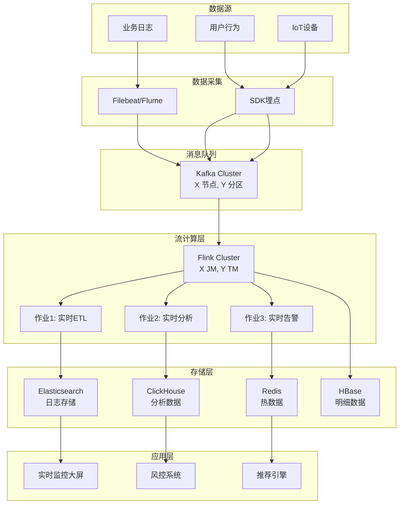

# 生产案例：{案例名称}

> 所属行业：{行业} | 公司规模：{规模} | 提交日期：{日期}
>
> 关键词：{关键词1}, {关键词2}, {关键词3}

---

## 1. 背景介绍

### 1.1 公司/行业背景

简要介绍公司所属行业、主要业务，以及面临的市场挑战。

### 1.2 业务场景

描述需要流计算技术解决的具体业务场景，包括：

- 业务痛点
- 原有方案及其局限性
- 引入流计算技术的动机

---

## 2. 系统规模

| 指标项 | 数值 | 说明 |
|--------|------|------|
| 峰值吞吐量 | X 万条/秒 | 描述场景 |
| 日处理数据量 | X TB | 原始/清洗后 |
| 集群节点数 | X 个 | JobManager/TaskManager 分布 |
| 并发作业数 | X 个 | 生产环境运行中的作业 |
| 端到端延迟 | < X ms | 从数据源到消费端 |
| 状态大小 | X GB | 全量状态数据 |

---

## 3. 技术架构

### 3.1 整体架构图



### 3.2 技术选型

| 组件 | 选型 | 版本 | 选型理由 |
|------|------|------|----------|
| 流计算引擎 | Flink | X.X.X | 特性匹配度、社区活跃度 |
| 消息队列 | Kafka | X.X.X | 吞吐量、生态兼容性 |
| 资源调度 | Kubernetes/YARN | - | 运维成熟度 |
| 状态后端 | RocksDB/Heap | - | 状态大小、性能需求 |
| 检查点存储 | HDFS/S3 | - | 可靠性、成本 |
| 监控告警 | Prometheus+Grafana | - | 生态完善度 |

### 3.3 关键配置

```yaml
# Flink 集群关键配置示例
flink-conf.yaml:
  jobmanager.memory.process.size: 2048m
  taskmanager.memory.process.size: 8192m
  taskmanager.numberOfTaskSlots: 4
  state.backend: rocksdb
  state.backend.incremental: true
  execution.checkpointing.interval: 60s
  execution.checkpointing.min-pause: 30s
```

---

## 4. 挑战与解决方案

### 4.1 挑战一：{挑战描述}

**问题现象**

- 具体表现
- 影响范围
- 发生频率

**根因分析**

- 技术层面的根本原因
- 业务层面的触发条件

**解决方案**

```java
// 关键代码或配置示例
```

**效果验证**

- 优化前后的指标对比
- 长期稳定性表现

### 4.2 挑战二：{挑战描述}

（同上结构）

### 4.3 挑战三：{挑战描述}

（同上结构）

---

## 5. 项目成果

### 5.1 技术指标

| 指标 | 优化前 | 优化后 | 提升幅度 |
|------|--------|--------|----------|
| 端到端延迟 | X ms | Y ms | Z% |
| 系统吞吐量 | X 万/秒 | Y 万/秒 | Z% |
| 故障恢复时间 | X 分钟 | Y 秒 | Z% |
| 资源利用率 | X% | Y% | Z% |
| 数据准确性 | X% | Y% | Z% |

### 5.2 业务价值

- **效率提升**：XX 业务流程处理时间缩短 XX%
- **成本节约**：年度 IT 基础设施成本降低 XX 万元
- **收入增长**：实时推荐带来的转化率提升 XX%
- **风险降低**：风控响应时间从分钟级降至秒级

---

## 6. 经验总结

### 6.1 最佳实践

1. **架构设计**
   - 建议 1
   - 建议 2

2. **开发规范**
   - 建议 1
   - 建议 2

3. **运维经验**
   - 建议 1
   - 建议 2

### 6.2 踩坑记录

| 问题 | 原因 | 解决方案 |
|------|------|----------|
| 问题1 | 原因1 | 方案1 |
| 问题2 | 原因2 | 方案2 |

### 6.3 给新手的建议

- 建议内容...

---

## 7. 后续规划

- 短期优化方向（3个月内）
- 中期演进计划（半年内）
- 长期技术愿景（1年以上）

---

## 8. 参考资源

- 相关技术文档链接
- 社区讨论帖子
- 参考书籍/论文

---

## 附录

### A. 术语表

| 术语 | 解释 |
|------|------|
| 术语1 | 解释1 |
| 术语2 | 解释2 |

### B. 团队介绍（可选）

- 团队规模
- 技术栈背景
- 联系方式

---

> 本案例由 {公司名} 团队提交
>
> 如有问题或建议，欢迎通过 Issue 或邮件联系
