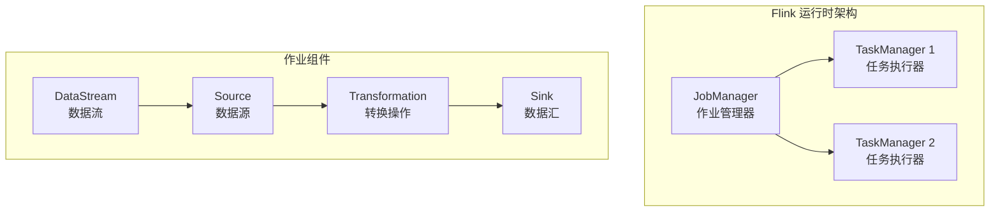
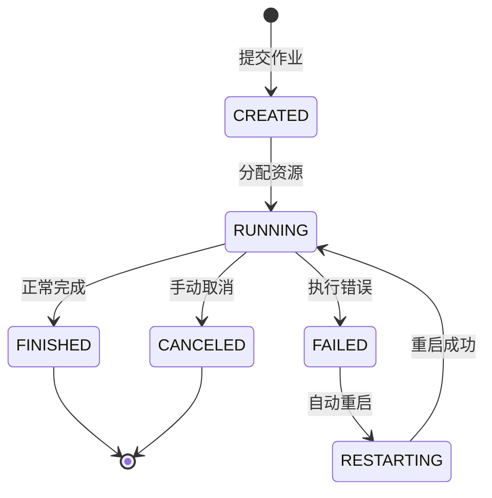
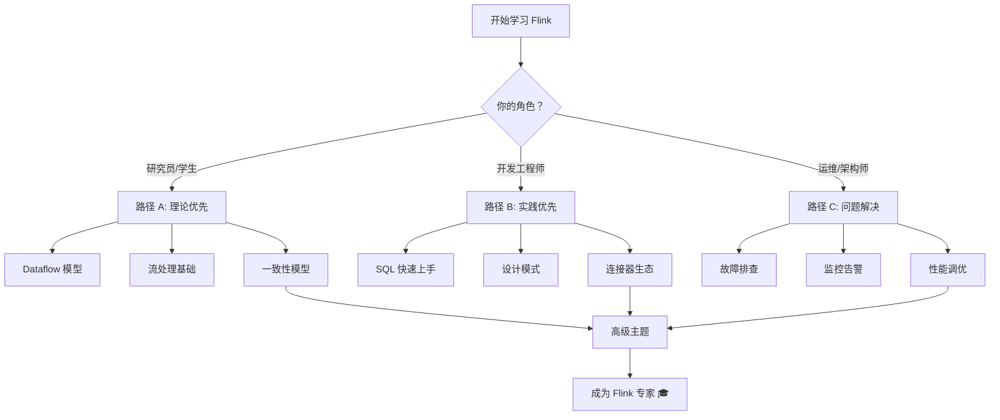

# 🚀 Flink 5分钟快速入门

> 所属阶段: tutorials | 前置依赖: 无 | 形式化等级: L1

---

## 目录

- [🎯 5分钟极简入门](#-5分钟极简入门) - Docker 一键体验
- [📚 15分钟完整体验](#-15分钟完整体验) - 本地安装实践
- [🔧 常见错误速查](#-常见错误速查) - 问题快速解决
- [🛤️ 下一步指引](#下一步指引) - 继续学习路径

---

## 🎯 5分钟极简入门

> 适合人群：想快速体验 Flink 的功能，无需任何安装

### 准备工作

确保已安装 Docker：

```bash
# 检查 Docker 版本
docker --version
```

**预期输出：**
```
Docker version 24.0.0, build abc123
```

### 步骤 1：启动 Flink 容器（1分钟）⚡

```bash
# 拉取并启动 Flink 1.18 本地集群
docker run -d \
  --name flink-quickstart \
  -p 8081:8081 \
  -p 8082:8082 \
  apache/flink:1.18.0-scala_2.12-java11 \
  jobmanager
```

**预期输出：**
```
Unable to find image 'apache/flink:1.18.0-scala_2.12-java11' locally
1.18.0-scala_2.12-java11: Pulling from apache/flink
...
Status: Downloaded newer image for apache/flink:1.18.0-scala_2.12-java11
abc123def456...
```

等待容器启动：

```bash
# 查看容器状态
docker ps
```

**预期输出：**
```
CONTAINER ID   IMAGE                                     STATUS          PORTS
abc123def456   apache/flink:1.18.0-scala_2.12-java11   Up 10 seconds   0.0.0.0:8081->8081/tcp
```

### 步骤 2：运行第一个 SQL 查询（2分钟）📝

进入容器并启动 SQL CLI：

```bash
# 进入 Flink 容器
docker exec -it flink-quickstart /bin/bash

# 启动 SQL Client
./bin/sql-client.sh
```

**预期输出：**
```
                                   ▒▓██▓██▒
                               ▓████▒▒█▓▒▓███▓▒
                            ▓███▓░░        ▒▒▒▓██▒  ▒
                          ░██▒   ▒▒▓▓█▓▓▒░      ▒████
                          ██▒         ░▒▓███▒    ▒█▒█▒
                          ▓█                █▓   ▒█▒▒█▒
                           █▓               ██▒  █▓░█▓
                            ▓█▓▓            █▓  █▓ ▓█
                              █▓██▓░        ▓█▒█▓ █▓
                                ▓████▒      ██▓▒▒█▒
                                   ████▒   ▒█▓█▓██▓
                                      ░██████▓░

    ████████▓  ███▓    ▓███▓█▓    ████▓  ███▓    ▓███▓█▓
    ██▒    ██▒ ██▓██▓▒███▓ ██▒   ██▓   ██▓██▓▒███▓ ██▒
    ████████▓  ██▓  ▓██▒   █████▓█▓    ██▓  ▓██▒   █████▓█▓
    ██▒        ██▓       ▓██▒  █▓██▒   ██▓       ▓██▒  █▓██▒
    ██▓        ██▓       ▓██▓  █▓██▓   ██▓       ▓██▓  █▓██▓

    [INFO] Flink SQL Client initialized.
    [INFO] Current context: default
Flink SQL>
```

创建表并插入数据：

```sql
-- 创建示例表
CREATE TABLE user_events (
    user_id STRING,
    event_type STRING,
    event_time TIMESTAMP(3)
) WITH (
    'connector' = 'datagen',
    'rows-per-second' = '10'
);
```

**预期输出：**
```
[INFO] Execute statement succeed.
```

运行查询：

```sql
-- 按事件类型统计（持续10秒后按 Ctrl+C 停止）
SELECT event_type, COUNT(*) as cnt
FROM user_events
GROUP BY event_type;
```

**预期输出：**
```
+------------+----------------------+
| event_type |                  cnt |
+------------+----------------------+
|       click|                   42 |
|      scroll|                   38 |
|      search|                   20 |
+------------+----------------------+
Received a total of 3 rows
```

退出 SQL Client：

```sql
EXIT;
```

### 步骤 3：查看 Web UI（2分钟）🌐

打开浏览器访问：

```
http://localhost:8081
```

**Web UI 预期显示：**

> 📸 **Flink Web UI 概览**
> 
> 你应该看到：
> - 🟢 绿色的 JobManager 状态
> - 📊 Overview 面板显示集群资源
> - 📁 已完成的 Jobs 列表

**关键功能快速浏览：**

| 菜单项 | 功能说明 |
|--------|----------|
| Overview | 集群概览和关键指标 |
| Jobs | 作业管理（运行中/已完成/已取消） |
| Task Managers | TaskManager 节点状态 |
| Job Manager | JobManager 配置和日志 |

**查看运行完成的作业：**

点击左侧菜单 **Jobs → Completed Jobs**，你应该看到刚才运行的 SQL 查询作业。

> 📸 **已完成作业列表预览**

### 🧹 清理资源

```bash
# 停止并删除容器
docker stop flink-quickstart
docker rm flink-quickstart
```

**预期输出：**
```
flink-quickstart
flink-quickstart
```

---

## 📚 15分钟完整体验

> 适合人群：想深入了解 Flink 并在本地开发的用户

### 步骤 1：下载并安装 Flink（3分钟）⬇️

**macOS/Linux：**

```bash
# 下载 Flink 1.18.0
curl -LO https://archive.apache.org/dist/flink/flink-1.18.0/flink-1.18.0-bin-scala_2.12.tgz

# 解压
tar -xzf flink-1.18.0-bin-scala_2.12.tgz

# 进入目录
cd flink-1.18.0
```

**Windows（PowerShell）：**

```powershell
# 下载 Flink 1.18.0
Invoke-WebRequest -Uri https://archive.apache.org/dist/flink/flink-1.18.0/flink-1.18.0-bin-scala_2.12.tgz -OutFile flink-1.18.0-bin-scala_2.12.tgz

# 解压（需要 tar，或安装 7-Zip）
tar -xzf flink-1.18.0-bin-scala_2.12.tgz
cd flink-1.18.0
```

**验证安装：**

```bash
# 检查版本
./bin/flink --version
```

**预期输出：**
```
Version: 1.18.0, Commit ID: abc123
```

### 步骤 2：启动本地集群（2分钟）▶️

```bash
# 启动集群
./bin/start-cluster.sh
```

**Windows：**

```powershell
.\bin\start-cluster.bat
```

**预期输出：**
```
Starting cluster.
Starting standalonesession daemon on host localhost.
Starting taskexecutor daemon on host localhost.
```

验证集群状态：

```bash
# 检查进程
jps
```

**预期输出：**
```
12345 StandaloneSessionClusterEntrypoint
12346 TaskManagerRunner
```

打开 Web UI 确认：

```
http://localhost:8081
```

> 📸 **本地集群运行状态**
> 
> 你应该看到：
> - 🟢 绿色的 JobManager 和 TaskManager 状态
> - 📊 Available Task Slots 显示可用资源
> - 📈 集群负载和内存使用情况

### 步骤 3：运行 WordCount 示例（5分钟）📝

**准备输入数据：**

```bash
# 创建输入目录
mkdir -p /tmp/flink-input

# 创建示例文本文件
cat > /tmp/flink-input/input.txt << 'EOF'
hello flink
hello world
flink is awesome
streaming is powerful
hello flink streaming
EOF
```

**运行 WordCount 作业：**

```bash
# 提交 WordCount 作业
./bin/flink run \
  ./examples/batch/WordCount.jar \
  --input /tmp/flink-input/input.txt \
  --output /tmp/flink-output/result.txt
```

**预期输出：**
```
Job has been submitted with JobID: a1b2c3d4-e5f6-7890-abcd-ef1234567890

Program execution finished
Job with JobID a1b2c3d4-e5f6-7890-abcd-ef1234567890 has finished.
Job Runtime: 1234 ms
```

**查看结果：**

```bash
# 查看输出
cat /tmp/flink-output/result.txt
```

**预期输出：**
```
awesome 1
flink 3
hello 3
is 2
powerful 1
streaming 2
world 1
```

**Web UI 查看作业详情：**

点击 Job ID 查看详细执行信息：

> 📸 **WordCount 作业详情**
> 
> 在 Job Detail 页面你应该看到：
> - 📋 作业基本信息（Job ID、状态、启动时间）
> - 📊 作业执行图（Execution Graph）
> - 📈 各算子的执行统计（记录数、字节数）

### 步骤 4：理解基本概念（5分钟）💡

#### 核心概念图解



#### 关键术语速查表

| 术语 | 含义 | 类比 |
|------|------|------|
| **JobManager** | 集群大脑，协调作业执行 | 项目经理 |
| **TaskManager** | 工作节点，执行具体任务 | 工人 |
| **Slot** | TaskManager 的资源单元 | 工位 |
| **DataStream** | 无界数据流抽象 | 传送带 |
| **Transformation** | 数据转换操作 | 加工工序 |
| **Source** | 数据源 | 原料入口 |
| **Sink** | 数据输出 | 成品出口 |
| **Checkpoint** | 容错检查点 | 存档点 |
| **Watermark** | 时间进度标记 | 进度条 |

#### 作业生命周期



### 步骤 5：停止集群

```bash
# 停止本地集群
./bin/stop-cluster.sh
```

**Windows：**

```powershell
.\bin\stop-cluster.bat
```

---

## 🔧 常见错误速查

### ❌ 端口冲突

**症状：**
```
java.net.BindException: Address already in use: bind
```

**诊断：**

```bash
# 检查 8081 端口占用（macOS/Linux）
lsof -i :8081

# Windows
netstat -ano | findstr :8081
```

**解决方案：**

```bash
# 方法 1：修改 Flink 配置
echo "rest.port: 8082" >> conf/flink-conf.yaml

# 方法 2：终止占用进程
# macOS/Linux
kill -9 <PID>

# Windows
taskkill /PID <PID> /F

# 方法 3：Docker 用户指定其他端口
docker run -p 8082:8081 apache/flink:1.18.0-scala_2.12-java11 jobmanager
```

---

### ❌ 内存不足

**症状：**
```
java.lang.OutOfMemoryError: Java heap space
```

**诊断：**

```bash
# 检查当前 JVM 内存设置
grep "jobmanager.memory" conf/flink-conf.yaml
grep "taskmanager.memory" conf/flink-conf.yaml
```

**解决方案：**

编辑 `conf/flink-conf.yaml`：

```yaml
# 减少内存配置（适合开发环境）
jobmanager.memory.process.size: 512m
taskmanager.memory.process.size: 1024m
taskmanager.numberOfTaskSlots: 1
```

或设置环境变量：

```bash
# macOS/Linux
export FLINK_ENV_JAVA_OPTS="-Xmx512m"

# Windows
set FLINK_ENV_JAVA_OPTS=-Xmx512m
```

---

### ❌ 依赖问题

**症状：**
```
ClassNotFoundException: org.apache.flink...
```

**诊断：**

```bash
# 检查 Flink 版本
./bin/flink --version

# 检查 Scala 版本
cat lib/flink-scala* | head -1
```

**解决方案：**

| 问题类型 | 解决方案 |
|----------|----------|
| Scala 版本不匹配 | 下载正确 Scala 版本的 Flink |
| 缺少连接器 | 将 JAR 放入 `lib/` 目录 |
| 用户代码依赖冲突 | 使用 `provided` 范围打包 |

**示例：添加 Kafka 连接器**

```bash
# 下载 Kafka 连接器
cd lib
curl -O https://repo.maven.apache.org/maven2/org/apache/flink/flink-connector-kafka/3.0.1-1.18/flink-connector-kafka-3.0.1-1.18.jar
cd ..

# 重启集群
./bin/stop-cluster.sh
./bin/start-cluster.sh
```

---

### ❌ 权限问题（Linux/macOS）

**症状：**
```
bash: ./bin/start-cluster.sh: Permission denied
```

**解决方案：**

```bash
# 添加执行权限
chmod +x bin/*.sh
```

---

### ❌ Docker 容器启动失败

**症状：**
```
Error: Could not find or load main class org.apache.flink...
```

**诊断：**

```bash
# 查看容器日志
docker logs flink-quickstart

# 检查镜像完整性
docker images | grep flink
```

**解决方案：**

```bash
# 清理并重新拉取
docker rm -f flink-quickstart
docker rmi apache/flink:1.18.0-scala_2.12-java11
docker run -d --name flink-quickstart -p 8081:8081 apache/flink:1.18.0-scala_2.12-java11 jobmanager
```

---

## 🛤️ 下一步指引

### 📖 推荐阅读顺序

根据你的背景和目标选择学习路径：

#### 路径 A：理论基础优先

适合：学术研究者、架构师

```
1. 📘 Struct/1.0-dataflow-theory.md      → 理解 Dataflow 模型
2. 📘 Struct/1.1-stream-processing.md   → 掌握流处理基础
3. 📗 Knowledge/2.0-architecture.md     → 架构设计模式
4. 📙 Flink/3.0-flink-runtime.md        → Flink 运行时机制
5. 📙 Flink/3.2-checkpoint-watermark.md → 容错与时间管理
```

#### 路径 B：实践导向优先

适合：工程师、开发者

```
1. 📙 Flink/3.1-flink-sql-guide.md      → 快速上手 SQL
2. 📗 Knowledge/2.1-design-patterns.md  → 常用设计模式
3. 📙 Flink/3.3-connector-ecosystem.md  → 连接器使用
4. 📗 Knowledge/2.2-production-case.md  → 生产实践
5. 📘 Struct/1.3-latency-throughput.md  → 深入性能原理
```

#### 路径 C：问题解决导向

适合：运维工程师、技术支持

```
1. 📙 Flink/3.4-troubleshooting.md      → 故障排查
2. 📗 Knowledge/2.3-monitoring.md       → 监控告警
3. 📗 Knowledge/2.4-tuning-guide.md     → 性能调优
4. 📙 Flink/3.5-deployment-guide.md     → 部署方案
5. 📘 Struct/1.4-consistency-model.md   → 一致性保障
```

### 🗺️ 学习路径选择决策树



### 👥 社区加入方式

#### 官方渠道

| 渠道 | 链接 | 说明 |
|------|------|------|
| 🌐 官网 | https://flink.apache.org | 文档、下载、博客 |
| 📧 邮件列表 | user@flink.apache.org | 用户问题讨论 |
| 💬 Slack | https://apache-flink.slack.com | 实时交流 |
| 🐦 Twitter/X | @ApacheFlink | 官方动态 |
| 🐙 GitHub | apache/flink | 源码、Issue |

#### 中文社区

| 渠道 | 链接/搜索方式 | 说明 |
|------|---------------|------|
| 🇨🇳 Flink 中文社区 | 搜索"Flink 中文社区" | 微信公众号 |
| 📺 Bilibili | @Flink中文社区 | 视频教程 |
| 📚 知乎 | 话题"Apache Flink" | 技术文章 |
| 🏠 Flink Forward Asia | https://flink-forward.org.cn | 年度大会 |

#### 学习资源

**官方文档：**
- 📖 [Flink 官方文档](https://nightlies.apache.org/flink/flink-docs-stable/)
- 🎓 [Flink 训练课程](https://nightlies.apache.org/flink/flink-docs-stable/docs/try-flink/local_installation/)

**推荐书籍：**
- 📚 《Streaming Systems》 - Tyler Akidau
- 📚 《Flink 基础教程》 - 崔星灿
- 📚 《实时计算：Apache Flink 实践》

**实践平台：**
- 🖥️ [Flink Playground](https://github.com/apache/flink-playgrounds)
- ☁️ [Ververica Platform](https://ververica.com/)（企业版）

---

## ✅ 快速检查清单

完成本教程后，确认以下检查项：

### Docker 快速体验
- [ ] Docker 已安装并能正常运行
- [ ] Flink 容器成功启动
- [ ] Web UI 可访问 (http://localhost:8081)
- [ ] SQL 查询成功执行
- [ ] 资源已清理（容器已删除）

### 本地安装体验
- [ ] Flink 下载并解压成功
- [ ] 本地集群正常启动
- [ ] jps 命令显示 StandaloneSessionClusterEntrypoint 和 TaskManagerRunner
- [ ] WordCount 作业运行成功
- [ ] 输出结果正确显示词频统计
- [ ] 集群正常停止

---

## 📞 需要帮助？

如果在快速入门过程中遇到问题：

1. 🔍 **搜索错误信息** - 大多数问题已有解决方案
2. 📖 **查阅 FAQ** - 见 `FAQ.md` 文件
3. 🐛 **提交 Issue** - 在 GitHub 上详细描述问题
4. 💬 **社区求助** - 在 Slack 或邮件列表提问

---

## 📚 引用参考

[^1]: Apache Flink Documentation, "Local Installation", 2024. https://nightlies.apache.org/flink/flink-docs-stable/docs/try-flink/local_installation/
[^2]: Apache Flink, "Docker Setup", 2024. https://nightlies.apache.org/flink/flink-docs-stable/docs/deployment/resource-providers/standalone/docker/
[^3]: T. Akidau et al., "Streaming Systems", O'Reilly Media, 2018.
[^4]: Apache Flink, "SQL Getting Started", 2024. https://nightlies.apache.org/flink/flink-docs-stable/docs/dev/table/sql/gettingstarted/

---

*最后更新：2026-04-04 | 版本：v1.0 | 预计阅读时间：15分钟*
