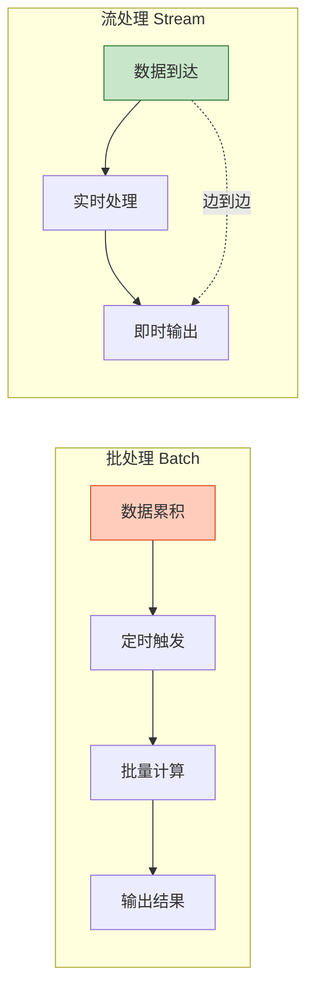
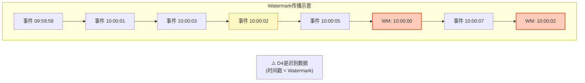
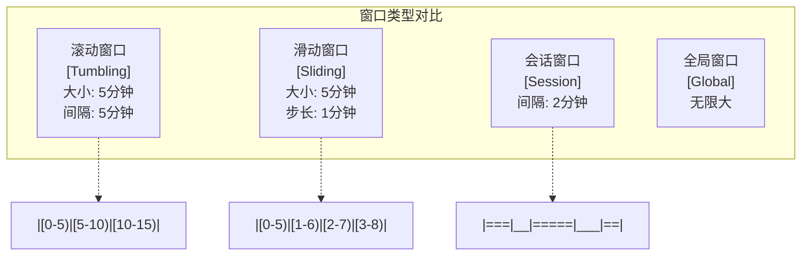
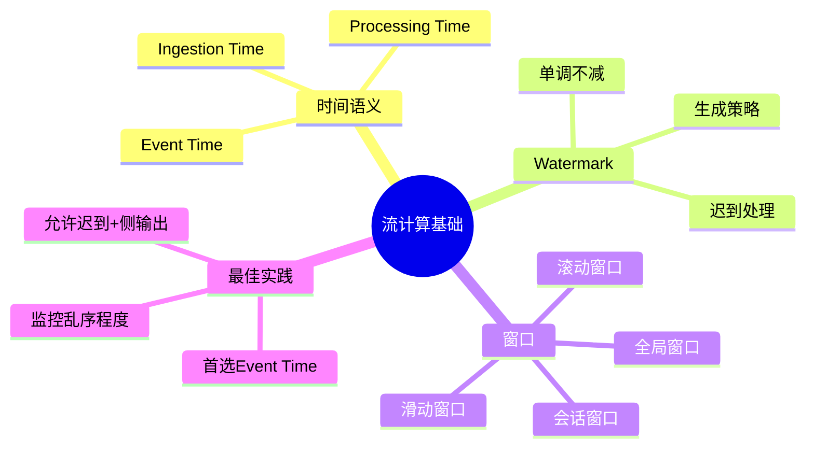

```mermaid
gantt
    title 三种时间对比示例
    dateFormat X
    axisFormat %s

    section 事件时间
    用户点击事件    :event1, 0, 1s
    网络延迟        :delay, after event1, 5s

    section 摄入时间
    数据到达Kafka   :ingest, 5, 1s
    Flink Source读取 :source, 6, 1s

    section 处理时间
    Window算子处理  :process, 6, 2s
    输出结果        :output, 8, 1s
```

# 视频教程脚本 02：流计算基础

> **视频标题**: 流计算基础——时间语义、Watermark与窗口
> **目标受众**: 流计算初学者、Flink开发者
> **视频时长**: 15分钟
> **难度等级**: L2-L3 (基础到进阶)

---

## 📋 脚本概览

| 章节 | 时间戳 | 时长 | 内容要点 |
|------|--------|------|----------|
| 开场 | 00:00-00:45 | 45秒 | 批处理 vs 流处理对比 |
| 时间语义 | 00:45-04:00 | 3分15秒 | 三种时间概念详解 |
| Watermark | 04:00-08:30 | 4分30秒 | Watermark原理与生成策略 |
| 窗口机制 | 08:30-12:00 | 3分30秒 | 窗口类型与触发器 |
| 代码实战 | 12:00-14:00 | 2分钟 | 完整代码演示 |
| 总结 | 14:00-15:00 | 1分钟 | 要点回顾 |

---

## 分镜 1: 开场 - 批处理 vs 流处理 (00:00-00:45)

### 🎬 画面描述

- **镜头**: 左右分屏对比
- **左侧**: 批处理示意图（堆积处理）
- **右侧**: 流处理示意图（实时流动）
- **动画**: 数据流动的粒子效果

### 🎤 讲解文字

```
【00:00-00:20】
大家好！欢迎来到第二集：流计算基础。

在深入流计算之前，我们先回答一个根本问题：
流处理和传统的批处理，到底有什么区别？

【00:20-00:45】
批处理就像是一车一车地运货：
先把数据累积起来，凑满一车再统一处理。
优点是吞吐量大，缺点是延迟高。

流处理则是实时流动：
数据产生一条，处理一条。
优点是延迟低，缺点是系统更复杂。

而在流计算中，最核心也最复杂的概念，
就是「时间」。
```

### 📊 图表展示



### 💻 代码演示

```java

import org.apache.flink.streaming.api.datastream.DataStream;
import org.apache.flink.streaming.api.windowing.time.Time;

// 批处理示例 (Spark)
Dataset<Row> batch = spark.read().parquet("/data/logs");
batch.groupBy("user_id").count().show();

// 流处理示例 (Flink)
DataStream<Event> stream = env
    .addSource(new KafkaSource<>())
    .keyBy(Event::getUserId)
    .window(TumblingEventTimeWindows.of(Time.minutes(1)))
    .aggregate(new CountAggregate());
```

---

## 分镜 2: 时间语义详解 (00:45-04:00)

### 🎬 画面描述

- **镜头**: 时间轴动画演示
- **三条时间线**: Event Time、Ingestion Time、Processing Time
- **交互**: 鼠标悬停显示详细说明

### 🎤 讲解文字

```
【00:45-01:30】
在流计算中，有三种不同的时间概念。
理解它们的区别，是掌握流计算的第一步。

第一条时间线是「事件时间」(Event Time)。
这是数据本身携带的时间戳，
表示事件真实发生的时间。
比如用户点击按钮的那一刻，传感器采集数据的那一刻。

【01:30-02:15】
第二条时间线是「摄入时间」(Ingestion Time)。
这是数据进入流处理系统的时间。
对于Flink来说，就是数据进入Source算子的时间。

第三条时间线是「处理时间」(Processing Time)。
这是算子执行计算时的本地系统时间。
不同的机器、不同的线程，处理时间都可能不同。

【02:15-04:00】
为什么要区分这三种时间？
因为现实中，数据往往是乱序到达的。

想象一个移动App的场景：
用户在地铁上点击了一个商品，
但由于网络不好，这条数据延迟了5分钟才发送到服务器。

如果我们使用处理时间，
这个点击就会被算入5分钟后的统计窗口，
这显然不符合业务逻辑。

因此，正确的做法是使用事件时间，
即使数据迟到，也能被正确地分配到对应的窗口中。
```

### 📊 图表展示



### 💻 代码演示

```java

import org.apache.flink.streaming.api.environment.StreamExecutionEnvironment;

// Flink 时间语义配置
StreamExecutionEnvironment env =
    StreamExecutionEnvironment.getExecutionEnvironment();

// 1. 事件时间 (推荐用于生产)
// 使用WatermarkStrategy替代已弃用的setStreamTimeCharacteristic
env.getConfig().setAutoWatermarkInterval(200);
// 2. 摄入时间
env.setStreamTimeCharacteristic(TimeCharacteristic.IngestionTime);

// 3. 处理时间 (最简单但不够准确)
env.setStreamTimeCharacteristic(TimeCharacteristic.ProcessingTime);
```

---

## 分镜 3: Watermark机制 (04:00-08:30)

### 🎬 画面描述

- **镜头**: Watermark传播动画
- **重点**: 展示Watermark如何推动事件时间前进
- **标注**: 迟到数据的处理逻辑

### 🎤 讲解文字

```
【04:00-05:00】
使用事件时间带来了一个挑战：
我们如何知道某个时间窗口的数据已经全部到达？

答案是：Watermark（水位线）。

Watermark 是一种特殊的数据标记，
它表示「所有时间戳小于Watermark的事件都已经到达」。

【05:00-06:00】
来看一个具体的例子。
假设我们的Watermark是「当前最大事件时间减去5秒」。

当Watermark推进到10:00:05时，
系统就认为10:00:00之前的数据都已经到齐，
可以触发10:00:00窗口的计算了。

如果这时候又来了一条10:00:03的数据，
它就是「迟到数据」，需要特殊处理。

【06:00-07:30】
Watermark 有一个重要性质：单调不减。
也就是说，Watermark只能前进，不能后退。
这是保证结果确定性的关键。

在 Flink 中，Watermark 的生成策略主要有三种：

1. 单调递增：适用于数据基本有序的场景
2. 固定延迟：适用于数据有一定乱序的场景
3. 自定义：根据业务特点定制生成逻辑

【07:30-08:30】
选择合适的延迟时间很重要：
延迟太短，会漏掉很多数据；
延迟太长，会增加结果延迟。

一般建议从监控数据的乱序程度开始，
根据业务可容忍的延迟来调优。
```

### 📊 图表展示



### 💻 代码演示

```java

import org.apache.flink.streaming.api.datastream.DataStream;

// Watermark 生成策略

// 1. 单调递增 (无乱序)
WatermarkStrategy.<MyEvent>forMonotonousTimestamps()
    .withIdleness(Duration.ofMinutes(1));

// 2. 固定延迟 (允许5秒乱序)
WatermarkStrategy.<MyEvent>forBoundedOutOfOrderness(
    Duration.ofSeconds(5)
);

// 3. 自定义策略
WatermarkStrategy.<MyEvent>forGenerator(
    ctx -> new WatermarkGenerator<MyEvent>() {
        private long maxTimestamp = Long.MIN_VALUE;

        @Override
        public void onEvent(MyEvent event, long timestamp, WatermarkOutput output) {
            maxTimestamp = Math.max(maxTimestamp, timestamp);
        }

        @Override
        public void onPeriodicEmit(WatermarkOutput output) {
            // 生成 Watermark，延迟3秒
            output.emitWatermark(new Watermark(maxTimestamp - 3000));
        }
    }
);

// 应用到数据流
DataStream<MyEvent> withWatermarks = stream
    .assignTimestampsAndWatermarks(
        WatermarkStrategy
            .<MyEvent>forBoundedOutOfOrderness(Duration.ofSeconds(5))
            .withTimestampAssigner((event, timestamp) -> event.getEventTime())
    );
```

---

## 分镜 4: 窗口机制 (08:30-12:00)

### 🎬 画面描述

- **镜头**: 四种窗口类型的可视化对比
- **动画**: 数据落入不同窗口的过程
- **分屏**: 滚动窗口 vs 滑动窗口 vs 会话窗口

### 🎤 讲解文字

```
【08:30-09:30】
窗口是流计算中「无界到有界」的核心抽象。
无限的数据流被切分成一个个有限的数据块，
每个数据块就是一个窗口。

Flink 提供了四种类型的窗口：

1. 滚动窗口 (Tumbling Window)
   固定大小，不重叠，无间隙。
   适合：按小时、按天的统计

2. 滑动窗口 (Sliding Window)
   固定大小，可重叠，有滑动步长。
   适合：最近N分钟的移动平均

3. 会话窗口 (Session Window)
   动态大小，根据活动间隙划分。
   适合：用户行为分析

4. 全局窗口 (Global Window)
   只有一个窗口，永不触发，需自定义触发器。
   适合：自定义触发逻辑

【09:30-10:30】
窗口的生命周期有三个关键阶段：

1. 分配 (Assign)
   决定每条数据属于哪个窗口

2. 触发 (Trigger)
   决定何时计算窗口结果

3. 驱逐 (Evict)
   决定何时清除窗口状态

默认情况下，当Watermark超过窗口结束时间时触发计算，
计算完成后清除状态。

【10:30-12:00】
对于迟到数据的处理，Flink提供了几种策略：

1. 丢弃 (默认)：简单但可能丢失数据
2. 允许迟到：设置allowedLateness，延长窗口生命周期
3. 侧输出：将迟到数据发送到单独的流

在生产环境中，建议组合使用允许迟到和侧输出，
既能保证结果准确性，又能监控迟到情况。
```

### 📊 图表展示



### 💻 代码演示

```java

import org.apache.flink.streaming.api.datastream.DataStream;
import org.apache.flink.streaming.api.windowing.time.Time;

// 窗口定义示例

// 1. 滚动窗口 - 每5分钟统计一次
stream
    .keyBy(Event::getUserId)
    .window(TumblingEventTimeWindows.of(Time.minutes(5)))
    .aggregate(new CountAggregate());

// 2. 滑动窗口 - 每1分钟计算最近5分钟的数据
stream
    .keyBy(Event::getUserId)
    .window(SlidingEventTimeWindows.of(
        Time.minutes(5),    // 窗口大小
        Time.minutes(1)     // 滑动步长
    ))
    .aggregate(new AverageAggregate());

// 3. 会话窗口 - 用户活动间隔2分钟
stream
    .keyBy(Event::getUserId)
    .window(EventTimeSessionWindows.withGap(Time.minutes(2)))
    .aggregate(new SessionAnalysis());

// 4. 带迟到处理的窗口
OutputTag<Event> lateDataTag = new OutputTag<Event>("late-data"){};

stream
    .keyBy(Event::getUserId)
    .window(TumblingEventTimeWindows.of(Time.minutes(5)))
    .allowedLateness(Time.minutes(2))  // 允许2分钟迟到
    .sideOutputLateData(lateDataTag)    // 迟到数据侧输出
    .aggregate(new CountAggregate());

// 获取迟到数据流
DataStream<Event> lateData = result.getSideOutput(lateDataTag);
```

---

## 分镜 5: 代码实战 (12:00-14:00)

### 🎬 画面描述

- **镜头**: 完整代码演示，IDE全屏
- **分步骤**: 高亮当前讲解的代码段
- **终端**: 展示运行结果

### 🎤 讲解文字

```
【12:00-12:30】
现在让我们把这些概念整合起来，
看一个完整的流计算程序。

这个程序的目标是：
实时统计每分钟的PV（页面浏览量），
允许5秒的乱序，容忍2分钟的迟到数据。

【12:30-13:30】
代码分为几个部分：
1. 环境配置：设置并行度和时间语义
2. Source：从Kafka读取事件数据
3. Watermark分配：5秒延迟的Watermark策略
4. 窗口聚合：1分钟滚动窗口
5. Sink：输出到控制台

【13:30-14:00】
运行这个程序，我们可以看到：
- 正常到达的数据会被立即分配到对应窗口
- 乱序但未到Watermark的数据会被缓存
- 迟到但在allowedLateness范围内的数据会更新结果
- 严重迟到的数据会被发送到侧输出流
```

### 💻 完整代码演示

```java
import org.apache.flink.api.common.functions.AggregateFunction;

import org.apache.flink.streaming.api.environment.StreamExecutionEnvironment;
import org.apache.flink.streaming.api.windowing.time.Time;


public class PageViewAnalysis {
    public static void main(String[] args) throws Exception {
        // 1. 创建执行环境
        StreamExecutionEnvironment env =
            StreamExecutionEnvironment.getExecutionEnvironment();
        env.setParallelism(4);
        // 使用WatermarkStrategy替代已弃用的setStreamTimeCharacteristic
env.getConfig().setAutoWatermarkInterval(200);
        // 2. 定义迟到数据的侧输出标签
        final OutputTag<PageViewEvent> lateDataTag =
            new OutputTag<PageViewEvent>("late-data"){};

        // 3. 创建数据流并分配Watermark
        SingleOutputStreamOperator<PageView> result = env
            .addSource(new KafkaSource<PageViewEvent>() {
                // Kafka配置...
            })
            .assignTimestampsAndWatermarks(
                WatermarkStrategy
                    .<PageViewEvent>forBoundedOutOfOrderness(
                        Duration.ofSeconds(5)  // 允许5秒乱序
                    )
                    .withIdleness(Duration.ofMinutes(1))
                    .withTimestampAssigner(
                        (event, timestamp) -> event.getViewTime()
                    )
            )
            .keyBy(PageViewEvent::getPageId)
            .window(TumblingEventTimeWindows.of(Time.minutes(1)))
            .allowedLateness(Time.minutes(2))    // 允许2分钟迟到
            .sideOutputLateData(lateDataTag)      // 迟到数据侧输出
            .aggregate(new PageViewCounter(), new WindowResultFunction());

        // 4. 输出主结果
        result.print("PV统计");

        // 5. 输出迟到数据
        result.getSideOutput(lateDataTag)
              .print("迟到数据");

        env.execute("PageView Analysis");
    }
}

// 聚合函数
class PageViewCounter implements AggregateFunction<
    PageViewEvent, Long, Long> {

    @Override
    public Long createAccumulator() { return 0L; }

    @Override
    public Long add(PageViewEvent value, Long accumulator) {
        return accumulator + 1;
    }

    @Override
    public Long getResult(Long accumulator) { return accumulator; }

    @Override
    public Long merge(Long a, Long b) { return a + b; }
}
```

---

## 分镜 6: 总结 (14:00-15:00)

### 🎬 画面描述

- **镜头**: 思维导图总结
- **动画**: 逐条高亮关键要点
- **过渡**: 平滑切换到下一集预告

### 🎤 讲解文字

```
【14:00-14:45】
让我们回顾一下今天的重点：

1. 三种时间语义：
   - Event Time：事件真实发生时间（推荐）
   - Processing Time：处理时的本地时间
   - Ingestion Time：进入系统的时间

2. Watermark 机制：
   - 推动事件时间前进
   - 单调不减性质
   - 根据乱序程度选择生成策略

3. 窗口机制：
   - 滚动、滑动、会话、全局四种类型
   - 分配、触发、驱逐三阶段
   - 允许迟到 + 侧输出处理迟到数据

【14:45-15:00】
下一集，我们将进入实战环节：
「Flink快速上手：环境搭建与第一个程序」。
我会手把手带你搭建Flink开发环境，
编写并运行你的第一个流处理程序。

别忘了点赞收藏，我们下期再见！
```

### 📊 图表展示



---

## 📝 制作备注

### 关键视觉元素

- **时间轴**: 用不同颜色区分三种时间
  - Event Time: 蓝色 (#1976d2)
  - Processing Time: 绿色 (#388e3c)
  - Ingestion Time: 橙色 (#f57f17)

- **Watermark**: 用红色虚线表示，带有前进动画
- **窗口**: 用半透明矩形表示，不同窗口类型用不同填充模式

### 代码高亮重点

- 关键API调用需要高亮显示
- 参数值用不同颜色标注
- 注释要清晰解释每个部分的作用

### 音效提示

- `⏰` 时间相关概念
- `💧` Watermark出现
- `📊` 窗口聚合

---

## 🔗 相关文档

- [Knowledge/02-design-patterns/pattern-event-time-processing.md](../Knowledge/02-design-patterns/pattern-event-time-processing.md)
- [Knowledge/02-design-patterns/pattern-windowed-aggregation.md](../Knowledge/02-design-patterns/pattern-windowed-aggregation.md)
- [Flink/02-core/time-semantics-and-watermark.md](../Flink/02-core/time-semantics-and-watermark.md)

---

*脚本版本: v1.0*
*创建日期: 2026-04-03*
*预计制作时长: 15分钟*

