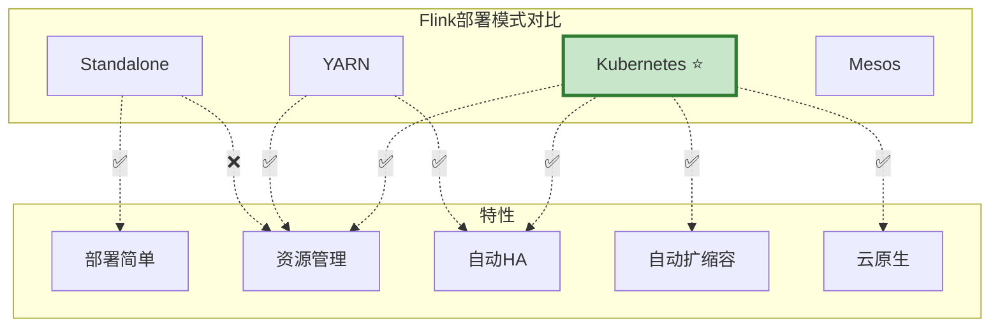
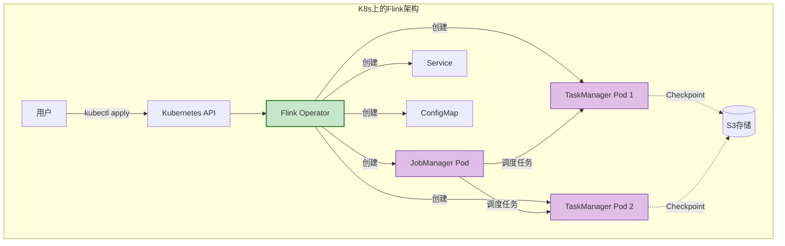
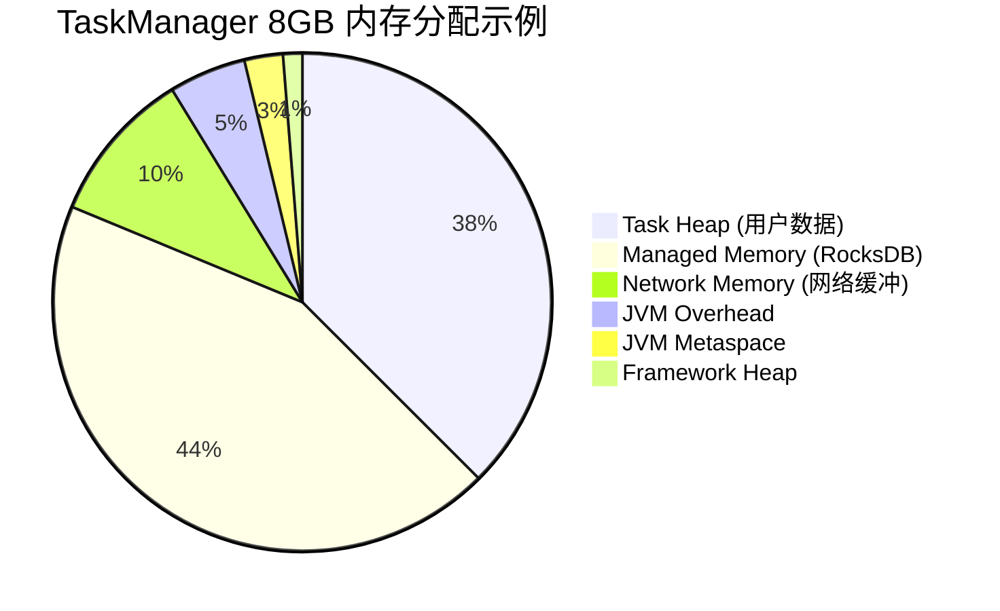

# 视频教程脚本 05：生产部署

> **视频标题**: 生产环境部署与监控配置
> **目标受众**: 运维工程师、DevOps、架构师
> **视频时长**: 20分钟
> **难度等级**: L3-L4 (进阶)

---

## 📋 脚本概览

| 章节 | 时间戳 | 时长 | 内容要点 |
|------|--------|------|----------|
| 开场 | 00:00-01:00 | 1分钟 | 生产环境挑战与部署模式 |
| K8s部署 | 01:00-06:00 | 5分钟 | Flink on K8s完整配置 |
| 资源配置 | 06:00-09:00 | 3分钟 | 内存、CPU、网络调优 |
| 高可用配置 | 09:00-12:00 | 3分钟 | HA与Checkpoint配置 |
| 监控体系 | 12:00-16:00 | 4分钟 | Prometheus + Grafana |
| 告警配置 | 16:00-18:00 | 2分钟 | 关键指标告警规则 |
| 运维实战 | 18:00-19:30 | 1分30秒 | 扩容、升级、故障处理 |
| 总结 | 19:30-20:00 | 30秒 | 生产检查清单 |

---

## 分镜 1: 开场 (00:00-01:00)

### 🎬 画面描述

- **镜头**: 生产环境架构全景图
- **对比**: 本地开发 vs 生产环境
- **高亮**: 生产环境的核心挑战

### 🎤 讲解文字

```
【00:00-00:30】
大家好！欢迎来到第五集：生产环境部署与监控配置。

前面的教程我们学习了Flink的开发基础和设计模式，
现在我们要把应用部署到生产环境。

生产环境与本地开发完全不同：
需要考虑高可用、容错、监控、扩缩容等一系列问题。

【00:30-01:00】
Flink支持多种部署模式：
- Standalone：独立集群，简单但无资源管理
- YARN：Hadoop生态，适合已有YARN集群
- Kubernetes：云原生首选，弹性扩缩容
- Mesos：逐渐被K8s取代

本集我们重点讲解Kubernetes部署，
这是目前最主流、最推荐的部署方式。
```

### 📊 图表展示



---

## 分镜 2: K8s部署 (01:00-06:00)

### 🎬 画面描述

- **镜头**: Kubernetes Dashboard录屏
- **分屏**: YAML配置和Kubectl命令
- **动画**: Pod创建和调度过程

### 🎤 讲解文字

```
【01:00-02:00】
首先，我们需要安装Flink Kubernetes Operator。

这是Apache Flink官方提供的K8s Operator，
它让我们可以用声明式的方式管理Flink作业。

安装步骤：
1. 安装cert-manager（用于Webhook证书）
2. 安装Flink Operator
3. 验证安装

【02:00-04:00】
安装完成后，我们就可以提交Flink作业了。

创建一个FlinkDeployment YAML文件，
定义作业的配置：
- 镜像地址
- 并行度
- 资源请求和限制
- Checkpoint配置
- 高可用配置

然后使用kubectl apply提交。

【04:00-05:00】
Flink Operator会：
1. 创建JobManager Pod
2. 创建TaskManager Pod
3. 配置Service和ConfigMap
4. 提交作业到集群

我们可以通过kubectl get pods查看Pod状态，
通过Flink Web UI查看作业运行状态。

【05:00-06:00】
FlinkDeployment是声明式的，
修改配置后重新apply，
Operator会自动完成升级或扩缩容。

这比传统的手动部署方式高效得多。
```

### 💻 代码演示

```yaml
# Flink Kubernetes Operator安装

# 1. 安装cert-manager
kubectl create -f https://github.com/jetstack/cert-manager/releases/download/v1.8.2/cert-manager.yaml

# 2. 等待cert-manager就绪
kubectl wait --for=condition=ready pod -l app=cert-manager -n cert-manager --timeout=120s

# 3. 安装Flink Operator
helm repo add flink-operator-repo https://downloads.apache.org/flink/flink-kubernetes-operator-1.7.0/
helm install flink-kubernetes-operator flink-operator-repo/flink-kubernetes-operator

# 4. 验证安装
kubectl get pods -n default
# NAME                                           READY   STATUS    RESTARTS   AGE
# flink-kubernetes-operator-5f8b9c7d4-x2k9p     1/1     Running   0          30s
```

```yaml
# FlinkDeployment示例 - wordcount.yaml
apiVersion: flink.apache.org/v1beta1
kind: FlinkDeployment
metadata: 
  name: wordcount-job
  namespace: default
spec: 
  image: flink:2.0.0-scala_2.12
  flinkVersion: v2.0
  mode: native

  jobManager: 
    resource: 
      memory: "2Gi"
      cpu: 1
    replicas: 1

  taskManager: 
    resource: 
      memory: "4Gi"
      cpu: 2
    replicas: 2

  job: 
    jarURI: local:///opt/flink/examples/streaming/WordCount.jar
    parallelism: 4
    upgradeMode: stateful
    state: running

  flinkConfiguration: 
    # Checkpoint配置
    execution.checkpointing.interval: "60s"
    execution.checkpointing.timeout: "600s"
    state.backend: rocksdb
    state.backend.incremental: "true"
    state.checkpoints.dir: s3p://flink-checkpoints/wordcount

    # 高可用配置
    high-availability: org.apache.flink.kubernetes.highavailability.KubernetesHaServicesFactory
    high-availability.storageDir: s3p://flink-ha/wordcount

    # 网络配置
    taskmanager.memory.network.fraction: "0.15"
    taskmanager.network.memory.buffer-debloat.enabled: "true"

    # JVM配置
    env.java.opts.taskmanager: "-XX:+UseG1GC -XX:MaxGCPauseMillis=100"
```

```bash
# 部署和验证

# 1. 提交作业
kubectl apply -f wordcount.yaml

# 2. 查看Pod状态
kubectl get pods -l app=wordcount-job

# 3. 查看作业详情
kubectl describe flinkdeployment wordcount-job

# 4. 查看日志
kubectl logs -f deployment/wordcount-job-taskmanager

# 5. 端口转发访问Web UI
kubectl port-forward svc/wordcount-job-rest 8081:80

# 6. 更新作业（修改配置后）
kubectl apply -f wordcount.yaml

# 7. 停止作业
kubectl delete flinkdeployment wordcount-job
```

### 📊 图表展示



---

## 分镜 3: 资源配置 (06:00-09:00)

### 🎬 画面描述

- **镜头**: 资源分配计算器界面
- **分屏**: 内存组成图和配置参数
- **高亮**: 关键配置项的最佳实践

### 🎤 讲解文字

```
【06:00-07:00】
正确的资源配置是Flink稳定运行的基础。

TaskManager内存主要由以下部分组成：
1. JVM Heap：用户代码、Flink运行时
2. Off-Heap Memory：网络缓冲区、RocksDB
3. JVM Metaspace：类元数据
4. JVM Overhead：栈空间、直接内存

【07:00-08:00】
内存配置的关键原则：

1. 总内存 = Framework Heap + Task Heap + Managed Memory + Network Memory + JVM Overhead

2. Framework Heap固定128MB，不需要调整

3. Task Heap用于用户代码和数据结构，
   建议占总内存的30-40%

4. Managed Memory用于RocksDB和排序，
   建议占总内存的40-50%

5. Network Memory用于数据传输，
   一般占总内存的10-15%

【08:00-09:00】
CPU配置相对简单：

- 根据并行度和算子复杂度决定
- 一般每个Slot分配1-2个vCPU
- 考虑CPU密集型算子（如复杂UDF）适当增加

网络调优主要关注：
- Buffer大小和数量
- Debloating机制
- Credit-based流控
```

### 💻 代码演示

```yaml
# TaskManager内存配置详解

spec: 
  taskManager: 
    resource: 
      memory: "8Gi"  # 总内存
      cpu: 2

    # 内存组件详细配置
    memory: 
      # 任务堆内存 - 用于用户代码和数据结构
      taskmanager.memory.task.heap.size: "3gb"

      # 托管内存 - 用于RocksDB状态后端和排序
      taskmanager.memory.managed.size: "4gb"
      taskmanager.memory.managed.fraction: "0.5"

      # 网络内存 - 用于数据传输
      taskmanager.memory.network.fraction: "0.15"
      taskmanager.memory.network.min: "512mb"
      taskmanager.memory.network.max: "1gb"

      # JVM元空间
      taskmanager.memory.jvm-metaspace.size: "256mb"

      # JVM开销
      taskmanager.memory.jvm-overhead.fraction: "0.1"
      taskmanager.memory.jvm-overhead.min: "256mb"
      taskmanager.memory.jvm-overhead.max: "512mb"

      # 框架堆内存（Flink内部使用）
      taskmanager.memory.framework.heap.size: "128mb"
      taskmanager.memory.framework.off-heap.size: "128mb"

---

# RocksDB调优配置

spec: 
  flinkConfiguration: 
    # 状态后端
    state.backend: rocksdb
    state.backend.incremental: "true"
    state.backend.rocksdb.predefined-options: FLASH_SSD_OPTIMIZED

    # RocksDB详细配置
    state.backend.rocksdb.memory.managed: "true"
    state.backend.rocksdb.memory.fixed-per-slot: "512mb"
    state.backend.rocksdb.memory.high-prio-pool-ratio: "0.1"

    # 线程配置
    state.backend.rocksdb.threads.threads-number: "4"
    state.backend.rocksdb.checkpoint.threads: "2"

    # TTL配置
    state.backend.rocksdb.compaction.style: LEVEL
    state.backend.rocksdb.files.open: "-1"
```

### 📊 图表展示



---

## 分镜 4: 高可用配置 (09:00-12:00)

### 🎬 画面描述

- **镜头**: HA架构图，主备切换动画
- **分屏**: Checkpoint和Journal配置
- **终端**: 模拟JM故障恢复过程

### 🎤 讲解文字

```
【09:00-10:00】
高可用(HA)是生产环境的基本要求。

Flink的HA机制：
1. 多个JobManager，一个Leader，其他Standby
2. Leader故障时，ZooKeeper触发选举
3. 新Leader从最近的Checkpoint恢复作业

K8s上推荐使用Kubernetes HA模式，
不需要额外部署ZooKeeper。

【10:00-11:00】
Checkpoint是HA的基础。

Checkpoint配置要点：
1. 存储路径：使用分布式存储（S3、HDFS）
2. 间隔：平衡容错和性能
3. 并发数：控制同时进行的最大Checkpoint数
4. 超时：考虑状态大小和网络

保存点(Savepoint)是手动触发的Checkpoint，
用于升级、迁移、A/B测试。

【11:00-12:00】
恢复策略决定了作业失败后的行为：

1. fixed-delay：固定延迟后重启
2. exponential-delay：指数退避重启
3. failure-rate：控制失败频率

生产环境建议使用exponential-delay，
避免频繁重启导致资源耗尽。
```

### 💻 代码演示

```yaml
# 高可用配置完整示例

apiVersion: flink.apache.org/v1beta1
kind: FlinkDeployment
metadata: 
  name: ha-flink-job
spec: 
  image: flink:2.0.0-scala_2.12
  flinkVersion: v2.0

  jobManager: 
    replicas: 3  # 3个JobManager实现HA
    resource: 
      memory: "2Gi"
      cpu: 1

  taskManager: 
    resource: 
      memory: "4Gi"
      cpu: 2
    replicas: 3

  flinkConfiguration: 
    # ========== Checkpoint配置 ==========
    execution.checkpointing.interval: "60s"
    execution.checkpointing.timeout: "600s"
    execution.checkpointing.min-pause-between-checkpoints: "30s"
    execution.checkpointing.max-concurrent-checkpoints: "1"
    execution.checkpointing.externalized-checkpoint-retention: RETAIN_ON_CANCELLATION

    # 启用Unaligned Checkpoint应对背压
    execution.checkpointing.unaligned.enabled: "true"
    execution.checkpointing.max-aligned-checkpoint-size: "1mb"

    # Checkpoint存储
    state.checkpoints.dir: s3p://flink-checkpoints/ha-job
    state.savepoints.dir: s3p://flink-savepoints/ha-job

    # ========== 状态后端配置 ==========
    state.backend: rocksdb
    state.backend.incremental: "true"
    state.backend.rocksdb.predefined-options: FLASH_SSD_OPTIMIZED

    # ========== 高可用配置 ==========
    high-availability: org.apache.flink.kubernetes.highavailability.KubernetesHaServicesFactory
    high-availability.storageDir: s3p://flink-ha/ha-job
    kubernetes.cluster-id: ha-flink-job
    kubernetes.namespace: default

    # ========== 重启策略 ==========
    restart-strategy: exponential-delay
    restart-strategy.exponential-delay.initial-backoff: "10s"
    restart-strategy.exponential-delay.max-backoff: "5min"
    restart-strategy.exponential-delay.backoff-multiplier: "2.0"
    restart-strategy.exponential-delay.reset-backoff-threshold: "10min"
    restart-strategy.exponential-delay.jitter-factor: "0.1"
```

```bash
# HA测试和运维命令

# 1. 查看JobManager Pod
kubectl get pods -l component=jobmanager

# 2. 手动删除Leader JM模拟故障
kubectl delete pod ha-flink-job-74d5c9f8b5-abc12

# 3. 观察自动恢复
kubectl get pods -w

# 4. 手动触发Savepoint
kubectl exec -it ha-flink-job-74d5c9f8b5-xyz78 -- \
  flink savepoint <job-id> s3p://flink-savepoints/ha-job/manual

# 5. 从Savepoint恢复
kubectl patch flinkdeployment ha-flink-job --type=merge -p '
{
  "spec": {
    "job": {
      "initialSavepointPath": "s3p://flink-savepoints/ha-job/manual/savepoint-xxx"
    }
  }
}'
```

---

## 分镜 5: 监控体系 (12:00-16:00)

### 🎬 画面描述

- **镜头**: Prometheus + Grafana仪表盘
- **分屏**: 指标采集和仪表盘配置
- **高亮**: 关键指标的展示

### 🎤 讲解文字

```
【12:00-13:00】
监控是生产运维的眼睛。

Flink暴露的指标分为几类：
1. 系统指标：JVM、内存、GC
2. 作业指标：Checkpoint、背压、延迟
3. 业务指标：自定义计数器、Gauge

采集架构：
Flink Metrics Reporter -> Prometheus PushGateway -> Prometheus -> Grafana

【13:00-14:30】
Prometheus配置：

1. 在Flink中配置Prometheus Reporter
2. 部署PushGateway（用于短生命周期作业）
3. Prometheus抓取配置
4. Grafana导入Flink Dashboard

常用指标：
- flink_taskmanager_job_task_operator_numRecordsIn
- flink_jobmanager_checkpoint_duration_time
- flink_taskmanager_job_task_backPressuredTimeMsPerSecond

【14:30-16:00】
Grafana Dashboard应该包含：

1. 概览面板：作业状态、吞吐、延迟
2. Checkpoint面板：时长、大小、成功率
3. 资源面板：CPU、内存、GC
4. 背压面板：各算子背压情况
5. Watermark面板：滞后情况

我们可以导入社区提供的Flink Dashboard模板，
然后根据需要调整。
```

### 💻 代码演示

```yaml
# Flink Prometheus Reporter配置

spec: 
  flinkConfiguration: 
    # 启用Prometheus Reporter
    metrics.reporters: prom
    metrics.reporter.prom.factory.class: org.apache.flink.metrics.prometheus.PrometheusReporterFactory
    metrics.reporter.prom.port: "9249"

    # 指标作用域配置
    metrics.scope.jm: "jobmanager"
    metrics.scope.tm: "taskmanager.<host>"
    metrics.scope.tm.job: "taskmanager.<host>.job.<job_name>"
    metrics.scope.task: "taskmanager.<host>.job.<job_name>.task.<task_name>"

    # 系统指标
    metrics.system-resource: "true"
    metrics.system-resource-probing-interval: "5000"
```

```yaml
# Prometheus配置 - prometheus-config.yaml

apiVersion: v1
kind: ConfigMap
metadata: 
  name: prometheus-config
data: 
  prometheus.yml: |
    global: 
      scrape_interval: 15s

    scrape_configs: 
      # JobManager指标
      - job_name: 'flink-jobmanager'
        kubernetes_sd_configs: 
          - role: pod
            namespaces: 
              names: 
                - default
        relabel_configs: 
          - source_labels: [__meta_kubernetes_pod_label_component]
            action: keep
            regex: jobmanager
          - source_labels: [__meta_kubernetes_pod_ip]
            action: replace
            target_label: instance
            replacement: ${1}:9249
        metrics_path: /metrics
        scheme: http

      # TaskManager指标
      - job_name: 'flink-taskmanager'
        kubernetes_sd_configs: 
          - role: pod
        relabel_configs: 
          - source_labels: [__meta_kubernetes_pod_label_component]
            action: keep
            regex: taskmanager
          - source_labels: [__meta_kubernetes_pod_ip]
            action: replace
            target_label: instance
            replacement: ${1}:9249
```

```json
// Grafana Dashboard - 关键指标PromQL

{
  "dashboard": {
    "title": "Flink Production Dashboard",
    "panels": [
      {
        "title": "Records In Per Second",
        "targets": [
          {
            "expr": "sum(rate(flink_taskmanager_job_task_operator_numRecordsIn[1m]))",
            "legendFormat": "Records/s"
          }
        ]
      },
      {
        "title": "Checkpoint Duration",
        "targets": [
          {
            "expr": "flink_jobmanager_checkpoint_duration_time",
            "legendFormat": "Duration (ms)"
          }
        ]
      },
      {
        "title": "Backpressure",
        "targets": [
          {
            "expr": "flink_taskmanager_job_task_backPressuredTimeMsPerSecond",
            "legendFormat": "{{task_name}}"
          }
        ]
      },
      {
        "title": "Watermark Lag",
        "targets": [
          {
            "expr": "flink_taskmanager_job_task_operator_currentInputWatermark",
            "legendFormat": "Watermark"
          }
        ]
      }
    ]
  }
}
```

---

## 分镜 6: 告警配置 (16:00-18:00)

### 🎬 画面描述

- **镜头**: AlertManager配置界面
- **分屏**: 告警规则和通知渠道
- **动画**: 告警触发流程

### 🎤 讲解文字

```
【16:00-17:00】
告警是监控的延伸。

关键告警指标：
1. Checkpoint超时或失败
2. 作业失败或重启次数过多
3. 背压持续时间过长
4. Watermark滞后严重
5. 内存使用过高
6. JVM GC时间过长

【17:00-18:00】
告警配置使用Prometheus AlertManager。

配置步骤：
1. 定义告警规则（PrometheusRule）
2. 配置AlertManager路由和接收器
3. 测试告警通道

支持多种通知渠道：
- 邮件
- Slack
- PagerDuty
- Webhook

建议设置告警分级：
- Critical：立即处理（电话通知）
- Warning：工作时间处理（邮件/Slack）
- Info：记录查看（Dashboard）
```

### 💻 代码演示

```yaml
# PrometheusRule - 告警规则

apiVersion: monitoring.coreos.com/v1
kind: PrometheusRule
metadata: 
  name: flink-alerts
spec: 
  groups: 
    - name: flink-critical
      rules: 
        # Checkpoint失败告警
        - alert: FlinkCheckpointFailed
          expr: |
            flink_jobmanager_numberOfFailedCheckpoints > 0
          for: 1m
          labels: 
            severity: critical
          annotations: 
            summary: "Flink Checkpoint失败"
            description: "作业 {{ $labels.job_name }} Checkpoint连续失败"

        # 作业失败告警
        - alert: FlinkJobFailed
          expr: |
            flink_jobmanager_job_status{status="FAILED"} == 1
          for: 0m
          labels: 
            severity: critical
          annotations: 
            summary: "Flink作业失败"
            description: "作业 {{ $labels.job_name }} 失败"

        # 背压告警
        - alert: FlinkHighBackpressure
          expr: |
            avg(flink_taskmanager_job_task_backPressuredTimeMsPerSecond) > 500
          for: 5m
          labels: 
            severity: warning
          annotations: 
            summary: "Flink背压过高"
            description: "作业存在严重背压，需要优化"

        # Watermark滞后告警
        - alert: FlinkWatermarkLag
          expr: |
            (flink_taskmanager_job_task_operator_currentProcessingTime -
             flink_taskmanager_job_task_operator_currentInputWatermark) > 60000
          for: 5m
          labels: 
            severity: warning
          annotations: 
            summary: "Flink Watermark滞后"
            description: "Watermark滞后超过1分钟"

        # 内存告警
        - alert: FlinkHighMemoryUsage
          expr: |
            flink_taskmanager_Status_JVM_Memory_Heap_Used /
            flink_taskmanager_Status_JVM_Memory_Heap_Committed > 0.9
          for: 5m
          labels: 
            severity: warning
          annotations: 
            summary: "Flink内存使用率高"
            description: "TaskManager堆内存使用率超过90%"
```

```yaml
# AlertManager配置

apiVersion: v1
kind: ConfigMap
metadata: 
  name: alertmanager-config
data: 
  alertmanager.yml: |
    global: 
      slack_api_url: '<your-slack-webhook-url>'
      smtp_smarthost: 'smtp.example.com:587'
      smtp_from: 'alerts@example.com'

    route: 
      receiver: 'default'
      routes: 
        - match:
            severity: critical
          receiver: 'pagerduty'
          continue: true
        - match:
            severity: warning
          receiver: 'slack'

    receivers: 
      - name: 'default'
        email_configs: 
          - to: 'oncall@example.com'

      - name: 'pagerduty'
        pagerduty_configs: 
          - service_key: '<your-pagerduty-key>'
            severity: critical

      - name: 'slack'
        slack_configs: 
          - channel: '#flink-alerts'
            title: 'Flink Alert'
            text: '{{ range .Alerts }}{{ .Annotations.summary }}{{ end }}'
```

---

## 分镜 7: 运维实战 (18:00-19:30)

### 🎬 画面描述

- **镜头**: 终端操作录屏
- **分屏**: 扩容、升级、故障排查
- **高亮**: 关键命令和参数

### 🎤 讲解文字

```
【18:00-18:40】
最后，我们来看一些常见的运维操作。

扩容TaskManager：
修改FlinkDeployment的replicas，
重新apply即可完成扩容。

Flink会自动进行任务重平衡，
无需停止作业。

【18:40-19:10】
升级作业版本：

1. 先触发Savepoint
2. 更新镜像版本
3. 从Savepoint恢复

使用Stateful Upgrade模式，
可以自动完成这个过程。

【19:10-19:30】
故障排查常用命令：

1. 查看Pod日志定位问题
2. 进入Pod查看JVM状态
3. 使用Flink CLI查看作业详情
4. 下载Heap Dump分析内存

记住：生产环境改动前，
一定要先在测试环境验证。
```

### 💻 代码演示

```bash
# 运维实战命令

# ========== 扩容 ==========
# 方法1：直接修改FlinkDeployment
kubectl patch flinkdeployment my-job --type=merge -p '
{
  "spec": {
    "taskManager": {
      "replicas": 5
    }
  }
}'

# 方法2：编辑YAML后apply
kubectl edit flinkdeployment my-job

# ========== 升级 ==========
# 1. 触发Savepoint
kubectl exec -it my-job-jobmanager-0 -- \
  flink savepoint <job-id> s3p://flink-savepoints/my-job/upgrade

# 2. 更新镜像版本
kubectl patch flinkdeployment my-job --type=merge -p '
{
  "spec": {
    "image": "my-flink-app:v2.0"
  }
}'

# ========== 故障排查 ==========
# 查看Pod日志
kubectl logs my-job-taskmanager-0 -f

# 查看所有Pod状态
kubectl get pods -l app=my-job

# 进入Pod排查
kubectl exec -it my-job-taskmanager-0 -- /bin/bash

# 查看JVM GC情况
jstat -gc <pid> 1000

# 生成Heap Dump
jmap -dump:format=b,file=/tmp/heap.hprof <pid>

# 使用Flink CLI
kubectl exec -it my-job-jobmanager-0 -- flink list
kubectl exec -it my-job-jobmanager-0 -- flink cancel <job-id>
```

---

## 分镜 8: 总结 (19:30-20:00)

### 🎬 画面描述

- **镜头**: 生产检查清单表格
- **高亮**: 关键检查项
- **过渡**: 下一集预告

### 🎤 讲解文字

```
【19:30-20:00】
最后，送上生产部署检查清单：

部署前检查：
☑️ 资源配置是否合理
☑️ Checkpoint路径是否可达
☑️ HA配置是否正确
☑️ 监控告警是否配置

部署后检查：
☑️ 作业是否正常运行
☑️ Checkpoint是否成功
☑️ 监控指标是否正常
☑️ 告警通道是否可用

运维日常：
☑️ 定期Review Checkpoint状态
☑️ 监控资源使用率趋势
☑️ 定期演练故障恢复

下一集，我们将学习Flink的高级主题：
状态管理优化、Checkpoint调优、以及性能调优技巧。

我们下期再见！
```

### 📊 图表展示

```
┌─────────────────────────────────────────────────────┐
│           Flink生产部署检查清单                      │
├─────────────────────────────────────────────────────┤
│                                                     │
│  部署前                                              │
│  ☑️ TaskManager内存 >= 4GB                          │
│  ☑️ Checkpoint存储使用分布式存储(S3/HDFS)            │
│  ☑️ 启用增量Checkpoint                              │
│  ☑️ JobManager副本数 >= 2 (HA)                      │
│  ☑️ 配置重启策略                                     │
│  ☑️ 启用Prometheus监控                              │
│                                                     │
│  部署后                                              │
│  ☑️ Web UI可访问                                    │
│  ☑️ 作业状态为RUNNING                               │
│  ☑️ Checkpoint成功率 > 95%                          │
│  ☑️ 无持续背压                                      │
│  ☑️ Watermark滞后 < 1分钟                           │
│  ☑️ 告警通道测试通过                                 │
│                                                     │
└─────────────────────────────────────────────────────┘
```

---

## 📝 制作备注

### 关键命令汇总

```bash
# 快速参考
kubectl apply -f flink-deployment.yaml
kubectl get flinkdeployment
kubectl logs -f <pod-name>
kubectl port-forward svc/<job-name>-rest 8081:80
```

### 截图重点

1. Flink Web UI作业概览页
2. Grafana Dashboard完整视图
3. AlertManager告警列表
4. K8s Pod状态截图

---

## 🔗 相关文档

- [Flink/10-deployment/kubernetes-deployment.md](../Flink/04-runtime/04.01-deployment/kubernetes-deployment.md)
- [Flink/10-deployment/flink-kubernetes-operator-deep-dive.md](../Flink/04-runtime/04.01-deployment/flink-kubernetes-operator-deep-dive.md)
- [Flink/15-observability/metrics-and-monitoring.md](../Flink/04-runtime/04.03-observability/metrics-and-monitoring.md)

---

*脚本版本: v1.0*
*创建日期: 2026-04-03*
*预计制作时长: 20分钟*
