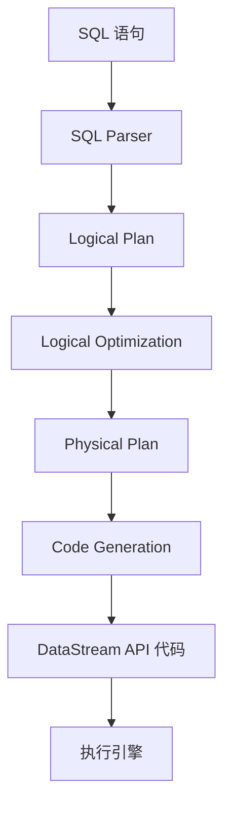

# Lab 7: Flink SQL 实战

> 所属阶段: Flink/Hands-on | 前置依赖: [Lab 1: 第一个 Flink 程序](../interactive/hands-on-labs/lab-01-first-flink-program.md) | 预计时间: 60分钟 | 形式化等级: L3

## 实验目标

- [x] 掌握 Flink SQL 的基本语法和 Table Environment 配置
- [x] 学会使用 DDL 创建表（Source/Sink）
- [x] 掌握 DQL 查询和 Window 聚合 SQL 的编写
- [x] 理解 Flink SQL 与 DataStream API 的集成方式
- [x] 能够编写完整的 SQL 作业并部署运行

## 前置知识

- SQL 基础知识（SELECT、JOIN、GROUP BY、窗口函数）
- Flink DataStream API 基础
- Kafka 和文件系统的基本概念

## 环境准备

### 1. 启动实验环境

```bash
# 使用 Flink Playground 或创建新的 Docker Compose
cd tutorials/interactive/flink-playground
docker-compose up -d

# 验证 Flink Web UI
curl http://localhost:8081/overview
```

### 2. 启动 Kafka（如需要）

```bash
# 如果使用本地 Kafka
docker run -d --name kafka \
  -p 9092:9092 \
  -e KAFKA_ADVERTISED_LISTENERS=PLAINTEXT://localhost:9092 \
  confluentinc/cp-kafka:latest

# 创建测试 Topic
docker exec kafka kafka-topics --create \
  --topic user-events \
  --bootstrap-server localhost:9092 \
  --partitions 3 \
  --replication-factor 1
```

### 3. 准备测试数据

创建 `user_events.json` 文件：

```json
{"user_id": "u001", "event_type": "click", "page": "/home", "timestamp": "2024-01-15 10:00:00"}
{"user_id": "u002", "event_type": "view", "page": "/product/1", "timestamp": "2024-01-15 10:00:05"}
{"user_id": "u001", "event_type": "click", "page": "/product/1", "timestamp": "2024-01-15 10:00:10"}
{"user_id": "u003", "event_type": "purchase", "page": "/checkout", "timestamp": "2024-01-15 10:00:15"}
```

## 实验步骤

### 步骤 1: 创建 Table Environment

Flink SQL 通过 Table Environment 执行。创建 `FlinkSqlDemo.java`：

```java
package com.example;

import org.apache.flink.streaming.api.environment.StreamExecutionEnvironment;
import org.apache.flink.table.api.EnvironmentSettings;
import org.apache.flink.table.api.Table;
import org.apache.flink.table.api.TableEnvironment;
import org.apache.flink.table.api.bridge.java.StreamTableEnvironment;
import org.apache.flink.types.Row;

public class FlinkSqlDemo {
    public static void main(String[] args) throws Exception {
        // 方式 1: 使用 StreamExecutionEnvironment(推荐,可与 DataStream 集成)
        StreamExecutionEnvironment env = StreamExecutionEnvironment.getExecutionEnvironment();
        env.setParallelism(2);

        EnvironmentSettings settings = EnvironmentSettings
            .newInstance()
            .inStreamingMode()
            .build();

        StreamTableEnvironment tableEnv = StreamTableEnvironment.create(env, settings);

        // 方式 2: 纯 Table Environment(仅 SQL/Table API)
        // TableEnvironment batchEnv = TableEnvironment.create(
        //     EnvironmentSettings.inBatchMode()
        // );

        System.out.println("Table Environment 创建成功!");
    }
}
```

**验证环境配置：**

```java

import org.apache.flink.table.api.TableEnvironment;

// 检查当前配置
TableEnvironment tableEnv = ...;

// 查看当前 catalog
tableEnv.executeSql("SHOW CATALOGS").print();

// 查看当前数据库
tableEnv.executeSql("SHOW DATABASES").print();

// 设置配置
tableEnv.getConfig().set("table.exec.mini-batch.enabled", "true");
tableEnv.getConfig().set("table.exec.mini-batch.allow-latency", "5s");
```

### 步骤 2: DDL 操作 - 创建表

#### 2.1 创建文件源表

```java
// 创建从文件读取的表
tableEnv.executeSql("""
    CREATE TABLE user_events (
        user_id STRING,
        event_type STRING,
        page STRING,
        event_time TIMESTAMP(3),
        WATERMARK FOR event_time AS event_time - INTERVAL '5' SECOND
    ) WITH (
        'connector' = 'filesystem',
        'path' = '/data/user_events.json',
        'format' = 'json',
        'json.fail-on-missing-field' = 'false',
        'json.ignore-parse-errors' = 'true'
    )
""");

// 验证表创建成功
tableEnv.executeSql("SHOW TABLES").print();
tableEnv.executeSql("DESCRIBE user_events").print();
```

#### 2.2 创建 Kafka 源表

```java
// 创建 Kafka 源表(读取实时流)
tableEnv.executeSql("""
    CREATE TABLE kafka_user_events (
        user_id STRING,
        event_type STRING,
        page STRING,
        event_time TIMESTAMP(3),
        WATERMARK FOR event_time AS event_time - INTERVAL '5' SECOND
    ) WITH (
        'connector' = 'kafka',
        'topic' = 'user-events',
        'properties.bootstrap.servers' = 'localhost:9092',
        'properties.group.id' = 'flink-sql-consumer',
        'scan.startup.mode' = 'earliest-offset',
        'format' = 'json',
        'json.fail-on-missing-field' = 'false'
    )
""");
```

#### 2.3 创建输出表（Sink）

```java
// 创建文件输出表
tableEnv.executeSql("""
    CREATE TABLE event_statistics (
        event_type STRING,
        event_count BIGINT,
        window_start TIMESTAMP(3),
        window_end TIMESTAMP(3),
        PRIMARY KEY (event_type, window_start) NOT ENFORCED
    ) WITH (
        'connector' = 'filesystem',
        'path' = '/data/output/event_stats',
        'format' = 'json',
        'sink.partition-commit.policy' = 'success-file'
    )
""");

// 创建 Kafka 输出表
tableEnv.executeSql("""
    CREATE TABLE kafka_output (
        user_id STRING,
        event_count BIGINT,
        window_time TIMESTAMP(3)
    ) WITH (
        'connector' = 'kafka',
        'topic' = 'flink-output',
        'properties.bootstrap.servers' = 'localhost:9092',
        'format' = 'json',
        'sink.delivery-guarantee' = 'at-least-once'
    )
""");
```

### 步骤 3: DQL 查询

#### 3.1 基础查询

```java
// 简单查询
Table result = tableEnv.sqlQuery("SELECT * FROM user_events");
result.execute().print();

// 条件过滤
Table clicks = tableEnv.sqlQuery("""
    SELECT
        user_id,
        page,
        event_time
    FROM user_events
    WHERE event_type = 'click'
""");
clicks.execute().print();
```

#### 3.2 聚合查询

```java
// 按用户聚合
Table userStats = tableEnv.sqlQuery("""
    SELECT
        user_id,
        COUNT(*) AS event_count,
        COUNT(DISTINCT event_type) AS unique_events,
        MIN(event_time) AS first_seen,
        MAX(event_time) AS last_seen
    FROM user_events
    GROUP BY user_id
""");
userStats.execute().print();

// 按事件类型聚合
Table eventStats = tableEnv.sqlQuery("""
    SELECT
        event_type,
        COUNT(*) AS total_count,
        COUNT(DISTINCT user_id) AS unique_users,
        COUNT(DISTINCT page) AS unique_pages
    FROM user_events
    GROUP BY event_type
""");
eventStats.execute().print();
```

### 步骤 4: Window 聚合 SQL

Flink SQL 支持多种窗口类型：TUMBLE（滚动窗口）、HOP（滑动窗口）、SESSION（会话窗口）。

#### 4.1 滚动窗口（TUMBLE）

```java
// 每 1 分钟的滚动窗口统计
Table tumbleWindow = tableEnv.sqlQuery("""
    SELECT
        event_type,
        TUMBLE_START(event_time, INTERVAL '1' MINUTE) AS window_start,
        TUMBLE_END(event_time, INTERVAL '1' MINUTE) AS window_end,
        COUNT(*) AS event_count,
        COUNT(DISTINCT user_id) AS unique_users
    FROM user_events
    GROUP BY
        event_type,
        TUMBLE(event_time, INTERVAL '1' MINUTE)
""");
tumbleWindow.execute().print();

// 插入到输出表
tableEnv.executeSql("""
    INSERT INTO event_statistics
    SELECT
        event_type,
        COUNT(*) AS event_count,
        TUMBLE_START(event_time, INTERVAL '1' MINUTE),
        TUMBLE_END(event_time, INTERVAL '1' MINUTE)
    FROM user_events
    GROUP BY
        event_type,
        TUMBLE(event_time, INTERVAL '1' MINUTE)
""");
```

#### 4.2 滑动窗口（HOP）

```java
// 每 30 秒滑动一次,窗口大小 1 分钟
Table hopWindow = tableEnv.sqlQuery("""
    SELECT
        event_type,
        HOP_START(event_time, INTERVAL '30' SECOND, INTERVAL '1' MINUTE) AS window_start,
        HOP_END(event_time, INTERVAL '30' SECOND, INTERVAL '1' MINUTE) AS window_end,
        COUNT(*) AS event_count
    FROM user_events
    GROUP BY
        event_type,
        HOP(event_time, INTERVAL '30' SECOND, INTERVAL '1' MINUTE)
""");
hopWindow.execute().print();
```

#### 4.3 会话窗口（SESSION）

```java
// 10 分钟超时的会话窗口
Table sessionWindow = tableEnv.sqlQuery("""
    SELECT
        user_id,
        SESSION_START(event_time, INTERVAL '10' MINUTE) AS session_start,
        SESSION_END(event_time, INTERVAL '10' MINUTE) AS session_end,
        COUNT(*) AS event_count,
        COLLECT(DISTINCT event_type) AS event_types
    FROM user_events
    GROUP BY
        user_id,
        SESSION(event_time, INTERVAL '10' MINUTE)
""");
sessionWindow.execute().print();
```

#### 4.4 累积窗口（CUMULATE）

```java
// 累积窗口:每分钟输出从窗口开始到现在的累积结果
Table cumulateWindow = tableEnv.sqlQuery("""
    SELECT
        event_type,
        CUMULATE_START(event_time, INTERVAL '1' HOUR, INTERVAL '5' MINUTE) AS window_start,
        CUMULATE_END(event_time, INTERVAL '1' HOUR, INTERVAL '5' MINUTE) AS window_end,
        COUNT(*) AS event_count
    FROM user_events
    GROUP BY
        event_type,
        CUMULATE(event_time, INTERVAL '1' HOUR, INTERVAL '5' MINUTE)
""");
cumulateWindow.execute().print();
```

### 步骤 5: 与 DataStream 集成

#### 5.1 DataStream 转 Table

```java
import org.apache.flink.streaming.api.datastream.DataStream;
import org.apache.flink.table.api.DataTypes;
import org.apache.flink.table.api.Schema;

import org.apache.flink.api.common.typeinfo.Types;


// 创建 DataStream
DataStream<Event> eventStream = env.fromElements(
    new Event("u001", "click", "/home", System.currentTimeMillis()),
    new Event("u002", "view", "/product", System.currentTimeMillis())
);

// DataStream 转 Table(自动推断 schema)
Table eventTable = tableEnv.fromDataStream(eventStream);
eventTable.printSchema();

// 使用自定义 schema
Table eventTableWithSchema = tableEnv.fromDataStream(
    eventStream,
    Schema.newBuilder()
        .column("userId", DataTypes.STRING())
        .column("eventType", DataTypes.STRING())
        .column("page", DataTypes.STRING())
        .column("timestamp", DataTypes.BIGINT())
        .columnByExpression("event_time", "TO_TIMESTAMP_LTZ(timestamp, 3)")
        .watermark("event_time", "event_time - INTERVAL '5' SECOND")
        .build()
);
```

#### 5.2 Table 转 DataStream

```java

import org.apache.flink.streaming.api.datastream.DataStream;

// Table 转 DataStream(Retract 模式)
Table resultTable = tableEnv.sqlQuery("""
    SELECT event_type, COUNT(*) as cnt
    FROM user_events
    GROUP BY event_type
""");

// 追加模式(仅新增数据)
DataStream<Row> appendStream = tableEnv.toDataStream(resultTable);
appendStream.print();

// 缩进模式(支持 UPDATE/DELETE)
DataStream<Row> retractStream = tableEnv.toChangelogStream(resultTable);
retractStream.print();
```

#### 5.3 使用 Table API

```java
import static org.apache.flink.table.api.Expressions.*;

// Table API 方式(类型安全)
Table apiResult = tableEnv.from("user_events")
    .where($("event_type").isEqual("click"))
    .groupBy($("user_id"))
    .select(
        $("user_id"),
        $("event_type").count().as("click_count")
    );

apiResult.execute().print();
```

### 步骤 6: 完整作业示例

创建完整的 Flink SQL 作业 `UserBehaviorAnalysis.java`：

```java
package com.example;

import org.apache.flink.streaming.api.environment.StreamExecutionEnvironment;
import org.apache.flink.table.api.EnvironmentSettings;
import org.apache.flink.table.api.bridge.java.StreamTableEnvironment;

import org.apache.flink.table.api.TableEnvironment;


public class UserBehaviorAnalysis {
    public static void main(String[] args) throws Exception {
        StreamExecutionEnvironment env = StreamExecutionEnvironment.getExecutionEnvironment();
        env.setParallelism(2);

        StreamTableEnvironment tableEnv = StreamTableEnvironment.create(
            env,
            EnvironmentSettings.newInstance().inStreamingMode().build()
        );

        // 1. 创建源表(Kafka)
        tableEnv.executeSql("""
            CREATE TABLE user_events (
                user_id STRING,
                event_type STRING,
                page STRING,
                product_id STRING,
                amount DECIMAL(10,2),
                event_time TIMESTAMP(3),
                WATERMARK FOR event_time AS event_time - INTERVAL '5' SECOND
            ) WITH (
                'connector' = 'kafka',
                'topic' = 'user-events',
                'properties.bootstrap.servers' = 'localhost:9092',
                'properties.group.id' = 'user-behavior-analysis',
                'format' = 'json',
                'json.fail-on-missing-field' = 'false'
            )
        """);

        // 2. 创建结果输出表(Kafka)
        tableEnv.executeSql("""
            CREATE TABLE hourly_stats (
                hour_start TIMESTAMP(3),
                event_type STRING,
                total_events BIGINT,
                total_amount DECIMAL(10,2),
                unique_users BIGINT,
                PRIMARY KEY (hour_start, event_type) NOT ENFORCED
            ) WITH (
                'connector' = 'kafka',
                'topic' = 'hourly-stats',
                'properties.bootstrap.servers' = 'localhost:9092',
                'format' = 'json'
            )
        """);

        // 3. 创建告警输出表
        tableEnv.executeSql("""
            CREATE TABLE fraud_alerts (
                user_id STRING,
                alert_type STRING,
                event_count BIGINT,
                alert_time TIMESTAMP(3),
                details STRING
            ) WITH (
                'connector' = 'filesystem',
                'path' = '/data/output/fraud_alerts',
                'format' = 'json'
            )
        """);

        // 4. 每小时统计 - 写入结果表
        tableEnv.executeSql("""
            INSERT INTO hourly_stats
            SELECT
                TUMBLE_START(event_time, INTERVAL '1' HOUR) AS hour_start,
                event_type,
                COUNT(*) AS total_events,
                SUM(amount) AS total_amount,
                COUNT(DISTINCT user_id) AS unique_users
            FROM user_events
            GROUP BY
                event_type,
                TUMBLE(event_time, INTERVAL '1' HOUR)
        """);

        // 5. 异常检测 - 同一用户 5 分钟内超过 10 次购买
        tableEnv.executeSql("""
            INSERT INTO fraud_alerts
            SELECT
                user_id,
                'HIGH_FREQUENCY_PURCHASE' AS alert_type,
                purchase_count AS event_count,
                window_end AS alert_time,
                CONCAT('User ', user_id, ' made ', CAST(purchase_count AS STRING),
                       ' purchases in 5 minutes') AS details
            FROM (
                SELECT
                    user_id,
                    TUMBLE_END(event_time, INTERVAL '5' MINUTE) AS window_end,
                    COUNT(*) AS purchase_count
                FROM user_events
                WHERE event_type = 'purchase'
                GROUP BY
                    user_id,
                    TUMBLE(event_time, INTERVAL '5' MINUTE)
                HAVING COUNT(*) > 10
            )
        """);

        // 6. 执行作业
        env.execute("User Behavior Analysis with Flink SQL");
    }
}
```

## 验证方法

### 检查清单

- [ ] Table Environment 创建成功，无配置错误
- [ ] DDL 语句执行成功，表结构符合预期
- [ ] DQL 查询返回正确结果
- [ ] Window 聚合结果包含正确的窗口边界
- [ ] DataStream 与 Table 的转换无数据丢失
- [ ] 输出数据正确写入 Sink

### 验证查询

```sql
-- 验证表结构
DESCRIBE user_events;

-- 验证数据
SELECT COUNT(*) FROM user_events;

-- 验证窗口计算
SELECT
    TUMBLE_START(event_time, INTERVAL '1' MINUTE),
    COUNT(*)
FROM user_events
GROUP BY TUMBLE(event_time, INTERVAL '1' MINUTE);
```

### 预期输出示例

```
+----+-------------------------+--------------------------------+-------------+
| op |              event_type |                     window_end | event_count |
+----+-------------------------+--------------------------------+-------------+
| +I |                   click | 2024-01-15T10:01:00            |          15 |
| +I |                   view  | 2024-01-15T10:01:00            |           8 |
| +I |                   click | 2024-01-15T10:02:00            |          12 |
```

## 代码解析

### Flink SQL 执行流程



### 核心概念对照表

| Flink SQL 概念 | DataStream 等效 | 说明 |
|---------------|-----------------|------|
| Table | DataStream | 数据的结构化视图 |
| WATERMARK | WatermarkStrategy | 事件时间处理 |
| TUMBLE | TumblingWindow | 滚动窗口 |
| HOP | SlidingWindow | 滑动窗口 |
| SESSION | SessionWindow | 会话窗口 |
| PRIMARY KEY | KeySelector | 数据分区键 |

### 时间属性

| 类型 | 定义方式 | 用途 |
|------|---------|------|
| Event Time | `WATERMARK FOR event_time AS ...` | 基于事件时间戳 |
| Processing Time | `event_time AS PROCTIME()` | 基于处理时间 |
| Ingestion Time | 不推荐 | 数据摄入时间 |

## 扩展练习

### 练习 1: TOP-N 查询

```sql
-- 每小时购买金额 TOP 10 用户
SELECT * FROM (
    SELECT
        user_id,
        SUM(amount) AS total_amount,
        TUMBLE_START(event_time, INTERVAL '1' HOUR) AS hour_start,
        ROW_NUMBER() OVER (
            PARTITION BY TUMBLE_START(event_time, INTERVAL '1' HOUR)
            ORDER BY SUM(amount) DESC
        ) AS rn
    FROM user_events
    WHERE event_type = 'purchase'
    GROUP BY
        user_id,
        TUMBLE(event_time, INTERVAL '1' HOUR)
) WHERE rn <= 10;
```

### 练习 2: 模式匹配（MATCH_RECOGNIZE）

```sql
-- 检测浏览 -> 加购 -> 购买 的转化漏斗
SELECT * FROM user_events
MATCH_RECOGNIZE (
    PARTITION BY user_id
    ORDER BY event_time
    MEASURES
        A.event_time AS view_time,
        B.event_time AS add_cart_time,
        C.event_time AS purchase_time,
        C.amount AS purchase_amount
    PATTERN (A B C)
    DEFINE
        A AS event_type = 'view' AND page LIKE '/product/%',
        B AS event_type = 'add_cart',
        C AS event_type = 'purchase'
);
```

### 练习 3: 维表 JOIN

```sql
-- 关联用户维表(使用 Lookup Join)
CREATE TABLE users (
    user_id STRING,
    user_name STRING,
    user_level STRING,
    PRIMARY KEY (user_id) NOT ENFORCED
) WITH (
    'connector' = 'jdbc',
    'url' = 'jdbc:mysql://localhost:3306/mydb',
    'table-name' = 'users',
    'username' = 'user',
    'password' = 'pass'
);

-- Lookup Join
SELECT
    e.user_id,
    u.user_name,
    e.event_type,
    e.amount
FROM user_events AS e
LEFT JOIN users FOR SYSTEM_TIME AS OF e.event_time AS u
ON e.user_id = u.user_id;
```

## 常见问题

### Q1: 时间戳解析失败

**现象**: `Cannot convert field event_time to type TIMESTAMP(3)`

**解决**:

```sql
-- 确保时间格式正确
CREATE TABLE user_events (
    user_id STRING,
    event_type STRING,
    -- 使用 BIGINT 存储毫秒时间戳
    ts BIGINT,
    -- 转换为 TIMESTAMP
    event_time AS TO_TIMESTAMP_LTZ(ts, 3),
    WATERMARK FOR event_time AS event_time - INTERVAL '5' SECOND
) WITH (...)
```

### Q2: 窗口不触发输出

**现象**: 查询执行但无输出

**解决**:

- 检查 Watermark 是否生成
- 确认是否有足够的数据触发窗口
- 检查时间范围是否正确

```java
// 设置 Idle Timeout
tableEnv.getConfig().set("table.exec.source.idle-timeout", "10s");
```

### Q3: 表已存在

**现象**: `Table with identifier 'default_catalog.default_database.user_events' already exists`

**解决**:

```java
// 使用 IF NOT EXISTS 或先删除
tableEnv.executeSql("DROP TABLE IF EXISTS user_events");
// 或
tableEnv.executeSql("CREATE TABLE IF NOT EXISTS user_events (...)");
```

### Q4: Kafka 消费偏移量设置

**现象**: 需要重新消费历史数据

**解决**:

```sql
-- 从最早偏移量开始
'scan.startup.mode' = 'earliest-offset'

-- 从最新偏移量开始
'scan.startup.mode' = 'latest-offset'

-- 从指定时间戳开始
'scan.startup.mode' = 'timestamp',
'scan.startup.timestamp-millis' = '1704067200000'
```

## 性能优化提示

```sql
-- 启用 Mini-Batch 优化
tableEnv.getConfig().set("table.exec.mini-batch.enabled", "true");
tableEnv.getConfig().set("table.exec.mini-batch.allow-latency", "1s");
tableEnv.getConfig().set("table.exec.mini-batch.size", "5000");

-- 启用 Local-Global 聚合
tableEnv.getConfig().set("table.optimizer.agg-phase-strategy", "TWO_PHASE");

-- 启用 Split Distinct 优化
tableEnv.getConfig().set("table.optimizer.distinct-agg.split.enabled", "true");
```

## 下一步

完成本实验后，继续学习：

- [Lab 8: 连接器使用](./lab-08-connectors.md) - 掌握各种 Connector 的配置
- [Lab 3: Window 聚合](../interactive/hands-on-labs/lab-03-window-aggregation.md) - 深入理解窗口机制
- Flink Catalog 和元数据管理

## 引用参考
