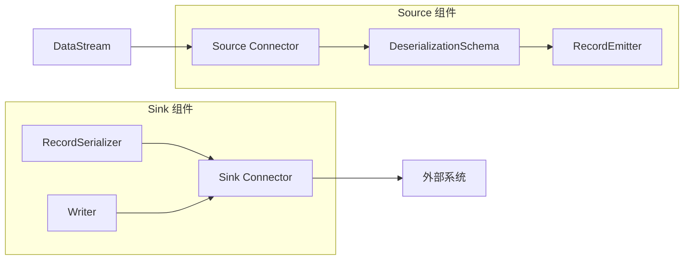

# Lab 8: Flink 连接器实战

> 所属阶段: Flink/Hands-on | 前置依赖: [Lab 7: Flink SQL 实战](./lab-07-flink-sql.md) | 预计时间: 75分钟 | 形式化等级: L3

## 实验目标

- [x] 掌握 Kafka Source 和 Sink 的完整配置
- [x] 学会使用 JDBC 连接器与关系型数据库交互
- [x] 掌握 Elasticsearch Sink 的配置和使用
- [x] 理解文件系统连接器的各种格式和模式
- [x] 能够开发自定义 Serializer/Deserializer
- [x] 理解连接器配置的最佳实践

## 前置知识

- Kafka 基础（Topic、Partition、Consumer Group）
- SQL 和 JDBC 基础
- Elasticsearch 基本概念
- 文件格式（JSON、CSV、Parquet）

## 环境准备

### 1. 启动基础环境

```bash
cd tutorials/interactive/flink-playground
docker-compose up -d
```

### 2. 启动 Kafka

```bash
docker run -d --name kafka \
  -p 9092:9092 \
  -e KAFKA_ZOOKEEPER_CONNECT=zookeeper:2181 \
  -e KAFKA_ADVERTISED_LISTENERS=PLAINTEXT://localhost:9092 \
  confluentinc/cp-kafka:7.5.0

# 创建测试 Topics
docker exec kafka kafka-topics --create \
  --topic input-events --bootstrap-server localhost:9092 --partitions 3

docker exec kafka kafka-topics --create \
  --topic output-results --bootstrap-server localhost:9092 --partitions 3
```

### 3. 启动 Elasticsearch

```bash
docker run -d --name elasticsearch \
  -p 9200:9200 \
  -e "discovery.type=single-node" \
  -e "ES_JAVA_OPTS=-Xms512m -Xmx512m" \
  docker.elastic.co/elasticsearch/elasticsearch:8.11.0
```

### 4. 启动 MySQL

```bash
docker run -d --name mysql \
  -p 3306:3306 \
  -e MYSQL_ROOT_PASSWORD=root \
  -e MYSQL_DATABASE=flinkdb \
  mysql:8.0

# 创建测试表
docker exec -i mysql mysql -uroot -proot flinkdb <<EOF
CREATE TABLE users (
    user_id VARCHAR(50) PRIMARY KEY,
    user_name VARCHAR(100),
    user_level VARCHAR(20),
    created_at TIMESTAMP DEFAULT CURRENT_TIMESTAMP
);

CREATE TABLE events (
    event_id VARCHAR(50) PRIMARY KEY,
    user_id VARCHAR(50),
    event_type VARCHAR(50),
    amount DECIMAL(10,2),
    event_time TIMESTAMP
);
EOF
```

## 实验步骤

### 步骤 1: Kafka Source/Sink

#### 1.1 Maven 依赖

```xml
<dependencies>
    <!-- Kafka Connector -->
    <dependency>
        <groupId>org.apache.flink</groupId>
        <artifactId>flink-connector-kafka</artifactId>
        <version>3.0.1-1.18</version>
    </dependency>

    <!-- JSON Format -->
    <dependency>
        <groupId>org.apache.flink</groupId>
        <artifactId>flink-json</artifactId>
        <version>1.18.0</version>
    </dependency>
</dependencies>
```

#### 1.2 DataStream API - Kafka Source

```java
package com.example.connectors;

import org.apache.flink.api.common.eventtime.WatermarkStrategy;
import org.apache.flink.api.common.serialization.SimpleStringSchema;
import org.apache.flink.connector.kafka.source.KafkaSource;
import org.apache.flink.connector.kafka.source.enumerator.initializer.OffsetsInitializer;
import org.apache.flink.connector.kafka.source.reader.deserializer.KafkaRecordDeserializationSchema;
import org.apache.flink.streaming.api.datastream.DataStream;
import org.apache.flink.streaming.api.environment.StreamExecutionEnvironment;
import org.apache.flink.connector.base.DeliveryGuarantee;

import java.time.Duration;

public class KafkaConnectorDemo {

    public static void main(String[] args) throws Exception {
        StreamExecutionEnvironment env = StreamExecutionEnvironment.getExecutionEnvironment();
        env.setParallelism(3);

        // 基础 Kafka Source
        KafkaSource<String> source = KafkaSource.<String>builder()
            .setBootstrapServers("localhost:9092")
            .setTopics("input-events")
            .setGroupId("flink-consumer-group")
            .setStartingOffsets(OffsetsInitializer.earliest())
            .setValueOnlyDeserializer(new SimpleStringSchema())
            .build();

        DataStream<String> stream = env.fromSource(
            source,
            WatermarkStrategy.noWatermarks(),
            "Kafka Source"
        );

        stream.print();
        env.execute("Kafka Source Demo");
    }
}
```

#### 1.3 高级 Kafka Source 配置

```java

// [伪代码片段 - 不可直接运行] 仅展示核心逻辑
import org.apache.flink.streaming.api.datastream.DataStream;

// 带高级配置的 Kafka Source
KafkaSource<Event> advancedSource = KafkaSource.<Event>builder()
    .setBootstrapServers("localhost:9092")
    .setTopics("input-events", "backup-events")  // 多 Topic
    .setTopicPattern("events-.*")  // 或使用正则
    .setGroupId("flink-advanced-consumer")
    // 偏移量初始化策略
    .setStartingOffsets(OffsetsInitializer.latest())
    // .setStartingOffsets(OffsetsInitializer.timestamp(System.currentTimeMillis() - 86400000))
    // 自定义反序列化
    .setDeserializer(KafkaRecordDeserializationSchema.of(
        new EventDeserializationSchema()
    ))
    // 分区发现间隔
    .setProperty("partition.discovery.interval.ms", "10000")
    .build();

// 带 Watermark 的 Source
DataStream<Event> eventStream = env.fromSource(
    advancedSource,
    WatermarkStrategy
        .<Event>forBoundedOutOfOrderness(Duration.ofSeconds(5))
        .withTimestampAssigner((event, timestamp) -> event.getEventTime()),
    "Advanced Kafka Source"
);
```

#### 1.4 Kafka Sink

```java
// [伪代码片段 - 不可直接运行] 仅展示核心逻辑
import org.apache.flink.connector.kafka.sink.KafkaSink;
import org.apache.flink.connector.kafka.sink.KafkaRecordSerializationSchema;
import org.apache.kafka.clients.producer.ProducerConfig;

// 基础 Kafka Sink
KafkaSink<String> sink = KafkaSink.<String>builder()
    .setBootstrapServers("localhost:9092")
    .setRecordSerializer(KafkaRecordSerializationSchema.builder()
        .setTopic("output-results")
        .setValueSerializationSchema(new SimpleStringSchema())
        .build()
    )
    .build();

stream.sinkTo(sink);
```

#### 1.5 高级 Kafka Sink 配置

```java
// [伪代码片段 - 不可直接运行] 仅展示核心逻辑
// 带高级配置的 Kafka Sink
KafkaSink<Event> advancedSink = KafkaSink.<Event>builder()
    .setBootstrapServers("localhost:9092")
    .setRecordSerializer(KafkaRecordSerializationSchema.<Event>builder()
        // 动态 Topic 选择
        .setTopicSelector(event -> {
            if (event.getPriority().equals("HIGH")) {
                return "priority-high-events";
            }
            return "normal-events";
        })
        // 自定义 Key
        .setKafkaKeySerializer(new EventKeySerializationSchema())
        // 自定义 Value
        .setKafkaValueSerializer(new EventSerializationSchema())
        .build()
    )
    // 投递保证
    .setDeliveryGuarantee(DeliveryGuarantee.EXACTLY_ONCE)
    // .setDeliveryGuarantee(DeliveryGuarantee.AT_LEAST_ONCE)
    // .setDeliveryGuarantee(DeliveryGuarantee.NONE)
    // Kafka Producer 配置
    .setProperty(ProducerConfig.ACKS_CONFIG, "all")
    .setProperty(ProducerConfig.RETRIES_CONFIG, "3")
    .setProperty(ProducerConfig.MAX_IN_FLIGHT_REQUESTS_PER_CONNECTION, "5")
    .setProperty(ProducerConfig.ENABLE_IDEMPOTENCE_CONFIG, "true")
    // 事务 ID 前缀(EXACTLY_ONCE 必需)
    .setProperty("transactional.id.prefix", "flink-kafka-sink-")
    .build();

processedStream.sinkTo(advancedSink);
```

#### 1.6 SQL API - Kafka Connector

```java
// [伪代码片段 - 不可直接运行] 仅展示核心逻辑
import org.apache.flink.table.api.bridge.java.StreamTableEnvironment;

import org.apache.flink.table.api.TableEnvironment;


StreamTableEnvironment tableEnv = StreamTableEnvironment.create(env);

// 创建 Kafka Source 表
tableEnv.executeSql("""
    CREATE TABLE kafka_source (
        user_id STRING,
        event_type STRING,
        amount DECIMAL(10,2),
        event_time TIMESTAMP(3),
        WATERMARK FOR event_time AS event_time - INTERVAL '5' SECOND
    ) WITH (
        'connector' = 'kafka',
        'topic' = 'input-events',
        'properties.bootstrap.servers' = 'localhost:9092',
        'properties.group.id' = 'flink-sql-consumer',
        'scan.startup.mode' = 'earliest-offset',
        'format' = 'json',
        'json.ignore-parse-errors' = 'true',
        'json.timestamp-format.standard' = 'ISO-8601'
    )
""");

// 创建 Kafka Sink 表
tableEnv.executeSql("""
    CREATE TABLE kafka_sink (
        event_type STRING,
        total_amount DECIMAL(10,2),
        event_count BIGINT,
        window_start TIMESTAMP(3)
    ) WITH (
        'connector' = 'kafka',
        'topic' = 'output-results',
        'properties.bootstrap.servers' = 'localhost:9092',
        'format' = 'json',
        'sink.delivery-guarantee' = 'exactly-once',
        'sink.transactional-id-prefix' = 'flink-sql-sink'
    )
""");

// 执行 SQL
tableEnv.executeSql("""
    INSERT INTO kafka_sink
    SELECT
        event_type,
        SUM(amount) as total_amount,
        COUNT(*) as event_count,
        TUMBLE_START(event_time, INTERVAL '1' MINUTE) as window_start
    FROM kafka_source
    GROUP BY
        event_type,
        TUMBLE(event_time, INTERVAL '1' MINUTE)
""");
```

### 步骤 2: JDBC 连接器

#### 2.1 Maven 依赖

```xml
<dependency>
    <groupId>org.apache.flink</groupId>
    <artifactId>flink-connector-jdbc</artifactId>
    <version>3.1.2-1.18</version>
</dependency>
<dependency>
    <groupId>mysql</groupId>
    <artifactId>mysql-connector-java</artifactId>
    <version>8.0.33</version>
</dependency>
```

#### 2.2 JDBC Source（Lookup Join）

```java
// [伪代码片段 - 不可直接运行] 仅展示核心逻辑
import org.apache.flink.connector.jdbc.JdbcConnectionOptions;
import org.apache.flink.connector.jdbc.JdbcExecutionOptions;
import org.apache.flink.connector.jdbc.JdbcSink;
import org.apache.flink.connector.jdbc.JdbcStatementBuilder;

// JDBC Source 主要用于 Lookup Join,而不是流式 Source
// 维表 Lookup Join 示例(SQL)
tableEnv.executeSql("""
    CREATE TABLE users (
        user_id STRING,
        user_name STRING,
        user_level STRING,
        PRIMARY KEY (user_id) NOT ENFORCED
    ) WITH (
        'connector' = 'jdbc',
        'url' = 'jdbc:mysql://localhost:3306/flinkdb',
        'table-name' = 'users',
        'username' = 'root',
        'password' = 'root',
        'driver' = 'com.mysql.cj.jdbc.Driver',
        'lookup.cache.max-rows' = '5000',
        'lookup.cache.ttl' = '10min',
        'lookup.max-retries' = '3'
    )
""");

// Lookup Join 查询
tableEnv.executeSql("""
    SELECT
        e.user_id,
        u.user_name,
        u.user_level,
        e.event_type,
        e.amount
    FROM kafka_source AS e
    LEFT JOIN users FOR SYSTEM_TIME AS OF e.event_time AS u
    ON e.user_id = u.user_id
""").print();
```

#### 2.3 JDBC Sink

```java
// [伪代码片段 - 不可直接运行] 仅展示核心逻辑
// DataStream API JDBC Sink
JdbcExecutionOptions execOptions = JdbcExecutionOptions.builder()
    .withBatchSize(1000)              // 批量写入大小
    .withBatchIntervalMs(200)         // 批量写入间隔
    .withMaxRetries(5)                // 最大重试次数
    .build();

JdbcConnectionOptions connOptions = new JdbcConnectionOptions.JdbcConnectionOptionsBuilder()
    .withUrl("jdbc:mysql://localhost:3306/flinkdb")
    .withDriverName("com.mysql.cj.jdbc.Driver")
    .withUsername("root")
    .withPassword("root")
    .build();

// 创建 Sink
stream.addSink(JdbcSink.sink(
    "INSERT INTO events (event_id, user_id, event_type, amount, event_time) " +
    "VALUES (?, ?, ?, ?, ?) " +
    "ON DUPLICATE KEY UPDATE " +
    "event_type = VALUES(event_type), amount = VALUES(amount)",
    (JdbcStatementBuilder<Event>) (ps, event) -> {
        ps.setString(1, event.getEventId());
        ps.setString(2, event.getUserId());
        ps.setString(3, event.getEventType());
        ps.setBigDecimal(4, event.getAmount());
        ps.setTimestamp(5, new java.sql.Timestamp(event.getEventTime()));
    },
    execOptions,
    connOptions
));
```

#### 2.4 JDBC SQL Connector

```java
// [伪代码片段 - 不可直接运行] 仅展示核心逻辑
// 创建 JDBC Sink 表
tableEnv.executeSql("""
    CREATE TABLE event_sink (
        event_id STRING,
        user_id STRING,
        event_type STRING,
        amount DECIMAL(10,2),
        event_time TIMESTAMP(3),
        PRIMARY KEY (event_id) NOT ENFORCED
    ) WITH (
        'connector' = 'jdbc',
        'url' = 'jdbc:mysql://localhost:3306/flinkdb',
        'table-name' = 'events',
        'username' = 'root',
        'password' = 'root',
        'driver' = 'com.mysql.cj.jdbc.Driver',
        -- 写入优化
        'sink.buffer-flush.max-rows' = '1000',
        'sink.buffer-flush.interval' = '2s',
        'sink.max-retries' = '3',
        -- 连接池
        'connection.max-retry-timeout' = '60s'
    )
""");

// 插入数据
tableEnv.executeSql("""
    INSERT INTO event_sink
    SELECT
        UUID() as event_id,
        user_id,
        event_type,
        amount,
        event_time
    FROM kafka_source
    WHERE event_type = 'purchase'
""");
```

### 步骤 3: Elasticsearch Sink

#### 3.1 Maven 依赖

```xml
<dependency>
    <groupId>org.apache.flink</groupId>
    <artifactId>flink-connector-elasticsearch</artifactId>
    <version>3.0.1-1.18</version>
</dependency>
```

#### 3.2 DataStream API - Elasticsearch Sink

```java
import org.apache.flink.connector.elasticsearch.sink.Elasticsearch7SinkBuilder;
import org.apache.flink.connector.elasticsearch.sink.ElasticsearchEmitter;
import org.apache.http.HttpHost;
import org.elasticsearch.action.index.IndexRequest;
import org.elasticsearch.client.Requests;
import org.elasticsearch.common.xcontent.XContentType;

import java.util.List;

import org.apache.flink.streaming.api.environment.StreamExecutionEnvironment;
import org.apache.flink.streaming.api.datastream.DataStream;


public class ElasticsearchConnectorDemo {

    public static void main(String[] args) throws Exception {
        StreamExecutionEnvironment env = StreamExecutionEnvironment.getExecutionEnvironment();

        DataStream<Event> events = ...;

        // 创建 Elasticsearch Sink
        events.sinkTo(
            new Elasticsearch7SinkBuilder<Event>()
                .setHosts(new HttpHost("localhost", 9200))
                // 认证配置(如需要)
                // .setBulkFlushMaxActions(1000)
                // .setBulkFlushInterval(5000)
                .setEmitter((element, context, indexer) -> {
                    String json = String.format(
                        "{\"user_id\":\"%s\",\"event_type\":\"%s\",\"amount\":%.2f,\"timestamp\":%d}",
                        element.getUserId(),
                        element.getEventType(),
                        element.getAmount(),
                        element.getEventTime()
                    );

                    IndexRequest request = Requests.indexRequest()
                        .index("flink-events")
                        .id(element.getEventId())  // 文档 ID
                        .source(json, XContentType.JSON);

                    indexer.add(request);
                })
                .build()
        );

        env.execute("Elasticsearch Sink Demo");
    }
}
```

#### 3.3 SQL API - Elasticsearch Connector

```java
// [伪代码片段 - 不可直接运行] 仅展示核心逻辑
// 需要先添加依赖 flink-sql-connector-elasticsearch
// 创建 Elasticsearch Sink 表
tableEnv.executeSql("""
    CREATE TABLE es_sink (
        user_id STRING,
        event_type STRING,
        total_amount DECIMAL(10,2),
        event_count BIGINT,
        window_time TIMESTAMP(3)
    ) WITH (
        'connector' = 'elasticsearch-7',
        'hosts' = 'http://localhost:9200',
        'index' = 'event-stats',
        'document-id.key-delimiter' = '_',
        -- 认证配置
        -- 'username' = 'elastic',
        -- 'password' = 'password',
        -- 写入优化
        'sink.bulk-flush.max-actions' = '1000',
        'sink.bulk-flush.max-size' = '5mb',
        'sink.bulk-flush.interval' = '5s',
        -- 失败处理
        'sink.bulk-flush.backoff.strategy' = 'EXPONENTIAL',
        'sink.bulk-flush.backoff.max-retries' = '8',
        'sink.bulk-flush.backoff.delay' = '50ms',
        -- 连接配置
        'connection.path-prefix' = '',
        'connection.request-timeout' = '30000',
        'connection.timeout' = '10000'
    )
""");

// 写入数据
tableEnv.executeSql("""
    INSERT INTO es_sink
    SELECT
        user_id,
        event_type,
        SUM(amount) as total_amount,
        COUNT(*) as event_count,
        TUMBLE_START(event_time, INTERVAL '5' MINUTE) as window_time
    FROM kafka_source
    GROUP BY
        user_id,
        event_type,
        TUMBLE(event_time, INTERVAL '5' MINUTE)
""");
```

### 步骤 4: 文件系统连接器

#### 4.1 支持的格式

```java
// [伪代码片段 - 不可直接运行] 仅展示核心逻辑
// JSON 格式
tableEnv.executeSql("""
    CREATE TABLE json_table (...) WITH (
        'format' = 'json',
        'json.ignore-parse-errors' = 'true',
        'json.timestamp-format.standard' = 'SQL'
    )
""");

// CSV 格式
tableEnv.executeSql("""
    CREATE TABLE csv_table (...) WITH (
        'format' = 'csv',
        'csv.field-delimiter' = ',',
        'csv.ignore-parse-errors' = 'true'
    )
""");

// Parquet 格式
tableEnv.executeSql("""
    CREATE TABLE parquet_table (...) WITH (
        'format' = 'parquet',
        'parquet.compression' = 'snappy'
    )
""");

// Avro 格式
tableEnv.executeSql("""
    CREATE TABLE avro_table (...) WITH (
        'format' = 'avro',
        'avro.codec' = 'snappy'
    )
""");

// ORC 格式
tableEnv.executeSql("""
    CREATE TABLE orc_table (...) WITH (
        'format' = 'orc',
        'orc.compress' = 'zlib'
    )
""");
```

#### 4.2 文件系统 Source/Sink

```java
// [伪代码片段 - 不可直接运行] 仅展示核心逻辑
// 创建文件 Source 表
tableEnv.executeSql("""
    CREATE TABLE file_source (
        user_id STRING,
        event_type STRING,
        amount DECIMAL(10,2),
        event_time TIMESTAMP(3),
        WATERMARK FOR event_time AS event_time - INTERVAL '5' SECOND
    ) WITH (
        'connector' = 'filesystem',
        'path' = '/data/input/events',
        'format' = 'json',
        'source.monitor-interval' = '1s',
        'source.path.regex-pattern' = '.*\\.json$'
    )
""");

// 创建文件 Sink 表
tableEnv.executeSql("""
    CREATE TABLE file_sink (
        event_type STRING,
        total_amount DECIMAL(10,2),
        event_count BIGINT,
        window_start TIMESTAMP(3)
    ) WITH (
        'connector' = 'filesystem',
        'path' = '/data/output/stats',
        'format' = 'json',
        -- 分区提交
        'sink.partition-commit.policy' = 'success-file,success-file',
        'sink.partition-commit.success-file.name' = '_SUCCESS',
        -- 延迟提交
        'sink.partition-commit.delay' = '1min',
        -- 滚动策略
        'sink.rolling-policy.file-size' = '128MB',
        'sink.rolling-policy.rollover-interval' = '10min',
        'sink.rolling-policy.check-interval' = '1min'
    )
""");
```

#### 4.3 分区文件 Sink

```java
// [伪代码片段 - 不可直接运行] 仅展示核心逻辑
// 按时间分区
tableEnv.executeSql("""
    CREATE TABLE partitioned_sink (
        user_id STRING,
        event_type STRING,
        amount DECIMAL(10,2),
        event_time TIMESTAMP(3),
        dt STRING,
        hh STRING
    ) PARTITIONED BY (dt, hh) WITH (
        'connector' = 'filesystem',
        'path' = '/data/output/events',
        'format' = 'parquet',
        -- 分区推导
        'partition.default-name' = '__HIVE_DEFAULT_PARTITION__',
        -- 分区提交触发器
        'sink.partition-commit.trigger' = 'partition-time',
        'sink.partition-commit.delay' = '1h',
        -- 分区提交策略
        'sink.partition-commit.policy' = 'success-file,custom',
        'sink.partition-commit.policy.class' = 'com.example.MyCommitPolicy'
    )
""");

// 插入数据(自动分区)
tableEnv.executeSql("""
    INSERT INTO partitioned_sink
    SELECT
        user_id,
        event_type,
        amount,
        event_time,
        DATE_FORMAT(event_time, 'yyyy-MM-dd') as dt,
        DATE_FORMAT(event_time, 'HH') as hh
    FROM file_source
""");
```

### 步骤 5: 自定义 Serializer/Deserializer

#### 5.1 自定义 Kafka DeserializationSchema

```java
import org.apache.flink.api.common.serialization.DeserializationSchema;
import org.apache.flink.api.common.typeinfo.TypeInformation;
import com.fasterxml.jackson.databind.ObjectMapper;
import com.fasterxml.jackson.datatype.jsr310.JavaTimeModule;

public class EventDeserializationSchema implements DeserializationSchema<Event> {

    private static final ObjectMapper mapper = new ObjectMapper()
        .registerModule(new JavaTimeModule());

    @Override
    public Event deserialize(byte[] message) throws IOException {
        if (message == null) {
            return null;
        }
        try {
            return mapper.readValue(message, Event.class);
        } catch (Exception e) {
            // 记录错误并返回 null 或默认值
            return null;
        }
    }

    @Override
    public boolean isEndOfStream(Event nextElement) {
        return false;
    }

    @Override
    public TypeInformation<Event> getProducedType() {
        return TypeInformation.of(Event.class);
    }
}
```

#### 5.2 自定义 SerializationSchema

```java
import org.apache.flink.api.common.serialization.SerializationSchema;

public class EventSerializationSchema implements SerializationSchema<Event> {

    private static final ObjectMapper mapper = new ObjectMapper()
        .registerModule(new JavaTimeModule());

    @Override
    public byte[] serialize(Event element) {
        if (element == null) {
            return new byte[0];
        }
        try {
            return mapper.writeValueAsBytes(element);
        } catch (Exception e) {
            return new byte[0];
        }
    }
}
```

#### 5.3 自定义 Kafka Key 序列化

```java
import org.apache.flink.streaming.connectors.kafka.KafkaSerializationSchema;
import org.apache.kafka.clients.producer.ProducerRecord;

public class EventKafkaSerializationSchema implements KafkaSerializationSchema<Event> {

    private final ObjectMapper mapper = new ObjectMapper();
    private final String topic;

    public EventKafkaSerializationSchema(String topic) {
        this.topic = topic;
    }

    @Override
    public ProducerRecord<byte[], byte[]> serialize(Event event, Long timestamp) {
        try {
            byte[] key = event.getUserId().getBytes(StandardCharsets.UTF_8);
            byte[] value = mapper.writeValueAsBytes(event);

            return new ProducerRecord<>(
                topic,
                null,  // 分区(null 表示使用默认分区器)
                timestamp,
                key,
                value
            );
        } catch (Exception e) {
            throw new RuntimeException("Failed to serialize event", e);
        }
    }
}
```

#### 5.4 使用 Confluent Schema Registry

```java
<dependency>
    <groupId>io.confluent</groupId>
    <artifactId>kafka-avro-serializer</artifactId>
    <version>7.5.0</version>
</dependency>

// Avro 与 Schema Registry
KafkaSource<Event> source = KafkaSource.<Event>builder()
    .setBootstrapServers("localhost:9092")
    .setTopics("avro-events")
    .setGroupId("flink-avro-consumer")
    .setDeserializer(new AvroDeserializationSchema())
    .build();

// 自定义 Avro DeserializationSchema
public class AvroDeserializationSchema implements KafkaRecordDeserializationSchema<Event> {

    private transient KafkaAvroDeserializer deserializer;
    private final String schemaRegistryUrl;

    @Override
    public void open(DeserializationSchema.InitializationContext context) {
        Map<String, Object> props = new HashMap<>();
        props.put("schema.registry.url", schemaRegistryUrl);
        props.put("specific.avro.reader", true);
        deserializer = new KafkaAvroDeserializer();
        deserializer.configure(props, false);
    }

    @Override
    public void deserialize(ConsumerRecord<byte[], byte[]> record, Collector<Event> out) {
        Event avroEvent = (Event) deserializer.deserialize(
            record.topic(),
            record.value()
        );
        out.collect(avroEvent);
    }

    @Override
    public TypeInformation<Event> getProducedType() {
        return TypeInformation.of(Event.class);
    }
}
```

## 验证方法

### 检查清单

- [ ] Kafka Source 能正确消费消息
- [ ] Kafka Sink 数据正确写入目标 Topic
- [ ] JDBC Sink 数据正确写入数据库
- [ ] Elasticsearch Sink 索引创建成功
- [ ] 文件系统 Sink 输出格式正确
- [ ] 自定义序列化/反序列化无异常

### 验证命令

```bash
# 验证 Kafka 消费
kafka-console-consumer --bootstrap-server localhost:9092 \
  --topic output-results --from-beginning

# 验证 MySQL 数据
docker exec -it mysql mysql -uroot -proot flinkdb -e "SELECT * FROM events LIMIT 10"

# 验证 Elasticsearch 索引
curl -X GET "localhost:9200/flink-events/_search?pretty"

# 验证文件输出
ls -la /data/output/stats/
cat /data/output/stats/part-*.json | head -20
```

## 代码解析

### 连接器架构



### 投递保证对比

| 保证级别 | 配置 | 说明 | 适用场景 |
|---------|------|------|---------|
| NONE | `DeliveryGuarantee.NONE` | 无保证，性能最高 | 可丢失数据 |
| AT_LEAST_ONCE | `DeliveryGuarantee.AT_LEAST_ONCE` | 至少一次 | 大多数场景 |
| EXACTLY_ONCE | `DeliveryGuarantee.EXACTLY_ONCE` | 精确一次 | 金融交易 |

## 扩展练习

### 练习 1: 多 Sink 输出

```java

// [伪代码片段 - 不可直接运行] 仅展示核心逻辑
import org.apache.flink.streaming.api.windowing.time.Time;

// 同一数据输出到多个目标
SingleOutputStreamOperator<Result> result = input
    .keyBy(Event::getUserId)
    .window(TumblingEventTimeWindows.of(Time.minutes(1)))
    .aggregate(new CountAggregate());

// Kafka Sink
result.addSink(kafkaSink);

// JDBC Sink
result.addSink(jdbcSink);

// Elasticsearch Sink
result.addSink(esSink);
```

### 练习 2: CDC 连接器（MySQL）

```xml
<dependency>
    <groupId>com.ververica</groupId>
    <artifactId>flink-connector-mysql-cdc</artifactId>
    <version>2.4.2</version>
</dependency>
```

```java
// [伪代码片段 - 不可直接运行] 仅展示核心逻辑
// MySQL CDC Source
MySqlSource<String> mySqlSource = MySqlSource.<String>builder()
    .hostname("localhost")
    .port(3306)
    .databaseList("flinkdb")
    .tableList("flinkdb.users")
    .username("root")
    .password("root")
    .deserializer(new JsonDebeziumDeserializationSchema())
    .build();

env.fromSource(mySqlSource, WatermarkStrategy.noWatermarks(), "MySQL CDC")
   .print();
```

## 常见问题

### Q1: Kafka 连接超时

**现象**: `TimeoutException: Failed to connect to Kafka`

**解决**:

```java
// [伪代码片段 - 不可直接运行] 仅展示核心逻辑
// 增加连接超时设置
.setProperty("connections.max.idle.ms", "540000")
.setProperty("request.timeout.ms", "30000")
.setProperty("session.timeout.ms", "45000")

// 检查网络连通性
docker exec jobmanager ping kafka
```

### Q2: JDBC 连接池耗尽

**现象**: `ConnectionPoolException: No available connections`

**解决**:

```java
// [伪代码片段 - 不可直接运行] 仅展示核心逻辑
// 配置连接池大小
JdbcConnectionOptions.builder()
    .withUrl("jdbc:mysql://localhost:3306/flinkdb")
    .withDriverName("com.mysql.cj.jdbc.Driver")
    .withUsername("root")
    .withPassword("root")
    // 设置连接池参数
    .withProperty("maxPoolSize", "20")
    .withProperty("connectionTimeout", "30000")
    .build();
```

### Q3: Elasticsearch 批量写入失败

**现象**: `ElasticsearchException: Bulk write failed`

**解决**:

```java
// [伪代码片段 - 不可直接运行] 仅展示核心逻辑
// 调整批量写入参数
new Elasticsearch7SinkBuilder<Event>()
    .setBulkFlushMaxActions(500)      // 减少批量大小
    .setBulkFlushInterval(10000)      // 增加刷新间隔
    .setEmitter((element, context, indexer) -> {
        try {
            indexer.add(createIndexRequest(element));
        } catch (Exception e) {
            // 记录失败元素,不抛出异常
            context.metricGroup().getCounter("es-errors").inc();
        }
    })
```

### Q4: 文件 Sink 分区提交不触发

**现象**: 分区文件已生成，但 _SUCCESS 文件未创建

**解决**:

```sql
-- 检查分区时间设置
'sink.partition-commit.trigger' = 'process-time',  -- 或 'partition-time'
'sink.partition-commit.delay' = '0s',  -- 测试时设为 0

-- 确保 Checkpoint 已启用
env.enableCheckpointing(60000);
```

## 性能优化建议

```java
// [伪代码片段 - 不可直接运行] 仅展示核心逻辑
// 1. 批量写入
JdbcExecutionOptions.builder()
    .withBatchSize(5000)
    .withBatchIntervalMs(1000)
    .build();

// 2. 异步 Lookup
.setProperty("lookup.async", "true")
.setProperty("lookup.async-thread-num", "10")

// 3. 压缩
tableEnv.getConfig().set("pipeline.compression", "LZ4");

// 4. 并行度设置
env.setParallelism(Math.max(1, kafkaPartitions / 2));
```

## 下一步

完成本实验后，继续学习：

- [Lab 9: Kubernetes 部署实战](./lab-09-kubernetes.md) - 掌握生产环境部署
- [Lab 4: State 管理](../interactive/hands-on-labs/lab-04-state-management.md) - 深入理解状态后端
- CDC 和实时数仓架构设计

## 引用参考
