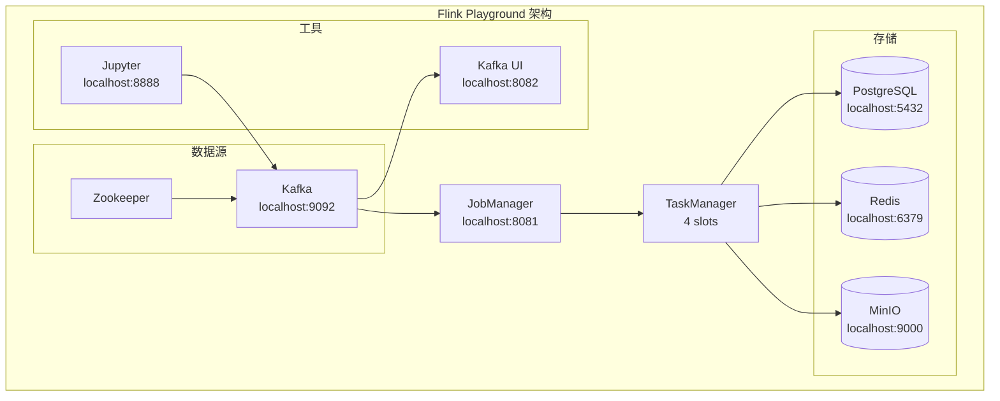

# Flink Playground - 交互式学习环境

> 所属阶段: Flink/ | 前置依赖: Docker, Docker Compose | 预计时间: 30分钟准备

## 快速开始

### 1. 启动环境

```bash
# 进入 playground 目录
cd tutorials/interactive/flink-playground

# 启动所有服务
docker-compose up -d

# 等待服务启动(约 30-60 秒)
docker-compose ps
```

### 2. 访问服务

| 服务 | URL | 说明 |
|------|-----|------|
| Flink Web UI | `http://localhost:8081` | 作业监控和管理 |
| Kafka UI | `http://localhost:8082` | Kafka 主题管理 |
| MinIO Console | `http://localhost:9001` | 对象存储管理 (minioadmin/minioadmin) |
| Jupyter Notebook | <[本地开发环境专用链接]> | 交互式开发 |

### 3. 验证环境

```bash
# 检查所有容器状态
docker-compose ps

# 查看 Flink 版本
docker-compose exec jobmanager flink --version

# 测试 Kafka 连接
docker-compose exec kafka kafka-topics --bootstrap-server kafka:9092 --list
```

## 示例数据集

### 生成测试数据

```bash
# 生成传感器数据
docker-compose exec kafka kafka-console-producer \
  --bootstrap-server kafka:9092 \
  --topic sensor-data < data/sensor-data.json

# 生成用户行为数据
docker-compose exec kafka kafka-console-producer \
  --bootstrap-server kafka:9092 \
  --topic user-events < data/user-events.json
```

## 预配置作业

### 运行 WordCount 示例

```bash
# 提交 WordCount 作业
docker-compose exec jobmanager flink run \
  -c org.apache.flink.streaming.examples.wordcount.WordCount \
  /opt/flink/examples/streaming/WordCount.jar \
  --input /data/words.txt \
  --output /data/wordcount-output
```

### 查看运行中的作业

```bash
# 列出所有作业
docker-compose exec jobmanager flink list

# 查看作业详情
docker-compose exec jobmanager flink info <job-id>
```

## 常用命令

```bash
# 停止环境
docker-compose down

# 完全重置(删除数据)
docker-compose down -v

# 查看日志
docker-compose logs -f jobmanager
docker-compose logs -f taskmanager

# 进入容器
docker-compose exec jobmanager /bin/bash
docker-compose exec taskmanager /bin/bash
```

## 数据持久化

| 目录 | 内容 | 容器内路径 |
|------|------|-----------|
| `./data/` | 示例数据和输入文件 | `/data` |
| `./jobs/` | Flink 作业 JAR 文件 | `/jobs` |
| `./notebooks/` | Jupyter Notebook 文件 | `/home/jovyan/work` |
| `./conf/` | 配置文件 | `/opt/flink/conf` |

## 故障排查

### 端口冲突

如果端口被占用，修改 `docker-compose.yml` 中的端口映射：

```yaml
ports:
  - "8081:8081"  # 改为 "8083:8081" 等
```

### 内存不足

调整内存配置：

```yaml
environment:
  - JOB_MANAGER_MEMORY=1024m
  - TASK_MANAGER_MEMORY=2048m
```

### 重置环境

```bash
docker-compose down -v
docker-compose up -d
```

## 下一步

完成环境搭建后，继续完成以下实验：

1. [Lab 1: 第一个Flink程序](../hands-on-labs/lab-01-first-flink-program.md)
2. [Lab 2: Event Time处理](../hands-on-labs/lab-02-event-time.md)
3. [Lab 3: Window聚合](../hands-on-labs/lab-03-window-aggregation.md)

## 可视化


