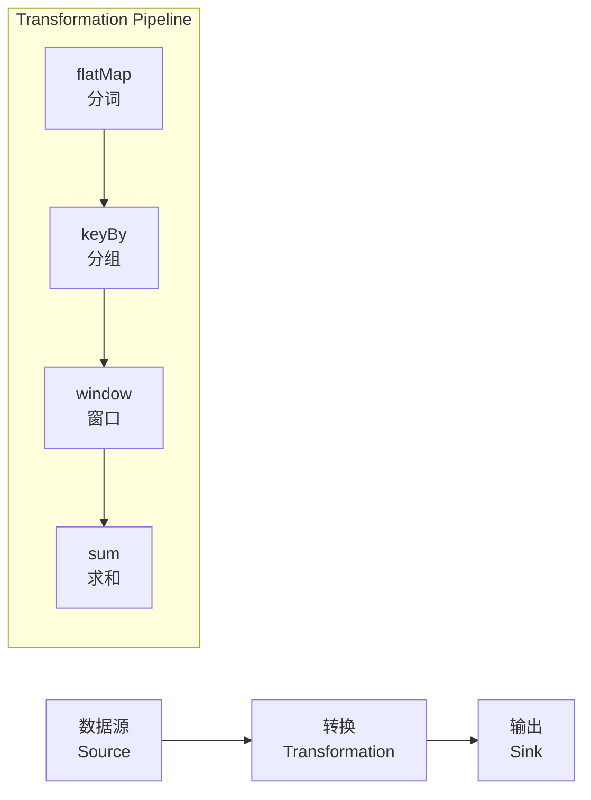

# Lab 1: 第一个 Flink 程序

> 所属阶段: Flink/Hands-on | 前置依赖: [Flink Playground](../flink-playground/README.md) | 预计时间: 45分钟 | 形式化等级: L3

## 实验目标

- [x] 理解 Flink 程序的基本结构
- [x] 掌握 DataStream API 的核心概念
- [x] 完成第一个可运行的 Flink 作业
- [x] 学会使用 Flink Web UI 监控作业

## 前置知识

- Java 8+ 或 Python 基础
- 基本的命令行操作
- Docker 和 Docker Compose 基础

## 环境准备

### 1. 启动 Flink Playground

```bash
cd tutorials/interactive/flink-playground
docker-compose up -d

# 验证环境
docker-compose ps
curl http://localhost:8081/overview
```

### 2. 准备开发环境

**Java 版本:**

```bash
# 进入 JobManager 容器
docker-compose exec jobmanager bash

# 检查 Java 版本
java -version  # 应为 Java 11+

# 查看 Flink 版本
flink --version
```

**Python 版本 (PyFlink):**

```bash
# 安装 PyFlink
pip install apache-flink==1.18.0
```

## 实验步骤

### 步骤 1: 创建 Maven 项目

```bash
# 进入作业目录
cd tutorials/interactive/flink-playground/jobs

# 创建 Maven 项目
docker run -it --rm -v "${PWD}:/app" -w /app maven:3.8-openjdk-11 \
  mvn archetype:generate \
  -DarchetypeGroupId=org.apache.flink \
  -DarchetypeArtifactId=flink-quickstart-java \
  -DarchetypeVersion=1.18.0 \
  -DgroupId=com.example \
  -DartifactId=first-flink-job \
  -Dversion=1.0-SNAPSHOT \
  -Dpackage=com.example \
  -DinteractiveMode=false
```

### 步骤 2: 编写 WordCount 程序

创建 `src/main/java/com/example/WordCount.java`:

```java
package com.example;

import org.apache.flink.api.common.functions.FlatMapFunction;
import org.apache.flink.api.java.tuple.Tuple2;
import org.apache.flink.streaming.api.datastream.DataStream;
import org.apache.flink.streaming.api.environment.StreamExecutionEnvironment;
import org.apache.flink.streaming.api.windowing.assigners.TumblingProcessingTimeWindows;
import org.apache.flink.streaming.api.windowing.time.Time;
import org.apache.flink.util.Collector;

public class WordCount {

    public static void main(String[] args) throws Exception {
        // 1. 创建执行环境
        final StreamExecutionEnvironment env =
            StreamExecutionEnvironment.getExecutionEnvironment();

        // 2. 设置并行度
        env.setParallelism(2);

        // 3. 创建数据源 (从 socket 读取)
        DataStream<String> text = env.socketTextStream("localhost", 9999);

        // 4. 数据处理
        DataStream<Tuple2<String, Integer>> wordCounts = text
            // 分词
            .flatMap(new Tokenizer())
            // 按键分组
            .keyBy(value -> value.f0)
            // 5秒滚动窗口
            .window(TumblingProcessingTimeWindows.of(Time.seconds(5)))
            // 求和
            .sum(1);

        // 5. 输出结果
        wordCounts.print().setParallelism(1);

        // 6. 执行程序
        env.execute("Socket Window WordCount");
    }

    // 自定义 FlatMapFunction
    public static class Tokenizer implements FlatMapFunction<String, Tuple2<String, Integer>> {
        @Override
        public void flatMap(String value, Collector<Tuple2<String, Integer>> out) {
            // 将每行文本拆分为单词
            for (String word : value.toLowerCase().split("\\W+")) {
                if (word.length() > 0) {
                    out.collect(new Tuple2<>(word, 1));
                }
            }
        }
    }
}
```

### 步骤 3: 使用文件数据源版本

创建 `FileWordCount.java`:

```java
package com.example;

import org.apache.flink.api.common.functions.FlatMapFunction;
import org.apache.flink.api.java.tuple.Tuple2;
import org.apache.flink.streaming.api.datastream.DataStream;
import org.apache.flink.streaming.api.environment.StreamExecutionEnvironment;
import org.apache.flink.streaming.api.windowing.assigners.TumblingProcessingTimeWindows;
import org.apache.flink.streaming.api.windowing.time.Time;
import org.apache.flink.util.Collector;

public class FileWordCount {

    public static void main(String[] args) throws Exception {
        final StreamExecutionEnvironment env =
            StreamExecutionEnvironment.getExecutionEnvironment();

        // 从文件读取 (Playground 中预置的文件)
        DataStream<String> text = env.readTextFile("/data/words.txt");

        DataStream<Tuple2<String, Integer>> wordCounts = text
            .flatMap(new Tokenizer())
            .keyBy(value -> value.f0)
            .window(TumblingProcessingTimeWindows.of(Time.seconds(5)))
            .sum(1);

        // 写入文件
        wordCounts.writeAsText("/data/output/wordcount-result.txt")
                  .setParallelism(1);

        env.execute("File WordCount");
    }

    public static class Tokenizer implements FlatMapFunction<String, Tuple2<String, Integer>> {
        @Override
        public void flatMap(String value, Collector<Tuple2<String, Integer>> out) {
            for (String word : value.toLowerCase().split("\\W+")) {
                if (word.length() > 0) {
                    out.collect(new Tuple2<>(word, 1));
                }
            }
        }
    }
}
```

### 步骤 4: 编译打包

```bash
cd first-flink-job

# 编译
mvn clean package -DskipTests

# 检查生成的 JAR
ls -la target/first-flink-job-1.0-SNAPSHOT.jar
```

### 步骤 5: 提交作业到 Flink 集群

```bash
# 复制 JAR 到共享目录
cp target/first-flink-job-1.0-SNAPSHOT.jar ../

# 在 JobManager 中提交作业
docker-compose exec jobmanager flink run \
  -c com.example.FileWordCount \
  /jobs/first-flink-job-1.0-SNAPSHOT.jar
```

### 步骤 6: 查看结果

```bash
# 查看输出文件
docker-compose exec jobmanager cat /data/output/wordcount-result.txt

# 或通过 Web UI 查看: http://localhost:8081
```

## 验证方法

### 检查清单

- [ ] `mvn clean package` 编译成功
- [ ] 作业成功提交到 Flink 集群
- [ ] Flink Web UI 显示作业状态为 FINISHED 或 RUNNING
- [ ] 输出文件包含预期的词频统计结果
- [ ] 能够解释代码中每个步骤的作用

### 预期输出示例

```
# 伪代码示意，非完整可编译代码
(apache,1)
(flink,8)
(streaming,3)
(processing,4)
...
```

## 代码解析



### 核心概念

| 概念 | 说明 | 代码示例 |
|------|------|---------|
| Environment | 执行环境 | `StreamExecutionEnvironment.getExecutionEnvironment()` |
| DataStream | 数据流 | `env.socketTextStream(...)` |
| Transformation | 转换操作 | `.flatMap()`, `.keyBy()`, `.window()` |
| Sink | 输出 | `.print()`, `.writeAsText()` |
| Execution | 触发执行 | `env.execute(...)` |

## 扩展练习

### 练习 1: 过滤短单词

修改 `Tokenizer`，只输出长度 >= 3 的单词：

```java
// [伪代码片段 - 不可直接运行] 仅展示核心逻辑
if (word.length() >= 3) {
    out.collect(new Tuple2<>(word, 1));
}
```

### 练习 2: 实时 Socket 输入

使用 netcat 发送实时数据：

```bash
# 终端 1: 启动 netcat
nc -lk 9999

# 终端 2: 提交作业 (使用 SocketWordCount)
docker-compose exec jobmanager flink run \
  -c com.example.WordCount \
  /jobs/first-flink-job-1.0-SNAPSHOT.jar

# 在终端 1 输入文本,观察输出
```

### 练习 3: 自定义数据源

创建一个生成随机句子的 SourceFunction：

```java
public class RandomSentenceSource implements SourceFunction<String> {
    private volatile boolean isRunning = true;
    private Random random = new Random();
    private String[] sentences = {
        "apache flink is great",
        "stream processing is fun",
        "real time analytics rocks"
    };

    @Override
    public void run(SourceContext<String> ctx) throws Exception {
        while (isRunning) {
            ctx.collect(sentences[random.nextInt(sentences.length)]);
            Thread.sleep(100);  // 每 100ms 生成一条
        }
    }

    @Override
    public void cancel() {
        isRunning = false;
    }
}
```

## 常见问题

### Q1: 端口 9999 连接失败

**解决:** 确保 netcat 在主机上运行，或在 Docker 网络中运行：

```bash
docker run --rm --network flink-playground_flink-network alpine nc -lk -p 9999
```

### Q2: 类找不到

**解决:** 检查包名和类名是否正确，确保使用了正确的 `-c` 参数。

### Q3: 输出文件为空

**解决:** 检查输入文件路径是否正确，作业是否成功完成。

## 下一步

完成本实验后，继续学习：

- [Lab 2: Event Time 处理](./lab-02-event-time.md) - 理解时间语义
- [Lab 3: Window 聚合](./lab-03-window-aggregation.md) - 掌握窗口操作

## 引用参考
