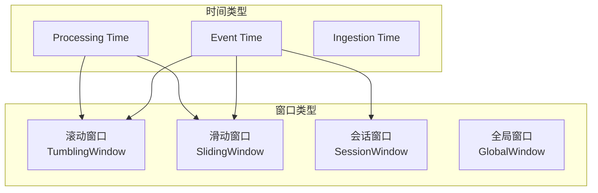

# Lab 3: Window 聚合

> 所属阶段: Flink/Hands-on | 前置依赖: [Lab 2](./lab-02-event-time.md) | 预计时间: 75分钟 | 形式化等级: L4

## 实验目标

- [x] 掌握四种窗口类型：滚动、滑动、会话、全局
- [x] 理解窗口分配器的工作原理
- [x] 学会使用聚合函数和 ProcessWindowFunction
- [x] 掌握窗口的合并与优化技巧

## 前置知识

- Lab 2 的 Event Time 处理
- 基本的聚合操作概念
- Flink 类型系统

## 窗口类型概览



## 实验步骤

### 步骤 1: 滚动窗口 (Tumbling Window)

创建 `TumblingWindowExample.java`:

```java
package com.example;

import org.apache.flink.api.common.eventtime.WatermarkStrategy;
import org.apache.flink.api.common.functions.AggregateFunction;
import org.apache.flink.api.java.tuple.Tuple2;
import org.apache.flink.streaming.api.datastream.DataStream;
import org.apache.flink.streaming.api.environment.StreamExecutionEnvironment;
import org.apache.flink.streaming.api.windowing.assigners.TumblingEventTimeWindows;
import org.apache.flink.streaming.api.windowing.time.Time;

import java.time.Duration;

public class TumblingWindowExample {

    public static void main(String[] args) throws Exception {
        final StreamExecutionEnvironment env =
            StreamExecutionEnvironment.getExecutionEnvironment();
        env.setParallelism(1);

        // 创建数据流
        DataStream<Tuple2<String, Double>> measurements = env
            .addSource(new MeasurementSource())
            .assignTimestampsAndWatermarks(
                WatermarkStrategy.<Tuple2<String, Double>>forBoundedOutOfOrderness(
                        Duration.ofSeconds(5))
                    .withTimestampAssigner((event, ts) -> System.currentTimeMillis())
            );

        // 滚动窗口聚合
        DataStream<WindowResult> results = measurements
            .keyBy(value -> value.f0)  // 按设备ID分组
            .window(TumblingEventTimeWindows.of(Time.minutes(1)))  // 1分钟滚动窗口
            .aggregate(new AverageAggregate());

        results.print("Tumbling");

        env.execute("Tumbling Window Example");
    }

    // 平均值聚合函数
    public static class AverageAggregate implements
        AggregateFunction<Tuple2<String, Double>, AverageAcc, WindowResult> {

        @Override
        public AverageAcc createAccumulator() {
            return new AverageAcc();
        }

        @Override
        public AverageAcc add(Tuple2<String, Double> value, AverageAcc accumulator) {
            accumulator.sum += value.f1;
            accumulator.count++;
            return accumulator;
        }

        @Override
        public WindowResult getResult(AverageAcc accumulator) {
            return new WindowResult(
                accumulator.sum / accumulator.count,
                accumulator.count
            );
        }

        @Override
        public AverageAcc merge(AverageAcc a, AverageAcc b) {
            a.sum += b.sum;
            a.count += b.count;
            return a;
        }
    }

    public static class AverageAcc {
        double sum = 0;
        int count = 0;
    }

    public static class WindowResult {
        public double average;
        public int count;

        public WindowResult(double average, int count) {
            this.average = average;
            this.count = count;
        }

        @Override
        public String toString() {
            return String.format("avg=%.2f, count=%d", average, count);
        }
    }
}
```

### 步骤 2: 滑动窗口 (Sliding Window)

创建 `SlidingWindowExample.java`:

```java
package com.example;

import org.apache.flink.streaming.api.windowing.assigners.SlidingEventTimeWindows;

import org.apache.flink.streaming.api.environment.StreamExecutionEnvironment;
import org.apache.flink.streaming.api.datastream.DataStream;
import org.apache.flink.streaming.api.windowing.time.Time;


public class SlidingWindowExample {

    public static void main(String[] args) throws Exception {
        final StreamExecutionEnvironment env =
            StreamExecutionEnvironment.getExecutionEnvironment();
        env.setParallelism(1);

        DataStream<PageView> pageViews = env
            .addSource(new PageViewSource())
            .assignTimestampsAndWatermarks(...);

        // 滑动窗口:窗口大小5分钟,滑动间隔1分钟
        DataStream<PageViewStats> slidingStats = pageViews
            .keyBy(pv -> pv.pageUrl)
            .window(SlidingEventTimeWindows.of(
                Time.minutes(5),   // 窗口大小
                Time.minutes(1)    // 滑动间隔
            ))
            .aggregate(new PageViewCounter());

        // 效果:每个事件被包含在5个窗口中
        slidingStats.print("Sliding");

        env.execute("Sliding Window Example");
    }

    // 页面浏览统计
    public static class PageView {
        public String pageUrl;
        public String userId;
        public long timestamp;
    }

    public static class PageViewStats {
        public String pageUrl;
        public long viewCount;
        public long uniqueUsers;
        public long windowStart;
        public long windowEnd;
    }
}
```

### 步骤 3: 会话窗口 (Session Window)

创建 `SessionWindowExample.java`:

```java
package com.example;

import org.apache.flink.streaming.api.windowing.assigners.EventTimeSessionWindows;
import org.apache.flink.streaming.api.windowing.time.Time;
import org.apache.flink.streaming.api.functions.windowing.WindowFunction;
import org.apache.flink.streaming.api.windowing.windows.TimeWindow;
import org.apache.flink.util.Collector;

import org.apache.flink.streaming.api.environment.StreamExecutionEnvironment;
import org.apache.flink.streaming.api.datastream.DataStream;


public class SessionWindowExample {

    public static void main(String[] args) throws Exception {
        final StreamExecutionEnvironment env =
            StreamExecutionEnvironment.getExecutionEnvironment();

        DataStream<UserActivity> activities = env
            .addSource(new UserActivitySource())
            .assignTimestampsAndWatermarks(...);

        // 会话窗口:间隔5分钟无活动则视为新会话
        DataStream<SessionResult> sessions = activities
            .keyBy(activity -> activity.userId)
            .window(EventTimeSessionWindows.withGap(Time.minutes(5)))
            .apply(new SessionAnalyzer());

        sessions.print("Session");

        env.execute("Session Window Example");
    }

    // 会话分析器
    public static class SessionAnalyzer implements
        WindowFunction<UserActivity, SessionResult, String, TimeWindow> {

        @Override
        public void apply(
                String userId,
                TimeWindow window,
                Iterable<UserActivity> inputs,
                Collector<SessionResult> out) {

            int eventCount = 0;
            long firstActivity = Long.MAX_VALUE;
            long lastActivity = Long.MIN_VALUE;
            Set<String> pages = new HashSet<>();

            for (UserActivity activity : inputs) {
                eventCount++;
                firstActivity = Math.min(firstActivity, activity.timestamp);
                lastActivity = Math.max(lastActivity, activity.timestamp);
                pages.add(activity.pageUrl);
            }

            long sessionDuration = lastActivity - firstActivity;

            SessionResult result = new SessionResult();
            result.userId = userId;
            result.eventCount = eventCount;
            result.uniquePages = pages.size();
            result.sessionDurationMs = sessionDuration;
            result.sessionStart = firstActivity;
            result.sessionEnd = lastActivity;

            out.collect(result);
        }
    }

    public static class UserActivity {
        public String userId;
        public String pageUrl;
        public String action;
        public long timestamp;
    }

    public static class SessionResult {
        public String userId;
        public int eventCount;
        public int uniquePages;
        public long sessionDurationMs;
        public long sessionStart;
        public long sessionEnd;

        @Override
        public String toString() {
            return String.format(
                "Session[%s: events=%d, pages=%d, duration=%.1fmin]",
                userId, eventCount, uniquePages, sessionDurationMs / 60000.0
            );
        }
    }
}
```

### 步骤 4: ProcessWindowFunction (全量窗口函数)

创建 `ProcessWindowExample.java`:

```java
package com.example;

import org.apache.flink.streaming.api.functions.windowing.ProcessWindowFunction;
import org.apache.flink.streaming.api.windowing.windows.TimeWindow;
import org.apache.flink.util.Collector;

import java.util.ArrayList;
import java.util.List;

public class ProcessWindowExample {

    // 使用 ProcessWindowFunction 获取完整窗口上下文
    public static class TopNFunction extends
        ProcessWindowFunction<SaleRecord, TopNSales, String, TimeWindow> {

        private int topN;

        public TopNFunction(int n) {
            this.topN = n;
        }

        @Override
        public void process(
                String category,
                Context context,
                Iterable<SaleRecord> elements,
                Collector<TopNSales> out) {

            // 收集所有元素
            List<SaleRecord> allRecords = new ArrayList<>();
            for (SaleRecord record : elements) {
                allRecords.add(record);
            }

            // 排序并取Top N
            allRecords.sort((a, b) -> Double.compare(b.amount, a.amount));
            List<SaleRecord> topRecords = allRecords.subList(
                0, Math.min(topN, allRecords.size())
            );

            // 获取窗口信息
            TimeWindow window = context.window();

            TopNSales result = new TopNSales();
            result.category = category;
            result.windowStart = window.getStart();
            result.windowEnd = window.getEnd();
            result.topSales = topRecords;
            result.totalSales = allRecords.stream().mapToDouble(r -> r.amount).sum();

            out.collect(result);
        }
    }

    public static class SaleRecord {
        public String category;
        public String productId;
        public double amount;
        public long timestamp;
    }

    public static class TopNSales {
        public String category;
        public long windowStart;
        public long windowEnd;
        public List<SaleRecord> topSales;
        public double totalSales;
    }
}
```

### 步骤 5: 增量聚合 + 全量处理结合

```java

import org.apache.flink.streaming.api.datastream.DataStream;
import org.apache.flink.api.common.functions.AggregateFunction;
import org.apache.flink.streaming.api.windowing.time.Time;

// 最佳实践:AggregateFunction + ProcessWindowFunction
DataStream<WindowStats> results = stream
    .keyBy(record -> record.category)
    .window(TumblingEventTimeWindows.of(Time.minutes(5)))
    .aggregate(
        new AverageAggregate(),      // 增量计算平均值
        new EnrichmentFunction()      // 全量添加窗口元数据
    );

// EnrichmentFunction 示例
public static class EnrichmentFunction extends
    ProcessWindowFunction<Double, WindowStats, String, TimeWindow> {

    @Override
    public void process(
            String key,
            Context context,
            Iterable<Double> elements,
            Collector<WindowStats> out) {

        Double avg = elements.iterator().next(); // AggregateFunction 的结果
        TimeWindow window = context.window();

        WindowStats stats = new WindowStats();
        stats.key = key;
        stats.average = avg;
        stats.windowStart = window.getStart();
        stats.windowEnd = window.getEnd();
        stats.processingTime = context.currentProcessingTime();

        out.collect(stats);
    }
}
```

### 步骤 6: 窗口触发器 (Trigger)

```java
import org.apache.flink.streaming.api.windowing.triggers.Trigger;
import org.apache.flink.streaming.api.windowing.triggers.TriggerResult;

import org.apache.flink.streaming.api.windowing.time.Time;


// 自定义触发器:每收到10条数据触发一次
public class CountTrigger extends Trigger<Object, TimeWindow> {

    private final int maxCount;
    private final ReducingStateDescriptor<Long> stateDesc =
        new ReducingStateDescriptor<>("count", (a, b) -> a + b, LongSerializer.INSTANCE);

    public CountTrigger(int maxCount) {
        this.maxCount = maxCount;
    }

    @Override
    public TriggerResult onElement(
            Object element,
            long timestamp,
            TimeWindow window,
            TriggerContext ctx) throws Exception {

        ReducingState<Long> count = ctx.getPartitionedState(stateDesc);
        count.add(1L);

        if (count.get() >= maxCount) {
            count.clear();
            return TriggerResult.FIRE;  // 触发计算
        }
        return TriggerResult.CONTINUE;
    }

    @Override
    public TriggerResult onProcessingTime(
            long time,
            TimeWindow window,
            TriggerContext ctx) {
        return TriggerResult.CONTINUE;
    }

    @Override
    public TriggerResult onEventTime(
            long time,
            TimeWindow window,
            TriggerContext ctx) {
        return TriggerResult.FIRE_AND_PURGE;  // 窗口结束时触发并清理
    }

    @Override
    public void clear(TimeWindow window, TriggerContext ctx) throws Exception {
        ctx.getPartitionedState(stateDesc).clear();
    }
}

// 使用自定义触发器
stream.keyBy(...)
    .window(TumblingEventTimeWindows.of(Time.minutes(10)))
    .trigger(new CountTrigger(100))  // 每100条或窗口结束触发
    .aggregate(...);
```

## 验证方法

### 检查清单

- [x] 理解四种窗口类型的适用场景
- [x] 能够正确选择时间类型 (Event/Processing Time)
- [x] 掌握 AggregateFunction 和 ProcessWindowFunction 的区别
- [x] 理解窗口触发机制
- [x] 能够优化窗口性能

### 性能对比测试

```java
// 测试不同窗口实现的性能

import org.apache.flink.api.common.functions.AggregateFunction;

public class WindowBenchmark {

    // 方法1: 纯 AggregateFunction(推荐,内存友好)
    public void incrementalAggregation() {
        stream.window(...)
            .aggregate(new IncrementalAggregate());
    }

    // 方法2: ProcessWindowFunction(功能强大但内存消耗大)
    public void fullWindowFunction() {
        stream.window(...)
            .process(new FullProcessFunction());
    }

    // 方法3: 结合两者(最佳实践)
    public void combinedApproach() {
        stream.window(...)
            .aggregate(new IncrementalAggregate(), new EnrichmentFunction());
    }
}
```

## 扩展练习

### 练习 1: 动态窗口大小

根据数据特征动态调整窗口大小：

```java
// 根据数据量动态调整窗口

import org.apache.flink.streaming.api.environment.StreamExecutionEnvironment;
import org.apache.flink.streaming.api.windowing.time.Time;

public class DynamicWindowAssigner extends WindowAssigner<Object, TimeWindow> {

    @Override
    public Collection<TimeWindow> assignWindows(
            Object element,
            long timestamp,
            WindowAssignerContext context) {

        // 根据元素特征决定窗口大小
        long windowSize = calculateWindowSize(element);
        long start = timestamp - (timestamp % windowSize);
        return Collections.singletonList(new TimeWindow(start, start + windowSize));
    }

    private long calculateWindowSize(Object element) {
        // 根据数据密度、业务规则等动态计算
        return Time.minutes(5).toMilliseconds();
    }

    @Override
    public Trigger<Object, TimeWindow> getDefaultTrigger(StreamExecutionEnvironment env) {
        return EventTimeTrigger.create();
    }
}
```

### 练习 2: 迟到数据重计算

实现窗口结果的更新机制：

```java

import org.apache.flink.streaming.api.datastream.DataStream;

// 使用 Side Output 处理迟到数据,并触发窗口重计算
DataStream<WindowResult> mainResults = ...;
DataStream<Element> lateData = mainResults.getSideOutput(lateDataTag);

// 将迟到数据重新聚合
DataStream<WindowResult> lateResults = lateData
    .keyBy(e -> e.key)
    .window(GlobalWindows.create())
    .trigger(...)  // 自定义触发
    .process(new LateDataProcessor());

// 合并主结果和迟到结果
mainResults.union(lateResults)
    .keyBy(r -> r.windowId)
    .reduce((a, b) -> mergeResults(a, b));
```

### 练习 3: 会话窗口合并优化

分析会话窗口的动态合并行为：

```java
// 自定义会话窗口合并策略
public static class OptimizedSessionWindow extends
    MergingWindowAssigner<Object, TimeWindow> {

    private final long sessionTimeout;

    @Override
    public void mergeWindows(
            Collection<TimeWindow> windows,
            MergeCallback<TimeWindow> callback) {

        // 优化合并算法,减少不必要的合并
        List<TimeWindow> sortedWindows = new ArrayList<>(windows);
        sortedWindows.sort(Comparator.comparingLong(TimeWindow::getStart));

        List<TimeWindow> merged = new ArrayList<>();
        TimeWindow current = null;

        for (TimeWindow window : sortedWindows) {
            if (current == null) {
                current = window;
            } else if (current.getEnd() + sessionTimeout >= window.getStart()) {
                // 合并窗口
                current = new TimeWindow(current.getStart(),
                    Math.max(current.getEnd(), window.getEnd()));
            } else {
                merged.add(current);
                current = window;
            }
        }

        if (current != null) {
            merged.add(current);
        }

        // 应用合并结果
        for (TimeWindow window : merged) {
            callback.merge(Collections.singletonList(window), window);
        }
    }

    @Override
    public Collection<TimeWindow> assignWindows(
            Object element, long timestamp, WindowAssignerContext context) {
        return Collections.singletonList(
            new TimeWindow(timestamp, timestamp + sessionTimeout)
        );
    }
}
```

## 最佳实践总结

| 场景 | 推荐方案 | 说明 |
|------|---------|------|
| 简单聚合 (sum/count/avg) | AggregateFunction | 内存高效，增量计算 |
| 需要排序/Top N | ProcessWindowFunction | 全量数据访问 |
| 需要窗口元数据 | Aggregate + ProcessWindowFunction | 结合两者优势 |
| 高频低延迟 | 自定义 Trigger | 提前触发 |
| 会话分析 | EventTimeSessionWindows | 自动合并 |

## 下一步

完成本实验后，继续学习：

- [Lab 4: 状态管理](./lab-04-state-management.md) - 有状态计算
- [Lab 5: Checkpoint与恢复](./lab-05-checkpoint.md) - 容错机制

## 引用参考
