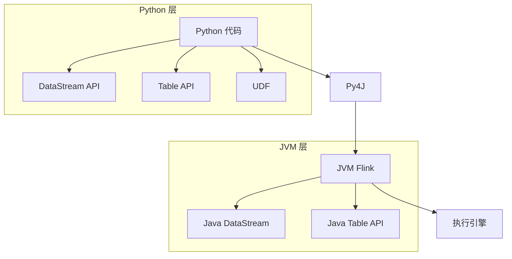

# PyFlink Lab 1: PyFlink 入门实战

> 所属阶段: Flink/Python | 前置依赖: Python 基础 | 预计时间: 60分钟 | 形式化等级: L3

## 实验目标

- [x] 掌握 PyFlink 环境搭建和配置
- [x] 编写并运行第一个 PyFlink 程序
- [x] 掌握 PyFlink DataStream API 的核心用法
- [x] 掌握 PyFlink Table API 的核心用法
- [x] 学会开发 Python UDF（用户自定义函数）
- [x] 理解 PyFlink 与 Java Flink 的关系和差异

## 前置知识

- Python 3.8+ 基础
- 基本的流处理概念
- pip 包管理工具使用

## 环境准备

### 1. 安装 PyFlink

```bash
# 创建虚拟环境(推荐)
python -m venv pyflink-env
source pyflink-env/bin/activate  # Linux/Mac
# pyflink-env\Scripts\activate  # Windows

# 安装 PyFlink
pip install apache-flink==1.18.0

# 验证安装
python -c "from pyflink.datastream import StreamExecutionEnvironment; print('PyFlink installed successfully!')"

# 查看版本
python -c "import pyflink; print(pyflink.__version__)"
```

### 2. 安装附加依赖

```bash
# 常用依赖
pip install pandas numpy

# Kafka 支持
pip install kafka-python confluent-kafka

# 测试数据生成
pip install faker

# Jupyter(可选,用于交互式开发)
pip install jupyter
```

### 3. 准备 IDE

推荐使用 VS Code 或 PyCharm：

```bash
# VS Code 插件
# - Python
# - Pylance
# - Jupyter

# 配置 Python 解释器路径
# VS Code: Ctrl+Shift+P -> Python: Select Interpreter
```

### 4. 准备测试数据

创建 `input.txt`：

```
apache flink is a stream processing framework
flink provides exactly once semantics
pyflink allows writing flink jobs in python
stream processing is powerful with flink
python developers can use pyflink
```

## 实验步骤

### 步骤 1: 第一个 PyFlink 程序

创建 `wordcount.py`：

```python
from pyflink.datastream import StreamExecutionEnvironment
from pyflink.datastream.functions import FlatMapFunction, ReduceFunction
from pyflink.common.typeinfo import Types

class Tokenizer(FlatMapFunction):
    """分词函数"""
    def flat_map(self, value, collector):
        # 将每行文本拆分为单词
        for word in value.lower().split():
            # 过滤空字符串和标点
            word = word.strip(".,!?;:")
            if word:
                collector.collect((word, 1))

class SumReducer(ReduceFunction):
    """求和归约函数"""
    def reduce(self, value1, value2):
        return (value1[0], value1[1] + value2[1])

def main():
    # 1. 创建执行环境
    env = StreamExecutionEnvironment.get_execution_environment()

    # 设置并行度
    env.set_parallelism(1)

    # 2. 创建数据源(从文件读取)
    ds = env.read_text_file("input.txt")

    # 3. 数据处理
    word_counts = (
        ds
        # 分词
        .flat_map(Tokenizer(), output_type=Types.TUPLE([Types.STRING(), Types.INT()]))
        # 按单词分组
        .key_by(lambda x: x[0])
        # 窗口聚合(这里用 reduce 模拟)
        .reduce(SumReducer())
    )

    # 4. 输出结果
    word_counts.print()

    # 5. 执行程序
    env.execute("PyFlink WordCount")

if __name__ == "__main__":
    main()
```

运行程序：

```bash
python wordcount.py
```

预期输出：

```
# 伪代码示意，非完整可编译代码
('apache', 1)
('flink', 3)
('is', 2)
('a', 1)
('stream', 2)
...
```

### 步骤 2: DataStream API 详解

#### 2.1 数据源（Sources）

```python
from pyflink.datastream import StreamExecutionEnvironment
from pyflink.common.typeinfo import Types
from pyflink.datastream.connectors.kafka import KafkaSource, KafkaOffsetsInitializer
from pyflink.datastream.formats.json import JsonDeserializationSchema
from pyflink.common.watermark_strategy import WatermarkStrategy

env = StreamExecutionEnvironment.get_execution_environment()

# 1. 从集合创建
data = [1, 2, 3, 4, 5]
ds = env.from_collection(data, type_info=Types.INT())

# 2. 从文件创建
ds = env.read_text_file("/path/to/file.txt")

# 3. 从 Socket 创建(用于测试)
ds = env.socket_text_stream("localhost", 9999)

# 4. Kafka Source
kafka_source = (
    KafkaSource.builder()
    .set_bootstrap_servers("localhost:9092")
    .set_topics("input-topic")
    .set_group_id("pyflink-consumer")
    .set_starting_offsets(KafkaOffsetsInitializer.earliest())
    .set_value_only_deserializer(
        JsonDeserializationSchema.builder()
        .type_info(type_info=Types.MAP(Types.STRING(), Types.STRING()))
        .build()
    )
    .build()
)

ds = env.from_source(
    source=kafka_source,
    watermark_strategy=WatermarkStrategy.for_monotonous_timestamps(),
    source_name="Kafka Source"
)

# 5. 自定义 Source
from pyflink.datastream.functions import SourceFunction

class RandomNumberSource(SourceFunction):
    def __init__(self, count=100):
        self.count = count
        self.running = True

    def run(self, ctx):
        import random
        import time
        for i in range(self.count):
            if not self.running:
                break
            ctx.collect(random.randint(1, 100))
            time.sleep(0.1)

    def cancel(self):
        self.running = False

ds = env.add_source(RandomNumberSource(1000), type_info=Types.INT())
```

#### 2.2 数据转换（Transformations）

```python
from pyflink.datastream.functions import (
    MapFunction, FilterFunction, FlatMapFunction,
    KeySelector, AggregateFunction
)
from pyflink.common.typeinfo import Types

# Map: 一对一转换
class DoubleMap(MapFunction):
    def map(self, value):
        return value * 2

doubled = ds.map(DoubleMap(), output_type=Types.INT())

# Lambda 方式
doubled = ds.map(lambda x: x * 2, output_type=Types.INT())

# Filter: 过滤
class EvenFilter(FilterFunction):
    def filter(self, value):
        return value % 2 == 0

evens = ds.filter(EvenFilter())

# Lambda 方式
evens = ds.filter(lambda x: x % 2 == 0)

# FlatMap: 一对多转换
class NumberSplitter(FlatMapFunction):
    def flat_map(self, value, collector):
        collector.collect((value, "even" if value % 2 == 0 else "odd"))
        collector.collect((value, "positive" if value > 0 else "non-positive"))

split = ds.flat_map(
    NumberSplitter(),
    output_type=Types.TUPLE([Types.INT(), Types.STRING()])
)

# KeyBy: 按键分组
keyed = ds.key_by(lambda x: x % 10)  # 按个位数分组

# 或使用 KeySelector
class ModKeySelector(KeySelector):
    def get_key(self, value):
        return value % 10

keyed = ds.key_by(ModKeySelector())

# Reduce: 归约聚合
from pyflink.datastream.functions import ReduceFunction

class MaxReducer(ReduceFunction):
    def reduce(self, value1, value2):
        return max(value1, value2)

max_values = keyed.reduce(MaxReducer())

# Aggregate: 聚合
from pyflink.datastream.functions import AggregateFunction

class AverageAggregate(AggregateFunction):
    def create_accumulator(self):
        return (0, 0)  # (sum, count)

    def add(self, value, accumulator):
        return (accumulator[0] + value, accumulator[1] + 1)

    def get_result(self, accumulator):
        return accumulator[0] / accumulator[1] if accumulator[1] > 0 else 0

    def merge(self, acc1, acc2):
        return (acc1[0] + acc2[0], acc1[1] + acc2[1])

avg = keyed.aggregate(AverageAggregate())
```

#### 2.3 窗口操作

```python
from pyflink.datastream.window import (
    TumblingProcessingTimeWindows,
    SlidingProcessingTimeWindows,
    SessionWindows
)
from pyflink.common.time import Time
from pyflink.datastream.functions import AggregateFunction
from pyflink.common.watermark_strategy import WatermarkStrategy

# 添加时间戳和水印
ds_with_timestamp = ds.assign_timestamps_and_watermarks(
    WatermarkStrategy.for_monotonous_timestamps()
)

# 滚动窗口
tumbling_result = (
    ds_with_timestamp
    .key_by(lambda x: x[0])
    .window(TumblingProcessingTimeWindows.of(Time.seconds(5)))
    .aggregate(AverageAggregate())
)

# 滑动窗口
sliding_result = (
    ds_with_timestamp
    .key_by(lambda x: x[0])
    .window(SlidingProcessingTimeWindows.of(Time.seconds(10), Time.seconds(5)))
    .aggregate(AverageAggregate())
)

# 会话窗口
session_result = (
    ds_with_timestamp
    .key_by(lambda x: x[0])
    .window(SessionWindows.with_gap(Time.minutes(10)))
    .allowed_lateness(Time.seconds(30))
    .aggregate(AverageAggregate())
)

# 使用 Apply 函数
from pyflink.datastream.functions import WindowFunction
from pyflink.datastream import TimeWindow

class WindowAverage(WindowFunction):
    def apply(self, key, window: TimeWindow, inputs):
        avg = sum(inputs) / len(inputs)
        return [(key, avg, window.start, window.end)]

windowed = (
    ds_with_timestamp
    .key_by(lambda x: x[0])
    .window(TumblingProcessingTimeWindows.of(Time.seconds(5)))
    .apply(WindowAverage(), output_type=Types.TUPLE([
        Types.STRING(), Types.FLOAT(), Types.LONG(), Types.LONG()
    ]))
)
```

#### 2.4 数据输出（Sinks）

```python
from pyflink.datastream.connectors.kafka import KafkaSink, KafkaRecordSerializationSchema
from pyflink.datastream.formats.json import JsonSerializationSchema
from pyflink.common.serialization import SimpleStringSchema

# 1. 打印输出
ds.print()

# 2. 写入文件
ds.write_as_text("/path/to/output.txt")

# 3. Kafka Sink
kafka_sink = (
    KafkaSink.builder()
    .set_bootstrap_servers("localhost:9092")
    .set_record_serializer(
        KafkaRecordSerializationSchema.builder()
        .set_topic("output-topic")
        .set_value_serialization_schema(
            JsonSerializationSchema.builder()
            .with_type_info(type_info=Types.MAP(Types.STRING(), Types.STRING()))
            .build()
        )
        .build()
    )
    .build()
)

ds.sink_to(kafka_sink)

# 4. 自定义 Sink
from pyflink.datastream.functions import SinkFunction

class PrintSink(SinkFunction):
    def __init__(self, prefix=""):
        self.prefix = prefix

    def invoke(self, value, context):
        print(f"{self.prefix}{value}")

ds.add_sink(PrintSink("Output: "))
```

### 步骤 3: Table API 详解

#### 3.1 Table Environment

```python
from pyflink.table import StreamTableEnvironment, EnvironmentSettings
from pyflink.datastream import StreamExecutionEnvironment

# 创建 Table Environment(基于 DataStream)
env = StreamExecutionEnvironment.get_execution_environment()
settings = EnvironmentSettings.new_instance().in_streaming_mode().build()
table_env = StreamTableEnvironment.create(env, settings)

# 纯 Table Environment(批处理模式)
# batch_settings = EnvironmentSettings.new_instance().in_batch_mode().build()
# batch_table_env = TableEnvironment.create(batch_settings)
```

#### 3.2 DataStream 与 Table 互转

```python
from pyflink.table import StreamTableEnvironment, EnvironmentSettings
from pyflink.datastream import StreamExecutionEnvironment
from pyflink.common.typeinfo import Types
from pyflink.table.types import DataTypes
from pyflink.table.expressions import col

env = StreamExecutionEnvironment.get_execution_environment()
settings = EnvironmentSettings.new_instance().in_streaming_mode().build()
table_env = StreamTableEnvironment.create(env, settings)

# DataStream 转 Table
ds = env.from_collection(
    [("Alice", 25), ("Bob", 30), ("Charlie", 35)],
    type_info=Types.ROW([Types.STRING(), Types.INT()])
)

table = table_env.from_data_stream(
    ds,
    DataTypes.ROW([
        DataTypes.FIELD("name", DataTypes.STRING()),
        DataTypes.FIELD("age", DataTypes.INT())
    ])
)

# 带列名的转换
table = table_env.from_data_stream(ds, "name, age")

# Table 转 DataStream
ds_from_table = table_env.to_data_stream(table)

# 追加模式
ds_append = table_env.to_append_stream(table, Types.ROW([Types.STRING(), Types.INT()]))
```

#### 3.3 DDL 创建表

```python
# 创建源表
table_env.execute_sql("""
    CREATE TABLE user_events (
        user_id STRING,
        event_type STRING,
        amount DECIMAL(10, 2),
        event_time TIMESTAMP(3),
        WATERMARK FOR event_time AS event_time - INTERVAL '5' SECOND
    ) WITH (
        'connector' = 'filesystem',
        'path' = '/path/to/input',
        'format' = 'json'
    )
""")

# 创建 Sink 表
table_env.execute_sql("""
    CREATE TABLE event_summary (
        event_type STRING,
        total_amount DECIMAL(10, 2),
        event_count BIGINT
    ) WITH (
        'connector' = 'filesystem',
        'path' = '/path/to/output',
        'format' = 'csv'
    )
""")

# 查看表
table_env.execute_sql("SHOW TABLES").print()

# 查看表结构
table_env.execute_sql("DESCRIBE user_events").print()
```

#### 3.4 Table API 查询

```python
from pyflink.table.expressions import col, lit

# 获取表
user_events = table_env.from_path("user_events")

# 简单查询
result = user_events.select(col("user_id"), col("event_type"))

# 过滤
clicks = user_events.filter(col("event_type") == "click")

# 聚合
stats = (
    user_events
    .group_by(col("event_type"))
    .select(
        col("event_type"),
        col("amount").sum.alias("total_amount"),
        col("user_id").count.alias("event_count")
    )
)

# 窗口聚合
from pyflink.table.window import Tumble

windowed = (
    user_events
    .window(Tumble.over(lit(1).hour).on(col("event_time")).alias("w"))
    .group_by(col("event_type"), col("w"))
    .select(
        col("event_type"),
        col("amount").sum.alias("total_amount"),
        col("w").start.alias("window_start")
    )
)

# 执行并打印
result.execute().print()
```

#### 3.5 SQL 查询

```python
# 执行 SQL
table_env.execute_sql("""
    INSERT INTO event_summary
    SELECT
        event_type,
        SUM(amount) as total_amount,
        COUNT(*) as event_count
    FROM user_events
    GROUP BY event_type
""")

# 查询结果
result = table_env.sql_query("""
    SELECT
        event_type,
        SUM(amount) as total_amount
    FROM user_events
    GROUP BY event_type
    ORDER BY total_amount DESC
""")

result.execute().print()
```

### 步骤 4: Python UDF 开发

#### 4.1 标量函数（Scalar UDF）

```python
from pyflink.table import DataTypes
from pyflink.table.udf import udf

# 方式 1: 装饰器
@udf(result_type=DataTypes.STRING())
def format_name(name: str) -> str:
    """格式化名称:首字母大写"""
    return name.title() if name else ""

@udf(result_type=DataTypes.INT())
def calculate_age(birth_year: int) -> int:
    """根据出生年份计算年龄"""
    from datetime import datetime
    return datetime.now().year - birth_year

# 注册 UDF
table_env.create_temporary_function("format_name", format_name)
table_env.create_temporary_function("calculate_age", calculate_age)

# 使用 UDF
result = table_env.sql_query("""
    SELECT
        format_name(name) as formatted_name,
        calculate_age(birth_year) as age
    FROM users
""")

# 方式 2: 通用 UDF(支持复杂类型)
from pyflink.table.udf import TableFunction

class ParseTags(TableFunction):
    """解析标签字符串为数组"""
    def eval(self, tags_str: str):
        if tags_str:
            for tag in tags_str.split(","):
                yield tag.strip()

parse_tags = udf(ParseTags(), result_type=DataTypes.STRING())
table_env.create_temporary_function("parse_tags", parse_tags)

# 使用(生成多行)
table_env.sql_query("""
    SELECT user_id, tag
    FROM users,
    LATERAL TABLE(parse_tags(tags)) AS T(tag)
""").execute().print()
```

#### 4.2 聚合函数（Aggregate UDF）

```python
from pyflink.table.udf import udaf, AggregateFunction
from pyflink.table import DataTypes

class WeightedAverage(AggregateFunction):
    """加权平均聚合函数"""

    def create_accumulator(self):
        # 初始化累加器: (加权总和, 权重总和)
        return (0.0, 0.0)

    def get_value(self, accumulator):
        if accumulator[1] == 0:
            return 0.0
        return accumulator[0] / accumulator[1]

    def accumulate(self, accumulator, value, weight):
        accumulator = (accumulator[0] + value * weight, accumulator[1] + weight)
        return accumulator

    def retract(self, accumulator, value, weight):
        accumulator = (accumulator[0] - value * weight, accumulator[1] - weight)
        return accumulator

    def merge(self, accumulator, accumulators):
        total_value = accumulator[0]
        total_weight = accumulator[1]
        for acc in accumulators:
            total_value += acc[0]
            total_weight += acc[1]
        return (total_value, total_weight)

weighted_avg = udaf(
    WeightedAverage(),
    result_type=DataTypes.DOUBLE(),
    func_type="general"
)

table_env.create_temporary_function("weighted_avg", weighted_avg)

# 使用
table_env.sql_query("""
    SELECT
        category,
        weighted_avg(price, quantity) as weighted_avg_price
    FROM orders
    GROUP BY category
""").execute().print()
```

#### 4.3 表值函数（Table UDF）

```python
from pyflink.table.udf import TableFunction, udtf
from pyflink.table import DataTypes
from pyflink.table.types import Row

class GenerateSeries(TableFunction):
    """生成序列"""
    def eval(self, start: int, end: int):
        for i in range(start, end + 1):
            yield Row(i, i * i, "number")

generate_series = udtf(
    GenerateSeries(),
    result_types=[DataTypes.INT(), DataTypes.INT(), DataTypes.STRING()]
)

table_env.create_temporary_function("generate_series", generate_series)

# 使用
result = table_env.sql_query("""
    SELECT *
    FROM TABLE(generate_series(1, 10))
""")
result.execute().print()
```

#### 4.4 异步 UDF

```python
from pyflink.table.udf import AsyncTableFunction
import asyncio
import aiohttp

class AsyncHttpLookup(AsyncTableFunction):
    """异步 HTTP 查询 UDF"""

    def __init__(self, api_url):
        self.api_url = api_url

    async def eval(self, user_id: str):
        async with aiohttp.ClientSession() as session:
            async with session.get(f"{self.api_url}/{user_id}") as response:
                data = await response.json()
                yield Row(data["name"], data["email"])

# 注册异步 UDF
lookup_udf = AsyncHttpLookup("https://api.example.com/users")
table_env.create_temporary_function("user_lookup", lookup_udf)
```

### 步骤 5: 完整作业示例

创建 `user_behavior_analysis.py`：

```python
from pyflink.datastream import StreamExecutionEnvironment
from pyflink.table import StreamTableEnvironment, EnvironmentSettings
from pyflink.table.udf import udf
from pyflink.table import DataTypes
from pyflink.table.expressions import col

# UDF 定义
@udf(result_type=DataTypes.STRING())
def categorize_event(event_type: str) -> str:
    """事件分类"""
    if event_type in ["click", "view", "scroll"]:
        return "engagement"
    elif event_type in ["add_cart", "purchase", "checkout"]:
        return "conversion"
    else:
        return "other"

@udf(result_type=DataTypes.DOUBLE())
def calculate_discount(amount: float, user_level: str) -> float:
    """根据用户等级计算折扣"""
    discounts = {"gold": 0.8, "silver": 0.9, "bronze": 0.95}
    discount = discounts.get(user_level, 1.0)
    return round(amount * discount, 2)

def main():
    # 创建环境
    env = StreamExecutionEnvironment.get_execution_environment()
    env.set_parallelism(2)

    settings = EnvironmentSettings.new_instance().in_streaming_mode().build()
    t_env = StreamTableEnvironment.create(env, settings)

    # 注册 UDF
    t_env.create_temporary_function("categorize_event", categorize_event)
    t_env.create_temporary_function("calculate_discount", calculate_discount)

    # 创建源表
    t_env.execute_sql("""
        CREATE TABLE user_events (
            user_id STRING,
            event_type STRING,
            page STRING,
            amount DECIMAL(10, 2),
            user_level STRING,
            event_time TIMESTAMP(3),
            WATERMARK FOR event_time AS event_time - INTERVAL '5' SECOND
        ) WITH (
            'connector' = 'kafka',
            'topic' = 'user-events',
            'properties.bootstrap.servers' = 'localhost:9092',
            'properties.group.id' = 'pyflink-consumer',
            'scan.startup.mode' = 'earliest-offset',
            'format' = 'json',
            'json.ignore-parse-errors' = 'true'
        )
    """)

    # 创建 Sink 表
    t_env.execute_sql("""
        CREATE TABLE category_stats (
            category STRING,
            total_amount DECIMAL(10, 2),
            discounted_amount DECIMAL(10, 2),
            event_count BIGINT,
            window_start TIMESTAMP(3),
            PRIMARY KEY (category, window_start) NOT ENFORCED
        ) WITH (
            'connector' = 'jdbc',
            'url' = 'jdbc:mysql://localhost:3306/flinkdb',
            'table-name' = 'category_stats',
            'username' = 'root',
            'password' = 'password',
            'driver' = 'com.mysql.cj.jdbc.Driver'
        )
    """)

    # 执行业务逻辑
    t_env.execute_sql("""
        INSERT INTO category_stats
        SELECT
            categorize_event(event_type) AS category,
            SUM(amount) AS total_amount,
            SUM(calculate_discount(CAST(amount AS DOUBLE), user_level)) AS discounted_amount,
            COUNT(*) AS event_count,
            TUMBLE_START(event_time, INTERVAL '5' MINUTE) AS window_start
        FROM user_events
        GROUP BY
            categorize_event(event_type),
            TUMBLE(event_time, INTERVAL '5' MINUTE)
    """)

if __name__ == "__main__":
    main()
```

## 验证方法

### 检查清单

- [ ] PyFlink 安装成功，无依赖冲突
- [ ] 第一个 WordCount 程序运行成功
- [ ] DataStream API 各转换操作正常工作
- [ ] Table API 查询返回正确结果
- [ ] UDF 能正确注册和执行
- [ ] 复杂作业能连接外部系统（Kafka、MySQL）

### 验证脚本

```python
# 验证环境
def verify_environment():
    try:
        from pyflink.datastream import StreamExecutionEnvironment
        from pyflink.table import StreamTableEnvironment, EnvironmentSettings
        print("✓ PyFlink 核心模块导入成功")

        env = StreamExecutionEnvironment.get_execution_environment()
        print("✓ StreamExecutionEnvironment 创建成功")

        settings = EnvironmentSettings.new_instance().in_streaming_mode().build()
        t_env = StreamTableEnvironment.create(env, settings)
        print("✓ StreamTableEnvironment 创建成功")

        # 测试简单作业
        ds = env.from_collection([1, 2, 3, 4, 5])
        result = ds.map(lambda x: x * 2).execute_and_collect()
        values = list(result)
        assert values == [2, 4, 6, 8, 10], f"结果不匹配: {values}"
        print("✓ 简单 DataStream 作业执行成功")

        print("\n✅ 环境验证通过！")

    except Exception as e:
        print(f"\n❌ 验证失败: {e}")
        raise

if __name__ == "__main__":
    verify_environment()
```

## 代码解析

### PyFlink 架构



### API 对比

| 特性 | PyFlink DataStream | PyFlink Table API | Java Flink |
|------|-------------------|-------------------|------------|
| 性能 | 中等（Py4J 开销） | 高（UDF 有开销） | 高 |
| 灵活性 | 高 | 中 | 高 |
| UDF 支持 | Python | Python | Java/Scala |
| 生态 | Python 生态 | Python 生态 | JVM 生态 |
| 适用场景 | 快速原型、ML | 数据分析、ETL | 生产环境 |

## 扩展练习

### 练习 1: ML 集成

```python
# 使用 scikit-learn 进行实时预测
from pyflink.table.udf import udf
from pyflink.table import DataTypes
import pickle

# 加载预训练模型
with open("model.pkl", "rb") as f:
    model = pickle.load(f)

@udf(result_type=DataTypes.FLOAT())
def predict(features: list) -> float:
    """使用 scikit-learn 模型预测"""
    import numpy as np
    return float(model.predict([np.array(features)])[0])
```

### 练习 2: Pandas 集成

```python
from pyflink.table.udf import udaf
from pyflink.table import DataTypes
import pandas as pd

@udaf(result_type=DataTypes.ROW([
    DataTypes.FIELD("mean", DataTypes.DOUBLE()),
    DataTypes.FIELD("std", DataTypes.DOUBLE())
]), func_type="pandas")
def pandas_stats(data: pd.Series):
    """使用 Pandas 计算统计信息"""
    return pd.Series([data.mean(), data.std()])
```

## 常见问题

### Q1: 导入错误

**现象**: `ModuleNotFoundError: No module named 'py4j'`

**解决**:

```bash
pip install py4j==0.10.9.7
# 或重新安装 PyFlink
pip install --force-reinstall apache-flink==1.18.0
```

### Q2: Java 找不到

**现象**: `Error: Java gateway process exited before sending its port number`

**解决**:

```bash
# 安装 Java 11+
# macOS
brew install openjdk@11

# Ubuntu
sudo apt-get install openjdk-11-jdk

# 设置 JAVA_HOME
export JAVA_HOME=/usr/lib/jvm/java-11-openjdk
export PATH=$JAVA_HOME/bin:$PATH
```

### Q3: UDF 类型错误

**现象**: `TypeError: unsupported operand type`

**解决**:

```python
# 确保类型匹配
@udf(result_type=DataTypes.DOUBLE())
def safe_divide(a: float, b: float) -> float:
    if b == 0:
        return 0.0
    return a / b
```

### Q4: 性能问题

**解决**:

```python
# 使用 pandas UDF 批量处理
@udf(result_type=DataTypes.DOUBLE(), udf_type="pandas")
def batch_process(series):
    return series * 2

# 增加并行度
env.set_parallelism(4)

# 使用 Table API 代替 DataStream
# Table API 优化器效果更好
```

## 下一步

完成本实验后，继续学习：

- PyFlink 与 Pandas 的深入集成
- PyFlink ML（机器学习库）
- PyFlink 生产部署最佳实践
- [Lab 7: Flink SQL 实战](../hands-on-labs/lab-07-flink-sql.md) - SQL 进阶

## 引用参考
