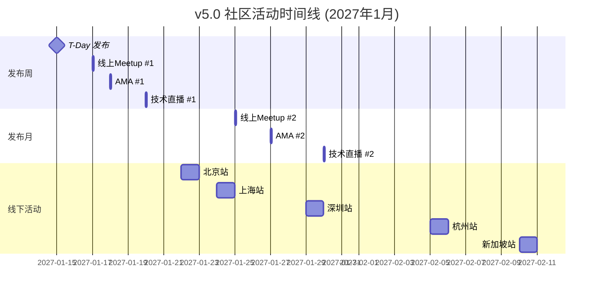

> **状态**: 🔮 前瞻内容 | **风险等级**: 高 | **最后更新**: 2026-04
>
> 此文档描述的内容处于早期规划阶段，可能与最终实现不符。请以 Apache Flink 官方发布为准。
>
# AnalysisDataFlow v5.0 社区活动方案

> **版本**: v5.0.0 | **主题**: "全面生态化" | **时间**: 2027年1月

---

## 📋 活动概览

| 活动类型 | 数量 | 目标参与人数 | 总预算 |
|----------|------|--------------|--------|
| 线上Meetup | 3场 | 1,000+人 | ¥30,000 |
| AMA活动 | 2场 | 500+问题 | ¥10,000 |
| 技术直播 | 2场 | 5,000+观看 | ¥20,000 |
| 全球线下活动 | 5城 | 300+人 | ¥100,000 |
| **总计** | **12场** | **6,800+** | **¥160,000** |

---

## 🗓️ 活动时间线

---

## 🎤 线上Meetup计划

### Meetup #1: v5.0 深度解析

| 项目 | 详情 |
|------|------|
| **时间** | 2027年1月17日 (周六) 20:00-22:00 UTC+8 |
| **平台** | Zoom + Bilibili + YouTube 同步直播 |
| **目标观众** | 500人 |
| **语言** | 中文 |

**议程**:

| 时间 | 环节 | 讲师 | 内容 |
|------|------|------|------|
| 20:00-20:10 | 开场 | 主持人 | 欢迎、介绍、互动规则 |
| 20:10-20:40 | 主题演讲 | @luyanfeng | v5.0整体架构与设计理念 |
| 20:40-21:10 | 功能演示 | @platform-team | 学习平台与知识图谱演示 |
| 21:10-21:40 | 案例分享 | 社区用户 | 实际使用经验分享 |
| 21:40-22:00 | Q&A | 全员 | 观众提问与解答 |

**宣传计划**:

- T-7天: 海报发布、邮件通知
- T-3天: 讲师介绍、议程预告
- T-1天: 提醒通知、测试直播
- T+1天: 录像发布、资料分享

### Meetup #2: 流计算实战工作坊

| 项目 | 详情 |
|------|------|
| **时间** | 2027年1月25日 (周日) 14:00-17:00 UTC+8 |
| **平台** | Zoom |
| **目标观众** | 300人 |
| **语言** | 中文 |

**议程**:

| 时间 | 环节 | 内容 |
|------|------|------|
| 14:00-14:30 | 实战案例分享 | 三个生产环境案例 |
| 14:30-15:30 |  Hands-on Lab | Flink Playground实操 |
| 15:30-15:45 | 休息 | - |
| 15:45-16:45 | 性能调优专题 | State Backend对比与选择 |
| 16:45-17:00 | 总结与预告 | 下期活动预告 |

### Meetup #3: 流计算前沿技术

| 项目 | 详情 |
|------|------|
| **时间** | 2027年2月5日 (周六) 20:00-22:00 UTC+8 |
| **主题** | Flink 2.4/2.5/3.0 前瞻 |
| **目标观众** | 400人 |

**议程**:

- Flink 2.4新特性全景
- AI Agent与流处理融合
- 实时图流处理TGN
- 社区趋势讨论

---

## 💬 AMA (Ask Me Anything) 安排

### AMA #1: 核心团队AMA

| 项目 | 详情 |
|------|------|
| **时间** | 2027年1月18日 (周日) 15:00-17:00 UTC+8 |
| **平台** | Reddit r/apacheflink + Twitter Spaces |
| **嘉宾** | @luyanfeng, @tech-lead, @platform-team |
| **形式** | 在线实时问答 |

**规则**:

1. 提前收集问题 (T-3天开始)
2. 优先回答高赞问题
3. 每个问题回答时间2-5分钟
4. 未回答问题文字回复

**话题范围**:

- ✅ v5.0设计决策
- ✅ 技术架构选择
- ✅ 路线图规划
- ✅ 社区贡献指南
- ❌ 非技术问题
- ❌ 竞品对比攻击

### AMA #2: 用户答疑专场

| 项目 | 详情 |
|------|------|
| **时间** | 2027年1月27日 (周三) 20:00-21:30 UTC+8 |
| **平台** | 钉钉群 + 微信群 |
| **嘉宾** | 社区版主 + 资深用户 |
| **主题** | 使用问题解答与经验分享 |

---

## 📺 技术直播计划

### 直播 #1: 平台架构揭秘

| 项目 | 详情 |
|------|------|
| **时间** | 2027年1月20日 (周四) 20:00-22:00 UTC+8 |
| **平台** | Bilibili + YouTube |
| **主播** | @platform-team |

**内容大纲**:

1. **学习平台架构** (30min)
   - 前端技术栈 (React + Docusaurus)
   - 后端服务设计
   - 数据库选型与优化

2. **知识图谱实现** (30min)
   - D3.js可视化技术
   - 图数据建模
   - 性能优化技巧

3. **国际化方案** (20min)
   - 多语言架构
   - 翻译工作流
   - 术语管理

4. **DevOps实践** (20min)
   - CI/CD流水线
   - 自动化部署
   - 监控告警

5. **互动问答** (20min)

### 直播 #2: 流计算性能调优实战

| 项目 | 详情 |
|------|------|
| **时间** | 2027年1月30日 (周六) 14:00-17:00 UTC+8 |
| **平台** | Bilibili + 知乎 |
| **主播** | @perf-team |

**内容大纲**:

- Checkpoint调优全攻略
- State Backend深度对比
- 网络层优化技巧
- JVM调优实践
- 生产环境案例分析

---

## 🌍 全球线下活动

### 活动城市与日期

| 城市 | 日期 | 时间 | 场地 | 预计人数 |
|------|------|------|------|----------|
| 北京 | 1月22日 | 14:00-17:00 | 中关村创业大街 | 100人 |
| 上海 | 1月24日 | 14:00-17:00 | 张江科技园 | 80人 |
| 深圳 | 1月29日 | 14:00-17:00 | 南山科技园 | 60人 |
| 杭州 | 2月5日 | 14:00-17:00 | 未来科技城 | 40人 |
| 新加坡 | 2月10日 | 18:00-21:00 | 待定 | 30人 |

### 北京站详细安排

**主题**: AnalysisDataFlow v5.0 北京见面会

**议程**:

| 时间 | 环节 | 内容 |
|------|------|------|
| 14:00-14:30 | 签到 | 领取纪念品 |
| 14:30-14:45 | 开场 | 社区发展介绍 |
| 14:45-15:30 | 主题演讲 | v5.0新特性深度解析 |
| 15:30-15:45 | 茶歇 | 自由交流 |
| 15:45-16:30 | 用户分享 | 三家企业的使用案例 |
| 16:30-17:00 | 自由交流 | 合影、交换联系方式 |

**物资准备**:

- 项目贴纸 100份
- 定制T恤 50件
- 宣传册 100份
- 饮料零食
- 投影仪、麦克风

**预算**: ¥15,000

---

## 🎁 社区激励计划

### 贡献者奖励

| 贡献类型 | 奖励内容 | 名额 |
|----------|----------|------|
| 优质PR | 定制机械键盘 | 10名 |
| 文档改进 | 项目周边礼包 | 20名 |
| Bug报告 | 项目贴纸+徽章 | 不限 |
| 翻译贡献 | 双语证书+礼品 | 50名 |

### 活动抽奖

每场活动设置抽奖环节：

- 🥇 一等奖: iPad Pro (1名)
- 🥈 二等奖: AirPods Pro (3名)
- 🥉 三等奖: 项目定制周边 (10名)
- 🎁 参与奖: 电子版感谢证书 (所有参与者)

---

## 📢 宣传推广计划

### 预热阶段 (T-2周至T-1周)

| 时间 | 内容 | 渠道 |
|------|------|------|
| T-14天 | 倒计时海报 | 全渠道 |
| T-10天 | 功能预告系列 | Twitter/微博 |
| T-7天 | Meetup报名开启 | 邮件/社区 |
| T-5天 | 幕后故事 | 博客/公众号 |
| T-3天 | 讲师介绍 | 社交媒体 |
| T-1天 | 最后提醒 | 全渠道 |

### 发布日 (T-Day)

| 时间 | 内容 | 渠道 |
|------|------|------|
| 14:00 UTC | 发布公告 | GitHub/官网 |
| 14:00 UTC | 社交媒体同步 | Twitter/微博/知乎 |
| 15:00 UTC | 邮件通知 | 邮件列表 |
| 16:00 UTC | 社区论坛置顶 | Discourse |

### 后续推广 (T+1周至T+4周)

| 时间 | 内容 | 渠道 |
|------|------|------|
| T+2天 | 活动回顾 | 博客 |
| T+7天 | 用户故事 | 公众号 |
| T+14天 | 数据报告 | 全渠道 |
| T+28天 | 下版本预告 | 邮件/社区 |

---

## 👥 组织团队

### 活动组织委员会

| 角色 | 负责人 | 职责 |
|------|--------|------|
| 总负责人 | @event-lead | 整体协调、资源调配 |
| 线上活动 | @online-team | Meetup、AMA、直播 |
| 线下活动 | @offline-team | 场地、物料、签到 |
| 宣传推广 | @marketing | 海报、文案、投放 |
| 技术支持 | @tech-support | 直播、平台、设备 |
| 志愿者 | @volunteers | 现场支持、答疑 |

### 合作伙伴

- 场地赞助: 待定
- 媒体支持: InfoQ、CSDN、掘金
- 社区合作: Apache Flink 社区、CNCF

---

## 📊 成功指标

### 定量指标

| 指标 | 目标 | 实际 | 状态 |
|------|------|------|------|
| 线上活动参与人数 | 1,800人 | - | ⏳ |
| 线下活动参与人数 | 310人 | - | ⏳ |
| 社交媒体曝光 | 100万次 | - | ⏳ |
| 新增GitHub Star | 500个 | - | ⏳ |
| 新增邮件订阅 | 1,000人 | - | ⏳ |

### 定性指标

- [ ] 参与者满意度 > 90%
- [ ] 媒体报道 > 5篇
- [ ] 社区活跃度提升 > 50%
- [ ] 新增贡献者 > 30人

---

## ⚠️ 风险与应对

| 风险 | 可能性 | 影响 | 应对措施 |
|------|--------|------|----------|
| 参与人数不足 | 中 | 中 | 提前宣传、KOL邀请 |
| 技术故障 | 低 | 高 | 备用方案、提前测试 |
| 嘉宾缺席 | 低 | 中 | 备选嘉宾、录播预案 |
| 负面反馈 | 低 | 中 | 及时回应、改进沟通 |

---

## 📞 联系方式

- **活动咨询**: <events@analysisdataflow.org>
- **媒体合作**: <media@analysisdataflow.org>
- **志愿者报名**: <volunteer@analysisdataflow.org>

---

*AnalysisDataFlow v5.0 社区活动方案 - 全面生态化*

[🏠 返回首页](../README.md) | [📄 发布说明](./RELEASE-NOTES-v5.0.md) | [📢 发布公告](./ANNOUNCEMENT.md)
