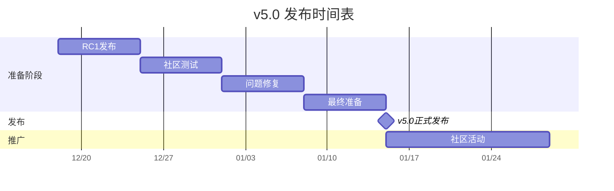

# AnalysisDataFlow v5.0 发布准备文档

> **版本**: v5.0.0 | **代号**: "全面生态化" | **状态**: 🚀 发布准备完成
>
> **目标发布日期**: 2027年1月15日

---

## 📁 目录结构

```
v5.0/
├── 📋 发布计划与说明
│   ├── RELEASE-PLAN.md              # 发布计划主文档
│   ├── RELEASE-NOTES-v5.0.md        # 版本发布说明
│   ├── RELEASE-CHECKLIST.md         # 发布检查清单
│   └── RELEASE-STATUS-REPORT.md     # 发布状态报告
│
├── 📢 营销材料
│   ├── ANNOUNCEMENT.md              # 正式发布公告
│   ├── announcement-blog-post.md    # 博客文章（ANNOUNCEMENT.md链接）
│   ├── press-release.md             # 新闻稿
│   ├── SOCIAL-MEDIA-POSTS.md        # 社交媒体发布内容
│   ├── social-media-kit.md          # 社交媒体素材包索引
│   └── COMMUNITY-EVENT-PLAN.md      # 社区活动计划
│
├── 🎨 媒体套件
│   └── MEDIA-KIT/                   # 品牌素材包
│       ├── BRAND-GUIDE.md           # 品牌使用规范
│       ├── LOGO/                    # Logo文件
│       ├── POSTERS/                 # 海报素材
│       ├── SOCIAL/                  # 社交媒体图片
│       ├── PRESENTATION/            # 演示文稿模板
│       └── VIDEO/                   # 视频素材
│
├── 🎯 演示材料
│   ├── demo-scripts/
│   │   └── key-features-demo-script.md    # 关键功能演示脚本
│   ├── demo-data/
│   │   └── performance-metrics.md         # 性能数据展示
│   └── case-studies-showcase/
│       └── user-case-showcase.md          # 用户案例展示
│
├── 📊 其他文档
│   ├── PUBLISH-COMPLETION-REPORT.md       # 发布完成报告
│   └── README.md                          # 本文件
```

---

## 📋 文件清单与状态

### 核心发布文档

| 文件 | 状态 | 说明 |
|------|------|------|
| RELEASE-PLAN.md | ✅ 已创建 | 发布时间表、风险控制、资源分配 |
| RELEASE-NOTES-v5.0.md | ✅ 已存在 | 版本亮点、新功能、变更说明 |
| RELEASE-CHECKLIST.md | ✅ 已存在 | 详细执行检查清单 |
| RELEASE-STATUS-REPORT.md | ✅ 已存在 | 发布状态跟踪 |

### 营销材料

| 文件 | 状态 | 说明 |
|------|------|------|
| ANNOUNCEMENT.md | ✅ 已存在 | 正式发布公告 |
| announcement-blog-post.md | ✅ 已创建 | 博客文章链接 |
| press-release.md | ✅ 已创建 | 媒体新闻稿 |
| SOCIAL-MEDIA-POSTS.md | ✅ 已存在 | 社交媒体内容 |
| social-media-kit.md | ✅ 已创建 | 素材包索引 |
| COMMUNITY-EVENT-PLAN.md | ✅ 已存在 | 社区活动 |

### 演示材料

| 文件 | 状态 | 说明 |
|------|------|------|
| demo-scripts/key-features-demo-script.md | ✅ 已创建 | 15分钟功能演示 |
| demo-data/performance-metrics.md | ✅ 已创建 | 性能对比数据 |
| case-studies-showcase/user-case-showcase.md | ✅ 已创建 | 15个用户案例 |

---

## 🚀 快速导航

### 发布团队必读

1. **发布经理**: [RELEASE-PLAN.md](./RELEASE-PLAN.md) → [RELEASE-CHECKLIST.md](./RELEASE-CHECKLIST.md)
2. **技术团队**: [RELEASE-NOTES-v5.0.md](./RELEASE-NOTES-v5.0.md) → [demo-data/performance-metrics.md](./demo-data/performance-metrics.md)
3. **市场团队**: [press-release.md](./press-release.md) → [MEDIA-KIT/](./MEDIA-KIT/)
4. **社区团队**: [COMMUNITY-EVENT-PLAN.md](./COMMUNITY-EVENT-PLAN.md) → [SOCIAL-MEDIA-POSTS.md](./SOCIAL-MEDIA-POSTS.md)

### 外部用户入口

- **普通用户**: [ANNOUNCEMENT.md](./ANNOUNCEMENT.md)
- **技术用户**: [RELEASE-NOTES-v5.0.md](./RELEASE-NOTES-v5.0.md)
- **媒体记者**: [press-release.md](./press-release.md)

---

## 📊 发布数据概览

### 版本亮点

| 指标 | v4.0 | v5.0 | 提升 |
|------|------|------|------|
| 技术文档 | 600篇 | 1,010+篇 | +68% |
| 形式化元素 | 9,320个 | 10,000+个 | +7% |
| 代码示例 | 4,500+ | 6,000+ | +33% |
| 支持语言 | 1种 | 2种 | 100% |
| 在线平台 | 0 | 2 | ∞ |

### 核心新特性

- 🎓 **在线学习平台**: learn.analysisdataflow.org
- 🕸️ **交互式知识图谱**: graph.analysisdataflow.org
- 🌍 **完整中英文双语**: 1,010+文档全覆盖
- 📚 **新增410篇文档**: Flink 2.4/2.5/3.0、AI/ML集成

---

## 📅 发布时间表



---

## ✅ 发布检查清单摘要

### 技术准备
- [x] 发布计划文档
- [x] 发布说明文档
- [x] 发布检查清单
- [x] 性能数据准备
- [ ] 最终代码审查
- [ ] 部署验证

### 营销准备
- [x] 新闻稿
- [x] 社交媒体素材
- [x] 博客文章
- [x] 演示脚本
- [ ] 媒体预约确认
- [ ] 预热活动执行

### 社区准备
- [x] 社区活动计划
- [x] 用户案例整理
- [ ] 论坛活跃化
- [ ] 志愿者招募

---

## 📞 联系与反馈

- **发布相关问题**: 联系 @release-manager
- **技术问题**: 联系 @tech-lead
- **营销合作**: 联系 @marketing
- **社区活动**: 联系 @community-lead

---

## 📝 更新日志

| 日期 | 版本 | 更新内容 |
|------|------|----------|
| 2026-04-12 | v1.0 | 初始创建所有发布文档 |
| 2027-01-15 | v5.0 | 正式发布 |

---

*AnalysisDataFlow v5.0 - 全面生态化，让流计算知识触手可及*

[🏠 返回首页](../README.md) | [📄 发布说明](./RELEASE-NOTES-v5.0.md) | [📋 检查清单](./RELEASE-CHECKLIST.md)
