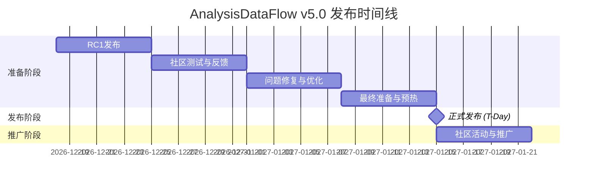

# AnalysisDataFlow v5.0.0 发布检查清单

> **版本**: v5.0.0 | **发布日期**: 2027年1月15日 | **状态**: 准备中

---

## 📋 清单概览

| 阶段 | 任务数 | 已完成 | 状态 |
|------|--------|--------|------|
| **T-4周 (RC1)** | 25 | 0 | ⏳ 未开始 |
| **T-3周 (社区测试)** | 15 | 0 | ⏳ 未开始 |
| **T-2周 (修复优化)** | 20 | 0 | ⏳ 未开始 |
| **T-1周 (最终准备)** | 30 | 0 | ⏳ 未开始 |
| **T-Day (正式发布)** | 15 | 0 | ⏳ 未开始 |
| **T+1周 (推广)** | 10 | 0 | ⏳ 未开始 |
| **总计** | **115** | **0** | **⏳ 准备中** |

---

## 🗓️ 发布时间线



---

## 🔴 T-4周: 发布候选版 (RC1) - 2026年12月18日

### 技术准备 (责任人: @tech-lead)

| # | 任务 | 负责人 | 状态 | 验收标准 |
|---|------|--------|------|----------|
| 1.1 | 所有文档最终审核 | @doc-team | ⏳ | 文档完整度100%，无占位符 |
| 1.2 | 代码示例最终验证 | @dev-team | ⏳ | 所有示例可运行 |
| 1.3 | 交叉引用最终检查 | @qa-team | ⏳ | 失效链接=0 |
| 1.4 | 性能基准数据确认 | @perf-team | ⏳ | 基准测试报告更新 |
| 1.5 | 知识图谱上线确认 | @infra-team | ⏳ | graph.analysisdataflow.org可访问 |
| 1.6 | 学习平台上线确认 | @platform-team | ⏳ | learn.analysisdataflow.org可访问 |
| 1.7 | 英文版网站上线确认 | @i18n-team | ⏳ | 中英文切换正常 |

### 内容准备 (责任人: @content-lead)

| # | 任务 | 负责人 | 状态 | 验收标准 |
|---|------|--------|------|----------|
| 2.1 | 发布说明完成 | @pm | ⏳ | RELEASE-NOTES-v5.0.md发布 |
| 2.2 | 白皮书发布 | @content-team | ⏳ | whitepaper-v5.0.pdf发布 |
| 2.3 | 博客文章撰写 | @content-team | ⏳ | 5篇预热文章就绪 |
| 2.4 | 社交媒体素材 | @marketing | ⏳ | 图片/视频素材准备完成 |
| 2.5 | 邮件模板准备 | @marketing | ⏳ | 中英文邮件模板就绪 |

### 社区准备 (责任人: @community-lead)

| # | 任务 | 负责人 | 状态 | 验收标准 |
|---|------|--------|------|----------|
| 3.1 | 讨论论坛活跃 | @community-team | ⏳ | 月活跃讨论>30个 |
| 3.2 | 贡献者感谢名单 | @pm | ⏳ | CONTRIBUTORS-v5.0.md更新 |
| 3.3 | 社区活动安排 | @event-team | ⏳ | AMA时间确定 |

### RC1发布检查

| # | 检查项 | 负责人 | 状态 |
|---|--------|--------|------|
| 4.1 | GitHub Release创建 | @release-manager | ⏳ |
| 4.2 | RC1标签推送 | @release-manager | ⏳ |
| 4.3 | 版本号更新 | @release-manager | ⏳ |
| 4.4 | 变更日志更新 | @release-manager | ⏳ |

---

## 🟠 T-3周: 社区测试与反馈 - 2026年12月25日

### 测试任务 (责任人: @qa-lead)

| # | 任务 | 测试范围 | 负责人 | 状态 |
|---|------|----------|--------|------|
| 5.1 | 功能测试 | 学习平台 | @qa-team | ⏳ |
| 5.2 | 功能测试 | 知识图谱 | @qa-team | ⏳ |
| 5.3 | 兼容性测试 | 多浏览器 | @qa-team | ⏳ |
| 5.4 | 兼容性测试 | 移动端 | @qa-team | ⏳ |
| 5.5 | 性能测试 | 页面加载 | @perf-team | ⏳ |
| 5.6 | 安全测试 | OWASP Top 10 | @security-team | ⏳ |

### 反馈收集 (责任人: @community-lead)

| # | 渠道 | 负责人 | 状态 |
|---|------|--------|------|
| 6.1 | GitHub Issues收集 | @community-team | ⏳ |
| 6.2 | 论坛反馈汇总 | @community-team | ⏳ |
| 6.3 | 邮件反馈整理 | @community-team | ⏳ |
| 6.4 | Slack反馈收集 | @community-team | ⏳ |

### 文档审校 (责任人: @doc-lead)

| # | 文档 | 审校人 | 状态 |
|---|------|--------|------|
| 7.1 | 发布说明 | @tech-writer | ⏳ |
| 7.2 | 安装指南 | @tech-writer | ⏳ |
| 7.3 | 快速开始 | @tech-writer | ⏳ |
| 7.4 | 升级指南 | @tech-writer | ⏳ |
| 7.5 | API文档 | @tech-writer | ⏳ |

---

## 🟡 T-2周: 问题修复与优化 - 2027年1月1日

### 高优先级修复 (P0)

| # | 问题描述 | 负责人 | 截止日期 | 状态 |
|---|----------|--------|----------|------|
| 8.1 | [预留] 阻塞性问题1 | @dev-team | 2027-01-03 | ⏳ |
| 8.2 | [预留] 阻塞性问题2 | @dev-team | 2027-01-03 | ⏳ |
| 8.3 | [预留] 阻塞性问题3 | @dev-team | 2027-01-03 | ⏳ |

### 中优先级修复 (P1)

| # | 问题描述 | 负责人 | 截止日期 | 状态 |
|---|----------|--------|----------|------|
| 9.1 | [预留] 重要问题1 | @dev-team | 2027-01-05 | ⏳ |
| 9.2 | [预留] 重要问题2 | @dev-team | 2027-01-05 | ⏳ |

### 性能优化

| # | 优化项 | 目标指标 | 负责人 | 状态 |
|---|--------|----------|--------|------|
| 10.1 | 首屏加载 | < 2s | @perf-team | ⏳ |
| 10.2 | 搜索响应 | < 100ms | @perf-team | ⏳ |
| 10.3 | 图谱渲染 | < 3s | @perf-team | ⏳ |

### 内容优化

| # | 优化项 | 负责人 | 状态 |
|---|--------|--------|------|
| 11.1 | SEO优化 | @marketing | ⏳ |
| 11.2 | 元数据完善 | @content-team | ⏳ |
| 11.3 | 社交分享优化 | @marketing | ⏳ |

---

## 🟢 T-1周: 最终准备与预热 - 2027年1月8日

### 发布物最终检查

| # | 发布物 | 检查项 | 负责人 | 状态 |
|---|--------|--------|--------|------|
| 12.1 | RELEASE-NOTES | 内容完整 | @pm | ⏳ |
| 12.2 | RELEASE-CHECKLIST | 全部完成 | @pm | ⏳ |
| 12.3 | ANNOUNCEMENT | 多平台版本 | @marketing | ⏳ |
| 12.4 | MEDIA-KIT | 素材齐全 | @design-team | ⏳ |
| 12.5 | COMMUNITY-EVENT-PLAN | 活动就绪 | @event-team | ⏳ |

### 基础设施检查

| # | 检查项 | 负责人 | 状态 |
|---|--------|--------|------|
| 13.1 | 服务器扩容 | @infra-team | ⏳ |
| 13.2 | CDN预热 | @infra-team | ⏳ |
| 13.3 | 数据库备份 | @infra-team | ⏳ |
| 13.4 | 监控告警 | @infra-team | ⏳ |
| 13.5 | 应急预案 | @infra-team | ⏳ |

### 营销推广准备

| # | 渠道 | 准备内容 | 负责人 | 状态 |
|---|------|----------|--------|------|
| 14.1 | Hacker News | 发布草稿 | @marketing | ⏳ |
| 14.2 | Reddit | 帖子准备 | @marketing | ⏳ |
| 14.3 | Twitter/X | 推文系列 | @marketing | ⏳ |
| 14.4 | LinkedIn | 文章准备 | @marketing | ⏳ |
| 14.5 | 中文社区 | 多平台文案 | @marketing-cn | ⏳ |
| 14.6 | 技术播客 | 嘉宾预约 | @pr-team | ⏳ |

### 预热活动

| # | 活动 | 时间 | 负责人 | 状态 |
|---|------|------|--------|------|
| 15.1 | 倒计时海报 | T-7天起 | @design-team | ⏳ |
| 15.2 | 功能预告 | T-5天起 | @marketing | ⏳ |
| 15.3 | 幕后故事 | T-3天起 | @content-team | ⏳ |
| 15.4 | 直播预告 | T-2天 | @event-team | ⏳ |

---

## 🎉 T-Day: 正式发布 - 2027年1月15日

### 发布日时间表

```
08:00 UTC - 最终检查会议
09:00 UTC - 代码冻结
10:00 UTC - 生产部署
11:00 UTC - 冒烟测试
12:00 UTC - GitHub Release发布
13:00 UTC - 网站公告更新
14:00 UTC - 社交媒体同步发布
15:00 UTC - 邮件通知发送
16:00 UTC - 社区论坛置顶
17:00 UTC - 监控状态确认
18:00 UTC - 发布庆祝 🎉
```

### 发布执行清单

| # | 任务 | 时间 | 负责人 | 状态 |
|---|------|------|--------|------|
| 16.1 | 最终检查会议 | 08:00 UTC | @release-manager | ⏳ |
| 16.2 | 代码冻结确认 | 09:00 UTC | @tech-lead | ⏳ |
| 16.3 | 生产环境部署 | 10:00 UTC | @infra-team | ⏳ |
| 16.4 | 冒烟测试执行 | 11:00 UTC | @qa-team | ⏳ |
| 16.5 | GitHub Release | 12:00 UTC | @release-manager | ⏳ |
| 16.6 | 网站首页更新 | 13:00 UTC | @web-team | ⏳ |
| 16.7 | 社交媒体发布 | 14:00 UTC | @marketing | ⏳ |
| 16.8 | 邮件通知发送 | 15:00 UTC | @marketing | ⏳ |
| 16.9 | 论坛公告置顶 | 16:00 UTC | @community-team | ⏳ |
| 16.10 | 监控系统确认 | 17:00 UTC | @infra-team | ⏳ |
| 16.11 | 庆祝活动 | 18:00 UTC | 全员 | ⏳ |

### 发布渠道

| # | 渠道 | URL | 发布时间 | 负责人 | 状态 |
|---|------|-----|----------|--------|------|
| 17.1 | GitHub Releases | github.com/... | 12:00 UTC | @release-manager | ⏳ |
| 17.2 | 官方网站 | analysisdataflow.org | 13:00 UTC | @web-team | ⏳ |
| 17.3 | 学习平台 | learn.analysisdataflow.org | 13:00 UTC | @platform-team | ⏳ |
| 17.4 | 知识图谱 | graph.analysisdataflow.org | 13:00 UTC | @platform-team | ⏳ |
| 17.5 | Hacker News | news.ycombinator.com | 14:00 UTC | @marketing | ⏳ |
| 17.6 | Reddit r/apacheflink | reddit.com/r/apacheflink | 14:00 UTC | @marketing | ⏳ |
| 17.7 | Twitter/X | twitter.com | 14:00 UTC | @marketing | ⏳ |
| 17.8 | LinkedIn | linkedin.com | 14:00 UTC | @marketing | ⏳ |
| 17.9 | 掘金 | juejin.cn | 14:00 UTC | @marketing-cn | ⏳ |
| 17.10 | CSDN | csdn.net | 14:00 UTC | @marketing-cn | ⏳ |
| 17.11 | 知乎 | zhihu.com | 14:00 UTC | @marketing-cn | ⏳ |

---

## 📢 T+1周: 社区活动与推广 - 2027年1月22日

### 社区活动

| # | 活动 | 时间 | 负责人 | 状态 |
|---|------|------|--------|------|
| 18.1 | 线上Meetup | T+2天 | @event-team | ⏳ |
| 18.2 | AMA (Ask Me Anything) | T+3天 | @community-team | ⏳ |
| 18.3 | 技术直播 | T+5天 | @content-team | ⏳ |
| 18.4 | 用户访谈 | T+7天 | @product-team | ⏳ |

### 反馈收集与分析

| # | 任务 | 负责人 | 状态 |
|---|------|--------|------|
| 19.1 | 用户反馈收集 | @product-team | ⏳ |
| 19.2 | 数据分析报告 | @data-team | ⏳ |
| 19.3 | 问题汇总分类 | @qa-team | ⏳ |
| 19.4 | 改进计划制定 | @pm | ⏳ |

### 后续跟进

| # | 任务 | 负责人 | 截止日期 | 状态 |
|---|------|--------|----------|------|
| 20.1 | v5.0.1补丁计划 | @pm | T+14天 | ⏳ |
| 20.2 | v5.1规划启动 | @pm | T+21天 | ⏳ |
| 20.3 | 发布复盘会议 | @pm | T+7天 | ⏳ |

---

## 📊 责任人汇总

| 角色 | 负责人 | 主要职责 |
|------|--------|----------|
| 发布经理 | @release-manager | 整体协调、发布执行 |
| 技术负责人 | @tech-lead | 技术决策、代码审核 |
| 产品经理 | @pm | 需求确认、验收标准 |
| 文档负责人 | @doc-lead | 文档质量、一致性 |
| QA负责人 | @qa-lead | 测试策略、质量把关 |
| 市场负责人 | @marketing | 推广策略、品牌建设 |
| 社区负责人 | @community-lead | 社区运营、用户沟通 |
| 基础设施 | @infra-lead | 部署、运维、监控 |

---

## 📞 应急联系

| 角色 | 联系人 | 联系方式 | 备用联系方式 |
|------|--------|----------|--------------|
| 发布经理 | @release-manager | slack:@release-manager | phone:+86-xxx-xxxx-xxxx |
| 技术负责人 | @tech-lead | slack:@tech-lead | phone:+86-xxx-xxxx-xxxx |
| 基础设施 | @infra-lead | slack:@infra-lead | phone:+86-xxx-xxxx-xxxx |

---

## ✅ 完成确认

发布完成后，请在此确认:

- [ ] 所有检查项已完成
- [ ] 无阻塞性问题遗留
- [ ] 各渠道发布成功
- [ ] 监控系统正常运行
- [ ] 社区反馈积极
- [ ] 发布复盘已安排

**发布确认签名**: _________________ **日期**: _________________

---

*AnalysisDataFlow v5.0.0 发布检查清单 - 全面生态化*

[📄 发布说明](./RELEASE-NOTES-v5.0.md) | [📢 发布公告](./ANNOUNCEMENT.md) | [🎉 社区活动](./COMMUNITY-EVENT-PLAN.md)
