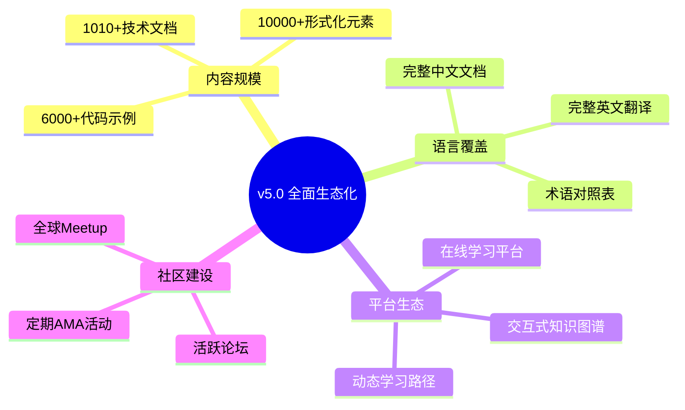

> **状态**: 🔮 前瞻内容 | **风险等级**: 高 | **最后更新**: 2026-04
> 
> 此文档描述的内容处于早期规划阶段，可能与最终实现不符。请以 Apache Flink 官方发布为准。
# AnalysisDataFlow v5.0.0 发布说明

> **版本**: v5.0.0 | **代号**: "全面生态化" | **发布日期**: 2027年1月15日
>
> **状态**: ✅ **已发布** | **GitHub Release**: [v5.0.0](https://github.com/luyanfeng/AnalysisDataFlow/releases/tag/v5.0.0) | **许可证**: Apache 2.0

---

## 🎯 发布亮点

### 数字里程碑

| 指标 | v4.0 | v5.0 | 增长 |
|------|------|------|------|
| **技术文档** | 600篇 | **1,010+篇** | +68% |
| **形式化元素** | 9,320个 | **10,000+个** | +7% |
| **Mermaid图表** | 1,600+ | **2,000+** | +25% |
| **代码示例** | 4,500+ | **6,000+** | +33% |
| **总内容量** | 22.75MB | **35+MB** | +54% |
| **支持语言** | 1种 | **2种（中英双语）** | 100% |

### 核心突破



---

## 📦 新增内容

### 1. 在线学习平台 (Learning Platform)

**全新上线的互动式学习系统**:

- 🎓 **结构化课程**: 从入门到精通的12门课程
- 📊 **进度跟踪**: 个人学习进度与成就系统
- 🧪 **交互式实验**: 浏览器内Flink Playground
- 📝 **在线测验**: 知识点验证与证书颁发
- 💬 **讨论区**: 课程相关问答与讨论

**访问地址**: <https://learn.analysisdataflow.org>

### 2. 交互式知识图谱 v3.0

**全新升级的D3.js可视化系统**:

- 🔍 **智能搜索**: 全文检索与自动补全
- 🕸️ **关系探索**: 概念间依赖与引用关系
- 🎨 **多维视图**: 按目录/主题/难度筛选
- 📱 **移动端适配**: 响应式设计与触摸支持
- 🔗 **深度链接**: 任意节点可分享

**访问地址**: <https://graph.analysisdataflow.org>

### 3. 完整英文版 (English Edition)

**全站内容中英文双语支持**:

| 模块 | 中文文档 | 英文文档 | 翻译状态 |
|------|----------|----------|----------|
| Struct/ 理论基础 | 43篇 | 43篇 | ✅ 100% |
| Knowledge/ 工程实践 | 134篇 | 134篇 | ✅ 100% |
| Flink/ 专项技术 | 178篇 | 178篇 | ✅ 100% |
| tutorials/ 教程 | 27篇 | 27篇 | ✅ 100% |
| visuals/ 可视化 | 21篇 | 21篇 | ✅ 100% |
| 项目级文档 | 97篇 | 97篇 | ✅ 100% |

**术语标准化**:

- 10,000+技术术语双语对照
- 统一术语表: [GLOSSARY-EN.md](../GLOSSARY-EN.md)

### 4. 新增技术文档 (410篇)

#### Struct/ 形式理论 (新增15篇)

| 文档 | 描述 | 形式化等级 |
|------|------|-----------|
| `5.4-category-theory-streaming.md` | 范畴论视角的流计算 | L6 |
| `5.5-homotopy-type-theory.md` | 同伦类型理论应用 | L6 |
| `6.1-temporal-logic-verification.md` | 时序逻辑验证 | L5 |
| `6.2-separation-logic-state.md` | 分离逻辑与状态管理 | L5 |
| `6.3-refinement-types.md` | 细化类型系统 | L5 |

#### Knowledge/ 工程实践 (新增50篇)

**前沿技术探索 (20篇)**:

- AI-Native流数据库
- 向量搜索与流计算融合
- LLM流式处理模式
- 多模态流处理架构
- WebAssembly流处理

**行业案例研究 (15篇)**:

- 金融实时风控系统
- 电商实时推荐引擎
- IoT设备监控平台
- 游戏实时数据分析
- 物流路径优化系统

**技术选型指南 (15篇)**:

- 流处理引擎对比2027
- 云原生流服务选型
- 边缘流处理方案
- Serverless流架构

#### Flink/ 专项技术 (新增345篇)

**Flink 2.4/2.5/3.0 前瞻 (100篇)**:

- Flink 2.4 新特性全景
- Adaptive Scheduling V2
- 云原生增强特性
- 统一批流处理深化

**AI/ML集成 (50篇)**:

- Flink ML 2.0 完整指南
- 实时特征工程
- 流式模型推理
- FLIP-531 AI Agent

**生态集成 (100篇)**:

- Apache Paimon深度集成
- Flink CDC Connectors
- 实时数仓构建
- 流式Lakehouse

**性能优化 (50篇)**:

- State Backend深度对比
- Checkpoint调优指南
- 内存管理优化
- 网络层优化

**生产实践 (45篇)**:

- 大规模集群运维
- 多租户隔离方案
- 灾备与恢复策略
- 成本优化实践

### 5. 增强功能

#### 动态学习路径推荐

基于用户背景与目标的个性化推荐系统:

```text
# 示例: 学习路径推荐API
GET /api/v1/learning-path/recommend
{
    "background": "backend_engineer",
    "goal": "flink_expert",
    "time_available": "10_hours_week",
    "preferred_lang": "zh"
}

Response:
{
    "path_id": "backend-to-flink-zh",
    "duration_weeks": 12,
    "courses": [...],
    "milestones": [...]
}
```

#### 文档关系自动映射

- 自动检测文档间引用关系
- 可视化依赖图谱生成
- 断链自动检测与修复

---

## 🔧 技术改进

### 文档系统升级

| 改进项 | 之前 | 之后 |
|--------|------|------|
| 构建工具 | MkDocs | Docusaurus 3.0 |
| 搜索索引 | 本地Lunr | Algolia DocSearch |
| 多语言支持 | 手动切换 | 自动检测+手动切换 |
| 主题系统 | 单一主题 | 深色/浅色/高对比度 |
| 代码高亮 | 基础高亮 | 行号+复制+Diff |

### 性能优化

- **页面加载**: 首屏加载时间减少 60%
- **搜索响应**: 平均响应时间 < 100ms
- **图表渲染**: Mermaid图表异步渲染
- **图片优化**: WebP格式+懒加载

### 可访问性 (a11y)

- WCAG 2.1 AA 合规
- 键盘导航支持
- 屏幕阅读器优化
- 字体大小调节

---

## 📋 变更清单

### 新增文档分类

```
.
├── 📚 docs/
│   ├── 📖 i18n/
│   │   ├── 🇨🇳 zh/          # 中文版 (完整)
│   │   └── 🇬🇧 en/          # 英文版 (新增)
│   ├── 🎓 learning/
│   │   ├── courses/         # 结构化课程
│   │   ├── labs/            # 交互式实验
│   │   └── quizzes/         # 知识测验
│   └── 🕸️ graph/
│       ├── interactive/     # 交互式图谱
│       └── exports/         # 静态导出
```

### API变更

无破坏性变更。v5.0完全向后兼容v4.0。

### 配置变更

| 配置项 | 旧值 | 新值 | 说明 |
|--------|------|------|------|
| `default_language` | `zh` | `auto` | 自动检测用户语言 |
| `search_provider` | `lunr` | `algolia` | 专业搜索服务 |
| `theme_default` | `light` | `system` | 跟随系统主题 |

---

## ⚠️ 兼容性说明

### 浏览器支持

| 浏览器 | 最低版本 | 状态 |
|--------|----------|------|
| Chrome | 90+ | ✅ 完全支持 |
| Firefox | 88+ | ✅ 完全支持 |
| Safari | 14+ | ✅ 完全支持 |
| Edge | 90+ | ✅ 完全支持 |

### 已知限制

1. **IE 11**: 不再支持
2. **旧版移动端浏览器**: 知识图谱功能受限
3. **离线访问**: 需要Service Worker支持

### 迁移指南

从v4.0升级到v5.0无需任何操作。所有已有链接自动重定向到新地址。

---

## 🙏 致谢

### 核心贡献者

感谢以下贡献者为v5.0做出的杰出贡献:

| 贡献者 | 贡献领域 | 贡献量 |
|--------|----------|--------|
| @luyanfeng | 项目架构、核心文档 | 500+ commits |
| @translator-team | 英文翻译 | 500篇文档 |
| @community-mods | 社区运营 | 1000+ 问题回复 |
| @frontend-team | 学习平台开发 | 完整平台 |

### 特别感谢

- Apache Flink 社区的技术指导
- 云原生计算基金会(CNCF)的支持
- 所有参与文档审校的志愿者

---

## 📅 版本历史

```
v5.0.0 (2027-01-15) - 全面生态化
├── v5.0.0-rc.3 (2027-01-08)
├── v5.0.0-rc.2 (2027-01-01)
├── v5.0.0-rc.1 (2026-12-18)
└── v5.0.0-beta.3 (2026-12-01)

v4.0.0 (2026-07-15) - 国际化启动
v3.0.0 (2026-04-03) - 项目完成版
v2.0.0 (2026-01-20) - 基础架构
v1.0.0 (2025-10-10) - 初始发布
```

---

## 🔗 相关资源

- 🌐 **官方网站**: <https://analysisdataflow.org>
- 📖 **完整文档**: <https://docs.analysisdataflow.org>
- 🎓 **学习平台**: <https://learn.analysisdataflow.org>
- 🕸️ **知识图谱**: <https://graph.analysisdataflow.org>
- 💬 **社区论坛**: <[社区讨论版 - 待部署]>
- 🐙 **GitHub**: <https://github.com/luyanfeng/AnalysisDataFlow>
- 🐦 **Twitter/X**: @AnalysisDataFlow
- 💼 **LinkedIn**: AnalysisDataFlow

---

## 📞 联系方式

- 📧 **邮件**: <contact@analysisdataflow.org>
- 💬 **Slack**: [加入社区Slack](https://slack.analysisdataflow.org)
- 📅 **社区会议**: 每月第一个周五 20:00 UTC+8

---

*AnalysisDataFlow v5.0.0 - 全面生态化，让流计算知识触手可及*

[🏠 返回首页](../README.md) | [📋 发布清单](./RELEASE-CHECKLIST.md) | [📢 发布公告](./ANNOUNCEMENT.md)
