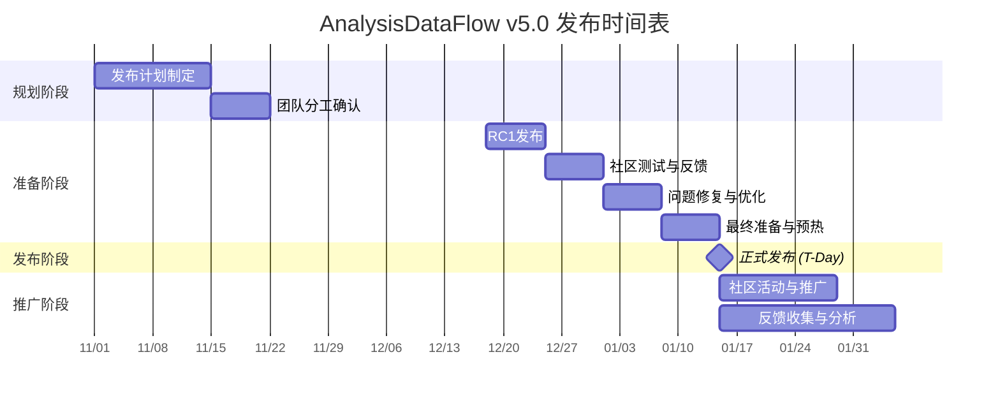

# AnalysisDataFlow v5.0 发布计划

> **版本**: v5.0.0 | **代号**: "全面生态化" | **状态**: 🚀 正式发布准备中
>
> **目标发布日期**: 2027年1月15日 | **文档版本**: v1.0

---

## 📋 执行摘要

### 发布目标

AnalysisDataFlow v5.0 是项目从"技术文档库"向"流计算知识生态"转型的里程碑版本。本次发布将交付：

- **1,010+** 技术文档（较v4.0增长68%）
- **完整中英文双语**支持
- **在线学习平台**正式上线
- **交互式知识图谱**v3.0发布
- **10,000+** 形式化元素

### 关键成功指标 (KPI)

| 指标 | 目标值 | 测量方式 |
|------|--------|----------|
| 发布日网站访问量 | 10,000+ UV | Google Analytics |
| 社交媒体曝光量 | 100,000+ 展示 | 各平台统计 |
| GitHub Star增长 | +500 | GitHub API |
| 社区注册用户数 | +1,000 | 学习平台统计 |
| 媒体转载数量 | 10+ 家 | 媒体监测 |

---

## 📅 发布时间表

### 总体时间线

### 详细里程碑

| 阶段 | 日期 | 里程碑 | 交付物 |
|------|------|--------|--------|
| **T-8周** | 2026-11-20 | 发布计划冻结 | RELEASE-PLAN.md v1.0 |
| **T-6周** | 2026-12-04 | 功能冻结 | 所有功能开发完成 |
| **T-4周** | 2026-12-18 | RC1发布 | v5.0.0-rc.1 |
| **T-3周** | 2026-12-25 | 社区测试完成 | 测试报告 |
| **T-2周** | 2027-01-01 | 修复完成 | 所有P0问题修复 |
| **T-1周** | 2027-01-08 | 发布候选冻结 | v5.0.0-rc.3 |
| **T-Day** | 2027-01-15 | 正式发布 | v5.0.0 GA |
| **T+1周** | 2027-01-22 | 社区活动周 | Meetup + AMA |
| **T+2周** | 2027-01-29 | 发布复盘 | 复盘报告 |

---

## ✅ 发布清单

### 一、技术准备项

#### 1.1 代码/文档质量

| # | 检查项 | 负责人 | 截止日期 | 状态 |
|---|--------|--------|----------|------|
| 1.1.1 | 所有Markdown文档语法检查通过 | @doc-team | T-4周 | ⏳ |
| 1.1.2 | 交叉引用错误清零 | @qa-team | T-4周 | ⏳ |
| 1.1.3 | 形式化元素编号唯一性验证 | @qa-team | T-4周 | ⏳ |
| 1.1.4 | 定理注册表更新至v5.0 | @doc-team | T-4周 | ⏳ |
| 1.1.5 | 六段式模板结构检查 | @doc-team | T-4周 | ⏳ |
| 1.1.6 | Mermaid图表语法验证 | @qa-team | T-4周 | ⏳ |
| 1.1.7 | 代码示例可运行验证 | @dev-team | T-4周 | ⏳ |

#### 1.2 平台部署

| # | 检查项 | 负责人 | 截止日期 | 状态 |
|---|--------|--------|----------|------|
| 1.2.1 | 学习平台 (learn.analysisdataflow.org) 上线 | @platform-team | T-4周 | ⏳ |
| 1.2.2 | 知识图谱 (graph.analysisdataflow.org) 上线 | @platform-team | T-4周 | ⏳ |
| 1.2.3 | 主站 (analysisdataflow.org) 部署 | @web-team | T-4周 | ⏳ |
| 1.2.4 | CDN配置与预热 | @infra-team | T-1周 | ⏳ |
| 1.2.5 | SSL证书更新 | @infra-team | T-2周 | ⏳ |
| 1.2.6 | 监控系统配置 | @infra-team | T-2周 | ⏳ |
| 1.2.7 | 备份系统验证 | @infra-team | T-1周 | ⏳ |

#### 1.3 性能与容量

| # | 检查项 | 目标指标 | 负责人 | 状态 |
|---|--------|----------|--------|------|
| 1.3.1 | 首屏加载时间 | < 2s | @perf-team | ⏳ |
| 1.3.2 | 搜索响应时间 | < 100ms | @perf-team | ⏳ |
| 1.3.3 | 知识图谱渲染 | < 3s | @perf-team | ⏳ |
| 1.3.4 | 并发用户支持 | 10,000+ | @infra-team | ⏳ |
| 1.3.5 | 服务器容量预留 | 3倍峰值 | @infra-team | ⏳ |

### 二、文档准备项

#### 2.1 核心发布文档

| # | 文档 | 负责人 | 截止日期 | 状态 |
|---|------|--------|----------|------|
| 2.1.1 | RELEASE-NOTES-v5.0.md | @pm | T-4周 | ✅ |
| 2.1.2 | RELEASE-PLAN.md | @pm | T-8周 | ✅ |
| 2.1.3 | RELEASE-CHECKLIST.md | @release-manager | T-4周 | ✅ |
| 2.1.4 | ANNOUNCEMENT.md | @content-team | T-3周 | ✅ |
| 2.1.5 | 升级指南 | @doc-team | T-3周 | ⏳ |
| 2.1.6 | 已知问题列表 | @qa-team | T-2周 | ⏳ |

#### 2.2 营销文档

| # | 文档 | 负责人 | 截止日期 | 状态 |
|---|------|--------|----------|------|
| 2.2.1 | 新闻稿 (press-release.md) | @pr-team | T-3周 | ⏳ |
| 2.2.2 | 社交媒体素材包 | @marketing | T-3周 | ✅ |
| 2.2.3 | 博客文章 (5篇预热) | @content-team | T-4周 | ⏳ |
| 2.2.4 | 演示PPT/Keynote | @marketing | T-2周 | ⏳ |
| 2.2.5 | 视频脚本 | @content-team | T-3周 | ⏳ |
| 2.2.6 | 品牌素材包 | @design-team | T-4周 | ✅ |

#### 2.3 多语言文档

| # | 检查项 | 负责人 | 截止日期 | 状态 |
|---|--------|--------|----------|------|
| 2.3.1 | 英文版文档完整性 | @i18n-team | T-4周 | ⏳ |
| 2.3.2 | 术语表更新 (GLOSSARY-EN.md) | @i18n-team | T-4周 | ⏳ |
| 2.3.3 | 翻译质量审核 | @i18n-team | T-3周 | ⏳ |
| 2.3.4 | 多语言切换功能测试 | @qa-team | T-3周 | ⏳ |

### 三、营销准备项

#### 3.1 预热活动

| # | 活动 | 时间 | 负责人 | 状态 |
|---|------|------|--------|------|
| 3.1.1 | 倒计时海报发布 | T-7天开始 | @design-team | ⏳ |
| 3.1.2 | 功能预告系列 | T-5天开始 | @marketing | ⏳ |
| 3.1.3 | 幕后故事分享 | T-3天开始 | @content-team | ⏳ |
| 3.1.4 | KOL/意见领袖沟通 | T-2周 | @pr-team | ⏳ |
| 3.1.5 | 媒体预约 | T-2周 | @pr-team | ⏳ |

#### 3.2 发布日推广

| # | 渠道 | 内容 | 发布时间 | 负责人 | 状态 |
|---|------|------|----------|--------|------|
| 3.2.1 | Twitter/X | 主帖+线程 | 14:00 UTC | @marketing | ⏳ |
| 3.2.2 | LinkedIn | 专业长文 | 14:00 UTC | @marketing | ⏳ |
| 3.2.3 | Hacker News | Show HN | 14:00 UTC | @marketing | ⏳ |
| 3.2.4 | Reddit r/apacheflink | 社区公告 | 14:00 UTC | @marketing | ⏳ |
| 3.2.5 | 微博 | 中文公告 | 14:00 UTC | @marketing-cn | ⏳ |
| 3.2.6 | 知乎 | 技术文章 | 14:00 UTC | @marketing-cn | ⏳ |
| 3.2.7 | 掘金 | 前端视角 | 14:00 UTC | @marketing-cn | ⏳ |
| 3.2.8 | CSDN | 技术文档 | 14:00 UTC | @marketing-cn | ⏳ |
| 3.2.9 | V2EX | 开发者社区 | 14:00 UTC | @marketing-cn | ⏳ |
| 3.2.10 | 邮件列表 | 用户通知 | 15:00 UTC | @marketing | ⏳ |

#### 3.3 后续推广

| # | 活动 | 时间 | 负责人 | 状态 |
|---|------|------|--------|------|
| 3.3.1 | 线上Meetup | T+2天 | @event-team | ⏳ |
| 3.3.2 | AMA (Ask Me Anything) | T+3天 | @community-team | ⏳ |
| 3.3.3 | 技术直播 | T+5天 | @content-team | ⏳ |
| 3.3.4 | 播客/访谈 | T+1周 | @pr-team | ⏳ |
| 3.3.5 | 技术大会分享 | T+1月 | @pr-team | ⏳ |

### 四、社区准备项

#### 4.1 社区运营

| # | 准备项 | 负责人 | 截止日期 | 状态 |
|---|--------|--------|----------|------|
| 4.1.1 | 讨论论坛活跃化 | @community-team | T-2周 | ⏳ |
| 4.1.2 | 贡献者感谢名单 | @pm | T-2周 | ⏳ |
| 4.1.3 | 社区活动安排 | @event-team | T-2周 | ⏳ |
| 4.1.4 | 社区志愿者招募 | @community-team | T-3周 | ⏳ |
| 4.1.5 | FAQ文档更新 | @community-team | T-2周 | ⏳ |

#### 4.2 支持体系

| # | 准备项 | 负责人 | 截止日期 | 状态 |
|---|--------|--------|----------|------|
| 4.2.1 | GitHub Issue模板更新 | @community-team | T-2周 | ⏳ |
| 4.2.2 | 在线客服/机器人配置 | @community-team | T-1周 | ⏳ |
| 4.2.3 | 应急响应流程 | @community-team | T-1周 | ⏳ |
| 4.2.4 | 文档反馈渠道 | @doc-team | T-1周 | ⏳ |

---

## ⚠️ 风险控制

### 风险登记册

| ID | 风险描述 | 可能性 | 影响 | 风险等级 | 应对策略 | 责任人 |
|----|----------|--------|------|----------|----------|--------|
| R01 | 平台部署延期 | 中 | 高 | 🔴 高 | 提前2周开始部署，预留缓冲时间 | @infra-team |
| R02 | 性能不达预期 | 中 | 高 | 🔴 高 | 提前进行压力测试，准备降级方案 | @perf-team |
| R03 | 关键人员不可用 | 低 | 高 | 🟡 中 | 建立AB角机制，文档化所有流程 | @pm |
| R04 | 负面社区反馈 | 中 | 中 | 🟡 中 | 提前准备FAQ，建立快速响应机制 | @community-team |
| R05 | 竞争对手同期发布 | 低 | 中 | 🟢 低 | 强调差异化价值，准备对比材料 | @marketing |
| R06 | CDN/服务器故障 | 低 | 高 | 🟡 中 | 多CDN备份，应急预案演练 | @infra-team |
| R07 | 翻译质量问题 | 中 | 中 | 🟡 中 | 专业审校流程，预留修改时间 | @i18n-team |
| R08 | 社交媒体账号限制 | 低 | 低 | 🟢 低 | 多平台备份账号，提前测试 | @marketing |

### 应急预案

#### 场景1: 平台部署失败

**触发条件**: 发布前24小时无法完成部署

**响应措施**:
1. 立即启动备用服务器
2. 简化功能发布（核心文档优先）
3. 延迟非关键功能上线
4. 向社区透明沟通

#### 场景2: 高流量导致服务不可用

**触发条件**: 服务器负载>90%或响应时间>5s

**响应措施**:
1. 自动扩容（预设规则）
2. 启用CDN静态缓存
3. 临时关闭非核心功能
4. 发布状态页面公告

#### 场景3: 严重Bug发现

**触发条件**: 发布后发现影响核心功能的Bug

**响应措施**:
1. 评估影响范围
2. 如有必要，回滚到上一版本
3. 紧急修复并发布热补丁
4. 向用户发送通知

### 发布中止条件

以下情况可能导致发布延期：

- [ ] 发现阻塞性安全漏洞
- [ ] 核心功能完全不可用
- [ ] 数据丢失风险
- [ ] 合规性问题

**决策流程**: 由发布经理召集核心团队，30分钟内做出决策。

---

## 📊 资源分配

### 人力资源

| 角色 | 人数 | 职责 | 投入时间 |
|------|------|------|----------|
| 发布经理 | 1 | 整体协调、决策 | T-8周至T+2周 |
| 技术负责人 | 1 | 技术决策、代码审核 | T-4周至T+1周 |
| 产品经理 | 1 | 需求确认、验收标准 | T-4周至T+2周 |
| 开发工程师 | 3 | 平台开发、问题修复 | T-4周至T+1周 |
| QA工程师 | 2 | 测试策略、质量把关 | T-4周至T+1周 |
| 文档工程师 | 2 | 文档编写、审校 | T-6周至T+1周 |
| 市场专员 | 2 | 推广策略、品牌建设 | T-4周至T+2周 |
| 社区运营 | 2 | 社区运营、用户沟通 | T-4周至T+2周 |
| 设计师 | 1 | UI/UX、视觉素材 | T-4周至T+1周 |
| 运维工程师 | 2 | 部署、运维、监控 | T-2周至T+2周 |

### 预算估算

| 类别 | 项目 | 预算 (USD) |
|------|------|------------|
| 基础设施 | 服务器扩容 | $2,000 |
| 基础设施 | CDN流量 | $1,000 |
| 基础设施 | 监控工具 | $500 |
| 营销 | 社交媒体广告 | $3,000 |
| 营销 | 设计素材 | $1,500 |
| 营销 | KOL合作 | $2,000 |
| 活动 | 线上Meetup | $500 |
| 活动 | 直播设备 | $500 |
| 应急 | 预留预算 | $2,000 |
| **总计** | | **$13,000** |

---

## 📞 沟通计划

### 内部沟通

| 会议 | 频率 | 参与者 | 时间 |
|------|------|--------|------|
| 发布日会 | 每日 | 核心团队 | 09:00 UTC |
| 技术评审 | 每周 | 技术团队 | 周三 |
| 进度同步 | 每周 | 全团队 | 周五 |
| 发布准备会 | T-1天 | 全员 | 全天 |

### 外部沟通

| 受众 | 渠道 | 频率 | 内容 |
|------|------|------|------|
| 社区用户 | 论坛/邮件 | 每周 | 进展更新 |
| 贡献者 | Slack/GitHub | 实时 | 技术讨论 |
| 媒体 | 邮件/电话 | 里程碑 | 新闻稿 |
| 合作伙伴 | 会议 | 按需 | 合作进展 |

---

## ✅ 审批流程

### 发布审批清单

- [ ] 技术负责人签字: _________________ 日期: _______
- [ ] 产品经理签字: _________________ 日期: _______
- [ ] QA负责人签字: _________________ 日期: _______
- [ ] 市场负责人签字: _________________ 日期: _______
- [ ] 发布经理签字: _________________ 日期: _______

### Go-Live 决策

最终发布决策将在 **T-1日 18:00 UTC** 的发布准备会议上做出。

**决策标准**:
- 所有P0问题已解决
- 核心功能通过测试
- 监控系统就绪
- 团队全员待命

---

## 📚 参考文档

| 文档 | 路径 | 说明 |
|------|------|------|
| 发布说明 | ./RELEASE-NOTES-v5.0.md | 详细版本说明 |
| 检查清单 | ./RELEASE-CHECKLIST.md | 执行检查清单 |
| 发布公告 | ./ANNOUNCEMENT.md | 对外发布公告 |
| 社区活动 | ./COMMUNITY-EVENT-PLAN.md | 活动计划 |
| v3.0发布计划 | ../release/RELEASE-CHECKLIST.md | 历史参考 |

---

*AnalysisDataFlow v5.0 发布计划 - 全面生态化*

**最后更新**: 2026-04-12

[📄 发布说明](./RELEASE-NOTES-v5.0.md) | [📋 检查清单](./RELEASE-CHECKLIST.md) | [📢 发布公告](./ANNOUNCEMENT.md)
