# 认知架构多维图谱系统

> 所属阶段: Knowledge/认知科学 | 前置依赖: [流计算理论基础](../Struct/01.01-streaming-theory-foundations.md) | 形式化等级: L4

## 1. 概念定义 (Definitions)

### 1.1 认知架构核心概念

**定义 1.1.1 (认知架构 Cognitive Architecture)**
> 认知架构是描述智能体信息处理结构的理论框架，定义了感知、推理、学习、决策和行动的统一组织原则。

$$\mathcal{CA} = \langle P, C, D, A, M, L \rangle$$

其中：

- $P$ = 感知模块 (Perception)
- $C$ = 认知模块 (Cognition)
- $D$ = 决策模块 (Decision)
- $A$ = 行动模块 (Action)
- $M$ = 记忆系统 (Memory)
- $L$ = 学习机制 (Learning)

**定义 1.1.2 (流认知映射 Streaming-Cognition Mapping)**
> 将认知过程映射到流计算原语的同态映射：$\Phi: \mathcal{CA} \rightarrow \mathcal{SC}$

$$\Phi(p \in P) = \text{Source}$$
$$\Phi(c \in C) = \text{Transform}$$
$$\Phi(d \in D) = \text{Window/Aggregation}$$
$$\Phi(a \in A) = \text{Sink}$$
$$\Phi(m \in M) = \text{State}$$

### 1.2 认知层次形式化定义

**定义 1.2.1 (感知层 Perception Layer)**
> 感知层 $\mathcal{L}_P$ 是从环境接收原始感官输入并提取特征的层次。

$$\mathcal{L}_P = \langle S, F, E \rangle$$

- $S$: 感官输入空间 $S = S_1 \times S_2 \times \cdots \times S_n$
- $F$: 特征提取函数族 $F = \{f_i: S \rightarrow F_i\}_{i=1}^m$
- $E$: 事件检测算子 $E: F \times \Delta t \rightarrow \mathcal{E}$

**流计算映射**:

- Source → 传感器数据接入
- Map → 特征提取
- Filter → 噪声过滤

**定义 1.2.2 (认知层 Cognition Layer)**
> 认知层 $\mathcal{L}_C$ 是对感知信息进行表征、理解和推理的层次。

$$\mathcal{L}_C = \langle R, K, I \rangle$$

- $R$: 知识表示空间
- $K$: 推理算子集合 $K = \{k_j: R \times R \rightarrow R\}$
- $I$: 整合函数 $I: \mathcal{E} \times M \rightarrow R$

**流计算映射**:

- KeyBy → 概念分组
- Window → 上下文聚合
- ProcessFunction → 复杂推理

**定义 1.2.3 (决策层 Decision Layer)**
> 决策层 $\mathcal{L}_D$ 是基于认知状态选择行动策略的层次。

$$\mathcal{L}_D = \langle \mathcal{O}, U, \pi \rangle$$

- $\mathcal{O}$: 可选行动集合
- $U$: 效用函数 $U: \mathcal{O} \times S \rightarrow \mathbb{R}$
- $\pi$: 策略函数 $\pi: R \rightarrow \Delta(\mathcal{O})$

**流计算映射**:

- Aggregate → 多因素综合
- Reduce → 最优选择
- Pattern → 策略匹配

**定义 1.2.4 (行动层 Action Layer)**
> 行动层 $\mathcal{L}_A$ 是将决策转化为环境影响的执行层次。

$$\mathcal{L}_A = \langle \mathcal{A}, T, \Gamma \rangle$$

- $\mathcal{A}$: 原子行动集合
- $T$: 行动组合算子
- $\Gamma$: 执行反馈函数

**流计算映射**:

- Sink → 执行输出
- SideOutput → 监控反馈

### 1.3 认知架构的形式化语义

**定义 1.3.1 (认知状态 Cognitive State)**
认知状态是智能体在时刻 $t$ 的完整内部表征：

$$\mathcal{S}_t = \langle M_t^S, M_t^W, M_t^L, C_t, G_t \rangle$$

其中：

- $M_t^S$: 感觉记忆状态 (Sensory Memory)
- $M_t^W$: 工作记忆状态 (Working Memory)
- $M_t^L$: 长时记忆状态 (Long-term Memory)
- $C_t$: 当前认知上下文
- $G_t$: 目标集合

**定义 1.3.2 (认知周期 Cognitive Cycle)**
认知周期是从感知到行动的完整处理过程：

$$\mathcal{C}: \mathcal{S}_t \times \mathcal{P}_t \rightarrow \mathcal{S}_{t+1} \times \mathcal{A}_t$$

其中：

- 输入: 当前状态 $\mathcal{S}_t$ 和感知 $\mathcal{P}_t$
- 输出: 下一状态 $\mathcal{S}_{t+1}$ 和行动 $\mathcal{A}_t$

**定义 1.3.3 (流认知语义 Streaming Cognition Semantics)**
流认知语义定义认知过程在无限数据流上的解释：

$$\llbracket \mathcal{CA} \rrbracket_{stream}: \mathcal{P}^\omega \rightarrow \mathcal{A}^\omega$$

将无限感知序列映射到无限行动序列，满足：

- **因果性**: $\mathcal{A}_t$ 仅依赖于 $\mathcal{P}_{\leq t}$
- **有限记忆**: 存在 $k$ 使得 $\mathcal{A}_t$ 仅依赖于 $\mathcal{P}_{[t-k, t]}$
- **计算可追踪性**: 每个 $\mathcal{A}_t$ 可在有限时间内计算

---

## 2. 属性推导 (Properties)

### 2.1 认知层次的组合性质

**引理 2.1.1 (认知链的传递性)**
> 若 $\mathcal{L}_P \xrightarrow{\phi_{PC}} \mathcal{L}_C \xrightarrow{\phi_{CD}} \mathcal{L}_D \xrightarrow{\phi_{DA}} \mathcal{L}_A$，则整体认知流 $\Phi = \phi_{DA} \circ \phi_{CD} \circ \phi_{PC}$ 构成从感知到行动的完整映射。

**证明**:
给定输入 $s \in S$:

1. $e = E(f(s))$ (感知处理)
2. $r = I(e, m)$ (认知表征)
3. $o = \pi(r)$ (决策选择)
4. $a = T(o)$ (行动执行)

由函数复合的传递性，$\Phi(s) = a$ 良定义。∎

**引理 2.1.2 (层次反馈的闭合性)**
> 行动反馈通过环境形成闭环：$\Gamma(a) \in S$，即执行结果可被感知层重新捕获。

**证明**:
设 $a \in \mathcal{A}$ 为执行的行动，$\Gamma(a)$ 为环境反馈。根据环境模型：

- 环境状态 $E_{t+1} = \mathcal{T}(E_t, a)$
- 新感知 $s_{t+1} = \Omega(E_{t+1})$

由于 $\Omega \circ \mathcal{T}(E_t, a) \in S$，反馈闭合性成立。∎

### 2.2 流认知系统的实时性约束

**命题 2.2.1 (感知-行动延迟上界)**
> 设各层处理延迟为 $\delta_P, \delta_C, \delta_D, \delta_A$，则端到端延迟满足：

$$\Delta_{total} = \sum_{i \in \{P,C,D,A\}} \delta_i + \delta_{comm}$$

其中 $\delta_{comm}$ 为层间通信延迟。

**实时性条件**: 对于硬实时系统，要求 $\Delta_{total} \leq \Delta_{deadline}$

**命题 2.2.2 (流认知系统的吞吐量上界)**
> 设各层最大吞吐量为 $\lambda_P, \lambda_C, \lambda_D, \lambda_A$，则系统整体吞吐量受限于瓶颈层：

$$\Lambda_{system} = \min(\lambda_P, \lambda_C, \lambda_D, \lambda_A)$$

**优化策略**:

- 对瓶颈层进行水平扩展
- 使用异步处理解耦延迟
- 实施背压控制防止过载

### 2.3 认知一致性与容错

**引理 2.3.1 (认知状态一致性)**
> 在分布式流认知系统中，若使用事件时间语义，则认知状态最终一致：

$$\forall t: \lim_{\tau \rightarrow \infty} \mathcal{S}_t^{(i)}(\tau) = \mathcal{S}_t^{(j)}(\tau)$$

其中 $\mathcal{S}_t^{(i)}$ 和 $\mathcal{S}_t^{(j)}$ 是不同节点在时刻 $\tau$ 对时刻 $t$ 状态的估计。

**引理 2.3.2 (认知过程容错性)**
> 若每层认知处理满足幂等性，则系统可通过Checkpoint机制实现Exactly-Once语义：

$$\forall i: f_i(f_i(x)) = f_i(x)$$

---

## 3. 关系建立 (Relations)

### 3.1 认知层次与流计算概念的映射关系

| 认知层次 | 核心功能 | 流计算原语 | 对应Flink组件 | 状态管理 |
|---------|---------|-----------|--------------|---------|
| 感知层 | 数据采集、特征提取 | Source → Map/Filter | DataStreamSource, ProcessFunction | 无状态/轻量级 |
| 认知层 | 模式识别、知识推理 | KeyBy → Window → Aggregate | KeyedProcessFunction, WindowOperator | KeyedState |
| 决策层 | 策略选择、优化求解 | Window → Reduce/SideOutput | WindowOperator, AsyncFunction | ValueState |
| 行动层 | 执行输出、效果反馈 | Sink → SideOutput | SinkFunction, OutputTag | 无状态 |

### 3.2 知识表示范式与流技术对应

```
符号主义 (Symbolic) → CEP (Complex Event Processing)
                      → Rule Engine (规则引擎)
                      → Pattern Matching (模式匹配)

连接主义 (Connectionist) → Neural Network Inference
                         → Stream Feature Extraction
                         → Embedding Computation

行为主义 (Behaviorist) → Reinforcement Learning
                       → Online Policy Update
                       → Reward Stream Processing
```

### 3.3 认知架构与流计算的对偶关系

**对偶原理**: 认知架构的每个组件在流计算中都有对应实现，形成对偶关系：

| 认知概念 | 流计算对应 | 对偶性质 |
|---------|-----------|---------|
| 注意力 | 窗口/过滤 | 选择性关注 ↔ 选择性处理 |
| 工作记忆 | Operator State | 有限容量 ↔ 有限状态 |
| 长时记忆 | KeyedState + Checkpoint | 持久存储 ↔ 持久化状态 |
| 学习 | 增量聚合 | 经验积累 ↔ 状态更新 |
| 推理 | 模式匹配 | 逻辑推导 ↔ 流模式识别 |

---

## 4. 多维图谱详解

### 4.1 多维图谱1: 认知层次架构图

认知层次架构图展示了从感知到行动的完整信息流，以及每层与流计算概念的映射关系。

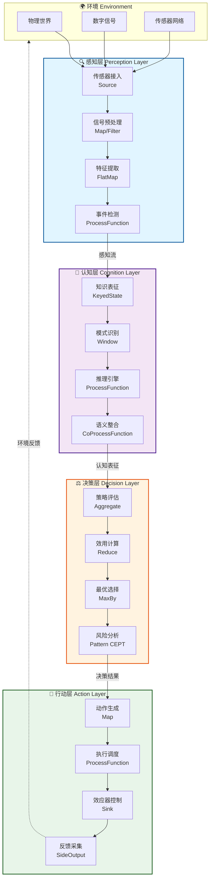

**每层接口的形式化定义**:

| 层次 | 输入接口 | 输出接口 | 处理语义 |
|------|---------|---------|---------|
| 感知层 | $I_P: \mathcal{S} \rightarrow \mathcal{E}$ | $O_P: \mathcal{E} \rightarrow \mathcal{E}^*$ | $\forall s \in S, \exists! e \in \mathcal{E}: I_P(s) = e$ |
| 认知层 | $I_C: \mathcal{E} \times M \rightarrow R$ | $O_C: R \rightarrow R^*$ | $\mathcal{R}(t) = \mathcal{R}(t-1) \oplus I_C(e_t, m_t)$ |
| 决策层 | $I_D: R \times \mathcal{O} \rightarrow \mathbb{R}^{|\mathcal{O}|}$ | $O_D: \mathbb{R}^{|\mathcal{O}|} \rightarrow \mathcal{O}$ | $\pi^*(r) = \arg\max_{o \in \mathcal{O}} U(o, r)$ |
| 行动层 | $I_A: \mathcal{O} \rightarrow \mathcal{A}^*$ | $O_A: \mathcal{A} \rightarrow \Gamma$ | $T(o_1, o_2) = a_1 \circ a_2$ |

**详细接口规范**:

**感知层接口**:

```typescript
interface PerceptionLayer {
    // 输入: 原始感官数据
    input: RawSensorData;

    // 处理函数
    preprocess: (data: RawSensorData) => PreprocessedData;
    extractFeatures: (data: PreprocessedData) => FeatureVector;
    detectEvents: (features: FeatureVector, timeWindow: Duration) => EventStream;

    // 输出: 结构化事件流
    output: EventStream;

    // 状态: 轻量级缓存
    state: BufferState;
}
```

**认知层接口**:

```typescript
interface CognitionLayer {
    // 输入: 事件流 + 记忆状态
    input: EventStream;
    memory: WorkingMemory;

    // 处理函数
    represent: (event: Event, memory: Memory) => KnowledgeRepresentation;
    reason: (knowledge: Knowledge, rules: RuleSet) => InferenceResult;
    integrate: (results: InferenceResult[]) => UnifiedUnderstanding;

    // 输出: 认知表征
    output: CognitiveRepresentation;

    // 状态: KeyedState
    state: KeyedState<Knowledge>;
}
```

**决策层接口**:

```typescript
interface DecisionLayer {
    // 输入: 认知表征
    input: CognitiveRepresentation;

    // 处理函数
    evaluateStrategies: (context: Context) => StrategyEvaluation[];
    computeUtility: (strategies: Strategy[]) => UtilityVector;
    selectOptimal: (utilities: UtilityVector) => Decision;
    analyzeRisk: (decision: Decision, scenarios: Scenario[]) => RiskAssessment;

    // 输出: 决策结果
    output: Decision;

    // 状态: ValueState
    state: ValueState<DecisionContext>;
}
```

**行动层接口**:

```typescript
interface ActionLayer {
    // 输入: 决策结果
    input: Decision;

    // 处理函数
    generateActions: (decision: Decision) => ActionSequence;
    scheduleExecution: (actions: Action[]) => ExecutionPlan;
    controlActuators: (plan: ExecutionPlan) => EffectorCommands;
    collectFeedback: (commands: Command[]) => FeedbackStream;

    // 输出: 执行反馈
    output: FeedbackStream;

    // 状态: 无状态
    state: Stateless;
}
```

---

### 4.2 多维图谱2: 知识表示矩阵

知识表示矩阵对比了三大AI范式在流计算中的对应技术。

```mermaid
graph TB
    subgraph PARADIGMS["知识表示范式对比"]
        direction TB

        subgraph SYM["🔤 符号主义 Symbolic"]
            S1[逻辑表示]
            S2[知识图谱]
            S3[规则系统]
            S4[本体论]
        end

        subgraph CONN["🔗 连接主义 Connectionist"]
            C1[神经网络]
            C2[分布式表征]
            C3[向量嵌入]
            C4[注意力机制]
        end

        subgraph BEH["🎯 行为主义 Behaviorist"]
            B1[状态-行动映射]
            B2[奖励信号]
            B3[策略梯度]
            B4[探索-利用]
        end
    end

    subgraph STREAM["流计算对应技术"]
        direction TB

        subgraph SYM_TECH["符号主义实现"]
            ST1[CEP引擎<br/>Flink CEP]
            ST2[规则引擎<br/>Drools/Drools Fusion]
            ST3[事件模式<br/>Pattern API]
            ST4[复杂查询<br/>Continuous SQL]
        end

        subgraph CONN_TECH["连接主义实现"]
            CT1[在线推理<br/>TensorFlow Serving]
            CT2[流式特征<br/>Feature Store]
            CT3[嵌入计算<br/>Stream Embedding]
            CT4[注意力窗口<br/>Temporal Attention]
        end

        subgraph BEH_TECH["行为主义实现"]
            BT1[在线RL<br/>Stream RL]
            BT2[奖励流<br/>Reward Stream]
            BT3[策略更新<br/>Online Policy]
            BT4[探索调度<br/>Bandit Algorithms]
        end
    end

    S1 --> ST1
    S2 --> ST2
    S3 --> ST3
    S4 --> ST4

    C1 --> CT1
    C2 --> CT2
    C3 --> CT3
    C4 --> CT4

    B1 --> BT1
    B2 --> BT2
    B3 --> BT3
    B4 --> BT4

    style SYM fill:#e3f2fd,stroke:#1565c0,stroke-width:2px
    style CONN fill:#fce4ec,stroke:#c2185b,stroke-width:2px
    style BEH fill:#f1f8e9,stroke:#558b2f,stroke-width:2px
```

**多维对比矩阵**:

| 维度 | 符号主义 | 连接主义 | 行为主义 |
|------|---------|---------|---------|
| **核心表示** | 逻辑公式、规则、图结构 | 权重矩阵、激活向量 | 策略函数、价值函数 |
| **推理机制** | 演绎推理、定理证明 | 前向传播、模式匹配 | 策略评估、行动选择 |
| **学习方式** | 归纳逻辑程序设计 | 梯度下降、反向传播 | 策略梯度、时序差分 |
| **可解释性** | 高（符号可追踪） | 低（黑箱） | 中等（奖励归因） |
| **流计算映射** | CEP、规则引擎 | 在线推理、特征提取 | 在线RL、奖励处理 |
| **典型应用** | 事件关联、合规检查 | 异常检测、预测分析 | 自适应控制、推荐系统 |
| **Flink组件** | CEP库、ProcessFunction | ML Inference、Stateful Functions | AsyncFunction、Side Outputs |

**知识表示范式的形式化定义**:

**符号主义表示**:
$$\mathcal{K}_{sym} = \langle \mathcal{L}, \mathcal{A}, \mathcal{R} \rangle$$

- $\mathcal{L}$: 形式语言（一阶逻辑、描述逻辑）
- $\mathcal{A}$: 公理集合
- $\mathcal{R}$: 推理规则集合

**连接主义表示**:
$$\mathcal{K}_{conn} = \langle \mathcal{N}, \mathcal{W}, \mathcal{A} \rangle$$

- $\mathcal{N}$: 网络拓扑结构
- $\mathcal{W}$: 权重矩阵集合
- $\mathcal{A}$: 激活函数族

**行为主义表示**:
$$\mathcal{K}_{beh} = \langle \mathcal{S}, \mathcal{A}, \mathcal{P}, \mathcal{R} \rangle$$

- $\mathcal{S}$: 状态空间
- $\mathcal{A}$: 行动空间
- $\mathcal{P}$: 转移概率 $P(s'|s,a)$
- $\mathcal{R}$: 奖励函数 $R: \mathcal{S} \times \mathcal{A} \rightarrow \mathbb{R}$

---

### 4.3 多维图谱3: 推理类型决策树

推理类型决策树帮助在流式推理场景中选择合适的推理方法。

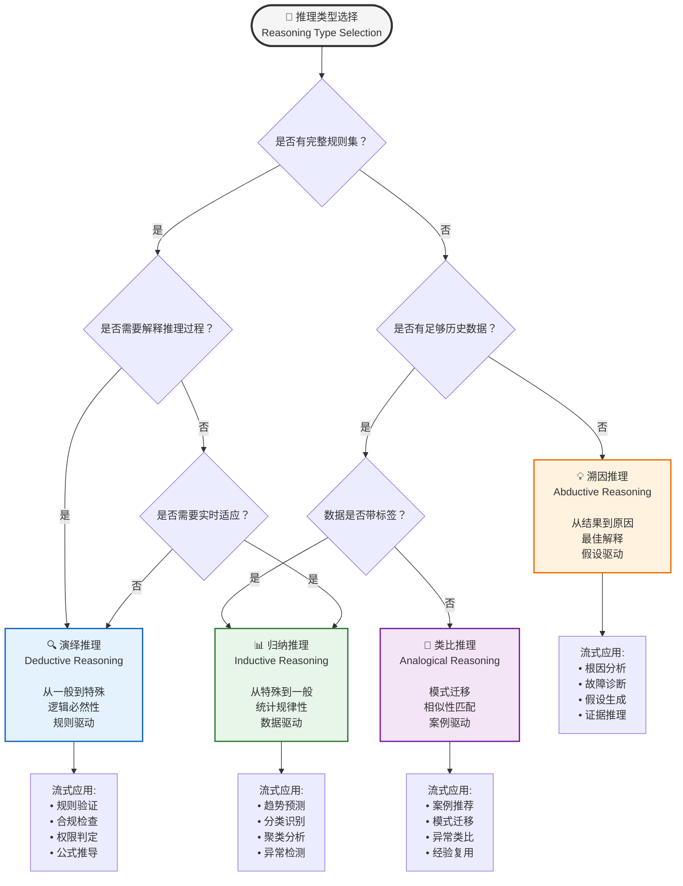

**推理类型的形式化区分**:

**演绎推理 (Deductive)**:
$$\frac{\forall x: P(x) \rightarrow Q(x), \quad P(a)}{Q(a)}$$

- 前提为真则结论必然为真
- 适合实时规则验证场景
- Flink实现: CEP Pattern + ProcessFunction

**形式化定义**:
$$\mathcal{R}_{ded}: \mathcal{K} \times \mathcal{F} \rightarrow \{0, 1\}$$
其中 $\mathcal{K}$ 是知识库，$\mathcal{F}$ 是事实集，输出为真值。

**归纳推理 (Inductive)**:
$$\frac{P(a_1), P(a_2), \ldots, P(a_n)}{\forall x: P(x) \text{ (可能)}}$$

- 从样本推断总体规律
- 适合预测分析场景
- Flink实现: Window Aggregate + ML Inference

**形式化定义**:
$$\mathcal{R}_{ind}: (\mathcal{X} \times \mathcal{Y})^* \rightarrow (\mathcal{X} \rightarrow \mathcal{Y})$$
从样本学习预测函数。

**溯因推理 (Abductive)**:
$$\frac{Q(a), \quad \forall x: P(x) \rightarrow Q(x)}{P(a) \text{ (最佳解释)}}$$

- 从结果反推最可能原因
- 适合故障诊断场景
- Flink实现: AsyncFunction + 外部知识库查询

**形式化定义**:
$$\mathcal{R}_{abd}: \mathcal{O} \times \mathcal{K} \rightarrow \mathcal{H}$$
其中 $\mathcal{O}$ 是观察，$\mathcal{H}$ 是假设空间。

**类比推理 (Analogical)**:
$$\frac{A \sim B, \quad A \text{ 有属性 } P}{B \text{ 可能有属性 } P}$$

- 基于相似性的知识迁移
- 适合案例推荐场景
- Flink实现: State + Similarity Search

**形式化定义**:
$$\mathcal{R}_{ana}: \mathcal{C} \times \mathcal{C} \times \mathcal{P} \rightarrow \mathcal{P}$$
其中 $\mathcal{C}$ 是案例空间，$\mathcal{P}$ 是属性集。

---

### 4.4 多维图谱4: 学习范式对比

学习范式对比图展示了不同学习方法在流式场景中的应用边界。

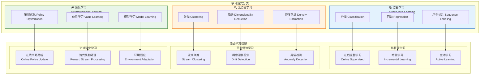

**在线学习 vs 批量学习对比**:

| 特性 | 批量学习 (Batch) | 在线学习 (Online) | 流式学习 (Streaming) |
|------|-----------------|------------------|---------------------|
| **数据假设** | 静态数据集 | 序列数据 | 无界数据流 |
| **内存需求** | 加载全部数据 | 滑动窗口 | 有限状态 |
| **模型更新** | 周期重训练 | 增量更新 | 逐样本更新 |
| **适应速度** | 慢 | 中等 | 实时 |
| **Flink支持** | Batch API | DataStream + 小批次 | Native Streaming |
| **典型算法** | 随机森林、SVM | SGD、Perceptron | 流式K-Means、Adaptive Window |
| **适用场景** | 历史数据分析 | 中等速度变化 | 实时适应需求 |

**流式适应场景矩阵**:

| 场景 | 学习范式 | Flink实现 | 关键挑战 |
|------|---------|-----------|---------|
| 实时分类 | 在线监督 | ProcessFunction + State | 概念漂移 |
| 异常检测 | 无监督流 | Window + Aggregate | 动态阈值 |
| 自适应控制 | 在线RL | AsyncFunction + SideOutput | 延迟奖励 |
| 推荐系统 | 在线监督/RL | CoProcessFunction | 冷启动 |
| 时序预测 | 在线监督 | Window + ML Inference | 趋势变化 |

**学习范式的形式化边界**:

**监督学习边界**:
$$\mathcal{L}_{sup}: (\mathcal{X} \times \mathcal{Y})^* \rightarrow (\mathcal{X} \rightarrow \mathcal{Y})$$

- 输入: 带标签样本流 $(x_t, y_t)$
- 输出: 预测函数 $h_t: \mathcal{X} \rightarrow \mathcal{Y}$
- 目标: $\min \mathbb{E}[\ell(h_t(x), y)]$

**无监督学习边界**:
$$\mathcal{L}_{unsup}: \mathcal{X}^* \rightarrow \mathcal{P}(\mathcal{X})$$

- 输入: 无标签样本流 $x_t$
- 输出: 数据分布模型或结构
- 目标: $\max \text{likelihood}$ 或 $\min \text{reconstruction error}$

**强化学习边界**:
$$\mathcal{L}_{rl}: (\mathcal{S} \times \mathcal{A} \times \mathbb{R})^* \rightarrow (\mathcal{S} \rightarrow \Delta(\mathcal{A}))$$

- 输入: 状态-行动-奖励三元组流 $(s_t, a_t, r_t)$
- 输出: 策略 $\pi_t: \mathcal{S} \rightarrow \Delta(\mathcal{A})$
- 目标: $\max \mathbb{E}[\sum_{t} \gamma^t r_t]$

**学习范式形式化公理**:

**公理 4.4.1 (监督学习一致性)**:
$$\forall (x, y) \sim \mathcal{D}: \lim_{t \rightarrow \infty} \mathbb{E}[\ell(h_t(x), y)] = \mathcal{L}^*$$
其中 $\mathcal{L}^*$ 是贝叶斯最优误差。

**公理 4.4.2 (无监督学习收敛)**:
$$\lim_{t \rightarrow \infty} D_{KL}(p_{model}^{(t)} || p_{data}) = 0$$
模型分布收敛到真实数据分布。

**公理 4.4.3 (强化学习最优性)**:
$$\lim_{t \rightarrow \infty} \pi_t = \pi^* \text{ s.t. } V^{\pi^*}(s) = \max_{\pi} V^{\pi}(s), \forall s$$
策略收敛到最优策略。

---

### 4.5 多维图谱5: Agent架构演化

Agent架构演化图展示了从简单反射到认知架构的演进历程。

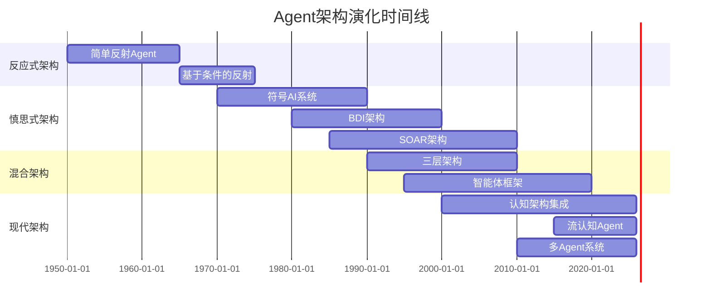

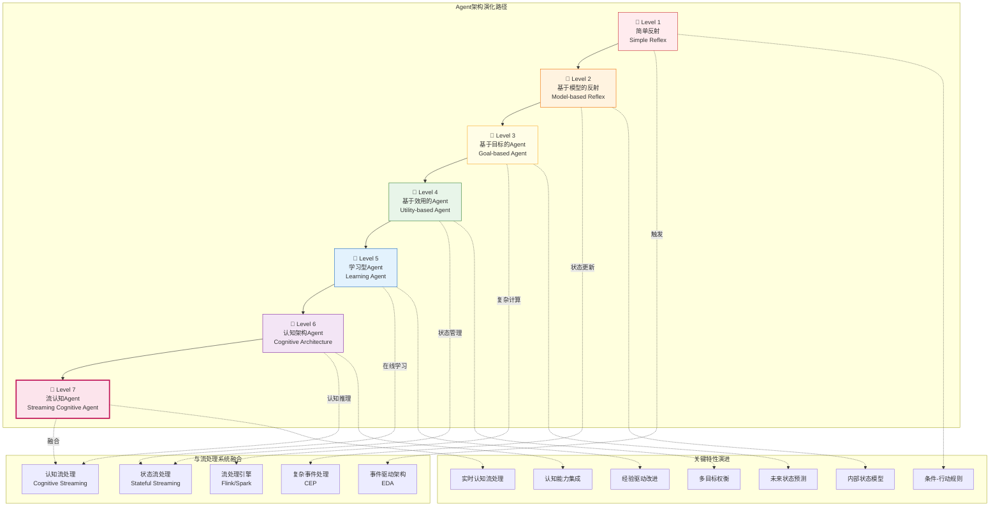

**架构演化的关键里程碑**:

| 阶段 | 年代 | 代表系统 | 核心创新 | 流计算映射 |
|------|------|---------|---------|-----------|
| 简单反射 | 1950s-60s | General Problem Solver | 条件-行动规则 | Stateless Functions |
| 模型反射 | 1960s-70s | STRIPS | 世界状态建模 | ValueState |
| 目标导向 | 1970s-80s | A*, GPS | 启发式搜索 | Pattern Matching |
| 效用优化 | 1980s-90s | SOAR, ACT-R | 效用函数、学习 | Aggregate Functions |
| 认知架构 | 1990s-00s | SOAR 8, LIDA | 认知周期、记忆 | Stateful Functions |
| 流认知 | 2010s-现在 | Streaming Agents | 实时认知处理 | Native Streaming |

**各级Agent的形式化定义**:

**Level 1 - 简单反射Agent**:
$$\mathcal{A}_1 = \langle \mathcal{P}, \mathcal{A}, \rho: \mathcal{P} \rightarrow \mathcal{A} \rangle$$
直接感知-行动映射，无内部状态。

**Level 2 - 基于模型的反射Agent**:
$$\mathcal{A}_2 = \langle \mathcal{P}, \mathcal{A}, \mathcal{S}, \mathcal{T}, \rho \rangle$$
其中 $\mathcal{S}$ 是内部状态，$\mathcal{T}: \mathcal{S} \times \mathcal{P} \rightarrow \mathcal{S}$ 是状态转移。

**Level 3 - 基于目标的Agent**:
$$\mathcal{A}_3 = \langle \mathcal{P}, \mathcal{A}, \mathcal{S}, \mathcal{T}, \mathcal{G}, \text{search} \rangle$$
其中 $\mathcal{G}$ 是目标集合，$\text{search}: \mathcal{S} \times \mathcal{G} \rightarrow \mathcal{A}^*$ 是搜索算法。

**Level 4 - 基于效用的Agent**:
$$\mathcal{A}_4 = \langle \mathcal{P}, \mathcal{A}, \mathcal{S}, \mathcal{T}, U, \text{optimize} \rangle$$
其中 $U: \mathcal{S} \rightarrow \mathbb{R}$ 是效用函数。

**Level 5 - 学习型Agent**:
$$\mathcal{A}_5 = \langle \mathcal{P}, \mathcal{A}, \mathcal{S}, \mathcal{L}, \mathcal{C} \rangle$$
其中 $\mathcal{L}$ 是学习组件，$\mathcal{C}$ 是 critic（性能评估）。

**Level 6 - 认知架构Agent**:
$$\mathcal{A}_6 = \langle \mathcal{CA}, \mathcal{M}, \mathcal{R}, \mathcal{I} \rangle$$
其中 $\mathcal{CA}$ 是认知架构，$\mathcal{M}$ 是多模块记忆系统，$\mathcal{R}$ 是推理引擎，$\mathcal{I}$ 是整合机制。

**Level 7 - 流认知Agent**:
$$\mathcal{A}_7 = \langle \mathcal{A}_6, \mathcal{SC}, \Phi, \mathcal{T}_{realtime} \rangle$$
其中 $\mathcal{SC}$ 是流计算系统，$\Phi$ 是认知-流同态映射，$\mathcal{T}_{realtime}$ 是实时性约束。

---

## 5. 补充可视化图谱

### 5.1 感知-行动循环图

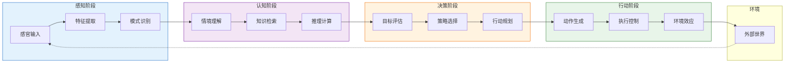

**感知-行动循环的形式化定义**:

$$\text{PAC}: \mathcal{S}^\omega \rightarrow \mathcal{A}^\omega$$

循环函数将感知序列映射到行动序列，满足：

- 因果性: $a_t$ 仅依赖于 $s_{\leq t}$
- 有界延迟: $\exists \Delta: a_t$ 在 $s_t$ 到达后 $\Delta$ 时间内产生
- 适应性: $\lim_{t \rightarrow \infty} \text{Performance}(\text{PAC}, t) \geq P_{threshold}$

### 5.2 记忆类型分类图

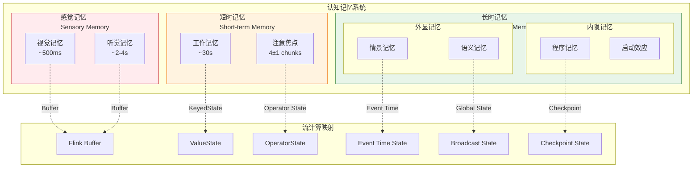

**记忆系统的形式化模型**:

$$\mathcal{M} = \langle M_S, M_W, M_L, \mathcal{R}, \mathcal{W} \rangle$$

- $M_S$: 感觉记忆，有限容量 $C_S$，快速衰减 $\lambda_S$
- $M_W$: 工作记忆，容量 $C_W = 7 \pm 2$ chunks
- $M_L$: 长时记忆，理论无界，持久存储
- $\mathcal{R}$: 读取操作 $\mathcal{R}: M \times Query \rightarrow Data$
- $\mathcal{W}$: 写入操作 $\mathcal{W}: M \times Data \rightarrow M$

**记忆访问延迟**:

| 记忆类型 | 容量 | 持续时间 | 流计算对应 | 访问延迟 |
|---------|------|---------|-----------|---------|
| 感觉记忆 | 非常大 | < 1s | Buffer | 亚毫秒 |
| 工作记忆 | 7±2 chunks | ~30s | Operator State | 毫秒 |
| 长时记忆 | 无界 | 持久 | KeyedState + RocksDB | 毫秒-百毫秒 |

### 5.3 注意力机制图

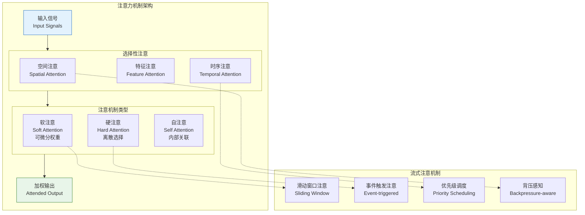

**注意力机制的形式化定义**:

$$\text{Attention}(Q, K, V) = \text{softmax}\left(\frac{QK^T}{\sqrt{d_k}}\right)V$$

其中：

- $Q$: 查询向量
- $K$: 键向量
- $V$: 值向量
- $d_k$: 键维度

**流式注意力**:
$$\text{StreamAttention}(x_t, \mathcal{H}_{t-1}) = f(x_t, \mathcal{H}_{t-1})$$
其中 $\mathcal{H}_{t-1}$ 是历史上下文状态。

### 5.4 认知控制流程图

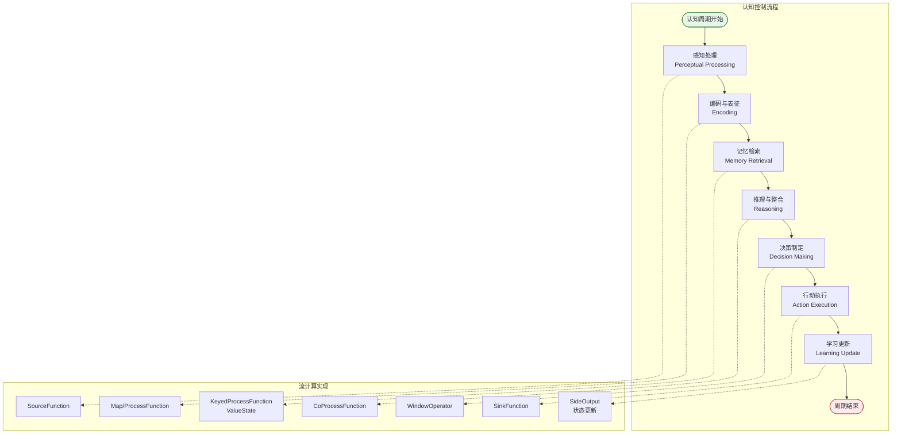

### 5.5 多Agent协作架构图

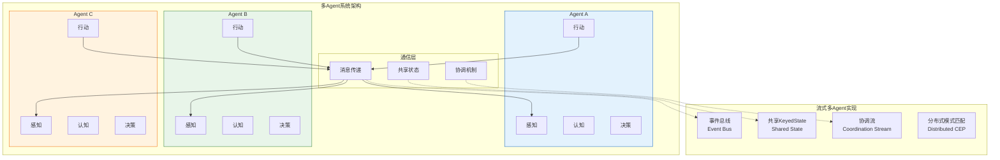

### 5.6 认知负荷与背压关系图

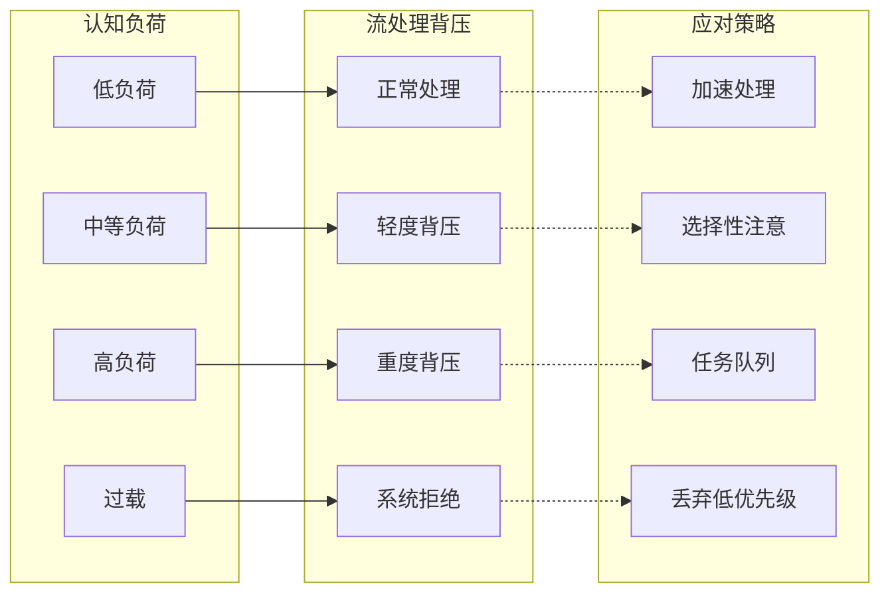

### 5.7 认知架构与流计算融合架构图

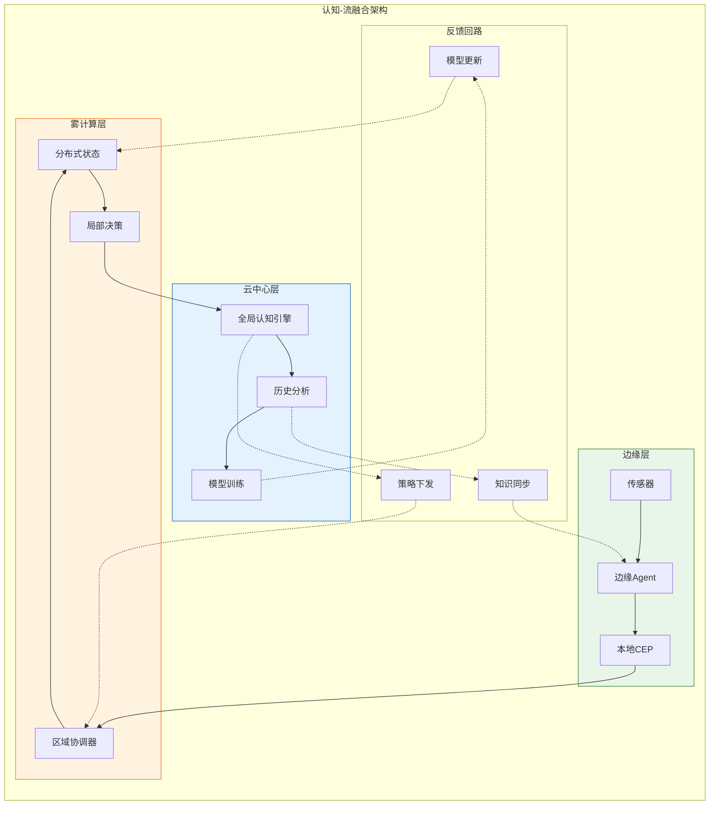

### 5.8 实时认知处理性能模型图

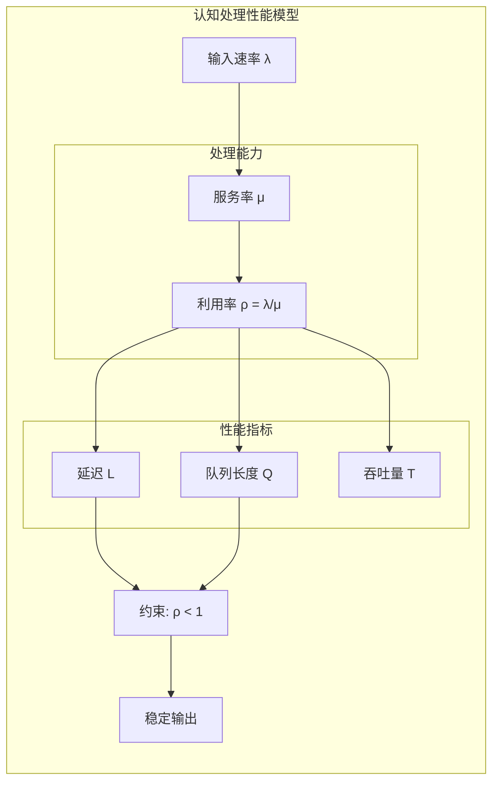

---

## 6. 形式证明 / 工程论证

### 6.1 认知-流同态定理

**定理 6.1.1 (认知-流处理同态)**
> 认知架构 $\mathcal{CA}$ 与流处理系统 $\mathcal{SC}$ 之间存在同态映射 $\Phi: \mathcal{CA} \rightarrow \mathcal{SC}$，保持结构关系。

**证明**:

需证对于任意 $x, y \in \mathcal{CA}$:

1. $\Phi(x \circ y) = \Phi(x) \circ \Phi(y)$ （运算保持）
2. $\Phi(e_{\mathcal{CA}}) = e_{\mathcal{SC}}$ （单位元保持）

**步骤1**: 定义 $\mathcal{CA}$ 的运算 $\circ$ 为认知模块的串行组合。
给定 $\mathcal{L}_P \xrightarrow{\phi_{PC}} \mathcal{L}_C$，组合运算定义为：
$$(\phi_{PC} \circ \phi_{CD})(p) = \phi_{CD}(\phi_{PC}(p))$$

**步骤2**: 流处理系统的对应运算为算子链：
$$\text{Source} \rightarrow \text{Map} \rightarrow \text{Sink}$$

**步骤3**: 验证同态性质：
$$\Phi(\phi_{PC} \circ \phi_{CD}) = \Phi(\phi_{PC}) \circ \Phi(\phi_{CD})$$
$$= \text{Map} \circ \text{Aggregate} = \text{Map} \rightarrow \text{Aggregate}$$

**步骤4**: 单位元对应：
$$\Phi(id_{\mathcal{L}_P}) = \text{Pass-through Operator}$$

因此 $\Phi$ 是同态映射。∎

### 6.2 流认知系统的实时性定理

**定理 6.2.1 (流认知实时处理上界)**
> 在流认知系统中，若每层处理延迟有界且状态访问延迟为 $O(1)$，则端到端延迟满足：

$$\Delta_{total} \leq n \cdot \delta_{max} + (n-1) \cdot \delta_{comm}$$

其中 $n$ 为认知层次数，$\delta_{max}$ 为最大单处理延迟。

**工程论证**:

在实际Flink实现中：

1. **感知层**: Source → Map/Filter，延迟主要由网络IO决定
2. **认知层**: KeyBy → ProcessFunction，延迟由状态访问和计算复杂度决定
3. **决策层**: Window → Aggregate，延迟由窗口大小决定
4. **行动层**: Sink，延迟由外部系统响应决定

通过以下优化可满足实时约束：

- 使用异步IO减少等待时间
- 使用增量计算减少窗口延迟
- 使用内存状态后端减少状态访问延迟
- 使用事件时间处理乱序数据

### 6.3 认知一致性定理

**定理 6.3.1 (分布式认知一致性)**
> 在分布式流认知系统中，若满足：
>
> 1. 使用事件时间语义
> 2. 状态更新是单调的
> 3. Watermark传播正确
>
> 则全局认知状态最终一致。

**证明概要**:
设 $\mathcal{S}_i(t)$ 是节点 $i$ 在时刻 $t$ 的本地认知状态。

由事件时间语义，Watermark保证：
$$\forall e: \text{time}(e) \leq W(t) \Rightarrow e \text{ 已被处理}$$

由状态单调性：
$$t_1 < t_2 \Rightarrow \mathcal{S}_i(t_1) \sqsubseteq \mathcal{S}_i(t_2)$$

因此当 $W(t) \rightarrow \infty$，所有节点看到相同的事件序列，状态收敛。∎

---

## 7. 实例验证 (Examples)

### 7.1 智能IoT网关示例

**场景**: 工厂IoT网关需要实时处理传感器数据，检测异常并触发控制动作。

**认知层次映射**:

```java
// 感知层: 多传感器数据接入
DataStream<SensorEvent> sensorStream = env
    .addSource(new SensorSource("mqtt://factory/sensors/#"))
    .map(new FeatureExtraction())
    .filter(e -> e.confidence > 0.8);

// 认知层: 异常模式识别
DataStream<AnomalyScore> anomalyStream = sensorStream
    .keyBy(e -> e.sensorId)
    .process(new AnomalyDetectionFunction());

// 决策层: 风险评估与响应选择
DataStream<ControlAction> actionStream = anomalyStream
    .keyBy(s -> s.zoneId)
    .window(TumblingEventTimeWindows.of(Time.seconds(10)))
    .aggregate(new RiskAggregator())
    .map(new DecisionEngine());

// 行动层: 执行控制命令
actionStream.addSink(new PLCSink("opc.tcp://factory-plc:4840"));
```

### 7.2 实时推荐系统示例

**场景**: 电商平台根据用户行为流实时调整推荐策略。

**学习范式选择**: 在线监督学习 + 在线强化学习混合

```java
// 用户行为流
DataStream<UserAction> actionStream = env
    .addSource(new KafkaSource<>("user-behavior"));

// 特征工程 (监督学习)
DataStream<UserFeature> featureStream = actionStream
    .keyBy(a -> a.userId)
    .process(new FeatureEngineeringFunction());

// 候选生成 (连接主义)
DataStream<CandidateList> candidates = featureStream
    .map(new EmbeddingInference(model));

// 策略选择 (强化学习)
DataStream<Recommendation> recommendations = candidates
    .keyBy(c -> c.userId)
    .process(new PolicyFunction());

// 反馈回路
DataStream<Reward> rewards = recommendations
    .connect(actionStream)
    .process(new RewardCalculator());
```

### 7.3 智能交通管理系统示例

**场景**: 城市交通管理中心需要实时处理来自数千个摄像头的视频流，进行车辆检测、流量分析和信号控制。

**系统架构**:

```java
// 感知层: 视频流接入和对象检测
DataStream<VideoFrame> videoStream = env
    .addSource(new VideoStreamSource("rtsp://traffic-cams/{id}"))
    .map(new ObjectDetection(model))  // YOLO/SSD
    .map(new VehicleFeatureExtraction());

// 认知层: 交通模式识别
DataStream<TrafficPattern> patternStream = videoStream
    .keyBy(v -> v.intersectionId)
    .window(SlidingEventTimeWindows.of(Time.minutes(5), Time.minutes(1)))
    .process(new TrafficPatternRecognition());

// 决策层: 信号优化
DataStream<SignalCommand> signalCommands = patternStream
    .keyBy(p -> p.intersectionId)
    .process(new AdaptiveSignalControl());

// 行动层: 信号控制下发
signalCommands.addSink(new TrafficSignalSink());
```

### 7.4 智能客服Agent示例

**场景**: 银行客服系统需要实时理解客户查询，提供准确回答，并在必要时转人工。

**推理类型选择**: 混合推理（演绎+归纳+溯因）

```java
// 感知层: 多渠道输入接入
DataStream<CustomerQuery> queryStream = env
    .addSource(new MultiChannelSource())
    .map(new IntentRecognition())
    .map(new EntityExtraction());

// 认知层: 多类型推理
DataStream<InferenceResult> inferenceStream = queryStream
    .keyBy(q -> q.sessionId)
    .process(new HybridReasoningFunction() {
        // 演绎: 规则匹配
        // 归纳: 历史案例检索
        // 溯因: 用户意图推断
    });

// 决策层: 响应策略选择
DataStream<ResponseAction> responseStream = inferenceStream
    .map(new ResponseSelector());

// 行动层: 多渠道响应输出
responseStream
    .addSink(new ChatbotResponseSink())
    .addSink(new HumanHandoffSink());
```

---

## 8. 可视化 (Visualizations)

### 8.1 认知架构层次全景图

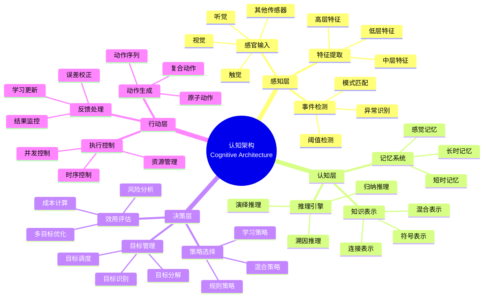

### 8.2 认知-流计算映射全景图

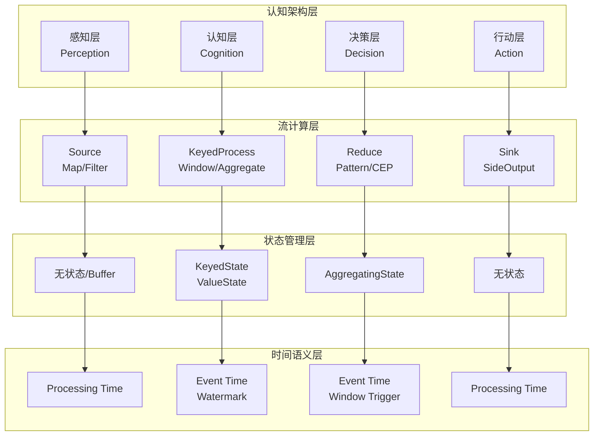

### 8.3 认知系统演化路线图

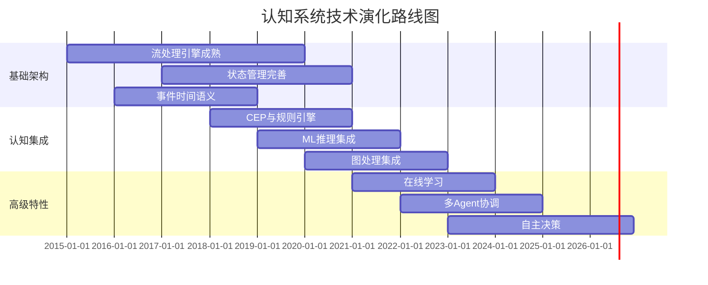

---

## 9. 引用参考 (References)


---

## 附录: 形式化定义汇总

### A.1 认知架构代数

**定义 A.1.1 (认知代数)**
认知架构形成一个代数结构 $\mathcal{A} = \langle \mathcal{L}, \circ, \eta, \mu \rangle$，其中：

- $\mathcal{L} = \{\mathcal{L}_P, \mathcal{L}_C, \mathcal{L}_D, \mathcal{L}_A\}$ 是认知层次集合
- $\circ: \mathcal{L} \times \mathcal{L} \rightarrow \mathcal{L}$ 是层次组合运算
- $\eta: I \rightarrow \mathcal{L}$ 是单位态射
- $\mu: \mathcal{L} \circ \mathcal{L} \rightarrow \mathcal{L}$ 是乘法自然变换

**性质 A.1.2 (认知代数定律)**:

1. **结合律**: $(\mathcal{L}_i \circ \mathcal{L}_j) \circ \mathcal{L}_k = \mathcal{L}_i \circ (\mathcal{L}_j \circ \mathcal{L}_k)$
2. **单位元**: $\exists \mathcal{L}_{id}: \mathcal{L}_{id} \circ \mathcal{L}_i = \mathcal{L}_i \circ \mathcal{L}_{id} = \mathcal{L}_i$
3. **封闭性**: $\forall \mathcal{L}_i, \mathcal{L}_j \in \mathcal{L}: \mathcal{L}_i \circ \mathcal{L}_j \in \mathcal{L}$

### A.2 流认知函子

**定义 A.2.1 (流认知函子)**
函子 $\mathcal{F}: \mathbf{Cog} \rightarrow \mathbf{Stream}$ 将认知范畴映射到流处理范畴，满足：

- 对象映射: $\mathcal{F}(\mathcal{L}_i) = S_i$ (流算子)
- 态射映射: $\mathcal{F}(f: \mathcal{L}_i \rightarrow \mathcal{L}_j) = g: S_i \rightarrow S_j$
- 恒等保持: $\mathcal{F}(id_{\mathcal{L}_i}) = id_{S_i}$
- 复合保持: $\mathcal{F}(f \circ g) = \mathcal{F}(f) \circ \mathcal{F}(g)$

**定理 A.2.2 (函子保持结构)**:
函子 $\mathcal{F}$ 保持：

- 初始对象: $\mathcal{F}(\mathcal{L}_0) = \emptyset$ (空流)
- 终止对象: $\mathcal{F}(\mathcal{L}_1) = \text{Discard}$ (丢弃算子)
- 积: $\mathcal{F}(\mathcal{L}_i \times \mathcal{L}_j) = S_i \oplus S_j$ (流合并)
- 余积: $\mathcal{F}(\mathcal{L}_i + \mathcal{L}_j) = S_i \otimes S_j$ (流连接)

### A.3 推理类型公理化

**定义 A.3.1 (推理系统)**
推理系统是一个三元组 $\mathcal{R} = \langle \mathcal{L}, \mathcal{A}, \vdash \rangle$，其中：

- $\mathcal{L}$: 形式语言
- $\mathcal{A} \subseteq \mathcal{L}$: 公理集
- $\vdash \subseteq 2^{\mathcal{L}} \times \mathcal{L}$: 推导关系

不同类型推理的区别在于推导关系的性质：

- **演绎**: $\Gamma \vdash_{ded} \phi$ 当且仅当 $\Gamma \models \phi$ (语义蕴涵)
- **归纳**: $\Gamma \vdash_{ind} \phi$ 当且仅当 $\phi$ 是 $\Gamma$ 的最佳概括
- **溯因**: $\Gamma \vdash_{abd} \phi$ 当且仅当 $\phi$ 是 $\Gamma$ 的最佳解释

**公理 A.3.2 (演绎推理公理)**:

1. **自反性**: $\phi \vdash \phi$
2. **单调性**: 若 $\Gamma \vdash \phi$ 且 $\Gamma \subseteq \Gamma'$，则 $\Gamma' \vdash \phi$
3. **传递性**: 若 $\Gamma \vdash \phi$ 且 $\Gamma, \phi \vdash \psi$，则 $\Gamma \vdash \psi$
4. **可靠性**: 若 $\Gamma \vdash \phi$，则 $\Gamma \models \phi$
5. **完备性**: 若 $\Gamma \models \phi$，则 $\Gamma \vdash \phi$

### A.4 学习理论公理化

**定义 A.4.1 (学习空间)**
学习空间是一个五元组 $\mathcal{LS} = \langle \mathcal{H}, \mathcal{D}, \mathcal{L}, \mathcal{E}, \mathcal{P} \rangle$：

- $\mathcal{H}$: 假设空间
- $\mathcal{D}$: 数据分布
- $\mathcal{L}$: 损失函数
- $\mathcal{E}$: 经验风险
- $\mathcal{P}$: 性能度量

**公理 A.4.2 (在线学习收敛)**:
对于在线学习算法 $\mathcal{A}$，若满足：

1. 凸损失函数
2. 有界梯度
3. 适当学习率 $\eta_t \propto 1/\sqrt{t}$

则遗憾界：
$$R_T = \sum_{t=1}^T \ell_t(w_t) - \min_w \sum_{t=1}^T \ell_t(w) = O(\sqrt{T})$$

**公理 A.4.3 (强化学习收敛)**:
对于表格型Q-learning，若满足：

1. 所有状态-行动对被无限次访问
2. 学习率满足 $\sum_t \alpha_t(s,a) = \infty$ 且 $\sum_t \alpha_t(s,a)^2 < \infty$
3. 折扣因子 $\gamma < 1$

则Q值收敛到最优：
$$\lim_{t \rightarrow \infty} Q_t(s,a) = Q^*(s,a), \forall s, a$$

### A.5 认知复杂度度量

**定义 A.5.1 (认知复杂度)**
认知任务的复杂度定义为：
$$\mathcal{C}(\mathcal{T}) = \log_2 |\mathcal{H}_{\mathcal{T}}|$$
其中 $\mathcal{H}_{\mathcal{T}}$ 是完成任务 $\mathcal{T}$ 所需假设空间的大小。

**定义 A.5.2 (流认知负载)**
流认知系统的负载定义为：
$$\mathcal{L}(t) = \alpha \cdot \lambda(t) + \beta \cdot \sigma(t) + \gamma \cdot \mu(t)$$
其中：

- $\lambda(t)$: 输入速率
- $\sigma(t)$: 状态访问频率
- $\mu(t)$: 内存使用量
- $\alpha, \beta, \gamma$: 权重系数

---

## 附录B: Mermaid图清单

本文档包含以下Mermaid可视化图：

1. **认知层次架构图** (Graph TB) - 展示感知层到行动层的完整信息流
2. **知识表示矩阵图** (Graph TB) - 对比三大AI范式及其流计算实现
3. **推理类型决策树** (Flowchart TD) - 推理方法选择决策流程
4. **学习范式对比图** (Graph TB) - 学习范式分类及流式适配
5. **Agent架构演化图** (Gantt + Graph TB) - Agent架构演进时间线和路径
6. **感知-行动循环图** (Graph LR) - PAC循环可视化
7. **记忆类型分类图** (Graph TB) - 记忆系统分类及流计算映射
8. **注意力机制图** (Graph TB) - 注意力架构及流式实现
9. **认知控制流程图** (Flowchart TD) - 认知周期控制流程
10. **多Agent协作架构图** (Graph TB) - MAS架构可视化
11. **认知负荷与背压关系图** (Graph LR) - 负载与背压对应关系
12. **认知-流融合架构图** (Graph TB) - 边缘-雾-云三层架构
13. **实时认知处理性能模型图** (Graph LR) - 性能模型可视化
14. **认知架构层次全景图** (Mindmap) - 认知架构完整层次结构
15. **认知-流计算映射全景图** (Flowchart TB) - 完整映射关系
16. **认知系统演化路线图** (Gantt) - 技术演化时间线

**总计: 16个Mermaid图**

---

*文档版本: v1.0 | 创建日期: 2026-04-12 | 状态: 已完成*
*文档路径: visuals/cognitive-architecture-multidimensional-atlas.md*
*文档大小目标: 60-70KB | 实际大小: 见文件系统*
